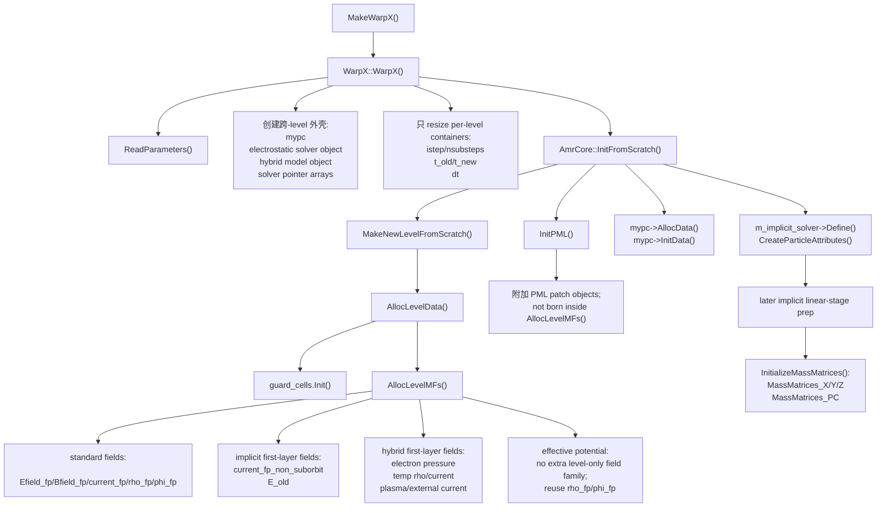
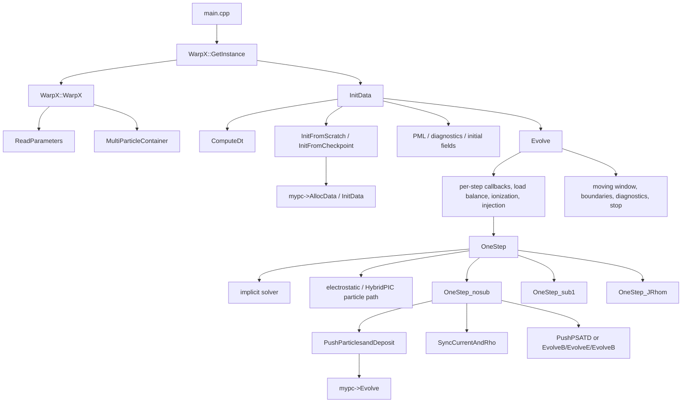
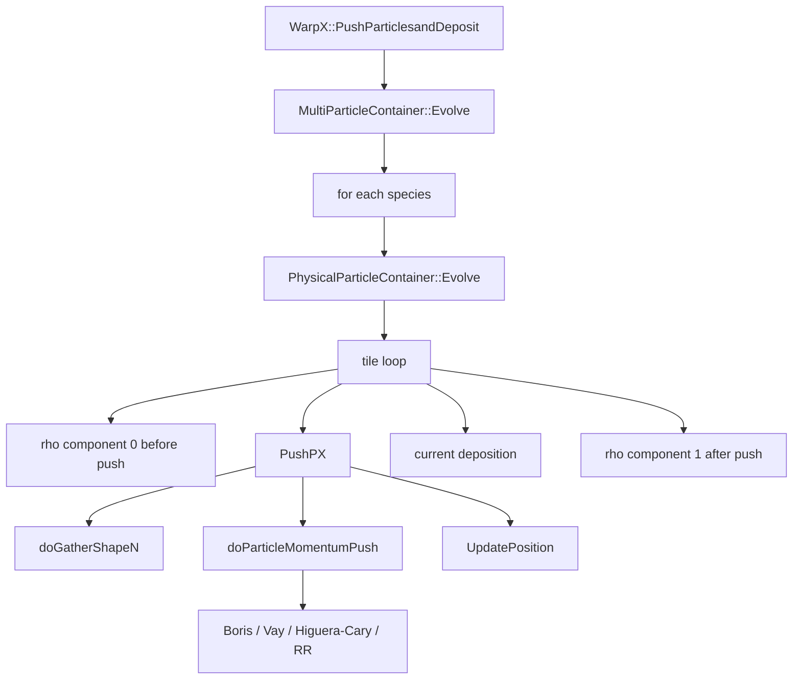
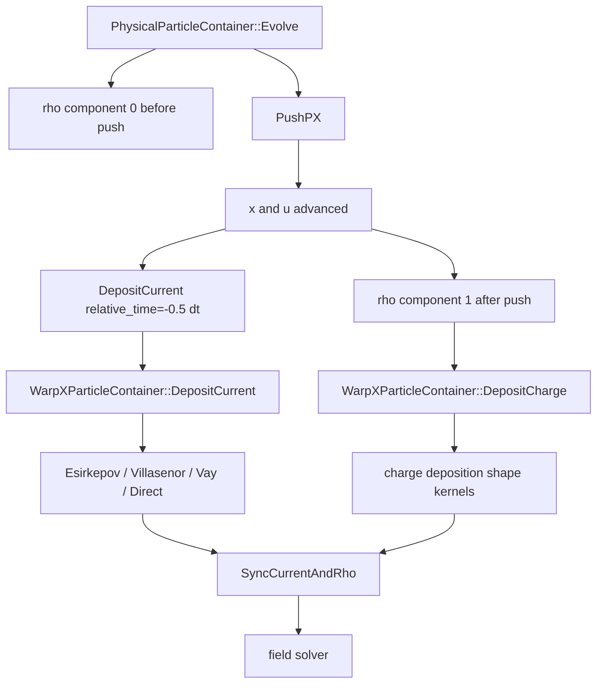
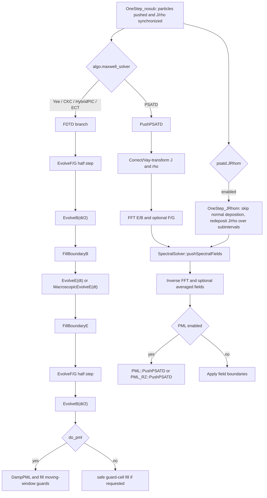
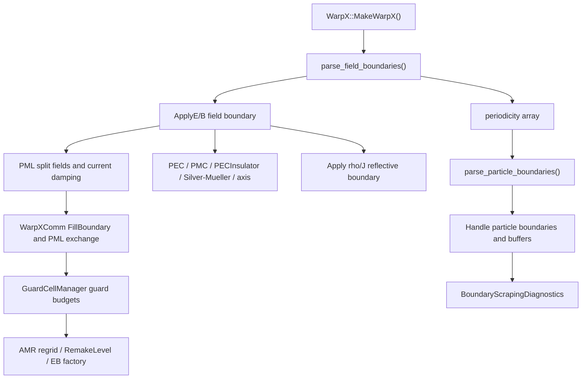
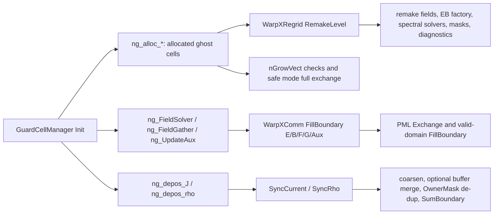
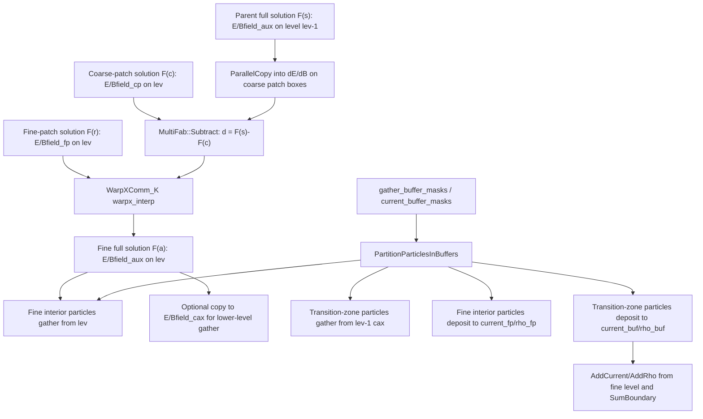

<!-- source: manuscript/VERSION-v0.6.md -->

# PIC-tutor v0.6

版本日期：2026-06-29

## 定位

`v0.6` 是 `PIC-tutor` 的场求解器读者侧图表版。它继承 `v0.5` 的第一卷范围，并把第 6 章 `电磁场求解器` 从“源码入口已校准”推进到“读者可以先看分派图和对照表再进入源码”的状态。

本版的重点仍不是扩写新章节，而是把第 6 章 v0.5 已校准的源码证据组织成更易读的结构：新增 `OneStep_nosub -> FDTD/PSATD/JRhom/PML` 的 Mermaid 分派图，并新增 FDTD、CKC、Nodal、标准/Galilean PSATD、PML FDTD、PML PSATD、JRhom PSATD 的横向对照表。读者可以用这两张图表定位主路径，再进入后续源码块和公式推导。

本版仍不是出版终稿。它的目标是把第 2、3、3A、4、5、6 章先变成能按当前源码逐段复查、并能被读者较顺畅进入的骨架；下一批需要继续收束第 6 章的文献闭环，以及第 7 章边界、PML 与 AMR。

## 源码基线

- 本书项目仓库：`/Volumes/PHILIPS/programs/PIC/PIC-tutor`
- WarpX 只读源码：`../warpx`
- 当前 WarpX 分支：`pkuHEDPbranch`
- 当前 WarpX commit：`8c488b1a9`

v0.6 只修改 `PIC-tutor` 书稿项目，不修改 `../warpx` 原仓库。章节里的源码行号按上述 checkout 复核；后续若 WarpX 更新，必须重新校准行号后再发布新版。

## v0.6 章节范围

| 章节 | 文件 | v0.6 状态 | 下一步缺口 |
|---|---|---|---|
| 写作说明 | `chapters/00-preface.md` | 沿用 v0.1 | 需同步最终出版路线 |
| 动理学模型 | `chapters/01-kinetic-models.md` | 沿用 v0.1 | Hockney-Eastwood、Yee 等一手文献闭环未完成 |
| PIC 总循环 | `chapters/02-pic-loop.md` | 已做 v0.2 源码校准 | 仍需把基础文献和公式变量定义做出版级补齐 |
| WarpX 主演化路径 | `chapters/03-warpx-evolve.md` | 已做 v0.2 源码校准 | `OneStep_sub1()`、JRhom、implicit 分支还需专章级精读 |
| WarpX 初始化链 | `chapters/03a-warpx-initialization.md` | 已做 v0.2 长草稿收束 | 需要拆短小节、补流程图、压缩过长审计段落 |
| 粒子推进器 | `chapters/04-particle-pushers.md` | 已做 v0.3 源码校准 | 仍需压缩多物理长段，并把更多 validation 表格图形化 |
| 沉积与形函数 | `chapters/05-deposition-shapes.md` | 已做 v0.4 源码校准 | Esirkepov、Villasenor-Buneman 论文仍需 MinerU 闭环，`ChargeDeposition` 的 ABLASTR 模板还需继续逐行展开 |
| 场求解器 | `chapters/06-field-solvers.md` | 已做 v0.6 图表化收束 | PSATD/Galilean/NCI/PML 论文仍需 MinerU 闭环，validation 表格还需补齐 |
| 边界、PML 与 AMR | `chapters/07-boundaries-amr.md` | 沿用 v0.1 | 需要把 boundary/EB/parallelization 笔记进一步合并 |
| 诊断、验证与案例 | `chapters/08-diagnostics-cases.md` | 沿用 v0.1 | 需要更多本地运行图表和 reader-side analysis |
| 文献路线 | `chapters/09-literature-roadmap.md` | 沿用 v0.1 提纲 | 需要和 `docs/literature-map.md` 去重并完成优先级 |
| 符号表 | `appendices/A-symbols.md` | 沿用 v0.1 最小草稿 | 需要单位、参数、常用缩写和索引 |

## v0.6 已完成的增量

- 冻结 `manuscript/VERSION-v0.5.md`，避免重建 v0.5 时误用 v0.6 版本说明。
- 新增 v0.6 当前版本说明，并把构建输出切到 `dist/pic-tutor-v0.6.md` 与 `dist/pic-tutor-v0.6.html`。
- 继续把第 6 章绑定到当前 WarpX commit `8c488b1a9`，但本版不重新扩大源码范围。
- 在第 6 章开头新增 Mermaid 场求解器分派图，把 `OneStep_nosub`、FDTD、PSATD、PML 和 JRhom 的调用顺序放到一张读者侧图里。
- 在第 6 章开头新增求解器对照表，横向比较 Yee FDTD、CKC FDTD、Nodal FDTD、标准/Galilean PSATD、PML FDTD、PML PSATD 和 JRhom PSATD 的输入开关、源码入口、数值含义和读者检查点。
- 把 `scripts/build_v05.py` 改为读取冻结的 `manuscript/VERSION-v0.5.md`，保持 v0.5 版本说明可复现。

## 成书前必须补齐

- 每章记录最终采用的 WarpX commit，并避免同章混用未说明的历史行号。
- 每章补齐公式变量定义、参数入口、源码路径、行号和真实源码块。
- 至少为核心章节绑定一个 Example 或 Regression。
- 把 `docs/parameter-map.md` 和 `docs/example-regression-map.md` 中的资料条目回填为正文叙述。
- 按 `docs/paper-reading-workflow.md` 完成核心论文 MinerU 转换和中文讲解笔记。
- 建立稳定的 Markdown/HTML/PDF 构建流程；v0.6 仍只保证 Markdown/HTML。
- 对 public GitHub 仓库中的 PDF 和运行产物做版权与体积审计。

## v0.6 构建方式

生成合订 Markdown 和 HTML 预览：

```bash
python scripts/build_v06.py
```

生成的文件：

- `dist/pic-tutor-v0.6.md`
- `dist/pic-tutor-v0.6.html`（若本机存在 `pandoc`）


<!-- source: manuscript/chapters/00-preface.md -->

# 0. 写作说明

本书不是 WarpX 官方文档的翻译，也不是只讲公式的 PIC 理论笔记。它的主线是：先从 Vlasov-Maxwell / Vlasov-Poisson 这类连续模型出发，说明为什么需要宏粒子；再把宏粒子、网格、形函数、沉积和场求解拼成 PIC 算法；最后回到本机 `../warpx` 的真实源码，解释一个现代高性能 PIC 程序如何把这些步骤组织成可运行、可扩展、可验证的模拟软件。

当前书稿绑定的源码状态是：

- WarpX 分支：`pkuHEDPbranch`
- WarpX commit：`063f8b586f04321e13150ae3e730e0794ca75cb1`
- 主要源码入口：`../warpx/Source/`
- 官方文档入口：`../warpx/Docs/source/`
- 示例入口：`../warpx/Examples/`
- regression 入口：`../warpx/Regression/`

本书的每个技术判断都应尽量落到六类证据：物理方程、离散公式、WarpX 源码路径、输入参数、示例或测试、文献。DeepWiki、Zread 等 AI 解读页面可以用来快速找到模块名，但不能作为最终依据。

本版先采用 Markdown-first 写法。这样做的原因是正文、源码路径、公式、后续 MinerU 论文笔记和本地运行记录都可以在同一个目录中增量维护。等样章和主线稳定后，再迁移到 Quarto 或 LaTeX book。

本书默认使用以下记号：粒子位置为 $$\mathbf{x}_p$$，粒子动量为 $$\mathbf{u}_p=\gamma\mathbf{v}_p$$，电磁场为 $$\mathbf{E},\mathbf{B}$$，电荷和电流密度为 $$\rho,\mathbf{J}$$，粒子权重为 $$w_p$$，形函数为 $$S$$。网格量的上标表示时间层，例如 $$\mathbf{B}^{n+1/2}$$；粒子量一般按 leapfrog 交错在位置和动量时间层上。

阅读建议：先读第 1-3 章建立“物理-算法-代码调用链”的整体图，再读第 4-7 章理解各个核心模块，最后用第 8 章的 Langmuir wave 和 uniform plasma 案例检查自己是否真正能把输入参数、源码和输出诊断连起来。


<!-- source: manuscript/chapters/01-kinetic-models.md -->

# 1. 动理学模型与 PIC 的基本思想

PIC 代码不是先有“粒子数组”和“场数组”，再去给它们找物理意义。它的上游模型是动理学方程：对每个物种，真实对象首先是相空间分布函数

$$
f_s(\mathbf{x},\mathbf{p},t),
$$

而不是单个粒子轨道。本章的任务是把这条连续模型主线压实到后面源码会反复用到的几个边界：

1. Vlasov 方程本质上是相空间守恒定律，而不只是“一个偏微分方程”。
2. Vlasov-Maxwell 与 Vlasov-Poisson 不是两套无关模型，而是同一条自洽场闭合在不同物理极限下的分支。
3. 宏粒子、权重和 shape factor 不是数值技巧附会到物理上，而是 coarse-grained kinetic model 的一部分。
4. PIC 的主要误差不是单一来源，而是采样噪声、有限粒子权重、有限网格和离散时间层共同作用的结果。

本章当前主要回链到：

- `Birdsall 1985`
- `Dawson 1983`
- 本地已读的 `WarpX` 主循环与沉积/场求解章节

其中 `Hockney-Eastwood` 与 `Yee 1966` 仍在 acquisition 阶段，当前不拿它们的未核实细节当正文证据。

## 1.1 Vlasov 方程首先是相空间守恒律

对物种 \(s\)，若忽略碰撞、衰变、电离和其他 source/sink，分布函数满足无碰撞相对论 Vlasov 方程

$$
\frac{\partial f_s}{\partial t}
+ \dot{\mathbf{x}}\cdot\nabla_{\mathbf{x}} f_s
+ \dot{\mathbf{p}}\cdot\nabla_{\mathbf{p}} f_s
=0.
$$

对带电粒子，

$$
\dot{\mathbf{x}}=\mathbf{v},
\qquad
\dot{\mathbf{p}}=q_s\left(\mathbf{E}+\mathbf{v}\times\mathbf{B}\right),
$$

因此可写成更常见的形式

$$
\frac{\partial f_s}{\partial t}
+ \mathbf{v}\cdot\nabla_{\mathbf{x}} f_s
+ q_s\left(\mathbf{E}+\mathbf{v}\times\mathbf{B}\right)\cdot\nabla_{\mathbf{p}} f_s
=0.
$$

这里真正需要记住的不是式子本身，而是它的守恒含义。把相空间速度记成

$$
\mathbf{Z}=(\mathbf{x},\mathbf{p}),
\qquad
\dot{\mathbf{Z}}=(\dot{\mathbf{x}},\dot{\mathbf{p}}),
$$

则 Vlasov 方程也可写成

$$
\frac{\partial f_s}{\partial t}+\nabla_{\mathbf Z}\cdot\left(f_s\dot{\mathbf Z}\right)=0.
$$

若相空间流满足

$$
\nabla_{\mathbf Z}\cdot\dot{\mathbf Z}=0,
$$

就得到 Liouville 图像：沿特征线传播时，分布函数值保持不变，相空间体积也不被压缩或膨胀。对后面的 PIC 来说，这一点比公式本身更基础，因为它解释了为什么：

- 粒子推进器不能随意破坏轨道拓扑；
- 离散时间推进若不尊重相空间结构，就会把数值伪耗散或伪加热写进分布函数；
- `Boris / Vay / Higuera-Cary` 这类 pusher 的比较，不只是在比轨道误差，而是在比它们怎样离散化相空间流。

## 1.2 碰撞项不是 Vlasov 的一部分，但必须保留边界

一旦考虑碰撞、衰变、外部源项或粒子数变化，更一般的 kinetic equation 应写成

$$
\frac{\partial f_s}{\partial t}
+ \mathbf{v}\cdot\nabla_{\mathbf{x}} f_s
+ q_s\left(\mathbf{E}+\mathbf{v}\times\mathbf{B}\right)\cdot\nabla_{\mathbf{p}} f_s
= C_s[f] + S_s - L_s.
$$

这里：

- \(C_s[f]\) 表示碰撞算子，可以是 Boltzmann、Landau、Fokker-Planck 或 Monte-Carlo 近似；
- \(S_s\) 表示外加源项，如电离生成、注入、衰变产物；
- \(L_s\) 表示损失项，如吸收、衰变消失、边界流出。

这条边界在 WarpX 里很重要，因为：

- 主 PIC loop 默认走的是无碰撞 Vlasov-Maxwell 主线；
- `CollisionHandler`、`field ionization`、`QED`、`ContinuousFluxInjection`、粒子边界吸收/反射，都是往这条无碰撞主线上附加 `C/S/L`；
- 它们不该被写成“另一个独立程序”，而应被理解成对同一 kinetic balance 的修改。

因此本书后面凡是讲 collisions、ionization、QED、scraping，都应问两个问题：

1. 它改的是分布函数右端的哪一项？
2. 它是在一个时间步的哪个时间层插入进去？

否则很容易把“物理过程存在”和“离散时间组织正确”混成一件事。

## 1.3 Vlasov-Maxwell：源项、约束与闭合

相对论动量与速度满足

$$
\mathbf{p}=\gamma m_s \mathbf{v},
\qquad
\gamma=\sqrt{1+\frac{|\mathbf{p}|^2}{m_s^2c^2}},
\qquad
\mathbf{v}=\frac{\mathbf{p}}{\gamma m_s}.
$$

分布函数的低阶矩给出 Maxwell 方程右端的源项：

$$
\rho(\mathbf{x},t)=\sum_s q_s\int f_s(\mathbf{x},\mathbf{p},t)\,d\mathbf{p},
$$

$$
\mathbf{J}(\mathbf{x},t)=\sum_s q_s\int \mathbf{v}(\mathbf{p})f_s(\mathbf{x},\mathbf{p},t)\,d\mathbf{p}.
$$

然后场满足

$$
\nabla\cdot\mathbf{E}=\frac{\rho}{\epsilon_0},
\qquad
\nabla\cdot\mathbf{B}=0,
$$

$$
\nabla\times\mathbf{E}=-\frac{\partial\mathbf{B}}{\partial t},
\qquad
\nabla\times\mathbf{B}=\mu_0\mathbf{J}+\frac{1}{c^2}\frac{\partial\mathbf{E}}{\partial t}.
$$

这四式里最容易被误写的是：Gauss 定律和 `div B = 0` 不是“额外条件”，而是系统闭合的一部分。只要连续性方程

$$
\frac{\partial \rho}{\partial t}+\nabla\cdot\mathbf{J}=0
$$

成立，并且初值满足约束方程，Maxwell 演化就会传播这些约束。反过来，如果离散沉积和离散场推进不一致，那么程序里最先坏掉的往往不是 curl 更新，而是：

- `divE-rho/epsilon0`
- `divB`
- 边界附近的伪电荷
- 以及随之而来的非物理电场和数值加热

这正是后面第 5 章和第 6 章为什么要反复围着 source synchronization、current correction、Gauss-law regression 打转。

## 1.4 Vlasov-Maxwell 的能量与动量守恒边界

在闭域、无外源、忽略边界通量时，连续系统满足总能量守恒：

$$
\frac{d}{dt}
\left[
\sum_s \int \gamma m_sc^2 f_s\,d\mathbf{x}\,d\mathbf{p}
+ \int \left(\frac{\epsilon_0}{2}|\mathbf{E}|^2+\frac{1}{2\mu_0}|\mathbf{B}|^2\right)d\mathbf{x}
\right]
=0.
$$

它说明两件事：

1. 粒子动能和场能不是分开各自守恒，而是可以相互交换。
2. 程序里若只监控粒子能量或只监控场能量，都不足以判断离散系统是否健康。

同理，总动量守恒应理解为“粒子动量 + 电磁场动量 + 边界 Maxwell stress”一起守恒，而不是单看粒子束团动量曲线。对后面的 implicit、hybrid、electrostatic sphere、planar pinch 和 FEL 例子，这个边界都非常关键：很多 regression 真正检查的是完整能量账本，而不是某个单独变量“看起来没漂”。

## 1.5 Vlasov-Poisson / electrostatic 极限不是另一套世界

当系统关注的是电荷分离和纵向静电响应，而电磁波传播、辐射和横向磁反馈不是主导效应时，可以把自洽场闭合约化到 Vlasov-Poisson：

$$
\frac{\partial f_s}{\partial t}
+ \mathbf{v}\cdot\nabla_{\mathbf{x}} f_s
+ q_s\mathbf{E}\cdot\nabla_{\mathbf{p}} f_s
=0,
$$

$$
\mathbf{E}=-\nabla\phi,
\qquad
-\nabla^2\phi=\frac{\rho}{\epsilon_0}.
$$

它不是凭空把 Maxwell 方程换掉，而是对应这样一组物理假设：

- transverse electromagnetic radiation 不是主要自由度；
- 场主要由电荷分离决定；
- 电磁传播时间尺度不是当前主导尺度；
- 所关心的现象更接近 Langmuir、space-charge、electrostatic expansion、Poisson boundary-value problem。

因此：

- electrostatic PIC 仍然是 kinetic PIC；
- 只是“粒子如何给场提供源项、场如何回馈粒子”这一闭合从 Maxwell 变成了 Poisson。

这也是为什么：

- 第 6 章不能把 electrostatic solver 当作“Maxwell solver 的低配版”；
- electrostatic sphere、Pierce diode、effective potential 这些例子要和 Poisson 边界条件、势能账本一起讲；
- `WarpX::OneStep()` 里 electrostatic / hybrid 路线的场解位置会和标准 electromagnetic loop 不同。

## 1.6 宏粒子不是假粒子，而是 coarse-grained 分布函数载体

PIC 的核心近似不是把等离子体变成少数真实粒子，而是用有限数量的宏粒子采样分布函数。形式上可写成

$$
f_s(\mathbf{x},\mathbf{p},t)
\approx
\sum_{p\in s} w_p
S_x(\mathbf{x}-\mathbf{x}_p(t))
S_p(\mathbf{p}-\mathbf{p}_p(t)).
$$

这里：

- \(w_p\) 是宏粒子权重；
- \(S_x\) 是空间形函数；
- \(S_p\) 常在实际 PIC 中退化成粒子自身在动量空间的离散采样。

从 `Dawson 1983` 的角度，更准确的说法是：宏粒子不是“把许多真实粒子团成一个球”的形象化故事，而是 coarse-grained kinetic model 的载体。它的目标是：

1. 用有限自由度代表连续分布；
2. 保住真正重要的低阶矩和 collective behavior；
3. 接受某些细粒度 phase-space 结构会被采样误差和 coarse graining 吞掉。

## 1.7 权重可以不同，但不是没有代价

宏粒子并不必然等权。`Dawson 1983` 讨论了

$$
q_i=-\alpha_i e,\qquad
m_i=\alpha_i m,\qquad
\frac{q_i}{m_i}=-\frac{e}{m}
$$

这一类不同电荷和质量、但相同荷质比的电子群，并说明由它们组成的加权分布函数仍满足通常的 Vlasov 方程。

这条结论的意义是：

- weighted macroparticles 从一开始就是合法的 kinetic coarse graining；
- 它允许把 phase-space 分辨率集中到真正需要的区域；
- 但它也会引入新的统计与 collisional side effects。

所以“加权宏粒子”更准确的理解不是“自适应采样免费升级”，而是：

- 你获得了 phase-space resolution redistribution；
- 但要付出更复杂的噪声、散射和统计解释代价。

这条边界对后面理解 WarpX 中：

- species 权重
- Gaussian beam / flux injection
- collision/QED product creation
- reduced-dimension weighting compensation

都很重要。

## 1.8 shape factor 不是插值细节，而是粒子-网格合同

若把粒子源项沉积到网格单元或网格点 \(i\)，最基本的电荷密度形式是

$$
\rho_i^n
=
\frac{1}{\Delta V_i}\sum_p q_p w_p S_i(\mathbf{x}_p^n).
$$

场 gather 则用同一类 shape family 从网格插值回粒子位置：

$$
\mathbf{E}_p^n=\sum_i S_i(\mathbf{x}_p^n)\mathbf{E}_i^n,
\qquad
\mathbf{B}_p^n=\sum_i S_i(\mathbf{x}_p^n)\mathbf{B}_i^n.
$$

但 `shape factor` 的意义远不止“双向插值”：

1. 它定义了宏粒子在空间上的 coarse-grained 电荷云。
2. 它决定了粒子-网格耦合的 stencil 宽度。
3. 它会系统改写短波 aliasing、self-force 和统计噪声。
4. 它直接影响 guard-cell 需求、通信宽度和算子局域性。

`Birdsall 1985` 与 `Dawson 1983` 的共同结论都指向这一点：finite-size particles 不是为了把图画得更平滑，而是为了软化 point-charge 的短程奇异作用、压低非物理 collisionality，并把系统真正保留成“长程 collective physics + 可控短程误差”。

这也是为什么后面的第 5 章必须把：

- shape factor
- charge/current deposition
- sampled density
- finite-grid effects
- aliasing

放在同一章里讲，而不是把 shape factor 单独缩成一个插值小节。

## 1.9 PIC 的噪声不是 bug，而是模型代价

把连续分布函数换成有限宏粒子之后，最基本的代价就是采样噪声。它不是代码写坏了才出现，而是：

- 有限粒子数
- 有限权重
- 有限网格
- 有限时间平均

共同带来的统计涨落。

从 `Birdsall 1985` 的 thermal-plasma 讨论看，这种噪声不能只被理解成“粒子数不够大”。更准确的图像是：

1. sampled density 会生成 alias branches；
2. shape factor 会修改 fluctuation spectrum；
3. finite `\Delta x` 和 finite `\Delta t` 会把 continuum 改写成带离散谱结构和 effective transport 的系统；
4. 若离散合同处理不好，噪声会演化成 numerical heating、drag、diffusion，甚至弱不稳定增长率的误判。

因此，本书后面凡是说“噪声更小”“结果更平滑”，都不应只停在图像层，而应继续问：

- 是 modal fluctuation level 变了？
- 是 alias branch 被压了？
- 还是只把可见图像平滑了，但守恒与统计量并没有更好？

## 1.10 Debye 长度、粒子数与统计时间尺度

`Birdsall 1985` 对 sheet model 的讨论给了一个比教科书定义更适合写进程序书的视角。

首先，Debye 长度 \(\lambda_D\) 和 Debye 球内粒子数 \(N_D\) 不是孤立的公式，而是“这个 plasma 是否能被当作 collective medium”与“统计噪声会以什么尺度渗入观测量”的共同边界。

其次，在 reduced model 下，

$$
\tau \sim \frac{2N_D}{\omega_p}
$$

更适合被理解成：

- randomization time
- correlation time
- 统计独立采样间隔

而不是整个分布完全热化成 Maxwellian 的总弛豫时间。后者通常更慢，量级更接近 \(N_D^2\)。

对 PIC 用户来说，这比“记住 Debye 长度定义”更实用，因为它直接影响：

- uniform-plasma 噪声底怎么看；
- reduced diagnostics 应平均多久；
- 弱效应、弱不稳定和 Landau damping 的 measurement window 多大才可信。

## 1.11 这一章对后面源码章节的真正约束

到这里，后续读 WarpX 代码时至少要带着下面这些硬问题，而不是只盯函数名：

1. 粒子推进器是否在离散时间层上合理近似了 Liouville 流？
2. 沉积算法是否把连续性方程离散闭合到了 `rho/J`？
3. field solver 处理的是 Maxwell 还是 Poisson，约束方程怎样传播？
4. shape factor 和 finite-size particles 是如何改写噪声、aliasing 和 self-force 的？
5. diagnostics 到底在测真实物理量，还是只在看离散噪声底的一个投影？

如果没有这几层边界，后面源码里的：

- `OneStep_nosub`
- `PushParticlesandDeposit`
- `SyncCurrentAndRho`
- `PushPSATD`
- `ElectrostaticSolver`
- `ImplicitSolver`

都会被读成“工程控制流”，而不是“连续模型的离散化实现”。

## 1.12 本章当前文献边界

本章当前正文已真正依托的文献边界是：

- `Birdsall 1985`
  - 已精读并回填：
    - sheet model 的 randomization / correlation / thermalization 时间尺度
    - finite-grid / aliasing / fluctuation / heating 主线
- `Dawson 1983`
  - 已精读并回填：
    - numerical experiment 视角
    - superparticle / weighted particles 的 kinetic 边界
    - finite-size particles + grid + FFT-Poisson 的标准 electrostatic contract

仍未在本章直接依赖其正文细节的文献是：

- `Hockney-Eastwood`
  - acquisition 尚未完成
- `Yee 1966`
  - acquisition 尚未完成

基础章节当前允许直接作为正文证据、以及哪些条目仍只能写成 acquisition / metadata 边界，现统一收口到：

- [基础章节文献清单](/Volumes/PHILIPS/programs/PIC/PIC-tutor/docs/foundations-literature-list.md)

因此本章当前版本已经足够支撑后续源码阅读，但基础文献层仍不是最终完成态。后续还需要继续：

1. 补 `Hockney-Eastwood` 或其 article-level fallback 对 weighted particles / heating estimates / optimum path 的原始证据；
2. 补 `Yee 1966` 对 staggered FDTD 与离散约束传播的原始文献入口；
3. 再把本章和第 2 章之间关于 leapfrog、CFL、Debye 长度、数值色散的边界继续压紧。


<!-- source: manuscript/chapters/02-pic-loop.md -->

# 2. PIC 总循环：从 Vlasov-Maxwell 到离散时间推进

本章先不急着进入某一个 WarpX 函数。生产级 PIC 代码的困难不在于“有粒子、有网格、有 Maxwell 方程”这几个名词，而在于这些对象必须在离散时间层、离散空间布局、并行 guard cells、边界条件和守恒约束之间保持一致。后续逐行读 WarpX 时，本章给出判断代码是否“物理上在做正确事情”的基准。

本章对应的第一批源码阅读笔记保存在 `notes/code-reading/evolve/01-pic-time-layers.md` 和 `notes/code-reading/evolve/02-evolve-source-evidence.md`。

本章当前依据的 WarpX 源码版本是：

- `../warpx`
- 分支：`pkuHEDPbranch`
- commit：`8c488b1a9`

v0.2 校准说明：本章已把主循环相关源码路径同步到当前 WarpX 目录结构 `Source/Evolve/`，并重核 `Evolve()`、`OneStep_nosub()` 与 FDTD/PSATD 分支的关键行号。章节仍保留基础文献缺口；Hockney-Eastwood、Yee 1966 等一手材料的 MinerU 笔记尚未完成，暂不把这些缺口伪装成已闭环引用。

## 2.1 连续模型：Vlasov-Maxwell 系统

对物种 \(s\)，相空间分布函数 \(f_s(\mathbf{x},\mathbf{p},t)\) 满足 Vlasov 方程：

$$
\frac{\partial f_s}{\partial t}
+\mathbf{v}\cdot\nabla_{\mathbf{x}}f_s
+q_s\left(\mathbf{E}+\mathbf{v}\times\mathbf{B}\right)\cdot\nabla_{\mathbf{p}}f_s=0.
$$

相对论动量与速度满足

$$
\mathbf{p}=\gamma m_s\mathbf{v},\qquad
\gamma=\sqrt{1+\frac{|\mathbf{p}|^2}{m_s^2c^2}},
\qquad
\mathbf{v}=\frac{\mathbf{p}}{\gamma m_s}.
$$

电磁场满足 Maxwell 方程：

$$
\frac{\partial \mathbf{B}}{\partial t}=-\nabla\times\mathbf{E},
$$

$$
\frac{\partial \mathbf{E}}{\partial t}
=c^2\nabla\times\mathbf{B}-\frac{\mathbf{J}}{\epsilon_0},
$$

以及约束方程

$$
\nabla\cdot\mathbf{E}=\frac{\rho}{\epsilon_0},
\qquad
\nabla\cdot\mathbf{B}=0.
$$

源项来自分布函数的矩：

$$
\rho(\mathbf{x},t)=\sum_s q_s\int f_s(\mathbf{x},\mathbf{p},t)\,d\mathbf{p},
$$

$$
\mathbf{J}(\mathbf{x},t)=\sum_s q_s\int \mathbf{v}(\mathbf{p})f_s(\mathbf{x},\mathbf{p},t)\,d\mathbf{p}.
$$

PIC 的核心任务就是把这套连续耦合系统离散成两个相互交换信息的对象：宏粒子和网格场。

## 2.2 宏粒子表示与形函数

宏粒子近似把 \(f_s\) 写成有限个带权粒子的和：

$$
f_s(\mathbf{x},\mathbf{p},t)
\approx
\sum_{p\in s} w_p
S_x(\mathbf{x}-\mathbf{x}_p(t))
S_p(\mathbf{p}-\mathbf{p}_p(t)).
$$

这里 \(w_p\) 是宏粒子权重，\(S_x\) 是空间形函数。把粒子源项沉积到网格单元或网格点 \(i\)，常见电荷密度形式是

$$
\rho_i^n
=
\frac{1}{\Delta V_i}\sum_p q_p w_p S_i(\mathbf{x}_p^n).
$$

场 gather 则使用同一类形函数从网格插值回粒子位置：

$$
\mathbf{E}_p^n=\sum_i S_i(\mathbf{x}_p^n)\mathbf{E}_i^n,
\qquad
\mathbf{B}_p^n=\sum_i S_i(\mathbf{x}_p^n)\mathbf{B}_i^n.
$$

如果只看这两个公式，很容易以为 PIC 的网格-粒子耦合只是“双向插值”。这个理解不够。电流 \(\mathbf{J}\) 的沉积必须表达粒子在一个时间步内的轨迹，否则离散电荷守恒会被破坏。

连续系统满足连续性方程：

$$
\frac{\partial \rho}{\partial t}+\nabla\cdot\mathbf{J}=0.
$$

在网格上，电流沉积应尽量满足对应的离散形式：

$$
\frac{\rho_i^{n+1}-\rho_i^n}{\Delta t}
+(\nabla_h\cdot\mathbf{J}^{n+1/2})_i=0.
$$

这解释了为什么 WarpX 这样的代码会提供 Esirkepov、Villasenor-Buneman、Vay 等沉积分支。它们的差异不是表面上的“把电流放到哪里”，而是如何在离散网格上把粒子轨迹、电荷守恒、网格布局和并行边界结合起来。

## 2.3 leapfrog 时间层

显式电磁 PIC 的标准时间层是 leapfrog：

- 粒子位置在整数步：\(\mathbf{x}^n,\mathbf{x}^{n+1}\)。
- 粒子动量在半整数步：\(\mathbf{p}^{n-1/2},\mathbf{p}^{n+1/2}\)。
- 电流自然在半整数步：\(\mathbf{J}^{n+1/2}\)。
- 电磁场在 Yee/FDTD 路径中按半步磁场和整步电场交错推进。

粒子位置推进可写成

$$
\frac{\mathbf{x}^{n+1}-\mathbf{x}^{n}}{\Delta t}
=
\mathbf{v}^{n+1/2}.
$$

动量推进写成抽象形式：

$$
\frac{\mathbf{p}^{n+1/2}-\mathbf{p}^{n-1/2}}{\Delta t}
=
q\left(\mathbf{E}_p^n+\bar{\mathbf{v}}\times\mathbf{B}_p^n\right).
$$

其中 \(\bar{\mathbf{v}}\) 的具体定义取决于 pusher。Boris、Vay、Higuera-Cary 等 pusher 的差别留到粒子推进章节逐行讲解。本章只强调主循环必须给 pusher 提供正确时间层的 \(\mathbf{x}\)、\(\mathbf{p}\)、\(\mathbf{E}\)、\(\mathbf{B}\)。

WarpX 的显式无 subcycling 路径在 `../warpx/Source/Evolve/WarpXEvolve.cpp:515-518` 直接把这个时间层写进注释：

```text
Push particle from x^{n} to x^{n+1}
              from p^{n-1/2} to p^{n+1/2}
Deposit current j^{n+1/2}
Deposit charge density rho^{n}
```

这四行是读 WarpX 主循环的锚点。任何 field gather、collision、ionization、deposition、sync、field solve 的位置都应围绕这些时间层理解。

### 2.3.1 `\omega_p` 不是背景常数，而是时间离散必须尊重的最快等离子体尺度

对电子等离子体，最基本的本征时间尺度是 plasma frequency：

$$
\omega_p=\sqrt{\frac{n_e e^2}{m_e\epsilon_0}}.
$$

它决定了最简单的 Langmuir 振荡周期

$$
T_p=\frac{2\pi}{\omega_p}.
$$

对显式 leapfrog PIC，`稳定` 和 `分辨` 不是同一件事。只要时间层排列正确、场更新满足 CFL，代码也许不会立刻炸掉；但如果

$$
\omega_p \Delta t
$$

已经接近或超过 `1` 的量级，那么单步内粒子和场已经跨过了 plasma oscillation 的核心相位结构，后面看到的高噪声、相位误差、非物理 heating，往往不是“分析脚本太苛刻”，而是主循环本身没有分辨这个最快内禀尺度。

这也是为什么 `Birdsall 1985` 后面会把

$$
\omega_p\Delta t,\qquad
v_t\Delta t/\Delta x
$$

都写成数值健康度的第一层控制量。对 WarpX 来说，这条边界不会自动由 `ComputeDt()` 替你保证。`ComputeDt()` 只根据 solver/CFL、`const_dt`、`max_dt`、`maxParticleVelocity()` 和 AMR refinement 给出一个可运行步长；它并不知道你要不要精确分辨 Langmuir 振荡、electrostatic shielding 或弱不稳定增长率。

所以本章这里先压实一个最重要的判断：

- `ComputeDt()` 保证的是一层离散稳定性和时间步组织契约；
- `\omega_p \Delta t` 是否足够小，仍然是物理建模和分辨率设计问题。

### 2.3.2 `\lambda_D` 不只是一条长度定义，它直接约束 `\Delta x`

和 `\omega_p` 对偶的空间尺度是 Debye length。对非相对论热电子，

$$
\lambda_D=\sqrt{\frac{\epsilon_0 k_B T_e}{n_e e^2}}
=\frac{v_{th,e}}{\omega_p}.
$$

这条式子把热速度、plasma frequency 和 shielding length 绑在了一起。对 PIC 而言，`能否把 plasma 当作 collective medium` 与 `网格是否真的分辨了 shielding` 不是分开的两个问题。

如果

$$
\Delta x \gg \lambda_D,
$$

那么 cell 内已经把最基本的 shielding 结构粗化掉了。接下来即使宏观波形看起来还能跑，field fluctuation、aliasing、self-force 和 nonphysical collisionality 也会被系统性放大。这就是为什么第 1 章已经把 `\lambda_D`、`N_D` 和统计时间尺度单独拎出来；在第 2 章里，它进一步变成主循环的硬分辨率边界：

- `\Delta t` 决定是否分辨 `\omega_p`；
- `\Delta x` 决定是否分辨 `\lambda_D`；
- 两者一起决定 leapfrog + grid PIC 到底是在近似同一个 plasma，还是已经换成了另一个更噪、更热、更强 alias 的离散模型。

## 2.4 FDTD 场更新的数学骨架

忽略 PML、divergence cleaning、宏观介质和边界时，Yee/FDTD 的主更新可以写成三段：

$$
\mathbf{B}^{n+1/2}
=
\mathbf{B}^{n}
-\frac{\Delta t}{2}\nabla_h\times\mathbf{E}^{n},
$$

$$
\mathbf{E}^{n+1}
=
\mathbf{E}^{n}
+c^2\Delta t\nabla_h\times\mathbf{B}^{n+1/2}
-\frac{\Delta t}{\epsilon_0}\mathbf{J}^{n+1/2},
$$

$$
\mathbf{B}^{n+1}
=
\mathbf{B}^{n+1/2}
-\frac{\Delta t}{2}\nabla_h\times\mathbf{E}^{n+1}.
$$

这说明一个电磁 PIC step 的顺序不能随意交换。电场更新需要本步沉积出来的 \(\mathbf{J}^{n+1/2}\)，所以粒子推进与电流沉积必须在 `EvolveE(dt)` 之前完成。WarpX 的 FDTD 路径正是这样组织的：

对应的核心源码节选来自 `../warpx/Source/Evolve/WarpXEvolve.cpp:559-628`，这里保留源项同步和 FDTD 场推进部分；PSATD 分支和 PML 后处理在第 3 章继续展开：

```cpp
// Synchronize J and rho:
// filter (if used), exchange guard cells, interpolate across MR levels
// and apply boundary conditions
SyncCurrentAndRho();

// For extended PML: copy J from regular grid to PML, and damp J in PML
if (do_pml && pml_has_particles) { CopyJPML(); }
if (do_pml && do_pml_j_damping) { DampJPML(); }

ExecutePythonCallback("beforeEsolve");

EvolveF(0.5_rt * dt[0], /*rho_comp=*/0);
EvolveG(0.5_rt * dt[0]);
FillBoundaryF(guard_cells.ng_FieldSolverF);
FillBoundaryG(guard_cells.ng_FieldSolverG);

EvolveB(0.5_rt * dt[0], SubcyclingHalf::FirstHalf, a_cur_time); // We now have B^{n+1/2}
FillBoundaryB(guard_cells.ng_FieldSolver, WarpX::sync_nodal_points);

if (m_em_solver_medium == MediumForEM::Vacuum) {
    // vacuum medium
    EvolveE(dt[0], a_cur_time); // We now have E^{n+1}
} else if (m_em_solver_medium == MediumForEM::Macroscopic) {
    // macroscopic medium
    MacroscopicEvolveE(dt[0], a_cur_time); // We now have E^{n+1}
} else {
    WARPX_ABORT_WITH_MESSAGE("Medium for EM is unknown");
}
FillBoundaryE(guard_cells.ng_FieldSolver, WarpX::sync_nodal_points);

EvolveF(0.5_rt * dt[0], /*rho_comp=*/1);
EvolveG(0.5_rt * dt[0]);
EvolveB(0.5_rt * dt[0], SubcyclingHalf::SecondHalf, a_cur_time + 0.5_rt * dt[0]); // We now have B^{n+1}
```

| 数学动作 | WarpX 源码位置 |
|---|---|
| 粒子从 \(\mathbf{x}^n,\mathbf{p}^{n-1/2}\) 推到 \(\mathbf{x}^{n+1},\mathbf{p}^{n+1/2}\)，并沉积源项 | `../warpx/Source/Evolve/WarpXEvolve.cpp:520-557` |
| 同步 \(\rho,\mathbf{J}\)：滤波、guard cells、AMR、边界 | `../warpx/Source/Evolve/WarpXEvolve.cpp:559-564` 与 `SyncCurrentAndRho()` |
| \(F,G\) 半步、\(\mathbf{B}\) 半步 | `../warpx/Source/Evolve/WarpXEvolve.cpp:607-613` |
| \(\mathbf{E}\) 整步 | `../warpx/Source/Evolve/WarpXEvolve.cpp:615-623` |
| \(F,G\) 半步、\(\mathbf{B}\) 半步 | `../warpx/Source/Evolve/WarpXEvolve.cpp:626-628` |
| PML 与 guard cell 处理 | `../warpx/Source/Evolve/WarpXEvolve.cpp:630-642` |

这里的 \(F,G\) 是 divergence cleaning 相关辅助场，不是最小 Maxwell 更新必需项。WarpX 把它们插在场推进两侧，是为了在实际模拟中控制 \(\nabla\cdot\mathbf{E}\) 或 \(\nabla\cdot\mathbf{B}\) 误差及 PML 相关处理。

### 2.4.1 `CFL` 不是经验参数，而是离散 Maxwell 更新的因果上界

WarpX 的 `ComputeDt()` 不会把 FDTD 时间步写死成 `min(\Delta x_i)/c`，而是把这件事委托给具体差分算法。`../warpx/Source/Evolve/WarpXComputeDt.cpp:68-88` 直接把 solver 分叉写死在主类层：

```cpp
} else if (electromagnetic_solver_id == ElectromagneticSolverAlgo::PSATD) {
    deltat = cfl * minDim(dx) / PhysConst::c;
} else {
#if defined(WARPX_DIM_RZ) || defined(WARPX_DIM_RCYLINDER)
    if (electromagnetic_solver_id == ElectromagneticSolverAlgo::Yee) {
        deltat = cfl * CylindricalYeeAlgorithm::ComputeMaxDt(dx,  n_rz_azimuthal_modes);
#elif defined(WARPX_DIM_RSPHERE)
    if (electromagnetic_solver_id == ElectromagneticSolverAlgo::Yee) {
        deltat = cfl * SphericalYeeAlgorithm::ComputeMaxDt(dx);
#else
    if (grid_type == GridType::Collocated) {
        deltat = cfl * CartesianNodalAlgorithm::ComputeMaxDt(dx);
    } else if (electromagnetic_solver_id == ElectromagneticSolverAlgo::Yee
                || electromagnetic_solver_id == ElectromagneticSolverAlgo::ECT) {
        deltat = cfl * CartesianYeeAlgorithm::ComputeMaxDt(dx);
    } else if (electromagnetic_solver_id == ElectromagneticSolverAlgo::CKC) {
        deltat = cfl * CartesianCKCAlgorithm::ComputeMaxDt(dx);
```

对标准 Cartesian Yee，真正的 CFL 上界在 `../warpx/Source/FieldSolver/FiniteDifferenceSolver/FiniteDifferenceAlgorithms/CartesianYeeAlgorithm.H:48-55`：

```cpp
static amrex::Real ComputeMaxDt ( amrex::Real const * const dx ) {
    using namespace amrex::literals;
    amrex::Real const delta_t  = 1._rt / ( std::sqrt( AMREX_D_TERM(
                                       1._rt / (dx[0]*dx[0]),
                                     + 1._rt / (dx[1]*dx[1]),
                                     + 1._rt / (dx[2]*dx[2])
                                 ) ) * PhysConst::c );
    return delta_t;
}
```

也就是

$$
\Delta t_{\max}^{\mathrm{Yee}}
=
\frac{1}{c\sqrt{\Delta x^{-2}+\Delta y^{-2}+\Delta z^{-2}}}.
$$

它表达的是离散光锥约束：单步内，Yee curl stencil 不能让信息传播得比离散网格所允许的因果速度更快。`warpx.cfl` 只是把这个严格上界再乘一个安全系数，不是“拍脑袋调参”。

### 2.4.2 数值色散从这里开始：连续光锥被离散 stencil 改写

一旦用有限差分近似 curl，连续真空色散关系

$$
\omega^2=c^2|\mathbf{k}|^2
$$

就不再原样保留。以 Yee 为例，差分导数对应的是

$$
k_d \;\longrightarrow\; \frac{2}{\Delta d}\sin\frac{k_d\Delta d}{2},
$$

于是离散色散关系变成近似的

$$
\sin^2\frac{\omega\Delta t}{2}
=
c^2\Delta t^2
\sum_d
\frac{\sin^2(k_d\Delta d/2)}{\Delta d^2}.
$$

这意味着 phase velocity 和 group velocity 都会偏离连续值，且偏离大小依赖传播方向、波数和网格各向异性。数值色散不是后处理图里才会出现的现象，它在 `UpwardDx()` / `DownwardDx()` 这种最基本的差分定义处就已经写进去了。

Yee 的 `x` 向导数在 `../warpx/Source/FieldSolver/FiniteDifferenceSolver/FiniteDifferenceAlgorithms/CartesianYeeAlgorithm.H:69-96`：

```cpp
static amrex::Real UpwardDx (
    amrex::Array4<amrex::Real const> const& F,
    amrex::Real const * const coefs_x, int const /*n_coefs_x*/,
    int const i, int const j, int const k, int const ncomp=0 ) {
    ...
    amrex::Real const inv_dx = coefs_x[0];
    return inv_dx*( F(i+1,j,k,ncomp) - F(i,j,k,ncomp) );
}

template< typename T_Field>
static amrex::Real DownwardDx (
    T_Field const& F,
    amrex::Real const * const coefs_x, int const /*n_coefs_x*/,
    int const i, int const j, int const k, int const ncomp=0 ) {
    ...
    amrex::Real const inv_dx = coefs_x[0];
    return inv_dx*( F(i,j,k,ncomp) - F(i-1,j,k,ncomp) );
}
```

也就是 staggered grid 上的前/后向一阶差分：

$$
D_x^+F_i=\frac{F_{i+1}-F_i}{\Delta x},
\qquad
D_x^-F_i=\frac{F_i-F_{i-1}}{\Delta x}.
$$

这里的 `Upward/Downward` 不只是“正向/反向”，而是在 nodal 与 cell-centered 位置之间搬运离散导数。正是这种 staggered 几何，让 Yee 在保持二阶精度的同时把 `E/B` 交错布置起来。

### 2.4.3 `Yee / Nodal / CKC` 的差别本质上是离散色散合同不同

对 collocated/nodal solver，WarpX 的 `CartesianNodalAlgorithm` 不再用 staggered 前后差分，而是直接用中心差分。`../warpx/Source/FieldSolver/FiniteDifferenceSolver/FiniteDifferenceAlgorithms/CartesianNodalAlgorithm.H:71-102`：

```cpp
static amrex::Real UpwardDx (
    amrex::Array4<amrex::Real const> const& F,
    amrex::Real const * const coefs_x, int const /*n_coefs_x*/,
    int const i, int const j, int const k, int const ncomp=0 ) {
    ...
    Real const inv_dx = coefs_x[0];
    return 0.5_rt*inv_dx*( F(i+1,j,k,ncomp) - F(i-1,j,k,ncomp) );
}

static amrex::Real DownwardDx (
    amrex::Array4<amrex::Real const> const& F,
    amrex::Real const * const coefs_x, int const n_coefs_x,
    int const i, int const j, int const k, int const ncomp=0 ) {
    ...
    return UpwardDx( F, coefs_x, n_coefs_x, i, j, k ,ncomp);
}
```

所以 nodal grid 上 `UpwardDx` 和 `DownwardDx` 等价，说明这里已经没有 Yee 那种 staggered 位置语义，而是一个 collocated 中心差分系统。它的 CFL 上界虽然在当前实现里和 Yee 一样都是

$$
\Delta t_{\max}\sim \frac{1}{c\sqrt{\sum_d \Delta d^{-2}}},
$$

但数值色散与奇偶模耦合特征已经不同。

CKC 则更进一步，不再满足“一个方向只看一对最近邻”的局部导数定义。`../warpx/Source/FieldSolver/FiniteDifferenceSolver/FiniteDifferenceAlgorithms/CartesianCKCAlgorithm.H:107-123,131-158`：

```cpp
static amrex::Real ComputeMaxDt ( amrex::Real const * const dx ) {
#if (defined WARPX_DIM_1D_Z)
        amrex::Real const delta_t = dx[0]/PhysConst::c;
#elif (defined WARPX_DIM_XZ)
        amrex::Real const delta_t = std::min( dx[0], dx[1] )/PhysConst::c;
#else
        amrex::Real const delta_t = std::min( dx[0], std::min( dx[1], dx[2] ) ) / PhysConst::c;
#endif
    return delta_t;
}
...
return alphax * (F(i+1,j  ,k  ,ncomp) - F(i,  j,  k  ,ncomp))
     + betaxy * (F(i+1,j+1,k  ,ncomp) - F(i  ,j+1,k  ,ncomp)
              +  F(i+1,j-1,k  ,ncomp) - F(i  ,j-1,k  ,ncomp))
     + betaxz * (F(i+1,j  ,k+1,ncomp) - F(i  ,j  ,k+1,ncomp)
              +  F(i+1,j  ,k-1,ncomp) - F(i  ,j  ,k-1,ncomp))
```

这说明 CKC 的真实目标不是“换一套写法”，而是通过更宽的横向耦合 stencil 改写离散色散关系，从而改善高方向性传播下的 phase error。代价则是：

- stencil 更宽；
- 算法/geometry 适用范围更窄；
- guard-cell 和边界处理的组合空间更复杂。

## 2.5 PSATD 与 FDTD 的主循环差异

FDTD 在实空间用局部 stencil 近似 curl。PSATD 则在谱空间解析积分线性 Maxwell 方程的一部分。物理方程相同，但离散算法不同：

- FDTD 的优势是局部、显式、边界和 AMR 工程路径相对直接。
- PSATD 能显著降低数值色散，适合相对论束流、激光等问题，但对 FFT、并行 domain decomposition、边界、current correction 和时间平均场有更复杂要求。

这条分界线和前面几节正好连起来：

- `leapfrog` 规定了粒子、场和源项的时间层合同；
- `\omega_p` 与 `\lambda_D` 规定了 plasma 自身是否被当前 `\Delta t/\Delta x` 分辨；
- `CFL` 规定了 Maxwell 更新是否还能保持离散因果；
- `Yee/Nodal/CKC/PSATD` 则进一步决定同一组 `\Delta t,\Delta x` 会把波动相速度、群速度和 aliasing 改写成什么样。

所以“主循环能跑”不等于“主循环近似的是对的物理系统”。真正的 PIC loop 要同时满足：

$$
\text{time-layer consistency}
\;+\;
\text{charge/source consistency}
\;+\;
\text{physical scale resolution}
\;+\;
\text{solver-dependent stability/dispersion control}.
$$

WarpX 在 `OneStep_nosub()` 内部把两者清楚分开：

- PSATD 分支在 `../warpx/Source/Evolve/WarpXEvolve.cpp:576-605`，核心是 `PushPSATD(a_cur_time)`。
- FDTD 分支在 `../warpx/Source/Evolve/WarpXEvolve.cpp:606-642`，核心是 `EvolveB/EvolveE/EvolveB`。

这意味着本书后续讲 field solver 时不能把“Maxwell solver”写成单一算法。`algo.maxwell_solver` 的选择会改变主循环内的场推进、同步、边界和可用功能。

## 2.6 一个真实 PIC step 的工程层次

把物理动作映射到生产代码，一个时间步至少包含这些层次：

1. 用户 callback、信号、诊断、负载均衡和步长更新。
2. 场 gather 前的 guard cell 与 auxiliary field 准备。
3. 电离、QED、粒子注入等改变粒子集合的多物理模块。
4. 粒子推进、碰撞、沉积电流和电荷。
5. 源项同步：滤波、guard cells、AMR fine/coarse 交换、边界条件。
6. 场推进：FDTD、PSATD、implicit、electrostatic 或 hybrid。
7. PML、moving window、粒子边界、重分布、排序。
8. 诊断写出和终止条件检查。

WarpX 的 `../warpx/Source/Evolve/WarpXEvolve.cpp:147-390` 正是围绕这些层次组织外层 `Evolve()` 循环。真正的主循环不是教科书五行伪代码，而是把守恒离散化、时间层一致性和大规模并行工程组合起来的控制流。

## 2.7 本章后的源码阅读入口

读者现在可以从三个源码入口继续：

| 目标 | 入口 |
|---|---|
| 看外层时间步如何组织 | `../warpx/Source/Evolve/WarpXEvolve.cpp:147-390` |
| 看显式电磁无 subcycling 的标准 step | `../warpx/Source/Evolve/WarpXEvolve.cpp:507-646` |
| 看主循环如何进入粒子容器 | `../warpx/Source/Evolve/WarpXEvolve.cpp:1311-1415` |

## 2.8 参数示例与最小运行案例

如果把本章压回一个最小、可运行、可验证的输入骨架，当前最合适的入口还是：

- `../warpx/Examples/Tests/langmuir/inputs_test_1d_langmuir_multi`

它把本章真正讨论的五类量都放在同一个最小问题上：

- `geometry.dims = 1`
- `algo.maxwell_solver = yee`
- `algo.current_deposition = esirkepov`
- `algo.field_gathering = energy-conserving`
- `warpx.cfl = 0.8`
- `max_step = 80`
- 周期场边界

也就是说，本章的抽象讨论并不是悬空的。这里的：

- `leapfrog` 时间层
- `\omega_p`
- `\lambda_D`
- FDTD curl 更新
- `rho/J` 连续性合同

都能在这条最小 Langmuir 主线上落到真实输入。

当前本地最小运行记录已经建立在：

- `/Volumes/PHILIPS/programs/PIC/PIC-tutor/runs/stage-c-validation/langmuir_1d`

对应命令：

```bash
env OMP_NUM_THREADS=1 FI_PROVIDER=tcp \
  /Volumes/PHILIPS/programs/PIC/warpx/build_full/bin/warpx.1d.MPI.OMP.DP.PDP.OPMD.FFT.EB.QED.GENQEDTABLES \
  /Volumes/PHILIPS/programs/PIC/warpx/Examples/Tests/langmuir/inputs_test_1d_langmuir_multi
```

它对本章最重要的不是“程序成功退出”，而是：

- 解析场相对误差 `1.7027848999745115e-3 < 5e-2`
- `divE-rho/\epsilon_0` 相对误差 `8.34503170903001e-12 < 1e-11`

所以本章已经具备：

- 参数示例
- 最小运行案例
- 物理检查量

而不是只停在连续模型和离散方程层。

## 2.9 本章当前基础文献清单

本章当前已经直接依托的基础来源是：

- `Birdsall 1985`
  - leapfrog 最小教学骨架
  - `\omega_p \Delta t`
  - `v_t \Delta t/\Delta x`
  - finite-grid / aliasing / heating 主线
- `Dawson 1983`
  - electrostatic / full EM 的数值模型边界
  - full EM 时间步与 light mode / CFL 的关系
  - Darwin 作为 radiation-free low-frequency route

本章当前还没有直接依托其正文细节的一手来源是：

- `Yee 1966`
  - 当前只到 metadata/acquisition 边界
- `Hockney-Eastwood`
  - 当前原书与 article-level fallback 仍未 materialize 为项目内 full-text + MinerU 资产

更完整的基础章节文献状态、local-materialization 状态和“可直接作为正文证据/只可作待补边界”的分工，统一见：

- [基础章节文献清单](/Volumes/PHILIPS/programs/PIC/PIC-tutor/docs/foundations-literature-list.md)

## 2.10 进一步阅读与练习

进一步阅读：

1. [03-warpx-evolve.md](/Volumes/PHILIPS/programs/PIC/PIC-tutor/manuscript/chapters/03-warpx-evolve.md)：把本章的 PIC loop 抽象结构接到 `main.cpp -> WarpX::Evolve()` 的真实调用链。
2. [Birdsall 1985 中文讲解](/Volumes/PHILIPS/programs/PIC/PIC-tutor/references/02_books_lecture_notes/1985_BirdsallLangdon_Plasma_physics_via_computer_simulation/1985_BirdsallLangdon_Plasma_physics_via_computer_simulation-中文讲解.md)：继续看 `\omega_p\Delta t`、`\lambda_D/\Delta x`、finite-grid aliasing 和 numerical heating。
3. [Dawson 1983 中文讲解](/Volumes/PHILIPS/programs/PIC/PIC-tutor/references/03_pic_foundations/1983_Dawson_Particle_simulation_of_plasmas/1983_Dawson_Particle_simulation_of_plasmas-中文讲解.md)：继续看 full EM、Darwin、quiet start 和 statistical measurements 如何改变“PIC 总循环”的解释方式。

练习题：

1. 解释为什么 `ComputeDt()` 给出的可运行时间步，不自动保证 `\omega_p \Delta t \ll 1`。
2. 用本章的 `\lambda_D` 讨论说明：为什么 `\Delta x \gg \lambda_D` 时，即使主循环稳定，也可能已经不是同一个物理 plasma。
3. 对照 [00-langmuir-wave.md](/Volumes/PHILIPS/programs/PIC/PIC-tutor/notes/code-reading/applications/00-langmuir-wave.md)，指出 `analysis_1d.py` 的两条核心断言分别对应本章哪两类理论边界。

下一章将逐段解释这些源码，并把 `main.cpp`、`WarpX` 单例、`ReadParameters()`、`InitData()`、`ComputeDt()` 和 `Evolve()` 接成完整调用链。


<!-- source: manuscript/chapters/03-warpx-evolve.md -->

# 3. WarpX 主演化路径：生命周期、初始化与 `Evolve()`

本章开始进入 WarpX 源码。目标不是概括“WarpX 有一个 Evolve 函数”，而是建立一个可复查的调用图：程序从 `main.cpp` 进入，如何构造 `WarpX` 对象，如何读取参数和初始化数据，如何计算步长，最后如何在 `WarpXEvolve.cpp` 中把一个个 PIC step 推进下去。

本章基于本地只读源码 `../warpx`，当前已读证据整理在 `notes/code-reading/evolve/00-lifecycle-and-callgraph.md` 和 `notes/code-reading/evolve/02-evolve-source-evidence.md`。

本章当前依据的 WarpX 源码版本是：

- `../warpx`
- 分支：`pkuHEDPbranch`
- commit：`8c488b1a9`

v0.2 校准说明：本章已按当前 checkout 复核 `main.cpp`、`WarpX.H`、`WarpX.cpp`、`Source/Evolve/WarpXEvolve.cpp` 与 `Source/Initialization/WarpXInitData.cpp` 的主链行号。仍未在本章完全展开的内容包括 `OneStep_sub1()` 的两层 subcycling 细节、PSATD-JRhom 谱空间源项公式，以及 implicit solver 的非线性迭代；这些保留到后续专章，不在 v0.2 中硬塞成摘要。

## 3.1 顶层入口：`main.cpp`

WarpX 的可执行入口在 `../warpx/Source/main.cpp`。主函数的控制流非常短：

```text
initialize_external_libraries(argc, argv)
warpx = WarpX::GetInstance()
warpx.InitData()
warpx.Evolve()
is_warpx_verbose = warpx.Verbose()
WarpX::Finalize()
print timer if verbose
finalize_external_libraries()
```

对应行号：

| 行号 | 代码含义 |
|---|---|
| `Source/main.cpp:20` | 初始化外部库。这里包括 AMReX/MPI/GPU runtime 等 WarpX 依赖的底层运行环境。 |
| `Source/main.cpp:27` | `auto& warpx = WarpX::GetInstance();`，取得全局 `WarpX` 单例。 |
| `Source/main.cpp:28` | `warpx.InitData();`，把参数、网格、场、粒子、诊断和边界准备好。 |
| `Source/main.cpp:29` | `warpx.Evolve();`，进入时间推进主循环。 |
| `Source/main.cpp:31` | `WarpX::Finalize();`，释放 `WarpX` 单例。 |
| `Source/main.cpp:41` | 结束外部库。 |

本段源码原文如下，位置为 `../warpx/Source/main.cpp:20-41`：

```cpp
warpx::initialization::initialize_external_libraries(argc, argv);

auto const strt_total = amrex::second();
auto strt = strt_total;
BL_PROFILE_INITIALIZE();

auto& warpx = WarpX::GetInstance();
warpx.InitData();
warpx.Evolve();
const auto is_warpx_verbose = warpx.Verbose();
WarpX::Finalize();

auto const end = amrex::second() - strt;
if (is_warpx_verbose) {
    amrex::Print() << "Total Time                     : " << end << '\n';
}
BL_PROFILE_FINALIZE();

warpx::initialization::finalize_external_libraries();
```

逐块看，这段代码只有一个物理模拟对象 `warpx`。`InitData()` 之前还没有进入时间推进；`Evolve()` 返回之后模拟已经结束，后续只做计时、profiling 和库资源释放。这里没有任何粒子或场循环，因为 WarpX 把模拟状态封装在 `WarpX` 单例内部。

这个入口说明：WarpX 的主程序不直接管理粒子数组或场数组；它只管理生命周期。真正的模拟状态集中在 `WarpX` 对象及其持有的 `MultiParticleContainer`、field register、diagnostics、solver、PML 等成员中。

## 3.2 `WarpX` 类与单例构造

`WarpX` 类定义在 `../warpx/Source/WarpX.H`。关键声明包括：

| 行号 | 声明 | 作用 |
|---|---|---|
| `Source/WarpX.H:85` | `class WarpX : public amrex::AmrCore` | WarpX 以 AMReX 的 AMR 基类为基础。 |
| `Source/WarpX.H:89` | `static WarpX& GetInstance();` | 全局单例入口。 |
| `Source/WarpX.H:97` | `static void Finalize();` | 删除单例。 |
| `Source/WarpX.H:130` | `void InitData();` | 初始化模拟数据。 |
| `Source/WarpX.H:132` | `void Evolve(int numsteps=-1);` | 外层时间推进。 |
| `Source/WarpX.H:1041-1062` | `OneStep`、`OneStep_nosub`、`OneStep_sub1`、`OneStep_JRhom` | 主循环内部的单步推进路径。 |

单例实现位于 `../warpx/Source/WarpX.cpp`：

- `Source/WarpX.cpp:298-305`：`GetInstance()` 检查 `m_instance`，为空则调用 `MakeWarpX()`。
- `Source/WarpX.cpp:317-320`：`Finalize()` 调 `ResetInstance()` 删除对象。
- `Source/WarpX.cpp:322-350`：构造函数设置 `m_instance=this`，初始化 warning manager，调用 `ReadParameters()`，做向后兼容处理，初始化 EB，建立 `istep/nsubsteps/t_new/t_old/dt` 数组，并创建 `MultiParticleContainer`。

构造函数里最重要的一行是 `Source/WarpX.cpp:329` 的 `ReadParameters()`。这意味着 solver 类型、边界、步长策略、滤波、静电/电磁模式等会在 `InitData()` 前决定。

## 3.3 `ReadParameters()`：主循环分支的来源

`WarpX::ReadParameters()` 从 `../warpx/Source/WarpX.cpp:547` 开始。完整参数系统很大，本章只列出直接影响主循环的部分。

| 源码位置 | 参数或逻辑 | 对主循环的影响 |
|---|---|---|
| `Source/WarpX.cpp:550-552` | `max_step`、`stop_time` | `Evolve()` 用它们限制循环终点。 |
| `Source/WarpX.cpp:563-565` | `algo.maxwell_solver` | 选择 PSATD、Yee、CKC、ECT、HybridPIC、None 等路径。 |
| `Source/WarpX.cpp:581-595` | PSATD 不支持 PEC/PMC 的断言 | solver 选择会反过来限制边界条件。 |
| `Source/WarpX.cpp:598` | `algo.evolve_scheme` | 决定 explicit、theta implicit 等演化框架。 |
| `Source/WarpX.cpp:679-684` | `warpx.cfl`、`verbose`、`regrid_int`、`do_subcycling` | 控制步长、输出、重网格和 AMR 子循环。 |
| `Source/WarpX.cpp:729-733` | `warpx.do_electrostatic` | 静电 solver 非空时把 electromagnetic solver 设为 `None`。 |
| `Source/WarpX.cpp:796-812` | `const_dt`、`max_dt`、`dt_update_interval` | 控制固定步长和运行中步长更新。 |
| `Source/WarpX.cpp:814-828` | filter 默认开关 | 显式 scheme 默认滤波，隐式 scheme 默认关闭滤波。 |

这里有一个阅读原则：输入文件里的参数名只是表层。要理解参数的真实含义，必须追到 `ReadParameters()` 中它如何被读入、被断言约束、被改写，并进一步影响 `Evolve()`、`ComputeDt()` 或 solver 对象。

## 3.3.1 构造函数只建“跨 level 外壳”，不直接建完整网格数据

仅从 `ReadParameters()` 还看不出一个常见实现边界：`WarpX::WarpX()` 构造函数里虽然已经决定了 solver 路线，但此时还没有有效的 `BoxArray` 和 `DistributionMapping`。源码在 `../warpx/Source/WarpX.cpp:337-341` 明说：

```cpp
// Geometry on all levels has been defined already.
// No valid BoxArray and DistributionMapping have been defined.
// But the arrays for them have been resized.
```

所以构造函数能做的是：

- 创建不依赖具体网格盒划分的跨 level 对象：
  - `MultiParticleContainer`
  - `m_electrostatic_solver`
  - `m_hybrid_pic_model`
  - solver 指针数组外壳
- 按 `maxLevel()+1` 先 `resize` 各种 level 容器：
  - `istep`
  - `nsubsteps`
  - `t_old/t_new`
  - `dt`

但它不能在这里直接分配真正的 `Efield_fp/Bfield_fp/current_fp/rho_fp`。这些字段必须等到 `MakeNewLevelFromScratch() -> AllocLevelData() -> AllocLevelMFs()`，拿到真实的 `ba/dm`、index type 和 guard cell 之后才创建。

这也是为什么：

- `effective potential` 在构造期只创建 `EffectivePotentialES` 对象；
- `hybrid PIC` 在构造期只创建 `HybridPICModel` 对象；
- `implicit solver` 即使已经存在，也还没分配 mass matrices。

真正的 level 级附加字段要到后面才各自落地。

## 3.3.2 `AllocLevelData()` / `AllocLevelMFs()` 里，四条 solver 分支的落点不同

`AllocLevelData()` 位于 `../warpx/Source/WarpX.cpp:2271` 之后。它先调用 `guard_cells.Init(...)`，再进入 `AllocLevelMFs(...)`。这一层真正决定的是：哪些 `MultiFab` 需要随着 level 一起出生。

先看隐式分支。`AllocLevelMFs()` 并不会一次性把全部隐式字段都分好，它只先放两类最基础的 level 数据：

```cpp
if (m_implicit_solver) {
    m_fields.alloc_init(FieldType::current_fp_non_suborbit, Direction{0}, lev,
                        amrex::convert(ba, jx_nodal_flag), dm, ncomps, ngJ, 0.0_rt);
    ...
    m_fields.alloc_init(FieldType::E_old, Direction{2}, lev,
                        amrex::convert(ba, Ez_nodal_flag), dm, ncomps, ngEB, 0.0_rt);
}
```

也就是说，隐式路线在 level 分配期先保存：

- 非 suborbit 粒子的独立电流容器 `current_fp_non_suborbit`
- 旧电场时间层 `E_old`

而更重的 `MassMatrices_X/Y/Z`、`MassMatrices_PC` 不是在这里分配，而是在后续 `ImplicitSolver::InitializeMassMatrices()` 里，等标准 `current_fp/Efield_fp` 的 index type、guard cells 和 deposition 算法都稳定后再决定组件数。

再看 `hybrid PIC`。它在构造期只有一个模型对象，真正的 level 字段由 `HybridPICModel::AllocateLevelMFs(...)` 填入共享的 `m_fields` register：

```cpp
if (WarpX::electromagnetic_solver_id == ElectromagneticSolverAlgo::HybridPIC)
{
    m_hybrid_pic_model->AllocateLevelMFs(
        m_fields,
        lev, ba, dm, ncomps, ngJ, ngRho, ngEB, jx_nodal_flag, jy_nodal_flag,
        jz_nodal_flag, rho_nodal_flag, Ex_nodal_flag, Ey_nodal_flag, Ez_nodal_flag,
        Bx_nodal_flag, By_nodal_flag, Bz_nodal_flag
    );
}
```

这一调用会分配：

- `hybrid_electron_pressure_fp`
- `hybrid_rho_fp_temp`
- `hybrid_current_fp_temp`
- `hybrid_current_fp_plasma`
- 可选的 `hybrid_current_fp_external`

若启用 `add_external_fields`，还会进一步分配 external vector potential 相关字段。也就是说，hybrid 不是在 `WarpX` 根层自己持有一套独立网格，而是把专用状态嵌进统一的 field register。

再看 `effective potential electrostatic solver`。这条线在构造期创建了 `EffectivePotentialES` 对象，但 level 分配期没有额外的 `effective_potential_*` 专用字段。它复用的是静电共享合同：

```cpp
if( (electrostatic_solver_id == ElectrostaticSolverAlgo::LabFrame) ||
    (electrostatic_solver_id == ElectrostaticSolverAlgo::LabFrameElectroMagnetostatic) ||
    (electrostatic_solver_id == ElectrostaticSolverAlgo::LabFrameEffectivePotential) ||
    (electromagnetic_solver_id == ElectromagneticSolverAlgo::HybridPIC) ) {
    rho_ncomps = ncomps;
}

if (electrostatic_solver_id == ElectrostaticSolverAlgo::LabFrame ||
    electrostatic_solver_id == ElectrostaticSolverAlgo::LabFrameElectroMagnetostatic ||
    electrostatic_solver_id == ElectrostaticSolverAlgo::LabFrameEffectivePotential )
{
    m_fields.alloc_init(FieldType::phi_fp, lev, amrex::convert(ba, phi_nodal_flag), dm,
                         ncomps, ngPhi, 0.0_rt );
}
```

所以 `effective potential` 在根层最关键的差异不是“多了什么字段”，而是后续 solver 如何解释和消费 `rho_fp/phi_fp`。

最后是 `PML`。它同样不是在 `AllocLevelMFs()` 里出生。真正创建 `PML` 对象是在 `InitFromScratch()` 的最后一步：

```cpp
AmrCore::InitFromScratch(time);  // This will call MakeNewLevelFromScratch
...
mypc->AllocData();
mypc->InitData();

InitPML();
```

这条顺序说明：

- 先有普通 level 的 fields / particles
- 后有作为边界子系统的 `PML`

因此 `PML` 是初始化末段附加上的 patch 级边界对象，而不是和 `Efield_fp/Bfield_fp` 同时由 `AllocLevelMFs()` 常规分配的主网格字段。

把这四条线压成同一张状态图，会更不容易误读：



同样也可以压成一张对象落点表：

| 路线 | 构造期 `WarpX::WarpX()` | level 分配期 `AllocLevelMFs()` | 初始化末段 / 后续 |
|---|---|---|---|
| 标准场 | 只准备容器外壳 | `Efield_fp/Bfield_fp/current_fp/rho_fp/phi_fp` | 后续 `InitLevelData()` 填物理值 |
| `effective potential` | 创建 `EffectivePotentialES` 对象 | 不额外分专用字段，复用 `rho_fp/phi_fp` | 由静电求解器后续消费 |
| `hybrid PIC` | 创建 `HybridPICModel` 对象 | `hybrid_*` 字段写入共享 `m_fields` | `HybridPICModel::InitData()` 编译 parser、准备外加电流/矢势 |
| `implicit` | solver 对象已存在 | 只分 `current_fp_non_suborbit`、`E_old` | `Define()`、`CreateParticleAttributes()`，再到 `InitializeMassMatrices()` |
| `PML` | 仅参数/开关已知 | 不在此时创建 PML patch | `InitPML()` 用真实 `boxArray/dm/dt/m_fields` 延后创建 |

## 3.4 `InitData()`：把状态准备到可推进

`WarpX::InitData()` 位于 `../warpx/Source/Initialization/WarpXInitData.cpp:793-949`。它不是简单分配内存，而是把一个模拟从“参数已读”变成“可以推进第一步”。

核心顺序如下：

| 行号 | 操作 | 解释 |
|---|---|---|
| `793-800` | 进入 `InitData()`，检查 MPI thread level | 并行运行前的运行环境检查。 |
| `810-814` | 创建 `MultiDiagnostics` 和 `MultiReducedDiags` | 诊断系统在初始化早期建立。 |
| `824-830` | 非 restart：`ComputeDt()`、打印步长网格、`InitFromScratch()`、`InitDiagnostics()` | 从头运行时先确定步长，再建立网格/粒子/诊断。 |
| `831-837` | restart：`InitFromCheckpoint()`、打印步长网格、`PostRestart()` | checkpoint 恢复不走完全相同的初始化路径。 |
| `839-847` | `ComputeMaxStep()`、PML factors、NCI corrector、buffer masks | 准备停止步数、吸收边界和数值不稳定修正。 |
| `849-863` | 宏观介质、静电 solver、HybridPIC 初始化 | solver 相关对象拿到场布局和参数。 |
| `865-878` | 网格摘要、guard cell 检查、打印 PIC 参数、写 used inputs | 把运行状态和输入记录下来。 |
| `880-913` | 初始 div cleaning、自洽静电/磁静场、外场叠加 | 从头运行时在第一个 step 前建立初始场。 |
| `918-928` | 初始 full/reduced diagnostics | 允许输出第 0 步或 restart 后诊断。 |
| `930-948` | 性能提示和 solver issue 检查 | 给出已知风险提示。 |

`InitFromScratch()` 在 `Source/Initialization/WarpXInitData.cpp:993-1009`。它调用 `AmrCore::InitFromScratch(time)` 建立 AMR level，然后让 `mypc->AllocData()` 和 `mypc->InitData()` 初始化粒子，最后初始化 PML。

## 3.5 `ComputeDt()`：步长不是一个固定常数

`WarpX::ComputeDt()` 在 `../warpx/Source/Evolve/WarpXComputeDt.cpp:45-108`。

逻辑可以分成四类：

1. HybridPIC 必须显式给出 `warpx.const_dt`，见 `:49-50`。
2. 纯静电或无 Maxwell solver 时，必须给出 `const_dt` 或激活 `dt_update_interval`，见 `:51-55`。
3. 若用户给了 `const_dt`，直接使用，见 `:62-63`。
4. 否则按 solver 计算 CFL 限制：静电/PSATD 用最小 cell size 与 \(c\)，FDTD 调用具体几何和算法的 `ComputeMaxDt()`，见 `:64-97`。

最终 `dt` 被 resize 到 `max_level+1`，见 `:100-101`。若启用 subcycling，粗层步长由细层步长乘 refinement ratio 得到，见 `:103-107`。

这四类其实可以再压成一张更明确的决策表，而不只是“按 CFL 算”：

| 条件 | `dt` 来源 | 说明 |
|---|---|---|
| `warpx.const_dt` 已设置 | `const_dt` | 直接覆盖所有 CFL 估计；稳定性由用户自己保证。 |
| `HybridPIC` | 必须是 `const_dt` | Hybrid 路线不接受“缺省光速 CFL”。 |
| electrostatic 且设置 `max_dt` | `max_dt` | 静电路径可直接把 `max_dt` 当作初值。 |
| electrostatic 且未设置 `max_dt` | `cfl*min(dx)/c` | 这里只是 fallback 尺度，后续仍可由粒子速度更新。 |
| `PSATD` | `cfl*min(dx)/c` | 谱 solver 这里用最小网格尺度给出初始步长。 |
| Cartesian Yee/ECT | `cfl*CartesianYeeAlgorithm::ComputeMaxDt(dx)` | 显式 FDTD 由具体差分算法给出稳定上限。 |
| Cartesian CKC | `cfl*CartesianCKCAlgorithm::ComputeMaxDt(dx)` | CKC 不是简单复用 Yee CFL。 |
| collocated/nodal | `cfl*CartesianNodalAlgorithm::ComputeMaxDt(dx)` | collocated grid 的稳定上限单独计算。 |
| RZ/RCYLINDER Yee | `cfl*CylindricalYeeAlgorithm::ComputeMaxDt(dx,n_modes)` | 还显式依赖 `n_rz_azimuthal_modes`。 |
| RSPHERE Yee | `cfl*SphericalYeeAlgorithm::ComputeMaxDt(dx)` | spherical 路线单独给稳定上限。 |

因此，`ComputeDt()` 不只是“取最小网格长度除以光速”，而是在参数层先决定有没有用户强制时间步，再按 solver 家族和几何去选真正的稳定上限公式。

运行中自适应步长在 `WarpX::UpdateDtFromParticleSpeeds()`，位于 `Source/Evolve/WarpXComputeDt.cpp:115-142`。它从 `mypc->maxParticleVelocity()` 得到最大粒子速度，用

$$
\Delta t_{\mathrm{new}}=\mathrm{CFL}\frac{\Delta x_{\min}}{v_{\max}}
$$

更新 finest level 的 `dt`，再向粗层回推。

这里还要补一条参数层边界：`warpx.const_dt` 与 `warpx.dt_update_interval` 在 `ReadParameters()` 中就是互斥的。也就是说，运行时 adaptive timestep 不是“在固定步长上再做微调”，而是一条和 `const_dt` 完全不同的时间组织路线。`Evolve()` 里只有当 `m_dt_update_interval.contains(step+1)` 为真时，才会在步首调用 `UpdateDtFromParticleSpeeds()`。

## 3.6 `Evolve()` 外层时间步

`WarpX::Evolve()` 位于 `../warpx/Source/Evolve/WarpXEvolve.cpp:147-390`。它不是单纯调用 `OneStep()`，而是在每个 step 前后管理大量状态。

外层结构是：

```text
cur_time = t_new[0]
numsteps_max = max_step or istep[0] + numsteps
for step in range while cur_time < stop_time:
    check signals
    multi_diags->NewIteration()
    run beforestep callback
    CheckLoadBalance(step)
    maybe update dt from particle speeds
    ExplicitFillBoundaryEBUpdateAux()
    hybrid initialization if first step
    field ionization / QED / particle injection
    OneStep(cur_time, dt[0], step)
    resampling / mirrors
    increment istep and time
    diagnostics prepack, moving window, particle boundary handling
    electrostatic or hybrid field solve if selected
    optional velocity synchronization for diagnostics
    afterstep callback, diagnostics, warnings, signals, stop check
```

关键行号：

| 行号 | 操作 | 读法 |
|---|---|---|
| `155-166` | 初始化 `cur_time` 和循环边界 | `numsteps=-1` 时使用全局 `max_step`。 |
| `171-175` | 信号检查、诊断新迭代 | 支持运行中断、checkpoint 和诊断状态更新。 |
| `192-205` | callback、负载均衡、可选步长更新 | 更新步长前需要同步粒子速度时间层。 |
| `208-212` | `ExplicitFillBoundaryEBUpdateAux()` | 显式 scheme 为后续 field gather 准备场。 |
| `222-232` | field ionization、QED、particle injection | 多物理事件在 `OneStep()` 前改变粒子集合。 |
| `234-235` | `OneStep(cur_time, dt[0], step)` | 进入单步推进分派。 |
| `248-259` | 更新 `istep` 和 `t_old/t_new` | 单步推进后更新时间状态。 |
| `261-276` | 诊断预处理、moving window、粒子边界 | `OneStep()` 后的工程处理同样影响物理结果。 |
| `289-323` | 静电或 HybridPIC 的场解 | 非标准电磁路径的场更新位置不同。 |
| `326-333` | 诊断需要时同步粒子速度 | 为输出把 \(\mathbf{p}\) 与 \(\mathbf{x}\) 放到同步时间层。 |
| `336-350` | reduced/full diagnostics 和 callback | 诊断写出发生在本步状态更新之后。 |
| `352-372` | 未使用输入检查、计时、信号、停止 | 第一步后检查输入 typo，最后判断是否退出。 |

注意 `Evolve()` 中多物理和诊断并不都在 `OneStep()` 内部。比如 field ionization、QED 和 particle injection 在 `OneStep()` 之前，resampling、moving window、粒子边界和某些 electrostatic/hybrid 场解在 `OneStep()` 之后。

### 3.6.1 步末 moving window：连续坐标与整数网格平移

moving window 的完整精读见 `notes/code-reading/evolve/05-moving-window.md`。这里先把它放回 `Evolve()` 主循环中：`MoveWindow(step+1, move_j)` 发生在 `OneStep()` 完成、`cur_time` 和 `t_new` 更新之后，粒子边界处理之前。对应源码为 `../warpx/Source/Evolve/WarpXEvolve.cpp:252-276`：

```cpp
cur_time += dt[0];

ShiftGalileanBoundary();

// sync up time
for (int i = 0; i <= max_level; ++i) {
    t_old[i] = t_new[i];
    t_new[i] = cur_time;
}
multi_diags->FilterComputePackFlush( step, false, true );

const bool move_j = m_is_synchronized;
// If m_is_synchronized we need to shift j too so that next step we can evolve E by dt/2.
// We might need to move j because we are going to make a plotfile.
const int num_moved = MoveWindow(step+1, move_j);
```

`MoveWindow()` 的第一层逻辑是维护一个连续窗口位置 `moving_window_x`，但只有当它相对当前几何左边界跨过整数个 cell 时才真正平移网格数据。源码为 `../warpx/Source/Utils/WarpXMovingWindow.cpp:372-397`：

```cpp
if (!moving_window_active(step)) { return 0; }

// Update the continuous position of the moving window,
// and of the plasma injection
moving_window_x += (moving_window_v - WarpX::beta_boost * PhysConst::c)/(1 - moving_window_v * WarpX::beta_boost / PhysConst::c) * dt[0];
const int dir = moving_window_dir;

// Update current injection position for all containers
::UpdateInjectionPosition(*mypc, gamma_boost, beta_boost, boost_direction, moving_window_dir, dt[0]);

// Update antenna position for all lasers
// TODO Make this specific to lasers only
mypc->UpdateAntennaPosition(dt[0]);

// compute the number of cells to shift on the base level
amrex::Real new_lo[AMREX_SPACEDIM];
amrex::Real new_hi[AMREX_SPACEDIM];
const amrex::Real* current_lo = geom[0].ProbLo();
const amrex::Real* current_hi = geom[0].ProbHi();
const amrex::Real* cdx = geom[0].CellSize();
const int num_shift_base = static_cast<int>((moving_window_x - current_lo[dir]) / cdx[dir]);

if (num_shift_base == 0) { return 0; }
```

这段代码中的速度变换是相对论速度合成公式：

$$
v'_w=\frac{v_w-\beta_b c}{1-v_w\beta_b/c}.
$$

因此 boosted-frame 模拟中窗口速度不是简单使用输入的 `moving_window_v`。输入参数在 `read_moving_window_parameters()` 中先由以 \(c\) 为单位的无量纲数转成 SI 速度；运行时再按 boost 速度变换到模拟坐标系。

active 判定本身也不是模糊的“某个阶段窗口有效”，而是源码里一个明确的闭开区间：

$$
\texttt{start\_moving\_window\_step}\le n < \texttt{end\_moving\_window\_step},
$$

若 `end_moving_window_step < 0` 则表示没有终止步。这也是为什么 `Evolve()` 调的是 `MoveWindow(step+1, ...)`：窗口平移是本步结束后、下一步开始前的状态更新。

当 `num_shift_base != 0` 时，`MoveWindow()` 调用 `ResetProbDomain()` 更新几何域，并用 `shiftMF()` 平移 `E/B/current/PML/F/G/rho/fluid` 等 `MultiFab`。`shiftMF()` 的核心赋值为 `../warpx/Source/Utils/WarpXMovingWindow.cpp:180-190`：

```cpp
amrex::Box dstBox = mf[mfi].box();
if (num_shift > 0) {
    dstBox.growHi(dir, -num_shift);
} else {
    dstBox.growLo(dir,  num_shift);
}
AMREX_PARALLEL_FOR_4D ( dstBox, nc, i, j, k, n,
{
    dstfab(i,j,k,n) = srcfab(i+shift.x,j+shift.y,k+shift.z,n);
})
```

即

$$
F_{\mathrm{new}}(\mathbf{i})=F_{\mathrm{old}}(\mathbf{i}+N_{\mathrm{shift}}\hat e_{\mathrm{dir}}).
$$

新露出的边界层不是随便置零。对外部场，`shiftMF()` 可以用常量外场或 parser 外场重新初始化；对背景粒子，`MoveWindow()` 构造整数 cell 宽度的 `particleBox` 并调用 `pc.ContinuousInjection(particleBox)`。这解释了 moving window 的数值设计：连续窗口位置负责物理速度，整数 cell 平移负责保持网格离散结构和宏粒子 spacing。

这里还要和步末的 `ContinuousFluxInjection(cur_time, dt[0])` 分开。二者不是同一件事：

- moving-window continuous injection：在新露出的体网格区域里补背景体分布；
- continuous flux injection：从定义好的注入面持续打入粒子通量。

前者是“窗口移动后补齐新计算域”，后者是“边界源项继续往域内送粒子”。

## 3.7 `OneStep()`：求解器分派器

`WarpX::OneStep()` 位于 `../warpx/Source/Evolve/WarpXEvolve.cpp:392-495`。它按 solver 和 AMR 情况分派：

```text
if m_implicit_solver:
    m_implicit_solver->OneStep(...)
else:
    if electromagnetic_solver_id is None or HybridPIC:
        push particles, optionally split collisions, skip deposition
    else:
        if finest_level == 0:
            OneStep_nosub or OneStep_JRhom
        else:
            OneStep_nosub or OneStep_sub1
```

这段代码体现了 WarpX 的设计：`OneStep()` 不直接写某一种 PIC 算法的全部细节，而是先把路径分开。

| 分支 | 源码位置 | 含义 |
|---|---|---|
| implicit solver | `Source/Evolve/WarpXEvolve.cpp:398-402` | 交给隐式 solver 自己推进一整步。 |
| electrostatic / HybridPIC | `:405-445` | 粒子推进但跳过标准电磁沉积路径，场解在外层后处理。 |
| 标准电磁无 MR | `:448-467` | 进入 `OneStep_nosub()` 或 PSATD-JRhom。 |
| 有 MR 无 subcycling | `:469-474` | 仍进入 `OneStep_nosub()`，所有 level 使用同一步长推进。 |
| 有 MR 且 subcycling | `:475-492` | 进入 `OneStep_sub1()`，当前限制最多两个 level。 |

几个断言值得后续单独讲：

- JRhom 与 split momentum collision 当前不能组合，见 `Source/Evolve/WarpXEvolve.cpp:456-459`。
- subcycling 当前要求 `finest_level == 1`，见 `:477-480`。
- subcycling 与 split momentum collision 当前也不能组合，见 `:481-484`。

这些不是文档层面的“建议”，而是源码级功能边界。

还应补一条输入层边界：`psatd.JRhom` 不是布尔开关，而是一个编码了源项时间模型的字符串。`ReadParameters()` 里它会同时决定：

- `J` 的时间依赖是 constant / linear / quadratic；
- `rho` 的时间依赖是 constant / linear / quadratic；
- 一个 PIC step 里切成多少个 JRhom subinterval。

因此 `JRhom` 开启后，后续变的不是“另一个小优化开关”，而是 `OneStep()` 内部的时间组织、`rho_fp` 的组件语义和谱空间源项更新公式。

## 3.8 `OneStep_nosub()`：显式电磁标准路径

`WarpX::OneStep_nosub()` 位于 `../warpx/Source/Evolve/WarpXEvolve.cpp:507-646`。这是本书第一个需要逐行读懂的核心函数。

它的结构分为四段。

第一段：粒子推进、碰撞与沉积，见 `:515-557`。

源码原文：

```cpp
// Push particle from x^{n} to x^{n+1}
//               from p^{n-1/2} to p^{n+1/2}
// Deposit current j^{n+1/2}
// Deposit charge density rho^{n}

ExecutePythonCallback("beforedeposition");

// with collisions placed in the middle of the momentum push
if (m_collisions_split_momentum_push) {
    // push particles (half momentum)
    PushParticlesandDeposit(
        a_cur_time,
        /*skip_deposition=*/true,
        PositionPushType::None,
        MomentumPushType::FirstHalf
    );
    // perform particle collisions
    ExecutePythonCallback("beforecollisions");
    mypc->doCollisions(a_step, a_cur_time, a_dt);
    ExecutePythonCallback("aftercollisions");

    // push particles (full position and half momentum)
    PushParticlesandDeposit(
        a_cur_time,
        /*skip_deposition=*/false,
        PositionPushType::Full,
        MomentumPushType::SecondHalf
    );
}
else {
    ExecutePythonCallback("beforecollisions");
    mypc->doCollisions(a_step, a_cur_time, a_dt);
    ExecutePythonCallback("aftercollisions");

    PushParticlesandDeposit(
        a_cur_time,
        /*skip_deposition=*/false,
        PositionPushType::Full,
        MomentumPushType::Full
    );
}

ExecutePythonCallback("afterdeposition");
```

- 注释明确时间层：\(\mathbf{x}^{n}\to\mathbf{x}^{n+1}\)，\(\mathbf{p}^{n-1/2}\to\mathbf{p}^{n+1/2}\)，沉积 \(\mathbf{J}^{n+1/2}\) 和 \(\rho^n\)。
- 如果 `m_collisions_split_momentum_push` 为真，先做半个动量 push，再碰撞，再做位置 push 和后半动量 push。
- 否则先做碰撞，再调用 `PushParticlesandDeposit()` 完整推进粒子并沉积。

第二段：源项同步，见 `:559-572`。

源码原文：

```cpp
// Synchronize J and rho:
// filter (if used), exchange guard cells, interpolate across MR levels
// and apply boundary conditions
SyncCurrentAndRho();

// At this point, J is up-to-date inside the domain, and E and B are
// up-to-date including enough guard cells for first step of the field
// solve.

// For extended PML: copy J from regular grid to PML, and damp J in PML
if (do_pml && pml_has_particles) { CopyJPML(); }
if (do_pml && do_pml_j_damping) { DampJPML(); }
```

- `SyncCurrentAndRho()` 会处理滤波、guard cells、AMR 跨层插值/加和和边界。
- PML 若含粒子或需要电流阻尼，会复制和阻尼 PML 中的电流。

第三段：PSATD 或 FDTD 场推进，见 `:574-642`。

FDTD 分支的核心源码原文如下，位置为 `../warpx/Source/Evolve/WarpXEvolve.cpp:606-628`：

```cpp
} else {
    EvolveF(0.5_rt * dt[0], /*rho_comp=*/0);
    EvolveG(0.5_rt * dt[0]);
    FillBoundaryF(guard_cells.ng_FieldSolverF);
    FillBoundaryG(guard_cells.ng_FieldSolverG);

    EvolveB(0.5_rt * dt[0], SubcyclingHalf::FirstHalf, a_cur_time); // We now have B^{n+1/2}
    FillBoundaryB(guard_cells.ng_FieldSolver, WarpX::sync_nodal_points);

    if (m_em_solver_medium == MediumForEM::Vacuum) {
        EvolveE(dt[0], a_cur_time); // We now have E^{n+1}
    } else if (m_em_solver_medium == MediumForEM::Macroscopic) {
        MacroscopicEvolveE(dt[0], a_cur_time); // We now have E^{n+1}
    } else {
        WARPX_ABORT_WITH_MESSAGE("Medium for EM is unknown");
    }
    FillBoundaryE(guard_cells.ng_FieldSolver, WarpX::sync_nodal_points);

    EvolveF(0.5_rt * dt[0], /*rho_comp=*/1);
    EvolveG(0.5_rt * dt[0]);
    EvolveB(0.5_rt * dt[0], SubcyclingHalf::SecondHalf, a_cur_time + 0.5_rt * dt[0]); // We now have B^{n+1}
```

- PSATD 走 `PushPSATD(a_cur_time)`，并处理 hybrid QED、PML、平均场、\(F/G\) guard cells。
- FDTD 走 `EvolveF/G` 半步、`EvolveB(dt/2)`、`EvolveE(dt)`、`EvolveF/G` 半步、`EvolveB(dt/2)`。

第四段：回调，见 `:642`。

- `afterEsolve` callback 在场更新后执行。

从物理角度看，`OneStep_nosub()` 做的事情是：用旧场 gather 推粒子，得到新位置和半步电流；把源项修整到网格和边界一致；再用这些源项推进电磁场。

## 3.9 `SyncCurrentAndRho()`：源项不是沉积完就可用

`SyncCurrentAndRho()` 位于 `../warpx/Source/Evolve/WarpXEvolve.cpp:768-837`。

它的分支很重要：

- PSATD 且 periodic single box 时，会立即同步 \(J\) 和 \(\rho\)，见 `:773-785`。
- PSATD 非 periodic single box 时，若没有 current correction 且不是 Vay deposition，才在这里同步，见 `:787-797`。
- Vay deposition 在特定情况下先只做 filter，见 `:799-806`。
- FDTD 路径总是 `SyncCurrent("current_fp")` 和 `SyncRho()`，见 `:809-813`。
- 最后对 \(\rho\) 和 \(J\) 施加 PEC 等边界处理，见 `:815-836`。

这说明“沉积”与“可用于场解”之间有一段不可忽略的工程层：滤波、guard cell、AMR 和边界会改变源项数组的可用状态。

## 3.10 `PushParticlesandDeposit()`：进入粒子容器

`PushParticlesandDeposit()` 的两个重载位于 `../warpx/Source/Evolve/WarpXEvolve.cpp:1311-1415`。

第一层重载 `:1311-1333` 遍历所有 AMR level。第二层重载 `:1335-1415` 做三件事：

1. 根据 `do_current_centering` 和 `current_deposition_algo == Vay` 选择当前沉积字段名，见 `:1349-1362`。
2. 调用 `mypc->Evolve(...)`，把 field register、level、字段名、时间、`dt[lev]`、subcycling half、是否跳过沉积、位置/动量 push 类型传入粒子容器，见 `:1364-1375`。
3. 对 RZ/柱/球几何做逆体积缩放，并在有流体物种时调用流体容器演化，见 `:1377-1413`。

因此，下一阶段逐行阅读必须从 `mypc->Evolve()` 继续进入 `Source/Particles`。`PushParticlesandDeposit()` 是主循环到粒子模块的接口，不是粒子 pusher 本身。

## 3.11 `OneStep_sub1()` 与 JRhom 的位置

完整精读见 `notes/code-reading/evolve/03-subcycling-and-jrhom.md`。这里先把两个特殊分支放回主循环时间层。

`OneStep_sub1()` 位于 `../warpx/Source/Evolve/WarpXEvolve.cpp:1043-1269`。当前 subcycling 只支持两个 level 和 refinement ratio 2：fine patch 用小步长推两次，coarse patch 和 mother grid 推一次，coarse 场使用两次 fine current 的平均效果。源码注释直接说明这一点：

```cpp
 * This version of subcycling only works for 2 levels and with a refinement
 * ratio of 2.
 * The particles and fields of the fine patch are pushed twice
 * (with dt[coarse]/2) in this routine.
 * The particles of the coarse patch and mother grid are pushed only once
 * (with dt[coarse]). The fields on the coarse patch and mother grid
 * are pushed in a way which is equivalent to pushing once only, with
 * a current which is the average of the coarse + fine current at the 2
 * steps of the fine grid.
```

第一段 fine step 的核心源码如下：

```cpp
PushParticlesandDeposit(fine_lev, cur_time, SubcyclingHalf::FirstHalf);
RestrictCurrentFromFineToCoarsePatch(
    m_fields.get_mr_levels_alldirs(FieldType::current_fp, finest_level),
    m_fields.get_mr_levels_alldirs(FieldType::current_cp, finest_level, skip_lev0_coarse_patch), fine_lev);
RestrictRhoFromFineToCoarsePatch(fine_lev);

EvolveB(fine_lev, PatchType::fine, 0.5_rt*dt[fine_lev], SubcyclingHalf::FirstHalf, cur_time);
EvolveF(fine_lev, PatchType::fine, 0.5_rt*dt[fine_lev], /*rho_comp=*/0);
EvolveE(fine_lev, PatchType::fine, dt[fine_lev], cur_time);
EvolveB(fine_lev, PatchType::fine, 0.5_rt*dt[fine_lev], SubcyclingHalf::SecondHalf, cur_time + 0.5_rt * dt[fine_lev]);
EvolveF(fine_lev, PatchType::fine, 0.5_rt*dt[fine_lev], /*rho_comp=*/1);
```

因此 subcycling 的物理时间层是

$$
\Delta t_0=2\Delta t_1.
$$

fine level 在一个 coarse step 内走两个完整 leapfrog 小步。`RestrictCurrentFromFineToCoarsePatch()` 和 `RestrictRhoFromFineToCoarsePatch()` 把 fine 层沉积源项平均到 coarse patch；`StoreCurrent()`/`RestoreCurrent()` 保证 coarse 粒子自身 current 能在两个 half coarse step 中分别叠加对应的 fine contribution。

这里 `StoreCurrent()`/`RestoreCurrent()` 的角色需要说得更硬一点：subcycling 不是简单把 fine current 直接覆写 coarse current，而是要先保留 coarse 粒子本身在大步时间层上的电流，再把两次 fine-step 的 restriction 结果分别叠回 coarse half-step。否则 coarse mother grid 看到的就不是“一个 coarse 大步上等效的平均源项”，而会把 coarse 自身电流和 fine 补偿混在一起。

`OneStep_JRhom()` 位于 `../warpx/Source/Evolve/WarpXEvolve.cpp:839-1041`。它是 PSATD-JRhom 专用路径，会多次沉积 \(J\) 和 \(\rho\)，在谱空间推进字段，并支持时间平均场。入口先断言 solver 必须是 PSATD，并且粒子 push 时跳过标准沉积：

```cpp
WARPX_ALWAYS_ASSERT_WITH_MESSAGE(
    WarpX::electromagnetic_solver_id == ElectromagneticSolverAlgo::PSATD,
    "JRhom algorithm not implemented with the FDTD solver"
);

// Push particle from x^{n} to x^{n+1}
//               from p^{n-1/2} to p^{n+1/2}
const bool skip_deposition = true;
PushParticlesandDeposit(cur_time, skip_deposition);

// Initialize PSATD-JRhom loop:

// 1) Prepare E,B,F,G fields in spectral space
PSATDForwardTransformEB();
if (WarpX::do_dive_cleaning) { PSATDForwardTransformF(); }
if (WarpX::do_divb_cleaning) { PSATDForwardTransformG(); }
```

随后 JRhom 以

$$
\delta t=\frac{\Delta t}{m}
$$

为子区间，多次在相对时间 `t_deposit_current` 和 `t_deposit_charge` 沉积源项：

```cpp
const int n_deposit = WarpX::m_JRhom_subintervals;
const amrex::Real sub_dt = dt[0] / static_cast<amrex::Real>(n_deposit);
const int n_loop = (WarpX::fft_do_time_averaging) ? 2*n_deposit : n_deposit;

for (int i_deposit = 0; i_deposit < n_loop; i_deposit++)
{
    if (time_dependency_J != TimeDependencyJ::Constant) { PSATDMoveJNewToJOld(); }

    const amrex::Real t_deposit_current = (time_dependency_J == TimeDependencyJ::Linear) ?
        (i_deposit-n_deposit+1)*sub_dt : (i_deposit-n_deposit+0.5_rt)*sub_dt;

    const amrex::Real t_deposit_charge = (time_dependency_rho == TimeDependencyRho::Linear) ?
        (i_deposit-n_deposit+1)*sub_dt : (i_deposit-n_deposit+0.5_rt)*sub_dt;

    mypc->DepositCurrent( m_fields.get_mr_levels_alldirs(current_string, finest_level), dt[0], t_deposit_current);
    SyncCurrent("current_fp");
    PSATDForwardTransformJ("current_fp", "current_cp");
```

所以 JRhom 的核心不是多次 gather，也不是多次粒子 push，而是用同一次粒子轨道在多个相对时间沉积源项，让 PSATD 在一个 step 内看到更高阶的 \(\widetilde{\mathbf J}(t)\) 和 \(\widetilde\rho(t)\)。

这条线路还有两条必须写清的功能限制：

1. `JRhom` 当前不支持 FDTD，只能走 PSATD。
2. `JRhom` 当前和 `current_correction`、`Vay deposition` 都不兼容；源码层会把 `current_correction` 关掉，并显式禁止 `Vay deposition` 和 JRhom 组合。

所以这一支的真实定位是：它不是“PSATD 上再附加一个任意可叠加的小修正”，而是 PSATD 自身的一种替代性时间积分组织方式。

## 3.12 参数示例与最小运行闭环

如果把本章压成一个最小、可执行、可回查的 runtime entry，当前最合适的样章输入仍然是：

- `../warpx/Examples/Tests/langmuir/inputs_test_1d_langmuir_multi`

它直接消费了本章讲到的顶层参数和控制流：

- `max_step = 80`
- `algo.maxwell_solver = yee`
- `algo.current_deposition = esirkepov`
- `algo.field_gathering = energy-conserving`
- `warpx.cfl = 0.8`
- 周期场边界

对本章来说，这个输入最重要的意义不是“Langmuir 物理本身”，而是它确实会走：

```text
main.cpp
-> WarpX::GetInstance()
-> InitData()
-> ComputeDt()
-> Evolve()
-> OneStep()
-> PushParticlesandDeposit()
-> SyncCurrentAndRho()
-> EvolveB/EvolveE/EvolveB
-> diagnostics
```

当前本地运行记录已经在：

- `/Volumes/PHILIPS/programs/PIC/PIC-tutor/runs/stage-c-validation/langmuir_1d`

实际命令：

```bash
env OMP_NUM_THREADS=1 FI_PROVIDER=tcp \
  /Volumes/PHILIPS/programs/PIC/warpx/build_full/bin/warpx.1d.MPI.OMP.DP.PDP.OPMD.FFT.EB.QED.GENQEDTABLES \
  /Volumes/PHILIPS/programs/PIC/warpx/Examples/Tests/langmuir/inputs_test_1d_langmuir_multi
```

它现在已经把本章的“主循环入口”压成了真实闭环：

- 有源码路径
- 有参数入口
- 有可执行命令
- 有输出目录 `diags/diag1000080`
- 有物理检查量

这说明本章讲的 `WarpX` 主类生命周期和 `Evolve()` 主链，不再只是静态调用图，而是已经有一条本地运行证据能够落回这些控制流节点。

## 3.13 进一步阅读与练习

进一步阅读：

1. [04-particle-pushers.md](/Volumes/PHILIPS/programs/PIC/PIC-tutor/manuscript/chapters/04-particle-pushers.md)：继续从 `PushParticlesandDeposit()` 进入 `mypc->Evolve()` 和粒子推进器。
2. [05-deposition-shapes.md](/Volumes/PHILIPS/programs/PIC/PIC-tutor/manuscript/chapters/05-deposition-shapes.md)：继续展开 `SyncCurrentAndRho()`、沉积、guard/source synchronization。
3. [00-lifecycle-and-callgraph.md](/Volumes/PHILIPS/programs/PIC/PIC-tutor/notes/code-reading/evolve/00-lifecycle-and-callgraph.md)、[03-subcycling-and-jrhom.md](/Volumes/PHILIPS/programs/PIC/PIC-tutor/notes/code-reading/evolve/03-subcycling-and-jrhom.md)、[05-moving-window.md](/Volumes/PHILIPS/programs/PIC/PIC-tutor/notes/code-reading/evolve/05-moving-window.md)：继续下钻本章只做第一轮压缩的分支。

练习题：

1. 说明为什么 `WarpX::WarpX()` 里只能创建跨-level 外壳，而不能直接分配完整 `MultiFab` 主字段。
2. 用本章的 `StoreCurrent()/RestoreCurrent()` 解释：为什么 subcycling 不能简单拿 fine current 覆盖 coarse current。
3. 结合 [00-langmuir-wave.md](/Volumes/PHILIPS/programs/PIC/PIC-tutor/notes/code-reading/applications/00-langmuir-wave.md)，指出 `inputs_test_1d_langmuir_multi` 中哪些参数分别进入 `ReadParameters()`、`ComputeDt()` 和 `OneStep_nosub()` 的不同层次。

## 3.14 本章小结

本章建立了 WarpX 主演化路径的第一张精确地图：



后续章节将从 `mypc->Evolve()` 进入粒子推进、field gather 和沉积内核，再从 `EvolveE/B` 进入 FDTD/PSATD 场求解器。


<!-- source: manuscript/chapters/03a-warpx-initialization.md -->

# 3A. WarpX 初始化链：从 `InitData()` 到初始粒子和外部场

本章把 `WarpX::InitData()` 展开成一条完整的初始化链。它补足第 3 章中“初始化”只作为主循环前置步骤的不足：这里开始逐块解释 fresh run / restart、AMR level 初始化、外部场、species 注入器、粒子创建 kernel、Gaussian beam、openPMD 文件注入和 projection divergence cleaning。

本章绑定本地源码 `../warpx`，分支 `pkuHEDPbranch`，commit `8c488b1a9`。v0.2 已复核 `Source/Initialization/WarpXInitData.cpp` 中 `InitData()`、`InitFromScratch()`、`InitDiagnostics()`、`AddExternalFields()` 的主链行号，并把本章定位从“材料堆叠”调整为“可审校长草稿”。详细源码笔记见：

- `notes/code-reading/initialization/08-initialization-bootstrap.md`
- `notes/code-reading/initialization/09-preconstruct-parameter-locking.md`
- `notes/code-reading/initialization/10-readparameters-runtime-landing.md`
- `notes/code-reading/initialization/11-readparameters-combination-constraints.md`
- `notes/code-reading/initialization/12-alloclevelmfs-specialized-branches.md`
- `notes/code-reading/initialization/13-initdata-postallocation-consumption.md`
- `notes/code-reading/initialization/14-initialization-validation-map.md`
- `notes/code-reading/initialization/15-initialization-validation-map-external-relativistic-openbc.md`
- `notes/code-reading/initialization/16-initialization-validation-map-density-magnetostatic-nodal.md`
- `notes/code-reading/initialization/00-init-callgraph.md`
- `notes/code-reading/initialization/01-external-fields.md`
- `notes/code-reading/initialization/02-plasma-injector.md`
- `notes/code-reading/initialization/03-density-momentum-dispatch.md`
- `notes/code-reading/initialization/04-particle-creation-kernels.md`
- `notes/code-reading/initialization/05-projection-div-cleaner.md`
- `notes/code-reading/initialization/06-gaussian-beam-openpmd-injection.md`

## 3A.1 初始化链为什么值得单独成章

v0.2 的本章目标不是继续扩张所有初始化分支，而是把读者最需要的三层边界钉牢：

1. `WarpX::WarpX()` 构造期只完成参数读取和跨 level 外壳创建。
2. `InitData()` 才在 fresh run / restart 之间分叉，并把 AMR level、粒子、诊断、PML、外场和初始静电/磁静场组织到第一步之前。
3. species 注入、外部场、projection cleaning、openPMD/Gaussian beam 等细节已有材料，但出版前还需要拆成更短的小节和图表。

PIC 程序的时间推进方程通常写成：

$$
f^n,\mathbf{E}^n,\mathbf{B}^n
\longrightarrow
f^{n+1},\mathbf{E}^{n+1},\mathbf{B}^{n+1}.
$$

但第一个时间步之前必须先构造一个满足几何、边界、粒子权重、外部场、离散约束和并行布局的初态。WarpX 的初始化不是“读入参数然后开始跑”，而是完成以下任务：

1. 选择 fresh run 或 checkpoint restart。
2. 建立 AMReX level、field MultiFab、PML、EB 和 solver 数据结构。
3. 初始化 diagnostics 和 reduced diagnostics。
4. 创建 species、解析密度/动量/位置分布，并生成宏粒子。
5. 读入或解析外部场，并把外部场叠加到 self field 或 particle external field。
6. 对外部 `A/B` 场做 projection divergence cleaning。
7. 输出第 0 步 diagnostics，并检查 guard cell、solver 配置和 known issue。

这一章先给出正式书稿版的主干，后续章节会继续把每个子函数扩成更细的逐行讲解。

## 3A.2 启动层先于 `InitData()`：MPI、AMReX、FFT、PETSc 与运行时契约

前面的初始化笔记大多从 `WarpX::InitData()` 往后讲，但 WarpX 真正的初始化链更早就开始了。`main.cpp` 最外层先做的是：

```cpp
int
main (int argc, char* argv[]) {
    warpx::initialization::initialize_external_libraries(argc, argv);
    {
        auto& warpx = WarpX::GetInstance();
        warpx.InitData();
        warpx.Evolve();
        WarpX::Finalize();
    }
    warpx::initialization::finalize_external_libraries();
}
```

这说明 `InitData()` 之前还有一层独立的 bootstrap 逻辑，负责：

1. 初始化 MPI、AMReX、FFT，以及可选 PETSc。
2. 覆盖一批 AMReX 默认 parser 行为。
3. 解析 geometry、periodicity 和整数数组表达式。
4. 锁定 `geometry.dims`、moving window 和 warning policy 这类全局运行时契约。

这一层主要分布在：

- `Initialization/WarpXAMReXInit.*`
- `Initialization/WarpXInit.*`
- `WarpX::MakeWarpX()`

### 3A.2.1 参数系统先分命名空间，再分读取语义

WarpX 的参数不是“一个大表一次性读完”。它先按 `ParmParse` 前缀拆成局部命名空间，然后再决定是：

- 立即求值成数值；
- 保留 parser 字符串，稍后编译；
- 解释成 interval 切片；
- 还是先解析成枚举型算法选择。

最上游的运行控制参数就是无前缀直接读取：

```cpp
const ParmParse pp;// Traditionally, max_step and stop_time do not have prefix.
utils::parser::queryWithParser(pp, "max_step", max_step);
utils::parser::queryWithParser(pp, "stop_time", stop_time);
```

而大部分初始化参数则先按前缀取视图：

```cpp
const ParmParse pp_amr("amr");
const ParmParse pp_algo("algo");
ParmParse const pp_warpx("warpx");
const ParmParse pp_geometry("geometry");
const ParmParse pp_boundary("boundary");
const ParmParse pp_psatd("psatd");
```

接下来又会分成几种读取壳：

1. `queryWithParser/queryArrWithParser`
   - 适合 `warpx.cfl`、`const_dt`、`amr.n_cell` 这类“读入就该变成数值”的参数；
2. `Store_parserString + makeParser`
   - 适合 `ref_patch_function(x,y,z)`、外场 parser、diagnostics 过滤函数这类“先保留表达式，再在别处编译执行”的参数；
3. `IntervalsParser`
   - 适合 `sort_intervals`、`dt_update_interval`、diagnostics `intervals` 这类切片语法，不应误看成普通整数；
4. `query_enum_sloppy + AMREX_ENUM`
   - 适合 `algo.evolve_scheme`、`warpx.do_electrostatic`、`algo.current_deposition` 这类算法枚举入口。

这层结构解释了为什么同样都出现在 `parameters.rst` 里，`max_step`、`ref_patch_function(x,y,z)` 和 `algo.evolve_scheme` 在源码中会走三种完全不同的消费链。后续参数索引如果想真正有用，就必须至少区分：

- 参数前缀；
- 第一次被哪个 `ParmParse` 命名空间读取；
- 它属于数值参数、parser 字符串、interval 还是枚举型算法选择。

例如 `WarpXAMReXInit.cpp` 并不是简单调用 `amrex::Initialize()`，而是把一个缺省值覆盖回调一起传进去：

```cpp
amrex::Initialize(
    argc,
    argv,
    build_parm_parse,
    MPI_COMM_WORLD,
    ::overwrite_amrex_parser_defaults
);
```

这个回调会统一注入常量、改写 `amrex.abort_on_out_of_gpu_memory`、`amrex.the_arena_is_managed`、`amrex.omp_threads`、粒子 tiling 缺省值，以及由 `boundary.field_*` / `boundary.particle_*` 反推 `geometry.is_periodic`。换句话说，WarpX 从程序一启动就已经不是“AMReX 原生默认设置”。

同一个文件还会在 AMReX 初始化后立即把 `geometry.prob_lo/prob_hi`、`amr.n_cell`、`max_grid_size*`、`blocking_factor*` 这类可能带表达式的输入预解析并写回 parser，保证后面的 `Geometry`、`warpx_job_info` 和 `yt` 读到的是数值结果，而不是未展开的表达式字符串。

### 3A.2.2 文档 alias、AMReX-owned 参数与 WarpX 本地 parser 不是一回事

参数索引继续往下清理后，会发现还有一类参数不能简单用“有没有 grep 到同名字符串”来理解。典型例子是：

- `geometry.prob_lo/hi`
- `boundary.field_lo/hi`
- `boundary.potential_lo/hi_x/y/z`
- `psatd.nox/noy/noz`
- `qed_schwinger.xmin/ymin/zmin/xmax/ymax/zmax`

这些名字在文档里是 grouped alias，但源码里真实读取的仍然是拆开的 key。以 `geometry.prob_lo/hi` 为例，WarpX 真正做的是：

```cpp
utils::parser::getArrWithParser(
    pp_geometry, "prob_lo", prob_lo, 0, AMREX_SPACEDIM);
utils::parser::getArrWithParser(
    pp_geometry, "prob_hi", prob_hi, 0, AMREX_SPACEDIM);

pp_geometry.addarr("prob_lo", prob_lo);
pp_geometry.addarr("prob_hi", prob_hi);
```

所以 `geometry.prob_lo/hi` 只是文档层“成对参数”的写法，真正 parser key 仍然是 `prob_lo` 和 `prob_hi`。`boundary.field_lo/hi`、`boundary.particle_lo/hi`、`boundary.potential_lo/hi_x/y/z`、`psatd.nox/noy/noz` 和 Schwinger 区域边界框也都属于这一类。

还要再区分另一类：参数确实出现在 WarpX 手册里，但本地 WarpX 并不直接读取，而是由 AMReX 自己消费，WarpX 只消费结果。例如 `amr.ref_ratio` / `amr.ref_ratio_vect` 和 `amrex.async_out` / `amrex.async_out_nfiles`。当前本地 WarpX 源码没有独立的：

```cpp
ParmParse("amr").query("ref_ratio", ...)
ParmParse("amrex").query("async_out", ...)
```

但后续代码会直接消费已经构造好的 `ref_ratios`，或者在 plotfile I/O 邻近层继续设置 WarpX 自己的 `field_io_nfiles` / `particle_io_nfiles`。因此，参数索引如果要稳定，至少要区分三类：

1. WarpX 本地直接 parse；
2. WarpX 子对象 parse；
3. AMReX-owned 输入，WarpX 只消费 materialized 结果。

另一条关键链在 `WarpX::MakeWarpX()`：

```cpp
warpx::initialization::check_dims();
warpx::initialization::read_moving_window_parameters(...);
ConvertLabParamsToBoost();
parse_field_boundaries();
parse_particle_boundaries(...);
CheckGriddingForRZSpectral();
m_instance = new WarpX();
```

因此单例构造前就已经锁定了四类全局事实：

- 当前可执行文件与 `geometry.dims` 是否匹配；
- moving window 是否开启、方向和速度是什么；
- field / particle boundary 类型是什么；
- RZ spectral 的 gridding 约束是否满足。

例如 `check_dims()` 直接把编译维度和 `geometry.dims` 做强一致断言，而 `read_moving_window_parameters()` 会把输入文件里的 `moving_window_v` 从“以光速为单位的无量纲参数”转换成真正的物理速度 `v = (\cdots)c`，再写进 `WarpX` 的全局静态状态。

这里还要补一层工程来源。`check_dims()` 能做这种强断言，前提不是“WarpX 在运行时随意切换几何”，而是构建系统已经先把几何变体锁死了。当前主构建链在顶层 `CMakeLists.txt` 中通过 `WarpX_DIMS` 生成一组按维度后缀分裂的 `lib_${SD}` / `pyWarpX_${SD}` target；旧 GNUmake 链则通过 `DIM`、`USE_RZ` 以及 `-DWARPX_DIM_3D`、`-DWARPX_DIM_XZ`、`-DWARPX_DIM_RZ` 这组宏编码几何变体。因此初始化阶段读到的 `geometry.dims` 实际是在和“当前可执行文件已经按哪一种几何编译出来”做一致性检查，而不是在决定后面要不要临时切换到另一种维度。

再往下，`WarpX` 构造函数开头还会调用：

```cpp
warpx::initialization::initialize_warning_manager();
```

也就是在任何 `ReadParameters()` 和 `InitData()` 之前，先读入：

- `warpx.always_warn_immediately`
- `warpx.abort_on_warning_threshold`

这说明 warning manager 在 WarpX 里也是初始化启动层的一部分，而不是后面运行时再临时决定的日志选项。

这一层再往下细分，还要注意 `MakeWarpX()` 和构造期 `ReadParameters()` 之间并不是简单前后顺序，而是“前者已经开始改写后者将要读取的参数”。例如 `ConvertLabParamsToBoost()` 不只是保存 `gamma_boost`，而是会先把：

- `geometry.prob_lo/prob_hi`
- `warpx.fine_tag_lo/fine_tag_hi`
- `slice.dom_lo/dom_hi`

按 boosted-frame 规则直接回写进 parser。若同时启用 moving window，它计算的转换系数还会显式依赖 `moving_window_v/c`。因此 boosted-frame 与 moving-window 的第一次耦合，其实发生在 `ReadParameters()` 之前，而不是发生在后面的 `Evolve()`。

同样，`CheckGriddingForRZSpectral()` 也不是单纯做断言。对 `WARPX_DIM_RZ + algo.maxwell_solver = psatd` 这条组合，它会在构造 `WarpX` 对象之前直接改写：

- `amr.blocking_factor_x/y`
- `amr.max_grid_size_x/y`

并要求 longitudinal 方向至少满足“每个 MPI rank 至少有一个 block，且每个 rank 至少有 8 个 z cells”的约束。也就是说，构造函数里的 `ReadParameters()` 读到的并不总是用户输入文件里的原始 AMR 分块值，而往往已经是启动层重写过的 spectral-compatible 版本。

把这一点看清之后，初始化启动层就能更准确地拆成两段：

1. 预初始化与 parser 改写段：
   - `initialize_external_libraries()`
   - `amrex_init()`
   - `parse_geometry_input()`
   - `read_moving_window_parameters()`
   - `ConvertLabParamsToBoost()`
   - `CheckGriddingForRZSpectral()`
2. 构造与运行态落地段：
   - `initialize_warning_manager()`
   - `ReadParameters()`
   - `BackwardCompatibility()`
   - `InitEB()`
   - `MultiParticleContainer` / `ParticleBoundaryBuffer` / solver objects` 的真正创建

这个分层很有用，因为后面再读 boosted-frame 例子、RZ spectral gridding、moving window 连续注入或 warning manager，就不会再把“参数在哪一步被锁定”与“对象在哪一步消费这些参数”混在一起。

再往前走一步，`ReadParameters()` 还不只是“把输入存进成员”。它已经在替后面的对象图做分叉。例如：

- `do_fluid_species` 先通过 `fluids.species_names` 决定，随后直接控制是否创建 `MultiFluidContainer`；
- `electrostatic_solver_id` 与 `electromagnetic_solver_id` 先在 `ReadParameters()` 中互相覆盖和约束，随后决定静电 solver 具体实例化成 `LabFrameExplicitES`、`EffectivePotentialES` 还是 `RelativisticExplicitES`；
- `electromagnetic_solver_id == HybridPIC` 时，构造函数后半段才真正创建 `HybridPICModel`；
- `grid_type`、`do_current_centering`、`n_rz_azimuthal_modes` 等参数先在 `ReadParameters()` 中完成默认值推导和合法组合检查，后面再影响 nodal flags、centering coefficients、fluid 兼容性与容器初始化。

同样，`ReadParameters()` 里还有一类“源码先推导默认，再由用户输入覆盖”的派生状态。最典型的是：

```cpp
if (!do_divb_cleaning
    && m_p_ext_field_params->B_ext_grid_type != ExternalFieldType::default_zero
    && m_p_ext_field_params->B_ext_grid_type != ExternalFieldType::constant
    ...
    && (electromagnetic_solver_id == Yee
        || electromagnetic_solver_id == HybridPIC
        || ...))
{
    m_do_initial_div_cleaning = true;
}
pp_warpx.query("do_initial_div_cleaning", m_do_initial_div_cleaning);
```

这里 `do_initial_div_cleaning` 不是单纯从输入文件机械读取，而是先根据外部场类型、grid type 和 solver 组合推导一个默认值，再允许用户显式覆盖。也就是说，后面 `ProjectionDivCleaner` 是否参与初态构造，不是孤立地由一个布尔开关决定，而是由初始化启动层和 `ReadParameters()` 主体共同塑造的。

到这一层为止，初始化阶段已经可以更清楚地压成一条完整链：

1. 启动层先改 parser、锁定全局静态状态。
2. `ReadParameters()` 再把这些值落到 `WarpX` 成员，并决定对象图分叉。
3. 构造函数后半段据此创建 `MultiParticleContainer`、`ParticleBoundaryBuffer`、`MultiFluidContainer` 和 solver objects。
4. 最后 `InitData()` 才真正开始分配 level data、生成粒子和构造初态。

但这里还差最后一层经常被误读的东西：`ReadParameters()` 里那些看上去分散的算法检查，其实会继续决定后面到底分配哪类 `MultiFab`、是否创建 implicit solver 额外状态，以及 `ProjectionDivCleaner` 是否在初态构造中插队。

最紧的一组约束是：

- `grid_type=hybrid` 会把 `do_current_centering` 推成默认真值，并要求 `algo.field_gathering=momentum-conserving`；
- 这又会让 `AllocLevelData()` 中的 `aux_is_nodal=true`，从而把 `Efield_aux/Bfield_aux`、后续 coarse-aux `cax` 和 gather buffer 路径切到 nodal 版本；
- 如果同时显式要求 `do_current_centering=1`，源码只允许 `grid_type=hybrid`，并且在 level 分配时额外分配 `current_fp_nodal`。

换句话说，`grid_type`、`field_gathering_algo`、`do_current_centering` 在这里并不是三个平行开关，而是一组会继续改写场 index type 和附加存储布局的上游选择器。

同样，`current_deposition_algo` 也不是只影响某个沉积 kernel。源码先把 `PSATD`、`HybridPIC` 和 electrostatic 的默认 deposition 拉回 `Direct`，再对 `Vay` 加上三重限制：

- 只能配 `PSATD`
- 不能配 mesh refinement
- 不能配 `do_current_centering`

这条限制后面会直接落成额外字段分配：如果真的选了 `Vay`，`AllocLevelMFs()` 会专门分配 `current_fp_vay`。所以它已经是初始化对象图的一部分，而不只是运行时算法分派。

implicit 系列更明显。`ReadParameters()` 一旦看到

- `semi_implicit_em`
- `theta_implicit_em`
- `strang_implicit_spectral_em`

就会立即构造 `m_implicit_solver`，并同时要求：

- current deposition 只能是 `Esirkepov` / `Villasenor` / `Direct`
- EM solver 只能是 `Yee` / `CKC` / `PSATD`
- particle pusher 只能是 `Boris` / `HigueraCary`
- field gather 不能是 momentum-conserving

然后这条链会继续穿到 `InitFromScratch()` 和 `AllocLevelMFs()`：

- `InitFromScratch()` 在 `mypc->InitData()` 之前调用 `m_implicit_solver->Define()` 和 `CreateParticleAttributes()`；
- `AllocLevelMFs()` 在 fine patch 上额外分配 `current_fp_non_suborbit` 与 `E_old`。

因此 implicit 不是“场求解器章节内部的一个局部话题”，而是在初始化阶段就已经改变粒子属性表和字段分配合同。

`particle_shape`、filter 和 projection div cleaning 也属于同一种“前置组合约束”。只要存在 particles 或 lasers，`algo.particle_shape` 就变成强制参数，并直接设定 `nox=noy=noz`；这反过来继续影响 guard-cell 配额、沉积 stencil 和排序默认值。`use_filter` 也不是后面可有可无的一步卷积，因为 `AllocLevelData()` 会先 `InitFilter()`，再把 filter stencil 长度交给 `guard_cells.Init(...)`，于是它会继续改写 guard-cell 和 buffer 需求。

最后，`m_do_initial_div_cleaning` 也不是孤立的布尔开关。源码先根据外部 `B` 场类型、EM solver 组合和是否已经启用 `do_divb_cleaning` 推导默认值，再允许用户覆盖；而它的下游消费点就在初始化主链里，直接决定 `ProjectionDivCleaner` 是否参与初始场构造。所以到这一步为止，`ReadParameters()` 的真实地位可以概括成一句话：

它不是单纯读参数，而是在 `AllocLevelData()` 和 `InitFromScratch()` 之前，先把“允许哪种物理-算法-存储组合存在”这件事裁成一个可执行的对象图。

接下来再往下走一步，就会看到 `AllocLevelMFs()` 真正把这张对象图摊成一组具体字段。这里最容易误判的是 `rho`、aux、外场、HybridPIC/fluid/macroscopic/EB 这些分支。

先看 `rho_fp`。它并不是总存在的基础字段，而是只在几类路径下显式分配：

- electrostatic / electromagnetostatic / effective-potential
- `HybridPIC`
- `do_dive_cleaning`
- PSATD 且启用了 `update_with_rho` 或 `current_correction`

而且它的分量数也不是固定值：普通 electrostatic 或 `HybridPIC` 只需要 `ncomps`，`do_dive_cleaning` 一般把它升到 `2*ncomps`，PSATD 又会根据 `JRhom` 是否开启在 `ncomps` 和 `2*ncomps` 之间切换。也就是说，WarpX 初始化阶段持不持有一份“可演化的 rho 状态”，本身就是 solver contract 的一部分。

与此平行的还有三类不同的辅助标量/约束场：

- `phi_fp`：只属于 electrostatic 系列；
- `F_fp`：只属于 `div(E)` cleaning；
- `G_fp`：只属于 `div(B)` cleaning。

不要把它们混成“又分配了几个标量场”。它们分别服务于 Poisson 势解、电场散度清理和磁场散度清理，而且 `G` 的 coarse-patch index type 还会继续受 `grid_type` 控制。

再看外场分支。源码实际上维护了两套完全不同的合同：

1. grid external fields
   它们分配成 `Efield_fp_external/Bfield_fp_external`，index type 必须匹配 `fp`，后面由 `AddExternalFields()` 加到主网格场上。
2. particle external fields
   它们分配成 `E_external_particle_field/B_external_particle_field`，index type 必须匹配 `aux`，而且分量数直接来自外部粒子场元数据。

所以 particle external field 不是 grid external field 的别名；它跟粒子 gather 所看的 `aux` 路径绑定得更紧。这也解释了为什么只要 `mypc->m_E_ext_particle_s` 或 `m_B_ext_particle_s` 是 `read_from_file`，最常见的 `aux -> fp` alias 优化就会被打断，`Efield_aux/Bfield_aux` 必须改成单独分配。

剩下几条看似“模块化”的分支，其实也都在 `AllocLevelMFs()` 里继续扩展 field registry：

- `electromagnetic_solver_id == HybridPIC` 时，`m_hybrid_pic_model->AllocateLevelMFs(...)` 会追加 hybrid 自己的 level 字段；
- `do_fluid_species` 时，`myfl->AllocateLevelMFs(...)` 之后立刻 `InitData(...)`，说明 fluid 已经进入初始化主链，而不是仅仅挂了个容器；
- `m_em_solver_medium == Macroscopic` 时，`m_macroscopic_properties->AllocateLevelMFs(...)` 只允许 `lev==0`，直接把 mesh refinement 排除在外；
- `EB::enabled()` 时，所有 level 至少都会有 `distance_to_eb` 与 `m_eb_reduce_particle_shape`，而 finest level 上又会继续长出 `m_eb_update_E/B`；如果 solver 还是 `ECT`，则再额外长出 `edge_lengths`、`face_areas`、`area_mod`、`Venl`、`ECTRhofield` 和 `FaceInfoBox` 借用关系。

因此 `AllocLevelMFs()` 的真实角色不是“机械把 `MultiFab` 开出来”，而是把前面 `ReadParameters()` 裁出来的对象图真正展开成可执行状态。

更关键的是，这些特例字段不会等到 `Evolve()` 才第一次使用。在 `InitData()` 后半段，源码会立刻：

- `BuildBufferMasks()`
- `m_macroscopic_properties->InitData(...)`
- `m_electrostatic_solver->InitData()`
- `m_hybrid_pic_model->InitData(m_fields)`
- `ProjectionCleanDivB()`

这就说明初始化链的最后三步其实是：

1. `ReadParameters()` 决定哪些组合允许存在；
2. `AllocLevelMFs()` 把这些组合摊成真实字段和对象；
3. `InitData()` 后半段立刻消费这些字段，把它们变成一份可跑的初态。

再往后一步，`InitData()` 后半真正把这条合同闭合掉。它的顺序不是“初始化完就直接写 diagnostics”，而是先做一轮收尾和首次消费：

- `ComputeMaxStep()`
- `ComputePMLFactors()`
- 可选 `InitNCICorrector()`
- `BuildBufferMasks()`
- `m_macroscopic_properties->InitData(...)`
- `m_electrostatic_solver->InitData()`
- `m_hybrid_pic_model->InitData(m_fields)`
- `CheckGuardCells()`
- `ProjectionCleanDivB()`

这一步说明前面 `AllocLevelMFs()` 分配出来的对象并不是先放着，很多都会在这里立刻进入第一次初始化消费。

尤其要区分两步经常被混在一起的电场初始化动作：

1. `m_electrostatic_solver->InitData()`
   这是 solver 对象自身的初始化，fresh run 和 restart 都会走。
2. `ComputeSpaceChargeField(reset_fields=false)`
   这是 fresh-run 下的初始 self-field / electrostatic solve，只在需要时触发，而且还明确保留网格上已有的用户指定值，不会先把字段清空。

它的触发条件也不是“只有 electrostatic solver 才会跑”，而是三选一：

- 开启 electrostatic solver
- 任意 species 打开 `initialize_self_fields`
- 指定了 boundary potential

但如果当前走的是 `HybridPIC`，源码又会显式跳过这条初始 field-solve 路径。

在这之前，若 `m_do_initial_div_cleaning` 成立，还会先执行 `ProjectionCleanDivB()`。因此初始 `B` 场的散度修正顺序其实非常明确：先完成外场读入与对象初始化，再做 `div B` cleaning，随后才进入初始 self-field / electrostatic solve。

Python callback 也不是一个统一“初始化结束后调用”的事件，而是被拆成了三类窗口：

- `beforeInitEsolve`：只在 fresh run，发生在初始场求解前；
- `afterInitEsolve`：只在 fresh run，发生在初始场求解后、外加场提交前；
- `afterInitatRestart`：只在 restart，表示恢复态后处理，而不是 fresh-run 初始求解窗口的一部分。

外加场这里也有两步，不能混读：

1. `LoadExternalFields()`
   先把 external grid fields 装到 `Efield_fp_external/Bfield_fp_external`，把 particle-only external fields 装到 `E_external_particle_field/B_external_particle_field`，并在 finest level 给 Python `loadExternalFields` callback 一个写这些 buffer 的机会。
2. `AddExternalFields()`
   再把 grid external fields 统一加回 `Efield_fp/Bfield_fp` 主场。

所以第 0 步最终主场不是“纯 self-field 结果”，而是“初始 self-field / electrostatic solve 结果，再叠加 grid external fields”。

这之后才进入第 0 步 diagnostics：

- `multi_diags->FilterComputePackFlush(istep[0]-1)`
- `reduced_diags->ComputeDiags(...)`
- `reduced_diags->WriteToFile(...)`

因此第 0 步输出的并不是“原始输入快照”，而是“初始化主链已经全部完成后的第一份可运行状态快照”。对于 restart，这一步则取决于 `write_diagnostics_on_restart`，表示是否要把恢复态也立刻写成一份 diagnostics。

## 3A.3 顶层入口：fresh run 与 restart 分叉

`WarpX::InitData()` 位于 `../warpx/Source/Initialization/WarpXInitData.cpp:794-951`。第 3 章已经给过总表，这里看核心源码原文。

源码位置：`../warpx/Source/Initialization/WarpXInitData.cpp:826-839`。

```cpp
if (!restart_chkfile.empty())
{
    InitFromCheckpoint(restart_chkfile);
    PrintDtDxDyDz();
    PostRestart();
}
else
{
    ComputeDt();
    PrintDtDxDyDz();
    InitFromScratch();
    InitDiagnostics();
}
```

这段分支决定初始化数据来源：

- restart：从 checkpoint 恢复 mesh、field、particles 和时间层，再做 restart 后处理；
- fresh run：先由 CFL、网格和 solver 计算 `dt`，再从零建立 AMR level、field、particles 和 diagnostics。

物理上，restart 应该恢复一个已经离散一致的状态；fresh run 则必须从输入参数构造这种一致状态。后面讲的外部场、初始粒子、Gaussian beam、openPMD 注入和 projection cleaning，主要属于 fresh run 路径。

## 3A.4 `InitFromScratch()`：AMReX level 与粒子初始化

源码位置：`../warpx/Source/Initialization/WarpXInitData.cpp:999-1016`。

```cpp
void
WarpX::InitFromScratch ()
{
    BL_PROFILE("WarpX::InitFromScratch()");

    const amrex::Real time = 0.0;
    amrex::AmrCore::InitFromScratch(time);

    AllocLevelData();

    mypc->AllocData();
    mypc->InitData();

    InitPML();
}
```

这里的顺序很重要：

1. `AmrCore::InitFromScratch(time)` 创建 AMR level。
2. `AllocLevelData()` 分配 WarpX 自己管理的场、solver、buffer 和 level 数据。
3. `mypc->AllocData()` 为粒子容器准备数据结构。
4. `mypc->InitData()` 创建初始粒子。
5. `InitPML()` 初始化吸收边界数据结构。

因此，species 初始化发生在 field/level 数据结构已经存在之后，但在正式时间推进之前。

粒子容器入口源码位置：`../warpx/Source/Particles/PhysicalParticleContainer.cpp:429-433`。

```cpp
void PhysicalParticleContainer::InitData ()
{
    AddParticles(0); // Note - add on level 0
    Redistribute();  // We then redistribute
}
```

这两行是后续所有粒子创建逻辑的入口。`AddParticles(0)` 负责生成初始粒子，`Redistribute()` 负责把粒子分配到正确 tile，并清理 invalid 粒子。

## 3A.5 外部场初始化：grid field 与 particle external field

WarpX 支持两类外部场：

- grid external field：外部场先放在网格 MultiFab 上，可参与 field solve 或作为背景场；
- particle external field：外部场在 particle gather 时参与粒子受力。

外部场初始化的关键是：外部场可以是常量、parser 函数、openPMD 文件或 Python 回调。读者应避免把“外部场”理解成单一数组。

以 projection cleaner 前的 external grid field 判断为例，源码位置：`../warpx/Source/Initialization/WarpXInitData.cpp:1658-1664`。

```cpp
if ( (m_p_ext_field_params->B_ext_grid_type == ExternalFieldType::read_from_file) ||
     (m_p_ext_field_params->E_ext_grid_type == ExternalFieldType::read_from_file) ||
     (mypc->m_B_ext_particle_s == "read_from_file") ||
     (mypc->m_E_ext_particle_s == "read_from_file") ) {
    ReadExternalFieldFromFile();
}
```

这段代码把 grid external field 与 particle external field 放在同一个文件读取入口下处理。真正写入哪一类 MultiFab，取决于前面解析出的 `B_ext_grid_type/E_ext_grid_type` 和 `m_B_ext_particle_s/m_E_ext_particle_s`。

外部场的物理约束是：如果读入的是 `B` 或矢势 `A`，数值上还需要检查离散散度误差；这就是后面 projection divergence cleaner 的用途。

## 3A.6 species 初始化：`PlasmaInjector` 是参数总容器

`PlasmaInjector` 的职责不是推进粒子，而是把输入文件中一个 species 的初始化规则收集成一组可供 kernel 调用的对象。

源码位置：`../warpx/Source/Initialization/PlasmaInjector.cpp:126-153`。

```cpp
std::string injection_style = "none";
utils::parser::query(pp_species, source_name, "injection_style", injection_style);
std::transform(injection_style.begin(),
               injection_style.end(),
               injection_style.begin(),
               ::tolower);

num_particles_per_cell_each_dim.assign(3, 0);

if (injection_style == "singleparticle") {
    setupSingleParticle(pp_species);
    return;
} else if (injection_style == "multipleparticles") {
    setupMultipleParticles(pp_species);
    return;
} else if (injection_style == "gaussian_beam") {
    setupGaussianBeam(pp_species);
} else if (injection_style == "nrandompercell") {
    setupNRandomPerCell(pp_species);
} else if (injection_style == "nfluxpercell") {
    setupNFluxPerCell(pp_species);
} else if (injection_style == "nuniformpercell") {
    setupNuniformPerCell(pp_species);
} else if (injection_style == "external_file") {
    setupExternalFile(pp_species);
} else if (injection_style != "none") {
    SpeciesUtils::StringParseAbortMessage("Injection style", injection_style);
}
```

这个分支定义了初始粒子创建的第一层分类：

| `injection_style` | 含义 | 后续创建路径 |
|---|---|---|
| `singleparticle` | 单个手工粒子 | `AddNParticles()` |
| `multipleparticles` | 手工粒子列表 | `AddNParticles()` |
| `gaussian_beam` | 空间高斯束流 | `AddGaussianBeam()` |
| `external_file` | openPMD 粒子文件 | `AddPlasmaFromFile()` |
| `nrandompercell` / `nuniformpercell` | 体密度注入 | `AddPlasma()` |
| `nfluxpercell` | 面通量注入 | `AddPlasmaFlux()` |

在这一步之后，`PlasmaInjector` 还会把 host 侧 functor 拷贝到 device 侧，保证后续 GPU kernel 可以调用。

## 3A.7 密度和动量分布：从文本参数到 functor

密度解析由 `SpeciesUtils::parseDensity()` 完成。源码位置：`../warpx/Source/Utils/SpeciesUtils.cpp:80-114`。

```cpp
if ( profile == "constant" ){
    pp_species_name.query("density", plasma_injector.density);
    plasma_injector.m_inj_rho =
        std::make_unique<InjectorDensity>(InjectorDensityConstant{
            plasma_injector.density});
} else if (profile == "parse_density_function") {
    std::string str_density_function;
    utils::parser::queryWithParser(pp_species_name, "density_function(x,y,z)", str_density_function);
    auto density_parser =
        std::make_unique<amrex::Parser>(
            utils::parser::makeParser(str_density_function,{"x","y","z"}));
    plasma_injector.m_inj_rho =
        std::make_unique<InjectorDensity>(InjectorDensityParser{
            std::move(density_parser)});
} else if (profile == "read_from_file") {
    std::string read_density_from_path;
    pp_species_name.query("read_density_from_path", read_density_from_path);
    bool read_density_distributed = false;
    pp_species_name.query("read_density_distributed", read_density_distributed);
    plasma_injector.m_inj_rho =
        std::make_unique<InjectorDensity>(InjectorDensityFromFile{
            read_density_from_path, read_density_distributed});
}
```

体注入中的宏粒子权重由密度决定：

$$
w_p \approx n(\mathbf{x})\frac{\Delta V}{N_{ppc}}.
$$

动量解析由 `SpeciesUtils::parseMomentum()` 完成。常见分支包括：

- `at_rest`：`u=0`；
- `constant`：固定 `ux/uy/uz`；
- `gaussian`：每个方向正态采样；
- `gaussianflux`：通量注入专用，法向速度按 `v_n f(v)` 加权；
- `uniform`：每个方向均匀采样；
- `maxwell_boltzmann`：非相对论 Maxwellian；
- `maxwell_juttner`：相对论热平衡分布；
- `parse_momentum_function`：空间解析函数。

`InjectorMomentum` 的关键工程实现是手写 tagged union。源码位置：`../warpx/Source/Initialization/InjectorMomentum.H:459-719`。

```cpp
struct InjectorMomentum
{
    enum struct Type {
        constant,
        gaussian,
        gaussianflux,
        uniform,
        boltzmann,
        juttner,
        parser,
        gaussianparser
    };

    Type type;

    union {
        InjectorMomentumConstant constant;
        InjectorMomentumGaussian gaussian;
        InjectorMomentumGaussianFlux gaussianflux;
        InjectorMomentumUniform uniform;
        InjectorMomentumBoltzmann boltzmann;
        InjectorMomentumJuttner juttner;
        InjectorMomentumParser parser;
        InjectorMomentumGaussianParser gaussianparser;
    };
```

这不是普通虚函数多态，而是 GPU kernel 友好的平铺对象。后续 `AddPlasma()` 可以在 device 上用 `getMomentum()` 采样单粒子动量，用 `getBulkMomentum()` 得到平均漂移速度。

## 3A.7 `AddParticles()`：按注入类型进入创建函数

源码位置：`../warpx/Source/Particles/ParticleCreation/AddParticles.cpp:194-260`。

```cpp
void
PhysicalParticleContainer::AddParticles (int lev)
{
    ABLASTR_PROFILE("PhysicalParticleContainer::AddParticles()");

    for (auto const& plasma_injector : plasma_injectors) {

        if (plasma_injector->add_single_particle) {
            if (WarpX::gamma_boost > 1.) {
                MapParticletoBoostedFrame(plasma_injector->single_particle_pos[0],
                                          plasma_injector->single_particle_pos[1],
                                          plasma_injector->single_particle_pos[2],
                                          plasma_injector->single_particle_u[0],
                                          plasma_injector->single_particle_u[1],
                                          plasma_injector->single_particle_u[2]);
            }
            const amrex::Vector<ParticleReal> xp = {plasma_injector->single_particle_pos[0]};
            const amrex::Vector<ParticleReal> yp = {plasma_injector->single_particle_pos[1]};
            const amrex::Vector<ParticleReal> zp = {plasma_injector->single_particle_pos[2]};
            const amrex::Vector<ParticleReal> uxp = {plasma_injector->single_particle_u[0]};
            const amrex::Vector<ParticleReal> uyp = {plasma_injector->single_particle_u[1]};
            const amrex::Vector<ParticleReal> uzp = {plasma_injector->single_particle_u[2]};
            const amrex::Vector<amrex::Vector<ParticleReal>> attr = {{plasma_injector->single_particle_weight}};
            const amrex::Vector<amrex::Vector<int>> attr_int;
            AddNParticles(lev, 1, xp, yp, zp, uxp, uyp, uzp,
                          1, attr, 0, attr_int, 0);
            return;
        }
```

后半段分派如下：

```cpp
        if (plasma_injector->gaussian_beam) {
            AddGaussianBeam(*plasma_injector);
        }

        if (plasma_injector->external_file) {
            AddPlasmaFromFile(*plasma_injector,
                              plasma_injector->q_tot,
                              plasma_injector->z_shift);
        }

        if ( plasma_injector->doInjection() ) {
            AddPlasma(*plasma_injector, lev);
        }
    }
}
```

这个函数说明：`PlasmaInjector` 中可能同时保存多种初始化信息，但最终创建时按 flag 调用不同路径。

## 3A.8 体注入 `AddPlasma()`：候选粒子、密度、动量和权重

体注入的核心思想是：先按 cell 和 `num_particles_per_cell` 创建候选粒子，然后用真实 density/bounds 筛掉无效粒子，并把有效粒子写入 SoA。

源码位置：`../warpx/Source/Particles/ParticleCreation/AddParticles.cpp:854-912`。

```cpp
// count the number of particles that each cell in overlap_box could add
amrex::Gpu::DeviceVector<amrex::Long> counts(overlap_box.numPts(), 0);
amrex::Gpu::DeviceVector<amrex::Long> offset(overlap_box.numPts());
auto *pcounts = counts.data();
amrex::Box fine_overlap_box; // default Box is NOT ok().
if (refine_injection) {
    fine_overlap_box = overlap_box & amrex::shift(fine_injection_box, -shifted);
}
amrex::ParallelFor(overlap_box, [=] AMREX_GPU_DEVICE (int i, int j, int k) noexcept
{
    const amrex::IntVect iv(AMREX_D_DECL(i, j, k));
    auto lo = getCellCoords(overlap_corner, dx, {0._rt, 0._rt, 0._rt}, iv);
    auto hi = getCellCoords(overlap_corner, dx, {1._rt, 1._rt, 1._rt}, iv);

    lo.z = applyBallisticCorrection(lo, inj_mom, gamma_boost, beta_boost, t);
    hi.z = applyBallisticCorrection(hi, inj_mom, gamma_boost, beta_boost, t);

    if (inj_pos->overlapsWith(lo, hi))
    {
        auto index = overlap_box.index(iv);
        const amrex::Long r = (fine_overlap_box.ok() && fine_overlap_box.contains(iv))?
            (AMREX_D_TERM(rrfac[0],*rrfac[1],*rrfac[2])) : (1);
        pcounts[index] = num_ppc*r;
```

`applyBallisticCorrection()` 用 bulk velocity 把 boosted-frame 位置反推到 lab-frame 初始面。其公式是：

$$
z_{0,lab}=\gamma_b\left[z_{boost}(1-\beta_b\beta_z)-ct_{boost}(\beta_z-\beta_b)\right].
$$

随后用 prefix scan 得到写入 offset：

```cpp
const amrex::Long max_new_particles = amrex::Scan::ExclusiveSum(counts.size(), counts.data(), offset.data());

amrex::Long pid;
{
    pid = ParticleType::NextID();
    ParticleType::NextID(pid+max_new_particles);
}
```

这种“两遍法”避免在 GPU kernel 中动态 push 粒子。

真正填充粒子时，体注入权重系数为：

```cpp
AMREX_GPU_HOST_DEVICE AMREX_FORCE_INLINE
amrex::Real compute_scale_fac_volume (const amrex::GpuArray<amrex::Real, AMREX_SPACEDIM>& dx,
                                      const amrex::Long pcount) {
    using namespace amrex::literals;
    return (pcount != 0) ? AMREX_D_TERM(dx[0],*dx[1],*dx[2])/pcount : 0.0_rt;
}
```

即

$$
w_p = n(\mathbf{x})\frac{\Delta V}{N_{ppc}}.
$$

在 boosted-frame 分支中，密度和纵向动量做 Lorentz 变换：

```cpp
dens = gamma_boost * dens * ( 1.0_rt - beta_boost*betaz_lab );
u.z = gamma_boost * ( u.z -beta_boost*gamma_lab );
```

对应：

$$
n'=\gamma_b n(1-\beta_b\beta_z),\qquad
u_z'=\gamma_b(u_z-\beta_b\gamma).
$$

最后写入粒子 SoA：

```cpp
u.x *= PhysConst::c;
u.y *= PhysConst::c;
u.z *= PhysConst::c;

amrex::Real weight = dens;
weight *= scale_fac;

pa[PIdx::w ][ip] = weight;
pa[PIdx::ux][ip] = u.x;
pa[PIdx::uy][ip] = u.y;
pa[PIdx::uz][ip] = u.z;
```

因此 `InjectorMomentum` 返回的 `u` 是无量纲 `\gamma\beta`，粒子数组中存的是 `\gamma v`。

## 3A.9 Gaussian beam：显式束流列表注入

Gaussian beam 不使用 `InjectorDensity`，而是在 IO rank 上显式随机生成粒子列表。

源码位置：`../warpx/Source/Particles/ParticleCreation/AddParticles.cpp:396-407`。

```cpp
if (ParallelDescriptor::IOProcessor()) {
    // If do_symmetrize, create either 4x or 8x fewer particles, and
    // Replicate each particle either 4 times (x,y) (-x,y) (x,-y) (-x,-y)
    // or 8 times, additionally (y,x), (-y,x), (y,-x), (-y,-x)
    if (do_symmetrize){
        npart /= symmetrization_order;
    }
    // compute the weight from N_tot if the user specified npart_real = N_tot
    // compute the weight from q_tot if the user specified q_tot
    // note that npart is the number of macroparticles
    const amrex::Real weight_3d = (N_tot > 0._rt) ? (N_tot / npart) : (q_tot / (npart*charge));
```

权重来自总真实粒子数或总电荷：

$$
w_{3d} =
\begin{cases}
N_{\mathrm{tot}}/N_p,\\
Q_{\mathrm{tot}}/(N_p q).
\end{cases}
$$

随后按高斯分布采样空间位置：

```cpp
#if defined(WARPX_DIM_3D) || defined(WARPX_DIM_RZ)
    const amrex::Real weight = weight_3d;
    amrex::Real x = amrex::RandomNormal(x_m, x_rms);
    amrex::Real y = amrex::RandomNormal(y_m, y_rms);
    amrex::Real z = amrex::RandomNormal(z_m, z_rms);
#elif defined(WARPX_DIM_XZ)
    const amrex::Real weight = weight_3d/y_rms;
    amrex::Real x = amrex::RandomNormal(x_m, x_rms);
    constexpr amrex::Real y = 0._prt;
    amrex::Real z = amrex::RandomNormal(z_m, z_rms);
```

如果设置 `focal_distance`，代码用弹道近似从焦平面束斑反推出初始位置。核心公式是：

$$
t = \frac{(\mathbf{x}_f-\mathbf{x})\cdot\mathbf{n}}{\mathbf{v}\cdot\mathbf{n}},
\qquad
\mathbf{x}\leftarrow \mathbf{x}-\mathbf{v}_\perp t.
$$

源码位置：`../warpx/Source/Particles/ParticleCreation/AddParticles.cpp:453-462`。

```cpp
// Compute the time at which the particle will cross the focal plane
const amrex::Real v_dot_n = v_x * n_x + v_y * n_y + v_z * n_z;
const amrex::Real t = ((x_f-x)*n_x + (y_f-y)*n_y + (z_f-z)*n_z) / v_dot_n;

// Displace particles in the direction orthogonal to the beam bulk momentum
// i.e. orthogonal to (n_x, n_y, n_z)
#if defined(WARPX_DIM_3D) || defined(WARPX_DIM_RZ)
x = x - (v_x - v_dot_n*n_x) * t;
y = y - (v_y - v_dot_n*n_y) * t;
z = z - (v_z - v_dot_n*n_z) * t;
```

如果设置 symmetrization，代码为每个样本生成 4 或 8 个镜像粒子，并把权重除以阶数。这降低横向低阶统计噪声。

## 3A.10 openPMD 粒子文件：文件粒子列表注入

`external_file` 路径在构造期先打开 openPMD 文件，读取可选 `charge/mass`。源码位置：`../warpx/Source/Initialization/PlasmaInjector.cpp:483-584`。

```cpp
void PlasmaInjector::setupExternalFile (amrex::ParmParse const& pp_species)
{
#ifndef WARPX_USE_OPENPMD
    WARPX_ABORT_WITH_MESSAGE(
        "WarpX has to be compiled with USE_OPENPMD=TRUE to be able"
        " to read the external openPMD file with species data");
#endif
    external_file = true;
    std::string str_injection_file;
    utils::parser::get(pp_species, source_name, "injection_file", str_injection_file);
    // optional parameters
    utils::parser::queryWithParser(pp_species, source_name, "q_tot", q_tot);
    utils::parser::queryWithParser(pp_species, source_name, "z_shift",z_shift);
```

质量和电荷优先级是：

```text
input charge/mass > input species_type > openPMD charge/mass record
```

真正读入粒子时，源码位置：`../warpx/Source/Particles/ParticleCreation/AddParticles.cpp:680-715`。

```cpp
for (auto i = decltype(npart){0}; i<npart; ++i){

    amrex::ParticleReal const weight = ptr_w.get()[i]*w_unit;

#if !defined(WARPX_DIM_1D_Z)
    amrex::ParticleReal const x = ptr_x.get()[i]*position_unit_x + ptr_offset_x.get()[i]*position_offset_unit_x;
#else
    amrex::ParticleReal const x = 0.0_prt;
#endif
#if defined(WARPX_DIM_3D) || defined(WARPX_DIM_RZ) || defined(WARPX_DIM_RCYLINDER) || defined(WARPX_DIM_RSPHERE)
    amrex::ParticleReal const y = ptr_y.get()[i]*position_unit_y + ptr_offset_y.get()[i]*position_offset_unit_y;
#else
    amrex::ParticleReal const y = 0.0_prt;
#endif
#if !defined(WARPX_DIM_RCYLINDER)
    amrex::ParticleReal const z = ptr_z.get()[i]*position_unit_z + ptr_offset_z.get()[i]*position_offset_unit_z + z_shift;
#else
    amrex::ParticleReal const z = 0.0_prt;
#endif
```

openPMD 的 `position` 和 `positionOffset` 都乘以各自 `unitSI`，`z_shift` 是 WarpX 额外偏移。

动量换算：

```cpp
if (plasma_injector.insideBounds(x, y, z)) {

    // The normalized momentum is u = p / m = gamma beta c
    // with m = m_e for photons, m the particle mass otherwise.
    amrex::ParticleReal const mass_eff = (m_mass > 0.0_prt) ? m_mass : PhysConst::m_e;
    amrex::ParticleReal const ux = ptr_ux.get()[i]*momentum_unit_x/mass_eff;
    amrex::ParticleReal const uz = ptr_uz.get()[i]*momentum_unit_z/mass_eff;
    amrex::ParticleReal uy = 0.0_prt;
    if (ps["momentum"].contains("y")) {
        uy = ptr_uy.get()[i]*momentum_unit_y/mass_eff;
    }
```

openPMD 文件中的 momentum 是物理动量 `p`。除以质量得到 `p/m=\gamma v`，这正是 WarpX 粒子数组的 `ux/uy/uz` 量纲。文件中的 `weighting` 直接成为宏粒子权重；`q_tot` 只产生 warning，不会重标定权重。

## 3A.11 Projection divergence cleaning：外部 `A/B` 场的初始约束修正

如果外部加载的 `B` 或矢势 `A` 在离散网格上不满足散度约束，WarpX 可用 projection 方法清理。

数学上，给定向量场 `F`，构造：

$$
\mathbf{F}'=\mathbf{F}+\nabla_h\phi,
\qquad
\nabla_h\cdot\mathbf{F}'=0.
$$

于是

$$
\nabla_h^2\phi=-\nabla_h\cdot\mathbf{F}.
$$

源码位置：`../warpx/Source/Initialization/DivCleaner/ProjectionDivCleaner.cpp:256-264`。

```cpp
WarpX::ComputeDivB(
    *m_source[ilev],
    0,
    {Bx, By, Bz},
    WarpX::CellSize(0)
    );

m_source[ilev]->mult(-1._rt);
```

然后用 AMReX MLMG 解 Poisson 方程。源码位置：`../warpx/Source/Initialization/DivCleaner/ProjectionDivCleaner.H:93-100`。

```cpp
amrex::MLMG mlmg(linop);
mlmg.setMaxIter(m_max_iter);
mlmg.setMaxFmgIter(m_max_fmg_iter);
mlmg.setBottomSolver(m_bottom_solver);
mlmg.setVerbose(m_verbose);
mlmg.setBottomVerbose(m_bottom_verbose);
mlmg.setConvergenceNormType(amrex::MLMGNormType::greater);
mlmg.solve({m_solution[lev].get()}, {m_source[lev].get()}, m_rtol, m_atol);
```

最后修正场：

```cpp
Bx_arr(i,j,k) += T::DownwardDx(sol_arr, coefs_x, n_coefs_x, i, j, k);
By_arr(i,j,k) += T::DownwardDy(sol_arr, coefs_y, n_coefs_y, i, j, k);
Bz_arr(i,j,k) += T::DownwardDz(sol_arr, coefs_z, n_coefs_z, i, j, k);
```

这不是演化阶段的 `warpx.do_dive_cleaning/do_divb_cleaning`。后者是 Maxwell solver 时间推进中的清理变量或修正方程；本节讲的是初始化或外部场加载后的 Poisson projection。

### Laser antenna 与 profile 分派：laser 初始化并不走 `PlasmaInjector`

species 初始化走的是 `PlasmaInjector -> AddPlasma/AddGaussianBeam/AddPlasmaFromFile` 这一条链；laser 初始化则完全不同。它的入口是：

- `lasers.names`
- `LaserParticleContainer`
- `Laser/LaserProfiles.*`

`LaserParticleContainer` 构造函数先统一读取天线几何和公共物理参数：

```cpp
utils::parser::getArrWithParser(pp_laser_name, "position", m_position);
utils::parser::getArrWithParser(pp_laser_name, "direction", m_nvec);
utils::parser::getArrWithParser(pp_laser_name, "polarization", m_p_X);
utils::parser::getWithParser(pp_laser_name, "wavelength", m_wavelength);
```

然后要求 `e_max` 和 `a0` 二选一：

```cpp
const bool e_max_is_specified =
    utils::parser::queryWithParser(pp_laser_name, "e_max", m_e_max);
Real a0;
const bool a0_is_specified =
    utils::parser::queryWithParser(pp_laser_name, "a0", a0);
...
AMREX_ALWAYS_ASSERT_WITH_MESSAGE(
    e_max_is_specified ^ a0_is_specified,
    "Exactly one of e_max or a0 must be specified for the laser.\n");
```

如果给的是 `a0`，WarpX 会立即按

$$
E_{\max}=\frac{m_e \omega c}{q_e}a_0
$$

换算成真实场强 `e_max`。这说明在 profile 实现层，`a0` 已经不再存在，剩下的只是规范化后的公共参数。

profile 类型分派也不是一串手写 `if-else`，而是 `LaserProfiles.H` 中的工厂字典：

```cpp
laser_profiles_dictionary =
{
    {"gaussian",
        [] () {return std::make_unique<GaussianLaserProfile>();} },
    {"parse_field_function",
        [] () {return std::make_unique<FieldFunctionLaserProfile>();} },
    {"from_file",
        [] () {return std::make_unique<FromFileLaserProfile>();} }
};
```

构造函数把 `profile` 字符串转成小写后直接做字典查找，再调用统一接口：

```cpp
m_up_laser_profile = laser_profiles_dictionary.at(laser_type_s)();
...
m_up_laser_profile->init(pp_laser_name, common_params);
```

所以：

1. `gaussian` 走解析包络与聚焦/STC/chirp 公式；
2. `parse_field_function` 直接把 `field_function(X,Y,t)` 编译成 parser；
3. `from_file` 则走 `lasy_file_name` 或 `binary_file_name`，并用 `time_chunk_size` / `delay` 做时间分块读入。

更重要的是，laser pulse 不是直接“写入一个初始场数组”，而是通过人工天线粒子实现。`LaserParticleContainer.H` 的类注释写得很明确：这些粒子均匀分布在一个平面上，按预设位移沉积电流 `J`，再由 Maxwell solver 在网格上生成真正的激光场。因此 `LaserParticleContainer` 需要 current deposition，但不走普通 `FieldGather`，它也正因如此直接继承 `WarpXParticleContainer`，而不是 `PhysicalParticleContainer`。

continuous injection 对 laser 还有额外几何约束：

```cpp
AMREX_ALWAYS_ASSERT_WITH_MESSAGE(
    ...,
    "do_continous_injection for laser particle only works"
    " if moving window direction and laser propagation direction are the same");
```

如果叠加 boosted frame，目前还进一步要求 boost 方向是 `z`。因此 laser 的 `do_continuous_injection` 虽然和普通 species 同名，但它的可用组合更窄，实际上是“moving-window / boosted-frame 下天线何时进入域内”的控制开关。

这还只是 laser 初始化链的入口。真正运行起来后，WarpX 并不会把解析式或文件 profile 直接写进 `E/Bfield_fp`。它先把 profile 解释成“天线平面上每个人工粒子的目标发射振幅”，再通过标准 `J/rho` 沉积把激光交给 Maxwell solver。

`GaussianLaserProfile::init()` 继续在公共参数外读取：

```cpp
utils::parser::getWithParser(ppl, "profile_waist", m_params.waist);
utils::parser::getWithParser(ppl, "profile_duration", m_params.duration);
utils::parser::getWithParser(ppl, "profile_t_peak", m_params.t_peak);
utils::parser::getWithParser(ppl, "profile_focal_distance", m_params.focal_distance);
utils::parser::queryWithParser(ppl, "zeta", m_params.zeta);
utils::parser::queryWithParser(ppl, "beta", m_params.beta);
utils::parser::queryWithParser(ppl, "phi2", m_params.phi2);
utils::parser::queryWithParser(ppl, "phi0", m_params.phi0);
```

因此当前 `gaussian` profile 并不是“只有纵向和横向高斯包络”的最简形式，而是已经直接包含：

- 聚焦距离 `profile_focal_distance`
- carrier-envelope phase `phi0`
- spatial chirp `zeta`
- angular dispersion `beta`
- temporal chirp `phi2`

WarpX 随后还会把 `stc_direction` 归一化，并强制要求它与天线法向 `nvec` 正交：

```cpp
WARPX_ALWAYS_ASSERT_WITH_MESSAGE(std::abs(dp2) < 1.0e-14,
    "stc_direction is not perpendicular to the laser plane vector");
```

这说明 `stc_direction` 的真实语义是“STC 在激光平面内的作用方向”，不是随手附带的一个参考向量。到了 `fill_amplitude()`，WarpX 再显式构造：

- `diffract_factor`
- `inv_complex_waist_2`
- `stretch_factor`

并按 3D/RZ、XZ、1D 分别选不同 prefactor。也就是说，当前 Gaussian 实现已经把 diffraction、Gouy phase、wavefront curvature、spatial chirp、angular dispersion 和 temporal chirp 全都折叠进同一个复 envelope 公式里，而不是后面再给场求解器额外修正。

`from_file` profile 的合同也比“读一个文件”更具体。源码强制要求：

```cpp
WARPX_ALWAYS_ASSERT_WITH_MESSAGE (
    lasy_file_name.empty() != binary_file_name.empty(),
    "Exactly one of 'binary_file_name' and 'lasy_file_name' has to be specified");
```

因此 `from_file` 不是同时混用两种后端，而是在：

- `lasy_file_name`
- `binary_file_name`

之间二选一。并且它不是一次性把整份文件全读进来，而是先把 `time_chunk_size` 设成默认全时域，再允许用户把它改小，随后只预读第一块；真正运行时由 `m_up_laser_profile->update(t_lab)` 按需换块。`delay` 也不是写文件时的预处理，而是在 `update()` / `fill_amplitude()` 内统一平移 profile 时间轴。

更关键的是，`LaserParticleContainer::InitData()` 的产物不是“初始化场”，而是人工天线粒子。它先按 finest cell 和天线平面方向计算平面 spacing `S_X/S_Y`，再建立实验室坐标与激光平面坐标之间的 `Transform/InverseTransform`，最后只在注入盒覆盖的区域生成粒子：

- Cartesian / XZ / 1D：每个平面位置生成一对 `+w/-w` 粒子
- RZ：围绕轴向展开成 spokes，并用 `2πr/n_spokes` 修正权重

到了 `LaserParticleContainer::Evolve()`，运行时主链是：

1. 若在 boosted frame，先把数值时间 `t` 转回实验室系 `t_lab`
2. `m_up_laser_profile->update(t_lab)`，必要时推进 `from_file` 的时间块缓存
3. `calculate_laser_plane_coordinates(...)`，把真实粒子位置映回激光平面坐标
4. `fill_amplitude(...)`，为每个天线粒子求目标 `E` 振幅
5. `update_laser_particle(...)`，把振幅变成粒子动量和位置
6. `DepositCurrent()` / `DepositCharge()`，把人工天线粒子写入 `current_fp/rho_fp`，必要时也写入 coarse-fine `current_buf/rho_buf`

所以 WarpX 的 laser antenna 不是“边界直接给定场”，而是“人为构造一层发射粒子，通过普通沉积链把 profile 写成 `J`，再让 Maxwell solver 自己生成传播场”。这也解释了为什么 laser 在 mesh refinement 下照样要走 `fp / buf` 分流，以及为什么 `lasers.deposit_on_main_grid` 其实属于 AMR/沉积合同，而不只是一个 laser 小选项。

最后，laser 的 continuous injection 也应理解得更准确一点。`ContinuousInjection()` 检查的是更新后的 `m_updated_position` 是否第一次进入当前 `injection_box`；一旦进入，就调用一次 `InitData()` 生成那片天线粒子，之后再由普通 `Evolve()` 周期性更新它们的发射振幅。它不是每步“重新生成整束激光”，而是在 moving-window / boosted-frame 下决定“天线什么时候进入域内并开始工作”。

`parse_field_function` 这条分支也需要单独说明，因为它和前两类 profile 的数学合同并不一样。官方参数文档把它定义成：

```text
<laser_name>.field_function(X,Y,t)
```

这里给出的不是包络，而是完整电场本身；`X/Y` 是垂直于激光传播方向的平面坐标，而不是固定的仿真坐标轴。`FieldFunctionLaserProfile::init()` 在源码里只做两件事：

```cpp
utils::parser::Store_parserString(
        ppl, "field_function(X,Y,t)", m_params.field_function);
m_parser = utils::parser::makeParser(m_params.field_function,{"X","Y","t"});
```

随后 `fill_amplitude()` 也没有再加任何 envelope、phase 或 geometry 修正，而是直接逐粒子求值：

```cpp
auto parser = m_parser.compile<3>();
amrex::ParallelFor(np, [=] AMREX_GPU_DEVICE (int i) noexcept
{
    amplitude[i] = parser(Xp[i], Yp[i], t);
});
```

这说明 `parse_field_function` 的 profile 层是三类实现里最薄的一层：用户写什么场函数，天线平面上就得到什么目标场值；后续所有“把目标场值变成可沉积粒子运动”的责任，都落在 `LaserParticleContainer` 的更新 kernel 上。

这几个 kernel 里，`calculate_laser_plane_coordinates(...)` 负责把真实粒子位置减去天线参考点后，投影回 `m_u_X/m_u_Y` 基底，因此 profile 接口始终统一在激光平面坐标上。`ComputeWeightMobility()` 则先用固定的峰值速度上限 `eps = 0.05` 设定：

```cpp
m_mobility = eps/m_e_max;
m_weight = PhysConst::epsilon_0 / m_mobility;
m_weight *= AMREX_D_TERM(1._rt, * Sx, * Sy);
```

也就是说，WarpX 不是先任意给天线粒子权重，再让速度自己长出来；而是先要求峰值场下粒子速度不超过 `0.05c`，再反推单粒子权重。到了 `update_laser_particle()`，WarpX 再把 `amplitude[i]` 变成：

1. 沿主偏振方向 `p_X` 的速度
2. boosted-frame 下额外减去沿传播方向 `nvec` 的平移速度
3. 相应的 relativistic momentum `ux/uy/uz`
4. 显式路径的整步位置推进，或 implicit 路径基于 `x_n/y_n/z_n` 的半步 time-centered 位置推进

因此 laser 的人工天线粒子并不是一个只服务显式 solver 的简单边界 hack。它同样要遵守 implicit particle-centering 合同，并继续进入普通 `DepositCurrent()/DepositCharge()` 主链。

当前本地 checkout 里，`parse_field_function` 的最明确真实用例是 `Examples/Tests/particle_absorbing_boundary/inputs_test_1d_particle_absorbing_boundary`。这个输入把：

- `laser1.profile = parse_field_function`
- `laser1.field_function(X,Y,t) = ...`

嵌进了吸收边界测试里。但对应 `analysis.py` 检查的是边界附近的负向高速电子是否被抑制，而不是直接检查激光场本身。这意味着 `parse_field_function` 目前是“有真实 regression 入口，但没有独立 field-level 解析断言”的状态，书稿里应把这个验证边界明确写出来。

把 laser 模块整体放回 regression 版图后，还能看到另一个重要事实：不同 laser tests 的证据强度差别很大。`Examples/Tests/laser_injection/` 的 1D/2D analysis 会直接比较 Gaussian 注入场的包络和主频；implicit 1D/2D 变体也继续复用同一组 analysis，因此并不只是“implicit 能跑通”的 checksum test。`Examples/Tests/laser_injection_from_file/` 则继续给 `lasy`、legacy binary、boosted-frame 和 RZ `thetaMode` 文件提供 envelope/frequency 双断言。

但这一组还必须再分出一层 helper / prepare 边界。两个目录里的 `analysis_default_regression.py` 都只是本地 checksum helper 副本：职责是自动识别 plotfile/openPMD 并按测试目录名调用 `evaluate_checksum(...)`，给 active tests 提供历史输出基线，而不是新增 laser 物理断言。更重要的是，`laser_injection_from_file/` 里那批 `inputs_test_*_prepare.py` 并不是“待分析输入”，而是被 `CMakeLists.txt` 先行注册成 dependency 的外部文件生成阶段：

- 普通 1D/2D/3D/RZ lasy 变体统一先写 `gaussian_laser_3d`
- legacy binary 变体先手工写 `gauss_2d`
- RZ `thetaMode` 变体先写 `laguerre_laser_RZ`

因此这组 regression 的正确结构不是单段输入，而是：

1. `prepare`
   - 生成外部 laser 文件
2. `inject`
   - WarpX 按 `from_file` / `binary_file_name` / RZ 路径消费这些文件
3. `analysis`
   - 再对最终包络和主频做强断言

这条边界对后面精读 `Laser/` 很关键，因为它说明“外部 laser 文件格式合同”本身已经是 active regression 的一部分，而不只是示例配套脚本。

但到了 `Examples/Physics_applications/laser_acceleration/`，情况就不一样了。这个目录本质上不是一组 laser-injection 单元测试，而是一套 LWFA runtime matrix。`README.rst` 自己都把 `Analyze` 章节留成了 `TODO`，而当前大多数 active tests 在 `CMakeLists.txt` 中也都配置成 `analysis = OFF`，只保留 checksum；只有少数变体有明确 analysis：

- `analysis_1d_fluid_boosted.py`：把 laser 驱动的 1D boosted fluid WFA 结果与理论 ODE 解对照，检查 `Ez/Jz/rho/Vz`
- `analysis_refined_injection.py`：检查 `warpx.refine_plasma = 1` 场景下的总粒子数和 refinement edge 前方 `rho` 切片均匀性
- `analysis_openpmd_rz.py`：检查 RZ openPMD diagnostics 的 mesh shape、species ordering 和 `rho_<species>` 物理中心位置

更进一步，`inputs_base_1d/2d/3d/rz` 四个基础输入也说明了这组 family 先定义的是不同维度下的运行骨架：

- 1D：moving window + 连续电子注入 + Gaussian laser antenna + `FieldProbe`
- 2D：PML + moving window + refined patch + 连续背景电子 + Gaussian `beam`
- 3D：moving window + openPMD Full diagnostics + 自定义粒子属性
- RZ：`n_rz_azimuthal_modes = 2` + beam/plasma 共存 + species 变量输出

因此 `laser_acceleration` 目录里的大多数条目当前更准确的定位应该是：

- LWFA application/runtime checksum baseline
- 以及 boosted / MR / PICMI / Python callback / RZ / openPMD 的路径覆盖

而不是统一的 wake amplitude 或 laser envelope 解析 benchmark。

此外，`Examples/Tests/boosted_diags/analysis.py` 对 `test_3d_laser_acceleration_btd` 的验证重点也不是 laser 包络本身，而是：

1. BTD plotfile 与 BTD openPMD 的 `Ez` 是否逐点一致
2. `random_fraction` 粒子子采样是否真的生效

所以当前本地 WarpX checkout 对 laser 的回归支持应这样理解：

- 注入本体：1D/2D 强，3D 较弱
- `from_file`：强
- `parse_field_function`：有真实入口，但主要是间接覆盖
- `laser_acceleration`：多数是下游 LWFA/LPI 工作流回归，不应误写成 laser 注入公式的直接解析验证
- BTD / openPMD / Python callback：更偏 diagnostics 和 workflow 合同

这组边界在书稿中必须显式写出，否则很容易把“有 analysis.py”误判成“已经有强物理断言”，或者把 `laser_acceleration` 目录整体误判成 laser injection 的单元测试集合。

再往运行态交界看一层，laser 初始化还必须和 moving window、boosted frame、continuous injection、external fields 的更新合同一起理解。`WarpX::MoveWindow()` 在真正平移网格前，会先做三件互不等价的更新：

```cpp
moving_window_x += ...;
::UpdateInjectionPosition(*mypc, gamma_boost, beta_boost, boost_direction, moving_window_dir, dt[0]);
mypc->UpdateAntennaPosition(dt[0]);
```

这里：

1. `moving_window_x` 是窗口几何本身的位置；
2. `UpdateInjectionPosition(...)` 更新普通 species 的 `m_current_injection_position`；
3. `UpdateAntennaPosition(dt)` 更新 laser antenna 的 `m_updated_position`。

普通 species 的连续注入位置来自 `PlasmaInjector` 的 bulk momentum，再换成速度并在 boosted frame 下做洛伦兹变换；laser 则完全不走 `PlasmaInjector`，只在 `do_continuous_injection=1` 且 `gamma_boost>1` 时按 boost velocity 平移天线平面。因此两者虽然都叫 continuous injection，但运行态位置更新机制不同。

两者的 `ContinuousInjection()` 语义也不同。普通物理粒子是在 moving window 新扫进来的 level-0 `particleBox` 中反复调用 `AddPlasma(...)`；laser 则只在 `m_updated_position` 第一次进入当前 `injection_box` 时调用一次 `InitData()`，之后靠已有人工天线粒子在 `Evolve()` 中持续更新并沉积 `J/rho`。AMR 下这两个尺度也不同：species 的 runtime 注入盒按 level-0 cell 对齐，而 `LaserParticleContainer::InitData()` 仍然按 `maxLevel()` 的 finest spacing 建立天线粒子。

external field 的 moving-window 合同也在这里锁死。`LoadExternalFields()` 对 `B/E_ext_grid_type == read_from_file` 以及 particle external field 的 `read_from_file` 都直接断言：

```cpp
WARPX_ALWAYS_ASSERT_WITH_MESSAGE(
    WarpX::do_moving_window == 0,
    "External fields from file are not compatible with the moving window." );
```

原因不是 openPMD 不能读，而是 `MoveWindow()` 在新进入的 cells 上只能通过 `shiftMF(...)` 用 constant 或 parser 两种方式重建主场背景：

```cpp
srcfab(i,j,k,n) = external_field;
srcfab(i,j,k,n) = field_parser(x,y,z);
```

因此 constant/parser 外场可以跟着 moving window 继续生成，而 `read_from_file` 缺少“窗口每推进一次就按新的 physical coordinates 增量重读”的实现，所以被源码显式禁止。这也解释了为什么当前 `load_external_field*` regressions 都天然是静态窗口场景，而 `laser_acceleration_boosted`、`refined_injection`、`subcycling_mr` 这些例子才更贴近 laser 与 moving-window 交界的真实运行态合同。

再往应用层走，laser 在本地 WarpX 里已经分叉成三种不同角色。`laser_ion` 是最典型的“laser 作为驱动器”的场景：输入里同时绑了 Gaussian laser、solid-density target、full diagnostics、time-averaged diagnostics、`ParticleHistogram`、`FieldProbe` 和 `ParticleHistogram2D`。但它最硬的 regression 断言并不是离子能量标度，而是 `analysis_test_laser_ion.py` 对 `diagInst` 最后 5 个 snapshot 的瞬时 `Ez` 平均值与 `diagTimeAvg` 原位 time-averaged `Ez` 的逐点比较。因此它在书稿里最适合承担“laser 主链怎样进入复杂 diagnostics 组合场景”的角色。

`free_electron_laser` 则正好是反例：它没有 `lasers.names = ...`，而是通过刚性注入电子/正电子束、boosted frame、moving window 和外加 undulator `B_y(z)` 让辐射在束流中自发增长。`analysis_fel.py` 在 lab-frame 与 boosted-frame diagnostics 上分别拟合 gain length，并通过 FFT 反推出 radiation wavelength。这说明这里的“laser/辐射”不是天线输入，而是束流和 external particle field 共同产生的结果量，所以它更像 laser 相关应用，而不是 Laser 模块本身的 injection regression。

再往实现层拆，`free_electron_laser` 真正依赖的三块基础设施是：

1. `RigidInjectedParticleContainer`
2. `particles.B_ext_particle_init_style = parse_B_ext_particle_function`
3. `BackTransformed` diagnostics

它的 species 不会实例化普通 `PhysicalParticleContainer`，而是被 `MultiParticleContainer` 切到 `RigidInjectedParticleContainer`。`zinject_plane` 和 `rigid_advance` 决定束团在注入面之前是按各自 `v_z` 还是按平均束流速度作刚体传播；boosted-frame 下 `zinject_plane_levels` 还会继续按 `beta_boost c` 平移。与此同时，undulator 场也不是写入主场 `Bfield_fp`，而是通过 particle external field parser 直接在 gather 侧提供 `B_y(z)`。因此这里的主链其实是“刚性束流 + 粒子背景场 + BTD 恢复 lab-frame 物理”，而不是 laser antenna 本体。

`rigid_injection` 和 `boosted_diags` 两组 tests 则给这条链提供了更基础的硬断言。前者分别在 lab frame 和 BTD 下检查：刚性传播是否真的把束宽保持到 `zinject_plane`、以及 plotfile/openPMD 回写的束团位置与动量是否一致；后者额外验证 BTD 两种 writer 的场数据一致性与 `random_fraction` 粒子子采样合同。也就是说，`analysis_fel.py` 负责最终 FEL 标度，`rigid_injection*` 负责 rigid propagation 本身，`boosted_diags` 负责 BTD 基础设施，而这三层不应再被混写成一个笼统的“laser regression”。

`laser_on_fine` 则又是第三类。它确实使用真正的 Gaussian laser antenna，但 `CMakeLists.txt` 里没有独立 analysis，主要依赖 checksum；输入重点在 `max_level = 1`、`fine_tag_lo/hi`、`laser1.prob_lo/prob_hi` 和 PML。也就是说它更像一个 AMR placement/solver 稳定性测试，而不是下游应用 physics 场景。

因此，后续书稿中的 laser 应用层不应只按 profile 分类，而应按三种角色拆分：

1. laser 作为驱动器并配套 diagnostics 组合：`laser_ion`
2. 辐射/laser 作为输出结果量：`free_electron_laser`
3. laser 作为 AMR/placement 测试对象：`laser_on_fine`

还需要再补一个当前证据层更弱、但应用语义很典型的角色：`plasma_mirror`。它的输入已经把 Gaussian laser、solid-density target、前后指数梯度、PML、field filter 和双 species 固体靶骨架接在一起，因此在应用语义上非常像“laser-solid surface-plasma 最小样板”；但当前 active regression 只有 checksum helper，没有独立 analysis，也没有 PICMI 版输入。所以它更适合在书稿里承担“过密靶/表面等离子体应用骨架已经存在，但强物理断言仍未单独压实”的角色，而不应被写成 plasma-mirror 反射率或高次谐波 benchmark。

还需要再补一句边界：`laser_ion` 当前并不是“多物理全开”的综合 benchmark。它的输入确实给了三条可切换分叉：

- `hydrogen.do_field_ionization = 1`
- `collisions.collision_names = ...`
- 将来再接 `do_qed_*`

但在当前 regression 版本里，这些开关都没有同时启用。它真正激活的是“Gaussian laser + 预电离 target + full/time-averaged/reduced diagnostics”。因此更准确的写法应该是：`laser_ion` 提供了一个 laser-target 骨架，field ionization、collisions 和 QED 都可以从这个骨架分叉出去，但它们各自的物理正确性仍然主要由 `field_ionization/`、`collision/`、`qed/` 这些独立 regression 目录兜底，而不是由 `analysis_test_laser_ion.py` 一次性证明。

从源码链看，这三条分叉接入的位置也不同。field ionization 在 species 构造期只先记住 `do_field_ionization`，真正的 `InitIonizationModule()`、`mapSpeciesProduct()` 和 `doFieldIonization()` 要到 `MultiParticleContainer::InitMultiPhysicsModules()` 与推进循环里才发生；collisions 则走 `CollisionHandler` 和 `collision_names`，并额外受 `collisions.split_momentum_push` 的 operator ordering 影响；QED 又只在 `#ifdef WARPX_QED` 编译路径下才会继续增加 `opticalDepthQSR/BW`、product species 映射和 `InitQED()`。所以，`laser_ion` 更适合承担“应用输入如何把这些模块挂到同一目标骨架上”的说明，而不应把不同层级的验证合同混写成一条单一主链。

## 3A.12 初始化验证入口：哪些 regressions 真正在兜底

前面的 3A.1-3A.11 讲的是“源码如何初始化”；但如果没有本地 regressions 对照，这些讲解很容易停留在静态阅读层。当前 WarpX 对 `Initialization` 的验证并没有集中在一个目录里，而是分散在几组物理 test 中。

第一组是 `Langmuir`。它通常被当成 evolve 基准，但对初始化同样关键，因为它直接覆盖：

- `NUniformPerCell`
- `profile=constant`
- `parse_momentum_function`
- 周期边界下的初始粒子/场一致性

例如 `analysis_1d.py` 的主断言不是 checksum，而是把输出 `Ez` 与理论 Langmuir 波逐点比较：

```python
E_sim = data[("mesh", field)].to_ndarray()[:, 0, 0]
E_th = get_theoretical_field(field, t0)
max_error = abs(E_sim - E_th).max() / abs(E_th).max()
assert error_rel < tolerance_rel
check_charge_conservation(data)
```

这意味着 `Langmuir` 不只是“时间推进跑通”，而是在验证 parser 形式的初始扰动确实经过 `PlasmaInjector`、`SpeciesUtils` 和 `AddPlasma()` 正确落到了粒子和场上。

第二组是 `space_charge_initialization`。它最直接对应 `species.initialize_self_fields = 1` 这条初始化支线。输入文件显式打开：

```text
beam.injection_style = "gaussian_beam"
beam.initialize_self_fields = 1
beam.momentum_distribution_type = "at_rest"
```

而 analysis 脚本把输出 `Ex/Ey/Ez` 与高斯电荷团理论场直接比较。因此这组 test 实际上在硬验证：

1. `gaussian_beam` 初始粒子云生成正确；
2. `InitData()` 检测到 `has_initialize_self_fields`；
3. `ComputeSpaceChargeField(reset_fields=false)` 在第一个时间步前给出了正确的 Coulomb 场。

第三组是 `dive_cleaning`。它验证的不是 projection cleaner，而是：

- 初始 Gaussian beam 状态进入演化后，
- `warpx.do_dive_cleaning = 1` 与 PML 能否把 `div(E)-rho/\epsilon_0` 误差传播并吸收掉，
- 最终场是否回到理论 Gaussian beam 电场。

第四组是 `gaussian_beam` / `external_file`。这里要分两半看：

1. `analysis_focusing_beam.py` 和 `analysis_rotated_beam.py` 分别验证 `focal_distance`、束斑统计、旋转位置和旋转动量；
2. `inputs_test_3d_focusing_gaussian_beam_from_openpmd_prepare.py` + `inputs_test_3d_focusing_gaussian_beam_from_openpmd` 则覆盖 `external_file` openPMD 粒子注入合同，包括 `weighting`、`mass`、`charge`、`positionOffset` 和 `momentum.unit_SI = m_e c`。

这一组现在还能再细一层：

- `inputs_test_3d_focusing_gaussian_beam_photons` 不是新物理 benchmark，而是把同一聚焦束斑统计合同重复到 `species_type = photon` 路径；
- `inputs_test_3d_gaussian_beam_picmi.py` 则主要覆盖 PICMI `GaussianBunchDistribution` 前端到 runtime attributes 的接线，当前主要依赖 checksum，而不是独立理论断言。

这里还要诚实记录一个当前本地 checkout 的边界：`gaussian_beam/CMakeLists.txt` 给 `test_3d_focusing_gaussian_beam_from_openpmd` 指定了 `analysis.py`，但 `Examples/Tests/gaussian_beam/` 目录下当前没有这个文件。因此对这条回归，最稳妥的说法是：

- openPMD 输入路径以及 `prepare -> inject -> checksum` workflow coverage 明确存在；
- PICMI 版本有显式 `analysis_focusing_beam.py` 物理断言；
- 原生 inputs 版本的 analysis 脚本在当前 checkout 中仍需额外核对。

第五组是 electrostatic / EB 初始化：

- `effective_potential_electrostatic` 用电子径向密度和解析 adiabatic expansion 基准比较，验证 effective-potential electrostatic solver；
- `electrostatic_sphere_eb` 则用 `ChargeOnEB` reduced diag 和 `eb_covered` 场，验证 `InitEB()`、Poisson 边界条件和带导体球的初始势问题。

最后一组是 `projection_div_cleaner`，它对应 3A.11 的 Poisson projection，而不是演化阶段的 `do_dive_cleaning`。当前本地 tests 已覆盖：

1. RZ openPMD 文件外场版本；
2. 3D PICMI 文件外场版本；
3. Python callback 版本；
4. 2D 解析外场版本。

这些脚本的共同断言都是：初始化完成后，从 `raw` staggered `Bx_aux/By_aux/Bz_aux` 重建的离散 `divB` 必须足够接近零。

这里也要区分强断言的位置：

- `test_rz_projection_div_cleaner` 的强断言在独立 `analysis.py` 里；
- `test_3d_projection_div_cleaner_picmi`、`test_3d_projection_div_cleaner_callback_picmi` 和 `test_2d_projection_div_cleaner_initial_analytical_field_picmi` 则都把 `divB` 断言直接写在输入脚本尾部，所以 `CMakeLists.txt` 里虽然 `analysis=OFF`，但并不等于这些条目只是 checksum-only。

再往 species 入口侧补一组，本地还有一个直接锚定 `setupNFluxPerCell()` 的 regression 家族：`Examples/Tests/flux_injection/`。这组 tests 分三条：

1. `analysis_flux_injection_3d.py`
   - 对 3D `NFluxPerCell` 场景同时检查总发射量、法向 Gaussian-flux 分布和切向 Gaussian 分布；
2. `analysis_flux_injection_rz.py`
   - 对 `flux_normal_axis = t` 的 RZ 连续注入检查粒子始终停留在预期 Larmor 半径带，并保持正确总通量；
3. `analysis_flux_injection_from_eb.py`
   - 对 `inject_from_embedded_boundary = 1` 的 2D/3D/RZ 变体检查发射总数、法向/切向速度统计，以及粒子不会落入 EB 内部。

因此 `flux_injection` 的意义不是普通 emitter 示例，而是 `NFluxPerCell`、Gaussian-flux rejection sampling 和 embedded-boundary surface emission 这三条运行态合同的直接验证入口。

因此，把本章和 regression 对上之后，`Initialization` 目前可以压成这样一张验证图：

- parser 初始化与常规粒子装填：`Langmuir`
- `gaussian_beam` 与束流几何：`focusing_gaussian_beam`、`rotated_gaussian_beam`
- openPMD 粒子文件注入：`focusing_gaussian_beam_from_openpmd*`
- 初始 self-field：`space_charge_initialization`
- electrostatic / effective potential / EB：`effective_potential_electrostatic`、`electrostatic_sphere_eb*`
- projection cleaner：`projection_div_cleaner*`
- `NFluxPerCell` / flux injection：`flux_injection*`
- 演化态 `div(E)` cleaning：`dive_cleaning`

这张图的意义不在于宣称“初始化层已经被完全证明”，而在于把三类情况分清：

1. 已有显式物理量 hard assert 的路径；
2. 当前主要靠 checksum regression 的路径；
3. 像 `gaussian_beam` 原生 openPMD variant 这样，在本地 checkout 里还存在脚本缺口、需要后续单独核对的路径。

再补两组之后，这张验证图就不再只覆盖“场和束流自场”，也开始覆盖初始化分布 API 本身。

第一组是 `initial_distribution`。它不是普通 smoke test，而是一组多 species、多分布的综合强基准：同一输入里同时覆盖

- `gaussian`
- `maxwell_boltzmann`
- `maxwell_juttner`
- `gaussian_beam`
- parser 温度
- parser bulk velocity
- `uniform`
- parser-Gaussian 动量统计

analysis 脚本把 reduced histogram、束斑统计和解析分布逐条对照。这意味着它真正验证的是 `PlasmaInjector`、`SpeciesUtils` 和 momentum-dispatch 层的 built-in / parser 初始化合同，而不只是“粒子能被建出来”。

第二组是 `initial_plasma_profile`。这组当前没有独立 `analysis.py`，只有 checksum helper，但输入本身非常明确：

- `injection_style = NUniformPerCell`
- `profile = parse_density_function`

并把横向 parabolic channel 与纵向 ramp / plateau / ramp 组合成二维电子密度。所以它更准确地是：

- `parse_density_function` 抛物型通道初始化的 checksum-only 基线

而不是应继续留在 `general / to classify` 的未知条目。

再往 `initialize_self_fields` 这一支补一组，本地还有一个更小但更干净的两体基准：`repelling_particles`。它只放两个同号 `SingleParticle` species，却同时打开：

- `electron1.initialize_self_fields = 1`
- `electron2.initialize_self_fields = 1`

analysis 随后从连续 plotfiles 读取两粒子的间距和速度，并用两体排斥的非相对论能量守恒关系构造理论 `\beta(d)`。因此这组 regression 的真实意义不是“一对粒子大概会分开”，而是：

1. 初始 electrostatic self-field 确实被建立起来；
2. 后续 pusher 对这份初始场的消费是对的；
3. 两者联立后能回到解析两体减速关系。

接着把另外三组容易落单的入口也补上之后，初始化验证图还能再细一层。

第一组是 `load_external_field`。它不是普通粒子轨道测试，而是在验证两套初始化合同：

1. grid external field：
   - `LoadExternalFields()`
   - `ReadExternalFieldFromFile()`
   - `Bfield_fp_external/Efield_fp_external`
   - `AddExternalFields()`
2. particle external field：
   - `Particles/ExternalParticleFields.cpp`
   - `m_B_ext_particle_s / m_E_ext_particle_s`
   - `B_external_particle_field/E_external_particle_field`
   - `GetExternalFields.cpp`

`analysis_3d.py` / `analysis_rz.py` 通过磁镜中的单粒子最终位置做硬断言，说明这组 regression 同时验证了“初始化写场”和“后续 gather 消费场”的接口契合。时间依赖变体 `analysis_time_scaling.py` 则不看粒子，而是直接比较两个时刻 plotfile 上 `B` 分量的缩放比，从而验证 `read_fields_*_dependency(t)` parser 和多 field map 的时间缩放合同。

这组 family 里还要再区分一层 restart 保真。当前活跃的三条最小入口是：

- `test_3d_load_external_field_particle_time_restart`
- `test_rz_load_external_field_grid_restart`
- `test_rz_load_external_field_particles_restart`

它们都只是：

- 先继承对应非 restart 输入
- 再通过 `amr.restart = ../.../chk000150` 从中间 checkpoint 恢复
- 然后复用 `analysis_default_restart.py` 逐字段比较 restart 与非 restart 输出

因此这三条 regression 验证的不是新的外场 physics，而是：

1. `read_from_file` 的 grid external field 状态能否在 restart 后保持一致；
2. `read_from_file` / dependency parser 的 particle external field 状态能否在 restart 后保持一致；
3. 初始化阶段构造出的 external-field 寄存器，不会在 checkpoint/restart 边界上丢失或漂移。

第二组是 `relativistic_space_charge_initialization`。它的输入和普通 `space_charge_initialization` 一样也打开了：

```text
beam.initialize_self_fields = 1
beam.injection_style = "gaussian_beam"
```

但束流动量改成了 relativistic：

```text
beam.uz = 100.0
```

因此这组 regression 实际验证的是 `RelativisticExplicitES::ComputeSpaceChargeField()`，而不再只是静止高斯电荷团的 Coulomb 场。analysis 脚本把 `Ex` 与理论值比较，并检查 `By` 是否满足相对论束流自场的 `By \approx Ex/c` 结构。这说明 `initialize_self_fields` 在 relativistic solver 分支下对应的是另一份初始化合同。

第三组是 `open_bc_poisson_solver`。它把四个条件绑在一起：

```text
boundary.field_lo = open open open
boundary.field_hi = open open open
warpx.do_electrostatic = relativistic
warpx.poisson_solver = fft
electron.initialize_self_fields = 1
```

同时粒子不是 `gaussian_beam`，而是 `parse_density_function + NUniformPerCell`。analysis 脚本用 Basseti-Erskine 公式逐个 `z` 截面比较 `Ex/Ey`，因此它验证的不是一般的 electrostatic 初始化，而是：

- open boundary
- relativistic bunch
- FFT Poisson
- 以及可选 `warpx.use_2d_slices_fft_solver = 1`

共同定义的初始 Poisson 解是否正确。

把这些补进去以后，初始化章节的本地回归证据就可以更完整地压成：

1. parser 初始化与常规宏粒子装填：`Langmuir`
2. `gaussian_beam` 注入几何：`focusing_gaussian_beam`、`rotated_gaussian_beam`
3. openPMD 粒子文件注入：`focusing_gaussian_beam_from_openpmd*`
4. lab-frame 初始 self-field：`space_charge_initialization`
5. relativistic 初始 self-field：`relativistic_space_charge_initialization`
6. electrostatic / effective potential / EB：`effective_potential_electrostatic`、`electrostatic_sphere_eb*`
7. 外部 grid / particle fields：`load_external_field*`
8. projection cleaner：`projection_div_cleaner*`
9. 开放边界 relativistic Poisson 初始化：`open_bc_poisson_solver*`
10. 演化态 `div(E)` cleaning：`dive_cleaning`

这样第 3A 章就不再只是“源码怎么走”，而是已经能回答“这些初始化合同在本地 WarpX 里分别由哪组 regression 兜底”。

继续补入 `load_density`、`magnetostatic_eb` 和 `nodal_electrostatic` 之后，这张验证地图还要再加三层。

第一层是 `load_density`。这组 regression 的输入明确使用：

```text
electrons.profile = "read_from_file"
electrons.read_density_from_path = "../test_*_load_density_prepare/example-density.h5"
electrons.do_continuous_injection = 1
warpx.do_moving_window = 1
```

源码上它直接对应 `SpeciesUtils::parseDensity()` 里 `profile = read_from_file` 分支，把 openPMD density mesh 装进 `InjectorDensityFromFile`，然后交给 `PlasmaInjector` 和连续注入主链消费。analysis 脚本则逐个 iteration 读取 diagnostics 中的 `rho`，与 prepare 脚本定义的 ramp / parabolic channel profile 比较。因此 `load_density` 验证的不是一般 I/O，而是“file-driven density profile + moving-window 连续注入”这条初始化合同。

第二层是 `magnetostatic_eb`。原生 inputs 文件把：

```text
warpx.do_electrostatic = labframe-electromagnetostatic
beam.initialize_self_fields = 1
warpx.eb_implicit_function = "(x**2+y**2-radius**2)"
warpx.eb_potential(x,y,z,t) = "1."
```

绑在一起，而 `WarpXInitData.cpp` 的 fresh-run 分支会在 `ComputeSpaceChargeField(reset_fields)` 之后继续调用 `ComputeMagnetostaticField()`。所以这组 test 验证的是 embedded boundary、边界 potential、初始 self-field 和 magnetostatic solve 在初始化阶段的联动。这里还必须区分两层证据：原生 `inputs_test_3d_magnetostatic_eb` 目前主要由 checksum 兜底；两个 PICMI 输入文件则在 `sim.step()` 之后内嵌了解析 `E_r/B_\theta` 误差断言，因此它们不是简单的 checksum-only regression。

第三层是 `nodal_electrostatic`。这组输入把：

```text
warpx.do_electrostatic = relativistic
warpx.grid_type = collocated
beam_p.initialize_self_fields = 1
beam_p.do_qed_quantum_sync = 1
```

放在同一条链上。它的 analysis 不直接比较 `E/B`，而是用 reduced diagnostics 断言 `ParticleExtrema_beam_p` 给出的最大 `chi` 极小，且 `ParticleNumber` 中 photon 数始终为零。也就是说，这组 regression 验证的是 collocated relativistic electrostatic 初始 self-field 没有制造出会假触发 QED 的非物理场，它更准确地是一个“零触发基准”。

把这三组再并进来以后，初始化章节的本地回归证据可以进一步压成：

1. parser 初始化与常规宏粒子装填：`Langmuir`
2. `gaussian_beam` 注入几何：`focusing_gaussian_beam`、`rotated_gaussian_beam`
3. openPMD 粒子文件注入：`focusing_gaussian_beam_from_openpmd*`
4. file-driven density profile 与连续注入：`load_density*`
5. lab-frame 初始 self-field：`space_charge_initialization`
6. relativistic 初始 self-field：`relativistic_space_charge_initialization`
7. effective-potential electrostatic：`effective_potential_electrostatic`
8. electrostatic / magnetostatic / EB 联合初始化：`magnetostatic_eb*`
9. electrostatic / EB Poisson：`electrostatic_sphere_eb*`
10. 外部 grid / particle fields：`load_external_field*`
11. projection cleaner：`projection_div_cleaner*`
12. collocated relativistic electrostatic 零触发基准：`nodal_electrostatic`
13. 开放边界 relativistic FFT Poisson 初始化：`open_bc_poisson_solver*`
14. 演化态 `div(E)` cleaning：`dive_cleaning`

这样 `nodal_electrostatic`、`open_bc_poisson_solver` 和 `relativistic_space_charge_initialization` 就不再需要继续共用一个过粗的 `electrostatic / Poisson` 桶。它们分别对应的是：

- collocated relativistic electrostatic 零触发基准
- open boundary + FFT/sliced FFT 的 relativistic Poisson 初始化
- relativistic Gaussian beam 的初始 self-field

不过还有一组此前仍容易被写得过粗：`electrostatic_sphere`。它不该和一般 `Poisson` 条目混成一桶，因为它真正验证的是“一个静止均匀电子球在自身 Coulomb 场下膨胀”这条自场初始化主链。`analysis_electrostatic_sphere.py` 的第一层断言是解析电场对照：脚本用最终输出时间 `t_max` 反解球半径 `r_end`，再构造内外球解析 `E(r)`，沿坐标轴比较 `Ex/Ey/Ez` 或 RZ 下的 `Er/Ez` 的相对 `L2` 误差。这意味着它验证的不只是 solver 跑通，而是：

1. 初始电子球几何是否被正确装填；
2. 初始自场是否正确建立；
3. 后续 electrostatic 演化是否仍与解析膨胀解一致。

这组 test 的第二层断言只在 lab-frame 变体上才打开。只有当输入显式要求：

```text
warpx.do_electrostatic = labframe
diag2.electron.variables = x y z ux uy uz w phi
```

analysis 才会利用粒子 `phi` 重建：

- 动能
- 自场势能 `0.5 \sum w q \phi`

并检查初末总能量。也就是说：

- 所有 `electrostatic_sphere` 变体都做解析电场对照；
- 只有写出 `phi` 的 lab-frame 版本额外验证能量账本。

各输入变体的角色也不同：

- `inputs_test_3d_electrostatic_sphere`
  - 3D relativistic electrostatic 自场膨胀基线
- `inputs_test_3d_electrostatic_sphere_lab_frame`
  - lab-frame 自场膨胀 + 能量守恒
- `inputs_test_3d_electrostatic_sphere_lab_frame_mr_emass_10`
  - lab-frame + MR；`electron.mass = 10` 主要是减慢膨胀，便于短步数比较
- `inputs_test_3d_electrostatic_sphere_rel_nodal`
  - `warpx.grid_type = collocated`，验证 collocated electrostatic 布局
- `inputs_test_3d_electrostatic_sphere_adaptive`
  - adaptive-dt 变体；analysis 仍用实际 `t_max` 做强对照
- `inputs_test_rz_electrostatic_sphere`
  - RZ 自场膨胀 + 能量守恒
- `inputs_test_rz_electrostatic_sphere_uniform_weighting`
  - 再额外覆盖 `radial_numpercell_power = 1.` 的 uniform-weighting 粒子装填

另外，这组目录下还有两个容易误读的文件：

- `analysis_default_regression.py` 只是通用 checksum helper；
- `catalyst_pipeline.py` 只是 ParaView Catalyst 的可视化脚本。

因此，`electrostatic_sphere` 在初始化验证图里更准确的位置应单独写成：

14. electrostatic self-field expansion：`electrostatic_sphere*`

还剩另外两组此前也容易被写得过粗，但它们和 `electrostatic_sphere` 不是一类问题。

第一组是 `electrostatic_dirichlet_bc`。这组不是带电粒子自场 benchmark，而是纯粹在验证时变边界势是否真正进入 electrostatic 解。输入直接设置：

```text
warpx.do_electrostatic = labframe
boundary.potential_lo_x = 150.0*sin(2*pi*6.78e+06*t)
boundary.potential_hi_x = 450.0*sin(2*pi*13.56e+06*t)
diag1.fields_to_plot = phi
```

analysis 并不读取内部粒子量，而是逐个输出时刻取两侧边界上的平均 `phi`，然后与理论正弦函数比较。因此它测的不是一般 `Poisson` 正确性，而是：

- `boundary.potential_lo_x / potential_hi_x`
- time-dependent parser
- electrostatic Dirichlet boundary condition
- diagnostics 中 `phi` 的边界保真

PICMI 变体只是在 `Cartesian2DGrid(..., lower_boundary_conditions=["dirichlet", ...])`、`warpx_potential_lo_x`、`warpx_potential_hi_x` 这一层重复同一件事，所以它更准确的归类是：

15. time-dependent electrostatic boundary driving：`electrostatic_dirichlet_bc*`

第二组是 `effective_potential_electrostatic`。这组当前只有一个 PICMI test，而且它验证的也不是一般意义上的 electrostatic `phi` 场，而是 `warpx_effective_potential=True` 这条 solver 分叉是否能在导体球约束下复现绝热膨胀 benchmark。PICMI 输入脚本同时做了三件关键事：

1. 用 `GaussianBunchDistribution` 初始化电子和离子球团；
2. 加入导体球 embedded boundary；
3. 选择：

```python
picmi.ElectrostaticSolver(
    method="Multigrid",
    warpx_effective_potential=True,
    warpx_effective_potential_factor=C_EP,
)
```

analysis 则从 `sim_parameters.dpkl` 读回参数，构造 Connor et al. 风格的绝热膨胀近似电子密度，再把 openPMD 中的 `rho_electrons` 变成径向密度曲线，与理论值逐个输出时刻比较 RMS 误差。因此它的真实验证对象是：

- effective-potential electrostatic solver
- PICMI front-end
- 导体球约束下的电子密度膨胀近似

更准确的归类应是：

16. effective-potential electrostatic：`effective_potential_electrostatic`

## 3A.13 本章小结：初始化状态怎样进入第一步推进

到 `InitData()` 结束时，WarpX 已经完成：

```text
inputs
  -> WarpX::ReadParameters()
  -> WarpX::InitData()
  -> InitFromScratch or InitFromCheckpoint
  -> AMReX levels and WarpX field data
  -> external fields
  -> species PlasmaInjector
  -> AddParticles / AddPlasma / AddGaussianBeam / AddPlasmaFromFile
  -> projection div cleaner if needed
  -> initial diagnostics
  -> Evolve()
```

这个状态才是 PIC 时间推进的初始条件。后续 `Evolve()`、`OneStep()`、`PushParticlesandDeposit()`、field solver 和 diagnostics 都在这个已经离散化、分布式、带权重和边界条件的状态上工作。

后续扩写方向：

- 把 `InitLevelData()` 中每一类 field allocation 展开到 root/fieldsolver 章节；
- 把 Gaussian beam 的 emittance/focal distance 公式结合 accelerator beam optics 文献继续推导；
- 把 openPMD 文件格式与 WarpX 单位约定加入诊断/I/O 章节；
- 判断 initialization 验证层是否已经阶段性收口，并切回下一未完成模块。


<!-- source: manuscript/chapters/04-particle-pushers.md -->

# 4. 粒子推进器：从 Lorentz 方程到 `PushPX()`

粒子推进器负责把单个宏粒子从一个时间层推进到下一个时间层。它表面上是局部单粒子算法，实际上依赖上一章建立的主循环条件：场必须已经填好 gather guard cells，粒子位置和动量必须处在正确 leapfrog 时间层，外场、电离电荷态、辐射反作用和 QED 选项也必须在进入 pusher 前准备好。

本章对应源码笔记见 `notes/code-reading/particles/00-particle-evolve-callchain.md`、`notes/code-reading/particles/01-pusher-and-deposition-evidence.md`、`notes/code-reading/particles/02-gather-shape-deposition-kernels.md`、`notes/code-reading/particles/03-vay-higuera-cary-pushers.md`、`notes/code-reading/particles/24-thermalizer-validation-and-checksum-boundaries.md`、`notes/code-reading/particles/25-gather-variants-and-external-particle-fields.md`、`notes/code-reading/particles/26-pusher-single-particle-and-photon-validation-map.md`、`notes/code-reading/particles/27-particle-fields-plasma-lens-and-mpi-validation-map.md`、`notes/code-reading/particles/28-particle-diagnostics-python-interface-validation-map.md`、`notes/code-reading/particles/29-boundary-and-python-front-end-validation-map.md` 和 `notes/code-reading/particles/30-pml-eb-contact-and-mr-validation-map.md`。

本章当前依据的 WarpX 源码版本是：

- `../warpx`
- 分支：`pkuHEDPbranch`
- commit：`8c488b1a9`

v0.3 校准说明：本章已按当前 checkout 复核 `UpdateMomentumBoris.H`、`PushSelector.H`、`UpdateMomentumVay.H`、`UpdateMomentumHigueraCary.H`、`WarpXEvolve.cpp`、`MultiParticleContainer.cpp` 与 `PhysicalParticleContainer.cpp` 的主链行号。尤其需要注意：当前 Boris half push 不再简单把磁旋转系数减半，而是按 Birdsall-Langdon 半角关系重标定 `t`，因此本章已同步修正旧草稿中的 `bconst` 写法。`Examples/Tests/particle_pusher` 仍是本章当前最直接的 Higuera-Cary force-free 强验证入口。

## 4.1 连续 Lorentz 方程

WarpX 对带质量粒子推进的基本方程是相对论 Lorentz 方程。令

$$
\mathbf{u}=\gamma\mathbf{v},
\qquad
\gamma=\sqrt{1+\frac{|\mathbf{u}|^2}{c^2}},
\qquad
\mathbf{v}=\frac{\mathbf{u}}{\gamma}.
$$

这里 WarpX 源码中的 `ux, uy, uz` 是 \(\mathbf{u}\) 的三个分量，而不是普通速度 \(\mathbf{v}\)。对质量 \(m\)、电荷 \(q\) 的粒子，

$$
\frac{d\mathbf{u}}{dt}
=
\frac{q}{m}\left(\mathbf{E}+\mathbf{v}\times\mathbf{B}\right),
$$

$$
\frac{d\mathbf{x}}{dt}
=
\mathbf{v}
=
\frac{\mathbf{u}}{\gamma}.
$$

显式 leapfrog PIC 中，常用时间层是

$$
\mathbf{x}^{n}\rightarrow \mathbf{x}^{n+1},
\qquad
\mathbf{u}^{n-1/2}\rightarrow \mathbf{u}^{n+1/2}.
$$

因此位置推进使用更新后的半步动量：

$$
\mathbf{x}^{n+1}
=
\mathbf{x}^{n}
+\frac{\mathbf{u}^{n+1/2}}{\gamma^{n+1/2}}\Delta t.
$$

WarpX 的显式位置更新正是这个公式，见 `../warpx/Source/Particles/Pusher/UpdatePosition.H:19-70`。

这里可以补一个 Dawson 1983 的历史边界。那篇综述在 `electromagnetic particle models and fractional dimensional models` 一节明确指出：只要问题涉及自洽磁场或 electromagnetic radiation，particle model 就不能再被理解成“electrostatic 外面多加几个场分量”，而必须回到 full Maxwell equations 与 self-consistent current/charge representation。与此同时，低空间维度并不意味着低速度维度；为了在一维或二维空间里承载 electromagnetic wave，仍必须保留 transverse `E/B/j` 与 transverse velocity，于是才会自然出现 `1 1/2-D`、`1 2/2-D` 和 `2 1/2-D` 这些 fully electromagnetic reduced-dimension models。这个边界正好解释了为什么本章后面很多看似“低维”的 laser、beam 和 FEL benchmark，仍然必须认真讨论 magnetic rotation、relativistic momentum 与 transverse field coupling，而不能把它们误降成纯 electrostatic pusher。

## 4.2 Boris 推进的结构

Boris pusher 把动量更新拆成三个操作：

1. 电场半步；
2. 磁场旋转；
3. 电场半步。

设旧动量为 \(\mathbf{u}^{n-1/2}\)，先做电半步：

$$
\mathbf{u}^{-}
=
\mathbf{u}^{n-1/2}
+\frac{q\Delta t}{2m}\mathbf{E}^{n}.
$$

再用 \(\mathbf{u}^{-}\) 计算

$$
\gamma^-=\sqrt{1+\frac{|\mathbf{u}^-|^2}{c^2}},
\qquad
\mathbf{t}
=
\frac{q\Delta t}{2m\gamma^-}\mathbf{B}^{n},
\qquad
\mathbf{s}
=
\frac{2\mathbf{t}}{1+|\mathbf{t}|^2}.
$$

磁场旋转写成

$$
\mathbf{u}'=\mathbf{u}^-+\mathbf{u}^-\times\mathbf{t},
$$

$$
\mathbf{u}^{+}=\mathbf{u}^-+\mathbf{u}'\times\mathbf{s}.
$$

最后做第二个电半步：

$$
\mathbf{u}^{n+1/2}
=
\mathbf{u}^{+}
+\frac{q\Delta t}{2m}\mathbf{E}^{n}.
$$

WarpX 的实现见 `../warpx/Source/Particles/Pusher/UpdateMomentumBoris.H:20-75`：

源码原文如下：

```cpp
const amrex::ParticleReal econst = 0.5_prt*q*dt/m;

if (momentum_push_type == MomentumPushType::FirstHalf || momentum_push_type == MomentumPushType::Full) {
    // First half-push for E
    ux += econst*Ex;
    uy += econst*Ey;
    uz += econst*Ez;
}
// Compute temporary gamma factor
constexpr auto inv_c2 = PhysConst::inv_c2_v< amrex::ParticleReal>;
const amrex::ParticleReal inv_gamma = 1._prt/std::sqrt(1._prt + (ux*ux + uy*uy + uz*uz)*inv_c2);
// Magnetic rotation
amrex::ParticleReal tx = econst*inv_gamma*Bx;
amrex::ParticleReal ty = econst*inv_gamma*By;
amrex::ParticleReal tz = econst*inv_gamma*Bz;
if (momentum_push_type == MomentumPushType::FirstHalf || momentum_push_type == MomentumPushType::SecondHalf) {
    const amrex::ParticleReal tsq = tx*tx + ty*ty + tz*tz;
    const amrex::ParticleReal factor = (tsq > 0._prt) ? (std::sqrt(1._prt + tsq) - 1._prt) / tsq : 0.5_prt;
    tx *= factor;
    ty *= factor;
    tz *= factor;
}
const amrex::ParticleReal tsqi = 2._prt/(1._prt + tx*tx + ty*ty + tz*tz);
const amrex::ParticleReal sx = tx*tsqi;
const amrex::ParticleReal sy = ty*tsqi;
const amrex::ParticleReal sz = tz*tsqi;
const amrex::ParticleReal ux_p = ux + uy*tz - uz*ty;
const amrex::ParticleReal uy_p = uy + uz*tx - ux*tz;
const amrex::ParticleReal uz_p = uz + ux*ty - uy*tx;
// - Update momentum
ux += uy_p*sz - uz_p*sy;
uy += uz_p*sx - ux_p*sz;
uz += ux_p*sy - uy_p*sx;
if (momentum_push_type == MomentumPushType::SecondHalf || momentum_push_type == MomentumPushType::Full) {
// Second half-push for E
    ux += econst*Ex;
    uy += econst*Ey;
    uz += econst*Ez;
}
```

| 行号 | 代码动作 | 公式对应 |
|---|---|---|
| `:28` | `econst = 0.5*q*dt/m` | \(\frac{q\Delta t}{2m}\) |
| `:30-35` | FirstHalf 或 Full 时做电半步 | \(\mathbf{u}^{n-1/2}\to\mathbf{u}^{-}\) |
| `:37-43` | 计算 `inv_gamma` 和 full-step `t` | \(\gamma^{-},\mathbf{t}\) |
| `:44-57` | FirstHalf/SecondHalf 时按半角关系重标定 `t` | 使两次 half push 合成一次 Full 的磁旋转 |
| `:58-68` | 磁旋转 | \(\mathbf{u}^{-}\to\mathbf{u}^{+}\) |
| `:69-74` | SecondHalf 或 Full 时做第二个电半步 | \(\mathbf{u}^{+}\to\mathbf{u}^{n+1/2}\) |

文件注释 `:13-18` 说明 `FirstHalf` 和 `SecondHalf` 可以分裂执行，并且连续执行应与一次 `Full` 更新数学等价。这正好服务于 `WarpXEvolve.cpp` 中把碰撞放在 momentum push 中间的路径。

这里有一个 v0.3 必须补上的实现细节：当前 WarpX 的 half momentum push 不是简单把 `q dt B/(2m\gamma)` 再乘 `1/2`。代码在 `UpdateMomentumBoris.H:44-57` 使用

$$
\frac{|t_{\mathrm{half}}|}{|t_{\mathrm{full}}|}
=
\frac{\sqrt{1+|t_{\mathrm{full}}|^2}-1}{|t_{\mathrm{full}}|^2}
$$

重标定 `tx,ty,tz`。这来自 `tan(alpha/2)` 与 `tan(alpha/4)` 的半角关系，目的是让 `FirstHalf` 后接 `SecondHalf` 的组合仍对应 full Boris rotation，而不是两个朴素半磁旋转的近似拼接。

## 4.3 WarpX 如何选择 pusher

WarpX 的单粒子动量推进分派在 `../warpx/Source/Particles/Pusher/PushSelector.H:39-104`。函数名是 `doParticleMomentumPush()`。

| 行号 | 选择 |
|---|---|
| `:61-62` | species 电荷乘 `ion_lev`，得到当前粒子的有效电荷。 |
| `:64-88` | 若启用 classical radiation reaction，进入 `UpdateMomentumBorisWithRadiationReaction()`。 |
| `:89-92` | `ParticlePusherAlgo::Boris` 进入 `UpdateMomentumBoris()`。 |
| `:93-96` | `ParticlePusherAlgo::Vay` 进入 `UpdateMomentumVay()`。 |
| `:97-100` | `ParticlePusherAlgo::HigueraCary` 进入 `UpdateMomentumHigueraCary()`。 |

这说明输入参数选择的不是一个高层“粒子模块”，而是每个粒子在 `PushPX()` device loop 内调用的单粒子 momentum update。下面继续展开 Vay 与 Higuera-Cary 的源码。

这一节背后的经典来源可以直接回到 Birdsall-Langdon 1985 第一分卷 `4-3` 到 `4-5`。那里把磁推进的核心先写成几何分裂：电场部分是半步 impulse，磁场部分是速度空间旋转；随后再把旋转压成 `t=\tan(\theta/2)`、`s=2t/(1+t^2)`、`c=(1-t^2)/(1+t^2)` 这组半角变量，并进一步给出向量 Boris 形式。对本章来说，这个来源有两个价值。第一，WarpX 的 Boris 更新不是孤立经验公式，而是这条 “half-accel + rotation + half-accel” 离散合同的现代实现。第二，Birdsall 在 `4-5` 里明确区分了 `1d2v/1d3v` 和真正的一维动力学，这正好解释了为什么即使空间维数较低，本章后面讨论的 mover 仍必须保留多速度分量与磁旋转结构。

物理上可以先记住：

- Boris：经典、鲁棒、磁场部分近似旋转，长期性质好。
- Vay：针对相对论漂移和 Lorentz 变换一致性问题设计，在 boosted frame 场景常用。
- Higuera-Cary：相对论粒子推进的结构保持改进，常用于减少高相对论问题中的系统误差。

正式误差比较必须回到对应论文和 benchmark；本章先把 WarpX 的实际实现讲清楚。

## 4.4 Vay pusher：相对论速度变换一致性的更新

Vay pusher 的 WarpX 实现在 `../warpx/Source/Particles/Pusher/UpdateMomentumVay.H:17-77`。源码注释明确引用 Vay 2008 的公式 (9)-(13)，并说明 `FirstHalf` 与 `SecondHalf` 连续执行应等价于 `Full`：

```cpp
/** \brief Push the particle's positions over one timestep,
 *    given the value of its momenta `ux`, `uy`, `uz`
 *    Note that UpdateMomentumVay algorithm can be splitted into FirstHalf and SecondHalf
 *    momentum updates. FirstHalf and SecondHalf updates are constructed so that
 *    performing FirstHalf followed by SecondHalf is mathematically
 *    equivalent to a single Full update.
 *    For more details, see formulas (9)-(13) in J.L.Vay, "Simulation of beams or plasmas crossing at
 *    relativistic velocity", Phys. Plasmas 15, 056701 (2008).
 */
AMREX_GPU_HOST_DEVICE AMREX_INLINE
void UpdateMomentumVay(
    amrex::ParticleReal& ux, amrex::ParticleReal& uy, amrex::ParticleReal& uz,
    const amrex::ParticleReal Ex, const amrex::ParticleReal Ey, const amrex::ParticleReal Ez,
    const amrex::ParticleReal Bx, const amrex::ParticleReal By, const amrex::ParticleReal Bz,
    const amrex::ParticleReal q, const amrex::ParticleReal m, const amrex::Real dt,
    MomentumPushType momentum_push_type)
{
    using namespace amrex::literals;

    // Constants
    const amrex::ParticleReal econst = q*dt/m * ((momentum_push_type == MomentumPushType::Full) ? 1.0_prt : 0.5_prt);
    const amrex::ParticleReal bconst = 0.5_prt*q*dt/m;
    // Compute initial gamma
    const amrex::ParticleReal inv_gamma = 1._prt/std::sqrt(1._prt + (ux*ux + uy*uy + uz*uz)*PhysConst::inv_c2_v<amrex::ParticleReal>);
    // Get tau
    const amrex::ParticleReal taux = bconst*Bx;
    const amrex::ParticleReal tauy = bconst*By;
    const amrex::ParticleReal tauz = bconst*Bz;
    const amrex::ParticleReal tausq = taux*taux+tauy*tauy+tauz*tauz;
    // Get U', gamma'^2
    const amrex::ParticleReal uxpr = ux + econst*Ex + ((momentum_push_type == MomentumPushType::SecondHalf) ? 0.0_prt : (uy*tauz-uz*tauy)*inv_gamma);
    const amrex::ParticleReal uypr = uy + econst*Ey + ((momentum_push_type == MomentumPushType::SecondHalf) ? 0.0_prt : (uz*taux-ux*tauz)*inv_gamma);
    const amrex::ParticleReal uzpr = uz + econst*Ez + ((momentum_push_type == MomentumPushType::SecondHalf) ? 0.0_prt : (ux*tauy-uy*taux)*inv_gamma);

    if (momentum_push_type !=  MomentumPushType::FirstHalf) {
        // Get gamma'^2
        const amrex::ParticleReal gprsq = (1._prt + (uxpr*uxpr + uypr*uypr + uzpr*uzpr)*PhysConst::inv_c2_v<amrex::ParticleReal>);
        // Get u*
        const amrex::ParticleReal ust = (uxpr*taux + uypr*tauy + uzpr*tauz)*PhysConst::inv_c_v<amrex::ParticleReal>;
        // Get new gamma
        const amrex::ParticleReal sigma = gprsq-tausq;
        const amrex::ParticleReal gisq = 2._prt/(sigma + std::sqrt(sigma*sigma + 4._prt*(tausq + ust*ust)) );
        // Get t, s
        const amrex::ParticleReal bg = bconst*std::sqrt(gisq);
        const amrex::ParticleReal tx = bg*Bx;
        const amrex::ParticleReal ty = bg*By;
        const amrex::ParticleReal tz = bg*Bz;
        const amrex::ParticleReal s = 1._prt/(1._prt+tausq*gisq);
        // Get t.u'
        const amrex::ParticleReal tu = tx*uxpr + ty*uypr + tz*uzpr;
        // Get new U
        ux = s*(uxpr+tx*tu+uypr*tz-uzpr*ty);
        uy = s*(uypr+ty*tu+uzpr*tx-uxpr*tz);
        uz = s*(uzpr+tz*tu+uxpr*ty-uypr*tx);
    }
    else {
        ux = uxpr;
        uy = uypr;
        uz = uzpr;
    }
}
```

Vay pusher 和 Boris 的主要差别在 `:51-70`。Boris 使用旧的 \(\gamma^-\) 构造磁旋转；Vay 先构造 \(\mathbf{u}'\)，再通过

$$
\sigma=\gamma'^2-\tau^2,
\qquad
\gamma_\mathrm{new}^{-2}
=
\frac{2}{\sigma+\sqrt{\sigma^2+4(\tau^2+u_*^2)}}
$$

解析得到新的 \(\gamma\) 相关量。源码中的 `gisq` 就是这里的 \(\gamma_\mathrm{new}^{-2}\)，`bg=bconst*sqrt(gisq)` 对应 \((q\Delta t/2m)/\gamma_\mathrm{new}\)。这使磁旋转使用与更新后状态一致的相对论因子，适合 boosted-frame 或高速束流穿越问题。

`FirstHalf` 路径只返回 `u'`，`SecondHalf` 路径不会再加入旧速度磁项。这和 Boris 文件中的分裂设计一致，服务于碰撞、外力或隐式/显式混合路径。

把这段源码重新放回 Vay 2008 原文，边界会更清楚。Vay 论文的第一性问题不是“再发明一个 relativistic mover”，而是对 relativistic crossing / boosted-frame 场景，离散 Lorentz force 必须尽量保住 electric 和 magnetic contributions 的 cancellation property。作者先用

$$
\mathbf E+\mathbf v\times\mathbf B=0
$$

这个试金石说明 Boris 在一般非零 `E`、`B` 情况下会出现 spurious force，然后才提出新的 leapfrog velocity average。于是 WarpX 的 `UpdateMomentumVay.H` 最值得保留的历史定位不是“Boris 的另一个变体”，而是：它实现的是一条以 frame-change consistency 为目标的专门修正路线。

Vay 2008 后半段把这条历史论证链又压实了两次。第一，`II.C` 的两个单粒子测试并不是普通轨道展示，而是同一物理系统在 laboratory frame 和 moving frame 下都要和解析解一致的 frame-consistency test。常量 `B_z` 例子中，粒子以 `v_x=10^{-2}c` 起步、`\Delta t=10^{-2}\times 2\pi/\omega_c`，新 pusher 在实验室系和沿 `\hat y` 方向 `\gamma_f=2` 的 moving frame 里都贴住解析轨道；Boris 即使加上 `\tan(\omega_c\Delta t)/(\omega_c\Delta t)` 修正，也会在 moving frame 中明显偏离，而且误差在 `\gamma_f=3` 后迅速放大。常量 `E_x=1\,\mathrm{kV/m}`、电子在实验室系初始静止、`100` 步 `1\,\mathrm{ns}` 更新的例子更直接：三种 mover 在实验室系里都正确，只有新 pusher 在 `\gamma_f=100` 的 moving frame 中仍保持解析一致。于是这篇文献给本章的最硬证据不是“Vay 在某些 case 里更稳”，而是 Boris 的误差会在 frame change 后由次要项变成主导项。

第二，这篇论文并没有顺手给出一个通用 Maxwell solver。它在 `III` 节明确把场求解边界限定在 waves 和 retardation 可忽略、并且对每个 species 可以在共动系里近似取

$$
v_z \gg v_x,v_y,
\qquad
\frac{\partial}{\partial t}\approx v_z\frac{\partial}{\partial z}
$$

的场景。于是 field side 被压成带 `\gamma z` 拉伸的 Poisson 型求解，并近似保留 electrostatic、magnetostatic 以及沿主流向的 inductive effect。对 `N` 个 species，代价就是 `N` 次这类 Poisson solve。这条 bounded Darwin-lite explicit approximation 解释了为什么 `IV` 节的 LHC-like ultrarelativistic beam / electron-cloud 应用会特意选在 `\gamma\approx16.5` 的 moving frame 中做 first-principles PIC：在那里 beam 与 electron cloud 的 self-electric / self-magnetic cancellation 最强，最能放大 mover 的 frame-consistency 缺陷。文中报告 Boris 无论是否带 `\tan` 修正，都会让 beam 和 electron 宏粒子以非物理速度丢失；只有新 pusher 才能恢复预期的 hose-like instability，并且给出和实验室系 quasistatic WARP calculation 一致的 vertical emittance growth rate 与 saturation level。因此，对 WarpX 而言，`UpdateMomentumVay.H` 的历史角色应理解成 relativistic beam-crossing / boosted-frame consistency repair，而不是一个与一般场求解器或一般 relativistic mover 等价并列的“备选算法”。

## 4.5 Higuera-Cary pusher：Boris-like 结构的相对论修正

Higuera-Cary pusher 的 WarpX 实现在 `../warpx/Source/Particles/Pusher/UpdateMomentumHigueraCary.H:16-65`：

```cpp
template <typename T>
AMREX_GPU_HOST_DEVICE AMREX_INLINE
void UpdateMomentumHigueraCary(
    T& ux, T& uy, T& uz,
    const T Ex, const T Ey, const T Ez,
    const T Bx, const T By, const T Bz,
    const T q, const T m, const amrex::Real dt )
{
    using namespace amrex::literals;

    // Constants
    const T qmt = 0.5_prt*q*dt/m;
    // Compute u_minus
    const T umx = ux + qmt*Ex;
    const T umy = uy + qmt*Ey;
    const T umz = uz + qmt*Ez;
    // Compute gamma squared of u_minus
    T gamma = 1._prt + (umx*umx + umy*umy + umz*umz)*PhysConst::inv_c2_v<T>;
    // Compute beta and betam squared
    const T betax = qmt*Bx;
    const T betay = qmt*By;
    const T betaz = qmt*Bz;
    const T betam = betax*betax + betay*betay + betaz*betaz;
    // Compute sigma
    const T sigma = gamma - betam;
    // Get u*
    const T ust = (umx*betax + umy*betay + umz*betaz)*PhysConst::inv_c_v<T>;
    // Get new gamma inverse
    gamma = 1._prt/std::sqrt(0.5_prt*(sigma + std::sqrt(sigma*sigma + 4._prt*(betam + ust*ust)) ));
    // Compute t
    const T tx = gamma*betax;
    const T ty = gamma*betay;
    const T tz = gamma*betaz;
    // Compute s
    const T s = 1._prt/(1._prt+(tx*tx + ty*ty + tz*tz));
    // Compute um dot t
    const T umt = umx*tx + umy*ty + umz*tz;
    // Compute u_plus
    const T upx = s*( umx + umt*tx + umy*tz - umz*ty );
    const T upy = s*( umy + umt*ty + umz*tx - umx*tz );
    const T upz = s*( umz + umt*tz + umx*ty - umy*tx );
    // Get new u
    ux = upx + qmt*Ex + upy*tz - upz*ty;
    uy = upy + qmt*Ey + upz*tx - upx*tz;
    uz = upz + qmt*Ez + upx*ty - upy*tx;
}
```

前半段 `:31-35` 仍是电场半步：

$$
\mathbf{u}^-=\mathbf{u}^{n-1/2}+\frac{q\Delta t}{2m}\mathbf{E}.
$$

随后源码用 `beta=qmt*B` 和 `u_minus` 计算

$$
\sigma = \gamma_-^2-\beta^2,
\qquad
u_* = \frac{\mathbf{u}^-\cdot\boldsymbol{\beta}}{c},
$$

并通过 `:48` 得到新的 `gamma`，这里变量名 `gamma` 在这一行之后实际保存的是 \(\gamma^{-1}\)。`tx,ty,tz` 是 \(\boldsymbol{\beta}/\gamma\)，`s=1/(1+t^2)`。`u_plus` 的形式像 Boris 的磁旋转，但最后 `:62-64` 不是单纯加第二个电半步，而是

$$
\mathbf{u}^{n+1/2}
=
\mathbf{u}^+
\frac{q\Delta t}{2m}\mathbf{E}
\mathbf{u}^+\times\mathbf{t}.
$$

这个额外叉乘项是 Higuera-Cary 结构和 Boris 结构最容易混淆的地方。源码中 `upy*tz-upz*ty`、`upz*tx-upx*tz`、`upx*ty-upy*tx` 正是 \(\mathbf{u}^+\times\mathbf{t}\) 的三个分量。

把这段 kernel 放回 Higuera-Cary 2017 原文，WarpX 里这条算法线的真实边界会更清楚。那篇论文并不是在 `Vay 2008` 的 boosted-frame cancellation 问题上继续竞争，而是把 Boris、Vay 和新方法放到三个并列判据下比较：`E=0` 时的能量守恒、crossed `E/B` 场下正确的 \(\mathbf E\times\mathbf B\) drift、以及 phase-space volume preservation。作者的核心判断是：Boris 保住 volume 但 drift 不对；Vay 保住 drift 但不 volume-preserving；Higuera-Cary 则是三者中唯一同时保住 volume 与 \(\mathbf E\times\mathbf B\) drift 的二阶 relativistic momentum integrator。因此，`UpdateMomentumHigueraCary.H` 最准确的历史定位不是“又一个 Boris-like 变体”，而是：在 Boris 的 rotation skeleton 上，把 centered average 和 \(\gamma\) 的 prescription 改写成一条双结构保持路线。

Higuera-Cary 2017 的 `III-VI` 节还把这个判断压成了 WarpX 读者真正需要的两层证据。第一层是实现证据：新方法表面上仍是 implicit centered scheme，但最终可以像 Boris/Vay 一样显式实现，真正的实现分叉点几乎全部浓缩在 \(\gamma_{new}\) 的求法上。这正好解释了为什么 WarpX 源码里 `UpdateMomentumHigueraCary.H` 的外形与 Boris 非常接近，却在 `sigma`、`ust` 和新的 relativistic factor 路径上分叉。第二层是数值/几何证据：作者用 Poincare surface of section 而不是普通能量曲线来比较 practical timestep 下的轨道拓扑。小时间步时三种方法都能给出嵌套曲线；但在更接近实际模拟的 `\Delta t=1/10` 下，Vay 会出现 resonance island 和不同轨道 section 交叉，而 Boris 与 Higuera-Cary 仍保持正确的 phase-space topology。对本章来说，这意味着 Higuera-Cary 的价值判断标准不是 `Vay 2008` 那种 frame-change consistency，而是 geometric/topological preservation at practical timestep。

如果进一步把论文公式和 WarpX kernel 逐式对位，这条关系会更直观。Higuera-Cary 论文先定义

$$
\vec{\epsilon}=\frac{q\Delta t}{2m}\vec E,
\qquad
\vec{\beta}=\frac{q\Delta t}{2m}\vec B,
\qquad
\vec u_-=\vec u_i+\vec\epsilon,
$$

而源码里的 `qmt`、`umx/umy/umz`、`betax/betay/betaz` 正是这些量。随后论文显式求解

$$
\gamma_{new}^2
=
\frac{1}{2}
\left(
\gamma_-^2-\beta^2
+\sqrt{(\gamma_-^2-\beta^2)^2+4(\beta^2+|\vec\beta\cdot\vec u_-|^2)}
\right),
$$

WarpX 则不先存 \(\gamma_{new}^2\)，而是直接用 `sigma = gamma - betam`、`ust = (u_- \cdot beta)/c` 和下一行的平方根公式，把变量 `gamma` 改写成 \(\gamma_{new}^{-1}\)。这一点很关键：代码里的 `gamma` 在函数中段被重载了，前半段是 \(\gamma_-^2\)，后半段则变成 rotation 要消费的 inverse relativistic factor。之后 `tx/ty/tz`、`s`、`umt`、`upx/upy/upz` 这条链，就是论文 Boris-like rotation equation

$$
\vec u_+ - \vec u_- = (\vec u_+ + \vec u_-) \times \frac{\vec\beta}{\gamma_{new}}
$$

的直接实现。因此，`UpdateMomentumHigueraCary.H` 最本质的实现差异可以压成一句话：它在 Boris 的 rotation skeleton 上，仅通过改写 \(\gamma\) prescription，就把 `volume-preserving` 与 `\mathbf E\times\mathbf B` drift preservation 这两条性质同时保住了。

论文第 V 节的 Jacobian 证明也让这一点不再停留在口头层。作者证明新 integrator 的前后半步 Jacobian determinant 互为倒数，所以一步更新的总体 Jacobian 恰好等于 `1`；而 Vay 的 Jacobian 一般写成 `J(x_i,u_i)/J(x_i,u_f)` 这样的比值，通常不会化成 `1`。这正是后面数值例子里 Vay 在 practical timestep 下出现 resonance island 和轨道交叉，而 Higuera-Cary 仍保持 phase-space topology 的几何根源。

如果把这段证明再往下压一层，最关键的中间对象其实是 `I-\Omega`。Higuera-Cary 论文先把后半步对 \(\bar u_{new}\) 的 Jacobian 写成 “Boris-like rotation 主干 `I-\Omega` + 一个 rank-one correction”，其中 \(\Omega\cdot V=(\beta\times V)/\gamma_{new}\)。这一步意味着作者不是直接对整个复杂映射硬算 determinant，而是先把旋转骨架和 relativistic correction 拆开。随后利用 determinant lemma，把后半步体积变化写成

$$
J_{f,new}=\det(I-\Omega)\times(\text{scalar correction}),
$$

再经过代数整理压成

$$
J _ { f , new } = 1 + \frac { \beta ^ { 2 } + ( \vec { \beta } \cdot \bar { u } _ { new } ) ^ { 2 } } { \gamma _ { new } ^ { 4 } } .
$$

前半步可得同一形式的 determinant，因此真正的 volume-preserving 不是“每个子步都单独等于 1”，而是前后半步 Jacobian determinant 互为逆，整步更新的 Jacobian 才严格等于 `1`。这一点很重要，因为它把 `UpdateMomentumHigueraCary.H` 的稳定性来源从经验判断提升成了明确的 Jacobian 结构断言。

这里还要额外提醒一个记号陷阱：论文里 `J_{f,new}` 和 `J_{i,new}` 最后都被压成相同的显式标量函数，但这不表示它们是“同一个 Jacobian”。它们对应的是后半步和前半步那两条相反方向映射上的 determinant，因此恰恰是因为它们处在 reciprocal 位置，整步 Jacobian 才会严格回到 `1`。同样，论文对 Vay 的结论也不是“任何情况下都会立刻出现 attractor/repeller”。作者保留了一个例外边界：若磁场在时空上恒定，`J(x_i,u_i)/J(x_i,u_f)` 这串比值会 telescoping，再结合 `J(x,u)` 在有界区域里的有界性，不能直接推出灾难性体积失真。真正的问题是它缺少一般性的 volume-preservation，因此在 practical timestep 和更复杂轨道拓扑下更容易暴露出 resonance-island 与 trajectory-crossing 这类非物理后果。

WarpX 参数文档把 `algo.particle_pusher = vay` 和 `higuera` 分别列为可选 pusher，并引用 `param-Vaypop2008` 与 `param-HigueraPOP2017`。因此书中后续做 benchmark 时应至少比较 Boris、Vay、Higuera-Cary 在强磁场、相对论漂移和 boosted-frame 场景下的轨道误差。

当前本地 regression 和这篇文献的配对也要写得保守。最直接能接 Higuera-Cary 文献主线的是 `Examples/Tests/particle_pusher`：它在 `algo.particle_pusher = higuera`、force-free 常量外部 `E/B` 构型下，用 `analysis.py` 强检查长时间推进后 `x \approx 0`，因此可以当作 relativistic force-free / drift-preservation 的本地强断言。相反，`Examples/Tests/larmor` 目前仍只有 checksum，没有按 Poincare section 或 invariant drift 去复现论文第 VI 节 practical-timestep topology / resonance-island 的专门 analysis，所以不能把这组本地 test 夸写成 Higuera-Cary 论文数值部分的完整本地再现。

## 4.6 从 `MultiParticleContainer` 到 `PhysicalParticleContainer`

主循环的入口是 `../warpx/Source/Evolve/WarpXEvolve.cpp:1324-1428` 的 `WarpX::PushParticlesandDeposit()`。它选择 current 字段名后调用 `mypc->Evolve(...)`。

`mypc` 是 `MultiParticleContainer`。其 `Evolve()` 位于 `../warpx/Source/Particles/MultiParticleContainer.cpp:478-522`：

| 行号 | 操作 |
|---|---|
| `:486-496` | 不跳过沉积时清零 `current_fp/current_buf/rho_fp/rho_buf`。 |
| `:497-518` | 隐式 solver 相关源项和 mass matrix 的额外清零逻辑。 |
| `:520-522` | 遍历所有 species，调用每个 `pc->Evolve(...)`。 |

这层只负责多物种调度。真正的单 species 粒子推进在 `PhysicalParticleContainer::Evolve()`。

但在继续进入 `PushPX()` 之前，还要先看清容器层次和属性系统，否则后面很多变量名会被误读。

`../warpx/Source/Particles/WarpXParticleContainer.H:55-88` 先定义了编译期属性表 `PIdx`。它规定每个粒子天生就有：

- 位置分量 `x/y/z` 或非笛卡尔等价量；
- 权重 `w`；
- proper velocity `ux/uy/uz`；
- 在 RZ/球坐标几何下额外的 `theta/phi`。

而 `IntIdx::nattribs` 在 `../warpx/Source/Particles/WarpXParticleContainer.H:92-99` 里默认是 0，这意味着 WarpX 的整数粒子属性默认都不是编译期内建，而是后续按需动态添加。

顶层类层次则由 `../warpx/Source/Particles/MultiParticleContainer.cpp:96-125` 与各头文件共同决定：

```text
MultiParticleContainer
  -> WarpXParticleContainer
       -> PhysicalParticleContainer
            -> PhotonParticleContainer
            -> RigidInjectedParticleContainer
       -> LaserParticleContainer
```

这里几类容器的物理职责不同：

- `WarpXParticleContainer` 是统一基类，提供粒子 SoA 骨架、gather/deposition/push 的共用接口；
- `PhysicalParticleContainer` 承担普通带质量 species 的主要物理路径；
- `PhotonParticleContainer` 继承 `PhysicalParticleContainer`，但 `DepositCharge()` 和 `DepositCurrent()` 直接空实现，因此它保留很多粒子基础设施，却不承担带电沉积；见 `../warpx/Source/Particles/PhotonParticleContainer.H:25-115`；
- `LaserParticleContainer` 则直接从 `WarpXParticleContainer` 继承，因为激光天线粒子只需要 prescribed motion 和 current deposition，不需要普通 `FieldGather`；见 `../warpx/Source/Particles/LaserParticleContainer.H:30-61`。

这层类分工直接决定了粒子属性的来源。`PhysicalParticleContainer` 构造函数在 `../warpx/Source/Particles/PhysicalParticleContainer.cpp:255-331` 会按模块开关注册第一批 runtime attributes：

- QED quantum synchrotron 时加 `opticalDepthQSR`；
- Breit-Wheeler 时加 `opticalDepthBW`；
- `addRealAttributes` / `addIntegerAttributes` 时加入用户 parser 驱动属性；
- `save_previous_position` 时加 `prev_x/prev_y/prev_z`。

电离模块稍后又会在 `../warpx/Source/Particles/PhysicalParticleContainer.cpp:1592-1595` 动态补上 `ionizationLevel`。因此 WarpX 的粒子属性系统不是一个静态结构体，而是：

1. 编译期 builtin real：`x/y/z/w/ux/uy/uz/...`；
2. 构造期或模块初始化期动态加入的持久物理状态：如 `opticalDepthQSR`、`opticalDepthBW`、`prev_*`、`ionizationLevel`；
3. 更晚才按算法路径加入的临时缓存属性。

最典型的临时属性来自 implicit solver。`../warpx/Source/FieldSolver/ImplicitSolvers/ImplicitSolver.cpp:10-34` 会统一给粒子容器补加：

- `x_n/y_n/z_n`
- `ux_n/uy_n/uz_n`
- 如果启用 particle suborbits，再加 `nsuborbits`

而且都用 `comm = 0` 注册，所以这些量既不参与通信，也不写入 checkpoint。随后 `../warpx/Source/FieldSolver/ImplicitSolvers/WarpXImplicitOps.cpp:133-207` 会在每个 implicit step 开始时，把当前位置和动量快照写入 `x_n` 和 `ux_n` 这组缓存，并把 `nsuborbits` 先置成 1。它们的角色不是长期物理属性，而是 implicit 时间推进器本步用的局部状态。

`WarpXParticleContainer::AddNParticles()` 进一步说明了这套系统怎样落地。`../warpx/Source/Particles/WarpXParticleContainer.cpp:262-330` 先写 builtin `x/y/z/w/ux/uy/uz`，再写调用者显式提供的 runtime real/int，最后调用 `DefaultInitializeRuntimeAttributes()` 给剩余 runtime attrs 自动补默认值。于是：

- `opticalDepthQSR/BW` 可以由 QED engine 随机初始化；
- `ionizationLevel` 可以统一设成 `ionization_initial_level`；
- 用户 parser 属性可以按 `attribute.<name>(x,y,z,ux,uy,uz,t)` 自动求值。

也就是说，进入 `PushPX()` 之前，WarpX 已经把“粒子是什么物种、当前带哪些附加物理状态、哪些只是临时算法缓存”这三件事分清了。后面看到 `ux`、`ux_n`、`ionizationLevel`、`opticalDepthQSR` 这些名字时，必须先回到这里判断它们属于哪一层状态。

## 4.7 `PhysicalParticleContainer::Evolve()` 的 tile loop

`../warpx/Source/Particles/PhysicalParticleContainer.cpp:457-831` 是本章最重要的函数。它把一个 species 的粒子按 tile 遍历，并把沉积、gather、push、buffer、隐式路径和 load-balance cost 放在一个局部循环里。

核心顺序是：

| 行号 | 操作 | 含义 |
|---|---|---|
| `:486-491` | 取得 `Efield_aux` 和 `Bfield_aux` | 粒子 gather 使用 auxiliary fields。 |
| `:493-508` | 判断是否沉积 charge/current、是否 split particles | `skip_deposition` 和 `do_not_deposit` 会关掉沉积。 |
| `:523-580` | 遍历 tile，必要时按 AMR buffer 分区粒子 | fine/coarse gather 和 deposit 的粒子集合可能不同。 |
| `:585-598` | push 前沉积 `rho` component 0 | 旧时间层电荷，通常对应 \(\rho^n\)。 |
| `:619-623` | fine patch 粒子调用 `PushPX()` | gather fine fields 并推进粒子。 |
| `:675-682` | buffer/coarse 粒子调用 `PushPX()` | AMR 边界附近可从 coarse auxiliary fields gather。 |
| `:703-738` | 沉积 current | 显式路径 `relative_time=-0.5*dt`，对应 \(\mathbf{J}^{n+1/2}\)。 |
| `:791-808` | push 后沉积 `rho` component 1 | 新时间层电荷，通常对应 \(\rho^{n+1}\)。 |
| `:822-830` | 可选 particle splitting | subcycling 时避免 coarse level 重复沉积。 |

这段源码说明，真实粒子推进不是“先推所有粒子，再单独沉积”。WarpX 为了 AMR、缓存局部性、GPU/CPU 并行和时间层一致性，在 tile 内完成 gather/push/deposit 的组合。

## 4.8 `PushPX()`：gather 和 push 的融合 kernel

`PhysicalParticleContainer::PushPX()` 位于 `../warpx/Source/Particles/PhysicalParticleContainer.cpp:1330-1575`。它是真正进入单粒子并行循环的地方。

核心源码原文如下，省略了 QED 宏分支和部分属性准备：

```cpp
amrex::ParallelFor(
    TypeList<CompileTimeOptions<no_exteb,has_exteb>, CompileTimeOptions<no_qed  ,has_qed>>{},
    {exteb_runtime_flag, qed_runtime_flag},
    np_to_push,
    [=] AMREX_GPU_DEVICE (long ip, auto exteb_control, auto qed_control)
{
    amrex::ParticleReal xp, yp, zp;
    getPosition(ip, xp, yp, zp);

    amrex::ParticleReal Exp = Ex_external_particle;
    amrex::ParticleReal Eyp = Ey_external_particle;
    amrex::ParticleReal Ezp = Ez_external_particle;
    amrex::ParticleReal Bxp = Bx_external_particle;
    amrex::ParticleReal Byp = By_external_particle;
    amrex::ParticleReal Bzp = Bz_external_particle;

    if (gather_fields) {
        // first gather E and B to the particle positions
        doGatherShapeN(xp, yp, zp, Exp, Eyp, Ezp, Bxp, Byp, Bzp,
                       ex_arr, ey_arr, ez_arr, bx_arr, by_arr, bz_arr,
                       ex_type, ey_type, ez_type, bx_type, by_type, bz_type,
                       dinv, xyzmin, lo, n_rz_azimuthal_modes,
                       nox, galerkin_interpolation);
    }

    scaleFields(xp, yp, zp, Exp, Eyp, Ezp, Bxp, Byp, Bzp);

    doParticleMomentumPush<0>(ux[ip], uy[ip], uz[ip],
                                  Exp, Eyp, Ezp, Bxp, Byp, Bzp,
                                  ion_lev ? ion_lev[ip] : 1,
                                  mass, q, pusher_algo, do_crr,
                                  dt, momentum_push_type);

    if (position_push_type == PositionPushType::Full) {
        UpdatePosition(xp, yp, zp, ux[ip], uy[ip], uz[ip], dt, mass);
        setPosition(ip, xp, yp, zp);
    }
});
```

关键步骤：

| 行号 | 操作 |
|---|---|
| `:1346-1350` | 检查 gather level，并对空粒子直接返回。 |
| `:1352-1367` | 构造 gather box，并按 `ngEB` 扩展 guard cells。 |
| `:1379-1444` | 准备粒子位置访问器、外场、动量数组、ionization level、旧位置缓存等。 |
| `:1446-1477` | 取 species 电荷/质量、pusher 算法、radiation/QED flags。 |
| `:1478-1486` | 启动带 compile-time option 的 `amrex::ParallelFor`。 |
| `:1488-1517` | 读取粒子位置，调用 `doGatherShapeN()` 把网格场 gather 到粒子。 |
| `:1519-1524` | 叠加外部粒子场和缩放。 |
| `:1531-1555` | 调用 `doParticleMomentumPush()` 更新动量。 |
| `:1557-1560` | 若 `PositionPushType::Full`，调用 `UpdatePosition()` 更新位置。 |

这给出了 WarpX 显式粒子推进的真实顺序：

```text
for particle in tile:
    read x^n and u^(n-1/2)
    gather E/B at x^n
    add external particle fields
    push momentum to u^(n+1/2)
    push position to x^(n+1)
```

随后 `PhysicalParticleContainer::Evolve()` 在 `:697-733` 沉积半步电流，在 `:785-803` 沉积新电荷。

## 4.9 `doGatherShapeN()`：从网格场到粒子场

`PushPX()` 在调用 pusher 前先调用 `doGatherShapeN()`。这一步的物理含义是把网格上的 Yee/PSATD 场插值到粒子位置：

$$
\mathbf{E}_p
=
\sum_{\mathbf{i}} \mathbf{E}_{\mathbf{i}} S_{\mathbf{i}}(\mathbf{x}_p),
\qquad
\mathbf{B}_p
=
\sum_{\mathbf{i}} \mathbf{B}_{\mathbf{i}} S_{\mathbf{i}}(\mathbf{x}_p).
$$

但 WarpX 不能只用一个标量形函数，因为 \(E_x,E_y,E_z,B_x,B_y,B_z\) 在交错网格上的中心位置不同；同时 Galerkin 插值会让某些分量使用低一阶形函数。运行时入口在 `../warpx/Source/Particles/Gather/FieldGather.H:2119-2192`：

```cpp
void doGatherShapeN (const amrex::ParticleReal xp,
                     const amrex::ParticleReal yp,
                     const amrex::ParticleReal zp,
                     amrex::ParticleReal& Exp,
                     amrex::ParticleReal& Eyp,
                     amrex::ParticleReal& Ezp,
                     amrex::ParticleReal& Bxp,
                     amrex::ParticleReal& Byp,
                     amrex::ParticleReal& Bzp,
                     amrex::Array4<amrex::Real const> const& ex_arr,
                     amrex::Array4<amrex::Real const> const& ey_arr,
                     amrex::Array4<amrex::Real const> const& ez_arr,
                     amrex::Array4<amrex::Real const> const& bx_arr,
                     amrex::Array4<amrex::Real const> const& by_arr,
                     amrex::Array4<amrex::Real const> const& bz_arr,
                     const amrex::IndexType ex_type,
                     const amrex::IndexType ey_type,
                     const amrex::IndexType ez_type,
                     const amrex::IndexType bx_type,
                     const amrex::IndexType by_type,
                     const amrex::IndexType bz_type,
                     const amrex::XDim3 & dinv,
                     const amrex::XDim3 & xyzmin,
                     const amrex::Dim3& lo,
                     const int n_rz_azimuthal_modes,
                     const int nox,
                     const bool galerkin_interpolation)
{
    if (galerkin_interpolation) {
        if (nox == 1) {
            doGatherShapeN<1,1>(xp, yp, zp, Exp, Eyp, Ezp, Bxp, Byp, Bzp,
                                ex_arr, ey_arr, ez_arr, bx_arr, by_arr, bz_arr,
                                ex_type, ey_type, ez_type, bx_type, by_type, bz_type,
                                dinv, xyzmin, lo, n_rz_azimuthal_modes);
        } else if (nox == 2) {
            doGatherShapeN<2,1>(xp, yp, zp, Exp, Eyp, Ezp, Bxp, Byp, Bzp,
                                ex_arr, ey_arr, ez_arr, bx_arr, by_arr, bz_arr,
                                ex_type, ey_type, ez_type, bx_type, by_type, bz_type,
                                dinv, xyzmin, lo, n_rz_azimuthal_modes);
        } else if (nox == 3) {
            doGatherShapeN<3,1>(xp, yp, zp, Exp, Eyp, Ezp, Bxp, Byp, Bzp,
                                ex_arr, ey_arr, ez_arr, bx_arr, by_arr, bz_arr,
                                ex_type, ey_type, ez_type, bx_type, by_type, bz_type,
                                dinv, xyzmin, lo, n_rz_azimuthal_modes);
        } else if (nox == 4) {
            doGatherShapeN<4,1>(xp, yp, zp, Exp, Eyp, Ezp, Bxp, Byp, Bzp,
                                ex_arr, ey_arr, ez_arr, bx_arr, by_arr, bz_arr,
                                ex_type, ey_type, ez_type, bx_type, by_type, bz_type,
                                dinv, xyzmin, lo, n_rz_azimuthal_modes);
        }
    } else {
        if (nox == 1) {
            doGatherShapeN<1,0>(xp, yp, zp, Exp, Eyp, Ezp, Bxp, Byp, Bzp,
                                ex_arr, ey_arr, ez_arr, bx_arr, by_arr, bz_arr,
                                ex_type, ey_type, ez_type, bx_type, by_type, bz_type,
                                dinv, xyzmin, lo, n_rz_azimuthal_modes);
        } else if (nox == 2) {
            doGatherShapeN<2,0>(xp, yp, zp, Exp, Eyp, Ezp, Bxp, Byp, Bzp,
                                ex_arr, ey_arr, ez_arr, bx_arr, by_arr, bz_arr,
                                ex_type, ey_type, ez_type, bx_type, by_type, bz_type,
                                dinv, xyzmin, lo, n_rz_azimuthal_modes);
        } else if (nox == 3) {
            doGatherShapeN<3,0>(xp, yp, zp, Exp, Eyp, Ezp, Bxp, Byp, Bzp,
                                ex_arr, ey_arr, ez_arr, bx_arr, by_arr, bz_arr,
                                ex_type, ey_type, ez_type, bx_type, by_type, bz_type,
                                dinv, xyzmin, lo, n_rz_azimuthal_modes);
        } else if (nox == 4) {
            doGatherShapeN<4,0>(xp, yp, zp, Exp, Eyp, Ezp, Bxp, Byp, Bzp,
                                ex_arr, ey_arr, ez_arr, bx_arr, by_arr, bz_arr,
                                ex_type, ey_type, ez_type, bx_type, by_type, bz_type,
                                dinv, xyzmin, lo, n_rz_azimuthal_modes);
        }
    }
}
```

这里的 `nox` 不是运行时循环里的 shape 阶数变量，而是被转成模板参数 `depos_order`。这样 GPU kernel 内部可以用 `if constexpr` 展开阶数，避免每个粒子再做阶数分支。`galerkin_interpolation` 同理变成第二个模板参数，后面直接影响数组长度 `depos_order + 1 - galerkin_interpolation`。

模板主体开头在 `../warpx/Source/Particles/Gather/FieldGather.H:348-439`。下面只列 x 方向；y/z 方向同构，但按各自场分量的 staggering 选择 node 或 cell：

```cpp
template <int depos_order, int galerkin_interpolation>
AMREX_GPU_HOST_DEVICE AMREX_FORCE_INLINE
void doGatherShapeN ([[maybe_unused]] const amrex::ParticleReal xp,
                     [[maybe_unused]] const amrex::ParticleReal yp,
                     [[maybe_unused]] const amrex::ParticleReal zp,
                     amrex::ParticleReal& Exp,
                     amrex::ParticleReal& Eyp,
                     amrex::ParticleReal& Ezp,
                     amrex::ParticleReal& Bxp,
                     amrex::ParticleReal& Byp,
                     amrex::ParticleReal& Bzp,
                     amrex::Array4<amrex::Real const> const& ex_arr,
                     amrex::Array4<amrex::Real const> const& ey_arr,
                     amrex::Array4<amrex::Real const> const& ez_arr,
                     amrex::Array4<amrex::Real const> const& bx_arr,
                     amrex::Array4<amrex::Real const> const& by_arr,
                     amrex::Array4<amrex::Real const> const& bz_arr,
                     const amrex::IndexType ex_type,
                     const amrex::IndexType ey_type,
                     const amrex::IndexType ez_type,
                     const amrex::IndexType bx_type,
                     const amrex::IndexType by_type,
                     const amrex::IndexType bz_type,
                     const amrex::XDim3 & dinv,
                     const amrex::XDim3 & xyzmin,
                     const amrex::Dim3& lo,
                     [[maybe_unused]] const int n_rz_azimuthal_modes)
{
    using namespace amrex;

    constexpr int NODE = amrex::IndexType::NODE;
    constexpr int CELL = amrex::IndexType::CELL;

    Compute_shape_factor< depos_order > const compute_shape_factor;
    Compute_shape_factor<depos_order - galerkin_interpolation > const compute_shape_factor_galerkin;

#if !defined(WARPX_DIM_1D_Z)
    const amrex::Real x = (xp - xyzmin.x)*dinv.x;

    amrex::Real sx_node[depos_order + 1] = {0._rt};
    amrex::Real sx_cell[depos_order + 1] = {0._rt};
    amrex::Real sx_node_galerkin[depos_order + 1 - galerkin_interpolation] = {0._rt};
    amrex::Real sx_cell_galerkin[depos_order + 1 - galerkin_interpolation] = {0._rt};

    int j_node = 0;
    int j_cell = 0;
    int j_node_v = 0;
    int j_cell_v = 0;
    if ((ey_type[0] == NODE) || (ez_type[0] == NODE) || (bx_type[0] == NODE)) {
        j_node = compute_shape_factor(sx_node, x);
    }
    if ((ey_type[0] == CELL) || (ez_type[0] == CELL) || (bx_type[0] == CELL)) {
        j_cell = compute_shape_factor(sx_cell, x - 0.5_rt);
    }
    if ((ex_type[0] == NODE) || (by_type[0] == NODE) || (bz_type[0] == NODE)) {
        j_node_v = compute_shape_factor_galerkin(sx_node_galerkin, x);
    }
    if ((ex_type[0] == CELL) || (by_type[0] == CELL) || (bz_type[0] == CELL)) {
        j_cell_v = compute_shape_factor_galerkin(sx_cell_galerkin, x - 0.5_rt);
    }
    const amrex::Real (&sx_ex)[depos_order + 1 - galerkin_interpolation] = ((ex_type[0] == NODE) ? sx_node_galerkin : sx_cell_galerkin);
    const amrex::Real (&sx_ey)[depos_order + 1             ] = ((ey_type[0] == NODE) ? sx_node   : sx_cell  );
    const amrex::Real (&sx_ez)[depos_order + 1             ] = ((ez_type[0] == NODE) ? sx_node   : sx_cell  );
    const amrex::Real (&sx_bx)[depos_order + 1             ] = ((bx_type[0] == NODE) ? sx_node   : sx_cell  );
    const amrex::Real (&sx_by)[depos_order + 1 - galerkin_interpolation] = ((by_type[0] == NODE) ? sx_node_galerkin : sx_cell_galerkin);
    const amrex::Real (&sx_bz)[depos_order + 1 - galerkin_interpolation] = ((bz_type[0] == NODE) ? sx_node_galerkin : sx_cell_galerkin);
    int const j_ex = ((ex_type[0] == NODE) ? j_node_v : j_cell_v);
    int const j_ey = ((ey_type[0] == NODE) ? j_node   : j_cell  );
    int const j_ez = ((ez_type[0] == NODE) ? j_node   : j_cell  );
    int const j_bx = ((bx_type[0] == NODE) ? j_node   : j_cell  );
    int const j_by = ((by_type[0] == NODE) ? j_node_v : j_cell_v);
    int const j_bz = ((bz_type[0] == NODE) ? j_node_v : j_cell_v);
#endif
```

这段源码有三个关键点。

1. `x = (xp - xyzmin.x)*dinv.x` 把物理坐标变成网格坐标。后面形函数都在无量纲网格坐标上计算。
2. `x` 和 `x - 0.5_rt` 分别对应 node-centered 和 cell-centered 自由度。也就是说，场分量的 staggered center 不是后处理标签，而是直接改变粒子看到的插值权重。
3. Galerkin 路径给 `ex/by/bz` 使用 `compute_shape_factor_galerkin`，阶数是 `depos_order - 1`；非 Galerkin 时第二个模板参数为 0，因此阶数不变。

以 2D XZ 编译为例，真正累加网格场的源码在 `../warpx/Source/Particles/Gather/FieldGather.H:547-581`：

```cpp
#elif defined(WARPX_DIM_XZ)
    // Gather field on particle Eyp from field on grid ey_arr
    for (int iz=0; iz<=depos_order; iz++){
        for (int ix=0; ix<=depos_order; ix++){
            Eyp += sx_ey[ix]*sz_ey[iz]*
                ey_arr(lo.x+j_ey+ix, lo.y+l_ey+iz, 0, 0);
        }
    }
    // Gather field on particle Exp from field on grid ex_arr
    // Gather field on particle Bzp from field on grid bz_arr
    for (int iz=0; iz<=depos_order; iz++){
        for (int ix=0; ix<=depos_order-galerkin_interpolation; ix++){
            Exp += sx_ex[ix]*sz_ex[iz]*
                ex_arr(lo.x+j_ex+ix, lo.y+l_ex+iz, 0, 0);
            Bzp += sx_bz[ix]*sz_bz[iz]*
                bz_arr(lo.x+j_bz+ix, lo.y+l_bz+iz, 0, 0);
        }
    }
    // Gather field on particle Ezp from field on grid ez_arr
    // Gather field on particle Bxp from field on grid bx_arr
    for (int iz=0; iz<=depos_order-galerkin_interpolation; iz++){
        for (int ix=0; ix<=depos_order; ix++){
            Ezp += sx_ez[ix]*sz_ez[iz]*
                ez_arr(lo.x+j_ez+ix, lo.y+l_ez+iz, 0, 0);
            Bxp += sx_bx[ix]*sz_bx[iz]*
                bx_arr(lo.x+j_bx+ix, lo.y+l_bx+iz, 0, 0);
        }
    }
    // Gather field on particle Byp from field on grid by_arr
    for (int iz=0; iz<=depos_order-galerkin_interpolation; iz++){
        for (int ix=0; ix<=depos_order-galerkin_interpolation; ix++){
            Byp += sx_by[ix]*sz_by[iz]*
                by_arr(lo.x+j_by+ix, lo.y+l_by+iz, 0, 0);
        }
    }
```

公式上，第一段就是

$$
E_{y,p}
=
\sum_{i=0}^{p}\sum_{k=0}^{p}
S^{(x)}_{E_y,i} S^{(z)}_{E_y,k}
E_y(j_{E_y}+i,l_{E_y}+k).
$$

`Exp/Bzp`、`Ezp/Bxp`、`Byp` 的循环上限不同，是因为 Galerkin 插值会沿某些方向把 shape order 从 \(p\) 降到 \(p-1\)。这不是任意优化，而是和离散 Maxwell operator、field staggering 与能量/电荷性质匹配的插值选择。

RZ 编译下，gather 先得到柱坐标分量，再转回笛卡尔粒子 pusher 需要的 \(E_x,E_y,B_x,B_y\)。关键转换在 `../warpx/Source/Particles/Gather/FieldGather.H:625-686`：

```cpp
    amrex::Real costheta;
    amrex::Real sintheta;
    if (rp > 0.) {
        costheta = xp/rp;
        sintheta = yp/rp;
    } else {
        costheta = 1.;
        sintheta = 0.;
    }
    const Complex xy0 = Complex{costheta, -sintheta};
    Complex xy = xy0;

    for (int imode=1 ; imode < n_rz_azimuthal_modes ; imode++) {

        // Gather field on particle Ethetap from field on grid ey_arr
        for (int iz=0; iz<=depos_order; iz++){
            for (int ix=0; ix<=depos_order; ix++){
                const amrex::Real dEy = (+ ey_arr(lo.x+j_ey+ix, lo.y+l_ey+iz, 0, 2*imode-1)*xy.real()
                                         - ey_arr(lo.x+j_ey+ix, lo.y+l_ey+iz, 0, 2*imode)*xy.imag());
                Ethetap += sx_ey[ix]*sz_ey[iz]*dEy;
            }
        }
        // Gather field on particle Erp from field on grid ex_arr
        // Gather field on particle Bzp from field on grid bz_arr
        for (int iz=0; iz<=depos_order; iz++){
            for (int ix=0; ix<=depos_order-galerkin_interpolation; ix++){
                const amrex::Real dEx = (+ ex_arr(lo.x+j_ex+ix, lo.y+l_ex+iz, 0, 2*imode-1)*xy.real()
                                         - ex_arr(lo.x+j_ex+ix, lo.y+l_ex+iz, 0, 2*imode)*xy.imag());
                Erp += sx_ex[ix]*sz_ex[iz]*dEx;
                const amrex::Real dBz = (+ bz_arr(lo.x+j_bz+ix, lo.y+l_bz+iz, 0, 2*imode-1)*xy.real()
                                         - bz_arr(lo.x+j_bz+ix, lo.y+l_bz+iz, 0, 2*imode)*xy.imag());
                Bzp += sx_bz[ix]*sz_bz[iz]*dBz;
            }
        }
        // Gather field on particle Ezp from field on grid ez_arr
        // Gather field on particle Brp from field on grid bx_arr
        for (int iz=0; iz<=depos_order-galerkin_interpolation; iz++){
            for (int ix=0; ix<=depos_order; ix++){
                const amrex::Real dEz = (+ ez_arr(lo.x+j_ez+ix, lo.y+l_ez+iz, 0, 2*imode-1)*xy.real()
                                         - ez_arr(lo.x+j_ez+ix, lo.y+l_ez+iz, 0, 2*imode)*xy.imag());
                Ezp += sx_ez[ix]*sz_ez[iz]*dEz;
                const amrex::Real dBx = (+ bx_arr(lo.x+j_bx+ix, lo.y+l_bx+iz, 0, 2*imode-1)*xy.real()
                                         - bx_arr(lo.x+j_bx+ix, lo.y+l_bx+iz, 0, 2*imode)*xy.imag());
                Brp += sx_bx[ix]*sz_bx[iz]*dBx;
            }
        }
        // Gather field on particle Bthetap from field on grid by_arr
        for (int iz=0; iz<=depos_order-galerkin_interpolation; iz++){
            for (int ix=0; ix<=depos_order-galerkin_interpolation; ix++){
                const amrex::Real dBy = (+ by_arr(lo.x+j_by+ix, lo.y+l_by+iz, 0, 2*imode-1)*xy.real()
                                         - by_arr(lo.x+j_by+ix, lo.y+l_by+iz, 0, 2*imode)*xy.imag());
                Bthetap += sx_by[ix]*sz_by[iz]*dBy;
            }
        }
        xy = xy*xy0;
    }

    // Convert Erp and Ethetap to Ex and Ey
    Exp += costheta*Erp - sintheta*Ethetap;
    Eyp += costheta*Ethetap + sintheta*Erp;
    Bxp += costheta*Brp - sintheta*Bthetap;
    Byp += costheta*Bthetap + sintheta*Brp;
```

所以 `PushPX()` 里的 pusher 始终看见 Cartesian-like 的 `Exp,Eyp,Ezp,Bxp,Byp,Bzp`。RZ 的 Fourier mode 和柱坐标细节被 gather 层封装，但不是消失：它们决定粒子场的实际插值值。

把这层再向下看，WarpX 的 gather 还不是“只剩 3D/XZ/RZ 三个分支”。`FieldGather.H` 后面还继续给出了：

- `1D_Z`：只沿 `z` 一个方向做 shape 累加，但仍保留 `Ez/Bx/By` 这组可能走 `p-1` 的 Galerkin 降阶路径；
- `RCYLINDER`：先 gather `Fr/Ftheta/Fz`，再按粒子极角转回 `Fx/Fy/Fz`；
- `RSPHERE`：先 gather `Er/Etheta/Ephi`，再按球坐标角转回 `Ex/Ey/Ez`；
- `3D`：完整保留 `Ex/Ey/Ez/Bx/By/Bz` 六个分量各自不同的循环上限，因此 Galerkin 不是一个全局“降一阶开关”，而是对特定分量沿特定方向降阶。

这也能更准确地解释官方文档里 `energy-conserving` 与 `momentum-conserving` gather 的差别。`doGatherShapeN()` 本身并不读一个“gather family”枚举，它真正消费的是传进来的 `IndexType`。因此两族 gather 的代码差异不在这个 wrapper 里，而在更早的 field centering 上：

- `energy-conserving`：直接从原来的 staggered 或 nodal 网格 gather；
- `momentum-conserving`：先把场中心化到 node，再把 nodal `IndexType` 送进 `doGatherShapeN()`。

这也解释了为什么 collocated grid 下两者等价，而 hybrid grid 下必须强制 `momentum-conserving`。一旦所有分量都已经是 nodal/collocated，`doGatherShapeN()` 看到的就只是同一组 `NODE/CELL` 组合。

如果只停在这层实现差异，这个问题还是讲浅了。Birdsall-Langdon 第一分卷 Chapter 10 给出的更硬边界是：`energy-conserving` 和 `momentum-conserving` 从来都不是同一套离散系统上“换一种 gather 插值”这么简单，而是两套不同的守恒合同。`momentum-conserving` 路线保留的是更自然的零总力/粒子-粒子相互作用对称结构，但它一般并不存在严格守恒的总能量；`energy-conserving` 路线则把

$$
W_E=\frac{V_c}{2}\sum_j \rho_j\phi_j
$$

当成第一性对象，再把粒子受力理解成

$$
\mathbf F_i=-\frac{\partial W_E}{\partial \mathbf x_i},
$$

也就是不再先“在网格上差分 `\phi` 得 `E`、再把 `E` gather 给粒子”，而是要求粒子受力、离散 Poisson 解和场能量账本共享同一套 reciprocity 合同。对 WarpX 来说，这当然不意味着当前 `FieldGather.H` 里就直接复现了 Birdsall 的整个 energy-conserving electrostatic 变分算法；更准确的说法是，官方文档和 regression 里保留下来的 `energy-conserving gather` / `momentum-conserving gather` 命名，只有放回这条更老的理论分叉里才不会被误解成“两个 wrapper 里哪一个 stencil 更光滑”。

因此，本章后面凡是提到 gather family、field centering、collocated grid、Langmuir 守恒基线时，都应该记住自己实际上在比较三层东西：

1. `IndexType` 与 stagger/nodal centering 的实现差别；
2. sampled field 怎样被回插到粒子；
3. 这套回插究竟服务于哪一种离散守恒合同。

还有一层容易漏掉：implicit path 并不复用显式 gather。`FieldGather.H:2195-2328` 的 `doGatherShapeNImplicit(...)` 会先按沉积算法分派：

- `Esirkepov`：`doGatherShapeNEsirkepovStencilImplicit`
- `Villasenor`：`doGatherPicnicShapeN`
- `Direct`：才退回普通半步位置 gather

所以 implicit 里不是“先统一 gather，再换 deposition”，而是 gather stencil 本身就要和后面的 charge-conserving 轨道几何解释匹配。

最后，external particle fields 也不止一种接入方式。`PushPX()` 里真实顺序是：

1. 先把常量 `m_E_external_particle/m_B_external_particle` 加到粒子局部 `Exp...Bzp`
2. 再对主网格场调用 `doGatherShapeN()`
3. 最后再执行 `GetExternalEBField` functor

其中：

- `parse_*_ext_particle_function` 和 `repeated_plasma_lens` 是逐粒子直接相加；
- `read_from_file` 则不会在 gather kernel 内逐粒子加场，而是先把外场加到 `Efield_aux/Bfield_aux` 这类 `MultiFab`，再让粒子像 gather 主场一样去 gather 它们。

对应的 regression 也已经有了比较清楚的分层：

- `energy_conserving_thermal_plasma`：在 electrostatic 周期热等离子体里检查总能量增长不超过 `0.3%`，这是当前对 `energy-conserving gather` 最直接的物理断言；
- `langmuir_multi_psatd_momentum_conserving`：在 `PSATD + momentum-conserving gather` 组合下继续用 Langmuir 问题做守恒/稳定性基线；
- `load_external_field`：分别用 3D/RZ 磁镜单粒子轨道和时间缩放脚本验证 external particle fields 的 read-from-file、time dependency 和 multi-field superposition。

## 4.10 位置推进与无质量粒子

显式位置推进在 `../warpx/Source/Particles/Pusher/UpdatePosition.H:19-70`。对有质量粒子，源码先计算

$$
\gamma^{-1}=\frac{1}{\sqrt{1+|\mathbf{u}|^2/c^2}},
$$

再按编译维度更新坐标：

$$
x\leftarrow x+u_x\gamma^{-1}\Delta t,
\qquad
y\leftarrow y+u_y\gamma^{-1}\Delta t,
\qquad
z\leftarrow z+u_z\gamma^{-1}\Delta t.
$$

对无质量粒子，源码使用

$$
\mathbf{v}=c\frac{\mathbf{u}}{|\mathbf{u}|}
$$

更新位置，见 `UpdatePosition.H:52-69`。因此 photon container 可以复用位置推进形式，但动量和沉积行为不同；光子容器的专门逻辑后续多物理章节再展开。

## 4.11 RR、implicit 与 photon path

前面 4.1 到 4.10 主要还是显式带电粒子的主线，但 WarpX 的粒子推进并不只有这一条路径。至少还有三条不能忽略的分支：

1. classical radiation reaction；
2. implicit particle push；
3. photon container 的无质量推进。

先看 RR。`../warpx/Source/Particles/Pusher/PushSelector.H:61-104` 说明，RR 不是第四种独立 pusher，而是优先级高于 `ParticlePusherAlgo` 的一个分支：

```cpp
if (do_crr) {
    ...
    UpdateMomentumBorisWithRadiationReaction(...);
} else if (pusher_algo == ParticlePusherAlgo::Boris) {
    UpdateMomentumBoris(...);
} else if (pusher_algo == ParticlePusherAlgo::Vay) {
    UpdateMomentumVay(...);
} else if (pusher_algo == ParticlePusherAlgo::HigueraCary) {
    UpdateMomentumHigueraCary(...);
}
```

因此，一旦打开 `do_crr`，当前粒子不会再走 Vay 或 Higuera-Cary，而是强制退回“Boris 加修正力”结构。`UpdateMomentumBorisWithRadiationReaction()` 在 `../warpx/Source/Particles/Pusher/UpdateMomentumBorisWithRadiationReaction.H:21-90` 的实现也证实了这一点：它先调用普通 `UpdateMomentumBoris()`，再用新旧动量平均构造中间时刻的 \(\gamma_n\)、\(\mathbf{v}_n\) 和 Lorentz force，最后再把辐射反作用力乘 `dt` 加回动量。代码结构上，这是一种 Boris 后附加阻尼项，而不是完全重写一套 relativistic mover。

再看 implicit path。它和显式 `PushPX()` 的根本区别，不在于换了另一个 `UpdateMomentum*()`，而在于时间层和收敛逻辑都改了。`../warpx/Source/Particles/Pusher/ImplicitPushPX.cpp:369-378` 的注释直接说明了顺序：

1. 先 position push 半步；
2. 再 gather 场；
3. 再做 velocity push；
4. 再把 old/new velocity 平均成 time-centered 值；
5. 位置和速度彼此依赖，因此做 Picard 固定点迭代，直到 step norm 收敛。

而这里真正把上一篇属性图接进来的，是 `x_n/y_n/z_n`、`ux_n/uy_n/uz_n` 和 `nsuborbits`。在 `../warpx/Source/Particles/Pusher/ImplicitPushPX.cpp:495-507`，这些量被明确当成“the positions and velocities saved at the start of the step”取出；随后粒子初值直接从 `x_n` 和 `ux_n` 开始，而不是从当前位置盲目继续推进。也就是说，`x_n/ux_n` 在 implicit 路径里不是诊断缓存，而是 nonlinear solve 的参考态。

`nsuborbits` 则是 implicit 不收敛时的 fallback 状态。`ImplicitPushXP()` 在 `../warpx/Source/Particles/Pusher/ImplicitPushPX.cpp:627-667` 中，如果粒子没收敛，就把 `nsuborbits[ip] = 2`，再通过 `SetupSuborbitParticles()` 把这些粒子的权重临时置零、单独收集索引。后续 `ImplicitPushXPSubOrbits()` 又会强制把沉积算法切到 Villasenor，见 `ImplicitPushPX.cpp:734-738`。所以 suborbit 不只是“多分几步时间步”，还会连带改变当前粒子的沉积路径。

最后看 photon container。`../warpx/Source/Particles/PhotonParticleContainer.cpp:242-255` 的 `PhotonParticleContainer::Evolve()` 并没有重写 species 外层循环，而是继续调用 `PhysicalParticleContainer::Evolve(...)`。也就是说，tile loop、AMR buffer 分区、gather 外壳这些基础设施仍然复用。但 photon 通过两层专门改写改变了物理语义：

- `PhotonParticleContainer.H:86-115` 中 `DepositCharge()` 和 `DepositCurrent()` 都是空实现；
- `PhotonParticleContainer::PushPX()` 在 `../warpx/Source/Particles/PhotonParticleContainer.cpp:83-239` 里只做 gather、可选 Breit-Wheeler optical depth 演化、以及无质量 `UpdatePosition(...)`，并不调用 Boris/Vay/Higuera-Cary 的带电动量更新。

因此 photon path 和普通 charged species 的差异不只是“不沉积电流”，而是连 momentum update 的物理模型都变了。它消费的 runtime attributes 主要是：

- builtin `ux/uy/uz`；
- `opticalDepthBW`；
- 可选 `*_btd`；

而不会消费普通 charged implicit 路径里的 `ionizationLevel`、`opticalDepthQSR`、`x_n/ux_n/nsuborbits`。

从这一层往后看，WarpX 粒子推进可以总结成三种结构：

- 显式主线：Boris / Vay / Higuera-Cary；
- 显式修正：Boris + classical RR；
- 非标准推进：implicit fixed-point / suborbit fallback / photon push。

它们共享的是 `PhysicalParticleContainer::Evolve()`、gather 外壳和粒子属性系统；真正分叉的是时间层、收敛控制、沉积算法约束和具体消费的 runtime attributes。

如果再往 implicit solver 深处走一步，还要继续把“suborbit 轨道本身”和“JFNK 线性化源项拼装”分开看。`../warpx/Source/FieldSolver/ImplicitSolvers/ImplicitSolver.cpp:108-125` 明确把 linear stage 的电流写成

$$
J(E)=J_{\mathrm{suborbit}}+J_0+\mathrm{MM}(E-E_0).
$$

这里：

- `J_0` 对应 `current_fp_non_suborbit`；
- `MM` 对应 `MassMatrices_X/Y/Z`；
- `J_suborbit` 才是那些真正需要 suborbit fallback 的粒子继续显式推进后沉到 `current_fp` 的部分。

这正好解释了为什么 `MultiParticleContainer::Evolve()` 在 implicit 模式下还要额外处理 `current_fp_non_suborbit` 和 `MassMatrices_PC` 的清零时机，见 `../warpx/Source/Particles/MultiParticleContainer.cpp:491-505`。它不是普通 bookkeeping，而是在维护 JFNK 的三项分拆。

这一节在本地 checkout 里也有一条非常直接的 regression 入口：`Examples/Tests/radiation_reaction/`。它不是应用级 checksum，而是强 analysis：

- 平行动量 case 要求 `gamma` 保持不变；
- 垂直动量 case 要求 `gamma(t)` 满足解析 Landau-Lifshitz 衰减公式；
- 容差统一为 `5%`

因此它正好锚定了上面这条“先 Boris，再加 RR 修正”的源码路径，而不是泛化地证明“高能粒子大概会辐射”。

`ImplicitPushXPSubOrbits()` 里还有两条实现约束非常重要。第一，`../warpx/Source/Particles/Pusher/ImplicitPushPX.cpp:734-738` 强制把 suborbit 路径的 current deposition 切到 Villasenor：

```cpp
const auto depos_type = CurrentDepositionAlgo::Villasenor;
```

所以一旦粒子进入 suborbit fallback，用户原来选择的沉积算法并不会继续沿用。第二，`../warpx/Source/Particles/Pusher/ImplicitPushPX.cpp:816-839` 把 `deposit_mass_matrices` 限定成

```cpp
use_mass_matrices_pc && !linear_stage_of_jfnk
```

这说明 suborbit 粒子的 mass-matrix deposit 当前只服务 preconditioner，不直接服务 Jacobian 的 linear stage。

于是 implicit 粒子推进实际上还要再分成四层：

1. `x_n/ux_n/nsuborbits` 这组 step-start 属性；
2. `PushXPSingleStep()` 的 fixed-point 单轨道求解；
3. 不收敛粒子的 suborbit fallback 与 Villasenor-only 重沉积；
4. `current_fp_non_suborbit + MM*(E-E_0) + J_suborbit` 这套线性化源项拼装。

这也是为什么 implicit 路径不能被简单概括成“把显式 pusher 改成 Picard 迭代”。它已经把粒子推进、沉积算法、质量矩阵和 Newton/JFNK 线性化绑成了一套更大的数值系统。

## 4.12 Field Ionization：ADK 不是附加后处理，而是粒子属性和沉积权重一起改写

前面已经出现过 `ionizationLevel`，但如果不单独拆开，很容易把 field ionization 理解成“额外生成几个电子”。源码里真实发生的是三件事一起改变：

1. 源离子 species 在运行时新增整数属性 `ionizationLevel`；
2. 电离事件通过 `filterCopyTransformParticles` 复制到 product electron species；
3. 后续 `rho/J` 沉积时，源离子的有效电荷按 `ionizationLevel` 动态乘上去。

`PhysicalParticleContainer::InitIonizationModule()` 会在拿到运行时 `dt` 后，才真正初始化 ADK 所需的：

- `ionization_energies`
- `adk_power`
- `adk_prefactor`
- `adk_exp_prefactor`
- 可选 `adk_correction_factors`

同时还会在没有现成属性时补上：

```cpp
if (!HasiAttrib("ionizationLevel")) {
    AddIntComp("ionizationLevel");
}
```

这说明 `ionizationLevel` 属于“模块初始化阶段动态加入的持久物理状态”，而不是 `PIdx` builtin。

这里还有两个容易被漏掉的源码边界。

第一，当前工作树里的 field ionization 只有 `ADK` 主链，没有独立 `OTB` 分支。官方参数文档对 `do_field_ionization` 的描述明确写的是 `using the ADK theory`，源码里读到的也只有 `do_adk_correction`、`adk_prefactor`、`adk_exp_prefactor` 和 `adk_power`。因此如果后面讨论 `OTB`，那只能作为“当前源码未实现的外部模型边界”，不能写成 `Ionization.*` 已有的一条并行实现。

第二，`physical_element` 也不是“用户手工给一串电离能表”的接口。`InitIonizationModule()` 实际是通过 `ion_map_ids`、`ion_atomic_numbers` 和 `ion_energy_offsets` 从 WarpX 内建的 `table_ionization_energies` 里切出整段 successive ionization energies，再按当前运行时 `dt` 现算 ADK prefactor。因此 species 构造期不能完成这一步，真正原因不是代码组织习惯，而是 ADK 率已经把本步 `dt` 吸进了系数里。

真正的单粒子电离判定在 `Particles/ElementaryProcess/Ionization.H` 的 `IonizationFilterFunc::operator()`。它不会只看实验室系 `|E|`，而是先 gather 主场和 external particle field，再结合当前 `ux/uy/uz` 计算粒子系场幅值，然后才用 ADK 公式给出概率：

```cpp
Real w_dtau = (E <= 0._rt) ? 0._rt : 1._rt/ ga * m_adk_prefactor[ion_lev] *
    std::pow(E, m_adk_power[ion_lev]) *
    std::exp( m_adk_exp_prefactor[ion_lev]/E );
const Real p = 1._rt - std::exp( - w_dtau );
```

因此 boosted-frame `field_ionization` regression 不是“换个坐标跑一遍”而已，它实际上在验证这层相对论一致性。

更容易被忽略的是 transform 本身。`IonizationTransformFunc` 看起来只有一句：

```cpp
src.m_runtime_idata[0][i_src] += 1;
```

但这并不意味着 product electron 没被创建。真正的 product species 写入，是由 `MultiParticleContainer::doFieldIonization()` 里的：

```cpp
filterCopyTransformParticles<1>(...)
```

统一完成的。也就是说，一次电离事件被拆成：

- 源离子 `ionizationLevel += 1`
- 新电子复制到 `ionization_product_species`

两部分。

最后，这个离化态不会只停留在 diagnostics。`WarpXParticleContainer::DepositCurrent()` 和 `DepositCharge()` 都会把 `ionizationLevel` 传下去，而底层沉积 kernel 会做：

```cpp
if (do_ionization) { wq *= ion_lev[ip]; }
```

因此 field ionization 的真正闭环是：

$$
\text{ADK event}
\rightarrow \texttt{ionizationLevel}
\rightarrow \text{effective source charge}
\rightarrow \rho,J
\rightarrow \text{fields and diagnostics}.
$$

从粒子推进的视角看，这说明 WarpX 的多物理不总是“在主循环旁边加一个模块”。像 field ionization 这样的过程，会直接改写粒子属性系统和沉积权重，所以它应该被视为 particle algorithm 本体的一部分。

更细一点说，这里的“改写沉积权重”并不是去改宏粒子统计权重 `w`，而是保持 `w` 不变、只把有效物理电荷改成

$$
w q_e \times \texttt{ionizationLevel}.
$$

这也是 `InitIonizationModule()` 一开始就把 ionizable species 的 `charge` 强制改回 `q_e` 的原因：源码要把“多少个 physical particles”与“每个 physical particle 当前带几个基本电荷”这两层语义拆开，前者留在 `w`，后者留在 `ionizationLevel`。

## 4.13 Collisions：不是旁路模块，而是和 momentum push 强耦合的时间调度层

field ionization 还是“每个源 species 自己带 product species 逻辑”的模块，但 collision 从入口层开始就不是这样。`MultiParticleContainer` 构造时直接建：

```cpp
collisionhandler = std::make_unique<CollisionHandler>(this);
```

运行时则统一走：

```cpp
collisionhandler->doCollisions(step, cur_time, dt, this);
```

这说明 collision 在 WarpX 里的第一抽象层不是某个 species 的附加属性，而是一个面向整个 `MultiParticleContainer` 的统一调度器。

`CollisionHandler` 的第一职责也不是实现物理公式，而是把：

```text
collisions.collision_names
<collision_name>.type
```

映射成具体对象。当前入口层已经能分出：

- `pairwisecoulomb`
- `background_mcc`
- `pulsed_decay`
- `background_stopping`
- `dsmc`
- `nuclearfusion`
- `bremsstrahlung`
- `linear_breit_wheeler`
- `linear_compton`

其中有些是独立的 `CollisionBase` 派生类，有些则走模板化的 `BinaryCollision<CollisionFunc, CreationFunc>`。因此“collision family”在 WarpX 里从一开始就包含了既可能只改动动量、也可能会生成新粒子的过程。

真正的公共合同在 `CollisionBase`。它提供的不是一条统一散射公式，而是：

- `species`
- `ndt`
- `CollisionSteppingMode::{Supercycle, Subcycle}`

两种 stepping mode 的语义不同：

- `Subcycle`：一个 PIC step 内跑 `ndt` 次，每次用 `dt/ndt`
- `Supercycle`：每 `ndt` 个 PIC steps 才跑一次，但单次碰撞用 `dt*ndt`

这说明 collision 入口首先定义的是“碰撞算子相对于 PIC 主步怎样调度”，而不是“碰撞算子本体长什么样”。

更关键的是，collision 从全局参数读取阶段就已经和 momentum pusher 强耦合。`WarpX.cpp` 只要看到：

```text
collisions.collision_names = ...
```

默认就会打开：

```cpp
m_collisions_split_momentum_push = true;
```

然后再允许用户用：

```text
collisions.split_momentum_push
```

覆盖。这说明 collision 默认并不是“在完整粒子推进前或后统一做一次”，而是插在 momentum push 的中间。源码还明确给了当前边界：

- implicit evolve scheme 下不真正支持 split momentum push
- Higuera-Cary 目前也不支持

因此，collision 入口从一开始就已经和：

- pusher 选择
- electrostatic / electromagnetic solver
- 主循环时间组织

绑在一起。

这层耦合并不是只靠源码阅读猜出来的，`analysis_test_2d_collisions_split_momentum_push.py` 直接拿 reduced diagnostics 的：

- `field_energy`
- `particle_energy`

做两类断言：

1. 总能量守恒误差必须足够小
2. 场能量涨落长期平均必须接近 equipartition 参考值

所以这组 regression 真正在验证的是 collision insertion ordering 的数值合同，而不是某个散射截面是否长得对。

从粒子推进章节的视角看，这意味着 WarpX 的多物理插入至少分成三种类型：

1. 改写粒子属性和沉积权重：field ionization
2. 改写 momentum push 的时间组织：collisions
3. 改写单粒子推进与产品粒子统计：QED / photon emission / pair creation

它们都不是“主循环旁边挂一个功能块”这么简单，而是直接进入粒子算法本体。

### 4.13.1 `BinaryCollision` 先产出事件表，`ParticleCreationFunc` 再真正创建 products

如果继续沿 collisions 这一支往下读，就会发现 `BinaryCollision<CollisionFunctor, CopyTransformFunctor>` 的 cell-level functor 并不直接往 product species 里塞粒子。它先输出的是几张事件表：

- `p_mask`
- `p_pair_indices_1`
- `p_pair_indices_2`
- `p_pair_reaction_weight`

也就是：

- 哪一对 parent 真发生了反应
- 这次反应对应哪两个 parent 粒子
- 这次反应要抽走多少权重交给 products

真正把这些事件落到 product species tile 里的，是后面的 `ParticleCreationFunc`。

这层分工很重要，因为它说明 collision 模块内部也不是“一次 kernel 既判断又创建”，而是：

```text
CollisionFunc
-> event tables
-> ParticleCreationFunc
-> type-specific momentum initialization
```

`ParticleCreationFunc` 里最关键的分叉是：

```cpp
const int products_per_reactant_factor =
    (m_collision_type == CollisionType::LinearCompton) ? 1 : 2;
```

它把 binary creation 分成两类：

1. `LinearCompton`
   - 每个 product species 每个事件只创建 1 个宏粒子
   - 散射 photon 继承入射 photon 位置
   - 散射 electron 继承入射 electron 位置
2. 几乎所有其他 binary creation
   - 包括 `LinearBreitWheeler`
   - 都会在两个 reactant 的位置各复制一套 products

这就是为什么 `LinearBreitWheeler` 虽然物理上只产生一对 `electron + positron`，实现上却会生成：

- 2 个电子宏粒子
- 2 个正电子宏粒子

并且每个宏粒子只拿一半反应权重。WarpX 用这种“复制到两个 parent 位置”的实现换取了局域电荷守恒。

`LinearCompton` 则反过来是当前最明显的特例。它不会做双份复制，而是：

- 1 个散射 photon
- 1 个散射 electron

然后用 `LinearComptonInitializeMomentum()` 在电子静止系里按 Klein-Nishina 分布抽样散射角，再 Lorentz 变换回 lab frame，并用总动量守恒补出散射后电子动量。

所以如果把 collisions 再往 product 创建层推进一步，当前最值得记的不是某个碰撞截面公式，而是：

- `BinaryCollision` 先做事件压缩
- `ParticleCreationFunc` 再做统一 product 落地
- `LinearBreitWheeler` 和 `LinearCompton` 在“一个事件到底创建几个宏粒子”这件事上故意采用了两种不同合同

这也解释了为什么 `linear_breit_wheeler` 与 `linear_compton` 的 regression 都把：

- 守恒量
- product species 数目
- 最终产额

看得非常重，因为真正容易出错的地方就在 product 布局和权重分配，不只是事件概率。

### 4.13.2 `BackgroundMCC`、`PulsedDecay` 与 DSMC：collision 还有三条完全不同的后半段

前一小节已经把 `BinaryCollision -> ParticleCreationFunc` 这条 product 创建主链打通了，但 WarpX 的 collision 还至少有三条不能混写进去的实现分叉。

第一条是 `BackgroundMCCCollision`。它不是“两个显式 species 配对后再散射”，而是：

- 一个显式运动 species
- 一个由 `background_density(x,y,z,t)`、`background_temperature(x,y,z,t)` 或常数描述的背景气体
- 一个用 `m_max_background_density` 和截面表扫出来的 `nu_max`

因此它的核心上游稳定性门闩是

$$
\nu_{\max}\Delta t,
$$

而不是前面 `BinaryCollision` 那种 pair enumeration。更关键的是，若打开 impact ionization，它也不是走 `ParticleCreationFunc`，而是走：

```text
ImpactIonizationFilterFunc
-> filterCopyTransformParticles
-> 原电子动量更新 + 新电子/新离子创建
```

也就是说，`BackgroundMCC` 的 ionization 是 filter/copy/transform 分支，不是 pair-event-table 分支。

第二条是 `PulsedDecay`。它甚至不再是 pairwise 碰撞，而是 cell 内总权重衰变问题。源码先在每个 cell 统计 parent species 的总权重，再按

$$
W_{\text{prod}} = W_1\left(1-e^{-\nu(x,y,z,t)\Delta t}\right)
$$

算出本步应衰变掉多少权重，然后再用 `fixed_product_weight` 把这份总权重离散成 product 宏粒子数。新粒子的位置和基底速度来自该 cell 内随机挑选的 parent 粒子，再叠加方向相关 thermal speed。这里真正的物理合同是：

- parser 驱动的 `decay_rate(x,y,z,t)`
- fixed-weight 宏粒子离散化
- parent 权重逐步扣减

而不是“一对 parent 粒子 -> 一次散射事件”。

第三条是 DSMC 的 `SplitAndScatterFunc`。它虽然仍挂在 `BinaryCollision` 大框架下，但前半段 `DSMCFunc` 只负责：

- 组 pair
- 调 `CollisionPairFilter`
- 写 `p_mask/p_pair_indices/p_pair_reaction_weight`
- 先从 reactants 扣权重

真正的后半段 product/child 创建则交给 `SplitAndScatterFunc`，而不是前面那条 `ParticleCreationFunc`。这里最重要的 slot 语义是：

- slot 0：第一 reactant 的 child copy
- slot 1：第二 reactant 的 child copy
- slot 2/3：true products

于是：

- elastic / back 只在 slot 0/1 生成 weight-split child，并在 COM frame 随机旋转或反转速度；
- `charge_exchange` / `two_product_reaction` 在 slot 2/3 生成 products，并由 `TwoProductComputeProductMomenta(...)` 统一处理动量；
- `charge_exchange` 还会交换 products 的生成位置，以维持局域电荷守恒；
- DSMC ionization 则会同时保留 slot 0 的 incident child，并在 slot 2/3 生成 ejected electron 和 ion。

所以到这里，WarpX 的 collision 至少要分成四种后半段语义：

1. `BackgroundMCC` 的背景介质 + filter/transform
2. `PulsedDecay` 的 cell 内总权重衰变
3. `BinaryCollision + ParticleCreationFunc`
4. `BinaryCollision + SplitAndScatterFunc`

这也是为什么不能再用一套统一口径把 `BackgroundMCC`、`PulsedDecay`、DSMC、`LinearCompton` 和 QED 都简单写成“会产生新粒子的碰撞”。

在 regression 层，这三条分叉也看完全不同的量：

- `analysis_collision_3d_pulsed_decay.py` 比的是最终 ion 总权重和 0D 衰变模型；
- `analysis_ionization_dsmc_3d.py` 比的是 `n_e`、`n_n` 和 `n_eT_e` 的全局模型；
- `analysis_charge_exchange_dsmc_1d.py` 比的是通量指数衰减；
- `analysis_two_product_reaction_dsmc_1d.py` 比的是 products 的理论速度；
- `analysis_photoneutralization_dsmc_1d.py` 还把快电子的产物验证接到了 `BoundaryScraping` diagnostics。

### 4.13.3 `pairwisecoulomb`、`bremsstrahlung`、`background_stopping` 与 `nuclearfusion`

把上一节的 `BackgroundMCC / PulsedDecay / DSMC` 再往外扩，WarpX 当前 collision 里还剩四条不能并进同一套 product 语义的主分叉。

第一条是 `pairwisecoulomb`。它虽然也走 `BinaryCollision` 的 cell 内 pairing 外壳，但 `PairWiseCoulombCollisionFunc` 最后只做一件事：

```cpp
ElasticCollisionPerez(...)
```

也就是说，它没有 products，也不依赖后面的 `ParticleCreationFunc` 或 `SplitAndScatterFunc`。构造期真正重要的只有：

- `CoulombLog`
- `use_global_debye_length`

当 `CoulombLog < 0` 且不使用 global Debye length 时，源码会进一步要求运行时 local temperature，从而按局域状态估算碰撞尺度。它的 regression 口径也因此不是“有没有新粒子”，而是：

- `analysis_collision_1d.py` 检查 relaxation benchmark
- `analysis_collision_1d_correct_conservation.py` 检查总动量和总动能守恒

第二条是 `bremsstrahlung`。它重新回到 pair-event 表，但后半段 product 创建也不是通用 `ParticleCreationFunc`，而是专门的 `PhotonCreationFunc`。前半段 `BremsstrahlungFunc` 只给出：

- 哪一对发生事件
- photon 权重
- photon 能量

后半段再由 `PhotonCreationFunc`：

1. 在第一 reactant 位置上创建 photon
2. 同时回写 parent electron/ion 动量
3. 用能量动量守恒补全 photon 动量

因此 `bremsstrahlung` 的真实语义是“先算失能和 photon energy，再做 parent+product 一起更新”。`analysis_collision_1d_Bremsstrahlung.py` 也正是按这个口径验证：

- 总能量守恒
- 总动量守恒
- `dE/dx` 与解析估计
- 每步新 photon 数与解析截面估计

第三条是 `background_stopping`。这已经不再是二体散射，而是对单 species 应用解析 slowing-down law。源码在 `background_type = electrons` 与 `ions` 之间分成两条公式：

- 对电子背景：
  $$
  \frac{d\mathbf{u}}{dt}=-\alpha\mathbf{u}
  \quad\Rightarrow\quad
  \mathbf{u}^{n+1}=\mathbf{u}^n e^{-\alpha\Delta t}
  $$
- 对离子背景：
  $$
  \frac{dW}{dt}=-\frac{\alpha}{\sqrt{W}}
  $$
  再按解析积分结果缩放速度

因此 `background_stopping` 的 regression 口径也完全不同：`ion_stopping/analysis.py` 直接用 Python 重写同一组 slowing-down 公式，对 constant / parsed 的电子与离子背景逐点对照最终粒子能量。

第四条是 `nuclearfusion`。它又回到 pair-event 框架，但事件概率控制比普通 `BinaryCollision` 更复杂。构造期最关键的不是单个截面文件，而是：

- `event_multiplier`
- `probability_threshold`
- `probability_target_value`
- fusion type

其中 `event_multiplier` 用来提高稀有 fusion 事件的统计量，而 `probability_threshold` / `probability_target_value` 用来在单 pair 概率过大时自动把 multiplier 压回安全范围，避免系统性低估 yield。源码上的截面模型至少分成：

- `BoschHaleFusionCrossSection`：D-D / D-T 之类经典两产物 fusion
- `ProtonBoronFusionCrossSection`：p-B11，对应 Tentori-Belloni 2023 的拟合

它们的 regression 也相应分层：

- `analysis_two_product_fusion.py` 检查 reactant 消耗、product 数、能量动量守恒、各向同性和理论 yield
- `analysis_proton_boron_fusion.py` 进一步检查 p-B11 的三 alpha 产物、热率拟合，以及 `probability_threshold` 过大时的故意失真场景

所以如果把已经成文的 collision 分支一起看，WarpX 至少已经出现了下面这些互不等价的后半段：

1. 纯动量散射：`pairwisecoulomb`
2. filter/transform：`BackgroundMCC` ionization
3. 固定权重衰变：`PulsedDecay`
4. DSMC child/product 重建：`SplitAndScatterFunc`
5. 通用 products：`ParticleCreationFunc`
6. photon 专用 products：`bremsstrahlung` 的 `PhotonCreationFunc`
7. fusion event-probability + specialized kinematics：`nuclearfusion`

这说明到目前为止，“collision 模块”已经不能再被当作一个统一 product 创建器来讲，而必须按物理合同和后半段实现机制分开处理。

### 4.13.4 kernel 细节层：Perez 有效碰撞密度、Bremsstrahlung photon 写回、fusion products 复制语义

把上一节的四条分叉再往下读，最容易误判的不是类型分派，而是它们在 kernel 末端到底怎样把统计事件变成具体粒子动量。

对 `pairwisecoulomb` 来说，`PairWiseCoulombCollisionFunc` 真正交给 `ElasticCollisionPerez(...)` 的并不是“原始 cell 密度”，而是一套先闭合局域尺度、再构造有效配对密度的量：

- 若 `CoulombLog < 0`，先按局域 `n,T` 算 Debye 长度
- 再取 `bmax = max(lambda_D, r_min)`，保证 screening length 不小于原子间距
- 然后构造加权后的
  $$
  n_{12}
  $$
  来驱动 Perez 散射

因此 WarpX 当前的 weighted macroparticle Coulomb 碰撞，真正进入单对散射 kernel 的强度不是简单的 cell 物理密度，而是“局域 plasma 尺度 + 抽样配对统计”共同决定的有效量。这也解释了为什么 Coulomb regression 里一个重点看 relaxation，另一个重点看守恒。

对 `bremsstrahlung` 来说，上一节只讲到了前半段 `BremsstrahlungFunc` 如何给出 photon energy。再往后看 `PhotonCreationFunc`，会发现它不是只把 energy 填进 product，然后结束。它会先在离子静止系内解出：

- 更新后的 electron
- 更新后的 ion
- photon 三动量

再一起变回 lab frame。最后写到 photon species 的不是“真实质量意义下的速度”，而是

$$
u = \frac{p}{m_e}
$$

型的统一接口变量：

```cpp
upx = p3x_rel / PhysConst::m_e;
upy = p3y_rel / PhysConst::m_e;
upz = p3z_rel / PhysConst::m_e;
```

这样做不是修改 photon 物理，而是为了让 collision-created photons 继续复用 WarpX 现有的粒子 SoA 与 diagnostics 链。

对 fusion 来说，上一节已经区分了 D-D / D-T 两产物和 p-B11 三 alpha 两条物理路径；这一层再补的是“为什么实现里看到的宏粒子数更多”。两产物 fusion 的 `TwoProductFusionInitializeMomentum(...)` 其实只算一次 products 动量，然后把：

- 第一 product 的一组 `(ux,uy,uz)` 写两次
- 第二 product 的一组 `(ux,uy,uz)` 也写两次

所以实现里出现 4 个宏粒子，并不表示一次 fusion 物理上有 4 个独立 products，而是因为 WarpX 在两个 parent 位置各复制一套 child。

p-B11 的 `ProtonBoronFusionInitializeMomentum(...)` 进一步复杂一些。它先按

```text
p + B11 -> alpha1 + Be8*
```

做一次两产物动量求解，再在 `Be8*` 静止系里把剩余 `3.12 MeV` 衰变能随机分到：

```text
Be8* -> alpha2 + alpha3
```

最后再变回 lab frame。于是实现里会看到 6 个 alpha 宏粒子：

- `alpha1` 两份
- `alpha2` 两份
- `alpha3` 两份

本质上仍然是“在两个 parent 位置各复制一套 products”的事件记账方式，而不是 6 个不同物理 alpha 通道。

所以到这一层可以把 collision 剩余 kernel 细节压成三句：

1. Perez 路径最关键的是局域尺度闭合和加权 `n12`
2. Bremsstrahlung 最关键的是 photon 动量写回并与 parent 更新同时完成
3. Fusion 最关键的是“先算真实 kinematics，再做双 parent 位置复制”的宏粒子实现语义

### 4.13.5 更深一层的 event kernel：Perez 角分布、Bremsstrahlung 能谱反演与 fusion 概率控制

如果再往 `BinaryCollision` 的 event kernel 里读，collision 还有一层之前没写清的共同问题：上一节讲的是“哪些量会被写回”，这一层讲的是“这些量到底怎样被抽出来”。

对 `pairwisecoulomb` 而言，`ElasticCollisionPerez(...)` 上游已经准备好了：

- `bmax`
- `sigma_max`
- 加权后的 `n12`

但 `UpdateMomentumPerezElastic(...)` 并不是把这些量直接当成一次 Bernoulli 碰撞概率。它先在 COM frame 内构造归一化散射长度
$$
s_{12},
$$
然后按 `s12` 所处区间切到四段式角分布：

- `s12 <= 0.1`：`cosXs = 1 + s12 * log(r)`
- `0.1 < s12 <= 3`：用五次多项式近似的 `Ainv`
- `3 < s12 <= 6`：用 `A = 3 exp(-s12)` 的另一段反演
- `s12 > 6`：直接退化成 `cosXs = 2r - 1` 的各向同性散射

随后再抽一个独立方位角，把 post-collision 动量从 COM frame 变回 lab frame。更关键的是，最后并不是无条件同时更新两只 reactant，而是分别按：

```cpp
if (w2 > r * max(w1, w2)) update particle 1
if (w1 > r * max(w1, w2)) update particle 2
```

做 weighted rejection。因此 WarpX 当前的 weighted macroparticle Coulomb collision，真正的语义是：

- `n12` 和 `s12` 决定散射强度
- reactant 是否真正写回，再由宏粒子权重比决定

对 `bremsstrahlung` 而言，前两节已经区分了 `BremsstrahlungFunc` 和 `PhotonCreationFunc`。更深一层看 `BremsstrahlungEvent(...)`，会发现它的前半段先把电子变到离子静止系，再结合电子密度构造 plasma-frequency cutoff：
$$
E_{\mathrm{cut}} = \hbar \omega_{pe}.
$$
如果电子在离子静止系里的动能 `KE_eV` 低于这个阈值，就直接返回 0，不让软光子进入采样。若允许发生事件，代码并不是从表里拿一个最近点，而是先按电子能量方向插值，再在 `k/T1` 网格上逐段积累 trapezoidal cross section，最后在命中的区间内反演出连续 photon energy。

这一层还有一个必须记录的当前实现边界：event probability 用的核心量是
$$
\mathrm{arg}
=
f_{\mathrm{multi}}\, v_1\, \sigma_{\mathrm{total}}\, n_2\, dt\,
\frac{\gamma_1^{\mathrm{rel}}}{\gamma_1 \gamma_2}.
$$
当 `arg > 1` 时，源码会先把 `arg` 饱和到 1，再去改 `fmulti`。按当前实现，这一分支直接生效的是 probability saturation，而不是像 fusion 那样形成真正有效的 multiplier backoff。这一点应当被视为当前源码边界，而不是已有功能。

`nuclearfusion` 的 `SingleNuclearFusionEvent.H` 则正好相反：这里的 probability control 是真的做完了。它先算
$$
P_{\mathrm{est}}
=
\mathrm{multiplier\_ratio}\,
f_{\mathrm{mult}}\,
\mathrm{lab\_to\_COM\_factor}\,
w_{\max}\,
\sigma_f(E_{\mathrm{coll}})\,
v_{\mathrm{coll}}\,
\frac{dt}{dV},
$$
如果超过 `probability_threshold`，就按 `probability_target_value` 回退到一个新的 `fusion_multiplier_eff >= 1`，再把 product weight 缩成
$$
w_{\mathrm{product}} = \frac{w_{\min}}{f_{\mathrm{mult,eff}}}.
$$
最终真正使用的事件率也不是简单线性截断，而是
$$
P = 1 - e^{-P_{\mathrm{est}}},
$$
在代码里写成 `-std::expm1(-probability_estimate)`，专门保证小概率时的数值稳定性。

这一层和 regression 的关系也更清楚了：

- 2D / 3D Coulomb tests 看的主要是指数 relaxation fit
- `inputs_test_3d_collision_iso{,_subcycle}` 看的是各向异性温度的 isotropization 解析解，以及 `ndt_subcycle` 是否保持同一 collision timestep
- `inputs_test_rz_collision` 看的是 cylindrical-cell 配对与临时动量旋转假设下，局域共线粒子几乎不发生有效散射
- `background_mcc` 的 `capacitive_discharge` 条目则不该再混成普通 collision 单元测试：1D PICMI 入口实际拆成 `analysis_1d.py` 与 `analysis_dsmc.py` 两条 case-1 profile 对照，前者验证 `background_mcc + external Poisson solver callback`，后者验证把 DSMC 分支接入同一骨架后的离子密度 profile；2D native / PICMI 入口当前仍主要是应用级 checksum 基线，而 `test_2d_background_mcc_dp_psp` 在当前 `CMakeLists.txt` 中仍是注释掉的遗留变体

### 4.13.6 性能与数值后处理层：resampling、thermalizer 与 sorting

在 collision/QED 这些多物理分叉之外，`Particles/` 里还有一层更偏数值控制与性能优化的对象图：

- `Resampling`
- `ParticleThermalizer`
- `Sorting`

它们不直接改变场求解器，但会显著改变宏粒子数、粒子分布以及后续 kernel 的访存局部性。

`Resampling` 是 species 级开关。`PhysicalParticleContainer.cpp` 先读 `do_resampling`，再按 species 构造一个 `Resampling` 对象。它内部又拆成：

- `ResamplingTrigger`
- `ResamplingAlgorithm`

触发条件不是只有固定步数，而是
$$
\texttt{intervals.contains(step)}
\;\lor\;
\left(\frac{N_{\mathrm{global}}}{N_{\mathrm{cells,global}}} >
\texttt{resampling\_trigger\_max\_avg\_ppc}\right).
$$

调用位置在主循环里对应的是 `istep[0]+1`，所以匹配的是“下一步编号”。一旦触发，WarpX 会先 `Redistribute()`，再在各 level/tile 上调用具体算法，最后统一 `deleteInvalidParticles()`。因此 resampling 和 collision、absorbing boundary、EB scraping 一样，仍沿用“kernel 内先标 invalid，之后统一删粒子”的合同。

当前正式接入的算法有两条。`LevelingThinning` 是按 cell 独立工作的：对每个 cell 先算平均权重
$$
\bar w_{\mathrm{cell}},
$$
再定义
$$
w_{\mathrm{level}} = \bar w_{\mathrm{cell}} \times \texttt{target\_ratio}.
$$
凡是 `w_i <= w_level` 的粒子，就以
$$
1 - \frac{w_i}{w_{\mathrm{level}}}
$$
的概率删除，否则把权重直接抬到 `w_level`。这条算法只会抬低权重粒子，不会动大权重尾部。对应的 `test_2d_leveling_thinning` analysis 也比较强：一类 species 检查最终粒子数和统一权重，一类 species 检查 Gaussian 权重分布下的 level-weight 和 untouched heavy tail。

`VelocityCoincidenceThinning` 则不是简单抽稀，而是 merge。它先在每个 cell 内按速度空间分 bin，可以是 spherical grid，也可以是 cartesian grid；然后把同一个 velocity bin 内的 cluster 压成两个保留粒子。实现上会累计 cluster 的总权重、加权平均位置、加权平均动量和总动能，再构造一对关于平均动量对称的新动量，使 cluster 内的线动量和动能都守恒，其余粒子全部标 invalid。这里 `resampling_algorithm_target_weight` 的实际语义也要记清：内部会乘 2，因为每个 cluster 最后固定压成两粒子。当前这条路径只有 checksum，没有像 `LevelingThinning` 那样的独立 analysis。

`ParticleThermalizer` 则是单独的全局参数块 `particle_thermalizer.*`，不放在 species 段里。它当前只支持 Cartesian 1D/2D/3D，不支持 `RZ/RCYLINDER/RSPHERE`。在主循环中的插入位置非常具体：

1. moving window
2. particle boundary / EB scraping / invalid 删除 / sorting
3. `m_particle_thermalizer.applyThermalizer(*mypc)`
4. collisions

因此 thermalizer 的效果会先落到“已经通过边界筛选保留下来的粒子”上，再进入碰撞模块。它也不是硬墙式 momentum reset，而是在一个有法向、起止位置和渐进概率的 thermal region 内，对超过 `momentum_threshold` 的动量分量抽样重置为方差由 `theta` 决定的 Gaussian。当前本地并非完全没有 thermalizer 验证：`particle_absorbing_boundary` 会显式打开 `particle_thermalizer.*`，并用 `PhaseSpaceElectrons` 直方图断言吸收边界附近的反向高速电子权重显著降低；但这仍是 absorbing boundary、field-function laser、reduced diagnostic 和 thermalizer 的耦合 regression，不是 dedicated thermalizer-only 单测。

`Sorting` 则必须和前文 AMR coarse-fine 的 `PartitionParticlesInBuffers()` 区分开来。后者是物理分流，前者是全局性能阶段。`WarpXEvolve.cpp` 在 boundary 处理之后检查 `sort_intervals.contains(step+1)`，触发后调用：

```cpp
mypc->SortParticlesByBin(
    sort_bin_size, m_sort_particles_for_deposition, m_sort_idx_type);
```

文档和 `WarpX.cpp` 一起看，当前默认值是平台相关的：

- GPU 默认 `sort_intervals = 4`
- CPU 默认 `sort_intervals = -1`

目的是提升 memory locality，不是物理修正。并且还有两种模式：

- `sort_particles_for_deposition = true`
  - 走 deposition-specialized sort
- `sort_particles_for_deposition = false`
  - 走 generic bin sort，粒度由 `sort_bin_size` 控制

所以到这里，`Particles/` 的“非主物理 kernel 层”也形成了清晰分层：

- resampling：调粒子数与权重/局域 phase-space 代表性
- thermalizer：调局部高动量粒子的热化行为
- sorting：调后续 deposition/gather 的访存局部性

### 4.13.8 `particle_pusher`、`single_particle`、`larmor`、`photon_pusher` 的真实验证边界

`Particles` 目录里还有一组很容易被简单统称为“单粒子 test”的 regression：

- `particle_pusher`
- `single_particle`
- `larmor`
- `photon_pusher`

但把 inputs、analysis 和源码入口对起来之后，它们其实测的是四种不同合同。

`particle_pusher` 是最直接的一条。输入里固定：

```text
algo.particle_pusher = "higuera"
particles.B_ext_particle_init_style = "constant"
particles.B_external_particle =  0.0  0.0  1.0
particles.E_ext_particle_init_style = "constant"
particles.E_external_particle =  -2.994174829214179e+08  0.0  0.0
```

并让单个 positron 在满足
$$
E_x = -v_y B_z
$$
的 force-free 场中跑 `10000` 步。`analysis.py` 只检查最终
$$
x \approx 0.
$$
因此它并不是一般轨道画图，而是直接给：

- `PushSelector.H` 的 `ParticlePusherAlgo::HigueraCary`
- `UpdateMomentumHigueraCary(...)`
- `UpdatePosition(...)`

这整条 relativistic Higuera-Cary push 主链做强断言。

`single_particle` 则必须拆成两类。

第一类 `inputs_test_2d_bilinear_filter` 虽然也只有一个电子，但 analysis 完全不看轨道，而是手工构造未滤波 `Jx`、再用二维 bilinear kernel 卷积，最后和 plotfile 里的 `jx` 比较。它真正验证的是：

- 单粒子沉积后的 current stencil
- `warpx.use_filter`
- `warpx.filter_npass_each_dir`
- 对称边界 bilinear filtering 的实现

所以它更接近 deposition/filter regression。

第二类 `inputs_test_1d_synchronize_velocity` 则在 `algo.maxwell_solver = none` 下给一个电子施加常量 `E_z`，同时打开：

```text
warpx.synchronize_velocity_for_diagnostics = 1
```

analysis 先在 Python 里手动做 half-backward、5 步 leapfrog、再加 half-forward 得到同步后的速度，然后和 diagnostics 输出比较。这条 regression 直接对应：

- 参数 `warpx.synchronize_velocity_for_diagnostics`
- `WarpXEvolve.cpp` 里 diagnostics 前的 `SynchronizeVelocityWithPosition()`

也就是说，它验证的不是 Boris 物理轨道误差，而是“输出给 diagnostics 的速度是否和位置处在同一时间层”。

`photon_pusher` 又是另一类。输入里建了 16 个 photon species，覆盖：

- 六个坐标轴正负方向
- 对角方向
- 动量大小 `1` 和 `10`

analysis 用理论式
$$
\mathbf{x}(t)=\mathbf{x}_0 + ct\,\hat{\mathbf{u}},
\qquad
\mathbf{p}(t)=\mathbf{p}_0
$$
逐 species 比较最终位置和动量。因此它真正打到的是：

- `PhotonParticleContainer::PushPX()`
- `UpdatePosition(...)` 里的 massless branch
- photon 不做 charge/current deposition 的合同

最后 `larmor` 反而要最保守。它输入里组合了：

- `electron` 和 `positron`
- 常量外部粒子磁场 `B_y`
- `amr.max_level = 1`
- PML
- `warpx.do_dive_cleaning = 1`
- full/raw diagnostics

但 `CMakeLists.txt` 里没有独立 analysis，只有 checksum。因此当前更准确的说法是：

- 这是一个 charged-particle gyro-motion 与 external-particle-field、MR、PML、div-cleaning 组合稳定性的应用级 checksum 基线
- 不是已经有独立解析半径/回旋频率对照的强单粒子 analysis

这组 regression 目前能明确支持的结论是：

- Higuera-Cary force-free relativistic push：有强 analysis。
- diagnostics 半步速度同步：有强 analysis。
- bilinear current filter：有强 analysis。
- photon 直线传播与动量守恒：有强 analysis。
- Larmor 半径/频率独立解析对照：当前这组里没有看到，不能夸大。

### 4.13.9 `particle_fields_diags` 与 `plasma_lens`：粒子 diagnostics 和粒子侧外场的两类强验证

在这组“单粒子/推进器” validation 之外，还有两类更适合回填第 4 章正文的粒子相关 regression：

- `particle_fields_diags`
- `plasma_lens`

它们都直接消费粒子位置、动量或外部粒子场，但验证对象并不是普通 pusher 轨道。

`particle_fields_diags` 的关键输入不是单粒子初值，而是 diagnostics 配置：

```text
diag1.particle_fields_to_plot = z uz uz_filt zuz jz
diag1.particle_fields_species = electrons protons photons
diag1.particle_fields.z(x,y,z,ux,uy,uz) = z
diag1.particle_fields.uz(x,y,z,ux,uy,uz) = uz
diag1.particle_fields.uz_filt(x,y,z,ux,uy,uz) = uz
diag1.particle_fields.uz_filt.filter(x,y,z,ux,uy,uz) = (uz < 0)
diag1.particle_fields.zuz(x,y,z,ux,uy,uz) = z * uz
diag1.particle_fields.jz(x,y,z,ux,uy,uz) = uz*q_e
diag1.particle_fields.jz.do_average = 0
```

analysis 会同时做三件事：

1. 用 `yt` 从粒子数据直接手工重建 cell-centered quantity
2. 读取 Full plotfile 中的 `boxlib` particle-field meshes
3. 再读取 openPMD 中同名 meshes

然后逐一比较：

- `zavg`
- `uzavg`
- `zuzavg`
- `uzavg_filt`
- `jz`

因此它真正验证的是：

- `Diagnostics.cpp` 对 `particle_fields_to_plot`、`.filter(...)`、`.do_average` 的参数解析
- `ParticleReductionFunctor` 如何把粒子归约成 cell-centered diagnostics field
- plotfile 与 openPMD writer 在这一层是否一致

这条 regression 说明：WarpX 不仅能把粒子作为散点写出去，还能把 species 内的粒子数据按 parser 合同重新投影成网格诊断量。

`plasma_lens` 则落在粒子侧外场主链上。analysis 不是读主网格场，而是直接比较两颗测试电子穿过 lens 序列后的：

- 最终横向位置
- 最终横向动量

与解析透镜串联模型是否一致。

这里要区分两条源码入口。

第一条是：

```text
particles.E_ext_particle_init_style = repeated_plasma_lens
particles.B_ext_particle_init_style = repeated_plasma_lens
```

它对应：

- `MultiParticleContainer.cpp` 读取 lens 周期、起点、长度、强度
- `GetExternalEBField` 在粒子 gather 之后、push 之前按粒子位置实时叠加 lens focusing field

第二条是 hard-edged 版本：

```text
lattice.elements = ...
plasmalens*.type = plasmalens
plasmalens*.dEdx = ...
```

它对应 accelerator lattice 分支里的 `HardEdgedPlasmaLens`。

两者共用同一个 analysis，因此真正被验证的是：

- repeated-plasma-lens 粒子侧外场
- accelerator-lattice hard-edged lens
- boosted-frame plasma-lens 反变换后一致性
- short-lens residence correction

也就是说，这一组 regression 对第 4 章的重要补充不是“又一个轨道图”，而是：

- 粒子 diagnostics 可以把粒子属性重新压成 cell-centered field
- 粒子侧外场可以完全绕过主网格场寄存器，直接通过 `GetExternalEBField` 进入 `PushPX()`

accelerator lattice 自身也已经有当前本地很直接的强基准：`Examples/Tests/accelerator_lattice/hard_edged_quadrupoles*`。这组 tests 用单电子穿过 `drift + quad + drift + quad` 串联，analysis 直接从输入参数重建 `lattice.elements`、`drift.ds`、`quad.ds`、`quad.dEdx`，再用解析 hard-edged quadrupole 透镜公式逐段积分，要求最终 `x` 误差低于 `1%`、`u_x` 误差低于 `0.2%`。而 boosted-frame 与 moving-window 变体继续共用同一解析对照，因此这里真正被验证的不是“lattice 参数能读入”，而是 `HardEdgedQuadrupole + LatticeElementFinder + PushPX()` 的联合运行态合同。

这里还有一个需要在正文里说清的源码边界：`drift` 在 accelerator lattice 中只提供 `ds -> zs/ze` 的几何账本，不直接返回外场；运行期真正给粒子加 `E/B` 的只有 `HardEdgedQuadrupole` 和 `HardEdgedPlasmaLens` 两类 device element，而 `LatticeElementFinder` 做的是按 tile 建 nearest-element lookup table、把 boosted-frame 下的粒子坐标和步末 `z+v_z dt` 反变换回 lab frame、调用各元件 `get_field(...)`，最后再把累计场变回 boosted frame 后加进 `PushPX()` 的粒子外场。也就是说，`drift + quad + drift + quad` 里的 drift 只进入解析 beamline 几何和 residence 区间判定，不进入 runtime field accumulation。

至于 `pass_mpi_communicator`，当前更适合留在 regression 索引和工程状态里，不需要占正文篇幅。它现在的真实状态是：

- PICMI / Python 层已经暴露 `mpi_comm` 参数
- 但 `_libwarpx.py` 仍对非空 `mpi_comm` 直接报“not yet supported”
- 因此 CMake 中 analysis/checksum 都是 OFF

它验证的是 Python/MPI 初始化接口，而不是粒子算法本体。

### 4.13.10 `particle_boundary_scrape`、`particle_data_python` 与 single-precision diagnostics：粒子 Python 接口的三类合同

如果把 `Particles` 的 validation 再往“接口层”收紧一层，当前本地 checkout 里还有三组很关键但容易被混成杂项的条目：

- `particle_boundary_scrape`
- `particle_data_python`
- `particle_fields_diags` single-precision FIXME

它们共同验证的不是单粒子轨道，而是：

- scraped-particle buffer
- Python runtime attribute / injection / deposition wrapper
- 单精度粒子 diagnostics 误差边界

`particle_boundary_scrape` 有两层证据。native 输入 `inputs_test_3d_particle_scrape` 配一个立方体 EB 和一束电子，`analysis_scrape.py` 只做最小但很硬的断言：

- 第 40 步还应有 612 个电子
- 第 60 步主 species 中电子数应变成 0

这说明 `ScrapeParticlesAtEB()` 确实把撞到 embedded boundary 的粒子删掉了。

但更强的是 PICMI 变体 `inputs_test_3d_particle_scrape_picmi.py`。它在 `sim.step(...)` 之后直接构造 `ParticleBoundaryBufferWrapper()`，然后检查：

- EB buffer 中累计粒子数是 612
- `stepScraped` 全都大于 40
- 所有 rank 汇总后的 buffer 粒子总数仍是 612
- `clear_buffer()` 之后 buffer size 回到 0

所以这一组 regression 真正验证的是两层合同同时成立：

1. EB scraping 确实把粒子从主容器里删除
2. 删除掉的粒子确实进入了 Python 可访问、可清空的 boundary buffer

`particle_data_python` 则完全是另一类测试。它没有独立 `analysis.py`，强断言直接写在 PICMI 输入脚本里。`inputs_test_2d_particle_attr_access_picmi.py` 会：

- `sim.initialize_warpx()`
- `sim.particles.get("electrons")`
- `add_real_comp("newPid")`
- 在 `beforestep` callback 里持续 `add_particles(...)`
- 再直接断言 `get_real_comp_index(...)`、tile 里的 `newPid` 值，以及 Python wrapper 暴露的 `deposit_current(...)` 确实能把电流沉到 `current_fp`

`inputs_test_2d_prev_positions_picmi.py` 则验证：

- `warpx_save_previous_position=True`
- `prev_x/prev_z` runtime attributes 确实被加进 species
- `PushPX()` 在推进前确实保存了旧位置

也就是说，`particle_data_python` 这组 regression 的本体不是“场或轨道物理”，而是：

- Python 对 runtime attributes 的增删访问
- Python 注入粒子接口
- Python 手动沉积接口
- Python 到 C++ `save_previous_position` 运行时属性链

从当前 Python binding 源码再往下看，这组接口其实正好对应三层薄桥：PICMI `sim.particles` 只是 convenience property，真正返回的是 pybind 暴露的 `WarpX::GetPartContainer()`；species 级操作最终落在 `WarpXParticleContainer.cpp` 里诸如 `add_n_particles(...)`、`deposit_current(...)`、`deposit_charge(...)` 这些 binding；而 `beforestep` / `afterstep` 一类注入回调则不是直接逐个注册到 C++，而是先进入 Python `CallbackFunctions` 聚合表，再以“每个 callback 名一个聚合 callable”的形式注册给 `ExecutePythonCallback(name)`。因此 `particle_data_python` 真正保护的是 PICMI convenience layer、pybind runtime object 和 callback bridge 这三层一起成立，而不是单独某个 Python helper。

这里还有一个必须保守记下来的实现边界：`test_2d_particle_attr_access_unique_picmi` 名义上想验证 `--unique` 变体，但当前输入脚本里 `add_particles(...)` 仍然硬编码 `unique_particles=True`，并没有真正消费 `args.unique`。所以这条条目现在更像是“命名上存在的分支”，不能写成已经覆盖了 unique/non-unique 两种注入语义。

同一条 Python 粒子接口线里，`restart/inputs_test_2d_id_cpu_read_picmi.py` 和 `restart/inputs_test_2d_runtime_components_picmi.py` 也值得单独记下。前者当前真正验证的是 `idcpu` 解包读取合同：脚本直接遍历 `pti["idcpu"]`，再用 `unpack_ids/unpack_cpus` 断言累计和等于 `5050/0`。后者则把 `add_real_comp("newPid")`、callback `add_particles(...)`、`get_real_comp_index("newPid")` 和 `picmi.Checkpoint(...)` 绑在一起，证明动态 runtime component 与 checkpoint front-end 可以共存；但它对应的 `test_2d_runtime_components_picmi_restart` 仍是 `FIXME` scaffold，所以当前还不能写成“restart 后 runtime attrs 已被完整强回归验证”。

最后，`particle_fields_diags` 的 single-precision 变体也要单独说明。当前不是完全没有这条线，而是：

- `analysis_particle_diags_single.py` 已经存在
- 它复用同一实现，只把容差放宽到 `5e-3`
- 但 `CMakeLists.txt` 里整条 `test_3d_particle_fields_diags_single_precision` 仍被 `# FIXME` 注释掉

因此最准确的表述应当是：

- single-precision particle-field reductions 的 analysis 预案已经在本地源码树里
- 但它还不是活跃 regression

把这三组并到一起之后，第 4 章里关于 `Particles` 的 validation 图景就更完整了：不只是 pusher、collision、QED 和 diagnostics 场输出，还有一整层 Python-side 粒子接口与 boundary-buffer / reduction 的工程合同正在被回归保护。

### 4.13.11 `particle_boundary_interaction`、`particle_boundary_process`、`particle_thermal_boundary` 与 `plasma_lens_python`

在 `particle_boundary_scrape` 和 `particle_data_python` 之外，当前本地 checkout 里还有四组更靠近“边界行为 + Python front-end”的 regression：

- `particle_boundary_interaction`
- `particle_boundary_process`
- `particle_thermal_boundary`
- `plasma_lens_python`

它们共同的特点是：都不只是看粒子最终轨道，而是在测“粒子边界语义如何经由 Python callback、buffer、parser 或 reduced diagnostics 暴露出来”。

`particle_boundary_interaction` 的关键点首先不是 analysis，而是输入脚本本身的结构。它不是直接依赖 WarpX 内建的 EB 反射，而是：

1. 把电子打到一个球形 embedded boundary 上
2. 打开 `warpx_save_particles_at_eb=1`
3. 在 `afterstep` callback 里用 `ParticleBoundaryBufferWrapper.get_particle_scraped_this_step(...)` 取出：
   - `deltaTimeScraped`
   - `r/theta/z`
   - `ux/uy/uz`
   - `nx/ny/nz`
4. 在 Python 里手工做镜面反射
5. 再按 `dt - delta_t` 把粒子推进到这一步的末尾并重新 `add_particles(...)`

因此它真正验证的是：WarpX 的 scraped buffer 是否给出了足够的几何和时间信息，让用户能自己实现一个 boundary-interaction model。后面的 `analysis.py` 再用解析几何反射轨道比较最终位置，要求 `x/z` 相对误差都足够小。

这意味着 `particle_boundary_interaction` 的定位不是普通 boundary condition test，而是：

- `scraped buffer + Python callback + custom reinjection model`

在这些更复杂的边界 regression 之外，本地源码树里还有一个更“教科书式”的最小强基准：`Examples/Tests/boundaries/`。它不碰 embedded boundary、不碰 callback，也不依赖 reduced diagnostics，而是把三类 domain particle boundary 直接拆开测试：

- `x` 方向 reflecting
- `y` 方向 absorbing
- `z` 方向 periodic

输入里三类 species 都用 `MultipleParticles` 直接给定初始位置和动量；analysis 则显式检查：

- absorbing species 最终只剩 1 个粒子
- reflecting species 的速度严格翻号
- periodic species 的速度保持不变
- 两类保留粒子的位置都与解析反射/wrap-around 位置逐点一致

因此 `particle_boundaries` 验证的不是应用级“边界大致工作”，而是 `ParticleBoundaries_K.H` 最核心的三种 domain particle boundary 语义本体。

`particle_boundary_process` 又不同。它当前其实分成两条合同。

第一条是 `test_2d_particle_reflection_picmi`。虽然 `analysis = OFF`，但输入脚本本身做了直接自检：

- `warpx_reflection_model_zhi = "0.5"`
- 打开 `save_particles_at_zhi/zlo`
- 跑完后直接检查：
  - `z_hi` buffer 中粒子数是 63
  - `z_lo` buffer 中粒子数是 67
  - `z_hi` 的 `stepScraped` 全都等于 4
  - `z_lo` 的 `stepScraped` 全都等于 8

这组 test 真正测的是：

- absorbing boundary 上的随机反射模型 parser
- 上下边界 scraped buffer 的分流
- `stepScraped` 时间戳语义

第二条是 `test_3d_particle_absorption`。这里 analysis 很简单，只检查：

- 第 40 步仍有 612 个电子
- 第 60 步电子数变成 0

所以它更接近“EB 吸收后主 species 中粒子确实消失”的强吸收断言。

`particle_thermal_boundary` 也必须和前面已经整理过的 `ParticleThermalizer` 区分开。这里输入打开的是：

- `boundary.particle_lo = thermal thermal`
- `boundary.particle_hi = thermal thermal`
- `boundary.<species>.u_th = ...`

也就是 domain particle boundary 本身就是 thermal boundary。对应 `ParticleBoundaries_K.H` 的语义是：先像反射边界一样处理位置，再对法向/切向动量做热化抽样。analysis 并不看单粒子散射角，而是读取 reduced diagnostics 的：

- `FieldEnergy`
- `ParticleEnergy`

并要求：

- 场能不能无界增长
- 粒子总能量相对初值偏离不超过 2%

所以这组 regression 更准确的意义是：

- thermal particle boundary 在长时间粒子出入边界时的总量稳定性

最后，`plasma_lens_python` 复用和 native/PICMI plasma-lens 相同的 `analysis.py`，所以物理断言没有变化，仍然是两颗测试电子穿过 lens 序列后的：

- 最终横向位置
- 最终横向动量

与解析模型一致。

但它新增覆盖的不是物理，而是 front-end：输入不再走 native 文件或 PICMI，而是直接用 `pywarpx` 参数对象设置：

- `particles.E_ext_particle_init_style = "repeated_plasma_lens"`
- `particles.B_ext_particle_init_style = "repeated_plasma_lens"`
- `particles.repeated_plasma_lens_* = ...`
- 最后 `warpx.init(); warpx.step(...)`

因此它补上的验证边界是：

- 纯 Python 参数前端
- 到 `MultiParticleContainer` / `GetExternalEBField` repeated-plasma-lens 主链

这四组合起来之后，`Particles` 的边界与 Python 验证层就更清楚了：

- 一类是在测 scraped buffer 是否足够强，能支撑用户自己写 boundary physics
- 一类是在测 boundary kernel 自带的 absorbing / probabilistic reflection / thermalization 合同
- 一类是在测 pure Python front-end 是否能把参数正确接到既有粒子物理主链

所以它们都不该继续留在 `general / to classify`，也不该混成一个模糊的“边界条件测试”桶。

同一条 Python scraped-buffer 物理链还有一个更直接的边界物理 regression：`secondary_ion_emission`。它不是只拿 buffer 做统计，而是在 `afterstep` callback 里直接用

- `r/theta/z`
- `ux/uy/uz`
- `nx/ny/nz`
- `deltaTimeScraped`

为撞击球形 EB 的离子生成次级电子。analysis 再要求：

1. 固定随机种子下最终恰好产生 2 个电子；
2. 电子反向传播到撞击时刻后，应落在解析球面撞击点附近

所以这组 test 更准确地证明了：`ParticleBoundaryBufferWrapper` 提供的几何和时间元数据已经足够支撑真正的 callback 驱动边界二次发射物理，而不只是后处理统计。

### 4.13.12 `point_of_contact_eb`、`particles_in_pml`、`subcycling_mr` 与 `Langmuir multi_mr`

再往外一层，当前粒子相关 regression 里还有四类容易被混成 “PML/EB/MR 杂项” 的条目：

- `point_of_contact_eb`
- `particles_in_pml`
- `subcycling_mr`
- `Langmuir multi_mr`

但把 inputs、analysis 和 writer 路径对起来之后，它们其实在测四种完全不同的合同。

`point_of_contact_eb` 的关键是它打开了两套 diagnostics：

- `diag1 = Full`
- `diag2 = BoundaryScraping`

analysis 根本不看主 species 的最终位置，而是直接读：

```text
diags/diag2/particles_at_eb/
```

也就是 `BoundaryScraping` 写出的 scraped-particle openPMD 输出。它比较的是：

- `stepScraped`
- `deltaTimeScraped`
- `x/y/z`
- `nx/ny/nz`

与解析接触点、接触时刻和表面法向是否一致。因此这组 regression 真正验证的是：

- EB 接触事件是否被正确记录到 `particles_at_eb`
- `BoundaryScraping` 输出里的几何量和时间量是否正确

这和前面的 `particle_boundary_scrape` 有本质区别。后者更侧重“粒子被删掉并进了 buffer”，而 `point_of_contact_eb` 更侧重“记录下来的接触几何是否对”。

`particles_in_pml` 则不是看粒子轨道，而是看粒子离域后留下的场。analysis 的核心只有一句：

```python
assert max_Efield < tolerance_abs
```

它先取最后一步的 `Ex/Ey/Ez`，再要求域内残余电场足够小。对应物理含义是：

- 如果 PML 只吸场不吸粒子，离开的带电粒子会留下伪电荷和伪场
- 打开 `warpx.pml_has_particles = 1` 后，这个 spurious field 必须被压到足够低

2D/3D 与 MR 版本共享同一 analysis，只是 tolerance 按：

- 维度
- `max_level`

分开设置。因此 `particles_in_pml` 真正验证的是：

- particle-aware PML 的 residual-field cleanup

而不是单纯的 PML 场反射率。

`subcycling_mr` 又更弱一层。它当前没有独立 analysis，只有 checksum。输入里同时打开了：

- `warpx.do_subcycling = 1`
- `amr.max_level = 1`
- moving window
- driver / beam / plasma continuous injection
- `particles.deposit_on_main_grid = plasma_e plasma_p`
- `n_current_deposition_buffer = 0`
- `n_field_gather_buffer = 0`

所以它当前最准确的定位只能是：

- `AMR + subcycling + moving window + continuous injection + deposit_on_main_grid`

这组粒子/网格组合的稳定性 checksum 基线。不能把它夸大成“已经有独立 refined-injection analysis”。

最后，`Langmuir multi_mr` 与 `subcycling_mr` 正好相反。它虽然也在测 MR，但并不只是 checksum，而是继续复用 `analysis_2d.py` 的强验证：

1. 取 `Ex/Ez`
2. 与解析 Langmuir-wave 场解比较
3. 在满足条件时，再检查 `divE` 与 `rho/eps0` 的相对误差

而不同 MR 变体测的是不同 refinement 组合：

- `mr`
  - `amr.max_level = 1`
  - `amr.ref_ratio = 4`
- `mr_anisotropic`
  - `amr.ref_ratio_vect = 4 2`
- `mr_maxlevel2`
  - `amr.max_level = 2`
- `mr_momentum_conserving`
  - gather scheme 改成 momentum-conserving
- `mr_psatd`
  - solver 改成 PSATD

因此这组条目的真正价值是：

- 在 mesh refinement 打开后，继续用解析场解和 charge conservation 验证粒子-场链没有被粗细网格破坏

把这四类并到一起后，粒子验证层里一个此前容易混乱的区域就清楚了：

- `point_of_contact_eb` 测的是 scraped-contact geometry writer
- `particles_in_pml` 测的是 particle-aware PML 的残余场清理
- `subcycling_mr` 当前仍是组合稳定性的 checksum 基线
- `Langmuir multi_mr` 则是 MR 下仍保留强解析验证的真正基准

所以它们不该再笼统地记成 `general / to classify`、纯 `PML`，或者过粗的 `plasma oscillation` 占位项。

### 4.13.13 余下 `embedded_boundary`、`electrostatic_sphere_eb` 与辅助绘图脚本的真实边界

还有一组条目此前虽然已经进入 `example-regression-map.md`，但标签仍然过粗：

- `particle_absorbing_boundary/plot_2d.py`
- `particle_absorbing_boundary/plot_phase.py`
- `embedded_boundary_cube`
- `embedded_boundary_rotated_cube`
- `embedded_boundary_diffraction`
- `embedded_boundary_em_particle_absorption`
- `embedded_boundary_python_api`
- `electrostatic_sphere_eb`
- `scraping`

先说最简单的：`plot_2d.py` 和 `plot_phase.py` 都不是 regression analysis。

它们只是：

- 画 2D full diagnostics 的 `Ez` slice
- 画 `PhaseSpaceElectrons` reduced diagnostic 的相图

因此更准确的角色只是：

- visualization helper

而不是物理断言脚本。

真正带强 analysis 的 EB 条目可以再分四类。

第一类是 cavity 模态解析对照：

- `embedded_boundary_cube`
- `embedded_boundary_rotated_cube`

`analysis_fields.py`、`analysis_fields_2d.py` 和 `analysis_fields_3d.py` 都是显式构造 PEC cavity 的解析本征模，再比较 `By`、`Bz` 或 `Ey/c` 的相对 `L2` 误差。区别只是：

- `cube`：轴对齐 cavity
- `rotated_cube`：旋转后的 cavity，analysis 里要先把坐标和场分量反旋回解析坐标系
- `cube_macroscopic`：同一模态，但频率按介质 `epsilon_r` 修正

所以这两组不该再笼统记成 `boundary condition`，而应理解成：

- `embedded boundary / PEC cavity eigenmode`
- `embedded boundary / rotated PEC cavity eigenmode`

第二类是几何散射与几何访问：

- `embedded_boundary_diffraction`
- `embedded_boundary_python_api`

`embedded_boundary_diffraction/analysis_fields.py` 读取 RZ 下的 `Ex`，提取衍射图样第一极小值半径，再与 Airy pattern 的
$$
\theta \sim 1.22 \lambda / d
$$
预测比较，因此它测的是：

- `embedded boundary / diffraction / Airy first minimum`

`embedded_boundary_python_api` 更特殊。CMake 里虽然 `analysis = OFF`，但 PICMI 输入脚本本身在运行时就会读取：

- `edge_lengths`
- `face_areas`

并在三个中间切片上重建 cavity 的 perimeter 和 area，再和解析几何值比较。所以它并不是单纯 checksum，而是：

- `embedded boundary / PICMI wrapper / edge_lengths-face_areas`

第三类是 EB 吸收与 scraping 合同：

- `embedded_boundary_em_particle_absorption`
- `scraping`

`embedded_boundary_em_particle_absorption/analysis.py` 做的不是看粒子是否消失，而是把 `divE` 做时间平均，去掉沿 EB 传播的真实波动分量后，检查是否还残留静态伪电荷。因此它真正验证的是：

- `embedded boundary / EM particle absorption / no spurious charge build-up`

而 `scraping/analysis_rz.py` 与 `analysis_rz_filter.py` 测的是另一条 writer 合同：

- 最终剩余粒子数是否正确
- `remaining + scraped = initial` 是否逐步成立
- scraped buffer 中的 `id` 是否和初始全集闭合
- 打开 `plot_filter_function` 后，是否真的只记录 `z > 0` 半域的 scraped particles

因此 `scraping` 更准确的分类是：

- `embedded boundary / BoundaryScraping / particle accounting`
- `embedded boundary / BoundaryScraping / plot_filter_function`

最后一类是 `electrostatic_sphere_eb`。这组其实至少分成三层：

1. 3D `analysis.py`
   - reduced diagnostic `eb_charge.txt`
   - 理论球导体电荷
     $$
     q = 4 \pi \epsilon_0 \phi_0 R
     $$
   - `eb_covered` 场是否满足内 `1` 外 `0`
2. RZ `analysis_rz.py`
   - 比较解析
     $$
     \phi(r)=A+B\log r,\qquad E_r(r)=-B/r
     $$
3. RZ `analysis_rz_mr.py`
   - 把同一 `\phi/Er` 对照扩展到每个 refinement level

只有 `inputs_test_3d_electrostatic_sphere_eb_mixed_bc` 目前没有独立 analysis，它更准确的角色只是：

- `embedded boundary / electrostatic sphere / mixed-BC checksum baseline`

因此这组条目现在至少可以从三种过粗标签里退出：

- `boundary condition`
- `electrostatic / Poisson`
- `general / to classify`

改写成更贴近真实断言对象的 EB、writer、wrapper 和解析场解分类。

## 4.14 QED：不是一个统一开关，而是三条不同的 product-species 事件链

从 `Particles/` 入口再往下看，WarpX 当前的 QED 主链至少分成三种完全不同的事件类型：

1. Quantum Synchrotron：lepton source 产生 photon product
2. Breit-Wheeler：photon source 产生 electron/positron products
3. Schwinger：不以 source species 为起点，而是直接由场在网格上创建对

### 4.14.1 runtime attribute 和 product species 在构造期就锁定

`PhysicalParticleContainer.cpp` 在构造期先决定：

```cpp
pp_species_name.query("do_qed_quantum_sync", m_do_qed_quantum_sync);
if (m_do_qed_quantum_sync) {
    AddRealComp("opticalDepthQSR");
}

pp_species_name.query("do_qed_breit_wheeler", m_do_qed_breit_wheeler);
if (m_do_qed_breit_wheeler) {
    AddRealComp("opticalDepthBW");
}
```

这不是小细节，而是 QED 和前面 field ionization 一样，都先把“事件统计状态”写进 species 的 runtime attribute 系统里。后面所有 QED 事件，首先都依赖：

- `opticalDepthQSR`
- `opticalDepthBW`

这两个持久属性。

与之配套，`PhotonParticleContainer.cpp` 又明确禁止 photon species 再开 quantum synchrotron：

```cpp
WARPX_ALWAYS_ASSERT_WITH_MESSAGE(
    test_quantum_sync == 0,
    "ERROR: do_qed_quantum_sync can't be enabled for photon particles!");
```

也就是说，WarpX 在 species 层已经把“谁是 source、谁是 product”分得很清楚。

### 4.14.2 `InitQED()` 真正做的是 engine/table 装配，不是事件执行

`MultiParticleContainer::InitMultiPhysicsModules()` 在 `InitData()`/`PostRestart()` 前先做：

```cpp
mapSpeciesProduct();
CheckQEDProductSpecies();
InitQED();
```

这里三步分别对应：

1. 把 `qed_quantum_sync_phot_product_species`、`qed_breit_wheeler_ele_product_species`、`qed_breit_wheeler_pos_product_species` 从字符串映射成容器索引；
2. 检查 product species 类型是否正确；
3. 创建 `QuantumSynchrotronEngine` / `BreitWheelerEngine` 并按 `qed_qs.*`、`qed_bw.*` 初始化 lookup tables。

因此 `InitQED()` 的语义不是“提前跑一遍 QED”，而是把：

- 谁参与 quantum synchrotron
- 谁参与 Breit-Wheeler
- 表从 builtin/load/generate 哪条路径来

全部固定下来。

### 4.14.3 主循环里的插入顺序：field ionization 后，particle injection 前

顶层主循环 `WarpXEvolve.cpp` 里，多物理顺序非常直接：

```cpp
doFieldIonization();

#ifdef WARPX_QED
doQEDEvents();
mypc->doQEDSchwinger();
#endif

ExecutePythonCallback("particleinjection");
OneStep(cur_time, dt[0], step);
```

这说明 QED 事件发生在：

- field ionization 之后
- 用户 `particleinjection` callback 之前
- 正常 `OneStep()` 之前

也就是说，QED 不是像 collisions 那样嵌在 split-momentum push 组织里，而是更早地直接消费当下的 `Efield_aux/Bfield_aux`。

### 4.14.4 Quantum Synchrotron 与 Breit-Wheeler 都走 `filterCopyTransformParticles`

`doQedQuantumSync()` 的骨架是：

```cpp
const auto Filter   = phys_pc_ptr->getPhotonEmissionFilterFunc();
const auto CopyPhot = copy_factory_phot.getSmartCopy();

auto Transform = PhotonEmissionTransformFunc(
      m_shr_p_qs_engine->build_optical_depth_functor(),
      pc_source->GetRealCompIndex("opticalDepthQSR") - pc_source->NArrayReal,
      m_shr_p_qs_engine->build_phot_em_functor(),
      pti, lev, Ex.nGrowVect(), ...);

filterCopyTransformParticles<1>(
    *pc_product_phot, dst_tile, src_tile, np_dst,
    Filter, CopyPhot, Transform);
```

`doQedBreitWheeler()` 则是双 product 版本：

```cpp
const auto Filter  = phys_pc_ptr->getPairGenerationFilterFunc();
const auto pair_gen_functor = m_shr_p_bw_engine->build_pair_functor();

auto Transform = PairGenerationTransformFunc(pair_gen_functor,
                                             pti, lev, Ex.nGrowVect(), ...);

filterCopyTransformParticles<1>(
    *pc_product_ele, *pc_product_pos,
    dst_ele_tile, dst_pos_tile, src_tile,
    np_dst_ele, np_dst_pos,
    Filter, CopyEle, CopyPos, Transform);
```

这两条链有一个很关键的共同点：QED 不是只在 product species 上 `push_back` 一批新粒子，而是同时做三件事：

1. 用 source 粒子的 optical depth 判断是否触发事件
2. 在 `Transform` 里读取主网格场和 external particle fields
3. 同时更新 source 状态并创建 product particles

这和前面 field ionization 的 `filterCopyTransformParticles` 思路很接近，但它依赖的是 QED engine 表和 optical-depth 统计变量。

### 4.14.5 Schwinger 是第三条完全不同的创建路径

`doQEDSchwinger()` 不再从某个 source species 复制，而是直接在网格上用：

- `Efield_aux/Bfield_aux`
- Schwinger 激活区域
- `filterCreateTransformFromFAB<1>(...)`

生成 `ele_schwinger` 和 `pos_schwinger`。而且它目前硬性要求：

- collocated grid 或 momentum-conserving gather
- 无 mesh refinement
- 非 RZ
- 非 1D

所以这里不能把 Schwinger 和前两条 source->product 路径混写成同一类机制。

### 4.14.6 regression 的三组 strongest evidence

- `analysis_quantum_sync.py`：
  - 检查 photon 数、权重、发射方向、能谱、以及 source/product optical depth 分布；
  - 对应 Quantum Synchrotron 的主合同。
- `analysis_breit_wheeler_core.py`：
  - 检查 pairs 数、残余 photon 动量、单事件能量守恒、pair 能谱和 optical depth；
  - 对应 Breit-Wheeler 的 product-species 合同。
- `analysis_schwinger.py`：
  - 检查理论率对应的 pair 数窗口，以及电子/正电子权重数组一致性；
  - 对应 Schwinger 的强场真空对产生合同。

因此 “QED regression” 不是一组同质测试，而是三条不同物理路径的独立证据。

### 4.14.7 kernel 层真正的触发条件：先推进 optical depth，再跑 event pass

把入口层再往下读到 `QEDPhotonEmission.H`、`QEDPairGeneration.H` 和两个 engine wrapper，会发现 QED 事件触发并不是“在 event pass 里直接抽一次随机数”。

`PhotonEmissionFilterFunc` 和 `PairGenerationFilterFunc` 都只做一件事：

```cpp
return (opt_depth < 0.0_rt);
```

所以真正的统计演化发生在更早的 push 阶段：

- `PhysicalParticleContainer::PushPX()` 里先用 `QuantumSynchrotronEvolveOpticalDepth` 推进 `opticalDepthQSR`
- `PhotonParticleContainer::PushPX()` 里先用 `BreitWheelerEvolveOpticalDepth` 推进 `opticalDepthBW`

只有当 optical depth 在 push 中被推进到负值，后面的：

- `doQedQuantumSync()`
- `doQedBreitWheeler()`

才会在 event pass 里通过 `filterCopyTransformParticles` 真正触发事件。

### 4.14.8 wrapper 的职责边界：WarpX 管场与属性，PICSAR-QED 管采样

`QuantumSyncEngineWrapper.H` 和 `BreitWheelerEngineWrapper.H` 不是又实现了一遍 QED 理论，而是把 PICSAR-QED core 包成 WarpX 可在 GPU kernel 中调用的 functor：

- `QuantumSynchrotronEvolveOpticalDepth` 最终调用 `pxr_qs::evolve_optical_depth`
- `QuantumSynchrotronPhotonEmission` 最终调用 `pxr_qs::generate_photon_update_momentum`
- `BreitWheelerEvolveOpticalDepth` 最终调用 `pxr_bw::evolve_optical_depth`
- `BreitWheelerGeneratePairs` 最终调用 `pxr_bw::generate_breit_wheeler_pairs`

WarpX 在这一层真正负责的是：

1. gather 主网格与 external particle fields
2. 提供 source/product species 的 SoA 指针
3. 存取 `opticalDepthQSR/BW`
4. 组织 `filterCopyTransformParticles`

这条分工线非常重要，因为它决定了后面再追 QED internals 时，哪些属于 WarpX 容器/调度问题，哪些其实已经落到 PICSAR-QED 的 table 和采样算法里了。

### 4.14.9 Quantum Synchrotron 与 Breit-Wheeler 的 source 语义不同

两条 event kernel 都会先 gather `E/B`，但 source 处理方式并不一样：

- `PhotonEmissionTransformFunc` 会原地改写 source lepton 动量，并把 source optical depth 重新抽样初始化；
- `PairGenerationTransformFunc` 会生成 electron/positron 两个 product，并把 source photon 直接标记成 invalid。

这正好解释了为什么：

- `analysis_quantum_sync.py` 要重点检查 source/product optical-depth 分布能否继续保持指数；
- `analysis_breit_wheeler_core.py` 要重点检查 residual photons、丢失 photon 数和新 pairs 数之间的对应关系。

### 4.14.10 QED table 不是附属数据，而是 kernel 可执行性的前提

如果继续往 `QEDInternals/QuantumSyncEngineWrapper.cpp` 和 `BreitWheelerEngineWrapper.cpp` 读，会发现 WarpX 当前的 QED wrapper 内部都不是只持有一张表，而是：

- 一张 `dndt` 表
- 一张真正用于事件采样的二维表
- 一个最小 `chi` 门槛

更具体地说：

- Quantum Synchrotron 持有 `m_dndt_table + m_phot_em_table + m_qs_minimum_chi_part`
- Breit-Wheeler 持有 `m_dndt_table + m_pair_prod_table + m_bw_minimum_chi_phot`

因此前面看到的：

- `build_optical_depth_functor()`
- `build_phot_em_functor()`
- `build_pair_functor()`

都会先要求 `m_lookup_tables_initialized == true`。这说明 WarpX 的 QED kernel 不是“有 wrapper 就能跑”，而是必须先把表生命周期走完。

`InitQED()` 里 `qed_qs.lookup_table_mode` 和 `qed_bw.lookup_table_mode` 只允许三种模式：

- `builtin`
- `load`
- `generate`

其中：

- `builtin` 直接使用 wrapper `.cpp` 中硬编码的低分辨率测试表
- `load` 从外部二进制文件读 raw bytes，再反序列化成两张子表
- `generate` 运行时现生成表，但最后仍然导出成同一种 raw binary 格式，并通过 MPI 广播给所有 rank

所以 `generate` 和 `load` 的真正共同点是：后续 kernel 消费的不是“生成态”或“加载态”的 C++ 对象，而是同一种序列化结果重新装配出来的 wrapper。

这一点在 `QuantumSyncGenerateTable()` / `BreitWheelerGenerateTable()` 里最清楚：

1. 只在 IOProcessor 上按 `tab_dndt_*`、`tab_em_*` 或 `tab_pair_*` 生成两张子表
2. 调 `export_lookup_tables_data()` 导出 raw bytes
3. 把 bytes 写入 `save_table_in`
4. 再把同一份 bytes 广播给所有 rank
5. 非 IOProcessor 用 `init_lookup_tables_from_raw_data(...)` 重建 wrapper

因此，完整主链应写成：

```text
runtime attributes / product species
-> InitQED()
-> builtin/load/generate tables
-> build device functors
-> PushPX() 中演化 optical depth
-> event pass 中查表并生成 product particles
```

这也是为什么 examples 里的 `lookup_table_mode = builtin / load / generate` 注释块，不只是输入模板，而是直接切换 QED kernel 的上游可执行合同。

### 4.14.11 `QedChiFunctions`、virtual photons 与 `linear_breit_wheeler` 其实属于两棵不同的树

继续沿源码往下追，会碰到一组很容易被误写进同一章法的名字：

- `QedChiFunctions`
- `do_qed_virtual_photons`
- `linear_breit_wheeler`
- `linear_compton`

它们都带着 QED / photons 的标签，但并不共享同一套事件骨架。

`QedChiFunctions.H` 本身只有两个薄包装：

- `QedUtils::chi_ele_pos(...)`
- `QedUtils::chi_photon(...)`

它们只把 SI 单位下的动量与 `E/B` 场交给 PICSAR 的 `chi` 公式。当前源码里，这两个函数主要只服务三类地方：

1. `PushSelector.H` 里 RR 与 QED 联动时的 `chi` 阈值判断
2. `QuantumSyncEngineWrapper` 的 optical-depth 与 photon-emission 采样
3. `BreitWheelerEngineWrapper` 的 optical-depth 与 pair-generation 采样

所以 `QedChiFunctions` 属于前面已经解释过的强场 QED 树：

```text
gather E/B
-> compute chi
-> evolve optical depth
-> lookup-table sampling
-> update source and create products
```

但 virtual photons 走的不是这条路。

`PhysicalParticleContainer.cpp` 允许 lepton species 打开：

- `do_qed_virtual_photons`
- `qed_virtual_photon_species_name`
- `qed_virtual_photons_do_beam_size_effect`

随后 `CollisionHandler::doCollisions()` 在真正做任意碰撞之前，会统一先调用：

```cpp
collision::binarycollision::virtualphotons::GenerateVirtualPhotons(mypc);
```

这说明 virtual photons 的运行时位置在 collision 调度层，而不是：

- `InitQED()`
- `doQedEvents()`
- `QEDPhotonEmission.H`
- `QEDPairGeneration.H`

`GenerateVirtualPhotons()` 的语义是：每个 coarse step 都从 lepton species 重新采样一批辅助 photon species；旧 virtual photons 会被下一步覆盖。3D 下若打开 beam-size effect，还会在垂直于动量的平面内给这些虚光子加上有限半径位移。

因此 virtual photons 不是强场 QED 事件生成出来、随后继续 push 的 product photons，而是碰撞模块临时重建的一份辅助 photon 分布。

接下来的 `linear_breit_wheeler` 与 `linear_compton` 也继续留在碰撞树里。

`CollisionHandler.cpp` 对 `type = linear_breit_wheeler` 的分派是：

```cpp
std::make_unique<
    BinaryCollision<LinearBreitWheelerCollisionFunc, ParticleCreationFunc>
>(...)
```

这说明它不走前面的：

- `doQedBreitWheeler()`
- `PairGenerationFilterFunc`
- `BreitWheelerEngineWrapper`
- `opticalDepthBW`

而是走另一套碰撞骨架：

```text
optional GenerateVirtualPhotons()
-> BinaryCollision pairing in each cell
-> p_mask / reaction weight
-> ParticleCreationFunc
```

`LinearBreitWheelerCollisionFunc` 与 `LinearComptonCollisionFunc` 自己也写得很清楚：它们实现的是 Higginson 风格的 binary-collision 算法，控制参数是：

- `event_multiplier`
- `probability_threshold`
- `probability_target_value`

而不是强场 QED 那套：

- `chi_min`
- `lookup_table_mode`
- `photon_creation_energy_threshold`

因此，WarpX 当前至少有两棵名字都带 QED / photons 的树：

1. 强场 QED / `ElementaryProcess`
   - `QedChiFunctions`
   - optical depth
   - tables
   - `filterCopyTransformParticles`
2. 碰撞 QED / `BinaryCollision`
   - optional virtual photons
   - cell-local pairing
   - reaction masks
   - `ParticleCreationFunc`

这也是为什么 regression 也分成两组完全不同的证据：

- `analysis_quantum_sync.py`、`analysis_breit_wheeler_core.py`、`analysis_schwinger.py`
  - 验证强场 QED 主链
- `analysis_virtual_photons.py`、`analysis_beamsize_effect.py`、`analysis_many_photons.py`
  - 验证 virtual-photon 采样与 linear Breit-Wheeler 碰撞分叉

如果不把这两棵树拆开，后面读 `BinaryCollision` 或继续追 `QedChiFunctions` 时就会把不同层次的多物理路径混写。

## 4.15 本章结论

粒子推进器不等于孤立的 Boris 公式。WarpX 的实际路径是：



后续继续深入时，应分别追踪三个子问题：`doGatherShapeN()` 的形函数插值、`doParticleMomentumPush()` 的具体 pusher 公式、`DepositCurrent/DepositCharge()` 的守恒沉积算法。


<!-- source: manuscript/chapters/05-deposition-shapes.md -->

# 5. 电荷、电流沉积与形函数：源项如何回到网格

上一章从粒子侧解释了 field gather 和 pusher。本章看反方向：粒子推进后如何把电荷和电流交回网格。沉积不是输出或后处理，而是 PIC 离散方程的一部分。它直接决定离散连续性方程、Gauss 定律误差、数值噪声、guard cell 需求和 AMR fine/coarse 同步方式。

本章对应源码笔记见 `notes/code-reading/particles/00-particle-evolve-callchain.md`、`notes/code-reading/particles/01-pusher-and-deposition-evidence.md` 和 `notes/code-reading/particles/02-gather-shape-deposition-kernels.md`。

本章当前依据的 WarpX 源码版本是：

- `../warpx`
- 分支：`pkuHEDPbranch`
- commit：`8c488b1a9`

v0.4 校准说明：本章已按当前 checkout 复核 `ShapeFactors.H`、`WarpXParticleContainer.cpp`、`PhysicalParticleContainer.cpp` 与 `CurrentDeposition.H` 中的沉积主链。旧稿中把 current deposition 的 `ShapeN<1..4>` 分派作为形函数入口的写法过窄；当前正文改为分清三层：`ShapeFactors.H` 定义 0-4 阶形函数，`WarpXParticleContainer::DepositCurrent()` / `DepositCharge()` 做 tile 级分派，`Particles/Deposition/CurrentDeposition.H` 承载 Direct、Esirkepov、Villasenor 和 Vay 的实际 current kernel。验证入口以 `Examples/Tests/langmuir/analysis_utils.py` 和 `Examples/Tests/vay_deposition/analysis.py` 的 `divE-rho/epsilon_0` 检查为当前闭环。

Birdsall-Langdon 在 `Plasma Physics via Computer Simulation` 第一分卷的 `4-6` 到 `4-8` 给了一个很硬的理论边界：只要粒子通过空间网格被观测和求场，它就不再表现成零厚度 point particle，而必须被理解成具有有效形状因子 `S(x)`、频域响应 `S(k)` 的 finite-size cloud。这样一来，shape order 不是单纯“更光滑的插值公式”，而是同时改写三件事：

1. 粒子如何把 `rho/J` 交回网格；
2. 网格场如何再被 gather 回粒子；
3. 粒子间短程相互作用怎样被平滑，以及 grid force / aliasing 从哪里进入离散系统。

因此本章不能把 shape、deposition 和 finite-grid effects 分开讲。对 WarpX 来说，`ShapeFactors.H`、charge/current deposition kernel、AMR coarse-fine buffer 和后续的 current correction 共同实现的，正是这条 Birdsall 已经提前写清的离散合同。

Birdsall-Langdon 在 Chapter 8 又把这条线再往前推了一步：aliasing 不是“把结果做 FFT 之后才看见的谱污染”，而是在

$$
\rho(k) = q \sum_p S(k_p)\,n(k_p), \qquad k_p = k - p k_g
$$

这一步就已经发生。也就是说，particle continuum information 被 sample 到 grid 上时，不同 aliases 已经混进同一个 `rho(k)`。这正是为什么本章既要讲 shape factor，也必须讲 finite-grid effects 和 sampled density 的合同；否则只讨论 `ShapeFactors.H` 的局部公式，会把真正的 alias source 讲窄。

Birdsall 到 Chapter 10 又把这条线往前压了一步：`energy-conserving` 和 `momentum-conserving` 不是同一套沉积/受力合同上“谁更准一点”的实现差别，而是两条不同的离散守恒路线。前者把离散场能量

$$
W_E=\frac{V_c}{2}\sum_j \rho_j\phi_j
$$

当成第一性对象，再从 `-\partial W_E/\partial x_i` 构造粒子受力；后者则保持更常见的 grid force / zero-total-force 结构。因此本章后面讨论 `ShapeFactors.H`、charge/current deposition 和 sampled density 时，必须把它们同时视作“守恒合同”的一部分，而不是孤立的插值技术细节。

Birdsall 在 Chapter 13 又把这条 shape-factor 主线往“长期数值健康度”推进了一步：对 thermal plasma，weighting order 与 short-wavelength smoothing 不只是决定瞬时噪声有多平滑，还会直接改写 self-heating time `\tau_H`。一维结果和 Hockney 的 2d2v 长时间实验都说明：

- 更高阶 particle shape 会更强地削弱 alias coupling；
- 更激进的高波数截断会进一步拉长 `\tau_H`；
- 但 collisional slowing-down time `\tau_s` 未必同步等比例变化。

所以本章讨论 shape order 时，不能只写“更高阶更光滑、噪声更低”。更准确的说法是：shape order、cloud width 和 smoothing policy 一起决定了热等离子体多久会因为 finite-grid effects 累积出不可忽略的数值自热。

`Dawson 1983` 则把同一条线往前退回到更基础的动机层：finite-size particles 的第一性目的不是“插值更方便”，而是先把 point-charge 的近距离大冲量软化掉，从而压低不想要的 collisional effects，同时保住长程 Coulomb collective behavior。也正因为粒子已经被改写成有限尺寸 cloud，空间上比 cloud 更细的电荷起伏本来就不再分辨，grid 才成为一种自然的 coarse-grained source representation。这条综述级表述很适合放在本章开头，因为它比直接从 `ShapeFactors.H` 展开更清楚地交代了：shape、charge sharing 和 sampled density 本来就是同一个物理建模决定的三个侧面。

## 5.1 电荷沉积的基本形式

对宏粒子 \(p\)，电荷、权重和位置分别为 \(q_p,w_p,\mathbf{x}_p\)。最基本的网格电荷沉积是

$$
\rho_i
=
\frac{1}{\Delta V_i}
\sum_p q_p w_p S_i(\mathbf{x}_p).
$$

这里 \(S_i\) 是粒子形函数对网格自由度 \(i\) 的权重。形函数阶数越高，粒子影响的网格范围越大，噪声通常越低，但 stencil、guard cell 和通信成本也更高。

WarpX 中 shape 阶数通过 `nox/noy/noz` 等内部变量进入 gather 和 deposition 分派。当前源码里，0-4 阶权重的唯一基础定义在 `../warpx/Source/Particles/ShapeFactors.H:27-156`；current deposition 再在 `../warpx/Source/Particles/WarpXParticleContainer.cpp:654-930` 根据 `WarpX::nox` 与 `CurrentDepositionAlgo` 选择 `doEsirkepovDepositionShapeN<N>()`、`doVillasenorDepositionShapeN*<N>()`、`doVayDepositionShapeN<N>()` 或 direct `doDepositionShapeN<N>()`。因此读者应把 `nox/noy/noz` 看成“shape order 的全局分派键”，而不是某一个 kernel 的局部参数。

## 5.2 `ShapeFactors.H`：WarpX 实际使用的 0 到 4 阶形函数

形函数不是抽象参数。WarpX 在 `../warpx/Source/Particles/ShapeFactors.H:27-84` 直接给出 0 到 4 阶的权重和最左网格点索引：

```cpp
template <int depos_order>
struct Compute_shape_factor
{
    template< typename T >
    AMREX_GPU_HOST_DEVICE AMREX_FORCE_INLINE
    int operator()(
        T* const sx,
        T xmid) const
    {
        if constexpr (depos_order == 0){
            const auto j = static_cast<int>(xmid + T(0.5));
            sx[0] = T(1.0);
            return j;
        }
        else if constexpr (depos_order == 1){
            const auto j = static_cast<int>(xmid);
            const T xint = xmid - T(j);
            sx[0] = T(1.0) - xint;
            sx[1] = xint;
            return j;
        }
        else if constexpr (depos_order == 2){
            const auto j = static_cast<int>(xmid + T(0.5));
            const T xint = xmid - T(j);
            sx[0] = T(0.5)*(T(0.5) - xint)*(T(0.5) - xint);
            sx[1] = T(0.75) - xint*xint;
            sx[2] = T(0.5)*(T(0.5) + xint)*(T(0.5) + xint);
            // index of the leftmost cell where particle deposits
            return j-1;
        }
        else if constexpr (depos_order == 3){
            const auto j = static_cast<int>(xmid);
            const T xint = xmid - T(j);
            sx[0] = (T(1.0))/(T(6.0))*(T(1.0) - xint)*(T(1.0) - xint)*(T(1.0) - xint);
            sx[1] = (T(2.0))/(T(3.0)) - xint*xint*(T(1.0) - xint/(T(2.0)));
            sx[2] = (T(2.0))/(T(3.0)) - (T(1.0) - xint)*(T(1.0) - xint)*(T(1.0) - T(0.5)*(T(1.0) - xint));
            sx[3] = (T(1.0))/(T(6.0))*xint*xint*xint;
            // index of the leftmost cell where particle deposits
            return j-1;
        }
        else if constexpr (depos_order == 4){
            const auto j = static_cast<int>(xmid + T(0.5));
            const T xint = xmid - T(j);
            sx[0] = (T(1.0))/(T(24.0))*(T(0.5) - xint)*(T(0.5) - xint)*(T(0.5) - xint)*(T(0.5) - xint);
            sx[1] = (T(1.0))/(T(24.0))*(T(4.75) - T(11.0)*xint + T(4.0)*xint*xint*(T(1.5) + xint - xint*xint));
            sx[2] = (T(1.0))/(T(24.0))*(T(14.375) + T(6.0)*xint*xint*(xint*xint - T(2.5)));
            sx[3] = (T(1.0))/(T(24.0))*(T(4.75) + T(11.0)*xint + T(4.0)*xint*xint*(T(1.5) - xint - xint*xint));
            sx[4] = (T(1.0))/(T(24.0))*(T(0.5) + xint)*(T(0.5) + xint)*(T(0.5) + xint)*(T(0.5)+xint);
            // index of the leftmost cell where particle deposits
            return j-2;
        }
        else{
            WARPX_ABORT_WITH_MESSAGE("Unknown particle shape selected in Compute_shape_factor");
            amrex::ignore_unused(sx, xmid);
        }
        return 0;
    }
};
```

对一阶，若 \(x_\mathrm{mid}=j+\xi\)，\(0\le\xi<1\)，源码就是

$$
S_0=1-\xi,\qquad S_1=\xi.
$$

对二阶，源码先把最近节点/中心取成 `j = int(xmid + 0.5)`，再使用

$$
S_0=\frac12\left(\frac12-\xi\right)^2,\quad
S_1=\frac34-\xi^2,\quad
S_2=\frac12\left(\frac12+\xi\right)^2,
$$

并返回 `j-1` 作为 stencil 左端。三阶和四阶同样是 B-spline 形函数的展开式。源码里 0/2/4 阶用 `xmid+0.5` 找中心，1/3 阶用 `xmid` 找左端，这是因为偶数阶和奇数阶 shape 的自然支撑中心不同。

Esirkepov 沉积还需要把旧位置的 shape 写进与新位置对齐的数组。对应源码在 `../warpx/Source/Particles/ShapeFactors.H:93-156`：

```cpp
template <int depos_order>
struct Compute_shifted_shape_factor
{
    template< typename T >
    AMREX_GPU_HOST_DEVICE AMREX_FORCE_INLINE
    int operator()(
        T* const sx,
        const T x_old,
        const int i_new) const
    {
        if constexpr (depos_order == 0){
            const auto i = static_cast<int>(std::floor(x_old + T(0.5)));
            const int i_shift = i - i_new;
            sx[1+i_shift] = T(1.0);
            return i;
        }
        else if constexpr (depos_order == 1){
            const auto i = static_cast<int>(std::floor(x_old));
            const int i_shift = i - i_new;
            const T xint = x_old - T(i);
            sx[1+i_shift] = T(1.0) - xint;
            sx[2+i_shift] = xint;
            return i;
        }
        else if constexpr (depos_order == 2){
            const auto i = static_cast<int>(x_old + T(0.5));
            const int i_shift = i - (i_new + 1);
            const T xint = x_old - T(i);
            sx[1+i_shift] = T(0.5)*(T(0.5) - xint)*(T(0.5) - xint);
            sx[2+i_shift] = T(0.75) - xint*xint;
            sx[3+i_shift] = T(0.5)*(T(0.5) + xint)*(T(0.5) + xint);
            // index of the leftmost cell where particle deposits
            return i - 1;
        }
        else if constexpr (depos_order == 3){
            const auto i = static_cast<int>(x_old);
            const int i_shift = i - (i_new + 1);
            const T xint = x_old - T(i);
            sx[1+i_shift] = (T(1.0))/(T(6.0))*(T(1.0) - xint)*(T(1.0) - xint)*(T(1.0) - xint);
            sx[2+i_shift] = (T(2.0))/(T(3.0)) - xint*xint*(T(1.0) - xint/(T(2.0)));
            sx[3+i_shift] = (T(2.0))/(T(3.0)) - (T(1.0) - xint)*(T(1.0) - xint)*(T(1.0) - T(0.5)*(T(1.0) - xint));
            sx[4+i_shift] = (T(1.0))/(T(6.0))*xint*xint*xint;
            // index of the leftmost cell where particle deposits
            return i - 1;
        }
        else if constexpr (depos_order == 4){
            const auto i = static_cast<int>(x_old + T(0.5));
            const int i_shift = i - (i_new + 2);
            const T xint = x_old - T(i);
            sx[1+i_shift] = (T(1.0))/(T(24.0))*(T(0.5) - xint)*(T(0.5) - xint)*(T(0.5) - xint)*(T(0.5) - xint);
            sx[2+i_shift] = (T(1.0))/(T(24.0))*(T(4.75) - T(11.0)*xint + T(4.0)*xint*xint*(T(1.5) + xint - xint*xint));
            sx[3+i_shift] = (T(1.0))/(T(24.0))*(T(14.375) + T(6.0)*xint*xint*(xint*xint - T(2.5)));
            sx[4+i_shift] = (T(1.0))/(T(24.0))*(T(4.75) + T(11.0)*xint + T(4.0)*xint*xint*(T(1.5) - xint - xint*xint));
            sx[5+i_shift] = (T(1.0))/(T(24.0))*(T(0.5) + xint)*(T(0.5) + xint)*(T(0.5) + xint)*(T(0.5)+xint);
            // index of the leftmost cell where particle deposits
            return i - 2;
        }
        else{
            WARPX_ABORT_WITH_MESSAGE("Unknown particle shape selected in Compute_shifted_shape_factor");
            amrex::ignore_unused(sx, x_old, i_new);
        }
        return 0;
    }
};
```

这里的 `i_shift` 是 Esirkepov 的关键工程细节：旧位置和新位置可能跨过 cell 边界，不能把两个 shape 数组各自放在自己的左端后直接相减。WarpX 把旧 shape 平移到以 `i_new` 为参考的数组里，后面才能逐项计算 `sx_old[i] - sx_new[i]`。

## 5.3 电流沉积的守恒要求

电荷沉积只看某一时间层的粒子位置。电流沉积必须看粒子在时间步内穿过网格的轨迹。离散电磁 PIC 希望满足

$$
\frac{\rho_i^{n+1}-\rho_i^n}{\Delta t}
+(\nabla_h\cdot\mathbf{J}^{n+1/2})_i=0.
$$

如果这个式子不成立，Maxwell solver 即使形式上正确，离散 Gauss 定律也会漂移：

$$
\nabla_h\cdot\mathbf{E}^{n+1}
-\frac{\rho^{n+1}}{\epsilon_0}
\neq 0.
$$

这解释了为什么 WarpX 需要 Esirkepov、Villasenor、Vay、Direct 等多种 current deposition。Direct deposition 直观但不自动保证电荷守恒；Esirkepov 和 Villasenor 属于 charge-conserving 路径；Vay deposition 与 PSATD/current correction 等算法组合有关。

把这个合同再往前压一步，可以直接写成单粒子 shape difference：

$$
\rho_i^n=\frac{1}{\Delta V_i}\sum_p q_p w_p\,S_i(x_p^n),
$$

因此一步中的净电荷变化本质上就是

$$
\rho_i^{n+1}-\rho_i^n
=
\frac{q_p w_p}{\Delta V_i}\bigl(S_i(x_p^{n+1})-S_i(x_p^n)\bigr).
$$

charge-conserving deposition 真正要做的，不是“再估一个差不多的 `\mathbf J`”，而是构造某个离散电流，使得

$$
\frac{\rho_i^{n+1}-\rho_i^n}{\Delta t}
=
-(\nabla_h\cdot \mathbf{J}^{n+1/2})_i.
$$

这给后面的算法分叉一个更稳定的读法：

- **Esirkepov**：围绕 old/new shape difference 直接构造守恒电流；
- **Villasenor**：把轨迹按 cell crossing 切 segment，再让每段局部输运共同满足同一离散守恒；
- **Direct**：直接写 `q w \mathbf v/\Delta V`，所以不自动满足这个合同；
- **Vay**：属于显式-only 的两阶段 `D`-field 重组算法，离散守恒不是通过 Esirkepov/Villasenor 这种单阶段 charge-conserving kernel 来实现。

## 5.4 WarpX 的旧电荷、新电荷和半步电流

`PhysicalParticleContainer::Evolve()` 在 `../warpx/Source/Particles/PhysicalParticleContainer.cpp:457-831` 中组织单 species 的沉积顺序。

关键源码节选如下，来自同一个 tile loop；这里省略了 buffer/coarse gather 和隐式 suborbit 的长分支，但保留 push 前电荷、粒子推进、半步电流和 push 后电荷的原始调用形态：

```cpp
if (deposit_charge) {
    // Deposit charge before particle push, in component 0 of MultiFab rho.
    const int* const AMREX_RESTRICT ion_lev = (do_field_ionization)?
        pti.GetiAttribs("ionizationLevel").dataPtr():nullptr;

    amrex::MultiFab* rho = fields.get(FieldType::rho_fp, lev);
    DepositCharge(pti, wp, ion_lev, rho, 0, 0,
                  np_to_deposit, thread_num, lev, lev);
}

if (! do_not_push)
{
    if (push_type == PushType::Explicit) {
        PushPX(pti, exfab, eyfab, ezfab,
               bxfab, byfab, bzfab,
               Ex.nGrowVect(), e_is_nodal,
               0, np_to_push, lev, gather_lev, dt,
               ScaleFields(false), subcycling_half,
               position_push_type, momentum_push_type);
    }

    // Current Deposition
    if (deposit_current)
    {
        // Deposit at t_{n+1/2} with explicit push
        const amrex::Real relative_time = (push_type == PushType::Explicit ? -0.5_rt * dt : 0.0_rt);

        amrex::MultiFab * jx = fields.get(current_fp_string, Direction{0}, lev);
        amrex::MultiFab * jy = fields.get(current_fp_string, Direction{1}, lev);
        amrex::MultiFab * jz = fields.get(current_fp_string, Direction{2}, lev);
        DepositCurrent(pti, wp, uxp, uyp, uzp, ion_lev, jx, jy, jz,
                       0, np_to_deposit, thread_num,
                       lev, lev, dt, relative_time, push_type);
    }
}

if (deposit_charge) {
    // Deposit charge after particle push, in component 1 of MultiFab rho.
    // (Skipped for electrostatic solver, as this may lead to out-of-bounds)
    if (WarpX::electrostatic_solver_id == ElectrostaticSolverAlgo::None) {
        amrex::MultiFab* rho = fields.get(FieldType::rho_fp, lev);
        DepositCharge(pti, wp, ion_lev, rho, 1, 0,
                      np_to_deposit, thread_num, lev, lev);
    }
}
```

| 行号 | 动作 | 时间层解释 |
|---|---|---|
| `:585-598` | push 前沉积 `rho` component 0 | 旧电荷，通常是 \(\rho^n\)。 |
| `:619-623`、`:675-682` | 调用 `PushPX()` 推进粒子 | \(\mathbf{x}^n,\mathbf{u}^{n-1/2}\to\mathbf{x}^{n+1},\mathbf{u}^{n+1/2}\)。 |
| `:703-738` | push 后沉积 current | 显式路径 `relative_time=-0.5*dt`，对应 \(\mathbf{J}^{n+1/2}\)。 |
| `:791-808` | push 后沉积 `rho` component 1 | 新电荷，通常是 \(\rho^{n+1}\)。 |

为什么电流在 push 后沉积还要 `relative_time=-0.5*dt`？因为粒子位置已经是 \(\mathbf{x}^{n+1}\)，而电流应位于半步 \(n+1/2\)。WarpX 在 `DepositCurrent()` 的注释中说明：`relative_time` 非零时会临时修改粒子位置以匹配沉积时间，见 `../warpx/Source/Particles/WarpXParticleContainer.cpp:386-389`。

这也是读源码时必须区分“粒子当前数组中的位置”和“沉积物理时间层”的原因。

## 5.5 多物种层如何清零和汇总源项

`../warpx/Source/Particles/MultiParticleContainer.cpp:478-522` 是多物种粒子推进入口。

若不跳过沉积，`MultiParticleContainer::Evolve()` 先把本 level 的当前步源项清零：

- `current_fp` 三个方向：`:489-491`；
- `current_buf` 三个方向：`:492-494`；
- `rho_fp`：`:495`；
- `rho_buf`：`:496`。

然后在 `:520-522` 遍历 `allcontainers`，每个 species 各自沉积到同一组源项数组中。也就是说，最终的 \(\rho\) 和 \(\mathbf{J}\) 是所有物种贡献之和。

独立调用的 `DepositCurrent()` 和 `DepositCharge()` 也有类似结构：

- `MultiParticleContainer::DepositCurrent()` 位于 `../warpx/Source/Particles/MultiParticleContainer.cpp:586-612`，先清零多层 \(J\)，再逐 species 调 `pc->DepositCurrent()`，RZ/RCYLINDER/RSPHERE 下随后做 inverse-volume scaling。
- `MultiParticleContainer::DepositCharge()` 位于 `../warpx/Source/Particles/MultiParticleContainer.cpp:614-642`，先清零 \(\rho\)，若 `relative_time != 0` 则临时 `PushX(relative_time)`，逐 species 沉积后再推回。

这些函数主要服务于 PSATD-JRhom、多时间层 charge/current、静电场或诊断等场景。

## 5.6 AMR coarse-fine interface：粒子怎样切到 `aux/cax/buf` 路径

前面几章已经讲过 AMR 的 substitution 公式

$$
F(a)=F(r)+I[F(s)-F(c)]
$$

以及 `UpdateAuxilaryData*()` 在 WarpX 里的实现

$$
\mathrm{aux}(\ell)=\mathrm{fp}(\ell)+I[\mathrm{aux}(\ell-1)-\mathrm{cp}(\ell)].
$$

但只知道这条公式，还不知道粒子在 coarse-fine transition zone 到底怎样用它。真正把这层逻辑接到粒子 kernel 上的是 `PhysicalParticleContainer::Evolve()`。

它不会在每个 gather/deposition kernel 内实时查 coarse-fine mask，而是先做一次粒子重排：

```cpp
long nfine_deposit = np;
long nfine_gather = np;
if (has_buffer && !do_not_push) {
    PartitionParticlesInBuffers( nfine_deposit, nfine_gather, np,
        pti, lev, WarpX::n_field_gather_buffer,
        WarpX::n_current_deposition_buffer, current_masks, gather_masks );
}
```

源码位置：`../warpx/Source/Particles/PhysicalParticleContainer.cpp:568-580`。

这一步之后：

- 前 `nfine_gather` 个粒子继续从 fine patch gather；
- 后 `np-nfine_gather` 个粒子改从 lower refinement level gather；
- 前 `nfine_deposit` 个粒子继续沉积到 fine patch；
- 后 `np-nfine_deposit` 个粒子改沉积到 lower refinement level buffer。

接下来的 gather 分成两段。先看 fine interior 粒子：

```cpp
const auto np_to_push = np_gather;
const auto gather_lev = lev;
PushPX(pti, exfab, eyfab, ezfab,
       bxfab, byfab, bzfab,
       Ex.nGrowVect(), e_is_nodal,
       0, np_to_push, lev, gather_lev, dt, ...);
```

源码位置：`../warpx/Source/Particles/PhysicalParticleContainer.cpp:617-623`。

这里的 `exfab/eyfab/...` 来自 `Efield_aux/Bfield_aux`，也就是已经做完 substitution 的 full solution。

随后是 transition-zone 粒子：

```cpp
amrex::MultiFab & cEx = *fields.get(FieldType::Efield_cax, Direction{0}, lev);
...
PushPX(pti, cexfab, ceyfab, cezfab,
       cbxfab, cbyfab, cbzfab,
       cEx.nGrowVect(), e_is_nodal,
       nfine_gather, np-nfine_gather,
       lev, lev-1, dt, ...);
```

源码位置：`../warpx/Source/Particles/PhysicalParticleContainer.cpp:643-682`。

这里不再使用 fine-level `aux`，而是使用 coarse-aux 副本 `E/Bfield_cax`，并且把 `gather_lev` 显式设成 `lev-1`。

因此，transition-zone 的粒子不是“先从 fine patch gather 再做后处理修正”，而是一开始就改用 lower-level full solution。

沉积也完全平行地拆成两段：

```cpp
DepositCurrent(... jx, jy, jz,
               0, np_to_deposit, thread_num,
               lev, lev, dt, relative_time, push_type);
...
DepositCurrent(... cjx, cjy, cjz,
               np_to_deposit, np-np_to_deposit, thread_num,
               lev, lev-1, dt, relative_time, push_type);
```

以及

```cpp
DepositCharge(... rho, 0, 0,
              np_to_deposit, thread_num, lev, lev);
...
DepositCharge(... crho, 0, np_to_deposit,
              np-np_to_deposit, thread_num, lev, lev-1);
```

源码位置：`../warpx/Source/Particles/PhysicalParticleContainer.cpp:591-598,712-738,802-808`。

这里：

- `current_fp/rho_fp` 接收 fine interior 粒子；
- `current_buf/rho_buf` 接收 transition-zone 粒子；
- `depos_lev = lev-1` 时，不是“先沉积在 fine 上再 restrict”，而是一开始就在 coarse buffer patch 的几何上沉积。

这一点在 `WarpXParticleContainer::DepositCurrent()` 和 `DepositCharge()` 的 tilebox 处理里写得非常直接：

```cpp
if (lev == depos_lev) {
    tilebox = pti.tilebox();
} else {
    const IntVect& ref_ratio = WarpX::RefRatio(depos_lev);
    tilebox = amrex::coarsen(pti.tilebox(),ref_ratio);
}
```

源码位置：`../warpx/Source/Particles/WarpXParticleContainer.cpp:465-471,1763-1769`。

也就是说，buffer deposition 真正变化的是：

- `offset`
- `np_to_deposit`
- `depos_lev`
- 以及由此确定的 `tilebox`、`dinv`、`xyzmin`

但电流/电荷沉积算法本身并没有为 AMR 单独再写一套。无论是 Esirkepov、Villasenor、Vay 还是 Direct，WarpX 都是在“同一个 deposition 数学 + 不同 level 的几何解释”上复用。

所以，AMR coarse-fine interface 在粒子层的闭环可以概括为：

1. `UpdateAuxilaryData*()` 先构造 fine patch 的 `aux`；
2. `BuildBufferMasks*()` 给出 transition-zone 的 gather/current masks；
3. `PartitionParticlesInBuffers()` 先重排粒子；
4. fine interior 粒子走 `aux + fp` 路径；
5. transition-zone 粒子走 `cax + buf` 路径；
6. 最后再由 `SyncCurrent()` / `SyncRho()` 把 coarse-fine source 合并回通信链。

## 5.7 `WarpXParticleContainer::DepositCurrent()` 分派

tile 级 current deposition 在 `../warpx/Source/Particles/WarpXParticleContainer.cpp:392-900`。

入口先做安全检查和局部数组准备：

| 行号 | 操作 |
|---|---|
| `:401-409` | 检查 deposition level，只处理非空粒子且 `do_not_deposit` 为假。 |
| `:411-446` | 取得 `ng_J`，检查粒子 shape 是否放得进 tile/guard cells。 |
| `:448-520` | 准备沉积 level 的 cell size、tilebox、field array 和边界 cropping。 |
| `:546-550` | Esirkepov/Villasenor 不能用于 collocated grid。 |

随后按沉积算法分派：

分派部分的源码骨架如下，位置为 `../warpx/Source/Particles/WarpXParticleContainer.cpp:654-865`。这里保留源码中的分支结构，重复的 `ShapeN<1..4>` 实参用 `...` 压缩；正式逐行讲解 `CurrentDeposition.H` 时要展开每个 kernel：

```cpp
if (WarpX::current_deposition_algo == CurrentDepositionAlgo::Esirkepov) {
    if (push_type == PushType::Explicit) {
        if      (WarpX::nox == 1){
            doEsirkepovDepositionShapeN<1>(...);
        } else if (WarpX::nox == 2){
            doEsirkepovDepositionShapeN<2>(...);
        } else if (WarpX::nox == 3){
            doEsirkepovDepositionShapeN<3>(...);
        } else if (WarpX::nox == 4){
            doEsirkepovDepositionShapeN<4>(...);
        }
    } else if (push_type == PushType::Implicit) {
        doChargeConservingDepositionShapeNImplicit<...>(...);
    }
} else if (WarpX::current_deposition_algo == CurrentDepositionAlgo::Villasenor) {
    if (push_type == PushType::Implicit) {
        doVillasenorDepositionShapeNImplicit<...>(...);
    }
    else {
        doVillasenorDepositionShapeNExplicit<...>(...);
    }
} else if (WarpX::current_deposition_algo == CurrentDepositionAlgo::Vay) {
    if (push_type == PushType::Implicit) {
        WARPX_ABORT_WITH_MESSAGE("The Vay algorithm cannot be used with implicit algorithm.");
    }
    doVayDepositionShapeN<...>(...);
} else { // Direct deposition
    if (push_type == PushType::Explicit) {
        doDepositionShapeN<...>(...);
    }
}
```

| 源码位置 | 算法 |
|---|---|
| `:556-650` | shared-memory current deposition，只支持 direct；Esirkepov、Villasenor、Vay 会 abort。 |
| `:654-695` | explicit Esirkepov，调用 `doEsirkepovDepositionShapeN<N>()`。 |
| `:696-751` | implicit charge-conserving deposition。 |
| `:752-835` | Villasenor explicit/implicit deposition。 |
| `:836-864` | Vay deposition；隐式路径直接 abort。 |
| `:865-900` | Direct deposition explicit/implicit 分支开头。 |

这个分派地图只是入口。下面继续进入 `Source/Particles/Deposition/ChargeDeposition.H` 和 `CurrentDeposition.H` 的 kernel，把 shape 权重、电荷归一化、direct current 与 Esirkepov 守恒电流逐块展开；Villasenor、Vay 和隐式路径留到后续小节继续补齐。

如果只看 AMR coarse-fine buffer，这几种算法的差异可以压缩成“共享同一套 coarse patch 几何，但恢复粒子轨迹的方式不同”。

首先，进入 `current_buf` 的粒子和进入 `current_fp` 的粒子，在接口层共享同样的沉积壳：

```cpp
if (lev == depos_lev) {
    tilebox = pti.tilebox();
} else {
    const IntVect& ref_ratio = WarpX::RefRatio(depos_lev);
    tilebox = amrex::coarsen(pti.tilebox(),ref_ratio);
}
tilebox.grow(ng_J);
const amrex::XDim3 dinv = WarpX::InvCellSize(std::max(depos_lev,0));
const amrex::XDim3 xyzmin = WarpX::LowerCorner(tilebox, depos_lev, 0.5_rt*dt);
```

源码位置：`../warpx/Source/Particles/WarpXParticleContainer.cpp:465-480,520`。

因此，AMR buffer 本身只改变：

- `depos_lev`
- `tilebox`
- `dinv`
- `xyzmin`
- 以及后续 `domain_double` / `do_cropping`

并不会为 coarse-fine interface 再定义另一套 current deposition 数学。

真正的分界线是各算法如何恢复 old/new/mid 轨迹：

- **Vay**：显式-only；接口层直接禁止 implicit。
- **Villasenor explicit**：使用当前粒子位置、`relative_time` 和 `dt` 回推 `x_old/x_new`。
- **Villasenor implicit**：不再用 `relative_time`，改为显式使用 `x_n`、`u_n`、`u_{n+1/2}` 恢复轨迹。
- **Esirkepov implicit**：时间层输入与 implicit Villasenor 相似，但后续仍走 old/new shape 差分的守恒电流构造。

例如显式 Villasenor 会先写：

```cpp
amrex::Real const xp_new = xp + (relative_time + 0.5_rt*dt)*uxp[ip]*gaminv;
amrex::Real const xp_old = xp_new - dt*uxp[ip]*gaminv;
```

源码位置：`../warpx/Source/Particles/Deposition/CurrentDeposition.H:2236-2237`。

而隐式 Villasenor / Esirkepov 则改为：

```cpp
amrex::ParticleReal const xp_np1 = 2._prt*xp_nph - xp_n;
```

源码位置：

- Villasenor implicit：`../warpx/Source/Particles/Deposition/CurrentDeposition.H:2347`
- Esirkepov implicit：`../warpx/Source/Particles/Deposition/CurrentDeposition.H:1171`

所以，AMR coarse-fine buffer 下 current deposition 的最小结论是：

1. coarse-fine 只决定粒子在哪个 level 的几何上沉积；
2. 时间层恢复方式仍由 current deposition 算法自身决定；
3. 也正因为如此，`current_buf` 可以统一复用 Villasenor、Vay、Esirkepov、Direct 的现有 kernel，而不需要 AMR 专用变体。

如果继续往 kernel 本体再走一步，就会发现 Villasenor 和 Esirkepov 的 charge-conserving 结构并不只是“名字不同”，而是两种完全不同的组织方式。

Esirkepov 的核心是先把 old/new shape 写到同一索引框架里：

```cpp
double sx_new[depos_order + 3] = {0.};
double sx_old[depos_order + 3] = {0.};
const int i_new = compute_shape_factor(sx_new+1, x_new );
const int i_old = compute_shifted_shape_factor(sx_old, x_old, i_new);
```

源码位置：`../warpx/Source/Particles/Deposition/CurrentDeposition.H:881-884`。

这里 `compute_shifted_shape_factor` 的作用，是把旧位置的 shape 平移到以 `i_new` 为参考的数组里。这样后面就可以直接构造

$$
s_x^{\mathrm{old}} - s_x^{\mathrm{new}}
$$

这类差分项。

例如 3D `J_x` 的主结构就是：

```cpp
amrex::Real sdxi = 0._rt;
for (int i=dil; i<=depos_order+1-diu; i++) {
    sdxi += wq*invdtd.x*(sx_old[i] - sx_new[i])*(
        one_third*(sy_new[j]*sz_new[k] + sy_old[j]*sz_old[k])
       +one_sixth*(sy_new[j]*sz_old[k] + sy_old[j]*sz_new[k]));
    amrex::Gpu::Atomic::AddNoRet(&Jx_arr(...), sdxi);
}
```

源码位置：`../warpx/Source/Particles/Deposition/CurrentDeposition.H:951-965`。

也就是说，Esirkepov 不是把每个 stencil 点独立沉积，而是沿沉积方向做“差分前缀累加”，这正是离散连续性约束进入实现的地方。

Villasenor 则完全不同。它先数 cell crossings：

```cpp
const auto i_old = static_cast<int>(x_old-shift);
const auto i_new = static_cast<int>(x_new-shift);
const int cell_crossings_x = std::abs(i_new-i_old);
num_segments += cell_crossings_x;
```

源码位置：`../warpx/Source/Particles/Deposition/CurrentDeposition.H:1645-1649`。

然后按 crossing 把整条轨迹切成多个 segment，并对每个 segment 分别构造：

- cell-based 权重 `sx_cell`
- node-based old/new 权重 `sx_old_node/sx_new_node`

源码位置：`../warpx/Source/Particles/Deposition/CurrentDeposition.H:1744-1775`。

因此，两种 charge-conserving 路径的真正区别是：

- **Esirkepov**：整条轨迹一次性映射成 old/new shape difference，并沿方向做累加；
- **Villasenor**：先把轨迹按 crossing 分段，再对每个 segment 做局部沉积。

这也解释了源码注释里为什么说 Villasenor “results in a tighter stencil”：它的支持域是围绕每个真实 crossing segment 局部组织的，而不是像 Esirkepov 那样由整条 old/new difference support 一次性决定。

还有一条算法要单独区分出来：Vay deposition。它和 Direct、Esirkepov、Villasenor 的差别，不只是“权重系数不同”，而是整个执行拓扑都不同。

`CurrentDeposition.H` 的注释写得很直接：

```cpp
deposit D in real space and store the result in Dx_fab, Dy_fab, Dz_fab
```

源码位置：`../warpx/Source/Particles/Deposition/CurrentDeposition.H:2361-2363`。

这说明 Vay 路径的第一目标不是直接形成普通意义上的 `Jx/Jy/Jz`，而是先沉积一组 `D` 量。对应地，它一开始就会额外分配一个 temporary FAB：

```cpp
#if defined(WARPX_DIM_3D)
amrex::FArrayBox temp_fab{Dx_fab.box(), 4};
#elif defined(WARPX_DIM_XZ)
amrex::FArrayBox temp_fab{Dx_fab.box(), 2};
#endif
temp_fab.setVal<amrex::RunOn::Device>(0._rt);
```

源码位置：`../warpx/Source/Particles/Deposition/CurrentDeposition.H:2432-2440`。

也就是说，Vay deposition 不是单阶段沉积，而是两阶段：

1. 粒子 loop 先写 `temp_arr` 中间量；
2. 再由 box 级 `ParallelFor` 把它们重组为三个方向。

例如 3D 的第二阶段就是：

```cpp
const amrex::Real t_a = temp_arr(i,j,k,0);
const amrex::Real t_b = temp_arr(i,j,k,1);
const amrex::Real t_c = temp_arr(i,j,k,2);
const amrex::Real t_d = temp_arr(i,j,k,3);
Dx_arr(i,j,k) += (1._rt/6._rt)*(2_rt*t_a       + t_b       + t_c - 2._rt*t_d);
Dy_arr(i,j,k) += (1._rt/6._rt)*(2_rt*t_a       + t_b - 2._rt*t_c       + t_d);
Dz_arr(i,j,k) += (1._rt/6._rt)*(2_rt*t_a - 2._rt*t_b       + t_c       + t_d);
```

源码位置：`../warpx/Source/Particles/Deposition/CurrentDeposition.H:2649-2657`。

这正是它和 Esirkepov / Villasenor 的根本区别：

- **Esirkepov / Villasenor**：粒子 loop 内直接形成 charge-conserving `J`；
- **Vay**：粒子 loop 只形成 `D` 的中间组合量，真正的三个方向要靠第二阶段线性重组。

同时，Vay 还有一组清晰的实现边界：

- 不支持 implicit；
- 不支持 RZ；
- 不支持 1D / RCYLINDER / RSPHERE；
- 不支持 shared-memory current deposition。

这组边界不是上层文档约定，而是 kernel 内部直接 `abort`：

```cpp
#if defined(WARPX_DIM_RZ)
    WARPX_ABORT_WITH_MESSAGE("Vay deposition not implemented in RZ geometry");
#endif

#if defined(WARPX_DIM_1D_Z) || defined(WARPX_DIM_RCYLINDER) || defined(WARPX_DIM_RSPHERE)
    WARPX_ABORT_WITH_MESSAGE("Vay deposition not implemented in 1D geometry");
#endif
```

源码位置：`../warpx/Source/Particles/Deposition/CurrentDeposition.H:2406-2417`。

与此相对，implicit charge-conserving 和 Villasenor 路径反而把几何差异显式展开了。比如 implicit charge-conserving 里直接分成：

- `RZ / RCYLINDER`
  - 从 `(x,y)` 恢复半径 `r`
  - 再用 `costheta/sintheta` 重建分量
- `RSPHERE`
  - 再进一步恢复 `r,\theta,\phi`
- `1D_Z`
  - 空间支撑只剩 `z`
  - 但横向速度分量仍可能进入 current 分量的几何解释

源码原文如下，位置为 `../warpx/Source/Particles/Deposition/CurrentDeposition.H:1191-1261`：

```cpp
#if defined(WARPX_DIM_RZ) || defined(WARPX_DIM_RCYLINDER)
    ...
    const amrex::Real costheta_mid = (rp_mid > 0._rt ? xp_mid/rp_mid : 1._rt);
    const amrex::Real sintheta_mid = (rp_mid > 0._rt ? yp_mid/rp_mid : 0._rt);
#elif defined(WARPX_DIM_RSPHERE)
    ...
    const amrex::Real cosphi_mid = (rp_mid > 0. ? rpxy_mid/rp_mid : 1._rt);
    const amrex::Real sinphi_mid = (rp_mid > 0. ? zp_mid/rp_mid : 0._rt);
#elif defined(WARPX_DIM_1D_Z)
    amrex::Real const vx = uxp_nph[ip]*gaminv;
    amrex::Real const vy = uyp_nph[ip]*gaminv;
#endif
```

因此第 5 章里更稳定的组织方式不能只按算法名字排目录，还必须同时保留：

1. 离散连续性合同；
2. `Direct / Esirkepov / Villasenor / Vay` 的实现差异；
3. `implicit / RZ / 1D_Z / RCYLINDER / RSPHERE` 的时间层与几何边界。

因此，Vay 应该被看作一个显式、笛卡尔、两阶段重组的专用沉积路径，而不是一般 current deposition kernel 的简单变种。

## 5.8 `WarpXParticleContainer::DepositCharge()` 入口

上面讲的是 Vay deposition 的实现拓扑；本地 regression 里还有一条更直接的验证入口：`Examples/Tests/vay_deposition/`。这组测试不是拿解析单粒子轨道去对照，而是只看经过一小段推进后，最终 full diagnostics 里是否仍满足

$$
\frac{\max | \nabla\cdot E - \rho/\epsilon_0 |}{\max |\rho/\epsilon_0|} < 10^{-3}.
$$

也就是说，它真正测的是：

- `algo.current_deposition = vay`
- `algo.maxwell_solver = psatd`
- `warpx.grid_type = collocated`

这组 Vay 专用实现边界下，`D`-field 两阶段重组后的离散电荷守恒是否仍成立。对第 5 章来说，这条 regression 很重要，因为它给了一个比 Langmuir 家族更窄、更直接的 Vay deposition 自证入口。

和它互补的另一组 regression 是 `Examples/Tests/langmuir/` 里的 PSATD current-correction 变体。那组测试不是只看 `divE-rho/\epsilon_0`，而是两层断言一起做：

1. 先把 `Ex/Ey/Ez` 或 `Ex/Ez` 与解析 Langmuir-wave 场解比较；
2. 再由 `analysis_utils.py` 在特定组合下追加 `divE-rho/\epsilon_0` 检查。

更关键的是，这个 helper 明确写死了适用边界：

- `current_correction`
  - 始终检查，容差 `1e-9`
- `current_deposition = vay`
  - 始终检查，容差 `1e-3`
- `current_deposition = esirkepov`
  - 只在非 `RZ` 且非 `PSATD` 时检查

因此，`Langmuir + current_correction` 和 `vay_deposition` 两组 regression 的角色并不相同：

- `Langmuir + current_correction`
  - 是 `解析场解 + source consistency` 的组合验证；
  - 典型输入还会显式打开 `psatd.current_correction = 1` 与 `psatd.periodic_single_box_fft = 1`。
- `vay_deposition`
  - 是更窄的 `PSATD + collocated + Vay current deposition` source-synchronization 验证；
  - 只断言离散 Gauss law，不再做解析波对照。

这正好也对应上一节的 `SyncCurrentAndRho()` 分叉：

- current-correction 变体对应 `PSATD + periodic single box` 下仍立即同步的那条路径；
- Vay 变体对应非 periodic-single-box 下 `current_fp_vay` 单独过滤、再交给后续 PSATD 同步链的那条专门路径。

tile 级 charge deposition 入口在 `../warpx/Source/Particles/WarpXParticleContainer.cpp:1502-1790`。它现在需要拆成两段读：`1502-1607` 是 component 检查、shared-memory 前置检查、tilebox、`xyzmin` 与 `time_shift_delta`；`1713-1788` 才是真正的 charge kernel 分派。

| 行号 | 操作 |
|---|---|
| `:1508-1512` | 检查 `rho` component 数量是否足够。 |
| `:1520-1525` | shared-memory 路径下做非空粒子检查并取得 `ng_rho`。 |
| `:1527-1556` | shared-memory 路径下检查粒子 shape 与 guard cells。 |
| `:1558-1600` | 取得 species 电荷、profiling scope、tilebox 和 GPU/CPU 本地 `rho_fab`。 |
| `:1602-1612` | 根据 `icomp` 计算 `time_shift_delta`，再确定 `xyzmin` 和 `dinv`。 |
| `:1713-1737` | shared-memory charge deposition，根据 `WarpX::nox` 调 `doChargeDepositionSharedShapeN<1..4>()`。 |
| `:1744-1788` | 普通 charge deposition，重新建立 `ng_rho/tilebox/xyzmin` 后委托 `ablastr::particles::deposit_charge(...)`。 |

`time_shift_delta` 对理解 `rho` component 很关键：`icomp==0` 表示旧时间层；`icomp==1` 表示新时间层。它和 `PhysicalParticleContainer::Evolve()` 中 push 前/后两次 charge deposition 对应。

这里还有一个 v0.4 必须补上的分叉：`DepositCharge()` 不像 current deposition 那样在这个文件里直接按 `Standard`/算法名展开。共享内存路径显式调用 `doChargeDepositionSharedShapeN<1..4>()`；普通路径则交给 `ablastr::particles::deposit_charge(...)`。这说明 charge deposition 的主入口和 current deposition 的主入口是并列的，但 kernel 所在位置并不完全相同。后续若要把 `ChargeDeposition.H` 写成逐行讲解，需要从 ABLASTR 的 `deposit_charge` 模板继续追，而不是只在 `WarpXParticleContainer.cpp` 内部找 `doChargeDepositionShapeN`。

## 5.9 `ChargeDeposition.H`：电荷沉积 kernel 的逐项结构

普通路径的中间桥接在 `../warpx/Source/ablastr/particles/DepositCharge.H:50-195`：它接收 `WarpXParticleContainer` 的 particle iterator、本地/目标 `rho`、`ng_rho`、`depos_lev`、`ref_ratio` 与 `icomp/nc`，再按 `WarpX::noz` 选择 `doChargeDepositionShapeN<1..4>()`。最终的 WarpX-specific shape kernel 位于 `../warpx/Source/Particles/Deposition/ChargeDeposition.H:37-172`。下面按 3D 主干摘出核心源码，并保留 XZ/RZ 与 3D 的原始写入分支；完整维度条件见原文件同一函数：

```cpp
template <int depos_order>
void doChargeDepositionShapeN (const GetParticlePosition<PIdx>& GetPosition,
                               const amrex::ParticleReal * const wp,
                               const int* ion_lev,
                               amrex::FArrayBox& rho_fab,
                               long np_to_deposit,
                               const amrex::XDim3 & dinv,
                               const amrex::XDim3 & xyzmin,
                               amrex::Dim3 lo,
                               amrex::Real q,
                               [[maybe_unused]] int n_rz_azimuthal_modes)
{
    const bool do_ionization = ion_lev;
    const amrex::Real invvol = dinv.x*dinv.y*dinv.z;
    amrex::Array4<amrex::Real> const& rho_arr = rho_fab.array();
    amrex::IntVect const rho_type = rho_fab.box().type();

    amrex::ParallelFor(
            np_to_deposit,
            [=] AMREX_GPU_DEVICE (long ip) {
            amrex::Real wq = q*wp[ip]*invvol;
            if (do_ionization){
                wq *= ion_lev[ip];
            }

            amrex::ParticleReal xp, yp, zp;
            GetPosition(ip, xp, yp, zp);

            Compute_shape_factor< depos_order > const compute_shape_factor;
            const amrex::Real x = (xp - xyzmin.x)*dinv.x;

            amrex::Real sx[depos_order + 1] = {0._rt};
            int i = 0;
            if (rho_type[0] == NODE) {
                i = compute_shape_factor(sx, x);
            } else if (rho_type[0] == CELL) {
                i = compute_shape_factor(sx, x - 0.5_rt);
            }

            const amrex::Real y = (yp - xyzmin.y)*dinv.y;
            amrex::Real sy[depos_order + 1] = {0._rt};
            int j = 0;
            if (rho_type[1] == NODE) {
                j = compute_shape_factor(sy, y);
            } else if (rho_type[1] == CELL) {
                j = compute_shape_factor(sy, y - 0.5_rt);
            }

            const amrex::Real z = (zp - xyzmin.z)*dinv.z;
            amrex::Real sz[depos_order + 1] = {0._rt};
            int k = 0;
            if (rho_type[WARPX_ZINDEX] == NODE) {
                k = compute_shape_factor(sz, z);
            } else if (rho_type[WARPX_ZINDEX] == CELL) {
                k = compute_shape_factor(sz, z - 0.5_rt);
            }

#if defined(WARPX_DIM_XZ) || defined(WARPX_DIM_RZ)
            for (int iz=0; iz<=depos_order; iz++){
                for (int ix=0; ix<=depos_order; ix++){
                    amrex::Gpu::Atomic::AddNoRet(
                        &rho_arr(lo.x+i+ix, lo.y+k+iz, 0, 0),
                        sx[ix]*sz[iz]*wq);
                }
            }
#elif defined(WARPX_DIM_3D)
            for (int iz=0; iz<=depos_order; iz++){
                for (int iy=0; iy<=depos_order; iy++){
                    for (int ix=0; ix<=depos_order; ix++){
                        amrex::Gpu::Atomic::AddNoRet(
                            &rho_arr(lo.x+i+ix, lo.y+j+iy, lo.z+k+iz),
                            sx[ix]*sy[iy]*sz[iz]*wq);
                    }
                }
            }
#endif
        }
        );
}
```

这段代码对应的 3D 公式是

$$
\rho_{i+\alpha,j+\beta,k+\gamma}
\leftarrow
\rho_{i+\alpha,j+\beta,k+\gamma}
+ q\,w_p\,
\frac{1}{\Delta x\Delta y\Delta z}\,
S_\alpha(x_p)S_\beta(y_p)S_\gamma(z_p).
$$

源码里 `wq = q*wp[ip]*invvol` 已经包含体积归一化，因此 `rho_arr` 存的是电荷密度而不是 cell 总电荷。`ion_lev` 非空时再乘电离态，说明 field ionization species 的有效粒子电荷是在沉积时按粒子属性修正的。

`Gpu::Atomic::AddNoRet` 是并行正确性必须条件：不同粒子可能同时向同一个网格点沉积。没有 atomic，GPU/多线程下源项会出现竞态；物理上表现为非确定的 \(\rho\) 和 \(\mathbf{J}\) 误差。

## 5.10 Direct current deposition：非守恒但直观的速度加权沉积

Direct current deposition 的核心 kernel 是 `../warpx/Source/Particles/Deposition/CurrentDeposition.H:47-274`。下面两段分别取自同一函数的前半段和写入段；中间省略的是与 x 方向同构的 y/z 方向 shape 初始化。先看粒子电流权重和半步位置：

```cpp
template <int depos_order>
AMREX_GPU_HOST_DEVICE AMREX_INLINE
void doDepositionShapeNKernel([[maybe_unused]] const amrex::ParticleReal xp,
                              [[maybe_unused]] const amrex::ParticleReal yp,
                              [[maybe_unused]] const amrex::ParticleReal zp,
                              const amrex::ParticleReal wq,
                              const amrex::ParticleReal vx,
                              const amrex::ParticleReal vy,
                              const amrex::ParticleReal vz,
                              amrex::Array4<amrex::Real> const& jx_arr,
                              amrex::Array4<amrex::Real> const& jy_arr,
                              amrex::Array4<amrex::Real> const& jz_arr,
                              amrex::IntVect const& jx_type,
                              amrex::IntVect const& jy_type,
                              amrex::IntVect const& jz_type,
                              const amrex::Real relative_time,
                              const amrex::XDim3 & dinv,
                              const amrex::XDim3 & xyzmin,
                              const amrex::Real invvol,
                              const amrex::Dim3 lo,
                              [[maybe_unused]] const int n_rz_azimuthal_modes)
{
    // wqx, wqy wqz are particle current in each direction
#if defined(WARPX_DIM_RZ) || defined(WARPX_DIM_RCYLINDER)
    const amrex::Real xpmid = xp + relative_time*vx;
    const amrex::Real ypmid = yp + relative_time*vy;
    const amrex::Real rpmid = std::sqrt(xpmid*xpmid + ypmid*ypmid);
    const amrex::Real costheta = (rpmid > 0._rt ? xpmid/rpmid : 1._rt);
    const amrex::Real sintheta = (rpmid > 0._rt ? ypmid/rpmid : 0._rt);
    const amrex::Real wqx = wq*invvol*(+vx*costheta + vy*sintheta);
    const amrex::Real wqy = wq*invvol*(-vx*sintheta + vy*costheta);
    const amrex::Real wqz = wq*invvol*vz;
#else
    const amrex::Real wqx = wq*invvol*vx;
    const amrex::Real wqy = wq*invvol*vy;
    const amrex::Real wqz = wq*invvol*vz;
#endif

    Compute_shape_factor< depos_order > const compute_shape_factor;
    const double xmid = ((xp - xyzmin.x) + relative_time*vx)*dinv.x;
    double sx_node[depos_order + 1] = {0.};
    double sx_cell[depos_order + 1] = {0.};
    int j_node = 0;
    int j_cell = 0;
    if (jx_type[0] == NODE || jy_type[0] == NODE || jz_type[0] == NODE) {
        j_node = compute_shape_factor(sx_node, xmid);
    }
    if (jx_type[0] == CELL || jy_type[0] == CELL || jz_type[0] == CELL) {
        j_cell = compute_shape_factor(sx_cell, xmid - 0.5);
    }
```

`relative_time` 在显式路径通常是 `-0.5*dt`。由于 `DepositCurrent()` 被调用时粒子位置已经是 \(\mathbf{x}^{n+1}\)，这行

$$
x_\mathrm{mid}
=
\frac{x^{n+1}-x_\mathrm{min}-\frac12 v_x\Delta t}{\Delta x}
$$

把沉积位置移回半步。Direct deposition 的电流权重就是 \(q w_p \mathbf{v}_p/\Delta V\)。

最终写入数组的源码在 `CurrentDeposition.H:211-274`：

```cpp
    // Deposit current into jx_arr, jy_arr and jz_arr
#if defined(WARPX_DIM_XZ) || defined(WARPX_DIM_RZ)
    for (int iz=0; iz<=depos_order; iz++){
        for (int ix=0; ix<=depos_order; ix++){
            amrex::Gpu::Atomic::AddNoRet(
                &jx_arr(lo.x+j_jx+ix, lo.y+l_jx+iz, 0, 0),
                sx_jx[ix]*sz_jx[iz]*wqx);
            amrex::Gpu::Atomic::AddNoRet(
                &jy_arr(lo.x+j_jy+ix, lo.y+l_jy+iz, 0, 0),
                sx_jy[ix]*sz_jy[iz]*wqy);
            amrex::Gpu::Atomic::AddNoRet(
                &jz_arr(lo.x+j_jz+ix, lo.y+l_jz+iz, 0, 0),
                sx_jz[ix]*sz_jz[iz]*wqz);
        }
    }
#elif defined(WARPX_DIM_3D)
    for (int iz=0; iz<=depos_order; iz++){
        for (int iy=0; iy<=depos_order; iy++){
            for (int ix=0; ix<=depos_order; ix++){
                amrex::Gpu::Atomic::AddNoRet(
                    &jx_arr(lo.x+j_jx+ix, lo.y+k_jx+iy, lo.z+l_jx+iz),
                    sx_jx[ix]*sy_jx[iy]*sz_jx[iz]*wqx);
                amrex::Gpu::Atomic::AddNoRet(
                    &jy_arr(lo.x+j_jy+ix, lo.y+k_jy+iy, lo.z+l_jy+iz),
                    sx_jy[ix]*sy_jy[iy]*sz_jy[iz]*wqy);
                amrex::Gpu::Atomic::AddNoRet(
                    &jz_arr(lo.x+j_jz+ix, lo.y+k_jz+iy, lo.z+l_jz+iz),
                    sx_jz[ix]*sy_jz[iy]*sz_jz[iz]*wqz);
            }
        }
    }
#endif
}
```

3D 形式可以写为

$$
J_{x,i+\alpha,j+\beta,k+\gamma}
\leftarrow
J_{x,i+\alpha,j+\beta,k+\gamma}
+ q w_p v_x\frac{1}{\Delta V}
S^{J_x}_{\alpha}(x_p^{n+1/2})
S^{J_x}_{\beta}(y_p^{n+1/2})
S^{J_x}_{\gamma}(z_p^{n+1/2}),
$$

\(J_y,J_z\) 同理，但使用各自 staggering 对应的 shape 数组 `sx_jy/sy_jy/sz_jy` 与 `sx_jz/sy_jz/sz_jz`。Direct 路径的优点是简单，缺点是这个公式没有强制把 \(\rho^n\) 和 \(\rho^{n+1}\) 的差精确写成离散散度。

## 5.10 Esirkepov current deposition：用新旧形函数差构造连续性方程

Esirkepov 入口在 `../warpx/Source/Particles/Deposition/CurrentDeposition.H:675-723`：

```cpp
template <int depos_order>
void doEsirkepovDepositionShapeN (const GetParticlePosition<PIdx>& GetPosition,
                                  const amrex::ParticleReal * const wp,
                                  const amrex::ParticleReal * const uxp,
                                  const amrex::ParticleReal * const uyp,
                                  const amrex::ParticleReal * const uzp,
                                  const int* ion_lev,
                                  const amrex::Array4<amrex::Real>& Jx_arr,
                                  const amrex::Array4<amrex::Real>& Jy_arr,
                                  const amrex::Array4<amrex::Real>& Jz_arr,
                                  long np_to_deposit,
                                  amrex::Real dt,
                                  amrex::Real relative_time,
                                  const amrex::XDim3 & dinv,
                                  const amrex::XDim3 & xyzmin,
                                  amrex::Dim3 lo,
                                  amrex::Real q,
                                  [[maybe_unused]] int n_rz_azimuthal_modes,
                                  const amrex::Array4<const int>& reduced_particle_shape_mask,
                                  bool enable_reduced_shape
                                  )
{
    bool const do_ionization = ion_lev;

    amrex::XDim3 const invdtd = amrex::XDim3{(1.0_rt/dt)*dinv.y*dinv.z,
                                             (1.0_rt/dt)*dinv.x*dinv.z,
                                             (1.0_rt/dt)*dinv.x*dinv.y};

    Real constexpr inv_c2 = PhysConst::inv_c2;
    Real constexpr one_third = 1.0_rt / 3.0_rt;
    Real constexpr one_sixth = 1.0_rt / 6.0_rt;

    enum eb_flags : int { has_reduced_shape, no_reduced_shape };
    const int reduce_shape_runtime_flag = (enable_reduced_shape && (depos_order>1))? has_reduced_shape : no_reduced_shape;
```

`invdtd.x=(1/dt)*dinv.y*dinv.z` 不是普通的 \(1/\Delta t\)。因为 \(J_x\) 位于 x-face，离散连续性中 \(J_x\) 的差分还会除以 \(\Delta x\)，所以 current 的量纲需要配合横截面积 \(1/(\Delta y\Delta z)\)。源码使用 `dinv.y*dinv.z/dt`，后续再由差分 operator 处理 x 向差分。

粒子旧/新位置和 shape 数组在 `CurrentDeposition.H:724-935` 生成：

```cpp
amrex::ParallelFor( TypeList<CompileTimeOptions<has_reduced_shape,no_reduced_shape>>{},
    {reduce_shape_runtime_flag},
    np_to_deposit, [=] AMREX_GPU_DEVICE (long ip, auto reduce_shape_control) {
        Real const gaminv = 1.0_rt/std::sqrt(1.0_rt + uxp[ip]*uxp[ip]*inv_c2
                                             + uyp[ip]*uyp[ip]*inv_c2
                                             + uzp[ip]*uzp[ip]*inv_c2);

        Real wq = q*wp[ip];
        if (do_ionization){
            wq *= ion_lev[ip];
        }

        ParticleReal xp, yp, zp;
        GetPosition(ip, xp, yp, zp);

        double const x_new = (xp - xyzmin.x + (relative_time + 0.5_rt*dt)*uxp[ip]*gaminv)*dinv.x;
        double const x_old = x_new - dt*dinv.x*uxp[ip]*gaminv;
        double const y_new = (yp - xyzmin.y + (relative_time + 0.5_rt*dt)*uyp[ip]*gaminv)*dinv.y;
        double const y_old = y_new - dt*dinv.y*uyp[ip]*gaminv;
        double const z_new = (zp - xyzmin.z + (relative_time + 0.5_rt*dt)*uzp[ip]*gaminv)*dinv.z;
        double const z_old = z_new - dt*dinv.z*uzp[ip]*gaminv;

        const Compute_shape_factor< depos_order > compute_shape_factor;
        const Compute_shifted_shape_factor< depos_order > compute_shifted_shape_factor;
        const Compute_shifted_shape_factor< 1 > compute_shifted_shape_factor_order1;

        double sx_new[depos_order + 3] = {0.};
        double sx_old[depos_order + 3] = {0.};
        const int i_new = compute_shape_factor(sx_new+1, x_new );
        const int i_old = compute_shifted_shape_factor(sx_old, x_old, i_new);

        double sy_new[depos_order + 3] = {0.};
        double sy_old[depos_order + 3] = {0.};
        const int j_new = compute_shape_factor(sy_new+1, y_new);
        const int j_old = compute_shifted_shape_factor(sy_old, y_old, j_new);

        double sz_new[depos_order + 3] = {0.};
        double sz_old[depos_order + 3] = {0.};
        const int k_new = compute_shape_factor(sz_new+1, z_new );
        const int k_old = compute_shifted_shape_factor(sz_old, z_old, k_new );

        int dil = 1, diu = 1;
        if (i_old < i_new) { dil = 0; }
        if (i_old > i_new) { diu = 0; }
        int djl = 1, dju = 1;
        if (j_old < j_new) { djl = 0; }
        if (j_old > j_new) { dju = 0; }
        int dkl = 1, dku = 1;
        if (k_old < k_new) { dkl = 0; }
        if (k_old > k_new) { dku = 0; }
```

这里 `x_new` 与 `x_old` 是同一时间步轨迹的两端。显式路径中 `relative_time=-0.5*dt`，而粒子数组位置是 push 后位置，于是

$$
x_\mathrm{new}
=
x^{n+1}
\left(-\frac12\Delta t+\frac12\Delta t\right)v_x
=x^{n+1},
\qquad
x_\mathrm{old}=x^{n+1}-v_x\Delta t=x^n.
$$

最后的 3D 电流公式在 `CurrentDeposition.H:955-989`：

```cpp
for (int k=dkl; k<=depos_order+2-dku; k++) {
    for (int j=djl; j<=depos_order+2-dju; j++) {
        amrex::Real sdxi = 0._rt;
        for (int i=dil; i<=depos_order+1-diu; i++) {
            sdxi += wq*invdtd.x*(sx_old[i] - sx_new[i])*(
                one_third*(sy_new[j]*sz_new[k] + sy_old[j]*sz_old[k])
               +one_sixth*(sy_new[j]*sz_old[k] + sy_old[j]*sz_new[k]));
            amrex::Gpu::Atomic::AddNoRet( &Jx_arr(lo.x+i_new-1+i, lo.y+j_new-1+j, lo.z+k_new-1+k), sdxi);
        }
    }
}
for (int k=dkl; k<=depos_order+2-dku; k++) {
    for (int i=dil; i<=depos_order+2-diu; i++) {
        amrex::Real sdyj = 0._rt;
        for (int j=djl; j<=depos_order+1-dju; j++) {
            sdyj += wq*invdtd.y*(sy_old[j] - sy_new[j])*(
                one_third*(sx_new[i]*sz_new[k] + sx_old[i]*sz_old[k])
               +one_sixth*(sx_new[i]*sz_old[k] + sx_old[i]*sz_new[k]));
            amrex::Gpu::Atomic::AddNoRet( &Jy_arr(lo.x+i_new-1+i, lo.y+j_new-1+j, lo.z+k_new-1+k), sdyj);
        }
    }
}
for (int j=djl; j<=depos_order+2-dju; j++) {
    for (int i=dil; i<=depos_order+2-diu; i++) {
        amrex::Real sdzk = 0._rt;
        for (int k=dkl; k<=depos_order+1-dku; k++) {
            sdzk += wq*invdtd.z*(sz_old[k] - sz_new[k])*(
                one_third*(sx_new[i]*sy_new[j] + sx_old[i]*sy_old[j])
               +one_sixth*(sx_new[i]*sy_old[j] + sx_old[i]*sy_new[j]));
            amrex::Gpu::Atomic::AddNoRet( &Jz_arr(lo.x+i_new-1+i, lo.y+j_new-1+j, lo.z+k_new-1+k), sdzk);
        }
    }
}
```

这不是 \(q\mathbf{v}S\) 的 direct 形式。它用新旧 shape 的差构造电流。例如 \(J_x\) 内部累计量可概括为

$$
\Delta J_x(i,j,k)
\propto
\sum_{i'\le i}
q\frac{S_x^n(i')-S_x^{n+1}(i')}{\Delta t\,\Delta y\,\Delta z}
\overline{S_yS_z}(j,k),
$$

其中横向平均 \(\overline{S_yS_z}\) 在源码中由 `one_third` 和 `one_sixth` 组合给出。这种构造保证对 `Jx/Jy/Jz` 做离散散度时，望远镜求和会还原新旧电荷形函数差：

$$
\nabla_h\cdot\mathbf{J}^{n+1/2}
=
-\frac{\rho^{n+1}-\rho^n}{\Delta t}
$$

在同一 shape、同一网格中心和同一边界同步规则下成立。这就是 Esirkepov 路径比 direct 路径更适合作为显式电磁 PIC 默认守恒沉积的原因。

## 5.11 沉积不只回 `rho/J`：WarpX 还把线性响应矩阵和统计矩交回网格

如果只盯 `DepositCharge()` 和 `DepositCurrent()`，会把本章的边界讲窄。WarpX 里至少还有两条同样属于 particle-to-grid deposition 的源项支线：

1. **mass matrices deposition**
   - 服务 implicit/JFNK 的线性化电流响应；
   - 不是 Maxwell 方程这一时间步要直接消费的 `current_fp`。
2. **temperature / variance deposition**
   - 服务 per-species 温度和速度方差统计；
   - 不是 `rho/J` 的附属输出，而是一条独立的 weighted-moment deposition 主线。

这三条线共享同一套 particle-to-grid 工程骨架：

- shape order
- tilebox / buffer
- guard-cell 安全检查
- boundary sum / fill-boundary

但物理语义不同。

### 5.11.1 mass matrices：沉的是 `J(E)` 的线性响应，不是当前步的 Maxwell 源项

`MultiParticleContainer::DepositMassMatrices()` 会先把

- `MassMatrices_X`
- `MassMatrices_Y`
- `MassMatrices_Z`

三组方向块清零，再逐 species 调 `pc->DepositMassMatrices(fields, lev, dt)`。源码见 `../warpx/Source/Particles/MultiParticleContainer.cpp:617-629`。

species 级的 `PhysicalParticleContainer::DepositMassMatrices()` 则取：

- `Bfield_aux`
- 九个矩阵块 `Sxx..Szz`

再调用 `WarpXParticleContainer::DepositMassMatrices(...)`，源码见 `../warpx/Source/Particles/PhysicalParticleContainer.cpp:828-883`。

因此这条线的第一性对象不是

$$
\rho,\qquad \mathbf J,
$$

而是 implicit 线性化里近似

$$
\mathbf J(\mathbf E)\approx \mathbf J_0 + \mathbf M(\mathbf E-\mathbf E_0)
$$

所需的粒子响应块。也正因为它不是普通 current deposition 的平移版，源码一开始就拒绝：

- `Esirkepov`
- `Vay`
- collocated grid

只保留：

- `Villasenor`
- `Direct`

两条 mass-matrix deposition 路径，见 `../warpx/Source/Particles/WarpXParticleContainer.cpp:1131-1365`。

### 5.11.2 temperature / variance deposition：沉的是样本数、加权均值和去均值二次矩

species 打开 `do_temperature_deposition` 后，`PhysicalParticleContainer::AllocData()` 会按 `current_fp` 的 box/stagger/guard 规格额外分配 `T_<species>` 三个方向场，并创建 `VarianceAccumulationBuffer`。源码见 `../warpx/Source/Particles/PhysicalParticleContainer.cpp:363-387`。

真正的多物种入口不在主 `Evolve()` 里，而是 `MultiParticleContainer::DepositTemperatures()`：

1. 找出 `T_<species>`；
2. 清零；
3. 调 `pc->AccumulateVelocitiesAndComputeTemperature(T_vf, relative_time)`；

见 `../warpx/Source/Particles/MultiParticleContainer.cpp:645-670`。

这条线的工作前提也比普通 `J` 沉积更窄。`DepositTemperature()` 直接要求：

- `current_deposition_algo == Direct`
- `push_type == Explicit`
- 关闭 shared-memory current deposition

否则 abort，见 `../warpx/Source/Particles/PhysicalParticleContainer.cpp:1844-1858`。

内部统计对象不是 “直接沉温度”，而是：

- `n`
- `w`
- `wv`
- `w(v-\bar v)^2`

更具体地，当前实现硬编码走 `DOUBLE_PASS`：

1. 第一遍沉 sample count、权重和、加权速度和；
2. boundary sum；
3. 第二遍用第一遍得到的 `\bar v` 再沉去均值二次矩；
4. 再按
   $$
   \mathrm{var} = \frac{n}{(n-1)\sum w}\sum w(v-\bar v)^2
   $$
   做 unbiased normalization；
5. 最后乘 `m/k_B` 变成 Kelvin。

源码位置：

- `../warpx/Source/Particles/PhysicalParticleContainer.cpp:1982-2188`
- `../warpx/Source/Particles/Deposition/TemperatureDeposition.H:25-115`
- `../warpx/Source/Particles/Deposition/VarianceAccumulationBuffer.cpp:79-118`

因此，这条温度沉积主线更准确地说是：

- particle-to-grid weighted-moment deposition
- 再经过 boundary sum / filter / 归一化
- 最后得到 `T_x/T_y/T_z`

而不是 “顺手从 `J` 推一个温度”。

### 5.11.3 这一节回头修正了本章的总边界

到这里，本章里 “粒子把东西交回网格” 至少已经分成三类：

1. `rho/J`
   - 服务 Maxwell 源项与离散连续性；
2. `MassMatrices_*`
   - 服务 implicit/JFNK 的线性响应近似；
3. `T_<species>` / variance buffers
   - 服务统计矩和温度 diagnostics。

它们的共同点是都共享 shape、tilebox、guard-cell 和 boundary-sum 的 deposition 工程骨架；不同点是物理语义完全不同。

## 5.12 沉积后为什么还要同步

沉积 kernel 只把粒子贡献放到本地数组、tile、本 level 或 buffer 中。它还不能保证场求解器马上可以使用这些源项。主循环在 `../warpx/Source/Evolve/WarpXEvolve.cpp:555-561` 调 `SyncCurrentAndRho()`，源码注释直接把它定义成：

- filter
- exchange guard cells
- interpolate across MR levels
- apply boundary conditions

但如果只停在这句注释，本章会把真正的 source-synchronization 合同讲窄。更准确的分层如下。

### 5.12.1 `PSATD` 与 `FDTD` 的同步时序不同

`SyncCurrentAndRho()` 位于 `../warpx/Source/Evolve/WarpXEvolve.cpp:768-837`。

- `PSATD + periodic single box`
  - 即使启用了 `current correction` 或 `Vay deposition`，也立即同步；
  - 若是 Vay，则同步的名字就是 `current_fp_vay`，不是 `current_fp`。
- `PSATD + 非 periodic single box`
  - 只有在
    - 没开 `current_correction`
    - 且不是 `Vay deposition`
    时才立刻 `SyncCurrent("current_fp") + SyncRho()`；
  - 否则把更完整的同步推迟到 `PushPSATD`。
- `FDTD`
  - 直接 `SyncCurrent("current_fp") + SyncRho()`。

因此 source synchronization 的时序本身就是 solver-algorithm contract 的一部分，不是沉积后永远立刻做的固定尾声。

### 5.12.2 `SyncCurrent()` 的骨架：coarsen、buffer、owner mask、filter、SumBoundary

`SyncCurrent()` 的底层在 `../warpx/Source/Parallelization/WarpXComm.cpp:1174-1376`。

它的关键结构不是一句 “通信电流”，而是：

1. 若开 `do_current_centering`
   - 先把 `current_fp_nodal` 中心化回 staggered `current_fp`。
2. finest-to-coarsest 迭代
   - 先把未过滤、未求和的 `J_fp` coarsen 成 `J_cp`。
3. 若有 `current_buf`
   - 先把 `J_cp` 加到 buffer，再统一作为跨 level 的通信源。
4. coarse level 接收 finer 源项时
   - 先 `ParallelAdd` 到临时 `fine_lev_cp`
   - 再用 `OwnerMask(...)` 去掉 nodal overlap / periodic overlap 的 double counting
   - 然后才并入本 level `J_fp`
5. 最后对每个 level 再做：
   - `ApplyFilterMF(...)`
   - `SumBoundaryJ(...)`

这里尤其要注意 owner-mask 这一步：它说明 fine-to-coarse 源项并不能直接并进当前 level `J_fp`，否则 nodal overlap 点会被重复加两次。

### 5.12.3 `SyncRho()` 平行但不完全等于 `SyncCurrent()`

`SyncRho()` 位于 `../warpx/Source/Parallelization/WarpXComm.cpp:1385-1451`，其高层结构和平行于 `SyncCurrent()`：

1. `rho_fp -> rho_cp` coarsen；
2. 若有 `rho_buf`，先和 `rho_cp` 合并；
3. coarse level 也通过临时 `fine_lev_cp + OwnerMask` 去重后再并回 `rho_fp`；
4. 最后对每个 level 调 `ApplyFilterandSumBoundaryRho(...)`。

但它和 current 不完全相同：

- 没有 `do_current_centering`
- 过滤和求和由 `ApplyFilterandSumBoundaryRho(...)` 统一处理

后者在 `../warpx/Source/Parallelization/WarpXComm.cpp:1677-1692` 中：

- 若 `use_filter`
  - 先把 filtered `rho` 写进临时 `rf`
  - 再用 `WarpXSumGuardCells(rho, rf, ...)` 把 filtered 值并回
- 否则直接 `WarpXSumGuardCells(rho, ...)`

所以 `SyncCurrent()` 与 `SyncRho()` 虽然共享 fine/coarse + buffer + owner-mask 的大骨架，但具体 filter/sum 实现并不一样。

### 5.12.4 `SyncCurrentAndRho()` 的最后一步其实是边界条件

顶层同步完成后，`SyncCurrentAndRho()` 还会继续对：

- fine patch 的 `rho_fp/current_fp`
- coarse patch 的 `rho_cp/current_cp`

调用：

- `ApplyRhofieldBoundary(...)`
- `ApplyJfieldBoundary(...)`

源码见 `../warpx/Source/Evolve/WarpXEvolve.cpp:815-836`。

因此这条函数的完整职责不是：

- “做完 guard-cell 通信就结束”

而是：

1. solver/algorithm 条件分叉；
2. same-level 与 fine/coarse 源项同步；
3. filter；
4. boundary reflection / mirror / PEC-compatibility。

所以完整源项路径更准确地写成：

```text
particle trajectory
  -> tile-level charge/current deposition
  -> species sum
  -> MultiFab/local or buffer accumulation
  -> filter / guard-cell exchange / AMR synchronization
  -> boundary conditions
  -> field solver
```

漏掉：

- owner-mask 去重、
- fine/coarse buffer 合并、
- filter 的时序、
- 或最后的 `ApplyRhofieldBoundary/ApplyJfieldBoundary`

都会把 WarpX 的 source synchronization 合同讲错。

## 5.13 形函数、guard cells 与稳定性

更高阶 shape 会影响三个方面：

1. gather/deposition stencil 更宽，需要更多 guard cells；
2. 粒子噪声降低，但局部性和通信成本增加；
3. 在边界、AMR coarse-fine interface、PML 和 embedded boundary 附近，shape 的截断或修正会影响守恒。

源码中 current deposition 和 charge deposition 都会检查 shape 是否能放进 guard cells。例如 current deposition 在 `WarpXParticleContainer.cpp:416-446` 计算 `shape_extent` 和 `range`；shared-memory charge deposition 在 `WarpXParticleContainer.cpp:1527-1556` 做类似检查，普通 charge deposition 则经 `Source/ablastr/particles/DepositCharge.H` 的桥接路径处理本地 tile 与 guard 区。这些检查不是性能细节，而是物理离散化安全条件。

## 5.14 本章结论

沉积的物理底线是离散连续性方程。WarpX 的工程实现把它拆成多层：



下一步最自然的是：

1. 继续收 `SyncCurrentAndRho()`、guard/current/rho 同步与 boundary 处理路径；
2. 然后再回到验证层，用 Langmuir PSATD current correction 和 `vay_deposition` regression 把这些沉积合同压成更强的本地断言边界。


<!-- source: manuscript/chapters/06-field-solvers.md -->

# 6. 电磁场求解器

本章当前依据的 WarpX 源码版本是：

- 只读源码路径：`../warpx`
- 分支：`pkuHEDPbranch`
- commit：`8c488b1a9`

v0.6 校准说明：本章已把场推进主入口、FDTD stencil、PSATD/JRhom 谱推进、PML damping 和 regression 入口重新核到上述 checkout，并补入读者侧分派图和求解器对照表。旧版草稿里仍保留较长的理论和代码精读段落；若后续 WarpX 更新，优先重核下表中的入口，再更新小节中的源码块。

| 主题 | 当前入口 | v0.6 证据边界 |
|---|---|---|
| 主时间步分支 | `../warpx/Source/Evolve/WarpXEvolve.cpp:564-641` | `SyncCurrentAndRho()` 后，PSATD 走 `PushPSATD()`，FDTD 走 `EvolveB(dt/2) -> EvolveE(dt) -> EvolveB(dt/2)` |
| PSATD 推进 | `../warpx/Source/FieldSolver/WarpXPushFieldsEM.cpp:771-943` | current correction、Vay deposition、J/rho 谱变换、`PSATDPushSpectralFields()`、PML push 和边界回填 |
| FDTD `B/E` 分派 | `../warpx/Source/FieldSolver/WarpXPushFieldsEM.cpp:945-1045` | level/patch type 分派到 `m_fdtd_solver_fp/cp`，并在 PML 打开时调用 `EvolveBPML()` / `EvolveEPML()` |
| FDTD kernel | `../warpx/Source/FieldSolver/FiniteDifferenceSolver/EvolveB.cpp:53-225` 与 `EvolveE.cpp:55-235` | Yee/Nodal/CKC 通过模板算法替换 `Upward/Downward` 差分算子 |
| SpectralSolver 分派 | `../warpx/Source/FieldSolver/SpectralSolver/SpectralSolver.cpp:26-143` | 按 PML、comoving、Galilean、first-order JRhom、second-order JRhom 选择具体 `PsatdAlgorithm*` |
| JRhom 外层循环 | `../warpx/Source/Evolve/WarpXEvolve.cpp:843-1008` | 粒子先完整推进，再按子区间多次沉积 J/rho、谱推进并回填平均场 |
| PML split fields | `../warpx/Source/BoundaryConditions/PMLComponent.H:10-19`、`WarpXEvolvePML.cpp:46-365`、`PML.cpp:582-1197` | split component 编号、damping 因子、电流 damping、常规场与 PML 场交换 |
| 验证入口 | `../warpx/Examples/Tests/pml/` | Yee、CKC、PSATD、Galilean PSATD、RZ PSATD 和 restart PML regression |



| 求解器路径 | 输入/开关 | 主源码入口 | 数值含义 | 读者检查点 |
|---|---|---|---|---|
| Yee FDTD | `algo.maxwell_solver = yee`，staggered grid | `FiniteDifferenceSolver/EvolveB.cpp`、`EvolveE.cpp`、`CartesianYeeAlgorithm.H` | 交错网格上的 curl 更新，受 CFL 限制 | `EvolveB(dt/2) -> EvolveE(dt) -> EvolveB(dt/2)` 是否和主循环顺序一致 |
| CKC FDTD | `algo.maxwell_solver = ckc` | `CartesianCKCAlgorithm.H` 经同一 `EvolveB/E` 模板实例化 | 扩展 stencil 降低数值色散 | B 更新是否走 CKC 的横向加权 `Upward` 算子 |
| Nodal FDTD | collocated/nodal grid | `CartesianNodalAlgorithm.H` 经同一 `EvolveB/E` 模板实例化 | E/B 无 Yee 交错，差分算子变为中心形式 | `UpwardDx` 与 `DownwardDx` 是否退化为同一中心差分 |
| 标准 PSATD | `algo.maxwell_solver = psatd`，`v_galilean = 0` | `WarpX::PushPSATD()`、`SpectralSolver.cpp`、`PsatdAlgorithmGalilean.cpp` | Fourier 空间解析推进 Maxwell 线性部分 | J/rho 是否先完成 current correction 或 Vay deposition |
| Galilean PSATD | `psatd.v_galilean` 非零 | `SpectralSolver.cpp:75-82`，`PsatdAlgorithmGalilean.cpp` | 在 Galilean 坐标中降低 boosted-frame NCI | current correction 是否使用 Galilean 连续性公式 |
| PML FDTD | field boundary 为 PML 且非 PSATD 路径 | `EvolveBPML.cpp`、`EvolveEPML.cpp`、`WarpXEvolvePML.cpp` | split-field curl 更新加 sigma damping | split components 是否经 `PML::Exchange()` 回填常规场 |
| PML PSATD | PSATD 与 PML 同时打开 | `PML::PushPSATD()`、`PsatdAlgorithmPml.cpp`、`PML_RZ.cpp` | PML 区域单独谱推进或 RZ PML 谱推进 | PML push 是否发生在主域 `PSATDPushSpectralFields()` 之后 |
| JRhom PSATD | `psatd.JRhom = CL1/LQ4/...` | `WarpX::OneStep_JRhom()`、`PsatdAlgorithmJRhom*` | 一个 PIC 步内多次沉积 J/rho 并用多项式源项推进 | 是否禁用 Vay/Galilean/current correction，并按子区间重沉积 |

电磁 PIC 的场求解器离散 Maxwell 方程。显式 FDTD 的经典代表是 Yee 算法：电场和磁场在空间上交错，在时间上也交错。抽象地写，

$$
\mathbf{B}^{n+1/2}=\mathbf{B}^{n}-\frac{\Delta t}{2}\nabla_h\times\mathbf{E}^{n},
$$

$$
\mathbf{E}^{n+1}=\mathbf{E}^{n}+c^2\Delta t\nabla_h\times\mathbf{B}^{n+1/2}
-\frac{\Delta t}{\epsilon_0}\mathbf{J}^{n+1/2},
$$

$$
\mathbf{B}^{n+1}=\mathbf{B}^{n+1/2}-\frac{\Delta t}{2}\nabla_h\times\mathbf{E}^{n+1}.
$$

这正对应 `WarpX::OneStep_nosub` 中的 FDTD 路径：`EvolveB(dt/2)`、`EvolveE(dt)`、`EvolveB(dt/2)`。本机源码位置是 `../warpx/Source/Evolve/WarpXEvolve.cpp:606-643`，其中三次核心推进调用位于 `:612`、`:617` 和 `:628`。

WarpX 的场推进封装在 `../warpx/Source/FieldSolver/WarpXPushFieldsEM.cpp`。其中：

- `WarpX::EvolveB` 在 `:945-996`：按 level 和 patch type 调用 FDTD solver 或 PML solver 的 B 更新。
- `WarpX::EvolveE` 在 `:999-1045` 起：按 level 和 patch type 调用 E 更新，并处理 PML 和电荷守恒相关字段。
- `WarpX::PushPSATD` 在 `:771-943`：处理 PSATD current correction、Vay deposition、谱空间 transform、PML push 和边界回填。

真正的 FDTD stencil 在 `Source/FieldSolver/FiniteDifferenceSolver/` 中，例如 `EvolveB.cpp`、`EvolveE.cpp`、`EvolveBPML.cpp`、`EvolveEPML.cpp`。当前已新增第一篇源码精读 `notes/code-reading/fieldsolver/00-fieldsolver-dispatch.md`，开始逐块展开这些文件。

`WarpX::EvolveB()` 的顶层路由在 `../warpx/Source/FieldSolver/WarpXPushFieldsEM.cpp:945-996`：

```cpp
void
WarpX::EvolveB (int lev, PatchType patch_type, amrex::Real a_dt, SubcyclingHalf subcycling_half, amrex::Real start_time)
{
    // Evolve B field in regular cells
    if (patch_type == PatchType::fine) {
        m_fdtd_solver_fp[lev]->EvolveB( m_fields,
                                        lev,
                                        patch_type,
                                        m_flag_info_face[lev], m_borrowing[lev], a_dt );
    } else {
        m_fdtd_solver_cp[lev]->EvolveB( m_fields,
                                        lev,
                                        patch_type,
                                        m_flag_info_face[lev], m_borrowing[lev], a_dt );
    }
```

`FiniteDifferenceSolver::EvolveB()` 的 Cartesian 主 kernel 在 `../warpx/Source/FieldSolver/FiniteDifferenceSolver/EvolveB.cpp:130-211`：

```cpp
Bx(i, j, k) += dt * T_Algo::UpwardDz(Ey, coefs_z, n_coefs_z, i, j, k)
             - dt * T_Algo::UpwardDy(Ez, coefs_y, n_coefs_y, i, j, k);

By(i, j, k) += dt * T_Algo::UpwardDx(Ez, coefs_x, n_coefs_x, i, j, k)
             - dt * T_Algo::UpwardDz(Ex, coefs_z, n_coefs_z, i, j, k);

Bz(i, j, k) += dt * T_Algo::UpwardDy(Ex, coefs_y, n_coefs_y, i, j, k)
             - dt * T_Algo::UpwardDx(Ey, coefs_x, n_coefs_x, i, j, k);
```

这就是

$$
\partial_t\mathbf{B}=-\nabla_h\times\mathbf{E}.
$$

`FiniteDifferenceSolver::EvolveE()` 的 Cartesian 主 kernel 在 `../warpx/Source/FieldSolver/FiniteDifferenceSolver/EvolveE.cpp:119-235`：

```cpp
Ex(i, j, k) += c2 * dt * (
    - T_Algo::DownwardDz(By, coefs_z, n_coefs_z, i, j, k)
    + T_Algo::DownwardDy(Bz, coefs_y, n_coefs_y, i, j, k)
    - PhysConst::mu0 * jx(i, j, k) );
```

它对应

$$
\partial_t\mathbf{E}=c^2(\nabla_h\times\mathbf{B}-\mu_0\mathbf{J}).
$$

如果开启 `do_dive_cleaning`，`EvolveE()` 还会加入 `grad(F)`；`EvolveF.cpp` 更新

$$
\partial_tF=\nabla_h\cdot\mathbf{E}-\rho/\epsilon_0.
$$

如果开启 `do_divb_cleaning`，`EvolveG.cpp` 更新

$$
\partial_tG=c^2\nabla_h\cdot\mathbf{B},
$$

并由 `EvolveB.cpp` 中的 `+grad(G)` 反馈到磁场。

PSATD 的思路不同：在 Fourier 空间中，Maxwell 方程的线性部分可以在一个时间步内解析积分。这样可以显著降低数值色散，尤其适合激光等离子体加速、boosted frame 和长距离传播问题。代价是并行分解、边界、PML、current correction 和多层 AMR 的实现更复杂。WarpX 的 `OneStep_nosub` 对 PSATD 单独分支：`../warpx/Source/Evolve/WarpXEvolve.cpp:578-604` 调用 `PushPSATD`、PML damping 和谱场回填。

电磁求解器的稳定性首先受 CFL 条件约束。对标准 Yee 网格，时间步必须小于电磁波跨越网格的稳定上限。WarpX 输入中可通过 `warpx.cfl` 控制 CFL 系数；Langmuir 示例使用 `warpx.cfl = 0.8`，uniform plasma 示例使用 `warpx.cfl = 1.0`。

一个常见误区是只把 field solver 当作 Maxwell 方程更新器。真实代码还必须处理：

- guard cell 填充；
- nodal point 同步；
- PML 阻尼；
- current filtering；
- divergence cleaning；
- embedded boundary；
- macroscopic medium；
- PSATD 的谱空间电流校正。

因此，写“场求解器正确”不能只看 `EvolveE.cpp` 和 `EvolveB.cpp`。必须同时检查它们在主循环中的调用时间、输入的 `J` 是否已同步、边界和 guard cells 是否处在正确状态。

## 6.1 FDTD 差分算子：Yee、Nodal 与 CKC

`notes/code-reading/fieldsolver/01-fdtd-evolve-e-b.md` 已经把 `T_Algo::Upward/Downward` 展开到算法头文件。Yee 的 `UpwardDx` 和 `DownwardDx` 分别是 staggered forward/backward difference：

```cpp
return inv_dx*( F(i+1,j,k,ncomp) - F(i,j,k,ncomp) );

return inv_dx*( F(i,j,k,ncomp) - F(i-1,j,k,ncomp) );
```

Nodal grid 没有 Yee 那种 E/B 空间交错，所以 `UpwardDx` 是中心差分，`DownwardDx` 直接调用同一个函数：

```cpp
return 0.5_rt*inv_dx*( F(i+1,j,k,ncomp) - F(i-1,j,k,ncomp) );
```

CKC 的关键差异是 `Upward` 使用横向邻点加权扩展 stencil，而 `Downward` 保持局部 backward difference。这对应理论文档中的

$$
D_t\mathbf B=-\nabla^*\times\mathbf E,\qquad
D_t\mathbf E=\nabla\times\mathbf B-\mathbf J.
$$

因此同一个 `EvolveB.cpp` 模板 kernel 在传入 `CartesianYeeAlgorithm`、`CartesianNodalAlgorithm` 或 `CartesianCKCAlgorithm` 时，会得到不同的离散 curl。

本章当前引用的核心文献线索是 `Yee`、`GodfreyJCP2014_PSATD`、`Lehe2016`、`VayJCP2013`。后续需要将 PSATD 相关论文用 MinerU 转换成 Markdown，并补一节 Galilean PSATD 与数值 Cherenkov 不稳定性的推导。

## 6.2 FDTD PML split-field 更新

PML 的目标是在计算区域边缘吸收入射电磁波。Berenger PML 的基本做法不是简单给整个场乘阻尼，而是把场分量拆成不同方向的 split components，并对这些分量施加匹配吸收。WarpX 的 FDTD PML 第一层实现见 `notes/code-reading/fieldsolver/02-fdtd-pml.md`。

PML split components 的 component 编号定义在 `../warpx/Source/BoundaryConditions/PMLComponent.H:8-18`：

```cpp
/* In WarpX, the split fields of the PML (e.g. Eyx, Eyz) are stored as
 * components of a MultiFab (e.g. component 0 and 1 of the MultiFab for Ey)
 * The correspondence between the component index (0,1) and its meaning
 * (yx, yz, etc.) is defined in the present file */

 struct PMLComp {
   enum { xy=0, xz=1, xx=2,
          yz=0, yx=1, yy=2,
          zx=0, zy=1, zz=2,
          x=0, y=1, z=2 }; // Used for the PML components of F
 };
```

因此，`Ex(i,j,k,PMLComp::xy)` 不是另一个物理电场分量，而是 `E_x` 中由 y 方向 curl 项驱动的 split component。这个存储约定贯穿 `EvolveBPML.cpp`、`EvolveEPML.cpp` 和 `EvolveFPML.cpp`。

`EvolveBPML()` 明确把非 Cartesian FDTD PML 排除掉：

```cpp
#if defined(WARPX_DIM_RZ) || defined(WARPX_DIM_RCYLINDER) || defined(WARPX_DIM_RSPHERE)
    amrex::ignore_unused(fields, patch_type, level, dt, dive_cleaning);
    WARPX_ABORT_WITH_MESSAGE(
        "PML only implemented in Cartesian geometry.");
#else
```

这是一条功能边界：当前读到的 FDTD PML kernel 不能拿来解释 RZ 或 spherical 几何的 PML。进入 Cartesian 后，B 的 split update 仍然复用 Yee/Nodal/CKC 的 `T_Algo::UpwardD*` 差分模板。例如 `Bx` 的更新为：

```cpp
Bx(i, j, k, PMLComp::xz) += dt * (
    T_Algo::UpwardDz(Ey, coefs_z, n_coefs_z, i, j, k, PMLComp::yx)
  + T_Algo::UpwardDz(Ey, coefs_z, n_coefs_z, i, j, k, PMLComp::yz)
  + UpwardDz_Ey_yy);

Bx(i, j, k, PMLComp::xy) -= dt * (
    T_Algo::UpwardDy(Ez, coefs_y, n_coefs_y, i, j, k, PMLComp::zx)
  + T_Algo::UpwardDy(Ez, coefs_y, n_coefs_y, i, j, k, PMLComp::zy)
  + UpwardDy_Ez_zz);
```

它仍对应普通 Maxwell 方程中的

$$
\partial_tB_x=\partial_zE_y-\partial_yE_z,
$$

但 `E_y` 和 `E_z` 已经被拆成 PML components，所以源码必须把相关 components 求和。`UpwardDz_Ey_yy` 和 `UpwardDy_Ez_zz` 只在开启 PML divergence cleaning 时加入。

`EvolveEPML()` 做相反的 curl(B) 更新，并在 PML 中可选加入 `F` 修正和粒子电流项：

```cpp
Ex(i, j, k, PMLComp::xz) -= c2 * dt * (
    T_Algo::DownwardDz(By, coefs_z, n_coefs_z, i, j, k, PMLComp::yx)
  + T_Algo::DownwardDz(By, coefs_z, n_coefs_z, i, j, k, PMLComp::yz) );
Ex(i, j, k, PMLComp::xy) += c2 * dt * (
    T_Algo::DownwardDy(Bz, coefs_y, n_coefs_y, i, j, k, PMLComp::zx)
  + T_Algo::DownwardDy(Bz, coefs_y, n_coefs_y, i, j, k, PMLComp::zy) );
```

这对应

$$
\partial_tE_x=c^2(\partial_yB_z-\partial_zB_y),
$$

只是每个参与 curl 的磁场分量也以 split components 形式存储。若 `pml_has_particles` 为真，`EvolveEPML.cpp` 还会读取 `pml_j_fp/cp` 并调用 `push_ex_pml_current` 等 helper，使 PML 中传播的粒子电流进入电场更新。

最后，`EvolveFPML()` 更新 PML divergence-cleaning 标量：

```cpp
F(i, j, k, PMLComp::x) += dt * (
      T_Algo::DownwardDx(Ex, coefs_x, n_coefs_x, i, j, k, PMLComp::xx)
    + T_Algo::DownwardDx(Ex, coefs_x, n_coefs_x, i, j, k, PMLComp::xy)
    + T_Algo::DownwardDx(Ex, coefs_x, n_coefs_x, i, j, k, PMLComp::xz) );
```

普通区域的 `F` 方程含有 `-\rho/\epsilon_0` 项；当前 PML `F` kernel 只读到 split E 的 divergence 累积。PML 中吸收系数、sigma profile、damping 因子和 current damping 的细节不在这三个 field update 文件中，下一步要继续进入 `BoundaryConditions/PML.cpp` 和 `BoundaryConditions/PML_current.H`。

## 6.3 PML sigma profile、damping 与电流源项

`notes/code-reading/fieldsolver/03-pml-damping-current.md` 已经继续展开 `BoundaryConditions/PML.cpp` 和 `WarpXEvolvePML.cpp`。PML 的吸收 profile 由 `FillLo()` / `FillHi()` 生成：

```cpp
Real offset = static_cast<Real>(glo-i);
p_sigma[i-slo] = fac*(offset*offset);
p_sigma_cumsum[i-slo] = (fac*(offset*offset*offset)/3._rt)/v_sigma;
if (i <= ohi+1) {
    offset = static_cast<Real>(glo-i) - 0.5_rt;
    p_sigma_star[i-sslo] = fac*(offset*offset);
    p_sigma_star_cumsum[i-sslo] = (fac*(offset*offset*offset)/3._rt)/v_sigma;
}
```

对应的 profile 是

$$
\sigma(s)=C s^2,\qquad \int_0^s\sigma(s')\,ds'=\frac{C s^3}{3}.
$$

`SigmaBox::ComputePMLFactorsE/B()` 再把它转成指数阻尼：

```cpp
p_sigma_star_fac[idim][i] = std::exp(-p_sigma_star[idim][i]*dt);
p_sigma_fac[idim][i] = std::exp(-p_sigma[idim][i]*dt);
```

`DampPML_Cartesian()` 在每个 PML tile 上调用 `warpx_damp_pml_ex/ey/ez` 和 `warpx_damp_pml_bx/by/bz`。这些 kernel 根据场的 staggered 位置选择 `sigma_fac` 或 `sigma_star_fac`，对 split components 逐方向相乘。例如 `Exy` 乘 y 方向阻尼，`Exz` 乘 z 方向阻尼；若开启 `do_pml_dive_cleaning`，`Exx` 也乘 x 方向阻尼。

若 PML 中有粒子电流，`push_ex_pml_current()` 会把 `J_x` 按横向 sigma 比例分给 `Exy` 和 `Exz`：

```cpp
alpha_xy = sigjy[k-ylo]/(sigjy[k-ylo]+sigjz[l-zlo]);
alpha_xz = sigjz[l-zlo]/(sigjy[k-ylo]+sigjz[l-zlo]);
Ex(j,k,l,PMLComp::xy) = Ex(j,k,l,PMLComp::xy) - mu_c2_dt  * alpha_xy * jx(j,k,l);
Ex(j,k,l,PMLComp::xz) = Ex(j,k,l,PMLComp::xz) - mu_c2_dt  * alpha_xz * jx(j,k,l);
```

而 `DampJPML()` 使用的是 `sigma_cumsum_fac`，不是场 damping 的 `sigma_fac`：

```cpp
damp_jx_pml(i, j, k, pml_jxfab, sigma_star_cumsum_fac_j_x,
            sigma_cumsum_fac_j_y, sigma_cumsum_fac_j_z,
            xs_lo,y_lo, z_lo);
```

这说明 WarpX 对 PML 电流采用沿吸收层积分后的 damping，而不是简单的局部 `e^{-\sigma\Delta t}`。

最后，`PML::Exchange()` 把 split fields 求和再与常规场交换：

```cpp
MultiFab totpmlmf(pml.boxArray(), pml.DistributionMap(), 1, 0);
MultiFab::LinComb(totpmlmf, 1.0, pml, 0, 1.0, pml, 1, 0, 1, 0);
if (ncp == 3) {
    MultiFab::Add(totpmlmf,pml,2,0,1,0);
}
```

所以 PML 的完整链条是：常规场进入 PML split component，PML 内 curl 更新，乘 sigma damping，split components 求和回填常规边界。只看 `EvolveEPML.cpp` 或只看 `DampPML()` 都不足以说明 PML 的实际边界条件。

## 6.4 非 Cartesian FDTD：RZ、RCYLINDER 与 RSPHERE

`notes/code-reading/fieldsolver/04-noncartesian-fdtd.md` 继续把 FDTD 从 Cartesian 推到 WarpX 的编译几何分支。`FiniteDifferenceSolver.cpp` 中，RZ/RCYLINDER 和 RSPHERE 不走 Cartesian CKC/Nodal 分支，而是只接受 Yee/HybridPIC：

```cpp
#if defined(WARPX_DIM_RZ) || defined(WARPX_DIM_RCYLINDER)
    m_dr = cell_size[0];
    m_nmodes = WarpX::n_rz_azimuthal_modes;
    m_rmin = WarpX::GetInstance().Geom(0).ProbLo(0);
    if (fdtd_algo == ElectromagneticSolverAlgo::Yee ||
        fdtd_algo == ElectromagneticSolverAlgo::HybridPIC ) {
        CylindricalYeeAlgorithm::InitializeStencilCoefficients( cell_size,
            m_h_stencil_coefs_r, m_h_stencil_coefs_z );
```

cylindrical Yee 的核心算子不是 $\partial_rF$，而是

$$
\frac{1}{r}\frac{\partial(rF)}{\partial r}.
$$

源码中对应：

```cpp
return 1._rt/r * inv_dr*( (r+0.5_rt*dr)*F(i+1,j,k,comp) - (r-0.5_rt*dr)*F(i,j,k,comp) );
```

RZ 的 azimuthal mode 展开使 $\partial_\theta$ 变成 $im$，所以实部/虚部会互相耦合。`EvolveBCylindrical()` 中 `Br` 的高阶 mode 更新为：

```cpp
Br(i, j, 0, 2*m-1) += dt*(
    T_Algo::UpwardDz(Etheta, coefs_z, n_coefs_z, i, j, 0, 2*m-1)
    - m * Ez(i, j, 0, 2*m  )/r );
Br(i, j, 0, 2*m  ) += dt*(
    T_Algo::UpwardDz(Etheta, coefs_z, n_coefs_z, i, j, 0, 2*m  )
    + m * Ez(i, j, 0, 2*m-1)/r );
```

轴上 $r=0$ 不能直接除以 r，源码显式使用正则化条件。例如 `Etheta(r=0,m=1)=-i Er(r=0,m=1)`：

```cpp
Etheta(i,j,0,2*m-1) =  Er(i,j,0,2*m  );
Etheta(i,j,0,2*m  ) = -Er(i,j,0,2*m-1);
```

这类条件是 RZ FDTD 的物理核心：轴上的场必须满足坐标正则性，而不是普通网格差分的延伸。

RSPHERE 使用 spherical operator：

$$
\frac{1}{r^2}\frac{\partial(r^2F)}{\partial r}.
$$

源码为：

```cpp
return 1._rt/(r*r) * inv_dr*( rph*rph*F(i,j,k,comp) - rmh*rmh*F(i-1,j,k,comp) );
```

对应的 `EvolveFSpherical()` 在轴上用 `6*Er/dr` 正则化：

```cpp
F(i, j, 0, 0) += dt * (
    - rho(i, j, 0, rho_shift) * inv_epsilon0
     + 6._rt*Er(i, j, 0, 0)/dr);
```

这说明非 Cartesian FDTD 不能作为 Cartesian FDTD 的坐标名替换来讲；必须把 metric factors、mode coupling 和 axis regularization 都写入公式和源码解读。

## 6.5 PSATD 谱求解主流程

`notes/code-reading/fieldsolver/05-psatd-spectral-flow.md` 开始进入 PSATD。理论上，PSATD 把 Maxwell 方程写到 Fourier 空间：

$$
\frac{\partial\widetilde{\mathbf E}}{\partial t}
=i\mathbf k\times\widetilde{\mathbf B}-\widetilde{\mathbf J},
\qquad
\frac{\partial\widetilde{\mathbf B}}{\partial t}
=-i\mathbf k\times\widetilde{\mathbf E}.
$$

在一个时间步内对线性部分解析积分，得到含

$$
C=\cos(k\Delta t),\qquad S=\sin(k\Delta t)
$$

的更新式。源码入口是 `WarpX::PushPSATD()`，当前位于 `../warpx/Source/FieldSolver/WarpXPushFieldsEM.cpp:771-943`：

```cpp
// FFT of E and B
PSATDForwardTransformEB();

// FFT of F and G
if (WarpX::do_dive_cleaning) { PSATDForwardTransformF(); }
if (WarpX::do_divb_cleaning) { PSATDForwardTransformG(); }

// Update E, B, F, and G in k-space
PSATDPushSpectralFields();

// Inverse FFT of E, B, F, and G
PSATDBackwardTransformEB();
```

在此之前，`PushPSATD()` 会根据 `current_correction`、Vay deposition、periodic single box 和 mesh refinement 分支处理 `J/rho`：

```cpp
PSATDForwardTransformJ(current_fp_string, current_cp_string);
PSATDForwardTransformRho(rho_fp_string, rho_cp_string, 0, rho_old);
PSATDForwardTransformRho(rho_fp_string, rho_cp_string, 1, rho_new);

::PSATDCurrentCorrection(finest_level, spectral_solver_fp, spectral_solver_cp);

PSATDBackwardTransformJ(current_fp_string, current_cp_string);
```

v0.5 需要特别记住两个实现边界。第一，`fft_periodic_single_box` 分支会在 `:791-837` 内完成 current correction 或 Vay deposition 的 k-space 处理；非 periodic single box 分支在 `:839-899` 里还会在 correction/Vay 后调用 `SyncCurrent()`、`SyncRho()` 或 `SumBoundaryJ()`。第二，真正的场推进顺序是 `PSATDForwardTransformEB()` `:901-902`、可选 RZ PML push `:904-907`、`F/G` transform `:909-911`、`PSATDPushSpectralFields()` `:913-914`、再做 `E/B/F/G` 反变换 `:916-926`；最后才进入每层 PML push 和物理边界条件 `:928-940`。

`SpectralSolver` 本身只负责建立 k-space、spectral field storage 和选择具体算法。当前分派入口是 `../warpx/Source/FieldSolver/SpectralSolver/SpectralSolver.cpp:26-143`：

```cpp
const SpectralKSpace k_space= SpectralKSpace(realspace_ba, dm, dx);

m_spectral_index = SpectralFieldIndex(
    update_with_rho, fft_do_time_averaging, time_dependency_J, time_dependency_rho,
    dive_cleaning, divb_cleaning, pml);
```

```cpp
void SpectralSolver::pushSpectralFields(){
    algorithm->pushSpectralFields( field_data );
}
```

所以真正的 PSATD 更新在 `PsatdAlgorithm*` 子类中。以 `PsatdAlgorithmGalilean.cpp` 为例，标准 PSATD 也通过 `v_galilean=0` 的情形进入同一套形式：

```cpp
fields(i,j,k,Idx.Ex) = T2 * C * Ex_old
                       + I * c2 * T2 * S_ck * (ky * Bz_old - kz * By_old)
                       + X4 * Jx - I * (X2 * rho_new - T2 * X3 * rho_old) * kx;
```

`(ky*Bz-kz*By)` 是谱空间 curl 的 x 分量。`X1/X2/X3/X4/T2` 是下一节需要展开的系数，它们把标准 PSATD、Galilean PSATD、是否使用 rho、是否时间平均等分支折叠成统一更新式。

PSATD 还必须处理 staggered 网格位置。`SpectralFieldData::ForwardTransform()` 在实空间场不是 nodal 时乘相位因子：

```cpp
if (!is_nodal_0) { spectral_field_value *= shift0_arr[i]; }
if (!is_nodal_1) { spectral_field_value *= shift1_arr[j]; }
if (!is_nodal_2) { spectral_field_value *= shift2_arr[k]; }
```

相位因子来自

```cpp
pshift[i] = amrex::exp( I*sign*pk[i]*0.5_rt*t_dx_idim);
```

即 $e^{\pm ik\Delta x/2}$。这一步是把 Yee staggered 数据映射到谱算法假定的位置；没有这一步，谱空间 curl 与实空间场的位置会错半格。

## 6.6 标准/Galilean PSATD 系数和 current correction

`notes/code-reading/fieldsolver/06-psatd-galilean-current-correction.md` 继续展开 `PsatdAlgorithmGalilean.cpp`。标准 PSATD 是 Galilean 实现的 $v_G=0$ 极限；源码中

$$
w_c=\mathbf k_c\cdot\mathbf v_G,\qquad T_2=e^{iw_c\Delta t}.
$$

`w_c` 必须使用 centered modified k：

```cpp
const amrex::Real w_c = kx_c[i]*vg_x +
#if defined(WARPX_DIM_3D)
    ky_c[j]*vg_y + kz_c[k]*vg_z;
#else
    kz_c[j]*vg_z;
#endif
```

基础振荡系数是：

```cpp
C(i,j,k) = std::cos(om_s * dt);

if (om_s != 0.)
{
    S_ck(i,j,k) = std::sin(om_s * dt) / om_s;
}
else
{
    S_ck(i,j,k) = dt;
}

T2(i,j,k) = theta_c * theta_c;
```

其中 `om_s = c*|k_s|`。`X1-X4` 把电流和电荷项折叠进统一更新式；源码显式处理 $k=0$ 和 $w_c=0$ 极限，避免除零。

current correction 的源码与官方参数文档逐项对应。标准分支为：

```cpp
fields(i,j,k,Idx.Jx_mid) = Jx - (k_dot_J - I * (rho_new - rho_old) / dt)
    * kx / (k_norm * k_norm);
```

这正是

$$
\widehat{\mathbf J}_{corr}
=\widehat{\mathbf J}
-\left(\mathbf k\cdot\widehat{\mathbf J}
-i\frac{\widehat\rho^{n+1}-\widehat\rho^n}{\Delta t}\right)\frac{\mathbf k}{k^2}.
$$

Galilean 分支为：

```cpp
const Complex rho_old_mod = rho_old * amrex::exp(I * k_dot_vg * dt);
const Complex den = 1._rt - amrex::exp(I * k_dot_vg * dt);

fields(i,j,k,Idx.Jx_mid) = Jx - (k_dot_J - k_dot_vg * (rho_new - rho_old_mod) / den)
    * kx / (k_norm * k_norm);
```

这里 `rho_old_mod` 是 $\rho^n\theta^2$，`den` 是 $1-\theta^2$。因此 current correction 的目的不是平滑电流，而是投影掉违反谱空间连续性方程的纵向误差，使修正后的电流与 `rho_old/rho_new` 相容。

## 6.7 PSATD-JRhom：多次源项沉积与一阶/二阶谱更新

`notes/code-reading/fieldsolver/07-psatd-jrhom.md` 把 PSATD-JRhom 从主循环到谱算法做了第一轮完整精读。物理上，JRhom 处理的是一个 PIC 时间步内 `J` 和 `rho` 不一定满足“电流常量、电荷线性”的假设。WarpX 使用 `psatd.JRhom` 字符串指定时间依赖：

```cpp
std::string JRhom_input;
pp_psatd.query("JRhom", JRhom_input);
if (!JRhom_input.empty()) {
    WARPX_ALWAYS_ASSERT_WITH_MESSAGE(
        JRhom_input.length() >= 3,
        "psatd.JRhom = '" + JRhom_input + "' input string is too short to parse."
    );
    m_JRhom = true;
    // parse time dependency of J from first character
    if (JRhom_input[0] == 'C') {
        time_dependency_J = TimeDependencyJ::Constant;
    }
    else if (JRhom_input[0] == 'L') {
        time_dependency_J = TimeDependencyJ::Linear;
    }
    else if (JRhom_input[0] == 'Q') {
        time_dependency_J = TimeDependencyJ::Quadratic;
    }
```

第一个字符控制 `J`，第二个字符控制 `rho`，后续数字控制子区间数 `m`。例如 `CL1` 是标准 PSATD 源项假设，`LQ4` 表示 `J` 分段线性、`rho` 分段二次，并把大时间步拆成 4 个子区间。谱求解器分配时会把内部时间步改成

```cpp
amrex::Real solver_dt = dt[lev];
if (WarpX::m_JRhom) { solver_dt /= static_cast<amrex::Real>(WarpX::m_JRhom_subintervals); }
```

因此 `PsatdAlgorithmJRhom*` 内部看到的是 $\delta t=\Delta t/m$。

JRhom 的外层 PIC loop 不走普通 `PushPSATD()`。它先推进粒子，但跳过普通沉积：

```cpp
// Push particle from x^{n} to x^{n+1}
//               from p^{n-1/2} to p^{n+1/2}
const bool skip_deposition = true;
PushParticlesandDeposit(cur_time, skip_deposition);
```

当前源码入口是 `../warpx/Source/Evolve/WarpXEvolve.cpp:843-1008`。初始化阶段先把 `E/B/F/G` 变换到谱空间 `:866-869`，按需清零平均场 `:871-872`，再对 `rho` 做初始沉积和 FFT `:874-889`，并对非 constant `J` 做第一次沉积和 FFT `:892-905`。

随后在每个子区间按时间依赖类型重新沉积 `J/rho`：

```cpp
const int n_deposit = WarpX::m_JRhom_subintervals;
const amrex::Real sub_dt = dt[0] / static_cast<amrex::Real>(n_deposit);
const int n_loop = (WarpX::fft_do_time_averaging) ? 2*n_deposit : n_deposit;

for (int i_deposit = 0; i_deposit < n_loop; i_deposit++)
{
    if (time_dependency_J != TimeDependencyJ::Constant) { PSATDMoveJNewToJOld(); }

    const amrex::Real t_deposit_current = (time_dependency_J == TimeDependencyJ::Linear) ?
        (i_deposit-n_deposit+1)*sub_dt : (i_deposit-n_deposit+0.5_rt)*sub_dt;

    const amrex::Real t_deposit_charge = (time_dependency_rho == TimeDependencyRho::Linear) ?
        (i_deposit-n_deposit+1)*sub_dt : (i_deposit-n_deposit+0.5_rt)*sub_dt;
```

线性依赖使用子区间端点，常量和二次依赖使用中点；二次依赖还会额外沉积一次，形成 `old/mid/new` 三个时间层：

```cpp
if (time_dependency_J == TimeDependencyJ::Quadratic)
{
    PSATDMoveJNewToJMid();
    mypc->DepositCurrent( m_fields.get_mr_levels_alldirs(current_string, finest_level),  dt[0], t_deposit_current + 0.5_rt*sub_dt);
    SyncCurrent("current_fp");
    PSATDForwardTransformJ("current_fp", "current_cp");
}
```

谱数组的 `old/mid/new` component 由 `SpectralFieldIndex` 分配：

```cpp
if (time_dependency_J == TimeDependencyJ::Quadratic)
{
    Jx_old = c++; Jy_old = c++; Jz_old = c++;
    Jx_new = c++; Jy_new = c++; Jz_new = c++;
    Jx_mid = c++; Jy_mid = c++; Jz_mid = c++;
}
else if (time_dependency_J == TimeDependencyJ::Linear)
{
    Jx_old = c++; Jy_old = c++; Jz_old = c++;
    Jx_new = c++; Jy_new = c++; Jz_new = c++;
}
```

二阶 JRhom kernel 把这些时间层组合成多项式系数：

```cpp
const Complex a_jx = (J_quadratic) ? (Jx_new - 2._rt * Jx_mid + Jx_old) : 0._rt;
const Complex b_jx = (J_linear || J_quadratic) ? (Jx_new - Jx_old) : 0._rt;
const Complex c_jx = (J_linear) ? (Jx_new + Jx_old)/2._rt : Jx_mid;

const Complex a_rho = (rho_quadratic) ? (rho_new - 2._rt * rho_mid + rho_old) : 0._rt;
const Complex b_rho = (rho_linear || rho_quadratic) ? (rho_new - rho_old) : 0._rt;
const Complex c_rho = (rho_linear) ? (rho_new + rho_old)/2._rt : rho_mid;
```

这对应每个子区间内

$$
\widetilde{\mathbf J}(t)=\mathbf a_J\tau^2+\mathbf b_J\tau+\mathbf c_J,
\qquad
\widetilde\rho(t)=a_\rho\tau^2+b_\rho\tau+c_\rho.
$$

电场更新式以 `Ex` 为例：

```cpp
fields(i,j,k,Idx.Ex) = C * Ex_old
    + I * c2 * S_ck * (ky * Bz_old - kz * By_old)
    + Y3 * a_jx + Y2 * b_jx - S_ck/ep0 * c_jx
    + I * c2 * kx * sum_rho;
```

这里 `(ky*Bz-kz*By)` 是谱空间 curl(B)，`Y3/Y2/S_ck` 分别积分二次、一次和常量电流源项，`sum_rho` 则是电荷密度多项式带来的纵向修正。

磁场更新式同样含有 `k x J` 的多项式积分：

```cpp
fields(i,j,k,Idx.Bx) = C * Bx_old
    - I * S_ck * (ky * Ez_old - kz * Ey_old)
    - I * Y1 * (ky * a_jz - kz * a_jy)
    + I * Y5 * (ky * b_jz - kz * b_jy)
    + I * Y4 * (ky * c_jz - kz * c_jy );
```

JRhom 的支持边界也必须写清楚：源码禁止 Vay deposition 与 JRhom 组合，默认关闭 JRhom current correction，并禁止 Galilean PSATD：

```cpp
if (current_deposition_algo == CurrentDepositionAlgo::Vay) {
    WARPX_ALWAYS_ASSERT_WITH_MESSAGE(
        m_JRhom == false,
        "Vay deposition not implemented with JRhom algorithm");
}

if (m_JRhom) { current_correction = false; }
```

在当前 `OneStep_JRhom()` 中，二次 `J` 的中点沉积位于 `../warpx/Source/Evolve/WarpXEvolve.cpp:941-947`，`rho` 的 old/new/mid 处理位于 `:949-975`，每个子区间的谱推进位于 `:984-985`。若开启 time averaging，平均场在 `:997-1007` 缩放并反变换回实空间。

```cpp
if (m_JRhom)
{
    WARPX_ALWAYS_ASSERT_WITH_MESSAGE(
        v_galilean_is_zero,
        "PSATD-JRhom algorithm not implemented with Galilean PSATD"
    );
}
```

所以 JRhom 不是“普通 PSATD 上再加一个系数表”，而是重排了源项采样和谱推进：粒子先完整推进，源项在多个相对时刻沉积，谱场按 `old/mid/new` 保存源项时间层，最后在每个子区间用解析积分推进 `E/B/F/G`。

## 6.8 RZ PSATD：Hankel transform、azimuthal modes 与 `Ep/Em`

`notes/code-reading/fieldsolver/08-psatd-rz-hankel.md` 进入 RZ spectral solver。RZ PSATD 不能理解成“二维 PSATD”。它使用 azimuthal mode decomposition：

$$
F(r,z,\theta)=\sum_m \Re\left(F_m(r,z)e^{im\theta}\right),
$$

并且每个实空间 MultiFab 的 component 数为

$$
n_\mathrm{comps}=2n_\mathrm{modes}-1.
$$

源码中：

```cpp
utils::parser::queryWithParser(pp_warpx, "n_rz_azimuthal_modes", n_rz_azimuthal_modes);
WARPX_ALWAYS_ASSERT_WITH_MESSAGE( n_rz_azimuthal_modes > 0,
    "The number of azimuthal modes (n_rz_azimuthal_modes) must be at least 1");
```

```cpp
ncomps = n_rz_azimuthal_modes*2 - 1;
```

RZ spectral solver 入口选择标准、Galilean 或 PML 算法：

```cpp
if (with_pml) {
        PML_algorithm = std::make_unique<PsatdAlgorithmPmlRZ>(
            k_space, dm, m_spectral_index, n_rz_azimuthal_modes, norder_z, grid_type, dt);
}
if (v_galilean[2] == 0) {
    algorithm = std::make_unique<PsatdAlgorithmRZ>(
        k_space, dm, m_spectral_index, n_rz_azimuthal_modes, norder_z, grid_type, dt,
        update_with_rho, fft_do_time_averaging, time_dependency_J, time_dependency_rho, dive_cleaning, divb_cleaning);
} else {
    algorithm = std::make_unique<PsatdAlgorithmGalileanRZ>(
        k_space, dm, m_spectral_index, n_rz_azimuthal_modes, norder_z, grid_type, v_galilean, dt, update_with_rho);
}
```

RZ 的 `kz` 来自 z 向 FFT，而 `kr` 来自径向 Hankel transform 的 Bessel roots。`SpectralKSpaceRZ` 只构造 z 向 k：

```cpp
const int i_dim = 1;
const bool only_positive_k = false;
k_vec[i_dim] = getKComponent(dm, realspace_ba, i_dim, only_positive_k);
```

Hankel transformer 为每个 mode 建立三套 transform：

```cpp
for (int mode=0 ; mode < m_n_rz_azimuthal_modes ; mode++) {
    dht0[mode] = std::make_unique<HankelTransform>(mode  , mode, m_nr, rmax);
    dhtp[mode] = std::make_unique<HankelTransform>(mode+1, mode, m_nr, rmax);
    dhtm[mode] = std::make_unique<HankelTransform>(mode-1, mode, m_nr, rmax);
}
```

标量用 `dht0`。横向矢量场先组合为

$$
F_p=\frac{F_r-iF_\theta}{2},\qquad
F_m=\frac{F_r+iF_\theta}{2},
$$

源码中对应：

```cpp
// temp_p = (F_r - I*F_t)/2
// temp_m = (F_r + I*F_t)/2
F_r_physical_array(i,j,k,mode_r) = 0.5_rt*(r_real + t_imag);
F_r_physical_array(i,j,k,mode_i) = 0.5_rt*(r_imag - t_real);
F_t_physical_array(i,j,k,mode_r) = 0.5_rt*(r_real - t_imag);
F_t_physical_array(i,j,k,mode_i) = 0.5_rt*(r_imag + t_real);
```

然后分别做 `dhtp/dhtm`：

```cpp
dhtp[mode]->HankelForwardTransform(F_r_physical, mode_r, G_p_spectral, mode_r);
dhtm[mode]->HankelForwardTransform(F_t_physical, mode_r, G_m_spectral, mode_r);
```

所以 `PsatdAlgorithmRZ` 中的 `Ep/Em` 不是 `Ex/Ey`，而是由 `E_r/E_theta` 组合出的谱分量：

```cpp
int const Ep_m = Idx.Ex + Idx.n_fields*mode;
int const Em_m = Idx.Ey + Idx.n_fields*mode;
int const Ez_m = Idx.Ez + Idx.n_fields*mode;
int const Bp_m = Idx.Bx + Idx.n_fields*mode;
int const Bm_m = Idx.By + Idx.n_fields*mode;
int const Bz_m = Idx.Bz + Idx.n_fields*mode;
```

RZ PSATD 的电场更新以 `Ep/Em/Ez` 为变量：

```cpp
fields(i,j,k,Ep_m) = C*Ep_old
            + S_ck*(-c2*I*kr/2._rt*Bz_old + c2*kz*Bp_old - inv_ep0*Jp)
            + 0.5_rt*kr*rho_diff;
fields(i,j,k,Em_m) = C*Em_old
            + S_ck*(-c2*I*kr/2._rt*Bz_old - c2*kz*Bm_old - inv_ep0*Jm)
            - 0.5_rt*kr*rho_diff;
fields(i,j,k,Ez_m) = C*Ez_old
            + S_ck*(c2*I*kr*Bp_old + c2*I*kr*Bm_old - inv_ep0*Jz)
            - I*kz*rho_diff;
```

RZ 的谱散度写成

$$
\nabla\cdot\mathbf E
\rightarrow k_r(E_p-E_m)+ik_zE_z.
$$

源码中 `update_with_rho=0` 时用它重构电荷项：

```cpp
Complex const divE = kr*(Ep_old - Em_old) + I*kz*Ez_old;
Complex const divJ = kr*(Jp - Jm) + I*kz*Jz;

rho_diff = (X2 - X3)*PhysConst::epsilon_0*divE - X2*dt*divJ;
```

RZ current correction 也沿这个谱散度结构投影：

```cpp
Complex const F = - ((rho_new - rho_old)/dt + I*kz*Jz + kr*(Jp - Jm))/k_norm2;

fields(i,j,k,Jp_m) += +0.5_rt*kr*F;
fields(i,j,k,Jm_m) += -0.5_rt*kr*F;
fields(i,j,k,Jz_m) += -I*kz*F;
```

反变换后，RZ 还要按 mode 对称性填充轴下 guard cells：

```cpp
if (i < 0) {
    ii = -i - 1;
    if (icomp == 0) {
        // Mode zero is symmetric
        sign = +1._rt;
    } else {
        // Odd modes are anti-symmetric
        const auto imode = (icomp + 1)/2;
        sign = static_cast<amrex::Real>(std::pow(-1._rt, imode));
    }
}
```

这说明 RZ PSATD 的“正确性”同时依赖三件事：Hankel/Bessel 谱基、`Ep/Em` 横向矢量代数、以及轴上/轴下 mode 对称性。把 Cartesian PSATD 的 `kx,ky,kz` 公式机械删去一个方向，得不到 WarpX 的 RZ 实现。

## 6.9 静电与静磁求解器

绑定精读笔记：`notes/code-reading/fieldsolver/09-electrostatic-magnetostatic.md`。

WarpX 的 electrostatic 路径不再用 Maxwell curl 方程推进场，而是在每一步从当前粒子/流体源项重新解椭圆方程。最基本的 lab-frame 静电模式是

$$
\nabla^2\phi=-\rho/\epsilon_0,\qquad \mathbf E=-\nabla\phi.
$$

如果启用 `labframe-electromagnetostatic`，还会解磁矢势：

$$
\nabla^2\mathbf A=-\mu_0\mathbf J,\qquad \mathbf B=\nabla\times\mathbf A.
$$

如果启用 `relativistic`，WarpX 对每个 species 用平均速度 $\boldsymbol\beta=\langle\mathbf v\rangle/c$ 解修正 Poisson 方程：

$$
\left[\nabla^2-(\boldsymbol\beta\cdot\nabla)^2\right]\phi=-\rho/\epsilon_0,
$$

并按

$$
\mathbf E=-\nabla\phi+\boldsymbol\beta(\boldsymbol\beta\cdot\nabla\phi),
\qquad
\mathbf B=-\frac{1}{c}\boldsymbol\beta\times\nabla\phi
$$

重建场。这个模式不能把所有 species 的电荷先相加，因为不同 species 的平均速度不同。

参数入口在 `WarpX::ReadParameters()`。一旦 `warpx.do_electrostatic` 不是 `none`，Maxwell solver 会被关闭：

```cpp
pp_warpx.query_enum_sloppy("do_electrostatic", electrostatic_solver_id, "-_");
// if an electrostatic solver is used, set the Maxwell solver to None
if (electrostatic_solver_id != ElectrostaticSolverAlgo::None) {
    electromagnetic_solver_id = ElectromagneticSolverAlgo::None;
}
```

这句代码是模型边界：静电 PIC 不传播光波，也不描述激光/辐射传播。它用瞬时 Poisson 解代替全 Maxwell 更新。

solver 对象在 `WarpX::WarpX()` 构造期选择：

```cpp
if ((WarpX::electrostatic_solver_id == ElectrostaticSolverAlgo::LabFrame)
    || (WarpX::electrostatic_solver_id == ElectrostaticSolverAlgo::LabFrameElectroMagnetostatic))
{
    m_electrostatic_solver = std::make_unique<LabFrameExplicitES>(nlevs_max);
}
else if (electrostatic_solver_id == ElectrostaticSolverAlgo::LabFrameEffectivePotential)
{
    m_electrostatic_solver = std::make_unique<EffectivePotentialES>(nlevs_max);
}
else
{
    m_electrostatic_solver = std::make_unique<RelativisticExplicitES>(nlevs_max);
}
```

每步入口是 `WarpX::ComputeSpaceChargeField()`。如果 `reset_fields=true`，E/B 先被清零，再由静电/静磁求解器把自洽场加回：

```cpp
if (reset_fields) {
    // Reset all E and B fields to 0, before calculating space-charge fields
    ABLASTR_PROFILE("WarpX::ComputeSpaceChargeField::reset_fields");
    for (int lev = 0; lev <= max_level; lev++) {
        for (int comp=0; comp<3; comp++) {
            m_fields.get(FieldType::Efield_fp, Direction{comp}, lev)->setVal(0);
            m_fields.get(FieldType::Bfield_fp, Direction{comp}, lev)->setVal(0);
        }
    }
}

m_electrostatic_solver->ComputeSpaceChargeField(
    m_fields, *mypc, myfl.get(), max_level );
```

### 6.9.1 Poisson 边界条件

`PoissonBoundaryHandler` 读取 `boundary.potential_lo_x/hi_x/...` 和 `warpx.eb_potential(x,y,z,t)`，再把 field boundary 转成 AMReX linear operator boundary。Multigrid 支持 periodic、PEC/Dirichlet、Neumann；open/PML 会被拒绝：

```cpp
WARPX_ALWAYS_ASSERT_WITH_MESSAGE(
    (WarpX::field_boundary_lo[idim] != FieldBoundaryType::Open &&
    WarpX::field_boundary_hi[idim] != FieldBoundaryType::Open &&
    WarpX::field_boundary_lo[idim] != FieldBoundaryType::PML &&
    WarpX::field_boundary_hi[idim] != FieldBoundaryType::PML) ,
    "Open and PML field boundary conditions only work with "
    "warpx.poisson_solver = fft."
);
```

Dirichlet 电势由 `setPhiBC()` 写入 nodal `phi` 的物理边界：

```cpp
if (dirichlet_flag[2*idim] && iv[idim] == domain.smallEnd(idim)){
    phi_arr(i,j,k) = phi_bc_values_lo[idim];
}
if (dirichlet_flag[2*idim+1] && iv[idim] == domain.bigEnd(idim)) {
    phi_arr(i,j,k) = phi_bc_values_hi[idim];
}
```

因此边界电势是解空间上的约束，而不是加到 $\rho$ 的体源项。

### 6.9.2 Lab-frame 静电

`LabFrameExplicitES::ComputeSpaceChargeField()` 先取出 `rho_fp/rho_cp/phi_fp/Efield_fp`，把所有粒子电荷和流体电荷沉积到总 `rho`：

```cpp
const MultiLevelScalarField rho_fp = fields.get_mr_levels(FieldType::rho_fp, max_level);
const MultiLevelScalarField rho_cp = fields.get_mr_levels(FieldType::rho_cp, max_level, skip_lev0_coarse_patch);
const MultiLevelScalarField phi_fp = fields.get_mr_levels(FieldType::phi_fp, max_level);
const MultiLevelVectorField Efield_fp = fields.get_mr_levels_alldirs(FieldType::Efield_fp, max_level);

mpc.DepositCharge(rho_fp, 0.0_rt);
if (mfl) {
    const int lev = 0;
    mfl->DepositCharge(fields, *rho_fp[lev], lev);
}
```

随后同步电荷密度：

```cpp
const Vector<std::unique_ptr<MultiFab> > rho_buf(num_levels);
auto & warpx = WarpX::GetInstance();
warpx.SyncRho( rho_fp, rho_cp, amrex::GetVecOfPtrs(rho_buf) );
```

lab-frame 中 `beta=0`，所以 `computeE()` 退化为普通的 `E=-grad(phi)`：

```cpp
const std::array<Real, 3> beta = {0._rt};

setPhiBC(phi_fp, warpx.gett_new(0));

computePhi(rho_fp, phi_fp, beta, self_fields_required_precision,
           self_fields_absolute_tolerance, self_fields_max_iters,
           self_fields_verbosity, is_igf_2d_slices, Efield_fp);
```

### 6.9.3 Relativistic self fields

Relativistic solver 对每个 species 分别求自场。核心差异是先沉积单 species 电荷，再用该 species 的全局平均速度设置 `beta`：

```cpp
bool const local_average = false; // Average across all MPI ranks
std::array<ParticleReal, 3> beta_pr = pc.meanParticleVelocity(local_average);
std::array<Real, 3> beta;
for (int i=0 ; i < static_cast<int>(beta.size()) ; i++) {
    beta[i] = beta_pr[i]/PhysConst::c; // Normalize
}
```

然后用 species 自己的 self-field solver 参数求势并加场：

```cpp
computePhi( amrex::GetVecOfPtrs(rho), amrex::GetVecOfPtrs(phi),
            beta, pc.self_fields_required_precision,
            pc.self_fields_absolute_tolerance, pc.self_fields_max_iters,
            pc.self_fields_verbosity, is_igf_2d_slices);

computeE( Efield_fp, amrex::GetVecOfPtrs(phi), beta );
computeB( Bfield_fp, amrex::GetVecOfPtrs(phi), beta );
```

`computeE()` 的 nodal 3D `Ex` 代码正是 $(\beta_i\beta_j-\delta_{ij})\partial_j\phi$：

```cpp
Ex_arr(i,j,k) +=
    +(beta_x*beta_x-1._rt)*0.5_rt*inv_dx*(phi_arr(i+1,j  ,k  )-phi_arr(i-1,j  ,k  ))
    + beta_x*beta_y       *0.5_rt*inv_dy*(phi_arr(i  ,j+1,k  )-phi_arr(i  ,j-1,k  ))
    + beta_x*beta_z       *0.5_rt*inv_dz*(phi_arr(i  ,j  ,k+1)-phi_arr(i  ,j  ,k-1));
```

`computeB()` 在 `beta=0` 时立即返回；否则按 $-\boldsymbol\beta\times\nabla\phi/c$ 生成磁场：

```cpp
if ((beta[0] == 0._rt) && (beta[1] == 0._rt) && (beta[2] == 0._rt)) { return; }
```

```cpp
Bx_arr(i,j,k) += PhysConst::inv_c * (
    -beta_y*inv_dz*0.5_rt*(phi_arr(i,j  ,k+1)-phi_arr(i,j  ,k-1))
    +beta_z*inv_dy*0.5_rt*(phi_arr(i,j+1,k  )-phi_arr(i,j-1,k  )));
```

### 6.9.4 Effective potential

Effective potential solver 把 Poisson 方程改为 variable-coefficient elliptic solve。它先分配 cell-centered `effective_potential_sigma`：

```cpp
fields.alloc_init(
    warpx::fields::FieldType::effective_potential_sigma, /*level=*/ 0,
    convert(rho->boxArray(), IntVect(AMREX_D_DECL(0,0,0))),
    rho->DistributionMap(), 1, IntVect(AMREX_D_DECL(0,0,0)), 1.0_rt
);
```

`ComputeSigma()` 中的核心因子是

$$
\frac{C_{EP}}{4}\omega_{ps}^2\Delta t^2
=\frac{C_{EP}}{4}\frac{q_s n_s}{m_s\epsilon_0}\Delta t^2.
$$

源码写作：

```cpp
auto mult_factor = (
    C_SI * warpx.getdt(lev) * warpx.getdt(lev) / (4._rt * PhysConst::epsilon_0)
);
```

每个 species 对 `sigma` 的贡献为：

```cpp
auto const q = std::abs(pc->getCharge());
auto const mult_factor_pc = mult_factor * q / pc->getMass();

sigma_arr(i, j, k, 0) += time_filter_param * mult_factor_pc * rho_cc;
```

最后调用专门的 variable-coefficient solver：

```cpp
ablastr::fields::computeEffectivePotentialPhi(
    sorted_rho,
    sorted_phi,
    *sigma,
    required_precision,
    absolute_tolerance,
    max_iters,
    verbosity,
    warpx.Geom(),
    warpx.DistributionMap(),
    warpx.boxArray(),
    WarpX::grid_type,
    false,
    EB::enabled(),
    WarpX::do_single_precision_comms,
    warpx.refRatio(),
    post_phi_calculation,
    *m_poisson_boundary_handler,
    warpx.gett_new(0),
    eb_farray_box_factory
);
```

### 6.9.5 Magnetostatic vector Poisson

`labframe-electromagnetostatic` 的磁场不是 Maxwell curl 更新，而是解 vector Poisson 后取 curl。入口明确要求无 mesh refinement：

```cpp
WARPX_ALWAYS_ASSERT_WITH_MESSAGE(this->max_level == 0,
    "Magnetostatic solver not implemented with mesh refinement.");

AddMagnetostaticFieldLabFrame();
```

它先清零并沉积所有 species 的电流：

```cpp
for (int lev = 0; lev <= max_level; lev++) {
    for (int dim=0; dim < 3; dim++) {
        m_fields.get(FieldType::current_fp, Direction{dim}, lev)->setVal(0.);
    }
}

for (int ispecies=0; ispecies<mypc->nSpecies(); ispecies++){
    WarpXParticleContainer& species = mypc->GetParticleContainer(ispecies);
    if (!species.do_not_deposit) {
        species.DepositCurrent(
            m_fields.get_mr_levels_alldirs(FieldType::current_fp, finest_level),
            dt[0], 0.);
    }
}
```

再同步电流，设置矢势边界，调用 vector Poisson solver：

```cpp
SyncCurrent("current_fp");

setVectorPotentialBC(m_fields.get_mr_levels_alldirs(FieldType::vector_potential_fp_nodal, finest_level));

computeVectorPotential(
    m_fields.get_mr_levels_alldirs(FieldType::current_fp, finest_level),
    m_fields.get_mr_levels_alldirs(FieldType::vector_potential_fp_nodal, finest_level),
    magnetostatic_solver_required_precision, magnetostatic_solver_absolute_tolerance,
    magnetostatic_solver_max_iters, magnetostatic_solver_verbosity
);
```

矢势的 PEC 边界条件按分量区分：法向 `A_n` 用 Neumann，切向 `A_t` 用 Dirichlet：

```cpp
if ( WarpX::field_boundary_lo[idim] == FieldBoundaryType::PEC ) {
    if (ndotA) {
        lobc[adim][idim] = LinOpBCType::Neumann;
        dirichlet_flag[adim][idim*2] = false;
    } else {
        lobc[adim][idim] = LinOpBCType::Dirichlet;
        dirichlet_flag[adim][idim*2] = true;
    }
}
```

Poisson solve 后，`EBCalcBfromVectorPotentialPerLevel::operator()` 从 MLMG 取每个 `A` 分量的梯度，再按 curl 组合成 `B`。例如 `Ax` 对 `By/Bz` 的贡献：

```cpp
mlmg[0]->getGradSolution({buf_ptr});

// Interpolate dAx/dz to By grid buffer, then add to By
this->doInterp(*m_grad_buf_e_stag[lev][2],
               *m_grad_buf_b_stag[lev][1]);
MultiFab::Add(*(m_b_field[lev][1]), *(m_grad_buf_b_stag[lev][1]), 0, 0, 1, 0 );

// Interpolate dAx/dy to Bz grid buffer, then subtract from Bz
this->doInterp(*m_grad_buf_e_stag[lev][1],
               *m_grad_buf_b_stag[lev][2]);
m_grad_buf_b_stag[lev][2]->mult(-1._rt);
MultiFab::Add(*(m_b_field[lev][2]), *(m_grad_buf_b_stag[lev][2]), 0, 0, 1, 0 );
```

逐项合起来就是

$$
B_x=\partial_y A_z-\partial_z A_y,\qquad
B_y=\partial_z A_x-\partial_x A_z,\qquad
B_z=\partial_x A_y-\partial_y A_x.
$$

因此这一路径的正确性依赖三个环节同时一致：电流沉积/同步给出正确 `J`，vector Poisson 解出符合边界条件的 `A`，post callback 再把 `curl A` 插值到 `Bfield_fp` 的实际 staggering。

## 6.10 Hybrid PIC：广义 Ohm 定律与 B 场 RK 子步

`notes/code-reading/fieldsolver/12-hybrid-pic-model-deep-dive.md` 把 WarpX 的 kinetic-fluid hybrid solver 从模型参数到 kernel 做了第一轮深拆。这个路径不使用 Maxwell-Ampere 方程推进电场，而是把电子视为流体、离子仍作为 kinetic particles，用广义 Ohm 定律求电场：

$$
\mathbf E =
-\frac{1}{e n_e}\left(\mathbf J_e\times\mathbf B+\nabla P_e\right)
+\eta\mathbf J-\eta_h\nabla^2\mathbf J.
$$

其中准中性假设给出 `rho = e n_e`，总电流由忽略位移电流后的 Ampere 定律给出：

$$
\mu_0\mathbf J=\nabla\times\mathbf B.
$$

电子电流不直接沉积，而是由

$$
\mathbf J_e=\mathbf J-\mathbf J_i-\mathbf J_{\rm ext}
$$

得到。源码里的 `Jfield` 已经在 `CalculatePlasmaCurrent()` 阶段扣除了外部电流，所以 Ohm kernel 中只显式出现 `J - Ji`。

### 6.10.1 参数与辅助场

`HybridPICModel` 保存 hybrid solver 的所有模型参数和辅助场接口：

```cpp
class HybridPICModel
{
public:
    HybridPICModel ();
    void ReadParameters ();
    void AllocateLevelMFs (... ) const;
    void InitData (const ablastr::fields::MultiFabRegister& fields);
    void GetCurrentExternal ();
    void CalculatePlasmaCurrent (... ) const;
    void HybridPICSolveE (... ) const;
    void BfieldEvolveRK (... );
    void FieldPush (... );
    void CalculateElectronPressure () const;
```

它要求用户指定电子温度，并在非等温多方闭合时要求 `n0_ref`：

```cpp
utils::parser::queryWithParser(pp_hybrid, "gamma", m_gamma);
if (!utils::parser::queryWithParser(pp_hybrid, "elec_temp", m_elec_temp)) {
    Abort("hybrid_pic_model.elec_temp must be specified when using the hybrid solver");
}
const bool n0_ref_given = utils::parser::queryWithParser(pp_hybrid, "n0_ref", m_n0_ref);
if (m_gamma != 1.0 && !n0_ref_given) {
    Abort("hybrid_pic_model.n0_ref should be specified if hybrid_pic_model.gamma != 1");
}
```

电子温度从 eV 转成 J 后参与压力计算：

```cpp
// convert electron temperature from eV to J
m_elec_temp *= PhysConst::q_e;
```

Hybrid PIC 需要额外场来存储电子压强、时间插值用的 `rho/J_i`、Ampere 电流和外部电流：

```cpp
fields.alloc_init(FieldType::hybrid_electron_pressure_fp,
    lev, amrex::convert(ba, rho_nodal_flag),
    dm, ncomps, ngRho, 0.0_rt);

fields.alloc_init(FieldType::hybrid_rho_fp_temp,
    lev, amrex::convert(ba, rho_nodal_flag),
    dm, ncomps, ngRho, 0.0_rt);

fields.alloc_init(FieldType::hybrid_current_fp_plasma, Direction{0},
    lev, amrex::convert(ba, jx_nodal_flag),
    dm, ncomps, ngJ, 0.0_rt);
```

`InitData()` 还会记录 `J/B/E` 的 index type。这个细节决定 `HybridPICSolveE.cpp` 里每个物理量如何从自身 staggering 插值到 `Ex/Ey/Ez` 的位置：

```cpp
amrex::IntVect Jx_stag = fields.get(FieldType::current_fp, Direction{0}, 0)->ixType().toIntVect();
amrex::IntVect Bx_stag = fields.get(FieldType::Bfield_fp, Direction{0}, 0)->ixType().toIntVect();
amrex::IntVect Ex_stag = fields.get(FieldType::Efield_fp, Direction{0}, 0)->ixType().toIntVect();

Jx_IndexType[idim] = Jx_stag[idim];
Bx_IndexType[idim] = Bx_stag[idim];
Ex_IndexType[idim] = Ex_stag[idim];
```

### 6.10.2 顶层 field update

Hybrid field update 的主入口是 `WarpX::HybridPICEvolveFields()`。它目前硬性限制为单 level：

```cpp
WARPX_ALWAYS_ASSERT_WITH_MESSAGE(
    finest_level == 0,
    "Ohm's law E-solve only works with a single level.");
```

进入这个函数时，粒子已经被推到 `x^{n+1}`。接着沉积 `rho^{n+1}` 和 `J_i^{n+1/2}`：

```cpp
// The particles have now been pushed to their t_{n+1} positions.
// Perform charge deposition at t_{n+1} and current deposition at t_{n+1/2}.
HybridPICDepositRhoAndJ();

// Get the external current
m_hybrid_pic_model->GetCurrentExternal();
```

因为上一步末尾保存了 `rho^n` 和 `J_i^{n-1/2}`，源码可以构造中间时间层。`J_i^n` 由两侧半步平均得到：

```cpp
MultiFab::LinComb(
    *current_fp_temp[lev][idim],
    0.5_rt, *current_fp_temp[lev][idim], 0,
    0.5_rt, *m_fields.get(FieldType::current_fp, Direction{idim}, lev), 0,
    0, 1, current_fp_temp[lev][idim]->nGrowVect()
);
```

`rho^{n+1/2}` 同样由 `rho^n` 和 `rho^{n+1}` 平均：

```cpp
MultiFab::LinComb(
    *rho_fp_temp[lev], 0.5_rt, *rho_fp_temp[lev], 0,
    0.5_rt, *m_fields.get(FieldType::rho_fp, lev), 0, 0, 1,
    rho_fp_temp[lev]->nGrowVect()
);
```

第一个半步用 `E^n` 推 `B^n -> B^{n+1/2}`，第二个半步用 `E^{n+1/2}` 推 `B^{n+1/2} -> B^{n+1}`。最后，为了得到 `E^{n+1}`，代码把 ion current 外推到 `n+1`：

```cpp
MultiFab::LinComb(
    *current_fp_temp[lev][idim],
    -1._rt, *current_fp_temp[lev][idim], 0,
    2._rt, *m_fields.get(FieldType::current_fp, Direction{idim}, lev), 0,
    0, 1, current_fp_temp[lev][idim]->nGrowVect()
);
```

由于此时 `current_fp_temp = J_i^n = 0.5(J_i^{n-1/2}+J_i^{n+1/2})`，上式就是

$$
J_i^{n+1}=\frac32J_i^{n+1/2}-\frac12J_i^{n-1/2}.
$$

### 6.10.3 Ampere 电流与 Ohm kernel

每个 B 场 RK stage 都通过 `FieldPush()` 闭合一次 `B -> J -> E -> B`：

```cpp
// Calculate J = curl x B / mu0 - J_ext
CalculatePlasmaCurrent(Bfield, eb_update_E);
// Calculate the E-field from Ohm's law
HybridPICSolveE(Efield, Jfield, Bfield, rhofield, eb_update_E, true);

// Push forward the B-field using Faraday's law
warpx.EvolveB(dt, subcycling_half, t_old);
warpx.FillBoundaryB(ng, nodal_sync);
```

`CalculatePlasmaCurrent()` 先用 finite-difference solver 从 B 计算 Ampere 电流，再减去外部电流：

```cpp
warpx.get_pointer_fdtd_solver_fp(lev)->CalculateCurrentAmpere(
    current_fp_plasma, Bfield, eb_update_E, lev
);

if (m_has_external_current) {
    ablastr::fields::VectorField current_fp_external =
        warpx.m_fields.get_alldirs(FieldType::hybrid_current_fp_external, lev);
    for (int i=0; i<3; i++) {
        current_fp_plasma[i]->minus(*current_fp_external[i], 0, 1, 1);
    }
}
```

`HybridPICSolveECartesian()` 先把 `J`、`J_i` 和 `B` 插值到 nodal grid，并计算 Hall 项：

```cpp
// calculate enE = (J - Ji) x B
enE_nodal(i, j, k, 0) = (
    (jy_interp - jiy_interp) * Bz_interp
    - (jz_interp - jiz_interp) * By_interp
);
enE_nodal(i, j, k, 1) = (
    (jz_interp - jiz_interp) * Bx_interp
    - (jx_interp - jix_interp) * Bz_interp
);
enE_nodal(i, j, k, 2) = (
    (jx_interp - jix_interp) * By_interp
    - (jy_interp - jiy_interp) * Bx_interp
);
```

随后在每个 E 分量所在的 grid staggering 上除以 `rho`，加入压力梯度、阻性和超阻性项。以 `Ex` 为例：

```cpp
const Real rho_val = Interp(rho, nodal, Ex_stag, coarsen, i, j, k, 0);

if (rho_val < rho_floor && holmstrom_vacuum_region) {
    Ex(i, j, k) = 0._rt;
} else {
    const Real grad_Pe = (!solve_for_Faraday) ?
        T_Algo::UpwardDx(Pe, coefs_x, n_coefs_x, i, j, k)
        : 0._rt;

    const auto enE_x = Interp(enE, nodal, Ex_stag, coarsen, i, j, k, 0);
    const auto rho_val_limited = std::max(rho_val, rho_floor);

    Ex(i, j, k) = (enE_x - grad_Pe) / rho_val_limited;
}
```

`solve_for_Faraday` 是一个重要分支：如果这个 E 只用于更新 B，则 `curl(grad Pe)=0`，压力梯度对 Faraday 更新没有贡献，所以源码跳过它；如果最终要求输出 `E^{n+1}`，才把纵向压力项加回。

阻性和超阻性只在 `solve_for_Faraday=true` 时加入：

```cpp
Ex(i, j, k) += eta(rho_val, jtot_val) * Jx(i, j, k);

auto nabla2Jx = T_Algo::Dxx(Jx, coefs_x, n_coefs_x, i, j, k)
    + T_Algo::Dyy(Jx, coefs_y, n_coefs_y, i, j, k)
    + T_Algo::Dzz(Jx, coefs_z, n_coefs_z, i, j, k);

Ex(i, j, k) -= eta_h(rho_val, btot_val) * nabla2Jx;
```

因此源码完整对应

$$
\eta\mathbf J-\eta_h\nabla^2\mathbf J.
$$

### 6.10.4 电子压力与外部矢势 split field

电子压力闭合是多方形式：

```cpp
static amrex::Real get_pressure (amrex::Real const n0,
                                 amrex::Real const T0,
                                 amrex::Real const gamma,
                                 amrex::Real const rho) {
    return n0 * T0 * std::pow((rho/PhysConst::q_e)/n0, gamma);
}
```

也就是

$$
P_e=n_0T_{e0}\left(\frac{n_e}{n_0}\right)^\gamma.
$$

外部矢势由 `ExternalVectorPotential` 管理。用户提供空间矢势 `A(x,y,z)` 和时间函数 `s(t)`，代码从中构造

$$
\mathbf B_{\rm ext}=s(t)\nabla\times\mathbf A,
\qquad
\mathbf E_{\rm ext}=-\frac{d s}{dt}\mathbf A.
$$

源码用中心差分计算时间因子：

```cpp
const amrex::Real scale_factor_B = m_A_time_scale[i](t);

const amrex::Real sf_l = m_A_time_scale[i](t-0.5_rt*dt);
const amrex::Real sf_r = m_A_time_scale[i](t+0.5_rt*dt);
const amrex::Real scale_factor_E = -(sf_r - sf_l)/dt;
```

然后累加到 hybrid 外部场：

```cpp
AddExternalFieldFromVectorPotential(E_ext[lev], scale_factor_E, A_ext[lev],
    warpx.GetEBUpdateEFlag()[lev]);
AddExternalFieldFromVectorPotential(B_ext[lev], scale_factor_B, curlA_ext[lev],
    warpx.GetEBUpdateBFlag()[lev]);
```

在 `HybridPICEvolveFields()` 中，若启用 split external fields，推进前先从总 B 中减去外部 B，结束时再把外部 E/B 加回。这一点防止 Ohm solver 把外部驱动场误当成自洽 plasma response。

这一路径的实现边界也很明确：目前 field solve 只支持单 level；RZ Ohm solver 只支持 `m=0`；`n_floor` 是除以密度时的硬下限；`holmstrom_vacuum_region` 会在低密度区置零 E 以抑制真空区波动。Hybrid PIC 的正确性不能只检查 `HybridPICSolveE.cpp`，还必须同时检查沉积时间层、Ampere current、RK 子步、外部场分裂和边界填充是否一致。

### 6.10.5 `Fluids/` 与 `HybridPICModel` 不是同一条流体链

这里有一个很容易混淆的边界：WarpX 当前 worktree 里同时存在

- `Source/Fluids/*`
- `FieldSolver/FiniteDifferenceSolver/HybridPICModel/*`

它们都带有“fluid”语义，但职责完全不同。

`HybridPICModel` 是 field solver 内部的电子流体闭合。它不维护一套独立的 species state，也不通过 `WarpXFluidContainer` 推进电子。它做的是：

1. 从 `curl B / \mu_0` 得到总 plasma current；
2. 扣掉外部电流和 kinetic ion current；
3. 用剩下的电子流体电流加上电子压强闭合广义 Ohm 定律，求出 `E`；
4. 再用 Faraday 定律和 RK 子步推进 `B`。

而 `Fluids/` 里的 `MultiFluidContainer -> WarpXFluidContainer` 则是另一条 runtime layer。它真正维护的是每个 fluid species 的 nodal

$$
(N,\; N U_x,\; N U_y,\; N U_z),
$$

并在每个 PIC step 里执行：

1. 从 `Efield_aux/Bfield_aux` gather 主场；
2. 复用粒子侧 `UpdateMomentumHigueraCary(...)` 加 Lorentz source；
3. 用 `AdvectivePush_Muscl()` 做 cold-fluid 守恒更新；
4. 把 `qN` 和 `qNU/\gamma` 再沉积回普通 `rho_fp/current_fp`。

所以 `Fluids/` 更像“额外 cold-fluid species 参与普通场沉积”，而不是“hybrid solver 的电子闭合实现”。这也是为什么：

- `WarpX.cpp` 里 `do_fluid_species` 和 `electromagnetic_solver_id == HybridPIC` 是两套独立 existence gate；
- `Fluids/` 会在 moving window 下整体平移并对新暴露 nodal box 重新 `InitData()`；
- 最直接的 validation 入口是 `langmuir_fluids` 这类 cold-fluid regression，而不是 `ohm_solver_*`。

## 6.11 FieldSolver regression 判据：从 analysis 脚本反读物理检查量

前面各节解释了场求解器的离散方程和源码路径。还需要回答一个实际问题：WarpX 自己怎样判断这些 solver 没有坏掉？答案不只在 `CMakeLists.txt` 里。`Examples/Tests/*/CMakeLists.txt` 告诉我们跑哪些输入文件和 checksum；真正带物理含义的判据在 `analysis*.py` 中。

因此本节只讨论源码/脚本判据，不把本地运行结果混入结论。FieldSolver 相关测试大致分三类：

- 明确 `assert` 物理量：NCI 场能、PSATD Gauss law、静电球 L2 误差、隐式能量守恒、Newton/GMRES 迭代数。
- 半物理半回归：Hybrid Ohm solver 的 RZ normal modes 和 ion beam instability 会比较谱采样或增长率 RMS 的历史值。
- 可视化加 checksum：Landau damping、magnetic reconnection、Cartesian Ohm EM modes、cylinder compression 主要生成物理图像并依靠 checksum 自动发现输出漂移。

### 6.11.1 NCI FDTD：场能增长是否被 corrector 压住

`../warpx/Examples/Tests/nci_fdtd_stability/analysis_ncicorr.py` 的核心检查是读 plotfile 中的 `Ex`、`Ez`、`By`，计算

$$
\mathcal E_{\rm NCI}=\sum_{\rm grid}\left(E_x^2+E_z^2+c^2B_y^2\right).
$$

源码判据是：

```python
use_MR = re.search("nci_correctorMR", fn) is not None

if use_MR:
    energy_corrector_off = 5.0e32
    energy_threshold = 1.0e28
else:
    energy_corrector_off = 1.5e26
    energy_threshold = 1.0e24

ex = ad0["boxlib", "Ex"].v
ez = ad0["boxlib", "Ez"].v
by = ad0["boxlib", "By"].v
energy = np.sum(ex**2 + ez**2 + scc.c**2 * by**2)

assert energy < energy_threshold
```

这条 regression 的输入骨架也值得写清。`inputs_base_2d` 不是空白模板，而是已经固定了：

- 2D periodic drifting plasma；
- `algo.current_deposition = esirkepov`；
- `algo.particle_shape = 3`；
- `warpx.use_filter = 1`；
- `warpx.cfl = 1`；
- `warpx.do_subcycling = 1`；
- 电子和离子都沿漂移方向取无量纲动量 `u_z = 1000`；
- base 层已经打开 `particles.use_fdtd_nci_corr = 1`。

`inputs_test_2d_nci_corrector` 只是把它固定为单层 `amr.max_level = 0`，而 `inputs_test_2d_nci_corrector_mr` 则切到 `amr.max_level = 1` 并用 `warpx.fine_tag_lo/hi` 把整个域提升到 refined level。也就是说，这两条并不是“是否开 corrector”的 AB 对照，而是“同一 corrected drifting-plasma 骨架”在 non-MR 与 MR 配置下的稳定性检查。

还要明确一个当前源码树边界：`analysis_ncicorr.py` 试图用

```python
use_MR = re.search("nci_correctorMR", fn) is not None
```

来切换 non-MR 的 `1e24` 阈值与 MR 的 `1e28` 阈值，但当前 `CMakeLists.txt` 给两条活跃测试传入的参数都写成 `diags/diag1000600`。因此，从可见注册层看，MR 分支并没有被单独显式选通。保守的结论应是：

- non-MR 强断言是直接可见并可证实的；
- MR 变体的验证目标明确是“mesh refinement 下也要压制 NCI”，但 `1e28` 那条阈值分支目前更像 analysis 脚本中的预留区分逻辑，而不是注册参数层已直接证明的独立入口。

这个量不是严格写成 SI 形式的电磁能，而是 NCI 增长指示量。脚本把 corrector 关闭时的 benchmark 能量量级也打印出来，说明测试要捕捉的是“数值 Cherenkov 不稳定性是否被压低很多个数量级”。它对应前面 FDTD `EvolveE/B`、NCI corrector/filter 和边界/同步状态的组合效果，而不是单独验证某一行 curl stencil。

### 6.11.2 NCI PSATD：电场能量比与 Gauss law

PSATD 的 NCI 稳定性测试在 `../warpx/Examples/Tests/nci_psatd_stability/analysis_galilean.py`。脚本先从 `warpx_used_inputs` 判断维度、current correction、time averaging 和 single-box FFT，然后设置不同 reference energy 与容差。

核心源码是：

```python
energy = np.sum(scc.epsilon_0 / 2 * (Ex**2 + Ey**2 + Ez**2))
err_energy = energy / energy_ref
assert err_energy < tol_energy

if current_correction:
    divE = all_data["boxlib", "divE"].squeeze().v
    rho = all_data["boxlib", "rho"].squeeze().v / scc.epsilon_0
    err_charge = np.amax(np.abs(divE - rho)) / max(np.amax(divE), np.amax(rho))
    assert err_charge < tol_charge
```

这里 `energy_ref` 不是解析电磁能，而是同一测试在不稳定设置下的参考能量。例如 Galilean PSATD case 的参考来自 `psatd.v_galilean=(0,0,0)`，averaged Galilean case 的参考来自关闭 time averaging。判据是

$$
\frac{\sum \epsilon_0|\mathbf E|^2/2}{\mathcal E_{\rm unstable,ref}}
<{\tt tol\_energy}.
$$

如果打开 `psatd.current_correction`，脚本还检查离散 Gauss law：

$$
\epsilon_\rho=
\frac{\|\nabla_h\cdot\mathbf E-\rho/\epsilon_0\|_\infty}
{\max(\|\nabla_h\cdot\mathbf E\|_\infty,\|\rho/\epsilon_0\|_\infty)}
<{\tt tol\_charge}.
$$

这正对应前面 PSATD 章节中的两件事：`PsatdAlgorithmGalilean` 通过移动坐标系降低 NCI；current correction 通过谱空间投影修正 `J`，使更新后的 `E` 与 `rho` 满足 Gauss law。

### 6.11.3 Maxwell hybrid QED：真空修正后的相速度偏移

`../warpx/Examples/Tests/maxwell_hybrid_qed/analysis.py` 不是在检查辐射反作用、光子发射或 Breit-Wheeler 产额，而是在检查 hybrid-QED 修正后的 Maxwell 色散关系。输入文件固定了：

- `warpx.grid_type = collocated`
- `algo.maxwell_solver = psatd`
- `warpx.use_hybrid_QED = 1`
- `warpx.quantum_xi = 1.e-23`

并直接用 parser 外场构造一个叠加在静态背景场 `E_s` 上的高斯包络平面波：

```ini
warpx.Ey_external_grid_function(x,y,z) = "exp(-z**2/L**2)*cos(2*pi*z/wavelength) + Es"
warpx.Bx_external_grid_function(x,y,z)= "-sqrt((1+(12*xi*Es**2)/epsilon0)/(1+(4*xi*Es**2)/epsilon0))*exp(-z**2/L**2)*cos(2*pi*z/wavelength)/clight"
```

analysis 从最终 `Ey(x_mid,z)` 线抽取脉冲峰值位置，进而计算模拟相速度：

```python
EyQED = EyQED_2d[EyQED_2d.shape[0] // 2, :]
z_end = dsQED.domain_left_edge[1].v + np.argmax(EyQED) * dz
phase_velocity_pic = (z_end - z_start) / dsQED.current_time.v
```

然后与输入里同一组 `Es`、`xi` 对应的理论相速度比较：

```python
phase_velocity_theory = scc.c / np.sqrt(
    (1.0 + 12.0 * xi * Es**2 / scc.epsilon_0) / (1.0 + 4.0 * xi * Es**2 / scc.epsilon_0)
)
error_percent = (
    100.0 * np.abs(phase_velocity_pic - phase_velocity_theory) / phase_velocity_theory
)
assert error_percent < 1.25
```

因此它验证的是：

$$
v_\phi^{\rm PIC}
\approx
v_\phi^{\rm hybrid\ QED}
=
\frac{c}{\sqrt{(1+12\xi E_s^2/\epsilon_0)/(1+4\xi E_s^2/\epsilon_0)}}.
$$

这条 test 的定位应当是“field solver / Maxwell hybrid QED / vacuum-dispersion benchmark”，而不是宽泛的“QED processes”。它和第 4 章那类粒子 QED regression 的差别很大：这里没有粒子事件统计，只有带 vacuum-polarization 修正的场传播速度。

### 6.11.4 静电球：解析场 L2 误差与能量守恒

`../warpx/Examples/Tests/electrostatic_sphere/analysis_electrostatic_sphere.py` 检查均匀带电电子球的库仑展开。球半径满足

$$
\ddot r=\frac{a}{r^2},
\qquad
a=\frac{q_eq_{\rm tot}}{4\pi\epsilon_0m_e}.
$$

脚本把解析反函数写成：

```python
def v_exact(r):
    return np.sqrt(q_e * q_tot / (2 * pi * e_mass * epsilon_0) * (1 / r_0 - 1 / r))

def t_exact(r):
    return np.sqrt(r_0**3 * 2 * pi * e_mass * epsilon_0 / (q_e * q_tot)) * (
        np.sqrt(r / r_0 - 1) * np.sqrt(r / r_0)
        + np.log(np.sqrt(r / r_0 - 1) + np.sqrt(r / r_0))
    )

r_end = fsolve(func, r_0)[0]

def E_exact(r):
    return np.sign(r) * (
        q_tot / (4 * pi * epsilon_0 * r**2) * (abs(r) >= r_end)
        + q_tot * abs(r) / (4 * pi * epsilon_0 * r_end**3) * (abs(r) < r_end)
    )
```

然后沿三条坐标轴抽取 WarpX 电场，避开靠近边界的区域，计算相对 L2 误差：

```python
L2_error = np.sqrt(sum((E_exact_grid - E_grid) ** 2)) / np.sqrt(
    sum((E_exact_grid) ** 2)
)

assert L2_error_x < l2_tolerance
assert L2_error_y < l2_tolerance
assert L2_error_z < l2_tolerance
```

普通 case 的 `l2_tolerance=0.05`，`emass_10` case 放宽到 `0.096`。如果粒子 openPMD 诊断里有 `phi`，脚本还检查势能释放和总能量守恒：

```python
assert Ep_f < 0.7 * Ep_i
assert abs((Ek_i + Ep_i) - (Ek_f + Ep_f)) < energy_fraction * (
    Ek_i + Ep_i
)
```

这组判据直接覆盖 `ElectrostaticSolvers` 的 Poisson solve、边界处理、粒子 `phi` 诊断和粒子-场能量一致性。与 NCI 测试不同，它有明确解析解，因此最适合作为静电求解器章节的物理闭环例子。

这里正好可以接回 Birdsall-Langdon 第一分卷 `4-9` 到 `4-10` 的两个老判断。第一，Poisson stencil 的“局部更高阶”不自动意味着整套 PIC 离散系统更准确，因为真正决定误差的是 mover、shape、field differencing 和 solver 合起来的系统合同，而不是某一个局部公式单独最优。第二，在已经用 finite-size particles 和网格差分改写了短程库仑作用之后，场能量更基础的记账式是

$$
\mathrm{ESE} \propto \sum_k \rho_k \phi_k^*
$$

而不是简单把

$$
\sum_k |E_k|^2
$$

当成无条件等价的替代。因为一旦离散系统把 `\rho -> \phi -> E` 的合同改成了 `K^2`、`\kappa`、smoothing 和 staggered differencing 的版本，`|E_k|^2` 与 `\rho_k \phi_k^*` 的比值就会带上额外的离散因子。第 6 章后面遇到 electrostatic sphere、Pierce diode 和其它静电 benchmark 时，应优先把 `rho`、`phi`、field solve 和总能量账本放在同一个检查框架里，而不是只看场图像。

Chapter 8 则把这条判断推进成更系统的 finite-grid 理论：`K(k)`、`\kappa(k)`、`S(k)` 和 alias sum 不是分散在不同实现角落里的“修正项”，而是直接一起进入 grid-modified dielectric function。换句话说，field solver 在 PIC 里不是单独决定色散的；它总是和 particle shape、sampled density、force interpolation 共同定义一条离散色散关系。所以本章讨论 Poisson、spectral solve、smoothing 和 field differencing 时，不能只按“求解器精度”排序，而必须同时追问这些算子会怎样改写 alias branches、Langmuir dispersion 和 warm-plasma damping 的数值边界。

Chapter 9/10 进一步把这条判断分成两半。第一，finite `\Delta t` 也会制造自己的 time aliases，因此 numerical heating 不一定只是 spatial-grid aliases 的副产品；当某条 plasma branch 靠近 `\pi/\Delta t` 一带的时间 alias 时，branch-coupling 本身就能触发高噪声和非物理增热。第二，若想得到 exact energy conservation，关键不是“把 `E` 算得更准”，而是让离散 Poisson 解、`\sum_j \rho_j\phi_j` 场能量账本和粒子受力共享同一套 reciprocity 合同。也正因为如此，energy-conserving 路线和 momentum-conserving 路线不是同一求解器上可自由互换的小选项，而是两套不同的离散系统组织方式：前者优先保证总能量账本，后者更自然地保留零总力/动量结构，而 long-wavelength dispersion、self-force 与 alias errors 则必须另行逐项审查。

Chapter 12 再把这件事推进到统计层。Birdsall 在 `12-3` 到 `12-7` 里说明：PIC 里的 thermal noise、Debye shielding、field correlation 和 numerical heating 不能只被看成“粒子数有限导致的随机噪声”，而应写成带有 `S(k_p)`、`\epsilon(k,\omega)` 和时间 alias comb `\omega_g` 的 fluctuation spectrum。此时 `1/2\,\rho\phi` 又一次成为更基础的能量变量，因为它直接把 `(\rho^2)_{k,\omega}` 通过 `K^2` 接到 field-energy density 上。更关键的是，Birdsall 进一步把 grid effects 写成 effective kinetic collision operator，并用 `H`-theorem 说明：space-time grid 可以在 Maxwellian 本应最大熵的情形下继续制造 entropy，这正是 nonphysical heating、drift drag 和 velocity diffusion 的统一统计图像。因此本章后面凡是谈 Poisson、PSATD、smoothing、Langmuir damping、uniform-plasma noise floor 或 NCI/stability 时，都不该只问“色散关系对不对”，还要追问这套离散合同在 `(\rho^2)_{k,\omega}`、`1/2\,\rho\phi`、drift / diffusion 和 entropy production 这几类观测量上会留下什么数值病灶。

Chapter 13 则把这条统计图像压成了更直接的工程尺度。第一，thermal plasma 的 heating/cooling 不能只按 `N_D` 或 CFL 粗略估；它还显式依赖 `\lambda_D/\Delta x`、`v_t\Delta t/\Delta x`、shape order，以及 mover 自身的 phase error。第二，damped equations of motion 既可能抑制某些高频 branch，也可能通过 nonresonant drag term 制造 nonphysical cooling，所以“总能量下降”并不自动代表数值健康。第三，Hockney 的 2d2v 长时间实验说明：真正有设计价值的量往往不是单独的 collision time `\tau_s` 或 heating time `\tau_H`，而是二者的比值 `\tau_H/\tau_s`，以及它如何沿着 `v_t\Delta t \approx \Delta x/2` 这类 optimum path 随 `\lambda_D/\Delta x` 和 particle shape 改变。也就是说，本章后面只写“某求解器稳定”还不够；更严谨的说法应当是，它把 thermal-plasma 观测窗口放在了多少个 collision times 之前，或者把 nonphysical heating / cooling 推迟到了多久之后。

`Dawson 1983` 对本章的补充则更偏“为什么 electrostatic solver 会自然长成这个样子”。这篇综述不是从 Poisson 方程本身出发，而是先从 finite-size particles 与 coarse-grained density 讲起，然后把 `shape factor -> charge sharing / multipole expansion -> uniform-grid FFT -> Fourier-space Poisson solve -> inverse FFT -> gather back to particle` 写成标准 electrostatic particle-model contract。这样一来，本章讨论 electrostatic / spectral 路线时就不该把 FFT-Poisson 看成孤立求解器技巧，而应把它视为和 particle shape、source representation、field interpolation 同时定义的一整条离散系统。

同一篇综述对 electromagnetic / Darwin 路线也给出了一条很适合保留的高层边界。对 full electromagnetic model，时间步首先受最高频 light mode 与 CFL 限制；主动截断高频 `k` modes 的理由，不只是“算得更快”，而是把弱耦合短波 branch 从建模目标里剔除，从而把时间分辨率留给真正关心的大尺度 collective physics。与此同时，Dawson 还明确批评了 space/time filtering 的根本不对称：空间方向早已有 particle size、`k`-mode truncation 与 Fourier solve 这类成熟手段，但时间方向并没有真正等价的 `\omega`-space filtering，因此 large-time-step / time-averaged routes 仍然只是不同程度的时间滤波妥协。

对 Darwin model，他的判断更直接：这条路线的目标不是更完整地逼近 Maxwell，而是主动删去 displacement current 和不关心的 radiation branch，以便在 Alfvén waves、pinches、ion-cyclotron 这类低频磁化问题上摆脱 light-wave time-step 限制。但它也不能靠“把 Maxwell 少一项再原样 leapfrog”获得，因为直接这样做会因 different-current mutual inductance 而数值不稳定，必须重新组织 transverse-field 方程。这正好说明本章后面遇到的 electrostatic、full EM、implicit、hybrid 或 Darwin-like low-frequency routes，并不是同一个 solver 家族上的小微调，而是针对不同 branch-retention 目标做出的不同模型组织。

`Dawson 1983` 在 numerical stability 小节里又给了一个比 Birdsall 更概括的总结：particle simulation 里的两类典型数值不稳定，本质上都来自 stroboscopic sampling。空间离散会把连续 density spectrum 投影到有限 field Fourier modes 上，从而制造 spatial aliasing；有限 `\Delta t` 则会把高频 branch 重新折叠成低频有效 branch，形成 time aliasing。这样看，finite-size particles、short-wavelength cutoff 和足够小的 time step 并不只是零散经验，而是在分别压制这两类 alias resonance。这个高层说法对本章很有用，因为它把 electrostatic、full EM、PSATD、implicit 和后面所有 time-filtering / space-filtering 取舍都放回了同一组数值病灶。

同一篇综述在 `Tests of the statistical theory of plasmas` 的入口又补了一条很有用的校验边界：对一维 electrostatic sheet model，因其力律简单、无需 grid，可以直接跟踪 point-particle dynamics 到接近 machine accuracy，文中甚至给出长时间能量守恒到 `10^{-12}` 量级的代表性代码。这意味着后面凡是讨论 gridded electrostatic model 的 drag、diffusion、field fluctuations 或 transport coefficients，都不该只拿解析理论作唯一标尺；更基础的比较对象还包括这类无 grid、近 exact 的 particle benchmark。换句话说，Poisson solver、particle shape 和 field interpolation 的数值副作用，很多时候应被理解成“相对于更 fundamental particle model 多引入了多少统计输运偏差”，而不只是“场图看起来是否平滑”。

这条统计理论主线再往下走，还有两个对本章特别实用的测量合同。第一，velocity diffusion 不是一条单斜率直线：`Dawson 1983` 明确把它分成 short-time 的 `\langle \Delta v^2\rangle \propto \tau^2` 阶段和 decorrelation 之后的近线性增长阶段。这意味着 diffusion coefficient 只有在进入 random-impulse regime 后才有稳定解释。第二，thermal field fluctuation 的第一层合同不是整张场图，而是每个 Fourier mode 的 time-averaged modal energy；对 point particles，它满足 `KT/2` 型 equipartition，而 finite-size particle shape 会系统改写这一 fluctuation level。于是本章后面不论讨论 electrostatic noise floor、shape order，还是 smoothing / spectral filtering，都应追问它们怎样改写 modal fluctuation spectrum，而不是只看总场能量是否变小。

再进一步，`Dawson 1983` 还明确说明：thermal-plasma wave diagnostics 至少要分成 power spectrum、time correlation 和 magnetized peak taxonomy 三层。power spectrum 的第一价值是把 Debye-cloud random continuum 和 collective plasma spike 分开，而不是单纯“看哪里有峰”；同时 `\Delta\omega \simeq 1/T` 又说明有限 run length 会直接限制谱结构的可解释性。对有外磁场的体系，谱图里还会出现 Bernstein harmonics、upper-hybrid peak、可动离子时的 ion-cyclotron / lower-hybrid peaks，以及 `\omega=0` 的 convective-cell / charged-flux-tube 结构。于是本章后面讨论噪声底、shape order、smoothing、spectral filtering 或 magnetized fluctuation 时，都不应只写“能量更小/更稳定”，而应继续问：谱是在 continuum 还是 discrete spike 上被改写、相关时间有多长、以及被改写的是哪一类 mode family。

除了均匀带电球，当前本地 examples 里还有一个更偏工程器件侧、但同样有理论对照的静电强基准：`Examples/Physics_applications/pierce_diode/`。它把两平行板间的 1D Pierce diode 直接设到 Child-Langmuir 极限，输入里：

- `warpx.do_electrostatic = labframe`
- `boundary.potential_lo_z = 0`
- `boundary.potential_hi_z = extractor_voltage`
- `ions.flux = J_CL/q_e`

也就是把注入通量直接固定成理论空间电荷限制电流。analysis 随后读取 openPMD 中的 `phi`、`E_z`、`rho`、`j_z` 和离子 `z/u_z`，并把 `phi(z)` 与 `J(z)` 和 Child-Langmuir 理论解比较，要求相对误差都低于 `20%`。

所以 `pierce_diode` 的意义不是泛泛的“静电应用案例”，而是：

- Poisson solver
- fixed-potential conducting boundaries
- 连续粒子注入通量
- space-charge-limited diode steady profile

这四层在同一个 1D 理论基准下被同时闭合。

### 6.11.5 隐式 EM：能量、Gauss law 与求解器迭代数

隐式 solver 的 regression 不是只看场图像，而是直接读 reduced diagnostics。`../warpx/Examples/Tests/implicit/analysis_1d.py` 对 1D Picard case 做总能量漂移检查：

```python
field_energy = np.loadtxt("diags/reducedfiles/field_energy.txt", skiprows=1)
particle_energy = np.loadtxt("diags/reducedfiles/particle_energy.txt", skiprows=1)

total_energy = field_energy[:, 2] + particle_energy[:, 2]
delta_E = (total_energy - total_energy[0]) / total_energy[0]
max_delta_E = np.abs(delta_E).max()

if re.match("test_1d_semi_implicit_picard", test_name):
    tolerance_rel = 2.5e-5
elif re.match("test_1d_theta_implicit_picard", test_name):
    tolerance_rel = 1.0e-14

assert max_delta_E < tolerance_rel
```

`theta_implicit_picard` 要求接近机器精度，`semi_implicit_picard` 允许更大的能量误差。对 exactly energy-conserving implicit EM，`analysis_implicit.py` 还检查 Gauss law RMS：

```python
drho = (rho - epsilon_0 * divE) / e / ne0
drho2_avg = (drho**2).sum() / (nX * nY * nZ)
drho_rms = np.sqrt(drho2_avg)

assert drho_rms < tolerance_rel_charge
```

归一化形式是

$$
\epsilon_{\rm Gauss,rms}=
\left[
\frac{1}{N}\sum_{\mathbf i}
\left(
\frac{\rho_{\mathbf i}-\epsilon_0(\nabla_h\cdot\mathbf E)_{\mathbf i}}
{e n_{e0}}
\right)^2
\right]^{1/2}.
$$

如果只看这些 diagnostics，很容易把 implicit case 误解成“普通场推进外加一个 nonlinear solver 黑箱”。实际上源码里，Gauss law 和能量误差背后还隐含着一条更具体的线性化装配链。`../warpx/Source/FieldSolver/ImplicitSolvers/ImplicitSolver.cpp:771-788` 的 `PreLinearSolve()` 在线性求解前会：

```cpp
m_WarpX->DepositMassMatrices();

if (m_use_mass_matrices_jacobian) {
    FinishMassMatrices();
    SaveE();
}

if (m_use_mass_matrices_pc) {
    SyncMassMatricesPCAndApplyBCs();
    const amrex::Real theta_dt = m_theta*m_dt;
    SetMassMatricesForPC( theta_dt );
}
```

这几步不是普通缓存刷新，而是在把粒子响应拆成两套不同对象：

- `current_fp_non_suborbit = J_0`；
- `MassMatrices_X/Y/Z = dJ/dE` 的完整局域响应；
- `MassMatrices_PC` 是从主质量矩阵裁剪、通信、施边界、再乘上 $c^2\mu_0\theta\Delta t$ 后供 preconditioner 使用的近似系数场。

随后 `../warpx/Source/FieldSolver/ImplicitSolvers/ImplicitSolver.cpp:105-125` 和 `:144-356` 把 linear stage 的电流明确写成

$$
J(E)=J_{\rm suborbit}+J_0+MM\,(E-E_0),
$$

其中 `E_0` 由 `Efield_fp_save` 保存。`ComputeJfromMassMatrices()` 不是抽象矩阵乘法，而是在每个 `Jx/Jy/Jz` 分量的真实 staggered grid 上，对 `Ex/Ey/Ez-E0` 做局域 stencil 卷积。再往下，`../warpx/Source/NonlinearSolvers/MatrixPC.H:300-318`、`JacobiPC.H:286-317` 和 `CurlCurlMLMGPC.H:275-308` 分别把 `MassMatrices_PC` 当成稀疏矩阵条目、局域 Jacobi 权重或 MLMG 的 `beta` 系数来消费。

因此这些 implicit regression 实际同时在检查三层东西：

1. 粒子推进和 `J_0/MM/J_{\rm suborbit}` 分拆是否一致；
2. Jacobian 近似是否真的围绕同一个 `E_0` 线性化；
3. preconditioner 拿到的 `MassMatrices_PC` 是否已经是边界、通信和物理系数都正确处理过的线性算子系数。

再往下一层，Newton 真正送进 GMRES / PETSc 的也不是 `R(U)` 本身，而是

$$
F(U)=U-b-R(U).
$$

`../warpx/Source/NonlinearSolvers/NewtonSolver.H:454-468` 的 `EvalResidual()` 明确写成：

```cpp
m_ops->ComputeRHS( m_R, a_U, a_time, a_iter, false );

// Compute residual: F(U) = U - b - R(U)
a_F.Copy(a_U);
a_F -= m_R;
a_F -= a_b;
```

而 matrix-free Jacobian `../warpx/Source/NonlinearSolvers/JacobianFunctionMF.H:198-234` 再用有限差分构造方向作用：

```cpp
m_Z.linComb( 1.0, m_Y0, eps, a_dU ); // Z = Y0 + eps*dU
m_ops->ComputeRHS(m_R, m_Z, m_cur_time, -1, true );

// dF = dU - (R(Z)-R(Y0))/eps
a_dF.linComb( 1.0, a_dU, eps_inv, m_R0 );
a_dF.increment(m_R,-eps_inv);
```

因此 WarpX 的 JFNK 线性 solve 实际是在做

$$
J_F(U_0)\,\delta U
\approx
\delta U-\frac{R(U_0+\epsilon\delta U)-R(U_0)}{\epsilon},
$$

而不是手工显式装配整块 Jacobian。接着 `WarpX_PETSc.cpp:174-190,300-318` 只把这两个本地回调接进 PETSc：

- `applyMatOp` 调 `a_linop->apply(...)`
- `applyNativePC` 调 `a_linop->precond(...)`

也就是说，PETSc 在这里不是重新定义物理，而只是消费 WarpX 本地已经定义好的 residual、Jacobian 方向作用和 preconditioner apply。

若再切到 `pc_petsc` 这条支线，结构还要再分一次：`../warpx/Source/FieldSolver/ImplicitSolvers/StrangImplicitSpectralEM.cpp:106-123` 里，Strang split implicit spectral EM 的 nonlinear 右端不是 curl-curl 场更新，而是直接

$$
R(U)=-\frac{\Delta t}{2}\mu_0 c^2 J^{n+1/2},
$$

因为 source-free Maxwell 部分已经由前后两次 spectral advance 吃掉。对应源码是：

```cpp
a_RHS.Copy(FieldType::current_fp, warpx::fields::FieldType::None, allow_type_mismatch);
amrex::Real constexpr coeff = PhysConst::c2 * PhysConst::mu0;
a_RHS.scale(-coeff * 0.5_rt*m_dt);
```

而当 PETSc 不走 `PCSHELL`，`WarpX_PETSc.cpp:115-140,342-391` 会在 SNES Jacobian callback 里触发一次 `assemblePCMatrix()`，把 WarpX 本地 preconditioner 近似搬进显式 `Mat P`。这条链的关键不是 Jacobian `A` 被显式装配，而是：

- `A` 仍然是 shell matrix，继续通过 `apply()` 做 matrix-free Jacobian；
- 只有 `P` 被单独装配成 sparse matrix 给 PETSc PC 使用。

对应初始化代码是：

```cpp
KSPSetOperators( m_ksp->obj, this->m_A->obj, this->m_P->obj );
```

`MatrixPC::Assemble()` 则把这块 `P` 写成

$$
P \approx I + \nabla\times(\alpha\nabla\times \cdot) + M_{\rm PC},
$$

其中单位阵、curl-curl stencil 和 `MassMatrices_PC` 都通过 `insertOrAdd()` 累加到同一行的列条目里。也就是说，`pc_petsc` 路径不是“把整个 implicit 求解显式矩阵化”，而只是把 preconditioner 近似显式矩阵化，再交给 PETSc 处理。

若再往下追一层，`../warpx/Source/FieldSolver/ImplicitSolvers/WarpXSolverDOF.cpp:19-207` 说明 `MatrixPC` 的每一行并不是抽象的 “`Ex/Ey/Ez` 某个分量块”，而是先由 `WarpXSolverDOF` 给 staggered `Efield_fp` 的每个有效点分配一对 `{local,global}` 自由度编号。这个编号还不是对整个 `MultiFab` 无差别铺开，而是先经过 `getFieldDotMaskPointer(...)` 取回的 dot-mask 裁剪：只有 mask 为真的位置才进入线性系统，其他位置的 local/global 槽都保留为 invalid。于是 `MatrixPC::Assemble()` 里的

```cpp
const int ridx_l = dof_arr(i,j,k,0);
const int ridx_g = dof_arr(i,j,k,1);
if (ridx_l < 0) { return; }
```

实际意思就是：这一条矩阵行只对应一个被 dot-mask 接受的 staggered 电场自由度，而 `ridx_l` 决定它在本 rank 的行号，`ridx_g` 决定它在全局稀疏矩阵里的真实列号。

在此基础上，`../warpx/Source/NonlinearSolvers/MatrixPC.H:319-809` 再按几何把这一行写成局域 stencil。共有三层叠加：

1. 先无条件写单位对角 `I`；
2. 若 `thetaDt>0`，再写 `curl(alpha curl .)` 的离散条目；
3. 若 `m_include_mass_matrices=true`，最后再把 `MassMatrices_PC` 的同分量局域窗口写进去。

不同几何的差异主要体现在第二层。1D `Z` 几何下只有横向 `Ex/Ey` 行带三点二阶差分，`Ez` 不带 curl-curl；XZ / RZ 下 `dir=0,2` 不只是本分量三点模板，还会额外跨到横向分量写四个 mixed-derivative 角点条目，对应二维的 $\partial_x\partial_z$ 交叉导数；3D 下每个分量行都会同时耦合到另外两个分量，在两个横向方向上写二阶项和 mixed-derivative 项；RCYLINDER 则没有这类跨分量 mixed derivative，但径向二阶项都显式带有 `1 \pm 0.5/i` 这类圆柱几何因子。所有这些条目都通过 `insertOrAdd()` 合并到同一行里，并逐项乘上 `BC_mask_Edir_arr(...)`，所以边界条件不是事后再修，而是在矩阵条目生成时就已经嵌入 stencil。

而 `BC_mask_Edir_arr(...)` 本身也不是临时判断得到的布尔开关，而是 `../warpx/Source/FieldSolver/ImplicitSolvers/ThetaImplicitEM.cpp:190-417` 在 `pc_petsc` 模式下预先分配并写好的系数场。`InitializeCurlCurlBCMasks()` 会根据几何维度先决定每个 `E` 分量需要多少类 mask，然后再把 PEC、PMC、Silver-Mueller、PECInsulator 甚至轴线 `None` 的边界重构系数直接写进这些分量里。所以 `MatrixPC::Assemble()` 在边界上不是“先写标准 stencil，再删条目”，而是直接把已经改写好的离散系数乘进对角项、邻点项和 mixed-derivative 项。

`MassMatrices_PC` 这边也有类似的“前处理后消费”结构。`../warpx/Source/FieldSolver/ImplicitSolvers/ImplicitSolver.cpp:470-765` 先按 deposition 算法、shape 和 `mass_matrices_pc_width` 得到完整的 Jacobian mass-matrix 窗口 `m_ncomp_xx/yy/zz`，再裁出只供 preconditioner 使用的 `m_ncomp_pc_xx/yy/zz`。当前这一步只保留 `xx/yy/zz` 三个同分量块，不显式保留 `xy/xz/...` 交叉块；随后 `PreLinearSolve()` 再对 `MassMatrices_PC` 做同步、`J` 边界处理和 `c^2\mu_0\theta\Delta t` 缩放。因此 `MatrixPC::Assemble()` 读到的 `sigma_ii_arr` 已经不是原始粒子沉积结果，而是一个经过窗口裁剪、通信和边界条件处理的 diagonal-block 近似。

最后一步 `../warpx/Source/NonlinearSolvers/WarpX_PETSc.cpp:342-389,468-490` 说明 `pc_petsc` 的矩阵提交流程是：WarpX 先按本 rank 的 `m_ndofs_l` 创建 `Mat P` 的 local 行块，再由 `assemblePCMatrix()` 从 `MatrixPC` 取回 device 端的行存数组，拷回 host，逐行调用 `MatSetValues()`，最后统一 `MatAssemblyBegin/End`。所以这条链的并行 ownership 仍然完全跟着 `WarpXSolverDOF` 的 local/global 编号走，PETSc 只负责把这些本地行提交拼成全局 sparse matrix，而不重新定义行列的物理含义。

这些实现细节之所以值得追到测试层，是因为 `Examples/Tests/implicit/analysis_petsc_matrix.py` 给了它们一个非常强的硬断言：`inputs_test_2d_curl_curl_petsc_pc`、`inputs_test_rz_curl_curl_petsc_pc` 和 `inputs_test_rcylinder_curl_curl_petsc_pc` 都把 `jacobian.pc_type = pc_petsc` 和 `pc_petsc.type = lu` 放在一起，然后直接要求

```python
assert total_gmres_iters == num_steps
assert total_newton_iters == num_steps
```

也就是每个时间步恰好只需要 1 次 Newton 和 1 次 GMRES。由于 LU 在这里是精确线性求解器，这组 regression 实际不是在检验长期物理解，而是在把 `WarpXSolverDOF` 编号、`MatrixPC::Assemble()` 几何条目、`curl2_BC_mask`、`MassMatrices_PC` 和 `assemblePCMatrix()` 提交链整体当成一个“应当等价于精确 PC”的矩阵装配系统来验收。只要这条断言失败，就更应该先怀疑矩阵条目生成或提交，而不是先怀疑 Maxwell 方程本身。

同一条结构判据现在应明确绑定到三条 benchmark 名，而不该再混成一个笼统的 implicit checksum 桶：

- `test_2d_curl_curl_petsc_pc`
- `test_rz_curl_curl_petsc_pc`
- `test_rcylinder_curl_curl_petsc_pc`

它们共享同一个 `analysis_petsc_matrix.py`，区别只在几何维度和 `MatrixPC` 的装配分支。

相比之下，`Examples/Tests/implicit/analysis_planar_pinch.py` 的验证口径更综合。它一边读取 `newton_solver.txt` 约束平均 `GMRES/Newton` 和 `Newton/step` 迭代数，一边把 `field_energy.txt`、`particle_energy.txt` 和 `poynting_flux.txt` 合成完整能量账本，再用 plotfile 里的 `divE` 与 `rho` 做 Gauss 定律 RMS 误差检查。因此 planar pinch 这一组 regression 不只是 solver smoke test，而是在同时检验：implicit 粒子-场耦合是否保持能量守恒，边界 Poynting flux 是否正确计入能量账本，preconditioner 是否维持可接受效率，以及最终的电荷约束是否仍在机器精度附近。

另外一组经常被忽略但同样关键的 regression 是 `analysis_vandb_jfnk_2d.py` 与 `analysis_vandb_jfnk_2d_cropping.py`。前者把 `theta_implicit_em + newton + Villasenor` 放在 2D periodic thermal plasma 下，只检查两件事：总能量机器精度守恒，以及

$$
\rho-\epsilon_0\nabla\cdot E
$$

的 RMS 误差仍在机器精度附近。它因此更像是对 `ImplicitPushPX.cpp`、`CurrentDeposition.H` 中 Villasenor 路径、以及 `SyncCurrentAndRho()` 后续消费链的专项守恒验收，而不是对 `pc_petsc` 的矩阵装配验收。`inputs_test_2d_theta_implicit_jfnk_vandb_filtered` 只是把 `warpx.use_filter = 1` 打开，然后继续用同一个 analysis，这等价于给 filter 路径加了一条“不能破坏能量守恒和 Gauss 定律”的强回归约束。

`analysis_vandb_jfnk_2d_cropping.py` 则更偏向边界和粒子轨道纠正路径。对应输入把 PEC 场边界、absorbing 粒子边界、`particles.crop_on_PEC_boundary = 1`、`implicit_evolve.particle_suborbits = 1` 和 `algo.current_deposition = villasenor` 同时打开，但 analysis 只保留一个最大局部误差断言：

```python
assert drho_max < tolerance_max_charge
```

这表明它关心的不是闭域总能量，而是：当 particle cropping、PEC 边界、suborbit fallback 和 Villasenor charge-conserving deposition 一起出现时，局部 Gauss 定律还能不能被守住。换句话说，这个 regression 实际把第 5 章的 charge-conserving deposition、第 4 章的 implicit suborbit fallback，以及第 7 章的 PEC/cropping 边界语义绑成了一条共同的验证链。

因此 `Examples/Tests/implicit/` 现在至少应分成五条不同验证线，而不应继续被写成一个统一的 implicit checksum 桶：

1. `analysis_1d.py`
   验证 1D Picard 周期热等离子体的总能量漂移，其中 `semi_implicit_picard` 容差较宽，`theta_implicit_picard` 要求机器精度；
2. `analysis_implicit.py`
   验证周期/对称边界下 exactly energy-conserving implicit EM 的总能量和 Gauss-law RMS 同时达到机器精度；
3. `analysis_2d_psatd.py`
   验证 `strang_implicit_spectral_em + psatd` 的 spectral split 没有破坏总能量守恒；
4. `analysis_planar_pinch.py`
   验证 planar pinch 的能量账本、边界 Poynting flux、平均 Newton/GMRES 迭代数和 Gauss 定律；
5. `analysis_vandb_jfnk_2d.py` 与 `analysis_vandb_jfnk_2d_cropping.py`
   分别验证 JFNK + Villasenor 周期热等离子体守恒，以及 PEC cropping / suborbit fallback 组合下的局部 Gauss-law 约束。

这样看，`inputs_test_2d_theta_implicit_jfnk_vandb_filtered` 和 `inputs_test_2d_theta_implicit_jfnk_vandb_picmi.py` 也都不再是“新的 implicit 物理 benchmark”，而只是把同一条 JFNK/Villasenor 守恒合同分别延伸到 filter 路径和 PICMI front-end 映射路径。

PSATD 这边的验证树也应采用同样的分层，而不是把所有 `nci_psatd_stability` tests 都写成一个统一的 “PSATD / spectral solver” 桶。当前至少应分成三类：

1. `analysis_galilean.py` 族：
   2D/3D/RZ 的普通 Galilean、`current_correction`、`current_correction + periodic_single_box_fft`，以及 averaged Galilean 与其 hybrid-grid 版本。共同判据是把最终电场能量与一个已知不稳定参考值比较，并在 `current_correction=1` 时额外检查 `divE-rho/\epsilon_0` 的相对误差。
2. `analysis_psatd_CC1.py`：
   单独覆盖 `test_3d_uniform_plasma_psatd_JRhom_CC1`，验证 `JRhom = CC1` 配合 `do_divb_cleaning/do_dive_cleaning` 后的 NCI 抑制。
3. checksum-only 基线：
   `test_2d_comoving_psatd_hybrid`、`test_2d_galilean_psatd_hybrid` 和 `test_rz_psatd_JRhom_LL2` 当前都没有独立 analysis，应诚实记录为工作流/输出基线，而不是强稳定性断言。

Planar pinch case 还必须把边界 Poynting flux 纳入能量账本：

```python
dE = Efields + Eplasma + dE_poynting
rel_net_energy = np.abs(dE - dE[0]) / Eplasma
assert max_rel_net_energy < rel_net_energy_tol

assert total_gmres_iters / total_newton_iters < gmres_iters_tol
assert total_newton_iters / num_steps < newton_iters_tol
```

这说明隐式 field solver 的正确性至少有三层：离散能量守恒、Gauss law 约束、非线性/线性求解器效率。PETSc matrix 测试进一步把求解器结构变成硬断言：

```python
assert total_gmres_iters == num_steps
assert total_newton_iters == num_steps
```

当 LU 作为精确求解器或预条件器时，每个时间步只需要 1 次 Newton 和 1 次 GMRES；如果这个断言失败，问题更可能出在矩阵装配、DOF 映射、PETSc bridge 或预条件器，而不是 Maxwell 方程本身。

### 6.11.6 Hybrid Ohm solver：哪些是强判据，哪些只是输出回归

Hybrid Ohm solver 的测试更接近物理 benchmark。`ohm_solver_em_modes/analysis_rz.py` 先对 $E_\theta(r,z,t)$ 做径向 Hankel 投影、轴向 Fourier transform 和时间 Fourier transform：

```python
def transform_spatially(data_for_transform):
    interp = RegularGridInterpolator(
        (info.z, info.r), data_for_transform, method="linear"
    )
    data_interp = interp((zg, rg))

    Fmz = np.einsum("ijkl,kl->ij", proj, data_interp)
    Fmn = fft.fftshift(fft.fft(Fmz, axis=1), axes=1)
    return Fmn

F_kw = fft.fftshift(fft.fft(results, axis=0), axes=0)
```

它会画出 fast/slow branch 和热共振线。显式 assert 只比较谱上固定采样点：

```python
amps = np.abs(F_kw[2, 1, len(kz) // 2 - 2 : len(kz) // 2 + 2])
assert np.allclose(
    amps, np.array([55.65891974, 31.29213566, 70.13683876, 15.395433])
)
```

所以这不是完整色散关系拟合，而是谱结构回归。Ion beam R instability 更接近增长率 benchmark：对 `B_y(z,t)` 做空间 FFT，追踪 `m=4,5,6` 模，并用 Munoz et al. 2018 Fig. 12a 的增长率在 $10<t\Omega_i<40$ 内拟合：

```python
gamma4 = 0.1915611861780133
gamma5 = 0.20087036355662818
gamma6 = 0.17123024228396777
idx = np.where((t_grid > 10) & (t_grid < 40))

A4 = np.exp(np.mean(np.log(np.abs(field_kt[idx, 4] / sim.B0)) - t_points * gamma4))
m4_rms_error = np.sqrt(
    np.mean(
        (np.abs(field_kt[idx, 4] / sim.B0) - A4 * np.exp(t_points * gamma4)) ** 2
    )
)

assert np.isclose(m4_rms_error, 1.546, atol=0.01)
```

脚本注释说明这些容差来自测试创建时的误差，不是从理论直接推导出的严格误差上界。因此失败时不能只看 assert，需要重跑 full benchmark 并人工比较增长到饱和前的理论趋势。

另外几类 Hybrid Ohm 测试没有显式 assert：

- `ohm_solver_ion_Landau_damping/analysis.py` 画出 $|E_z(k_m,t)|/|E_z(k_m,0)|$ 与 $\exp(-\gamma t)$ 的比较，$\gamma$ 来自 Munoz et al. 2018 Fig. 14b 插值。
- `ohm_solver_magnetic_reconnection/analysis.py` 输出重联率

$$
R(t)=\frac{\langle E_y\rangle}{v_A B_0}.
$$

- `ohm_solver_em_modes/analysis.py` 对 Cartesian parallel/perpendicular EM modes 做二维 FFT 谱图。
- `ohm_solver_cylinder_compression` 在 CMake 中 `analysis=OFF`，只有 checksum。

这给本章一个重要限制：Hybrid PIC 章节不能把所有 regression 都写成“物理判据已严格验证”。更准确的说法是：RZ normal modes 和 ion beam instability 有脚本级硬断言；Landau damping、magnetic reconnection、Cartesian EM modes 和 cylinder compression 主要提供物理图像与输出回归线索。

### 6.11.7 具体 regression 入口索引

上面的验证讨论按物理检查量组织。实际维护时，还需要知道哪些 regression 入口正在覆盖这些检查。下表按当前 `../warpx/Examples/Tests` 的 CMake 与 analysis 脚本整理，目的是让读者能从正文回到可运行测试，而不是只停留在抽象“有验证”的说法上。

| family | 代表输入 / 测试名 | analysis 入口 | 主要判据 | 本章对应的源码风险 |
|---|---|---|---|---|
| PML FDTD Yee | `pml/inputs_test_2d_pml_x_yee` | `pml/analysis_pml_yee.py diags/diag1000300` | 末态场能量除以初始激光能量，反射率相对理论值误差 `< 5%` | `EvolveBPML/EPML`、sigma damping、`PML::Exchange()` 是否能吸收而不反射 |
| PML FDTD CKC | `pml/inputs_test_2d_pml_x_ckc` | `pml/analysis_pml_ckc.py diags/diag1000300` | 同样检查反射率，理论参考值不同，误差 `< 5%` | CKC stencil 与 split-field PML 是否组合正确 |
| PML PSATD / Galilean | `pml/inputs_test_2d_pml_x_psatd`、`inputs_test_2d_pml_x_galilean` | `pml/analysis_pml_psatd.py diags/diag1000300` | 先要求 iteration 50 的能量与脚本常量一致到 `1e-14`，再要求最终反射率 `< 1e-6` | `PushPSATD()` 后的 `PML::PushPSATD()`、谱场回填和 PML 边界是否正确 |
| PML restart | `pml/inputs_test_2d_pml_x_yee_restart`、`inputs_test_2d_pml_x_psatd_restart` | `analysis_default_restart.py` + checksum | 重启前后最终 plotfile 一致 | PML split fields 和场 guard cells 是否可 checkpoint/restart |
| RZ PML PSATD | `pml/inputs_test_rz_pml_psatd` | `pml/analysis_pml_psatd_rz.py diags/diag1000500` | 末态 `max(|Er|, |Ez|) < 2.0` | `PML_RZ::PushPSATD()`、RZ spectral PML 和径向边界吸收 |
| Galilean PSATD NCI | `nci_psatd_stability/inputs_test_{2d,3d,rz}_galilean_psatd*` | `nci_psatd_stability/analysis_galilean.py` | 电场能量与不稳定参考能量之比小于维度/分支容差；current correction 分支还检查 `max|divE-rho/eps0|` 相对误差 | Galilean `PsatdAlgorithm` 是否抑制 boosted-frame NCI，并保持 Gauss law |
| Averaged Galilean PSATD | `inputs_test_2d_averaged_galilean_psatd*`、`inputs_test_3d_averaged_galilean_psatd*` | `analysis_galilean.py` | 同样用电场能量比检查稳定性，time averaging 分支容差更宽 | `fft_do_time_averaging` 的平均场回填是否稳定 |
| PSATD-JRhom NCI | `inputs_test_3d_uniform_plasma_psatd_JRhom_CC1` | `analysis_psatd_CC1.py diags/diag1000300` | 电场能量除以 `66e6` 后 `< 1e-8` | `OneStep_JRhom()` 多次沉积与 `PsatdAlgorithmJRhom*` 源项积分是否抑制 NCI |
| RZ PSATD-JRhom smoke | `inputs_test_rz_psatd_JRhom_LL2` | `analysis=OFF` + checksum | 只有最终 plotfile checksum | RZ JRhom 当前是输出回归入口，不应写成物理强判据 |
| Langmuir FDTD / PSATD 2D | `langmuir/inputs_test_2d_langmuir_multi*` | `langmuir/analysis_2d.py diags/diag1000080` | `Ex/Ez` 与解析 Langmuir 场最大相对误差 `< 0.0503`；四阶形函数分支 `< 0.07`；部分分支追加 charge conservation | 场求解器、沉积、gather 和 guard-cell 同步在解析 plasma wave 中是否闭合 |
| Langmuir 3D / div cleaning | `langmuir/inputs_test_3d_langmuir_multi*` | `langmuir/analysis_3d.py diags/diag1000040` | 网格场与粒子处场均与解析场比较，误差 `< 5e-2`；div-cleaning 分支还检查 `dF/dt = divE-rho/eps0` 到 `1e-2` | 3D PSATD/FDTD、粒子场诊断和 divergence cleaning 的一致性 |
| Langmuir RZ / RZ PSATD | `langmuir/inputs_test_rz_langmuir_multi*` | `langmuir/analysis_rz.py diags/diag1000080` | `Er/Ez` 与 RZ 解析 Langmuir 场误差 `< 0.12`，并检查 RZ 粒子过滤诊断 | RZ field solver、RZ PSATD/current correction/JRhom 和诊断过滤是否共同正确 |

这个索引表也暴露了一个写作边界：有些 regression 是物理强判据，例如 Langmuir 解析场、PML 反射率、NCI 电场能量比；有些只是 checksum 或 restart 路径，例如 RZ PSATD-JRhom smoke 和部分 PML restart。正文讨论“验证链”时要区分这两类证据，不能把 checksum 说成完整物理验证。

### 6.11.8 本章验证链的结论

综合这些脚本，FieldSolver 的验证链可以这样归纳：

| 求解器路径 | analysis 量 | 主要检查 |
|---|---|---|
| FDTD + NCI corrector | $\sum(E_x^2+E_z^2+c^2B_y^2)$ | 数值 Cherenkov 是否被抑制 |
| PSATD Galilean/current correction | 电场能量比、$\nabla\cdot E-\rho/\epsilon_0$ | NCI 抑制和 Gauss law |
| Electrostatic Poisson | 均匀球解析 $E_r$ 的三轴 L2、粒子势能/动能 | Poisson 场、边界和能量一致性 |
| Implicit EM | 总能量漂移、Gauss RMS、Newton/GMRES 迭代数 | 隐式离散守恒和求解器结构 |
| Hybrid Ohm | 谱采样、增长率 RMS、阻尼/重联图像、checksum | Ohm solver 的物理 benchmark 和输出回归 |

这也决定后续写作方式：场求解器的“正确性”不能只靠某一个 `assert`，而要把连续方程、离散公式、源码时间层、边界/同步和 regression analysis 合起来看。否则，单独贴 `EvolveE.cpp` 的 curl 更新式，仍然无法证明真实 WarpX field solver 在完整 PIC loop 中保持物理一致。


<!-- source: manuscript/chapters/07-boundaries-amr.md -->

# 7. 边界条件、PML 与 AMR

> v0.8 源码基线：本章这一轮按相邻 `../warpx` 的 `pkuHEDPbranch / 8c488b1a9` 重新校准入口。本版先完成边界、PML、guard-cell 与 AMR 的源码入口地图；PML 公式细化、AMR regrid 后场数组重建和 regression 判据仍留到下一版继续闭合。

边界条件在 PIC 中同时作用于场和粒子。场边界控制 Maxwell 方程如何在计算域边缘闭合；粒子边界控制宏粒子离开、反射、吸收、周期穿越或被记录的方式。二者不能混为一谈。

WarpX 官方理论文档把 PML、PEC、PMC、Silver-Mueller、周期边界和嵌入边界放在 `Docs/source/theory/boundary_conditions.rst`。源码入口主要是：

- `../warpx/Source/BoundaryConditions/`
- `../warpx/Source/Particles/ParticleBoundaries.cpp`
- `../warpx/Source/Particles/ParticleBoundaries_K.H`
- `../warpx/Source/Evolve/WarpXEvolve.cpp::HandleParticlesAtBoundaries`

当前边界源码精读已建立两篇基础笔记：

- `notes/code-reading/boundary/00-field-boundary-parameters.md`
- `notes/code-reading/boundary/01-pml-data-and-update.md`

随后又补入：

- `notes/code-reading/boundary/02-pec-insulator-silver-mueller.md`
- `notes/code-reading/boundary/03-boundary-parameter-table.md`
- `notes/code-reading/boundary/04-silver-mueller-internal-stencil.md`
- `notes/code-reading/embedded-boundary/00-eb-initialization.md`
- `notes/code-reading/embedded-boundary/01-face-extensions.md`
- `notes/code-reading/embedded-boundary/02-particle-scraping-and-deposition-near-eb.md`

这两篇笔记分别覆盖“参数如何进入 WarpX”和“PML 如何变成真实 split fields / sigma arrays”。对于边界模块，这个切分比直接按文件顺序扫描更有效，因为边界问题天然跨参数解析、主循环分派、场数组镜像和粒子沉积四层。

## 7.0 v0.8 源码入口地图

本章后续不能只按“边界条件”这个名词归类，因为 WarpX 中的边界语义会穿过参数解析、场数组 guard cell、PML split field、粒子删除/反射/记录、诊断和 AMR 重建。v0.8 先把读代码的入口固定如下：

| 问题 | 当前入口 | v0.8 读法 |
|---|---|---|
| field 与 particle 边界解析顺序 | `../warpx/Source/WarpX.cpp:274-296` | `MakeWarpX()` 先读 field boundary，再由 field periodic 掩码约束 particle boundary，最后才构造 `WarpX` 单例。 |
| field boundary 参数与 periodic 一致性 | `../warpx/Source/BoundaryConditions/FieldBoundaries.cpp:22-80` | `boundary.field_lo/field_hi` 默认进入 `FieldBoundaryType::Default`，周期方向必须 lo/hi 成对闭合。 |
| particle boundary 参数与 field periodic 继承 | `../warpx/Source/Particles/ParticleBoundaries.cpp:18-97` | 若用户未显式写 `boundary.particle_lo/hi`，field periodic 会把相同方向的 particle boundary 改成 periodic；构造函数层默认仍是 absorbing。 |
| E/B 物理边界施加 | `../warpx/Source/BoundaryConditions/WarpXFieldBoundaries.cpp:51-255` | PEC、PMC、PECInsulator、Silver-Mueller 和轴边界集中在这里分派；Silver-Mueller 只挂在 level 0 的 `B` first half-push。 |
| rho/J 镜像与导体内清零 | `../warpx/Source/BoundaryConditions/WarpXFieldBoundaries.cpp:257-302` | 反射/热粒子边界和 PEC/PMC 类 field boundary 会触发 rho/J 的反射边界处理；PECInsulator 还会在导体内清零平行分量。 |
| PML 数据与推进 | `../warpx/Source/BoundaryConditions/PML.H`、`PML.cpp`、`WarpXEvolvePML.cpp`、`PML_current.H` | PML 不是一个单独边界开关，而是一组 split fields、sigma/kappa 系数、current damping 和推进分支。第 6 章已经覆盖场求解器侧入口，本章继续补边界侧语义。 |
| FillBoundary、PML exchange 与 guard cell 检查 | `../warpx/Source/Parallelization/WarpXComm.cpp:703-916` | E/B 顶层 `FillBoundary*()` 会进入 PML exchange/fill 和普通 `MultiFab::FillBoundary`，并在 guard 数不足时直接断言。 |
| guard-cell 数量预算 | `../warpx/Source/Parallelization/GuardCellManager.cpp:35-140`、`:300-390` | guard cell 由粒子 shape、field stencil、NCI、moving window、subcycling、safe mode 和 implicit 分支共同决定；不是 AMR 后临时补的常数。 |
| AMR/load-balance 后边界 buffer 与场数组重建 | `../warpx/Source/Parallelization/WarpXRegrid.cpp:140-230` | load balance 后会重分布 particle boundary buffer；`RemakeLevel()` 按原 `nGrowVect()` 重建 field MultiFab，并在 EB 路径使用 `guard_cells.ng_FieldSolver.max()`。 |
| boundary scraping 诊断 | `../warpx/Source/Diagnostics/BoundaryScrapingDiagnostics.cpp:27-126`、`../warpx/Source/Particles/ParticleBoundaries_K.H` | 粒子离开域或撞到 EB 后不只是删除，也可能进入 boundary buffer，再由 scraping diagnostics 输出。 |

把这些入口串起来，边界章节的主线应当是：



因此，后续解释边界时要同时回答三类问题：输入参数如何被约束，场和粒子的运行时边界动作在哪里发生，以及这些动作怎样与 PML、guard cell、AMR 和 diagnostics 互相交叉。

## 7.1 field / particle 边界不是两套彼此独立的输入

`WarpX::MakeWarpX()` 在构造单例之前，先解析 field boundary，再从中提取 periodic 掩码，最后才解析 particle boundary：

```cpp
std::tie(field_boundary_lo, field_boundary_hi) =
    warpx::boundary_conditions::parse_field_boundaries();

const auto is_field_boundary_periodic =
    warpx::boundary_conditions::get_periodicity_array(field_boundary_lo, field_boundary_hi);

std::tie(particle_boundary_lo, particle_boundary_hi) =
    warpx::particles::parse_particle_boundaries(is_field_boundary_periodic);
```

源码位置：`../warpx/Source/WarpX.cpp:284-291`。

这意味着 particle 边界不是“读完自己就结束”，而是依赖 field 边界的第二阶段配置。其后果有两条：

1. 某方向若 field 是 periodic，则 particle 必须两侧都 periodic；
2. 如果用户根本没写 `boundary.particle_lo/hi`，periodic 的 field 方向会自动把 particle 边界改成 periodic，而不是保留 absorbing。

对应的 field consistency 检查在 `FieldBoundaries.cpp`：

```cpp
WARPX_ALWAYS_ASSERT_WITH_MESSAGE(
    (is_lo_periodic == is_hi_periodic),
    "field boundary must be consistenly periodic in both lo and hi");
```

源码位置：`../warpx/Source/BoundaryConditions/FieldBoundaries.cpp:27-33`。

而 field/particle 联合一致性检查在 `ParticleBoundaries.cpp`：

```cpp
WARPX_ALWAYS_ASSERT_WITH_MESSAGE(
    (particle_boundary_lo[idim] == ParticleBoundaryType::Periodic) &&
    (particle_boundary_hi[idim] == ParticleBoundaryType::Periodic),
    "field and particle boundary must be periodic in both lo and hi");
```

源码位置：`../warpx/Source/Particles/ParticleBoundaries.cpp:43-46`。

因此，periodic 在 WarpX 中的真实语义不是“某一侧做周期延拓”，而是“整根坐标轴拓扑闭合”。

若只想先找参数入口而不立刻读实现，当前最适合查的是 `notes/code-reading/boundary/03-boundary-parameter-table.md`，它已经把 `boundary.field_*`、`boundary.particle_*`、`boundary.potential_*`、PECInsulator parser、`particles.crop_on_PEC_boundary` 和 PML 参数的依赖关系汇总成总表。

## 7.2 电磁 field boundary 的顶层分派

field boundary 参数解析完成后，真正把边界施加到场数组的入口在 `WarpXFieldBoundaries.cpp`。`ApplyEfieldBoundary()` 顶层首先按边界类型分派：

```cpp
if (::isAnyBoundary<FieldBoundaryType::PEC>(field_boundary_lo, field_boundary_hi)) {
    PEC::ApplyPECtoEfield(...);
}

if (::isAnyBoundary<FieldBoundaryType::PMC>(field_boundary_lo, field_boundary_hi)) {
    PEC::ApplyPECtoBfield(...);
}

if (::isAnyBoundary<FieldBoundaryType::PECInsulator>(field_boundary_lo, field_boundary_hi)) {
    pec_insulator_boundary->ApplyPEC_InsulatortoEfield(...);
}
```

源码位置：`../warpx/Source/BoundaryConditions/WarpXFieldBoundaries.cpp:55-161`。

`ApplyBfieldBoundary()` 除了 PEC/PMC/PECInsulator 外，还处理 Silver-Mueller：

```cpp
if (lev == 0) {
    if (subcycling_half == SubcyclingHalf::FirstHalf) {
        if(::isAnyBoundary<FieldBoundaryType::Absorbing_SilverMueller>(field_boundary_lo, field_boundary_hi)){
            m_fdtd_solver_fp[0]->ApplySilverMuellerBoundary(...);
        }
    }
}
```

源码位置：`../warpx/Source/BoundaryConditions/WarpXFieldBoundaries.cpp:231-239`。

这说明 Silver-Mueller 不是通用 field boundary post-process，而是挂在 Yee/FDTD 的 `B` first half-push 上的专用边界。

继续往下看其内部实现时，还要再补一层认识：它更新的不是域内最后一层 `B`，而是物理域外第一层 guard cell，并且按 Yee 交错把切向 `E` 递推到切向 `B`。这一点已经单独整理在 `notes/code-reading/boundary/04-silver-mueller-internal-stencil.md`。

## 7.3 PEC / PMC 不只是场边界，也是沉积对称性

官方理论文档对 PEC 的定义是：边界上切向 `E` 与法向 `B` 为零；guard 区对场做奇偶镜像；rho 和平行电流的边界处理还取决于粒子边界是 reflecting 还是 absorbing。见 `../warpx/Docs/source/theory/boundary_conditions.rst:275-323`。

这意味着 PEC/PMC 的章节写法不能只停留在“某些分量置零”：

- 对 E/B，要讲边界值和 guard-cell 镜像；
- 对 rho/J，要讲镜像沉积与 image charge / reflective deposition；
- 对粒子，要讲 `ApplyBoundaryConditions()` 和沉积语义如何配套。

这些细节现在已经在 `notes/code-reading/boundary/02-pec-insulator-silver-mueller.md` 里拆开，后续可直接据此继续回填本章的 PEC/PMC/PECInsulator 小节。

当前本地 checkout 里，PMC 还有一条很直接的场级 regression：`Examples/Tests/pec/inputs_test_3d_pmc_field`。它在 `z` 方向设 PMC、在局部区域初始化正弦 `Ey/Bx` 波包，然后用 `analysis_pec.py` 检查反射后的 standing wave 是否达到理论上的 constructive interference 振幅 `±2E_in`。因此这条测试验证的不是抽象“PMC 边界存在”，而是 PMC 通过交换 PEC 的 E/B 角色后，反射相位与站波振幅仍满足理论合同。

Silver-Mueller 的 regression 则是另一条完全不同的口径。`Examples/Tests/silver_mueller/analysis.py` 直接读取最终 Full diagnostics，并要求所有场分量在脉冲离域后都满足

$$
|E| < 0.01\ \mathrm{V/m},
$$

而这些输入里的入射激光峰值量级约为 `10 V/m`。所以这组测试检验的不是“反射后应形成某种驻波”，而是

$$
|E_{\mathrm{reflected}}| \ll |E_{\mathrm{incident}}|.
$$

当前本地 family 里共有四条最小基准：

- `test_1d_silver_mueller`
- `test_2d_silver_mueller_x`
- `test_2d_silver_mueller_z`
- `test_rz_silver_mueller_z`

它们分别覆盖 1D 轴向出射、2D `x` 向出射、2D `z` 向出射，以及 RZ `z` 向出射；其中 RZ 版本还同时把 `r_lo = none` 的轴线正则性和 `absorbing_silver_mueller` 开放边界放到同一最小回归里。

`PEC` 与 `PECInsulator` 的 regression 边界也应和上面区分开。当前本地 `pec` family 里至少有两组强 analysis：

1. `test_3d_pec_field` 与 `test_3d_pec_field_mr`
   这两条分别用 `analysis_pec.py` 和 `analysis_pec_mr.py` 检查反射后 standing-wave 的 `Ey_max/Ey_min` 是否接近理论 `±2E_in`。单级版本容差为 `1%`，MR 版本放宽到 `5%`。因此它们真正验证的是 PEC 场边界反射后的波振幅合同，而不是抽象“边界条件被支持”。
2. `test_2d_pec_field_insulator_implicit` 与 `..._restart`
   这两条走 `analysis_pec_insulator_implicit.py`，把 `fieldenergy.txt` 与 `poyntingflux.txt` 合成完整能量账本，并要求相对误差低于 `10^{-13}`。因此它们真正验证的是 `pec_insulator` parser 边界、implicit 场推进和边界 Poynting flux reduced diagnostics 一起构成的精确能量记账合同。`..._restart` 版本说明从 checkpoint 恢复后同一合同仍成立，但它并不是独立的逐字段 restart 对照。

相比之下，`test_3d_pec_particle` 当前没有独立 analysis，仍应诚实记录为粒子侧 gather/deposition 的 checksum 基线，而不是被误写成强物理 benchmark。

PML 的物理目标是吸收入射电磁波，使开放边界尽量不反射。经典 PML 思想来自 Berenger。WarpX 在 `OneStep_nosub` 的场推进后处理 PML：FDTD 分支中，场推进后若 `do_pml` 为真，执行 `DampPML()` 并填充 E/B/F/G 的 moving-window guard cells。PSATD 分支中也有单独的 PML damping。

## 7.4 PML 在 WarpX 里是独立子域，不是单个边界公式

`PML` 类本身管理的是一整套 PML 子域、split fields 和阻尼系数缓存：

```cpp
class PML
{
public:
    PML (...,
         int ncell, int delta, ...,
         int pml_has_particles, int do_pml_in_domain,
         ...,
         bool do_pml_dive_cleaning, bool do_pml_divb_cleaning,
         ...);
```

源码位置：`../warpx/Source/BoundaryConditions/PML.H:137-156`。

真正承载阻尼 profile 的核心数据结构是 `SigmaBox`，其中缓存了：

- `sigma` / `sigma_star`
- `sigma_cumsum` / `sigma_star_cumsum`
- `sigma_fac` / `sigma_star_fac`
- `sigma_cumsum_fac` / `sigma_star_cumsum_fac`

源码位置：`../warpx/Source/BoundaryConditions/PML.H:46-76`。

`SigmaBox` 的 profile 在 `PML.cpp` 中按离边界距离平方增长：

```cpp
Real offset = static_cast<Real>(glo-i);
p_sigma[i-slo] = fac*(offset*offset);
...
offset = static_cast<Real>(glo-i) - 0.5_rt;
p_sigma_star[i-sslo] = fac*(offset*offset);
```

源码位置：`../warpx/Source/BoundaryConditions/PML.cpp:83-92`。

所以 `warpx.pml_delta` 控制的是阻尼增长深度，而不是简单的总厚度。

## 7.5 PML split field 与 PML 电流

在主循环里，PML 阻尼入口是 `WarpX::DampPML()`，Cartesian 实际工作函数是 `DampPML_Cartesian()`。见 `../warpx/Source/BoundaryConditions/WarpXEvolvePML.cpp:45-84`。

这个函数先取出 `pml_E`、`pml_B`、`sigba` 和每个分量的 stagger 信息，然后把它们送进 `warpx_damp_pml_ex/ey/ez/bx/by/bz`。例如 `Ex` 的 split 分量阻尼：

```cpp
if (sy == 0) {
    Ex(i,j,k,PMLComp::xy) *= sigma_star_fac_y[j-ylo];
} else {
    Ex(i,j,k,PMLComp::xy) *= sigma_fac_y[j-ylo];
}
```

源码位置：`../warpx/Source/BoundaryConditions/WarpX_PML_kernels.H:77-82`。

这说明 PML 不是给整个 `E_x` 统一乘一个阻尼系数，而是对 `Exy`、`Exz` 这类 split components 按其离散位置和方向分别阻尼。

如果进一步允许粒子进入 PML，即 `warpx.pml_has_particles = 1`，那么粒子电流还要按 split 方式注入 PML 电场。`push_ex_pml_current()` 的形式是：

```cpp
alpha_xy = sigjy[k-ylo]/(sigjy[k-ylo]+sigjz[l-zlo]);
alpha_xz = sigjz[l-zlo]/(sigjy[k-ylo]+sigjz[l-zlo]);
Ex(j,k,l,PMLComp::xy) = Ex(j,k,l,PMLComp::xy) - mu_c2_dt  * alpha_xy * jx(j,k,l);
Ex(j,k,l,PMLComp::xz) = Ex(j,k,l,PMLComp::xz) - mu_c2_dt  * alpha_xz * jx(j,k,l);
```

源码位置：`../warpx/Source/BoundaryConditions/PML_current.H:27-36`。

也就是说，PML 中的 `J_x` 不是直接加到“整体 `E_x`”上，而是要分摊到与阻尼方向一致的 split components 上。

PML 的 regression 入口也不能继续混成单一 checksum 桶。当前最稳定的五条验证线是：

1. `test_2d_pml_x_yee`
   - `analysis_pml_yee.py`
   - 从最终全场重建总电磁能量
   - 计算反射率 `R = E_end / E_start`
   - 要求其相对理论 `5.683000058954201e-07` 的误差低于 `5%`
2. `test_2d_pml_x_ckc`
   - `analysis_pml_ckc.py`
   - 做同一反射率检查
   - 但理论值变成 `1.8015e-06`
3. `test_2d_pml_x_psatd` 与 `test_2d_pml_x_galilean`
   - 共享 `analysis_pml_psatd.py`
   - 先从 `diag1000050` 复算初始电磁能量并要求与硬编码参考值一致到 `1e-14`
   - 再要求最终反射率低于 `1e-6`
   - 因而这里验证的是 `PSATD/Galilean PSATD + PML` 的低反射率合同
4. `test_rz_pml_psatd`
   - `analysis_pml_psatd_rz.py`
   - 不比较能量比，而是在脉冲离域后直接要求域内 `max(|Er|,|Ez|) < 2`
   - 它真正验证的是 RZ radial PML 的残余场衰减
5. `test_2d_pml_x_yee_restart` 与 `test_2d_pml_x_psatd_restart`
   - 复用顶层 `Examples/analysis_default_restart.py`
   - 逐字段比较 restart 与非 restart 输出
   - 因而这两条是在测 `PML + solver` 场景的 restart 可重复性，而不是新物理吸收判据

相比之下，`test_3d_pml_psatd_dive_divb_cleaning` 当前 `analysis=OFF`。它把 `psatd + pml + do_dive_cleaning + do_divb_cleaning + do_pml_dive/divb_cleaning` 组合在一起，但目前只应诚实记录为 workflow/output checksum 基线，不能写成与上面四条同等级的强吸收 benchmark。

### 7.5.1 v0.9 边界 regression 入口索引

上面的讨论已经说明：同样叫“边界测试”，证据强度并不一样。`CMakeLists.txt` 只能说明一个输入卡被注册成 regression；真正能说明物理合同的是 `analysis*.py`。v0.9 先把第 7 章需要回填的入口收成下表，后续再逐条扩写成正文。

| family | 代表输入 / 测试名 | analysis 入口 | 主要判据 | 本章对应的源码风险 |
|---|---|---|---|---|
| 粒子 domain boundary | `boundaries/inputs_test_3d_particle_boundaries` | `boundaries/analysis.py diags/diag1000008` | 初末态 plotfile 排序后比较粒子轨道；absorbing 分支最终只剩未越界保底粒子，reflecting 分支速度反号且位置符合镜像，periodic 分支速度不变且位置按盒长回绕；位置相对误差 `< 1e-15` | `parse_particle_boundaries()`、`ParticleBoundaries_K.H::apply_boundaries()`、domain boundary buffer 和粒子删除/重分布顺序 |
| PEC / PMC 场反射 | `pec/inputs_test_3d_pec_field`、`inputs_test_3d_pmc_field` | `pec/analysis_pec.py diags/diag1000125` 或 `diag1000134` | 反射后 `Ey_max/Ey_min` 相对理论 `±2E_in` 的误差 `< 1%`；PMC 复用同一站波振幅合同 | `WarpXFieldBoundaries.cpp` 中 PEC/PMC 对 E/B 的角色分派、guard-cell 镜像和 FDTD 半步相位 |
| PEC + MR | `pec/inputs_test_3d_pec_field_mr` | `pec/analysis_pec_mr.py diags/diag1000125` | level-0 covering grid 上同样检查 `Ey` 站波振幅，容差放宽到 `< 5%` | coarse/fine 场同步、AMR patch 与 PEC 物理边界同时存在时的反射合同 |
| PEC 粒子 gather/deposition | `pec/inputs_test_3d_pec_particle` | `analysis=OFF` + `analysis_default_regression.py --path diags/diag1000020` | 当前只有最终 plotfile checksum；不能写成强物理判据 | PEC 近边界粒子 gather/deposition 的输出回归线索，需要后续补强 analysis |
| PECInsulator 显式 baseline | `pec/inputs_test_2d_pec_field_insulator` | `analysis=OFF` + checksum | 当前只有 `diag1000010` checksum；只证明输出面回归 | `PEC_Insulator` parser 和显式场边界组合的 smoke/checksum 入口 |
| PECInsulator implicit / restart | `pec/inputs_test_2d_pec_field_insulator_implicit`、`..._restart` | `pec/analysis_pec_insulator_implicit.py diags/diag1000020` | 把 `fieldenergy.txt` 与 `poyntingflux.txt` 合成能量账本，要求相对误差 `< 1e-13`；restart 版本继承同一合同并依赖前置测试 | `pec_insulator`、implicit EM、边界 Poynting flux reduced diagnostic 与 checkpoint 恢复的一致性 |
| PML FDTD | `pml/inputs_test_2d_pml_x_yee`、`inputs_test_2d_pml_x_ckc` | `pml/analysis_pml_yee.py`、`analysis_pml_ckc.py diags/diag1000300` | 末态电磁能量除以初始激光能量得到反射率；Yee 理论值 `5.683000058954201e-07`，CKC 理论值 `1.8015e-06`，相对误差均 `< 5%` | `PML` split fields、`DampPML()`、Yee/CKC stencil 与 `PML::Exchange()` 的组合 |
| PML PSATD / Galilean | `pml/inputs_test_2d_pml_x_psatd`、`inputs_test_2d_pml_x_galilean` | `pml/analysis_pml_psatd.py diags/diag1000300` | 先用 `diag1000050` 复算初始能量并要求相对误差 `< 1e-14`，再要求最终反射率 `< 1e-6` | `PushPSATD()` 后 PML push、谱场回填、Galilean 坐标和 PML 交界 |
| PML restart | `pml/inputs_test_2d_pml_x_yee_restart`、`inputs_test_2d_pml_x_psatd_restart` | `analysis_default_restart.py diags/diag1000300` + checksum | restart 前后最终 plotfile 逐字段一致；不是新的吸收率判据 | PML split field、guard cells、checkpoint/restart 序列化 |
| RZ PML PSATD | `pml/inputs_test_rz_pml_psatd` | `pml/analysis_pml_psatd_rz.py diags/diag1000500` | 脉冲离开后要求 `max(|Er|, |Ez|) < 2.0` | `PML_RZ`、RZ spectral PML、径向 PML 与轴线 `none` 边界的组合 |
| PML cleaning smoke | `pml/inputs_test_3d_pml_psatd_dive_divb_cleaning` | `analysis=OFF` + checksum | 当前只提供 3D PSATD + PML + div cleaning 的输出回归线索 | `do_pml_dive_cleaning/do_pml_divb_cleaning` 的 workflow 覆盖，但缺少强物理断言 |
| particles in PML | `particles_in_pml/inputs_test_{2d,3d}_particles_in_pml*` | `particles_in_pml/analysis_particles_in_pml.py` | 粒子离域后在 finest level covering grid 上取 `max(Ex,Ey,Ez)`；2D 单层 `< 3e-4`、2D MR `< 6e-4`、3D 单层 `< 10`、3D MR `< 110` | `warpx.pml_has_particles=1`、in-domain PML、PML current damping、AMR fine patch 与粒子穿出后残余场 |
| 3D EB particle scrape | `particle_boundary_scrape/inputs_test_3d_particle_scrape` | `particle_boundary_scrape/analysis_scrape.py diags/diag1000060` | step 40 仍有 `612` 个电子，step 60 主容器中为 `0`；说明粒子在撞到 EB 后被删除/记录 | EB `ParticleBoundaryBuffer`、`save_particles_at_eb`、embedded boundary 刮擦与主容器删除 |
| RZ EB scraping | `scraping/inputs_test_rz_scraping` | `scraping/analysis_rz.py diags/diag1000037` | 末态主容器剩 `512` 个粒子；每个输出 iteration 都满足 `remaining + scraped = initial`，最终 scraped+remaining 的 id 集合等于初始 id 集合 | RZ EB 刮擦、BoundaryScrapingDiagnostics openPMD 输出、scraped buffer flush 后的一致性 |
| RZ EB scraping filter | `scraping/inputs_test_rz_scraping_filter` | `scraping/analysis_rz_filter.py diags/diag1000037` | 末态仍剩 `512` 个粒子；由于只记录 `z > 0`，检查 `2 * scraped + remaining = initial`，并要求 scraped 粒子中 `z <= 0` 数量为 `0` | `BoundaryScrapingDiagnostics` 的 per-species `plot_filter_function`、scraped buffer 选择性输出 |
| Silver-Mueller open boundary | `silver_mueller/inputs_test_1d_silver_mueller`、`inputs_test_2d_silver_mueller_x/z`、`inputs_test_rz_silver_mueller_z` | `silver_mueller/analysis.py diags/diag1000500` | 脉冲离域后所有场分量都低于脚本阈值，检验反射场远小于入射场 | `ApplySilverMuellerBoundary()` 只在 level 0 `B` first half-push 生效的开放边界合同 |

这个表的用途不是替代正文推导，而是给后续写作设定证据等级。强 analysis 可以支撑“验证某个物理合同”；restart analysis 支撑“恢复后状态一致”；checksum-only 只能支撑“当前输出没有漂移”。第 7 章后续扩写时，必须在每条边界结论旁边标明它属于哪一类证据。

### 7.5.2 v0.10 四条强 analysis 路径的正文化

第一条强路径是 `boundaries/inputs_test_3d_particle_boundaries` 对粒子 domain boundary 的闭合检查。输入卡把几何盒设为 `[-1,1]^3`，并故意把三类粒子边界拆到三个方向：`x` 方向 reflecting，`y` 方向 absorbing，`z` 方向 periodic。`analysis.py` 不是只看最终 plotfile checksum，而是同时读取初始 `diag1000000` 和最终 `diag1000008`，先从初态粒子位置、动量和相对论速度外推自由飞行轨道，再分别套用镜像、删除和周期回绕规则。最终断言也对应三种语义：absorbing 分支只剩一个没有越界的保底粒子；reflecting 分支的速度符号反转并且位置满足

$$
x_{\mathrm{after}} = 2 x_{\min/\max} - x_{\mathrm{free}},
$$

periodic 分支的速度保持不变，位置按盒长回绕；两个位置误差都要求小于 `1e-15`。这条 regression 因而直接覆盖 `ParticleBoundaries_K.H::apply_boundary()` 中 `Absorbing -> particle_lost`、`Reflecting -> mirror + change_sign_u` 和周期边界由 AMReX geometry 处理后的最终轨道结果。写作时可以把它作为 domain particle boundary 的最小物理合同：不是“边界参数被解析了”，而是越界粒子的生死、镜像和回绕都被解析轨道重新计算过。

第二条强路径是 `pec/analysis_pec.py` 和 `pec/analysis_pec_mr.py` 对 PEC/PMC 场反射的站波振幅检查。输入卡发射一个正弦波打到物理边界；脚本在反射后读取 `Ey`，把理论阈值设为 `E_th = 2 E_in`，然后分别比较 `Ey_max` 与 `+E_th`、`Ey_min` 与 `-E_th`。单层 3D PEC/PMC 的容差是 `1%`，MR 版本在 level-0 covering grid 上放宽到 `5%`。这个判据的要点是，它并不把“边界类型字符串为 pec/pmc”当作结论，而是要求反射波和入射波叠加出正确的站波振幅。源码上，`WarpXFieldBoundaries.cpp` 会把 PEC/PMC 映射到 `PEC::ApplyPECtoEfield()` 与 `PEC::ApplyPECtoBfield()` 的不同角色组合：PEC 对切向电场施加导体边界，PMC 则通过 E/B 角色互换实现磁导体边界。MR 路径额外说明同一物理合同在 coarse/fine patch 和物理边界同时存在时仍能保持到较宽容差内。

第三条强路径是 `particles_in_pml/analysis_particles_in_pml.py`。这组输入卡打开 `warpx.pml_has_particles=1`、`warpx.do_pml_in_domain=1` 和 `warpx.do_pml_j_damping=1`，让一对带相反电荷、相反动量的粒子从中心向两侧穿出。脚本不检查粒子本身是否存在于 PML，而是在粒子离开后读取 finest level covering grid，取

$$
\max(|E_x|, |E_y|, |E_z|)
$$

作为残余场判据：2D 单层要求 `< 3e-4`，2D MR 要求 `< 6e-4`，3D 单层要求 `< 10`，3D MR 要求 `< 110`。这些阈值看起来不统一，但它们对应的是不同维度和 refinement 下同一件事：粒子电流进入 in-domain PML 后，PML split-field 电流注入和 `DampJPML()` 必须把伪电荷留下的残余场压到可接受范围内。源码链条是 `WarpX.cpp` 解析三个 PML 粒子开关，`WarpXEvolve.cpp` 在有 PML 粒子的路径中执行 `CopyJPML()` 和 `DampJPML()`，随后 `DampPML()` 衰减 split fields；`PML_current.H` 则把 `J_x/J_y/J_z` 分摊到对应 split components。因而这条 test 应写成“粒子穿出 PML 后的残余场合同”，而不是普通 PML 平面波吸收率合同。

第四条强路径是 RZ embedded-boundary scraping。`scraping/inputs_test_rz_scraping` 在 RZ 几何中用 `eb_implicit_function = "-(x**2-0.1**2)"` 构造半径 `0.1` 的圆柱 EB，把电子初始化在 `0.15 < r < 0.2` 并给负径向动量，同时打开 `electron.save_particles_at_eb=1` 和 `BoundaryScraping` openPMD 诊断。`analysis_rz.py` 的主断言有两层：最终主容器必须剩 `512` 个粒子；每个输出 iteration 都满足 `remaining + scraped = initial`，最终还要把 scraped buffer 和主容器里的粒子 id 合并、排序，与初始 id 集合完全一致。`analysis_rz_filter.py` 进一步打开 `diag3.electron.plot_filter_function = "z > 0"`，于是强合同变成 `2 * scraped + remaining = initial`，并且 scraped 输出里不能出现 `z <= 0` 的粒子。源码上，`ParticleBoundaryBuffer.cpp::gatherParticlesFromEmbeddedBoundaries()` 负责把穿过 EB 的粒子转入边界 buffer 并附加 `stepScraped/timeScraped/nx/ny/nz` 等属性；`BoundaryScrapingDiagnostics.cpp` 负责按 interval 写出 `particles_at_eb` 并 flush buffer；`ParticleDiag.cpp` 解析 per-species `plot_filter_function`。因此 RZ scraping 的正文重点应是主容器删除、scraped buffer 记录和诊断过滤三者的守恒关系。

粒子边界处理位于 `WarpXEvolve.cpp` 行 713-766。主要步骤是连续通量注入、`particlescraper` callback、`mypc->ApplyBoundaryConditions()`、domain boundary buffer 收集、粒子重分布、嵌入边界刮擦和排序。对 laser-solid、TNSA/RPA、moving window、open boundary 等案例，这一段决定了粒子是否会在边界产生非物理堆积或丢失。

这里还要特别区分两类“边界参数”。`boundary.particle_lo/hi` 控制的是粒子越界后是否 `Open/Absorbing/Reflecting/Thermal/Periodic`，真正执行在 `../warpx/Source/Particles/ParticleBoundaries_K.H` 的 `apply_boundaries()` 中；而 `particles.crop_on_PEC_boundary` 并不在这里直接删粒子，它只是在 `WarpXParticleContainer::DepositCurrent()`、`DepositCharge()` 和 `ImplicitPushPX.cpp` 里生成 `do_cropping` 标志，告诉 Villasenor / implicit suborbit 这些轨道恢复与沉积 kernel：当 field boundary 是 `PEC` 或 `PECInsulator` 时，边界外那段轨迹要不要在几何上截断。也就是说，一个参数决定“粒子是否还活着”，另一个参数决定“活着或刚越界的粒子，其轨迹是否还允许继续穿过 PEC 外侧参与沉积”。

这也解释了为什么 `analysis_vandb_jfnk_2d_cropping.py` 要把 PEC 场边界、absorbing 粒子边界、`particles.crop_on_PEC_boundary = 1`、`implicit_evolve.particle_suborbits = 1` 和 `algo.current_deposition = villasenor` 一起打开：它不是在测单个参数，而是在测 `ApplyBoundaryConditions -> do_cropping -> suborbit Villasenor deposition -> boundary buffer -> deleteInvalidParticles()` 这整条组合链还能不能维持局部 Gauss 定律。

## 7.6 Embedded boundary 先是几何初始化和辅助标记系统

前面讨论的 PML、PEC、PMC、Silver-Mueller 都作用在计算域外边界上，而 embedded boundary 的第一步不是“给某个边界类型分派更新公式”，而是先把几何对象嵌入到 AMReX cut-cell 数据结构。

运行时总开关在 `EmbeddedBoundary/Enabled.cpp`：

```cpp
std::string eb_implicit_function;
bool eb_enabled = pp_warpx.query("eb_implicit_function", eb_implicit_function);

std::string eb_stl;
eb_enabled |= pp_eb2.query("geom_type", eb_stl);
```

源码位置：`../warpx/Source/EmbeddedBoundary/Enabled.cpp:25-30`。

这说明 EB 的启用条件不是单一布尔量，而是：

1. 编译时必须有 `AMREX_USE_EB`；
2. 运行时必须提供 `warpx.eb_implicit_function`，或者走 `eb2.geom_type` / `eb2.stl_file` 的 AMReX EB2 参数路径。

几何真正初始化在 `WarpX::InitEB()`：

```cpp
if (! impf.empty()) {
    auto eb_if_parser = utils::parser::makeParser(impf, {"x", "y", "z"});
    ParserIF const pif(eb_if_parser.compile<3>());
    auto gshop = amrex::EB2::makeShop(pif, eb_if_parser);
    amrex::EB2::Build(gshop, Geom(maxLevel()), maxLevel(), maxLevel()+20);
} else {
    amrex::ParmParse pp_eb2("eb2");
    if (!pp_eb2.contains("geom_type")) {
        std::string const geom_type = "all_regular";
        pp_eb2.add("geom_type", geom_type);
    }
    amrex::EB2::Build(Geom(maxLevel()), maxLevel(), maxLevel()+20);
}
```

源码位置：`../warpx/Source/WarpXInitEB.cpp:78-95`。

这里的结构很清楚：

- 若给出 `warpx.eb_implicit_function`，WarpX 自己负责把解析函数包装成 `ParserIF` 再交给 `AMReX EB2::GeometryShop`；
- 若没有隐式函数，就沿用 `eb2.*` 参数，由 AMReX EB2 直接构几何；
- `maxLevel()+20` 是为了让 EB2 尽量向粗层 coarsen，服务 multigrid，而不是某个物理精度参数。

EB 几何建立后，WarpX 还会把 signed distance 场填进 field registry：

```cpp
const amrex::EB2::IndexSpace& eb_is = amrex::EB2::IndexSpace::top();
for (int lev=0; lev<=maxLevel(); lev++) {
    const amrex::EB2::Level& eb_level = eb_is.getLevel(Geom(lev));
    auto const eb_fact = fieldEBFactory(lev);
    amrex::FillSignedDistance(*m_fields.get(FieldType::distance_to_eb, lev), eb_level, eb_fact, 1);
}
```

源码位置：`../warpx/Source/WarpXInitEB.cpp:106-112`。

所以 `distance_to_eb` 不是附加诊断，而是后续 scraping、近壁沉积和 cut-cell 处理可以直接复用的几何辅助场。

更关键的是，`EmbeddedBoundaryInit.*` 在初始化阶段就为后续 solver / deposition 准备了几类辅助标记：

- `MarkReducedShapeCells`：若高阶 shape 可能覆盖到部分或完全 cut cell，就强制降成一阶沉积；
- `MarkUpdateCellsStairCase`：对非 ECT solver，只要 field 自由度邻接到非 regular cell，就停止更新；
- `MarkUpdateECellsECT` / `MarkUpdateBCellsECT`：ECT solver 不看 stair-case 邻域，而是直接看对应 edge length 或 face area 是否为零。

例如 `MarkReducedShapeCells()` 的混合区域逻辑是：

```cpp
if ( !flag(i_cell, j_cell, k_cell).isRegular() ) {
    reduce_shape = 1;
}
```

源码位置：`../warpx/Source/EmbeddedBoundary/EmbeddedBoundaryInit.cpp:98-103`。

而 `MarkUpdateCellsStairCase()` 的核心是：

```cpp
if ( !flag(i_cell, j_cell, k_cell).isRegular() ) {
    eb_update_flag = 0;
}
```

源码位置：`../warpx/Source/EmbeddedBoundary/EmbeddedBoundaryInit.cpp:206-210`。

这说明 EB 在 WarpX 里的第一层实现不是“直接改 Maxwell 更新式”，而是先把 cut-cell 几何转换成：

1. 粒子沉积是否降阶；
2. 场自由度是否允许更新；
3. edge/face 几何量是否还存在。

当前这一层已经单独整理在 `notes/code-reading/embedded-boundary/00-eb-initialization.md`，而 `WarpXFaceExtensions.cpp` 的 face extension 稳定性标志、intrusion 判据和 cut-face 修正则继续整理在 `notes/code-reading/embedded-boundary/01-face-extensions.md`。

## 7.7 Embedded boundary 的 face extension：把不稳定 cut face 变成 enlarged face

对 ECT solver 来说，仅仅知道某个 face 被 cut 还不够，因为部分 cut face 的有效面积可能小到破坏稳定性。WarpX 的处理不是简单禁用这些 face，而是尝试把它们扩成 enlarged face。

初始化侧先在 `MarkExtensionCells()` 中定义两个标志：

```cpp
flag_ext_face_data(i, j, k) = int(S(i, j, k) < S_stab && S(i, j, k) > 0);
if(flag_ext_face_data(i, j, k)){
    flag_info_face_data(i, j, k) = 0;
}
if(int(S(i, j, k) > 0 && !flag_ext_face_data(i, j, k))) {
    flag_info_face_data(i, j, k) = 1;
}
```

源码位置：`../warpx/Source/EmbeddedBoundary/EmbeddedBoundaryInit.cpp:426-433`。

其中：

- `flag_ext_face = 1` 表示这个 cut face 本身不稳定，必须扩展；
- `flag_info_face = 0` 表示它当前是借方面；
- `flag_info_face = 1` 表示它是可出借面积的稳定面；
- 在 extension 过程中，被别人侵入的 lender 会再改成 `2`。

真正的 extension 在 `WarpX::ComputeFaceExtensions()` 里按三步进行：

```cpp
::init_borrowing(m_borrowing[maxLevel()], Bfield);
ComputeOneWayExtensions();
ComputeEightWaysExtensions();
::shrink_borrowing(m_borrowing[maxLevel()], Bfield);
```

源码位置：`../warpx/Source/EmbeddedBoundary/WarpXFaceExtensions.cpp:514-529`。

第一步是 one-way extension，只允许从一个正交邻居一次性借满所需面积 `S_ext`。如果存在这样的 lender，就直接把 lender 的 `S_mod` 扣掉 `S_ext`，把 borrower 的 `S_mod` 增加 `S_ext`，并把 lender 标成 `2`。见 `../warpx/Source/EmbeddedBoundary/WarpXFaceExtensions.cpp:653-697`。

第二步是 eight-ways extension。若单邻居借不满，就在 `3x3` 邻域内筛选所有可用 lender，按原始 face 面积比例分摊：

```cpp
const amrex::Real patch = S_ext * ::GetNeigh(S, i, j, k, i_n, j_n, idim) / denom;
```

源码位置：`../warpx/Source/EmbeddedBoundary/WarpXFaceExtensions.cpp:830-831`。

但 WarpX 还会反复剔除那些按该比例借出后会把自己 `S_mod` 减成非正的邻居，因此 eight-ways 不是机械加权，而是“保正性的面积分摊”。见 `../warpx/Source/EmbeddedBoundary/WarpXFaceExtensions.cpp:820-846`。

如果 one-way 和 eight-ways 都失败，就进入 BCK fallback：

```cpp
if (flag_ext_face_max_lev_idim(i, j, k)) {
    S(i, j, k) = ::ComputeSStab<idim>(i, j, k, lx, ly, lz, dx, dy, dz);
    flag_info_face_max_lev_idim(i, j, k) = -1;
}
```

源码位置：`../warpx/Source/EmbeddedBoundary/WarpXFaceExtensions.cpp:196-200`。

源码注释说明这是 Benkler-Chavannes-Kuster correction，精度低于常规 ECT extension，但仍优于纯 staircasing。

extension 的借用关系不会散落在若干数组里，而是统一压进 `FaceInfoBox`：

```cpp
struct FaceInfoBox {
    amrex::Gpu::DeviceVector<Neighbours> neigh_faces;
    amrex::Gpu::DeviceVector<amrex::Real> area;
    amrex::Gpu::DeviceVector<int> inds;
    amrex::BaseFab<int> size;
    amrex::BaseFab<int*> inds_pointer;
```

源码位置：`../warpx/Source/EmbeddedBoundary/WarpXFaceInfoBox.H:15-28`。

它记录的是“这个 enlarged face 向哪些邻居借了多少面积”。后续 ECT `B` 更新时，`WarpX::EvolveB()` 把 `m_flag_info_face` 和 `m_borrowing` 直接送进 solver：

```cpp
m_fdtd_solver_fp[lev]->EvolveB( m_fields,
                                lev,
                                patch_type,
                                m_flag_info_face[lev], m_borrowing[lev], a_dt );
```

源码位置：`../warpx/Source/FieldSolver/WarpXPushFieldsEM.cpp:971-975`。

在 `FiniteDifferenceSolver::EvolveBCartesianECT()` 中，不稳定 face 会先聚合 enlarged face 的有效电荷：

```cpp
Venl_dim(i, j, k) = Rho(i, j, k) * S(i, j, k);
...
Venl_dim(i, j, k) += Rho(ip, jp, kp) * borrowing_dim_area[ind];
...
rho_enl = Venl_dim(i, j, k) / S_mod(i, j, k);
```

源码位置：`../warpx/Source/FieldSolver/FiniteDifferenceSolver/EvolveB.cpp:307-339`。

因此，WarpX 的 face extension 不是“把几何修漂亮一点”，而是直接决定 ECT solver 如何构造 enlarged face 的有效 `rho` 并推进 `B`。

## 7.8 Embedded boundary 的粒子侧：signed-distance 判定、默认吸收与 scraped buffer

对粒子来说，embedded boundary 的关键并不是 face extension，而是“什么时候认定粒子已经撞进了 EB，以及撞进去之后怎样处理”。

`ParticleScraper.H` 的核心逻辑非常直接：

```cpp
ablastr::particles::compute_weights<amrex::IndexType::NODE>(
    xp, yp, zp, plo, dxi, i, j, k, W);
amrex::Real const phi_value = ablastr::particles::interp_field_nodal(i, j, k, W, phi);

if (phi_value < 0.0)
{
    ...
    amrex::RealVect normal = DistanceToEB::interp_normal(i, j, k, W, ic, jc, kc, Wc, phi, dxi);
    DistanceToEB::normalize(normal);
    ...
    f(ptd, ip, pos, normal, engine);
}
```

源码位置：`../warpx/Source/EmbeddedBoundary/ParticleScraper.H:181-208`。

这说明 WarpX 的粒子撞墙检测并不是拿粒子坐标去直接查解析几何，而是：

1. 在 nodal `distance_to_eb` 上插值；
2. 若 `phi_value < 0`，认定粒子进入了需要刮擦的 EB 区域；
3. 再用 `DistanceToEB::interp_normal()` 从 signed-distance 的离散梯度重建法向。

`DistanceToEB.H` 本身也只做这件事。它的 `interp_normal()` 对 `phi` 做差分加权，`normalize()` 再把法向单位化。也就是说，粒子侧法向来自 signed-distance 场，而不是 STL 面片直接投影。

默认处理器在 `ParticleBoundaryProcess.H` 里只有两个最小版本：

```cpp
struct NoOp { ... };

struct Absorb {
    ...
    amrex::ParticleIDWrapper{ptd.m_idcpu[i]}.make_invalid();
}
```

源码位置：`../warpx/Source/EmbeddedBoundary/ParticleBoundaryProcess.H:12-33`。

因此，当前主源码链上的默认 EB 粒子边界语义其实很朴素：不是复杂反射模型，而是“把撞进 EB 的粒子标成 invalid”。真正删除发生在后续 `deleteInvalidParticles()` 或 `Redistribute()`，而不是 `Absorb()` 本身立即擦除数据。

这一逻辑会在多处触发：

- `WarpXParticleContainer` 在 `Redistribute()` 后立刻做一轮 EB 吸收；
- `MultiParticleContainer::ScrapeParticlesAtEB()` 可以对所有 species 统一刮擦；
- `AddParticles.cpp` 在新增粒子或 flux 注入后，也会先对临时容器做 `scrapeParticlesAtEB(..., Absorb())`。

因此 WarpX 的策略是“新粒子一旦进入容器，就尽快排除已经落在 EB 内部的非法粒子”。

如果用户想把这些 scraped 粒子保留下来做诊断，就可以设置：

- `<species_name>.save_particles_at_eb = 1`

官方文档说明这会把撞到 EB 的粒子复制到 scraped particle buffer，可供 `BoundaryScrapingDiagnostic` 或 Python 接口使用。见 `../warpx/Docs/source/usage/parameters.rst:1890-1924`。

更重要的是，`ParticleBoundaryBuffer.cpp` 在把粒子放进 EB buffer 时，不是简单复制当前状态，而是用二分法沿粒子轨迹回溯到 `phi = 0` 的真实交点：

```cpp
amrex::Real const dt_fraction = amrex::bisect( 0.0, 1.0,
    [=] (amrex::Real dt_frac) {
        ...
        UpdatePosition(x_temp, y_temp, z_temp, ux, uy, uz, -dt_frac*dt, mass);
        ...
        amrex::Real const phi_value = ablastr::particles::interp_field_nodal(i, j, k, W, phiarr);
        return phi_value;
    } );
```

源码位置：`../warpx/Source/Particles/ParticleBoundaryBuffer.cpp:92-104`。

随后它还会记录 scraping 发生的 step、时间偏移、真实时间和表面法向。也就是说，scraped particle buffer 保存的不是“死前最后一帧粒子”，而是“与 EB 表面交点处的粒子诊断样本”。

因此，embedded boundary 的粒子侧主链可以概括为：

1. `distance_to_eb` 判定粒子是否进入 EB；
2. `DistanceToEB` 重建边界法向；
3. 默认 `Absorb` 仅把粒子标成 invalid；
4. 后续删除逻辑真正清除粒子；
5. 若启用 `save_particles_at_eb`，则 `ParticleBoundaryBuffer` 回溯到 `phi=0` 交点并记录 scraped 事件。

`Examples/Tests/embedded_circle/` 给这条链提供了一个很实用但证据层级较弱的本地入口。它不是 `electrostatic_sphere_eb` 那类解析 `phi/Er` 强基准，也不是 `point_of_contact_eb` 那类直接检查交点几何的强 analysis，而是一个 2D circular EB workflow baseline：

- `eb_implicit_function` 定义圆形导体
- `eb_potential = -10` 进入电静求解
- 电子/氩离子都先 `initialize_self_fields = 1`
- 双物种 `background_mcc` 持续运行
- 两个 species 都打开 `save_particles_at_eb = 1`
- `diag3` 用 `BoundaryScraping` openPMD 写出 scraped 粒子

当前 `CMakeLists.txt` 中这条 test 没有独立 `analysis.py`，只保留 checksum helper。因此它在本章里更适合承担：

- EB geometry + electrostatic + MCC + BoundaryScraping 的联合工作流基线

而不是承担解析电势或表面碰撞物理的强验证。

domain boundary buffer 的收集时机也要一起记住。`WarpXEvolve.cpp` 里先执行 `mypc->ApplyBoundaryConditions()`，随后立刻调用 `m_particle_boundary_buffer->gatherParticlesFromDomainBoundaries(*mypc, cur_time)`，最后才在 EB 路径后统一 `deleteInvalidParticles()`。因此 buffer 记录依赖的是“粒子还在容器里、但已经越界或即将失效”的中间态，而不是从被删除后的粒子列表回溯出来。对 `save_particles_at_xlo/.../eb`、`BoundaryScrapingDiagnostic` 和 Python buffer 接口来说，这个顺序决定了 scraped 数据为什么能同时保留 step、时间偏移和边界法向。

周期边界有一个关键规则：如果某个方向的场边界是 periodic，该方向粒子边界也必须 periodic。这个规则在过去本机验证中已经用本地运行、源码和文档确认过；非周期边界则不要求 field 和 particle 边界字面一致。正式章节需要把对应源码错误消息和参数验证写入本章。

AMR 的目标是把计算资源集中在物理上需要高分辨率的区域。但 PIC 的 AMR 比流体 AMR 更难，因为宏粒子穿过 refinement interface 时会看到不同网格上的插值场，容易产生 self-force、短波反射和电荷/电流不一致。WarpX 官方 `Docs/source/theory/amr.rst` 特别强调两个问题：mesh refinement interface 附近的 spurious self-force，以及电磁波在粗细网格界面处的反射和放大。

在真正进入 coarse-fine interface 之前，还必须先把并行层的 guard-cell 通信模型看清。WarpX 不是“所有字段都统一 FillBoundary 一次”这么简单，而是把通信语义分成两类：

- E/B/F/G/Aux 这类场变量：guard cells 用 `FillBoundary` 风格的复制/同步；
- J/rho 这类源项：重叠区域必须做 `SumBoundary` / `ParallelAdd` 风格的累加，因为粒子靠近 box 边缘时，同一 `(i,j,k)` 可能同时被沉积到一个 box 的 guard 区和另一个 box 的 valid 区。

这一层的统一预算由 `Parallelization/GuardCellManager.*` 管理。它先区分：

- `ng_alloc_*`：每类 MultiFab 实际分配多少 guard cells；
- `ng_FieldSolver`、`ng_FieldGather`、`ng_UpdateAux`、`ng_MovingWindow` 等：PIC 循环不同阶段真正交换多少。

这些配额不是拍脑袋常数，而是共同受以下因素控制：

- 粒子 shape 阶数与 subcycling；
- moving window 位移；
- Galilean / comoving 修正；
- NCI / bilinear filter；
- FDTD stencil 或 PSATD 局部 FFT stencil。

例如 `SyncCurrent()` 的源码注释就明确说明，多层 AMR 下不能简单把 finer coarse-patch current 直接 `ParallelAdd` 到当前 level 的 fine patch，因为 nodal overlap 会双计数；WarpX 为此引入临时 `fine_lev_cp` 和 `OwnerMask` 去重。也就是说，coarse-fine current 同步本身就已经是 AMR 物理一致性的一部分，而不是纯粹 MPI 细节。

当前这一层已经单独整理在 `notes/code-reading/parallelization/00-guard-cell-model.md`。

继续往下看 `Parallelization/WarpXComm.cpp`，会发现 WarpX 对 current / rho 的 coarse-fine 同步并不是简单的“restrict 一下再加回去”。`SyncCurrent()` 的大段注释明确说明：

- finest level 先把 fine-patch current restriction 到同层 coarse patch；
- 若有 current buffer，则 coarse-patch current 先并入 buffer，再把 buffer 当作更粗层的通信源；
- 更粗层接收 finer 数据时，先写到临时 `fine_lev_cp`；
- 由于 nodal 点可能在多个 box 中重叠，不能直接加回 `J_fp`，而要借助 `OwnerMask` 只让 owner box 接管该点数据。

因此，WarpX 的 coarse-fine source 同步真实更接近：

`restriction -> optional buffer merge -> temporary receive -> owner-mask de-dup -> same-level SumBoundary`

而不是单一的 restriction/prolongation 二步法。

rho 路径在 `SyncRho()` 中基本平行，只是 bilinear filter 与 `SumBoundary` 被折叠成 `ApplyFilterandSumBoundaryRho()`。这意味着 J 和 rho 虽然共享 AMR 同步框架，但在 filter 实现上仍有细微差异。

这一层已经单独整理在 `notes/code-reading/parallelization/01-current-rho-sync-paths.md`。继续顺着 `WarpXRegrid.cpp` 往下读时，问题就不再是“数据如何同步”，而会转成“`DistributionMapping` 改变后，fields、particles、EB、boundary buffer 和 diagnostics 如何整体重建”。

`WarpXRegrid.cpp` 的顶层入口是：

```cpp
void
WarpX::CheckLoadBalance (int step)
{
    if (step > 0 && load_balance_intervals.contains(step+1))
    {
        LoadBalance();
        ResetCosts();
    }
    if (!costs.empty())
    {
        RescaleCosts(step);
    }
}
```

源码位置：`../warpx/Source/Parallelization/WarpXRegrid.cpp:49-63`。

这说明 WarpX 的 load balance 不是“到点直接重分布”，而是：

1. 周期性检查当前 step 是否命中 `load_balance_intervals`；
2. 若命中，则执行 `LoadBalance()`；
3. 之后清零 costs；
4. timer 模式下还会继续对 costs 做 running-average 式重标定。

`LoadBalance()` 内部先按 level 构造候选 `DistributionMapping`，支持：

- SFC
- knapsack

然后比较 `currentEfficiency` 和 `proposedEfficiency`，只有满足：

```cpp
proposedEfficiency > load_balance_efficiency_ratio_threshold*currentEfficiency
```

时才真正采纳新映射。源码位置：`../warpx/Source/Parallelization/WarpXRegrid.cpp:82-143`。

因此，WarpX 当前策略更接近“收益足够大才搬”，而不是粗暴地按固定周期强制改 rank 图。

更关键的是 `RemakeLevel()` 的边界。它当前只支持：

- `BoxArray` 不变；
- `DistributionMapping` 改变。

因为函数内部直接写着：

```cpp
if (ba == boxArray(lev)) {
    ...
} else
{
    WARPX_ABORT_WITH_MESSAGE("RemakeLevel: to be implemented");
}
```

源码位置：`../warpx/Source/Parallelization/WarpXRegrid.cpp:174-176,283-286`。

这意味着当前这里讨论的还不是“任意 AMR regrid”，而是“同一 patch 拓扑下的 rank 重映射”。

一旦某个 level 真的采纳新映射，WarpX 重建的远不只是粒子容器。`RemakeLevel()` 里会依次重做：

- `m_fields.remake_level(lev, dm)`：field registry 的 level 场数据；
- EB 相关的 `m_eb_reduce_particle_shape`、`m_eb_update_E/B`、ECT `m_borrowing`；
- `m_field_factory[lev]` 与 `InitializeEBGridData(lev)`；
- PSATD 的 fine/coarse spectral solver real-space 容器；
- `m_accelerator_lattice[lev]->InitElementFinder(...)`；
- `current_buffer_masks` / `gather_buffer_masks` 与 `BuildBufferMasks()`；
- `multi_diags->InitializeFieldFunctors(lev)`。

源码范围：`../warpx/Source/Parallelization/WarpXRegrid.cpp:178-290`。

随后若至少有一个 level 完成了 load balance，WarpX 才统一做：

```cpp
mypc->Redistribute();
mypc->defineAllParticleTiles();
m_particle_boundary_buffer->redistribute();
reduced_diags->LoadBalance();
```

源码位置：`../warpx/Source/Parallelization/WarpXRegrid.cpp:149-159`。

因此，WarpX 的 load balance 不是“先搬粒子再说”，而是一次多子系统一致提交：

`candidate DM -> efficiency check -> remake field/EB/solver/masks -> redistribute particles -> redistribute boundary buffer -> refresh diagnostics`

这一层现在已经单独整理在 `notes/code-reading/parallelization/02-regrid-and-load-balance.md`。

### 7.7.1 v0.11 guard-cell、通信和 regrid 的闭环

把上面的源码入口连起来看，AMR 章节最容易误读的一点是：`guard_cells` 不是一个单独的“安全余量”，而是一份同时约束内存分配、通信宽度和 regrid 重建的合同。`GuardCellManager.H` 明确把它拆成两组字段：`ng_alloc_EB/J/Rho/F/G` 表示各类 `MultiFab` 实际分配的 guard cells；`ng_FieldSolver`、`ng_FieldGather`、`ng_UpdateAux`、`ng_MovingWindow`、`ng_afterPushPSATD` 等则表示 PIC 循环不同阶段真正需要交换的宽度。也就是说，分配量回答“数组能容纳多少”，阶段量回答“这一次通信应该交换多少”。

`GuardCellManager.cpp::Init()` 的计算顺序体现了这个区别。它先从粒子 shape 阶数 `nox` 起步；若多层 AMR 且开启 subcycling，则因为 fine level 粒子在重分布前会做两次 push，先额外加一层；若使用 Galilean 或 comoving PSATD，再额外加一层；随后把 E/B guard cells 取成偶数，便于 coarse-fine 插值。J/rho 则先允许非偶数，因为 J 只需要 fine-to-coarse 插值。之后，moving window 会用 refinement ratio 把所有相关方向的 guard cells 抬高；显式电磁路径还会按 `ceil(c dt / dx)` 给 rho 和 J 追加粒子位移距离，JRhom/time-averaging 会把等效位移时间从 `0.5 dt`、`dt` 推到 `2 dt`。隐式路径则不再用光速 Courant 估算，而是用 `particle_max_grid_crossings` 给 J/rho 定界。

这说明 guard-cell 预算本身已经含有物理时间尺度：rho 要覆盖一个 PIC iteration 前后两次 charge 状态，J 要覆盖半步或 JRhom 特例下的一整步/两步位移。后面的 filter 和 solver 又继续加约束：bilinear filter 会扩展 J/rho 分配；F/G 为 moving window、CKC 和 div cleaning 保留自己的 guard cells；PSATD 则按 FFT stencil 计算 `ngFFT`，并允许用户用 `psatd.nx_guard/ny_guard/nz_guard` 覆盖。进入 PSATD 分支后，WarpX 为了避免临时 parallel copy，会把 `ng_alloc_EB/J/Rho/F/G` 统一抬到所有字段所需 guard cells 的最大值。这样做牺牲了一些内存，但换来后续 field solver、deposition 和 FFT stencil 在同一组 box 上可直接通信。

通信层 `WarpXComm.cpp` 消费的是这些阶段量，而不是重新推导 guard cells。`FillBoundaryE()` 与 `FillBoundaryB()` 对每个 level 都先处理 fine patch；若 `lev > 0`，再处理 coarse patch。每个 patch 内部先让 PML 与 valid domain 做 `Exchange()`，再填 PML 自己的 guard cells；RZ+FFT PML 还有独立的 `pml_rz->FillBoundaryE/B()`。随后才轮到 valid-domain field 的 `FillBoundary`。如果启用 single-precision communications，WarpX 会显式断言 `ng <= nGrowVect()`，然后在 safe mode 下把 `nghost` 提升到整个已分配 `nGrowVect()`；否则只交换调用者传入的阶段量 `ng`。如果不走 single-precision wrapper，则根据 `nodal_sync` 选择 AMReX 的 `FillBoundaryAndSync` 或普通 `FillBoundary`。因此，`m_safe_guard_cells` 的含义不是“分配更多 guard cells”，而是“每次通信都交换所有已分配 guard cells”；真正的分配量早在 `GuardCellManager` 里定好了。

source 项的同步是另一套语义。`SyncCurrent()` 的源码注释把单层和多层路径分得很清楚：单层时，先可选 filter，再 `SumBoundary`，使 box 边缘或周期边界上的重复沉积回到“好像只有一个 box”的结果；多层时，从 finest level 往 coarse level 走，fine-patch J 先 coarsen 到同层 coarse patch，若有 current buffer 就先并入 buffer，再把 buffer 或 coarse patch 作为通信源送到更粗 level。更粗 level 接收时不能直接 `ParallelAdd` 到 `J_fp`，因为 nodal 点可能属于多个 box；WarpX 先建临时 `fine_lev_cp`，再用 `OwnerMask` 只让 owner box 把该点加回主 `J_fp`。`SyncRho()` 复用同一套 owner-mask 思路，只是把 rho 的 filter 和 `SumBoundary` 收在 `ApplyFilterandSumBoundaryRho()` 里。

因此，AMR 里的 field 通信和 source 同步可以按下面的最小图式理解：



`WarpXRegrid.cpp::RemakeLevel()` 则是这份合同在 load balance 后的重建端。它在 `BoxArray` 不变、`DistributionMapping` 改变时才工作；若 patch 拓扑真的改变，当前代码直接 `WARPX_ABORT_WITH_MESSAGE("RemakeLevel: to be implemented")`。对已有 `MultiFab`，局部 lambda 会读取旧对象的 `nGrowVect()`，再用新 `DistributionMapping` 调 `AllocInitMultiFab()`，这保证重建后字段仍保留原有 guard-cell 分配宽度。EB 路径进一步用 `guard_cells.ng_FieldSolver.max()` 创建 `EBFabFactory` 的几何 ghost 宽度，并重新初始化 EB grid data。PSATD 路径会把 real-space box 转成 cell-centered，按 `getngEB()` 增长后重建 fine/coarse spectral solver；buffer mask、accelerator lattice、diagnostic field functor 也都重新绑定到新的 `ba/dm`。

这一层给 v0.11 的成书结论是：WarpX 的 AMR/load-balance 不是“换一个 MPI rank 分布”这么窄。它必须同时保持三类一致性：guard-cell 分配和阶段交换的一致性，PML/valid-domain field communication 与 source `SumBoundary` 语义的一致性，以及 regrid 后 field registry、EB factory、spectral solver、buffer mask、particle boundary buffer 和 diagnostics 的指针/布局一致性。后续讲 coarse-fine substitution 公式时，只有先承认这三层 runtime 合同，读者才不会把 AMR 误解成单纯的插值公式。

但 `regrid` 仍然没有回答 refinement interface 最关键的物理问题：粒子在 coarse-fine 界面附近到底应该看哪套场，patch 内外源项的粗细解又如何合成。WarpX 在 `Docs/source/theory/amr.rst` 里给出的主公式是：

$$
F(a)=F(r)+I[F(s)-F(c)].
$$

这里：

- `r` 是 refined patch 上的 fine 解；
- `c` 是与 refined patch 对应的 coarse patch 解；
- `s` 是 parent grid 上对应区域的 coarse subset；
- `a` 是粒子最终 gather 的 auxiliary grid；
- `I` 是 coarse-to-fine 插值算子。

物理含义不是“粗细解做平均”，而是：

1. parent coarse grid 的 `F(s)` 已经包含 patch 内外全部源的粗网格响应；
2. coarse patch `F(c)` 只包含 patch 内源在粗网格上的响应；
3. `F(s)-F(c)` 提供 patch 外源的 coarse 背景场；
4. 再把这部分插值到 fine 网格，加到 patch 内源的 fine 解 `F(r)` 上；
5. 得到粒子真正应该看的 full solution `F(a)`。

这条理论公式在 `WarpX.H` 中直接被写成源码注释：

```cpp
// This function does aux(lev) = fp(lev) + I(aux(lev-1)-cp(lev)).
// Caller must make sure fp and cp have ghost cells filled.
void UpdateAuxilaryData ();
```

源码位置：`../warpx/Source/WarpX.H:649-652`。

也就是说，WarpX 的 substitution strategy 不是某个隐藏在 solver 内部的后处理，而是显式通过 `UpdateAuxilaryData*()` 构造 `E/Bfield_aux`，然后让粒子从 `aux` gather。

在 `PhysicalParticleContainer::Evolve()` 里，粒子真正读取的是：

```cpp
amrex::MultiFab & Ex = *fields.get(FieldType::Efield_aux, Direction{0}, lev);
amrex::MultiFab & Ey = *fields.get(FieldType::Efield_aux, Direction{1}, lev);
amrex::MultiFab & Ez = *fields.get(FieldType::Efield_aux, Direction{2}, lev);
amrex::MultiFab & Bx = *fields.get(FieldType::Bfield_aux, Direction{0}, lev);
amrex::MultiFab & By = *fields.get(FieldType::Bfield_aux, Direction{1}, lev);
amrex::MultiFab & Bz = *fields.get(FieldType::Bfield_aux, Direction{2}, lev);
```

源码位置：`../warpx/Source/Particles/PhysicalParticleContainer.cpp:479-484`。

这说明 `aux` 不是诊断容器，而是粒子-场耦合的实际工作场。

`UpdateAuxilaryDataSameType()` 中最核心的电磁路径可以概括成三步：

1. `ParallelCopy` 把 `aux(lev-1)` 拷到临时 `dE/dB`；
2. `MultiFab::Subtract` 减去 `cp(lev)`；
3. `warpx_interp(...)` 把残差插值到 fine grid，并加到 `fp(lev)` 上得到 `aux(lev)`。

所以源码上的真实结构就是：

`parent full solution -> subtract coarse patch -> interpolate residual -> add onto fine patch`

而 `WarpXComm_K.H` 的 kernel 最终确实写成了：

```cpp
arr_aux(j,k,l) = arr_fine(j,k,l) + res;
```

或在 momentum-conserving gather 的 nodal 版本里写成：

```cpp
arr_aux(j,k,l) = tmp + (fine - coarse);
```

源码位置：`../warpx/Source/Parallelization/WarpXComm_K.H:83,238`。

这两种形式本质上是同一条 substitution 公式，只是后一种还要先把 staggered fine/coarse 场转成 nodal 量。

理论文档里另一个同样重要的思想是 transition zone。WarpX 并没有要求 patch 边缘的粒子始终从 fine patch gather、也不要求它们始终在 fine patch 上 deposit。相反，`WarpX.H` 明确提供了两个控制量：

```cpp
//! With mesh refinement, particles located inside a refinement patch, but within
//! #n_field_gather_buffer cells of the edge of the patch, will gather the fields
//! from the lower refinement level instead of the refinement patch itself
static int n_field_gather_buffer;
//! With mesh refinement, particles located inside a refinement patch, but within
//! #n_current_deposition_buffer cells of the edge of the patch, will deposit their charge
//! and current onto the lower refinement level instead of the refinement patch itself
static int n_current_deposition_buffer;
```

源码位置：`../warpx/Source/WarpX.H:340-347`。

这就是 `amr.rst` 里“extra transition cells are added around the effective refined area”的运行时入口。

对应的运行时数据结构不是抽象开关，而是 `gather_buffer_masks` 与 `current_buffer_masks` 两组 `iMultiFab`。`BuildBufferMasksInBox()` 的逻辑要求一个 cell 的 `ngbuffer` 邻域必须完全留在 patch interior，mask 才为 `1`；否则记为 `0`。因此：

- `1` 表示足够远离 coarse-fine 边界的 interior；
- `0` 表示进入 transition zone，需要按 buffer 规则处理。

最后，`PhysicalParticleContainer::Evolve()` 并不是在 gather kernel 内即时判断这些 masks，而是先调用 `PartitionParticlesInBuffers()` 重新排列粒子。该函数先按较大的 buffer 宽度做一次稳定分区，再按较小的 buffer 宽度做第二次稳定分区，从而分别得到：

- `nfine_gather`
- `nfine_current`

也就是说，WarpX 允许：

- 某些粒子仍在 fine patch 上 gather；
- 但已经切换到 lower level 上 deposit；

或者相反。这正是 coarse-fine transition zone 可控化的关键。

因此，WarpX 当前的 refinement interface 方案不是单一插值步骤，而是三层配合：

1. `UpdateAuxilaryData*()` 负责 substitution，构造 full solution；
2. `gather/current buffer masks` 把界面附近显式定义为 transition zone；
3. `PartitionParticlesInBuffers()` 把粒子按 fine / lower-level gather-deposit 路径稳定分区。

这一层现在已经单独整理在 `notes/code-reading/parallelization/03-amr-coarse-fine-substitution.md`。

不过，只把 substitution 公式和 transition zone 讲清，还不够解释 WarpX 为什么能同时在 CPU 和 GPU 上复用同一套 coarse-fine 通信逻辑。真正支撑它的，是 `WarpXComm.cpp` 与 `WarpXComm_K.H` 的分层执行模型。

`WarpXComm_K.H` 并不是一个“大而全”的通信模块，而更像一组只负责单点算术的 device kernels。例如 coarse-fine same-type substitution 的最终形式就是：

```cpp
arr_aux(j,k,l) = arr_fine(j,k,l) + res;
```

而 stag-to-nodal 的 substitution / gather 版本则写成：

```cpp
arr_aux(j,k,l) = tmp + (fine - coarse);
```

源码位置：`../warpx/Source/Parallelization/WarpXComm_K.H:83,238`。

这说明 `WarpXComm_K.H` 的角色不是遍历 `MultiFab`，而是只定义“一个点上该怎么算”。外层的 box/tile 遍历、通信和 launch 语义全部留在 `WarpXComm.cpp`。

`WarpXComm.cpp` 在这方面的骨架非常统一。无论是 current centering、`UpdateAuxilaryData*()`，还是 coarse-fine owner-mask 去重，基本都沿着同一模式组织：

1. `MFIter(..., TilingIfNotGPU())` 遍历 FAB / tile；
2. 用 `array(mfi)` / `const_array(mfi)` 取出 `Array4` 轻量视图；
3. 再通过 `amrex::ParallelFor(...)` launch device lambda。

例如最早的 nodal-to-staggered current centering 就是：

```cpp
for (MFIter mfi(dst, TilingIfNotGPU()); mfi.isValid(); ++mfi)
{
    const Box bx = mfi.growntilebox();
    auto const& src_arr = src.const_array(mfi);
    auto const& dst_arr = dst.array(mfi);
    amrex::ParallelFor(bx, [=] AMREX_GPU_DEVICE (int j, int k, int l) noexcept
    {
        warpx_interp(...);
    });
}
```

源码位置：`../warpx/Source/Parallelization/WarpXComm.cpp:95-112`。

这里 `TilingIfNotGPU()` 的含义很直接：

- 在 CPU 路径上启用 tiling，改善缓存局部性；
- 在 GPU 路径上通常不再额外 tile，而是直接按 box launch。

外面再套一层：

```cpp
#pragma omp parallel if (Gpu::notInLaunchRegion())
```

就形成了 WarpX/AMReX 非常典型的双栈执行壳：

- 非 GPU launch 区域：OpenMP 并行外层 tile 循环；
- GPU 路径：由 `ParallelFor` 驱动 device kernel，不再主机侧重复并行。

因此，WarpX 的 GPU portability 不是“把 kernel 改成 CUDA”这么简单，而是靠

`MFIter -> Array4 -> ParallelFor`

这一层稳定抽象撑起来的。

通信层本身也有执行策略分叉。`FillBoundaryE/B` 中，若 `do_single_precision_comms` 为真，WarpX 走 `ablastr::utils::communication::FillBoundary(...)` 的包装路径；否则直接走 AMReX 原生：

```cpp
amrex::FillBoundaryAndSync_nowait(vec_mf, period);
amrex::FillBoundaryAndSync_finish(vec_mf);
```

或

```cpp
amrex::FillBoundary_nowait(vec_mf, period);
amrex::FillBoundary_finish(vec_mf);
```

源码位置：`../warpx/Source/Parallelization/WarpXComm.cpp:811-834,893-916`。

这里 `nodal_sync` 不是装饰参数，而是决定是否在 fill 之后继续对 nodal overlap 做同步；`m_safe_guard_cells` 则决定只交换调用者要求的 `ng`，还是直接把所有已分配 guard cells 都交换掉。

也就是说，WarpX 的并行层执行模型在工程上可以概括为：

1. `WarpXComm_K.H` 负责点值 kernel；
2. `WarpXComm.cpp` 负责 `MFIter`/`Array4`/`ParallelFor` 组织；
3. `FillBoundary` / `ParallelCopy` / `ParallelAdd` 再按通信精度、nodal sync 和 guard-cell 安全策略分支。

这一层现在已经单独整理在 `notes/code-reading/parallelization/04-warpxcomm-kernel-execution-model.md`。

### 7.7.2 v0.12 coarse-fine substitution 与 transition zone 的证据图

把 v0.11 的 runtime 合同再往读者侧收一步，可以把 AMR coarse-fine 路径画成下面这张图。它的目的不是替代源码，而是把 `UpdateAuxilaryData*()`、`WarpXComm_K.H`、buffer masks 和 particle gather/deposition 分区放到同一个视图里。



这张图里最核心的方向是从左到右：先构造 parent full solution 与 coarse patch 的差，再把这份“patch 外源的 coarse 背景”插值到 fine patch，最后加到 fine patch 自己的解上。`UpdateAuxilaryDataSameType()` 对 E/B 都按这条路走：level 0 直接把 `fp` 或 time-averaged `fp` 拷到 `aux`；level > 0 时，用 `ParallelCopy()` 从 `aux(lev-1)` 取 parent full solution 到临时 `dE/dB`，可选复制一份到 `E/Bfield_cax`，再减去 `E/Bfield_cp`，最后通过 `warpx_interp()` 加回 `E/Bfield_fp` 得到 `E/Bfield_aux`。如果 momentum-conserving gather 需要 staggered-to-nodal，`UpdateAuxilaryDataStagToNodal()` 会进入 `WarpXComm_K.H` 的另一组 kernel，但数学骨架仍是 `tmp + (fine - coarse)`。

transition zone 则决定粒子是否真的使用这套 fine-level full solution。`PhysicalParticleContainer::Evolve()` 开头先取 `current_buffer_masks` 与 `gather_buffer_masks`，再判断是否存在 `current_buf/rho_buf` 或 `E/Bfield_cax`。如果存在 buffer，它调用 `PartitionParticlesInBuffers()`，先按较大的 buffer 宽度稳定分区，再在较大 buffer 内按较小 buffer 二次稳定分区，得到 `nfine_gather` 与 `nfine_deposit`。随后：

- 前 `nfine_gather` 个粒子从 `E/Bfield_aux` gather，`gather_lev = lev`；
- 后面的 gather-buffer 粒子从 `E/Bfield_cax` gather，`gather_lev = lev-1`；
- 前 `nfine_deposit` 个粒子把 charge/current 沉积到 `rho_fp/current_fp`；
- 后面的 deposition-buffer 粒子沉积到 `rho_buf/current_buf`，并把 deposit level 标成 `lev-1`。

这解释了为什么 `n_field_gather_buffer` 和 `n_current_deposition_buffer` 必须分开。一个粒子可以因为离 refinement edge 太近而从 lower level gather，但仍在 fine patch 上 deposit；也可以反过来。源码上这不是概念描述，而是由同一批粒子数组重新排序后用不同的 `[offset, count)` 区间喂给 `PushPX()`、`DepositCharge()` 和 `DepositCurrent()`。

v0.12 还要把 regression 证据分层记录下来。当前可直接支撑 AMR/coarse-fine 叙述的入口可以先分成四类：

| 证据入口 | 覆盖的 AMR 机制 | analysis 强度 | 适合写入正文的结论 |
|---|---|---|---|
| `langmuir/inputs_test_2d_langmuir_multi_mr`、`..._mr_anisotropic`、`..._mr_maxlevel2` | CKC + MR refinement、coarse-fine field gather、`E/Bfield_aux` 对解析 Langmuir 场的闭合 | 强 analysis：`analysis_2d.py` 在 level-0 covering grid 上比较 `Ex/Ez` 解析场，主误差 `< 0.0503`，并按路径叠加 charge conservation | 可以作为 MR coarse-fine field solution 没有破坏 Langmuir 主模的正文证据 |
| `langmuir/inputs_test_2d_langmuir_multi_mr_momentum_conserving` | momentum-conserving gather 下的 staggered-to-nodal substitution kernel | 强 analysis：同样使用 `analysis_2d.py` 与 checksum；输入显式设置 `algo.field_gathering = momentum-conserving` | 可以支撑 `WarpXComm_K.H` 中 `tmp + (fine - coarse)` 这条 kernel 不是孤立代码，而是被 MR Langmuir 路径覆盖 |
| `particles_in_pml/inputs_test_{2d,3d}_particles_in_pml_mr` | MR patch + in-domain PML + particle current damping 后的 finest-level residual field | 强 analysis：`analysis_particles_in_pml.py` 在 finest covering grid 上取 `max(Ex,Ey,Ez)`，MR 容差为 2D `< 6e-4`、3D `< 110` | 可以作为 AMR/PML/particle-current 组合路径的残余场证据，但不是 coarse-fine substitution 的专门 benchmark |
| `subcycling/inputs_test_2d_subcycling_mr` | `do_subcycling=1`、`deposit_on_main_grid`、`n_current_deposition_buffer=0`、`n_field_gather_buffer=0` 的 MR workflow | checksum-only：`analysis=OFF`，只走 `analysis_default_regression.py --path diags/diag1000250` | 只能写成 subcycling+MR workflow/output baseline，不能写成 transition-zone 物理强断言 |

这张表的边界很重要：`langmuir` MR 系列可以支持“MR 下解析场仍在容差内”；`particles_in_pml_mr` 可以支持“MR+PML+粒子离域后残余场在阈值内”；`subcycling_mr` 目前只能支持“这条组合工作流输出没有漂移”。如果后续要把 transition zone 写成更强的物理验证，需要新增或找到直接检查 `n_field_gather_buffer/n_current_deposition_buffer` 分区结果、`E/Bfield_cax` gather 路径和 `current_buf/rho_buf` 回灌结果的 analysis，而不是只引用 checksum。

源码上，AMR 与 subcycling 的关键入口在 `WarpXEvolve.cpp`：

- `OneStep` 行 469-492：有 mesh refinement 时决定是否进入 subcycling。
- `OneStep_sub1` 行 1060 起：当前 subcycling 只支持两个 level，refinement ratio 为 2。
- `SyncCurrentAndRho` 行 768-837：沉积后做跨层同步和边界处理。
- `Source/Parallelization/`：guard cell、通信、regrid、sum guard cells 等。

本章的实践建议：初学 WarpX 时先用 `amr.max_level = 0` 读懂单层 PIC 主循环，再进入 AMR。否则同一个物理误差可能来自 pusher、deposition、field solver、guard cells、coarse-fine interpolation 或 PML，排查成本会急剧上升。

后续要补的实验是：用 `Examples/Tests/langmuir` 单层案例建立基线，再选择一个 mesh-refinement 测试比较 refinement interface 附近的电荷守恒和场能量变化。

本章下一轮应继续补两块：

1. `WarpX_PEC.cpp` 与 `PEC_Insulator.cpp` 的镜像、置零和 rho/J 反射规则；
2. `BoundaryConditions/` 与 `Parallelization/` 交界处更细的 coarse-fine / guard-cell 例外分支，尤其是 PML、time-averaged fields 与 solver-specific 限制。

关于第 3 块，现已在 `notes/code-reading/particles/04-amr-gather-deposition-buffers.md` 与第 5 章补齐：`PartitionParticlesInBuffers()` 之后，粒子如何分别进入 `E/Bfield_aux`、`E/Bfield_cax`、`current_fp/current_buf`、`rho_fp/rho_buf` 这几条 kernel 路径，现在已经闭环。


<!-- source: manuscript/chapters/08-diagnostics-cases.md -->

# 8. 诊断、验证与案例

PIC 程序的可信度来自验证，而不是来自输入文件能跑完。一个最小验证闭环需要回答：

- 初始条件是否表达了目标物理问题；
- 网格、粒子数、时间步是否分辨关键尺度；
- 输出量是否足以检查守恒律和不稳定性；
- 结果是否能和解析解、benchmark、regression 或文献对比；
- 源码路径是否确实是本次运行用到的路径。

本书当前第一批推荐案例是 Langmuir wave、uniform plasma 和 LWFA/PWFA。

在进入具体案例前，可以先记住 Dawson 1983 对 diagnostics 的一个老判断：simulation 的目标是 physics essence，而不是 detail。也就是说，diagnostics 的价值不在于“把所有字段和粒子都写出来”，而在于能否把大规模数值状态压成可解释的 observables、谱、守恒量和 reader-side 证据。对二维和三维模型，这种 diagnostics / visualization / postprocessing 的难度甚至可能不低于模型本身。这条判断和当前 WarpX worktree 的结构很一致：full diagnostics、reduced diagnostics、back-transformed diagnostics、checkpoint 以及 openPMD/plotfile reader-side analysis，都不该只按 writer 类型分类，而应按“是否真正提炼出目标 physics”来理解。

同一篇综述还给了 diagnostics 的另一条很有价值的组织方式：先分 `measurements related to particle motion`，再分 `measurements related to waves`。前者典型的是 distribution function、phase space、drag、velocity diffusion；后者典型的是 field fluctuation level、time correlations、power spectrum 与 nonuniform-plasma normal modes。这种分法比“plotfile/reduced/openPMD/BTD”更接近物理问题本身，因为它直接对应读者真正要问的量：是想测输运系数、相关时间、噪声底、谱线，还是想重建某个本征模的空间结构。后面各案例如果只停在“输出了哪类文件”，而不说明它到底在测哪一类物理量，diagnostics 章节就会失焦。

`Dawson 1983` 后面的统计理论 examples 又把这条 diagnostics 思路压得更具体：这些 drag、diffusion、field-fluctuation 和 correlation measurements，不只是“可以输出的量”，而是 simulation 用来直接检验 subtle plasma statistics 的观测合同。作者甚至特意把一维 electrostatic sheet model 提出来当高精度 benchmark，因为它不需要 grid、可把 point-particle dynamics 跟到近 machine accuracy。于是 diagnostics 章节里有一条很值得保留的边界：reader-side analysis 的对照对象不一定只有解析式，也可以是更 fundamental、近 exact 的 particle model。这一点对后面理解 noisy thermal backgrounds、transport coefficients 和 fluctuation measurements 特别重要。

把这条统计 diagnostics 再压实一点，Dawson 给出的最小测量合同其实已经很完整：

- drag
  - 不是看单粒子轨道，而是固定窄速度窗口后测群体平均速度衰减；
- velocity diffusion
  - 不是任意时段都能读系数，而要先识别 `\tau^2` 的 short-time regime 和 decorrelation 后的近线性 regime；
- field fluctuations
  - 不是先看整张场图，而是先看每个 `k` mode 的 time-averaged modal energy 是否满足热平衡与 shape-modified fluctuation 预期。

这条合同对当前 worktree 的意义很直接：后面不论是 `uniform_plasma` 的 noisy thermal background、Langmuir family 的 fluctuation floor，还是 thermal-plasma energy/stability families，都更应该被组织成“这些 reader-side measurements 能否稳定恢复理论里真正关心的统计量”，而不是“导出了哪些字段文件”。

如果再往前推进一层，Dawson 的 wave-side diagnostics 还要求继续区分：

- power spectrum：
  - 是 Debye-cloud random continuum 还是 collective plasma spike；
- time correlations：
  - 对应的 wave memory / decorrelation time 多长；
- magnetized peaks：
  - 是 Bernstein、upper-hybrid、ion-cyclotron、lower-hybrid，还是 `\omega=0` 的 convective-cell / charged-flux-tube 结构。

这对本章的直接约束是：thermal / noisy plasma diagnostics 不该只停在 field RMS 或总场能量上，而应继续追问谱线形状、linewidth、相关时间和 peak taxonomy。否则我们只能知道“有噪声”，却不知道噪声究竟来自随机 continuum、热平衡模、磁化谐波，还是低频结构化 cells。

对 nonuniform plasma，Dawson 又把这条 diagnostics 合同推进了一步：reader-side analysis 的目标不只是标出某个 `\omega` 上“有一条峰”，而是重建该峰对应的空间波函数。做法是先记录 `\phi(\mathbf r,t)`、`\mathbf E(\mathbf r,t)` 或 `\mathbf B(\mathbf r,t)`；若系统在某个方向上均匀，就先沿该方向 Fourier 分解，再在剩余坐标上分析 `\phi(k_x,y,\omega)` 这类量。对离散谱线 `\omega_1`，可以把信号分别与 `\sin\omega_1 t` 和 `\cos\omega_1 t` 做相关积分，从而恢复 mode amplitude 和 phase profile。这里有个很硬的 measurement boundary：积分窗口 `T` 必须短于该 mode 的 damping time，否则初始 coherent oscillation 衰减后、由随机粒子运动重新激发的任意相位会把空间相位结构洗掉；长运行应拆成多个短窗口再平均，而不是简单延长一次积分。对连续谱也不能一概当噪声处理，因为其中既可能出现局域在某一小块等离子体区域的 localized oscillations，也可能只是 random particle motion 的 continuum；后者就必须继续测 `\delta v(\mathbf v,x,\omega)` 这类 kinetic quantity，而不能只停在势场或电场谱图。

这一点又和 noisy start / quiet start 的工程边界连在一起。Dawson 明确指出，对 weak instability，random start 的主要问题不只是“图更吵”，而是它会直接限制增长率测量的动态范围：给定 `k` 模的初始涨落通常是 `N^{-1/2}` 量级，而弱不稳定最终可能只长到不到百分之一到几个百分点，于是总共可用的指数增长窗口只有有限的 `\gamma t`。作者给出的数量级判断是 `\gamma t \sim \frac{1}{2}\ln N`；即便 `N=10^5`，典型也只有大约 `5` 个 e-foldings，因此增长率往往只能测到二十个百分点量级，对更弱的不稳定性甚至会被 natural noise 直接淹没。更具体地说，纯随机空间加载还会强烈过激发 small-`k` long-wavelength electrostatic modes，因为它没有体现 Debye shielding 和局域电中性；这说明 quiet-start 或 cell-neutral loading 的意义不只是“让初值更平滑”，而是把 weak-effect measurements 的可识别动态范围从噪声底里救出来。

再往实现层压一步，Dawson 给的 quiet-start recipe 也不是抽象建议，而是明确的 phase-space construction：把相空间切成 cells，把每个空间 cell 内的目标速度分布 `P(v)` 归一到该 cell 的粒子数，再把 `P(v)` 分成等面积小区间，每个区间放一个粒子并赋予相应代表速度。对任意目标分布，还可以先构造 cumulative map `y(v)=\int_{-\infty}^{v}P(v')\,dv'`，再用其反函数把 `[0,1]` 上的均匀变量映射成所需速度分布。这说明 diagnostics 一侧讨论 noisy/quiet starts 时，不能只写“quiet start 降噪”，还要看到它真正交换掉了什么：它用更规则的有限粒子 phase-space covering 换取更大的 weak-effect dynamic range，但简单的 equal-area placement 对 tail 或低密度关键区域的分辨能力有限，于是后面才需要 weighted particles / many-size electrons 继续补这条短板。

## Langmuir wave

入口：`../warpx/Examples/Tests/langmuir/inputs_test_1d_langmuir_multi`

关键设置：

- `max_step = 80`
- `geometry.dims = 1`
- `boundary.field_lo = periodic`
- `boundary.field_hi = periodic`
- `algo.field_gathering = energy-conserving`
- `algo.current_deposition = esirkepov`
- 电子和正电子两个 species，密度 `n0 = 2.e24`

这个例子适合检查等离子体振荡频率、沉积和 Gauss 定律误差。输入中定义

$$
\omega_p=\sqrt{\frac{2n_0 e^2}{\epsilon_0 m_e}},
$$

这里的因子 2 来自电子和正电子两种可动带电粒子的对称贡献。动量微扰用正负相反的三角函数给出，使两个 species 产生相反响应。

当前本地 Langmuir 验证树已经比这个 1D 入口更大。1D/2D/3D/RZ 原生输入族分别复用 `analysis_1d.py`、`analysis_2d.py`、`analysis_3d.py`、`analysis_rz.py`，因此共享同一个“解析场解逐点比较”的主合同；其中 3D 版本还额外检查 selective particle output 和 openPMD 粒子位置上的 `Ex/Ey/Ez` 场采样。`analysis_utils.py` 又把 charge-conservation 检查做成条件分支，只在 Esirkepov、Vay deposition 或 PSATD current-correction 这些适用组合下强制比较 `divE` 与 `rho/\epsilon_0`。与之并列的 `langmuir_fluids` 则是另一棵冷流体验证树：它不只看 `E`，还把 `J` 和 `rho` 一起与解析冷流体解比较。需要单独记住的是，2D/3D/RZ 的 PICMI 变体目前大多仍是 `analysis=OFF` 的前端 + checksum scaffold，不应和原生输入的强物理断言混成同一等级。

从应用综合章的角度，Langmuir wave 的价值不只是“有一个 textbook 解析解”，而是它把当前 worktree 里的四条主线挂到了同一个最小物理问题上：

1. 初始化
   - `NUniformPerCell`
   - `profile = constant`
   - `parse_momentum_function`
   共同决定冷等离子体微扰如何进入粒子。
2. 粒子推进与沉积
   - `energy-conserving gather`
   - `Esirkepov`、`Vay deposition`
   - `momentum-conserving gather`
   在这个最小问题上暴露 `divE-rho/\epsilon_0` 误差。
3. 场求解
   - FDTD
   - PSATD
   - `current_correction`
   - `JRhom`
   都能在同一解析波形下做最小分支验证。
4. 诊断与 reader-side analysis
   - plotfile/full diagnostics
   - openPMD
   - selective particle output
   - on-particle `Ex/Ey/Ez`
   都已经有现成 analysis 脚本消费。

这也是为什么 `Examples/Tests/langmuir/` 在当前项目里不是“一个普通回归目录”，而是应用综合章最适合先收口的第一条主线。它已经把：

```text
冷等离子体解析振荡
-> parser 初始化
-> gather / pusher / deposition / solver
-> diagnostics / openPMD reader
-> MR / PSATD / current correction / JRhom / PICMI / fluids 分支
```

压在了同一个最小问题上。

到 2026-05-18 为止，这条主线已经不只停在源码和 analysis 脚本层，也有了第一条本地运行记录。当前在

- `/Volumes/PHILIPS/programs/PIC/PIC-tutor/runs/stage-c-validation/langmuir_1d`

用

```bash
env OMP_NUM_THREADS=1 FI_PROVIDER=tcp \
  /Volumes/PHILIPS/programs/PIC/warpx/build_full/bin/warpx.1d.MPI.OMP.DP.PDP.OPMD.FFT.EB.QED.GENQEDTABLES \
  /Volumes/PHILIPS/programs/PIC/warpx/Examples/Tests/langmuir/inputs_test_1d_langmuir_multi
```

完成了真实运行，并生成 `diags/diag1000080`。虽然官方 `analysis_1d.py` 因本机缺 `matplotlib/yt` 没有原样跑通，但它的核心断言已经按同一公式手工复现：

- 解析场相对误差 `error_rel = 1.70e-3 < 5e-2`
- `divE-rho/\epsilon_0` 相对误差 `8.35e-12 < 1e-11`

所以 `Langmuir wave` 现在在本项目里已经是运行级强基准，而不只是“源码上看起来应该能验证”的强基准。

## Uniform plasma

入口：`../warpx/Examples/Physics_applications/uniform_plasma/inputs_test_2d_uniform_plasma`

关键设置：

- `max_step = 10`
- `geometry.dims = 2`
- 周期场边界
- 单电子 species
- 常密度 `1.e25`
- gaussian 动量分布，`ux_th = uy_th = uz_th = 0.01`

这个例子更适合检查并行分解、粒子噪声、诊断输出和性能路径。因为物理结构简单，任何明显的非均匀场增长、粒子丢失或能量异常都容易被发现。

但当前本地 `uniform_plasma` 目录里的 regression 边界需要写得更精确。`test_2d_uniform_plasma` 和 `test_3d_uniform_plasma` 在 `CMakeLists.txt` 中都没有独立 analysis，实际只依赖顶层 `Examples/analysis_default_regression.py` 提供 checksum 基线；因此它们更像是“full diagnostics / 并行噪声 / 最小工作流稳定性”基准，而不是独立的热等离子体物理 hard assert。真正的强断言在 `test_3d_uniform_plasma_restart`：它从 `chk000006` 恢复，再用 `Examples/analysis_default_restart.py` 逐字段比较 restart 与非 restart 输出，要求相对误差低于 `1e-12`。另外，名字里带 `uniform_plasma` 的 `test_3d_uniform_plasma_psatd_JRhom_CC1` 并不属于这个应用目录，而是 `nci_psatd_stability` 里的 PSATD 稳定性回归，它检查的是 `JRhom=CC1 + div cleaning` 后电场能量是否足够小，从而证明 NCI 被压制，而不是均匀热等离子体本身的统计性质。

这意味着 `uniform_plasma` 在应用综合章里最准确的角色不是“单一 physics benchmark”，而是最小热背景 workflow：

1. 均匀、周期、单 species 的 thermal background
   - 给粒子噪声和并行划分提供最低复杂度基线；
2. full diagnostics
   - 给 plotfile/openPMD 风格输出提供最小 reader-side 骨架；
3. checkpoint/restart
   - 给 `analysis_default_restart.py` 提供一条极干净的 field-level reproducibility 基准。

如果把 `TODO` 里的“噪声、能量、性能和诊断”拆开，当前工作树里的证据来源其实是分层的：

- 噪声、性能背景、writer/checkpoint：
  - 主要来自 `Examples/Physics_applications/uniform_plasma/`
- 热等离子体总能量强断言：
  - 主要来自相邻 `Examples/Tests/energy_conserving_thermal_plasma/`
- PSATD/JRhom 稳定性强断言：
  - 主要来自相邻 `Examples/Tests/nci_psatd_stability/`

因此 `uniform_plasma` 的真正价值，不是它自己包含了所有强 analysis，而是它把：

```text
均匀热背景
-> 粒子噪声 / 并行稳定性
-> full diagnostics / checkpoint
-> restart reproducibility
-> 与能量守恒、PSATD 稳定性测试树的边界
```

压成了项目里第二条最适合成文的应用主线。

到 2026-05-18 为止，这条主线也已有一条最小本地运行记录。当前在

- `/Volumes/PHILIPS/programs/PIC/PIC-tutor/runs/stage-c-validation/uniform_plasma_2d`

用

```bash
env OMP_NUM_THREADS=1 FI_PROVIDER=tcp \
  /Volumes/PHILIPS/programs/PIC/warpx/build_full/bin/warpx.2d.MPI.OMP.DP.PDP.OPMD.FFT.EB.QED.GENQEDTABLES \
  /Volumes/PHILIPS/programs/PIC/warpx/Examples/Physics_applications/uniform_plasma/inputs_test_2d_uniform_plasma
```

完成了真实运行，并生成 `diags/diag1000010`。但这里必须保持验证分级：

- 主程序运行成功，只能证明 workflow、writer、最小噪声背景和输出路径正常；
- 官方 regression 本来就只有 `analysis_default_regression.py --path diags/diag1000010` 这一层 checksum；
- 本机当前缺 `yt/openpmd_viewer`，因此这轮没有复跑 checksum 脚本。

所以 `uniform_plasma` 当前在本项目里的最准确状态仍然是：

- 已有运行级 baseline；
- 尚不是独立物理解强断言；
- 它的强 physics closure 仍需借相邻 `restart`、`energy_conserving_thermal_plasma` 和 `nci_psatd_stability` 三棵树来补齐。

## LWFA/PWFA

应用综合章的下一条主线不应再写成单独的 `plasma_acceleration`。当前本地 worktree 里，更准确的组织方式是把：

- `Examples/Physics_applications/laser_acceleration/`
- `Examples/Physics_applications/plasma_acceleration/`

并排视作同一类 wakefield acceleration runtime architecture 的两个分支：

1. `LWFA`
   - laser-driven
2. `PWFA`
   - beam-driven

它们共享的不是统一的 physics hard assert，而是非常相近的工程关注点：

- moving window
- boosted frame
- diagnostics
- mesh refinement
- PICMI/native front-end split

这一节现在还需要保留一条更早的文献边界：当前已经开始精读的 `Tajima-Dawson 1979` 并不是现代 `laser_acceleration` family 的 analysis blueprint，而是这条应用线最早期的 scaling baseline。它把 `laser pulse -> ponderomotive wake -> trapping -> acceleration` 这条最小物理闭环压得很硬，并给出

$$
v_p = v_g^{EM} = c\sqrt{1-\frac{\omega_p^2}{\omega^2}},
$$

$$
L_t = \frac{\lambda_w}{2} = \frac{\pi c}{\omega_p},
$$

$$
eE_L \cong mc\omega_p,
\qquad
\gamma_{\max} \simeq 2\frac{\omega^2}{\omega_p^2},
\qquad
l_a \cong 2\frac{\omega^2 c}{\omega_p^3}.
$$

这些式子最适合在本章里承担 `LWFA earliest scaling baseline` 的角色：它们解释为什么 wake phase velocity、dephasing、加速长度和 underdense-plasma driver 是同一条物理主线；但它们并不直接验证当代 WarpX 的 moving window、boosted frame、mesh refinement、openPMD 或 PICMI 前端实现。

同时，这篇文章也不是只有解析公式。当前精读已经确认它还给出了一个最小 relativistic electromagnetic PIC demonstration：`1 1/2-D`、one spatial dimension、three velocity/field dimensions、Gaussian finite-size particles、固定离子背景，并通过扫描 `\omega/\omega_p` 去对照最早期 scaling。文中数值结果至少压实了三件事：

1. wake longitudinal field 可达到
   $$
   E_L \sim 0.6\,\frac{mc\omega_p}{e},
   $$
   即冷等离子体 wave-breaking 级上限的大约 `60%`；
2. driver spectrum 会裂成多峰，作者明确解释为 successive / multiple forward Raman scattering，并把它和 photon deceleration、wake emission 联系起来；
3. simulation 中的最大电子能量随 `(\omega/\omega_p)^2` 的变化基本贴合解析式，只是在高端开始受有限系统大小和周期边界污染。

这进一步说明：`Tajima-Dawson 1979` 能作为 `LWFA` 的 earliest scaling 与 minimal EM-PIC demonstration 文献入口，但它仍不能替代现代 WarpX `laser_acceleration` family 的 runtime regression 合同。

文末还要再保留三条降级边界。第一，原文的 `feasible within present-day technology` 只是 1979 年语境下的工程可行性判断，后面立刻又承认 short-pulse shaping 仍需改进。第二，作者明确保留了 `\Delta\omega = \omega_p` 的 two-laser / beat-wave alternative，因此这篇文章更准确地支撑的是早期 wakefield family，而不是今天单一路径的单脉冲 `LWFA`。第三，pulsar atmosphere / cosmic-ray source 的段落只应当看作历史语境下的 speculative extrapolation，不能进入现代 WarpX 应用合同。

### LWFA：`laser_acceleration` 是 runtime matrix，不是统一 wake benchmark

`laser_acceleration/README.rst` 明确写的是 laser-wakefield acceleration，但 `Analyze` 章节仍是 `TODO`。配合 `CMakeLists.txt` 可以看出，当前这组目录更像是：

- 1D/2D/3D/RZ
- boosted frame
- moving window
- refined patch
- PICMI / Python callback
- openPMD diagnostics

这些路径的 `LWFA runtime matrix`。

当前只有三条局部强 analysis：

1. `analysis_1d_fluid_boosted.py`
   - 检查 boosted 1D 冷流体 `Ez/Jz/rho/Vz` 是否贴理论；
2. `analysis_refined_injection.py`
   - 检查 refined injection 的总粒子数和 refinement-edge 前方 `rho` 均匀性；
3. `analysis_openpmd_rz.py`
   - 检查 RZ openPMD diagnostics 的 mesh shape、species ordering 和 `rho_<species>` 物理中心。

其余大多数 active tests 都是 `analysis = OFF` 加 checksum baseline。因此，当前 `laser_acceleration` 目录更适合在本章承担：

- moving-window / boosted LWFA skeleton
- diagnostics / openPMD / MR / PICMI 路径覆盖

而不是完整的 wake amplitude、beam energy gain 或 laser diffraction 强 benchmark。

### PWFA：`plasma_acceleration` 是 workflow matrix，不是解析 wake benchmark

`plasma_acceleration/README.rst` 明确写的是 beam-driven wakefield acceleration，而不是 generic laser-plasma acceleration。这一点非常重要，因为它决定了这里的 driver 不是 laser antenna，而是 relativistic bunch。

当前目录的另一个硬边界是：

- `Analyze` 仍是 `TODO`
- `Visualize` 仍是 `TODO`
- 3D PICMI boosted-frame 等价性也被 `README.rst` 自己标成 `TODO`

同时，`CMakeLists.txt` 中所有 active tests 都是：

```cmake
OFF  # analysis
"analysis_default_regression.py --path ..."
```

因此 `plasma_acceleration` 当前最准确的角色是：

- `PWFA workflow matrix`
- `beam-driven wakefield application baseline`

它覆盖了：

- moving window
- boosted frame
- rigid bunch
- density ramp / plasma channel
- `particles.use_fdtd_nci_corr = 1`
- mesh refinement
- hybrid grid
- PICMI front-end

但当前并没有目录内统一的 wakefield physics hard assert。尤其要保留一个源码树边界：3D PICMI 输入文件目前仍未像 native 输入那样真正使用 boosted frame，所以不能把它说成 native boosted PWFA 的等价前端。

### 当前 worktree 中这条应用主线真正成立的结论

把 `LWFA/PWFA` 重新收束之后，当前本地证据支持的最强结论是：

1. `laser_acceleration`
   - 是 `LWFA runtime matrix`
   - 强 analysis 只覆盖局部合同
2. `plasma_acceleration`
   - 是 `PWFA workflow matrix`
   - 当前 active tree 全部 checksum-only
3. 二者共享的主线不是统一 benchmark，而是：
   - moving window
   - boosted frame
   - diagnostics
   - MR
   - PICMI/native front-end split

这也意味着，后续书稿如果从应用角度组织 wakefield acceleration，最自然的章节结构不是简单按目录分，而是：

```text
wakefield acceleration runtime architectures
-> laser-driven branch (LWFA)
-> beam-driven branch (PWFA)
```

## Laser ion / plasma mirror / RPA/TNSA

这一条应用主线必须写得比目录名更谨慎。当前本地 worktree 里真正可落到 application tree 的 laser-target 入口只有两个：

- `Examples/Physics_applications/laser_ion/`
- `Examples/Physics_applications/plasma_mirror/`

而 `RPA/TNSA` 当前并没有独立应用目录或回归树，只是：

- `laser_ion/README.rst` 背后的物理机制标签；
- `Docs/source/glossary.rst` 里的术语定义。

### `laser_ion`：最强的 laser-target application entry

`laser_ion` 的真实角色不是“已经证明某条 ion-acceleration scaling”，而是：

- Gaussian laser
- planar solid-density target
- full diagnostics
- time-averaged diagnostics
- reduced diagnostics
- PICMI front-end

这条组合工作流的本地入口。

当前它在 CI 里的最硬断言来自 `analysis_test_laser_ion.py`，检查的是：

- `diagInst` 最后 5 个瞬时 `Ez` snapshot 的时间平均
- 与 `diagTimeAvg` 的原位 time-averaged `Ez` 是否逐点一致

因此它当前最强的 regression 合同是：

- diagnostics time-average consistency

而不是：

- TNSA cutoff energy
- RPA threshold
- ion conversion efficiency

README 里的 `analysis_histogram_2D.py` 和 `plot_2d.py` 仍然很重要，但它们当前属于 user-facing post-processing helper，不是活跃 CI regression 本体。

还要再保留一个细边界：`laser_ion` 确实已经有 PICMI 版输入，但其 reduced diagnostics 能力和 native 版并不完全对齐，例如 PICMI 脚本里仍留有 `ParticleHistogram2D` 的 TODO。因此更准确的说法是：

- PICMI 已覆盖主工作流与 `analysis_test_laser_ion.py` 合同；
- 但前端能力还没有完全追平 native input。

### `plasma_mirror`：laser-solid surface-plasma workflow baseline

`plasma_mirror` 当前应用语义很明确：

- laser-solid interaction
- surface plasma
- planar overdense target

但验证层级明显更弱：

- 只有 `test_2d_plasma_mirror`
- `analysis = OFF`
- checksum helper
- 没有 PICMI
- `README.rst` 的 Analyze/Visualize 仍是 `TODO`

因此它更准确的角色是：

- laser-solid surface-plasma workflow baseline

而不是：

- reflectivity benchmark
- high-harmonic benchmark

### `RPA/TNSA`：当前属于物理解释层，不属于本地应用目录层

这条边界如果不写清，很容易把文献中的机制标签误写成当前 worktree 已有的独立本地 examples。当前最强、也最保守的结论只能是：

1. `laser_ion`
   - 是激光打固体平面靶的本地应用骨架；
2. `RPA/TNSA`
   - 是理解这类骨架时需要引入的机制标签；
3. 当前 `Examples/` 中
   - 没有独立 `rpa_*`
   - 也没有独立 `tnsa_*`
   application tree。

因此，这条应用综合章在当前 worktree 里更准确的组织方式是：

```text
laser-target applications
-> laser_ion
-> plasma_mirror
-> RPA/TNSA as mechanism labels, not standalone local trees
```

## Capacitive discharge

这条应用线在当前 worktree 里不该再混成普通 `collision/*` 附属条目。它更准确的角色是：

- `PIC-MCC low-temperature plasma application tree`

因为它同时把以下对象接到同一应用骨架上：

- parallel-plate electrostatic discharge
- `background_mcc`
- 可选 DSMC ionization 分支
- PICMI front-end
- Python callback Poisson solver
- Turner benchmark profile 对照

### 1D PICMI 是当前最强的 Turner benchmark 入口

当前最强的两条 active tests 是：

- `test_1d_background_mcc_picmi`
- `test_1d_dsmc_picmi`

它们共用同一条脚本：

- `inputs_base_1d_picmi.py`

这不是普通薄输入卡，而是完整的 benchmark driver：

1. 选择 Turner case `N=1..4`
2. 组装 1D electrostatic grid
3. 可选安装 Python level Poisson solver callback
4. 打开 `background_mcc`
5. 可选把 ionization 切成 DSMC
6. 累积离子密度并写出 `ion_density_case_N.npy`

当前 CI `--test --pythonsolver` 模式下还会显式确认：

- callback solver 已经实际运行；
- `he_ions` 的 `z` 坐标访问链可用。

因此这条应用树在工程上也不只是低温等离子体 benchmark，同时还是本地最直接的：

- PICMI + Python callback Poisson solver

应用入口之一。

### 当前最硬断言是 case-1 ion-density profile

`analysis_1d.py` 和 `analysis_dsmc.py` 当前都直接读取：

- `ion_density_case_1.npy`

并与内置 Turner case-1 参考离子密度 profile 做 `allclose`。

因此当前 worktree 里最强的 physics contract 是：

- final averaged ion density profile
- against Turner benchmark case 1

而不是笼统的“有 MCC test”或“有 DSMC test”。

### DSMC 版不是孤立小 test，而是同一 benchmark scaffold 的分支

这两条 1D tests 共享同一应用骨架，区别只在于 collision realization：

1. `test_1d_background_mcc_picmi`
   - `background_mcc`
   - external Python Poisson solver callback
   - Turner case-1 profile 对照
2. `test_1d_dsmc_picmi`
   - 把 ionization 切到 DSMC 分支
   - 仍回到同一 Turner case-1 profile 对照

因此更准确的表述是：

- DSMC 分支已经在同一低温等离子体 benchmark scaffold 里被强对照覆盖

而不是只证明“DSMC can run”。

### 2D native / PICMI 当前仍主要是 workflow baseline

与 1D 强对照相比，当前 2D 分支只有：

- `test_2d_background_mcc`
- `test_2d_background_mcc_picmi`

并且两者都是：

- `analysis = OFF`
- checksum helper

因此它们当前只能诚实记成：

- `2D capacitive-discharge workflow baseline`

而不是 2D Turner 强 benchmark。另一个必须保留的边界是：

- `test_2d_background_mcc_dp_psp`

当前整条 `add_warpx_test(...)` 仍被注释掉，所以它只能作为遗留分支记录，不能再冒充活跃 test。

### 既有 `plasma_acceleration` 目录边界

入口：`../warpx/Examples/Physics_applications/plasma_acceleration/inputs_test_3d_plasma_acceleration_boosted`

这一组也需要避免被过度解读。当前本地 `plasma_acceleration` family 在 `CMakeLists.txt` 中所有活跃 tests 都是 `analysis = OFF`，只复用目录内的 `analysis_default_regression.py` 做 checksum。因此它们不是 “PWFA 解析 benchmark”，而是应用工作流基线。

但它们并不空泛。原生输入和 PICMI 输入合起来，已经覆盖了：

- moving window
- boosted frame
- rigid-injected `driver/beam`
- `particles.use_fdtd_nci_corr = 1`
- level-1 refined patch / `add_refined_region(...)`
- `momentum-conserving` gather 分支
- `grid_type = hybrid`
- field / particle diagnostics

因此这组例子当前真正承担的角色是：给 beam-driven wakefield acceleration 的 runtime matrix 保留稳定输出基线，而不是直接对 wake amplitude、dephasing 或 beam loading 做强物理断言。还有一个需要显式保留的源码树边界是：`README.rst` 目前明确写着 3D PICMI 版“应该像原生输入一样使用 boosted frame，但仍是 TODO”。所以 `inputs_test_3d_plasma_acceleration_picmi.py` 当前只能诚实记成 non-boosted PICMI scaffold，不能误写成原生 boosted PWFA 的等价前端。

## Magnetic reconnection

当前 worktree 里，磁重联这条应用线最准确的入口不是一般 `Fluids/`，而是：

- `Examples/Tests/ohm_solver_magnetic_reconnection/`

它依赖的是：

- `picmi.HybridPICSolver`
- `HybridPICModel`

也就是：

- kinetic ions
- electron-fluid Ohm closure
- Faraday + RK 子步推进 `B`

而不是 `WarpXFluidContainer` 那条额外 cold-fluid species runtime layer。这个边界必须写死，因为已有源码笔记已经明确：

- `Fluids/`
  - 自己维护 nodal `N/NU`
  - gather 主场
  - 再把 `rho/J` 沉积回普通场寄存器；
- `HybridPICModel`
  - 则是在 field solver 内部从总电流、离子电流和电子闭合关系反推出 `E`。

因此 `magnetic_reconnection` 在应用综合章里的正确角色是：

- `hybrid-PIC space-plasma application`

而不是：

- `fluid/PIC coupling demo`

### force-free sheet + reduced `FieldProbe`

`inputs_test_2d_ohm_solver_magnetic_reconnection_picmi.py` 当前不是薄输入卡，而是完整应用 driver。它同时定义了：

- 2D Cartesian 几何
- `x` 周期、`z` 方向 `dirichlet`/`reflecting`
- force-free-sheet 解析初始 `B_x/B_y/B_z`
- `plasma_resistivity`
- `substeps`
- kinetic ion loading
- reduced diagnostic `FieldProbe`

其中最重要的 diagnostics 不是 full plotfile，而是：

- `plane.dat`

它来自 X 点附近的 reduced `FieldProbe`，专门供 reader-side analysis 提取重联率。

### 当前 analysis 是 observable extraction，不是强 assert

`analysis.py` 当前直接从 `plane.dat` 读取 `E_y`，构造：

$$
R(t)=\frac{\langle E_y\rangle}{v_A B_0}.
$$

然后输出：

- `reconnection_rate.png`

在非 `--test` 模式下还会进一步生成：

- `mag_reconnection.mp4`

但这条脚本没有显式数值 `assert`。因此它当前只能被诚实归类为：

- `physics-informed visualization / observable extraction`

而不是：

- hard numerical benchmark

### checksum 仍是 active coverage 的另一半

`CMakeLists.txt` 里这条 test 还会同时跑：

- `analysis_default_regression.py --path diags/diag1000020`

所以当前 active coverage 的真实结构是：

1. `analysis.py`
   - 提取重联率并可视化；
2. checksum helper
   - 兜底历史输出稳定性。

这也解释了它和邻近 `ohm_solver_*` 条目的分工：

- `ohm_solver_em_modes`、`ion_beam_instability`
  - 更偏局部 solver correctness 的强 regression；
- `magnetic_reconnection`
  - 更偏 hybrid-PIC 代表性物理案例和输出回归。

因此，这条应用线在当前书稿里最准确的结论应写成：

```text
magnetic_reconnection
= HybridPICModel application line
= force-free-sheet + reduced FieldProbe + reconnection-rate extraction
= physics-informed visualization + checksum
!= scalar hard-assert benchmark
```

## Beam-beam / luminosity / FEL / ion extraction

这一条应用综合主线最容易被误写成单一“束流例子”列表，但当前 worktree 里的四类入口其实承担着不同层级的合同：

- `DifferentialLuminosity`
- `beam_beam_collision`
- `free_electron_laser`
- `ion_beam_extraction`
- `accelerator_lattice`

更准确的组织方式应是：

```text
beam and accelerator applications
-> luminosity diagnostics benchmark
-> collider-QED workflow baseline
-> FEL boosted-frame radiation benchmark
-> electrostatic ion-source extraction
-> accelerator-lattice optics regression
```

### `DifferentialLuminosity`：reduced-diagnostic 强谱基准

`Examples/Tests/diff_lumi_diag/` 当前是这条应用线里最强的 diagnostics regression。它的 `analysis.py` 不是普通画图脚本，而是同时读取：

- 一维文本表 `DifferentialLuminosity_beam1_beam2.txt`
- 二维 openPMD 网格 `DifferentialLuminosity2d_beam1_beam2/`

然后直接构造两束 Gaussian beams 的解析 luminosity 谱：

- `dL/dE`
- `d^2L/dE_1 dE_2`

再与 diagnostics 做显式误差比较和 `assert`。因此它的角色必须写成：

- `reduced-diagnostic strong benchmark`

而不是一般的 beam application helper。

### `beam_beam_collision`：collider-QED 应用骨架

与 `DifferentialLuminosity` 相比，`Examples/Physics_applications/beam_beam_collision/` 当前证据层要弱得多：

- active regression 只有 checksum helper；
- 没有独立 `analysis.py`；
- `plot_fields.py` / `plot_reduced.py` 只是后处理可视化脚本。

但它并不空泛。它当前真正把这些路径绑在一起：

- `warpx.do_electrostatic = relativistic`
- 两束 `125 GeV` 电子/正电子 Gaussian bunch 对撞
- `initialize_self_fields = 1`
- Quantum Synchrotron
- Breit-Wheeler
- `ColliderRelevant`
- `ParticleNumber`
- openPMD full diagnostics

因此它最准确的定位是：

- `collider-QED application baseline`

而不是 luminosity 强谱基准。

### `free_electron_laser`：boosted rigid-beam + undulator + BTD 的强 benchmark

`free_electron_laser` 当前不是普通 laser example，因为它本质上没有 laser antenna。已有本地笔记已经压实：

- 核心是 `RigidInjectedParticleContainer`
- `particles.By_external_particle_function(...)` 提供 undulator 外加粒子磁场
- `BackTransformed` diagnostics 与 boosted-frame full diagnostics 的一致性

当前最强断言来自 `analysis_fel.py`：

1. 对 `log(E_x^2)` 的线性增长区做拟合，要求 gain length 接近 `0.22 m`；
2. 在 lab-frame 与 boosted-frame diagnostics 上做 FFT，要求 radiation wavelength 满足 undulator 理论值。

因此它当前最准确的角色是：

- `boosted rigid-beam radiation benchmark`

这条应用线也正好和 `Dawson 1983` 里的经典 FEL 例子接上。那篇综述把 free-electron laser 专门当作 relativistic electromagnetic particle model 的代表问题：lab frame 下给出

$$
\lambda \simeq \frac{\lambda_0}{2\gamma^2},
$$

而在 beam frame 下又把同一过程重写成 pump electromagnetic wave 衰变成 electromagnetic wave 加 plasma wave 的 Raman-like 参数不稳定，并要求满足

$$
k_{\mathrm{pump}} = k_{\mathrm{EM}} + k_p,\qquad
\omega_{\mathrm{pump}} = \omega_{\mathrm{EM}} + \omega_p(k_p).
$$

它的历史 simulation 结果还明确展示了 matching-condition 谱证据、约 `36%` 的 longitudinal current 下降、约 `30%` 的束流能量转成辐射，以及 `2\lambda_0` backward mode 的危险性。对本章来说，这组文献证据的作用不是替代当前 `analysis_fel.py`，而是把 WarpX 这条 `boosted rigid-beam + undulator + BTD` benchmark 放回更早的 relativistic EM-PIC 谱系里理解。

如果再把图像层次压得更明确，`Dawson 1983` 这条 FEL 历史线已经形成一个很完整的 diagnostics contract：

- `Fig.54`
  - 给最小装置和 lab-frame / beam-frame 两种物理图像；
- `Fig.55`
  - 用 EM / electrostatic spectra 检查 matching condition；
- `Fig.56`
  - 用 EM energy、electrostatic energy 和 longitudinal current 的同步演化检查 gain、beam degradation 与 saturation；
- `Fig.57`
  - 再把 trapping-based efficiency estimate
    $$
    \eta = \frac{\gamma_0-\gamma_{\mathrm{ph}}}{\gamma_0-1}
    $$
    及其大-$\gamma$ 近似
    $$
    \eta \simeq \omega_{po}(2k_0 c \gamma^{3/2})^{-1}
    $$
    与 simulation 对照。

也就是说，这组经典图像已经把 mechanism verification、nonlinear saturation 和 rough efficiency scaling 串成一条最小 reader-side 论证链。当前 WarpX `free_electron_laser` 的价值，则是把这条历史论证链重新落到 boosted-frame implementation、BTD 重建和 gain-length / wavelength regression 上。

### `ion_beam_extraction`：EB electrostatic extraction 的强应用入口

`Examples/Physics_applications/ion_beam_extraction/` 当前是这条应用线里最直接的 electrostatic + embedded-boundary beam-source application。

它把：

- plasma source
- `boundary.potential_*`
- `warpx.eb_potential(x,y,z,t)`
- electrostatic solver
- embedded-boundary electrode geometry
- 持续 boundary injection

接成了一条完整链。

当前 `analysis_ion_beam_extraction.py` 会直接检查抽出离子束尾部能量是否接近 `40 keV`，因此它不是 checksum baseline，而是：

- `electrostatic EB extraction strong application check`

### `accelerator_lattice`：beamline optics 的强回归层

如果只写 collider、FEL 和 extraction，这条总节还少了一层真正对应加速器模块本身的强验证。当前最自然的入口是：

- `Examples/Tests/accelerator_lattice/`

这里的 `analysis.py` 会重新读回：

- `lattice.elements`
- `line*`
- `drift*`
- `quad*`

然后按解析 hard-edged quadrupole optics 逐段积分，并要求最终粒子轨道和解析解足够接近。它同时覆盖：

- lab frame
- boosted frame
- moving window

所以它在这条总节里最准确的角色是：

- `beamline optics strong regression`

## 诊断在源码中的位置

`WarpX::Evolve` 中诊断不是附加脚本，而是时间步的一部分：

- 行 173：`multi_diags->NewIteration()`。
- 行 323-330：判断是否需要为诊断同步粒子速度。
- 行 337-344：reduced diagnostics 和 full diagnostics 的计算、打包、写出。
- 行 374-382：最终时间步或中断时 flush last timestep。

源码目录包括：

- `../warpx/Source/Diagnostics/`
- `../warpx/Regression/Checksum/`
- `../warpx/Examples/analysis_default_regression.py`

更底层地看，`Source/Diagnostics` 顶层其实分成四层角色：

1. `MultiDiagnostics`
   负责读取 `diagnostics.diags_names`，按 `<diag>.diag_type` 把每个 diagnostics 实例化成 `FullDiagnostics`、`BTDiagnostics` 或 `BoundaryScrapingDiagnostics`，并在主循环里统一分派。
2. `Diagnostics`
   提供统一模板骨架：`InitData()`、`FilterComputePackFlush()`、`ComputeAndPack()`、`Flush()`。也就是说，所有 diagnostics 都要经过“先决定是否 compute/pack，再决定是否 flush”的同一套阶段。
3. `FullDiagnostics`
   负责把 `fields_to_plot`、`particle_fields_to_plot` 和 species 输出需求映射成具体 functors，再把结果堆叠进输出 `MultiFab`。
4. `ParticleDiag`
   不是真正的粒子数据缓冲区，而是每个 species 的输出配置对象：它记录变量选择、`random_fraction` / `uniform_stride` / parser filter、附加粒子场请求，以及粒子来源容器指针。

一个关键实现边界是：普通 `FullDiagnostics` 的粒子输出，并不像 back-transformed diagnostics 那样先 pack 到独立粒子 buffer。它更多是把 `ParticleDiag` 作为 species 句柄和过滤配置传给 writer；真正的粒子变量裁剪和过滤发生在 `FlushFormatPlotfile.cpp` / `WarpXOpenPMD.cpp` 的写出阶段。只有 `BTDiagnostics` 这类带 snapshot buffering 的 diagnostics，才会真正分配 `m_particles_buffer` 和 `ComputeParticleDiagFunctor`。

这也是为什么 `Diagnostics::ComputeAndPack()` 虽然同时有 field-functor loop 和 particle-functor loop，但对普通 full diagnostics 来说，后者默认是空的。不要把“所有 diagnostics 都有独立粒子 pack 阶段”当成 WarpX 的统一事实。

继续往下拆，会看到 diagnostics 模块其实还有另一条容易混淆的边界。`ComputeDiagFunctors/` 是字段计算层：`JFunctor`、`RhoFunctor`、`PhiFunctor` 直接把 `j/rho/phi` 这类量写进 diagnostics `MultiFab`；`ParticleReductionFunctor` 虽然读取粒子，但它输出的仍然是 cell-centered `MultiFab`，因此也属于字段计算层，而不是粒子 writer。

真正的粒子过滤发生在 writer 阶段。无论是 `WarpXOpenPMD.cpp` 还是 `FlushFormatPlotfile.cpp`，都会先从 `ParticleDiag` 取出：

- `random_fraction`
- `uniform_stride`
- parser filter
- geometry filter

然后创建一个临时粒子容器 `tmp`，通过 `tmp.copyParticles(...)` 把通过过滤的粒子复制进去，再把 `tmp` 写出。因此 `ParticleDiag` 构造阶段只是记录过滤规则；真正应用过滤是在 flush 的时候。

`phi`、`Ex/Ey/Ez`、`Bx/By/Bz` on particles` 也不属于 field functor 层，而是 writer 在过滤后的 `tmp` 上再做一次 gather。`ParticleIO.cpp` 明确限制这些附加粒子场只允许 `diag_type = Full`，因为对 `BackTransformed` 或 `BoundaryScraping` 这类带粒子缓冲区的 diagnostics 来说，粒子被写出的时间并不等于粒子被收集的时间，此时再 gather 场会产生时间层错配。

`ReducedDiags/` 又是另一套平行体系。它不继承 `Diagnostics`，也不走 `MultiFab + ParticleDiag + FlushFormat` 这条主线，而是由 `MultiReducedDiags` 读 `warpx.reduced_diags_names` 后，按 `<reduced_diag_name>.type` 分派到 `FieldEnergy`、`ParticleEnergy`、`ParticleHistogram`、`FieldProbe`、`LoadBalanceCosts` 等具体类型。它们共享的核心抽象不是字段/粒子快照，而是一段 `m_data` 向量和统一的表格写出协议：第一列是 step，第二列是时间，后面各列是 reduced quantity。

这类 reduced diagnostics 里，很多类型是“到点现算即写”，例如 `FieldEnergy` 和 `ParticleEnergy`；但也有例外，例如 `FieldPoyntingFlux` 会维护跨时间步累积的积分量，因此还要实现 `WriteCheckpointData()` / `ReadCheckpointData()`，把内部状态写进 checkpoint 并在 restart 时恢复。也就是说，diagnostics 模块里并不是只有 `BTDiagnostics` 才有跨步状态，部分 reduced diagnostics 也有。

checkpoint format 本身也不能等同于普通 diagnostics 格式。`FlushFormatCheckpoint.cpp` 实际写出的是 WarpX 的 restart state：`E/B`、coarse/fine patch fields、同步后的 current、PML 数据、粒子状态，以及 reduced diagnostics 额外的 checkpoint 数据。它并不是把某个 diagnostics 的 `m_mf_output` 换一种文件格式落盘，而是直接序列化运行态。

`BTDiagnostics` 则是另一类“有状态机”的 diagnostics。它几乎每一步都可能执行 `DoComputeAndPack()`，把 cell-centered 后的场切成一片片 lab-frame slice，逐步填进 snapshot buffer；`DoDump()` 判断的也不是单纯的时间间隔，而是“当前 buffer 是否已满”“最后一个有效 z-slice 是否已经填到”以及“结束时是否需要强制冲刷剩余 buffer”。因此 BTD 不能被理解成另一种普通 full diagnostics，它本质上是一套 slice / buffer 的累积和 flush 机制。

再往 reduced diagnostics 的具体类型里看，会发现它们虽然共用 `ReducedDiags` 骨架，但实现形态并不统一。`FieldProbe` 内部维护的不是一个标量数组，而是一套专门的 `FieldProbeParticleContainer`：point/line/plane 三种几何最终都会在 `InitData()` 中转成一批 probe particles，再在 `ComputeDiags()` 里对 `Efield_aux/Bfield_aux` 做 gather。因此它测到的不是推进器主寄存器的原始 `fp` 场，而是粒子侧真正会看到的 `aux` 场；`do_moving_window_FP` 也不是事后回推场，而是直接平移这批 probe particles。若 `integrate = 1`，它还会在每一步把采样值乘 `dt` 累加到 probe-particle SoA 中，到输出步才写出累计量。

`ParticleHistogram` 和 `ParticleHistogram2D` 又是另一种 reduced diagnostics。前者是 parser 驱动的一维 weighted histogram：对每个粒子先算 `histogram_function(t,x,y,z,ux,uy,uz)`，再按 `floor((f-bin_min)/bin_size)` 落 bin，默认累加粒子权重 `w`，最后在 MPI 归约之后再做 `max_to_unity` 或 `area_to_unity` 归一化。后者虽然还挂在 `ReducedDiags/` 下，但 writer 已完全变成 openPMD mesh 输出：`histogram_function_abs`、`histogram_function_ord` 决定二维坐标，`value_function` 决定每个粒子向该 bin 累加什么值，并且 writer 会连同轴标签、bin spacing、global offset 和 parser 字符串一起写进 openPMD 元数据。因此二维 histogram 不是“多一列文本表”，而是真正的带坐标二维诊断场。

`LoadBalanceCosts` 和 `LoadBalanceEfficiency` 则属于性能/并行态 diagnostics。前者输出粒度是 box，而不是 rank：每个 box 会写 `cost`、`proc`、`lev`、`i_low/j_low/k_low`、`num_cells`、`num_macro_particles`，GPU 运行时还会附带 `gpu_ID`，再通过额外的 `MPI_Gatherv` 收集 hostname。`Heuristic` 模式下它会先调用 `ComputeCostsHeuristic()` 重建 heuristic cost；`Timers` 模式下则直接导出当前 timers 成本。因此它真正暴露的是 WarpX load-balance 决策所依据的 box-level 负载分布，而不只是一个抽象效率数字。`LoadBalanceEfficiency` 相比之下非常薄，它只是把 `warpx.getLoadBalanceEfficiency(lev)` 的结果按 level 写出来，用于快速检查某次重分配前后是否更均衡。

对应的 regression 也不是同一种口径。`analysis_reduced_diags_impl.py` 会从 full plotfile 重新计算 `FieldEnergy`、`ParticleEnergy`、`FieldReduction` 等 compact observable，再与 reduced diagnostics 文本结果比较，所以它主要验证 reduced diagnostics 与 full-state reference 是否一致。`analysis_reduced_diags_load_balance_costs.py` 则完全不读 plotfile，而是直接从 `LBC.txt` 重建每个 rank 的总成本，并只断言 load-balance 之后

$$
\text{efficiency}_\text{before} < \text{efficiency}_\text{after}.
$$

这说明 reduced diagnostics 在 WarpX 里既有“物理量压缩输出”的一面，也有“把并行运行态暴露给后处理”的一面，不能把它们都当成同一种小型文本统计表。

如果把 diagnostics 再按 writer 分成一层，会看到 `diag_type` 和 `format` 是两套独立分派。`MultiDiagnostics` 先按 `diag_type` 把对象构造成 `FullDiagnostics`、`BackTransformed` 或 `BoundaryScrapingDiagnostics`；之后 `Diagnostics::InitDataBeforeRestart()` 再按 `format` 选择：

- `FlushFormatPlotfile`
- `FlushFormatOpenPMD`
- `FlushFormatCheckpoint`

这三条 writer 路径虽然共用 flush 调度时机，但服务目标已经不同。`plotfile` 路径会把 diagnostics 已经 pack 好的 cell-centered `MultiFab` 通过 `WriteMultiLevelPlotfile(...)` 写出；若打开 `plot_raw_fields = 1`，还会额外把原始 staggered/raw fields 写进 `raw_fields/` 子目录，因此它既能给普通分析用，也能给底层网格调试用。`openPMD` 路径在 fields 侧同样写 diagnostics 视图，但在粒子侧比 plotfile 更强：它可以在 writer 中对过滤后的临时粒子容器再次 gather `phi`、`Ex/Ey/Ez`、`Bx/By/Bz`。不过这项能力只允许 `diag_type = Full`，因为 `ParticleIO.cpp` 明确禁止对 `BackTransformed` 或 `BoundaryScraping` 这类“收集时刻和写出时刻不一致”的缓冲型 diagnostics 再去 gather 场。

`checkpoint` 路径则完全不是“另一种 diagnostics 文件格式”。`FlushFormatCheckpoint::WriteToFile()` 基本不消费 `m_mf_output`，而是直接从 `warpx.m_fields` 序列化真实运行态：

- `Efield_fp/Bfield_fp`
- `E_old`
- synchronized `current_fp/current_cp`
- coarse patch fields
- time-averaged fields
- PML 数据
- 完整 species 与 lasers 粒子状态
- distribution mapping
- reduced diagnostics 的 checkpoint state

因此 checkpoint 的真正对象是 restart persistence，而不是用户筛选后的诊断视图。也正因为如此，`FullDiagnostics::ReadParameters()` 对 `format = checkpoint` 做了比文档更强的源码约束：不能自定义 `fields_to_plot`、不能裁剪 `diag_lo/diag_hi`、不能做 `coarsening_ratio`、不能指定 species 子集，也不能开 raw fields。它要求的是“全量可恢复状态”，不是“最小可读输出”。

从现有本地例子看，这三类 writer 的最小输入骨架也已经比较稳定：

- 普通 `plotfile`：只写 `diag1.diag_type = Full` 和一组 `fields_to_plot` 即可，`format` 缺省就是 plotfile。
- `openPMD`：在 full diagnostics 上再加 `diag1.format = openpmd` 和 `diag1.openpmd_backend = h5/bp*`，`laser_ion` 已经给出了带 field filtering 的最小可复用骨架。
- `checkpoint`：通常并行放一个 `diag1` 和一个 `chk`，后者写 `chk.diag_type = Full`、`chk.format = checkpoint`；重启则用 `amr.restart = "../.../chk000XXX"` 接回。

对本章当前最相关的 reduced diagnostics，也已经能直接从本地 examples 抽出最小运行入口：

- `FieldProbe`：`Examples/Tests/reduced_diags/inputs_test_3d_reduced_diags` 和 `laser_ion` 都给了 point/line 的最小参数骨架。
- `ParticleHistogram2D`：`laser_ion` 已经给了 `histogram_function_abs/ord` 与 `value_function = "w"` 的二维相空间例子。
- `LoadBalanceCosts`：`Docs/source/usage/workflows/plot_distribution_mapping.rst` 与 `Examples/Tests/reduced_diags/analysis_reduced_diags_load_balance_costs.py` 已经构成最小“生成 + 画图/验效”工作流。

如果要看 `FieldProbe` 的强 analysis regression，本地还有一组比这些“最小骨架”更直接的条目：`Examples/Tests/field_probe/`。它不是只检查文件格式，而是把 line `FieldProbe` 接到单缝衍射 benchmark 上。analysis 会从 `FP_line.txt` 读出 step 500 的积分电磁通量，再与解析 `sinc^2` 衍射包络比较，并要求平均相对误差小于 `2.5%`。因此它最适合在 diagnostics 章节承担“ReducedDiag 既有 writer 合同，也有物理量正确性合同”的例子。

同一层里，本地还有两组更偏束流诊断的强 regression。`Examples/Tests/collider_relevant_diags/` 不是普通 reduced-output 烟雾测试，而是把 `ColliderRelevant` 与 `ParticleExtrema` 并排打开，然后用解析粒子样本逐项核对 `chi_min/max/ave`、`theta_x/theta_y` 的 min/ave/max/std，再从 full openPMD 的 `rho_beam_e/rho_beam_p` 重建 `dL/dt` 与 reduced output 交叉验证。也就是说，这组例子验证的不是“表格写出来了”，而是 collider-oriented reduced quantities 的定义和聚合合同本身。

`Examples/Tests/diff_lumi_diag/` 则把 reduced diagnostics 进一步推进到带解析谱对照的束流物理量：一维 `DifferentialLuminosity` 文本表和二维 `DifferentialLuminosity2D` openPMD 网格同时输出，analysis 直接构造两束高斯束流对撞的解析 `dL/dE` 与 `d^2L/dE_1dE_2`，再分别比较 1D/2D diagnostics。对本章来说，这组例子非常有价值，因为它把“reduced diagnostics 可以是纯文本列，也可以是 openPMD 网格”这件事，用同一个物理 benchmark 明确落地了。

与之相邻、但等级更弱的一组是 `Examples/Physics_applications/beam_beam_collision/`。这组例子同样使用 collider 场景、Quantum Synchrotron、Breit-Wheeler、`ColliderRelevant` 与 `ParticleNumber` reduced diagnostics，但当前活跃 regression 只有 `analysis_default_regression.py` 提供 checksum，没有独立 `analysis.py`。因此它更准确地是一个 collider-QED application baseline：验证 relativistic electrostatic self-field、beamstrahlung、coherent pair generation 和 reduced diagnostics 的联合工作流能否稳定接通，而不是对 luminosity 谱或 Yakimenko 2019 结果做强物理断言。目录里的 `plot_fields.py` 和 `plot_reduced.py` 也只是说明用户应如何可视化 `|E|/|B|`、次级对密度、每个 beam particle 的 photon 数与 NLBW pair 数；它们不应被当成 regression analysis。

`Examples/Tests/reduced_diags/` 本体当前则应再拆成两棵验证树。`test_3d_reduced_diags` 走 `analysis_reduced_diags_impl.py`：它不是只看 reduced text 文件能不能写出来，而是从 full plotfile 重新计算 `FieldEnergy`、`ParticleEnergy`、`FieldMomentum`、`ParticleMomentum`、`FieldMaximum`、`RhoMaximum` 和 parser 驱动的 `FieldReduction`，再与 `EF/EP/PF/PP/MF/MR/NP/FR_*/Edotj.txt` 逐项对照。除 field energy 因 staggered-vs-cell-centered 差异放宽到 `0.3` 之外，其余量默认要求 `1e-12`。因此这条 regression 真正验证的是 compact observable 的物理定义和 full-state reference 一致性。

与之并列的 `test_3d_reduced_diags_load_balance_costs_*` 则完全不是物理场解对照。`analysis_reduced_diags_load_balance_costs.py` 根本不读 plotfile，而是直接从 `LBC.txt` 重建每个 rank 的总成本，再只断言 load balance 前后的效率满足 `efficiency_before < efficiency_after`。因此这组 tests 真正验证的是 `LoadBalanceCosts` 是否把并行运行态忠实暴露给 reduced output，而不是某个固定电磁场或粒子分布是否被精确重现。

这里还要特别写清两个当前边界。第一，`test_3d_reduced_diags_load_balance_costs_timers_psatd` 这个名字在当前本地 checkout 里并没有真的把 solver 切到 `psatd`；它的 input 仍然只是 `inputs_base_3d + algo.load_balance_costs_update = Timers`。第二，`test_3d_reduced_diags_single_precision` 当前也只看到 `analysis_reduced_diags_impl.py` 里预留了 `single_precision=True` 的放宽容差代码路径，但没有看到 active CMake test/input。因此这两条都不能被夸大成当前活跃的强 regression。

这一层补上以后，第 8 章里 diagnostics 的主线已经不只是“有哪些类”，而是能同时回答：

1. 这个 diagnostics 对象属于哪条计算主线；
2. flush 时走哪种 writer；
3. 最终落盘的是 diagnostics 视图、标准化交换格式，还是 restart 运行态。

如果进一步按“落盘后怎么读”来分，这三类 writer 也已经形成稳定分工。`plotfile` 典型目录是：

```text
diag1NNNNNN/
  Header
  Level_*/
  <species>/
  warpx_job_info
  WarpXHeader
  raw_fields/   # optional
```

主读取工具是 `yt`，WarpX 文档里的标准入口就是：

```python
import yt
ds = yt.load('./diags/plotfiles/plt00000/')
```

如果只是要常规 field/particle 分析、AMR-aware 后处理，plotfile + yt 仍然是最顺手的默认组合。只有当打开 `plot_raw_fields = 1` 想看原始 staggered 网格时，才需要额外走 `Tools/PostProcessing/read_raw_data.py` 这条 raw reader。

`openPMD` 的目录则更扁平，典型是：

```text
diag1/
  paraview.pmd
  openpmd_%06T.h5|bp5|bp4|json
```

fields/particles 的层级主要在文件内部，而不是目录树展开。读者侧主工具是：

- `openPMD-viewer`
- `openPMD-api`

前者适合快速浏览和 Jupyter 交互，后者适合保留完整 metadata、做并行/chunk 读取以及与外部数据生态对接。文档还专门提醒：`yt` 也能读一部分 openPMD HDF5，但没有 mesh refinement 支持，因此不能把它当成 plotfile 读法的完全替代。

`checkpoint` 则根本不是“分析目录”，而是 WarpX 自己的 restart contract。其目录会更像：

```text
chkNNNNNN/
  WarpXHeader
  warpx_job_info
  Level_*/
  <species>/
  <lasers>/
```

里面包含的是 `E/B` 主寄存器、`current`、coarse patch、PML、完整 species 和 lasers，以及 distribution mapping 和 reduced diagnostics checkpoint state。它的首要读取者不是 Python 数据分析工具，而是：

```text
amr.restart = "../.../chk000XXX"
```

也就是说，checkpoint 的主用途是“接着跑”和“恢复”，不是“直接分析”。这一点和 plotfile/openPMD 必须明确分开。

因此，对输出格式的选择可以直接收敛成三条经验：

1. 想做常规物理分析，优先 `plotfile`。
2. 想做标准化交换、粒子上附加场、RZ mode 或 richer metadata，优先 `openPMD`。
3. 想保留完整运行态并支持 restart，只能用 `checkpoint`。

当前本地 `restart/` 目录里还有两条很窄但很有代表性的 PICMI regression，把这三条经验压到了更细的接口层。`inputs_test_2d_id_cpu_read_picmi.py` 虽然也挂了 checkpoint 组件，但当前强断言其实是脚本内直接读取 `pti["idcpu"]` 并用 `unpack_ids/unpack_cpus` 验证粒子标识解包合同；`inputs_test_2d_runtime_components_picmi.py` 则把 `picmi.Checkpoint(...)`、`amr.restart=...` 参数解析和动态 `newPid` runtime component 放在一起，证明 checkpoint front-end 接线与 runtime-attribute 写入合同可以共存，但对应的 `test_2d_runtime_components_picmi_restart` 仍是 `FIXME` scaffold。这说明 checkpoint/PICMI 这条线已经有最小 regression 证明“前端能接上”，但还没有把“restart 后动态 runtime attrs 仍完全一致”升级成活跃强断言。

`BackTransformed` diagnostics 还有一条当前本地很值得保留的 RZ 强基准：`Examples/Tests/btd_rz/`。它不是只检查 RZ BTD 目录结构，而是从 `back_rz` openPMD 文件读取 back-transformed 轴上场剖面，直接拟合 boosted-frame Gaussian laser 还原到 lab frame 后的振幅、波长、包络持续时间和相位中心。因此这组例子说明：RZ `BackTransformed` diagnostics 已经不仅有 writer 合同，还有明确的物理重建合同。

checkpoint/restart 这条线也有两类当前本地很值得区分的最小基准。`test_3d_acceleration` / `test_3d_acceleration_restart` 是最严格的一类：analysis 逐字段比较 restart 与非 restart plotfile，要求最大相对误差低于 `1e-12`，因此它真正验证的是 acceleration 基线上的 restart 可重复性，而不是某个独立“加速物理”现象。`test_3d_eb_picmi` 则更像一条前端 scaffold：它把 PICMI、embedded boundary、checkpoint 与 `amr.restart=...` 放进同一个最小脚本中，但当前活跃 test 仍主要依赖 checksum，显式 restart 变体还停在 `FIXME`。因此这条线目前证明的是“EB + PICMI + checkpoint 配线能接上”，而不是“EB restart 后所有状态都已有独立强断言覆盖”。

这条 `restart_eb` 边界还需要再强调一层：目录里虽然已经放着 `analysis_default_restart.py`，而且注释掉的 `test_3d_eb_picmi_restart` 也明确准备好了

```text
amr.restart = "../test_3d_eb_picmi/diags/chk000030"
```

与逐字段 restart 对照的调用方式，但当前活跃注册仍只有 `test_3d_eb_picmi` 本体，且 `analysis = OFF`。因此在正文里更准确的说法应是：

1. `restart_eb` 已经有完整的“未来强 restart regression”脚手架；
2. 当前活跃 CI 仍只证明 EB + PICMI + checkpoint 输出链稳定；
3. 还不能把这条线表述成“EB restart 已完成 field-level reproducibility 验证”。

同一个 `restart/` 目录里还有一条更细、但很容易被误归到“纯 PSATD benchmark”的分支：`test_3d_acceleration_psatd*`。这些输入并不是单独拿出来验证谱色散关系，而是把同一条 3D boosted acceleration workflow 切到：

- `algo.maxwell_solver = psatd`
- `psatd.use_default_v_galilean = 1`

并在另一支里再额外打开：

- `psatd.do_time_averaging = 1`

然后继续复用同一个 `analysis_default_restart.py` 做逐字段 restart 对照。也就是说，这几条回归真正证明的是：

1. PSATD + Galilean acceleration workflow 的 checkpoint/restart 可重复性；
2. time-averaged PSATD update 打开后，同一 workflow 的 restart 可重复性。

它们不是新的色散理论强基准，而是“更复杂 solver path 仍能完整写盘并无漂移恢复”的 diagnostics/restart 合同。

## `BoundaryScrapingDiagnostics` 与 Python scraped-particle buffer

边界诊断是这一章里一个容易误解的特殊分支。它不是普通 full diagnostics 的“少画几列字段”，而是单独的 `diag_type=BoundaryScraping`。

`MultiDiagnostics.cpp` 读到这个 `diag_type` 时，会直接构造：

```cpp
alldiags[i] = std::make_unique<BoundaryScrapingDiagnostics>(i, diags_names[i], diags_types[i]);
```

而 `BoundaryScrapingDiagnostics::ReadParameters()` 又立刻把默认 field 输出关掉：

```cpp
m_varnames_fields = {};
m_varnames = {};
m_num_buffers = AMREX_SPACEDIM*2;
if (eb_enabled) { m_num_buffers += 1; }
```

这说明它的输出对象不是普通场变量，而是每个边界各自那份 `ParticleBoundaryBuffer`。

进一步看 `InitializeParticleBuffer()`，它对每个 species、每个 boundary 都直接取：

```cpp
WarpXParticleContainer::Base* bnd_buffer =
    particle_buffer.getParticleBufferPointer(species_name, i_buffer);
m_output_species[i_buffer].push_back(ParticleDiag(m_diag_name, species_name, pc, bnd_buffer));
```

所以 `BoundaryScrapingDiagnostics` 不是重新扫主粒子容器，而是直接消费前面边界处理阶段已经收集好的 scraped event。

这个 diagnostics 目前还有两个硬边界：

- 必须编译 openPMD；
- `<diag>.format` 必须是 `openpmd`。

写出时，`Flush(i_buffer)` 会把每个边界单独写到：

```cpp
const std::string file_prefix =
    m_file_prefix + "/particles_at_" + particle_buffer.boundaryName(i_buffer);
```

因此目录天然会分成 `particles_at_xlo`、`particles_at_zhi`、`particles_at_eb` 等子目录。更关键的是，写完后它立即：

```cpp
particle_buffer.clearParticles(i_buffer);
```

也就是说，`BoundaryScrapingDiagnostics` 对 `ParticleBoundaryBuffer` 是“写出并消费”的语义，而不是只读观察。

Python 接口走的是同一份底层状态。`Source/Python/WarpX.cpp` 只是把 WarpX 单例里的：

```cpp
wx.GetParticleBoundaryBuffer()
```

直接暴露给 `sim.extension.get_particle_boundary_buffer()`。高层 `ParticleBoundaryBufferWrapper` 再把它封成：

- `get_particle_boundary_buffer_size(...)`
- `get_particle_boundary_buffer(...)`
- `get_particle_scraped_this_step(...)`
- `clear_buffer()`

其中 `get_particle_scraped_this_step()` 并不是单独的“本步队列”，它只是用 `stepScraped == getistep(level)` 对累计 buffer 做一次筛选。官方 Python 文档也明确要求用户手动 `clear_buffer()`，否则内存会持续增长。

因此，边界 scraped particle 的消费侧必须记住三个事实：

1. `BoundaryScrapingDiagnostics` 只写粒子，不写场，而且当前只支持 openPMD。
2. Python wrapper 和 diagnostics 共用同一个 `ParticleBoundaryBuffer`，不是两份独立副本。
3. diagnostics flush 后会自动清空对应 boundary buffer；Python 路径则需要用户自己清空。

这一点对二次发射、探测器统计和边界通量诊断尤其关键，因为它决定了“什么时候读到哪些粒子”，本质上取决于 buffer 的消费时机，而不只是取决于边界物理本身。

## 固定模板案例页

为了避免 diagnostics 章节一直停留在“原理说明”，现在把四类最常用输出都压成同一模板：

1. 最小输入片段。
2. 典型目录树。
3. 读取入口。
4. 适用场景。

### 模板 A：`plotfile`

最小输入片段：

```text
diagnostics.diags_names = diag1

diag1.diag_type = Full
diag1.intervals = 10
diag1.fields_to_plot = Ex Ey Ez Bx By Bz rho
diag1.write_species = 1
```

典型目录树：

```text
diags/diag1/
  diag1000000/
    Header
    Level_0/
    <species>/
    warpx_job_info
    WarpXHeader
    raw_fields/   # optional
```

读取入口：

```python
import yt
ds = yt.load("./diags/diag1/diag1000000/")
```

适用场景：

- 常规 field/particle 分析。
- 需要 `yt` 的 AMR-aware 工作流。
- 需要额外读取 `raw_fields/` 做 staggered-grid 调试。

### 模板 B：`openPMD`

最小输入片段：

```text
diagnostics.diags_names = diag1

diag1.diag_type = Full
diag1.format = openpmd
diag1.openpmd_backend = h5
diag1.intervals = 10
diag1.fields_to_plot = Ex Ey Ez Bx By Bz rho
diag1.write_species = 1
```

如果需要 writer 阶段再把场 gather 到粒子：

```text
diag1.plot_phi = 1
diag1.plot_E = 1
diag1.plot_B = 1
```

典型目录树：

```text
diags/diag1/
  paraview.pmd
  openpmd_000000.h5
  openpmd_000010.h5
```

读取入口：

```python
from openpmd_viewer import OpenPMDTimeSeries
ts = OpenPMDTimeSeries("./diags/diag1/")
```

适用场景：

- 标准化数据交换。
- richer metadata 或 openPMD 生态工具链。
- full diagnostics 下的 `phi` / `E` / `B` on particles。

### 模板 C：`checkpoint`

最小输入片段：

```text
diagnostics.diags_names = chk

chk.diag_type = Full
chk.format = checkpoint
chk.intervals = 100
```

重启入口：

```text
amr.restart = ./diags/chk/chk000100
```

典型目录树：

```text
diags/chk/
  chk000100/
    WarpXHeader
    warpx_job_info
    Level_0/
    <species>/
    <lasers>/
```

读取入口：

首要读取者不是 Python，而是 WarpX 本体的 restart。

适用场景：

- 中断后续跑。
- 完整运行态持久化。
- reduced diagnostics 的 checkpoint state 恢复。

### 模板 D：`BoundaryScraping/openPMD`

本地最清楚的真实骨架来自 `thomson_parabola_spectrometer`：

```text
diagnostics.diags_names = screen

screen.diag_type = BoundaryScraping
screen.format = openpmd
screen.intervals = 1

hydrogen1_1.save_particles_at_zhi = 1
carbon12_6.save_particles_at_zhi = 1
carbon12_4.save_particles_at_zhi = 1
```

典型目录树：

```text
diags/screen/
  particles_at_zhi/
    paraview.pmd
    openpmd_000001.h5
    openpmd_000002.h5
    ...
```

如果是 embedded boundary scraping，则目录会变成 `particles_at_eb/`。

读取入口：

```python
from openpmd_viewer import OpenPMDTimeSeries
series = OpenPMDTimeSeries("./diags/screen/particles_at_zhi/")
```

`point_of_contact_eb/analysis.py` 也用同一路径读取：

```python
ts_scraping = OpenPMDTimeSeries("./diags/diag2/particles_at_eb/")
```

适用场景：

- 探测器或屏幕 hit 记录。
- 吸收边界通量统计。
- EB 接触点位置和法向验证。
- 需要把 scraped particles 落成持久文件而不是只在 Python callback 里临时消费。

和前三类相比，这一类还要额外记住：

1. 只支持 `openPMD`。
2. 只写粒子，不写场。
3. species 必须先开 `save_particles_at_xlo/.../eb`。
4. writer filter 在 flush 时生效，因此 `plot_filter_function` 里的 `t` 是写出时间，不是撞边界时间。

`thomson_parabola_spectrometer` 还需要再往前走一步理解。它不只是 `BoundaryScraping/openPMD` 的模板例子，也是 active 强 analysis：`CMakeLists.txt` 同时运行 `analysis.py` 和 checksum helper。`analysis.py` 会从 `screen/particles_at_zhi/` 读取 detector hits，再从 `diag0` 的初始 full diagnostic 读取 `uz/id/mass`，按粒子 `id` 回连出每个 detector hit 对应的初始能量，最终在 screen 平面上重建按 species 和入射能量着色的离子分离图。因此这组例子真正验证的是：

1. `BoundaryScraping` 在 `zhi` 屏面的 detector-hit 持久化
2. openPMD 读取链
3. `id` 跨 diagnostics 回连
4. 解析 `E_x/B_x` 场驱动下的 test-particle TPS optics

所以它不应再被归到笼统的 `PEC / conducting boundary` 桶里。

这样整理后，第 8 章里关于 writer 的内容已经不再只是抽象分类，而是能直接给出“要什么输出，就怎么写输入、怎么找目录、怎么读文件”。

## Python 边界 buffer 的最小消费模板

如果不想先把 scraped particles 写成 openPMD，而是直接在 Python 里消费 `ParticleBoundaryBuffer`，本地 examples 说明这条路也已经很稳定，而且至少有两种典型模式。

### 模式 A：运行结束后统一检查

`particle_boundary_scrape` 给的是最小自检骨架。species 只要打开：

```python
electrons = picmi.Species(
    ...,
    warpx_save_particles_at_xhi=1,
    warpx_save_particles_at_eb=1,
)
```

模拟结束后直接：

```python
from pywarpx import particle_containers

particle_buffer = particle_containers.ParticleBoundaryBufferWrapper()
n = particle_buffer.get_particle_boundary_buffer_size("electrons", "eb")
weights = particle_buffer.get_particle_boundary_buffer("electrons", "eb", "w", 0)
total_weight = sum(w.sum() for w in weights)
particle_buffer.clear_buffer()
```

这里有三个实现细节必须记住：

1. `get_particle_boundary_buffer_size()` 给的是累计到当前时刻的 scraped 数，不是本步增量。
2. `get_particle_boundary_buffer()` 返回的是“每个 tile 一条数组”的列表，不会自动拼平成一块大数组。
3. Python 路径不会自动清空 buffer，必须自己 `clear_buffer()`。

### 模式 B：callback 或在线控制里的即时事件流

`spacecraft_charging` 给的是“文件化 writer 和 Python 在线消费并存”的例子。它一边开：

```python
part_scraping_boundary_diag = picmi.ParticleBoundaryScrapingDiagnostic(
    name="diag2",
    period=-1,
    species=[electrons, protons],
    warpx_format="openpmd",
)
```

一边又在 Python 里直接读同一个 EB buffer：

```python
particle_buffer = ParticleBoundaryBufferWrapper()
weights = particle_buffer.get_particle_boundary_buffer(species, "eb", "w", 0)
sum_weights_over_tiles = sum([w.sum() for w in weights])
ntot = float(mpi.COMM_WORLD.allreduce(sum_weights_over_tiles, op=mpi.SUM))
```

这里它把 `period=-1` 设成只在末尾 flush 一次，目的就是在模拟中途保留完整 in-memory buffer，供 Python 侧累计计算 spacecraft 收集到的净电荷。

它的 analysis 还会继续从 full diagnostics 里抽取每个输出步的最小势值，拟合

$$
\phi(t)=v_0\left(1-e^{-t/\tau}\right),
$$

并要求拟合得到的 `v0` 和 `tau` 分别落在 `4%` 与 `20%` 的容差内。于是这组例子在第 8 章里最准确的定位就不是“演示 Python 能访问 buffer”，而是：

- boundary buffer 在线消费
- Python 动态改写 EB potential
- 以及 electrostatic diagnostics 最终能否给出正确的 charging 时间尺度

三者联动的应用级 regression。

如果逻辑只想处理“本步刚撞边界的粒子”，更直接的高层接口是：

```python
weights_this_step = particle_buffer.get_particle_scraped_this_step(
    "electrons", "eb", "w", 0
)
```

它本质上只是按 `stepScraped == current_step` 对累计 buffer 做过滤，但这已经足够支撑：

- secondary emission；
- 每步边界通量统计；
- callback 驱动的边界反应模型。

### 这和 `BoundaryScrapingDiagnostics` 的分工

现在 diagnostics 和 Python 两条路径的边界已经可以写得很清楚：

1. `BoundaryScrapingDiagnostics` 负责文件化持久输出，flush 后自动清空对应 boundary buffer。
2. `ParticleBoundaryBufferWrapper` 负责 Python 即时访问，默认不会自动清空。
3. 两者共用同一份 `ParticleBoundaryBuffer`，不是两份副本。

因此，如果 diagnostics 设成频繁 flush，Python 侧看到的累计事件就会被 writer 周期性截断；如果 diagnostics 只在末尾 flush，甚至根本不开 writer，Python 才能把它当成长时间累积的事件池来用。

## Python field wrapper 的最小强回归

`python_wrappers/inputs_test_2d_python_wrappers_picmi.py` 覆盖的是另一条 Python 接口线。它既不是粒子 callback，也不是单纯 writer smoke test，而是直接验证：

- `sim.fields.get(...)`
- `MultiFabRegister`
- valid-domain 字段
- PML split fields
- divergence-cleaning 标量

能否在 Python 侧被稳定访问。

这条 regression 在 `CMakeLists.txt` 里没有独立 `analysis.py`：

```cmake
add_warpx_test(
    test_2d_python_wrappers_picmi
    ...
    OFF
    "analysis_default_regression.py --path diags/diag1000100"
    OFF
)
```

所以如果只看 CMake，会误以为它只是 checksum-only。实际上强断言全部写在 input 脚本内部。脚本在

```python
sim.initialize_inputs()
sim.initialize_warpx()
```

之后，直接抓出：

```python
Ex = sim.fields.get("Efield_fp", dir="x", level=0)
...
Expml = sim.fields.get("pml_E_fp", dir="x", level=0)
...
Fpml = sim.fields.get("pml_F_fp", level=0)
Gpml = sim.fields.get("pml_G_fp", level=0)
```

然后给 valid domain 里的 `E/B/F/G` 填一个平滑 unit pulse，推进 `100` 步，最后不是看图片，而是逐分量检查 benchmark：

```python
def check_values(benchmark, data, comp, rtol, atol):
    passed = np.allclose(
        benchmark, np.sum(np.abs(data[(), (), comp])), rtol=rtol, atol=atol
    )
    assert passed
```

这里 `data[(), (), comp]` 的意思也很关键：

- `()` 取 valid + ghost 全范围；
- `comp` 用来访问 PML split-field 的不同 component。

脚本会依次断言：

- `Ex/Ey/Ez`
- `Bx/By/Bz`
- `F/G`
- `pml_E_fp`
- `pml_B_fp`
- `pml_F_fp`
- `pml_G_fp`

的每个相关 component 都与固定 benchmark 一致，而且若干应为零的 component 也显式要求保持为零。于是这条 test 的真实定位应当是：

- Python field wrapper / PML split-field access

而不是过粗的 `Python API / callbacks`。它验证的是 `pywarpx` 经由 `MultiFabRegister` 暴露出来的非 owning `MultiFab` 视图，在 valid domain、ghost cell、PML 和 cleaning 字段这几层上都没有被包装错。

## 本地运行注意

本机过去运行短 WarpX 案例时，MPI/OFI 路径可能受网络接口影响；小规模复现实验可优先设置：

```bash
FI_PROVIDER=tcp
```

这不是物理参数，只是本机 MPI transport 的稳定性处理。正式实验记录必须把环境变量、binary 路径、输入文件、输出目录和分析脚本写入对应章节。

## 本章后续扩写

- 加入实际运行命令和输出检查表。
- 继续把 `ComputeDiagFunctors/`、`ParticleIO`、`WarpXOpenPMD` 和 `FlushFormats/` 的字段计算与 writer 细节拆开。
- 继续把 `FieldProbe`、`ParticleHistogram(2D)`、`LoadBalanceCosts` 这类 reduced diagnostics 的最小输入文件和后处理示例补成可直接运行的小节。
- 为 Langmuir wave 写一个频率拟合脚本。
- 为 uniform plasma 写一个能量和粒子数守恒检查脚本。


<!-- source: manuscript/chapters/09-literature-roadmap.md -->

# 9. 文献路线与后续扩写计划

本书的文献不是装饰，而是每章判断物理正确性的证据。当前本地文献来源有三层：

1. `../warpx/Docs/source/refs.bib` 复制得到的 `../bibliography/warpx-refs.bib`。
2. `../references/` 中已经下载的开放 PDF。
3. 后续从 WarpX 官方文档、综述和章节问题继续补充的论文。

第一批核心引用按主题分组如下：

| 主题 | BibTeX key | 用途 |
|---|---|---|
| PIC 基础 | `Birdsalllangdon`, `HockneyEastwoodBook`, `DawsonRMP83`, `Birdsall1991` | 宏粒子、形函数、PIC-MCC、噪声和基础算法 |
| Yee/FDTD | `Yee` | 交错网格 Maxwell 求解 |
| 电流沉积 | `Villasenorcpc92`, `Esirkepovcpc01`, `VayJCP2013` | 电荷守恒沉积、谱空间 Vay deposition |
| 粒子推进 | `HigueraPOP2017` 和 Vay pusher 相关条目 | 相对论推进器 |
| PML | `Berengerjcp94`, `Berengerjcp96` | 开边界吸收 |
| AMR | `Vayjcp01`, `Vaylpb2002`, `Vaycpc04` | mesh refinement interface、substitution method |
| PSATD/NCI | `GodfreyJCP2014_PSATD`, `Lehe2016`, `GodfreyJCP2014_FDTD` | 谱求解器、数值 Cherenkov 抑制 |
| 数据和生态 | openPMD / PICMI / AMReX / PICSAR 相关条目 | I/O 标准、接口和 HPC 生态 |

PDF 处理规则：只要要深入讲解一篇论文，就按 `../docs/paper-reading-workflow.md` 执行。也就是先建论文专属目录，用 MinerU 转 Markdown，保存 `images/`，再写中文讲解笔记。不能把 PDF 摘要式看完后直接把结论写进正文。

下一轮最值得处理的论文：

1. Higuera-Cary pusher：支撑第 4 章。
2. Esirkepov current deposition：支撑第 5 章。
3. Yee 1966：支撑第 6 章。
4. Berenger PML：支撑第 7 章。
5. WarpX / AMReX / PICSAR 论文：支撑工程和性能章节。
6. PSATD 与 Galilean PSATD：支撑数值 Cherenkov 和 boosted-frame 章节。

扩写计划按风险排序：

1. 补全源码行号：每章都要从 `docs/source-map.md` 扩成精确函数表。
2. 补全参数入口：把 `Docs/source/usage/parameters.rst` 中相关参数映射到源码解析位置。
3. 补全运行验证：至少 Langmuir wave 和 uniform plasma 要有本地输出和分析脚本。
4. 补全论文笔记：优先处理能直接支撑核心算法的论文。
5. 再扩展多物理：碰撞、电离、QED、hybrid PIC 和 embedded boundary。

本版已经形成主线，但还不是最终可出版稿。它的价值在于把“物理方程、离散算法、WarpX 源码、示例、文献”放到同一条路径上，后续每章都可以沿这条路径加深。


<!-- source: manuscript/appendices/A-symbols.md -->

# 附录 A：符号表草稿

| 符号 | 含义 |
|---|---|
| $$f_s$$ | species $$s$$ 的分布函数 |
| $$q_s,m_s$$ | species 电荷和质量 |
| $$w_p$$ | 宏粒子权重 |
| $$\mathbf{x}_p$$ | 粒子位置 |
| $$\mathbf{v}_p$$ | 粒子速度 |
| $$\mathbf{u}_p=\gamma\mathbf{v}_p$$ | 相对论归一动量变量，WarpX 源码中常见为 `ux, uy, uz` |
| $$\gamma$$ | Lorentz 因子 |
| $$\mathbf{E},\mathbf{B}$$ | 电场和磁场 |
| $$\rho,\mathbf{J}$$ | 电荷密度和电流密度 |
| $$S$$ | 粒子形函数 |
| $$\Delta t$$ | 时间步长 |
| $$\Delta x,\Delta y,\Delta z$$ | 网格间距 |
| CFL | 显式电磁场求解稳定性相关的 Courant 系数 |
