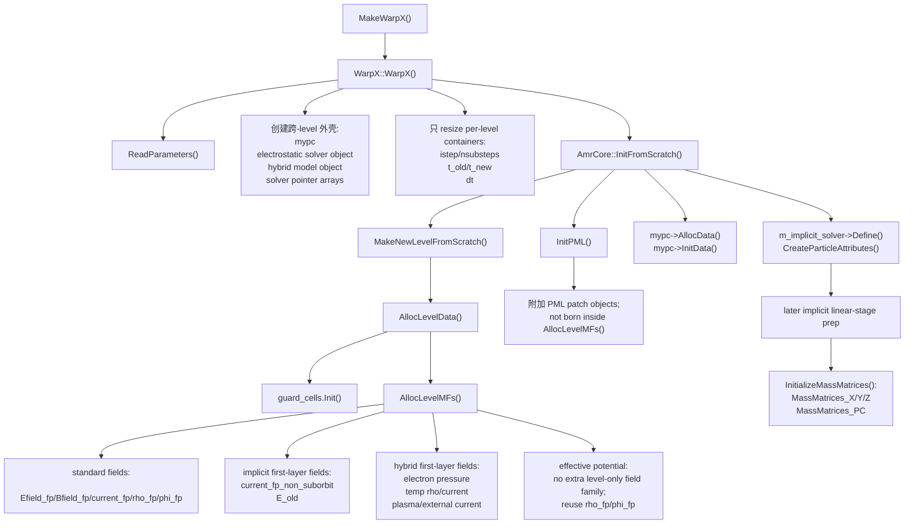
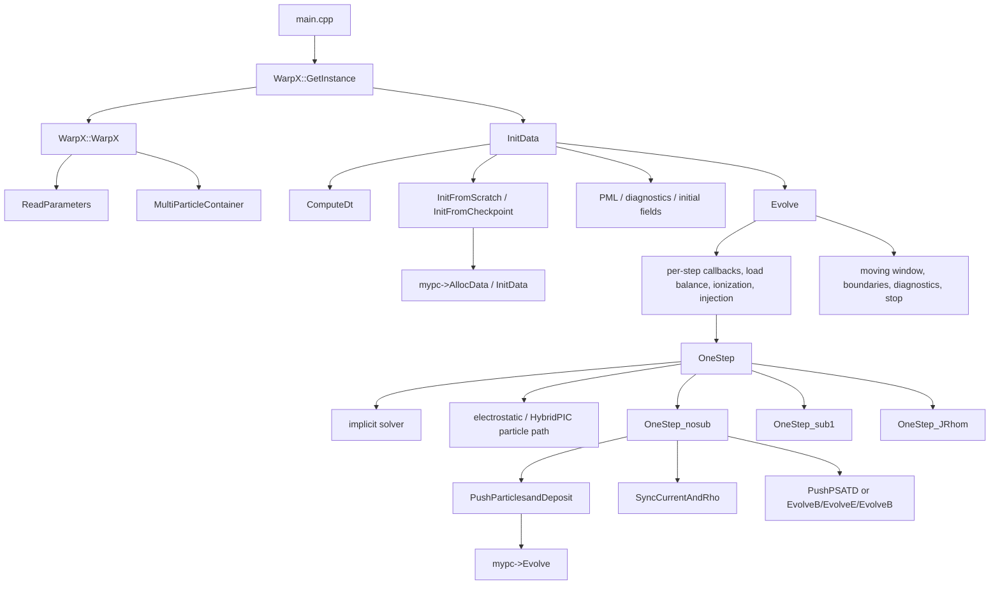

# 3. WarpX 主演化路径：生命周期、初始化与 `Evolve()`

本章开始进入 WarpX 源码。目标不是概括“WarpX 有一个 Evolve 函数”，而是建立一个可复查的调用图：程序从 `main.cpp` 进入，如何构造 `WarpX` 对象，如何读取参数和初始化数据，如何计算步长，最后如何在 `WarpXEvolve.cpp` 中把一个个 PIC step 推进下去。

本章基于本地只读源码 `../warpx`，当前已读证据整理在 `notes/code-reading/evolve/00-lifecycle-and-callgraph.md` 和 `notes/code-reading/evolve/02-evolve-source-evidence.md`。

本章当前依据的 WarpX 源码版本是：

- `../warpx`
- commit：`063f8b586f04321e13150ae3e730e0794ca75cb1`

## 3.1 顶层入口：`main.cpp`

WarpX 的可执行入口在 `../warpx/Source/main.cpp`。主函数的控制流非常短：

```text
initialize_external_libraries(argc, argv)
warpx = WarpX::GetInstance()
warpx.InitData()
warpx.Evolve()
is_warpx_verbose = warpx.Verbose()
WarpX::Finalize()
print timer if verbose
finalize_external_libraries()
```

对应行号：

| 行号 | 代码含义 |
|---|---|
| `Source/main.cpp:20` | 初始化外部库。这里包括 AMReX/MPI/GPU runtime 等 WarpX 依赖的底层运行环境。 |
| `Source/main.cpp:27` | `auto& warpx = WarpX::GetInstance();`，取得全局 `WarpX` 单例。 |
| `Source/main.cpp:28` | `warpx.InitData();`，把参数、网格、场、粒子、诊断和边界准备好。 |
| `Source/main.cpp:29` | `warpx.Evolve();`，进入时间推进主循环。 |
| `Source/main.cpp:31` | `WarpX::Finalize();`，释放 `WarpX` 单例。 |
| `Source/main.cpp:41` | 结束外部库。 |

本段源码原文如下，位置为 `../warpx/Source/main.cpp:20-41`：

```cpp
warpx::initialization::initialize_external_libraries(argc, argv);

auto const strt_total = amrex::second();
auto strt = strt_total;
BL_PROFILE_INITIALIZE();

auto& warpx = WarpX::GetInstance();
warpx.InitData();
warpx.Evolve();
const auto is_warpx_verbose = warpx.Verbose();
WarpX::Finalize();

auto const end = amrex::second() - strt;
if (is_warpx_verbose) {
    amrex::Print() << "Total Time                     : " << end << '\n';
}
BL_PROFILE_FINALIZE();

warpx::initialization::finalize_external_libraries();
```

逐块看，这段代码只有一个物理模拟对象 `warpx`。`InitData()` 之前还没有进入时间推进；`Evolve()` 返回之后模拟已经结束，后续只做计时、profiling 和库资源释放。这里没有任何粒子或场循环，因为 WarpX 把模拟状态封装在 `WarpX` 单例内部。

这个入口说明：WarpX 的主程序不直接管理粒子数组或场数组；它只管理生命周期。真正的模拟状态集中在 `WarpX` 对象及其持有的 `MultiParticleContainer`、field register、diagnostics、solver、PML 等成员中。

## 3.2 `WarpX` 类与单例构造

`WarpX` 类定义在 `../warpx/Source/WarpX.H`。关键声明包括：

| 行号 | 声明 | 作用 |
|---|---|---|
| `Source/WarpX.H:85` | `class WarpX : public amrex::AmrCore` | WarpX 以 AMReX 的 AMR 基类为基础。 |
| `Source/WarpX.H:89` | `static WarpX& GetInstance();` | 全局单例入口。 |
| `Source/WarpX.H:97` | `static void Finalize();` | 删除单例。 |
| `Source/WarpX.H:130` | `void InitData();` | 初始化模拟数据。 |
| `Source/WarpX.H:132` | `void Evolve(int numsteps=-1);` | 外层时间推进。 |
| `Source/WarpX.H:1038-1055` | `OneStep`、`OneStep_nosub`、`OneStep_sub1`、`OneStep_JRhom` | 主循环内部的单步推进路径。 |

单例实现位于 `../warpx/Source/WarpX.cpp`：

- `Source/WarpX.cpp:298-305`：`GetInstance()` 检查 `m_instance`，为空则调用 `MakeWarpX()`。
- `Source/WarpX.cpp:317-320`：`Finalize()` 调 `ResetInstance()` 删除对象。
- `Source/WarpX.cpp:322-350`：构造函数设置 `m_instance=this`，初始化 warning manager，调用 `ReadParameters()`，做向后兼容处理，初始化 EB，建立 `istep/nsubsteps/t_new/t_old/dt` 数组，并创建 `MultiParticleContainer`。

构造函数里最重要的一行是 `Source/WarpX.cpp:329` 的 `ReadParameters()`。这意味着 solver 类型、边界、步长策略、滤波、静电/电磁模式等会在 `InitData()` 前决定。

## 3.3 `ReadParameters()`：主循环分支的来源

`WarpX::ReadParameters()` 从 `../warpx/Source/WarpX.cpp:547` 开始。完整参数系统很大，本章只列出直接影响主循环的部分。

| 源码位置 | 参数或逻辑 | 对主循环的影响 |
|---|---|---|
| `Source/WarpX.cpp:550-552` | `max_step`、`stop_time` | `Evolve()` 用它们限制循环终点。 |
| `Source/WarpX.cpp:563-565` | `algo.maxwell_solver` | 选择 PSATD、Yee、CKC、ECT、HybridPIC、None 等路径。 |
| `Source/WarpX.cpp:581-595` | PSATD 不支持 PEC/PMC 的断言 | solver 选择会反过来限制边界条件。 |
| `Source/WarpX.cpp:598` | `algo.evolve_scheme` | 决定 explicit、theta implicit 等演化框架。 |
| `Source/WarpX.cpp:679-684` | `warpx.cfl`、`verbose`、`regrid_int`、`do_subcycling` | 控制步长、输出、重网格和 AMR 子循环。 |
| `Source/WarpX.cpp:729-733` | `warpx.do_electrostatic` | 静电 solver 非空时把 electromagnetic solver 设为 `None`。 |
| `Source/WarpX.cpp:796-812` | `const_dt`、`max_dt`、`dt_update_interval` | 控制固定步长和运行中步长更新。 |
| `Source/WarpX.cpp:814-828` | filter 默认开关 | 显式 scheme 默认滤波，隐式 scheme 默认关闭滤波。 |

这里有一个阅读原则：输入文件里的参数名只是表层。要理解参数的真实含义，必须追到 `ReadParameters()` 中它如何被读入、被断言约束、被改写，并进一步影响 `Evolve()`、`ComputeDt()` 或 solver 对象。

## 3.3.1 构造函数只建“跨 level 外壳”，不直接建完整网格数据

仅从 `ReadParameters()` 还看不出一个常见实现边界：`WarpX::WarpX()` 构造函数里虽然已经决定了 solver 路线，但此时还没有有效的 `BoxArray` 和 `DistributionMapping`。源码在 `../warpx/Source/WarpX.cpp:337-341` 明说：

```cpp
// Geometry on all levels has been defined already.
// No valid BoxArray and DistributionMapping have been defined.
// But the arrays for them have been resized.
```

所以构造函数能做的是：

- 创建不依赖具体网格盒划分的跨 level 对象：
  - `MultiParticleContainer`
  - `m_electrostatic_solver`
  - `m_hybrid_pic_model`
  - solver 指针数组外壳
- 按 `maxLevel()+1` 先 `resize` 各种 level 容器：
  - `istep`
  - `nsubsteps`
  - `t_old/t_new`
  - `dt`

但它不能在这里直接分配真正的 `Efield_fp/Bfield_fp/current_fp/rho_fp`。这些字段必须等到 `MakeNewLevelFromScratch() -> AllocLevelData() -> AllocLevelMFs()`，拿到真实的 `ba/dm`、index type 和 guard cell 之后才创建。

这也是为什么：

- `effective potential` 在构造期只创建 `EffectivePotentialES` 对象；
- `hybrid PIC` 在构造期只创建 `HybridPICModel` 对象；
- `implicit solver` 即使已经存在，也还没分配 mass matrices。

真正的 level 级附加字段要到后面才各自落地。

## 3.3.2 `AllocLevelData()` / `AllocLevelMFs()` 里，四条 solver 分支的落点不同

`AllocLevelData()` 位于 `../warpx/Source/WarpX.cpp:2271` 之后。它先调用 `guard_cells.Init(...)`，再进入 `AllocLevelMFs(...)`。这一层真正决定的是：哪些 `MultiFab` 需要随着 level 一起出生。

先看隐式分支。`AllocLevelMFs()` 并不会一次性把全部隐式字段都分好，它只先放两类最基础的 level 数据：

```cpp
if (m_implicit_solver) {
    m_fields.alloc_init(FieldType::current_fp_non_suborbit, Direction{0}, lev,
                        amrex::convert(ba, jx_nodal_flag), dm, ncomps, ngJ, 0.0_rt);
    ...
    m_fields.alloc_init(FieldType::E_old, Direction{2}, lev,
                        amrex::convert(ba, Ez_nodal_flag), dm, ncomps, ngEB, 0.0_rt);
}
```

也就是说，隐式路线在 level 分配期先保存：

- 非 suborbit 粒子的独立电流容器 `current_fp_non_suborbit`
- 旧电场时间层 `E_old`

而更重的 `MassMatrices_X/Y/Z`、`MassMatrices_PC` 不是在这里分配，而是在后续 `ImplicitSolver::InitializeMassMatrices()` 里，等标准 `current_fp/Efield_fp` 的 index type、guard cells 和 deposition 算法都稳定后再决定组件数。

再看 `hybrid PIC`。它在构造期只有一个模型对象，真正的 level 字段由 `HybridPICModel::AllocateLevelMFs(...)` 填入共享的 `m_fields` register：

```cpp
if (WarpX::electromagnetic_solver_id == ElectromagneticSolverAlgo::HybridPIC)
{
    m_hybrid_pic_model->AllocateLevelMFs(
        m_fields,
        lev, ba, dm, ncomps, ngJ, ngRho, ngEB, jx_nodal_flag, jy_nodal_flag,
        jz_nodal_flag, rho_nodal_flag, Ex_nodal_flag, Ey_nodal_flag, Ez_nodal_flag,
        Bx_nodal_flag, By_nodal_flag, Bz_nodal_flag
    );
}
```

这一调用会分配：

- `hybrid_electron_pressure_fp`
- `hybrid_rho_fp_temp`
- `hybrid_current_fp_temp`
- `hybrid_current_fp_plasma`
- 可选的 `hybrid_current_fp_external`

若启用 `add_external_fields`，还会进一步分配 external vector potential 相关字段。也就是说，hybrid 不是在 `WarpX` 根层自己持有一套独立网格，而是把专用状态嵌进统一的 field register。

再看 `effective potential electrostatic solver`。这条线在构造期创建了 `EffectivePotentialES` 对象，但 level 分配期没有额外的 `effective_potential_*` 专用字段。它复用的是静电共享合同：

```cpp
if( (electrostatic_solver_id == ElectrostaticSolverAlgo::LabFrame) ||
    (electrostatic_solver_id == ElectrostaticSolverAlgo::LabFrameElectroMagnetostatic) ||
    (electrostatic_solver_id == ElectrostaticSolverAlgo::LabFrameEffectivePotential) ||
    (electromagnetic_solver_id == ElectromagneticSolverAlgo::HybridPIC) ) {
    rho_ncomps = ncomps;
}

if (electrostatic_solver_id == ElectrostaticSolverAlgo::LabFrame ||
    electrostatic_solver_id == ElectrostaticSolverAlgo::LabFrameElectroMagnetostatic ||
    electrostatic_solver_id == ElectrostaticSolverAlgo::LabFrameEffectivePotential )
{
    m_fields.alloc_init(FieldType::phi_fp, lev, amrex::convert(ba, phi_nodal_flag), dm,
                         ncomps, ngPhi, 0.0_rt );
}
```

所以 `effective potential` 在根层最关键的差异不是“多了什么字段”，而是后续 solver 如何解释和消费 `rho_fp/phi_fp`。

最后是 `PML`。它同样不是在 `AllocLevelMFs()` 里出生。真正创建 `PML` 对象是在 `InitFromScratch()` 的最后一步：

```cpp
AmrCore::InitFromScratch(time);  // This will call MakeNewLevelFromScratch
...
mypc->AllocData();
mypc->InitData();

InitPML();
```

这条顺序说明：

- 先有普通 level 的 fields / particles
- 后有作为边界子系统的 `PML`

因此 `PML` 是初始化末段附加上的 patch 级边界对象，而不是和 `Efield_fp/Bfield_fp` 同时由 `AllocLevelMFs()` 常规分配的主网格字段。

把这四条线压成同一张状态图，会更不容易误读：



同样也可以压成一张对象落点表：

| 路线 | 构造期 `WarpX::WarpX()` | level 分配期 `AllocLevelMFs()` | 初始化末段 / 后续 |
|---|---|---|---|
| 标准场 | 只准备容器外壳 | `Efield_fp/Bfield_fp/current_fp/rho_fp/phi_fp` | 后续 `InitLevelData()` 填物理值 |
| `effective potential` | 创建 `EffectivePotentialES` 对象 | 不额外分专用字段，复用 `rho_fp/phi_fp` | 由静电求解器后续消费 |
| `hybrid PIC` | 创建 `HybridPICModel` 对象 | `hybrid_*` 字段写入共享 `m_fields` | `HybridPICModel::InitData()` 编译 parser、准备外加电流/矢势 |
| `implicit` | solver 对象已存在 | 只分 `current_fp_non_suborbit`、`E_old` | `Define()`、`CreateParticleAttributes()`，再到 `InitializeMassMatrices()` |
| `PML` | 仅参数/开关已知 | 不在此时创建 PML patch | `InitPML()` 用真实 `boxArray/dm/dt/m_fields` 延后创建 |

## 3.4 `InitData()`：把状态准备到可推进

`WarpX::InitData()` 位于 `../warpx/Source/Initialization/WarpXInitData.cpp:793-949`。它不是简单分配内存，而是把一个模拟从“参数已读”变成“可以推进第一步”。

核心顺序如下：

| 行号 | 操作 | 解释 |
|---|---|---|
| `793-800` | 进入 `InitData()`，检查 MPI thread level | 并行运行前的运行环境检查。 |
| `810-814` | 创建 `MultiDiagnostics` 和 `MultiReducedDiags` | 诊断系统在初始化早期建立。 |
| `824-830` | 非 restart：`ComputeDt()`、打印步长网格、`InitFromScratch()`、`InitDiagnostics()` | 从头运行时先确定步长，再建立网格/粒子/诊断。 |
| `831-837` | restart：`InitFromCheckpoint()`、打印步长网格、`PostRestart()` | checkpoint 恢复不走完全相同的初始化路径。 |
| `839-847` | `ComputeMaxStep()`、PML factors、NCI corrector、buffer masks | 准备停止步数、吸收边界和数值不稳定修正。 |
| `849-863` | 宏观介质、静电 solver、HybridPIC 初始化 | solver 相关对象拿到场布局和参数。 |
| `865-878` | 网格摘要、guard cell 检查、打印 PIC 参数、写 used inputs | 把运行状态和输入记录下来。 |
| `880-913` | 初始 div cleaning、自洽静电/磁静场、外场叠加 | 从头运行时在第一个 step 前建立初始场。 |
| `918-928` | 初始 full/reduced diagnostics | 允许输出第 0 步或 restart 后诊断。 |
| `930-948` | 性能提示和 solver issue 检查 | 给出已知风险提示。 |

`InitFromScratch()` 在 `Source/Initialization/WarpXInitData.cpp:993-1009`。它调用 `AmrCore::InitFromScratch(time)` 建立 AMR level，然后让 `mypc->AllocData()` 和 `mypc->InitData()` 初始化粒子，最后初始化 PML。

## 3.5 `ComputeDt()`：步长不是一个固定常数

`WarpX::ComputeDt()` 在 `../warpx/Source/Evolve/WarpXComputeDt.cpp:45-108`。

逻辑可以分成四类：

1. HybridPIC 必须显式给出 `warpx.const_dt`，见 `:49-50`。
2. 纯静电或无 Maxwell solver 时，必须给出 `const_dt` 或激活 `dt_update_interval`，见 `:51-55`。
3. 若用户给了 `const_dt`，直接使用，见 `:62-63`。
4. 否则按 solver 计算 CFL 限制：静电/PSATD 用最小 cell size 与 \(c\)，FDTD 调用具体几何和算法的 `ComputeMaxDt()`，见 `:64-97`。

最终 `dt` 被 resize 到 `max_level+1`，见 `:100-101`。若启用 subcycling，粗层步长由细层步长乘 refinement ratio 得到，见 `:103-107`。

这四类其实可以再压成一张更明确的决策表，而不只是“按 CFL 算”：

| 条件 | `dt` 来源 | 说明 |
|---|---|---|
| `warpx.const_dt` 已设置 | `const_dt` | 直接覆盖所有 CFL 估计；稳定性由用户自己保证。 |
| `HybridPIC` | 必须是 `const_dt` | Hybrid 路线不接受“缺省光速 CFL”。 |
| electrostatic 且设置 `max_dt` | `max_dt` | 静电路径可直接把 `max_dt` 当作初值。 |
| electrostatic 且未设置 `max_dt` | `cfl*min(dx)/c` | 这里只是 fallback 尺度，后续仍可由粒子速度更新。 |
| `PSATD` | `cfl*min(dx)/c` | 谱 solver 这里用最小网格尺度给出初始步长。 |
| Cartesian Yee/ECT | `cfl*CartesianYeeAlgorithm::ComputeMaxDt(dx)` | 显式 FDTD 由具体差分算法给出稳定上限。 |
| Cartesian CKC | `cfl*CartesianCKCAlgorithm::ComputeMaxDt(dx)` | CKC 不是简单复用 Yee CFL。 |
| collocated/nodal | `cfl*CartesianNodalAlgorithm::ComputeMaxDt(dx)` | collocated grid 的稳定上限单独计算。 |
| RZ/RCYLINDER Yee | `cfl*CylindricalYeeAlgorithm::ComputeMaxDt(dx,n_modes)` | 还显式依赖 `n_rz_azimuthal_modes`。 |
| RSPHERE Yee | `cfl*SphericalYeeAlgorithm::ComputeMaxDt(dx)` | spherical 路线单独给稳定上限。 |

因此，`ComputeDt()` 不只是“取最小网格长度除以光速”，而是在参数层先决定有没有用户强制时间步，再按 solver 家族和几何去选真正的稳定上限公式。

运行中自适应步长在 `WarpX::UpdateDtFromParticleSpeeds()`，位于 `Source/Evolve/WarpXComputeDt.cpp:115-142`。它从 `mypc->maxParticleVelocity()` 得到最大粒子速度，用

$$
\Delta t_{\mathrm{new}}=\mathrm{CFL}\frac{\Delta x_{\min}}{v_{\max}}
$$

更新 finest level 的 `dt`，再向粗层回推。

这里还要补一条参数层边界：`warpx.const_dt` 与 `warpx.dt_update_interval` 在 `ReadParameters()` 中就是互斥的。也就是说，运行时 adaptive timestep 不是“在固定步长上再做微调”，而是一条和 `const_dt` 完全不同的时间组织路线。`Evolve()` 里只有当 `m_dt_update_interval.contains(step+1)` 为真时，才会在步首调用 `UpdateDtFromParticleSpeeds()`。

## 3.6 `Evolve()` 外层时间步

`WarpX::Evolve()` 位于 `../warpx/Source/Evolve/WarpXEvolve.cpp:146-387`。它不是单纯调用 `OneStep()`，而是在每个 step 前后管理大量状态。

外层结构是：

```text
cur_time = t_new[0]
numsteps_max = max_step or istep[0] + numsteps
for step in range while cur_time < stop_time:
    check signals
    multi_diags->NewIteration()
    run beforestep callback
    CheckLoadBalance(step)
    maybe update dt from particle speeds
    ExplicitFillBoundaryEBUpdateAux()
    hybrid initialization if first step
    field ionization / QED / particle injection
    OneStep(cur_time, dt[0], step)
    resampling / mirrors
    increment istep and time
    diagnostics prepack, moving window, particle boundary handling
    electrostatic or hybrid field solve if selected
    optional velocity synchronization for diagnostics
    afterstep callback, diagnostics, warnings, signals, stop check
```

关键行号：

| 行号 | 操作 | 读法 |
|---|---|---|
| `154-165` | 初始化 `cur_time` 和循环边界 | `numsteps=-1` 时使用全局 `max_step`。 |
| `170-173` | 信号检查、诊断新迭代 | 支持运行中断、checkpoint 和诊断状态更新。 |
| `191-203` | callback、负载均衡、可选步长更新 | 更新步长前需要同步粒子速度时间层。 |
| `205-209` | `ExplicitFillBoundaryEBUpdateAux()` | 显式 scheme 为后续 field gather 准备场。 |
| `219-229` | field ionization、QED、particle injection | 多物理事件在 `OneStep()` 前改变粒子集合。 |
| `231-233` | `OneStep(cur_time, dt[0], step)` | 进入单步推进分派。 |
| `245-257` | 更新 `istep` 和 `t_old/t_new` | 单步推进后更新时间状态。 |
| `258-273` | 诊断预处理、moving window、粒子边界 | `OneStep()` 后的工程处理同样影响物理结果。 |
| `286-321` | 静电或 HybridPIC 的场解 | 非标准电磁路径的场更新位置不同。 |
| `323-331` | 诊断需要时同步粒子速度 | 为输出把 \(\mathbf{p}\) 与 \(\mathbf{x}\) 放到同步时间层。 |
| `337-347` | reduced/full diagnostics 和 callback | 诊断写出发生在本步状态更新之后。 |
| `349-371` | 未使用输入检查、计时、信号、停止 | 第一步后检查输入 typo，最后判断是否退出。 |

注意 `Evolve()` 中多物理和诊断并不都在 `OneStep()` 内部。比如 field ionization、QED 和 particle injection 在 `OneStep()` 之前，resampling、moving window、粒子边界和某些 electrostatic/hybrid 场解在 `OneStep()` 之后。

### 3.6.1 步末 moving window：连续坐标与整数网格平移

moving window 的完整精读见 `notes/code-reading/evolve/05-moving-window.md`。这里先把它放回 `Evolve()` 主循环中：`MoveWindow(step+1, move_j)` 发生在 `OneStep()` 完成、`cur_time` 和 `t_new` 更新之后，粒子边界处理之前。对应源码为 `../warpx/Source/Evolve/WarpXEvolve.cpp:245-270`：

```cpp
cur_time += dt[0];

ShiftGalileanBoundary();

// sync up time
for (int i = 0; i <= max_level; ++i) {
    t_old[i] = t_new[i];
    t_new[i] = cur_time;
}
multi_diags->FilterComputePackFlush( step, false, true );

const bool move_j = m_is_synchronized;
// If m_is_synchronized we need to shift j too so that next step we can evolve E by dt/2.
// We might need to move j because we are going to make a plotfile.
const int num_moved = MoveWindow(step+1, move_j);
```

`MoveWindow()` 的第一层逻辑是维护一个连续窗口位置 `moving_window_x`，但只有当它相对当前几何左边界跨过整数个 cell 时才真正平移网格数据。源码为 `../warpx/Source/Utils/WarpXMovingWindow.cpp:372-397`：

```cpp
if (!moving_window_active(step)) { return 0; }

// Update the continuous position of the moving window,
// and of the plasma injection
moving_window_x += (moving_window_v - WarpX::beta_boost * PhysConst::c)/(1 - moving_window_v * WarpX::beta_boost / PhysConst::c) * dt[0];
const int dir = moving_window_dir;

// Update current injection position for all containers
::UpdateInjectionPosition(*mypc, gamma_boost, beta_boost, boost_direction, moving_window_dir, dt[0]);

// Update antenna position for all lasers
// TODO Make this specific to lasers only
mypc->UpdateAntennaPosition(dt[0]);

// compute the number of cells to shift on the base level
amrex::Real new_lo[AMREX_SPACEDIM];
amrex::Real new_hi[AMREX_SPACEDIM];
const amrex::Real* current_lo = geom[0].ProbLo();
const amrex::Real* current_hi = geom[0].ProbHi();
const amrex::Real* cdx = geom[0].CellSize();
const int num_shift_base = static_cast<int>((moving_window_x - current_lo[dir]) / cdx[dir]);

if (num_shift_base == 0) { return 0; }
```

这段代码中的速度变换是相对论速度合成公式：

$$
v'_w=\frac{v_w-\beta_b c}{1-v_w\beta_b/c}.
$$

因此 boosted-frame 模拟中窗口速度不是简单使用输入的 `moving_window_v`。输入参数在 `read_moving_window_parameters()` 中先由以 \(c\) 为单位的无量纲数转成 SI 速度；运行时再按 boost 速度变换到模拟坐标系。

active 判定本身也不是模糊的“某个阶段窗口有效”，而是源码里一个明确的闭开区间：

$$
\texttt{start\_moving\_window\_step}\le n < \texttt{end\_moving\_window\_step},
$$

若 `end_moving_window_step < 0` 则表示没有终止步。这也是为什么 `Evolve()` 调的是 `MoveWindow(step+1, ...)`：窗口平移是本步结束后、下一步开始前的状态更新。

当 `num_shift_base != 0` 时，`MoveWindow()` 调用 `ResetProbDomain()` 更新几何域，并用 `shiftMF()` 平移 `E/B/current/PML/F/G/rho/fluid` 等 `MultiFab`。`shiftMF()` 的核心赋值为 `../warpx/Source/Utils/WarpXMovingWindow.cpp:180-190`：

```cpp
amrex::Box dstBox = mf[mfi].box();
if (num_shift > 0) {
    dstBox.growHi(dir, -num_shift);
} else {
    dstBox.growLo(dir,  num_shift);
}
AMREX_PARALLEL_FOR_4D ( dstBox, nc, i, j, k, n,
{
    dstfab(i,j,k,n) = srcfab(i+shift.x,j+shift.y,k+shift.z,n);
})
```

即

$$
F_{\mathrm{new}}(\mathbf{i})=F_{\mathrm{old}}(\mathbf{i}+N_{\mathrm{shift}}\hat e_{\mathrm{dir}}).
$$

新露出的边界层不是随便置零。对外部场，`shiftMF()` 可以用常量外场或 parser 外场重新初始化；对背景粒子，`MoveWindow()` 构造整数 cell 宽度的 `particleBox` 并调用 `pc.ContinuousInjection(particleBox)`。这解释了 moving window 的数值设计：连续窗口位置负责物理速度，整数 cell 平移负责保持网格离散结构和宏粒子 spacing。

这里还要和步末的 `ContinuousFluxInjection(cur_time, dt[0])` 分开。二者不是同一件事：

- moving-window continuous injection：在新露出的体网格区域里补背景体分布；
- continuous flux injection：从定义好的注入面持续打入粒子通量。

前者是“窗口移动后补齐新计算域”，后者是“边界源项继续往域内送粒子”。

## 3.7 `OneStep()`：求解器分派器

`WarpX::OneStep()` 位于 `../warpx/Source/Evolve/WarpXEvolve.cpp:389-496`。它按 solver 和 AMR 情况分派：

```text
if m_implicit_solver:
    m_implicit_solver->OneStep(...)
else:
    if electromagnetic_solver_id is None or HybridPIC:
        push particles, optionally split collisions, skip deposition
    else:
        if finest_level == 0:
            OneStep_nosub or OneStep_JRhom
        else:
            OneStep_nosub or OneStep_sub1
```

这段代码体现了 WarpX 的设计：`OneStep()` 不直接写某一种 PIC 算法的全部细节，而是先把路径分开。

| 分支 | 源码位置 | 含义 |
|---|---|---|
| implicit solver | `Source/Evolve/WarpXEvolve.cpp:397-401` | 交给隐式 solver 自己推进一整步。 |
| electrostatic / HybridPIC | `:404-445` | 粒子推进但跳过标准电磁沉积路径，场解在外层后处理。 |
| 标准电磁无 MR | `:448-467` | 进入 `OneStep_nosub()` 或 PSATD-JRhom。 |
| 有 MR 无 subcycling | `:469-474` | 仍进入 `OneStep_nosub()`，所有 level 使用同一步长推进。 |
| 有 MR 且 subcycling | `:475-492` | 进入 `OneStep_sub1()`，当前限制最多两个 level。 |

几个断言值得后续单独讲：

- JRhom 与 split momentum collision 当前不能组合，见 `Source/Evolve/WarpXEvolve.cpp:456-459`。
- subcycling 当前要求 `finest_level == 1`，见 `:477-480`。
- subcycling 与 split momentum collision 当前也不能组合，见 `:481-484`。

这些不是文档层面的“建议”，而是源码级功能边界。

还应补一条输入层边界：`psatd.JRhom` 不是布尔开关，而是一个编码了源项时间模型的字符串。`ReadParameters()` 里它会同时决定：

- `J` 的时间依赖是 constant / linear / quadratic；
- `rho` 的时间依赖是 constant / linear / quadratic；
- 一个 PIC step 里切成多少个 JRhom subinterval。

因此 `JRhom` 开启后，后续变的不是“另一个小优化开关”，而是 `OneStep()` 内部的时间组织、`rho_fp` 的组件语义和谱空间源项更新公式。

## 3.8 `OneStep_nosub()`：显式电磁标准路径

`WarpX::OneStep_nosub()` 位于 `../warpx/Source/Evolve/WarpXEvolve.cpp:503-643`。这是本书第一个需要逐行读懂的核心函数。

它的结构分为四段。

第一段：粒子推进、碰撞与沉积，见 `:512-556`。

源码原文：

```cpp
// Push particle from x^{n} to x^{n+1}
//               from p^{n-1/2} to p^{n+1/2}
// Deposit current j^{n+1/2}
// Deposit charge density rho^{n}

ExecutePythonCallback("beforedeposition");

// with collisions placed in the middle of the momentum push
if (m_collisions_split_momentum_push) {
    // push particles (half momentum)
    PushParticlesandDeposit(
        a_cur_time,
        /*skip_deposition=*/true,
        PositionPushType::None,
        MomentumPushType::FirstHalf
    );
    // perform particle collisions
    ExecutePythonCallback("beforecollisions");
    mypc->doCollisions(a_step, a_cur_time, a_dt);
    ExecutePythonCallback("aftercollisions");

    // push particles (full position and half momentum)
    PushParticlesandDeposit(
        a_cur_time,
        /*skip_deposition=*/false,
        PositionPushType::Full,
        MomentumPushType::SecondHalf
    );
}
else {
    ExecutePythonCallback("beforecollisions");
    mypc->doCollisions(a_step, a_cur_time, a_dt);
    ExecutePythonCallback("aftercollisions");

    PushParticlesandDeposit(
        a_cur_time,
        /*skip_deposition=*/false,
        PositionPushType::Full,
        MomentumPushType::Full
    );
}

ExecutePythonCallback("afterdeposition");
```

- 注释明确时间层：\(\mathbf{x}^{n}\to\mathbf{x}^{n+1}\)，\(\mathbf{p}^{n-1/2}\to\mathbf{p}^{n+1/2}\)，沉积 \(\mathbf{J}^{n+1/2}\) 和 \(\rho^n\)。
- 如果 `m_collisions_split_momentum_push` 为真，先做半个动量 push，再碰撞，再做位置 push 和后半动量 push。
- 否则先做碰撞，再调用 `PushParticlesandDeposit()` 完整推进粒子并沉积。

第二段：源项同步，见 `:558-569`。

源码原文：

```cpp
// Synchronize J and rho:
// filter (if used), exchange guard cells, interpolate across MR levels
// and apply boundary conditions
SyncCurrentAndRho();

// At this point, J is up-to-date inside the domain, and E and B are
// up-to-date including enough guard cells for first step of the field
// solve.

// For extended PML: copy J from regular grid to PML, and damp J in PML
if (do_pml && pml_has_particles) { CopyJPML(); }
if (do_pml && do_pml_j_damping) { DampJPML(); }
```

- `SyncCurrentAndRho()` 会处理滤波、guard cells、AMR 跨层插值/加和和边界。
- PML 若含粒子或需要电流阻尼，会复制和阻尼 PML 中的电流。

第三段：PSATD 或 FDTD 场推进，见 `:571-640`。

FDTD 分支的核心源码原文如下，位置为 `../warpx/Source/Evolve/WarpXEvolve.cpp:603-625`：

```cpp
} else {
    EvolveF(0.5_rt * dt[0], /*rho_comp=*/0);
    EvolveG(0.5_rt * dt[0]);
    FillBoundaryF(guard_cells.ng_FieldSolverF);
    FillBoundaryG(guard_cells.ng_FieldSolverG);

    EvolveB(0.5_rt * dt[0], SubcyclingHalf::FirstHalf, a_cur_time); // We now have B^{n+1/2}
    FillBoundaryB(guard_cells.ng_FieldSolver, WarpX::sync_nodal_points);

    if (m_em_solver_medium == MediumForEM::Vacuum) {
        EvolveE(dt[0], a_cur_time); // We now have E^{n+1}
    } else if (m_em_solver_medium == MediumForEM::Macroscopic) {
        MacroscopicEvolveE(dt[0], a_cur_time); // We now have E^{n+1}
    } else {
        WARPX_ABORT_WITH_MESSAGE("Medium for EM is unknown");
    }
    FillBoundaryE(guard_cells.ng_FieldSolver, WarpX::sync_nodal_points);

    EvolveF(0.5_rt * dt[0], /*rho_comp=*/1);
    EvolveG(0.5_rt * dt[0]);
    EvolveB(0.5_rt * dt[0], SubcyclingHalf::SecondHalf, a_cur_time + 0.5_rt * dt[0]); // We now have B^{n+1}
```

- PSATD 走 `PushPSATD(a_cur_time)`，并处理 hybrid QED、PML、平均场、\(F/G\) guard cells。
- FDTD 走 `EvolveF/G` 半步、`EvolveB(dt/2)`、`EvolveE(dt)`、`EvolveF/G` 半步、`EvolveB(dt/2)`。

第四段：回调，见 `:642`。

- `afterEsolve` callback 在场更新后执行。

从物理角度看，`OneStep_nosub()` 做的事情是：用旧场 gather 推粒子，得到新位置和半步电流；把源项修整到网格和边界一致；再用这些源项推进电磁场。

## 3.9 `SyncCurrentAndRho()`：源项不是沉积完就可用

`SyncCurrentAndRho()` 位于 `../warpx/Source/Evolve/WarpXEvolve.cpp:768-837`。

它的分支很重要：

- PSATD 且 periodic single box 时，会立即同步 \(J\) 和 \(\rho\)，见 `:773-785`。
- PSATD 非 periodic single box 时，若没有 current correction 且不是 Vay deposition，才在这里同步，见 `:787-797`。
- Vay deposition 在特定情况下先只做 filter，见 `:799-806`。
- FDTD 路径总是 `SyncCurrent("current_fp")` 和 `SyncRho()`，见 `:809-813`。
- 最后对 \(\rho\) 和 \(J\) 施加 PEC 等边界处理，见 `:815-836`。

这说明“沉积”与“可用于场解”之间有一段不可忽略的工程层：滤波、guard cell、AMR 和边界会改变源项数组的可用状态。

## 3.10 `PushParticlesandDeposit()`：进入粒子容器

`PushParticlesandDeposit()` 的两个重载位于 `../warpx/Source/Evolve/WarpXEvolve.cpp:1311-1415`。

第一层重载 `:1311-1333` 遍历所有 AMR level。第二层重载 `:1335-1415` 做三件事：

1. 根据 `do_current_centering` 和 `current_deposition_algo == Vay` 选择当前沉积字段名，见 `:1349-1362`。
2. 调用 `mypc->Evolve(...)`，把 field register、level、字段名、时间、`dt[lev]`、subcycling half、是否跳过沉积、位置/动量 push 类型传入粒子容器，见 `:1364-1375`。
3. 对 RZ/柱/球几何做逆体积缩放，并在有流体物种时调用流体容器演化，见 `:1377-1413`。

因此，下一阶段逐行阅读必须从 `mypc->Evolve()` 继续进入 `Source/Particles`。`PushParticlesandDeposit()` 是主循环到粒子模块的接口，不是粒子 pusher 本身。

## 3.11 `OneStep_sub1()` 与 JRhom 的位置

完整精读见 `notes/code-reading/evolve/03-subcycling-and-jrhom.md`。这里先把两个特殊分支放回主循环时间层。

`OneStep_sub1()` 位于 `../warpx/Source/Evolve/WarpXEvolve.cpp:1043-1269`。当前 subcycling 只支持两个 level 和 refinement ratio 2：fine patch 用小步长推两次，coarse patch 和 mother grid 推一次，coarse 场使用两次 fine current 的平均效果。源码注释直接说明这一点：

```cpp
 * This version of subcycling only works for 2 levels and with a refinement
 * ratio of 2.
 * The particles and fields of the fine patch are pushed twice
 * (with dt[coarse]/2) in this routine.
 * The particles of the coarse patch and mother grid are pushed only once
 * (with dt[coarse]). The fields on the coarse patch and mother grid
 * are pushed in a way which is equivalent to pushing once only, with
 * a current which is the average of the coarse + fine current at the 2
 * steps of the fine grid.
```

第一段 fine step 的核心源码如下：

```cpp
PushParticlesandDeposit(fine_lev, cur_time, SubcyclingHalf::FirstHalf);
RestrictCurrentFromFineToCoarsePatch(
    m_fields.get_mr_levels_alldirs(FieldType::current_fp, finest_level),
    m_fields.get_mr_levels_alldirs(FieldType::current_cp, finest_level, skip_lev0_coarse_patch), fine_lev);
RestrictRhoFromFineToCoarsePatch(fine_lev);

EvolveB(fine_lev, PatchType::fine, 0.5_rt*dt[fine_lev], SubcyclingHalf::FirstHalf, cur_time);
EvolveF(fine_lev, PatchType::fine, 0.5_rt*dt[fine_lev], /*rho_comp=*/0);
EvolveE(fine_lev, PatchType::fine, dt[fine_lev], cur_time);
EvolveB(fine_lev, PatchType::fine, 0.5_rt*dt[fine_lev], SubcyclingHalf::SecondHalf, cur_time + 0.5_rt * dt[fine_lev]);
EvolveF(fine_lev, PatchType::fine, 0.5_rt*dt[fine_lev], /*rho_comp=*/1);
```

因此 subcycling 的物理时间层是

$$
\Delta t_0=2\Delta t_1.
$$

fine level 在一个 coarse step 内走两个完整 leapfrog 小步。`RestrictCurrentFromFineToCoarsePatch()` 和 `RestrictRhoFromFineToCoarsePatch()` 把 fine 层沉积源项平均到 coarse patch；`StoreCurrent()`/`RestoreCurrent()` 保证 coarse 粒子自身 current 能在两个 half coarse step 中分别叠加对应的 fine contribution。

这里 `StoreCurrent()`/`RestoreCurrent()` 的角色需要说得更硬一点：subcycling 不是简单把 fine current 直接覆写 coarse current，而是要先保留 coarse 粒子本身在大步时间层上的电流，再把两次 fine-step 的 restriction 结果分别叠回 coarse half-step。否则 coarse mother grid 看到的就不是“一个 coarse 大步上等效的平均源项”，而会把 coarse 自身电流和 fine 补偿混在一起。

`OneStep_JRhom()` 位于 `../warpx/Source/Evolve/WarpXEvolve.cpp:839-1041`。它是 PSATD-JRhom 专用路径，会多次沉积 \(J\) 和 \(\rho\)，在谱空间推进字段，并支持时间平均场。入口先断言 solver 必须是 PSATD，并且粒子 push 时跳过标准沉积：

```cpp
WARPX_ALWAYS_ASSERT_WITH_MESSAGE(
    WarpX::electromagnetic_solver_id == ElectromagneticSolverAlgo::PSATD,
    "JRhom algorithm not implemented with the FDTD solver"
);

// Push particle from x^{n} to x^{n+1}
//               from p^{n-1/2} to p^{n+1/2}
const bool skip_deposition = true;
PushParticlesandDeposit(cur_time, skip_deposition);

// Initialize PSATD-JRhom loop:

// 1) Prepare E,B,F,G fields in spectral space
PSATDForwardTransformEB();
if (WarpX::do_dive_cleaning) { PSATDForwardTransformF(); }
if (WarpX::do_divb_cleaning) { PSATDForwardTransformG(); }
```

随后 JRhom 以

$$
\delta t=\frac{\Delta t}{m}
$$

为子区间，多次在相对时间 `t_deposit_current` 和 `t_deposit_charge` 沉积源项：

```cpp
const int n_deposit = WarpX::m_JRhom_subintervals;
const amrex::Real sub_dt = dt[0] / static_cast<amrex::Real>(n_deposit);
const int n_loop = (WarpX::fft_do_time_averaging) ? 2*n_deposit : n_deposit;

for (int i_deposit = 0; i_deposit < n_loop; i_deposit++)
{
    if (time_dependency_J != TimeDependencyJ::Constant) { PSATDMoveJNewToJOld(); }

    const amrex::Real t_deposit_current = (time_dependency_J == TimeDependencyJ::Linear) ?
        (i_deposit-n_deposit+1)*sub_dt : (i_deposit-n_deposit+0.5_rt)*sub_dt;

    const amrex::Real t_deposit_charge = (time_dependency_rho == TimeDependencyRho::Linear) ?
        (i_deposit-n_deposit+1)*sub_dt : (i_deposit-n_deposit+0.5_rt)*sub_dt;

    mypc->DepositCurrent( m_fields.get_mr_levels_alldirs(current_string, finest_level), dt[0], t_deposit_current);
    SyncCurrent("current_fp");
    PSATDForwardTransformJ("current_fp", "current_cp");
```

所以 JRhom 的核心不是多次 gather，也不是多次粒子 push，而是用同一次粒子轨道在多个相对时间沉积源项，让 PSATD 在一个 step 内看到更高阶的 \(\widetilde{\mathbf J}(t)\) 和 \(\widetilde\rho(t)\)。

这条线路还有两条必须写清的功能限制：

1. `JRhom` 当前不支持 FDTD，只能走 PSATD。
2. `JRhom` 当前和 `current_correction`、`Vay deposition` 都不兼容；源码层会把 `current_correction` 关掉，并显式禁止 `Vay deposition` 和 JRhom 组合。

所以这一支的真实定位是：它不是“PSATD 上再附加一个任意可叠加的小修正”，而是 PSATD 自身的一种替代性时间积分组织方式。

## 3.12 参数示例与最小运行闭环

如果把本章压成一个最小、可执行、可回查的 runtime entry，当前最合适的样章输入仍然是：

- `../warpx/Examples/Tests/langmuir/inputs_test_1d_langmuir_multi`

它直接消费了本章讲到的顶层参数和控制流：

- `max_step = 80`
- `algo.maxwell_solver = yee`
- `algo.current_deposition = esirkepov`
- `algo.field_gathering = energy-conserving`
- `warpx.cfl = 0.8`
- 周期场边界

对本章来说，这个输入最重要的意义不是“Langmuir 物理本身”，而是它确实会走：

```text
main.cpp
-> WarpX::GetInstance()
-> InitData()
-> ComputeDt()
-> Evolve()
-> OneStep()
-> PushParticlesandDeposit()
-> SyncCurrentAndRho()
-> EvolveB/EvolveE/EvolveB
-> diagnostics
```

当前本地运行记录已经在：

- `/Volumes/PHILIPS/programs/PIC/PIC-tutor/runs/stage-c-validation/langmuir_1d`

实际命令：

```bash
env OMP_NUM_THREADS=1 FI_PROVIDER=tcp \
  /Volumes/PHILIPS/programs/PIC/warpx/build_full/bin/warpx.1d.MPI.OMP.DP.PDP.OPMD.FFT.EB.QED.GENQEDTABLES \
  /Volumes/PHILIPS/programs/PIC/warpx/Examples/Tests/langmuir/inputs_test_1d_langmuir_multi
```

它现在已经把本章的“主循环入口”压成了真实闭环：

- 有源码路径
- 有参数入口
- 有可执行命令
- 有输出目录 `diags/diag1000080`
- 有物理检查量

这说明本章讲的 `WarpX` 主类生命周期和 `Evolve()` 主链，不再只是静态调用图，而是已经有一条本地运行证据能够落回这些控制流节点。

## 3.13 进一步阅读与练习

进一步阅读：

1. [04-particle-pushers.md](/Volumes/PHILIPS/programs/PIC/PIC-tutor/manuscript/chapters/04-particle-pushers.md)：继续从 `PushParticlesandDeposit()` 进入 `mypc->Evolve()` 和粒子推进器。
2. [05-deposition-shapes.md](/Volumes/PHILIPS/programs/PIC/PIC-tutor/manuscript/chapters/05-deposition-shapes.md)：继续展开 `SyncCurrentAndRho()`、沉积、guard/source synchronization。
3. [00-lifecycle-and-callgraph.md](/Volumes/PHILIPS/programs/PIC/PIC-tutor/notes/code-reading/evolve/00-lifecycle-and-callgraph.md)、[03-subcycling-and-jrhom.md](/Volumes/PHILIPS/programs/PIC/PIC-tutor/notes/code-reading/evolve/03-subcycling-and-jrhom.md)、[05-moving-window.md](/Volumes/PHILIPS/programs/PIC/PIC-tutor/notes/code-reading/evolve/05-moving-window.md)：继续下钻本章只做第一轮压缩的分支。

练习题：

1. 说明为什么 `WarpX::WarpX()` 里只能创建跨-level 外壳，而不能直接分配完整 `MultiFab` 主字段。
2. 用本章的 `StoreCurrent()/RestoreCurrent()` 解释：为什么 subcycling 不能简单拿 fine current 覆盖 coarse current。
3. 结合 [00-langmuir-wave.md](/Volumes/PHILIPS/programs/PIC/PIC-tutor/notes/code-reading/applications/00-langmuir-wave.md)，指出 `inputs_test_1d_langmuir_multi` 中哪些参数分别进入 `ReadParameters()`、`ComputeDt()` 和 `OneStep_nosub()` 的不同层次。

## 3.14 本章小结

本章建立了 WarpX 主演化路径的第一张精确地图：



后续章节将从 `mypc->Evolve()` 进入粒子推进、field gather 和沉积内核，再从 `EvolveE/B` 进入 FDTD/PSATD 场求解器。
