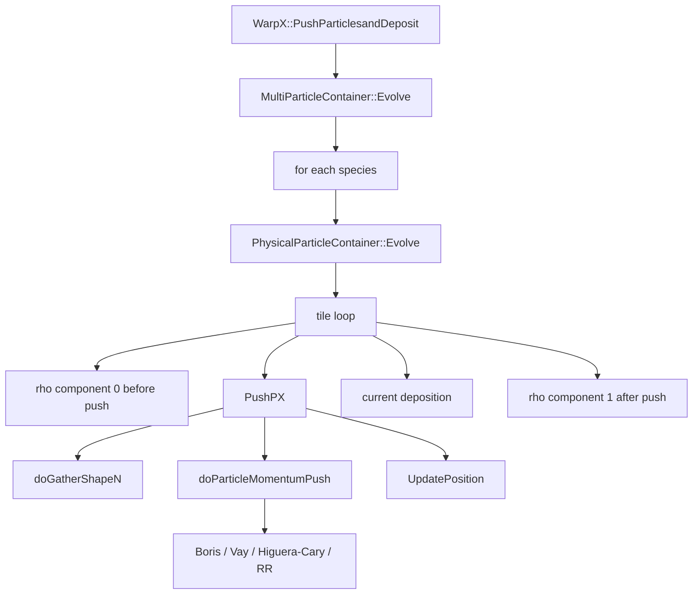

# 4. 粒子推进器：从 Lorentz 方程到 `PushPX()`

粒子推进器负责把单个宏粒子从一个时间层推进到下一个时间层。它表面上是局部单粒子算法，实际上依赖上一章建立的主循环条件：场必须已经填好 gather guard cells，粒子位置和动量必须处在正确 leapfrog 时间层，外场、电离电荷态、辐射反作用和 QED 选项也必须在进入 pusher 前准备好。

本章对应源码笔记见 `notes/code-reading/particles/00-particle-evolve-callchain.md`、`notes/code-reading/particles/01-pusher-and-deposition-evidence.md`、`notes/code-reading/particles/02-gather-shape-deposition-kernels.md`、`notes/code-reading/particles/03-vay-higuera-cary-pushers.md`、`notes/code-reading/particles/24-thermalizer-validation-and-checksum-boundaries.md`、`notes/code-reading/particles/25-gather-variants-and-external-particle-fields.md`、`notes/code-reading/particles/26-pusher-single-particle-and-photon-validation-map.md`、`notes/code-reading/particles/27-particle-fields-plasma-lens-and-mpi-validation-map.md`、`notes/code-reading/particles/28-particle-diagnostics-python-interface-validation-map.md`、`notes/code-reading/particles/29-boundary-and-python-front-end-validation-map.md` 和 `notes/code-reading/particles/30-pml-eb-contact-and-mr-validation-map.md`。

## 4.1 连续 Lorentz 方程

WarpX 对带质量粒子推进的基本方程是相对论 Lorentz 方程。令

$$
\mathbf{u}=\gamma\mathbf{v},
\qquad
\gamma=\sqrt{1+\frac{|\mathbf{u}|^2}{c^2}},
\qquad
\mathbf{v}=\frac{\mathbf{u}}{\gamma}.
$$

这里 WarpX 源码中的 `ux, uy, uz` 是 \(\mathbf{u}\) 的三个分量，而不是普通速度 \(\mathbf{v}\)。对质量 \(m\)、电荷 \(q\) 的粒子，

$$
\frac{d\mathbf{u}}{dt}
=
\frac{q}{m}\left(\mathbf{E}+\mathbf{v}\times\mathbf{B}\right),
$$

$$
\frac{d\mathbf{x}}{dt}
=
\mathbf{v}
=
\frac{\mathbf{u}}{\gamma}.
$$

显式 leapfrog PIC 中，常用时间层是

$$
\mathbf{x}^{n}\rightarrow \mathbf{x}^{n+1},
\qquad
\mathbf{u}^{n-1/2}\rightarrow \mathbf{u}^{n+1/2}.
$$

因此位置推进使用更新后的半步动量：

$$
\mathbf{x}^{n+1}
=
\mathbf{x}^{n}
+\frac{\mathbf{u}^{n+1/2}}{\gamma^{n+1/2}}\Delta t.
$$

WarpX 的显式位置更新正是这个公式，见 `../warpx/Source/Particles/Pusher/UpdatePosition.H:19-70`。

这里可以补一个 Dawson 1983 的历史边界。那篇综述在 `electromagnetic particle models and fractional dimensional models` 一节明确指出：只要问题涉及自洽磁场或 electromagnetic radiation，particle model 就不能再被理解成“electrostatic 外面多加几个场分量”，而必须回到 full Maxwell equations 与 self-consistent current/charge representation。与此同时，低空间维度并不意味着低速度维度；为了在一维或二维空间里承载 electromagnetic wave，仍必须保留 transverse `E/B/j` 与 transverse velocity，于是才会自然出现 `1 1/2-D`、`1 2/2-D` 和 `2 1/2-D` 这些 fully electromagnetic reduced-dimension models。这个边界正好解释了为什么本章后面很多看似“低维”的 laser、beam 和 FEL benchmark，仍然必须认真讨论 magnetic rotation、relativistic momentum 与 transverse field coupling，而不能把它们误降成纯 electrostatic pusher。

## 4.2 Boris 推进的结构

Boris pusher 把动量更新拆成三个操作：

1. 电场半步；
2. 磁场旋转；
3. 电场半步。

设旧动量为 \(\mathbf{u}^{n-1/2}\)，先做电半步：

$$
\mathbf{u}^{-}
=
\mathbf{u}^{n-1/2}
+\frac{q\Delta t}{2m}\mathbf{E}^{n}.
$$

再用 \(\mathbf{u}^{-}\) 计算

$$
\gamma^-=\sqrt{1+\frac{|\mathbf{u}^-|^2}{c^2}},
\qquad
\mathbf{t}
=
\frac{q\Delta t}{2m\gamma^-}\mathbf{B}^{n},
\qquad
\mathbf{s}
=
\frac{2\mathbf{t}}{1+|\mathbf{t}|^2}.
$$

磁场旋转写成

$$
\mathbf{u}'=\mathbf{u}^-+\mathbf{u}^-\times\mathbf{t},
$$

$$
\mathbf{u}^{+}=\mathbf{u}^-+\mathbf{u}'\times\mathbf{s}.
$$

最后做第二个电半步：

$$
\mathbf{u}^{n+1/2}
=
\mathbf{u}^{+}
+\frac{q\Delta t}{2m}\mathbf{E}^{n}.
$$

WarpX 的实现见 `../warpx/Source/Particles/Pusher/UpdateMomentumBoris.H:20-62`：

源码原文如下：

```cpp
const amrex::ParticleReal econst = 0.5_prt*q*dt/m;

if (momentum_push_type == MomentumPushType::FirstHalf || momentum_push_type == MomentumPushType::Full) {
    // First half-push for E
    ux += econst*Ex;
    uy += econst*Ey;
    uz += econst*Ez;
}
// Compute temporary gamma factor
constexpr auto inv_c2 = PhysConst::inv_c2_v< amrex::ParticleReal>;
const amrex::ParticleReal inv_gamma = 1._prt/std::sqrt(1._prt + (ux*ux + uy*uy + uz*uz)*inv_c2);
// Magnetic rotation
const amrex::Real bconst = (momentum_push_type == MomentumPushType::FirstHalf || momentum_push_type == MomentumPushType::SecondHalf) ? 0.5_rt*econst : econst;
const amrex::ParticleReal tx = bconst*inv_gamma*Bx;
const amrex::ParticleReal ty = bconst*inv_gamma*By;
const amrex::ParticleReal tz = bconst*inv_gamma*Bz;
const amrex::ParticleReal tsqi = 2._prt/(1._prt + tx*tx + ty*ty + tz*tz);
const amrex::ParticleReal sx = tx*tsqi;
const amrex::ParticleReal sy = ty*tsqi;
const amrex::ParticleReal sz = tz*tsqi;
const amrex::ParticleReal ux_p = ux + uy*tz - uz*ty;
const amrex::ParticleReal uy_p = uy + uz*tx - ux*tz;
const amrex::ParticleReal uz_p = uz + ux*ty - uy*tx;
// - Update momentum
ux += uy_p*sz - uz_p*sy;
uy += uz_p*sx - ux_p*sz;
uz += ux_p*sy - uy_p*sx;
if (momentum_push_type == MomentumPushType::SecondHalf || momentum_push_type == MomentumPushType::Full) {
// Second half-push for E
    ux += econst*Ex;
    uy += econst*Ey;
    uz += econst*Ez;
}
```

| 行号 | 代码动作 | 公式对应 |
|---|---|---|
| `:28` | `econst = 0.5*q*dt/m` | \(\frac{q\Delta t}{2m}\) |
| `:30-35` | FirstHalf 或 Full 时做电半步 | \(\mathbf{u}^{n-1/2}\to\mathbf{u}^{-}\) |
| `:37-45` | 计算 `inv_gamma`、`t`、`s` | \(\gamma^{-},\mathbf{t},\mathbf{s}\) |
| `:49-55` | 磁旋转 | \(\mathbf{u}^{-}\to\mathbf{u}^{+}\) |
| `:56-61` | SecondHalf 或 Full 时做第二个电半步 | \(\mathbf{u}^{+}\to\mathbf{u}^{n+1/2}\) |

文件注释 `:13-18` 说明 `FirstHalf` 和 `SecondHalf` 可以分裂执行，并且连续执行应与一次 `Full` 更新数学等价。这正好服务于 `WarpXEvolve.cpp` 中把碰撞放在 momentum push 中间的路径。

## 4.3 WarpX 如何选择 pusher

WarpX 的单粒子动量推进分派在 `../warpx/Source/Particles/Pusher/PushSelector.H:39-104`。函数名是 `doParticleMomentumPush()`。

| 行号 | 选择 |
|---|---|
| `:61-62` | species 电荷乘 `ion_lev`，得到当前粒子的有效电荷。 |
| `:64-88` | 若启用 classical radiation reaction，进入 `UpdateMomentumBorisWithRadiationReaction()`。 |
| `:89-92` | `ParticlePusherAlgo::Boris` 进入 `UpdateMomentumBoris()`。 |
| `:93-96` | `ParticlePusherAlgo::Vay` 进入 `UpdateMomentumVay()`。 |
| `:97-100` | `ParticlePusherAlgo::HigueraCary` 进入 `UpdateMomentumHigueraCary()`。 |

这说明输入参数选择的不是一个高层“粒子模块”，而是每个粒子在 `PushPX()` device loop 内调用的单粒子 momentum update。下面继续展开 Vay 与 Higuera-Cary 的源码。

这一节背后的经典来源可以直接回到 Birdsall-Langdon 1985 第一分卷 `4-3` 到 `4-5`。那里把磁推进的核心先写成几何分裂：电场部分是半步 impulse，磁场部分是速度空间旋转；随后再把旋转压成 `t=\tan(\theta/2)`、`s=2t/(1+t^2)`、`c=(1-t^2)/(1+t^2)` 这组半角变量，并进一步给出向量 Boris 形式。对本章来说，这个来源有两个价值。第一，WarpX 的 Boris 更新不是孤立经验公式，而是这条 “half-accel + rotation + half-accel” 离散合同的现代实现。第二，Birdsall 在 `4-5` 里明确区分了 `1d2v/1d3v` 和真正的一维动力学，这正好解释了为什么即使空间维数较低，本章后面讨论的 mover 仍必须保留多速度分量与磁旋转结构。

物理上可以先记住：

- Boris：经典、鲁棒、磁场部分近似旋转，长期性质好。
- Vay：针对相对论漂移和 Lorentz 变换一致性问题设计，在 boosted frame 场景常用。
- Higuera-Cary：相对论粒子推进的结构保持改进，常用于减少高相对论问题中的系统误差。

正式误差比较必须回到对应论文和 benchmark；本章先把 WarpX 的实际实现讲清楚。

## 4.4 Vay pusher：相对论速度变换一致性的更新

Vay pusher 的 WarpX 实现在 `../warpx/Source/Particles/Pusher/UpdateMomentumVay.H:17-77`。源码注释明确引用 Vay 2008 的公式 (9)-(13)，并说明 `FirstHalf` 与 `SecondHalf` 连续执行应等价于 `Full`：

```cpp
/** \brief Push the particle's positions over one timestep,
 *    given the value of its momenta `ux`, `uy`, `uz`
 *    Note that UpdateMomentumVay algorithm can be splitted into FirstHalf and SecondHalf
 *    momentum updates. FirstHalf and SecondHalf updates are constructed so that
 *    performing FirstHalf followed by SecondHalf is mathematically
 *    equivalent to a single Full update.
 *    For more details, see formulas (9)-(13) in J.L.Vay, "Simulation of beams or plasmas crossing at
 *    relativistic velocity", Phys. Plasmas 15, 056701 (2008).
 */
AMREX_GPU_HOST_DEVICE AMREX_INLINE
void UpdateMomentumVay(
    amrex::ParticleReal& ux, amrex::ParticleReal& uy, amrex::ParticleReal& uz,
    const amrex::ParticleReal Ex, const amrex::ParticleReal Ey, const amrex::ParticleReal Ez,
    const amrex::ParticleReal Bx, const amrex::ParticleReal By, const amrex::ParticleReal Bz,
    const amrex::ParticleReal q, const amrex::ParticleReal m, const amrex::Real dt,
    MomentumPushType momentum_push_type)
{
    using namespace amrex::literals;

    // Constants
    const amrex::ParticleReal econst = q*dt/m * ((momentum_push_type == MomentumPushType::Full) ? 1.0_prt : 0.5_prt);
    const amrex::ParticleReal bconst = 0.5_prt*q*dt/m;
    // Compute initial gamma
    const amrex::ParticleReal inv_gamma = 1._prt/std::sqrt(1._prt + (ux*ux + uy*uy + uz*uz)*PhysConst::inv_c2_v<amrex::ParticleReal>);
    // Get tau
    const amrex::ParticleReal taux = bconst*Bx;
    const amrex::ParticleReal tauy = bconst*By;
    const amrex::ParticleReal tauz = bconst*Bz;
    const amrex::ParticleReal tausq = taux*taux+tauy*tauy+tauz*tauz;
    // Get U', gamma'^2
    const amrex::ParticleReal uxpr = ux + econst*Ex + ((momentum_push_type == MomentumPushType::SecondHalf) ? 0.0_prt : (uy*tauz-uz*tauy)*inv_gamma);
    const amrex::ParticleReal uypr = uy + econst*Ey + ((momentum_push_type == MomentumPushType::SecondHalf) ? 0.0_prt : (uz*taux-ux*tauz)*inv_gamma);
    const amrex::ParticleReal uzpr = uz + econst*Ez + ((momentum_push_type == MomentumPushType::SecondHalf) ? 0.0_prt : (ux*tauy-uy*taux)*inv_gamma);

    if (momentum_push_type !=  MomentumPushType::FirstHalf) {
        // Get gamma'^2
        const amrex::ParticleReal gprsq = (1._prt + (uxpr*uxpr + uypr*uypr + uzpr*uzpr)*PhysConst::inv_c2_v<amrex::ParticleReal>);
        // Get u*
        const amrex::ParticleReal ust = (uxpr*taux + uypr*tauy + uzpr*tauz)*PhysConst::inv_c_v<amrex::ParticleReal>;
        // Get new gamma
        const amrex::ParticleReal sigma = gprsq-tausq;
        const amrex::ParticleReal gisq = 2._prt/(sigma + std::sqrt(sigma*sigma + 4._prt*(tausq + ust*ust)) );
        // Get t, s
        const amrex::ParticleReal bg = bconst*std::sqrt(gisq);
        const amrex::ParticleReal tx = bg*Bx;
        const amrex::ParticleReal ty = bg*By;
        const amrex::ParticleReal tz = bg*Bz;
        const amrex::ParticleReal s = 1._prt/(1._prt+tausq*gisq);
        // Get t.u'
        const amrex::ParticleReal tu = tx*uxpr + ty*uypr + tz*uzpr;
        // Get new U
        ux = s*(uxpr+tx*tu+uypr*tz-uzpr*ty);
        uy = s*(uypr+ty*tu+uzpr*tx-uxpr*tz);
        uz = s*(uzpr+tz*tu+uxpr*ty-uypr*tx);
    }
    else {
        ux = uxpr;
        uy = uypr;
        uz = uzpr;
    }
}
```

Vay pusher 和 Boris 的主要差别在 `:51-70`。Boris 使用旧的 \(\gamma^-\) 构造磁旋转；Vay 先构造 \(\mathbf{u}'\)，再通过

$$
\sigma=\gamma'^2-\tau^2,
\qquad
\gamma_\mathrm{new}^{-2}
=
\frac{2}{\sigma+\sqrt{\sigma^2+4(\tau^2+u_*^2)}}
$$

解析得到新的 \(\gamma\) 相关量。源码中的 `gisq` 就是这里的 \(\gamma_\mathrm{new}^{-2}\)，`bg=bconst*sqrt(gisq)` 对应 \((q\Delta t/2m)/\gamma_\mathrm{new}\)。这使磁旋转使用与更新后状态一致的相对论因子，适合 boosted-frame 或高速束流穿越问题。

`FirstHalf` 路径只返回 `u'`，`SecondHalf` 路径不会再加入旧速度磁项。这和 Boris 文件中的分裂设计一致，服务于碰撞、外力或隐式/显式混合路径。

把这段源码重新放回 Vay 2008 原文，边界会更清楚。Vay 论文的第一性问题不是“再发明一个 relativistic mover”，而是对 relativistic crossing / boosted-frame 场景，离散 Lorentz force 必须尽量保住 electric 和 magnetic contributions 的 cancellation property。作者先用

$$
\mathbf E+\mathbf v\times\mathbf B=0
$$

这个试金石说明 Boris 在一般非零 `E`、`B` 情况下会出现 spurious force，然后才提出新的 leapfrog velocity average。于是 WarpX 的 `UpdateMomentumVay.H` 最值得保留的历史定位不是“Boris 的另一个变体”，而是：它实现的是一条以 frame-change consistency 为目标的专门修正路线。

Vay 2008 后半段把这条历史论证链又压实了两次。第一，`II.C` 的两个单粒子测试并不是普通轨道展示，而是同一物理系统在 laboratory frame 和 moving frame 下都要和解析解一致的 frame-consistency test。常量 `B_z` 例子中，粒子以 `v_x=10^{-2}c` 起步、`\Delta t=10^{-2}\times 2\pi/\omega_c`，新 pusher 在实验室系和沿 `\hat y` 方向 `\gamma_f=2` 的 moving frame 里都贴住解析轨道；Boris 即使加上 `\tan(\omega_c\Delta t)/(\omega_c\Delta t)` 修正，也会在 moving frame 中明显偏离，而且误差在 `\gamma_f=3` 后迅速放大。常量 `E_x=1\,\mathrm{kV/m}`、电子在实验室系初始静止、`100` 步 `1\,\mathrm{ns}` 更新的例子更直接：三种 mover 在实验室系里都正确，只有新 pusher 在 `\gamma_f=100` 的 moving frame 中仍保持解析一致。于是这篇文献给本章的最硬证据不是“Vay 在某些 case 里更稳”，而是 Boris 的误差会在 frame change 后由次要项变成主导项。

第二，这篇论文并没有顺手给出一个通用 Maxwell solver。它在 `III` 节明确把场求解边界限定在 waves 和 retardation 可忽略、并且对每个 species 可以在共动系里近似取

$$
v_z \gg v_x,v_y,
\qquad
\frac{\partial}{\partial t}\approx v_z\frac{\partial}{\partial z}
$$

的场景。于是 field side 被压成带 `\gamma z` 拉伸的 Poisson 型求解，并近似保留 electrostatic、magnetostatic 以及沿主流向的 inductive effect。对 `N` 个 species，代价就是 `N` 次这类 Poisson solve。这条 bounded Darwin-lite explicit approximation 解释了为什么 `IV` 节的 LHC-like ultrarelativistic beam / electron-cloud 应用会特意选在 `\gamma\approx16.5` 的 moving frame 中做 first-principles PIC：在那里 beam 与 electron cloud 的 self-electric / self-magnetic cancellation 最强，最能放大 mover 的 frame-consistency 缺陷。文中报告 Boris 无论是否带 `\tan` 修正，都会让 beam 和 electron 宏粒子以非物理速度丢失；只有新 pusher 才能恢复预期的 hose-like instability，并且给出和实验室系 quasistatic WARP calculation 一致的 vertical emittance growth rate 与 saturation level。因此，对 WarpX 而言，`UpdateMomentumVay.H` 的历史角色应理解成 relativistic beam-crossing / boosted-frame consistency repair，而不是一个与一般场求解器或一般 relativistic mover 等价并列的“备选算法”。

## 4.5 Higuera-Cary pusher：Boris-like 结构的相对论修正

Higuera-Cary pusher 的 WarpX 实现在 `../warpx/Source/Particles/Pusher/UpdateMomentumHigueraCary.H:16-65`：

```cpp
template <typename T>
AMREX_GPU_HOST_DEVICE AMREX_INLINE
void UpdateMomentumHigueraCary(
    T& ux, T& uy, T& uz,
    const T Ex, const T Ey, const T Ez,
    const T Bx, const T By, const T Bz,
    const T q, const T m, const amrex::Real dt )
{
    using namespace amrex::literals;

    // Constants
    const T qmt = 0.5_prt*q*dt/m;
    // Compute u_minus
    const T umx = ux + qmt*Ex;
    const T umy = uy + qmt*Ey;
    const T umz = uz + qmt*Ez;
    // Compute gamma squared of u_minus
    T gamma = 1._prt + (umx*umx + umy*umy + umz*umz)*PhysConst::inv_c2_v<T>;
    // Compute beta and betam squared
    const T betax = qmt*Bx;
    const T betay = qmt*By;
    const T betaz = qmt*Bz;
    const T betam = betax*betax + betay*betay + betaz*betaz;
    // Compute sigma
    const T sigma = gamma - betam;
    // Get u*
    const T ust = (umx*betax + umy*betay + umz*betaz)*PhysConst::inv_c_v<T>;
    // Get new gamma inverse
    gamma = 1._prt/std::sqrt(0.5_prt*(sigma + std::sqrt(sigma*sigma + 4._prt*(betam + ust*ust)) ));
    // Compute t
    const T tx = gamma*betax;
    const T ty = gamma*betay;
    const T tz = gamma*betaz;
    // Compute s
    const T s = 1._prt/(1._prt+(tx*tx + ty*ty + tz*tz));
    // Compute um dot t
    const T umt = umx*tx + umy*ty + umz*tz;
    // Compute u_plus
    const T upx = s*( umx + umt*tx + umy*tz - umz*ty );
    const T upy = s*( umy + umt*ty + umz*tx - umx*tz );
    const T upz = s*( umz + umt*tz + umx*ty - umy*tx );
    // Get new u
    ux = upx + qmt*Ex + upy*tz - upz*ty;
    uy = upy + qmt*Ey + upz*tx - upx*tz;
    uz = upz + qmt*Ez + upx*ty - upy*tx;
}
```

前半段 `:31-35` 仍是电场半步：

$$
\mathbf{u}^-=\mathbf{u}^{n-1/2}+\frac{q\Delta t}{2m}\mathbf{E}.
$$

随后源码用 `beta=qmt*B` 和 `u_minus` 计算

$$
\sigma = \gamma_-^2-\beta^2,
\qquad
u_* = \frac{\mathbf{u}^-\cdot\boldsymbol{\beta}}{c},
$$

并通过 `:48` 得到新的 `gamma`，这里变量名 `gamma` 在这一行之后实际保存的是 \(\gamma^{-1}\)。`tx,ty,tz` 是 \(\boldsymbol{\beta}/\gamma\)，`s=1/(1+t^2)`。`u_plus` 的形式像 Boris 的磁旋转，但最后 `:62-64` 不是单纯加第二个电半步，而是

$$
\mathbf{u}^{n+1/2}
=
\mathbf{u}^+
\frac{q\Delta t}{2m}\mathbf{E}
\mathbf{u}^+\times\mathbf{t}.
$$

这个额外叉乘项是 Higuera-Cary 结构和 Boris 结构最容易混淆的地方。源码中 `upy*tz-upz*ty`、`upz*tx-upx*tz`、`upx*ty-upy*tx` 正是 \(\mathbf{u}^+\times\mathbf{t}\) 的三个分量。

把这段 kernel 放回 Higuera-Cary 2017 原文，WarpX 里这条算法线的真实边界会更清楚。那篇论文并不是在 `Vay 2008` 的 boosted-frame cancellation 问题上继续竞争，而是把 Boris、Vay 和新方法放到三个并列判据下比较：`E=0` 时的能量守恒、crossed `E/B` 场下正确的 \(\mathbf E\times\mathbf B\) drift、以及 phase-space volume preservation。作者的核心判断是：Boris 保住 volume 但 drift 不对；Vay 保住 drift 但不 volume-preserving；Higuera-Cary 则是三者中唯一同时保住 volume 与 \(\mathbf E\times\mathbf B\) drift 的二阶 relativistic momentum integrator。因此，`UpdateMomentumHigueraCary.H` 最准确的历史定位不是“又一个 Boris-like 变体”，而是：在 Boris 的 rotation skeleton 上，把 centered average 和 \(\gamma\) 的 prescription 改写成一条双结构保持路线。

Higuera-Cary 2017 的 `III-VI` 节还把这个判断压成了 WarpX 读者真正需要的两层证据。第一层是实现证据：新方法表面上仍是 implicit centered scheme，但最终可以像 Boris/Vay 一样显式实现，真正的实现分叉点几乎全部浓缩在 \(\gamma_{new}\) 的求法上。这正好解释了为什么 WarpX 源码里 `UpdateMomentumHigueraCary.H` 的外形与 Boris 非常接近，却在 `sigma`、`ust` 和新的 relativistic factor 路径上分叉。第二层是数值/几何证据：作者用 Poincare surface of section 而不是普通能量曲线来比较 practical timestep 下的轨道拓扑。小时间步时三种方法都能给出嵌套曲线；但在更接近实际模拟的 `\Delta t=1/10` 下，Vay 会出现 resonance island 和不同轨道 section 交叉，而 Boris 与 Higuera-Cary 仍保持正确的 phase-space topology。对本章来说，这意味着 Higuera-Cary 的价值判断标准不是 `Vay 2008` 那种 frame-change consistency，而是 geometric/topological preservation at practical timestep。

如果进一步把论文公式和 WarpX kernel 逐式对位，这条关系会更直观。Higuera-Cary 论文先定义

$$
\vec{\epsilon}=\frac{q\Delta t}{2m}\vec E,
\qquad
\vec{\beta}=\frac{q\Delta t}{2m}\vec B,
\qquad
\vec u_-=\vec u_i+\vec\epsilon,
$$

而源码里的 `qmt`、`umx/umy/umz`、`betax/betay/betaz` 正是这些量。随后论文显式求解

$$
\gamma_{new}^2
=
\frac{1}{2}
\left(
\gamma_-^2-\beta^2
+\sqrt{(\gamma_-^2-\beta^2)^2+4(\beta^2+|\vec\beta\cdot\vec u_-|^2)}
\right),
$$

WarpX 则不先存 \(\gamma_{new}^2\)，而是直接用 `sigma = gamma - betam`、`ust = (u_- \cdot beta)/c` 和下一行的平方根公式，把变量 `gamma` 改写成 \(\gamma_{new}^{-1}\)。这一点很关键：代码里的 `gamma` 在函数中段被重载了，前半段是 \(\gamma_-^2\)，后半段则变成 rotation 要消费的 inverse relativistic factor。之后 `tx/ty/tz`、`s`、`umt`、`upx/upy/upz` 这条链，就是论文 Boris-like rotation equation

$$
\vec u_+ - \vec u_- = (\vec u_+ + \vec u_-) \times \frac{\vec\beta}{\gamma_{new}}
$$

的直接实现。因此，`UpdateMomentumHigueraCary.H` 最本质的实现差异可以压成一句话：它在 Boris 的 rotation skeleton 上，仅通过改写 \(\gamma\) prescription，就把 `volume-preserving` 与 `\mathbf E\times\mathbf B` drift preservation 这两条性质同时保住了。

论文第 V 节的 Jacobian 证明也让这一点不再停留在口头层。作者证明新 integrator 的前后半步 Jacobian determinant 互为倒数，所以一步更新的总体 Jacobian 恰好等于 `1`；而 Vay 的 Jacobian 一般写成 `J(x_i,u_i)/J(x_i,u_f)` 这样的比值，通常不会化成 `1`。这正是后面数值例子里 Vay 在 practical timestep 下出现 resonance island 和轨道交叉，而 Higuera-Cary 仍保持 phase-space topology 的几何根源。

如果把这段证明再往下压一层，最关键的中间对象其实是 `I-\Omega`。Higuera-Cary 论文先把后半步对 \(\bar u_{new}\) 的 Jacobian 写成 “Boris-like rotation 主干 `I-\Omega` + 一个 rank-one correction”，其中 \(\Omega\cdot V=(\beta\times V)/\gamma_{new}\)。这一步意味着作者不是直接对整个复杂映射硬算 determinant，而是先把旋转骨架和 relativistic correction 拆开。随后利用 determinant lemma，把后半步体积变化写成

$$
J_{f,new}=\det(I-\Omega)\times(\text{scalar correction}),
$$

再经过代数整理压成

$$
J _ { f , new } = 1 + \frac { \beta ^ { 2 } + ( \vec { \beta } \cdot \bar { u } _ { new } ) ^ { 2 } } { \gamma _ { new } ^ { 4 } } .
$$

前半步可得同一形式的 determinant，因此真正的 volume-preserving 不是“每个子步都单独等于 1”，而是前后半步 Jacobian determinant 互为逆，整步更新的 Jacobian 才严格等于 `1`。这一点很重要，因为它把 `UpdateMomentumHigueraCary.H` 的稳定性来源从经验判断提升成了明确的 Jacobian 结构断言。

这里还要额外提醒一个记号陷阱：论文里 `J_{f,new}` 和 `J_{i,new}` 最后都被压成相同的显式标量函数，但这不表示它们是“同一个 Jacobian”。它们对应的是后半步和前半步那两条相反方向映射上的 determinant，因此恰恰是因为它们处在 reciprocal 位置，整步 Jacobian 才会严格回到 `1`。同样，论文对 Vay 的结论也不是“任何情况下都会立刻出现 attractor/repeller”。作者保留了一个例外边界：若磁场在时空上恒定，`J(x_i,u_i)/J(x_i,u_f)` 这串比值会 telescoping，再结合 `J(x,u)` 在有界区域里的有界性，不能直接推出灾难性体积失真。真正的问题是它缺少一般性的 volume-preservation，因此在 practical timestep 和更复杂轨道拓扑下更容易暴露出 resonance-island 与 trajectory-crossing 这类非物理后果。

WarpX 参数文档把 `algo.particle_pusher = vay` 和 `higuera` 分别列为可选 pusher，并引用 `param-Vaypop2008` 与 `param-HigueraPOP2017`。因此书中后续做 benchmark 时应至少比较 Boris、Vay、Higuera-Cary 在强磁场、相对论漂移和 boosted-frame 场景下的轨道误差。

当前本地 regression 和这篇文献的配对也要写得保守。最直接能接 Higuera-Cary 文献主线的是 `Examples/Tests/particle_pusher`：它在 `algo.particle_pusher = higuera`、force-free 常量外部 `E/B` 构型下，用 `analysis.py` 强检查长时间推进后 `x \approx 0`，因此可以当作 relativistic force-free / drift-preservation 的本地强断言。相反，`Examples/Tests/larmor` 目前仍只有 checksum，没有按 Poincare section 或 invariant drift 去复现论文第 VI 节 practical-timestep topology / resonance-island 的专门 analysis，所以不能把这组本地 test 夸写成 Higuera-Cary 论文数值部分的完整本地再现。

## 4.6 从 `MultiParticleContainer` 到 `PhysicalParticleContainer`

主循环的入口是 `../warpx/Source/Evolve/WarpXEvolve.cpp:1311-1415` 的 `WarpX::PushParticlesandDeposit()`。它选择 current 字段名后调用 `mypc->Evolve(...)`。

`mypc` 是 `MultiParticleContainer`。其 `Evolve()` 位于 `../warpx/Source/Particles/MultiParticleContainer.cpp:471-516`：

| 行号 | 操作 |
|---|---|
| `:479-489` | 不跳过沉积时清零 `current_fp/current_buf/rho_fp/rho_buf`。 |
| `:490-510` | 隐式 solver 相关源项和 mass matrix 的额外清零逻辑。 |
| `:513-515` | 遍历所有 species，调用每个 `pc->Evolve(...)`。 |

这层只负责多物种调度。真正的单 species 粒子推进在 `PhysicalParticleContainer::Evolve()`。

但在继续进入 `PushPX()` 之前，还要先看清容器层次和属性系统，否则后面很多变量名会被误读。

`../warpx/Source/Particles/WarpXParticleContainer.H:55-88` 先定义了编译期属性表 `PIdx`。它规定每个粒子天生就有：

- 位置分量 `x/y/z` 或非笛卡尔等价量；
- 权重 `w`；
- proper velocity `ux/uy/uz`；
- 在 RZ/球坐标几何下额外的 `theta/phi`。

而 `IntIdx::nattribs` 在 `../warpx/Source/Particles/WarpXParticleContainer.H:92-99` 里默认是 0，这意味着 WarpX 的整数粒子属性默认都不是编译期内建，而是后续按需动态添加。

顶层类层次则由 `../warpx/Source/Particles/MultiParticleContainer.cpp:96-125` 与各头文件共同决定：

```text
MultiParticleContainer
  -> WarpXParticleContainer
       -> PhysicalParticleContainer
            -> PhotonParticleContainer
            -> RigidInjectedParticleContainer
       -> LaserParticleContainer
```

这里几类容器的物理职责不同：

- `WarpXParticleContainer` 是统一基类，提供粒子 SoA 骨架、gather/deposition/push 的共用接口；
- `PhysicalParticleContainer` 承担普通带质量 species 的主要物理路径；
- `PhotonParticleContainer` 继承 `PhysicalParticleContainer`，但 `DepositCharge()` 和 `DepositCurrent()` 直接空实现，因此它保留很多粒子基础设施，却不承担带电沉积；见 `../warpx/Source/Particles/PhotonParticleContainer.H:25-115`；
- `LaserParticleContainer` 则直接从 `WarpXParticleContainer` 继承，因为激光天线粒子只需要 prescribed motion 和 current deposition，不需要普通 `FieldGather`；见 `../warpx/Source/Particles/LaserParticleContainer.H:30-61`。

这层类分工直接决定了粒子属性的来源。`PhysicalParticleContainer` 构造函数在 `../warpx/Source/Particles/PhysicalParticleContainer.cpp:255-331` 会按模块开关注册第一批 runtime attributes：

- QED quantum synchrotron 时加 `opticalDepthQSR`；
- Breit-Wheeler 时加 `opticalDepthBW`；
- `addRealAttributes` / `addIntegerAttributes` 时加入用户 parser 驱动属性；
- `save_previous_position` 时加 `prev_x/prev_y/prev_z`。

电离模块稍后又会在 `../warpx/Source/Particles/PhysicalParticleContainer.cpp:1592-1595` 动态补上 `ionizationLevel`。因此 WarpX 的粒子属性系统不是一个静态结构体，而是：

1. 编译期 builtin real：`x/y/z/w/ux/uy/uz/...`；
2. 构造期或模块初始化期动态加入的持久物理状态：如 `opticalDepthQSR`、`opticalDepthBW`、`prev_*`、`ionizationLevel`；
3. 更晚才按算法路径加入的临时缓存属性。

最典型的临时属性来自 implicit solver。`../warpx/Source/FieldSolver/ImplicitSolvers/ImplicitSolver.cpp:10-34` 会统一给粒子容器补加：

- `x_n/y_n/z_n`
- `ux_n/uy_n/uz_n`
- 如果启用 particle suborbits，再加 `nsuborbits`

而且都用 `comm = 0` 注册，所以这些量既不参与通信，也不写入 checkpoint。随后 `../warpx/Source/FieldSolver/ImplicitSolvers/WarpXImplicitOps.cpp:133-207` 会在每个 implicit step 开始时，把当前位置和动量快照写入 `x_n` 和 `ux_n` 这组缓存，并把 `nsuborbits` 先置成 1。它们的角色不是长期物理属性，而是 implicit 时间推进器本步用的局部状态。

`WarpXParticleContainer::AddNParticles()` 进一步说明了这套系统怎样落地。`../warpx/Source/Particles/WarpXParticleContainer.cpp:262-330` 先写 builtin `x/y/z/w/ux/uy/uz`，再写调用者显式提供的 runtime real/int，最后调用 `DefaultInitializeRuntimeAttributes()` 给剩余 runtime attrs 自动补默认值。于是：

- `opticalDepthQSR/BW` 可以由 QED engine 随机初始化；
- `ionizationLevel` 可以统一设成 `ionization_initial_level`；
- 用户 parser 属性可以按 `attribute.<name>(x,y,z,ux,uy,uz,t)` 自动求值。

也就是说，进入 `PushPX()` 之前，WarpX 已经把“粒子是什么物种、当前带哪些附加物理状态、哪些只是临时算法缓存”这三件事分清了。后面看到 `ux`、`ux_n`、`ionizationLevel`、`opticalDepthQSR` 这些名字时，必须先回到这里判断它们属于哪一层状态。

## 4.7 `PhysicalParticleContainer::Evolve()` 的 tile loop

`../warpx/Source/Particles/PhysicalParticleContainer.cpp:452-825` 是本章最重要的函数。它把一个 species 的粒子按 tile 遍历，并把沉积、gather、push、buffer、隐式路径和 load-balance cost 放在一个局部循环里。

核心顺序是：

| 行号 | 操作 | 含义 |
|---|---|---|
| `:480-485` | 取得 `Efield_aux` 和 `Bfield_aux` | 粒子 gather 使用 auxiliary fields。 |
| `:487-497` | 判断是否沉积 charge/current | `skip_deposition` 和 `do_not_deposit` 会关掉沉积。 |
| `:517-575` | 遍历 tile，必要时按 AMR buffer 分区粒子 | fine/coarse gather 和 deposit 的粒子集合可能不同。 |
| `:579-592` | push 前沉积 `rho` component 0 | 旧时间层电荷，通常对应 \(\rho^n\)。 |
| `:613-617` | fine patch 粒子调用 `PushPX()` | gather fine fields 并推进粒子。 |
| `:671-676` | buffer/coarse 粒子调用 `PushPX()` | AMR 边界附近可从 coarse auxiliary fields gather。 |
| `:697-733` | 沉积 current | 显式路径 `relative_time=-0.5*dt`，对应 \(\mathbf{J}^{n+1/2}\)。 |
| `:785-803` | push 后沉积 `rho` component 1 | 新时间层电荷，通常对应 \(\rho^{n+1}\)。 |
| `:816-824` | 可选 particle splitting | subcycling 时避免 coarse level 重复沉积。 |

这段源码说明，真实粒子推进不是“先推所有粒子，再单独沉积”。WarpX 为了 AMR、缓存局部性、GPU/CPU 并行和时间层一致性，在 tile 内完成 gather/push/deposit 的组合。

## 4.8 `PushPX()`：gather 和 push 的融合 kernel

`PhysicalParticleContainer::PushPX()` 位于 `../warpx/Source/Particles/PhysicalParticleContainer.cpp:1324-1565`。它是真正进入单粒子并行循环的地方。

核心源码原文如下，省略了 QED 宏分支和部分属性准备：

```cpp
amrex::ParallelFor(
    TypeList<CompileTimeOptions<no_exteb,has_exteb>, CompileTimeOptions<no_qed  ,has_qed>>{},
    {exteb_runtime_flag, qed_runtime_flag},
    np_to_push,
    [=] AMREX_GPU_DEVICE (long ip, auto exteb_control, auto qed_control)
{
    amrex::ParticleReal xp, yp, zp;
    getPosition(ip, xp, yp, zp);

    amrex::ParticleReal Exp = Ex_external_particle;
    amrex::ParticleReal Eyp = Ey_external_particle;
    amrex::ParticleReal Ezp = Ez_external_particle;
    amrex::ParticleReal Bxp = Bx_external_particle;
    amrex::ParticleReal Byp = By_external_particle;
    amrex::ParticleReal Bzp = Bz_external_particle;

    if (gather_fields) {
        // first gather E and B to the particle positions
        doGatherShapeN(xp, yp, zp, Exp, Eyp, Ezp, Bxp, Byp, Bzp,
                       ex_arr, ey_arr, ez_arr, bx_arr, by_arr, bz_arr,
                       ex_type, ey_type, ez_type, bx_type, by_type, bz_type,
                       dinv, xyzmin, lo, n_rz_azimuthal_modes,
                       nox, galerkin_interpolation);
    }

    scaleFields(xp, yp, zp, Exp, Eyp, Ezp, Bxp, Byp, Bzp);

    doParticleMomentumPush<0>(ux[ip], uy[ip], uz[ip],
                                  Exp, Eyp, Ezp, Bxp, Byp, Bzp,
                                  ion_lev ? ion_lev[ip] : 1,
                                  mass, q, pusher_algo, do_crr,
                                  dt, momentum_push_type);

    if (position_push_type == PositionPushType::Full) {
        UpdatePosition(xp, yp, zp, ux[ip], uy[ip], uz[ip], dt, mass);
        setPosition(ip, xp, yp, zp);
    }
});
```

关键步骤：

| 行号 | 操作 |
|---|---|
| `:1340-1344` | 检查 gather level，并对空粒子直接返回。 |
| `:1346-1360` | 构造 gather box，并按 `ngEB` 扩展 guard cells。 |
| `:1373-1421` | 准备粒子位置访问器、外场、动量数组、ionization level 等。 |
| `:1440-1468` | 取 species 电荷/质量、pusher 算法、radiation/QED flags。 |
| `:1474-1479` | 启动 `amrex::ParallelFor`。 |
| `:1480-1508` | 读取粒子位置，调用 `doGatherShapeN()` 把网格场 gather 到粒子。 |
| `:1511-1516` | 叠加外部粒子场和缩放。 |
| `:1523-1547` | 调用 `doParticleMomentumPush()` 更新动量。 |
| `:1549-1552` | 若 `PositionPushType::Full`，调用 `UpdatePosition()` 更新位置。 |

这给出了 WarpX 显式粒子推进的真实顺序：

```text
for particle in tile:
    read x^n and u^(n-1/2)
    gather E/B at x^n
    add external particle fields
    push momentum to u^(n+1/2)
    push position to x^(n+1)
```

随后 `PhysicalParticleContainer::Evolve()` 在 `:697-733` 沉积半步电流，在 `:785-803` 沉积新电荷。

## 4.9 `doGatherShapeN()`：从网格场到粒子场

`PushPX()` 在调用 pusher 前先调用 `doGatherShapeN()`。这一步的物理含义是把网格上的 Yee/PSATD 场插值到粒子位置：

$$
\mathbf{E}_p
=
\sum_{\mathbf{i}} \mathbf{E}_{\mathbf{i}} S_{\mathbf{i}}(\mathbf{x}_p),
\qquad
\mathbf{B}_p
=
\sum_{\mathbf{i}} \mathbf{B}_{\mathbf{i}} S_{\mathbf{i}}(\mathbf{x}_p).
$$

但 WarpX 不能只用一个标量形函数，因为 \(E_x,E_y,E_z,B_x,B_y,B_z\) 在交错网格上的中心位置不同；同时 Galerkin 插值会让某些分量使用低一阶形函数。运行时入口在 `../warpx/Source/Particles/Gather/FieldGather.H:2119-2192`：

```cpp
void doGatherShapeN (const amrex::ParticleReal xp,
                     const amrex::ParticleReal yp,
                     const amrex::ParticleReal zp,
                     amrex::ParticleReal& Exp,
                     amrex::ParticleReal& Eyp,
                     amrex::ParticleReal& Ezp,
                     amrex::ParticleReal& Bxp,
                     amrex::ParticleReal& Byp,
                     amrex::ParticleReal& Bzp,
                     amrex::Array4<amrex::Real const> const& ex_arr,
                     amrex::Array4<amrex::Real const> const& ey_arr,
                     amrex::Array4<amrex::Real const> const& ez_arr,
                     amrex::Array4<amrex::Real const> const& bx_arr,
                     amrex::Array4<amrex::Real const> const& by_arr,
                     amrex::Array4<amrex::Real const> const& bz_arr,
                     const amrex::IndexType ex_type,
                     const amrex::IndexType ey_type,
                     const amrex::IndexType ez_type,
                     const amrex::IndexType bx_type,
                     const amrex::IndexType by_type,
                     const amrex::IndexType bz_type,
                     const amrex::XDim3 & dinv,
                     const amrex::XDim3 & xyzmin,
                     const amrex::Dim3& lo,
                     const int n_rz_azimuthal_modes,
                     const int nox,
                     const bool galerkin_interpolation)
{
    if (galerkin_interpolation) {
        if (nox == 1) {
            doGatherShapeN<1,1>(xp, yp, zp, Exp, Eyp, Ezp, Bxp, Byp, Bzp,
                                ex_arr, ey_arr, ez_arr, bx_arr, by_arr, bz_arr,
                                ex_type, ey_type, ez_type, bx_type, by_type, bz_type,
                                dinv, xyzmin, lo, n_rz_azimuthal_modes);
        } else if (nox == 2) {
            doGatherShapeN<2,1>(xp, yp, zp, Exp, Eyp, Ezp, Bxp, Byp, Bzp,
                                ex_arr, ey_arr, ez_arr, bx_arr, by_arr, bz_arr,
                                ex_type, ey_type, ez_type, bx_type, by_type, bz_type,
                                dinv, xyzmin, lo, n_rz_azimuthal_modes);
        } else if (nox == 3) {
            doGatherShapeN<3,1>(xp, yp, zp, Exp, Eyp, Ezp, Bxp, Byp, Bzp,
                                ex_arr, ey_arr, ez_arr, bx_arr, by_arr, bz_arr,
                                ex_type, ey_type, ez_type, bx_type, by_type, bz_type,
                                dinv, xyzmin, lo, n_rz_azimuthal_modes);
        } else if (nox == 4) {
            doGatherShapeN<4,1>(xp, yp, zp, Exp, Eyp, Ezp, Bxp, Byp, Bzp,
                                ex_arr, ey_arr, ez_arr, bx_arr, by_arr, bz_arr,
                                ex_type, ey_type, ez_type, bx_type, by_type, bz_type,
                                dinv, xyzmin, lo, n_rz_azimuthal_modes);
        }
    } else {
        if (nox == 1) {
            doGatherShapeN<1,0>(xp, yp, zp, Exp, Eyp, Ezp, Bxp, Byp, Bzp,
                                ex_arr, ey_arr, ez_arr, bx_arr, by_arr, bz_arr,
                                ex_type, ey_type, ez_type, bx_type, by_type, bz_type,
                                dinv, xyzmin, lo, n_rz_azimuthal_modes);
        } else if (nox == 2) {
            doGatherShapeN<2,0>(xp, yp, zp, Exp, Eyp, Ezp, Bxp, Byp, Bzp,
                                ex_arr, ey_arr, ez_arr, bx_arr, by_arr, bz_arr,
                                ex_type, ey_type, ez_type, bx_type, by_type, bz_type,
                                dinv, xyzmin, lo, n_rz_azimuthal_modes);
        } else if (nox == 3) {
            doGatherShapeN<3,0>(xp, yp, zp, Exp, Eyp, Ezp, Bxp, Byp, Bzp,
                                ex_arr, ey_arr, ez_arr, bx_arr, by_arr, bz_arr,
                                ex_type, ey_type, ez_type, bx_type, by_type, bz_type,
                                dinv, xyzmin, lo, n_rz_azimuthal_modes);
        } else if (nox == 4) {
            doGatherShapeN<4,0>(xp, yp, zp, Exp, Eyp, Ezp, Bxp, Byp, Bzp,
                                ex_arr, ey_arr, ez_arr, bx_arr, by_arr, bz_arr,
                                ex_type, ey_type, ez_type, bx_type, by_type, bz_type,
                                dinv, xyzmin, lo, n_rz_azimuthal_modes);
        }
    }
}
```

这里的 `nox` 不是运行时循环里的 shape 阶数变量，而是被转成模板参数 `depos_order`。这样 GPU kernel 内部可以用 `if constexpr` 展开阶数，避免每个粒子再做阶数分支。`galerkin_interpolation` 同理变成第二个模板参数，后面直接影响数组长度 `depos_order + 1 - galerkin_interpolation`。

模板主体开头在 `../warpx/Source/Particles/Gather/FieldGather.H:348-439`。下面只列 x 方向；y/z 方向同构，但按各自场分量的 staggering 选择 node 或 cell：

```cpp
template <int depos_order, int galerkin_interpolation>
AMREX_GPU_HOST_DEVICE AMREX_FORCE_INLINE
void doGatherShapeN ([[maybe_unused]] const amrex::ParticleReal xp,
                     [[maybe_unused]] const amrex::ParticleReal yp,
                     [[maybe_unused]] const amrex::ParticleReal zp,
                     amrex::ParticleReal& Exp,
                     amrex::ParticleReal& Eyp,
                     amrex::ParticleReal& Ezp,
                     amrex::ParticleReal& Bxp,
                     amrex::ParticleReal& Byp,
                     amrex::ParticleReal& Bzp,
                     amrex::Array4<amrex::Real const> const& ex_arr,
                     amrex::Array4<amrex::Real const> const& ey_arr,
                     amrex::Array4<amrex::Real const> const& ez_arr,
                     amrex::Array4<amrex::Real const> const& bx_arr,
                     amrex::Array4<amrex::Real const> const& by_arr,
                     amrex::Array4<amrex::Real const> const& bz_arr,
                     const amrex::IndexType ex_type,
                     const amrex::IndexType ey_type,
                     const amrex::IndexType ez_type,
                     const amrex::IndexType bx_type,
                     const amrex::IndexType by_type,
                     const amrex::IndexType bz_type,
                     const amrex::XDim3 & dinv,
                     const amrex::XDim3 & xyzmin,
                     const amrex::Dim3& lo,
                     [[maybe_unused]] const int n_rz_azimuthal_modes)
{
    using namespace amrex;

    constexpr int NODE = amrex::IndexType::NODE;
    constexpr int CELL = amrex::IndexType::CELL;

    Compute_shape_factor< depos_order > const compute_shape_factor;
    Compute_shape_factor<depos_order - galerkin_interpolation > const compute_shape_factor_galerkin;

#if !defined(WARPX_DIM_1D_Z)
    const amrex::Real x = (xp - xyzmin.x)*dinv.x;

    amrex::Real sx_node[depos_order + 1] = {0._rt};
    amrex::Real sx_cell[depos_order + 1] = {0._rt};
    amrex::Real sx_node_galerkin[depos_order + 1 - galerkin_interpolation] = {0._rt};
    amrex::Real sx_cell_galerkin[depos_order + 1 - galerkin_interpolation] = {0._rt};

    int j_node = 0;
    int j_cell = 0;
    int j_node_v = 0;
    int j_cell_v = 0;
    if ((ey_type[0] == NODE) || (ez_type[0] == NODE) || (bx_type[0] == NODE)) {
        j_node = compute_shape_factor(sx_node, x);
    }
    if ((ey_type[0] == CELL) || (ez_type[0] == CELL) || (bx_type[0] == CELL)) {
        j_cell = compute_shape_factor(sx_cell, x - 0.5_rt);
    }
    if ((ex_type[0] == NODE) || (by_type[0] == NODE) || (bz_type[0] == NODE)) {
        j_node_v = compute_shape_factor_galerkin(sx_node_galerkin, x);
    }
    if ((ex_type[0] == CELL) || (by_type[0] == CELL) || (bz_type[0] == CELL)) {
        j_cell_v = compute_shape_factor_galerkin(sx_cell_galerkin, x - 0.5_rt);
    }
    const amrex::Real (&sx_ex)[depos_order + 1 - galerkin_interpolation] = ((ex_type[0] == NODE) ? sx_node_galerkin : sx_cell_galerkin);
    const amrex::Real (&sx_ey)[depos_order + 1             ] = ((ey_type[0] == NODE) ? sx_node   : sx_cell  );
    const amrex::Real (&sx_ez)[depos_order + 1             ] = ((ez_type[0] == NODE) ? sx_node   : sx_cell  );
    const amrex::Real (&sx_bx)[depos_order + 1             ] = ((bx_type[0] == NODE) ? sx_node   : sx_cell  );
    const amrex::Real (&sx_by)[depos_order + 1 - galerkin_interpolation] = ((by_type[0] == NODE) ? sx_node_galerkin : sx_cell_galerkin);
    const amrex::Real (&sx_bz)[depos_order + 1 - galerkin_interpolation] = ((bz_type[0] == NODE) ? sx_node_galerkin : sx_cell_galerkin);
    int const j_ex = ((ex_type[0] == NODE) ? j_node_v : j_cell_v);
    int const j_ey = ((ey_type[0] == NODE) ? j_node   : j_cell  );
    int const j_ez = ((ez_type[0] == NODE) ? j_node   : j_cell  );
    int const j_bx = ((bx_type[0] == NODE) ? j_node   : j_cell  );
    int const j_by = ((by_type[0] == NODE) ? j_node_v : j_cell_v);
    int const j_bz = ((bz_type[0] == NODE) ? j_node_v : j_cell_v);
#endif
```

这段源码有三个关键点。

1. `x = (xp - xyzmin.x)*dinv.x` 把物理坐标变成网格坐标。后面形函数都在无量纲网格坐标上计算。
2. `x` 和 `x - 0.5_rt` 分别对应 node-centered 和 cell-centered 自由度。也就是说，场分量的 staggered center 不是后处理标签，而是直接改变粒子看到的插值权重。
3. Galerkin 路径给 `ex/by/bz` 使用 `compute_shape_factor_galerkin`，阶数是 `depos_order - 1`；非 Galerkin 时第二个模板参数为 0，因此阶数不变。

以 2D XZ 编译为例，真正累加网格场的源码在 `../warpx/Source/Particles/Gather/FieldGather.H:547-581`：

```cpp
#elif defined(WARPX_DIM_XZ)
    // Gather field on particle Eyp from field on grid ey_arr
    for (int iz=0; iz<=depos_order; iz++){
        for (int ix=0; ix<=depos_order; ix++){
            Eyp += sx_ey[ix]*sz_ey[iz]*
                ey_arr(lo.x+j_ey+ix, lo.y+l_ey+iz, 0, 0);
        }
    }
    // Gather field on particle Exp from field on grid ex_arr
    // Gather field on particle Bzp from field on grid bz_arr
    for (int iz=0; iz<=depos_order; iz++){
        for (int ix=0; ix<=depos_order-galerkin_interpolation; ix++){
            Exp += sx_ex[ix]*sz_ex[iz]*
                ex_arr(lo.x+j_ex+ix, lo.y+l_ex+iz, 0, 0);
            Bzp += sx_bz[ix]*sz_bz[iz]*
                bz_arr(lo.x+j_bz+ix, lo.y+l_bz+iz, 0, 0);
        }
    }
    // Gather field on particle Ezp from field on grid ez_arr
    // Gather field on particle Bxp from field on grid bx_arr
    for (int iz=0; iz<=depos_order-galerkin_interpolation; iz++){
        for (int ix=0; ix<=depos_order; ix++){
            Ezp += sx_ez[ix]*sz_ez[iz]*
                ez_arr(lo.x+j_ez+ix, lo.y+l_ez+iz, 0, 0);
            Bxp += sx_bx[ix]*sz_bx[iz]*
                bx_arr(lo.x+j_bx+ix, lo.y+l_bx+iz, 0, 0);
        }
    }
    // Gather field on particle Byp from field on grid by_arr
    for (int iz=0; iz<=depos_order-galerkin_interpolation; iz++){
        for (int ix=0; ix<=depos_order-galerkin_interpolation; ix++){
            Byp += sx_by[ix]*sz_by[iz]*
                by_arr(lo.x+j_by+ix, lo.y+l_by+iz, 0, 0);
        }
    }
```

公式上，第一段就是

$$
E_{y,p}
=
\sum_{i=0}^{p}\sum_{k=0}^{p}
S^{(x)}_{E_y,i} S^{(z)}_{E_y,k}
E_y(j_{E_y}+i,l_{E_y}+k).
$$

`Exp/Bzp`、`Ezp/Bxp`、`Byp` 的循环上限不同，是因为 Galerkin 插值会沿某些方向把 shape order 从 \(p\) 降到 \(p-1\)。这不是任意优化，而是和离散 Maxwell operator、field staggering 与能量/电荷性质匹配的插值选择。

RZ 编译下，gather 先得到柱坐标分量，再转回笛卡尔粒子 pusher 需要的 \(E_x,E_y,B_x,B_y\)。关键转换在 `../warpx/Source/Particles/Gather/FieldGather.H:625-686`：

```cpp
    amrex::Real costheta;
    amrex::Real sintheta;
    if (rp > 0.) {
        costheta = xp/rp;
        sintheta = yp/rp;
    } else {
        costheta = 1.;
        sintheta = 0.;
    }
    const Complex xy0 = Complex{costheta, -sintheta};
    Complex xy = xy0;

    for (int imode=1 ; imode < n_rz_azimuthal_modes ; imode++) {

        // Gather field on particle Ethetap from field on grid ey_arr
        for (int iz=0; iz<=depos_order; iz++){
            for (int ix=0; ix<=depos_order; ix++){
                const amrex::Real dEy = (+ ey_arr(lo.x+j_ey+ix, lo.y+l_ey+iz, 0, 2*imode-1)*xy.real()
                                         - ey_arr(lo.x+j_ey+ix, lo.y+l_ey+iz, 0, 2*imode)*xy.imag());
                Ethetap += sx_ey[ix]*sz_ey[iz]*dEy;
            }
        }
        // Gather field on particle Erp from field on grid ex_arr
        // Gather field on particle Bzp from field on grid bz_arr
        for (int iz=0; iz<=depos_order; iz++){
            for (int ix=0; ix<=depos_order-galerkin_interpolation; ix++){
                const amrex::Real dEx = (+ ex_arr(lo.x+j_ex+ix, lo.y+l_ex+iz, 0, 2*imode-1)*xy.real()
                                         - ex_arr(lo.x+j_ex+ix, lo.y+l_ex+iz, 0, 2*imode)*xy.imag());
                Erp += sx_ex[ix]*sz_ex[iz]*dEx;
                const amrex::Real dBz = (+ bz_arr(lo.x+j_bz+ix, lo.y+l_bz+iz, 0, 2*imode-1)*xy.real()
                                         - bz_arr(lo.x+j_bz+ix, lo.y+l_bz+iz, 0, 2*imode)*xy.imag());
                Bzp += sx_bz[ix]*sz_bz[iz]*dBz;
            }
        }
        // Gather field on particle Ezp from field on grid ez_arr
        // Gather field on particle Brp from field on grid bx_arr
        for (int iz=0; iz<=depos_order-galerkin_interpolation; iz++){
            for (int ix=0; ix<=depos_order; ix++){
                const amrex::Real dEz = (+ ez_arr(lo.x+j_ez+ix, lo.y+l_ez+iz, 0, 2*imode-1)*xy.real()
                                         - ez_arr(lo.x+j_ez+ix, lo.y+l_ez+iz, 0, 2*imode)*xy.imag());
                Ezp += sx_ez[ix]*sz_ez[iz]*dEz;
                const amrex::Real dBx = (+ bx_arr(lo.x+j_bx+ix, lo.y+l_bx+iz, 0, 2*imode-1)*xy.real()
                                         - bx_arr(lo.x+j_bx+ix, lo.y+l_bx+iz, 0, 2*imode)*xy.imag());
                Brp += sx_bx[ix]*sz_bx[iz]*dBx;
            }
        }
        // Gather field on particle Bthetap from field on grid by_arr
        for (int iz=0; iz<=depos_order-galerkin_interpolation; iz++){
            for (int ix=0; ix<=depos_order-galerkin_interpolation; ix++){
                const amrex::Real dBy = (+ by_arr(lo.x+j_by+ix, lo.y+l_by+iz, 0, 2*imode-1)*xy.real()
                                         - by_arr(lo.x+j_by+ix, lo.y+l_by+iz, 0, 2*imode)*xy.imag());
                Bthetap += sx_by[ix]*sz_by[iz]*dBy;
            }
        }
        xy = xy*xy0;
    }

    // Convert Erp and Ethetap to Ex and Ey
    Exp += costheta*Erp - sintheta*Ethetap;
    Eyp += costheta*Ethetap + sintheta*Erp;
    Bxp += costheta*Brp - sintheta*Bthetap;
    Byp += costheta*Bthetap + sintheta*Brp;
```

所以 `PushPX()` 里的 pusher 始终看见 Cartesian-like 的 `Exp,Eyp,Ezp,Bxp,Byp,Bzp`。RZ 的 Fourier mode 和柱坐标细节被 gather 层封装，但不是消失：它们决定粒子场的实际插值值。

把这层再向下看，WarpX 的 gather 还不是“只剩 3D/XZ/RZ 三个分支”。`FieldGather.H` 后面还继续给出了：

- `1D_Z`：只沿 `z` 一个方向做 shape 累加，但仍保留 `Ez/Bx/By` 这组可能走 `p-1` 的 Galerkin 降阶路径；
- `RCYLINDER`：先 gather `Fr/Ftheta/Fz`，再按粒子极角转回 `Fx/Fy/Fz`；
- `RSPHERE`：先 gather `Er/Etheta/Ephi`，再按球坐标角转回 `Ex/Ey/Ez`；
- `3D`：完整保留 `Ex/Ey/Ez/Bx/By/Bz` 六个分量各自不同的循环上限，因此 Galerkin 不是一个全局“降一阶开关”，而是对特定分量沿特定方向降阶。

这也能更准确地解释官方文档里 `energy-conserving` 与 `momentum-conserving` gather 的差别。`doGatherShapeN()` 本身并不读一个“gather family”枚举，它真正消费的是传进来的 `IndexType`。因此两族 gather 的代码差异不在这个 wrapper 里，而在更早的 field centering 上：

- `energy-conserving`：直接从原来的 staggered 或 nodal 网格 gather；
- `momentum-conserving`：先把场中心化到 node，再把 nodal `IndexType` 送进 `doGatherShapeN()`。

这也解释了为什么 collocated grid 下两者等价，而 hybrid grid 下必须强制 `momentum-conserving`。一旦所有分量都已经是 nodal/collocated，`doGatherShapeN()` 看到的就只是同一组 `NODE/CELL` 组合。

如果只停在这层实现差异，这个问题还是讲浅了。Birdsall-Langdon 第一分卷 Chapter 10 给出的更硬边界是：`energy-conserving` 和 `momentum-conserving` 从来都不是同一套离散系统上“换一种 gather 插值”这么简单，而是两套不同的守恒合同。`momentum-conserving` 路线保留的是更自然的零总力/粒子-粒子相互作用对称结构，但它一般并不存在严格守恒的总能量；`energy-conserving` 路线则把

$$
W_E=\frac{V_c}{2}\sum_j \rho_j\phi_j
$$

当成第一性对象，再把粒子受力理解成

$$
\mathbf F_i=-\frac{\partial W_E}{\partial \mathbf x_i},
$$

也就是不再先“在网格上差分 `\phi` 得 `E`、再把 `E` gather 给粒子”，而是要求粒子受力、离散 Poisson 解和场能量账本共享同一套 reciprocity 合同。对 WarpX 来说，这当然不意味着当前 `FieldGather.H` 里就直接复现了 Birdsall 的整个 energy-conserving electrostatic 变分算法；更准确的说法是，官方文档和 regression 里保留下来的 `energy-conserving gather` / `momentum-conserving gather` 命名，只有放回这条更老的理论分叉里才不会被误解成“两个 wrapper 里哪一个 stencil 更光滑”。

因此，本章后面凡是提到 gather family、field centering、collocated grid、Langmuir 守恒基线时，都应该记住自己实际上在比较三层东西：

1. `IndexType` 与 stagger/nodal centering 的实现差别；
2. sampled field 怎样被回插到粒子；
3. 这套回插究竟服务于哪一种离散守恒合同。

还有一层容易漏掉：implicit path 并不复用显式 gather。`FieldGather.H:2195-2328` 的 `doGatherShapeNImplicit(...)` 会先按沉积算法分派：

- `Esirkepov`：`doGatherShapeNEsirkepovStencilImplicit`
- `Villasenor`：`doGatherPicnicShapeN`
- `Direct`：才退回普通半步位置 gather

所以 implicit 里不是“先统一 gather，再换 deposition”，而是 gather stencil 本身就要和后面的 charge-conserving 轨道几何解释匹配。

最后，external particle fields 也不止一种接入方式。`PushPX()` 里真实顺序是：

1. 先把常量 `m_E_external_particle/m_B_external_particle` 加到粒子局部 `Exp...Bzp`
2. 再对主网格场调用 `doGatherShapeN()`
3. 最后再执行 `GetExternalEBField` functor

其中：

- `parse_*_ext_particle_function` 和 `repeated_plasma_lens` 是逐粒子直接相加；
- `read_from_file` 则不会在 gather kernel 内逐粒子加场，而是先把外场加到 `Efield_aux/Bfield_aux` 这类 `MultiFab`，再让粒子像 gather 主场一样去 gather 它们。

对应的 regression 也已经有了比较清楚的分层：

- `energy_conserving_thermal_plasma`：在 electrostatic 周期热等离子体里检查总能量增长不超过 `0.3%`，这是当前对 `energy-conserving gather` 最直接的物理断言；
- `langmuir_multi_psatd_momentum_conserving`：在 `PSATD + momentum-conserving gather` 组合下继续用 Langmuir 问题做守恒/稳定性基线；
- `load_external_field`：分别用 3D/RZ 磁镜单粒子轨道和时间缩放脚本验证 external particle fields 的 read-from-file、time dependency 和 multi-field superposition。

## 4.10 位置推进与无质量粒子

显式位置推进在 `../warpx/Source/Particles/Pusher/UpdatePosition.H:19-70`。对有质量粒子，源码先计算

$$
\gamma^{-1}=\frac{1}{\sqrt{1+|\mathbf{u}|^2/c^2}},
$$

再按编译维度更新坐标：

$$
x\leftarrow x+u_x\gamma^{-1}\Delta t,
\qquad
y\leftarrow y+u_y\gamma^{-1}\Delta t,
\qquad
z\leftarrow z+u_z\gamma^{-1}\Delta t.
$$

对无质量粒子，源码使用

$$
\mathbf{v}=c\frac{\mathbf{u}}{|\mathbf{u}|}
$$

更新位置，见 `UpdatePosition.H:52-69`。因此 photon container 可以复用位置推进形式，但动量和沉积行为不同；光子容器的专门逻辑后续多物理章节再展开。

## 4.11 RR、implicit 与 photon path

前面 4.1 到 4.10 主要还是显式带电粒子的主线，但 WarpX 的粒子推进并不只有这一条路径。至少还有三条不能忽略的分支：

1. classical radiation reaction；
2. implicit particle push；
3. photon container 的无质量推进。

先看 RR。`../warpx/Source/Particles/Pusher/PushSelector.H:61-104` 说明，RR 不是第四种独立 pusher，而是优先级高于 `ParticlePusherAlgo` 的一个分支：

```cpp
if (do_crr) {
    ...
    UpdateMomentumBorisWithRadiationReaction(...);
} else if (pusher_algo == ParticlePusherAlgo::Boris) {
    UpdateMomentumBoris(...);
} else if (pusher_algo == ParticlePusherAlgo::Vay) {
    UpdateMomentumVay(...);
} else if (pusher_algo == ParticlePusherAlgo::HigueraCary) {
    UpdateMomentumHigueraCary(...);
}
```

因此，一旦打开 `do_crr`，当前粒子不会再走 Vay 或 Higuera-Cary，而是强制退回“Boris 加修正力”结构。`UpdateMomentumBorisWithRadiationReaction()` 在 `../warpx/Source/Particles/Pusher/UpdateMomentumBorisWithRadiationReaction.H:21-90` 的实现也证实了这一点：它先调用普通 `UpdateMomentumBoris()`，再用新旧动量平均构造中间时刻的 \(\gamma_n\)、\(\mathbf{v}_n\) 和 Lorentz force，最后再把辐射反作用力乘 `dt` 加回动量。代码结构上，这是一种 Boris 后附加阻尼项，而不是完全重写一套 relativistic mover。

再看 implicit path。它和显式 `PushPX()` 的根本区别，不在于换了另一个 `UpdateMomentum*()`，而在于时间层和收敛逻辑都改了。`../warpx/Source/Particles/Pusher/ImplicitPushPX.cpp:369-378` 的注释直接说明了顺序：

1. 先 position push 半步；
2. 再 gather 场；
3. 再做 velocity push；
4. 再把 old/new velocity 平均成 time-centered 值；
5. 位置和速度彼此依赖，因此做 Picard 固定点迭代，直到 step norm 收敛。

而这里真正把上一篇属性图接进来的，是 `x_n/y_n/z_n`、`ux_n/uy_n/uz_n` 和 `nsuborbits`。在 `../warpx/Source/Particles/Pusher/ImplicitPushPX.cpp:495-507`，这些量被明确当成“the positions and velocities saved at the start of the step”取出；随后粒子初值直接从 `x_n` 和 `ux_n` 开始，而不是从当前位置盲目继续推进。也就是说，`x_n/ux_n` 在 implicit 路径里不是诊断缓存，而是 nonlinear solve 的参考态。

`nsuborbits` 则是 implicit 不收敛时的 fallback 状态。`ImplicitPushXP()` 在 `../warpx/Source/Particles/Pusher/ImplicitPushPX.cpp:627-667` 中，如果粒子没收敛，就把 `nsuborbits[ip] = 2`，再通过 `SetupSuborbitParticles()` 把这些粒子的权重临时置零、单独收集索引。后续 `ImplicitPushXPSubOrbits()` 又会强制把沉积算法切到 Villasenor，见 `ImplicitPushPX.cpp:734-738`。所以 suborbit 不只是“多分几步时间步”，还会连带改变当前粒子的沉积路径。

最后看 photon container。`../warpx/Source/Particles/PhotonParticleContainer.cpp:242-255` 的 `PhotonParticleContainer::Evolve()` 并没有重写 species 外层循环，而是继续调用 `PhysicalParticleContainer::Evolve(...)`。也就是说，tile loop、AMR buffer 分区、gather 外壳这些基础设施仍然复用。但 photon 通过两层专门改写改变了物理语义：

- `PhotonParticleContainer.H:86-115` 中 `DepositCharge()` 和 `DepositCurrent()` 都是空实现；
- `PhotonParticleContainer::PushPX()` 在 `../warpx/Source/Particles/PhotonParticleContainer.cpp:83-239` 里只做 gather、可选 Breit-Wheeler optical depth 演化、以及无质量 `UpdatePosition(...)`，并不调用 Boris/Vay/Higuera-Cary 的带电动量更新。

因此 photon path 和普通 charged species 的差异不只是“不沉积电流”，而是连 momentum update 的物理模型都变了。它消费的 runtime attributes 主要是：

- builtin `ux/uy/uz`；
- `opticalDepthBW`；
- 可选 `*_btd`；

而不会消费普通 charged implicit 路径里的 `ionizationLevel`、`opticalDepthQSR`、`x_n/ux_n/nsuborbits`。

从这一层往后看，WarpX 粒子推进可以总结成三种结构：

- 显式主线：Boris / Vay / Higuera-Cary；
- 显式修正：Boris + classical RR；
- 非标准推进：implicit fixed-point / suborbit fallback / photon push。

它们共享的是 `PhysicalParticleContainer::Evolve()`、gather 外壳和粒子属性系统；真正分叉的是时间层、收敛控制、沉积算法约束和具体消费的 runtime attributes。

如果再往 implicit solver 深处走一步，还要继续把“suborbit 轨道本身”和“JFNK 线性化源项拼装”分开看。`../warpx/Source/FieldSolver/ImplicitSolvers/ImplicitSolver.cpp:108-125` 明确把 linear stage 的电流写成

$$
J(E)=J_{\mathrm{suborbit}}+J_0+\mathrm{MM}(E-E_0).
$$

这里：

- `J_0` 对应 `current_fp_non_suborbit`；
- `MM` 对应 `MassMatrices_X/Y/Z`；
- `J_suborbit` 才是那些真正需要 suborbit fallback 的粒子继续显式推进后沉到 `current_fp` 的部分。

这正好解释了为什么 `MultiParticleContainer::Evolve()` 在 implicit 模式下还要额外处理 `current_fp_non_suborbit` 和 `MassMatrices_PC` 的清零时机，见 `../warpx/Source/Particles/MultiParticleContainer.cpp:491-505`。它不是普通 bookkeeping，而是在维护 JFNK 的三项分拆。

这一节在本地 checkout 里也有一条非常直接的 regression 入口：`Examples/Tests/radiation_reaction/`。它不是应用级 checksum，而是强 analysis：

- 平行动量 case 要求 `gamma` 保持不变；
- 垂直动量 case 要求 `gamma(t)` 满足解析 Landau-Lifshitz 衰减公式；
- 容差统一为 `5%`

因此它正好锚定了上面这条“先 Boris，再加 RR 修正”的源码路径，而不是泛化地证明“高能粒子大概会辐射”。

`ImplicitPushXPSubOrbits()` 里还有两条实现约束非常重要。第一，`../warpx/Source/Particles/Pusher/ImplicitPushPX.cpp:734-738` 强制把 suborbit 路径的 current deposition 切到 Villasenor：

```cpp
const auto depos_type = CurrentDepositionAlgo::Villasenor;
```

所以一旦粒子进入 suborbit fallback，用户原来选择的沉积算法并不会继续沿用。第二，`../warpx/Source/Particles/Pusher/ImplicitPushPX.cpp:816-839` 把 `deposit_mass_matrices` 限定成

```cpp
use_mass_matrices_pc && !linear_stage_of_jfnk
```

这说明 suborbit 粒子的 mass-matrix deposit 当前只服务 preconditioner，不直接服务 Jacobian 的 linear stage。

于是 implicit 粒子推进实际上还要再分成四层：

1. `x_n/ux_n/nsuborbits` 这组 step-start 属性；
2. `PushXPSingleStep()` 的 fixed-point 单轨道求解；
3. 不收敛粒子的 suborbit fallback 与 Villasenor-only 重沉积；
4. `current_fp_non_suborbit + MM*(E-E_0) + J_suborbit` 这套线性化源项拼装。

这也是为什么 implicit 路径不能被简单概括成“把显式 pusher 改成 Picard 迭代”。它已经把粒子推进、沉积算法、质量矩阵和 Newton/JFNK 线性化绑成了一套更大的数值系统。

## 4.12 Field Ionization：ADK 不是附加后处理，而是粒子属性和沉积权重一起改写

前面已经出现过 `ionizationLevel`，但如果不单独拆开，很容易把 field ionization 理解成“额外生成几个电子”。源码里真实发生的是三件事一起改变：

1. 源离子 species 在运行时新增整数属性 `ionizationLevel`；
2. 电离事件通过 `filterCopyTransformParticles` 复制到 product electron species；
3. 后续 `rho/J` 沉积时，源离子的有效电荷按 `ionizationLevel` 动态乘上去。

`PhysicalParticleContainer::InitIonizationModule()` 会在拿到运行时 `dt` 后，才真正初始化 ADK 所需的：

- `ionization_energies`
- `adk_power`
- `adk_prefactor`
- `adk_exp_prefactor`
- 可选 `adk_correction_factors`

同时还会在没有现成属性时补上：

```cpp
if (!HasiAttrib("ionizationLevel")) {
    AddIntComp("ionizationLevel");
}
```

这说明 `ionizationLevel` 属于“模块初始化阶段动态加入的持久物理状态”，而不是 `PIdx` builtin。

这里还有两个容易被漏掉的源码边界。

第一，当前工作树里的 field ionization 只有 `ADK` 主链，没有独立 `OTB` 分支。官方参数文档对 `do_field_ionization` 的描述明确写的是 `using the ADK theory`，源码里读到的也只有 `do_adk_correction`、`adk_prefactor`、`adk_exp_prefactor` 和 `adk_power`。因此如果后面讨论 `OTB`，那只能作为“当前源码未实现的外部模型边界”，不能写成 `Ionization.*` 已有的一条并行实现。

第二，`physical_element` 也不是“用户手工给一串电离能表”的接口。`InitIonizationModule()` 实际是通过 `ion_map_ids`、`ion_atomic_numbers` 和 `ion_energy_offsets` 从 WarpX 内建的 `table_ionization_energies` 里切出整段 successive ionization energies，再按当前运行时 `dt` 现算 ADK prefactor。因此 species 构造期不能完成这一步，真正原因不是代码组织习惯，而是 ADK 率已经把本步 `dt` 吸进了系数里。

真正的单粒子电离判定在 `Particles/ElementaryProcess/Ionization.H` 的 `IonizationFilterFunc::operator()`。它不会只看实验室系 `|E|`，而是先 gather 主场和 external particle field，再结合当前 `ux/uy/uz` 计算粒子系场幅值，然后才用 ADK 公式给出概率：

```cpp
Real w_dtau = (E <= 0._rt) ? 0._rt : 1._rt/ ga * m_adk_prefactor[ion_lev] *
    std::pow(E, m_adk_power[ion_lev]) *
    std::exp( m_adk_exp_prefactor[ion_lev]/E );
const Real p = 1._rt - std::exp( - w_dtau );
```

因此 boosted-frame `field_ionization` regression 不是“换个坐标跑一遍”而已，它实际上在验证这层相对论一致性。

更容易被忽略的是 transform 本身。`IonizationTransformFunc` 看起来只有一句：

```cpp
src.m_runtime_idata[0][i_src] += 1;
```

但这并不意味着 product electron 没被创建。真正的 product species 写入，是由 `MultiParticleContainer::doFieldIonization()` 里的：

```cpp
filterCopyTransformParticles<1>(...)
```

统一完成的。也就是说，一次电离事件被拆成：

- 源离子 `ionizationLevel += 1`
- 新电子复制到 `ionization_product_species`

两部分。

最后，这个离化态不会只停留在 diagnostics。`WarpXParticleContainer::DepositCurrent()` 和 `DepositCharge()` 都会把 `ionizationLevel` 传下去，而底层沉积 kernel 会做：

```cpp
if (do_ionization) { wq *= ion_lev[ip]; }
```

因此 field ionization 的真正闭环是：

$$
\text{ADK event}
\rightarrow \texttt{ionizationLevel}
\rightarrow \text{effective source charge}
\rightarrow \rho,J
\rightarrow \text{fields and diagnostics}.
$$

从粒子推进的视角看，这说明 WarpX 的多物理不总是“在主循环旁边加一个模块”。像 field ionization 这样的过程，会直接改写粒子属性系统和沉积权重，所以它应该被视为 particle algorithm 本体的一部分。

更细一点说，这里的“改写沉积权重”并不是去改宏粒子统计权重 `w`，而是保持 `w` 不变、只把有效物理电荷改成

$$
w q_e \times \texttt{ionizationLevel}.
$$

这也是 `InitIonizationModule()` 一开始就把 ionizable species 的 `charge` 强制改回 `q_e` 的原因：源码要把“多少个 physical particles”与“每个 physical particle 当前带几个基本电荷”这两层语义拆开，前者留在 `w`，后者留在 `ionizationLevel`。

## 4.13 Collisions：不是旁路模块，而是和 momentum push 强耦合的时间调度层

field ionization 还是“每个源 species 自己带 product species 逻辑”的模块，但 collision 从入口层开始就不是这样。`MultiParticleContainer` 构造时直接建：

```cpp
collisionhandler = std::make_unique<CollisionHandler>(this);
```

运行时则统一走：

```cpp
collisionhandler->doCollisions(step, cur_time, dt, this);
```

这说明 collision 在 WarpX 里的第一抽象层不是某个 species 的附加属性，而是一个面向整个 `MultiParticleContainer` 的统一调度器。

`CollisionHandler` 的第一职责也不是实现物理公式，而是把：

```text
collisions.collision_names
<collision_name>.type
```

映射成具体对象。当前入口层已经能分出：

- `pairwisecoulomb`
- `background_mcc`
- `pulsed_decay`
- `background_stopping`
- `dsmc`
- `nuclearfusion`
- `bremsstrahlung`
- `linear_breit_wheeler`
- `linear_compton`

其中有些是独立的 `CollisionBase` 派生类，有些则走模板化的 `BinaryCollision<CollisionFunc, CreationFunc>`。因此“collision family”在 WarpX 里从一开始就包含了既可能只改动动量、也可能会生成新粒子的过程。

真正的公共合同在 `CollisionBase`。它提供的不是一条统一散射公式，而是：

- `species`
- `ndt`
- `CollisionSteppingMode::{Supercycle, Subcycle}`

两种 stepping mode 的语义不同：

- `Subcycle`：一个 PIC step 内跑 `ndt` 次，每次用 `dt/ndt`
- `Supercycle`：每 `ndt` 个 PIC steps 才跑一次，但单次碰撞用 `dt*ndt`

这说明 collision 入口首先定义的是“碰撞算子相对于 PIC 主步怎样调度”，而不是“碰撞算子本体长什么样”。

更关键的是，collision 从全局参数读取阶段就已经和 momentum pusher 强耦合。`WarpX.cpp` 只要看到：

```text
collisions.collision_names = ...
```

默认就会打开：

```cpp
m_collisions_split_momentum_push = true;
```

然后再允许用户用：

```text
collisions.split_momentum_push
```

覆盖。这说明 collision 默认并不是“在完整粒子推进前或后统一做一次”，而是插在 momentum push 的中间。源码还明确给了当前边界：

- implicit evolve scheme 下不真正支持 split momentum push
- Higuera-Cary 目前也不支持

因此，collision 入口从一开始就已经和：

- pusher 选择
- electrostatic / electromagnetic solver
- 主循环时间组织

绑在一起。

这层耦合并不是只靠源码阅读猜出来的，`analysis_test_2d_collisions_split_momentum_push.py` 直接拿 reduced diagnostics 的：

- `field_energy`
- `particle_energy`

做两类断言：

1. 总能量守恒误差必须足够小
2. 场能量涨落长期平均必须接近 equipartition 参考值

所以这组 regression 真正在验证的是 collision insertion ordering 的数值合同，而不是某个散射截面是否长得对。

从粒子推进章节的视角看，这意味着 WarpX 的多物理插入至少分成三种类型：

1. 改写粒子属性和沉积权重：field ionization
2. 改写 momentum push 的时间组织：collisions
3. 改写单粒子推进与产品粒子统计：QED / photon emission / pair creation

它们都不是“主循环旁边挂一个功能块”这么简单，而是直接进入粒子算法本体。

### 4.13.1 `BinaryCollision` 先产出事件表，`ParticleCreationFunc` 再真正创建 products

如果继续沿 collisions 这一支往下读，就会发现 `BinaryCollision<CollisionFunctor, CopyTransformFunctor>` 的 cell-level functor 并不直接往 product species 里塞粒子。它先输出的是几张事件表：

- `p_mask`
- `p_pair_indices_1`
- `p_pair_indices_2`
- `p_pair_reaction_weight`

也就是：

- 哪一对 parent 真发生了反应
- 这次反应对应哪两个 parent 粒子
- 这次反应要抽走多少权重交给 products

真正把这些事件落到 product species tile 里的，是后面的 `ParticleCreationFunc`。

这层分工很重要，因为它说明 collision 模块内部也不是“一次 kernel 既判断又创建”，而是：

```text
CollisionFunc
-> event tables
-> ParticleCreationFunc
-> type-specific momentum initialization
```

`ParticleCreationFunc` 里最关键的分叉是：

```cpp
const int products_per_reactant_factor =
    (m_collision_type == CollisionType::LinearCompton) ? 1 : 2;
```

它把 binary creation 分成两类：

1. `LinearCompton`
   - 每个 product species 每个事件只创建 1 个宏粒子
   - 散射 photon 继承入射 photon 位置
   - 散射 electron 继承入射 electron 位置
2. 几乎所有其他 binary creation
   - 包括 `LinearBreitWheeler`
   - 都会在两个 reactant 的位置各复制一套 products

这就是为什么 `LinearBreitWheeler` 虽然物理上只产生一对 `electron + positron`，实现上却会生成：

- 2 个电子宏粒子
- 2 个正电子宏粒子

并且每个宏粒子只拿一半反应权重。WarpX 用这种“复制到两个 parent 位置”的实现换取了局域电荷守恒。

`LinearCompton` 则反过来是当前最明显的特例。它不会做双份复制，而是：

- 1 个散射 photon
- 1 个散射 electron

然后用 `LinearComptonInitializeMomentum()` 在电子静止系里按 Klein-Nishina 分布抽样散射角，再 Lorentz 变换回 lab frame，并用总动量守恒补出散射后电子动量。

所以如果把 collisions 再往 product 创建层推进一步，当前最值得记的不是某个碰撞截面公式，而是：

- `BinaryCollision` 先做事件压缩
- `ParticleCreationFunc` 再做统一 product 落地
- `LinearBreitWheeler` 和 `LinearCompton` 在“一个事件到底创建几个宏粒子”这件事上故意采用了两种不同合同

这也解释了为什么 `linear_breit_wheeler` 与 `linear_compton` 的 regression 都把：

- 守恒量
- product species 数目
- 最终产额

看得非常重，因为真正容易出错的地方就在 product 布局和权重分配，不只是事件概率。

### 4.13.2 `BackgroundMCC`、`PulsedDecay` 与 DSMC：collision 还有三条完全不同的后半段

前一小节已经把 `BinaryCollision -> ParticleCreationFunc` 这条 product 创建主链打通了，但 WarpX 的 collision 还至少有三条不能混写进去的实现分叉。

第一条是 `BackgroundMCCCollision`。它不是“两个显式 species 配对后再散射”，而是：

- 一个显式运动 species
- 一个由 `background_density(x,y,z,t)`、`background_temperature(x,y,z,t)` 或常数描述的背景气体
- 一个用 `m_max_background_density` 和截面表扫出来的 `nu_max`

因此它的核心上游稳定性门闩是

$$
\nu_{\max}\Delta t,
$$

而不是前面 `BinaryCollision` 那种 pair enumeration。更关键的是，若打开 impact ionization，它也不是走 `ParticleCreationFunc`，而是走：

```text
ImpactIonizationFilterFunc
-> filterCopyTransformParticles
-> 原电子动量更新 + 新电子/新离子创建
```

也就是说，`BackgroundMCC` 的 ionization 是 filter/copy/transform 分支，不是 pair-event-table 分支。

第二条是 `PulsedDecay`。它甚至不再是 pairwise 碰撞，而是 cell 内总权重衰变问题。源码先在每个 cell 统计 parent species 的总权重，再按

$$
W_{\text{prod}} = W_1\left(1-e^{-\nu(x,y,z,t)\Delta t}\right)
$$

算出本步应衰变掉多少权重，然后再用 `fixed_product_weight` 把这份总权重离散成 product 宏粒子数。新粒子的位置和基底速度来自该 cell 内随机挑选的 parent 粒子，再叠加方向相关 thermal speed。这里真正的物理合同是：

- parser 驱动的 `decay_rate(x,y,z,t)`
- fixed-weight 宏粒子离散化
- parent 权重逐步扣减

而不是“一对 parent 粒子 -> 一次散射事件”。

第三条是 DSMC 的 `SplitAndScatterFunc`。它虽然仍挂在 `BinaryCollision` 大框架下，但前半段 `DSMCFunc` 只负责：

- 组 pair
- 调 `CollisionPairFilter`
- 写 `p_mask/p_pair_indices/p_pair_reaction_weight`
- 先从 reactants 扣权重

真正的后半段 product/child 创建则交给 `SplitAndScatterFunc`，而不是前面那条 `ParticleCreationFunc`。这里最重要的 slot 语义是：

- slot 0：第一 reactant 的 child copy
- slot 1：第二 reactant 的 child copy
- slot 2/3：true products

于是：

- elastic / back 只在 slot 0/1 生成 weight-split child，并在 COM frame 随机旋转或反转速度；
- `charge_exchange` / `two_product_reaction` 在 slot 2/3 生成 products，并由 `TwoProductComputeProductMomenta(...)` 统一处理动量；
- `charge_exchange` 还会交换 products 的生成位置，以维持局域电荷守恒；
- DSMC ionization 则会同时保留 slot 0 的 incident child，并在 slot 2/3 生成 ejected electron 和 ion。

所以到这里，WarpX 的 collision 至少要分成四种后半段语义：

1. `BackgroundMCC` 的背景介质 + filter/transform
2. `PulsedDecay` 的 cell 内总权重衰变
3. `BinaryCollision + ParticleCreationFunc`
4. `BinaryCollision + SplitAndScatterFunc`

这也是为什么不能再用一套统一口径把 `BackgroundMCC`、`PulsedDecay`、DSMC、`LinearCompton` 和 QED 都简单写成“会产生新粒子的碰撞”。

在 regression 层，这三条分叉也看完全不同的量：

- `analysis_collision_3d_pulsed_decay.py` 比的是最终 ion 总权重和 0D 衰变模型；
- `analysis_ionization_dsmc_3d.py` 比的是 `n_e`、`n_n` 和 `n_eT_e` 的全局模型；
- `analysis_charge_exchange_dsmc_1d.py` 比的是通量指数衰减；
- `analysis_two_product_reaction_dsmc_1d.py` 比的是 products 的理论速度；
- `analysis_photoneutralization_dsmc_1d.py` 还把快电子的产物验证接到了 `BoundaryScraping` diagnostics。

### 4.13.3 `pairwisecoulomb`、`bremsstrahlung`、`background_stopping` 与 `nuclearfusion`

把上一节的 `BackgroundMCC / PulsedDecay / DSMC` 再往外扩，WarpX 当前 collision 里还剩四条不能并进同一套 product 语义的主分叉。

第一条是 `pairwisecoulomb`。它虽然也走 `BinaryCollision` 的 cell 内 pairing 外壳，但 `PairWiseCoulombCollisionFunc` 最后只做一件事：

```cpp
ElasticCollisionPerez(...)
```

也就是说，它没有 products，也不依赖后面的 `ParticleCreationFunc` 或 `SplitAndScatterFunc`。构造期真正重要的只有：

- `CoulombLog`
- `use_global_debye_length`

当 `CoulombLog < 0` 且不使用 global Debye length 时，源码会进一步要求运行时 local temperature，从而按局域状态估算碰撞尺度。它的 regression 口径也因此不是“有没有新粒子”，而是：

- `analysis_collision_1d.py` 检查 relaxation benchmark
- `analysis_collision_1d_correct_conservation.py` 检查总动量和总动能守恒

第二条是 `bremsstrahlung`。它重新回到 pair-event 表，但后半段 product 创建也不是通用 `ParticleCreationFunc`，而是专门的 `PhotonCreationFunc`。前半段 `BremsstrahlungFunc` 只给出：

- 哪一对发生事件
- photon 权重
- photon 能量

后半段再由 `PhotonCreationFunc`：

1. 在第一 reactant 位置上创建 photon
2. 同时回写 parent electron/ion 动量
3. 用能量动量守恒补全 photon 动量

因此 `bremsstrahlung` 的真实语义是“先算失能和 photon energy，再做 parent+product 一起更新”。`analysis_collision_1d_Bremsstrahlung.py` 也正是按这个口径验证：

- 总能量守恒
- 总动量守恒
- `dE/dx` 与解析估计
- 每步新 photon 数与解析截面估计

第三条是 `background_stopping`。这已经不再是二体散射，而是对单 species 应用解析 slowing-down law。源码在 `background_type = electrons` 与 `ions` 之间分成两条公式：

- 对电子背景：
  $$
  \frac{d\mathbf{u}}{dt}=-\alpha\mathbf{u}
  \quad\Rightarrow\quad
  \mathbf{u}^{n+1}=\mathbf{u}^n e^{-\alpha\Delta t}
  $$
- 对离子背景：
  $$
  \frac{dW}{dt}=-\frac{\alpha}{\sqrt{W}}
  $$
  再按解析积分结果缩放速度

因此 `background_stopping` 的 regression 口径也完全不同：`ion_stopping/analysis.py` 直接用 Python 重写同一组 slowing-down 公式，对 constant / parsed 的电子与离子背景逐点对照最终粒子能量。

第四条是 `nuclearfusion`。它又回到 pair-event 框架，但事件概率控制比普通 `BinaryCollision` 更复杂。构造期最关键的不是单个截面文件，而是：

- `event_multiplier`
- `probability_threshold`
- `probability_target_value`
- fusion type

其中 `event_multiplier` 用来提高稀有 fusion 事件的统计量，而 `probability_threshold` / `probability_target_value` 用来在单 pair 概率过大时自动把 multiplier 压回安全范围，避免系统性低估 yield。源码上的截面模型至少分成：

- `BoschHaleFusionCrossSection`：D-D / D-T 之类经典两产物 fusion
- `ProtonBoronFusionCrossSection`：p-B11，对应 Tentori-Belloni 2023 的拟合

它们的 regression 也相应分层：

- `analysis_two_product_fusion.py` 检查 reactant 消耗、product 数、能量动量守恒、各向同性和理论 yield
- `analysis_proton_boron_fusion.py` 进一步检查 p-B11 的三 alpha 产物、热率拟合，以及 `probability_threshold` 过大时的故意失真场景

所以如果把已经成文的 collision 分支一起看，WarpX 至少已经出现了下面这些互不等价的后半段：

1. 纯动量散射：`pairwisecoulomb`
2. filter/transform：`BackgroundMCC` ionization
3. 固定权重衰变：`PulsedDecay`
4. DSMC child/product 重建：`SplitAndScatterFunc`
5. 通用 products：`ParticleCreationFunc`
6. photon 专用 products：`bremsstrahlung` 的 `PhotonCreationFunc`
7. fusion event-probability + specialized kinematics：`nuclearfusion`

这说明到目前为止，“collision 模块”已经不能再被当作一个统一 product 创建器来讲，而必须按物理合同和后半段实现机制分开处理。

### 4.13.4 kernel 细节层：Perez 有效碰撞密度、Bremsstrahlung photon 写回、fusion products 复制语义

把上一节的四条分叉再往下读，最容易误判的不是类型分派，而是它们在 kernel 末端到底怎样把统计事件变成具体粒子动量。

对 `pairwisecoulomb` 来说，`PairWiseCoulombCollisionFunc` 真正交给 `ElasticCollisionPerez(...)` 的并不是“原始 cell 密度”，而是一套先闭合局域尺度、再构造有效配对密度的量：

- 若 `CoulombLog < 0`，先按局域 `n,T` 算 Debye 长度
- 再取 `bmax = max(lambda_D, r_min)`，保证 screening length 不小于原子间距
- 然后构造加权后的
  $$
  n_{12}
  $$
  来驱动 Perez 散射

因此 WarpX 当前的 weighted macroparticle Coulomb 碰撞，真正进入单对散射 kernel 的强度不是简单的 cell 物理密度，而是“局域 plasma 尺度 + 抽样配对统计”共同决定的有效量。这也解释了为什么 Coulomb regression 里一个重点看 relaxation，另一个重点看守恒。

对 `bremsstrahlung` 来说，上一节只讲到了前半段 `BremsstrahlungFunc` 如何给出 photon energy。再往后看 `PhotonCreationFunc`，会发现它不是只把 energy 填进 product，然后结束。它会先在离子静止系内解出：

- 更新后的 electron
- 更新后的 ion
- photon 三动量

再一起变回 lab frame。最后写到 photon species 的不是“真实质量意义下的速度”，而是

$$
u = \frac{p}{m_e}
$$

型的统一接口变量：

```cpp
upx = p3x_rel / PhysConst::m_e;
upy = p3y_rel / PhysConst::m_e;
upz = p3z_rel / PhysConst::m_e;
```

这样做不是修改 photon 物理，而是为了让 collision-created photons 继续复用 WarpX 现有的粒子 SoA 与 diagnostics 链。

对 fusion 来说，上一节已经区分了 D-D / D-T 两产物和 p-B11 三 alpha 两条物理路径；这一层再补的是“为什么实现里看到的宏粒子数更多”。两产物 fusion 的 `TwoProductFusionInitializeMomentum(...)` 其实只算一次 products 动量，然后把：

- 第一 product 的一组 `(ux,uy,uz)` 写两次
- 第二 product 的一组 `(ux,uy,uz)` 也写两次

所以实现里出现 4 个宏粒子，并不表示一次 fusion 物理上有 4 个独立 products，而是因为 WarpX 在两个 parent 位置各复制一套 child。

p-B11 的 `ProtonBoronFusionInitializeMomentum(...)` 进一步复杂一些。它先按

```text
p + B11 -> alpha1 + Be8*
```

做一次两产物动量求解，再在 `Be8*` 静止系里把剩余 `3.12 MeV` 衰变能随机分到：

```text
Be8* -> alpha2 + alpha3
```

最后再变回 lab frame。于是实现里会看到 6 个 alpha 宏粒子：

- `alpha1` 两份
- `alpha2` 两份
- `alpha3` 两份

本质上仍然是“在两个 parent 位置各复制一套 products”的事件记账方式，而不是 6 个不同物理 alpha 通道。

所以到这一层可以把 collision 剩余 kernel 细节压成三句：

1. Perez 路径最关键的是局域尺度闭合和加权 `n12`
2. Bremsstrahlung 最关键的是 photon 动量写回并与 parent 更新同时完成
3. Fusion 最关键的是“先算真实 kinematics，再做双 parent 位置复制”的宏粒子实现语义

### 4.13.5 更深一层的 event kernel：Perez 角分布、Bremsstrahlung 能谱反演与 fusion 概率控制

如果再往 `BinaryCollision` 的 event kernel 里读，collision 还有一层之前没写清的共同问题：上一节讲的是“哪些量会被写回”，这一层讲的是“这些量到底怎样被抽出来”。

对 `pairwisecoulomb` 而言，`ElasticCollisionPerez(...)` 上游已经准备好了：

- `bmax`
- `sigma_max`
- 加权后的 `n12`

但 `UpdateMomentumPerezElastic(...)` 并不是把这些量直接当成一次 Bernoulli 碰撞概率。它先在 COM frame 内构造归一化散射长度
$$
s_{12},
$$
然后按 `s12` 所处区间切到四段式角分布：

- `s12 <= 0.1`：`cosXs = 1 + s12 * log(r)`
- `0.1 < s12 <= 3`：用五次多项式近似的 `Ainv`
- `3 < s12 <= 6`：用 `A = 3 exp(-s12)` 的另一段反演
- `s12 > 6`：直接退化成 `cosXs = 2r - 1` 的各向同性散射

随后再抽一个独立方位角，把 post-collision 动量从 COM frame 变回 lab frame。更关键的是，最后并不是无条件同时更新两只 reactant，而是分别按：

```cpp
if (w2 > r * max(w1, w2)) update particle 1
if (w1 > r * max(w1, w2)) update particle 2
```

做 weighted rejection。因此 WarpX 当前的 weighted macroparticle Coulomb collision，真正的语义是：

- `n12` 和 `s12` 决定散射强度
- reactant 是否真正写回，再由宏粒子权重比决定

对 `bremsstrahlung` 而言，前两节已经区分了 `BremsstrahlungFunc` 和 `PhotonCreationFunc`。更深一层看 `BremsstrahlungEvent(...)`，会发现它的前半段先把电子变到离子静止系，再结合电子密度构造 plasma-frequency cutoff：
$$
E_{\mathrm{cut}} = \hbar \omega_{pe}.
$$
如果电子在离子静止系里的动能 `KE_eV` 低于这个阈值，就直接返回 0，不让软光子进入采样。若允许发生事件，代码并不是从表里拿一个最近点，而是先按电子能量方向插值，再在 `k/T1` 网格上逐段积累 trapezoidal cross section，最后在命中的区间内反演出连续 photon energy。

这一层还有一个必须记录的当前实现边界：event probability 用的核心量是
$$
\mathrm{arg}
=
f_{\mathrm{multi}}\, v_1\, \sigma_{\mathrm{total}}\, n_2\, dt\,
\frac{\gamma_1^{\mathrm{rel}}}{\gamma_1 \gamma_2}.
$$
当 `arg > 1` 时，源码会先把 `arg` 饱和到 1，再去改 `fmulti`。按当前实现，这一分支直接生效的是 probability saturation，而不是像 fusion 那样形成真正有效的 multiplier backoff。这一点应当被视为当前源码边界，而不是已有功能。

`nuclearfusion` 的 `SingleNuclearFusionEvent.H` 则正好相反：这里的 probability control 是真的做完了。它先算
$$
P_{\mathrm{est}}
=
\mathrm{multiplier\_ratio}\,
f_{\mathrm{mult}}\,
\mathrm{lab\_to\_COM\_factor}\,
w_{\max}\,
\sigma_f(E_{\mathrm{coll}})\,
v_{\mathrm{coll}}\,
\frac{dt}{dV},
$$
如果超过 `probability_threshold`，就按 `probability_target_value` 回退到一个新的 `fusion_multiplier_eff >= 1`，再把 product weight 缩成
$$
w_{\mathrm{product}} = \frac{w_{\min}}{f_{\mathrm{mult,eff}}}.
$$
最终真正使用的事件率也不是简单线性截断，而是
$$
P = 1 - e^{-P_{\mathrm{est}}},
$$
在代码里写成 `-std::expm1(-probability_estimate)`，专门保证小概率时的数值稳定性。

这一层和 regression 的关系也更清楚了：

- 2D / 3D Coulomb tests 看的主要是指数 relaxation fit
- `inputs_test_3d_collision_iso{,_subcycle}` 看的是各向异性温度的 isotropization 解析解，以及 `ndt_subcycle` 是否保持同一 collision timestep
- `inputs_test_rz_collision` 看的是 cylindrical-cell 配对与临时动量旋转假设下，局域共线粒子几乎不发生有效散射
- `background_mcc` 的 `capacitive_discharge` 条目则不该再混成普通 collision 单元测试：1D PICMI 入口实际拆成 `analysis_1d.py` 与 `analysis_dsmc.py` 两条 case-1 profile 对照，前者验证 `background_mcc + external Poisson solver callback`，后者验证把 DSMC 分支接入同一骨架后的离子密度 profile；2D native / PICMI 入口当前仍主要是应用级 checksum 基线，而 `test_2d_background_mcc_dp_psp` 在当前 `CMakeLists.txt` 中仍是注释掉的遗留变体

### 4.13.6 性能与数值后处理层：resampling、thermalizer 与 sorting

在 collision/QED 这些多物理分叉之外，`Particles/` 里还有一层更偏数值控制与性能优化的对象图：

- `Resampling`
- `ParticleThermalizer`
- `Sorting`

它们不直接改变场求解器，但会显著改变宏粒子数、粒子分布以及后续 kernel 的访存局部性。

`Resampling` 是 species 级开关。`PhysicalParticleContainer.cpp` 先读 `do_resampling`，再按 species 构造一个 `Resampling` 对象。它内部又拆成：

- `ResamplingTrigger`
- `ResamplingAlgorithm`

触发条件不是只有固定步数，而是
$$
\texttt{intervals.contains(step)}
\;\lor\;
\left(\frac{N_{\mathrm{global}}}{N_{\mathrm{cells,global}}} >
\texttt{resampling\_trigger\_max\_avg\_ppc}\right).
$$

调用位置在主循环里对应的是 `istep[0]+1`，所以匹配的是“下一步编号”。一旦触发，WarpX 会先 `Redistribute()`，再在各 level/tile 上调用具体算法，最后统一 `deleteInvalidParticles()`。因此 resampling 和 collision、absorbing boundary、EB scraping 一样，仍沿用“kernel 内先标 invalid，之后统一删粒子”的合同。

当前正式接入的算法有两条。`LevelingThinning` 是按 cell 独立工作的：对每个 cell 先算平均权重
$$
\bar w_{\mathrm{cell}},
$$
再定义
$$
w_{\mathrm{level}} = \bar w_{\mathrm{cell}} \times \texttt{target\_ratio}.
$$
凡是 `w_i <= w_level` 的粒子，就以
$$
1 - \frac{w_i}{w_{\mathrm{level}}}
$$
的概率删除，否则把权重直接抬到 `w_level`。这条算法只会抬低权重粒子，不会动大权重尾部。对应的 `test_2d_leveling_thinning` analysis 也比较强：一类 species 检查最终粒子数和统一权重，一类 species 检查 Gaussian 权重分布下的 level-weight 和 untouched heavy tail。

`VelocityCoincidenceThinning` 则不是简单抽稀，而是 merge。它先在每个 cell 内按速度空间分 bin，可以是 spherical grid，也可以是 cartesian grid；然后把同一个 velocity bin 内的 cluster 压成两个保留粒子。实现上会累计 cluster 的总权重、加权平均位置、加权平均动量和总动能，再构造一对关于平均动量对称的新动量，使 cluster 内的线动量和动能都守恒，其余粒子全部标 invalid。这里 `resampling_algorithm_target_weight` 的实际语义也要记清：内部会乘 2，因为每个 cluster 最后固定压成两粒子。当前这条路径只有 checksum，没有像 `LevelingThinning` 那样的独立 analysis。

`ParticleThermalizer` 则是单独的全局参数块 `particle_thermalizer.*`，不放在 species 段里。它当前只支持 Cartesian 1D/2D/3D，不支持 `RZ/RCYLINDER/RSPHERE`。在主循环中的插入位置非常具体：

1. moving window
2. particle boundary / EB scraping / invalid 删除 / sorting
3. `m_particle_thermalizer.applyThermalizer(*mypc)`
4. collisions

因此 thermalizer 的效果会先落到“已经通过边界筛选保留下来的粒子”上，再进入碰撞模块。它也不是硬墙式 momentum reset，而是在一个有法向、起止位置和渐进概率的 thermal region 内，对超过 `momentum_threshold` 的动量分量抽样重置为方差由 `theta` 决定的 Gaussian。当前本地并非完全没有 thermalizer 验证：`particle_absorbing_boundary` 会显式打开 `particle_thermalizer.*`，并用 `PhaseSpaceElectrons` 直方图断言吸收边界附近的反向高速电子权重显著降低；但这仍是 absorbing boundary、field-function laser、reduced diagnostic 和 thermalizer 的耦合 regression，不是 dedicated thermalizer-only 单测。

`Sorting` 则必须和前文 AMR coarse-fine 的 `PartitionParticlesInBuffers()` 区分开来。后者是物理分流，前者是全局性能阶段。`WarpXEvolve.cpp` 在 boundary 处理之后检查 `sort_intervals.contains(step+1)`，触发后调用：

```cpp
mypc->SortParticlesByBin(
    sort_bin_size, m_sort_particles_for_deposition, m_sort_idx_type);
```

文档和 `WarpX.cpp` 一起看，当前默认值是平台相关的：

- GPU 默认 `sort_intervals = 4`
- CPU 默认 `sort_intervals = -1`

目的是提升 memory locality，不是物理修正。并且还有两种模式：

- `sort_particles_for_deposition = true`
  - 走 deposition-specialized sort
- `sort_particles_for_deposition = false`
  - 走 generic bin sort，粒度由 `sort_bin_size` 控制

所以到这里，`Particles/` 的“非主物理 kernel 层”也形成了清晰分层：

- resampling：调粒子数与权重/局域 phase-space 代表性
- thermalizer：调局部高动量粒子的热化行为
- sorting：调后续 deposition/gather 的访存局部性

### 4.13.8 `particle_pusher`、`single_particle`、`larmor`、`photon_pusher` 的真实验证边界

`Particles` 目录里还有一组很容易被简单统称为“单粒子 test”的 regression：

- `particle_pusher`
- `single_particle`
- `larmor`
- `photon_pusher`

但把 inputs、analysis 和源码入口对起来之后，它们其实测的是四种不同合同。

`particle_pusher` 是最直接的一条。输入里固定：

```text
algo.particle_pusher = "higuera"
particles.B_ext_particle_init_style = "constant"
particles.B_external_particle =  0.0  0.0  1.0
particles.E_ext_particle_init_style = "constant"
particles.E_external_particle =  -2.994174829214179e+08  0.0  0.0
```

并让单个 positron 在满足
$$
E_x = -v_y B_z
$$
的 force-free 场中跑 `10000` 步。`analysis.py` 只检查最终
$$
x \approx 0.
$$
因此它并不是一般轨道画图，而是直接给：

- `PushSelector.H` 的 `ParticlePusherAlgo::HigueraCary`
- `UpdateMomentumHigueraCary(...)`
- `UpdatePosition(...)`

这整条 relativistic Higuera-Cary push 主链做强断言。

`single_particle` 则必须拆成两类。

第一类 `inputs_test_2d_bilinear_filter` 虽然也只有一个电子，但 analysis 完全不看轨道，而是手工构造未滤波 `Jx`、再用二维 bilinear kernel 卷积，最后和 plotfile 里的 `jx` 比较。它真正验证的是：

- 单粒子沉积后的 current stencil
- `warpx.use_filter`
- `warpx.filter_npass_each_dir`
- 对称边界 bilinear filtering 的实现

所以它更接近 deposition/filter regression。

第二类 `inputs_test_1d_synchronize_velocity` 则在 `algo.maxwell_solver = none` 下给一个电子施加常量 `E_z`，同时打开：

```text
warpx.synchronize_velocity_for_diagnostics = 1
```

analysis 先在 Python 里手动做 half-backward、5 步 leapfrog、再加 half-forward 得到同步后的速度，然后和 diagnostics 输出比较。这条 regression 直接对应：

- 参数 `warpx.synchronize_velocity_for_diagnostics`
- `WarpXEvolve.cpp` 里 diagnostics 前的 `SynchronizeVelocityWithPosition()`

也就是说，它验证的不是 Boris 物理轨道误差，而是“输出给 diagnostics 的速度是否和位置处在同一时间层”。

`photon_pusher` 又是另一类。输入里建了 16 个 photon species，覆盖：

- 六个坐标轴正负方向
- 对角方向
- 动量大小 `1` 和 `10`

analysis 用理论式
$$
\mathbf{x}(t)=\mathbf{x}_0 + ct\,\hat{\mathbf{u}},
\qquad
\mathbf{p}(t)=\mathbf{p}_0
$$
逐 species 比较最终位置和动量。因此它真正打到的是：

- `PhotonParticleContainer::PushPX()`
- `UpdatePosition(...)` 里的 massless branch
- photon 不做 charge/current deposition 的合同

最后 `larmor` 反而要最保守。它输入里组合了：

- `electron` 和 `positron`
- 常量外部粒子磁场 `B_y`
- `amr.max_level = 1`
- PML
- `warpx.do_dive_cleaning = 1`
- full/raw diagnostics

但 `CMakeLists.txt` 里没有独立 analysis，只有 checksum。因此当前更准确的说法是：

- 这是一个 charged-particle gyro-motion 与 external-particle-field、MR、PML、div-cleaning 组合稳定性的应用级 checksum 基线
- 不是已经有独立解析半径/回旋频率对照的强单粒子 analysis

这组 regression 目前能明确支持的结论是：

- Higuera-Cary force-free relativistic push：有强 analysis。
- diagnostics 半步速度同步：有强 analysis。
- bilinear current filter：有强 analysis。
- photon 直线传播与动量守恒：有强 analysis。
- Larmor 半径/频率独立解析对照：当前这组里没有看到，不能夸大。

### 4.13.9 `particle_fields_diags` 与 `plasma_lens`：粒子 diagnostics 和粒子侧外场的两类强验证

在这组“单粒子/推进器” validation 之外，还有两类更适合回填第 4 章正文的粒子相关 regression：

- `particle_fields_diags`
- `plasma_lens`

它们都直接消费粒子位置、动量或外部粒子场，但验证对象并不是普通 pusher 轨道。

`particle_fields_diags` 的关键输入不是单粒子初值，而是 diagnostics 配置：

```text
diag1.particle_fields_to_plot = z uz uz_filt zuz jz
diag1.particle_fields_species = electrons protons photons
diag1.particle_fields.z(x,y,z,ux,uy,uz) = z
diag1.particle_fields.uz(x,y,z,ux,uy,uz) = uz
diag1.particle_fields.uz_filt(x,y,z,ux,uy,uz) = uz
diag1.particle_fields.uz_filt.filter(x,y,z,ux,uy,uz) = (uz < 0)
diag1.particle_fields.zuz(x,y,z,ux,uy,uz) = z * uz
diag1.particle_fields.jz(x,y,z,ux,uy,uz) = uz*q_e
diag1.particle_fields.jz.do_average = 0
```

analysis 会同时做三件事：

1. 用 `yt` 从粒子数据直接手工重建 cell-centered quantity
2. 读取 Full plotfile 中的 `boxlib` particle-field meshes
3. 再读取 openPMD 中同名 meshes

然后逐一比较：

- `zavg`
- `uzavg`
- `zuzavg`
- `uzavg_filt`
- `jz`

因此它真正验证的是：

- `Diagnostics.cpp` 对 `particle_fields_to_plot`、`.filter(...)`、`.do_average` 的参数解析
- `ParticleReductionFunctor` 如何把粒子归约成 cell-centered diagnostics field
- plotfile 与 openPMD writer 在这一层是否一致

这条 regression 说明：WarpX 不仅能把粒子作为散点写出去，还能把 species 内的粒子数据按 parser 合同重新投影成网格诊断量。

`plasma_lens` 则落在粒子侧外场主链上。analysis 不是读主网格场，而是直接比较两颗测试电子穿过 lens 序列后的：

- 最终横向位置
- 最终横向动量

与解析透镜串联模型是否一致。

这里要区分两条源码入口。

第一条是：

```text
particles.E_ext_particle_init_style = repeated_plasma_lens
particles.B_ext_particle_init_style = repeated_plasma_lens
```

它对应：

- `MultiParticleContainer.cpp` 读取 lens 周期、起点、长度、强度
- `GetExternalEBField` 在粒子 gather 之后、push 之前按粒子位置实时叠加 lens focusing field

第二条是 hard-edged 版本：

```text
lattice.elements = ...
plasmalens*.type = plasmalens
plasmalens*.dEdx = ...
```

它对应 accelerator lattice 分支里的 `HardEdgedPlasmaLens`。

两者共用同一个 analysis，因此真正被验证的是：

- repeated-plasma-lens 粒子侧外场
- accelerator-lattice hard-edged lens
- boosted-frame plasma-lens 反变换后一致性
- short-lens residence correction

也就是说，这一组 regression 对第 4 章的重要补充不是“又一个轨道图”，而是：

- 粒子 diagnostics 可以把粒子属性重新压成 cell-centered field
- 粒子侧外场可以完全绕过主网格场寄存器，直接通过 `GetExternalEBField` 进入 `PushPX()`

accelerator lattice 自身也已经有当前本地很直接的强基准：`Examples/Tests/accelerator_lattice/hard_edged_quadrupoles*`。这组 tests 用单电子穿过 `drift + quad + drift + quad` 串联，analysis 直接从输入参数重建 `lattice.elements`、`drift.ds`、`quad.ds`、`quad.dEdx`，再用解析 hard-edged quadrupole 透镜公式逐段积分，要求最终 `x` 误差低于 `1%`、`u_x` 误差低于 `0.2%`。而 boosted-frame 与 moving-window 变体继续共用同一解析对照，因此这里真正被验证的不是“lattice 参数能读入”，而是 `HardEdgedQuadrupole + LatticeElementFinder + PushPX()` 的联合运行态合同。

这里还有一个需要在正文里说清的源码边界：`drift` 在 accelerator lattice 中只提供 `ds -> zs/ze` 的几何账本，不直接返回外场；运行期真正给粒子加 `E/B` 的只有 `HardEdgedQuadrupole` 和 `HardEdgedPlasmaLens` 两类 device element，而 `LatticeElementFinder` 做的是按 tile 建 nearest-element lookup table、把 boosted-frame 下的粒子坐标和步末 `z+v_z dt` 反变换回 lab frame、调用各元件 `get_field(...)`，最后再把累计场变回 boosted frame 后加进 `PushPX()` 的粒子外场。也就是说，`drift + quad + drift + quad` 里的 drift 只进入解析 beamline 几何和 residence 区间判定，不进入 runtime field accumulation。

至于 `pass_mpi_communicator`，当前更适合留在 regression 索引和工程状态里，不需要占正文篇幅。它现在的真实状态是：

- PICMI / Python 层已经暴露 `mpi_comm` 参数
- 但 `_libwarpx.py` 仍对非空 `mpi_comm` 直接报“not yet supported”
- 因此 CMake 中 analysis/checksum 都是 OFF

它验证的是 Python/MPI 初始化接口，而不是粒子算法本体。

### 4.13.10 `particle_boundary_scrape`、`particle_data_python` 与 single-precision diagnostics：粒子 Python 接口的三类合同

如果把 `Particles` 的 validation 再往“接口层”收紧一层，当前本地 checkout 里还有三组很关键但容易被混成杂项的条目：

- `particle_boundary_scrape`
- `particle_data_python`
- `particle_fields_diags` single-precision FIXME

它们共同验证的不是单粒子轨道，而是：

- scraped-particle buffer
- Python runtime attribute / injection / deposition wrapper
- 单精度粒子 diagnostics 误差边界

`particle_boundary_scrape` 有两层证据。native 输入 `inputs_test_3d_particle_scrape` 配一个立方体 EB 和一束电子，`analysis_scrape.py` 只做最小但很硬的断言：

- 第 40 步还应有 612 个电子
- 第 60 步主 species 中电子数应变成 0

这说明 `ScrapeParticlesAtEB()` 确实把撞到 embedded boundary 的粒子删掉了。

但更强的是 PICMI 变体 `inputs_test_3d_particle_scrape_picmi.py`。它在 `sim.step(...)` 之后直接构造 `ParticleBoundaryBufferWrapper()`，然后检查：

- EB buffer 中累计粒子数是 612
- `stepScraped` 全都大于 40
- 所有 rank 汇总后的 buffer 粒子总数仍是 612
- `clear_buffer()` 之后 buffer size 回到 0

所以这一组 regression 真正验证的是两层合同同时成立：

1. EB scraping 确实把粒子从主容器里删除
2. 删除掉的粒子确实进入了 Python 可访问、可清空的 boundary buffer

`particle_data_python` 则完全是另一类测试。它没有独立 `analysis.py`，强断言直接写在 PICMI 输入脚本里。`inputs_test_2d_particle_attr_access_picmi.py` 会：

- `sim.initialize_warpx()`
- `sim.particles.get("electrons")`
- `add_real_comp("newPid")`
- 在 `beforestep` callback 里持续 `add_particles(...)`
- 再直接断言 `get_real_comp_index(...)`、tile 里的 `newPid` 值，以及 Python wrapper 暴露的 `deposit_current(...)` 确实能把电流沉到 `current_fp`

`inputs_test_2d_prev_positions_picmi.py` 则验证：

- `warpx_save_previous_position=True`
- `prev_x/prev_z` runtime attributes 确实被加进 species
- `PushPX()` 在推进前确实保存了旧位置

也就是说，`particle_data_python` 这组 regression 的本体不是“场或轨道物理”，而是：

- Python 对 runtime attributes 的增删访问
- Python 注入粒子接口
- Python 手动沉积接口
- Python 到 C++ `save_previous_position` 运行时属性链

从当前 Python binding 源码再往下看，这组接口其实正好对应三层薄桥：PICMI `sim.particles` 只是 convenience property，真正返回的是 pybind 暴露的 `WarpX::GetPartContainer()`；species 级操作最终落在 `WarpXParticleContainer.cpp` 里诸如 `add_n_particles(...)`、`deposit_current(...)`、`deposit_charge(...)` 这些 binding；而 `beforestep` / `afterstep` 一类注入回调则不是直接逐个注册到 C++，而是先进入 Python `CallbackFunctions` 聚合表，再以“每个 callback 名一个聚合 callable”的形式注册给 `ExecutePythonCallback(name)`。因此 `particle_data_python` 真正保护的是 PICMI convenience layer、pybind runtime object 和 callback bridge 这三层一起成立，而不是单独某个 Python helper。

这里还有一个必须保守记下来的实现边界：`test_2d_particle_attr_access_unique_picmi` 名义上想验证 `--unique` 变体，但当前输入脚本里 `add_particles(...)` 仍然硬编码 `unique_particles=True`，并没有真正消费 `args.unique`。所以这条条目现在更像是“命名上存在的分支”，不能写成已经覆盖了 unique/non-unique 两种注入语义。

同一条 Python 粒子接口线里，`restart/inputs_test_2d_id_cpu_read_picmi.py` 和 `restart/inputs_test_2d_runtime_components_picmi.py` 也值得单独记下。前者当前真正验证的是 `idcpu` 解包读取合同：脚本直接遍历 `pti["idcpu"]`，再用 `unpack_ids/unpack_cpus` 断言累计和等于 `5050/0`。后者则把 `add_real_comp("newPid")`、callback `add_particles(...)`、`get_real_comp_index("newPid")` 和 `picmi.Checkpoint(...)` 绑在一起，证明动态 runtime component 与 checkpoint front-end 可以共存；但它对应的 `test_2d_runtime_components_picmi_restart` 仍是 `FIXME` scaffold，所以当前还不能写成“restart 后 runtime attrs 已被完整强回归验证”。

最后，`particle_fields_diags` 的 single-precision 变体也要单独说明。当前不是完全没有这条线，而是：

- `analysis_particle_diags_single.py` 已经存在
- 它复用同一实现，只把容差放宽到 `5e-3`
- 但 `CMakeLists.txt` 里整条 `test_3d_particle_fields_diags_single_precision` 仍被 `# FIXME` 注释掉

因此最准确的表述应当是：

- single-precision particle-field reductions 的 analysis 预案已经在本地源码树里
- 但它还不是活跃 regression

把这三组并到一起之后，第 4 章里关于 `Particles` 的 validation 图景就更完整了：不只是 pusher、collision、QED 和 diagnostics 场输出，还有一整层 Python-side 粒子接口与 boundary-buffer / reduction 的工程合同正在被回归保护。

### 4.13.11 `particle_boundary_interaction`、`particle_boundary_process`、`particle_thermal_boundary` 与 `plasma_lens_python`

在 `particle_boundary_scrape` 和 `particle_data_python` 之外，当前本地 checkout 里还有四组更靠近“边界行为 + Python front-end”的 regression：

- `particle_boundary_interaction`
- `particle_boundary_process`
- `particle_thermal_boundary`
- `plasma_lens_python`

它们共同的特点是：都不只是看粒子最终轨道，而是在测“粒子边界语义如何经由 Python callback、buffer、parser 或 reduced diagnostics 暴露出来”。

`particle_boundary_interaction` 的关键点首先不是 analysis，而是输入脚本本身的结构。它不是直接依赖 WarpX 内建的 EB 反射，而是：

1. 把电子打到一个球形 embedded boundary 上
2. 打开 `warpx_save_particles_at_eb=1`
3. 在 `afterstep` callback 里用 `ParticleBoundaryBufferWrapper.get_particle_scraped_this_step(...)` 取出：
   - `deltaTimeScraped`
   - `r/theta/z`
   - `ux/uy/uz`
   - `nx/ny/nz`
4. 在 Python 里手工做镜面反射
5. 再按 `dt - delta_t` 把粒子推进到这一步的末尾并重新 `add_particles(...)`

因此它真正验证的是：WarpX 的 scraped buffer 是否给出了足够的几何和时间信息，让用户能自己实现一个 boundary-interaction model。后面的 `analysis.py` 再用解析几何反射轨道比较最终位置，要求 `x/z` 相对误差都足够小。

这意味着 `particle_boundary_interaction` 的定位不是普通 boundary condition test，而是：

- `scraped buffer + Python callback + custom reinjection model`

在这些更复杂的边界 regression 之外，本地源码树里还有一个更“教科书式”的最小强基准：`Examples/Tests/boundaries/`。它不碰 embedded boundary、不碰 callback，也不依赖 reduced diagnostics，而是把三类 domain particle boundary 直接拆开测试：

- `x` 方向 reflecting
- `y` 方向 absorbing
- `z` 方向 periodic

输入里三类 species 都用 `MultipleParticles` 直接给定初始位置和动量；analysis 则显式检查：

- absorbing species 最终只剩 1 个粒子
- reflecting species 的速度严格翻号
- periodic species 的速度保持不变
- 两类保留粒子的位置都与解析反射/wrap-around 位置逐点一致

因此 `particle_boundaries` 验证的不是应用级“边界大致工作”，而是 `ParticleBoundaries_K.H` 最核心的三种 domain particle boundary 语义本体。

`particle_boundary_process` 又不同。它当前其实分成两条合同。

第一条是 `test_2d_particle_reflection_picmi`。虽然 `analysis = OFF`，但输入脚本本身做了直接自检：

- `warpx_reflection_model_zhi = "0.5"`
- 打开 `save_particles_at_zhi/zlo`
- 跑完后直接检查：
  - `z_hi` buffer 中粒子数是 63
  - `z_lo` buffer 中粒子数是 67
  - `z_hi` 的 `stepScraped` 全都等于 4
  - `z_lo` 的 `stepScraped` 全都等于 8

这组 test 真正测的是：

- absorbing boundary 上的随机反射模型 parser
- 上下边界 scraped buffer 的分流
- `stepScraped` 时间戳语义

第二条是 `test_3d_particle_absorption`。这里 analysis 很简单，只检查：

- 第 40 步仍有 612 个电子
- 第 60 步电子数变成 0

所以它更接近“EB 吸收后主 species 中粒子确实消失”的强吸收断言。

`particle_thermal_boundary` 也必须和前面已经整理过的 `ParticleThermalizer` 区分开。这里输入打开的是：

- `boundary.particle_lo = thermal thermal`
- `boundary.particle_hi = thermal thermal`
- `boundary.<species>.u_th = ...`

也就是 domain particle boundary 本身就是 thermal boundary。对应 `ParticleBoundaries_K.H` 的语义是：先像反射边界一样处理位置，再对法向/切向动量做热化抽样。analysis 并不看单粒子散射角，而是读取 reduced diagnostics 的：

- `FieldEnergy`
- `ParticleEnergy`

并要求：

- 场能不能无界增长
- 粒子总能量相对初值偏离不超过 2%

所以这组 regression 更准确的意义是：

- thermal particle boundary 在长时间粒子出入边界时的总量稳定性

最后，`plasma_lens_python` 复用和 native/PICMI plasma-lens 相同的 `analysis.py`，所以物理断言没有变化，仍然是两颗测试电子穿过 lens 序列后的：

- 最终横向位置
- 最终横向动量

与解析模型一致。

但它新增覆盖的不是物理，而是 front-end：输入不再走 native 文件或 PICMI，而是直接用 `pywarpx` 参数对象设置：

- `particles.E_ext_particle_init_style = "repeated_plasma_lens"`
- `particles.B_ext_particle_init_style = "repeated_plasma_lens"`
- `particles.repeated_plasma_lens_* = ...`
- 最后 `warpx.init(); warpx.step(...)`

因此它补上的验证边界是：

- 纯 Python 参数前端
- 到 `MultiParticleContainer` / `GetExternalEBField` repeated-plasma-lens 主链

这四组合起来之后，`Particles` 的边界与 Python 验证层就更清楚了：

- 一类是在测 scraped buffer 是否足够强，能支撑用户自己写 boundary physics
- 一类是在测 boundary kernel 自带的 absorbing / probabilistic reflection / thermalization 合同
- 一类是在测 pure Python front-end 是否能把参数正确接到既有粒子物理主链

所以它们都不该继续留在 `general / to classify`，也不该混成一个模糊的“边界条件测试”桶。

同一条 Python scraped-buffer 物理链还有一个更直接的边界物理 regression：`secondary_ion_emission`。它不是只拿 buffer 做统计，而是在 `afterstep` callback 里直接用

- `r/theta/z`
- `ux/uy/uz`
- `nx/ny/nz`
- `deltaTimeScraped`

为撞击球形 EB 的离子生成次级电子。analysis 再要求：

1. 固定随机种子下最终恰好产生 2 个电子；
2. 电子反向传播到撞击时刻后，应落在解析球面撞击点附近

所以这组 test 更准确地证明了：`ParticleBoundaryBufferWrapper` 提供的几何和时间元数据已经足够支撑真正的 callback 驱动边界二次发射物理，而不只是后处理统计。

### 4.13.12 `point_of_contact_eb`、`particles_in_pml`、`subcycling_mr` 与 `Langmuir multi_mr`

再往外一层，当前粒子相关 regression 里还有四类容易被混成 “PML/EB/MR 杂项” 的条目：

- `point_of_contact_eb`
- `particles_in_pml`
- `subcycling_mr`
- `Langmuir multi_mr`

但把 inputs、analysis 和 writer 路径对起来之后，它们其实在测四种完全不同的合同。

`point_of_contact_eb` 的关键是它打开了两套 diagnostics：

- `diag1 = Full`
- `diag2 = BoundaryScraping`

analysis 根本不看主 species 的最终位置，而是直接读：

```text
diags/diag2/particles_at_eb/
```

也就是 `BoundaryScraping` 写出的 scraped-particle openPMD 输出。它比较的是：

- `stepScraped`
- `deltaTimeScraped`
- `x/y/z`
- `nx/ny/nz`

与解析接触点、接触时刻和表面法向是否一致。因此这组 regression 真正验证的是：

- EB 接触事件是否被正确记录到 `particles_at_eb`
- `BoundaryScraping` 输出里的几何量和时间量是否正确

这和前面的 `particle_boundary_scrape` 有本质区别。后者更侧重“粒子被删掉并进了 buffer”，而 `point_of_contact_eb` 更侧重“记录下来的接触几何是否对”。

`particles_in_pml` 则不是看粒子轨道，而是看粒子离域后留下的场。analysis 的核心只有一句：

```python
assert max_Efield < tolerance_abs
```

它先取最后一步的 `Ex/Ey/Ez`，再要求域内残余电场足够小。对应物理含义是：

- 如果 PML 只吸场不吸粒子，离开的带电粒子会留下伪电荷和伪场
- 打开 `warpx.pml_has_particles = 1` 后，这个 spurious field 必须被压到足够低

2D/3D 与 MR 版本共享同一 analysis，只是 tolerance 按：

- 维度
- `max_level`

分开设置。因此 `particles_in_pml` 真正验证的是：

- particle-aware PML 的 residual-field cleanup

而不是单纯的 PML 场反射率。

`subcycling_mr` 又更弱一层。它当前没有独立 analysis，只有 checksum。输入里同时打开了：

- `warpx.do_subcycling = 1`
- `amr.max_level = 1`
- moving window
- driver / beam / plasma continuous injection
- `particles.deposit_on_main_grid = plasma_e plasma_p`
- `n_current_deposition_buffer = 0`
- `n_field_gather_buffer = 0`

所以它当前最准确的定位只能是：

- `AMR + subcycling + moving window + continuous injection + deposit_on_main_grid`

这组粒子/网格组合的稳定性 checksum 基线。不能把它夸大成“已经有独立 refined-injection analysis”。

最后，`Langmuir multi_mr` 与 `subcycling_mr` 正好相反。它虽然也在测 MR，但并不只是 checksum，而是继续复用 `analysis_2d.py` 的强验证：

1. 取 `Ex/Ez`
2. 与解析 Langmuir-wave 场解比较
3. 在满足条件时，再检查 `divE` 与 `rho/eps0` 的相对误差

而不同 MR 变体测的是不同 refinement 组合：

- `mr`
  - `amr.max_level = 1`
  - `amr.ref_ratio = 4`
- `mr_anisotropic`
  - `amr.ref_ratio_vect = 4 2`
- `mr_maxlevel2`
  - `amr.max_level = 2`
- `mr_momentum_conserving`
  - gather scheme 改成 momentum-conserving
- `mr_psatd`
  - solver 改成 PSATD

因此这组条目的真正价值是：

- 在 mesh refinement 打开后，继续用解析场解和 charge conservation 验证粒子-场链没有被粗细网格破坏

把这四类并到一起后，粒子验证层里一个此前容易混乱的区域就清楚了：

- `point_of_contact_eb` 测的是 scraped-contact geometry writer
- `particles_in_pml` 测的是 particle-aware PML 的残余场清理
- `subcycling_mr` 当前仍是组合稳定性的 checksum 基线
- `Langmuir multi_mr` 则是 MR 下仍保留强解析验证的真正基准

所以它们不该再笼统地记成 `general / to classify`、纯 `PML`，或者过粗的 `plasma oscillation` 占位项。

### 4.13.13 余下 `embedded_boundary`、`electrostatic_sphere_eb` 与辅助绘图脚本的真实边界

还有一组条目此前虽然已经进入 `example-regression-map.md`，但标签仍然过粗：

- `particle_absorbing_boundary/plot_2d.py`
- `particle_absorbing_boundary/plot_phase.py`
- `embedded_boundary_cube`
- `embedded_boundary_rotated_cube`
- `embedded_boundary_diffraction`
- `embedded_boundary_em_particle_absorption`
- `embedded_boundary_python_api`
- `electrostatic_sphere_eb`
- `scraping`

先说最简单的：`plot_2d.py` 和 `plot_phase.py` 都不是 regression analysis。

它们只是：

- 画 2D full diagnostics 的 `Ez` slice
- 画 `PhaseSpaceElectrons` reduced diagnostic 的相图

因此更准确的角色只是：

- visualization helper

而不是物理断言脚本。

真正带强 analysis 的 EB 条目可以再分四类。

第一类是 cavity 模态解析对照：

- `embedded_boundary_cube`
- `embedded_boundary_rotated_cube`

`analysis_fields.py`、`analysis_fields_2d.py` 和 `analysis_fields_3d.py` 都是显式构造 PEC cavity 的解析本征模，再比较 `By`、`Bz` 或 `Ey/c` 的相对 `L2` 误差。区别只是：

- `cube`：轴对齐 cavity
- `rotated_cube`：旋转后的 cavity，analysis 里要先把坐标和场分量反旋回解析坐标系
- `cube_macroscopic`：同一模态，但频率按介质 `epsilon_r` 修正

所以这两组不该再笼统记成 `boundary condition`，而应理解成：

- `embedded boundary / PEC cavity eigenmode`
- `embedded boundary / rotated PEC cavity eigenmode`

第二类是几何散射与几何访问：

- `embedded_boundary_diffraction`
- `embedded_boundary_python_api`

`embedded_boundary_diffraction/analysis_fields.py` 读取 RZ 下的 `Ex`，提取衍射图样第一极小值半径，再与 Airy pattern 的
$$
\theta \sim 1.22 \lambda / d
$$
预测比较，因此它测的是：

- `embedded boundary / diffraction / Airy first minimum`

`embedded_boundary_python_api` 更特殊。CMake 里虽然 `analysis = OFF`，但 PICMI 输入脚本本身在运行时就会读取：

- `edge_lengths`
- `face_areas`

并在三个中间切片上重建 cavity 的 perimeter 和 area，再和解析几何值比较。所以它并不是单纯 checksum，而是：

- `embedded boundary / PICMI wrapper / edge_lengths-face_areas`

第三类是 EB 吸收与 scraping 合同：

- `embedded_boundary_em_particle_absorption`
- `scraping`

`embedded_boundary_em_particle_absorption/analysis.py` 做的不是看粒子是否消失，而是把 `divE` 做时间平均，去掉沿 EB 传播的真实波动分量后，检查是否还残留静态伪电荷。因此它真正验证的是：

- `embedded boundary / EM particle absorption / no spurious charge build-up`

而 `scraping/analysis_rz.py` 与 `analysis_rz_filter.py` 测的是另一条 writer 合同：

- 最终剩余粒子数是否正确
- `remaining + scraped = initial` 是否逐步成立
- scraped buffer 中的 `id` 是否和初始全集闭合
- 打开 `plot_filter_function` 后，是否真的只记录 `z > 0` 半域的 scraped particles

因此 `scraping` 更准确的分类是：

- `embedded boundary / BoundaryScraping / particle accounting`
- `embedded boundary / BoundaryScraping / plot_filter_function`

最后一类是 `electrostatic_sphere_eb`。这组其实至少分成三层：

1. 3D `analysis.py`
   - reduced diagnostic `eb_charge.txt`
   - 理论球导体电荷
     $$
     q = 4 \pi \epsilon_0 \phi_0 R
     $$
   - `eb_covered` 场是否满足内 `1` 外 `0`
2. RZ `analysis_rz.py`
   - 比较解析
     $$
     \phi(r)=A+B\log r,\qquad E_r(r)=-B/r
     $$
3. RZ `analysis_rz_mr.py`
   - 把同一 `\phi/Er` 对照扩展到每个 refinement level

只有 `inputs_test_3d_electrostatic_sphere_eb_mixed_bc` 目前没有独立 analysis，它更准确的角色只是：

- `embedded boundary / electrostatic sphere / mixed-BC checksum baseline`

因此这组条目现在至少可以从三种过粗标签里退出：

- `boundary condition`
- `electrostatic / Poisson`
- `general / to classify`

改写成更贴近真实断言对象的 EB、writer、wrapper 和解析场解分类。

## 4.14 QED：不是一个统一开关，而是三条不同的 product-species 事件链

从 `Particles/` 入口再往下看，WarpX 当前的 QED 主链至少分成三种完全不同的事件类型：

1. Quantum Synchrotron：lepton source 产生 photon product
2. Breit-Wheeler：photon source 产生 electron/positron products
3. Schwinger：不以 source species 为起点，而是直接由场在网格上创建对

### 4.14.1 runtime attribute 和 product species 在构造期就锁定

`PhysicalParticleContainer.cpp` 在构造期先决定：

```cpp
pp_species_name.query("do_qed_quantum_sync", m_do_qed_quantum_sync);
if (m_do_qed_quantum_sync) {
    AddRealComp("opticalDepthQSR");
}

pp_species_name.query("do_qed_breit_wheeler", m_do_qed_breit_wheeler);
if (m_do_qed_breit_wheeler) {
    AddRealComp("opticalDepthBW");
}
```

这不是小细节，而是 QED 和前面 field ionization 一样，都先把“事件统计状态”写进 species 的 runtime attribute 系统里。后面所有 QED 事件，首先都依赖：

- `opticalDepthQSR`
- `opticalDepthBW`

这两个持久属性。

与之配套，`PhotonParticleContainer.cpp` 又明确禁止 photon species 再开 quantum synchrotron：

```cpp
WARPX_ALWAYS_ASSERT_WITH_MESSAGE(
    test_quantum_sync == 0,
    "ERROR: do_qed_quantum_sync can't be enabled for photon particles!");
```

也就是说，WarpX 在 species 层已经把“谁是 source、谁是 product”分得很清楚。

### 4.14.2 `InitQED()` 真正做的是 engine/table 装配，不是事件执行

`MultiParticleContainer::InitMultiPhysicsModules()` 在 `InitData()`/`PostRestart()` 前先做：

```cpp
mapSpeciesProduct();
CheckQEDProductSpecies();
InitQED();
```

这里三步分别对应：

1. 把 `qed_quantum_sync_phot_product_species`、`qed_breit_wheeler_ele_product_species`、`qed_breit_wheeler_pos_product_species` 从字符串映射成容器索引；
2. 检查 product species 类型是否正确；
3. 创建 `QuantumSynchrotronEngine` / `BreitWheelerEngine` 并按 `qed_qs.*`、`qed_bw.*` 初始化 lookup tables。

因此 `InitQED()` 的语义不是“提前跑一遍 QED”，而是把：

- 谁参与 quantum synchrotron
- 谁参与 Breit-Wheeler
- 表从 builtin/load/generate 哪条路径来

全部固定下来。

### 4.14.3 主循环里的插入顺序：field ionization 后，particle injection 前

顶层主循环 `WarpXEvolve.cpp` 里，多物理顺序非常直接：

```cpp
doFieldIonization();

#ifdef WARPX_QED
doQEDEvents();
mypc->doQEDSchwinger();
#endif

ExecutePythonCallback("particleinjection");
OneStep(cur_time, dt[0], step);
```

这说明 QED 事件发生在：

- field ionization 之后
- 用户 `particleinjection` callback 之前
- 正常 `OneStep()` 之前

也就是说，QED 不是像 collisions 那样嵌在 split-momentum push 组织里，而是更早地直接消费当下的 `Efield_aux/Bfield_aux`。

### 4.14.4 Quantum Synchrotron 与 Breit-Wheeler 都走 `filterCopyTransformParticles`

`doQedQuantumSync()` 的骨架是：

```cpp
const auto Filter   = phys_pc_ptr->getPhotonEmissionFilterFunc();
const auto CopyPhot = copy_factory_phot.getSmartCopy();

auto Transform = PhotonEmissionTransformFunc(
      m_shr_p_qs_engine->build_optical_depth_functor(),
      pc_source->GetRealCompIndex("opticalDepthQSR") - pc_source->NArrayReal,
      m_shr_p_qs_engine->build_phot_em_functor(),
      pti, lev, Ex.nGrowVect(), ...);

filterCopyTransformParticles<1>(
    *pc_product_phot, dst_tile, src_tile, np_dst,
    Filter, CopyPhot, Transform);
```

`doQedBreitWheeler()` 则是双 product 版本：

```cpp
const auto Filter  = phys_pc_ptr->getPairGenerationFilterFunc();
const auto pair_gen_functor = m_shr_p_bw_engine->build_pair_functor();

auto Transform = PairGenerationTransformFunc(pair_gen_functor,
                                             pti, lev, Ex.nGrowVect(), ...);

filterCopyTransformParticles<1>(
    *pc_product_ele, *pc_product_pos,
    dst_ele_tile, dst_pos_tile, src_tile,
    np_dst_ele, np_dst_pos,
    Filter, CopyEle, CopyPos, Transform);
```

这两条链有一个很关键的共同点：QED 不是只在 product species 上 `push_back` 一批新粒子，而是同时做三件事：

1. 用 source 粒子的 optical depth 判断是否触发事件
2. 在 `Transform` 里读取主网格场和 external particle fields
3. 同时更新 source 状态并创建 product particles

这和前面 field ionization 的 `filterCopyTransformParticles` 思路很接近，但它依赖的是 QED engine 表和 optical-depth 统计变量。

### 4.14.5 Schwinger 是第三条完全不同的创建路径

`doQEDSchwinger()` 不再从某个 source species 复制，而是直接在网格上用：

- `Efield_aux/Bfield_aux`
- Schwinger 激活区域
- `filterCreateTransformFromFAB<1>(...)`

生成 `ele_schwinger` 和 `pos_schwinger`。而且它目前硬性要求：

- collocated grid 或 momentum-conserving gather
- 无 mesh refinement
- 非 RZ
- 非 1D

所以这里不能把 Schwinger 和前两条 source->product 路径混写成同一类机制。

### 4.14.6 regression 的三组 strongest evidence

- `analysis_quantum_sync.py`：
  - 检查 photon 数、权重、发射方向、能谱、以及 source/product optical depth 分布；
  - 对应 Quantum Synchrotron 的主合同。
- `analysis_breit_wheeler_core.py`：
  - 检查 pairs 数、残余 photon 动量、单事件能量守恒、pair 能谱和 optical depth；
  - 对应 Breit-Wheeler 的 product-species 合同。
- `analysis_schwinger.py`：
  - 检查理论率对应的 pair 数窗口，以及电子/正电子权重数组一致性；
  - 对应 Schwinger 的强场真空对产生合同。

因此 “QED regression” 不是一组同质测试，而是三条不同物理路径的独立证据。

### 4.14.7 kernel 层真正的触发条件：先推进 optical depth，再跑 event pass

把入口层再往下读到 `QEDPhotonEmission.H`、`QEDPairGeneration.H` 和两个 engine wrapper，会发现 QED 事件触发并不是“在 event pass 里直接抽一次随机数”。

`PhotonEmissionFilterFunc` 和 `PairGenerationFilterFunc` 都只做一件事：

```cpp
return (opt_depth < 0.0_rt);
```

所以真正的统计演化发生在更早的 push 阶段：

- `PhysicalParticleContainer::PushPX()` 里先用 `QuantumSynchrotronEvolveOpticalDepth` 推进 `opticalDepthQSR`
- `PhotonParticleContainer::PushPX()` 里先用 `BreitWheelerEvolveOpticalDepth` 推进 `opticalDepthBW`

只有当 optical depth 在 push 中被推进到负值，后面的：

- `doQedQuantumSync()`
- `doQedBreitWheeler()`

才会在 event pass 里通过 `filterCopyTransformParticles` 真正触发事件。

### 4.14.8 wrapper 的职责边界：WarpX 管场与属性，PICSAR-QED 管采样

`QuantumSyncEngineWrapper.H` 和 `BreitWheelerEngineWrapper.H` 不是又实现了一遍 QED 理论，而是把 PICSAR-QED core 包成 WarpX 可在 GPU kernel 中调用的 functor：

- `QuantumSynchrotronEvolveOpticalDepth` 最终调用 `pxr_qs::evolve_optical_depth`
- `QuantumSynchrotronPhotonEmission` 最终调用 `pxr_qs::generate_photon_update_momentum`
- `BreitWheelerEvolveOpticalDepth` 最终调用 `pxr_bw::evolve_optical_depth`
- `BreitWheelerGeneratePairs` 最终调用 `pxr_bw::generate_breit_wheeler_pairs`

WarpX 在这一层真正负责的是：

1. gather 主网格与 external particle fields
2. 提供 source/product species 的 SoA 指针
3. 存取 `opticalDepthQSR/BW`
4. 组织 `filterCopyTransformParticles`

这条分工线非常重要，因为它决定了后面再追 QED internals 时，哪些属于 WarpX 容器/调度问题，哪些其实已经落到 PICSAR-QED 的 table 和采样算法里了。

### 4.14.9 Quantum Synchrotron 与 Breit-Wheeler 的 source 语义不同

两条 event kernel 都会先 gather `E/B`，但 source 处理方式并不一样：

- `PhotonEmissionTransformFunc` 会原地改写 source lepton 动量，并把 source optical depth 重新抽样初始化；
- `PairGenerationTransformFunc` 会生成 electron/positron 两个 product，并把 source photon 直接标记成 invalid。

这正好解释了为什么：

- `analysis_quantum_sync.py` 要重点检查 source/product optical-depth 分布能否继续保持指数；
- `analysis_breit_wheeler_core.py` 要重点检查 residual photons、丢失 photon 数和新 pairs 数之间的对应关系。

### 4.14.10 QED table 不是附属数据，而是 kernel 可执行性的前提

如果继续往 `QEDInternals/QuantumSyncEngineWrapper.cpp` 和 `BreitWheelerEngineWrapper.cpp` 读，会发现 WarpX 当前的 QED wrapper 内部都不是只持有一张表，而是：

- 一张 `dndt` 表
- 一张真正用于事件采样的二维表
- 一个最小 `chi` 门槛

更具体地说：

- Quantum Synchrotron 持有 `m_dndt_table + m_phot_em_table + m_qs_minimum_chi_part`
- Breit-Wheeler 持有 `m_dndt_table + m_pair_prod_table + m_bw_minimum_chi_phot`

因此前面看到的：

- `build_optical_depth_functor()`
- `build_phot_em_functor()`
- `build_pair_functor()`

都会先要求 `m_lookup_tables_initialized == true`。这说明 WarpX 的 QED kernel 不是“有 wrapper 就能跑”，而是必须先把表生命周期走完。

`InitQED()` 里 `qed_qs.lookup_table_mode` 和 `qed_bw.lookup_table_mode` 只允许三种模式：

- `builtin`
- `load`
- `generate`

其中：

- `builtin` 直接使用 wrapper `.cpp` 中硬编码的低分辨率测试表
- `load` 从外部二进制文件读 raw bytes，再反序列化成两张子表
- `generate` 运行时现生成表，但最后仍然导出成同一种 raw binary 格式，并通过 MPI 广播给所有 rank

所以 `generate` 和 `load` 的真正共同点是：后续 kernel 消费的不是“生成态”或“加载态”的 C++ 对象，而是同一种序列化结果重新装配出来的 wrapper。

这一点在 `QuantumSyncGenerateTable()` / `BreitWheelerGenerateTable()` 里最清楚：

1. 只在 IOProcessor 上按 `tab_dndt_*`、`tab_em_*` 或 `tab_pair_*` 生成两张子表
2. 调 `export_lookup_tables_data()` 导出 raw bytes
3. 把 bytes 写入 `save_table_in`
4. 再把同一份 bytes 广播给所有 rank
5. 非 IOProcessor 用 `init_lookup_tables_from_raw_data(...)` 重建 wrapper

因此，完整主链应写成：

```text
runtime attributes / product species
-> InitQED()
-> builtin/load/generate tables
-> build device functors
-> PushPX() 中演化 optical depth
-> event pass 中查表并生成 product particles
```

这也是为什么 examples 里的 `lookup_table_mode = builtin / load / generate` 注释块，不只是输入模板，而是直接切换 QED kernel 的上游可执行合同。

### 4.14.11 `QedChiFunctions`、virtual photons 与 `linear_breit_wheeler` 其实属于两棵不同的树

继续沿源码往下追，会碰到一组很容易被误写进同一章法的名字：

- `QedChiFunctions`
- `do_qed_virtual_photons`
- `linear_breit_wheeler`
- `linear_compton`

它们都带着 QED / photons 的标签，但并不共享同一套事件骨架。

`QedChiFunctions.H` 本身只有两个薄包装：

- `QedUtils::chi_ele_pos(...)`
- `QedUtils::chi_photon(...)`

它们只把 SI 单位下的动量与 `E/B` 场交给 PICSAR 的 `chi` 公式。当前源码里，这两个函数主要只服务三类地方：

1. `PushSelector.H` 里 RR 与 QED 联动时的 `chi` 阈值判断
2. `QuantumSyncEngineWrapper` 的 optical-depth 与 photon-emission 采样
3. `BreitWheelerEngineWrapper` 的 optical-depth 与 pair-generation 采样

所以 `QedChiFunctions` 属于前面已经解释过的强场 QED 树：

```text
gather E/B
-> compute chi
-> evolve optical depth
-> lookup-table sampling
-> update source and create products
```

但 virtual photons 走的不是这条路。

`PhysicalParticleContainer.cpp` 允许 lepton species 打开：

- `do_qed_virtual_photons`
- `qed_virtual_photon_species_name`
- `qed_virtual_photons_do_beam_size_effect`

随后 `CollisionHandler::doCollisions()` 在真正做任意碰撞之前，会统一先调用：

```cpp
collision::binarycollision::virtualphotons::GenerateVirtualPhotons(mypc);
```

这说明 virtual photons 的运行时位置在 collision 调度层，而不是：

- `InitQED()`
- `doQedEvents()`
- `QEDPhotonEmission.H`
- `QEDPairGeneration.H`

`GenerateVirtualPhotons()` 的语义是：每个 coarse step 都从 lepton species 重新采样一批辅助 photon species；旧 virtual photons 会被下一步覆盖。3D 下若打开 beam-size effect，还会在垂直于动量的平面内给这些虚光子加上有限半径位移。

因此 virtual photons 不是强场 QED 事件生成出来、随后继续 push 的 product photons，而是碰撞模块临时重建的一份辅助 photon 分布。

接下来的 `linear_breit_wheeler` 与 `linear_compton` 也继续留在碰撞树里。

`CollisionHandler.cpp` 对 `type = linear_breit_wheeler` 的分派是：

```cpp
std::make_unique<
    BinaryCollision<LinearBreitWheelerCollisionFunc, ParticleCreationFunc>
>(...)
```

这说明它不走前面的：

- `doQedBreitWheeler()`
- `PairGenerationFilterFunc`
- `BreitWheelerEngineWrapper`
- `opticalDepthBW`

而是走另一套碰撞骨架：

```text
optional GenerateVirtualPhotons()
-> BinaryCollision pairing in each cell
-> p_mask / reaction weight
-> ParticleCreationFunc
```

`LinearBreitWheelerCollisionFunc` 与 `LinearComptonCollisionFunc` 自己也写得很清楚：它们实现的是 Higginson 风格的 binary-collision 算法，控制参数是：

- `event_multiplier`
- `probability_threshold`
- `probability_target_value`

而不是强场 QED 那套：

- `chi_min`
- `lookup_table_mode`
- `photon_creation_energy_threshold`

因此，WarpX 当前至少有两棵名字都带 QED / photons 的树：

1. 强场 QED / `ElementaryProcess`
   - `QedChiFunctions`
   - optical depth
   - tables
   - `filterCopyTransformParticles`
2. 碰撞 QED / `BinaryCollision`
   - optional virtual photons
   - cell-local pairing
   - reaction masks
   - `ParticleCreationFunc`

这也是为什么 regression 也分成两组完全不同的证据：

- `analysis_quantum_sync.py`、`analysis_breit_wheeler_core.py`、`analysis_schwinger.py`
  - 验证强场 QED 主链
- `analysis_virtual_photons.py`、`analysis_beamsize_effect.py`、`analysis_many_photons.py`
  - 验证 virtual-photon 采样与 linear Breit-Wheeler 碰撞分叉

如果不把这两棵树拆开，后面读 `BinaryCollision` 或继续追 `QedChiFunctions` 时就会把不同层次的多物理路径混写。

## 4.15 本章结论

粒子推进器不等于孤立的 Boris 公式。WarpX 的实际路径是：



后续继续深入时，应分别追踪三个子问题：`doGatherShapeN()` 的形函数插值、`doParticleMomentumPush()` 的具体 pusher 公式、`DepositCurrent/DepositCharge()` 的守恒沉积算法。
