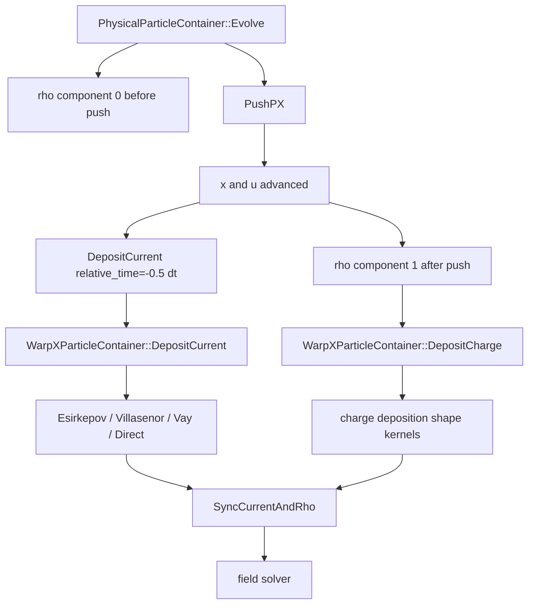

# 5. 电荷、电流沉积与形函数：源项如何回到网格

上一章从粒子侧解释了 field gather 和 pusher。本章看反方向：粒子推进后如何把电荷和电流交回网格。沉积不是输出或后处理，而是 PIC 离散方程的一部分。它直接决定离散连续性方程、Gauss 定律误差、数值噪声、guard cell 需求和 AMR fine/coarse 同步方式。

本章对应源码笔记见 `notes/code-reading/particles/00-particle-evolve-callchain.md`、`notes/code-reading/particles/01-pusher-and-deposition-evidence.md` 和 `notes/code-reading/particles/02-gather-shape-deposition-kernels.md`。

Birdsall-Langdon 在 `Plasma Physics via Computer Simulation` 第一分卷的 `4-6` 到 `4-8` 给了一个很硬的理论边界：只要粒子通过空间网格被观测和求场，它就不再表现成零厚度 point particle，而必须被理解成具有有效形状因子 `S(x)`、频域响应 `S(k)` 的 finite-size cloud。这样一来，shape order 不是单纯“更光滑的插值公式”，而是同时改写三件事：

1. 粒子如何把 `rho/J` 交回网格；
2. 网格场如何再被 gather 回粒子；
3. 粒子间短程相互作用怎样被平滑，以及 grid force / aliasing 从哪里进入离散系统。

因此本章不能把 shape、deposition 和 finite-grid effects 分开讲。对 WarpX 来说，`ShapeFactors.H`、charge/current deposition kernel、AMR coarse-fine buffer 和后续的 current correction 共同实现的，正是这条 Birdsall 已经提前写清的离散合同。

Birdsall-Langdon 在 Chapter 8 又把这条线再往前推了一步：aliasing 不是“把结果做 FFT 之后才看见的谱污染”，而是在

$$
\rho(k) = q \sum_p S(k_p)\,n(k_p), \qquad k_p = k - p k_g
$$

这一步就已经发生。也就是说，particle continuum information 被 sample 到 grid 上时，不同 aliases 已经混进同一个 `rho(k)`。这正是为什么本章既要讲 shape factor，也必须讲 finite-grid effects 和 sampled density 的合同；否则只讨论 `ShapeFactors.H` 的局部公式，会把真正的 alias source 讲窄。

Birdsall 到 Chapter 10 又把这条线往前压了一步：`energy-conserving` 和 `momentum-conserving` 不是同一套沉积/受力合同上“谁更准一点”的实现差别，而是两条不同的离散守恒路线。前者把离散场能量

$$
W_E=\frac{V_c}{2}\sum_j \rho_j\phi_j
$$

当成第一性对象，再从 `-\partial W_E/\partial x_i` 构造粒子受力；后者则保持更常见的 grid force / zero-total-force 结构。因此本章后面讨论 `ShapeFactors.H`、charge/current deposition 和 sampled density 时，必须把它们同时视作“守恒合同”的一部分，而不是孤立的插值技术细节。

Birdsall 在 Chapter 13 又把这条 shape-factor 主线往“长期数值健康度”推进了一步：对 thermal plasma，weighting order 与 short-wavelength smoothing 不只是决定瞬时噪声有多平滑，还会直接改写 self-heating time `\tau_H`。一维结果和 Hockney 的 2d2v 长时间实验都说明：

- 更高阶 particle shape 会更强地削弱 alias coupling；
- 更激进的高波数截断会进一步拉长 `\tau_H`；
- 但 collisional slowing-down time `\tau_s` 未必同步等比例变化。

所以本章讨论 shape order 时，不能只写“更高阶更光滑、噪声更低”。更准确的说法是：shape order、cloud width 和 smoothing policy 一起决定了热等离子体多久会因为 finite-grid effects 累积出不可忽略的数值自热。

`Dawson 1983` 则把同一条线往前退回到更基础的动机层：finite-size particles 的第一性目的不是“插值更方便”，而是先把 point-charge 的近距离大冲量软化掉，从而压低不想要的 collisional effects，同时保住长程 Coulomb collective behavior。也正因为粒子已经被改写成有限尺寸 cloud，空间上比 cloud 更细的电荷起伏本来就不再分辨，grid 才成为一种自然的 coarse-grained source representation。这条综述级表述很适合放在本章开头，因为它比直接从 `ShapeFactors.H` 展开更清楚地交代了：shape、charge sharing 和 sampled density 本来就是同一个物理建模决定的三个侧面。

## 5.1 电荷沉积的基本形式

对宏粒子 \(p\)，电荷、权重和位置分别为 \(q_p,w_p,\mathbf{x}_p\)。最基本的网格电荷沉积是

$$
\rho_i
=
\frac{1}{\Delta V_i}
\sum_p q_p w_p S_i(\mathbf{x}_p).
$$

这里 \(S_i\) 是粒子形函数对网格自由度 \(i\) 的权重。形函数阶数越高，粒子影响的网格范围越大，噪声通常越低，但 stencil、guard cell 和通信成本也更高。

WarpX 中 shape 阶数通过 `nox/noy/noz` 等内部变量进入 gather 和 deposition 分派。例如 current deposition 里会根据 `WarpX::nox` 选择 `ShapeN<1>` 到 `ShapeN<4>` 的模板实例，见 `../warpx/Source/Particles/WarpXParticleContainer.cpp:662-694`、`:810-864`、`:867-890`。

## 5.2 `ShapeFactors.H`：WarpX 实际使用的 0 到 4 阶形函数

形函数不是抽象参数。WarpX 在 `../warpx/Source/Particles/ShapeFactors.H:27-84` 直接给出 0 到 4 阶的权重和最左网格点索引：

```cpp
template <int depos_order>
struct Compute_shape_factor
{
    template< typename T >
    AMREX_GPU_HOST_DEVICE AMREX_FORCE_INLINE
    int operator()(
        T* const sx,
        T xmid) const
    {
        if constexpr (depos_order == 0){
            const auto j = static_cast<int>(xmid + T(0.5));
            sx[0] = T(1.0);
            return j;
        }
        else if constexpr (depos_order == 1){
            const auto j = static_cast<int>(xmid);
            const T xint = xmid - T(j);
            sx[0] = T(1.0) - xint;
            sx[1] = xint;
            return j;
        }
        else if constexpr (depos_order == 2){
            const auto j = static_cast<int>(xmid + T(0.5));
            const T xint = xmid - T(j);
            sx[0] = T(0.5)*(T(0.5) - xint)*(T(0.5) - xint);
            sx[1] = T(0.75) - xint*xint;
            sx[2] = T(0.5)*(T(0.5) + xint)*(T(0.5) + xint);
            // index of the leftmost cell where particle deposits
            return j-1;
        }
        else if constexpr (depos_order == 3){
            const auto j = static_cast<int>(xmid);
            const T xint = xmid - T(j);
            sx[0] = (T(1.0))/(T(6.0))*(T(1.0) - xint)*(T(1.0) - xint)*(T(1.0) - xint);
            sx[1] = (T(2.0))/(T(3.0)) - xint*xint*(T(1.0) - xint/(T(2.0)));
            sx[2] = (T(2.0))/(T(3.0)) - (T(1.0) - xint)*(T(1.0) - xint)*(T(1.0) - T(0.5)*(T(1.0) - xint));
            sx[3] = (T(1.0))/(T(6.0))*xint*xint*xint;
            // index of the leftmost cell where particle deposits
            return j-1;
        }
        else if constexpr (depos_order == 4){
            const auto j = static_cast<int>(xmid + T(0.5));
            const T xint = xmid - T(j);
            sx[0] = (T(1.0))/(T(24.0))*(T(0.5) - xint)*(T(0.5) - xint)*(T(0.5) - xint)*(T(0.5) - xint);
            sx[1] = (T(1.0))/(T(24.0))*(T(4.75) - T(11.0)*xint + T(4.0)*xint*xint*(T(1.5) + xint - xint*xint));
            sx[2] = (T(1.0))/(T(24.0))*(T(14.375) + T(6.0)*xint*xint*(xint*xint - T(2.5)));
            sx[3] = (T(1.0))/(T(24.0))*(T(4.75) + T(11.0)*xint + T(4.0)*xint*xint*(T(1.5) - xint - xint*xint));
            sx[4] = (T(1.0))/(T(24.0))*(T(0.5) + xint)*(T(0.5) + xint)*(T(0.5) + xint)*(T(0.5)+xint);
            // index of the leftmost cell where particle deposits
            return j-2;
        }
        else{
            WARPX_ABORT_WITH_MESSAGE("Unknown particle shape selected in Compute_shape_factor");
            amrex::ignore_unused(sx, xmid);
        }
        return 0;
    }
};
```

对一阶，若 \(x_\mathrm{mid}=j+\xi\)，\(0\le\xi<1\)，源码就是

$$
S_0=1-\xi,\qquad S_1=\xi.
$$

对二阶，源码先把最近节点/中心取成 `j = int(xmid + 0.5)`，再使用

$$
S_0=\frac12\left(\frac12-\xi\right)^2,\quad
S_1=\frac34-\xi^2,\quad
S_2=\frac12\left(\frac12+\xi\right)^2,
$$

并返回 `j-1` 作为 stencil 左端。三阶和四阶同样是 B-spline 形函数的展开式。源码里 0/2/4 阶用 `xmid+0.5` 找中心，1/3 阶用 `xmid` 找左端，这是因为偶数阶和奇数阶 shape 的自然支撑中心不同。

Esirkepov 沉积还需要把旧位置的 shape 写进与新位置对齐的数组。对应源码在 `../warpx/Source/Particles/ShapeFactors.H:93-156`：

```cpp
template <int depos_order>
struct Compute_shifted_shape_factor
{
    template< typename T >
    AMREX_GPU_HOST_DEVICE AMREX_FORCE_INLINE
    int operator()(
        T* const sx,
        const T x_old,
        const int i_new) const
    {
        if constexpr (depos_order == 0){
            const auto i = static_cast<int>(std::floor(x_old + T(0.5)));
            const int i_shift = i - i_new;
            sx[1+i_shift] = T(1.0);
            return i;
        }
        else if constexpr (depos_order == 1){
            const auto i = static_cast<int>(std::floor(x_old));
            const int i_shift = i - i_new;
            const T xint = x_old - T(i);
            sx[1+i_shift] = T(1.0) - xint;
            sx[2+i_shift] = xint;
            return i;
        }
        else if constexpr (depos_order == 2){
            const auto i = static_cast<int>(x_old + T(0.5));
            const int i_shift = i - (i_new + 1);
            const T xint = x_old - T(i);
            sx[1+i_shift] = T(0.5)*(T(0.5) - xint)*(T(0.5) - xint);
            sx[2+i_shift] = T(0.75) - xint*xint;
            sx[3+i_shift] = T(0.5)*(T(0.5) + xint)*(T(0.5) + xint);
            // index of the leftmost cell where particle deposits
            return i - 1;
        }
        else if constexpr (depos_order == 3){
            const auto i = static_cast<int>(x_old);
            const int i_shift = i - (i_new + 1);
            const T xint = x_old - T(i);
            sx[1+i_shift] = (T(1.0))/(T(6.0))*(T(1.0) - xint)*(T(1.0) - xint)*(T(1.0) - xint);
            sx[2+i_shift] = (T(2.0))/(T(3.0)) - xint*xint*(T(1.0) - xint/(T(2.0)));
            sx[3+i_shift] = (T(2.0))/(T(3.0)) - (T(1.0) - xint)*(T(1.0) - xint)*(T(1.0) - T(0.5)*(T(1.0) - xint));
            sx[4+i_shift] = (T(1.0))/(T(6.0))*xint*xint*xint;
            // index of the leftmost cell where particle deposits
            return i - 1;
        }
        else if constexpr (depos_order == 4){
            const auto i = static_cast<int>(x_old + T(0.5));
            const int i_shift = i - (i_new + 2);
            const T xint = x_old - T(i);
            sx[1+i_shift] = (T(1.0))/(T(24.0))*(T(0.5) - xint)*(T(0.5) - xint)*(T(0.5) - xint)*(T(0.5) - xint);
            sx[2+i_shift] = (T(1.0))/(T(24.0))*(T(4.75) - T(11.0)*xint + T(4.0)*xint*xint*(T(1.5) + xint - xint*xint));
            sx[3+i_shift] = (T(1.0))/(T(24.0))*(T(14.375) + T(6.0)*xint*xint*(xint*xint - T(2.5)));
            sx[4+i_shift] = (T(1.0))/(T(24.0))*(T(4.75) + T(11.0)*xint + T(4.0)*xint*xint*(T(1.5) - xint - xint*xint));
            sx[5+i_shift] = (T(1.0))/(T(24.0))*(T(0.5) + xint)*(T(0.5) + xint)*(T(0.5) + xint)*(T(0.5)+xint);
            // index of the leftmost cell where particle deposits
            return i - 2;
        }
        else{
            WARPX_ABORT_WITH_MESSAGE("Unknown particle shape selected in Compute_shifted_shape_factor");
            amrex::ignore_unused(sx, x_old, i_new);
        }
        return 0;
    }
};
```

这里的 `i_shift` 是 Esirkepov 的关键工程细节：旧位置和新位置可能跨过 cell 边界，不能把两个 shape 数组各自放在自己的左端后直接相减。WarpX 把旧 shape 平移到以 `i_new` 为参考的数组里，后面才能逐项计算 `sx_old[i] - sx_new[i]`。

## 5.3 电流沉积的守恒要求

电荷沉积只看某一时间层的粒子位置。电流沉积必须看粒子在时间步内穿过网格的轨迹。离散电磁 PIC 希望满足

$$
\frac{\rho_i^{n+1}-\rho_i^n}{\Delta t}
+(\nabla_h\cdot\mathbf{J}^{n+1/2})_i=0.
$$

如果这个式子不成立，Maxwell solver 即使形式上正确，离散 Gauss 定律也会漂移：

$$
\nabla_h\cdot\mathbf{E}^{n+1}
-\frac{\rho^{n+1}}{\epsilon_0}
\neq 0.
$$

这解释了为什么 WarpX 需要 Esirkepov、Villasenor、Vay、Direct 等多种 current deposition。Direct deposition 直观但不自动保证电荷守恒；Esirkepov 和 Villasenor 属于 charge-conserving 路径；Vay deposition 与 PSATD/current correction 等算法组合有关。

把这个合同再往前压一步，可以直接写成单粒子 shape difference：

$$
\rho_i^n=\frac{1}{\Delta V_i}\sum_p q_p w_p\,S_i(x_p^n),
$$

因此一步中的净电荷变化本质上就是

$$
\rho_i^{n+1}-\rho_i^n
=
\frac{q_p w_p}{\Delta V_i}\bigl(S_i(x_p^{n+1})-S_i(x_p^n)\bigr).
$$

charge-conserving deposition 真正要做的，不是“再估一个差不多的 `\mathbf J`”，而是构造某个离散电流，使得

$$
\frac{\rho_i^{n+1}-\rho_i^n}{\Delta t}
=
-(\nabla_h\cdot \mathbf{J}^{n+1/2})_i.
$$

这给后面的算法分叉一个更稳定的读法：

- **Esirkepov**：围绕 old/new shape difference 直接构造守恒电流；
- **Villasenor**：把轨迹按 cell crossing 切 segment，再让每段局部输运共同满足同一离散守恒；
- **Direct**：直接写 `q w \mathbf v/\Delta V`，所以不自动满足这个合同；
- **Vay**：属于显式-only 的两阶段 `D`-field 重组算法，离散守恒不是通过 Esirkepov/Villasenor 这种单阶段 charge-conserving kernel 来实现。

## 5.4 WarpX 的旧电荷、新电荷和半步电流

`PhysicalParticleContainer::Evolve()` 在 `../warpx/Source/Particles/PhysicalParticleContainer.cpp:452-825` 中组织单 species 的沉积顺序。

关键源码节选如下，来自同一个 tile loop；这里省略了 buffer/coarse gather 和隐式 suborbit 的长分支，但保留 push 前电荷、粒子推进、半步电流和 push 后电荷的原始调用形态：

```cpp
if (deposit_charge) {
    // Deposit charge before particle push, in component 0 of MultiFab rho.
    const int* const AMREX_RESTRICT ion_lev = (do_field_ionization)?
        pti.GetiAttribs("ionizationLevel").dataPtr():nullptr;

    amrex::MultiFab* rho = fields.get(FieldType::rho_fp, lev);
    DepositCharge(pti, wp, ion_lev, rho, 0, 0,
                  np_to_deposit, thread_num, lev, lev);
}

if (! do_not_push)
{
    if (push_type == PushType::Explicit) {
        PushPX(pti, exfab, eyfab, ezfab,
               bxfab, byfab, bzfab,
               Ex.nGrowVect(), e_is_nodal,
               0, np_to_push, lev, gather_lev, dt,
               ScaleFields(false), subcycling_half,
               position_push_type, momentum_push_type);
    }

    // Current Deposition
    if (deposit_current)
    {
        // Deposit at t_{n+1/2} with explicit push
        const amrex::Real relative_time = (push_type == PushType::Explicit ? -0.5_rt * dt : 0.0_rt);

        amrex::MultiFab * jx = fields.get(current_fp_string, Direction{0}, lev);
        amrex::MultiFab * jy = fields.get(current_fp_string, Direction{1}, lev);
        amrex::MultiFab * jz = fields.get(current_fp_string, Direction{2}, lev);
        DepositCurrent(pti, wp, uxp, uyp, uzp, ion_lev, jx, jy, jz,
                       0, np_to_deposit, thread_num,
                       lev, lev, dt, relative_time, push_type);
    }
}

if (deposit_charge) {
    // Deposit charge after particle push, in component 1 of MultiFab rho.
    // (Skipped for electrostatic solver, as this may lead to out-of-bounds)
    if (WarpX::electrostatic_solver_id == ElectrostaticSolverAlgo::None) {
        amrex::MultiFab* rho = fields.get(FieldType::rho_fp, lev);
        DepositCharge(pti, wp, ion_lev, rho, 1, 0,
                      np_to_deposit, thread_num, lev, lev);
    }
}
```

| 行号 | 动作 | 时间层解释 |
|---|---|---|
| `:579-592` | push 前沉积 `rho` component 0 | 旧电荷，通常是 \(\rho^n\)。 |
| `:613-617`、`:671-676` | 调用 `PushPX()` 推进粒子 | \(\mathbf{x}^n,\mathbf{u}^{n-1/2}\to\mathbf{x}^{n+1},\mathbf{u}^{n+1/2}\)。 |
| `:697-733` | push 后沉积 current | 显式路径 `relative_time=-0.5*dt`，对应 \(\mathbf{J}^{n+1/2}\)。 |
| `:785-803` | push 后沉积 `rho` component 1 | 新电荷，通常是 \(\rho^{n+1}\)。 |

为什么电流在 push 后沉积还要 `relative_time=-0.5*dt`？因为粒子位置已经是 \(\mathbf{x}^{n+1}\)，而电流应位于半步 \(n+1/2\)。WarpX 在 `DepositCurrent()` 的注释中说明：`relative_time` 非零时会临时修改粒子位置以匹配沉积时间，见 `../warpx/Source/Particles/WarpXParticleContainer.cpp:386-389`。

这也是读源码时必须区分“粒子当前数组中的位置”和“沉积物理时间层”的原因。

## 5.5 多物种层如何清零和汇总源项

`../warpx/Source/Particles/MultiParticleContainer.cpp:471-516` 是多物种粒子推进入口。

若不跳过沉积，`MultiParticleContainer::Evolve()` 先把本 level 的当前步源项清零：

- `current_fp` 三个方向：`:482-484`；
- `current_buf` 三个方向：`:485-487`；
- `rho_fp`：`:488`；
- `rho_buf`：`:489`。

然后在 `:513-515` 遍历 `allcontainers`，每个 species 各自沉积到同一组源项数组中。也就是说，最终的 \(\rho\) 和 \(\mathbf{J}\) 是所有物种贡献之和。

独立调用的 `DepositCurrent()` 和 `DepositCharge()` 也有类似结构：

- `MultiParticleContainer::DepositCurrent()` 位于 `:580-605`，先清零多层 \(J\)，再逐 species 调 `pc->DepositCurrent()`。
- `MultiParticleContainer::DepositCharge()` 位于 `:608-640`，先清零 \(\rho\)，若 `relative_time != 0` 则临时 `PushX(relative_time)`，逐 species 沉积后再推回。

这些函数主要服务于 PSATD-JRhom、多时间层 charge/current、静电场或诊断等场景。

## 5.6 AMR coarse-fine interface：粒子怎样切到 `aux/cax/buf` 路径

前面几章已经讲过 AMR 的 substitution 公式

$$
F(a)=F(r)+I[F(s)-F(c)]
$$

以及 `UpdateAuxilaryData*()` 在 WarpX 里的实现

$$
\mathrm{aux}(\ell)=\mathrm{fp}(\ell)+I[\mathrm{aux}(\ell-1)-\mathrm{cp}(\ell)].
$$

但只知道这条公式，还不知道粒子在 coarse-fine transition zone 到底怎样用它。真正把这层逻辑接到粒子 kernel 上的是 `PhysicalParticleContainer::Evolve()`。

它不会在每个 gather/deposition kernel 内实时查 coarse-fine mask，而是先做一次粒子重排：

```cpp
long nfine_deposit = np;
long nfine_gather = np;
if (has_buffer && !do_not_push) {
    PartitionParticlesInBuffers( nfine_deposit, nfine_gather, np,
        pti, lev, WarpX::n_field_gather_buffer,
        WarpX::n_current_deposition_buffer, current_masks, gather_masks );
}
```

源码位置：`../warpx/Source/Particles/PhysicalParticleContainer.cpp:566-575`。

这一步之后：

- 前 `nfine_gather` 个粒子继续从 fine patch gather；
- 后 `np-nfine_gather` 个粒子改从 lower refinement level gather；
- 前 `nfine_deposit` 个粒子继续沉积到 fine patch；
- 后 `np-nfine_deposit` 个粒子改沉积到 lower refinement level buffer。

接下来的 gather 分成两段。先看 fine interior 粒子：

```cpp
const auto np_to_push = np_gather;
const auto gather_lev = lev;
PushPX(pti, exfab, eyfab, ezfab,
       bxfab, byfab, bzfab,
       Ex.nGrowVect(), e_is_nodal,
       0, np_to_push, lev, gather_lev, dt, ...);
```

源码位置：`../warpx/Source/Particles/PhysicalParticleContainer.cpp:611-617`。

这里的 `exfab/eyfab/...` 来自 `Efield_aux/Bfield_aux`，也就是已经做完 substitution 的 full solution。

随后是 transition-zone 粒子：

```cpp
amrex::MultiFab & cEx = *fields.get(FieldType::Efield_cax, Direction{0}, lev);
...
PushPX(pti, cexfab, ceyfab, cezfab,
       cbxfab, cbyfab, cbzfab,
       cEx.nGrowVect(), e_is_nodal,
       nfine_gather, np-nfine_gather,
       lev, lev-1, dt, ...);
```

源码位置：`../warpx/Source/Particles/PhysicalParticleContainer.cpp:640-676`。

这里不再使用 fine-level `aux`，而是使用 coarse-aux 副本 `E/Bfield_cax`，并且把 `gather_lev` 显式设成 `lev-1`。

因此，transition-zone 的粒子不是“先从 fine patch gather 再做后处理修正”，而是一开始就改用 lower-level full solution。

沉积也完全平行地拆成两段：

```cpp
DepositCurrent(... jx, jy, jz,
               0, np_to_deposit, thread_num,
               lev, lev, dt, relative_time, push_type);
...
DepositCurrent(... cjx, cjy, cjz,
               np_to_deposit, np-np_to_deposit, thread_num,
               lev, lev-1, dt, relative_time, push_type);
```

以及

```cpp
DepositCharge(... rho, 0, 0,
              np_to_deposit, thread_num, lev, lev);
...
DepositCharge(... crho, 0, np_to_deposit,
              np-np_to_deposit, thread_num, lev, lev-1);
```

源码位置：`../warpx/Source/Particles/PhysicalParticleContainer.cpp:583-591,712-730,797-801`。

这里：

- `current_fp/rho_fp` 接收 fine interior 粒子；
- `current_buf/rho_buf` 接收 transition-zone 粒子；
- `depos_lev = lev-1` 时，不是“先沉积在 fine 上再 restrict”，而是一开始就在 coarse buffer patch 的几何上沉积。

这一点在 `WarpXParticleContainer::DepositCurrent()` 和 `DepositCharge()` 的 tilebox 处理里写得非常直接：

```cpp
if (lev == depos_lev) {
    tilebox = pti.tilebox();
} else {
    const IntVect& ref_ratio = WarpX::RefRatio(depos_lev);
    tilebox = amrex::coarsen(pti.tilebox(),ref_ratio);
}
```

源码位置：`../warpx/Source/Particles/WarpXParticleContainer.cpp:462-467,1542-1547`。

也就是说，buffer deposition 真正变化的是：

- `offset`
- `np_to_deposit`
- `depos_lev`
- 以及由此确定的 `tilebox`、`dinv`、`xyzmin`

但电流/电荷沉积算法本身并没有为 AMR 单独再写一套。无论是 Esirkepov、Villasenor、Vay 还是 Direct，WarpX 都是在“同一个 deposition 数学 + 不同 level 的几何解释”上复用。

所以，AMR coarse-fine interface 在粒子层的闭环可以概括为：

1. `UpdateAuxilaryData*()` 先构造 fine patch 的 `aux`；
2. `BuildBufferMasks*()` 给出 transition-zone 的 gather/current masks；
3. `PartitionParticlesInBuffers()` 先重排粒子；
4. fine interior 粒子走 `aux + fp` 路径；
5. transition-zone 粒子走 `cax + buf` 路径；
6. 最后再由 `SyncCurrent()` / `SyncRho()` 把 coarse-fine source 合并回通信链。

## 5.7 `WarpXParticleContainer::DepositCurrent()` 分派

tile 级 current deposition 在 `../warpx/Source/Particles/WarpXParticleContainer.cpp:392-900`。

入口先做安全检查和局部数组准备：

| 行号 | 操作 |
|---|---|
| `:401-409` | 检查 deposition level，只处理非空粒子且 `do_not_deposit` 为假。 |
| `:411-446` | 取得 `ng_J`，检查粒子 shape 是否放得进 tile/guard cells。 |
| `:448-520` | 准备沉积 level 的 cell size、tilebox、field array 和边界 cropping。 |
| `:546-550` | Esirkepov/Villasenor 不能用于 collocated grid。 |

随后按沉积算法分派：

分派部分的源码骨架如下，位置为 `../warpx/Source/Particles/WarpXParticleContainer.cpp:654-865`。这里保留源码中的分支结构，重复的 `ShapeN<1..4>` 实参用 `...` 压缩；正式逐行讲解 `CurrentDeposition.H` 时要展开每个 kernel：

```cpp
if (WarpX::current_deposition_algo == CurrentDepositionAlgo::Esirkepov) {
    if (push_type == PushType::Explicit) {
        if      (WarpX::nox == 1){
            doEsirkepovDepositionShapeN<1>(...);
        } else if (WarpX::nox == 2){
            doEsirkepovDepositionShapeN<2>(...);
        } else if (WarpX::nox == 3){
            doEsirkepovDepositionShapeN<3>(...);
        } else if (WarpX::nox == 4){
            doEsirkepovDepositionShapeN<4>(...);
        }
    } else if (push_type == PushType::Implicit) {
        doChargeConservingDepositionShapeNImplicit<...>(...);
    }
} else if (WarpX::current_deposition_algo == CurrentDepositionAlgo::Villasenor) {
    if (push_type == PushType::Implicit) {
        doVillasenorDepositionShapeNImplicit<...>(...);
    }
    else {
        doVillasenorDepositionShapeNExplicit<...>(...);
    }
} else if (WarpX::current_deposition_algo == CurrentDepositionAlgo::Vay) {
    if (push_type == PushType::Implicit) {
        WARPX_ABORT_WITH_MESSAGE("The Vay algorithm cannot be used with implicit algorithm.");
    }
    doVayDepositionShapeN<...>(...);
} else { // Direct deposition
    if (push_type == PushType::Explicit) {
        doDepositionShapeN<...>(...);
    }
}
```

| 源码位置 | 算法 |
|---|---|
| `:556-650` | shared-memory current deposition，只支持 direct；Esirkepov、Villasenor、Vay 会 abort。 |
| `:654-695` | explicit Esirkepov，调用 `doEsirkepovDepositionShapeN<N>()`。 |
| `:696-751` | implicit charge-conserving deposition。 |
| `:752-835` | Villasenor explicit/implicit deposition。 |
| `:836-864` | Vay deposition；隐式路径直接 abort。 |
| `:865-900` | Direct deposition explicit/implicit 分支开头。 |

这个分派地图只是入口。下面继续进入 `Source/Particles/Deposition/ChargeDeposition.H` 和 `CurrentDeposition.H` 的 kernel，把 shape 权重、电荷归一化、direct current 与 Esirkepov 守恒电流逐块展开；Villasenor、Vay 和隐式路径留到后续小节继续补齐。

如果只看 AMR coarse-fine buffer，这几种算法的差异可以压缩成“共享同一套 coarse patch 几何，但恢复粒子轨迹的方式不同”。

首先，进入 `current_buf` 的粒子和进入 `current_fp` 的粒子，在接口层共享同样的沉积壳：

```cpp
if (lev == depos_lev) {
    tilebox = pti.tilebox();
} else {
    const IntVect& ref_ratio = WarpX::RefRatio(depos_lev);
    tilebox = amrex::coarsen(pti.tilebox(),ref_ratio);
}
tilebox.grow(ng_J);
const amrex::XDim3 dinv = WarpX::InvCellSize(std::max(depos_lev,0));
const amrex::XDim3 xyzmin = WarpX::LowerCorner(tilebox, depos_lev, 0.5_rt*dt);
```

源码位置：`../warpx/Source/Particles/WarpXParticleContainer.cpp:462-474,517`。

因此，AMR buffer 本身只改变：

- `depos_lev`
- `tilebox`
- `dinv`
- `xyzmin`
- 以及后续 `domain_double` / `do_cropping`

并不会为 coarse-fine interface 再定义另一套 current deposition 数学。

真正的分界线是各算法如何恢复 old/new/mid 轨迹：

- **Vay**：显式-only；接口层直接禁止 implicit。
- **Villasenor explicit**：使用当前粒子位置、`relative_time` 和 `dt` 回推 `x_old/x_new`。
- **Villasenor implicit**：不再用 `relative_time`，改为显式使用 `x_n`、`u_n`、`u_{n+1/2}` 恢复轨迹。
- **Esirkepov implicit**：时间层输入与 implicit Villasenor 相似，但后续仍走 old/new shape 差分的守恒电流构造。

例如显式 Villasenor 会先写：

```cpp
amrex::Real const xp_new = xp + (relative_time + 0.5_rt*dt)*uxp[ip]*gaminv;
amrex::Real const xp_old = xp_new - dt*uxp[ip]*gaminv;
```

源码位置：`../warpx/Source/Particles/Deposition/CurrentDeposition.H:2236-2237`。

而隐式 Villasenor / Esirkepov 则改为：

```cpp
amrex::ParticleReal const xp_np1 = 2._prt*xp_nph - xp_n;
```

源码位置：

- Villasenor implicit：`../warpx/Source/Particles/Deposition/CurrentDeposition.H:2347`
- Esirkepov implicit：`../warpx/Source/Particles/Deposition/CurrentDeposition.H:1171`

所以，AMR coarse-fine buffer 下 current deposition 的最小结论是：

1. coarse-fine 只决定粒子在哪个 level 的几何上沉积；
2. 时间层恢复方式仍由 current deposition 算法自身决定；
3. 也正因为如此，`current_buf` 可以统一复用 Villasenor、Vay、Esirkepov、Direct 的现有 kernel，而不需要 AMR 专用变体。

如果继续往 kernel 本体再走一步，就会发现 Villasenor 和 Esirkepov 的 charge-conserving 结构并不只是“名字不同”，而是两种完全不同的组织方式。

Esirkepov 的核心是先把 old/new shape 写到同一索引框架里：

```cpp
double sx_new[depos_order + 3] = {0.};
double sx_old[depos_order + 3] = {0.};
const int i_new = compute_shape_factor(sx_new+1, x_new );
const int i_old = compute_shifted_shape_factor(sx_old, x_old, i_new);
```

源码位置：`../warpx/Source/Particles/Deposition/CurrentDeposition.H:881-884`。

这里 `compute_shifted_shape_factor` 的作用，是把旧位置的 shape 平移到以 `i_new` 为参考的数组里。这样后面就可以直接构造

$$
s_x^{\mathrm{old}} - s_x^{\mathrm{new}}
$$

这类差分项。

例如 3D `J_x` 的主结构就是：

```cpp
amrex::Real sdxi = 0._rt;
for (int i=dil; i<=depos_order+1-diu; i++) {
    sdxi += wq*invdtd.x*(sx_old[i] - sx_new[i])*(
        one_third*(sy_new[j]*sz_new[k] + sy_old[j]*sz_old[k])
       +one_sixth*(sy_new[j]*sz_old[k] + sy_old[j]*sz_new[k]));
    amrex::Gpu::Atomic::AddNoRet(&Jx_arr(...), sdxi);
}
```

源码位置：`../warpx/Source/Particles/Deposition/CurrentDeposition.H:951-965`。

也就是说，Esirkepov 不是把每个 stencil 点独立沉积，而是沿沉积方向做“差分前缀累加”，这正是离散连续性约束进入实现的地方。

Villasenor 则完全不同。它先数 cell crossings：

```cpp
const auto i_old = static_cast<int>(x_old-shift);
const auto i_new = static_cast<int>(x_new-shift);
const int cell_crossings_x = std::abs(i_new-i_old);
num_segments += cell_crossings_x;
```

源码位置：`../warpx/Source/Particles/Deposition/CurrentDeposition.H:1645-1649`。

然后按 crossing 把整条轨迹切成多个 segment，并对每个 segment 分别构造：

- cell-based 权重 `sx_cell`
- node-based old/new 权重 `sx_old_node/sx_new_node`

源码位置：`../warpx/Source/Particles/Deposition/CurrentDeposition.H:1744-1775`。

因此，两种 charge-conserving 路径的真正区别是：

- **Esirkepov**：整条轨迹一次性映射成 old/new shape difference，并沿方向做累加；
- **Villasenor**：先把轨迹按 crossing 分段，再对每个 segment 做局部沉积。

这也解释了源码注释里为什么说 Villasenor “results in a tighter stencil”：它的支持域是围绕每个真实 crossing segment 局部组织的，而不是像 Esirkepov 那样由整条 old/new difference support 一次性决定。

还有一条算法要单独区分出来：Vay deposition。它和 Direct、Esirkepov、Villasenor 的差别，不只是“权重系数不同”，而是整个执行拓扑都不同。

`CurrentDeposition.H` 的注释写得很直接：

```cpp
deposit D in real space and store the result in Dx_fab, Dy_fab, Dz_fab
```

源码位置：`../warpx/Source/Particles/Deposition/CurrentDeposition.H:2361-2363`。

这说明 Vay 路径的第一目标不是直接形成普通意义上的 `Jx/Jy/Jz`，而是先沉积一组 `D` 量。对应地，它一开始就会额外分配一个 temporary FAB：

```cpp
#if defined(WARPX_DIM_3D)
amrex::FArrayBox temp_fab{Dx_fab.box(), 4};
#elif defined(WARPX_DIM_XZ)
amrex::FArrayBox temp_fab{Dx_fab.box(), 2};
#endif
temp_fab.setVal<amrex::RunOn::Device>(0._rt);
```

源码位置：`../warpx/Source/Particles/Deposition/CurrentDeposition.H:2432-2440`。

也就是说，Vay deposition 不是单阶段沉积，而是两阶段：

1. 粒子 loop 先写 `temp_arr` 中间量；
2. 再由 box 级 `ParallelFor` 把它们重组为三个方向。

例如 3D 的第二阶段就是：

```cpp
const amrex::Real t_a = temp_arr(i,j,k,0);
const amrex::Real t_b = temp_arr(i,j,k,1);
const amrex::Real t_c = temp_arr(i,j,k,2);
const amrex::Real t_d = temp_arr(i,j,k,3);
Dx_arr(i,j,k) += (1._rt/6._rt)*(2_rt*t_a       + t_b       + t_c - 2._rt*t_d);
Dy_arr(i,j,k) += (1._rt/6._rt)*(2_rt*t_a       + t_b - 2._rt*t_c       + t_d);
Dz_arr(i,j,k) += (1._rt/6._rt)*(2_rt*t_a - 2._rt*t_b       + t_c       + t_d);
```

源码位置：`../warpx/Source/Particles/Deposition/CurrentDeposition.H:2649-2657`。

这正是它和 Esirkepov / Villasenor 的根本区别：

- **Esirkepov / Villasenor**：粒子 loop 内直接形成 charge-conserving `J`；
- **Vay**：粒子 loop 只形成 `D` 的中间组合量，真正的三个方向要靠第二阶段线性重组。

同时，Vay 还有一组清晰的实现边界：

- 不支持 implicit；
- 不支持 RZ；
- 不支持 1D / RCYLINDER / RSPHERE；
- 不支持 shared-memory current deposition。

这组边界不是上层文档约定，而是 kernel 内部直接 `abort`：

```cpp
#if defined(WARPX_DIM_RZ)
    WARPX_ABORT_WITH_MESSAGE("Vay deposition not implemented in RZ geometry");
#endif

#if defined(WARPX_DIM_1D_Z) || defined(WARPX_DIM_RCYLINDER) || defined(WARPX_DIM_RSPHERE)
    WARPX_ABORT_WITH_MESSAGE("Vay deposition not implemented in 1D geometry");
#endif
```

源码位置：`../warpx/Source/Particles/Deposition/CurrentDeposition.H:2406-2417`。

与此相对，implicit charge-conserving 和 Villasenor 路径反而把几何差异显式展开了。比如 implicit charge-conserving 里直接分成：

- `RZ / RCYLINDER`
  - 从 `(x,y)` 恢复半径 `r`
  - 再用 `costheta/sintheta` 重建分量
- `RSPHERE`
  - 再进一步恢复 `r,\theta,\phi`
- `1D_Z`
  - 空间支撑只剩 `z`
  - 但横向速度分量仍可能进入 current 分量的几何解释

源码原文如下，位置为 `../warpx/Source/Particles/Deposition/CurrentDeposition.H:1191-1261`：

```cpp
#if defined(WARPX_DIM_RZ) || defined(WARPX_DIM_RCYLINDER)
    ...
    const amrex::Real costheta_mid = (rp_mid > 0._rt ? xp_mid/rp_mid : 1._rt);
    const amrex::Real sintheta_mid = (rp_mid > 0._rt ? yp_mid/rp_mid : 0._rt);
#elif defined(WARPX_DIM_RSPHERE)
    ...
    const amrex::Real cosphi_mid = (rp_mid > 0. ? rpxy_mid/rp_mid : 1._rt);
    const amrex::Real sinphi_mid = (rp_mid > 0. ? zp_mid/rp_mid : 0._rt);
#elif defined(WARPX_DIM_1D_Z)
    amrex::Real const vx = uxp_nph[ip]*gaminv;
    amrex::Real const vy = uyp_nph[ip]*gaminv;
#endif
```

因此第 5 章里更稳定的组织方式不能只按算法名字排目录，还必须同时保留：

1. 离散连续性合同；
2. `Direct / Esirkepov / Villasenor / Vay` 的实现差异；
3. `implicit / RZ / 1D_Z / RCYLINDER / RSPHERE` 的时间层与几何边界。

因此，Vay 应该被看作一个显式、笛卡尔、两阶段重组的专用沉积路径，而不是一般 current deposition kernel 的简单变种。

## 5.8 `WarpXParticleContainer::DepositCharge()` 入口

上面讲的是 Vay deposition 的实现拓扑；本地 regression 里还有一条更直接的验证入口：`Examples/Tests/vay_deposition/`。这组测试不是拿解析单粒子轨道去对照，而是只看经过一小段推进后，最终 full diagnostics 里是否仍满足

$$
\frac{\max | \nabla\cdot E - \rho/\epsilon_0 |}{\max |\rho/\epsilon_0|} < 10^{-3}.
$$

也就是说，它真正测的是：

- `algo.current_deposition = vay`
- `algo.maxwell_solver = psatd`
- `warpx.grid_type = collocated`

这组 Vay 专用实现边界下，`D`-field 两阶段重组后的离散电荷守恒是否仍成立。对第 5 章来说，这条 regression 很重要，因为它给了一个比 Langmuir 家族更窄、更直接的 Vay deposition 自证入口。

和它互补的另一组 regression 是 `Examples/Tests/langmuir/` 里的 PSATD current-correction 变体。那组测试不是只看 `divE-rho/\epsilon_0`，而是两层断言一起做：

1. 先把 `Ex/Ey/Ez` 或 `Ex/Ez` 与解析 Langmuir-wave 场解比较；
2. 再由 `analysis_utils.py` 在特定组合下追加 `divE-rho/\epsilon_0` 检查。

更关键的是，这个 helper 明确写死了适用边界：

- `current_correction`
  - 始终检查，容差 `1e-9`
- `current_deposition = vay`
  - 始终检查，容差 `1e-3`
- `current_deposition = esirkepov`
  - 只在非 `RZ` 且非 `PSATD` 时检查

因此，`Langmuir + current_correction` 和 `vay_deposition` 两组 regression 的角色并不相同：

- `Langmuir + current_correction`
  - 是 `解析场解 + source consistency` 的组合验证；
  - 典型输入还会显式打开 `psatd.current_correction = 1` 与 `psatd.periodic_single_box_fft = 1`。
- `vay_deposition`
  - 是更窄的 `PSATD + collocated + Vay current deposition` source-synchronization 验证；
  - 只断言离散 Gauss law，不再做解析波对照。

这正好也对应上一节的 `SyncCurrentAndRho()` 分叉：

- current-correction 变体对应 `PSATD + periodic single box` 下仍立即同步的那条路径；
- Vay 变体对应非 periodic-single-box 下 `current_fp_vay` 单独过滤、再交给后续 PSATD 同步链的那条专门路径。

tile 级 charge deposition 入口在 `../warpx/Source/Particles/WarpXParticleContainer.cpp:1479-1585`。

| 行号 | 操作 |
|---|---|
| `:1485-1489` | 检查 `rho` component 数量是否足够。 |
| `:1497-1503` | 非空粒子检查并取得 `ng_rho`。 |
| `:1504-1533` | 检查粒子 shape 与 guard cells。 |
| `:1535-1539` | 取得 species 电荷并建立 profiling scope。 |
| `:1541-1558` | 构造沉积 tilebox，并处理 level/coarse buffer。 |
| `:1560-1577` | GPU 使用 `rho` alias，CPU 使用 thread-local `local_rho`。 |
| `:1579-1585` | 根据 `icomp` 计算 `time_shift_delta`。 |

`time_shift_delta` 对理解 `rho` component 很关键：`icomp==0` 表示旧时间层；`icomp==1` 表示新时间层。它和 `PhysicalParticleContainer::Evolve()` 中 push 前/后两次 charge deposition 对应。

## 5.9 `ChargeDeposition.H`：电荷沉积 kernel 的逐项结构

`WarpXParticleContainer::DepositCharge()` 最后会进入 `../warpx/Source/Particles/Deposition/ChargeDeposition.H:36-172` 的模板 kernel。下面按 3D 主干摘出核心源码，并保留 XZ/RZ 与 3D 的原始写入分支；完整维度条件见原文件同一函数：

```cpp
template <int depos_order>
void doChargeDepositionShapeN (const GetParticlePosition<PIdx>& GetPosition,
                               const amrex::ParticleReal * const wp,
                               const int* ion_lev,
                               amrex::FArrayBox& rho_fab,
                               long np_to_deposit,
                               const amrex::XDim3 & dinv,
                               const amrex::XDim3 & xyzmin,
                               amrex::Dim3 lo,
                               amrex::Real q,
                               [[maybe_unused]] int n_rz_azimuthal_modes)
{
    const bool do_ionization = ion_lev;
    const amrex::Real invvol = dinv.x*dinv.y*dinv.z;
    amrex::Array4<amrex::Real> const& rho_arr = rho_fab.array();
    amrex::IntVect const rho_type = rho_fab.box().type();

    amrex::ParallelFor(
            np_to_deposit,
            [=] AMREX_GPU_DEVICE (long ip) {
            amrex::Real wq = q*wp[ip]*invvol;
            if (do_ionization){
                wq *= ion_lev[ip];
            }

            amrex::ParticleReal xp, yp, zp;
            GetPosition(ip, xp, yp, zp);

            Compute_shape_factor< depos_order > const compute_shape_factor;
            const amrex::Real x = (xp - xyzmin.x)*dinv.x;

            amrex::Real sx[depos_order + 1] = {0._rt};
            int i = 0;
            if (rho_type[0] == NODE) {
                i = compute_shape_factor(sx, x);
            } else if (rho_type[0] == CELL) {
                i = compute_shape_factor(sx, x - 0.5_rt);
            }

            const amrex::Real y = (yp - xyzmin.y)*dinv.y;
            amrex::Real sy[depos_order + 1] = {0._rt};
            int j = 0;
            if (rho_type[1] == NODE) {
                j = compute_shape_factor(sy, y);
            } else if (rho_type[1] == CELL) {
                j = compute_shape_factor(sy, y - 0.5_rt);
            }

            const amrex::Real z = (zp - xyzmin.z)*dinv.z;
            amrex::Real sz[depos_order + 1] = {0._rt};
            int k = 0;
            if (rho_type[WARPX_ZINDEX] == NODE) {
                k = compute_shape_factor(sz, z);
            } else if (rho_type[WARPX_ZINDEX] == CELL) {
                k = compute_shape_factor(sz, z - 0.5_rt);
            }

#if defined(WARPX_DIM_XZ) || defined(WARPX_DIM_RZ)
            for (int iz=0; iz<=depos_order; iz++){
                for (int ix=0; ix<=depos_order; ix++){
                    amrex::Gpu::Atomic::AddNoRet(
                        &rho_arr(lo.x+i+ix, lo.y+k+iz, 0, 0),
                        sx[ix]*sz[iz]*wq);
                }
            }
#elif defined(WARPX_DIM_3D)
            for (int iz=0; iz<=depos_order; iz++){
                for (int iy=0; iy<=depos_order; iy++){
                    for (int ix=0; ix<=depos_order; ix++){
                        amrex::Gpu::Atomic::AddNoRet(
                            &rho_arr(lo.x+i+ix, lo.y+j+iy, lo.z+k+iz),
                            sx[ix]*sy[iy]*sz[iz]*wq);
                    }
                }
            }
#endif
        }
        );
}
```

这段代码对应的 3D 公式是

$$
\rho_{i+\alpha,j+\beta,k+\gamma}
\leftarrow
\rho_{i+\alpha,j+\beta,k+\gamma}
+ q\,w_p\,
\frac{1}{\Delta x\Delta y\Delta z}\,
S_\alpha(x_p)S_\beta(y_p)S_\gamma(z_p).
$$

源码里 `wq = q*wp[ip]*invvol` 已经包含体积归一化，因此 `rho_arr` 存的是电荷密度而不是 cell 总电荷。`ion_lev` 非空时再乘电离态，说明 field ionization species 的有效粒子电荷是在沉积时按粒子属性修正的。

`Gpu::Atomic::AddNoRet` 是并行正确性必须条件：不同粒子可能同时向同一个网格点沉积。没有 atomic，GPU/多线程下源项会出现竞态；物理上表现为非确定的 \(\rho\) 和 \(\mathbf{J}\) 误差。

## 5.10 Direct current deposition：非守恒但直观的速度加权沉积

Direct current deposition 的核心 kernel 是 `../warpx/Source/Particles/Deposition/CurrentDeposition.H:47-274`。下面两段分别取自同一函数的前半段和写入段；中间省略的是与 x 方向同构的 y/z 方向 shape 初始化。先看粒子电流权重和半步位置：

```cpp
template <int depos_order>
AMREX_GPU_HOST_DEVICE AMREX_INLINE
void doDepositionShapeNKernel([[maybe_unused]] const amrex::ParticleReal xp,
                              [[maybe_unused]] const amrex::ParticleReal yp,
                              [[maybe_unused]] const amrex::ParticleReal zp,
                              const amrex::ParticleReal wq,
                              const amrex::ParticleReal vx,
                              const amrex::ParticleReal vy,
                              const amrex::ParticleReal vz,
                              amrex::Array4<amrex::Real> const& jx_arr,
                              amrex::Array4<amrex::Real> const& jy_arr,
                              amrex::Array4<amrex::Real> const& jz_arr,
                              amrex::IntVect const& jx_type,
                              amrex::IntVect const& jy_type,
                              amrex::IntVect const& jz_type,
                              const amrex::Real relative_time,
                              const amrex::XDim3 & dinv,
                              const amrex::XDim3 & xyzmin,
                              const amrex::Real invvol,
                              const amrex::Dim3 lo,
                              [[maybe_unused]] const int n_rz_azimuthal_modes)
{
    // wqx, wqy wqz are particle current in each direction
#if defined(WARPX_DIM_RZ) || defined(WARPX_DIM_RCYLINDER)
    const amrex::Real xpmid = xp + relative_time*vx;
    const amrex::Real ypmid = yp + relative_time*vy;
    const amrex::Real rpmid = std::sqrt(xpmid*xpmid + ypmid*ypmid);
    const amrex::Real costheta = (rpmid > 0._rt ? xpmid/rpmid : 1._rt);
    const amrex::Real sintheta = (rpmid > 0._rt ? ypmid/rpmid : 0._rt);
    const amrex::Real wqx = wq*invvol*(+vx*costheta + vy*sintheta);
    const amrex::Real wqy = wq*invvol*(-vx*sintheta + vy*costheta);
    const amrex::Real wqz = wq*invvol*vz;
#else
    const amrex::Real wqx = wq*invvol*vx;
    const amrex::Real wqy = wq*invvol*vy;
    const amrex::Real wqz = wq*invvol*vz;
#endif

    Compute_shape_factor< depos_order > const compute_shape_factor;
    const double xmid = ((xp - xyzmin.x) + relative_time*vx)*dinv.x;
    double sx_node[depos_order + 1] = {0.};
    double sx_cell[depos_order + 1] = {0.};
    int j_node = 0;
    int j_cell = 0;
    if (jx_type[0] == NODE || jy_type[0] == NODE || jz_type[0] == NODE) {
        j_node = compute_shape_factor(sx_node, xmid);
    }
    if (jx_type[0] == CELL || jy_type[0] == CELL || jz_type[0] == CELL) {
        j_cell = compute_shape_factor(sx_cell, xmid - 0.5);
    }
```

`relative_time` 在显式路径通常是 `-0.5*dt`。由于 `DepositCurrent()` 被调用时粒子位置已经是 \(\mathbf{x}^{n+1}\)，这行

$$
x_\mathrm{mid}
=
\frac{x^{n+1}-x_\mathrm{min}-\frac12 v_x\Delta t}{\Delta x}
$$

把沉积位置移回半步。Direct deposition 的电流权重就是 \(q w_p \mathbf{v}_p/\Delta V\)。

最终写入数组的源码在 `CurrentDeposition.H:211-274`：

```cpp
    // Deposit current into jx_arr, jy_arr and jz_arr
#if defined(WARPX_DIM_XZ) || defined(WARPX_DIM_RZ)
    for (int iz=0; iz<=depos_order; iz++){
        for (int ix=0; ix<=depos_order; ix++){
            amrex::Gpu::Atomic::AddNoRet(
                &jx_arr(lo.x+j_jx+ix, lo.y+l_jx+iz, 0, 0),
                sx_jx[ix]*sz_jx[iz]*wqx);
            amrex::Gpu::Atomic::AddNoRet(
                &jy_arr(lo.x+j_jy+ix, lo.y+l_jy+iz, 0, 0),
                sx_jy[ix]*sz_jy[iz]*wqy);
            amrex::Gpu::Atomic::AddNoRet(
                &jz_arr(lo.x+j_jz+ix, lo.y+l_jz+iz, 0, 0),
                sx_jz[ix]*sz_jz[iz]*wqz);
        }
    }
#elif defined(WARPX_DIM_3D)
    for (int iz=0; iz<=depos_order; iz++){
        for (int iy=0; iy<=depos_order; iy++){
            for (int ix=0; ix<=depos_order; ix++){
                amrex::Gpu::Atomic::AddNoRet(
                    &jx_arr(lo.x+j_jx+ix, lo.y+k_jx+iy, lo.z+l_jx+iz),
                    sx_jx[ix]*sy_jx[iy]*sz_jx[iz]*wqx);
                amrex::Gpu::Atomic::AddNoRet(
                    &jy_arr(lo.x+j_jy+ix, lo.y+k_jy+iy, lo.z+l_jy+iz),
                    sx_jy[ix]*sy_jy[iy]*sz_jy[iz]*wqy);
                amrex::Gpu::Atomic::AddNoRet(
                    &jz_arr(lo.x+j_jz+ix, lo.y+k_jz+iy, lo.z+l_jz+iz),
                    sx_jz[ix]*sy_jz[iy]*sz_jz[iz]*wqz);
            }
        }
    }
#endif
}
```

3D 形式可以写为

$$
J_{x,i+\alpha,j+\beta,k+\gamma}
\leftarrow
J_{x,i+\alpha,j+\beta,k+\gamma}
+ q w_p v_x\frac{1}{\Delta V}
S^{J_x}_{\alpha}(x_p^{n+1/2})
S^{J_x}_{\beta}(y_p^{n+1/2})
S^{J_x}_{\gamma}(z_p^{n+1/2}),
$$

\(J_y,J_z\) 同理，但使用各自 staggering 对应的 shape 数组 `sx_jy/sy_jy/sz_jy` 与 `sx_jz/sy_jz/sz_jz`。Direct 路径的优点是简单，缺点是这个公式没有强制把 \(\rho^n\) 和 \(\rho^{n+1}\) 的差精确写成离散散度。

## 5.10 Esirkepov current deposition：用新旧形函数差构造连续性方程

Esirkepov 入口在 `../warpx/Source/Particles/Deposition/CurrentDeposition.H:675-723`：

```cpp
template <int depos_order>
void doEsirkepovDepositionShapeN (const GetParticlePosition<PIdx>& GetPosition,
                                  const amrex::ParticleReal * const wp,
                                  const amrex::ParticleReal * const uxp,
                                  const amrex::ParticleReal * const uyp,
                                  const amrex::ParticleReal * const uzp,
                                  const int* ion_lev,
                                  const amrex::Array4<amrex::Real>& Jx_arr,
                                  const amrex::Array4<amrex::Real>& Jy_arr,
                                  const amrex::Array4<amrex::Real>& Jz_arr,
                                  long np_to_deposit,
                                  amrex::Real dt,
                                  amrex::Real relative_time,
                                  const amrex::XDim3 & dinv,
                                  const amrex::XDim3 & xyzmin,
                                  amrex::Dim3 lo,
                                  amrex::Real q,
                                  [[maybe_unused]] int n_rz_azimuthal_modes,
                                  const amrex::Array4<const int>& reduced_particle_shape_mask,
                                  bool enable_reduced_shape
                                  )
{
    bool const do_ionization = ion_lev;

    amrex::XDim3 const invdtd = amrex::XDim3{(1.0_rt/dt)*dinv.y*dinv.z,
                                             (1.0_rt/dt)*dinv.x*dinv.z,
                                             (1.0_rt/dt)*dinv.x*dinv.y};

    Real constexpr inv_c2 = PhysConst::inv_c2;
    Real constexpr one_third = 1.0_rt / 3.0_rt;
    Real constexpr one_sixth = 1.0_rt / 6.0_rt;

    enum eb_flags : int { has_reduced_shape, no_reduced_shape };
    const int reduce_shape_runtime_flag = (enable_reduced_shape && (depos_order>1))? has_reduced_shape : no_reduced_shape;
```

`invdtd.x=(1/dt)*dinv.y*dinv.z` 不是普通的 \(1/\Delta t\)。因为 \(J_x\) 位于 x-face，离散连续性中 \(J_x\) 的差分还会除以 \(\Delta x\)，所以 current 的量纲需要配合横截面积 \(1/(\Delta y\Delta z)\)。源码使用 `dinv.y*dinv.z/dt`，后续再由差分 operator 处理 x 向差分。

粒子旧/新位置和 shape 数组在 `CurrentDeposition.H:724-935` 生成：

```cpp
amrex::ParallelFor( TypeList<CompileTimeOptions<has_reduced_shape,no_reduced_shape>>{},
    {reduce_shape_runtime_flag},
    np_to_deposit, [=] AMREX_GPU_DEVICE (long ip, auto reduce_shape_control) {
        Real const gaminv = 1.0_rt/std::sqrt(1.0_rt + uxp[ip]*uxp[ip]*inv_c2
                                             + uyp[ip]*uyp[ip]*inv_c2
                                             + uzp[ip]*uzp[ip]*inv_c2);

        Real wq = q*wp[ip];
        if (do_ionization){
            wq *= ion_lev[ip];
        }

        ParticleReal xp, yp, zp;
        GetPosition(ip, xp, yp, zp);

        double const x_new = (xp - xyzmin.x + (relative_time + 0.5_rt*dt)*uxp[ip]*gaminv)*dinv.x;
        double const x_old = x_new - dt*dinv.x*uxp[ip]*gaminv;
        double const y_new = (yp - xyzmin.y + (relative_time + 0.5_rt*dt)*uyp[ip]*gaminv)*dinv.y;
        double const y_old = y_new - dt*dinv.y*uyp[ip]*gaminv;
        double const z_new = (zp - xyzmin.z + (relative_time + 0.5_rt*dt)*uzp[ip]*gaminv)*dinv.z;
        double const z_old = z_new - dt*dinv.z*uzp[ip]*gaminv;

        const Compute_shape_factor< depos_order > compute_shape_factor;
        const Compute_shifted_shape_factor< depos_order > compute_shifted_shape_factor;
        const Compute_shifted_shape_factor< 1 > compute_shifted_shape_factor_order1;

        double sx_new[depos_order + 3] = {0.};
        double sx_old[depos_order + 3] = {0.};
        const int i_new = compute_shape_factor(sx_new+1, x_new );
        const int i_old = compute_shifted_shape_factor(sx_old, x_old, i_new);

        double sy_new[depos_order + 3] = {0.};
        double sy_old[depos_order + 3] = {0.};
        const int j_new = compute_shape_factor(sy_new+1, y_new);
        const int j_old = compute_shifted_shape_factor(sy_old, y_old, j_new);

        double sz_new[depos_order + 3] = {0.};
        double sz_old[depos_order + 3] = {0.};
        const int k_new = compute_shape_factor(sz_new+1, z_new );
        const int k_old = compute_shifted_shape_factor(sz_old, z_old, k_new );

        int dil = 1, diu = 1;
        if (i_old < i_new) { dil = 0; }
        if (i_old > i_new) { diu = 0; }
        int djl = 1, dju = 1;
        if (j_old < j_new) { djl = 0; }
        if (j_old > j_new) { dju = 0; }
        int dkl = 1, dku = 1;
        if (k_old < k_new) { dkl = 0; }
        if (k_old > k_new) { dku = 0; }
```

这里 `x_new` 与 `x_old` 是同一时间步轨迹的两端。显式路径中 `relative_time=-0.5*dt`，而粒子数组位置是 push 后位置，于是

$$
x_\mathrm{new}
=
x^{n+1}
\left(-\frac12\Delta t+\frac12\Delta t\right)v_x
=x^{n+1},
\qquad
x_\mathrm{old}=x^{n+1}-v_x\Delta t=x^n.
$$

最后的 3D 电流公式在 `CurrentDeposition.H:955-989`：

```cpp
for (int k=dkl; k<=depos_order+2-dku; k++) {
    for (int j=djl; j<=depos_order+2-dju; j++) {
        amrex::Real sdxi = 0._rt;
        for (int i=dil; i<=depos_order+1-diu; i++) {
            sdxi += wq*invdtd.x*(sx_old[i] - sx_new[i])*(
                one_third*(sy_new[j]*sz_new[k] + sy_old[j]*sz_old[k])
               +one_sixth*(sy_new[j]*sz_old[k] + sy_old[j]*sz_new[k]));
            amrex::Gpu::Atomic::AddNoRet( &Jx_arr(lo.x+i_new-1+i, lo.y+j_new-1+j, lo.z+k_new-1+k), sdxi);
        }
    }
}
for (int k=dkl; k<=depos_order+2-dku; k++) {
    for (int i=dil; i<=depos_order+2-diu; i++) {
        amrex::Real sdyj = 0._rt;
        for (int j=djl; j<=depos_order+1-dju; j++) {
            sdyj += wq*invdtd.y*(sy_old[j] - sy_new[j])*(
                one_third*(sx_new[i]*sz_new[k] + sx_old[i]*sz_old[k])
               +one_sixth*(sx_new[i]*sz_old[k] + sx_old[i]*sz_new[k]));
            amrex::Gpu::Atomic::AddNoRet( &Jy_arr(lo.x+i_new-1+i, lo.y+j_new-1+j, lo.z+k_new-1+k), sdyj);
        }
    }
}
for (int j=djl; j<=depos_order+2-dju; j++) {
    for (int i=dil; i<=depos_order+2-diu; i++) {
        amrex::Real sdzk = 0._rt;
        for (int k=dkl; k<=depos_order+1-dku; k++) {
            sdzk += wq*invdtd.z*(sz_old[k] - sz_new[k])*(
                one_third*(sx_new[i]*sy_new[j] + sx_old[i]*sy_old[j])
               +one_sixth*(sx_new[i]*sy_old[j] + sx_old[i]*sy_new[j]));
            amrex::Gpu::Atomic::AddNoRet( &Jz_arr(lo.x+i_new-1+i, lo.y+j_new-1+j, lo.z+k_new-1+k), sdzk);
        }
    }
}
```

这不是 \(q\mathbf{v}S\) 的 direct 形式。它用新旧 shape 的差构造电流。例如 \(J_x\) 内部累计量可概括为

$$
\Delta J_x(i,j,k)
\propto
\sum_{i'\le i}
q\frac{S_x^n(i')-S_x^{n+1}(i')}{\Delta t\,\Delta y\,\Delta z}
\overline{S_yS_z}(j,k),
$$

其中横向平均 \(\overline{S_yS_z}\) 在源码中由 `one_third` 和 `one_sixth` 组合给出。这种构造保证对 `Jx/Jy/Jz` 做离散散度时，望远镜求和会还原新旧电荷形函数差：

$$
\nabla_h\cdot\mathbf{J}^{n+1/2}
=
-\frac{\rho^{n+1}-\rho^n}{\Delta t}
$$

在同一 shape、同一网格中心和同一边界同步规则下成立。这就是 Esirkepov 路径比 direct 路径更适合作为显式电磁 PIC 默认守恒沉积的原因。

## 5.11 沉积不只回 `rho/J`：WarpX 还把线性响应矩阵和统计矩交回网格

如果只盯 `DepositCharge()` 和 `DepositCurrent()`，会把本章的边界讲窄。WarpX 里至少还有两条同样属于 particle-to-grid deposition 的源项支线：

1. **mass matrices deposition**
   - 服务 implicit/JFNK 的线性化电流响应；
   - 不是 Maxwell 方程这一时间步要直接消费的 `current_fp`。
2. **temperature / variance deposition**
   - 服务 per-species 温度和速度方差统计；
   - 不是 `rho/J` 的附属输出，而是一条独立的 weighted-moment deposition 主线。

这三条线共享同一套 particle-to-grid 工程骨架：

- shape order
- tilebox / buffer
- guard-cell 安全检查
- boundary sum / fill-boundary

但物理语义不同。

### 5.11.1 mass matrices：沉的是 `J(E)` 的线性响应，不是当前步的 Maxwell 源项

`MultiParticleContainer::DepositMassMatrices()` 会先把

- `MassMatrices_X`
- `MassMatrices_Y`
- `MassMatrices_Z`

三组方向块清零，再逐 species 调 `pc->DepositMassMatrices(fields, lev, dt)`。源码见 `../warpx/Source/Particles/MultiParticleContainer.cpp:617-629`。

species 级的 `PhysicalParticleContainer::DepositMassMatrices()` 则取：

- `Bfield_aux`
- 九个矩阵块 `Sxx..Szz`

再调用 `WarpXParticleContainer::DepositMassMatrices(...)`，源码见 `../warpx/Source/Particles/PhysicalParticleContainer.cpp:828-883`。

因此这条线的第一性对象不是

$$
\rho,\qquad \mathbf J,
$$

而是 implicit 线性化里近似

$$
\mathbf J(\mathbf E)\approx \mathbf J_0 + \mathbf M(\mathbf E-\mathbf E_0)
$$

所需的粒子响应块。也正因为它不是普通 current deposition 的平移版，源码一开始就拒绝：

- `Esirkepov`
- `Vay`
- collocated grid

只保留：

- `Villasenor`
- `Direct`

两条 mass-matrix deposition 路径，见 `../warpx/Source/Particles/WarpXParticleContainer.cpp:1131-1365`。

### 5.11.2 temperature / variance deposition：沉的是样本数、加权均值和去均值二次矩

species 打开 `do_temperature_deposition` 后，`PhysicalParticleContainer::AllocData()` 会按 `current_fp` 的 box/stagger/guard 规格额外分配 `T_<species>` 三个方向场，并创建 `VarianceAccumulationBuffer`。源码见 `../warpx/Source/Particles/PhysicalParticleContainer.cpp:363-387`。

真正的多物种入口不在主 `Evolve()` 里，而是 `MultiParticleContainer::DepositTemperatures()`：

1. 找出 `T_<species>`；
2. 清零；
3. 调 `pc->AccumulateVelocitiesAndComputeTemperature(T_vf, relative_time)`；

见 `../warpx/Source/Particles/MultiParticleContainer.cpp:645-670`。

这条线的工作前提也比普通 `J` 沉积更窄。`DepositTemperature()` 直接要求：

- `current_deposition_algo == Direct`
- `push_type == Explicit`
- 关闭 shared-memory current deposition

否则 abort，见 `../warpx/Source/Particles/PhysicalParticleContainer.cpp:1844-1858`。

内部统计对象不是 “直接沉温度”，而是：

- `n`
- `w`
- `wv`
- `w(v-\bar v)^2`

更具体地，当前实现硬编码走 `DOUBLE_PASS`：

1. 第一遍沉 sample count、权重和、加权速度和；
2. boundary sum；
3. 第二遍用第一遍得到的 `\bar v` 再沉去均值二次矩；
4. 再按
   $$
   \mathrm{var} = \frac{n}{(n-1)\sum w}\sum w(v-\bar v)^2
   $$
   做 unbiased normalization；
5. 最后乘 `m/k_B` 变成 Kelvin。

源码位置：

- `../warpx/Source/Particles/PhysicalParticleContainer.cpp:1982-2188`
- `../warpx/Source/Particles/Deposition/TemperatureDeposition.H:25-115`
- `../warpx/Source/Particles/Deposition/VarianceAccumulationBuffer.cpp:79-118`

因此，这条温度沉积主线更准确地说是：

- particle-to-grid weighted-moment deposition
- 再经过 boundary sum / filter / 归一化
- 最后得到 `T_x/T_y/T_z`

而不是 “顺手从 `J` 推一个温度”。

### 5.11.3 这一节回头修正了本章的总边界

到这里，本章里 “粒子把东西交回网格” 至少已经分成三类：

1. `rho/J`
   - 服务 Maxwell 源项与离散连续性；
2. `MassMatrices_*`
   - 服务 implicit/JFNK 的线性响应近似；
3. `T_<species>` / variance buffers
   - 服务统计矩和温度 diagnostics。

它们的共同点是都共享 shape、tilebox、guard-cell 和 boundary-sum 的 deposition 工程骨架；不同点是物理语义完全不同。

## 5.12 沉积后为什么还要同步

沉积 kernel 只把粒子贡献放到本地数组、tile、本 level 或 buffer 中。它还不能保证场求解器马上可以使用这些源项。主循环在 `../warpx/Source/Evolve/WarpXEvolve.cpp:555-561` 调 `SyncCurrentAndRho()`，源码注释直接把它定义成：

- filter
- exchange guard cells
- interpolate across MR levels
- apply boundary conditions

但如果只停在这句注释，本章会把真正的 source-synchronization 合同讲窄。更准确的分层如下。

### 5.12.1 `PSATD` 与 `FDTD` 的同步时序不同

`SyncCurrentAndRho()` 位于 `../warpx/Source/Evolve/WarpXEvolve.cpp:768-837`。

- `PSATD + periodic single box`
  - 即使启用了 `current correction` 或 `Vay deposition`，也立即同步；
  - 若是 Vay，则同步的名字就是 `current_fp_vay`，不是 `current_fp`。
- `PSATD + 非 periodic single box`
  - 只有在
    - 没开 `current_correction`
    - 且不是 `Vay deposition`
    时才立刻 `SyncCurrent("current_fp") + SyncRho()`；
  - 否则把更完整的同步推迟到 `PushPSATD`。
- `FDTD`
  - 直接 `SyncCurrent("current_fp") + SyncRho()`。

因此 source synchronization 的时序本身就是 solver-algorithm contract 的一部分，不是沉积后永远立刻做的固定尾声。

### 5.12.2 `SyncCurrent()` 的骨架：coarsen、buffer、owner mask、filter、SumBoundary

`SyncCurrent()` 的底层在 `../warpx/Source/Parallelization/WarpXComm.cpp:1174-1376`。

它的关键结构不是一句 “通信电流”，而是：

1. 若开 `do_current_centering`
   - 先把 `current_fp_nodal` 中心化回 staggered `current_fp`。
2. finest-to-coarsest 迭代
   - 先把未过滤、未求和的 `J_fp` coarsen 成 `J_cp`。
3. 若有 `current_buf`
   - 先把 `J_cp` 加到 buffer，再统一作为跨 level 的通信源。
4. coarse level 接收 finer 源项时
   - 先 `ParallelAdd` 到临时 `fine_lev_cp`
   - 再用 `OwnerMask(...)` 去掉 nodal overlap / periodic overlap 的 double counting
   - 然后才并入本 level `J_fp`
5. 最后对每个 level 再做：
   - `ApplyFilterMF(...)`
   - `SumBoundaryJ(...)`

这里尤其要注意 owner-mask 这一步：它说明 fine-to-coarse 源项并不能直接并进当前 level `J_fp`，否则 nodal overlap 点会被重复加两次。

### 5.12.3 `SyncRho()` 平行但不完全等于 `SyncCurrent()`

`SyncRho()` 位于 `../warpx/Source/Parallelization/WarpXComm.cpp:1385-1451`，其高层结构和平行于 `SyncCurrent()`：

1. `rho_fp -> rho_cp` coarsen；
2. 若有 `rho_buf`，先和 `rho_cp` 合并；
3. coarse level 也通过临时 `fine_lev_cp + OwnerMask` 去重后再并回 `rho_fp`；
4. 最后对每个 level 调 `ApplyFilterandSumBoundaryRho(...)`。

但它和 current 不完全相同：

- 没有 `do_current_centering`
- 过滤和求和由 `ApplyFilterandSumBoundaryRho(...)` 统一处理

后者在 `../warpx/Source/Parallelization/WarpXComm.cpp:1677-1692` 中：

- 若 `use_filter`
  - 先把 filtered `rho` 写进临时 `rf`
  - 再用 `WarpXSumGuardCells(rho, rf, ...)` 把 filtered 值并回
- 否则直接 `WarpXSumGuardCells(rho, ...)`

所以 `SyncCurrent()` 与 `SyncRho()` 虽然共享 fine/coarse + buffer + owner-mask 的大骨架，但具体 filter/sum 实现并不一样。

### 5.12.4 `SyncCurrentAndRho()` 的最后一步其实是边界条件

顶层同步完成后，`SyncCurrentAndRho()` 还会继续对：

- fine patch 的 `rho_fp/current_fp`
- coarse patch 的 `rho_cp/current_cp`

调用：

- `ApplyRhofieldBoundary(...)`
- `ApplyJfieldBoundary(...)`

源码见 `../warpx/Source/Evolve/WarpXEvolve.cpp:815-836`。

因此这条函数的完整职责不是：

- “做完 guard-cell 通信就结束”

而是：

1. solver/algorithm 条件分叉；
2. same-level 与 fine/coarse 源项同步；
3. filter；
4. boundary reflection / mirror / PEC-compatibility。

所以完整源项路径更准确地写成：

```text
particle trajectory
  -> tile-level charge/current deposition
  -> species sum
  -> MultiFab/local or buffer accumulation
  -> filter / guard-cell exchange / AMR synchronization
  -> boundary conditions
  -> field solver
```

漏掉：

- owner-mask 去重、
- fine/coarse buffer 合并、
- filter 的时序、
- 或最后的 `ApplyRhofieldBoundary/ApplyJfieldBoundary`

都会把 WarpX 的 source synchronization 合同讲错。

## 5.13 形函数、guard cells 与稳定性

更高阶 shape 会影响三个方面：

1. gather/deposition stencil 更宽，需要更多 guard cells；
2. 粒子噪声降低，但局部性和通信成本增加；
3. 在边界、AMR coarse-fine interface、PML 和 embedded boundary 附近，shape 的截断或修正会影响守恒。

源码中 current deposition 和 charge deposition 都会检查 shape 是否能放进 guard cells。例如 current deposition 在 `WarpXParticleContainer.cpp:416-446` 计算 `shape_extent` 和 `range`，charge deposition 在 `:1504-1533` 做类似检查。这些检查不是性能细节，而是物理离散化安全条件。

## 5.14 本章结论

沉积的物理底线是离散连续性方程。WarpX 的工程实现把它拆成多层：



下一步最自然的是：

1. 继续收 `SyncCurrentAndRho()`、guard/current/rho 同步与 boundary 处理路径；
2. 然后再回到验证层，用 Langmuir PSATD current correction 和 `vay_deposition` regression 把这些沉积合同压成更强的本地断言边界。
