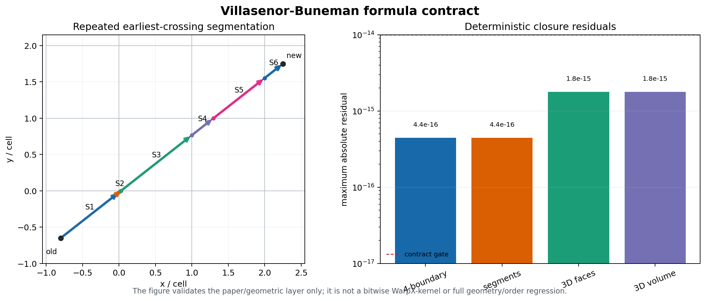
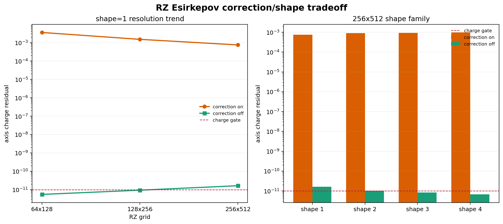
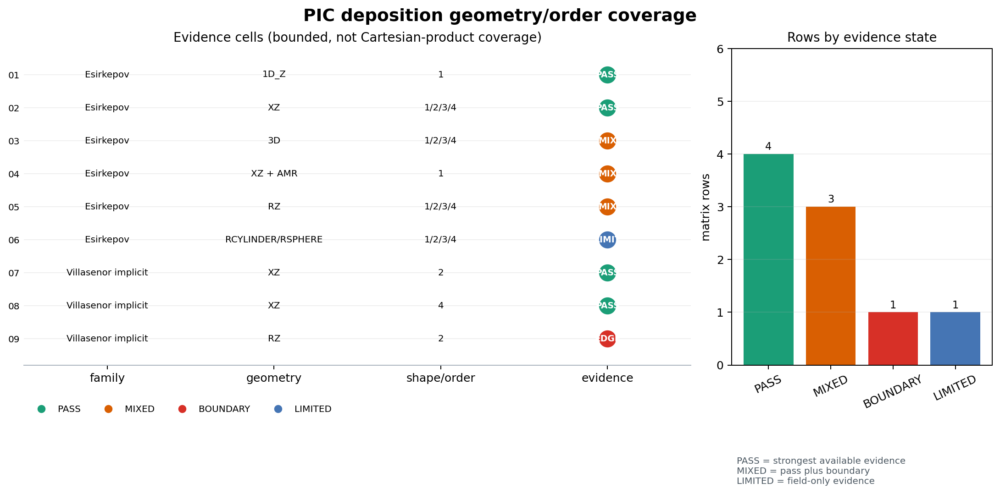

# 5. 电荷、电流沉积与形函数：源项如何回到网格

上一章从粒子侧解释了 field gather 和 pusher。本章看反方向：粒子推进后如何把电荷和电流交回网格。沉积不是输出或后处理，而是 PIC 离散方程的一部分。它直接决定离散连续性方程、Gauss 定律误差、数值噪声、guard cell 需求和 AMR fine/coarse 同步方式。

本章按一条从粒子状态到求解器源项的因果链展开：先用形函数定义一个粒子如何采样网格；再区分旧电荷、半步电流和新电荷的时间层；随后进入 `WarpXParticleContainer::DepositCurrent()` 与 `DepositCharge()`，比较 Direct、Esirkepov、Villasenor 和 Vay 的局部构造；最后沿 `WarpX::SyncCurrentAndRho()` 检查 guard cells、物种求和、AMR 和边界如何把 tile 局部写入变成场求解器可消费的 \(\rho/J\)。

需要回查实现时，优先从 `Source/Particles/ShapeFactors.H` 的 `Compute_shape_factor` / `Compute_shifted_shape_factor`，`Source/Particles/WarpXParticleContainer.cpp` 的 `DepositCurrent()` / `DepositCharge()`，`Source/Particles/Deposition/CurrentDeposition.H` 的四类 current kernel，以及 `Source/Evolve/WarpXEvolve.cpp` 的 `SyncCurrentAndRho()` 开始。文件路径和函数符号表达算法职责；不要把某次源码的行号或笔记目录当成沉积算法本身。

`Examples/Tests/langmuir/analysis_utils.py` 与 `Examples/Tests/vay_deposition/analysis.py` 提供代表性的 `divE-rho/epsilon_0` consumer，但每个 consumer 都只覆盖给定的几何、时间层和输入条件。本章会持续区分：公式解释离散构造，源码定位实现分派，而案例分析只检验其指定条件下的结果。

### 阅读路线：先把守恒问题变成四个可回答的问题

本章包含形函数公式、kernel 细节、AMR 同步和多组几何证据。第一次阅读可按下面顺序建立判断框架，第二次再回到相应的源码或案例：

1. **为什么沉积不是普通插值？** 阅读 5.1--5.3，先从单时间层的 \(\rho\) 写到 old/new shape difference 与离散连续性方程。这一步回答粒子走过一个时间步后，网格源项必须如何变化。
2. **源项在哪个时间层进入主循环？** 阅读 5.4--5.8，区分旧 `rho`、半步 `J` 和新 `rho`，再定位 `DepositCurrent()`、`DepositCharge()` 与物种汇总。这一步回答局部 kernel 写入的对象何时能被场求解器消费。
3. **守恒算法实际怎样构造？** 阅读 5.9--5.13，按需要比较 Direct、Esirkepov、Villasenor--Buneman 与 Vay，并把 tile、guard cell、AMR 和边界同步视为同一条 source 链的不同阶段。
4. **怎样把证据变成输入决策？** 阅读 5.14--5.15，先检查 geometry、AMR 和时间层是否允许该路径，再选择与 observable 匹配的 analysis，并明确案例不能外推到的组合。

因此，本章的阅读终点不是记住某个 kernel 名称，而是能回答四个问题：源项改变了什么、由哪条轨迹或时间层构造、经过哪些同步后被消费、以及哪一个 observable 真正检验了它。

本章引用 Esirkepov 2001 的作者预印本来解释 `W^1/W^2/W^3`、`Eq.(23)` 和二阶 spline 的构造；CPC 发表版的书目信息和摘要已核实，但没有可逐页核对的 publisher PDF。Villasenor-Buneman 1992 则可作为 crossing-based deposition 的全文来源。两条路径的论文、源码和运行证据将在 5.11 与 5.14 分层说明，不能相互替代。

Birdsall-Langdon 在 `Plasma Physics via Computer Simulation` 第一分卷的 `4-6` 到 `4-8` 给了一个很硬的理论边界：只要粒子通过空间网格被观测和求场，它就不再表现成零厚度 point particle，而必须被理解成具有有效形状因子 `S(x)`、频域响应 `S(k)` 的 finite-size cloud。这样一来，shape order 不是单纯“更光滑的插值公式”，而是同时改写三件事：

1. 粒子如何把 `rho/J` 交回网格；
2. 网格场如何再被 gather 回粒子；
3. 粒子间短程相互作用怎样被平滑，以及 grid force / aliasing 从哪里进入离散系统。

因此本章不能把 shape、deposition 和 finite-grid effects 分开讲。对 WarpX 来说，`ShapeFactors.H`、charge/current deposition kernel、AMR coarse-fine buffer 和后续的 current correction 共同实现的，正是这条 Birdsall 已经提前写清的离散合同。

Birdsall-Langdon 在 Chapter 8 又把这条线再往前推了一步：aliasing 不是“把结果做 FFT 之后才看见的谱污染”，而是在

$$
\rho(k) = q \sum_p S(k_p)\,n(k_p), \qquad k_p = k - p k_g
$$

这一步就已经发生。也就是说，particle continuum information 被 sample 到 grid 上时，不同 aliases 已经混进同一个 `rho(k)`。这正是为什么本章既要讲 shape factor，也必须讲 finite-grid effects 和 sampled density 的合同；否则只讨论 `ShapeFactors.H` 的局部公式，会把真正的 alias source 讲窄。

Birdsall 到 Chapter 10 又把这条线往前压了一步：`energy-conserving` 和 `momentum-conserving` 不是同一套沉积/受力合同上“谁更准一点”的实现差别，而是两条不同的离散守恒路线。前者把离散场能量

$$
W_E=\frac{V_c}{2}\sum_j \rho_j\phi_j
$$

当成第一性对象，再从 \(-\partial W_E/\partial x_i\) 构造粒子受力；后者则保持更常见的 grid force / zero-total-force 结构。因此本章后面讨论 `ShapeFactors.H`、charge/current deposition 和 sampled density 时，必须把它们同时视作“守恒合同”的一部分，而不是孤立的插值技术细节。

Birdsall 在 Chapter 13 又把这条 shape-factor 主线往“长期数值健康度”推进了一步：对 thermal plasma，weighting order 与 short-wavelength smoothing 不只是决定瞬时噪声有多平滑，还会直接改写 self-heating time \(\tau_H\)。一维结果和 Hockney 的 2d2v 长时间实验都说明：

- 更高阶 particle shape 会更强地削弱 alias coupling；
- 更激进的高波数截断会进一步拉长 \(\tau_H\)；
- 但 collisional slowing-down time \(\tau_s\) 未必同步等比例变化。

所以本章讨论 shape order 时，不能只写“更高阶更光滑、噪声更低”。更准确的说法是：shape order、cloud width 和 smoothing policy 一起决定了热等离子体多久会因为 finite-grid effects 累积出不可忽略的数值自热。

Hockney 1971 的可用证据限于摘要级：它支持 \(\tau_{\mathrm{coll}}/\tau_{pe}\)、电场能量涨落、\((\omega_{pe}\Delta t)_{\mathrm{opt}}\) 和 \(K_2\) 的定量路线，但不能支持对正文或图表的逐段解读。Abe et al. 1975 的摘要级 \(\sigma(K_g)\) 与 correlation-time 观测补充短时 fluctuation 的统计量，不能替代 Hockney 的长时 \(\tau_H\) 结论。

两篇 1974 摘要级来源补足了 particle-mesh 的历史定位：QPM/PPPM 把 Gaussian cloud、potential shaping、mesh noise 和 sub-mesh resolution 放到同一模型谱系；force shaping 则把 NGP/CIC/九点 charge-sharing hierarchy、potential correction 与 force-law angular anisotropy 联系起来。它们没有全文支撑，因而不能把摘要中的数值或设置当作 WarpX kernel 的复现结果。

`Dawson 1983` 则把同一条线往前退回到更基础的动机层：finite-size particles 的第一性目的不是“插值更方便”，而是先把 point-charge 的近距离大冲量软化掉，从而压低不想要的 collisional effects，同时保住长程 Coulomb collective behavior。也正因为粒子已经被改写成有限尺寸 cloud，空间上比 cloud 更细的电荷起伏本来就不再分辨，grid 才成为一种自然的 coarse-grained source representation。这条综述级表述很适合放在本章开头，因为它比直接从 `ShapeFactors.H` 展开更清楚地交代了：shape、charge sharing 和 sampled density 本来就是同一个物理建模决定的三个侧面。

## 5.1 电荷沉积的基本形式

对宏粒子 \(p\)，电荷、权重和位置分别为 \(q_p,w_p,\mathbf{x}_p\)。最基本的网格电荷沉积是

$$
\rho_i
=
\frac{1}{\Delta V_i}
\sum_p q_p w_p S_i(\mathbf{x}_p).
$$

这里 \(S_i\) 是粒子形函数对网格自由度 \(i\) 的权重。形函数阶数越高，粒子影响的网格范围越大，噪声通常越低，但 stencil、guard cell 和通信成本也更高。

WarpX 中 shape 阶数通过 `nox/noy/noz` 等内部变量进入 gather 和 deposition 分派。`Source/Particles/ShapeFactors.H` 定义 0--4 阶权重；`WarpXParticleContainer::DepositCurrent()` 再根据 `WarpX::nox` 与 `CurrentDepositionAlgo` 选择 `doEsirkepovDepositionShapeN<N>()`、`doVillasenorDepositionShapeN*<N>()`、`doVayDepositionShapeN<N>()` 或 direct `doDepositionShapeN<N>()`。因此读者应把 `nox/noy/noz` 看成“shape order 的全局分派键”，而不是某一个 kernel 的局部参数。

## 5.2 `ShapeFactors.H`：WarpX 实际使用的 0 到 4 阶形函数

形函数不是抽象参数。`Source/Particles/ShapeFactors.H` 中的 `Compute_shape_factor` 为 0 到 4 阶分别显式列出多项式，并同时返回 stencil 的最左写入点。读者不需要把 0--4 阶的五套 C++ 多项式当作一段程序背诵；下表先固定它们共同的离散几何：

| 阶数 | 参考点 | support 数 | 返回的最左写入点 |
|---:|---|---:|---|
| 0 | 最近网格点 | 1 | 最近点 |
| 1 | 左侧网格点 | 2 | 左端 `j` |
| 2 | 最近中心/节点 | 3 | `j-1` |
| 3 | 左侧网格点 | 4 | `j-1` |
| 4 | 最近中心/节点 | 5 | `j-2` |

下面是与源码等价的阅读伪代码，只保留一阶和二阶的代表式。三、四阶沿同一规则增加 B-spline 的 support；精确多项式应回查 `Compute_shape_factor`，而不是把这个缩写当作可编译替代品：

```text
shape_weights(order, xmid):
    if order is 0:
        return nearest_index(xmid), [1]
    if order is 1:
        j = floor(xmid); xi = xmid - j
        return j, [1-xi, xi]
    if order is 2:
        j = nearest_index(xmid); xi = xmid - j
        return j-1, [0.5*(0.5-xi)^2, 0.75-xi^2, 0.5*(0.5+xi)^2]
    if order is 3 or 4:
        return left_index_and_bspline_weights_for_that_order(xmid)
```

对一阶，若 \(x_\mathrm{mid}=j+\xi\)，\(0\le\xi<1\)，源码就是

$$
S_0=1-\xi,\qquad S_1=\xi.
$$

对二阶，源码先把最近节点/中心取成 `j = int(xmid + 0.5)`，再使用

$$
S_0=\frac12\left(\frac12-\xi\right)^2,\quad
S_1=\frac34-\xi^2,\quad
S_2=\frac12\left(\frac12+\xi\right)^2,
$$

并返回 `j-1` 作为 stencil 左端。三阶和四阶同样是 B-spline 形函数的展开式。源码里 0/2/4 阶用 `xmid+0.5` 找中心，1/3 阶用 `xmid` 找左端，这是因为偶数阶和奇数阶 shape 的自然支撑中心不同。

Esirkepov 沉积还需要把旧位置的 shape 写进与新位置对齐的数组。对应实现是同一文件中的 `Compute_shifted_shape_factor`。它不是第二套形函数，而是在已经知道 new stencil 的前提下，把 old weights 写入带前后 padding 的共同索引框架。其等价阅读伪代码为：

```text
aligned_old_shape(order, x_old, new_left):
    old_left, old_weights = shape_weights(order, x_old)
    shift = offset_needed_to_align(old_left, new_left, order)
    write old_weights into padded_old_shape[1 + shift :]
    return old_left, padded_old_shape
```

`offset_needed_to_align` 在源码中随偶/奇阶支撑而不同：0、1 阶以 `i_new` 为参考，2、3 阶以 `i_new+1` 为参考，4 阶以 `i_new+2` 为参考。这里的 `i_shift` 是 Esirkepov 的关键工程细节：旧位置和新位置可能跨过 cell 边界，不能把两个 shape 数组各自放在自己的左端后直接相减。WarpX 把旧 shape 平移到以 `i_new` 为参考的数组里，后面才能逐项计算 `sx_old[i] - sx_new[i]`。

再往下一层看，`ShapeFactors.H` 里这三个 functor 其实对应三种不同的离散合同，而不只是“都能算一组权重”：

1. `Compute_shape_factor`
   - 给出单时间层的 shape
   - 同时返回当前 stencil 的最左写入点；
2. `Compute_shifted_shape_factor`
   - 不把 old shape 独立排到自己的左端
   - 而是把它平移进“以 new shape 为参考”的数组框架；
3. `Compute_shape_factor_pair`
   - 给同一 Villasenor segment 的横向 old/new 权重提供共同 leftmost index。

对第 5 章来说，这条区分很重要，因为后面 `Esirkepov` 与 `Villasenor` 看起来都在“算 old/new shape”，但它们真正需要的不是同一类 helper：前者需要 old/new difference 的同框对齐，后者需要 segment-local 横向共同支撑。

这里还有一条容易忽略的数值实现边界：`ShapeFactors.H` 文件头已经说明，current deposition 中这些 functor 可以用 `double` 参数求值，以避免粒子一步只移动很短距离时，单精度把 old/new 差分结构磨掉。`CurrentDeposition.H` 的 implicit Esirkepov 里也确实把 `x_new/x_old` 与 `sx_new/sx_old` 明确声明成 `double`。因此这里的 double 不是泛泛的“更高精度更好”，而是离散守恒实现的一部分。

## 5.3 电流沉积的守恒要求

电荷沉积只看某一时间层的粒子位置。电流沉积必须看粒子在时间步内穿过网格的轨迹。离散电磁 PIC 希望满足

$$
\frac{\rho_i^{n+1}-\rho_i^n}{\Delta t}
+(\nabla_h\cdot\mathbf{J}^{n+1/2})_i=0.
$$

如果这个式子不成立，Maxwell solver 即使形式上正确，离散 Gauss 定律也会漂移：

$$
\nabla_h\cdot\mathbf{E}^{n+1}
-\frac{\rho^{n+1}}{\epsilon_0}
\neq 0.
$$

这解释了为什么 WarpX 需要 Esirkepov、Villasenor、Vay、Direct 等多种 current deposition。Direct deposition 直观但不自动保证电荷守恒；Esirkepov 和 Villasenor 属于 charge-conserving 路径；Vay deposition 与 PSATD/current correction 等算法组合有关。

把这个合同再往前压一步，可以直接写成单粒子 shape difference：

$$
\rho_i^n=\frac{1}{\Delta V_i}\sum_p q_p w_p\,S_i(x_p^n),
$$

因此一步中的净电荷变化本质上就是

$$
\rho_i^{n+1}-\rho_i^n
=
\frac{q_p w_p}{\Delta V_i}\bigl(S_i(x_p^{n+1})-S_i(x_p^n)\bigr).
$$

charge-conserving deposition 真正要做的，不是“再估一个差不多的 \(\mathbf J\)”，而是构造某个离散电流，使得

$$
\frac{\rho_i^{n+1}-\rho_i^n}{\Delta t}
=
-(\nabla_h\cdot \mathbf{J}^{n+1/2})_i.
$$

这给后面的算法分叉一个更稳定的读法：

- **Esirkepov**：围绕 old/new shape difference 直接构造守恒电流；
- **Villasenor**：把轨迹按 cell crossing 切 segment，再让每段局部输运共同满足同一离散守恒；
- **Direct**：直接写 \(q w\mathbf v/\Delta V\)，所以不自动满足这个合同；
- **Vay**：属于显式-only 的两阶段 `D`-field 重组算法，离散守恒不是通过 Esirkepov/Villasenor 这种单阶段 charge-conserving kernel 来实现。

### 5.3.1 五条路径的责任边界总览

为了避免把“沉积到网格”误读成一个单一 kernel，先把本章涉及的五类路径放在同一张表中。表中的“第一性对象”指该路径在局部循环里真正组织和累加的数学对象；“外层职责”则指它不能单独承担、必须由容器或同步层完成的工作。

| 路径 | 第一性对象 | 是否以离散连续性为设计目标 | 一步轨迹如何处理 | WarpX 当前实现锚点 | 主要边界 |
|---|---|---:|---|---|---|
| `Direct` current | `q w v` 与单点 shape 权重 | 否 | 不恢复守恒轨迹；按当前速度和 shape 直接写入 `J` | `doDepositionShapeN<1..4>()`，`CurrentDeposition.H` | 直观、通用，但不能仅凭 kernel 保证 `div_h J` 与 `rho^(n+1)-rho^n` 一致 |
| `Esirkepov` current | old/new shape difference 的方向分解与 prefix accumulation | 是 | 使用 old/new 端点；跨 cell 时先做 shifted-shape 对齐 | `doEsirkepovDepositionShapeN<1..4>()`，`sdxi/sdyj/sdzk` | 需要 matching shape、轨迹端点和足够 stencil；implicit 前端的 suborbit 不是原论文的原样内容 |
| `Villasenor` current | crossing-driven segment 的局部 boundary flux | 是 | 按最早 cell crossing 反复切分 segment，再逐段写回 `this_J*` | `doVillasenorDepositionShapeN*()`，`cell_crossings` / `num_segments` | 需要真实局部轨迹和 crossing 几何；不能把它简化成一次 old/new shape 差分 |
| `Vay` current | 两阶段 `D`-field 沉积与局部重组 | 由专用组合路径承担 | 显式路径中按 Vay 专用的 `D`-field 组织，不走 Esirkepov/Villasenor 单阶段结构 | `doVayDepositionShapeN<1..4>()` 与 `current_fp_vay` | explicit-only、Cartesian-only、非 shared-memory；最终 source consistency 还依赖 PSATD/current-correction 同步链 |
| `DepositCharge()` | 单时间层 `rho` 的 shape-weighted sample | 不是 current mover | 由外层 `relative_time` 取样和内层 `icomp/time_shift_delta` 选择时间层参考位置 | `WarpXParticleContainer::DepositCharge()` -> ABLASTR / `ChargeDeposition.H` | 不恢复轨迹、不构造 old/new shape difference、不选择 current algorithm；guard、PEC、volume scaling、AMR 整理在外层完成 |

这张表的用法是：先问当前代码在累加哪一种“第一性对象”，再问守恒属性由哪一层承担。例如，`Esirkepov` 的 `sdxi/sdyj/sdzk` 属于 current kernel 内部的方向分解；`DepositCharge()` 的 `icomp` 却只是时间层和网格参考原点的桥接参数，不能据此推断它正在执行 implicit current deposition。类似地，`Vay` 的 `current_fp_vay` 不是 Esirkepov 电流的另一种 shape 写法，而是专门的两阶段目标字段。

从软件职责看，这五条路径还共享一个更高层的收口：局部 kernel 只负责把粒子信息写入某个 tile-local 或 field component；`SumBoundary`、fine/coarse source synchronization、PEC source-boundary、inverse-volume scaling、filter 和最终 field-solver handoff 不应被反向归因给局部 shape loop。后文的 `5.8`、`5.9` 和 `5.13` 分别展开 charge bridge、charge kernel 与沉积后同步，正是因为这三层合同不能压缩成同一个“沉积算法”名词。

## 5.4 WarpX 的旧电荷、新电荷和半步电流

`Source/Particles/PhysicalParticleContainer.cpp` 中的 `PhysicalParticleContainer::Evolve()` 组织单 species 的沉积顺序。

关键源码节选如下，来自同一个 tile loop；这里省略了 buffer/coarse gather 和隐式 suborbit 的长分支，但保留 push 前电荷、粒子推进、半步电流和 push 后电荷的原始调用形态：

```cpp
if (deposit_charge) {
    // Deposit charge before particle push, in component 0 of MultiFab rho.
    const int* const AMREX_RESTRICT ion_lev = (do_field_ionization)?
        pti.GetiAttribs("ionizationLevel").dataPtr():nullptr;

    amrex::MultiFab* rho = fields.get(FieldType::rho_fp, lev);
    DepositCharge(pti, wp, ion_lev, rho, 0, 0,
                  np_to_deposit, thread_num, lev, lev);
}

if (! do_not_push)
{
    if (push_type == PushType::Explicit) {
        PushPX(pti, exfab, eyfab, ezfab,
               bxfab, byfab, bzfab,
               Ex.nGrowVect(), e_is_nodal,
               0, np_to_push, lev, gather_lev, dt,
               ScaleFields(false), subcycling_half,
               position_push_type, momentum_push_type);
    }

    // Current Deposition
    if (deposit_current)
    {
        // Deposit at t_{n+1/2} with explicit push
        const amrex::Real relative_time = (push_type == PushType::Explicit ? -0.5_rt * dt : 0.0_rt);

        amrex::MultiFab * jx = fields.get(current_fp_string, Direction{0}, lev);
        amrex::MultiFab * jy = fields.get(current_fp_string, Direction{1}, lev);
        amrex::MultiFab * jz = fields.get(current_fp_string, Direction{2}, lev);
        DepositCurrent(pti, wp, uxp, uyp, uzp, ion_lev, jx, jy, jz,
                       0, np_to_deposit, thread_num,
                       lev, lev, dt, relative_time, push_type);
    }
}

if (deposit_charge) {
    // Deposit charge after particle push, in component 1 of MultiFab rho.
    // (Skipped for electrostatic solver, as this may lead to out-of-bounds)
    if (WarpX::electrostatic_solver_id == ElectrostaticSolverAlgo::None) {
        amrex::MultiFab* rho = fields.get(FieldType::rho_fp, lev);
        DepositCharge(pti, wp, ion_lev, rho, 1, 0,
                      np_to_deposit, thread_num, lev, lev);
    }
}
```

| tile-loop 阶段 | 动作 | 时间层解释 |
|---|---|---|
| push 前 | 沉积 `rho` component 0 | 旧电荷，通常是 \(\rho^n\)。 |
| 推进 | 调用 `PushPX()` | \(\mathbf{x}^n,\mathbf{u}^{n-1/2}\to\mathbf{x}^{n+1},\mathbf{u}^{n+1/2}\)。 |
| push 后 | 沉积 current | 显式路径 `relative_time=-0.5*dt`，对应 \(\mathbf{J}^{n+1/2}\)。 |
| 状态落点 | 沉积 `rho` component 1 | 新电荷，通常是 \(\rho^{n+1}\)。 |

为什么电流在 push 后沉积还要 `relative_time=-0.5*dt`？因为粒子位置已经是 \(\mathbf{x}^{n+1}\)，而电流应位于半步 \(n+1/2\)。WarpX 在 `DepositCurrent()` 的注释中说明：`relative_time` 非零时会临时修改粒子位置以匹配沉积时间，见 `Source/Particles/WarpXParticleContainer.cpp`。

这也是读源码时必须区分“粒子当前数组中的位置”和“沉积物理时间层”的原因。

**从第 4 章状态到第 5 章 source 的交接卡。** 多物理过程只要改变了粒子，并不自动等于它已经改变了网格 source；还必须问该粒子是否属于带电容器、`OneStep()` 中哪次 `Evolve()` 消费它、以及那次调用是否跳过沉积。对通常的显式带电路径，`PhysicalParticleContainer::Evolve()` 依次读取 \(\mathbf{x}\)、\(\mathbf u\)、宏粒子权重 \(w\) 和可选的 `ionizationLevel`：`rho` component 0 取 push 前状态，`J` 用推进后状态和 `relative_time` 为 \(-\Delta t/2\) 构造半步 source，`rho` component 1 再取 push 后位置。静电分支会跳过后一个 `rho` component，因而不能把这张显式电磁时间表机械套到每个 solver。

1. **field ionization。** 外层 `doFieldIonization()` 在 `OneStep()` 前同时增加源离子的 `ionizationLevel` 并写入 electron product 容器。随后带电容器把 `ionizationLevel` 指针送进 charge/current kernel；两类 kernel 都从 \(wq=q\,w\) 出发再乘该离化态。因此要验证 ionization 对网格的影响，至少应同时比较源离子离化态、electron product 和 \(\rho,\mathbf J\)，而不是只报告电子数。
2. **QED 与 photon。** QED event pass 同样在 `OneStep()` 前完成，所以新建的 electron/positron product 由各自的带电容器走这条沉积链；photon container 本身的 `DepositCharge()` / `DepositCurrent()` 是空实现。因而 photon 数减少或 photon optical depth 过零并不是带电 source 已闭合的证明，必须再检查 pair 的 \(\rho,\mathbf J\) 与 source/product 守恒量。
3. **collisions。** 在 standard explicit `OneStep_nosub()` 的 split-momentum 路径中，第一半动量 push 显式设置 `skip_deposition=true`；collision 改写中间粒子状态后，第二半动量加完整位置推进才以 `skip_deposition=false` 进入本节的 \(\rho^n,\mathbf J^{n+1/2},\rho^{n+1}\) 链。关闭 split 时则先 collision、后完整 push 与沉积。这个顺序解释了为什么 collision 的动量变化必须与最终 source 一起检查，而不能只拿第一次半推后的数组作结论。
4. **implicit。** implicit trial 和 suborbit fallback 的中间数组不是额外的物理 source 时间层；只有收敛路径及其专门的 `current_fp_non_suborbit` / suborbit 沉积拼装才进入场方程。把某次 Picard trial 的粒子坐标直接当作 \(\rho^{n+1}\)，会把非线性求解过程误读成一次提交的 PIC 步。

这张卡也限定了可验证量的强度：轨道、离化态、optical depth 或 particle count 只能说明各自的粒子侧变化；要证明 source 路径，至少再比较与该求解器时间层一致的 \(\rho\)、\(\mathbf J\) 或离散连续性/Gauss-law residual。反过来，一次 charge deposition 也不能替代守恒的 current deposition 或 source synchronization，后者在 5.8--5.13 才完成。

## 5.5 多物种层如何清零和汇总源项

`Source/Particles/MultiParticleContainer.cpp` 中的 `MultiParticleContainer::Evolve()` 是多物种粒子推进入口。

若不跳过沉积，`MultiParticleContainer::Evolve()` 先把本 level 的当前步源项清零：

- `current_fp` 的三个方向；
- `current_buf` 的三个方向；
- `rho_fp`；
- `rho_buf`。

随后遍历 `allcontainers`，每个 species 各自沉积到同一组源项数组中。也就是说，最终的 \(\rho\) 和 \(\mathbf{J}\) 是所有物种贡献之和。

独立调用的 `DepositCurrent()` 和 `DepositCharge()` 也有类似结构：

- `MultiParticleContainer::DepositCurrent()` 位于 `Source/Particles/MultiParticleContainer.cpp`，先清零多层 \(J\)，再逐 species 调 `pc->DepositCurrent()`，RZ/RCYLINDER/RSPHERE 下随后做 inverse-volume scaling。
- `MultiParticleContainer::DepositCharge()` 位于 `Source/Particles/MultiParticleContainer.cpp`，先清零 \(\rho\)，若 `relative_time != 0` 则临时 `PushX(relative_time)`，逐 species 沉积后再推回；在 `RZ / RCYLINDER / RSPHERE` 下，最后还会对整张 `rho` 做 `ApplyInverseVolumeScalingToChargeDensity(...)`。

这些函数主要服务于 PSATD-JRhom、多时间层 charge/current、静电场或诊断等场景。

这里还需要把两层时间语义拆开，否则很容易把后面的 charge deposition 读错。`MultiParticleContainer::DepositCharge(relative_time)` 这层 `PushX(relative_time)` 做的是**外层粒子位置平移**：它先把粒子整体挪到需要诊断或沉积的物理时刻，沉积完成后再推回。后面 `WarpXParticleContainer::DepositCharge(..., icomp, ...)` 里的 `time_shift_delta` 做的则是**内层 Galilean 网格参考框架校正**：即使粒子已经在正确时间层上，`xyzmin = LowerCorner(tilebox, depos_lev, time_shift_delta)` 仍可能因为 `icomp=0/1` 而对应不同的移动网格坐标原点。这两层都与“时间”有关，但一个改的是粒子位置数组本身，另一个改的是沉积 kernel 所看到的 tile 几何参考系。

## 5.6 AMR coarse-fine interface：粒子怎样切到 `aux/cax/buf` 路径

前面几章已经讲过 AMR 的 substitution 公式

$$
F(a)=F(r)+I[F(s)-F(c)]
$$

以及 `UpdateAuxilaryData*()` 在 WarpX 里的实现

$$
\mathrm{aux}(\ell)=\mathrm{fp}(\ell)+I[\mathrm{aux}(\ell-1)-\mathrm{cp}(\ell)].
$$

但只知道这条公式，还不知道粒子在 coarse-fine transition zone 到底怎样用它。真正把这层逻辑接到粒子 kernel 上的是 `PhysicalParticleContainer::Evolve()`。

它不会在每个 gather/deposition kernel 内实时查 coarse-fine mask，而是先做一次粒子重排：

```cpp
long nfine_deposit = np;
long nfine_gather = np;
if (has_buffer && !do_not_push) {
    PartitionParticlesInBuffers( nfine_deposit, nfine_gather, np,
        pti, lev, WarpX::n_field_gather_buffer,
        WarpX::n_current_deposition_buffer, current_masks, gather_masks );
}
```

源码位置：`Source/Particles/PhysicalParticleContainer.cpp`。

这一步之后：

- 前 `nfine_gather` 个粒子继续从 fine patch gather；
- 后 `np-nfine_gather` 个粒子改从 lower refinement level gather；
- 前 `nfine_deposit` 个粒子继续沉积到 fine patch；
- 后 `np-nfine_deposit` 个粒子改沉积到 lower refinement level buffer。

接下来的 gather 分成两段。先看 fine interior 粒子：

```cpp
const auto np_to_push = np_gather;
const auto gather_lev = lev;
PushPX(pti, exfab, eyfab, ezfab,
       bxfab, byfab, bzfab,
       Ex.nGrowVect(), e_is_nodal,
       0, np_to_push, lev, gather_lev, dt, ...);
```

源码位置：`Source/Particles/PhysicalParticleContainer.cpp`。

这里的 `exfab/eyfab/...` 来自 `Efield_aux/Bfield_aux`，也就是已经做完 substitution 的 full solution。

随后是 transition-zone 粒子：

```cpp
amrex::MultiFab & cEx = *fields.get(FieldType::Efield_cax, Direction{0}, lev);
...
PushPX(pti, cexfab, ceyfab, cezfab,
       cbxfab, cbyfab, cbzfab,
       cEx.nGrowVect(), e_is_nodal,
       nfine_gather, np-nfine_gather,
       lev, lev-1, dt, ...);
```

源码位置：`Source/Particles/PhysicalParticleContainer.cpp`。

这里不再使用 fine-level `aux`，而是使用 coarse-aux 副本 `E/Bfield_cax`，并且把 `gather_lev` 显式设成 `lev-1`。

因此，transition-zone 的粒子不是“先从 fine patch gather 再做后处理修正”，而是一开始就改用 lower-level full solution。

沉积也完全平行地拆成两段：

```cpp
DepositCurrent(... jx, jy, jz,
               0, np_to_deposit, thread_num,
               lev, lev, dt, relative_time, push_type);
...
DepositCurrent(... cjx, cjy, cjz,
               np_to_deposit, np-np_to_deposit, thread_num,
               lev, lev-1, dt, relative_time, push_type);
```

以及

```cpp
DepositCharge(... rho, 0, 0,
              np_to_deposit, thread_num, lev, lev);
...
DepositCharge(... crho, 0, np_to_deposit,
              np-np_to_deposit, thread_num, lev, lev-1);
```

源码位置：`Source/Particles/PhysicalParticleContainer.cpp`。

这里：

- `current_fp/rho_fp` 接收 fine interior 粒子；
- `current_buf/rho_buf` 接收 transition-zone 粒子；
- `depos_lev = lev-1` 时，不是“先沉积在 fine 上再 restrict”，而是一开始就在 coarse buffer patch 的几何上沉积。

这一点在 `WarpXParticleContainer::DepositCurrent()` 和 `DepositCharge()` 的 tilebox 处理里写得非常直接：

```cpp
if (lev == depos_lev) {
    tilebox = pti.tilebox();
} else {
    const IntVect& ref_ratio = WarpX::RefRatio(depos_lev);
    tilebox = amrex::coarsen(pti.tilebox(),ref_ratio);
}
```

源码位置：`Source/Particles/WarpXParticleContainer.cpp`。

也就是说，buffer deposition 真正变化的是：

- `offset`
- `np_to_deposit`
- `depos_lev`
- 以及由此确定的 `tilebox`、`dinv`、`xyzmin`

但电流/电荷沉积算法本身并没有为 AMR 单独再写一套。无论是 Esirkepov、Villasenor、Vay 还是 Direct，WarpX 都是在“同一个 deposition 数学 + 不同 level 的几何解释”上复用。

所以，AMR coarse-fine interface 在粒子层的闭环可以概括为：

1. `UpdateAuxilaryData*()` 先构造 fine patch 的 `aux`；
2. `BuildBufferMasks*()` 给出 transition-zone 的 gather/current masks；
3. `PartitionParticlesInBuffers()` 先重排粒子；
4. fine interior 粒子走 `aux + fp` 路径；
5. transition-zone 粒子走 `cax + buf` 路径；
6. 最后再由 `SyncCurrent()` / `SyncRho()` 把 coarse-fine source 合并回通信链。

## 5.7 `WarpXParticleContainer::DepositCurrent()` 分派

tile 级 current deposition 在 `Source/Particles/WarpXParticleContainer.cpp`。

入口先做安全检查和局部数组准备：

| 分派前阶段 | 操作 |
|---|---|
| 入场条件 | 检查 deposition level，只处理非空粒子且 `do_not_deposit` 为假。 |
| stencil 容量 | 取得 `ng_J`，检查粒子 shape 是否放得进 tile/guard cells。 |
| 几何准备 | 准备沉积 level 的 cell size、tilebox、field array 和边界 cropping。 |
| 组合限制 | Esirkepov/Villasenor 不能用于 collocated grid。 |

随后按沉积算法分派。这里真正重要的不是把 `ShapeN<1..4>` 四套模板参数全部重复抄一遍，而是看清分派的逻辑骨架：`Esirkepov` 在 explicit/implicit 下分别进入 `doEsirkepovDepositionShapeN<N>()` 与 `doChargeConservingDepositionShapeNImplicit<N>()`，`Villasenor` 在 explicit/implicit 下分别进入 `doVillasenorDepositionShapeNExplicit<N>()` 与 `doVillasenorDepositionShapeNImplicit<N>()`，`Vay` 只允许 explicit，而 `Direct` 则保留 explicit/implicit 两条非守恒路径。源码位置统一在 `Source/Particles/WarpXParticleContainer.cpp`。

| 分派分支 | 算法 |
|---|---|
| shared-memory | 只支持 direct；Esirkepov、Villasenor、Vay 会 abort。 |
| Esirkepov explicit | 调用 `doEsirkepovDepositionShapeN<N>()`。 |
| charge-conserving implicit | 进入对应 implicit deposition 入口。 |
| Villasenor | 按 explicit/implicit 选择两个入口。 |
| Vay | 只允许 explicit；隐式路径直接 abort。 |
| Direct | 保留 explicit/implicit 两条分支。 |

这个分派地图只是入口。下面继续进入 `Source/Particles/Deposition/ChargeDeposition.H` 和 `CurrentDeposition.H` 的 kernel，把 shape 权重、电荷归一化、direct current、Esirkepov 守恒电流，以及 Villasenor/Vay/implicit 的时间层与几何边界逐块展开。

如果把 `WarpXParticleContainer::DepositCurrent()` 只理解成“按算法名切 kernel”，会漏掉调用层真正更强的合同。源码在进入 normal-path 分派之前，先固定了四层边界：

1. `depos_lev` 只能是 `lev` 或 `lev-1`，也就是 current buffer 只允许 coarse 一层；
2. 当前维度下的 `shape_extent` 必须落在 tile/guard-cell 允许范围内，否则直接触发 `numParticlesOutOfRange(...) == 0` 断言；
3. `Esirkepov / Villasenor` 只要配上 `collocated grid` 就在入口 abort，而不会等到 kernel 内部再失败；
4. 若打开 `do_shared_mem_current_deposition`，则整条路径先转成 `DenseBins + shared_tilesize + max_tbox_size` 的 tile-binned performance contract，并且这条合同当前只接受 explicit direct deposition，`implicit / Esirkepov / Villasenor / Vay` 都在入口直接 abort。

因此 WarpX 当前的 dispatch 次序其实是：

- 先判断这批粒子在当前 tile/guard-cell 几何上是否允许沉积；
- 再决定是否走 shared-memory performance path；
- 只有在 normal path 里，才继续分成 `Direct / Esirkepov / Villasenor / Vay` 四个 kernel 家族。

这里还有一个容易讲混的细节：`domain_double` 与 `do_cropping` 虽然在入口统一构造，但并不会发给所有算法。它们只会继续传给 `Esirkepov` 和 `Villasenor` 这两条 charge-conserving 路径；`Direct` 与 `Vay` 即使运行在同一 tile 上，也只拿到时间层、`dinv` 和 `xyzmin` 这组几何缩放信息，而拿不到可裁剪轨迹合同。也就是说，`DepositCurrent()` 自己就已经把 near-boundary/charge-conserving 的接口能力划给了特定算法家族，而不是留给 kernel 临时自选。

如果只看 AMR coarse-fine buffer，这几种算法的差异可以压缩成“共享同一套 coarse patch 几何，但恢复粒子轨迹的方式不同”。

首先，进入 `current_buf` 的粒子和进入 `current_fp` 的粒子，在接口层共享同样的沉积壳：

```cpp
if (lev == depos_lev) {
    tilebox = pti.tilebox();
} else {
    const IntVect& ref_ratio = WarpX::RefRatio(depos_lev);
    tilebox = amrex::coarsen(pti.tilebox(),ref_ratio);
}
tilebox.grow(ng_J);
const amrex::XDim3 dinv = WarpX::InvCellSize(std::max(depos_lev,0));
const amrex::XDim3 xyzmin = WarpX::LowerCorner(tilebox, depos_lev, 0.5_rt*dt);
```

源码位置：`Source/Particles/WarpXParticleContainer.cpp`。

因此，AMR buffer 本身只改变：

- `depos_lev`
- `tilebox`
- `dinv`
- `xyzmin`
- 以及后续 `domain_double` / `do_cropping`

并不会为 coarse-fine interface 再定义另一套 current deposition 数学。

真正的分界线是各算法如何恢复 old/new/mid 轨迹：

- **Vay**：显式-only；接口层直接禁止 implicit。
- **Villasenor explicit**：使用当前粒子位置、`relative_time` 和 `dt` 回推 `x_old/x_new`。
- **Villasenor implicit**：不再用 `relative_time`，改为显式使用 `x_n`、`u_n`、`u_{n+1/2}` 恢复轨迹。
- **Esirkepov implicit**：时间层输入与 implicit Villasenor 相似，但后续仍走 old/new shape 差分的守恒电流构造。

例如显式 Villasenor 会先写：

```cpp
amrex::Real const xp_new = xp + (relative_time + 0.5_rt*dt)*uxp[ip]*gaminv;
amrex::Real const xp_old = xp_new - dt*uxp[ip]*gaminv;
```

源码位置：`Source/Particles/Deposition/CurrentDeposition.H`。

而隐式 Villasenor / Esirkepov 则改为：

```cpp
amrex::ParticleReal const xp_np1 = 2._prt*xp_nph - xp_n;
```

源码位置：

- Villasenor implicit：`Source/Particles/Deposition/CurrentDeposition.H`
- Esirkepov implicit：`Source/Particles/Deposition/CurrentDeposition.H`

所以，AMR coarse-fine buffer 下 current deposition 的最小结论是：

1. coarse-fine 只决定粒子在哪个 level 的几何上沉积；
2. 时间层恢复方式仍由 current deposition 算法自身决定；
3. 也正因为如此，`current_buf` 可以统一复用 Villasenor、Vay、Esirkepov、Direct 的现有 kernel，而不需要 AMR 专用变体。

这里还要补一条论文边界，否则很容易把 WarpX 今天的 implicit 路径误读成两篇经典论文的“原样实现”。无论是 `Esirkepov 2001` 还是 `Villasenor-Buneman 1992`，原始论文讨论的核心都还是显式 PIC 的守恒电流构造：前者围绕 old/new shape difference 的唯一线性分解，后者围绕 crossing-driven local flux mover。WarpX 当前 explicit 分支仍直接继承这两条主干；但 implicit 分支已经额外引入了 `x_n`、`u_n`、`u_{n+1/2}`、suborbit endpoint reconstruction 和 matching gather 兼容性这些现代工程语义。也就是说：

- **论文原始结构**：守恒电流该怎样由一条 one-step orbit 构造出来；
- **WarpX implicit 扩展**：当 orbit 本身来自隐式推进、suborbit fallback 和 near-boundary gather 约束时，怎样先把那条 orbit 恢复出来，再送回原来的守恒沉积骨架。

对 Villasenor 来说，这里还要再往下压一层：`doVillasenorDepositionShapeNExplicit(...)` 和 `doVillasenorDepositionShapeNImplicit(...)` 自己并不实现 segment loop。两条入口在完成各自的 endpoint reconstruction 之后，都会把

- old/new 轨迹端点
- `wq`
- 中间时间层动量 `uxp_mid/uyp_mid/uzp_mid`
- `gaminv`
- `domain_double/do_cropping`

统一交给同一个 `VillasenorDepositionShapeNKernel(...)`。也就是说，explicit/implicit 这条分界回答的是“端点怎么恢复”，而不是“segment 数学怎么改写”；真正的 crossing 统计、segment 推进、cell/node 权重构造和局部 `this_J*` 写回都属于共享后端。

如果继续往 kernel 本体再走一步，就会发现 Villasenor 和 Esirkepov 的 charge-conserving 结构并不只是“名字不同”，而是两种不同的守恒组织方式：

- **Esirkepov**：先把整条轨迹压成同框的 old/new shape difference，再沿沉积方向做前缀累加；
- **Villasenor**：先按真实 cell crossing 切出多个局部 segment，再对每个 segment 分别沉积。

这也是为什么源码注释会说 Villasenor “results in a tighter stencil”：它的支持域围绕真实 crossing segment 局部组织，而不是像 Esirkepov 那样由整条 old/new difference support 一次性决定。更细的 3D 循环、cell/node 权重和 `this_J*` 写回细节，放到后面的 `Esirkepov current deposition` 小节再展开。

更关键的是，Villasenor 的“segment-by-segment”不只是数学风格差异，而是它的接口本身已经把边界裁剪写死了。`VillasenorDepositionShapeNKernel(...)` 直接接收：

- `xp_old/xp_new`
- `domain_double`
- `do_cropping`

进入 kernel 后，第一批动作就是 `ParticleUtils::crop_at_boundary(...)`，然后才统计 `cell_crossings`、得到 `num_segments`、逐段恢复 `x0_old -> x0_new` 并沉积。源码见 `Source/Particles/Deposition/CurrentDeposition.H`。因此第 5 章不应把 Villasenor 理解成“另一种 charge-conserving 公式”，而应把它看成：

1. 以完整轨迹端点为输入；
2. 允许在 `PEC/PECInsulator` 邻近几何上先裁剪轨迹；
3. 再把剩余轨迹按 crossing 切成局部 segment 的沉积路线。

这条合同与 direct 的“单个时间中心位置 + 速度加权沉积”完全不是同一层次。

这也是 `ImplicitPushPX.cpp` 在 suborbit fallback 里直接强制改成 Villasenor 的原因。源码注释写得很直白：为了 energy conservation，suborbit push 必须使用 matching gather，因此这里会覆盖 runtime-selected deposition type，强制改成 `CurrentDepositionAlgo::Villasenor`。见 `Source/Particles/Pusher/ImplicitPushPX.cpp`。换句话说，WarpX 在这里需要的不是“任意一个能沉 `J` 的 kernel”，而是：

- 与 implicit gather stencil 配套；
- 保留 boundary crop + segment decomposition；
- 在 near-boundary/suborbit 情形下仍维持局部守恒几何的那一条沉积合同。

因此在 implicit/suborbit 一侧，WarpX 真正需要的不是“任意一个能沉 `J` 的 kernel”，而是保留 boundary crop、segment decomposition 和 matching gather 兼容性的那条沉积合同。

对 Esirkepov 也应作同样辨析。`doChargeConservingDepositionShapeNImplicit<N>()` 当然仍保留了论文那条 old/new shape-difference 守恒主线，但它前面多出来的 \(x_n\to x_{n+1}\) 恢复、几何分支坐标改写、`double` 精度 shape functor 以及 implicit gather 配套语义，都属于 WarpX 在原始论文主干之外加上的工程前端。换句话说，读第 5 章时应把

1. “守恒电流如何由 old/new shape difference 或 segment flux 构造出来”，和
2. “隐式推进下怎样先把这条轨迹恢复成可沉积对象”

严格分成两层；前一层是论文主结果，后一层是现代代码为把论文主结果接进更复杂时间推进框架而增加的实现层。

还有一条算法要单独区分出来：Vay deposition。它和 Direct、Esirkepov、Villasenor 的差别，不只是“权重系数不同”，而是整个执行拓扑都不同。

`CurrentDeposition.H` 的注释写得很直接：

```cpp
deposit D in real space and store the result in Dx_fab, Dy_fab, Dz_fab
```

源码位置：`Source/Particles/Deposition/CurrentDeposition.H`。

这说明 Vay 路径的第一目标不是直接形成普通意义上的 `Jx/Jy/Jz`，而是先沉积一组 `D` 量。对应地，它一开始就会额外分配一个 temporary FAB：

```cpp
#if defined(WARPX_DIM_3D)
amrex::FArrayBox temp_fab{Dx_fab.box(), 4};
#elif defined(WARPX_DIM_XZ)
amrex::FArrayBox temp_fab{Dx_fab.box(), 2};
#endif
temp_fab.setVal<amrex::RunOn::Device>(0._rt);
```

源码位置：`Source/Particles/Deposition/CurrentDeposition.H`。

也就是说，Vay deposition 不是单阶段沉积，而是两阶段：

1. 粒子 loop 先写 `temp_arr` 中间量；
2. 再由 box 级 `ParallelFor` 把它们重组为三个方向。

例如 3D 的第二阶段就是：

```cpp
const amrex::Real t_a = temp_arr(i,j,k,0);
const amrex::Real t_b = temp_arr(i,j,k,1);
const amrex::Real t_c = temp_arr(i,j,k,2);
const amrex::Real t_d = temp_arr(i,j,k,3);
Dx_arr(i,j,k) += (1._rt/6._rt)*(2_rt*t_a       + t_b       + t_c - 2._rt*t_d);
Dy_arr(i,j,k) += (1._rt/6._rt)*(2_rt*t_a       + t_b - 2._rt*t_c       + t_d);
Dz_arr(i,j,k) += (1._rt/6._rt)*(2_rt*t_a - 2._rt*t_b       + t_c       + t_d);
```

源码位置：`Source/Particles/Deposition/CurrentDeposition.H`。

这正是它和 Esirkepov / Villasenor 的根本区别：

- **Esirkepov / Villasenor**：粒子 loop 内直接形成 charge-conserving `J`；
- **Vay**：粒子 loop 只形成 `D` 的中间组合量，真正的三个方向要靠第二阶段线性重组。

同时，Vay 还有一组清晰的实现边界：

- 不支持 implicit；
- 不支持 RZ；
- 不支持 1D / RCYLINDER / RSPHERE；
- 不支持 shared-memory current deposition。

这组边界不是上层文档约定，而是 kernel 内部直接 `abort`：

```cpp
#if defined(WARPX_DIM_RZ)
    WARPX_ABORT_WITH_MESSAGE("Vay deposition not implemented in RZ geometry");
#endif

#if defined(WARPX_DIM_1D_Z) || defined(WARPX_DIM_RCYLINDER) || defined(WARPX_DIM_RSPHERE)
    WARPX_ABORT_WITH_MESSAGE("Vay deposition not implemented in 1D geometry");
#endif
```

源码位置：`Source/Particles/Deposition/CurrentDeposition.H`。

与此相对，implicit charge-conserving 和 Villasenor 路径反而把几何差异显式展开了。比如 implicit charge-conserving 里直接分成：

- `RZ / RCYLINDER`
  - 从 `(x,y)` 恢复半径 `r`
  - 再用 `costheta/sintheta` 重建分量
- `RSPHERE`
  - 再进一步恢复 \(r,\theta,\phi\)
- `1D_Z`
  - 空间支撑只剩 `z`
  - 但横向速度分量仍可能进入 current 分量的几何解释

下列为保留分支名称的短代码摘录，位置为 `Source/Particles/Deposition/CurrentDeposition.H`：

```cpp
#if defined(WARPX_DIM_RZ) || defined(WARPX_DIM_RCYLINDER)
    ...
    const amrex::Real costheta_mid = (rp_mid > 0._rt ? xp_mid/rp_mid : 1._rt);
    const amrex::Real sintheta_mid = (rp_mid > 0._rt ? yp_mid/rp_mid : 0._rt);
#elif defined(WARPX_DIM_RSPHERE)
    ...
    const amrex::Real cosphi_mid = (rp_mid > 0. ? rpxy_mid/rp_mid : 1._rt);
    const amrex::Real sinphi_mid = (rp_mid > 0. ? zp_mid/rp_mid : 0._rt);
#elif defined(WARPX_DIM_1D_Z)
    amrex::Real const vx = uxp_nph[ip]*gaminv;
    amrex::Real const vy = uyp_nph[ip]*gaminv;
#endif
```

但这段几何恢复还不能和后面的 shape factor 分开看。implicit Esirkepov 的真实链路是：

1. 从 `x_n` 与 `x_{n+1/2}` 恢复 `x_{n+1}`；
2. 按 `RZ / RCYLINDER / RSPHERE / 1D_Z` 各自的坐标语义把位置与速度改写到沉积所需变量；
3. 必要时先做 `crop_at_boundary(...)`；
4. 再用 `Compute_shape_factor` 与 `Compute_shifted_shape_factor` 在这个几何分支下生成对齐后的 old/new stencil。

也就是说，shape factor 在这里不是几何恢复之后“顺手再算的权重”，而是这条 implicit 几何链的最后离散化步骤。若把这两层拆开写，就会把 `ShapeFactors.H` 误解成和几何无关的通用插值库。

再进一步，`1D_Z / RCYLINDER / RSPHERE` 的几何分支还直接改写了 `Jx/Jy/Jz` 三个分量各自的写回合同，而不只是“先恢复什么坐标”。例如 implicit Esirkepov 在 `1D_Z` 下写成：

- `Jx/Jy`
  - 用 `0.5*(sz_old + sz_new)` 的 old/new 平均写回；
- `Jz`
  - 用 `sz_old - sz_new` 的前缀累加承担唯一空间方向上的守恒输运。

而在 `RCYLINDER / RSPHERE` 下则反过来是：

- `Jx`
  - 实际承担径向主输运角色，走 `sx_old - sx_new` 的守恒差分；
- `Jy/Jz`
  - 作为切向分量，只走 `0.5*(sx_old + sx_new)` 的横向平均写回。

对应地，Villasenor 在这两组几何里也保持同样的物理分工，只是把“守恒主分量”的写回改成 segment-local 的 cell weights，而把另外两个分量继续放在 node-average 支撑上。也就是说，几何分支真正改变的是“哪个分量承担连续性方程的主差分，哪个只沿横向平均写回”。

RZ 还要再多看一层：`m=0` 的 `Jr/Jz` 确实沿 `XZ` 主干继续用 `sx_old-sx_new`、`sz_old-sz_new` 的守恒差分，但 `m>0` 并不是简单把 mode-0 的三个分量统一乘上一个相位。源码在 `Source/Particles/Deposition/CurrentDeposition.H` 里把

- `Jr` 模态写成 `djr_cmplx = 2 * sdxi * xy_mid`，
- `Jz` 模态写成 `djz_cmplx = 2 * sdzk * xy_mid`，
- `Jtheta` 模态则单独写成包含 `xy_new / xy_mid / xy_old`、`1/imode` 和 Davidson 符号约定修正的 `djt_cmplx`。

因此更准确的说法是：RZ 的 mode-0 径向/轴向守恒结构与 `XZ` 同构，但 `m>0` 特别是 `Jtheta` 有自己独立的复模态重建合同，不能概括成“`XZ` 再做一次 Fourier 复制”。

另外，`CurrentDeposition.H` 的 kernel 写回对 `RZ / RCYLINDER / RSPHERE` 还不是最终物理电流密度。`MultiParticleContainer::DepositCurrent()` 在所有 species 沉积之后，会额外调用 `WarpX::ApplyInverseVolumeScalingToCurrentDensity(...)`（`Source/Particles/MultiParticleContainer.cpp`；单 species 路径也有同样调用）。对应实现位于 `Source/FieldSolver/WarpXPushFieldsEM.cpp`，源码注释直接写明 “the inverse volume factor was not included in the current deposition”。它做的事情包括：

- 先把轴附近负半径 guard cell 的沉积 wrap 回到轴上方；
- 对 `RZ / RCYLINDER` 的非轴点按 `2*pi*r` 缩放；
- 对 `RSPHERE` 的非轴点按 `4*pi*r^2` 型球壳体积因子缩放；
- 在轴上把 `Jr/Jtheta` 强制置零，而 `Jz` 则按 Verboncoeur 修正体积因子 `axis_volume_factor` 走专门处理。

这意味着柱/球对称几何里真正供场求解器消费的 `J`，不是 kernel 原子加的直接输出，而是“守恒写回 + inverse-volume scaling”两层合同共同定义的结果。

因此第 5 章里更稳定的组织方式不能只按算法名字排目录，还必须同时保留：

1. 离散连续性合同；
2. `Direct / Esirkepov / Villasenor / Vay` 的实现差异；
3. `implicit / RZ / 1D_Z / RCYLINDER / RSPHERE` 的时间层与几何边界。

对正文来说，最重要的结论不是再重复列一遍全部 `#if`，而是明确：

1. Direct deposition 不自动保证
   $$
   \frac{\rho^{n+1}-\rho^n}{\Delta t} + \nabla_h\cdot J = 0
   $$
2. Esirkepov / Villasenor 的第一性目标都是让这条离散连续性合同成立；
3. implicit 路线改写的是轨迹端点恢复方式，不是守恒目标本身；
4. Vay deposition 是显式-only，且当前只在 `3D/XZ` 这一组笛卡尔路径上有实现。

因此，Vay 应该被看作一个显式、笛卡尔、两阶段重组的专用沉积路径，而不是一般 current deposition kernel 的简单变种。

## 5.8 `WarpXParticleContainer::DepositCharge()` 入口

上面讲的是 Vay deposition 的实现拓扑；更直接的验证入口是 `Examples/Tests/vay_deposition/`。这组测试不是拿解析单粒子轨道去对照，而是只看经过一小段推进后，最终 full diagnostics 里是否仍满足

$$
\frac{\max | \nabla\cdot E - \rho/\epsilon_0 |}{\max |\rho/\epsilon_0|} < 10^{-3}.
$$

也就是说，它真正测的是：

- `algo.current_deposition = vay`
- `algo.maxwell_solver = psatd`
- `warpx.grid_type = collocated`

这组 Vay 专用实现边界下，`D`-field 两阶段重组后的离散电荷守恒是否仍成立。它给了一个比 Langmuir 家族更窄、更直接的 Vay deposition 自证入口。

和它互补的另一组 regression 是 `Examples/Tests/langmuir/` 里的 PSATD current-correction 变体。那组测试不是只看 \(\mathrm{div}E-\rho/\epsilon_0\)，而是两层断言一起做：

1. 先把 `Ex/Ey/Ez` 或 `Ex/Ez` 与解析 Langmuir-wave 场解比较；
2. 再由 `analysis_utils.py` 在特定组合下追加 \(\mathrm{div}E-\rho/\epsilon_0\) 检查。

更关键的是，这个 helper 明确写死了适用边界：

- `current_correction`
  - 始终检查，容差 `1e-9`
- `current_deposition = vay`
  - 始终检查，容差 `1e-3`
- `current_deposition = esirkepov`
  - 只在非 `RZ` 且非 `PSATD` 时检查

因此，`Langmuir + current_correction` 和 `vay_deposition` 两组 regression 的角色并不相同：

- `Langmuir + current_correction`
  - 是 `解析场解 + source consistency` 的组合验证；
  - 典型输入还会显式打开 `psatd.current_correction = 1` 与 `psatd.periodic_single_box_fft = 1`。
- `vay_deposition`
  - 是更窄的 `PSATD + collocated + Vay current deposition` source-synchronization 验证；
  - 只断言离散 Gauss law，不再做解析波对照。

这正好也对应上一节的 `SyncCurrentAndRho()` 分叉：

- current-correction 变体对应 `PSATD + periodic single box` 下仍立即同步的那条路径；
- Vay 变体对应非 periodic-single-box 下 `current_fp_vay` 单独过滤、再交给后续 PSATD 同步链的那条专门路径。

tile 级 charge deposition 入口在 `Source/Particles/WarpXParticleContainer.cpp` 的 `WarpXParticleContainer::DepositCharge()`。阅读时先区分 component 和几何准备，再区分 shared-memory 与普通 kernel 分派。

| 阶段 | 操作 |
|---|---|
| component 检查 | 检查 `rho` component 数量是否足够。 |
| shared-memory 前置 | 检查非空粒子、`ng_rho`、粒子 shape 与 guard cells。 |
| tile 准备 | 取得 species 电荷、tilebox 和 GPU/CPU 本地 `rho_fab`。 |
| 时间层参考 | 根据 `icomp` 计算 `time_shift_delta`，再确定 `xyzmin` 和 `dinv`。 |
| shared-memory 分派 | 根据 `WarpX::nox` 调 `doChargeDepositionSharedShapeN<1..4>()`。 |
| 普通分派 | 重新建立 `ng_rho/tilebox/xyzmin` 后委托 `ablastr::particles::deposit_charge(...)`。 |

`time_shift_delta` 对理解 `rho` component 很关键：`icomp==0` 表示旧时间层；`icomp==1` 表示新时间层。它和 `PhysicalParticleContainer::Evolve()` 中 push 前/后两次 charge deposition 对应。

这里有一个比 current deposition 更容易讲混的分叉：`DepositCharge()` 不像 current deposition 那样在这个文件里直接按 `Esirkepov/Villasenor/Vay/Direct` 多算法展开。共享内存路径显式调用 `doChargeDepositionSharedShapeN<1..4>()`；普通路径则先交给 `ablastr::particles::deposit_charge(...)`，再由 ABLASTR 桥接到 `doChargeDepositionShapeN<1..4>()`。也就是说，charge deposition 的“主差别”首先不是算法名字，而是：

1. `shared-memory` 还是普通路径；
2. 旧/新时间层的 `rho` component；
3. CPU thread-local 暂存还是 GPU 直接 alias 目标 `rho`。

这一点和 current deposition 很不一样。current deposition 的主入口主要负责算法选择；而普通 charge deposition 的主入口更像是在整理 bridge contract，把 `depos_lev/ref_ratio/icomp/xyzmin`、guard-cell 检查和 CPU/GPU 暂存策略都布置好，再统一交给 `ChargeDeposition.H`。

### 5.8.1 `icomp` 不只是分量号，而是旧/新 `rho` 的时间层合同

`WarpXParticleContainer::DepositCharge()` 的注释写得很明确：

- `icomp = 0`
  - 沉旧值，`before particle push`
- `icomp = 1`
  - 沉新值，`after particle push`

而源码真正把这个时间层差异落到几何上的地方是：

```cpp
const amrex::Real dt = warpx.getdt(lev);
const amrex::Real time_shift_delta = (icomp == 0 ? 0.0_rt : dt);
const amrex::XDim3 xyzmin = WarpX::LowerCorner(tilebox, depos_lev, time_shift_delta);
```

源码位置：`Source/Particles/WarpXParticleContainer.cpp`。

也就是说，旧/新 `rho` component 的区别不只是 `MultiFab` 里“写第几块分量”，还会改变用于沉积的 tile 物理左下角参考时间层。后面的 shape kernel 本身不再判断“现在沉的是旧电荷还是新电荷”，因为 `xyzmin` 在桥接层已经按时间层对齐好了。

如果再把 `WarpX::LowerCorner(...)` 展开一层，这个 `time_shift_delta` 的真实作用会更清楚。`Source/WarpX.cpp` 中，

```cpp
const amrex::Real cur_time = warpx.gett_new(lev);
const amrex::Real time_shift = (cur_time + time_shift_delta - warpx.time_of_last_gal_shift);
amrex::Array<amrex::Real,3> galilean_shift = { warpx.m_v_galilean[0]*time_shift,
                                               warpx.m_v_galilean[1]*time_shift,
                                               warpx.m_v_galilean[2]*time_shift };
```

然后 `LowerCorner(...)` 才把这份 `galilean_shift` 加到 `grid_min` 上。换句话说，`icomp=0/1` 并不是简单地在注释里区分 “old/new rho”，而是真的通过 `time_shift_delta` 改写了 moving-window / Galilean 坐标下沉积 kernel 所看到的 tile 原点。对成书叙述来说，这一点比“分量号不同”重要得多，因为它说明 charge deposition 的旧/新时间层差异已经被压进了几何参考框架本身。

### 5.8.2 普通 charge deposition 的桥接合同在 ABLASTR，而不在 kernel 本体

普通路径的桥接在 `Source/ablastr/particles/DepositCharge.H`。它做了四件真正影响正文理解的事：

1. 把运行时 shape 阶数压成统一的 `particle_shape`，因此调用点先 assert `WarpX::nox == WarpX::noy == WarpX::noz`。
2. 检查 `depos_lev` 只能是 `lev` 或 `lev-1`，把 coarse-fine buffer 限定在这一级别差上。
3. 再做一次 `numParticlesOutOfRange(pti, range) == 0` 的 guard-cell 安全检查，也就是 charge deposition 的 tile/guard 合法性并没有完全下沉到 `ChargeDeposition.H`。
4. 在 CPU/GPU 上切换不同的暂存策略：
   - GPU：`rho_fab` 直接 alias 到真实 `rho`
   - CPU：先沉到 `local_rho`，再 `lockAdd(...)` 回去

对应源码如下：

```cpp
#ifdef AMREX_USE_GPU
amrex::MultiFab rhoi(*rho, amrex::make_alias, icomp*nc, nc);
auto & rho_fab = rhoi.get(pti);
#else
local_rho.resize(tb, nc);
local_rho.setVal(0.0);
auto & rho_fab = local_rho;
#endif
...
(*rho)[pti].lockAdd(local_rho, tb, tb, 0, icomp*nc, nc);
```

源码位置：`Source/ablastr/particles/DepositCharge.H`。

这里也因此可以把外层和内层两套时间合同并排摆清：

1. `MultiParticleContainer::DepositCharge(relative_time)`
   - 通过 `PushX(relative_time)` 临时改写粒子位置数组；
   - 主要服务于“要在当前数组时间层之外取样”的场景；
2. `WarpXParticleContainer::DepositCharge(..., icomp, ...)`
   - 通过 `time_shift_delta` 改写 `LowerCorner(tilebox, ...)` 的 Galilean 参考原点；
   - 主要服务于“同一步里 old/new rho component 各自该落在哪个移动网格参考框架”。

这两者叠加起来，才构成了 WarpX 里 charge deposition 完整的时间语义。

因此第 5 章里更准确的调用链不是：

```text
DepositCharge -> ChargeDeposition.H
```

而是：

```text
WarpXParticleContainer::DepositCharge
  -> 选择 shared-memory 或普通路径
  -> 确定 icomp / xyzmin / depos_lev / ref_ratio
  -> ABLASTR deposit_charge(...) 做 guard-check 与 CPU/GPU 暂存
  -> ChargeDeposition.H 做 shape-factor 和原子加
```

### 5.8.3 shared-memory charge deposition 不是走 ABLASTR，而是先变成 tile-binned 执行合同

如果把这一节再往 shared-memory 那半边压一层，就会发现 `do_shared_mem_charge_deposition` 不是简单把普通 kernel 放进 shared memory，而是先把整条调用链改写成一套 tile-binned 执行合同。对应源码在 `Source/Particles/WarpXParticleContainer.cpp` 与 `Source/Particles/Deposition/ChargeDeposition.H`。

容器层做的第一件事不是调用 ABLASTR，而是：

1. 仍先检查 `depos_lev` 只能是 `lev` 或 `lev-1`；
2. 仍先用 `shape_extent` 与 `ng_rho` / `rho->nGrowVect()` 检查粒子 shape 能否放进 tile 或 guard cells；
3. 然后把 `pti.validbox().grow(ng_rho)` 这块区域按 `WarpX::shared_tilesize` 切成 bins；
4. 为每个 bin 反推出对应 tile box，再做一次 reduction 得到 `max_tbox_size`；
5. 最后才把 `bins + box + geom + max_tbox_size + shared_tilesize` 一起传给 `doChargeDepositionSharedShapeN<1..4>()`。

也就是说，shared-memory charge deposition 的主入口负责的已经不再只是“选 shape 阶数”，而是把粒子先组织成

```text
DenseBins + tile boxes + max_tbox_size
```

这一套可供 GPU block 或 CPU tile 复用的局部执行几何。

这一点和普通路径有实质差别。普通路径的主问题是 `icomp / xyzmin / local_rho` 如何经 ABLASTR 桥接到统一 kernel；shared-memory 路径的主问题则变成：

1. 每个 tile 内有哪些粒子；
2. 这个 tile 最多需要多大的局部沉积缓冲区；
3. 该缓冲区能否装进单个 block 的 shared memory。

`doChargeDepositionSharedShapeN<...>()` 本体也正按这个思路组织。`Source/Particles/Deposition/ChargeDeposition.H` 里，它先根据 `a_tbox_max_size` 构造一个 sample tile，转成 `ix_type` 后再 `grow(depos_order)`，据此计算

```cpp
const auto npts = sample_tbox_x.numPts();
std::size_t shared_mem_bytes = npts*sizeof(amrex::Real);
const std::size_t max_shared_mem_bytes = amrex::Gpu::Device::sharedMemPerBlock();
WARPX_ALWAYS_ASSERT_WITH_MESSAGE(shared_mem_bytes <= max_shared_mem_bytes,
                                 "Tile size too big for GPU shared memory charge deposition");
```

这说明 `max_tbox_size` 不是旁枝信息，而是 shared-memory 路径能否成立的硬约束：WarpX 先从所有实际 tile 里取一个逐方向最大包围盒，再据此估算每个 block 需要的临时 `rho` 缓冲区大小；若超出设备每个 block 的 shared-memory 预算，就在 kernel 启动前直接 abort。

进入 GPU kernel 以后，执行拓扑也和普通路径不同。shared-memory 版本不是对所有粒子直接做一个平铺 `ParallelFor`，而是：

1. `one block per bin/tile`；
2. block 内线程按 stride 处理本 tile 的粒子；
3. 先在 shared memory 上分配 tile-local `buf`；
4. 先把 `buf` 清零，再把当前 tile 粒子沉到 `buf`；
5. 最后才把 `buf` 原子加回全局 `rho_arr`。

因此 shared-memory charge deposition 虽然在数学上仍调用同样的 shape-factor 逻辑，但它的工程合同已经明显不同于普通 ABLASTR 路径：后者的 CPU/GPU 差别主要体现在 `local_rho` 还是 alias 目标场；前者则把“tile-local 暂存”提升成了第一性执行结构，并围绕它重新组织 binning、tile geometry、shared-memory 容量和 block-to-tile 对应关系。

这也解释了为什么 shared-memory 路径没有再走 ABLASTR `deposit_charge(...)`。它需要的不只是统一的 shape 调度，而是：

- `DenseBins` 粒子重排；
- `shared_tilesize` 控制的 tile 划分；
- `max_tbox_size` 驱动的 shared-memory 预算检查；
- `one block per tile` 的专门 launch 拓扑。

这些信息都属于执行拓扑，而不是普通 charge kernel 的纯桥接参数，所以只能在 WarpX 容器层先整理完，再直接进入 `doChargeDepositionSharedShapeN<...>()`。

## 5.9 `ChargeDeposition.H`：电荷沉积 kernel 的逐项结构

普通路径的中间桥接在 `Source/ablastr/particles/DepositCharge.H`：它接收 `WarpXParticleContainer` 的 particle iterator、本地/目标 `rho`、`ng_rho`、`depos_lev`、`ref_ratio` 与 `icomp/nc`，再按 `WarpX::noz` 选择 `doChargeDepositionShapeN<1..4>()`。最终的 WarpX-specific shape kernel 位于 `Source/Particles/Deposition/ChargeDeposition.H`。下面是覆盖 3D 主干及 XZ/RZ 写回差异的等价阅读伪代码；它省略 C++ 的 GPU capture、数组类型和编译期宏，不是可编译源码：

```text
for each particle p in the tile:
    wq = q * weight[p] / cell_volume
    if ionization level exists: wq *= ionization_level[p]

    for each active coordinate a:
        grid_coordinate = (x_p[a] - lower_corner[a]) / delta[a]
        if rho is cell-centered in a: grid_coordinate -= 0.5
        left[a], S[a] = shape_weights(order, grid_coordinate)

    for each tensor-product index alpha, beta, gamma:
        atomic_add(rho[left + index], wq * Sx[alpha] * Sy[beta] * Sz[gamma])
```

在 `XZ/RZ` 中只保留 x/z 两层循环；在 3D 中使用完整的 x/y/z 三层循环。`1D_Z`、`RCYLINDER` 与 `RSPHERE` 则在 kernel 的更早分支把坐标压成唯一的 z 或 r 坐标，再只生成对应的一维权重。`rho_type` 决定每个方向的 `grid_coordinate` 是否要减去半个 cell，因此这里的 shape 并不是一套固定的 cell-centered 权重。

这段代码对应的 3D 公式是

$$
\rho_{i+\alpha,j+\beta,k+\gamma}
\leftarrow
\rho_{i+\alpha,j+\beta,k+\gamma}
+ q\,w_p\,
\frac{1}{\Delta x\Delta y\Delta z}\,
S_\alpha(x_p)S_\beta(y_p)S_\gamma(z_p).
$$

源码里 `wq = q*wp[ip]*invvol` 已经包含体积归一化，因此 `rho_arr` 存的是电荷密度而不是 cell 总电荷。`ion_lev` 非空时再乘电离态，说明 field ionization species 的有效粒子电荷是在沉积时按粒子属性修正的。

这一层还有两个实现事实值得固定下来：

1. `rho_type = rho_fab.box().type()` 控制每个方向使用 node-centered 还是 cell-centered shape，所以 charge deposition 并不是“永远拿一套 cell-centered `S(x)` 到处乘”。
2. `ChargeDeposition.H` 本体看不到 `icomp`。旧/新时间层的 component 偏移已经在桥接层通过 `make_alias(..., icomp*nc, nc)` 或 `lockAdd(..., icomp*nc, nc)` 处理掉了。
3. `ChargeDeposition.H` 里看到的 `rho_fab` 也不总是最终那张 `rho`：GPU 路径直接 alias 目标 MultiFab，CPU 路径则可能只是 thread-local `local_rho`，最后再 `lockAdd(...)` 回真实网格。

`Gpu::Atomic::AddNoRet` 是并行正确性必须条件：不同粒子可能同时向同一个网格点沉积。没有 atomic，GPU/多线程下源项会出现竞态；物理上表现为非确定的 \(\rho\) 和 \(\mathbf{J}\) 误差。

这里还应再补一条维度语义，否则很容易把 charge deposition 误读成“同一个 3D kernel 只是在低维时少掉几层循环”。源码其实不是这么组织的。`Source/Particles/Deposition/ChargeDeposition.H` 里，kernel 会先按几何重写粒子坐标，再决定到底保留哪几个方向的 shape：

- **`1D_Z`**
  - 不再构造 `x/y` shape；
  - 只保留 `z = (zp - xyzmin.z)*dinv.z` 和 `sz[...]`；
  - 写回时也只循环 `iz`。
- **`RCYLINDER`**
  - 先把笛卡尔粒子位置压成 `rp = sqrt(xp*xp + yp*yp)`；
  - 再用 `x = (rp - xyzmin.x)*dinv.x` 生成径向 shape `sx[...]`；
  - `z` 方向 shape 在这个 kernel 分支里根本不再构造。
- **`RSPHERE`**
  - 更进一步，把位置压成球半径 `rp = sqrt(xp*xp + yp*yp + zp*zp)`；
  - 同样只生成单个径向 `sx[...]`；
  - 写回时也只保留一维径向循环。

因此在 `RCYLINDER / RSPHERE` 下，`ChargeDeposition.H` 做的并不是“先在多维网格上沉积，再由外层解释成柱/球几何”，而是 kernel 一开始就把粒子位置改写成径向变量，只在这一维上构造 support 并做原子加。换句话说：

1. **坐标压缩** 已经发生在 kernel 内部；
2. **shape 维数降低** 不是后处理，而是前端事实；
3. 后面的 inverse-volume scaling 负责的是几何体积因子，不负责把一份“笛卡尔多维沉积结果”再翻译成柱/球坐标。

shared-memory 版本在这件事上和普通版本保持完全同构。`doChargeDepositionSharedShapeN<...>()` 的 `WARPX_DIM_1D_Z / RCYLINDER / RSPHERE` 分支同样先把坐标压成 `z` 或 `r`，再只构造对应的一维 `sz` 或 `sx`，最后沉到 tile-local `buf`。因此 shared-memory 路径改变的是执行拓扑，不改变这些几何分支的物理语义。

这里还值得再补一层 `RZ` 语义，否则读者容易把 charge deposition 误解成“把 2D kernel 原样照搬到柱坐标”。实际 `WARPX_DIM_RZ` 在写完 mode 0 之后，还会继续沿

$$
e^{im\theta}
$$

的实部/虚部分量，把 `m>0` 的 azimuthal modes 显式写进额外 component。也就是说，RZ charge deposition 的 kernel 不只是决定 `r-z` 平面上的 node/cell shape 支撑，还在同一轮原子加里把 Fourier 模态结构也一并 materialize 到 `rho_arr`。这条事实和前面的 `icomp*nc` component 偏移一起看尤其重要：桥接层负责先把“旧/新时间层写到哪一块 component”整理好，而 `ChargeDeposition.H` 则在那块已经选定的 component 空间里，继续展开 `mode 0 + m>0` 的 RZ 模态写回。

但这还不是 RZ charge deposition 的最后一步。对独立的 `MultiParticleContainer::DepositCharge()` 调用来说，所有 species 沉积完成后，`Source/Particles/MultiParticleContainer.cpp` 还会统一执行

```cpp
WarpX::GetInstance().ApplyInverseVolumeScalingToChargeDensity(rho[lev], lev);
```

也就是说，`ChargeDeposition.H` 写进去的首先仍是“尚未乘柱/球体积因子倒数”的局部源项；真正带上 `2*pi*r`、`4*pi*r^2` 这类几何体积语义的最终 `rho`，要到 species 汇总完以后才在容器层统一完成。这一点和前面 current deposition 的 inverse-volume scaling 是平行的：kernel 负责局部 shape 与守恒支持，几何体积修正则留到更外层统一做。

对 RZ 问题，验证这一层时应同时比较解析场、总电荷和粒子权重。官方 `test_rz_electrostatic_sphere` 以场的解析误差和总能量变化检验静电球；在同一个诊断面上，读者还可以把 mode-0 `rho` 乘以柱坐标 cell volume

$$
\Delta V_{ij}=2\pi r_i\,\Delta r\,\Delta z
$$

并与粒子权重乘电荷比较。这个积分只能检验最终输出是否采用了相容的体积语义，不能逐 cell 证明 `ApplyInverseVolumeScalingToChargeDensity()`；若积分不一致，也必须继续区分沉积、边界、诊断和积分区域。RZ 输入必须使用 `warpx.rz`，不能使用同为二维编译但几何合同为 Cartesian XZ 的 `warpx.2d`。

RZ 的非零模态也必须单独理解。官方 `test_rz_langmuir_multi` 默认 `warpx.n_rz_azimuthal_modes = 1`；若设置多个模态并输出 `dump_rz_modes = 1`，应检查 `m>0` 的实部/虚部是否写出，并在给定方位角重建场。把 theta=0 视为

$$
F(r,z,0)=F_0(r,z)+F_{1,\mathrm{real}}(r,z)+F_{2,\mathrm{real}}(r,z)
$$

后，重建误差检验的是 diagnostics/writeback 与模态组合是否一致。官方 `analysis_rz.py` 的单模解析场断言不适用于多模态输入，不能把它升级成多模态精确解 gate；多模态结果需要与相应的解析解或独立收敛设计比较。

因此普通 charge deposition 的更准确调用链还应再细一层：

```text
WarpXParticleContainer::DepositCharge
  -> 选择 shared-memory 或普通路径
  -> 确定 icomp / xyzmin / depos_lev / ref_ratio
  -> ABLASTR deposit_charge(...) 做 guard-check、CPU/GPU 暂存与 component 偏移
  -> ChargeDeposition.H 做 node/cell shape、RZ modes 与原子加
```

这里还要把容器层接口的“做什么 / 不做什么”再拆开，否则很容易把 `DepositCharge()` 误读成一次调用就自动完成所有同步与边界修正。`Source/Particles/WarpXParticleContainer.cpp` 实际上把这些职责分成几层开关：

- `reset`
  - 只决定是否在本次 species 沉积前对 `rho->setVal(0., icomp*nc, nc, rho->nGrowVect())`；
  - 它不改变 shape kernel，也不改变时间层语义。
- `local`
  - 只决定沉积后是否做 `SumBoundary(...)`；
  - `local = true` 时，结果可以停留在本地 guard/valid 区布局，不强制做跨 patch 通信。
- `apply_boundary_and_scale_volume`
  - 在 `RZ / RCYLINDER / RSPHERE` 下触发 `ApplyInverseVolumeScalingToChargeDensity(...)`；
  - 在非柱/球几何下则改为 `ApplyRhofieldBoundary(...)`，也就是按 `PEC` 之类边界条件去反射/修正 `rho`；
  - 它做的是沉积后的外层场语义整理，不参与粒子到网格的局部 shape 写入。

如果再看多层入口 `WarpXParticleContainer::DepositCharge(const MultiLevelScalarField& rho, ..., interpolate_across_levels, ...)`，还会再多一层：

- `interpolate_across_levels`
  - 只在每个 level 都沉完之后，执行 `fine -> coarse` 的 `Coarsen(...) + ParallelAdd(...)`；
  - 它处理的是 AMR 层间一致性，而不是单 level 内的 tile/guard/source kernel。

这样一来，`DepositCharge()` 这组接口的职责边界就更清楚了：

1. `DepositCharge(pti, ...)`
   - 负责单 tile、单批粒子的 bridge contract 与 kernel launch；
2. `DepositCharge(rho, lev, local, reset, apply_boundary_and_scale_volume, icomp)`
   - 负责单个 level 上的 reset、逐 tile 遍历、volume scaling / PEC 边界修正与 guard-cell 通信；
3. `DepositCharge(multilevel rho, ..., interpolate_across_levels, icomp)`
   - 负责多 level 汇总后是否继续做 fine-to-coarse average down。

这组分层还有一个对读者很重要的负面结论：**charge deposition kernel 本身并不承担 AMR average-down、PEC 边界反射、或全局 guard-cell 交换。** 这些都属于更外层的容器/通信语义。把这一点讲清以后，第 5 章里“粒子怎样写入局部 \(\rho\)”和“最终可用于 Maxwell/diagnostics 的 \(\rho\) 怎样整理完成”才不会混成一件事。

这里再往 AMR 邻接关系上压一层，会看到 `DepositCharge()` 其实同时服务两种不同场景，而它们的跨层语义不能混看。

第一种是**独立 charge 诊断/取样**。例如 `MultiParticleContainer::DepositCharge(rho, relative_time)` 里，WarpX 明确设置的是：

- `local = true`
- `reset = false`
- `apply_boundary_and_scale_volume = false`
- `interpolate_across_levels = false`

然后逐 species 往调用者给定的 `rho` 上累加。也就是说，这条接口在这里的任务只是“把所有 species 的局部沉积加到同一张多层 `rho` 上”；真正的跨 species 清零由最外层统一先做，柱/球 inverse-volume scaling 也被推迟到 species 全部累加完成之后再统一做。它并不在 species 级别就把 fine level 自动 average-down 到 coarse level。

第二种是**运行时 AMR coarse-buffer source routing**。`PhysicalParticleContainer::Evolve()` 里，当 `has_buffer` 为真时，`PartitionParticlesInBuffers(...)` 会先把粒子数组重排成：

1. 前 `nfine_deposit` 个粒子沉到 fine patch 主场 `rho_fp`
2. 后 `np-nfine_deposit` 个粒子直接沉到 coarse buffer 场 `rho_buf`

对应源码就是：

```cpp
DepositCharge(pti, wp, ion_lev, rho, 0, 0,
              np_to_deposit, thread_num, lev, lev);
...
DepositCharge(pti, wp, ion_lev, crho, 0, np_to_deposit,
              np-np_to_deposit, thread_num, lev, lev-1);
```

以及 push 后对 `icomp=1` 的完全平行调用。这里最重要的事实是：**buffer 粒子不是先沉到 fine `rho_fp` 再 restrict 到 coarse。** 它们从一开始就以 `depos_lev = lev-1` 进入 `DepositCharge(...)`，因此：

- tile box 会先被 `coarsen(pti.tilebox(), RefRatio(lev-1))`
- `dinv` 直接取 coarse level 的 `InvCellSize(lev-1)`
- `xyzmin` 也直接按 coarse level 几何和对应 `time_shift_delta` 计算

换句话说，`rho_buf` 不是事后从 fine `rho` 裁出来的一块通信缓存，而是**在 coarse patch 几何上直接生成的源项场**。

这也解释了为什么前面那组多层接口参数不能直接替代运行时 source synchronization。运行时粗细层一致性真正依赖的是后面的 `SyncRho()` / `AddRhoFromFineLevelandSumBoundary(...)` 骨架：先把 fine `rho_fp` coarsen 成 `rho_cp`，再和 `rho_buf` 合并，再通过临时 coarse-side `fine_lev_cp + OwnerMask` 去重后并回 coarse 主场。也就是说：

1. `DepositCharge(..., depos_lev = lev-1)` 解决的是“buffer 粒子该按哪一层几何直接沉积”；
2. `interpolate_across_levels` 解决的是“一个显式给定的多层 `rho` 是否要在函数尾做平均下传”；
3. `SyncRho()` 解决的才是运行时 field-solver source 使用前的 coarse/fine/buffer 一致性整理。

把这三层分开以后，就不会误以为只要 `DepositCharge()` 有多层入口，运行时所有 `rho_buf` 邻接问题都已经在那一层自动解决了。

最后还要把 charge deposition 与 current deposition 的 implicit/守恒语义明确拆开。`ChargeDeposition.H` 的任务是把某一个已选定时间层上的粒子 cloud 写成 \(\rho\)，它只消费当前位置、`ion_lev`、`rho_type`、`xyzmin`、`dinv` 和几何分支；它并不恢复一步轨迹，也不构造 `old/new` shape difference，更不判断 `Esirkepov / Villasenor / Direct / Vay`。这些算法名属于 current deposition 的选择空间，而不是 charge deposition 的选择空间。

因此 `DepositCharge()` 的 “implicit 细节” 不能按 current deposition 的 implicit 路径去读。对 \(\rho\) 来说，真正需要固定的是：

1. 旧/新时间层由外层 `icomp=0/1` 与 `time_shift_delta -> LowerCorner(...)` 表达；
2. 粒子位置若需要额外时间平移，由更外层 `MultiParticleContainer::DepositCharge(relative_time)` 临时 `PushX(...)` 表达；
3. coarse-buffer 粒子若要沉到粗层，由 `depos_lev = lev-1` 直接改写 tilebox、`dinv` 与 `xyzmin`；
4. shared-memory 分支只改变 binning、tile-local buffer 和回写拓扑，不引入新的物理算法；
5. PEC、guard exchange、inverse-volume scaling 和 AMR average-down 都在容器/通信层完成，不在 `ChargeDeposition.H` kernel 内完成。

读者在升级 WarpX 后，应重新核对 `icomp/time_shift_delta`、ABLASTR 的越界保护与 CPU/GPU 暂存、形状函数分派、RZ 模式和 atomic writeback；这些入口共同决定本节的旧/新时间层与局部写回解释是否仍适用。源码定位只能说明入口没有漂移，不能替代这里的物理推导或数值验证。

这组负面边界是本节的收口点：charge deposition 的局部 kernel 是“单时间层 shape 加权的源项采样器”，而不是 charge-conserving current mover。离散连续性方程仍由后面的 current deposition 与 `SyncCurrentAndRho()` 共同承担；`DepositCharge()` 在这条链里提供的是与旧/新时间层、AMR buffer 和几何体积因子一致的 \(\rho^n/\rho^{n+1}\) 输入。

## 5.10 Direct current deposition：非守恒但直观的速度加权沉积

Direct current deposition 的核心 kernel 是 `Source/Particles/Deposition/CurrentDeposition.H`。它选择一个时间中心位置，按各分量 staggering 生成 shape，再把速度加权的电流写回。下面是其等价阅读伪代码；`RZ/RCYLINDER` 会先把笛卡尔速度旋到径向/方位角分量，普通几何则直接使用 (v_x,v_y,v_z)：

```text
x_mid = x_particle + relative_time * velocity
current_weight[a] = q * weight * velocity_component[a] / cell_volume

for component in (Jx, Jy, Jz):
    for coordinate a:
        x_grid = (x_mid[a] - lower_corner[a]) / delta[a]
        if component is cell-centered in a: x_grid -= 0.5
        left[a], S_component[a] = shape_weights(order, x_grid)
    atomically add current_weight[component] * tensor_product(S_component)
```

`relative_time` 在显式路径通常是 `-0.5*dt`。由于 `DepositCurrent()` 被调用时粒子位置已经是 \(\mathbf{x}^{n+1}\)，这行

$$
x_\mathrm{mid}
=
\frac{x^{n+1}-x_\mathrm{min}-\frac12 v_x\Delta t}{\Delta x}
$$

把沉积位置移回半步。Direct deposition 的电流权重就是 \(q w_p \mathbf{v}_p/\Delta V\)。

源码会为 `Jx/Jy/Jz` 分别保留各自的 `sx/sy/sz` 与左端索引，因为三个分量的 stagger 可能不同。二维仅累加两个 active-coordinate 权重，三维累加三个；两个分支都通过原子加避免多个粒子同时写同一网格自由度发生竞态。

3D 形式可以写为

$$
J_{x,i+\alpha,j+\beta,k+\gamma}
\leftarrow
J_{x,i+\alpha,j+\beta,k+\gamma}
+ q w_p v_x\frac{1}{\Delta V}
S^{J_x}_{\alpha}(x_p^{n+1/2})
S^{J_x}_{\beta}(y_p^{n+1/2})
S^{J_x}_{\gamma}(z_p^{n+1/2}),
$$

\(J_y,J_z\) 同理，但使用各自 staggering 对应的 shape 数组 `sx_jy/sy_jy/sz_jy` 与 `sx_jz/sy_jz/sz_jz`。Direct 路径的优点是简单，缺点是这个公式没有强制把 \(\rho^n\) 和 \(\rho^{n+1}\) 的差精确写成离散散度。

这里还要补一条容易被略掉的接口边界：即使到了 implicit 版本，direct deposition 的 contract 也没有升级成“恢复完整轨迹，再按边界裁剪后沉积”。`doDepositionShapeNImplicit(...)` 只是把 \(\gamma^{-1}\) 改成由 \(u_n\) 与 \(u_{n+1/2}\) 共同恢复，然后把

```cpp
const amrex::Real relative_time = 0._rt;
```

喂回同一个 `doDepositionShapeNKernel(...)`。源码见 `Source/Particles/Deposition/CurrentDeposition.H`。也就是说，direct 的 implicit 语义依旧是：

1. 选定一个时间中心位置；
2. 用该时间层速度形成 \(qwv/\Delta V\)；
3. 按当前 staggering shape 直接沉回 `Jx/Jy/Jz`。

它并不显式接收 `domain_double`、`do_cropping`，也不把粒子轨迹当成一条可以在 `PEC/PECInsulator` 附近截断、再按 cell crossing 重分段的几何对象。这也是为什么在 near-boundary 守恒场景里，direct 不能简单充当 Villasenor 的“廉价替身”。

## 5.11 Esirkepov current deposition：用新旧形函数差构造连续性方程

阅读 Esirkepov 论文时，最容易发生的记号错位是把论文的方向分解、WarpX 的前缀累加变量和最终网格电流分量直接画等号。它们可以建立结构对应，但不是同一个层次的对象。以下表作为记号入口：

| 论文层对象 | WarpX 当前实现 | 读者应保留的边界 |
|---|---|---|
| `W^1`：x 向 shape difference | `sx_old-sx_new` 沿 `i` 累加到 `sdxi`，再写入 `Jx` | 这是 3D Esirkepov kernel 的方向分工，不等于所有 RZ/XZ 数组布局 |
| `W^2`：y 向 shape difference | `sy_old-sy_new` 沿 `j` 累加到 `sdyj`，再写入 `Jy` | RZ/XZ 中 out-of-plane 分量会使用不同的几何分支 |
| `W^3`：z 向 shape difference | `sz_old-sz_new` 沿 `k` 累加到 `sdzk`，再写入 `Jz` | 1D/2D/RZ 会减少实际循环维度，不能照搬 3D 下标 |
| old/new form factor | `Compute_shape_factor` 与 `Compute_shifted_shape_factor` 生成 `sx/sy/sz` old/new 数组 | shifted shape 的首索引对齐是源码合同，不是论文排版中的隐含步骤 |
| transverse tensor-product factor | `one_third/one_sixth` 组成 old-old、old-new、new-old、new-new 混合平均 | 该对应由预印本与源码核对得到，不表示 CPC 定稿已逐页比较 |
| current normalization | `invdtd.x/y/z = transverse inverse cell area / dt` | 不能把三个分量都简化成单独的 `1/dt` |

表中的对应关系应逐项回查源码；它消除的是论文记号到当前实现变量的映射歧义，不替代 `SyncCurrent()`、AMR coarse-fine、边界同步或全 geometry/order runtime regression。

Esirkepov 入口为 `Source/Particles/Deposition/CurrentDeposition.H` 中的 `doEsirkepovDepositionShapeN`。完整签名还接收粒子坐标访问器、动量/权重/电离态数组、三个 `J` 数组、时间层、网格几何、RZ mode 与 reduced-shape mask。对算法阅读而言，先保留下列三个初始化事实即可：

```text
current_normalization = [1/(dt*dy*dz), 1/(dt*dx*dz), 1/(dt*dx*dy)]
charge_weight = q * particle_weight * optional_ionization_level
reduced_shape is a runtime choice only when the requested order is above one
```

`invdtd.x=(1/dt)*dinv.y*dinv.z` 不是普通的 \(1/\Delta t\)。因为 \(J_x\) 位于 x-face，离散连续性中 \(J_x\) 的差分还会除以 \(\Delta x\)，所以 current 的量纲需要配合横截面积 \(1/(\Delta y\Delta z)\)。源码使用 `dinv.y*dinv.z/dt`，后续再由差分 operator 处理 x 向差分。

粒子旧/新位置和 shape 数组由同一入口生成。以下为等价的阅读伪代码；源码以 `double` 保存端点和 shape 数组，以避免很短位移时 old/new 差分被单精度抹掉：

```text
for each particle and active coordinate a:
    gamma_inverse = 1 / sqrt(1 + |u|^2/c^2)
    x_new[a] = (x_particle[a] - lower_corner[a]
                + (relative_time + dt/2) * u[a] * gamma_inverse) / delta[a]
    x_old[a] = x_new[a] - dt * u[a] * gamma_inverse / delta[a]

    new_left, S_new = shape_weights(order, x_new)
    old_left, S_old = aligned_old_shape(order, x_old, new_left)
    enlarge loop bounds on the side where old and new supports differ
```

这里 `x_new` 与 `x_old` 是同一时间步轨迹的两端。显式路径中 `relative_time=-0.5*dt`，而粒子数组位置是 push 后位置，于是

$$
x_\mathrm{new}
=
x^{n+1}
\left(-\frac12\Delta t+\frac12\Delta t\right)v_x
=x^{n+1},
\qquad
x_\mathrm{old}=x^{n+1}-v_x\Delta t=x^n.
$$

最后的 3D 写回由三个同构的方向 prefix loop 构成。以 (J_x) 为例，等价阅读伪代码为：

```text
for each transverse index (j, k):
    accumulated_Jx = 0
    transverse_average = (old-old + new-new)/3 + (old-new + new-old)/6
    for i along x support:
        accumulated_Jx += charge_weight * normalization_x
                          * (Sx_old[i] - Sx_new[i]) * transverse_average(j, k)
        atomic_add(Jx[i, j, k], accumulated_Jx)
```

`Jy` 与 `Jz` 只把主差分和横向组合循环置换到 y、z 方向；实际 kernel 保留三套循环以及维度特化分支。

这不是 \(q\mathbf{v}S\) 的 direct 形式。它用新旧 shape 的差构造电流。例如 \(J_x\) 内部累计量可概括为

$$
\Delta J_x(i,j,k)
\propto
\sum_{i'\le i}
q\frac{S_x^n(i')-S_x^{n+1}(i')}{\Delta t\,\Delta y\,\Delta z}
\overline{S_yS_z}(j,k),
$$

其中横向平均 \(\overline{S_yS_z}\) 在源码中由 `one_third` 和 `one_sixth` 组合给出。这种构造保证对 `Jx/Jy/Jz` 做离散散度时，望远镜求和会还原新旧电荷形函数差：

$$
\nabla_h\cdot\mathbf{J}^{n+1/2}
=
-\frac{\rho^{n+1}-\rho^n}{\Delta t}
$$

在同一 shape、同一网格中心和同一边界同步规则下成立。这就是 Esirkepov 路径比 direct 路径更适合作为显式电磁 PIC 默认守恒沉积的原因。

如果把这段源码和 `Esirkepov 2001` 的 paper-level 推导对起来，逻辑会更清楚。论文第 3 节先把单粒子位移导致的总电荷变化写成

$$
W^1 + W^2 + W^3
=
S(x+\Delta x,y+\Delta y,z+\Delta z)-S(x,y,z),
$$

然后再要求三个方向的电流差分分别去承担 `W^1/W^2/W^3`。WarpX 没有显式保留 `W(i,j,k,m)` 这个中间数组，但实现上的等价结构就是：

1. `Compute_shifted_shape_factor(...)` 先把 old/new shape 放到统一索引框架内；
2. `sx_old-sx_new`、`sy_old-sy_new`、`sz_old-sz_new` 分别承担三个方向的差分源；
3. `one_third/one_sixth` 横向平均把多维 tensor-product shape 的耦合补回。

因此源码里的 prefix-like `sdxi/sdyj/sdzk` 不是经验配方，而是论文 `density decomposition` 在二阶 spline/tensor-product family 下的一种直接程序化实现。

如果把这条对应再压到循环级，关系会更清楚。`3D` Esirkepov kernel 并不是先算一个总的 `S_{new}-S_{old}` 再数值拆账，而是从三组 prefix loop 的拓扑上就已经把 `W^1/W^2/W^3` 固定下来了。对固定的 `j,k`，`Jx` 那组循环实际在做

```cpp
sdxi += (sx_old[i] - sx_new[i]) * yz_mixed_average(j,k);
```

其中 `yz_mixed_average` 正是 `1/3,1/6,1/6,1/3` 的 old/new 双横向组合；然后沿 `i` 方向把它累加并写回 `Jx`。`Jy` 和 `Jz` 两组循环只是把同一结构置换到 `y`、`z` 方向，于是分别承担 `W^2`、`W^3`。也就是说：

- `sdxi` 前缀和承担 `W^1`；
- `sdyj` 前缀和承担 `W^2`；
- `sdzk` 前缀和承担 `W^3`。

如果把论文里的八项结构再和这三组 loop 并排看，分工其实非常具体：`W^1` 总是把 “`x` 方向 old/new difference” 当成主变量，而把 `y,z` 两方向放进 `1/3,1/6` 的 mixed average；`W^2` 则把主变量换成 `y` 方向差分；`W^3` 再换成 `z`。所以源码里真正被“前缀累加”的不是一个抽象的三维总差分，而是三份已经在论文里各自分好工的方向性 shape 变化。这样读的时候，`sdxi/sdyj/sdzk` 就不只是三个长得很像的循环，而是：

- `sdxi`：先提取 `x` 向直接变化，再让 `y,z` 耦合平均去补横向几何；
- `sdyj`：先提取 `y` 向直接变化，再让 `x,z` 去补横向几何；
- `sdzk`：先提取 `z` 向直接变化，再让 `x,y` 去补横向几何。

这条对应对第 5 章很关键，因为它说明 `Eq.(23)` 在源码里并没有“蒸发成一堆经验循环”，而是被压缩进了三组方向前缀累加的循环骨架本身。

预印本已足够把 `Eq.(23)` 的结构写清：每个方向的 `W^m` 都是八个 old/new corner-like shape 值的线性组合，而且只出现两种系数 `1/3` 与 `1/6`。这说明 WarpX 里显式写出来的 `one_third` / `one_sixth` 不是局部数值调味，而是论文唯一性分解的直接遗留物；当前实现中横向平均项的结构，并不是“为了让公式看起来对称”，而是为了让三方向分解在加总后精确回到总的 shape 差分。

这里还应把论文的 claim 再说硬一点。`Esirkepov 2001` 并没有把 `density decomposition` 当成众多可选配方之一，而是明确声称：在线性、零位移退化、坐标置换对称和总差分守恒这些自然条件下，这就是定义粒子相关电流的唯一允许过程。这样回头看 WarpX 的 `sdxi/sdyj/sdzk + one_third/one_sixth`，它们就不再只是“实现选用的一组常数”，而更接近一条被论文唯一性条件挑出来、随后在现代 tensor-product kernel 里程序化保存下来的结构。

这里需要把证据层级说清。关于 Esirkepov 的论文论证使用作者 arXiv 预印本 `physics/9901047`，而不是 Elsevier `Computer Physics Communications 135(2)` 的 publisher-formatted 定稿 PDF。因此可直接依赖的结论是：

1. `Eq.(23)` 的 `W^1/W^2/W^3` 结构与 `1/3,1/6` 系数；
2. `density decomposition` 的唯一性口径；
3. 二阶 spline / tensor-product form-factor 如何压成可编程局部算法；
4. 这些 paper-level 结构在 WarpX `sdxi/sdyj/sdzk + one_third/one_sixth` 中的程序化对应。

但本章不应声称“2001 CPC 发表版已逐行核对”。可读的预印本支撑 `Eq.(23)` 到源码 loop 的主叙述；发表版只支持书目信息和摘要级事实。两种标题确有稳定差别：预印本是

- `Exact charge conservation scheme for Particle-in-Cell simulations for a big class of form-factors`

而 CPC 发表版是

- `Exact charge conservation scheme for Particle-in-Cell simulation with an arbitrary form-factor`

标题差异不能推出正文内容有何变化，但说明预印本与发表版不能被预设为逐字相同。发表版身份为 `Computer Physics Communications 135(2), 144-153 (2001)`，DOI 为 `10.1016/S0010-4655(00)00228-9`；abstract、section wording、`Eq.(23)` 排版和二阶 spline 说明仍须以 publisher PDF 为准。

### 5.11.1 论文、源码、代数合同与 runtime 证据的分层

为了避免把不同强度的证据压成一句“Esirkepov 已验证”，本章把当前可复核材料分成四层：

| 证据层 | 当前材料 | 可以支持的结论 | 不能支持的结论 |
|---|---|---|---|
| 论文/索引摘要 | 作者 arXiv 预印本、CPC 书目信息与 indexed abstract | `W^1/W^2/W^3`、`Eq.(23)`、arbitrary form-factor、直线轨迹、无需 Poisson solve 的 paper-level 叙述 | CPC 定稿的逐页排版、section 编号和逐式编辑差异 |
| 源码实现 | `ShapeFactors.H`、`CurrentDeposition.H`、`WarpXParticleContainer.cpp` | old/new shape 对齐、`sdxi/sdyj/sdzk` 前缀循环、`1/3/1/6` 混合平均、几何/执行分支 | 所有 geometry/order 组合都已端到端等价 |
| 代数/源码核查 | 记号映射、密度分解和有限样本公式恒等式 | 记号映射、密度分解和有限样本公式恒等式在当前定义下成立 | 公式恒等式自动等价于 GPU kernel 或 AMR source synchronization |
| runtime consumer | 1D/2D/3D Langmuir、RZ、RCYLINDER/RSPHERE 与 MR contracts | 指定案例和边界下的 field/charge/observable 结果及其 `PASS/BOUNDARY` 分类 | 从局部案例外推完整 Cartesian product、默认参数修复或正式收敛阶 |

因此，本节后文的“论文、源码、运行”是证据层叠加，不是把最弱层自动升级成最强层。尤其是 `runtime consumer` 只能回答某个输入、几何和诊断量是否成立；它不能反向证明 CPC 发表版逐式一致，也不能替代 `SyncCurrentAndRho()` 的独立同步合同。

发表版的书目信息和索引摘要可支持“任意 form-factor、直线轨迹假设、无需 Poisson solve、2D/3D demonstration”等摘要级事实；可读的预印本支撑 `Eq.(23)` 到 `sdxi/sdyj/sdzk` 的主论证。由于 publisher PDF 尚未取得，abstract 的正式排版、section numbering、公式排版和二阶 spline 段落不能声称已经逐页核对。

同样，当前预印本也已经足够把论文内部的 section 结构稳定绑定到第 5 章的主叙述，而不必等发表版 PDF 才能继续写。更准确地说：

1. **Section 2 `Continuity equation in finite differences`**
   - 先把离散 Maxwell + leapfrog mover 压成 \((\rho^{n+1}-\rho^n)/dt + \nabla_h\cdot J = 0\)；
   - 这正对应本章先讲“为什么 direct `qvS` 不自动守恒”，再讲 source-side continuity contract 的必要性。
2. **Section 3 `Density decomposition`**
   - 先定义 `W^1/W^2/W^3`，再要求它们加总恢复总的 shape 差分；
   - 这正对应 WarpX 里 `sx_old-sx_new`、`sy_old-sy_new`、`sz_old-sz_new` 三组方向差分源，以及三组 prefix loop 的分工。
3. **Section 4 `Computing of the current with second-order polynomial form-factor`**
   - 把算法明确压成 `old shape -> push -> new shape -> difference -> directional current` 的可编码步骤；
   - 这正对应 `Compute_shifted_shape_factor(...)`、old/new arrays 同框、再到 `sdxi/sdyj/sdzk` 前缀累加这条现代 kernel 骨架。

这层结构性对应很重要，因为它说明第 5 章当前并不是只拿 `Eq.(23)` 这一条孤立公式去贴源码，而是已经能把预印本的 **问题设定、唯一性分解、到二阶 spline 算法化** 三个层次，分别对回 WarpX 的 **守恒目标、directional decomposition、kernel skeleton**。

为了避免把“论文结构已能对回源码”误读成“发表版逐页已核对”，当前证据矩阵固定如下：

| 论文层次 | 可用证据 | WarpX 对应 | 证据等级 |
|---|---|---|---|
| Section 2：离散连续性方程 | arXiv 预印本全文、MinerU Markdown | `SyncCurrentAndRho()`、`divE-rho/epsilon_0` regression | preprint-backed + source-grounded |
| Section 3：`W^1/W^2/W^3` density decomposition | 预印本公式与中文讲解 | `sx_old-sx_new`、`sy_old-sy_new`、`sz_old-sz_new` | preprint-backed + source-grounded |
| Section 4：二阶 spline 算法骨架 | 预印本算法段落 | shifted-shape helper；`sdxi/sdyj/sdzk` prefix loops | preprint-backed + source-grounded |
| CPC 发表版题名、卷期、页码、DOI和公开摘要 | ScienceDirect/公开书目元数据 | `Esirkepovcpc01` bibliography key | publication-metadata verified |
| CPC 发表版 abstract、section numbering、`Eq.(23)` 排版、二阶 spline 文字 | indexed abstract compare 已完成；publisher PDF 仍未取得 | 摘要级主张可绑定，逐页公式仍无证据 | abstract verified / PDF open |

这张表给出本章的证据边界：前三行可以直接进入正文，第四行用于出版身份和引用信息，第五行可以支持摘要级算法主张，但不能写成发表版全文逐页核对。

发表版公开索引摘要与 arXiv 预印本摘要在 Cartesian geometry、arbitrary quasi-particle form-factor、straight-line trajectory、无需 Poisson solve、唯一线性组合和 2D/3D demonstration 等主张上可以逐项对照。这个层级只支持摘要级结论；`Eq.(23)` 排版、section numbering、发表版图表和二阶 spline 正文仍保留 PDF 缺口。

#### 发表版证据边界

因此，本章可使用的最强但不过度的结论是：**Esirkepov 的守恒分解已有预印本公式、当前源码实现和代表性运行案例的三层交叉复核；CPC 发表版身份和摘要级事实已核实，但 publisher-PDF 的逐行比较仍未完成。** 这条边界避免把可读预印本、索引摘要和出版定稿混为同一来源。

公式层还应做独立的代数核查：对任意 old/new shape 分量检查

$$
W^1+W^2+W^3
=
(S_x^{old}+Delta S_x)(S_y^{old}+Delta S_y)(S_z^{old}+Delta S_z)
-S_x^{old}S_y^{old}S_z^{old}.
$$

这只验证论文 Eq.(23) 的代数分解，不替代 WarpX kernel、网格散度或端到端 regression；它说明 `1/2` 横向平均和 `1/3` 三重差分项是可直接检验的局部恒等式，而不是仅凭文字接受的解释。

源码层可从 `CurrentDeposition.H` 依次核对 `doEsirkepovDepositionShapeN`、`Compute_shifted_shape_factor`、`invdtd`、`one_third/one_sixth`、`sdxi/sdyj/sdzk`、三方向 old/new shape difference 和 `Jx/Jy/Jz` writeback。这证明正文所描述的 skeleton 有源码对应，但不是数值 kernel regression。

在这个 Esirkepov skeleton 之上，还要读清 geometry/order 的分支约束：`CurrentDeposition.H` 分别编译 `1D_Z/XZ/RZ/RCYLINDER/RSPHERE/3D`，Vay 对 RZ/1D 有显式拒绝，Vay 与 implicit 互斥，径向 geometry 不进入 shared-memory current kernel。这些事实说明可用入口和拒绝条件，不能替代所有 geometry × order 组合的运行验证。

Villasenor 的组织方式则完全不同。`VillasenorDepositionShapeNKernel(...)` 在完成轨迹恢复和 boundary crop 之后，第一件事不是构造 shape difference，而是先统计整条轨迹的 `cell_crossings_x/y/z`，得到 `num_segments`，再按 crossing 逐段推进。3D 情况下，它甚至不会平均切段，而是每一轮都比较哪个方向先撞到下一条 crossing，并用最早发生的那个 crossing 定义当前段终点。也就是说，Villasenor 的第一性对象不是“一对 old/new shape 数组”，而是一条被真实 cell crossing 切开的粒子轨迹。

这条结构和 `Villasenor-Buneman 1992` 的 paper-level 写法也是一致的。原论文先从最简单的 four-boundary case 出发，把一整步运动写成

$$
J_{x1},\;J_{x2},\;J_{y1},\;J_{y2}
$$

四个局部 boundary flux；若一步跨过更多网格线，再继续拆成 seven-boundary / ten-boundary 的多段 four-boundary 子移动。这里真正应抓住的是它背后的组织原则：

- 第一性对象是局部 boundary flux，而不是全轨道 old/new shape difference；
- 遇到 crossing 就继续切段，而不是先做整轨道全局差分；
- 三维时再通过局部交叉项和分段权重，把严格守恒推广到 face-local stencil。

这也解释了为什么 `Villasenor-Buneman 1992` 会专门强调“不把一般位移拆成两次正交 move”。如果先把一条真实二维或三维轨迹硬拆成若干彼此独立的正交子移动，那么虽然也可能写出某种守恒公式，但它描述的已经不再是同一条几何扫掠。Villasenor 真正坚持的是：每一段局部通量都必须来自粒子云这一步实际先撞到哪条 boundary 的几何事实；现代 WarpX 把这条历史动机改写成 `earliest-crossing` 判据，本质上正是在程序里拒绝“先假设可以正交拆分、再回头拼装”的思路。

所以 WarpX 现代源码虽然不再显式保留 `four/seven/ten-boundary` 这套手工分类，但 `cell_crossings -> num_segments -> local this_J* writeback` 这条段式结构，正是那篇 1992 论文的现代化程序版本。

可以把这层 paper-to-code 关系压缩成下面的流程。论文用 four-/seven-/ten-boundary 给若干典型几何子移动命名；WarpX 则先统计 crossing 数，再在同一个循环中重复执行“选最早 crossing、截断 segment、局部写回”的过程。因此图中的 `four-boundary` 不是某个固定的 WarpX 枚举值，`seven/ten-boundary` 也不是源码中的两个分支名，而是 repeated segmentation 可能产生的论文级几何结果。

这条分段循环可按以下步骤阅读：

1. 对一个时间步的粒子轨迹统计各方向的 cell crossing，并确定 `num_segments`。
2. 若仍有未处理的 crossing，比较候选 crossing，选择最早发生的一个。
3. 用该 crossing 截断当前 segment，并为这个局部段构造 cell/node 权重。
4. 将该段的 `this_J*` 局部通量写回；若还有剩余轨迹，则以新的局部原点重复第 2 步。
5. 所有 segment 完成后，局部通量之和就是整条轨迹的沉积结果。

| 论文级几何名称 | 它表达的内容 | WarpX 中的运行时表示 |
|---|---|---|
| four-boundary | 一个 elementary local submove 的 boundary-flux 分配 | 一个 crossing-defined segment 的 `this_J*` 局部写回 |
| seven-boundary | 在基本子移动上增加 crossing 后的多边界几何 | `num_segments > 1` 后重复执行 earliest-crossing loop；不是固定的 `seven` 分支 |
| ten-boundary | 更复杂的多 crossing 几何组合 | 同一 loop 继续累加更多 segment；具体 segment 数由端点 cell index 差决定 |

这张图也解释了源码注释中“valid for an arbitrary number of cell crossings”的含义：实现的可扩展性来自循环和 crossing 计数，而不是预先枚举有限个几何 case。论文中的 seven/ten-boundary 仍然适合用来帮助读者建立几何直觉，但阅读 WarpX 时应优先追踪 `cell_crossings_*`、`num_segments`、`ns` 和局部 `this_J*`，不要寻找同名的 case label。

更具体一点，论文里从 four-boundary 进入 seven-boundary 或 ten-boundary，本质上是在回答同一个问题：当前这一步里，粒子云先撞到哪一条新的网格边界？现代 WarpX 不再把答案写成手工 case table，而是直接在 kernel 里做“最早 crossing”判据。`XZ/RZ` 分支会比较当前候选 `x`-crossing 和 `z`-crossing 哪个先发生：

```cpp
if (dzp == 0. || std::abs(dxp_seg) < std::abs(dxp/dzp*dzp_seg)) {
    Xcell = x0_new;
    dzp_seg = dzp/dxp*dxp_seg;
    z0_new = z0_old + dzp_seg;
} else {
    Zcell = z0_new;
    dxp_seg = dxp/dzp*dzp_seg;
    x0_new = x0_old + dxp_seg;
}
```

而 `3D` 分支则把同一个逻辑扩成三方向竞争：比较 `x/y/z` 三个候选 crossing 中谁最早发生，就用那个方向来定义当前 segment 的终点。这样一来，论文里“先切成 seven-boundary 还是 ten-boundary 的哪一段”这件事，在今天的 WarpX 代码里已经被改写成了一个更通用的程序判据：

1. 为每个方向构造下一条候选 crossing；
2. 比较谁最早发生；
3. 用最早 crossing 截断当前 segment；
4. 把余下轨迹继续送回同一套局部沉积循环。

所以 seven-/ten-boundary 在现代实现里不再是离散命名的几何 case，而是 repeated earliest-crossing segmentation 的自然结果。

如果再把二维 four-boundary 公式和今天的 `XZ/RZ` kernel 对一下，关系还可以写得更硬一点。论文里的

$$
J_{x1}+J_{x2}=\Delta x,\qquad J_{y1}+J_{y2}=\Delta y
$$

说明二维 Villasenor 的纵向总输运，本质上仍由该方向位移本身控制；几何信息真正改变的是“这份输运怎样在两条局部 boundary 之间分配”。WarpX 当前 `XZ/RZ` segment kernel 恰好保留了这层结构：`Jx` 与 `Jz` 都写成“该段主方向输运量”乘上横向 old/new node weights 的简单平均，

```cpp
this_Jx = wqx*sx_cell[i]*(sz_old_node[k] + sz_new_node[k])/2 * seg_factor_x;
this_Jz = wqz*sz_cell[k]*(sx_old_node[i] + sx_new_node[i])/2 * seg_factor_z;
```

也就是说，二维情形里最核心的 four-boundary 几何仍然能读成：

1. 主方向总输运由 `dx_seg` 或 `dz_seg` 决定；
2. 横向 old/new 平均决定它落在哪两条局部 boundary 上、各占多少；
3. crossing 变多时，就继续把整步拆成多个 obey 同一规则的局部 segment。

这正是论文里 “two-boundary split of one directional flux” 到现代 kernel 的直接对应关系。

如果把对应再压到 `Eq.(6)-(9)` 本身，可以写得更细。论文里的

$$
J_{x1}=\Delta x\left(\frac12-y-\frac12\Delta y\right),\qquad
J_{x2}=\Delta x\left(\frac12+y+\frac12\Delta y\right)
$$

可以直接读成：“同一段 x 向总输运 \(\Delta x\)，按横向旧位置 \(y\) 和横向位移 \(\Delta y\) 改写成上下两条 boundary 上的两份局部 flux”。WarpX 今天的 `XZ/RZ` kernel 不再显式把这两份 flux 分别命名成 \(J_{x1},J_{x2}\)，而是把同一件事改写成

$$
\text{cell-based support in }x
\times
\frac{S^{(z)}_{\mathrm{old}}+S^{(z)}_{\mathrm{new}}}{2}
\times
\frac{dt_{\mathrm{seg}}}{dt}.
$$

其中：

1. `sx_cell[i]` 承担论文里“当前这段 flux 落在哪个主方向 cell support 上”；
2. \(\frac{1}{2}(sz_{\mathrm{old}}+sz_{\mathrm{new}})\) 承担论文里由 \(y,\Delta y\) 决定的“两条 boundary 怎样分流”；
3. \(\texttt{seg\_factor\_x}=dt_{\mathrm{seg}}/dt=dx_{\mathrm{seg}}/dx\) 则把这一段局部输运从整步 \(\Delta x\) 缩回当前 crossing-defined 子移动。

而与之完全对称的另外两式

$$
J_{y1}=\Delta y\left(\frac12-x-\frac12\Delta x\right),\qquad
J_{y2}=\Delta y\left(\frac12+x+\frac12\Delta x\right)
$$

则说明论文并不是把 `x` 向和 `y` 向分开用两套不同逻辑处理；它坚持的是同一条局部几何规则：**某一方向的总输运由该方向位移给出，而它分到哪两条相邻 boundary，则由正交方向上的旧位置与位移共同决定。** 换到今天的 WarpX 语言里，这正对应 `XZ/RZ` kernel 中 `Jx/Jz` 彼此镜像的两条写法：主方向分量落在 `cell-based support` 上，正交方向只通过 `old/new` 节点权重平均来决定两边界分流，而不会再额外引入第二套独立守恒机制。

若再贴近 `Eq.(6)-(9)` 本身，四个通量的角色可以直接读成：

- `J_{x1}`：`x` 向输运落到“下侧”那条局部 boundary 的份额；
- `J_{x2}`：同一份 `x` 向输运落到“上侧”那条局部 boundary 的份额；
- `J_{y1}`：`y` 向输运落到“左侧”那条局部 boundary 的份额；
- `J_{y2}`：同一份 `y` 向输运落到“右侧”那条局部 boundary 的份额。

于是 \(\frac12 \mp y \mp \frac12\Delta y\) 这类因子，本质上不是在给 \(\Delta x\) 再乘一个神秘修正，而是在回答：当 charge cloud 沿 x 方向推进时，它有多少面积扫过了上/下两条相邻 boundary。WarpX 当前 `XZ/RZ` kernel 用 old/new node average 来写这件事，只是把论文里显式的几何宽度改写成了现代 shape-weight 语言；它保留下来的核心物理量，仍然是“哪一条局部边界分到多少横向扫掠面积”。

所以从 paper-level 读到 code-level，真正保持不变的不是表面符号，而是这条组织关系：**先有主方向输运，再有横向分流，最后才由 crossing segmentation 决定这一份局部 flux 属于哪一段真实轨迹。**

两篇论文还有一条共同的实现边界，值得在这里顺手点明。`Villasenor 1992` 在 2D 讨论里直接把 timestep 约束和 Courant condition 连在一起；`Esirkepov 2001` 第 4 节则要求 \(|\Delta x|,|\Delta y|,|\Delta z|\) 不超过单个网格步长。它们说法不同，但物理边界一致：这两条严格守恒沉积都默认 one-step orbit 仍是局部对象。WarpX 现代实现对这条前提的处理方式，则是把它拆到 `dt/CFL`、implicit/suborbit endpoint reconstruction，以及 `cell_crossings -> segment loop` 这些程序结构里，而不再在正文里单独保留一个“几何 case table”。

更进一步，每个 segment 内部也不是只拿段长乘平均速度。源码会同时构造两组权重：

- 以段中心 `x0_bar/y0_bar/z0_bar` 为输入的 cell-based weights，由 `Compute_shape_factor<depos_order-1>` 生成；
- 以段两端 `x0_old -> x0_new`、`y0_old -> y0_new`、`z0_old -> z0_new` 为输入的 node-based old/new weights，由 `Compute_shape_factor_pair<depos_order>` 生成。

然后对当前段直接形成局部 `this_Jx/this_Jy/this_Jz`：

```cpp
this_Jx = wqx*sx_cell[i]*( ... )*seg_factor_x;
this_Jy = wqy*sy_cell[j]*( ... )*seg_factor_y;
this_Jz = wqz*sz_cell[k]*( ... )*seg_factor_z;
```

这里的 `seg_factor_*` 本质上就是当前段的 `dt_seg/dt`。因此 Villasenor 的守恒组织方式不是 Esirkepov 那种沿方向累加 `sdxi/sdyj/sdzk` 的 whole-orbit prefix sum，而是：

1. 用 crossing 把整条轨迹切成多个局部 segment；
2. 对每个 segment 单独构造 cell/node 权重；
3. 把该段的局部输运量直接写回 `this_Jx/this_Jy/this_Jz`；
4. 最后由所有 segment 的局部输运求和闭合整条轨迹的离散守恒。

这里还可以再压实一层。`3D` kernel 里这三个 `seg_factor`

```cpp
seg_factor_x = dxp_seg/dxp;
seg_factor_y = dyp_seg/dyp;
seg_factor_z = dzp_seg/dzp;
```

并不是抽象的“分段修正系数”，而是当前局部 segment 在三个方向上分别占整步总位移的比例。也就是说，WarpX 在每个方向上做的不是“把整条轨迹的通量平均分给若干 segment”，而是：

1. 先由 earliest-crossing 规则确定当前 segment 的真实终点；
2. 再把这一段在 `x/y/z` 三个方向上实际走过的位移，分别写成整步位移的分数；
3. 最后用这些方向分数去缩放当前段的 `this_Jx/this_Jy/this_Jz`。

这条结构和论文里 seven-/ten-boundary 的子移动通量是同一个物理意思：局部段只承担自己那一小段真实扫掠所对应的那部分 face flux，而不会提前替后续 segment“多沉一截”。因此 `seg_factor_x/y/z` 不是附带修正项，而是现代 WarpX 用程序方式保存 Villasenor 局部守恒子移动语义的关键部件。

这里还有一个容易被误读的细节。`one_third` / `one_sixth` 并不只出现在 Esirkepov 路径里；Villasenor 的每个 segment 也在横向两个方向上使用同样的 `1/3, 1/6` 组合，对 old/new node weights 做局部平均。区别不在于“是否使用这组系数”，而在于它们服务的对象完全不同：

- 在 **Esirkepov** 里，这组系数属于整条轨迹 `old/new shape difference` 的唯一分解；
- 在 **Villasenor** 里，这组系数属于单个 segment 内横向 old/new node weights 的局部 face-flux 平均。

对 `Villasenor 1992` 的 3D 推导来说，这条差别还有一层更具体的意义。论文里专门冒出来的 \(\Delta x\Delta y\Delta z/12\)，强调的是三维局部通量不再是三个方向彼此独立的简单并列，而会出现真正的 mixed-direction coupling。WarpX 当前 `3D` kernel 虽然不再把这类项显式写成单个 \(\Delta x\Delta y\Delta z/12\) 单项式，但它并没有把这层耦合抹掉；相反，这层耦合正是通过每个方向电流里那组

```cpp
old*old * one_third
old*new * one_sixth
new*old * one_sixth
new*new * one_third
```

的双横向 old/new 混合平均被程序化保存下来的。现代源码中的 `one_third/one_sixth` 在 Villasenor 3D 路径里不只是“平滑一下横向权重”，而是在离散实现层面承担了论文 3D 交叉耦合项的角色：它保证每个方向的局部 face flux 在做双横向平均时，仍然保留 old/new 端点之间的混合信息，而不是把三维守恒退化成三个互不相干的一维沉积。

如果把论文 `Eq.(36)` 本身也放进来看，这层对应还能再硬一点。那一式给出的 x 向四个 face contribution 不是四份彼此独立的 \(\Delta x\)，而是

1. 一份 \(+\Delta x\,\bar{\eta}\,\bar{\zeta}\)；
2. 两份带负号的 \(-\Delta x\Delta y\Delta z/12\) 修正；
3. 以及一份带正号的 \(+\Delta x\Delta y\Delta z/12\) 修正。

它真正表达的是：x 向 face flux 要同时感受到 y/z 两个横向方向的局部体积重叠，因此四个相邻 x-face 上的份额既有“横向平均面积”主项，也有“旧端点与新端点不能简单分离”的 mixed-direction coupling 修正。WarpX 当前 `3D` kernel 虽然把这层结构改写成 `old*old / old*new / new*old / new*new` 四项 old/new 混合平均，但这四项的符号与权重组织，承担的正是同一种职责：让每个 `this_Jx/this_Jy/this_Jz` 在分到四个局部横向角点时，不会丢掉论文 `Eq.(36)` 里那条 \(+\,-\,-\,+\) 型耦合信息。

因此两条算法虽然都继承了同一类 tensor-product 守恒平均结构，但一个把它组织成 whole-orbit decomposition，另一个把它组织成 segment-local flux closure。这解释了为什么两段 kernel 看起来都会出现 `one_third/one_sixth`，但循环骨架、support 范围和几何语义仍然截然不同。

这里同样值得把证据边界讲清。和 Esirkepov 那条线不同，`Villasenor-Buneman 1992` 不只是 preprint-backed，而是已有 full-text PDF 与 MinerU 资产归档在论文目录，因此第 5 章对 Villasenor 的 paper-backed 论证不再需要退回“只有源码、没有论文”的口径。正文可以稳定依赖的层次包括：

1. “不把一般位移拆成正交 move” 这条历史动机；
2. four-/seven-/ten-boundary move 的局部 boundary-flux 组织；
3. `cell_crossings -> num_segments -> local this_J* writeback` 与论文几何 case 的现代对应；
4. `XZ/RZ` 下 `directional transport * (old+new)/2 * dt_seg/dt` 这条 four-boundary 到 segment kernel 的直接映射；
5. `3D` 路径里 `one_third/one_sixth` 与 \(\Delta x\Delta y\Delta z/12\) 类交叉耦合的程序化对应。

这条线当前已经完成四边界、重复分段和三维交叉项的第一轮公式级审计；仍未完成的是论文图示逐图回填、记号统一，以及所有现代 geometry/order 分支的逐项等价性审查。因此本章现在对 Villasenor 最稳妥的证据等级是 **paper-backed + source-grounded + formula-audited**，而不是把尚未完成的出版级图示精修误写成公式缺口。

### 5.11.2 Villasenor-Buneman 公式级审计：四边界、重复分段与三维交叉项

Villasenor-Buneman 1992 的全文 PDF 与 MinerU Markdown 已完成第一轮公式级核对。论文以局部原点为最近的 cell-boundary 交点，对单位方形粒子的四边界运动写出：

$$
\begin{aligned}
J_{x1} &= \Delta x\left(\frac12-y-\frac12\Delta y\right), &
J_{x2} &= \Delta x\left(\frac12+y+\frac12\Delta y\right),\\
J_{y1} &= \Delta y\left(\frac12-x-\frac12\Delta x\right), &
J_{y2} &= \Delta y\left(\frac12+x+\frac12\Delta x\right).
\end{aligned}
$$

这四式的核心不是某个固定阶数的 shape kernel，而是“主方向位移 × 横向扫掠宽度的旧/新平均”。因此在当前 `XZ/RZ` kernel 中，对应关系应读成：主方向的 displacement 或 cell weight，乘以横向 old/new node weight 的平均，再乘 `seg_factor = dt_seg/dt`。现代源码还要额外承载 arbitrary shape order、几何分支、boundary crop 和 segment-local writeback，所以不能把源码中的表达式当成论文四式的逐字复制。

论文对 seven-boundary 和 ten-boundary 也没有另起两套独立电流公式。seven-boundary 先按第一次 complementary-mesh crossing 把轨迹分成两段，例如：

$$
\Delta x_1=\frac12-x,\qquad
\Delta y_1=\frac{\Delta y}{\Delta x}\Delta x_1,qquad
\Delta x_2=\Delta x-\Delta x_1,qquad
\Delta y_2=\Delta y-\Delta y_1.
$$

随后对两段分别套用四边界公式；ten-boundary 则重复同一过程三次。这个映射正好解释了 WarpX 当前的 `cell_crossings_* -> num_segments -> earliest-crossing -> local this_J*` 循环：论文中的几何名称是结果分类，源码中的可扩展性来自“截断一段、写回一段、继续推进”的循环，而不是七/十边界的固定分支标签。

下面的示意图把这层对应关系压成读者侧流程。它不是 Villasenor-Buneman 论文原图，也不表示源码里存在 `seven_boundary` 或 `ten_boundary` 两个分支；它只把论文的结果分类和 WarpX 当前循环骨架放在同一张图中：

对应关系可直接读成：论文的 four-boundary move 对应一个 segment-local `this_J*` 写回；第一次 complementary-mesh crossing 后若还有残余位移，WarpX 更新局部原点并重复同一段式写回。两段的几何结果可被论文称为 seven-boundary case，三段可称为 ten-boundary case；这些名称是结果分类，不是源码中的固定分支。

读图时应把实线理解成现代实现的执行顺序，把虚线理解成论文中的结果分类。也就是说，seven-/ten-boundary 不是额外的物理守恒律，而是同一局部四边界构造在一条轨迹上重复执行后出现的几何计数；这也是为什么源码只需要一个可重复的 crossing loop，就能覆盖论文中多个 case。

三维部分还给出了一个不能省略的交叉项。对某个 `x`-face，论文写成：

$$
\Phi_x=\Delta x\,\bar\eta\,\bar\zeta
       +\frac{\Delta x\,\Delta y\,\Delta z}{12},
$$

其余三个 x-face 按横向因子和交叉项符号变化，y/z 分量由循环置换得到。论文明确指出 \(\Delta x\Delta y\Delta z/12\) 是三维新增项。WarpX 当前 3D Villasenor kernel 不把它保留为一个独立的单项式，而是通过 `one_third/one_sixth` 组成的四个 old/new 横向权重乘积表达同一类 mixed-direction coupling。因而“源码没有显式的 `/12`”不能被解释成“三维交叉耦合不存在”。

因此，Villasenor 线可概括为 **论文支撑、源码定位和公式核查**；尚未完成的是论文图示逐图回填、记号统一和所有现代 geometry/order 分支的逐项等价性审查。阅读论文副本时也必须区分可核查的正文与出版版本身份，不能由文件可读性推断 publisher provenance。

这里还应补一条维度差异，否则读者容易误以为 Villasenor 在所有几何里都完全按同一平均式沉积。实际并不是这样。WarpX 的 `3D` kernel 中，`Jx/Jy/Jz` 三个分量都要面对真正的双横向耦合，因此都会写成 `cell-based weight * (old/new node weights 的 1/3,1/6 组合) * seg_factor`。但在 `XZ/RZ` kernel 里，in-plane 的 `Jx/Jz` 只需要处理单个横向方向，所以退化成 `(old+new)/2` 的简单平均；只有 out-of-plane 的 `Jy` 仍保留 `1/3,1/6` 组合。换句话说：

- `2D/XZ/RZ`：主平面输运更接近论文 four-boundary 的“两条局部边界分流”；
- `3D`：每个方向都必须面对双横向耦合，因此每个分量都需要完整的 tensor-product 局部平均。

这条维度差异，正是 `Villasenor 1992` 二维公式和 WarpX 三维通用 kernel 之间最重要的实现延伸。

这也是为什么源码注释会强调 Villasenor “results in a tighter stencil”。它更紧，不是因为放弃了高阶修正。恰恰相反，`depos_order >= 3` 时，源码仍会对 cell-based weights 做

$$
\frac{4S_{\mathrm{bar}} + S_{\mathrm{old}} + S_{\mathrm{new}}}{6}
$$

式的 higher-order 修正；只是这些修正现在被局部化到了每个 segment 内，而不是像 Esirkepov 那样围绕整条 old/new shape difference 一次性组织。更稳定的结论可以直接写成：

- **Esirkepov**：把整条轨迹压成 old/new shape arrays，并在统一索引框架内做方向前缀累加；
- **Villasenor**：把整条轨迹按真实 cell crossing 切段，再让每个 segment 的局部输运逐段闭合守恒。

两条路径满足的是同一条离散连续性方程，但“守恒是怎样被压进代码里的”完全不同。

为了把这条差异固定成可复查的出版级摘要，可以把论文对象、源码对象和验证边界并排写成下表：

| 对照层 | Esirkepov 2001 | Villasenor-Buneman 1992 | 读者应保留的边界 |
|---|---|---|---|
| 第一性对象 | 整条轨迹两端的 tensor-product shape difference | crossing-defined segment 的局部 face flux | 两者都服务离散连续性，但不是同一个局部变量 |
| 论文结构 | `W^1 + W^2 + W^3` density decomposition；二阶 form-factor 使用 mixed averages | four-boundary flux；多 crossing 递归成 seven-/ten-boundary 子移动；3D 有 mixed-direction cross term | 论文 case 名称不能直接当作现代源码分支名 |
| WarpX 入口 | `doEsirkepovDepositionShapeN<depos_order>()` | `VillasenorDepositionShapeNKernel(...)` 及 explicit/implicit 前端 | 两者都由 `DepositCurrent()` 分派，不能由 `DepositCharge()` 推断 |
| 源码循环 | `sx_old-sx_new`、`sy_old-sy_new`、`sz_old-sz_new` 加 `sdxi/sdyj/sdzk` prefix accumulation | `cell_crossings_* -> num_segments -> earliest-crossing -> this_J*` segment loop | 一个是 whole-orbit directional decomposition，一个是 segment-local closure |
| `1/3,1/6` 的职责 | 论文唯一性分解中的横向 old/new mixed average | 单个 segment 的局部横向 face-flux average | 数值常数相同不代表算法组织相同 |
| 几何支持 | old/new shape 先在同一索引框架中对齐；需要 shifted shape | 轨迹按真实 crossing 裁剪和分段；支持域随 segment 局部化 | near-boundary 语义不能把 Direct 当作任一路径的替身 |
| 当前验证 | 代数恒等式，加 Langmuir/current-correction 的端到端 Gauss-law gate | 公式审计，加 RZ/3D kernel 源码映射 | 公式级检查不等于 kernel bitwise equivalence 或所有 geometry/order 的端到端证明 |

表中最后一列是本章的出版边界：它允许读者在一页内看清“论文中的守恒对象如何进入源码”，同时阻止两个常见的过度推断。第一，`one_third/one_sixth` 只是共享的 tensor-product 平均结构，不意味着 Villasenor 就是 Esirkepov 的另一种循环写法；第二，公式恒等式和源码行级映射只能证明局部结构，不能自动升级成所有维度、边界、shape order 和 implicit/suborbit 分支都已逐项等价。

这条局部公式边界可用独立的代数检查验证：二维 crossing 轨迹和三维中点/位移样本应先满足

$$
J_{x1}+J_{x2}=\Delta x,\qquad J_{y1}+J_{y2}=\Delta y,
$$

再把任意轨迹按所有 cell crossing 切成 segment，验证各段位移之和仍恢复整条轨迹；同时验证 Eq.(36) 四个 face contribution 的三维交叉项和体积分数差分闭合。它把 `Eq.(6)-(9)`、Eq.(36) 与 repeated segmentation 落为可重复的代数/几何证据，但仍不替代 WarpX kernel 的 bitwise、边界或全量 Gauss-law regression。



图 5-1：Villasenor 公式合同的两层证据。左侧把一条跨越多个 cell 的轨迹按 earliest crossing 切成局部 segment；右侧汇总四边界、segment、3D face 和 3D volume closure 的最大残差。该图只展示论文/几何层闭合，不把它升级为 WarpX kernel 等价或全 geometry/order 回归。

在公式核查之外，可在源码中依次定位 `VillasenorDepositionShapeNKernel`、explicit/implicit entrypoint、三方向 `cell_crossings_*` 计数、`num_segments` 循环、final-segment/continuation 分支、`seg_factor_*` 和 `this_Jx/this_Jy/this_Jz` 写回。它说明正文中的 crossing-driven segment skeleton 与源码一致，但仍不替代数值 kernel regression。

官方 `test_2d_theta_implicit_jfnk_vandb` 将 implicit Villasenor 的证据从源码和公式层推进到 2-rank 运行级：它使用 `shape=2`、周期边界和 theta-implicit Newton/JFNK；`analysis_vandb_jfnk_2d.py` 比较总能量和 Gauss-law。这个案例支持二维周期主路径，不能外推到所有 geometry/order。

同一条独立 contract 又读取官方 `test_2d_theta_implicit_jfnk_vandb_cropping`：该 sibling 把 shape 提升到 `4`、网格缩小到 `16x16`，并打开 near-boundary cropping；官方 analysis 与独立读取均通过，末态 Gauss-law 最大绝对误差为 `8.2275e-14 < 1e-13`，RMS 为 `3.0023e-14`。这两条结果可以支持“2D implicit Villasenor 的普通 shape=2 路径和 shape=4 boundary-cropping 路径均有运行级守恒证据”，但不能外推到所有 geometry/order。

同一 family 的 `test_2d_theta_implicit_jfnk_vandb_filtered` 只把 `warpx.use_filter` 打开为 `1`，保留 `shape=2`、周期边界和 JFNK 配置不变。官方 analysis 与要求显式确认 filter 输入的独立 contract 均通过：最大总能量相对变化 `3.8931e-15 < 2e-14`，Gauss-law RMS `5.1401e-16 < 2e-15`，且末态字段全部 finite。于是当前 2D 证据不只覆盖“Villasenor 能守恒”，还覆盖了 implicit current 同步之后再经过 field filter 的组合路径。

官方 `test_2d_theta_implicit_jfnk_vandb_picmi` 又提供同一物理合同的 Python 前端路径。生成输入应显式包含 `algo.current_deposition = "villasenor"`、`algo.evolve_scheme = "theta_implicit_em"` 与 `algo.particle_shape = 2`；读者需要检查实际生效输入，而不是只信任前端对象。该路径还出现过 `newton.liner_solver` unused-input 提示，说明“能运行”不等于每个前端参数都已被消费。

维度边界也必须如实记录：官方 RZ theta-implicit Villasenor 输入要求 `newton.linear_solver=petsc_ksp`，当前 `build_full` binary 未启用 `AMREX_USE_PETSC`，因此在 `NewtonSolver::Define()` 初始化阶段直接拒绝，未进入物理计算。随后只用命令行把同一输入的线性求解器覆盖为 `amrex_gmres` 做 control；它仍未进入物理时间推进，而是在 `WarpX::InitData() -> ThetaImplicitEM::Define() -> InitializeCurlCurlBCMasks()` 触发 `SIGILL`。因此当前 RZ blocker 不只是 PETSc 缺失，还包含 arm64 `build_full` 的 RZ theta-implicit boundary-mask 初始化失败。官方 1D planar-pinch sibling 则在 Newton 后的粒子边界处理路径出现 `SIGILL`，只落出初始诊断帧。三者均记录为构建/运行边界，而不是伪造为 Villasenor physics failure 或 pass。

运行级证据按可支持的结论可压缩为六项：

1. `test_2d_theta_implicit_jfnk_vandb`：2D、shape=2、周期。总能量变化 `4.0980e-15`，Gauss RMS `9.2951e-16`，官方与独立读取均 PASS，覆盖 2-rank 主路径。
2. `test_2d_theta_implicit_jfnk_vandb_cropping`：2D、shape=4、near-boundary cropping。最大 charge error `8.2275e-14`，PASS；它没有单独的强 energy ledger。
3. `test_2d_theta_implicit_jfnk_vandb_filtered`：2D、shape=2、`warpx.use_filter=1`。总能量变化 `3.8931e-15`，Gauss RMS `5.1401e-16`，PASS，并显式确认 filter 输入。
4. `test_2d_theta_implicit_jfnk_vandb_picmi`：2D PICMI、shape=2、Python `GMRESLinearSolver`。总能量变化 `4.0980e-15`，Gauss RMS `9.5730e-16`，PASS；Python-enabled build 仍保留 unused-input warning。
5. `test_rz_theta_implicit_dynamic_pinch`：RZ、shape=2、axis/insulator。PETSc 官方路径在 `NewtonSolver::Define()` 拒绝；`amrex_gmres` control 在 `InitializeCurlCurlBCMasks()` 触发 `SIGILL`，未进入物理计算。
6. `test_1d_theta_implicit_planar_pinch`：1D、shape=2、planar pinch。Newton 后触发 `SIGILL`，仅有初始帧，因此不作为通过证据。

### 5.11.3 Esirkepov 运行级维度证据：1D、2D 与 3D Langmuir

前面的公式恒等式和源码合同只能证明局部结构；为了避免把它们误写成端到端证据，运行产物直接采用 WarpX 官方 Langmuir 输入。官方 1D 和 3D 输入本身显式设置 `algo.current_deposition = esirkepov`；官方 2D 测试卡默认是 `direct`，case-local 副本只将这一项覆盖为 `esirkepov`，并补上官方 analysis 所需的 `rho/divE` 输出字段，因此它是可复查的验证 sibling，而不是 WarpX 上游已注册的 2D Esirkepov regression。

运行验证应使用官方 analysis 的理论 Langmuir 场误差与内置 charge-conservation gate，并检查最终 plotfile 的 `Ex/Ey/Ez/Bx/By/Bz/jx/jy/jz/rho/divE` 是否有限；其中一个清晰的 charge observable 是

$$
\epsilon_{\mathrm{charge}}
=
\frac{\|\mathrm{divE}-\rho/\epsilon_0\|_\infty}
{\|\rho/\epsilon_0\|_\infty}.
$$

结果如下：

结果按维度与 shape 可直接阅读：

- **1D，`128x1x1`，shape 1**：场误差 `1.7028e-3 < 0.05`，charge residual `8.3450e-12 < 1e-11`，PASS。
- **2D，`128x128x1`，shape 1--4**：shape 1/2/3 的场误差为 `1.2201e-2/3.4096e-2/4.6336e-2`，均低于 `0.0503`；shape 4 的误差为 `6.0165e-2 < 0.07`。四种 shape 的 charge residual 为 `3.5650e-12/3.1326e-12/4.5607e-12/2.8977e-12`，均低于 `1e-11`，因此均 PASS。
- **3D，`64x64x64`，shape 1**：场误差 `3.4040e-2 < 0.05`，charge residual `1.3029e-12 < 1e-11`，PASS。
- **2D MR，`max_level=1`、ratio 4、CKC/filter**：理论场误差 `3.8068e-2 < 0.0503`，但逐层 charge residual 为 L0 `0.8828`、L1 `1.2005`，所以是 `BOUNDARY`，不是 AMR 守恒通过。

这些证据覆盖 **1D/2D/3D + 2D shape=1/2/3/4 + 3D shape=1/2/3/4**。2D shape=4 的 `0.07` 场误差阈值来自官方 `analysis_2d.py` 对测试名中 `particle_shape_4` 的分支，而不是临时放宽；2D shape=1/2/3 使用 `0.0503`，3D shape=1/2/3/4 使用官方 `0.05` field gate，所有 shape 都使用独立 `1e-11` charge residual gate。

3D shape=2 的 field error 为 `3.5970e-2` 并通过。shape=3/4 在 `64^3` 的 field error 为 `6.7792e-2/8.7344e-2`，但同一输入的 `128^3` refined sibling 降至 `2.3515e-2/3.0644e-2` 并通过 field gate，charge residual 分别为 `4.3288e-12/3.0001e-12`。因此，shape=3/4 的低分辨率 field boundary 具有分辨率敏感性，尚不足以包装成正式 convergence order。`Source/WarpX.cpp` 的初始化检查拒绝 shape=0，源码只允许 `particle_shape=1..4`，所以这是 unsupported boundary，而不是失败的 physics case。

MR overlay 的理论场 gate 通过，但逐层 reader contract 在 L0/L1 分别得到 `0.8828/1.2005`，因此只能标记为 `BOUNDARY`，不能升级为 AMR 守恒通过。15-anchor AMR source contract 证明路由/同步源码骨架存在，7-anchor Python observability audit 证明 generic register API 存在；两者都不能替代中间场与 route-count 的专门验证。现有 1--4 阶运行证据也不能推出 AMR buffer、边界裁剪、RZ/RCYLINDER/RSPHERE 或 implicit 分支都已逐项等价，更不能替代尚未取得的 CPC publisher-PDF bounded compare。

2D case 的 `direct -> esirkepov` 覆盖和 `rho/divE` 诊断字段来自仅修改沉积选项的验证 sibling，不能写成上游官方注册回归；3D shape=2/3/4 及 refined sibling 也不改变上游测试注册。

shape=2 的 `128^3` refined sibling 的 field error 为 `1.2523e-2`，charge residual 为 `5.4174e-12`，同样通过双 gate。三种 shape 的 refined controls 均通过，但这仍是 case-local 分辨率证据，不足以包装成正式 convergence order。

## 5.12 沉积不只回 `rho/J`：WarpX 还把线性响应矩阵和统计矩交回网格

如果只盯 `DepositCharge()` 和 `DepositCurrent()`，会把本章的边界讲窄。WarpX 里至少还有两条同样属于 particle-to-grid deposition 的源项支线：

1. **mass matrices deposition**
   - 服务 implicit/JFNK 的线性化电流响应；
   - 不是 Maxwell 方程这一时间步要直接消费的 `current_fp`。
2. **temperature / variance deposition**
   - 服务 per-species 温度和速度方差统计；
   - 不是 `rho/J` 的附属输出，而是一条独立的 weighted-moment deposition 主线。

这三条线共享同一套 particle-to-grid 工程骨架：

- shape order
- tilebox / buffer
- guard-cell 安全检查
- boundary sum / fill-boundary

但物理语义不同。

### 5.12.1 mass matrices：沉的是 `J(E)` 的线性响应，不是当前步的 Maxwell 源项

`MultiParticleContainer::DepositMassMatrices()` 会先把

- `MassMatrices_X`
- `MassMatrices_Y`
- `MassMatrices_Z`

三组方向块清零，再逐 species 调 `pc->DepositMassMatrices(fields, lev, dt)`。源码见 `Source/Particles/MultiParticleContainer.cpp`。

species 级的 `PhysicalParticleContainer::DepositMassMatrices()` 则取：

- `Bfield_aux`
- 九个矩阵块 `Sxx..Szz`

再调用 `WarpXParticleContainer::DepositMassMatrices(...)`，源码见 `Source/Particles/PhysicalParticleContainer.cpp`。

因此这条线的第一性对象不是

$$
\rho,\qquad \mathbf J,
$$

而是 implicit 线性化里近似

$$
\mathbf J(\mathbf E)\approx \mathbf J_0 + \mathbf M(\mathbf E-\mathbf E_0)
$$

所需的粒子响应块。也正因为它不是普通 current deposition 的平移版，源码一开始就拒绝：

- `Esirkepov`
- `Vay`
- collocated grid

只保留：

- `Villasenor`
- `Direct`

两条 mass-matrix deposition 路径，见 `Source/Particles/WarpXParticleContainer.cpp`。

### 5.12.2 temperature / variance deposition：沉的是样本数、加权均值和去均值二次矩

species 打开 `do_temperature_deposition` 后，`PhysicalParticleContainer::AllocData()` 会按 `current_fp` 的 box/stagger/guard 规格额外分配 `T_<species>` 三个方向场，并创建 `VarianceAccumulationBuffer`。源码见 `Source/Particles/PhysicalParticleContainer.cpp`。

真正的多物种入口不在主 `Evolve()` 里，而是 `MultiParticleContainer::DepositTemperatures()`：

1. 找出 `T_<species>`；
2. 清零；
3. 调 `pc->AccumulateVelocitiesAndComputeTemperature(T_vf, relative_time)`；

见 `Source/Particles/MultiParticleContainer.cpp`。

这条线的工作前提也比普通 `J` 沉积更窄。`DepositTemperature()` 直接要求：

- `current_deposition_algo == Direct`
- `push_type == Explicit`
- 关闭 shared-memory current deposition

否则 abort，见 `Source/Particles/PhysicalParticleContainer.cpp`。

内部统计对象不是 “直接沉温度”，而是：

- `n`
- `w`
- `wv`
- \(w(v-\bar v)^2\)

更具体地，当前实现硬编码走 `DOUBLE_PASS`：

1. 第一遍沉 sample count、权重和、加权速度和；
2. boundary sum；
3. 第二遍用第一遍得到的 \(\bar v\) 再沉去均值二次矩；
4. 再按
   $$
   \mathrm{var} = \frac{n}{(n-1)\sum w}\sum w(v-\bar v)^2
   $$
   做 unbiased normalization；
5. 最后乘 `m/k_B` 变成 Kelvin。

源码位置：

- `Source/Particles/PhysicalParticleContainer.cpp`
- `Source/Particles/Deposition/TemperatureDeposition.H`
- `Source/Particles/Deposition/VarianceAccumulationBuffer.cpp`

因此，这条温度沉积主线更准确地说是：

- particle-to-grid weighted-moment deposition
- 再经过 boundary sum / filter / 归一化
- 最后得到 `T_x/T_y/T_z`

而不是 “顺手从 `J` 推一个温度”。

### 5.12.3 这一节回头修正了本章的总边界

到这里，本章里 “粒子把东西交回网格” 至少已经分成三类：

1. `rho/J`
   - 服务 Maxwell 源项与离散连续性；
2. `MassMatrices_*`
   - 服务 implicit/JFNK 的线性响应近似；
3. `T_<species>` / variance buffers
   - 服务统计矩和温度 diagnostics。

它们的共同点是都共享 shape、tilebox、guard-cell 和 boundary-sum 的 deposition 工程骨架；不同点是物理语义完全不同。

## 5.13 沉积后为什么还要同步

沉积 kernel 只把粒子贡献放到本地数组、tile、本 level 或 buffer 中。它还不能保证场求解器马上可以使用这些源项。主循环在 `Source/Evolve/WarpXEvolve.cpp` 调 `SyncCurrentAndRho()`，源码注释直接把它定义成：

- filter
- exchange guard cells
- interpolate across MR levels
- apply boundary conditions

但如果只停在这句注释，本章会把真正的 source-synchronization 合同讲窄。更准确的分层如下。

### 5.13.1 `PSATD` 与 `FDTD` 的同步时序不同

`SyncCurrentAndRho()` 位于 `Source/Evolve/WarpXEvolve.cpp`。

- `PSATD + periodic single box`
  - 即使启用了 `current correction` 或 `Vay deposition`，也立即同步；
  - 若是 Vay，则同步的名字就是 `current_fp_vay`，不是 `current_fp`。
- `PSATD + 非 periodic single box`
  - 只有在
    - 没开 `current_correction`
    - 且不是 `Vay deposition`
    时才立刻 `SyncCurrent("current_fp") + SyncRho()`；
  - 否则把更完整的同步推迟到 `PushPSATD`。
- `FDTD`
  - 直接 `SyncCurrent("current_fp") + SyncRho()`。

因此 source synchronization 的时序本身就是 solver-algorithm contract 的一部分，不是沉积后永远立刻做的固定尾声。

这里还有一条容易被一句话摘要吃掉的实现边界：`PSATD + 非 periodic single box + Vay deposition` 并不是“什么都不做，等后面统一处理”，而是会先对 `current_fp_vay` 单独做 filter，而且源码旁边直接留着注释：

```cpp
// TODO This works only without mesh refinement
```

也就是说，`current_fp_vay` 在这条分支里当前仍带着“只假定无 MR”的现实边界。对第 5 章来说，这一点很重要，因为它说明 source synchronization 不只受 Maxwell solver 与 deposition algorithm 影响，还受当前实现是否已经覆盖 AMR 组合情形影响。

### 5.13.2 `SyncCurrent()` 的骨架：coarsen、buffer、owner mask、filter、SumBoundary

`SyncCurrent()` 的底层在 `Source/Parallelization/WarpXComm.cpp`。

它的关键结构不是一句 “通信电流”，而是：

1. 若开 `do_current_centering`
   - 先把 `current_fp_nodal` 中心化回 staggered `current_fp`。
2. finest-to-coarsest 迭代
   - 先把未过滤、未求和的 `J_fp` coarsen 成 `J_cp`。
3. 若有 `current_buf`
   - 先把 `J_cp` 加到 buffer，再统一作为跨 level 的通信源。
4. coarse level 接收 finer 源项时
   - 先 `ParallelAdd` 到临时 `fine_lev_cp`
   - 再用 `OwnerMask(...)` 去掉 nodal overlap / periodic overlap 的 double counting
   - 然后才并入本 level `J_fp`
5. 最后对每个 level 再做：
   - `ApplyFilterMF(...)`
   - `SumBoundaryJ(...)`

这里尤其要注意 owner-mask 这一步：它说明 fine-to-coarse 源项并不能直接并进当前 level `J_fp`，否则 nodal overlap 点会被重复加两次。

这里可以把源码里的三个中间对象明确分开：

1. `J_cp`
   - 表示当前 fine level 先 coarsen 下来的 coarse representation；
2. `mf_comm`
   - 表示“这一轮真正要跨 level 发送的源项”；
   - 若存在 `current_buf`，它其实 alias 到 `J_buffer`，也就是“buffer + coarsened current”的合并体；
   - 若不存在 `current_buf`，才直接等于 `J_cp`；
3. `fine_lev_cp`
   - 表示 coarse level 接收完 fine 源项后的临时落点；
   - 它不是最终要保留的场，而只是为了在并回 `J_fp` 之前先做 owner-mask 去重。

这层区分很重要，因为它说明 WarpX 的 fine/coarse 同步并不是“fine 直接往 coarse 主场里加一遍”，而是：

```text
J_fp(fine)
  -> coarsen 成 J_cp
  -> 若有 current_buf 则先并进 buffer，得到 mf_comm
  -> ParallelAdd 到 coarse 侧临时 fine_lev_cp
  -> 用 OwnerMask 去重
  -> 再并回 coarse 的 J_fp
```

只有这样，coarse-fine transition zone 和 nodal/periodic overlap 才不会在同一张 coarse 主场上被重复计数。

这里还有一个容易被“通信电流”四个字掩盖掉的结构：如果打开 `do_current_centering`，`SyncCurrent()` 的第一步并不是通信，而是先把 `current_fp_nodal` 中心化回 staggered `current_fp`。也就是说，某些 current 甚至在同层 box 间求和之前，都还没有处在 field solver 最终消费的 staggering 上。对成书叙述来说，这比简单说“同步后电流可用”更准确，因为它明确区分了：

1. nodal/staggered 源项重排；
2. same-level / fine-coarse 一致性；
3. filter 与 guard-cell 求和；
4. 边界条件。

`SyncCurrent()` 的最后一步也不只是“把所有 ghost cells 累加一遍”。`SumBoundaryJ()` 会先从 `get_ng_depos_J()` 出发，再叠加 current centering 与 bilinear filter 真正需要的 stencil 宽度，最后只对那部分 guard region 做 `WarpXSumGuardCells(...)`。因此这里的 same-level 同步范围并不是整个 `nGrow`，而是“沉积和后续 filter 真正需要的最小安全区”。

### 5.13.3 `SyncRho()` 平行但不完全等于 `SyncCurrent()`

`SyncRho()` 位于 `Source/Parallelization/WarpXComm.cpp`，其高层结构和平行于 `SyncCurrent()`：

1. `rho_fp -> rho_cp` coarsen；
2. 若有 `rho_buf`，先和 `rho_cp` 合并；
3. coarse level 也通过临时 `fine_lev_cp + OwnerMask` 去重后再并回 `rho_fp`；
4. 最后对每个 level 调 `ApplyFilterandSumBoundaryRho(...)`。

但它和 current 不完全相同：

- 没有 `do_current_centering`
- 过滤和求和由 `ApplyFilterandSumBoundaryRho(...)` 统一处理

后者在 `Source/Parallelization/WarpXComm.cpp` 中：

- 若 `use_filter`
  - 先把 filtered `rho` 写进临时 `rf`
  - 再用 `WarpXSumGuardCells(rho, rf, ...)` 把 filtered 值并回
- 否则直接 `WarpXSumGuardCells(rho, ...)`

所以 `SyncCurrent()` 与 `SyncRho()` 虽然共享 fine/coarse + buffer + owner-mask 的大骨架，但具体 filter/sum 实现并不一样。

更进一步说，`rho` 这条线比 `current` 少了一层 staggering 重排，但并没有因此退化成“更简单的数组相加”。`ApplyFilterandSumBoundaryRho(...)` 先决定是否需要构造 filtered 临时 `rf`，然后再用 `WarpXSumGuardCells(...)` 把 filtered 或 unfiltered 结果合并回去。也就是说，`rho` 的 source synchronization 也同样把“物理要不要 filter”写进了同步合同本身，而不是在同步完成后再额外修饰。

`rho` 路径里也有和 current 完全平行的“临时接收层”问题：fine level 传下来的 `rho_cp` 或 `rho_buf + rho_cp` 并不是直接加回 coarse `rho_fp`，而是同样先落到临时 `fine_lev_cp`，再通过 `OwnerMask(...)` 选出 coarse patch 上真正该保留的那一份。也就是说，fine/coarse 去重并不是 current 独有技巧，而是 source synchronization 对所有守恒源项都共享的一条骨架。

### 5.13.4 `SyncCurrentAndRho()` 的最后一步其实是边界条件

顶层同步完成后，`SyncCurrentAndRho()` 还会继续对：

- fine patch 的 `rho_fp/current_fp`
- coarse patch 的 `rho_cp/current_cp`

调用：

- `ApplyRhofieldBoundary(...)`
- `ApplyJfieldBoundary(...)`

源码见 `Source/Evolve/WarpXEvolve.cpp`。

因此这条函数的完整职责不是：

- “做完 guard-cell 通信就结束”

更准确地说，这里调用的也不是抽象的“边界后处理”。`WarpXEvolve.cpp` 在注释里直接写的是：

- `Reflect charge and current density over PEC boundaries, if needed.`

而 `Source/BoundaryConditions/WarpX_PEC.H` 又把底层语义钉得更死：

- `ApplyReflectiveBoundarytoRhofield(...)`：把沉积到 `PEC` 外侧的电荷密度反射回计算域；
- `ApplyReflectiveBoundarytoJfield(...)`：把沉积到 `PEC` 外侧的电流密度反射回计算域。

这意味着 `ApplyRhofieldBoundary(...)` / `ApplyJfieldBoundary(...)` 在 source synchronization 里承担的不是“最后顺手修一下边界层”，而是把已经完成 same-level 求和、fine/coarse 合并、filter 和 `OwnerMask` 去重后的源项，再按实际场边界几何物化成可供 Maxwell solver 消费的 patch-local `rho/J`。如果边界是 `PEC`，那一步会把落到导体外侧或 guard 区的沉积量，按镜像位置与分量符号规则折回域内；如果不是需要反射的边界，则这里才退化成相对平直的 boundary pass。

还有一个容易被一句话略过的实现点：WarpX 并不是只对 fine patch 做这件事，而是按 patch 类型分别处理：

- level `lev` 上始终对 fine patch 的 `rho_fp/current_fp` 调 `PatchType::fine`
- 当 `lev > 0` 时，再对 coarse patch 的 `rho_cp/current_cp` 调 `PatchType::coarse`

也就是说，source synchronization 的终点不是“得到一份全局一致的守恒源项”，而是“得到 fine/coarse 两套都已经与边界条件相容的源项 MultiFab”。这对后面的场推进很关键，因为 solver 消费的是 patch-local `rho/J`，不是一个抽象的、尚未带边界语义的守恒和。

而是：

1. solver/algorithm 条件分叉；
2. same-level 与 fine/coarse 源项同步；
3. filter；
4. boundary reflection / mirror / PEC-compatibility。

所以完整源项路径更准确地写成：

```text
particle trajectory
  -> tile-level charge/current deposition
  -> species sum
  -> MultiFab/local or buffer accumulation
  -> filter / guard-cell exchange / AMR synchronization
  -> boundary conditions
  -> field solver
```

漏掉：

- owner-mask 去重、
- fine/coarse buffer 合并、
- filter 的时序、
- 或最后的 `ApplyRhofieldBoundary/ApplyJfieldBoundary`

都会把 WarpX 的 source synchronization 合同讲错。

### 5.13.5 本章对应的两条关键 regression，分别在验证哪一层 source-synchronization 合同

到这里，source synchronization 的源码主链已经闭合；对应的 regression 也可以更明确地挂回这条链，而不只当成零散 smoke test。

第一条是 `Examples/Tests/langmuir/` 里的 `PSATD + current_correction` 变体。它不是只看 \(\mathrm{div}E-\rho/\epsilon_0\)，而是两层断言同时成立：

1. `Ex/Ey/Ez` 或 `Ex/Ez` 仍要和解析 Langmuir-wave 场解匹配；
2. `analysis_utils.py` 在 `current_correction` 路径下还会追加 \(\mathrm{div}E-\rho/\epsilon_0\) 检查，容差固定放宽到 `1e-9`。

因此它验证的不是“某个 deposition kernel 单独正确”，而是：

- `Esirkepov deposition`
- `PSATD current correction`
- 立即同步后的源项一致性

这三层组合后，解析波解和离散 Gauss law 都没有被破坏。

第二条是 `Examples/Tests/vay_deposition/`。这组测试更窄，也更直接：它不再对照解析波，只断言

$$
\frac{\max | \nabla\cdot E - \rho/\epsilon_0 |}{\max |\rho/\epsilon_0|} < 10^{-3}.
$$

在当前输入里，这条断言专门落在

- `algo.current_deposition = vay`
- `algo.maxwell_solver = psatd`
- `warpx.grid_type = collocated`

这组实现边界上。结合 `SyncCurrentAndRho()` 的源码分叉，`vay_deposition` 真正测到的是：`current_fp_vay` 在 filter-first、后续再交给 PSATD 同步链的专门路径里，最终是否仍能保住离散 Gauss law。

所以对本章来说，这两组 regression 的职责应分开理解：

- `Langmuir + current_correction`
  - 更宽，测 `physics solution + source consistency`；
- `vay_deposition`
  - 更窄，测 `specialized source-synchronization path` 本身。

这样第 5 章的验证闭环就不再只是“有些测试目录可以参考”，而是已经能说清：哪一条 regression 在替本章的哪一层 source contract 做断言。

## 5.14 形函数、guard cells 与稳定性

更高阶 shape 会影响三个方面：

1. gather/deposition stencil 更宽，需要更多 guard cells；
2. 粒子噪声降低，但局部性和通信成本增加；
3. 在边界、AMR coarse-fine interface、PML 和 embedded boundary 附近，shape 的截断或修正会影响守恒。

源码中 current deposition 和 charge deposition 都会检查 shape 是否能放进 guard cells。`WarpXParticleContainer::DepositCurrent()` 计算 `shape_extent` 和 `range`；同一文件中的 shared-memory charge 路径做类似检查，普通 charge deposition 则经 `Source/ablastr/particles/DepositCharge.H` 的桥接路径处理本地 tile 与 guard 区。这些检查不是性能细节，而是物理离散化安全条件。

下面的 geometry/order 证据表把“实现有分派入口”和“指定输入已有运行结果”分开列出；运行证据只覆盖已经实际比较过的组合，不能由源码入口自动推导。

| 路径 | 源码覆盖 | 代表性运行证据 | 仍未关闭的边界 |
|---|---|---|---|
| `DepositCharge()` ordinary/shared | 1D_Z、XZ、RZ、RCYLINDER、RSPHERE、3D；shape 1/2/3/4 | 1D/2D/3D charge/Gauss-law siblings；2D shape 1/2/3/4；RZ charge/inverse-volume | RCYLINDER/RSPHERE 的逐阶 charge/Gauss-law runtime 矩阵仍不完整 |
| Direct current | 1D_Z、XZ、RZ、RCYLINDER、RSPHERE、3D；shape 1/2/3/4；implicit 入口 | 既有 Langmuir、Vay/Direct 相关回归和源码 contract | 不能据此推出所有几何、边界裁剪和 implicit 组合等价 |
| Esirkepov | shape 1/2/3/4；显式与 implicit skeleton | 1D/2D/3D Langmuir；2D shape 1/2/3/4；RCYLINDER/RSPHERE shape 1/2/3/4 径向 `Er` 与 `rho/divE` 观测；RZ `Er/Ez` field PASS；2D MR 为 `BOUNDARY` | RZ charge residual 为 `BOUNDARY`；RCYLINDER/RSPHERE 径向 charge shape=1/2/3/4 均为 `BOUNDARY`；完整 AMR route-count 仍未形成强 runtime 闭环 |
| Villasenor | shape 1/2/3/4；显式与 implicit skeleton | 2D implicit native、filtered、shape=4 cropping、PICMI；公式级 contract | RZ 因 PETSc/build 边界未形成运行级证据，其他几何/阶数组合仍需逐项核对 |
| Vay | shape 1/2/3/4 | 既有 `vay_deposition` regression | 几何与边界裁剪的全组合覆盖仍未完成 |

因此，本节可以说明实现提供哪些分派入口，但不能把它缩写成“所有入口都已验证”。尤其是 RCYLINDER/RSPHERE 只确认了编译期 geometry branch；它们与 RZ 的坐标压缩、逆体积和模式写回语义不能互相替代。

RZ + Esirkepov 还需要单独保留一个诊断边界：代表性 2-rank case 的 `Er/Ez` field contract 通过，但同面 `divE-rho/epsilon0` residual 仍约为 `3.6e-3`，而官方 `analysis_utils.py` 也明确跳过 RZ Esirkepov 的强 charge gate。原因不能简单归结为“kernel 已经错误”：`DivEFunctor` 与 `RhoFunctor` 分别从场求解器和重新沉积的 charge density 构造诊断量，再经过各自的 node/cell、mode 与插值路径。本书将其标为 `BOUNDARY`，不把 field PASS 升级为守恒 PASS。

同一条证据又做了 `warpx.do_dive_cleaning=1/0` 的 paired control：全局 charge residual 从 `3.593e-3` 增至 `9.693e-2`，约为 `26.98` 倍；第一径向 cell 之外的 residual 则为 `4.293e-4/6.540e-12`。两个 case 的全局最大值都由 axis cell 主导，`Er/Ez` field error 也改变为 `2.427e-2/4.941e-3`。这说明边界同时对 axis treatment 和 cleaning 路径敏感，但不能据此把 cleaning 认定为唯一根因；比较结果归档为 `AXIS_DOMINATED_CLEANING_SENSITIVE_DIAGNOSTIC_BOUNDARY`。

进一步只切换 `boundary.verboncoeur_axis_correction`：在一个 `64x128`、`particle_shape=1` 对照中，开启时 charge residual 约为 `3.6e-3`，关闭时降到约 `5.5e-12`，且 off-axis residual 处于同一量级；两者 `Er/Ez` field error 都低于该案例的场门限。因此这个对照能恢复双 gate，但不足以要求修改 WarpX 默认值。

在默认轴修正保持开启的条件下，RZ Esirkepov Langmuir 的 shape=1/2/3/4 都有 field-level 覆盖，`Er` 最大相对误差均低于 `0.12`；相应的 charge residual 约为 `10^{-3}`，且最大值均由 axis cell 主导。因此这里补足的是 field shape coverage，不是 RZ charge boundary。

将同样的 shape=2/3/4 case 切换到 `verboncoeur_axis_correction=false` 后，charge residual 降到约 `10^{-12}`，但 `Er` field error 会超过 `0.12`。因此轴修正对照不是一个可以全局套用的“修复开关”，而是随 shape 改变的 charge/field tradeoff。

对 shape=1 做三档加密后，correction-on 的场误差下降、axis charge residual 也下降；correction-off 在中等分辨率可同时通过 field/charge gate，但在更高分辨率又可能越过强 charge gate。这组趋势支持“分辨率和轴修正存在耦合”，却明确否定了“correction-off 是通用修复”的表述。

同样的比较用于 shape=2 时，coarse correction-off case 出现 field boundary，而加密后可通过 field/charge 双 gate；correction-on 的高分辨率场误差通过，但 axis charge residual 仍约为 `10^{-3}`。因此 shape=2 的 coarse field failure 可归为分辨率边界，但 correction-on charge boundary 仍未闭合。

把 correction-off 对照扩展到 shape=3/4 后，coarse场误差仍可能超过门限，而加密后可通过双 gate。这说明高阶 shape 的粗网格失败是分辨率诊断，不关闭 correction-on axis charge residual，也不外推到其他 geometry、AMR 或 implicit 路径。

把高阶 shape 与更高分辨率一并比较后，结论保持一致：correction-on 的 field gate 可以通过，但 axis charge residual 仍处于 `10^{-3}` 量级；correction-off 只在部分 shape/resolution 组合上同时通过 field/charge gate。默认轴修正开启时 field PASS 而 axis charge 仍是 `BOUNDARY`；关闭轴修正只提供局部诊断对照，不能替代默认配置。更高 shape 与更高分辨率可以改善部分 case，不能被写成全局修复或正式收敛阶。



图 5-3：RZ Esirkepov axis-correction/shape tradeoff。左侧是 shape=1 的三档分辨率趋势，右侧是 `256x512` 下 shape=1/2/3/4 的 correction-on/off 对照；红色虚线是 `1e-11` charge gate。所有 field gate 均通过，但 correction-on 的 axis residual 仍约为 `O(1e-3)`，correction-off 的 charge 结果随 shape 变化，不能据此修改全局默认值或宣称正式收敛阶。

为避免把不同诊断量混成一个结论，应单独比较 `rho`、`rho_electrons` 和 `rho_ions`。在代表性 refined case 中，`rho-(rho_electrons+rho_ions)` 可达到机器精度；这只说明 rho-side species decomposition 一致，不能替代 `divE-rho`、current closure 或完整 Gauss-law contract，因为同一批 case 的 axis residual 仍为 `10^{-3}` 量级。

将同一 reader-side observable 扩展到 shape=1/2/3/4 的统一 family 后，四个 shape 的末态 `rho-(rho_electrons+rho_ions)` 相对差为 `9.124e-15/1.303e-14/1.228e-14/1.343e-14`，integrated-rho 漂移相对 `abs(rho)` scale 为 `6.495e-6/2.371e-6/2.729e-6/3.354e-6`。这补齐的是 rho-side species decomposition 的 shape coverage，不是 `divE-rho` 守恒闭合；同面 axis residual 仍保持 `BOUNDARY`。

对同一批 `256x512`、2-rank RZ sibling 做径向 profile：把同面 `abs(divE-rho/epsilon_0)` 按 `r=0`、`r=1` 和 `r>=2` 分层。correction-on/default 的 shape=1/2/3/4 最大值分别为 `7.554e-4/8.990e-4/9.289e-4/9.729e-4`，而 correction-off 为 `1.639e-11/1.020e-11/8.399e-12/6.669e-12`；8 个 case 的全局 profile maximum 都落在 `r=0`，且 `r=0` 高于近轴与 off-axis 分层。这将 reader-side 观测定位为 axis-dominated，但不区分 axis volume scaling、staggering/interpolation、mode handling 和 deposition kernel，也不关闭默认 correction-on 的 `divE-rho` boundary。

将该 profile 扩展到相同 8 个 case 的全部数值 plotfile：`diag1000000` 初始化帧、`diag1000040` 中间帧和 `diag1000080` 末帧共 24 帧。初始化帧排除在 evolved-time 分类外，因为 `t=0` 的零场基线不适合与推进后的 `divE-rho` 残差使用同一解释。排除初始化帧后，16 个 evolved frames 的最大值全部仍在 `r=0`，因此 axis dominance 不是单一末帧偶然现象。这仍不能区分轴体积缩放、staggering/interpolation、mode handling 与 deposition kernel，也不关闭 `divE-rho`、current closure 或 formal convergence boundary。

对同一 8 个 case 的 `rho`、`rho_electrons` 和 `rho_ions` 做全时间 species decomposition：初始化 `diag1000000` 的相对差约为 `1.37e-2/1.93e-2/1.96e-2/2.28e-2`，但排除该 pre-evolution baseline 后，16 个 evolved frames 的最大相对差分别为 correction-on `1.854e-14/1.636e-14/1.591e-14/1.435e-14`、correction-off `1.599e-14/1.389e-14/1.341e-14/1.347e-14`，全部通过 `1e-12` gate。这说明 `rho` 组装在 evolved-time reader-side 已与物种和保持机器精度一致；仍不关闭独立的 `divE-rho` axis residual、current closure、轴体积耦合或正式收敛。

对两组 RZ/RSPHERE family 做 correction-on axis charge repeat stability 检查后，6 个 correction-on level 的 axis residual 在两组 family 之间全部通过 `1e-10` 相对重复容差，且每个 level 的 axis residual 都高于对应 off-axis residual。correction-off 的 RZ 低残差已接近 reader/numerical floor，因此只报告绝对值与相对差，不把放大的相对末位差作为失败。这强化的是稳定的 reader-side boundary，不关闭 deposition kernel root cause、current closure 或正式 order。

同一诊断扩展到 RCYLINDER/RSPHERE shape=1 后，关闭轴修正可以显著降低 residual，但 RSPHERE 仍可能略高于强 gate。两者都不支持直接修改全局默认值。

RSPHERE 的 64/128/256 resolution paired control 进一步显示：correction on 的 residual 为 `4.166e-2/1.390e-2/4.142e-3`，correction off 为 `2.420e-11/9.843e-11/7.461e-11`；六个 field gate 都通过，但六个 charge gate 都未闭合。因此这条证据只能说明 axis/resolution 组合敏感，不能替代正式收敛研究或作为全局默认参数修改依据。该组 `256` case 必须使用专用 `warpx.rsphere` executable；若误用 `warpx.3d`，会在 boundary-array parser 阶段失败，不能作为物理结论。

RCYLINDER/RSPHERE 的 shape=1/2/3/4 都可得到径向 `Er` field gate，但 `rho/divE` charge residual 仍高于 `1e-11` 强 gate，且最大值由轴向 cell 主导。径向 field 通过不能写成完整 Gauss-law PASS。

源码中 `boundary.verboncoeur_axis_correction` 的解析与 `ApplyInverseVolumeScalingToChargeDensity()` 的调用时机解释了这条敏感性：RZ/RCYLINDER 的轴体积因子是 `1/3` 对 `1/4`，RSPHERE 是 `1/4` 对 `1/8`。因此径向 field shape coverage 有运行证据，charge residual 的轴体积/诊断耦合也有源码映射，但尚未形成跨 geometry、shape、resolution 的统一强守恒合同。

在已有源码分派表之外，还需要一张“证据覆盖表”，因为 geometry、shape/order、AMR、axis correction 和 implicit solver 是相互独立的维度。当前最强的运行级覆盖可压缩为：

| family | geometry | shape/order | 当前证据 | 证据范围 |
|---|---|---:|---|---|
| Esirkepov | `1D_Z` | 1 | field + charge PASS | Langmuir |
| Esirkepov | `XZ` | 1/2/3/4 | field + charge PASS | 2D Langmuir siblings |
| Esirkepov | `3D` | 1/2/3/4 | `64^3` shape=1/2 field + charge PASS、shape=3/4 field BOUNDARY；`128^3` refined shape=2/3/4 field + charge PASS | Langmuir base + refined controls |
| Esirkepov | `XZ + AMR` | 1 | field PASS；level charge BOUNDARY | 2D MR overlay |
| Esirkepov | `RZ` | 1/2/3/4 | field PASS；correction-on charge BOUNDARY；correction-off refined PASS | axis correction/resolution family |
| Esirkepov | `RCYLINDER/RSPHERE` | 1/2/3/4 | radial `Er` PASS；shape=1/2/3/4 `rho/divE` charge observed but BOUNDARY | 不含完整 charge/Gauss-law |
| Villasenor implicit | `XZ` | 2 | energy + Gauss-law PASS | native/filtered/PICMI siblings |
| Villasenor implicit | `XZ` | 4 | cropping Gauss-law PASS | near-boundary cropping |
| Villasenor implicit | `RZ` | 2 | build/runtime BOUNDARY | 未进入物理计算 |

这张矩阵回答“证据在哪里、证据能支持什么”，不是所有 Cartesian product 的回归缺口。当前仍不能声明：RZ correction-on charge 已闭合、RCYLINDER/RSPHERE 已有完整 charge contract、2D MR 已完成 route-count/intermediate-field 证明、RZ implicit Villasenor 已进入物理计算，或 3D shape=3/4 已形成正式 convergence-order 证明。



图 5-2：当前 deposition geometry/order 证据矩阵的可视化。`PASS` 表示该行最强可用证据通过，`MIX` 表示同一行同时包含通过项和边界项，`EDGE` 表示构建或运行边界，`LIMIT` 表示只覆盖径向场而非完整 charge/Gauss-law。它展示的是九条证据行，不是完整 geometry × shape/order 的笛卡尔积。

### 5.14.1 源码定位与结论范围

本章的源码路径和函数符号是阅读起点，不是永久不变的 API。使用不同 WarpX 版本时，先按函数名和调用关系定位，再检查下表中的物理职责是否仍存在；不要只因文件名相同就把后续版本当作本书所解释的等价实现。

按下面五个问题阅读源码，比在一张宽表中比较路径更可靠：

1. **旧/新 `rho` 怎样区分时间层？** 在 `WarpXParticleContainer.cpp` 查 `icomp`、`time_shift_delta`、`LowerCorner` 与 `deposit_charge`。这些入口支持本节的时间层解释，但不能证明某次运行的 component 值一定正确。
2. **粒子为何能直接沉到另一层？** 在 `DepositCharge.H` 查 `depos_lev`、`rel_ref_ratio`、GPU alias 和 CPU `lockAdd`。它们说明 level 与暂存路径存在，不等于 CPU/GPU 数值结果已经逐点等价。
3. **隐式电流如何恢复端点？** 在 `CurrentDeposition.H` 查两条 implicit 入口和 `xp_np1` 重建。它支持“端点恢复”和“共享守恒 kernel”是两层职责，不能证明 RZ implicit runtime 已通过。
4. **Villasenor 怎样处理多次 crossing？** 在 Villasenor kernel family 查 `crop_at_boundary`、`cell_crossings` 和 `num_segments`。它支持 crossing-driven segment loop 的解释，不能证明每个 geometry/order 组合都已运行。
5. **shape 与径向几何在哪里分派？** 在 `ShapeFactors.H` 和 `ChargeDeposition.H` 查 helper、shape 与 geometry 分支。它们把本节指向正确的实现职责，但不替代 C++ 语义审计或完整笛卡尔积回归。

这些入口检查的作用是维持“正文解释能回到源码”的可追踪性，而不是把函数名出现误写成物理验证。论文 publisher PDF 对照、完整 geometry/order runtime 和 RZ implicit 运行边界仍按前文分类保留。

### 5.14.2 覆盖范围与已知空白

上一张 coverage matrix 解决了“已有证据分布在哪里”，但成书还需要明确记录“哪些组合仍然没有证据”。因此本节新增一份 **negative-space contract**：它只登记已知缺口、当前分类和下一步证据入口，不把缺少 runtime 结果的行写成 PASS。

| 缺口 | 当前分类 | 下一步证据入口 |
|---|---|---|
| RZ 默认 axis correction 下的 charge residual | `BOUNDARY` | 分离 axis-volume 与诊断路径；在证据闭合前不修改默认值 |
| RCYLINDER/RSPHERE 的完整 charge/Gauss-law | `BOUNDARY` | 建立 geometry-specific charge consumer，不能由径向 field PASS 代替 |
| 2D MR transition-zone route-count | `UNPROVEN` | 接入真实 intermediate-field/route ledger；schema fixture 不等于 runtime proof |
| RZ implicit Villasenor | `PRE_PHYSICS_BOUNDARY` | 取得兼容 PETSc/AMReX build 后重跑，不把 `SIGILL` 写成算法失败 |
| Villasenor 非 XZ geometry/order family | `PARTIAL` | 每次增加一个带独立 consumer 的 sibling |
| Vay geometry/order family | `PARTIAL` | 将支持路径与 RZ/1D source guard 分开逐项补证据 |
| 跨 geometry/shape 的正式收敛阶 | `UNPROVEN` | 固定 observable、误差范数和 resolution family 后再做 study |

Vay 的可用范围尤其需要按“能运行的条件”而不是算法名称来读。源码分派和官方测试入口确认其 Cartesian 2D/3D 路径，以及 RZ/1D/implicit 的 guard。在该范围内，单进程和两进程的 Cartesian Langmuir 分析都能通过指定的 `divE-rho/epsilon_0` gate，shape 扩展到 `1..4` 的 sibling 也有通过记录。这些结果只能支持“指定 Cartesian 配置可用”，不能外推到 AMR、边界裁剪、RZ、1D、非 Cartesian geometry 或正式收敛阶。

对 AMR，准确结论更强也更窄：WarpX 在初始化阶段显式拒绝 `Vay + mesh refinement`，并非一次进入物理推进后的数值失败。读者应把它当作输入组合限制，并在尝试运行前检查，而不是用某个 Cartesian 通过案例替代这条 guard。

### 5.14.3 选择沉积算法：先问约束，再问精度

选择电流沉积算法时，名称不是第一判断条件。应依次检查几何和网格布局、显式或隐式时间层、轨迹信息是否足够、以及可用的诊断量。下表给出读者可以直接用于输入设计的稳定结论。

| 选择面 | Direct | Esirkepov | Villasenor-Buneman | Vay |
|---|---|---|---|---|
| 离散目标 | 速度加权源项，不自动满足离散连续性 | 由新旧形函数差构造守恒电流 | 由 cell crossing 分段构造面通量 | 专用两阶段 `D`-field 组织 |
| 轨迹信息 | 当前时间层速度 | 新旧端点和对齐后的 shape | 端点、crossing 与 segment fraction | 显式 push 和专用 `D` 字段 |
| 时间层 | 显式/隐式均有，但守恒性需另验 | 有显式/隐式入口 | 显式/隐式共享 segment backend | 当前实现仅显式 |
| 主要约束 | 不能由 current correction 自动升级为守恒算法 | 几何、shared-memory 与 collocation 分支需逐项查 guard | geometry/order 组合需逐项验证 | `Vay + AMR` 在初始化阶段明确拒绝 |
| 典型诊断 | 非守恒对照 | `divE-rho/epsilon_0`、charge residual | 能量/Gauss-law 与 crossing-sensitive case | Cartesian case 的 `divE-rho/epsilon_0` |

这张表支持的是输入前的排查顺序，而不是算法排名。单个 Langmuir case 的通过不能推出 RZ axis、AMR、boundary crop、全部 shape 或其他诊断量同样可靠。

### 5.14.4 读懂证据：公式、源码和运行结果各回答什么

同一个“算法正确”的说法至少包含三件不同的事：论文或代数是否说明了离散构造，当前源码是否含有相应实现入口，以及给定 case 是否通过指定 observable。三层证据必须并列，而不能互相替代。

| 证据层 | 它能回答的问题 | 它不能回答的问题 |
|---|---|---|
| 论文与公式 | 离散构造为什么应满足某种守恒或一致性 | WarpX 的每个分支是否逐式相同，或某个 case 是否通过 |
| 源码实现 | 哪个 geometry、时间层和 guard 把算法接入主循环 | 所有输入、并行规模和数值参数下的物理正确性 |
| producer + consumer | 指定输入和指定误差范数下，输出是否满足 gate | 未运行的 geometry、shape、AMR 或更强物理结论 |

因此，读者在引用本章的结论时应写明 scope。例如，Esirkepov 有预印本公式、当前 kernel 和代表性 runtime consumer 的三层交叉证据；这不等价于 CPC 定稿已逐式对照，也不等价于完整 geometry × order × AMR 覆盖。Villasenor-Buneman 的二维 implicit case 也不能替代 RZ runtime。Vay 的 Cartesian 2-rank family 通过，只能说明当前支持的 Cartesian 范围；它不改变源码对 AMR、RZ 与 1D 的限制。

### 5.14.5 RZ axis residual：把局部诊断和算法错误分开

RZ Esirkepov 是本章最容易被误读的例子。默认 axis correction 下，代表性 `64x128 -> 128x256 -> 256x512` family 的场误差随加密下降，shape=1 的 axis charge residual 约从 `3.593e-3` 降到 `7.554e-4`；但它仍主要位于 `r=0`，不能用场误差通过来宣布 charge closure。

关闭 axis correction 的某些 refined sibling 可以得到约 `1e-11` 的 charge residual，但高阶 shape 的 coarse field 又可能退化。因此它是一个诊断对照，不是可以全局套用的“修复开关”。非中性控制进一步表明，species rho 的轴向变化会随 shape 和 sampled-axis cancellation 改变 total rho 的表观结果；它收窄了问题所在，却没有给出 deposition kernel root cause。

读者应按以下顺序分析类似残差：先分离 field、all-cell charge、axis 与 off-axis residual；再检查粒子状态、时间层、RZ divergence stencil 与 inverse-volume scaling；最后才讨论 deposition、axis correction 或 diagnostics 的哪条路径需要更强证据。当前准确分类仍是 `BOUNDARY`，而不是“默认算法错误”或“默认算法已证明正确”。

### 5.14.5.1 RZ 轴线判读卡：把一个 residual 拆成三条链

遇到 RZ 的

$$
R=\nabla_h\!\cdot\!\mathbf E-\frac{\rho}{\epsilon_0}
$$

在轴线上明显大于 off-axis 区域时，最危险的做法是只看一张 `rho` 图或一个全域范数，然后断言“沉积错了”或“axis correction 修好了问题”。RZ 的轴线同时牵涉三条不同链：**粒子如何写入未缩放 source，几何体积如何把 source 转成密度，以及 field diagnostic 如何在轴线取离散散度。**下面的步骤把它们拆开；每一步只回答一个问题。

1. **先固定 residual 的离散定义和空间区域。**把 axis cell、off-axis cells 和全域分别报告，且让 rho 与 E 来自同一输出时间层。轴线上不能把 Cartesian 或连续的径向散度公式直接代入轴线。WarpX 的 RZ `ComputeDivE` 分支对 mode 0 使用

   $$
   (\nabla_h\!\cdot\!\mathbf E)_{r=0}
   =\frac{4E_r(0)}{\Delta r}+D_z^-E_z,
   $$

   并把高阶 azimuthal modes 的 axis divergence 设为零。因而一个用 `2 Er / Delta r` 或连续径向公式重算出来的数，连同代码实际 consumer 都没有对齐，不能用来判定 source 是否正确。

2. **再把 volume scaling 当作单独的 source 链核查。**粒子 kernel 先按 shape 写入局部数组；物种汇总后，inverse-volume scaling 才把 RZ 轴线上的 rho 除以 `pi*dr*axis_volume_factor`。默认 axis correction 取 `axis_volume_factor = 1/3`，关闭时取 `1/4`。如果只有这一处因子在变化、且写入它之前的数组完全相同，on/off 的轴线密度比应为 `0.75`，off-axis 比应为 `1`。这只是一个可检验的**纯体积因子预测**，不是对真实输出的预设答案。

3. **用配对控制排除“单一缩放因子”解释。**在同一几何、粒子初态、时间层和输出时刻下，仅切换 axis correction，分别比较 `rho_electrons`、`rho_ions`、total `rho` 的 axis/off-axis 比。已有三档 RZ 初始帧的配对读数中，两个 species 的 off-axis 比均为 `1`，而 axis 比稳定为 `0.85`，并非纯体积因子预测的 `0.75`。这说明 axis 上还存在需要区分的沉积、几何或 diagnostic 表示边界；它**不**说明哪一个 kernel 必然错误，也不能由中性 total `rho` 的抵消现象替代 species-level 检查。

4. **独立核对 field operator，而不要由 rho 的变化反推它。**把同一个轴线输出写成

   $$
   (\nabla_h\!\cdot\!\mathbf E)_{r=0}
   \approx c\,\frac{E_r(0)}{\Delta r}+D_z^-E_z,
   $$

   并仅拟合 `c`。六个 RZ correction-on/off、三档分辨率输出得到的 `c` 都比 naive 的 `2` 更接近源码的 `4`。这支持“reader 采用的 axis operator 与源码的正则化方向相容”，却不能证明 rho 的体积缩放、粒子沉积或完整 Gauss-law 已正确。

5. **最后再看分辨率与重复性。**默认 correction-on 的 RZ shape=1 axis residual 从 `3.593e-3`（`64x128`）降到 `7.554e-4`（`256x512`），但每一档仍大于对应 off-axis residual。两组独立的 2-rank family 对 correction-on axis residual 的重复差在既定容差内，说明这是稳定的 reader-side observation；它不把下降趋势或可重复性升级为 kernel root cause、charge closure 或 formal order。

将上述五步压成一次实际检查时，输出应至少包含：

1. `axis / off-axis / all-cell` 三个同时间层 residual；
2. correction-on/off 的 species `rho` 与 total `rho` 配对比；
3. 与 `4 Er / Delta r + D_z^- Ez` 对齐的轴线 field operator；
4. 相同控制变量下的多分辨率、独立 family 和不可外推范围。

这样得到的结论才是可审查的：**当前观察定位了一个稳定的 RZ axis-charge boundary，并排除了“只用 naive axis divergence”或“只用单一 volume factor”解释它的做法；它尚未把边界归因为某个 deposition kernel，也没有关闭 charge correctness。**这张卡应成为读者遇到任何柱坐标 residual 时的起点，而不是一个建议修改默认参数的配方。

### 5.14.6 收敛研究：描述性趋势不是正式阶数

本章的 RZ 与 RSPHERE family 可比较相邻网格的误差趋势；两组独立 2-rank producer 的 correction-on repeat-slope 共 14 项都在预注册容差内，最大绝对差为 `2.0135e-11`。这证明同一 reader-side norm 下的重复性，不自动给出唯一的 formal numerical order。正式收敛还必须固定 geometry、误差范数、时间步、粒子数、边界、拟合区间与 primary observable；尤其不能以 all-cell residual 代替 axis residual。correction-on 的 axis-charge boundary 仍开放，correction-off 接近 numerical floor，只可作负对照。

### 5.14.7 收敛判读卡：先检验斜率，再讨论阶数

若网格尺度每次减半，并且某个误差确实已经进入同一个渐近区间，才可以写

$$
E(h) \approx C h^p,
\qquad
p_{h\to h/2}=\frac{\log\left[E(h)/E(h/2)\right]}{\log 2}.
$$

这里的 \(p_{h\to h/2}\) 是**相邻两档网格上的局部斜率**，不是自动成立的算法阶数。它要能被解释为 formal order，至少还需要：同一 geometry 内的各相邻区间给出相容结果；误差范数、最终物理时刻、时间步策略、粒子采样、shape、边界和 source 路径都事先固定；所选 observable 没有落到数值地板；并且需要独立重复 family 验证这种判断不会随一次 producer 改变。不同 geometry 也不能合并拟合成一个共同的 \(p\)。

当前的两组 RZ/RSPHERE family 恰好说明了为什么这一区分必要。下表列出 correction-on 情形第一组 family 的两个相邻区间斜率；第二组在对应项上以不超过 \(2.0135\times10^{-11}\) 的绝对差复现，因此表中数值可以用来判读“形状是否稳定”，但不能由复现本身升级为 formal order。

| geometry | observable | \(64\to128\) | \(128\to256\) | 读者应得出的结论 |
|---|---|---:|---:|---|
| RZ | relative \(E_r\) error | -1.380 | 1.178 | 两区间连误差下降方向都不一致，不能拟合单一阶数 |
| RZ | relative \(E_z\) error | -1.887 | 1.234 | 同样未进入可由两个区间支持的单一幂律区间 |
| RZ | axis charge residual | 1.241 | 1.008 | 有下降趋势，但 axis charge boundary 仍未关闭 |
| RZ | off-axis charge residual | -0.128 | 1.448 | 对 observable 的选择和区间都敏感，不能替代 axis 量 |
| RSPHERE | relative \(E_r\) error | -2.649 | 1.847 | 场误差在两个区间不单调，不能宣称统一的场阶数 |
| RSPHERE | axis charge residual | 1.583 | 1.747 | 两段较接近，但仍不能替代独立 charge-correctness gate |
| RSPHERE | off-axis charge residual | 1.413 | 1.778 | 只能说明此 observable 的局部趋势，不能与 axis 或 RZ 混合 |

因此，面对一张 refinement 图，应按下列顺序写结论：

1. **先写误差定义。** 说明 \(E\) 是解析场误差、all-cell \(\nabla_h\!\cdot\!E-\rho/\epsilon_0\) 残差、axis residual，还是 off-axis residual；这些量不能互相代替。
2. **再写哪些控制量固定。** 分辨率加密不能同时悄悄改变物理时刻、边界、shape、粒子采样或 source 时间层；若时间步随网格变化，也必须把它写为 convergence design 的一部分。
3. **逐区间报告 \(p\)，不挑选好看的区间。** 当前 RZ/RSPHERE 均保留 \(64\to128\) 与 \(128\to256\) 两个区间，正因为有些斜率不一致，才不能只引用后一个区间。
4. **把重复性和正确性分开。** 两组 family 的 14 个 correction-on slope comparison 都通过预注册的 repeat gate，支持“相同定义下可重复”；默认 axis correction 下的 charge residual 仍为 `BOUNDARY`，所以不能写成“算法已由收敛研究证明正确”。
5. **最后才决定措辞。** 当前最强的表述是“相邻斜率及其独立重复已记录，正式阶数与 axis-charge closure 仍未建立”。只有所有预注册的 geometry 内、observable 内和 charge gate 同时满足，才可改写为 formal numerical order。

这张判读卡的用途是防止把一条下降曲线、一个平均 slope 或一次成功运行误作阶数证明。它也给第 8 章的 diagnostics 留下明确要求：每次报告收敛，producer 必须保留可辨认的 \(h\)、时间层和算法设置，consumer 必须能分别输出场、axis 与 off-axis observable。


## 5.15 本章结论

沉积的物理底线是离散连续性方程，但读者不应把它理解成某一个 `DepositCurrent()` kernel 的孤立性质。它由形函数、粒子轨迹、旧/新电荷时间层、current kernel、AMR 同步和场边界共同决定。面对 `divE-rho` 残差、异常噪声或边界电荷时，可按以下顺序判断：

1. **先定义要守住的量，再选相容的轨迹构造。**局部 `rho`、电流、离散连续性、Gauss law、场解析解和粒子统计矩的时间层不同；Direct、Esirkepov、Villasenor--Buneman 与 Vay 的轨迹信息、几何和 AMR 限制也不同，不能先按“更精确”排名。
2. **把 charge、current 与同步视为一条链。**`PhysicalParticleContainer::Evolve()` 写入旧 `rho`、构造半步 `J`、再写入新 `rho`；`SyncCurrentAndRho()` 才处理 guard、物种求和、fine/coarse 合并、filter 与边界。跳过其中任一层，都不能把 tile 级写入解释成求解器实际消费的源项。
3. **让证据与问题匹配。**解析 Langmuir 波和 `divE-rho/epsilon_0` 检验指定输入下的场/源一致性；crossing 或公式恒等式解释离散构造；源码入口说明可用分派。三者互补，不能从 Cartesian case 外推到 RZ axis、径向几何、AMR transition zone 或隐式路径。

第 6 章将从这里接手已经同步的 `rho/J`，讨论不同 Maxwell solver 如何消费它们；第 7 章继续解释边界、PML 和 AMR 如何改变 source 的有效定义；第 8 章则把本章涉及的场、粒子与守恒量组织成 diagnostics。

**核查练习。** 以一个 Langmuir current-correction 或 Vay-deposition 变体为对象，依次写出：old/new `rho` 与半步 `J` 的时间层；`DepositCharge()`、`DepositCurrent()`、`SyncCurrentAndRho()` 各自负责和不负责的动作；其场量、source 一致性量与容差；以及这个 case 不能证明的 geometry、AMR 或隐式结论。最后用 5.11 的 old/new shape difference 与 Villasenor crossing 分段说明，公式、源码分派和端到端 Gauss-law case 为什么不能互相替代。
