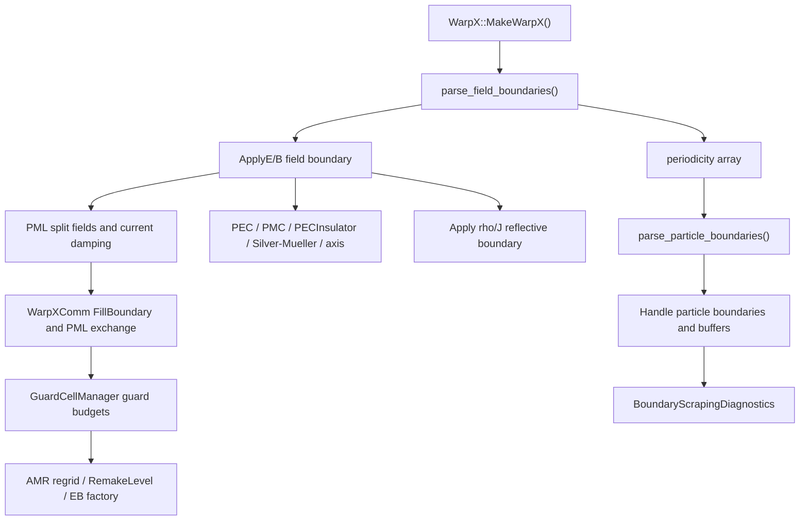

# 7. 边界条件、PML 与 AMR

> v0.8 源码基线：本章这一轮按相邻 `../warpx` 的 `pkuHEDPbranch / 8c488b1a9` 重新校准入口。本版先完成边界、PML、guard-cell 与 AMR 的源码入口地图；PML 公式细化、AMR regrid 后场数组重建和 regression 判据仍留到下一版继续闭合。

边界条件在 PIC 中同时作用于场和粒子。场边界控制 Maxwell 方程如何在计算域边缘闭合；粒子边界控制宏粒子离开、反射、吸收、周期穿越或被记录的方式。二者不能混为一谈。

WarpX 官方理论文档把 PML、PEC、PMC、Silver-Mueller、周期边界和嵌入边界放在 `Docs/source/theory/boundary_conditions.rst`。源码入口主要是：

- `../warpx/Source/BoundaryConditions/`
- `../warpx/Source/Particles/ParticleBoundaries.cpp`
- `../warpx/Source/Particles/ParticleBoundaries_K.H`
- `../warpx/Source/Evolve/WarpXEvolve.cpp::HandleParticlesAtBoundaries`

当前边界源码精读已建立两篇基础笔记：

- `notes/code-reading/boundary/00-field-boundary-parameters.md`
- `notes/code-reading/boundary/01-pml-data-and-update.md`

随后又补入：

- `notes/code-reading/boundary/02-pec-insulator-silver-mueller.md`
- `notes/code-reading/boundary/03-boundary-parameter-table.md`
- `notes/code-reading/boundary/04-silver-mueller-internal-stencil.md`
- `notes/code-reading/embedded-boundary/00-eb-initialization.md`
- `notes/code-reading/embedded-boundary/01-face-extensions.md`
- `notes/code-reading/embedded-boundary/02-particle-scraping-and-deposition-near-eb.md`

这两篇笔记分别覆盖“参数如何进入 WarpX”和“PML 如何变成真实 split fields / sigma arrays”。对于边界模块，这个切分比直接按文件顺序扫描更有效，因为边界问题天然跨参数解析、主循环分派、场数组镜像和粒子沉积四层。

## 7.0 v0.8 源码入口地图

本章后续不能只按“边界条件”这个名词归类，因为 WarpX 中的边界语义会穿过参数解析、场数组 guard cell、PML split field、粒子删除/反射/记录、诊断和 AMR 重建。v0.8 先把读代码的入口固定如下：

| 问题 | 当前入口 | v0.8 读法 |
|---|---|---|
| field 与 particle 边界解析顺序 | `../warpx/Source/WarpX.cpp:274-296` | `MakeWarpX()` 先读 field boundary，再由 field periodic 掩码约束 particle boundary，最后才构造 `WarpX` 单例。 |
| field boundary 参数与 periodic 一致性 | `../warpx/Source/BoundaryConditions/FieldBoundaries.cpp:22-80` | `boundary.field_lo/field_hi` 默认进入 `FieldBoundaryType::Default`，周期方向必须 lo/hi 成对闭合。 |
| particle boundary 参数与 field periodic 继承 | `../warpx/Source/Particles/ParticleBoundaries.cpp:18-97` | 若用户未显式写 `boundary.particle_lo/hi`，field periodic 会把相同方向的 particle boundary 改成 periodic；构造函数层默认仍是 absorbing。 |
| E/B 物理边界施加 | `../warpx/Source/BoundaryConditions/WarpXFieldBoundaries.cpp:51-255` | PEC、PMC、PECInsulator、Silver-Mueller 和轴边界集中在这里分派；Silver-Mueller 只挂在 level 0 的 `B` first half-push。 |
| rho/J 镜像与导体内清零 | `../warpx/Source/BoundaryConditions/WarpXFieldBoundaries.cpp:257-302` | 反射/热粒子边界和 PEC/PMC 类 field boundary 会触发 rho/J 的反射边界处理；PECInsulator 还会在导体内清零平行分量。 |
| PML 数据与推进 | `../warpx/Source/BoundaryConditions/PML.H`、`PML.cpp`、`WarpXEvolvePML.cpp`、`PML_current.H` | PML 不是一个单独边界开关，而是一组 split fields、sigma/kappa 系数、current damping 和推进分支。第 6 章已经覆盖场求解器侧入口，本章继续补边界侧语义。 |
| FillBoundary、PML exchange 与 guard cell 检查 | `../warpx/Source/Parallelization/WarpXComm.cpp:703-916` | E/B 顶层 `FillBoundary*()` 会进入 PML exchange/fill 和普通 `MultiFab::FillBoundary`，并在 guard 数不足时直接断言。 |
| guard-cell 数量预算 | `../warpx/Source/Parallelization/GuardCellManager.cpp:35-140`、`:300-390` | guard cell 由粒子 shape、field stencil、NCI、moving window、subcycling、safe mode 和 implicit 分支共同决定；不是 AMR 后临时补的常数。 |
| AMR/load-balance 后边界 buffer 与场数组重建 | `../warpx/Source/Parallelization/WarpXRegrid.cpp:140-230` | load balance 后会重分布 particle boundary buffer；`RemakeLevel()` 按原 `nGrowVect()` 重建 field MultiFab，并在 EB 路径使用 `guard_cells.ng_FieldSolver.max()`。 |
| boundary scraping 诊断 | `../warpx/Source/Diagnostics/BoundaryScrapingDiagnostics.cpp:27-126`、`../warpx/Source/Particles/ParticleBoundaries_K.H` | 粒子离开域或撞到 EB 后不只是删除，也可能进入 boundary buffer，再由 scraping diagnostics 输出。 |

把这些入口串起来，边界章节的主线应当是：



因此，后续解释边界时要同时回答三类问题：输入参数如何被约束，场和粒子的运行时边界动作在哪里发生，以及这些动作怎样与 PML、guard cell、AMR 和 diagnostics 互相交叉。

## 7.1 field / particle 边界不是两套彼此独立的输入

`WarpX::MakeWarpX()` 在构造单例之前，先解析 field boundary，再从中提取 periodic 掩码，最后才解析 particle boundary：

```cpp
std::tie(field_boundary_lo, field_boundary_hi) =
    warpx::boundary_conditions::parse_field_boundaries();

const auto is_field_boundary_periodic =
    warpx::boundary_conditions::get_periodicity_array(field_boundary_lo, field_boundary_hi);

std::tie(particle_boundary_lo, particle_boundary_hi) =
    warpx::particles::parse_particle_boundaries(is_field_boundary_periodic);
```

源码位置：`../warpx/Source/WarpX.cpp:284-291`。

这意味着 particle 边界不是“读完自己就结束”，而是依赖 field 边界的第二阶段配置。其后果有两条：

1. 某方向若 field 是 periodic，则 particle 必须两侧都 periodic；
2. 如果用户根本没写 `boundary.particle_lo/hi`，periodic 的 field 方向会自动把 particle 边界改成 periodic，而不是保留 absorbing。

对应的 field consistency 检查在 `FieldBoundaries.cpp`：

```cpp
WARPX_ALWAYS_ASSERT_WITH_MESSAGE(
    (is_lo_periodic == is_hi_periodic),
    "field boundary must be consistenly periodic in both lo and hi");
```

源码位置：`../warpx/Source/BoundaryConditions/FieldBoundaries.cpp:27-33`。

而 field/particle 联合一致性检查在 `ParticleBoundaries.cpp`：

```cpp
WARPX_ALWAYS_ASSERT_WITH_MESSAGE(
    (particle_boundary_lo[idim] == ParticleBoundaryType::Periodic) &&
    (particle_boundary_hi[idim] == ParticleBoundaryType::Periodic),
    "field and particle boundary must be periodic in both lo and hi");
```

源码位置：`../warpx/Source/Particles/ParticleBoundaries.cpp:43-46`。

因此，periodic 在 WarpX 中的真实语义不是“某一侧做周期延拓”，而是“整根坐标轴拓扑闭合”。

若只想先找参数入口而不立刻读实现，当前最适合查的是 `notes/code-reading/boundary/03-boundary-parameter-table.md`，它已经把 `boundary.field_*`、`boundary.particle_*`、`boundary.potential_*`、PECInsulator parser、`particles.crop_on_PEC_boundary` 和 PML 参数的依赖关系汇总成总表。

## 7.2 电磁 field boundary 的顶层分派

field boundary 参数解析完成后，真正把边界施加到场数组的入口在 `WarpXFieldBoundaries.cpp`。`ApplyEfieldBoundary()` 顶层首先按边界类型分派：

```cpp
if (::isAnyBoundary<FieldBoundaryType::PEC>(field_boundary_lo, field_boundary_hi)) {
    PEC::ApplyPECtoEfield(...);
}

if (::isAnyBoundary<FieldBoundaryType::PMC>(field_boundary_lo, field_boundary_hi)) {
    PEC::ApplyPECtoBfield(...);
}

if (::isAnyBoundary<FieldBoundaryType::PECInsulator>(field_boundary_lo, field_boundary_hi)) {
    pec_insulator_boundary->ApplyPEC_InsulatortoEfield(...);
}
```

源码位置：`../warpx/Source/BoundaryConditions/WarpXFieldBoundaries.cpp:55-161`。

`ApplyBfieldBoundary()` 除了 PEC/PMC/PECInsulator 外，还处理 Silver-Mueller：

```cpp
if (lev == 0) {
    if (subcycling_half == SubcyclingHalf::FirstHalf) {
        if(::isAnyBoundary<FieldBoundaryType::Absorbing_SilverMueller>(field_boundary_lo, field_boundary_hi)){
            m_fdtd_solver_fp[0]->ApplySilverMuellerBoundary(...);
        }
    }
}
```

源码位置：`../warpx/Source/BoundaryConditions/WarpXFieldBoundaries.cpp:231-239`。

这说明 Silver-Mueller 不是通用 field boundary post-process，而是挂在 Yee/FDTD 的 `B` first half-push 上的专用边界。

继续往下看其内部实现时，还要再补一层认识：它更新的不是域内最后一层 `B`，而是物理域外第一层 guard cell，并且按 Yee 交错把切向 `E` 递推到切向 `B`。这一点已经单独整理在 `notes/code-reading/boundary/04-silver-mueller-internal-stencil.md`。

## 7.3 PEC / PMC 不只是场边界，也是沉积对称性

官方理论文档对 PEC 的定义是：边界上切向 `E` 与法向 `B` 为零；guard 区对场做奇偶镜像；rho 和平行电流的边界处理还取决于粒子边界是 reflecting 还是 absorbing。见 `../warpx/Docs/source/theory/boundary_conditions.rst:275-323`。

这意味着 PEC/PMC 的章节写法不能只停留在“某些分量置零”：

- 对 E/B，要讲边界值和 guard-cell 镜像；
- 对 rho/J，要讲镜像沉积与 image charge / reflective deposition；
- 对粒子，要讲 `ApplyBoundaryConditions()` 和沉积语义如何配套。

这些细节现在已经在 `notes/code-reading/boundary/02-pec-insulator-silver-mueller.md` 里拆开，后续可直接据此继续回填本章的 PEC/PMC/PECInsulator 小节。

当前本地 checkout 里，PMC 还有一条很直接的场级 regression：`Examples/Tests/pec/inputs_test_3d_pmc_field`。它在 `z` 方向设 PMC、在局部区域初始化正弦 `Ey/Bx` 波包，然后用 `analysis_pec.py` 检查反射后的 standing wave 是否达到理论上的 constructive interference 振幅 `±2E_in`。因此这条测试验证的不是抽象“PMC 边界存在”，而是 PMC 通过交换 PEC 的 E/B 角色后，反射相位与站波振幅仍满足理论合同。

Silver-Mueller 的 regression 则是另一条完全不同的口径。`Examples/Tests/silver_mueller/analysis.py` 直接读取最终 Full diagnostics，并要求所有场分量在脉冲离域后都满足

$$
|E| < 0.01\ \mathrm{V/m},
$$

而这些输入里的入射激光峰值量级约为 `10 V/m`。所以这组测试检验的不是“反射后应形成某种驻波”，而是

$$
|E_{\mathrm{reflected}}| \ll |E_{\mathrm{incident}}|.
$$

当前本地 family 里共有四条最小基准：

- `test_1d_silver_mueller`
- `test_2d_silver_mueller_x`
- `test_2d_silver_mueller_z`
- `test_rz_silver_mueller_z`

它们分别覆盖 1D 轴向出射、2D `x` 向出射、2D `z` 向出射，以及 RZ `z` 向出射；其中 RZ 版本还同时把 `r_lo = none` 的轴线正则性和 `absorbing_silver_mueller` 开放边界放到同一最小回归里。

`PEC` 与 `PECInsulator` 的 regression 边界也应和上面区分开。当前本地 `pec` family 里至少有两组强 analysis：

1. `test_3d_pec_field` 与 `test_3d_pec_field_mr`
   这两条分别用 `analysis_pec.py` 和 `analysis_pec_mr.py` 检查反射后 standing-wave 的 `Ey_max/Ey_min` 是否接近理论 `±2E_in`。单级版本容差为 `1%`，MR 版本放宽到 `5%`。因此它们真正验证的是 PEC 场边界反射后的波振幅合同，而不是抽象“边界条件被支持”。
2. `test_2d_pec_field_insulator_implicit` 与 `..._restart`
   这两条走 `analysis_pec_insulator_implicit.py`，把 `fieldenergy.txt` 与 `poyntingflux.txt` 合成完整能量账本，并要求相对误差低于 `10^{-13}`。因此它们真正验证的是 `pec_insulator` parser 边界、implicit 场推进和边界 Poynting flux reduced diagnostics 一起构成的精确能量记账合同。`..._restart` 版本说明从 checkpoint 恢复后同一合同仍成立，但它并不是独立的逐字段 restart 对照。

相比之下，`test_3d_pec_particle` 当前没有独立 analysis，仍应诚实记录为粒子侧 gather/deposition 的 checksum 基线，而不是被误写成强物理 benchmark。

PML 的物理目标是吸收入射电磁波，使开放边界尽量不反射。经典 PML 思想来自 Berenger。WarpX 在 `OneStep_nosub` 的场推进后处理 PML：FDTD 分支中，场推进后若 `do_pml` 为真，执行 `DampPML()` 并填充 E/B/F/G 的 moving-window guard cells。PSATD 分支中也有单独的 PML damping。

## 7.4 PML 在 WarpX 里是独立子域，不是单个边界公式

`PML` 类本身管理的是一整套 PML 子域、split fields 和阻尼系数缓存：

```cpp
class PML
{
public:
    PML (...,
         int ncell, int delta, ...,
         int pml_has_particles, int do_pml_in_domain,
         ...,
         bool do_pml_dive_cleaning, bool do_pml_divb_cleaning,
         ...);
```

源码位置：`../warpx/Source/BoundaryConditions/PML.H:137-156`。

真正承载阻尼 profile 的核心数据结构是 `SigmaBox`，其中缓存了：

- `sigma` / `sigma_star`
- `sigma_cumsum` / `sigma_star_cumsum`
- `sigma_fac` / `sigma_star_fac`
- `sigma_cumsum_fac` / `sigma_star_cumsum_fac`

源码位置：`../warpx/Source/BoundaryConditions/PML.H:46-76`。

`SigmaBox` 的 profile 在 `PML.cpp` 中按离边界距离平方增长：

```cpp
Real offset = static_cast<Real>(glo-i);
p_sigma[i-slo] = fac*(offset*offset);
...
offset = static_cast<Real>(glo-i) - 0.5_rt;
p_sigma_star[i-sslo] = fac*(offset*offset);
```

源码位置：`../warpx/Source/BoundaryConditions/PML.cpp:83-92`。

所以 `warpx.pml_delta` 控制的是阻尼增长深度，而不是简单的总厚度。

## 7.5 PML split field 与 PML 电流

在主循环里，PML 阻尼入口是 `WarpX::DampPML()`，Cartesian 实际工作函数是 `DampPML_Cartesian()`。见 `../warpx/Source/BoundaryConditions/WarpXEvolvePML.cpp:45-84`。

这个函数先取出 `pml_E`、`pml_B`、`sigba` 和每个分量的 stagger 信息，然后把它们送进 `warpx_damp_pml_ex/ey/ez/bx/by/bz`。例如 `Ex` 的 split 分量阻尼：

```cpp
if (sy == 0) {
    Ex(i,j,k,PMLComp::xy) *= sigma_star_fac_y[j-ylo];
} else {
    Ex(i,j,k,PMLComp::xy) *= sigma_fac_y[j-ylo];
}
```

源码位置：`../warpx/Source/BoundaryConditions/WarpX_PML_kernels.H:77-82`。

这说明 PML 不是给整个 `E_x` 统一乘一个阻尼系数，而是对 `Exy`、`Exz` 这类 split components 按其离散位置和方向分别阻尼。

如果进一步允许粒子进入 PML，即 `warpx.pml_has_particles = 1`，那么粒子电流还要按 split 方式注入 PML 电场。`push_ex_pml_current()` 的形式是：

```cpp
alpha_xy = sigjy[k-ylo]/(sigjy[k-ylo]+sigjz[l-zlo]);
alpha_xz = sigjz[l-zlo]/(sigjy[k-ylo]+sigjz[l-zlo]);
Ex(j,k,l,PMLComp::xy) = Ex(j,k,l,PMLComp::xy) - mu_c2_dt  * alpha_xy * jx(j,k,l);
Ex(j,k,l,PMLComp::xz) = Ex(j,k,l,PMLComp::xz) - mu_c2_dt  * alpha_xz * jx(j,k,l);
```

源码位置：`../warpx/Source/BoundaryConditions/PML_current.H:27-36`。

也就是说，PML 中的 `J_x` 不是直接加到“整体 `E_x`”上，而是要分摊到与阻尼方向一致的 split components 上。

PML 的 regression 入口也不能继续混成单一 checksum 桶。当前最稳定的五条验证线是：

1. `test_2d_pml_x_yee`
   - `analysis_pml_yee.py`
   - 从最终全场重建总电磁能量
   - 计算反射率 `R = E_end / E_start`
   - 要求其相对理论 `5.683000058954201e-07` 的误差低于 `5%`
2. `test_2d_pml_x_ckc`
   - `analysis_pml_ckc.py`
   - 做同一反射率检查
   - 但理论值变成 `1.8015e-06`
3. `test_2d_pml_x_psatd` 与 `test_2d_pml_x_galilean`
   - 共享 `analysis_pml_psatd.py`
   - 先从 `diag1000050` 复算初始电磁能量并要求与硬编码参考值一致到 `1e-14`
   - 再要求最终反射率低于 `1e-6`
   - 因而这里验证的是 `PSATD/Galilean PSATD + PML` 的低反射率合同
4. `test_rz_pml_psatd`
   - `analysis_pml_psatd_rz.py`
   - 不比较能量比，而是在脉冲离域后直接要求域内 `max(|Er|,|Ez|) < 2`
   - 它真正验证的是 RZ radial PML 的残余场衰减
5. `test_2d_pml_x_yee_restart` 与 `test_2d_pml_x_psatd_restart`
   - 复用顶层 `Examples/analysis_default_restart.py`
   - 逐字段比较 restart 与非 restart 输出
   - 因而这两条是在测 `PML + solver` 场景的 restart 可重复性，而不是新物理吸收判据

相比之下，`test_3d_pml_psatd_dive_divb_cleaning` 当前 `analysis=OFF`。它把 `psatd + pml + do_dive_cleaning + do_divb_cleaning + do_pml_dive/divb_cleaning` 组合在一起，但目前只应诚实记录为 workflow/output checksum 基线，不能写成与上面四条同等级的强吸收 benchmark。

粒子边界处理位于 `WarpXEvolve.cpp` 行 713-766。主要步骤是连续通量注入、`particlescraper` callback、`mypc->ApplyBoundaryConditions()`、domain boundary buffer 收集、粒子重分布、嵌入边界刮擦和排序。对 laser-solid、TNSA/RPA、moving window、open boundary 等案例，这一段决定了粒子是否会在边界产生非物理堆积或丢失。

这里还要特别区分两类“边界参数”。`boundary.particle_lo/hi` 控制的是粒子越界后是否 `Open/Absorbing/Reflecting/Thermal/Periodic`，真正执行在 `../warpx/Source/Particles/ParticleBoundaries_K.H` 的 `apply_boundaries()` 中；而 `particles.crop_on_PEC_boundary` 并不在这里直接删粒子，它只是在 `WarpXParticleContainer::DepositCurrent()`、`DepositCharge()` 和 `ImplicitPushPX.cpp` 里生成 `do_cropping` 标志，告诉 Villasenor / implicit suborbit 这些轨道恢复与沉积 kernel：当 field boundary 是 `PEC` 或 `PECInsulator` 时，边界外那段轨迹要不要在几何上截断。也就是说，一个参数决定“粒子是否还活着”，另一个参数决定“活着或刚越界的粒子，其轨迹是否还允许继续穿过 PEC 外侧参与沉积”。

这也解释了为什么 `analysis_vandb_jfnk_2d_cropping.py` 要把 PEC 场边界、absorbing 粒子边界、`particles.crop_on_PEC_boundary = 1`、`implicit_evolve.particle_suborbits = 1` 和 `algo.current_deposition = villasenor` 一起打开：它不是在测单个参数，而是在测 `ApplyBoundaryConditions -> do_cropping -> suborbit Villasenor deposition -> boundary buffer -> deleteInvalidParticles()` 这整条组合链还能不能维持局部 Gauss 定律。

## 7.6 Embedded boundary 先是几何初始化和辅助标记系统

前面讨论的 PML、PEC、PMC、Silver-Mueller 都作用在计算域外边界上，而 embedded boundary 的第一步不是“给某个边界类型分派更新公式”，而是先把几何对象嵌入到 AMReX cut-cell 数据结构。

运行时总开关在 `EmbeddedBoundary/Enabled.cpp`：

```cpp
std::string eb_implicit_function;
bool eb_enabled = pp_warpx.query("eb_implicit_function", eb_implicit_function);

std::string eb_stl;
eb_enabled |= pp_eb2.query("geom_type", eb_stl);
```

源码位置：`../warpx/Source/EmbeddedBoundary/Enabled.cpp:25-30`。

这说明 EB 的启用条件不是单一布尔量，而是：

1. 编译时必须有 `AMREX_USE_EB`；
2. 运行时必须提供 `warpx.eb_implicit_function`，或者走 `eb2.geom_type` / `eb2.stl_file` 的 AMReX EB2 参数路径。

几何真正初始化在 `WarpX::InitEB()`：

```cpp
if (! impf.empty()) {
    auto eb_if_parser = utils::parser::makeParser(impf, {"x", "y", "z"});
    ParserIF const pif(eb_if_parser.compile<3>());
    auto gshop = amrex::EB2::makeShop(pif, eb_if_parser);
    amrex::EB2::Build(gshop, Geom(maxLevel()), maxLevel(), maxLevel()+20);
} else {
    amrex::ParmParse pp_eb2("eb2");
    if (!pp_eb2.contains("geom_type")) {
        std::string const geom_type = "all_regular";
        pp_eb2.add("geom_type", geom_type);
    }
    amrex::EB2::Build(Geom(maxLevel()), maxLevel(), maxLevel()+20);
}
```

源码位置：`../warpx/Source/WarpXInitEB.cpp:78-95`。

这里的结构很清楚：

- 若给出 `warpx.eb_implicit_function`，WarpX 自己负责把解析函数包装成 `ParserIF` 再交给 `AMReX EB2::GeometryShop`；
- 若没有隐式函数，就沿用 `eb2.*` 参数，由 AMReX EB2 直接构几何；
- `maxLevel()+20` 是为了让 EB2 尽量向粗层 coarsen，服务 multigrid，而不是某个物理精度参数。

EB 几何建立后，WarpX 还会把 signed distance 场填进 field registry：

```cpp
const amrex::EB2::IndexSpace& eb_is = amrex::EB2::IndexSpace::top();
for (int lev=0; lev<=maxLevel(); lev++) {
    const amrex::EB2::Level& eb_level = eb_is.getLevel(Geom(lev));
    auto const eb_fact = fieldEBFactory(lev);
    amrex::FillSignedDistance(*m_fields.get(FieldType::distance_to_eb, lev), eb_level, eb_fact, 1);
}
```

源码位置：`../warpx/Source/WarpXInitEB.cpp:106-112`。

所以 `distance_to_eb` 不是附加诊断，而是后续 scraping、近壁沉积和 cut-cell 处理可以直接复用的几何辅助场。

更关键的是，`EmbeddedBoundaryInit.*` 在初始化阶段就为后续 solver / deposition 准备了几类辅助标记：

- `MarkReducedShapeCells`：若高阶 shape 可能覆盖到部分或完全 cut cell，就强制降成一阶沉积；
- `MarkUpdateCellsStairCase`：对非 ECT solver，只要 field 自由度邻接到非 regular cell，就停止更新；
- `MarkUpdateECellsECT` / `MarkUpdateBCellsECT`：ECT solver 不看 stair-case 邻域，而是直接看对应 edge length 或 face area 是否为零。

例如 `MarkReducedShapeCells()` 的混合区域逻辑是：

```cpp
if ( !flag(i_cell, j_cell, k_cell).isRegular() ) {
    reduce_shape = 1;
}
```

源码位置：`../warpx/Source/EmbeddedBoundary/EmbeddedBoundaryInit.cpp:98-103`。

而 `MarkUpdateCellsStairCase()` 的核心是：

```cpp
if ( !flag(i_cell, j_cell, k_cell).isRegular() ) {
    eb_update_flag = 0;
}
```

源码位置：`../warpx/Source/EmbeddedBoundary/EmbeddedBoundaryInit.cpp:206-210`。

这说明 EB 在 WarpX 里的第一层实现不是“直接改 Maxwell 更新式”，而是先把 cut-cell 几何转换成：

1. 粒子沉积是否降阶；
2. 场自由度是否允许更新；
3. edge/face 几何量是否还存在。

当前这一层已经单独整理在 `notes/code-reading/embedded-boundary/00-eb-initialization.md`，而 `WarpXFaceExtensions.cpp` 的 face extension 稳定性标志、intrusion 判据和 cut-face 修正则继续整理在 `notes/code-reading/embedded-boundary/01-face-extensions.md`。

## 7.7 Embedded boundary 的 face extension：把不稳定 cut face 变成 enlarged face

对 ECT solver 来说，仅仅知道某个 face 被 cut 还不够，因为部分 cut face 的有效面积可能小到破坏稳定性。WarpX 的处理不是简单禁用这些 face，而是尝试把它们扩成 enlarged face。

初始化侧先在 `MarkExtensionCells()` 中定义两个标志：

```cpp
flag_ext_face_data(i, j, k) = int(S(i, j, k) < S_stab && S(i, j, k) > 0);
if(flag_ext_face_data(i, j, k)){
    flag_info_face_data(i, j, k) = 0;
}
if(int(S(i, j, k) > 0 && !flag_ext_face_data(i, j, k))) {
    flag_info_face_data(i, j, k) = 1;
}
```

源码位置：`../warpx/Source/EmbeddedBoundary/EmbeddedBoundaryInit.cpp:426-433`。

其中：

- `flag_ext_face = 1` 表示这个 cut face 本身不稳定，必须扩展；
- `flag_info_face = 0` 表示它当前是借方面；
- `flag_info_face = 1` 表示它是可出借面积的稳定面；
- 在 extension 过程中，被别人侵入的 lender 会再改成 `2`。

真正的 extension 在 `WarpX::ComputeFaceExtensions()` 里按三步进行：

```cpp
::init_borrowing(m_borrowing[maxLevel()], Bfield);
ComputeOneWayExtensions();
ComputeEightWaysExtensions();
::shrink_borrowing(m_borrowing[maxLevel()], Bfield);
```

源码位置：`../warpx/Source/EmbeddedBoundary/WarpXFaceExtensions.cpp:514-529`。

第一步是 one-way extension，只允许从一个正交邻居一次性借满所需面积 `S_ext`。如果存在这样的 lender，就直接把 lender 的 `S_mod` 扣掉 `S_ext`，把 borrower 的 `S_mod` 增加 `S_ext`，并把 lender 标成 `2`。见 `../warpx/Source/EmbeddedBoundary/WarpXFaceExtensions.cpp:653-697`。

第二步是 eight-ways extension。若单邻居借不满，就在 `3x3` 邻域内筛选所有可用 lender，按原始 face 面积比例分摊：

```cpp
const amrex::Real patch = S_ext * ::GetNeigh(S, i, j, k, i_n, j_n, idim) / denom;
```

源码位置：`../warpx/Source/EmbeddedBoundary/WarpXFaceExtensions.cpp:830-831`。

但 WarpX 还会反复剔除那些按该比例借出后会把自己 `S_mod` 减成非正的邻居，因此 eight-ways 不是机械加权，而是“保正性的面积分摊”。见 `../warpx/Source/EmbeddedBoundary/WarpXFaceExtensions.cpp:820-846`。

如果 one-way 和 eight-ways 都失败，就进入 BCK fallback：

```cpp
if (flag_ext_face_max_lev_idim(i, j, k)) {
    S(i, j, k) = ::ComputeSStab<idim>(i, j, k, lx, ly, lz, dx, dy, dz);
    flag_info_face_max_lev_idim(i, j, k) = -1;
}
```

源码位置：`../warpx/Source/EmbeddedBoundary/WarpXFaceExtensions.cpp:196-200`。

源码注释说明这是 Benkler-Chavannes-Kuster correction，精度低于常规 ECT extension，但仍优于纯 staircasing。

extension 的借用关系不会散落在若干数组里，而是统一压进 `FaceInfoBox`：

```cpp
struct FaceInfoBox {
    amrex::Gpu::DeviceVector<Neighbours> neigh_faces;
    amrex::Gpu::DeviceVector<amrex::Real> area;
    amrex::Gpu::DeviceVector<int> inds;
    amrex::BaseFab<int> size;
    amrex::BaseFab<int*> inds_pointer;
```

源码位置：`../warpx/Source/EmbeddedBoundary/WarpXFaceInfoBox.H:15-28`。

它记录的是“这个 enlarged face 向哪些邻居借了多少面积”。后续 ECT `B` 更新时，`WarpX::EvolveB()` 把 `m_flag_info_face` 和 `m_borrowing` 直接送进 solver：

```cpp
m_fdtd_solver_fp[lev]->EvolveB( m_fields,
                                lev,
                                patch_type,
                                m_flag_info_face[lev], m_borrowing[lev], a_dt );
```

源码位置：`../warpx/Source/FieldSolver/WarpXPushFieldsEM.cpp:971-975`。

在 `FiniteDifferenceSolver::EvolveBCartesianECT()` 中，不稳定 face 会先聚合 enlarged face 的有效电荷：

```cpp
Venl_dim(i, j, k) = Rho(i, j, k) * S(i, j, k);
...
Venl_dim(i, j, k) += Rho(ip, jp, kp) * borrowing_dim_area[ind];
...
rho_enl = Venl_dim(i, j, k) / S_mod(i, j, k);
```

源码位置：`../warpx/Source/FieldSolver/FiniteDifferenceSolver/EvolveB.cpp:307-339`。

因此，WarpX 的 face extension 不是“把几何修漂亮一点”，而是直接决定 ECT solver 如何构造 enlarged face 的有效 `rho` 并推进 `B`。

## 7.8 Embedded boundary 的粒子侧：signed-distance 判定、默认吸收与 scraped buffer

对粒子来说，embedded boundary 的关键并不是 face extension，而是“什么时候认定粒子已经撞进了 EB，以及撞进去之后怎样处理”。

`ParticleScraper.H` 的核心逻辑非常直接：

```cpp
ablastr::particles::compute_weights<amrex::IndexType::NODE>(
    xp, yp, zp, plo, dxi, i, j, k, W);
amrex::Real const phi_value = ablastr::particles::interp_field_nodal(i, j, k, W, phi);

if (phi_value < 0.0)
{
    ...
    amrex::RealVect normal = DistanceToEB::interp_normal(i, j, k, W, ic, jc, kc, Wc, phi, dxi);
    DistanceToEB::normalize(normal);
    ...
    f(ptd, ip, pos, normal, engine);
}
```

源码位置：`../warpx/Source/EmbeddedBoundary/ParticleScraper.H:181-208`。

这说明 WarpX 的粒子撞墙检测并不是拿粒子坐标去直接查解析几何，而是：

1. 在 nodal `distance_to_eb` 上插值；
2. 若 `phi_value < 0`，认定粒子进入了需要刮擦的 EB 区域；
3. 再用 `DistanceToEB::interp_normal()` 从 signed-distance 的离散梯度重建法向。

`DistanceToEB.H` 本身也只做这件事。它的 `interp_normal()` 对 `phi` 做差分加权，`normalize()` 再把法向单位化。也就是说，粒子侧法向来自 signed-distance 场，而不是 STL 面片直接投影。

默认处理器在 `ParticleBoundaryProcess.H` 里只有两个最小版本：

```cpp
struct NoOp { ... };

struct Absorb {
    ...
    amrex::ParticleIDWrapper{ptd.m_idcpu[i]}.make_invalid();
}
```

源码位置：`../warpx/Source/EmbeddedBoundary/ParticleBoundaryProcess.H:12-33`。

因此，当前主源码链上的默认 EB 粒子边界语义其实很朴素：不是复杂反射模型，而是“把撞进 EB 的粒子标成 invalid”。真正删除发生在后续 `deleteInvalidParticles()` 或 `Redistribute()`，而不是 `Absorb()` 本身立即擦除数据。

这一逻辑会在多处触发：

- `WarpXParticleContainer` 在 `Redistribute()` 后立刻做一轮 EB 吸收；
- `MultiParticleContainer::ScrapeParticlesAtEB()` 可以对所有 species 统一刮擦；
- `AddParticles.cpp` 在新增粒子或 flux 注入后，也会先对临时容器做 `scrapeParticlesAtEB(..., Absorb())`。

因此 WarpX 的策略是“新粒子一旦进入容器，就尽快排除已经落在 EB 内部的非法粒子”。

如果用户想把这些 scraped 粒子保留下来做诊断，就可以设置：

- `<species_name>.save_particles_at_eb = 1`

官方文档说明这会把撞到 EB 的粒子复制到 scraped particle buffer，可供 `BoundaryScrapingDiagnostic` 或 Python 接口使用。见 `../warpx/Docs/source/usage/parameters.rst:1890-1924`。

更重要的是，`ParticleBoundaryBuffer.cpp` 在把粒子放进 EB buffer 时，不是简单复制当前状态，而是用二分法沿粒子轨迹回溯到 `phi = 0` 的真实交点：

```cpp
amrex::Real const dt_fraction = amrex::bisect( 0.0, 1.0,
    [=] (amrex::Real dt_frac) {
        ...
        UpdatePosition(x_temp, y_temp, z_temp, ux, uy, uz, -dt_frac*dt, mass);
        ...
        amrex::Real const phi_value = ablastr::particles::interp_field_nodal(i, j, k, W, phiarr);
        return phi_value;
    } );
```

源码位置：`../warpx/Source/Particles/ParticleBoundaryBuffer.cpp:92-104`。

随后它还会记录 scraping 发生的 step、时间偏移、真实时间和表面法向。也就是说，scraped particle buffer 保存的不是“死前最后一帧粒子”，而是“与 EB 表面交点处的粒子诊断样本”。

因此，embedded boundary 的粒子侧主链可以概括为：

1. `distance_to_eb` 判定粒子是否进入 EB；
2. `DistanceToEB` 重建边界法向；
3. 默认 `Absorb` 仅把粒子标成 invalid；
4. 后续删除逻辑真正清除粒子；
5. 若启用 `save_particles_at_eb`，则 `ParticleBoundaryBuffer` 回溯到 `phi=0` 交点并记录 scraped 事件。

`Examples/Tests/embedded_circle/` 给这条链提供了一个很实用但证据层级较弱的本地入口。它不是 `electrostatic_sphere_eb` 那类解析 `phi/Er` 强基准，也不是 `point_of_contact_eb` 那类直接检查交点几何的强 analysis，而是一个 2D circular EB workflow baseline：

- `eb_implicit_function` 定义圆形导体
- `eb_potential = -10` 进入电静求解
- 电子/氩离子都先 `initialize_self_fields = 1`
- 双物种 `background_mcc` 持续运行
- 两个 species 都打开 `save_particles_at_eb = 1`
- `diag3` 用 `BoundaryScraping` openPMD 写出 scraped 粒子

当前 `CMakeLists.txt` 中这条 test 没有独立 `analysis.py`，只保留 checksum helper。因此它在本章里更适合承担：

- EB geometry + electrostatic + MCC + BoundaryScraping 的联合工作流基线

而不是承担解析电势或表面碰撞物理的强验证。

domain boundary buffer 的收集时机也要一起记住。`WarpXEvolve.cpp` 里先执行 `mypc->ApplyBoundaryConditions()`，随后立刻调用 `m_particle_boundary_buffer->gatherParticlesFromDomainBoundaries(*mypc, cur_time)`，最后才在 EB 路径后统一 `deleteInvalidParticles()`。因此 buffer 记录依赖的是“粒子还在容器里、但已经越界或即将失效”的中间态，而不是从被删除后的粒子列表回溯出来。对 `save_particles_at_xlo/.../eb`、`BoundaryScrapingDiagnostic` 和 Python buffer 接口来说，这个顺序决定了 scraped 数据为什么能同时保留 step、时间偏移和边界法向。

周期边界有一个关键规则：如果某个方向的场边界是 periodic，该方向粒子边界也必须 periodic。这个规则在过去本机验证中已经用本地运行、源码和文档确认过；非周期边界则不要求 field 和 particle 边界字面一致。正式章节需要把对应源码错误消息和参数验证写入本章。

AMR 的目标是把计算资源集中在物理上需要高分辨率的区域。但 PIC 的 AMR 比流体 AMR 更难，因为宏粒子穿过 refinement interface 时会看到不同网格上的插值场，容易产生 self-force、短波反射和电荷/电流不一致。WarpX 官方 `Docs/source/theory/amr.rst` 特别强调两个问题：mesh refinement interface 附近的 spurious self-force，以及电磁波在粗细网格界面处的反射和放大。

在真正进入 coarse-fine interface 之前，还必须先把并行层的 guard-cell 通信模型看清。WarpX 不是“所有字段都统一 FillBoundary 一次”这么简单，而是把通信语义分成两类：

- E/B/F/G/Aux 这类场变量：guard cells 用 `FillBoundary` 风格的复制/同步；
- J/rho 这类源项：重叠区域必须做 `SumBoundary` / `ParallelAdd` 风格的累加，因为粒子靠近 box 边缘时，同一 `(i,j,k)` 可能同时被沉积到一个 box 的 guard 区和另一个 box 的 valid 区。

这一层的统一预算由 `Parallelization/GuardCellManager.*` 管理。它先区分：

- `ng_alloc_*`：每类 MultiFab 实际分配多少 guard cells；
- `ng_FieldSolver`、`ng_FieldGather`、`ng_UpdateAux`、`ng_MovingWindow` 等：PIC 循环不同阶段真正交换多少。

这些配额不是拍脑袋常数，而是共同受以下因素控制：

- 粒子 shape 阶数与 subcycling；
- moving window 位移；
- Galilean / comoving 修正；
- NCI / bilinear filter；
- FDTD stencil 或 PSATD 局部 FFT stencil。

例如 `SyncCurrent()` 的源码注释就明确说明，多层 AMR 下不能简单把 finer coarse-patch current 直接 `ParallelAdd` 到当前 level 的 fine patch，因为 nodal overlap 会双计数；WarpX 为此引入临时 `fine_lev_cp` 和 `OwnerMask` 去重。也就是说，coarse-fine current 同步本身就已经是 AMR 物理一致性的一部分，而不是纯粹 MPI 细节。

当前这一层已经单独整理在 `notes/code-reading/parallelization/00-guard-cell-model.md`。

继续往下看 `Parallelization/WarpXComm.cpp`，会发现 WarpX 对 current / rho 的 coarse-fine 同步并不是简单的“restrict 一下再加回去”。`SyncCurrent()` 的大段注释明确说明：

- finest level 先把 fine-patch current restriction 到同层 coarse patch；
- 若有 current buffer，则 coarse-patch current 先并入 buffer，再把 buffer 当作更粗层的通信源；
- 更粗层接收 finer 数据时，先写到临时 `fine_lev_cp`；
- 由于 nodal 点可能在多个 box 中重叠，不能直接加回 `J_fp`，而要借助 `OwnerMask` 只让 owner box 接管该点数据。

因此，WarpX 的 coarse-fine source 同步真实更接近：

`restriction -> optional buffer merge -> temporary receive -> owner-mask de-dup -> same-level SumBoundary`

而不是单一的 restriction/prolongation 二步法。

rho 路径在 `SyncRho()` 中基本平行，只是 bilinear filter 与 `SumBoundary` 被折叠成 `ApplyFilterandSumBoundaryRho()`。这意味着 J 和 rho 虽然共享 AMR 同步框架，但在 filter 实现上仍有细微差异。

这一层已经单独整理在 `notes/code-reading/parallelization/01-current-rho-sync-paths.md`。继续顺着 `WarpXRegrid.cpp` 往下读时，问题就不再是“数据如何同步”，而会转成“`DistributionMapping` 改变后，fields、particles、EB、boundary buffer 和 diagnostics 如何整体重建”。

`WarpXRegrid.cpp` 的顶层入口是：

```cpp
void
WarpX::CheckLoadBalance (int step)
{
    if (step > 0 && load_balance_intervals.contains(step+1))
    {
        LoadBalance();
        ResetCosts();
    }
    if (!costs.empty())
    {
        RescaleCosts(step);
    }
}
```

源码位置：`../warpx/Source/Parallelization/WarpXRegrid.cpp:49-63`。

这说明 WarpX 的 load balance 不是“到点直接重分布”，而是：

1. 周期性检查当前 step 是否命中 `load_balance_intervals`；
2. 若命中，则执行 `LoadBalance()`；
3. 之后清零 costs；
4. timer 模式下还会继续对 costs 做 running-average 式重标定。

`LoadBalance()` 内部先按 level 构造候选 `DistributionMapping`，支持：

- SFC
- knapsack

然后比较 `currentEfficiency` 和 `proposedEfficiency`，只有满足：

```cpp
proposedEfficiency > load_balance_efficiency_ratio_threshold*currentEfficiency
```

时才真正采纳新映射。源码位置：`../warpx/Source/Parallelization/WarpXRegrid.cpp:82-143`。

因此，WarpX 当前策略更接近“收益足够大才搬”，而不是粗暴地按固定周期强制改 rank 图。

更关键的是 `RemakeLevel()` 的边界。它当前只支持：

- `BoxArray` 不变；
- `DistributionMapping` 改变。

因为函数内部直接写着：

```cpp
if (ba == boxArray(lev)) {
    ...
} else
{
    WARPX_ABORT_WITH_MESSAGE("RemakeLevel: to be implemented");
}
```

源码位置：`../warpx/Source/Parallelization/WarpXRegrid.cpp:174-176,283-286`。

这意味着当前这里讨论的还不是“任意 AMR regrid”，而是“同一 patch 拓扑下的 rank 重映射”。

一旦某个 level 真的采纳新映射，WarpX 重建的远不只是粒子容器。`RemakeLevel()` 里会依次重做：

- `m_fields.remake_level(lev, dm)`：field registry 的 level 场数据；
- EB 相关的 `m_eb_reduce_particle_shape`、`m_eb_update_E/B`、ECT `m_borrowing`；
- `m_field_factory[lev]` 与 `InitializeEBGridData(lev)`；
- PSATD 的 fine/coarse spectral solver real-space 容器；
- `m_accelerator_lattice[lev]->InitElementFinder(...)`；
- `current_buffer_masks` / `gather_buffer_masks` 与 `BuildBufferMasks()`；
- `multi_diags->InitializeFieldFunctors(lev)`。

源码范围：`../warpx/Source/Parallelization/WarpXRegrid.cpp:178-290`。

随后若至少有一个 level 完成了 load balance，WarpX 才统一做：

```cpp
mypc->Redistribute();
mypc->defineAllParticleTiles();
m_particle_boundary_buffer->redistribute();
reduced_diags->LoadBalance();
```

源码位置：`../warpx/Source/Parallelization/WarpXRegrid.cpp:149-159`。

因此，WarpX 的 load balance 不是“先搬粒子再说”，而是一次多子系统一致提交：

`candidate DM -> efficiency check -> remake field/EB/solver/masks -> redistribute particles -> redistribute boundary buffer -> refresh diagnostics`

这一层现在已经单独整理在 `notes/code-reading/parallelization/02-regrid-and-load-balance.md`。

但 `regrid` 仍然没有回答 refinement interface 最关键的物理问题：粒子在 coarse-fine 界面附近到底应该看哪套场，patch 内外源项的粗细解又如何合成。WarpX 在 `Docs/source/theory/amr.rst` 里给出的主公式是：

$$
F(a)=F(r)+I[F(s)-F(c)].
$$

这里：

- `r` 是 refined patch 上的 fine 解；
- `c` 是与 refined patch 对应的 coarse patch 解；
- `s` 是 parent grid 上对应区域的 coarse subset；
- `a` 是粒子最终 gather 的 auxiliary grid；
- `I` 是 coarse-to-fine 插值算子。

物理含义不是“粗细解做平均”，而是：

1. parent coarse grid 的 `F(s)` 已经包含 patch 内外全部源的粗网格响应；
2. coarse patch `F(c)` 只包含 patch 内源在粗网格上的响应；
3. `F(s)-F(c)` 提供 patch 外源的 coarse 背景场；
4. 再把这部分插值到 fine 网格，加到 patch 内源的 fine 解 `F(r)` 上；
5. 得到粒子真正应该看的 full solution `F(a)`。

这条理论公式在 `WarpX.H` 中直接被写成源码注释：

```cpp
// This function does aux(lev) = fp(lev) + I(aux(lev-1)-cp(lev)).
// Caller must make sure fp and cp have ghost cells filled.
void UpdateAuxilaryData ();
```

源码位置：`../warpx/Source/WarpX.H:649-652`。

也就是说，WarpX 的 substitution strategy 不是某个隐藏在 solver 内部的后处理，而是显式通过 `UpdateAuxilaryData*()` 构造 `E/Bfield_aux`，然后让粒子从 `aux` gather。

在 `PhysicalParticleContainer::Evolve()` 里，粒子真正读取的是：

```cpp
amrex::MultiFab & Ex = *fields.get(FieldType::Efield_aux, Direction{0}, lev);
amrex::MultiFab & Ey = *fields.get(FieldType::Efield_aux, Direction{1}, lev);
amrex::MultiFab & Ez = *fields.get(FieldType::Efield_aux, Direction{2}, lev);
amrex::MultiFab & Bx = *fields.get(FieldType::Bfield_aux, Direction{0}, lev);
amrex::MultiFab & By = *fields.get(FieldType::Bfield_aux, Direction{1}, lev);
amrex::MultiFab & Bz = *fields.get(FieldType::Bfield_aux, Direction{2}, lev);
```

源码位置：`../warpx/Source/Particles/PhysicalParticleContainer.cpp:479-484`。

这说明 `aux` 不是诊断容器，而是粒子-场耦合的实际工作场。

`UpdateAuxilaryDataSameType()` 中最核心的电磁路径可以概括成三步：

1. `ParallelCopy` 把 `aux(lev-1)` 拷到临时 `dE/dB`；
2. `MultiFab::Subtract` 减去 `cp(lev)`；
3. `warpx_interp(...)` 把残差插值到 fine grid，并加到 `fp(lev)` 上得到 `aux(lev)`。

所以源码上的真实结构就是：

`parent full solution -> subtract coarse patch -> interpolate residual -> add onto fine patch`

而 `WarpXComm_K.H` 的 kernel 最终确实写成了：

```cpp
arr_aux(j,k,l) = arr_fine(j,k,l) + res;
```

或在 momentum-conserving gather 的 nodal 版本里写成：

```cpp
arr_aux(j,k,l) = tmp + (fine - coarse);
```

源码位置：`../warpx/Source/Parallelization/WarpXComm_K.H:83,238`。

这两种形式本质上是同一条 substitution 公式，只是后一种还要先把 staggered fine/coarse 场转成 nodal 量。

理论文档里另一个同样重要的思想是 transition zone。WarpX 并没有要求 patch 边缘的粒子始终从 fine patch gather、也不要求它们始终在 fine patch 上 deposit。相反，`WarpX.H` 明确提供了两个控制量：

```cpp
//! With mesh refinement, particles located inside a refinement patch, but within
//! #n_field_gather_buffer cells of the edge of the patch, will gather the fields
//! from the lower refinement level instead of the refinement patch itself
static int n_field_gather_buffer;
//! With mesh refinement, particles located inside a refinement patch, but within
//! #n_current_deposition_buffer cells of the edge of the patch, will deposit their charge
//! and current onto the lower refinement level instead of the refinement patch itself
static int n_current_deposition_buffer;
```

源码位置：`../warpx/Source/WarpX.H:340-347`。

这就是 `amr.rst` 里“extra transition cells are added around the effective refined area”的运行时入口。

对应的运行时数据结构不是抽象开关，而是 `gather_buffer_masks` 与 `current_buffer_masks` 两组 `iMultiFab`。`BuildBufferMasksInBox()` 的逻辑要求一个 cell 的 `ngbuffer` 邻域必须完全留在 patch interior，mask 才为 `1`；否则记为 `0`。因此：

- `1` 表示足够远离 coarse-fine 边界的 interior；
- `0` 表示进入 transition zone，需要按 buffer 规则处理。

最后，`PhysicalParticleContainer::Evolve()` 并不是在 gather kernel 内即时判断这些 masks，而是先调用 `PartitionParticlesInBuffers()` 重新排列粒子。该函数先按较大的 buffer 宽度做一次稳定分区，再按较小的 buffer 宽度做第二次稳定分区，从而分别得到：

- `nfine_gather`
- `nfine_current`

也就是说，WarpX 允许：

- 某些粒子仍在 fine patch 上 gather；
- 但已经切换到 lower level 上 deposit；

或者相反。这正是 coarse-fine transition zone 可控化的关键。

因此，WarpX 当前的 refinement interface 方案不是单一插值步骤，而是三层配合：

1. `UpdateAuxilaryData*()` 负责 substitution，构造 full solution；
2. `gather/current buffer masks` 把界面附近显式定义为 transition zone；
3. `PartitionParticlesInBuffers()` 把粒子按 fine / lower-level gather-deposit 路径稳定分区。

这一层现在已经单独整理在 `notes/code-reading/parallelization/03-amr-coarse-fine-substitution.md`。

不过，只把 substitution 公式和 transition zone 讲清，还不够解释 WarpX 为什么能同时在 CPU 和 GPU 上复用同一套 coarse-fine 通信逻辑。真正支撑它的，是 `WarpXComm.cpp` 与 `WarpXComm_K.H` 的分层执行模型。

`WarpXComm_K.H` 并不是一个“大而全”的通信模块，而更像一组只负责单点算术的 device kernels。例如 coarse-fine same-type substitution 的最终形式就是：

```cpp
arr_aux(j,k,l) = arr_fine(j,k,l) + res;
```

而 stag-to-nodal 的 substitution / gather 版本则写成：

```cpp
arr_aux(j,k,l) = tmp + (fine - coarse);
```

源码位置：`../warpx/Source/Parallelization/WarpXComm_K.H:83,238`。

这说明 `WarpXComm_K.H` 的角色不是遍历 `MultiFab`，而是只定义“一个点上该怎么算”。外层的 box/tile 遍历、通信和 launch 语义全部留在 `WarpXComm.cpp`。

`WarpXComm.cpp` 在这方面的骨架非常统一。无论是 current centering、`UpdateAuxilaryData*()`，还是 coarse-fine owner-mask 去重，基本都沿着同一模式组织：

1. `MFIter(..., TilingIfNotGPU())` 遍历 FAB / tile；
2. 用 `array(mfi)` / `const_array(mfi)` 取出 `Array4` 轻量视图；
3. 再通过 `amrex::ParallelFor(...)` launch device lambda。

例如最早的 nodal-to-staggered current centering 就是：

```cpp
for (MFIter mfi(dst, TilingIfNotGPU()); mfi.isValid(); ++mfi)
{
    const Box bx = mfi.growntilebox();
    auto const& src_arr = src.const_array(mfi);
    auto const& dst_arr = dst.array(mfi);
    amrex::ParallelFor(bx, [=] AMREX_GPU_DEVICE (int j, int k, int l) noexcept
    {
        warpx_interp(...);
    });
}
```

源码位置：`../warpx/Source/Parallelization/WarpXComm.cpp:95-112`。

这里 `TilingIfNotGPU()` 的含义很直接：

- 在 CPU 路径上启用 tiling，改善缓存局部性；
- 在 GPU 路径上通常不再额外 tile，而是直接按 box launch。

外面再套一层：

```cpp
#pragma omp parallel if (Gpu::notInLaunchRegion())
```

就形成了 WarpX/AMReX 非常典型的双栈执行壳：

- 非 GPU launch 区域：OpenMP 并行外层 tile 循环；
- GPU 路径：由 `ParallelFor` 驱动 device kernel，不再主机侧重复并行。

因此，WarpX 的 GPU portability 不是“把 kernel 改成 CUDA”这么简单，而是靠

`MFIter -> Array4 -> ParallelFor`

这一层稳定抽象撑起来的。

通信层本身也有执行策略分叉。`FillBoundaryE/B` 中，若 `do_single_precision_comms` 为真，WarpX 走 `ablastr::utils::communication::FillBoundary(...)` 的包装路径；否则直接走 AMReX 原生：

```cpp
amrex::FillBoundaryAndSync_nowait(vec_mf, period);
amrex::FillBoundaryAndSync_finish(vec_mf);
```

或

```cpp
amrex::FillBoundary_nowait(vec_mf, period);
amrex::FillBoundary_finish(vec_mf);
```

源码位置：`../warpx/Source/Parallelization/WarpXComm.cpp:811-834,893-916`。

这里 `nodal_sync` 不是装饰参数，而是决定是否在 fill 之后继续对 nodal overlap 做同步；`m_safe_guard_cells` 则决定只交换调用者要求的 `ng`，还是直接把所有已分配 guard cells 都交换掉。

也就是说，WarpX 的并行层执行模型在工程上可以概括为：

1. `WarpXComm_K.H` 负责点值 kernel；
2. `WarpXComm.cpp` 负责 `MFIter`/`Array4`/`ParallelFor` 组织；
3. `FillBoundary` / `ParallelCopy` / `ParallelAdd` 再按通信精度、nodal sync 和 guard-cell 安全策略分支。

这一层现在已经单独整理在 `notes/code-reading/parallelization/04-warpxcomm-kernel-execution-model.md`。

源码上，AMR 与 subcycling 的关键入口在 `WarpXEvolve.cpp`：

- `OneStep` 行 469-492：有 mesh refinement 时决定是否进入 subcycling。
- `OneStep_sub1` 行 1060 起：当前 subcycling 只支持两个 level，refinement ratio 为 2。
- `SyncCurrentAndRho` 行 768-837：沉积后做跨层同步和边界处理。
- `Source/Parallelization/`：guard cell、通信、regrid、sum guard cells 等。

本章的实践建议：初学 WarpX 时先用 `amr.max_level = 0` 读懂单层 PIC 主循环，再进入 AMR。否则同一个物理误差可能来自 pusher、deposition、field solver、guard cells、coarse-fine interpolation 或 PML，排查成本会急剧上升。

后续要补的实验是：用 `Examples/Tests/langmuir` 单层案例建立基线，再选择一个 mesh-refinement 测试比较 refinement interface 附近的电荷守恒和场能量变化。

本章下一轮应继续补两块：

1. `WarpX_PEC.cpp` 与 `PEC_Insulator.cpp` 的镜像、置零和 rho/J 反射规则；
2. `BoundaryConditions/` 与 `Parallelization/` 交界处更细的 coarse-fine / guard-cell 例外分支，尤其是 PML、time-averaged fields 与 solver-specific 限制。

关于第 3 块，现已在 `notes/code-reading/particles/04-amr-gather-deposition-buffers.md` 与第 5 章补齐：`PartitionParticlesInBuffers()` 之后，粒子如何分别进入 `E/Bfield_aux`、`E/Bfield_cax`、`current_fp/current_buf`、`rho_fp/rho_buf` 这几条 kernel 路径，现在已经闭环。
