# 8. 诊断、验证与案例

PIC 程序的可信度来自验证，而不是来自输入文件能跑完。一个最小验证闭环需要回答：

- 初始条件是否表达了目标物理问题；
- 网格、粒子数、时间步是否分辨关键尺度；
- 输出量是否足以检查守恒律和不稳定性；
- 结果是否能和解析解、benchmark、regression 或文献对比；
- 源码路径是否确实是本次运行用到的路径。

本书当前第一批推荐案例是 Langmuir wave、uniform plasma 和 LWFA/PWFA。

在进入具体案例前，可以先记住 Dawson 1983 对 diagnostics 的一个老判断：simulation 的目标是 physics essence，而不是 detail。也就是说，diagnostics 的价值不在于“把所有字段和粒子都写出来”，而在于能否把大规模数值状态压成可解释的 observables、谱、守恒量和 reader-side 证据。对二维和三维模型，这种 diagnostics / visualization / postprocessing 的难度甚至可能不低于模型本身。这条判断和当前 WarpX worktree 的结构很一致：full diagnostics、reduced diagnostics、back-transformed diagnostics、checkpoint 以及 openPMD/plotfile reader-side analysis，都不该只按 writer 类型分类，而应按“是否真正提炼出目标 physics”来理解。

同一篇综述还给了 diagnostics 的另一条很有价值的组织方式：先分 `measurements related to particle motion`，再分 `measurements related to waves`。前者典型的是 distribution function、phase space、drag、velocity diffusion；后者典型的是 field fluctuation level、time correlations、power spectrum 与 nonuniform-plasma normal modes。这种分法比“plotfile/reduced/openPMD/BTD”更接近物理问题本身，因为它直接对应读者真正要问的量：是想测输运系数、相关时间、噪声底、谱线，还是想重建某个本征模的空间结构。后面各案例如果只停在“输出了哪类文件”，而不说明它到底在测哪一类物理量，diagnostics 章节就会失焦。

`Dawson 1983` 后面的统计理论 examples 又把这条 diagnostics 思路压得更具体：这些 drag、diffusion、field-fluctuation 和 correlation measurements，不只是“可以输出的量”，而是 simulation 用来直接检验 subtle plasma statistics 的观测合同。作者甚至特意把一维 electrostatic sheet model 提出来当高精度 benchmark，因为它不需要 grid、可把 point-particle dynamics 跟到近 machine accuracy。于是 diagnostics 章节里有一条很值得保留的边界：reader-side analysis 的对照对象不一定只有解析式，也可以是更 fundamental、近 exact 的 particle model。这一点对后面理解 noisy thermal backgrounds、transport coefficients 和 fluctuation measurements 特别重要。

把这条统计 diagnostics 再压实一点，Dawson 给出的最小测量合同其实已经很完整：

- drag
  - 不是看单粒子轨道，而是固定窄速度窗口后测群体平均速度衰减；
- velocity diffusion
  - 不是任意时段都能读系数，而要先识别 `\tau^2` 的 short-time regime 和 decorrelation 后的近线性 regime；
- field fluctuations
  - 不是先看整张场图，而是先看每个 `k` mode 的 time-averaged modal energy 是否满足热平衡与 shape-modified fluctuation 预期。

这条合同对当前 worktree 的意义很直接：后面不论是 `uniform_plasma` 的 noisy thermal background、Langmuir family 的 fluctuation floor，还是 thermal-plasma energy/stability families，都更应该被组织成“这些 reader-side measurements 能否稳定恢复理论里真正关心的统计量”，而不是“导出了哪些字段文件”。

如果再往前推进一层，Dawson 的 wave-side diagnostics 还要求继续区分：

- power spectrum：
  - 是 Debye-cloud random continuum 还是 collective plasma spike；
- time correlations：
  - 对应的 wave memory / decorrelation time 多长；
- magnetized peaks：
  - 是 Bernstein、upper-hybrid、ion-cyclotron、lower-hybrid，还是 `\omega=0` 的 convective-cell / charged-flux-tube 结构。

这对本章的直接约束是：thermal / noisy plasma diagnostics 不该只停在 field RMS 或总场能量上，而应继续追问谱线形状、linewidth、相关时间和 peak taxonomy。否则我们只能知道“有噪声”，却不知道噪声究竟来自随机 continuum、热平衡模、磁化谐波，还是低频结构化 cells。

对 nonuniform plasma，Dawson 又把这条 diagnostics 合同推进了一步：reader-side analysis 的目标不只是标出某个 `\omega` 上“有一条峰”，而是重建该峰对应的空间波函数。做法是先记录 `\phi(\mathbf r,t)`、`\mathbf E(\mathbf r,t)` 或 `\mathbf B(\mathbf r,t)`；若系统在某个方向上均匀，就先沿该方向 Fourier 分解，再在剩余坐标上分析 `\phi(k_x,y,\omega)` 这类量。对离散谱线 `\omega_1`，可以把信号分别与 `\sin\omega_1 t` 和 `\cos\omega_1 t` 做相关积分，从而恢复 mode amplitude 和 phase profile。这里有个很硬的 measurement boundary：积分窗口 `T` 必须短于该 mode 的 damping time，否则初始 coherent oscillation 衰减后、由随机粒子运动重新激发的任意相位会把空间相位结构洗掉；长运行应拆成多个短窗口再平均，而不是简单延长一次积分。对连续谱也不能一概当噪声处理，因为其中既可能出现局域在某一小块等离子体区域的 localized oscillations，也可能只是 random particle motion 的 continuum；后者就必须继续测 `\delta v(\mathbf v,x,\omega)` 这类 kinetic quantity，而不能只停在势场或电场谱图。

这一点又和 noisy start / quiet start 的工程边界连在一起。Dawson 明确指出，对 weak instability，random start 的主要问题不只是“图更吵”，而是它会直接限制增长率测量的动态范围：给定 `k` 模的初始涨落通常是 `N^{-1/2}` 量级，而弱不稳定最终可能只长到不到百分之一到几个百分点，于是总共可用的指数增长窗口只有有限的 `\gamma t`。作者给出的数量级判断是 `\gamma t \sim \frac{1}{2}\ln N`；即便 `N=10^5`，典型也只有大约 `5` 个 e-foldings，因此增长率往往只能测到二十个百分点量级，对更弱的不稳定性甚至会被 natural noise 直接淹没。更具体地说，纯随机空间加载还会强烈过激发 small-`k` long-wavelength electrostatic modes，因为它没有体现 Debye shielding 和局域电中性；这说明 quiet-start 或 cell-neutral loading 的意义不只是“让初值更平滑”，而是把 weak-effect measurements 的可识别动态范围从噪声底里救出来。

### Dawson 统计诊断链：从 modal energy 到 normal-mode reconstruction

Dawson 1983 的统计理论 examples 还给出了一条可以直接移植到现代 reader-side analysis 的 wave-side 诊断链。第一层不是把整张场图压成一个 RMS，而是对每个 Fourier mode 计算 time-averaged modal energy；第二层把同一 mode 的时间序列变成 power spectrum，用来区分随机粒子运动形成的连续谱和 collective plasma oscillation 形成的离散尖峰；第三层计算时间相关函数，测量 phase memory 和 decorrelation；第四层在非均匀等离子体中重建 mode 的空间波函数。四层分别回答“能量有多大、是哪类频率结构、记忆持续多久、空间上究竟是哪一个本征模”。

对单个波数 `k`，相关函数可写为

$$
C(k,\tau)=\lim_{T\to\infty}\frac{1}{T}\int_0^T E(k,t)E(k,t+\tau)\,dt,
$$

其对应的谱密度满足 Wiener--Khintchine 型关系

$$
G(k,\omega)=4\int_0^\infty C(k,\tau)\cos(\omega\tau)\,d\tau.
$$

因此 power spectrum 和 time correlation 不是两个互不相关的后处理图，而是同一 fluctuation process 的频域/时域表示。有限 run length `T` 还给出不可绕过的频率分辨率边界 `\Delta\omega\simeq 1/T`：如果 `1/T` 大于目标谱线宽度，所谓 peak width 主要是窗函数和有限样本造成的，不能直接当成物理 damping rate。对长期运行，应按多个短窗口分别估计，再把统计量汇总，而不是盲目延长一个相位已经失真的积分窗口。

在磁化等离子体中，peak taxonomy 本身也是物理结果。Bernstein harmonics、upper-hybrid、ion-cyclotron、lower-hybrid，以及 `\omega=0` 附近的 convective-cell / charged-flux-tube 结构，不能统一归类为“噪声峰”；它们需要结合外磁场、species mobility 和空间结构共同解释。对非均匀等离子体，若沿均匀方向先做 Fourier 分解，可在剩余坐标上构造 `\phi(k_x,y,\omega)`；再把离散频率 `\omega_1` 的信号分别与 `\sin\omega_1t`、`\cos\omega_1t` 做相关积分，就能恢复 mode amplitude、phase 和空间波函数。这里的积分窗口必须短于该 mode 的 damping time，否则初始 coherent oscillation 衰减后，随机粒子运动重新激发的任意相位会把空间结构洗掉。

continuous spectrum 也不能自动当成无意义的背景。它可能包含局域在某一小块等离子体区域的真实振荡，也可能只是随机粒子运动的 continuum；后者需要进一步观察 `\delta v(\mathbf v,x,\omega)` 等 kinetic observable，而不是只凭势场或电场谱下结论。对 weak instability，随机初态的 `N^{-1/2}` 模涨落还会消耗可用的指数增长窗口，数量级上 `\gamma t\sim\frac12\ln N`；quiet-start / cell-neutral loading 的价值因此是提高可识别动态范围，而不是保证所有后续演化都更物理。上述统计链来自项目内 `Dawson 1983` 中文讲解的第 22、24--26、53--59 节；它支撑的是 diagnostics 设计原则，不替代当前 WarpX 各案例已有的具体 runtime gate。
此外，`Birdsall 1985` 的 `13-6` 提醒我们：即使线性介电关系显示稳定，相对漂移仍可能把自由能转入非线性相空间 clump 与 density hole；因此接近稳定阈值的案例还应保留 phase-space correlation 观察，而不能只看场能量或把它直接归类为 NCI。

再往实现层压一步，Dawson 给的 quiet-start recipe 也不是抽象建议，而是明确的 phase-space construction：把相空间切成 cells，把每个空间 cell 内的目标速度分布 `P(v)` 归一到该 cell 的粒子数，再把 `P(v)` 分成等面积小区间，每个区间放一个粒子并赋予相应代表速度。对任意目标分布，还可以先构造 cumulative map `y(v)=\int_{-\infty}^{v}P(v')\,dv'`，再用其反函数把 `[0,1]` 上的均匀变量映射成所需速度分布。这说明 diagnostics 一侧讨论 noisy/quiet starts 时，不能只写“quiet start 降噪”，还要看到它真正交换掉了什么：它用更规则的有限粒子 phase-space covering 换取更大的 weak-effect dynamic range，但简单的 equal-area placement 对 tail 或低密度关键区域的分辨能力有限，于是后面才需要 weighted particles / many-size electrons 继续补这条短板。

## Langmuir wave

入口：`../warpx/Examples/Tests/langmuir/inputs_test_1d_langmuir_multi`

关键设置：

- `max_step = 80`
- `geometry.dims = 1`
- `boundary.field_lo = periodic`
- `boundary.field_hi = periodic`
- `algo.field_gathering = energy-conserving`
- `algo.current_deposition = esirkepov`
- 电子和正电子两个 species，密度 `n0 = 2.e24`

这个例子适合检查等离子体振荡频率、沉积和 Gauss 定律误差。输入中定义

$$
\omega_p=\sqrt{\frac{2n_0 e^2}{\epsilon_0 m_e}},
$$

这里的因子 2 来自电子和正电子两种可动带电粒子的对称贡献。动量微扰用正负相反的三角函数给出，使两个 species 产生相反响应。

图 8-1 给出本地 81 个快照验证树末态的数值电场与解析场对照。两幅图使用同一纵轴尺度：左图为 simulation，右图为 theory。这个图只承担 reader-side 的波形 sanity check；严格的场误差、最终 Gauss-law 误差和频率拟合数值仍以紧随其后的报告和 gate 为准。

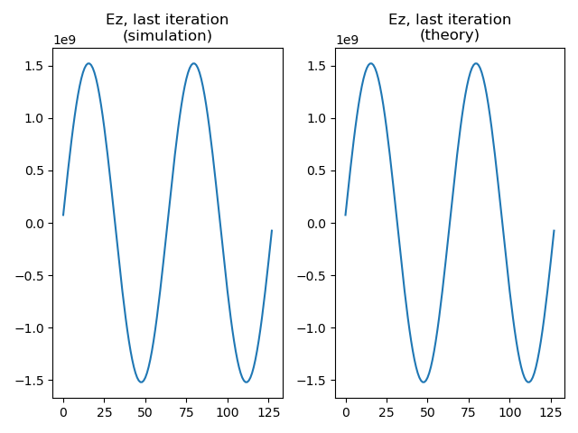

图 8-1 的数据来自 `runs/stage-c-validation/langmuir_frequency_fit/langmuir_multi_1d_analysis.png`，由官方 Langmuir 输入和 `scripts/analyze_langmuir_frequency_fit.py` 生成；图像被复制到书稿专属 `manuscript/assets/figures/` 目录，避免正文依赖运行目录中的临时文件。

当前本地 Langmuir 验证树已经比这个 1D 入口更大。1D/2D/3D/RZ 原生输入族分别复用 `analysis_1d.py`、`analysis_2d.py`、`analysis_3d.py`、`analysis_rz.py`，因此共享同一个“解析场解逐点比较”的主合同；其中 3D 版本还额外检查 selective particle output 和 openPMD 粒子位置上的 `Ex/Ey/Ez` 场采样。`analysis_utils.py` 又把 charge-conservation 检查做成条件分支，只在 Esirkepov、Vay deposition 或 PSATD current-correction 这些适用组合下强制比较 `divE` 与 `rho/\epsilon_0`。与之并列的 `langmuir_fluids` 则是另一棵冷流体验证树：它不只看 `E`，还把 `J` 和 `rho` 一起与解析冷流体解比较。需要单独记住的是，2D/3D/RZ 的 PICMI 变体目前大多仍是 `analysis=OFF` 的前端 + checksum scaffold，不应和原生输入的强物理断言混成同一等级。

从应用综合章的角度，Langmuir wave 的价值不只是“有一个 textbook 解析解”，而是它把当前 worktree 里的四条主线挂到了同一个最小物理问题上：

1. 初始化
   - `NUniformPerCell`
   - `profile = constant`
   - `parse_momentum_function`
   共同决定冷等离子体微扰如何进入粒子。
2. 粒子推进与沉积
   - `energy-conserving gather`
   - `Esirkepov`、`Vay deposition`
   - `momentum-conserving gather`
   在这个最小问题上暴露 `divE-rho/\epsilon_0` 误差。
3. 场求解
   - FDTD
   - PSATD
   - `current_correction`
   - `JRhom`
   都能在同一解析波形下做最小分支验证。
4. 诊断与 reader-side analysis
   - plotfile/full diagnostics
   - openPMD
   - selective particle output
   - on-particle `Ex/Ey/Ez`
   都已经有现成 analysis 脚本消费。

这也是为什么 `Examples/Tests/langmuir/` 在当前项目里不是“一个普通回归目录”，而是应用综合章最适合先收口的第一条主线。它已经把：

```text
冷等离子体解析振荡
-> parser 初始化
-> gather / pusher / deposition / solver
-> diagnostics / openPMD reader
-> MR / PSATD / current correction / JRhom / PICMI / fluids 分支
```

压在了同一个最小问题上。

到 2026-05-18 为止，这条主线已经不只停在源码和 analysis 脚本层，也有了第一条本地运行记录。当前在

- `/Volumes/PHILIPS/programs/PIC/PIC-tutor/runs/stage-c-validation/langmuir_1d`

用

```bash
env OMP_NUM_THREADS=1 FI_PROVIDER=tcp \
  /Volumes/PHILIPS/programs/PIC/warpx/build_full/bin/warpx.1d.MPI.OMP.DP.PDP.OPMD.FFT.EB.QED.GENQEDTABLES \
  /Volumes/PHILIPS/programs/PIC/warpx/Examples/Tests/langmuir/inputs_test_1d_langmuir_multi
```

完成了真实运行，并生成 `diags/diag1000080`。虽然官方 `analysis_1d.py` 因本机缺 `matplotlib/yt` 没有原样跑通，但它的核心断言已经按同一公式手工复现：

- 解析场相对误差 `error_rel = 1.70e-3 < 5e-2`
- `divE-rho/\epsilon_0` 相对误差 `8.35e-12 < 1e-11`

所以 `Langmuir wave` 现在在本项目里已经是运行级强基准，而不只是“源码上看起来应该能验证”的强基准。

## Uniform plasma

入口：`../warpx/Examples/Physics_applications/uniform_plasma/inputs_test_2d_uniform_plasma`

关键设置：

- `max_step = 10`
- `geometry.dims = 2`
- 周期场边界
- 单电子 species
- 常密度 `1.e25`
- gaussian 动量分布，`ux_th = uy_th = uz_th = 0.01`

这个例子更适合检查并行分解、粒子噪声、诊断输出和性能路径。因为物理结构简单，任何明显的非均匀场增长、粒子丢失或能量异常都容易被发现。

但当前本地 `uniform_plasma` 目录里的 regression 边界需要写得更精确。`test_2d_uniform_plasma` 和 `test_3d_uniform_plasma` 在 `CMakeLists.txt` 中都没有独立 analysis，实际只依赖顶层 `Examples/analysis_default_regression.py` 提供 checksum 基线；因此它们更像是“full diagnostics / 并行噪声 / 最小工作流稳定性”基准，而不是独立的热等离子体物理 hard assert。真正的强断言在 `test_3d_uniform_plasma_restart`：它从 `chk000006` 恢复，再用 `Examples/analysis_default_restart.py` 逐字段比较 restart 与非 restart 输出，要求相对误差低于 `1e-12`。另外，名字里带 `uniform_plasma` 的 `test_3d_uniform_plasma_psatd_JRhom_CC1` 并不属于这个应用目录，而是 `nci_psatd_stability` 里的 PSATD 稳定性回归，它检查的是 `JRhom=CC1 + div cleaning` 后电场能量是否足够小，从而证明 NCI 被压制，而不是均匀热等离子体本身的统计性质。

这意味着 `uniform_plasma` 在应用综合章里最准确的角色不是“单一 physics benchmark”，而是最小热背景 workflow：

1. 均匀、周期、单 species 的 thermal background
   - 给粒子噪声和并行划分提供最低复杂度基线；
2. full diagnostics
   - 给 plotfile/openPMD 风格输出提供最小 reader-side 骨架；
3. checkpoint/restart
   - 给 `analysis_default_restart.py` 提供一条极干净的 field-level reproducibility 基准。

如果把 `TODO` 里的“噪声、能量、性能和诊断”拆开，当前工作树里的证据来源其实是分层的：

- 噪声、性能背景、writer/checkpoint：
  - 主要来自 `Examples/Physics_applications/uniform_plasma/`
- 热等离子体总能量强断言：
  - 主要来自相邻 `Examples/Tests/energy_conserving_thermal_plasma/`
- PSATD/JRhom 稳定性强断言：
  - 主要来自相邻 `Examples/Tests/nci_psatd_stability/`

因此 `uniform_plasma` 的真正价值，不是它自己包含了所有强 analysis，而是它把：

```text
均匀热背景
-> 粒子噪声 / 并行稳定性
-> full diagnostics / checkpoint
-> restart reproducibility
-> 与能量守恒、PSATD 稳定性测试树的边界
```

压成了项目里第二条最适合成文的应用主线。

到 2026-05-18 为止，这条主线也已有一条最小本地运行记录。当前在

- `/Volumes/PHILIPS/programs/PIC/PIC-tutor/runs/stage-c-validation/uniform_plasma_2d`

用

```bash
env OMP_NUM_THREADS=1 FI_PROVIDER=tcp \
  /Volumes/PHILIPS/programs/PIC/warpx/build_full/bin/warpx.2d.MPI.OMP.DP.PDP.OPMD.FFT.EB.QED.GENQEDTABLES \
  /Volumes/PHILIPS/programs/PIC/warpx/Examples/Physics_applications/uniform_plasma/inputs_test_2d_uniform_plasma
```

完成了真实运行，并生成 `diags/diag1000010`。但这里必须保持验证分级：

- 主程序运行成功，只能证明 workflow、writer、最小噪声背景和输出路径正常；
- 官方 regression 本来就只有 `analysis_default_regression.py --path diags/diag1000010` 这一层 checksum；
- 这轮历史运行记录没有复跑 checksum 脚本；当前环境已有 `yt`，但仍缺 `openpmd_viewer`，所以 openPMD 分支仍未在本地验证。

所以 `uniform_plasma` 当前在本项目里的最准确状态仍然是：

- 已有运行级 baseline；
- 尚不是独立物理解强断言；
- 它的强 physics closure 仍需借相邻 `restart`、`energy_conserving_thermal_plasma` 和 `nci_psatd_stability` 三棵树来补齐。

### 2026-07-12：checkpoint/restart 的真实证据

为了把上面的 restart 说明从源码和 CMake wiring 推进到运行级证据，本项目在
`runs/stage-c-validation/uniform_plasma_3d_mpi2/` 复现了同一组 3D 输入：基线从第 0 步运行到第 10 步，并在第 6 步写出
`diags/chk000006`；restart sibling 从该 checkpoint 继续运行到第 10 步。两条路径最终都写出 `diags/diag1000010`。

官方 `../warpx/Examples/analysis_default_restart.py` 与项目内
`scripts/analyze_uniform_plasma_restart.py` 都对两个末态 plotfile 的 level-0 covering grid 逐字段比较。共比较 37 个 field，包含 `Bx/By/Bz`、`Ex/Ey/Ez`、`jx/jy/jz`、`rho`，以及 `electrons` 的粒子位置、动量、权重和粒子 ID；独立 reader-side 对照的最大绝对误差为 `2.4414e-4`，最大相对误差为 `2.8631e-16`，通过官方 `1e-12` 容差。绝对误差来自量纲较大的场/电流数组，不能脱离相对误差单独解释。

这一证据有两个必须同时保留的边界。第一，它直接证明的是 checkpoint 状态恢复、粒子/场续跑和末态 diagnostics 的 reproducibility，不是热平衡能量守恒或某个解析波的 physics gate。第二，WarpX 的 CMake 注册把该测试配置为 2-rank MPI；本轮已用本机 MPICH `mpiexec -n 2` 按官方兄弟目录布局真实补跑。官方 `analysis_default_restart.py` 对 37 个 field 全部通过，独立 reader-side 对照的最大相对误差为 `2.8631e-16 < 1e-12`。但仓库 checksum API 的 rank-specific 聚合参考与本地 2-rank producer 不一致，最大相对差为 `3.20e-2`；因此这里应写成“2-rank restart reproducibility evidence”，同时保留 checksum 非通过边界，不能把逐字段 restart pass 扩大成 checksum pass。

为解释这一 checksum 边界，又用同一当前 WarpX binary 和官方输入分别生成 1-rank、2-rank 的非 restart 基线，并运行 `scripts/analyze_uniform_plasma_mpi_consistency.py`。两套 producer 的粒子总权重完全一致；field energy 相对差为 `1.9379e-2`，particle kinetic energy 相对差为 `8.9170e-4`，total energy 相对差为 `6.2269e-4`，physical-field 最大 L2 相对差为 `1.0185`。因此该 thermal/randomized uniform-plasma case 的 rank-invariant field contract 明确不成立，checksum 差异不能被解释成 restart 失败；本项目只把 2-rank restart 的 plotfile-to-plotfile 一致性写成通过证据。1-rank/2-rank 报告位于 `runs/stage-c-validation/uniform_plasma_3d_mpi2/uniform-plasma-mpi-consistency.{json,md}`。

图 8-11 将这条边界压成两个可读的面板：左图显示 2-rank 相对 1-rank 的全局能量比，右图显示 `B/E/J/rho` 各组 physical field 的最大 L2 相对误差。左图说明粒子动能和总能量仍接近，但右图说明逐场 rank-invariant gate 并未成立；虚线是参考值或 `1e-12` machine-level gate，不是本案例已经通过的物理阈值。

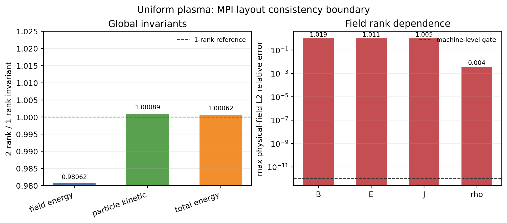

图 8-11 由 `scripts/plot_uniform_plasma_mpi_consistency.py` 从 `uniform-plasma-mpi-consistency.json` 重新生成；该图展示的是并行证据边界，不是新的强 physics benchmark。

## LWFA/PWFA

应用综合章的下一条主线不应再写成单独的 `plasma_acceleration`。当前本地 worktree 里，更准确的组织方式是把：

- `Examples/Physics_applications/laser_acceleration/`
- `Examples/Physics_applications/plasma_acceleration/`

并排视作同一类 wakefield acceleration runtime architecture 的两个分支：

1. `LWFA`
   - laser-driven
2. `PWFA`
   - beam-driven

它们共享的不是统一的 physics hard assert，而是非常相近的工程关注点：

- moving window
- boosted frame
- diagnostics
- mesh refinement
- PICMI/native front-end split

这一节现在还需要保留一条更早的文献边界：当前已经开始精读的 `Tajima-Dawson 1979` 并不是现代 `laser_acceleration` family 的 analysis blueprint，而是这条应用线最早期的 scaling baseline。它把 `laser pulse -> ponderomotive wake -> trapping -> acceleration` 这条最小物理闭环压得很硬，并给出

$$
v_p = v_g^{EM} = c\sqrt{1-\frac{\omega_p^2}{\omega^2}},
$$

$$
L_t = \frac{\lambda_w}{2} = \frac{\pi c}{\omega_p},
$$

$$
eE_L \cong mc\omega_p,
\qquad
\gamma_{\max} \simeq 2\frac{\omega^2}{\omega_p^2},
\qquad
l_a \cong 2\frac{\omega^2 c}{\omega_p^3}.
$$

这些式子最适合在本章里承担 `LWFA earliest scaling baseline` 的角色：它们解释为什么 wake phase velocity、dephasing、加速长度和 underdense-plasma driver 是同一条物理主线；但它们并不直接验证当代 WarpX 的 moving window、boosted frame、mesh refinement、openPMD 或 PICMI 前端实现。

同时，这篇文章也不是只有解析公式。当前精读已经确认它还给出了一个最小 relativistic electromagnetic PIC demonstration：`1 1/2-D`、one spatial dimension、three velocity/field dimensions、Gaussian finite-size particles、固定离子背景，并通过扫描 `\omega/\omega_p` 去对照最早期 scaling。文中数值结果至少压实了三件事：

1. wake longitudinal field 可达到
   $$
   E_L \sim 0.6\,\frac{mc\omega_p}{e},
   $$
   即冷等离子体 wave-breaking 级上限的大约 `60%`；
2. driver spectrum 会裂成多峰，作者明确解释为 successive / multiple forward Raman scattering，并把它和 photon deceleration、wake emission 联系起来；
3. simulation 中的最大电子能量随 `(\omega/\omega_p)^2` 的变化基本贴合解析式，只是在高端开始受有限系统大小和周期边界污染。

这进一步说明：`Tajima-Dawson 1979` 能作为 `LWFA` 的 earliest scaling 与 minimal EM-PIC demonstration 文献入口，但它仍不能替代现代 WarpX `laser_acceleration` family 的 runtime regression 合同。

文末还要再保留三条降级边界。第一，原文的 `feasible within present-day technology` 只是 1979 年语境下的工程可行性判断，后面立刻又承认 short-pulse shaping 仍需改进。第二，作者明确保留了 `\Delta\omega = \omega_p` 的 two-laser / beat-wave alternative，因此这篇文章更准确地支撑的是早期 wakefield family，而不是今天单一路径的单脉冲 `LWFA`。第三，pulsar atmosphere / cosmic-ray source 的段落只应当看作历史语境下的 speculative extrapolation，不能进入现代 WarpX 应用合同。

### LWFA：`laser_acceleration` 是 runtime matrix，不是统一 wake benchmark

`laser_acceleration/README.rst` 明确写的是 laser-wakefield acceleration，但 `Analyze` 章节仍是 `TODO`。配合 `CMakeLists.txt` 可以看出，当前这组目录更像是：

- 1D/2D/3D/RZ
- boosted frame
- moving window
- refined patch
- PICMI / Python callback
- openPMD diagnostics

这些路径的 `LWFA runtime matrix`。

当前只有三条局部强 analysis：

1. `analysis_1d_fluid_boosted.py`
   - 检查 boosted 1D 冷流体 `Ez/Jz/rho/Vz` 是否贴理论；
2. `analysis_refined_injection.py`
   - 检查 refined injection 的总粒子数和 refinement-edge 前方 `rho` 均匀性；
3. `analysis_openpmd_rz.py`
   - 检查 RZ openPMD diagnostics 的 mesh shape、species ordering 和 `rho_<species>` 物理中心。

其余大多数 active tests 都是 `analysis = OFF` 加 checksum baseline。因此，当前 `laser_acceleration` 目录更适合在本章承担：

- moving-window / boosted LWFA skeleton
- diagnostics / openPMD / MR / PICMI 路径覆盖

而不是完整的 wake amplitude、beam energy gain 或 laser diffraction 强 benchmark。

### PWFA：`plasma_acceleration` 是 workflow matrix，不是解析 wake benchmark

`plasma_acceleration/README.rst` 明确写的是 beam-driven wakefield acceleration，而不是 generic laser-plasma acceleration。这一点非常重要，因为它决定了这里的 driver 不是 laser antenna，而是 relativistic bunch。

当前目录的另一个硬边界是：

- `Analyze` 仍是 `TODO`
- `Visualize` 仍是 `TODO`
- 3D PICMI boosted-frame 等价性也被 `README.rst` 自己标成 `TODO`

同时，`CMakeLists.txt` 中所有 active tests 都是：

```cmake
OFF  # analysis
"analysis_default_regression.py --path ..."
```

因此 `plasma_acceleration` 当前最准确的角色是：

- `PWFA workflow matrix`
- `beam-driven wakefield application baseline`

它覆盖了：

- moving window
- boosted frame
- rigid bunch
- density ramp / plasma channel
- `particles.use_fdtd_nci_corr = 1`
- mesh refinement
- hybrid grid
- PICMI front-end

但当前并没有目录内统一的 wakefield physics hard assert。尤其要保留一个源码树边界：3D PICMI 输入文件目前仍未像 native 输入那样真正使用 boosted frame，所以不能把它说成 native boosted PWFA 的等价前端。

### 当前 worktree 中这条应用主线真正成立的结论

把 `LWFA/PWFA` 重新收束之后，当前本地证据支持的最强结论是：

1. `laser_acceleration`
   - 是 `LWFA runtime matrix`
   - 强 analysis 只覆盖局部合同
2. `plasma_acceleration`
   - 是 `PWFA workflow matrix`
   - 当前 active tree 全部 checksum-only
3. 二者共享的主线不是统一 benchmark，而是：
   - moving window
   - boosted frame
   - diagnostics
   - MR
   - PICMI/native front-end split

这也意味着，后续书稿如果从应用角度组织 wakefield acceleration，最自然的章节结构不是简单按目录分，而是：

```text
wakefield acceleration runtime architectures
-> laser-driven branch (LWFA)
-> beam-driven branch (PWFA)
```

## Laser ion / plasma mirror / RPA/TNSA

这一条应用主线必须写得比目录名更谨慎。当前本地 worktree 里真正可落到 application tree 的 laser-target 入口只有两个：

- `Examples/Physics_applications/laser_ion/`
- `Examples/Physics_applications/plasma_mirror/`

而 `RPA/TNSA` 当前并没有独立应用目录或回归树，只是：

- `laser_ion/README.rst` 背后的物理机制标签；
- `Docs/source/glossary.rst` 里的术语定义。

### `laser_ion`：最强的 laser-target application entry

`laser_ion` 的真实角色不是“已经证明某条 ion-acceleration scaling”，而是：

- Gaussian laser
- planar solid-density target
- full diagnostics
- time-averaged diagnostics
- reduced diagnostics
- PICMI front-end

这条组合工作流的本地入口。

当前它在 CI 里的最硬断言来自 `analysis_test_laser_ion.py`，检查的是：

- `diagInst` 最后 5 个瞬时 `Ez` snapshot 的时间平均
- 与 `diagTimeAvg` 的原位 time-averaged `Ez` 是否逐点一致

因此它当前最强的 regression 合同是：

- diagnostics time-average consistency

而不是：

- TNSA cutoff energy
- RPA threshold
- ion conversion efficiency

README 里的 `analysis_histogram_2D.py` 和 `plot_2d.py` 仍然很重要，但它们当前属于 user-facing post-processing helper，不是活跃 CI regression 本体。

还要再保留一个细边界：`laser_ion` 确实已经有 PICMI 版输入，但其 reduced diagnostics 能力和 native 版并不完全对齐，例如 PICMI 脚本里仍留有 `ParticleHistogram2D` 的 TODO。因此更准确的说法是：

- PICMI 已覆盖主工作流与 `analysis_test_laser_ion.py` 合同；
- 但前端能力还没有完全追平 native input。

### `plasma_mirror`：laser-solid surface-plasma workflow baseline

`plasma_mirror` 当前应用语义很明确：

- laser-solid interaction
- surface plasma
- planar overdense target

但验证层级明显更弱：

- 只有 `test_2d_plasma_mirror`
- `analysis = OFF`
- checksum helper
- 没有 PICMI
- `README.rst` 的 Analyze/Visualize 仍是 `TODO`

因此它更准确的角色是：

- laser-solid surface-plasma workflow baseline

而不是：

- reflectivity benchmark
- high-harmonic benchmark

### `RPA/TNSA`：当前属于物理解释层，不属于本地应用目录层

这条边界如果不写清，很容易把文献中的机制标签误写成当前 worktree 已有的独立本地 examples。当前最强、也最保守的结论只能是：

1. `laser_ion`
   - 是激光打固体平面靶的本地应用骨架；
2. `RPA/TNSA`
   - 是理解这类骨架时需要引入的机制标签；
3. 当前 `Examples/` 中
   - 没有独立 `rpa_*`
   - 也没有独立 `tnsa_*`
   application tree。

因此，这条应用综合章在当前 worktree 里更准确的组织方式是：

```text
laser-target applications
-> laser_ion
-> plasma_mirror
-> RPA/TNSA as mechanism labels, not standalone local trees
```

## Capacitive discharge

这条应用线在当前 worktree 里不该再混成普通 `collision/*` 附属条目。它更准确的角色是：

- `PIC-MCC low-temperature plasma application tree`

因为它同时把以下对象接到同一应用骨架上：

- parallel-plate electrostatic discharge
- `background_mcc`
- 可选 DSMC ionization 分支
- PICMI front-end
- Python callback Poisson solver
- Turner benchmark profile 对照

### 1D PICMI 是当前最强的 Turner benchmark 入口

当前最强的两条 active tests 是：

- `test_1d_background_mcc_picmi`
- `test_1d_dsmc_picmi`

它们共用同一条脚本：

- `inputs_base_1d_picmi.py`

这不是普通薄输入卡，而是完整的 benchmark driver：

1. 选择 Turner case `N=1..4`
2. 组装 1D electrostatic grid
3. 可选安装 Python level Poisson solver callback
4. 打开 `background_mcc`
5. 可选把 ionization 切成 DSMC
6. 累积离子密度并写出 `ion_density_case_N.npy`

当前 CI `--test --pythonsolver` 模式下还会显式确认：

- callback solver 已经实际运行；
- `he_ions` 的 `z` 坐标访问链可用。

因此这条应用树在工程上也不只是低温等离子体 benchmark，同时还是本地最直接的：

- PICMI + Python callback Poisson solver

应用入口之一。

### 当前最硬断言是 case-1 ion-density profile

`analysis_1d.py` 和 `analysis_dsmc.py` 当前都直接读取：

- `ion_density_case_1.npy`

并与内置 Turner case-1 参考离子密度 profile 做 `allclose`。

因此当前 worktree 里最强的 physics contract 是：

- final averaged ion density profile
- against Turner benchmark case 1

而不是笼统的“有 MCC test”或“有 DSMC test”。

### DSMC 版不是孤立小 test，而是同一 benchmark scaffold 的分支

这两条 1D tests 共享同一应用骨架，区别只在于 collision realization：

1. `test_1d_background_mcc_picmi`
   - `background_mcc`
   - external Python Poisson solver callback
   - Turner case-1 profile 对照
2. `test_1d_dsmc_picmi`
   - 把 ionization 切到 DSMC 分支
   - 仍回到同一 Turner case-1 profile 对照

因此更准确的表述是：

- DSMC 分支已经在同一低温等离子体 benchmark scaffold 里被强对照覆盖

而不是只证明“DSMC can run”。

### 2D native / PICMI 当前仍主要是 workflow baseline

与 1D 强对照相比，当前 2D 分支只有：

- `test_2d_background_mcc`
- `test_2d_background_mcc_picmi`

并且两者都是：

- `analysis = OFF`
- checksum helper

因此它们当前只能诚实记成：

- `2D capacitive-discharge workflow baseline`

而不是 2D Turner 强 benchmark。另一个必须保留的边界是：

- `test_2d_background_mcc_dp_psp`

当前整条 `add_warpx_test(...)` 仍被注释掉，所以它只能作为遗留分支记录，不能再冒充活跃 test。

### 既有 `plasma_acceleration` 目录边界

入口：`../warpx/Examples/Physics_applications/plasma_acceleration/inputs_test_3d_plasma_acceleration_boosted`

这一组也需要避免被过度解读。当前本地 `plasma_acceleration` family 在 `CMakeLists.txt` 中所有活跃 tests 都是 `analysis = OFF`，只复用目录内的 `analysis_default_regression.py` 做 checksum。因此它们不是 “PWFA 解析 benchmark”，而是应用工作流基线。

但它们并不空泛。原生输入和 PICMI 输入合起来，已经覆盖了：

- moving window
- boosted frame
- rigid-injected `driver/beam`
- `particles.use_fdtd_nci_corr = 1`
- level-1 refined patch / `add_refined_region(...)`
- `momentum-conserving` gather 分支
- `grid_type = hybrid`
- field / particle diagnostics

因此这组例子当前真正承担的角色是：给 beam-driven wakefield acceleration 的 runtime matrix 保留稳定输出基线，而不是直接对 wake amplitude、dephasing 或 beam loading 做强物理断言。还有一个需要显式保留的源码树边界是：`README.rst` 目前明确写着 3D PICMI 版“应该像原生输入一样使用 boosted frame，但仍是 TODO”。所以 `inputs_test_3d_plasma_acceleration_picmi.py` 当前只能诚实记成 non-boosted PICMI scaffold，不能误写成原生 boosted PWFA 的等价前端。

## Magnetic reconnection

当前 worktree 里，磁重联这条应用线最准确的入口不是一般 `Fluids/`，而是：

- `Examples/Tests/ohm_solver_magnetic_reconnection/`

它依赖的是：

- `picmi.HybridPICSolver`
- `HybridPICModel`

也就是：

- kinetic ions
- electron-fluid Ohm closure
- Faraday + RK 子步推进 `B`

而不是 `WarpXFluidContainer` 那条额外 cold-fluid species runtime layer。这个边界必须写死，因为已有源码笔记已经明确：

- `Fluids/`
  - 自己维护 nodal `N/NU`
  - gather 主场
  - 再把 `rho/J` 沉积回普通场寄存器；
- `HybridPICModel`
  - 则是在 field solver 内部从总电流、离子电流和电子闭合关系反推出 `E`。

因此 `magnetic_reconnection` 在应用综合章里的正确角色是：

- `hybrid-PIC space-plasma application`

而不是：

- `fluid/PIC coupling demo`

### force-free sheet + reduced `FieldProbe`

`inputs_test_2d_ohm_solver_magnetic_reconnection_picmi.py` 当前不是薄输入卡，而是完整应用 driver。它同时定义了：

- 2D Cartesian 几何
- `x` 周期、`z` 方向 `dirichlet`/`reflecting`
- force-free-sheet 解析初始 `B_x/B_y/B_z`
- `plasma_resistivity`
- `substeps`
- kinetic ion loading
- reduced diagnostic `FieldProbe`

其中最重要的 diagnostics 不是 full plotfile，而是：

- `plane.dat`

它来自 X 点附近的 reduced `FieldProbe`，专门供 reader-side analysis 提取重联率。

### 当前 analysis 是 observable extraction，不是强 assert

`analysis.py` 当前直接从 `plane.dat` 读取 `E_y`，构造：

$$
R(t)=\frac{\langle E_y\rangle}{v_A B_0}.
$$

然后输出：

- `reconnection_rate.png`

在非 `--test` 模式下还会进一步生成：

- `mag_reconnection.mp4`

但这条脚本没有显式数值 `assert`。因此它当前只能被诚实归类为：

- `physics-informed visualization / observable extraction`

而不是：

- hard numerical benchmark

### checksum 仍是 active coverage 的另一半

`CMakeLists.txt` 里这条 test 还会同时跑：

- `analysis_default_regression.py --path diags/diag1000020`

所以当前 active coverage 的真实结构是：

1. `analysis.py`
   - 提取重联率并可视化；
2. checksum helper
   - 兜底历史输出稳定性。

这也解释了它和邻近 `ohm_solver_*` 条目的分工：

- `ohm_solver_em_modes`、`ion_beam_instability`
  - 更偏局部 solver correctness 的强 regression；
- `magnetic_reconnection`
  - 更偏 hybrid-PIC 代表性物理案例和输出回归。

因此，这条应用线在当前书稿里最准确的结论应写成：

```text
magnetic_reconnection
= HybridPICModel application line
= force-free-sheet + reduced FieldProbe + reconnection-rate extraction
= physics-informed visualization + checksum
!= scalar hard-assert benchmark
```

## Beam-beam / luminosity / FEL / ion extraction

这一条应用综合主线最容易被误写成单一“束流例子”列表，但当前 worktree 里的四类入口其实承担着不同层级的合同：

- `DifferentialLuminosity`
- `beam_beam_collision`
- `free_electron_laser`
- `ion_beam_extraction`
- `accelerator_lattice`

更准确的组织方式应是：

```text
beam and accelerator applications
-> luminosity diagnostics benchmark
-> collider-QED workflow baseline
-> FEL boosted-frame radiation benchmark
-> electrostatic ion-source extraction
-> accelerator-lattice optics regression
```

### `DifferentialLuminosity`：reduced-diagnostic 强谱基准

`Examples/Tests/diff_lumi_diag/` 当前是这条应用线里最强的 diagnostics regression。它的 `analysis.py` 不是普通画图脚本，而是同时读取：

- 一维文本表 `DifferentialLuminosity_beam1_beam2.txt`
- 二维 openPMD 网格 `DifferentialLuminosity2d_beam1_beam2/`

然后直接构造两束 Gaussian beams 的解析 luminosity 谱：

- `dL/dE`
- `d^2L/dE_1 dE_2`

再与 diagnostics 做显式误差比较和 `assert`。因此它的角色必须写成：

- `reduced-diagnostic strong benchmark`

而不是一般的 beam application helper。

### `beam_beam_collision`：collider-QED 应用骨架

与 `DifferentialLuminosity` 相比，`Examples/Physics_applications/beam_beam_collision/` 当前证据层要弱得多：

- active regression 只有 checksum helper；
- 没有独立 `analysis.py`；
- `plot_fields.py` / `plot_reduced.py` 只是后处理可视化脚本。

但它并不空泛。它当前真正把这些路径绑在一起：

- `warpx.do_electrostatic = relativistic`
- 两束 `125 GeV` 电子/正电子 Gaussian bunch 对撞
- `initialize_self_fields = 1`
- Quantum Synchrotron
- Breit-Wheeler
- `ColliderRelevant`
- `ParticleNumber`
- openPMD full diagnostics

因此它最准确的定位是：

- `collider-QED application baseline`

而不是 luminosity 强谱基准。

### `free_electron_laser`：boosted rigid-beam + undulator + BTD 的强 benchmark

`free_electron_laser` 当前不是普通 laser example，因为它本质上没有 laser antenna。已有本地笔记已经压实：

- 核心是 `RigidInjectedParticleContainer`
- `particles.By_external_particle_function(...)` 提供 undulator 外加粒子磁场
- `BackTransformed` diagnostics 与 boosted-frame full diagnostics 的一致性

当前最强断言来自 `analysis_fel.py`：

1. 对 `log(E_x^2)` 的线性增长区做拟合，要求 gain length 接近 `0.22 m`；
2. 在 lab-frame 与 boosted-frame diagnostics 上做 FFT，要求 radiation wavelength 满足 undulator 理论值。

因此它当前最准确的角色是：

- `boosted rigid-beam radiation benchmark`

这条应用线也正好和 `Dawson 1983` 里的经典 FEL 例子接上。那篇综述把 free-electron laser 专门当作 relativistic electromagnetic particle model 的代表问题：lab frame 下给出

$$
\lambda \simeq \frac{\lambda_0}{2\gamma^2},
$$

而在 beam frame 下又把同一过程重写成 pump electromagnetic wave 衰变成 electromagnetic wave 加 plasma wave 的 Raman-like 参数不稳定，并要求满足

$$
k_{\mathrm{pump}} = k_{\mathrm{EM}} + k_p,\qquad
\omega_{\mathrm{pump}} = \omega_{\mathrm{EM}} + \omega_p(k_p).
$$

它的历史 simulation 结果还明确展示了 matching-condition 谱证据、约 `36%` 的 longitudinal current 下降、约 `30%` 的束流能量转成辐射，以及 `2\lambda_0` backward mode 的危险性。对本章来说，这组文献证据的作用不是替代当前 `analysis_fel.py`，而是把 WarpX 这条 `boosted rigid-beam + undulator + BTD` benchmark 放回更早的 relativistic EM-PIC 谱系里理解。

如果再把图像层次压得更明确，`Dawson 1983` 这条 FEL 历史线已经形成一个很完整的 diagnostics contract：

- `Fig.54`
  - 给最小装置和 lab-frame / beam-frame 两种物理图像；
- `Fig.55`
  - 用 EM / electrostatic spectra 检查 matching condition；
- `Fig.56`
  - 用 EM energy、electrostatic energy 和 longitudinal current 的同步演化检查 gain、beam degradation 与 saturation；
- `Fig.57`
  - 再把 trapping-based efficiency estimate
    $$
    \eta = \frac{\gamma_0-\gamma_{\mathrm{ph}}}{\gamma_0-1}
    $$
    及其大-$\gamma$ 近似
    $$
    \eta \simeq \omega_{po}(2k_0 c \gamma^{3/2})^{-1}
    $$
    与 simulation 对照。

也就是说，这组经典图像已经把 mechanism verification、nonlinear saturation 和 rough efficiency scaling 串成一条最小 reader-side 论证链。当前 WarpX `free_electron_laser` 的价值，则是把这条历史论证链重新落到 boosted-frame implementation、BTD 重建和 gain-length / wavelength regression 上。

### `ion_beam_extraction`：EB electrostatic extraction 的强应用入口

`Examples/Physics_applications/ion_beam_extraction/` 当前是这条应用线里最直接的 electrostatic + embedded-boundary beam-source application。

它把：

- plasma source
- `boundary.potential_*`
- `warpx.eb_potential(x,y,z,t)`
- electrostatic solver
- embedded-boundary electrode geometry
- 持续 boundary injection

接成了一条完整链。

当前 `analysis_ion_beam_extraction.py` 会直接检查抽出离子束尾部能量是否接近 `40 keV`，因此它不是 checksum baseline，而是：

- `electrostatic EB extraction strong application check`

### `accelerator_lattice`：beamline optics 的强回归层

如果只写 collider、FEL 和 extraction，这条总节还少了一层真正对应加速器模块本身的强验证。当前最自然的入口是：

- `Examples/Tests/accelerator_lattice/`

这里的 `analysis.py` 会重新读回：

- `lattice.elements`
- `line*`
- `drift*`
- `quad*`

然后按解析 hard-edged quadrupole optics 逐段积分，并要求最终粒子轨道和解析解足够接近。它同时覆盖：

- lab frame
- boosted frame
- moving window

所以它在这条总节里最准确的角色是：

- `beamline optics strong regression`

## 诊断在源码中的位置

`WarpX::Evolve` 中诊断不是附加脚本，而是时间步的一部分：

- 行 173：`multi_diags->NewIteration()`。
- 行 323-330：判断是否需要为诊断同步粒子速度。
- 行 337-344：reduced diagnostics 和 full diagnostics 的计算、打包、写出。
- 行 374-382：最终时间步或中断时 flush last timestep。

源码目录包括：

- `../warpx/Source/Diagnostics/`
- `../warpx/Regression/Checksum/`
- `../warpx/Examples/analysis_default_regression.py`

更底层地看，`Source/Diagnostics` 顶层其实分成四层角色：

1. `MultiDiagnostics`
   负责读取 `diagnostics.diags_names`，按 `<diag>.diag_type` 把每个 diagnostics 实例化成 `FullDiagnostics`、`BTDiagnostics` 或 `BoundaryScrapingDiagnostics`，并在主循环里统一分派。
2. `Diagnostics`
   提供统一模板骨架：`InitData()`、`FilterComputePackFlush()`、`ComputeAndPack()`、`Flush()`。也就是说，所有 diagnostics 都要经过“先决定是否 compute/pack，再决定是否 flush”的同一套阶段。
3. `FullDiagnostics`
   负责把 `fields_to_plot`、`particle_fields_to_plot` 和 species 输出需求映射成具体 functors，再把结果堆叠进输出 `MultiFab`。
4. `ParticleDiag`
   不是真正的粒子数据缓冲区，而是每个 species 的输出配置对象：它记录变量选择、`random_fraction` / `uniform_stride` / parser filter、附加粒子场请求，以及粒子来源容器指针。

一个关键实现边界是：普通 `FullDiagnostics` 的粒子输出，并不像 back-transformed diagnostics 那样先 pack 到独立粒子 buffer。它更多是把 `ParticleDiag` 作为 species 句柄和过滤配置传给 writer；真正的粒子变量裁剪和过滤发生在 `FlushFormatPlotfile.cpp` / `WarpXOpenPMD.cpp` 的写出阶段。只有 `BTDiagnostics` 这类带 snapshot buffering 的 diagnostics，才会真正分配 `m_particles_buffer` 和 `ComputeParticleDiagFunctor`。

这也是为什么 `Diagnostics::ComputeAndPack()` 虽然同时有 field-functor loop 和 particle-functor loop，但对普通 full diagnostics 来说，后者默认是空的。不要把“所有 diagnostics 都有独立粒子 pack 阶段”当成 WarpX 的统一事实。

继续往下拆，会看到 diagnostics 模块其实还有另一条容易混淆的边界。`ComputeDiagFunctors/` 是字段计算层：`JFunctor`、`RhoFunctor`、`PhiFunctor` 直接把 `j/rho/phi` 这类量写进 diagnostics `MultiFab`；`ParticleReductionFunctor` 虽然读取粒子，但它输出的仍然是 cell-centered `MultiFab`，因此也属于字段计算层，而不是粒子 writer。

真正的粒子过滤发生在 writer 阶段。无论是 `WarpXOpenPMD.cpp` 还是 `FlushFormatPlotfile.cpp`，都会先从 `ParticleDiag` 取出：

- `random_fraction`
- `uniform_stride`
- parser filter
- geometry filter

然后创建一个临时粒子容器 `tmp`，通过 `tmp.copyParticles(...)` 把通过过滤的粒子复制进去，再把 `tmp` 写出。因此 `ParticleDiag` 构造阶段只是记录过滤规则；真正应用过滤是在 flush 的时候。

`phi`、`Ex/Ey/Ez`、`Bx/By/Bz` on particles` 也不属于 field functor 层，而是 writer 在过滤后的 `tmp` 上再做一次 gather。`ParticleIO.cpp` 明确限制这些附加粒子场只允许 `diag_type = Full`，因为对 `BackTransformed` 或 `BoundaryScraping` 这类带粒子缓冲区的 diagnostics 来说，粒子被写出的时间并不等于粒子被收集的时间，此时再 gather 场会产生时间层错配。

`ReducedDiags/` 又是另一套平行体系。它不继承 `Diagnostics`，也不走 `MultiFab + ParticleDiag + FlushFormat` 这条主线，而是由 `MultiReducedDiags` 读 `warpx.reduced_diags_names` 后，按 `<reduced_diag_name>.type` 分派到 `FieldEnergy`、`ParticleEnergy`、`ParticleHistogram`、`FieldProbe`、`LoadBalanceCosts` 等具体类型。它们共享的核心抽象不是字段/粒子快照，而是一段 `m_data` 向量和统一的表格写出协议：第一列是 step，第二列是时间，后面各列是 reduced quantity。

这类 reduced diagnostics 里，很多类型是“到点现算即写”，例如 `FieldEnergy` 和 `ParticleEnergy`；但也有例外，例如 `FieldPoyntingFlux` 会维护跨时间步累积的积分量，因此还要实现 `WriteCheckpointData()` / `ReadCheckpointData()`，把内部状态写进 checkpoint 并在 restart 时恢复。也就是说，diagnostics 模块里并不是只有 `BTDiagnostics` 才有跨步状态，部分 reduced diagnostics 也有。

checkpoint format 本身也不能等同于普通 diagnostics 格式。`FlushFormatCheckpoint.cpp` 实际写出的是 WarpX 的 restart state：`E/B`、coarse/fine patch fields、同步后的 current、PML 数据、粒子状态，以及 reduced diagnostics 额外的 checkpoint 数据。它并不是把某个 diagnostics 的 `m_mf_output` 换一种文件格式落盘，而是直接序列化运行态。

`BTDiagnostics` 则是另一类“有状态机”的 diagnostics。它几乎每一步都可能执行 `DoComputeAndPack()`，把 cell-centered 后的场切成一片片 lab-frame slice，逐步填进 snapshot buffer；`DoDump()` 判断的也不是单纯的时间间隔，而是“当前 buffer 是否已满”“最后一个有效 z-slice 是否已经填到”以及“结束时是否需要强制冲刷剩余 buffer”。因此 BTD 不能被理解成另一种普通 full diagnostics，它本质上是一套 slice / buffer 的累积和 flush 机制。

再往 reduced diagnostics 的具体类型里看，会发现它们虽然共用 `ReducedDiags` 骨架，但实现形态并不统一。`FieldProbe` 内部维护的不是一个标量数组，而是一套专门的 `FieldProbeParticleContainer`：point/line/plane 三种几何最终都会在 `InitData()` 中转成一批 probe particles，再在 `ComputeDiags()` 里对 `Efield_aux/Bfield_aux` 做 gather。因此它测到的不是推进器主寄存器的原始 `fp` 场，而是粒子侧真正会看到的 `aux` 场；`do_moving_window_FP` 也不是事后回推场，而是直接平移这批 probe particles。若 `integrate = 1`，它还会在每一步把采样值乘 `dt` 累加到 probe-particle SoA 中，到输出步才写出累计量。

`ParticleHistogram` 和 `ParticleHistogram2D` 又是另一种 reduced diagnostics。前者是 parser 驱动的一维 weighted histogram：对每个粒子先算 `histogram_function(t,x,y,z,ux,uy,uz)`，再按 `floor((f-bin_min)/bin_size)` 落 bin，默认累加粒子权重 `w`，最后在 MPI 归约之后再做 `max_to_unity` 或 `area_to_unity` 归一化。后者虽然还挂在 `ReducedDiags/` 下，但 writer 已完全变成 openPMD mesh 输出：`histogram_function_abs`、`histogram_function_ord` 决定二维坐标，`value_function` 决定每个粒子向该 bin 累加什么值，并且 writer 会连同轴标签、bin spacing、global offset 和 parser 字符串一起写进 openPMD 元数据。因此二维 histogram 不是“多一列文本表”，而是真正的带坐标二维诊断场。

`LoadBalanceCosts` 和 `LoadBalanceEfficiency` 则属于性能/并行态 diagnostics。前者输出粒度是 box，而不是 rank：每个 box 会写 `cost`、`proc`、`lev`、`i_low/j_low/k_low`、`num_cells`、`num_macro_particles`，GPU 运行时还会附带 `gpu_ID`，再通过额外的 `MPI_Gatherv` 收集 hostname。`Heuristic` 模式下它会先调用 `ComputeCostsHeuristic()` 重建 heuristic cost；`Timers` 模式下则直接导出当前 timers 成本。因此它真正暴露的是 WarpX load-balance 决策所依据的 box-level 负载分布，而不只是一个抽象效率数字。`LoadBalanceEfficiency` 相比之下非常薄，它只是把 `warpx.getLoadBalanceEfficiency(lev)` 的结果按 level 写出来，用于快速检查某次重分配前后是否更均衡。

对应的 regression 也不是同一种口径。`analysis_reduced_diags_impl.py` 会从 full plotfile 重新计算 `FieldEnergy`、`ParticleEnergy`、`FieldReduction` 等 compact observable，再与 reduced diagnostics 文本结果比较，所以它主要验证 reduced diagnostics 与 full-state reference 是否一致。`analysis_reduced_diags_load_balance_costs.py` 则完全不读 plotfile，而是直接从 `LBC.txt` 重建每个 rank 的总成本，并只断言 load-balance 之后

$$
\text{efficiency}_\text{before} < \text{efficiency}_\text{after}.
$$

这说明 reduced diagnostics 在 WarpX 里既有“物理量压缩输出”的一面，也有“把并行运行态暴露给后处理”的一面，不能把它们都当成同一种小型文本统计表。

如果把 diagnostics 再按 writer 分成一层，会看到 `diag_type` 和 `format` 是两套独立分派。`MultiDiagnostics` 先按 `diag_type` 把对象构造成 `FullDiagnostics`、`BackTransformed` 或 `BoundaryScrapingDiagnostics`；之后 `Diagnostics::InitDataBeforeRestart()` 再按 `format` 选择：

- `FlushFormatPlotfile`
- `FlushFormatOpenPMD`
- `FlushFormatCheckpoint`

这三条 writer 路径虽然共用 flush 调度时机，但服务目标已经不同。`plotfile` 路径会把 diagnostics 已经 pack 好的 cell-centered `MultiFab` 通过 `WriteMultiLevelPlotfile(...)` 写出；若打开 `plot_raw_fields = 1`，还会额外把原始 staggered/raw fields 写进 `raw_fields/` 子目录，因此它既能给普通分析用，也能给底层网格调试用。`openPMD` 路径在 fields 侧同样写 diagnostics 视图，但在粒子侧比 plotfile 更强：它可以在 writer 中对过滤后的临时粒子容器再次 gather `phi`、`Ex/Ey/Ez`、`Bx/By/Bz`。不过这项能力只允许 `diag_type = Full`，因为 `ParticleIO.cpp` 明确禁止对 `BackTransformed` 或 `BoundaryScraping` 这类“收集时刻和写出时刻不一致”的缓冲型 diagnostics 再去 gather 场。

`checkpoint` 路径则完全不是“另一种 diagnostics 文件格式”。`FlushFormatCheckpoint::WriteToFile()` 基本不消费 `m_mf_output`，而是直接从 `warpx.m_fields` 序列化真实运行态：

- `Efield_fp/Bfield_fp`
- `E_old`
- synchronized `current_fp/current_cp`
- coarse patch fields
- time-averaged fields
- PML 数据
- 完整 species 与 lasers 粒子状态
- distribution mapping
- reduced diagnostics 的 checkpoint state

因此 checkpoint 的真正对象是 restart persistence，而不是用户筛选后的诊断视图。也正因为如此，`FullDiagnostics::ReadParameters()` 对 `format = checkpoint` 做了比文档更强的源码约束：不能自定义 `fields_to_plot`、不能裁剪 `diag_lo/diag_hi`、不能做 `coarsening_ratio`、不能指定 species 子集，也不能开 raw fields。它要求的是“全量可恢复状态”，不是“最小可读输出”。

从现有本地例子看，这三类 writer 的最小输入骨架也已经比较稳定：

- 普通 `plotfile`：只写 `diag1.diag_type = Full` 和一组 `fields_to_plot` 即可，`format` 缺省就是 plotfile。
- `openPMD`：在 full diagnostics 上再加 `diag1.format = openpmd` 和 `diag1.openpmd_backend = h5/bp*`，`laser_ion` 已经给出了带 field filtering 的最小可复用骨架。
- `checkpoint`：通常并行放一个 `diag1` 和一个 `chk`，后者写 `chk.diag_type = Full`、`chk.format = checkpoint`；重启则用 `amr.restart = "../.../chk000XXX"` 接回。

对本章当前最相关的 reduced diagnostics，也已经能直接从本地 examples 抽出最小运行入口：

- `FieldProbe`：`Examples/Tests/reduced_diags/inputs_test_3d_reduced_diags` 和 `laser_ion` 都给了 point/line 的最小参数骨架。
- `ParticleHistogram2D`：`laser_ion` 已经给了 `histogram_function_abs/ord` 与 `value_function = "w"` 的二维相空间例子。
- `LoadBalanceCosts`：`Docs/source/usage/workflows/plot_distribution_mapping.rst` 与 `Examples/Tests/reduced_diags/analysis_reduced_diags_load_balance_costs.py` 已经构成最小“生成 + 画图/验效”工作流。

如果要看 `FieldProbe` 的强 analysis regression，本地还有一组比这些“最小骨架”更直接的条目：`Examples/Tests/field_probe/`。它不是只检查文件格式，而是把 line `FieldProbe` 接到单缝衍射 benchmark 上。analysis 会从 `FP_line.txt` 读出 step 500 的积分电磁通量，再与解析 `sinc^2` 衍射包络比较，并要求平均相对误差小于 `2.5%`。按当前 checkout 的官方输入真实运行后，这条线暂时不能作为“已通过”的例子：1-rank 和官方 2-rank MPI 配置产生完全一致的 `FP_line.txt`，但 `analysis.py` 的平均误差都是 `3.6703%`，最大选点误差为 `10.0843%`。项目内的 `scripts/analyze_field_probe_diffraction.py` 已复现同一选点范围和分母，并将结果归档到 `runs/stage-c-validation/field_probe_2d/` 与 `field_probe_2d_mpi2b/`。

这里的失败本身是诊断章节需要保留的证据。它说明 reduced diagnostic 的 writer 合同已经接通：201 个 probe 点、step 500 的积分通量和 1/2-rank 一致性都成立；但这还不足以证明 `FieldProbe` 的物理量与解析衍射包络一致。随后将网格从官方的 `lambda/16` 加密到 `lambda/32`，并在相同物理时间的 step 1000 取样，官方同口径误差降为 `0.3533%`，最大选点误差为 `1.0414%`，通过 `2.5%` gate。对照报告位于 `runs/stage-c-validation/field_probe_resolution_comparison.md`。

因此当前最稳妥的成书结论是：原始 coarse case 的“输出链通过、解析 physics gate 未通过”是真实结果；网格加密后的通过结果支持 coarse-grid 离散误差是主因，但不能把 refined case 的结果反写成原始官方输入已通过。关闭 filter 只能把误差略降至 `3.5910%`，而 `interp_order=0` 在当前分支产生零通量，后者应作为另一个需要单独审计的 raw-field gather 边界，而不是有效的物理改进方案。

图 8-3 将这条边界画成两个并排面板：左图是官方 analysis 使用的平均误差和 `2.5%` gate，右图是 40 个选点中的最大误差。颜色只表示当前报告的 pass/fail 状态；refined 的通过来自 `lambda/32`、相同物理时间的 step 1000 对照，不是对 coarse 输入的重写。

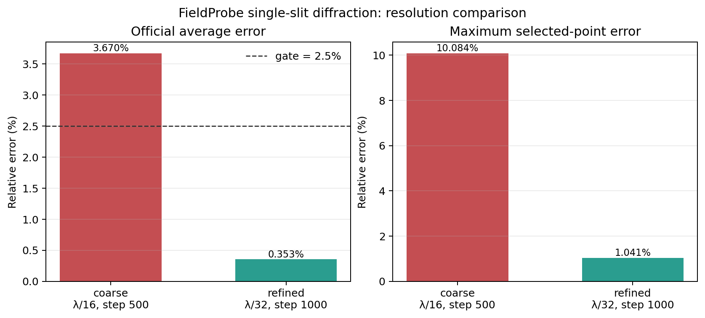

图 8-3 由 `scripts/plot_field_probe_resolution.py` 从 `runs/stage-c-validation/field_probe_resolution_comparison.json` 重新生成。

同一层里，本地还有两组更偏束流诊断的强 regression。`Examples/Tests/collider_relevant_diags/` 不是普通 reduced-output 烟雾测试，而是把 `ColliderRelevant` 与 `ParticleExtrema` 并排打开，然后用解析粒子样本逐项核对 `chi_min/max/ave`、`theta_x/theta_y` 的 min/ave/max/std，再从 full openPMD 的 `rho_beam_e/rho_beam_p` 重建 `dL/dt` 与 reduced output 交叉验证。也就是说，这组例子验证的不是“表格写出来了”，而是 collider-oriented reduced quantities 的定义和聚合合同本身。

`Examples/Tests/diff_lumi_diag/` 则把 reduced diagnostics 进一步推进到带解析谱对照的束流物理量：一维 `DifferentialLuminosity` 文本表和二维 `DifferentialLuminosity2D` openPMD 网格同时输出，analysis 直接构造两束高斯束流对撞的解析 `dL/dE` 与 `d^2L/dE_1dE_2`，再分别比较 1D/2D diagnostics。对本章来说，这组例子非常有价值，因为它把“reduced diagnostics 可以是纯文本列，也可以是 openPMD 网格”这件事，用同一个物理 benchmark 明确落地了。

与之相邻、但等级更弱的一组是 `Examples/Physics_applications/beam_beam_collision/`。这组例子同样使用 collider 场景、Quantum Synchrotron、Breit-Wheeler、`ColliderRelevant` 与 `ParticleNumber` reduced diagnostics，但当前活跃 regression 只有 `analysis_default_regression.py` 提供 checksum，没有独立 `analysis.py`。因此它更准确地是一个 collider-QED application baseline：验证 relativistic electrostatic self-field、beamstrahlung、coherent pair generation 和 reduced diagnostics 的联合工作流能否稳定接通，而不是对 luminosity 谱或 Yakimenko 2019 结果做强物理断言。目录里的 `plot_fields.py` 和 `plot_reduced.py` 也只是说明用户应如何可视化 `|E|/|B|`、次级对密度、每个 beam particle 的 photon 数与 NLBW pair 数；它们不应被当成 regression analysis。

`Examples/Tests/reduced_diags/` 本体当前则应再拆成两棵验证树。`test_3d_reduced_diags` 走 `analysis_reduced_diags_impl.py`：它不是只看 reduced text 文件能不能写出来，而是从 full plotfile 重新计算 `FieldEnergy`、`ParticleEnergy`、`FieldMomentum`、`ParticleMomentum`、`FieldMaximum`、`RhoMaximum` 和 parser 驱动的 `FieldReduction`，再与 `EF/EP/PF/PP/MF/MR/NP/FR_*/Edotj.txt` 逐项对照。除 field energy 因 staggered-vs-cell-centered 差异放宽到 `0.3` 之外，其余量默认要求 `1e-12`。因此这条 regression 真正验证的是 compact observable 的物理定义和 full-state reference 一致性。

与之并列的 `test_3d_reduced_diags_load_balance_costs_*` 则完全不是物理场解对照。`analysis_reduced_diags_load_balance_costs.py` 根本不读 plotfile，而是直接从 `LBC.txt` 重建每个 rank 的总成本，再只断言 load balance 前后的效率满足 `efficiency_before < efficiency_after`。因此这组 tests 真正验证的是 `LoadBalanceCosts` 是否把并行运行态忠实暴露给 reduced output，而不是某个固定电磁场或粒子分布是否被精确重现。

这里还要特别写清两个当前边界。第一，`test_3d_reduced_diags_load_balance_costs_timers_psatd` 这个名字在当前本地 checkout 里并没有真的把 solver 切到 `psatd`；它的 input 仍然只是 `inputs_base_3d + algo.load_balance_costs_update = Timers`。第二，`test_3d_reduced_diags_single_precision` 当前也只看到 `analysis_reduced_diags_impl.py` 里预留了 `single_precision=True` 的放宽容差代码路径，但没有看到 active CMake test/input。因此这两条都不能被夸大成当前活跃的强 regression。

这一层补上以后，第 8 章里 diagnostics 的主线已经不只是“有哪些类”，而是能同时回答：

1. 这个 diagnostics 对象属于哪条计算主线；
2. flush 时走哪种 writer；
3. 最终落盘的是 diagnostics 视图、标准化交换格式，还是 restart 运行态。

如果进一步按“落盘后怎么读”来分，这三类 writer 也已经形成稳定分工。`plotfile` 典型目录是：

```text
diag1NNNNNN/
  Header
  Level_*/
  <species>/
  warpx_job_info
  WarpXHeader
  raw_fields/   # optional
```

主读取工具是 `yt`，WarpX 文档里的标准入口就是：

```python
import yt
ds = yt.load('./diags/plotfiles/plt00000/')
```

如果只是要常规 field/particle 分析、AMR-aware 后处理，plotfile + yt 仍然是最顺手的默认组合。只有当打开 `plot_raw_fields = 1` 想看原始 staggered 网格时，才需要额外走 `Tools/PostProcessing/read_raw_data.py` 这条 raw reader。

`openPMD` 的目录则更扁平，典型是：

```text
diag1/
  paraview.pmd
  openpmd_%06T.h5|bp5|bp4|json
```

fields/particles 的层级主要在文件内部，而不是目录树展开。读者侧主工具是：

- `openPMD-viewer`
- `openPMD-api`

前者适合快速浏览和 Jupyter 交互，后者适合保留完整 metadata、做并行/chunk 读取以及与外部数据生态对接。文档还专门提醒：`yt` 也能读一部分 openPMD HDF5，但没有 mesh refinement 支持，因此不能把它当成 plotfile 读法的完全替代。

`checkpoint` 则根本不是“分析目录”，而是 WarpX 自己的 restart contract。其目录会更像：

```text
chkNNNNNN/
  WarpXHeader
  warpx_job_info
  Level_*/
  <species>/
  <lasers>/
```

里面包含的是 `E/B` 主寄存器、`current`、coarse patch、PML、完整 species 和 lasers，以及 distribution mapping 和 reduced diagnostics checkpoint state。它的首要读取者不是 Python 数据分析工具，而是：

```text
amr.restart = "../.../chk000XXX"
```

也就是说，checkpoint 的主用途是“接着跑”和“恢复”，不是“直接分析”。这一点和 plotfile/openPMD 必须明确分开。

因此，对输出格式的选择可以直接收敛成三条经验：

1. 想做常规物理分析，优先 `plotfile`。
2. 想做标准化交换、粒子上附加场、RZ mode 或 richer metadata，优先 `openPMD`。
3. 想保留完整运行态并支持 restart，只能用 `checkpoint`。

当前本地 `restart/` 目录里还有两条很窄但很有代表性的 PICMI regression，把这三条经验压到了更细的接口层。`inputs_test_2d_id_cpu_read_picmi.py` 虽然也挂了 checkpoint 组件，但当前强断言其实是脚本内直接读取 `pti["idcpu"]` 并用 `unpack_ids/unpack_cpus` 验证粒子标识解包合同；`inputs_test_2d_runtime_components_picmi.py` 则把 `picmi.Checkpoint(...)`、`amr.restart=...` 参数解析和动态 `newPid` runtime component 放在一起，证明 checkpoint front-end 接线与 runtime-attribute 写入合同可以共存，但对应的 `test_2d_runtime_components_picmi_restart` 仍是 `FIXME` scaffold。这说明 checkpoint/PICMI 这条线已经有最小 regression 证明“前端能接上”，但还没有把“restart 后动态 runtime attrs 仍完全一致”升级成活跃强断言。

`BackTransformed` diagnostics 还有一条当前本地很值得保留的 RZ 强基准：`Examples/Tests/btd_rz/`。它不是只检查 RZ BTD 目录结构，而是从 `back_rz` openPMD 文件读取 back-transformed 轴上场剖面，直接拟合 boosted-frame Gaussian laser 还原到 lab frame 后的振幅、波长、包络持续时间和相位中心。因此这组例子说明：RZ `BackTransformed` diagnostics 已经不仅有 writer 合同，还有明确的物理重建合同。

checkpoint/restart 这条线也有两类当前本地很值得区分的最小基准。`test_3d_acceleration` / `test_3d_acceleration_restart` 是最严格的一类：analysis 逐字段比较 restart 与非 restart plotfile，要求最大相对误差低于 `1e-12`，因此它真正验证的是 acceleration 基线上的 restart 可重复性，而不是某个独立“加速物理”现象。`test_3d_eb_picmi` 则更像一条前端 scaffold：它把 PICMI、embedded boundary、checkpoint 与 `amr.restart=...` 放进同一个最小脚本中，但当前活跃 test 仍主要依赖 checksum，显式 restart 变体还停在 `FIXME`。因此这条线目前证明的是“EB + PICMI + checkpoint 配线能接上”，而不是“EB restart 后所有状态都已有独立强断言覆盖”。

这条 `restart_eb` 边界还需要再强调一层：目录里虽然已经放着 `analysis_default_restart.py`，而且注释掉的 `test_3d_eb_picmi_restart` 也明确准备好了

```text
amr.restart = "../test_3d_eb_picmi/diags/chk000030"
```

与逐字段 restart 对照的调用方式，但当前活跃注册仍只有 `test_3d_eb_picmi` 本体，且 `analysis = OFF`。因此在正文里更准确的说法应是：

1. `restart_eb` 已经有完整的“未来强 restart regression”脚手架；
2. 当前活跃 CI 仍只证明 EB + PICMI + checkpoint 输出链稳定；
3. 还不能把这条线表述成“EB restart 已完成 field-level reproducibility 验证”。

同一个 `restart/` 目录里还有一条更细、但很容易被误归到“纯 PSATD benchmark”的分支：`test_3d_acceleration_psatd*`。这些输入并不是单独拿出来验证谱色散关系，而是把同一条 3D boosted acceleration workflow 切到：

- `algo.maxwell_solver = psatd`
- `psatd.use_default_v_galilean = 1`

并在另一支里再额外打开：

- `psatd.do_time_averaging = 1`

然后继续复用同一个 `analysis_default_restart.py` 做逐字段 restart 对照。也就是说，这几条回归真正证明的是：

1. PSATD + Galilean acceleration workflow 的 checkpoint/restart 可重复性；
2. time-averaged PSATD update 打开后，同一 workflow 的 restart 可重复性。

它们不是新的色散理论强基准，而是“更复杂 solver path 仍能完整写盘并无漂移恢复”的 diagnostics/restart 合同。

## `BoundaryScrapingDiagnostics` 与 Python scraped-particle buffer

边界诊断是这一章里一个容易误解的特殊分支。它不是普通 full diagnostics 的“少画几列字段”，而是单独的 `diag_type=BoundaryScraping`。

`MultiDiagnostics.cpp` 读到这个 `diag_type` 时，会直接构造：

```cpp
alldiags[i] = std::make_unique<BoundaryScrapingDiagnostics>(i, diags_names[i], diags_types[i]);
```

而 `BoundaryScrapingDiagnostics::ReadParameters()` 又立刻把默认 field 输出关掉：

```cpp
m_varnames_fields = {};
m_varnames = {};
m_num_buffers = AMREX_SPACEDIM*2;
if (eb_enabled) { m_num_buffers += 1; }
```

这说明它的输出对象不是普通场变量，而是每个边界各自那份 `ParticleBoundaryBuffer`。

进一步看 `InitializeParticleBuffer()`，它对每个 species、每个 boundary 都直接取：

```cpp
WarpXParticleContainer::Base* bnd_buffer =
    particle_buffer.getParticleBufferPointer(species_name, i_buffer);
m_output_species[i_buffer].push_back(ParticleDiag(m_diag_name, species_name, pc, bnd_buffer));
```

所以 `BoundaryScrapingDiagnostics` 不是重新扫主粒子容器，而是直接消费前面边界处理阶段已经收集好的 scraped event。

这个 diagnostics 目前还有两个硬边界：

- 必须编译 openPMD；
- `<diag>.format` 必须是 `openpmd`。

写出时，`Flush(i_buffer)` 会把每个边界单独写到：

```cpp
const std::string file_prefix =
    m_file_prefix + "/particles_at_" + particle_buffer.boundaryName(i_buffer);
```

因此目录天然会分成 `particles_at_xlo`、`particles_at_zhi`、`particles_at_eb` 等子目录。更关键的是，写完后它立即：

```cpp
particle_buffer.clearParticles(i_buffer);
```

也就是说，`BoundaryScrapingDiagnostics` 对 `ParticleBoundaryBuffer` 是“写出并消费”的语义，而不是只读观察。

Python 接口走的是同一份底层状态。`Source/Python/WarpX.cpp` 只是把 WarpX 单例里的：

```cpp
wx.GetParticleBoundaryBuffer()
```

直接暴露给 `sim.extension.get_particle_boundary_buffer()`。高层 `ParticleBoundaryBufferWrapper` 再把它封成：

- `get_particle_boundary_buffer_size(...)`
- `get_particle_boundary_buffer(...)`
- `get_particle_scraped_this_step(...)`
- `clear_buffer()`

其中 `get_particle_scraped_this_step()` 并不是单独的“本步队列”，它只是用 `stepScraped == getistep(level)` 对累计 buffer 做一次筛选。官方 Python 文档也明确要求用户手动 `clear_buffer()`，否则内存会持续增长。

因此，边界 scraped particle 的消费侧必须记住三个事实：

1. `BoundaryScrapingDiagnostics` 只写粒子，不写场，而且当前只支持 openPMD。
2. Python wrapper 和 diagnostics 共用同一个 `ParticleBoundaryBuffer`，不是两份独立副本。
3. diagnostics flush 后会自动清空对应 boundary buffer；Python 路径则需要用户自己清空。

这一点对二次发射、探测器统计和边界通量诊断尤其关键，因为它决定了“什么时候读到哪些粒子”，本质上取决于 buffer 的消费时机，而不只是取决于边界物理本身。

## 固定模板案例页

为了避免 diagnostics 章节一直停留在“原理说明”，现在把四类最常用输出都压成同一模板：

1. 最小输入片段。
2. 典型目录树。
3. 读取入口。
4. 适用场景。

### 模板 A：`plotfile`

最小输入片段：

```text
diagnostics.diags_names = diag1

diag1.diag_type = Full
diag1.intervals = 10
diag1.fields_to_plot = Ex Ey Ez Bx By Bz rho
diag1.write_species = 1
```

典型目录树：

```text
diags/diag1/
  diag1000000/
    Header
    Level_0/
    <species>/
    warpx_job_info
    WarpXHeader
    raw_fields/   # optional
```

读取入口：

```python
import yt
ds = yt.load("./diags/diag1/diag1000000/")
```

适用场景：

- 常规 field/particle 分析。
- 需要 `yt` 的 AMR-aware 工作流。
- 需要额外读取 `raw_fields/` 做 staggered-grid 调试。

### 模板 B：`openPMD`

最小输入片段：

```text
diagnostics.diags_names = diag1

diag1.diag_type = Full
diag1.format = openpmd
diag1.openpmd_backend = h5
diag1.intervals = 10
diag1.fields_to_plot = Ex Ey Ez Bx By Bz rho
diag1.write_species = 1
```

如果需要 writer 阶段再把场 gather 到粒子：

```text
diag1.plot_phi = 1
diag1.plot_E = 1
diag1.plot_B = 1
```

典型目录树：

```text
diags/diag1/
  paraview.pmd
  openpmd_000000.h5
  openpmd_000010.h5
```

读取入口：

```python
from openpmd_viewer import OpenPMDTimeSeries
ts = OpenPMDTimeSeries("./diags/diag1/")
```

适用场景：

- 标准化数据交换。
- richer metadata 或 openPMD 生态工具链。
- full diagnostics 下的 `phi` / `E` / `B` on particles。

### 模板 C：`checkpoint`

最小输入片段：

```text
diagnostics.diags_names = chk

chk.diag_type = Full
chk.format = checkpoint
chk.intervals = 100
```

重启入口：

```text
amr.restart = ./diags/chk/chk000100
```

典型目录树：

```text
diags/chk/
  chk000100/
    WarpXHeader
    warpx_job_info
    Level_0/
    <species>/
    <lasers>/
```

读取入口：

首要读取者不是 Python，而是 WarpX 本体的 restart。

适用场景：

- 中断后续跑。
- 完整运行态持久化。
- reduced diagnostics 的 checkpoint state 恢复。

### 模板 D：`BoundaryScraping/openPMD`

本地最清楚的真实骨架来自 `thomson_parabola_spectrometer`：

```text
diagnostics.diags_names = screen

screen.diag_type = BoundaryScraping
screen.format = openpmd
screen.intervals = 1

hydrogen1_1.save_particles_at_zhi = 1
carbon12_6.save_particles_at_zhi = 1
carbon12_4.save_particles_at_zhi = 1
```

典型目录树：

```text
diags/screen/
  particles_at_zhi/
    paraview.pmd
    openpmd_000001.h5
    openpmd_000002.h5
    ...
```

如果是 embedded boundary scraping，则目录会变成 `particles_at_eb/`。

读取入口：

```python
from openpmd_viewer import OpenPMDTimeSeries
series = OpenPMDTimeSeries("./diags/screen/particles_at_zhi/")
```

`point_of_contact_eb/analysis.py` 也用同一路径读取：

```python
ts_scraping = OpenPMDTimeSeries("./diags/diag2/particles_at_eb/")
```

适用场景：

- 探测器或屏幕 hit 记录。
- 吸收边界通量统计。
- EB 接触点位置和法向验证。
- 需要把 scraped particles 落成持久文件而不是只在 Python callback 里临时消费。

和前三类相比，这一类还要额外记住：

1. 只支持 `openPMD`。
2. 只写粒子，不写场。
3. species 必须先开 `save_particles_at_xlo/.../eb`。
4. writer filter 在 flush 时生效，因此 `plot_filter_function` 里的 `t` 是写出时间，不是撞边界时间。

`thomson_parabola_spectrometer` 还需要再往前走一步理解。它不只是 `BoundaryScraping/openPMD` 的模板例子，也是 active 强 analysis：`CMakeLists.txt` 同时运行 `analysis.py` 和 checksum helper。`analysis.py` 会从 `screen/particles_at_zhi/` 读取 detector hits，再从 `diag0` 的初始 full diagnostic 读取 `uz/id/mass`，按粒子 `id` 回连出每个 detector hit 对应的初始能量，最终在 screen 平面上重建按 species 和入射能量着色的离子分离图。因此这组例子真正验证的是：

1. `BoundaryScraping` 在 `zhi` 屏面的 detector-hit 持久化
2. openPMD 读取链
3. `id` 跨 diagnostics 回连
4. 解析 `E_x/B_x` 场驱动下的 test-particle TPS optics

所以它不应再被归到笼统的 `PEC / conducting boundary` 桶里。

这样整理后，第 8 章里关于 writer 的内容已经不再只是抽象分类，而是能直接给出“要什么输出，就怎么写输入、怎么找目录、怎么读文件”。

## Python 边界 buffer 的最小消费模板

如果不想先把 scraped particles 写成 openPMD，而是直接在 Python 里消费 `ParticleBoundaryBuffer`，本地 examples 说明这条路也已经很稳定，而且至少有两种典型模式。

### 模式 A：运行结束后统一检查

`particle_boundary_scrape` 给的是最小自检骨架。species 只要打开：

```python
electrons = picmi.Species(
    ...,
    warpx_save_particles_at_xhi=1,
    warpx_save_particles_at_eb=1,
)
```

模拟结束后直接：

```python
from pywarpx import particle_containers

particle_buffer = particle_containers.ParticleBoundaryBufferWrapper()
n = particle_buffer.get_particle_boundary_buffer_size("electrons", "eb")
weights = particle_buffer.get_particle_boundary_buffer("electrons", "eb", "w", 0)
total_weight = sum(w.sum() for w in weights)
particle_buffer.clear_buffer()
```

这里有三个实现细节必须记住：

1. `get_particle_boundary_buffer_size()` 给的是累计到当前时刻的 scraped 数，不是本步增量。
2. `get_particle_boundary_buffer()` 返回的是“每个 tile 一条数组”的列表，不会自动拼平成一块大数组。
3. Python 路径不会自动清空 buffer，必须自己 `clear_buffer()`。

### 模式 B：callback 或在线控制里的即时事件流

`spacecraft_charging` 给的是“文件化 writer 和 Python 在线消费并存”的例子。它一边开：

```python
part_scraping_boundary_diag = picmi.ParticleBoundaryScrapingDiagnostic(
    name="diag2",
    period=-1,
    species=[electrons, protons],
    warpx_format="openpmd",
)
```

一边又在 Python 里直接读同一个 EB buffer：

```python
particle_buffer = ParticleBoundaryBufferWrapper()
weights = particle_buffer.get_particle_boundary_buffer(species, "eb", "w", 0)
sum_weights_over_tiles = sum([w.sum() for w in weights])
ntot = float(mpi.COMM_WORLD.allreduce(sum_weights_over_tiles, op=mpi.SUM))
```

这里它把 `period=-1` 设成只在末尾 flush 一次，目的就是在模拟中途保留完整 in-memory buffer，供 Python 侧累计计算 spacecraft 收集到的净电荷。

它的 analysis 还会继续从 full diagnostics 里抽取每个输出步的最小势值，拟合

$$
\phi(t)=v_0\left(1-e^{-t/\tau}\right),
$$

并要求拟合得到的 `v0` 和 `tau` 分别落在 `4%` 与 `20%` 的容差内。于是这组例子在第 8 章里最准确的定位就不是“演示 Python 能访问 buffer”，而是：

- boundary buffer 在线消费
- Python 动态改写 EB potential
- 以及 electrostatic diagnostics 最终能否给出正确的 charging 时间尺度

三者联动的应用级 regression。

如果逻辑只想处理“本步刚撞边界的粒子”，更直接的高层接口是：

```python
weights_this_step = particle_buffer.get_particle_scraped_this_step(
    "electrons", "eb", "w", 0
)
```

它本质上只是按 `stepScraped == current_step` 对累计 buffer 做过滤，但这已经足够支撑：

- secondary emission；
- 每步边界通量统计；
- callback 驱动的边界反应模型。

### 这和 `BoundaryScrapingDiagnostics` 的分工

现在 diagnostics 和 Python 两条路径的边界已经可以写得很清楚：

1. `BoundaryScrapingDiagnostics` 负责文件化持久输出，flush 后自动清空对应 boundary buffer。
2. `ParticleBoundaryBufferWrapper` 负责 Python 即时访问，默认不会自动清空。
3. 两者共用同一份 `ParticleBoundaryBuffer`，不是两份副本。

因此，如果 diagnostics 设成频繁 flush，Python 侧看到的累计事件就会被 writer 周期性截断；如果 diagnostics 只在末尾 flush，甚至根本不开 writer，Python 才能把它当成长时间累积的事件池来用。

## Python field wrapper 的最小强回归

`python_wrappers/inputs_test_2d_python_wrappers_picmi.py` 覆盖的是另一条 Python 接口线。它既不是粒子 callback，也不是单纯 writer smoke test，而是直接验证：

- `sim.fields.get(...)`
- `MultiFabRegister`
- valid-domain 字段
- PML split fields
- divergence-cleaning 标量

能否在 Python 侧被稳定访问。

这条 regression 在 `CMakeLists.txt` 里没有独立 `analysis.py`：

```cmake
add_warpx_test(
    test_2d_python_wrappers_picmi
    ...
    OFF
    "analysis_default_regression.py --path diags/diag1000100"
    OFF
)
```

所以如果只看 CMake，会误以为它只是 checksum-only。实际上强断言全部写在 input 脚本内部。脚本在

```python
sim.initialize_inputs()
sim.initialize_warpx()
```

之后，直接抓出：

```python
Ex = sim.fields.get("Efield_fp", dir="x", level=0)
...
Expml = sim.fields.get("pml_E_fp", dir="x", level=0)
...
Fpml = sim.fields.get("pml_F_fp", level=0)
Gpml = sim.fields.get("pml_G_fp", level=0)
```

然后给 valid domain 里的 `E/B/F/G` 填一个平滑 unit pulse，推进 `100` 步，最后不是看图片，而是逐分量检查 benchmark：

```python
def check_values(benchmark, data, comp, rtol, atol):
    passed = np.allclose(
        benchmark, np.sum(np.abs(data[(), (), comp])), rtol=rtol, atol=atol
    )
    assert passed
```

这里 `data[(), (), comp]` 的意思也很关键：

- `()` 取 valid + ghost 全范围；
- `comp` 用来访问 PML split-field 的不同 component。

脚本会依次断言：

- `Ex/Ey/Ez`
- `Bx/By/Bz`
- `F/G`
- `pml_E_fp`
- `pml_B_fp`
- `pml_F_fp`
- `pml_G_fp`

的每个相关 component 都与固定 benchmark 一致，而且若干应为零的 component 也显式要求保持为零。于是这条 test 的真实定位应当是：

- Python field wrapper / PML split-field access

而不是过粗的 `Python API / callbacks`。它验证的是 `pywarpx` 经由 `MultiFabRegister` 暴露出来的非 owning `MultiFab` 视图，在 valid domain、ghost cell、PML 和 cleaning 字段这几层上都没有被包装错。

## 本地运行注意

本机过去运行短 WarpX 案例时，MPI/OFI 路径可能受网络接口影响；小规模复现实验可优先设置：

```bash
FI_PROVIDER=tcp
```

这不是物理参数，只是本机 MPI transport 的稳定性处理。正式实验记录必须把环境变量、binary 路径、输入文件、输出目录和分析脚本写入对应章节。

## 2026-07-11 reader-side 验证增量

本轮把本章末尾的两个后续任务推进到真实运行产物：

1. `runs/stage-c-validation/langmuir_frequency_fit/` 使用同一份 Langmuir 官方输入，只把 `diag1/openpmd.intervals` 从 `40` 改为 `1`，重新运行 80 步，得到 81 个逐步快照；
2. `scripts/analyze_langmuir_frequency_fit.py` 对 `Ez` 的目标空间模做投影，并用两正交分量拟合时间频率，同时逐快照计算 `divE-rho/epsilon_0`；
3. `scripts/analyze_uniform_plasma_conservation.py` 用 `yt` 读取 uniform-plasma 初末 plotfile，统计粒子数、粒子总权重、场能、粒子动能和总能量。

Langmuir 结果记录在 `runs/stage-c-validation/langmuir_frequency_fit/langmuir-frequency-fit.md`：

- `81` 个快照；
- 解析 `omega_p=1.128292045086e14`，拟合值为 `1.128697661742e14`；
- 相对频率误差 `3.595e-4`；
- 官方 `analysis_1d.py` 在同一族运行上给出场最大相对误差 `1.70e-3`、最终 `divE-rho/epsilon_0` 误差 `8.35e-12`，均通过原始阈值；
- 逐步 reader-side 扫描的最大守恒误差为 `3.149e-10`，发生在中间快照，因此不能把“每一步都满足官方 `1e-11` 阈值”写成已验证事实。

Uniform-plasma 结果记录在 `runs/stage-c-validation/uniform_plasma_2d/uniform-plasma-conservation.md`：

- 初末粒子数均为 `65536`；
- 粒子总权重相对变化为 `0`；
- 初始场能量为零，所以场能相对变化率有意标记为 `undefined (zero baseline)`；
- 粒子动能变化约 `7.06%`，总能量变化约 `1.97%`。

随后又把同一输入副本延长到 `100` 步，并每 `10` 步写出一个 plotfile；长时间序列报告位于 `runs/stage-c-validation/uniform_plasma_2d_long/uniform-plasma-conservation.md`。粒子总权重在全部 `11` 个快照中保持不变，末态总能量相对初态变化 `1.387e-2`，时间序列中的最大绝对相对偏差为 `2.518e-2`。这比单看 10 步终点更能说明当前 workflow 的短时热背景统计范围，但仍不足以构成热平衡能量守恒 gate；后者应与 `energy_conserving_thermal_plasma` 的专门 analysis 合同绑定。

这条专门合同已经在本轮真实运行中闭合。`runs/stage-c-validation/energy_conserving_thermal_plasma_2d/` 使用官方 2D 输入运行 500 步，产生 `EF.txt` 和 `EP.txt` 六个 reduced-energy 样本；官方 `Examples/Tests/energy_conserving_thermal_plasma/analysis.py` 通过，新增的 `scripts/analyze_energy_conserving_thermal_plasma.py` 也复现同一 `EF+EP` 计算，得到最大总能量相对漂移 `1.031e-4`，低于官方 `3.000e-3` 阈值。由此可以把两类证据明确分开：uniform-plasma 负责粒子数、I/O 和热背景 workflow 统计，energy-conserving-thermal-plasma 才负责 energy-conserving gather 的强能量漂移 gate。

同一官方 family 的 1D sibling 也完成了复现：`runs/stage-c-validation/energy_conserving_thermal_plasma_1d/` 的 500 步运行和官方 analysis 均通过，最大漂移为 `3.009e-4`。`scripts/compare_energy_conserving_thermal_plasma_family.py` 将 1D/2D 两份报告汇总为 `runs/stage-c-validation/energy_conserving_thermal_plasma_family.md`，两者共享 `EF+EP`、`0.003` 阈值和 6 个采样点的验证合同，但不把两种几何的物理轨迹误写成数值等价。

图 8-2 把这两份 JSON 报告中的 `EF+EP` 和归一化漂移放在同一张图里。左图保留不同几何的能量尺度差异，右图直接与共同的 `0.003` gate 对照；因此读者可以同时看到“能量在场能与粒子能之间交换”和“总能量误差仍被 gate 约束”这两个不同层次。图表由 `scripts/plot_energy_conserving_thermal_plasma.py` 从 case-local JSON 重新生成。

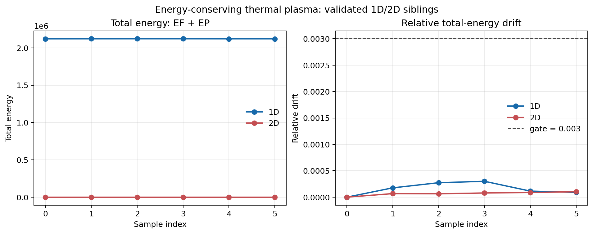

### 2026-07-12：reduced diagnostics 与 full-state reference 对照

本轮按官方 2-rank 配置真实运行 `Examples/Tests/reduced_diags/inputs_test_3d_reduced_diags`，末态为 `diags/diag1000200`。官方 `analysis_reduced_diags.py` 从该 plotfile 重新计算粒子能量/动量、场能/动量、场最大值、rho 最大值、粒子数以及 `FR_Max/FR_Min/FR_Integral/Edotj` 等 parser-driven `FieldReduction`，再逐项与 `EP/EF/PP/PF/MF/MR/NP/FR_*/Edotj.txt` 对照。

共比较 60 个 reduced observable，官方 analysis 通过。除 field energy 外，最大相对误差为 `4.125e-13`；field energy 的相对误差为 `2.483e-1`，仍低于官方为 staggered Yee reduced energy 与 cell-centered plotfile reference 设置的专用 `0.3` 容差。项目内 `scripts/analyze_reduced_diags_contract.py` 保存了官方 analysis 的逐项摘要，报告位于 `runs/stage-c-validation/reduced_diags_3d_mpi2/reduced-diags-contract.md`。

这条证据的准确含义是“compact reduced observable 与 full-state reference 的定义和 writer 输出一致”，不是说 60 个量都构成独立物理守恒定律。尤其 field energy 的 `24.8%` 误差必须保留其 staggered/cell-centered 离散表示边界，不能被误读成普通量的数值精度。

图 8-4 将这两个误差层分开画出：左图在对数尺度下显示 59 个非 field-energy observable 的排序误差，右图单独显示 staggered field-energy 的 `0.2483` 误差与 `0.3` 专用 gate。这样图表本身就保留了“普通量接近机器精度、field energy 仍有离散表示差异”的证据结构，而不是只给出一个混合最大值。

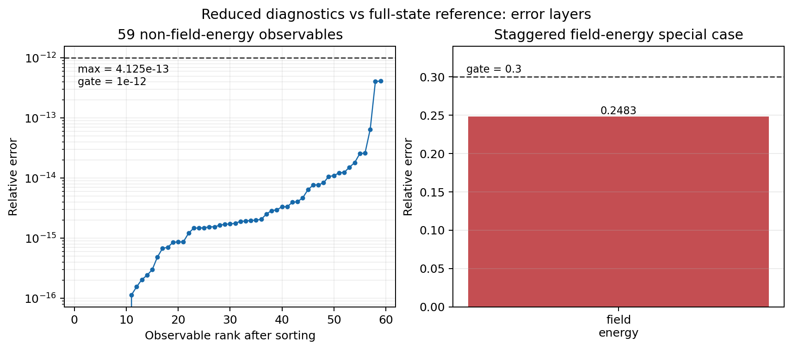

图 8-4 由 `scripts/plot_reduced_diags_error_layers.py` 从 `runs/stage-c-validation/reduced_diags_3d_mpi2/reduced-diags-contract.json` 重新生成。

### LoadBalanceCosts：性能诊断的 efficiency gate

同一 `reduced_diags` family 还包含一条不读取 plotfile 的性能诊断分支：`inputs_base_3d` 使用 `128 x 32 x 128` 网格、16 个 box、`algo.load_balance_intervals = 2`，并由 `LoadBalanceCosts` 将每个 box 的 cost、rank、level、几何位置和粒子数写入 `LBC.txt`。官方 analysis 按 rank 汇总 box cost，再计算

$$
\eta = \frac{1}{N_\mathrm{rank}}
\sum_r \frac{C_r}{\max_{r'} C_{r'}}.
$$

它比较第 1 行（load balance 前）与第 2 行（load balance 后），要求 `eta_after > eta_before`。本地按官方 2-rank 配置分别运行 `Heuristic` 与 `Timers` 两个 sibling：

| cost source | before | after | result |
|---|---:|---:|---|
| `Heuristic` | `0.625252` | `1.000000` | `PASS` |
| `Timers` | `0.744780` | `0.996162` | `PASS` |

报告位于 `runs/stage-c-validation/load_balance_costs_heuristic_mpi2/load-balance-costs.md` 和 `runs/stage-c-validation/load_balance_costs_timers_mpi2/load-balance-costs.md`。因此 `LoadBalanceCosts` 的强合同不是“有一个 LBC 文本文件”，而是它能把 box-level cost 通过 MPI 汇总成 rank-level efficiency，并观察到重分配后的效率改善；这属于性能/并行态验证，不应与 `reduced_diags` 的 compact physical observable 对照混成同一类 gate。

图 8-6 将两条 cost source 的 rank-level efficiency 直接画成 before/after 对照。Heuristic 从 `0.625252` 提升到 `1.0`，Timers 从 `0.744780` 提升到 `0.996162`；图表表达的是负载重分配后的性能改善，不是场或粒子物理精度。

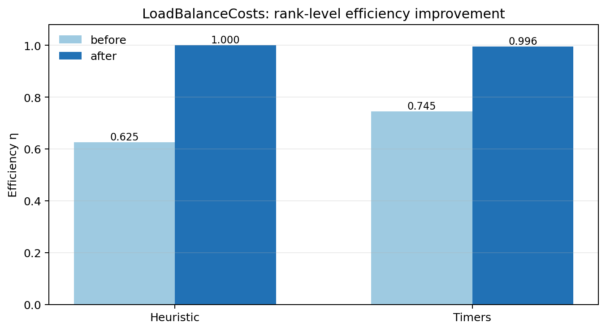

图 8-6 由 `scripts/plot_load_balance_efficiency.py` 从两份 `load-balance-costs.json` 重新生成。

### `ColliderRelevant`：束流统计与 luminosity-rate 聚合合同

`Examples/Tests/collider_relevant_diags/` 提供了另一条强 reduced-diagnostics regression。它在同一 3D、2-rank 输入中同时输出 `ColliderRelevant_beam_e_beam_p`、`ParticleExtrema_beam_e/beam_p` 和 openPMD full state。官方 `analysis.py` 使用输入中的三个解析宏粒子样本，逐项检查每个 beam 的 `chi_min/max/ave`、位置均值/标准差和 `theta_x/theta_y` 的 min/ave/max/std，并把 `ParticleExtrema` 与 `ColliderRelevant` 交叉核对；随后从 `rho_beam_e`、`rho_beam_p` 和粒子电荷重建

$$
\frac{dL}{dt}=2c\,\Delta V\sum_i
\frac{\rho_{e,i}}{q_e}\frac{\rho_{p,i}}{q_p}.
$$

本地运行归档于 `runs/stage-c-validation/collider_relevant_diags_3d_mpi2/`：两个 openPMD iteration 都得到 `dL/dt = 4.42662301265625e8`，与 reduced text 的对应两行完全一致；`ColliderRelevant` 为 2 行/33 列，两个 `ParticleExtrema` 文件各为 2 行，官方 analysis 与项目内 `scripts/analyze_collider_relevant_contract.py` 均通过。该结果验证的是 collider-oriented quantity 的定义、统计和聚合 writer 合同，不等于已经完成 `diff_lumi_diag` 的解析谱 benchmark，也不等于 `beam_beam_collision` 的 QED 应用级物理复现。

图 8-7 将两个 openPMD iteration 的 `dL/dt` 交叉结果叠加显示。两个 reader-side reconstruction 点与 `ColliderRelevant` reduced 点完全重合，且 JSON 报告给出的相对误差均为 `0`；这张图验证的是聚合定义和 writer/reader 对齐，不是 luminosity 随束流演化的独立动力学 benchmark。

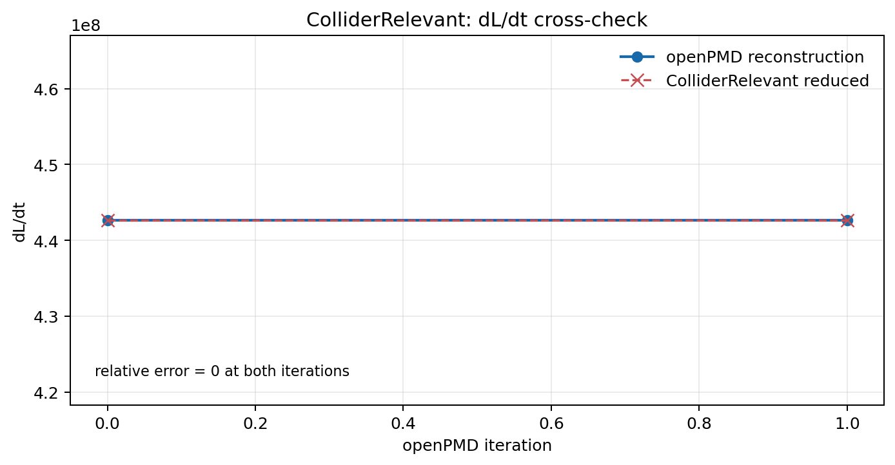

图 8-7 由 `scripts/plot_collider_luminosity_consistency.py` 从 `collider-relevant-contract.json` 重新生成。

### `DifferentialLuminosity`：1D/2D 解析谱与 AMR 对照

`Examples/Tests/diff_lumi_diag/` 把 reduced diagnostics 推进到能量微分 luminosity 的解析 benchmark。共享的 `inputs_base_3d` 设定两束相向高斯束，1D `DifferentialLuminosity` 输出总能量谱，2D `DifferentialLuminosity2D` 输出两个入射束能量的二维网格；官方 `analysis.py` 分别用高斯束解析式比较末态 1D 与 2D 结果。这个分析依赖 `openpmd_viewer` 读取 2D openPMD series，而不是把二维数据误当作普通文本列。

本地按官方 2-rank 配置完成三组 sibling，三组都在 step 80 输出 128 个 1D 能量 bin 和 `128 x 128` 的 2D 网格：

| case | AMR max level | 1D error / tolerance | 2D error / tolerance | result |
|---|---:|---:|---:|---|
| leptons | 0 | `0.8903% / 2.0%` | `2.6890% / 4.0%` | `PASS` |
| leptons + AMR | 1 | `0.9796% / 2.0%` | `3.0042% / 4.0%` | `PASS` |
| photons | 0 | `2.0119% / 2.1%` | `4.9327% / 6.0%` | `PASS` |

报告位于 `runs/stage-c-validation/diff_lumi_diag_leptons_mpi2/diff-lumi-contract.md`、`diff_lumi_diag_leptons_mr_mpi2/diff-lumi-contract.md` 和 `diff_lumi_diag_photons_mpi2/diff-lumi-contract.md`，项目脚本为 `scripts/analyze_diff_lumi_contract.py`。这组结果补上了当前束流诊断链中此前缺少的解析谱 physics gate；AMR sibling 的意义是验证中心细化区域仍能保持相同的 reduced luminosity 定义，而不是宣称 AMR 与 uniform-grid 轨迹逐点相同。

图 8-5 将三组 sibling 的 1D/2D 相对误差和各自 gate 并列展示。photons 使用报告中独立的 `2.1%/6.0%` 容差，不能直接套用 leptons 的阈值；三组柱状值均低于对应虚线 gate，图表只表达解析谱误差合同，不把 reduced writer 的文件形状误写成额外物理结论。

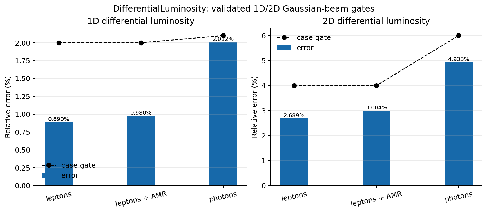

图 8-5 由 `scripts/plot_diff_lumi_errors.py` 从三份 `diff-lumi-contract.json` 重新生成。

### `ParticleHistogram2D`：二维 openPMD writer 合同

当前 checkout 没有单独的 `ParticleHistogram2D` CMake regression；本地采用 `Examples/Physics_applications/laser_ion/` 的官方 2-rank application 作为完整 producer。输入同时配置 `PhaseSpaceIons` 和 `PhaseSpaceElectrons` 两个二维 histogram：两者都使用 `z` 作为 abscissa、`uz` 作为 ordinate、`1000 x 1000` bins、`value_function = w`，而 electrons 还增加 `sqrt(x*x+y*y) < 1e-6` filter。官方 CMake analysis 只负责 time-averaged field 与 instantaneous field 的一致性，因此不能单独被写成 histogram physics gate；项目脚本 `scripts/analyze_particle_histogram2d_contract.py` 对 histogram series 做独立 writer 检查。

本地运行归档于 `runs/stage-c-validation/laser_ion_histogram2d_mpi2/`。两个 series 都写出 `0` 和 `100` 两个 BP5 iteration，数据形状均为 `1000 x 1000`，axis labels 为 `uz/z`，所有数据有限且存在非零 bin；官方 time-average analysis 通过。`PhaseSpaceIons.txt` 与 `PhaseSpaceElectrons.txt` 的大小均为 `0`，这是预期结果：`ParticleHistogram2D::WriteToFile()` 绕过基类逐行文本 writer，直接创建 `reducedfiles/<name>/openpmd_%T.<backend>` series，因此空 `.txt` companion 不能被误判成 histogram 丢失。

这条证据的边界也需要保留：它证明二维 histogram 的配置、openPMD layout、轴元数据和 writer 输出链成立，不等于已经用独立解析分布证明 laser-ion phase-space 的物理收敛性；后者仍需要更高分辨率/粒子数以及针对相空间分布的物理参考结果。

在不改变这条边界的前提下，项目又用 `scripts/analyze_particle_histogram2d_moments.py` 对 BP5 数组做了 reader-side 加权统计。`PhaseSpaceIons` 的总权重从 iteration 0 的 `3.9975794429219594e18` 到 iteration 100 的 `3.997579442921919e18`，相对变化约 `1.0e-14`；`std(z)` 保持在 `1.47204e-6 m`，而 `std(uz)` 从数值零增长到 `4.78558e-4`。受径向 filter 影响的 `PhaseSpaceElectrons` 总权重从 `5.30929e17` 变为 `5.32861e17`，`std(uz)` 从 `0.196998` 变为 `0.199300`。这些统计量把“相空间图发生了什么变化”从视觉判断推进成了可复现的 weighted-moment 摘要，但仍不能替代更高分辨率/粒子数的 convergence study。报告位于 `runs/stage-c-validation/laser_ion_histogram2d_mpi2/particle-histogram2d-moments.{json,md}`。

随后又做了一个匹配物理时间的 producer 对照：baseline 使用 `384x512` 网格、`dt=1.083064693e-16 s`、100 步，refined 使用 `768x1024` 网格、`dt=5.415323467e-17 s`、200 步；两者最终时间差只有 `3.31e-29 s`。`scripts/analyze_particle_histogram2d_resolution.py` 对两个 BP5 series 的总权重、`std(z)` 和 `std(uz)` 设置了 `1e-3/1e-2/5e-2` 的局部稳定性阈值，ions/electrons 均通过：`std(z)` 相对差为 `5.51e-4/2.02e-4`，`std(uz)` 相对差为 `2.04e-3/4.47e-2`。这是“网格加密后 reader-side 加权宽度仍稳定”的项目级证据，不是严格的物理收敛阶证明；两套 producer 都是单进程，运行结束时的 OFI `MPI_Finalize` 环境尾噪声不影响已写出的 BP5 数据读取。

同一脚本还记录了 `1x1` particles-per-cell 的负对照。它的 ions 宽度仍接近 baseline，但 electrons 总权重相对差为 `1.9471e-3`，超过 `1e-3` 阈值，因此 `weighted_width_stability` 被拒绝。这个负结果保留了当前最重要的边界：网格分辨率敏感性已经有局部通过项，粒子数统计收敛仍未完成。完整 JSON/Markdown 产物位于 `runs/stage-c-validation/laser_ion_histogram2d_resolution/`。

为判断该负结果是否只是单个低采样点，又补做了 `1x1/2x2/4x4/8x8` 四档 particles-per-cell 序列，并用 `scripts/analyze_particle_histogram2d_particle_count.py` 做相邻档位比较。`1x1 -> 2x2` 时 electrons 总权重差为 `1.9471e-3`，稳定性 gate 失败；`2x2 -> 4x4` 时降至 `4.2685e-4`，`4x4 -> 8x8` 时进一步降至 `3.6534e-4`，ions/electrons 的总权重、`std(z)`、`std(uz)` 均通过局部阈值。这支持“增加粒子数后该 reader-side 统计总体更稳定”的方向性判断，但它仍是单进程、单一激光离子 case 的局部矩合同，不足以给出正式收敛阶或上游 regression gate。8x8 producer 的 MPI 收尾仍出现本机 OFI `MPI_Finalize` 尾噪声，但 BP5 输出和独立读取均完整；趋势报告位于 `runs/stage-c-validation/laser_ion_histogram2d_resolution/particle-count-trend-8x8.{json,md}`。

图 8-8 直接从 BP5 series 读取 `PhaseSpaceIons` 与 `PhaseSpaceElectrons` 的 iteration 0/100 数据，并按每个面板的非零 bin 裁剪显示范围。它展示的是 writer 实际落盘的 `uz-z` 相空间结构和随 iteration 的变化；由于每个面板使用独立对数颜色归一化，颜色不能用于跨 species 或跨 iteration 的绝对产额比较。完整数组仍为 `1000 x 1000`，空 `.txt` sidecar 也仍是预期的 writer 路径边界。

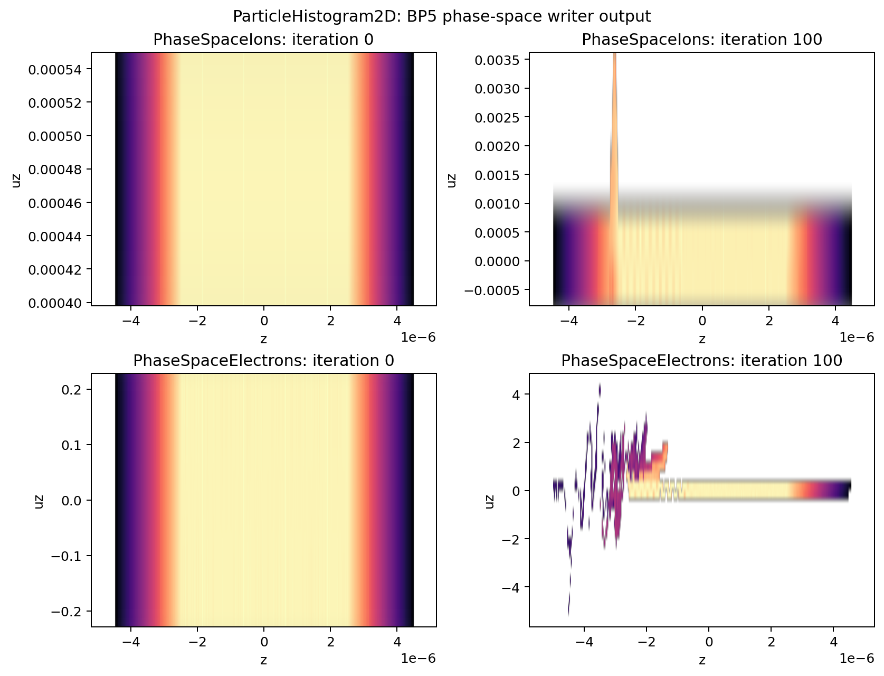

图 8-12 用同一份四档 pairwise contract 把粒子数敏感性归一化到各自局部 gate：虚线是 gate 边界，纵轴小于 1 表示通过。`1x1 -> 2x2` 的电子总权重仍越过边界，`2x2 -> 4x4` 和 `4x4 -> 8x8` 则落在边界以内；因此图支持“采样增加后局部统计趋稳”，但不把单一 case 的 reader-side 矩合同写成正式收敛阶。

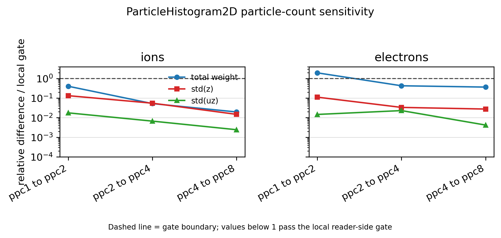

图 8-8 由 `scripts/plot_particle_histogram2d.py` 从 `runs/stage-c-validation/laser_ion_histogram2d_mpi2/` 的 BP5 series 重新生成。

### `BeamRelevant`：束流矩与截断高斯束合同

`BeamRelevant` 是文本型束流诊断，和 `ColliderRelevant` 的逐粒子 `chi/theta` 统计不同。3D 路径固定输出 22 个物理量：位置与动量均值、`gamma` 均值、位置/动量/`gamma` rms、三方向 emittance、Twiss `alpha/beta` 以及总 charge；连同步列和时间列共 24 列。其实现先按粒子权重做并行归约，再从二阶矩构造 rms、emittance 和 Twiss 量，因此最小验证应同时检查 schema、权重聚合和几何分布，而不是只检查文件存在。

本地保留官方 `initial_distribution` 中 `beam` 的参数，构造了只包含该 beam 与 `bmmntr = BeamRelevant` 的 3D、1-rank、`max_step=0` sibling。`scripts/analyze_beam_relevant_contract.py` 对 `bmmntr.txt` 做独立解析：输出为 1 行/24 列；`z_cut=2` 的截断高斯束 charge 期望值为 `-9.544997e-21 C`，实测为 `-9.544980e-21 C`，相对误差 `1.77e-6`；横向 rms 为 `0.249884/0.249765 m`，纵向 rms 为 `0.220356 m`，均通过 `2%` gate；均值、emittance、Twiss 相关输出均有限且满足正值边界。

图 8-9 将这个初始化-only contract 的两个主要物理量画出来：左图是实际总 charge 相对于截断高斯期望值的比值，右图是三个位置 rms 与解析目标的对照。图中没有把单行输出扩展成虚假的时间演化；gamma、emittance 和 Twiss 量仍按报告中的 finite/positive checks 处理。

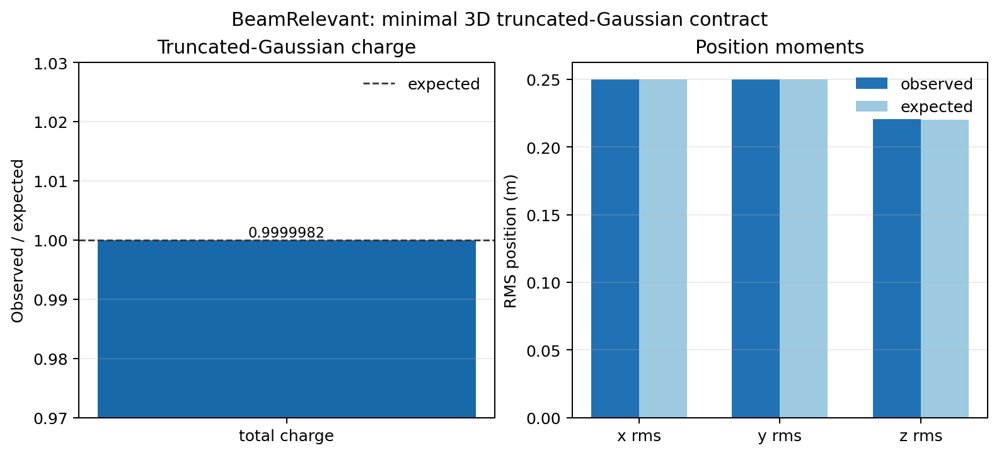

图 8-9 由 `scripts/plot_beam_relevant_contract.py` 从 `beam-relevant-contract.json` 重新生成。

### Native external-file Gaussian beam：输入文件路径与束斑物理合同

`gaussian_beam/CMakeLists.txt` 中的 native `test_3d_focusing_gaussian_beam_from_openpmd` 当前仍引用目录内不存在的 `analysis.py`。项目因此保留官方 registration 缺口，同时直接运行其 prepare 脚本和 native input，使用 1 rank producer 生成 plotfile 与 BP5 openPMD 输出，再用 `scripts/analyze_gaussian_beam_focus_contract.py` 独立读取 iteration 0 的 `x/y/z/w`。

运行结果为 `1,999,966` 个宏粒子、总权重 `1.999966e10`、81 个有效 z slice；按 focal-distance 理论包络计算的最大相对误差为 `sigma_x = 3.0515e-2 < 0.051`、`sigma_y = 3.6214e-2 < 0.038`。官方 `analysis_focusing_beam.py` 也对同一输出正常结束。这个结果补足的是 native external-file 的项目级 physics gate，不应被表述为 WarpX upstream CMake 的 `analysis.py` 已经恢复；其证据目录为 `runs/stage-c-validation/gaussian_beam_native_openpmd/run/`。

图 8-10 直接从同一 BP5 iteration 0 重建每个 z slice 的加权 `sigma_x`、`sigma_y`，并与 focal-distance 理论包络叠加。它展示的是 native external-file producer 的真实粒子输出与理论束斑合同，不是对缺失的 upstream `analysis.py` 的替代提交。

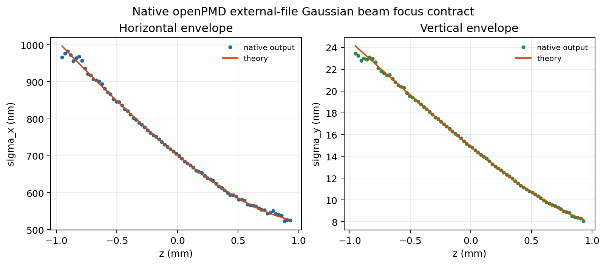

图 8-10 由 `scripts/plot_gaussian_beam_focus_contract.py` 从 `runs/stage-c-validation/gaussian_beam_native_openpmd/run/` 重新生成。

完整官方 `Examples/Tests/initial_distribution/` input 现已用当前 `../warpx` checkout 重建后的 binary 复现。producer 和官方 `analysis.py` 均以 exit code `0` 结束，10 类分布的最大相对差为 `1.8931e-2 < 0.02`。仓库 checksum 默认 `rtol=1e-9` 观察到最大相对差 `3.18e-3`，反映随机采样而非初始化失败；在显式记录的 `rtol=5e-3` sampling tolerance 下通过。因此本项可以从“binary/source mismatch 未完成”升级为“官方分布 analysis 通过、随机 checksum 有条件通过”，但不宣称确定性 `1e-9` checksum 相等。证据目录为 `runs/stage-c-validation/initial_distribution_full_current/`。

### 第 8 章验证矩阵：命令、产物与 gate

本章的运行证据统一遵循同一目录约定：WarpX 原始输入只读复制到 `runs/stage-c-validation/<case>/inputs_test`，运行目录保存完整输出，项目脚本只读取该目录并生成 JSON/Markdown 摘要。下面的 `MPIEXEC`、`WARPX` 和 `PYTHON` 取决于本机环境；本轮实际使用的是 MPICH launcher、`warpx.3d/2d.MPI.OMP.DP.PDP.OPMD.FFT.EB.QED.GENQEDTABLES` 和 Python 环境中的 `yt/openpmd_api/openpmd_viewer`。

| 验证线 | producer / MPI | 项目级复现命令 | 主要 gate | 证据目录 |
|---|---|---|---|---|
| Langmuir | 官方 1D，1 rank | `python scripts/analyze_langmuir_frequency_fit.py ...` | 场误差 `1.70e-3`、最终守恒 `8.35e-12`、频率相对误差 `3.595e-4` | `runs/stage-c-validation/langmuir_frequency_fit/` |
| Uniform plasma restart | 官方 3D，2 ranks | `python scripts/analyze_uniform_plasma_restart.py ...` | 37 个 field；最大相对误差 `2.8631e-16 < 1e-12`；checksum 参考另有 rank-specific 差异 | `runs/stage-c-validation/uniform_plasma_3d_mpi2/` |
| Uniform plasma MPI consistency | 官方 3D，1/2 ranks | `python scripts/analyze_uniform_plasma_mpi_consistency.py ...` | 粒子总权重一致；field/particle/total energy 相对差分别为 `1.9379e-2/8.9170e-4/6.2269e-4`；不通过 rank-invariant field gate | `runs/stage-c-validation/uniform_plasma_3d_mpi2/uniform-plasma-mpi-consistency.{json,md}` |
| Energy-conserving thermal plasma | 官方 1D/2D，1 rank | `python scripts/compare_energy_conserving_thermal_plasma_family.py ...` | 共同 `EF+EP` 漂移 `< 0.003` | `runs/stage-c-validation/energy_conserving_thermal_plasma_*` |
| FieldProbe | 官方 coarse/refined，1/2 rank | `python scripts/compare_field_probe_resolution.py ...` | coarse `3.6703%` 失败；matched-time refined `0.3533%` 通过 | `runs/stage-c-validation/field_probe_*` |
| Reduced observables | 官方 3D，2 rank | `python scripts/analyze_reduced_diags_contract.py ...` | 60 项；非 field-energy `<1e-12`，field-energy `<0.3` | `runs/stage-c-validation/reduced_diags_3d_mpi2/` |
| LoadBalanceCosts | Heuristic/Timers，2 rank | `python scripts/analyze_load_balance_costs_contract.py ...` | `eta_after > eta_before` | `runs/stage-c-validation/load_balance_costs_*` |
| ColliderRelevant | 官方 3D，2 rank | `python scripts/analyze_collider_relevant_contract.py ...` | chi/theta/ParticleExtrema 与 `dL/dt` 交叉一致 | `runs/stage-c-validation/collider_relevant_diags_3d_mpi2/` |
| DifferentialLuminosity | leptons/AMR/photons，2 rank | `python scripts/analyze_diff_lumi_contract.py ...` | 1D/2D 高斯束解析谱 gate | `runs/stage-c-validation/diff_lumi_diag_*_mpi2/` |
| ParticleHistogram2D | laser-ion，2 rank | `python scripts/analyze_particle_histogram2d_contract.py ...` | BP5 `0/100`、`1000x1000`、`uz-z`、有限非零数据 | `runs/stage-c-validation/laser_ion_histogram2d_mpi2/` |
| BeamRelevant | 最小 3D，1 rank | `python scripts/analyze_beam_relevant_contract.py ...` | 24 列、截断 Gaussian charge/rms gate | `runs/stage-c-validation/beam_relevant_minimal_mpi1/` |
| Full initial distribution | 官方 3D，1 rank | `PYTHONPATH=.../Tools/PostProcessing python .../initial_distribution/analysis.py` | 10 类分布；最大分析误差 `1.8931e-2 < 0.02`；checksum `rtol=5e-3` 通过 | `runs/stage-c-validation/initial_distribution_full_current/` |
| Native Gaussian external file | gaussian_beam native，1 rank | `python scripts/analyze_gaussian_beam_focus_contract.py ...` | 81 z slices；sigma-x `< 5.1%`、sigma-y `< 3.8%` | `runs/stage-c-validation/gaussian_beam_native_openpmd/run/` |
| RZ electrostatic sphere | 官方 RZ，1 rank | `python scripts/analyze_rz_charge_volume_contract.py ...` | 官方轴向场 L2 gate；全域 rho-volume/particle-charge mismatch `< 1%` | `runs/stage-c-validation/rz_electrostatic_sphere/` |
| RZ Langmuir multimode | case-local RZ sibling，1 rank，3 modes | `python scripts/analyze_rz_langmuir_multimode_contract.py ...` | `m=1/2` 实虚分量非零；theta=0 native-field/writeback reconstruction `< 3.1e-16` | `runs/stage-c-validation/rz_langmuir_multimode/` |

这张表中的“通过”只表示对应列出的 gate 通过。例如 FieldProbe 的 coarse 输入仍然是失败证据，完整 initial-distribution 的随机 checksum 也不等价于确定性 `1e-9` 回归；这样读者可以从同一张表直接区分强 physics analysis、writer/schema contract、性能 gate 和采样统计边界。公开仓库中的 `docs/public-evidence-index.{json,md}` 进一步提供 152 条去路径化合同摘要，但不替代下表所指向的 case-local 原始报告。

当前证据等级应写成：Langmuir 已有运行级解析频率、场误差和最终守恒证据；uniform plasma 已有粒子数、能量统计和 checkpoint/restart 逐字段证据，但短时运行的总能量变化不能直接升级成热平衡守恒通过；FieldProbe 已确认 1/2-rank 输出一致，并通过 `lambda/32` 的 matched-time 解析 gate，但官方 `lambda/16` coarse case 仍失败；`reduced_diags` 已有 60 项 compact observable 与 full-state reference 的 2-rank 逐项通过证据，并有 Heuristic/Timers 两条 `LoadBalanceCosts` efficiency improvement 证据；`ColliderRelevant` 已有 2-rank 的 chi/角度/ParticleExtrema/dL/dt 聚合合同证据；`DifferentialLuminosity` 已有 leptons、AMR 和 photons 三组 1D/2D 解析谱通过证据；laser-ion 已有 `ParticleHistogram2D` 的 2-rank openPMD writer 合同证据；`BeamRelevant` 已有最小 3D 的 schema/截断高斯束统计合同证据；完整 initial-distribution family 已有当前 checkout 的官方分布 analysis 通过证据，并在显式 `5e-3` sampling tolerance 下通过 checksum，但不宣称 `1e-9` 确定性相等；native Gaussian external-file 变体已有 1-rank 项目级束斑物理合同，但官方 CMake analysis 缺失仍保留为 upstream registration 缺口；RZ electrostatic sphere 又补充了官方场/能量 gate 与独立 rho-volume charge closure；RZ 三模 Langmuir sibling 又补充了 `m>0` diagnostics writeback 和 theta=0 重建合同，但它是 project-level case-local evidence，不能替代官方单模 CMake analysis。JSON/Markdown 报告和脚本都保存在项目内，运行产物仍按 case-local 目录归档。

## 8.15 练习与复现实验

1. **证据分层题**：从验证矩阵中各选一个 physics gate、writer/schema contract 和 performance gate，说明它们的 producer、analysis 量和“不能支持的结论”。
2. **reader-side 复现题**：使用 `scripts/analyze_collider_relevant_contract.py` 或 `scripts/analyze_particle_histogram2d_contract.py` 读取一个 case-local 产物，列出输入字段、输出文件和独立检查项。
3. **失败边界题**：解释为什么 FieldProbe coarse failure、uniform-plasma reader-side 能量漂移和 initial-distribution binary mismatch 都应保留在书中，而不能简单从验证矩阵中删除。

## 本章后续扩写

- [x] 加入第 8 章统一验证矩阵，列出 producer/MPI、项目级复现脚本、主要 gate 和 case-local 证据目录。
- 继续把 `ComputeDiagFunctors/`、`ParticleIO`、`WarpXOpenPMD` 和 `FlushFormats/` 的字段计算与 writer 细节拆开。
- 继续把 `FieldProbe`、`ParticleHistogram(2D)`、`LoadBalanceCosts` 这类 reduced diagnostics 的最小输入文件和后处理示例补成可直接运行的小节。
- 延长 uniform plasma 运行窗口，并结合 `energy_conserving_thermal_plasma` 的强 analysis 设计可解释的总能量 gate。
- 为 Langmuir reader-side 拟合补充多模式/不同时间窗的敏感性检查，避免把单一窗口拟合误读为完整色散验证。
