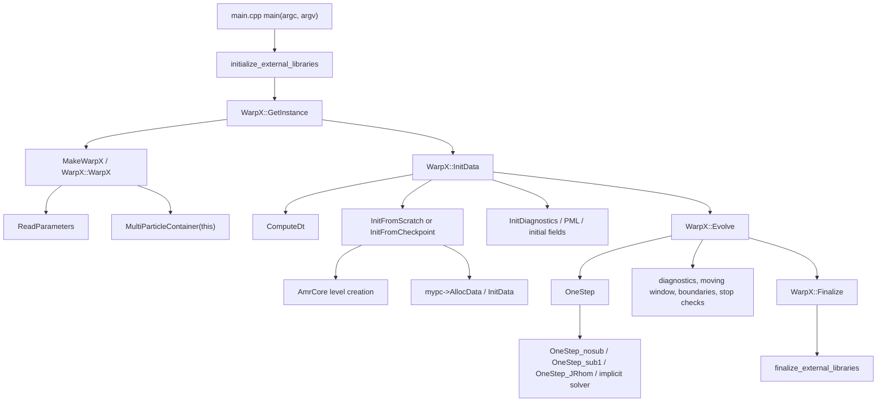

# 00. 从 `main.cpp` 到 `WarpX::Evolve`

## 1. 程序入口不是 PIC 循环本身

`Source/main.cpp` 的 `main(argc, argv)` 很短，但它定义了本书阅读 WarpX 的顶层骨架：

```text
initialize_external_libraries(argc, argv)
warpx = WarpX::GetInstance()
warpx.InitData()
warpx.Evolve()
WarpX::Finalize()
finalize_external_libraries()
```

对应源码：

| 源码位置 | 作用 |
|---|---|
| `Source/main.cpp:20` | 初始化 AMReX、MPI、GPU runtime 等外部依赖。 |
| `Source/main.cpp:27` | 通过 `WarpX::GetInstance()` 得到全局单例。 |
| `Source/main.cpp:28` | `InitData()`：把参数、网格、场、粒子、诊断等准备成可推进状态。 |
| `Source/main.cpp:29` | `Evolve()`：进入时间推进主循环。 |
| `Source/main.cpp:31` | `Finalize()`：释放 `WarpX` 单例。 |
| `Source/main.cpp:41` | 结束外部库。 |

这里的重点是：`main.cpp` 并不直接知道 PIC 的粒子推进、沉积、Maxwell 求解或诊断细节。WarpX 把这些细节封装到 `WarpX` 类以及它管理的场、粒子、诊断、边界和 solver 对象里。

## 2. `WarpX::GetInstance()` 与构造阶段

`WarpX` 是 `amrex::AmrCore` 的派生类，定义见 `Source/WarpX.H:85`。生命周期入口在 `Source/WarpX.cpp`：

| 源码位置 | 作用 |
|---|---|
| `Source/WarpX.cpp:298-305` | `GetInstance()`：若 `m_instance` 为空则调用 `MakeWarpX()`。 |
| `Source/WarpX.cpp:317-320` | `Finalize()`：通过 `ResetInstance()` 删除单例。 |
| `Source/WarpX.cpp:322-350` | 构造函数：设置 `m_instance`、初始化 warning manager、读参数、做兼容处理、初始化 EB、建立时间数组、创建 `MultiParticleContainer`。 |
| `Source/WarpX.cpp:376-380` | 创建粒子边界缓冲，并在需要时创建流体容器。 |

构造函数最早执行的实质工作是 `ReadParameters()`，见 `Source/WarpX.cpp:329`。这意味着许多静态算法选择、边界类型和用户输入约束会在 `InitData()` 之前确定。

## 3. `ReadParameters()` 决定后续分支空间

本轮只读取了 `ReadParameters()` 的开头和与主循环强相关的部分，完整逐项讲解留到参数章节。当前已确认：

| 源码位置 | 参数/选择 | 对后续的影响 |
|---|---|---|
| `Source/WarpX.cpp:550-553` | `max_step`、`stop_time`、`authors` | 控制 `Evolve()` 外层循环停止条件和元数据。 |
| `Source/WarpX.cpp:563-565` | `algo.maxwell_solver` | 决定电磁 solver：Yee、CKC、PSATD、HybridPIC、None 等。 |
| `Source/WarpX.cpp:581-595` | PSATD 与 PEC/PMC 的约束 | PSATD 当前不支持 PEC/PMC 边界组合。 |
| `Source/WarpX.cpp:598` | `algo.evolve_scheme` | 选择 explicit 或 theta implicit 等推进框架。 |
| `Source/WarpX.cpp:679-684` | `warpx.cfl`、`verbose`、`regrid_int`、`do_subcycling` | 影响步长、输出、负载/重网格和 AMR 时间推进。 |
| `Source/WarpX.cpp:729-733` | `warpx.do_electrostatic` | 若启用静电 solver，把 Maxwell solver 设为 `None`。 |
| `Source/WarpX.cpp:796-812` | `const_dt`、`max_dt`、`dt_update_interval` | 控制 `ComputeDt()` 和运行中自适应步长更新。 |
| `Source/WarpX.cpp:814-828` | filter 默认值与 `use_filter` | 显式 scheme 默认使用滤波，隐式 scheme 默认关闭滤波。 |

本书后续参数索引会从 `docs/parameter-map.md` 进入，但每个重要参数都必须回到类似上表的真实源码位置。

## 4. `InitData()` 把对象变成可推进状态

`Source/Initialization/WarpXInitData.cpp:793-949` 是主初始化函数。

最重要的顺序是：

1. 建立诊断容器：`multi_diags` 和 `reduced_diags`，见 `:810-814`。
2. 如果不是 restart，先 `ComputeDt()`，再 `InitFromScratch()`，再 `InitDiagnostics()`，见 `:824-830`。
3. 如果是 restart，走 `InitFromCheckpoint()`、`PostRestart()` 和 reduced diagnostics 初始化，见 `:831-837`。
4. `ComputeMaxStep()`、`ComputePMLFactors()`、NCI corrector、buffer masks、宏观介质、静电 solver、HybridPIC 初始化，见 `:839-863`。
5. 检查 guard cells、打印主 PIC 参数、写 used inputs，见 `:870-878`。
6. 从头运行时处理初始自洽场、磁静场和外场叠加，见 `:885-913`。
7. 写第 0 步前诊断，见 `:918-928`。

初始化阶段不是“读参数后马上循环”。它要先把场、粒子、边界、诊断、PML、初始自洽场和外部场放到一致的时间层与内存布局上。

## 5. 顶层调用图



图中 `M -> Q` 在源码中并不是 `Evolve()` 自己调用 `Finalize()`，而是 `main.cpp` 在 `Evolve()` 返回后调用。这里为了表达总生命周期放在一张图里。

