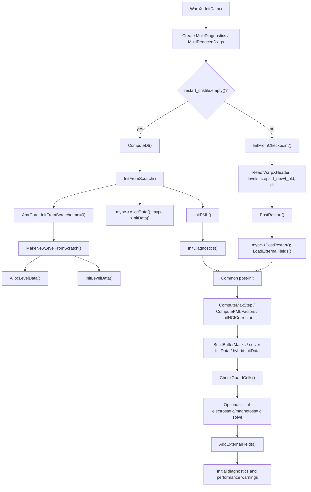

# Initialization 初始化调用链第一轮精读

绑定源码：`../warpx`，分支 `pkuHEDPbranch`，commit `063f8b586f04321e13150ae3e730e0794ca75cb1`。

本笔记覆盖 `../warpx/Source/Initialization/WarpXInitData.cpp` 和 checkpoint 入口 `../warpx/Source/Diagnostics/WarpXIO.cpp` 的第一轮主链阅读。目标是把 `WarpX::InitData()` 串成清晰生命周期：fresh run 如何从网格、场、粒子和诊断初始化；restart 如何恢复时间层和数据；PML、外场、EB、guard cell 检查如何插入这个流程。

## 1. 初始化文件的职责边界

`WarpXInitData.cpp` include 的模块已经暴露它的边界：它不是只管粒子初始分布，而是连接 diagnostics、PML、EB、electrostatic solver、macroscopic medium、hybrid model、filter、external field、Python callback 和 AMReX level 初始化。

源码位置：`../warpx/Source/Initialization/WarpXInitData.cpp:11-40`。

```cpp
#include "WarpX.H"

#include "BoundaryConditions/PML.H"
#if (defined WARPX_DIM_RZ) && (defined WARPX_USE_FFT)
#   include "BoundaryConditions/PML_RZ.H"
#endif
#include "Diagnostics/MultiDiagnostics.H"
#include "Diagnostics/ReducedDiags/MultiReducedDiags.H"
#include "EmbeddedBoundary/Enabled.H"
#ifdef AMREX_USE_EB
#   include "EmbeddedBoundary/EmbeddedBoundaryInit.H"
#endif
#include "Fields.H"
#include "FieldSolver/ElectrostaticSolvers/ElectrostaticSolver.H"
#include "FieldSolver/FiniteDifferenceSolver/MacroscopicProperties/MacroscopicProperties.H"
#include "FieldSolver/FiniteDifferenceSolver/HybridPICModel/HybridPICModel.H"
#include "FieldSolver/ImplicitSolvers/ImplicitSolver.H"
#include "Filter/BilinearFilter.H"
#include "Filter/NCIGodfreyFilter.H"
#include "Initialization/ExternalField.H"
#include "Initialization/DivCleaner/ProjectionDivCleaner.H"
#include "Particles/MultiParticleContainer.H"
#include "Utils/Logo/GetLogo.H"
#include "Utils/Parser/ParserUtils.H"
#include "Utils/TextMsg.H"
#include "Utils/WarpXAlgorithmSelection.H"
#include "Utils/WarpXConst.H"
#include "Utils/WarpXUtil.H"
#include "Python/callbacks.H"
```

从模块依赖看，初始化阶段必须解决四类一致性：

| 一致性类型 | 代码对象 | 物理/算法意义 |
|---|---|---|
| 时间层一致性 | `ComputeDt()`, `t_new/t_old/dt`, checkpoint header | 粒子、场、诊断必须从同一时间层开始 |
| 网格和 guard cell 一致性 | `AmrCore::InitFromScratch()`, `AllocLevelData()`, `CheckGuardCells()` | field update、gather、deposition 不能访问非法 ghost 区 |
| 场/粒子初值一致性 | `InitLevelData()`, `mypc->InitData()`, `ComputeSpaceChargeField()` | 初始宏粒子源项和网格场需要满足所选模型 |
| 边界和外场一致性 | `InitPML()`, `LoadExternalFields()`, `AddExternalFields()`, EB masks | 外场、PML、EB、移动窗口之间不能互相矛盾 |

## 2. `InitData()` 是初始化总调度

源码位置：`../warpx/Source/Initialization/WarpXInitData.cpp:793-949`。

```cpp
void
WarpX::InitData ()
{
    ABLASTR_PROFILE("WarpX::InitData()");

    using ablastr::fields::Direction;
    using warpx::fields::FieldType;

    ablastr::parallelization::check_mpi_thread_level();

#ifdef WARPX_QED
    Print() << "PICSAR (" << WarpX::PicsarVersion() << ")\n";
#endif

    Print() << "WarpX (" << WarpX::Version() << ")\n";

    Print() << utils::logo::get_logo();

    // Diagnostics
    multi_diags = std::make_unique<MultiDiagnostics>();

    /** create object for reduced diagnostics */
    reduced_diags = std::make_unique<MultiReducedDiags>();
```

`InitData()` 的第一步不是立刻分配场，而是检查 MPI thread level、打印版本信息、创建 full diagnostics 和 reduced diagnostics。诊断对象在 fresh run 和 restart 两条路径之前创建，因为两条路径最后都可能写初始诊断。

fresh run 和 checkpoint restart 的分叉是整个函数的主骨架：

```cpp
if (restart_chkfile.empty())
{
    ComputeDt();
    ::PrintDtDxDyDz(max_level, geom, dt);
    InitFromScratch();
    InitDiagnostics();
}
else
{
    InitFromCheckpoint();
    ::PrintDtDxDyDz(max_level, geom, dt);
    PostRestart();
    reduced_diags->InitData();
}
```

fresh run 的顺序是：

```text
ComputeDt()
  -> InitFromScratch()
     -> AMReX 创建 level 并触发 AllocLevelData()/InitLevelData()
     -> implicit solver Define/CreateParticleAttributes
     -> mypc->AllocData()
     -> mypc->InitData()
     -> InitPML()
  -> InitDiagnostics()
```

restart 的顺序是：

```text
InitFromCheckpoint()
  -> 读 checkpoint header、时间层、场、粒子、诊断相关数据
  -> PrintDtDxDyDz()
  -> PostRestart()
     -> mypc->PostRestart()
     -> LoadExternalFields()
  -> reduced_diags->InitData()
```

这两条路径的差异很重要：fresh run 需要创建初始粒子和初始场；restart 需要恢复已有状态，并只做 restart 后必要的补处理。

## 3. fresh run 从 `InitFromScratch()` 进入 AMReX level 生命周期

源码位置：`../warpx/Source/Initialization/WarpXInitData.cpp:993-1010`。

```cpp
void
WarpX::InitFromScratch ()
{
    const Real time = 0.0;

    AmrCore::InitFromScratch(time);  // This will call MakeNewLevelFromScratch

    if (m_implicit_solver) {

        m_implicit_solver->Define(this,/*from_restart=*/false);
        m_implicit_solver->CreateParticleAttributes();
    }

    mypc->AllocData();
    mypc->InitData();

    InitPML();

}
```

这里的注释 “This will call MakeNewLevelFromScratch” 是连接 root 阶段和 initialization 阶段的关键。`AmrCore::InitFromScratch(time)` 触发 AMReX 的 level 创建；WarpX 重载的 `MakeNewLevelFromScratch()` 再调用 `AllocLevelData()` 和 `InitLevelData()`。因此 `InitFromScratch()` 的真实展开是：

```text
InitFromScratch()
  -> AmrCore::InitFromScratch(0)
     -> WarpX::PostProcessBaseGrids()
     -> WarpX::MakeDistributionMap()
     -> WarpX::MakeNewLevelFromScratch()
        -> WarpX::AllocLevelData()
        -> WarpX::InitLevelData()
  -> implicit solver initialization if enabled
  -> mypc->AllocData()
  -> mypc->InitData()
  -> InitPML()
```

物理上，这意味着网格场和 level 结构先存在，粒子才被分配并初始化。这样粒子初始化可以依赖已建立的几何、BoxArray、DistributionMapping 和场容器。

## 4. `InitLevelData()` 初始化每个 level 的外场、EB 和 cost

源码位置：`../warpx/Source/Initialization/WarpXInitData.cpp:1216-1358`。

```cpp
void
WarpX::InitLevelData (int lev, Real /*time*/)
{
    using ablastr::fields::Direction;
    using warpx::fields::FieldType;

    // initialize the averaged fields only if the averaged algorithm
    // is activated ('psatd.do_time_averaging=1')
    const ParmParse pp_psatd("psatd");
    pp_psatd.query("do_time_averaging", fft_do_time_averaging );

    for (int i = 0; i < 3; ++i) {

        // Externally imposed fields are only initialized until the user-defined maxlevel_extEMfield_init.
        // The default maxlevel_extEMfield_init value is the total number of levels in the simulation
        const auto is_B_ext_const =
            m_p_ext_field_params->B_ext_grid_type == ExternalFieldType::constant ||
            m_p_ext_field_params->B_ext_grid_type == ExternalFieldType::default_zero;
        if ( is_B_ext_const && (lev <= maxlevel_extEMfield_init) )
        {
            if (fft_do_time_averaging) {
                m_fields.get(FieldType::Bfield_avg_fp, Direction{i}, lev)->setVal(m_p_ext_field_params->B_external_grid[i]);
            }
```

`InitLevelData()` 不负责分配 `MultiFab`，分配已经在 `AllocLevelData()/AllocLevelMFs()` 完成。它负责给已存在的场写初值，尤其是：

- 常量或默认零外场；
- AMR coarse patch 的 `Efield_cp/Bfield_cp`；
- PSATD time-averaged fields；
- EB 几何数据；
- parser 定义的外部场函数；
- 从 openPMD 文件读取的外部场；
- load-balance cost 初值。

对 AMR 外场，源码显式区分 `aux` 和 `cp`：

```cpp
if (lev > 0) {
    m_fields.get(FieldType::Bfield_aux, Direction{i}, lev)->setVal(m_p_ext_field_params->B_external_grid[i]);
    m_fields.get(FieldType::Bfield_cp, Direction{i}, lev)->setVal(m_p_ext_field_params->B_external_grid[i]);
    if (fft_do_time_averaging) {
        m_fields.get(FieldType::Bfield_avg_cp, Direction{i}, lev)->setVal(m_p_ext_field_params->B_external_grid[i]);
    }
}
```

这说明 refinement level 的初始化必须同时照顾粒子 gather 看到的 `aux` 场和 coarse patch 场。后续讲 AMR 初始化时，不能只看 level 0 的 `Efield_fp/Bfield_fp`。

EB 初始化在 level 数据初始化中完成：

```cpp
#ifdef AMREX_USE_EB
bool const eb_enabled = EB::enabled();
if (eb_enabled) { InitializeEBGridData(lev); }
#endif
```

`InitializeEBGridData()` 后续会计算 edge length、face area、ECT 扩展几何、update masks、distance-to-EB 和 reduced-shape cells。这些对象决定场是否在 EB 内更新，以及粒子靠近 EB 时是否降低 shape 阶数。

## 5. parser 外场按网格 staggering 计算物理坐标

源码位置：`../warpx/Source/Initialization/WarpXInitData.cpp:1360-1511`。

```cpp
template<typename T>
void ComputeExternalFieldOnGridUsingParser_template (
    const T& field,
    amrex::ParserExecutor<4> const& fx_parser,
    amrex::ParserExecutor<4> const& fy_parser,
    amrex::ParserExecutor<4> const& fz_parser,
    int lev, PatchType patch_type,
    amrex::Vector<std::array< std::unique_ptr<amrex::iMultiFab>,3 > > const& eb_update_field,
    bool use_eb_flags)
{
    auto &warpx = WarpX::GetInstance();
    auto const &geom = warpx.Geom(lev);

    auto t = warpx.gett_new(lev);

    auto dx_lev = geom.CellSizeArray();
    const RealBox& real_box = geom.ProbDomain();

    amrex::IntVect refratio = (lev > 0 ) ? WarpX::RefRatio(lev-1) : amrex::IntVect(1);
    if (patch_type == PatchType::coarse) {
        for (int idim = 0; idim < AMREX_SPACEDIM; ++idim) {
            dx_lev[idim] = dx_lev[idim] * refratio[idim];
        }
    }
```

这段说明 parser 外场不是简单按 cell index 计算，而是先根据 patch type 修正 `dx_lev`：coarse patch 的网格间距要乘 refinement ratio。然后根据每个分量自己的 index type 计算物理坐标。

3D 情况下 x 分量坐标的核心是：

```cpp
const amrex::Real fac_x = (1._rt - x_nodal_flag[0]) * dx_lev[0] * 0.5_rt;
const amrex::Real x = i*dx_lev[0] + real_box.lo(0) + fac_x;
const amrex::Real fac_y = (1._rt - x_nodal_flag[1]) * dx_lev[1] * 0.5_rt;
const amrex::Real y = j*dx_lev[1] + real_box.lo(1) + fac_y;
const amrex::Real fac_z = (1._rt - x_nodal_flag[2]) * dx_lev[2] * 0.5_rt;
const amrex::Real z = k*dx_lev[2] + real_box.lo(2) + fac_z;
```

如果某方向是 nodal，`flag=1`，偏移为 0；如果某方向是 cell-centered，`flag=0`，偏移为半个网格。这个实现直接对应 staggered grid 上“场分量定义在不同几何位置”的物理要求。外场函数 `E(x,y,z,t)` 或 `B(x,y,z,t)` 必须在该分量所在的位置取值，否则初始场和 Maxwell 离散位置会错位。

EB 掩码也在 parser 初始化中生效：

```cpp
// Do not set fields inside the embedded boundary
if (update_fx_arr && update_fx_arr(i,j,k) == 0) { return; }

// Initialize the x-component of the field.
mfxfab(i,j,k) = fx_parser(x,y,z,t);
```

这意味着 parser 定义的外场不会盲目写入 EB 内部禁止更新的场点。

## 6. PML 初始化在粒子初始化之后

源码位置：`../warpx/Source/Initialization/WarpXInitData.cpp:1013-1092`。

```cpp
void
WarpX::InitPML ()
{
    for (int idim = 0; idim < AMREX_SPACEDIM; ++idim) {
        if (WarpX::field_boundary_lo[idim] == FieldBoundaryType::PML) {
            do_pml = 1;
            do_pml_Lo[0][idim] = 1; // on level 0
        }
        if (WarpX::field_boundary_hi[idim] == FieldBoundaryType::PML) {
            do_pml = 1;
            do_pml_Hi[0][idim] = 1; // on level 0
        }
    }
    if (max_level > 0) { do_pml = 1; }
    if (do_pml)
    {
        bool const eb_enabled = EB::enabled();
```

PML 的启用由物理域边界和 mesh refinement 共同决定。即使 level 0 没有显式 PML，`max_level > 0` 也会使 `do_pml = 1`，因为 refinement patch 边缘也可能需要 PML 结构参与 patch 边界处理。

level 0 PML 构造：

```cpp
pml[0] = std::make_unique<PML>(
    0, boxArray(0), DistributionMap(0), do_similar_dm_pml, &Geom(0), nullptr,
    pml_ncell, pml_delta, amrex::IntVect::TheZeroVector(),
    dt[0], nox_fft, noy_fft, noz_fft, grid_type,
    do_moving_window, pml_has_particles, do_pml_in_domain,
    m_psatd_solution_type, time_dependency_J, time_dependency_rho,
    do_pml_dive_cleaning, do_pml_divb_cleaning,
    amrex::IntVect(0), amrex::IntVect(0),
    eb_enabled,
    guard_cells.ng_FieldSolver.max(),
    v_particle_pml,
    m_fields,
    do_pml_Lo[0], do_pml_Hi[0]);
```

这里传入的参数把 PML 与时间步、PSATD 阶数、grid type、moving window、particle-in-PML、divergence cleaning、EB 和 field register 全部绑定。PML 不是孤立吸收层，而是和主场、源项、边界填充、粒子边界耦合的子系统。

多 level PML 还要根据 fine patch 是否碰到物理域边界决定每个方向是否启用：

```cpp
const amrex::Box levelBox = boxArray(lev).minimalBox();
// Domain box at level, lev
const amrex::Box DomainBox = Geom(lev).Domain();
for (int idim = 0; idim < AMREX_SPACEDIM; ++idim) {
    if (levelBox.smallEnd(idim) == DomainBox.smallEnd(idim)) {
        do_pml_Lo[lev][idim] = do_pml_Lo[0][idim];
    }
    if (levelBox.bigEnd(idim) == DomainBox.bigEnd(idim)) {
        do_pml_Hi[lev][idim] = do_pml_Hi[0][idim];
    }
}
```

这给后续边界章节一个关键结论：AMR level 上的 PML 不是简单复制 level 0，而是只在 fine patch 边缘与物理域边界重合的方向继承物理 PML。

## 7. restart 从 checkpoint 恢复时间层和状态

源码位置：`../warpx/Source/Diagnostics/WarpXIO.cpp:94-180`。

```cpp
void
WarpX::InitFromCheckpoint ()
{
    using ablastr::fields::Direction;
    using warpx::fields::FieldType;

    ABLASTR_PROFILE("WarpX::InitFromCheckpoint()");

    amrex::Print()<< Utils::TextMsg::Info(
        "restart from checkpoint " + restart_chkfile);

    // Header
    {
        const std::string File(restart_chkfile + "/WarpXHeader");

        const VisMF::IO_Buffer io_buffer(VisMF::GetIOBufferSize());

        Vector<char> fileCharPtr;
        ParallelDescriptor::ReadAndBcastFile(File, fileCharPtr);
        const std::string fileCharPtrString(fileCharPtr.dataPtr());
        std::istringstream is(fileCharPtrString, std::istringstream::in);
        is.exceptions(std::ios_base::failbit | std::ios_base::badbit);

        std::string line, word;

        std::getline(is, line);

        int nlevs;
        is >> nlevs;
        ablastr::utils::text::goto_next_line(is);
        finest_level = nlevs-1;
```

checkpoint 初始化从 `WarpXHeader` 开始。最先恢复的是 level 数、`istep`、`nsubsteps`、`t_new`、`t_old`、`dt`、moving window 位置和 velocity synchronization 状态。也就是说 restart 的第一目标不是重算初值，而是恢复上次停止时的离散时间状态。

时间层读取示例：

```cpp
std::getline(is, line);
{
    std::istringstream lis(line);
    lis.exceptions(std::ios_base::failbit | std::ios_base::badbit);
    for (auto& t_new_lev : t_new) {
        lis >> word;
        t_new_lev = static_cast<Real>(std::stod(word));
    }
}

std::getline(is, line);
{
    std::istringstream lis(line);
    lis.exceptions(std::ios_base::failbit | std::ios_base::badbit);
    for (auto& t_old_lev : t_old) {
        lis >> word;
        t_old_lev = static_cast<Real>(std::stod(word));
    }
}
```

从物理角度看，restart 不能只恢复粒子和场数组，还必须恢复 leapfrog 或 implicit scheme 的时间层关系；否则粒子位置、动量和场的半步/整步同步会被破坏。

`PostRestart()` 做 restart 后补处理：

```cpp
void
WarpX::PostRestart ()
{
    mypc->PostRestart();
    for (int lev = 0; lev <= maxLevel(); ++lev) {
        LoadExternalFields(lev);
    }
}
```

外部场文件在 restart 后重新加载，这避免 checkpoint 内数据和外部文件引用路径之间出现遗漏。

## 8. `InitData()` 后半段把初始状态修正到可演化状态

源码位置：`../warpx/Source/Initialization/WarpXInitData.cpp:839-949`。

```cpp
ComputeMaxStep();

ComputePMLFactors();

if (WarpX::use_fdtd_nci_corr) {
    WarpX::InitNCICorrector();
}

BuildBufferMasks();

if (m_em_solver_medium == MediumForEM::Macroscopic) {
    const int lev_zero = 0;
    m_macroscopic_properties->InitData(
        Geom(lev_zero),
        m_fields.get(FieldType::Efield_fp, Direction{0}, lev_zero)->ixType().toIntVect(),
        m_fields.get(FieldType::Efield_fp, Direction{1}, lev_zero)->ixType().toIntVect(),
        m_fields.get(FieldType::Efield_fp, Direction{2}, lev_zero)->ixType().toIntVect()
    );
}
```

这段发生在 fresh/restart 分叉之后，说明它们是两条路径共同需要的补处理：计算最大步数、PML 系数、NCI corrector、buffer masks、macroscopic medium、电静力 solver、hybrid model、网格摘要、guard cell 检查和参数打印。

初始自洽场求解只在非 restart 路径执行：

```cpp
if (restart_chkfile.empty())
{
    ExecutePythonCallback("beforeInitEsolve");
    // Loop through species and calculate their space-charge field
    // Field solve step for electrostatic solvers, or when
    // any species has initialize_self_fields = true, or when boundary potential is specified
    bool has_initialize_self_fields = false;
    for (auto const& species : *mypc) {
        has_initialize_self_fields |= species->initialize_self_fields;
    }
    const bool has_boundary_potential = m_electrostatic_solver->m_poisson_boundary_handler->m_boundary_potential_specified;
    if( (electrostatic_solver_id != ElectrostaticSolverAlgo::None ||
         has_initialize_self_fields ||
         has_boundary_potential)
        && WarpX::electromagnetic_solver_id != ElectromagneticSolverAlgo::HybridPIC)
    {
        bool const reset_fields = false; // Do not erase previous user-specified values on the grid
        ComputeSpaceChargeField(reset_fields);
        if (electrostatic_solver_id == ElectrostaticSolverAlgo::LabFrameElectroMagnetostatic) {
            ComputeMagnetostaticField();
        }
    }
```

这段的物理含义：如果是 electrostatic 模式、某些 species 要初始化自场，或边界电势被指定，就需要在正式时间推进前求解初始 space-charge field。`reset_fields=false` 的注释说明用户指定的网格场不应被抹掉，初始自场和外部/用户场要按模型叠加。

外场叠加发生在自洽场求解之后：

```cpp
// Add external fields to the fine patch fields. This makes it so that the
// net fields are the sum of the field solutions and any external fields.
for (int lev = 0; lev <= max_level; ++lev) {
    AddExternalFields(lev);
}
```

这里的顺序非常重要：先算自洽 space-charge field，再把 external fields 加到 fine patch fields，最终粒子看到的是合成后的净场。

## 9. guard cell 检查是初始化最后的安全闸

源码位置：`../warpx/Source/Initialization/WarpXInitData.cpp:1538-1580`。

```cpp
void WarpX::CheckGuardCells()
{
    for (int lev = 0; lev <= max_level; ++lev)
    {
        for (int dim = 0; dim < 3; ++dim)
        {
            ::CheckGuardCells(m_fields, "Efield_fp[" + std::to_string(dim) + "]", lev);
            ::CheckGuardCells(m_fields, "Bfield_fp[" + std::to_string(dim) + "]", lev);
            ::CheckGuardCells(m_fields, "current_fp[" + std::to_string(dim) + "]", lev);

            if (WarpX::fft_do_time_averaging)
            {
                ::CheckGuardCells(m_fields, "Efield_avg_fp[" + std::to_string(dim) + "]", lev);
                ::CheckGuardCells(m_fields, "Bfield_avg_fp[" + std::to_string(dim) + "]", lev);
            }
        }

        ::CheckGuardCells(m_fields, "rho_fp", lev);
        ::CheckGuardCells(m_fields, "F_fp", lev);
        ::CheckGuardCells(m_fields, "G_fp", lev);
```

底层检查函数要求每个 valid box 的 cell 数严格大于 guard cell 数：

```cpp
const amrex::IntVect vc = mfi.validbox().enclosedCells().size();
const amrex::IntVect gc = mf.nGrowVect();

std::stringstream ss_msg;
ss_msg << "MultiFab " << mf.tags()[1].c_str() << ":" <<
    " the number of guard cells " << gc <<
    " is larger than or equal to the number of valid cells "
    << vc << ", please reduce the number of guard cells" <<
    " or increase the grid size by changing domain decomposition.";
WARPX_ALWAYS_ASSERT_WITH_MESSAGE(vc.allGT(gc), ss_msg.str());
```

这不是普通 debug 检查，而是 PIC 并行划分的物理/数值安全条件。field solver、particle gather、current deposition 都会访问 guard cells；如果每个 patch 的有效区域太小，stencil 和 ghost 区会覆盖整个 box，局部计算没有可信的 interior。

## 10. 第一轮初始化调用图



## 11. 后续入口

下一轮 initialization 精读应拆成三条线：

1. `ExternalField.*` 和 `LoadExternalFields()`：区分 grid external field、particle external field、constant/parser/openPMD 三种输入。
2. `PlasmaInjector.*` 和 `Injector*.H`：逐个解释 species 初始化位置、权重、密度、动量、温度和 flux 注入。
3. `DivCleaner/ProjectionDivCleaner.*`：解释初始 `div(B)` projection cleaning 的离散方程和在 `InitData()` 中的触发条件。
