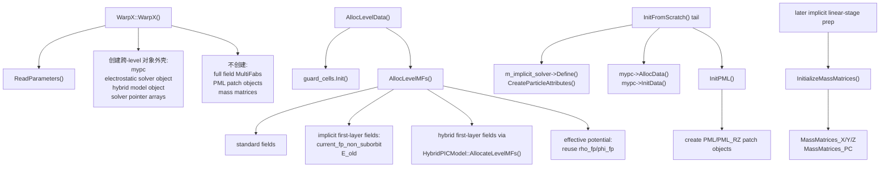

# WarpX 构造期与 level 分配第一轮精读

绑定源码：`../warpx`，分支 `pkuHEDPbranch`，commit `063f8b586f04321e13150ae3e730e0794ca75cb1`。

本笔记承接 `01-warpx-state-map.md`，继续回答一个更具体的问题：哪些对象在 `WarpX` 构造函数中创建，哪些数据必须等 AMReX level 的 `BoxArray` 和 `DistributionMapping` 确定后才分配。

## 1. `MakeWarpX()` 在构造前先解析全局边界

源码位置：`../warpx/Source/WarpX.cpp:274-296`。

```cpp
void WarpX::MakeWarpX ()
{
    warpx::initialization::check_dims();

    warpx::initialization::read_moving_window_parameters(
        do_moving_window, start_moving_window_step, end_moving_window_step,
        moving_window_dir, moving_window_v);

    ConvertLabParamsToBoost();

    std::tie(field_boundary_lo, field_boundary_hi) =
        warpx::boundary_conditions::parse_field_boundaries();

    const auto is_field_boundary_periodic =
        warpx::boundary_conditions::get_periodicity_array(field_boundary_lo, field_boundary_hi);

    std::tie(particle_boundary_lo, particle_boundary_hi) =
        warpx::particles::parse_particle_boundaries(is_field_boundary_periodic);

    CheckGriddingForRZSpectral();

    m_instance = new WarpX();
}
```

`MakeWarpX()` 不是简单的 `new WarpX()` 包装。它先做维度检查、移动窗口读取、boosted-frame 参数转换、场边界解析、粒子边界解析和 RZ spectral gridding 检查，然后才进入构造函数。这个顺序说明：

- 场边界和粒子边界是构造函数之前就确定的静态全局状态。
- 粒子边界解析需要知道场边界的周期性，因为粒子 periodic 边界必须和几何/场 periodic 逻辑一致。
- moving window 和 boosted frame 是全局几何/时间解释的一部分，不能等到粒子或场局部分配时再处理。

## 2. 构造函数创建跨 level 的控制对象

源码位置：`../warpx/Source/WarpX.cpp:322-536`。

```cpp
WarpX::WarpX ()
{
    m_instance = this; // This guarantees that GetInstance() can be
                       // indirectly used in WarpX constructor.

    warpx::initialization::initialize_warning_manager();

    ReadParameters();

    BackwardCompatibility();

    if (EB::enabled()) { InitEB(); }

    ablastr::utils::SignalHandling::InitSignalHandling();

    // Geometry on all levels has been defined already.
    // No valid BoxArray and DistributionMapping have been defined.
    // But the arrays for them have been resized.

    const int nlevs_max = maxLevel() + 1;

    istep.resize(nlevs_max, 0);
    nsubsteps.resize(nlevs_max, 1);

    t_new.resize(nlevs_max, 0.0);
    t_old.resize(nlevs_max, std::numeric_limits<Real>::lowest());
    dt.resize(nlevs_max, std::numeric_limits<Real>::max());

    mypc = std::make_unique<MultiParticleContainer>(this);
```

构造函数的注释非常关键：此时所有 level 的 `Geometry` 已经定义，但还没有有效的 `BoxArray` 和 `DistributionMapping`。因此构造函数只能做两类事情：

1. 读取输入、设置全局策略、创建不依赖网格盒划分的子系统对象。
2. 按 `maxLevel()+1` 预先 resize 各种 per-level 容器，但不填入具体 MultiFab 数据。

粒子容器 `mypc` 在构造期创建，因为 species 参数、粒子属性和注入模型可以从输入文件读出；但粒子真正放到哪些 grid boxes 上，还要等初始化和 level 数据存在后完成。

构造函数还为 moving window 初始化连续注入位置：

```cpp
if (do_moving_window){
    const int n_containers = mypc->nContainers();
    for (int i=0; i<n_containers; i++)
    {
        WarpXParticleContainer& pc = mypc->GetParticleContainer(i);

        // Storing injection position for all species, regardless of whether
        // they are continuously injected, since it makes looping over the
        // elements of current_injection_position easier elsewhere in the code.
        if (moving_window_v > 0._rt)
        {
            // Inject particles continuously from the right end of the box
            pc.m_current_injection_position = geom[0].ProbHi(moving_window_dir);
        }
        else if (moving_window_v < 0._rt)
        {
            // Inject particles continuously from the left end of the box
            pc.m_current_injection_position = geom[0].ProbLo(moving_window_dir);
        }
    }
}
```

这段代码把物理图像写得很直接：移动窗口向某个方向推进时，连续注入边界取决于窗口速度符号。`moving_window_v > 0` 时从盒子右端注入，`moving_window_v < 0` 时从左端注入。后续讲 moving window 时需要把这一点和 `WarpXMovingWindow.cpp` 中网格平移、粒子处理、场边界更新联系起来。

构造函数内还创建静电、hybrid、macroscopic 和 field solver 对象外壳：

```cpp
if ((WarpX::electrostatic_solver_id == ElectrostaticSolverAlgo::LabFrame)
    || (WarpX::electrostatic_solver_id == ElectrostaticSolverAlgo::LabFrameElectroMagnetostatic))
{
    m_electrostatic_solver = std::make_unique<LabFrameExplicitES>(nlevs_max);
}
// Initialize the effective potential electrostatic solver if required
else if (electrostatic_solver_id == ElectrostaticSolverAlgo::LabFrameEffectivePotential)
{
    m_electrostatic_solver = std::make_unique<EffectivePotentialES>(nlevs_max);
}
else
{
    m_electrostatic_solver = std::make_unique<RelativisticExplicitES>(nlevs_max);
}

if (WarpX::electromagnetic_solver_id == ElectromagneticSolverAlgo::HybridPIC)
{
    // Create hybrid-PIC model object if needed
    m_hybrid_pic_model = std::make_unique<HybridPICModel>();
}
```

注意这里创建的是 solver 对象或模型对象，不等于已经分配了每个 level 上的 `MultiFab`。真正的 `Efield_fp/Bfield_fp/current_fp/rho_fp` 等数据要等 `AllocLevelMFs()`。

## 3. 构造期的 solver 分支是“对象数组”，level 分配期才是“数值网格”

源码位置：`../warpx/Source/WarpX.cpp:496-506`。

```cpp
// Allocate field solver objects
#ifdef WARPX_USE_FFT
if (WarpX::electromagnetic_solver_id == ElectromagneticSolverAlgo::PSATD) {
    spectral_solver_fp.resize(nlevs_max);
    spectral_solver_cp.resize(nlevs_max);
}
#endif
if (WarpX::electromagnetic_solver_id != ElectromagneticSolverAlgo::PSATD) {
    m_fdtd_solver_fp.resize(nlevs_max);
    m_fdtd_solver_cp.resize(nlevs_max);
}
```

这段只 resize solver 指针数组，不创建具体 solver 实例。原因是 FDTD/PSATD solver 需要 level 的网格 spacing、BoxArray、guard cells、PML 设置、RZ 模式数等信息；这些信息在构造函数中还不完整。后续 `AllocLevelMFs()` 中才会执行：

- PSATD：构造 `SpectralSolver` 或 `SpectralSolverRZ`；
- 非 PSATD：构造 `FiniteDifferenceSolver`；
- AMR level `lev > 0`：还会创建 coarse patch 的 solver。

## 4. `AllocLevelData()` 先决定 guard cells 和 buffer，再进入 `AllocLevelMFs()`

源码位置：`../warpx/Source/WarpX.cpp:2271-2347`。

```cpp
void
WarpX::AllocLevelData (int lev, const BoxArray& ba, const DistributionMapping& dm)
{
    const bool aux_is_nodal = (field_gathering_algo == GatheringAlgo::MomentumConserving);

    const Real* dx = Geom(lev).CellSize();

    // Initialize filter before guard cells manager
    // (needs info on length of filter's stencil)
    if (use_filter)
    {
        InitFilter();
    }

    guard_cells.Init(
        dt[lev],
        dx,
        m_do_subcycling,
        WarpX::use_fdtd_nci_corr,
        grid_type,
        do_moving_window,
```

`AllocLevelData()` 的顺序说明 guard cell 不是固定常数，而是由时间步、网格间距、subcycling、NCI 修正、grid type、moving window、粒子最大跨格数、particle shape、PSATD 阶数、PML、filter stencil 等共同决定。对于 PIC 程序，这是非常重要的实现细节：guard cell 不够会导致 gather/deposition/field update 读取未定义数据；guard cell 过多会浪费通信和显存。

buffer 的默认值也在这里确定：

```cpp
if (mypc->nSpeciesDepositOnMainGrid() && n_current_deposition_buffer == 0) {
    n_current_deposition_buffer = 1;
    // This forces the allocation of buffers and allows the code associated
    // with buffers to run. But the buffer size of `1` is in fact not used,
    // `deposit_on_main_grid` forces all particles (whether or not they
    // are in buffers) to deposition on the main grid.
}

if (n_current_deposition_buffer < 0) {
    n_current_deposition_buffer = guard_cells.ng_alloc_J.max();
}
if (n_field_gather_buffer < 0) {
    // Field gather buffer should be larger than current deposition buffers
    n_field_gather_buffer = n_current_deposition_buffer + 1;
}

AllocLevelMFs(lev, ba, dm, guard_cells.ng_alloc_EB, guard_cells.ng_alloc_J,
              guard_cells.ng_alloc_Rho, guard_cells.ng_alloc_F, guard_cells.ng_alloc_G, aux_is_nodal);
```

这段代码给后续 AMR 章节一个入口：`current_deposition_buffer` 和 `field_gather_buffer` 不是装饰性参数，而是 coarse-fine 接口附近保证粒子沉积和场 gather 可用的区域。默认 `field_gather_buffer = current_deposition_buffer + 1` 体现了 gather stencil 通常需要比沉积 buffer 更宽的安全区。

## 5. `AllocLevelMFs()` 先建立维度相关的 Yee staggering

源码位置：`../warpx/Source/WarpX.cpp:2350-2461`。

```cpp
// Declare nodal flags
IntVect Ex_nodal_flag, Ey_nodal_flag, Ez_nodal_flag;
IntVect Bx_nodal_flag, By_nodal_flag, Bz_nodal_flag;
IntVect jx_nodal_flag, jy_nodal_flag, jz_nodal_flag;
IntVect rho_nodal_flag;
IntVect phi_nodal_flag;
amrex::IntVect F_nodal_flag, G_nodal_flag;

// Set nodal flags
#if   defined(WARPX_DIM_1D_Z)
// AMReX convention: x = missing dimension, y = missing dimension, z = only dimension
Ex_nodal_flag = IntVect(1);
Ey_nodal_flag = IntVect(1);
Ez_nodal_flag = IntVect(0);
Bx_nodal_flag = IntVect(0);
By_nodal_flag = IntVect(0);
Bz_nodal_flag = IntVect(1);
jx_nodal_flag = IntVect(1);
jy_nodal_flag = IntVect(1);
jz_nodal_flag = IntVect(0);
```

这段是后续讲 Yee 网格、降维编译和 AMReX index type 的核心证据。WarpX 不是在运行时用一个统一 3D 网格处理所有维度，而是通过 `WARPX_DIM_*` 编译宏为 1D、XZ、RZ、3D 等几何设置不同的 nodal flag。

3D 情况下的 flag 是标准 staggered Yee 结构：

```cpp
#elif defined(WARPX_DIM_3D)
Ex_nodal_flag = IntVect(0,1,1);
Ey_nodal_flag = IntVect(1,0,1);
Ez_nodal_flag = IntVect(1,1,0);
Bx_nodal_flag = IntVect(1,0,0);
By_nodal_flag = IntVect(0,1,0);
Bz_nodal_flag = IntVect(0,0,1);
jx_nodal_flag = IntVect(0,1,1);
jy_nodal_flag = IntVect(1,0,1);
jz_nodal_flag = IntVect(1,1,0);
#endif
```

物理上，这对应离散 curl 方程中 `E` 和 `B` 分量放在互补位置；电流 `J` 和电场 `E` 分量同位，以便 `E` 更新时源项位置匹配。后续 FDTD 章节应把这段和 Yee 更新公式逐项对照。

如果设置 collocated grid，WarpX 会覆盖所有 nodal flag：

```cpp
if (grid_type == GridType::Collocated) {
    Ex_nodal_flag  = IntVect::TheNodeVector();
    Ey_nodal_flag  = IntVect::TheNodeVector();
    Ez_nodal_flag  = IntVect::TheNodeVector();
    Bx_nodal_flag  = IntVect::TheNodeVector();
    By_nodal_flag  = IntVect::TheNodeVector();
    Bz_nodal_flag  = IntVect::TheNodeVector();
    jx_nodal_flag  = IntVect::TheNodeVector();
    jy_nodal_flag  = IntVect::TheNodeVector();
    jz_nodal_flag  = IntVect::TheNodeVector();
    rho_nodal_flag = IntVect::TheNodeVector();
    G_nodal_flag = amrex::IntVect::TheNodeVector();
}
```

这说明 `grid_type` 不是单纯影响 gather 的选项，而会改变全部场和源项的 MultiFab index type。

## 6. 多物理分支在 level 分配期注入自己的 MultiFab

源码位置：`../warpx/Source/WarpX.cpp:2541-2679`。

流体 species 和 macroscopic medium 在 `AllocLevelMFs()` 中分配自己的字段：

```cpp
// Allocate extra multifabs needed for fluids
if (do_fluid_species) {
    myfl->AllocateLevelMFs(m_fields, ba, dm, lev);
    auto & warpx = GetInstance();
    const amrex::Real cur_time = warpx.gett_new(lev);
    myfl->InitData(m_fields, geom[lev].Domain(), cur_time, lev, geom[lev], gamma_boost, beta_boost);
}

// Allocate extra multifabs for macroscopic properties of the medium
if (m_em_solver_medium == MediumForEM::Macroscopic) {
    WARPX_ALWAYS_ASSERT_WITH_MESSAGE( lev==0,
        "Macroscopic properties are not supported with mesh refinement.");
    m_macroscopic_properties->AllocateLevelMFs(ba, dm, ngEB);
}
```

这给多物理章节一个清晰边界：fluid 字段进入同一个 `m_fields` register；macroscopic medium 当前不支持 mesh refinement，因此在 `lev==0` 上断言。

EB 分支分配距离、粒子 shape 降阶掩码、场更新掩码，以及 ECT solver 需要的几何修正量：

```cpp
if (EB::enabled()) {
    constexpr int nc_ls = 1;
    amrex::IntVect const ng_ls(2);
    //EB level set
    m_fields.alloc_init(FieldType::distance_to_eb, lev, amrex::convert(ba, IntVect::TheNodeVector()), dm, nc_ls, ng_ls, 0.0_rt);
    // Whether to reduce the particle shape to order 1 when close to the EB
    AllocInitMultiFab(m_eb_reduce_particle_shape[lev], amrex::convert(ba, IntVect::TheCellVector()), dm, ncomps,
        ngRho, lev, "m_eb_reduce_particle_shape");
```

这里要避免一个常见误读：`distance_to_eb` 是 `FieldType`，存入 `m_fields`；`m_eb_reduce_particle_shape` 是 `iMultiFab` 掩码，不是普通实数场。它用于靠近嵌入边界时把粒子 shape 降到一阶，从而降低边界附近电荷守恒误差。

ECT solver 的 `ECTRhofield` 注释也需要原样记住：

```cpp
/** ECTRhofield is needed only by the ect
* solver and it contains the electromotive force density for every mesh face.
* The name ECTRhofield has been used to comply with the notation of the paper
* https://ieeexplore.ieee.org/stamp/stamp.jsp?tp=&arnumber=4463918 (page 9, equation 4
* and below).
* Although it's called rho it has nothing to do with the charge density!
* This is only used for the ECT solver.*/
m_fields.alloc_init(FieldType::ECTRhofield, Direction{0}, lev, amrex::convert(ba, Bx_nodal_flag),
    dm, ncomps, guard_cells.ng_FieldSolver, 0.0_rt);
```

这个字段名含有 `rho`，但源码注释明确说明它和电荷密度无关。正式章节讲 `rho_fp/rho_cp/rho_buf` 时不能把 `ECTRhofield` 纳入电荷密度族。

## 7. `effective potential`、`hybrid` 与 `implicit` 的 level 落点不在同一层

源码位置：`../warpx/Source/WarpX.cpp:2505-2570`、`../warpx/Source/FieldSolver/FiniteDifferenceSolver/HybridPICModel/HybridPICModel.cpp:80-164`、`../warpx/Source/FieldSolver/ImplicitSolvers/ImplicitSolver.cpp:545-787`。

这一段最容易被泛写成“构造函数已经把所有 solver 数据都准备好了”。实际上三条路线落在不同层次：

1. `effective potential electrostatic solver`
   - 构造期只创建 `EffectivePotentialES` 对象：

```cpp
else if (electrostatic_solver_id == ElectrostaticSolverAlgo::LabFrameEffectivePotential)
{
    m_electrostatic_solver = std::make_unique<EffectivePotentialES>(nlevs_max);
}
```

   - level 分配期并没有额外的 `effective_potential_*` 专用 `MultiFab`。
   - 它复用的是电静路径共享的 `rho_fp` 和 `phi_fp`：

```cpp
if( (electrostatic_solver_id == ElectrostaticSolverAlgo::LabFrame) ||
    (electrostatic_solver_id == ElectrostaticSolverAlgo::LabFrameElectroMagnetostatic) ||
    (electrostatic_solver_id == ElectrostaticSolverAlgo::LabFrameEffectivePotential) ||
    (electromagnetic_solver_id == ElectromagneticSolverAlgo::HybridPIC) ) {
    rho_ncomps = ncomps;
}

if (electrostatic_solver_id == ElectrostaticSolverAlgo::LabFrame ||
    electrostatic_solver_id == ElectrostaticSolverAlgo::LabFrameElectroMagnetostatic ||
    electrostatic_solver_id == ElectrostaticSolverAlgo::LabFrameEffectivePotential )
{
    const IntVect ngPhi = IntVect( AMREX_D_DECL(1,1,1) );
    m_fields.alloc_init(FieldType::phi_fp, lev, amrex::convert(ba, phi_nodal_flag), dm,
                         ncomps, ngPhi, 0.0_rt );
}
```

   - 这说明 `effective potential` 在 `WarpX` 根层的主要差异不是“多分一批字段”，而是后续静电求解器如何消费已有的 `rho_fp/phi_fp` 合同。

2. `hybrid PIC`
   - 构造期只创建 `HybridPICModel` 参数/方法对象：

```cpp
if (WarpX::electromagnetic_solver_id == ElectromagneticSolverAlgo::HybridPIC)
{
    // Create hybrid-PIC model object if needed
    m_hybrid_pic_model = std::make_unique<HybridPICModel>();
}
```

   - 真正的 hybrid 专用场量是在 `AllocLevelMFs()` 里按 level 分配：

```cpp
if (WarpX::electromagnetic_solver_id == ElectromagneticSolverAlgo::HybridPIC)
{
    m_hybrid_pic_model->AllocateLevelMFs(
        m_fields,
        lev, ba, dm, ncomps, ngJ, ngRho, ngEB, jx_nodal_flag, jy_nodal_flag,
        jz_nodal_flag, rho_nodal_flag, Ex_nodal_flag, Ey_nodal_flag, Ez_nodal_flag,
        Bx_nodal_flag, By_nodal_flag, Bz_nodal_flag
    );
}
```

   - `HybridPICModel::AllocateLevelMFs()` 分配的是：
     - `hybrid_electron_pressure_fp`
     - `hybrid_rho_fp_temp`
     - `hybrid_current_fp_temp`
     - `hybrid_current_fp_plasma`
     - 以及可选的 `hybrid_current_fp_external`
   - 若 `hybrid_pic_model.add_external_fields=1`，还会进一步调用 `ExternalVectorPotential::AllocateLevelMFs(...)`。
   - 所以 hybrid 的真实落点是：`WarpX` 根层只保留模型对象，level 级专用状态由 `HybridPICModel` 自己填进共享的 `m_fields` register。

3. `implicit solver` 与 mass matrices
   - `AllocLevelMFs()` 里只先分配两类隐式专用字段：

```cpp
if (m_implicit_solver) {
    // Current from suborbit particles are deposited to the standard current_fp container.
    // Current from non-suborbit particles are deposited to current_fp_non_suborbit.
    m_fields.alloc_init(FieldType::current_fp_non_suborbit, Direction{0}, lev,
                        amrex::convert(ba, jx_nodal_flag), dm, ncomps, ngJ, 0.0_rt);
    ...
    m_fields.alloc_init(FieldType::E_old, Direction{2}, lev,
                        amrex::convert(ba, Ez_nodal_flag), dm, ncomps, ngEB, 0.0_rt);
}
```

   - 真正体量更大的 `MassMatrices_X/Y/Z` 与 `MassMatrices_PC` 不在 `AllocLevelMFs()` 里分，而是在 `ImplicitSolver::InitializeMassMatrices()` 里延后创建。
   - 这一步必须等标准 `current_fp`、`Efield_fp` 的 index type、guard cells 和 AMR level 数都已稳定后，才能决定：
     - `Direct` / `Villasenor` 两种 deposition 下的组件数
     - `m_use_mass_matrices_jacobian` 与 `m_use_mass_matrices_pc` 的裁剪宽度
     - 以及 `MassMatrices_PC` 是否只保对角近似
   - 因而 implicit 的真实分层是：
     - 构造期：创建 solver 对象
     - `InitFromScratch()` 后：`Define()` / `CreateParticleAttributes()`
     - level 分配期：只放 `current_fp_non_suborbit` 和 `E_old`
     - 线性求解准备期：`InitializeMassMatrices()`

## 8. `PML` 不在 `AllocLevelMFs()` 里创建，而是在 `InitFromScratch()` 末尾延后初始化

源码位置：`../warpx/Source/Initialization/WarpXInitData.cpp:993-1045`。

PML 是另一条很容易误读的链。`AllocLevelData()` 把 `isAnyBoundaryPML(...)` 和 `pml_ncell` 等信息喂给 `guard_cells.Init(...)`，但这并不等于已经创建了 `PML` 对象。

真正的分配点在 `InitFromScratch()` 的末尾：

```cpp
WarpX::InitFromScratch ()
{
    const Real time = 0.0;

    AmrCore::InitFromScratch(time);  // This will call MakeNewLevelFromScratch

    if (m_implicit_solver) {

        m_implicit_solver->Define(this,/*from_restart=*/false);
        m_implicit_solver->CreateParticleAttributes();
    }

    mypc->AllocData();
    mypc->InitData();

    InitPML();

}
```

`InitPML()` 之所以必须放在这里，是因为它需要的是真实的 `boxArray(lev)`、`DistributionMap(lev)`、`dt[lev]` 和已经完成 level 分配的 `m_fields`：

```cpp
pml[0] = std::make_unique<PML>(
    0, boxArray(0), DistributionMap(0), do_similar_dm_pml, &Geom(0), nullptr,
    pml_ncell, pml_delta, amrex::IntVect::TheZeroVector(),
    dt[0], nox_fft, noy_fft, noz_fft, grid_type,
    do_moving_window, pml_has_particles, do_pml_in_domain,
    m_psatd_solution_type, time_dependency_J, time_dependency_rho,
    do_pml_dive_cleaning, do_pml_divb_cleaning,
    amrex::IntVect(0), amrex::IntVect(0),
    eb_enabled,
    guard_cells.ng_FieldSolver.max(),
    v_particle_pml,
    m_fields,
    do_pml_Lo[0], do_pml_Hi[0]);
```

这条顺序很重要：

- `AllocLevelData()` 先把普通网格、guard cells 和 `m_fields` register 准备好；
- `mypc->AllocData()` / `mypc->InitData()` 先把粒子放到这些 level 上；
- 最后才把 PML patch 作为主网格外的一层特殊 patch 接进来。

所以 `PML` 在 `WarpX` 的生命周期里是“初始化末段附加的边界子系统”，不是和 `Efield_fp/Bfield_fp` 一起在 `AllocLevelMFs()` 同步出生的常规 field container。

## 9. PSATD solver 的时间步在分配时可被 JRhom 或 Strang splitting 改写

源码位置：`../warpx/Source/WarpX.cpp:3058-3164`。

```cpp
amrex::Real solver_dt = dt[lev];
if (WarpX::m_JRhom) { solver_dt /= static_cast<amrex::Real>(WarpX::m_JRhom_subintervals); }
if (evolve_scheme == EvolveScheme::StrangImplicitSpectralEM) {
    // The step is Strang split into two half steps
    solver_dt /= 2.;
}

auto pss = std::make_unique<SpectralSolver>(realspace_ba,
                                            dm,
                                            nox_fft,
                                            noy_fft,
                                            noz_fft,
                                            grid_type,
                                            m_v_galilean,
                                            m_v_comoving,
                                            dx_vect,
                                            solver_dt,
```

这段连接了参数层和数值层：`dt[lev]` 是 level 时间步，但谱 solver 看到的 `solver_dt` 可能因为 JRhom 子区间或 Strang 分裂变小。后续讲 PSATD 不能只写 “solver 使用 dt”，而要区分全局 PIC step 的 `dt[lev]` 和 spectral solver 构造时传入的 `solver_dt`。

RZ PSATD 也有对应逻辑：

```cpp
amrex::Real solver_dt = dt[lev];
if (WarpX::m_JRhom) { solver_dt /= static_cast<amrex::Real>(WarpX::m_JRhom_subintervals); }
if (evolve_scheme == EvolveScheme::StrangImplicitSpectralEM) {
    // The step is Strang split into two half steps
    solver_dt /= 2.;
}

auto pss = std::make_unique<SpectralSolverRZ>(lev,
                                              realspace_ba,
                                              dm,
                                              n_rz_azimuthal_modes,
                                              noz_fft,
```

RZ 版本额外传入 `n_rz_azimuthal_modes`，并只显式构造 `dx_vect(dx[0], dx[2])`。这反映 RZ 谱求解在径向和纵向上的特殊表示，后续需要和 RZ Fourier mode 章节合并解读。

## 10. 本轮结论

构造期和 level 分配期可以总结为：

```text
MakeWarpX()
  -> 解析维度、moving window、boost、场边界、粒子边界
  -> new WarpX()

WarpX::WarpX()
  -> ReadParameters()
  -> 创建跨 level 子系统对象和 per-level 容器外壳
  -> resize solver 指针数组、PML 数组、mask 数组、cost 数组

AMReX 创建 level
  -> MakeNewLevelFromScratch()
  -> AllocLevelData()
  -> guard_cells.Init()
  -> AllocLevelMFs()
  -> 按 grid/solver/physics 分配 m_fields、mask、solver 实例、buffer
  -> hybrid / effective-potential / implicit 只落各自所需的第一层 level 数据
  -> InitLevelData()
  -> InitPML()
```

如果只看这一串文字，仍容易把“对象创建”和“字段分配”混在一起。更准确的压缩图如下：



再压成表格则是：

| 对象/字段族 | 构造期 | `AllocLevelMFs()` | 初始化末段 / 后续 |
|---|---|---|---|
| `m_electrostatic_solver` | 创建 solver 对象 | 无额外专用字段；复用 `rho_fp/phi_fp` | 后续静电求解器消费 |
| `m_hybrid_pic_model` | 创建模型对象 | `hybrid_*` level 字段写入 `m_fields` | `HybridPICModel::InitData()`、外加电流/矢势 parser |
| `m_implicit_solver` | solver 对象已存在 | `current_fp_non_suborbit`、`E_old` | `Define()`、`CreateParticleAttributes()`、`InitializeMassMatrices()` |
| `PML` / `PML_RZ` | 仅参数已解析 | 不在这里创建 | `InitPML()` 根据真实 `boxArray/dm/dt/m_fields` 创建 |
| 标准场 `E/B/J/rho/phi` | 仅容器外壳 | 按 staggering / guard cells / solver 组合真正分配 | `InitLevelData()` 填初值 |

下一步应进入 `Initialization/WarpXInitData.cpp`，把 `InitData()`、`InitFromScratch()`、`InitLevelData()`、`CheckGuardCells()` 和这里的 `AllocLevelData()` 串成完整初始化链。
