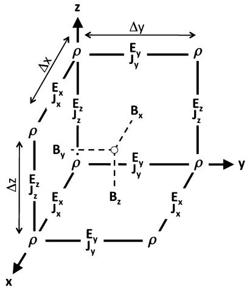
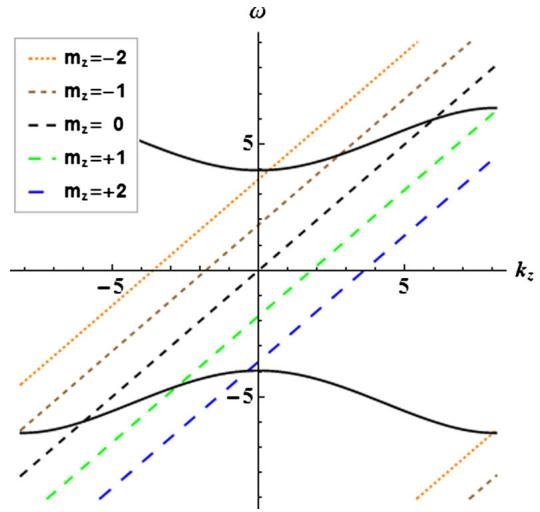
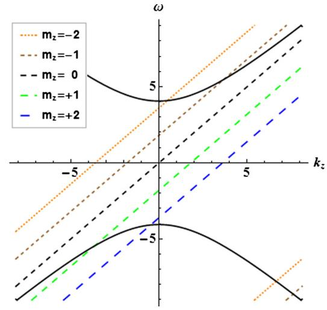
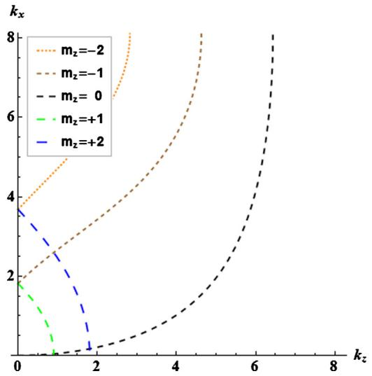
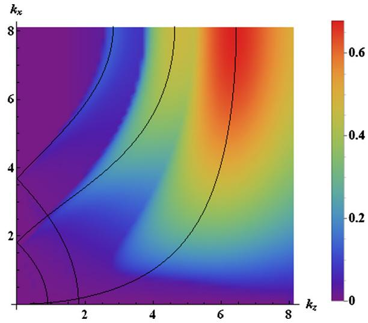
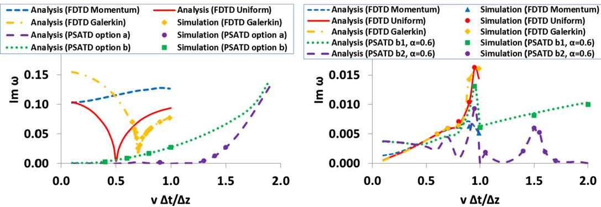

# Theoretical and numerical approaches for Vlasov–Maxwell equations Modeling of relativistic plasmas with the Particle-In-Cell method

Jean-Luc Vay a,∗, Brendan B. Godfrey b,a

a Lawrence Berkeley National Laboratory, Berkeley, CA, USA

b University of Maryland, College Park, MD, USA

## a r t i c l e i n f o

Article history: Received 25 April 2014 Accepted 10 June 2014 Available online 5 August 2014

Keywords: Particle-In-Cell Plasma simulation Special relativity Numerical instability

## a b s t r a c t

Standard methods employed in relativistic electromagnetic Particle-In-Cell codes are reviewed, as well as novel techniques that were introduced recently. Advances in the analysis and mitigation of the numerical Cherenkov instability are also presented with comparison between analytical theory and numerical experiments. The algorithmic and numerical analytic advances are expanding the range of applicability of the method in the ultra-relativistic regime in particular, where the numerical Cherenkov instability is the strongest without corrective measures.

© 2014 Académie des sciences. Published by Elsevier Masson SAS. All rights reserved.

## 1. Introduction

Computer simulations of self-consistent electromagnetics and relativistic particle kinetics are critical to the design and understanding of particle accelerators, laser–plasma interaction, fusion or plasma experiments and to the study of space plasmas. For such simulations, the most popular algorithm is the Particle-In-Cell (or PIC) technique, which represents elec tromagnetic fields on a grid and particles by a sample of macroparticles. In Section 2 of this paper, we review the standard methods employed in relativistic electromagnetic PIC codes, as well as novel techniques that were introduced recently in the code Warp [1,2]. Recent advances in the analysis and mitigation of the numerical Cherenkov instability are presented in Section 3, with comparison between analytical theory and numerical experiments using Warp.

## 2. Particle-In-Cell main steps

In the electromagnetic Particle-In-Cell method [3], the electromagnetic fields are solved on a grid, usually using Maxwell’s equations

$$
{ \frac { \partial \mathbf { B } } { \partial t } } = - \nabla \times \mathbf { E }\tag{1}
$$

$$
{ \frac { \partial \mathbf { E } } { \partial t } } = \nabla \times \mathbf { B } - \mathbf { J }\tag{2}
$$

$$
\nabla \cdot \mathbf { E } = \rho\tag{3}
$$

$$
\nabla \cdot \mathbf { B } = 0\tag{4}
$$

Fig. 1. Layout of field components on the staggered “Yee” grid. Charge density is defined at the nodes, current densities and electric fields on the edges of the cells and magnetic fields on the faces.

given here in natural units $( \epsilon _ { 0 } = \mu _ { 0 } = c = 1 )$ , where t is time, E and B are the electric and magnetic field components, and $\rho$ and J are the charge and current densities. The charged particles are advanced in time using the Newton–Lorentz equations of motion

$$
\begin{array} { l } { { \displaystyle { \frac { \mathrm { d } { \mathbf { x } } } { \mathrm { d } t } } = \mathbf { v } } \ ~ } \\ { { \displaystyle { \frac { \mathrm { d } ( \gamma \mathbf { v } ) } { \mathrm { d } t } } = \frac { q } { m } ( \mathbf { E } + \mathbf { v } \times \mathbf { B } ) } } \end{array}\tag{5}
$$

(6)

where m, q, x, v and $\gamma = 1 / \sqrt { 1 - \nu ^ { 2 } }$ are respectively the mass, charge, position, velocity and relativistic factor of the particle given in natural units $( c = 1 )$ . The charge and current densities are interpolated on the grid from the particles’ positions and velocities, while the electric and magnetic field components are interpolated from the grid to the particles’ positions for the velocity update.

## 2.1. Field solve

Various methods are available for solving Maxwell’s equations on a grid, based on finite-differences, finite-volume, finiteelement, spectral, or other discretization techniques that apply most commonly on single structured or unstructured meshes and less commonly on multiblock multiresolution grid structures. In this paper, we summarize the widespread second order Finite-Difference Time-Domain (FDTD) algorithm, its extension to non-standard finite-differences as well as the Pseudo Spectral Analytical Time-Domain (PSATD) and Pseudo-Spectral Time-Domain (PSTD) algorithms. Extension to multiresolution (or mesh refinement) PIC is described in, e.g. [2,4].

## 2.1.1. Finite-Difference Time-Domain (FDTD)

The most popular algorithm for electromagnetic PIC codes is the Finite-Difference Time-Domain (or FDTD) solver

$$
D _ { t } \mathbf { B } = - \nabla \times \mathbf { E }\tag{7}
$$

$$
D _ { t } \mathbf { E } = \nabla \times \mathbf { B } - \mathbf { J }\tag{8}
$$

$$
[ \nabla \cdot \mathbf { E } = \rho ]\tag{9}
$$

$$
[ \nabla \cdot \mathbf { B } = 0 ]\tag{10}
$$

The differential operator is defined as $\nabla = D _ { x } \hat { \mathbf { x } } + D _ { y } \hat { \mathbf { y } } + D _ { z } \hat { \mathbf { z } }$ and the finite difference operators in time and space are defined respectively as $\left. D _ { t } G \right| _ { i , j , k } ^ { n } = ( G | _ { i , j , k } ^ { n + 1 / 2 } - G | _ { i , j , k } ^ { n - 1 / 2 } ) / \Delta t$ and $\begin{array} { r } { D _ { x } G | _ { i , j , k } ^ { n } = ( G | _ { i + 1 / 2 , j , k } ^ { n } - G | _ { i - 1 / 2 , j , k } ^ { n } ) / \Delta x , } \end{array}$ where $\Delta t$ and x are respectively the time step and the grid cell size along x, n is the time index and $i , \ j$ and k are the spatial indices along x, y and z respectively. The difference operators along y and z are obtained by circular permutation. The equations in brackets are given for completeness, as they are often not actually solved, thanks to the usage of a so-called charge conserving algorithm, as explained below. As shown in Fig. 1, the quantities are given on a staggered $( \mathsf { o r } \ Y \mathsf { e e } ^ { \prime \prime } )$ grid [5], where the electric field components are located between nodes and the magnetic field components are located in the center of the cell faces.

## 2.1.2. Non-Standard Finite-Difference Time-Domain (NSFDTD)

In [6,7], Cole introduced an implementation of the source-free Maxwell’s wave equations for narrow-band applications based on Non-Standard Finite-Differences (NSFD). In [8], Karkkainen et al. adapted it for wideband applications. At the

Courant limit for the time step and for a given set of parameters, the stencil proposed in [8] has no numerical dispersion along the principal axes, provided that the cell size is the same along each dimension (i.e. cubic cells in 3D). The “Cole–Karkkainen” (or CK) solver uses the non-standard finite difference formulation (based on extended stencils) of the Maxwell–Ampère equation and was implemented in Warp as follows [9]:

$$
D _ { t } \mathbf { B } = - \nabla ^ { * } \times \mathbf { E }\tag{11}
$$

$$
D _ { t } \mathbf { E } = \nabla \times \mathbf { B } - \mathbf { J }\tag{12}
$$

$$
[ \nabla \cdot \mathbf { E } = \rho ]\tag{13}
$$

$$
\left[ \nabla ^ { * } \cdot \mathbf { B } = 0 \right]\tag{14}
$$

Eqs. (13) and (14) are not being solved explicitly but verified via appropriate initial conditions and current deposition procedure. The NSFD differential operator is given by $\nabla ^ { * } = D _ { x } ^ { * } \hat { \mathbf { x } } + D _ { v } ^ { * } \hat { \mathbf { y } } + D _ { z } ^ { * } \hat { \mathbf { z } }$ , where $D _ { x } ^ { * } = ( \alpha + \beta S _ { x } ^ { 1 } + \xi S _ { x } ^ { 2 } ) D _ { \lambda }$ x with $S _ { x } ^ { 1 } { \bar { G } } | _ { i , j , k } ^ { n } =$ $G _ { 1 , j + 1 / 2 , k } ^ { n } + G | _ { i , j - 1 / 2 , k } ^ { n } + G | _ { i , j , k + 1 / 2 } ^ { n } + G | _ { i , j , k - 1 / 2 } ^ { n } , S _ { \boldsymbol { x } } ^ { 2 } G | _ { i , j , k } ^ { n } = G | _ { i , j + 1 / 2 , k + 1 / 2 } ^ { n } + G | _ { i , j - 1 / 2 , k + 1 / 2 } ^ { n } + G | _ { i , j + 1 / 2 , k - 1 / 2 } ^ { n } + G | _ { i , j - 1 / 2 , k - 1 / 2 } ^ { n } .$ G is a sample vector component, while $\alpha , \beta$ and ξ are constant scalars satisfying $\alpha + 4 \beta + 4 \xi = 1$ . As with the FDTD algorithm, the quantities with half-integer are located between the nodes (electric field components) or in the center of the cell faces (magnetic field components). The operators along y and z, i.e. $D _ { y } , D _ { z } , D _ { y } ^ { * } , D _ { z } ^ { * } , \bar { S _ { y } ^ { 1 } } , S _ { z } ^ { 1 } , S _ { y } ^ { 2 }$ , and $S _ { z } ^ { 2 } ,$ are obtained by circular permutation of the indices.

Assuming cubic cells $( \Delta x = \Delta y = \Delta z )$ , the coeficients given in [8] $( \alpha = 7 / 1 2 , \beta = 1 / 1 2$ and $\xi = 1 / 4 8 )$ allow for the Courant condition to be at $\Delta t = \Delta x ,$ which equates to having no numerical dispersion along the principal axes. The algorithm reduces to the FDTD algorithm with $\alpha = 1$ and $\beta = \xi = 0 .$ . An extension to non-cubic cells is provided by Cowan, et al. in 3-D in [10] and was given by Pukhov in 2-D in [11]. An alternative NSFDTD implementation is also given in [12].

As mentioned above, a key feature of the algorithms based on NSFDTD is that they enable the time step $\Delta t = \Delta x$ along one or more axes and no numerical dispersion along those axes. However, as shown in [9], an instability develops at the Nyquist wavelength at (or very near) such a timestep. It is also shown in the same paper that removing the Nyquist component in all the source terms using a bilinear filter (see description of the filter below) suppresses this instability.

## 2.1.3. Pseudo Spectral Analytical Time Domain (PSATD)

Maxwell’s equations in Fourier space are given by

$$
\frac { \partial \tilde { \mathbf { E } } } { \partial t } = \mathrm { i } \mathbf { k } \times \tilde { \mathbf { B } } - \tilde { \mathbf { J } }\tag{15}
$$

$$
\frac { \partial \tilde { \mathbf { B } } } { \partial t } = - \mathrm { i } \mathbf { k } \times \tilde { \mathbf { E } }\tag{16}
$$

$$
[ \mathrm { i } \mathbf { k } \cdot \tilde { \mathbf { E } } = \tilde { \rho } ]\tag{17}
$$

$$
[ \mathrm { i } \mathbf { k } \cdot \tilde { \mathbf { B } } = 0 ]\tag{18}
$$

where a is the Fourier transform of the quantity a. As with the real space formulation, provided that the continuity equation $\partial \tilde { \rho } / \partial t + \mathrm { i } \mathbf { k } \cdot \tilde { \mathbf { J } } = 0$ is satisfied, then the last two equations will automatically be satisfied at any time if satisfied initially and do not need to be explicitly integrated.

Decomposing the electric field and current between longitudinal and transverse components $\tilde { \mathbf { E } } = \tilde { \mathbf { E } } _ { L } + \tilde { \mathbf { E } } _ { T } = \hat { \mathbf { k } } ( \hat { \mathbf { k } } \cdot \tilde { \mathbf { E } } ) - \hat { \mathbf { k } } \times$ $\hat { \mathbf { k } } \times \tilde { \mathbf { E } }$ and $\mathbf { \tilde { J } } = \mathbf { \tilde { J } } _ { L } + \mathbf { \tilde { J } } _ { T } = \hat { \mathbf { k } } ( \hat { \mathbf { k } } \cdot \mathbf { \tilde { J } } ) - \hat { \mathbf { k } } \times \hat { \mathbf { k } } \times \mathbf { \tilde { J } }$ gives

$$
\frac { \partial \tilde { \mathbf { E } } _ { T } } { \partial t } = \mathrm { i } \mathbf { k } \times \tilde { \mathbf { B } } - \tilde { \mathbf { J } } _ { T }\tag{19}
$$

$$
{ \frac { \partial \tilde { \mathbf { E } } _ { L } } { \partial t } } = - \tilde { \mathbf { J } } _ { L }\tag{20}
$$

$$
\frac { \partial \tilde { \mathbf { B } } } { \partial t } = - \mathrm { i } \mathbf { k } \times \tilde { \mathbf { E } }\tag{21}
$$

with $\hat { \mathbf { k } } = \mathbf { k } / k .$

If the sources are assumed to be constant over a time interval t, the system of equations is solvable analytically and is given by (see [13] for the original formulation and [14] for a more detailed derivation):

$$
\tilde { \mathbf { E } } _ { T } ^ { n + 1 } = C \tilde { \mathbf { E } } _ { T } ^ { n } + \mathrm { i } S \hat { \mathbf { k } } \times \tilde { \mathbf { B } } ^ { n } - \frac { S } { k } \tilde { \mathbf { J } } _ { T } ^ { n + 1 / 2 }\tag{22}
$$

$$
\tilde { \mathbf { E } } _ { L } ^ { n + 1 } = \tilde { \mathbf { E } } _ { L } ^ { n } - \Delta t \tilde { \mathbf { J } } _ { L } ^ { n + 1 / 2 }
$$

$$
\tilde { \mathbf { B } } ^ { n + 1 } = C \tilde { \mathbf { B } } ^ { n } - \mathrm { i } S \hat { \mathbf { k } } \times \tilde { \mathbf { E } } ^ { n } + \mathrm { i } \frac { 1 - C } { k } \hat { \mathbf { k } } \times \tilde { \mathbf { J } } ^ { n + 1 / 2 }\tag{23}
$$

(24)

with $C = \cos ( k \Delta t )$ and $S = \sin ( k \Delta t )$ .

Combining the transverse and longitudinal components, gives

$$
\begin{array} { l } { { \displaystyle { \tilde { \bf E } } ^ { n + 1 } = C { \tilde { \bf E } } ^ { n } + \mathrm { i } S { \hat { \bf k } } \times { \tilde { \bf B } } ^ { n } - \frac { S } { k } { \bf \tilde { J } } ^ { n + 1 / 2 } + ( 1 - C ) { \hat { \bf k } } \big ( { \hat { \bf k } } \cdot { \tilde { \bf E } } ^ { n } \big ) } } \\ { ~ + { \hat { \bf k } } \big ( { \hat { \bf k } } \cdot { \bf \tilde { J } } ^ { n + 1 / 2 } \big ) \bigg ( \frac { S } { k } - \Delta t \bigg ) } \\ { { \displaystyle { \tilde { \bf B } } ^ { n + 1 } = C { \tilde { \bf B } } ^ { n } - \mathrm { i } S { \hat { \bf k } } \times { \tilde { \bf E } } ^ { n } + \mathrm { i } \frac { 1 - C } { k } { \hat { \bf k } } \times { \tilde { \bf J } } ^ { n + 1 / 2 } } } \end{array}\tag{25}
$$

(26)

For fields generated by the source terms without the self-consistent dynamics of the charged particles, this algorithm is free of numerical dispersion and is not subject to a Courant condition. Furthermore, this solution is exact for any time step size subject to the assumption that the current source is constant over that time step.

As shown in [14], by expanding the coeficients $S _ { h }$ and $C _ { h }$ in Taylor series and keeping the leading terms, the PSATD formulation reduces to the better known pseudo-spectral time-domain (PSTD) formulation [15,16]:

$$
\tilde { \mathbf { E } } ^ { n + 1 } = \tilde { \mathbf { E } } ^ { n } + \mathrm { i } \Delta t \mathbf { k } \times \tilde { \mathbf { B } } ^ { n + 1 / 2 } - \Delta t \mathbf { \tilde { J } } ^ { n + 1 / 2 }\tag{27}
$$

$$
\tilde { \mathbf { B } } ^ { n + 3 / 2 } = \tilde { \mathbf { B } } ^ { n + 1 / 2 } - \mathrm { i } \Delta t \mathbf { k } \times \tilde { \mathbf { E } } ^ { n + 1 }\tag{28}
$$

The dispersion relation of the PSTD solver is given by sin $\begin{array} { r } { \frac { \omega \Delta t } { 2 } ) = \frac { k \Delta t } { 2 } } \end{array}$ . In contrast to the PSATD solver, the PSTD solver is subject to numerical dispersion for a finite time step and to a Courant condition that is given by $\begin{array} { r } { c \Delta t \leq 2 / \pi \sqrt { \frac { 1 } { \Delta x ^ { 2 } } + \frac { 1 } { \Delta y ^ { 2 } } + \frac { 1 } { \Delta x ^ { 2 } } } } \end{array}$

The PSATD and PSTD formulations that were just given apply to the field components located at the nodes of the grid. As noted in [17], they can also be easily recast on a staggered Yee grid by multiplication of the field components by the appropriate phase factors to shift them from the collocated to the staggered locations. The choice between a collocated and a staggered formulation is application-dependent.

## 2.2. Particle push

A centered finite-difference discretization of the Newton–Lorentz equations of motion is given by

$$
\frac { \frac { { \bf { x } } ^ { i + 1 } - { \bf { x } } ^ { i } } { \Delta t } = { \bf { v } } ^ { i + 1 / 2 } } { \Delta t } = \frac { { \bf { v } } ^ { i + 1 / 2 } } { { \bf { u } } ^ { i } }\tag{29}
$$

(30)

In order to close the system, $\bar { \mathbf { v } } ^ { i + 1 / 2 }$ must be expressed as a function of the other quantities.

## 2.2.1. Boris relativistic velocity rotation

The solution proposed by Boris [18] is given by

$$
\bar { \mathbf { v } } ^ { i } = \frac { \gamma ^ { i + 1 / 2 } \mathbf { v } ^ { i + 1 / 2 } + \gamma ^ { i - 1 / 2 } \mathbf { v } ^ { i - 1 / 2 } } { 2 \bar { \gamma } ^ { i } }\tag{31}
$$

The system (30), (31) is solved very eficiently following Boris’ method, where the electric field push is decoupled from the magnetic push, avoiding having to solve explicitly for $\bar { \gamma } ^ { i }$ . Setting $\mathbf { u } = \gamma \mathbf { v }$ , the velocity is updated using the following sequence:

$$
\mathbf { u } ^ { - } = \mathbf { u } ^ { i - 1 / 2 } + ( q \Delta t / 2 m ) \mathbf { E } ^ { i }\tag{32}
$$

$$
\mathbf { u } ^ { \prime } = \mathbf { u } ^ { - } + \mathbf { u } ^ { - } \times \mathbf { t }\tag{33}
$$

$$
\mathbf { u } ^ { + } = \mathbf { u } ^ { - } + \mathbf { u } ^ { \prime } \times 2 \mathbf { t } / \big ( 1 + t ^ { 2 } \big )\tag{34}
$$

$$
\mathbf { u } ^ { i + 1 / 2 } = \mathbf { u } ^ { + } + ( q \Delta t / 2 m ) \mathbf { E } ^ { i }\tag{35}
$$

where $t = ( q \Delta t / 2 m ) \mathbf { B } ^ { i } / \gamma ^ { i - 1 / 2 } = ( q \Delta t / 2 m ) \mathbf { B } ^ { i } / \gamma ^ { i + 1 / 2 } .$

## 2.2.2. Lorentz-invariant formulation

It was shown in [19] that the Boris formulation is not Lorentz invariant and can lead to significant errors in the treatment of relativistic dynamics. A Lorentz invariant formulation is obtained by considering the following velocity average

$$
\bar { \mathbf { v } } ^ { i } = \frac { \mathbf { v } ^ { i + 1 / 2 } + \mathbf { v } ^ { i - 1 / 2 } } { 2 }\tag{36}
$$

This gives a system that is solvable analytically (see [19] for a detailed derivation), giving the following velocity update:

$$
\mathbf { u } ^ { * } = \mathbf { u } ^ { i } + \frac { q \Delta t } { m } \left( \mathbf { E } ^ { i } + \frac { \mathbf { v } ^ { i - 1 / 2 } } { 2 } \times \mathbf { B } ^ { i } \right)\tag{37}
$$

$$
\mathbf { u } ^ { i + 1 / 2 } = \big [ \mathbf { u } ^ { * } + ( \mathbf { u } ^ { * } \cdot \mathbf { t } ) \mathbf { t } + \mathbf { u } ^ { * } \times \mathbf { t } \big ] / \big ( 1 + t ^ { 2 } \big )\tag{38}
$$

where $\mathbf { t } = \pmb { \tau } / \gamma ^ { i + 1 / 2 } , \pmb { \tau } = ( q \Delta t / 2 m ) \mathbf { B } ^ { i } , \gamma ^ { i + 1 / 2 } = \sqrt { \pmb { \sigma } + \sqrt { \pmb { \sigma } ^ { 2 } + ( \pmb { \tau } ^ { 2 } + \pmb { w } ^ { 2 } ) } } , w = \mathbf { u } ^ { * } \cdot \pmb { \tau } , \pmb { \sigma } = ( \gamma ^ { \prime 2 } - \tau ^ { 2 } ) / 2$ and $\gamma ^ { \prime } = \sqrt { 1 + u ^ { * 2 } / c ^ { 2 } } .$ This Lorentz invariant formulation is particularly well suited for the modeling of ultra-relativistic charged particle beams, where the accurate account of the cancellation of the self-generated electric and magnetic fields is essential, as demon strated in [19].

## 2.3. Current deposition

The current densities are deposited on the computational grid from the particle position and velocities, employing splines of various orders [20].

In most applications, it is essential to prevent the accumulation of errors resulting from the violation of the discretized Gauss’ Law. This is accomplished by providing a method for depositing the current from the particles to the grid that preserves the discretized Gauss’ Law, or by providing a mechanism for “divergence cleaning” [3,21–24]. For the former, schemes which allow a deposition of the current that is exact when combined with the Yee solver is given in [25] for linear splines and in [26] for any order splines.

The NSFDTD formulations given above and in [11,10,12] apply to the Maxwell–Faraday equation, while the discretized Maxwell–Ampère equation uses the FDTD formulation. Consequently, the charge conserving algorithms developed for current deposition [25,26] apply readily to those NSFDTD-based formulations. More details concerning those implementations, including the expressions for the numerical dispersion and Courant condition are given in [11,9,10] and [12].

In the case of the pseudospectral solvers, the current deposition algorithm generally does not satisfy the discretized continuity equation in Fourier space $\tilde { \rho } ^ { n + 1 } = \tilde { \rho } ^ { n } - \mathrm { i } \Delta t \mathbf k \cdot \mathbf { \tilde { J } } ^ { n + 1 / \hat { 2 } }$ . In this case, a Boris correction [3] can be applied in k space in the form $\tilde { \mathbf { E } } _ { c } ^ { n + 1 } = \tilde { \mathbf { E } } ^ { n + 1 } - ( \mathbf { k } \cdot \tilde { \mathbf { E } } ^ { n + 1 } + \mathrm { i } \tilde { \rho } ^ { n + 1 } ) \hat { \mathbf { k } } / k$ , where $\tilde { \mathbf { E } } _ { c }$ is the corrected field. Alternatively, a correction to the current can be applied (with some similarity to the current deposition presented by Morse and Nielson in their potential-based model in [27]) using $\tilde { \mathbf { J } } _ { c } ^ { n + 1 / 2 } = \tilde { \mathbf { J } } ^ { n + 1 / 2 } - [ \mathbf { k } \cdot \tilde { \mathbf { J } } ^ { n + 1 / 2 } - \mathrm { i } ( \tilde { \rho } ^ { n + 1 } - \tilde { \rho } ^ { n } ) / \Delta t ] \hat { \mathbf { k } } / k$ , where $\tilde { \mathbf { J } } _ { c }$ is the corrected current. In this case, the transverse component of the current is left untouched while the longitudinal component is effectively replaced by the one obtained from integration of the continuity equation, ensuring that the corrected current satisfies the continuity equation.

## 2.4. Field gather

In general, the field is gathered from the mesh onto the macroparticles using splines of the same order as for the current deposition $\pmb { S } = ( S _ { x } , S _ { y } , S _ { z } )$ ). Three variations are considered:

“momentum conserving”: fields are interpolated from the grid nodes to the macroparticles using ${ \pmb S } = ( S _ { n x } , S _ { n y } , S _ { n z } )$ for all field components (if the fields are known at staggered positions, they are first interpolated to the nodes on an auxiliary grid),

“energy conserving (or Galerkin)”: fields are interpolated from the staggered Yee grid to the macroparticles using $( S _ { n x - 1 } , S _ { n y } , S _ { n z } )$ for $E _ { x } , \ ( S _ { n x } , S _ { n y - 1 } , S _ { n z } )$ for $E _ { y } , ( S _ { n x } , S _ { n y } , S _ { n z - 1 } )$ for $E _ { z } , \ ( S _ { n x } , S _ { n y - 1 } , S _ { n z - 1 } )$ for $B _ { x } , ( S _ { n x - 1 } , S _ { n y } , S _ { n z - 1 } )$ for $B _ { y }$ and $( S _ { n x - 1 } , S _ { n y - 1 } , S _ { n z } )$ for $B _ { z }$ (if the fields are known at the nodes, they are first interpolated to the staggered positions on an auxiliary grid),

“uniform”: fields are interpolated directly form the Yee grid to the macroparticles using $\pmb { S } = ( S _ { n x } , S _ { n y } , S _ { n z } )$ for all field components (if the fields are known at the nodes, they are first interpolated to the staggered positions on an auxiliary grid).

As shown in [3,28,29], the momentum and energy conserving schemes conserve momentum and energy respectively at the limit of infinitesimal time steps and generally offer better conservation of the respective quantities for a finite time step. The uniform scheme does not conserve momentum or energy in the sense defined for the others but is given for completeness, as it has been shown to offer some interesting properties in the modeling of relativistically drifting plasmas, as explained below.

## 2.5. Filtering

It is common practice to apply digital filtering to the charge or current density in Particle-In-Cell simulations as a complement or an alternative to using higher order splines [3]. A commonly used filter in PIC simulations is the three points filter $\phi _ { j } ^ { \mathrm { f } } = \alpha \phi _ { j } + ( 1 - \alpha ) ( \phi _ { j - 1 } + \phi _ { j + 1 } ) / 2$ where $\phi ^ { \mathrm { f } }$ is the filtered quantity. This filter is called a bilinear filter when $\alpha = 0 . 5$ . Assuming $\boldsymbol { \phi } = \mathbf { e } ^ { j \boldsymbol { k } \boldsymbol { x } }$ and $\phi ^ { \mathrm { f } } = g ( \alpha , k ) \mathrm { e } ^ { j k x }$ , the filter gain $_ g$ is given as a function of the filtering coeficient α and the wavenumber k by $\begin{array} { r } { g ( \alpha , k ) = \alpha + ( 1 - \alpha ) \cos ( k \Delta x ) \approx 1 - ( 1 - \alpha ) \frac { ( k \Delta x ) ^ { 2 } } { 2 } + O ( k ^ { 4 } ) } \end{array}$ . The total attenuation G for n successive applications of filters of coeficients $\alpha _ { 1 } . . . \alpha _ { n }$ is given by $\begin{array} { r } { G = \prod _ { i = 1 } ^ { n } g ( \alpha _ { i } , k ) \approx 1 - ( n - \sum _ { i = 1 } ^ { n } \alpha _ { i } ) \frac { ( k \Delta x ) ^ { 2 } } { 2 } + O ( k ^ { 4 } ) } \end{array}$ . A sharper cutoff in k space is provided by using $\begin{array} { r } { \alpha _ { n } = n - \sum _ { i = 1 } ^ { n - 1 } \alpha _ { i } } \end{array}$ , so that $G \approx 1 + O ( k ^ { 4 } )$ . Such step is called a “compensation” step [3]. For the bilinear filter $( \alpha = 1 / 2 )$ , the compensation factor is $\alpha _ { c } = 2 - 1 / 2 = 3 / 2$ . For a succession of n applications of the bilinear factor, it is $\alpha _ { c } = n / 2 + 1$

It is sometimes necessary to filter on a relatively wide band of wavelength, necessitating the application of a large number of passes of the bilinear filter or on the use of filters acting on many points. The former can become very intensive computationally while the latter is problematic for parallel computations using domain decomposition, as the footprint of the filter may eventually surpass the size of subdomains. A workaround is to use a combination of filters of limited footprint. A solution based on the combination of three point filters with various strides was proposed in [9] and operates as follows.

The bilinear filter provides complete suppression of the signal at the grid Nyquist wavelength (twice the grid cell size). Suppression of the signal at integer multiples of the Nyquist wavelength can be obtained by using a stride s in the filter $\phi _ { j } ^ { \mathrm { f } } = \alpha \phi _ { j } + ( 1 - \alpha ) ( \phi _ { j - s } + \phi _ { j + s } ) / 2$ , for which the gain is given b $\begin{array} { r } { g ( \alpha , k ) = \alpha + ( 1 - \alpha ) \cos ( s k \Delta x ) \approx 1 - ( 1 - \alpha ) \frac { ( s k \Delta x ) ^ { 2 } } { 2 } + O ( k ^ { 4 } ) } \end{array}$ For a given stride, the gain is given by the gain of the bilinear filter shifted in k space, with the zero $g = 0$ shifted from the wavelength $\lambda = 2 / \Delta x { \mathrm { ~ t o ~ } } \lambda = 2 s / \Delta x ,$ , with additional poles, as given by $\begin{array} { r } { s k \Delta x = \operatorname { a r c c o s } ( \frac { \alpha } { \alpha - 1 } ) } \end{array}$ (mod 2π). The resulting filter is pass band between the poles, but since the poles are spread at different integer values in k space, a wide band low pass filter can be constructed by combining filters using different strides. As shown in [9], the successive application of 4-passes compensation of filters with strides 1, 2 and 4 has a nearly equivalent fall-off in gain as 80 passes compensation of a bilinear filter. Yet, the strided filter solution needs only 15 passes of a three-point filter, compared to 81 passes for an equivalent n-pass bilinear filter, yielding a gain of 5.4 in number of operations in favor of the combination of filters with stride. The width of the filter with stride 4 extends only on 9 points, compared to 81 points for a single pass equivalent filter, hence giving a gain of 9 in compactness for the stride filters combination in comparison to the single-pass filter with large stencil.

## 3. Numerical stability

The numerical Cherenkov instability [30] is the most serious numerical instability affecting multidimensional PIC simulations of relativistic particle beams and streaming plasmas [9,31,32]. It arises from coupling between possibly numerically distorted electromagnetic modes and spurious beam modes, the latter due to the mismatch between the Lagrangian treat ment of particles and the Eulerian treatment of fields [33]. In recent papers we derived and solved electromagnetic dispersion relations for the numerical Cherenkov instability for both FDTD [34,35] and PSATD [36,37] algorithms, devel oped methods for significantly reducing growth rates, and successfully compared results with those of the Warp simulation code [1].

For either algorithm the dispersion relation can be written in the high energy limit as

$$
C _ { 0 } + n \sum _ { m _ { z } } C _ { 1 } \csc \bigg [ \big ( \omega - k _ { z } ^ { \prime } \big ) \frac { \Delta t } { 2 } \bigg ] + n \sum _ { m _ { z } } C _ { 2 } \csc ^ { 2 } \bigg [ \big ( \omega - k _ { z } ^ { \prime } \big ) \frac { \Delta t } { 2 } \bigg ] = 0\tag{39}
$$

with coeficients $C _ { 0 } , C _ { 1 } , C _ { 2 }$ defined by Eqs. (29)–(31) of [34] for the FDTD algorithm and by Eqs. (40)–(42) of [36] for the PSATD algorithm. Numerical solutions of the complete dispersion relations indicate that Eq. (39) is quantitatively accurate for γ as small as 10 and qualitatively useful for $\gamma$ as small as 3. At still lower beam energies, the well-known electrostatic numerical instability [38,39] dominates.

Eq. (39) involves sums over numerical aliases, $k _ { z } ^ { \prime } = k _ { z } + m _ { z } 2 \pi / \Delta z ,$ for wave numbers aligned with the direction, z, of beam propagation. In the limit of vanishingly small time-steps and cell-sizes, Eq. (39) simplifies to $C _ { 0 } = n ,$ , as expected, with n the beam density divided by γ (i.e., the density of the beam in its rest frame). Thus, all beam resonances in Eq. (39) are numerical artifacts, even $m _ { z } = 0 .$ . Fig. 2 depicts these and the vacuum electromagnetic modes (given by the roots of $C _ { 0 } = 0 )$ for the FDTD and PSATD algorithms with $n = 1 , \gamma = 1 3 0$ , cell size $\Delta x = \Delta z = 0 . 3 8 6 8$ , time step $\nu \Delta t / \Delta z = 0 . 9$ , and $k _ { x } = \pi / 2 \Delta x$ . The FDTD results are calculated for the Cole–Karkkainnen field solver [6–8], which relaxes the Courant time step limit to $\Delta t < \Delta z .$ As already noted, the PSATD algorithm has no Courant limit as usually defined.

Not surprisingly, the numerical Cherenkov instability is fastest growing at resonances between the spurious beam modes and electromagnetic modes, such as those traced out in the left plot of Fig. 3 for the FDTD Galerkin cubic interpolation algorithm with the parameters from Fig. 2. The right plot shows the corresponding growth rates, computed numerically from the full linear dispersion relation, the determinant of the matrix in Eq. (11) of [34]. (The corresponding dispersion relation for the PSATD algorithm is given by Eq. (39) of [36].) The resonant instability scales roughly as the cube root of n $C _ { 2 } / \Delta t$ , evaluated at $\omega = k _ { z } ^ { \prime } \nu$ , and can be destructively fast. The non-resonant instability, on the other hand, scales roughly as the square root of $n C _ { 2 }$ , again evaluated at $\omega = k _ { z } ^ { \prime } \nu$ . Although slower growing, it also is troublesome, because it can occur at smaller wave numbers, as is evident from the plot

Numerical instability growth rates like those in Fig. 3 are unacceptably large. Growth rates can be reduced by using higher order current and field interpolation, by digital filtering (Section 2.5), and by numerical damping of the electromagnetic fields (numerical damping is not explored further in this paper, and the reader is referred to [40–42,9] for more information). Cubic interpolation, for instance, is effective at suppressing higher order modes of the numerical Cherenkov instability and, to a lesser extent, $m _ { z } = 0 , - 1$ modes. Digital filtering, on the other hand, effectively zeroes fields at large wave numbers, eliminating resonant numerical Cherenkov instabilities there. The left plot in Fig. 4 shows the combined effects of cubic interpolation and digital filtering, in this case five passes of a bilinear filter (including one compensation step) applied to fields and currents, for both FDTD and PSATD algorithms. Growth rates are reduced by factors of four or more relative those in corresponding calculations employing linear interpolation and no filtering. Instability suppression is particularly effective for PSATD option (b) and for the reduced growth rate “magic times steps” of $\nu \Delta t / \Delta z = 0 . 5$ for the FDTD Uniform interpolation scheme and $\nu \Delta t / \Delta z \approx 0 . 6 9$ for the FDTD Galerkin interpolation scheme

Fig. 2. Normal mode diagrams for FDTD (left) and PSATD (right) algorithms with $v \Delta t / \Delta z = 0 . 9$ and $\gamma = 1 3 0 ,$ showing numerically distorted (FDTD only) electromagnetic modes and spurious beam modes, $m _ { z } = [ - 2 , 2 ] .$ . In both cases $k _ { x } = \pi / 2 \Delta x = 4 . 0 6 1$

Fig. 3. FDTD algorithm numerical Cherenkov instability resonances (left) and growth rates (right) for Galerkin linear interpolation.

The Galerkin interpolation “magic time step” first was observed in LPA simulations [9,32] and subsequently was explained analytically in [34]. It arises from approximate cancellation of the coeficients of $E _ { x }$ and $B _ { y }$ in $C _ { 2 }$ for wave numbers near the dominant numerical Cherenkov resonance. The exact location of the “magic time step” depends on details of the field solver. In contrast, the Uniform interpolation “magic time step” was discovered analytically. It occurs, because $C _ { 2 }$ vanishes identically at $\nu \Delta t / \Delta z = 0 . 5$ in the high $\gamma$ limit. One can concoct other, more complicated interpolation schemes with “magic time steps”, but the value of doing so seems small. Definitions of the three FDTD interpolation schemes discussed here were provided in Section 2.4 and also can be found in [34,35], and of PSATD variants (a) and (b) of the Esirkepov current conservation algorithm [43] in [44,36].

The numerical Cherenkov instability can be viewed as the result of numerically induced mismatches between transverse fields as seen by the particles or, more or less equivalently, by mismatches between transverse currents and charge density. Correcting those mismatches, at least as they occur in coeficient $C _ { 2 }$ at large $\gamma ,$ can in principle make every value of $\Delta t$ “magic time step”. A plethora of approaches are provided in [36,37], from which PSATD options (b1) and (b2) of the second reference are presented here. Option (b1) adjusts the ratio $E _ { x } / B _ { y }$ as seen by the particles so that $C _ { 2 }$ vanishes analytically for $\nu = 1$ . The resulting growth rates, shown as curve “PSATD b1, $\alpha = 0 . 6 "$ in the right plot of Fig. 4, are significantly reduced relative to corresponding curves in the left plot, especially for $\nu \Delta t / \Delta z > 1$ . In fact, the residual growth at $\nu \Delta t / \Delta z > 1$ scales roughly as $1 / \gamma$ , although higher order numerical modes also play a role. Note that the simulations and linear analysis producing this curve do not employ bilinear digital filtering but instead a less aggressive sharp cutoff at α min $\textstyle { \frac { \pi } { v \Delta t } } , { \frac { \pi } { \Delta z } } ]$ with $\alpha = 0 . 6$ . This value of $\alpha$ is chosen to minimize the effect of the $m _ { z } = - 1$ mode, as well as of a not yet fully understood weak instability at small $k _ { x }$ and intermediate $k _ { z } .$ . For completeness, curve “PSATD b2, $\alpha = 0 . 6 "$ also is displayed. It sets to zero the $C _ { 3 x }$ coeficient of Eq. (39) in [36].

Fig. 4. FDTD and PSATD numerical instability maximum growth rates observed in WARP and calculated from dispersion relations for (left) cubic interpolation and digital filtering, and for (right) cubic interpolation and adjustments to the $C _ { 2 }$ dispersion relation term (except “PSATD b2”, as explained in the text).

Implementing these and other schemes in the PSATD algorithm is straightforward, because currents and fields are known in k-space. Analogous schemes can be implemented readily in the FDTD algorithm, if one is willing to transform currents and fields to k-space. But, one would then be better off to use the PSATD algorithm throughout, because it is more accurate and often less unstable. It is, however, possible to set $C _ { 2 }$ approximately equal to zero (accurate to six significant figures) by approximating the desired $E _ { x } / B _ { y }$ ratio with a fourth-order rational interpolation function, as described in [35]. Results for the three FDTD algorithms also are displayed in Fig. 4 (left). Here, the $C _ { 2 } \approx 0$ scheme is employed along with three passes of the bilinear filter (including one compensation step). All five schemes depicted in the right plot of Fig. 4 yield instability growth rates so small that they are negligible for most purposes. Software to calculate the rational interpolation coeficients, as well as the phase diagrams in Fig. 2 and the resonance curves in the left plot of Fig. 3, are available in Computable Document Format [45] at http://hifweb.lbl.gov/public/BLAST/Godfrey/. The extensive analyses involved in deriving and solving the dispersion relations discussed in this section were performed with Mathematica [46].

## 4. Conclusion

Recent algorithmic and numerical analytic advances are expanding the range of applicability of the Particle-In-Cell modeling of relativistic particle beams and plasmas. This is especially relevant in the ultra-relativistic regime, where the numerical Cherenkov instability is the strongest without corrective measures. The modeling of relativistic plasma has many important applications in the areas of beams and plasma sciences that will benefit from the recent advances and the ongoing efforts toward further improvements.

## Acknowledgements

We are thankful to David Grote for his support of the code Warp. This work was supported in part by US-DOE Contracts DE-AC02-05CH11231 and DE-AC52-07NA27344, and US-DOE SciDAC program ComPASS (Grant no. DE-AC02-05CH11231). It used resources of NERSC, supported by US-DOE Contract DE-AC02-05CH11231.

This document was prepared as an account of work sponsored in part by the United States Government. While this document is believed to contain correct information, neither the United States Government nor any agency thereof, nor The Regents of the University of California, nor any of their employees, nor the authors makes any warranty, express or implied, or assumes any legal responsibility for the accuracy, completeness, or usefulness of any information, apparatus, product, or process disclosed, or represents that its use would not infringe privately owned rights. Reference herein to any specific commercial product, process, or service by its trade name, trademark, manufacturer, or otherwise, does not necessarily constitute or imply its endorsement, recommendation, or favoring by the United States Government or any agency thereof, or The Regents of the University of California. The views and opinions of authors expressed herein do not necessarily state or reflect those of the United States Government or any agency thereof or The Regents of the University of California.

## References

[1] D. Grote, A. Friedman, J.-L. Vay, I. Haber, The warp code: modeling high intensity ion beams, in: AIP Conference Proceedings, vol. 749, 2005, pp. 55–58.

[2] J.-L. Vay, D. Grote, R. Cohen, A. Friedman, Novel methods in the particle-in-cell accelerator code-framework warp, Comput. Sci. Discov. 5 (2012) 014019, 20 p.

[3] C. Birdsall, A. Langdon, Plasma Physics via Computer Simulation, Adam-Hilger, 1991.

[4] J.-L. Vay, J.-C. Adam, A. Heron, Asymmetric PML for the absorption of waves. Application to mesh refinement in electromagnetic particle-in-cell plasma simulations, Comput. Phys. Commun. 164 (1–3) (2004) 171–177, http://dx.doi.org/10.1016/J.Cpc.2004.06.026.

[5] K. Yee, Numerical solution of initial boundary value problems involving Maxwell’s equations in isotropic media, IEEE Trans. Antennas Propag. 3 (1966) 302–307.

[6] J. Cole, A high-accuracy realization of the Yee algorithm using non-standard finite differences, IEEE Trans. Microw. Theory Tech. 45 (6) (1997) 991–996.

[7] J. Cole, High-accuracy Yee algorithm based on nonstandard finite differences: new developments and verifications, IEEE Trans. Antennas Propag. 50 (9) (2002) 1185–1191, http://dx.doi.org/10.1109/Tap.2002.801268.

[8] M. Karkkainen, E. Gjonaj, T. Lau, T. Weiland, Low-dispersion wake field calculation tools, in: Proc. of International Computational Accelerator Physics Conference, Chamonix, France, 2006, pp. 35–40.

[9] J.L. Vay, C.G.R. Geddes, E. Cormier-Michel, D.P. Grote, Numerical methods for instability mitigation in the modeling of laser wakefield accelerators in a Lorentz-boosted frame, J. Comput. Phys. 230 (15) (2011) 5908–5929, http://dx.doi.org/10.1016/J.Jcp.2011.04.003.

[10] B.M. Cowan, D.L. Bruhwiler, J.R. Cary, E. Cormier-Michel, C.G.R. Geddes, Generalized algorithm for control of numerical dispersion in explicit time domain electromagnetic simulations, Phys. Rev. ST Accel. Beams 16 (4) (2013) 041303, http://dx.doi.org/10.1103/PhysRevSTAB.16.041303.

[11] A. Pukhov, Three-dimensional electromagnetic relativistic particle-in-cell code VLPL (Virtual Laser Plasma Lab), J. Plasma Phys. 61 (3) (1999) 425–433, http://dx.doi.org/10.1017/S0022377899007515.

[12] R. Lehe, A. Lifschitz, C. Thaury, V. Malka, X. Davoine, Numerical growth of emittance in simulations of laser-wakefield acceleration, Phys. Rev. ST Accel. Beams 16 (2) (2013) 021301, http://dx.doi.org/10.1103/PhysRevSTAB.16.021301.

[13] I. Haber, R. Lee, H. Klein, J. Boris, Advances in electromagnetic simulation techniques, in: Proc. Sixth Conf. Num. Sim. Plasmas, Berkeley, CA, USA, 1973, pp. 46–48.

[14] J.-L. Vay, I. Haber, B.B. Godfrey, A domain decomposition method for pseudo-spectral electromagnetic simulations of plasmas, J. Comput. Phys. 243 (2013) 260–268, http://dx.doi.org/10.1016/j.jcp.2013.03.010.

[15] J. Dawson, Particle simulation of plasmas, Rev. Mod. Phys. 55 (2) (1983) 403–447, http://dx.doi.org/10.1103/RevModPhys.55.403.

[16] Q. Liu, The PSTD Algorithm: a time-domain method requiring only two cells per wavelength, Microw. Opt. Technol. Lett. 15 (3) (1997) 158–165, http://dx.doi.org/10.1002/(Sici)1098-2760(19970620)15:3<158::Aid-Mop11>3.3.Co;2-T.

[17] Y. Ohmura, Y. Okamura, Staggered grid pseudo-spectral time-domain method for light scattering analysis, PIERS Online 6 (7) (2010) 632–635.

[18] J. Boris, Relativistic plasma simulation–optimization of a hybrid code, in: Proc. Fourth Conf. Num. Sim. Plasmas, Naval Res. Lab., Wash., D.C., 1970, pp. 3–67.

[19] J.L. Vay, Simulation of beams or plasmas crossing at relativistic velocity, Phys. Plasmas 15 (5) (2008) 056701, http://dx.doi.org/10.1063/1.2837054.

[20] H. Abe, N. Sakairi, R. Itatani, H. Okuda, High-order spline interpolations in the particle simulation, J. Comput. Phys. 63 (2) (1986) 247–267.

[21] A. Langdon, On enforcing Gauss law in electromagnetic particle-in-cell codes, Comput. Phys. Commun. 70 (3) (1992) 447–450.

[22] B. Marder, A method for incorporating Gauss law into electromagnetic PIC codes, J. Comput. Phys. 68 (1) (1987) 48–55

[23] J.-L. Vay, C. Deutsch, Charge compensated ion beam propagation in a reactor sized chamber, Phys. Plasmas 5 (4) (1998) 1190–1197.

[24] C. Munz, P. Omnes, R. Schneider, E. Sonnendrucker, U. Voss, Divergence correction techniques for Maxwell solvers based on a hyperbolic model, J. Comput. Phys. 161 (2) (2000) 484–511, http://dx.doi.org/10.1006/Jcph.2000.6507.

[25] J. Villasenor, O. Buneman, Rigorous charge conservation for local electromagnetic-field solvers, Comput. Phys. Commun. 69 (2–3) (1992) 306–316

[26] T. Esirkepov, Exact charge conservation scheme for particle-in-cell simulation with an arbitrary form-factor, Comput. Phys. Commun. 135 (2) (2001) 144–153.

[27] R. Morse, C. Nielson, Numerical simulation of Weibel instability in one and 2 dimensions, Phys. Fluids 14 (4) (1971) 830, http://dx.doi.org/10.1063 1.1693518.

[28] R. Hockney, J. Eastwood, Computer Simulation Using Particles, 1988.

[29] H. Lewis, Variational algorithms for numerical simulation of collisionless plasma with point particles including electromagnetic interactions, J. Comput Phys. 10 (3) (1972) 400–419, http://dx.doi.org/10.1016/0021-9991(72)90044-7, http://www.sciencedirect.com/science/article/pii/0021999172900447.

[30] B.B. Godfrey, Numerical Cherenkov instabilities in electromagnetic particle codes, J. Comput. Phys. 15 (4) (1974) 504–521.

[31] L. Sironi, A. Spitkovsky, Private communication, 2011.

[32] X. Xu, P. Yu, S.F. Martins, F. Tsung, V.K. Decyk, J. Vieira, R.A. Fonseca, W. Lu, L.O. Silva, W.B. Mori, Numerical instability due to relativistic plasma drift in EM-PIC simulations, Comput. Phys. Commun. 184 (2013) 2503–2514.

[33] B.B. Godfrey, Canonical momenta and numerical instabilities in particle codes, J. Comput. Phys. 19 (1) (1975) 58–76.

[34] B.B. Godfrey, J.-L. Vay, Numerical stability of relativistic beam multidimensional pic simulations employing the Esirkepov algorithm, J. Comput. Phys. 248 (2013) 33–46, http://dx.doi.org/10.1016/j.jcp.2013.04.006.

[35] B.B. Godfrey, J.-L. Vay, Suppressing the numerical Cherenkov instability in FDTD PIC codes, 2014

[36] B.B. Godfrey, J.-L. Vay, I. Haber, Numerical stability analysis of the pseudo-spectral analytical time-domain PIC algorithm, J. Comput. Phys. 258 (2014) 689–704, http://dx.doi.org/10.1016/j.jcp.2013.10.053.

[37] B.B. Godfrey, J.-L. Vay, I. Haber, Numerical stability improvements for the pseudo-spectral EM PIC algorithm, 2013.

[38] A.B. Langdon, Nonphysical modifications to oscillations, fluctuations, and collisions due to space-time differencing, in: Proceedings of the Fourth Conference on Numerical Simulation of Plasmas, 1970, pp. 467–495.

[39] H. Okuda, Nonphysical instabilities in plasma simulation due to small Debye length, in: Proceedings of the Fourth Conference on Numerical Simulation of Plasmas, 1970, pp. 511–525.

[40] B. Godfrey, Time-biased field solver for electromagnetic PIC codes, in: Proceedings of the Ninth Conference on Numerical Simulation of Plasmas, 1980

[41] A. Friedman, A 2nd-order implicit particle mover with adjustable damping, J. Comput. Phys. 90 (2) (1990) 292–312.

[42] A. Greenwood, K. Cartwright, J. Luginsland, E. Baca, On the elimination of numerical Cerenkov radiation in PIC simulations, J. Comput. Phys. 201 (2) (2004) 665–684, http://dx.doi.org/10.1016/J.Jcp.2004.06.021.

[43] T. Esirkepov, Exact charge conservation scheme for particle-in-cell simulation with an arbitrary form-factor, Comput. Phys. Commun. 135 (2) (2001) 144–153.

[44] J.-L. Vay, I. Haber, B.B. Godfrey, A domain decomposition method for pseudo-spectral electromagnetic simulations of plasmas, J. Comput. Phys. 243 (2013) 260–268, http://dx.doi.org/10.1016/j.jcp.2013.03.010.

[45] Computable document format (CDF), 2012, http://www.wolfram.com/cdf/.

[46] Mathematica, version nine, 2012, http://www.wolfram.com/mathematica/.
