Copyright © 1978, by the author(s). All rights reserved.

Permission to make digital or hard copies of all or part of this work for personal or   
classroom use is granted without fee provided that copies are not made or distributed   
for profit or commercial advantage and that copies bear this notice and the full citation   
on the first page. To copy otherwise, to republish, to post on servers or to redistribute to lists, requires prior specific permission.

SELF-HEATING OF 1d THERMAL PLASMA;

COMPARISON OF WEIGHTINGS; OPTIMAL PARAMETER CHOICES

## by

A. Peiravi and C. K. Birdsal1

Memorandum No. UCB/ERL M78/32

12 June 1978

ELECTRONICS RESEARCH LABORATORY

College of Engineering University of California, Berkeley 94720

## ABSTRACT

Self-heating times of a one dimensional electrostatic

simulation thermal plasma are presented using zero order weightings (NGP), linear weighting (CIC-PIC), and quadratic spline weighting (QS). Maximum heating times are found to be along $v \frac { \Delta t } { \Delta x } \simeq \frac { 3 } { 2 }$ for NGP and $= \frac { 7 } { 2 }$ for CIC and QS . Considerable increase in self-heating time is achieved through truncation in k-space.

Research sponsored by the Department of Energy Contract EY-76-S-03-0034-PA128.

## I. INTRODUCTION

The self-heating (nonphysical) times for one-dimensional electrostatic thermal plasma are presented using zero order weighting (NGP), linear weighting (CIC-PIC), and quadratic spline weighting (QS) in a momentum conserving\* code, ESl of A. B. Langdon [1]. The self-heating time $\tau _ { h }$ is defined as the time taken for the thermal energy of the system to double. A 1d electrostatic thermal plasma model consistinq of a mobile electron species and immobile neutralizing ion background was used. For this system, this is the time in which the average kinetic energy of an electron increases by kT . The increase in energy is numerical in origin and stochastic in nature. It arises from fluctuations in the force due to the presence of finite grids in space and time. Thus, the self-heating times strongly depend on ∆t and ∆x .

A Maxwellian velocity loader with first and second moment correction was used [2].

R. W. Hockney [3] empirically obtained the self-heating times for a 2d plasma with ions and electrons using ${ \bar { \mathsf { T } } } _ { \mathsf { e } } = { \mathsf { T } } _ { \mathsf { i } }$ $m _ { i } / m _ { e } = 6 4$ , with further refinement by Hockney et al., [4]. We have added quadratic spline weighting and show self-heating times are longest for $\mathtt { v _ { t } } \frac { \Delta \mathtt { t } } { \Delta \mathtt { x } } \simeq \frac { 3 } { 2 }$ for NGP and $v _ { t } \ { \frac { \Delta t } { \Delta x } } \simeq \ { \frac { 1 } { 2 } }$ for CIC and QS.

II. CHOICE OF ${ \mathfrak { w } } _ { { \mathfrak { p } } } \Delta { \mathfrak { t } }$ : DETERMINATION OF SELF-HEATING TIME $\tau _ { h }$

Typical growths in time of the thermal energy are shown for NGP in Fig. 1 (cases Al-A6).\* For $\omega _ { \boldsymbol { \mathsf { p } } } \Delta \mathsf { t } \leq 0 . 6$ the energy increases linearly with time, implying a random process; the remaining work presented will be for $\omega _ { p } \Delta t$ in this range. For larger ${ { \bf { u } } _ { \mathfrak { p } } } ^ { \Delta t }$ , the qrowth in thermal energy is like $t ^ { n }$ , but with n >l , which implies some other kind of growth, as yet unexplained. The same change in growth pattern for ${ \mathfrak { u } } _ { { \mathfrak { p } } } \Delta \mathfrak { t } \geq 0 . 6$ was observed for CIC-PIC and QS weightings. From histories like those of Fig. 1, with slope of one, $w _ { p } = r h$ was determined.

Figure 1 shows raw data and does not have points at early time. When we plot all the points from t=0 onward on a linear plot, then we see fluctuations preceding linear growth in time; these are due to the ordered (but not quiet) start. In obtaining $\tau _ { h }$ , the zero in time and initial thermal energy were assigned to the beginning of growth linear in time.

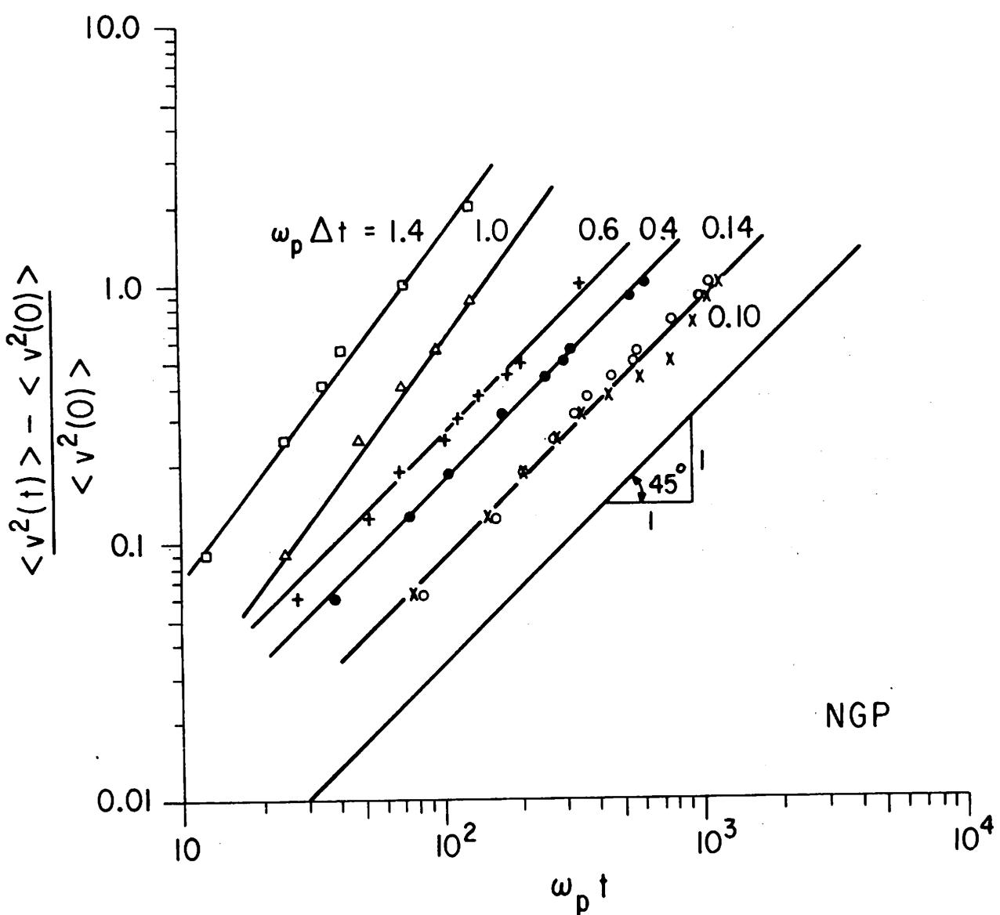  
Fig. 1. Increase in $\langle v ^ { 2 } ( \ t ) \rangle / \langle v ^ { 2 } ( 0 ) \rangle$ with time for zero-order weighting (NGP) scheme, for several values of ${ { \mathfrak { u } } _ { \mathfrak { p } } } ^ { \Delta \mathfrak { t } }$ with $\lambda _ { \tt D } / \Delta x = 1 . 0$ The <> means average over all particles. The heating time $^ 1 { \mathsf { h } }$ is defined as the time for $\langle { \boldsymbol { \mathsf { v } } } ^ { 2 } ( { \mathsf { t } } ) \rangle$ to double, that is, when the curve reaches 1.0.

## III DEPENDENCE ON $ { n _ { _ 0 } { ^ \lambda } _ { 0 } } ^ { \mathrm { ~ ~ } } \mathrm { ~ , ~ } \  { n _ { _ 0 } { ^ \Delta } } \times \mathrm { ~ , ~ } \  { n _ { _ 0 } { ^ \lambda } } ^ { \mathrm { ~ } } ( \lambda _ { _ 0 } + \Delta \mathsf { x } )$

The self-heating times are plotted in Fig. 2 in units of electron plasma frequency, $w _ { p } \tau _ { h }$ vs $N _ { D } = n _ { o } \lambda _ { D }$ and $N _ { C } + N _ { D } = n _ { 0 } ( \Delta \mathbf { x } + \boldsymbol { \lambda } _ { \mathrm { D } } )$ (cases A7-A11, B1-B5) where $n _ { o }$ is varying. Fig. 3 shows $\omega _ { p } \tau _ { h } \textbf { \em v s }$ $N _ { C } + N _ { D }$ for two different ratios of $\lambda _ { 0 } / \Delta x$ where $n _ { o }$ is no longer varying but $\lambda _ { 0 }$ and ∆x are varied using NGP (cases A27-A28 for $\lambda _ { 0 } / \Delta x = 2$ and A12-A15 for $\lambda _ { \tt D } / \Delta x = 0 . 5 )$ Similar behavior is observed for CIC. These figures lead to the conclusion that for a fixed $\lambda _ { 0 } / \Delta x$ $w _ { p } \tau _ { h }$ is proportional to $N _ { C } + N _ { D }$

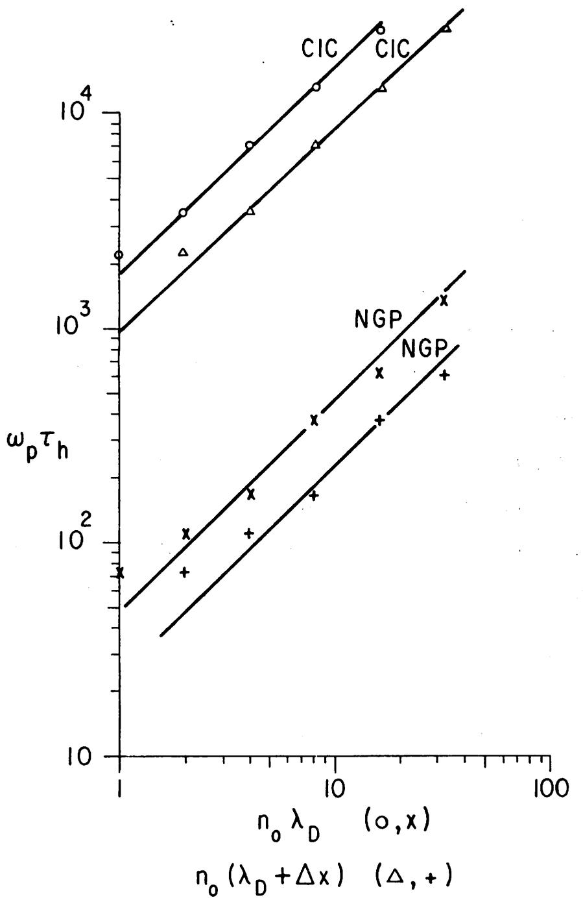  
Fig. 2. Self-heating time vs $\mathfrak { n } _ { 0 } { \boldsymbol { \lambda } } _ { 0 }$ or ${ \boldsymbol { \mathsf { n } } } _ { \mathsf { o } } ( \lambda _ { \mathsf { D } } + \Delta \mathsf { x } )$ for NGP, CIC showing linear dependence.

Fig. 3. Self-heating time vs $N _ { C } + N _ { D }$ for different $\lambda _ { 0 } / \Delta x$ ratios showing linear dependence of $w _ { p } \tau _ { h }$ on $N _ { C } + N _ { D }$ for fixed $\lambda _ { 0 } / \Delta x$ for NGP.

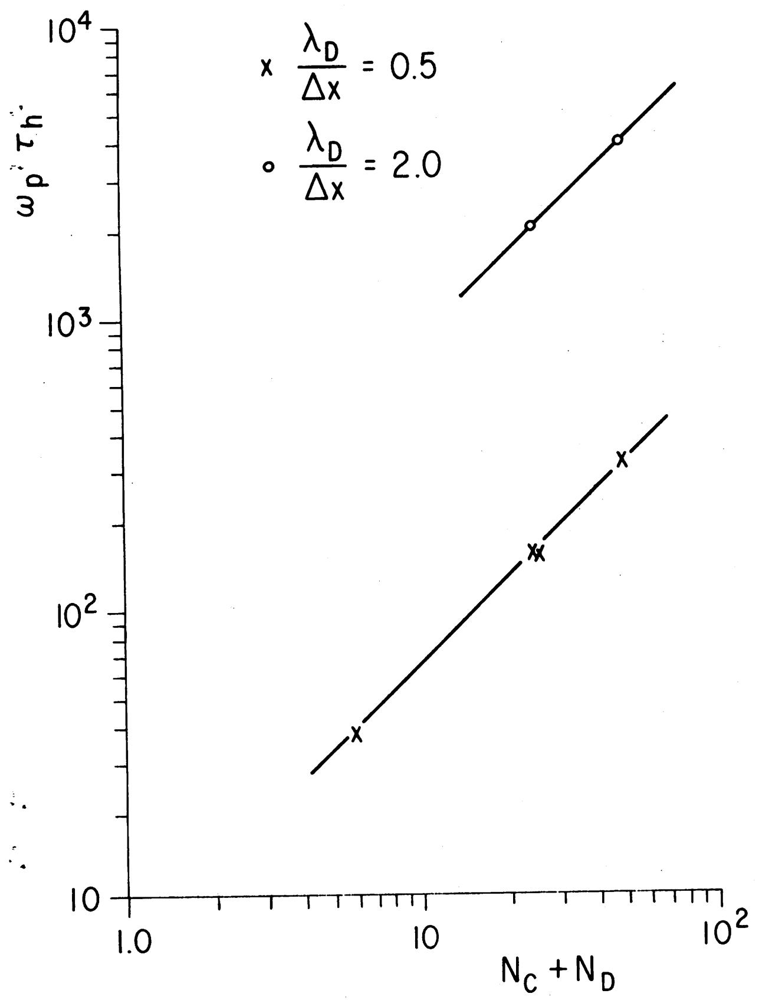

## IV DEPENDENCE ON $\lambda _ { \mathfrak { d } } / \Delta \mathfrak { x }$ ; OPTIMUM CHOICE OF $v _ { \textrm { t } } \frac { \Delta \mathbf { t } } { \Delta \mathbf { x } }$

The self-heating times $w _ { p } \tau _ { h }$ divided by $N _ { C } + N _ { D }$ are plotted in Figs. 4, 5 and 6 vs $\lambda _ { \tt D } / \Delta { \sf x }$ for different values of $\mathfrak { w } _ { \mathfrak { p } } \Delta \mathfrak { t }$ (cases A16-A63, B6-B60, Cl-C42). The dashed line drawn through the different graphs is ${ \tt v } _ { \tt t } \ \frac { \Delta t } { \Delta x } \simeq \frac { 3 } { 2 }$ for NGP and $\mathsf { v } _ { \mathtt { t } } \frac { \Delta \mathtt { t } } { \Delta \mathsf { x } } \overset { \mathtt { \Delta } } { \sim } \frac { 1 } { 2 }$ for CIC and QS. The longest heating times occur near these values of $v _ { \textrm { t } } \frac { \Delta \mathbf { t } } { \Delta \mathbf { x } }$

Fig. 4. Self-heating times divided by $N _ { C } + N _ { D }$ vs $\lambda _ { 0 } / \Delta x$ for several $\mathfrak { w } _ { \mathfrak { p } } \Delta \mathfrak { t }$ for NGP.
<table><tr><td>Symbo1</td><td>+</td><td>0</td><td>x</td><td>口</td><td>Δ</td></tr><tr><td> $\mathfrak { w } _ { \mathfrak { p } } \Delta \mathfrak { t }$ </td><td>0.1</td><td>0.2</td><td>0.4</td><td>0.5</td><td>0.6</td></tr></table>

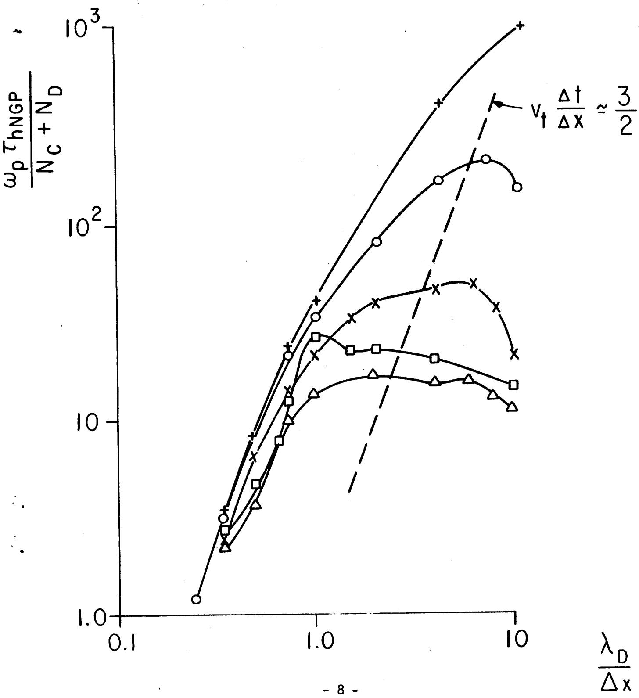

Fig. 5. Self-heating times divided by $N _ { C } + N _ { D }$ vS $\lambda _ { \tt D } / \Delta \tt X$ for several $\omega _ { \mathsf { p } } \Delta \mathsf { t }$ for CIC
<table><tr><td>Symbol</td><td>十</td><td>O</td><td></td><td>x</td><td>口</td></tr><tr><td> ${ \mathfrak { w } } _ { \mathfrak { p } } \Delta { \mathfrak { t } }$ </td><td>0.1</td><td>0.2</td><td>0.3</td><td>0.4</td><td>0.5</td></tr></table>

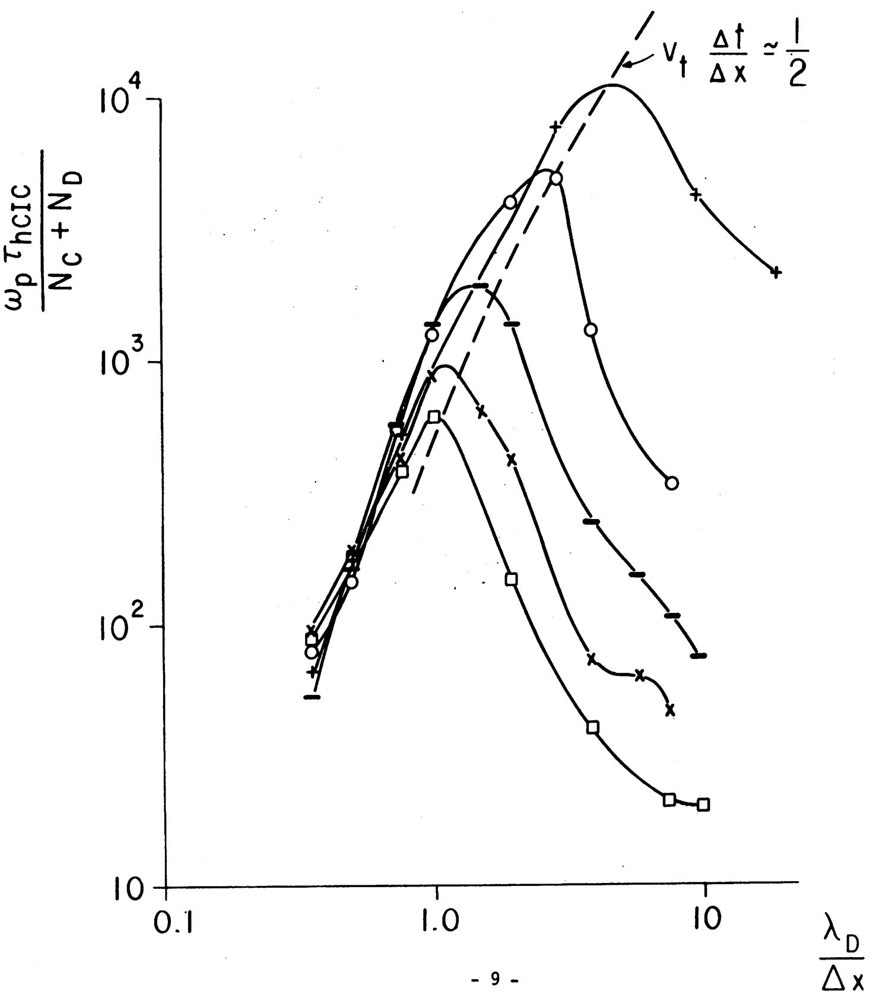

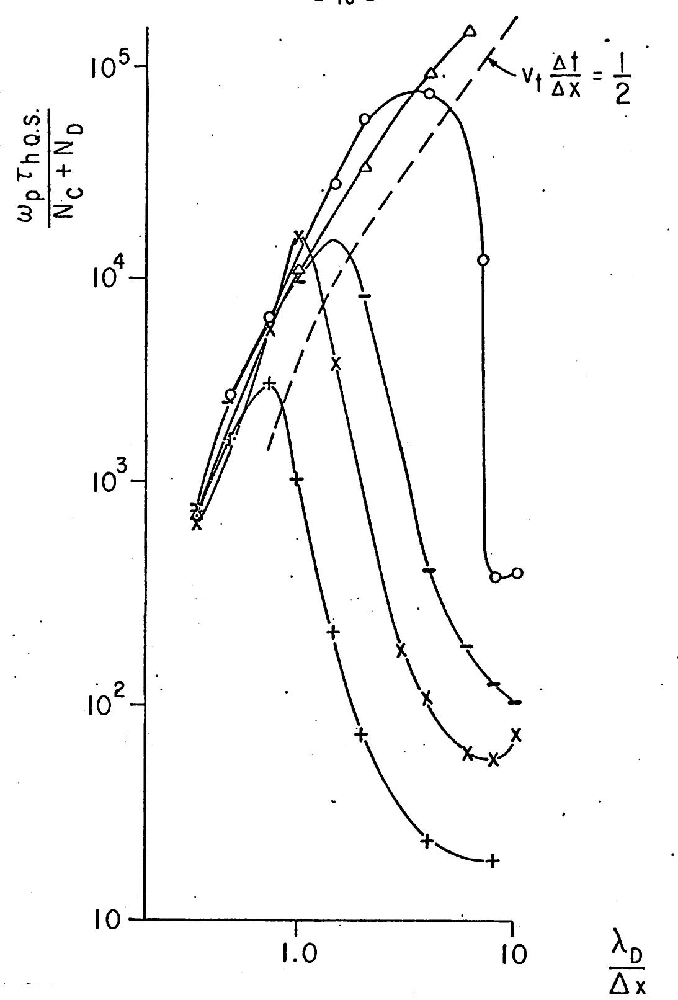

Fig. 6. Self-heating times divided by $N _ { C } + N _ { D }$ vS $\lambda _ { 0 } / \Delta x$ for several $\sum \limits _ { p } ^ { \omega \Delta t }$ for QS
<table><tr><td>Symbo1</td><td>Δ</td><td>0</td><td>一</td><td>x</td><td>+</td></tr><tr><td></td><td>0.1</td><td>0.2</td><td>0.3</td><td>0.4</td><td>0.6</td></tr></table>

## V COMPARISON OF SCHEMES; GAIN OF GOING TO A HIGHER ORDER ALGORITHM

As a comparison of the different algorithms studied, ratios of self-heating times of quadratic-spline to nearest-grid-point and cloud-in-cell to nearest grid point are plotted in Figs. 7 , 8, and 9 for $\mathfrak { w } _ { \mathfrak { p } } \Delta \mathfrak { t } = 0 . 1$ , 0.2, 0.3 , respectively. These figures indicate that CIC heating times are as much as 70 times longer than NGP and that QS is as much as 650 times longer than NGP.

These increases in heating times come at the expense of longer computation times. Actual measurements of cost of simulation per particle per time step on the CDC-7600 MFE computer at LLL show that T≈5, 11.6, 24 usec/particle/time step for NGP, CIC, and QS, respectively. Hence, we need a measure of accounting for this cost. We have chosen to define the gain of using a higher order weighting scheme as

$$
\mathsf { g a i n } ~ \equiv ~ \frac { \mathsf { i n c r e a s e ~ i n ~ s e l ~ f \mathrm { - } h e a t i n g ~ t i m e } } { \mathsf { i n c r e a s e ~ i n ~ c o m p u t e r ~ t i m e } } ~ .
$$

Going through the optimal path, we have gains as presented in Table I. Note that the gains of using higher order weightings, NGP→CIC, and CIC→QS are roughly one order of magnitude, much less than the gains in $\tau _ { \mathfrak { h } }$

<table><tr><td rowspan=3 colspan=1>ω∆tpgain</td><td></td><td></td><td></td></tr><tr><td rowspan=2 colspan=1>0.1</td><td rowspan=2 colspan=1>0.2</td><td></td></tr><tr><td rowspan=1 colspan=1>0.3</td></tr><tr><td rowspan=1 colspan=1>CIC/NGP</td><td rowspan=1 colspan=1> $\frac { 2 7 . 5 } { 2 . 3 } = 1 1 . 9$ </td><td rowspan=1 colspan=1> $\frac { 4 8 } { 2 . 3 } = 2 0 . 8$ </td><td rowspan=1 colspan=1> $\frac { 7 0 } { 2 . 3 } = 3 0 . 4$ </td></tr><tr><td rowspan=1 colspan=1>QS/NGP</td><td rowspan=1 colspan=1> $\frac { 3 5 0 } { 4 . 8 } = 7 2 . 9$ </td><td rowspan=1 colspan=1> $\frac { 6 5 0 } { 4 . 8 } = 1 3 5 . 4$ </td><td rowspan=1 colspan=1> $\frac { 4 4 0 } { 4 . 8 } = 9 1 . 6$ </td></tr><tr><td rowspan=1 colspan=1>QS/CIC =(QS/NGP)/(CIC/NGP)</td><td rowspan=1 colspan=1>6.1</td><td rowspan=1 colspan=1>6.5</td><td rowspan=1 colspan=1>3.0</td></tr></table>

Gain in going to a higher order algorithm. The ratios inside the table are increase in self-heating times (i.e., reduction Table I in error in energy) over increase in cost (determined on the CDC 7600 MFE computer at LLL).

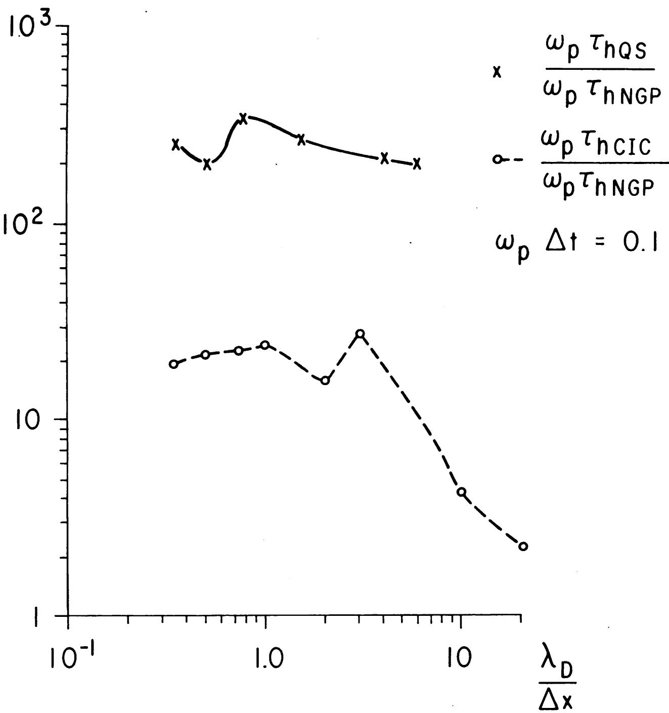  
Fig. 7. Ratios of self-heating times vs $\frac { \lambda _ { 0 } } { \Delta \mathbf { x } }$ for $\mathfrak { w } _ { \mathsf { p } } \Delta \mathfrak { t } = 0 . 1$

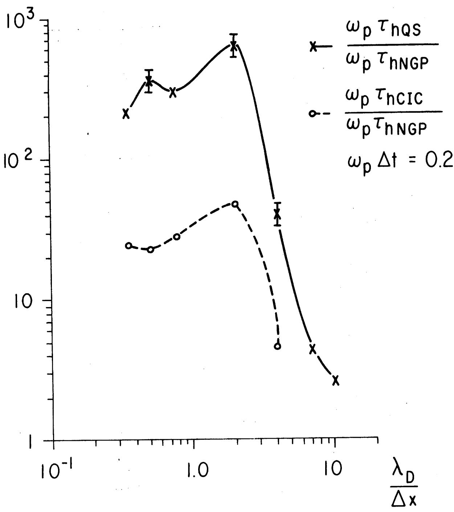  
Fig. 8. Ratios of self-heating times vs $\frac { \lambda _ { 0 } } { \Delta x }$ for $\mathfrak { w } _ { \mathfrak { p } } \Delta \mathfrak { t } = 0 . 2$

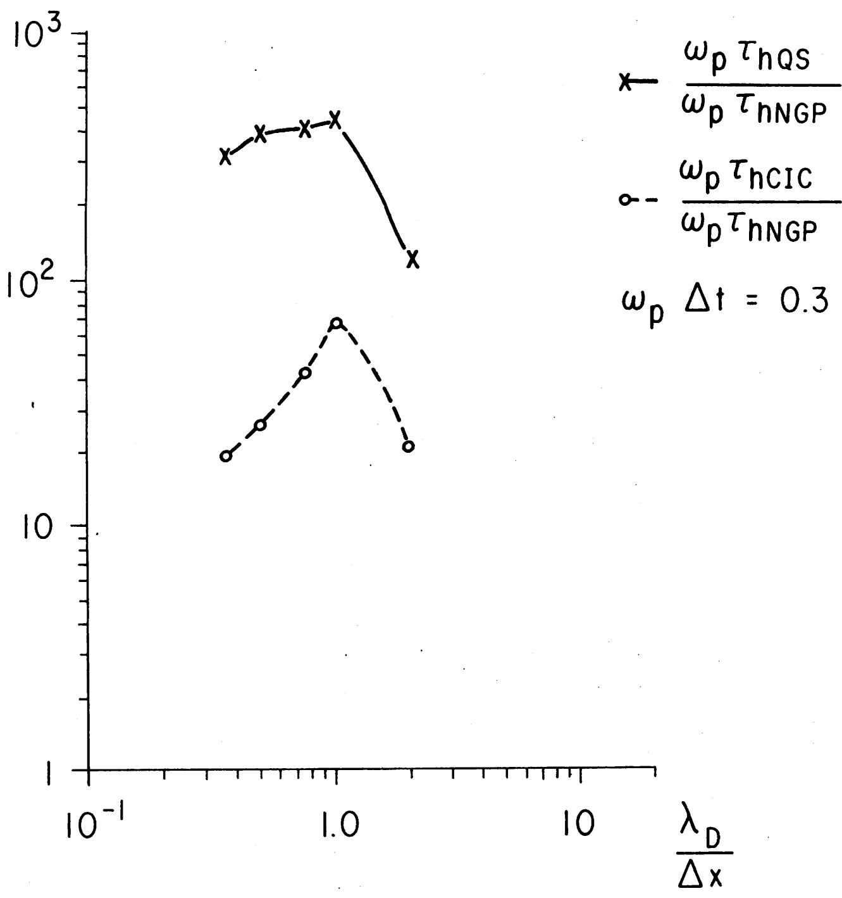  
Fig. 9. Ratios of self-heating times vs $\frac { \lambda _ { 0 } } { \Delta \mathbf { x } }$ for $\mathfrak { w } _ { \mathfrak { p } } \Delta \mathfrak { t } = 0 . 3$

## VI INCREASE IN GAIN DUE TO SMOOTHING

The self-heating time can be increased considerably by smoothing the charge density in k-space. The smoothing factor used was simple Fourier space truncation, where all the modes beyond $k _ { 1 a s t }$ are dropped, as shown in Fig. 10. Fig. ll shows the self-heating time $w _ { p } \tau _ { h }$ vs $k _ { \mathrm { m a x } } / k _ { 1 a s t }$ for the different schemes used (keeping everything fixed but varying $k _ { 7 a s t }$ for each scheme) (cases A70-A79, B63-B69, C43-C47). The gain in self-heating time due to k-space truncation is almost proportional to $k _ { \mathrm { m a x } } / k _ { 1 a s t }$ for NGP and is close to but not quite proportional to $( k _ { \mathrm { m a x } } / k _ { 1 a s t } ) ^ { 2 }$ for CIC and ${ ( k _ { \mathrm { m a x } } / k _ { 1 a s t } ) } ^ { 3 }$ for OS. Thus, k-space truncation further increases the gain of CIC/NGP and QS/NGP and QS/CIC. Table II shows approximate gains with k-space truncation.

<table><tr><td> $\left. \mathtt { g a t n } \right. \overset { \omega } { \operatorname { p e } } ^ { \Delta t } .$  CIC/NGP</td><td>0.1</td><td>0.2</td><td>0.3</td></tr><tr><td> $\bf { \ x } ( \log _ { \alpha } / \ k _ { \mathrm { 1 a s t } } )$ </td><td>11.9</td><td>20.8</td><td>30.4</td></tr><tr><td>QS/NGP  $\bf { \times } ( \mathbb { k } _ { m a x } / \mathbb { k } _ { 1 a s t } ) ^ { 2 }$ </td><td>72.9</td><td>135.4</td><td>91:6</td></tr><tr><td> $\begin{array} { c } { \cos / \tt c r c } \\ { \times ( \tt k _ { \mathrm { m a x } } / \tt k _ { \mathrm { 1 } a s t } ) } \end{array}$ </td><td>6.1</td><td>6.5</td><td>3.0</td></tr></table>

Table II. Gain with k-space truncation.

Smoi  u  t ion.   
Fi10.

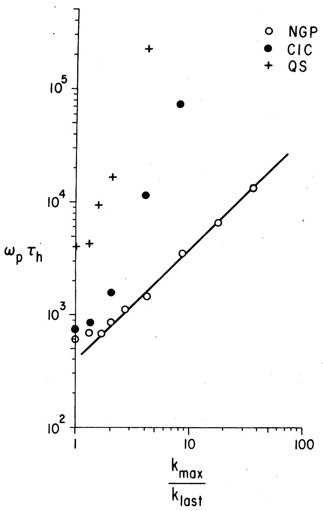  
Fig. 11. Self-heating times vs ${ \sf k } _ { \mathrm { m a x } } / { \sf k } _ { 1 \sf a s t }$ for NGP, CIC, QS.

## VII CONCLUSIONS

The self-heating times are longest for $v _ { t } \frac { \Delta t } { \Delta x } \simeq \frac { 3 } { 2 }$ for NGP and $v _ { t } \ { \frac { \Delta \mathbf { t } } { \Delta \mathbf { x } } } \simeq { \frac { 1 } { 2 } }$ for CIC and QS. Roughly speaking, quadratic spline heating times are one order of magnitude longer than for cloud-in-cell, whilecloud-in cell is one order of magnitude longer than nearest grid point, consideringboth gain in heating time and increase in cost. Smoothing by Fourier space truncation considerably increases the selfheating time and this increase is roughly proportional to

$$
\left( \frac { k _ { \mathrm { m a x } } } { k _ { 1 a s t } } \right) ^ { n + 1 }
$$

where n is the order of the weighting scheme, i.e., n=0 for NGP, n =1 for CIC, and n=2 for QS. Use of higher order algorithms is highly recommended, specially when k-space truncation is also used.

## REFERENCES

1. C. K. Birdsall, A. B. Langdon, Plasma Physics via Computer Simulation, Part I, Chapter 3, University of California, Berkeley (Dec. 1975).

2. S. Gitomer, "Comments on Numerical Simulation of the Weibel Instability in One and Two Dimensions", Phys. Fluids 14, (Jul.71) 1591-1592.

3. R. W. Hockney, "Measurements of Collisions and Heating Times in a Two-dimensional Thermal Plasma", J. Comp. Phys. 8, (Aug. 71) 19-44.

4. R. W. Hockney, S. P. Goel and J. W. Eastwood, "Quiet High Resolution Computer Models of a Plasma", J. Comp. Phys. 14, (Feb. 74) 148-158.

5. M. Abramowitz and I. A. Stegan, Handbook of Mathematical Functions, Applied Mathetmatics Series 55, (1964) 952-953.

6. J. Denavit, "Discrete Particle Effects in Whistler Simulation", J. Comp. Phys. 15 4 (Aug. 1974).

7. A. B. Langdon, "'Energy Conserving' Plasma Simulation Algorithms", J. Comp. Phys. 12 2 (Jun. 1973).

8. See Reference 1, Part II, Chapter 9.

## APPENDIX A LOADING A THERMAL PLASMA WITH FIRST AND SECOND MOMENT CORRECTIONS

A one-dimensional Maxwellian velocity distribution,

$$
f ( v ) = ( 2 \pi ) ^ { - \frac { 1 } { 2 } } v _ { t } ^ { - 1 } \exp ( \frac { - v ^ { 2 } } { 2 v _ { t } ^ { 2 } } )
$$

can be loaded using a set of random numbers $u _ { 1 } , u _ { 2 } , u _ { 3 } , \ldots , u _ { n }$ to generate the velocity of one particle [5], i.e.

$$
v _ { n } ( j ) = v _ { t } \left( \sum \limits _ { i = 1 } ^ { n } u _ { i } - \frac { n } { 2 } \right) / ( \frac { n } { 1 2 } ) ^ { 2 }
$$

This process can be repeated for all the particles to be loaded; it requires calling n random numbers times the total number of particles. It produces better results as the number of particles in the system is increased NP+∞ . The fluctuations about the desired distribution reduce as $N P ^ { \frac { 1 } { 2 } }$ , which means that with a few hundred or thousand particles, the fluctuation level is of the order of a few percent, which may not be satisfactory.

The $n ^ { t h }$ moment of a Maxwellian distribution in ld is

$$
{ \begin{array} { r l } { \langle { \boldsymbol { \mathsf { v } } } ^ { \mathsf { n } } \rangle } & { = \quad \varprojlim _ { \mathsf { e } } ^ { \mathsf { n } } { \mathsf { e } } ^ { - { \mathsf { v } } ^ { 2 } / 2 { \mathsf { v } } _ { \mathsf { t } } ^ { 2 } } { \mathsf { d } } { \boldsymbol { \mathsf { v } } } } \\ & { = \ \langle { \sqrt { 2 } } { \boldsymbol { \mathsf { v } } } _ { \mathsf { t } } \rangle ^ { \mathsf { n } } \quad \varprojlim _ { \mathsf { x } } ^ { \mathsf { \infty } } ( { \mathsf { n } } - 1 ) / 2 \ { \mathsf { e } } ^ { - { \mathsf { x } } } \ { \mathsf { d } } { \boldsymbol { \mathsf { x } } } { \Biggl / } \ \int _ { \mathsf { o } } ^ { \infty } { \mathsf { e } } ^ { - { \mathsf { v } } ^ { 2 } / 2 { \mathsf { v } } _ { \mathsf { t } } ^ { 2 } } { \mathsf { d } } { \boldsymbol { \mathsf { x } } } } \\ & { = \ ( { \sqrt { 2 } } { \boldsymbol { \mathsf { v } } } _ { \mathsf { t } } ) ^ { \mathsf { n } } \ \left. \ { \mathsf { I } } ^ { \mathsf { n } } \right. \ { \mathsf { r } } \left( { \frac { \mathsf { n } + 1 } { 2 } } \right) { \Biggl / } \Gamma ( { \mathsf { \vec { s } } } _ { \mathsf { 2 } } ) \quad . } \end{array} }\tag{1}
$$

The expected values of the first five moments of a distribution with $v _ { t } = 1$ and

$$
\langle \mathbf { v } ^ { + } \rangle = - \langle \mathbf { v } ^ { - } \rangle \equiv \left. \int _ { 0 } ^ { \infty } \mathbf { v } \mathrm { e } ^ { - \mathrm { v } ^ { 2 } / 2 \mathrm { v } _ { \mathrm { t } } ^ { 2 } } \mathrm { d } \mathbf { v } \right/ \int _ { 0 } ^ { \infty } \mathrm { e } ^ { - \mathrm { v } ^ { 2 } / 2 \mathrm { v } _ { \mathrm { t } } ^ { 2 } } \mathrm { d } \mathbf { v }\tag{2}
$$

are listed in Table I. Also listed are the ensemble averages over 10 separate loadings with a different set of random numbers used each time. We have used n =12 and NP, the number of particles, equal to 1024. The higher moments are quite different from what is desired; the lower moments are within the expected fluctuation level of the random number generator, i.e., $\frac { \sqrt { N } } { N } = \frac { 1 } { \sqrt { 2 0 2 4 } } = 0 . 0 3 7 2 5$

An improvement in all the odd moments can be achieved by loading a symmetric distribution, i.e.,

$$
\begin{array} { r l } { \mathbf { v _ { n } } ( \mathbf { j } ) } & { = \left\{ \begin{array} { l l } { \mathbf { v _ { t } } \left[ \displaystyle \sum _ { i = 1 } ^ { \mathtt { n } } \mathbf { u _ { i } } \ - \frac { \mathtt { n } } { 2 } \right] \left( \frac { \mathtt { n } } { 1 2 } \right) ^ { - \mathtt { l } _ { 2 } } \qquad \quad \mathrm { ~ j ~ = ~ 1 , 2 , \dots , ~ \frac { N P } 2 ~ } } \\ { - \mathbf { v _ { n } } ( \mathbf { j } \ - \frac { \mathtt { n } P } 2 ) \qquad \quad \qquad \mathbf { j } \ = \ \frac { \mathtt { N P } } 2 + 1 , \ \frac { \mathtt { N P } } 2 + 2 , \dots , \mathtt { N P } } \end{array} \right. } \end{array}
$$

This method requires only half as many random numbers, $n \times \frac { N P } { 2 }$

Ensemble averages over 20 loadings of this distribution are listed in TableAI. Some improvement occurs. However, although the second moment averaged over 20 runs is only off by 2 per cent, the standard deviation of this moment about $v _ { \tt t } ^ { 2 }$ is 0.05 $v _ { \frac { t } { t } } ^ { 2 }$

<table><tr><td rowspan=5 colspan=1>expectedvalucnonsymmctricrandom loadersymmetricrandom loader</td><td rowspan=1 colspan=1></td><td rowspan=1 colspan=1></td><td rowspan=1 colspan=1></td><td rowspan=1 colspan=1></td><td rowspan=1 colspan=1></td><td rowspan=1 colspan=1></td><td rowspan=2 colspan=1> $1 ( v ) ^ { - } 1$ </td></tr><tr><td rowspan=1 colspan=1> $\langle \diamond \rangle$ </td><td rowspan=1 colspan=1> $\langle { \scriptstyle \mathsf { v } } ^ { 2 } \rangle$ </td><td rowspan=1 colspan=1> $\langle \boldsymbol { \mathbf { v } } ^ { 3 } \rangle$ </td><td rowspan=1 colspan=1> $\langle { \bf \sigma } _ { \bf v } { } ^ { 4 } \rangle$ </td><td rowspan=1 colspan=1> $\langle \bar { \mathbf { v } } ^ { 5 } \rangle$ </td><td rowspan=1 colspan=1> $\langle \mathbf { v } \rangle ^ { + }$ </td></tr><tr><td rowspan=1 colspan=1>0</td><td rowspan=1 colspan=1>1.0</td><td rowspan=1 colspan=1>0</td><td rowspan=1 colspan=1>3.0</td><td rowspan=1 colspan=1>0</td><td rowspan=1 colspan=1>0.3989</td><td rowspan=1 colspan=1>0.3989</td></tr><tr><td rowspan=1 colspan=1>0.04</td><td rowspan=1 colspan=1>0.96</td><td rowspan=1 colspan=1>0.18</td><td rowspan=1 colspan=1>2.73</td><td rowspan=1 colspan=1>1.02</td><td rowspan=1 colspan=1>0.4210</td><td rowspan=1 colspan=1>0.3604</td></tr><tr><td rowspan=1 colspan=1>0</td><td rowspan=1 colspan=1>0.98</td><td rowspan=1 colspan=1>0</td><td rowspan=1 colspan=1>2.82</td><td rowspan=1 colspan=1>0</td><td rowspan=1 colspan=1>0.3879</td><td rowspan=1 colspan=1>0.3879</td></tr></table>

TablcAI Several moments with n = 12, NP = 1024, $\ v { v } _ { \mathbf { t } } \ = \ 1 .$ lst row is the expected valuc from theory with no cutoff. 2nd row is the ensemble average over 10 separate loadings 3rd row is the ensemble average over.20 separate loadings.

A second improvement would be achieved if we could reduce this deviation to zero. This can be done by using a correction method suggested by Gitomer [2]. In this correction scheme, the particles are divided into l groups of m particles. If a symmetric distribution has already been loaded, it is then best to correct each half of the distribution separately. Next one computes the mean and square means of the velocities of particles in each group $\overline { v } \cdot \overline { v ^ { 2 } }$ ,by

$$
\overline { { v } } = \frac { 1 } { m } \sum \limits _ { i = 1 } ^ { m } v _ { i } \quad \mathrm { ~ , ~ } \quad \quad \overline { { v ^ { 2 } } } = \frac { 1 } { m } \sum \limits _ { i = 1 } ^ { m } v _ { i } ^ { 2 }
$$

then computes a correction factor ALPHA $= ( v _ { t } ^ { 2 } / ( \bar { v } ^ { 2 } - \overline { { v } } ) ^ { 2 } ) ^ { \frac { 1 } { 2 } }$ and next the corrected velocities

$$
v _ { i _ { \mathrm { c o r r e c t e d } } } = A L P H A ( v _ { i _ { \cdot } } - \overline { { v } } )
$$

It is important to be careful in the division $\circ \dot { \mathsf { f } }$ the particles into groups. For small values of m , we obtain an orderly and noiseless distribution but a poor Maxwellian. With NP=1024 and m=2 , one gets two beams at $\pm v _ { t }$ These distributions are sketched in Fig. Al; with m=4 , we get a distribution similar to a step function with cutoffs at +2.3 $v _ { t }$ . As m increases, the cutoff level goes up to $\underline { { + 3 } } ~ \mathsf { v } _ { \mathbf t }$ for m= 32 or higher. The measured values for the moments are given in Table AII and plotted in Fig. A2, showing rapid approach to Maxwellian values..

In the study of self-heating times, this improved version of the thermal loader was used with l= 1 , where the resulting distribution was very nearly Maxwellian.

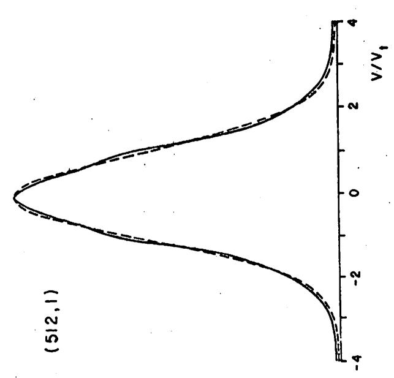

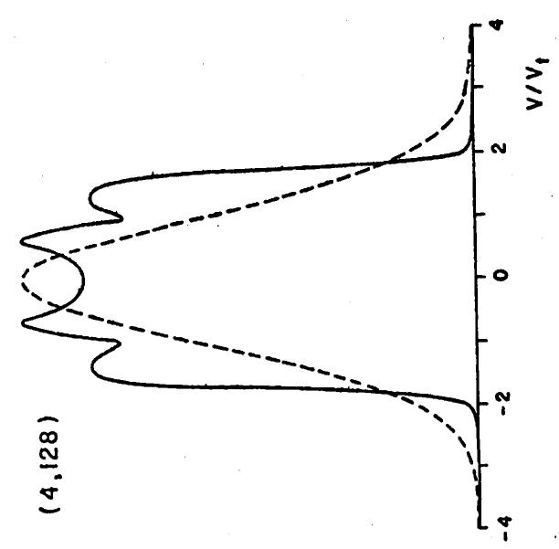

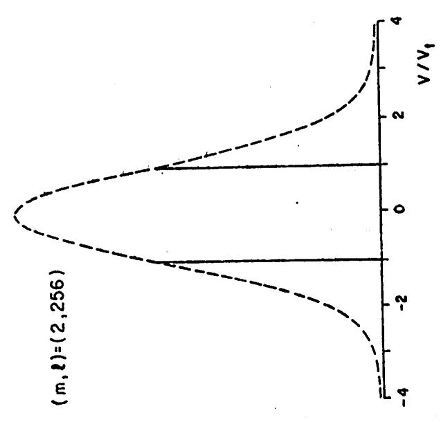

aan. y  m () s     ()   sis ia tsn   n (n e t  n  ns   a  n rh  n .  n      n        n ucc ce r ce as t sot ce  s cc ted  oe t  a  ctt  a nnt od n n tt ton ctnt ctot  oe

<table><tr><td>m</td><td> $\langle { \boldsymbol { \mathsf { v } } } \rangle$ </td><td> $\langle \boldsymbol { \mathsf { v } } ^ { 2 } \rangle$ </td><td> $\langle \boldsymbol { \mathbf { v } } ^ { 3 } \rangle$ </td><td> $\langle v ^ { 4 } \rangle$ </td><td> $\langle \boldsymbol { \mathsf { v } } ^ { \mathsf { S } } \rangle$ </td><td> $( v ) ^ { + } = - ( v ) ^ { - }$ </td></tr><tr><td>2</td><td>0</td><td>1.0</td><td>0</td><td>1</td><td>0</td><td>.500</td></tr><tr><td>4</td><td>0</td><td>1.0</td><td>0</td><td>1.838</td><td>0</td><td>.432</td></tr><tr><td>8</td><td>0</td><td>1.0</td><td>0</td><td>2.539</td><td>0</td><td>.411</td></tr><tr><td>16</td><td>0</td><td>1.0</td><td>0</td><td>2.686</td><td>0</td><td>.403</td></tr><tr><td>32</td><td>0</td><td>1.0</td><td>0</td><td>2.738</td><td>0</td><td>.399</td></tr><tr><td>64</td><td>0</td><td>1.0</td><td>0</td><td>2.790</td><td>0</td><td>.400</td></tr><tr><td>128</td><td>0</td><td>1.0</td><td>0</td><td>2.868</td><td>0</td><td>.399</td></tr><tr><td>256</td><td>0</td><td>1.0</td><td>0</td><td>2.920</td><td>0</td><td>.400</td></tr><tr><td>512</td><td>0</td><td>1.0</td><td>0</td><td>2.924</td><td>0</td><td>.399</td></tr><tr><td>Maxwellian</td><td>0</td><td>1.0</td><td>0</td><td>3.</td><td>0</td><td>.3989</td></tr></table>

Table AII Moments using symmetric loading and Gitomer's corrector.

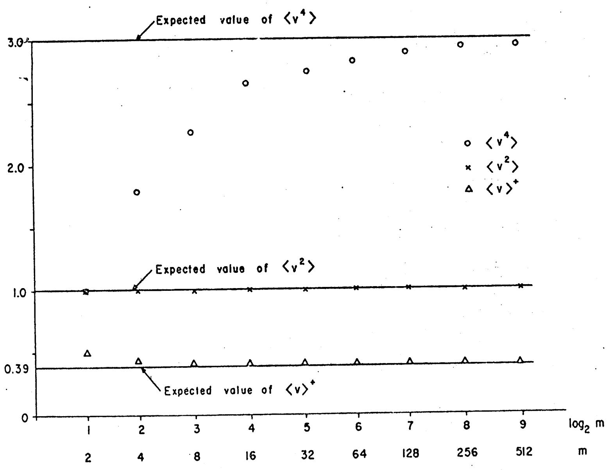  
Fig. A2 Moments of distribution with first and second moment correction. m is the number of particles whose second moment was corrected in a group.

Quadratic spline weighting algorithm [6], [7] has been placed in the plasma simulation code ESl and as a check we present the dispersion for a cold plasma.

For momentum conserving codes. using quadratic splines, the shape factor S(k) and the κ (from ∇φ) and $x ^ { 2 }$ (from $\nabla ^ { 2 } \phi )$ operators are [8]

$$
\begin{array} { l c l } { \textsf { S } ( \mathbf { k } ) ~ = ~ \mathbf { d i f ^ { 3 } } ~ \left( \frac { \mathbf { k } \Delta \dot { \mathbf { x } } } { 2 } \right) } & { = } & { \left[ \frac { \sin { ( \mathbf { k } \Delta \times / 2 ) } } { \mathbf { k } \Delta \times / 2 } \right] ^ { 3 } } \end{array}\tag{1}
$$

$$
\begin{array} { r l } { \kappa ( \mathbf { k } ) = \mathbf { k } \mathrm { ~ d ~ i ~ f ~ } (  \mathbf { k } \Delta \mathbf { x } ) } & { { } = \mathbf { k } \frac { \textsf { \sin } ( \mathbf { k } \Delta \mathbf { x } ) } { \mathbf { k } \Delta \mathbf { x } } } \end{array}\tag{2}
$$

$$
k ^ { 2 } \left( \mathrm { \bf k } \right) ~ = ~ \mathrm { \bf k } ^ { 2 } { \sf d i f } ^ { 2 } \left( \frac { \mathrm { \bf k } \Delta \bf x } { 2 } \right) ~ = ~ \mathrm { \bf k } ^ { 2 } \left[ \frac { \sin { \left( \mathrm { \bf k } \Delta \times / 2 \right) } } { \mathrm { \bf k } \Delta \times / 2 } \right] ^ { 2 } ~ .\tag{3}
$$

The dispersion equation for a cold plasma is, using $k _ { p } \equiv k - p k _ { g } , k _ { g } \equiv \frac { 2 \pi } { \Delta x }$

$$
\frac { \omega ^ { 2 } } { \omega _ { _ { \mathrm { P } } } ^ { 2 } } = \frac { 1 } { \kappa ^ { 2 } ( { \bf k } ) } \sum _ { \mathrm { ~ \scriptsize ~ { ~ p ~ } ~ } } { \sf k } _ { \mathrm { ~ \scriptsize ~ { ~ p ~ } ~ } } \kappa ( { \bf k } _ { \mathrm { ~ \scriptsize ~ { ~ p ~ } ~ } } ) \mathbb { s } ^ { 2 } ( { \bf k } _ { \mathrm { ~ \scriptsize ~ { ~ p ~ } ~ } } ) .\tag{4}
$$

Using Eqs. (1,2,3) in (4) we obtain

$$
\begin{array} { r l } { \frac { \omega ^ { 2 } } { { \bf \omega } _ { \bf p } ^ { 2 } } } & { = \frac { 1 } { \left. \mathrm { ~ k ~ } ^ { 2 } \mathrm { ~ d ~ i ~ f ~ } \left( \mathrm { k ~ } \Delta \times / 2 \right) \right. } \quad \sum _ { \mathrm { ~ p ~ } } \mathrm { ~ k ~ } _ { \mathrm { ~ p ~ } } ^ { 2 } \mathrm { ~ d ~ i ~ f ~ } ( \mathrm { k ~ } _ { \mathrm { ~ p ~ } } \Delta \times ) \mathrm { ~ d ~ i ~ f ~ } ^ { 6 } ( \mathrm { k ~ } _ { \mathrm { ~ p ~ } } \Delta \times / 2 ) } \end{array}\tag{5}
$$

$$
= \frac { 2 ^ { 4 } \sin ^ { 4 } ( k \Delta x / 2 ) \sin ( k \Delta x ) } { \Delta x ^ { 5 } } \sum \limits _ { p } \frac { 1 } { k _ { p } ^ { 3 } }\tag{6}
$$

$$
= ~ \left( \frac { 2 } { \Delta \times } \right) ^ { 5 } ~ \sin ^ { 5 } ( k \Delta x / 2 ) \cos ( k \Delta x / 2 ) \sum _ { \mathrm { ~ p ~ } } \frac { 1 } { k _ { \mathrm { ~ p ~ } } ^ { \mathrm { ~ 5 ~ } } } .\tag{7}
$$

Using the identity

$$
\begin{array} { r l r } { \sum \frac { 1 } { ( { \bf k } - { \bf p } { \bf k } _ { \mathrm { g } } ) ^ { 2 } } } & { { } \equiv } & { \left[ \left( \frac { 2 } { \Delta \times } \right) \sin ( { \bf k } \Delta \times / 2 ) \right] ^ { - 2 } } \\ { { \bf p } ^ { ( { \bf k } - { \bf p } { \bf k } _ { \mathrm { g } } ) ^ { 2 } } } \end{array}\tag{8}
$$

and differentiating three times successively, we get at each step

$$
\begin{array} { r l r } { \sum _ { \mathsf { \Delta } } \frac { 1 } { ( { \bf k } - { \mathsf { p k } } _ { \mathsf { g } } ) ^ { 3 } } } & { = } & { \dot { \cos } \left( { \bf k } \Delta { \bf x } / 2 \right) \left[ \left( \frac { 2 } { \Delta \mathsf { x } } \right) \dot { \sin } \left( \dot { \bf k } \Delta { \bf x } / 2 \right) \right] ^ { - 3 } } \\ & { } & \end{array}\tag{9}
$$

$$
\sum _ { \mathfrak { p } } \frac { 1 } { ( \mathbf { k } - \mathfrak { p } \mathbf { k } _ { \mathfrak { g } } ) ^ { 4 } } = \frac { 1 } { 3 } \left( \frac { \Delta \times } { 2 } \right) ^ { 2 } \left[ \left( \frac { 2 } { \Delta \times } \right) \sin { ( \mathbf { k } \Delta \times / 2 ) } \right] ^ { - 2 }
$$

$$
\therefore + \cos ^ { 2 } ( k \Delta x / 2 ) \left[ \left( \frac { 2 } { \Delta x } \right) \sin ( k \Delta x / 2 ) \right] ^ { - 4 }\tag{10}
$$

$$
\begin{array} { r c l } { \displaystyle \sum _ { \mathfrak { p } } \frac { 1 } { ( \mathsf { k } - \mathsf { p k } _ { \mathfrak { g } } ) ^ { 5 } } } & { = } & { \displaystyle \cos \left( \mathsf { k } \Delta \times / 2 \right) \left[ \left( \frac { 2 } { \Delta \times } \right) \mathsf { s i n } \left( \mathsf { k } \Delta \times / 2 \right) \right] ^ { - 5 } } \\ & & { . } & { \displaystyle \left[ \frac { 2 } { 3 } \mathsf { s i n } ^ { 2 } \left( \mathsf { k } \Delta \times / 2 \right) \right. + \left. \cos 2 \left( \mathsf { k } \Delta \times / 2 \right) \right] ^ { - 5 } } \end{array}\tag{11}
$$

$$
\sum _ { \textbf { \textsc { p } } \textbf { \textsc { k } } _ { \mathrm { p } } ^ { 5 } } \frac { 1 } { \textbf { \textsc { s o } } _ { \mathrm { { } } } ! } \sum _ { , \textbf { \textsc { i } } , \textbf { \textsc { i } } _ { \mathrm { { } } } } \left( \frac { 2 } { \Delta \times } \right) ^ { \textbf { \textsc { s i n } } \left( \mathbf { k } \Delta \times / 2 \right) } \bigg ] ^ { - 5 } \bigg [ \frac { 2 + \cos ^ { 2 } \left( \mathbf { k } \Delta \times / 2 \right) } { 3 } \bigg ] .\tag{12}
$$

Thus, the dispersion equation reduces to

$$
\begin{array} { r l r } { \omega _ { \mathrm { p } } ^ { 2 } } & { { } = } & { \cos ^ { 2 } \left( \mathrm { k } \Delta \times / 2 \right) \left( \frac { 2 + \cos ^ { 2 } \left( \mathrm { k } \Delta \times / 2 \right) } { 3 } \right) . } \end{array}\tag{13}
$$

The quadratic spline weighting algorithm has been tested out in our electrostatic one-dimensional code ESl; the cold plasma results along with the theory are plotted in Fig.Bl. The parameters of the run are as given in Table BIbelow.

<table><tr><td>L = 6.28</td><td>NP = 128</td></tr><tr><td> $\Delta t ^ { . } = 0 . 2$ </td><td>1.0 ω = p</td></tr><tr><td> $N G = 6 4$ </td><td>x1 = 0.001</td></tr></table>

Table·BI Parameters used for measurement of cold plasma dispersion using quadratic spline weighting.

The results show very good agreement with theory. This algorithm was used in our study of self-heating times with second order weighting.

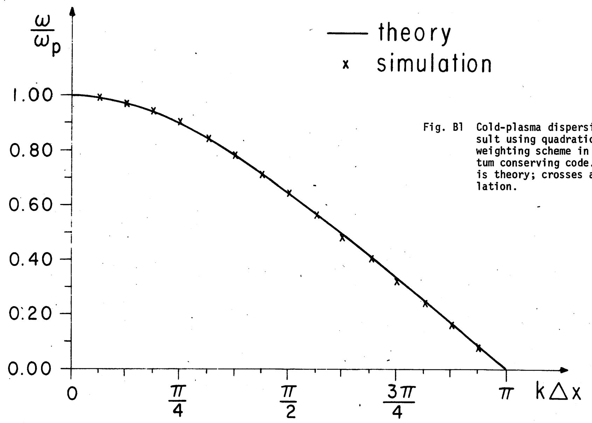  
Fig. Bl Cold-plasma dispersion result using quadratic spline weighting scheme in a momentum conserving code. Line is theory; crosses are simulation.

<table><tr><td rowspan="2">.2</td><td colspan="7">Table C1</td><td colspan="7">NEAREST GRID POINT</td><td rowspan="2"></td><td rowspan="2">&quot;ph</td></tr><tr><td>Case No. L NG</td><td></td><td></td><td>NP</td><td>&amp;x</td><td>st</td><td></td><td></td><td></td><td></td><td></td><td></td><td> Vt t A/∆x NC N N+N k1ast h N</td><td>kmax</td></tr><tr><td></td><td></td><td></td><td></td><td>A1 64 641241.0</td><td></td><td>4.0</td><td></td><td></td><td>0.1 1. C.10 1.0 16</td><td></td><td></td><td></td><td>14 3 1.0 12496. 4.50</td><td></td><td></td><td></td></tr><tr><td></td><td>A2. 64</td><td></td><td>64</td><td>1024</td><td>1.0</td><td>1.!</td><td>01 0.1 0.14</td><td></td><td></td><td>1.0 14</td><td></td><td></td><td></td><td></td><td>16 3~ 1.6 1207.551.73</td><td></td></tr><tr><td></td><td>A3 G4 44</td><td></td><td></td><td>102y</td><td>1.0</td><td></td><td>4.0 0.1 c.1 0.40</td><td></td><td></td><td>1.16</td><td></td><td></td><td></td><td></td><td>14 3~ 4.6 .15..0 19.53</td><td></td></tr><tr><td></td><td>A4</td><td>69 64</td><td></td><td>1024</td><td>1.0</td><td>6.0 0.1 0.1 0.6. 1.0 14</td><td></td><td></td><td></td><td></td><td></td><td></td><td></td><td></td><td>16 3~ 1.0 362.0 11.93</td><td></td></tr><tr><td></td><td>A5</td><td>64 64</td><td></td><td>104</td><td>1.0</td><td>10.0 0.1 0.1 1.00 1.0</td><td></td><td></td><td></td><td></td><td>16e 16 3~ 1.0</td><td></td><td></td><td></td><td>15i1 4.41</td><td></td></tr><tr><td></td><td>A6 64 6.4</td><td></td><td></td><td>102 1.0</td><td></td><td>1Y.0 0.1 0.1 1.Y0 1.0</td><td></td><td></td><td></td><td></td><td>16</td><td></td><td>16 32- 1.0</td><td></td><td>722.18</td><td></td></tr><tr><td></td><td>A7 64 64</td><td></td><td></td><td></td><td></td><td>64 1.0 0.2 0.4 0.4 0.08 1.0</td><td></td><td></td><td></td><td></td><td>1</td><td></td><td></td><td></td><td>1 2 1.0 754 31</td><td></td></tr><tr><td></td><td></td><td></td><td></td><td></td><td></td><td>A8 64 64 128 1.0 0.2 0.4 04 0.08</td><td></td><td></td><td></td><td>1.0</td><td>2</td><td>2</td><td>4</td><td></td><td>11.0 105 25</td><td></td></tr><tr><td></td><td></td><td></td><td></td><td></td><td></td><td></td><td>A9 64 64 256 1.0 0.2 0.4 2.41 0.08</td><td></td><td></td><td>1.0. 4</td><td></td><td>4</td><td></td><td></td><td>8 ° 10 2.0</td><td></td></tr><tr><td></td><td></td><td></td><td></td><td>A10 64 G41 512 2.0</td><td></td><td></td><td> 0.2 0.4 0.4 0.08 1.0</td><td></td><td></td><td></td><td>8 8</td><td></td><td>16</td><td>1.6</td><td>3</td><td>22.5</td></tr><tr><td></td><td></td><td></td><td></td><td></td><td></td><td></td><td></td><td></td><td></td><td></td><td>A11 64 64 1024 1.0 0.2 0.41 0.4 0.08 1.0 16 16</td><td></td><td>32.1.6 0275</td><td></td><td></td><td></td></tr><tr><td></td><td></td><td></td><td></td><td></td><td></td><td></td><td>A13. 64 64 1024 1.0 0.2 1.0 0.5 0.2 0.5 16</td><td></td><td></td><td></td><td></td><td>8</td><td>24 1.0 150 6.25</td><td></td><td></td><td></td></tr><tr><td></td><td></td><td></td><td></td><td></td><td></td><td></td><td>119 028 32 512 4. 1 0.2 0.+</td><td></td><td></td><td>+ 0.2 0.5 16</td><td></td><td></td><td>8. 24 1.0</td><td></td><td></td><td>15% 6.615</td></tr><tr><td></td><td></td><td></td><td>A145 64 32 1024</td><td></td><td></td><td></td><td>2.0 20.1 0.1</td><td></td><td></td><td>0.2 0.532</td><td></td><td>16</td><td>4%1.0</td><td></td><td></td><td>323 6.729</td></tr><tr><td></td><td>A15 64 64</td><td></td><td>256</td><td></td><td></td><td></td><td>1.0 a2 1.0 0.5 0.2 0.5 4</td><td></td><td></td><td></td><td></td><td>2</td><td></td><td></td><td>6 1.0 37.5 6.25</td><td></td></tr><tr><td>A16323L2561.0</td><td></td><td></td><td></td><td></td><td></td><td></td><td>A464</td><td></td><td></td><td></td><td></td><td></td><td></td><td></td><td></td><td></td></tr><tr><td>.417</td><td></td><td></td><td></td><td></td><td>0.j</td><td></td><td>1 1.0 0.5 0.1 0.5 16 8 2.1 1.0 199 2.29</td><td></td><td></td><td></td><td></td><td></td><td></td><td></td><td>1 1.0 0.35- 0.1 0.35- 8 2.02 1 1.0 37 3.43</td><td></td></tr><tr><td>A18</td><td></td><td>6:4 64</td><td>102t</td><td>1.0</td><td></td><td>0.1</td><td></td><td></td><td></td><td></td><td></td><td></td><td></td><td></td><td></td><td></td></tr><tr><td></td><td>32</td><td>32</td><td>256</td><td></td><td>1.0</td><td>0.1</td><td>1.0</td><td>0.7.5 0.1</td><td></td><td>0.75</td><td>8</td><td></td><td>61/</td><td></td><td></td><td>1.0 355- 23.93</td></tr><tr><td>A19</td><td>.32</td><td>32</td><td>256</td><td></td><td>1.c</td><td>ρ.1</td><td>1.0</td><td>4</td><td>0.1</td><td>4</td><td>2</td><td></td><td></td><td></td><td></td><td>32 40 1.0 17100 +27.5</td></tr><tr><td>A20</td><td>32</td><td>32</td><td>256</td><td></td><td>1.0</td><td>C.!</td><td>1.0</td><td>19</td><td>0.1</td><td>10</td><td></td><td>8 80 88 1.0 818 1020</td><td></td><td></td><td></td><td></td></tr><tr><td>A21</td><td>32</td><td></td><td></td><td></td><td>1.0 .!</td><td></td><td>1.0</td><td>2.C</td><td>0.1</td><td>20 8 1EJ 18 1.0</td><td></td><td></td><td></td><td></td><td></td><td>155000 122.62</td></tr><tr><td>A2.2</td><td></td><td>32</td><td>256</td><td></td><td></td><td></td><td>0.1</td><td>C.1</td><td></td><td>C.2 0.125 128 11. 144. 1.0</td><td></td><td></td><td></td><td></td><td>tっe… 20.132</td><td>11.7</td></tr><tr><td></td><td></td><td></td><td>648 1024 A.0</td><td></td><td> 2</td><td></td><td></td><td></td><td>0.1 0.1 0.2 0.25 6f 16 80 1.0 97.51.218</td><td></td><td></td><td></td><td></td><td></td><td></td><td></td></tr><tr><td></td><td></td><td></td><td>A23 604 16 1024 4.0 22 A2.4 32 32 2.56 1.0 0.2 1.0 0.35 6.2 0.35 8 3.8 10.8 1.0 35 3.24</td><td></td></table>

<table><tr><td colspan="10"></td><td colspan="5">kmax</td><td rowspan="2">uph</td></tr><tr><td>Case No. L NG</td><td></td><td></td><td>NP</td><td></td><td>Δx Δt</td><td>ωp</td><td></td><td></td><td>Vt At AD/Ax NC ND NCND K1ast h N+ND</td><td></td><td></td><td></td><td></td><td></td></tr><tr><td>A6O AGO 32 32-</td><td></td><td></td><td>2.56</td><td></td><td></td><td>161.0</td><td>2.0</td><td></td><td>0.6 2</td><td></td><td></td><td></td><td></td><td></td><td>8.0 160 240 1.0 420 :17.5</td></tr><tr><td></td><td>Acf32</td><td>32</td><td>25% .1</td><td></td><td></td><td>6.6 1.0</td><td>If.c</td><td>c.6.</td><td>41 8.0 326 40.0 1.6 660 16.5</td><td></td><td></td><td></td><td></td><td></td><td></td></tr><tr><td>A62 3232</td><td></td><td></td><td>256 1</td><td></td><td>0.6</td><td>1.0</td><td>6.6</td><td></td><td>0.6. 6 8. 48.1 560 1.0 900 17.5</td><td></td><td></td><td></td><td></td><td></td><td></td></tr><tr><td>At332- 32</td><td></td><td></td><td>2561</td><td></td><td>0.6</td><td>1.0</td><td>8.0</td><td>0.6 8</td><td></td><td>3.0 24.0 7201.0 1046 14.5</td><td></td><td></td><td></td><td></td><td></td></tr><tr><td></td><td></td><td>A64 32 32.2561</td><td></td><td></td><td>0.5</td><td>1.5</td><td>1.0</td><td>0.75 1.66</td><td></td><td></td><td></td><td></td><td></td><td>8.. 5.3 13.5 1.0 105 7.27</td><td></td></tr><tr><td></td><td></td><td>A6.5 64 644 1024 1</td><td></td><td></td><td></td><td></td><td>0.1 c.1</td><td></td><td>0.8 1</td><td></td><td></td><td></td><td></td><td>16.160 32.0 1.0 250 7.81</td><td></td></tr><tr><td>AL.5 64 64 10241100.1</td><td></td><td></td><td></td><td></td><td></td><td></td><td></td><td></td><td></td><td>a11011616321151.</td><td></td><td></td><td></td><td></td><td></td></tr><tr><td></td><td></td><td>AL-6G 64 64 10241</td><td></td><td></td><td>12</td><td>0.1</td><td>0.1</td><td></td><td></td><td></td><td></td><td></td><td></td><td></td><td>112. 1 14.0 16.0 320 1.0 85 2.65</td></tr><tr><td></td><td></td><td>A6:7 G41 64 1024 1 0-01 1. 0.5 c.01 0.5 16.. 8. 24.0 1.0 174 9.25</td><td></td><td></td><td></td><td></td><td></td><td></td><td></td><td></td><td></td><td></td><td></td><td></td><td></td></tr><tr><td></td><td></td><td>AE8 64 6.4 1024</td><td></td><td></td><td></td><td></td><td></td><td></td><td></td><td></td><td></td><td></td><td></td><td></td><td> 1 0.5 0.1 0.1 0.05 1 16.0 160 320 1.0 1412 4.12</td></tr><tr><td>A69 64t 64 256</td><td></td><td></td><td></td><td></td><td></td><td>1 0.05 1</td><td></td><td></td><td></td><td></td><td></td><td></td><td></td><td></td><td>0.5 0.05 0.5 4.0 2 6.0 1.0 56 9.33</td></tr><tr><td>AQ 64 62 1024 1 0.05 1 0.5 0.05 0.5 16.0 8.0 241.0 1.0 202 8.41</td><td></td><td></td><td></td><td></td><td></td><td></td><td></td><td></td><td></td><td></td><td></td><td></td><td></td><td></td><td></td></tr><tr><td></td><td></td><td>A 64 44 256. 1 0.2 1</td><td></td><td></td><td></td><td></td><td>0.5</td><td></td><td></td><td></td><td></td><td></td><td></td><td></td><td> 0.2 0.5 4.0 21 6.0 2.0 55 9.16</td></tr><tr><td></td><td></td><td>A7 64 2.56 512 0.25 1 C.2 0.1</td><td></td><td></td><td></td><td></td><td></td><td>(1.2 2.</td><td></td><td></td><td></td><td></td><td></td><td></td><td>2.0 4.0 .0 8.0 32.90 518.3</td></tr><tr><td>A73 E41 256 512 C.251</td><td></td><td></td><td></td><td></td><td></td><td></td><td>0.2 0.1</td><td>C.2</td><td>2</td><td></td><td></td><td></td><td></td><td></td><td>2.10 40 6.0 2.0 772 128.66</td></tr><tr><td>AM4 (c4 256 512. e.25 1</td><td></td><td></td><td></td><td></td><td></td><td></td><td>0.2. 0.1</td><td>C.2 2</td><td></td><td></td><td></td><td></td><td></td><td></td><td>2.0 4. 6.0 16 7044 1174</td></tr><tr><td>A7$ 64 256 512 0.25 1</td><td></td><td></td><td></td><td></td><td></td><td></td><td>0.2 0.1</td><td>0.2</td><td>2</td><td>21</td><td></td><td></td><td></td><td></td><td>4.. 6.0 32 13460 2243.33</td></tr><tr><td>A75-61--2565120.2510.20.10.22</td><td></td><td></td><td></td><td></td><td></td><td></td><td></td><td></td><td></td><td>2</td><td>4</td><td>6</td><td></td><td></td><td></td></tr><tr><td>A76 320 256 512 1.25</td><td></td><td></td><td></td><td></td><td>1</td><td></td><td>0.2 0.1</td><td></td><td></td><td></td><td></td><td></td><td></td><td></td><td></td></tr><tr><td>A7 192 256 512 0.75 1</td><td></td><td></td><td></td><td></td><td></td><td>0.2</td><td>0.1</td><td></td><td>0.2. 0.66</td><td> 2.0 1.33 3.33</td><td></td><td></td><td>8</td><td></td><td>282 84.68</td></tr><tr><td></td><td></td><td></td><td></td><td></td><td></td><td></td><td>0.2 0.1</td><td>0.2</td><td></td><td>0.5 2.0 1.0 3.0 8 150</td><td></td><td></td><td></td><td></td><td>50</td></tr><tr><td>A78 A79 979</td><td>256 128</td><td>256 512 1</td><td></td><td></td><td>256 512 0.51</td><td></td><td>0.2 0.1</td><td>0.2</td><td></td><td></td><td></td><td></td><td></td><td></td><td>1.0 2.0 2.0 4.0 8 764 191</td></tr></table>

<table><tr><td colspan="9">(Table Cl cont. ...)</td><td colspan="6">kmax uph</td></tr><tr><td></td><td>L</td><td>NG</td><td>NP</td><td>Δx</td><td>at</td><td>p</td><td>vt</td><td>upt</td><td>AD/xNC</td><td></td><td>ND</td><td>NC+ND</td><td>/klast ph</td><td>NC+ND</td></tr><tr><td>A29</td><td>64</td><td>256</td><td>1024025</td><td></td><td>2</td><td>0.1</td><td>0.1</td><td>0.2</td><td>4</td><td>4</td><td>20 16</td><td>1.0</td><td>3450</td><td>172.5</td></tr><tr><td>A30</td><td>32-</td><td>37.</td><td>256</td><td>1.0</td><td>02</td><td>1.0</td><td>22. 1</td><td>7</td><td>8</td><td>56</td><td>64</td><td>1.c</td><td>17575</td><td>2.75</td></tr><tr><td>A3)</td><td>32</td><td>32</td><td>2元</td><td>1.0</td><td>0. 2.</td><td>1.0 10</td><td></td><td>C.2 10</td><td>8</td><td>801</td><td>88</td><td>1.0</td><td>1152</td><td>16</td></tr><tr><td>A32</td><td>32</td><td>32</td><td>2.56</td><td>1.0</td><td>C.3</td><td>1.0</td><td>0.35</td><td>0.35 0.3</td><td>8</td><td>28</td><td>10.8</td><td>1.0</td><td>3</td><td>2.78</td></tr><tr><td>A33</td><td>32</td><td>32.</td><td>25</td><td>1.6</td><td>0.3</td><td>.1.0</td><td>0.5 0.5</td><td>6.5</td><td>8</td><td>&lt;j</td><td>12</td><td>1.0</td><td>75</td><td>6.25</td></tr><tr><td>A31</td><td>32</td><td>32.</td><td>254</td><td>1.0</td><td>0.3</td><td>1.0</td><td>0.15 0.3</td><td>0.75</td><td>8</td><td>C:</td><td>141</td><td>1.0</td><td>182</td><td>13</td></tr><tr><td>135</td><td>32</td><td>32</td><td>256</td><td>1.0</td><td>0.3</td><td>1.0 1.0</td><td>2.3</td><td>1.0</td><td>8</td><td>8</td><td>li</td><td>1.0</td><td>330</td><td>2.0.015</td></tr><tr><td>A36</td><td>32.</td><td>32.</td><td>2.5%</td><td>1.0</td><td>0.3</td><td>1.0</td><td>1.5</td><td>1.5 C.5</td><td>8</td><td>12</td><td>20</td><td>1.0</td><td>765</td><td>38.25</td></tr><tr><td>A37</td><td>32</td><td>32-</td><td>256</td><td>1.0</td><td>0.3</td><td>1.0</td><td>2</td><td>0.3</td><td>2 8</td><td>1心</td><td>24</td><td>1.0</td><td>1535</td><td>63.95</td></tr><tr><td>A38</td><td>52</td><td>32.</td><td>256</td><td>1.0</td><td>0.4</td><td>1.0</td><td>21.35 0.</td><td></td><td>0. 55 8</td><td>2.8</td><td>10.8</td><td>1.0</td><td>27</td><td>2..5</td></tr><tr><td>A39</td><td>32</td><td>32.</td><td>2.56</td><td>1.0</td><td>0.4</td><td>1.0</td><td>C.5</td><td>0.4 0.5</td><td>8</td><td>ef</td><td>12.</td><td>1.0</td><td>76</td><td>6.5</td></tr><tr><td>A%</td><td>32.</td><td>32</td><td>256</td><td>1.0</td><td>0.4</td><td>1.0</td><td>6.75 0.if</td><td>0.75</td><td>8</td><td>6</td><td>14</td><td>.1.0</td><td>197</td><td>14.c7</td></tr><tr><td>Al1</td><td>2</td><td>32.</td><td>256</td><td>1.0</td><td>014</td><td>1.0</td><td>1.0</td><td>0.4</td><td>1.0 </td><td>8</td><td>16</td><td>1.0</td><td>390</td><td>21.75</td></tr><tr><td>142</td><td>?2</td><td>32</td><td>256</td><td>1.0</td><td>0.4</td><td>1.0</td><td>1.5</td><td>0.4</td><td>1.5</td><td>8 12</td><td>20</td><td>Ea</td><td>685</td><td>34.25</td></tr><tr><td>A413</td><td>32</td><td>3L</td><td>256</td><td>1.0</td><td>0.41</td><td>1.8</td><td>2x2.</td><td>0.4</td><td>?.</td><td>8</td><td>16 24</td><td>1.0</td><td>9%</td><td>40.41</td></tr><tr><td>A44</td><td>32.</td><td>32-</td><td>256</td><td>1.0</td><td>0.%</td><td>1.0</td><td>-1</td><td>0.4</td><td>8 4</td><td>32</td><td>40</td><td>1.0</td><td>192c</td><td>418</td></tr><tr><td>A45</td><td>31</td><td>32</td><td>256</td><td>1.0</td><td>c.y</td><td>1.0</td><td>6</td><td>4.4</td><td>8 6</td><td></td><td>42 56</td><td>1.0</td><td>2910</td><td>57.96</td></tr><tr><td>A46</td><td>32</td><td>32</td><td>756.</td><td>1.0</td><td>0.4</td><td>1.0</td><td>8</td><td>0,4</td><td>8 8</td><td>64</td><td>72</td><td>1.0</td><td>22.5</td><td>38.15</td></tr><tr><td>A47</td><td>32</td><td>2</td><td>2.56</td><td>1.0</td><td>214</td><td>1.0</td><td>10</td><td>0.4</td><td>10 8</td><td>8s</td><td>88</td><td>1.0</td><td>2195</td><td>24.9</td></tr><tr><td>A48</td><td>32</td><td>32.</td><td>256</td><td>1.0</td><td>0.5</td><td>1.0</td><td>0.35</td><td>0.5</td><td>0.35</td><td>8 2.8</td><td>10.8</td><td>10</td><td>3c</td><td>2.78</td></tr><tr><td>A49</td><td>32</td><td>32</td><td>256</td><td>1.0</td><td>6.5</td><td>1.0</td><td>0.5</td><td>0.5</td><td>0.5</td><td>£</td><td>4f 12</td><td>1.0</td><td>56</td><td>4.67</td></tr><tr><td>A5c</td><td>32</td><td>32</td><td>2.54</td><td>1.0</td><td>0.5-</td><td>1.0</td><td>0.75</td><td>0.5</td><td>0.75</td><td>8 6</td><td>14</td><td>1.0</td><td>180</td><td>12.86-</td></tr><tr><td>A5-1</td><td>32.</td><td>32.</td><td>256</td><td>1.0</td><td>0.5</td><td>1.0</td><td>1.i</td><td>6.5</td><td>1.0</td><td>8 8</td><td>16</td><td>1.0</td><td>125</td><td>26.56</td></tr><tr><td>A52-</td><td>32</td><td>32-</td><td>2.56</td><td>1.0</td><td>0.3</td><td>1.0</td><td>1.5</td><td>0.5</td><td>1.5</td><td>8 12</td><td>2t</td><td>1.0</td><td>455</td><td>22!15</td></tr><tr><td>453</td><td>32</td><td>32-</td><td>2.56</td><td>1.0</td><td>0.5</td><td>1.0</td><td>2.0</td><td>6.5</td><td>2</td><td>8 16</td><td>24</td><td>1.0</td><td>570</td><td>23.75</td></tr><tr><td>A54 1</td><td>32.</td><td>32</td><td>256</td><td>1.0</td><td>0.5</td><td>1.0</td><td>4</td><td>6.5</td><td>4</td><td>8</td><td>32 40</td><td>1.0</td><td>8s</td><td>2.1</td></tr><tr><td>A55</td><td>32</td><td>32</td><td>256</td><td>1.c</td><td>6.5</td><td>1.6</td><td>10</td><td>0.5</td><td>10</td><td>6</td><td>8o 26</td><td>1.0</td><td></td><td>162 185</td></tr><tr><td>A56 ASY</td><td>32</td><td>32</td><td>2.56</td><td>1.c</td><td>C.6</td><td>1.6</td><td>0..5 4.5</td><td>小6 0.6</td><td>1.35⁻ a5 8</td><td>f</td><td>2.8 1 12</td><td>10.8 1.0</td></table>

<table><tr><td colspan="10"></td><td colspan="2"></td><td colspan="2">kmax</td><td colspan="2">&quot;pTh</td></tr><tr><td>Case No.</td><td>L</td><td>NG</td><td>NP</td><td>ΔxX</td><td>Δt</td><td>3</td><td></td><td>t</td><td></td><td>^D/x</td><td>NC</td><td>ND NC+ND</td><td></td><td>klast</td><td>&quot;ph</td><td>NC+ND</td></tr><tr><td>B1-</td><td>64</td><td>64</td><td>64</td><td>1.0</td><td>0.2</td><td>acl</td><td>0.4</td><td>0.06</td><td>1.0</td><td>1</td><td>1</td><td>2</td><td></td><td>1.1 21</td><td></td><td>1100</td></tr><tr><td>B2</td><td>6.1</td><td>641</td><td>128</td><td>1.0</td><td>0.2</td><td>0.4</td><td>c.4</td><td>0.0%</td><td>1.0</td><td>2</td><td>2</td><td>4</td><td></td><td>1.0</td><td>3101</td><td>850</td></tr><tr><td>B3</td><td>61</td><td>64</td><td>256</td><td>1.c.</td><td>0.2</td><td>0.4</td><td>c.Y</td><td>0.0%</td><td>1.0</td><td>4.1</td><td>4</td><td>8</td><td></td><td>1.0</td><td>10℃</td><td>875</td></tr><tr><td>b4</td><td>64</td><td>641</td><td>512</td><td>1.0</td><td>2 C.</td><td>0.4</td><td>0.4</td><td>0.08</td><td>1.0</td><td>8</td><td>8</td><td>16</td><td></td><td>1.1</td><td>150</td><td>693.75</td></tr><tr><td>B5</td><td>64</td><td>64</td><td>1024</td><td>1.0</td><td>0.2</td><td>0.4</td><td>0.4</td><td>0.08.</td><td>1.0</td><td>16</td><td>16</td><td></td><td>32-</td><td>1.0</td><td>2655</td><td>628.12</td></tr><tr><td>86</td><td>32</td><td>32</td><td>256</td><td>1.0</td><td>0.1</td><td>1.0</td><td>0.35</td><td>c.1</td><td>0.35</td><td>8</td><td>2.8</td><td>10.8</td><td></td><td>1.0</td><td>708</td><td>65.56</td></tr><tr><td>87</td><td>64</td><td>64</td><td>10:4</td><td>1.c</td><td>0.1</td><td>1.0</td><td>01.5</td><td>0.1</td><td>().5</td><td>16</td><td>ε</td><td>24</td><td></td><td>1.0</td><td>4320</td><td>180</td></tr><tr><td>68</td><td>32</td><td>32-</td><td>2.56</td><td>1.c</td><td>0.1</td><td>1.0</td><td>0.75</td><td>0. 1</td><td>0.75</td><td>8</td><td>6</td><td></td><td>14</td><td>1.0</td><td>7590</td><td>542.14</td></tr><tr><td>B9</td><td>32</td><td>32</td><td>256</td><td>1.0</td><td>0.1</td><td>1.0</td><td>1.5</td><td>0.1</td><td>1.5</td><td>8</td><td>12</td><td>っc</td><td></td><td>1.0</td><td>40000</td><td>2 ece</td></tr><tr><td>B10</td><td>32</td><td>32</td><td>256</td><td>1.0</td><td>0.1</td><td>1.0</td><td>5</td><td>.1</td><td>3</td><td>8</td><td>24</td><td>32</td><td></td><td>1.0</td><td>2491= 7778</td><td></td></tr><tr><td>811</td><td>32</td><td>32</td><td>256</td><td>1.0</td><td>0.1</td><td>1.0</td><td>100</td><td>c.1</td><td>10</td><td>8</td><td>80</td><td></td><td>8d</td><td>1.0</td><td>256</td><td>4315 2265</td></tr><tr><td>B12</td><td>32</td><td>32</td><td>25é</td><td>1.0 1.0</td><td>0.1</td><td>1.0</td><td>20</td><td>C.1</td><td>20</td><td>8</td><td>160</td><td></td><td>168</td><td>1.0</td><td>36  二 10.10</td><td>214 1 60</td></tr><tr><td>B13</td><td>3</td><td>3福</td><td>福</td><td></td><td>0.2</td><td>1.0</td><td></td><td>0.2</td><td></td><td>8</td><td>2.8</td><td></td><td></td><td>1.0</td><td>865</td><td>gosj</td></tr><tr><td>B1Y</td><td>64</td><td>64</td><td>.2.56</td><td>1.0</td><td>0.2</td><td>1.0</td><td>0.5</td><td>0.2</td><td>0.5</td><td>4</td><td>2</td><td></td><td>6</td><td>1.0</td><td>890</td><td>148.33</td></tr><tr><td>B15</td><td>32</td><td>32</td><td>256</td><td>1.0</td><td>0.2</td><td>1.0</td><td>0.5</td><td>0.2</td><td>0.5</td><td>8</td><td>4</td><td></td><td>12</td><td>1.0</td><td>1720</td><td>1.13.33</td></tr><tr><td>B14</td><td>64</td><td>64</td><td>1024</td><td>1.0</td><td>0.2</td><td>1.0</td><td>0.5</td><td>0.2</td><td>0.5</td><td>16</td><td>8</td><td>24</td><td></td><td>1.0</td><td>4235 176.45</td><td></td></tr><tr><td>B17</td><td>.128</td><td>32</td><td>512</td><td>4.0</td><td>1.0</td><td>0.2</td><td>0.4</td><td>0.2</td><td>0.5</td><td>16</td><td>8</td><td></td><td>24</td><td>1.0</td><td>4680</td><td>195</td></tr><tr><td>B18</td><td>96</td><td>32</td><td>512</td><td>3.0</td><td>1.0</td><td>0.2</td><td>0.4</td><td>0.2</td><td>0.66</td><td>16</td><td>10.66</td><td></td><td>26.66 1.0</td><td></td><td>8587</td><td>7.322.09</td></tr><tr><td>B19</td><td>.32</td><td>32</td><td>256</td><td>1.0</td><td>0.2</td><td>1.0</td><td>0.75</td><td>0.2</td><td>0.75</td><td>8</td><td>6</td><td>14</td><td></td><td>1.0</td><td>8475</td><td>605-35</td></tr><tr><td>820</td><td>64</td><td>32</td><td>512</td><td>2.0</td><td>1.0</td><td>0.2</td><td>0.4</td><td>0.2</td><td>1.0</td><td></td><td>16 16</td><td>32</td><td></td><td></td><td></td><td>1325</td></tr><tr><td>B21</td><td>32</td><td>32</td><td>2.56</td><td>1.0</td><td>0.2</td><td>1.0</td><td>1.5</td><td>0.2</td><td>1.5</td><td></td><td>日8 12</td><td>20</td><td></td><td>1.0</td><td>42425</td><td></td></tr><tr><td>022</td><td>32</td><td>32</td><td>256</td><td>1.0</td><td>0.2</td><td>1.0</td><td>2.0</td><td>0.2</td><td>2.0</td><td></td><td>多8 16</td><td></td><td>24</td><td>1.0 1.0</td><td>67600 3380</td><td>41016.6</td></tr><tr><td>B23</td><td>32</td><td>32</td><td>256</td><td>1.0</td><td>0.2</td><td>1.0</td><td>3.0</td><td>ar</td><td>3.0</td><td></td><td>824</td><td>32</td><td></td><td></td><td>91:400 530001325</td><td></td></tr><tr><td>B24</td><td>32</td><td>32</td><td>256</td><td>1.1</td><td>0.2</td><td>1.0</td><td>4.0</td><td>0.2 0.2</td><td>4.0</td><td>8</td><td>32 出8 64</td><td>72</td><td>40</td><td>1.0 1.0</td><td>19501</td><td>5468.75</td></tr><tr><td>B25 826</td><td>32</td><td>32</td><td>356</td><td>1.0</td><td>0.2</td></table>

<table><tr><td colspan="9">(Tablc C2 cont. ...)</td><td colspan="3"></td><td colspan="2">kmux</td><td>&quot;ph</td></tr><tr><td></td><td>Case No.</td><td>L</td><td>NG</td><td>NP</td><td>Δx</td><td>at</td><td>品</td><td>t</td><td>upst</td><td>^x</td><td>NC</td><td>Nn</td><td>NC+ND klast</td><td>&quot;ph</td><td>NC+ND</td></tr><tr><td></td><td>833</td><td>32</td><td>256 32</td><td>1.0</td><td>0.3</td><td>1.0</td><td>6.0</td><td>0.3</td><td>6</td><td>8</td><td>48</td><td>56</td><td>1.0</td><td>8502</td><td>151.82</td></tr><tr><td></td><td>634</td><td>32</td><td>256 32</td><td>1.0</td><td>0.3</td><td>1.0</td><td>8.0</td><td>0.3</td><td>8</td><td>8</td><td>G4Y</td><td>72</td><td>1.0</td><td>7758</td><td>109.75</td></tr><tr><td>3</td><td>B35</td><td>32</td><td>256 32</td><td>1.0</td><td>0.3</td><td>1.0</td><td>10.0</td><td>0.3</td><td>10</td><td>8</td><td>80</td><td>88</td><td>1.0</td><td>6750</td><td>76.7</td></tr><tr><td></td><td>B36</td><td>32.</td><td>32 256</td><td>1.0</td><td>0.4</td><td>1.0</td><td>0.35</td><td>0.4</td><td>0.35</td><td>8</td><td>2.8</td><td>10.8</td><td>1.0</td><td>1023</td><td>94.72</td></tr><tr><td></td><td>837 B38</td><td>16</td><td>128 32</td><td>0.5</td><td>0.4</td><td>1.0</td><td>0.2.5</td><td>0.4</td><td>0.5</td><td>4</td><td>2</td><td>6</td><td>1.0</td><td>1135</td><td>189.16</td></tr><tr><td></td><td>839</td><td>32</td><td>256 32</td><td>1.0</td><td>0.4</td><td>1.0</td><td>0.5</td><td>0.4</td><td>0.5</td><td>8</td><td>4</td><td>12</td><td>1.0</td><td>2295</td><td>191.25</td></tr><tr><td></td><td>B40</td><td>64 641</td><td>1024</td><td>1.0</td><td>0.4</td><td>1.0</td><td>0.5</td><td>0.4</td><td>0.5</td><td>16</td><td>8</td><td>24</td><td>1.0</td><td>4160</td><td>173.33</td></tr><tr><td>B41</td><td>64</td><td></td><td>64 256</td><td>1.0</td><td>0.4</td><td>1.0</td><td>0.5</td><td>0.4</td><td>0.5</td><td>4</td><td>2</td><td>6</td><td>1.0</td><td>1150</td><td>191.66</td></tr><tr><td></td><td>32</td><td>32</td><td>256</td><td>1.0</td><td>0.4</td><td>1.0</td><td>0.75</td><td>0.4</td><td>0.75</td><td>8</td><td>G</td><td>14</td><td>1.0</td><td>5860</td><td>418.571</td></tr><tr><td>342 B43</td><td>16</td><td>32</td><td>128</td><td>0.5</td><td>0.4</td><td>1.0</td><td>0.5</td><td>0.4</td><td>1.0</td><td>4</td><td>4</td><td>8</td><td>1.0</td><td>7/2.0</td><td>890</td></tr><tr><td></td><td>32</td><td>32</td><td>256</td><td>1.0</td><td>0.4</td><td>1.0</td><td>1.5-</td><td>0.4</td><td>1.5</td><td>8</td><td>12</td><td>20</td><td>1.0</td><td>13080</td><td>654</td></tr><tr><td>B44</td><td>32</td><td>32</td><td>256</td><td>1.0</td><td>0.4</td><td>1.0</td><td>2.0</td><td>0.4</td><td>2</td><td>8</td><td>14</td><td>2.4</td><td>1.0</td><td>10200</td><td>425</td></tr><tr><td>645</td><td>32</td><td>32</td><td>254</td><td>1.0</td><td>0.4</td><td>1.0</td><td>4.0</td><td>0.4</td><td>4</td><td>8</td><td>32</td><td>40</td><td>1.0</td><td>2985</td><td>74.63</td></tr><tr><td>846</td><td>16</td><td>32</td><td>128</td><td>0.5</td><td>0.4</td><td>1.0</td><td>6.0</td><td>0.4</td><td>6</td><td>d</td><td>24</td><td>28</td><td>1.0</td><td>1800</td><td>61.24</td></tr><tr><td>B47</td><td>16</td><td>32</td><td>128</td><td>0.5</td><td>0.4</td><td>1.0</td><td>8.0</td><td>0.4</td><td>8</td><td>4</td><td>32</td><td>36</td><td>1.0</td><td>1705-47.36</td><td></td></tr><tr><td>B48</td><td>32</td><td>32</td><td>256</td><td>1.0</td><td>0.5</td><td>1.0</td><td>0.35</td><td>0.5</td><td>0.35</td><td>8</td><td>2.8</td><td>10.8</td><td>1.0</td><td>965</td><td>89.35</td></tr><tr><td>B49</td><td>32</td><td>32</td><td>256</td><td>1.0</td><td>0.5</td><td>1.0</td><td>0.5</td><td>0.5</td><td>0.5</td><td>8</td><td>4</td><td>12</td><td>1.0</td><td>2230</td><td>185.83</td></tr><tr><td>β50</td><td>32</td><td>32</td><td>256</td><td>1.0</td><td>a.s</td><td>1.0</td><td>0.75</td><td>0.5</td><td>0.75</td><td>8</td><td>6</td><td>14</td><td>1.0</td><td>5400</td><td>385.71</td></tr><tr><td>BS1</td><td>32</td><td>32</td><td>256</td><td>1.0</td><td>0.5</td><td>1.0</td><td>1.0</td><td>0.5</td><td>1</td><td>8</td><td>8</td><td>16</td><td>1.0</td><td></td><td></td></tr><tr><td></td><td></td><td></td><td></td><td></td><td>0.5</td><td>1.0</td><td></td><td></td><td></td><td></td><td></td><td>24</td><td></td><td>9830</td><td>414.38</td></tr><tr><td>B52</td><td>32</td><td>32</td><td>256</td><td>1.0</td><td></td><td></td><td>2.0</td><td>0.5</td><td>2</td><td>8</td><td>16</td><td></td><td>1.0</td><td>3530</td><td>147.08</td></tr><tr><td>BS3</td><td>32</td><td>32</td><td>256</td><td>1.0</td><td>0.5</td><td>1.0</td><td>4.0</td><td>0.5</td><td>4</td><td>8</td><td>32</td><td>40</td><td>1.0</td><td>1622</td><td>40.55</td></tr><tr><td>B54 B55</td><td>32.</td><td>32</td><td>256</td><td>1.0</td><td>0.5</td><td>1.0</td><td>8.0</td><td>0.5</td><td>8</td><td>8</td><td>641</td><td>72.</td><td>1.0</td><td>1515</td><td>21.041</td></tr><tr><td>B56</td><td>32</td><td>32</td><td>252</td><td>1.0</td><td>0.5</td><td>1.0</td><td>10.0</td><td>0.5</td><td>10</td><td>8</td><td>80</td><td>88</td><td>1.0</td><td>1784</td><td>20.27</td></tr><tr><td></td><td>32</td><td>32</td><td>2-56</td><td>1.0</td><td>0.6</td><td>1.0</td><td>0.35</td><td>0.4</td><td>0.35</td><td>8</td><td>2.8</td><td>10.8</td><td>1.0</td><td>805</td><td>74.54</td></tr><tr><td>857 658</td><td>64 64</td><td>64 64</td><td>256 1024</td><td>1.0 1.0</td><td>0.6 0.6</td><td>1.0 1.0</td><td>0.5 0.5</td><td>0.6 0.6</td><td>0.5 0.5</td><td>4 16</td><td>2</td><td>6 8 2y</td><td>1.0 1.0</td><td>1385 193.75</td><td>230.83</td></tr></table>

<table><tr><td>Case No.</td><td></td><td></td><td></td><td></td><td>Δx Δt</td><td></td><td></td><td></td><td></td><td></td><td></td><td>Vt pAt A/x NC N NC+ND</td><td></td><td>kmx</td><td></td><td>klast ph N+N</td><td>p&#x27;h</td></tr><tr><td></td><td></td><td></td><td></td><td>NP</td><td>1..0.1</td><td></td><td></td><td>111.0 0.35</td><td></td><td>0.1 0.35</td><td></td><td>8.02.881.68</td><td></td><td></td><td></td><td>1.0450873</td><td></td></tr><tr><td></td><td>C1 32 132</td><td></td><td></td><td>256</td><td></td><td></td><td></td><td>C6J</td><td></td><td>0.1 0.50</td><td></td><td>8.0 </td><td>4.00</td><td>12.00</td><td></td><td>1.0 20100 1076</td><td></td></tr><tr><td></td><td>C23232</td><td></td><td></td><td>256</td><td>1.0</td><td>0.1</td><td>J.c 1.</td><td>0.95</td><td></td><td>10.95</td><td></td><td>∴</td><td>10.10 14.00</td><td></td><td></td><td>1.0 1155c0</td><td>tise 10131</td></tr><tr><td></td><td>C33232</td><td></td><td></td><td>256</td><td></td><td></td><td></td><td></td><td></td><td>c.1 1..</td><td></td><td>8.0</td><td>8.10 16.00</td><td></td><td>1.0</td><td>17500 110000</td><td></td></tr><tr><td>c4</td><td>32:32</td><td></td><td></td><td>2561.0</td><td>0.1</td><td></td><td>.1.4</td><td>1.00</td><td></td><td></td><td></td><td></td><td>AG.日 24.00</td><td></td><td>1.0</td><td>775 125</td><td>7415 3229 11041</td></tr><tr><td>CS</td><td></td><td>3232</td><td></td><td>2561.0</td><td></td><td>0.2</td><td>1.0</td><td>又码</td><td>1</td><td>2.00 4.10</td><td>.0 </td><td>8..</td><td>32.16 40.00</td><td></td><td></td><td></td><td>3,0,000 40.00 E EIS</td></tr><tr><td>C6</td><td></td><td></td><td>32322561.0</td><td></td><td>0.1.</td><td></td><td>1.0.</td><td>4.00</td><td>0.1</td><td>c1 6..</td><td></td><td>10 48.00 0</td><td></td><td></td><td>1.0</td><td></td><td>704 9 136 1001785</td></tr><tr><td>c1</td><td>3232256</td><td></td><td></td><td></td><td>1.0 0.1</td><td></td><td>1.0</td><td>6.00 C.35 0.2 c.35</td><td></td><td></td><td>8.0</td><td></td><td>2.881088</td><td></td><td>1</td><td></td><td>1.0 7320 677.77</td></tr><tr><td>C8</td><td>3232</td><td></td><td></td><td>256 1.0</td><td>0.2.</td><td></td><td>1.0 1.0</td><td>0.50</td><td>0.2 0.50</td><td></td><td>8.0</td><td></td><td>4.00 12.00</td><td></td><td></td><td></td><td>1.1 32280 2690 yUor 4428</td></tr><tr><td>cq C10</td><td>32 52</td><td></td><td></td><td>256 1.0 1.0</td><td>0.2 0.2</td><td></td><td>1.0</td><td>0.75</td><td>0.2 0.75</td><td></td><td></td><td>8.0 6.00 14.00</td><td></td><td></td><td></td><td>二1010</td><td>エ71 543, 17900</td></tr><tr><td>C11 32 32256 1.0</td><td>032 32256</td><td></td><td></td><td></td><td>.0.2</td><td></td><td>1.0</td><td>1.50</td><td>0.2 1.50</td><td></td><td></td><td>8.0 12.0 20.00 . 1.0</td><td></td><td></td><td></td><td></td><td>2010 1305,00. 54166</td></tr><tr><td>C12 32 32 256 1.0</td><td></td><td></td><td></td><td></td><td>2.2</td><td></td><td>1.0</td><td>2.08</td><td></td><td></td><td></td><td>0.2 2.00. 810 6.00 24.00 1.0</td><td></td><td></td><td></td><td></td><td>21590 ±6256 275000 G875</td></tr><tr><td>C13 32 32256 1.0</td><td></td><td></td><td></td><td></td><td></td><td>0.2 1.0</td><td></td><td>4.00 0. 4:00 8.00 32.00 10.00 1.4</td><td></td><td></td><td></td><td></td><td></td><td></td><td></td><td>220,00 7500</td><td></td></tr><tr><td>C.1432</td><td></td><td></td><td></td><td>32251.0</td><td>0.2</td><td>1.0</td><td></td><td></td><td></td><td></td><td></td><td></td><td></td><td></td><td></td><td></td><td>6.00 0:2 6.00 800 48.00 56.00 1.0 40.000 1601.1</td></tr><tr><td>C15 32 32 256 1.0</td><td></td><td></td><td></td><td></td><td>0.2</td><td></td><td>1.0 7.01</td><td></td><td></td><td></td><td></td><td></td><td></td><td></td><td></td><td>0.2 7.00 800 56.01 64.00 1.0 05010 25 140</td><td>17 402.78</td></tr><tr><td></td><td>C16 3232156. 1.0</td><td></td><td></td><td></td><td>0.2</td><td></td><td>1.0 8.00</td><td>0.2</td><td></td><td></td><td></td><td>8.00 8.00 G4.0 72 1.0</td><td></td><td></td><td></td><td>±i…</td><td>213.51 120</td></tr><tr><td></td><td>C17 32 32 256 1.0</td><td></td><td></td><td></td><td>0.2 </td><td></td><td>1.0</td><td></td><td></td><td></td><td></td><td></td><td></td><td></td><td></td><td>10.00 0.2 10100 8.00 80.2 800. 110 37000</td><td></td></tr><tr><td></td><td>C18323~256</td><td></td><td></td><td>1.0</td><td>0.3</td><td>1.0 </td><td></td><td></td><td></td><td></td><td></td><td></td><td></td><td></td><td></td><td></td><td>0 0.35 63 0.35 8.00 2.88 10.88 1.0 9700 640 0 2.00 4.00 120 1:0 30000 2.500</td></tr><tr><td></td><td>C19323~256</td><td></td><td></td><td></td><td>1.0 0.3</td><td>1.0</td><td>0.50 </td><td>03</td><td>0:50</td><td></td><td></td><td></td><td></td><td></td><td></td><td></td><td></td></tr><tr><td>23232256</td><td></td><td></td><td></td><td></td><td>1.00.3</td><td></td><td>1.0</td><td></td><td></td><td></td><td></td><td></td><td></td><td></td><td></td><td></td><td>0.75 0.3 0-75 8.00 600 14.00 1.0 75000 5357 4375</td></tr><tr><td></td><td>C21.32 32 256</td><td></td><td></td><td>1.0</td><td>0.3</td><td></td><td>1.11 1.0</td><td>0.3 1.10</td><td></td><td></td><td></td><td></td><td></td><td></td><td></td><td>8.00 8.00 16.01 1.0 159008. 7...</td><td>5625</td></tr><tr><td></td><td>C22 32 32 256</td><td></td><td></td><td>1.0</td><td>0.3</td><td></td><td>1.0</td><td></td><td></td><td></td><td></td><td></td><td></td><td></td><td></td><td></td><td>2.00 0.3 2.00 8.00 16:01 24.00 1.0 17 7711</td></tr><tr><td></td><td>C2332 32 256</td><td></td><td></td><td>1.0</td><td>0.3</td><td></td><td>1:0</td><td></td><td></td><td></td><td></td><td></td><td></td><td></td><td></td><td></td><td>4.00 0.3 4.0r 8.00 32.50 10 1:0 1730 432.5 0 11500187.5</td></tr><tr><td>C25.32 32256</td><td>e243232256</td><td></td><td></td><td>1.0</td><td>0.3</td><td></td><td>1.0</td><td>G00</td><td>0.3 6.00 8.60 4500 56.00 1-0 .5 0.3 8.05</td><td></td><td></td><td></td><td></td><td></td><td></td><td></td><td>2.0064.00720109155 12715</td></tr></table>