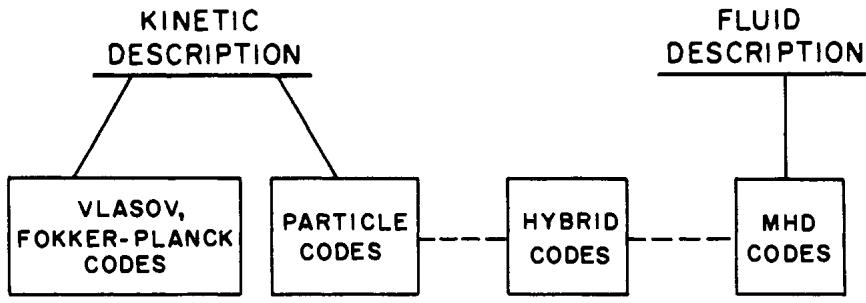
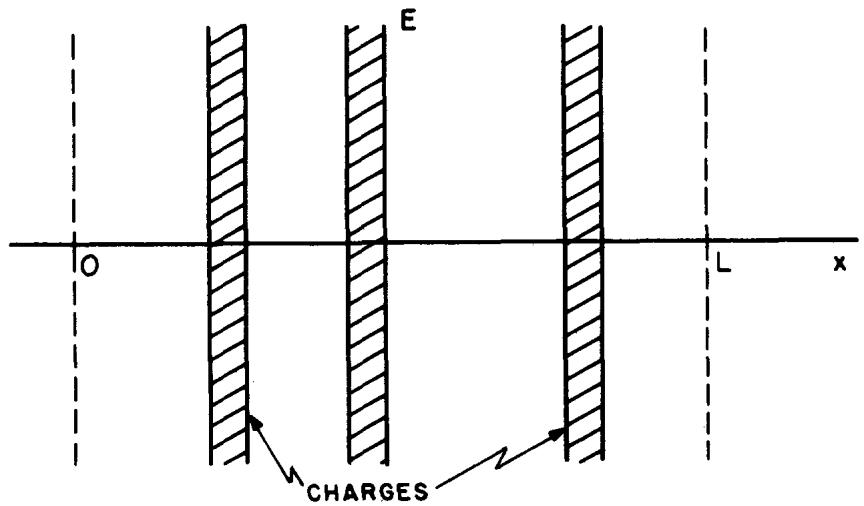
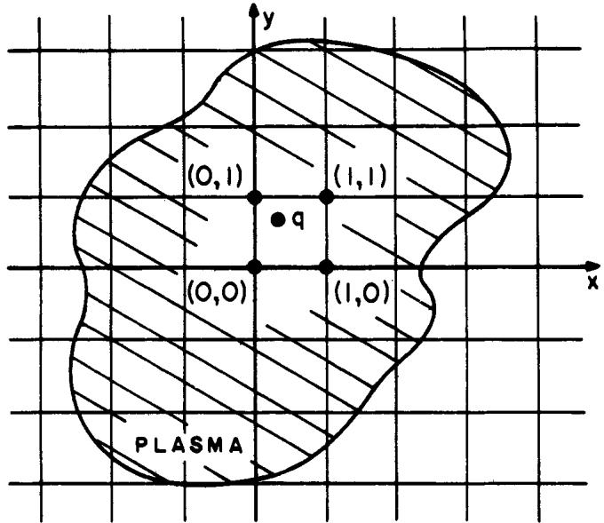
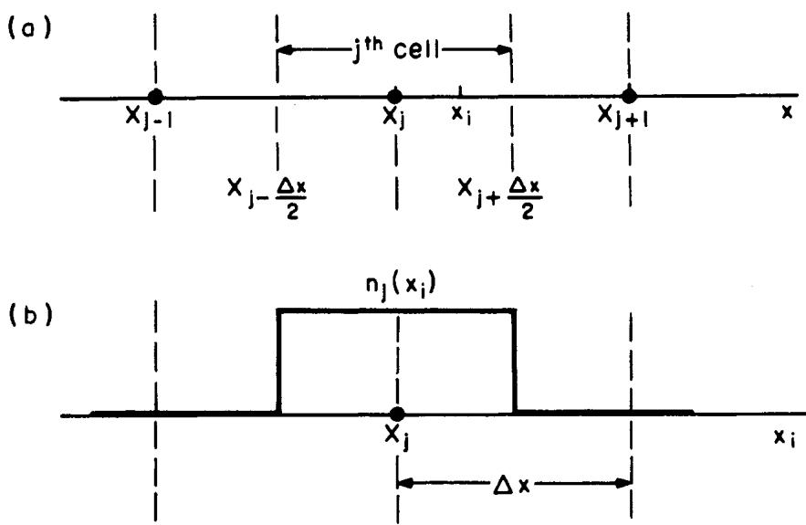
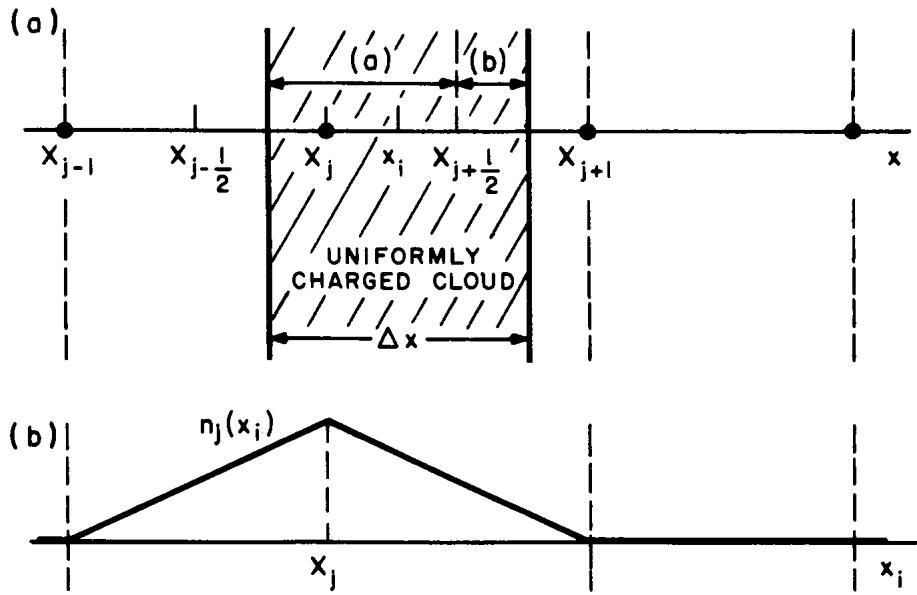

# Birdsall and Langdon 1985 中文讲解

## 元数据

- 目录：`references/02_books_lecture_notes/1985_BirdsallLangdon_Plasma_physics_via_computer_simulation/`
- 原 PDF：`1985_BirdsallLangdon_Plasma_physics_via_computer_simulation.pdf`
- 由于 MinerU 单文件上限为 200 页，当前拆分为三段处理：
  - `split_parts/1985_BirdsallLangdon_Plasma_physics_via_computer_simulation_p0001-0200/`
  - `split_parts/1985_BirdsallLangdon_Plasma_physics_via_computer_simulation_p0201-0400/`
  - `split_parts/1985_BirdsallLangdon_Plasma_physics_via_computer_simulation_p0401-0469/`

## 当前状态

- 已建立书籍专属目录。
- 已完成原 PDF 落盘。
- 已用 `pypdf` 拆成三段以规避 MinerU 的 200 页限制。
- 三段当前都已完成 MinerU 转 Markdown，并各自生成 `images/`。
- 已开始第一分卷的顺序化中文精读，当前已覆盖 `Foreword`、`Preface`、Chapter 1 与 Chapter 2 的 `2-1` 到 `2-4`。

## 这本书在 PIC-tutor 中的用途

- 这是当前项目里最核心的 PIC 长书入口之一。
- 适合回链：
  - 第 3A 章初始化与粒子装载
  - 第 4 章粒子推进
  - 第 5 章形函数、沉积与守恒
  - 第 6 章场求解与数值稳定性
  - 第 8 章中的基础应用背景
- 它和 `Dawson 1983` 的关系应写成：
  - `Dawson 1983` 更像高层综述
  - `Birdsall-Langdon 1985` 更像系统教材与算法实现讲义

## 建议优先阅读段落

1. 第一段前半：确认作者对 PIC 基本思想、宏粒子、网格场和统计噪声的定义。
2. 第一段后半到第二段前半：优先抽取粒子推进、形函数、电荷/电流沉积和守恒修正主链。
3. 第二段后半到第三段：记录碰撞、边界、数值误差、有限网格效应等与 WarpX 章节最直接相关的内容。

## 后续待办

- [ ] 按分卷顺序做逐段中文总结，并在笔记中标明对应分卷。
- [ ] 把关键算法公式统一整理成 `$$ ... $$`。
- [ ] 给每个与 WarpX 章节直接相关的段落补上“章节用途记录”。

## 第一批精读范围

当前只覆盖第一分卷 `p0001-0200` 中已经实际读到的内容：

1. `Foreword`
2. `Preface`
3. `ONE DIMENSIONAL ELECTROSTATIC AND ELECTROMAGNETIC CODES`
4. Chapter 1
5. Chapter 2 的 `2-1` 到 `2-4`

后续章节暂不在这一轮冒充已读完。

## 0. 论文信息

- 书名：*Plasma Physics via Computer Simulation*
- 作者：C. K. Birdsall, A. B. Langdon
- 首版：1985
- 当前项目内的可读形态：
  - 原书 PDF
  - 按页数拆分后的三段 MinerU Markdown
- 这一轮的阅读目标：
  - 先把作者如何为 PIC 建立“物理上可行”的论证写清楚
  - 再把他们给出的最小 1D electrostatic 程序框架，接回 WarpX 的初始化/推进/沉积/求解器主链

## 1. Foreword

### 1.1 这本书在等离子体计算中的位置

前言最重要的工作不是讲算法细节，而是先把等离子体计算的两大路线分开：

- fluid / MHD
- kinetic simulation

其中 kinetic simulation 又分成：

- 直接数值求解 Vlasov / Fokker-Planck
- particle simulation

这和当前 `PIC-tutor` 的项目边界直接一致：本书主要服务的是第二条，也就是粒子法和它的数值实现。

### 图 a: 等离子体计算模型分类

**图像描述：**

前言里的图 a 用一个总图把 plasma computer simulation 分成 fluid、kinetic、particle 等几支。

**物理含义：**

作者从一开始就不把 PIC 讲成“求解一切等离子体问题的唯一办法”，而是把它放回 kinetic description 这一大类里。

**与 PIC-tutor 的关联：**

- 对应本项目中 `Fluids/`、`HybridPICModel` 与主 PIC runtime 三条线的区分。
- 也提醒后续章节不能把所有 plasma simulation 都混写成 PIC。

### 1.2 前言给出的核心判断

前言有两个高价值判断：

1. particle simulation 特别适合处理明显偏离局域 Maxwell 分布的动力学问题；
2. 这门技术最好通过“实际跑代码”来学，而不是只靠抽象理论。

这也解释了为什么 Birdsall-Langdon 的第一部分不是先堆理论，而是先给 `ES1` 和 `EM1`，再配项目题。

## 2. Preface

### 2.1 作者对本书目标的自我定位

Preface 说得很直接：这本书不是覆盖全部 plasma physics，也不是覆盖全部 computer simulation，而是专门讲 particle simulation of plasmas，目标是帮助读者抓住 plasma behavior 的 essence。

这点对 `PIC-tutor` 很重要，因为它给了“源码讲解书”的取舍标准：

- 不需要替代完整等离子体教材；
- 需要把 WarpX 所实现的 particle-based plasma simulation 主线讲透。

### 2.2 作者推荐的学习顺序

作者明确建议：

- 学生第一周就开始跑 Part One 的 project；
- 理论理解和实际 simulation 同步推进。

这和我们现在把 `Langmuir wave`、`Uniform plasma`、`LWFA/PWFA` 收束成应用综合章的思路是一致的：先有 runnable case，再回头讲算法和理论。

### 2.3 与 Hockney-Eastwood 的关系

Preface 还直接说：

- `Hockney & Eastwood` 是 complementary text
- Birdsall-Langdon 更偏 plasma simulation
- Hockney-Eastwood 更扩展到 semiconductor、gravity、solids、liquids

这进一步说明了为什么当前 `Hockney-Eastwood` 虽然仍缺本地 PDF，但在项目文档里必须长期保留为核心待补长书。

## 3. Part One 入口

Part One 的标题是：

- `ONE DIMENSIONAL ELECTROSTATIC AND ELECTROMAGNETIC CODES`

这说明作者的教学设计是：

1. 先用 1D electrostatic 建最小闭环；
2. 再扩到 1D electromagnetic；
3. 最后才谈更高维、更复杂的数值问题。

对于 `PIC-tutor`，这条线最直接对应：

- 第 3A 章：初始化
- 第 4 章：粒子推进
- 第 5 章：沉积与形函数
- 第 6 章：场求解
- 第 8 章：以 `Langmuir` 等最小案例回收

## 4. Chapter 1: 为什么用粒子做等离子体计算在物理上说得通

### 4.1 这一章的核心问题

Chapter 1 不是先问“如何写程序”，而是先问：

- 真实等离子体里粒子数巨大；
- Debye 球内粒子数 `N_D` 往往很大；
- 那为什么只用几千、几万，甚至更少的 superparticles，仍可能得到有意义的 plasma physics？

这其实就是 PIC 方法最根本的合法性问题。

### 4.2 Debye 长度与集体行为

作者先提醒读者，Debye 长度是一个核心尺度：

$$
\lambda_D \equiv \frac{\Delta v_{\mathrm{thermal}}}{\omega_p}
$$

**变量说明：**

- $\lambda_D$：Debye 长度
- $\Delta v_{\mathrm{thermal}}$：热速度尺度
- $\omega_p$：等离子体频率

**物理意义：**

- 它是 test charge 周围屏蔽长度；
- 也是粒子热运动在一个 plasma timescale 内走过的典型距离；
- 同时把“近距离粒子-粒子作用”与“更大尺度 collective behavior”分开。

### 4.3 Debye 球粒子数并不是唯一的物理门槛

作者接着写出：

$$
N_D \equiv n \lambda_D^3
$$

并指出真实实验装置里，`N_D` 可以非常大，照字面硬模拟当然不现实。

但作者的关键转向是：

- 我们真正关心的常常是 collisionless collective behavior；
- 真正需要的是保住本质的 `KE \gg PE` 与 `\nu \ll \omega_p`；
- 而不是机械复制实验里的全部粒子数。

这一点被压成两个判断：

$$
\frac{\text{Thermal kinetic energy (KE)}}{\text{Microscopic potential energy (PE)}} \gg 1
$$

以及

$$
\frac{\nu}{\omega_p} \approx \frac{1}{N_D}\ln N_D \ll 1
$$

**物理直觉：**

- 等离子体之所以还能被当成“弱碰撞、以 collective field 为主”的介质，不是因为粒子数本身神圣，而是因为热运动足够压过微观库仑束缚、碰撞频率足够低。
- PIC 可以在不完全复刻真实 `N_D` 的情况下，只要保住这些比例关系的本质，就仍可能抓住正确的 plasma behavior。

### 4.4 作者允许的“受控失真”

Chapter 1 最值得记下来的，不是某个公式，而是作者对 simulation approximation 的态度：

1. 可以降低维度；
2. 可以用 periodic slice 代替完整实验区域；
3. 可以通过空间网格和平滑机制抹掉极短尺度相互作用；
4. 可以用 finite-size particles 减弱短程库仑奇异性；
5. 可以容忍比实验更高的噪声和碰撞，只要还在可接受范围。

这实际上就是后面所有 PIC 数值设计的总哲学：

- 不是逐粒子复刻实验；
- 而是在受控失真下保住目标物理。

### 4.5 finite-size particles 的三条结论

作者把 finite-size particles 的价值总结成三条，这几乎就是后面形函数章节的总预告：

1. 当使用空间网格时，finite-size particles 是自然出现的；
2. 当粒子半径 $R$ 接近或超过 Debye 长度时，碰撞截面和碰撞频率会显著下降；
3. 对粒子与网格之间的 weighting 有相当大的设计自由度。

这三条和 WarpX 的：

- shape factor
- deposition
- gather
- filtering
- finite-grid effects

是直接一一对应的。

## 5. Chapter 2: 一维静电程序的总图

### 5.1 `2-1 Introduction`

`2-1` 先把 `ES1` 的使用方式讲清楚：作者不是把它当成静态公式例子，而是一个需要反复试跑、修改初值、补 diagnostics、再试的实验平台。

这和现代 PIC code 使用方式完全一致：

- 起一套 input
- 跑几十到几千步
- 看诊断
- 改参数
- 再跑

所以从教学哲学上，Birdsall-Langdon 的 `ES1` 和我们现在梳理 WarpX examples 的方式非常接近。

### 5.2 `2-2 The Electrostatic Model`

这里作者把最小模型压成两部分：

1. 粒子位置/速度给出 charge 和 current；
2. 场再反过来推动粒子。

这就是 PIC 主循环的最简版本。

### 图 2-2a: 一维静电 sheet 模型

**图像描述：**

图 2-2a 用一维 sheet charges 表示最小 electrostatic system，只有 `x` 方向变化。

**物理含义：**

- 这是最经典的 1D electrostatic PIC 教学模型；
- 它把问题压到最小，同时保留自洽场和粒子响应。

**与 WarpX 的关联：**

- 可直接回链 `langmuir`、`electrostatic_sphere`、一维静电初始化与 Poisson 求解思路；
- 也对应我们在应用综合章里已经写实的最小 `Langmuir` 验证树。

### 5.3 为什么要上空间网格

作者在 `2-2` 里把“为什么不用逐对 Coulomb 力直接算”说得很清楚：

- 数值代价太高；
- 近距离奇异性太强；
- 真实关心的通常是某个尺度以上的连续密度与场，而不是每一对粒子的精确近距离散射。

### 图 2-2b: 从粒子到网格、再从网格回粒子

**图像描述：**

图 2-2b 画出了数学网格，以及一个粒子怎样向周围网格点贡献 $\rho/J$，再从网格上取回场。

**关键解读：**

- 这张图已经把后来的 deposition / gather 结构完整预告出来了。
- 也说明 PIC 不是“粒子直接互相打力”，而是“粒子-网格-场-粒子”的循环。

### 5.4 `2-3` 的程序循环

`2-3` 最关键的是 Figure 2-3a 对 program cycle 的描述：

- 从初始粒子位置和速度开始；
- 先沉积成 charge/current；
- 解场；
- 插值得到粒子受力；
- 推进粒子；
- 重复很多时间步；
- 最后通过 diagnostics 取出 physics。

这一段和 WarpX 今天的总体运行骨架依然同构，只是现代代码在每个方框内部已经复杂得多。

### 5.5 `2-4` 的 leapfrog mover

作者在 `2-4` 明确选用 leapfrog 作为最小高效方案：

$$
m \frac{\mathbf{v}_{\mathrm{new}}-\mathbf{v}_{\mathrm{old}}}{\Delta t}=\mathbf{F}_{\mathrm{old}}
$$

$$
\frac{\mathbf{x}_{\mathrm{new}}-\mathbf{x}_{\mathrm{old}}}{\Delta t}=\mathbf{v}_{\mathrm{new}}
$$

**变量说明：**

- $\mathbf{x}$：粒子位置
- $\mathbf{v}$：粒子速度
- $\mathbf{F}$：总受力
- $\Delta t$：时间步长

**数值意义：**

- 位置和速度交错在半步上；
- 用极少的存储换取二阶精度和相当好的稳定性；
- 这是后面 Boris / Vay / Higuera-Cary 等更复杂 mover 的基础时间离散背景。

作者还给出对简谐振子的相位误差展开：

$$
\omega_0 \Delta t + \frac{1}{24}(\omega_0 \Delta t)^3 + \text{higher-order terms}
$$

并据此建议典型选择满足：

$$
\omega_0 \Delta t \lesssim 0.3
$$

这类约束和我们在 WarpX 中不断碰到的：

- plasma frequency resolution
- cyclotron resolution
- CFL / accuracy

本质上是同一类离散时间尺度要求。

### 5.6 `v \times B` 旋转的教学意义

这一段虽然还是 1D electrostatic 主线，但作者已经插入了磁场下速度旋转的几何图像，为后面真正的 Boris 类 mover 做铺垫：

- 电场改变量值；
- 磁场部分主要做旋转；
- 于是先 half-acceleration，再做 rotation，是非常自然的时间中心化结构。

这和我们在第 4 章里已经拆过的：

- Boris
- Vay
- Higuera-Cary

在思想上是一条连续线。

## 6. 这一轮精读后的直接回链

### 6.1 对项目正文的影响

这轮读完后，Birdsall-Langdon 在 `PIC-tutor` 里的角色可以写得更硬一些：

- 它不是泛泛“经典教材”；
- 它是前几章对 PIC 合法性、grid mediation、最小主循环、leapfrog 离散的核心长书支撑。

### 6.2 对后续阅读的优先顺序

下一步最值得继续啃的是同一分卷里：

1. `2-5` 到 `2-6`
   - field equations integration
   - particle/force weighting
2. `3A`
   - `ES1` 真正的程序骨架
3. `4-6` 到 `4-10`
   - shape factors
   - finite-size particles
   - field / kinetic energy

这三段正好分别接：

- 第 6 章求解器
- 第 3A 章初始化和程序骨架
- 第 5 章沉积与形函数

## 7. Chapter 2-5: 场方程积分

### 7.1 这一节真正做的事

`2-5` 把 PIC 主循环里的“从沉积好的 `\rho/J` 到场”的这一步第一次正式写成数值算法。

在当前这本书的一维静电模型里，作者先从：

$$
\mathbf{E} = - \nabla \phi
$$

和

$$
\nabla \cdot \mathbf{E} = \frac{\rho}{\epsilon_0}
$$

出发，组合成 Poisson 方程：

$$
\nabla^2 \phi = -\frac{\rho}{\epsilon_0}.
$$

对于 1D，就是：

$$
\frac{\partial^2 \phi}{\partial x^2} = -\frac{\rho}{\epsilon_0}.
$$

这一步的意义不是数学上新鲜，而是把“field solve”从抽象物理方程变成了程序里真正可执行的模块。

### 7.2 有两条求解路线，但 ES1 选的是 FFT

作者给了两条路：

1. 直接解三点二阶差分离散后的线性方程组；
2. 对周期边界系统走 Fourier 路线。

`ES1` 选的是第二条，也就是：

$$
\rho(x) \xrightarrow{\mathrm{FFT}} \rho(k)
\xrightarrow{/K^2} \phi(k)
\xrightarrow{\mathrm{IFFT}} \phi(x)
\xrightarrow{-\nabla} E(x).
$$

这条链和 WarpX 里：

- electrostatic FFT solver
- PSATD / spectral solver
- diagnostics 里频谱视角

在思想上是一脉相承的。区别只是 `ES1` 这里还是最简单的 1D periodic electrostatic 版本。

### 7.3 这里已经出现了“离散算子不等于连续算子”

作者没有偷懒地把连续的 $k$ 和离散网格上的差分算子混成一回事，而是明确写出：

$$
E(k) = - i \kappa \phi(k)
$$

以及

$$
\phi(k) = \frac{\rho(k)}{\epsilon_0 K^2}.
$$

其中：

- $\kappa$ 是离散梯度算子的 Fourier 表达；
- $K^2$ 是离散 Laplacian 的 Fourier 表达；
- 它们只在 $k \Delta x \to 0$ 时才回到连续极限里的 $k$ 和 $k^2$。

这点非常关键，因为它说明：

- spatial grid 不是透明容器；
- 一旦上了 grid，场算子本身就被改写了；
- 后面 finite-grid effect、dispersion error、aliasing 都从这里长出来。

### 7.4 FFT 求解器不只是快，还天然带上了频谱控制接口

作者强调 FFT 路线还有一个额外好处：

- 不只是在速度上强；
- 还让你天然能在 $k$ 空间里看场和密度。

这直接带来两件事：

1. 更容易和 plasma theory 里的色散关系对接；
2. 能在频谱空间做 smoothing / compensation。

所以这一节已经提前埋下了：

- filtering
- compensation
- spectral diagnostics

这些后面才大讲的主题。

## 8. Chapter 2-6: particle / force weighting

### 8.1 这一节是后面形函数章节的真正起点

`2-6` 本质上在回答一个最基础的问题：

- 粒子坐标是连续的；
- 网格场与网格密度是离散的；
- 两者之间到底怎么连？

作者的答案就是：

- charge assignment
- force interpolation

而且明确说了：

- 最好使用一致的 weighting；
- 否则会出现 self-force。

这已经是 WarpX 第 5 章里 shape / gather / deposition 共用逻辑的最原始表达。

### 8.2 NGP 的意义不是“太粗”，而是一个基线

作者先讲零阶 weighting，也就是 `NGP`：

- 一个粒子只记到最近网格点；
- 一个粒子受力也只看最近网格点的场。

这条方法很便宜，但问题很明显：

1. 对 grid 来说，粒子等效成宽度 `\Delta x` 的矩形粒子；
2. 粒子跨 cell 边界时，密度会跳变；
3. 这种跳变会把 density / field 的时空噪声推高。

所以 `NGP` 的价值不是“现代代码要用它”，而是提供最清楚的基准：你一旦改进 weighting，本质上是在改什么。

### 图 2-6a: NGP 的等效粒子形状

**图像描述：**

图 2-6a 把 NGP 画成“粒子完全归属最近 cell center”的方案，同时画出粒子移动时对某一网格点密度的矩形贡献。

**关键解读：**

- NGP 等效粒子形状是矩形；
- 它的 discontinuity 直接带来 noise；
- 所以粒子 shape 和数值噪声是绑在一起的，不是两个独立问题。

### 8.3 CIC 的真正改进点

接着作者引入一阶 weighting，即 `CIC / PIC`：

- 一个粒子按线性权重分到两个相邻网格点；
- 对应的等效粒子形状变成三角形；
- 粒子移动时，网格上看到的密度变化更平滑。

作者给出的权重写法本质上就是线性插值：

$$
q_j = q_c \frac{X_{j+1} - x_i}{\Delta x},
$$

$$
q_{j+1} = q_c \frac{x_i - X_j}{\Delta x}.
$$

这说明：

- cloud interpretation
- interpolation interpretation

在数学上是一回事。

### 图 2-6b: CIC 的三角形等效粒子

**图像描述：**

图 2-6b 把 CIC 画成宽度为一个 cell 的 square cloud，但落到网格后的等效响应是三角形。

**物理/数值意义：**

- 这已经在直观上说明了为什么高阶 weighting 会继续平滑；
- 也说明 `S(x)` 与 `S(k)` 不是装饰品，而是数值噪声、粒子有限尺寸、field smoothing 的共同语言。

### 8.4 这里已经直接预告了后面的 spline 和 filtering

作者在这一节末尾明确说：

- 更高阶 weighting 可以继续降低噪声；
- 也可以在 Fourier 空间对 $\rho(k)$ 做 cutoff 或乘上平滑因子。

也就是说：

- shape factor
- spline
- spectral filtering

从这一节开始就已经连成一条逻辑链了。

## 9. Chapter 3A 开头: `ES1` 程序骨架

### 9.1 `3-1 Introduction`

`3-1` 的作用很直接：

- 不再只谈模型；
- 开始正式读一个具体程序。

作者强调 `ES1` 虽然是教学程序，但曾经也是专业程序的基础。这一点和我们现在读 WarpX examples 的态度很像：

- 教学/验证入口不等于玩具；
- 它往往就是实际程序结构的最小显式版本。

### 9.2 `3-2 General Structure of ES1`

这一节最重要，因为它第一次把前面的物理循环变成了程序名和子程序名：

- `INIT`
- `SETRHO`
- `FIELDS`
- `SETV`
- `ACCEL`
- `MOVE`
- `HISTRY`

这一串名字其实就是最小 PIC code 的 runtime graph。

可以把它压成：

1. `INIT`
   - 读入物理参数
   - 生成初始粒子
2. `SETRHO`
   - 把粒子坐标沉积成 charge density
3. `FIELDS`
   - 从 `\rho` 解 `\phi` 和 `E`
4. `SETV`
   - 把给定的 `v(0)` 变成 leapfrog 需要的 `v(-\Delta t/2)`
5. main loop:
   - `ACCEL`
   - `MOVE`
   - `FIELDS`
   - `HISTRY`

这和 WarpX 今天的主线相比，差别不是结构不同，而是每一个方块内部复杂度高了几个数量级。

### 9.3 `3-3` 到 `3-5`：输入参数和归一化

这几节最值得记的是一个事实：

- even in ES1, 用户输入的不是直接“程序变量”；
- 而是 plasma parameters，比如：
  - `\omega_p`
  - `\omega_c`
  - `q/m`
  - thermal velocity
  - perturbation mode

然后程序再把它们变成内部变量：

- `q`
- `m`
- 归一化后的 `x / \Delta x`
- 归一化后的 `v \Delta t / \Delta x`
- 归一化后的 acceleration `A`

这说明“参数到内部运行态”的映射不是现代框架才有，早期教学代码就已经在做了。

对 `PIC-tutor` 来说，这一段很适合以后回链：

- `parameter-map`
- 第 3A 章初始化参数
- WarpX 中 parser 参数到 runtime object 的映射

### 9.4 `3-6 INIT`：初始化不是魔法

作者在 `3-6` 里讲得很坦白：

- 没有任何“自动神奇生成正确初值”的方法；
- 模拟者必须明确指定每个粒子的初始相空间分布。

这句话非常重要，因为它和我们在 WarpX 初始化链里已经梳理过的：

- uniform loading
- Gaussian beam
- flux injection
- distribution parser
- quiet start

是同一个原则。

作者这里还明确区分了：

- cold uniform plasma
- warm plasma
- drift beam
- random Maxwellian
- quiet start
- mode perturbation

这些初始化构件后来都可以在现代 PIC code 里找到不同版本的实现。

## 10. 这一轮精读后的直接回链

### 10.1 对 WarpX 章节的直接价值

这一轮新读出的最关键三条线是：

1. `2-5`
   - field solve 从 `\rho` 到 `\phi/E`
2. `2-6`
   - particle-grid coupling 的 weighting 本质
3. `3A`
   - 最小 PIC runtime graph

它们分别最适合回链：

- 第 6 章：Poisson / FFT / spectral view
- 第 5 章：shape factor / gather / deposition
- 第 3A / 第 4 章：初始化、推进和主循环骨架

### 10.2 下一步最值得继续读的点

下一轮不需要再从前言重读，最自然的是继续：

1. `3-7 SETRHO`
2. `3-8 FIELDS`
3. `3-10 SETV`
4. `3-11 ACCEL`
5. `3-12 MOVE`

因为这五节正好把：

- initialization
- deposition
- field solve
- first half-step
- mover

完整接起来，能直接形成一条真正可和 WarpX 对照的最小源码主线。

## 11. `3-7 SETRHO`: 初始电荷密度不是“输入已有”，而是第一次沉积

### 11.1 `SETRHO` 真正做的是第一轮 deposition

`3-7` 最重要的一点是：程序在 `t=0` 并没有一张已经准备好的 `rho(x)` 表。  
真正已有的只是粒子位置 `x`。因此 `SETRHO` 的角色是：

1. 把物理坐标 `x` 先换成程序内部的 `x / \Delta x`
2. 强制周期边界
3. 按选定 weighting 把粒子电荷累积到网格点

也就是说，`SETRHO` 本质上就是最早版本的 charge deposition kernel。

### 11.2 这里已经出现了“初始化”和“主循环沉积”的统一性

这一节特别值得记的一点是：

- `SETRHO` 只在 `t=0` 为每个 species 调一次
- `MOVE` 在后续每个 step 里也会再次积累 `rho`

两者本质上做的是同一种事，只是一个发生在启动阶段，一个发生在常规 time loop 中。

这对照到 WarpX 很重要，因为现代代码里虽然初始化和主循环的对象层更复杂，但：

- 初始 `rho/J` 不是凭空存在；
- 必须来自一次真实的粒子到网格映射。

### 11.3 中性背景与 mobile species 的关系

`SETRHO` 还显式加入了固定中和背景 `rho0/rhos`。  
这说明作者并没有把“背景离子”藏成隐含假设，而是让它进入最早的网格电荷账本。

这和后面：

- uniform neutralizing background
- immobile ions
- all-mobile multi-species

这些不同物理设定的数值入口直接相关。

## 12. `3-8 FIELDS`: 从 `rho` 到 `phi/E` 再到场能量

### 12.1 `FIELDS` 是一条完整链，不只是“解 Poisson”

`3-8` 说明 `FIELDS` 不是单一步骤，而是一整条管线：

1. 构造离散 `1/K^2`
2. 允许乘上 smoothing factor `SM(k)`
3. `rho(x) -> rho(k)` FFT
4. `rho(k) -> phi(k)`
5. 累积 electrostatic energy
6. 逆变换得到 `phi(x)` 与平滑后的 `rho(x)`
7. 用与 weighting 对应的差分公式得到 `E(x)`

因此这里已经不是抽象“场求解器”，而是：

- solver
- spectral filter
- diagnostics/energy accounting
- gather-compatible differencing

放在同一子程序里的最小实现。

### 12.2 smoothing 不是附加 cosmetic，而是物理与数值接口

这一节再次强调 `SM(k)` 的作用：

- 抑制短波长噪声；
- 必要时做某种 pre-emphasis；
- 同时等价于改变有效粒子形状。

这意味着“滤波”和“粒子 shape”并不是两件孤立的事，而是在频域里直接耦合。

### 12.3 `E` 的差分必须和 weighting 一起选

作者明确说，`E(x)` 的 differencing 要与所用 weighting 匹配。  
这条规则非常关键，因为它说明：

- deposition
- field solve
- field differencing
- gather

必须当成一套离散合同来设计，而不是各自单独“选一个看起来不错的方法”。

## 13. `3-9` 到 `3-12`: ES1 的最小 runtime contract

### 13.1 `3-9 FFT` 的意义是把“快”制度化

`3-9` 虽然表面只是 FFT 工具说明，但它真正反映的是：

- ES1 不是手工逐模算 Fourier 系数；
- 它把 `CPFT/RPFT2/RPFTI2` 当成核心 runtime primitive。

尤其 `RPFT2` 把两条实序列打包一起变换，这已经是在非常早期就显式追求性能。

### 13.2 `3-10 SETV` 解释了 leapfrog 启动为什么不平凡

`SETV` 的核心不是“改一下初始速度”，而是把用户给的

$$
x(0), \quad v(0)
$$

转换成程序真正需要的 staggered 状态：

$$
x(0), \quad v(-\Delta t/2).
$$

所以 leapfrog 的启动不是一个形式细节，而是整个时间中心化结构能否成立的必要条件。

### 13.3 `3-11 ACCEL` 已经把 mover、能量和权重合同放在一起

`ACCEL` 这一节有三点最值得记：

1. 先把场归一化到程序内部变量 `A`
2. 再按 weighting 把场插值到粒子并推进速度
3. 同时顺手累计动量和 kinetic energy

作者这里给出的 kinetic energy 计法是：

$$
\mathrm{KE} = \frac{m}{2} v_{\mathrm{old}} v_{\mathrm{new}}
$$

重点不在这个式子“长得简洁”，而在于：

- 它天然对齐 leapfrog 的时间中心；
- 它服务于后面总能量账本的时刻对齐。

### 13.4 `3-12 MOVE` 说明 position advance 和 charge deposition 是同一个 kernel 的两半

`MOVE` 不是只做

$$
x_{\mathrm{new}} = x_{\mathrm{old}} + v_x.
$$

作者明确写出，`MOVE` 在推进完位置、处理完周期边界之后，立刻再次按 weighting 把电荷积回 `rho`。

也就是说，在 ES1 里：

- 位置推进
- 周期重映射
- 下一步所需电荷密度累积

是绑定在一个粒子循环里的。

这和现代 PIC 代码里“push 后立即做新的 deposition”在结构上是一致的。

## 14. `3-13`: 一个 step 完成时，哪些量已经在什么时刻上

`3-13` 很短，但很有价值，因为它把一步结束时的时间层说清了：

- 速度已经从
  $$
  v(t-\Delta t/2)
  $$
  推到
  $$
  v(t+\Delta t/2)
  $$
- 位置已经推到
  $$
  x(t+\Delta t)
  $$
- 场也已经更新到
  $$
  E(t+\Delta t)
  $$

这正是 leapfrog 程序最容易在实现上写乱的地方。  
作者在这里用一句短总结，把 time staggering 的最终账本钉死了。

## 15. `4-6`: shape factor 不是解释图，而是有效电荷理论

### 15.1 粒子只要经过网格，就不再是零厚度点粒子

`4-6` 直接把前面图像化的 NGP/CIC 提升成理论语言：

- 粒子的有效电荷分布是 `S(x)`
- 其频域表示是 `S(k)`

只要观测和求场都通过网格完成，粒子就不会再“表现得像 point particle”。

### 15.2 云粒子的核心替换规则

作者给出的最有力总结是：

- 在许多线性理论里，可以把电荷 `q` 有效替换成 `q S(k)`；
- 因此诸如 plasma frequency 的项会带上 `S^2(k)`。

例如冷等离子体近似里会出现

$$
\omega^2 \approx S^2(k)\,\omega_p^2.
$$

这说明 finite-size particles 不是只减少噪声，而是系统性改变短波长响应。

## 16. `4-7` 与 `4-8`: finite-size particles 和 grid force 的两层效应

### 16.1 `4-7` 说明 warm plasma 只有在小云半径下才近似实验等离子体

作者指出：

- 若 `R < \lambda_D` 且 `kR << 1`，那么 `S(k) \approx 1`
- 弱阻尼 Langmuir 波基本还接近 point-particle 结果

但若 `R \gtrsim \lambda_D`，则频散和阻尼都可能明显改写。

这对数值设计的真正含义是：

- finite-size particles 不是“越大越稳越好”
- 它必须服从目标物理尺度约束。

### 16.2 `4-8` 把 grid force 问题点明了

`4-8` 最重要的不是几张相互作用力图，而是把总力拆成：

$$
F = \bar{F} + \delta F
$$

其中：

- `\bar{F}` 是平移网格后不变的平均相互作用；
- `\delta F` 是非物理 grid force。

作者进一步指出，`delta F` 的主要后果是不同波数之间通过 aliasing 耦合。  
这已经直接预告了后面更系统的 finite-grid instability / aliasing 讨论。

## 17. `4-9` 与 `4-10`: Poisson 精度和能量账本必须一起看

### 17.1 `4-9` 的要点不是“更高阶一定更好”

作者比较了常见三点 Poisson stencil 与更高精度形式，但给出的结论很务实：

- 单独看 Poisson step，更高阶可能更准；
- 但整体程序误差才是关键；
- 某个局部更高阶的形式，不一定最适合补偿其它离散误差。

这和现代代码中“局部最优不等于系统最优”的工程判断完全一致。

### 17.2 `4-10` 说明为什么 `rho phi` 比 `|E|^2` 更基础

作者把场能量写成

$$
\mathrm{ESE} = \frac{1}{L}\sum_k \rho_k \phi_k^*
$$

并强调，在这个模型里它比直接用

$$
\sum_k |E_k|^2
$$

更基础。原因是：

- 真正的 potential energy 定义来自 `q\phi`
- 当库仑短程相互作用已被 finite-size particles 和 grid 修改后，
  `|E_k|^2` 与 `rho_k \phi_k^*` 不再简单等价

这点非常关键，因为它说明“数值模型改了力学合同后，能量记账公式也要跟着改”。

## 18. 这一轮精读后的直接回链

### 18.1 对 WarpX 章节的直接价值

这一轮新读出的关键主线已经可以压成五条：

1. `3-7`
   - 初始 `rho` 来自第一次真实 deposition
2. `3-8`
   - solver/filter/energy/differencing 是一条离散合同
3. `3-10` 到 `3-12`
   - leapfrog 启动、mover、position push 和沉积主循环
4. `4-6` 到 `4-8`
   - shape factor、finite-size particles、grid force、aliasing
5. `4-9` 到 `4-10`
   - Poisson 精度与能量账本的系统性判断

它们分别最适合回链：

- 第 3A 章：初始化、参数归一化与 time staggering
- 第 4 章：particle mover 与 energy/momentum accounting
- 第 5 章：shape factor、gather/deposition、finite-grid effects
- 第 6 章：Poisson solver、spectral smoothing、field energy

### 18.2 下一步最值得继续读的点

在第一分卷里，下一步最自然的不再是回头重读 `ES1` 主链，而是：

1. 继续沿 Chapter 4 往下读与 mover / field accuracy 更直接相关的剩余小节
2. 然后进入后续更系统的 finite-grid / aliasing / numerical heating 讨论
3. 同时把这几轮 Birdsall 读书结果正式回填进第 3A / 4 / 5 / 6 章正文

## 19. `4-3` 到 `4-5`: Birdsall 对磁旋转 mover 的真正贡献

### 19.1 `4-3` 的重点不是“又写一遍洛伦兹力”，而是把旋转拆出来

`4-3` 真正做的事，是把

$$
\frac{d\mathbf v}{dt} = \frac{q}{m}\left(\mathbf E + \mathbf v \times \mathbf B\right)
$$

从一般牛顿-洛伦兹方程，拆成一个更适合数值推进的结构。  
作者给出两条思路：

1. 先减去 `E×B/B^2` 漂移速度，再处理纯旋转；
2. 用 Boris 1970 的“半步电加速 - 磁旋转 - 半步电加速”分裂。

这说明 Boris 结构从一开始就不是“经验技巧”，而是针对

- 电场部分可视为 impulse
- 磁场部分可视为 rotation

这两个几何事实做的分裂。

### 19.2 `tan(theta/2)` 是这条旋转算法的几何核心

这一节最关键的公式不是旋转矩阵本身，而是

$$
\tan \frac{\theta}{2} = \frac{\omega_c \Delta t}{2}.
$$

作者从速度空间图直接导出：

$$
\theta = 2 \arctan\left(\frac{qB}{m}\frac{\Delta t}{2}\right),
$$

并指出它对真实 cyclotron angle

$$
\omega_c \Delta t
$$

是二阶逼近。  
也就是说，Boris mover 的“磁推进像旋转”并不是类比，而是显式几何构造。

## 20. `4-4`: 实现层真正重要的是不必每粒子每步做超越函数

### 20.1 ES1 的 `s/c/t` 结构本质上就是半角公式实现

`4-4` 把旋转写成：

$$
t = -\tan \frac{\theta}{2}, \qquad
s = \frac{2t}{1+t^2}, \qquad
c = \frac{1-t^2}{1+t^2}.
$$

然后用它更新：

$$
v_x^+ = c v_x^- + s v_y^-,
\qquad
v_y^+ = -s v_x^- + c v_y^-.
$$

这一节真正重要的不是代数，而是工程判断：

- 若 `B` 固定，可以预先算好；
- 若 `B` 随粒子或时间变化，就要避免每次都做昂贵的 trig 计算；
- 因此半角变量 `t` 是实现层非常自然的中间量。

### 20.2 Boris 向量形式已经是现代实现的直系祖先

作者进一步给出向量写法：

$$
\mathbf v' = \mathbf v^- + \mathbf v^- \times \mathbf t,
\qquad
\mathbf v^+ = \mathbf v^- + \mathbf v' \times \mathbf s,
$$

其中

$$
\mathbf t = \frac{q\mathbf B}{m}\frac{\Delta t}{2},
\qquad
\mathbf s = \frac{2\mathbf t}{1+t^2}.
$$

这已经非常接近现代 PIC 代码里常见的 device-level Boris kernel 写法。  
所以 Birdsall 在这里提供的不是过时教学算法，而是今天 WarpX `UpdateMomentumBoris` 这条实现族的直接祖先结构。

## 21. `4-5`: 一维程序并不等于“一维速度”

### 21.1 1d2v / 1d3v 的关键是让 `k` 与 `v` 的方向解耦

`4-5` 很值得记，因为它提醒我们：

- 一维程序的“1d”
- 只约束空间依赖
- 不必约束速度空间自由度

因此可以有：

- `1d2v`
- `1d3v`

这些模型。

这和现代 PIC 里大量“几何维数”和“速度分量数”分开讨论的做法是同一传统。

### 21.2 guiding-center 常数说明离散 mover 也能保留结构

作者在 `4-5a` 里专门让读者证明 guiding-center 常数在差分形式下仍成立。  
这很重要，因为它说明：

- 这套磁旋转 mover 追求的不是“轨道大概像圆”
- 而是尽量保住原连续系统的重要结构量

这也解释了为什么后来的 Boris / Vay / Higuera-Cary 会长期被比较：  
核心不只是局部截断误差，而是谁更好地保留相空间结构、漂移和相对论几何。

## 22. 这一轮精读后的直接回链

### 22.1 对 WarpX 第 4 章的直接价值

这一轮新增的关键文献回链是：

1. `4-3`
   - 电场 impulse 与磁场 rotation 的几何分裂
2. `4-4`
   - `t/s/c` 半角实现与向量 Boris 形式
3. `4-5`
   - 1d2v / 1d3v 的建模边界与 guiding-center 结构量

它们最直接回到：

- 第 4 章里 Boris pusher 的结构来源
- 为什么 WarpX 的单粒子更新是“半电加速 + 磁旋转 + 半电加速”家族
- 为什么在较低空间维数下仍要保留多速度分量

### 22.2 下一步最值得继续读的点

现在 `Birdsall 1985` 第一分卷里，如果继续追“数值误差和非物理模”的主线，下一步最自然的是：

1. 直接进入 Chapter 8 的
   - `8-1` 到 `8-7`
2. 然后继续：
   - `8-10` 到 `8-13`

因为那里会把：

- spatial grid theory
- aliasing
- finite Fourier series
- nonphysical instability
- thermal plasma grid effects

系统化写出来，正好对应我们后面想收的 finite-grid / numerical heating 主线。

## 23. Chapter 8 开头：Birdsall 不把 grid 误差当“噪声尾巴”

### 23.1 `8-1` 最重要的态度：非物理模是 coherent interaction

`8-1` 一上来就把问题说得很硬：

- spatial grid 的周期性
- finite-difference time advance 的周期性

会和 plasma collective modes 发生 coherent interaction。

所以这章要处理的不是泛泛“有些数值噪声”，而是：

- alias coupling
- parametric instability
- cell-crossing high-frequency noise
- finite-grid induced nonphysical modes

这些真正可能冒充物理结果的系统性假信号。

### 23.2 Birdsall 在这里的标准不是单粒子轨道，而是 collective fidelity

作者明确说，他们更关心的不是单粒子轨道有多精确，而是：

- oscillation
- fluctuation
- collision
- instability

这些 collective plasma behavior 是否被错误改写。

这点对 `PIC-tutor` 很重要，因为它直接决定我们后面审视 WarpX regression 时，优先看的是：

- dispersion
- growth rate
- charge conservation
- energy accounting

而不是先问“某一条单粒子轨迹是不是最光滑”。

## 24. `8-2` 到 `8-4`: 空间网格理论的真正对象不是单个 stencil，而是整个离散系统

### 24.1 `8-2` 把时间先冻结，只隔离 `Delta x`

这一节的方法论很清楚：

- 先把时间当连续；
- 暂时只研究 finite `\Delta x` 的影响；
- finite `\Delta t` 留到下一章。

这说明作者并不是把 space/time 错误揉成一个“大概误差源”，而是刻意分层：

1. 先分离 spatial-grid error
2. 再分离 time integration error
3. 最后再看它们耦合

### 24.2 `8-3` 明确写出 grid force 的一般形式

在没有网格时，两粒子力只依赖 separation：

$$
x = x_2 - x_1.
$$

但一旦引入网格，力还依赖 mean position：

$$
\bar{x} = \frac{x_1+x_2}{2}.
$$

这其实就是 Chapter 4 里 `F = \bar{F} + \delta F` 的更系统版本。

最重要的是，作者把这种 periodic nonuniformity 的结果写成 Fourier 语言后，明确指出：

- 不同 `k`
- 和相差整数倍 `k_g = 2\pi/\Delta x` 的 mode

会彼此耦合。

这就是 aliasing 的最一般来源。

### 24.3 `8-4` 的 notation 不是形式主义，而是为了把 particle variables 和 grid variables 严格分开

这一节把：

- particle-defined continuum quantities
- grid-defined sampled quantities

分得非常清楚。  
这在后面非常关键，因为 aliasing 正是发生在：

- continuum information 被 squeeze 进 discrete grid

这一步。

## 25. `8-5` 到 `8-7`: shape factor、动量守恒和 aliasing 是同一条链

### 25.1 `8-5` 把 charge weighting 与 force weighting 绑成同一个 `S`

作者先把 grid charge density 写成

$$
\rho_j = \sum_i q_i S(X_j-x_i),
$$

再把粒子受力写成

$$
F_i = q_i \Delta x \sum_j E_j S(X_j-x_i).
$$

关键点不是这两个公式本身，而是：

- 用同一个 `S`

不是随便的实现偏好，而是为了：

1. 消掉 self-force
2. 保证整体 momentum conservation
3. 避免使用不同 cloud shape 时出现 gravitation-like instability

### 25.2 `8-6` 把总动量守恒降成 `sum rho_j E_j`

作者这里的推导非常漂亮：

$$
\frac{dP}{dt} = \Delta x \sum_j \rho_j E_j.
$$

于是总动量是否守恒，不再取决于抽象“粒子很多所以可能守恒”，而是取决于：

- grid 上 `E_j` 如何由 `rho_j` 算出；
- 算法是否保持平移与左右反射对称。

这条线对 WarpX 的意义很直接：

- current/charge deposition
- field solve
- staggering
- boundary

必须作为整体看，否则“某个 kernel 自己看起来对”并不等于整体守恒。

### 25.3 `8-7` 明确写出 aliasing 发生的精确位置

这一节最关键的式子是：

$$
\rho(k) = q \sum_p S(k_p)\,n(k_p), \qquad k_p = k - p k_g.
$$

也就是说，grid 上看到的一个 `rho(k)`，实际上混进了所有 aliases `k_p`。

这就把 aliasing 说得非常具体了：

- 不是后处理 FFT 图上的视觉现象；
- 而是在“particle information -> sampled grid density”这一步就已经发生。

### 25.4 spline 的真正价值是削弱 alias coupling

`8-8` 虽然我这轮没有完整展开，但作者在 `8-7/8-8` 的连接点已经把关键判断说清：

- `S(k)` 在高波数衰减得越快；
- 对 aliases 的耦合越弱；
- spline 比高阶 Lagrange 更适合，因为它减少 discontinuity，从而减弱高 `k` 尾巴。

这条线正好接回 WarpX 里：

- higher-order shape
- k-space smoothing
- guard-cell / stencil 扩展

之间的工程权衡。

## 26. `8-10` 到 `8-13`: finite-grid instability 不是猜测，而是可解的色散关系

### 26.1 `8-10` 最重要的结果：grid quantities 的 normal mode 仍满足标量 `epsilon=0`

作者在这里把 alias-summed dielectric function 写出来，并强调：

- 对 grid quantities，normal mode 仍可写成标量 `\epsilon(k,\omega)=0`
- 但对 particle quantities，真实 normal coordinates 已经不是单一正弦，而是带 periodic envelope 的 Bloch-like 组合

这说明为什么：

- plotfile 上的场模态
- phase space 里的粒子结构

可能看见不一样的谱内容。

### 26.2 `8-11` 冷漂移等离子体已经能看出 spatial grid 对 Langmuir 模的改写

在 cold drifting plasma 模型里，作者给出：

$$
1 - \frac{\omega_p^2}{K^2(k)}
\sum_p \frac{k_p \kappa(k_p) S^2(k_p)}
{(\omega-k_p v_0)^2}
=0.
$$

这个式子非常关键，因为它把：

- `K(k)`
- `kappa(k)`
- `S(k)`
- alias sum

全都放进了同一个色散关系。

换句话说，finite-grid effect 不是“最后加个经验修正项”，而是从最基础的 dispersion relation 就已经被改写。

### 26.3 `8-12` 冷束流非物理不稳定性是最直接的警告

`8-12` 的结论非常硬：

- 一个物理上本应稳定的 cold beam
- 仅仅因为 spatial grid alias coupling
- 就可能出现 purely numerical instability

作者甚至把它讲成“telltale mark of numerical instability”。

这对后面所有 beam / drift / boosted-frame 场景都很关键，因为它说明：

- 看到增长
- 不等于看到了真实 beam instability

必须先排除 grid-induced branch。

### 26.4 `8-13` 说明 warm plasma 也不能简单放心

即使 Maxwellian thermal plasma 没有冷束那么脆弱，grid 仍然会通过

- `S(k_p)`
- `K(k)`
- `kappa(k_p)`
- alias sum

改写 dielectric function。  
当 `\lambda_D` 太小、接近或小于 `\Delta x` 时，principal alias approximation 会失效，非物理 branch 可能进入真正相关频段。

这说明：

- `\lambda_D / \Delta x`

不是一个可有可无的经验比值，而是数值物理边界。

## 27. 这一轮精读后的直接回链

### 27.1 对 WarpX 第 5 / 6 章的直接价值

这一轮新增的关键主线已经可以压成四条：

1. `8-1` 到 `8-4`
   - spatial-grid theory 的问题设置与 aliasing 的一般来源
2. `8-5` 到 `8-7`
   - `S`、动量守恒、sampled density 与 finite Fourier series aliasing
3. `8-10` 到 `8-11`
   - grid-modified dielectric function 与 alias-summed dispersion relation
4. `8-12` 到 `8-13`
   - cold beam / warm plasma 的 nonphysical instability 条件

它们最直接回到：

- 第 5 章：shape factor、gather/deposition、aliasing、finite-grid effects
- 第 6 章：Poisson / field differencing / smoothing 如何进入 dispersion relation

### 27.2 下一步最值得继续做的事

这一轮之后，Birdsall 第一分卷里和本项目最贴近的 finite-grid 主线已经初步够用了。  
更合理的下一步不是继续无边界扩读，而是：

1. 把这轮 Chapter 8 结论最小回填到第 5 / 6 章；
2. 然后评估是否需要继续读 Chapter 9/10 中和 energy-conserving、alias branch、numerical heating 最直接相关的段落；
3. 同时把这些 Birdsall 文献结论和 WarpX 现有 validation 例子更明确配对。

## 28. `9-4` 与 `9-7`: finite `\Delta t` 也会制造自己的 alias branch 和 nonphysical heating

### 28.1 时间离散不是只带来相位误差，还会带来新的共振条件

Chapter 8 讨论的是 spatial grid aliases。到了 `9-4`，Birdsall 把问题再推进一步：即使先忽略空间网格，只看 finite `\Delta t`，时间采样本身也会把频谱按

$$
\omega_g=\frac{2\pi}{\Delta t}
$$

周期折叠。  
这时系统不只是“主模频率有一点相位误差”，而是会出现新的 alias resonance。

他特别强调两点：

- 纯粹 temporal aliasing 本身不一定像 spatial aliasing 那样立刻给出明显不稳定；
- 真正危险的是某条物理分支和另一条时间 alias 分支被非物理地拉近，导致本来不该耦合的模式发生耦合。

所以这里的核心不是“单个 mode 被搞坏”，而是：

- 一条 dispersion branch
- 和它的 time alias
- 由于离散采样被误当成可以相互作用的近邻分支。

### 28.2 Maxwellian warm plasma 的阈值比冷等离子体更苛刻

`9-4` 给了一个很关键的判断：冷等离子体下人们常记住的是

$$
\omega_p \Delta t > 2
$$

会出问题；但在 warm Maxwellian plasma 里，Bohm-Gross frequency shift 会把危险阈值提前。  
Birdsall 给出的线性分析结果是：

- 最先出问题的位置在 `k v_t \Delta t \approx 1.14`
- 对应的阈值约为 `\omega_p \Delta t \gtrsim 1.62`

也就是说，真正该警惕的不是“粒子是不是一步跨过了太多网格”，而是：

- thermal correction 把本征频率往上推；
- 某个 plasma-oscillation branch 更接近 `\pi/\Delta t` 一带的 alias；
- 然后 branch-branch alias coupling 触发非物理增长。

这点很重要，因为它纠正了一种很常见但太粗的直觉：  
数值不稳定不一定是因为粒子一步走太远、直接“看错了场”；更深层的原因常常是离散色散关系本身已经允许两个本不该靠近的分支发生耦合。

### 28.3 numerical heating 在这里不是模糊现象，而是线性不稳定后的直接后果

`ES1` 的实验例子把这件事说得很直白：

- 当 `\omega_p \Delta t` 偏大时，某个 Fourier mode 会先指数增长；
- 粒子在与该 mode 共振的速度附近形成 trapping vortices；
- 模式饱和后，动能继续明显增加，速度分布长出 superthermal tail。

Birdsall 在这里直接确认了一个经验结论：

- 大的 `\omega_p \Delta t`
- 大的 `v_t \Delta t / \Delta x`

会对应高噪声水平和快速的 nonphysical heating。

因此“numerical heating”在这里不能只理解成长期累积的小误差。  
至少有一类 heating 的根源是：

- finite `\Delta t`
- time alias branches
- dispersion-branch coupling
- 线性不稳定先起，再转入非线性饱和。

### 28.4 `9-7` 的 subcycling / orbit-averaging / implicit 不是装饰，而是针对这类时域病灶

到 `9-7`，Birdsall 才把补救思路摆出来：

- subcycling
- orbit-averaging
- implicit methods

这里最值得保留的理解不是它们每一种的实现细节，而是它们试图处理的共同问题：

- 如果真实感兴趣的是 slowly-evolving physics，
- 那么不应该让 fast plasma oscillations 和它们的离散 aliases 统治数值误差预算。

因此这几类算法的价值，首先不是“更高级”，而是：

- 有选择地弱化高频时间 alias 的影响；
- 把主计算资源重新压回慢物理过程；
- 降低 nonphysical heating 和高频噪声对长期演化的污染。

这条线和我们后面看 WarpX 的

- subcycling
- implicit EM
- hybrid / reduced fast-scale treatments

时应该是直接连着读的。

## 29. `10-2` 到 `10-4` 与 `10-9` 到 `10-10`: energy-conserving 不是“更完美”，而是换了一套离散合同

### 29.1 `momentum-conserving` 路线里不存在严格守恒的总能量

`10-2` 的判断非常硬：  
在通常的 momentum-conserving PIC 里，不管你把场能量写成

$$
\frac{\Delta x}{2}\sum_j E_j^2
$$

还是写成

$$
\frac{\Delta x}{2}\sum_j \rho_j\phi_j,
$$

它和粒子动能加起来都不会给出一个严格常数。

原因不在于时间积分还不够准，而在于粒子受力、场差分和 Poisson 算子这整套离散合同并不允许把

$$
\int E\cdot J
$$

精确改写成某个固定 field-energy functional 的时间导数。  
Birdsall 这里的结论可以压成一句话：

- momentum conservation 的离散合同
- 并不自动兼容 exact energy conservation。

所以如果某个 simulation 在这条路线上“总能量看起来几乎守恒”，更合理的解释是：

- 主能量交换主要发生在长波；
- 长波区里离散模型仍然足够接近真实等离子体；
- 而不是算法在微观上真的存在严格守恒量。

### 29.2 energy-conserving 的关键改动是：不再先差分 `\phi` 得 `E`，而是直接从离散场能量对粒子位置求梯度

`10-3` 提出的 energy-conserving 路线，起点不是改 mover，而是先宣告离散场能量：

$$
W_E=\frac{V_c}{2}\sum_j \rho_j\phi_j.
$$

然后粒子受力不再经由“先在网格上算 `E`，再插值 `E` 到粒子”，而是直接定义为

$$
\mathbf F_i=-\frac{\partial W_E}{\partial \mathbf x_i}.
$$

这一步是整个分叉点。  
也就是说，energy-conserving 路线真正换掉的是 force construction contract：

- `momentum-conserving`：更强调粒子-粒子相互作用对称与零总力；
- `energy-conserving`：更强调受力就是总场能量对粒子位置的负梯度。

Birdsall 还强调了一点：这里 charge weighting 和 force weighting 仍必须共用同一个 `S`，但 force 的构造方式已经不再是通常的 grid-differencing 路线，而是“固定 `\phi_j` 后，对插值势场解析求梯度”。

### 29.3 reciprocity 是 energy conservation 的真正条件

`10-3` 到 `10-4` 最值得记住的不是某个一维公式，而是 reciprocity / Green's reciprocation theorem。

Birdsall 的结论可以压成：

- 若离散 Poisson 解对应的 Green's function 满足 reciprocity；
- 且粒子受力来自同一个离散场能量泛函；
- 那么在连续时间极限下，总能量守恒是直接成立的。

换句话说，exact energy conservation 不是“经验上调对了几个差分系数”，而是：

- 粒子沉积
- 离散 Poisson 解
- 粒子受力回插

三者共享同一套可互易的离散变分结构。

这也解释了为什么 Birdsall 一直把

$$
\sum_j \rho_j\phi_j
$$

看得比单独的 `|E|^2` 更基础：  
前者直接暴露了这套离散系统的 Hamiltonian / variational 账本；后者只有在额外离散条件满足时才和它等价。

### 29.4 代价也很明确：能量守恒换不来动量守恒，还可能带来自力和较差的宏观场精度

`10-9` 明确说了这条线的代价：  
energy-conserving 模型一般不守恒动量，而其失效根源仍然和 aliasing、以及系统对“网格绝对位置”的敏感性有关。

Birdsall 甚至给出非常直观的后果：

- cold beam 穿过固定中和背景时，
- drift kinetic energy 可以被错误地拖成 field energy + thermal energy，
- 表现成宏观可见的数值 drag。

这里最重要的认识是：

- 不是 self-force 这一个小误差在作怪；
- 而是整套离散动力学已经不再具有平移不变性，
- 所以零总力与总动量守恒不再自动成立。

### 29.5 `10-10` 给出一个很关键的缓和判断：长波色散未必立刻被 aliasing 主导

尽管 energy-conserving 路线有上面这些代价，`10-10` 又补了一条很有分寸的判断：

- 对 warm plasma oscillations，
- aliasing 对色散关系的直接改写在 linear-weighting 情形下可以是四阶甚至五阶小量；
- 真正先冒头的，反而可能是 `F_0` 或 Poisson operator 自己的较低阶误差。

这意味着不能简单说：

- “有 aliasing，所以 energy-conserving 路线一定更差”

更准确的说法应该是：

- 它换了一套离散合同；
- 这套合同把 exact energy conservation 放到首位；
- 但 long-wavelength dispersion、momentum conservation、自力和噪声表现要另外逐项审查。

### 29.6 对本项目最直接的回链

这一轮 Chapter 9/10 的结论，可以直接压成三条回链：

1. Chapter 4  
   - `energy-conserving gather` 与 `momentum-conserving gather` 的差别，不能只写成“场中心不同”。
   - 更深层差别在于它们服务于两套不同的离散守恒合同。

2. Chapter 5  
   - `S(k)`、aliasing、sampled density 和 force construction 必须放在一起讲。
   - 否则会把“为什么某些路线守能量、某些路线守动量”讲成纯实现细节。

3. Chapter 6  
   - `rho\phi` 场能量账本、Poisson reciprocity、field differencing 与 dispersion error 应该放进同一框架。
   - 这正是 Birdsall `10-2` 到 `10-4`、`10-10` 真正提供的理论边界。

## 30. `12-3` 到 `12-7`: fluctuation spectrum 和 grid collisions 说明 numerical heating 不是“经验坏味道”

### 30.1 `12-3` 把噪声写成了一个可计算的 `(\mathbf{k},\omega)` 谱

Chapter 12 最重要的推进是：  
Birdsall 不再把 PIC 噪声只讲成“粒子数不够导致的随机涨落”，而是直接写成 grid quantity 的 fluctuation spectrum。

对电荷密度，他给出的核心结构可以压成

$$
(\rho^2)_{k,\omega}
\propto
\frac{1}{|\epsilon(k,\omega)|^2}
\sum_{p,q} S^2(k_p)\,\delta(\omega-k_p\cdot v,\omega_g).
$$

这里最值得记住的是三件事同时出现：

1. `S(k_p)`  
   - 说明噪声幅度首先被粒子 shape / alias 结构过滤；
2. `\epsilon(k,\omega)`  
   - 说明 collective response 不只是“后处理修正”，而是直接放大或抑制某些 fluctuation branches；
3. `\omega_g=2\pi/\Delta t`  
   - 说明时间采样的 comb 结构也在谱里留下硬痕迹。

这意味着 PIC 噪声不是单一来源：

- 有 sampled particles 的 shot noise；
- 有 shape factor 对 alias branches 的权重；
- 有 plasma collective response 对这些 branches 的再放大。

### 30.2 `1/2\,\rho\phi` 在这里再次成为更基础的场能量密度

`12-3` 里 Birdsall 又一次把场能量谱写成

$$
\left(\frac12\rho\phi\right)_{k,\omega}
=
\frac{(\rho^2)_{k,\omega}}{2K^2}.
$$

这很重要，因为它说明：

- `rho-phi` 账本不只是 Chapter 10 为了 energy-conserving algorithm 才临时引入的量；
- 它在 fluctuation theory 里同样是自然变量。

换句话说，若要讨论：

- thermal field noise
- Debye shielding
- spatial correlation
- total thermal field energy

更自然的入口不是直接盯 `|E|^2`，而是先看 `(\rho^2)_{k,\omega}` 怎样经由 `K^2` 变成 `1/2\,\rho\phi`。

### 30.3 `12-3` 还给出一个很关键的边界：当 `\lambda_D \lesssim \Delta x` 时，Debye potential 和 spatial spectrum 不再同义

Birdsall 在这里明确说：

- 对 point-particle continuum，人们常把 Debye shielding 和热平衡下的 spatial spectrum 视作同一件事的两种表述；
- 但在 gridded plasma 里，一旦 `\lambda_D` 接近或小于 `\Delta x`，两者就不再只是简单同义改写。

原因是：

- 它们共享同一个 collective denominator；
- 但 source term 已经不同。

这再次说明 grid effects 不是只改 dispersion，而是连“你在测量什么物理量”这件事本身都改了。

### 30.4 `12-5` / `12-6` 把“grid collisions”写成 kinetic equation

这轮最关键的收获之一是：  
Birdsall 不把 nonphysical heating 停留在线性不稳定或经验观测层，而是进一步写出一套 kinetic equation 来描述由 space-time grid 引起的 effective collisions。

他的立场非常明确：

- 这些 collision integrals 不是物理库仑碰撞；
- 它们代表的是 aliasing、sampling、finite `\Delta x/\Delta t` 在 many-particle ensemble 上留下的统计效应。

所以这里的“collisions with the grid”不是比喻，而是一个有明确 drift / diffusion / entropy production 含义的动力学近似。

### 30.5 `12-6` 的 H-theorem 把 nonphysical heating 压成了硬结论

最硬的一条结论是：

- 对 space-time gridded model，
- 即使 Maxwellian 分布本来已经是最大熵态，
- `H` 仍然会继续下降，
- 也就是系统仍会继续产熵。

Birdsall 直接把这件事解释成：

- grid 本身在制造 entropy；
- 如果约束量不变，这不可能发生；
- 所以一定有某个“应守恒的物理量”其实在模型里被改写了。

对 Maxwellian 情形，他进一步指出：

$$
\frac{1}{2v_t^2}\frac{d}{dt}\overline{v^2}
=-\dot H>0,
$$

也就是：

- 熵增加
- 和平均动能增长

是同一件事。  
这就把 numerical heating 从经验现象压成了 kinetic-level theorem。

### 30.6 对 drifting plasma，它表现成 drag + diffusion 的组合，而不是单向“纯加热”

`12-6` 和后面的 remarks 还补了一个很容易被讲错的点：

- grid effects 不一定只表现为总能量单调变大；
- 对 drifting plasma，它也可能表现成 mean drift 被拖慢，同时速度分布变宽。

也就是说，非物理效应更准确的图像是：

- drag
- diffusion
- entropy production

三者并存。  
在某些参数区间，人们看到的甚至会像“nonphysical cooling of the drift”而不是直观的总体升温。

所以如果只盯一个总能量曲线，有时会把问题看窄；更稳妥的是同时看：

- 总能量或场能量
- 平均漂移速度
- 速度展宽
- 相关谱或 correlation function

### 30.7 `12-7` 最关键的总结：缺陷不在 kinetic theory，而在模型本身

Birdsall 在 `12-7` 的总结非常值得保留：

- kinetic equation 并没有额外发明假缺陷；
- 它只是忠实地把模型本身已有的 nonphysical property 放大写了出来；
- 而这些缺陷不会在 ensemble average 后自动抵消。

这对我们理解 WarpX 里的 regression 和 diagnostics 很重要。  
如果某条 validation 只检查：

- 结果大致像
- 图像看起来还行

但没有检查：

- energy balance
- drift / diffusion
- noise floor
- fluctuation spectrum

那它并不能真正排除模型已经进入了数值病灶区。

### 30.8 对本项目最直接的回链

这一轮 `12-3` 到 `12-7` 的收获，可以直接压成三条：

1. 第 6 章  
   - `1/2\,\rho\phi` 不只是静电能量账本，也是 fluctuation spectrum 的自然能量变量。
   - field solver、`K(k)`、`\epsilon(k,\omega)` 和 thermal noise 必须放到同一框架里讲。

2. 第 4 / 5 章  
   - shape factor、sampled density、time step 不只是决定 deterministic dispersion，也直接决定 stochastic noise / effective grid collisions。

3. validation / diagnostics  
   - 以后遇到 `energy_conserving_thermal_plasma`、Langmuir、uniform plasma、NCI / stability 类测试时，应该同时关心：
     - total energy
     - drift / diffusion
     - fluctuation level
     - correlation / spectrum
   - 否则很容易把“看起来稳定”误判成“数值物理合同健康”。

## 31. `13-2` 到 `13-3`: sheet model 说明 PIC 的统计物理边界不只是“粒子数越多越好”

### 31.1 `13-2` 的一维 sheet model 不是玩具，它是最小 many-body plasma

Chapter 13 一开始最值得保留的判断是：

- 一维 sheet model 并不是“太简化所以只能做课堂演示”的玩具；
- 它已经足够展示：
  - Maxwellian 的形成与保持
  - Debye shielding
  - velocity drag
  - diffusion
  - relaxation time

这里的物理边界很硬：

- 每张 sheet 都在中性化背景里运动；
- 当 sheet 之间不穿越时，运动近似是以 `\omega_p` 为特征频率的集体振荡；
- 一旦穿越，动力学可以等价理解成标签交换或弹性反射。

这说明，即使模型极度简化，等离子体最核心的 collective physics 和统计 physics 仍然可以保留下来。

### 31.2 `13-2` 说明 Maxwellian 与 Debye shielding 可以在有限 `N_D` 下直接测量

Birdsall 在这一节里强调了两件经验上很重要、但很容易被说虚的话：

1. Dawson 的数值实验里，时间平均后的速度分布会逼近 Maxwellian；  
2. Debye shielding 也可以直接从同一模型里测出来，而且当 `N_D \gg 1` 时，理论曲线和模拟符合得很好。

这对本项目的意义是：

- PIC 的“物理有效性”不是只有在 `N_D \to \infty` 才开始出现；
- 更准确的说法是：
  - 只要 collective physics 还在，
  - 并且你知道 relaxation / fluctuation 的时间尺度，
  - 有限 `N_D` 的 reduced model 也可以给出可信的统计物理结论。

所以后面讲：

- `langmuir*`
- `uniform_plasma`
- `energy_conserving_thermal_plasma`

这些例子时，不能把“粒子少一些”直接等价成“结果就不物理”。  
真正该问的是：

- 你在测什么量；
- 采样是否跨过了相关时间；
- `N_D`、`\lambda_D/\Delta x` 和 `\omega_p\Delta t` 是否已经把系统推入数值病灶区。

### 31.3 fast-sheet wake 与 polarization drag 说明“阻尼”不是凭经验猜的

`13-2` 里另外一条很硬的主线是：

- 快粒子经过等离子体时，会在后方留下 wake；
- 这个 wake 对应的是被激发的等离子体振荡能量；
- 平均 deceleration 则可以直接由 wake 能量增长率来解释。

对 fast sheet，Birdsall 把减速率压成了

$$
\frac{1}{v_t}\frac{dv}{dt}=-\frac{\omega_p}{2N_D},
$$

而对 small-velocity 情形，则可以进一步写出：

- polarization drag
- fluctuation drag
- diffusion coefficient

并指出小速度下 diffusion 往往比 drag 更容易测量。

这对后面理解 WarpX 里的 thermal-noise、numerical heating 和 effective grid collisions 很关键：  
系统是否“在慢慢坏掉”，本质上不是一句“噪声有点大”就能概括，而是：

- drift
- diffusion
- collective response

三者怎样长期积累。

### 31.4 `\tau = 2N_D/\omega_p` 给出了最实用的 sampling 尺度

这一节最直接、也最能立刻指导数值诊断的公式是：

$$
\tau \equiv \frac{2N_D}{\omega_p}.
$$

Birdsall 把它解释成：

- fast / slow particle 显著改变量速度所需的时间；
- randomization time；
- 或 Dawson 的说法：plasma 忘记原先状态所需的时间。

更实际的一句是：

- 如果想让两次 velocity-distribution measurement 统计独立，
- 采样间隔至少要与 `\tau` 同量级，通常应大于几个 plasma periods。

这条判断对本项目非常实用，因为它直接约束：

- `uniform_plasma` 这类 noise baseline 的采样节奏；
- `Langmuir` 或 damping 类测试里 reader-side averaging 的解释；
- 任何“只看一张瞬时图就判断热化或稳定性”的偷懒做法。

### 31.5 `13-3` 进一步区分了 fast randomization 和 slow thermalization

`13-3` 最重要的不是复杂公式本身，而是它把两个时间尺度硬拆开了：

1. fast time-scale  
   - drag 与 diffusion 很快就会把选定粒子群的速度打散；
2. slow time-scale  
   - 真正让整个非 Maxwellian 分布热化到 Maxwellian 的过程要慢得多。

对单 species 一维情形，Birdsall 甚至明确指出：

- 若忽略 `\Delta x`、`\Delta t` 并只保留弱相互作用的 kinetic equation，
- 扩散与拖曳在一阶近似下会互相抵消，
- 于是并不会自动把分布推进到完整 Maxwellian。

这正是为什么 Dawson 测到的真正 relaxation time 不是 `\propto N_D`，而是更慢，实验上接近

$$
\tau \sim 10N_D^2.
$$

所以：

- `2N_D/\omega_p`
  更像 selected-group randomization time；
- `10N_D^2/\omega_p`
  更接近 whole-distribution thermalization time。

把这两件事混成一个“弛豫时间”，后面讨论 PIC thermalization 或 numerical heating 时就会失真。

### 31.6 对本项目最直接的回链

这一轮 `13-2` 到 `13-3` 的收获，可以直接压成三条：

1. 第 1 章  
   - `N_D` 不是只控制“连续极限离多远”，还控制 randomization time 与可独立采样的时间尺度。

2. 第 6 章 / diagnostics  
   - thermal noise、drift、diffusion、reader-side averaging 和 correlation time 必须放到一起讨论。

3. validation  
   - `uniform_plasma`、Langmuir、thermal-plasma 这类 family 的采样间隔、平均窗口与“看起来接近 Maxwellian”这类判断，都必须对照 `2N_D/\omega_p` 与更慢的 `N_D^2` 级热化时间来解释。

## 32. `13-4` 到 `13-5`: heating / cooling time 是 shape、grid、time step 和 mover phase error 的联合指标

### 32.1 `13-4(a)` 说明 self-heating time 不是单看 `N_D` 就能估

`13-4` 最直接的一条结论是：

- thermal plasma 的 self-heating time `\tau_H`
- 不是只由 `N_D` 控制；
- 它还显式依赖：
  - `\lambda_D/\Delta x`
  - particle shape / weighting order
  - `v_t\Delta t/\Delta x`

Birdsall 这里引用的一维结果已经给出了很清楚的数量级对比：

- 对 NGP，在近似最优的 `v_t\Delta t/\Delta x \approx 3/2` 一带，`tau_H` 最短；
- 对 CIC 和 QS，更合适的是 `v_t\Delta t/\Delta x \approx 1/2`；
- shape order 越高，heating time 越长，而且不是小改进，而是数量级拉开。

这说明：

- “更高阶 weighting 只是更光滑”
- 这种说法太弱了。

更准确的说法应该是：

- shape order 直接改写 short-wavelength alias coupling，
- 因而直接改写 nonphysical heating time。

### 32.2 spatial smoothing 在这里不是 cosmetic filter，而是延长 `\tau_H` 的设计变量

`13-4(a)` 还给出一个很硬的工程结论：

- 如果对高波数做更强截断，
- `\tau_H` 会明显增长；
- 而且增长幅度与 spline order 相关。

Birdsall 把这件事压成：

- 零阶 weighting 的收益最弱；
- 一阶更强；
- 二阶更强。

也就是说，很多工程上“网格更细 + 强 smoothing + 较高阶 shape”组合之所以有效，不只是因为图像更平滑，而是因为：

- 你在主动削弱短波 alias 与粒子 cloud 的耦合；
- 从而把 heating time 往后推。

这正是后面理解：

- WarpX 的 shape order
- current / field smoothing
- `uniform_plasma`
- `nci_psatd_stability`

这些路径时必须保留的理论背景。

### 32.3 `13-4(b)` 说明非物理 cooling 也是真实数值病灶，不只是 heating 的对立面

这一节最重要的提醒是：

- 数值病灶不只表现成 self-heating；
- 使用 damped equations of motion 时，也可能出现 nonphysical cooling。

Birdsall 的解释不是泛泛说“阻尼大了会冷却”，而是：

- damped mover 的 phase error 会在 collision operator 里制造 nonresonant drag terms；
- diffusion 没有相应地被“合理修正”；
- 于是整体能量平衡被改写。

这条结论很关键，因为它把：

- explicit damping
- implicit damping
- mover phase error

都拉回到了同一个 kinetic-theory 框架里。  
也就是说，看到总能量下降时，不能立刻把它理解成“更稳定”或“数值耗散有益”；它完全可能只是另一种 nonphysical transport。

### 32.4 `13-4(c)` 把 heuristic estimate 的边界说得很清楚

Birdsall 对 heuristic estimate 的态度很克制：

- 从 `\delta F` 出发去估 heating rate 当然很自然；
- 但若只看 alias force 的幅度，往往会高估自己理解了系统。

原因是：

- heating 或 cooling 不是单一 force source 的直接结果；
- 它是 drag 与 diffusion 轻微失衡后的净结果。

所以仅靠：

- `delta F` 有多大
- aliasing 看起来多严重

还不足以可靠估计实际 heating time。

Birdsall 甚至举出一个很硬的反例：

- 若把同样的 heuristic 套到 energy-conserving 路线，
- 在 `\Delta t \to 0` 极限下也可能估出非零自热；
- 但这与已知 exact result 冲突。

这说明，真正可靠的 scaling law 仍然要回到 kinetic theory 或经验证据，而不能只靠“看起来合理”的单项估算。

### 32.5 `13-5` 的 Hockney 2d2v 结果，把 thermal plasma 的设计量真正量化了

`13-5` 的价值在于：  
它不再只是概念讨论，而是给出了 2d2v thermal plasma 的长时间经验标尺。

Hockney 跟踪了五类 characteristic times：

- `tau_phi`
- `tau_{v_perp}`
- `tau_s`
- `tau_th`
- `tau_H`

其中最重要的两类是：

1. `tau_s`  
   - 代表 collisional slowing / scattering time；
2. `tau_H`  
   - 代表数值模型丢失能量守恒的 heating time。

这样 thermal plasma 的“能不能放心跑”就不再是模糊感觉，而变成：

- 在一个 heating time 内到底经历了多少个 collision times。

### 32.6 `N_C = n[\lambda_D^2 + (R\Delta x)^2]` 是比单独 `N_D` 更实用的 mesh-aware 粒子数尺度

Hockney 用

$$
N_C \equiv n\left[\lambda_D^2 + (R\Delta x)^2\right]
$$

来组织 2d2v 结果。

这里最重要的物理解释是：

- 当 `R\Delta x > \lambda_D` 时，
- 粒子 cloud 的有效宽度比 Debye length 更能控制碰撞和涨落。

这说明：

- finite-size particles 不是只改 deposition footprint；
- 它还会直接进入 collisional time、field fluctuation 和 heating time 的缩放律。

也正因为如此，Birdsall 才说：

- 当 particle radius 已大于 `\lambda_D`，
- 真正主导统计行为的长度尺度就不再只是 Debye length。

### 32.7 `13-5` 对 weighting order 的判断非常硬

`13-5` 最直接的工程结论之一是：

- NGP 与 CIC 的 `tau_s` 可以差不多；
- 但 `tau_H` 却能差一个数量级以上。

Birdsall 这里保留的 Hockney 结果是：

- 在典型最优路径上，
- CIC 的 `tau_H/tau_s`
- 大约可比 NGP 大十几到二十倍。

这说明：

- 改 weighting order 不一定显著改“物理碰撞时间”；
- 但会显著改“数值自热多久才积累到不可忽略”。

因此如果只盯：

- collision time
- 或某一张 field fluctuation 图

就很可能低估 shape order 对长期数值健康度的影响。

### 32.8 `13-5` 还给出了 thermal plasma 的一条很实用设计路径

Hockney 最终把参数面压成了一条非常实用的经验路径：

- 避开 cold-plasma `\omega_p\Delta t` instability；
- 避开 `\lambda_D/\Delta x` 太小导致的 spatial-grid instability；
- 同时尽量让
  $$
  v_t\Delta t \approx \frac{\Delta x}{2}.
  $$

这条“optimum path”背后的真正含义是：

- time step 既不能大到让粒子一步跨太多 cell；
- 也不能只从 CFL 或 wall-clock 角度孤立选。

在 thermal-plasma 问题里，

- `\Delta t`
- `\Delta x`
- `\lambda_D`
- `v_t`
- weighting order

必须联合设计。

### 32.9 对本项目最直接的回链

这一轮 `13-4` 到 `13-5` 的收获，可以直接压成四条：

1. 第 5 章  
   - shape order 和 smoothing 不只是改局部插值误差，还直接改写 `tau_H`。

2. 第 6 章  
   - `\Delta t`、damped mover phase error、alias coupling 和 heating/cooling time 必须放在一起看。

3. `uniform_plasma` / thermal-plasma validation  
   - 不能只问“能不能跑很久”，而应估计：
     - `tau_H`
     - `tau_s`
     - `tau_H/tau_s`
     - 以及是否处在接近 optimum path 的参数区。

4. 与 Hockney-Eastwood 的缺口文献关系  
   - 即使当前还缺本地 PDF，Birdsall 已经把最关键的 Hockney 2d2v 经验量转述了出来；
   - 后续补到原书后，应优先核对：
     - `N_C`
     - `tau_s`
     - `tau_H`
     - `tau_H/tau_s`
     - optimum path
     这几条是否在 Hockney-Eastwood 原始表述里保持同样边界。

### 32.10 `13-5` 后半段把 figure of merit 进一步量化成 `K_4`

前面 `32.8` 只把 optimum path 的逻辑写出来了；`13-5` 后半段真正更有用的地方，是把它进一步压成了一个经验系数 `K_4`：

$$
\left(\frac{\tau_H}{\tau_s}\right)_{\mathrm{opt}}
=
K_4\left(\frac{\lambda_D}{\Delta x}\right)^2 .
$$

这条式子的意义很直接：

- optimum path 上 thermal-plasma 的长期数值健康度，
- 可以被一条非常简洁的 mesh-resolution law 描述。

更重要的是，`K_4` 本身把不同 particle model 的优劣拉开了：

- NGP：`K_4` 很小；
- 标准 CIC：`K_4` 大一个数量级；
- 更安静的 particle-mesh 变体还能再大很多。

因此，若只比较：

- `\Delta x`
- `\Delta t`
- 或单独的 `tau_s`

是不够的。  
更有设计意义的是：

- 在相同 physics window 下，
- 哪种 particle/mesh 组合能把 `tau_H/tau_s` 推到更大。

### 32.11 QPM 的意义不是“小修补”，而是 figure of merit 的数量级提升

Birdsall 在这里引用了 Hockney 后续工作对 `K_4` 的修正：

- 更认真建立 thermal equilibrium 后，CIC 的 `K_4` 会更高；
- 用 QS weighting 加 9-point Poisson solver，会再提高；
- 若再加 potential correction，则 `K_4` 可以被推到非常大的数量级。

作者把这一类模型叫作：

- `quiet-particle-mesh`
- `QPM`

它们的物理含义不是“图像更安静”这么简单，而是：

- 用更合适的 particle shape
- 更合适的 Poisson operator
- 以及在 `k`-space 上修正 potential

去系统性压低 mesh 对 short-scale physics 的污染。

最关键的工程结论是：

- compute cost 可能只增加几倍以内；
- 但 `tau_H/tau_{pe}` 这类 figure of merit 却能提高几十到上百倍。

这说明：

- particle-mesh quality 的提升不是线性收益；
- 有些 quiet model 的性价比非常高。

### 32.12 field fluctuation level 也被组织成了 `1/N_C` 缩放

`13-5` 不只讨论了 collision / heating time，也把 field fluctuation 压成了：

$$
\frac{E_x^2/8\pi}{n m v_t^2}
\propto
\frac{1}{N_C}.
$$

这条关系非常值得保留，因为它把三件常被分开讲的事重新绑在一起：

1. thermal field noise  
2. finite-size particles / cloud width  
3. thermal-plasma design parameter

也就是说：

- `N_C`
不只是 collision-time parameter，
- 也是 fluctuation-level parameter。

这正好和前面 Chapter 12 里写下的 fluctuation spectrum 架构接上：  
field noise 的数量级并不是孤立后处理现象，而和 mesh-aware particle number 直接相关。

### 32.13 `13-5` 的一个很硬判断：heating 是 stochastic 的

Birdsall 在这里保留了 Hockney 的一个非常重要观察：

- `h(t)` 随时间近似线性增长；
- 这意味着 heating 的起源是 stochastic 的。

这条判断值得单独记住，因为它会限制我们如何解释测试结果。

如果某个 thermal-plasma run 里看到：

- 很平滑、近线性的长期能量爬升，

那更像是：

- 长时间 stochastic heating 积累

而不是：

- 某个单一 mode 的瞬时爆炸式失稳。

这会影响后面如何解读：

- `uniform_plasma`
- `energy_conserving_thermal_plasma`
- NCI / stability

这些 family 的增长曲线和平均窗口。

### 32.14 对本项目最直接的补充回链

`13-5` 后半段补上的量化结论，可以再补三条回链：

1. validation 设计  
   - 不能只问某个 run “有没有漂”；
   - 更有意义的是估计它的漂移是在多少个 `tau_s` 内发生、是否接近线性 stochastic heating。

2. `uniform_plasma` / thermal background 解释  
   - 若只看短时间图像，很容易低估长期 `tau_H` 风险；
   - 而 `N_C`、`tau_H/tau_s` 与 optimum path 才是更稳的设计语言。

3. 后续补 `Hockney-Eastwood` 文献时的优先核对项  
   - `K_4`
   - QPM
   - `E_x^2` fluctuation scaling
   - linear-in-time heating
   - optimum-path figure of merit
