# The Adam Hilger Series on Plasma Physics

# Plasma Physics via Computer Simulation

C K Birdsall

Electrical Engineering and Computer Sciences Department, University of California, Berkeley

A B Langdon

Physics Department, Lawrence Livermore Laboratory, University of California, Livermore

All rights reserved. No part of this publication may be reproduced, stored in a retrieval system or transmitted in any form or by any means, electronic,mechanical, photocopying,recording or otherwise,without the prior permission of the publisher.Multiple copying is only permitted under the terms of the agreement between the Committee of Vice-Chancellors and Principals and the Copyright Licensing Agency.

British Library Cataloguing in Publication Data

CIP catalogue record for this book is available from the British Library

ISBN 0-07-005371-5

Library of Congress Cataloging-in-Publication Data

Birdsall, Charles K. Plasma physics via computer simulation. Bibliography: p. Includes Index. 1.Plasma (Ionized gases)-Simulation methods.

2.Computer simulation. I. Langdon,A.Bruce. II. Title.   
QC718.4.B57530.4'4   
ISBN 0-07-005371-5

Published under the Adam Hilger imprint by IOP Publishing Ltd Techno House,Redcliffe Way,Bristol BS1 6NX,England 335 East 45th Street，New York,NY 10017-3483,USA US Editorial Office:1411 Walnut Street,Philadelphia PA 19102, USA

Printed in Great Britain by Galliard (Printers) Ltd, Great Yarmouth

# Contents

Foreword   
Preface   
Acknowledgments

Part 1 Primer One Dimensional Electrostatic and Electromagnetic Codes

# 1 Why Attempting to Do Plasma Physics via Computer Simulation Using Particles Makes Good Physical Sense

2 Overall View of a One Dimensional Electrostatic Program

2-1 Introduction   
2-2 The Electrostatic Model: General Remarks   
2-3 The Computational Cycle: General Remarks   
2-4 Integration of the Equations of Motion   
2-5 Integration of the Field Equations   
2-6 Particle and Force Weighting;   
Connection between Grid and Particle Quantities   
2-7 Choice of Initial Values;General Remarks   
2-8 Choice of Diagnostics; General Remarks   
2.9 Are the Results Correct?Tests

# 3A One Dimensional Electrostatic Program ES1

3-1 Introduction   
3-2 General Structure of the Program,ES1   
3-3 Data Input to ES1   
3-4 Change of Input Parameters to Computer Quantities   
3-5 Normalization; Computer Variables   
3-6 INIT Subroutine; Calculation of Initial Charge   
Positions and Velocities   
3-7 SETRHO,Initialization of Charge Density   
3-8 FIELDS Subroutine;Solution for the Fields   
from the Densities; Field Energy   
3-9 CPFT,RPFT2,RPFTI2,Fast Fourier Transform Subroutines   
3-10 SETV,Subroutine for Initial Half-Step in Velocity   
3-11 ACCEL,Subroutine for Advancing the Velocity   
3-12 MOVE,Subroutine for Advancing the Position   
3-13 Advance Time One Step   
3-14 HISTRY Subroutine; Piots versus Time   
3-15 Plotting and Miscellaneous Subroutines

# 4 Introduction to the Numerical Methods Used

4-1 Introduction   
4-2 Particle Mover Accuracy; Simple Harmonic Motion Test   
4-3 Newton Lorentz Force;Three-Dimensional $\mathbf { v } \times \mathbf { B }$ Integrator   
4-4 Implementation of the $\pmb { \nu } \times \pmb { \mathbb { B } }$ Rotation   
4-5 Application to One-Dimensional Programs   
4-6 Particles as Seen By the Grid; Shape Factors $S ( x ) , S ( k )$   
4.7 A Warm Plasma of Finite-Size Particles   
4-8 Interaction Force with Finite-size Particles in a Grid   
4-9 Accuracy of the Poisson Solver   
4-10 Field Energies and Kinetic Energies   
4-11 Boundary Conditions for Charge,Current,Field,and Potentiε

# 5Projects for ES1

5-1 Introduction   
5-2 Relations among Initial Conditions; Small Amplitude Excitation   
5-3 Cold Plasma (or Langmuir） Oscillations;Analysis   
5-4 Cold Plasma Oscillations；Project   
5-5 Hybrid Oscillations;Project   
5-6 Two Stream Instability; Linear Analysis   
5-7 Two Stream Instability;an Approximate Nonlinear Analysis   
5-8 Two Stream Instability;Project   
5-9 Two Stream Instability; Selected Results   
5-10 Beam Plasma Instability:Linear Analysis   
5-11 Beam-Plasma Instability;an Approximate Nonlinear Analysis   
5-12 Beam Plasma Instability;Project   
5-13 Beam Cyclotron Instability:Linear Analysis   
5-14 Beam Cyclotron Instability;Project   
5-15 Landau Damping   
5-16 Magnetized Ring Velocity Distribution;   
Dory-Guest-Harris Instability;Linear Analysis   
5-17 Magnetized Ring-Velocity Distribution;Project   
5-18 Research Applications

# 6A 1d Electromagnetic Program EM1

6-1 Introduction   
6-2 The One Dimensional Model   
6-3 One Dimensional Field Equations and Integration   
6-4 Stability of the Method   
6-5 The EM1 Code,for Periodic Systems   
6-6 The EM1BND Code,for Bounded Systems;   
Loading for $f ( \mathbf { x } , \mathbf { v } )$   
6-7 EM1BND Boundary Conditions   
6-8 EM1,EM1BND Output Diagnostics

# 7 Projects for EM1

7-1 Introduction   
7-2 Beat Heating of Plasma   
7-3 Observation of Precursor

8Effects of the Spatial Grid   
8-1 Introduction; Early Use of Grids and Cells with Plasmas   
8-2 Spatial Grid Theory, Introduction   
8-3 Some General Remarks on the Effects of a Periodic Spatial Nonuniformity   
8-4 Notation and Conventions   
8-5 Particle to Grid Weighting; Shape Factors   
8-6 Momentum Conservation for the Overall System   
8-7 Fourier Transforms for Dependent Variables; Aliasing due to Finite Fourier Series   
8-8 More Accurate Algorithms Using Splines for $S ( x )$   
8-9 Generalization to Two and Three Dimensions   
8-10 Linear Wave Dispersion   
8-11 Application to Cold Drifting Plasma; Oscillation Frequencies   
8-12 Cold Beam Nonphysical Instability   
8-13 Solution for Thermal (Maxwellian） Plasma; Nonphysical Instabilities Caused by the Grid

# 9 Effects of the Finite Time Step

9-1Introduction

.2 Warm Unmagnetized Plasma Dispersion Function; Leapfrog Algorithm

3Alternative Analysis by Summation over Particle Orbit

9-4Numerical Instability

9-5The Dispersion Function Including Both Finite $\Delta x$ and △t

9-6 Warm Magnetized Plasma Dispersion and Nonphysical Instability

a Derivation of the Dispersion Function bProperties of the Dispersion Relation cNumerical Instability

9-7 Simulation of Slowly-Evolving Phenomena; Subcycling,Orbit-Averaging,and Implicit Methods

a Subcycling bImplicit Time Integration cOrbit Averaging

9-8Other Algorithms for Unmagnetized Plasma

a Class C Algorithms b Class D Algorithms

# 10Energy-Conserving Simulation Models

10-1 Introduction   
10-2 Nonexistence of a Conserved Energy in Momentum Conserving Codes   
10-3 An Energy-Conserving Algorithm   
10-4 Energy Conservation   
10-5 Algorithms Derived via Variational Principles   
10-6 Spatial Fourier Transforms of Dependent Variables   
10-7 Lewis's Poisson Difference Equation and the Coulomb Fields   
10-8 Small-Amplitude Oscillations of a Cold Plasma   
10-9 Lack of Momentum Conservation   
10-10 Aliasing and the Dispersion Relation for Warm Plasma Oscillations   
10-11 The Linear-Interpolation-Model Example a Momentum Conservation and Self-Forces bMacroscopic Field Accuracy   
10-12 The Quadratic Spline Model

# 11 Multipole Models

11-1Introduction

11-2The Multipole Expansion Method

11-3The "Subtracted" Multipole Expansion

11-4Multipole Interpretations of Other Algorithms

11-5 Relations between Fourier Transforms of Particle and Grid Quantities

# 12 Kinetic Theory for Fluctuations and Noise; Collisions

12-1Introduction

12-2Test Charge and Debye Shielding

12-3Fluctuations

a The Spectrum   
b Limiting Cases 1 Fluctuation-Dissipation Theorem 2 Spatial Spectrum 3 $\Delta x \neq 0$ 、 $\Delta t = 0$ High-Frequency noise 4 $\Delta x = 0$ ， $\Delta t \neq 0$ 5 $\Delta x .$ △t Both Nonzero

12-4Remarks on the Shielding and Fluctuation Results

12-5Derivation of the Kinetic Equation a Velocity Diffusion b Velocity Drag c The Kinetic Equation

12-6Exact Properties of the Kinetic Equation

12-7Remarks On the Kinetic Equation

# 13 Kinetic Properties: Theory,Experience, and Heuristic Estimates

13-1Introduction

13-2The One-Dimensional Plasma in Thermal Equilibrium

a The Sheet Model   
b The Equilibrium Velocity Distribution Is Maxwellian   
c Debye Shielding   
d Velocity Drag   
e Relaxation Time

13-3Thermalization of a One-Dimensional Plasma a Fast Time-Scale Evolution b Slow Time-Scale Evolution c Effects of Space and Time Aliasing

13-4Numerical Heating or Cooling a Self Heating in One Dimension b Cooling Due to Damping in the Particle Equations of Motion c Heuristic Estimates

13-5Collsion and Heating Times for Two-Dimensional

Thermal Plasma

13-6Unstable Plasma

# 14 Electrostatic Programs in Two and Three Dimensions

14-1Introduction

14-2An Overall 2d Electrostatic Program

14-4Weighting and Effective Particle Shapes in Rectangular

Coordinates: $S ( \mathbf { x } )$ ， $S ( \mathbf { k } )$ ,Force Anisotropy

14-5Doubly Periodic Model and Boundary Conditions aDoubly Periodic Poisson Solver bPeriodic Boundary Conditions; ${ \bf k } = 0$ Fields

14-6Poisson's Equation Solutions for Systems Bounded in $x$ and Periodic in $y$

l4-7A Periodic-Open Model Using Inversion Symmetry

14-8Accuracy of Finite-Differenced Poisson's Equation

14-9Accuracy of Finite-Differenced Gradient Operator

14-10 Poisson's Equation Finite-Differenced in Cylindrical Coordinates r,r-z,r-0 a $r$ only br-z C r-0

14-11Weighting in Cylindrical Coordinates for Particles and Fields

14-12Position Advance for Cylindrical Coordinate

14-13Implicit Method for Large Time Steps a Implicit Time Differencing of the Particle Equations of Motion b Direct Method with Electrostatic Fields; Solution of the lmplicit Equations c A One-Dimensional Realization d General Electrostatic Case

14-14Diagnostics l4-15Representative Applications a Diffusion Across B blnstabilities cHeating

# 15 Electromagnetic Programs in Two and Three Dimensions

15-1Introduction

15-3Accuracy and Stability of the Time Integration

15-4Time Integration of the Particle Equations

15-5Coupling of Particle and Field Integrations

15-6The $\mathbf { v } \cdot \mathbf { B }$ and $\mathbf { v } \cdot \mathbf { E }$ Equations:

Ensuring Conservation of Charge

15-7A $\cdot \phi$ Formulation

15-8Noise Properties of Various Current Weighting Methods

5-9Schemes for $\Delta t _ { \tt p a r t i c l e s } > \Delta$ feds a Subcycling of the Maxwell Equations b Fourier-Transform Field Integration

15-10Periodic Boundary Conditions

15-11Open Sided Boundary Conditions

a The Longitudinal Field   
b Absorbing Outgoing Electromagnetic Waves in a Dissipative Region   
C A Simple Closure of the Maxwell Equations at the Open Boundaries   
d Boundary Conditions for Waves Incident at (almost） Any Angle   
e Particle Boundary Conditions

15-12Conducting-Wal Boundary Conditions a Closure of Maxwell's Equations at the Walls b Electrostatic Solutions in 2d cCombined Particle and Field Calculation

15-13Integrating Maxwell's Equations in Cylindrical Coordinates

15-14Darwin,or Magnetoinductive,Approximation

15-15Hybrid Particle/Fluid Codes

I5-16Implicit Electromagnetic Codes

15-17Diagnostics a Particles b Fields Histories d Remarks

15-18Representative Applications aInteraction of Intense Laser Light with Plasma b Reversed-Field Configurations; Pinches

l5-19Remarks on Large-Scale Plasma Simulation

16Particle Loading, Injection; Boundary Conditions and External Circuit

16-1 Introduction   
16-2 Loading Nonuniform Distributions, $f _ { 0 } ( \mathbf { v } )$ and $n _ { 0 } ( \mathbf { x } )$ ； Inversion of Cumulative Distribution Function   
16-3 Loading a Cold Plasma or Cold Beam   
16-4 Loading a Maxwellian Velocity Distribution   
16-5 Quiet Starts: Smooth Loading in $\pmb { \mathrm { x } } - \pmb { \mathrm { y } }$ Space; Use of Mixed-Radix Digit-Reversed Number Sets   
16-6 Quiet Start: Multiple-Beam and Ring Instabilities and Saturation; Recurrences   
16-7 Loading a Magnetized Plasma with a Given Guiding Center Spatial Distribution $n _ { 0 } ( \mathbf { x } _ { \mathsf { g c } } )$   
16-8 Particle Injection and Absorption at Boundaries; Field Emission,Ionization,and Charge Exchange   
16-9 Particle and Field Boundary Conditions for Axially Bounded Systems;Plasma Devices a Charge and Field Boundary Conditions in 1d b Solutions with an External Circuit

# Part 4 Appendices

# A Fast Fourier Transform Subroutines

a Complex Periodic Discrete Fourier Transform b Transform of Real Valued Sequences, Two at a Time Sine Transform of Real-Valued Sequences, Two at a Time d Listings for CPFT,RPFT2,and RPFTI2

B Compensating and Attenuating Functions Used in ES1   
CDigital Filtering in 1d and 2d   
D Direct Finite Difference Equation Solutions   
EDifferencing Operators; Local and Nonlocal $\langle \nabla \to i k .$ $\nabla ^ { 2 } \to k ^ { 2 } )$

References

# Foreword

The complex nature of the problems encountered in plasma physics has motivated considerable interest in computer simulation,which has played an essential role in the development of plasma theory. In addition,computer simulation is also becoming an effcient design tool to provide accurate performance predictions in plasma physics applications to fusion reactors and other devices,which are now entering the engineering phase.

Computer simulation of plasmas comprises two general areas based on kinetic and fluid descriptions,as shown in Figure a. While fluid simulation proceeds by solving numerically the magnetohydrodynamic (MHD） equa-tions of a plasma,assuming approximate transport coeficients,kinetic simulation considers more detailed models of the plasma involving particle interactions through the electromagnetic field. This is achieved either by solving numerically the plasma kinetic equations (e.g. Vlasov or Fokker-Planck equations） or by"particle" simulation，which simply computes the motions of a collection of charged particles,interacting with each other and with externally applied fields. The pioneering work of Dawson and others in the early ${ \mathfrak { 6 0 } } ^ { * } { \mathfrak { s } }$ has shown that,when appropriate methods are used,relatively small systems of a few thousand particles can indeed simulate accurately the collective behavior of real plasmas. Since then， the development of new algorithms and the availability of more powerful computers has allowed particle simulation to progress from simple,one-dimensional, electrostatic problems to more complex and realistic situations, involving electromagnetic fields in multiple dimensions and up to $1 0 ^ { 6 }$ particles. Kinetic simulation has been particularly successful in dealing with basic physical problems in which the particle distributions deviate significantly from a local Maxwellian distribution, such as when wave-particle resonances,trapping,or stochastic heat-ing occur. MHD simulation,on the other hand,has generally been applied to large-scale problems directly related to the behavior of experimental dev-ices.However, this simple distinction between kinetic and MHD simulations is becoming more complex through the increasingly-common use of "hybrid" codes,in which for example,fluid and particle treatments are applied to different components of a given plasma,and through the introduction of particle-hydrodynamic codes,in which fluid equations are solved by particle methods. The recent development of implicit algorithms is also expected to allow application of particle，Vlasov or Fokker-Planck codes to long-time-scale transport problems,which have generally been treated by fluid simulation.

  
Figure a Classification of computer simulation models of plasma.

Both MHD and kinetic simulations,including particle simulation, are well-developed disciplines,which have become an integral part of plasma physics,and the need for textbooks and basic references in these areas has been felt for some time. "Plasma Physics via Computer Simulation," by C. K. Birdsall and A. B. Langdon， provides a clearly-written and competent answer to this need in the area of particle simulation. The book consists of three parts,Part One presenting elementary particle simulation methods, while Parts Two and Three deal with the fundamental numerical analysis problems of particle simulation,and with more advanced particle simulation techniques applicable to electromagnetic fields and to problems in several dimensions. The elementary description of Part One is supported by the electrostatic code ES1 and electromagnetic code EM1,and proceeds with a number of physically interesting projects. This is a very appropriate approach in a field which can best be learned by actual practice,and as implied in the title of the book, computer simulation can itseif be a useful pedagogical tool. For example,phase-space plots from a particle simulation can be worth "a thousand equations" to illustrate nonlinear wave-particle interactions. Thus, this part of the book is not limited to specialists in computer simulations,but should be of interest to plasma physicists in general, and should provide a better understanding of the capabilities and limitations of these methods. Part Two and Three are addressed to readers who need a deeper knowledge of particle simulation. These parts provide a knowledgeable presentation of advanced subjects and guidance through the extensive literature of this field.

Ned Birdsall and Bruce Langdon are recognized authorities in plasma physics subjects associated with particle simulation. Both have made impor-tant contributions to the development and to the applications of particle simulation in plasma physics problems related to magnetic- and inertialconfinement. The book has evolved from class notes,compiled over a decade of teaching of the subject at Berkeley,which have already served a generation of students,many of whom are now well established in the field. The authors have also called on several contributors to present certain sub-jects,and the present work represents a comprehensive text on the fundamental aspects of particle simulations.

J. Denavit Lawrence Livermore Laboratory

# Preface

Our book is on particle simulation of plasmas,aimed at developing insight into the essence of plasma behavior. Major current applications are to magnetically- and inertially-contained fusion plasmas. However， particle simulations are also being used to gain understanding of plasmas in space, and man-made plasmas such as occur in electron and ion guns,plasma propulsion and microwave devices,and in nuclear explosions. Our title notwith-standing，we make no pretense of covering all of plasma physics or all of computer simulation.

Plasma is the fourth state of matter,consisting pf electrons, ions and neutral atoms, usually at temperatures above $1 0 ^ { 4 }$ degrees Kelvin. The sun and stars are plasmas; the earth's ionosphere，Van Allen belts,magneto-sphere,etc.,are all plasmas. Indeed, plasma makes up much of the known matter in the universe.

Plasma is the medium for magnetically or inertially-confined controlled thermonuclear fusion. A plasma of deuterium and tritium ions heated to a temperature of $1 0 ^ { 8 }$ degrees Kelvin undergoes thermonuclear burn, producing energetic helium ions and neutrons from fusion reactions. Such plasmas could be used as sources of heat which may be used to produce steam to run turbines to drive electric generators. Current studies of fusion plasmas include theory, experiment, and computation using large and fast computers. The latter is very extensive because it has produced results useful to theory and experiment and because current fusion plasma experiments cost considerable time (years) and money (hundreds of millions of dollars). Included in computation is plasma simulation; part is done using fluid models; part is done using many-particle models (meaning $1 0 ^ { 3 }$ to $1 0 ^ { 6 }$ particles）in order to obtain detailed kinetic behavior; part is done using hybrid models with both fluids and particles.

Plasma simulation using particles has grown from art to science in the past twenty years,and is now in world-wide use. The cost has diminished as computers have improved to the point where the simulation codes presented in the text may be run on small computers or run very quickly on large computers. Hence,particle simulation is used not only by the large laboratories, but is well within reach of small university groups. And, very ambitious pro-grams may be run on large computers,as through the network connecting universities and laboratories to the National Magnetic Fusion Energy Computer Center at Livermore.

The text has four major Parts:

Part One,Primer. This part is intended for the novice who wishes to do plasma simulation with particles by actually simulating. The computer code ES1 [an electrostatic one dimensional (1d) codel is described,with a listing. EM1 (an electromagnetic ld code） is also described,along with the numerical methods needed to do the computational physics. The Primer is useful for an introductory course, complete with problems,or for the beginning of a longer course. Projects are provided，with suggested initial values and selected results.

Part Two，Theory. This part provides most of the current theory on electrostatic particle simulation,helping to explain the effects of finite time steps and of the spatial grid on the plasma physics. Part Two provides the mathematical and physical foundations for the algorithms used in Part One, and their effects.

Part Three,Practice. This part covers more complicated simulations in two dimensions,both electrostatic and electromagnetic; it is close to current plasma research,and is intended for use by research people and by students.

Part Four， Appendices. These provide many of the details essential to running computer simulations.

These features (programs/projects/problems/theory） were developed for a course which has been taught over the past decade in Berkeley.

A result rewarding to us in doing plasma simulations has been the fun of obtaining thorough physical understanding of plasma behavior. There is con-siderable excitement in making a program produce good physics. We recommend that the projects be started during the first week of class so that students are doing simulations as the theory is being covered in lectures and reading. The quiz questions in Chapter 3 may be used to ensure reading and understanding of the program. Simulation is almost always the only direct experience students have with plasma oscillations,streaming instabilities and the kinetic behavior of warm plasmas; almost all of their other experiences (in theory and lab) are indirect. Our experience has been that those students willing to work through the projects in Part One and add the theoretical understanding of Part Two will have deepened their insight into plasma behavior,whether they continue in theory or simulation or experiment.

We quote from the introduction to "Elements of Color," by Johannes Itten: Learning from books and teachers is like travelling by carriage,so we are told in the Veda. The thought goes on, "But the carriage will serve only when one is on the highroad. He who reaches the end of the highroad will leave the carriage and walk afoot." Doctrine and theory are best for weaker moments. In moments of strength,problems are solved intuitively,as if of themselves.

We have emphasized mathematical tools with which to construct algorithms with desired properties and analyze algorithms. Many of the algorithms were developed without use of such tools by people whose style and intuition leads to successful algorithms. Many useful codes have been assembled in an ad hoc manner and (often） work well,even though it may be impractical to calculate analytically the effects of finite $\Delta x$ and $\Delta t$ on the outcome.

This book gathers information which is valuable to simulators,some of which is scattered through published journals,and some of which is unpublished. Hence,it is intended also for reference use.

We are delighted to recommend "Computer Simulation Using Particles" by R.W. Hockney and J.W. Eastwood (1981,McGraw-Hill） as a comple-mentary text. Where our emphasis is on plasma simulation, they extend the techniques developed primarily for plasmas to simulations of semiconductor devices,of gravitational problems,and of solids and liquids.

Charles K. (Ned） BirdsallA. Bruce Langdon

# Acknowledgments

We owe a special debt to J. M. Dawson for many helpful discussions from the early 1960's on. The idea of finite-size particle interactions and the understanding of such physics was shared with him as well as the importance of understanding the statistical or noisy behavior of simulation plasmas. To O.Buneman and R.W.Hockney go thanks for leading the way with particle integrators in magnetic fields and Poisson solvers in two dimensions. To C. W.Barnes,J.P.Boris,J. Denavit,J.W. Eastwood，M. R.Feix,D.W. Forslund,B. B. Godfrey,H. R. Lewis,E. L. Lindman,R.L. Morse,C.W. Nielson,K. V. Roberts,and K. R. Simon go thanks for many discussions. H. Okuda joined us in Berkeley in 1968-1970,helping produce the initial theory and verification for gridded particle models. We are especially indebted to J. Denavit for his Foreward and his general counsel on the book.

Birdsall thanks W. B. Bridges for our work with electron diode simulations begun in 1959,which in turn benefited from the pioneering work on electron device simulations in the 1950's of T.G. Mihran and S. P. Yu and of P.K. Tien. A. Hasegawa introduced me to l/d models in 1962. J.A. Byers helped me on 2d Poisson solvers and linear weighting in 1964. T. Kamimura helped me with 2d and 3d gridded simulations in 1966 in Osaka, as did D. Fuss in 1967-1970,and N. Maron in 1972-75,at LLNL，Livermore. Collaboration with Langdon began in 1967 and has been most challenging and productive.

Langdon began plasma simulation with J. M. Dawson，who sets an exceptional example of the symbiosis of theory， simulation,and intuition. Much of the theoretical understanding of simulation methods and applications was done with,or stimulated by,Birdsall, who has catalyzed many successful projects and careers. Many collaborations have been instructive, especially the Astron simulations with J. Byers,J. Killeen, and others，and the development and extensive application of the ZOHAR code with B. Lasinski and other members of the plasma physics group,led by W.L. Kruer in support of the Livermore inertial-confinement fusion project.

We are especially grateful to B. I. Cohen and M. Mostrom for Chapters 6 and 7,and to W. M. Nevins for Chapter 11 and Appendix E.

It is a real pleasure to acknowledge the contributions of students in class and in research who have used particle simulations in their studies. The feedback from them made for better notes and better programs. Special thanks are due to L. Anderson，L. Chen，B. Cohen，R. Gordon，R. Littlejohn, C. McKee,W. Nevins, D. Nicholson,G. Smith,and D.Wong.

We gratefully acknowledge the support given to our effort by the Department of Energy. In particular,we wish to acknowledge the encouragement given by B. Miller,D.B. Nelson,D. Priester,and W.L. Sadowski in Washington, D. C.,and to T. K. Fowler,W.L. Kruer, B. McNamara,and L. D. Pearlstein at LLNL,Livermore. Birdsall was both directly and indirectly supported in various periods in Berkeley for the express purpose of developing and producing the notes for use within the Magnetic Fusion Energy effort of the Department of Energy. We have used the National Magnetic Fusion Energy Computer Center at Livermore and wish to express appreciation for their operation,and especially to the NMFECC director, J. Killeen,and to his associates,H. Bruijnes,and D. Fuss. Birdsall is grateful to the British Science Research Council for support for part of the summer in 1976 at Reading University for time to work on Chapters 14 and 16 and to his host R.W. Hockney and his colleague J. W. Eastwood. Birdsall is grateful to the Japanese Ministry of Education for support at the Institute of Plasma Phy-sics,Nagoya University,and to his host T. Kamimura during fall and winter 1981-2 when many corrections were made.

Our book originated as a set of class notes intended for use by graduate students who were learning to simulate using ES1. The first set was written about 1973; the second set, then in two parts (Primer and Theory） was finished in 1975；the third set,with the theory part rewritten and Practice and Appendices added,was completed in 1978. The current text thus con-tains sections written over most a decade during which our secretaries struggled in typing from pretty rough notes,namely Paula Bjork,Pamela Humphrey，and Michael Hoagland in Berkeley and Jill Dickinson in Reading，to whom we are most grateful.

The production team for puting the final version into camera-ready form during 1980-1984,was lead by Douglas W. Potter,who developed the macros and was responsible for the final photocopies. H. Stephen Au-Yeung and Carolyn Overhoff_typed much of the book and the corrections. Thomas King and Fiona E. O'Neill, did all of the drawings,usually starting from rough hand-drawn sketches. Ginger Pletcher located references,handled correspondence and other tasks. Thomas L. Crystal coordinated the produc-tion during the last three years and was responsible for much of the typing and final corrections in Chapters 12-16. Our team performed admirably through continual changes,adding immeasurably to the appearance of the book,for which we are most grateful. The errors, of course,are our responsibility.

We acknowledge,with thanks, permission from authors and editors and publishers to draw on material published in journals and in books and modified to conform to our text style. A list of publishers follows:

Academic Press:Journal of Computational Physics,Methods in Computational Physics, Computational Techniques   
American Institute of Physics: Journal of Applied Physics,Physics of Fluids, Physical Review Letters   
Gordon and Breach   
McGraw-Hill   
Springer Verlag   
Conferences on Numerical Simulation of Plasmas (starting in 1967, with the tenth held in 1983)   
Government and University Laboratories

We have been most fortunate to work with patient and professional editors and associates at McGraw-Hill, notably B. J. Clark，David Damstra, Madelaine Eichberg,Diane Heiberg,and T. Michael Slaughter,who suffered through our pioneering task of producing camera-ready copy in Berkeley.

Charles K. (Ned) Birdsall A. Bruce Langdon

# Preface to the Adam Hilger Edition

Much has happened since our first edition was published by McGraw-Hil in 1985.A large step forward is the advent of fast desk-top computers,with speeds equalling an appreciable fraction of that of supercomputers,at a much smaller fraction of the cost.It is now common to develop and run codes like those in our book on such machines,moving to the supers for production runs. Another large step is the progress in EM codes, with complicated configurations, and with elaborate user interfaces.

With this corrected edition published under the Adam Hilger imprint in the Plasma Physics series,we offer a disk containing ES1 from Part One.The disk contains a user manual,ES1 in C language,with WinGraphics for running on MS-DOS machines,with XGrafix for running in X-windows (X11) environment.The graphics are included,with menus for choosing the diagnostics,plus tools for measurements. The disk also includes the current version of ES1 in FORTRAN 77. (The listing of ES1 in Chapter 3 is not updated.)

Having sample initial values,as prototypes,is valuable; such “input decks” are supplied on the disk for most of the projects of Chapter 5,plus some more. A large number of problems may be run simply by changing the initial values (using an editor) without changing the code and recompiling.

These programs run in real time, interactively, with instant visualization of plasma oscillations,waves,and instabilities.We have been using these versions in Berkeley and in short courses,with gratifying acceptance.Both introductory and advanced courses appear to profit from these. Students receive the disks early on in the courses,do the assignments,and then modify the programs for their own interests.

We also have developed codes for bounded plasmas (devices) as in figures 16-8a,16-9a (planar,cylindrical and spherical) with PIC for the charged particles and MCC (Monte Carlo Collisions) for colisions with neutrals,allowing simulation of weakly ionized gases,such as gas discharges,DC and RF driven. Write to the Software Distribution Office, Industrial Liaison Program,EECS Dept.,UC Berkeley about obtaining copies.

Note that the book “Computer Simulation using Particles” by R W Hockney and J W Eastwood is now also published under the Adam Hilger imprint. Their text is complementary to ours,as noted in our previous edition.

# Acknowledgments to the Adam Hilger Edition

It is a pleasure to acknowledge working with James Revill of Adam Hilger on this edition，getting all of the errata in，plus the mechanics of adding the disks,and many other details.

The disk programs are primarily the product of two very capable and hardworking graduate students in Berkeley， Vahid Vahedi and John Verboncoeur. They started from an elementary program done by Tom Lasinski and improved by Tom Crystal. However,Vahedi and Verboncoeur went much further,developing their own interactive graphics,WinGraphics,to work on MS-DOS PCs.The initial physics packages were direct translations into C from Langdon's FOR-TRAN; later packages are more professionally done in C. Their windows are a joy to use，with easy accessibility to many diagnostics,with tools for easy re-scaling，cross-hairs,no-erase traces，and with simple print commands. As our work moved to workstations,Vahedi and Verboncoeur developed their own XGrafix windows,usable on any UNIX operated computer,based on the X11 windows.They also wrote the user manual which is on the disk.We are very grateful to them for going way beyond their normal plasma research graduate student activities in order to develop these programs.

Charles K.Birdsall A. Bruce Langdon February 1991

PRIMER

# ONE DIMENSIONAL ELECTROSTATIC AND ELECTROMAGNETIC CODES

This part of the book is truly a primer for plasma simulation using particles and is intended for use by those with some knowledge of plasmas and some ability in numerical methods and programming. However, the reader with no prior plasma or numerical experience may still profit from this part, using additional texts on plasmas.

These seven chapters have been used in teaching particle simulation for roughly a decade. The lectures follow the chapters as written. The student homework, however, begins in the first week with assignment of the projects of Chapter 5. Hence, students are actively involved in running a onedimensional electrostatic code from the first day of class.

Chapter 1 is introductory,and is intended to make the reader feel comfortable with using a few hundred to a few thousand particles to simulate a laboratory plasma of perhaps $1 0 ^ { 1 4 }$ to $1 0 ^ { 2 4 }$ particles.

# WHY ATTEMPTING TO DO PLASMA PHYSICS VIA COMPUTER SIMULATION USING PARTICLES MAKES GOOD PHYSICAL SENSE

The idea of obtaining more or less valid plasma physics by using a com-puter to follow charged particles occurred to a number of people，notably John Dawson at Princeton and Oscar Buneman at Cambridge,in the late $1 9 5 0 ^ { \circ } { \mathsf { s } }$ and early $1 9 6 0 ^ { \circ } { \mathsf { s } } .$ After all, there had been simulations following par-ticles of electron beams in vacuum tubes all during the $1 9 5 0 ^ { \circ } { \mathsf { s } }$ ，so why not simulate plasmas? It simply was not clear that taking the step from cold beams with charges all of one sign to thermal distributions with essentially equal density of charges of opposite signs and greatly different masses would be successful.

Why not?

In simulating an electron beam, it is reasonable to think that the computations would be valid if some small number of particles like 16 or 32 is used per wavelength. These particles are usually disks with diameter of the beam and are followed by the computer (like buttons on a string,except that they are tenuous and allowed to overtake each other） during their interaction with microwave circuits (say，resonant cavities or slow-wave structures） over some five or ten wavelengths. A total of 10 times 16 or 32 particles are used and followed for, say,10 to 20 cycles (a few hundred time steps） from linear modulation through to nonlinear saturation. Once computers became easily programmable， these simulations became rather straightforward. These simulations succeed with few particles because the field of one electron acts on a large fraction of the electrons; the collective interaction length is comparable to the dimensions of the electronic device.

In considering simulating neutral plasmas,one first turns to the early pages of numerous plasma texts,where the Debye length is introduced. This length is numerically related to the plasma frequency $\omega _ { p } \propto$ (density),by

$$
\lambda _ { D } \equiv \mathrm { \frac { \Delta \nu _ { t h e r m a l } } { \omega _ { p } } } \propto \left\lfloor \mathrm { \frac { t e m p e r a t u r e } { d e n s i t y } } \right\rfloor ^ { 1 / }
$$

This is the distance traveled by a particle at the thermal velocity in $1 / 2 \pi$ of a plasma cycle, the shielding distance around a test charge and the scale length inside which particle-particle effects occur most strongly and outside of which collective effects dominate. We also read the assertion that "plas-mas of interest are many $\lambda _ { D }$ across, $L > > \lambda _ { D }$ ." In order to have many particles within a collective interaction length,as in the electronic devices, we must have a much larger number of particles in simulating a neutral plasma.

(It is assumed that our readers will have experience with plasmas through lecture and/or laboratory courses and will turn to plasma texts for help when needed. Although some elementary statements or definitions are given in the text, not all of the plasma physics required for our text will be developed; our text is aimed at complementing plasma texts.)

It may seem worse. In the texts we often find a chart of density (from about $n = 1 0 ^ { 6 } / \mathsf { c m } ^ { 3 }$ to $n = 1 0 ^ { 2 2 } / \mathrm { c m } ^ { 3 } )$ versus energy (from about $\pmb { 0 . 0 1 \ \ e V }$ to 10' eV) with lines of constant ND, the number of particles in a Debye cube,

$$
N _ { D } \equiv n \lambda _ { D } ^ { 3 }
$$

Although very dense plasmas can have small $N _ { D }$ ， we see that alkali vapor plasmas have $N _ { D } \approx 1 0 ^ { 2 }$ ，the earth's ionosphere has $N _ { D } \approx 1 0 ^ { 4 } .$ and magnetically confined fusion experiment plasmas have $N _ { D } \approx 1 0 ^ { 6 } !$ A literal simula-tion of the latter experiments is inconceivable in the foreseeable future.

Hence, we might be tempted to stop and say that simulation is hopeless, requiring many orders of magnitude more particles than can be handled by any existing computer.

If we succumb to this argument, then we miss the general character of much of plasma behavior. First, we are often going to be interested in the collective behavior of collisionless plasmas at wavelengths longer than the Debye length, $\lambda \gtrsim \lambda _ { D }$ . Second,we can obtain much useful information in one and two dimensions where we need not satisfy the three-dimensional requirement， say, $N _ { D } = 1 0 ^ { 6 }$ ，but only the one-dimensional $N _ { D } = n \lambda _ { D } \approx ( 1 0 ^ { 6 } ) ^ { \prime }$ 13 $= 1 0 ^ { 2 }$ or the two-dimensional $N _ { D } = n \lambda _ { D } ^ { 2 } \approx ( 1 0 ^ { 6 } ) ^ { \times } = \overline { { { 1 } } } 0 ^ { 3 }$ Third, we can alter the simulation so that we may use even smaler $N _ { D }$ but keep the essential plasma behavior. The models we will use are intended to produce the essence of the plasma, without all of the details.

Let us examine more closely the rough statements just made. To be sure,a collisionless laboratory plasma is characterized by $N _ { D } > > 1$ and $L > > \lambda _ { D }$ However, the physical behavior of a plasma is one of electrons and ions moving in their Coulomb fields with sufficient kinetic energy to inhibit recombination. Hence,another characterization of a plasma is that

$$
\frac { \mathrm { T h e r m a l ~ k i n e t i c ~ e n e r g y ~ ( K E ) } } { \mathrm { M i c r o s c o p i c ~ p o t e n t i a l ~ e n e r g y ~ ( P E ) } } \gg 1
$$

This ratio, for laboratory plasmas, is indeed $N _ { D }$ . However, the fundamental physics only requires KE >> PE,which may be quite satisfactory at $N _ { D }$ as low as 10,or which may be achieved by means other than requiring $N _ { D } > > 1$ ，if necessary. The second characterization，collisionless,is also tied to $N _ { D }$ through

$$
\frac { \nu } { \omega _ { p } } \approx \frac { 1 } { N _ { D } } \mathrm { l n } \ : N _ { D } < < 1
$$

and may likewise either be acceptable for $N _ { D } = 1 0$ Or achieved by means other than $N _ { D } > > 1$ . The third description, $L > > \lambda _ { D }$ ，can be realized,in many problems,by use of periodic models which look at a slice of an infinite plasma, and use, for example, $L = 5 0 \lambda _ { D }$ This paragraph says that we may choose to simulate warm plasmas at small values of $N _ { D }$ or small $L / \lambda _ { D }$ Examination of the physics of cold plasmas (e.g.,Langmuir oscillations at $\omega = \pm \omega _ { p } )$ and of nonneutral plasmas (ion density not equal to electron den-sity in zero order） also shows that simulation with particles is practical.

What are these "means other than $N _ { D } > > 1 " ?$ We use several in our simulations. First, we seldom keep track of interactions down to infinitesimal charge separations. In 3d (shorthand for 3 dimensions) and 2d, the impact parameters are always relatively large even for $N _ { D } \approx 1 0$ In 1d, collisions are of a different nature； also, in ld,making $N _ { D } = n \lambda _ { D }$ large is not a difficulty. If we use a spatial grid in order to simplify the calculation of the fields, then fields and forces at lengths less than a grid cell are not observable and may be considered to be smoothed away; we can do even more smoothing by such means as dropping forces at short wavelengths (large wave vectors, $k = 2 \pi / \lambda )$ ，by dropping charge densities， potentials, and fields at large values of $\pmb { k }$

Second, we may deliberately alter the physics in order to achieve either KE $> > \mathbf { P } \mathbf { E }$ or $\nu < < \omega _ { p } ,$ or both. For example, laboratory particles are generally considered to be point particles, with forces between particles separated by distance $r$ given by $1 / \bar { r } ^ { 2 } , \ 1 / \ r ^ { 1 }$ or $1 / r ^ { 0 }$ in 3d,2d,and ld.These Coulomb singularities in 3d and 2d (there are none in 1d) may be removed by using finite-sized particles, a notion employed long before plasma simulation; for example, see Vlasov (195O),who calls his particles clouds,as we do also. The important results here are that:

(a) Finite-size particles occur naturally when we use a spatial grid.   
(b) As the finite-size particle radius $\pmb R$ is made comparable or larger than the Debye length $( R \geq \lambda _ { D } )$ ，then the collision cross-section $\pmb { \sigma }$ and collision frequency $\pmb { \nu }$ diminish rapidly relative to that of point particles, ${ \pmb R } = { \bf 0 }$ in 2d and 3d.   
(c) There is considerable latitude for invention in terms of particle and force weightings relative to the spatial grid in order to achieve results desired in any one simulation problem (applicable in one but perhaps not in another).

Nonetheless,we simulate with far fewer particles than are in the laboratory plasma of interest. As a result,we usually live with relatively higher collision rates,e.g., $\nu < < \omega _ { p }$ ，but not $\nu < < \omega _ { p }$ (and altered collisional dependence on parameters), somewhat higher noise levels (our superparticles may have the same charge-to-mass ratio as in the lab but each $\pmb q$ and $^ m$ is much larger),and inability to examine all time and space scales (all frequencies $\pmb { \omega }$ and wave vectors $k$ ）.

An alternative to simulation using particles is integration of the collisionless kinetic ("Vlasov"） equation, which treats phase space as a continuum (which is also an approximation). This approach does avoid statistical errors present in particle simulation,and has been used successfully. Vlasov simulation has not so far proven to be as adaptable as particle simulation,especially in multidimensional problems, and untempermental, accurate, yet economical, representation of velocity space has been difficult in long-time simulations.

We simulate only over limited time and space and so can tolerate small errors. We even use mass ratios $m _ { \mathrm { i o n } } / \ m _ { \mathrm { e l e c t r o n } }$ like 100 rather than 1836 (proton/electron） or sometimes freeze the motion of the neutralizing or background particles or put in a linearized susceptibility $x ( \omega , k )$ say，for warm electrons. We find that the finite time and space gridding may itself produce waves,even instabilities, that are nonphysical and, hence,unwanted.

Indeed,we are accused of tomfoolery more than we deserve. We then simply admit to being in good company with the rest of plasma physics,with theorists and experimentalists who also have their kit bags of approximate (and occasionally inaccurate） tools.

The point is,within all three branches of plasma study (experiment, theory，computation)， practitioners must exercise a great deal of care, enough to obtain the essence of the problem,but not so much as to inhibit achieving any result. We need only do well enough. This text is intended to provide insight into commonly used methods, to offer practice problems and projects and to give the reader a starting place for doing his own simulations.

Hockney and Eastwood (1981, chapter 1） provide similar and elegant rea-soning for performing computer experiments using particle models as applied to plasma physics and to a variety of other physical areas.

# OVERALL VIEW OF A ONE-DIMENSIONAL ELECTROSTATICPROGRAM

# 2-1 INTRODUCTION

In this chapter,without becoming overly involved in the details of the various parts,we present a brief once-through of a particle simulation pro-gram. At the same time,we hope that the reader does not think that the whole program is too elementary; we will take up improvements, subtleties, and alternatives later.

Our procedure is to follow a widely-used program ES1,an ElectroStatic 1-dimensional program， complete with initial conditions and diagnostics to tell us about the physics,as well as check on the numerics. This is preparatory to running the program from tens to thousands of time steps on trial runs. We may find out that we were not as wise as we thought on the first run; hence,we will modify the program, improve the initial conditions,add some new diagnostics and try again. After a few such go-arounds as this, we may have what we started out after, the essence of the physics. Of course, along the way，we probably will find that we want more solutions to the dispersion equation for the waves that we were studying,or better estimates of the nonlinear behavior to be observed, or other information.

Our initial system for study has charged particles in both self and applied electrostatic fields and an applied magnetic field. This initial use of an electrostatic model follows the historical development of plasma particle simulation, is perhaps the easiest of all models to understand,and also leads directly into fully electromagnetic models.

We do this in a spirit of complementing theory or experiment,in order to observe new phenomena,or to understand what has been predicted or observed in the laboratory. It is wise to remain coupled to both theory and experiment.

# 2-2 THE ELECTROSTATIC MODEL: GENERAL REMARKS

The model (Figure 2-2a) consists of charged particles moving about due to forces of their own and applied fields. The physics comes from two parts, the fields produced by the particles and the motion produced by the forces (or fields). The fields are calculated from Maxwel's equations by knowing the positions of all of the particles and their velocities; the forces on the particles are found using the electric and magnetic fields in the Newton-Lorentz equation of motion. One calculates the fields from the initial charge and current densities, then moves the particles (small distances) and recalculates the fields due to the particles at their new positions and velocities; this procedure is repeated for many time steps.

The difference from a laboratory plasma is that simulations proceed discontinuously in time step by step, using digital rather than analog computation. We must show care in developing numerical methods that provide sufficient accuracy and stability to make the simulations useful through many characteristic cycles of the plasma,whether these be plasma,cyclotron，or hybrid (or whatever) periods of the ions or electrons. We use a temporal grid which is sufficiently fine grained to follow the plasma with acceptable accuracy and stability.

  
Figure 2-2a A one-dimensional model, consisting of many sheet charges,with self and applied electric fields E directed along the coordinate $_ { x }$ There are no variations in $y$ or z.

A second difference is the use of a spatial grid on which the fields will be calculated. One might ask,why not use Coulomb's law directly (for forces between charges separated by distance r，where the force decays as $1 / r ^ { 2 } ,$ $1 / r ^ { 1 } , 1 / r ^ { 0 }$ in three,two,and one dimensions)? Consider the calculation of these forces in terms of both the numerical operations required and in terms of the actual physics; i.e.,are we interested in the details of close encounters among particles and are close encounters at all frequent? The answer to both parts of the question is almost always no. We recall our first course on electromagnetic theory where we met Coulomb's law and went quickly on to the notion of an electric field E and found that $\mathbf { E }$ was seldom to be found by summing the effect of each individual charge. Instead, we were introduced to the notion of a charge density $\pmb { \rho }$ ，and that $\pmb { \mathrm { \delta } }$ was to be obtained from this density,which was to be thought of as varying continuously in space. The idea of working with something like $1 0 ^ { 2 5 }$ charges with as many calculations of $1 / r ^ { 2 }$ was dismissed, with relief; the problem of what to do with $1 0 ^ { 2 5 }$ singularities (at $\ r \to 0 )$ ） also vanished. Nearly all of the plasma physics which we will do requires knowledge only down to some scale length, with charge density (and current density） considered continuous; the finer graied behavior is omitted. Furthermore， in plasmas,with many particles in a characteristic length (which is the Debye length), there are relatively few close particle encounters, that is, few large angie deflections from single encounters; rather large deflections come mostly from the cumulative effect of many small deflections. Hence,we are encouraged by the nature of plasma problems to take advantage of the simplifications that come about in using a mathematical spatial grid, as shown in Figure 2-2b,usually fine enough to resolve a Debye length, in order to measure the charge density and, thence,calculate the electric field E.

There are some exceptions to these generalities. For example,one may calculate the electric field in one-dimensional problems relatively easily without using a spatial grid. However,the grid provides a smoothing effect by not resolving spatial fluctuations that are smaller than the grid size; an exact field calculation would keep everything,which is usually more than we want.

The use of temporal and spatial grids,which are mathematical and not physical, causes concern about accuracy and may create what we will term nonphysics. However,we only touch on such in Part One,and develop this material later in Part Two. Suffice it to say: the possibility of nonphysical effects may restrict our choices of parameters on occasion, but generally these effects can be avoided; inaccuracies will always be with us and simply must be made small.

  
Figure 2-2b A mathematical grid is set into the plasma region in order to measure charge and current densities $\pmb { \rho }$ ,J; from these we will obtain the electric and magnetic fields E,B on the grid.A charged particle $\pmb q$ at $( x , y )$ will typically be counted in terms of $\pmb { \rho }$ at the nearby grid points (0,0),(1,0),(1,1),(0,1) and in terms of $\mathbf { J }$ at the faces between these points. The force on $\pmb q$ will also be obtained from the fields at these nearby points.

# PROBLEMS

2-2a Sketch the electric field $\pmb { { \cal E } } ( \pmb { x } )$ versus $\pmb { x }$ for the ld model of Figure 2-2a,for various boundary conditions,such as (a） potential equal to zero at $x = 0 , \ x = L$ ，or(b） the system is periodic,with period of $L$ ，or (c） there is an applied potential difference [say, ${ \pmb \phi } ( { \bf 0 } ) = { \bf 0 } .$ $\phi ( L ) = V _ { \emptyset }$ ．Let the charges have some thickness as shown in Figure 2-2a to show $\pmb { \cal E }$ within the charge. Consider neutral and nonneutral systems (equal or nonequal numbers of positive and negative charges). Consider a stationary uniform background of charge of one sign and sheet charges of another sign,with net neutrality; show $\pmb { \rho } ( \pmb { x } ) , \pmb { E } ( \pmb { x } )$ ,and $\phi ( x )$

2-2b Let the charge density of a sheet extend from $x _ { a }$ to $x _ { b }$ 、and be zero outside these values. Show that the electrostatic force on the sheet,for arbitrary charge distribution within the sheet {that is, $\pmb \rho ( \pmb x )$ is arbitrary between $x _ { a }$ and $x _ { b } ]$ ，is $q ( E ( x _ { a } ) + E ( x _ { b } ) ) / 2$ ，where $\pmb q$ is the total charge per unit area of the charged sheet.Hinr: Consider the integral $\int \rho E d x$ (E/dacosteisiedceteslii dimensional model,one of several that we will use to advantage. (See,e.g.,Portis,1978, p. 68,for force on charged sheet and p.324 for force on a current sheet.)

2-2c The text states that the fields can be found exactly analytically in one dimension so that a spatial grid is not needed solely for this purpose.Suppose that we used sheets of zero thickness and found the fields exactly at time / and then again at time $t + \Delta t$ ,etc.;however,these fields change only when two (or more） particles cross which may be during △t，leading to error. What corrections would you suggest to account for such crossing(s) during $\Delta t ?$ (See Dawson, 1970,p.4-10,for discussion of sheet crossings.） Explain why a gridded model with finite-size particles has less of a problem in accounting for crossings.

At each step in time,the program solves for the fields from the particles and then moves the particles; this cycle is shown in Figure 2-3a. There may be tens of steps in a characteristic period of the plasma and there may be tens of periods in a typical run,which adds up to hundreds or thousands of time steps in a given run.

The cycle starts at $t = 0$ ， with some appropriate initial conditions on the particle positions and velocities. The computer runs to the number of time steps it is told. Various diagnostics are printed out at the end of the run; some are in the form of snapshots at particular times, such as densities or fields or velocity distributions; some are in the form of time histories, such as energy versus time. These graphs are the record from which one obtains the physics of the simulation. Numbers per se are very seldom the object of a plasma simulation.

The particles are processed through the boxes shown in Figure 2-3a, much as the fields and forces are created in the actual plasma. Let us follow a cycle by starting from initial values of positions and velocities. Keep in mind that hundreds or thousands (or $1 0 ^ { 6 }$ and up in two and three dimensions) of particles are being processed.

The particle quantities, such as velocity and position, are known at the particle and may take on all values in $\pmb { \gamma }$ and $\mathbf { x }$ space,called phase space. The name of the particle is given by index i, such as $\nu _ { i }$ and $x _ { i }$ The field quantities will be obtained only on the spatial grid, known only at discrete points in space labeled with index $j$ such as $E _ { j }$ 、The ties from the particle position and velocities to the field quantities are made by first calculating the charge and current densities on the grid; this step requires stating how to produce the grid densities from the particle positions and velocities. This process of charge and current assignment implies some weighting to the grid points that is dependent on particle position. Once the densities are established on the grid, then we will use various methods to obtain the electric and magnetic fields. With the fields known on the grid,but with the particles scattered around within the grid, we interpolate the fields from the grid to the particles in order to apply the force at the particle by again performing a weighting.

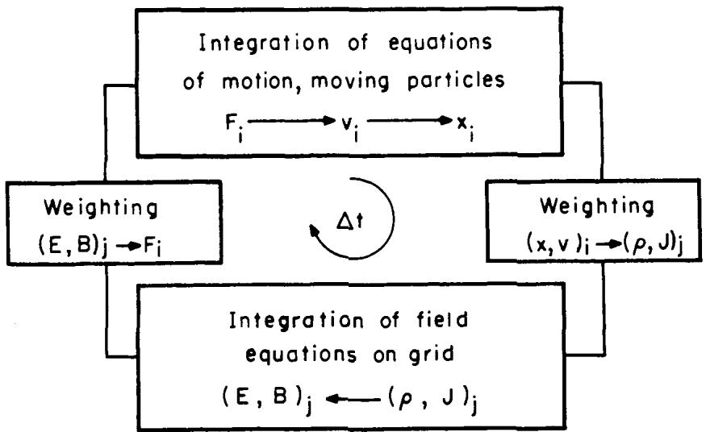  
Figure $2 - 3 a$ A typical cycle,one time step,in a particle simulation program．The particles are numbered $j = 1$ ,2,...，NP；the grid indices are $j$ ，which become vectors in 2 and 3 dimensions.

How do we distinguish particles? What information is stored for the particles and for the fields? The particles may be known by the way in which they are stored in the computer memory; they may be in some kind of order，with only their present velocity and position stored $( \textbf { v } _ { i } , \textbf { x } _ { i } )$ ；their values of charge $\pmb { q } _ { i }$ and mass $m _ { i }$ may be put elsewhere (e.g.,with only two species,electrons and ions, $\pmb q$ and $m$ would change only once in running all of the particles through in a time step). The fields are known at the grid points and are stored,probably indexed in an array，so that they can be recalled readily. There will almost always be many more particles than grid points, and external storage allows use of more particles than might fit into the computer's fast memory,along with the field quantities. Since the particles are integrated independently,only a few need be in fast memory at a time. The field quantities probably will be retained in fast memory,as in most present methods they have to be recalled randomly.

There are many variations of the cycle shown. For example,the electrons (with relatively large $\omega _ { p e } , \ \omega _ { c e } , \ \omega _ { u h } )$ may be advanced at a relatively small $\Delta t _ { e }$ the ions (with much smaller $\omega _ { p i } , \omega _ { c i } , \omega _ { l h } )$ may be advanced with a relatively large $\Delta t _ { i } \mathrm { : }$ the fields may be obtained on yet a third scale, $\Delta t _ { f } .$ ， possibly relatively short for electromagnetic fields (waves move faster than particles) or relatively large for observing low frequency effects.

# 2-4 INTEGRATION OF THE EQUATIONS OF MOTION

A problem may call for 10,000 particles to be run for l000 time steps. This means that the equations of motion must be integrated 10,000 times $1 0 0 0 = 1 0 ^ { 7 }$ times. We want to use as fast a method as possible,and stil retain acceptable accuracy. The time per particle per step currently is on the order of microseconds. Explicitly，a $1 0 ^ { 4 }$ particle program of $1 0 ^ { 3 }$ time steps running at $1 0 \mu \mathbf { s e c } /$ particle/step on a machine with a 720 dollar/hour charge would cost 20 dollars for the 100-second run.

In addition, our choice of method must take into account the storage capability of the computer we will use in terms of the number of quantities that may be kept for each particle. If we were to follow just the trajectory of one particle through given fields (so-called trajectory calculations), then we probably would choose to keep velocity and position information from several previous time steps and use a method of time integration with a high order of accuracy. However, the minimum information needed for integration is the particle velocity and position,two words per particle or 20,000 words for our problem. Storing the $\nu _ { i } , \ x _ { i }$ for several previous time steps would multiply this number. Using a high-order method (e.g., Runge-Kutta) would multiply the operations taken for each particle. Hence，we nearly always will choose to use the least information (storage） and the fastest method we can.

One commonly used integration is called the leap-frog method. The two first-order differential equations to be integrated separately for each particle are

$$
\begin{array} { r } { m \frac { d \mathbf { v } } { d t } = \mathbf { F } } \\ { \frac { d \mathbf { x } } { d t } = \mathbf { v } } \end{array}
$$

where $\pmb { \cal F }$ is the force. These equations are replaced by the finite-difference equations

$$
m \frac { \mathbf { v } _ { \mathrm { n e w } } - \mathbf { v } _ { \mathrm { o l d } } } { \Delta t } = \mathbf { F } _ { \mathrm { o l d } }
$$

$$
\frac { \mathbf { x } _ { \mathrm { n e w } } - \mathbf { x } _ { \mathrm { o l d } } } { \Delta t } = \mathbf { v } _ { \mathrm { n e w } }
$$

The flow in time and notation is shown in Figure $2 { \cdot } 4 a$ ，which makes clear the time centering. The computer will advance ${ \pmb { \nu } } _ { t }$ and $\mathbf { x } _ { t }$ to $\mathbf { v } _ { t + \Delta t } , \ \mathbf { x } _ { t + \Delta t }$ ,even though $\pmb { \nu }$ and $\pmb { x }$ are not known at the same time. The user must show care in at least two ways: first, initial conditions for particle velocities and positions given at $t = 0$ must be changed to fit in the flow; we push ${ \bf v } ( 0 )$ back to $\mathbf { v } ( - \Delta t / 2 )$ using the force $\pmb { \mathrm { F } }$ calculated at $t = 0$ ；second, the energies calculated from $\pmb { \nu }$ (kinetic） and $\mathbf { x }$ (potential,or field） must be adjusted to appear at the same time.

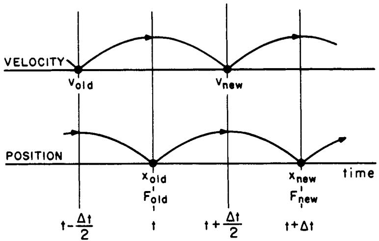  
Figure 2-4a Sketch of leap-frog integration method showing time-centering of force $\pmb { \cal F }$ while advancing $\pmb { \nu }$ and of $\pmb { \gamma }$ while advancing x.

The leap-frog method has error,with the error vanishing as $\Delta t  0$ We will use a leap-frog integrator in nearly all of our programs,because it is both simple (easy to understand,and with minimum storage) and surprisingly accurate (as shown later). Applying this method to integration of a simple harmonic oscillator of radian frequency $\omega _ { 0 }$ (in a later section),we will find that there is no amplitude error for $\omega _ { 0 } \Delta t \leqslant 2$ and that the phase advance for one step is given by

$$
\omega _ { 0 } \Delta { \it t } \ + \ \frac { 1 } { 2 4 } ( \omega _ { 0 } \Delta { \it r } ) ^ { 3 } + \mathrm { h i g h e r \mathrm { - } o r d e r \ e r r o r \ t e r m s }
$$

The error terms dictate a choice of $\omega _ { 0 } \Delta { t } \leqslant 0 . 3$ in order to observe oscilla-tions or waves for some tens of cycles with acceptable accuracy.

The force $\pmb { \mathrm { F } }$ has two parts,

$$
\begin{array} { l } { { \displaystyle { \bf F } = { \bf F } _ { \mathrm { e l e c t r i c } } + { \bf F } _ { \mathrm { m a g n e t i c } } } } \\ { ~ } \\ { { \displaystyle ~ = q { \bf E } + q ( { \bf v } \times { \bf B } ) } } \end{array}
$$

Here the electric field $\mathbf { E }$ and magnetic field $\mathbf { B }$ are to be calculated at the particle. Hence, using a spatial grid,we must interpolate $\mathbf { E }$ and B from the grid to the particle; we will do this in the same way as we determined the charge density (at the grid points） from the particle positions,a point discussed in Section 2-6. As we will see later, the electric force on a particle will depend not only on the distance to other particles (physical） but also on the position within the cell (nonphysical).

For our one dimensional purpose now, let us consider the particle displacement to be along $\pmb { x }$ ， and that we have velocities $\nu _ { x }$ and $\nu _ { y }$ ,with a uniform static magnetic feld $\pmb { B _ { 0 } }$ along z. The $q ( \pmb { v } \times \pmb { \mathbb { B } } )$ force,as shown in Figure 2-4b,is simply a rotation of ${ \pmb v }$ that is, $\pmb { \gamma }$ does not change in magnitude. However, the $q \mathbf { E } = \hat { x } q E _ { x }$ force does alter the magnitude of $\textbf { \em v } \left( \nu _ { x } , \right.$ that is); $E _ { y } = 0$ 、Hence,a physically reasonable scheme which is centered in time is as follows (with $t ^ { \prime }$ and $t ^ { \prime \prime }$ asdummy variables, $t - \Delta t / 2 < t ^ { \prime } <$ $t ^ { \prime \prime } < \ t + \Delta t / 2 )$ ：

# Half acceleration

$$
\begin{array} { l } { { \nu _ { x } ( t ^ { \prime } ) = \nu _ { x } \bigg \vert t - \frac { \Delta t } { 2 } \bigg \vert + \left\lfloor \frac { q } { m } \right\rfloor E _ { x } ( t ) \left\lfloor \frac { \Delta t } { 2 } \right\rfloor } } \\ { { \nu _ { y } ( t ^ { \prime } ) = \nu _ { y } \bigg \vert t - \frac { \Delta t } { 2 } \bigg \vert } } \end{array}
$$

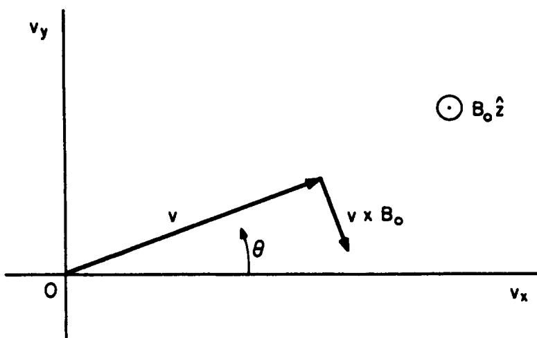  
Figure 2-4b The $v _ { x } , \ v _ { y }$ plane, showing the $\pmb q \left( \pmb { \nu } \pmb { \times } \hat { \mathbf { B } } \right)$ force normal to $\pmb { \nu } .$ which results in a rotation of $\pmb { \gamma } ,$ with no change in speed with $\dot { \pmb \theta } < 0$ for $( q / m ) > 0$ ， $B _ { 0 } > 0$

Rotation

$$
\begin{array} { r } { \Big ( \nu _ { x } ( t ^ { \prime \prime } ) \Big ) = \left( \begin{array} { c c } { \cos \omega _ { c } \Delta t } & { \sin \omega _ { c } \Delta t } \\ { - \sin \omega _ { c } \Delta t \cos \omega _ { c } \Delta t } \end{array} \right) \Big ( \nu _ { x } ( t ^ { \prime } ) \Big ) } \end{array}
$$

Half acceleration

$$
\begin{array} { l } { \displaystyle  \nu _ { x } | t +  \frac { \Delta t } { 2 } | =  \nu _ { x } ( t ^ { \prime \prime } ) + [ \frac { \mathcal { A } } { m } ] E _ { x } ( t ) | \frac { \Delta t } { 2 } | } \\ { \displaystyle  \nu _ { y } | t +  \frac { \Delta t } { 2 } | =  \nu _ { y } ( t ^ { \prime \prime } )  } \end{array}
$$

The angle of rotation is

$$
\Delta \theta = - \omega _ { c } \Delta t \qquad i . e . \qquad \dot { \theta } = - \omega _ { c }
$$

as desired, where the cyclotron frequency (radians/sec) as defined by

$$
\omega _ { c } \equiv \left( \frac { q } { m } \right) B _ { 0 }
$$

which carries the sign of $\pmb q$ and of $\scriptstyle B _ { 0 }$ .This scheme (Boris,1970b) is elaborated upon in Chapter 4.

One complication arises at $t = 0$ when the initial conditions, ${ \bf x } ( 0 )$ and ${ \bf v ( 0 ) }$ ， are given at the same time. The main loop runs with $\pmb { \ x }$ leading $\pmb { \nu }$ by $\Delta t / 2$ Hence,at the start, ${ \bf { v } } ( 0 )$ is moved backward to $\mathbf { v } ( - \Delta t / 2 )$ ，by first rotating ${ \bf v } ( 0 )$ through the angle $\Delta \theta = + \omega _ { c } \Delta t / 2$ and then applying a half acceleration using $- \Delta t / 2$ (really a deceleration?） based on $\pmb { \mathbb { E } } ( \pmb { 0 } )$ obtained from ${ \bf x } ( 0 )$ ; see Sec. 2-7 and Figure $\pmb { 2 } \cdot 7 \mathbf { a }$

# 2-5 INTEGRATION OF THE FIELD EQUATIONS

Starting from the charge and current densities as assigned to the grid-points,we now obtain the electric and magnetic fields,in general,from Maxwell's equations, using $\pmb { \rho }$ and $J$ as sources. Here we take this step for an electrostatic problem (meaning $\nabla \times \mathbf { E } = - \partial \mathbf { B } / \partial t \approx 0$ so that ${ \bf E } = - \nabla \phi ,$ in one dimension $\pmb { x }$

The differential equations to be solved are

$$
\begin{array} { l l } { \mathbf { E } = - \pmb { \nabla } \phi } & { \mathsf { o r } ~ E _ { x } = - \frac { \partial \phi } { \partial x } } \\ { \nabla { \cdot } \mathbf { E } = \frac { \rho } { \epsilon _ { 0 } } } & { \mathsf { o r } ~ \frac { \partial E _ { x } } { \partial x } = \frac { \rho } { \epsilon _ { 0 } } } \end{array}
$$

which are combined to obtain Poisson's equation

$$
\nabla ^ { 2 } \phi = - \frac { \rho } { \epsilon _ { 0 } } \quad \mathrm { o r } \quad \frac { \hat { \partial } ^ { 2 } \phi } { \hat { \partial } x ^ { 2 } } = - \frac { \rho } { \epsilon _ { 0 } }
$$

One approach is to solve the finite difference equations of (1） and (3), using the grid shown in Figure 2-5a,as

$$
E _ { j } = \frac { \phi _ { j - 1 } - \phi _ { j + 1 } } { 2 \Delta x }
$$

$$
\frac { \phi _ { j - 1 } - 2 \phi _ { j } + \phi _ { j + 1 } } { ( \Delta x ) ^ { 2 } } = - \frac { \rho _ { j } } { \epsilon _ { 0 } }
$$

This last may be written in matrix form as

$$
\mathbf { A } \phi = - \frac { ( \Delta x ) ^ { 2 } } { \epsilon _ { 0 } } \rho
$$

We are to use the $\pmb { \rho } _ { j } \mathbf { \dot { s } }$ known from the $\pmb { x } _ { i } ^ { \prime } \mathbf { s } .$ ，to obtain the unknown $\phi _ { j } { \bf \hat { s } }$ and then the $\vec { E _ { j } } ^ { \ast } \mathbf { s }$ for $j$ running from 0 to $L / \Delta x$ (roughly）where $L$ is the length of the system of NG points. By using the known boundary conditions

$$
\frac { 1 } { 0 } \mathop { S } \mathop  \{ \downarrow \downarrow \downarrow \downarrow \downarrow \downarrow \downarrow \downarrow \downarrow \downarrow \downarrow \downarrow \downarrow \downarrow \downarrow \downarrow \downarrow \downarrow \downarrow \downarrow \downarrow \downarrow \downarrow \downarrow \downarrow \downarrow \downarrow \downarrow \downarrow \downarrow \downarrow \downarrow \downarrow \downarrow \downarrow \downarrow \downarrow \downarrow \downarrow \downarrow \downarrow \downarrow \downarrow \downarrow \downarrow \downarrow \downarrow \downarrow \downarrow \downarrow \downarrow \downarrow \downarrow \downarrow \downarrow \downarrow \downarrow \downarrow \downarrow \downarrow \downarrow \downarrow \downarrow \downarrow \downarrow \downarrow \downarrow \downarrow \downarrow \downarrow \downarrow \downarrow \uparrow
$$

Figure 2-5a One dimensional numerical grid,with grid planes located at $X _ { j } = j \Delta x$ ，uniformly spaced. The charge density $\pmb { \rho }$ ,the potential $\pmb { \phi }$ ,and the electric field $\pmb { { \cal E } } _ { x }$ will be obtained only at the $X _ { j } ^ { \prime } \mathbf { s } ,$

at $x = 0$ ， $\pmb { L }$ and all of the $\pmb { \rho } _ { j }$ there will be as many equations as unknowns (the $\pmb { \phi }$ )； hence,the problem is solvable. There are numerous methods of solution. These are taken up in Appendix D.

A very powerful approach for periodic systems is to use a discrete Fourier series for all grid quantities. This approach also provides spatial spectral information on $\rho , \phi$ ，and $E$ which is useful in relating results to plasma theory,and which also allows control (smoothing） over the spectrum of field quantities. We now present this method in some detail; it is the basis for the field solver in our code ES1.

The ability to Fourier transform effciently through use of the fast Fourier transform FFT,an invention of the $1 9 6 0 ^ { \circ } { \mathsf { s } }$ 、is a major enabling factor in this computation. The key to the solution is the assumption that, in the problems we attack, $\pmb { \rho } ( \mathbf { x } )$ and $\phi ( \mathbf { x } )$ have Fourier transforms, $\pmb { \rho } ( \mathbf { k } )$ and $\phi ( \mathbf { k } )$ ， where $\mathbf { k }$ is the wave vector in the Fourier transform kernel, exp $( - i \mathbf { k } \cdot \mathbf { x } )$ (We are implying certain boundary conditions by this step, such as periodic, which are considered in detail later.） This assumption allows us to obtain $\phi ( \mathbf { k } )$ from $\pmb { \rho } ( \mathbf { k } )$ in Poisson's differential equation directly as, in one dimension, $\partial ^ { 2 } / \partial x ^ { 2 }$ is replaced by $- k ^ { 2 }$ ; that is,

$$
\phi ( k ) = { \frac { \rho ( k ) } { \epsilon _ { 0 } k ^ { 2 } } }
$$

The next step is to take the inverse Fourier transform of $\phi ( k )$ in order to obtain $\phi ( x )$ and then $E ( x )$ using (2). The overall sequence is given in Figure 2-5b. (The reader will quickly note that one may go directly to $E ( k )$ ; we go into that possibility later.） The hitch in proceeding in this manner is that we have a finite Fourier series; we have $\pmb { \rho } ( \pmb { x } )$ only at the $X _ { j } ^ { \dag } \thinspace \mathsf { s }$ ,at NG points.

The solution using a finite Fourier series starts from the charge densities at the grid points, with values $\pmb { \rho } ( \pmb { X } _ { j } )$ ， $j = 0$ ,1,2,··, NG - 1 for a total of NG values. Letting the grid functions $G ( \pmb { X } _ { j } )$ (standing for field or potential or charge density） be periodic, $G ( X _ { j } ) \doteq G ( X _ { j } + L )$ ， then the finite discrete Fourier transform is (sum on $X _ { j } = j \Delta { x } )$

$$
G ( k ) = \Delta x \sum _ { j = 0 } ^ { \mathrm { N G } - 1 } G ( X _ { j } ) e ^ { - i k X _ { j } }
$$

The inverse transform is [the sum is on $k = n ( 2 \pi / L ) ]$

$$
G ( X _ { j } ) = { \frac { 1 } { L } } \sum _ { n = - \mathrm { N G } / 2 } ^ { \mathrm { N G } / 2 - 1 } G ( k ) e ^ { i k X _ { j } }
$$

which produces NG distinct values of $G ( X _ { j } )$ . (The virtue of the FFT is that

$$
\rho \left( x \right) \frac { \alpha } { F \textsf { F T } } p \left( \mathsf { k } \right) \frac { \sigma } { \mathsf { k } ^ { 2 } } \phi \left( \mathsf { k } \right) \frac { \sigma } { \mathsf { I F F T } } \phi \left( \mathsf { x } \right) \frac { \sigma \textsf { E } \left( \mathsf { x } \right) } { \nabla \phi }
$$

it performs the sums rapidly.） Using the above series for $\pmb \rho ^ { ( \pmb X _ { j } ) } , \pmb \phi ^ { ( \pmb X _ { j } ) }$ 、and $E ( \pmb { X } _ { j } )$ with the particular set of finite difference equations chosen from (4) and (5),we obtain

$$
E ( k ) = - i \kappa \phi ( k )
$$

where

$$
\kappa = k \left[ { \frac { \sin \left( { k \Delta x } \right) } { k \Delta x } } \right] = k \mathrm { d i f } \left( k \Delta x \right)
$$

where (from diffraction theory)

$$
\begin{array} { r } { \mathtt { d i f } \theta \equiv \frac { \sin \theta } { \theta } } \end{array}
$$

and

$$
\phi ( k ) = { \frac { \rho ( k ) } { \epsilon _ { 0 } K ^ { 2 } } }
$$

where

$$
K ^ { 2 } = k ^ { 2 } \left[ \frac { \sin \frac { k \Delta x } { 2 } } { \frac { k \Delta x } { 2 } } \right] ^ { 2 } = k ^ { 2 } \mathsf { d i f } ^ { 2 } ( \frac { k \Delta x } { 2 } )
$$

The finite difference terms, $\pmb { \kappa }$ and $K ^ { 2 }$ ， approach the differential equation result, $\pmb { k }$ and $k ^ { 2 }$ ，as the grid becomes finer, $k \Delta x  0$ The overall understanding of the role of the spatial grid, both in accuracy (ie., $\pmb { \kappa }$ versus $\pmb { k }$ $K ^ { 2 }$ versus $k ^ { 2 }$ ） and in aliasing (the dynamics creates effects at $| \pmb { k } \pmb { \Delta x } | > \pi$ which are read falsely by the grid, being placed at $| k \Delta x | < \pi )$ will be covered in detail in Part Two on the theory of simulation. A discussion on the difference between using $k , k ^ { 2 }$ and $\pmb { \kappa }$ ， $K ^ { 2 }$ is given in an appendix.

With the understanding that NG values of $\pmb \rho ( \pmb X _ { j } )$ are transformed to NG values of $\pmb \rho ( k )$ and so on through to obtain NG values of $E ( X _ { j } )$ ， the solution sequence of Figure 2-5b still holds; this is commonly done by one Fourier transform,a division by $K ^ { 2 }$ an inverse transform and, lastly,a gradient operation [by finite differencing (4)] on $\phi ( X _ { j } )$ to obtain $E ( X _ { j } )$ .There are NG values of $\pmb { k }$ starting from $k _ { \mathrm { m i n i m u m } } = 2 \pi / L$ $\pmb { L }$ is the length of the system; see Figure 2-2a) up to $k _ { \mathrm { m a x i m u m } } = \pi / \Delta x$ and their negatives; or, in terms of wavelengths, $\lambda _ { \mathrm { { m a x i m u m } } } = L$ and $\lambda _ { \mathrm { m i n i m u m } } = 2 \Delta x$ ：

# PROBLEMS

2-5a $\nabla \cdot \mathbf { E } = \rho / \epsilon _ { 0 }$ may also be solved for E by Fourier methods.In 1d,obviously $E _ { x } ( k ) = \rho ( k ) / \ i k \epsilon _ { 0 } .$ In 3d,electrostatic stili, one must add $\nabla \times \mathbf { E } = 0$ Show that these equations produce solutions

$$
\mathbf { E } ( \mathbf { k } ) = \frac { \mathbf { k } \rho ( \mathbf { k } ) } { i k ^ { 2 } \epsilon _ { 0 } }
$$

where $k ^ { 2 } = k _ { x } ^ { 2 } + k _ { y } ^ { 2 } + k _ { z } ^ { 2 }$

2-5b Show that (9) is the inverse of (8). Show that $G ( X _ { j + \mathsf { N G } } )$ ,as given by (9） is equal to $G ( \boldsymbol { X } _ { j } )$ ． Show that (9) is unchanged if the sum is taken from O to $\mathbf { N G } - 1$

2-5c When $G ( \pmb { \chi } _ { j } )$ is real,there is redundancy in the NG complex values of $G ( k )$ in (8). Show that $G ( - k ) = G ^ { * } ( k )$ ，and that there are $\mathbf { N G } / 2 + 1$ independent values of Re $G ( \boldsymbol { k } )$ (cosine coefficients) and $\mathbf { N G } / 2 - 1$ independent vaiues of lm $G ( k )$ (sine coefficients).

2-5d If $G ( \pmb { \chi } _ { j } )$ and $H ( X _ { j } )$ are both real,show that cosine and sine coefficients of $G$ and $\pmb { H }$ can be extracted from the transform [using (8)] of the complex sequence $G ( X _ { j } ) + i H ( X _ { j } )$ This is accomplished by cals to subroutines CPFT and RPFT2,and the inverse by calls to RPFTI2 and CPFT (Appendix A).

2-5e Obtain $\pmb { \kappa }$ in (11) and $K ^ { 2 }$ in (13） by inserting $E ( X _ { j } ) , \phi ( X _ { j } )$ ，and $\rho ( \pmb { \chi } _ { j } )$ in the transform form (9) into the finite difference forms,(4),(5).Sketch $( \kappa / k )$ and $( \kappa ^ { 2 } / \stackrel { . } { K } ^ { 2 } )$ as functions of $k \Delta x$ from $k \Delta x = 0$ to $\pmb { \pi }$

# 2-6 PARTICLE AND FORCE WEIGHTING;CONNECTION BETWEEN GRID AND PARTICLEQUANTITIES

It is necessary to calculate the charge density on the discrete grid points from the continuous particle positions and (after the fields are obtained),to calculate the force at the particles from the fields on the grid points. In Fig-ure 2-3a, these calculations are called weighting,which implies some form of interpolation among the grid points nearest the particle. As shown later, it is desirable to use the same weighting in both density and force calculations in order to avoid a self-force (i.e., a particle accelerates itself).

In zero-order weighting,we simply count the number of particles within distance $\pm \Delta x / 2$ (one cell width） about the $j ^ { t h }$ grid point and assign that number [call it $N ( j ) ]$ to that point; that is, the grid density (in one dimension） is simply $n _ { j } = N ( j ) / \Delta x$ This is illustrated in Figure $\mathsf { 2 } { \cdot } 6 \mathsf { a } ( \mathsf { a } )$ .The common name for this weighting is nearest-grid-point or NGP. Computation-ally, the counting is fast, since only one grid look-up is done. The electric field to be used in the force is that at $X _ { j } ,$ for all particles in the $j ^ { t h }$ cell.

As a particle moves into the $j ^ { t h }$ cell (through cell boundaries at $x = X _ { j } \pm \Delta x / 2 )$ , the grid density due to that particle jumps up; as the particle moves out $( x > X _ { j } + \Delta x / 2$ or $x < X _ { j } - \Delta x / 2 )$ ，the grid density jumps down. The density observed at $j$ is shown in Figure 2-6a(b). We see two effects here. One is that the particle appears to have a rectangular shape with a width of $\Delta x .$ ，This leads us (i.e., the grid) to think that we have a collection of $\hbar$ nite-size particles; hence, the physics observed will be that of such particles rather than that of point particles. Because close encounters between plasma particles are rare (i.e.,for many particles in a Debye length, $N _ { D } > > 1$ ，virtually all collisions are at large impact parameter)， this new physics hardly alters the basic plasma effects to be studied. The second effect is that the jumps up and down as a particle passes through a cell boundary will produce a density and an electric field which are relatively noisy both in space and time; this noise may be intolerable in many plasma problems. Thus,we look for a better weighting.

  
Figure 2-6a (a） Zero-order particle and field weighting,also caled nearest-grid-point,or,NGP. Particles in the $j ^ { t h }$ cell,that is,with positions $x _ { i } \in X _ { j } \pm \Delta x / 2$ are assigned to $\chi _ { j }$ to obtain grid density $n ( X _ { j } )$ ．All of these particles are acted on by the field at $X _ { j } , ~ E ( X _ { j } )$ (b）The density $n _ { j } ( { \boldsymbol { \chi } } _ { j } )$ at point $X _ { j }$ due to a particle at $x _ { i } ,$ as the particle moves through the cellcentered on $X _ { j } .$ This density may be interpreted as the effective particle shape.

First-order weighting smooths the density and field fluctuations,which reduces the noise (relative to zero-order weighting),but requires additional expense in accessing two grid points for each particle, twice per step. We may view this step either as an improvement in using finite-size particles or as one of better interpolation. The charged particles seem to be finite-size rigid clouds which may pass freely through each other. We call the model cloud-in-cellor CIC (Birdsall and Fuss,1969). If we take the nominal cloud to be of uniform density and to be $\Delta x$ wide as shown in Figure 2-6b(a) (the so-called square cloud), then the grid assignment is self-evident, using NGP for each element. That is,for total cloud charge of $\pmb { q } _ { c }$ ，the part assigned to $j$ is

$$
q _ { j } = q _ { c } \Bigg [ \frac { \Delta x - ( x _ { i } - X _ { j } ) } { \Delta x } \Bigg ] = q _ { c } \frac { X _ { j + 1 } - x _ { i } } { \Delta x }
$$

  
Figure 2-6b (a） First-order particle weighting,or cloud-in-cell model CIC.The nominal finitesize charged particle,or cloud,is one cell wide,with center at $x _ { i } .$ This weighting puts that part of the cloud which is in the $j ^ { t h }$ cell at $X _ { j } ,$ fraction (a),and that part which is in the $( j + 1 ) ^ { t h }$ cell at $X _ { J + 1 }$ ,fraction (b).This weighting is the same as applying NGP interpolation to each elemental part. (b） The grid density $n _ { j } ( \boldsymbol { x } _ { i } )$ at point $x _ { i }$ as the particle moves past $X _ { j } ,$ again displaying the effective particle shape $s ( x )$ ，

and the part assigned to $j + 1$ is

$$
q _ { j + 1 } = q _ { c } \Bigg [ \frac { x _ { i } - X _ { j } } { \Delta x } \Bigg ]
$$

The net effect is to produce a triangular particle shape $\pmb { S } ( \pmb { x } )$ which has width $\pmb { 2 \Delta x }$ . In computation， the nearest left-hand grid point $j$ is located first, so that $x _ { i } > X _ { j }$ always; then the weights are calculated and the charges assigned. Note that assignment of a point charge at $\pmb { x } _ { i }$ to its nearest grid points by linear interpolation would produce the same result; this viewpoint is called particle-in-cell, or PIC modeling. As a cloud moves through the grid, it contributes to density much more smoothly than with zero-order weight, as seen from Figure $2 - 6 6 ( 6 )$ ；hence,the resultant plasma density and field will have much less noise and be more acceptable for most plasma simulation problems.

Higher-order weighting by use of quadratic and cubic splines rounds off further the roughness in particle shape and reduces density and field noise, but at the cost of more computation. The use of splines for higher-order weighting is discussed later. Also, the effective particle shape may be altered during the field calculation after the charge density $\pmb { \rho } ( \pmb { x } )$ is Fourier transformed to $\rho ( k )$ ，e.g.,by cutting off $\pmb \rho ( k )$ at some $k _ { \mathrm { l a s t } }$ or multiplying

$\rho ( k )$ by,say,exp $[ - \left( k / k _ { \mathrm { i a s t } } \right) ^ { n } ]$

The field or force weighting operates in the same manner. The NGP force comes from the field at the nearest grid point. The frst-order force (CIC-PIC） comes from linear interpolation,exactly as in the charge assignment; for a particle at $x _ { i }$ ，

$$
E ( x _ { i } ) = \left[ \frac { X _ { j + 1 } - x _ { i } } { \Delta x } \right] E _ { j } + \left[ \frac { x _ { i } - X _ { j } } { \Delta x } \right] E _ { j + 1 }
$$

The first-order weighting consumes more computer time per particle than does the zero-order weighting; however, for a given noise level, CIC allows both a coarser grid and fewer particles than NGP,and thus regains some of the additional computer time required per particle. We will also see that higher-order weighting and smoothing tend to reduce nonphysical effects.

# PROBLEM

2-6a Show that second-order Lagrangian interpolation results in discontinuities. (Splines employ a piecewise-polynomial representation also,but the segments are joined smoothly.)

# 2-7 CHOICE OF INITIAL VALUES; GENERAL REMARKS

We have presented some ideas on how the computational cycle func-tions. Now we will say something about initiating the program. Let us sup-pose that the problem of interest has been looked at thoroughly so that we have done the design work of choosing:

(a) The numbers of particles and grid cells   
(b） The weighting and smoothing   
(c） The desired initial distribution function, $f ( \mathbf { x } , \ \mathbf { v } , \ t = 0 )$ including the initial perturbation (if any,random or ordered)

The next step is to place the particles in phase space $( \mathbf { x } , \mathbf { v } )$ so that the prob-lem desired is properly set up to run.

A cold,uniform periodic plasma of mobile electrons and immobile ions $( m _ { i } / \ m _ { e }  \infty )$ is simplest. The electrons are put in uniformly,one or more per cell. The charge density and or field solver automatically puts in a uniform neutralizing ion background by having the $k = 0$ component of $\pmb { \rho }$ and $E$ vanish. The plasma wave may be excited by perturbing the uniform positions $x _ { i 0 }$ by

$$
x _ { i } ( t = 0 ) = x _ { i 0 } + x _ { i 1 } \mathsf { c o s } \left( k _ { s } x _ { i 0 } \right)
$$

where $k _ { \mathrm { m i n } } \leqslant k _ { s } \leqslant k _ { \mathrm { m a x } }$ is some wave vector for which we want the plasma behavior. These $\pmb { x } ^ { \prime } \pmb { s }$ and the appropriate velocities (here,all zero） are put into the $t = 0$ step. The program then finds the fields at $t = 0$ from which the velocities at $t = - \Delta t / 2$ are found (only used once in a run) (Section 2-4 and Figure 2-7a). Then the cycle proceeds forward by advancing $\nu \left( - \Delta t / 2 \right)$ to $\nu \left( + \Delta t / 2 \right)$ ，then $x ( 0 )$ to $x ( \Delta t )$ , and so on for as many steps as desired.

Changing to a warm plasma requires that each particle be given a velocity v such that over some specified region (perhaps several cells,the shortest $\pmb { \lambda }$ kept)，the desired velocity distribution of velocities is well approximated. Suppose that the desired velocity distribution is flat, from $- \nu _ { \mathfrak { m a x } }$ to $+ \nu _ { \mathrm { { m a x } } }$ as shown in Figure $\mathsfit { 2 } \cdot 7 \mathsf { b } ( \mathsf { a } )$ ． Then,where the cold model had, say, four particles per cell with zero velocity,we now may split each one (figuratively） into four parts,placed for example,as shown in Figure $2 - 7 6 ( 6 )$ .The overall results,cold and warm,are shown in Figure 2-7c. One can improve on these placements and usually must do so [e.g.,to avoid the potential multibeam instability of the approximation in Figure 2-7b and Figure 2-7c to $f ( \nu )$ of Figure $2 - 7 6 ( a ) 1$ .Such improvements will be taken up later，as well as prescriptions for loading less-simple $f ( \mathbf { x } , \mathbf { v } )$ such as Gaussian in $\mathbf { v } _ { i }$ （a Maxwellian） and nonuniform in $\mathbf { x } _ { i }$ are taken up in Chapter 16.

# PROBLEMS

2-7a Show that the initial half-step backward has the same-order accuracy as the main program mover,that is,to order (△ t)².

2-7b Provide a sketch showing how the half-step sequence can be used after the main program has been started in order to obtain $\pmb { x }$ and $\pmb { \gamma }$ at the same time;i.e.,go from $\mathbf { x } ( t )$ and $\mathbf { v } ( \iota - \Delta \iota / 2 )$ to $\mathbf { x } ( t )$ and $\mathbf { \sigma } _ { \mathbf { v } } ( \mathbf { \sigma } _ { t } )$ ．Logic says half acceleration and then half rotation will work.Is this correct? With $\mathbf { x } ( t )$ and $\mathbf { \nabla } _ { \mathbf { v } } ( \mathbf { \boldsymbol { \mathbf { \mathit { \Pi } } } } _ { t } )$ ,the code may then be re-started,say,to run backward (as a check,by changing the sign of $\Delta t )$ or'to run forward with a new $\Delta t .$

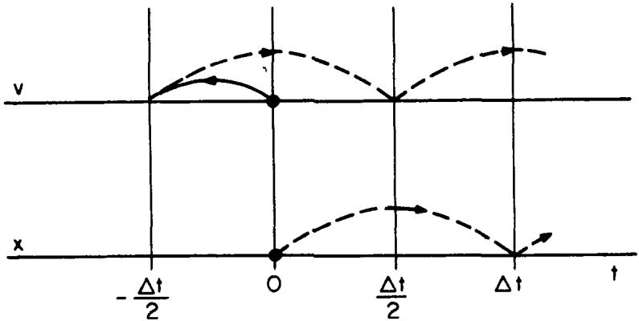  
Figure 2-7a At $\scriptstyle r = 0$ ，the $x _ { i }$ 's $\left( t = 0 \right)$ and $\nu _ { i } \mathbf { \dot { s } }$ $\left( t = 0 \right)$ are put in,as shown. The very first step is to calculate the fields at $\scriptstyle t = 0$ from the $x _ { i } { \mathrm { : } } \mathbf { s }$ and move the $\nu _ { i } \mathrm { \ d }$ 's back a half step,as shown by the solid line．Then the program advances the $\nu _ { i } ^ { \cdot } \mathsf { s }$ then the $x _ { i } { \mathrm { ' } }$ s as shown earlier in Figure $2 { \cdot } 4 { \mathrm { a } }$

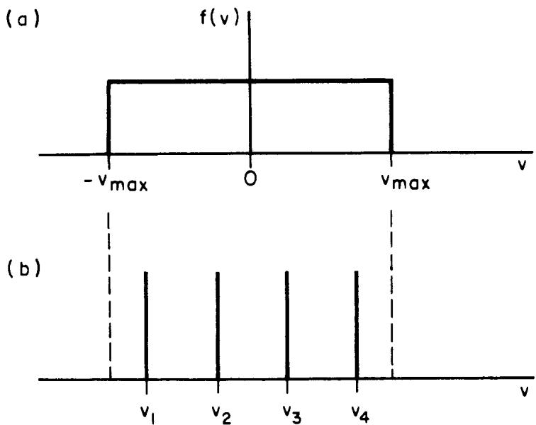  
Figure $2 - 7 6$ (a）The desired velocity distribution $f ( \nu )$ .(b） An elementary way of approximating $f ( \nu )$ with four velocities.

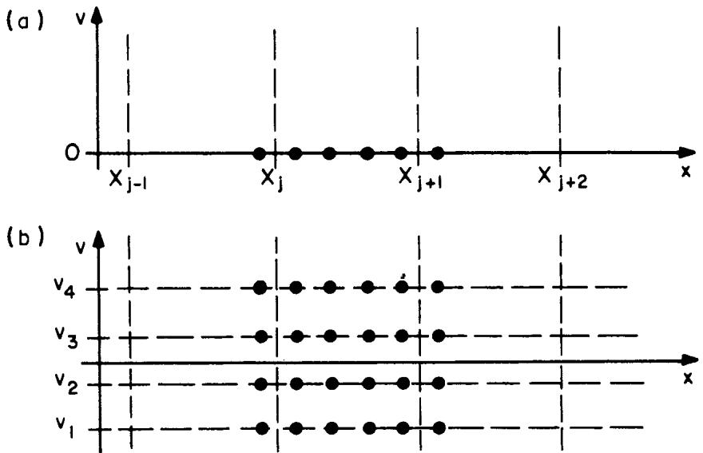  
Figure 2-7c (a）Placement of particles in particle phase space for a cold uniform plasma,four particles per cell.(b）Placement of particles for a warm plasma with flat $f ( \nu )$ ,using four velocities,making four beams.

The object of simulation is to gain insight into the physics of plasmas. The object of any one simulation run or series of runs,is to study oscilla-tions,or waves,or instabilities,or heating,or radiation,or transport,etc., but usually a limited number of these phenomena in any one set of runs. Hence，the simulation program output should consist of information that shows what physics is being done and should provide specific information about the phenomena under study.

One could ask that all of the information generated $( \mathbf { x } , \ \mathbf { v } , \ \rho , \ \phi , \ \mathbf { E }$ etc., at every step) be put in storage (e.g.,magnetic tape） or printed out, and then diagnosed separately，by hand or by computer. This can and has been done for, say,a thermal (Maxwellian） plasma where the simulator wished to do his diagnostics at his leisure,after the run and more than once. However,the most common output is graphical, and consists of plots made during the run (snapshots） and at the end (time histories)，complete with Fourier analyses in time and space,printed out on film and or paper. Since no other information will be saved, so that the plots chosen must contain the physics of interest. To accommodate hindsight, it is usually prudent to save more than the minimum perceived necessary.

The first page should contain the name of the program and the version being used; it must also have the initial conditions in considerable detail. The next pages may be snapshot plots made at intervals during the run, such as at $t = 0$ ， $t = 6 0 \Delta t$ ， $t = 1 2 0 \Delta t$ .Information of interest in these snapshots might be, for particles:

(a) Phase space, $\nu _ { x }$ versus $_ { x }$   
(b) Velocity space, $\nu _ { y }$ versus $\nu _ { x }$   
(c）Density in velocity, $f ( \nu )$ versus $\nu$ or $f ( \nu ^ { 2 } )$ versus $\nu ^ { 2 } .$ or $\ln { \left[ f ( \nu ^ { 2 } ) \right] }$ versus $\nu ^ { 2 }$

For grid quantities,one might plot:

(a) Charge density $\rho ( x )$ versus $_ x$ or particle density $n ( x )$ versus $_ { x }$   
（b）Potential $\phi ( x )$ versus $_ x$   
(c）Field $E ( x )$ versus $_ x$   
(d) Distribution of electrostatic energy $\log _ { k } \phi _ { k }$ versus $k$

The result at the end of a run will consist of plots of histories of various quantities versus time, such as:

(a) Electrostatic energy $\sum _ { k } ^ { } / _ { 2 } \rho _ { k } \phi _ { k } ^ { \ }$

(b）Particle kinetic ener $\begin{array} { l } { { \mathrm { g y ~ b y ~ s p e c i e s ~ } \sum \mathrm { i } / _ { 2 } m _ { i } \nu _ { i } ^ { 2 } } } \\ { { \sum \mathrm { i } / _ { 2 } m _ { i } < \nu _ { i } > ^ { 2 } } } \\ { { \mathrm { r g y ~ } \sum \mathrm { i } / _ { 2 } m _ { i } ( < \nu _ { i } ^ { 2 } > - < \nu _ { i } > ^ { 2 } ) } } \end{array}$   
(c）Particle drift energy   
(d） Particle thermal ene   
(e)Total energy,electrostatic plus particle (usually with the zero suppressed,   
so as to magnify loss of energy conservation)   
(f) Mode plots, $1 / _ { 2 } \rho _ { k } \phi _ { k } ^ { * } ,$ for each $k$ ， possibly with Fourier analyses of each,   
with plots versus $\pmb { \omega }$

These lists give an idea of a one-dimensional program output. In a typical run of 100o steps,one may ask for snapshots every $6 0 \Delta t$ of the seven particle and grid plots (126 plots),and at the end for the 5 energy plots,and, say,32 mode plots; this is a total of $1 + 1 2 6 + 5 + 3 2 = 1 6 4$ plots which fits nicely on a 192 page $1 0 \times 1 5$ cm microfiche film.

Many other quantities may be of interest. In studying diffusion,one wishes to follow the mean square deviation of particle velocities or positions so that $[ \nu _ { i } - \nu _ { i } ( t = 0 ) ] ^ { 2 }$ or $[ x _ { i } - x _ { i } ( t = 0 ) ] ^ { 2 }$ must be stored, then plotted. In studying waves,one may wish to resolve frequencies, so that a Fourier analysis in time would be performed on some quantity like $\phi ( k , t )$ ， perhaps following the run (called postprocessing)，necessitating storage of the quan-tity. The dynamics of phase or velocity or distribution function space may be of interest in which case a movie might be made,probably from snapshots every $\Delta t$ or $2 \Delta t .$

In this way, the simulator, like an experimenter in the laboratory,will accumulate sufficient data to verify the correctness of his physics and to provide the insight desired into his particular plasma problem.

# 2-9 ARE THE RESULTS CORRECT? TESTS

The simulator, in demonstrating correctness, has many of the problems of a theorist or experimenter. The latter two may be questioned, for example,on their approximations and on their instruments. The simulator uses an unpublished program,with a restricted set of physics (e.g. forced to be in one dimension，or to be electrostatic or lacking collisions,radiation,etc.), with carefully chosen initial conditions and a limited amount of output. How can he tell himself and the world that his work is to be believed?

He can compare his results with those obtained in theory and or in experiment, obtain the desired results for problems with known answers, show invariance of his results as the nonphysical computer parameters $( \Delta t ,$ $\Delta x$ ，NP，NG,etc.） are changed,and so on. Even so, he may leave some doubters. Problems that are fundamental may be checked by simulators at different computer centers, using separate programs; an example of such a problem is plasma diffusion across a magnetic field.

The simulator himself must have confidence in his program and know the bounds within which it should work. The confidence must be real. First,all component parts of the program (particle mover, field solver,etc.) must be tested separately to produce predictable results.

The total program must then be run on test problems such as:

(a) Simple harmonic motion of a pair of test electrons in a uniform background; check frequency $\pmb { \omega }$   
(b) Cold plasma oscillations of many electrons,at long wavelength,in a uniform background; check $\pmb { \omega }$ as a function of $k$   
(c) Instability of two opposing electron streams in a uniform background; check growth rate as a function of $k$   
(d) Instability due to a ring velocity distribution in a magnetic field $f ( \nu _ { \perp } ) \approx \mathfrak { s } ( \nu _ { \perp } - \nu _ { 0 } )$ ; check complex $\pmb { \omega }$

In any or all of these, try reducing the number of particles NP or the number of grid cells NG or increasing the time step $\Delta t$ See how far you can go before tell-tale signs of nonphysics, such as flagrant loss of energy conservation, show up. Confidence comes with experience.

# A ONE-DIMENSIONAL ELECTROSTATIC PROGRAM ES1

# Note

ES1 has changed considerably from the time of the first printing. The listing here is that of the first printing (1985); the current source is included on the diskette.

# 3-1 INTRODUCTION

We are ready to take a thorough look at a particular program. This look is in preparation for using this program (or any other） on one-dimensional electrostatic problems.

The program ES1 (ElectroStatic,1-dimension） was written by A. B. Langdon for C. K. Birdsall's course in Berkeley, in 1972. Although ES1 was designed to be a teaching tool, it has formed a base for programs used professionally. ES1 is available to all users of the National Magnetic Fusion Energy Computer Center,and is easily adapted to other computer systems.

We go straight through the various parts,explain what each part does and present their Fortran listings. As in Chapter 2,we leave discussions of accuracy,alternative schemes,and comparisons with physics until later.

Some sections have a number of questions about statements in the program. These questions have been useful as classroom quizzes to ensure careful reading of the program by users.

# 3-2 GENERAL STRUCTURE OF THE PROGRAM ES1

The program flows very much like the scheme shown earlier in Section 2-3a,where the main loop steps were shown,without the initial step. Now we state the scheme in computer terms,use the names of computer variables and subroutines,bunch the steps together somewhat differently,and add the initial step.

First the program reads the input data,then initializes plotting routine HISTRY

Next,ES1 calls subroutines INIT,FIELDS (which calls the Fourier transform routine and its inverse)，and SETV which calls ACCEL,in that order. These routines are used once to set up the proper initial conditions, i.e.，given ${ \bf x } ( 0 ) , \ { \bf v } ( 0 )$ for all particles，provide ${ \bf x } ( 0 )$ ， $\mathbf { v } ( - \Delta t / 2 )$ as starting conditions for the main loop． Actually,more is done,as follows:

<table><tr><td>FIRST Read data</td><td>Connect input file. Create output file for &quot;tape 3&quot; and plots.</td></tr><tr><td>HISTRY INIT</td><td>Later plots quantities (like the various energies） versus time. Change input variables (like ωp，q/m） into computer variables</td></tr><tr><td></td><td>(like q,m).Calculate initial particle positions,including perturba- tions x(O)． Calculate initial particle velocities,such as cold or</td></tr><tr><td>SETRHO</td><td>Maxwellian including perturbations v(O). Convert x to x/△x,computer variable. Accumulate charge on the grid,with weighting.</td></tr><tr><td>FIELDS</td><td>Using charge on the grid,solve Poisson&#x27;s equation for . Use CPFT，RPFT2，RPFTI2,CPFT，the Fourier transform subrou-</td></tr><tr><td>SETV</td><td>tines. Calculate field energy from ∑pkΦk Difference  to obtain E on grid. Make field &quot;snapshots.&quot; Change v(O) to v(-△t/2),using E(O) in ACCEL. Convert v to</td></tr></table>

Then the program continues for as many time steps as are requested in the main loop，which calls subroutines ACCEL，MOVE,and FIELDS in order,once each step. The details for each of these tasks are listed below, which is like the block diagram of Figure 2-3a,with the weighting moved into the subroutines ACCEL and MOVE.

Enter main loop from initializing steps,with $x ( 0 )$ ， $\nu ( - \Delta t / 2 ) , \ E ( 0 )$   
PLOTXV, etc. Particle diagnostics.   
ACCEL Convert $\pmb { { \cal E } }$ to $\left( q / m \right) E \Delta t ^ { 2 } / \Delta x$ ，called A,a computer variable. Advance velocity one time step,using weighted $\pmb { { \cal E } }$ (or A). Calculate momentum and kinetic energy. Repeat for each species.   
MOVE Advance position one time step. Accumulate charge density on grid,with weighting. Repeat for each species.   
HISTRY Saves quantities for plotting versus time.   
Advance time step counter.   
FIELDS (Already described.)   
Return to start of main loop for total of NT steps.

After running NT time steps we exit from the main loop through HIS-TRY and LAST.

HISTRY Make plots of quantities versus time.   
LAST Close files and terminate execution.

More details as to what each step of each subroutine does are given in the sections following,more or less in the order used in the program.

There are few aspects of ES1 which are peculiar to the Livermoredeveloped operating systems for the Control Data Corporation 7600 and Cray Research CRAY-I computers. Most of these are confined to subroutines FIRST,LAST,and the subroutines which plot graphical output. We have included separate particle mover coding to gain some access to the vector capabilities of the CRAY-I computer; although this coding is specialized, it may be instructive. Finally,we have made use of a precompiler to facilitate changing many array dimensions and to replicate COMMON blocks in the subroutines which use them. PARAMETER statements define values which are fixed at compile time and remain constant (as compared to DATA statements which assign initial values to variables which may change during execution). CLICHE and ENDCLICHE delimit statements which are to be inserted in the source wherever cited by a USE statement. Thus, changes to array dimensions and COMMON blocks need only be made in one place.

The main program listing follows.

C ES1 - a one-dimonsional .loctrostatic piasma simulation c   
C Written by A. Bruce Langdon, Livormore. 1972.   
C Rovis.d 6/1976.2/1977, 10/1977,6/1978.3-5/1979.   
C cliche mparam common /param/nsp.l.dx.d†.ntp ral 1 ondcliche mparam use mparam   
C   
C ngmax=maximum number of cells. clich. mfi.ld parometer(ngma $\yen 236$ ） parameter(ng1m=ngmax+1) common/cfieid/ng，aei，•psi。iw，v.c，rho0，a1，a2. rho(ng1m).phi(ng1m)，·(ng1m）. .0.wo logical vec ondcliche mfiold use mfield   
C cliche mptcl   
C particl. coordinate and velocities. common x(8192).vx(8192).vy(8192) ·ndcliche mptcl use mptcl   
C can declare vy to be length 1 if unmagnetized.   
C cliche mcntrl common /cntrl/ it.time，ithl. irho，irhos，iphi，i.，ixvx，ivxvy，ifνx endcliche mcntrl us. mcntrl   
C   
C nth=number of time steps between history plots.   
C mmax=maximum number of different Fourier modes to plot.   
C nspm=maximum number of species.   
C allow up to nspm species. cliche mtime parameter(nth=500,mmax=10,nspm=3) parameter(nth1=nth+1,nth2=nth+2.nspm1=nspm+1） us. miime   
C real ke. ms(nspm): qs(nspm). ts(nspm) integer ins(nspmi)   
C data ntp/100/ data rho0 /0./ data it.time.ith.ithi/0.0..0.0/ data ins(1) /1/   
C input variables:   
C 1 =physical length of system.   
C nsp =number of particle specios. d =time step.   
C nt =number of time steps to run (ending time=nt\*dt).   
C ng =number of spacial ceiis. \*must. be power of 2. iw =mover algorithm seloctor. so. subroutines accel and mov.. vc =.t.to select vectorized option where possible on cray. epsi =multiplier in poisson equation. 1 for rationalized units. 01.02 =field smoothing and mid-range boost. see fields. .0.wo =add uniform .lectric field oo\*cos(wo\*time). irho =plotting interval for rho (charge density). $\mathtt { = 0 }$ for no plot. irhos =plotting interval for smoothed density.   
C iphi =plotting interval for phi (potential).   
C i =plotting interval for · (eioctric field).   
C ixvx =plotting interval for x vs. vx phase space. ifvx =plotting interval for f(vx) distribution function.   
C >0 gives linear, co gives semi-log.   
C ivx， =ptotting interval for vx vs.vy phase space.   
C mpiot =fourier mode numbers to plot. default input parometers: data nsp.i.dt,nt,epsi /1.6.28318530717958..2.150.1./ data ng.iw.a1.a2.vec /32.2.0..0...true./ data co.wo/0..0./ data irho,irhos.iphi.ie.ixvx.ivxvy.ifvx/7\*o/, mplot/mmax\*0/ namelist_/in/l.nsp.nt.dt.epsi:ng.iw.vee.ai.a2.co.wo. irho.irhos. iphi.te. mplot.ixvx.ivxvy.ifvx   
C call first   
C read namelist input. echo oll values to output. including defaults.   
C empty output bufferin case some disaster occurs iater. read(2.in) write(3.in) write(100.in)   
C call histry dx=1/ng do 10 is=1.nsp 10 cali init((ins(is).ins(is+1).ms(is).qs(is).ts(is).nms(is).rho0 ) cali fields(0) do 11 is=1.nsp 11 cali setv(ins(is).ins(is+1)-1.qs(is).ms(is).ts(is).pxs(1.is) )   
C   
C   
C begin time step loop.   
C particie x is at time O,vx and vy at -.5\*dt. 100 continue $\forall \ 1 = 0$ ： $\forall u { = } 0$ ：   
cphas. spac. plot of all speci.s. call piotxv(1.ins(nsp+1)-1.vl.vu)   
C distribution function for specios 1. call pitfvx(1.ins(2)-1.vi.vu.qs(1).32) vmu=0. if( ts(1).no.0. ) cal1 pitvxy(1.ins(2)-1.vmu)   
C (lf mak. rostart til..here is where to sav. particies.) p=0. k.=0. do 101 is=1.nsp   
C odvanc. volocities from it-.5 to it+.5. call accei( ins(is).ins(is+1)-i.qs(is).ms(is).ts(is). pxs(ith+2,ia).kos(ith+1,1s)) p=p+pxs(ith+2.is) 101 ke=ke+kos(ith+1.is) do 102 is=1.nsp   
c advance positions from it to it+1. 102 call move( ins(is).ins(is+i)-1.qs(is)) to=k.+os.(ith+i) write(3.9so) time.ese(ith+1).p.(kes(ith+1.is),is=1.2).te 950 format(" time.ese.p.ke1.ke2.te".f8.2,5e17.9) it( it.go.nt ) go t0 103 it( ith.eq.nth ) cali nistry it=it+1 time=it\*dt ith=it-ithi   
C get fields at time step it. call fiolds(ith) go +o 100   
C   
C ond of run.   
c particle x is at time nt\*dt, vx and vy at (nt-.5)\*dt. 103 continue call histry cali last

# 3-3 DATA INPUT TO ES1

Data to be supplied to the main program includes:

L Length of system   
NSP Number of species(1,2,3.,...)   
DT Time step   
NT Total number of steps to be run   
NG Number of grid points (power of 2)   
IW Weighting to be used: 1 for zero order (NGP),momentum conserving 2 for first order (CIC,PIC),momentum conserving 3 for energy conserving (first-order for particles and zero-order for forces)   
EPSI $1 / \epsilon _ { 0 }$ (usually 1)   
A1 Compensation factor $( \mathbf { A } 1 = 0$ means no compensation)   
A2 Smoothing factor $( \mathbf { A } 2 = 0$ means no smoothing)   
IPHI, etc. Plotting frequencies

# Data to be supplied to INIT for each species includes:

N Number of particles (1, 2,3,...)   
WP wp(positive）   
WC ω(signed)   
QM ${ \pmb q } / m$ (signed)   
VT1 Provides Gaussian velocity distribution of thermal velocity $\nu _ { t 1 }$ centered on $\nu _ { x } = \nu _ { 0 } , \nu _ { y } = 0$ ,using random number routine; max-imum velocity is $6 v _ { t 1 }$   
VT2 Provides Gaussian (or other） velocity distribution of thermal velocity $\nu _ { t 2 }$ using inverse distribution functions,giving ordered velocities ("quiet start").   
NLG Number of sub-groups to be given the same velocity distribution; usually one.   
NV2 Exponent of quiet start distribution f(v) α(v/ v2)V2 exp $( - \nu ^ { 2 } / 2 \nu _ { t 2 } ^ { 2 } )$ ,usually zero.   
v0 Drift velocity in $x$ direction (signed)   
MODE Number of the mode to be given an initial perturbation in $x , \ y _ { x }$   
X1 Magnitude of perturbation in $\pmb { x }$ 。generally less than half the uniform particle spacing, $N / L$ ； used as X1cos $( 2 \pi x \mathbf { M O D E } / L + \theta _ { x } )$   
V1 Magnitude of perturbation in v used as V1 sin $( 2 \pi x \mathbf { M O D E } / L + \theta _ { \nu } )$   
THETAX 0x   
THETAV $\theta _ { \nu }$

# 3-4 CHANGE OF INPUT PARAMETERS TO COMPUTER QUANTITIES

It is convenient to write the initial values in terms of plasma parameters, such as plasma and cyclotron frequencies $( \omega _ { p } , \omega _ { c } )$ and charge-to-mass ratios $\left( q / m \right)$ for each species. In ES1, $\omega _ { p } ^ { 2 }$ determines the average density and $\pmb { \omega } _ { c }$ is uniform.

However, the program needs $\pmb q$ and $m$ These are obtained from $\omega _ { p } .$ ${ \pmb q } / m$ ，and the particle density $n ; ~ { \pmb q }$ is obtained from

$$
\omega _ { p } ^ { ~ 2 } = { \frac { \eta q ^ { 2 } } { \epsilon _ { 0 } m } } = \lfloor { \frac { N } { L } } \rfloor (
$$

and $\pmb { m }$ is obtained from

$$
m = \frac { Q } { \mathrm { Q M } }
$$

for each species,in the case of a uniform plasma where the density is given by the number of particles divided by the length $\pmb { n } = \pmb { N } / \ L$ . It is convenient to avoid using $\bullet _ { 0 }$ (or $1 / 4 \pi )$ ; hence, we set

$$
\epsilon _ { 0 } = 1 \qquad \mathtt { E P S I } = 1
$$

in our program, a matter of units (not any new physics).

The user specifies all $\omega _ { c } { ' } s$ and $\pmb { q } / m ^ { \prime } \pmb { \mathrm { s } }$ ， so he must do this consistently $[ \omega _ { c } = \left( q / \ m \right) B _ { 0 } ]$ $T = - \mathrm { t a n } \left( \omega _ { c } \Delta t / 2 \right)$ is determined from $\omega _ { c }$ ，to be used in the particle mover for that species. If a species is meant to be unmagnetized then its $\omega _ { c } = 0$ If $\omega _ { c } \neq 0$ ，then $\mathbf { I } \mathbf { W } = 2$ (linear weighting） must be used.

# 3-5 NORMALIZATION; COMPUTER VARIABLES

The spatial grid spacing $\Delta x$ and the time step $\Delta t$ enter repeatedly into multiplication (or division） in several places where they may be normalized away.

In order to facilitate truncation,we change particle $x$ to computer $x / \Delta x$ Next, writing the leap-frog particle mover of 2-4(3,4) as

$$
\begin{array} { l } { { \nu _ { \mathrm { n e w } } = \nu _ { \mathrm { o l d } } + \displaystyle \frac { F _ { \mathrm { o l d } } \Delta t } { m } } } \\ { { x _ { \mathrm { n e w } } = x _ { \mathrm { o l d } } + \nu _ { \mathrm { n e w } } \Delta t } } \end{array}
$$

we see that there are two multiplications by $\Delta t$ for each particle each step, which are not necessary if we change

Particle $\nu$ to computer $\nu \Delta t / \Delta x$ Grid $F / \ m = q E / \ m$ to computer $q / m E ( \Delta t ) ^ { 2 } / \Delta x ,$ called A

The $\Delta x$ divisor in $\nu$ and $E$ is required by the $x$ normalization. The equa-tions now read

$$
\begin{array} { r } { \left( \frac { \nu \Delta t } { \Delta x } \right) _ { \mathrm { n e w } } = \left( \frac { \nu \Delta t } { \Delta x } \right) _ { \mathrm { o l d } } + \frac { q } { m } \frac { E _ { \mathrm { o l d } } ( \Delta t ) ^ { 2 } } { \Delta x } } \\ { \left( \frac { x } { \Delta x } \right) _ { \mathrm { n e w } } = \left( \frac { x } { \Delta x } \right) _ { \mathrm { o l d } } + \left( \frac { \nu \Delta t } { \Delta x } \right) _ { \mathrm { n e w } } } \end{array}
$$

Hence， by forming A at the grid points (nearly always we have NG $< < ~ N )$ means that ACCEL requires only an addition; MOVE also requires only an addition. No multiplications by $\Delta t$ for each particle are needed each time step. For the first time step,each $\pmb { x }$ is multiplied by $1 / \Delta x$ (in SETRHO） and each $\nu$ is multiplied by $\Delta t / \Delta x$ (in SETV). In obtaining kinetic energy for all particles, there is a multiplication by $( \Delta x / \Delta t ) ^ { 2 }$ on the sum over all particle velocities, just once per time step (an unnormalization).

[This normalization is a little questionable in ld,as it clutters all diag-nostic interpretation of $\pmb { x }$ and $\nu$ 、In 2d,or on modern vector computers,little or no computer time is saved, so the variables should be normalized for ease in interpretation.]

# 3-6 INIT SUBROUTINE; CALCULATION OF INITIAL CHARGE POSITIONS AND VELOCITIES

This subroutine places every particle in $\yen 1$ ，phase space、This requires the simulator to know the equivalent of the initial density distribution, $f ( \mathbf { x } , \mathbf { v } , t = 0 )$ , for each species.

There is no magic way of calculating initial particle densities and velocities. The simulator must specify exactly what he wants for initial values for every particle.

A spatially uniform cold plasma is simplest; the particles are spaced uniformly,with zero velocity, $\nu _ { t 1 } = \ \nu _ { t 2 } = \ \nu _ { 0 } = 0$ Adding a drift velocity $\nu _ { 0 }$ to each particle creates a cold beam.

A uniform warm plasma requires finding a way to make $f _ { 0 } ( \nu )$ reasonably well filled out (enough velocities represented) for each $\pmb { \ x }$ or range of $\mathbf { x }$ This plasma obviously requires more particles since now, for each of the previous cold particles (which were sufficiently dense in $\pmb { \mathrm { x } }$ to be able to provide good spatial resolution),there must be a distribution in $\pmb { \nu }$ as well. Some general techniques for solving $ { f _ { 0 } } ( \nu )$ and $n _ { 0 } ( x )$ [really, $f _ { 0 } ( \nu , x , t = 0 ) ]$ for spacing in $\nu$ and $x$ space are given in Chapter 16. Here particles are created in NLG groups which are identical (before any perturbation is added） except for being displaced in $x$ .In each group the velocities are any superposition of (a） simple drift, (b） random near-Maxwellian,and (c） nonrandom (quiel start) from any distribution. If $( \mathsf { c } )$ is used, then the positions are scrambled relative to the velocities in a manner that seems to fil $\nu _ { x } { - } x$ space smoothly. The $\nu _ { t 2 }$ (quiet start) is done first and the $\nu _ { t 1 }$ (random） is done second; this order allows a wee tweak to be made on all modes as the last step. The utility of the quiet start is seen in projects (Chapter 5） and is discussed in Chapter 16.

In addition, the program requires the simulator to specify the initial perturbations for the distribution lif small, those are related to $f _ { 1 } ( { \bf x } , { \bf v } , t { = } 0 ) ]$ ,in order to initiate the interactions at a known level in a given mode (X1, V1, MODE).

# PROBLEMS

3-6a If the perturbation in $\pmb { x }$ is made first $( x _ { 1 } > 0 )$ and then the perturbation in $\pmb { \nu }$ is made (vi> O),is there cross coupling? Which perturbation should be made first to avoid cross coupling？ How does ESl avoid this problem?

3-6b Note that particles are first loaded at halfinteger multiples of L/N,in loops ending in statements numbered 10 and 41. What would happen after the perturbation is added if particles were loaded at integer multiples of L/N? Assume linear weighting $( \mathbf { I } \mathbf { W } = 2 )$ ,and that N/NG is an integer. Hint: first try N = NG = 4,MODE = 1,and check the charge density resulting from small values of X1 and values of THETAX such as O and $\pi / 2$

# The subroutine INIT follows.

subroutin. init(il1.il2.m.q.t.nm.rho0) C loads particlos for one sp.cies at a tim.. roal m.nm us. mparom roaiig us. mptcl data tw0pi/6.2831 85307 17958/ C input variables: C n =number of particios (for this species). C wp =plasma froquency. C wC =cyclotron frequency: C qm =q/m charg.:mass ratio. C v11 =rms thermal velocity for random velocities. C vt2 =rms thermal velocity for ordered velocities. C n19 =number of laading groups (sharing same ordered velocities). C nv2 =multiply maxwellian （for ordered velocities)by v\*\*nv2. C vo =drift valocity. C mode. x1. v1. thetax and thetay are for loading α sinusoidal perturbation. C velocity contributions thru vt1.vt2，vO and vi are additiv.. C default input parameters: data n.wp.wc.qm.vt1.vt2.nig.nv2.v0.mod.,x1.v1,thetax,thetav /128.1..0..-1..2\*0.,1.0,0..1.4\*0./ namelist /in/ n.\~p.wc.qm，vi1.vt2.nv2.nig、v0。 mod.，x1.v1.thetax，thetav reod(2.in) write(3.in) write(100.in) t=tan(-wc.d1/2.) i12=i11+n q=1\*wp.wp/(n\*qm） m=q/qm nm=n\*m C C load first of nig groups of particles. ngr=n/nig 1g=i/n1g ddx=1/n C load eveniy-spaced.with drift. G aiso does coid cas.. do 10 i=1.ngr i1=i-1+i11 x0=(i-.5)\*ddx ×（i1）=x0 10 vx(i1）=v0 if(vt2.eq.0.) g0 to 50 C load ordered velocities in vx ("quiet start", or at least subdued). c is set up for maxwellian\*v\*\*nv2. but can do any smooth distribution. C hereafter，ngr is pr.ferably α power of 2．

c us. midpoini rule -simple and quite accurate. vmax=5.\*v12 dv=2.\*vmax/(n-1) vvnv2=1. $\times ( \mathrm { ~ i ~ } ( 1 1 ) = 0$ ， da 21 i=2.n vv=((i-1.5):dv-vmax)/vt2 if(nv2.n..0) vvnv2=vv.\*nv2 fv=vvnv2\*oxp( -.5\*vv\*\*2) i1=i-1+111 21 ×(i1)=x(i1-1)+amax1(fv.0.）   
C for evenly spaced (haif-integer multip:es) values of the integrai.   
C find corresponding velocity byinverse Iinear interpolation. df=x(i1)/ngr i1=ii1 $i = i 1 1$ do 22 i=1:ngr fv=(i-.5)\*df 23 if(fv.it.x(i+1)) go t0 24 $\mathrm { i } = \mathrm { i } + 1$ if(i.gt.i12-2) go to 80 go to 23 24 vv=dv·( i-il1+(fv-x(i))/(x(i+1)-x(i)) )-vmax vx(i1)=vx(i1)+vv 22 i1=i1+1   
C for ordered velocities. scramble positions to reduce correlations.   
C scrambling is done by bit-reversed counter -compare sorter in cpft.   
C xs=.000,.100,.010..110..001,.101,.011..111..0001..(binary fractions) $\yen 50$ do411i=1:ngr i1=i-1+i11 x(i1)=xs\*1g+.5\*ddx write(3.99) x(11). vx(i1) 99 format(6f10.4) xsi=1. 42 xsi=.5\*xsi xs=xs-xsi if(xs.ge.0) go to 42 41 xs=xs+2.\*xsi   
C if magnetized. rotate (vx.O) into (vx.vy). 50if(wc.eq.o.）goto.80 do 511i=1:ngr 11=i-1+i11 vv=vx(i1) theta=twopi\*x(i1)/ig vx(i1）=vv\*cos(theta) 51 vy(i1)=vv.sin(theta)   
C   
C copy first group_into rest of groups. 80if(nlg.eq.1) go to 85 i=ngr+1 xs=0. do 8i i=i.n.ngr xs=xs+1g do 81i=1:ngr i1=j-1+111 12=11+i-1 x (i2)=x (i1)+xs vx(i2)=vx(i1) B1 if(wc.ne.0.) vy(i2)=vy(i1)   
C add random maxwellian. 85 if(vt1.eq.0.) go to 90 do 86 -=1.n i1=i-1+i11 do 86 i=1.12 if(wc.ne.o.)   
86 $\begin{array} { r } { \cdot \vee \vee \left( \{ \{ \ 1 \ \} \ \right) = \vee \vee \left( \ \textrm { i } \{ 1 \ \right)}  + \vee \ \textrm { i } \wedge \left( \thinspace r \odot n \ \lceil \left( \ d \cup m \right) - \cdot \thinspace \mathbb { S } \ \right)  \\ { \vee \wedge \left( \ \textrm { i } \ 1 \ \right) = \vee \times \left( \ \textrm { i } \{ 1 \ \right) + \vee \ \textrm { i } \ 1 ^ { \otimes } \left( \thinspace r \odot n \ \mathscr { f } \left( \thinspace d \cup m \right) - \cdot \mathbb { S } \ \right) } \end{array}$   
C add perturbation.   
C loading $\times ( 1 = 0 ) , v ( 1 = 0 )$ . remember so no dt/2 correction.   
C may want to perturb vy too. 90 do $9 1 \quad \mathfrak { i } = 1$ .n 9 $\begin{array} { r l } & { \mathrm { ~ i ~ } 1 = \mathrm { i } - 1 + \mathrm { i } \mid 1 } \\ & { \mathrm { ~ t ~ h ~ e ~ t ~ } 0 = \mathrm { t } \bowtie 0 \mathsf { p } \mathrm { ~ i ~ } \mathsf { e } _ { m 0 } { \mathsf { d e } } \otimes \mathsf { x } \left( \mathrm { ~ i ~ } 1 \right) / \mathrm { i } } \\ & { \textbf { \em u } \left( \mathrm { ~ i ~ } 1 \right) = \pm \textbf { \em u } \left( \mathrm { ~ i ~ } 1 \right) + \pm \textsf { x } 1 \stackrel { \circ } { \ast } \textsf { c o s } \left( \mathrm { ~ t ~ h ~ e ~ t ~ } 0 + \mathrm { ~ t ~ h ~ e ~ t ~ } 0 \times \right) } \\ & { \textbf { \em u } \left( \mathrm { ~ i ~ } 1 \right) = \mathbf { v } \times \left( \mathrm { ~ i ~ } 1 \right) + \mathbf { v } \mathrm { ~ 1 ~ } \stackrel { \circ } { \ast } \textbf { i } \left( \mathrm { ~ t ~ h ~ e ~ t ~ } 0 + \mathrm { ~ t ~ h ~ e ~ t ~ } 0 \times \right) } \end{array}$ appiy boundory conditions，collect charge density，etc. call setrho(i11.il2-1.q.n\*q/1) return end

# 3-7 SETRHO, INITIALIZATION OF CHARGE DENSITY

This subroutine is called once for each species at $t = 0$ SETRHO converts $x$ to $x / \Delta x$ ，enforces periodicity,and accumulates charges at the grid points,according to the weighting used.

The subroutine SETRHO follows.

subroutine setrho(il.iu.q.rhos)   
C converts position to computer normalization and occumulc   
C density. use mparam use mfield use mptcl   
C qdx=q/dx   
C if is first group of particles. then clear out rho. if( il.ne.1 ）go t0 2 do 1 i=1.ng 1 rho(i)=rho0 rho(ng+1)=Q. dxi=1.0/dx xn=ng   
c add on fixed neutralizing charge density. (not neoded when all species are mobile -but harmless.) 2 rho0=rho0-rhos do 3 j=1.ng 3 rho(i)=rho(i）-rhos   
C go to（100.200.200）.iw   
cngp 100 continue 101 $\begin{array} { l } { { \texttt { d o } } 1 0 1 \quad \textrm { i = i } 1 \quad , \textrm { i = } } \\ { \texttt { x ( i ) = x ( i ) * d \times i } } \\ { \texttt { i f ( \texttt { x ( i ) . l + . 0 . } ) \times ( i ) = x ( i ) + \times n } } \\ { \texttt { j f ( \texttt { x ( i ) . g e . x n } ) \times ( i ) = x ( i ) - \times n } } \\ { \texttt { i = x ( i ) + 0 . 5 } } \\ { { \texttt { r h o ( i + 1 ) = r h o ( i + 1 ) + q d \times } } } \end{array}$ return   
C linear   
200 continue   
201 $\begin{array} { l } { { \texttt { d o 2 0 1 } \texttt { i = i l , i u } } } \\ { { \texttt { x ( i ) = x ( i ) * d x ( i ) } } } \\ { { \texttt { i f ( \alpha ( i ) , i ! t . 0 . ) } \texttt { x ( i ) = x ( i ) + x n } } } \\ { { \texttt { i f ( \alpha ( i ) , 9 . 8 . n ) } \texttt { x ( i ) = x ( i ) - x n } } } \\ { { \texttt { j = x ( i ) } } } \\ { { \texttt { d r h o = q d x ( \alpha ( i ) - i ) } } } \\ { { \texttt { r h o ( i + 1 ) = r h o ( i + 1 ) - d r h o + q d x } } } \\ { { \texttt { r h o ( i + 2 ) = r h o ( i + 2 ) + q r h o } } } \end{array}$ return nd

# 3-8 FIELDS SUBROUTINE; SOLUTION FOR THE FIELDS FROM THE DENSITIES; FIELD ENERGY

The physics_and numerics of field solving were given in Section 2-5. The subroutine FIELDS carries out the steps.

First, $K ^ { 2 } ( k )$ is to be formed, the Fourier representation of the threepoint finite difference form 2-5(5),which is 2-5(13). Since $1 / K ^ { 2 }$ is used, this is what is formed, called $\mathtt { K S O I } ( k )$ , for each mode or harmonic. (We do not use $k ^ { 2 }$ for $K ^ { 2 }$ or $\pmb { k }$ for $\pmb { \kappa }$ for reasons given in Appendix F.） Here $\mathtt { K S O I } ( k )$ also allows a factor $\mathsf { \pmb { S } } \mathbf { M } ( k )$ ,called the smoothing factor; this factor is used to modify the $\pmb { k }$ spectrum in going from $\rho ( k )$ to $\phi ( k )$ in any way desired， primarily in attenuating unwanted short wavelengths or in compensating (pre-emphasis） for unwanted distortions at long wavelengths. The details are discussed in Appendix B. As we see in Chapter 4, this smoothing also has the effect of broadening the particle shape $\pmb { S } ( \pmb { x } )$

Second, the charge density $\rho ( x )$ is Fourier transformed to $\rho ( k )$ through calls to subroutine CPFT (complex Fourier transform) and RPFT (an interface). These are listed in Appendix A.

Next, $\rho ( k )$ is multiplied by $\mathtt { K S O I } ( k )$ to produce $\phi ( k )$ . At this stage, we have both $\rho ( k )$ and $\phi ( k )$ so that we may form the electrostatic energy, $k$ by $\pmb { k }$ as

$$
\mathrm { E i e c t r o s t a t i c \ e n e r g y { ( } } k { ) } = \mathrm { E S E { ( } } k { ) } \propto \frac { 1 } { 2 } \rho ( k ) \phi ^ { * } ( k )
$$

as well as accumulate $\operatorname { E S E } ( k )$ to obtain

$$
\mathrm { E S E } ( t ) \propto \frac { 1 } { 2 } \sum _ { k } \rho \left( k , t \right) \phi ^ { * } ( k , t )
$$

Next， both $\phi ( k )$ and $\rho ( k )$ are fed to the inverse Fourier transform, through cals to RPFTI2 and CPFT to produce $\phi ( x )$ and the smoothed $\rho ( x )$

Last, ${ \pmb E } ( { \pmb x } )$ is to be obtained from $- \nabla \phi ( x )$ by the differencing associated with the weighting to be used. For example,for zero- and first-order weighting,2-5(4） is used which differences $\phi ( x )$ over $2 \Delta x$ to obtain ${ \pmb E } ( { \pmb x } )$ At this point $\pmb { \cal E }$ has not been renormalized.

# PROBLEMS

3-8a Using the program names, starting with $\tt R H O ( J )$ and ending with $\pmb { \cal E } ( \pmb { \jmath } )$ ， show the steps in FIELDS and indicate by names what methods are used in each step. Be as symbolic as possible.

3-8b What is done by the statement ${ \tt R H O } ( 1 ) = { \tt R H O } ( 1 ) + { \tt R H O } \left( { \tt N G } + 1 \right)$

Use a sketch of the grid to be explicit.

3-8c RHO and RHOS are plotted. What is RHOS and why are both ploted?

3-8d What do the following statements do: DO 41 $\mathbf { J } = 1$ ，NG   
41 RHO(J) $=$ RHO0   
Why is RHO(NG1) left out of this loop and zeroed in the statement following?

3-8e What is the algebraic formula used to obtain the electrostatic energy ESE?

3-8f $\mathbf K = 1$ in loop 20 is which laboratory harmonic?

3-8g Suppose you wished to compute for only one wave,one value of $\pmb { k }$ . How would you do this? Will computing for only one value of $\pmb { k }$ affect the physics at small amplitude？ At large amplitude?

The subroutine FIELDS follows.

subroutine fields(ith)   
C solves for phi and e. computes field onergy.etc. us. mparam use mfield use mtime us. mcntrl r•al rhok(1)，phik(1)，scrach(1) 。quivalence（rho.rhok），（phi.phik），（.,scrach） paramet.r(ng2m=ngmax/2） roal kdx2，ksqi(ng2m).1i，sm(ng2m）   
C   
C first time step duties. data ng2/0/ il( ng2.ne.0 ）go to 2 ng2=ng/2 ng1=ng+1 set up ratio phik/rhok.   
C $\tt { \tt { e } } \tt { \tt { 2 } } > 0$ gives a short-wavelength cutoff (smoothing）.   
c a1 $\mathord {  } 0$ gives a mid-range boost to compensate for slight attenuation in force calculation. data pi/3.1415 92653 58979/ do 1 k=1.ng2 kdx2=(pi/ng）\*k sm(k)=oxp(a1\*sin(kdx2)\*\*2-a2\*tan(kdx2)\*\*4) 1 ksqi(k)=+epsi/((2.0\*sin(kdx2)/dx)\*\*2)\*sm(k)\*\*2 2 continue transform charge density. rho(1)=rho(1）+rho(ng+1） rho(ng+1)=rho(1) caliplotf(rho."charge density".irho) hdx=0.5\*dx do 10 $= 1$ .g rhok(i）=rho(i)\*hdx   
10 scroch $( \ i ) = 0$ . coll cpft(rhok,scroch,ng.1.1) coll rpft2(rhok.scroch.ng.1) rhok $( 1 ) = 0$ ， C calculate phik ond field energy. eses=0. phik $( 1 ) = 0$ do20 $\kappa = 2$ .ng2 kk=ng+2-k   
2 $\begin{array} { r l } & { \mathrm { ~ s ~ n ~ s ~ c ~ t ~ y ~ c ~ - ~ n ~ } } \\ & { \mathrm { ~ p ~ h ~ i ~ k ~ ( ~ k ~ k ~ ) ~ = ~ k ~ s ~ q ~ i ~ ( ~ k - 1 ~ ) ~ } { \bullet } \ r h \circ k ( \mathrm { ~ k ~ } ) } \\ & { \mathrm { ~ p ~ h ~ i ~ k ~ ( ~ k ~ k ~ ) = k ~ s ~ q ~ i ~ ( ~ k - 1 ~ ) ~ } { \bullet } \ r h \circ k ( \mathrm { ~ k ~ k ~ } ) } \\ & { \mathrm { ~ e ~ s ~ e ~ s ~ } } \\ & { { \bf { r } } \ h \circ k \circ { \bf { s } } \otimes { \bf { s } } \otimes { \bf { s } } + r h \circ k ( \mathrm { ~ k ~ } ) { \bullet } \ p h \mid { \bf { k } } ( \mathrm { ~ k ~ } ) + r h \circ { \bf { k } } ( \mathrm { ~ k ~ k ~ } ) { \bullet } \ p h \mathrm { ~ i ~ k ~ ( ~ k  k ~ ) } } \\ & { { \bf { r } } \ h \circ k ( \mathrm { ~ k ~ } ) = { \bf { s } } \pi ( \mathrm { ~ k - 1 ~ } ) { \bullet } \ r h \circ k ( \mathrm { ~ k ~ } ) } \\ & { \mathrm { ~ p ~ h ~ o ~ k ~ ( ~ k ~ k ~ ) = { \bf { s } } \ m ( \mathrm { ~ k - 1 ~ } ) { \bullet } \ r h \circ k ( \mathrm { ~ k ~ k ~ } ) } } \\ & { \mathrm { ~ p ~ h ~ i ~ k ~ ( ~ } r \ g + 1 \ \big ) = { \bf { k } } \ s _ { 1 } \ q _ { 1 } ( \mathrm { ~ { ( } } \boldsymbol { \mathrm { ~ n ~ g ~ 2 ~ } } \big ) { \bullet } \ r h \circ k ( \mathrm { ~ { ( } } \boldsymbol { \mathrm { ~ n ~ g ~ 2 + 1 ~ } } ) ) } \\ &  \mathrm { ~ e ~ s ~ e ~ ( ~ } \ \mathrm { ~ i ~ n ~ } + 1 \ ) { \bf { a } } ( 2 \ . \mathrm { ~ O ~ s ~ e ~ s ~ } + r h \circ k ( \mathrm { ~ n ~ g ~ 2 + 1 ~ } ) { \bullet } \ p { \mathrm { ~ h ~ i ~ k ~ } } ( \boldsymbol   \end{array}$ C C save specifiod mode energies. do 21 km=1.mmox   
21 $\begin{array} { l } { \displaystyle \mathsf { k } = m _ { \mathsf { P } } \textrm { l o f } ( \mathsf { k } \cdot \mathsf { m } ) + 1 } \\ { \displaystyle \mathsf { i } ( \begin{array} { l l l l } { \mathsf { k } \cdot \textsf { e q } _ { \mathsf { A } } \cdot 1 } & { \mathsf { j } \otimes \mathsf { o } } & { \mathsf { \ell } \circ } & { 2 2 } \end{array}  } \\ { \displaystyle \mathsf { k } \times \mathsf { a } = \mathsf { n } _ { \mathsf { Q } } + 2 - \mathsf { k } } \\ { \displaystyle \mathsf { o } \textsf { s a m } ( \mathsf { i } \cdot \mathsf { i } \mathsf { h } + 1 , \mathsf { k } \mathsf { m } ) = ( \begin{array} { l l l l } { \mathsf { r } \mathsf { n o k } ( \mathsf { k } ) \bullet \mathsf { p } \mathsf { n i } \star ( \mathsf { k } ) + \mathsf { r } \mathsf { h } \circ \mathsf { k } ( \mathsf { k } \mathsf { k } ) \bullet \mathsf { p } \mathsf { n i } \mathsf { k } ( \mathsf { k } \mathsf { k } ) } & { \rangle \prime \mathsf { n o m } ( \mathsf { i } \dagger \mathsf { h } + 1 , \mathsf { k } \mathsf { m } ) } \end{array}  } \\  \displaystyle \textrm { i f } ( \begin{array} { l l l l } { \mathsf { k } \cdot \textsf { e q } _ { \mathsf { m } } \cdot \mathsf { k } \mathsf { k } } & { \mathsf { \ell } \circ \mathsf { s a m } ( \mathsf { i } \dagger \mathsf { h } + 1 , \mathsf { k } \mathsf { m } ) = \mathsf { 0 } \ . 2 \mathsf { s } \bullet \mathsf { a } \bmod ( \mathsf { i } \dagger \mathsf { h } + 1 , \mathsf { k } \mathsf { m } ) } & { } \end{array} \end{array}$   
22 continue C inverse transform phi. li=1.0/1 do 30 k=1.ng rho(k)=rhok(k)\*li   
30 phi(k)=phik(k)·ii callrpiti2(phi.rho.ng.1) coll_epit(phi.rho:ng.1.-1) phi(ng+1)=phi(1) rho(ng+1)=rho(1) cail plotf(rho."smoothed density".irhos) coll plotf(phi."e potential".iphi) uniform field. e01=e0\*cos(wo\*time) setect electric field differencing. go to（100.100,200）．iw centered difference ocross 2 cells.   
100continue hdxi=0.5/dx do1101i=2.ng   
101 (i)=( phi(i-1)-phi(i+1) )\*hdxi+e0t (i)=(、phi(ng )-phi(2) )\*hdxi+00t (ng+i)=e(1） g +。 40 centered difference across 1 ceil.   
200 continue dxi=1.0/dx do 201 i=1:ng   
201 e(i)=(、pni(i)-phi(i+1） )\*dxi+e0t (ng+i)=o(i) C   
40 continu. coll plotf(o."electric field",ie) cleor out old charge density. do 41 i=1.ng   
41 rho(i)=rho0

$m \theta ( n \theta 1 ) = 0$ C electric field has not been renormatized yet. $a \bullet 1 = 1$ return end

# 3-9 CPFT, RPFT2, RPFTI2, FAST FOURIER TRANSFORM SUBROUTINES

The coefficients of cosines and sines in a Fourier series may be calculated for a function which is given at a discrete number of evenly spaced points in a fashion similar to that for a function which is continuous. Since the middle $1 9 6 0 ^ { \circ } { \bf s }$ it has been learned how to find these coefficients very rapidly (well beyond the gathering of coefficients of older texts) using methods commonly called fast Fourier transforms FFT.

We use an FFT called CPFT，for complex Fourier transform, which transforms $a ( { \boldsymbol { x } } ) + i b ( { \boldsymbol { x } } )$ to $\pmb { A } \left( \pmb { k } \right) + i \pmb { B } \left( \pmb { k } \right)$ . Since we have real quantities $( \rho , \phi )$ to be transformed, it pays us to set up a pair of real sequences $a ( { \boldsymbol { x } } )$ ， ${ \pmb b } ( { \pmb x } )$ and transform them together,gaining a factor of two in speed,if setting up the pairs is fast. It is; RPFT2 does this,in less than one tenth the time required for CPFT. The FFT calls are RPFT2,CPFT; the inverse FFT calls are RPFTI2, CPFT.

The listing of these subroutines is in Appendix A.

# 3-10 SETV, SUBROUTINE FOR INITIAL HALF-STEP IN VELOCITY

The simulator provides positions and velocities at time $t = 0$ for the initial conditions $\mathbf { x } ( 0 ) , \ \mathbf { v } ( 0 )$ . The program， however，with its leapfrog timecentered particle mover,wants $\mathbf { x }$ leading $\pmb { \nu }$ by $\Delta t / 2$ . Hence,at $t = 0$ ，we must operate on $\pmb { \nu }$ to effect this separation.

${ \bf v } ( 0 )$ is moved to $\mathbf { v } ( - \Delta t / 2 )$ using the fields at $t = 0$ by a half-step rotation (backward） and then half step acceleration, $q E$ only (backward).The velocity advancer,ACCEL is used not with $\Delta t$ replaced by $- \Delta t / 2$ ，but with $\pmb q$ replaced by $- q / 2$ , for this one call. (Do you see why?)

# PROBLEMS

3-10a Consider a cold plasma and find the conditions on initial values of $\mathbf { X }$ and $\mathbf { V X }$ which excite a purely traveling wave. Now,if SETV were not used， how much of the (unwanted) oppositely-propagating wave would be excited?

3-10b C and S are cosine and sine of what angle?

3-10c Why is there the argument $- 0 . 5 ^ { * } \mathbb { Q }$ in the call to ACCEL?

3-10d When SETV is caled,does the program have values for the electric field,E?

3-10e Sketch a CHANGV routine to take $\mathbf { x } ( t )$ and $\mathbf { v } ( \mathit { t } - \Delta \mathit { t } / 2 )$ to ${ \bf x } ( t )$ and $\mathbf { v } ( t )$ ，the reverse of SETV.Now △t may be changed,followed by another call to SETV. (Similar to Problem 2-7b.)

The subroutine SETV follows.

subroutine setv(il.iu.q.m.t.p)   
C converts particle velocities ot $\scriptstyle 1 = 0$ to computer normalizatic t=-d1/2. use mparam use mfield use mptcl dtdx=dt/dx   
c rotate v thru angle +O.5\*wc\*dt and normalize vy.   
C i $\scriptstyle { \mathsf { f } } = 0$ . there is no magnetic field. the rotation is omitted   
C and na references are made to vy. i1（↑.oq.0.）goto2 c=1.0/sqr+(1.0+t\*t) s=c\* do 1 i=il,iu vxx=vx(i) vx(i）= c\*vxx+s\*vy(i） vy(i)=-s\*vxx+c\*vy(i) 1 vy(i)=vy(i)\*dtdx 2 continue   
C normalize vx. do 3 i=it,iu 3 vx(i)=vx(i）\*dtdx   
C electric impuise to go back 1/2 time step. data dum/o./ call accel(il.iu.-o.5\*q,m,O..p.dum） return end

# 3-11 ACCEL, SUBROUTINE FOR ADVANCING THE VELOCITY

The first step is to normalize $\pmb { { \cal E } }$ at cell grid points to the form A as given in Section 3-5. Secondly， following choice of weighting， the velocity is advanced by additions (also shown in Section 3-5). Next, the particle momenta are calculated. Lastly,the particle kinetic energies are obtained, centered at time $t$ (when the potential energy is known),by summing on

$$
\mathbf { K E } = \frac { m } { 2 } \nu _ { \mathrm { o l d } } \nu _ { \mathrm { n e w } }
$$

This is simpler to calculate than, $( \nu _ { \mathrm { n e w } } ^ { 2 } + \nu _ { \mathrm { o l d } } ^ { 2 } ) / 4$ or $[ ( \nu _ { \mathrm { n e w } } +  \nu _ { \mathrm { o l d } } ) / 2 ] ^ { 2 } / 2 ,$ has the same value to order $( \Delta t ) ^ { 2 }$ and has an obscure advantage to be seen in Problem 4-10e.

If there is a magnetic field, $\omega _ { c } \neq 0$ ， then the procedure for advancing v is different, as outlined in Section 2-4(8,9,10) for a uniform magnetic field. First,INIT has calculated

$$
\mathsf { T } = \tan \left( - \omega _ { c } \Delta t / 2 \right)
$$

Second,ACCEL tests whether $\boldsymbol { \Upsilon } = \boldsymbol { 0 }$ and, if not, sends the program to the half accel-rotation-half accel steps; also,the normalized value of $\mathbf { E }$ is halved, to use in the half-acceleration. (Only $\mathbf { I } \mathbf { W } = 2$ is used with a magnetic field.) Third,sin $\omega _ { c } \Delta t$ and $\cos \omega _ { c } \Delta t$ are calculated from T. Fourth, the half accel in $\nu _ { x }$ is done; this produces ${ \nu _ { x } } ^ { 2 } + { \nu _ { y } } ^ { 2 }$ in the center of the step,at time t, so that this is the time to calculate the kinetic energy. Lastly,the rotation of $\pmb { \nu }$ through angle $\left( - \omega _ { c } \Delta t \right)$ is done,and the half accel in $\nu _ { x }$ added in.

Note that the kinetic energies and momenta are calculated from $\nu _ { x } ^ { 2 }$ and $\nu _ { x }$ only if there is no magnetic field, $\boldsymbol { \Upsilon } = \boldsymbol { 0 }$ . Otherwise there are both $\nu _ { x }$ and $\nu _ { y }$ so that the kinetic energy uses $\nu _ { x } ^ { 2 } + \nu _ { y } ^ { 2 }$ ; no momenta are calculated, but they could be.

When logical variable VEC is true， the $\mathbf { I } \mathbf { W } = 2$ movers jump to special coding following labels 200o and 250o,which is designed so that the Cray Research CFT compiler generates machine instruction sequences for the CRAY-I computer which are several times more efficient than it generates from the more straightforward Fortran. The form of this coding reflects both the vector architecture of the CRAY-I and the capability of the CFT compiler to recognize opportunities to use vector instructions. On a different vector computer，or as CFT becomes more cognizant, this coding should differ.

# PROBLEMS

3-11a The statements foliowing do what with the particle coordinates

$$
\begin{array} { l } { \mathbf { J } = \mathbf { X } ( \mathbf { I } ) \mathbf { \Sigma } + 0 . 5 } \\ { \mathbf { J } = \mathbf { X } ( \mathbf { I } ) } \end{array}
$$

3-11b Show that KE from VN\*VO has the same order of accuracy as using the square of the average or the average of the squares of the old and new velocities. Why is VN\*VO to be preferred? Could there be a sign problem? At what time is KE obtained?

3-11c Linear weighting of the fields to the particles is given by 2-6(3) and the corresponding use in the program is

$$
\mathrm { \bf V } \bar { \bf N } = \mathrm { \bf V } 0 + \mathrm { \bf A } ( \mathrm { \bf J } + 1 ) + ( \mathrm { \bf X } ( \mathrm { I } ) - \mathrm { \bf J } ) ^ { * } ( \mathrm { \bf A } ( \mathrm { \bf J } + 2 ) - \mathrm { \bf A } ( \mathrm { \bf J } + 1 ) )
$$

or

$$
\mathrm { \bf { A } } \mathrm { \bf { A } } = \mathrm { \bf { A } } \left( \mathrm { \bf { J } } + \mathrm { \bf { l } } \right) + ( \mathrm { \bf { X } } \left( \mathrm { \bf { I } } \right) - \mathrm { \bf { J } } ) ^ { * } \left( \mathrm { \bf { A } } \left( \mathrm { \bf { J } } + 2 \right) - \mathrm { \bf { A } } \left( \mathrm { \bf { J } } + \mathrm { \bf { l } } \right) \right)
$$

:ain all differences between the algebraic statement and that in the program.

3-11d The following statement does what:

$$
\mathbf { V } 1 \mathbf { S } = \mathbf { V } 1 \bar { \mathbf { S } } + \mathbf { V } \mathbf { N }
$$

3-11e The following statement does what: $\nabla 2 \mathsf { S } = \nabla 2 \mathsf { S } + \mathsf { V } \mathsf { N } ^ { \bullet } \mathsf { V } 0$

3-11f What form of electric field weighting is used in option $\mathbf { I } \mathbf { W } = 3$ ,energy conserving?

3-11g What is the purpose of the statement IF（T.NE.0） $\mathbf { A } \mathbf { E } = 0 . 5 ^ { * } \mathbf { A } \mathbf { E }$

3-11h In calculating momenta $P$ why is DXDT there?

3-11i Following Problem 3-11b,compare the number of multiplies and adds per particle in obtaining KE in the three ways given. Ignore steps that are common to a given species.

The subroutine ACCEL follows.

subroutine accel(iip.iup.q.m.t.p.ke)   
c advances velocity one time step. computes momentum ond kinetic energy ralk..m use mparam us. mfield use mptcl real a(1) equivaience (a..)   
C these arrays are used in vectorizing accel and move. common /scratch/ii(64).al(64).ar(64).vni(64). v1si(64). v2si(64), aai(64) il=iip iu=iup   
C   
C renormalize acceleration if need be. dxdt=dx/dt o=(a/m)-(dt/dxd+) it(t.ne.0.) ge=0.5\*ae it( ae.eq.ael ) go.t0 2 ngi=ng+1 tem=ae/ael do 1 i=1.ng1 1 a(i)=a(i)-tem ael=ae 2 continue   
C   
C select acceleration weighting. go to（100,200,300).iw   
C .ngp: grid points at i\*dx. 100 continue $\yen 123,456$ $\yen 23=0$ ， do 101 i=i1.iu i=x(i)+0.5 vo=vx（i） vn=vo+a(i+1) v1s=v1s+vn v2s=v2s+vn\*vo 101 vx(i)=vn p=p+m\*v1s\*dxdt ke=ke+0.5\*m\*v2s\*dxdt\*dxdt return   
C linear, momentum conserving. 200 continue il（ t.ne.0.）go to 250 v1s=0. $\curvearrowleft$ if(vec) go to 2000   
2009 continue do 201 i=il.iu $\mathrm { i } = \mathbf { x }$ （i） vo=vx(i） vn=vo+a(i+1)+( ×(i)-i )\*( a(i+2)-a(i+1）) v2s=v2s+vo\*vn   
201 vx(i)=vn p=p+m\*v1s\*dxdt ke=ke+0.5\*m\*v2s\*dxdt\*dxdt return   
C linegr: energy conserving. 300 continue $\yen 123,456$ $\yen 23=0$ do 301 i=il.iu i=x（i） vo=vx(i） vn=vo+a(i+1) v1s=v1s+vn v2s=v2s+vn\*vo 301 vx(i)=vn p=p+m\*v1s\*dxd+ ke=ke+0.5\*m\*v2s\*dxdt\*dxdt return   
C   
c lineor. momentum conserving, uniformly magnetized. 250 continue s=2.0\*+/(1.0++\*+) $\curvearrowleft z \ s { = } 0$ ： it(vec) go to 2500 2509 continue do 251 i=il.iu i=x（i） aa=a(i+1)+( x(i)-i )\*( a(i+2)-a(i+1) ） vyy=vy(i) vxx=vx(i)-+\*vyy+aa vyy=vyy+s\*vxx vxx=vxx-t\*vyy v2s=v2s+vxx-vxx+vyy\*vyy vx(i)=vxx+00 251 vy(i)=v99） ke=ke+0.5\*m\*v2s\*dxdt\*dxdt return   
C   
C .\*.\*\*vectorized movers\*\*\*\*   
c These are functionally equivaient to the straightforward fortran movers   
C above.but are written in such o way that the cray 'cft C compiler will use vector instructions for most operations. C Lineor.momentum conserving.vectorized. 2000 continue do 2004 $\mathrm { i } = 1$ ,64 1si（1） $\scriptstyle 1 = 0$ 2004v2si(i） $\yen 0$ ： do 2006 j=il,iu-63,64 do 2001 i=0.63 2001 $\{ \textsf { i } ( \{ + 1 \} = \textsf { x } ( \{ \textsf { i } + \} \ )$ do 2002 i=1,64.2 01(i+1)=0( 11(1+1)+1 or(i+1)=0( ii(i+1)+2 01（i)=a(i（i 2002 ar(i )=o(ii(i )+2 ） do 2005 i=0.63 vni(i+1)=vx(i+1)+ai(i+1)+( x(i+i)-ii(i+1) )\*( ar(i+1)-al(i+1) ) v1si(i+1)=visi(i+1)+vni(i+1） v2si(i+1)=v2si(i+1)+vx(i+1)\*vni(1+1) 2005 vx(i+i)=vni(i+1） 2006 il=i1+64 do 2007 i=1.64 v1s=v1s+v1si(i) 2007 v2s=v2s+v2si(i)   
cil is rosot so that non-vector code will tak. care of remain   
c The number of particles is α multiple of 64，thon il>iu and CFt wiil not ex.cute loop 201 at ail. go to 2009   
C   
c Linear，momentum conserving，vectorized.   
c Se. commonts in unmagnetized coding above. 2500 continue do 2504 i=1.64 2504 v2si(i) $\yen 0$ do 2506 i=il,iu-63,64 do 2501 i=0.63 2501 $i ( i + 1 ) = \times ( i + i )$ do 2502 i=1;64.2 ai(i+1)=a( ii(i+1)+1 ） ar(（i+1)=a（ii（i+1)+2） a（i {=a(ii ）+1 ） 2502 ar(i ）=a( i(i )+2 ） do 2505 i=0.63 aai(i+i)=ai(i+1)+( x(i+i)-ii(i+1) )\*( ar(i+1)-al(i+1）) vx(i+i）=vx（i+i）-t\*vy（i+i)+aai（i+1） vy(i+i)=vy(i+i)+s\*vx(i+i) vx(i+i)=vx（i+i）-t\*vy(i+i） v2si(i+1)=v2si(i+1)+vx(i+i)\*vx(i+i)+vy(i+i)\*vy(i+i) 2505 vx(i+i)=vx(i+j)+aai（i+i） 2506 i1=i1+64 do 2507 i=1.64 2507 v2s=v2s+v2si(i) go to 2509   
C ond

# 3-12 MOVE, SUBROUTINE FOR ADVANCING THE POSITION

This subroutine simply does 3-5(4) for each particle in a species， to obtain $x _ { n e w }$ from $x _ { \circ \mathrm { i d } } .$ MOVE is called once for each species.

If 3-5(4) would place the particle outside the system, that is,if $x _ { \mathrm { n e w } } < 0$ or $x _ { \tt m e w } > L$ ， then MOVE replaces the particle in $0 \leqslant x \leqslant L$ ; this is done by moving it a full period $\pmb { L }$ to the left or right.

With the $\pmb { x _ { n e w } }$ ， MOVE now accumulates charge at the grid points, according to the weighting chosen.

As in ACCEL, if ${ \bf V } { \bf E } { \bf C } =$ true and $\mathbf { I } \mathbf { W } = 2$ , then we jump to special coding which exploits the vector capabilities of the CFT compiler on the Cray-I computer. (See discussion in Section 3-11.)

# PROBLEMS

3-12a Using a sketch of the grid and location of a typical charge,show how linear weighting is obtained graphically,in at least three ways.

3-12b What are the units of RHO? State how you know,e.g., where Q comes from.

3-12c Explain the following statement: IF (X(I).LT.0 ） ${ \bf \cal X } ( \mathrm { I } ) = { \bf \cal X } ( \mathrm { I } ) \ + { \bf \cal X } { \bf N }$

The subroutine MOVE follows. subroutine move(iip.iup.q) c advances position one time step and accumulates charge density. us. mparam us. mfield use mptcl C these arrays are used in vectorizing accel and move. common /scratch/ ii(64)，rhol(64)，rhor(64) i1=1Ip i.u=iup qdx=q/dx xn=ng go to（100.200.200）.iw ngp 100 continue 101 $\begin{array} { l } { { \texttt { d o } 1 0 1 1 0 1 : 1 = 1 1 , : 1 = } } \\ { { \texttt { x ( j ) = x ( j ) + v x ( j ) } } } \\ { { \texttt { i f ( \texttt { x ( i ) . 1 + } . 0 . ) } \star ( \texttt { i ) = x ( i ) + x n } } } \\ { { \texttt { i f ( \texttt { x ( i ) . 9 4 . \times n } ) } \star ( \texttt { i ) = x ( i ) - x n } } } \\ { { \texttt { i = x ( i ) + 0 . 5 } } } \\ { { { \texttt { r h o } ( \texttt { i + 1 } ) = r { \textsf { n o } ( \texttt { i + 1 } ) } + { \texttt { q } } { \texttt { d } } { \texttt { x } } } } } \end{array}$ return C C linear 200 continue if(vec） go to 2000 2009 continue 201 $\begin{array} { l } { { \bf d o } { \bf \Gamma } _ { 2 0 } { \bf \Gamma } _ { 2 0 } { \bf \Gamma } _ { 1 } = { \bf i } { \bf \Gamma } _ { 1 } , \mathrm { ~ i ~ u ~ } } \\ { { \bf x } , \mathrm { ~ ( \Gamma _ 1 ~ ) = \bf { x } ~ ( \Gamma _ i ~ ) + v ~ { \bf x } ~ ( \Gamma _ i ~ ) ~ } } \\ { { \bf i } { \bf \Gamma } ( \mathrm {  ~ \alpha ~ } \mathrm {  ~ \times ~ } ( \mathrm {  ~ \cdot ~ } ) , { \bf \Gamma } _ { 1 } \mathrm {  ~ \cdot ~ } { \bf \Gamma } _ { 0 } \mathrm {  ~ \cdot ~ } { \bf \Gamma } _ { 1 } ) \mathrm {  ~ \ x ~ } ( \mathrm {  ~ \cdot ~ } ) = { \bf x } ( \mathrm {  ~ \cdot ~ } ) + { \bf x } { \bf n } } \\ { { \bf i } { \bf \Gamma } ( \mathrm {  ~ \alpha ~ } \mathrm {  ~ \times ~ } ( \mathrm {  ~ \cdot ~ } ) \mathrm {  ~ \cdot ~ } { \bf g } { \bf e } \mathrm {  ~ \cdot ~ } { \bf x } { \bf n } ) \mathrm {  ~ \alpha ~ } \mathrm {  ~ \times ~ } ( \mathrm {  ~ \cdot ~ } ) = { \bf x } ( \mathrm {  ~ \cdot ~ } ) - { \bf x } { \bf n } } \\ { { \bf i } = { \bf x } ( \mathrm {  ~ \cdot ~ } ) \mathrm {  ~ \cdot ~ } { \bf p } _ { 0 } { \bf \Gamma } _ { 0 } { \bf \Gamma } _ { 1 } = { \bf q } \mathrm {  ~ \cdot ~ } { \bf x } ( \mathrm {  ~ \cdot ~ } { \bf \Gamma } _ { 1 } ) - { \bf i } \mathrm {  ~ \Gamma ~ } _ { 0 } } \\ { { \bf e } { \bf n } _ { 0 } = { \bf q } \mathrm {  ~ d } { \bf x } ^ { \mathrm { s } } ( \mathrm {  ~ \alpha ~ } \mathrm {  ~ \times ~ } ( \mathrm {  ~ \cdot ~ } ) - { \bf j } ) } \\  { \bf r } { \bf n } \circ ( \mathrm   ~  \end{array}$ return C c .\*\*\*\*vectorized mover\*\*\*\*\*\*\*\* c This is functionally oquivaient to the straightforward fortron c above. but is written in such a way that the cray 'cft' compiier will use voctor instructions for some operations. Linear, vectorized. See comments in accet. 2000 continue 2 $\begin{array} { r l } { \mathrm { d o } \emptyset \emptyset \emptyset \emptyset } & { \lfloor \ v \_ { 1 } \ U - \ell \ u - \ell \ S \cup \ S \thinspace 6 4 } \\ { \mathrm { d o } \emptyset \emptyset \ U \mid i = 0 \cdot \ 6 \ 3 } \\ { \mathrm { ~ x \thinspace ( ~ 1 + ~ 1 ) = x \thinspace ( ~ 1 + ~ 1 ) ~ + v x \thinspace ( ~ 1 + ~ 1 ) ~ } } \\ { \mathrm { ~ x \thinspace ( ~ 1 + ~ 1 ) = c v ~ m \thinspace p ( ~ x \thinspace ( ~ 1 + ~ 1 ) ~ + x v ~ , ~ x \thinspace ( ~ 1 + ~ 1 ) ~ , ~ x \thinspace ( ~ 1 + ~ 1 ) ~ ) ~ } } \\ { \mathrm { ~ y \thinspace ( ~ 1 + ~ 1 ) = v ~ w ~ g n \thinspace p ( ~ x \thinspace ( ~ 1 + ~ 1 ) ~ - x v , ~ x \thinspace ( ~ 1 + ~ 1 ) ~ , ~ x \thinspace ( ~ 1 + ~ 1 ) ~ - x v ) ~ } } \\ { \mathrm { ~ t \thinspace ~ i \thinspace ~ 1 + ~ 1 ) = v ~ w ~ g n \thinspace p ( ~ x \thinspace ( ~ 1 + ~ 1 ) ~ - x v , ~ x \thinspace ( ~ 1 + ~ 1 ) ~ , ~ x \thinspace ( ~ 1 + ~ 1 ) ~ ) ~ } } \\ { \mathrm { ~ r \thinspace ~ h o ~ r ~ ( ~ 1 + ~ 1 ) ~ = q d \thinspace ~ x \thinspace ( ~ x \thinspace ( ~ 1 + ~ 1 ) - x ) ~ } } \\ { \mathrm { ~ r \~ h o ~ n \thinspace ( ~ 1 + ~ 1 ) ~ = q d ~ x \thinspace - \ell ~ h o ~ r \thinspace ( ~ 1 + ~ 1 ) ~ } } \\ { \mathrm { ~ p \thinspace ( ~ 2 , ~ 1 ) ~ , ~ a n \thinspace u \_ \alpha ~ } } \\ { \mathrm { ~ d o \emptyset \emptyset \Psi \Psi \Psi ~ ( ~ 1 + ~ 1 ) ~ , ~ a t \to \ell ~ } } \\ { \mathrm { ~ r \ h o \emptyset \Psi \Psi \Psi \Psi ~ , ~ } } \\ { \mathrm { ~ r \ h o \emptyset \Psi \Psi \Psi \Psi ~ } } \\ { \mathrm { ~ r \ h o \emptyset \Psi \Psi \Psi ~ } } \\ { \mathrm { ~ r \ h o \emptyset \Psi \Psi \Psi ~ } } \\  \mathrm  ~ r \ h o \emptyset \Psi  \end{array}$ 2

# 3-13 ADVANCE TIME ONE STEP

At the end of the time loop the velocity has been advanced, $\mathbf { v } ( t - \Delta t / 2 )$ to $\mathbf { v } ( t + \Delta t / 2 )$ ，the position advanced to $x ( t + \Delta t )$ ，time advanced to $t + \Delta t$ ，and the field $E ( t + \Delta t )$ is calculated. The time has been checked to see if NT steps have been run and, if so,the program goes to the end plots.

# 3-14 HISTRY SUBROUTINE; PLOTS VERSUS TIME

There is no physics in this subroutine. HISTRY is caled to save quantities (like energies) to be plotted as a function of time $[ t$ from 0 to $( \mathrm { N T } ) \Delta t ]$ at the end of a run,or at intervals if $\mathbf { N T } > \mathbf { N T H }$ . Some bookkeeping is also done, such as zeroing out the arrays (to be plotted) at $t = 0$

The subroutine HISTRY follows.

subroutine histry   
c plot energies etc. vs. time. use mparam us. mcntrl use mtime realtim(nth1).pxsi(nspm） if( it.eq.o ) goto io tl=ithl\*dt mth=i+-ithl+1 do 1 i=1.mth 1 tim(i)=(i-1）\*dt+t   
C plot mode energies. do 50 km=1,mmax k=mplo+（km） if（k.eq.0）got0 52 coliptthst（osem（1.km).tim.mth.tl.time.1） 50write（ntp.5i）k、tl.time 51 format("mode".i3." energy. time=".f1o.4." to".f10.4) 52 continue   
C piot field energy. call pithst(ese.tim.mth.tl.time.1) write（ntp.100)tl.time 100 format("fieid energy， time=".f1o.4." to".f10.4)   
c plot kinetic onergies. do 200 is=1,nsp call pithst(kes(1.is).tim,mth.tl.time.0) 200 write(ntp.201) is. ti. time 201 format("kinetic energy".i2.", time=",f1o.4:" to".f10.4   
C   
c plot directed (drift) energies. do 300 is=1.nsp pxsi(is)=pxs(mth.is) do 299 i=1.mth 299 pxs(i.is)=pxs(i,is)\*pxs(i+1.is)/(2.\*nms(is)) call pithst(pxs(1.is).tim.mth.ti,time.0) 300 write(ntp.301) is. tl.time 301 format("drift energy".i2.". time=".f10.4." to".f10.4)   
c plot thermal energies do 400 is=1.nsp do 399 i=1,mth 399 pxs(i.is)=kes(i.is)-pxs(i.is) cali plthst(pxs(1.is).tim.mth,tl.time,1) 400 write(ntp.401) is. t1.time 401 format("thermal energy".i2.", time=".f10.4." to",f10.4   
c plot total energy. do 499 is=1.nsp do 499 i=1,mth 499 \*se(i)=ose(i)+kes(i,is) call plinst(ose.tim.mth.tt.timo.0) write(ntp.500) tl. time   
500 format("total energy. time=".f10.4." to".f10.4)   
C ithi=it   
C last values now are first vaiues for noxt time interval. $\bullet \bullet \bullet ( 1 ) = \bullet \bullet \bullet ( m + n )$ do 2 is=1.nsp $\log ( 1 , - i \leq ) = k \otimes 3 ( m + n , - 1 \leq )$ (se(1)=ese(1)-kes(1.is) pxs(1.is)=pxsi(is) pxs(2.is)=pxs(mth+1.is) do 2 i=2,mth kes(i,is)=0. 2 pxs(i+1,is)=0. do 3 i=2.mth 3 ese(i)=0. do 4 km=1.mmax $\cos \theta m ( 1 , k m ) = \cos \theta m ( m + n , k m )$ do 4 i=2,mth 4 esem(i.km)=0. return a+ $\textstyle \dagger = 0$ just zero arrays. 10 mth=nth+1 do 11 $i \Im = 1$ .nsp $\mathsf { p } \times \mathsf { s } ( \mathrm {  ~ 1 ~ } , \mathrm {  ~ i ~ } \mathsf { s } ) = 0$ do i1 i=1.mth $\pmb { \mathrm { k } } \bullet \mathbf { 3 } ( \textbf { i } , \mathbf { i } \bullet ) = 0$ 11 pxs(i+1.is)=0. do 12 i=1.mth 12 ese(i)=0. do 13 km=1,mmax do 13 i=1:mth $1 3 \cdot 0 . 0 0 m ( 1 , k m ) = 0$ r.turn end

# 3-15 PLOTTING AND MISCELLANEOUS SUBROUTINES

The following listings_ complete ES1: PLOTF， PLOTXV， PLTVXY, PLTFVX, and PLTHST. They make calls to plotting routines peculiar to Livermore; you can infer their function from context well enough to substi-tute your own. Subroutines FIRST and LAST were discussed already,

MYFRAME simply begins a new plot frame; these are not generally informative enough to list here.

iuin-ims. use mparam use mfield use mcntri real xi(ng1m)， f(1). labe1(2) data xi(2)/0./ if(intrvllielo)return it( (it/inirvis\*intrvi.ne.it ) return   
C if( xi(2).eq.dx ) go t0 2 ngi=ng+1 do 1 i=1.ng1 1 xi(i）=(i-1)\*dx 2 continue   
C call myfrome call cortmm(ng.rmin,rmox.f,1) call mapg(0..i.rmin.rmax) call trace(xi.f.ng+1) call setch(10..i.,1.0.1.0.1) write(ntp.3)label. time 3 format(2o8." at time=",110.4) return end subroutine piotxv(il.iu.vl.vu)   
c plot x-vx phose space ot certain times. us. mptci use mporam use mentrl if( ixvx.ie.0 )return if( (it/ixvx)\*ixvx.ne.it ) return dxdt=dx/dt   
C set velocity ronge etc. if need be. it( vi.it.vu）go to 2 v1=vx（i1) vu=vi do 1 i=il.iu vi=amini(vi.vx(i)) 1 vu=amaxi(vu.vx(i)) v1=vl\*dxdt vu=vu\*dxdt 2 continue call myfrome call maps(o..l.vi.vu) call setpch(1.0,0.0.1)   
C if fewer than 2ooo porticles._plot pluses for best visibility. if(_iu-i1.gt.2000）goto 31 do3 $\mathbf { i } = \mathbf { j } \mathbf { \sigma } 1$ .iu 3 call pointc( "+". (x(i)-.5\*vx(i))\*dx.vx(i)\*dxdt，1) go to 33   
C if more thon 13000 porticles. plot every 3rd. or 5th... 31 int=2·((iu-i1)/13000)+1 do 32 i=i,iu.int 32 cali point( (x(i)-.5\*vx(i))\*dx, vx(i)\*dxdt.1) 33 continue   
C lobel plot. cali setch(10..1..1.0.1.0) tim=time-0.5\*di write(ntp.4) tim 4 format(\*vx\~vs. x. time=",f10.4) return and

subroutine pltvxy(ii,iu,vmu) C plot vx-vy phase space at certain times. us. mptcl us. mparam us. mcntrl if( ivxvy.le.0)return it((it/ivxvy)-ivxvy.ne.it )return dxdt=dx/dt C set velocity range etc. if need be. if( vmu.no.0.) g0t0 2 vi=vx(i1） vu=vl do 1 i=il,iu vi=amini(vi.vx(i).vy(i)) 1 vu=amax1(vu.vx(i).vy(i)) vmu=amaxi( abs(vi）.abs(vu))\*dxdi 2 continue C call myframe call maps(-vmu.vmu,-vmu.vmu) call setpch(1.0.0.0.1) C if fewer than 2ooo particies. piot pluses for best visibiiity. if（_iu-il.gt.2000 ）go to 31 do 3 i=il,iu 3 cali pointc( "+", vx(i)\*dxdt,vy(i)\*dxdt. 1) go -0 33 C if more than 130oo particies，plot every 3rd，or 5th... 31 int=2\*((iu-il)/13000)+1 do 32 i=il.iu.int 32 call point( vx(i)\*dxdt. vy(i)\*dxdt. 1) 33 continue C C label plot. call s.tch(10..1..1.0.1.0) tim=time-0.5\*dt write(ntp.4)tim 4 format("vy vs.vx. time=",f10.4) return end subroutine pltfvx(il.iu.vl.vu.q.nbinsp) C plot distribution function f(vx) at selectod times.

c if plot intervai ifvx is nogotive. plot is semilog. use mptcl use mparam us. mcntrl parameter(maxbins=50） common /scratch/ vbin(maxbins).fbin(maxbins)   
C nbins must not exceed dimension of these orrays. if(ifvx.oq.o )return if(（it/ifvx)\*ifvx.n..it )return nbins=amino(nbinsp.maxbins) dxdt=dx/d1   
C set velocity range etc. if need be. if( vl.it.vu ）go to 2 vl=vx(il) vu=v！ do 1 i=il,iu vl=amini(vl,vx(i)) vu=amax1(yu.vx(i)) vl=vl\*dxdt vu=vu\*dxdt em=(vu-vl)/(nbins-2) vi=vl-tem vu=vu+tem 2 continue if( vi.eq.vu .or. nbins.le.1 )return dvi=(nbins-1)/(vu-vi) dq=abs(q)\*dvi   
C   
c ossign_vx's to bins with linear weighting. do 3 i=1.nbins {bin(i）=0. 3 vbin(i)=(i-1)/dvi+vl do 4 i=ii,iu tem=（vx(i)\*dxdt-v1)\*dvi i=tem if( tem.lt.0. .or. i+2.gt.nbins ) go to 4 tem=(tem-i)\*da fbin(i+1)=fbin(i+1)-tem+dq fbin(i+2)=fbin(i+2)+tem 4 continue   
C call myframe call cartmm(nbins,rmin.rmax,fbin.1) if( ifvx.it.o)go to 5 calimaps(vi.vu.O..rmux) go to 6 5 rmin=amax1(rmin.1.e-5\*rmax） call mapssi(vi,vu,rmin.rmax) 6 call trace(vbin,fbin,nbins) call setch(10..i..1.0.1.0) tim=time-0.5\*dt write（ntp.7)tim 7 format("f(vx). time=".f10.4) return end subroutine pithst(rec.tim.mth,tl.tu.linlog)   
cplotitime history.linear or log. real rec(mth).tim(mth) call myframe call cortmm(mth,rl.ru,rec,1) if（ liniog.eq.1 .and. rl.ge.o. ） go to 1 cail mapg(tl.tu.rl.ru) go to 2 rl=amax1(rl.1.e-5\*ru) call mapgsl(+l,tu,rl.ru) 2 call troce(tim.rec.mth) cail setch(10..1.,1.0.1.0.1) return end

# INTRODUCTION TO THE NUMERICAL METHODS USED

# 4-1 INTRODUCTION

At this stage we have outlined,with some descriptions of the parts and overall structure,how a program is put together. We are now ready for a little seasoning to make the approaches used a little more palatable (although still not fully supported at this stage） prior to doing projects in the next chapter.

First,we look at the particle mover. The leap-frog method is examined for accuracy. The magnetic force method is looked at more generally.

Next,we consider the meaning of particle shapes,which we have already decided to be finite in size in contrast to point size particles. We look at the shape factor $\pmb { S } ( \pmb { x } )$ and its Fourier transform $\pmb { S } ( \pmb { k } )$ . Other forms of weighting are mentioned.

Then we consider the field solver, in particular the Poisson solver,for accuracy. We mention alternative approaches as well as other boundary conditions (nonperiodic).

We say a little bit about the particle and field energies and how and when they are calculated.

# 4-2 PARTICLE MOVER ACCURACY; SIMPLE HARMONIC MOTION TEST

Let us try a simple model which illustrates the leap-frog method. The model is that of a simple harmonic oscillator,which is described by the second-order differential equation,

$$
{ \frac { d ^ { 2 } x } { d t ^ { 2 } } } = - \omega _ { 0 } ^ { 2 } x
$$

This equation has solutions

$$
x \left( t , t _ { 0 } \right) = A \left( t _ { 0 } \right) \cos { \omega _ { 0 } t } + B \left( t _ { 0 } \right) \sin { \omega _ { 0 } t }
$$

The finite-difference equations of the leap-frog method (Chapter 2） are

$$
{ \frac { d x } { d t } }  { \frac { x _ { t } - x _ { t - \Delta t } } { \Delta t } } = \nu _ { t - \Delta t / 2 }
$$

$$
\frac { d x } { d t }  \frac { x _ { t + \Delta t } - x _ { t } } { \Delta t } = \nu _ { t + \Delta t / 2 }
$$

$$
\frac { d v } { d t } \longrightarrow \frac { v _ { t + \Delta t / 2 } - v _ { t - \Delta t / 2 } } { \Delta t } = \frac { x _ { t + \Delta t } - 2 x _ { t } + x _ { t - \Delta t } } { \Delta t ^ { 2 } }
$$

In computation, one starts at some time and works forward, say, with $x _ { t }$ and $\nu _ { t - \Delta t / 2 }$ given; first, knowing $\boldsymbol { x } _ { t }$ ，one finds the force and then solves for $\nu _ { t + \Delta t / 2 }$ from the acceleration equation, then $x _ { t + \Delta t }$ is solved for from the velocity equation. This gives a new $_ x$ and the process is repeated time and time again. The equations are time centered for stability.

We are now interested in substituting these finite-difference approxima-tions into a homogeneous equation of motion, and then solving it analytically and comparing the solution with the physical solution. The homogeneous equation to be solved is

$$
{ \frac { x _ { t + \Delta t } - 2 x _ { t } + x _ { t - \Delta t } } { { \Delta t } ^ { 2 } } } = - \omega _ { 0 } ^ { 2 } x _ { t }
$$

This is a standard finite-difference equation,which can be readily solved by assuming solutions of the form

$$
x _ { t } = A e ^ { - i \omega t }
$$

$\pmb { A }$ is an initial value and $\pmb { \omega }$ is the unknown. Substituting this (and $x _ { t - \Delta t } =$ $A e ^ { - i \omega \left( t - \Delta t \right) }$ ,etc.) into (6),we obtain

$$
\sin \left( \omega \frac { \Delta t } { 2 } \right) = \pm \omega _ { 0 } \frac { \Delta t } { 2 }
$$

(8） is plotted in Figure 4-2a. We see that for $\omega _ { 0 } \Delta t / 2 < < 1$ ， $\omega \approx \omega _ { 0 }$ as desired. However,we see that as $\omega \otimes t$ increases beyond 2,the (initially wholly） real solution for $\pmb { \omega }$ becomes complex, with growing and decaying roots,which indicates numerical instability.

Let us find the magnitude of the phase error for small $\omega \Delta t$ . (The amplitude error is nil for $\omega \Delta t < 2 .$ ）For $\omega _ { 0 } \Delta t \gets 1$ , one finds

$$
\omega \frac { \Delta t } { 2 } \approx \omega _ { 0 } \frac { \Delta t } { 2 } \Bigg [ 1 + \frac { 1 } { 6 } \Bigg ( \omega _ { 0 } \frac { \Delta t } { 2 } \Bigg ) ^ { 2 } + \mathrm { ~ \cdot ~ } \cdot \cdot \Bigg ]
$$

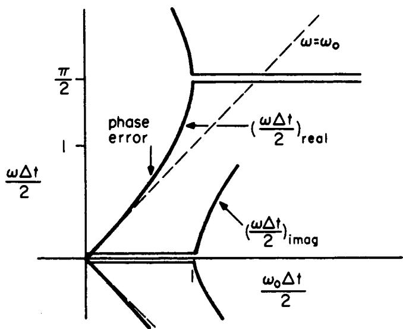  
Figure 4-2a Solution for $\pmb { \omega }$ in terms of $\omega _ { 0 }$ for simple harmonic motion, from the leap-frog finite-difference equation. Frequency ω agrees with $\omega _ { 0 }$ for small $\omega _ { 0 } \Delta { t }$ ,but is larger than $\omega _ { 0 }$ as $\omega \Delta t$ increases. For $\omega _ { 0 } \Delta t / 2 > 1$ ，the solution becomes complex with growing and decaying roots for $\pmb { \omega }$ (this is numerical instability);one trademark is the breakup into odd and even steps, the manifestation of the $\pmb { \pi }$ phase shift. Note the doubie root at $\omega = 0$ ， $\pi / 2$

showing a quadratic error term,as desired. The cumulative phase after $N$ steps is $\omega N \Delta t$ ,so that the cumulative

$$
\mathrm { P h a s e \ e r r o r } \approx \omega _ { 0 } N \Delta t \frac { 1 } { 6 } \left( \omega _ { 0 } \frac { \Delta t } { 2 } \right) ^ { 2 } = \frac { 1 } { 2 4 } N ( \omega _ { 0 } \Delta t ) ^ { 3 }
$$

For this error to equal,say,1/24 radian,then

$$
N = { \frac { 1 } { ( \omega _ { 0 } \Delta t ) ^ { 3 } } } \quad { \mathrm { w h i c h } } \left\{ { \mathrm { f o r } } \ \omega _ { 0 } \Delta t = 0 . 1 \right.
$$

For this error to equal, say,1 radian, then

$$
N = \frac { 2 4 } { ( \omega _ { 0 } \Delta t ) ^ { 3 } } \quad \mathrm { w h i c h } \ \left\{ \mathrm { f o r } \ \omega _ { 0 } \Delta t = 0 . 1 \ \mathrm { i s } \ 2 4 , 0 0 0 \ \mathrm { s t e p s } , \ 3 8 4 \ \mathrm { c y c l e s } \right.
$$

The points are: restricting the allowable error to small values limits the number of steps (and cycles); increasing the step increases the error as the cube of the step size. A common compromise is $\omega _ { 0 } \Delta t \approx 0 . 2$ ；common usage is 1000 to 10,000 steps,with useful physics sometimes extending to even more steps.

# PROBLEMS

4-2a Sketch the locations of $a , \nu$ ,and $x$ for the alternative integrator,

$$
\frac { \nu _ { t + \Delta t } - \nu _ { t } } { \Delta t } = \frac { 1 } { 2 } ( 3 a _ { t } - a _ { t - \Delta t } )
$$

$$
\frac { x _ { t + \Delta t } - x _ { t } } { \Delta t } = \frac { 1 } { 2 } ( \nu _ { t + \Delta t } + \nu _ { t } )
$$

Show that this integrator produces a frequency for the simple harmonic oscillator(1） of

$$
\omega \approx \omega _ { 0 } \bigg [ 1 + \frac { 1 } { 6 } ( \omega _ { 0 } \Delta t ) ^ { 2 } + \textit { i } \frac { ( \omega _ { 0 } \Delta t ) ^ { 3 } } { 8 } + \textit { i } \cdot \cdot \cdot \bigg ]
$$

Hint:Use $x _ { t \pm n \Delta t } = z ^ { \pm n } x _ { t }$ $z \equiv \exp \left( - i \omega \Delta t \right)$ and write (11） and(12) as a matrix. Set the determinant of the coeficients equal to zero to produce an equation in z(cubic) to be solved. The phase error is four times larger than that of the leap-frog scheme,and there is mild growth. Show how (with a sketch,as in Figure 2-4a) $\Delta t$ can be halved or doubled in one step. This method has the disadvantage of requiring storage of the previous acceleration $\alpha _ { t - \Delta t }$ in addition to previous velocity $\nu _ { t }$ and position $x _ { t }$

4-2b Discuss the possible use of integer arithmetic (no floating point） in the mover,with some care as to the number of bits needed for reasonable accuracy. Keep in mind that small changes are lost; that is,nothing happens unless v△t exceeds the least step in $_ { x }$ and $a \Delta t$ exceeds the least velocity.Hint:17 bits is marginal or fatal in quiet start.This coding was exploited by Estabrook and Tull(1980) for very high speed,almost twice as fast on the CDC-7600 (in machine language) as ES1 is on the CRAY-I (in FORTRAN)!

# 4-3 NEWTON-LORENTZ FORCE; THREE-DIMENSIONAL v X B INTEGRATOR

The particle equations of motion to be integrated are

$$
\begin{array} { c } { m \displaystyle \frac { d \mathbf { v } } { d t } = q \left( \mathbf { E } + \mathbf { v } \times \mathbf { B } \right) } \\ { \displaystyle \frac { d \mathbf { x } } { d t } = \mathbf { v } } \end{array}
$$

We desire a centered-difference form of the Newton-Lorentz equations of motion. The magnetic term is centered by averaging $\mathbf { v } _ { t - \Delta t / 2 }$ and $\mathbf { v } _ { t + \Delta t / 2 } ,$ following Buneman (1967)． The other terms are treated as before. Hence,(1) becomes

$$
\frac { \mathbf { v } _ { t + \Delta t / 2 } - \mathbf { v } _ { t - \Delta t / 2 } } { \Delta t } = \frac { q } { m } \left[ \mathbf { E } + \frac { \mathbf { v } _ { t + \Delta t / 2 } + \mathbf { v } _ { t - \Delta t / 2 } } { 2 } \times \mathbf { B } \right] .
$$

This vector equation for $\mathbf { v } _ { t + \Delta t / 2 }$ can be solved as three simultaneous scalar equations,one for each component. Instead,we choose to obtain a simpler solution using several steps.

The first method (Buneman, 1967) is to subtract the drift velocity $\mathbf { E } \times \mathbf { B } / B ^ { 2 }$ from $\pmb { \gamma }$ ,as

$$
\begin{array} { r } { \mathbf { v } _ { 0 1 d } ^ { \prime } = \mathbf { v } _ { t - \Delta t / 2 } - \frac { \mathbf { E } \times \mathbf { B } } { B ^ { 2 } } } \\ { \mathbf { v } _ { \mathrm { n e w } } ^ { \prime } = \mathbf { v } _ { t + \Delta t / 2 } - \frac { \mathbf { E } \times \mathbf { B } } { B ^ { 2 } } } \end{array}
$$

Similar to (1),this leaves just a rotation of $\mathbf { v } _ { \perp }$ and free acceleration of $\nu _ { \parallel } ,$

$$
\frac { \mathbf { v } _ { \mathrm { n e w } } ^ { \prime } - \mathbf { v } _ { \mathrm { o l d } } ^ { \prime } } { \Delta t } = \frac { q } { m } \left[ \mathbf { E } _ { \parallel } + \frac { \mathbf { v } _ { \mathrm { n e w } } ^ { \prime } + \mathbf { v } _ { \mathrm { o l d } } ^ { \prime } } { 2 } \times \mathbf { B } \right]
$$

We discuss the rotation in Problem 4-3a and Section 4-4.

Another method separates the electric and magnetic forces completely (Boris,1970b)． Substitute

$$
\begin{array} { r } { \mathbf { v } _ { t - \Delta t / 2 } = \mathbf { v } ^ { - } - \frac { q \mathbf { E } } { m } \frac { \Delta t } { 2 } } \\ { \mathbf { v } _ { t + \Delta t / 2 } = \mathbf { v } ^ { + } + \frac { q \mathbf { E } } { m } \frac { \Delta t } { 2 } } \end{array}
$$

into (3); then $\mathbf { E }$ cancels entirely (not just $\mathbf { E } _ { \perp } )$ ， which leaves

$$
\frac { \mathbf { v } ^ { + } - \mathbf { v } ^ { - } } { \Delta t } = \frac { q } { 2 m } ( \mathbf { v } ^ { + } + \mathbf { v } ^ { - } ) \times \mathbf { B }
$$

which is a rotation (see Problem 4-3a). The steps to compute are: add half the electric impulse to $\mathbf { v } _ { t - \Delta t / 2 }$ using (7) to obtain $\mathbf { v } ^ { - }$ ；rotate according to (9) to obtain $\mathbf { v } ^ { + }$ ,and add the remaining half of the electric impulse (8） to obtain $\mathbf { v } _ { t + \Delta t / 2 }$ . These are the same steps,motivated differently,as in Section 2-4. Separation of parallel and perpendicular components is not needed with Boris’method,and the relativistic generalization is straightforward.

Finally,we check the angle of rotation $\pmb \theta$ which we expect to be close to $\omega _ { c } \Delta t = q B \Delta t / m$ . By inspection of Figure 4-3a,we see that

$$
\left| \tan { \frac { \theta } { 2 } } \right| = { \frac { \left| { \bf v } \right| - { \bf v } ^ { - } \bot } { \left| { \bf v } _ { \bot } ^ { + } + { \bf v } _ { \bot } ^ { - } \right| } } = { \frac { q B } { m } } { \frac { \Delta t } { 2 } } = { \frac { \omega _ { c } \Delta t } { 2 } }
$$

where we have used (9） in the last step. Hence,the difference equation (9) produces a rotation through angle

$$
\theta = 2 \arctan \left( \frac { q B } { m } \frac { \Delta t } { 2 } \right) = \omega _ { c } \Delta t \left( 1 - \frac { ( \omega _ { c } \Delta t ) ^ { 2 } } { 1 2 } + \ \cdot \ \cdot \ \cdot \right)
$$

which has less than one percent error for $\omega _ { c } \Delta t < 0 . 3 5$

# PROBLEMS

4-3a Show that (9) is only a rotation of v. Hint: take the scalar product of (9) with $( \mathbf { v } ^ { + } + \mathbf { v } ^ { - } )$

4-3b Consider a model with $\mathbf { B } _ { 0 }$ uniform and $\mathbf { E } _ { \perp } = 0$ 、in which a particle at speed $\nu$ has circular motion in the $\mathbf { x } _ { \perp }$ plane. Let the orbit be followed by (subscripts refer to time steps)

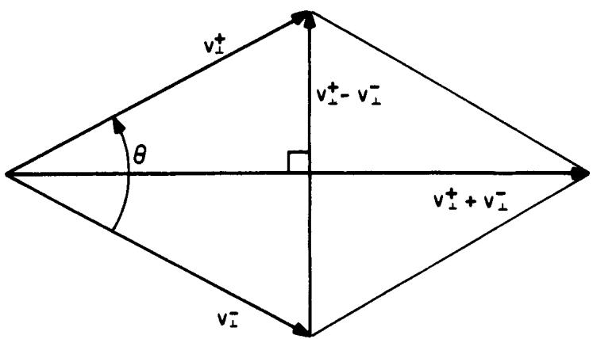  
Figure 4-3a Knowing that (9） represents a rotation,we construct this diagram,from which tan $( \pmb \theta / 2 )$ is readily obtained.

$$
\frac { \mathbf { x } ^ { + } - \mathbf { x } ^ { 0 } } { \Delta t } = \mathbf { v } ^ { + } \qquad \frac { \mathbf { x } ^ { 0 } - \mathbf { x } ^ { - } } { \Delta t } = \mathbf { v } ^ { - }
$$

with $\mathbf { v } ^ { + }$ obtained from

$$
\frac { \mathbf { v } ^ { + } - \mathbf { v } ^ { - } } { \Delta t } = \lambda \left( \frac { \mathbf { v } ^ { + } + \mathbf { v } ^ { - } } { 2 } \right) \times \left( \frac { q \mathbf { B } } { m } \right)
$$

as shown in Figure 4-3b. Using tan $\pmb { \alpha }$ from this figure [Hint: see (1O)],show that

$$
\begin{array} { r } { \lambda = \frac { \tan \alpha } { 1 / 2 \omega _ { c } \Delta t } } \end{array}
$$

which is $\left( \tan \alpha \right) / \alpha$ if we ask that the mover produce the correct gyrophase, $\alpha = \omega _ { c } \Delta t / 2$ Next,requiring that the gyroradius and period be reproduced correctly,show that

$$
| \mathbf { v } ^ { + } | = | \mathbf { v } ^ { - } | = ~ \nu \left\{ { \frac { \sin \alpha } { \alpha } } \right\}
$$

Last, show that when $\pmb { \mathrm { \delta } } _ { \perp }$ is included,the $\lambda$ multiplier appears as $\lambda ( \mathbf { E } _ { \perp } + \mathbf { v } \times \mathbf { B } )$ in order to produce the correct $\mathbb { E } \times \mathbb { B } / B ^ { 2 }$ drift.[These ideas came from Hockney (1966),Buneman (1967), and R.H.Gordon (unpublished Berkeley seminar,1971).]

4-3c (Due to R. H. Gordon). Using any of the $\mathbf { v } \times \mathbf { B }$ integrators given here,for uniform $\pmb { B } _ { 0 } \hat { \pmb z }$ ， plot particle orbits in the $x , y$ piane:

(a） Without the tan $\alpha / \alpha$ correction,supposedly with a integral number of steps per cyclotron period; note where points on the second and succeeding cycles are with respect to those on the first.   
(b) Repeat (a) with tan $\alpha / \alpha$ correction; try $0 < \alpha < \pi$   
(c） Like (b),with $\omega _ { c } \Delta t = 2 \pi$ ; compare with true orbit;explain the motion; is this instability?   
(d) Like (b),with $\omega _ { c } \Delta t = 2 \pi - \delta$ ； compare with true orbit; explain the motion.

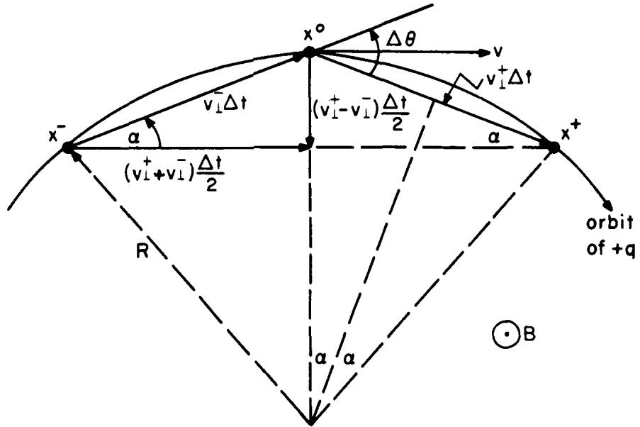  
Figure 4-3b Velocities and positions in the plane normal to the uniform magnetic field ${ \bf \delta B } _ { 0 }$ with $\mathbf { E } _ { \perp } = 0$ in which the particle orbit is a circle (cyclotron motion)．The computer or finite difference orbit is made up of straight line segments connecting old and new positions.

# 4-4 IMPLEMENTATION OF THE vX B ROTATION

First consider the case in which $\mathbf { B }$ is parallel to the $\pmb { z }$ axis. In the $x { \cdot } y$ plane the rotation is through an angle $\pmb \theta$ where

$$
\tan { \frac { \theta } { 2 } } = - { \frac { q B } { m } } { \frac { \Delta t } { 2 } }
$$

This gives a good approximation to rotation angle $\pmb \theta$ when $\pmb \theta$ is not too large [4-3(11)],and is convenient when $B$ is not constant. In ES1, $B$ is fixed so we evaluate tan $\theta / 2 = -$ tan $\left( q B \Delta t / 2 m \right)$ ；obtaining the correct rotation angle costs nothing more.

Now we use this value of tan $\theta / 2$ in the half-angle formulas to obtain cos $\pmb \theta$ and sin $\pmb \theta$ for the velocity rotation. Letting

$$
t = - \tan { \frac { \theta } { 2 } }
$$

we have

$$
s \equiv - \sin \theta = \frac { 2 t } { 1 + t ^ { 2 } }
$$

$$
c \equiv \cos \theta = \frac { 1 - t ^ { 2 } } { 1 + t ^ { 2 } }
$$

The rotation becomes

$$
\begin{array} { c } { { \nu _ { x } ^ { + } = c \nu _ { x } ^ { - } + s \nu _ { y } ^ { - } } } \\ { { \nu _ { y } ^ { + } = - s \nu _ { x } ^ { - } + c \nu _ { y } ^ { - } } } \end{array}
$$

The mover requires no evaluation of transcendental functions,which is a significant time saving when $\pmb { B }$ is not constant. Equations (3) to (6) require 7 multiplies,1 divide,and 5 adds. Buneman (1973) reduces this to:

$$
\begin{array} { c } { { \nu _ { x } ^ { \prime } = \nu _ { x } ^ { - } + \nu _ { y } ^ { - } t } } \\ { { } } \\ { { \nu _ { y } ^ { + } = \nu _ { y } ^ { - } - \nu _ { x } ^ { \prime } s } } \\ { { } } \\ { { \nu _ { x } ^ { + } = \nu _ { x } ^ { \prime } + \nu _ { y } ^ { + } t } } \end{array}
$$

with 4 multiplies,1 divide,and 5 adds. The saving of 3 multiplies per particle per time step is desirable.

When the directions of $\mathbf { B }$ and $\pmb { \nu }$ are arbitrary,a convenient rotation in vector form is described by Boris (197O). First $\mathbf { v } ^ { - }$ is incremented to produce a vector $\mathbf { v } ^ { \prime }$ which is perpendicular to $( \mathbf { v } ^ { + } - \mathbf { v } ^ { - } )$ and $\mathbf { B }$ (see Figure 4-4a).

$$
\mathbf { v } ^ { \prime } = \mathbf { v } ^ { - } + \mathbf { v } ^ { - } \times \mathbf { t }
$$

The angle between $\blacktriangledown ^ { - }$ and $\mathbf { v } ^ { \prime }$ is just $\theta / 2$ , therefore the vector $\mathbf { t }$ is seen from Figure 4-4a to be given by

$$
\mathbf { t } \equiv - \hat { \mathbf { b } } \tan \frac { \theta } { 2 } = \frac { q \mathbf { B } } { m } \frac { \Delta t } { 2 }
$$

Finally, $\mathbf { v } ^ { + } - \mathbf { v } ^ { - }$ is parallel to $\mathbf { v } ^ { \prime } \times \mathbf { B }$ ,s0

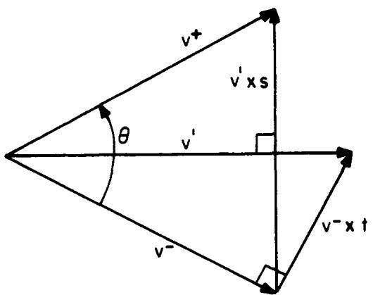  
Figure 4-4a Velocity space showing the rotation from $\mathbf { v } ^ { - }$ to $\mathbf { v } ^ { + }$ .The velocities shown are projections of the total velocities onto the plane perpendicular to $\mathbf { B }$

$$
\mathbf { v } ^ { + } = \mathbf { v } ^ { - } + \mathbf { v } ^ { \prime } \times \mathbf { s }
$$

where s is parallel to $\mathbf { B }$ and its magnitude is determined by the requirement $| \mathbf { v } ^ { - } | ^ { 2 } = \left\{ \mathbf { v } ^ { + } \right\} ^ { 2 }$

$$
\displaystyle \mathsf { s } = \frac { 2 \mathsf { t } } { 1 + t ^ { 2 } }
$$

Boris'algorithm is readily made relativistic; see Chapter 15.

# PROBLEMS

4-4a Verify that (7) - (9) has the same result as (5) and (6).

4-4b Using $\left| \mathbf { v } ^ { + } \right| = \left| \mathbf { v } ^ { - } \right|$ (a rotation),obtain s (13).

4-4c Show that Boris’rotation satisfies the equation of motion 4-3(9),if $\mathbf { t } = q \mathbf { B } \Delta t / 2 m$

# 4-5 APPLICATION TO ONE-DIMENSIONAL PROGRAMS

In programs with one dimension $x$ and with two velocities, $\nu _ { x }$ and $\nu _ { y }$ ，that allow a magnetic field $B _ { z }$ , the motion is all perpendicular to B. Hence,using the vector equations of the previous sections,we obtain the 1d2v accelrotate-accel algorithm in Section 2-4.

A program with one dimension and with three velocities 1d3v may be set up as shown in Figure 4-5a. Let $\mathbf { B } _ { 0 }$ (constant,uniform） be in the $x \cdot z$ plane, and make an angle $\pmb \theta$ with the $z$ axis. The self-consistent $\mathbf { E }$ and $\mathbf { k }$ must be along $x$ ，normal to the sheets. If we stopped here,then the perpendicular motion in $z$ could be ignored $( F _ { z } = 0 )$ . However, on occasion we may be interested in applying an electric field $E _ { \mathrm { e x t } }$ along $y$ which produces a $\nu _ { y }$ which in turn produces an $F _ { z } = { \mathrm { ~ - } q } \nu _ { y } B _ { x }$ and a $z$ drift, $( \nu _ { E } ) _ { z } = - ( E _ { \mathrm { e x t } } ) _ { y } / \bar { B _ { x } }$ The point of the exercise is to include both $\nu _ { \parallel }$ and $\nu _ { \perp }$ as well as $k _ { \parallel }$ and $k _ { \perp }$ in this model. It is convenient to have the motion solved for in the parallel and perpendicular directions,which leads to the invention of the $x ^ { \prime }$ coordinate（ $\perp$ to $\mathbf { B } _ { 0 } ,$ at angle $\pmb \theta$ with respect to $x$ )． Call the field due to the charges, $\mathbf { E _ { s e l f - c o n s i s t e n t } } \equiv \mathbf { E _ { s c } }$ Then the fields are:

$$
\begin{array} { r } { \mathbf { E } _ { \mathrm { s c } } = \hat { \mathbf { x } } E _ { \mathrm { s c } } = \hat { \mathbf { x } } ^ { \prime } E _ { \mathrm { s c } } \cos \theta + \hat { \mathbf { b } } _ { 0 } E _ { \mathrm { s c } } \sin \theta } \\ { \mathbf { E } _ { \mathrm { e x t } } = \hat { \mathbf { y } } E _ { \mathrm { e x t } } \qquad \quad } \\ { \mathbf { B } = \mathbf { B } _ { 0 } \qquad } \end{array}
$$

The equations of motion in the $( x ^ { \prime } , y , B _ { 0 } )$ coordinates are integrated by the accel-rot-accel method,as follows

$$
\nu _ { x _ { 1 } } { } ^ { \prime } = \nu _ { x ^ { \prime } } ( t - \Delta t / 2 ) + \frac { q } { m } \frac { \Delta t } { 2 } E _ { s c } \cos \theta
$$

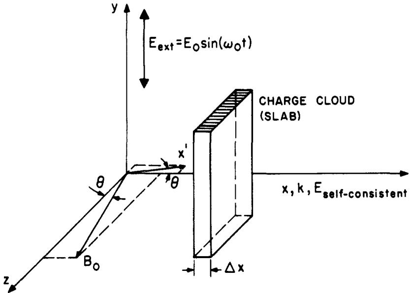  
Figure 4-5a One-dimensional sheet model, with $x$ displacement and $\nu _ { x } , ~ \nu _ { y } , ~ \nu _ { z }$ velocities 1d3v. The self-consistent fieid,that due to the sheets,is along $x$ ,as is $\mathbf { k }$ There may be an applied electric field along $y$ The magnetic field is in the $x \cdot z$ plane. (From Chen and Birdsall,1973.)

$$
\begin{array} { r } { \nu _ { y _ { 1 } } = \nu _ { y } \left( t - \Delta t / 2 \right) + \frac { q } { m } \frac { \Delta t } { 2 } E _ { \mathrm { e x t } } } \end{array}
$$

$$
\nu _ { x ^ { ' } } ( t + \Delta t / 2 ) = \nu _ { x _ { 1 } ^ { ' } } \cos \left( \omega _ { c } \Delta t \right) + \nu _ { y _ { 1 } } \sin \left( \omega _ { c } \Delta t \right) + \frac { q } { m } \frac { \Delta t } { 2 } E _ { \mathrm { s c } } \cos \theta
$$

$$
\begin{array} { r } { \nu _ { y } \left( t + \Delta t / 2 \right) = - \nu _ { x _ { 1 } ^ { \prime } } \sin \left( \omega _ { c } \Delta t \right) + \nu _ { y _ { 1 } } \cos \left( \omega _ { c } \Delta t \right) + \frac { q } { m } \frac { \Delta t } { 2 } E _ { \mathrm { e x t } } } \end{array}
$$

$$
\nu _ { \hat { B } _ { 0 } } ( t + \Delta t / 2 ) = \nu _ { \hat { B } _ { 0 } } ( t - \Delta t / 2 ) + \frac { q } { m } \Delta t E _ { \mathrm { s c } } \sin \theta
$$

In many problems the magnetic field is uniform and constant, $B _ { z } = B _ { 0 }$ and is independent of $x$ and $t$ In this situation $\omega _ { c } \Delta t$ can be calculated once at the start of the problem, and hence also cos $\pmb { \omega } _ { c } \Delta t$ and sin $\omega _ { c } \Delta t$

In some problems $\pmb { B } _ { z }$ may vary in $t$ or $x$ so that one may be forced to obtain cos $\omega _ { c } \Delta t$ and sin $\omega _ { c } \Delta t$ each step and for each particle. Time and space centering for such models are treated by Langdon and Lasinski (1976) and Nevins et al. (1979).

The ld models of this section have sometimes been called $1 \% \mathsf { d }$ models due to use of more than the $\pmb { x }$ component of velocity. Early use was given by Auer et al. (1961，1962) for sheet currents and sheet charges and by Hasegawa and Birdsall (1964). The work given here on 1d3v is from Chen and Birdsall (1973).

# PROBLEMS

4-5a With uniform $\mathbf { B }$ parallel to the $z$ axis and $\underline { { \mathbf { E } } } _ { y } = \underline { { \mathbf { E } } } _ { z } = 0$ ,as in ES1, the $y$ component of the equation of motion 4-3(1) can be integrated to find a constant of motion

$$
\omega _ { c } X _ { \tt g c } \equiv \nu _ { y } + \omega _ { c } x = { \tt c o n s t a n t }
$$

where $X _ { \mathfrak { s c } }$ is the locationoftheguiding-centerandisrelatedtothecanonicalmomentum ${ p _ { y } }$ Show that the difference equation 4-3(3) also has the analogous exact constant of motion

$$
\omega _ { c } X _ { { \bf g } \mathrm { c } , t + \Delta t / 2 } = \nu _ { y , t + \Delta t / 2 } + { \frac { \omega _ { c } } { 2 } } ( x _ { t } + x _ { t + \Delta t } )
$$

i.e.,show that

$$
X _ { _ { 8 \bar { c } , t + \Delta t / 2 } } \equiv X _ { _ { 8 \bar { c } , t - \Delta t / 2 } }
$$

4-5b Show that the equation of motion

$$
\frac { x _ { t + \Delta t } - 2 x _ { t } + x _ { t - \Delta t } } { \Delta t ^ { 2 } } =  \frac { q } { m } E _ { x } + \omega _ { c } ^ { 2 } | \bar { X } _ { \mathfrak { g c } } - \frac { x _ { t - \Delta t } + 2 x _ { t } + x _ { t + \Delta t } } { 4 } |
$$

is equivalent to 4-3(3) in one-dimension. Here, $X _ { \tt S C }$ (defined in Problem 4-5a) is stored instead of $\nu _ { y }$ ．An even simpler equation of motion due to Byers (197O) reduces the magnetic term to $\omega _ { c } ^ { 2 } ( \dot { X } _ { \mathfrak { s c } } - x _ { t } )$

# 4-6 PARTICLES AS SEEN BY THE GRID; SHAPE FACTORS $\pmb { S } ( \pmb { x } ) , \pmb { S } ( \pmb { k } )$

The use of a spatial grid, with interpolation to obtain the charge density, leads to the appearance of charges that are at least one cell wide as already shown in Section 2-6, Figure 2-6a,b. This appearance comes from making observations at the grid points and from the fact that the fields are calculated from these observations. The corollary is that the particles never behave as if they had zero thickness. Hence,it is wise to be concerned with the effective shape of the particles,through the particle shape factor $\pmb { S } ( \mathbf { x } )$ (as already implied in Figures 2-6a(b),2-6b(b)) and the Fourier transform of the shape factor $s ( \mathbf { k } )$ ·

In this section, we present a short analysis of finite-size particles without grid effects. In Part Two,we include grid effects in great detail. Here，we simply say that the particles have finite size. This approach is given in detail by Langdon and Birdsall (197O) and Okuda and Birdsall (1970).

The particles have a spread-out charge distribution and move rigidly without rotation or internal change and pass freely through one another. It seems natural to call these particles clouds. The interactions of the system of clouds is a straightforward generalization of the point particle interaction; in fact,as noted in Chapter 1,certain divergences in the kinetic theory and in classical electromagnetic theory are removed.

The charge density at laboratory coordinate $\mathbf { x } ^ { \prime }$ of a cloud whose center is at $\mathbf { x }$ is changed from $q \delta \left( \mathbf { x } ^ { \prime } - \mathbf { x } \right)$ for a point particle, to $q S \left( \mathbf { x } ^ { \prime } - \mathbf { x } \right)$ for a cloud, where $q$ is the total charge given by $q \int d \mathbf { x } ^ { \prime } S ( \mathbf { x } ^ { \prime } - \mathbf { x } )$ Let $\mathbf { J } _ { p }$ and $\rho _ { p }$ be the current and charge densities of a system of point charges located at the $( \mathbf { x } ^ { \prime } ) ^ { \prime } \mathbf { s }$ ；then the densities ${ \bf J } _ { c }$ and $\rho _ { c }$ for a system of clouds,whose centers coincide with the point particles, are

$$
\left[ { \rho _ { c } ( { \bf x } , t ) } \right] = \int { d { \bf x } ^ { \prime } S ( { \bf x } ^ { \prime } - { \bf x } ) } \left[ { \rho _ { p } ( { \bf x } ^ { \prime } , t ) } \right]
$$

These cloud densities are to be used in Maxwell's equations to find the fields $\mathbf { E }$ and $\mathbf { B }$ . The Newton-Lorentz force on one cloud of total charge $\pmb q$ ，with (center） position $\mathbf { x }$ and velocity $\pmb { \nu }$ is then

$$
\mathbf { F } ( \mathbf { x } , \mathbf { v } , t ) = q \int d \mathbf { x } ^ { \prime } S ( \mathbf { x } ^ { \prime } - \mathbf { x } ) \cdot \left[ \mathbf { E } ( \mathbf { x } ^ { \prime } , t ) + \mathbf { v } \times \mathbf { B } ( \mathbf { x } ^ { \prime } , t ) \right]
$$

These relations are convolutions and, therefore, take on a very simple form when Fourier transformed in space:

$$
\left[ \begin{array} { c } { \rho _ { c } ( \mathbf { k } , t ) } \\ { \mathbf { J } _ { c } ( \mathbf { k } , t ) } \end{array} \right] = S ( \mathbf { k } ) \left[ \begin{array} { c } { \rho _ { p } ( \mathbf { k } , t ) } \\ { \mathbf { J } _ { p } ( \mathbf { k } , t ) } \end{array} \right]
$$

$$
\mathbf { F } ( \mathbf { k } , \mathbf { v } , t ) = q S ( - \mathbf { k } ) \left[ \mathbf { E } ( \mathbf { k } , t ) + \mathbf { v } \times \mathbf { B } ( \mathbf { k } , t ) \right]
$$

where

$$
S ( \mathbf { k } ) = \int d \mathbf { x } S ( \mathbf { x } ) \exp \left( - i \mathbf { k } \cdot \mathbf { x } \right)
$$

Our transform convention is such that in the point particle limit, (particle radius $R  0 )$ or long-wavelength limit $k  0$ ， $s ( \boldsymbol { k } ) \to 1$ The size of the cloud by some criterion is denoted by $\pmb R$ ；then, $S ( k )$ becomes small for $| \pmb { k } | \geqslant R ^ { - 1 }$

The shape factor $s$ need not be isotropic (and has not been in practice, e.g.,squares and cubes) or symmetric (but usually is). However,in this section we assume that $\pmb { S } ( \mathbf { x } )$ is isotropic. Therefore, $\pmb { S } ( \mathbf { k } )$ is isotropic and real valued. (For asymmetrical clouds,the only change in most results is to replace $S ^ { 2 } ( k )$ with $| S ^ { 2 } ( { \bf k } ) | .$

Using (3) and a litle care,one can now redo most plasma theory with few changes by the replacement of the charge $q$ by $q S ( { \bf k } )$ . For example, the dielectric tensor for a uniform Vlasov gas of clouds,and therefore,dispersionrelationsareuchangedexcepttattheplmafrequecysqared ${ \omega } _ { p } ^ { 2 }$ must everywhere be multiplied by (one $s$ from the equation of motion,another from relating position to density） as,

$$
\omega ^ { 2 } \approx \mathbb { S } ^ { 2 } ( k ) \omega _ { p } ^ { 2 }
$$

This result may be viewed as a $k$ -dependent plasma frequency or charge when adapting linear stability analyses,etc.，to cloud plasmas. Two shapes have been inet so far,those with zero-order and first-order weightings (Figure 2-6b, d) for which the shape factor transforms are,in 1d,

$$
\begin{array} { l } { S _ { 0 } ( k ) = \displaystyle \frac { \sin \frac { k \Delta x } { 2 } } { \frac { k \Delta x } { 2 } } } \\ { S _ { 1 } ( k ) = \displaystyle \left. \frac { \sin \frac { k \Delta x } { 2 } } { \frac { k \Delta x } { 2 } } \right. ^ { 2 } } \end{array}
$$

Hence,our first guesses for cold plasma dispersion are as shown in Figure 4-6a. Later, in adding a spatial grid, the finite differencing adds further $k$ dependence to the dispersion.

In the presence of a uniform imposed magnetic field, the correct $k$ to use in the zero-order cyclotron frequency $[ \omega _ { c 0 } = q B _ { 0 } S ( k ) / m ]$ is O,so that ${ \pmb \omega } _ { c 0 }$ is unchanged from the point-particle value. This is an example of the care that must be used if there are several spatial dependences in the system, which also occurs if there are several waves interacting nonlinearly or if a spatial grid is used.

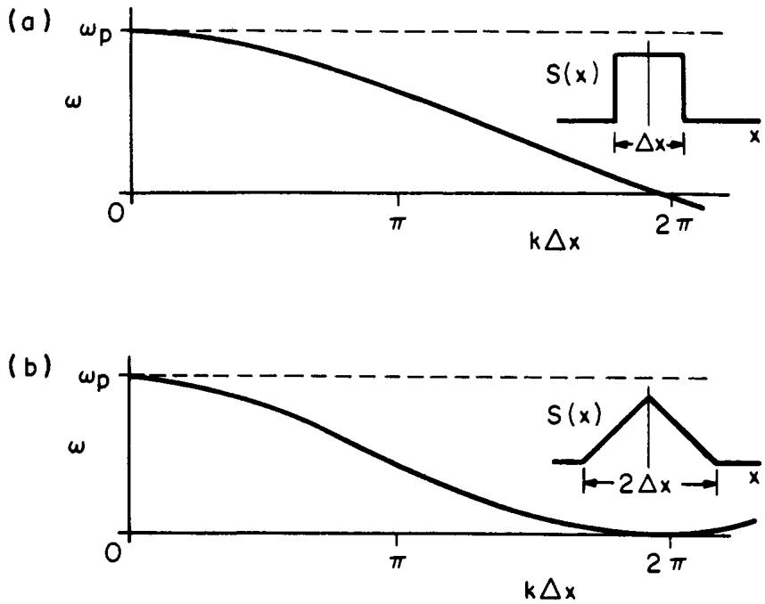  
Figure 4-6a (a） Cold plasma dispersion expected for finite-size charges,with shape factor $s ( \mathbf { x } )$ is shown for zero-order weighting NGP. The Langmuir result, $\omega = \omega _ { p }$ 、is shown dashed. The drop in $\omega$ is due to the smoothing effect of the clouds,as the wavelength becomes comparable to the cloud radius. There is no grid. (b） Similarly,for first-order weighting CIC.

# PROBLEMS

4-6a What could happen if we applied the cloud notion inconsistently,e.g.，we used a different S in (1) than in (2)? For example,if we do no convolution on the fields,then what does the dispersion relation (6） become? The resulting instability,at wavevectors for which $S ( k ) < 0 .$ is like that of a system of gravitationally attracting particles.Show that the potential energy is lower when there is a density perturbation at such a $\pmb { k }$ than if the density is uniform． See Langdon and Birdsall (1970).

4-6b Can different shapes S be used for different species?

# 4-7 A WARM PLASMA OF FINITE-SIZE PARTICLES

Here we drop the magnetic field and look only at the longitudinal plasma oscillations to see how the simulation differs from the physics for point particles.

The longitudinal dielectric function for a cloud plasma is

$$
\begin{array} { r } { \boldsymbol { \epsilon } \left( \boldsymbol { k } , \omega \right) = 1 + S ^ { 2 } ( \boldsymbol { k } ) \frac { \omega _ { p } ^ { 2 } } { k ^ { 2 } } \int \mathbf { k } \cdot \frac { \partial f _ { 0 } } { \partial \mathbf { v } } \frac { d \mathbf { v } } { \omega - \mathbf { k } \cdot \mathbf { v } } } \end{array}
$$

withthestandardsymboldefinitions. Space-timedependence exp $( i \mathbf { k } \cdot \mathbf { x } - i \omega t )$ is assumed,and the usual remarks about analyticity apply. For a Maxwelian velocity distribution with no drift and thermal velocity, $\nu _ { t } = \ [ \nu _ { a \nu } ^ { 2 } / 3 ] ^ { \nu _ { t } }$ ,the dielectric function becomes

$$
\epsilon \left( k , \omega \right) = 1 - \frac { 1 } { 2 } \left( \frac { S \omega _ { p } } { k \nu _ { t } } \right) ^ { 2 } Z ^ { \prime } \left( \frac { \omega } { \sqrt { 2 } k \nu _ { t } } \right)
$$

where $\pmb { Z } ^ { \prime }$ is the derivative of the plasma dispersion function of Fried and Conte (1961).

The dispersion relation for longitudinal wavesis $\epsilon = 0$ When $\begin{array} { r l } { k \nu _ { t } / S \omega _ { p } = } & { { } k \lambda _ { D } / S < < 1 } \end{array}$ 。 we can use the large argument asymptotic expansion for $z ^ { \prime }$ and find an approximate solution for $\pmb { \omega }$ which shows weak Landau damping of the oscillations

$$
\begin{array} { c } { { ( { \mathrm { R e } } \omega ) ^ { 2 } \approx S ^ { 2 } ( k ) \omega _ { p } ^ { 2 } + 3 k ^ { 2 } { \nu _ { t } } ^ { 2 } } } \\ { { { \mathrm { I m } } \omega \approx - \Bigg ( \displaystyle \frac { \pi } { 8 } \Bigg ) ^ { 1 / 2 } S \omega _ { p } \Bigg ( \displaystyle \frac { S } { k \lambda _ { D } } \Bigg ) ^ { 3 } \mathrm { e x p } \Bigg [ - \displaystyle \frac { 1 } { 2 } \Bigg ( \displaystyle \frac { S } { k \lambda _ { D } } \Bigg ) ^ { 2 } - \displaystyle \frac { 3 } { 2 } \Bigg ] } } \end{array}
$$

With small clouds (of radius $R < \lambda _ { D } ,$ ） and weak damping we have $k R < k \lambda _ { D } < < 1$ so that $s \approx 1$ . Thus,the weakly damped oscillations are litle affected with small clouds,as we would hope. See the exact solution for uniform density clouds in Figure $4 - 7 a$ For large clouds $( R \geqslant \lambda _ { D } )$ and weak damping,Re ω can be very different from the point-particle result when $k R \geqslant 1$ ； see Figure 4-7b.

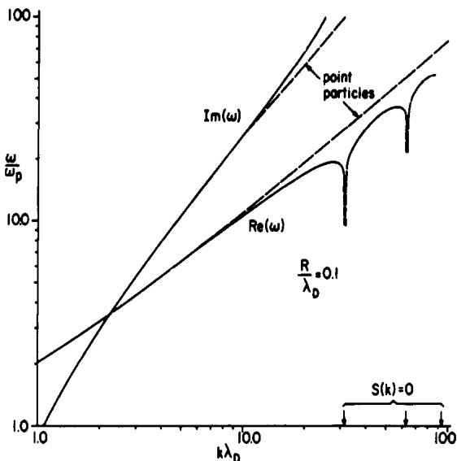  
Figure 4-7a Dispersion relation roots $\left( \omega \nu s , k \right)$ for small clouds, $R = 0 . 1 \lambda _ { D }$ There is no grid. (From Langdon and Birdsall,1970.)

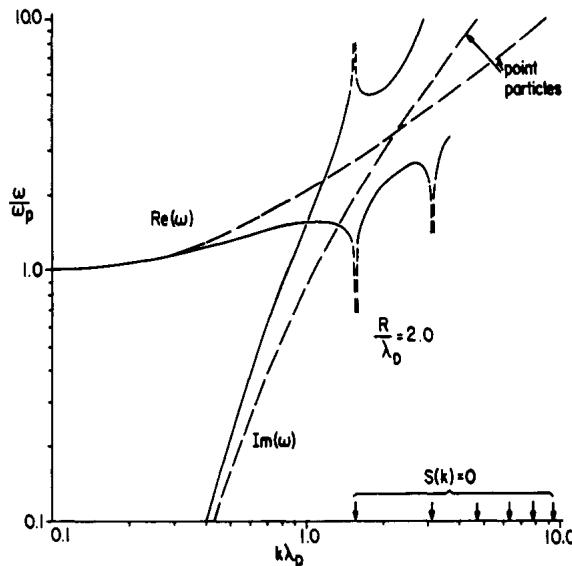  
Figure 4-7b Same as Figure 4-7a for large clouds, $R = 2 \lambda _ { D }$ (From Langdon and Birdsall,1970.)

When $k \lambda _ { D } / S \geqslant 1$ ，the oscillations are strongly damped. Thus,in a cloud plasma the onset of damping as $\pmb { k }$ increases occurs when $k \lambda _ { D } \approx 1$ or when $k R$ is large enough. For some cloud shapes, such as cubes, ${ \pmb S }  { \pmb 0 }$ for finite $\pmb { k }$ .Where this happens the asymptotic solutions for_strong damping show that $\operatorname { I m } \omega  \infty$ ， $\mathbb { R } \mathbb { e } \omega \longrightarrow 0$ ，which can be seen in Figure 4-2a. Of course,when $s$ is very small the electric interaction is disabled and the clouds free stream. The dispersion roots then do not describe the time evo-lution of a density perturbation; the free-streaming time evolution goes as exp $( - 1 / _ { 2 } { k ^ { 2 } \nu _ { t } } ^ { 2 } t ^ { 2 } )$ .Where $s ( \pmb { k } )  0$ ,a perturbation could be made in density which would produce no $E$ ，hence be undamped; this perturbation might recur and cause trouble nonlinearly. At such wavelengths where the clouds strongly affect the plasma, nothing destructive occurs; in fact, very litte happens.

This section is intended as an introduction to finite-size particle physics, without the grid. More detail is given on potentials,shielding,energies,collisions,etc.,in the articles by Langdon and Birdsall (197O) and Okuda and Birdsall (197O).‘These issues are studied in detail in Part Two with a spatial grid.

# 4-8 INTERACTION FORCE WITH FINITE-SIZE PARTICLES IN A GRID

Having observed the density produced at the grid points, for zero and first-order density weighting,let us now look at the force between two particles,with these weightings,in one dimension. Coulomb's law for sheets says that the force $\propto 1 / r ^ { 0 }$ ，that is,the force is independent of the separa-tion, although it jumps and may change sign as two particles pass; hence, the force with no grid is a step function.

Adding a spatial grid modifies the $1 / r ^ { 0 }$ law at short range (charge separa-tion less than the particle thickness) for zero-order and first-order weighting, as follows. (In both weightings,the three-point finite-difference expression for $\partial ^ { 2 } \phi / \partial x ^ { 2 }$ and two-point expression for $\partial \phi / \partial x$ are used, as noted earlier.) The interaction force of a particle at $x _ { 1 }$ on a particle at $x _ { 2 }$ is taken as (Langdon and Birdsall,1970)

$$
F ( x _ { 1 } , x _ { 2 } ) = F \left\{ \overline { { { x } } } - \frac { 1 } { 2 } x , \overline { { { x } } } + \frac { 1 } { 2 } x \right\}
$$

$F$ depends on the separation

$$
x \equiv x _ { 2 } - x _ { 1 }
$$

as well as the mean position in the grid,

$$
\bar { x } \equiv \frac { x _ { 1 } + x _ { 2 } } { 2 }
$$

When nominal point particles are used $\boldsymbol { \mathcal { R } } = \boldsymbol { 0 }$ of Section 4-7) with zeroorder-weighting (the NPG scheme), then the force is the expected Coulomb step function only for $\overline { { x } } = \Delta x / 2$ (mean position is midway between grid points） but has two steps for other values of $\overline { { x } }$ as is shown in Figure $4 - 8 a ( a )$ The particles indeed now know the presence of the grid. When nominal clouds of width $2 R = \Delta { x }$ are used with first-order weighting (CIC,PIC), then the force (though not its derivative） is continuous with $_ x$ as shown in Figure $4 - 8 a ( b )$ and the variation with mean grid position $\bar { x }$ is much less pronounced than with zero-order weighting.

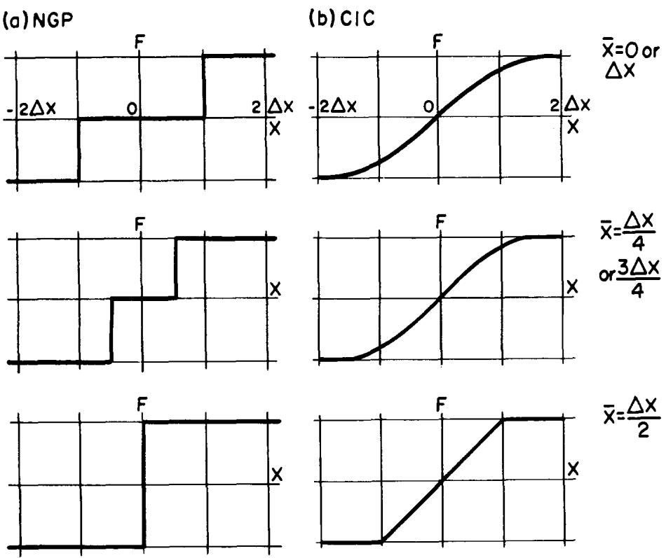  
Figure 4-8a (a） Interaction force F for nominal zero-size particles (R 一O,sheets） using the zero-order or nearest-grid point (NGP) density and force weighting. (b）F for nominal clouds of width △x (R =△x/2,slabs),using the first-order or cloud-in-cell(CIC),particle-in-cell(PIC) weightings.(From Langdon and Birdsall,1970.)

It is informative to separate the interaction force into two parts: an aver. aged part which is invariant under displacement of the grid,

$$
\begin{array} { l } { \displaystyle { \overline { { F } } ( x _ { 1 } , x _ { 2 } ) = \overline { { F } } ( x _ { 1 } - x _ { 2 } ) } } \\ { \displaystyle { = \frac { 1 } { \Delta x } \int _ { \Delta x } F \left( \overline { { x } } - \frac { x } { 2 } , \overline { { x } } + \frac { x } { 2 } \right) d \overline { { x } } } } \end{array}
$$

and the remainder,which is a nonphysical grid force,

$$
\delta { \cal F } = { \cal F } - \overline { { { \cal F } } }
$$

If the effects of $\delta F$ may be neglected, then the system can be analyzed by the methods discussed earlier. For example,in the dispersion relation for plasma oscillations, one must multiply ${ \pmb S } ^ { 2 }$ by $( k \kappa / K ^ { 2 } )$ ， the finite-difference terms anticipated in Section 2-5,which shows that one effect of the grid is to smooth the interaction, which we have argued is beneficial.

A detailed formulation of the_grid force problem shows that the principal consequence of the grid force $\delta F$ is that perturbations at wavevector $\pmb { k }$ are coupled to perturbations at wavevectors differing from $\pmb { k }$ by integer multiples of $2 \pi / \Delta x$ (the aliasing problem, taken up in Chapter 8). This coupling is not impqrtant when $\lambda _ { D } > > \Delta x$ ; then the approximate description in terms of $\bar { \pmb F }$ is quite accurate.

We see that finite-size particles in a spatial grid have lost their shortrange interactions and pass smoothly through one another with relatively small noise. These effects carry over nicely to two and three dimensions, and leads to much reduced cross sections and no large-angle scattering; i.e., collisional and short-wavelength fluctuations are much reduced. In addition, for cloud size $R \leqslant \lambda _ { D }$ ， longitudinal waves and Debye shielding are nearly the same as for a laboratory plasma. All of this is covered in more detail later.

# PROBLEMS

4-8a Copy Figure 4-8a(a) and overlay the $\overline { { x } } = 0 , \Delta x / 4 , \Delta x / 2$ graphs. This makes the dependence of $F$ on grid location more emphatic.

4-8b Repeat (a) for Figure $4 - 8 a ( b )$

4-8c Construct a graph for second-order weighting using a quadratic_spline,supporting your sketches with analysis. (See Section 8-8 for formulation of the spline.) Repeat the overlay given in (a)and observe that the position of the grid changes $F$ very little,much less than with zero and first order weighting.

# 4-9 ACCURACY OF THE POISSON SOLVER

As with the particle mover where we found an error term $\propto ( \Delta t ) ^ { 2 }$ we would like to have some idea of the error in the field solutions,and we want an error term to be $\propto ( \Delta x ) ^ { 2 }$ or smaller.

Let us assume that we know the $\pmb { \rho } _ { j }$ and are now ready to find the $\phi _ { j }$ using Poisson's equation,

$$
\frac { d ^ { 2 } \phi \left( x \right) } { d x ^ { 2 } } = - \frac { \rho \left( x \right) } { \epsilon }
$$

This must be put in finite-difference form as we know $\pmb { \rho }$ only at the grids and so find $\phi$ only at the grids, $\phi _ { j }$ . Fortunately, there is a great store of information and practice on writing and solving such equations.

From Colltz (1966) (see also the error analysis of Forsythe and Wasow, 1960), we find

$$
\frac { \phi _ { j - 1 } - 2 \phi _ { j } + \phi _ { j + 1 } } { ( \Delta x ) ^ { 2 } } + \left[ \frac { 1 } { 1 2 } ( \Delta x ) ^ { 2 } \phi _ { \epsilon } ^ { \mathrm { \scriptsize ~ I V } } \right] = - \rho _ { j }
$$

with Collatz's $h  \Delta x$ ， $y _ { 0 } ^ { \prime \prime } \longrightarrow - \rho _ { 0 \rangle } \textit { j - 1 } < \epsilon < j + 1$ This form is the usual 3 points,which goes to 5 points in two dimensions 2d and 7 points in 3d. The error is the $\bar { \{ ( \Delta x ) ^ { 2 } \phi ^ { \{ \bf v \} } } $ term,which is $\propto ( \Delta x ) ^ { 2 }$ ，as desired, making it quite small for most of the usable range (say, $0 < k \Delta x < \pi / 2$ ，with $\pi / 2 < k \Delta x < \pi$ smoothed away). This form is widely used.

A second form, of higher accuracy, is,

$$
\frac { \phi _ { j - 1 } - 2 \phi _ { j } + \phi _ { j + 1 } } { ( \Delta x ) ^ { 2 } } + \left[ \frac { 1 } { 2 4 0 } ( \Delta x ) ^ { 4 } \phi _ { \epsilon } ^ { \mathrm { v l } } \right] = - \frac { \rho _ { j - 1 } + 1 0 \rho _ { j } + \rho _ { j + 1 } } { 1 2 }
$$

which goes to 9 points in 2d and 19 in 3d. While the accuracy of the second form (and there are others) appears to recommend it (and it requires only a small amount more effort, still using information only at the j, $j \pm 1$ planes)，remember the earlier hint: it is the over-all system error that counts. Indeed,while the second form above is superior in the Poisson step,it may not aid as well in compensating for errors elsewhere in the force calculation as well as does the first.

# PROBLEMS

$\pmb { 4 } \cdot \pmb { 9 } \cdot \mathbf { a }$ In order to convince yourself of the statement on accuracy,assume that

$$
\phi ( x ) = A \cos { \frac { 2 \pi m x } { L } } \quad m = 1 , 2 , . . . , m _ { \mathrm { m a x } }
$$

The largest allowable $\textbf { \textit { k } } \left( = 2 \pi m / L \right)$ is $\pmb { \pi } / \Delta \pmb { x }$ so that $m _ { m a x } = \textit { L } / 2 \Delta x \ = \ \mathrm { N G } / 2$ Devise a relative error term and plot versus $m$ in the range $\left( 1 \leqslant m \leqslant \mathbf { N G } / 2 \right)$ for(2)and (3).At what $m / m _ { \mathfrak { m a x } }$ is the error becoming large (say,5 percent)？ A smoothing factor is generally used beyond some $m / m _ { \mathfrak { m a x } }$ (like the S percent error value),attenuating the potentials at short wavelengths.

# 4-10 FIELD ENERGIES AND KINETIC ENERGIES

In all simulation methods, we generally keep track of quantities like field or potential (PE),kinetic (KE),and total (TE） energies (while being careful with energy sources and sinks, if any) and of particle momenta. These quantities are plotted versus time.at the end of the program, and usually display considerable interesting physics (e.g.，growth rates,exchange of PE with KE, saturation of instabilities, changes of state). In addition， independent of such program names as energy conserving or momentum conserving etc. (usually valid names only in some limit, like $\Delta t  0 )$ ，we wish to see how much these quantities vary from expected values as a measure of trustworthiness of the over-all program. Hence, there should be some care in calculation of PE,KE,and TE as well as in display (log plots, suppressed

zeros,etc.).

The electrostatic field energy (ESE) in our ES1 model is obtained from summing the $\rho _ { k } \phi _ { k }$ product, as

$$
\mathrm { E S E } = \frac { 1 } { L } \sum _ { k = k _ { 0 } } ^ { k _ { \mathrm { m a x } } } \rho _ { k } \phi _ { k } ^ { * }
$$

drawing on the Parseval equality

$$
{ \frac { 1 } { 2 } } { \int _ { 0 } ^ { L } } \rho ( x ) \phi ( x ) d x = { \frac { 1 } { L } } { \sum _ { k } ^ { \infty } } \rho _ { k } \phi _ { k } ^ { * }
$$

As $\rho ( x ) , \phi ( x ) , \rho _ { k } , \phi _ { k }$ are known at $t , t + \Delta t$ ,etc.,the ESE is found at those times.   
those times.

The field energy,one might argue,may also be obtained from the electric field, as

$$
\frac { 1 } { L } \sum _ { k } \left| E _ { k } \right| ^ { 2 }
$$

Several points need to be noted if one were to use ${ \left| E _ { k } \right| } ^ { 2 }$ First, there is a real difference between $\rho _ { k } \phi _ { k } ^ { * }$ and $\left| E _ { k } \right| ^ { 2 }$ If we take $\rho _ { k }$ as given and find $\phi _ { k }$ and $E _ { k }$ as in 2-5(10) and 2-5(12), then

$$
\frac { \left| E _ { k } \right| ^ { 2 } } { \rho _ { k } \phi _ { k } ^ { * } } = \frac { \kappa ^ { 2 } } { K ^ { 2 } }
$$

which,using the differencing of 2-5(4),2-5(5) is

$$
\frac { \kappa ^ { 2 } } { K ^ { 2 } } = \cos ^ { 2 } \left\lfloor \frac { k \Delta x } { 2 } \right\rfloor
$$

Hence, $| E _ { k } | ^ { 2 }$ drops off at large $k \Delta x$ relative to $\rho _ { \pmb { k } } \phi _ { \pmb { k } } ^ { * }$ so that the sum of $| E _ { \star } | ^ { 2 }$ over $k$ is appreciably smaller than that of $\pmb { \rho } _ { k } \pmb { \phi } _ { k } ^ { * }$ ,especially when there is relatively large energy at short wavelengths. The real point is that the basic potential energy calculation is that of ${ \pmb q } \phi$ ，summed over all charges,which is generalized to $\mathrm { i } / _ { 2 } \int _ { } \rho \phi d \left( \mathrm { v o l u m e } \right)$ ; then,via Coulomb's law $\left( E \propto q / r ^ { 2 } \right)$ ，this integral is transformed to $\gamma _ { 2 } \int E ^ { 2 } d \left( \mathrm { v o l u m e } \right)$ . Hence,in our model, where we have modified Coulomb's law (attenuated,the short-range forces,as shown in Figure 4-8a),we cannot expect the $1 / 2 \int E ^ { 2 } d$ (volume） form to agree with the $\rho \phi$ calculation which is correct for any force law. That is,we take $\mathrm { i } / _ { 2 } \int \rho \phi d \left( \mathrm { v o l u m e } \right)$ to be correct. Furthermore,even with the grid, the $\rho \phi$ calculation is correct for the energy conserving algorithm $\left( \mathbf { I } \mathbf { W } = 3 \right)$ .We say more on the subject in Part Two.

The kinetic energy of the particles (KE),is simply a sum over $\gamma _ { 2 } m \nu ^ { 2 }$ of all particles; or is it? If we obtained $1 / _ { 2 } \sum _ { p = 1 } ^ { \mathrm { { N P } } } m \nu ^ { 2 } ,$ ，then we would produce KE at times $t + \Delta t / 2$ ， $t + 3 / 2 \Delta t$ ， etc., interlaced but not simultaneous with ESE.

We can do better,as already noted in Section 3-11, by averaging KE in some way. Between old and new times $\left( t - \Delta t / 2 , t + \Delta t / 2 \right)$ ，we may choose the mean square velocity from among

$$
\begin{array} { r } { \frac { 1 } { 2 } ( \nu _ { \tt n e w } ^ { 2 } + \nu _ { \tt o l d } ^ { 2 } ) \qquad } \\ { \left. \frac { \nu _ { \tt n e w } + \nu _ { \tt o l d } } { 2 } \right. ^ { 2 } \qquad } \end{array}
$$

$$
\nu _ { \tt n e w } \nu _ { \tt o l d }
$$

On the basis of which is quickest to calculate,the last form is obviously the winner. All of the forms have the same value through order $\Delta t$ ，differing only in $( \Delta t ) ^ { 2 }$ terms,which is the order of accuracy of the leap-frog integrator which produces $\nu _ { \mathsf { n e w } }$ and $\nu _ { \mathrm { { o l d } } }$ ； hence,a better KE form (better interpolation) would imply an accuracy that is not there.

# PROBLEMS

4-10a Obtain the results given in (4) and (5).

4-10b Suppose that $\rho _ { k }$ is smoothed by a factor $\mathsf { \pmb { S } } \mathbf { M } ( k )$ (usually to attenuate the noise at large $k \Delta x )$ and that $\phi _ { k }$ is obtained from $\rho _ { k } \mathsf { S } \mathbf { M } ( \mathbf { k } ) \equiv \rho _ { k }$ smoothed: Show that (4) still holds.

4-10c List the number of adds and multiplies for each of the forms (6),(7);and (8). Calculate each of the forms,assuming $\nu _ { \tt N e w }$ expressed in terms of $\nu _ { \circ | \mathsf { d } }$ ，to prove the statement in the text that (6),(7),and (8) are the same through order $\Delta t$ and obtain the differences through order $( \Delta t ) ^ { 2 }$

4-10d Show that, if ${ / } _ { 2 } \sum m \nu _ { \mathrm { n e w } } ^ { 2 }$ is used as the kinetic energy,then in a cold plasma oscilation the total energy (kinetic pius electric) oscillates with amplitude α $( \omega _ { p } \Delta t )$

4-10e Look ahead to Part Two and show whether or not the $( \nu _ { \tt m e w } \nu _ { \tt o l d } ) / 2$ form makes $\tt { K E } +$ PE exact for the energy conserving algorithm. For cold oscillations only? For a warm plasma?

# 4-11 BOUNDARY CONDITIONS FOR CHARGE, CURRENT, FIELD,AND POTENTIAL

A one-dimensional periodic system is usually thought of as a part of an infinite system. However, there are several variations worth considering, including open circuit, short circuit,and driven systems.

First,let us consider the implications of a periodic field. Integrating $\partial E / \partial x = \rho / \epsilon$ over a period $L$ produces

$$
\int _ { x } ^ { x + L } { \frac { \partial E } { \partial x } } d x = E ( x + L ) - E ( x ) = { \frac { 1 } { \epsilon } } \int _ { x } ^ { x + L } \rho d x = { \frac { L } { \epsilon } } < \rho >
$$

That is, the average charge density vanishes, $< \rho > \ = \ 0$ ，if the field is periodic. In ES1 there is no net charge in any period, $\rho ( k = 0 ) = 0$

Second, if the potential is taken to be periodic, then integrating $\partial \phi / \partial x = - E$ over a period $L$ ，

$$
\int _ { x } ^ { x + L } \frac { \partial \phi } { \partial x } d x = \phi ( x + L ) - \phi ( x ) = - \int _ { x } ^ { x + L } E d x = - L < E >
$$

forces $< E > = 0$ ，which, if calculated in ES1,would mean $E \left( k = 0 \right) = 0$ ES1 has provision for adding $E _ { 0 } { \cos _ { \mathrm { ~ } } } \omega _ { 0 } t$ uniform field,a driven system,which implies a non-periodic potential. Where we do use a periodic potential, with $\phi ( 0 ) = \phi ( L )$ , then we call the system a short circuit.

Third,we need to consider the total current density,convection plus displacement,

$$
\mathbf { J } _ { \mathrm { t o t a l } } = \rho \mathbf { v } + { \frac { \partial \mathbf { E } } { \partial t } } 
$$

In one dimension, this must be independent of $x$ ,a result which comes from

$$
\nabla \times \mathbf { H } = \mathbf { J } _ { \mathrm { { t o t a l } } } , \nabla \cdot \nabla \times \mathbf { H } \equiv 0 = \nabla \cdot \mathbf { J } _ { \mathrm { { t o t a l } } }
$$

This is $\partial J _ { \mathrm { t o t a l } , x } / \partial x = 0$ ；hence, $J _ { \mathrm { t o t a l } , x }$ is dependent of $x$ $\iota , J _ { \mathrm { t o t a l } , x } \left( k = 0 , t \right)$ may exist, dependent on time, simply $J ( t )$ .

Hence，in contrast with ES1 with periodic $E$ and $\phi$ ， the driven one  
dimensional plasma model, Figure 4-1la,may have net values of field or   
charge or potential difference; i.e., there may be $k = 0$ components of $E , \rho$ ，   
or $\phi$ ，in addition to ${ \cal J } _ { \mathrm { t o t a l } }$ .These components_may be induced by various   
methods,which may or may not be specified. We need additional means to   
obtain the $k = 0$ components,as follows. Integrate (3） over the region，of   
length $L$ ,using $J _ { \mathrm { t o t a l } } = J _ { \mathrm { t o t a l } } ( t )$ ， $E = - \partial \phi / \partial x$ ，and，for a model with $N$   
sheets replace $\int _ { 0 } ^ { L } \rho \ d \nu d x$ with $\sum _ { i = 1 } ^ { N } \rho _ { s i } \ : v _ { i }$ （ ${ \mathfrak { a s } } \rho d x = \rho _ { s } )$ ,to obtain

$$
J ( t ) = \frac { 1 } { L } { \sum _ { i = 1 } ^ { N } } { { { \rho } _ { s i } } { { \nu } _ { i } } } - \frac { 1 } { L } \frac { \partial } { { \partial t } } { { [ { \phi } _ { b } } \left( t \right) - { { \phi } _ { a } } \left( t \right) ] }
$$

where $x = 0$ is the $^ { a }$ plane and $x = L$ is the $^ { b }$ plane.The first term is the spatial average of the convection current, the $k = 0$ component,also called the induced current or driving current in the parlance of devices. The second term is the displacement current calculated as if no charges were present $0 < x < L$ ，the $k = 0$ value. (For more details on devices, see Birdsall and Bridges,1966,especially Section 1-3 on the steps above.)

For a region driven by an external current source (a current generator equivalent circuit is an open circuit） which is given as a function of time, the $k = 0$ value of $E$ may beadvanced in time,from $E ^ { n }$ t0 $E ^ { n + 1 }$ ,using (3） or (5) in the form

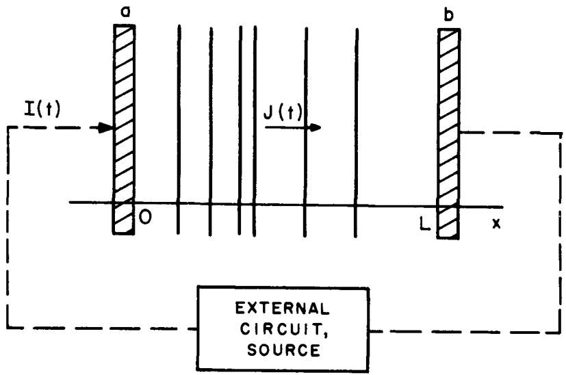  
Figure 4-1la Driven plasma model, bounded by planes $\pmb { a }$ and $^ { b }$ which may be emitters, absorbers，reflectors,or transparent (i.e.，ends of a periodic system). $J _ { \mathrm { t o t a l } } ( t )$ is the total current density in the region (independent of $x$ ）and times the area forms the current $I$ in the external circuit.

$$
J _ { \mathrm { e x t e r n a l } } ^ { n + 1 / 2 } = J _ { \mathrm { p l a s m a } , k = 0 } ^ { n + 1 / 2 } + \frac { E _ { k = 0 } ^ { n + 1 } - E _ { k = 0 } ^ { n } } { \Delta t }
$$

where

$$
J _ { \mathrm { p l a s m a } , k = 0 } ^ { n + 1 / _ { 2 } } = \frac { 1 } { L } \sum _ { i = 1 } ^ { N } q _ { i } \ : \nu _ { i } ^ { n + 1 / _ { 2 } }
$$

as the $\nu _ { j }$ are already known. The periodic $E ( k \neq 0 )$ are obtained as in ES1, keeping overall neutrality, but allowing for nonperiodic $\phi$

A region connected to an external circuit, through grid planes $^ a$ and $^ { b }$ is called a device. In such a model which may have nonzero net charge,the external circuit equation must also be supplied, such as

$$
\phi _ { 0 } ( t ) - \phi _ { L } \left( t \right) = I \left( t \right) R
$$

for an external resistor (see Birdsall and Bridges,1966,sec. 3-12); for external $L$ and $C$ ，use the usual Kirchhoff circuit equations as given in detail in Chapter l6. The potential within the device is now due to the charges within the region $0 < x < L$ and to charges on the electrodes at $x = 0 , L$ Whereas in the periodic ES1, the fields and particles are treated similarly, here the fields and particle boundary conditions may be specified separately. Thus,we need both the particular and homogeneous solutions of Poisson's equation,with the former due to the free charges inside the device (much as obtained in the periodic model) and the latter due to charges at $x = 0$ ， $L$ ,as

$$
\begin{array} { l } { \displaystyle \phi _ { \mathrm { h o m o g e n e o u s } } ( x , t ) = \mathcal { A } \left( t \right) x + B \left( t \right) = [ \phi _ { L } \left( t \right) - \phi _ { 0 } ( t ) ] \frac { x } { L } + \phi _ { 0 } ( t ) } \\ { \displaystyle E _ { \mathrm { h o m o g e n e o u s } } ( t ) = - \frac { \phi _ { L } \left( t \right) - \phi _ { 0 } ( t ) } { L } } \end{array}
$$

These are the $k = 0$ solutions to be added to the $k \neq 0$ solutions which are obtained from the Poisson solver. However,the appropriate Poisson solver boundary conditions are now the short-circuit conditions

$$
\phi _ { 0 } ( t ) = 0 = \phi _ { L } \left( t \right)
$$

These require changing the periodic code solutions for $\phi ( x )$ with both $\cos k x$ and sin $k x$ terms to one with sin $k x$ terms only. One easy way to do this (minimal code changes in ES1） is to invert the record of $\rho ( x )$ from $x = 0$ to $x = L$ into the region $L < x < 2 L$ ，as shown in Figure 4-11b; this makes $\rho ( x )$ into an odd function $0 < x < 2 L$ ， producing sin $k x$ terms in $\pmb { \rho }$ and $\phi$ ,as desired,with $< \rho > = 0$ over $0 \leqslant x \leqslant 2 L$ .The inverse of $\phi ( k )$ is used, of course,only in the space, $0 < x < L$ to produce the $k > 0$ solutions； the $k = 0$ homogeneous solutions must be added. Another method of solution where there is net charge and biased electrodes,is to use a direct solution, as in Appendix D.

Another model obtainable from periodic ES1 is that used to model the sheath around a floating probe at $x = L / 2$ (Birdsall, 1982)． The probe is simply the center grid plane, programmed to accumulate any active charge passing it, deleting such charges from the list of active particles. The boundaries at $0 = x = L$ are biased to zero potential. Particles are used only in the left half of the region,with the weighted density mirrored into the right half (but not inverted), taking advantage of the symmetry. Particles passing $x = 0$ are reflected specularly. The initial conditions are a thermal plasma with net charge of zero,which remains zero as the particles drain slowly to the probe. After a charging transient (about three plasma cycles) the floating potential drops to the value predicted from time-independent kinetic theory by Emmert et al.， (1980). With no sources and no colisions, the faster electrons are all absorbed early on and the probe potential slowly rises. Using a pair creating source (to maintain neutrality） over some region in $x$ ， presum-ably would result in reaching a steady state, with fluctuations.

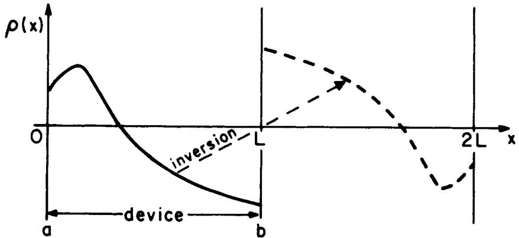  
Figure 4-11b Charge density $\rho ( x )$ in the device, $0 < x < L$ .This is inverted through $x = L$ into the interval $L < x < 2 L$ ,in order to make a density in $0 < x < 2 L$ which is odd and has $< \rho > \ = 0$ ，producing only sin $\pmb { k x }$ terms in $\rho ( k )$ and hence in $\phi ( k )$

# PROBLEM

4-11a Sketch the nominal charge and invent the first-order charge assignment to the grid for $x _ { i } = - \Delta x / 4 , 0 , \Delta x / 2$ for an emitting wall at $x = 0$ .Do the same for the last four $x _ { j }$ 's for a reflecting wall at $x = 0$ . Repeat using zero-order weighting. Compare your inventions with the algorithm proposed in Figure 16-9b.

# PROJECTS FOR ES1

# 5-1 INTRODUCTION

We are ready to have fun with plasma projects. In this chapter， we become quite intimate with a plasma by following in detail oscillations, waves，and instabilities. We provide theory to go with the projects, such as the amplitudes needed for particle crossing and the peak value of electric field expected in various instabilities. Our object in running these simulations is to learn basic "laboratory plasma behavior" starting with cold plasmas.

This chapter consists of relatively detailed sections connected with pro-jects requiring one or more computer runs of a few tens or hundreds of time steps. In sections where computer simulations are to be done using ES1,we put project in the section heading. These sections have details on to how to do the simulation,what to observe,and what to calculate in order to help explain what is observed. The work assigned or implied varies from trivial to diffcult. Students benefit from doing these projects and writing them up in a format which includes statement of the problem,theory or analysis,choice of parameters, simulation results,and comparison with theory.

# 5-2 RELATIONS AMONG INITIAL CONDITIONS; SMALL AMPLITUDE EXCITATION

Theories usually give us an idea of the initial charge or particle density. However,to start the code,we need the initial position and velocity of all the particles. Hence,we derive particle positions from the particle densities and then display all quantities,with proper phase and amplitude relations,at $\pmb { t = 0 }$ ， for small-amplitude sinusoidal excitation.

Particle positions are the $\pmb { x } ^ { \prime } \pmb { \mathsf { s } }$ . Let there be two neighboring particles, with positions $\pmb { x _ { a } }$ and $\scriptstyle x _ { b }$ ，as shown in Figure 5-2a; the uniform plasma has the particles at $\pmb { x } _ { 0 \pmb { a } }$ and $x _ { 0 b }$ ，with zero-order uniform density (one dimensional),

$$
n _ { 0 } = \frac { 1 } { x _ { 0 b } - x _ { 0 a } }
$$

We now perturb the zero-order positions, to

$$
x _ { a } = x _ { 0 a } + \delta x _ { a } \mathrm { ~ ; ~ } x _ { b } = x _ { 0 b } + \delta x _ { b }
$$

so that, at some $x , x _ { a } < x < x _ { b }$ ，the new density is

$$
{ \begin{array} { l } { { \boldsymbol { n } } \left( { \boldsymbol { x } } \right) = { \boldsymbol { n } } _ { 0 } + { \boldsymbol { n } } _ { 1 } ( { \boldsymbol { x } } ) = { \cfrac { 1 } { x _ { b } - x _ { a } } } } \\ { = { \boldsymbol { n } } _ { 0 } { \cfrac { 1 } { 1 + { \cfrac { { \hat { \delta } } x _ { b } - \hat { \delta } x _ { a } } { x _ { 0 b } - x _ { 0 a } } } } } } \end{array} }
$$

Another point of view is to callthe zero-order quantity of fluid between $x _ { 0 b }$ and $x _ { 0 a } , \ \Delta f$ .Then $n \left( x \right) = \Delta f / \left( x _ { b } - x _ { a } \right)$ .As the order of $\pmb { a }$ and $^ { b }$ is immaterial, replace $( x _ { b } - x _ { a } )$ with $\vert x _ { b } - x _ { a } \vert$ . In order to account for more than one element of fluid appearing at $\pmb { x }$ ，then $n \left( x \right)$ is to be a sum over $\Delta f / \left| \Delta x \right|$ . Let the displacement from uniformity $\pmb { \delta x } ( \pmb { x } _ { 0 } )$ be a continuous variable which may be considered as the displacement of an element of fluid,

$$
\delta x ( { \boldsymbol { x } } _ { 0 } ) \equiv x - { \boldsymbol { x } } _ { 0 }
$$

then we have

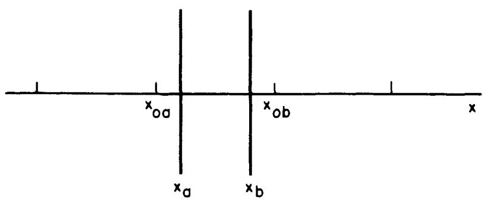  
Figure 5-2a Unperturbed adjacent particle positions, $x _ { 0 a }$ and $x _ { 0 b }$ ,and their perturbed positions, $x _ { \pmb { \sigma } }$ and $x _ { b }$

$$
n \left( x \right) = n _ { 0 } \frac { 1 } { 1 + \displaystyle \frac { \partial \delta x } { \partial x _ { 0 } } }
$$

The solution is [assuming that $n _ { 0 }$ and $n _ { 1 } ( x )$ are given, and ${ \pmb \delta } { \pmb x }$ is to be found],

$$
\frac { \partial \delta x } { \partial x _ { 0 } } = \frac { - n _ { 1 } ( x ) } { n _ { 0 } + n _ { 1 } ( x ) }
$$

We can identify some measure of smallness by noting that particles touch at

$$
x _ { b } = x _ { a } , \quad \mathrm { o r } \quad \frac { \partial \delta x } { \partial x _ { 0 } } = - 1
$$

producing a peak in density, $n \left( x \right)$ [and $n _ { 1 } ( x ) ]  \infty$ . See Figure 5-2b.

If we are interested in small-amplitude excitation, $| n _ { 1 } ( x ) | < < n _ { 0 }$ then $\left| \partial \delta x / \partial x \right| < < 1$ and

$$
\begin{array} { r } { \frac { \partial \delta x } { \partial x } \approx \frac { - n _ { 1 } ( x ) } { n _ { 0 } } } \end{array}
$$

In three dimensions, this would read $\nabla \cdot \delta \mathbf { x } = - n _ { 1 } ( \mathbf { x } ) / n _ { 0 } ;$ the derivation is given in Section 9-2.

Let the excitation be periodic, sinusoidal in $x$ ，

$$
n _ { 1 } ( x ) = A \sin k x
$$

with perturbed charge density

$$
\rho _ { 1 } ( x ) = q n _ { 1 } ( x ) = q A \sin { k x }
$$

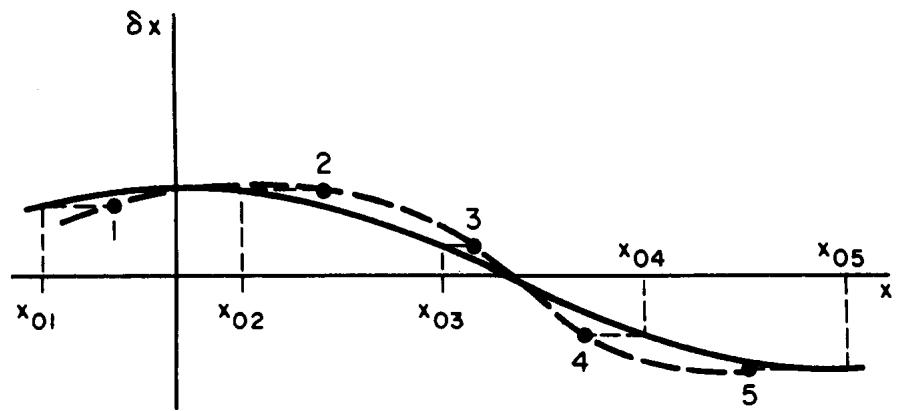  
Figure 5-2b Uniform particle positions ${ \boldsymbol { x } } _ { 0 i }$ with their sinusoidally perturbed positions (heavy dots）obtained from $\boldsymbol { x } _ { i } = \boldsymbol { x } _ { 0 i } + \delta \boldsymbol { x } ( \boldsymbol { x } _ { 0 i } )$ .Note that the first particles to touch (and cross） are 3 and 4, where $\partial \delta x / \partial x _ { 0 }$ has its largest negative value; they touch at $\partial \delta x / \partial x _ { 0 } = - 1$ (for the ${ \boldsymbol { x } } _ { 0 i }$ very closely spaced,that is,many particles in a wavelength of the perturbation)．Or take ${ \boldsymbol { x } } _ { 0 2 } - { \boldsymbol { x } } _ { 0 3 }$ to be an element of fluid,displaced to $x _ { 2 } - x _ { 3 }$

Presumably either $\pmb { A }$ or $\pmb q A$ is known (as well as $k$ ).Then the displacement ${ \pmb \delta x }$ is obtained by integration of (9),as

$$
\displaystyle \delta x ( x ) = x - x _ { 0 } = { \frac { A } { n _ { 0 } } } { \frac { 1 } { k } } \cos k x
$$

The perturbed electric field is obtained from $\nabla \cdot \mathbf { E } _ { 1 } = \rho _ { 1 } / \epsilon _ { 0 }$ also by integration in $\pmb { x }$ , to produce

$$
E _ { 1 } ( x ) = - \frac { q A } { \epsilon _ { 0 } } \frac { 1 } { k } \cos k x
$$

Lastly,the_potential is obtained from the field $( \nabla \phi _ { 1 } = - \mathbf { E } _ { 1 } )$ ，by integration or from $\nabla ^ { 2 } \phi = - \rho _ { 1 } / \epsilon _ { 0 }$ (take your pick),

$$
\phi _ { 1 } ( x ) = { \frac { q A } { \epsilon _ { 0 } } } { \frac { 1 } { k ^ { 2 } } } \sin k x 
$$

These relations are shown in Figure 5-2c, with amplitudes relative to the initial density perturbation, $\left| n _ { 1 } \right| = A$ ，and proper phases. Working backward from a small initial displacement $( x _ { 1 } < < x _ { 0 2 } - x _ { 0 1 } )$ ，

$$
x = x _ { 0 } + x _ { 1 } \cos k x
$$

we obtain a peak particle density of

$$
\left| n _ { 1 } \right| = A = \left( n _ { 0 } k \right) x _ { 1 }
$$

with a field peak of

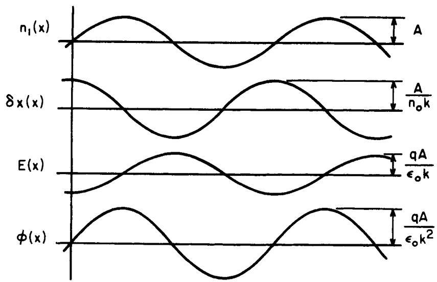  
Figure $5 . 2 c$ Starting from a small perturbation in density ${ \pmb { n } } _ { 1 } ( { \pmb x } )$ with amplitude $\pmb { A }$ , the perturbations in displacement ${ \pmb \delta } { \pmb x }$ field $\pmb { \cal E }$ ,and potential $\phi$ are shown,with relative amplitudes.

$$
\left| E _ { 1 } \right| = \frac { q A } { \epsilon _ { 0 } k } = \frac { q n _ { 0 } } { \epsilon _ { 0 } } x _ { 1 }
$$

and a peak acceleration of

$$
\frac { q } { m } \bigl | E _ { 1 } \bigr | = \frac { q } { m } \frac { q n _ { 0 } } { \epsilon _ { 0 } } x _ { 1 } = \omega _ { p } ^ { 2 } x _ { 1 }
$$

and a peak potential of

$$
\left| \phi _ { 1 } \right| = \frac { q n _ { 0 } } { \epsilon _ { 0 } k } x _ { 1 }
$$

This goes with a peak electrostatic energy density of

$$
\left(  W _ { E } \right) _ { \mathrm { m a x } } = \frac { 1 } { 2 } \left[ \rho _ { 1 } ( x ) \phi _ { 1 } ( x ) \right] _ { \mathrm { m a x } } = \frac { 1 } { 2 } q \left[ n _ { 1 } ( x ) \phi _ { 1 } ( x ) \right] _ { \mathrm { m a x } } = \frac { 1 } { 2 } \frac { q ^ { 2 } n _ { 0 } ^ { 2 } } { \epsilon _ { 0 } } x _ { 1 } ^ { 2 }
$$

If we have a thermal (warm) plasma with zero-order kinetic-energy density of

$$
W _ { K } = \frac { 1 } { 2 } n _ { 0 } m { \nu _ { t } } ^ { 2 }
$$

then the ratio of $( W _ { E } )$ average (due to the first-order perturbations) to $W _ { K }$ is

$$
\frac { \ d \mathcal { W } _ { E } } { \ d \mathcal { W } _ { K } } = \frac { 1 } { 2 } \frac { q } { m } \frac { q n _ { 0 } } { \epsilon _ { 0 } \nu _ { t } ^ { 2 } } x _ { 1 } ^ { 2 } = \frac { 1 } { 2 } \frac { \omega _ { p } ^ { 2 } } { \nu _ { t } ^ { 2 } } x _ { 1 } ^ { 2 } = \frac { 1 } { 2 } \bigg ( \frac { x _ { 1 } } { \lambda _ { D } } \bigg ) ^ { 2 }
$$

The answer is neat, but should be interpreted with care.

In following an instability，the field grows to some $E _ { \mathrm { p e a k } } ,$ corresponding to a $( W _ { E } ) _ { \sf P e a k } ;$ usually

$$
( W _ { E } ) _ { \sf P e a k } \leqslant f W _ { K }
$$

where $f$ is some fraction like 1/10 or 1/100. If we wish to follow the growth from small amplitudes (where linear analysis applies and theoretical growth rates can be compared with the simulation),then the initial field energy $( W _ { E } )$ initial must be, say, $1 0 ^ { - 3 }$ of the final value, that is,

$$
( W _ { E } ) _ { \mathrm { i n i t i a l } } \lesssim 1 0 ^ { - 3 } ( W _ { E } ) _ { \mathrm { p e a k } } ; ~ ( W _ { E } ) _ { \mathrm { p e a k } } \lesssim 1 0 ^ { - 2 } W _ { K }
$$

or,roughly,

$$
( W _ { E } ) _ { \mathrm { i n i t i a l } } \leqslant 1 0 ^ { - 5 } W _ { K }
$$

This says, for a thermal plasma [stretching the meaning of (22)],

$$
\begin{array} { r } { \left( \frac { x _ { 1 } } { \lambda _ { D } } \right) ^ { 2 } \leqslant 1 0 ^ { - 5 } , \quad x _ { 1 } \leqslant 3 \times 1 0 ^ { - 3 } \lambda _ { D } } \end{array}
$$

For a cold plasma, say,a cold beam of velocity $\nu _ { 0 }$ and $W _ { K } = 1 / _ { 2 } n m \nu _ { 0 } ^ { 2 }$ ，then the same relation exists with $\lambda _ { D }$ replaced by $\nu _ { 0 } / \omega _ { p }$ ；this presumes that inequalities (23) and (24) still hold.

The manner of estimating how to choose $x _ { 1 } ,$ (21） to (26),is crude,but it is best to make some estimate rather than none.

# PROBLEMS

5-2a Using (6） for $n \left( x \right)$ and $\delta x = B \sin { k x }$ ，sketch $n ( x )$ for $0 < x < 2 \pi$ for $k B = 0 . 1 , 0 . 5$ and 0.9;sketch particle positions as in Figure 5-2b also．At $k B = 1 . 0$ ， $n ( x )  \infty$ at $k x = \pi$ .What about using $k B > 1$ in（6)，producing $\boldsymbol { n } \left( \boldsymbol { x } \right) < 0$ ，nonphysical? Change the formulation to allow for $\partial \delta x / \partial x _ { 0 } < - 1$ ，particles having crossed.

5-2b Show that the perturbation procedure in subroutine INIT produces an initial distribution

$$
f ( x , \nu , 0 ) = [ 1 - k x _ { 1 } \sin { ( k x + \theta _ { x } ) } ] ^ { - 1 } f _ { - } [ \nu - \nu _ { 1 } \sin { ( k x + \theta _ { \nu } ) } ]
$$

where $ { f _ { - } } ( \nu )$ is the spatially-uniform distribution before the perturbation.

# 5-3 COLD PLASMA (OR LANGMUIR) OSCILLATIONS; ANALYSIS

A "cold plasma" is both a self-contradiction (as most plasmas have at least one velocity component with thermal energy greater than about $1 \epsilon \mathbf { V } \approx 1 0 ^ { 4 } \mathbf { K } )$ ,and a bit singular (vanishing Debye length, $\lambda _ { D } \to 0$ addition of thermal energy to make $\lambda _ { D } > 0$ alters the behavior markedly). Nonetheless,we can learn much by using the simplification of $\nu _ { \mathrm { t h e r m a l } } \to 0$ ，which allows us to use simple initial conditions and easily understood diagnostics. Initially we restrict our calculations to regions where $k \lambda _ { D } \leqslant 0 . 1$

From your earlier exposure to uniform plasmas, you are well aware that the charged particles have simple harmonic motion about their equilibrium positions (the $x _ { 0 } ^ { \mathbf { \ell } } { \mathbf { \overset { . } { s } } } )$ ，as described by

$$
\begin{array} { r } { \delta x \equiv x - x _ { 0 } , \quad \delta \ddot { x } = - \omega _ { p } ^ { 2 } \delta x } \end{array}
$$

with solutions

$$
\delta x ( t - t _ { 0 } ) = A \left( t _ { 0 } \right) \cos \omega _ { p } \left( t - t _ { 0 } \right) + B \left( t _ { 0 } \right) \sin \omega _ { p } \left( t - t _ { 0 } \right)
$$

The common derivations make assumptions,e.g. $m _ { i } \to \infty$ ，or that particles are distributed continuously in space,or that particles do not cross. Chances are,because the results came out so neatly (so obviously correct),that you never seriously questioned the assumptions or results. Let us do some questioning now.

First,there is no problem with leting both electrons and ions move. The result is the same: both species oscillate harmonically,at the same frequency $\begin{array} { r l } { ( \omega ^ { 2 } = } & { { } \omega _ { p } ^ { 2 } = \hphantom { - } \omega _ { p e } ^ { 2 } + \omega _ { p i } ^ { 2 } ) } \end{array}$ but with the perturbed ion density and velocity smaller than that of the electrons by the factor $m _ { e } / m _ { i }$ Hence,we treat the ions as stationary and take $m _ { i } / m _ { e }  \infty$ for high-frequency oscillations.

Second, for our computational purposes, we need to decide how to put in the ions,or we may decide to ignore their motion and follow only that of the electrons.

Suppose that we ignore the spatial grid for a moment and look at a uniform distribution of electrons and ions in one dimension (sheets), Figure 5- 3a. Let each sheet have charge $\pmb q$ or $- q$ ; the system is neutral in the sense that the net charge is zero. If we displace the electrons a distance $\mathfrak { s } \mathfrak { x }$ less than half of the uniform ion spacing, $\mathfrak { f } x < \mathfrak { z } / _ { 2 } ( x _ { 0 2 } - x _ { 0 1 } )$ ， then each electron is attracted back toward its parent ion; the electrons oscillate about the ions. Is the motion simple harmonic? No！ The detailed motion is to be obtained as a problem. (A simpler problem is to consider an isolated electron-ion pair; the force on either particle is independent of the separation in one dimension,so that while there is oscillation,it is not simple harmonic.)

The next step is to resolve this difficulty. One way is to put in more ions (say,five ions each of charge $q / 5$ for each electron of charge $- q ,$ spaced uniformly; then,excite the electrons so that they pass several ions in their Oscillatory swing. Between ions, the force is more or less constant (it is for an isolated group of ions and one electron), jumping up each time an ion is crossed; this begins to approximate the desired force (proportional to dis-placement from equilibrium). Indeed, the diffculty goes away entirely if the ions are distributed continuously,in a uniform background.

If we now add a spatial grid, smearing out the ions to make a uniform background is relatively easy. In a periodic system, where there is no net charge in a period, the simulation program can zero-out the net charge (in effect puttng in a uniform background equal to the imbalance in charge) simply by zeroing the average term in the Fourier series for charge density, $\rho ( k = 0 ) = 0$ . Or,we may put in, say,one ion particle per cell and skip the ion motion, or make $m _ { i } \gg m _ { e }$ (or $\omega _ { p i } \ll \omega _ { p e } )$ ; then

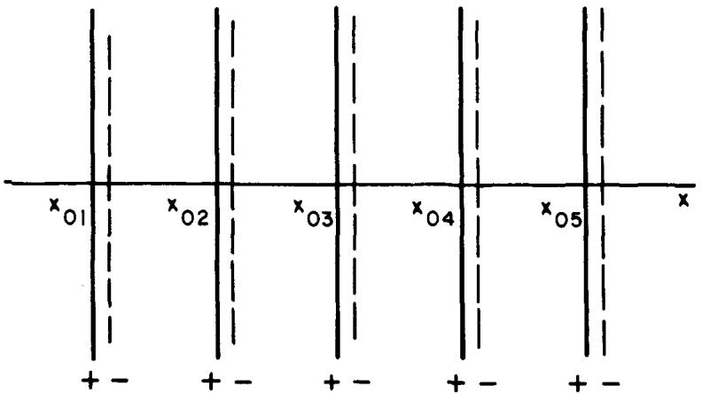  
Figure ${ \pmb 5 } { \cdot } 3 { \mathbf a }$ Electron-ion pairs in a nongridded space.The ions are massive and stay near the equilibrium positions $x _ { 0 i }$ .If the electrons are separated from their ions by less than the equilibrium sheet spacing,then the motion is oscillatory,but not simple harmonic. Electrons must cross many ions to approximate plasma oscillations.

correctly,ES1 sets each ${ \rho _ { j } } = \rho _ { \mathrm { i o n } }$ before accumulating the charge density of active species.

At this point, it is helpful to work out the linear longitudinal (E along k) dielectric function $\epsilon ( \omega , \boldsymbol { k } )$ ,in one dimension for a cold plasma with one mobile species (electrons only, $m _ { i } / m _ { e }  \infty )$ ；in addition the electrons may have a zero-order drift velocity $\mathbf { v } _ { 0 }$ along $\mathbf { k }$ . As the stream is cold,we use the fluid equations.

$$
\begin{array} { c } { m \displaystyle \frac { d \mathbf { v } } { d t } = q \mathbf { E } = \mathbf { F } } \\ { \nabla \cdot \rho \mathbf { v } + \displaystyle \frac { \partial \rho } { \partial t } = 0 \mathrm { , ~ } \mathbf { J } = \rho \mathbf { v } } \\ { \nabla \times \mathbf { H } = \mathbf { J } + \epsilon _ { 0 } \displaystyle \frac { \partial \mathbf { E } } { \partial t } } \end{array}
$$

For a stream with drift velocity $\blacktriangledown _ { 0 }$

$$
\mathbf { v } ( x , t ) = \mathbf { v } _ { 0 } + \mathbf { v } _ { 1 } ( x , t )
$$

The total derivative in (3） is

$$
\frac { d } { d t } = \frac { \partial } { \partial t } + \mathbf { v } \cdot \nabla
$$

Assuming $x , t$ dependence as exp $i \left( \mathbf { k } \cdot \mathbf { x } - \omega t \right)$ ，the linearized equation of motion is

$$
- m i ( \omega - \mathbf { k } \cdot \mathbf { v } _ { 0 } ) \mathbf { v } _ { 1 } = q \mathbf { E } _ { 1 } = \mathbf { F } _ { 1 }
$$

The current is linearized to

$$
\mathbf { J } \left( x , t \right) = \mathbf { J } _ { 0 } + \mathbf { J } _ { 1 } ( x , t ) = \rho _ { 0 } \mathbf { v } _ { 0 } + \rho _ { 0 } \mathbf { v } _ { 1 } + \rho _ { 1 } \mathbf { v } _ { 0 }
$$

so that the continuity equation reads

$$
\begin{array} { c } { i \mathbf { k } \cdot ( \rho _ { 0 } \mathbf { v } _ { 1 } + \rho _ { 1 } \mathbf { v } _ { 0 } ) \mathbf { \Sigma } - i \omega \rho _ { 1 } = 0 } \\ { \rho _ { 1 } = \rho _ { 0 } \displaystyle \frac { \mathbf { k } \cdot \mathbf { v } _ { 1 } } { \omega - \mathbf { k } \cdot \mathbf { v } _ { 0 } } } \end{array}
$$

or

Taking $\mathbf { v } _ { 1 }$ from (8） produces

$$
n _ { 1 } = n _ { 0 } \frac { i \mathbf { k } \cdot \mathbf { F } } { m \left( \omega - \mathbf { k } \cdot \mathbf { v } _ { 0 } \right) ^ { 2 } }
$$

Putting $\rho _ { 1 } = q n _ { 1 }$ from (12) into (9) and using

$$
i \mathbf { k } \times \mathbf { H } _ { 1 } = \mathbf { J } _ { 1 } - i \omega \epsilon _ { 0 } \mathbf { E } _ { 1 } = - \mathbf { \nabla } i \omega \epsilon \mathbf { E } _ { 1 }
$$

produces

$$
\begin{array} { r } { \frac { \epsilon } { \epsilon _ { 0 } } = 1 - \frac { \omega _ { p } ^ { 2 } } { ( \omega - \mathbf { k } \cdot \mathbf { v } _ { 0 } ) ^ { 2 } } } \end{array}
$$

The solutions for longitudinal waves are obtained from $\epsilon = 0$ ； the roots are

$$
\omega = \mathbf { k } \cdot \mathbf { v } _ { 0 } \pm \mathbf { \sigma } \omega _ { p }
$$

as shown in Figure 5-3b,either plasma (Langmuir） oscilations $( \mathbf { v } _ { 0 } = 0 )$ or space-charge waves $( \mathbf { v } _ { 0 } \neq 0 )$ .

# PROBLEMS

5-3a Obtain the motion of the electron sheets around the massive ion sheets $( m _ { i } / \ m _ { e }  \infty )$ ,for the infinite model shown in Figure 5-3a; there is no grid. Sketch the force $F$ on $e$ as a function of separation from its equilibrium position (the $x _ { 0 } \mathbf { \ ' } _ { \mathbf { \ell } }$ ；obtain the force potential $\psi$ where $\nabla \psi = - \mathbf { F }$ and sketch the potential well. Consider all pairs excited at a wavelength which is a multiple of the equilibrium spacing, $\lambda = m \left( x _ { 0 2 } - x _ { 0 1 } \right)$ .Your answer should show that the motion is not simple harmonic and that the frequency of oscillation is dependent on the initial excitation.

5-3b Re-do last problem,only this time let there be,say,5 ion sheets (fixed, $m _ { i } / m _ { e }  \infty$ ， $q _ { i } = q _ { e } / 5 )$ for each electron sheet. If the electron is excited so as to cross only the equilibrium sheet,then the result is like that of 5-3a．However,let the electron sheets be allowed to cross several sheets in one oscillation period; sketch the potential well, $\psi \left( x \right)$ ，to show that the well is approaching that for simple harmonic motion (parabola)．Next,let the number of ion sheets per electron sheet become very large,so that the ions may be considered to form a continuous background; show that the motion is simple harmonic,with frequency

$$
{ \omega } ^ { 2 } =  \frac { 1 } { { \epsilon } _ { 0 } } | \frac { q } { m } | _ { e } ( n _ { 0 } q ) _ { j } =  \frac { 1 } { { \epsilon } _ { 0 } } | \frac { q } { m } | _ { e } \rho _ { 0 i }
$$

5-3c Let the model be electron sheets in a continuous immobile ion background. Let the initial excitation be uniform spacing of electrons but with velocity modulation.

$$
\nu \left( x , t = 0 \right) = \nu _ { 1 } \sin { k _ { 0 } x }
$$

Find what value of $\nu _ { 1 }$ just produces crossing of the electron sheets and show which sheets cross first,and the time of crossing. There are $N _ { e }$ electrons uniformly spaced in length $L = 2 \pi / k _ { 0 }$ Carefully sketch the motion in a trajectory diagram, $x$ versus $t$ ，for $N _ { e }$ large and $N _ { e }$ small. Answer: Crossing occurs for $\nu _ { 1 } / \omega _ { p } =$ sheet spacing in equilibrium $\mathbf { \mu } = L / N _ { e }$

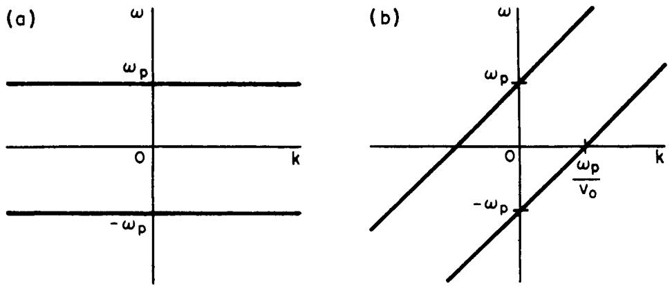  
Figure 5-3b (a） Cold plasma dispersion，or $\omega \ – k$ ，diagram showing plasma oscillations at $\omega = \omega _ { p }$ ．(b） Similarly,for electrons drifting at velocity $\nu _ { 0 }$ through heavy ions,showing the space-charge waves at $\omega = k \nu _ { 0 } \pm \omega _ { p }$ ,essentially Doppler shifted oscillations.

5-3d Let the model be periodic,period $\pmb { L }$ ，with $N _ { e }$ electron sheets in a uniform immobile ion background. What is the minimum number of sheets needed to obtain single harmonic (plasma） oscillations, $( N _ { e } ) _ { \mathrm { m i n } } \mathrm { ^ { \prime } }$ What occurs if $N _ { e } = 1 ?$ For $N _ { e } = 2$ , what should be their velocity or displacement excitation phase to produce oscillations; sketch the motion (trajectories), $x$ versus t. $E \left( k = 0 \right) = 0$ here.

# 5-4 COLD PLASMA OSCILLATIONS; PROJECT

For this first project to be attempted, parameters to use on the initial run are: $\mathrm { N S P } = 1 , \mathrm { L } = 2 \pi , \mathrm { D T } = 0 . 2 , \mathrm { N T } = 1 5 0 , \mathrm { N G } = 3 2 , \mathrm { I W } = 2 ,$ $\tt E P S I =$ 1,plotting frequencies all 20, mode plots 1, 2,.. For species 1, $\mathbf { N } = 1 2 8$ ， $\mathbf { W P } = 1$ ， $\mathbf { W } { \mathsf { C } } = 0$ ， $0 \mathbf { M } = - 1 . 0$ ，MODE1 excited at ${ \bf X } 1 = 0 . 0 0 1$ (all other values zero). Some of these values are the defaults in ES1 and need not be specified in the input.

Run the program with these parameters. Examine the plots most carefully.In the snapshots (at fixed times $t$ ）of $\rho ( x ) , \phi ( x ) , E ( x )$ and phasespace plots,check to see that these quantities have the proper amplitudes and spatial phase，which exchange back and forth from PE to KE as is characteristic of simple harmonic motion (much larger than in a thermal plasma,where $\mathrm { P E } / \mathrm { K E } \approx 1 / N _ { D } < < 1 )$ ； the variation of total energy (if any) should be much smaller than that of PE (or else the validity of the program is open to question).

In the 150 steps suggested,with $\omega _ { p } \Delta t = 0 . 2$ ，the program runs to $\omega _ { p } T = 3 0$ ，or $3 0 / 2 \pi \approx 5$ plasma periods.Using $\mathbf { N G } = 3 2$ ，with 16 modes (0 to $k \Delta x = \pi$ ）makes the first mode occur at $k \Delta x = \pi / 1 6$ here we expect

$$
\omega \left( k \right) = \omega _ { p } \left( \frac { k \kappa \left( k \right) S ^ { 2 } \left( k \right) } { K ^ { 2 } \left( k \right) } \right) ^ { \gamma _ { 2 } } = 0 . 9 9 5 2 \mathrm { f o r } k \Delta x = \frac { \pi } { 1 6 }
$$

which is very close to $\omega _ { p }$ .However， as suggested in Figure 4-6a, $\pmb { \omega }$ decreases with $\pmb { k } \Delta \pmb { x }$ so that the ω's for higher-numbered modes are less wel-resolved in the 150 steps. The justification for use of $S ^ { 2 } ( k )$ in(1）was given in Section 4-6 and for $\kappa ( k )$ and $K ^ { 2 } ( k )$ in Section 2-5. The result (1) is for the force averaged over all displacements of the grid and,as such,is approximate; the exact answer is

$$
\omega \left( k \right) = \omega _ { p } \cos \left( \frac { k \Delta x } { 2 } \right)
$$

Both results are derived in Chapter 8.

From the plots of $\displaystyle \mathrm { E S E } ( k ) \propto { ^ 1 } / { _ 2 } \rho _ { k } \phi _ { k } ^ { * }$ for each value of $k$ versus time, the frequency of each mode can be obtained from just one run. Remember that $\rho _ { k } \phi _ { k } ^ { * }$ is a product of $\left( \cos \omega t \right) \left( \cos \omega t \right)$ for a standing wave, producing $\widehat { 2 } \omega$

Use a large enough excitation of mode 1 so that all modes are detectable, but small enough so that the motion is nearly linear, meaning that the modes are nearly independent. Plot the estimated $\pmb { \omega }$ from (1),the exact value from (2),and your measured values versus $\pmb { k } \Delta \pmb { x }$ (0 to $\pmb { \pi }$ ）,with error bars on your measurement. The estimated $\pmb { \omega }$ from (1） does not include the effect of spa-tial aliases, so that the estimated and measured values should not agree; however, your results should agree very well with the exact calculation (2) which includes all aliases.

Try the NGP,CIC,and energy conserving weights $( \mathbf { I } \mathbf { W } = 1 , 2 , 3 )$ .Do the differences in dispersion come from particle shape or from dynamics or the finite-differencing method (for $\nabla \phi , \ \nabla ^ { 2 } \phi ) ^ { \cdot }$ ？For $\mathbf { I } \mathbf { W } = 3$ how well is energy conserved as $\Delta t$ isincreased?[Energy-conserving ideasare developed in Part Two; for our use here,you need only know that energy (but not momentum） is conserved in the limit of $\Delta t \to 0$ using the weighting $\mathbf { I W } = 3 . \mathbf { ] }$

Try using 32 particles in 16 cells uniformly spaced (2 particles per cell), with particles on the grid points and in between (which is not the normal ES1 loading). Note the spikes in density with small initial sinusoidal displacement which was dubbed the Kaiser-Wilhelm effect by our good friend Dieter Fuss at LLNL. Try this initialization with no initial displacement. Try using $\mathbf { N P } / \mathbf { N G } \neq$ integer,e.g. 33 particles and 16 cells with no initial excitation, for $\mathrm { ~ I W ~ } = ~ 2$ .Account for the spike in charge density at $t = 0$ (hint: sketch the grid density for 3 particles in 2 cells). W. M. Nevins developed a theory (unpublished) which shows this particle aliasing effect. He obtained the charge density,complete with spike, from a sum over Bessel functions. Denavit (1974,Appen. B) presents such theory in detail.

Try increasing $\omega _ { p } \Delta t$ above 2 to find the leap-frog instability of Section 4-2. Plot complex $\pmb { \omega }$ versus parameter $\omega _ { p } \Delta t$ (for excitation of one mode at small $k \Delta x )$ .For $\omega _ { p } \Delta t > 2 . 0$ ，which output would you choose to show the characteristic $\pmb { \pi }$ phase shift each step, the so-called odd-even separation ? The growth may be hard to observe directly without some special care,except that energy conservation should be lost.

Try leting the first species be electrons $\left( q _ { 1 } < 0 \right)$ and the second species be mobile ions （ $\mathbf { \nabla } \cdot | \boldsymbol { q } _ { 1 } | = \boldsymbol { q } _ { 2 } > 0 )$ with the ratio $( \omega _ { p 1 } / \omega _ { p 2 } ) ^ { 2 } = m _ { 2 } / m _ { 1 }$ on the order of 100 and with $N _ { 1 } = N _ { 2 } .$ Check the motion to see if peak values of density and velocity of the electrons are on the order of the mass ratio larger than values for the ions.

Add whatever additional diagnostics are needed.

# Additional suggestions:

Excite with large amplitude,enough that particles touch and then cross. Describe wave breaking. Use $x _ { 1 } = 0$ , large $\nu _ { 1 }$ and observe the odd modes.

In the small-amplitude plasma oscillations,why do PE and KE have clear zeros, indicating exact exchange between PE and KE,but have different

peak values?

Excite at short wavelength, beyond $k \Delta x = \pi$ ，and observe what occurs. Aliases should be excited. For example, $\mathrm { N G } = 1 6$ has 8 modes (9 cosines,7 sines); hence,exciting mode 10 produces mode 6 on the grid; exciting mode 12 produces mode 4.

Excite locally with small amplitude,using $\mathbf { I } \mathbf { W } = 2$ and then $\mathbf { I } \mathbf { W } = 3$ ，and look for propagation away from the region of excitation. Explain the differences. Hint: What are the group velocities for the two weightings? (See Chapters 8 and 10.)

# 5-5 HYBRID OSCILLATIONS; PROJECT

Plasma oscillations are changed into so-called hybrid oscillations by adding a uniform static magnetic field $\pmb { B } _ { 0 z }$ normal to the displacements in $x , y$ .The equation of motion for any particle (i.e.,sheet） is

$$
\delta \ddot { x } = - \omega _ { H } ^ { 2 } \delta x
$$

where ${ \pmb \delta } { \pmb x }$ represents $_ { x }$ or $y$ displacements from the particle guiding center and the hybrid frequency is defined by

$$
\omega _ { H } ^ { 2 } \equiv \omega _ { p } ^ { 2 } + \omega _ { c } ^ { 2 }
$$

The motion of a particle is given by lfor $\nu _ { x 1 } ( 0 ) = 0$ ， $y _ { 1 } ( 0 ) = 0 ]$

$$
\begin{array} { l } { { x = x _ { 0 } + x _ { 1 } \cos \omega _ { H } t } } \\ { { \ } } \\ { { y = y _ { 0 } + \frac { \nu _ { y 1 } } { \omega _ { H } } \sin \omega _ { H } t } } \end{array}
$$

which are the equations for an elipse centered at $x _ { 0 } ~ y _ { 0 }$ (the guiding center) in the $x \ , y$ plane.

Suppose that we choose to find $\omega _ { H } ( k )$ at some $k$ by putting in the same initial perturbation as in the $B _ { 0 z } = 0$ plasma oscillation model, that is,a displacement $x _ { 1 } \propto$ sin $k x$ , but with no initial velocity. The result (as you may see for yourself) is not a clear-cut hybrid oscillation in any of the grid quantities;however,each particle is oscillating at $\omega _ { H }$ ，simply not in the proper phase with other particles to produce a coherent spatial pattern (a mode). The desired hybrid oscillations are obtained by using a $\nu _ { x }$ perturbation with $x _ { 1 } = 0$ ，or by making the initial $x$ and $\nu _ { y }$ perturbations consistent, such as

$$
\nu _ { y } = - \omega _ { c } \pmb { x } _ { 1 }
$$

which eliminates the drift in $y$ and constant acceleration in $_ { x }$ ; i.e., the guiding center remains stationary. Use, for example, $x _ { 1 } = A$ and $v _ { y 1 } = - \omega _ { c } A$ ； the hybrid oscillations should be just as clear as were the plasma oscillations measured in Section 5-4. In order to obtain ω's for all $\pmb { k } \mathbf { \bar { s } }$ in one run, use an initial small-random-velocity excitation in $\nu _ { x } ,$ using VTl and $\mathbf { X } 1 = 0$ ; there is no need to put in the consistent displacement in $y$ in this ld model. Or,use a randomvelocity excitation in $y$ , but with consistent $x$ displacement given by (5).

Plot $\pmb { \omega }$ versus $k$ , as with plasma oscillations,and compare with the prediction

$$
\omega \left( k \right) = \left( \omega _ { p } ^ { 2 } \cos ^ { 2 } { \frac { k \Delta x } { 2 } } + \omega _ { c } ^ { 2 } \right) ^ { 1 / 2 }
$$

Add a program to trace out the trajectory of one particle in the $x , y$ plane and plot the trajectories for several representative particles. Check the predicted size of the ellipses with those computed.

Do the hybrid simulation with excitation of one mode at short wavelength $\pi / 2 < k \Delta x < \pi$ . Use a small initial displacement $x _ { 1 1 } ,$ with $y$ velocity of $- \omega _ { c } x _ { 1 1 }$ . Note that ESE oscillate at $2 \omega _ { H }$ with a flat envelope as expected，but that KE,also with $2 \omega _ { H }$ oscillations,has an envelope that slowly rises and falls at a beat frequency $\omega _ { H } - \omega _ { c } \approx \omega _ { p } ^ { 2 } / 2 \omega _ { c }$ . An individual particle orbit slowly increases in radius then decreases. This result was observed by Thomas and Birdsall (198O) and shows that excitation at large $k \Delta x$ is to be avoided.

# PROBLEMS

5-5a Verify (1)-(4). Obtain the guiding-center motion for arbitrary initial excitation.

5-5b (Due to John Cary.） There is a vortex mode of a cold magnetized plasma,E longitudinal, normal to ${ \bf \delta B _ { 0 } }$ which has $\omega = 0$ ． Do you detect this mode? ls it the mode excited by $x _ { 1 } \neq 0$ , y = 0, which produces a drift motion in y? See papers by Taylor and McNamara (1971), Okuda and Dawson (1973),Montgomery and Joyce (1974),and Langdon (1969).

5-5c (Due to Robert Litlejohn.） Use the fluid equation of continuity,the equation of motion in $\nu _ { x }$ and $\nu _ { y }$ ,and $\nabla \cdot \mathbf { D } = \rho$ to produce

$$
\frac { \partial ^ { 3 } n _ { 1 } } { \partial t ^ { 3 } } + \omega _ { H } ^ { 2 } \frac { \partial n _ { 1 } } { \partial t } = 0
$$

with solution

$$
n _ { 1 } ( x , t ) = n _ { 1 } ( x , 0 ) + \frac { 1 } { \omega _ { H } } \dot { n } _ { 1 } ( x , 0 ) \sin \omega _ { H } t + \frac { 1 } { \omega _ { H } ^ { 2 } } \ddot { n } _ { 1 } ( x , 0 ) \left( 1 - \cos \omega _ { H } t \right)
$$

Find $\dot { n } _ { 1 } ( x , 0 )$ and $\ddot { n } _ { 1 } ( x , 0 )$ in terms of ${ n _ { 1 } } ( x , 0 ) , \nu _ { x } ( x , 0 )$ ,and $\nu _ { y } ( x , 0 )$ . Show that with initial displacement only $\nu _ { x } ( x , 0 ) = 0 = \nu _ { y } ( x , 0 )$ and $\omega _ { c } = \omega _ { p }$ ，

$$
n _ { 1 } ( x , t ) \approx 1 + \cos \sqrt { 2 } \omega _ { p } t
$$

which has but one zero in a hybrid cycle.Similarly

$$
\rho \phi \ ^ { * } \propto E ^ { 2 } \propto ( 1 + \cos \sqrt { 2 } \omega _ { p } t ) ^ { 2 }
$$

has but one zero in $\sqrt { 2 } \omega _ { p } t = 2 \pi$ ,so that if we are counting two zeros (or two peaks) to a cycle (in ESE),then we would claim $\omega = \omega _ { H } / 2$ ,an incorrect result. Complete the solutions explicitly for $\nu _ { x } , \nu _ { y }$ ,and $E$ ; note the drift motion in $y$ for all initial excitation except $\nu _ { x }$

# 5-6 TWO-STREAM INSTABILITY; LINEAR ANALYSIS

The model consists of two opposing streams of charged particles as sketched in Figure 5-6a. Models with relative motion between two sets or streams of charged particles have been studied in great detail since papers by Haeff (l949) and Pierce (l948). Detailed knowledge of the nonlinear behavior of opposing streams came much later, from the simulations done by Dawson (1962). The fluid analog was given much earlier,as by H. Hertz in the $1 8 8 0 ' \mathbf { s } \mathrm { . }$ 。 see comprehensive books on hydrodynamics and acoustics, such as Lamb (1945) or Rayleigh (1945).

One can readily see that an opposing stream system is unstable. When two streams move through each other one wavelength in one cycle of the plasma frequency,a density perturbation on one stream is reinforced by the forces due to bunching of particles in the other stream and vice versa; hence $\Delta n _ { 1 } \propto n _ { 1 } ,$ so that the perturbation grows exponentially in time. This simple relation was put forth in 1948 by Professor M. Chodorow of Stanford [and buried in Birdsall's dissertation (Birdsall,1951)] for two streams moving in the same direction (Chodorow and Susskind, 1964)． The phase relation for reinforcement is written as

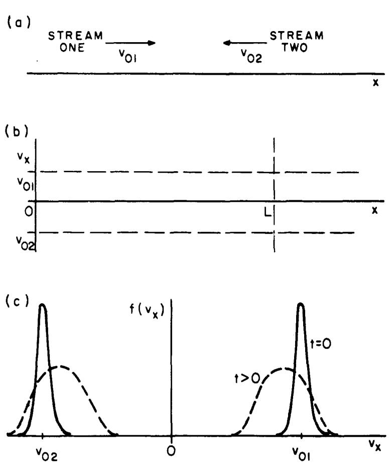  
Figure 5-6a (a） Two opposing streams as seen in the laboratory.(b) The streams in phase space at the start of the problem, $t = 0$ (c）The streams in velocity space at $t = 0$ and $t > 0$

$$
\left( \nu _ { \mathsf { r e l a t i v e } } \right) \left[ \frac { 2 \pi } { \omega _ { p } } \right] = \frac { 2 \pi } { k }
$$

which for $\nu _ { \mathrm { r e l a t i v e } } = \nu _ { 0 } - ( - \nu _ { 0 } ) = 2 \nu _ { 0 }$ is

$$
k = \frac { \omega _ { p } } { 2 \nu _ { 0 } }
$$

This $k$ is very close to that found from analysis for maximum growth rate.

The longitudinal linear dielectric function for two independent cold streams may be obtained as was done in Section 5-3 by applying the equa-tions of motion and continuity separately for each stream and adding the currents of each in the field equation. The result is

$$
\frac { 1 } { \epsilon _ { 0 } } \epsilon ( \omega , \boldsymbol { k } ) = 1 - \frac { \omega _ { p 1 } ^ { 2 } } { ( \omega - \mathbf { k } \cdot \mathbf { v } _ { 0 1 } ) ^ { 2 } } - \frac { \omega _ { p 2 } ^ { 2 } } { ( \omega - \mathbf { k } \cdot \mathbf { v } _ { 0 2 } ) ^ { 2 } }
$$

for two streams with drift velocities ${ \pmb v } _ { 0 1 }$ and $\mathbf { v } _ { 0 2 }$ This result is also obtainable directly from the usual Vlasov-Poisson set by letting the velocity distribution be two delta functions,

$$
f _ { 0 } ( \mathbf { \boldsymbol { v } } ) = A \delta \left( \mathbf { \boldsymbol { v } } - \mathbf { \boldsymbol { v } } _ { 0 1 } \right) + B \delta \left( \mathbf { \boldsymbol { v } } - \mathbf { \boldsymbol { v } } _ { 0 2 } \right)
$$

A system of $N$ independent cold streams produces a sum over streams or species $\pmb { s }$ ：

$$
\frac { 1 } { \epsilon _ { 0 } } \epsilon ( \omega , \boldsymbol { k } ) = 1 - \sum _ { s = 1 } ^ { N } \frac { \omega _ { p s } ^ { 2 } } { ( \omega - \mathbf { k } \cdot \mathbf { v } _ { 0 s } ) ^ { 2 } }
$$

[Extension of the sum to an integral, for $N  \infty$ ， must be done carefully, both analytically as shown by Dawson (196O),and also in simulation when a discrete set of beams is used to approximate a smooth distribution $f ( \nu )$ as shown by Byers (197O)，and Gitomer and Adam (1976),and discussed in Chapter 16.l

The solutions for complex $\pmb { \omega }$ ， assuming real $k$ (i.e.,an absolute instability,growth in time only,no convection in space),opposing streams of equal strength, $\omega _ { p 1 } = \omega _ { p 2 } \equiv \omega _ { p }$ ， $\nu _ { 0 1 } = - \nu _ { 0 2 } \equiv \nu _ { 0 }$ is found from $\mathbf { \epsilon } \in ( \omega , k ) = 0$ which is quartic in $\pmb { \omega }$ with four independent solutions. These are

$$
\omega = \pm \ [ k ^ { 2 } \nu _ { 0 } ^ { 2 } + \omega _ { p } ^ { 2 } \pm \omega _ { p } ( 4 k ^ { 2 } \nu _ { 0 } ^ { 2 } + \omega _ { p } ^ { 2 } ) ^ { \psi _ { 2 } } ] ^ { \psi _ { 2 } }
$$

for which

$$
\begin{array} { r l } { 0 < \frac { k \nu _ { 0 } } { \omega _ { p } } < \sqrt { 2 } } & { { } \left\{ \begin{array} { l l } { \mathrm { t w o \ r o o t s \ a r e \ r e a l } } \\ { \mathrm { t w o \ r o o t s \ a r e \ i m a g i n a r y } } \end{array} \right. } \end{array}
$$

$$
\sqrt { 2 } < \frac { k \nu _ { 0 } } { \omega _ { p } } \mathrm { a l l f o u r r o o t s \ a r e \ r e a l }
$$

$$
\frac { k \nu _ { 0 } } { \omega _ { p } } = \frac { \sqrt { 3 } } { 2 } , \omega _ { \mathrm { i m a g i n a r y } } = \frac { \omega _ { p } } { 2 } ,
$$

This behavior is sketched in Figure 5-6b; the growth $( \omega _ { \mathrm { i m a g i n a r y } } )$ is given in more detail in Figure 5-6c.

In this model， where there is growth $( \omega _ { \mathrm { i m a g i n a r y } } > 0 )$ ，we find that $\omega _ { \mathrm { r e a l } } = 0$ ； that is, there is no oscillatory part associated with the growth，a situation which is not generally true.

A point of Figure 5-6c is to make clear the existence of a minimum unstable length $L$ of the system; in this model (normalized)

$$
\frac { \omega _ { p } L } { \nu _ { 0 } } > \frac { 2 \pi } { \sqrt { 2 } } ( \mathrm { u n s t a b l e } )
$$

in order to obtain growth. This is the same as (7) using $L = 2 \pi / k _ { 0 } ,$ where $k _ { 0 }$ is the smallest wavenumber in the system.

Growth which begins at small amplitude continues until the streaming is destroyed; indeed, the distribution becomes nearly Maxwellian. Hence，we say that "the colliding streams have thermalized," although not by collisions.

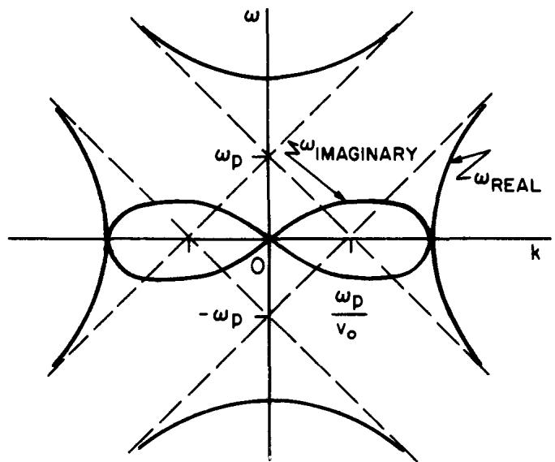  
Figure 5-6b Dispersion,or $\omega \mathbf { - } k$ ，diagram fnr two equal opposing streams,real $\pmb { k }$ ，complex $\pmb { \omega }$ ， The uncoupied space-charge waves are shown dashed. For each value of $k$ ，there are four values of $\omega$ that correspond to four linearly independent waves.

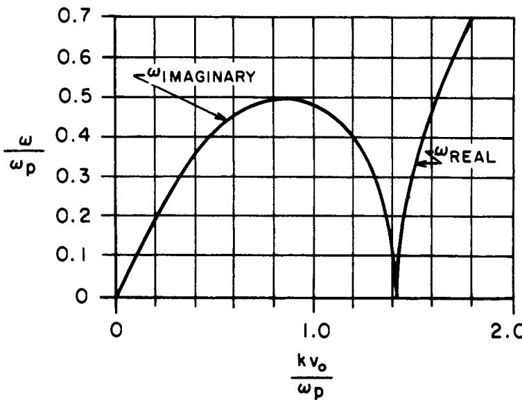  
Figure 5-6c Growth rate Wimaginary for two opposing streams.

Instead,collective effects build up large electric fields at long wavelengths $( \lambda > )$ particle spacing) and these scater the particles in phase space.

As the instability grows,two changes are readily observed in $\textstyle f ( v )$ as indicated for $t > 0$ in Figure ${ \pmb 5 - 6 a ( c ) }$ .The width of each beam increases [measured directly on an $\textstyle f ( v )$ plot or by $( \overline { { \nu ^ { 2 } } } - \overline { { \nu } } ^ { 2 } )$ of one stream], which is taken as an increase in the temperature of each beam (but perhaps carelessly so,for if the electric field were suddenly shut off-and you should try this-the spread might decrease). The drift or mean velocity $\overline { { \mathfrak { v } } }$ decreases.

We might expect, as Vthermal increases and $\pmb { \nu } _ { \mathrm { d r i f t } }$ decreases, that the conditions for linear growth would cease to be met [see Stringer (1964)，who shows the threshold for growth for electron-electron streams to be $\nu _ { \mathrm { d r i f t } } \approx 1 . 3 \nu _ { \mathrm { t h e r m a l } } ]$ and that the exponential growth would stop. However, at this time, the conditions for linearity are largely violated, with perturbed charge densities comparable to the zero-order density; particles in one stream are about to pass their neighbors and wrap into vortices in phase space, that is, become trapped. Hence, the growth need not stop,although we might be tempted to look for a change in character of the growth (e.g.，away from exponential in time） at the time where ${ \nu _ { t } }$ exceeds $\overline { { \mathfrak { v } } } / 1 . 3$ ； keep this in mind in your project. Of course,ES1 can readily be run with warm beams; hence, look for growth with $\boldsymbol { v } _ { 0 } = 2 \boldsymbol { v } _ { t }$ (Section 5-9),but stability with $\nu _ { 0 } = \nu _ { t }$

# PROBLEMS

5-6a Obtain the solution for the four waves given in (6)． Show that Im $\omega _ { \mathsf { m a x } }$ occurs as given in (9).

5-6b At $\iota = 0$ ,let $x _ { 1 1 } ( x ) , \nu _ { 1 1 } ( x ) , x _ { 2 1 } ( x )$ ,and $\nu _ { 2 1 } ( x )$ be given (first-order perturbations in position and velocity),at one value of $k$ as

or

$$
\begin{array} { c } { { x _ { 1 1 } ( x ) = \mathrm { R e } \left\{ x _ { 1 1 } \exp \left( i k x \right) \right\} } } \\ { { x _ { 1 1 } ( x ) = x _ { 1 1 } \cos { \not k } x } } \end{array}
$$

From these four values,obtain the excitation of the four waves,that is,the $A _ { n } { \mathrm { ' } } { \mathsf { s } }$ and $\pmb { B _ { n } } ^ { \prime } \pmb { \mathsf { s } }$ of

$$
\begin{array} { l } { \displaystyle \phi ( \boldsymbol { x } , t ) = \sum _ { n = 1 } ^ { 4 } A _ { n } \exp { i ( \omega _ { n } t - k x ) } } \\ { \displaystyle \rho ( \boldsymbol { x } , t ) = \sum _ { n = 1 } ^ { 4 } B _ { n } \exp { i ( \omega _ { n } t - k x ) } } \end{array}
$$

You may use initial perturbation $\rho _ { 1 1 } ( x )$ rather than $x _ { 1 1 } ( x )$ if you like,making the translation shown in Section 5-2. You may choose to Laplace transform 5-3(3),5-3(4),and 5-3(S) to facilitate obtaining the solution. Sketch $\phi \left( t \right)$ [or in $\phi ( t ) ]$ at a fixed $x$ to show the dominance of the growing wave at late time.

5-6c Show that growth of $\operatorname { I m } \left( \omega \right) = 0 . 5 \omega _ { p }$ means growth of 27 dB in one plasma cycle. The definition of decibel is,state 1 to state 2,

$$
1 ~ \mathrm { d } \mathsf { B } = 1 0 ~ \log _ { 1 0 } \left( \frac { \mathsf { p o w e r } _ { 2 } } { \mathsf { p o w e r } _ { 1 } } \right)
$$

This is really a large growth,going from,say,noise at $\mathfrak { k } 0 ^ { - 1 2 } \mathbf { W }$ to power station output of $1 0 ^ { 9 } \mathbf { W }$ (210 dB)in less than l0 plasma cycles! Obviously any laboratory double streaming lasts only a few plasma cycles.

# 5-7 TWO-STREAM INSTABILITY; AN APPROXIMATE NONLINEAR ANALYSIS

A simulation project may be started with rather imperfect knowledge of what to expect. However,starting a project (especially one with instability growth） totally blind is not very wise. Most professional simulators can tell of at least one direct experience of incomplete planning-that lead to considerable waste computation. The usual problems are with poor parameters or initial conditions (too noisy,wrong modes excited, not enough modes,etc.) and with poor or insufficient diagnostics [lack of resolution for small changes in $f ( \nu )$ ，no temporal Fourier analysis,etc.l. A very common problem is with not knowing very well at what energy level an instability saturates and what $t$ and $\mathbf { x }$ $\omega$ and $\mathbf { k }$ ）resolution is needed at that level. It is usually worthwhile to make some estimates of the expected saturation level and shift,if any,in $\pmb { \omega }$ and $\mathbf { k }$ . These estimates are not to be taken too seriously but they can be most helpful in choosing initial conditions, parameters,and diagnostics. It is also helpful to make some preliminary short runs to

uncover unanticipated problems.

Two opposing streams, each of density $n _ { \emptyset }$ start out with drift energy only. Let the streams have the same sign of charge $( q _ { 1 } q _ { 2 } > 0 )$ drifting through a background of immobile charges of opposite sign,of density

$$
\rho _ { \mathrm { \ t a c k g r o u n d } } = - 2 n _ { 0 } q
$$

As the streams interact and form large bunches of charge,they also produce large electric forces which accelerate and decelerate the charges. The electric field energy is obtained from the initial kinetic energy of the drift motion. Hence,we expect (roughly)

$$
\left( \mathrm { T E } \right) _ { t = 0 } = \left( \mathrm { K E } \right) _ { \mathrm { d r i f t } } \longrightarrow \left( \mathrm { K E } \right) _ { \mathrm { d r i f t } } + \left( \mathrm { K E } \right) _ { \mathrm { t h e r m a l } } + \left( \mathrm { P E } \right) _ { \mathrm { f e l d s } }
$$

which implies that the drift energy must decrease once fields are generated by the instability; i.e.， both streams slow down.

If the parameter of linear analysis $\omega _ { p } L / \nu _ { 0 }$ is calculated from mean values

$$
\frac { \omega _ { p } ^ { 2 } L ^ { 2 } } { \nu _ { 0 } ^ { 2 } }  \frac { q } { m } \frac { - \rho _ { \mathrm { b a c k g r o u n d } } } { \epsilon _ { 0 } } \frac { L ^ { 2 } } { < \nu > ^ { 2 } }
$$

then (as $\pmb { \rho }$ background is invariant) this_ratio increases as $< \nu >$ decreases; this may increase or decrease $\omega _ { \mathrm { i m a g } }$ (see Figure $5 - 6 c )$ ）but does not move the sys-tem to a region of no (linear） growth.

With streams of particles with charges of like sign $( q _ { 1 } q _ { 2 } > 0 )$ ，the interaction tends to produce charge bunches separated by $\lambda / 2$ . This bunch-ing generates an electric field at the second spatial harmonic (i.e.，at twice the original $k$ )； hence, this wavelength should not be smoothed away in the simulation. [For unlike signs, $( q _ { 1 } q _ { 2 } < 0$ ，e.g.,electrons and positrons)，the bunching is different.] Indeed， the nonlinear generation of spatial harmonics $( k \to 2 k , 3 k , 4 k$ ，etc.）is a trademark of most instabilities,in which the initial sinusoidal bunches "sharpen up" toward spikes. These harmonics can qualitatively alter the evolution of instabilities (Ishihara et al.,1980, 1981)

As a first guess at large amplitude behavior,let the stream charges,at some stage, form two sinusoidal bunches separated by $L / 2$ ,as shown in Figure 5-7a. (Any larger bunching would produce many harmonics). The average values, $< \rho > , < E >$ ， ${ \displaystyle < \phi > }$ , are all zero,as required in periodic models. Only one harmonic

$$
k _ { 2 } = 2 k _ { 0 } , \quad k _ { 0 } \equiv \frac { 2 \pi } { L }
$$

is present,associated with

$$
\begin{array} { c } { { \rho _ { \mathrm { t o t a l } } ( x ) = - \left| \rho _ { b } \right| \cos 2 k _ { 0 } x } } \\ { { { } } } \\ { { E ( x ) = - \displaystyle \frac { \left| \rho _ { p } \right| } { 2 k _ { 0 } \epsilon _ { 0 } } \sin 2 k _ { 0 } x } } \end{array}
$$

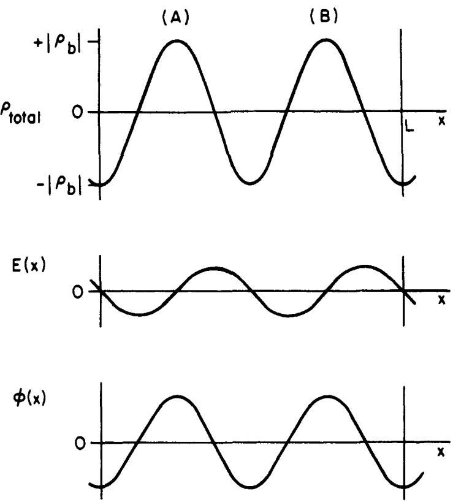  
Figure 5-7a Large-amplitude (yet still sinusoidal) density,field,and potential for two opposing streams of like charge sign in an immobile background of opposite sign of charge,charge density $\rho _ { b }$ ．Physicaily,the charges of one stream tend to be found in bunch $\pmb { A }$ and,of the other,in bunch $\pmb { B }$ .(The initial small-amplitude growth had one wavelength in this space, $\lambda = L$ .）

$$
\phi ( x ) = - \frac { | \rho _ { p } | } { ( 2 k _ { 0 } ) ^ { 2 } \epsilon _ { 0 } } \cos 2 k _ { 0 } x
$$

We start the calculation by asking two questions: (a） Does the total electric field energy PE exceed the total initial kinetic energy ${ \bf K E } _ { 0 }$ which is the total energy of the system TE? If so, then we must reduce the estimate of $\rho _ { \mathrm { t o u a l } } .$ (b) Is the potential so large as to reflect particles? The answer to (a) comes from the ratio of (PE) $\tan \tt { a l }$ /TE,which is

$$
\frac { \left( \mathrm { P E } \right) _ { \mathrm { { t o t a l } } } } { \mathrm { T E } } = \frac { \stackrel { 1 / } { 2 } \epsilon _ { 0 } \stackrel { L } { \int } E ^ { 2 } d x } { \frac { 0 } { 2 n _ { 0 } \stackrel { \left( 1 / \right)} { 2 } m \nu _ { 0 } ^ { 2 }  L } = \stackrel { \rho _ { b } ^ { 2 } L ^ { 2 } } { 6 4 \pi ^ { 2 } \epsilon _ { 0 } n _ { 0 } m \nu _ { 0 } ^ { 2 } } = \frac { 1 } { 3 2 \pi ^ { 2 } } \left( \frac { \omega _ { p } L } { \nu _ { 0 } } \right) ^ { 2 } }
$$

At the threshold for growth, $\omega _ { p } L / \nu _ { 0 } = 2 \pi / \sqrt { 2 }$ ，there is no problem，for there,

$$
\frac { \left( \mathrm { P E } \right) _ { \mathrm { t o t a l } } } { \mathrm { T E } } = \frac { 1 } { 1 6 }
$$

At (@imaginary) maxs $\omega _ { p } L / \nu _ { 0 } = 4 \pi / \sqrt { 3 }$ we find

$$
\frac { \left( \mathbf { P } \mathbf { E } \right) _ { \mathsf { t o t a l } } } { \mathsf { T E } } = \frac { 1 } { 6 }
$$

which is still less than unity, hence physical; indeed, this value implies that we might expect tighter bunching than assumed. The answer to (b） comes from the ratio of single-particle energies,

$$
{ \frac { \left| q \phi \right| _ { \operatorname* { m a x } } } { \sqrt [ ] { _ { 2 } } m { \nu } _ { 0 } ^ { 2 } } } = { \frac { - q \rho _ { b } } { ( 2 k _ { 0 } ) ^ { 2 } \epsilon _ { 0 } } } { \frac { 1 } { \nu _ { 2 } m \nu _ { 0 } ^ { 2 } } } = { \frac { 1 } { 8 \pi ^ { 2 } } } \Biggl ( { \frac { \omega _ { p } L } { \nu _ { 0 } } } \Biggr ) ^ { 2 }
$$

which is four times larger than $[ \left( \mathsf { P E } \right) _ { \mathsf { t o t a l } } / \mathsf { T E } ]$ .Hence,at threshold, this ratio is $1 / 4$ a particle at velocity $\nu _ { 0 }$ is not be stopped at $\left| q \phi \right| _ { \mathrm { m a x } } .$ At max-imum rate of growth, however, $\vert q \phi \vert _ { \operatorname* { m a x } } = 2 / 3 ( \mathbb { \ i } / _ { 2 } m \nu _ { 0 } ^ { 2 } )$ , indicating that a particle initially at velocity $\nu _ { 0 }$ would be considerably slowed by the potential hill. Just beyond $\omega _ { p } L / \nu _ { 0 } = 4 \pi / \sqrt { 3 }$ at $\omega _ { p } L / \nu _ { 0 } = \sqrt { 8 \pi ^ { 2 } }$ ，we would expect a particle to be stopped and turned back. “The fact that the particle energy ratio is four times larger than the total energy ratio may indicate that the mechan-ism limiting growth is that of reflecting particles rather than not allowing tight bunches. (Please ignore the mistake of equating $1 / 2 m \nu _ { 0 } ^ { 2 }$ and $\left| q \phi \right|$ in time varying fields.)

As a second guess, we look at tighter bunching. Let us try zero-thickness bunches (delta functions) as shown in Figure 5-7b. For bunch thickness $\pmb { \tau }$ essentially zero (meaning $\tau / L \ll 1 )$ ，we find the field and potential in region I to be (region I: $0 < x < L / 4 )$ ：

$$
\begin{array} { l } { { E _ { I } ( x ) = \frac { \rho _ { b } } { \epsilon _ { 0 } } x \qquad ( \rho _ { b } < 0 ) } } \\ { { \phi _ { I } ( x ) = A + B x ^ { 2 } } } \end{array}
$$

$\pmb { B }$ is obtained from $\nabla \phi = - \mathtt { E }$ and $\pmb { A }$ is obtained from $< \phi > = 0$ ; the result is

$$
\phi _ { I } ( x ) = \frac { { \rho } _ { b } } { { \epsilon } _ { 0 } } \left( \frac { L ^ { 2 } } { 9 6 } - \frac { x ^ { 2 } } { 2 } \right)
$$

From this model

$$
\begin{array} { r } { \frac { \left( \mathrm { P E } \right) _ { \mathrm { t o t a l } } } { \mathrm { T E } } = \frac { 1 } { 4 8 } \left( \frac { \omega _ { p } L } { \nu _ { 0 } } \right) ^ { 2 } } \\ { \frac { \left| q \phi \right| _ { \mathrm { m a x } } } { 1 / _ { 2 } m \nu _ { 0 } ^ { 2 } } = \frac { 1 } { 2 4 } \left( \frac { \omega _ { p } L } { \nu _ { 0 } } \right) ^ { 2 } } \end{array}
$$

and

These values are $2 \pi ^ { 2 } / 3$ and $\pi ^ { 2 } / 3$ larger than the values obtained earlier,

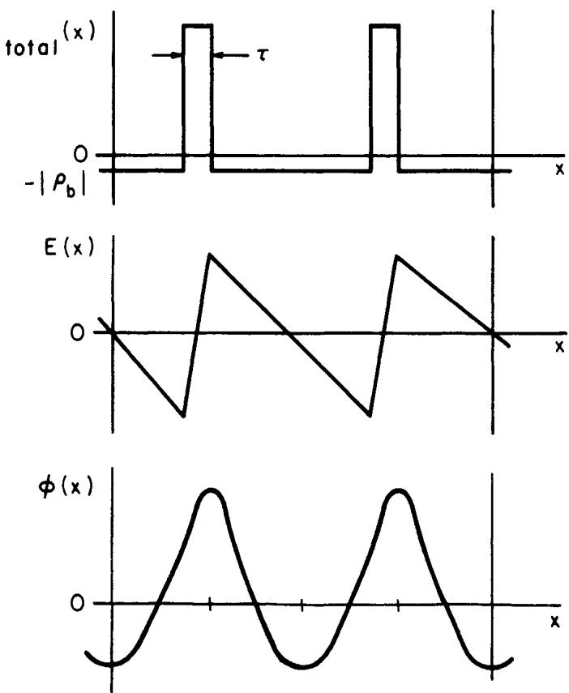  
Figure 5-7b Large amplitude density,field,and potential for two opposing streams of like charge sign,with very tight bunches of thickness $\tau < < L$

andarenowintheatioof1to2(1to4earlier).At(@imaginay)max $\omega _ { p } L / \nu _ { 0 } = 4 \pi / \sqrt { 3 }$ ，we find

$$
\begin{array} { r l r } & { } & { \frac { \left( \mathrm { P E } \right) _ { \mathrm { t o t a l } } } { \mathrm { T E } } = \frac { \pi ^ { 2 } } { 9 } \approx 1 . 0 9 } \\ & { } & { \frac { \left| q \phi \right| _ { \mathrm { m a x } } } { 1 / _ { 2 } m \nu _ { 0 } ^ { 2 } } = \frac { 2 \pi ^ { 2 } } { 9 } \approx 2 . 1 9 } \end{array}
$$

Both values exceed unity,with (17） indicating that there is not enough kinetic energy in the system to make zero-thickness bunches and (18),that particles (streaming at speed $\nu _ { 0 } )$ would be stopped and reflected by such bunches, never to be trapped. Thus our third guess should allow finite (but still small) thickness bunches. Indeed, using the above model,one finds

$$
\frac { \left( \mathrm { P E } \right) _ { \mathrm { t o t a l } } } { \mathrm { T E } } = \frac { 1 } { 4 8 } \left( \frac { \omega _ { p } L } { \nu _ { 0 } } \right) ^ { 2 } \left( 1 - \frac { 2 \tau } { L } \right) ^ { 2 }
$$

At maximum growth rate, as in (17),making $\left( \mathbf { P E } \right) _ { \mathrm { t o t a l } } = \mathbf { \hat { T } E }$ (meaning that all of the energy is now in the fields and the particles are completely stopped),requires that

or

$$
\begin{array} { c } { { \displaystyle { \frac { \pi ^ { 2 } } { 9 } } = \left( 1 - \frac { 2 \tau } { L } \right) ^ { - 2 } } } \\ { { \displaystyle { \frac { \tau } { L } } = \frac { 1 } { 2 } \left( 1 - \frac { 3 } { \pi } \right) \approx 0 . 0 2 2 } } \end{array}
$$

which is pretty thin. The answer for $\lvert q \phi \rvert _ { \mathrm { m a x } } / \lvert / _ { 2 } m \nu _ { 0 } ^ { 2 } = 1$ ,left for a problem, probably indicates a somewhat thicker bunch.

These estimates,generally termed back-of-the-envelope calculations, are to be taken lightly; however they are advisable when exploring new areas. The real fun comes in comparing these with the simulation runs,which support some guesses and not others,and guide further theory and simulation.

# PROBLEMS

5-7a Obtain $\vert q \phi \vert _ { \mathfrak { m a x } } / ! / 2 m \nu _ { 0 } ^ { 2 }$ for a finite-thickness bunch,Figure 5-7b,in order to correct (16 for finite thickness. At what thickness $\tau / L$ does this ratio $= 1 \mathit { ? }$

5-7b Let the two beams of velocities $\nu _ { 0 } - \nu _ { 0 }$ "thermalize"(via the instability） into a Maxwellian distribution, $f ( \nu ) \propto \exp { ( - \nu ^ { 2 } / \nu _ { t } ^ { 2 } ) }$ ，with a field level $\begin{array} { r l } { \left( \mathbf { P } \mathbf { E } \right) _ { \mathrm { { t o t a l } } } < < } & { { } \left( \mathbf { K } \mathbf { E } \right) _ { \mathsf { { t o t a l } } } . } \end{array}$ Find $\nu _ { t }$ in terms of $\nu _ { 0 }$

5-7c Read Friedberg and Armstrong (1968). Can you think up more estimates based on their work？

5-7d The fluid equations used in the linear analysis are valid until particles in a given stream overtake particles in that stream (i.e.,to the point when velocity $\nu$ begins to be double-valued). Using the displacement as worked out in Section 5-2,and the $x _ { 1 } , E , \phi , \rho$ of just the growing wave for two streams (Section 5-6),find the values of $E$ and $\phi$ at particle overtaking. Put your results in terms of $( \mathtt { P E } ) _ { \mathrm { t o t a l } } / \mathtt { T E }$ and $\left| q \phi \right| / \left| \psi _ { 2 } m \nu _ { 0 } \right|$ at overtaking,using parameter $( \omega _ { p } L / \nu _ { 0 } ) ^ { 2 }$ as done in this section. These levels are additional nonlinear bench marks.

5-7e For opposing streams of charges of unlike sign $( q _ { 1 } q _ { 2 } < 0$ 、say，electrons and positrons or $D ^ { + }$ and $D ^ { - }$ ions),a first guess at the large amplitude behavior is as sketched in Figure $5 . 7 \mathtt { c }$ Letting $\rho , \ E$ ， $\phi$ vary as-sin $k _ { 0 } x$ cos $k _ { 0 } x$ and -sin $k _ { 0 } x$ respectively [as in (5),(6),and (7)] work out (1 $\mathsf { P E } ) _ { \mathsf { t o t a l } } / \mathsf { T E }$ and $\left| q \phi \right| / \psi _ { 2 } m \nu _ { 0 } ^ { 2 }$ ．Show how these values differ from those derived for particles of like signs.

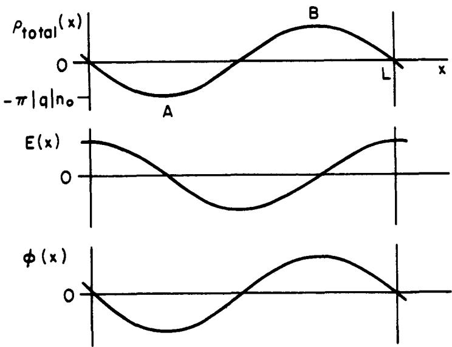  
Figure 5-7c Like Figure ${ 5 . 7 } \mathrm { { a } }$ ，but for particles of unlike sign, $q _ { 1 } q _ { 2 } < 0$ The negative charges tend to collect in bunch $\pmb { A }$ ,and the positive,in bunch $B$

# 5-8 TWO-STREAM INSTABILITY; PROJECT

The linear behavior is to be observed, such as:

(a) Growth rates and oscillation frequencies,to be checked with those given in Figure 5-6c;   
(b) Phase of bunching, $\rho ( x )$ relative to $\phi ( x )$ and $E ( x )$ ，for $q _ { 1 } q _ { 2 } > 0$ and for $q _ { 1 } q _ { 2 } < 0$ The nonlinear behavior is to be observed,such as:   
(a) Peak values of charge densities;   
(b) Tightness (thickness) of bunches;   
(c) PE(at saturation) $\mathbf { \nabla } ^ { \prime } \mathbf { K E } ( \mathbf { t } = 0 )$ ；   
(d) Change of behavior (from oscillation to growth） of modes outside the linear growth region (i.e., for $k \nu _ { 0 } / \omega _ { p } > \sqrt { 2 } )$ due to nonlinear coupling;   
(e)The decrease in average (streaming) velocities, $< \nu _ { 1 } >$ and $< \nu _ { 2 } >$ as PE becomes large;   
(f) The increase in velocity spread as given by $[ < \nu ^ { 2 } > - < \nu > ^ { 2 } ]$ ， a measure of the change from cold to warm plasma;   
(g） The difference in $\left( \mathtt { P E } \right) _ { \mathtt { m a x } }$ between electron-electron $( q _ { 1 } q _ { 2 } > 0 )$ and electron-positron $\left( q _ { 1 } q _ { 2 } < 0 \right)$ two streaming.

A list of initial values follows to aid in getting you started: $\mathbf { N S P } = 2$ ， ${ \bf L } = 2 \pi$ ， $ { \mathbf { D } }  { \mathsf { T } } = 0 . 2$ ， $\mathbf { N T } = 3 0 0$ ， $\mathbf { N G } = 3 2$ ， $\mathbf { I } \mathbf { W } = 2$ ， $\mathbf { E P S I } = 1 . 0$ ，A1, $\mathbf { A } 2 = 0$ ，plots every $5 0 \Delta t$ ,mode plots 1, 2,3. For species 1, ${ \bf N } = 1 2 8$ ， ${ \tt W P } = 1 . 0$ ， ${ \bf W } { \bf C } = 0 . 0$ ，

$Q M = - 1 . 0$ ， ${ \bf V } 0 = 1 . 0$ ， $\mathbf { M O D E } = 1$ ， $\mathbf { X } 1 = 0 . 0 0 1$ (the other values are zero). For species 2,use ${ \bf V } 0 = - 1 . 0$ . Note that these values put the first mode at $k _ { 0 } v _ { 0 } / \omega _ { p } = 1$ , in the region of linear growth and the second mode at 2,outside the linear growth region,where $\pmb { \omega }$ is real. Hence when mode 1 (which is growing) becomes large enough to produce harmonics at $n k _ { 0 }$ $n = 2$ ,3,...， then mode 2 begins to grow. The interesting part here is that these nonlinearities appear at amplitudes (for both mode 1 and 2) which are far below their maximum values (at saturation). This should give you some concern for the "boundary" between linearity and nonlinearity.

You might choose to use larger initial displacements,say,10 or even 100 times larger, but run fewer steps (say, SO), just to see how the program runs and to obtain some idea of growth rates, saturation amplitudes,and whether you want more- or less-frequent diagnostics. Of course, such a run probably is nonlinear almost at $t = 0$ , and is to be used in order to plan better, longer runs at smaller excitation. You might also consider moving $k _ { 0 }$ to smaller values to allow for more growing modes; you may observe changes in saturation amplitude as the $k$ 's become more dense, pointing up some deficiencies of single-mode excitation or use of discrete $\pmb { k } ^ { \prime } \pmb { \mathsf { s } }$ inherent in simulation.

If you like further challenge,you may go back to the linear cold-beam theory and work out the initial values of displacements and velocities (perturbation amplitudes) needed to excite just the growing wave. See if there is a change in the nonlinear behavior from that for excitation of a single mode (all four waves) or for excitation of many modes (say,all modes excited, with small but random values of the amplitudes). Try to excite just the decaying mode. What terminates the decay?

In contrasting like-sign and opposite-sign results,return to the linear cold-beam theory and obtain the relative phases of $\rho _ { 1 } , x _ { 1 } , \phi _ { 1 } ,$ and $E _ { 1 }$ of the growing wave. Apply this information to explain the differences in phase space $( \pmb { \nu } _ { \pmb { x } } , \pmb { x } )$ plots of the $e \cdot e$ and $e \cdot p$ runs.

# 5-9 TWO-STREAM INSTABILITY; SELECTED RESULTS

Simply as examples of results,we present a few results of two-stream runs made with ES1.

First, let us look at an electron-electron run. At $t = 0$ ，the streams have drift velocities $\pm 1 . 0$ and are perturbed slightly in position. Figure 5-9a shows the evolution of the instability. The grid charge density, the potential, and the electric field stay sinusoidal in space until about time $t = 1 5$ ，when the perturbation becomes quite large and the charge density has two peaks (not shown). Then,with a large electric field retarding the stream，some particles stop at about $t = 1 7$ and reverse as seen at about time $t = 1 8$ ；a phase-space vortex forms, and persists. Note that the large fields also accelerate some particles out to $| { \boldsymbol \nu } | \approx 3$ ，i.e.，9 times their original kinetic energy. At the end, the program plots the energies versus time. The electrostatic or field energy reaches a peak of about 40 percent of total initial kinetic energy; this energy is almost wholly in mode 1 $( k _ { 1 } \nu _ { 0 } / \omega _ { 0 } = 1 )$ ，with exponential growth over many decades at very close to the theoretical rate as measured on a semilog plot (not shown). Not shown are modes 2 and 3 which are linearly stable but grow due to nonlinear coupling (at twice and three times Wimaginary of mode 1), starting at about $t = 8$ ， $t = 1 0$ when mode 1 energy is still about 10oO and 10O times smaller than at saturation. This occurs in other models with a single growing mode; e.g.,Crume et al. (1972; see especially Figure 5).

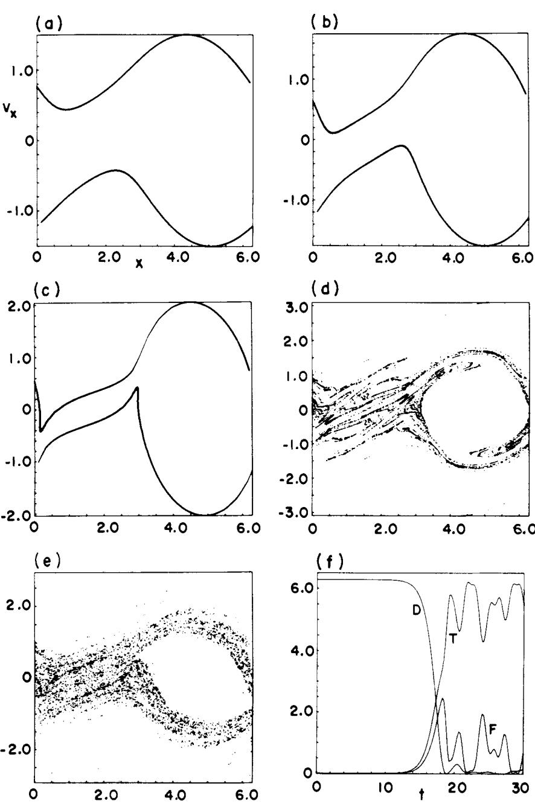  
Figure $\pmb { 5 . 9 2 }$ Evolution of electron-electron two stream-instability in $\nu _ { x } . . x$ phase-space plots (a,b, c,d,and e at $t = 1 6$ ,17,18,34,and 60；note changes in $\nu _ { x }$ scale),and the energy histories, drift (D),thermal (T）and field(F),for $t = 0$ to 30 (in f)． The initial velocities are $\pm 1 . 0$ There are 4096 particles ineach stream;the grid has 32 cells, $\begin{array} { r } { \omega _ { p 1 } = 1 = \omega _ { p 2 } . } \end{array}$

Second,let us look at the electron-positron colliding stream model which has the same dispersion relation as the electron-electron model but has different phases among $\rho , \ \phi$ ，and $E$ for the growing wave. Figure 5-9b shows some of the results. We see an entirely different form of bunching than with like-sign particles at $t = 1 5 . 9$ ，when positive and negative bunches are formed nearly together. Beyond this time, there is a lot of scrambling rather than a persistent vortex. In the history plots,the field energy maximum is only 16 percent of total initial kinetic energy and has relatively smaller peak electric felds,a direct result of the form of bunching. Also, while the drift kinetic energy drops suddenly again in about one plasma cycle,it does not fall to zero.

Third, let us look at a warm electron-electron two-stream instability run, as shown in Figure 5-9c. The drift velocities are $\pm 1 . 0$ ，with $\nu _ { t e } = \nu _ { 0 } / 2$ ；the initial velocity distribution is shown both in $\nu _ { x } { - } x$ space (a quiet start Maxwellian plus a small random thermal component） and integrated over $x$ to give $f ( \nu _ { x } )$ versus $\nu$ . Initially the instability grows exponentially in mode 3,with mode 2 about 10 dB behind,and forms three phase-space vortices which coalesce to two as shown and then finally to one vortex (not shown). The drift kinetic energy again does not go to zero but persists even out to $t = 3 0 0$ . The reader may note that, since mode 2 and 3 grow at about the same rate, the coalescence observed may be due to the initial conditions一a challenge to pursue further.

These runs were done for fun, without the care and variation in parameters that should be used in scientific study. They serve as examples of initial runs that might be made in starting a thorough study and as examples of observations and diagnostics that are widely used.

# PROBLEM

5-9a Since the equations of motion are reversible in time,if you insert statements into the code to reverse all particle velocities at some time during the growth of the instability,the system subsequently evolves back to its initial state!(What happens if you continue the problem further?） Work out how to do this reversal in ESl,remembering that $\nu _ { x }$ and $x$ are at different times. Because of computer arithmetic errors,the code does not retrace accurately over a long time interval,especially in a physically unstable situation.

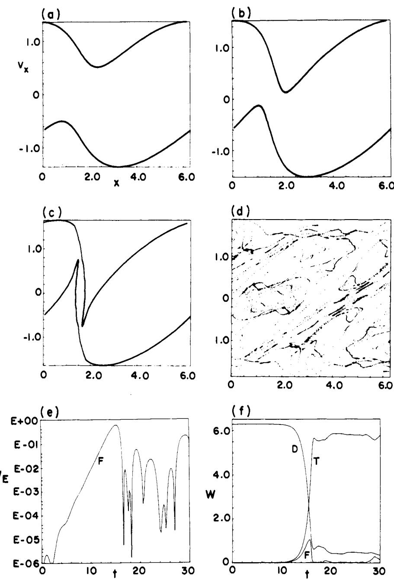  
Figure 5-9b Evolution of electron-positron two-stream instability in $\nu _ { x } – x$ phase-space plots (a,b, c,and d at $t = 1 4$ ,15,16,and 33),mode 1 field energy history (e),and energy histories (f). The parameters are the same as in Figure 5-9a.

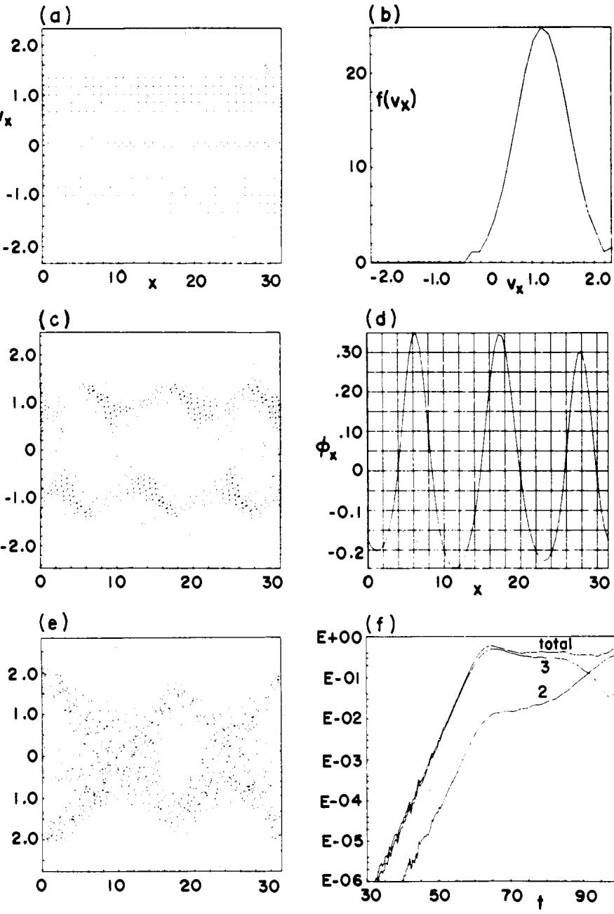  
Figure ${ \pmb 5 . 9 } { \pmb  c }$ Evolution of warm electron-electron two-stream instability with ${ \pmb { \nu } } _ { \pmb { x } } { \pmb { \cdot } } { \pmb { x } }$ phase-space plots (a, c,and e at $\pmb { t = 0 }$ ,60,and 1oo), initial velocity distribution of one stream $f ( v _ { x } )$ versus ${ \pmb { \nu } } _ { \pmb { x } }$ (in b)，potential $\phi ( { \pmb x } )$ versus $\pmb { x }$ (in d at $t = 6 0$ ，and field energy history (in f; total,modes 2 and 3, $t = 0$ to 100).

# 5-10 BEAM-PLASMA INSTABILITY; LINEAR ANALYSIS

This model consists of a beam injected into a stationary plasma and has long been a favorite of theorists and simulators. There are many variations: a cold or warm stream and plasma; a weak or strong beam; growth in time or space; particle trapping and passing effects; linear, quasilinear, and nonlinear effects; infinite, periodic, or bounded models; etc. We cover only one or two aspects by following growth in time in our periodic model; the reader may take up variations as projects.

The beam-plasma system follows naturally on the two stream work. An example of early theory and experiments is the amplifier work of Boyd et al. (1958)，who obtained microwave amplification at centimeter wavelengths using an eiectron beam injected into a long gas discharge column. They modulated the beam before it went into the plasma and stripped off the modulation after the beam left the plasma. The device aroused great interest for producing waves at millimeter wavelengths because the beam and piasma were intimately mixed and did not require a slow-wave circuit which was tiny and fragile to be grazed by an intense electron beam. More recent work by Gentle and Lohr (1973） emphasizes nonlinear behavior. The model is still fascinating.

The physical behavior is an example of double streaming as presented in Section 5-6. Those ideas can be lifted and used here by going to a new frame of reference. The largest change is that the beam density $n _ { b 0 }$ is generally much smaller than that of the plasma $n _ { p 0 }$ such that $\omega _ { p b } ^ { 2 } < < \omega _ { p p } ^ { 2 }$ the weak-beam model. The first interactions which we follow are electronelectron with an immobile neutralizing ion background (i.e., $m _ { i } / m _ { e }  \infty )$ Hence,for uncoupled stream and plasma,the dispersion diagram is as shown in Figure S-10a. The dominant frequency obviously is $\omega _ { p p }$ and the wave numbers of interest are near $k = \omega _ { p p } / \nu _ { 0 }$

For a cold plasma and a cold beam,the dispersion relation is

$$
0 = \frac { \epsilon \left( \omega , \boldsymbol { k } \right) } { \epsilon _ { 0 } } = 1 - \frac { \omega _ { p p } ^ { 2 } } { \omega ^ { 2 } } - \frac { \omega _ { p b } ^ { 2 } } { \left( \omega - \mathbf { k } \cdot \mathbf { v } _ { 0 } \right) { } ^ { 2 } }
$$

Using reduced variables,defined by

$$
\begin{array} { r } { W \equiv \frac { \omega } { \omega _ { p p } } , \quad K \equiv \frac { \mathbf { k } \cdot \mathbf { v } _ { 0 } } { \omega _ { p p } } , \quad R = \left( \frac { \omega _ { p b } } { \omega _ { p p } } \right) ^ { 2 } } \end{array}
$$

the equation to be solved is

$$
0 = F ( W , K ) = 1 - \frac { 1 } { W ^ { 2 } } - \frac { R } { ( W - K ) ^ { 2 } }
$$

We choose to consider real $k$ （or $\pmb { K }$ ）and seek complex values of $\pmb { \omega }$ (or $\pmb { W }$ ）， with four ω's to each $k$ . The solutions are shown in Figure 5-10b for $R$ varying from O.001 to O.1. (Note the utility of having a root solver and a plotting routine.)

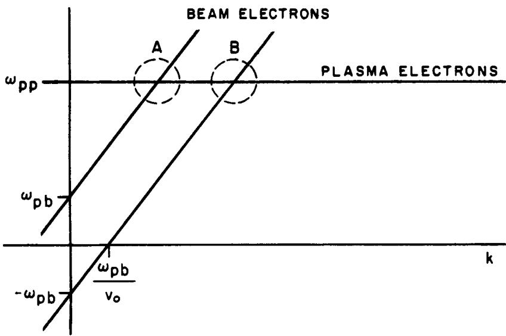  
Figure5-10aSketchofdispersiondiagramforteweakbeammodelwithbeamofdesity $\omega _ { p \theta }$ injected at velocity $\nu _ { 0 }$ into a plasma of density $\omega _ { p p }$ ，uncoupled. Coupling between the beam space-charge waves and plasma oscillations is expected at $A$ and $B$

The maximum growth rate Wimaginary is plotted in Figure 5-1Oc along with $\pmb { \omega } _ { \tau e a l }$ and $k$ at the maximum growth. It is seen that $( \omega _ { \mathrm { i m a g } } ) _ { \mathrm { m a x } } / \omega _ { p p }$ increases first as about $2 R ^ { 1 / 3 } / 3$ (called weak beam） and then as about $R ^ { 1 / 4 } / 2$ (called strong beam). The "boundary" is found graphically or by equating these two to be at

$$
R = \left( \frac { 3 } { 4 } \right) ^ { 1 2 } = 0 . 0 3 2
$$

as noted on the figure. This boundary is not to be taken seriously，but regarded merely as some kind of transition region from $^ { 3 }$ -wave interaction $\omega _ { i } \propto ( n _ { b 0 } ) ^ { 1 / 3 }$ ,Figure 5-10b(a) and (b),and $\pmb { 4 }$ wave interaction, $\omega _ { i } \propto ( n _ { b 0 } ) ^ { 1 / 4 } .$ Figure ${ \mathfrak { s } } . 1 0 { \mathfrak { b } } ( { \mathfrak { c } } )$

For weak beams，we see that maximum growth occurs very close to intersection $\pmb { B }$ in Figure 5-10a, $\omega _ { \mathrm { r e a l } } \approx \omega _ { p p }$ ， $k \approx \omega _ { p p } / \nu _ { 0 }$ Note that even a very weak beam, say， with $1 0 ^ { - 4 }$ the density of the plasma, sets up measurable growth; in this case the growth is 1.8 dB/plasma cycle,or a factor of 10 after 5.5 plasma cycles. For more exact results,see Bers (1972). For strong beams, the interactions at $\pmb { A }$ and $\pmb { B }$ in Figure 5-10a move apart widely to $C$ and $D$ in Figure 5-1Od, and the three-wave weak-beam interaction becomes a four-wave interaction with $\omega _ { \sf r e a l } \approx \omega _ { p p }$ ， $k \approx \omega _ { p b } / \nu _ { 0 } .$ This regime is puz-zling physically with respect to neutralization and so deserves comment. Inequality 5-2(23) implies a beam electron density no longer trivial relative to background plasma electron density; the latter is usually taken as equal to the background ion density and is now insufficient for system neutrality.

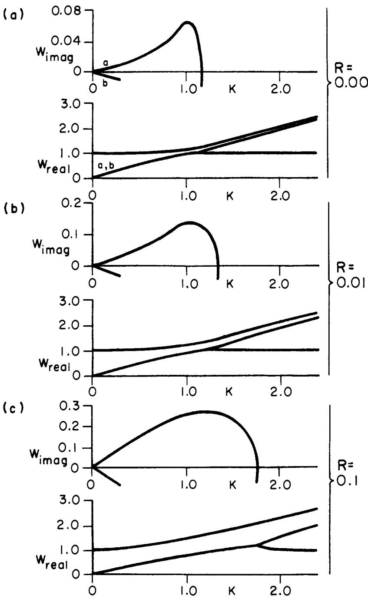  
Figure 5-1ob Real and imaginary roots of the dispersion relation (3). (a） For $R = 0 . 0 0 1$ ； (b) for $R = 0 . 0 1$ ； and (c） for $R = 0 . 1$ ．The complex roots are paired by the leters $^ { ( a , b ) }$ in (b); the other roots are wholly real． The root at ${ W _ { \mathrm { r e a l } } } \approx - 1 . 0$ is not shown.

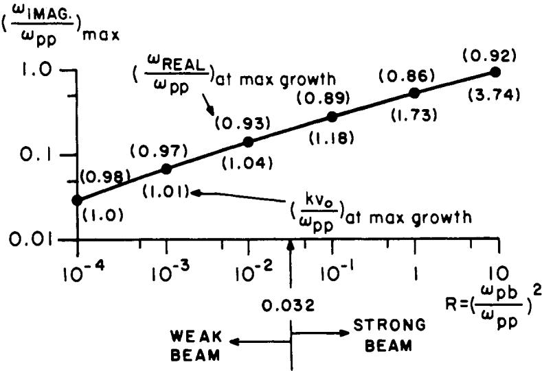  
Figure 5-10c Maximum growth rate for cold-beam-plasma system as a function of beam to plasma density ratio．The density ratio $R = 0 . 0 3 2$ mark is taken as the boundary between weak and strong beams,the break point between growth at $R ^ { 1 / 3 }$ and $R ^ { 1 / 4 }$

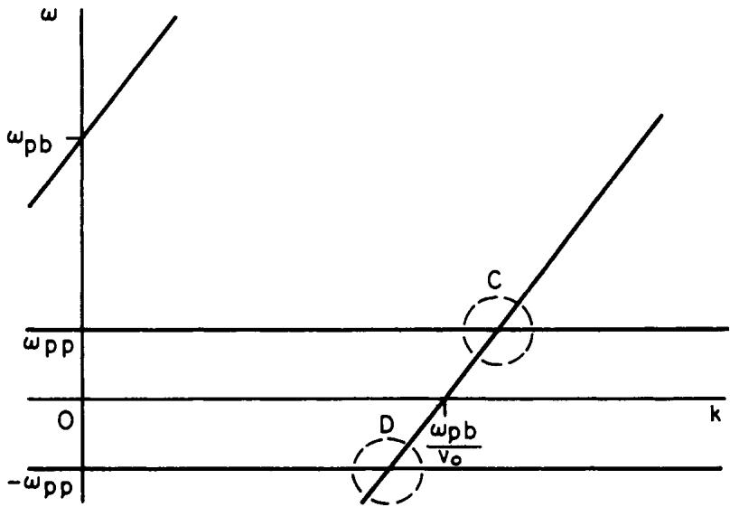  
Figure 5-10d Sketch of dispersion-dispersion diagram for the strong-beam model uncoupled. Coupling between the beam and plasma is expected at $C$ and $_ D$ ，roughly two two-wave cou-plings.

Hence,the plasma ion density must exceed the plasma electron density by

$$
\frac { n _ { p i } } { n _ { p e } } = \frac { 1 + R } { 1 - \displaystyle \frac { m _ { e } } { m _ { i } } }
$$

This is quite different from our initial discussion,as the beam is no longer just slightly perturbing a neutral plasma but is actually providing many of the electrons.

Ofcourse，thebackgroundcouldbeallionssuchthat $\omega _ { p p } ^ { 2 } =$ $\left( q / m _ { i } \right) \left( n _ { b 0 } q / \epsilon _ { 0 } \right)$ ，which forces $\omega _ { p p } ^ { 2 } \ll \omega _ { p b } ^ { 2 }$ Thismodel ofelectrons streaming through ions is the simulation model of Buneman (1959),one of the early milestones in plasma simulation. This is also the model used by Pierce (1948） in seeking to explain spurious signals,separated from the microwave signal by the ion plasma frequency (sidebands)，observed in microwave tubes (triodes,tetrodes,etc.)； Pierce solved the same dispersion relation as (1),but for real $\pmb { \omega }$ and complex $k$ . This model is treated in nonlinear theory and simulation by Ishihara et al. (1980,1981),who show the key role in the saturation played by the appearance of spatial harmonics.

In your simulations, you might consider two distinct models:

(a) The weak-beam model $\omega _ { p b } ^ { 2 } < < \omega _ { p p } ^ { 2 }$ is that of a weak electron beam launched into cold but mobile electrons of much higher density. The plasma ions have $m _ { i } \to \infty$ with no motion； neutralization is done simply by making the net charge density zero in the simulation program. (b) The strong-beam model $\omega _ { p b } ^ { 2 } > > \omega _ { p p } ^ { 2 }$ is that of an electron beam launched into cold but mobile ions of equal density but with $m _ { i } > > m _ { e }$

Thus for (a),the model is electron-electron; for (b),it changes to electronion. Of course, one is free to choose other models as well.

As the beam temperature is increased, the nature of the roots changes $o$ 'Neil and Malmberg, 1968).

# 5-11 BEAM-PLASMA INSTABILITY; AN APPROXIMATE NONLINEAR ANALYSIS

The nonlinear model of a cold weak beam launched into a plasma has been treated by theorists (e.g.，Drummond et al.，1970),experimentalists (e.g.,Gentle and Lohr, 1973),and simulators (e.g.,Kainer et al., 1972). The predictions and results fit together almost too well. We draw on these publications freely，especially on the interpretations and summary given by Hasegawa (1975).

We first use the linear analysis given earlier to obtain the relative density and velocity modulation needed to develop ideas on trapping. The dispersion

equation 5-10(1),using

$$
\omega \equiv \omega _ { p p } ( 1 - \delta )
$$

with $\delta < < 1$ , can be approximated as a cubic equation,

$$
\ S ^ { 3 } = - \frac { 1 } { 2 } \Bigg ( \frac { \omega _ { p b } } { \omega _ { p p } } \Bigg ) ^ { 2 } = - \frac { 1 } { 2 } R
$$

The three roots for δ are the three values of $( - 1 ) ^ { 1 / 3 }$ times $( R / 2 ) ^ { 1 / 3 }$ The complex frequency of the growing wave $( \operatorname { I m } \omega > 0$ ， $\mathrm { I m } \delta < 0 .$ is

$$
\omega _ { \mathrm { g r o w i n g } } = \omega _ { p p } \bigg [ 1 - \frac { 1 } { 2 } \bigg ( \frac { R } { 2 } \bigg ) ^ { 1 / 3 } + i \bigg ( \frac { 3 } { 2 } \bigg ) ^ { 1 / 2 } \bigg ( \frac { R } { 2 } \bigg ) ^ { 1 / 3 } \bigg ]
$$

The ordering lfor $\left( q / m \right) _ { p } = \left( q / m \right) _ { b } ]$ of magnitudes of first-order variations in density and velocity is found to be

$$
\begin{array} { r } { \left| \frac { n _ { 1 } } { n _ { 0 } } \right| _ { p } \approx \left( \frac { \nu _ { 1 } } { \nu _ { 0 } } \right) _ { p } \approx \delta \left( \frac { \nu _ { 1 } } { \nu _ { 0 } } \right) _ { b } \approx \delta ^ { 2 } \left( \frac { n _ { 1 } } { n _ { 0 } } \right) _ { b } } \end{array}
$$

Even for 100 percent beam-density modulation, $n _ { 1 b } \approx n _ { 0 b }$ ，the velocity modulations are still small, especially for the plasma,as

$$
( \nu _ { 1 } ) _ { b } \approx \mathfrak { d } \nu _ { 0 } \quad \mathrm { ~ a n d ~ } \quad ( \nu _ { 1 } ) _ { p } \approx \mathfrak { s } ^ { 2 } \nu _ { 0 }
$$

This ordering supports the idea that the beam may progress well into nonlinearity while the plasma remains essentially linear. Indeed, in simulation of weak beams,taking the plasma background to be linear allows represent-ing the plasma simply by a dielectric function,as developed by $o$ 'Neil et al. (1971),or as a linearized fluid,as done by many,for example Lee and Birdsall (1979a, b).

Even weli into the nonlinear buildup,the potential can be assumed to remain essentially sinusoidal,

$$
\phi _ { 1 } { \cos \left( k x - \omega t \right) } = \phi _ { 1 } { \cos \omega _ { p p } } \Bigg [ \frac { x } { \nu _ { 0 } } - t \left( 1 - \delta _ { r } \right) \Bigg ]
$$

times the growth factor, exp $( \omega _ { p p } \delta _ { i } t )$ . Trapping of the beam is followed in this potential, in the frame moving at the phase velocity $\nu _ { p }$ . Hence, particle $i$ sees a stationary potential

$$
\phi _ { 1 } = \overline { { \phi } } \cos k x _ { i }
$$

and the particles behave as in a non-time-varying potential (i.e., $\partial \phi / \partial t = 0 )$ ，obeying energy conservation

$$
\frac { 1 } { 2 } m { \nu _ { i } } ^ { 2 } + q \overline { { \phi } } \cos k x _ { i } = c _ { i }
$$

where $c _ { i }$ is the total energy of the $i ^ { t h }$ particle. (Yes,we recall that in_time varying potentials, $\gamma _ { 2 } m \nu ^ { 2 } + q \phi =$ constant is not quite correct.） Beam particles have phase space behavior as shown in Figure 5-1la; low-energy particles, $c _ { i } < q \overline { { \phi } }$ ，are trapped; high-energy particles, $c _ { i } > q \overline { { \phi } }$ ，are passing particles; particles with energy ${ \overset { \cdot } { c _ { i } } } = - q { \overline { { \phi } } }$ are at the bottom of the_potential well and have $\nu = 0$ . The critical velocity of escape (energy $c _ { i } = q { \overline { { \phi } } } .$ is

$$
\nu _ { c } ^ { ~ 2 } = \frac { 4 q \overline { { \phi } } } { m }
$$

That is, when the potential $\overline { { \phi } }$ has increased sufficiently so that relative slip between beam and wave, $\Delta \nu = \nu _ { 0 } - \nu _ { \mathrm { p h a s e } } = \delta _ { \mathrm { r e a l } } \nu _ { \underline { { { \Omega } } } }$ is $\nu _ { c }$ , then some of the beam begins to be trapped; this stage is defined by $\phi$ reaching $\phi _ { T }$ at time $t _ { 1 }$

$$
\begin{array} { r } { \phi _ { T } \equiv \frac { m ( \Delta \nu ) ^ { 2 } } { 4 q } } \end{array}
$$

which is related to the average feld energy density of

$$
{ \frac { 1 } { 4 } } \epsilon _ { 0 } E ^ { 2 } ( t _ { 1 } ) = { \frac { 1 } { 4 } } \epsilon _ { 0 } k ^ { 2 } \phi _ { T } ^ { 2 } = 2 ^ { - 3 1 / 3 } R ^ { 1 / 3 } \left( { \frac { 1 } { 2 } } n _ { 0 b } m _ { b } \nu _ { 0 } ^ { 2 } \right)
$$

that is,less than $1 / 1 0 0 0$ of the beam kinetic energy density. Drummond et al. (197O) surmised that the trapping would proceed as shown in their sketches,Figure 5-11b. When the beam has been trapped, it falls to the far side of the well, in half a bounce time、 At that time, $t _ { 2 }$ roughly, the beam particles have lost

$$
\begin{array} { l } { \Delta { ( { \bf K } { \bf E } ) } \approx \displaystyle \frac { 1 } { 2 } m _ { b } n _ { 0 b } [ ( \nu _ { 0 } + \Delta \nu ) ^ { 2 } - ( \nu _ { 0 } - \Delta \nu ) ^ { 2 } ] } \\ { \approx 2 m _ { b } n _ { 0 b } \nu _ { 0 } \Delta \nu } \end{array}
$$

of which half goes into kinetic energy of oscillations, half into field energy (as in linear theory,here stretched a bit). This field energy density is，al

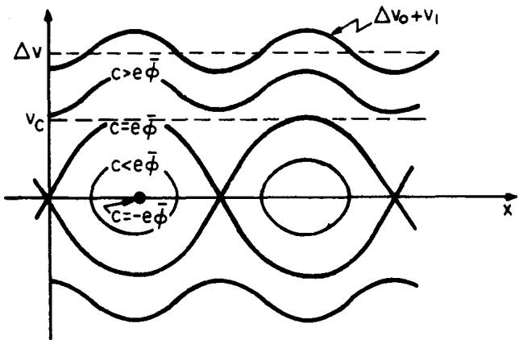  
Figure 5-1la Phase space trajectories for beam particles,as viewed in the frame moving at the phase velocity of the wave. (From Hasegawa,1975,fig.36.)

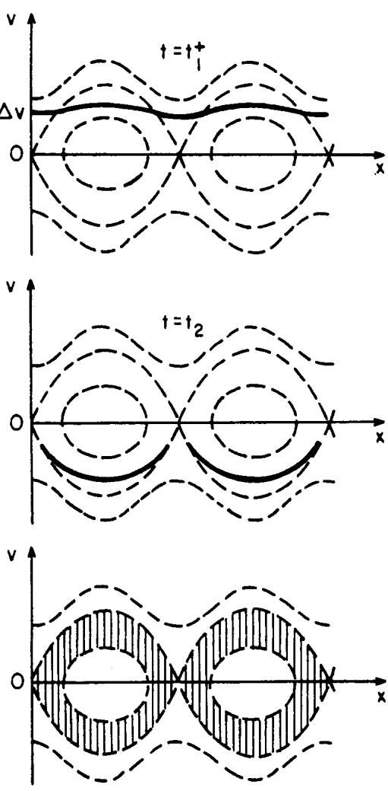  
Figure 5-11b Phase space for the beam particles,just at the beginning of trapping $( t = t _ { 1 } ^ { + } )$ ,at a later time when they have made half a bounce $( t = t _ { 2 } )$ and,finally,smeared out after many bounces. (From Drummond et al.,1970.)

time $t _ { 2 } ,$

$$
{ \frac { 1 } { 4 } } \epsilon _ { 0 } E ^ { 2 } ( t _ { 2 } ) = m _ { b } n _ { 0 b } \nu _ { 0 } \Delta \nu = { \Bigg ( } { \frac { R } { 2 } } { \Bigg ) } ^ { 1 / 3 } { \Bigg ( } { \frac { 1 } { 2 } } m _ { b } n _ { 0 b } \nu _ { 0 } ^ { 2 } { \Bigg ) }
$$

This is $2 ^ { 1 0 } = 1 0 2 4$ times larger (30 dB more） than at $t = t _ { 1 }$ [Note for the strongest weak beam allowed, $R = 0 . 0 3 2$ that $\left( R / 2 \right) ^ { 1 / 3 } = 0 . 2 5 1$ ， which says that 25 percent of the beam energy may appear as field energy,a rough estimate of the saturation or efficiency.] As the particle velocities bounce back up, the field energy goes back into kinetic energy; but,as the particles oscillate at different frequencies (the well is not parabolic), they mix in phase and the particle bouncing and field oscillations, Figure 5-1lc,die out. The final field energy is half the difference between the initial beam energy and the beam energy of the smeared-out distribution. The latter is symmetric about the wave phase velocity, of value $\psi _ { 2 } m _ { b } n _ { 0 b } \nu _ { p } ^ { 2 }$ . Hence,one-half the difference is the field energy density for $t  \infty$ ，

$$
\frac { 1 } { 4 } \epsilon _ { 0 } E ^ { 2 } ( t > > t _ { 2 } ) = \frac { 1 } { 2 } m _ { b } n _ { 0 b } ( \nu _ { 0 } ^ { 2 } - \nu _ { p } ^ { 2 } ) \left( \frac { R } { 2 } \right) ^ { 1 / 3 } \left( \frac { 1 } { 2 } m _ { b } n _ { 0 b } \nu _ { 0 } ^ { 2 } \right)
$$

which is just halfthepeak value (3dBdown).(See the expressionof $\phi _ { \mathrm { m a x } }$ given by Walsh and Hagelin,1976.)

Of course,the picture presented is quite approximate. Hasegawa (1975) notes that the beam velocity modulation $\nu _ { 1 }$ is $\Delta \boldsymbol \nu$ just at trapping (see Figure 5-11a) and also that at this time $n _ { 1 b } = n _ { 0 b }$ ， i.e.，well-developed bunching. Hence, the slight velocity modulation, no-bunching sketch of Figure 5-11b is too simple. To be sure,the bunches are trapped and rotate in phase space and the gross behavior of electric energy, Figure 5-1lc, does occur; however, the details are different,as are seen in simulations.

This gives us a pretty good idea of weak-beam nonlinear behavior. We refer the reader to the calculations of Kainer et al. (1972） which provide some tie between weak and strong beams in the nonlinear regime. With these insights and special values of $R = n _ { p b } / n _ { 0 p }$ in mind,we proceed to design useful beam-plasma simulations.

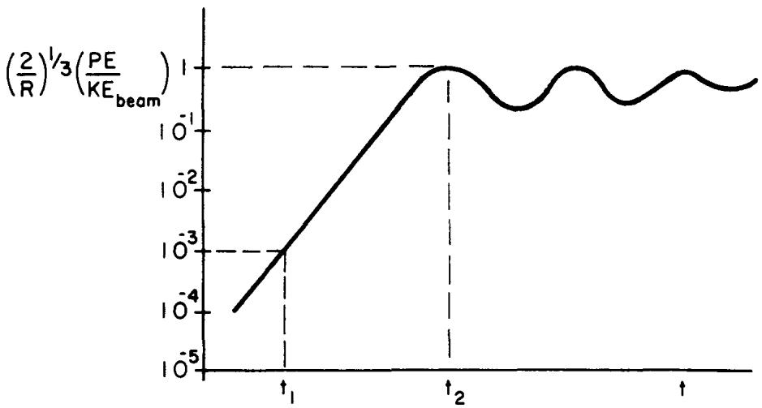  
Figure 5-1lc Electric field energy density as a function of time.At $t _ { 1 } ,$ the first particles are trapped and at $t _ { 2 } ,$ the beam has given up its maximum kinetic energy. The subsequent oscillations and particle bouncing die out as the particles do not allhave the same frequency of oscillation in the wave potential well. (From Drummond et al.,1970.)

# 5-12 BEAM-PLASMA INSTABILITY; PROJECT

The object of the project is to observe the development of the weak $R = 0 . 0 0 1$ beam-plasma instability from initial exponential growth through to the end of growth at large amplitude. (The strong beam-plasma instability，especially $\omega _ { p b } = \omega _ { p p }$ ， $R = 1$ ，is very close to the two-stream instability already done.） The observations to be made are the checking of values of complex ω against those from linear theory, the saturation level ("efficiency" of conversion of kinetic to field energy), the slowing and broadening of the beam velocity distribution,and the bounce or trapping motion of the beam bunches following saturation.

For $R \ < < 1$ ， the plasma (in contrast to the weak beam） remains linear by various tests (e.g., ${ \pmb n } _ { 1 } / \hbar _ { 0 }$ remains $< < 1 \dot { }$ ．Therefore,the plasma particles could be replaced by a linearized fluid or treated by a linear susceptibility. The particle-fluid model proved useful in a related model (magnetized ring-plasma) where the noise of the plasma had obscured the desired interaction (Lee and Birdsall, 1979a): We use another trick: Since only the plasma frequency of a linearly-responding species matters,we are free to choose a small value for $q / m$ to ensure that the plasma remains linear,which permits us to use a small number of plasma particles (as few as one per cell!). The fixed background ions are put in by default by ES1.

Let the ratio $( \omega _ { p b } / \omega _ { p p } ) ^ { 2 } \equiv R = 0 . 0 0 1$ in the weak-beam region $( R \leqslant 0 . 0 3 2 )$ .The beam becomes highly distorted in $\nu _ { x } – x$ phase space, wrapping itself into a vortex. Therefore,for adequate accuracy， far more particles are required than for the plasma. Hence, try ${ \bf N } = 5 1 2$ for the beam and $\aleph = 6 4$ for the plasma,with $\mathrm { N G } = 6 4$ cells.Use $\omega _ { p p } = 1 . 0$ and $\omega _ { p b } = ( 1 0 0 0 ) ^ { - \gamma _ { 2 } }$ ，with beam $\nu _ { 0 } = 1$ . For a test run, place the first mode near the peak of the growth rate, $k \nu _ { 0 } / \omega _ { p p } = 1 . 0 1$ ,where $\omega / \omega _ { p p } \approx 0 . 9 7 + i 0 . 0 0 6 ;$ hence,set $k _ { 0 } = 1$ ， $\mathtt { L } = 2 \pi$ . For later runs,put the tenth mode at this peak, using $\mathrm { L } = 2 0 \pi$ ，and excite all modes initially using VT1. Excitation of the beam at ${ \bf X } 1 = 0 . 0 1$ (to be decided on basis of best excitation of the growing wave） produces several decades of exponential growth,ending in saturation by time $t = 1 1 5$ ； using $\Delta t = 0 . 2$ requires $\mathbf { N T } = 6 0 0$ . Running for a longer time allows viewing of bounce, or trapping motion.

Check the nonlinear predictions of Section 5-1l and Kainer et al. (1972). Predict the potential when trapping is supposed to begin; does it do this according to your phase-space plots? Use phase-space plots made at satura-tion and several subsequent peaks and valleys (this takes a preliminary run to determine the times to make the plots) in order to verify (or not） the early trapping and subsequent mixing expected from Figure 5-11b. Is the peak of electric field energy that predicted in Section 5-11? Is the beam $f ( \nu )$ spreading and slowing development as predicted by Kainer et al. (1972)? Are there some very hot particles,as are best seen in $\mathbf { l o g } f ( \nu )$ versus $\nu$ or $\nu ^ { 2 }$ plots? Follow the decrease in beam $< \nu >$ and increase in $< \nu ^ { 2 } >$ in time.

There are more variations worth noting, which you may try.

First,suppose only the beam is allowed to move,with the plasma held immobile. Then,only the fast and slow space-charge waves are expected, with no growth. However, there is a nonphysical instability produced by aliasing,as shown analytically by Langdon (197Oa,b) and Chen et al. (1974) and verified by them and Okuda (1972)； see Chapter 8. This instability causes heating of the beam to a level of $\lambda _ { D } / \Delta x \approx 0 . 0 5$ (where $\lambda _ { D } = \nu _ { t } / \omega _ { p }$ of the beam） and then stops,leaving a stable but slightly warm (and noisy) beam,as shown by Birdsall and Maron (1980). The maximum growth rate is $0 . 2 \omega _ { p b } = 0 . 2 \omega _ { p p } R ^ { \prime } { } ^ { 2 }$ which is roughly $\omega _ { p p } / 1 5 0$ for $R = 0 . 0 0 1$ , about a factor of 10 less than the beam-plasma growth rate expected. Hence，this selfheating effect (treated in detail in Part Two) may be viewed as transient here.

Second, examine what happens if the plasma is excited at relatively large amplitude,for example, by using X1 on the order of the unperturbed particle spacing. Does the beam-plasma interaction take place?

Third,ties may be made to linear and nonlinear experiments,where an electron gun launches a cold beam into a plasma. The simulation may be altered to fit the experiment more closely,where the beam electrons are continuously injected at $x = 0$ and collected at $x = L ^ { - }$ (not returned to $x = 0 ^ { + }$ ， as in the usual periodic model） and the plasma electrons are reflected,in some careful manner, at $x = 0 ^ { + }$ $x = L ^ { - }$ .The excitation may be a velocity and/or density modulation of the beam by a sinusoidal (in time） source at $x = 0 ^ { + }$ .The level of modulation and length $L$ should be chosen to produce saturation at $x < L$ . These changes fit experiments more closely where spatial growth (real $\pmb { \omega }$ and complex $k$ ）is expected. See Briggs (1971,p.76) on the distinction among absolute,convective,and "neither" instabilities.

Selected results for $R = 0 . 0 0 1$ are shown in Figure 5-12a. The $\nu _ { x } . . x$ phase space plots were chosen to coincide with peaks of field energy, hence, valleys of beam kinetic energy of $t \approx 1 4 6$ ，202，and 258 and valleys at $t \approx 1 7 3 , \ 2 3 0$ ， and 286. Thus,the peak times should exhibit bunching at $\nu < \nu _ { 0 } = 1 . 0$ and valley times should exhibit bunching at $\nu > \nu _ { 0 } ;$ the reader may see that this_is roughly the case. Using $\phi _ { \mathrm { m a x } }$ in $\omega _ { \mathrm { t r a p } } = k \left( q \phi _ { \mathrm { m a x } } / m \right) ^ { \gamma _ { 2 } }$ produces $\tau _ { \tt t r a p } \approx 5 6$ ， very close to that observed. Note that the vortex takes on considerable structure so that simple bounce ideas fail.

# PROBLEMS

5-12a Although we can choose ${ \pmb q } / m$ arbitrarily small for the plasma particles without altering the essential physics,show that there is a practical lower limit imposed by the finite precision of computer arithmetic.

5-12b What happens if the excitation $\mathbf { X } 1 = 0 . 0 1$ is applied to the plasma electrons instead of to the beam?

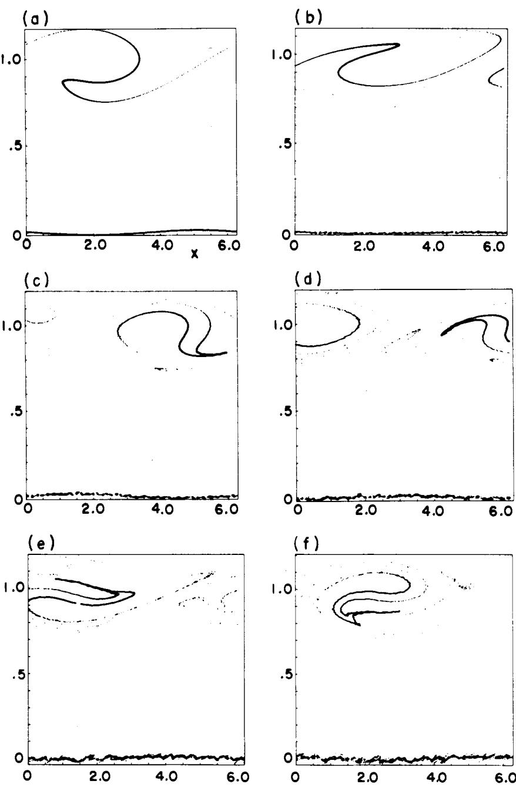  
Figure 5-12a Evolution of weak-beam plasma instabilityin $\nu _ { x } . . x$ phase space with $R = 0 . 0 0 1 = ( \omega _ { p b } / \omega _ { p p } ) ^ { 2 }$ with beam velocity $\nu _ { 0 } = 1 . 0$ The left-hand set occurs very close to the first,second,and third peak of field energy and the right-hand set occurs very close to the subsequentvalleys, showingthe bouncemotion and mixing.Thesequenceis $t = 1 4 6$ ,173,202,230,258,286.

Another instability which is interesting is that due to relative drift of ions through electrons in an applied magnetic field $\pmb { B } _ { 0 } \hat { \pmb z }$ .The interaction is in the plane normal to $B _ { 0 }$ (or nearly so). The particles have position variable $x$ ， and velocity variables $\nu _ { x }$ and $\nu _ { y }$ (and possibly $\nu _ { z } \mathrm { , }$ ；the wave number is $k \hat { x }$

The magnetic field strength is characterized by

$$
\omega _ { c i } < < \omega _ { p i } < < \omega _ { p e } \approx \omega _ { c e }
$$

For simplicity, both ions and electrons are treated as cold, i.e., $\nu _ { t e } = 0 = \nu _ { t i }$ We choose to work in the electron frame (electrons not drifting) with the ions having a steady drift $\nu _ { 0 }$ in $x$ . For such perturbations, the electrons are magnetized (i.e., the electron $\mathbf { v } _ { 1 } \times \mathbf { B } _ { 0 }$ term is kept); the ions are treated as unmagnetized as the waves have $\left| \omega - \mathbf { k } \cdot \mathbf { v } _ { 0 } \right| > > \omega _ { c i }$ This model (and similar ones） has been used widely for theoretical studies of drift-excited electrostatic instabilities in magnetized plasmas; for more details and answers to threshold values of $\nu _ { 0 }$ (i.e.，should $\nu _ { 0 } > \nu _ { t e }$ or $\nu _ { 0 } > \nu _ { t i }$ for instability),see Forslund et al. (1972a).

Let us redo some parts of the theory,with results usable for comparison with results of simulation. The coordinates used are shown in Figure 5-13a. We look for hydrodynamic nonresonant instabilities, assuming

$$
\frac { k \nu _ { t e } } { \omega _ { c e } } < 1 , | \omega - k \nu _ { 0 } | > k \nu _ { t e } , \omega > k _ { \scriptscriptstyle \parallel } \nu _ { t e }
$$

The first assumption means

$$
\begin{array} { r } { \frac { \nu _ { t e } } { \nu _ { 0 } } < \frac { \omega _ { c e } } { \omega _ { u h } } \approx 1 \ \quad \mathrm { f o r } \ \omega _ { c e } \geqslant \omega _ { p e } } \end{array}
$$

where $\omega _ { u h } ^ { ~ 2 } \equiv \omega _ { p e } ^ { ~ 2 } + \omega _ { c e } ^ { ~ 2 }$ . The second assumption requires

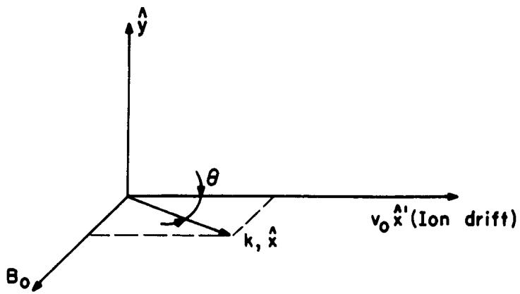  
Figure 5-13a Coordinates for drift-excited instabilities.

$$
\frac { \nu _ { t i } } { \nu _ { 0 } } < \left( \frac { m _ { e } } { m _ { i } } \right) ^ { 1 / 3 } \left( \frac { \omega _ { p e } } { \omega _ { u h } } \right) ^ { 4 / 3 }
$$

For $T _ { e } \approx T _ { i }$ or $m _ { e } \nu _ { t e } ^ { 2 } \approx m _ { i } \nu _ { t i } ^ { 2 }$ and $\omega _ { p e } \approx \omega _ { c e }$ ，（4） becomes

$$
\frac { \nu _ { t e } } { \nu _ { 0 } } < \left( \frac { m _ { i } } { m _ { e } } \right) ^ { 1 / 6 } \left( \frac { \omega _ { p e } } { \omega _ { u h } } \right) ^ { 4 / 3 }
$$

The cold dispersion relation, as investigated by Buneman (1962),is

$$
1 - \cos ^ { 2 } \theta \frac { \omega _ { p e } ^ { 2 } } { \omega ^ { 2 } - \omega _ { c e } ^ { 2 } } - \sin ^ { 2 } \theta \frac { \omega _ { p e } ^ { 2 } } { \omega ^ { 2 } } - \frac { \omega _ { p i } ^ { 2 } } { ( \omega - k \nu _ { 0 } \cos \theta ) ^ { 2 } } = 0
$$

The $\cos ^ { 2 } \theta$ term is due to the electron motion across $\pmb { B } _ { 0 } ;$ the $\sin ^ { 2 } \theta$ term comes from electron motion along $\pmb { { \cal B } } _ { 0 }$

While our simulation project has $k _ { \parallel } = 0$ ， $\pmb \theta = 0$ ,it is instructive to display the solutions of (4) for $\theta = 0$ and for small $\pmb { \theta } \approx \sqrt { m _ { e } / m _ { i } }$ ，showing both the upper-hybrid-two-stream instability $( \pmb \theta = 0 )$ ）predicted by Buneman and the modifed-two-stream instability predicted by Krall and Liewer (1971, 1972). Figure 5-13b is a sketch of $\pmb { \omega } _ { \mathtt { r e a l } }$ and $\pmb { \omega }$ imaginary showing both instabilities. The physics of the two regimes are discussed in Chen and Birdsall (1973).

# 5-14 BEAM-CYCLOTRON INSTABILITY; PROJECT

This instability grows with $\begin{array} { r } { \mathbb { R } \mathscr { e } \left( \omega \right) \approx \omega _ { u h } } \end{array}$ and $\mathrm { I m } \left( \omega \right) < < \omega _ { u h } , \omega _ { p e } , \omega _ { c e }$ These dictate that $\Delta t$ be chosen such that $\omega _ { u h } \Delta t$ is small (say,0.2)and that the program run several hundred steps (say,60o). The parameters recommended initially are those used in the linear analysis section:

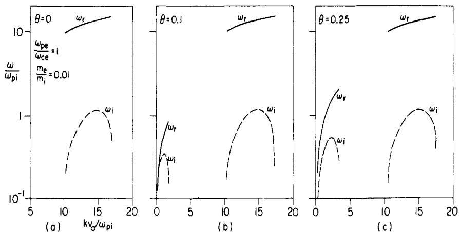  
Figure 5-13b Plots of unstable roots for $\pmb \theta = 0$ ， $( m _ { e } / m _ { i } ) ^ { 1 / 2 }$ and $2 . 5 ( m _ { e } / m _ { i } ) ^ { ! / 2 }$ Here $m _ { e } / m _ { i } = 0 . 0 1$ and $\omega _ { p e } / \omega _ { c e } = 1$ .The scales are semilogarithmic. (From Chen and Birdsall, 1973.)

$$
\omega _ { p e } = \left| \omega _ { c e } \right| = 1 0 \omega _ { p i }
$$

The maximum growth rate $\gamma / \omega _ { p e } \approx 0 . 1 2$ occurs at $k \nu _ { 0 } / \omega _ { p e } \approx 1 . 5$ ，with $\omega _ { \mathrm { r e a l } } / \omega _ { p e } \approx 1 . 3 8$ For example,choose $\omega _ { p e } = 1 . 0$ ， $\nu _ { 0 e } = 0$ (the interaction is viewed in the electron frame), $\omega _ { c e } = - 1 . 0$ $\omega _ { p i } = 0 . 1$ ， $\omega _ { c i } = 0$ (ions are taken to be unmagnetized), $\nu _ { 0 i } = 1 . 0$ . Let the first mode be placed at the $k$ for the maximum growth rate, $k _ { 0 } \approx 1 . 5 \omega _ { p e } / \nu _ { 0 } = 1 . 5$ meaning that $L = 2 \pi / k _ { 0 } = 4 \pi / 3$ Use $( q / m _ { e } ) = - 1 . 0$ and $( q / m _ { i } ) = 0 . 0 1$ . The ions are relatively massive and so move litle away from their simple drift while the electrons wrap up in a phase space vortex. Hence, fewer ions may be used than electrons; try ${ \bf N } = 5 1 2$ for the electrons and ${ \bf N } = 1 2 8$ for the ions. Excitation of the first mode at electron ${ \bf X } 1 = 0 . 0 0 1$ produces many orders of magnitude of growth (maybe too many,allowing use of larger X1） to saturation in the 6OO steps already suggested.

One object is to verify the linear analysis. Part of the verification is to measure complex $\pmb { \omega }$ from the time histories and compare with the predicted values as a function, say, of $k$ or other parameters. Why does $\omega _ { \tt r e a l }$ appear to be zero in the mode 1 energy history? How would you find $\omega _ { \mathrm { r e a l } }$ ？What is the measured phase between，say, $\phi$ and $\pmb { \rho }$ ? Does this phase agree with linear analysis? Predict and observe the $\nu _ { x } , ~ \nu _ { y }$ plot for electrons.

Another object is to observe the large amplitude behavior. Note the value of electrostatic energy at saturation, say,as a fraction of the system initial kinetic energy. Does the ion drift energy drop? Is there growth in the electron drift energy? Observe the growth in ion and electron thermal ener-gies. Validate the simulation by comparing the error in total energy with the variations in any of the components of the total; e.g., is the maximum electrostatic energy much less than the error in the total?

# 5-15 LANDAU DAMPING

Electrostatic plasma waves are damped in a warm plasma, even without colisions. This surprising result was first found from consideration of analytic continuation in the complex ω plane of the Laplace-transformed $\phi$ Detailed physical understanding and analysis may be found in Jackson (1960) and Dawson (1961).

With a Maxwellian velocity distribution, there are particles moving both faster and slower than the wave phase velocity $\omega / k$ .If we transform to a frame moving with the phase velocity, the potential is sinusoidal in $x$ and decaying (but not oscillating) in time at a rate $\omega _ { i }$ .Ignoring the decay for the moment,we see easily that the electrons in a velocity band $\omega / k \pm \nu _ { t r }$ are trapped by the wave，oscillating about the velocity $\omega / k$ with frequency $\approx \omega _ { t r }$ ，where $\mathcal { Y } _ { 2 } m \nu _ { t r } ^ { 2 } = q \phi$ and $\mathop { m } \omega ^ { 2 } _ { t r } = q k ^ { 2 } \phi$ ，in which $\phi$ is the peak ampli-tude of the wave component at this phase velocity. Returning to the stationary frame,we see that the resonant electrons in the range $( \omega / k - \nu _ { t r } , \omega / k )$ exchange with those in the range $( \omega / k , \omega / k + \nu _ { t r } )$ in a time $\approx \pi / \omega _ { t r }$ If there are more electrons initially in the slow range,then there is a net gain in particle energy which must be supplied by the wave. This is the collision-less dissipation mechanism of Landau damping,and suggests why the damping rate is proportional to $\left( \partial f _ { 0 } / \partial \nu \right) _ { \nu = \omega / k }$

We begin with a straightforward example which demonstrates the effect but also points out some diffculties in performing a clean simulation. Our parameters are: $\mathrm { D T } = 0 . 1 , \mathrm { N T } = 2 0 0 , \mathrm { N G } = 2 5 6 , \mathrm { A } 2 = 1 0 ^ { 4 } .$ $\mathrm { I P H I } = 1 0 ,$ $\mathbf { I X V X } \ = \ 1 0$ ，MPLOT $\ l = \ 1$ ，2,3；and $\mathbf { N } \ = \ 2 ^ { 1 4 }$ ， $\mathbf { V } \mathbf { T } 2 \ = \ 0 . 5$ ， $\mathbf { N L G } \ = \ 1$ ， $\mathbf { M O D E } = 1$ ， $\mathbf { X } 1 = 0 . 0 2$

The wave damps at a rate $\omega _ { i } = - 0 . 1 5 \omega _ { p }$ close to that predicted by the linear theory,but the wave energy drops only an order of magnitude, then Oscillates slowly. The same results are reported by Denavit and Walsh (1981) using a different quiet-start technique.

With a random initialization $( \mathbf { V } \mathbf { T } 1 = 0 . 5 $ $\mathbf { V T } 2 = 0 ,$ ）exponential decay is not seen. The distribution $f _ { 0 } ( \nu )$ must be well-represented by the particle loading，especially near $\omega / k$ .For this reason,we cannot decrease the very rapid rate of decay in this example by choosing smaller $k \nu _ { t } / \omega _ { p }$ to place the phase velocity out in the "tail" of the distribution,which is sparsely populated. Instead, we use a trick,as follows.

First，we divide the electrons into two groups，one cold，the other Maxwellian. In ES1 these groups are conveniently handled as separate "species," $c$ and $h$ .By choosing $\omega _ { p c } ^ { 2 } > > \omega _ { p h } ^ { 2 }$ and $k \nu _ { h } \approx \omega _ { p c }$ we place the phase velocity at the steepest slope of $f _ { 0 h }$ , so that there are many particles in the trapping range, but the damping rate is $< < \omega _ { p c }$

Second,an artifice enables us to decrease the number of particles needed. In the code we can choose $N _ { c } < < N _ { h }$ which means that a "cold" particle carries a much larger charge than a hot particle. By choosing $q / m = 0 . 0 1$ for the cold particles, we can avoid nonlinearity in their response and use only $\mathbf { N } _ { c } = \mathbf { N } \mathbf { G }$ . All this does not affect the behavior at the low amplitudes we use.

The parameters are: $\mathsf { D T } = 0 . 1$ $0 . 1 , \mathrm { { N T } = 1 0 0 0 , \mathrm { { N S P } = 3 , \mathrm { { N G } = 2 5 6 , } } }$ A2 $= 1 0 ^ { 4 }$ ， $\mathrm { I P H I } = 2 0 $ ， $\mathrm { I X V X } ~ = ~ 2 0 , ~ \mathrm { M P L O T } ~ = ~ 1 , ~ 2 , ~ 3 , ~ 4 ~ 1$ for the main program; hot species is specified by $\aleph = 2 ^ { 1 4 }$ ， $\mathbf { W P } \ : = \ : 0 . 3 8 3$ ， $\mathbf { V } \mathbf { T } 2 \mathbf { \Psi } = \mathbf { \Psi } 0 . 9$ cold species by $\aleph = 2 5 6$ ， ${ \bf Q } { \bf M } = 0 . 0 1$ ， $\mathbf { W P } = 0 . 9 2 4$ ， $\mathbf { V } \mathbf { T } 2 = 0$ ， $\mathbf { M O D E } = 1$ ，V1 $= \ 2 . 5 \times 1 0 ^ { - 4 }$ ； and marker species by $\mathrm { ~ \bf ~ N ~ } = \mathrm { ~ \bf ~ 1 0 2 0 }$ ， $\mathsf { N L G } = 1 0 2 0 / 3 , \mathsf { Q } \mathsf { l }$ $\mathbf { Q M } \ =$ -1.0, $\mathbf { W P } = 1 0 ^ { - 1 0 }$ ， ${ \bf V } 0 = 0 . 9$ ，with VT2 chosen to obtain velocities of 0.8, 0.9,and 1.0. In this example, the field energy drops by two orders of magnitude,then rises as shown in Figure 5-15a. The initial damping rate is easily estimated from the linear theory by examining the imaginary part of the dispersion relation $\epsilon ( k , \omega _ { r } + i \omega _ { i } ) = 0$ ，with $\omega _ { j }$ small:

$$
0 = \mathrm { I m } \epsilon \approx 2 \frac { \omega _ { p c } ^ { 2 } } { \omega _ { r } ^ { 3 } } \omega _ { i } - \pi \frac { \omega _ { p h } ^ { 2 } } { k \left| k \right| } f _ { 0 } ^ { \prime } \Bigg | \frac { \omega _ { r } } { k }
$$

from which, for a Maxwellian,

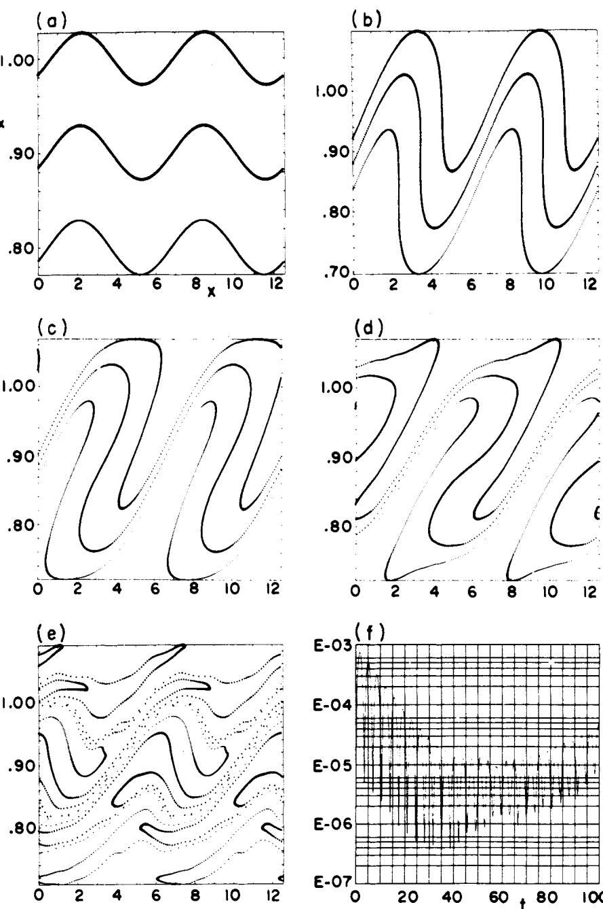  
Figure 5-15a Landau damping as observed in $\nu _ { x } . . x$ phase-space piots (a,b,c,d,and e at $t = 2$ ,16,30,40,and 90)and field energy history (f,for $t = 0$ to 100)．The phase-space plots show marker particles (same $q / m$ as the main particles,but much smaller $\pmb q$ and $m$ ）originally at $\nu = 0 . 8$ ,0.9(the wave phase velocity) and 1.0,shown by-，\*,and $^ +$ 、To clarify the spatial structure,the plotting interval is $0 \leqslant x \leqslant 2 L$ ，and each particle is plotted twice，at $( x , \nu )$ and $( x + L , \nu )$

$$
\frac { \omega _ { i } } { \omega _ { r } } = - \left( \frac { \pi } { 8 } \right) ^ { 1 / 2 } \frac { \omega _ { p h } ^ { 2 } } { \omega _ { p c } ^ { 2 } } \left( \frac { \omega _ { r } } { k \nu _ { t } } \right) ^ { 3 } e ^ { - \omega _ { r } ^ { 2 } / 2 k ^ { 2 } \nu _ { t } ^ { 2 } }
$$

In the simulation we find $\omega _ { r } = 0 . 9 0$ ; this expression then gives $\omega _ { i } = - 0 . 0 5 8$ which agrees adequately with the rate $\omega _ { i } = - 0 . 0 6 2$ observed.

The rise in amplitude after $t = 4 5$ is due to oscillations of trapped elec-trons in the wave field. The rise can be made to occur sooner by raising the initial amplitude and hence the trapping frequency, but it cannot be delayed much without using more particles.

By changing a few statements in the code we can plot the phase space and $f ( \nu )$ over the trapping range only. We do see $f \left( \nu \right)$ change,but the detailed information which should be available from phase space is not discernible in the plot because we do not know where a given particle was earlier. By plotting only the particles whose velocities were initially greater than 0.9 we can see the trapping. Another way is to plot a third species of marker particles,which have the same $q / m$ but low charge density so they move with the hot particles but do not affect the evolution. We have loaded these particles in three beams at $\nu = 0 . 8$ ,0.9,and 1.0. Phase space plots of these particles,Figure 5-15a, carry information on the history of the resonant particles; such information is not available from the distribution function $f ( x , \nu , t )$ in a code which integrates the Vlasov equation.

# PROBLEM

5-15a In a quiet-start in ES1,the velocities in each group are monotonically increasing while the positions are scrambled by the bit-reversal procedure.What diference would there be if instead the positions were monotonically increasing and the velocities were scrambled?

# 5-16 MAGNETIZED RING-VELOCITY DISTRIBUTION; DORY-GUEST-HARRIS INSTABILITY; LINEAR ANALYSIS

Plane waves propagating perpendicular to a uniform magnetic field, ${ \bf { B } } _ { 0 }$ $( k _ { \perp } \ne 0 , ~ k _ { \parallel } = 0 )$ ，in a uniform plasma, are stable or unstable depending on the velocity distribution (Harris, 1959). Consider warm ring-like velocity distributions with

$$
\begin{array} { c } { { d n = F _ { \mathrm { } } ^ { \ell } ( \nu _ { \perp } ) 2 \pi \nu _ { \perp } d \nu _ { \perp } = \displaystyle \left[ \int _ { - \infty } ^ { \infty } d \nu _ { | | } f _ { 0 } ( \nu _ { \perp } , \nu _ { | | } ) \right] 2 \pi \nu _ { \perp } d \nu _ { \perp } } } \\ { { = \displaystyle \frac { 1 } { \pi \alpha _ { \perp } ^ { 2 } p ! } \Bigg [ - \frac { \nu _ { \perp } } { \alpha _ { \perp } } \Bigg ] ^ { 2 p } \mathrm { e x p } \Bigg [ - \frac { \nu _ { \perp } ^ { 2 } } { \alpha _ { \perp } ^ { 2 } } \Bigg ] 2 \pi \nu _ { \perp } d \nu _ { \perp } } } \end{array}
$$

For $\begin{array} { r } { p = 0 , \ F _ { 0 } ^ { 0 } } \end{array}$ is Maxwellian and the roots of the dispersion relation fall near the cyclotron harmonics (of both electrons and ions),moving asymptotically to $n \omega _ { c }$ as $k _ { \perp } \nu _ { \perp } / \omega _ { c } \to \infty$ ; these are the harmonics of Bernstein (1958).

See Crawford and Tataronis (1965) for dispersion curves,and Krall and Trivelpiece (1973,pp. 407-412) for a general discussion. For a Maxwellian distribution $( p = 0 )$ ，the dispersion relation predicts only real roots for any ratio $\omega _ { p } / \omega _ { c }$ .Yet, if we hold $\omega _ { p }$ constant and decrease $\omega _ { c }$ to zero,we would expect to recover Landau damping; at least when $\omega _ { c }$ is smaller than the damping rate. Kamimura et al. (1978) review the theoretical resolution of this paradox and do a sophisticated simulation study of this damping and its relations to autocorrelation and spectra of thermal field fluctuations and to particle diffusion across the magnetic field.

For $p \neq 0 , F \ell$ is like a warm ring in $\nu _ { \perp }$ space (say, $\nu _ { y }$ versus $\nu _ { x } )$ and is unstablefor $p \geqslant 3$ for the so-calld zero-frequency mode (meaning $\omega _ { \mathrm { r e a l } } = 0 )$ ,as shown by Dory et al. (1965).

For $p  \infty$ ,the ring has zero thickness (is cold),with $F _ { 0 } ^ { \infty }$ given by

$$
F _ { 0 } ^ { \infty } \left( \nu _ { \perp } \right) = \frac { 1 } { 2 \pi \nu _ { \perp 0 } } \delta \left( \nu _ { \perp } - \nu _ { \perp 0 } \right)
$$

All particles have the same speed $\nu _ { \perp 0 } .$ The cold ring is unstable for $( \omega _ { p } / \omega _ { c } ) ^ { 2 } > 6 . 6 2$ as shown by Crawford and Tataronis (1965) and Tataronis and Crawford (1970),with solutions of the dispersion relation given in Figure 5-16a. For use in the_ project， the growing complex roots for $( \omega _ { p } / \omega _ { c } ) ^ { 2 } = 1 0$ are $\omega / \omega _ { c } = 1 . 3 7 + i 0 . 2 6 5$ at ${ k _ { \perp } \nu _ { 0 \perp } } / \omega _ { c } = 4 . 5$ and $2 . 3 4 + i 0 . 2 7 3$ at $k _ { \perp } \nu _ { 0 \perp } / \omega _ { c } = 5 . 5$ Note the zero-frequency mode, $\omega _ { \mathrm { r e a l } } = 0$ ， centered at $k _ { \perp } \nu _ { 0 \perp } / \omega _ { c } \approx 3$ The $k _ { \perp } = 0$ values are $n \omega _ { c }$ plus the hybrid.The $k _ { \perp } \neq 0$ values for $\omega = n \omega _ { c }$ are at zeros of $J _ { n }$ and $J _ { n } ^ { \prime }$ of argument $k _ { \perp } \nu _ { 0 } / \omega _ { c }$ ·

The real parts of the frequency fall roughly midway between cyclotron harmonics and the maximum imaginary parts are comparable to $\omega _ { c }$ [even for $( \omega _ { p } / \omega _ { c } ) ^ { 2 } > > 1 \}$ .This limit on growth may appear open to question. That is, why is the maximum $\gamma \leqslant \omega _ { c }$ rather than $\propto \omega _ { p } \dot { \bf { \sigma } }$ After all, the onedimensional distribution function $[ F _ { 0 } ^ { \infty } \left( \nu _ { \perp } \right)$ integrated over $\nu _ { y }$ ，the projection onto the $\nu _ { x }$ axisl clearly has two sharp peaks,appearing like two streams,as shown in Schmidt (1966,p. 254,not in 2nd ed., 1979). However,when the Penrose criterion (for unmagnetized plasma） is applied to this distribution, the Penrose integral is zero,meaning no instability; this result is noted by Langdon in Lindgren et al. (1976). Hence, the ring instability requires the $\pmb { B } _ { 0 }$ magnetic field. If $\pmb { \gamma }$ exceeded $\omega _ { c }$ , the magnetic field would not play a role; therefore the maximum growth rates for a single ring are of the order of $\omega _ { c }$

The ring distribution is of interest for several reasons. One is that a neu-tral beam injected into a magnetic field (as in fusion experiments） produces a ring distribution. Another is that the ring is a model loss-cone distribution which is relatively easily handled in theory. Another is that a Maxwellian distribution in $\boldsymbol { F } ( \nu _ { \perp } )$ can be constructed from a set of rings. Hence,the pro-ject to follow is a practical exercise.

A closely related instability occurs with both a warm ring and a warm core plasma. Tataronis and Crawford (1970) presented stability boundaries for a cold ring and warm core. Mynick et al. (1977) presented extensive results for this two-ion component plasma, but unmagnetized. They find stability boundaries using the Penrose criterion，and growth rates for a wide range of ratios of plasma to core densities and temperatures; these results are helpful guidelines to cases where $( \omega _ { p i } / \omega _ { c i } ) ^ { 2 } > > 1$ and growth rate $\omega _ { \mathrm { i m a g } } / \omega _ { c } \geq 1 / \pi$ ， meaning the ions behave as if not magnetized (with some exceptions). Lee and Birdsall $( 1 9 7 9 \mathsf { a } , \ \mathsf { b } )$ extended the magnetized model theory results considerably and provided verifying simulations. This twocomponent model is also a practical model for study; the reader may wish to simulate this model after doing the cold ring model.

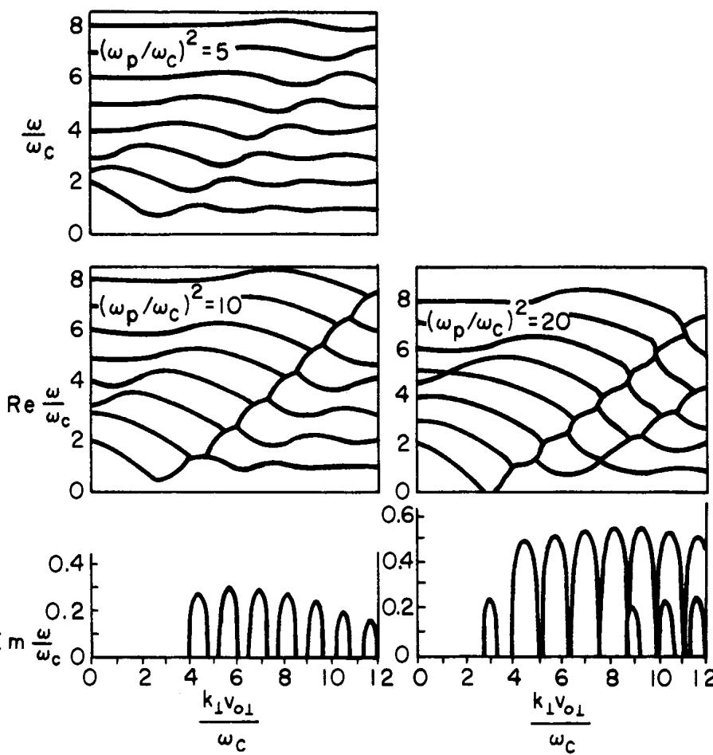  
Figure 5-16a Complex ω versus $k _ { \perp }$ for ring velocity distribution, speed $\nu _ { 0 \perp } .$ perpendicular to $\pmb { { \cal B } } _ { 0 }$ for $k _ { | | } = 0$ ，below threshold [which is $( \omega _ { p } / \omega _ { c } ) ^ { 2 } = 6 . 6 2$ for $\omega _ { \mathrm { r e a l } } \neq 0$ and 17.06 for $\omega _ { \mathrm { r e a l } } = 0 ]$ and above.

# PROBLEM

5-16a Relate $\nu _ { \perp 0 }$ in (2) to $\alpha _ { \perp }$ in (1） with $p > > 1$

# 5-17 MAGNETIZED RING-VELOCITY DISTRIBUTION; PROJECT

The project is to observe the behavior of a uniform magnetized plasma, with a cold ring velocity distribution,speed $\nu _ { 0 }$ We choose $( \omega _ { p } / \omega _ { c } ) ^ { 2 } = 1 0$ ， for which complex $\omega$ for real $k$ (suiting the ES1 periodic model） are shown in Figure 5-16a.

Consider the particles to be ions. The electrons are neglected,put in by ES1 as a uniform neutralizing background.

One problem is to devise an initial particle-loading scheme which both puts particles in a ring of radius $\nu _ { \perp 0 }$ in velocity as uniformly as possible in phase space $x$ ， $\nu _ { x } , ~ \nu _ { y }$ . For example,let the particles be spaced uniformly in $x$ ，with the velocities given by

$$
\begin{array} { r } { \nu _ { x i } = \nu _ { \perp 0 } { \cos \theta _ { i } } } \\ { \nu _ { y i } = \nu _ { \perp 0 } { \sin \theta _ { i } } } \end{array}
$$

We do not want $\theta _ { j }$ to_be too obviously correlated with $x _ { i }$ (why?). A small change to subroutine INIT enables efficient loading of a ring. In the input specify WC, ${ \bf V } 0 = { \bf \mu } _ { \nu _ { \perp 0 } }$ and $\mathbf { N L G } = 1$ ． Alter the logic to skip over the velocity loading involving VT2 but retain the scrambling of positions. The cod-ing between statements numbered 50 and 51 then rotates the velocity to fill in the ring. However,the angle THETA is intended for loading the distribution 5-16(1） (Problem 5-17b)；we change this to THETA $\bf { \sigma } = \bf { \sigma }$ TWOPI \* $\left( \mathrm { I } - 1 \right) / \mathbf { N G R }$ .The particles are now loaded with evenly spaced angles increasing monotonically with index $i$ ，while the positions $x _ { i }$ are scrambled. As phase space is now highly ordered, the electric field at the start is noiseless or quiet.

Using $\omega _ { p } = 1$ ,and $\omega _ { c } = ( 1 0 ) ^ { - 1 / 2 }$ ，choose $\nu _ { \perp 0 }$ to make $k \nu _ { \perp 0 } / \omega _ { c } = 4 . 5$ (or 5.5),which places the fundamental mode at one of the maximum growth rates. For $\Delta t = 0 . 2 , \mathrm { \bf N T } = 6 0 0 , \mathrm { \bf ~ X } 1 = 1 0 ^ { - 3 } ,$ and $\mathrm { ~ \bf ~ N ~ } = \mathrm { ~ } 4 0 9 6$ the instability grows over many decades (allowing accurate measurement of complex $\pmb { \omega }$ ） and saturates.

Check the results early in time against the linear theory. Observe the rapid collapse of the cold ring toward a thermal distribution,as shown by Byers and Grewal (1970, figure 7). See if you duplicate their observation of a shift in the frequency spectrum of the electric field from roughly $3 \omega _ { c } / 2$ (or $\mathfrak { s } _ { \omega _ { c } } / 2 )$ in the linear regime,to $n \omega _ { c }$ in the postsaturation regime, where $\textstyle f ( \nu )$ is becoming more thermal (Gaussian),and the Bernstein harmonics are expected.

# PROBLEMS

5-17a Relate NV2 and VT2 (in subroutine INIT in ES1） to exponent $2 p$ and $\alpha _ { \perp }$ in 5-16(1).   
NV2 and $2 p$ may differ by 1 because of the difference in $\nu _ { \perp }$ space volume elements.

5-17b Explain how the (unaltered) INIT sets up the distribution 5-16(1),using $\mathsf { N L G } = \mathsf { N G }$ and $\Nu > > \Nu G$ What happens if $\mathbf { N L G } = 1$ ,the default? Consider scrambling the angles using a radix-three digit-reversal (Denavit and Walsh,1981） so that $x$ ， $\nu _ { \perp } ,$ and $\pmb \theta$ are uncorrelated.

# 5-18 RESEARCH APPLICATIONS

From the earliest papers to the present, one dimensional electrostatic particle simulation continues to be a productive research tool. So much so that, in addition to papers already cited in this chapter,we mention here only one paper from each of a few of the research areas where these codes are used.

The presence of trapped particles can lead to unstable growth of sidebands at frequencies $\approx \omega _ { p } \pm \omega _ { \mathrm { t r } }$ (Kruer and Dawson, 1970),A classic exam-ple of "parametric" instability in plasma (in which a driven wave is coupled nonlinearly to other modes to which its energy is transferred） is treated by Kruer and Dawson (1972)，who demonstrate the resulting enhanced resistivity，and a relativistic version by Lin and Tsintsadze (1976). Another interesting consequence of nonlinear mode coupling is the "explosive" instability，so called because its growth is faster than exponential; examples are found in Jones and Fukai (1979). Plasma expansion into a vacuum is treated in Denavit (1979). With some modification,ES1 has been used for many projects. Lee and Birdsall (1979b) add a linearized fluid-like electron response. Cohen and Maron (1980） model linearized electron motion in the presence of a density gradient. These simulations are inexpensive with ES1 on present computers. Scaling of electron heating and density profile modification in a plasma driven by an oscillating electric field are treated by Albritton and Langdon (1980). Conditions for formation of electrostatic shocks ("double layers") in the auroral magnetosphere are studied by Hudson and Potter (1981). Many of these papers cite other applications of one dimensional electrostatic simulation.

# A 1D ELECTROMAGNETIC PROGRAM EM1

Michael A. Mostrom and Bruce I. Cohen

# 6-1 INTRODUCTION

One dimensional codes,even with three velocity components,are almost always easier to set up and use,and more economical to run, than two and three dimensional codes. Also, there are_1d algorithms which have especially useful properties; this is true in the EM code given here,which uses a field solver that combines simplicity and stability.

The first fully electromagnetic algorithm was devised by J. M. Dawson in 1d (unpublished,ca. 1965)． He separated the transverse fields into left- and right-going components. By choosing $\Delta { x } = c \Delta t$ ， these components are advanced in time simply by shifting the values over one cell and adding current contributions from particles whose paths intersect the light rays. We discuss a variation of this 1d algorithm as formulated and implemented by Langdon and Dawson (1967) and revived for laser-plasma studies by B. I. Cohen,M. A. Mostrom, D.R. Nicholson,and A. B. Langdon (Cohen et al., 1975).

Two and three dimensional fully electromagnetic programs are given in Chapter 15.

# 6-2 THE ONE-DIMENSIONAL MODEL

For linearly polarized electromagnetic waves, the variables used have components oriented as shown in Figure 6-2a. Electromagnetic and electrostatic waves propagate along $\pmb { x }$ ； there are no variations in $y$ or $\pmb { z }$ $( k _ { y } =$

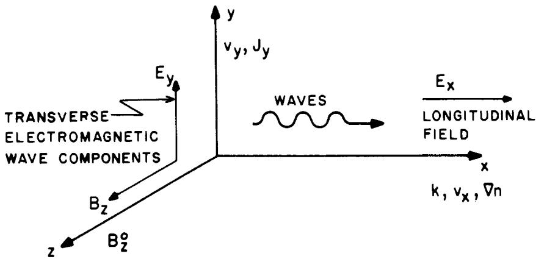  
Figure $6 . 2 a$ Location of the particle and feld quantities for the linearly polarized 1/d EM1 code.

$0 = k _ { z } )$ . The plasma may be nonuniform along $\pmb { x }$ . There may be magnetic fields; for convenience B,the sum of the wave and applied magnetic fields, is taken along z. The longitudinal electric field is $E _ { x }$ ，the radiation or transverse field is $E _ { y }$ .The particles have three phase-space coordinates $x$ ， $\nu _ { x }$ ，and $\nu _ { y }$ .EM1 for periodic systems and EM1BND for bounded systems were written by Cohen,Mostrom, Nicholson,and Langdon.

B. I. Cohen has proposed an arbitrarily-polarized wave model by adding in another static field $B _ { x } ^ { 0 }$ component, plus wave fields $B _ { y }$ and $E _ { z }$ ，velocity $\nu _ { z }$ ， and current density $J _ { z }$ ."As given at the end of the next section, these alter the Maxwell equation set somewhat.

# 6-3 ONE-DIMENSIONAL FIELD EQUATIONS AND INTEGRATION

The Maxwell equations for the transverse fields in the model are,in rationalized cgs (Heaviside-Lorentz) units,

$$
\begin{array} { l } { \displaystyle \frac { \partial \mathbf { E } } { \partial t } = c \nabla \times \mathbf { B } - \mathbf { J } } \\ { \displaystyle \frac { \partial \mathbf { B } } { \partial t } = - c \nabla \times \mathbf { E } } \end{array}
$$

By adding and subtracting these equations, for $E _ { y } , B _ { z }$ and $J _ { y }$ ， we obtain

$$
\left\{ { \frac { \partial } { \partial t } } \pm c { \frac { \partial } { \partial x } } \right| { } ^ { \pm } F = - \frac { 1 } { 2 } J _ { y }
$$

for the left- and right-going field quantities,

$$
^ \pm F \equiv { \frac { 1 } { 2 } } ( E _ { y } \pm B _ { z } )
$$

The transverse fields are recovered from $\pm _ { F }$ by

$$
\begin{array} { l } { { E _ { y } = { ^ { + } } F + { ^ { - } } F } } \\ { { B _ { z } = { ^ { + } } F - { ^ { - } } F } } \end{array}
$$

The Poynting flux is

$$
P = c ( { ^ + F } ^ { 2 } - { ^ - F } ^ { 2 } )
$$

and the energy density is $^ { + } F ^ { 2 } + ^ { - } F ^ { 2 }$ $E _ { y } , B _ { z } , J _ { y } , ^ { \pm } F$ ,and $P$ are grid quantities.

The fields are readily advanced,as the left-hand side of (3） is the total derivative $d F / d t$ for an observer moving at velocity $\pm c$ . That is,the convective derivative is taken along the vacuum characteristic so that (3） may be written as

$$
\frac { \mathtt { \mathtt { E } } _ { F } ( t + \Delta t , x \pm c \Delta t ) - \mathtt { \mathtt { E } } _ { F } ( t , x ) } { \Delta t } = - \frac { 1 } { 2 } { J } _ { y } ^ { \pm } \Bigg ( t + \frac { \Delta t } { 2 } , x \pm c \frac { \Delta t } { 2 } \Bigg )
$$

where $J _ { y } ^ { \pm }$ is an appropriately-averaged current, space- and time-centered, as noted by the arguments. Hence,we may integrate exactly along the vacuum characteristics $( x = \pm c t +$ constant ）using grid spacing $\Delta { x } = c \Delta t$

The formal statement is that the field at grid $j$ ，time $n + 1$ ,is

$$
^ { \pm } F _ { j } ^ { n + 1 } = ^ { \pm } F _ { j \mp 1 } ^ { n } - \frac { \Delta t } { 4 } ( J _ { y , j \mp 1 } ^ { - } + J _ { y , j } ^ { + } )
$$

$J _ { y } ^ { - }$ and ${ J } _ { y } ^ { + }$ denote current densities computed from velocities $\nu _ { y } ^ { n + 1 / 2 }$ assigned to the grid by linear weighting according to the positions $x ^ { n }$ and $x ^ { n + 1 }$ respectively. This says that fields at $j \mp 1$ propagate to $j$ ，affected by the source terms at $j , j \mp 1$ . The values are shown in Figure 6-3a.

The current $J _ { y } ^ { - }$ comes from the $i ^ { t h }$ particle $\left[ q \nu _ { y } ( t + \Delta t / 2 ) \right] _ { i }$ ， linearly weighted to the grid from the particle position $x _ { i } ( t ) ; J _ { y } ^ { + }$ comes from the $i ^ { t h }$ particle $\left[ q \nu _ { y } \left( t + \Delta t / 2 \right) \right] _ { i }$ ，linearly weighted to the particle position $x _ { i } ( t + \Delta t )$ :These values are defined in this manner so that the current given in (8),an average of $J _ { y } ^ { - }$ and ${ J } _ { y } ^ { + }$ ， is centered halfway between the grid point $x$ and the grid points $x \pm \ c \Delta t = x \pm \Delta x$ ,as required by (7).

Note that $^ + F$ and $^ - F$ represent right- and left-going electromagnetic quantities traveling with constant speed $c ( = \Delta x / \Delta t )$ ，the speed of light in vacuum. However， in the plasma, electromagnetic waves travel with $\nu _ { \mathsf { p h a s e } } > c$ . Hence $^ + F$ and $^ - F$ are the usual right- and left-going electromagnetic fields only in vacuum, as in regions outside the plasma.

The longitudinal field $E _ { x }$ is obtained from $- \nabla \phi$ and $\phi$ from Poisson's equation just as in ES1.

This scheme (7） was designed to be time-centered (reversible and second-order accurate） and to render the radiation self-force accurately.

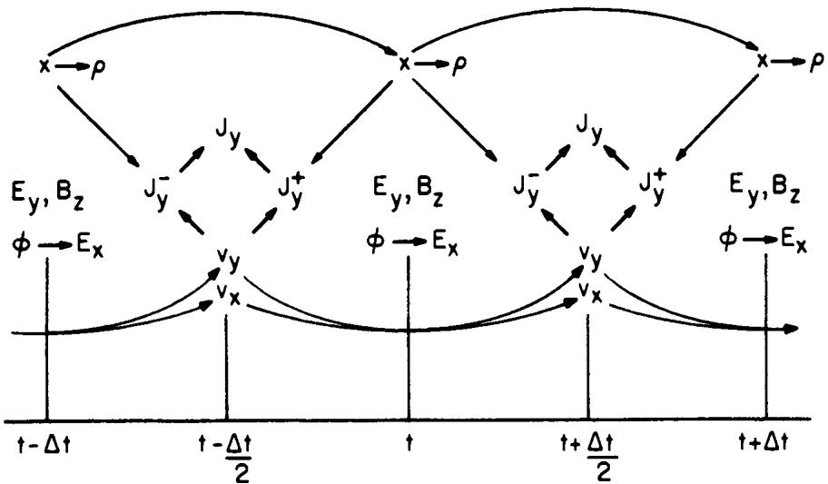  
Figure 6-3a Time stepping used in the EM1 program. The particles are advanced by a leap-frog method,shown by the curved lines. $\pmb { \rho }$ is the charge density needed for calculating $\phi$ ,then $E _ { x }$

[The radiation drag $( \dot { \nu } _ { y } ) _ { \mathrm { \scriptsize ~ r a d } } = - { \nu } _ { y } q ^ { 2 } / 2 m c$ is proportional to velocity in one dimension-a surprising result which can be reconciled with the pointparticle three- dimensional case by considering the radiation from a moving spherical charge shell in the limits of large and small ratio of (radius/wavelength). The fact that a plasma slab does not quickly radiate away its thermal energy can be understood in terms of the radiative normal modes of the slab (Langdon, 1969).] The stability against nonphysical beam modes (i.e.，no numerical Cerenkov instability） noted by B. I. Cohen (private communication, 1975) and analyzed by Godfrey and Langdon (1976), is an unforeseen bonus,and is discussed further in the next section.

There are other advantages to this algorithm: (i) the fields are known at integral positions $j$ and times $\pmb { n }$ , for the convenience of particle movers and diagnostics,without the averaging and unaveraging procedures required in typical 2d, 3d electromagnetic programs; (ii) outgoing wave boundary conditions for $\pm _ { F }$ are trivial; the original application by Langdon (1969) involves a bounded plasma radiating into a vacuum.

An arbitrarily polarized wave model is mentioned at the end of the previous section,with variations along only the $\pmb { x }$ coordinate, but with static magnetic field in the $x - z$ plane and all three velocity components. Such a code is $1 \mathbf { d } 3 \mathbf { v }$ ， an example of which appears in Section 4-5. The additional field components, $E _ { z }$ and $B _ { y }$ ,and new current density $J _ { z }$ require solving the additional transverse field equations,

$$
\left( \frac { \partial } { \partial t } \pm c \frac { \partial } { \partial x } \right) \left( E _ { z } \mp B _ { y } \right) = - \frac { 1 } { 2 } J _ { z }
$$

These equations are not included in the present version of EM1. The extension, however, would be very useful, and would allow simulation of a variety of electromagnetic and electrostatic waves which propagate at arbitrary angles with respect to an applied magnetic field. The computational simplicity and stability of the basic one dimensional algorithm are retained.

# PROBLEM

6-3a Devise an explicit Maxwell's equation solver a la Morse and Nielson (1971) for the same fields as the Langdon-Dawson $1 \%$ dimensional model of this section. Design a mesh； label where quantities are calculated in space and time;construct first-order,centered (if possible), finite-difference equations. Can you find a qualitative or quantitative condition on $\Delta x / c \Delta t$ ， i.e.，a Courant condition? Compare and contrast to the Langdon-Dawson electromagnetic scheme.

# 6-4 STABILITY OF THE METHOD

The numerical stability of one dimensional electromagnetic plasma simulation algorithms was investigated by Godfrey (1974),with emphasis on the numerical Cerenkov instability (Boris and Lee, 1973; Godfrey， 1975). This instability arises when the transverse wave vacuum dispersion (which should be $\omega = \pm k c$ )，obtained from the numerical methods,produces $\left| \omega / k \right| < c$ ， usually near $k \Delta x = \pi$ ； this phase velocity allows particle-wave interaction of a traveling-wave or Cerenkov type which is nonphysical. In Section 6 of Godfrey (1974),an advective differencing scheme was incorrectly attributed to A.B. Langdon; Godfrey and Langdon (1976) clarified that discussion and analyzed the actual Langdon-Dawson one dimensional algorithm. This section is taken from the 1976 article.

The basic approach of adyective differencing is to integrate numerically Maxwell's equations along their vacuum characteristics. This is straightforward in one dimension,where right- and left-going $( \pm )$ transverse waves explicitly decouple,and leads to

$$
\left( E _ { y } \pm B _ { z } \right) _ { j + 1 } ^ { n + 1 } = \left( E _ { y } \pm B _ { z } \right) _ { j } ^ { n } - \left( J _ { y } \right) _ { j \pm \psi _ { 2 } } ^ { n + 1 / 2 } \Delta t
$$

with a similar equation for $E _ { z }$ and $B _ { y }$ . The integers $\pmb { n }$ and $j$ designate time and space，respectively. Units are chosen such that the speed of light and the plasma frequency each equal one. Note that (1） requires $\Delta x = \Delta t$

It can be shown that the improved stability associated with advective differencing schemes is due not so much to the dispersionless vacuum tran-sport of the felds, per se,as to the less conventional methods of determining the mesh current usually employed with advective differencing. Thus,for the case considered in Godfrey (1974), $J ^ { + }$ and $\pmb { J } ^ { - }$ are equal, defined as

$$
J _ { j \pm \psi _ { 2 } } ^ { n + \psi _ { 2 } } = \sum _ { i } q _ { i } \nu _ { i } ^ { n + 1 / _ { 2 } } \underline { { { 1 } } } [ S ( X _ { j \pm \psi _ { 2 } } - x _ { i } ^ { n + 1 } ) + S ( X _ { j \pm \psi _ { 2 } } - x _ { i } ^ { n } ) ]
$$

$\pmb { S } ( \pmb { x } )$ is a spatial interpolation function,while $\pmb { J }$ is the particle current; $\pmb { x } _ { i }$ and $\nu _ { j }$ are the position and velocity of particle $i$ . In words,currents are interpolated onto the mesh with particle positions at times $t ^ { n + 1 }$ and $t ^ { n }$ ，but with velocities from $t ^ { n + 1 / 2 }$ ,and then averaged to give $J ^ { n + 1 / 2 }$ The principle effect of so defining $J$ is to smooth the current term in the dispersion relation for (1) by the velocity dependent factor cos $\left( k \nu \Delta t / 2 \right)$ .For $\nu$ large the factor suppresses nonphysical effects for $k \Delta x$ near $\pm \pi$ ．On the other hand,this definition also distorts physical phenomena in this region of wave-number space. This shortcoming is, however,overstated in Godfrey (1974). For any algorithm,and not for this one only，caution must be exercised in the interpretation of the behavior of large $k$ modes. This definition of $J$ is successfully employed in two and three dimensional electromagnetic codes by Langdon and Lasinski (1976) and Boris (1970b).

The differencing scheme actually developed by Langdon defines mesh current not as in (2),but as

$$
J _ { j \pm ^ { * } / 2 } ^ { n + 1 / 2 } = \sum _ { i } q _ { i } \ \nu _ { i } ^ { n + 1 / 2 } \frac 1 2 [ S ( X _ { j \pm 1 } - x _ { i } ^ { n + 1 } ) + S ( X _ { j } - x _ { i } ^ { n } ) ]
$$

Current is averaged along vacuum characteristics rather than at fixed points in space.

For a single-species cold beam，with small particle velocities, $\nu \ll c$ ， the term due to current in the electromagnetic dispersion relation reduces to an expression characteristic of many differencing schemes, multiplied by cos $\left( k c \Delta t / 2 \right)$ ，which is cos $\left( { \pmb k } \Delta { \pmb x } / 2 \right)$ since $c = \Delta x / \Delta t$ .This multiplier smooths the current contribution at short wavelengths independent of the beam velocity. Any numerical problems resulting from tangency (couplig) of the electromagnetic wave curve and a beam curve near $k \Delta x = \pm \pi$ are eliminated. For large particle velocities in the same problem,the curves move apart; even for beam velocity $c$ ， no numerical instability occurs.

# 6-5 THE EM1 CODE, FOR PERIODIC SYSTEMS

The code EM1 is very much like ES1. The main program cals subroutines CREATOR，FIELDS，ACCEL，MOVE，SETV，SETRHO，RPFT2, RPFTI2,CPFT,and the plot routines,much as in ES1. Of course,while FIELDS obtains the longitudinal field $E _ { x }$ from $- \nabla \phi$ and $\phi$ from $\pmb { \rho }$ (through $\nabla ^ { 2 } \phi \sim \rho )$ ，it also solves Maxwell's equations for the transverse fields $E _ { y }$ and $B _ { z }$ . Also， CREATOR inserts a relativistic Maxwellian distribution. ACCEL,also relativistic,follows the scheme laid out by Boris (Chapter 15) and uses Buneman's fast rotation algorithm (Section 4-4). The user with experience in using ES1 should be able to pick up EM1 quickly.

# 6-6 THE EM1BND CODE, FOR BOUNDED SYSTEMS; LOADING FOR $f ( \mathbf { x } , \mathbf { v } )$

The version of EM1 for bounded systems is called EM1BND. The parts that are different are the loader, presented here, and the boundary conditions,given in the next section.

In the bounded code EM1BND,the particles are loaded in space accord-ing to a specified density profile FDENS $\mathbf { \Psi } ( { \boldsymbol { x } } )$ over a length $L _ { p } \equiv L -$ DMOAT $< L$ and surrounded on both sides by a vacuum "moat" of width DMOAT/2 as indicated in Figure 6-6a. The function $\mathbf { F D E N S } ( x )$ is normalized so that its integral over the length $L _ { p }$ is equal to the total number $N _ { s }$ of particles of the particular species being loaded. The actual loading process then just involves integrating FDENS from $\scriptstyle \mathbf { X M I N = D M O A T } / 2$ to $x$ and placing a particle at each value of $x$ which causes this integral to increase by 1 over its previous integer value. This use of the cumulative distribution is repeated for each species and a fixed nonuniform background charge density is added to the grid to ensure local and overall charge neutrality. Finally,the charge density is subjected to possible sinusoidal variations as in ES1. The code is presently set up to handle general quadratic density profiles $\left( f = \right.$ $a + b x + c x ^ { 2 } )$ with $N _ { s }$ ，DMOAT,and the linear and quadratic scale lengths (in units of $L _ { p } .$ ） introduced as input data.

Both codes EM1 and EM1BND are set up to load initial velocity distributions such as cold beams or drifting Maxwellians. The Maxwellian loader is similar in structure to the nonuniform density loader but with the density profile function FDENS $\mathbf { \Psi } ( x )$ replaced by an appropriate velocity distribution function $f \left( \nu _ { x } \right) , f \left( \nu _ { y } \right)$ ，or $f ( p = \gamma \left| { \bf v } \right| / c )$ for relativistically high temperatures.

For nonrelativistic temperatures, the nonrelativistic Maxwellian velocity distribution functions $f ( \nu _ { x } )$ and $f ( \nu _ { y } )$ are normalized so that their integral over $\nu _ { x }$ or $\nu _ { y }$ from $- \infty$ to $+ \infty$ is equal to the total number $N _ { s }$ of particles of the species being loaded. The velocity initialization then involves integrating $f$ from 0 to $\nu$ and assigning the velocity $\nu$ to a particle each time the integral increases by 1 over its previous integer value. This is carried out up to a $\nu$ of four times the thermal velocity with the result that the first $N _ { s } / 2$ particles are assigned increasing velocities. The negatives of these velocities are then assigned to the remaining $N _ { s } / 2$ particles. If $N _ { s }$ is odd,the final odd particle is given zero velocity. The $\nu _ { x }$ and $\nu _ { y }$ distributions are constructed independently and are initially decorrelated from one another by means of velocity exchanges of randomly selected particle pairs.

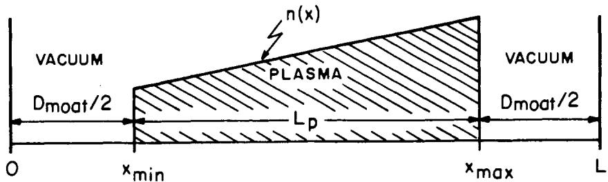  
Figure 6-6a Typical density profile set up by the particle loader in EM1BND.

Finally,to allow a possibly relativistic drift velocity and yet maintain particle velocities less than $c$ ， the drift velocity $\nu _ { \emptyset } \hat { x }$ is added relativistically to each particle velocity $\pmb { \nu }$ by [e.g.,Jackson,1975,eq. (11.33), p. 524]

$$
\nu _ { x } ^ { ' } = \frac { \nu _ { x } + \nu _ { 0 } } { 1 + \frac { \nu _ { x } \nu _ { 0 } } { c ^ { 2 } } } \quad \mathrm { a n d } \quad \nu _ { y } ^ { ' } = \frac { \sqrt { 1 - \nu _ { 0 } { } ^ { 2 } / c ^ { 2 } } } { 1 + \frac { \nu _ { x } \nu _ { 0 } } { c ^ { 2 } } } \nu _ { y }
$$

For relativistic temperatures,and isotropic velocity distributions,the relativistic Maxwellian distribution for $p \equiv \gamma | { \bf v } | / c$ is,in two dimensions $( p _ { x } , p _ { y } )$ ，

$$
f ( p ) = \frac { N _ { s } } { 2 \pi } \frac { m c ^ { 2 } } { T } \frac { 1 } { ( 1 + T / m c ^ { 2 } ) } \exp \Bigg [ - \frac { m c ^ { 2 } } { T } ( \gamma - 1 ) \Bigg ]
$$

where

$f$ is normalized by requiring that

$$
\int _ { 0 } ^ { 2 \pi } d \theta \int _ { 0 } ^ { \infty } f p ~ d p = N _ { s }
$$

The angle $\pmb \theta$ is defined by $p _ { x } = p \ \cos \theta$ and ${ p / } _ { y } = p$ sin θ. If we perform the integration of $f ( p )$ numerically over $\int _ { 0 } ^ { p } p \ d p$ and multiply by $\pi / 2$ we obtain

$$
{ \frac { \pi } { 2 } } \sum _ { n = 1 } ^ { \mathrm { I P } } ( n \Delta p ) \Delta p f ( n \Delta p ) = { } ^ { 1 / 4 } N _ { p } ( p \leqslant \mathrm { I P } \Delta p )
$$

which_is the number of particles in the first quadrant, $0 \leqslant \theta < \pi / 2$ with $p \leqslant \mathrm { I P } \Delta p$ ，and $N _ { p }$ is the total number of particles assigned to all quadrants up to the value of $\pmb { p }$ . Thus,every time running index IP reaches a value which increases this integral by 1 over its previous integer value, we assign to a particle the quantity $p = \mathbf { I P } \Delta p$ and also a random angle $\pmb \theta$ between O and $\pi / 2$ Actually, to ensure no drift or bias in $\nu _ { x }$ and $\nu _ { y }$ ， four particles are simultaneously loaded with the angles $\theta , \ \theta + \pi / 2 , \ \theta \dot { + } \pi$ ，and $\theta + 3 \pi / 2$ Particle velocities are then determined from

$$
\nu _ { x } = \frac { p \cos \theta } { \sqrt { 1 + p ^ { 2 } } } \qquad \nu _ { y } = \frac { p \sin \theta } { \sqrt { 1 + p ^ { 2 } } }
$$

The number of integration steps needed to load all $N _ { s }$ particles is set at a large number, $\mathtt { N S T E P S } = 1 0 0 0 0 0$ to ensure accuracy，and the maximum integrationandloadingrangeissetequalto $\mathbf { P M A X } =$ $4 { \sqrt { T / m c ^ { 2 } + 4 ( T / m c ^ { 2 } ) ^ { 2 } } }$ which gives $f \left( \mathbf { P } \mathbf { M } \mathbf { A } \mathbf { X } \right) / f \left( p = 0 \right) = \exp \left( - 8 \right)$ The integration step size is then determined by $\Delta p = { \tt P M A X } / { \tt N S T E P S }$

As the final particle loading step,correlations between $x$ and $\nu _ { x }$ or $\nu _ { y }$ are reduced by performing random pair exchanges of the particle positions. The density profile is left unchanged by this process.

The listing for EM1BND is available on request from C.K. Birdsall.

# PROBLEM

6-6a (i) Using a nonrelativistic Maxwellian,one dimensional distribution function,discuss graphically and semiquantitatively [use table of $\mathsf { e r f } ( \nu / \nu _ { t } ) ]$ the effect of having a finite total number of particles,say 100o and 4000,upon the population of the tail.Characterize velocity ranges by $\nu _ { t } , ~ 2 \nu _ { t } , ~ 3 \nu _ { t } , ~ 4 \nu _ { t } ,$ etc.(ii） Discuss the impact this may have upon wave-particle resonance (like Landau damping）and other physics.(ii） Compare/contrast to a relativistic Maxwellian in the limit $\nu _ { t } ^ { 2 } / \ c ^ { 2 }$ is appreciable (select a convenient value to keep arithmetic simple).(iv）(Optional） Suggest a relativistic quiet-start,weighted $q$ and $m$ scheme、to obtain a smoother Maxwellian tail.

# 6-7 EM1BND BOUNDARY CONDITIONS

The codes EMl and ES1 are classified as periodic because they treat all spatially varying quantities as though they were periodic with a repetition length equal $L$ of the system. Specifically,all field quantities $F ( x )$ whether electromagnetic or electrostatic, are constrained to satisfy $\boldsymbol { F } ( \boldsymbol { x } = L ) =$ $F ( x = 0 )$ . This implies that, whenever a left- or right-going electromagnetic field quantity reaches a boundary, its image must simultaneously appear at the opposite boundary. When applied to the electrostatic potential $\phi$ the above constraint implies that the spatial average of electrostatic field, $< E _ { x } > = - < \partial \phi / \partial x >$ ,must vanish; the constraint applied to $E _ { x }$ implies a charge neutral system. To remain consistently periodic, the codes must also require that whenever a particle exits the system at one boundary it must simultaneously re-enter the system at the opposite boundary with unaltered velocity; relative to the new boundary,the particle is positioned the distance it otherwise would have traveled outside the system during the time step.

The code EM1BND is classified as bounded because， in general, $F ( x = L ) \neq F ( x = 0 )$ . Once radiation. fields propagate outside the system, they do not return and are no longer considered. External radiation fields (e.g.,lasers） are allowed to enter the system and change their intensity before exiting. The system walls are transparent to radiation. The electrostatic field $E _ { x }$ is assumed to vanish at the boundaries and outside the system, in agreement with the charge neutrality constraint, $E _ { x } ( x ) = 0$ for $0 \geqslant$ $x \geqslant L$

We would still like to have the capability of solving for the electrostatic potential $\phi$ by Fourier transforming Poisson's equation, but this requires that the charge density $\pmb { \rho }$ at least appear to be periodic {i.e.， $\rho \left( x = L \right) =$ $\rho ( x = 0 ) ]$ . The only choice consistent with a nonperiodic charge-neutral

system is

$$
\rho ( x = L ) = 0 = \rho ( x = 0 )
$$

The particular solution $\phi _ { p }$ of the inhomogeneous equation

$$
\frac { \partial ^ { 2 } \phi } { \partial x ^ { 2 } } = - \rho \left( x \right)
$$

is then periodic. One must add to this the solution

$$
\phi = a + b x
$$

of the homogeneous equation

$$
\frac { \partial ^ { 2 } \phi } { \partial x ^ { 2 } } = 0
$$

with the constant $^ { b }$ determined by the boundary condition

$$
E _ { x } ( 0 ) = - \frac { \partial \phi } { \partial x } \Bigg | _ { 0 } = - \frac { \partial \phi _ { p } } { \partial x } \Bigg | _ { 0 } - b = - \frac { \partial \phi _ { p } } { \partial x } \Bigg | _ { L } - b = E _ { x } ( L ) = 0
$$

Usingatwo-cell centered-difference derivative and the periodicity $\phi _ { p } ( x + L ) = \phi _ { p } ( x )$ ，we have

$$
b = - \left. \frac { \partial \phi _ { p } } { \partial x } \right| _ { 0 } = \frac { \phi _ { p } ( - \Delta x ) - \phi _ { p } ( + \Delta x ) } { 2 \Delta x } = \frac { \phi _ { p } ( L - \Delta x ) - \phi _ { p } ( + \Delta x ) } { 2 \Delta x }
$$

$$
{ \begin{array} { r l r l } & { } & { \phi ( X _ { j } ) = \phi _ { p } ( X _ { j } ) + b X _ { j } } & { { \mathrm { ~ f o r ~ } } 0 \leqslant X _ { j } \leqslant L } \\ & { } & { E _ { x } ( X _ { j } ) = { \frac { \phi \left( X _ { j } - \Delta x \right) - \phi \left( X _ { j } + \Delta x \right) } { 2 \Delta x } } } & { { \mathrm { ~ f o r ~ } } \Delta x \leqslant X _ { j } \leqslant L - \Delta x } \end{array} }
$$

Finally， particles are prevented from approaching within one grid-space of the boundaries (assuming linear or CIC weighting) in order to ensure $\rho ( x = 0 ) = \rho ( x = L ) = 0$ The code EM1BND accomplishes this by placing elastically reflecting walls at positions $x = \Delta x$ and $x = L - \Delta x$ . Whenever a particle collides with the walls (Figure 6-7a) during a time step, its velocity vector is reversed in direction and it is repositioned from the wall the dis-tance it otherwise would have traveled into the wall.

# 6-8 EM1, EM1BND OUTPUT DIAGNOSTICS

As in ES1， the electromagnetic codes EM1 and EM1BND allw for the usual output plots of phase space, the various field quantities (electrostatic and electromagnetic) and sources as a function of position, and the time-history of the various energies. In addition, the codes plot the local tempera-ture as a function of position for each species and the mode energies of the Fourier-transformed electrostatic and right- and left-going electromagnetic fields.

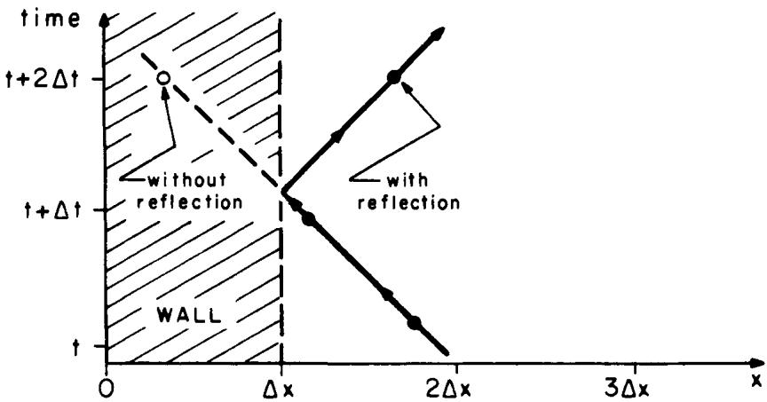  
Figure 6-7a Treatment of particles at left-hand boundary,by reflection,in EM1BND.

The local temperature is obtained by first finding the average or fluid oscillation velocity ${ \bf v } _ { \tt o s c } ( X _ { j } )$ at each grid point; this is the average of the velocities of all particles whose positions lie within half a grid space of the grid point $X _ { j }$ . The random or thermal velocities of these particles are then obtained by subtracting out the oscillation velocity relativistically [as done in 6-6(1） (where a drift was added)] and used to determine a relativistic kinetic energy for each particle. Averaging these energies over all the particles (within $\Delta x / 2$ of $X _ { j }$ ）gives a local thermal energy per particle which is assigned to grid point $X _ { j }$

The electrostatic mode energies are obtained from the spatially Fouriertransformed electrostatic potential $\phi ( k )$ which is already known from an intermediate step in the solution of Poisson's equation. The codes plot the time history of the energy in each mode separately.

As mentioned before, $\pm _ { F }$ is the usual right- and left-going electromagnetic fields only in the vacuum moat surrounding the plasma in EM1BND. The code EM1BND,therefore,saves ${ } ^ { + } F ( x = L )$ and ${ } ^ { - } F ( x = 0 )$ each time step and temporally Fourier analyzes the two resulting arrays over NF values of time: $t = 0$ to $t = \left( \mathbf { N F } - 1 \right) \Delta t$ ， $t = \Nu \mathsf { F } \Delta t$ to $t = \left( 2 \mathbf { N } \mathbf { F } - 1 \right) \Delta t$ ，etc. There are then $( \mathbf { N F } / 2 + 1 )$ frequency modes (including $\omega = 0 ,$ ）with the lowest nonzero or fundamental frequency, $\omega _ { 0 } = 2 \pi / \Gamma \Gamma \Delta t$ and the maximum frequency, $\omega _ { \mathrm { m a x } } = \pi / \Delta t$ . Since the frequency and wave number are related through the dispersion relation $\omega = c k$ (in vacuum),we also have a fundamental wave number $k _ { 0 } = 2 \pi / \mathrm { N F } \Delta x$ and a maximum wave number $k _ { \operatorname* { m a x } } = \pi / \Delta x$ . Thus, the diagnostic is capable of recognizing modes with a maximum wavelength $2 \pi / k _ { 0 } = \mathrm { N F } \Delta x$ which is greater than or less than the system length $L$ ，depending upon the ratio NF/NG. Our fast Fourier analysis requires that NF be a power of 2.

The complete list of output plots is as follows:

Phase Space $\nu _ { x }$ vs. x, vy vs. x, vy vs. $\nu _ { x }$   
Distribution Functions $f ( x ) \ \nu s . \ x , \ f ( \nu _ { x } ) \ \nu s . \ \nu _ { x } , \ f ( \nu _ { y } ) \ \nu s . \ \nu _ { y }$   
Electrostatic Fields $\phi$ vs. $x$ ， $E _ { x }$ vs. $x$   
Electromagnetic Fields $^ + F$ vs. $x$ ， $^ - F$ vs. $x$ ， $E _ { y }$ vs. x, $B _ { z }$ vs. $x$   
Sources $\pmb { \rho }$ vs. $x$ ， $J _ { y } ^ { + }$ vs. $x$   
Temperature (each species) $T _ { s }$ vs. $x$ ， $T _ { s }$ vs.t   
Field Energies $E _ { x }$ energy vs. t, $E _ { y }$ energy vs. $t$ ， $^ + F$ energy vs. t, $^ - F$ energy vs. t   
Mode Energies $E _ { x }$ mode energy vs. $t$ (each mode) $^ + F$ mode energy vs. mode number $^ - F$ mode energy vs. mode number   
Average Drift Momentum per Particle (each species) $P _ { x } ^ { s } \ \nu s . \ t , P _ { y } ^ { s }$ vs. t

# PROJECTS FOR EM1

Bruce I. Cohen

# 7-1 INTRODUCTION

The code EM1 makes no physical approximations in solving Maxwel's equations and the particle equations of motion; hence, only finite differencing considerations, one-dimensionality,and polarization limit usage. The two versions of the code, EM1 and EM1BND,invoke periodic and finite boundary conditions respectively. In the periodic code,all spatially varying quantities, i.e.， transverse-wave amplitudes, potential, charge density， etc., are made periodic. In the bounded code,particles are elastically reflected at the system edges,while the electromagnetic waves are absorbed and the longitudinal electric field is required to vanish.

The codes have been used successfully to study linear instabilities, such as the relativistic two-stream and weak beam-plasma,and stimulated Raman and Brillouin scattering. Linear and nonlinear wave propagation of electromagnetic waves in unmagnetized plasma has also been studied.

The bounded code is well suited to studying laser-plasma interactions, since transverse waves can be launched quite trivially at the system walls. In this way Raman and Brillouin backscatter instabilities and laser beat heating of plasma have been successfully studied by Cohen et al. (1975). The code has been especially useful in studying the anomalous absorption of electromagnetic radiation in the presence of kinetic phenomena,e.g.，nonlinear

Landau damping， particle trapping in large (resonantly or nonresonantly excited） beat waves (beat heating or induced scattering),and wave breaking. Use of this code has extended our insight and theory into resonant excitation of nonlinear normal modes (Cohen, 1975),and the role of trapping in beat heating (Cohen et al., 1975).

Simulation represents the primary means of understanding the trapping of particles in potential wells whose time-dependent variation is far outside the reach of linear perturbation theory.

To trouble-shoot the periodic code,one can monitor the total (field and kinetic） energy,which should be conserved. In the bounded code,one must include the Poynting flux at the system boundaries as well. Examining linear phenomena (e.g., linear dispersion relations for small-amplitude electromagnetic and electrostatic waves and/or instabilities, Landau or cyclotron damping rates） is encouraged as the best way to both check the code and gain confidence and experience in its use. We have verified that the code produces results in agreement with linear analytical theory for the propagation of transverse waves, electron plasma waves,and ion-acoustic waves in unmagnetized plasma, for linear Landau damping,for the growth rates of the electrostatic two-stream and weak beam-plasma instabilities and parametric Raman and Brillouin scattering,and for linear beat heating.

# 7-2 BEAT HEATING OF PLASMA

One application of EM1 by Cohen et al. (1975) is the heating of plasma by two lasers (of frequencies $\omega _ { \emptyset } \mathbf { \Pi } _ { \omega _ { 1 } } )$ whose beat frequency $( \Omega \equiv \omega _ { 0 } - \omega _ { 1 } )$ is near the plasma frequency $\omega _ { p }$ (Figure 7-2a). The nonlinear interaction may be considered as an induced decay $( \pmb { \omega } _ { 0 } \longrightarrow \pmb { \omega } _ { 1 } + \pmb { \Omega } )$ ,in which a fraction $\pmb R$ of the incident power at $\omega _ { 0 }$ is converted to $\omega _ { 1 }$ and $\pmb { \Omega }$ ，with the fraction $R \Omega / \omega _ { 0 }$ appearing as a longitudinal plasma oscilltion and, because of damp-ing,ultimately as heat. It is the aim of the theory and simulations to determine the dependence of this eficiency parameter $\pmb R$ on the parameters of the problem,such as laser intensity,density scale length,and temperature.

The process studied here involves three electron waves (two transverse and one longitudinal)，with no externally-imposed magnetic field,and is illustrative of the more general three-wave process, possbly involving ions, and in a magnetic field. Thus, the principle of electron heating，by the damping of a resonant excitation from the beat of two high-frequency waves, can be extended to the analogous heating of ions in a magnetically-confined plasma.

Two linearly-polarized transverse waves are oppositely incident on a finite,inhomogeneous,underdense plasma (Figure 7-2b). There can be a resonant interaction with a longitudinal normal mode of the plasma if the electrostatic disturbance,driven by the ponderomotive force at the beat frequency and wave number $\begin{array} { r } { { \Omega } \ll \omega _ { 0 } , \omega _ { 1 } ; \kappa \equiv k _ { 0 } - k _ { 1 } ) } \end{array}$ ，approximate the

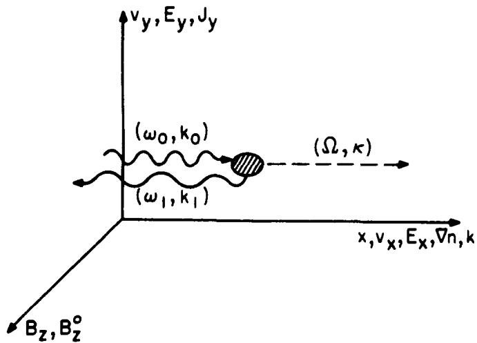  
Figure 7-2a Sketch of the variables in the problem. Wave propagation and density variation occur along $x$ .Transverse waves are linearly polarized,with $E$ in the $y$ direction. Magnetic fields are parallel to $z$ .The three-wave interaction is diagrammed. (From Cohen et al.,1975.)

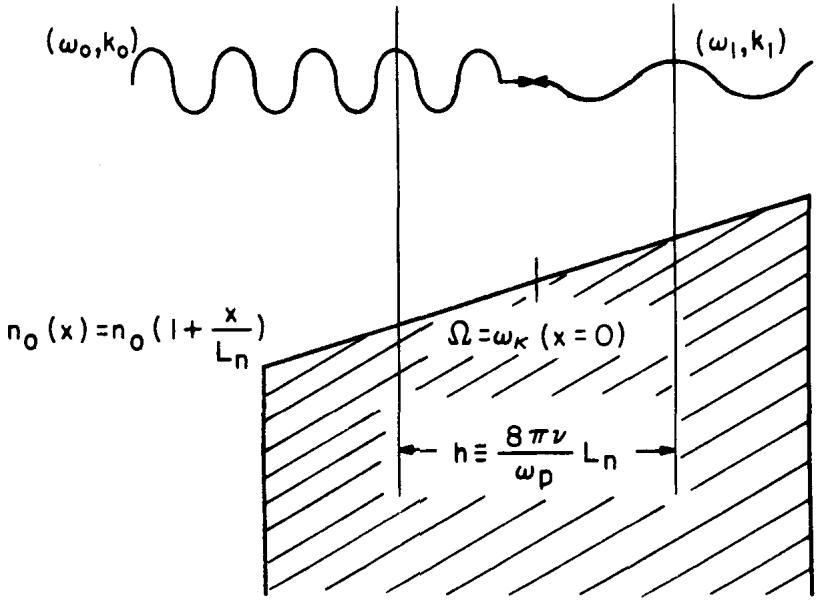  
Figure 7-2b Beat heating in an inhomogeneous medium. Because of the resonance condition, there is a region $\pmb { h }$ about the plane of exact resonance. The density gradient,described by the scalar length $L _ { n } \equiv \left[ d \left[ \ln \left( n \right) \right] \big / d x \right] ^ { - 1 }$ 、is parallel to the propagation direction of waves.(From Cohen et al.,1975.)

Bohm-Gross dispersion relation somewhere in the plasma. Because of the plasma inhomogeneity, the three-wave interaction is resonant only in a finite region around the position of exact matching，shown in Figure 7-2b. The dissipation of the electron plasma oscillation introduces irreversibility into the three-wave process,and is the mechanism for the eventual thermaliza-tion of part of the energy provided by the electromagnetic waves. The dissi-pation may be due to collisions,Landau damping,convective loss,or nonlinear mode-coupling processes.

The results, Figure 7-2c, show both the large amplitude electron plasma wave and beating. The initial thermal component of $\nu _ { x } / c$ was $v _ { t e } / c \approx 0 . 0 5$

The project is to simulate the excitation of a resonant three-wave interaction in a warm, homogeneous electron plasma with neutralizing background:

$$
\begin{array} { l } { \omega _ { 0 } = \omega _ { 1 } + \Omega } \\ { \qquad } \\ { \mathbf { k } _ { 0 } = \mathbf { k } _ { 1 } + \boldsymbol { \kappa } } \end{array}
$$

(a) Discuss, itemize, and specify the parameters needed to guarantee the desired physics; i.e.,conditions on △t, $\Delta x , \ N$ ，etc.,such that accurate simulation is made for the behavior of a plasma in which two high-frequency waves and one low-frequency wave are present. Assume initial constraints of $\mathrm { N } \leqslant 4 0 0 0 , \mathrm { N T } \leqslant 1 0 0 0 , \mathrm { N G } \leqslant 2 5 6$

(b) Assume Landau damping to be the only dissipation mechanism damping an electron plasma oscillation driven resonantly at $\omega _ { 0 } - \omega _ { 1 }$ Steady state is achieved after several inverse damping decrements $O ( 1 / \nu )$ .For two opposed light waves, suggest actual parameters for a simulation. Assume $\omega _ { p e } = 1$ ， $1 0 \geqslant ( \omega _ { 0 , } \omega _ { 1 } ) \geqslant 1$ ，and $0 . 0 1 \leqslant \nu \leqslant 0 . 1$ and determine values of $\Delta t$ ， $\Delta x$ ， $N$ ， $\lambda _ { D e }$ ， etc. Calculate all frequencies and wave numbers, specify a moat, and check mesh corrections to $\omega _ { p e }$

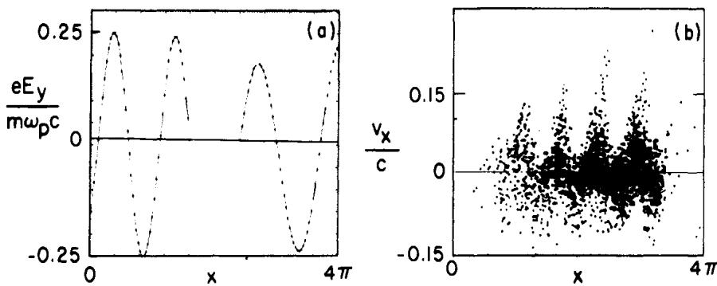  
Figure $7 - 2 c$ Beat heating in a finite,inhomogeneous medium. (a） The right- and left-going electromagnetic waves before onset of beating; (b) $( x , \nu _ { x } )$ phase space after a fairly large amplitude electron plasma wave has been established; $e / m = 1$ ， $\omega _ { p } = 1$ ， $c \approx 2$ (From Cohen et al., 1975.)

(c) (Optional） Let the plasma be inhomogeneous, $n = n _ { 0 } ( 1 + x / L _ { n _ { e } } )$ and $\omega _ { p e } \approx \omega _ { p e } ( 0 ) ( 1 + x / 2 L _ { n _ { e } } )$ . Assume that the longitudinal wave is resonantly-excited at $x = 0$ with finite damping,and off-resonant at $x \neq$ O; then a simple Lorentzian model gives a plasma response to the ponderomotive driving force with shape factor

$$
\left[ \left( \frac { \nu } { \Omega } \right) ^ { 2 } + \left( \frac { x } { 2 L _ { n _ { e } } } \right) ^ { 2 } \right] ^ { - 1 }
$$

Derive a criterion for an effective resonance length. Comment on how a particular choice of $k L _ { n _ { e } }$ might affect your choice of parameters in (a) and (b).

# 7-3 OBSERVATION OF PRECURSOR

This project is to examine a traveling electromagnetic wave at frequency $\omega _ { 0 }$ propagating from vacuum into an unmagnetized, underdense plasma, $\omega _ { p e } < \omega _ { 0 }$ (Figure 7-3a). It is known that a linearly-polarized transverse wave enters a finite-length, uniform plasma from the_left and propagates to the right with phase velocity $\omega _ { 0 } / k \stackrel { \cdot } { = } c / \sqrt { 1 - \omega _ { p e } ^ { 2 } / \omega _ { 0 } ^ { 2 } }$ and group velocity $k c ^ { 2 } / \bar { \omega _ { 0 } }$ once the main body of the wave train has arrived at the observer. However, one can observe precursors preceding the main body of the wave.

A simple model for describing precursors is given by Sommerfeld (1954, p. 118),who solved for the fields in the limit of small wave amplitude by Fourier-Laplace transforming the linear wave equation. In one dimension, this is

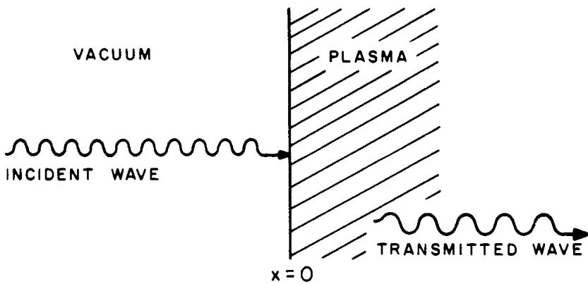  
Figure 7-3a Right-going normally-incident electromagnetic waves.

$$
f ( x , t ) = \frac { - \omega _ { 0 } } { 2 \pi } \int _ { - \infty + i \epsilon } ^ { \infty + i \epsilon } d \omega \frac { e ^ { i ( k x - \omega t ) } } { ( \omega ^ { 2 } - \omega _ { 0 } ^ { 2 } ) }
$$

where $k c = \sqrt { \omega _ { 0 } ^ { 2 } - \omega _ { p } ^ { 2 } }$ The branch points,cuts,and poles are diagrammed in Figure 7-3b(a). Closing the contour up, for $x > 0$ and $t > 0$ ，yields $f ( x , t ) = 0$ . If we close the contour down, for $x > 0$ and $t > 0$ ，and select the contour pictured in Figure 7-3b(b)， letting $R / \omega _ { 0 } \gg 1$ ，we obtain asymptotically

$$
f \left( x , t \right) \approx \left. \begin{array} { l r } { \frac { \omega _ { 0 } } { \omega _ { p } } 2 ^ { 1 / 2 } ( c t - x ) ^ { 1 / 2 } J _ { 1 } \left( \omega _ { p } \bigg [ \frac { 2 x } { c } \bigg ( t - \frac { x } { c } \bigg ) \bigg ] ^ { 1 / 2 } \right) } & { x \leqslant c t } \\ { 0 } & { x > c t } \end{array} \right.
$$

From the zeroes of the Bessel functions one can predict the nodal positions as well as the amplitude itself of the transverse electric or magnetic field as a function of time. Typical results are shown in Figure 7-3c.

A suitable parameter set for a simulation of the precursor using the bounded code might consist of: $\mathbf { N } 1 = 2 0 0 0$ ， $\mathbf { N T } = 4 0 0$ ， $\mathbf { N G } = 1 2 8$ ， $ { \mathbf { D } }  { \mathsf { T } } = 0 . 0 5$ ， ${ \tt K } 0 = 0 . 5$ ， $\scriptstyle { \mathrm { I R H O } } = 0$ ， $\mathbf { I R H O S } { = } 0$ ， $\mathrm { I P H I } { = } 0$ $\mathrm { I X V X } { = } 1 0$ ， $\mathbf { I V X V Y } { = } 1 0$ $\mathbf { I E X } = 5$ ， $\mathbf { I E Y } = 5$ ， $\mathbf { I B Z } = 5$ ， $\mathbf { I E Y L } = 2 0$ ， $\mathrm { I E Y R } = 2 0$ ， $\mathrm { I F T } { = } 1 0$ ， $\mathbf { W P M P R } = 9 . 7 5$ ， ${ \bf W } 1 = 7 . 9$ ， $\mathbf { E P M P R } { = } 0 . 1$ ， $\mathbf { M O A T } { = } 4 0$ ， $\mathrm { I T H E R M } = 2 5$ ；other parameters are set by default. Simulation results using these parameters agree quite favorably with Sommerfeld's asymptotic solution.

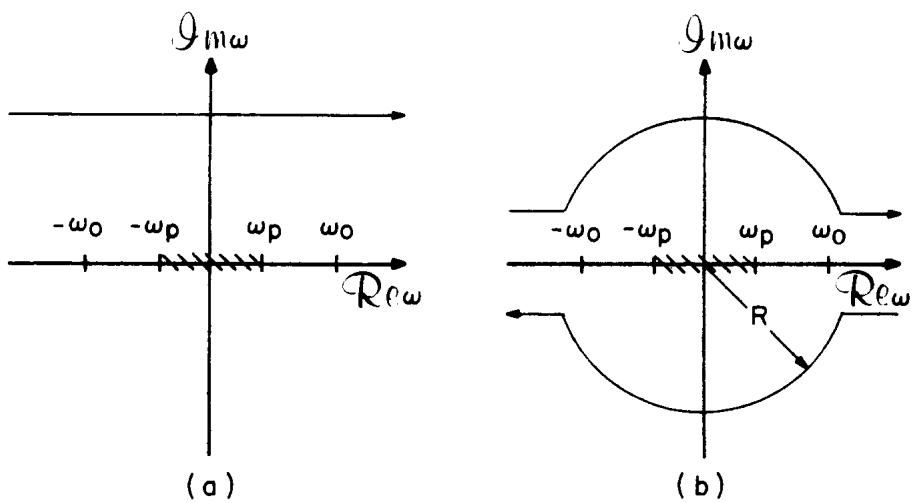  
Figure 7-3b (a) Topology of the poles,branch points and cut in the complex $\pmb { \omega }$ -plane; (b) Contour for derivation of asymptotic response.

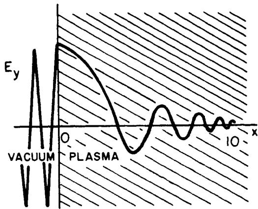  
Figure 7-3c Transverse electric field,showing precursor,at $x = t = 1 8$

THEORY

# PLASMA SIMULATION USING PARTICLES IN SPATIAL GRIDS WITH FINITE TIME STEPS

WARM PLASMA

Simulations generally produce useful results, that is,meaningful physics. Just how meaningful depends on understanding the approximations used in the physical modeling and appreciation of the additional effects incurred,wittingly or not, in the act of simulation, as given in this part.

We have already seen some of the relatively straightforward effects of using finite difference $\Delta t$ and $\pmb { \Delta x } )$ expressions in place of the true continuous partial differential equations. We saw that use of too large a time step leads to error and even to nonphysical instability. We saw that the spatial gridding could act as a filter,attenuating (smoothing） physical information. In fact, if you were adventurous in the projects in Part One,you probably found some strange results that were well beyond the expected inaccuracies.

# EFFECTS OF THE SPATIAL GRID

# 8-1 INTRODUCTION; EARLY USE OF GRIDS AND CELLS WITH PLASMAS

This chapter uses the works of Langdon (197Oa,b） and Langdon and Birdsall (197O)，plus complementary work from our unpublished Berkeley reports for 1968-1970. Let us begin with an introduction and historical review.

Computer simulation has become a powerful tool for the study of plasmas. Much effort and computer time is being expended in applications to new and more difficult problems. In support of this work,we have performed theoretical analyses for a common class of many-particle simulation methods. As one does to learn basic properties of real plasmas,we examine oscillations, fluctuations,and collisions in the idealized case of uniform and infinite or periodic plasma. Even in this simple situation there are several instances in which the models fail (mildly to grossly） to reproduce plasma behavior. This chapter and the next four contain the theory and discuss such nonphysical behavior caused by the finite-difference methods. The plasma interacts coherently with the periodicity of the spatial grid on which the electromagnetic fields are defined and with the periodicity of the finite-difference time integration. Various parametric instabilities are sometimes induced, which may be either weak or strong and may be difficult to distinguish from real instabilities. There is also high-frequency noise associated with the rate at which particles cross the spatial-grid cells. If the time step is large enough that the frequency of this noise exceeds the time sampling frequency,then this noise degrades normal fluctuations and collisions and can become exces-sive. The theory has helped others examine experimentally the nature of such nonphysical effects.

In early studies of simulation plasmas,the difference schemes for each step of the calculation were analyzed,but their overall performance taken together with plasma behavior was not treated carefully. We begin with a rigorous treatment of the spatial grid, giving here a formulation which includes most codes now in use. This is done in such a way that the role of each step in the calculation is easily identified in the results,and also the expressions for plasma properties are easily compared with the corresponding "real" plasma properties. Details are given for the electrostatic case. The formulation is applied to linear wave dispersion and instability,and to the question of energy conservation in Chapter 10. The effect of the spatial grid is to smooth the interaction force somewhat and to couple plasma perturba-tions to perturbations at other wavelengths,called aliases. The strength of the coupling depends on the smoothness of the interpolation methods used. Its importance depends roughly on how well the plasma would respond,in the absence of the grid, to wave numbers $k { \approx } 2 \pi / \Delta x$ e.g.，if the Debye length is too small the coupling can destabilize plasma oscillations even in a thermal plasma.

The plasma models we discuss originated at Stanford University in 1963. In order to make simulations in two dimensions economically practical, Buneman (in Yu et al.,1965) and Hockney (1965,1966) developed a model which uses a spatial grid in which the charge density is found from the particle positions,Poisson's equation is solved in finite-difference form,and then the particle forces are interpolated from the grid. This is much more effcient than summing $N ^ { 2 }$ Coulombinteractions among $N$ particles. They also realized that computational and physical problems associated with the divergent character of the Coulomb field are eliminated; the interactions at small separa-tions are smoothed, reducing the large-angle binary colisions which are of litle interest in hot plasmas and which had been exaggerated in simulation because of the small number of particles used (Hockney, 1966). Although simulation in one dimension was possible by other means,the new model offered simplicity and speed there,too (Dunn and Ho, 1963; Burger et al., 1965; Buneman and Dunn, 1966). Part of the gain was in the method of integrating the system forward in time. The algorithms were fast and preserved certain physical properties (Buneman, 1967). The advantages of the grid approach were not immediately recognized elsewhere，and much simulation was done for which the gridded model would have been more efficient.

Other people then developed versions of the gridded model with more accurate interpolation and different methods of solving Poisson's equation (Birdsall et al.,1968；Birdsall and Fuss,1968,1969；Morse and Nielson,1968, 1969;Boris and Roberts,1969； Alder et al.,1970). Capping these efforts were the large-scale simulations done at Los Alamos Scientific Laboratory of several problems in the controlled thermonuclear fusion research program in 1968. Since then, simulation by these methods has been widely accepted as a plasma research tool.

We are less interested in the accuracy of individual particle orbits and more in the accuracy of collective plasma phenomena. Therefore,our analytical approach, terminology,and criteria are more that of the plasma physicist than of the numerical analyst studying,say,an initial-value problem for a small system of differential equations with no particular application in mind. In several places the collective properties of warm plasmas play a crucial role.

The models obviously do not accurately reproduce the microscopic dynamics of a plasma. One must consider if and how such errors modify the macroscopic behavior. There are usually far too few particles. This causes discrete-particle effects such as exaggeration of fluctuations and collisions. There may also be too few particles for adequate representation in phase space of plasma phenomena such as the Landau damping wave-particle resonance. There can be serious problems with initial and boundary conditions. Roundoff errors can usually be made negligible compared to other errors. Such sources of error are difficult to assess in practice. Some study of their nonphysical effects was needed. Much of this has been done through experiments with the models (Birdsall et al.，1968; Hockney， 1968， 1970; Montgomery and Nielson,1970; Okuda,1970, 1972b).

In addition to empirical results,some theoretical analysis is desirable. This is true for the usual reasons that adding a good theory implies a better understanding than a stack of oscillograms or computer output alone. In Part Two,we develop a theoretical understanding of errors caused by the finite-difference representation in space and time of the field equations and particle dynamics. One hopes the theory also predicts unexpected interesting results that can be verified experimentally; we describe some results which we think are in this category.

There has been some approximate discussion of the models. Smoothing and noise aspects of the spatial grid were recognized early (e.g.， Hockney, 1966; Birdsall and Fuss, 1968,1969) and approximate theoretical descriptions made of each (Hockney, 1968; Langdon and Birdsall, 1970; Okuda and Bird-sall, 1970). The time integration was considered heuristically (Buneman, 1967).

However, regarding the space-time grid simply as a source of smoothing and of noise fails to uncover some very important effects involving coherent interaction between the plasma and the sampling in space and time. Some theory has appeared which includes exactly the effects of the finitedifferencing and is applied to linear wave dispersion and stability and to energy conservation (Lindman，1970; Langdon, 1970a，b). We have also looked at fluctuations and collisions (Langdon, 1979,chap.12). The theory is quite complete,and in about as tidy a form as is possible for such a system. Different parts of the simulation algorithms are easily identified and changes made. Where possible,we keep the results in a form permitting easy comparison with real plasma theory.

Although our techniques can be used for more general cases,we have confined our examples to models having only Coulomb interactions; in one instance an external magnetic field is imposed.

# 8-2 SPATIAL-GRID THEORY; INTRODUCTION

This chapter presents a mathematical framework with which one can apply conventional plasma theory to simulation plasma using a spatial grid on which charge and current densities,and electromagnetic fields,are defined. The use of fields is almost universal even in the electrostatic approximation with simple shapes, rather than summing the Coulomb interaction over all particle pairs (except in the one-dimensional sheet models,where the Coulomb force is a simple step function and the particles may be ordered). This chapter is directed toward understanding the physical properties of simulation plasma rather than to development of new algorithms for the codes.

In this chapter， we treat time as continuous to concentrate on the consequences of finite $\Delta x$ ，and defer finite $\Delta t$ to the next chapter. The condition for treating time as continuous is $\omega _ { \mathrm { m a x } } \Delta t < < 1$ ，with $\omega _ { \mathrm { m a x } }$ the largest frequency of concern when $\Delta t  0$ ，assuming the time integration is stable numerically. It is usually true that $\omega _ { p } \Delta \it t , \omega _ { c } \Delta t$ ，etc.,are small, but when $\lambda _ { D } / \Delta x$ is large, $( \mathbf { \Sigma } _ { \nu _ { t } } / \Delta x ) \Delta t = \mathbf { \Sigma } ( \omega _ { p } \Delta \mathbf { \dot { \theta } } ) ( \lambda \mathbf { \Sigma } _ { D } / \Delta x )$ may not be small. The theory to follow helps delineate this domain of validity.

The spatial grid is a simple example of a periodic spatial nonuniformity, and we begin with some remarks on the more general case of a plasma with nonuniform interaction. Then each step in the calculation of interactions through use of a spatial grid is studied with enough generality to include most codes. Next we consider momentum conservation. Then we relate Fourier transforms of densities,forces,and fields. Finally,the formalism is applied to linear waves and instabilities.

# 8-3 SOME GENERAL REMARKS ON THE EFFECTS OF A PERIODIC SPATIAL NONUNIFORMITY

In this section,we make some general remarks about a plasma system whose interaction force has a spatial nonuniformity which is periodic and time-dependent (e.g.,a Fermi gas in a crystal, some electron-beam devices). In Section 8-4,we specialize to the grid problem; this general section is not a prerequisite for the rest of this chapter.

Let us consider the interaction force $F ( x _ { 1 } , x _ { 2 } )$ ， defined as the force on a particle at $\boldsymbol { x } _ { 2 }$ due to a particle at $x _ { 1 }$ in one dimension. In a normal physical system，which is invariant under displacement, $F$ depends only on the separation $x \equiv x _ { 2 } - x _ { 1 }$ .However, in computer simulation using a spatial grid, invariance does not exist under all displacements (displacing particles but not the grid). Thus $F$ also depends on the location relative to the grid, $\overline { { x } } \equiv ^ { 1 } / _ { 2 } \left( x _ { 1 } + x _ { 2 } \right)$ as well as $x$ (Figure 8-3a). We have already seen some effects of the grid on the force in Section 4-8. In most simulations a grid with constant spacing $\Delta x$ is used; in this case the force $F ( { \overline { { x } } } - \mathbb { 1 } / 2 x , { \overline { { x } } } + \mathbb { 1 } / 2 x )$ ， considered as a function of displacement $\bar { x }$ with separation constant, is periodic with period $\Delta x$

In order to study the effect of the nonuniformity on a plasma, we need the Fourier transform of $F ( x _ { 1 } , x _ { 2 } )$ .For an infinite system we use a Fourier integral transform in $x$ and a Fourier series in $\bar { x }$ ；

$$
\begin{array} { c } { { F ( \overline { { { x } } } - { } ^ { 1 } / _ { 2 } x , \overline { { { x } } } + { } ^ { 1 } / _ { 2 } x ) = \displaystyle \int _ { - \infty } ^ { \infty } \displaystyle \frac { d k } { 2 \pi } e ^ { i k x } \sum _ { p = - \infty } ^ { \infty } e ^ { i p k _ { g } \overline { { { x } } } } F _ { p } ( k ) } } \\ { { k _ { g } \equiv \displaystyle \frac { 2 \pi } { \Delta x } } } \end{array}
$$

where

is the grid wave number,and

$$
F _ { p } ( k ) = \int _ { - \infty } ^ { \infty } d x F _ { p } ( x ) e ^ { - i k x }
$$

$$
F _ { p } ( x ) = \frac { 1 } { \Delta x } { \int _ { \Delta x } d \bar { x } } e ^ { - i p k _ { g } \overline { { x } } } F ( \overline { { x } } - { ^ { 1 } } / { _ { 2 } } x , \overline { { x } } + { ^ { 1 } } / { _ { 2 } } x )
$$

This sign and normalization for the Fourier integral are followed throughout.

Those properties of the plasma which are little affected by the lack of displacement invariance are expected to be similar to those of a plasma with two-particle force equal to the $p = 0$ or average force $F _ { 0 } ( x )$ ； such properties can be analyzed by the gridless theory (Langdon and Birdsall, 197O). The difference $\delta { \cal F } = { \cal F } - { \cal F } _ { 0 }$ is a nonphysical grid force. In some respects $\delta F$ is like a "noise" force; however, it is coherent with the plasma perturbation. More is said about this later.

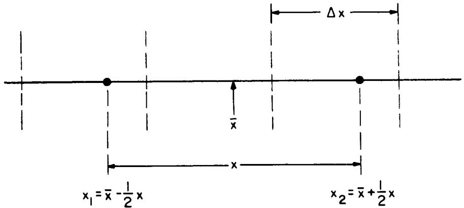  
Figure $8 - 3 a$ Notation in one dimension. Two particles are located at $x _ { 1 }$ and $x _ { 2 } ,$ with separation ${ \pmb x } = { \pmb x } _ { 2 } - { \pmb x } _ { 1 }$ and mean position $\overline { { x } } = \left( x _ { 2 } + x _ { 1 } \right) / 2$ A grid of spacing $\Delta x$ is imposed on the space.

Let the particle density be $n \left( x , t \right)$ (actually $\pmb { n }$ is a sum of δ functions when the number of particles is finite). Then the force $F ( x )$ on a particle at $\pmb { x }$ is (time dependence ignored for now),

$$
F ( x ) = \int d x ^ { \prime } F ( x ^ { \prime } , x ) n ( x ^ { \prime } )
$$

When transformed this becomes, using (1),

$$
F ( k ) = \sum _ { - \infty } ^ { \infty } F _ { p } ( k - \mathbb { \backslash } j _ { 2 } p k _ { g } ) n ( k _ { p } ) \mathrm { ~ } ^ { \mathrm { ~ . ~ } }
$$

where

$$
k _ { p } \equiv k - p k _ { g }
$$

We see that the effect of $\delta F$ (corresponding to the $p \neq 0$ terms） is to couple density perturbations and forces at wave numbers which differ by integral multiples of the grid wave number $k _ { g }$ . Such wave numbers are said to be aliases of one another (see Blackman and Tukey,1958).

As an illustration，we derive a dispersion relation for small-amplitude plasma oscillations. Linearizing the Vlasov equation and adding timedependence exp $( - i \omega t )$ to $\pmb { n }$ and $\pmb { F }$ ， we find the density response $n ( k , \omega )$ ,of an unmagnetized uniform plasma, to the force field $F ( k , \omega )$ to be

$$
n ( k , \omega ) \equiv F ( k , \omega ) \psi ( k , \omega )
$$

where

$$
\psi ( k , \omega ) = \frac { n _ { 0 } } { i m } \int d \nu \frac { f _ { 0 } ^ { \prime } } { \omega + i 0 - k \nu } \mathrm { I m } \omega \geqslant 0
$$

For $\operatorname { I m } \omega < 0$ ， this must be analytically continued from the upper half $\pmb { \omega }$ plane.Combining (5）and (8） yields

$$
n ( k , \omega ) = \psi ( k , \omega ) \sum _ { p } F _ { p } ( k - \mathbb { 1 } _ { 2 } p k _ { g } ) n ( k _ { p } , \omega )
$$

or, alternatively,

$$
F ( k , \omega ) = \sum _ { p } F _ { p } ( k - ^ { _ { \perp } } p k _ { g } ) F ( k _ { p } , \omega ) \psi ( k _ { p } , \omega )
$$

If one replaces $k$ by $k _ { q } \equiv k - q k _ { g }$ and $p$ by $p - q \ ( q = 0 , \pm 1 , \pm 2 , \ldots )$ ，each set of equations may be written in infinite matrix form:

$$
\begin{array} { r l r } & { } & { 0 = \displaystyle \sum _ { p } \bigl \{ \delta _ { q , p } - F _ { p - q } ( \mathsf { 1 } / _ { 2 } [ k _ { p } + k _ { q } ] ) \psi ( k _ { q } , \omega ) \bigr \} n ( k _ { p } , \omega ) } \\ & { } & { 0 = \displaystyle \sum _ { p } \bigl \{ \delta _ { q , p } - F _ { p - q } ( \mathsf { 1 } / _ { 2 } [ k _ { p } + k _ { q } ] ) \psi ( k _ { p } , \omega ) \bigr \} F ( k _ { p } , \omega ) } \end{array}
$$

where $\delta _ { q , p }$ is the Kronecker delta. We can now see several important features.

The possible free oscillations of the plasma are given by the zeros of the determinant of either matrix. The presence of off-diagonal terms,due to the coupling together of many wavelengths, shows that the normal coordinates (in the terminology of the small-oscillation problem in classical mechanics) for $\pmb { n }$ and $F$ are not the exponentials exp $\left( i k _ { p } x - i \omega t \right)$ , but are some (as yet unknown） linear combinations of such exponentials, so that $\pmb { n }$ or $\pmb { F }$ varies as exp $\left( i k x - i \omega t \right)$ times a periodic function of $\pmb { x }$ with period $\Delta x$ (Bloch function).Thus we have brought our problem into the classical form (see Brillouin, 1953).

f $| \boldsymbol { k } | < < | \boldsymbol { k } _ { g } |$ ， one may expect the $\pmb { p } = \pmb { q } = 0$ element to be much the largest in thematrix.Also,if $k _ { g }  _ { t } > > \omega _ { p }$ ie.，Debyelength $\lambda _ { D } = v _ { t } / \omega _ { p } > > \Delta x ,$ we expect $n ( k _ { p } , \omega )$ to be largest when $\pmb { p } = 0$ .Therefore wehaveanapproximatedispersionrelation ${ \epsilon _ { 0 } } = 0$ ，where $\epsilon _ { 0 } \equiv 1 - F _ { 0 } ( k ) \psi ( k , \omega )$ . This is exactly the same as we would get for a uniform plasma whose interaction force is $F _ { 0 } .$ The validity of this approximation is made clearer in Section 8-11 and following.

In Section 8-11, we show that the zeros of the determinant are the same in our application as the zeros of a much simpler series. In the next section, we begin the mathematical description specialized to plasma simulation.

# 8-4 NOTATION AND CONVENTIONS

Particle quantities are subscripted with particle name $i$ as

$$
x _ { i } , y _ { i } , F _ { i } = F ( x _ { i } , t )
$$

and also include number density of cloud centers, number densities of clouds, and cloud charge densities,

$$
n ( x , t ) , \quad \rho _ { c } ( x , t ) = q n _ { c } ( x , t )
$$

Grid quantities carry the grid point name $j$ ，where they are known, as

where

$$
\begin{array} { c } { { \rho _ { j } , \phi _ { j } , E _ { j } , X _ { j } } } \\ { { X _ { j } = j \Delta x } } \end{array}
$$

In a one-dimensional periodic system, of length $L = N _ { g } \Delta x$ ，particle functions satisfy $P ( x + L ) = P ( x )$ and grid functions satisfy $G _ { j + N _ { g } } = G _ { j }$ The Fourier transforms become sums of $\pmb { \delta }$ functions and the inverse transforms are therefore sums also. The coefficients of the δ functions are $2 \pi / L$ times what one obtains by integrating the transforms over only one period:

$$
P ( k ) = \int _ { 0 } ^ { L } d x P ( x ) e ^ { - i k x }
$$

$$
G ( k ) = \Delta x \sum _ { j = 0 } ^ { N - 1 } G _ { j } e ^ { - i k X _ { j } }
$$

with $k = \left( 2 \pi n \right) / L$ ， $n = 0 , \pm 1 , \pm 2 , . .$ .(Some expressions should be interpreted as generalized functions,as in Lighthill, l962. All results are wellbehaved for finite systems.） In terms of (5） and (6),the inverse transforms

$$
P ( x ) = { \frac { 1 } { L } } \sum _ { n = - \infty } ^ { \infty } P ( k ) e ^ { i k x }
$$

$$
G _ { j } = \frac { 1 } { L } \sum _ { n = 0 } ^ { N _ { g } - 1 } G ( k ) e ^ { i k X _ { j } }
$$

The first is of course the conventional Fourier series and the finite discrete Fourier transform. The expressions for $P ( k )$ and $G ( k )$ differ from the infinite case only in the limits and in that they are evaluated only for $k = \left( 2 \pi n \right) / L$ The $\pmb { k }$ integrals become sums according to the rule

$$
\begin{array} { c } { { \displaystyle { \int _ { - \infty } ^ { \infty } \frac { d k } { 2 \pi }  \frac { 1 } { L } \sum _ { n = - \infty } ^ { \infty } } } } \\ { { \displaystyle { \int _ { g } \frac { d k } { 2 \pi }  \frac { 1 } { L } \sum _ { n = 0 } ^ { N _ { g } - 1 } } } } \\ { { \displaystyle { \int _ { g } d k \equiv \int _ { - \infty } ^ { \infty } d k , \quad k _ { g } = \frac { 2 \pi } { \Delta x } } } } \end{array}
$$

where

# 8-5 PARTICLE TO GRID WEIGHTING; SHAPE FACTORS

The grid charge density $\pmb { \rho } _ { j }$ is obtained from the charges $\pmb { q } _ { i }$ located at positions $x _ { i }$ from

$$
\rho _ { j } \equiv \rho ( X _ { j } ) = \sum _ { i } q _ { i } S ( X _ { j } - x _ { i } )
$$

This can be interpreted as the charge density for finite-size particles,sampled on the grid through zero-, first-,or second-order interpolation (higher order is seldom used).

From $\rho _ { j }$ an electric field is found on the grid,usually the same grid. In electrostatic problems this is usually done by solving finite-difference forms of $\nabla ^ { 2 } \phi = - \stackrel { } { \rho }$ and $\mathbf { E } = - \nabla \phi$ ； there is nothing in the present analysis to require use of any particular form of smoothing or emphasis. We use particular forms only when we need numerical examples.

The force on the particle is interpolated from the grid electric field, as

$$
F _ { i } = q _ { i } \Delta x \sum _ { j } E _ { j } S ( X _ { j } - x _ { i } )
$$

using the same weighing function $\pmb { S }$ as in (1). Although using the same weight functions in (1） and (2） is not a necessary feature of this discussion, there are good reasons for doing so. Using different weight functions in (1) and (2） corresponds to using different cloud shapes,which can lead to a gravitation-like instability (Problem 4-6a). Also,if the difference equations relating $\pmb { \rho } _ { j }$ to $E _ { j }$ are symmetric in space， use of the same weight function eliminates the self-force and ensures conservation of momentum (see Section 8- 6). Various interpolating functions, with which we already are familiar as shape factors,are shown in Figure 8-5a. The "assignment function shape" of Hockney and Eastwood (1981, section 5-3-4) corresponds to our $s$ their "cloud shape" does not arise in our analysis.

S is designed so that charge on the grid is the same as the total particle charge,

$$
\Delta x \sum _ { j } \rho _ { j } = \sum _ { i } q _ { i }
$$

The statement about a particle at $\pmb { x }$ ,which follows from (3),

$$
\Delta x \sum _ { j } S ( X _ { j } - x ) = 1
$$

says that the contribution to the grid charge density $\pmb { \rho }$ is the same and correct no matter where the particle is.

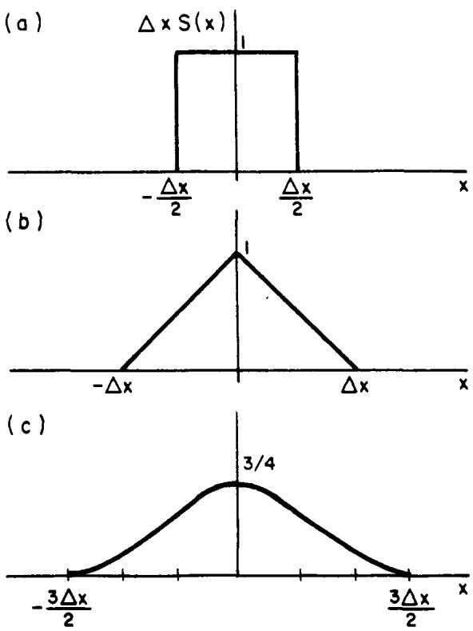  
Figure 8-5a Various interpolating functions for charge and force:(a） zero-order (NGP),(b) first-order (CIC,PIC),(c） second-order (parabolic or quadratic） spline,consisting of three parabolic sections of length $\Delta { \boldsymbol { x } } .$ , joined with no discontinuities in the slope; see Section 8-8.

The statement,in linear (CIC) and higher-order interpolation,

$$
\Delta x \sum _ { j } X _ { j } S ( X _ { j } - x ) = x
$$

says that the charge at $\pmb { x }$ makes the same,and correct, contribution to dipole moments independent of the particle location (Problem 8-5b).

Let us look at the force field $\pmb { F } ( \pmb { x } )$ for linear interpolation, as shown in Figure 8-5b. It varies as a set of straight line segments; the segments give rise to spatial harmonics of period $- \Delta x ;$ stated another way,the particles "feel" the grid. In Section 8-7, we evaluate the amplitude of the Fourier components of $F _ { i }$

# PROBLEMS

8-5a Show that (4) follows from (3).

8-5b Show that (5) is equivalent to

$$
\Delta x \sum \rho _ { j } X _ { j } = \sum q _ { i } x _ { i }
$$

i.e.,the dipole moment on the grid is the same as the dipole moment of the particles.

# 8-6 MOMENTUM CONSERVATION FOR THE OVERALL SYSTEM

As an application of the notation, not requiring inquiry into any particular weighting (so long as it is the same for charge and force),we look at the total momentum of the system $P$ . From Newton's equation of motion

$$
\frac { d P } { d t } = \sum _ { i } F _ { i }
$$

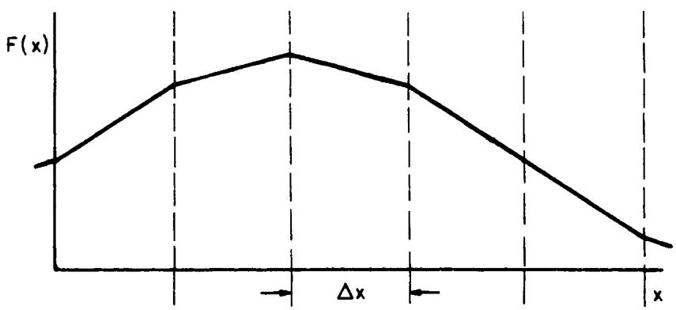  
Figure 8-5b Force field $F ( x )$ as a function of $x$ is a set of straight-line segments,from grid point to grid point,in linear weighting.

which is

$$
\frac { d P } { d t } = \sum _ { i } q _ { i } \Delta x \sum _ { j } E _ { j } S ( X _ { j } - x _ { i } )
$$

By changing the order of the sums, this becomes

$$
\frac { d P } { d t } = \Delta x \sum _ { j } E _ { j } \sum _ { i } q _ { i } S ( X _ { j } - x _ { i } )
$$

which is recognized to be

$$
\frac { d P } { d t } = \Delta x \sum _ { j } \rho _ { j } E _ { j }
$$

with no shape factor present. Hence, the question of momentum conservation, $d P / d t = 0$ , is reduced to the properties of the calculation of $E _ { j }$ from $\pmb { \rho } _ { j }$

In an infinite or periodic system, if the algorithms treat all grid points in the same way (a limited form of translation invariance） and has left-right symmetry (reflection invariance), then

$$
\Delta x \sum _ { j } \rho _ { j } E _ { j } = 0
$$

Hence,system momentum is conserved. On the other hand,in the presence of metal boundaries, $\Delta x \sum \rho _ { j } E _ { j } \neq 0$ and the plasma momentum is not conserved,as is correct physically.

# PROBLEM

8-6a Prove (5) under the stated conditions.

# 8-7 FOURIER TRANSFORMS FOR DEPENDENT VARIABLES;ALIASING DUE TO FINITE FOURIER SERIES

As we already know well, we find it most convenient to work in $k$ -space by Fourier transforming charge, potential, field,and force. For ease of comprehension, we repeat some definitions and earlier steps.

The transform pair for $\pmb { \rho }$ (and similarly for $\phi$ and $\pmb { { \cal E } }$ is

$$
\begin{array} { l } { { \displaystyle { \rho } ( k ) \equiv \Delta x { \sum _ { j } } \rho _ { j } e ^ { - i k X _ { j } } } } \\ { { \displaystyle { \rho _ { j } \equiv \sum _ { - \pi / \Delta x } ^ { \pi / \Delta x } \frac { d k } { 2 \pi } \rho ( k ) e ^ { i k X _ { j } } } } } \end{array}
$$

(infinite system, integration over the first Brillouin zone)

$$
 = \frac { 1 } { L } \sum _ { n = - N _ { g } / 2 } ^ { N _ { g } / 2 - 1 } \rho \left( k \right) e ^ { i k X _ { j } }
$$

Using these definitions, the common Poisson finite-difference form， in rationalized cgs (Heavyside-Lorentz） units (Panofsky and Phillips， 1962, p.461; Jackson,1975,pp.817-818) is

$$
\frac { \phi _ { j + 1 } - 2 \phi _ { j } + \phi _ { j - 1 } } { \Delta x ^ { 2 } } = - \rho _ { j }
$$

becomes

$$
K ^ { 2 } ( k ) \phi ( k ) = \rho ( k )
$$

with

$$
K ^ { 2 } ( k ) = { k ^ { 2 } } \mathrm { d i f ^ { 2 } } \left( { \frac { k \Delta x } { 2 } } \right)
$$

where we have introduced the diffraction function

$$
\operatorname { d i f } \theta \equiv { \frac { \sin \theta } { \theta } }
$$

(This is the same as the sinc $\pmb \theta$ function used by others.） The gradient finitedifference form

becomes

$$
\begin{array} { l } { { - \frac { \phi _ { j + 1 } - \phi _ { j - 1 } } { 2 \Delta x } = E _ { j } } } \\ { { \ } } \\ { { - i \kappa ( k ) \phi ( k ) = E ( k ) } } \\ { { \ } } \\ { { \kappa ( k ) = k \mathrm { d i f } \left( k \Delta x \right) } } \end{array}
$$

with

For the force, let us define

$$
F ( k ) \equiv \int _ { - \infty } ^ { \infty } d x F ( x ) e ^ { - i k x }
$$

and use $F ( x )$ from 8-5(2),so that

$$
F ( k ) = \intop _ { - \infty } ^ { \infty } d x \lbrack q \Delta x \sum _ { j } E _ { j } S ( X _ { j } - x ) \rbrack e ^ { i k ( X _ { j } - x ) } e ^ { - i k X _ { j } }
$$

Reversing the order of the integral and sum leads to

$$
F ( k ) = q [ \Delta x \sum _ { j } E _ { j } e ^ { - i k X _ { j } } ] \left[ \int d x \ S ( X _ { j } - x ) e ^ { i k ( X _ { j } - x ) } \right]
$$

which is simply [with $s ( - k )$ independent of $j \}$

$$
\begin{array} { r } { F ( k ) = q E ( k ) S ( - k ) } \end{array}
$$

Now the grid quantities have the basic period $\Delta x$ ；hence，the Fourier transforms of gridded quantities are periodic, as

$$
E ( k - p k _ { g } ) = E ( k )
$$

Therefore,from (14),we see that how much of $E ( k )$ at large $k$ ， $k \Delta x > \pi$ or $\lambda < 2 \Delta x$ gets back into $F ( k )$ depends on how fast $s ( k )$ vanishes as $k \Delta x \xrightarrow { } \infty$ . This is because the smoothness of $F ( x )$ depends on the smooth-ness and continuity of $s ( x )$ ，

For the charge density,we first define cloud density $\pmb { \rho } _ { c }$ as in Section 4-6,

$$
\rho _ { c } ( x ) \equiv q n _ { c } ( x ) \equiv q { \int } d x ^ { \prime } S ( x - x ^ { \prime } ) n ( x ^ { \prime } )
$$

where $n$ is the density of cloud centers,so that

$$
\pmb { \rho } _ { c } ( \pmb { k } ) = q S ( \pmb { k } ) n ( \pmb { k } )
$$

clearly showing the filtering action of the shape factors. The grid charge density $\pmb { \rho } _ { j }$ defined by 8-5(1),is

$$
\begin{array} { l } { { \displaystyle { \rho } _ { j } \equiv \rho _ { c } ( X _ { j } ) = \int _ { - \infty } ^ { \infty } \frac { d k } { 2 \pi } \rho _ { c } ( k ) e ^ { i k X _ { j } } } } \\ { { = \left. \displaystyle { \int _ { - \pi / \Delta x } ^ { \pi / \Delta x } \frac { d k } { 2 \pi } e ^ { i k X _ { j } } \Bigg [ \sum _ { p = - \infty } ^ { \infty } \rho _ { c } ( k _ { p } ) \Bigg ] } \right. } } \end{array}
$$

by going from integrating over all $k$ to integrating over one_period and summing $\pmb { \rho } _ { c }$ over all spatial harmonics. We recognize the term [ ]as $\rho ( k )$ ，

$$
\begin{array} { l } { \rho ^ { } ( k ) = \underset { ^ p } { \sum } \rho _ { c } ( k _ { p } ) } \\ { \quad = \underset { ^ p } { q \sum } S ( k _ { p } ) n ( k _ { p } ) } \end{array}
$$

It is here that the aliases become coupled through the grid. One can think of the infinite sum in this way: We are taking information defined on a continuum and trying to squeeze it into a discrete grid. The difficulty shows itself here in that different particle wavelengths (aliases） appear the same at the grid points.

The same phenomenon is familiar in the analysis of sampled time series. If one does not sample often enough,differing frequencies become indistinguishable. This can be improved by low-pass filtering the signal before sam-pling,and that is what one is doing here with a smooth S. In simulation models, the sampling effects are fed back into the system. Even a sinusoidal density perturbation produces forces with many wavelengths,which cause density perturbation at the new wavelengths,and all these perturbations act back on the original perturbations. The point to stress here is that density perturbations with $k \Delta x > \pi$ (beyond the fundamental Brillouin zone） contribute to $\rho ( k )$ for $k \Delta x < \pi$ . As with the force,how much depends on how fast $S ( k _ { p } )$ decays for large $k$ . The reason for the coupling back is that k's differing by multiples of $k _ { g }$ look the same if we look only at the grid points $X _ { j } .$

We have noted that grid quantities $\pmb { \rho }$ ， $\phi$ ， $\pmb { { \cal E } }$ are periodic，so that $\phi ( k ) = \phi ( k _ { p } )$ ，etc.,and can be pulled out of sums over $p$ . However， the normal modes for particle quantities ${ \pmb F }$ and $_ { n }$ are not sinusoidal, due to the alias coupling. The situation is like vibrations of atoms in a crystal rather than wave propagation in a continuum which has a periodic nonuniformity.

Where we use the fast Fourier transform to solve for the field,we can choose $\pmb { K }$ and $\pmb { \kappa }$ freely (over the fundamental period in $\pmb { k }$ space） to best achieve the desired physics,even though there may not be any reasonable corresponding finite-difference relation involving a small number of grid points (see Appendix E). For instance，one can get more interaction smoothing,corresponding to widening the cloud, by truncating the $\pmb { k }$ space here in some smooth manner (see Appendix B). This is computationally cheaper than using a complicated grid-particle interpolation involving many grid points. At least in one dimension, the most economical way to get a very smooth interaction without grid effects may be to use a fine mesh, low order weighting,and do the smoothing in $k$ space as just described. Note that $\pmb { { \cal E } }$ in the model corresponds more closely to $\pmb { F }$ rather than $\pmb { { \cal E } }$ in the gridless cloud system. Unfortunately，NGP,even with a fine mesh, produces more self-heating than higher-order weighting,more than may be tolerable.

# PROBLEMS

8-7a Show that 8-5(4) implies that

$$
\begin{array} { r l } { S ( k ) = 1 } & { { } { \mathrm { ~ f o r ~ } } k = 0 } \\ { = 0 } & { { } { \mathrm { ~ f o r ~ } } k = p k _ { g } ( i . e . , k \Delta x = 2 \pi p ) p \neq 0 } \end{array}
$$

and that 8-5(5) implies that

$$
S ^ { \prime } ( p k _ { g } ) = 0
$$

i.e.,the zeros of $S ( k )$ at $k = p k _ { g }$ are of order two for any interpolation which is at least linearly exact. We then expect $\pmb { S } ( \pmb { k } )$ to be smaller near multiples of $k _ { g }$ than when 8-5(5) is not true. Therefore $F ( k )$ contains weaker alias contributions for small $k$ ，so $F ( x )$ is smoother,as we would expect for linear as compared with NGP interpolation.

8-7b In order to make the filtering action of $s$ clearer,first sketch an arbitrary density of cloud centers $n ( x )$ ; then choose your favorite $s ( x )$ and obtain the cloud density $n _ { c } ( { \boldsymbol { x } } )$ from (16).

8-7c Instead of (8)，define $\pmb { \cal E }$ at half-integer positions, $\begin{array} { r } { X _ { j + \iota _ { h } } = ( \boldsymbol { j } + \iota _ { h } ) \Delta \boldsymbol { x } . } \end{array}$ say by $E _ { j + h } =$ $- ( \phi _ { j + 1 } - \phi _ { j } ) / \Delta x$ ．Show that (9） still holds,but the periodicity of $\pmb { \kappa }$ (and $\pmb { \cal E }$ ）isnow $\kappa ( \stackrel { . } { k } _ { p } ) =$ $( - 1 ) ^ { \flat } \kappa ( k )$ .Find the form of $\pmb { \kappa }$ explicitly. Does (14) change? The discussion of Section 8-6 no longer applies; Show that momentum conservation is in fact no longer perfect.

# 8-8 MORE ACCURATE ALGORITHM USING SPLINES FOR $\pmb { S } ( \pmb { x } )$

An "obvious" way to improve accuracy is to use higher-order Lagrange interpolation， say $s _ { L } ( x )$ .However， the second-order $\pmb { S } _ { L } ( \pmb { x } )$ isthen discontinuous and therefore unsuitable. The_third order $\pmb { S } _ { L } ( \pmb { x } )$ can be differentiated but yields a discontinuous force. Because of these discontinuities, $S _ { L } ( k )$ drops off slowly for large $k$ , implying large coupling to aliases.

If we arrange to have several continuous derivatives, then $\pmb { S }$ drops off more rapidly and has small coupling to aliases. This suggests the use of splines,which we now examine in the present formalism (Lewis et al.,1972; Buneman,1973; Langdon,1973; Brown et al.,1974; Denavit,1974; Lewis and Nielson, 1975).

Define $\pmb { S _ { m } } ( \pmb { x } )$ as_the convolution of the square nearest-grid-point (NGP) weighting function [Figure $8 . 5 a ( a ) ]$ with itself $m$ times.(For large $m$ ， $S _ { m }$ approaches a Gaussian in the sense of the central limit theorem; $S _ { m }$ is an analogue of the Gaussian for these systems.） Hence, $S _ { 1 }$ is the linear interpolation_case CIC [Figure $8 . 5 a ( 6 ) ]$ . The basis functions $S _ { m } ( X _ { j } - x )$ ,and therefore $F ( x )$ ,are piecewise polynomials of order $m$ as discussed in the caption of Figure 8-5a. Derivatives exist through to order $m$ ，which is discontinuous. Note also_that $S _ { m } ( x ) \geqslant 0$ ，which is not true for higher-order Lagrange interpolation. The relation to conventional spline interpolation is discussed in Langdon (1973,appendix D). See also Hockney and Eastwood (1981, section 5-3-2).

The transform is

$$
S _ { m } ( k ) = \left( \frac { \sin 1 / _ { 2 } k \Delta x } { 1 / _ { 2 } k \Delta x } \right) ^ { m + 1 } = \mathrm { d i f } ^ { m + 1 } \left( \frac { k \Delta x } { 2 } \right)
$$

in one dimension. For large $k , \ S _ { m } = O ( k ^ { - m - 1 } )$ . At non-zero multiples of $k _ { g } = 2 \pi / \Delta x , \ S _ { m } ( k )$ has a zero of order $m + 1$ ，and so is expected to be small nearby. This also true for Lagrange interpolation. However, for small $k , \ S ( k \pm k _ { g } )$ is about 5 times larger,and $S ( k \pm 2 k _ { g } )$ about 21 times larger, for second order Lagrange than for $\pmb { S } _ { 2 }$ [Figure $8 . 5 a ( c ) 1$ .Thus the spline reduces aliasing errors for long wavelengths yet takes the same amount of work to evaluate numerically. For small $k$ ， $S _ { m } ( k ) \approx 1 - \left( m + 1 \right) \left( k \Delta x \right) ^ { 2 } / 2 4 ,$ whereas $S - 1 = { \cal O } ( k ^ { m + 1 } )$ or $O ( k ^ { m + 2 } )$ for Lagrange interpolation. However this "error" in the spline can be compensated for by the Poisson algorithm,as noted earlier.

As an example, let us consider an algorithm for the quadratic spline (Qs) $\pmb { S } _ { 2 }$ in a one-dimensional periodic system [see Figure $8 . 5 a ( c ) ]$ . We have

$$
\begin{array} { r } { S _ { 2 } ( X _ { j } - x ) = \displaystyle \frac { 1 } { \Delta x } \bigg [ \frac { 3 } { 4 } - \left( \frac { x - X _ { j } } { \Delta x } \right) ^ { 2 } \bigg ] } \\ { S _ { 2 } ( X _ { j \pm 1 } - x ) = \displaystyle \frac { 1 } { 2 \Delta x } \bigg [ \frac { 1 } { 2 } \pm \frac { x - X _ { j } } { \Delta x } \bigg ] ^ { 2 } } \end{array}
$$

and

with,for both (2) and (3),

$$
\begin{array} { r } { | x - X _ { j } | \leqslant \frac { \Delta x } { 2 } } \end{array}
$$

# PROBLEM

8-8a Show that $s _ { 2 }$ and $\pmb { S } _ { 2 } ^ { \prime }$ from the above two equations are continuous at $x = \pm \Delta x / 2 + X _ { j } .$

# 8-9 GENERALIZATION TO TWO AND THREE DIMENSIONS

We now have a complete formulation of interactions in most onedimensional models that we generalize to two or three dimensions in this section.

The grid label $j$ becomes a vector $\mathbf { j } = ( j _ { x } , j _ { y } , j _ { z } )$ with integer components. The coordinate of grid point ${ \bf j }$ is,in a three-dimensional oblique grid (for instance,triangular meshes have also been used),

$$
\mathbf { X } _ { j } = \mathbf { j } \cdot \Delta \mathbf { x }
$$

where the rows of the tensor $\pmb { \Delta } \mathbf { x }$ are the basis vectors for the grid (see Brand,1957). This defines the edges of a grid cell whose volume is

$$
V _ { c } = \operatorname* { d e t } \pmb { \Delta x }
$$

In the usual rectangular grid, we have

$$
\pmb { \Delta } \mathbf { x } = \left[ \begin{array} { l l l } { \Delta x } & { 0 } & { 0 } \\ { 0 } & { \Delta y } & { 0 } \\ { 0 } & { 0 } & { \Delta z } \end{array} \right]
$$

The transform becomes,for example,

$$
\mathbf { E } ( \mathbf { k } ) = \ V _ { c } \sum _ { \mathbf { j } } \mathbf { E _ { j } } e ^ { - i \mathbf { k } \cdot \mathbf { X _ { j } } }
$$

For a point particle at $\mathbf { x }$ ，

$$
\mathbf { F } ( \mathbf { x } ) = q V _ { c } \sum _ { \mathrm { ~ j ~ } } S ( \mathbf { X _ { j } } - \mathbf { x } ) \mathbf { E _ { j } }
$$

$$
\rho _ { \mathrm { j } } = q V _ { c } S ( \mathbf { X _ { j } - \Delta x } )
$$

For finite-size particles, the transforms are

$$
\begin{array} { l } { \displaystyle \mathbf { F } ( \mathbf { k } ) = q S ( - \mathbf { k } ) \mathbf { E } ( \mathbf { k } ) } \\ { \displaystyle \rho ( \mathbf { k } ) = q \sum _ { \mathbf { p } } S ( \mathbf { k } _ { \mathbf { p } } ) n ( \mathbf { k } _ { \mathbf { p } } ) } \end{array}
$$

where

$$
\begin{array} { r l } & { \mathbf { k } _ { \mathbf { p } } = \mathbf { k } - \mathbf { p } \cdot \mathbf { k } _ { g } } \\ & { \mathbf { k } _ { g } = 2 \pi ( \Delta \mathbf { x } ^ { - 1 } ) ^ { \top } } \end{array}
$$

and $\pmb { \mathrm { p } }$ is a vector with integer components. The rows of tensor ${ \bf k } _ { g }$ are basis

vectors,reciprocal to those given by $\mathbf { \Delta } \mathbf { \triangleq } \mathbf { \Delta } \mathbf { \triangleq } \mathbf { \Delta } \mathbf { \triangleq } \mathbf { \Delta } \mathbf { \triangleq } \mathbf { \Delta } \mathbf { \triangleq } \mathbf { \Delta } \mathbf { \triangleq } \mathbf { \Delta } \mathbf { \ast } \mathbf { \Gamma } \mathbf { \triangleq } \mathbf { \Delta } \mathbf { \Xi } \mathbf { \ast } \mathbf { \Xi } \mathbf { \Xi } \mathbf { \Xi } \mathbf { \Xi } \mathbf { \Xi } \mathbf { \Xi } \mathbf { \Xi } \mathbf { \Xi } \mathbf { \Xi } \mathbf { \Xi } \mathbf { \Xi } \mathbf { \Xi } \mathbf { \Xi } \mathbf { \Xi } \mathbf { \Xi } \mathbf { \Xi } \mathbf { \Xi } \mathbf { \Xi } \mathbf { \Xi } \mathbf { \Xi } \mathbf { \Xi } \mathbf { \Xi } \mathbf { \Xi } \mathbf { \Xi } \mathbf \Xi \Psi \Xi \mathbf { } \Psi \Xi \mathbf { \Xi } \mathbf \Xi \Psi \Psi \Psi \Psi \Psi \Psi \Psi \Psi \mathbf { } \Psi \Psi \Psi \Psi \Psi \Psi \Psi \Psi \Psi \Psi \Psi \Psi \Psi \Psi \Psi \Psi \Psi \Psi \Psi \Psi \Psi \Psi \Psi \Psi \Psi \Psi \Psi \Psi \Psi \Psi \Psi \Psi \Psi \Psi \Psi \Psi \Psi \Psi \Psi \Psi \Psi \Psi \Psi \Psi \Psi \Psi \Psi \Psi \Psi \Psi \Psi \Psi \Psi \Psi \Psi \Psi \Psi \Psi \Psi \Psi \Psi \Psi \Psi \Psi \Psi \Psi \Psi \Psi \Psi \Psi \Psi \Psi \Psi \Psi \Psi \Psi \Psi \Psi \Psi \Psi \Psi \Psi \Psi \Psi \Psi \Psi \Psi \Psi \Psi \Psi \Psi \Psi \Psi \Psi \Psi \Psi \Psi \Psi \Psi \Psi \Psi \Psi \Psi \Psi \Psi \Psi \Psi \Psi \Psi \Psi \Psi \Psi \Psi \Psi \Psi \Psi \Psi \Psi \Psi \Psi \Psi \Psi \Psi \Psi \Psi \Psi \Psi \Psi \Psi \Psi \Psi \Psi \Psi \Psi \Psi \Psi \Psi \Psi \Psi \Psi \Psi \Psi \Psi \Psi \Psi \Psi \Psi \Psi \Psi \Psi \Psi \Psi \Psi \Psi \Psi \Psi \Psi \Psi \Psi \Psi \Psi \Psi \Psi \Psi \Psi \Psi \Psi \Psi \Psi \Psi \Psi \Psi \Psi \Psi \Psi \Psi \Psi \Psi \Psi \Psi \Psi \Psi \Psi \Psi \Psi \Psi \Psi \Psi \Psi \Psi \Psi \Psi \Psi \Psi \Psi \Psi \Psi \Psi \Psi \Psi \Psi \Psi \Psi \Psi \Psi \Psi \Psi \Psi \Psi \Psi \Psi \Psi \Psi \Psi \Psi \Psi $ times $2 \pi$ . They define the periodicity of transforms of grid quantities, since

$$
\operatorname { e x p } \left( i \mathbf { k } _ { p } \cdot \mathbf { X } _ { j } \right) = \operatorname { e x p } \left( i \mathbf { k } \cdot \mathbf { X } _ { j } - 2 \pi i \mathbf { p } \cdot \mathbf { j } \right) = \exp \left( i \mathbf { k } \cdot \mathbf { X } _ { j } \right)
$$

For a rectangular grid

$$
{ \bf k } _ { g } = 2 \pi \left[ \begin{array} { c c c } { { \Delta x ^ { - 1 } } } & { { 0 } } & { { 0 } } \\ { { 0 } } & { { \Delta y ^ { - 1 } } } & { { 0 } } \\ { { 0 } } & { { 0 } } & { { \Delta z ^ { - 1 } } } \end{array} \right]
$$

The integral in the inverse transform is taken over one period in $\mathbf { k }$ space.

$$
\mathbf { E } _ { j } = \int _ { g } { \frac { d \mathbf { k } } { ( 2 \pi ) ^ { 3 } } } \mathbf { E } ( \mathbf { k } ) e ^ { i \mathbf { k } \cdot \mathbf { X } _ { j } }
$$

The forms taken in one,two,or three dimensions are simply seen if one remembers that $d \mathbf { k } / \left( 2 \pi \right) ^ { 3 } \mathbf { \longrightarrow } ~ d \mathbf { k } / \left( 2 \pi \right) ^ { d } .$ where $d$ is the dimensionality. The relations between transformed grid quantities are

$$
\begin{array} { l } { { \displaystyle \rho ^ { \left( \right)} { \bf k }  = K ^ { 2 } ( { \bf k } ) \phi ( { \bf k } ) } } \\ { { \displaystyle { \bf E } ( { \bf k } ) = - i \kappa ( { \bf k } ) \phi ( { \bf k } ) } } \end{array}
$$

Quantities $\phi _ { \mathrm { ~ b ~ } } \mathbf { E } _ { \mathrm { { j } } }$ and $\pmb { \rho } _ { \mathbf { j } }$ are defined only on the grid,while $n ( \mathbf { x } )$ and $\pmb { \mathbb { F } } ( \mathbf { x } )$ are defined on a continuum of particle positions.

For a spline of order $m$ in all three coordinates,the shape becomes, in a three-dimensional rectangular grid,

$$
S _ { m } ( \mathbf { k } ) = \left\{ \mathrm { d i f } \left( \mathrm { I } _ { 2 } k _ { x } \Delta x \right) \mathrm { d i f } \left( \mathrm { I } _ { 2 } k _ { y } \Delta y \right) \mathrm { d i f } \left( \mathrm { I } _ { 2 } k _ { z } \Delta z \right) \right\} ^ { m + 1 }
$$

This includes NGP（ $m = 0 )$ ）and CIC-PIC (linear, $m = 1 \AA$ .The field finitedifference equations,in their simplest generalization,yield

$$
\begin{array} { c } { { K ^ { 2 } = k _ { x } ^ { 2 } \mathrm { d i f } ^ { 2 } { } ^ { 1 } / \lambda _ { x } \Delta x + k _ { y } ^ { 2 } \mathrm { d i f } ^ { 2 } { } ^ { 1 } / \lambda _ { y } \Delta y + k _ { z } ^ { 2 } \mathrm { d i f } ^ { 2 } { } ^ { 1 } / \lambda _ { z } \Delta z } } \\ { { \kappa _ { x } = k _ { x } \mathrm { d i f } k _ { x } \Delta x , \quad \mathrm { e t c . } } } \end{array}
$$

and

# PROBLEM

${ \pmb 8 - 9 a }$ Write out the shape factor $\pmb { S } ( \mathbf { k } )$ for linear weighting CIC for both two- and threedimensional rectangular grids.

# 8-10 LINEAR WAVE DISPERSION

If we use 8-7(14) in 8-3(9),we find for each row the same result,

$$
\epsilon ( k , \omega ) q S ( - k ) E ( k ) = 0
$$

so that $\epsilon = 0$ is the dispersion relation,where

$$
\epsilon ( k , \omega ) = 1 - S ^ { - 1 } ( - k ) \sum _ { p } F _ { p } ( k - ! / _ { 2 } p k _ { g } ) S ( - k _ { p } ) \psi ( k _ { p } , \omega )
$$

The solutions $\omega ( k )$ are (multivalued） periodic functions of $\pmb { k }$ Equation (2) can be rewritten, using $K ^ { 2 }$ and $\pmb { \kappa }$ as

$$
\epsilon ( k , \omega ) = 1 + \frac { i q ^ { 2 } } { K ^ { 2 } } \underset { p } { \sum } \kappa | S ( k _ { p } ) | ^ { 2 } \psi ( k _ { p } , \omega ) , \kappa = \kappa ( k _ { p } )
$$

where $n \left( k , \omega \right) = \psi \left( k , \omega \right) \mathbf { F } \left( k , \omega \right)$ .(This reduction suggests that the same result may be obtained more directly; this is done in the next section.） The only approximation is that the linearized plasma response is used; no approx-imation is made about the smallness of the grid effects. The function ${ \bf \Pi } \in \left( k , \omega \right)$ ， for grid quantities, plays the usual role of dielectric function in kinetic theory results on fluctuations and colisions; see Chapter 12.

The normal modes are given by a scalar equation $\epsilon = 0$ rather than an infinite determinant because the aliases are equivalent for grid quantities. The normal modes are sinusoidal in space for grid quantities $( \rho , \phi , E )$ ， though not for particle quantities $( F , n )$ due to the alias coupling.

# 8-11 APPLICATION TO COLD DRIFTING PLASMA: OSCILLATION FREQUENCIES

An easy-to-follow model with simple applications is one-dimensional with a beam of particles of velocity $\nu _ { 0 }$ drifting through a background of immobile neutralizing particles. We assume that there are enough particles per cell so that the fluid equations of continuity and motion are valid; these produce the perturbed density from the force,as lsee 5-3(12)],

$$
n _ { 1 } ( k , \omega ) = \frac { n _ { 0 } } { m } \frac { i k F ( k , \omega ) } { ( \omega - k \nu _ { 0 } ) ^ { 2 } }
$$

Inserting this into 8-7(21） produces

$$
\rho ( k , \omega ) = \left( \frac { n _ { 0 } q } { m } \right) \sum _ { p } \frac { i k _ { p } S ( k _ { p } ) F ( k _ { p } , \omega ) } { ( \omega - k _ { p } \nu _ { 0 } ) ^ { 2 } }
$$

Using 8-7(9) and 8-7(14) produces

$$
F ( k _ { p } , \omega ) = - \mathrm { \it ~ i q } S ( - k _ { p } ) \kappa ( k _ { p } ) \phi ( k _ { p } , \omega )
$$

Inserting $\pmb { F }$ into (2) leaves

$$
\rho ( k , \omega ) = \left( \frac { n _ { 0 } q ^ { 2 } } { m } \right) \sum _ { p } \frac { k _ { p } \kappa ( k _ { p } ) S ( k _ { p } ) S ( - k _ { p } ) } { ( \omega - k _ { p } \nu _ { 0 } ) ^ { 2 } } \phi ( k _ { p } , \omega )
$$

[We do not use $\kappa ( k _ { p } ) = \kappa ( k )$ ， as we wish to be free in choosing algorithms; as in Problem 8-7c,and Chapter 10 in which, for energy conserving programs, $\kappa ( k _ { p } )$ becomes $k _ { p }$ ] We take advantage of the periodicity of grid

quantities by using

$$
\phi ( k _ { p } , \omega ) = \phi ( k , \omega )
$$

to remove $\phi$ from the sum. Also

$$
S ( k _ { p } ) S ( - k _ { p } ) = | S ( k _ { p } ) | ^ { 2 } = S ^ { 2 } ( k _ { p } )
$$

as $s ( x )$ is real and even. The last step is to use Poisson's equation 8-7(5) to relate $\pmb { \phi }$ and $\pmb { \rho }$ . We obtain the dispersion equation,

$$
1 - \frac { \omega _ { p } ^ { 2 } } { K ^ { 2 } ( k ) } \underset { p } { \sum } \frac { k _ { p } \kappa \left( k _ { p } \right) S ^ { 2 } ( k _ { p } ) } { \left( \omega - k _ { p } \nu _ { 0 } \right) ^ { 2 } } = \epsilon \left( k , \omega \right) = 0
$$

where $\omega _ { p } ^ { 2 } { = } n _ { 0 } q ^ { 2 } / \ m$

First, consider no drift, $\nu _ { 0 } = 0$ .Then the dispersion relation is simply

$$
\omega ^ { 2 } = \omega _ { p } ^ { 2 } \Bigg [ \frac { 1 } { K ^ { 2 } ( k ) } \sum _ { p } k _ { p } \kappa ( k _ { p } ) S ^ { 2 } ( k _ { p } ) \Bigg ]
$$

The[ 】 contains the modifications to Langmuir oscillations due to the imposition of the spatial grid. The sum on $p$ converges fairly rapidly,and allows use of only, say, $p { = } 0 , \pm 1 , \pm 2$ to obtain fairly trustworthy results in the fundamental Brillouin zone, $| k \Delta x | < \pi$

Or, the sum can sometimes be done analytically exactly,once $\textstyle K , \kappa ,$ and $\pmb { S }$ are specified. For example, if we use the momentum-conserving algorithm, meaning force is an interpolation of the differenced potential, then $\pmb { \kappa }$ is given by 8-7(i0),and using linear interpolation (CIC),

$$
S ( k ) = \mathrm { d i f ^ { 2 } } \left| ! / _ { 2 } k \Delta x \right|
$$

the sum becomes

$$
\begin{array} { r l r } {  { \sum _ { p } k _ { p } \kappa ( k _ { p } ) S ^ { 2 } ( k _ { p } ) = \sum _ { p } k _ { p } ^ { 2 } \mathrm { d i f } ( k _ { p } \Delta x ) \mathrm { d i f } ^ { 4 } ( | \gamma _ { 2 } k _ { p } \Delta x ) } } \\ & { } & { = \frac { 2 ^ { 4 } \sin ( k \Delta x ) \sin ^ { 4 } ( 1 / _ { 2 } k \Delta x ) } { ( \Delta x ) ^ { 5 } } \sum _ { p } k _ { p } ^ { - 3 } } \end{array}
$$

Now we use the identity (Abramowitz and Stegun, 1964,eq. 4.3.92, p. 75)

$$
\sum _ { p } ( k - p k _ { g } ) ^ { - 2 } = \left[ \frac { 2 } { \Delta x } \sin 1 / _ { 2 } k \Delta x \right] ^ { - 2 }
$$

which,when differentiated with respect to $k$ ，gives

$$
\sum _ { p } ( k - p k _ { g } ) ^ { - 3 } = \left[ \frac { 2 } { \Delta x } \sin ^ { 1 / 2 } k \Delta x \right] ^ { - 3 } { \cos ^ { 1 / 2 } k \Delta x }
$$

Using the common three-point algorithm for Poisson's equation 8-7(4) completes the work. The result is simply

$$
\omega ^ { 2 } = \omega _ { p } ^ { 2 } \cos ^ { 2 } \lvert _ { 2 } k \Delta x , \quad \omega = \pm \omega _ { p } \cos ^ { 1 } / _ { 2 } k \Delta x
$$

Note that this exact result is not the same as the approximate result obtained by keeping just the $\pmb { p = 0 }$ term corresponding to $\epsilon _ { 0 } = 0$ in Section 8-3 and as used in Chapter 4,where we ignored the spatial harmonics (aliases)； using just $\pmb { p = 0 }$ , the approximate result is

$$
\begin{array} { r } { \omega ^ { 2 } \approx \omega _ { p } ^ { 2 } \cos ^ { 2 } \nu \Delta x \left[ \frac { \tan 1 / 2 k \Delta x } { \nu _ { L } k \Delta x } \frac { \sin ^ { 2 } 1 / 2 k \Delta x } { ( 1 / 2 k \Delta x ) ^ { 2 } } \right] } \end{array}
$$

with error of less than 3 percent for $k \Delta x < \pi / 2$ ，relative to (14).

On the other hand,if we use the energy-conserving algorithm (yet to come in Chapter 1O),then we can show that $\kappa ( k _ { p } ) = k _ { p }$ ,and the result is simply no dispersion,

$$
\omega ^ { 2 } = \omega _ { p } ^ { 2 } , \quad \quad \omega = \pm \omega _ { p }
$$

independent of $k$ ,as in Langmuir oscillations of a cold plasma. The error in using only $\pmb { p = 0 }$ terms here is much larger, as this approximation gives

$$
\omega ^ { 2 } \approx \omega _ { p } ^ { 2 } \left[ \frac { \sin { \gamma _ { 2 } k \Delta x } } { 1 / _ { 2 } k \Delta x } \right] ^ { 2 }
$$

If the accuracy of dispersion,here for cold-plasma oscilltions,were of prime importance, then we might modify the Poisson algorithm to compen-sate for the error in the momentum-conserving algorithm, or use an energyconserving algorithm. However,we find in Sec.8-13 that for a warm plasma keeping only $\pmb { p = 0 }$ is often a very good approximation, and both types of algorithm benefit by compensation,as discussed in Appendix B.

# PROBLEM

8-11a For momentum-conserving codes,use spline weighting of order $m$ with $S _ { m } ( k )$ given by   
8-8(1). For $\nu _ { 0 } = 0$ ,show that (8） becomes

$$
\omega ^ { 2 } = \omega _ { p } ^ { 2 } \frac { 1 } { K ^ { 2 } ( k ) } \frac { \sin k \Delta x \sin ^ { 2 m + 2 } \left( \vert / _ { 2 } k \Delta x \right) 2 ^ { 2 m + 2 } } { \Delta x ^ { 3 + 2 m } } \underset { p } { \sum } k _ { p } ^ { - ( 1 + 2 m ) }
$$

Then, with $K ^ { 2 }$ given by 8-7(8),show that

$$
\begin{array} { r l } & { m = 0 , \mathrm { N G P } , \quad \omega ^ { 2 } = \omega _ { p } ^ { 2 } \cos ^ { 2 } ! / _ { 2 } k \Delta x } \\ & { m = 1 , \mathrm { C I C } , \quad \omega ^ { 2 } = \omega _ { p } ^ { 2 } \cos ^ { 2 } ! / _ { 2 } k \Delta x } \\ & { m = 2 , \mathrm { Q S } , \quad \omega ^ { 2 } = \omega _ { p } ^ { 2 } \cos ^ { 2 } ! / _ { 2 } k \Delta x \frac { 1 } { 3 } [ 2 + \cos ^ { 2 } ! / _ { 2 } k \Delta x ] } \end{array}
$$

# 8-12 COLD BEAM NONPHYSICAL INSTABILITY

We now look at a cold (single-velocity） electron beam in a fixed ion background, moving relative to the grid. Physically, this model should be stable.The dispersion relation is 8-11(7). For any fixed $k$ ，the dispersion relation has a structure similar to that for many beams. One difference is that the effective plasma frequency squared for half of the "beams" is negative. The particles all react strongly when the Doppler-shifted frequency, $\omega - k \nu _ { 0 } ,$ is near a harmonic of the grid-crossing frequency $k _ { g } \nu _ { 0 }$ that is, near the resonances defined by

$$
\omega - k \nu _ { 0 } + p k _ { g } \nu _ { 0 } = 0
$$

One can show that there are two roots corresponding to each alias trm in the dispersion relation 8-11(7). The roots are either real or occur in conjugate pairs.

In Figure 8-12a,we sketch $\pmb \ 6$ for small $\pmb { k } \pmb { \Delta x }$ One easily sees the pairs of real roots associated with $p = 0 ( \omega - k \nu _ { 0 } = \pm \omega _ { p } )$ ， $p = 1$ ，and $p \leqslant - 2$ For each of the other resonances there is a pair of complex roots,one unstable. For larger $| p |$ ， the modes are highly resonant and therefore hard to excite and also easily destroyed by any dissipation or spread in resonance,e.g.，if $\left| \omega - k \nu _ { 0 } \right| < \ \left| \ k _ { p } \nu _ { t } \right|$

For each $p$ term, for real $k$ ，there are two roots in $\pmb { \omega }$ ， either both real or complex conjugates. For very small $k \Delta x , \ S ^ { 2 } < < 1$ for $p \neq 0$ (higher zones); for $\pmb { p = 0 }$ ，the_small $\pmb { k } \pmb { \Delta x }$ roots are $\omega \approx \pm \omega _ { p }$ for $p \neq 0$ ， keeping the $\pmb { p = 0 }$ term {calling $\{ k \kappa ( k ) S ^ { 2 } / K ^ { 2 } ( k ) ] \approx 1 \}$ and one $p \neq 0$ term,the solution near the resonance is

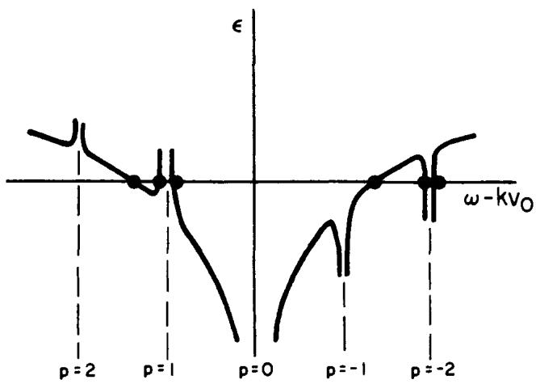  
Figure 8-12a Sketch of $\epsilon ( k , \omega ) \nu e r s u s \omega - k \nu _ { 0 }$ for coid-beam,momentum-conserving code.The poles due to each $p$ term are indicated. This figure is for $k \Delta x < < 1$ and $\nu _ { 0 } / \Delta x \omega _ { p } < 1 / 2 \pi ;$ for $\nu _ { 0 } / \Delta x \omega _ { p } > 1 / 2 \pi$ ,the poles are outside $\pm \omega _ { p } .$ (From Langdon,1970b.)

$$
\omega \approx k \nu _ { 0 } \pm \ \omega _ { p } \frac { S ( k _ { p } ) } { K ( k ) } \left[ \frac { k _ { p } \kappa ( k _ { p } ) } { 1 - ( \omega _ { p } / \ p k _ { g } \nu _ { 0 } ) ^ { 2 } } \right] ^ { \ast _ { t } }
$$

We see the possibility of instability (purely numerical） where $k _ { p } \kappa ( k _ { p } ) < 0$ (occurring only for momentum-conserving programs） or for $\omega _ { p } > k _ { g } \nu _ { o }$ [for energy- or momentum-conserving programs; the inequality is questionable within a numerical factor, because of the approximation used to obtain (2)l.

The growth rates from the $p { = } { - } 1$ and 2 modes, and from $\pmb { p } = 1$ at larger $k \Delta x$ ，are substantial. In numerical solutions for $\nu _ { 0 } = 0 . 1 2 \Delta x \omega _ { p }$ ，Langdon (1970b) found a growth rate of $0 . 0 1 7 \omega _ { p }$ at $k \Delta x = 1$ (due to the $\dot { p } = 1$ alias), and a maximum growth rate greater than $0 . 2 2 \omega _ { p }$ at $k \Delta x = 2 . 2$ .The coldbeam (and warm-plasma, next section） instabilities have been verified in simulations by Okuda (1972b) for both momentum- and energy-conserving algorithms,by Langdon (1973） for energy-conserving，and by Chen et al. (1974） for momentum-conserving models,with each author adding detail. In all simulations,the teltale mark(s)of numerical instability,loss of energy conservation (system momentum)， was clear in momentum-conserving (energy-conserving） codes.

Birdsall et al. (1975,1980) made extensive solutions of 8-11(7) for the linear growths,and verified these very closely using a momentum-conserving code.(For _energy-conserving codes, the threshold was found to be $k _ { g } \nu _ { 0 } = 2 \omega _ { p } .$ ） In addition, they pointed out various "cures," mostly means for reduction of the growth rates. However,by leting the cold beam nonphysical instability grow to saturation (in both electric field energy and thermal energy-the instability heats the beam), they found that growth stopped (and energy conservation returned) rather abruptly at a given level, roughly at

$$
\frac { \lambda _ { D } } { \Delta x } = \frac { \nu _ { t } } { \omega _ { p } \Delta x } = 0 . 0 4 6 ~ \mathrm { f o r } ~ \frac { \lambda _ { B } } { \Delta x } \equiv \frac { \nu _ { 0 } } { \omega _ { p } \Delta x } \geqslant \frac { 1 } { \pi }
$$

The level of saturation, by particle trapping，was worked out analytically by Albritton and Nevins (in Birdsall and Maron, 198O)． A stability diagram for all $\lambda _ { B } / \Delta x$ is given by Figure 8-12b.

Initiating simulations with $\nu _ { t }$ larger than that given by (3） led to no growth. Hence, if one chooses to avoid the cold-beam nonphysical instability,then the prescription is to add a small thermal spread as prescribed by (3).(If not, then this $\nu _ { t }$ will be added automatically!) Hence,this nonphysical particle instability tends to be self-quenching; this behavior is in contrast with numerical instabilities in fluid codes,which tend to be self-destructing. It has been stated that the instability is benign because its efect is to move the initial state toward one which the algorithm represents more accurately. However, this change may be fatal to the purpose of the simulation! For example,if inappropriate parameters for ES1 had been chosen by Ishihara et al. (1981, 1982), the cold electron beam would have been warmed unacceptably by the grid instability in a time far shorter than the saturation time for the physical instability.

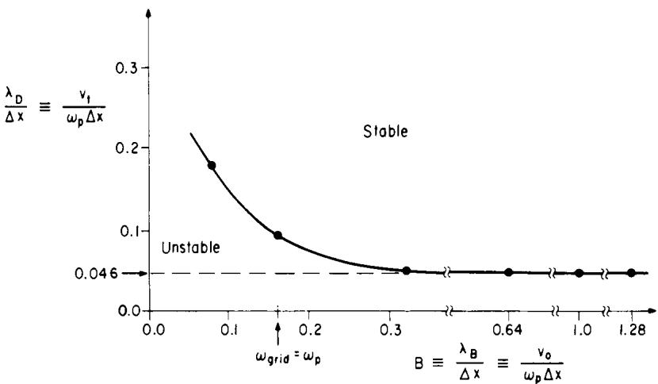  
Figure 8-12b Experimental determination of the thermal spread needed for stability of a beam in a (mathematically） gridded periodic system，using a momentum-conserving program.For energy-conserving programs,stability is found analytically for $\lambda _ { B } / \Delta x > 1 / \pi \approx 0 . 3$ (From Birdsall etal.,1975;Birdsall and Maron,1980.)

Langdon (1973)，using an energy-conserving program,and Birdsall and Maron (1980),using a momentum-conserving program, both obtained excellent phase space $( \nu _ { x } - x )$ indication of short-wavelength activity (particles showing structure for $k \Delta x > \pi )$ ，with proper alias relations; e.g.，with $N _ { g } = 3 2$ (16 distinct modes) one would observe mode 12 in $\rho _ { \mathrm { g r i d } } , \phi _ { \mathrm { g r i d } } , E _ { \mathrm { g r i d } } ,$ and modes 12 and $3 2 - 1 2 = 2 0$ in phase space; see Section 10-9.

Birdsall and Maron (1980) also ran the purely thermal case,no drift, $( \nu _ { 0 } = 0 )$ ，starting with $\lambda _ { D } / \Delta x = 0 . 1$ ，CIC. The thermal (and total） energy increased with time, tending to behave asymptotically as

$$
\frac { \lambda _ { D } ( t ) } { \Delta x } \approx \frac { \lambda _ { D } ( \infty ) } { \Delta x } [ 1 - \exp \left( - \alpha t \right) ]
$$

with $\lambda _ { D } ( \infty ) / \Delta x { \approx } 0 . 2 6$ and $\pmb { \alpha }$ is a constant $< < \omega _ { p }$ ，where the linear growth rate has become very small. The theory for the thermal case is in the next section.

# 8-13 SOLUTION FOR THERMAL (MAXWELLIAN) PLASMA; NONPHYSICAL INSTABILITIES CAUSED BY THE GRID

The dielectric function for an unmagnetized electrostatic Vlasov plasma is (Problem 8-13a)

$$
\epsilon ( \mathbf { k } , \omega ) = 1 + \frac { \omega _ { p } ^ { 2 } } { K ^ { 2 } ( \mathbf { k } ) } \sum _ { p } | S ( \mathbf { k } _ { p } ) | ^ { 2 } \int \frac { d \mathbf { v } } { \omega + i 0 - \mathbf { k } _ { p } \cdot \mathbf { v } } \kappa \cdot \frac { \partial f _ { 0 } } { \partial \mathbf { v } } , \mathrm { I m } \omega \geqslant 0
$$

For $f _ { 0 }$ a Maxwellian velocity distribution with no drift, (1） becomes

$$
\epsilon ( \mathbf { k } , \omega ) = 1 - \frac { \omega _ { p } ^ { 2 } } { 2 K ^ { 2 } \nu _ { t } ^ { 2 } } { \sum _ { \mathbf { p } } } | S ( \mathbf { k } _ { \mathbf { p } } ) | ^ { 2 } \frac { \kappa \cdot \mathbf { k } _ { \mathbf { p } } } { k _ { \mathbf { p } } ^ { 2 } } Z ^ { \prime } \Bigg | \frac { \omega } { \sqrt { 2 } | \mathbf { k } _ { \mathbf { p } } | \nu _ { t } } \Bigg ]
$$

where $Z ^ { \prime }$ is the derivative of the plasma dispersion function (Fried and Conte, 1961).

When $\lambda _ { D } \geqslant \Delta x$ the principal term is the one whose $\mathbf { k } _ { \ p }$ is nearest $\mathbf { k }$ The modes are heavily damped when $\mathbf { k }$ differs much from this $\mathbf { k } _ { \mathbf { p } }$ In this case we expect no important interaction among the different aliases. In the first zone let us take only the $\pmb { \mathrm { p } } \ll 0$ term,obtaining the average force ${ \bf { F } } _ { 0 }$ dielectric function $\epsilon _ { 0 }$ discussed earlier in Sections 8-3 and 8-11. We then view the model as approximately a gridless cloud plasma with Coulomb interaction having

$$
\begin{array} { c } { { \displaystyle \epsilon _ { 0 } = 1 - \frac { \omega _ { p } ^ { 2 } } { 2 k ^ { 2 } \nu _ { t } ^ { 2 } } | S _ { 0 } | ^ { 2 } Z ^ { \prime } \left( \frac { \omega } { \sqrt { 2 } k \nu _ { t } } \right) } } \\ { { \ } } \\ { { S _ { 0 } ( { \bf k } ) | ^ { 2 } = | S ( { \bf k } ) | ^ { 2 } \frac { { \bf k \cdot } \kappa } { K ^ { 2 } } , ~ i . e . , ~ { \bf p } = 0 ~ \mathrm { o n l y } } } \end{array}
$$

with

where $s _ { 0 }$ is the cloud shape factor to be used in the dispersion relation.

Solution of these two dispersion relations (2） and (3a） are given in Figure 8-13a for $\lambda _ { D } = \Delta x$ for the Maxwellian in one dimension with $S ( k ) = \mathrm { d i f } \left( 1 / _ { 2 } k \Delta x \right)$ for NGP, for $\lambda _ { D } / \Delta x = 1$ . The difference between $\operatorname { I m } \omega$ in the two cases is too small to be shown on the graph,and $\pmb { \mathrm { R e } } \omega$ differs significantly only where the wave is heavily damped. Thus alias coupling is not very important for $\lambda _ { D } / \Delta x = 1$ and the averaged force works very well. This conclusion is stronger for CIC-PIC.

There are now many wave phase velocities $\omega / k _ { p }$ with which particles may resonantly interact. Unless the coupling is very strong there is no qualitative change in Ree for real $\pmb { \omega }$ ； in particular the sign of its derivative is unchanged. This need not be true for the sign of the imaginary part,

$$
\mathrm { I m } \epsilon = - \pi { \frac { \omega _ { p } ^ { 2 } } { K ^ { 2 } } } \sum _ { p } \kappa S ^ { 2 } ( k _ { p } ) { \frac { 1 } { | k _ { p } | } } f _ { 0 } ^ { \prime } \Bigg | { \frac { \omega } { k _ { p } } } \Bigg |
$$

so that the plasma stability may be changed. For half the aliases $\mathbf { k _ { p } }$ has the opposite direction to $\pmb { \kappa }$ so that the factor $\kappa \cdot \mathbf { k } _ { \mathrm { p } } / k _ { p } ^ { 2 }$ has the wrong sign. For small $k \Delta x$ ，this can make ω Imω negative,whilel $\omega \partial \mathbb { R } e \in { \big / } \partial \omega$ remains positive； this leads to an instability (Lindman,1970; Langdon,1970a,b). In the jargon of real plasmas, the wave has positive energy and experiences negative absorption. With $\lambda _ { D } = \Delta x$ ，Langdon (1970a） found weak growth occurring only at wavelengths much greater than $\Delta x$ (a surprise). Growth became significant when $\lambda _ { D } / \Delta x$ was decreased,with appreciable growth over a wide range of $k \Delta x$ ，as in Figure 8-13b for $\lambda _ { D } = \Delta x / 1 0$ . We now explain these results and come to additional conclusions.

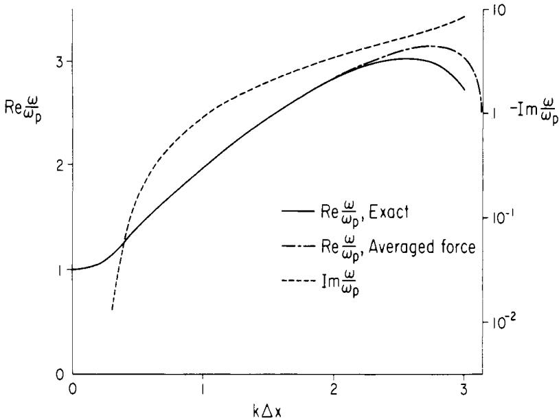  
Figure 8-13a Solutions of the exact (all $\pmb { p } .$ ）and average-force $( p = 0 )$ dispersion relations for a Maxwellian velocity distribution with $\lambda _ { D } / \Delta x = 1$ ，NGP interpolation. The $\operatorname { I m } \omega$ is the expected Landau damping. (From Langdon, $1 9 7 0 a .$ ）

The dispersion relation is periodic in $k$ we keep $k < k _ { g } / 2$ ， $k \Delta x < \pi$ (i.e.,in the fundamental Brillouin zone),which is the $\mathbf { k }$ one would think of physically. Then the physical phase velocity $\omega / k$ is larger than the alias velocities $\omega / k _ { p } , \ p \ne 0$ Thus $\omega / k$ may be much larger than $\nu _ { t } .$ ， leading to negligible Landau damping， at the same time that the slow waves are interacting strongly with the thermal particles,as shown in Figure 8-13c,if $k _ { g } \nu _ { t } \gtrsim \omega _ { p } ,$ The contributions from waves with equal $| p |$ nearly cancel; the net effect turns out to be destabilizing. Although it is small for small $k \Delta x$ [being $\propto ( k \Delta x ) ^ { 2 }$ for NGP and $( k \Delta x ) ^ { 4 }$ for linear weightingl, the Landau damping of the principal wave goes to zero even faster as $k \to 0$ . Thus the grid can destabilize oscillations even with long wavelengths $\lambda > > \Delta x$

For $\lambda _ { D } \ge \Delta x / 2$ the alias wave velocities fall on the flat part of the particle velocity distribution, and Landau damping occurs unless $k \Delta x \leqslant 2 k \lambda _ { D }$ is small. Therefore,the instability is confined to long wavelengths and is very weak. A rough rule of thumb is that this nonphysical instability has ignorable growth for $\lambda _ { D } / \Delta x \geqslant 1 / \pi \approx 0 . 3$ for linear weighting.

However，when $\lambda _ { D } \sim 0 . 1 \Delta x .$ ， the lowest and strongest aliases interact with the steep sides of $f _ { 0 }$ and there is little Landau damping even for $k \Delta x \sim 2$ where the coupling is strong. The result is strong instability; $\operatorname { I m } \omega$ is as large as $0 . 1 \omega _ { p }$ for NGP; however, $\operatorname { I m } \omega < 0 . 0 1 4 \omega _ { p }$ for linear weighting, which is about 1 dB per cycle,negligible in many applications.

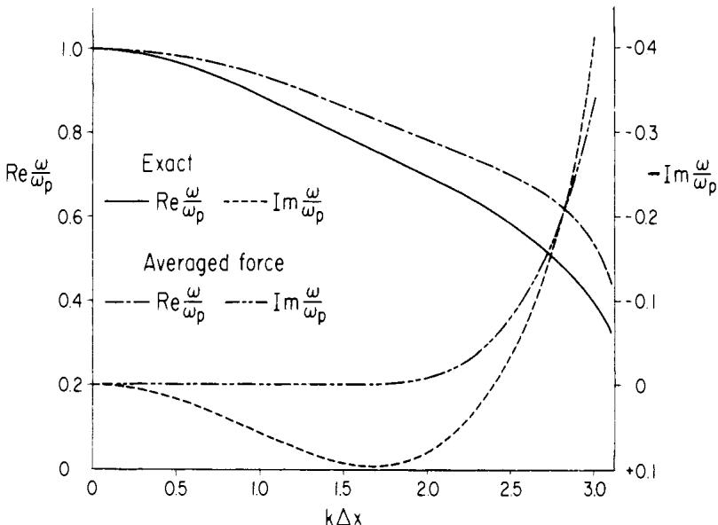  
Figure 8-13b Solutions of the exact and average-force dispersion relations with $\lambda _ { D } / \Delta x = 0 . 1$ ， NGP interpolation. The $\mathbf { I m } \omega > 0$ for $0 < k \Delta x \leqslant 2 . 5$ is nonphysical growth,due to aliasing, arising only if $\left| \boldsymbol { p } \right| > 0$ terms are kept. In CIC-PIC,the maximum growth rate is about $0 . 0 1 4 \omega _ { p } ,$ about10 times smaller. (From Langdon, 1970a.)

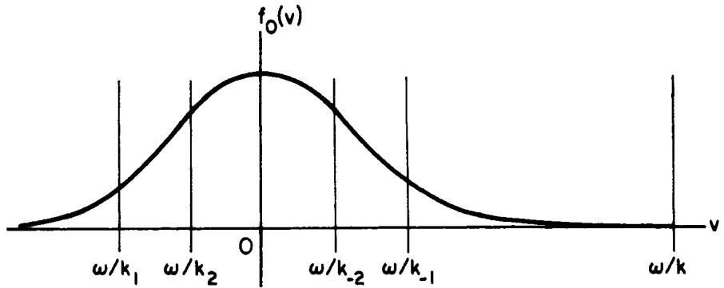  
Figure 8-13c Wave phase velocity ${ \pmb { \omega } } / \ k$ and alias wave phase velocities $\omega / k _ { p }$ and $f _ { 0 } ( \nu )$ for $k _ { g } \nu _ { t } \sim \omega _ { p } .$ (From Langdon,1970b.)

f $\lambda _ { D } / \Delta x$ is decreased further,only the weaker, large $p$ aliases contribute and the instability goes away,as it should since,of course,a cold stationary plasma is inactive (oscillatory only-stable). In many applications, such as that of Section 5-12,a cold plasma component provides accurate, noise-free collective behavior.

In studying this instability experimentally, there are diffculties without using a very large number of particles to ensure that the linear approxima-tion is not violated by too-large fluctuations and grid noise forces or that the instability is not damped by collisions. One might puzzle what an instability looks like in a plasma which is already Maxwellian,guessing that it just gives enhanced fluctuations. These occur and cause a gradual heating of the plasma. This is not forbidden since the momentum conserving codes are not energy conserving. In the energy-conserving codes (Chapter 1O), the destabilizing factor $\kappa \cdot \mathbf { k } _ { p } / k _ { p } ^ { 2 }$ is unity,so that there is no grid-induced instability unless the plasma is drifting through the grid. The verifying experiments with Maxwellian plasmas were mentioned in the previous section.

The feature of the oscillations which is central is that plasma perturba-tions of different wavelengths are coupled together. This can be thought of as a parametric interaction in which the spatial grid plays the role of the pump. The pump wave numbers are $k _ { g }$ and its harmonics $p k _ { g }$ ；the frequency is zero. As a result plasma perturbations characterized by $\mathsf { \bar { \rho } } ( \omega , k _ { p } = k - p k _ { g } )$ ， $p$ integral, are coupled and in the dispersion relation we had a sum over all these sub-modes. The coupling strength is given by $S ^ { 2 } ( k _ { p } )$ and is weaker as the order of interpolation increases.

# PROBLEMS

8-13a Derive (1),in analogy to Section 8-11 but using results from Section 8-9 and the Vlasov kinetic equation instead of cold fluid results.

8-13b Keeping only $\pmb { p } = 0$ ,show that the Bohm-Gross dispersion takes the form

$$
\omega = \omega _ { p } \bigg ( 1 + \frac { 3 } { 2 } k ^ { 2 } \lambda _ { D } ^ { 2 } - \alpha k ^ { 2 } \Delta x ^ { 2 } \bigg )
$$

and find $\pmb { \alpha }$ for NGP and for CIC-PIC. Note that for $\lambda _ { D } ^ { 2 } / \Delta x ^ { 2 } < 2 \alpha / 3$ the wave becomes backward,i.e.,its group velocity is opposite to its phase velocity;this change in dispersion may affect many types of plasma instabilities and shows the need to modify the field solver to compensate for inaccuracies in the dispersion.

8-13c How does the instability of this Section change when $\pmb { \cal E }$ is defined as in Problem 8-7c?

# EFFECTS OF THE FINITE TIME STEP

# 9-1 INTRODUCTION

In this chapter, we present the effects of using a finite time step △t. The first part is for the unmagnetized plasma,the second part is for the magnet-ized plasma,and the last part is on other time-integration schemes and the problems of long time steps.

In particle models for computer simulation of plasmas, the algorithms for advancing the system one time step forward usually divide into two parts: calculation of electromagnetic fields and particle forces,and advancing the particle positions and velocities. Chapter 8 deals with the former,while assuming the latter is performed exactly by the differential equations of Newtonian dynamics. In this chapter, we discuss properties of finitedifference equations used to advance the particles in time. In most of the discussion，we revert for clarity to continuum $x$ space for the fields and forces. However,the results of this and Chapter 8 are combined in Section 9-5 to yield results which include exactly the effects of discreteness in space and time. This work is a prerequisite for development of a quantitative kinetic theory of simulation plasmas (Chapter 12).

Other authors have studied aspects of the time integration by other methods (Lindman, 1970; Godfrey, 1974) and by extension of the methods of this chapter (Byers et al., 1978)； their work has included both fully electromagnetic felds and the Darwin magnetoinductive approximation. This chapter is a rather complete account of the electrostatic case drawn from Langdon (1970b,1979b,and unpublished reports) and other sources.

We first find the dispersion function which describes the response of the plasma to perturbing fields and whose zeros give the dispersion and stability of free oscillations. This is derived by two methods which illustrate different aspects and parameter limits. The analysis of plasma oscillations involves the same physics as in the classic Landau problem (Jackson, 196O)，and the results reduce to it simply and correctly in the limit $\Delta t  0$

Finite $\Delta t$ makes a simple change in the linear dispersion relations. With leap-frog integration in the unmagnetized model, we show that the usual resonant denominator, $1 / \left( \omega - \mathbf { k } \cdot \mathbf { v } \right)$ ， becomes

$$
\frac { \Delta t } { 2 } \cot \left( \omega - \mathbf { k } \cdot \mathbf { v } \right) \frac { \Delta t } { 2 } = \sum _ { q } \frac { 1 } { \omega - \mathbf { k } \cdot \mathbf { v } - q \omega _ { g } } ,
$$

The result in the roots for ${ \pmb \omega } ( { \bf k } )$ for plasma oscillations,small $\omega _ { p } \Delta t$ ,is a relative upward shift of $( \omega _ { p } \Delta t ) ^ { 2 } / 2 4$ ,a correction observed earlier in Chapter 4.

The periodicity in $\pmb { \omega }$ reflects the fact that frequencies differing by harmonics of $\omega _ { g } = 2 \pi / \Delta t$ represent the same change in phase during a time step $\left\{ \exp \left[ - \stackrel { . } { i } \left( \omega - q \omega _ { g } \right) \Delta t \right] = \mathrm { \ e x p } \left[ - \stackrel { . } { i } \omega \Delta t \right] \right\}$ and are therefore equivalent as seen by the difference equations. This is a sort of stroboscopic effect that fools not only the observer but the system dynamics. The frequencies $( \omega - q \omega _ { g } )$ are called aliases because they are different designations for the same thing.

For simple harmonic oscillations,as in the small $k \lambda _ { D }$ limit, we know from Chapter 4 that the usual leapfrog scheme becomes unstable when $\omega _ { p } \Delta t \geqslant 2$ Collective effects reduce this to $\omega _ { p } \Delta t \geqslant 1 . 6 2$ for a Maxwellian velocity distribution. This is because Bohm-Gross dispersion increases $\pmb { \omega }$ above $\omega _ { p }$ toward $\pi / \Delta t$ ，not because particles traverse a large part of a wavelength in one time step. However,no other nonphysical instabilities are found.

These results and those of Chapter 8 are then combined to describe both the spatial and temporal difference algorithm.

In the magnetized plasma, Section 9-6, the aliasing of cyclotron harmonics allows a nonphysical instability which is a finite Larmor radius effect, that is not seen in single particle analysis or in a cold plasma,and is possible even with a Maxwellian distribution.

Three approaches to efficient simulation of slowly-varying (compared, e.g., to $\omega _ { p e }$ ） phenomena are outlined in Section 9-7. The theory is generalized to a class of integration schemes in Section 9-8. Some examples are analyzed, and new algorithms are synthesized.

# 9-2 WARM UNMAGNETIZED PLASMA DISPERSION FUNCTION; LEAPFROG ALGORITHM

We consider perturbations of a uniform, infinite or periodic, unmagnetized,one-species plasma with fixed neutralizing background. We analyze collective motion of the plasma,a different emphasis than in the usual numerical analysis literature,in which different considerations of accuracy and speed are involved. For instance,the initial-value problem for ordinary differential equations has been extensively studied and a variety of very accurate algorithms are available. Such methods have been used, for exam-ple,for single-particle motion in the study of magnetic field configurations in fusion experimental devices. The methods used in many-particle simulation may seem comparatively simple. However,what is important is not that individual particle orbits be accurate,but that the collective motions of many particles reflect real plasma behavior. When computer capacity is limited,it has usually been better to use simple and fast difference algorithms rather than，say，having to use fewer particles. Even some errors in collective motion, for example, oscillation frequencies,may be acceptable if one under-stands quantitatively their origin and consequences. On the other hand,it is desirable that the codes retain certain physical properties. For instance, while many successful codes are not exactly time reversible,experience has shown often that unacceptable types of errors are avoided when one builds exact reversibility into the difference equations (Buneman, 1967).

It seems more informative to work with the deflections from zero-order orbits caused by the fields,rather than to seek a finite-difference analog to the Vlasov equation as done in Lindman (197O) and Godfrey (1974). Relevant features, such as the limitations of linearized analysis,are seen directly. With no complication， the theory applies to time-integration schemes which correspond to third-，or higher-，order differential equations of motion (so that the dimensionality of phase space necessary to describe the state of the system is $\pmb { 9 N }$ or higher instead of ${ \bf 6 } N$ ，for $N$ particles in three dimensions),and to algorithms which are not measure-preserving,i.e., particle motion does not preserve phase-space volume (see Section 9-8, especially Problems 9-8b and $9 - 8 c )$ . We retain the physical content of the Vlasov approximation but perform its bookkeeping function by another means.

In the Vlasov limit the particles travel along straight lines,not appreciably affected by collisions. We compute the deflection of a particle from this straight path due to an electric field of the form

$$
{ \bf E } ^ { ( 1 ) } ( { \bf x } , t ) = { \bf E } e ^ { i { \bf k } \cdot { \bf x } - i \omega t }
$$

with $\operatorname { I m } \omega > 0$ ， starting from $t = - \infty$ when the plasma was undisturbed. The extension to multiple species and to $\operatorname { I m } \omega \leqslant 0$ becomes evident later.

The particle difference equations are, from Section 2-4:

$$
\begin{array} { r c l } { \mathbf { v } _ { n + 1 / _ { 2 } } - \mathbf { v } _ { n - 1 / _ { 2 } } } & { = } & { \mathbf { a } _ { n } \Delta t } \\ { \mathbf { x } _ { n + 1 } - \mathbf { x } _ { n } } & { = } & { \mathbf { v } _ { n + 1 / _ { 2 } } \Delta t } \end{array}
$$

It is clear that this algorithm is measure-preserving because the velocity advance and position advance are each only a shear in phase space: Splitting $\mathbf { x }$ and $\pmb { \nu }$ into unperturbed and perturbed parts, i.e., $\mathbf { x } = \mathbf { \bar { x } } ^ { ( 0 ) } + \mathbf { x } ^ { ( 1 ) }$ ,eliminating $\pmb { \nu }$ and linearizing,we have

$$
{ \bf x } _ { n + 1 } ^ { ( 1 ) } - 2 { \bf x } _ { n } ^ { ( 1 ) } + { \bf x } _ { n - 1 } ^ { ( 1 ) } = \frac { q } { m } \Delta t ^ { 2 } { \bf E } e ^ { i { \bf k } \cdot { \bf x } _ { n } ^ { ( 0 ) } - i \omega t _ { n } }
$$

where $t _ { n } \equiv n \Delta t$ . On the left-hand side, $\mathbf { x } ^ { ( 0 ) }$ drops out. On the right-hand side, the field is evaluated at the unperturbed orbit position x $\mathbf { x } _ { 0 } ^ { ( 0 ) } + \mathbf { v } ^ { ( 0 ) } t _ { n }$ thus the linearization condition is

$$
\mathbf { k } \cdot \mathbf { x } ^ { ( 1 ) } < < 1
$$

This condition reappears later in the calculation and replaces the more stringent condition

$$
{ \bf E } ^ { ( 1 ) } \cdot \frac { \partial f ^ { ( 1 ) } } { \partial { \bf v } } < < { \bf E } ^ { ( 1 ) } \cdot \frac { \partial f ^ { ( 0 ) } } { \partial { \bf v } }
$$

usually quoted (see Jackson, 196O),which is a sufcient condition for lineari-zation of the Vlasov equation. Condition (4) suffices for the linearized calculation of the charge density perturbation $\pmb { \rho } ^ { ( 1 ) }$ ； (5）applies to calculation of the phase-space density $\pmb { f } ^ { ( 1 ) } \big ( \mathbf { x } , \mathbf { v } \big )$ . The success of linear theory at amplitudes for which (5） is violated may be understood via this Lagrangian analysis. For example,growth rates for instability of counterstreaming cold beams are accurately predicted when (4） is satisfied,yet (5） is violated at any amplitude for cold beams.

The right-hand side of (3) varies in time as

$$
e ^ { -  { \langle { ( \omega - { \bf k } \cdot { \bf v } ^ { ( 0 ) } ) } \rangle } _ { n } } \equiv e ^ { -  { \langle { \omega _ { d } } \rangle } _ { n } }
$$

(defining ${ \pmb \omega } _ { d } ) ; { \pmb x } _ { n } ^ { ( 1 ) }$ also varies in this way. No linearly varying terms appear in $\mathbf { x } ^ { ( 1 ) }$ since $\mathbf { x } ^ { ( 1 ) } \to 0$ as $t _ { n } \longrightarrow - \infty$ Substituting this dependence into the lefthand side of (3),we find the solution

$$
\begin{array} { c } { { { \bf x } ^ { ( 1 ) } ( { \bf x } _ { n } ^ { ( 0 ) } , { \bf v } ^ { ( 0 ) } , t _ { n } ) = \displaystyle \frac { \Delta t ^ { 2 } } { e ^ { - i \omega _ { d } \Delta t } - 2 + e ^ { i \omega _ { d } \Delta t } } \frac { q } { m } { \bf E } e ^ { i ( { \bf k } \cdot { \bf x } _ { n } ^ { ( 0 ) } - i \omega t _ { n } ) } } } \\ { { = - \left( \displaystyle \frac { 2 } { \Delta t } \sin \left( \omega - { \bf k } \cdot { \bf v } ^ { ( 0 ) } \right) \displaystyle \frac { \Delta t } { 2 } \right) ^ { - 2 } \displaystyle \frac { q } { m } { \bf E } ^ { ( 1 ) } } } \end{array}
$$

We have explicitly recognized the dependence on ${ \bf x } ^ { ( 0 ) } , { \bf v } ^ { ( 0 ) } ,$ and $t$

From this orbit deflection,we must calculate the resulting charge density perturbation. This density could be imagined as resulting from displacement of particles from their unperturbed positions $\mathbf { x } ^ { ( 0 ) }$ by amounts $\mathbf { x } ^ { ( 1 ) }$ and regarding the result as a superposition of monopoles $\pmb q$ at $\mathbf { x } ^ { ( 0 ) }$ and dipoles consistingof $+ q$ at $\mathbf { x } ^ { ( 0 ) } + \mathbf { x } ^ { ( 1 ) }$ and $- \pmb q$ at $\mathbf { x } ^ { ( 0 ) }$ , i.e., dipole moment $\pmb { q } \bar { \mathbf { x } } ^ { ( 1 ) }$ located at $\mathbf { x } ^ { ( \bar { 0 } ) }$ Themonopole density is canceled bythe neutralizing background.The dipole density $\mathbf { P }$ is obtained in the Vlasov approximation by an average of ${ \pmb q } \bar { \bf x } ^ { ( 1 ) }$ weighted by the velocity distribution:

$$
\begin{array} { r } { \mathbf { P } ( \mathbf { x } , t ) = n _ { 0 } q \int d \mathbf { v } f _ { 0 } ( \mathbf { v } ) \mathbf { x } ^ { ( 1 ) } ( \mathbf { x } , \mathbf { v } , t ) } \end{array}
$$

in which $n _ { 0 }$ and $f _ { 0 }$ are the particle density and velocity distribution in the absence of the perturbation. To obtain the change in charge density $\pmb { \rho } ^ { ( 1 ) }$ ，