consider an arbitrary volume $V$ and imagine moving particles from positions $\mathbf { x } ^ { ( 0 ) }$ t0 $\mathbf { x } ^ { ( 0 ) } + \mathbf { x } ^ { ( 1 ) }$ ;the change SQin enclosed chargeis due to particles which cross the bounding surface $s$ ：

$$
\begin{array} { c } { \displaystyle \delta \boldsymbol { \mathbf { Q } } = - \int _ { S } \mathrm { d } \mathbf { s } \cdot \boldsymbol { \mathbf { P } } } \\ { \displaystyle = - \int _ { \nu } d \mathbf { x } \nabla \cdot \boldsymbol { \mathbf { P } } } \end{array}
$$

Thus the charge density is

$$
\rho ^ { ( 1 ) } = - \nabla \cdot \mathbf { P } = - i \mathbf { k } \cdot \mathbf { P }
$$

which varies as in (1). This result relies again on $\mathbf { k } \cdot \mathbf { x } ^ { ( 1 ) } < < 1$ and also on $n _ { 0 } > > k ^ { 3 }$

Using (7） and (8),we express the polarization in terms of the susceptibility $\pmb { \chi }$ as

$$
\mathbf { p } = \pmb { \chi } \mathbf { E }
$$

Taken with (1O) and Gauss's law,one finds the dispersion relation

$$
\epsilon ( \mathbf { k } , \omega ) \equiv 1 + \chi ( \mathbf { k } , \omega ) = 0
$$

where the dispersion function ∈ is

$$
\begin{array} { c } { \displaystyle \epsilon ( \mathbf { k } , \omega ) \equiv 1 - \omega _ { p } ^ { 2 } \int \frac { d \mathbf { v } f _ { 0 } ( \mathbf { v } ) } { [ ( 2 / \Delta t ) \sin ^ { 1 / 2 } ( \omega + i 0 - \mathbf { k } \cdot \mathbf { v } ) \Delta t ] ^ { 2 } } } \\ { = 1 + \frac { \omega _ { p } ^ { 2 } } { k ^ { 2 } } \int d \mathbf { v } \mathbf { k } \cdot \frac { \hat { \mathbf { \omega } } f _ { 0 } } { \hat { \mathbf { \omega } } \mathbf { v } } \frac { \Delta t } { 2 } \cot { ( \omega + i 0 - \mathbf { k } \cdot \mathbf { v } ) } \frac { \Delta t } { 2 } } \end{array}
$$

and $\omega _ { p } = ( n _ { 0 } q ^ { 2 } / \ m ) ^ { 1 / 2 }$ is the plasma frequency in rationalized cgs (Heaviside-Lorentz) units (Panofsky and Phillips,i962,p. 461; Jackson, 1975,pp.817- 818). The second form is obtained by an integration by parts; in the limit $\Delta t \to 0$ it reduces to the familiar plasma result (Jackson, 196O)． The dispersion function $\pmb { \ 6 }$ plays the usual role in other results such as for shielding and fluctuations in Chapter 12. In a multispecies plasma,each species contributes its $x$ to (12).

The term $" i 0 "$ in(13） reminds us that it was derived assuming $\operatorname { I m } \omega > 0$ ， but may be used for real $\pmb { \omega }$ or even damped oscillations by analytic continua-tion to or below the real $\pmb { \omega }$ axis, just as in the usual Landau damping analysis (Jackson, 1960)． This can be shown formally by doing an initial-value problem using the $\pmb { z }$ transform (Jury， 1964) analogously to Landau's treatment using the Laplace transform. In general, $g \left( \omega + i 0 \right)$ means the limit of $g ( \omega + i \delta )$ as δ approaches zero through real positive values. The imaginary part of e,a result needed frequently in later sections, is found in Problem 9- 2b.

For a cold,drifting plasma,(13a) yields

$$
\begin{array} { l } { { \displaystyle \omega = { \bf k } \cdot { \bf v } \pm \frac { 2 } { \Delta t } \arcsin \frac { \omega _ { p } \Delta t } { 2 } } } \\ { { \displaystyle ~ = { \bf k } \cdot { \bf v } \pm \omega _ { p } [ 1 + \frac { 1 } { 2 4 } ( \omega _ { p } \Delta t ) ^ { 2 } + { \bf \nabla } \cdot { \bf \sigma } \cdot { \bf \sigma } ] } } \end{array}
$$

This suggests that to order $\Delta t ^ { 2 }$ the finite-difference error might be accounted for simply by an adjustment to $\omega _ { p }$ . This is true also for a warm plasma. Expanding the cotangent in (13b),

$$
\begin{array} { l } { { \displaystyle { \epsilon = 1 + \frac { \omega _ { p } ^ { 2 } } { k ^ { 2 } } \int d { \bf v } { \bf k } \cdot \frac { \partial f _ { 0 } } { \partial { \bf v } } \left[ \frac { 1 } { \omega - { \bf k } \cdot { \bf v } } - \frac { 1 } { 3 } ( \omega - { \bf k } \cdot { \bf v } ) \left( \frac { \Delta t } { 2 } \right) ^ { 2 } + { \cal O } ( \Delta t ^ { 4 } ) \right] } } } \\ { { \displaystyle { \quad = \epsilon _ { 0 } - \frac { 1 } { 1 2 } ( \omega _ { p } \Delta t ) ^ { 2 } + { \cal O } ( \Delta t ^ { 4 } ) } } } \end{array}
$$

where $\bullet _ { 0 }$ is the standard dispersion function for continuous time. The effect of the $\Delta t ^ { 2 }$ term on solutions ${ \pmb \omega } ( { \pmb \mathrm \mathrm { k } } )$ of the dispersion relation ${ \pmb \ 6 } = { \pmb 0 }$ is the same slight increase in frequency as in (14). The absence of terms $\propto \Delta t ^ { 3 }$ is due to time reversibility of the equations of motion (Buneman, 1967).

A useful form for $\pmb { \ 6 }$ is obtained by using an expansion for cotangent which is valid everywhere in the complex $\pmb { \omega }$ plane (Abramowitz and Stegun, 1964, p. 75)． This form is

$$
\epsilon = 1 + \frac { \omega _ { p } ^ { 2 } } { k ^ { 2 } } \int d { \bf v } { \bf k } \cdot \frac { \partial f _ { 0 } } { \partial { \bf v } } \sum _ { q = - \infty } ^ { \infty } \frac { 1 } { \omega - { \bf k } \cdot { \bf v } - q \omega _ { g } }
$$

$$
\begin{array} { r } { \chi ( \mathbf { k } , \omega ) = \sum \chi _ { 0 } ( \mathbf { k } , \omega - q \omega _ { g } ) } \end{array}
$$

where ${ \boldsymbol { x } } _ { 0 } = { \boldsymbol { \epsilon } } _ { 0 } - 1$ is the susceptibility for continuous time, and $\omega _ { g } = 2 \pi / \Delta t$ is the frequency characteristic of the time "grid." Each term in the sum is analogous to the continuum result, with $\pmb { \omega }$ replaced by $\omega - q \omega _ { g }$ . Thus if we can compute $\bullet _ { 0 }$ for some $\scriptstyle f _ { 0 }$ ， then we can also compute $\pmb { \ 6 }$ using this series, whose convergence can be accelerated (see Langdon, 1979b, appendix). For example, the result for a Maxwellian with drift $\overline { { \pmb { { \nu } } } }$ and thermal velocity $\nu _ { t } = ( \bar { T } / m ) ^ { \vee _ { 2 } }$ is

$$
\epsilon = 1 - \frac { \omega _ { p } ^ { 2 } } { 2 k ^ { 2 } \nu _ { t } ^ { 2 } } \sum _ { q = - \infty } ^ { \infty } Z ^ { \prime } \left[ \frac { \omega _ { q } - \mathbf { k } \cdot \overline { { \mathbf { v } } } } { \sqrt { 2 } \left| k \right| \nu _ { t } } \right]
$$

where $\omega _ { q } \equiv \omega - g \omega _ { g }$ is _the "aliased" frequency (Hamming, 1962； Blackman and Tukey, 1958), and $\pmb { Z } ^ { \prime }$ is the derivative of the dispersion function of Fried and Conte (1961). This form is easy to calculate since computer programs to evaluate $z$ are common.

Before discussng solutions of this dispersion relation, we digress to discuss_ aliasing and its implications. The aliases $\omega _ { q }$ of $\pmb { \omega }$ satisfy the relation exp $( - i \omega _ { q } t _ { n } )$ -e $\ x p \left( - i \omega t _ { n } + 2 \pi i q n \right) = \exp \left( - i \omega t _ { n } \right)$ for all integers $\pmb { n }$ and $\pmb q$ Thus the aliases are different frequencies which produce identical variations in quantities defined only at times $t _ { n }$ on a temporal grid. This equivalence is reflected in our theory by the periodicity of all quantities as functions of $\pmb { \omega }$ ， the periodicity being $\omega _ { q } = 2 \pi / \Delta t$ . Thus the infinity of poles of the integrand of (13b） does not imply more than one resonance,nor does the periodicity of $\pmb { \epsilon }$ imply the existence of new modes of oscillation.

It is often helpful to replace the variable $\pmb { \omega }$ by $z = \exp \left( - i \omega \Delta t \right)$ , the rota-tion per time step, thus eliminating the periodicities and multiplicities of dispersion roots. The least-damped solutions for $z$ of (17) are shown in Figure 9-2a for the case $\omega _ { p } \Delta t = 2 \sin \left( 0 . 5 \right) = 0 . 9 5 8 8 5$ ， a rather large time step whose exact value is chosen for later comparison with the continuous-time solutions. At $k = 0$ the solutions $\boldsymbol { z } = \mathbf { e x p } \left( \pm i \right)$ correspond to the plasma Oscillations at $\omega = \pm \omega _ { p }$ As $k \lambda _ { D }$ is increased, the roots arc to the left, then toward the negative real axis,where they rapidly meet and move apart along the real axis. One of the roots moves left a little, then follows the other root toward the origin.

This interaction of the two plasma oscillation branches is a nonphysical aspect of the periodicity induced by the numerical methods. During and after the meeting of the roots, however, $| z |$ is well under unity,so that the modes are strongly damped and their interaction is harmless.

We now examine the preceding dispersion solutions plotted in the ω plane. We chose $\omega _ { p } \Delta t$ so that at $k = 0$ the solutions are $\omega \Delta t = \pm 1$ ，plus aliases. Shown in Figure 9-2b is the branch passing through $\omega \Delta t = 1$ , plus an alias of its negative which passes through $\omega \Delta t = 2 \pi - 1$ .One period in Re ω△t is shown. The Imω are all equal. To see the accuracy of the correction in (15） we also solve the continuous time (exact） dispersion relation with $\omega _ { p } ^ { - 1 }$ chosen to be the time step in the simulation case. The solutions agree within 1 percent for $| k \lambda _ { D } | \lesssim \bar { 1 }$ . For larger $k \lambda _ { D }$ ，Re ω△t is nearing $\pmb { \pi }$ ， aliasing effects become important，and the simple correction fails.At $k \lambda _ { D } \approx 1 . 4 5$ the solution meets the alias of its negative (also a solution)； this interaction is already described above and is of little consequence since the modes are strongly damped.

For $\omega _ { p } \Delta t > 1 . 6 2$ ，one mode becomes unstable,as discussed in Section 9-4.

# PROBLEMS

9-2a Show that the exact charge density may be obtained from the Jacobian

$$
\rho ( \mathbf { x } , t ) = \rho _ { 0 } \int d \mathbf { v } _ { 0 } [ \partial ( \mathbf { x } ( \mathbf { x } _ { 0 } , \mathbf { v } _ { 0 } , t ) ) / \partial ( \mathbf { x } _ { 0 } ) ] ^ { - 1 } f _ { 0 } ( \mathbf { v } _ { 0 } )
$$

Show that (1O) is then obtained by linearization of the Jacobian.

9-2b_Showthat $\mathrm { l m } ~ ( \Delta t / 2 ) \mathsf { c o t } ^ { 1 / 2 } ( \omega + i 0 - \Omega ) \Delta t$ canbereplaced in an integral by $- \pi \sum \delta ( \omega - \Omega - g \omega _ { g } )$ overall $\pmb q$ ，and $\mathrm { I m } [ ( 2 / \Delta t ) \sin ^ { \prime } ( \omega + { \it i } 0 - \Omega ) \Delta t ] ^ { - 2 }$ islikewise equivalent to $+ \pi \sum \tilde { \delta ^ { \prime } } ( \omega - \Omega - q \omega _ { g } )$ .Hint: Consider a contour for $\pmb { \Omega }$ lying along the real axis except that it passes under the poles at $\omega - q \omega _ { g }$ along semicircles centered on the poles; let the radii of the semicircles approach zero.

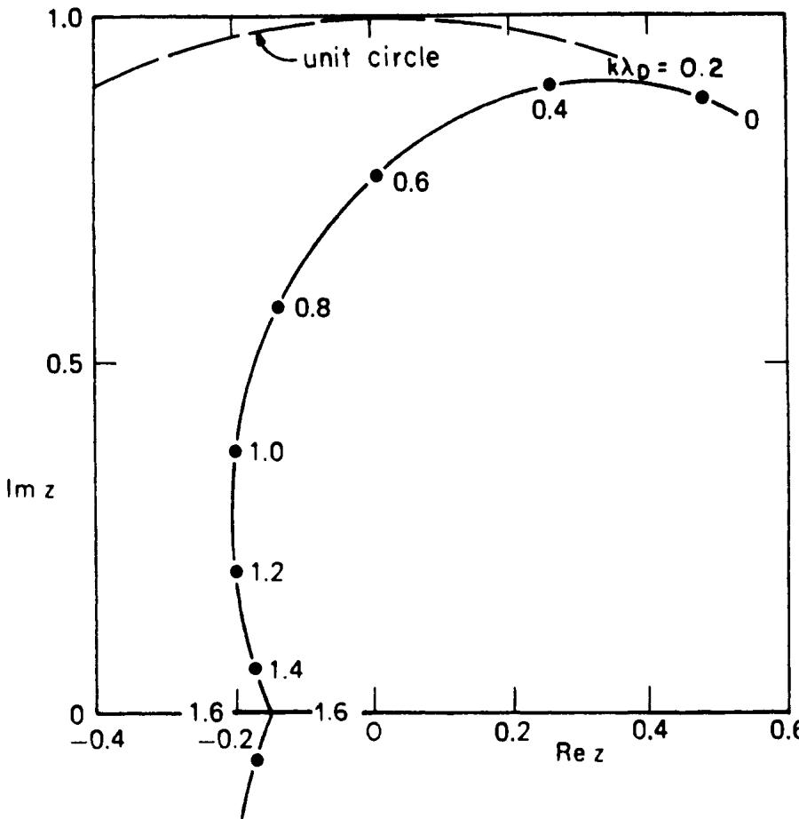  
Figure 9-2a Locus of numerical solutions for $z = \exp \left( - i \omega \Delta t \right)$ ,varying $k \lambda _ { D }$ ，fora Maxwellian velocity distribution,with arcsin $( \% \omega _ { p } \Delta t ) = 0 . 5$ and neglecting spatial grid effects.At $k \lambda _ { D } = 0$ we recover the simple harmonic oscillator solution $z = \exp \left( \pm i \right)$ As $k \lambda _ { D }$ increases,the solutions move to the left,remaining just inside the unit circle,then toward the real $z$ axis,meeting when $k \lambda _ { D } = 1 . 4 5$ and then separating. (The root moving temporarily to the left along the real z axis is the one which becomes unstable for $\omega _ { p } \Delta t > 1 . 6 2$ see Section 9-4.)For $k \lambda _ { D } \geqslant 1 . 6$ both roots move toward $z = 0$ (increasingly damped） for the parameters of this example.（From Langdon,1979b.)

Using either of these results in (13a) or (13b),show that

$$
\ln \epsilon = - \pi \frac { \omega _ { p } ^ { 2 } } { k ^ { 2 } } \int d \mathbf { v } \mathbf { k } \cdot \frac { \partial f } { \partial \mathbf { v } } \sum _ { q } \delta ( \omega - q \omega _ { g } - \mathbf { k } \cdot \mathbf { v } )
$$

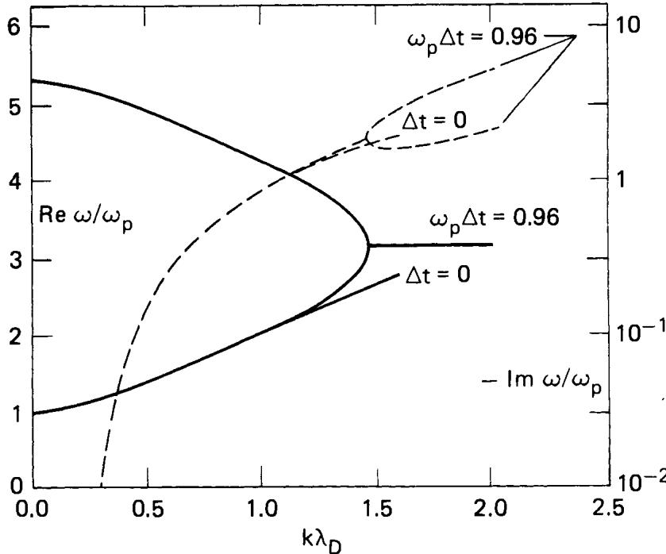  
Figure 9-2b Real and imaginary parts of ${ \omega } = ( i / \Delta t ) \ln z$ for the solution shown in Figure 9-2a. One period in $\pmb { \mathrm { R e } } \pmb { \omega }$ is shown $\scriptstyle ( \omega$ is multiple valued)． The lower and upper curves for $\pmb { \mathrm { R e } } \omega$ correspond to $\omega \sim + \omega _ { p }$ and an alias of $- \omega _ { p }$ . For comparison,solutions of the continuous-time limit are shown for corresponding parameters.The approximation of (15） is seen to be quite accurate until $\pmb { \mathrm { R e } } \omega$ approaches $\pi / \Delta t$ (see text),despite the large $\Delta t$ which exceeds normal practice．(FromLangdon, 1979b.)

# 9-3 ALTERNATIVE ANALYSIS BY SUMMATION OVER PARTICLE ORBITS

It is instructive to reconsider the problem by means of a summation, analogous to integration, over past accelerations,evaluated along the zeroorder orbits. This approach leads to an understanding of the large $k { \nu } _ { t } \Delta t$ limit,the "memory" of the system,and the role of phase mixing,and uncovers a point of distinction between leapfrog and other schemes which facilitate evaluation of the dispersion relation and motivates the classification in Section 9-8a.

To evaluate $\mathbf { x } ^ { ( 1 ) }$ in terms_of ${ \pmb { \mathfrak { a } } } ^ { ( 1 ) }$ ， we use the impulse response: the deflection $\mathbf { x } _ { n } ^ { ( 1 ) }$ due to impulse ${ \pmb a } _ { n - s } ^ { ( 1 ) } \Delta t$ is just $( \mathbf { a } _ { n - s } ^ { ( 1 ) } \Delta t ) ( s \dot { \Delta t } )$ . summing over all past impulses,

$$
\begin{array} { r } { \mathbf { x } _ { n } ^ { ( 1 ) } = \Delta t \underset { s = 1 } { \overset { \infty } { \sum } } \mathbf { v } _ { n - s + 1 _ { 2 } } ^ { ( 1 ) } } \\ { = \Delta t ^ { 2 } \underset { s = 1 } { \overset { \infty } { \sum } } s \mathbf { a } _ { n - s } ^ { ( 1 ) } } \end{array}
$$

Assuming the force field variations of 9-2 (1） we find

$$
{ \bf x } ^ { ( 1 ) } ( { \bf x } ^ { ( 0 ) } , { \bf v } ^ { ( 0 ) } , t _ { n } ) = \frac { q } { m } { \bf E } \Delta t ^ { 2 } e ^ { ( i { \bf k } \cdot { \bf x } ^ { ( 0 ) } - i \omega t _ { n } ) } \sum _ { s = 1 } ^ { \infty } s e ^ { i ( \omega - { \bf k } \cdot { \bf v } ) s \Delta t }
$$

in which ${ \bf { v } } \equiv { \bf { v } } ^ { ( 0 ) }$ and the sum converges for $\operatorname { I m } \omega > 0$ Proceeding as before to evaluate the charge density and then the dielectric function,

$$
\begin{array} { l } { { \displaystyle \epsilon = 1 + \omega _ { p } ^ { 2 } \Delta t ^ { 2 } \sum _ { s = 1 } ^ { \infty } \int d { \mathbf v } f _ { 0 } ( { \mathbf v } ) s e ^ { i ( \omega - { \mathbf k \cdot v } ) s \Delta t } } } \\ { { \displaystyle = 1 - i \omega _ { p } ^ { 2 } \Delta t \frac { \partial } { \partial \omega } \sum _ { s = 1 } ^ { \infty } \int d { \mathbf v } f _ { 0 } ( { \mathbf v } ) e ^ { i ( \omega - { \mathbf k \cdot v } ) s \Delta t } } } \end{array}
$$

By performing the $\pmb { \gamma }$ integral next we Fourier transform $f _ { 0 }$ in velocity space

$$
\begin{array} { l } { { \displaystyle { \bf \Pi } \displaystyle \epsilon = 1 - i \omega _ { p } ^ { 2 } \Delta t \frac { \partial } { \partial \omega } \sum _ { s = 1 } ^ { \infty } \tilde { f } _ { 0 } \left( { \bf k } s \Delta t \right) e ^ { i \omega s \Delta t } } } \\ { { \tilde { f } _ { 0 } ( \tilde { \bf v } ) \equiv \int d { \bf v } f _ { 0 } ( \tilde { \bf v } ) e ^ { - i \tilde { \bf v } \cdot \tilde { \bf v } } } } \end{array}
$$

where

For a Maxwellian, $\begin{array} { r } { \tilde { f } _ { 0 } ( \tilde { \pmb { v } } ) = \mathrm { e x p } \left( - \sqrt [ 1 ] { 2 } \tilde { \nu } ^ { 2 } \nu _ { t } ^ { 2 } \right) } \end{array}$ and the series converges for any complex $\pmb { \omega }$ ; this expression requires no analytic continuation. As $k \nu _ { t } \Delta t  0$ the sum becomes an integral and (3） reduces correctly to the continuum result,

$$
\begin{array} { c } { { \displaystyle \epsilon = 1 - i \omega _ { p } ^ { 2 } \frac { \partial } { \partial \omega } { \displaystyle \int } d \tau \tilde { f } _ { 0 } ( { \bf k } \tau ) e ^ { i \omega \tau } } } \\ { { = 1 - i \omega _ { p } ^ { 2 } \frac { \partial } { \partial \omega } { \displaystyle \int } d \tau e ^ { i \omega \tau - 1 / _ { 2 } k ^ { 2 } \nu _ { t } ^ { 2 } \tau ^ { 2 } } } } \end{array}
$$

for a Maxwellian; (6) can be manipulated by completing the square in the integrand to be expressed in terms of the complex error function.

If we first perform the summation (a simple geometric series） in (2b), we can recover the result of the preceding section:

$$
\begin{array} { l } { { \displaystyle \sum _ { s = 1 } ^ { \infty } e ^ { i \omega _ { d } s \Delta t } = ( e ^ { - i \omega _ { d } \Delta t } - 1 ) ^ { - 1 } } } \\ { { \mathrm { } } } \\ { { \displaystyle = - \frac { 1 } { 2 } + \frac { i } { 2 } \cot { ( { } ^ { 1 } / 2 \omega _ { d } \Delta t ) } } } \end{array}
$$

Substitution into (2b) yields 9-2(13b) (Problem 9-3b).

The rate of convergence of the series in (2b) indicates how long the force field at a given time continues to affect the charge density，i.e.， the memory time. For given $\pmb { \omega }$ ， the memory is shorter (convergence faster) for large $k v _ { t } \Delta t$ Of course,the deflections $\mathbf { x } ^ { ( 1 ) }$ do not decay, and may grow; only their net contribution to $\pmb { \rho } ^ { ( 1 ) }$ decreases when averaged over a smooth distribution $\scriptstyle f _ { 0 }$ in an oscillatory field. This process is familiar in plasma physics where it is called "phase mixing" (Problem 9-3c).

Equation (2b) is a power series in ${ \pmb z } ^ { - 1 } = \mathrm { e x p } \left( + i \omega \Delta t \right)$ . Truncating the sum yields a polynomial in $\pmb { z }$ . When enough terms are kept in the Maxwell-ian case, adding more terms adds z roots of small magnitude (heavily damped) without greatly changing the larger z roots. In this way we recover the infinity of roots expected in analogy to the continuum case (Jackson, 1960).

It is instructive to consider how 9-2(13b) and (3) change for another difference scheme. In a preview of Section $9 . 8 a$ ， we consider the scheme of Feix (1969, p. 157),

$$
\begin{array} { r l } & { { \bf x } _ { n + 1 } = { \bf x } _ { n } + { \bf v } _ { n } \Delta t + \mathbb { I } _ { 2 } { \bf a } _ { n } \Delta t ^ { 2 } } \\ & { { \bf v } _ { n + 1 } = { \bf v } _ { n } + { \bf a } _ { n } \Delta t + \mathbb { I } _ { 2 } \bigg \{ \frac { { \bf a } _ { n } - { \bf a } _ { n - 1 } } { \Delta t } \bigg \vert \Delta t ^ { 2 } } \end{array}
$$

We find (Problem 9-3d)

$$
\bar { \mathbf { x } } _ { n } ^ { ( 1 ) } = - \mathbb { \sim } \bar { \mathbf { \omega } } _ { n - 1 } ^ { ( 1 ) } \Delta t ^ { 2 } + \Delta t ^ { 2 } \sum _ { s = 1 } ^ { \infty } s \bar { \mathbf { a } } _ { n - s } ^ { ( 1 ) }
$$

The second term is the leapfrog result. Thus the schemes differ in the response $\mathbf { x } ^ { ( 1 ) }$ to ${ \mathfrak { a } } ^ { ( 1 ) }$ at the preceding time only. Thus $\pmb { \ 6 }$ differs from 9-2(13b) and (3) only by

$$
\epsilon - \epsilon _ { \mathrm { l e a p f r o g } } = - / _ { 2 } \omega _ { p } ^ { 2 } \Delta t ^ { 2 } \tilde { f } _ { 0 } ( \mathbf { k } \Delta t ) e ^ { i \omega \Delta t }
$$

The occurrence of this sort of relation between the leapfrog and several other schemes with second-order accuracy motivates the classification of Section 9-8a.

# PROBLEMS

9-3a Prove (1),then fllin the steps leading to (2a) (Langdon,1979b,p.209).

9-3b Use (8) in (2b) torecover 9-2(13b).Hint:the effect of $\partial / \partial \omega$ on the integrand is the same $\mathbf { a s } - k ^ { - 2 } \mathbf { k } \cdot ( \partial / \partial \mathbf { v } )$ Why does the term $- \%$ in (8)drop out in the integral over velocity?

9-3c For another viewpoint on phase mixing, consider a system of noninteracting particles described by the Vlasov equation, uniform in space and having a Maxwelian distribution for $t < 0$ ，subjected to an impulsive force field $F _ { 0 } \delta ( t ) \cos { k x }$ Find $f ( x , \nu , t )$ for $\mathbf { \omega } _ { t } > \mathbf { 0 }$ Although perturbations in $^ f$ grow in time (examine $\theta f / \theta v )$ ，show that the density (a velocity moment) decays as exp $( - \gamma _ { 2 } k ^ { 2 } \nu _ { t } { } ^ { 2 } t ^ { 2 } )$

9-3d Obtain (11) from (9) and (10) by considering the impulse response,or by appropriate sums of (9) and (10) over past times ${ \pmb { n } } , { \pmb { n } } - 1 , \ldots$ (Another method is to identify the powers of $z ^ { - 1 }$ in the right side of 9-8(9) with the time levels in (1)).

# 9-4 NUMERICAL INSTABILITY

In the analysis of spatial grid effects in Chapter 8,an instability was found that was associated with the resonance of particles at the low phase velocities of alias waves; i.e., $\omega / k _ { p } \lesssim \nu _ { t }$ for $p \neq 0$ while $\omega / k > > \nu _ { t }$ The finite time step introduces new resonances and we should consider whether these have inconvenient consequences. Considering only temporal aliasing, no analogous instabilities have been found. Assuming without loss of generality that $\omega < \pi / \Delta t$ ，the phase velocities of the aliases are larger in magni-tude and contribute less to Ime than the $q = 0$ term which contributes Landau damping. In fact, only when $k \nu _ { t } \Delta t \ge \pi$ can more than one $\pmb q$ term in 9-2(16) resonate appreciably with thermal particles. Even for large values of $k { \nu } _ { t } \Delta t$ ，we have found no instabilities of this sort.

Here we consider an instability which does arise in the linear theory,and an instability in a nonlinear oscillation.

First we discuss the linear instability. For $\omega _ { p } \Delta t > 2$ ， we can see from 9-2(14) that instability occurs for a cold plasma. We now show that the Bohm-Gross dispersion reduces the instability threshold in a Maxwellian plasma. At the onset of instability, $\omega \Delta t = \pi + \mathbf { k } \cdot { \overline { { \mathbf { v } } } }$ or an alias,where $\operatorname { I m } \epsilon = 0$ . Making this substitution in 9-3(2a) the dispersion relation becomes

$$
( \omega _ { p } \Delta t ) ^ { - 2 } = - \sum _ { s = 1 } ^ { \infty } s ( - 1 ) ^ { s } e ^ { - \mathbb { \breve { \iota } } _ { 2 } ( k \nu _ { t } \Delta t ) ^ { 2 } s ^ { 2 } }
$$

The value of $k { \nu } _ { t } \Delta t$ which maximizes the right-hand side shows where the plasma first becomes unstable as $\omega _ { p } \Delta t$ is increased. We find instability at $k \nu _ { t } \Delta t = 1 . 1 4$ when $\omega \Delta t > 1 . 6 2$ (Problem 9-4a).

One might expect this instability to be attributable to particles moving more than about half a wavelength per time step,thus seeing a very distorted impression of the field variation. This situation can cause errors,as discussed in Section 9-7b. However,at the onset of this instability a thermal particle travels less than one-fifth of a wavelength per time step. What occurs is not the destabilization of one mode; rather it is the unphysical interaction due to aliasing of the two plasma oscillation frequencies. Instability may occur whenever one branch of the dispersion curve closely approaches an alias of another branch,as in Figs. 9-2a and 9-2b.

As $\omega _ { p } \Delta t$ is increased, the instability becomes stronger and occurs also at longer wavelengths,extending to $k = 0$ when $\omega _ { p } \Delta t > 2$ . (Note that $\omega _ { p } \Delta t$ is not to be interpreted as modulo $2 \pi$ ). In actual simulations in this regime, the threshold values of $\omega _ { p } t$ are affected by the field-solution algorithms used on the spatial grid.

Several examples have been tried using the one-dimensional code ES1, with these parameters: periodicity length $4 \pi$ ，32 cells, $\nu _ { t } = 1 . 1 4$ ， $\Delta t = 1$ ,and

4096 particles. To achieve a "quiet" nonthermal starting condition,128 particles were loaded in the first cell distributed in velocity to approximate a Maxwellian. These particles were replicated in the other cells. A small random velocity $( \mathrm { r m s ~ } 1 0 ^ { - 5 } )$ is added to each particle; from this perturbation the instability may grow. With $\omega _ { p } = 1 . 8$ ，the second Fourier mode grew rapidly, as predicted by the theory, with $\mathtt { R e } \omega \Delta t = \pi$ . Trapping vortices form around velocities $\pm \pi$ which resonate with the oscillation, since $\left( \omega - \mathbf { k } \cdot \mathbf { v } \right) \Delta t = 0$ modulo $2 \pi$ . Saturation of mode 2 occurs at time 60; by time 80 the kinetic energy is 1.8 times the initial value and rising rapidly,with a superthermal "tail" on the velocity distribution. As $\omega _ { p } \Delta t$ is decreased to 1.6,saturation levels for mode 2 and the total field energy drop rapidly,as does the increase in kinetic energy. For $\omega _ { p } \Delta t = 1 . 6$ and 1.5, i.e., below threshold, mode ener-gies saturate at values close to those of runs with noisy,random starting conditions, i.e., velocities uncorrelated. The observations in this paragraph are consistent with the predictions of the linear collisionless theory.

It is still mode 2 which reaches saturation most quickly when $\omega _ { p } \Delta t = 1 . 5$ This may be related to the theoretical result that the fluctuation spectrum is proportional to $| \epsilon | ^ { - 2 }$ ， which is enhanced even for parameters below the colli-sionless threshold. Such results are beyond the scope of this chapter, but we confirm the empirical observation (Hockney，1971） that large $\omega _ { p } \Delta t$ and $\nu _ { t } \Delta t / \Delta x$ result in high noise levels and rapid nonphysical heating.

The predictions of linear theory are more readily confirmed for a "square" distribution $[ f _ { 0 } = ( 2 a ) ^ { - 1 }$ for $\vert \nu \vert < a$ and zero otherwisel because nonlinear effects (particle trapping） begin at higher amplitudes than for the Maxwellian case. Instability occurs for

$$
( 1 / 2 \omega _ { p } \Delta t ) ^ { 2 } \frac { \tan { ( 1 / _ { 2 } k a \Delta t ) } } { 1 / _ { 2 } k a \Delta t } > 1
$$

We have tried two examples in ES1: $\omega _ { p } = 1 . 7 7$ with $a = 2 . 3 3$ , and $\omega _ { p } = 1$ with $a = 2 . 8 6$ . Other parameters remain the same as for the Maxwellian cases. In both,mode 1 was stable and mode 2 clearly showed exponential growth until saturation by particle trapping began. Saturation occurred at a lower amplitude in the second case since the phase velocity $\omega / k = 1 . 1 a$ is closer to the particle velocities. It is clear that large Bohm-Gross frequency shifts,made possible by this sharply-cutoff distribution,cause the instability by producing large oscillation frequencies approaching $\pi / \Delta t$

In our present view,destructive instabilities are found only for condi-tions so extreme that trouble should be expected even without having a formal theory.

Next，we consider a nonlinear instability. In a nonlinear oscillator the acceleration is not sinusoidal but contains many harmonics of the fundamental oscillation frequency. If an alias of a harmonic is near the fundamental frequency，then the oscillation may deviate from the correct result. For example, we consider an oscillator of the form $d ^ { 2 } x / d t ^ { 2 } + \omega _ { 0 } ^ { 2 } x = \delta T _ { 6 } ( x )$ ， where $T _ { 6 }$ is a Chebyshev polynomial with the property that $T _ { \scriptscriptstyle { \mathrm { 1 2 } } } ( \cos \theta ) =$ cos n0 (Abramowitz and Stegun, 1964,eq. 22.3.15) so that the nonlinear term contains only the sixth harmonic when $x$ varies sinusoidally with unit amplitude. Starting with $\begin{array} { r } { x _ { n } = \cos \omega t _ { n } } \end{array}$ and $\omega _ { 0 } \Delta t = 2 \sin \left( \pi / \left( M \right) \right)$ so that one period takes $M$ time steps (with ${ \mathfrak { E } } = 0 .$ ,we find empirically that the amplitude initially increases when $M = 7$ and decreases when $M = 5$ ，as predicted by an analysis in which one sets $\textstyle { \boldsymbol { \mathbf { \mathit { x } } } } _ { n } = A _ { n }$ cos $( \omega t _ { n } + \theta _ { n } )$ ，where $\pmb { A } _ { n }$ and $\theta _ { n }$ vary slowly. With small δ, these cases show recurrent behavior (limit cycles). For example,with $M = 5$ ， the energy decreases by about 30 percent and then returns almost to the initial value; the recurrence time is $1 . 3 6 / ( \mathfrak { \delta } \omega _ { 0 } )$ .The energy ratio is independent of δ,so that even a very small nonlinearity can produce a significant error. Instability is also observed with $M = 6$ One usually associates instability with an increase in amplitude,but a decrease can be equally as damaging a divergence from correct behavior.

# PROBLEMS

9-4a Find the instability boundary for (1). Hint: the series converges rapidly enough (say，two terms） to allow use of a pocket caiculator.

9-4b Derive (2).

# 9-5 THE DISPERSION FUNCTION INCLUDINGBOTH FINITE △x AND △t

The results in this chapter and in Chapter 8,10,and 11 on the spatial grid are merged easily. For the dispersion relation $\epsilon = 0$ we find (Problem 9-5a) the result used in Langdon (1970b,1979a),Chen, Langdon, and Birdsall (1974),and Chapter 12,

$$
\begin{array} { l } { { \displaystyle { \epsilon = 1 + K ^ { - 2 } \sum _ { \bf p } { \bf k } _ { \bf p } \cdot \kappa ( { \bf k } _ { \bf p } ) S ^ { 2 } ( { \bf k } _ { \bf p } ) \chi ( { \bf k } _ { \bf p } , \omega ) } } \ ~ } \\ { { \displaystyle ~ = 1 + \frac { \omega _ { p } ^ { 2 } } { K ^ { 2 } } \sum _ { \bf p } S ^ { 2 } ( { \bf k } _ { \bf p } ) \int d { \bf v } \kappa ( { \bf k } _ { \bf p } ) \cdot \frac { \partial f _ { 0 } } { \partial { \bf v } } \frac { \Delta t } { 2 } \cot ( \omega + i 0 - { \bf k } _ { \bf p } \cdot { \bf v } ) \frac { \Delta t } { 2 } } } \end{array}
$$

This result serves as a dielectric function for quantities defined on the space-time grid, and, like them, is a periodic function of $\mathbf { k }$ and $\pmb { \omega }$

For the "momentum conserving" field algorithms of Chapter 8, $\kappa ( \mathbf { k } _ { \mathbf { p } } ) = \kappa ( \mathbf { k } )$ and so $\kappa ( \mathbf { k } _ { \mathbf { p } } )$ may be removed from the sum. With $\kappa ( \mathbf { k } _ { \ p } ^ { \cdot } ) = \mathbf { k } _ { \ p }$ ，we find in Chapter 1O that this same expression holds for the "energy conserving" field algorithm. With suitable definitions of $\pmb { \kappa }$ and $s$ ， (la) holds for multipole algorithms as well (Chapter 11).

The alternate form for the $\Delta t$ analysis gives

$$
\epsilon = 1 + \omega _ { p } ^ { 2 } \Delta t ^ { 2 } \sum _ { \bf p } S ^ { 2 } \frac { { \bf k _ { p } } \cdot \kappa } { K ^ { 2 } } \sum _ { s = 1 } ^ { \infty } \tilde { f } _ { 0 } ( { \bf k _ { p } } s \Delta t ) s e ^ { i \omega s \Delta t }
$$

One observation from this expression is that phase mixing makes the sum over $\pmb { \mathrm { p } }$ converge more rapidly than when time is continuous $( \Delta t = 0 )$ .For a Maxwellian, the contribution of the terms for which $\mathbf { k } _ { \mathbf { p } } \nu _ { t } \Delta t \ge 1$ in the sum over $\pmb { \mathrm { p } }$ is approximately

$$
\omega _ { p } ^ { 2 } \Delta t ^ { 2 } S ^ { 2 } \frac { \mathbf { k } _ { \mathrm { p } } \cdot \boldsymbol { \kappa } } { K ^ { 2 } } e ^ { - \nu _ { \mathrm { l } } ^ { 2 } k _ { \mathrm { p } } ^ { 2 } \nu _ { t } ^ { 2 } \Delta t ^ { 2 } + \iota \omega \Delta t }
$$

since the $\textsf { \pmb { s } } \geqslant 2$ terms are much smaller. It is clear that, for $| \mathbf { p } | \geq ( k _ { g } \nu _ { t } \Delta t ) ^ { - 1 }$ in one dimension, the contribution is reduced by phase mixing. ‘Thus if $\nu _ { t } \Delta t \ge \Delta x$ ，the sum over $\pmb { \mathrm { p } }$ converges in only a few terms.

A more trivial remark is that a drift velocity equal to a multiple of $\Delta x / \Delta t$ is the same as no drift in infinite or periodic systems. This is not surprising in electrostatic codes, since field grid points are at the same posi-tions relative to the plasma at every time step. Thus a limited form of Galilean invariance is restored.

More complicated examples of combined $\Delta x$ and $\Delta t$ analysis appear in Chen,Langdon, and Birdsall (1974),and Chapter 12.

There is a difference worth emphasizing between the finite spatial gridding and finite time stepping. As the particle dynamics places the particles essentially at all $\pmb { \mathrm { x } }$ ， and interpolation within a cell is used to obtain charge density and force, spatial information exists for all $\mathbf { x }$ and for all $\mathbf { k }$ . However, in time, information is generated only at $0 , \Delta t , 2 \Delta t , 3 \Delta t , . . .$ with no interpolation within a step.

# PROBLEMS

9-5a Derive (la). Use 9-2(1O) and 9-2(l1) to relate particle_charge density and force, $q n = - i \mathbf { k } \chi \cdot ( \mathbf { F } / q )$ . Use results from Section 8-9 to relate $q n$ and $\pmb { \ F }$ to grid quantities $\pmb { \rho }$ and $\phi$ as

$$
\rho ( \mathbf { k } , \omega ) = - \sum S ^ { 2 } ( \mathbf { k } _ { \mathbf { p } } ) \mathbf { k } _ { \mathbf { p } } \cdot \kappa \chi ( \mathbf { k } _ { \mathbf { p } } , \omega ) \phi ( \mathbf { k } _ { \mathbf { p } } , \omega ) .
$$

Finally，,use Poisson's equation 8-9(14) and the periodicity of $\phi ( { \bf k } , \omega )$ (but do not assume periodicity of $\pmb { \kappa }$ in 8-9(15)).

9-5b In (la),use the form of $\chi$ from 9-2(l3a) and integrate by parts to obtain (1b).

# 9-6 MAGNETIZED WARM PLASMA DISPERSION AND NONPHYSICAL INSTABILITY

With a magnetic field, new collective modes appear. For propagation across the magnetic field at wavelengths approximating the Larmor radius, there are waves near harmonics of the cyclotron frequency. Both $\omega _ { p } \Delta t$ and $\pmb { \omega } _ { c } \Delta t$ may be small, but the cyclotron harmonic frequency may be comparable to $\pi / \Delta t$ . We show how this leads to a nonphysical cyclotron harmonic instability,involving inits simplest forman interaction between $n \omega _ { c } , - n \omega _ { c }$

and $\omega _ { g }$ when $\omega _ { c } \approx \omega _ { g } / 2 n$

# (a) Derivation of the Dispersion Function

We now derive the collective behavior of magnetized plasma particles whose equations of motion are replaced by difference equations. As in Section 9-2 on the unmagnetized case,we ignore the effect of the spatial grid used for the fields and concentrate on the time integration. We consider small perturbations of a uniform plasma in a uniform magnetic field parallel to the z axis.

An external magnetic field can be incorporated into the particle equations in such a way that the zero-order orbits in constant fields are the exact helices plus $\bf E \times \bf B$ drift with the correct gyrofrequency $\omega _ { c }$ .We shall use Hockney's algorithm,as in Problem 4-3b with $\mathbf { B }$ parallel to the $z$ axis. Then for $\mathbf { x } _ { \perp } = ( x , y )$

$$
\begin{array} { r l } {  { \frac { \mathbf { x } _ { \perp , s + 1 } - 2 \mathbf { x } _ { \perp , s } + \mathbf { x } _ { \perp , s - 1 } } { \Delta t ^ { 2 } } } \quad } & { } \\ & { = \lambda \frac { q } { m } \bigg [ \mathbf { E } _ { \perp , s } ( \mathbf { x } _ { s } , t _ { s } ) + ( \mathbf { x } _ { \perp , s + 1 } - \mathbf { x } _ { \perp , s - 1 } ) \times \hat { \mathbf { z } } \frac { B } { 2 \Delta t } \bigg ] } \end{array}
$$

where

$$
\lambda = \frac { 2 } { \omega _ { c } \Delta t } \tan \frac { \omega _ { c } \Delta t } { 2 }
$$

and $\omega _ { c } \equiv q B / m$ . The difference equation for $z _ { s }$ is the same as used in Section 9-2 for unmagnetized plasmas.

Setting ${ \bf E } = 0$ we find the zero-order orbits

$$
\begin{array} { l } { { \displaystyle x _ { s } ^ { ( 0 ) } = \frac { \nu _ { \perp } } { \omega _ { c } } \sin \left( \omega _ { c } t _ { s } - \psi \right) + x _ { c } } } \\ { ~ } \\ { { \displaystyle y _ { s } ^ { ( 0 ) } = \frac { \nu _ { \perp } } { \omega _ { c } } \cos \left( \omega _ { c } t _ { s } - \psi \right) + y _ { c } } } \\ { { \displaystyle z _ { s } ^ { ( 0 ) } = z _ { 0 } ^ { ( 0 ) } + \nu _ { z } t _ { s } } } \end{array}
$$

in which we see that the positions lie on a helix of constant radius ${ \nu _ { \perp } } / { \omega _ { c } }$ (which should be regarded as defining $ { \boldsymbol { \nu } } _ { \perp } )$ and rotate about the axis at $x _ { c } , y _ { c }$ by an angle $- \omega _ { c } \Delta t$ at each time step. The existence of the constants of motion $ { \boldsymbol { \nu } } _ { \perp }$ and $\nu _ { z }$ is important in applications and in the following analysis. Apart from this,choosing other difference equations alters our results only in uninteresting ways (Problem 9-6e).

We consider a wave propagating in the $x \cdot z$ plane.The field along the

zero-order orbit is

$$
\begin{array} { l } { \displaystyle \mathbf { E } ^ { ( 1 ) } ( \mathbf { x } _ { s } ^ { ( 0 ) } , t _ { s } ) = \mathbf { E } \exp \left( i k _ { x } \pmb { x } _ { s } ^ { ( 0 ) } + i k _ { z } z _ { s } ^ { ( 0 ) } - i \omega t _ { s } \right) } \\ { = \mathbf { E } \exp \left( i k _ { x } \pmb { x } _ { c } + i k _ { z } z _ { 0 } ^ { ( 0 ) } \right) \sum _ { n = - \infty } ^ { \infty } J _ { n } \left( \pmb { \chi } \right) } \end{array}
$$

$$
\times \exp { ( - i n \psi - i [ \omega - k _ { z } \nu _ { z } - n \omega _ { c } ] t _ { s } ) }
$$

where $\chi \equiv k _ { x } \times$ (actual Larmor radius) $= k _ { x } \nu _ { \perp } / \omega _ { c }$ ，and we have used the Bessel function identity exp $\begin{array} { r } { \left( i \chi \sin \theta \right) = \ \sum J _ { n } \left( \chi \right) \exp \left( i n \theta \right) } \end{array}$ This $\mathbf { E } ^ { ( 1 ) }$ is substituted into (1） written for perturbed quantities. The contribution of each term in the sum over cyclotron harmonics may be obtained separately by substituting $\begin{array} { r l } { ( \mathbf { x } _ { s } ^ { ( 1 ) } , \mathbf { E } ^ { ( 1 ) } ) = } & { { } ( \mathbf { X } , \mathbf { E } ) \exp { ( - i \omega ^ { \prime } t _ { s } ) } } \end{array}$ ，where $\omega ^ { \prime } = \omega - k _ { z } \nu _ { z } - n \omega _ { c }$ We obtain

$$
\begin{array} { r } { - 4 \mathbf { X } _ { \perp } \sin ^ { 2 } \psi _ { 2 } \omega ^ { \prime } \Delta t = \lambda \frac { q } { m } \mathbf { E } _ { \perp } \Delta t ^ { 2 } - 2 i \sin \omega ^ { \prime } \Delta t \tan ^ { \prime } / _ { 2 } \omega _ { c } \Delta t \mathbf { X } _ { \perp } \times \hat { \mathbf { z } } } \end{array}
$$

We solve (8） using $E _ { y } ^ { ( 1 ) } = 0$ (from $k _ { \mathrm { { \ell } _ { \cdot } } } = 0 ,$ and sum over harmonics using (7).With boundaryconditions $\mathbf { x } _ { s } ^ { ( 1 ) } = 0 = \mathbf { x } _ { s } ^ { ( 1 ) } - \mathbf { x } _ { s - 1 } ^ { ( 1 ) }$ at $t _ { s } \longrightarrow - \infty$ and $\operatorname { I m } \omega > 0$ ，no solution of the homogeneous equation is to be added to get the full solution (Problem 9-6a)

$$
\begin{array} { r l } & { \left[ x _ { s } ^ { ( 1 ) } ( \mathbf { x } _ { s } ^ { ( 0 ) } , \nu _ { \downarrow } , \nu _ { z } , \psi ) \right] = - \frac { q } { m } \exp \left[ i \mathbf { k } \cdot \mathbf { x } _ { s } ^ { ( 0 ) } - i \chi \sin \left( \omega _ { c } t _ { s } - \psi \right) - i \omega t _ { s } \right] } \\ & { \left[ z _ { s } ^ { ( 1 ) } ( \mathbf { x } _ { s } ^ { ( 0 ) } , \nu _ { \downarrow } , \nu _ { z } , \psi ) \right] = - \frac { q } { m } \exp \left[ i \mathbf { k } \cdot \mathbf { x } _ { s } ^ { ( 0 ) } - i \chi \sin \left( \omega _ { c } t _ { s } - \psi \right) - i \omega t _ { s } \right] } \\ &  \times \left. \sum _ { n } J _ { n } \left( \chi \right) e ^ { i m \omega _ { c } t _ { s } - \psi } \frac { \Delta t ^ { 2 } } { 4 } \right| ^ { \frac { E _ { x } } { \sin ^ { 2 } \left. \mathcal { V } _ { 2 } \left( \Delta t - \Delta t \right) \right. ^ { 2 } \left. \omega _ { c } \Delta t \right. } } \end{array}
$$

These are the deflections at time $t _ { s }$ from the zero-order orbit,as a function of the zero-order parameters. We assume that the unperturbed particles are distributed with uniform density $n _ { 0 }$ uniformly in angle $\psi$ ,and with velocity distribution $f _ { 0 } ( \nu _ { \perp } , \nu _ { z } )$ .With the time-reversible difference schemes used here,such a distribution of particles is constant in the absence of perturbing fields. Replacing ${ \bf x } _ { s } ^ { ( 0 ) }$ by $\pmb { \mathrm { x } }$ in (9),the perturbations in orbit,electric field and potential are related by

$$
\begin{array} { l } { { \displaystyle - \nabla ^ { 2 } \phi ^ { ( 1 ) } = - n _ { 0 } q \int d \psi ~ \nu _ { \perp } ~ d \nu _ { \perp } ~ d \nu _ { z } ~ f _ { 0 } ( \nu _ { \perp } , \nu _ { z } ) ~ \nabla \cdot \mathbf { x } _ { s } ^ { ( 1 ) } ( \mathbf { x } , \nu _ { \perp } , \nu _ { z } , \psi ) } } \\ { { \displaystyle ~ \mathbf { E } ^ { ( 1 ) } = - \nabla \phi ^ { ( 1 ) } } } \end{array}
$$

Eliminating $E ^ { ( 1 ) }$ and $\phi ^ { ( 1 ) }$ and performing the integral over $\psi$ yields the

dispersion relation

$$
\begin{array} { c } { { \displaystyle 0 = \epsilon ( { \bf k } , \omega ) = 1 - \frac { 1 } { k ^ { 2 } } \Bigg ( \frac { \omega _ { p } \Delta t } { 2 } \Bigg ) ^ { 2 } \int 2 \pi \nu _ { \perp } d \nu _ { \perp } d \nu _ { z } f _ { 0 } ( \nu _ { \perp } , \nu _ { z } ) } } \\ { { \displaystyle \times \sum _ { n } J _ { n } ^ { 2 } ( \chi ) \left( \frac { k _ { x } ^ { 2 } ( \sin \omega _ { c } \Delta t / \omega _ { c } \Delta t ) } { \sin ^ { 2 } \nu _ { \perp } ( \omega - k _ { z } \nu _ { z } - n \omega _ { c } ) \Delta t - \sin ^ { 2 } \nu _ { 2 } \omega _ { c } \Delta t } \right. } } \\ { { \displaystyle \qquad \left. + \frac { k _ { z } ^ { 2 } } { \sin ^ { 2 } \nu _ { \mathrm { \perp } } ( \omega - k _ { z } \nu _ { z } - n \omega _ { c } ) \Delta t } \right) } } \end{array}
$$

This result can be manipulated into a form which is closely analogous to the dispersion relation of Harris (1959) (Problem 9-6b):

$$
\begin{array} { r } { 0 = \epsilon = 1 + \frac { \omega _ { p } ^ { 2 } } { k ^ { 2 } } \int d \mathbf { v } \sum _ { n } J _ { n } ^ { 2 } ( \chi ) \frac { \Delta t } { 2 } \cot \left[ \frac { \Delta t } { 2 } ( \omega - k _ { z } \nu _ { z } - n \omega _ { c } ) \right] } \\ { \times \left( \frac { n \omega _ { c } } { \nu _ { \perp } } \frac { \partial f _ { 0 } } { \partial \nu _ { \perp } } + k _ { z } \frac { \partial f _ { 0 } } { \partial \nu _ { z } } \right) } \end{array}
$$

In the limit $\Delta t \to 0$ we recover the Hars (1959) result trivially. For a Maxwellian $f _ { 0 }$ the integral can be done analytically (Problem 9-6c).

When $\omega - k _ { z } \nu _ { z }$ is near a harmonic $n \omega _ { \zeta }$ ，the resonance in (12） is accurate within $O ( \Delta t ^ { 2 } )$ for any $\Delta t$ . In constructing the difference scheme the design criteria were to make the particle respond accurately to forces at frequencies low compared to $\omega _ { c }$ (Hockney 1966；Buneman, 1967；Hockney and Eastwood, 1981,Eq. 4-111; and Problem 4-3b).  In a hot plasma with finite $\pmb { \chi }$ ，even low frequency fields are felt by the particles as having frequency components near $\pm \omega _ { c }$ . Then it is surprising to find that the behavior of $\pmb \epsilon$ near the $n ^ { \prime h }$ harmonic is very accurate even if $n \omega _ { c } \Delta t$ is not small. The reason is that the same measures Hockney and Buneman used to give accuracy at low frequencies also happen to give accurate longitudinal response near the resonances at $\omega ^ { \prime } = \pm \omega _ { c }$ (see also Problems 9-6d and 9-6e).

# (b) Properties of the Dispersion Relation

Let us examine in detail the simple case of perpendicular propagation, $k _ { z } = 0$ The $\nu _ { z }$ integral may now be performed trivially.

We first note that, as in the real plasma, the frequencies $\pmb { \omega }$ for real $k$ are either real or occur in conjugate pairs $[ \pmb { \epsilon }$ is real for real $\pmb { \omega }$ and is analytic, therefore $\epsilon \left( k , \omega ^ { * } \right) = \epsilon ^ { * } \left( k , \omega \right) = 0$ if $\epsilon ( k , \omega ) = 0 ]$ ，

It is helpful to change variables from $\pmb { \omega }$ to $z = \exp \left( - i \omega \Delta t \right)$ (Problem 9- 6f):

$$
\epsilon = 1 + \frac { \omega _ { p } ^ { 2 } } { \omega _ { c } } \displaystyle \int _ { 0 } ^ { \infty } 2 \pi \nu _ { \perp } d \nu _ { \perp } f _ { 0 } ( \nu _ { \perp } ) \frac { 1 } { \chi } \displaystyle \sum _ { n } n ( J _ { n } ^ { 2 } ) ^ { \prime } \frac { i \Delta t } { 1 - z ^ { - 1 } z _ { c } ^ { n } }
$$

where $z _ { c } = \exp \left( - i \omega _ { c } \Delta t \right)$ .This form is very convenient for root-finding because it is algebraic in $z$ ，in addition to the advantages found in the unmagnetized analysis (Section 9-2),such as clarifying the nature of aliasing.

In order to enumerate the roots we consider three cases: (a) $\omega _ { g } / \omega _ { c } = 2 \pi / \omega _ { c } \Delta t$ is an integer, (b) $\omega _ { g } / \omega _ { c }$ is a noninteger rational number, and (c) $\omega _ { g } / \omega _ { c }$ is irrational. In cases (a) and (b) there is a finite number,at most $N - 1$ ，of distinct poles of $\epsilon ( k , z )$ ，where $N$ is the smallest positive integer such that $z _ { c } ^ { N } = 1$ .Then the poles may be removed by multiplying $\pmb \epsilon$ by $\prod _ { n = 1 } ^ { \bar { \cal N } - 1 } ( z - z _ { c } ^ { n } )$ , omitting the $n = N / 2$ factor when $N$ is even, without adding any new roots. The result is a polynomial of degree $N - 1$ or $N - 2$ ，whose roots are easy to calculate (we used a variant of Muller's method in order to avoid the awkward calculation of the polynomial coefficients and attendant loss of accuracy). Thus the finite-difference scheme introduces no new modes, and combines harmonic modes when their corresponding cyclotron harmonics are aliases of one another.

In case (c) the powers $\left\{ z _ { c } ^ { n } \right\}$ of $z _ { \varsigma }$ are dense on the unit circle and (13） is well-behaved only for $\left| z \right| > 1$ . However, the terms in the series with $\left| n \right| \gg > \chi$ contribute little to $\epsilon$ outside the unit circle,so the system is very close to a system whose $\pmb { \epsilon }$ is (13） with the sum truncated at $n _ { \mathfrak { m a x } }$ terms. The additional terms and modes,introduced by increasing $n _ { \mathfrak { m a x } }$ excessively,only slightly affect the roots corresponding to smaller $n$ terms,especially if one thinks of the effect of collisions,finite $k _ { z }$ ， slightly nonuniform magnetic field,etc.,which wash out the higher harmonic resonances. Alternatively, one could say the system is similar to another system whose cyclotron frequency ${ \pmb { \omega } } _ { c } ^ { \prime }$ is sufficiently close to $\pmb { \omega } _ { c }$ and is such that $\omega _ { g } / \omega _ { c } ^ { \prime }$ is rational.

# (c) Numerical Instability

We first consider the "cold" limit $( \chi < < 1 )$ and waves perpendicular to B.The dispersion relation is (Problem 9-6g)

$$
\begin{array} { r } { \sin ^ { 2 } 1 / _ { 2 \omega } \Delta t = ( 1 / _ { 2 \omega _ { p } } \Delta t ) ^ { 2 } \frac { \sin \omega _ { c } \Delta t } { \omega _ { c } \Delta t } + \sin ^ { 2 } 1 / _ { 2 \omega _ { c } } \Delta t } \\ { = 1 - [ 1 - \lambda ( 1 / _ { 2 \omega _ { p } } \Delta t ) ^ { 2 } ] \cos ^ { 2 } 1 / _ { 2 \omega _ { c } } \Delta t } \end{array}
$$

The condition for instability is $\lambda ( ! / _ { 2 } \omega _ { p } \Delta t ) ^ { 2 } > 1$

In a warm plasma, the aliasing of harmonics opens the possibility of nonphysical instability arising from interaction of harmonic modes which are aliases of each other.If $\Delta \omega = l \omega _ { c } + m \omega _ { c } + n \omega _ { g }$ is small enough for some integers $l$ m and $n$ ，then the $l ^ { t h }$ and the $m ^ { t \hbar }$ harmonics have artificially been brought close together. This numerical instability is a finite Larmor radius effect which cannot be seen in a single-particle analysis and does not occur in a cold plasma. Even a Maxwellian distribution can be unstable.

A simple case is interaction between terms $\pm \boldsymbol { n }$ ，where $n \omega _ { c } \approx \omega _ { g } / 2$ If the contribution of the other terms may be neglected near this frequency, the dispersion relation may be written as

$$
( \omega - / / 2 \omega _ { g } ) ^ { 2 } = ( n \omega _ { c } - / / 2 \omega _ { g } ) ^ { 2 } + 2 \big ( n \omega _ { c } - / / 2 \omega _ { g } \big ) \frac { \omega _ { p } ^ { 2 } } { \omega _ { c } } \int d \nu \ f _ { 0 } \frac { n } { \chi } ( J _ { n } ^ { 2 } ) ^ { \prime }
$$

For fixed $\omega _ { p } , ~ \omega _ { c } , ~ k$ ，and $f _ { 0 }$ ， the most unstable choice of time step yields (Problem 9-6h)

$$
\pm \mathrm { I m } \omega = n \omega _ { c } - 1 / 2 \omega _ { g } = - \omega _ { c } \left( \frac { \omega _ { p } } { \omega _ { c } } \right) ^ { 2 } \int d \nu f _ { 0 } \frac { n } { \chi } ( J _ { n } ^ { 2 } ) ^ { \prime }
$$

with $\mathtt { R e } \omega = \omega _ { g } / 2$ . Thus the instability is of odd-even type. The growth rate is half the difference between the $2 n ^ { \prime h }$ harmonic and the sampling frequency $\omega _ { g }$ ; this is the rate at which a wheel with $_ { 2 n }$ spokes, rotating at frequency $\pmb { \omega } _ { c }$ ，appears to rotate when viewed in the light of a stroboscope flashing at intervals $\Delta t$

The full dispersion relation has been solved numerically for the case $\omega _ { c } \Delta t = 6 \pi / 2 5$ (about 8 steps per period), $\omega _ { p } ^ { 2 } / \omega _ { c } ^ { 2 } = 2$ with $k _ { | | } = 0$ ，and a monoenergetic velocity distribution,Equation 5-16(2),a ring in $\nu _ { \perp }$ space. (This is done to get a more viable harmonic wave, not to create a "negative energy" wave. Unlike harmonic mode instabilities in real plasma, the interacting modes do not need to have opposite "energies." The pair may have opposite signs of harmonic number, giving the same effect; only the required sign of $\Delta \omega$ is affected.）For these parameters the plasma should be stable (Section 5-16). There are harmonic resonances at every multiple of $\pmb { \omega } _ { c } / 3$ ，24 in all. Harmonics ${ \pmb { 4 \omega } } _ { c }$ and $- 4 \omega _ { c }$ represent nearly the same phase change $( \pmb { \pi } )$ per time step. The resulting odd-even instability is strongest at $x \approx 3 . 6$ (wavelength $\sim$ Larmor diameter） with $\operatorname { I m } \omega / \omega _ { c } \approx 0 . 1 5$ . Others are found with growth rates as large as $0 . 0 6 \omega _ { c }$ (at $\chi \approx 5 . 8$ from interaction of harmonics $\pm 2 \omega _ { c }$ and $\mp 6 \omega _ { c } )$ .The instability is absent when $\omega _ { c } \Delta t / 2 \pi =$ 1/8,a small change which reduces the number of resonances to as few as possible (6 separated by $\mathbf { \omega } _ { \omega _ { c } } )$ ．Thus the nonphysical instability is simply avoided by making the cyclotron period an integral number of time steps, when ${ \pmb { \omega } } _ { c }$ is a constant.

With ES1 configured as for Section 5-17,good agreement with the theory is found. With the parameters of this example,the $\nu _ { x } - \nu _ { y }$ phase space plots develop eight lobes around the ring. The wave grows to amplitudes comparable to those for real cyclotron instabilities. A change of $\pmb { \omega } _ { c } \Delta t$ to $6 \pi / 2 4$ (exactly 8 steps per period） eliminates the instability，also as predicted by the theory.

This instability is weakened when the harmonic waves are weakened, e.g.，when the distribution function is smoothed (e.g.,Maxwellian, Problem 9-6i),the Larmor radii are $\lesssim \Delta x$ (suppressing the required large $\pmb { \chi }$ forces), or $\omega _ { c } \Delta t$ is decreased (forcing any unstable interaction to be between higher harmonics for which the tuning is delicate and growth rates are small). It might be important, say,when one has warm electrons which are supposed to be stable, and one uses large $\omega _ { c e } \Delta t$ because the interesting time scales are

$\omega _ { c e } ^ { - 1 }$

The instability mechanism is little affected by the choice of difference equations (Problem 9-6e),but $\pmb { \omega } _ { c } \Delta t$ in (12) or (13） must be the gyrorotation actually produced by the difference equations.

Even if the electron cyclotron harmonic waves are not the object of study，if they exist physically then they should be taken into account in choosing $\Delta t$ .As we have seen, it may not be enough that $\omega _ { p e } \Delta t$ and $\pmb { \omega } _ { c e } \Delta t$ be small.

# PROBLEMS

9-6a In order to derive (9),first show that the solution of (8)can be written

$$
X = - \frac { q } { m } E _ { x } \frac { \Delta t ^ { 2 } } { 4 } \frac { \left( \sin { \omega _ { c } } \Delta t \right) / \left( \omega _ { c } \Delta t \right) } { \sin ^ { 2 } \psi _ { 2 } \omega ^ { \prime } \Delta t - \sin ^ { 2 } \psi _ { 2 } \omega _ { c } \Delta t }
$$

Use(7)and adapt 9-2(7) to find the $E _ { z }$ term of (9).

9-6b Manipulate (11) into (12)．Hints: In the perpendicular part use the trigonometric identity

$$
\frac { \sin \omega _ { c } \Delta t } { \sin ^ { 2 } \nu _ { 2 } \omega ^ { \prime } \Delta t - \sin ^ { 2 } \nu _ { 2 } \omega _ { c } \Delta t } = \cot ^ { 1 } \gamma _ { 2 } ( \omega ^ { \prime } - \omega _ { c } ) \Delta t - \cot ^ { 1 / 2 } ( \omega ^ { \prime } + \omega _ { c } ) \Delta t
$$

and rearrange the sum making use of the Bessel identity

$$
J _ { n - 1 } ^ { 2 } - J _ { n + 1 } ^ { 2 } = \frac { 2 n } { \chi } ( J _ { n } ^ { 2 } ) ^ { \prime }
$$

then integrate by parts with respect to $\nu _ { \perp }$ In the paralel part integrate by parts with respect to $\nu _ { z }$

9-6c When $f _ { 0 }$ is Max wellian and $k _ { z } = 0$ use the identity

$$
\int d \nu f _ { 0 } J _ { n } ^ { 2 } = e ^ { - \Lambda } I _ { n } ( \Lambda )
$$

where $\Lambda = ( k _ { x } v _ { t } / \omega _ { c } ) ^ { 2 }$ and $I _ { n }$ is a modified Bessl function (Abramowitz and Stegun, 1964),to derive from (12) the dispersion relation

$$
\epsilon = 1 - \frac { \omega _ { p } ^ { 2 } } { \omega _ { c } } \frac { e ^ { - \Lambda } } { \Lambda } \sum _ { - \infty } ^ { \infty } n I _ { n } ( \Lambda ) \frac { \Delta t } { 2 } { \cot { \prime } } _ { 2 } ( \omega - n \omega _ { c } ) \Delta t
$$

9-6d Show from solution of (8)for Y that the transverse response,of the particle orbit to a perturbing field with frequency near $\omega _ { c }$ ,is also made more accurate by the Hockney-Buneman multiplier $\pmb { \lambda }$ in the equation of motion (1).

9-6e Show that the dispersion relation holds for the difference equations used in ES1,or those of Problem 4-5b,if factors $( \approx 1 )$ are included in the $k _ { x } ^ { 2 }$ term of (11） and the $\partial f _ { 0 } / \partial \nu _ { \perp }$ term in (12).

9-6f Derive (13).

9-6g Derive (14)from (2)and (11),or set $q E _ { x } / m = - \omega _ { p } ^ { 2 } X$ in the result of Problem 9-6a.

9-6h Derive (16) and show how to adjust $\omega _ { g }$ to find the maximum growth rate (17).

9-6i When $f _ { 0 }$ is a Maxwellian,show from (17) and Problem 9-6c that the maximum growth rate for the odd-even instability is given by

$$
\mathrm { I m } \omega = \omega _ { c } \left( { \frac { \omega _ { p } } { \omega _ { c } } } \right) ^ { 2 } { \frac { n } { \Lambda } } e ^ { - \Lambda } I _ { \ n } ( \Lambda )
$$

How does this compare in magnitude to the growth rates with a monoenergetic ring distribution？

# 9-7 SIMULATION OF SLOWLY-EVOLVING PHENOMENA; SUBCYCLING,ORBIT-AVERAGING AND IMPLICIT METHODS

In many applications one wishes to study plasma phenomena whose characteristic time-scale is much longer than ωpe,and perhaps even ωpi1, while retaining a kinetic description. Examples are ion-acoustic turbulence and electromagnetic Weibel instabilities. Particle simulation as described so far in this book requires a very large number of time steps and may be too expensive. In this section we outline three approaches to the problem of effcient simulation of slowly evolving kinetic plasma phenomena,which is perhaps the most rapidly developing new reseach area in particle simulation of plasmas.

# (a) Subcycling

A simple approach，which provides an appreciable saving of computer time，is electron subcycling (Adam, Gourdin, and Langdon, 1982). The standard leapfrog scheme is used for both electrons and ions,but the electron time step is a fraction of the ion time step. For each complete cycle of time integration， there is one cycle for the ions and several sub-cycles for the electrons. The cost of integrating the ions becomes negligible. The electrons are integrated on their time-scale while the slower, massive ions can be integrated with a larger time-step,using their own field plus the low-pass filtered field of the electrons. This coupling of the species can be made time-centered. Stability and design of the low-pass filter are analyzed by extension of the methods of this chapter and examined empirically in an implementation of the algorithm. Unlike the implicit codes,there is no limitation on wavelength or field gradient, and high-frequency electron waves are retained. Although the potential gain in computer time is much smaller than for the implicit codes, subcycling is more widely applicable. To obtain advantages of both,an amalgam is proposed which has much in common with implicit orbit-averaged schemes.

# (b) Implicit Time Integration

Another approach is to seek an integration scheme that remains stable even when $\omega _ { p e } \Delta t > > 1$ . This usually requires an implicit scheme,in which the calculation of the positions $x _ { n }$ requires knowledge of the fields at the same time (Problem 9-7a),rather than the preceding time,as in the explicit methods discussed so far. Since the fields at time $t _ { n }$ depend on the unknown positions $\{ x _ { n } \}$ ， the field and particle equations represent a very large system of coupled nonlinear equations. An approximate solution must be quite accurate if stability is to be retained.

Recently there has been experimentation with schemes for accurate pred-iction of the fields at the next time step (Mason, 1981; Friedman, Langdon, and Cohen，1981； Denavit, 1981； Brackbill and Forslund,1982；Langdon, Cohen, and Friedman,1983; Barnes et al., 1983). Once found, the particles can be advanced one at a time. If their new charge density is not consistent with the predicted electric field, then convergent iteration is possible. In this way，the number of coupled equations to be solved is the order of the number of cells,rather than the number of particles. We will describe these developments in Chapters 14 and 15. Parallel work on design of implicit time differencing schemes applies the analysis of this chapter (next section, and Cohen, Langdon, and Friedman, 1982b).

There is a fundamental limitation in using particle electrons (Langdon, 1979b; Langdon. Cohen, and Friedman,1983). For $k \nu _ { t } \Delta t > > 1$ the dispersion function becomes of the form $\epsilon \approx 1 + \beta \omega _ { p } ^ { 2 } \Delta t ^ { 2 }$ (Problem 9-8d),which is largefor $\omega _ { p } \Delta t > > 1$ ， whereas in fact what we wantis $\epsilon =$ $1 + \omega _ { p } ^ { 2 } / \left( k \nu _ { t } \right) ^ { 2 } + \ldots$ . Thus when $k \nu _ { t } \Delta t \gtrsim 1$ we are unable to reproduce even Debye shielding correctly! To see how restrictive this condition is,consider that $k \lambda _ { D } = k \nu _ { t } \Delta t / \omega _ { p } \Delta t$ must be much less than unity when $\omega _ { p } \Delta t > > 1$ A Vlasov equation model for the electrons may be more practical than a particle model when $k \nu _ { t } \Delta t$ cannot be kept small.

A limitation on electric field gradient is noted by Denavit (1981） and elaborated upon by Langdon, Cohen, and Friedman (1983). At a potential energy minimum electrons oscillate at the "trapping" frequency $\omega _ { \mathfrak { u } }$ given by $\omega _ { \mathrm { t r } } ^ { 2 } { = } \left( q / m \right) \partial E / \partial x$ in one dimension. When $( \omega _ { \mathrm { t r } } \bar { \Delta } t ) ^ { 2 } > 1$ ， the linearization used in the field prediction is unreliable.

There has been considerable experience accumulated in the implicit time integration of the equations of fluid flow, diffusion,chemical kinetics,magnetohydrodynamics,and many other fields. Now particle simulation is also beginning to profit from the use of implicit methods.

# (c) Orbit Averaging

Another class of methods found to improve the efficiency of particle codes takes direct advantage of the widely separated time-scales typically present in plasma physics. In an orbit-averaged magneto-inductive algorithm (Cohen et al., 1980; Cohen and Freis, 1982),particles are advanced with a small time-step that accurately resolves their cyclotron orbits. An explicit solution for the electromagnetic fields,dropping radiation and electrostatics, is obtained using a current density that is accumulated from the particle data at each small step and temporally averaged over the fast, orbital time-scale. The calculations required per particle are not reduced; the real gain is the great reduction in the number of particles needed. The averaged contributions from each particle can substitute for those from many particles in a conventional code. This increased efficiency allows use of realistic parameters,such as the ratio of the ion cyclotron frequency to the rate of ion slow-ing due to collisions with electrons, in simulations of "magnetic mirror" experiments.

In order to apply orbit-averaging to a model including electrostatic fields and extend the simulation to large $\omega _ { p } \Delta t$ ， an implicit field solution must be performed (Cohen, Freis, and Thomas,1982).

# PROBLEMS

$9 . 7 a$ In great generality,a time-integration algorithm is a linear combination of ${ \bf x } _ { \eta }$ ， $\widetilde { \mathbf { a } } _ { n } \Delta t ^ { 2 }$ and some earlier positions and accelerations. Show that such a scheme becomes unstable，as $\Delta t  \infty$ ，when applied to a single particle simple harmonic oscillator,if the ${ \mathfrak { a } } _ { \eta }$ term is omitted. Including ${ \mathfrak { a } } _ { \eta }$ makes the scheme implicit (Cohen,Langdon,and Friedman,1982).

# 9-8 OTHER ALGORITHMS FOR UNMAGNETIZED PLASMA

Alternatives to leap frog integration include,for example, the implicit schemes (last section),and schemes with damping. In this section we see how to derive properties of an integration scheme in a direct and reliable manner.

Generalization of the derivation of 9-2(13a) leads to

$$
\epsilon = 1 + \omega _ { p } ^ { 2 } \int d \mathbf { v } f _ { 0 } ( \mathbf { v } ) \left( \frac { \mathbf { X } } { \mathbf { A } } \right) _ { \omega + \mathbf { \rho } 0 - \mathbf { k } \cdot \mathbf { v } }
$$

where $\mathbf { X } / \mathbf { A }$ refers to the ratio of Fourier amplitudes of $\mathbf { x } ^ { ( 1 ) }$ and $\pmb { \mathfrak { a } } ^ { ( 1 ) }$ This expression applies very generally to isotropic schemes in which $\pmb { \nu }$ remains constant when ${ \mathfrak { a } } = 0$ (i.e.,zero-order orbits do not decay)，and is easy to apply.

A different approach often seen uses a finite-difference analog of the Vlasov equation (Lindman， 1970； Godfrey，1974; Hockney and Eastwood, 1981). Based on the "measure-preserving" property of the equations of motion (they map a volume of $\mathbf { x } , \mathbf { y }$ phase space onto an equal volume at another time)， the Vlasov equation states that the phase space density $f ( \mathbf { x } , \mathbf { v } , t )$ is constant along any particle trajectory. As applied to finite- $\Delta t$ integration that takes $\{ \mathbf { x } _ { n } , \mathbf { v } _ { n } \}$ to $\{ \mathbf { x } _ { n + 1 } , \mathbf { v } _ { n + 1 } \}$ ，one uses $f ( \mathbf { x } _ { n + 1 } , \mathbf { v } _ { n + 1 } , t _ { n + 1 } )$ $\mathbf { \Psi } = \dot { f } ( \mathbf { x } _ { n } , \mathbf { v } _ { n } , t _ { n } )$ . When $\pmb { \nu }$ is defined at half-steps,as in the leap frog scheme, one can define a velocity ${ \pmb { \prime } } _ { \pmb { \eta } }$ (see,e.g.,Hockney and Eastwood, 1981, sec. 7- 3-2)． It is also possible to define $f$ at time $t _ { n }$ as the density of $\{ \mathbf { x } _ { n } , \mathbf { v } _ { n - \% } \}$ and use $f ( \mathbf { x } _ { n + 1 } , \mathbf { v } _ { n + 1 / 2 } , t _ { n + 1 } ) \ = f ( \mathbf { x } _ { n } , \mathbf { v } _ { n - 1 / 2 } , t _ { n } )$ (Problem 9-8a).

This method fails when applied as stated to other equations of motion which are not “measure-preserving" (Problem 9-8b),such as the damped schemes described later in this section. For example, it is clear in the case of damped oscillations in a potential well that measure decreases and $f$ increases. While it is possible to repair this derivation (Problem 9-8c)，we find it far simpler to use (1).

In the rest of this section，we consider two classes of time integration schemes with error of the same (or better） order as the leap-frog method. Included are implicit schemes which were designed and analyzed using the methods of this chapter.

# (a) Class C Algorithms

We now consider a class of algorithms for which the impulse response differs from that of the leapfrog result for only a few time steps, recalling the discussion of 9-3(11),i.e.,

$$
{ \bf x } _ { n } = \Delta t ^ { 2 } ( c _ { 0 } { \bf a } _ { n } + c _ { 1 } { \bf a } _ { n - 1 } + \mathrm { ~ } \cdot \mathrm { ~ } \cdot \mathrm { ~ } + c _ { k - 2 } { \bf a } _ { n - k + 2 } + \sum _ { s = 1 } ^ { \infty } s { \bf a } _ { n - s } )
$$

Assuming exponential time dependence, $( \mathbf { x } _ { n } ^ { ( 1 ) } , \mathbf { a } _ { n } ^ { ( 1 ) } ) = ( \mathbf { X } , \mathbf { A } ) z ^ { n }$ ，

$$
\frac { { \bf X } } { { \bf A } \Delta t ^ { 2 } } = c _ { 0 } + \frac { c _ { 1 } } { z } + \frac { c _ { 2 } } { z ^ { 2 } } + { \bf \nabla } \cdot { \bf \nabla } \cdot { \bf \nabla } + \frac { c _ { k - 2 } } { z ^ { k - 2 } } + \frac { z } { ( z - 1 ) ^ { 2 } }
$$

where again the last term is the same as for the leapfrog algorithm, which is therefore the simple special case in which $k = 2$ and $c _ { 0 } = 0$ .The corresponding difference equation can be written in the form

$$
\begin{array} { r l } & { \frac { \mathtt { c } _ { n } - 2 \mathtt { x } _ { n - 1 } + \mathtt { x } _ { n - 2 } } { \Delta t ^ { 2 } } = \mathtt { a } _ { n - 1 } + c _ { 0 } ( \mathtt { a } _ { n } - 2 \mathtt { a } _ { n - 1 } + \mathtt { a } _ { n - 2 } ) } \\ & { \cdot c _ { 1 } ( \mathtt { a } _ { n - 1 } - 2 \mathtt { a } _ { n - 2 } + \mathtt { a } _ { n - 3 } ) + \ \cdot \cdot \cdot + c _ { k - 2 } ( \mathtt { a } _ { n - k + 2 } - 2 \mathtt { a } _ { n - k + 1 } + \mathtt { a } _ { n - k } ) } \end{array}
$$

It is evident that the unperturbed $( \mathfrak { a } = 0 )$ motion is rectilinear. The order of this equation is $k$ (because there is a span of $k + 1$ times involved),and it is implicit if $c _ { 0 }$ is nonzero.

The warm plasma dispersion function, found by substitution of (3) into (1),is

$$
\epsilon = \epsilon _ { \mathrm { l e a p f r o g } } + \omega _ { p } ^ { 2 } \Delta t ^ { 2 } \sum _ { s = 0 } ^ { k - 2 } c _ { s } \int d \mathbf { v } ~ f _ { 0 } ( \mathbf { v } ) e ^ { i ( \omega - \mathbf { k } \cdot \mathbf { v } ) s \Delta t }
$$

Evaluation of Eleapfrog is discussed in Section 9-2 and Langdon (1979b, Appendix),and the new terms are easily expressed in terms of the velocity transform $\tilde { f } _ { 0 } ( \tilde { \mathbf { v } } )$ . Equation (5) can be used to check the collective response as modelled by implicit $( c _ { 0 } > 0 )$ time integration schemes (Problem 9-8d).

At long wavelengths the particles undergo simple harmonic oscillations at the plasma frequency. For an oscillator with frequency ${ \pmb { \omega } } _ { 0 }$ there are two roots of (3） corresponding to frequencies near $\pm \omega _ { 0 } .$ and $k - 2$ strongly damped roots, for small $\omega _ { 0 } \Delta t$ . As shown later, the two roots near $\pm \omega _ { 0 }$ have an error in their real part which is second or higher order in $\Delta t$ , and an error in their imaginary part which is third or higher order in $\Delta t$

To analyze the harmonic oscillator, we put $A = - \omega _ { 0 } ^ { 2 } X$ in (3). For small $\omega _ { 0 } \Delta t$ it is evident from inspection of (3) that there are $k - 2$ roots near $z = 0$ (strong damping),and two near $z = 1$ ， corresponding to the oscillation. We find, in Problem 9-8e

$$
\begin{array} { l } { { \mathrm { R e } { \frac { \displaystyle \delta \omega } { \displaystyle \omega _ { 0 } } } = { \frac { \displaystyle ( \omega _ { 0 } \Delta t ) ^ { 2 } } { \displaystyle 2 } } \left( \frac { 1 } { \displaystyle 1 2 } - c _ { 0 } - \mathrm {  ~ \cdot ~ } \cdot \mathrm {  ~ \cdot ~ } - c _ { k - 2 } \right) + O ( \Delta t ^ { 3 } ) } } \\ { { \mathrm { I m } { \frac { \displaystyle \delta \omega } { \displaystyle \omega _ { 0 } } } = - { \frac { \displaystyle ( \omega _ { 0 } \Delta t ) ^ { 3 } } { \displaystyle 2 } } \left( c _ { 1 } + 2 c _ { 2 } + \mathrm {  ~ \cdot ~ } \cdot \mathrm {  ~ \cdot ~ } + ( k - 2 ) c _ { k - 2 } \right) + O ( \Delta t ^ { 4 } ) } } \end{array}
$$

Thus this class has second-order eror in $\pmb { \mathrm { R e } } \omega$ , but the more damaging error in Imω is third order,as claimed above. For the leapfrog algorithm,we find $\left. \delta \omega \right/ \omega _ { 0 } = \left( \omega _ { 0 } \Delta t \right) ^ { 2 } / 2 4$ as in 4-2(9) and 9-2(14); $\pmb { \delta \omega }$ is in fact real to all orders for this time-reversible, second-order scheme.

Example: (Feix, 1969) This scheme,9-3(9) and 9-3(10),can be motivated by a Taylor series expansion about time $t _ { n }$ ，with a firstdifference estimate for $d \mathbf { a } / d t$ . The dispersion function has already been given, 9-3(12). Setting $( \mathbf { x } _ { n } , \mathbf { v } _ { n } , \mathbf { a } _ { n } ) = ( \mathbf { X } , \mathbf { V } , \mathbf { A } ) z ^ { n }$ and eliminating $\pmb { \nu }$ we find

$$
{ \frac { \mathbf { X } } { \mathbf { A } { \Delta t } ^ { 2 } } } = { \frac { \left\{ { \frac { 3 } { 2 } } - { \frac { z } { 2 } } \right\} } { ( z - 1 ) ^ { 2 } } } + { \frac { 1 } { 2 ( z - 1 ) } }
$$

$$
= - \frac { 1 } { 2 z } + \frac { z } { ( z - 1 ) ^ { 2 } }
$$

Comparing with (3)，(6)，and (7),we find $\pmb { k } = 3 , \ c _ { 0 } = 0$ and $c _ { 1 } = - \%$ Thus

$$
\mathbb { R e } \frac { \delta \omega } { \omega _ { 0 } } = \frac { 7 } { 2 4 } ( \omega _ { 0 } \Delta t ) ^ { 2 }
$$

$$
\mathrm { I m } \frac { \delta \omega } { \omega _ { 0 } } = \frac { 1 } { 4 } ( \omega _ { 0 } \Delta t ) ^ { 3 }
$$

The error in oscillation period is seven times that for the leapfrog method,and there is also a weak instability. [This is a hint that the measure-preserving properties of the leapfrog algorithm have been lost in this scheme,even if this system could be described in a phase space with only the coordinates $( \mathbf { x } _ { n } , \mathbf { v } _ { n } ) . ]$ Another disadvantage is that a past acceleration must be retained, as well as $\pmb { \mathrm { x } }$ and $\pmb { \gamma }$ .However, for the parameters used in Feix (1969), $\omega _ { p } \Delta t = 0 . 1$ typically, the growth is weak and was probably suppressed by collisional damping. Also it may sometimes be an advantage that $\mathbf { x }$ and $\pmb { \gamma }$ are given at the same times.

Example: Another scheme with this advantage is

$$
\begin{array} { l } { { \displaystyle { \bf { v } } _ { n + 1 } = { \bf { v } } _ { n } + { \bf { a } } _ { n } \Delta t + \frac { 1 } { 2 } \left| \frac { { \bf { a } } _ { n } - { \bf { a } } _ { n - 1 } } { \Delta t } \right| \Delta t ^ { 2 } } } \\ { ~ } \\ { { \displaystyle { \bf { x } } _ { n + 1 } = { \bf { x } } _ { n } + \frac { 1 } { 2 } ( { \bf { v } } _ { n + 1 } + { \bf { v } } _ { n } ) \Delta t } } \end{array}
$$

The velocity is advanced in the same way as in the first Example, but the position is advanced by the trapezoidal rule. We find

$$
\begin{array} { r } { \frac { \mathbf { X } } { \mathbf { A } \Delta t ^ { 2 } } = \frac { ( 3 - z ^ { - 1 } ) ( z + 1 ) } { 4 ( z - 1 ) ^ { 2 } } } \\ { = - \frac { 1 } { 4 z } + \frac { z } { ( z - 1 ) ^ { 2 } } } \end{array}
$$

Thus $k = 3 , c _ { 0 } = 0 , c _ { 1 } = - 1 / 4$ and

$$
\begin{array} { r } { \displaystyle \mathrm { R e } \frac { \delta \omega } { \omega _ { 0 } } = \frac { 1 } { 6 } ( \omega _ { 0 } \Delta t ) ^ { 2 } } \\ { \displaystyle \mathrm { I m } \frac { \delta \omega } { \omega _ { 0 } } = \frac { 1 } { 8 } ( \omega _ { 0 } \Delta t ) ^ { 3 } } \end{array}
$$

This scheme is more accurate than the preceding, but less accurate than the leap-frog method.

Example: This is an example of algorithm synthesis，as opposed to analysis, in which we eliminate the $O ( \Delta t ^ { 2 } )$ error in $\pmb { \mathrm { R e } } \pmb { \delta \omega }$ in the leapfrog scheme. If one could use an implicit scheme,one would simply set $c _ { 0 } = 1 / 1 2$ ： the resulting time-centered scheme has been very successful in other applications. Instead, we remain explicit at the expense of introducing an $\overline { { O ( \Delta t ^ { 3 } ) } }$ damping. From (6) and (7) we are lead to choose $k = 3$ ， $\pmb { c } _ { 0 } = \pmb { 0 }$ ,and $c _ { 1 } = 1 / 1 2$ This gives

$$
\begin{array} { l } { { \displaystyle { \mathrm { R e } \frac { \delta \omega } { \omega _ { 0 } } = O ( \Delta t ^ { 3 } ) } } } \\ { { \displaystyle { \mathrm { I m } \frac { \delta \omega } { \omega _ { 0 } } = - \frac { 1 } { 2 4 } O ( \omega _ { 0 } \Delta t ) ^ { 3 } } } } \end{array}
$$

which becomes

$$
\frac { \textbf { X } } { \textbf { A } \Delta t ^ { 2 } } = \frac { 1 } { 1 2 z } + \frac { z } { ( z - 1 ) ^ { 2 } }
$$

and can be factored as

$$
\begin{array} { r l } & { \mathbf { V } z ^ { - 1 / 2 } ( z - 1 ) = \mathbf { A } \Delta t } \\ & { \qquad \mathbf { X } ( z - 1 ) = \mathbf { V } z ^ { 1 / 2 } \Delta t + \frac { \mathbf { A } \Delta t ^ { 2 } } { 1 2 z } ( z - 1 ) } \end{array}
$$

in order to introduce a velocity. The difference scheme may now be written by identifying powers of $z$ wth time leveis $( e , \mathrm { ~ \bf ~ \it ~ \ 8 . , ~ \bf ~ V } z ^ { - 1 / 2 }$ corresponds to $\mathbf { v } _ { n - 1 / 2 }$ ，

$$
\begin{array} { l } { { \displaystyle { \bf { v } } _ { n + 1 / 2 } = { \bf { v } } _ { n - 1 / 2 } + { \bf { a } } _ { n } \Delta t } } \\ { ~ } \\ { { \displaystyle { \bf { x } } _ { n + 1 } = { \bf { x } } _ { n } + { \bf { v } } _ { n + 1 / 2 } \Delta t + \frac { \Delta t ^ { 2 } } { 1 2 } ( { \bf { a } } _ { n } - { \bf { a } } _ { n - 1 } ) } } \end{array}
$$

This is the same as the leapfrog method except for a term $- ( d \mathbf { a } / d t ) \left( \Delta t ^ { 3 } / 1 2 \right)$ which corrects $\mathbf { R e } \omega$ .The damping arises because time centering is lost in this term. This scheme seems preferable to the preceding two, if one is willing to save a for use in the next time step. By going to fourth order with $c _ { 0 } = 0$ ， $c _ { \mathrm { i } } = 1 / 6$ and $c _ { 2 } = - 1 / 1 2$ ，we could eliminate $\operatorname { I m } \delta \omega$ as well, to the accuracy of (6) and (7).

# (b) Class D Algorithms

One might wonder if all schemes with the accuracy properties of C schemes fall into the form of (2) and (3). A variant is

$$
\frac { \textbf { X } } { \textbf { A } \Delta t ^ { 2 } } = \frac { 1 } { 2 - z ^ { - 1 } } + \frac { z } { ( z - 1 ) ^ { 2 } }
$$

which corresponds to (3) with $c _ { s } = \mathbb { \breve { \iota } } _ { 2 } ( 2 z ) ^ { - s }$ and $k  \infty$ .The difference $\xi _ { n }$ between ${ \pmb x } _ { n }$ and the leap-frog result is given by the recursive filter $\pmb { \xi } _ { n } = \mathbb { 1 } / 2 ( \pmb { \xi } _ { n - 1 } + \mathbf { a } _ { n } \Delta t ^ { 2 } )$ . Its impulse response decays rather than vanishing after several steps. The example (25) is the first member of a class dubbed "implicit $\mathbf { D }$ schemes" by Cohen, Langdon, and Friedman (1982),which are of the form

$$
\frac { \mathbf { X } } { \mathbf { A } \Delta t ^ { 2 } } z ^ { - 1 } D ( z ^ { - 1 } ) = \frac { z } { ( z - 1 ) ^ { 2 } }
$$

where $\begin{array} { r l } { D ( z ^ { - 1 } ) } & { { } = d _ { 0 } + d _ { 1 } / z \quad + d _ { 2 } / z ^ { 2 } + \mathbf { \Omega } \cdot \mathbf { \Omega } \cdot \mathbf { \Omega } } \end{array}$ is a polynomial in $z ^ { - 1 }$

Accuracy and stability constrain the choice of coefficients $\left\{ d _ { i } \right\}$ (Problem 9- $8 8 )$ . Difference equations can be written in several ways, such as

$$
\begin{array} { c } { { \displaystyle { \bf x } _ { n } - 2 { \bf x } _ { n - 1 } - { \bf x } _ { n - 2 } = \overline { { { \bf a } } } _ { n - 1 } \Delta t ^ { 2 } } } \\ { { d _ { 0 } \overline { { { \bf a } } } _ { n - 1 } = { \bf a } _ { n } - d _ { 1 } \overline { { { \bf a } } } _ { n - 2 } - d _ { 2 } \overline { { { \bf a } } } _ { n - 2 } - \mathrm { ~  ~ \cdot ~ } \cdot \cdot } } \end{array}
$$

where

i.e., leap-frog integration using recursivcly filtered accelerations (Problem 9. 8i)

# PROBLEMS

9-8a Use the phase space density method to derive the dispersion function for the leap-frog scheme. Hint:

Write

$$
\begin{array} { c } { f ( \mathbf { x } _ { n } , \mathbf { v } _ { n - 1 / _ { 2 } } , t _ { n } ) = f ( \mathbf { x } _ { n + 1 } , \mathbf { v } _ { n + 1 / _ { 2 } } , t _ { n + 1 } ) } \\ { = f ( \mathbf { x } _ { n } + \mathbf { v } _ { n - 1 / _ { 2 } } \Delta t , \mathbf { v } _ { n - 1 / _ { 2 } } , t _ { n + 1 } ) + \mathbf { a } _ { n } \Delta t \cdot \hat { \mathbf { \omega } } \partial f _ { 0 } ( \mathbf { v } _ { n - 1 / _ { 2 } } ) / \hat { \mathbf { \omega } } \mathbf { v } } \end{array}
$$

to linear order. Then write

and

$$
\begin{array} { r l } & { f ( \mathbf { x } _ { n } , \mathbf { v } _ { n - 1 / _ { 2 } } , t _ { n } ) = f _ { 1 } ( \mathbf { v } _ { n - 1 / _ { 2 } } ) e ^ { i \mathbf { k } \cdot \mathbf { x } _ { n } - i \omega t _ { n } } + f _ { 0 } ( \mathbf { v } _ { n - 1 / _ { 2 } } ) } \\ & { \qquad \quad \mathbf { a } _ { n } = \mathbf { A } e ^ { i \mathbf { k } \cdot \mathbf { x } _ { n } - i \omega t _ { n } } } \\ & { \qquad \quad f _ { 1 } = \mathbf { A } \Delta t \cdot \frac { \partial f _ { 0 } } { \partial \mathbf { v } } ( 1 - e ^ { i ( \mathbf { k } \cdot \mathbf { v } - \omega ) \Delta t } ) ^ { - 1 } \qquad . } \end{array}
$$

and find

With 9-3(8), find $\epsilon ( \mathbf { k } , \omega )$ in the form of 9-2(13b).

9-8b Apply the phase space density method to the Euler scheme

$$
{ \bf x } _ { n + 1 } = { \bf x } _ { n } + { \bf v } _ { n } \Delta t , \quad { \bf v } _ { n + 1 } = { \bf v } _ { n } + { \bf a } _ { n } ( { \bf x } _ { n } ) \Delta t
$$

Assuming $f$ is constant as in Problem $9 \text{‰}$ ，show that $f _ { 1 }$ thus derived is the same as for the leap-frog method! By Fourier analyzing the equations of motion,find

$$
\left( \mathbf { X } / \mathbf { A } \right) _ { \omega \mathrm { ~ - ~ } \mathbf { k } \cdot \mathbf { v } } = ( e ^ { i ( \mathbf { k } \cdot \mathbf { v } - \omega ) \Delta t } - 1 ) ^ { - 2 }
$$

and substitute into (1） to obtain the correct dispersion function.

9-8c To apply correctly the phase space density method to the Euler scheme (and many others), use $J ^ { - 1 } f ( { \bf x } _ { n } , { \bf v } _ { n } , t _ { n } ) \ = f ( { \bf x } _ { n + 1 } , { \bf v } _ { n + 1 } , t _ { n + 1 } )$ where the Jacobian $J$ given inone dimension by

$$
J = \left| \begin{array} { l l } { \displaystyle \frac { \partial x _ { n + 1 } } { \partial x _ { n } } } & { \displaystyle \frac { \partial \nu _ { n + 1 } } { \partial x _ { n } } } \\ { \displaystyle \frac { \partial x _ { n + 1 } } { \partial \nu _ { n } } } & { \displaystyle \frac { \partial \nu _ { n + 1 } } { \partial \nu _ { n } } } \end{array} \right| = \left| \begin{array} { l l } { \displaystyle 1 } & { \displaystyle \Delta t \displaystyle \frac { \partial a _ { n } } { \partial x _ { n } } } \\ { \displaystyle \Delta t } & { \displaystyle 1 } \end{array} \right|
$$

expresses the change in phase space volume. For the Euler scheme,show that

$$
f _ { 1 } = \left[ - i k A \Delta t ^ { 2 } f _ { 0 } ( \nu ) + A \Delta t \frac { \partial f _ { 0 } } { \partial \nu } \right] ( 1 - e ^ { i ( k \nu - \omega ) \Delta t } ) ^ { - 1 }
$$

in which the $f _ { 0 }$ term arises because $J \neq 1$ Derive the dispersion function and show that it agrees with the final result in Problem $9 . 8 6$

9-8d Use (5) and 9-3(2a)to show that e goes to $1 + c _ { 0 } \omega _ { p } ^ { 2 } \Delta t ^ { 2 }$ as $k \nu _ { t } \Delta t$ is increased above one.

9-8e To derive (6) and (7),set z =exp[- $- i \left( \omega _ { 0 } + \delta \omega \right) \Delta { t } ]$ in (3）and expand,keeping terms linear in $\delta \omega$

9-8f With $k = 2$ ，show that $c _ { 0 } \geqslant 1 / 4$ is necessary and sufficient for stability of an oscillator as $\omega _ { 0 } \Delta t  \infty$ . The case $c _ { 0 } = 1 / 4$ corresponds to the trapezoidal rule.With $k = 3$ 、show using (3) that $c _ { 0 } \geqslant c _ { 1 } + 1 / 4$ and $c _ { 1 } \geqslant 0$ are necessary for stability as $\omega _ { 0 } \Delta t \longrightarrow \infty$ (in fact,this is also sufficient; Cohen, Langdon,and Friedman,1982).

$9 . 8 8$ Derive two conditions on the coefficients $\{ d _ { i } \}$ to ensure second-order accuracy (Cohen, Langdon,and Friedman,1982). From these show that $d _ { 0 } = 2 , d _ { 1 } = - 1$ for the simple scheme, $D _ { 1 }$ Show that $D _ { 1 }$ is equivalent to (2S)． What would happen if any of the roots of $D ( z ^ { - 1 } ) = 0$ lie outside the unit circle $| z | = 1 ?$

9-8h Apply the D schemes to a simple harmonic oscillator. Show that,as $\omega _ { 0 } \Delta t \sim 0$ ，the roots are $z = 1$ and the zeroes of $D ( z ^ { - 1 } ) = 0$ 、Show that all the roots approach $z = 0$ as $\omega _ { 0 } \Delta t \to \infty$ ； what feature of the difference equations causes this?

9-8i Factor (26) into $\mathbf { X } / \bar { \mathbf { A } } \Delta t ^ { 2 } = z / ( z - 1 ) ^ { 2 }$ and $z ^ { - 1 } D ( z ^ { - 1 } ) \overline { { \mathbf { A } } } = \mathbf { A }$ and identify powers of z with time levels to obtain the difference equations (27) (Cohen,Langdon,and Friedman,1982; Langdon, Cohen,and Friedman,1983;Barnes et al.,1983).

# ENERGY-CONSERVING SIMULATION MODELS

# 10-1 INTRODUCTION

It was inevitable that a variational formulation would be developed for plasma simulation; this was done by Lewis (197Oa, b) and has been extended by many. Improved energy conservation is an ostensible benefit. It was equally inevitable that mathematical elegance would obscure the practical properties. In this chapter,we derive the algorithms and explore their properties using the methods of Chapter 8. This chapter draws heavily on Langdon (1973).

We begin by showing that the momentum-conserving algorithm cannot conserve energy, then show how it can be adjusted so that it does. The algorithm derived from the variational principle follows this prescription and in addition provides the Poisson algorithm. The loss of momentum conserva-tion and the overall accuracy of the variational procedure are discussed in the remaining sections. Although the energy-conserving algorithms have not demonstrated superiority in practice, they have many interesting properties.

ES1 has an energy-conserving option $\left( \mathbf { I } \mathbf { W } = 3 \right)$ . Although we do not go beyond electrostatic fields, the electromagnetic case is developed by Lewis (1970b,1972) and applied by Denavit (1974).

# 10-2 NONEXISTENCE OF A CONSERVED ENERGY IN MOMENTUM CONSERVING CODES

We desire some combination of grid quantities which function as a field energy. Two commonly-used candidates are

$$
W _ { E } = \frac { \Delta x } { 2 } \sum E _ { j } ^ { 2 } \quad \mathrm { ~ a n d ~ } \quad \quad W _ { E } = \frac { \Delta x } { 2 } \sum \rho _ { j } \phi _ { j }
$$

We quickly discover that either of these (they are normally unequal） when added to the kinetic energy does not give a constant, no matter how accurate the time integration may be. To see why the sum of energies is not exactly constant, but is often very nearly so, we express the rates of change in terms of the particle current density $J$ and particle force $F$ , in one dimension:

$$
{ \frac { d } { d t } } { \frac { \Delta x } { 2 } } \sum _ { j } E _ { j } ^ { 2 } = { \frac { d } { d t } } { \int _ { g } { \frac { d k } { 2 \pi } } { \frac { | E ( k ) | ^ { 2 } } { 2 } } } = - \int _ { - \infty } ^ { \infty } { \frac { d k } { 2 \pi } } { \frac { F ( - k ) } { q } } J ( k ) { \frac { k \kappa } { K ^ { 2 } } }
$$

$$
\frac { d } { d t } \frac { \Delta x } { 2 } \underset { j } { \sum } \rho _ { j } \phi _ { j } = \frac { d } { d t } { \int } \frac { d k } { 2 \pi } \llangle _ { j } \phi ^ { * } ( k ) \phi ^ { * } ( k ) = - \underset { - \infty } { \overset { \infty } { \int } } \frac { d k } { 2 \pi } \frac { F ( - k ) } { q } J ( k ) \frac { k } { \kappa } \ll 1 ,
$$

whereas

$$
{ \frac { d } { d t } } \operatorname { K E } = \int _ { - \infty } ^ { \infty } { \frac { d k } { 2 \pi } } { \frac { F ( - k ) } { q } } J ( k )
$$

which is $\int d \mathbf { x } \mathbf { E } \cdot \mathbf { J }$ for areal plasma. The integrands are equal only for $\pmb { k } = \pmb { 0 }$ This cannot be corrected by redefining $\pmb { \kappa }$ and $\pmb { K }$ ， because they must be periodic; we can define $\kappa = K = k$ only in the first zone,while the integrals are over all $\pmb { k }$ .

For example, suppose we use the usual three-point differencing for $\nabla ^ { 2 }$ and two-point for $\triangledown$ ，with $K = k$ dif $\left( 1 / _ { 2 } \pmb { k } \pmb { \Delta x } \right)$ and $\kappa = k$ dif $( k \Delta \pmb { x } )$ ； then, for $\sum E _ { j } ^ { 2 }$ in (2), we have

$$
\frac { k \kappa } { K ^ { 2 } } = \frac { k \Delta x / 2 } { \tan ( k \Delta x / 2 ) } \leqslant 1 \qquad 0 \quad \mathrm { a s ~ } k \Delta x \longrightarrow \pi
$$

and for $\sum \rho _ { j } \phi _ { j }$ in (3), we have

$$
{ \frac { k } { \kappa } } = { \frac { k \Delta x } { \sin \left( k \Delta x \right) } } \geqslant 1 \qquad \quad \longrightarrow \infty \quad \mathtt { a s \ } k \Delta x \longrightarrow \pi
$$

Depending on which form is chosen,we either under- or overemphasize the electric energy at short wavelengths.

Although we see that energy is not conserved microscopically,in many momentum conserving simulations, the observed macroscopic "total energy" changes by amounts small compared to other energies of importance, e.g., the field energy，which is much less than the kinetic energy in a warm plasma. When this is so,our results suggest that most of the exchange of energy between fields and particles has taken place at long wavelengths. Since this is where the model most accurately simulates the plasma, a good energy check gives credibility to the simulation.

# PROBLEM

10-2a In (2） and (3),show how to go from the integrals of grid quantities $( E , \pmb { \rho } , \pmb { \phi } )$ to the integrais of particle quantities $\pmb { F }$ and $J$

# 10-3 AN ENERGY-CONSERVING ALGORITHM

Let us propose an algorithm which conserves the sum of particle kinetic energy plus a field energy defined on the spatial grid. We decree that the total field (or potential) energy is given by

$$
W _ { E } = \frac { V _ { c } } { 2 } \underset { \mathbf { j } } { \sum } \rho _ { \mathrm { j } } \phi _ { \mathrm { j } }
$$

where $V _ { c }$ is the cell volume,which is valid for any interaction force,not just Coulomb's (Reitz and Milford, 1960, Section 6-2). In particular, (1） applies when the Coulomb force is smoothed at short range. The charge density is defined at the grid points as usual:

$$
\rho _ { \mathrm { j } } = \sum _ { i } q _ { i } S ( \mathbf { X _ { j } } - \mathbf { x } _ { i } )
$$

If we obtain the force on the $i ^ { t h }$ particle from

$$
\mathbf { F } _ { i } = - \frac { \partial W _ { E } } { \partial \mathbf { x } _ { i } }
$$

and the electric potential $\phi$ is obtained from $\pmb { \rho }$ by some procedure yet to determined, then,assuming accurate time integration， total energy is conserved trivially.

From (1) and (3),

$$
\mathbf { F } _ { i } = - \frac { V _ { c } } { 2 } \sum _ { \mathbf { j } } \left( \frac { \partial \rho _ { \mathbf { j } } } { \partial \mathbf { x } _ { i } } \phi _ { \mathbf { j } } + \rho _ { \mathbf { j } } \frac { \partial \phi _ { \mathbf { j } } } { \partial \mathbf { x } _ { i } } \right)
$$

From (2), $\partial \rho _ { \mathbf { j } } / \partial \mathbf { x } _ { i }$ in the first term is $q _ { i } \partial S ( \mathbf { X _ { j } } - \mathbf { x } _ { i } ) / \partial \mathbf { x } _ { i }$ and is easily evaluated as only a few $\phi _ { \mathbf { j } } ^ { \prime } \mathbf { s }$ are involved. However, $\pmb { \partial } \phi _ { \mathbf { j } } / \pmb { \partial } \mathbf { x } _ { i }$ is nonzero for all j. Since this term therefore contains contributions from all cells,its evaluation would be far too expensive. It is helpful to rewrite (4) as

$$
\mathbf { F } _ { i } = - V _ { c } \sum _ { \mathbf { j } } { \frac { \partial \rho _ { \mathbf { j } } } { \partial \mathbf { x } _ { i } } } \phi _ { \mathbf { j } } + { \frac { V _ { c } } { 2 } } \sum _ { \mathbf { j } } \left( { \frac { \partial \rho _ { \mathbf { j } } } { \partial \mathbf { x } _ { i } } } \phi _ { \mathbf { j } } - \rho _ { \mathbf { j } } { \frac { \partial \phi _ { \mathbf { j } } } { \partial \mathbf { x } _ { i } } } \right)
$$

We show later in this section that the second sum is generally zero.

The particle force is then obtained from the first sum in (5),as

$$
\mathbf { F } _ { i } = - q _ { i } V _ { c } \sum _ { \mathbf { j } } \phi _ { \mathbf { j } } \frac { \partial } { \partial \mathbf { x } _ { i } } S ( \mathbf { X _ { j } } - \mathbf { x } _ { i } ) = - q _ { i } \left. \frac { \partial V } { \partial \mathbf { x } _ { i } } \right| _ { \phi _ { j , \mathrm { f i x e d } } }
$$

The gradient of $\pmb { S }$ is performed analytically and is therefore exact. $\mathit { \Pi } _ { I t }$ is this

step which differs crucially from the momentum-conserving algorithms，in which the potential is differentiated numerically to obtain $\mathbf { E }$ and then $\mathbf { E }$ is interpolated to the particle.

In a code, $\phi _ { \mathrm { j } }$ is calculated from $\pmb { \rho } _ { \mathbf { j } }$ in one step,and $\mathbf { { F } } _ { i }$ is calculated in a later step using that $\phi _ { \mathbf { j } }$ ，which is now fixed. We can define a potential field by interpolation from $\phi _ { \mathbf { j } } .$

$$
V _ { i } ( \mathbf { x } _ { i } ) = q _ { i } V _ { c } \sum _ { \mathbf { j } } \phi _ { \mathbf { j } } S ( \mathbf { X _ { j } } - \mathbf { x } _ { i } )
$$

The particle force is then obtained from the gradient of this potential field, as in the last equality in (6),in which we remember that $\phi _ { \mathbf { j } }$ is regarded as constant in differentiating $V _ { i }$ .The prescription given by Lewis (1970a) in his Eq. (50a) is identical to our (6); see Section 10-5.

Note that the same interpolation function $s$ is used in (2) and (6). Lewis gave examples using first-order (linear） interpolation in one and two dimensions. However,in Lewis (1970a,b） and Langdon (1970b,1973), there was no restriction to these weights. Zero-order interpolation (NGP） in which $s$ is a discontinuous function is not suitable because the gradient in (6) does not exist.

We said the second sum in (5) vanishes; this is true if (Problem 10-3a)

$$
V _ { c } \sum _ { \mathbf { j } } \rho _ { \mathbf { j } } ^ { ( 1 ) } \phi _ { \mathbf { j } } ^ { ( 2 ) } = V _ { c } \sum _ { \mathbf { j } } \rho _ { \mathbf { j } } ^ { ( 2 ) } \phi _ { \mathbf { j } } ^ { ( 1 ) }
$$

where (1） and (2） refer to two different density distributions and their corresponding potentials. In the limit $\Delta x {  } 0$ ，this statement approaches Green's reciprocation theorem of "real" electrostatics (Jackson, 1975,problem 1.12, p. 51)． The reciprocity result holds when $\phi$ is the solution of a difference equation of the form

$$
\rho _ { \mathbf { j } } = - V _ { c } \sum _ { \mathbf { m } } \Delta _ { \mathbf { j m } } \phi _ { \mathbf { m } }
$$

with

$$
\Delta _ { \mathrm { j m } } = \Delta _ { \mathrm { m j } }
$$

(Problem 10-3b). The symmetry of $\Delta _ { \mathbf { j } \mathbf { m } }$ usually arises naturally in the formulation of Poisson's equation in a general curvilinear coordinate system. In a neutral plasma with periodic boundary conditions and a Poisson equation which is symmetric to reflection in the lattice planes, this symmetry of $\Delta _ { \mathbf { j } \mathbf { m } }$ is ensured. Formally, $\Delta _ { \mathrm { j , m } } ~ = \Delta _ { \mathrm { - j , - m } } ~ = \Delta _ { \mathrm { m , j } } .$ The first equality follows from reflection; the second, from translation by the amount $\mathbf { j } + \mathbf { m } \Delta$ is symmetric in Lewis’ prescription for the Poisson difference equation 1O-5(6) since the integral is invariant under interchange of subscripts $\mathbf { j }$ and ${ \bf { j } } ^ { \prime }$ This latter pro-perty is very much less restrictive than l0-5(6),and therefore,the energyconserving property is shared by a much wider class of algorithms than that derived by Lewis.

In curvilinear coordinates it should also be true that $\Delta _ { \mathbf { j } \mathbf { m } } \geqslant 0$ for $\mathbf { j } \neq \mathbf { m } ,$ and that

$$
0 = \sum _ { \mathbf { m } } \Delta _ { \mathbf { j } \mathbf { m } }
$$

since ${ \pmb \rho } _ { \bf j } { = } 0$ if $\phi$ is uniform in space. These conditions affect the sign of the field energy (Problem 10-3d).

Another case is when the Poisson equation can be solved by a discrete Fourier transform,as in a periodic model, or with a rectangular boundary at a fixed potential, as in Lewis (197Oa, b); one requires only that the ratio $\phi \left( \mathbf { k } \right) / \rho \left( \mathbf { k } \right)$ be real,as in Langdon (197Oa). If this ratio is positive,then the self-potential energy is nonnegative.

The conclusions are: when there is reciprocity,as per (8),the force used in an energy-conserving code is identical to the negative gradient of the total field energy. The discussion of 10-4(3） shows also that reciprocity is required.

Using spline weighting of order $m$ in one dimension (Section 8-8), from (6), the force is

$$
F _ { i } = - q _ { i } \Delta x \underline { { { \sum _ { j } } } } \phi _ { j } \frac { \hat { \partial } } { \hat { \partial } x _ { i } } S ( X _ { j } - x _ { i } ) = + q _ { i } \Delta x \underline { { { \sum _ { j } } } } \phi _ { j } S _ { m } ^ { \prime } ( X _ { j } - x _ { i } )
$$

Using the identity for the derivative of $S _ { m }$ ，

$$
S _ { m } ^ { \prime } ( x ) = \frac { 1 } { \Delta x } [ S _ { m - 1 } ( x + { } ^ { \prime } / { \Delta x } ) - S _ { m - 1 } ( x - { } ^ { \prime } / { \Delta x } ) ]
$$

which follows from the definition of $S _ { m }$ as a convolution of $S _ { m - 1 }$ with the nearest-grid-point weighting $S _ { 0 }$ , we can write the force as

$$
F _ { i } = q _ { i } \Delta x \underset { j } { \sum } E _ { j + 1 / _ { 2 } } S _ { m - 1 } ( X _ { j + 1 / _ { 2 } } - x _ { i } )
$$

where $X _ { j \pm / \prime } = ( j \pm / / \prime ) \Delta x$ and (Problem 10-3e)

$$
E _ { j + 1 / _ { 2 } } = - \frac { \phi _ { j + 1 } - \phi _ { j } } { \Delta x }
$$

For linear weighting, $m = 1$ ， the force $F _ { i }$ is piecewise-constant as shown in Figure 10-3a,i.e.，the same as for zero-order (NGP) force weighting. This means that there are jumps as a particle moves through a cell boundary, leading to enhanced noise and self-heating, just as with NGP in momentum-conserving programs. For quadratic splines, $m = 2$ ， the force is continuous and piecewise-linear.

# PROBLEMS

10-3a Show that the second sum in (5） vanishes，given (8). Hint: Let $\rho ^ { ( 1 ) } = \rho , \rho ^ { ( 2 ) } =$ $\delta \rho = ( \partial \rho / \partial { \bf x } _ { i } ) \cdot { \bf d x } _ { i } ,$

10-3b Provethereciprocityresult bysubstituting (9)into(8）andusing thesymmetryof $\Delta _ { \mathbf { j } \mathbf { m } } .$

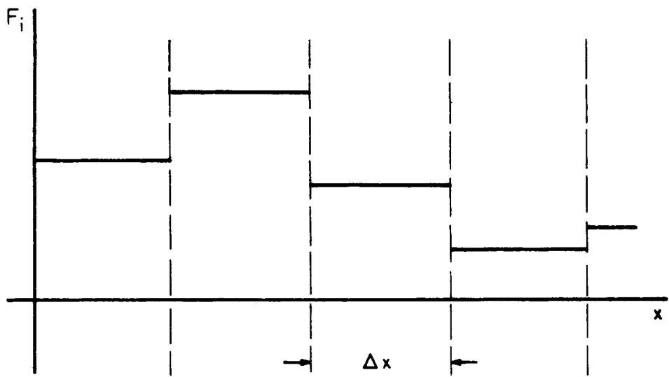  
Figure 10-3a The force for an energy-conserving algorithm,using linearly weighted charge，is piecewise constant.

10-3c If the field algorithm is (14) with $E _ { j + 1 / _ { 2 } } - E _ { j - 1 / _ { 2 } } = \rho _ { j } \Delta x$ ，show that both sides of (8） are equal to

$$
\Delta x \sum _ { j } E _ { j + / k } ^ { ( \mathrm { I } ) } \ E _ { j + / k } ^ { ( 2 ) }
$$

proving the reciprocity result,and also showing that the field energy is nonnegative. Generalize this to two dimensions.

10-3d Use (9),(10),and (11) to show that the field energy can be writen

$$
1 / \mid V _ { c } \sum _ { \bf j } \rho _ { \bf j } \phi _ { \bf j } = ( 1 / _ { 2 } V _ { c } ) ^ { 2 } \sum _ { \bf j \ne m } \Delta _ { \bf j m } ( \phi _ { \bf j } - \phi _ { \bf m } ) ^ { 2 }
$$

and therefore that the field energy is nonnegative if $\Delta _ { \mathbf { j m } } \geqslant 0$ for $\mathbf { j } \neq \mathbf { m } .$ (This result applies to the energy in most field solution methods,while Problem 10-5a is specific to Lagrangian formulations).

10-3e Provide the steps connecting (12) and (14).

10-3f Show that the undesirable jump in force (13） may be avoided by going to one-orderhigher weighting in charge (to the quadratic spline,Section 8-8),which also increases the order in weighting the force (to linear).

# 10-4 ENERGY CONSERVATION

In this section we demonstrate the conservation of energy under rather general conditions on the field equations. Since the energy-conserving pro-perty applies exactly only when the time integration is exact for the particle equations of motions, we assume time is continuous.

The rate of change of kinetic energy is

$$
\begin{array} { l } { { \displaystyle { \frac { d } { d t } } ( { \bf K } { \bf E } ) = { \frac { d } { d t } } \sum _ { i } ^ { 1 / 2 } m _ { i } { \dot { x } } _ { i } ^ { 2 } = - \sum _ { i } ^ { } { \dot { \bf x } } _ { i } \cdot { \frac { \partial } { \partial { \bf x } _ { i } } } q _ { i } V _ { c } \sum _ { \bf j } \phi _ { \bf j } S ( { \bf X _ { j } - x } _ { i } ) } } \\ { ~ = - V _ { c } \sum _ { \bf j } { \phi } _ { \bf j } { \frac { d } { d t } } \sum _ { i } q _ { i } S ( { \bf X _ { j } - x } _ { i } ) }  \\ { { \displaystyle ~ = - V _ { c } \sum _ { \bf j } { \dot { \rho } } _ { \bf j } \phi _ { \bf j } } } \end{array}
$$

The electric potential is the solution of a discrete analogue to Poisson's equation, and is a linear combination of the $\displaystyle \{ \rho _ { \mathrm { j } } \}$ and the boundary conditions if the latter are inhomogeneous. We therefore write the potential as

$$
\phi _ { \mathrm { j } } = \mathrm { ~ } V _ { c } \sum _ { \bf m } g _ { \mathrm { j , m } } \rho _ { \bf m } + \phi _ { \mathrm { j , e x t } }
$$

where $g _ { \mathrm { j , m } }$ is the Green's function for the difference Poisson's equation. Any fixed charge density can be either included in $\pmb { \rho }$ and regarded as due to infinitely massve particles orregarded as acontributor to $\phi _ { \mathrm { j , e x t } }$

By analogy with real electrostatic field theory,we expect that the potential energy of the system due to the fields of the particles is (see Jackson, 1975, p.21)

$$
1 / _ { 2 } \sum _ { i } V _ { i , \mathsf { s e l f } } ( \mathbf { x } _ { i } )
$$

where $V _ { i , \mathsf { s e l f } }$ is interpolated from the first term of (2),and the potential energy due to the external potential is $\sum V _ { i , \mathrm { e x t } }$ . Let us see when this is true. From the identity

$$
\sum _ { i } V _ { i } ( { \bf x } _ { i } ) \equiv V _ { c } \sum _ { \bf j } \rho _ { \bf j } \phi _ { \bf j }
$$

we find that the time rate of change of the prospective total energy is

$$
\begin{array} { r l } {  { \frac { d } { d t } ( \mathrm { K E } + / _ { 2 } \sum _ { i } V _ { i , \mathrm { s e l f } } + \sum _ { i } V _ { i , \mathrm { e x t } } ) } } \\ & { = \frac { d } { d t } \Bigg [ \mathrm { K E } + \frac { V _ { c } } { 2 } \sum _ { \mathbf { j } } \rho _ { \mathbf { j } } \phi _ { \mathbf { j } , \mathrm { s e l f } } + V _ { c } \sum _ { \mathbf { j } } \rho _ { \mathbf { j } } \phi _ { \mathbf { j } , \mathrm { s e l f } } \Bigg ] } \\ & { = V _ { c } \sum _ { \mathbf { j } } \dot { \phi } _ { \mathbf { j } , \mathrm { e x t } } + / _ { 2 } V _ { c } \sum _ { \mathbf { j } } ( \rho _ { \mathbf { j } } \dot { \phi } _ { \mathbf { j } , \mathrm { s e l f } } - \dot { \rho } _ { \mathbf { j } } \phi _ { \mathbf { j } , \mathrm { s e l f } } ) } \end{array}
$$

The first term on the right-hand side is the rate of change of total energy due to its explicit time dependence; it corresponds to $\partial H / \partial t$ and, therefore, its appearance is justified. To obtain an energy-conserving system， therefore, we want the second sum on the right-hand side to vanish. It does so if the potential solution satisfies the Green's reciprocation theorem 10-3(8) (just setp(1) $\pmb { \rho } ^ { ( 1 ) } \mathbf { = } \pmb { \rho }$ ， $\rho ^ { ( 2 ) } = \dot { \rho } \ d t )$ Analternateproofof thesuffciency of reciprocity for energy conservation was given in Section 10-3.

Reciprocity can be shown to be satisfied if $\phi$ is given by (2） and the Green's function ${ \pmb { \ell } } _ { \mathbf { j } , \mathbf { m } }$ is known to be symmetric,as may be expected when $\Delta _ { \mathbf { j m } }$ is symmetric. [There is an arbitrariness in specifying $\pmb { g }$ because the total charge is zero in a periodic system，so that a transformation of the $\pmb { \ 8 }$ obtained straightforwardly from a Poisson solver may be required before the symmetries are explicit (Lewis et al.， 1972). The relevance of symmetry is indicated by Problem 10-4b.]

In any case,it is clear that the energy-conserving property is easily obtained.

# PROBLEMS

10-4a Derive (3) using 10-3(2) and 10-3(7).

10-4b Consider a single particle in an infinite system in which the Green's function is of the form $g _ { i , j } \sim i - j$ (antisymmetric). Show that the particle accelerates in its own field,gaining kinetic energy while the feld energy is constant (zero).

# 10-5 ALGORITHMS DERIVED VIA VARIATIONAL PRINCIPLES

The basic idea is to substitute into the exact Lagrangian an approximate representation of the fields and particles. This representation has a finite set of variables,and the usual variational principle provides equations governing these variables.

To avoid notational complexity，we retain vector coordinates instead of "generalized" coordinates and specialize to electrostatic fields. (Lewis, 1972, treats formally the case of generalized coordinates and the full electromagnetic field). In rationalized cgs (Heaviside-Lorentz) units (Panofsky and Phillips,1962, p. 461； Jackson, 1975,p.817-818),the Lagrangian is [Goldstein, 1950,eq. (11-73),p. 369]

$$
L = \sum _ { i } ^ { } / _ { 2 } m _ { i } \dot { x } _ { i } ^ { 2 } - \sum _ { i } q _ { i } \phi ( { \bf x } _ { i } , t ) + \int d { \bf x } ^ { 1 } / _ { 2 } [ \nabla \phi ( { \bf x } , t ) ] ^ { 2 }
$$

We now replace $\phi$ by an interpolated potential

$$
\Phi ( { \bf x } , t ) = V _ { c } \sum _ { \bf j } \phi _ { \bf j } ( t ) S ( { \bf X _ { j } - \bf x } )
$$

Applying the variational principle to a Lagrangian of the form $L ( \{ \mathbf { x } _ { i } \} , \{ \dot { \mathbf { x } } _ { i } \} )$ $\{ \phi _ { \mathbf { j } } \} )$ yields the Euler-Lagrange equations

$$
0 = \frac { \partial { \cal L } } { \partial { { \bf x } _ { i } } } - \frac { d } { d t } \left( \frac { \partial { \cal L } } { \partial \dot { { \bf x } } _ { i } } \right)
$$

$$
0 = { \frac { \partial { \cal L } } { \partial \phi _ { \mathrm { j } } } }
$$

The second equation takes this form because $\dot { \phi } _ { \mathbf { j } }$ does not appear in $L$ (this equation is the same as could be obtained using "finite-element" Galerkin methods). With the representation (2),we find

$$
\begin{array} { l } { m _ { i } \ddot { \mathbf { x } } _ { i } = - q _ { i } \displaystyle \frac { \partial } { \partial \mathbf { x } _ { i } } V _ { c } \sum _ { \mathbf { j } } \phi _ { \mathbf { j } } ( t ) S ( \mathbf { X _ { j } } - \mathbf { x } _ { i } ) } \\ { \rho _ { \mathbf { j } } = V _ { c } \sum _ { \mathbf { j ^ { \prime } } } \phi _ { \mathbf { j ^ { \prime } } } \displaystyle \int d \mathbf { x } \left( \frac { \partial } { \partial \mathbf { x } } S ( \mathbf { X _ { j } } - \mathbf { x } ) \right) \cdot \left( \frac { \partial } { \partial \mathbf { x } } S ( \mathbf { X _ { j ^ { \prime } } } - \mathbf { x } ) \right) } \end{array}
$$

Equation (5) is the usual equation of motion with the same force term as in 10-3(6). It is the gradient of the interpolated potential, rather than the inter-polated first difference of the potential. The connection of this feature to the existence of a conserved energy is shown in Section 10-3. Equation (6） is the same, in our notation,as eq. (6O) in Lewis (1970a).

In one dimension and with linear $s$ ，we recover from (6) the simplest difference approximation to the Poisson equation. However, in two or three dimensions the resulting Poisson difference equation is not familiar. We find in Section 10-8 that (6) produces the correct cold-plasma oscillation frequency at any wavelength! It automatically compensates for the increase in smoothing as one goes to higher-order splines. It is tempting to think that these simulation algorithms ought to be optimal in some sense. To answer that, one must decide what properties of the simulation are to be accurate, and then go outside the variational principle to the methods of Chapter 8 to analyze and adjust the algorithm. For example, we see in Section 1O-10 that for warm plasmas,(6) does not give the most accurate oscillation frequencies. This is because a warm plasma responds less to short-wavelength noise than to errors at long and medium wavelengths. The variational principle cannot "know" this. In systems where such analysis is difficult or the better algorithms are difficult to implement (e.g.，where curvilinear coordinates are used),the variational principle may be useful.

# PROBLEM

10-5a Show that the field energy is nonnegative when $\phi$ is obtained from (6).Hint:First show that the field energy can be written as

$$
\frac { 1 } { 2 } \sum \rho _ { \mathrm { J } } \phi _ { \mathrm { J } } = \frac { 1 } { 2 } \int d { \bf x } ( \nabla \Phi ) ^ { 2 }
$$

where $\Phi$ is the interpolated potential (2). This proof can be adapted to general coordinate systems.The nonnegative property and symmetry of the Poisson operator facilitate numerical solution of (6).

# 10-6 SPATIAL FOURIER TRANSFORMS OF DEPENDENT VARIABLES

As in Section 8-9,we relate the spatial Fourier transforms of the equa-tions of the force calculation, and note differences between the momentumand energy-conserving models.

The transform of 10-3(2) is,of course, the same as in Section 8-9, but the transform of 10-3(6) is

$$
F ( { \bf k } ) = - i q S ( - { \bf k } ) \kappa \phi ( { \bf k } )
$$

with $\pmb { \kappa } = \mathbf { k }$ (Compare 10-2(3) and 10-2(4)). Comparing to 8-9(7) and 8- 9(15),we see that (1) is formally the same,differing only in the definition of $\pmb { \kappa }$ . The transform of the Poisson equation 10-5(6) is

$$
{ \cal K } ^ { 2 } ( { \bf k } ) \phi ( { \bf k } ) = \rho ( { \bf k } )
$$

which is formally the same as 8-9(14), but here $K ^ { 2 }$ is determined by the Lagrangian to be

$$
K ^ { 2 } ( { \bf k } ) = \sum _ { \bf p } k _ { \tt p } ^ { 2 } S ^ { 2 } ( { \bf k } _ { \tt p } )
$$

In one dimension, $k _ { p } = k - 2 \pi p / \Delta x .$ (Note $K ^ { 2 } \geqslant 0$ ，so the field energy is nonnegative.)

# 10-7 LEWIS'S POISSON DIFFERENCE EQUATION AND THE COULOMB FIELDS

While Lewis's prescription of the form of Poisson's equation is not related to energy conservation, it does attempt to reproduce accurately the Coulomb interaction implicit in his Lagrangian and even compensates partially for errors in interpolation. To see this,we use the results of the last section to relate the transforms of the particle density and force field

$$
\mathbf { F } ( \mathbf { k } ) = \frac { - i q ^ { 2 } \mathbf { k } S ( \mathbf { k } ) \sum S ( \mathbf { k } _ { \mathbf { p } } ) n ( \mathbf { k } _ { \mathbf { p } } ) } { \underset { \mathbf { p } } { \sum } }
$$

Suppose an interpolation is used which is free of aliasing. This requires that ${ \pmb S } ( { \pmb k } ) = 0$ outside the first Brillouin zone,where the first zone is defined by max $ \phantom { } \times | k _ { x } \Delta x , k _ { y } \Delta y , k _ { z } \Delta z | < \pi$ in a rectangular lattice. This is called bandlimited interpolation. It is not necessary that $\pmb { S } ( \mathbf { k } )$ be constant $( = 1 )$ within the first zone. In this case only the $\pmb { p = 0 }$ terms contribute, leaving

$$
\mathbf { F ( \mathbf { k } ) } = \left\{ \frac { - i q ^ { 2 } n ( \mathbf { k } ) \mathbf { k } / \mathbf { \Omega } k ^ { 2 } } { 0 } \right.
$$

Thus the long wavelength fields are exactly Coulomb in the alias-free limit. If $\pmb { S } ( \pmb { k } )$ is not constant in the first zone,so that there are errors in the inter-polation, Lewis' Poisson algorithm makes compensating errors in calculating $\phi$ to yield good overall accuracy. This would be important to the practical realization of high-accuracy algorithms, since if $\pmb { S } ( \mathbf { k } )$ is constant in the first zone, then $\pmb { S } ( \mathbf { x } )$ drops off very slowly with increasing $x$ and also does not remain positive. However, band-limited interpolation is not very practical in plasma simulation, and if it were, the momentum-conserving algorithm would also.conserve energy and could be made as accurate.

E.L.Lindman (private communication） observed that small oscillations of a cold, nondrifting plasma in a linear-weighting Lewis model occur at exactly the correct frequency (except for time-integration errors). This interesting observation is true for any weighting function $s$ ,and in one,two, or three dimensions,as shown in Section 10-8. Here is an instance in which the variational principle does as well as can be done. However, this turns out to be an exceptional case,as seen in Section 10-10.

As a measure of accuracy in realistic cases,we examine the "averaged force" $\mathbf { F } _ { 0 } ( \mathbf { k } )$ ，defined in Section 8-3. Imagine holding the particles fixed while displacing (not rotating） the grid. Then $\mathbf { F } _ { 0 } ( \mathbf { x } )$ is the average of $\pmb { \mathrm { F } } ( \pmb { \mathrm { x } } )$ over all such displacements: One can show that $\mathbf { F } _ { 0 } ( \mathbf { k } )$ is obtained from (1) by keeping only the $\pmb { p = 0 }$ term in the numerator,

$$
\mathbf { F } _ { 0 } ( \mathbf { k } ) = \frac { - i q ^ { 2 } n ( \mathbf { k } ) \mathbf { k } } { \sum _ { \mathbf { p } } k _ { \mathbf { p } } ^ { 2 } S ^ { 2 } ( \mathbf { k } _ { \mathbf { p } } ) }
$$

The applicability of ${ \bf { F } } _ { 0 }$ is discussed in Sections 8-13 and 10-10. We make use of it in Sections 10-11 and 10-12 in discussing two examples.

# 10-8 SMALL-AMPLITUDE OSCILLATIONS OF A COLD PLASMA

In this section we show that small-amplitude oscillations of a cold plasma with no drift velocity have the correct frequency and spatial properties using a Lagrangian algorithm. This is done both with and without use of Fourier transforms.

The linear response of a cold plasma is

$$
n ( \mathbf { k } , \omega ) = \frac { i n _ { 0 } \mathbf { k } \cdot \mathbf { F } ( \mathbf { k } , \omega ) } { m \omega ^ { 2 } }
$$

We multiply this by $\pmb { S } ( \mathbf { k } )$ ， replace $\mathbf { F }$ using 10-7(1)，replace $\mathbf { k }$ by $\mathbf { k } _ { \mathbf { p ^ { ' } } }$ sum

over $\pmb { \ p } ^ { \prime }$ making use of the periodicity of the sums in 10-7(1),then cancel the sums $\sum S n$ and $\sum k _ { \mathrm { p } } ^ { 2 } S ^ { 2 }$ We are left with simply

$$
\omega ^ { 2 } = \frac { n _ { 0 } q ^ { 2 } } { m } \equiv \omega _ { p } ^ { 2 }
$$

independent of $\pmb { k }$ . This is the correct result, having no error due to finite $\Delta x$

Although this derivation is very short [once 10-7(1） has been derivedl it is instructive to repeat the derivation ab initio without using Fourier transforms. The meaning of linearization and the fluid limit is clarified,as is the nature of the oscillations. For brevity the discussion is kept to one dimension; the generalization is trivial.

We assume that the unperturbed particle positions $x _ { i 0 }$ are equally spaced, and there is an integer number of particles per cell. They are neutralized by a fixed background. After perturbing the particle positions by Xi1,

$$
\rho _ { j } = q \sum _ { i } x _ { i 1 } { \frac { \partial } { \partial x _ { i 0 } } } S ( X _ { j } - x _ { i 0 } )
$$

This Taylor expansion of 10-3(2) is where linearization first enters. We now differentiate this twice in time. The acceleration $\ddot { x } _ { i 1 }$ is given by 10-3(6),but evaluated at $x _ { i 0 }$ (linearization again). Rearranging the sum, we have

$$
\ddot { \rho } _ { j } = - \frac { q ^ { 2 } } { m } \Delta x \sum _ { j ^ { \prime } } \phi _ { j ^ { \prime } } \sum _ { i } \left[ \frac { \partial } { \partial x _ { i 0 } } S ( X _ { j ^ { \prime } } - x _ { i 0 } ) \right] \left[ \frac { \partial } { \partial x _ { i 0 } } S ( X _ { j } - x _ { i 0 } ) \right]
$$

Assuming that the number of particles per cell, $n _ { 0 } \Delta x$ ，is large,the particle sum may be replaced by an integral. Then, comparing with 10-5(6),we have simply

$$
\ddot { \rho } _ { j } = - \frac { n _ { 0 } q ^ { 2 } } { m } \rho _ { j }
$$

Each $\pmb { \rho } _ { j }$ oscillates at the plasma frequency and independently of the others. Alternatively the $\phi _ { j }$ can oscillate independently. This can be understood by working through the linear case with only one $\pmb { \rho } _ { j }$ or $\phi _ { j }$ oscillating. The Oscillations of particles in the same cell are not independent.

If the kinetic energy is evaluated as in ES1 (Section 3-11） in a linearweighting model, placing the particles so that grid points fall between them, and keeping oscillation amplitudes low enough that particles do not cross grid points, then total energy is conserved to within roundoff error (Problem 4- 10e)． However, this is a very special situation!

The derivation breaks down if the_particles have any drift motion. In this case the dispersion relation 1O-10(i） may be used. Some features of this case are discussed in Section 10-9 and in Langdon (1970b).

# 10-9 LACK OF MOMENTUM CONSERVATION

We have implied that these models do not conserve momentum. We now show how this failure is associated with aliasing. Both are manifesta-tions of the nonuniformity of the system dynamics. When the Lagrangian is not invariant under displacement, momentum is not conserved in general. Consider the total force on the system of particles when band-limited inter-polation is used:

$$
{ \begin{array} { r l } { \int d \mathbf { x } n ( \mathbf { x } ) F ( \mathbf { x } ) = \int { \frac { d \mathbf { k } } { ( 2 \pi ) ^ { 3 } } } n ( \mathbf { k } ) \mathbf { F } ( - \mathbf { k } ) } \\ { = \int { \frac { d \mathbf { k } } { ( 2 \pi ) ^ { 3 } } } n ( \mathbf { k } ) i \mathbf { k } S ( \mathbf { k } ) q \phi ( - \mathbf { k } ) } \\ { = \int { \frac { d \mathbf { k } } { ( 2 \pi ) ^ { 3 } } } i \mathbf { k } \rho ( \mathbf { k } ) \phi ( - \mathbf { k } ) = 0 } \end{array} }
$$

where $\rho ( \mathbf { k } ) = q S ( \mathbf { k } ) n ( \mathbf { k } )$ in the absence of aliasing,and the integrand is odd. Thus the total particle force is zero and momentum is conserved. This is essentially because the particles can no longer sense the positions of the grid points; the nonuniformity of the grid is removed from the dynamics.[It should be noted that, in the absence of aliasing，the usual models,which conserve momentum,can be made to conserve energy also. See 10-2(2) with $K ^ { 2 }$ defined as $k \kappa$ ,or 10-2(3) with $\kappa = k$ ,in the first zone.]

A simple instance of the failure of momentum conservation is the force exerted on a particle by its own field. We examine this self-force later, but let us assume for the present that we are not interested in such a force error on the microscopic level (perhaps because it averages to zero） unless there is some macroscopic manifestation. We now give two examples in which a large change may take place in the total momentum.

A dramatic failure of momentum conservation is illustrated in Figure 10-9a and Figure 10-9b. Instability is predicted and observed in a cold plasma drifting through the grid with a fixed neutralizing background; see Section 8-12 and Problem 10-9a. There need not be two or more plasma components drifting relative to each other. Clearly this instability is not phy-sically valid; its origin is in aliasing errors. Let us divide the energy into three nonnegative parts: kinetic energy associated with the mean motion, kinetic energy of motion relative to the mean, and field energy. The sum of these can be made to remain as nearly constant as desired, by decreasing the time step. As the instability develops, the latter two contributions to the total energy both increase, so the first contribution decreases. Therefore, the mean velocity and momentum must be decreasing. The force errors produce a drag on the mean motion. [Note that the existence of the energy constant means the instability amplitude is limited by the available energy，which is not the case for such instabilities in the usual models in which the total energy has been observed to increase several fold (Okuda, 1970,1972).] This description is supported by the simulation results shown in Figure 10-9a

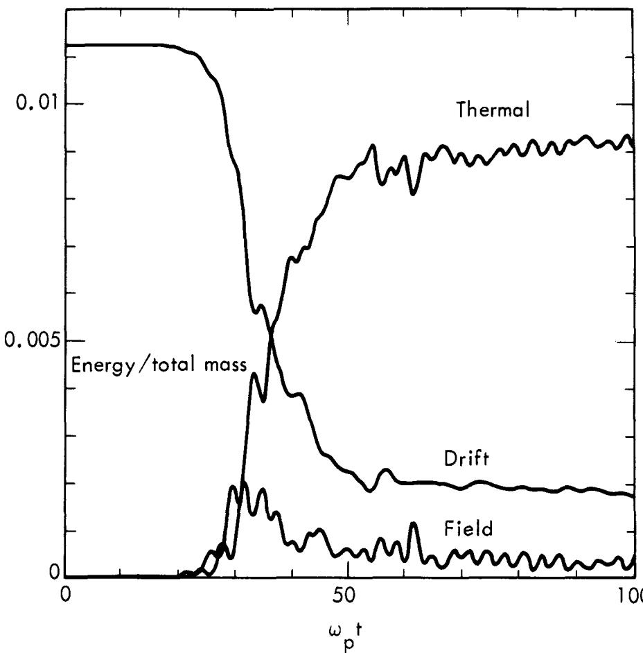  
Figure $1 0 - 9 a$ An example of macroscopic failure of momentum conservation. A cold beam passing through a fixed uniform neutralizing background is made unstable by the grid (via aliasing).Up to about $\omega _ { p } t = 3 0$ the beam behaves as a linearized cold fluid．Drift kinetic energy (x momentum²） is converted to field energy and kinetic energy relative to the mean ("thermal" energy)．Later behavior is more affected by the small number of particles used (96O).The range of variation in the total energy is $0 . 6 \%$ ；this variation is due solely to time integration errors $( \omega _ { p } \Delta t = 0 . 1 )$ (From Langdon, 1973.)

and Figure 10-9b.

Collisions also produce a drag leading to decreasing momentum， as predicted for a warm, uniform,stable plasma drifting through the grid (Section 12-6). The loss of energy of mean motion is compensated for by an increase in temperature.

We do not claim to have shown that the lack of momentum conservation is necessarily damaging in practice, but only that it can have macroscopically visible consequences.

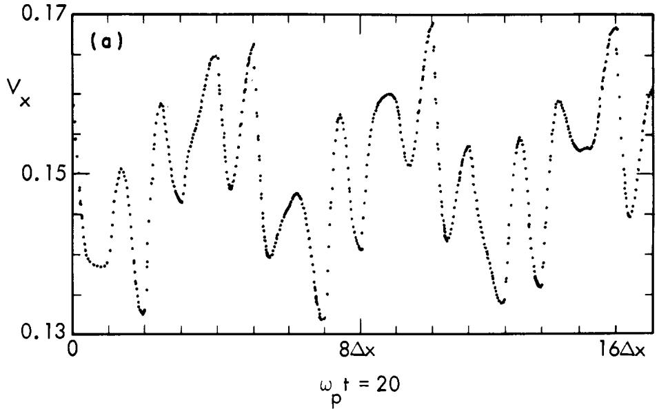

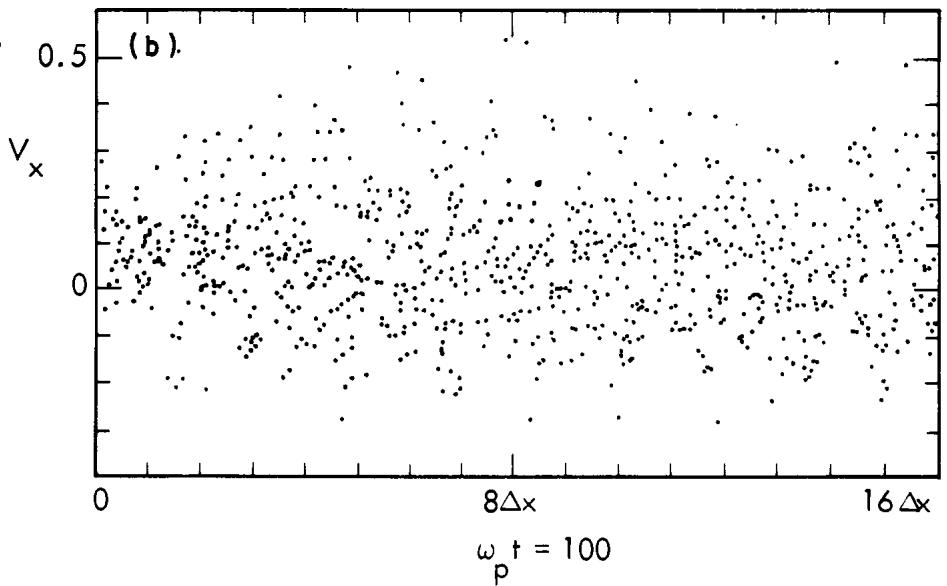  
Flgure 10-9b This shows phase space at times $\omega _ { p } t = 2 0$ and 100.The initial drift velocity was $0 . 1 5 \ \omega _ { p } \Delta x$ and the third mode was excited. Soon mode $1 3 \ \left[ \simeq \right.$ number of grid points (16) minus fundamental mode numberl appears. The two are coupled by the grid and grow quickly together (a).[Note the expanded velocity scale in (a)]. The distribution after saturation shows little structure (b). (From Langdon, 1973.)

# PROBLEM

$1 0 . 9 a$ Adapt the reasoning in Section 8-12 to show that a cold beam is unstable if its drift speed is less than about $\omega _ { p } \Delta x / 2 \pi$

# 10-10 ALIASING AND THE DISPERSION RELATION FOR WARM PLASMA OSCILLATIONS

We stated that the dispersion of waves in a warm plasma is described very well by a dispersion relation based on the averaged force $F _ { 0 }$ . This has been observed in numerical solutions of the exact (including aliasing) disper-sion relations (Section 8-13). In this section we show that the aliasing errors can be fourth or fifth order in $\Delta x$ ，in the linear-weighting case. Therefore, the dispersion errors at long wavelengths can be dominated by second-order errors in $F _ { 0 }$ if the variational principle is used,as discussed at the end of Section 10-11.

From Section 9-5,the dispersion relation is

$$
\epsilon \equiv 1 + \frac { \omega _ { p } ^ { 2 } } { K ^ { 2 } } \underset { \bf p } { \sum } S ^ { 2 } ( { \bf k } _ { \mathrm { p } } ) \int { \bf k } _ { \mathrm { p } } \cdot \frac { \partial f _ { 0 } } { \partial \bf v } \frac { d { \bf v } } { \omega - { \bf k } _ { \mathrm { p } } \cdot { \bf v } }
$$

in which the particles are treated as a linearized Vlasov plasma, and $\mathbf { x } , \ \mathbf { y } ,$ and $t$ are continuous. The effects of finite grid spacing are treated exactly. For simplicity,we work in one dimension.

If one keeps only the $\pmb { p = 0 }$ term in the above, one has an approximate relation which we write as $\scriptstyle \mathbf { \epsilon } \in _ { 0 } = 0$ and which would be obtained if one started with $F _ { 0 }$ as the interaction force. We now examine the difference between $\pmb { \epsilon }$ and ${ \pmb \epsilon } _ { 0 }$ , due to the aliasing terms. In the linear-weighting case,we have

$$
S ^ { 2 } ( k _ { p } ) = \left( \frac { 2 } { k _ { p } \Delta x } \sin \frac { k _ { p } \Delta x } { 2 } \right) ^ { 4 } = \left( \frac { k \Delta x } { 2 \pi p } \right) ^ { 4 } \left( 1 + \frac { 2 k \Delta x } { \pi p } \right) + \ O ( k \Delta x ) ^ { 6 }
$$

when $p \neq 0$ and $k \Delta x < < \pi$ .From this alone one suspects that $\epsilon - \epsilon _ { 0 }$ is fourth order in $\Delta x$ . To be sure we must consider the response of the plasma to short wavelengths by evaluating the velocity integral. We use a Maxwellian with root-mean-square velocity spread $\nu _ { t }$ superimposed on a drift velocity $\nu _ { 0 }$ . Then

$$
\epsilon = 1 - \frac { 1 } { 2 K ^ { 2 } \lambda _ { D } ^ { 2 } } \sum _ { p } S ^ { 2 } ( k _ { p } ) Z ^ { \prime } \Bigg | \frac { \omega - k _ { p } \nu _ { 0 } } { \sqrt { 2 } | k _ { p } | \nu _ { t } } \Bigg |
$$

$\pmb { Z } ^ { \prime }$ is the derivative of the plasma dispersion function of Fried and Conte (1961). We can proceed further analytically in the interesting case $\lambda _ { D } \gtrsim \Delta x$ $\nu _ { 0 } \lesssim \nu _ { t }$ . Then the small-argument expansion of $z ^ { \prime }$ is appropriate:

$$
{ \frac { 1 } { 2 } } Z ^ { \prime } \left[ { \frac { \xi } { \sqrt { 2 } } } \right] = - i \left( { \frac { \pi } { 2 } } \right) ^ { 1 / 2 } e ^ { - \xi ^ { 2 } / 2 } - 1 + \xi ^ { 2 } - { \frac { 1 } { 3 } } \xi ^ { 4 } + { \frac { 1 } { 1 5 } } \xi ^ { 6 } ~ \cdot \cdot \cdot
$$

Substituting this into (3） and using small- $\pmb { k }$ expansions like (2),we have,to lowest nonvanishing order in $\pmb { \Delta x }$ ，

$$
\epsilon - \epsilon _ { 0 } \approx \frac { 1 } { ( k \lambda _ { D } ) ^ { 2 } } \Bigg [ \frac { ( k \Delta x ) ^ { 4 } } { 7 2 0 } + i 2 . 6 5 \times 1 0 ^ { - 4 } \frac { ( k \Delta x ) ^ { 5 } } { \nu _ { t } } \Bigg ( \frac { \omega } { k } + 4 \nu _ { 0 } \Bigg ) \Bigg ]
$$

The corresponding_ error in ${ \pmb \omega } ( k )$ is nearly proportional to $\epsilon - \epsilon _ { 0 }$ so the errors in $\mathbf { R e } \omega$ and $\operatorname { I m } \omega$ are fourth and fifth order in $\Delta \ v { x }$ ,respectively, due to aliasing. However,using the variational principle, the error in ${ { F } _ { 0 } }$ is ${ \dot { O } } ( \Delta x ) ^ { 2 }$ An overall error of $O ( \Delta x ) ^ { 4 }$ in $\omega ( k )$ requires a different Poisson operator, as discussed in Section 10-11.

As an aside, the imaginary part of (5） shows the damping influence of the aliasing terms when $\nu _ { 0 } = 0$ . On the other hand,with $\nu _ { 0 } \not \approx 0$ these terms can become destabilizing.

# 10-11 THE LINEAR-INTERPOLATION-MODEL EXAMPLE

We now examine the nature of the particle force $\mathbf { F }$ in the linear interpolation examples of Lewis (1970). First, we note that $\mathbf { F }$ is discontinuous. For given, fixed $\displaystyle \{ \phi _ { \mathrm { i } } \}$ in two dimensions, $F _ { x }$ is continuous and piecewise linear as a function of $y$ alone,and is a step function when $\pmb { x }$ alone is varied. In one dimension, $\pmb { F }$ is a step function (Figure 1O-3a). Thus this case may be expected to be noisier than the common linear-weighting algorithms,but the overall computational time is shorter because the expression for $\pmb { F }$ is much simpler. It is also difficult to integrate in time accurately enough to realize an improvement in energy conservation. In empirical studies (Lewis et al., 1972;Brown et al.,1974; Lewis and Nielson, 1975), the variational algorithms have not demonstrated superiority.

# (a) Momentum Conservation and Self-Forces

As mentioned above, a simple example of the failure of momentum con-servation is the force exerted on a particle by its own fields. Since a particle has many neighbors,it is more significant that the two-particle interaction force is nonconservative. However, the single particle case is simple and of some interest. Consider a single particle in a large one-dimensional system, using linear interpolation. Place the particle between adjacent grid points located at $\scriptstyle x = 0$ and $\Delta \ v { x }$ . Then the self-force is

$$
F = - q \frac { \phi _ { \mathrm { I } } - \phi _ { 0 } } { \Delta x } = \frac { 1 } { 2 } q \Delta x ( \rho _ { 0 } - \rho _ { 1 } )
$$

$$
= - q ^ { 2 } \left( { \frac { x } { \Delta x } } - { \frac { 1 } { 2 } } \right) \quad 0 \leqslant x \leqslant \Delta x
$$

This is a simple harmonic oscillator potential well. Let us attempt to assess its importance in a single-species plasma. It yields an oscillation frequency $\omega _ { \mathrm { s e l f } } = \dot { \omega } _ { p } / \sqrt { n \Delta x }$ ， much smaller than the plasma frequency $\omega _ { p }$ if the number of particles per cell $n \Delta x$ is large. The well-depth energy $W _ { \mathrm { s e l f } }$ may be com-pared to the thermal energy:

$$
{ \frac { W _ { \mathrm { s e l f } } } { ( 1 / \lambda \operatorname* { m } \nu _ { t } ^ { 2 } ) } } = { \frac { 1 } { 4 } } { \frac { \left( { \frac { \Delta x } { \lambda _ { D } } } \right) ^ { 2 } } { n \Delta x } } = { \frac { 1 } { 4 } } { \frac { \left( { \frac { \Delta x } { \lambda _ { D } } } \right) } { n \lambda _ { D } } }
$$

where $m$ is the particle mass, $\nu _ { t }$ is the rms thermal velocity,and $\lambda _ { D }$ is the Debye length. Similar results are anticipated in two and three dimensions (Problem 10-11a).

Note that all these ratios are desirably small when $n \Delta x$ is large, given $\Delta x / \lambda _ { D }$ .Furthermore， since other particles in the cell contribute forces comparable to a particle's self-force, the latter becomes relatively small compared to normal many-body interactions.

We have so far ignored time-integration errors, in effect, assuming the time step $\Delta t$ is kept negligibly small. If $\Delta t$ is held constant while $\Delta x$ is decreased then， when $\omega _ { \mathrm { s e l f } } \Delta t \geqslant 2$ ，the self-force oscillation becomes unstable. This requires $n \Delta x < 1$ . M.A. Lieberman (private communication） has shown that,even before the instability threshold, particle velocities can diffuse without limit-gross nonconservation of energy permitted by the time-integration errors. While such unphysical behavior in even the "unperturbed" particle orbits is undesirable,one should compare it to velocity diffusion due to normal collisions. To estimate the self-force diffusion rate, assume $\Delta x$ is so small that the particle position within a cell is randomly and independently distributed from time step to step. The mean-square selfforce in one dimension is $< F ^ { 2 } > = q ^ { 4 } / 1 2$ leading to a diffusion given by

$$
< \Delta \nu ^ { 2 } > \ = \ \frac { < F ^ { 2 } \Delta t ^ { 2 } > } { m ^ { 2 } } \frac { t } { \Delta t }
$$

Defining a diffusion time $\tau _ { s }$ by $< \Delta \nu ^ { 2 } > \ = \ \nu _ { t } ^ { 2 }$ ，we obtain

$$
\omega _ { p } \tau _ { s } = 1 2 \frac { ( n \lambda _ { D } ) ^ { 2 } } { \omega _ { p } \Delta t }
$$

whereas the normal collision times for a one dimensional plasma are $\omega _ { p } \tau _ { c } ( n \lambda _ { D } )$ or $( n \lambda _ { D } ) ^ { 2 }$ There seems to be no difficulty in making $\pmb { \tau } _ { s } > > \pmb { \tau } _ { c }$ ， as desired. A similar argument may be made in two and three dimensions. Thus the time-integration errors appear to increase the significance of the self-force,in this limit, but not disastrously.

One might try to restore momentum conservation by adding a new force to each particle which cancels its self-force. However,consider the case in which the particles are evenly spaced at integral submultiples of $\pmb { \Delta x }$ apart in a periodic system. The unmodified algorithm correctly calculates no forces.

To see that no such approach succeeds, note that in the Vlasov limit, the self-acceleration vanishes and the system is the same as without the selfforce cancellation. The discussion of Section 10-9 shows that momentum is not conserved in the Vlasov limit. Nor does any smoothing of $\pmb { \rho }$ or $\phi$ restore momentum conservation. The point is that the lack of conservation of momentum is not primarily a question of the single particle self-force.

# (b） Macroscopic Field Accuracy

If a plasma phenomenon is not affected by displacing the grid relative to it, then it would not be affected by replacing the interaction force by the averaged force $F _ { 0 }$ ，defined in Section 10-7. As an important example,we now consider oscillations of a warm plasma, using the accuracy of the period and rate of decay (or growth) as a measure of the accuracy of the fields.

In Section l0-10,we showed that the contribution of the $p \neq 0$ (aliasing) terms in the dispersion function ${ \epsilon } ( k , \omega )$ is fourth,or higher,order in $\pmb { \Delta x }$ Therefore,a lower-order error in $F _ { 0 }$ reduces the order of overall accuracy. For linear weighting we find, using 10-5(6)

$$
\frac { K ^ { 2 } } { k ^ { 2 } } = S ^ { 2 } ( k ) + \frac { 1 } { 1 2 } ( k \Delta x ) ^ { 2 } + O ( \Delta x ) ^ { 4 }
$$

Thus $F _ { 0 }$ has a relative error, $- ( k \Delta x ) ^ { 2 } / 1 2$ ，causing a similar error in the oscillation frequency $\pmb { \omega }$ . Further, the error in Re $\pmb { \omega }$ can cause an error in Im $\pmb { \omega }$ by changing the phase velocity; for a Maxwellian, this contribution to relative error in $\operatorname { I m } \ \omega$ is $- \Delta x ^ { 2 } / 2 4 \lambda _ { D } ^ { 2 }$ , independent of $k$

This $O ( \Delta x ) ^ { 2 }$ error may be removed by changing the Poisson algorithm. One way to do this is to solve the same Poisson equation but with

$$
\rho _ { j } ^ { \prime } = \frac { 1 } { 1 2 } ( - \rho _ { j - 1 } + 1 4 \rho _ { j } - \rho _ { j + 1 } )
$$

as the source density. One is then left with an $O ( \Delta x ^ { 4 } )$ error in $F _ { 0 }$ and from aliasing terms, resulting in a fourth-order error in ${ \pmb \omega } ( k )$ ·

These remarks hold also in two or three dimensions. The Poisson algorithms obtained from the variational principle are not optimal from the present point of view. Whether they are optimal in some other situation (apart from the singular case of cold-plasma oscillations） remains to be shown.

There should be no surprise that problems arise with the variational principle when the basis functions are an incomplete set. Many other such examples are known,e.g.,Gibb's phenomenon in least-squares fitting of trigonometric sums (yielding a truncated Fourier series), in which,as here, better algorithms can be obtained after taking into account the nature of the result one is trying to compute.

# PROBLEM

10-11a Use dimensional arguments to predict that,in two and three dimensions,(1） and (2) become

$$
\begin{array} { r } { \frac { \omega _ { \mathrm { s e l f } } ^ { 2 } } { \omega _ { p } ^ { 2 } } \sim \frac { 1 } { N _ { c } } , \quad \frac { W _ { \mathrm { s e l f } } } { 1 / _ { 2 } m \nu _ { t } ^ { 2 } } \sim \frac { 1 } { N _ { c } } \bigg ( \frac { \Delta x } { \lambda _ { D } } \bigg ) ^ { 2 } } \end{array}
$$

where $N _ { c } = n V _ { c }$ is'the number of particles per cell. The frequency $\omega _ { \mathrm { s e i f } }$ is only an approximate indication of the average force gradient,since a single-particle oscillation is no longer simple harmonic.

# 10-12 THE QUADRATIC SPLINE MODEL

The reduction of aliasing provided by a higher-order spline enables the variational principle to achieve better accuracy.The Poisson algorithm may be found from 10-5(6)or from 10-6(2b) and 8-8(1) for $S _ { m } ( k )$ ,as

$$
\begin{array} { l } { { \displaystyle K ^ { 2 } ( k ) = \left( \frac { 2 } { \Delta x } \sin ^ { 1 / _ { 2 } } k \Delta x \right) ^ { 6 } \sum _ { p } ( k - p k _ { g } ) ^ { - 4 } } } \\ { { = \left( \frac { 2 } { \Delta x } \sin ^ { 1 / _ { 2 } } k \Delta x \right) ^ { 2 } \frac { 1 } { 3 } ( 2 + \cos k \Delta x ) } } \end{array}
$$

The sum is evaluated with help from Abramowitz and Stegun [1964; take the second derivative of their Eq. (4.3.92)]. This is all that is needed, if Fourier transform methods are to be used in the simulation. The new factor in (1) is added by the variational derivation in order to compensate for the low-pass filtering (smoothing） effect of $S _ { 2 }$ as compared to $S _ { \mathrm { { l } } }$

Forsmall $k \Delta x$ ，the relative "error" in both $K ^ { 2 }$ and $S _ { 2 } ^ { 2 }$ is $- ( k \Delta x ) ^ { 2 } / 4 + O ( k ^ { 4 } )$ ，so that the second-order errors in $F _ { 0 } ( k )$ cancel (leaving a fourth-order relative error)， showing how the long-wavelength errors due to $S _ { 1 }$ have been reduced.

The difference-equation coefficients are the coefficients for an expansion of (1） in powers in exp $( i k \Delta x )$ ：

$$
- \rho _ { j } \Delta x ^ { 2 } = { \frac { 1 } { 6 } } ( \phi _ { j + 2 } + \phi _ { j - 2 } ) + { \frac { 1 } { 3 } } ( \phi _ { j + 1 } + \phi _ { j - 1 } ) - \phi _ { j }
$$

This is a fourth-order difference equation,so that in a nonperiodic finite sys-tem,two more boundary conditions are needed in addition to the usual two. These emerge naturally from Eq. (60) in Lewis (1970a) and depend on how the interpolation is modified at the ends of the system.

The self-force in this example scales as in 10-11(1) and 10-11(2),but with smaller coefficients. In general, the deficiencies due to aliasing (the ins-tability,momentum nonconservation, grid noise) are reduced.

Returning to the question of oscillations of a warm plasma, we find that aliasing terms make a contribution to $\epsilon - \epsilon _ { 0 }$ which is $O ( \Delta x ^ { 6 } )$ ， while the error in $F _ { 0 }$ is only fourth order. Again one achieves best accuracy in the complex frequency ${ \pmb \omega } ( k )$ with a Poisson algorithm different than that specified by the variational principle.

# PROBLEM

10-12a Equation (2) leads to a matrix equation in which the nonzero elements are allin a band, five eleiments across,down the diagonal,plus a few in the other corners. However,(1） shows how to solve two tridiagonal systems instead,each corresponding to factors of $K ^ { 2 }$ Show that the corresponding difference equations can be written as

$$
\frac { 1 } { 6 } \rho _ { j - 1 } ^ { \prime } + \frac { 2 } { 3 } \rho _ { j } ^ { \prime } + \frac { 1 } { 6 } \rho _ { j + 1 } ^ { \prime } = \rho _ { j }
$$

$$
\phi _ { j - 1 } - 2 \phi _ { j } + \phi _ { j + 1 } = - \rho _ { j } ^ { \prime } \Delta x ^ { 2 }
$$

Is such a factorization possible in two dimensions?

# MULTIPOLE MODELS

W. M. Nevins and A. B. Langdon

# 11-1 INTRODUCTION

In this chapter we consider an alternative approach to deriving plasma simulation algorithms,relate them to those of Chapters 8 and 14,and offer our perspective. We begin with a litte history and an outline of this chapter.

The first method considered by Dawson and co-workers for twodimensional simulation employed a truncated Fourier series expansion of the field,evaluated at each particle position. In applications requiring much spatial detail (i.e.,many Fourier modes),evaluation of the Fourier sums is too expensive. Instead, the field and its derivatives are evaluated at a number of spatial grid points (many fewer than the number of particles),and the field at a particle is evaluated as a truncated Taylor series expansion about the nearest grid point. They interpret this expansion in terms of multipole moments.

In order to reduce storage requirements， the "subtracted multipole" method evaluates only the field from the Fourier sum; its derivatives are evaluated using finite differences. This algorithm is easily expressed in the formulations of Chapter 8; doing so facilitates comparison with other methods.

The multipole method is derived in Section 11-2 in its original form, and in Section 11-3 in the "subtracted" form. In Section 11-4 we show how to derive the standard one-dimensional linear weighting as a dipole scheme,and derive a new two-dimensional dipole scheme. Adding the quadrupole xy moment yields the familiar bilinear or area weighting! Compared to pub-lished dipole algorithms, those derived here give smoother spatial variation for comparable resolution. Section 11-5 develops the Fourier space relationships between particle and grid quantities, adapting results from Chapter 8. These are used in Section 11-6 to examine overall accuracy.

# 11-2 THE MULTIPOLE EXPANSION METHOD

Let us look at the over-all multipole simulation method, then consider the accuracy and explicit forms (monopole,dipole, quadrupole). The original papers are Kruer, Dawson,and Rosen (1973),Chen and Okuda (1975), and Okuda (1977).

The predecessor of the multipole method is a field algorithm in which the particle is considered to be a finite-size cloud and the field is represented by a truncated Fourier series (Dawson,1970, p.16 ff)． The force on particle $i$ is therefore

$$
\begin{array} { l } { { \displaystyle F _ { i } = q _ { i } \int d x ^ { \prime } \hat { S } ~ \left( x ^ { \prime } - x _ { i } \right) \left[ \frac { - i } { L } \sum _ { k } k \phi \left( k \right) e ^ { i k x ^ { \prime } } \right] } } \\ { { = \displaystyle \frac { - i } { L } q _ { i } \sum _ { k } k \hat { S } ~ \left( - k \right) \phi \left( k \right) e ^ { i k x _ { i } } } } \end{array}
$$

where $L$ is the length of the 1d system,and the smoothing factor $\hat { S } _ { k }$ is chosen to be exp $( - \dot { k } ^ { 2 } a ^ { 2 } / 2 )$ . This sum must be evaluated for each particle. The charge density for each Fourier mode is

$$
\begin{array} { l } { \rho \left( k \right) = \displaystyle \int d x ^ { \prime } e ^ { i k x ^ { \prime } } \Biggl [ \sum _ { i } q _ { i } \hat { S } \left( x ^ { \prime } - x _ { i } \right) \Biggr ] } \\ { = \hat { S } \left( k \right) \sum _ { i } q _ { i } e ^ { - i k x _ { i } } } \end{array}
$$

from which $\phi ( k ) = \rho ( k ) / k ^ { 2 } .$ This method provides smooth variation of the fields but the computational effort per particle increases as spatial resolution (and therefore the number of Fourier modes) increases.

To speed up the force calculation, a spatial grid is introduced. The particle force is evaluated by Taylor expansion of the exponential in (1):

$$
{ \cal F } _ { i } = - \frac { i } { L } q _ { i } \sum _ { k } k \hat { S } ( - k ) \phi ( k ) e ^ { i k X _ { j } } [ 1 + i k ( x _ { i } - X _ { j } ) - 1 / 2 k ^ { 2 } ( x _ { i } - X _ { j } ) ^ { 2 } . \ .
$$

where $X _ { j }$ is the location of the grid point nearest the particle $x _ { j }$ . This can be written as

$$
\begin{array} { l } { { \displaystyle F _ { i } = F _ { 0 , j } + ( x _ { i } - X _ { j } ) F _ { 1 , j } + \ o { 1 } { \not / } _ { 2 } ( x _ { i } - X _ { j } ) ^ { 2 } F _ { 2 , j } + \ o { \cdot \cdot \cdot } . } } \\ { { \displaystyle \quad = \sum _ { l = 0 } \frac { 1 } { l ! } \ F _ { l , j } ( x _ { i } - X _ { j } ) ^ { l } } } \end{array}
$$

The force derivatives are given by

where

$$
\begin{array} { c } { { F _ { l , j } = \displaystyle \frac { 1 } { L } \sum _ { k } F _ { l } ( k ) ~ e ^ { i k X _ { j } } } } \\ { { F _ { l } ( k ) = ( i k ) ^ { l } ~ F _ { 0 } ( k ) , } } \\ { { F _ { 0 } ( k ) = - i k ~ q _ { i } ~ \hat { S } \left( - k \right) \phi ( k ) } } \end{array}
$$

The $F _ { l , j }$ are evaluated from $F _ { \mathit { l } } ( k )$ by Fast Fourier Transforms (FFT); $F _ { i }$ is then evaluated for each particle.

The charge _density is similarly evaluated by Taylor expanding the exponential in (2):

$$
\rho \left( k \right) = \hat { S } \left( k \right) \sum _ { j } e ^ { - i k X _ { j } } \sum _ { i \in j } q _ { i } \left[ 1 - i k \left( x _ { i } - X _ { j } \right) - \mathbb { 1 } _ { j } k ^ { 2 } ( x _ { i } - X _ { j } ) ^ { 2 } \cdot \cdot \cdot \cdot \right]
$$

where the outer sum is over grid points and the inner sum is over those particles nearest grid point $j$ and can be written as a sum over multipole moments,

$$
\rho ( k ) = \hat { S } ( k ) \Delta x \sum _ { j } e ^ { - i k X _ { j } } \left[ \rho _ { 0 , j } - i k \rho _ { 1 , j } - \mathbb { / } _ { 2 } k ^ { 2 } \rho _ { 2 , j } \cdot \cdot \cdot \right]
$$

where

$$
\rho _ { l , j } = \sum _ { i \in j } \frac { q _ { i } } { \Delta x } \ ( x _ { i } - X _ { j } ) ^ { l }
$$

is the multipole density. We identify the first two of these quantities as the monopole $\left( l = 0 \right)$ density

$$
\rho _ { 0 , j } = \sum _ { i \in j } { \frac { q _ { i } } { \Delta x } }
$$

(which is the same as the Nearest-Grid-Point density)，and the dipole $( l = 1 )$ density

$$
\rho _ { 1 , j } = \sum _ { i \in j } \frac { q _ { i } } { \Delta x } \ ( x _ { i } - X _ { j } )
$$

Finally,（8） becomes

in which

$$
\begin{array} { c } { { \rho ( k ) = \hat { S } ( k ) [ \rho _ { 0 } ( k ) - i k \rho _ { 1 } ( k ) - { } ^ { 1 } / 2 k ^ { 2 } \rho _ { 2 } ( k ) \cdot \cdot \cdot \cdot ] } } \\ { { \rho _ { l } ( k ) = \Delta x \sum \rho _ { l , j } e ^ { - i k X _ { j } } } } \end{array}
$$

is evaluated by Fast Fourier Transform.

To summarize the multipole force calculation in a code, the multipole densities are collected from the particles,(9)， transformed as in (11） and combined in （10） to form $\rho \left( k \right)$ ,from which $\phi ( k ) = \rho \left( k \right) / k ^ { 2 }$ The $F _ { \mathit { l } } \left( k \right)$ are formed and transformed to the force derivatives $F _ { l , j }$ ,using (6) and (5). The force on each particle is evaluated as the sum (4). The whole scheme is illustrated in Figure 11-2a.

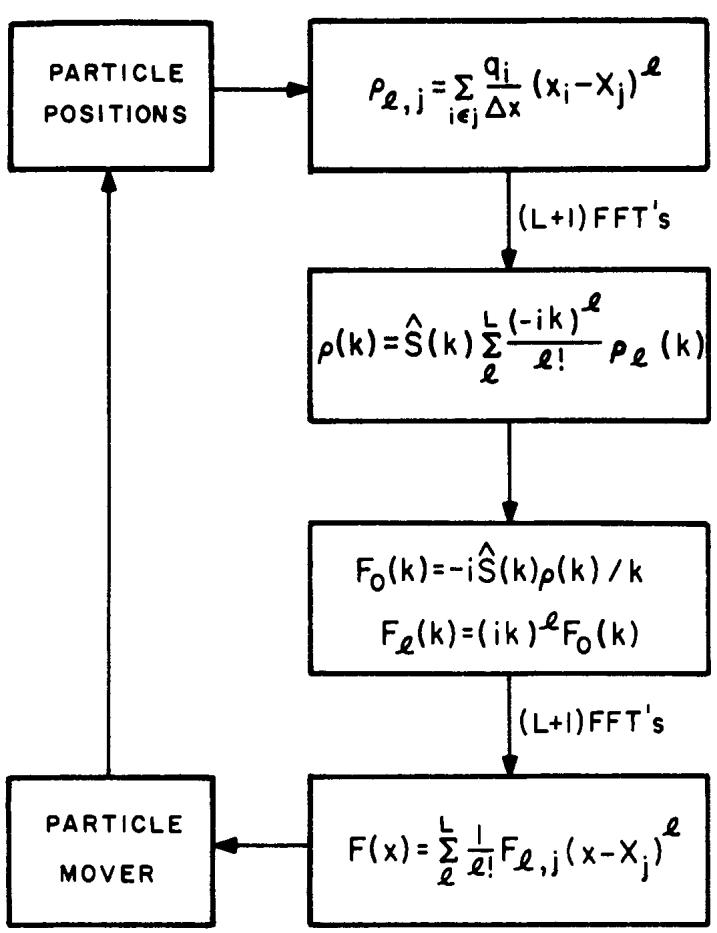  
Figure 11-2a Multipole expansion method,starting from the particle positions $x _ { i }$ ，with $( L + 1 )$ Fourier transforms on the grid charge densities, $( L + 1 )$ more on the force moments,through to the force at the particle.Dipole is $L = 1$ ,quadrupole is $L = 2$ ，etc.

Consider the storage requirements and the number of FFT's required for a one-dimensional force calculation retaining moments O through $M$ For each grid point, there are $M + 1$ densities $\pmb { \rho } _ { l , j }$ and force derivatives $F _ { l , j }$ ： These require a total of $2 ( M + 1 )$ real transforms,normally done as pairs of complex transforms (Appendix A). When the particle coordinates reside in secondary storage, such as a rotating magnetic disk,one prefers to collect the new densities as the particles are advanced to their new positions, rather than going through the particle list twice per time step. In this case, both the old force and the new density must be in fast memory，so we must store $2 ( M + 1 )$ quantities per grid point. In one dimension this is much easier than in two,where $F$ and $k$ become vectors. In a two-dimensional quadrupole $\mathbf { \nabla } \mathcal { M } = 2 )$ code,there are 18 quantities to store per grid point,and 18 2d real Fourier transforms to perform (Problem 11-2a). The requirements for an electromagnetic code are more startling yet (Problem 11-2b).

In practice,multipole codes have often been used in the monopole (i.e., NGP!） mode,and rarely have more than dipoles been included. Hence,in our discussion and evaluation, we also go no further than $M = 2$

Let us now examine the spatial variation of the force field using the dipole approximation,as compared to a standard linear-interpolation method. In the latter case, the force appears as in Figure 11-2b, continuous and piecewise linear. In the multipole expansion method, the force is given by a truncated Taylor series (4),expanding about the nearest grid point. Accuracy is good near the grid point and degrades rapidly toward the midpoint between cells. Furthermore,after the particle crosses the midpoint, the expansion is about a new grid point. Hence the force jumps discontinuously at the mid-point，as in Figure 11-2c. A deleterious effect of this discontinuity is increased aliasing errors,as we see in Sections 11-6 and 11-7. In practice, the magnitude of this jump (Problem 11-2c) is decreased by choosing the parameter $\pmb { a }$ in $\hat { S }$ to be $\Delta x$ or larger. For a given Fourier mode,this does not decrease the size of the jump relative to the force itself. Rather,both are suppressed at short wavelenghths,at some cost in resolution.

# PROBLEMS

11-2a Modify Figure 11-2a for 2d and 3d. Indicate: the number of FFT's required; which quantities are scalar,vector,tensor (with rank);the number of quantities stored per grid point.

11-2b Consider the multipole expansion method for both charge and current sources for a twodimensional electromagnetic code.

11-2c For a sinusoidal force field $F _ { 0 , j } = A$ cos $k X _ { j }$ in a dipole code,show that the magnitude of the jump at the cell midpoints is as large as $2 A \sin ^ { 2 } \left( k \Delta x / 4 \right)$ ．At the shortest resolved wavelength, $\pi / \Delta x$ ,the jump is as large as $^ { 2 A }$ ！

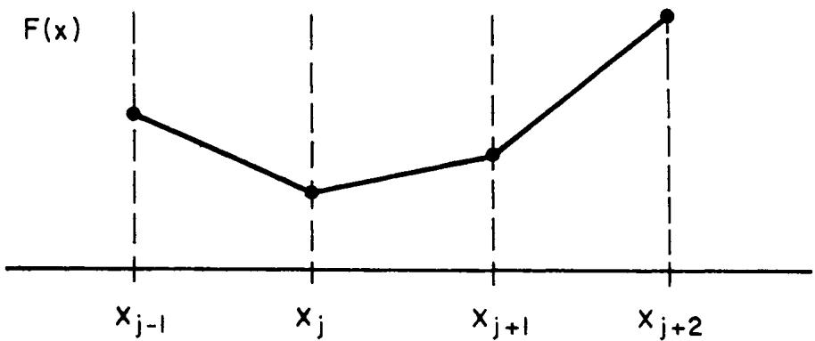  
Figure 11-2b Conventional particle-grid force weighting，with linear interpolation between grid points.The force is continuous for all $x$ ，but $\partial F / \partial x$ is discontinuous at the $X _ { j }$

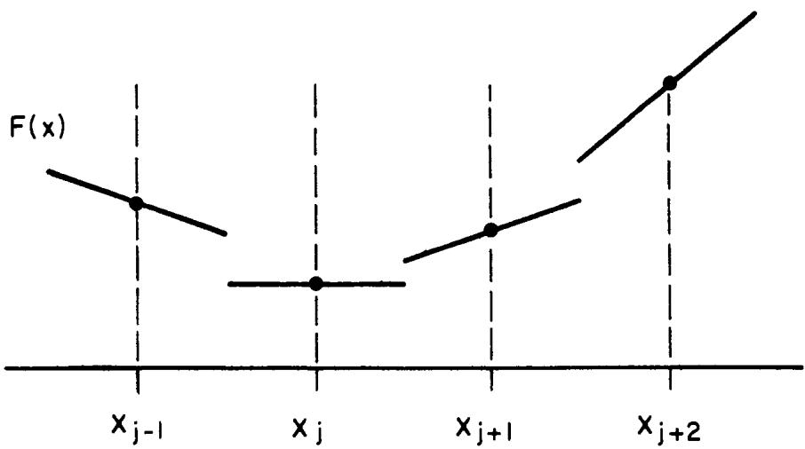  
Figure 11-2c Dipole method force, $L = 1$ ，showing discontinuities at cell edges in both $F$ and $\partial F / \partial x$

# 11-3 THE “SUBTRACTED" MULTIPOLE EXPANSION

A method proposed by Kruer et al. (1973) to reduce the storage required by the multipole method is called the subtracted multipole scheme. In this approach, the derivatives of the force at the grid points are formed by using a finite-difference operator on the grid. Hence,one need only calculate and store the force at each grid point. The force may be obtained by finitedifference operation on the potential. The multipole densities.are combined into a charge density by difference operators symmetric to those used for the force. FFT's are retained for the Poisson solution and smoothing，and perhaps also in in differentiating the potential.

Of the multipole schemes,a subtracted dipole expansion (SDPE） has been most used. In the force we replace $F _ { 1 , k } = i k F _ { 0 , k }$ by a centered difference,

$$
F _ { 1 , j } = \frac { F _ { 0 , j + 1 } - F _ { 0 , j - 1 } } { 2 \Delta x }
$$

11-2(4) becomes

$$
F _ { i } = F _ { 0 , j } + ( x _ { i } - X _ { j } ) \frac { F _ { 0 , j + 1 } - F _ { 0 , j - 1 } } { 2 \Delta x }
$$

Similarly, $\pmb { \rho } _ { k } = \hat { S } ( \pmb { \rho } _ { 0 , k } - i \pmb { k } \pmb { \rho } _ { 1 , k } )$ from 11-2(10） becomes

$$
\rho _ { j } = \rho _ { 0 , j } - \frac { \rho _ { 1 , j + 1 } - \rho _ { 1 , j - 1 } } { 2 \Delta x }
$$

The smoothing factor $\hat { S }$ (which is the factor SM in ES1） is applied during the Poisson solution which becomes $k ^ { 2 } \phi = \hat { S } ^ { 2 } \rho$

This algorithm fits.the formalism of Chapter 8,in which the force 8-5(2) is

$$
F _ { i } = q \Delta x [ \cdot \cdot \cdot E _ { j - 1 } S ( X _ { j - 1 } - x _ { i } ) + E _ { j } S ( X _ { j } - x _ { i } ) + E _ { j + 1 } S ( X _ { j + 1 } - x _ { i } ) \cdot \cdot \cdot
$$

The SDPE force (2) will be writen as (4) if $E$ is the smoothed field,i.e., $F _ { 0 , j } = q E _ { j }$ , and the weighting function $s$ is given by

$$
\begin{array} { c } { \Delta x \displaystyle S \left( X _ { j } - x _ { i } \right) = 1 } \\ { \Delta x \displaystyle S \left( X _ { j \pm 1 } - x _ { i } \right) = \pm \frac { x _ { i } - X _ { j } } { 2 \Delta x } } \end{array}
$$

for $\vert X _ { j } - x _ { i } \vert < \Delta x / 2$ and zero elsewhere (Figure $1 1 - 3 \mathsf { a } ( \mathsf { a } ) )$

The charge density 8-5(1), $\rho _ { j } = q S ( X _ { j } - x _ { i } )$ ， with this same $s$ gives the SDPE result (3) (Problem 8-3a)． Therefore the results of Chapter 8 can be applied to the SDPE scheme.

It is worthwhile to make a simple model when trying to understand a new method. In the spirit of classical multipole expansions,let the origin be the grid point nearest $x _ { j }$ be called $X _ { j }$ . First,place all of the charge $q$ there, as in the NGP weighting. Next add a rudimentary dipole; let the fraction of charge that is in the next cell be $\Delta q$ ，and place it at $X _ { j + 1 }$ ； complete the dipole,with $- \Delta q$ placed at $X _ { j - 1 }$ .The dipole moment is now $( \Delta q ) \left( 2 \Delta x \right)$ ， and must equal $q ( \underline { { x } } _ { i } - X _ { j } )$ ．The resulting contribution to charge density is $[ \rho _ { j - 1 } , \rho _ { j } , \rho _ { j + 1 } ] = ~ [ - \Delta q , \dot { q } , \Delta q ] / \Delta x$ ，with $\Delta q = \left( q / 2 \Delta x \right) ( x _ { i } - X _ { j } )$ ，while $| x _ { i } - X _ { j } | < \Delta x / 2$ .Each particle causes charges to be placed at three grid points (compared with two in linear weighting),implying an effective charge width of at least two cells.

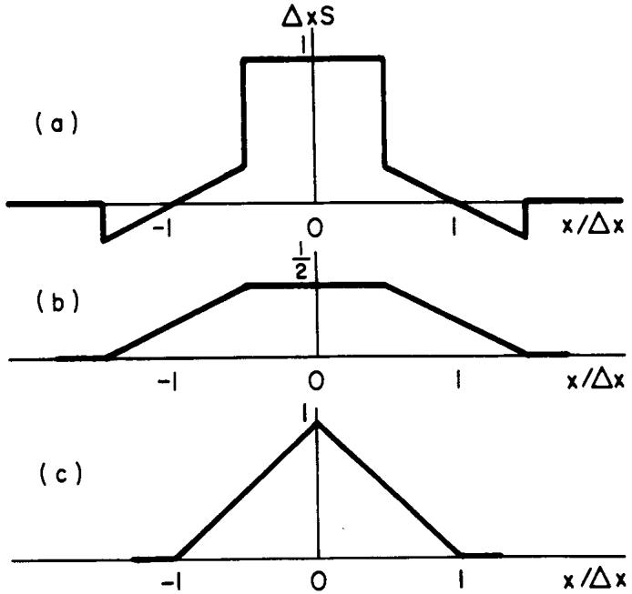  
Figure 11-3a Shape functions for particle-grid interaction in (a) the "subtracted” dipole approximation,(b） the improved dipole approximation of Kruer et al. (1973),(c) the common linear weighting $S _ { 1 }$

The original multipole schemes and the subtracted schemes can be regarded in a unified viewpoint (Problem 11-3b） which we use in Section 11-5.

The SDPE weighting function is shown in Figure 11-3a. Its severe discontinuities result in poor aliasing properties reminiscent of NGP weight-ing (Kruer et al.， 1973, Section V). In Sections 11-6 and 11-7 we compare $S ( k )$ for this and other schemes.

Kruer et al. (1973） propose an improved weighting function, shown in Figure 11-3a(b)，which removes the discontinuities by distributing half of the monopole charge from the nearest grid point to the two next nearest grid points.They note that this improved $s$ is equal to the average of the two linear $S _ { 1 }$ functions shifted by $\Delta x$ . As a result, with this improved subtracted dipole weighting,the forces are identical to those calculated using the standard linear $S _ { \mathrm { i } }$ function,with the addition of a simple spatial smoothing of $\pmb { \rho }$ or $\phi$ (Problem 11-3d).

This observation suggests that the standard linear weighting scheme may be a multipole scheme. This and other possibilities are developed in the next Section.

# PROBLEMS

11-3a Find $S \left( { { \cal X } _ { j } - { x _ { i } } } \right)$ ，for $| X _ { j } - x _ { i } | < \Delta x / 2$ ，by comparing the charge density 8-5(1), $\rho _ { j } = q _ { i } S ( X _ { j } - x _ { i } )$ ，to(3） with $\rho _ { 0 , j } = q / \Delta x$ Find $S \left( { { X } _ { j \pm 1 } } - { { x } _ { i } } \right)$ by comparing to (3） rewritten as $\rho _ { j \pm 1 } = \dot { \rho _ { 0 , j \pm 1 } } \pm \ \left( \rho _ { 1 , j } - \rho _ { 1 , j \pm 2 } \right)$ with $\rho _ { 1 , j } = q ( x _ { i } - \dot { X _ { j } } ) / \Delta x$ The answers agree with (5).

11-3b Show that the SDPE forces are identical to those from the DPE with $F _ { 1 } ( k )$ replaced by $i F _ { 0 } ( k ) \ ( \sin k \Delta x ) / \Delta x$ ,and a similar change to l1-2(10).

11-3c Find $S \left( k \right)$ for the subtracted dipole scheme,e.g.,by direct Fourier transform of $S \left( x \right)$

11-3d Show that the forces calculated using the improved weighting of Figure $1 1 . 3 a ( 6 )$ are the same as obtained using the standard linear weighting of Figure $1 1 . 3 \mathsf { a } ( \mathsf { c } )$ with the addition of a spatial smoothing $( 1 / 4 , 1 / 2 , 1 / 4 )$ applied to $\pmb { \rho }$ or $\phi$ on the grid,separate from the particle move. Which is more efficient?

# 11-4 MULTIPOLE INTERPRETATIONS OF OTHER ALGORITHMS

Here we consider other particle-grid weighting algorithms which can be interpreted as multipole methods. First we show that the familiar onedimensional linear-weighting algorithm can be derived as a dipole expansion about the midpoint between grid points. Next we derive an improved twodimensional dipole algorithm by making an expansion about the nearest cell center. Then we show that area weighting is a dipole scheme which also includes the xy quadrupole moment. If the multipole interpretation is valued, one may use standard linear and area weighting with a clear conscience. We conclude with some opinions on the design of multipole algorithms which optimize accuracy and computational demands.

Let us construct a monopole plus dipole with charges at two grid points instead of three. For a charge $q$ at position $x$ between grid points $j$ and $j + 1$ ， the monopole is constructed by placing half the charge at each grid point. The dipole is constructed by adding and subtracting $\Delta q$ ：

$$
\begin{array} { r } { \rho _ { j } \Delta x = { 1 } / _ { 2 } q - \Delta q } \\ { \rho _ { j + 1 } \Delta x = { 1 } / _ { 2 } q + \Delta q } \end{array}
$$

The dipole moment $\left( \Delta q \right) \Delta x$ ，centered at $X _ { j + 1 / 2 }$ ， must equal the particle moment $q \left( x - X _ { j + 1 / 2 } \right)$ . The result,

$$
\begin{array} { c } { \displaystyle { \rho _ { j } \Delta x = q \left[ \frac 1 2 - \frac { x - X _ { j + 1 _ { j } } } { \Delta x } \right] = q \frac { X _ { j + 1 } - x } { \Delta x } } } \\ { \displaystyle { \rho _ { j + 1 } \Delta x = q \left[ \frac 1 2 + \frac { x - X _ { j + 1 _ { j } } } { \Delta x } \right] = q \frac { x - X _ { j } } { \Delta x } } } \end{array}
$$

is just the standard linear weighting used in ES1! This is as smooth as the improved subtracted dipole scheme and can be evaluated just as quickly (Problem 11-4c).

In two dimensions, form the monopole and two dipole moments as indicated in Figure 11-4a, centered in the middle of the cell. At the grid point $( j , k )$ ,for example,we add

$$
\frac { q } { 4 } + \frac { q } { 2 \Delta x } ( x - X _ { j + \% } ) + \frac { q } { 2 \Delta y } ( y - Y _ { k + 1 / _ { 2 } } )
$$

to $\rho _ { j , k } \ \Delta x \Delta y$ . The contribution of a charge in any of the four cells around $( j , k )$ is given by

$$
\begin{array} { r c l } { \rho _ { j , k } \Delta x \Delta y \equiv q \Delta x \Delta y S ( X _ { j } - x , Y _ { k } - y ) } \\ { = } & { \frac { 3 } { 4 } q - \frac { q } { 2 } | x - X _ { j } | - \frac { q } { 2 } | y - Y _ { k } | } & { \mathrm { f o r } | x - X _ { j } | < \Delta x } \\ & & { \mathrm { a n d } | y - Y _ { k } | < \Delta y } \\ & & { \quad \quad \quad \quad \quad \quad \quad \quad \quad \quad } \\ { = } & { 0 } & { \mathrm { o t h e r w i s e } } \end{array}
$$

(see Figure 11-6b). The smaller discontinuities in this weighting function, compared to that of Kruer et al. (1973)，permit improved accuracy. It happens that the discontinuities are removed by adding the xy quadrupole term (Problem 11-4a),which leads to the common bilinear (area) weighting (see Figure 11-6c).

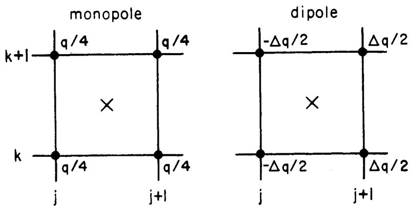  
Figure 11-4a Construction of monopole and dipole moments,centered at the cell centers $\mathbf { \Psi } ( { \bf x } )$ ， by adding appropriate charges to the four cell corners.

Underlying these observations are the relations given in 8-5(3) and Problem 8-5b,which follow from 8-5(4) and 8-5(5). Any linear weighting can be regarded as a dipole method,in one,two,or three dimensions. Bilinear weighting includes, in addition, one quadrupole moment (Problem 11-4b).

# PROBLEMS

11-4a Show that the $x y$ quadrupole term to be added to (3） is

$$
q \frac { ( x - X _ { j + 1 / k } ) ( y - Y _ { k + 1 / k } ) } { \Delta x \Delta y }
$$

with which (4) becomes

$$
\rho _ { j , k } \Delta x \Delta y = q \left( 1 - \frac { \vert x - X _ { j } \vert } { \Delta x } \right) \left( 1 - \frac { \vert y - Y _ { k } \vert } { \Delta y } \right)
$$

This is the same as area weighting (Chapter 14).

11-4b Show that the relations in 8-5(3) and Problem 8-5b generalize for bilinear weighting in two dimensions to

$$
\Delta x \Delta y \sum _ { j } \rho _ { \mathbf { j } } \left( 1 , X _ { \mathbf { j } } , Y _ { \mathbf { j } } , X _ { \mathbf { j } } Y _ { \mathbf { j } } \right) = \sum _ { i } q _ { i } ( 1 , x , y _ { i } , x _ { i } y _ { i } )
$$

Show that this means bilinear weighting is a dipole scheme with the addition of $x y$ quadrupole terms.

11-4c Show that, by accumulating the sum over particles in each cell of $\pmb q$ and $q x$ ， that either the SDPE or the standard linear weighting cellcharge density can be formed.Similarly,show that the particle force is a linear combination of $q$ and $q x$ in each cell,in both schemes.Therefore,the computational expense of the SDPE and the standard linear scheme are the same, when both are optimally calculated and use equal storage.

11-4d Make QS a quadrupole method by adding a grid filter. There are many possibilities; one is to apply the filter

$$
\rho _ { j } \gets - \frac { 1 } { 8 } \rho _ { j - 1 } + \frac { 5 } { 4 } \rho _ { j } - \frac { 1 } { 8 } \rho _ { j + 1 }
$$

to $\pmb { \rho }$ before,and similarly to $\phi$ after,the Poisson solution.

# 11-5 RELATIONS BETWEEN FOURIER TRANSFORMS OF PARTICLE AND GRID QUANTITIES

In preparation for deriving a dispersion relation and for comparing multipole and other algorithms,we derive in this section relations between Fourier transforms of particle density $n \left( x \right)$ and force feld $F ( x )$ ，and between grid quantities $\rho _ { I , j }$ ， etc. We save effort by borrowing some results from Chapter 8,and facilitate comparisons by manipulating the relations into the same form as Chapter 8.

In Section 11-2, $k$ is understood (without saying so） to be confined to the first Brillouin zone,i.e., $\lvert k \rvert < \pi / \Delta x$ . This suffces for transforms of grid quantities, but for $n \left( k \right)$ and $\displaystyle F ( k )$ we need all $k$ . As in Chapter 8, it is convenient to use the fact that transforms of grid quantities have periodicity $2 \pi / \Delta x$ ,e.g., $\rho ( k + 2 \pi / \Delta x ) = \rho ( k )$ . To avoid confusion, we introduce the periodic function

$$
\kappa = k \mathrm { \ m o d u l o \ } \frac { 2 \pi } { \Delta x } , \quad | \kappa | \leqslant \frac { \pi } { \Delta x }
$$

On substituting $\pmb { \kappa }$ for $k$ wherever the distinction matters,the results from Section 11-2 become valid for all $k$ ：

$$
\begin{array} { l } { { \displaystyle { \rho } \left( k \right) = \hat { S } \left( \kappa \right) \sum _ { l } \frac { \left( - i \kappa \right) ^ { l } } { l ! } \rho _ { l } ( k ) } } \\ { { \displaystyle { \phi } ( k ) = \frac { \rho ( k ) } { \kappa ^ { 2 } } } } \\ { { \displaystyle F _ { l } \left( k \right) = \left( i \kappa \right) ^ { l } F _ { 0 } ( k ) , } } \\ { { \displaystyle F _ { 0 } ( k ) = - i \kappa q \hat { S } \left( - \kappa \right) \phi ( k ) } } \end{array}
$$

We begin by rewriting the multipole density,11-2(9),using the nearest grid-point weighting function $S _ { 0 }$ (Figure 8-Sa) to select those particles closest to grid point $j$ ：

$$
\rho _ { l , j } = \sum _ { i } q _ { i } S _ { 0 } \left( X _ { j } - x _ { i } \right) ( x _ { i } - X _ { j } ) ^ { l }
$$

Note the similarity to Equation 8-5(1), $\sum q _ { i } S \left( X _ { j } - x _ { i } \right)$ ，whose Fourier transform is, from 8-7(21),

$$
\sum q ~ n \left( k _ { p } \right) S \left( k _ { p } \right) = \sum q ~ n \left( k _ { p } \right) \int d x ~ e ^ { - i k _ { p } x } ~ S \left( x \right)
$$

where $k _ { p } = k - 2 \pi p / \Delta x$ . Comparing these,we see by inspection that

$$
\rho _ { / } \left( k \right) = \sum _ { p } q \nmid ( k _ { p } ) \int d x \ e ^ { - i k _ { p } x } S _ { 0 } ( x ) \ ( - x ) ^ { l }
$$

Substitution into (2) yields the desired relation in a form like that of Equation 8-7(21):

where

$$
\begin{array} { c } { { \displaystyle \rho ( k ) = \hat { S } ( \kappa ) \sum _ { p } q n ( k _ { p } ) S ( k _ { p } ) } } \\ { { { } } } \\ { { S ( k ) = \sum _ { l } \int d x e ^ { - i k x } S _ { 0 } ( x ) \displaystyle \frac { ( \imath \kappa x ) ^ { l } } { l ! } } } \\ { { { } } } \\ { { = \displaystyle \frac { 1 } { \Delta x } \displaystyle \int _ { - \Delta x / 2 } ^ { \Delta x / 2 } d x e ^ { - i k x } \sum _ { l } \displaystyle \frac { ( \imath \kappa x ) ^ { l } } { l ! } } } \end{array}
$$

is the (transform of the） effective weighting function for particle-grid interaction. (The factor $\hat { s }$ ，not present in 8-7(21),describes spatial smoothing here included in the evaluation of $\rho ( k )$ and $F ( k )$ ,but included in $K ^ { 2 }$ in Chapter 8.)

Turning to the force, we rewrite 11-2(4),again using $S _ { 0 }$ to select the correct terms in a sum over $j$ ：

$$
F _ { i } = \sum _ { l ^ { \prime } } \left[ \Delta x \sum _ { j } F _ { l , j } S _ { 0 } ( X _ { j } - x _ { i } ) \frac { ( x _ { i } - X _ { j } ) ^ { l } } { l ! } \right]
$$

For each $l$ , the term $[ \cdot \cdot \cdot ]$ has the same form as 8-5(2), whose transform is 8-7(14),

$$
E ( k ) S . ( - k ) = E ( k ) \int d x e ^ { i k x } S ( x )
$$

Again, by inspection we see that the transform of the multipole force field is

$$
F ( k ) = \sum _ { l } F _ { l } ( k ) \int d x \ e ^ { \prime k x } S _ { 0 } ( x ) \frac { ( - x ) ^ { l } } { l ! }
$$

Using $F _ { l } ( k ) = ( \iota \kappa ) ^ { \prime } F _ { 0 } ( k )$ ，

$$
F ( k ) = S \left( - k \right) F _ { 0 } ( k ) = \hat { S } \left( - \kappa \right) S \left( - k \right) [ - i \kappa q \phi ( k ) ]
$$

in which we encounter again the effective particle-grid weighting function (10). This result is in the same form as 8-7(14) with 8-7(9),with $\pmb { \kappa }$ given by （1） and the addition of the spatial smoothing $\hat { s }$ . Hence,it is possible to draw on other results in Chapter 8,such as the discussion of momentum conservation (Problem 11-5a).

If we could keep all moments, then (Problem 11-5b)

$$
\begin{array} { r l r } { S ( k ) = 1 } & { { \mathrm { i f ~ } } | k | < \pi / \Delta x } & { \mathrm { ( i . e . , ~ } k = \kappa ) } \\ { = 0 } & { { \mathrm { o t h e r w i s e } } } & { \mathrm { ( i . e . , ~ } k - \kappa \ \mathrm { i s ~ } a } \end{array}
$$

i.e.,we recover the "band limited" interpolation of 11-2(1） and 11-2(2)

which has no aliasing errors.

To make connection with the different representation used by Chen and Okuda (1975),we rewrite (10) as (Problem 11-5c)

$$
S \left( k \right) = \sum _ { l } \frac { 1 } { l ! } \left( - \kappa \frac { d } { d k } \right) ^ { l } S _ { 0 } ( k )
$$

where

$$
S _ { 0 } ( k ) = \frac { \sin \theta } { \theta } \equiv \mathrm { d i f } ~ \theta , ~ \theta = \frac { k \Delta x } { 2 }
$$

For $\left| \boldsymbol { k } \right| < \pi / \Delta x , S ( k _ { p } )$ is the same as the function $I ( k , k _ { p } )$ used by Chen and Okuda.

For the dipole approximation we keep $l = 0$ and 1,

$$
\begin{array} { l } { { S ( k ) = S _ { 0 } ( k ) - \kappa \displaystyle \frac { d } { d k } S _ { 0 } ( k ) } } \\ { { = \displaystyle \frac { \sin \theta } { \theta } - \displaystyle \frac { \kappa } { k } \left[ \cos \theta - \displaystyle \frac { \sin \theta } { \theta } \right] } } \end{array}
$$

Using results of Problem 11-3b,we adapt this result to the subtracted dipole (SDPE) scheme of Section 11-3 to find

$$
S \left( k \right) = { \frac { \sin \theta } { \theta } } - { \frac { \sin 2 \theta } { 2 \theta } } \left( \cos \theta - { \frac { \sin \theta } { \theta } } \right)
$$

which was also found in Problem 11-3c.

The results of this section readily generalize to two and three dimensions (Problem 11-5e).

We can identify three sources of error in the force calculation: errors in the magnitude and direction of $\pmb { \ F }$ ，and coupling of different wavelengths due to aliasing. For $\mathbf { k }$ in the first Brillouin zone,there is no error in direction when $\mathbf { F } _ { 0 }$ (or E) is obtained by Fourier transform of (5),and errors in magni-tude, due to $\hat { s } s$ differing from unity,can be compensated for by adjusting $\hat { s }$ Aliasing errors,given by the $\mathbf { p } \neq 0$ terms,are determined at a given $\mathbf { k }$ by the magnitude of $S ( \mathbf { k _ { p } } )$ and cannot be corrected or reduced without loss of spatial resolution.

We have created relations (9) and (14),analogous to 8-7(17) and 8- 7(14). Section 8-7 and this Section can be made congruent if we move the factors $\hat { S } \left( \kappa \right)$ ， $\hat { S } \left( - \kappa \right)$ from (9) and (14) to (3),which becomes $K ^ { 2 } \phi = | \hat { S } | ^ { 2 } \rho$ This is the same as 8-7(5) with $K ^ { - 2 } = \vert \hat { S } \vert ^ { 2 } \kappa ^ { - 2 }$ ,and is also the way to implement this method efficiently.

In the following sections we use these results to construct a dispersion relation and consider the overall accuracy of the force calculation in the multipole approximation. The grid-particle weighting function plays the central role in limiting accuracy.

# PROBLEMS

11-5a Show that the multipole force calculation conserves momentum if the same number of moments is used in the density and force calculations.(Hint: Argue that the multipole calculation can be written in the form of 8-5(1) and 8-5(2),so that Section 8-6 is applicable.)

11-5b When all moments are kept in (11),replace the series by exp $( i \kappa x )$ and use（1） to obtain (15)．Alternatively,the sum in (16) is recognized as a complete Taylor expansion of $S _ { 0 }$ about $k _ { p }$ ; that is

$$
\begin{array} { r l } & { S ( k _ { p } ) = S _ { 0 } ( k _ { p } - k ) } \\ & { \qquad = S _ { 0 } ( - p k _ { g } ) } \\ & { \qquad = \left\{ \begin{array} { l l } { 1 } & { \mathrm { i f ~ } p = 0 } \\ { 0 } & { \mathrm { i f ~ } p \ne 0 } \end{array} \right. } \end{array}
$$

11-5c Evaluate each term in (1O) as the /'th derivative of $S _ { 0 } ( k )$ to obtain (16).

11-5d Derive (19).

11-5e Generalize (9)- (11） and (14）- (19) to two and three dimensions.For example,in   
2d,(19) becomes

$$
{ \begin{array} { r } { S \left( \mathbf { k } \right) = \mathrm { d i f } ^ { \mathrm { 1 } / _ { 2 } } \theta _ { x } \ \mathrm { d i f } ^ { \mathrm { 1 } / _ { 2 } } \theta _ { y } - \mathrm { d i f } \theta _ { y } \ \mathrm { d i f } \ 2 \theta _ { x } \ \left( \cos \theta _ { x } - \mathrm { d i f } \theta _ { x } \right) } \\ { - \ \mathrm { d i f } \theta _ { x } \ \mathrm { d i f } \ 2 \theta _ { y } \ \left( \cos \theta _ { y } - \mathrm { d i f } \theta _ { y } \right) } \end{array} }
$$

with $\theta _ { x } = k _ { x } \Delta x / 2 , \theta _ { y } = k _ { y } \Delta y / 2$

# 11-6_OVERALL ACCURACY OF THE FORCE CALCULATION; DISPERSION RELATION

By showing the effect of the numerical methods on plasma waves,the dispersion relation clarifies the role of each of the steps in the force calculation in determining the overall accuracy. Using results of the last section,we proceed as in Section 9-5 to derive a dispersion relation for unmagnetized plasma,

$$
\epsilon = 1 + \frac { \hat { S } ^ { 2 } } { \kappa ^ { 2 } } \kappa \cdot \sum \mathbf { k _ { p } } S ^ { 2 } ( \mathbf { k } _ { \mathbf { p } } ) \chi ( \mathbf { k } _ { \mathbf { p } } , \omega )
$$

which is identical to 9-5(la) when we choose $K ^ { - 2 } = \hat { S } ^ { 2 } / \kappa ^ { 2 }$ and remove $\kappa ( \mathbf { k } _ { \mathbf { p } } ) = \kappa ( \mathbf { k } )$ from the sum.

Because the time integration does not interact in any unusual way with the multipole force calculation,we ignore the complications of finite timestep. From 9-5(1b),

$$
\epsilon = 1 + \frac { \hat { S } ^ { 2 } } { \kappa ^ { 2 } } \kappa \cdot \sum S ^ { 2 } ( \mathbf { k } _ { \mathbf { p } } ) \int \frac { \partial f _ { 0 } } { \partial \mathbf { v } } \frac { d \mathbf { v } } { \omega + i 0 - \mathbf { k } _ { \mathbf { p } } \cdot \mathbf { v } }
$$

Also，our quantitative comparisons are limited to one-dimension. This dispersion relation and some of our discussion are equivalent to that of Chen and Okuda (1975).

The particle shape $\hat { S }$ referred to in the literature ("Gaussian-shaped particles"） is not to be confused with the weighting function $s$ In the dispersion relation (1） we see clearly the different roles played by $\hat { s }$ and $s$ $\hat { S } ^ { 2 } ( \kappa )$ ， appearing outside the sum on $p$ ,is simply any smoothing factor (in the fundamental Brillouin zone $| k \Delta x | < \pi )$ ,usable in any method (it is the factor $\mathsf { \pmb { S } } \mathbf { M } ^ { 2 }$ in ES1)． Hence,the relative accuracy of the multipole expansion will appear through $S ^ { 2 } ( k )$

If all moments could be kept, we know from 11-5(15) that there are no aliasing errors. Therefore only one $p$ term is nonzero in the dispersion function,which is the same as in the gridless force calculation 11-2(1） and 11-2(2).

$$
\epsilon _ { \infty } ( k , \omega ) = 1 + \omega _ { p } ^ { 2 } \frac { \hat { S } \left( \kappa \right) } { \kappa } \int d \nu \frac { \hat { \partial } f _ { 0 } ( \nu ) / \hat { \partial } \nu } { \omega - \kappa \nu }
$$

This is the gridless dielectric function; hence for $L  \infty$ , indeed, the mul-tipole expansion is independent of the grid and no nonphysical results due to aliasing arise. However, in practice at most the octopole moments are kept, so the relevant comparisons are at dipole and octopole order.

In the fundamental Brillouin zone $( k \Delta x < \pi )$ ，the subtracted dipole $S ^ { 2 } ( k )$ is nearly flat,while the linear weighting drops off more rapidly，as $[ \left( \sin \theta \right) / \theta ] ^ { 2 }$ .Of course, in the fundamental Brillouin zone we are free to compensate by adjusting $\hat { S }$ in any way we like,and so the flatness or drop-off can be altered to suit.

However， we cannot separately control $\hat { S } ^ { 2 } ( \kappa ) S ^ { 2 } ( k )$ in the higher Brillouin zones, (the unhatched zones with $k \Delta x > \pi$ in Figure 11-6a. Fol SDPE with $k \Delta x \lesssim 1$ ，

$$
S ^ { 2 } ( k _ { p } ) = \{ \frac { k \Delta x } { 2 \pi p } \} ^ { 4 } [ 1 - \frac { k \Delta x } { 2 } ( p \pi + \frac { 2 } { p \pi } ) ] ^ { 2 } \mathrm { f o r } p  0
$$

while for standard linear (CIC) and quadratic spline (QS) we have

$$
{ \begin{array} { r l } { S ^ { 2 } ( k _ { p } ) = \left( { \frac { \sin k _ { p } \Delta x / 2 } { k _ { p } \Delta x / 2 } } \right) ^ { 2 M } } & { { \mathrm { w h e r e ~ } } M = 2 { \mathrm { ~ f o r ~ C I C , ~ 3 ~ f o r ~ Q S } } } \\ { \approx \left( { \frac { k \Delta x } { 2 \pi p } } \right) ^ { 2 M } } & { { \mathrm { f o r ~ s m a l l ~ } } k \Delta x { \mathrm { ~ a n d ~ } } p \neq 0 } \end{array} }
$$

For $k \Delta x / 2 < < ( p \pi + 2 / p \pi ) ^ { - 1 }$ ， i.e.， wavelengths longer than about $1 0 \mathsf { p }$ cells,the alias coupling from SDPE and CIC are the same. In the opposite limit, $S ^ { 2 } ( k _ { p } )$ for CIC goes as (6) while the larger alias coupling of SDPE goes as $S ^ { 2 } ( k _ { p } ) \approx ( k \Delta x / 2 ) ^ { 6 } ( \pi p ) ^ { 2 }$ which indicates that for $( k \Delta x / 2 ) \sim 1$ ， there is the same order of alias coupling for dipole as for NGP,for which $S ^ { 2 } ( k _ { p } ) = ( k \Delta x / 2 \pi p ) ^ { 2 }$ . The slow $( 1 / p ^ { 2 } )$ drop-off is due to the discontinuity in force at the mid-cell planes.

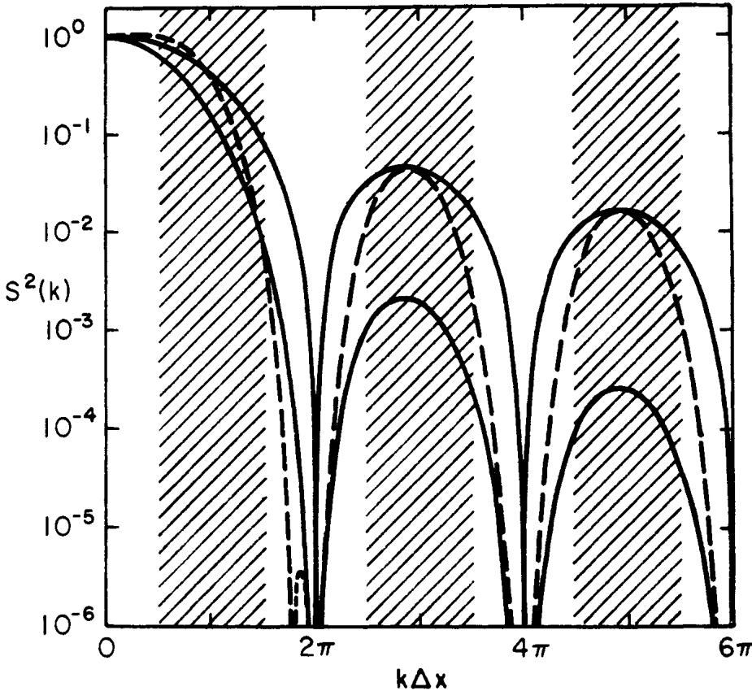  
Figure 11-6a Weight functions $S ^ { 2 } ( k )$ plotted against $k \Delta x / 2 \pi$ for NGP and linear weighting (upper and lower solid curves） and the subtracted dipole weighting (dashed curve).Shading indicates intervals of $k \Delta x$ which are affected by smoothing of wavelengths $> 4 \Delta x$ on the grid. Therefore the important comparison is in the unshaded intervals,where filtering of grid quantities cannot selectiveiy suppress errors due to large values of $S ^ { 2 }$ for $k \Delta x$ near $_ { 2 \pi }$ ， $4 \pi$ ，， without also suppressing the physical force (losing resolution).

The quadrupole scheme,QPE,stays below $1 \%$ coupling over almost all of the range shown in Figure 11-6a. This achievement requires substantial additional computation and memory. Hence, the QPE comparison should be made,for example, to higher-order particle weighting schemes such as quadratic spline Qs,which has $M = 3$ in (5),(6).The ${ \sf Q S } \ p = 1$ coupling is larger,rising to about 0.067 at $k \Delta x = \pi$ ; this is about 0.4 of CIC, a little less than DPE (for $p = - 1 ,$ ） and about 3 times QPE; for other values of $p$ ,QS is less than $1 0 ^ { - 4 }$ with smaller maxima than all other methods shown.

Okuda and Cheng (1978) show that even quadratic splines and higherorder multipoles are numerically unstable for small $\lambda _ { D } / \Delta x$ (just as we found for lower-order weighting).For $\lambda _ { D } / \Delta x < 0 . 1$ , they find better stability with quadratic and cubic splines than with the octupole expansion. This they attribute to the greater smoothness provided by splines,consistent with our viewpoint. With $\lambda _ { D } / \Delta x = 0 . 0 1$ ，only cubic splines provided acceptable numerical stability.

In Figure 11-6b and Figure 11-6c we compare our improved subtracted dipole,11-4(4),and the 2d bilinear (area) weighting. Standard SDPE is not as good. In bilinear weighting,alias coupling comes dominantly near the $k _ { x }$ and $k _ { y }$ axes where $S ^ { 2 }$ is largest. There, $S ^ { 2 }$ for improved SDPE is at least comparable, though larger.

# 11-7 SUMMARY AND A PERSPECTIVE

Much valuable research has been done using multipole codes. We have described the multipole method, as originally conceived and in its "subtracted" form. We saw how other algorithms can be interpreted as multipole algorithms. Dipole schemes with smoother spatial variation were derived;

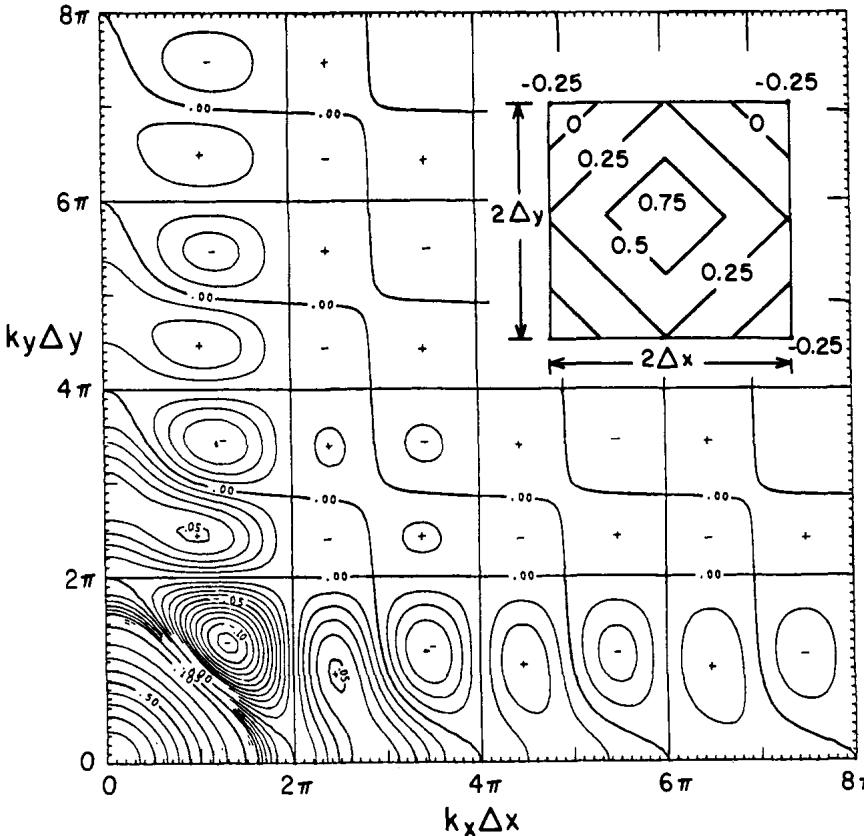  
Figure 11-6b Contours of $S \left( x , y \right)$ and $S ( k _ { x , } k _ { y } )$ for the improved subtracted dipole,equation 11-4(4). $\begin{array} { r } { S \left( x , y \right) = 0 } \end{array}$ outside the region shown. $S \left( x , y \right)$ is discontinuous at the sides of the square; however,compared to the historic SDPE scheme, $S ( k _ { x , } k _ { y } )$ outside the fundamental Brillouin zone is much improved.

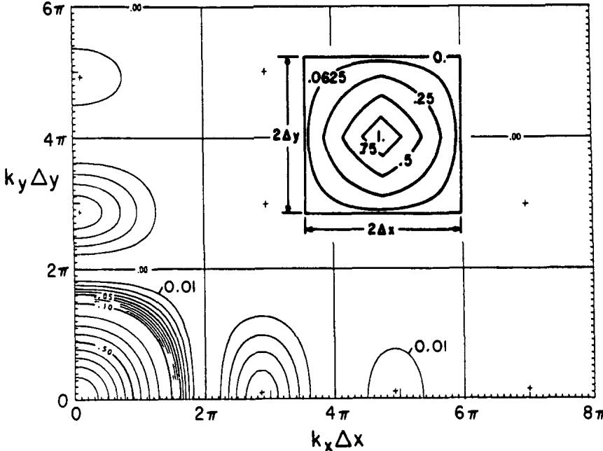  
Figure 11-6c Contours of $S \left( x , y \right)$ and $S \left( k _ { x , } k _ { y } \right)$ for the common 2d bilinear ("area weighting", "charge sharing"） scheme,which is a dipole plus $x y$ quadrupole scheme (see Problem 11-4a). $S \left( x , y \right)$ is continuous everywhere,and is zero outside the square shown.

two of these improvements are the familiar 1d linear weighting and 2d bilinear (area) weighting. The overall force calculation was analyzed along the lines of Chapter 8. It is clear that aliasing errors in the particle-grid weighting, once made， cannot be removed by a shape factor (usually $\bar { S } \bar { ( k ) } = \exp \left( - k ^ { 2 } a ^ { 2 } / 2 \right)$ with $a \approx \Delta x$ ）applied to the grid quantities $\pmb { \rho }$ or $\phi$ With these analytic tools,we compared accuracy among the published subtracted dipole scheme,a suggested improvement,and the standard linear or bilinear (CIC,area-weighting） scheme.

Practical algorithms are a compromise between spatial resolution and freedom from aliasing errors, versus storage and computational effort required, and adaptability to more general boundary conditions, non-Cartesian coordinate systems,etc. In making comparisons or interpreting the literature,one or more factors must be held constant. For example,in an application where a Fourier-transform field solver is convenient, one might compare the spatial resolution possible on a given spatial grid,with a given tolerance for aliasing errors,using SDPE, bilinear，or other particle-grid weightings. For each weighting,the factor $\hat { S } ( k )$ must be adjusted to trade between resolution and aliasing errors.

Whatever its motivation， the multipole method,as described in the literature, is no more than the use of truncated Taylor series expansions about the nearest grid points to represent the force field,with an analogous procedure for inferring a charge density from particle positions. Taylor expansions (multipole method） or Lagrange interpolation (subtracted method） concentrate their accuracy near the grid points,at the expense of accuracy elsewhere. When smooth and accurate representation is desired over an interval,splines are preferred for similar computational effort and spatial resolution. Splines provide a systematic progression to higher order, and still may be interpreted just as well in terms of multipoles. Accuracy can be improved，by altering the mathematics,without affecting the physical interpretation. More optimal weightings, probably application-dependent, may yet be found. The tools derived in these chapters may be helpful.

# KINETIC THEORY FOR FLUCTUATIONS AND NOISE; COLLISIONS

# 12-1 INTRODUCTION

In this chapter,an accurate theory of fluctuations, noise,and collisions in computer simulation of plasma is developed. The analytic method describes the space and time discretization exactly; the results reduce simply and correctly to the standard results of plasma kinetic theory in the limit of small space and time steps. If the particles are imagined to be a Monte-Carlo sam-pling of the phase-space,then the fluctuations in this sampling,as modified by collective effects,are a concern of this chapter. This theory is of interest in theoretical and empirical studies to understand the character of representation by simulation methods of plasma processes such as transport.

Fluctuations have been of interest in computer simulation of plasmas because they interfere with modeling of collisionless phenomena. However, one man's noise is another man's signal,and computer simulation has been used as a tool to study fluctuations and other processes involving discreteparticle effects in plasma, such as transport. Measurements of the fluctuation spectrum have also been used to check new simulation programs. Thermal fluctuations have been measured and analyzed theoretically in gridless "sheet" plasma models and in models using a spatial grid to mediate the particle interaction, the class of model considered here.

The particles can be regarded as Lagrangian markers embedded randomly in the Vlasov fluid and moving with it through phase-space (Morse and Nielson,1969)． This Monte-Carlo viewpoint explicitly recognizes the random sampling aspects of the particle-in-cell models，and this chapter provides information on the sampling statistics,e.g.，variance and correlations in the density which are evaluated as a Monte-Carlo integral over phase space. The statistics are modified by collective effects，however， since the particles influence each other through the self-consistent fields,rather than remaining independent markers in the phase-space fluid. Therefore,we use analytical methods analogous to those of normal plasma kinetic theory.

The results are cast in forms as similar as possible to the standard results of plasma kinetic theory，in order to facilitate comparison. As expected, qualitative differences result when the space or time differencing is too coarse,as often happens when computer time or memory are restrictive.

In deriving our results,we find it simpler and more general to take an approach different than the usual, which begins with moments of the Liouville equation or uses Klimontovich's formalism (Rostoker， 1961; Rostoker and Rosenbluth, 1960; Klimontovich,1967； Dawson and Nakayama,1966). There are several reasons for this. Some numerical time integration schemes correspond to third- or higher-order differential equations of motion, in that the dimensionality of phase space necessary to describe the state of the system is $9 N$ or higher (for $N$ particles in three dimensions） instead of $6 N$ Furthermore, some time integration schemes are not measure-preserving; i.e.，particle motion does not preserve phase-space volume. Such features encumber the usual developments of kinetic theory. By contrast， an approach similar in spirit to that of Hubbard (1961） yields the desired results in a manner both simpler and more informative to physical intuition, and is readily adapted to plasma systems with altered dynamics,such as simulation models.

Only electrostatic forces are included in this chapter; even in electromagnetic models it will be mainly the longitudinal fields that govern density fluctuations and Debye shielding. The divisions of this chapter are as follows. Section 12-2 applies the results of Chapters 8 to 10 to the simple example of Debye shielding. The fluctuation spectrum is derived in Section 12-3,and its physical and nonphysical components are examined in several limits. Section 12-4 discusses the limitations on the validity of this theory and some other observations. These sections are from Langdon (1979a). In Sections 12-5a and 12-5b, velocity diffusion and drag due to density fluctua-tions are found; the other contribution to drag is due to the polarization of the plasma as sensed by a specifed particle. In Section 12-5c, these resuits are used in the derivation of a collision operator which includes the familiar Balescu-Lenard operator in the $\Delta x$ $\Delta t \xrightarrow { } 0$ limit. Finally,conservation properties and the $H$ -theorem are studied in Section 12-6.

# 12-2 TEST CHARGE AND DEBYE SHIELDING

We begin by deriving the linear response of the simulation plasma to a perturbing charge and apply it to Debye shielding.

The total perturbed charge density resulting when a stable plasma with its uniform neutralizing background is perturbed by an imposed external charge $\pmb { \rho } _ { e }$ on the grid is

$$
\begin{array} { l } { \displaystyle \rho ( { \bf k } , \omega ) = \rho _ { e } ( { \bf k } , \omega ) + \sum _ { \mathfrak { p } } S ( { \bf k } _ { \mathfrak { p } } ) q n ( { \bf k } _ { \mathfrak { p } } , \omega ) } \\ { \displaystyle \qquad = \rho _ { e } ( { \bf k } , \omega ) - \sum _ { \mathfrak { p } } S ( { \bf k } _ { \mathfrak { p } } ) \chi ( { \bf k } _ { \mathfrak { p } } , \omega ) i { \bf k } _ { \mathfrak { p } } \cdot [ - i \kappa ( { \bf k } _ { \mathfrak { p } } ) S ( - { \bf k } _ { \mathfrak { p } } ) \phi ( { \bf k } _ { \mathfrak { p } } , \omega ) ] } \end{array}
$$

using 8-9(8),9-2(10),and 9-2(11a), similarly to Problem 9-5a. Using the periodicity $\phi \left( \mathbf { k } _ { \mathbf { p } } , \omega \right) = \phi \left( \mathbf { k } , \omega \right)$ to remove $\phi$ from the sum,and Poisson's equation 8-9(14),we obtain

$$
\begin{array} { c } { { \epsilon ( { \bf k } , \omega ) \rho ( { \bf k } , \omega ) = \rho _ { e } ( { \bf k } , \omega ) } } \\ { { \phi ( { \bf k } , \omega ) = \frac { \rho _ { e } ( { \bf k } , \omega ) } { K ^ { 2 } ( { \bf k } ) \epsilon ( { \bf k } , \omega ) } } } \end{array}
$$

where the dielectric function is

$$
\begin{array} { l } { { \displaystyle { \boldsymbol \epsilon } ( { \bf k } , \omega ) = 1 + K ^ { - 2 } ( { \bf k } ) \sum _ { \mathbb { P } } \kappa ( { \bf k } _ { \mathbb { P } } ) \cdot { \bf k } _ { \mathbb { P } } S ^ { 2 } ( { \bf k } _ { \mathbb { P } } ) \chi ( { \bf k } _ { \mathbb { P } } , \omega ) } } \\ { { \displaystyle ~ = 1 + \frac { \omega _ { p } ^ { 2 } } { K ^ { 2 } } \sum _ { \mathbb { P } } S ^ { 2 } { \int } d { \bf v } \kappa \cdot \frac { \hat { { \boldsymbol \omega } } f _ { 0 } } { \hat { { \bf \omega } } \times } \frac { \Delta t } { 2 } \cot \left( \omega + i 0 - { \bf k } _ { \mathbb { P } } \cdot { \bf v } \right) \frac { \Delta t } { 2 } } } \end{array}
$$

as in Section 9-5.

In some cases it is possible to evaluate $K ^ { 2 } \epsilon$ in closed form. For a stationary test charge and a Maxwellian velocity distribution we find from 9- 2(15)that

$$
\chi ( { \bf k } _ { \mathbf { p } } , \omega ) = \omega _ { p } ^ { 2 } \left( \frac { 1 } { k _ { \mathbf { p } } ^ { 2 } \nu _ { t } ^ { 2 } } - \frac { \Delta t ^ { 2 } } { 1 2 } \right)
$$

where we have assumed $\omega _ { \mathrm { ~ } } < < \boldsymbol { k } _ { \mathfrak { p } } \nu _ { t } \le \Delta t ^ { - 1 }$ ； this assumption is addressed below. The sum over $\pmb { \mathrm { p } }$ in (4) can be evaluated using Abramowitz and Stegun (1964,eq. 4.3.92, p. 75,and its derivatives). For linear weighting in a onedimensional Hamiltonian model, for example,

$$
\begin{array} { l } { { \displaystyle K ^ { 2 } \epsilon = K ^ { 2 } + \omega _ { p } ^ { 2 } \sum _ { p } k _ { p } ^ { 2 } S ^ { 2 } \Biggl ( \frac { 1 } { k _ { p } ^ { 2 } \nu _ { t } ^ { 2 } } - \frac { \Delta t ^ { 2 } } { 1 2 } \Biggr ) } } \\ { { \displaystyle ~ = \left\{ 1 - \frac { 1 } { 1 2 } \Biggl [ ( \omega _ { p } \Delta t ) ^ { 2 } + \frac { 2 \Delta x ^ { 2 } } { \lambda _ { D } ^ { 2 } } \Biggr ] \right\} K ^ { 2 } + \frac { 1 } { \lambda _ { D } ^ { 2 } } } } \end{array}
$$

where $\lambda _ { D } \equiv { \nu _ { t } } / { \omega _ { p } }$ is the Debye length and we have used 10-6(2b) and the derivative of 8-11(13). (We see now we should drop the $\Delta t ^ { 2 }$ term because, when it is significant compared with the $\Delta x ^ { 2 }$ term， the approximation $k _ { p } \ v _ { t } \Delta t \leqslant 1$ is violated for $| p |$ values_too smallfor convergence to be good.) In three dimensions the triple sum $\textstyle \sum S ^ { 2 }$ factors,and becomes a product of sums over the components of $\pmb { \mathrm { p } }$ separately.

The spatial decay of the Debye potential is given by the zeroes $\pm ~ i k$ of the denominator of (3),

$$
\left( { \frac { 2 } { \Delta x } } \sinh { \frac { i k \Delta x } { 2 } } \right) ^ { - 2 } = \lambda _ { D } ^ { 2 } - { \frac { 1 } { 6 } } \Delta x ^ { 2 }
$$

For small $\Delta x , \ \Delta t$ ，the correct shielding is recovered. However，as $\lambda _ { D }$ is decreased below $\Delta x$ ，the shielding length becomes comparable to $\Delta x$ Furthermore,we show below that it is possible for the potential to alternate sign as it decays,when $\lambda _ { D } ^ { 2 } < \Delta x ^ { 2 } / 6$

We can perform the inverse Fourier transform for the simple case of an external charge $q$ at $X _ { j } = 0$ ，for which $\rho _ { \mathscr { e } } ( { \pmb k } ) = q$ .Changing variables to $\zeta = \tt e x p \left( \it i k \Delta { x } \right)$ ，the Fourier inverse integral becomes a contour integral around the circle $| \zeta | = 1$ ,with one pole inside and one outside. The result is

$$
\begin{array} { c } { { \displaystyle \phi _ { j } = q \frac { \lambda _ { D } } { 2 } \zeta _ { 0 } ^ { \parallel j \parallel } \left( 1 + \frac { \Delta x ^ { 2 } } { 1 2 \lambda _ { D } ^ { 2 } } \right) ^ { - \nu _ { j _ { 2 } } } } } \\ { { \zeta _ { 0 } = \frac { \lambda _ { D } ^ { 2 } - \Delta x ^ { 2 } / 6 } { \lambda _ { D } ^ { 2 } + \Delta x ^ { 2 } / 3 + \Delta x ( \lambda _ { D } ^ { 2 } + \Delta x ^ { 2 } / 1 2 ) ^ { \nu _ { j } } } } } \end{array}
$$

where

is_the location of the pole inside the unit circle. As $\Delta x / \lambda _ { D } \longrightarrow 0$ ， $\zeta _ { 0 } ^ { \parallel j } \xrightarrow { } \mathrm { e x p } ( - \vert X _ { j } \vert / \lambda _ { D } )$ and therefore

$$
\phi _ { j } = q \frac { \lambda _ { D } } { 2 } e ^ { - | X _ { j } | / \lambda _ { D } }
$$

as expected._However, if we reduce $6 \lambda _ { D } ^ { 2 } / \Delta x ^ { 2 }$ toward unity, $\zeta _ { 0 } \to 0$ and $\phi _ { j } = \bar { q } \lambda _ { D } / \sqrt { 6 }$ at $j = 0$ and _zero elsewhere. One could say the shielding length is $\Delta x$ For $6 \lambda _ { D } ^ { 2 } / \Delta x ^ { 2 } < 1$ ， the potential alternates sign from cell to cell as it decays. When $\lambda _ { D } / \Delta x$ is very small,

$$
\phi _ { j } = \sqrt { 3 } q \frac { \lambda _ { D } ^ { 2 } } { \Delta x } \zeta _ { 0 } ^ { \parallel j \parallel }
$$

with $\zeta _ { 0 } = - ( 2 + \sqrt { 3 } ) ^ { - 1 }$ ， showing the oscillating decay and the reduction in magnitude of $\phi _ { 0 } / \left( q \lambda _ { D } \right)$ by the factor $2 \sqrt { 3 } \lambda _ { D } \overline { { / } } \Delta x$ ；both features have been noted for a cloud plasma with no grid (Langdon and Birdsall, 197O; Okuda and Birdsall,1970).Here,the effective cloud "radius" is approximately equal to $\Delta x$

In a finite system,the Fourier inversion becomes a sum; if the $k = 0$ mode is absent，then $\phi _ { j }$ differs from (8) or (10) by a constant and approaches a negative limit, rather than zero,for large $\vert X _ { j } \vert$ ，as observed by Hockney (1971).

# 12-3 FLUCTUATIONS

In this section we derive the fluctuation spectrum, first for uncorrelated particles, then including collctive effects, and examine the results in various limits.

# (a） The Spectrum

To the lowest approximation, the particles move independently along straight-line orbits. Hence， the zero-order position of particle $i$ at time $t _ { n } \equiv n \Delta t$ is

$$
\mathbf { x } _ { i n } ^ { ( 0 ) } = \mathbf { x } _ { i 0 } + \mathbf { v } _ { i } t _ { n }
$$

and the Fourier transformed number density is

$$
n ^ { ( 0 ) } ( { \bf k } , \omega ) = 2 \pi \sum _ { i } \mathrm { e x p } ( - i { \bf k } \cdot { \bf x } _ { i 0 } ) \hat { \otimes } ( \omega - { \bf k } \cdot { \bf v } _ { i } , \omega _ { g } )
$$

where $\omega _ { g } \equiv 2 \pi / \Delta t$ and we have introduced the periodic delta-function comb

$$
\delta ( \omega , \omega _ { g } ) \equiv \sum _ { q = - \infty } ^ { \infty } \delta ( \omega - q \omega _ { g } )
$$

which replaces the ordinary delta function of the continuum transform.

We now consider an example of systems such that its averages are independent of where and when they are taken,i.e.,a uniform and station-ary ensemble. This means that the ensemble average of the net charge den-sity,say, will be zero,but the average of products need not vanish. We find the ensemble average

$$
\left. \rho \left( \mathbf { k } , \omega \right) \rho \left( \mathbf { k } ^ { \prime } , \omega ^ { \prime } \right) \right.
$$

from which the fluctuations of other quantities may easily be found.

First,considering noninteracting particles,we use (2） substituted into 8- 9(8).In performing the ensemble average we use the following information: the zero-order particle positions and velocities are independent, $n _ { 0 }$ is the average particle density,and the velocity distribution is $f _ { 0 } \left( \mathbf { v } \right)$ normalized to unity. In the double sum over particles,terms corresponding to pairs of differing particles cancel terms due to the mean neutralizing charge density of other species. In the remaining terms,

$$
 g ( \mathbf { x } _ { i 0 } , \mathbf { v } _ { i } )   n _ { 0 } \int { \mathop { d } } \mathbf { x } { \mathop { d } } \mathbf { v } f _ { 0 } ( \mathbf { v } ) g ( \mathbf { x } , \mathbf { v } )
$$

One is left with a result of the form (Problem 12-3a)

$$
\left. \rho ^ { ( 0 ) } ( \mathbf { k } , \omega ) \rho ^ { ( 0 ) } ( \mathbf { k } ^ { \prime } , \omega ^ { \prime } ) \right. = ( \rho ^ { 2 } ) _ { \mathbf { k } , \omega } ^ { ( 0 ) } \left( 2 \pi \right) ^ { 4 } \delta ( \mathbf { k } + \mathbf { k } ^ { \prime } , \mathbf { k } _ { \mathbf { p } } ) \delta ( \omega + \omega ^ { \prime } , \omega _ { g } )
$$

where $\mathfrak { f } ( \mathbf { k } , \mathbf { k } _ { \mathbf { g } } )$ is defined in analogy to (3). Then (4) defines the fluctuation spectrum

$$
( \rho ^ { 2 } ) _ { \mathbf { k } , \omega } ^ { ( 0 ) } = \sum _ { \mathbf { p } , q } q ^ { 2 } S ^ { 2 } ( \mathbf { k } _ { \mathbf { p } } ) ( n ^ { 2 } ) _ { \mathbf { k } _ { \mathbf { p } } , \omega _ { q } } ^ { ( 0 ) }
$$

where $\omega _ { q } \equiv \omega - q \omega _ { g }$ and

$$
\left( n ^ { 2 } \right) _ { \mathbf { k } , \omega } ^ { \left( 0 \right) } = 2 \pi n _ { 0 } \int d \mathbf { v } f _ { 0 } \left( \mathbf { v } \right) \hat { \delta } \left( \omega - \mathbf { k } \cdot \mathbf { v } \right)
$$

is the number density spectrum for noninteracting particles,with $\Delta t = 0$ Note that the spectrum of $\pmb { \rho }$ is periodic in $\mathbf { k }$ and $\pmb { \omega }$ , as are the transforms of other grid quantities.

The fluctuating density produces fields which deflect the particles slightly,altering the density. We take the density perturbation response to be the time-asymptotic response in the linearized Vlasov approximation, as in 12-2(3).The charge density is now given by 12-2(2) with $\rho _ { \it e }$ replaced by $\rho ^ { ( 0 ) }$ thedifferencebetweenthisandtheactualdensityishigheroderthan will be kept inour final expressions (Hubbard,1961).We form the average

$$
\epsilon \left( \mathbf { k } , \omega \right) \epsilon \left( \mathbf { k } ^ { \prime } , \omega ^ { \prime } \right) \left. \rho \left( \mathbf { k } , \omega \right) \rho \left( \mathbf { k } ^ { \prime } , \omega ^ { \prime } \right) \right. = \left. \rho ^ { ( 0 ) } ( \mathbf { k } , \omega ) \rho ^ { ( 0 ) } ( \mathbf { k } ^ { \prime } , \omega ^ { \prime } ) \right.
$$

use (4)， and replace $\epsilon ( \mathbf { k } ^ { \prime } , \omega ^ { \prime } )$ by $\epsilon ( - { \bf k _ { p } } , - \omega _ { q } ) = \epsilon ^ { * } ( { \bf k } , \omega )$ (Problem 12-3b).We find

$$
\left( \rho ^ { 2 } \right) _ { \mathbf { k } , \omega } = \frac { 2 \pi \rho _ { 0 } q } { | \epsilon \left( \mathbf { k } , \omega \right) | ^ { 2 } } \underset { \mathbf { p } } { \sum } S ^ { 2 } ( \mathbf { k } _ { \mathbf { p } } ) \int d \mathbf { v } f _ { 0 } \left( \mathbf { v } \right) \delta ( \omega - \mathbf { k } _ { \mathbf { p } } \cdot \mathbf { v } , \omega _ { g } )
$$

which is the principal result of this section. Since the source term involves only straight-line motion， this expression holds for most time integration algorithms, although the form of $\epsilon$ will change. The generalization to more than one particle species is trivial.

The fluctuations of other grid quantities are related in the obvious way. For instance,the energy-density spectrum in a Hamiltonian model is

$$
\left( 1 / _ { 2 } \rho \phi \right) _ { { \bf k } , \omega } = \frac { \left( { \rho } ^ { 2 } \right) _ { { \bf k } , \omega } } { 2 K ^ { 2 } }
$$

This expression holds even for force laws other than Coulomb's (see Chapter 10). The sign and normalization conventions give (Problem 12-3c)

$$
\begin{array} { l } { { \displaystyle { \langle \sqrt [ \eta ] { _ { 2 } \rho _ { { \bf j } } } , \pi \phi _ { { \bf j } ^ { \prime } , n ^ { \prime } } \rangle } } } \\ { { \displaystyle \qquad = \int _ { g } \frac { d { \bf k } } { ( 2 \pi ) ^ { 3 } } \frac { d \omega } { 2 \pi } ( \mathbb { 1 } / _ { 2 \rho \phi } ) _ { { \bf k } , \omega } \exp { [ i { \bf k } \cdot ( { \bf X _ { j } } - { \bf X _ { j } } ) - i \omega ( t _ { n } - t _ { n ^ { \prime } } ) ] } } } \end{array}
$$

The dependence on only the differences $\bf { X _ { j } } - \bf { X _ { j ^ { \prime } } }$ and $t _ { n } - t _ { n ^ { \prime } }$ is due to the form of (4),which is therefore a reflection of the constancy of the ensemble. For one and two space dimensional cases one makes the obvious choice for the power of $2 \pi$ in the normalization of the $\mathbf { k }$ integral.

# (b) Limiting Cases

In many-parameter regimes it is possible to obtain additional information analytically. Efficient numerical evaluation of the multiple sums in the general case has been discussed in Langdon (1979b).

(1）Fluctuation-dissipation theorem For the Hamiltonian models of Chapter 10 it is sometimes possible to write the spectrum (8) in the form of the fluctuation-dissipation theorem, viz.,

$$
\left( 1 / _ { 2 } \rho \phi \right) _ { { \bf k } , \omega } = - \frac { T } { \omega } \mathrm { I m } \frac { 1 } { \epsilon \left( { \bf k } , \omega \right) }
$$

where $T$ is the temperature in energy units. To this end, we use the Plemelj formula in 12-2(4) to generalize the result of Problem 9-2b

$$
\mathrm { I m } \epsilon ( \mathbf { k } , \omega + i 0 ) = - \pi \frac { \omega _ { p } ^ { 2 } } { K ^ { 2 } } \sum _ { \mathbf { p } , q } S ^ { 2 } \int d \mathbf { v } \mathbf { k } _ { \mathbf { p } } \cdot \frac { \partial f _ { 0 } } { \partial \mathbf { v } } \delta ( \omega - q \omega _ { g } - \mathbf { k } _ { \mathbf { p } } \cdot \mathbf { v } )
$$

In order to progress to (10)，set $\Delta t = 0$ (eliminating the sum over $\pmb q$ ）， assume $f _ { 0 }$ is Maxwellian with no drift relative to the grid and that all mobile species have the same temperature. Then,we can write

$$
\mathrm { I m } \epsilon = \frac { \omega } { K ^ { 2 } T } 2 \pi \rho _ { 0 } q \sum _ { \bf p } S ^ { 2 } \int d { \bf v } f _ { 0 } \left( { \bf v } \right) \delta \left( \omega - { \bf k _ { p } } \cdot { \bf v } \right)
$$

in which we recognize the numerator of (7). The fluctuation-dissipation result, (10), follows immediately. Perhaps with $\Delta t \neq 0$ there exists a result similar to (10),but with $\pmb { \omega }$ replaced by an expression with the necessary periodicity Wg·

(2) Spatial spectrum The spatial spectrum is more commonly measured than the full ${ \bf k } , \omega$ spectrum. We can integrate (1O) analytically to obtain the spa-tial spectrum

$$
( 1 / _ { 2 \rho \phi } ) _ { \mathrm { { k } } } \equiv \int \frac { d \omega } { 2 \pi } \frac { \ d } { \ d t } \ d t = - T \int \frac { d \omega } { 2 \pi \omega } \mathrm { I m } \frac { 1 } { \epsilon }
$$

by taking the imaginary part of the following integral over the closed contour shown in Figure 12-3a,

$$
\left. - T \oint \frac { d \omega } { 2 \pi \omega } \Bigg | \frac { 1 } { \epsilon } - 1 \right| = 0
$$

whose integrand is analytic in the upper half-plane (since $\epsilon$ has no roots there under the assumptions made here; see Chapters 8 and 1O) and vanishes there as $| \omega | \xrightarrow { } \infty$ .The integral along $C _ { 1 }$ (the real axis excepting the origin) is the right hand side of (13). From the integral over the vanishingly-small semicircle $C _ { 0 }$ over the origin,we obtain the right-hand side of

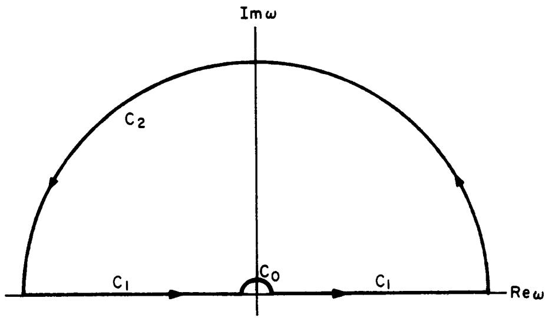  
Figure 12-3a Contour used in evaluating (13） to obtain the spatial energy density spectrum. The radius of the large semicircle is taken to infinity.

$$
\begin{array} { c } { { \displaystyle { ( { \bf { \bar { \alpha } } } ) _ { \bf { k } } =  \frac { T } { 2 } [ 1 - \frac { 1 } { { \bf { \bar { \alpha } } } \epsilon ( { \bf { k } } , 0 ) } ] \ } \ } } \\ { { \displaystyle { = \ \frac { T } { 2 } [ \frac { \sum { S ^ { 2 } } } { \sum { S ^ { 2 } } + K ^ { 2 } \lambda _ { D } ^ { 2 } } ] } } } \end{array}
$$

where 12-2(6) was used to express $\boldsymbol { \epsilon } ( \mathbf { k } , 0 )$ . In a finite system, this is also the energy corresponding to one Fourier mode (remembering that components of $\mathbf { k }$ take on both negative and positive values; see (9) and Sections 8-4 and 8-7)． Equation (14b) reduces to the familiar result when $\Delta x \to 0$ with $\mathbf { k }$ fixed.

In the point-particle case ("sheet" in one dimension） the Debye shielded potential and the spatial spectrum have the same form. Since the latter is easier to measure in a computer "experiment," it may be preferable,as well as sufficient, to measure only the spatial spectrum in a study of the kinetic properties of simulation plasmas. Comparing 12-2(6) and (14b),we see that the Debye potential and spatial spectrum have the same denominator (collective modifications） but differ somewhat in the numerator (source). Thus, the two are no longer synonymous when $\lambda _ { D } \lesssim \Delta x$

As in Section 12-2 the sum over $\pmb { \mathrm { p } }$ can be performed analytically to evaluate $\boldsymbol { \epsilon } ( \mathbf { k } , 0 )$ ，and the Fourier transform can be inverted analytically to find the spatial correlation function and total thermal field energy density. The limit $\lambda _ { D } / \Delta x \xrightarrow { } 0$ is trivial: different cells are uncorrelated and the field energy per cell is $T / 2$ (Problem 12-3d).

(3) $\Delta x \neq 0$ ， $\Delta t = 0$ high-frequency noise Here,the main result is that the spectrum falls off slowly at very high frequencies, as a negative power of $\pmb { \omega }$ ， instead of being proportional to $f _ { 0 } \left( \omega / \hbar \right)$ which decreases more rapidly. The high frequencies are associated with particles crossing the grid at frequencies $\approx \mathbf { p } \cdot \mathbf { k } _ { \mathbf { g } } \cdot \mathbf { v }$

Assuming $\dot { \lambda _ { D } } \geq \Delta x / 2 \pi$ ， we have $k _ { g } \nu _ { t } \gtrsim \omega _ { p }$ so that $\epsilon \approx 1$ ,leaving

$$
\left( \boldsymbol { \rho } ^ { 2 } \right) _ { \boldsymbol { k } , \omega } \approx 2 \pi \rho _ { 0 } q \sum _ { p } \frac { S ^ { 2 } } { | \boldsymbol { k } _ { p } | } f _ { 0 } \left( \frac { \omega } { k _ { p } } \right)
$$

in one dimension. In the absence of the spatial grid, a particle contributes to fluctuations at all frequencies $\leqslant | \mathbf { k } | | \mathbf { v } |$ ，but not higher,in two or three dimensions: At a frequency $\omega > k _ { g } \nu _ { t }$ there are contributions from all alias numbers $| p | \geq p _ { 0 } \equiv \omega / \left( k _ { g } \nu _ { t } \right)$ .Assuming $f _ { 0 } \left( \nu \right) \approx 1 / 2 \nu _ { t }$ for $| \nu | < \nu _ { t }$ and $f _ { 0 } \approx 0$ otherwise, we can estimate the fluctuation level in the onedimensional linear-weighting case as

$$
\begin{array} { l } { { \displaystyle ( \rho ^ { 2 } ) _ { { \bf k } , \omega } \approx 2 \pi \rho _ { 0 } q \left( \frac 2 { \Delta x } \sin \frac { k \Delta x } 2 \right) ^ { 4 } \sum _ { \vert p \vert > p _ { 0 } } \frac 1 { 2 \nu _ { t } \vert k _ { p } \vert ^ { 5 } } } } \\ { { \displaystyle \approx \frac \pi 2 \frac { \rho _ { 0 } q } { k _ { g } \nu _ { t } } \left( \frac \omega { k \nu _ { t } } \right) ^ { - 4 } } } \end{array}
$$

approximating the sum by an integral. For nearest-grid-point weighting the noise falls off as $\omega ^ { - 2 }$ . Graphs of the spectrum and supporting comparisons with measurements on nearest-grid-point and linear-weighting simulations may be found in Okuda (1972).

This high-frequency noise need not be very harmful in electrostatic simulations; it occurs at frequencies above those of physical interest,and particles do not respond strongly to such nonresonant fields. (Highfrequency grid noise is troublesome in electromagnetic simulations; see Chapter 15.） However,with finite $\Delta t$ ， the picture changes for the worse,as we show next.

(4) $\Delta x = 0 , \Delta t \neq 0$ Finite time-step makes high-frequency noise appear the same as low-frequency noise. This is the meaning of the sum over $q$ in (7). We will see that large $\Delta t$ also tends to make the spectrum "flatter," i.e, vary less with $\pmb { \omega }$ ，upseting the balance between velocity diffusion and drag which preserves energy in thermal equilibrium.

With $\Delta x = 0$ ，and a Maxwellian velocity distribution, the spectrum （7) becomes

$$
( \rho ^ { 2 } ) _ { { \bf k } , \omega } = \frac { \sqrt { 2 \pi } \rho _ { 0 } q } { | \epsilon | ^ { 2 } | k | \nu _ { t } } { \sum _ { q } } \exp \left( \frac { - \omega _ { q } ^ { 2 } } { 2 k ^ { 2 } \nu _ { t } ^ { 2 } } \right)
$$

For $\omega _ { p } \Delta t < < 1$ the spectrum is unchanged by finite $\Delta t$ when $k \nu _ { t } \Delta t \lesssim 1$ ，but for $k \nu _ { t } \Delta t \geq 1$ several terms in the sum over $\pmb q$ contribute simultaneously. It

is then convenient to use an alternate expression (Langdon, 1979b)

$$
\left( \rho ^ { 2 } \right) _ { { \bf k } , \omega } \approx \frac { \rho _ { 0 } q } { | \epsilon | ^ { 2 } } \Delta t \sum _ { n = - \infty } ^ { \infty } \exp \left[ i \omega n \Delta t - \mathrm { \mathrm { I } } _ { 2 } ( k \nu _ { t } \Delta t ) ^ { 2 } n ^ { 2 } \right]
$$

which can be obtained from (17) through application of the Poisson summation formula (Lighthill, 1962).For $k \nu _ { t } \Delta t \geq 1$ ，Problem 9-8d shows that $\epsilon \approx 1$ ，with which (18） shows that the spectrum is nearly constant (white noise)

$$
\left( \rho ^ { 2 } \right) _ { \mathbf { k } , \omega } \approx \rho _ { 0 } q \Delta t \left[ 1 + 2 \exp \left( - 1 / 2 k ^ { 2 } \nu _ { t } ^ { 2 } \Delta t ^ { 2 } \right) \cos \omega \Delta t + \mathrm { ~ \cdot ~ } \cdot \cdot \cdot \right]
$$

In this limit, thermal particles move a substantial fraction of a wavelength in one time step; their net contributions to $\pmb { \rho }$ then show no correlation from one time step to the next, hence the white spectrum.

When $\Delta x$ and $\Delta t$ are both finite,a white-noise component can appear even when $k \nu _ { t } \Delta t$ is small.

(5） $\pmb { \Delta x }$ ,△t both nonzero The main effect discussed here is the appearance at low frequencies of the grid noise, (16). This effect occurs most strongly when $\nu _ { t } \Delta t \ge \Delta x ;$ we will consider the case $\nu _ { t } \Delta t / \Delta x = 0 . 5$ Then $\omega _ { g } / k \nu _ { t }$ $= \left( { k _ { g } / \mathrm { \Delta } k } \right) \left( { \Delta x } / { \mathrm { \Delta } \nu _ { t } \Delta t } \right) > 4$ ， so (17) is appropriate for the $p = 0$ source term, for a Maxwellian and $k < ( \nu _ { t } \Delta t ) ^ { - 1 } < k _ { g } / 2$ On the other hand, $k _ { g } \nu _ { t } \Delta t = \pi$ so (18) is appropriate for $p \neq 0$ terms. This suggests rewriting the source as

$$
( \rho ^ { 2 } ) _ { \mathbf { k } , \omega } = \frac { \rho _ { 0 } q } { | \epsilon | ^ { 2 } } \Bigg [ \sum _ { \mathbf { p } } S ^ { 2 } \Bigg | \sqrt { 2 \pi } \sum _ { q } \frac { \exp { ( - \omega _ { q } ^ { 2 } / 2 k _ { p } ^ { 2 } \nu _ { t } ^ { 2 } ) } } { | \mathbf { k _ { p } } | \nu _ { t } } - \Delta t \Bigg ] + \Delta t \sum _ { \mathbf { p } } S ^ { 2 } \Bigg ]
$$

The first sum over p converges rapidly once $p \gtrsim ( k _ { g } \nu _ { t } \Delta t ) ^ { - 1 }$ ，while the second sum over $\pmb { \ p }$ can be evaluated analytically as in Section 12-2. For $\nu _ { t } \Delta t / \Delta x = 0 . 5$ ，it is sufficient to keep only the $q = 0$ term. At frequencies $\omega \lesssim k \nu _ { t }$ the first term is dominant,as desired. For frequencies higher than $k \nu _ { t }$ and $\omega _ { p }$ ,this physical term is dominated by white noise,

$$
( \rho ^ { 2 } ) _ { \mathbf { k } , \omega } \approx \rho _ { 0 } q \Delta t \sum _ { \mathbf { p } \neq 0 } S ^ { 2 }
$$

For linear weighting in one dimension (21） is proportional to $( k \Delta x ) ^ { 4 }$ at long wavelengths. For shorter wavelengths, $( \nu _ { t } \Delta t ) ^ { - 1 } < k < k _ { g } / 2$ ，we use (18) for all $p$ terms and obtain in one dimension

$$
\left( \rho ^ { 2 } \right) _ { { \bf k } , \omega } \approx \rho _ { 0 } q \Delta t \left( 1 - \frac { 2 } { 3 } \sin ^ { 2 } \frac { k \Delta x } { 2 } \right)
$$

at all frequencies. This implies a lack of correlation between time steps which was first mentioned by Hockney (1966). Our results are in reasonable agreement with the heuristic discussion by Abe et al. (1975) of the effects of varying $\nu _ { t } \Delta t / \Delta x$ on correlation times and other properties.

For nearest-grid-point weighting, $\Sigma ^ { S ^ { 2 } = 1 }$ and the spectrum is constant both in $\mathbf { k }$ and $\pmb { \omega }$ .For subtracted-dipole weighting (Chapter 11） in one

dimension, we find

$$
\sum _ { p } S ^ { 2 } = 1 + { \frac { 1 } { 1 2 } } \sin ^ { 2 } { k \Delta x }
$$

which is worse than for nearest-grid-point, and more than three times larger at short wavelengths than for linear weighting. The causes are the discontinuity in $s ( x )$ ， which makes $S ^ { 2 } ( k ) \propto k ^ { - 2 }$ (versus $k ^ { - 4 }$ for linear weighting), and the negative values taken on by $s$ ，which increases

$$
\int _ { s } \frac { d k } { 2 \pi } \sum _ { p } S ^ { 2 } ( k _ { p } ) = \int d x S ^ { 2 } ( x )
$$

In practice， users of subtracted-dipole weighting flter out the short wavelengths where the differences are large. Of course, if one is willing to suffer the same loss of resolution in the linear weighting case, then the noise level again is lower than for subtracted-dipole weighting.

# PROBLEMS

12-3a The ensemble-averaged fluctuation results (4)-(9) were derived for an infinite system. Reconsider the derivation for a.finite periodic system taking care of the special cases in which k or $\mathbf { k ^ { \prime } }$ is zero,and of terms $\propto$ (number of particles) $^ { - 1 }$ which do not appear in an infinite system. Assume net charge neutrality.

12-3b Show that $\boldsymbol { \epsilon } ( - \mathbf { k } _ { p } , - \omega _ { q } ) = \boldsymbol { \epsilon } ^ { * } ( \mathbf { k } , \omega )$ by extending the results of Probem 9-2b and using the periodicity of ε.

12-3c Verify (9).

12-3d Using (14b)in (9) with $\lambda _ { D }  0$ and $t _ { n } = t _ { n ^ { \prime } }$ show that $\langle { \scriptstyle { \frac { 1 } { 2 } } } \rho _ { j } \phi _ { j } \rangle = 0$ if $j \neq j ^ { \prime }$ , and the field energy per cell is $\Delta x \langle \mathit { \Pi } _ { \overline { { 1 } } } ^ { \mathrm { ~ } } \rho _ { J } \phi _ { j } \rangle = T / 2$

# 12-4 REMARKS ON THE SHIELDING AND FLUCTUATION RESULTS

Expressions for Debye shielding and the fluctuation spectrum have been derived using an exact mathematical description of the numerical algorithms. The results for a simulation plasma and a real plasma are compared in the case of a Maxwellian velocity distribution. As expected, exact agreement is found when the grid spacing and time step are small. Qualitative differences in Debye shielding and spatial spectrum arise when $\lambda _ { D } \leqslant \Delta x / 2$ ；for exam-ple,the Debye potential oscillates as it decays. In the fluctuation spectrum, noise is found at high frequencies on the order of $\nu _ { t } / \Delta x$ .A large time step $( \Delta t \geqslant \Delta x / \nu _ { t } )$ redistributes this noise to all frequencies, producing a flatter spectrum and contributing to velocity diffusion (Section 12-5).

The theoretical results have the same limitations on validity as do the conventional kinetic theory results to which they reduce,except that no short-range divergences arise in simulation plasmas. The theory is valid only for stable plasmas. Yet, we have shown in Chapters 8 and 1O that even a Maxwellian velocity distribution can be destabilized at long wavelengths by the spatial grid. Even if stable，the long wavelengths may not establish equilibrium fluctuations before $f _ { 0 }$ has evolved collisionally,violating the adiabatic hypothesis implicit in the derivation. In these cases the expressions are meaningless at such wavelengths. However,it may be argued that the expressions will apply at other wavelengths which are Landau damped,pro-viding amplitudes stay low enough so that linearization is valid.

When quiet starts are used (Sections 5-9 and 5-15,Byers and Grewal, 1970;Denavit and Kruer,1971;Denavit and Walsh,198i),with their highly correlated initial particle coordinates,recurrences and multibeam instabilities, the computation may be terminated long before this theory would apply. Indeed,it is the intention of the user of a quiet start to postpone the development ofthermal fluctuationsin simulations of collisionless phenomena.

The existence of simulation models with identifiable particles and classical deterministic dynamics reopens unresolved difficulties of classical statistical mechanics, such as Gibbs's paradox,whose resolution has been obviated by appeal to quantum statistical physics. The unfinished development of classical thermal physics is a legitimate,if not pressing,topic in theoretical physics. Other difficulties,associated with short wavelengths (such as the "ultraviolet catastrophe" and the divergence of point-particle field energies), do not arise in computer simulation models because the number of degrees of freedom is limited by the number of computer variables used to represent the state of the system.

# 12-5 DERIVATION OF THE KINETIC EQUATION

# (a) Velocity Diffusion

We now calculate the effect of a fluctuating field on the velocity distribu-tion of the particles moving through it. First we calculate the variance of the change in a test_particle's velocity over a time $t _ { s }$ ，due to the accelerations ${ \mathbf { a } _ { 0 } } ^ { ( 1 ) }$ through ${ \bf a } _ { s - 1 } ^ { ( 1 ) }$ If this variance is proportional to $t _ { s }$ when $t _ { s }$ is large enough, then a diffusion process is indicated. For leap-frog integration, the change in velocity is

$$
{ \bf v } _ { s - 1 / 2 } ^ { ( 1 ) } = \Delta t \sum _ { r = 0 } ^ { s - 1 } \mathbf { a } _ { r } ^ { ( 1 ) }
$$

For the acceleration use the force along the unperturbed orbit. Further,the force field used will be that in the absence of the test particle. (These errors are small compared to the leading terms,and make a contribution to the variance，a quadratic quantity，of higher order than we wish to retain.

However, they both make important contributions to the mean change in velocity,or drag，which we calculate later.） By using the transform of the field we can do the sum over $r$ in (1):

$$
\mathbf { v } _ { s - 1 / _ { 2 } } ^ { ( 1 ) } = \frac { 1 } { m } \int \frac { d \mathbf { k } } { ( 2 \pi ) ^ { 3 } } \int \frac { d \omega } { g } \mathbf { F } ( \mathbf { k } , \omega ) e ^ { i \mathbf { k } \cdot \mathbf { x } _ { s } ^ { ( 0 ) } - i \omega t _ { s } } \frac { 1 - e ^ { i ( \omega - \mathbf { k } \cdot \mathbf { v } ) t _ { s } } } { e ^ { - i ( \omega - \mathbf { k } \cdot \mathbf { v } ) \Delta t } - 1 }
$$

For the fluctuations of the force we have

$$
\begin{array} { r l } & { \left. \mathbf { F } ( \mathbf { k } , \omega ) \mathbf { F } ( \mathbf { k } ^ { \prime } , \omega ^ { \prime } ) \right. } \\ & { \quad \quad \quad = q ^ { 2 } S ( - \mathbf { k } ) S ( - \mathbf { k } ^ { \prime } ) ( \mathbf { E } \mathbf { E } ) _ { \mathbf { k } , \omega } ( 2 \pi ) ^ { 4 } \delta ( \mathbf { k } + \mathbf { k } ^ { \prime } , \mathbf { k } _ { g } ) \delta ( \omega + \omega ^ { \prime } , \omega _ { g } ) } \\ & { \quad \quad \quad \quad \quad ( \mathbf { E } \mathbf { E } ) _ { \mathbf { k } , \omega } = \frac { \kappa \kappa } { K ^ { 4 } } ( \rho ^ { 2 } ) _ { \mathbf { k } , \omega } } \end{array}
$$

where

Since the force depends on the continuous variable $\mathbf { x }$ ，the normal Fourier inverse transform is to be used. The factor $\mathfrak { f } ( \mathbf { k } + \mathbf { k } ^ { \prime } , \mathbf { k } _ { g } )$ rather than $\pm \mathbf { \delta } ( \mathbf { k } + \mathbf { k } ^ { \prime } )$ means that the ensemble is not quite uniform for $\mathbf { F }$ (or $n$ ).Averages depend periodically on position relative to the grid,as well as on the separation. This is expected since grid points can be equivalent but the situation between and at grid points is different. More on this later.

We now form the ensemble average $\langle { \bf v } ^ { ( 1 ) } { \bf v } ^ { ( 1 ) } \rangle / 2 t _ { s }$ which we hope will be a diffusion tensor, i.e., independent of $t _ { s } \ \mathsf { a s } t _ { s } \to \infty$ .To do so we multiply (2）by itself with $\mathbf { k }$ and $\pmb { \omega }$ changed to $\mathbf { k } ^ { \prime }$ and ${ { \pmb \omega } ^ { \prime } }$ ，so that two transform integrals can be made into one multiple integral. Then ensemble average, use (3) and do the integrals over $\mathbf { k } ^ { \prime }$ and $\omega ^ { \prime }$ to obtain the variance

$$
\begin{array} { r l r } & { } & { \langle \frac { { \bf v } _ { s - 1 / s } ^ { ( 1 ) } { \bf v } _ { s - 1 / s } ^ { ( 1 ) } } { 2 t _ { s } } \rangle = \frac { q ^ { 2 } } { 2 m ^ { 2 } } \int \frac { d { \bf k } } { ( 2 \pi ) ^ { 3 } } \int \frac { d \omega } { 2 \pi } \displaystyle \sum _ { \mathfrak { p } } S ( - { \bf k } ) S ( { \bf k } _ { \mathfrak { p } } ) ( { \bf E } { \bf E } ) _ { { \bf k } , \omega } e ^ { - i { \bf p } \cdot { \bf k } _ { g } \cdot { \bf x } _ { s } ^ { ( 0 ) } } } \\ & { } & { \cdot \frac { 1 } { t _ { s } } \frac { 1 - e ^ { i ( \omega - { \bf k } \cdot \bf v ) t _ { s } } } { e ^ { - i ( \omega - { \bf k } \cdot \bf v ) \Delta t } - 1 } \frac { 1 - e ^ { - i ( \omega - { \bf k } _ { \mathfrak { p } } \cdot \bf v ) t _ { s } } } { e ^ { i ( \omega - { \bf k } _ { \mathfrak { p } } \cdot \bf v ) \Delta t } - 1 } } \end{array}
$$

We are not interested in distinguishing between the diffusion for particles according to their present positionrelative to the grid,so weaverage ${ \bf x } _ { s } ^ { ( 0 ) }$ over one cell, which eliminates all but the $p = 0$ term:

$$
\begin{array} { c } { { \Bigl \langle \frac { { \bf v } _ { s - 1 / 2 } ^ { ( 1 ) } { \bf v } _ { s - 1 / 2 } ^ { ( 1 ) } } { 2 t _ { s } } \Bigr \rangle = { \bf D } ( { \bf v } , t _ { s } ) } } \\ { { \equiv \frac { q ^ { 2 } } { 2 m ^ { 2 } } \displaystyle \int \frac { d { \bf k } } { ( 2 \pi ) ^ { 3 } } \displaystyle \int \frac { d \omega } { s } S ^ { 2 } ( { \bf k } ) ( { \bf E } { \bf E } ) _ { { \bf k } , \omega } } } \\ { { \cdot \frac { \Delta t ^ { 2 } } { t _ { s } } \frac { \sin ^ { 2 } \nu _ { i } / 2 ( \omega - { \bf k } \cdot { \bf v } ) t _ { s } } { \sin ^ { 2 } \nu _ { i } / 2 ( \omega - { \bf k } \cdot { \bf v } ) \Delta t } } } \end{array}
$$

Consider the $\omega$ integration for large $t _ { s }$ . The last factor is a peak of width $t _ { s } ^ { - 1 }$ If the spectrum $\left( \mathbf { E E } \right) _ { \mathbf { k } , \omega }$ varies little across the peak (meaning roughly that $t _ { s }$ is larger than the field correlation time), then there is a contribution

$$
\mathbf { D } ( \mathbf { v } ) = { \frac { q ^ { 2 } } { 2 m ^ { 2 } } } { \int } { \frac { d \mathbf { k } } { ( 2 \pi ) ^ { 3 } } } S ^ { 2 } ( \mathbf { k } ) \left( \mathbf { E } \mathbf { E } \right) _ { \mathbf { k } , \mathbf { k } \cdot \mathbf { v } }
$$

which is independent of $t _ { s }$ and therefore is diffusion-like. There is another likely contribution from the frequencies of oscillation of the plasma where the spectrum will be large; this represents oscillation of nonresonant particles in the wave field and approaches the constant

$$
\begin{array} { r l r } {  {  \mathbf { v } _ { s - 1 / 2 } ^ { ( 1 ) } \mathbf { v } _ { s - 1 / 2 } ^ { ( 1 ) }  \mathrm { n o n r e s } } } \\ & { } & { = \frac { 2 q ^ { 2 } } { m ^ { 2 } } { \int \frac { d \mathbf { k } } { ( 2 \pi ) ^ { 3 } } \int \frac { d \omega } { 2 \pi } S ^ { 2 } ( \mathbf { k } ) ( \mathbf { E } \mathbf { E } ) _ { \mathbf { k } , \omega } \frac { ( \Delta t / 2 ) ^ { 2 } } { \sin ^ { 2 } 1 / 2 ( \omega - \mathbf { k } \cdot \mathbf { v } ) \Delta t } } } \end{array}
$$

in our stationary ensemble. This contribution may be troublesome in attempts to measure diffusion in computer experiments since it decreases slowly,proportional to $t _ { s } ^ { - 1 }$ .Eventually $\mathbf { D } ( \mathbf { v } , t _ { s } )$ approaches $\mathbf { D } ( \mathbf { v } )$ ，which we therefore call the diffusion tensor. (On the other hand,one cannot wait so long that the particles are deflected by more than a wavelength from the unperturbed paths so that our linearization breaks down. Both conditions are satisfied when there are enough particles to make the fluctuations low in amplitude.)

# (b) Velocity Drag

If we evaluate the ensemble-average change in particle velocity using the field along the zero-order orbit and neglecting the influence of the selected ("test"） particle on the rest of the plasma, we get zero. To obtain two contributions to the drag，we correct first one of these approximations and then the other.

In the first case we are to find the mean change in velocity of a particle moving through given fields described by a fluctuation spectrum. ${ \mathbf { a } } ^ { ( 1 ) }$ is the acceleration given by the field along the zero-order orbit. From 9-3(1),the resulting deflection in the particle position is

$$
\mathbf { x } _ { r } ^ { ( 1 ) } = \Delta t ^ { 2 } \sum _ { r ^ { \prime } = 0 } ^ { r - 1 } ( r - r ^ { \prime } ) \ \mathbf { a } _ { r ^ { \prime } } ^ { ( 1 ) }
$$

The difference between the acceleration along the perturbed path and ${ \pmb a } ^ { ( 1 ) }$ is

$$
\mathbf { a } _ { r } ^ { ( 2 ) } = \mathbf { x } _ { r } ^ { ( 1 ) } \cdot \frac { \partial } { \partial \mathbf { x } _ { r } ^ { ( 0 ) } } \ \mathbf { a } _ { r } ^ { ( 1 ) }
$$

Although ${ \mathbf { a } } ^ { ( 1 ) }$ averages to zero, ${ \mathbf { a } } ^ { ( 2 ) }$ does not, because of course ${ \pmb a } ^ { ( 1 ) }$ and $\mathbf { x } ^ { ( 1 ) }$ are correlated. There results a mean change in particle velocity

$$
{ \bf v } _ { s - 1 / _ { 2 } } ^ { ( 2 ) } = \Delta t \sum _ { r = 0 } ^ { s - 1 } \mathbf { a } _ { r } ^ { ( 2 ) }
$$

After going through similar steps as with the diffusion,one finds (Problem 12-5a)

$$
\Big \langle \frac { { \bf v } _ { s - 1 / 2 } ^ { ( 2 ) } } { t _ { s } } \Big \rangle = \frac { \partial } { \partial { \bf v } } \cdot { \bf D } ( { \bf v } , t _ { s } )
$$

where $\mathbf { D } ( \mathbf { v } , t _ { s } )$ is the same expression as in (6). Again as $t _ { s }$ becomes large this approaches a constant, so that the net effect is like a drag acceleration

$$
\mathbf { a } _ { \mathrm { f l u c t } } = \frac { \partial } { \partial \mathbf { v } } \cdot \mathbf { D }
$$

If we combine the diffusion and drag found so far in a Fokker-Planck description of the slow evolution of the velocity distribution,we obtain

$$
\begin{array} { r l } & { \frac { \partial f } { \partial t } = \frac { \partial } { \partial \mathbf { v } } \cdot \left\{ - f \frac { \partial } { \partial \mathbf { v } } \cdot \mathbf { D } + \frac { \partial } { \partial \mathbf { v } } \cdot f \mathbf { D } \right\} } \\ & { \qquad = \frac { \partial } { \partial \mathbf { v } } \cdot \mathbf { D } \cdot \frac { \partial f } { \partial \mathbf { v } } } \end{array}
$$

Since the fluctuation spectrum in $\mathbf { D }$ [(7） with (4)] does not need to be that of 12-3(7) but could be the result of turbulence in a weakly-unstable plasma, we have an alternative derivation of the quasilinear theory particle equation (in the slow growth limit).

The remaining source of drag is due to the distortion of the surrounding plasma by the test particle. It is adequate to treat the plasma as a Vlasov gas and make the test particle move at constant speed. Averaging as usual over one cell, we obtain (Problem 12-5b)

$$
\begin{array} { l } { { \displaystyle { \bf F } ( { \bf v } ) = \int \frac { d { \bf k } } { \omega } \frac { d { \bf k } } { ( 2 \pi ) ^ { 3 } } q ^ { 2 } S ^ { 2 } \frac { \kappa } { K ^ { 2 } } \mathrm { I m } \frac { 1 } { \epsilon ( { \bf k } , { \bf k } \cdot { \bf v } + i 0 ) } } } \\ { { \displaystyle ~ = - \int \frac { d { \bf k } } { \omega } \frac { q ^ { 2 } \kappa S ^ { 2 } } { K ^ { 2 } \vert \epsilon ( { \bf k } , { \bf k } \cdot { \bf v } ) \vert ^ { 2 } } \mathrm { I m } \epsilon ( { \bf k } , { \bf k } \cdot { \bf v } + i 0 ) } } \end{array}
$$

This result, but not (13)，applies to time integration schemes other than leapfrog (Problem 12-5d).

# (c) The Kinetic Equation

Combining(7),(13),(15),and (16) with 12-3(11） into a Fokker-Planck equation for $f ( \mathbf { v } )$ we obtain the computer simulation plasma analogue of the Balescu-Guernsey-Lenard kinetic equation:

$$
\begin{array} { c } { \displaystyle \frac { \partial f } { \partial t } = \frac { \hat { \boldsymbol { \Phi } } } { \hat { \boldsymbol { \Phi } } \boldsymbol { \mathbf { v } } } \cdot \boldsymbol { \pi } \frac { \omega _ { p } ^ { 4 } } { n _ { 0 } } \int \frac { d \mathbf { k } } { ( 2 \pi ) ^ { 3 } } \frac { S ^ { 2 } ( \mathbf { k } ) } { | \boldsymbol { \epsilon } ( \mathbf { k } , \mathbf { k } \cdot \mathbf { v } ) | ^ { 2 } } \frac { \kappa \kappa } { K ^ { 4 } } \cdot \sum _ { \mathbf { p } } S ^ { 2 } ( \mathbf { k } _ { \mathbf { p } } ) } \\ { \cdot \int d \mathbf { v } ^ { \prime } \delta ( \mathbf { k } \cdot \mathbf { v } - \mathbf { k } _ { \mathbf { p } } \cdot \mathbf { v } ^ { \prime } , \omega _ { g } ) \left( \frac { \hat { \boldsymbol { \Phi } } } { \hat { \boldsymbol { \Phi } } \mathbf { v } } - \frac { \hat { \boldsymbol { \Phi } } } { \hat { \boldsymbol { \Phi } } \mathbf { v } ^ { \prime } } \right) f ( \mathbf { v } ) f ( \mathbf { v } ^ { \prime } ) } \end{array}
$$

This discouragingly lengthy expression can be compared to the real plasma BGL equation (itself quite complex; see Lenard, 1960; Balescu, 1960;

Guernsey,1962). Our (17) reduces to their result

$$
\begin{array} { r l } & { \frac { \partial f } { \partial t } = \frac { \partial } { \partial \mathbf { v } } \cdot \boldsymbol { \pi } \frac { \omega _ { p } ^ { 4 } } { n _ { 0 } } \int \frac { d \mathbf { k } } { ( 2 \pi ) ^ { 3 } } \frac { 1 } { \left| \epsilon \right| ^ { 2 } } \frac { \mathbf { k } \mathbf { k } } { k ^ { 4 } } } \\ & { \qquad \cdot \int d \mathbf { v } ^ { \prime } \delta ( \mathbf { k } \cdot \mathbf { v } - \mathbf { k } \cdot \mathbf { v } ^ { \prime } ) \left( \frac { \partial } { \partial \mathbf { v } } - \frac { \partial } { \partial \mathbf { v } ^ { \prime } } \right) f ( \mathbf { v } ) f ( \mathbf { v } ^ { \prime } ) } \end{array}
$$

in the limit of small $\Delta x$ and $\Delta t$

The kinetic equation for Lewis’models (Chapter 1O) is a special case of a result obtained as above except that no assumptions are made as to periodicity of $\pmb { \kappa }$ It is

$$
\begin{array} { c } { { \displaystyle { \frac { \partial f } { \partial t } } =  { \frac { \hat { 0 } } { \partial \mathbf { v } } \cdot \boldsymbol { \pi } } \frac { \omega _ { p } ^ { 4 } } { n _ { 0 } } \int d \mathbf { v } ^ { \prime } \int \frac { d \mathbf { k } } { \varepsilon } \frac { \ d \mathbf { k } } { ( 2 \pi ) ^ { 3 } } \sum _ { p p ^ { \prime } } \frac { S ^ { 2 } ( \mathbf { k } _ { p } ) S ^ { 2 } ( \mathbf { k } _ { p ^ { \prime } } ) } { | \epsilon ( \mathbf { k } , \mathbf { k } _ { p } \cdot \mathbf { v } ) | ^ { 2 } } } } \\ { { \displaystyle \cdot \sum _ { q } \delta ( \mathbf { k } _ { p } \cdot \mathbf { v } - \mathbf { k } _ { p ^ { \prime } } \cdot \mathbf { v } ^ { \prime } - q \omega _ { g } ) \frac { \kappa } { K ^ { 4 } } ( \kappa \frac { \hat { 0 } } { \partial \mathbf { v } } - \kappa ^ { \prime } \frac { \hat { 0 } } { \partial \mathbf { v } ^ { \prime } } ) f ( \mathbf { v } ) f ( \mathbf { v } ^ { \prime } ) } } \end{array}
$$

where $\epsilon ( \boldsymbol { \mathbf { k } } , \omega )$ is given by 12-2(4) and $\kappa \equiv \kappa ( \mathbf { k } _ { \mathbf { p } } )$ ， $\kappa ^ { \prime } \equiv \kappa ( \mathbf { k } _ { \mathbf { p } ^ { \prime } } )$ . Special cases are the energy-conserving algorithm for which $\pmb { \kappa } = \mathbf { k }$ and the interlaced grid (Problem 12-5c).

For time integration schemes other than leapfrog,such as are used in implicit simulation,there are additional terms (Problem 12-5d).

Our theory does have one advantage over that for a real plasma; there are no difficulties with divergence at large $k$ because the grid smooths out the Coulomb field.

Intermingled here are normal collisions modified by the force smoothing (Langdon and Birdsall,1970;Okuda and Birdsall, 197O) plus all other grid effects such as stochastic heating from the grid noise (Hockney,1966,1971; Hockney and Eastwood,1981, Section 9-2)． There are few nice approximations to make in interesting cases,but several physical features are shown analytically in the next Section.

# PROBLEMS

12-5a Derive (12)．Hints:Write (10) with (9) as

$$
\begin{array} { l } { { { \displaystyle { \bf { a } } _ { r } ^ { ( 2 ) } = \frac { \Delta t } { m ^ { 2 } } \sum _ { r = 0 } ^ { r - 1 } ( \iota _ { r } - \iota _ { r ^ { \prime } } ) ~ { \bf { F } } ^ { ( 1 ) } ( { \bf { x } } _ { r ^ { \prime } } ^ { ( 0 ) } , \iota _ { r ^ { \prime } } ) \cdot \frac { \partial } { \partial { \bf { x } } _ { r ^ { \prime } } ^ { ( 0 ) } } { \bf { F } } ( { \bf { x } } _ { r ^ { \prime } } ^ { ( 0 ) } + { \bf { v } } [ \iota _ { r } - \iota _ { r ^ { \prime } } ] , \iota _ { r } ) } } } \\ { { { } } } \\ { { { \mathrm { } = \frac { 1 } { m ^ { 2 } } \frac { \partial } { \partial { \bf { v } } } \cdot \Delta t \sum _ { r = 0 } ^ { r - 1 } { \bf { F } } ^ { ( 1 ) } ( { \bf { x } } _ { r ^ { \prime } } ^ { ( 0 ) } , \iota _ { r ^ { \prime } } ) ~ { \bf { F } } ^ { ( 1 ) } ( { \bf { x } } _ { r ^ { \prime } } ^ { ( 0 ) } + { \bf { v } } [ \iota _ { r } - \iota _ { r ^ { \prime } } ] , \iota _ { r } ) } } } \end{array}
$$

Now ensemble average bringing in $\left( \mathbf { E E } \right) _ { \mathbf { k } , \omega }$ ，and average the particle positions relative to the grid as done for (6),to find

$$
\mathbf { a } _ { r } ^ { ( 2 ) } = \frac { q ^ { 2 } } { m ^ { 2 } } \frac { \partial } { \partial \mathbf { v } } \cdot \int \frac { d \mathbf { k } } { ( 2 \pi ) ^ { 3 } } \frac { d \omega } { 2 \pi } S ^ { 2 } ( \mathbf { k } ) \left( \mathbf { E } \mathbf { E } \right) _ { \mathbf { k } , \omega } \Delta t \sum _ { r = 0 } ^ { r - 1 } e ^ { i ( \mathbf { k } \cdot \mathbf { v } - \omega ) ( t _ { r } - t _ { r } ) }
$$

In_(11)，after dropping termswhich do not contribute because of the symmetry $\left( \mathbf { E } \mathbf { E } \right) _ { \mathbf { k } , \omega } = \left( \mathbf { E } \mathbf { E } \right) _ { - \mathbf { k } , - \omega }$ and because $\partial / \partial { \bf v }$ removes velocity-independent terms,find (12).

12-5b Derive (16),using 12-2(3) and 12-3(2) for a single particle,and the symmetry found in Problem 12-3b.

12-5c Verify that (19)also holds when the electric field is interlaced as in Problem 8-7c,with an appropriate choice for $\pmb { \kappa }$

12-5d Show that (13) is generalized to alltime-integration schemes when writen as

$$
{ \bf a } _ { \mathrm { f l u c t } } =  \frac { q ^ { 2 } } { m ^ { 2 } } \int \frac { d { \bf k } } { ( 2 \pi ) ^ { 3 } } \frac { d \omega } { 2 \pi } { \bf k } \cdot ( { \bf E } { \bf E } ) _ { { \bf k } , \omega } \mathrm { I m } [ \frac { { \bf X } } { \mathrm { \bf A } } ] _ { \omega - { \bf k } \cdot { \bf v } + \mu }
$$

For the leap-frog scheme,there is only the resonant contribution as in Problem 9-2b; show this is (13).For noncentered time integration,such as the C and $\mathbf { D }$ schemes,there is also a nonresonant contribution with $\omega \neq { \bf k } \cdot { \bf v } .$ Hints:Express a in (lO) in terms of the transform $\mathbb { F } ( { \bf k } , \omega )$ ,and use the proportionality of $\mathbf { X }$ and $\mathbf { A }$ ，written as $\left( \mathbf { X } / \mathbf { \Delta A } \right) _ { \omega - \mathbf { k } \cdot \mathbf { v } }$ as in Chapter 9, to express ${ \bf x } _ { r } ^ { ( 1 ) }$ instead of using (9).

# 12-6 EXACT PROPERTIES OF THE KINETIC EQUATION

After deriving his kinetic equation,Lenard (1960) considers several con-servation principles and inequalities which are true microscopically,and the $H .$ -theorem. His kinetic equation is found satisfactory in all these respects. We begin by making the same checks on our kinetic equation. By using his notation we can avoid duplicating essentially the same manipulations.

The kinetic equation 12-5(20) is

$$
{ \frac { \partial } { \partial t } } f ( \mathbf { v } , t ) = - { \frac { \partial } { \partial \mathbf { v } } } \cdot \mathbf { J }
$$

where the velocity space flux $\mathbf { J }$ is

$$
{ \bf J } = \int d { \bf v } ^ { \prime } ~ { \bf Q } ( { \bf v } , { \bf v } ^ { \prime } ) \cdot \left( \frac { \partial } { \partial \bf v } - \frac { \partial } { \partial { \bf v } ^ { \prime } } \right) f ( { \bf v } ) f ( { \bf v } ^ { \prime } )
$$

in which we have from 12-5(20)

$$
\mathbf { Q } ( \mathbf { v } , \mathbf { v } ^ { \prime } ) = - \pi \frac { \omega _ { p } ^ { 4 } } { n _ { 0 } } \int \frac { d \mathbf { k } } { ( 2 \pi ) ^ { 3 } } \sum _ { \mathbf { p } \mathbf { p } ^ { \prime } } \frac { S ^ { 2 } ( \mathbf { k } _ { \mathbf { p } } ) S ^ { 2 } ( \mathbf { k } _ { \mathbf { p } ^ { \prime } } ) } { \left| \epsilon ( \mathbf { k } , \mathbf { k } _ { \mathbf { p } } \cdot \mathbf { v } ) \right| ^ { 2 } } \frac { \kappa \kappa } { K ^ { 4 } } \delta ( \mathbf { k } _ { \mathbf { p } } \cdot \mathbf { v } - \mathbf { k } _ { \mathbf { p } ^ { \prime } } \cdot \mathbf { v } ^ { \prime } , \omega _ { g } )
$$

It is convenient to rewrite $\mathbf { Q }$ by making the replacements $\pmb { \mathrm { p } } \longrightarrow \pmb { \mathrm { p } } ^ { \prime }$ and

$$
\int _ { \infty } d \mathbf { k } g ( \mathbf { k } ) \longrightarrow \int _ { g } d \mathbf { k } \sum _ { \mathbf { p } } g ( \mathbf { k } _ { \mathbf { p } } )
$$

and employing the periodicity of $\kappa , K$ ,and $\epsilon ( \mathbf { k } , \omega )$ with respect to $\mathbf { k }$

First,particle density is conserved because the collision operator is the velocity divergence of a flux in velocity space which vanishes at large velocities. Thus,when the kinetic equation is integrated over velocity,the colli-sion term can be rewritten using Gauss’ divergence theorem as an integral over a velocity-space surface at infinity.

The density $f$ must be positive or zero. Lenard shows that a positive smooth $f$ will not subsequently become negative if the tensor $\mathbf { Q }$ is negative (Problem 12-6a). This is true because the quadratic form

$$
\mathbf { A } \cdot \mathbf { Q } \cdot \mathbf { A } < 0
$$

for any A, as Q is a sum and integral of a negative quantity.

Momentum is conserved if

$$
{ \bf Q } ( { \bf v } , { \bf v } ^ { \prime } ) = { \bf Q } ( { \bf v } ^ { \prime } , { \bf v } )
$$

(Problem 12-6b). We verify (5） by interchanging $\pmb { \nu }$ with $\mathbf { v } ^ { \prime }$ and $\pmb { \mathrm { p } }$ with $\pmb { \mathrm { p } } ^ { \prime }$ in (3),and then using the δ function and the periodicity of $\epsilon$ with respect to frequency to replace its argument $\mathbf { k } _ { \mathbf { p ^ { ' } } } \cdot \mathbf { v ^ { \prime } }$ by $\mathbf { k } _ { \mathbf { p } } \cdot \mathbf { v }$ Since δ is an even function,we are back to (3） again. Thus momentum is conserved,as it should be since the models conserve momentum exactly.

However, we know that energy is not conserved exactly,and indeed we find we can make no general statement about energy here. (To the order considered the rate of change of total energy is just the rate for kinetic energy.） Lenard's proof of kinetic energy conservation requires that $( { \bf v } - { \bf v } ^ { \prime } ) \cdot { \bf Q } ( { \bf v } , { \bf v } ^ { \prime } ) \equiv { \bf 0 }$ ，which is not true here. We leave the question open for the moment.

The $H .$ -theorem requires only (4) and (S). We find

$$
\begin{array} { r l } & { \dot { H } \equiv \frac { d } { d t } \int d \mathbf { v } f ( \mathbf { v } ) \ln f ( \mathbf { v } ) } \\ & { \quad = \frac { 1 } { 2 } \int d \mathbf { v } d \mathbf { v ^ { \prime } } \Bigg \{ \frac { \partial } { \partial \mathbf { v } } \ln f - \frac { \partial } { \partial \mathbf { v ^ { \prime } } } \ln f \Bigg \} \cdot \mathbf { Q } ( \mathbf { v } , \mathbf { v ^ { \prime } } ) } \\ & { \qquad \cdot \left\{ \frac { \partial } { \partial \mathbf { v } } \ln f - \frac { \partial } { \partial \mathbf { v ^ { \prime } } } \ln f \right\} f ( \mathbf { v } ) \ : f ( \mathbf { v } ) \ : f ( \mathbf { v ^ { \prime } } ) } \\ & { \qquad < 0 } \end{array}
$$

with equality not possible. Thus, there is no stationary $f$ ，not even the Maxwellian! This remains true in one dimension or when either $\Delta x$ or $\Delta t$ is separately set to zero. We can say the space-time grid creates entropy even for a plasma which should have the greatest possible entropy for the given density，momentum, and energy. Since $H$ is then an extremum, the only way it can be changing is if a constraint is changing. In this case it must be that the energy is increasing. Indeed,for the Maxwellian case one can show the energy is increasing by the right amount to account for the change in entropy:

$$
\begin{array} { l } { { \displaystyle { \frac { 1 } { 2 \nu _ { t } ^ { 2 } } } { \frac { d } { d t } } \overline { { { \nu ^ { 2 } } } } = - \dot { H } } \ ~ } \\ { { \displaystyle ~ = - { \frac { 1 } { 2 \nu _ { t } ^ { 4 } } } \int d \mathbf { v } \ d \mathbf { v ^ { \prime } } \left( \mathbf { v } - \mathbf { v ^ { \prime } } \right) \cdot \mathbf { Q } \cdot \left( \mathbf { v } - \mathbf { v ^ { \prime } } \right) f ( \mathbf { v } ) \ f ( \mathbf { v ^ { \prime } } ) } } \\ { { \displaystyle ~ > 0 } } \end{array}
$$

The $H$ -theorem result provides a likely expression to study further as something which is due solely to the non-physical heating of the model, and which is easily measured in a computer experiment (Montgomery and Nielson, 1970).In fact, the total energy is commonly monitored in simulation codes.

For "energy-conserving" models，again following Lenard,we can show that $f$ remains positive and particles are conserved. Since momentum and energy are not conserved microscopically，it is to be expected that they are not conserved by the kinetic equation (except for the energy when $\Delta t = 0$ ， Problem 12-6c).

A Maxwellian distribution which is not drifting is constant in the $\Delta t = 0$ limit. Otherwise the $H$ -theorem shows that $f$ changes in a fashion which increases entropy $\dot { \boldsymbol { H } } < 0 )$

$f$ is instantaneously Maxwellian we can say more about the rates of change of momentum,energy,and $H$ . We find that the changes in energy and momentum have no obvious sign separately,but the combination

$$
\frac { d } { d t } \frac { 1 } { 2 } \overline { { ( \mathbf { v } - \overline { { \mathbf { v } } } ) ^ { 2 } } } = - \mathbf { \nabla } \nu _ { t } ^ { 2 } \dot { H } > 0
$$

shows that the spread in the drifting frame is increasing as $\overline { { \nu } }$ increases: this is how entropy is increased.

When $\Delta t = 0$ we can see that $\overline { { \mathbf { v } } }$ decreases. Thus, one can say that "collisions with_the grid" slow the drift, and the velocity spread increases so as to maintain $\overline { { \nu ^ { 2 } } }$ constant.

With finite but small time step we still expect the drift to slow,or rather to move toward the nearest $\mathbf { j } \cdot \Delta \mathbf { x } / \Delta t$ ，since for such a velocity the grid looks stationary to the plasma.

In each case, the breakdown of a physical property is due to aliasing effects,not to "softening" of the $p = 0$ force. The converse need not hold: momentum conservation is readily obtained and conservation of energy in Hamiltonian models is not affected by spatial aliasing.

# PROBLEMS

12-6a Show that the collision equations (l)，(2） keep $f$ positive if (4） holds．Hints:Postulate that $f$ is about to become negative at velocity $\pmb { \ V }$ but is $\geqslant ~ 0$ elsewhere.Then $f ( \mathbf { v } ) = 0$ ， $\partial f / \partial \mathbf { v } = 0$ and $\partial ^ { 2 } f / \partial { \mathbf v } \partial { \mathbf v }$ is a non-negative tensor. Thence

$$
\frac { \partial f } { \partial t } = - \displaystyle \int d \mathbf { v } ^ { \prime } f ( \mathbf { v } ^ { \prime } ) ~ \mathbf { Q } ( \mathbf { v } , \mathbf { v } ^ { \prime } ) : \frac { \partial ^ { 2 } f } { \partial \mathbf { v } \partial \mathbf { v } } > 0
$$

12-6b Show that the collision equations (1),(2) conserve momentum if (S） holds. Hints: Show that

$$
{ \frac { d } { d t } } \int d { \mathbf v } { \mathbf v } f = - \int d { \mathbf v } { \mathbf v } { \frac { \partial } { \partial { \mathbf v } } } \cdot { \mathbf J } = - \int d { \mathbf v } { \mathbf J } ^ { ( { \mathbf v } ) }
$$

where we integrate by parts. In the integral of (2),the integrand changes sign on interchange of $\pmb { \nu }$ and $\mathbf { v } ^ { \prime }$ if (5） holds.

12-6c Show that 12-5(19),the kinetic equation for Hamiltonian models,conserves energy exactly,as expected,in the continuous-time limit $\Delta t \to 0$ .Hints: in (19),keep only the $q = 0$ term.Form

$$
\frac { d } { d t } \int d \mathbf { v } \frac { \nu ^ { 2 } } { 2 } f = - \pi \frac { \omega _ { p } ^ { 4 } } { n _ { o } } \int \frac { d \mathbf { k } } { ( 2 \pi ) ^ { 3 } } d \mathbf { v } d \mathbf { v } ^ { \prime } \sum _ { \mathbf { p } \mathbf { p ^ { \prime } } } \frac { S ^ { 2 } S ^ { 2 } } { | \epsilon | ^ { 2 } } \delta ( \mathbf { k _ { p } } \cdot \mathbf { v } - \mathbf { k _ { p } } \mathbf { \cdot v } ^ { \prime } ) \frac { \mathbf { k } _ { \mathbf { p } } \cdot \mathbf { v } } { K ^ { 4 } } ( \mathbf { \Omega } \cdot \mathbf { \cdot } \mathbf { \cdot } ) f f
$$

by integration by parts. Write an expression which is equal by interchanging $\mathbf { v } , \mathbf { v ^ { \prime } }$ and $ { \mathbf { p } } ,  { \mathbf { p } } ^ { \prime }$ ； average the two.Lastly,note that the factor $( \mathbf { k _ { p } } \cdot \mathbf { \nu } \mathbf { \nu } - \mathbf { k _ { p ^ { \prime } } } \cdot \mathbf { \nu } \mathbf { \nu } ^ { \prime } ) \ \hat { \mathbf { \sigma } } \mathfrak { s } ( \mathbf { k _ { p } } \cdot \mathbf { \nu } \mathbf { \nu } - \mathbf { k _ { p ^ { \prime } } } \cdot \mathbf { \nu } \mathbf { \nu } ^ { \prime } )$ ,now appearing in the integrand,is zero.

# 12-7 REMARKS ON THE KINETIC EQUATION

We have derived results for the fluctuations and collisions,including exactly the effects of the space and time differencing. The corresponding results for real plasmas are recovered in the limit of small grid spacing and time step. The collision integrals are examined for several properties which, for physical reasons,should hold exactly. Our kinetic equations fail to retain a physical property in just those cases where the model itself does not. Thus,the defects are not in the kinetic equation but in the models,and these microscopic errors do not average out to zero as one might hope. Furthermore, these nonphysical properties are in qualitative agreement with what the models are observed to do in practice. All this lends credibility to the analysis.

Of course,the results suffer from the same difficulties as for real plasmas with regard to the adiabatic hypothesis at small $k$ ,and are similarly limited to stable systems. However,the large $k$ divergences of classical plasma theory are absent.

The results apply equally well to one, two,and three dimensions with the appropriate adjustment to the $k$ integral. Note in particular that the 1-d collision integral does not vanish identically as it does for a sheet plasma. Therefore,when grid effects become important,1-d collision times will be proportional to $N _ { D } = n \pmb { \lambda } _ { D }$ rather than to $\dot { N } _ { D } ^ { 2 }$ . Here may be the explanation for the decrease rather than increase in colision time observed by Montgomery and Nielson (1970) when $\Delta x$ was increased above $\lambda _ { D }$

Hockney (1971） has made the interesting experimental observation that, as $\nu _ { t } \Delta t / \Delta x$ is increased from below to above unity,the ratio of heating time to velocity scattering time decreases rapidly from well above to below unity. We suspect this is due to the change in character of the grid noise when $\nu _ { t } \ \Delta t > \Delta x$ (Section 12-3(5))，decreasing the velocity drag relative to the diffusion. Careful numerical evaluation of the predictions of this theory in various regimes has not been done.

Even without detailed numerical evaluation, the theory provides guidance for attempts at heuristic estimates. In Chapter 13 we consider speculations by Abe et al. (1975)，Hockney and Eastwood (1981),and others. The theory also suggests what to expect in regimes not yet empirically explored.

Currently,this kinetic theory is helping understand the connection of nonphysical cooling to the use of damped time integration schemes such as are used in implicit simulations.

# KINETIC PROPERTIES: THEORY, EXPERIENCE,AND HEURISTIC ESTIMATES

# 13-1 INTRODUCTION

In this Chapter we discuss insights into kinetic behavior of plasma, following the pioneering work of Dawson and others. Dawson (1962) showed that $N _ { D } \sim 5 { - } 2 0$ was sufficient to simulate many properties of warm one dimensional plasmas. This last was a revelation to plasma physicists who restricted their thinking to the 3d real world where $\bar { N _ { D } } = 1 0 ^ { 5 } – 1 0 ^ { 1 0 }$ is common. Other papers,by Dawson and by Eldridge and Feix,established the founda-tions for one-dimension plasma simulation. Nonphysical heating or cooling in l and 2d is also discussed here.

# 13-2 THE ONE-DIMENSIONAL PLASMA IN THERMAL EQUILIBRIUM

# (a) The Sheet Model

The early one dimensional plasma models of Dawson (1962) and Eldridge and Feix (1962，1963） used charges in the form of thin sheets moving through a uniform,immobile,neutralizing background. As with ES1, the model was periodic. The fields were obtained directly from particle posi-tions,without use of a spatial grid. Runs were restricted to \~100-1000 sheets.

The initial model,of Dawson (1962),shown in Figure 13-2a,consisted of $N$ mobile charged sheets of one sign (say,electrons, $q < 0 )$ moving in an immobile background of the other sign， uniform over a length $L$ ，of charge density $\rho _ { 0 } = - q N / L$ . The sheets were spaced apart by $\delta =$ $L / N = 1 / n$ initially. If unperturbed, the sheets would remain that way. If the $i ^ { t h }$ sheet $x _ { i }$ were displaced from its equilibrium _position $x _ { 0 i }$ with $| x _ { i } - x _ { 0 i } | < \delta .$ ，then the field averaged across the sheet $\overline { E }$ would no longer be zero and there would be a force acting to return the sheet to equilibrium, through

$$
\begin{array} { c } { { { \frac { d ^ { 2 } } { d t ^ { 2 } } } m ( x _ { i } - x _ { 0 i } ) = q \overline { { { E } } } ( x _ { i } ) } } \\ { { { } } } \\ { { = - q \rho _ { 0 } ( x _ { i } - x _ { 0 i } ) } } \end{array}
$$

$$
{ \frac { d ^ { 2 } } { d t ^ { 2 } } } ( x _ { i } - x _ { 0 i } ) = - { \omega _ { p } } ^ { 2 } ( x _ { i } - x _ { 0 i } )
$$

Hence,each sheet, if not crossing_another sheet, exhibits simple harmonic motion at the plasma frequency. Displacements which include crossings of the sheets amount either to exchange of equilibrium positions or to perfectly elastic reflection with exchange of velocities; the only difference is in the names of the particles. Implementation is discussed by Dawson (1970).

Dawson made a number of checks on his 1962 calculations. First, the conservation of energy was checked. For the 10o0-sheet system with $n \lambda _ { D } = 1 0 . 5$ ，the system lost 7 parts in l000 of its energy during 18 plasma oscillations (2200 time steps). Each sheet was crossed by roughly 2000 other sheets during this time, so that in crossing another sheet, a given sheet lost

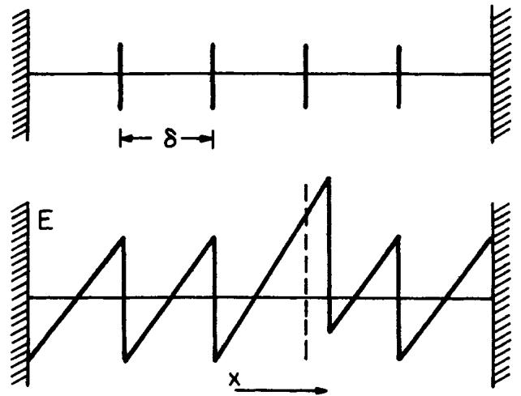  
Figure 13-2a Original Dawson (1962) model, with thin electron sheets spaced $\delta = 1 / n$ apart (in equilibrium） in a uniform positive ion background.The lower part shows $E ( x )$ with one sheet displaced.

On the average 3 parts in $1 0 ^ { 6 }$ of its energy. It was possible to increase the accuracy at the expense of speed by shortening the time step. However, this did not seem worthwhile.

Second, the motion of a 9-sheet system was reversed and found to retrace its path within an accuracy of one part in $1 0 ^ { 3 }$ (all orbits were this accurate) over a period of 6 oscillations.

Third, the drag on a particle was the same in the negative and positive time directions. Thus even though the calculations had a definite direction, forward in time, the results were symmetric in time.

# (b) The Equilibrium Velocity Distribution is Maxwellian

The numerical results were obtained by starting the system near thermal equilibrium. To approximate a Maxwellian velocity distribution, the particles were distributed among 16 uniformly spaced velocity groups; the number of particles in a group was proportional to exp $( - \nu ^ { 2 } / 2 \bar { \nu } _ { t } ^ { 2 } )$ ,where $\nu$ was the velocity of the group. The velocity of a particle $i$ was chosen randomly in the following way. The velocities of all the particles were put on cards (do our present readers know about computer cards?） which were thoroughly shufled. The resultant deck was used to give the initial velocities of the sheets. All sheets were started at their equally spaced equilibrium positions.

Figure 13-2b shows the time averaged velocity distribution for a system of 1000 sheets with $n \lambda _ { D } = 5 . 1 6$ .The smooth curve is the theoretical Maxwell distribution obtained by assuming the kinetic energy was equal to the total energy minus the average potential energy (only $8 \%$ of the total energy).

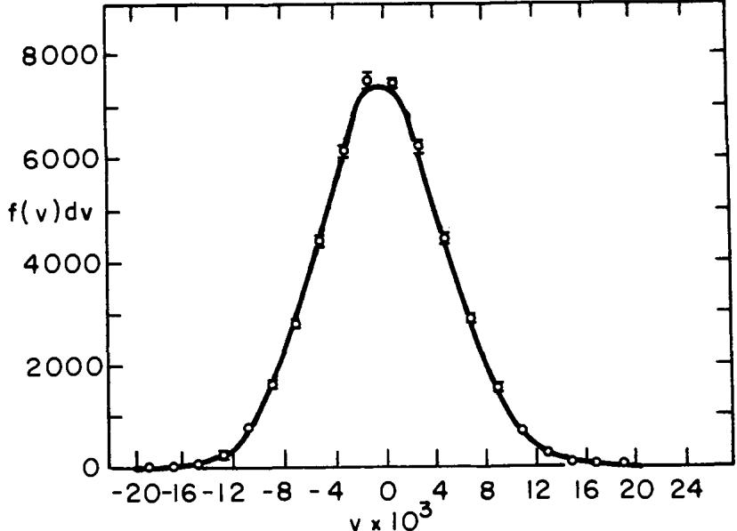  
Figure 13-2b Average velocity distribution for l0OO sheet system．The curve is_the Maxwelian for the system kinetic energy. The velocity bins were $0 . 4 \nu _ { t }$ wide. $\nu _ { t } = 5 . 1 \times 1 0 ^ { - 3 }$ ， $n _ { 0 } \lambda _ { D } = 5 . 1$ (From Dawson,1962.)

The agreement between the numerical results and the theoretical curve is good. However, it is not as good as would be expected if the samples taken at different times were statistically independent. The error in this case would be on the order of $[ N ( \nu ) \Delta \nu ] ^ { ! / 2 }$ and is indicated by the error bars. In these calculations the system was sampled three times per plasma period $2 \pi / \omega _ { p }$ . The relaxation time (the time required for a Maxwell distribution to be re-established after a small perturbation) is on the order of $[ ( 2 \pi ) ^ { 1 / 2 } N _ { D } / \omega _ { p } ]$ .The system was sampled roughly six times during a relaxa-tion time and thus the expected deviations should be of order $[ 6 \bar { N } ( \nu ) \Delta \nu ] ^ { \nu _ { 2 } }$ rather than $[ N ( \nu ) \Delta \nu ] ^ { \scriptscriptstyle 1 / \ 2 }$ . Fluctuations decreased to the expected statistical fluctuations when the sampling time became comparable with the relaxation time. These results show that the system was constantly fluctuating about its thermal equilibrium state and that agreement with theory is not simply due to the fact that the system was started out with roughly a Maxwell distribution.

# (c）Debye Shielding

A charge embedded in a plasma repels charges of like sign and attracts charges of the opposite sign. Thus, around such a charge, a cloud of charge of the opposite sign forms. This cloud contains on the average an equal, but opposite sign of charge to the embedded one. The size of this charge cloud is the Debye length, $\lambda _ { D } \equiv \nu _ { t } / \omega _ { p }$ . Outside this cloud, the system of the particle plus cloud looks neutral. 'This Debye shielding of such an embedded charge was investigated in the single-species charge sheet model.

Debye shielding for a 1000-sheet system with $\ n \lambda _ { D } = 5 . 1 6$ is shown in Figure 13-2c. The points are the average number of particles between O and 1,1 and 2,etc., intersheet spacings from a test sheet. To obtain these averages,the number of sheets within each interval was counted for every tenth sheet. This was repeated at a large number of different times and the aver-age of the whole group found. The shielding amounts to one sheet on the average being absent from a region the size of a Debye cloud which contains many sheets (in this case, $1 0 \approx 2 n \lambda _ { D }$ ). This small bias can be masked by the fluctuating density in the neighborhood of the test sheet due to random motion of the sheets. Sometimes one finds 12 sheets in the Debye length, other times 8 or 9. The solid curve in Figure 13-2c is the theoretically predicted curve; the points are those obtained from the numerical experiment. The error bars are the statistical uncertainties due to the fact that we have used a finite number of test sheets.

The smooth curve is the theoretical curve obtained from the linearized Debye theory. It is the solution of the linearized form of Poisson's equation,

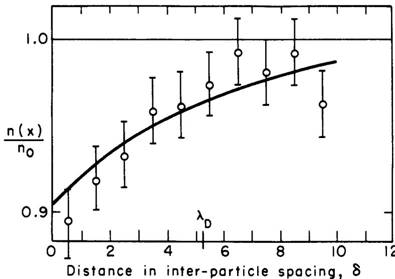  
Figure 13-2c Average density of electrons around a test electron sheet at $x = 0$ The curve is the Debye shielding prediction. $n \lambda _ { D } = 5 . 1 6$ (From Dawson,1962.）

$$
\begin{array} { c } { { \displaystyle \frac { d ^ { 2 } \phi } { d x ^ { 2 } } = q ~ n _ { 0 } \left[ 1 - \exp \left( \frac { q \phi } { T } \right) \right] } } \\ { { \approx \displaystyle \frac { q ^ { 2 } n _ { 0 } \phi } { T } = \frac { \phi } { \lambda _ { D } ^ { 2 } } } } \end{array}
$$

where the linearization of the Boltzmann factor assumes $q \phi \lesssim T$ With the boundary conditions at the test charge,i.e.,at $x \simeq 0$ ，

$$
E _ { \pm } ( 0 ) = - \left( \frac { d \phi } { d x } \right) = \mp \frac { q } { 2 }
$$

the linearized solution is

$$
\begin{array} { c } { { n ( x ) = n _ { 0 } \left[ 1 - ( 2 N _ { D } ) ^ { - 1 } \exp \left( - \displaystyle \frac { | x | } { \lambda _ { D } } \right) \right] } } \\ { { \phi = \displaystyle \frac { q } { 2 } \lambda _ { D } \exp \left( - \displaystyle \frac { | x | } { \lambda _ { D } } \right) } } \end{array}
$$

in agreement with 12-2(10). Note that when $N _ { D } > > 1$ ， the density depression is small and hence hard to find.

Debye shielding was one of the more difficult quantities to obtain from the machine calculations. This was due to the fact that the statistical error in the density was of the order of $N ^ { - 1 / 2 }$ ，where $N$ is the number of test charges averaged over. Thus,for the above case, where the maximum depression of the density is $1 0 \%$ ，we require l00 cases before the depression equals the fluctuations. To obtain the density depression of $1 0 \%$ accuracy requires $1 0 ^ { 4 }$ samples.

Hockney(1971） and Okuda (1972） show how to measure $\lambda _ { D }$ in gridded plasmas from the spatial correlation of the electric field, finding excellent agreement with prediction. Okuda (1972） measures both spatial and temporal correlations and spectra,and compares to theory including grid effects.

# PROBLEMS

13-2a Sketch $E ( x ) , \phi ( x ) , n _ { 1 } ( x )$ and the pressure force, $\propto \left( \partial n _ { 1 } / \partial x \right) / n _ { 0 }$ about the stationary test charge.

13-2b Make a table for $N _ { D } = 5 , 2 0 , 1 0 0$ of the relative depression in $n$ ，and of the number of samples needed for the depression to equal the error and to equal the error/10.

# (d) Velocity Drag

Consider a homogeneous, one-dimensional plasma with one species of particles plus a neutralizing background. A particle moving through the plasma polarizes it $( \nu < \nu _ { t } )$ ，or excites a plasma oscillation $( \nu > \nu _ { t } )$ and is thereby slowed down. It is also accelerated by random electric fields produced by other particles. At time $t _ { 0 }$ ，a group of test particles having nearly the same velocity is selected. At later times, their velocities diffuse into a larger interval. The velocity average of the group decays due both to the polarization or wake and, often overlooked, the fluctuating fields. Equations 12-5(7),12-5(16),and 12-5(13) describe these contributions.

Consider the drag on a very fast or superthermal sheet in an infinite plasma. Take the velocity of the sheet to be positive. The plasma ahead of such a sheet cannot know of its approach. Thus, there can be no disturbance and hence no electric field ahead of the sheet. However, in going from the negative to the positive side of the sheet the electric field must fall by $q$ as shown in Figure 13-2d. The electric field felt by the sheet is the average of the field on the left and the right, $\overline { { E } } = q / 2$ Its deceleration is

$$
\frac { d \nu } { d t } = \frac { q \overline { { { E } } } } { m } = - \frac { \omega _ { p } ^ { 2 } } { 2 n _ { 0 } } = - \frac { \omega _ { p } \nu _ { t } } { 2 N _ { D } } .
$$

independent of the velocity. The energy is lost to excitation of a wake of plasma oscillations (Figure 13-2d and Problems 13-2a and 13-2b).

Figure 13-2e shows the average absolute velocity as a function of time for two groups of fast particles. The initial velocity for the group represented by the circles is $2 . 3 5 ~ \nu _ { t }$ ，while that for the triangles is $- 2 . 3 5 ~ \nu _ { t }$ . The particles in these groups are followed in time and the average velocities of the two groups (as functions of time) are recorded. The agreement with (8) is good.

If the system (and hence the code） is time reversible,the drag in the negative time direction should be the same as in the forward time direction. This is found to be the case. At some time $t _ { 0 }$ ，a group of particles with velocities in the vicinity of $2 \ v _ { t }$ is selected. On a plot of the average velocity of the group as a function of $\mid t - t _ { 0 } \mid$ ， the data for $t - t _ { 0 }$ positive and for $t - t _ { 0 }$ negative lie on the same line.

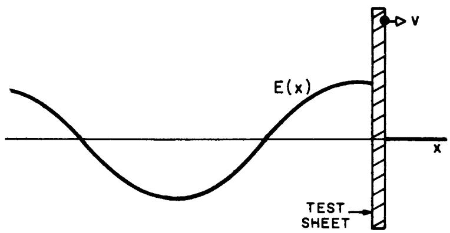  
Figure 13-2d The electric field excited by a fast sheet $( \nu > > \nu _ { t } )$ moving to the right.(From Dawson, 1962.)

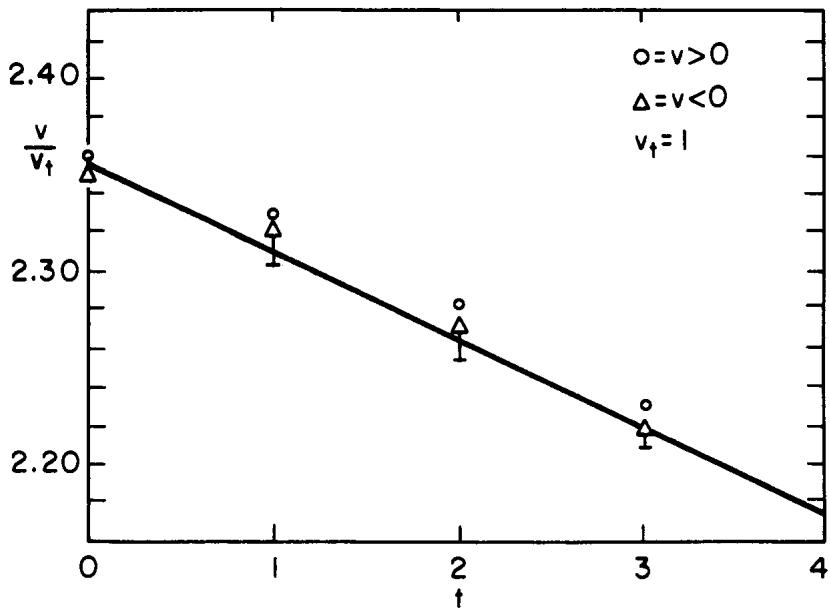  
Figure 13-2e Average drag or deceleration on a group of fast particles, starting at $\mid \nu \mid \simeq 2 . 3 5 ~ \nu _ { t }$ for a 1000 sheet system; $N _ { D } = 1 0$ .The straight line is (8). (From Dawson,1962.)

Eldridge and Feix (1962) calculate the drag and diffusion and obtain agreement with the measurements of Dawson (1962). Eldridge and Feix (1963） presents theory and measurements of drag and diffusion,as well as considerable physical insight.

The polarization drag is obtained from the linearized Vlasov equation, as in Problem 12-5b. Ignoring grid effects,12-5(16) yields for one dimensional plasma

$$
a _ { \mathrm { p o l } } = \frac { q ^ { 2 } } { m } \int _ { - \infty } ^ { \infty } \frac { d k } { 2 \pi } \mathrm { I m } \frac { 1 } { k \epsilon \left( k , k \nu + i 0 \right) } .
$$

Noting that $\epsilon \left( \lambda , k \nu + i 0 \right)$ 。can be written in the form $\epsilon = 1 +$ $[ X ( \nu ) + i \mathrm { s i g n } ( k ) \ Y ( \nu ) ] / k ^ { 2 } \lambda _ { D } ^ { 2 }$ , the integral can be rewritten to find (Problem 13-2c)

$$
\begin{array} { c } { { a _ { \sf p o l } = \displaystyle \frac { q ^ { 2 } } { m } \int \int \displaystyle \frac { d a } { 2 \pi } \displaystyle \frac { Y ( \nu ) } { [ a + X ( \nu ) ] ^ { 2 } + Y ^ { 2 } ( \nu ) } } } \\ { { = - \displaystyle \frac { q ^ { 2 } } { 2 \pi m } \arctan \displaystyle \frac { Y } { X } } } \end{array}
$$

where

$$
X + i \ Y = \int { \frac { d \nu ^ { \prime } } { \nu - \nu ^ { \prime } + i 0 } } \ \nu _ { t } ^ { 2 } \ { \frac { \partial f } { \partial \nu ^ { \prime } } }
$$

For a Maxwellian,

$$
\begin{array} { l } { { X = 1 - \left( \frac { \displaystyle \nu } { \displaystyle \nu _ { t } } \right) ^ { 2 } + \frac { \displaystyle 1 } { \displaystyle 3 } \left( \frac { \displaystyle \nu } { \displaystyle \nu _ { t } } \right) ^ { 4 } - \mathrm { ~ \cdot ~ } \cdot \cdot } } \\ { { Y = \left( \frac { \displaystyle \pi } { \displaystyle 2 } \right) ^ { 1 / 2 } \frac { \displaystyle \nu } { \displaystyle \nu _ { t } } \exp \left( \frac { \displaystyle - \nu ^ { 2 } } { \displaystyle 2 \nu _ { t } ^ { 2 } } \right) } } \end{array}
$$

and

For small velocities, $\nu \lesssim \nu _ { t }$ ， we find

$$
\begin{array} { l } { { \displaystyle a _ { \sf p o l } = - \frac { 1 } { 2 ( 2 \pi ) ^ { 1 / 2 } } \frac { q ^ { 2 } } { m } \frac { \nu } { \nu _ { t } } \left[ 1 + \left( \frac { 1 } { 2 } - \frac { \pi } { 6 } \right) \frac { \nu ^ { 2 } } { \nu _ { t } ^ { 2 } } + \cdot \cdot \cdot \right] } } \\ { { \displaystyle ~ \approx - \frac { \nu } { 2 ( 2 \pi ) ^ { 1 / 2 } } \frac { \omega _ { p } } { N _ { D } } } } \end{array}
$$

For high velocities we find (Problem 13-2d)

$$
a _ { \mathfrak { p o l } } \to \mp \frac { q ^ { 2 } } { 2 m } = \mp \frac { \omega _ { p } ^ { 2 } } { 2 n _ { 0 } }
$$

as $\nu / \nu _ { t } \to \pm \infty$ ,in agreement with (8).

As in Chapter 12,we assume that the distribution function of the test particles $f ( \nu , t )$ obeys an equation of the Fokker-Planck type:

$$
\frac { \partial f } { \partial t } = \frac { \partial } { \partial \nu } \left( - a _ { \mathrm { p o l } } f - a _ { \mathrm { f l u c t } } f + \frac { \partial } { \partial \nu } \left( D f \right) \right)
$$

$$
\mathbf { \partial } = \left. \frac { \partial } { \partial \nu } \left( - a _ { \mathsf { p o l } } f + D \frac { \partial f } { \partial \nu } \right) \right.
$$

where the second form follows using $\boldsymbol { a } _ { \mathrm { f l u c t } } = \boldsymbol { \partial D } / \boldsymbol { \partial \nu }$ from 12-5(13)．The diffusion $D$ is obtained by detailed balance: when $f ( \nu )$ is the Maxwell distribution, it does not change with time. So

$$
D ( \nu ) = - \frac { \nu _ { t } ^ { 2 } a _ { \tt p o l } ( \nu ) } { \nu }
$$

For small velocities,we find from (12),

$$
\begin{array} { r } { D = \frac { \nu _ { t } ^ { 2 } } { 2 ( 2 \pi ) ^ { \nu _ { \mathrm { l } } } } \frac { \omega _ { p } } { N _ { D } } } \\ { a _ { \mathsf { p o l } } + a _ { \mathsf { f l u c t } } = - \frac { \pi \nu } { 6 ( 2 \pi ) ^ { \nu _ { \mathrm { l } } } } \frac { \omega _ { p } } { N _ { D } } } \end{array}
$$

Note that $a _ { \tt f l u c t }$ is only ${ \mathfrak { s } } \%$ of $a _ { \tt p o l }$ in this case. At small velocities, $D$ is easier to measure than the drag. These expressions, first obtained by Eldridge and Feix (1962),agree with the measurements of Dawson (1962).

# (e) Relaxation Time

For a fast sheet, we have deceleration as

$$
{ \frac { 1 } { \nu _ { t } } } { \frac { d \nu } { d t } } = - { \frac { \omega _ { p } } { 2 N _ { D } } }
$$

and for a slow sheet, we have

$$
\frac { 1 } { \nu } \frac { d \nu } { d t } = - \frac { \omega _ { p } } { 2 N _ { D } } \frac { ( \pi / 2 ) ^ { * _ { 2 } } } { 3 }
$$

where $( \pi / 2 ) ^ { 1 / 3 } / 3 = 0 . 4 2$ ,and

$$
\frac { D } { \nu _ { t } ^ { 2 } } = \frac { \omega _ { p } } { 2 N _ { D } } \frac { 1 } { ( 2 \pi ) ^ { \nu _ { t } } }
$$

Hence,we see that there is a time $\tau$

$$
\tau \equiv \frac { 2 N _ { D } } { \omega _ { p } }
$$

that is significant for slowing of either fast or slow particles. $\pmb { \tau }$ gives roughly the length of time for a fast or slow particle to change its velocity significantly,which may also be thought of as a randomization time or (to quote Dawson) the time for the plasma to forget the state it was in. If we want two measurements of the velocity distribution to be statistically independent, then we make them at intervals separated by at least $\tau$ .As $N _ { D } \geqslant 1 0$ is usually used, intervals ${ \geqslant } 2 0 / \omega _ { p }$ ，i.e.,greater than 3 plasma

cycles,should be used.

For small departures from a Maxwell distribution, the system relaxes to equilibrium in a time roughly equal to the time it takes a slow particle to be stopped,or the length of time it takes a group of particles with a definite velocity to spread out into a Maxwell distribution. There is, of course, no unique relaxation time. However, (18） is a reasonable measure of relaxation time,for a selected group of particles, in a Maxwellian,to acquire the full Maxwellian.

# PROBLEMS

13-2a Calculate the wake of a fast sheet,Figure 13-2d,and the drag (8),by considering that a sheet's equilibrium position $x _ { 0 i }$ is displaced a distance $\delta = 1 / n$ to the left when the fast sheet crosses it. Show that the energy (kinetic plus electric) density of the wake oscillations is $q ^ { 2 } / 2$ The rate of increase of wake energy，as more sheets are brought into oscillation,is $q ^ { 2 } \nu / 2$ in agreement with (8).Show that the amplitude of the density oscillation in the wake is smaller than the unperturbed density by a factor $\gtrsim N _ { D }$

13-2b Show analytically that the electric field in front of and behind a fast sheet is

$$
E ( x _ { s } + x ) = \left\{ \begin{array} { l l } { { \ 0 \ } } & { { \quad x > 0 } } \\ { { - q \cos \frac { \omega _ { p } x } { \nu } \ } } & { { \quad x < 0 } } \end{array} \right.
$$

as shown in Figure 13-2d. The sheet is moving to the right; $x _ { s }$ is its instantaneous position. Hints:Use 12-2(3) with 12-3(2) specialized to $\Delta x , \Delta t \to 0$ and a single particle. For e use the cold plasma result $\epsilon ( k , \omega ) = 1 - \omega _ { p } ^ { - 2 } / \left( \omega + i 0 \right) ^ { 2 }$ Fourier inversion leads to

$$
E ( x _ { s } + x ) = \int \frac { d k } { 2 \pi i } \frac { q } { k } \frac { e ^ { i k x } } { 1 - \omega _ { p } ^ { 2 } / \left( k \nu + i 0 \right) ^ { 2 } }
$$

after the trivial integration over $\pmb { \omega }$ The apparent pole at $k = 0$ has vanishing residue $- ( i 0 ) ^ { 2 } / \omega _ { p } ^ { 2 }$ The $" i 0 "$ makes clear which poles are enclosed when the contour is closed on an infinite semicircle above or below the real $\pmb { k }$ axis.

13-2c Derive (10). Hints: In (9) separate out the integral over $( - \infty , 0 )$ ， substitute $k { \longrightarrow } - k .$ and add to the integral over $( 0 , \infty )$

13-2d Derive(12)． Hint:As $\nu / \nu _ { t }$ is increased, $X$ passes through zero,after which the relevant branch of the inverse tangent in (10b） is $\pi / 2 <$ arctan $\leqslant \pi$

# 13-3 THERMALIZATION OF A ONE-DIMENSIONAL PLASMA

As we have seen, the average motion of a sheet moving through a plasma is reduced due to the drag it feels. At the same time it is accelerated by the random fields present in the plasma. The velocity acquired from these random accelerations gives rise to a diffusion or spreading of the velocities of a group of particles. The slowing down and random acceleration compete against each other. Ultimately, they produce the stable Maxwellian distribution. Only for this distribution does the diffusion or spreading to higher velocities exactly balance the slowing down of the particles.

Here we consider the evolution of the distribution functions due to drag and diffusion,as described by a kinetic equation which (in 1d) does not take the system to thermal equilibrium, that is,all species Maxwellian at the same temperature. Next we describe the much slower approach to thermal equilibrium. Finally,we mention additional features due to $\Delta x$ and $\Delta t$ effects.

# (a) Fast Time-Scale Evolution

Specialized to one-dimension and neglecting $\Delta x$ and $\Delta t$ ，the kinetic equation 12-5(17) may be simplified. For later use,we generalize it to multiple species. For species $^ { a }$ ，

$$
\begin{array} { r l r } & { \frac { \partial f _ { a } } { \partial t } } & { = \frac { \hat { \boldsymbol { \theta } } } { \hat { \boldsymbol { \theta } } \nu } \int d \nu ^ { \prime } \sum _ { b } \pi ~ n _ { b } q _ { b } ^ { 2 } ~ \frac { q _ { a } ^ { 2 } } { m _ { a } } \int \frac { d k } { 2 \pi } \frac { \hat { \boldsymbol { \theta } } ( k \nu - k \nu ^ { \prime } ) } { k ^ { 2 } | \epsilon ( k , k \nu ) | ^ { 2 } } } \\ & { } & { \cdot \left[ \frac { 1 } { m _ { a } } \frac { \hat { \boldsymbol { \theta } } } { \hat { \boldsymbol { \theta } } \nu } - \frac { 1 } { m _ { b } } \frac { \hat { \boldsymbol { \theta } } } { \hat { \boldsymbol { \theta } } \nu ^ { \prime } } \right] f _ { a } ( \nu ) ~ f _ { b } ( \nu ^ { \prime } ) } \end{array}
$$

$$
= \frac { \hat { \partial } } { \hat { \partial } \nu } \sum _ { b } \frac { 1 } { 2 } n _ { b } q _ { b } ^ { 2 } \frac { q _ { a } ^ { 2 } } { m _ { a } } \mathsf { Q } ( \nu ) \left( \frac { f _ { b } } { m _ { a } } \frac { \hat { \partial } f _ { a } } { \hat { \partial } \nu } - \frac { f _ { a } } { m _ { b } } \frac { \hat { \partial } f _ { b } } { \hat { \partial } \nu } \right)
$$

where

$$
\mathsf Q ( \nu ) = \frac { 1 } { \chi _ { i } } \mathsf { a r c t a n } \frac { \chi _ { i } } { \chi _ { r } }
$$

and $\epsilon = 1 + X _ { r } + i X _ { i }$ includes contributions from all species (Problem 13- 3a).

For a single species plasma,(1b) (good to first order in the small parameter $1 / N _ { D } )$ predicts that the diffusion in velocities balances the drag and hence there is no evolution to a Maxwellian. One may give a simple physical argument why this should be so. Let two particles interacting through a short range force in one dimension，have velocities $\nu _ { 1 }$ and $\nu _ { 2 }$ before the encounter and $\tilde { \nu } _ { 1 }$ and $\tilde { \nu } _ { 2 }$ after the encounter. Two quantities are conserved for an isolated encounter, the energy $[ 1 / _ { 2 } m ( \nu _ { 1 } ^ { 2 } + \nu _ { 2 } ^ { 2 } ) ]$ and the momentum $\{ m ( \nu _ { 1 } + \nu _ { 2 } ) \}$ . There are only two choices for $\tilde { \nu } _ { 1 }$ and $\tilde { \nu } _ { 2 }$ which conserve these quantities; first, no change in velocities, $\tilde { \nu } _ { 1 } = \nu _ { 1 }$ and $\tilde { \nu } _ { 2 } = \nu _ { 2 }$ ，or,second,an interchange of velocities, $\tilde { \nu } _ { 1 } = \nu _ { 2 }$ and $\tilde { \nu } _ { 2 } = \nu _ { 1 }$ . In either case the number of particles with a given velocity is not changed. One might expect that in a plasma this simple two-isolated-particle-collision argument might not apply since many particles are interacting at the same time due to the long range of the forces. However the (present） theory assumes that all interactions are weak such that, even though there are many simultaneous collisions, they do not interfere with each other so that their effects are simply additive. Thus, the theory predicts no change in the distribution function.

This argument applies to a single-species plasma. A more general result follows from (1b) (Problem 13-3b):

$$
\frac { \partial } { \partial t } \sum _ { a } n _ { a } m _ { a } f _ { a } = 0
$$

This constraint inhibits equilibration between species.

To further understand the evolution of particle velocities in a single species plasma, let us label some of the particles as species $\pmb { a }$ while the rest are species $^ { b }$ . For species $\pmb { a }$ we might select all the particles whose initial velocities are in a small interval, or are negative. Equation (1b） describes the evolution of their velocities. At the same time,species $^ { b }$ evolves such that $n _ { a } \ f _ { a } + n _ { b } \ f _ { b }$ remains constant.

# (b) Slow Time-Scale Evolution

In reality, the simultaneous encounters do affect each other and there is some change in the distribution function. The rate of relaxation to Maxwellian was measured by Dawson (1964). The problem investigated was that of the time development of a velocity distribution which initially had the square profile shown in Figure l3-3a. After a short time (about $1 / \omega _ { p } )$ of rapid adjustment that rounds off the corners of the distribution, the velocity distribution evolves very slowly.

Experimentally, Dawson obtained the distributions after $t \simeq 0$ by count-ing the numbers of particles in a small velocity intervals (bins)，of size $\Delta \nu = < \nu ^ { 2 } > ^ { 1 / 2 } / 1 0$ and assigning this number to the center of the velocity interval. (One could be more accurate by using,say, linear interpolation to the two nearest velocity coordinates.） The distributions to be shown are short time averages of all 10oo sheets,made from about six samples taken over a period of a plasma oscillation; this averaging gives relatively smooth $f ( \nu )$ by taking out rapid fluctuations (which are discussed later).

Figure 13-3a shows $f ( \nu )$ for $N _ { D } = 2 . 5 , 5 ,$ 10,and 20 at times $6 / \omega _ { p }$ ， $2 1 / \omega _ { p } , 4 1 / \omega _ { p }$ ，and $8 1 / \omega _ { p }$ after initiation of the experiment. Except for the first time, these times correspond roughly to the time required for a group of test particles in a Maxwellian to relax to the full Maxwellian, as noted in the previous section. As readily seen, $f ( \nu )$ tends to retain its initial shape as $N _ { D }$ increases,even with the sampling times chosen proportional to $N _ { D }$ Hence, the relaxation time for a non-Maxwellian is not proportional to $N _ { D }$ and must increase more rapidly than $N _ { D }$ . Actually,most of the variation away from the initial distribution shown here was produced during $1 / \omega _ { p }$ ， caused by setting up particle correlations. After this transient,each $\mathcal { f } ( \bar { \nu } )$ changed only slightly.

The complete relaxation is shown in Figure 13-3b. The first frame shows $f ( \nu )$ at about $\tau = 2 N _ { D } / \omega _ { p }$ ， the previous estimate of relaxation time, and the last shows $f ( \nu )$ very close to its final Maxwellian shape.

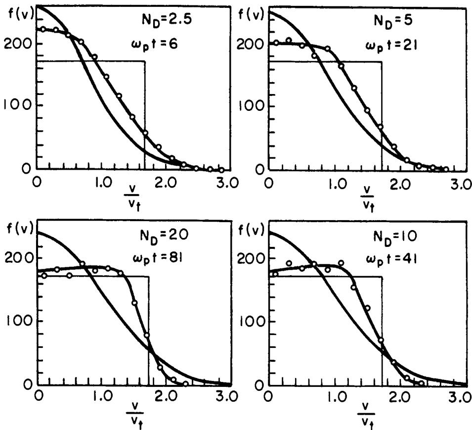  
Figure 13-3a Velocity distributions of 1000 sheets for various values of $N _ { D }$ ，at times $\omega _ { p } t = 6$ ,21,41,81. These intervals correspond to about $2 \tau = 4 N _ { D } / \omega _ { p }$ (except for 6),about twice the time required for test particles in a Maxwellian to relax to the full Maxwellian. Obviously this time does not apply here． (From Dawson,1964.)

Dawson (1964) measured a relaxation time as follows. Note that $f ( 0 )$ in Figure 13-3b creeps up to its final value,as plotted in Figure 13-3c for $N _ { D } = 7 . 5$ (each point being an average,as noted earlier). The straight line through the points is obtained from least squares fit of the data. The time at which $f ( 0 , t )$ intersects $f ( 0 )$ of its Maxwellian is taken to be the relaxation time $\boldsymbol { \tau }$ . The relaxation times are shown as a function of $N _ { D } ^ { 2 }$ in Figure 13-3d and fit very nicely to

$$
\tau = 1 0 N _ { D } ^ { 2 }
$$

Dawson's interpretation is that the simultaneous interaction of three particles gives rise to the relaxation，since the relaxation time due to two-particle interactions would be proportional to $n \lambda _ { D }$ , if it did not cancel out..

Dawson observes also that the distribution function undergoes rapid random fluctuations about a mean distribution which gradually drifts toward a

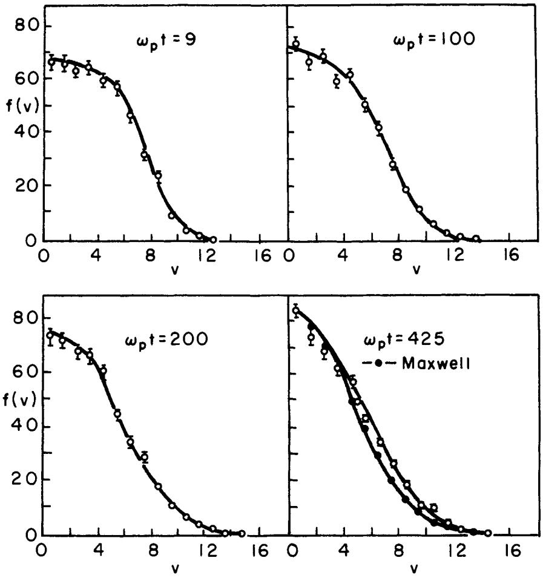  
Figure 13-3b Velocity distributions for $N _ { D } = 5$ (From Dawson,1964.)

Maxwellian. The fluctuations in the number of particles with velocities in a small range about zero are measured for $N _ { D } = 2 0$ for which negligible relax-ation took place. Resulting from the constant exchange of energy between the electric field and the particles,the rapid fluctuations are such that they produce very little systematic change. Figure 13-3e is a plot of the number of times $f ( 0 )$ fell between 145 and 215 in bins of length 5; the Gaussian shown fits the data well, typical of completely random fluctuations about a mean value. This shows that the fact that the distribution relaxes slowly results from a very subtle balance and thus the calculation provides an important test of the kinetic theory of plasmas.

Montgomery and Nielson (1970) use the Boltzmann $\pmb { H }$ function 12-6(6) as a measure of thermalization. They find a relaxation time $\propto N _ { D } ^ { 2 }$ in one dimension, versus $\propto N _ { D }$ in two dimensions.

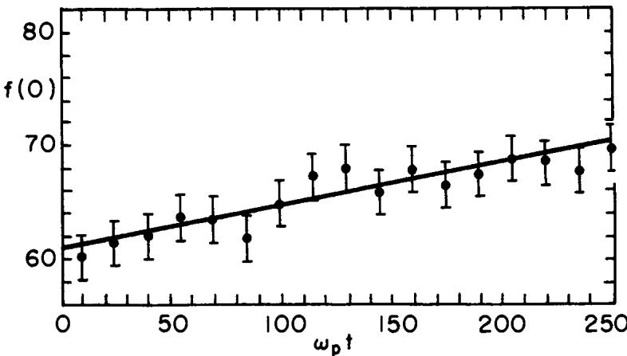  
Figure $\pmb { 1 3 - 3 0 }$ Value of $f ( v )$ for $\nu = 0$ as a function of time,for $N _ { D } = 7 . 5$ . The straight line is a least square fit of the data. For this value of $N _ { D }$ ，the relaxation time was found to be $\omega _ { p } \tau = 5 3 6$ (when $f ( 0 )$ reached the value fora Maxwellian).(From Dawson,1964.)

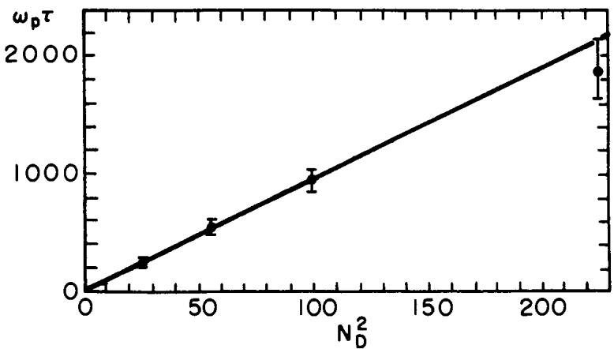  
Figure 13-3d Plot of relaxation times versus $N \Bumpeq$ (From Dawson,1964.)

Virtamo and Tuomisto (1979) found that an operator of the form

$$
\frac { \partial f } { \partial t } = \frac { 1 } { \tau ^ { \prime } } \frac { \partial } { \partial \nu } \left( \frac { \nu } { \left. \nu ^ { 2 } \right. } f + \frac { \partial f } { \partial \nu } \right)
$$

fit the relaxation they observed, thereby providing yet another way to define and measure a relaxation time $\scriptstyle \tau ^ { \prime }$ . Their simulation used a code like ES1, with parameters $n \lambda _ { D } = 8$ ， $L = 2 5 6 \lambda _ { D } = 1 0 0 0 \Delta x .$ 。and $\omega _ { p } \Delta t = 2 \pi / 2 5$ Assuming that $\tau ^ { \prime } \propto ( n \lambda _ { D } ) ^ { 2 }$ ， their measurements fit $\omega _ { p } \tau ^ { \prime } { = } 2 8 . 6 ( n \lambda _ { D } ) ^ { 2 }$ . Further,with the initial square distribution and $\partial f / \partial t$ from (5),Dawson's method of measurement gives $\tau = \tau ^ { \prime } / 2 . 6$ , in good agreement with the ratio of the measurements,10/28.6.

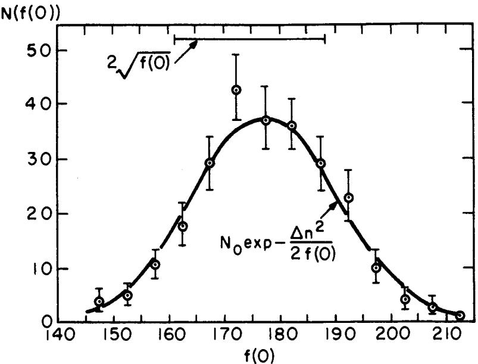  
Figure 13-3e Distribution of the fluctuations of $f ( 0 )$ about the mean. $N _ { D } = 2 0$ (From Dawson,1964.)

# (c) Effects of Space and Time Aliasing

When the effects of space and time differencing are taken into account, we found in Section 12-6 that no distribution, not even the Maxwellian, remains constant. Therefore, for large values of $N _ { D }$ ，we expect the evolu-tion time in one dimension to scale as $N _ { D } / \omega _ { p }$ ，while, for small $N _ { D }$ ,the evolution time scales as $N _ { D } ^ { 2 } / \omega _ { p }$ ·

In two dimensions,Montgomery and Nielson (197O) find that the thermalization proceeds more slowly when $\lambda _ { D } / \Delta x$ is decreased below unity,perhaps due to cutoff of wavelengths $\sim \lambda _ { D }$ . In contrast， thermalization in one dimension is accelerated when $\lambda _ { D } < \Delta x$ ，an observation consistent with the increased aliasing and the prediction that thermalization in one dimension on the time scale $N _ { D } / \omega _ { p }$ is due solely to aliasing.

# PROBLEMS

13-3a To derive (la),first generalize 12-5(17) to multiple species. First review Section 12-3(a) to see how to generalize the numerator and denominator of l2-3(7),the fluctuation spectrum. Note that $D$ and ${ \tt a } _ { \tt f l u c t }$ are proportional to $q _ { a } ^ { 2 } / m _ { a } ^ { 2 }$ ，while $a _ { \sf p o l } \propto q _ { a } ^ { 2 } / m _ { a }$

13-3b Demonstrate (3） from (1b). Show that conservation of total momentum and kinetic energy (and other moments) follow trivially.

# 13-4 NUMERICAL HEATING OR COOLING

# (a) Self Heating in One Dimension

Measurements of self heating have been made in 1d particle simulations using one species. It is found, for thermal plasmas, that the temperature $T = m \nu _ { t } ^ { 2 }$ increases linearly with time. Here,a self-heating time $\tau _ { H }$ is defined as the time for $T$ （or $\nu _ { t } ^ { 2 }$ ）to double.Abe et al. (1975) discuss the energy increment due to the random force fluctuations caused by the nonphysical force $\delta F$ due to the grid (Section 8-3); H. Abe points out (private communication) that their 1975 work leads to

$$
\omega _ { p } \pmb { \tau } _ { H } \propto \frac { 1 } { \eta ^ { 2 } } \left( \frac { \lambda _ { D } } { \Delta x } \right) ^ { 2 } N _ { D }
$$

where $\eta ^ { - 2 }$ is a measure of the goodness of the model, increasing as the order of weighting increases. Peiravi and Birdsall (1978)，for the ranges $0 . 1 \lesssim$ $\omega _ { p } \Delta t \lesssim 0 . 6$ and $0 . 5 < \lambda _ { D } / \Delta x < 1 0 \AA$ ，find that the self heating time is maximized for NGP using $( \nu _ { t } \Delta t / \Delta x ) \approx 3 / 2$ (not a sensitive parameter） with

$$
\omega _ { p } \tau _ { H } \approx 3 \left\{ \frac { \lambda _ { D } } { \Delta x } \right\} ^ { 2 } \left( N _ { D } + N _ { C } \right)
$$

for CIC-PIC using $( \nu _ { t } \Delta t / \Delta x ) \approx 1 / 2$ with

$$
\omega _ { p } \tau _ { H } \approx 6 0 0 \left( \frac { \lambda _ { D } } { \Delta x } \right) ^ { 2 } \left( N _ { D } + N _ { C } \right)
$$

and for QS,also using $( \nu _ { t } \Delta t / \Delta x ) \approx 1 / 2$ with

$$
\omega _ { p } \tau _ { H } \approx 4 0 0 0 \left( \frac { \lambda _ { D } } { \Delta x } \right) ^ { 2 } \left( N _ { D } + N _ { C } \right)
$$

where $N _ { D } + N _ { C } = n \left( \lambda _ { D } + \Delta x \right)$ . These 1d results agree well with the 2d results of Hockney (197i). The self heating time is increased by attenuating at short wavelengths; Peiravi and Birdsall (1978) found $\omega _ { p } \tau _ { H }$ increased roughly as $( { k _ { \operatorname* { m a x } } } / { k _ { \operatorname* { l a s t } } } ) ^ { s }$ for truncation at $k _ { \mathrm { l a s t } }$ ，with $s = 1$ ,2, 3 for zero-, first-,and second-order spline weighting, respectively. Hence,one may use many cells with strong spatial smoothing (large $k _ { \mathrm { m a x } } / k _ { \mathrm { l a s t } } )$ and obtain large $\tau _ { H }$ , even with $\nu _ { t } \Delta t / \Delta x$ much larger than $1 / 2$

# (b) Cooling Due to Damping in the Particle Equations of Motion

Nonphysical cooling is observed in codes using damped equations of motion, both explicit (Adam et al.,1982) and implicit (Barnes et al., 1983b). In the Lenard-Balescu collision operator corresponding to damped time integration we find two spurious terms due to phase errors associated with damping. One is a nonresonant contribution to the polarization drag ${ \tt a } _ { \tt p o l }$

The other is a spurious nonresonant contribution to dynamical friction $\mathtt { a n u c t }$

In the kinetic theory here we neglect the effects of the spatial grid. In the generalization of the colision operator of Section 12-5 to damped time integration, the velocity diffusion is not altered in any interesting way, but the velocity drag terms are.

The polarization drag 12-5(16) due to anisotropic polarization of an unmagnetized plasma by a test particle,is

$$
\begin{array} { l } { { \displaystyle { \bf a } _ { \sf p o l } = \frac { q ^ { 2 } } { m } \int \frac { d { \bf k } } { ( 2 \pi ) ^ { 3 } } \frac { { \bf k } } { k ^ { 2 } } \mathrm { I m } \frac { 1 } { \epsilon ( { \bf k } , { \bf k } \cdot { \bf v } ) } } \ ~ } \\ { { \displaystyle ~ = - n _ { 0 } \frac { q ^ { 4 } } { m ^ { 2 } } \int \frac { d { \bf k } } { ( 2 \pi k ) ^ { 3 } } \frac { { \bf k } } { k ^ { 2 } } \int d { \bf v } ^ { \prime } \frac { f ( { \bf v } ^ { \prime } ) } { \vert \epsilon ( { \bf k } , { \bf k } \cdot { \bf v } ) \vert ^ { 2 } } \mathrm { I m } \left[ \frac { { \bf X } } { { \bf A } } \right] _ { { \bf k } \cdot ( { \bf v } - { \bf v } ^ { \prime } ) + i 0 } } } \end{array}
$$

in which $\epsilon$ is given in terms of $( \mathbf { X } / \mathbf { A } )$ by 9-8(1), and where $\left( \mathbf { X } / \mathbf { A } \right) _ { \omega - \mathbf { k } \cdot \mathbf { v } + i 0 }$ is the ratio of Fourier amplitudes of $\mathbf { x } ^ { ( 1 ) }$ and ${ \pmb a } ^ { ( 1 ) }$ resulting from the finitedifference equation of motion (and would be $- ( \omega - \mathbf { k } \cdot \mathbf { v } + i 0 ) ^ { - 2 }$ for exact integration). The meaning of the term $" + i 0 "$ is that $( \mathbf { \partial } \cdot \mathbf { \partial } \cdot \mathbf { \partial } ) _ { \omega + i 0 }$ is under-stood to mean the limit of $( \ \cdots \cdot \ ) _ { \omega + i \gamma }$ as $\pmb { \gamma }$ approaches zero through positive values.Normally $\operatorname { I m } \left( \mathbf { X } / \mathbf { A } \right) _ { \omega - \mathbf { k } \cdot \mathbf { v } + i 0 } { \stackrel { \cdot } { = } } - \pi \delta ^ { \prime } ( \omega - \mathbf { k } \cdot \mathbf { v } )$ which leads to the resonant Landau contribution, but here $\operatorname { I m } \left( \mathbf { X } / \mathbf { A } \right) _ { \omega - \mathbf { k } \cdot \mathbf { v } + i 0 }$ is also nonzero for $\omega - \mathbf k \cdot \mathbf v \ne 0$ due to phase errors associated with numerical damping.

The other part of the drag, the "dynamical friction" ${ \tt a } _ { \tt l l u c t }$ is also expressed in terms of $\operatorname { I m } \left( \mathbf { X } / \mathbf { A } \right)$ in 12-5(20),with the thermal fluctuation spectrum from 12-3(7). As a check on the theory，we can easily verify that the expressions (5) and 12-5(20),with the thermal spectrum 12-3(7),together conserve momentum of the overall distribution of particles.

These results are used in the Fokker-Planck equation describing the evolution of the velocity distribution function $f ( \mathbf { v } )$ ，

$$
\frac { \partial f } { \partial t } = \frac { \partial } { \partial \mathbf { v } } \cdot \left( - f \mathbf { a } _ { \mathrm { p o l } } - f \mathbf { a } _ { \mathrm { f l u c t } } + \frac { \partial } { \partial \mathbf { v } } \cdot \mathbf { \nabla } f \mathbf { D } \right)
$$

where $\mathbf { D } ( \mathbf { v } )$ is the diffusion tensor 12-5(7). Because the resonant parts of (5） and 12-5(20) cancel with continuous time,(6) conserves energy. The rate of cooling due to the nonresonant part (of numerical origin） is:

$$
\begin{array} { r l } & { \frac { d } { d t } \mathbb { K } \mathbb { E } = \displaystyle \int d \mathbf { v } \ \mathbf { v } \cdot \mathbf { a } \ f ( \mathbf { v } ) } \\ & { \qquad = - \displaystyle \frac { 1 } { 2 } \ n _ { 0 } \frac { q ^ { 4 } } { m ^ { 2 } } \int \frac { d \mathbf { k } } { ( 2 \pi ) ^ { 3 } } \frac { 1 } { k ^ { 2 } } { \displaystyle \int d \mathbf { v } \ d \mathbf { v } ^ { \prime } \ f ( \mathbf { v } ) \ f ( \mathbf { v } ^ { \prime } ) } } \\ & { \qquad \cdot [ | \epsilon ( \mathbf { k } , \mathbf { k } \cdot \mathbf { v } ) | ^ { - 2 } + | \epsilon ( \mathbf { k } , \mathbf { k } \cdot \mathbf { v } ^ { \prime } ) | ^ { - 2 } ] \mathbf { k } \cdot ( \mathbf { v } - \mathbf { v } ^ { \prime } ) \ \mathrm { I m } \Bigg \langle \frac { \mathbf { X } } { \mathbf { A } } \Bigg \rangle _ { \mathbf { k } \cdot ( \mathbf { v } - \mathbf { v } ^ { \prime } ) } } \end{array}
$$

where it is now to be understood that the resonant part of $\operatorname { I m } \left( \mathbf { X } / \mathbf { A } \right)$ is dropped. For the $C _ { 1 }$ equation of motion scheme, Section (9-8(a)),

$$
\mathbf { I m } \left( { \frac { \mathbf { X } } { \mathbf { A } } } \right) _ { \omega } = c _ { 1 } \Delta t ^ { 2 } \sin \omega \Delta t
$$

while for the $D _ { 1 }$ scheme, Section (9-8(b)),

$$
 \operatorname { I m } ( { \frac { \mathbf { X } } { \mathbf { A } } } ) _ { \omega } = { \frac { \Delta t ^ { 2 } \sin \omega \Delta t } { 5 - 4 \cos \omega \Delta t } }
$$

In both cases,if the spread in particle velocities is less than ${ \pi } / { k _ { \operatorname* { m a x } } \Delta t }$ then the integrand is always positive so only cooling results.

Fortheseschemeswith $3 ^ { \mathrm { r d } }$ orderdamping,.thefactor $\mathbf { k } \cdot \left( \mathbf { v } - \mathbf { v } ^ { \prime } \right) \operatorname { I m } \left( \mathbf { X } / \mathbf { A } \right) _ { \mathbf { k } \cdot \left( \mathbf { v } - \mathbf { v } ^ { \prime } \right) }$ in the integrand is proportional to $[ { \bf { k } } { \cdot } ( { \bf { v } } - { \bf { v } } ^ { \prime } ) \Delta t ] ^ { 2 }$ for small values. With first-order damping,this approaches a nonzero constant instead (Cohen et al., 1982b). Other implementations of third order schemes, i.e.，Barnes et al. (1983b)，produce different phase errors and hence different cooling rates. Quantitative calculations of cooling rates based on this kinetic theory have not yet been carried out.

# (c) Heuristic Estimates

Since the self heating is due solely to space and time aliasing effects, it is natural to attempt heuristic estimates in which a self heating rate is calculated from $\pmb { \delta F }$ (Chapter 8), the part of the force due to $p \neq 0$ terms, and some estimate of correlation time. This is done by Abe et al. (1975),and Hockney and Eastwood (1981,p. 250 ff.). However, it is difficult to construct reliable estimates of heating (or cooling), since it results from a slight imbal-ance in the competition between drag and diffusion.

An indication of this diffculty is found when such estimates are applicable with equal plausibility to special cases for which exact results are known. For example, the method of Abe et al. (1975)，applied to the energyconserving models (Chapter 1O), finds nonzero self heating even in the limit $\Delta t \to 0$

Since the results in Chapter 12 do reproduce qualitative features such as conservation laws, more reliable estimates and scaling laws might be obtained by approximate evaluation of the expressions derived from the kinetic theory.

# 13-5 COLLISION AND HEATING TIMES FOR TWO-DIMENSIONAL THERMAL PLASMA

Hockney (1971） provided a useful service to electrostatic simulations by making 73 long runs in 2d2v with a thermal (Maxwellian） plasma,varying particle size and shape and $\Delta x$ and $\Delta t$ ， over wide ranges. From these runs, he found slowing-down times， self heating times, and fluctuation levels, part of which are given here. The reader is referred to his original article and to

Hockney and Eastwood (1981).

In the laboratory,we expect $\nu _ { \mathsf { c o l l i s i o n } } / \omega _ { p }$ and fluctuation levels $\propto 1 / N _ { D }$ In simulations,we expect the same but modified by the effects of the mesh. In the laboratory, there is no self heating. In simulations,we find that there is a slow self-heating $\propto t$ ,disappearing as△t, $\Delta x \to 0$

Hockney's model is a spatially uniform plasma in 2d2v, using a five-point finite difference Laplacian and a two-point gradient. The model is doubly periodic,with zero magnetic field, initially loaded with an equal number of thermal ions and electrons ( ${ \bf \nabla } \cdot { \cal T } _ { e } = { \cal T } _ { i }$ and mass ratio $m _ { i } / m _ { e } = 6 4 )$ .The particle positions were selected by random numbers,with uniform distribution in $\pmb { x }$ and $y$ ：Particle velocities were selected by using the inverse error function where $| \nu | < 3 \dot { \nu } _ { t }$ for $\nu _ { t } ^ { 2 } \equiv T / m$ . The electron orbit changes due to collsions were followed; the ions were followed but the results were not used lion time scales were $( m _ { i } / m _ { e } ) ^ { \scriptscriptstyle { 1 } }$ to $m _ { i } / m _ { e }$ longer]． At $t > 0$ the com-ponents parallel and perpendicular to the original direction were measured, $\nu _ { 1 1 } ( t )$ and $\nu _ { \perp } ( t )$ ，with deflection angle $\phi \left( t \right)$ .The increase of the kinetic energy of each particle from its initial value,was followed,

$$
\begin{array} { r } { h ( t ) \equiv \frac { 1 } { 2 } m \left[ \nu ^ { 2 } ( t ) - \nu ^ { 2 } ( 0 ) \right] } \end{array}
$$

Four characteristic times, $\tau _ { \phi } , \ \tau _ { \nu \perp } , \ \tau _ { s } , \ \tau _ { \mathrm { t h } }$ are found, due to collisional effects, existing in lab or simulation plasmas. These times are defined by

$$
\begin{array} { l c r } { { \displaystyle \left. \phi ^ { 2 } ( \tau _ { \phi } ) \right. ^ { \ast _ { 2 } } = \frac { \pi } { 2 } \qquad } } & { { \tau _ { \phi } \equiv \mathrm { d e f l e c t i o n \ t i m e } } } \\ { { \displaystyle \left. \begin{array} { l } { { \nu _ { \perp } ^ { 2 } \left( \tau _ { \nu _ { \perp } } \right)  ^ { \ast _ { 2 } } = \left. \nu _ { \parallel } ( 0 ) \right. } } \\ { { \displaystyle \left. \frac { d } { d t } \left. \begin{array} { l } { { \nu _ { \parallel } \left( t \right) } } \end{array} \right. = \left. \frac { \left. \nu _ { \parallel } \left( t \right) \right. } { \tau _ { s } } \right| _ { t = 0 } \right.} } \\ { { \displaystyle \left. h ^ { 2 } ( \tau _ { \mathrm { t h } } ) \right. ^ { \ast _ { 2 } } = \frac { 1 } { 2 } m \nu _ { t } ^ { 2 } = \frac { 1 } { 2 } T \qquad } } & { { \tau _ { \mathrm { t h } } \equiv \mathrm { t h e r m a l i z a t i o n \ t i m e } } } \end{array}  } } \end{arra\right.y} \end{array}
$$

The angled brackets indicate average of the enclosed quantity, taken over the assembly of electrons and ions separately,

$$
\left. \alpha ( t ) \right. \equiv \frac { 1 } { N } \sum _ { i = 1 } ^ { N } \alpha ( t )
$$

Hockney uses $\boldsymbol { \tau } _ { s }$ as a measure of collsional effects. With $q _ { i } = q _ { e }$ ，these times are comparable; when $q _ { i } > > q _ { e }$ ， $\tau _ { \phi }$ and $\tau _ { \nu \perp }$ for the electrons are reduced due to dominance of their nearly elastic scatter on the ions.

A fifth time $\tau _ { H }$ ,the heating time,defined by

$$
\left. { h ( \tau _ { H } ) } \right. = \frac { 1 } { 2 } m \nu _ { t } ^ { 2 } = \frac { 1 } { 2 } T
$$

is a measurement of the failure of conservation of energy in the computer model. Hockney's measurements of $h \left( t \right)$ for zero and first-order weighting (NGP and CIC) are shown in Figure 13-5a. Note that increasing the order of the weighting (taking the sharp edges off the particle which reduces the coupling of aliases） lengthens $\tau _ { H }$ by 3. An important observation by Hockney is that $\langle h ( t ) \rangle$ increases linearly in time,which implies stochastic origin. An average electron initially has energy $( 1 / 2 T + 1 / 2 T )$ ，as does an ion, so that the system energy density is $n _ { e } T + n _ { i } T$ or $2 n _ { e } T$ ； hence,when $t = \tau _ { H }$ at $\Delta ( \mathrm { K E } ) _ { e } = \mathrm { \Delta } \% T$ ,the system energy is up by 25 per cent, in 2d.

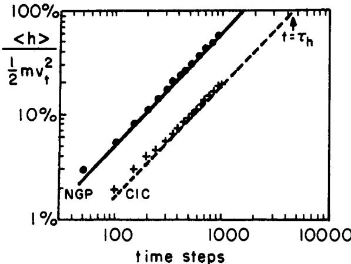  
Figure 13-5a Typical results obtained for measurement of the heating time. Note that growth of kinetic energy isroughly linear with time.(From Hockney,1971.）

The simulation results to follow are found to depend on the parameter $N _ { C }$ ，defined by Hockney to be

$$
N _ { C } \equiv n [ \lambda _ { D } ^ { 2 } + ( R \Delta x ) ^ { 2 } ]
$$

where _the second term is_the number of cloud centers per cloud. Hockney uses $R = 1$ ，1,and 2 for NGP, CIC,and QS,respectively, from best fits to his data. These choices also imply an effective particle radius given roughly by the location of the maximum interparticle force. The form of (7) implies that when $R \Delta x > \lambda _ { D }$ ， the particle radius is more important than the Debye length in collisions and fluctuations,a consequence of using finite-size particles.

The collision time $\boldsymbol { \tau } _ { s }$ is found by least square fitting to be

$$
\frac { \tau _ { s } } { \tau _ { p e } } = \frac { N _ { C } } { K _ { 1 } }
$$

where $K _ { 1 } = 0 . 9 8 \pm 0 . 2 0$ ，for 73 runs with $0 . 2 5 \leqslant N _ { C } \leqslant 4 3$ ， $0 . 1 2 \leqslant$ $R \Delta x / \lambda _ { D } < 3 2$ ： $\textstyle K _ { 1 } \approx 1$ implies that

$$
\begin{array} { r } { \frac { \nu _ { \mathrm { c o l l } } } { \omega _ { p e } } \approx \frac { 1 } { 2 \pi N _ { C } } } \end{array}
$$

Even the extreme cases where $\lambda _ { D } / \Delta x \approx 1 / 8$ which is weakly unstable due to aliasing,R.W. Hockney notes (private communication） that the empirical fit

to (8) is satisfactory provided the effect of the particle width is included,as it is in $N _ { C }$

The electric field fuctuations are found to be (cgs units)

$$
\frac { \left. E _ { x } ^ { 2 } \right. / 8 \pi } { n m \nu _ { t } ^ { 2 } } = \frac { K _ { 2 } } { N _ { C } }
$$

with $K _ { 2 } = 0 . 1 2 \pm 0 . 0 4$ . In order to check this measurement, Hockney estimates from plasma theory that

$$
{ \frac { \left. E _ { x } ^ { 2 } \right. / 8 \pi } { n m { \nu _ { t } } ^ { 2 } } } = { \frac { 1 } { 1 6 \pi } } \ln \left[ { \frac { 1 + ( k \lambda _ { D } ) _ { \mathrm { m a x } } ^ { 2 } } { 1 + ( k \lambda _ { D } ) _ { \mathrm { m i n } } ^ { 2 } } } \right] { \frac { 1 } { n \lambda _ { D } ^ { 2 } } }
$$

In an $m \times m$ mesh， neglecting alias contributions, $\left( k \lambda _ { D } \right) _ { \mathrm { m a x } } = \pi \lambda _ { D } / \Delta x ,$ $\left( k \lambda _ { D } \right) _ { \mathrm { m i n } } = 2 \pi \lambda _ { D } / m \Delta x$ and using $\lambda _ { D } / \Delta x = 6$ (meaning $N _ { C } \approx N _ { D } .$ ，one finds

$$
\frac { \left. E _ { x } ^ { 2 } \right. / 8 \pi } { n m \nu _ { t } ^ { 2 } } = \frac { 0 . 1 1 2 } { n \lambda _ { D } ^ { 2 } }
$$

which agrees well with (10). Roughly speaking,

$$
\frac {  { \mathbf { P } }  { \mathbf { E } } } {  { \mathbf { K } }  { \mathbf { E } } } \approx \frac { 1 } { 8 N _ { C } }
$$

The heating time is found to be strongly dependent on $\Delta x$ and $\Delta t$ ，with the same dependence on $N _ { C }$ as $\boldsymbol { \tau } _ { s }$ . Contours of constant ${ \pmb { \tau } } _ { H } / \tau _ { s }$ (Figure 13-5b） display the dependence on $\Delta \ v { x }$ and $\Delta t$ 、 The ratio is the number of collision times in a heating time，which nearly always should be a large number unless both times exceed the duration of the simulation. As the heating increases linearly with $t ,$ ，and there is a $2 5 \%$ error in total energy at $t = \tau _ { H }$ ，then there is $2 . 5 \%$ error at $\tau _ { H } / 1 0$ ； this allows us to design thermal plasma experiments with a known error. Note that ${ \pmb { \tau } } _ { H } / \tau _ { s }$ for CIC is roughly 16 times larger than that for NGP and that values for CIC for typical $\omega _ { p } \Delta t$ $( \mathord { \approx } 0 . 2 )$ and $\lambda _ { D } / \Delta x \ ( \approx 1 . 0 )$ give $\tau _ { H } / \tau _ { s } \approx 6 4$ ，which is quite comforting. A possible cause of the decrease of $\tau _ { H } / \tau _ { s }$ as $\nu _ { t } \Delta t / \Delta x$ increases is suggested in Section 12-7.

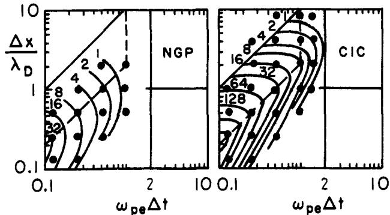  
Figure 13-5b Contours of constant $\tau _ { H } / \tau _ { s }$ on the $\Delta x$ versus $\Delta t$ plane for NGP and CIC weighting.(From Hockney,1971.）

For purposes of design Hockney devised the $\Delta x , \Delta t$ plot shown in Figure 13-5c. The region to the right of $\omega _ { p e } \Delta t = 2$ is unstable for a cold plasma and $\omega _ { p e } \Delta t = 1 . 6 2$ for a thermal plasma (move the boundary line a bit). For $\lambda _ { D } / \Delta \stackrel { . } { x } \le 0 . 2 \ ( \Delta x / \lambda _ { D } \ge 5 )$ ，the non-physical $\Delta x$ instability becomes important,so add that "boundary." For $\nu _ { t } \Delta t > \Delta x$ many particles cross a cell in $\Delta t$ ，defining the lower bound shown. His optimum path shown is $\nu _ { t } \Delta t = \Delta x / 2$ out to $\omega _ { p e } \Delta t = 1$

Using the $\tau _ { H } / \tau _ { s }$ values on the optimum path,Hockney then simplified the data to Figure 13-5d. The heating time dependence is found to be

$$
\left( \frac { \tau _ { H } } { \tau _ { s } } \right) _ { \mathrm { o p t } } = K _ { 4 } \left( \frac { \lambda _ { D } } { \Delta x } \right) ^ { 2 }
$$

These results are striking, with ${ \pmb { \tau } } _ { H } / \tau _ { s }$ for CIC $( K _ { 4 } \approx 4 0 )$ ）about 20 times longer than for NGP $( K _ { 4 } \approx 2 )$ .

There is an apparent contradiction between NGP and CIC having the same $\boldsymbol { \tau } _ { s }$ but twenty times different $\tau _ { H }$ ．Indeed，Montgomery and Nielson (1970) found that an NGP model relaxed ten times as fast as a CIC model; if the relaxation to a Maxwellian is due solely to binary collisions,then simulations,with different weighting (NGP and CIC) but the same collision times $\tau _ { s }$ should show no difference in relaxation. Hockney points out that there is no contradiction because in the simulation, it is only the error in the fields

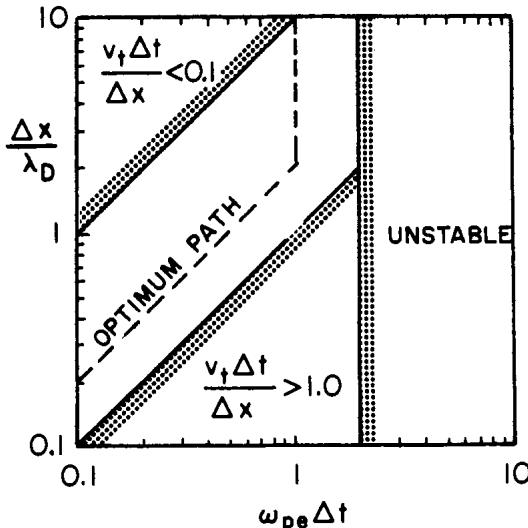  
Figure 13-5c The parameter plane used in the study of the heating time. The shaded regions are undesirable and the dotted line shows the optimum path on which $\left( \omega _ { p e } \Delta t \right) _ { 0 \mathsf { p t } } \equiv$ $\operatorname* { m i n } \{ \Delta x / 2 \lambda _ { D }$ ,11．(From Hockney,1971.)

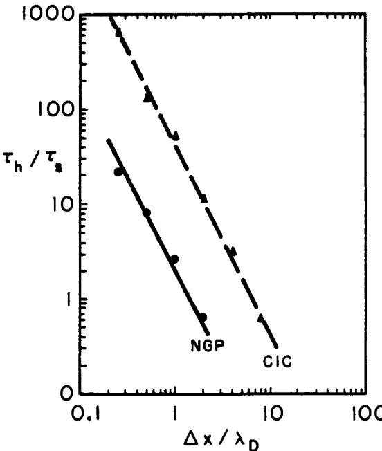  
Figure 13-5d Heating to collsion time along the optimum path $( \omega _ { p e } \Delta t ) _ { \mathrm { o p t } } = \mathrm { m i n } [ \Delta x / 2 \mathrm { \lambda } _ { D } , 1 ]$ as a function of $\Delta x / \lambda _ { D }$ for the NGP,and CIC models. (From Hockney,1971.)

which causes the stochastic heating.

Hockney et al. (1974) published more information on heating times, including more sophisticated particle shapes and using 9 points in the Poisson solver. The newer article gives $K _ { 4 } = 1 0 0$ for CIC; the reason put forth is that greater care was taken to establish thermal equilibrium before the heating rate measurement was taken. Increasing the Poisson solver from 5 to 9 points does nothing for CIC. Using a QS weighting and a 9 point Pois-son solver, with an effective particle radius $R = 1 . 8$ ， $K _ { 4 }$ increases to 150; adding a potential correction term, with effective $R = 3$ ， they found $K _ { 4 } = 3 0 0 0$ . The latter model takes about twice as long to compute as does standard CIC; however it has 30 times larger $K _ { 4 }$ and, for $\lambda _ { D } / \Delta x = 1$ ，five times larger ${ \tau _ { s } } / { \tau _ { p e } }$ ， hence 150 times larger $\tau _ { H } / \tau _ { p e }$ ， which is quite an excellent figure of merit. The latter models in which the potential is adjusted (usually in $\pmb { k }$ -space) to reduce the effect of the mesh, are referred to as quiet-particle-mesh models (QPM) by Hockney.

# 13-6 UNSTABLE PLASMA

As with most kinetic theory, that presented here assumes velocity distributions which are linearly stable,as indicated by the dispersion relation $\epsilon ( k , \omega ) = 0$ .However, it has recently been shown that large-amplitude turbulence can develop in linearly stable one-dimensional plasmas (Berman et al.，1982)． A relative drift velocity between ions and electrons,although below the linear stability threshold, provides free energy for a nonlinear instability. Detailed measurements of correlations in $( x , \nu )$ phase space,possible only in computer simulation, disclose "clumps" and density holes.Such diagnostics facilitate successful comparison with theory (Berman et al., 1983; Dupree, 1983). The authors believe that these observations, not accessible via perturbative theories, raise questions regarding the relevance of these standard perturbative procedures.

PRACTICE

# PROGRAMS IN TWO AND THREE DIMENSIONS: DESIGN CONSIDERATIONS

This Part introduces the more complicated codes that are used in two and three dimensions and provides some design procedures for codes in all dimensions. While adding realism, the steps from one spatial dimension to two or three increases the complexity of programs and computer running times. We now need 2d and 3d particle movers, particle weightings, field solvers and diagnostics.

Chapter 14 provides details on algorithms for electrostatic programs in two and three dimensions.

Chapter 15 describes simulations including self-consistent electromagnetic fields (as an extension of Chapters 6 and 7),and approximations,such as the Darwin models.

Chapter 16 presents techniques used for loading particles, that is, choosing initial values for $( \mathbf { x } , \pmb { v } ) _ { j }$ and for injection and absorption during the run. Also included is the implementation of an external electric circuit.

# ELECTROSTATIC PROGRAMS IN TWO AND THREE DIMENSIONS

# 14-1 INTRODUCTION

Simulation in two and three spatial dimensions is much more realistic than in one dimension. Indeed,many problems demand use of more than one dimension in order to obtain useful physics. Hence, this chapter and the next display the steps beyond those already given for 1d, first for electrostatic models and then for electromagnetic models. First， let us estimate costs and complexity.

As in one dimension,electrostatic simulations may be done in 2d,3d using Coulomb's law directly, having no spatial grid. Particle-particle calcula-tions may be done using the force between charges $i$ and $j \propto 1 / r _ { i j }$ and $1 / r _ { i j } ^ { 2 }$ This approach is at its best modeling an isolated plasma,with no boundaries (no image charges). For general plasma models,periodic or bounded, however, there is seldom need to observe behavior at small particle separation or at $\lambda$ less than $\lambda _ { D }$ in neutral plasma,and hence,little need to employ the extra computation time needed for particle-particle calculations. Hence, the direct Coulomb law approach is generally replaced by one which obtains the fields from the charge and current densities,using a spatial grid. The grid is made fine enough to observe the grid quantities at sufficiently small scale as defined by the physics sought, but not at finer scale. Typically in an $\tt { \tt _ { x } } \cdot \tt { y } \cdot 2 a$ program,grids are $3 2 \times 3 2$ （1024 points） up to $2 5 6 \times 2 5 6$ (65,536 points) with $E _ { x }$ ， $E _ { y }$ ， $B _ { x }$ ， $B _ { y }$ ， $B _ { z }$ ， $\pmb { \rho }$ stored at each point (6 numbers) in a random access memory. In 3d,using a $6 4 \times 6 4 \times 6 4$ grid,(262,144 points) with all components of $\mathbf { E } , \mathbf { B } , \mathbf { J }$ ，and $\rho$ present, storage of 2,621,440 numbers in fast memory is required, currently non-trivial!

The jump from observing $f ( x , \nu _ { x } )$ in ldlv, two phase-space variables, to $f ( x , y , z , \nu _ { x } , \nu _ { y } , \nu _ { z } )$ in 3d3v,with six phase-space_variables, may require going to some number like $( 6 4 ) ^ { 3 }$ cells, and $1 0 ^ { 4 }$ to $1 0 ^ { 7 }$ particles, depending on the problem. Particle descriptions (i.e., $\mathbf { x } _ { i } , \mathbf { v } _ { i } )$ ）jump from two to six numbers and there usually is a need for many times more particles. Being able to construct smooth variations of $f \left( \mathbf { v } \right)$ and $n \left( \mathbf { x } \right)$ down to cell size, sometimes expensive even in 1d,may be prohibitive in 3d3v; being able to make both $\bar { N _ { D } } \equiv n \lambda _ { D } ^ { 3 }$ and $L / \lambda _ { D }$ large may become very expensive. Each additional dimension in phase space multiplies the cost in memory and time. Fortunately,as in 1d,each problem has its own needs; many problems are being done in $\mathbf { 2 } \mathbf { d } 3 \mathbf { v }$ at acceptable cost, certainly relative to having only an approximate theory on which to build, for example,a full scale fusion experiment.

It may be that the greater challenge in moving up from 1d is in the added complexity of doing 2d and 3d. For example,consider the added diffculties in the designing the initial loading and later injection,absorption, reflection of particles and in devising diagnostics and post processing that are readily grasped, as well as in making tests for accuracy. Almost all tasks are tougher, possibly much more so than just obtaining larger memories and faster processing.

The description above suggests that simulations should progress through 1d1v to 1d3v to 2d2v to 2d3v in steps,leading up to and supporting full 3d3v simulations.

Let us outline what to do in solving 2d and 3d electrostatic problems. We proceed from $\mathbf { x } \to \rho \to \phi \to \mathbf { E } \to \mathbf { F }$ as follows:

$\begin{array} { r l } & { \mathbf { x } _ { \mathrm { p a r t i c l e } } \longrightarrow \rho _ { \mathrm { g r i d } } } \\ & { \rho _ { \mathrm { g r i d } } \longrightarrow \phi _ { \mathrm { g r i d } } } \\ & { \phi _ { \mathrm { g r i d } } \longrightarrow \mathbf { E } _ { \mathrm { g r i d } } } \\ & { \mathbf { E } _ { \mathrm { g r i d } } \longrightarrow \mathbf { F } _ { \mathrm { p a r t i c l e } } } \end{array}$ weighting,any order. put $\nabla ^ { 2 } \phi = - \rho$ into finite-difference formandsove for $\phi _ { \mathrm { \& r i d } }$ put $- \nabla \phi = \mathbf { E }$ into finite-difference formand soive for $\mathbf { E _ { \mathrm { { g r i d } } } }$ weighting,any order.

Or,if $\rho , \phi$ and $\mathbf { E }$ may be represented by a discrete Fourier series, then we may obtain, for example, $\phi ( \mathbf { k } )$ from $\rho ( \mathbf { k } )$ either by division by the finitedifference operator $K ^ { 2 } ( \mathbf { k } )$ or simply by $k ^ { 2 }$ . Or,there may be a combination of a finite difference solution, say, in $_ { x }$ , and Fourier series in $y$

The steps from the acceleration, $q / m \ ( { \bf E } + { \bf v } / c \ { \bf \times \ B } )$ ，to $\pmb { \gamma } _ { \nwarrow \ w }$ and $\mathbf { x } _ { \mathrm { n e w } }$ are the same as those given in Chapter 4. There the leap-frog time-centered movers are given，with the steps of half acceleration, rotation and half acceleration. These are presented in vector form, usable in ldlv up through 3d3v.

Particle weightings in 2d,3d are straightforward extensions of those already used in 1d, ending up with effective particle shapes that are more or less rods and cubes in 2d and 3d, respectively (See Section 8-9). The particle shape factors become $S \left( \mathbf { x } \right) = S \left( x , y , z \right)$ ，generally nearly symmetric, but with some (unwanted) anisotropy due to the squareness or cubeness of the finite-size particles and the rectangular mesh. For example, these effects lead to slightly different wave propagation along axes than between axes, with the effects diminishing as the order of the weighting is increased.

The field solvers also are extensions of those used in 1d. We need to know finite-difference forms for $\nabla ^ { 2 } \phi$ and $\nabla \phi$ ， with some information about accuracy. The Poisson solvers presented are direct (non-iterative)，using either discrete Fourier series and/or matrix inversion to go from $\pmb { \rho } ( \mathbf { x } )$ to $\phi ( \mathbf { x } )$ ·

In choosing models for any number of dimensions, simulators have a variety of choices for boundary conditions on potentials and particles, as well as freedom to use symmetries. In 2d and 3d, models may be wholly periodic or wholly bounded or with different boundary conditions along the 2 or 3 coordinates, and boundaries may be irregular with mixed boundary conditions.

Periodic systems are used to represent a part of an infinite plasma. Such systems are necessarily charge neutral in that

$$
0 \ = \int _ { \mathrm { { p e r i o d } } } \mathbf { E } \cdot \mathrm { d } \mathbf { S } \ = \int _ { \mathrm { { p e r i o d } } } \rho \mathrm { d } V
$$

As this relation holds for plasma regions that are more than a few Debye lengths across and away from sheaths, periodic systems are widely used. As there is little difference in 1d, 2d and 3d periodic system boundary condi-tions,and 1d has been treated earlier, the only further discussion necessary is on $k = 0$ considerations.

In a bounded system the charges or potentials or fields are specified on all boundaries. This system need not be neutral. If the system is a grounded rectangular box, then it is similar to a 1d system with grounded boundaries at $x = 0$ and $\pmb { L }$ [i.e., $\phi ( 0 ) = 0 = \phi ( L ) ]$ ，which is easily handled with either a Fourier sine series or a finite difference form; extension to 2d and 3d is straightforward.

An open boundary is taken to mean an interface between the plasma region described by Poisson's equation, $\nabla ^ { 2 } \phi = - \rho$ ， and a vacuum region described by Laplace's equation, $\nabla ^ { 2 } \phi = 0$ . Potentials are to be matched at such boundaries. For example,in 1d, let there be plasma for $x < L$ ,and vacuum for $x > L$ ，where the $\phi ( x ) = A x + B$ . However, the same open boundary in 2d,for $\phi$ periodicin $\mathbf { y }$ ，has Laplace solutions like exp $\{ - k _ { y } \left( x - L \right) \}$ exp $( i k _ { y } y )$ ，showing decay away from $x = L$ for $k _ { y } \neq 0$ ； the $k _ { y } = 0$ term provides the same solution as for 1d, given above.

Mixed boundary conditions are possible, combining periodic,specified,and open,combining steps given in this chapter.

Thus,we see some distinct differences between the 1d and the 2d,3d models. This chapter deals with some of the new aspects.

# 14-2 AN OVERALL 2D ELECTROSTATIC PROGRAM

In this section，we consider a complete program. We then proceed to examine the parts in detail in succeeding sections. The particles have locations $x _ { i } , y _ { i }$ and velocities $\nu _ { \xi } , \nu _ { y i }$ . The spatial grid, used for obtaining the fields from the particle charge density and current density,has grid points $X _ { j } = j \Delta x$ ， $Y _ { k } = k \Delta y$ ，as sketched in Figure 14-2a. The grid size is made small enough to resolve the details deemed necessary and to avoid numerical troubles (with a warm plasma, keeping $\lambda _ { D } > \Delta x / 3$ ， roughly)． The particle density is kept large enough to make density variations smooth, implying a few particles per grid cell. The particles themselves are treated as in 1d, as finite-size particles; this physics comes about automatically by weighting the particles to the grid. Zero-order weighting is again nearest-grid-pointweighting, seldom used. First-order weighting is again linear interpolation, here called bi-linear, or area weighting, due to its geometric interpretation, as shown in Figure 14-2b. The weights are given by

$$
\begin{array} { r c l } { \rho _ { j , k } } & { = } & { \rho _ { c } \displaystyle \frac { ( \Delta x - x ) ( \Delta y - y ) } { \Delta x \Delta y } } \\ { \rho _ { j + 1 , k } } & { = } & { \rho _ { c } \displaystyle \frac { x ( \Delta y - y ) } { \Delta x \Delta y } } \\ { \rho _ { j + 1 , k + 1 } } & { = } & { \rho _ { c } \displaystyle \frac { x y } { \Delta x \Delta y } } \\ { \rho _ { j , k + 1 } } & { = } & { \rho _ { c } \displaystyle \frac { ( \Delta x - x ) y } { \Delta x \Delta y } } \end{array}
$$

where $\pmb { \rho } _ { c }$ is the charge density uniformly filling a cell (q/area) and the charge position $x , y$ is measured from the lower left-hand grid point $( j , k$ obtained by truncating the particle coordinate $x , y )$ . The charge densities at all of the grid points then become the right hand side of Poisson's equation

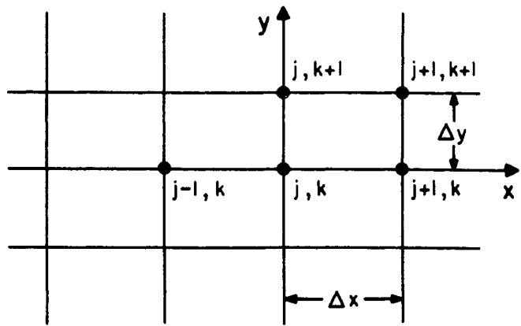  
Figure 14-2a Typical two dimensional rectangular grid in $x , y$

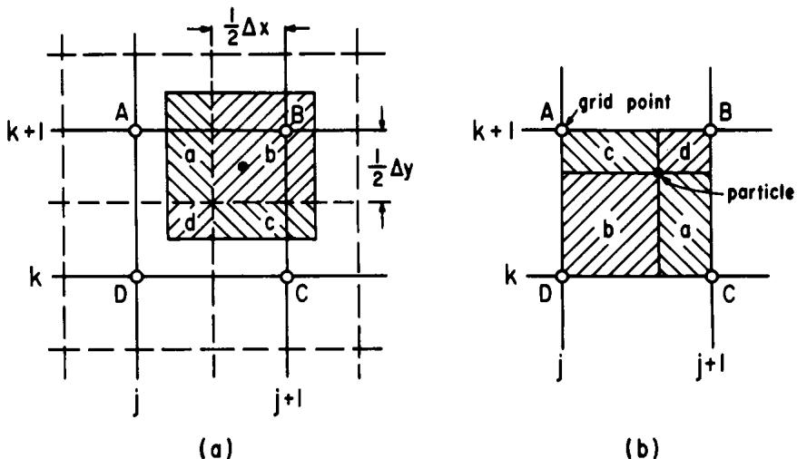  
Figure 14-2b Charge assignment for linear weighting in 2d. Areas are assigned to grid points; i.e.,area a to grid point $A , b$ to $\pmb { B }$ ,etc.as if by NGP,with the particle center located as indicated.(a) is the CIC cloud interpretation. (b) is the PIC bilinear interpolation interpretation.

$$
\nabla ^ { 2 } \phi ( x , y ) = - \rho ( x , y )
$$

In finite difference form,this becomes the five-point form,

$$
\frac { ( \phi _ { j - 1 } - 2 \phi _ { j } + \phi _ { j + 1 } ) _ { k } } { \Delta x ^ { 2 } } + \frac { ( \phi _ { k - 1 } - 2 \phi _ { k } + \phi _ { k + 1 } ) _ { j } } { \Delta y ^ { 2 } } = - \rho _ { j , k }
$$

This set of equations is then solved for all of the potential $\phi _ { j , k }$ ， including use of the appropriate boundary conditions (periodic, bounded, open,other). The E's are obtained from the $\phi$ 's using

$$
\mathbf { E } ( \mathbf { x } ) = - \nabla \phi ( \mathbf { x } )
$$

in the usual two-point difference form; for $E _ { x }$ , as sketched in Figure 14-2c,

$$
( E _ { x } ) _ { j , k } = \frac { ( \phi _ { j - 1 } - \phi _ { j + 1 } ) _ { k } } { 2 \Delta x }
$$

with a similar differencing for $E _ { y }$ . The fields are located at the same points as potentials. Next,the fields are weighted back to the particles; for linear weighting, each field component at the four nearest grid points is weighted to each particle using the same weights as in (1） above. Finally，particles are advanced by the particle mover, from $\pmb { \nu } _ { \mathsf { o l d } }$ to $\nu _ { \mathsf { n e w } }$ and $x _ { \tt o l d }$ to $\pmb { x } _ { \pmb { \mathrm { n e w } } }$ , complet-ing one time step,as done in Chapter 4.

Diagnostics are put in where appropriate, with some snapshots now being in 2d, such as contour plots of charge density or potential, which are logical extensions of working in more than one dimension.

The simplest approach is that just given. However,with 2d electrostatic models, there may be good reason to use other coordinates, such as cylindrical coordinates $r \cdot z$ 0r $r { - } \theta$ ， as dictated by the physics or the natural boundary conditions,and as a step toward a full 3d model with $\pmb { r } \cdot \pmb { \theta } \cdot \pmb { z }$ coordi-nates. Use of higher or lower order weightings may be called for; these may be worked out from the 1d models given earlier. Section 14-9 treats the Poisson equation and gradient operators for cylindrical $r , r \mathopen { } \mathclose \bgroup  \theta$ ,r-z gridding.

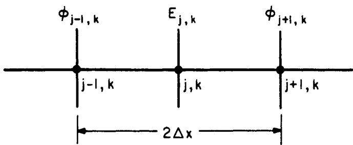  
Figure 14-2c Location of $E _ { j , \boldsymbol { k } }$ with relation to $\phi _ { j , k }$

The sections following expand upon the various parts given above, such as the accuracy of the Poisson equation finite differencing,better ways to obtain $\mathbf { E }$ from $\phi$ ， boundary conditions,and weighting and effective particle shape.

# 14-3 POISSON'S EQUATION SOLUTIONS

We have set up Poisson's equation in $\phi$ and $\pmb { \rho }$ in a finite-difference form in rectangular coordinates in 14-2(3). For detailed solutions of this form, the reader is referred to introductory work by Potter (1973） and the extensive work by Hockney (1970) and in Hockney and Eastwood (1981,chap.6). Hockney， working with Buneman and Golub at Stanford University, pioneered fast direct solutions of Poisson's equation in 2d in the early $1 9 6 0 ' { \mathsf { s } }$ ，making practical the jump from 1d to 2 and 3d simulations,particle or fluid. These references provide a wealth of information that is not repeated here.

Or,we may use Fourier series representations for $\phi$ and $\pmb { \rho }$ in order to obtain direct solutions,as was done earlier in 1d in ES1; steps for a doubly periodic Poisson solver are given in a later section. We also display in the later sections 2d slab models which involve both Fourier and f.d.e. methods. The models are periodic in $y$ and may be periodic,open，bounded or inverted in $_ x$

In many models,conditions on $\phi$ or $\mathbf { E }$ are given at regular boundaries of the plasma or vacuum region such as at $x = 0$ ， $L _ { x }$ and $y = 0 , L _ { y }$ In models with electrodes held at given potentials in the interior of the plasma region, the charges on the electrodes are needed. These may be obtained from the capacitive matrix method. The details of this method, extensions, and timing are given in Hockney and Eastwood (1981, Sec. 6-5-6). The method involves precalculation of a capacity matrix C (e.g., see Ramo, Whinnery，and Van Duzer, 1965,chap. 5) which relates the potential at the points which are on the interior electrodes and the charge induced on them by the surrounding plasma. First, solve Poisson's equation with no charges on the electrode points; record the difference between the potential found at the electrode points and the desired value. Multiplying this error by C gives the negative of the desired surface charge at each electrode point. Then solve Poisson's equation again with this desired surface charge; this solution is correct everywhere,including at the electrodes.

# 14-4 WEIGHTING AND EFFECTIVE PARTICLE SHAPESIN RECTANGULAR COORDINATES:${ \pmb S } \left( \mathbf { x } \right) , { \pmb S } \left( \mathbf { k } \right)$ , FORCE ANISOTROPY

Assignment of particle charge to neighboring grid points proceeds much as we have already done in ld,with zero, first,and second order weighting: nearest-grid-point, bilinear, and biquadratic spline, respectively. Our interest here is in the effective shape of the particle (e.g.，how anisotropic?),the Fourier representation (e.g.，what is the coupling from higher order Brillouin zones?)，and the anisotropy of the force. Weighting is done here for rectangular coordinates; weighting for cylindrical coordinates is done in Section 14-10.

Zero-order assignment (NGP) to one grid point is simplest. The nearest grid point is found from the particle position $\mathbf { x } = ( x , y )$ by truncating $x + 0 . 5$ ， $y + 0 . 5$ (for $x , y \ > \ 0 )$ . The particle charge is assigned to a grid point when the particle center is in the cell $\Delta x$ by $\Delta y$ centered on the grid point; when the particle center moves past the edge of the cell, the particle is assigned to the next cell. The particle shape $s ( \mathbf { x } )$ is a rectangular cloud of height 1 and sides $\Delta x$ by $\Delta y$ as sketched in Figure 14-4a. The force between two particles is discontinuous as shown in Figure 14-4b which leads to noise and self-heating,but becomes close to the physical $1 / r$ dependence at charge separation of a few cells. The short-range force vanishes,as is true for all weightings. The rectangular shape leads to the anisotropy in force indicated in Figure 14-4c. For these reasons NGP is seldom used.

First-order assignment is linear weighting to the nearest four grid points in two dimensions (hence,bilinear),which is often called area weighting due to its geometric interpretation, as shown in Figure 14-2b. Cloud-in-cell (CIC) is the name given by Birdsall and Fuss (1969),who considered the particle to be nominally rectangular with the particle fraction in each cell weighted to its cell center. Particle-in-cell (PIC) is the name used by Harlow (1964） in fluid velocity weighting,followed by Morse and Nielson (1969), who considered the particle to be a point but with charge assigned by linear interpolation to the nearest grid points. The weights are given by 14-2(1). Another form of the weight to the point $j , k$ (for $x , y$ normalized to $\Delta \ v { x }$ ，

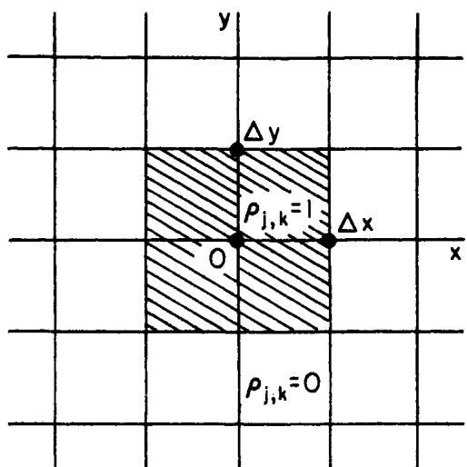  
Figure 14-4a Particle shape for zero-order weighting in 2d (NGP),which is uniform as viewed by the grid, of size $\Delta x$ by $\Delta y$ ,centered on a grid point. (From Birdsall and Fuss,1969.）

$\Delta y$ is

$$
\Delta x \Delta y S ( x , y ) = \left\{ \begin{array} { l l } { \left( 1 - | x | \right) ( 1 - | y | ) } & { \qquad | x | \leqslant 1 , | y | \leqslant 1 } \\ { 0 } & { \qquad \mathrm { o t h e r w i s e } } \end{array} \right.
$$

We may produce the particle shape $s ( x , y )$ by measuring the charge assigned to a grid point as the'particle moves relative to that point. Hence,(1） provides the particle shape. The particle density contours are shown in Figure 14-4d, indicating an improvement over the flat, rectangular NGP particle $\ b { \Delta x }$ by $\Delta y$ ),yet not quite circular. The force is now piece-wise continuous, as shown in Figure 14-4e,reducing the noise and the self-heating relative to NGP.

The Fourier transform of the particle shape factor, $S ( x , y )$ to $S \left( k _ { x } , k _ { y } \right)$ ， is informative. In particular, $S \left( k _ { x } , k _ { y } \right)$ indicates the coupling into the fundamental Brillouin zone（ $\lvert k _ { x } \Delta x \rvert < \pi$ ， $\vert k _ { y } \Delta y \vert < \pi )$ from shorter wavelengths, that is, aliasing. ${ \pmb S } ( { \bf k } )$ for linear weighting (CIC,PIC) was shown in Figure 11-6c. Note that $S \left( k _ { x } , 0 \right)$ and $S ( 0 , k _ { y } )$ are the same as in 1d, so that coupling from the $\left| p _ { x } \right| = 1$ ， $p _ { y } = 0$ and $\dot { p } _ { x } = 0$ ， $| p _ { y } | = 1$ zones into the fundamental (O,O) zone is much as in 1d; see 8-9 (9) for definition of $\pmb { \mathrm { p } }$ The (1,1） coupling is much smaller，as the $S _ { \mathrm { m a x } } ( 1 , 1 ) \approx 0 . 1 5$ [whereas $S _ { \mathrm { m a x } } ( 0 , 1 ) \approx 0 . 4 1$ .Note that $S ( k _ { x } , k _ { y } )$ is very nearly $s ( \boldsymbol { k } )$ ， $k = ( k _ { x } ^ { 2 } + k _ { y } ^ { 2 } ) ^ { 1 / 2 }$ in the (0,O) zone and remains nearly isotropic well into the (0,1),(1,O) and (1,1） zones. Compare this $s ( k )$ with that for the "improved dipole" shown in Figure 11-6b, which has larger anisotropy and larger values of $| s |$ well out of the (0,O) zone, hence,larger coupling to aliases.

Second-order assignment (QS,quadratic spline) is to the nearest nine grid points, given by

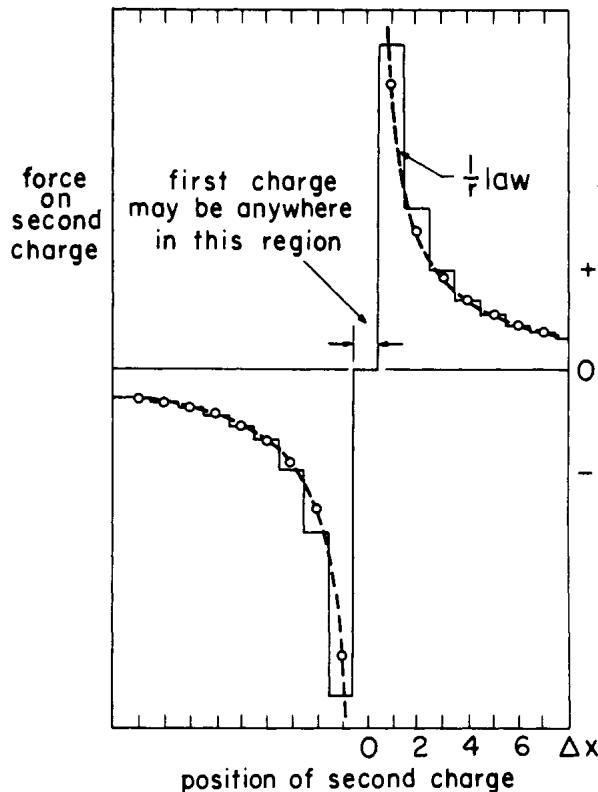  
Figure 14-4b Force produced by a charge in the cell at the origin on a second charge at $x$ for zero-order weighting,NGP. The second particle moves parallel to the $x$ -axis.The dashed line shows the physical $1 / r$ law for the second particle located at the circles,centers of cells. (From Hockney,1966.)

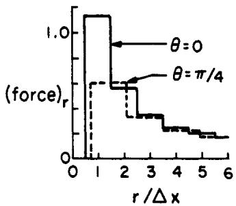  
Figure 14-4c Similar to Figure 14-4b, but including the second particle moving at $4 5 ^ { \circ }$ to the $x$ · axis where the peak force is less and the steps are $( 2 ) ^ { \sharp }$ longer. (From Eastwood and Hockney, 1974.）

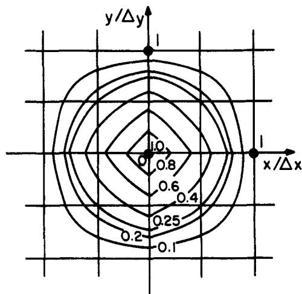  
Figure 14-4d Particle density contours for linear weighting in 2d (CIC,PIC)．The total particle area is $4 \Delta x \Delta y$ ．(From Birdsall and Fuss,1969.)

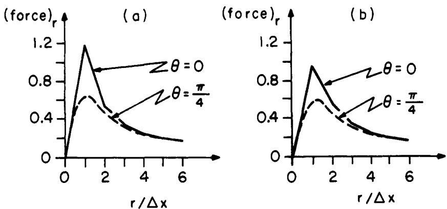  
Figure 14-4e (a) Force between two particles for linear weighting (CIC,PIC).A positive charge is located at the origin (a grid point)．The force ona positive charge is shown,as this charge moves along the x axis or at θ = π/4. The 5 point Poisson stencil was used. (b) Same as (a) but for the 9 point Poisson stencil．(From Eastwood and Hockney,1974.)

$$
S \left( x , y \right) = S \left( x \right) S \left( y \right)
$$

where $S ( x )$ is ${ \pmb S } _ { 2 }$ of 8-8(2-4). Density contours, profiles and the force are shown in Figure 14-4f. $S \left( k \right)$ is given by 8-9(16). There is additional com-putational effort in weighting the particle to 9 points (beyond the 1 point of NGP, 4 of CIC,PIC) but the particle is now nearly circular. The particle is also larger in area; for $\Delta x = \Delta y$ ，the NGP particle has area $( \Delta x ) ^ { 2 }$ ， the CIC, PIC particle has area $4 ( \Delta x ) ^ { 2 }$ , and the QS particle has area $9 ( \Delta x ) ^ { 2 }$

The reader is encouraged to obtain $S \left( \mathbf { k } \right)$ for any new proposed weightings prior to use.

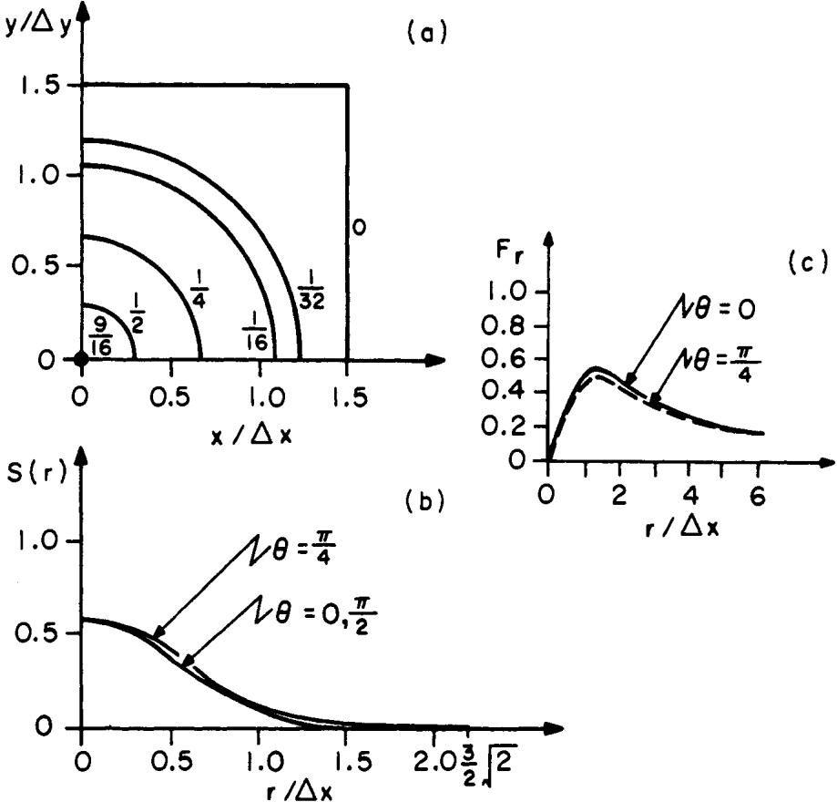  
Figure 14-4f (a) Particle density contours for quadratic weighting in 2d (QS)． The total particle area is $9 \Delta x \Delta y$ .(b) Profile of the shape factor $\pmb { S } ( \pmb { r } )$ (or density） along the particle radius,along the $_ { x }$ or $y$ axis and in between. (c) Force (as in earlier figures) for quadratic weighting in 2d (QS).(From Eastwood and Hockney,1974.)

# 14-5 DOUBLY PERIODIC MODEL AND BOUNDARY CONDITIONS

As we provide considerable detail on a periodic Poisson solver in ld,it is appropriate to describe the extension to 2d. We also emphasize the need to consider ${ \bf k } = 0$ in 2d periodic codes.

# (a) Doubly Periodic Poisson Solver

The discrete Fourier transform method is readily applied to a doubly periodic model, as done in ZOHAR.The size is $N _ { x } = L _ { x } / \Delta x \ \mathrm { b y } / N _ { y } = L _ { y } / \Delta x$ cells. The subroutine names used here are from ZOHAR; the reader may construct these in detail, adding calls to the subroutines RPFTI2 and CPFT used in the transform given in Appendix A. No scratch memory is needed.

The Fourier transform of the charge density and its normalization is RHO (equivalenced to RHOPHI),

$$
\rho _ { l , m } = \Delta x \Delta y \sum _ { k = 0 } ^ { N _ { y } - 1 } e ^ { - i k _ { y } y _ { k } } \sum _ { j = 0 } ^ { N _ { x } - 1 } e ^ { - i k _ { x } x _ { j } } \rho _ { j , k }
$$

where $k _ { x } = 2 \pi l / L _ { x }$ ， $k _ { y } = 2 \pi m / L _ { y }$ . This is done by subroutine RPPFT, which computes the sine and cosine coefficients, defined as

$$
\begin{array} { r } { \left[ C S _ { l , m } \quad S S _ { l , m } \right] = \Delta x \Delta y \sum _ { j , k } \rho _ { j , k } \left[ \cos k _ { x } X _ { j } \sin k _ { y } Y _ { k } \quad \sin k _ { x } X _ { j } \sin k _ { y } Y _ { k } \right] } \\ { \left[ C C _ { l , m } \quad S C _ { l , m } \right] = \Delta x \Delta y \sum _ { j , k } \rho _ { j , k } \left[ \cos k _ { x } X _ { j } \cos k _ { y } Y _ { k } \quad \sin k _ { x } X _ { j } \cos k _ { y } Y _ { k } \right] } \end{array}
$$

for ${ \boldsymbol { l } } = \boldsymbol { 0 }$ to $N _ { x } / 2$ and $m = 0$ to $N _ { y } / 2$ . One can construct $\rho _ { l , m }$ as

$$
\rho _ { l , m } = ( C C _ { l , m } - S S _ { l , m } ) - i ~ ( C S _ { l , m } + S C _ { l , m } )
$$

For $l , m$ in other quadrants $\rho _ { l , m }$ may be found similarly, by using the symmetries of the sine and cosine coefficients. The coefficients are stored in an array RHOK,equivalenced to RHOPHI, according to

$$
\begin{array} { c c } { { { \mathrm { R H O K } } ( - L , M ) = C S _ { l , m } , } } & { { \qquad { \mathrm { R H O K } } ( L , M ) = S S _ { l , m } } } \\ { { { \mathrm { R H O K } } ( - L , - M ) = C C _ { l , m } , } } & { { \qquad { \mathrm { R H O K } } ( L , - M ) = S S _ { l , m } } } \end{array}
$$

The potential coefficients obtained from 8-9(17) are

$$
\phi _ { l , m } = \frac { \rho _ { l , m } } { K _ { l , m } ^ { 2 } }
$$

where

$$
K _ { l , m } ^ { 2 } = k _ { x } ^ { 2 } \mathrm { d i f ^ { 2 } } \frac { k _ { x } \Delta x } { 2 } + k _ { y } ^ { 2 } \mathrm { d i f ^ { 2 } } \frac { k _ { y } \Delta y } { 2 }
$$

In a continuum we would have $K _ { l , m } ^ { 2 } = k _ { x } ^ { 2 } + k _ { y } ^ { 2 }$

The inverse, performed by RPPFTI, is

$$
\phi _ { j , k } = \frac { 1 } { L _ { x } L _ { y } } \sum _ { l = - N _ { x } / 2 } ^ { N _ { x } / 2 - 1 } e ^ { i k _ { x } x _ { j } } \sum _ { m = - N _ { y } / 2 } ^ { N _ { y } / 2 - 1 } e ^ { i k _ { y } y _ { k } } \phi _ { l , m }
$$

The potential and its transform are stored in arrays PHl and PHIK, which are also equivalenced to RHOPHI. Thus the density and potential and their transforms occupy the same memory locations,each replacing the preceeding in the order RHO,RHOK，PHIK,PHI. The use of separate identifiers in the program indicates what quantity is being worked with at any time,and permits convenient indexing to be used for the transforms.

As in the continuum case,a field energy may be computed in either real or transform space:

$$
\begin{array} { l } { { \displaystyle { \int d x d y \frac { \rho \phi } { 2 } \longrightarrow \Delta x \Delta y \sum _ { j , k } \frac { 1 } { 2 } \rho _ { j , k } \phi _ { j , k } } } } \\ { { \displaystyle { = \frac { 1 } { L _ { x } L _ { y } } \sum _ { l = - N _ { x } / 2 } ^ { N _ { x } / 2 - 1 } \sum _ { m = - N _ { y } / 2 } ^ { N _ { y } / 2 - 1 } \frac { 1 } { 2 } \rho _ { l , m } ^ { * } \phi _ { l , m } } } } \end{array}
$$

Note that in this sum a given sine-cosine Fourier coefficient may appear as many as four times. Indexing over $l$ is split into two parts: ${ \mathit { l } } = 0$ and $N _ { x } / 2$ ， and $\pm l = 1$ to $N _ { x } / 2 - 1$ . Similarly for $m$

# (b） Periodic Boundary Conditions; ${ \bf k } = { \bf 0 }$ Fields

Potential and particle boundary conditions for some 2d models are given in earlier sections of this Chapter, such as for the slab models,periodic in $y$ and open or closed or other in $x$ . Connections to external circuits were mentioned in Section 4-11 including how to advance $\mathbf { E } \left( \mathbf { k } { = } 0 \right)$ in time due to an external current source,and are described further in Chapter 16. Here we add to the discussion in Section 4-11 on the importance of careful treat-ment of the spatially averaged total current $( \mathbf { k } = 0 )$ .

In dealing with boundary conditions, the component of total current density that is uniform in space $( \mathbf { k } = 0 )$

$$
\mathbf { J } _ { \mathrm { t o t a l , k } = 0 } = \left| \mathbf { J } + { \frac { \partial \mathbf { E } } { \partial t } } \right| _ { \mathbf { k } = 0 }
$$

is special. The usual electrostatic periodic model may have one or more of the following properties:

(a) is net neutral with $\rho ( { \bf k } = 0 ) = 0$ ， which may be mistaken to mean $\mathbf { E } ( \mathbf { k } = 0 ) = 0$   
(b) may have no current other than that of the plasma, with $\mathbf { J } _ { \mathrm { { t o t a l } } } = 0$ for all k including ${ \bf k } = 0$ which may be labelled open circuit;   
(c） may have periodic $\phi$ $\mathtt { E } ( \mathbf { k } { = } 0 ) = 0 ]$ such that $\phi ( 0 ) = \phi ( L )$ ， hence may be labelled short circuit,   
(d) has no net energy flow in or out of the system. Hence,such models may be called undriven, isolated, or closed.

However,we may have interest in systems which call for ${ \bf k } = 0$ fields, in order to have no "hole" in the spectrum of modes available for nonlinear processes, such as parametric instabilities,or simply to supply a restoring force for ${ \bf k } = 0$ plasma oscillations (e.g.,where all electrons are drifting in the same direction,uncovering ions at one end of the system and electrons at the other, producing a uniform E in between). For example, ${ \bf { E } } ( { \bf { k } } { = } 0 ) =$ $\mathbf { E } _ { 0 } \cos \omega _ { 0 } t$ may be added (this option is in ES1),independent of the plasma

current, called a driven system.

The difference between undriven and driven systems has been seen in studies of electrostatic solitons and the two-stream instability. Morales, Lee, and White (1974) find relaxation oscillations between a well defined plasma cavity and small amplitude fluctuations for their case B, which corresponds to the undriven system. However,when they change boundary conditions to those of a driven system, they find collapse into a single soliton. Valeo and Kruer (1974) report collapse into one or more solitons in their onedimensional electrostatic simulations of the driven system. Friedberg and Armstrong (1968） show that nonlinear stabilization of the linearly unstable modes of the cold two-stream instability occurs before overtaking for their "open circuit" conditions in which average convection current ( $k { = } 0$ value) is conserved. But, for their "short circuit" boundary conditions in which the average drift velocity （ $k { = } 0$ value) is conserved, they find no nonlinear stabilization.

The lesson is that keeping all or part of $\mathbf { J _ { \mathrm { { t o t a l } } } }$ for $k { = } 0$ may make considerable difference in the results.

# PROBLEMS

14-5a Write (1） for small $\Delta x , \Delta y$ , as a double integral.

14-5b Show that eight of the coefficients in (2) are zero so need not be stored in RHOK. Show that the number of independent elements in RHOK is exactly $N _ { x } N _ { y }$

# 14-6 POISSON'S EQUATION SOLUTIONS FOR SYSTEMS BOUNDED IN $\pmb { x }$ AND PERIODIC IN y

We consider the methods for solving Poisson's equation for plasma slab systems that are periodic in $_ { y }$ but bounded in $\pmb { x }$ ， such as one might encounter in the simulation of a nonuniform plasma as in Figure 14-6a. We solve Poisson's equation with boundary conditions given on the two sides of the system at $x = 0$ ， $L _ { x }$ . Typical boundaries are closed (potential variation in $_ { y }$ specified) or open (vacuum out to $| { \boldsymbol x } | \to \infty )$ ：

Inside the simulation volume, $\rho \neq 0$ ，the potential is a solution to Poisson's equation. If the simulation volume is bounded on one (or both) sides by a vacuum, $\rho = 0$ ， extending indefinitely，where the potentials are solutions of Laplace's equation, then the solution to Poisson's equation within the simulation volume is to be matched to the appropriate (decaying) solution of Laplace's equation outside the simulation volume. This matching does not mean setting up outgoing waves only in the the simulation volume; an open boundary reflects electrostatic waves. A method of dealing with such open boundary conditions was developed by Buneman (1973). We describe a version used in ZOHAR by Langdon and Lasinski (1976) for open boundaries at $x = 0$ ， $L _ { x }$ and extended by W. M. Nevins to other conditions.

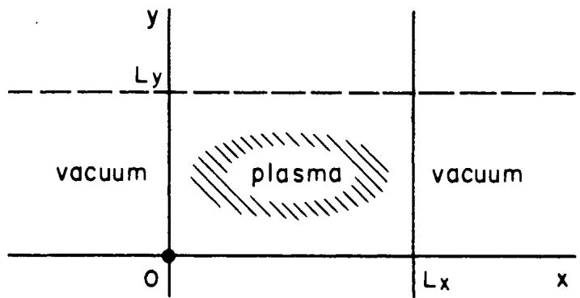  
Figure 14-6a 2d plasma slab model,periodic in $y$ ， with period $L _ { y }$ ，open at $x = 0 , L _ { x }$

A discrete Fourier transform is made on the charge density in the periodic direction $y$ ,as

$$
\rho _ { j , m } = \Delta y \sum _ { k = 0 } ^ { N _ { y } - 1 } \rho _ { j , k } \exp \left( - i \frac { 2 \pi m } { N _ { y } } k \right)
$$

where $j$ labels the grid points in $x , k$ labels those in $y , m$ labels the Fourier components in $y$ ，and $N _ { y }$ is the number of grid points in one period in $y$ $( N _ { y } = L _ { y } / \Delta y )$ .Using the usual 2d five-point Laplacian operator, Poisson's equation takes the form

$$
\phi _ { j + 1 , m } - 2 d _ { m } \ : \phi _ { j , m } + \phi _ { j - 1 , m } = - \rho _ { j , m } \ : \Delta x ^ { 2 }
$$

for $j = 0$ to $N _ { x }$ ，where

$$
d _ { m } = 1 + 2 \left( \frac { \Delta x } { \Delta y } \sin \frac { \pi m } { N _ { y } } \right) ^ { 2 }
$$

Hereafter $\Delta x ^ { 2 }$ and $m$ are suppressed. To solve (2） we add boundary condition information.

First,let the right and left boundaries be electrodes held at fixed potentials $\phi _ { 0 } = V _ { 0 }$ and $\phi _ { N x } = V _ { L }$ ，with no $y$ variations. For $m = 0 , d _ { 0 } = 1$ which makes (2) the same as in a ld electrode-bounded system for which a solution is given in Appendix D,Problem Da. For $m \neq 0$ ， $d _ { 0 } \ne 1$ so then we use the standard Gauss elimination for a tridiagonal matrix,also given in Appendix D.

Second, let the right and left boundaries be open. Outside of the simulation volume,where the charge density vanishes, the solutions to (2） for the potential are found to be (for $m \neq 0 .$ ，

$$
\phi _ { j } = a r ^ { j } + b r ^ { - j }
$$

where $r$ is the larger root of the quadratic equation,

$$
r - 2 d + \frac { 1 } { r } = 0
$$

(the other root is $r ^ { - 1 }$ ). The solution to Poisson's equation inside the simula-tion volume is set equal to the vacuum solution which does not diverge as $| j |  \infty$ 、 At the open boundary on the right side of the system,this matching produces

$$
\begin{array} { r l } { a = 0 \ } & { { } b = \phi _ { N _ { x } } r ^ { N _ { x } } \mathrm { ~ } \phi _ { j } = \phi _ { N _ { x } } r ^ { N _ { x } - j } \mathrm { ~ } j \geqslant N _ { x } \mathrm { ~ } \phi _ { N _ { x } + 1 } = r ^ { - 1 } \phi _ { N _ { x } } } \end{array}
$$

where $N _ { x }$ labels the last grid point at which charge is collected on the right side of the simulation. At the open boundary on the left side of the system, this matching produces

$$
b = 0 \qquad a = \phi _ { 0 } \qquad \phi _ { j } = \phi _ { 0 } r ^ { j } \qquad j \leqslant 0 \qquad \phi _ { - 1 } = \phi _ { 0 } r ^ { - 1 }
$$

where O labels the last point at which charge is collected at the left side. The boundary conditions and the set (2） constitute a tridiagonal system of $N _ { x } { + 1 }$ simultaneous equations for the $\phi _ { j }$ , solvable as done in Appendix D.

If one applies the usual Gauss elimination of the subdiagonal, then one finds that all but the last of the new diagonal elements are now equal to $r$ The reason that the solution of this set of equations is simpler is due to a factorization pointed out by Buneman (1973)，to be developed below. The system of equations (2) may be written out as

$$
\begin{array} { r l r } { - \phi _ { N _ { x } - 3 } + 2 d \phi _ { N _ { x } - 2 } - \phi _ { N _ { x } - 1 } } & { { } = } & { \rho _ { N _ { x } - 2 } } \\ { - \phi _ { N _ { x } - 2 } + 2 d \phi _ { N _ { x } - 1 } - \phi _ { N _ { x } } } & { { } = } & { \rho _ { N _ { x } - 1 } } \\ { - \phi _ { N _ { x } - 1 } + r \phi _ { N _ { x } } } & { { } = } & { \rho _ { N _ { x } } } \end{array}
$$

We have used (5) and (6) in writing the last equation of the set (8). We now eliminate the upper sub-diagonal and obtain a set of first-order difference equations for $\phi$ ,as follows:

$$
\begin{array} { r l r l } { - r ^ { - 1 } \phi _ { N _ { x } - 3 } + \phi _ { N _ { x } - 2 } } & { { } = } & { r ^ { - 1 } [ \rho _ { N _ { x } - 2 } + r ^ { - 1 } ( \rho _ { N _ { x } - 1 } + r ^ { - 1 } \rho _ { N _ { x } } ) ] } \\ { - r ^ { - 1 } \phi _ { N _ { x } - 2 } + \phi _ { N _ { x } - 1 } } & { { } = } & { r ^ { - 1 } ( \rho _ { N _ { x } - 1 } + r ^ { - 1 } \rho _ { N _ { x } } ) } \\ { - r ^ { - 1 } \phi _ { N _ { x } - 1 } + \phi _ { N _ { x } } } & { { } = } & { r ^ { - 1 } \rho _ { N _ { x } } } \end{array}
$$

The set of equations (9) has the form

$$
- r ^ { - 1 } \phi _ { j - 1 } + \phi _ { j } = \psi _ { j }
$$

where the source terms $\psi$ satisfy

$$
\boldsymbol { r } \boldsymbol { \psi } _ { j } - \boldsymbol { \psi } _ { j + 1 } = \rho _ { j }
$$

The open boundary condition on the potential at the right is manifested by the requirement that

$$
\psi _ { N _ { x } } = r ^ { - 1 } \rho _ { N _ { x } } \qquad \mathrm { o r } \qquad \psi _ { N _ { x } + 1 } = 0
$$

We can obtain (10) and (11) directly from Poisson's equation (2) by using the factorization of the Laplacian operator pointed out by Buneman (1973),

$$
- \phi _ { j - 1 } + 2 d \phi _ { j } - \phi _ { j + 1 } = ( r - e ^ { + 1 } ) ( 1 - r ^ { - 1 } e ^ { - 1 } ) \phi _ { j }
$$

where $e$ is a displacement operator on grid quantities defined by

$$
e ^ { \pm 1 } \phi _ { j } \equiv \phi _ { j \pm 1 }
$$

With this factorization, (2) may be written as

$$
( r - e ^ { + 1 } ) \psi _ { j } \equiv r \psi _ { j } - \psi _ { j + 1 } = \pmb { \rho } _ { j }
$$

where $\psi$ satisfies

$$
( 1 - r ^ { - 1 } e ^ { - 1 } ) \phi _ { j } \equiv \phi _ { j } - r ^ { - 1 } \phi _ { j - 1 } = \psi _ { j }
$$

These equations are identical to (1O) and (11） above.

Now that we have a boundary condition for $\psi$ at the open boundary on the right, we can march across the system from right to left using (11） to calculate the source terms $\psi$ for $j = N _ { x }$ down to $j = 0$ The left boundary provides the boundary condition on the potential (7) that we need to start our march back from left to right, calculating the potential from our first-order partial difference equation for the potential (1O). The $m = 0$ solution is in Problem 14-6b.

Langdon and Lasinski (1976) use the other choice in the Buneman factoring for $\psi _ { j }$ ， namely $( r - e ^ { + 1 } ) \psi _ { j }$ ，with $\psi _ { - 1 } = 0$ ， so that they solve for the $\psi ^ { \bullet }$ from left to right and the $\phi$ 's from right to left. This factoring and marching works well for the open left boundary. Either factoring has the same operations as in the simplified Gaussian elimination.

Lastly，let the right side be open and let the potential be specified at the left boundary. The first few equations of our reduced set (1O) may be written as:

$$
\begin{array} { r l r } { - r ^ { - 1 } \phi _ { 0 , m } + \phi _ { 1 , m } } & { = } & { \psi _ { 1 , m } } \\ { - r ^ { - 1 } \phi _ { 1 , m } + \phi _ { 2 , m } } & { = } & { \psi _ { 2 , m } } \\ { - r ^ { - 1 } \phi _ { 2 , m } + \phi _ { 3 , m } } & { = } & { \psi _ { 3 , m } } \\ { . } & { . } & { . } \\ { . } & { . } & { . } \\ { . } & { . } & { . } \end{array}
$$

The potential at this boundary $( j = 0 )$ is given as a function of $y$ and may be Fourier transformed to obtain the $\phi _ { 0 , m }$ .We use these values in (17) or (10)

to start our march back from left to right in calculating the $\phi ^ { \ast } { \pmb s }$

Finally, we perform the inverse Fourier transform

$$
\phi _ { j , k } = \frac { 1 } { L _ { y } } \sum _ { m = 0 } ^ { N _ { y } - 1 } \phi _ { j , m } \exp \left( i \frac { 2 \pi m } { N _ { y } } k \right)
$$

to obtain the Poisson solution exact to within roundoff error.

# PROBLEMS

14-6a Obtain $d _ { m }$ as in (3).

14-6b Note that for $m = 0$ the equations are underdetermined for open left and open right boundaries.Show that a solution of (2） which is symmetric and is independent of the location of the boundaries of the grid is

$$
\phi _ { j } = ~ - \frac { \Delta x ^ { 2 } } { 2 } ~ \sum _ { j ^ { \prime } } | j ^ { \prime } - j | \rho _ { j ^ { \prime } }
$$

This may be used to determine $\phi _ { - 1 }$ and $\phi _ { 0 } .$ ，which provides the neded boundary conditions for the solution of (2)． Show that (19) also ensures conservation of [kinetic energy $+ \left. 1 6 \int \rho \phi \mathrm { d } \mathbf { x } \right]$ and momentum even for a non-neutral system.

14-6c Consider a system that has an open boundary at the left and a closed boundary at the right. The requirement that the potential not diverge as $j \to - \infty$ is (7).It is now advantageous to eliminate the lower subdiagonal of the system of equations (2). Find the first order difference equations satisfied by $\phi$ . What equation does the source term, $\psi _ { j }$ ， now satisfy? Hint:Use the Langdon and Lasinskifactoring.

# 14-7 A PERIODIC-OPEN MODEL USING INVERSION SYMMETRY

In simulating drift waves in a nonuniform slab plasma,as in Figure 14-7a,it is possible to_include only one side of the density profile, $x \geqslant 0$ ， reducing particle and field computer memory and operations by two. The boundary conditions at $x = 0$ must be chosen with care to avoid introducing spurious or undesirable physical effects. Absorbing walls, for example,destroy overall charge neutrality. Reflecting walls may produce sheaths which dominate the physics near the boundary and could overwhelm the much smaller density gradient sustaining the drift waves. Lee and Okuda (1978) have proposed boundary conditions which avoid the sheaths,but which introduce non-physical effects,viz.，particles change the sign of their charge when they cross the $x = 0$ boundary. Naitou et al. (1979) followed their work,demonstrating some numerical instability，and then proposed several new boundary conditions.

A different set of boundary conditions is used here which avoids sheaths. This model involves several concepts:

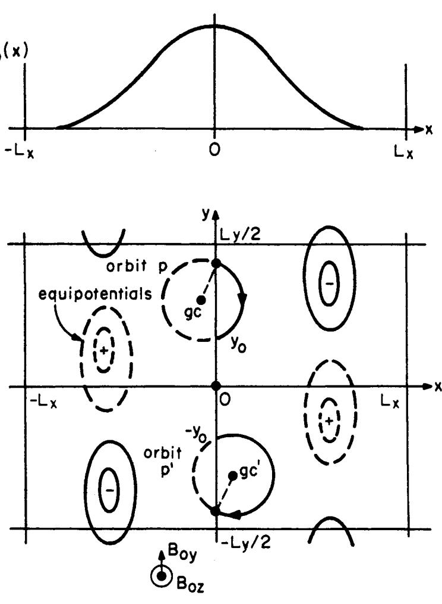  
Figure 14-7a 2/d model for inversion symmetry. Particle motion is followed only in the region $0 < x < L _ { x }$ and $- L _ { y } / 2 < y < L _ { y } / 2$ .Potentials and particles have inversion symmetry about $x = 0 = y$ ，which is an extremum in potential and a zero in field.Equally excited drift waves propagate up and down on the left and right sides of $x = 0$ ，Theresult is no wall and no sheath at $x = 0$ ，as desired. $\mathbf { B _ { 0 } }$ is a pseudo-vector and inverts into itself across $x = 0 = y$ (From Nevins et al.,1981.)

(i)periodic in $y$ (the wave propagation direction) (ii) open for $x > L _ { x }$ (iii) symmetric about the origin (0,0).

The later, termed inversion symmetry，was suggested by M. J. Gerver and is required for proper particle and field matching across the plane $x = 0$ Applications are given by Nevins et al. (1981). As shown in Figure 14-7a,a particle $\pmb { p }$ going out of the $x = 0$ boundary at $y = y _ { 0 }$ will be inserted as ${ \pmb p } ^ { \prime }$ at $y = - y _ { 0 }$ and $x = 0$ ，with its velocity $( x , y , z$ components） reversed. Also shown is the inversion of potential $\phi ( x , y )$ through the point $\displaystyle ( x = 0 = y )$ ）. Hence the plasma has inversion symmetry through the point $\begin{array} { r } { ( x = 0 = y , } \end{array}$ .No non-physical effects are present. No sheaths or other special effects occur at $x = 0$ since，according to the physical interpretation,no wall is there at all. One electron drift wave moves up on the left side and another,equally excited, moves down on the right side. $B _ { 0 z }$ and $\boldsymbol { B } _ { 0 y }$ invert into themselves, as $\mathbf { B }$ is a pseudo-vector. These boundary conditions could also be used at the low density end, $x = L _ { x }$ ，in which case we would have,in effect, periodic boundary conditions with period $2 L _ { x }$ . Alternatively,other boundary conditions could be used at $x = L _ { x }$ since,if the density is low enough, very few particles go out the $x = L _ { x }$ boundary and so non-physical or undesirable physical effects are not as important there. For example, Chen, Nevins, and Birdsall (1983),in modeling drift waves propagating in $y$ due to $\nabla n$ along $x$ ， chose to reflect particles at the low density end, $x = L _ { x }$ ，with no apparent difficulties.

Some care is to be taken in counting charges [i.e., accumulating charges near the grid points, $( j , k )$ ， by any kind of weightingl near the $x = 0$ plane, due to the symmetry employed. Using linear weighting,a particle at $( x , y )$ with $0 < x < \Delta x$ ，between $y$ grid points $k$ and $k + 1$ is weighted to grid points $( 0 , k )$ ， $( 0 , k + 1 )$ ， $( 1 , k )$ and $( 1 , k + 1 )$ ; its inversion "partner" (image, but same sign) is then at $- \Delta x < x < 0$ between $y$ grid points $- k$ and $- k - 1$ and must be counted at $( 0 , - k )$ $( 0 , - k - 1 )$ ， $( - 1 , - k )$ $( - 1 , - k - 1 )$ ，as sketched in Figure 14-7b.

The method of solution for the potentials follows the method of Section 14-5,given here in detail. Consider an open right boundary with inversion symmetry at the left boundary. The potential and charge density are taken to have inversion symmetry about $j = 0 = k$ , which means that

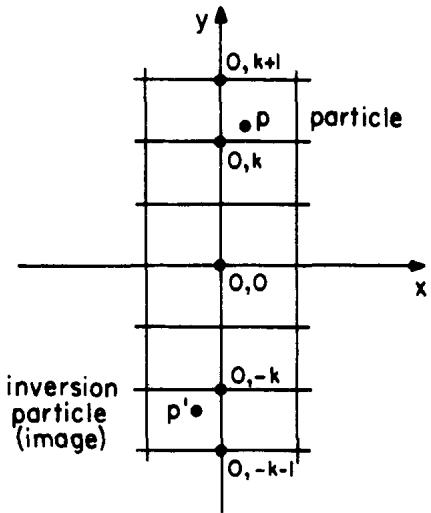  
Figure 14-7b Particle $p$ contributes to charge on the boundary $x \simeq 0$ ,and so does its inversion partner (or image,same sign) $\pmb { p } ^ { \prime }$

$$
\begin{array} { r } { \phi _ { - j , - k } = \phi _ { j , k } } \\ { \rho _ { - j , - k } = \rho _ { j , k } } \end{array}
$$

Next,the definition of the discrete Fourier transform 14-6(1） is used to show that(1） implies that

$$
\begin{array} { r } { \phi _ { - j , m } = \phi _ { j , m } ^ { * } } \\ { \rho _ { - j , m } = \rho _ { j , m } ^ { * } } \end{array}
$$

In particular, we have

$$
\begin{array} { r c l } { { \phi _ { - 1 } } } & { { = } } & { { \phi _ { 1 } ^ { * } } } \\ { { \mathrm { I m } ~ \phi _ { 0 } } } & { { = } } & { { 0 } } \\ { { \mathrm { I m } ~ \rho _ { 0 } } } & { { = } } & { { 0 } } \end{array}
$$

Hence,Poisson's equation at $j = 0 \mathrm { \ m a y }$ then be writen as

$$
2 d \phi _ { 0 } - 2 \mathrm { R e } \ \phi _ { 1 } = \rho _ { 0 }
$$

From the first of the set of 14-6(10),we have

$$
- r ^ { - 1 } \phi _ { 0 } + \phi _ { 1 } = \psi _ { 1 }
$$

Solving (4) and (5） for $\phi _ { 0 }$ ,we find

$$
\begin{array} { l } { \displaystyle \mathrm { R e } ~ \phi _ { 0 } = \frac { \rho _ { 0 } + 2 \mathrm { R e } \psi _ { 1 } } { r - r ^ { - 1 } } } \\ { \displaystyle \mathrm { I m } ~ \phi _ { 0 } = 0 } \end{array}
$$

Equation (6） provides the required boundary condition on the potential to start our march from left to right in calculating the potential from 14-6(10).

# PROBLEMS

14-7a Is momentum conserved for those particles in the region $0 < x < L _ { x }$ ？ For those in the region $- L _ { x } < x < L _ { x }$ ？

14-7b Sketch the motion of a particle crossing the $x = 0$ plane from the right for $B _ { 0 z }$ only; for $\pmb { B } _ { 0 y }$ only; for both $\pmb { B } _ { 0 z }$ and $\boldsymbol { B } _ { 0 y }$

# 14-8 ACCURACY OF FINITE-DIFFERENCED POISSON'S EQUATION

For 2d electrostatic programs, the potential $\phi ( x , y )$ is obtained from the charge density $\rho ( x , y )$ by solving Poisson's equation,14-2(2,3). The error in $\nabla ^ { 2 } \phi$ (i.e.，further terms of the Taylor expansion as in Collatz (1966), Table VI, p. 542) is

$$
- \frac { ( \Delta x ) ^ { 2 } } { 1 2 } \left( \frac { \partial ^ { 4 } \phi } { \partial x ^ { 4 } } + \frac { \partial ^ { 4 } \phi } { \partial y ^ { 4 } } \right) + \mathrm { h i g h e r ~ o r d e r ~ t e r m s }
$$

In a periodic model when a Fourier series is used, the Fourier coefficients of potential $\phi _ { l , m }$ and charge density $\rho _ { l , m }$ are related by (see Sections 8-9, 14-5) $K ^ { 2 } ( { \bf k } _ { l , m } )$ .The difference between the finite difference term $K ^ { 2 } ( \mathbf { k } )$ and $k ^ { 2 } = k _ { x } ^ { 2 } + k _ { y } ^ { 2 }$ depends on $k _ { x } \Delta x$ (as in 1d) and also on the direction of $\mathbf { k }$ . The rectangularity of the grid imposed on $\phi _ { l , m }$ is seen from the quantity $\pmb { R } _ { 5 }$ (for $\Delta x = \Delta y$ ，small $k \Delta x$ ，defined by

$$
R _ { 5 } \equiv \frac { K ^ { 2 } } { k ^ { 2 } } \approx 1 - \frac { ( k \Delta x ) ^ { 2 } } { 2 4 } \left[ \frac { k _ { x } ^ { 4 } + k _ { y } ^ { 4 } } { ( k _ { x } ^ { 2 } + k _ { y } ^ { 2 } ) ^ { 2 } } \right] + \mathrm { h i g h e r ~ o r d e r ~ t e r m s }
$$

The bracketed term is 1 along either $k$ axis,and $\%$ for $k _ { x } = k _ { y }$ ， but this factor multiplies an already small magnitude correction. At larger $k \Delta x$ ，the anisotropy in $K ^ { 2 }$ is readily evident in a contour map of $R _ { 5 }$ in which the con-tours are more square than (the desired) circular, as shown in Figure 14-8a; at a radius of $| k \Delta x | = 2 ,$ $R _ { 5 }$ varies $\pm 8$ per cent.

In order to improve $\nabla ^ { 2 } \phi$ (reduce the error term） and $K ^ { 2 } / k ^ { 2 }$ (making this more nearly 1 out to large $k \Delta x$ , and reduce the anisotropy), let us consider what might be gained by using higher-order finite-difference Laplacians; such does not necessarily mean a higher-order Poisson f.d.e.， a point brought out,e.g.,in Forsythe and Wasow (1960, p. 195). Nevertheless,let us look at a higher-order stencil for $\nabla ^ { 2 }$ as found in Collatz (1966, see Table

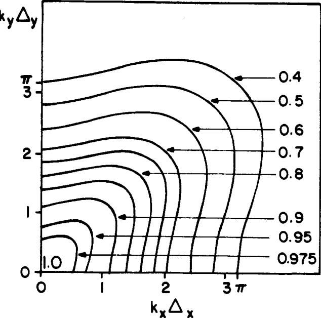  
Figure 14-8a Contours of $R _ { 5 } \equiv K ^ { 2 } ( k ) / k ^ { 2 }$ showing anisotropy of the 2d five point finite difference Laplace operator (i.e.,contours are not circles).

VI, pp. 542-546)； where $\nabla ^ { 2 } \phi _ { a , b }$ occurs, $- \rho _ { a , b }$ is inserted. One of these forms,the nine point (for $\Delta x = \Delta y$ ），

$$
\begin{array} { c } { { \displaystyle \frac { 1 } { ( \Delta x ) ^ { 2 } } \left[ \hphantom { \hphantom { - } } 8 \left( \phi _ { j + 1 , k } + \phi _ { j , k + 1 } + \phi _ { j - 1 , k } + \phi _ { j , k - 1 } \right) - 4 0 \phi _ { j , k } \right. } } \\ { { \hphantom { \frac { 1 } { ( \Delta x ) ^ { 2 } } \left[ \hphantom { - } \left( \phi _ { j + 1 , k } + \phi _ { j , k + 1 } + \phi _ { j - 1 , k + 1 } + \phi _ { j - 1 , k - 1 } + \phi _ { j + 1 , k - 1 } \right) \right. } } } \\ { { \hphantom { \frac { 1 } { ( \Delta x ) ^ { 2 } } \left[ \hphantom { - } \left( \phi _ { j + 1 , k } + \phi _ { j , k + 1 } + \phi _ { j , k } + \phi _ { j , k - 1 } \right) - 4 0 \phi _ { j , k } \right] } } } \\ { { \hphantom { \frac { 1 } { ( \Delta x ) ^ { 2 } } \left[ \hphantom { - } \left( \phi _ { j + 1 , k } + \phi _ { j , k + 1 } + \phi _ { j , k } \right) \right. } } } \end{array}
$$

was used by Birdsall and Fuss (1969). The error term in $\nabla ^ { 2 } \phi$ is now smaller than that given by (1); the charge used is now picked up at 5 points. There is litte additional cost needed to compute this form,if one is using a double Fourier transform,as $\phi$ and $\pmb { \rho }$ are easily picked up at $j , k$ and $j \pm 1 , k \pm 1$ points. A contrast between the forces derived from 5 and 9 point stencils is given in Figure 14-4e. The end result is a slower decay of $K ^ { 2 } / k ^ { 2 }$ than in (2),that leads to a more isotropic behavior out to $\theta _ { x } \approx 2$ as we desire; at a radius of 2, $R _ { 9 }$ varies by $\pm 4$ per cent.

If we make the step $\rho \longrightarrow \phi$ via Fourier series, then we are free to invent and use compensation for the decay and anisotropy of $K ^ { 2 } / k ^ { 2 }$ . Indeed,we may simply obtain $\phi ( k )$ from $\rho ( k ) / k ^ { 2 }$ ； however, this choice implies a nonlocal finite-difference algorithm, somewhat defeating this choice,as discussed in Appendix E.

Lastly,lest we focus too closely on the accuracy of just this one step, $\rho \to \phi$ ， remember that we seek over-all accuracy in going through the four steps $\mathbf { x } \longrightarrow \rho \longrightarrow \phi \longrightarrow \mathbf { E } \longrightarrow \mathbf { F }$ ，To be sure, the five-point Poisson has quadratic error (generally acceptable） and the nine-point Poisson has less error. However,we have yet to find the error in the form used for the step $\phi  \mathbf { E }$ If the latter error compensates for the error in the step $\rho \to \phi$ using the five point Laplacian (and this may occur)，then we may drop the "better" ninepoint Poisson.

# 14-9 ACCURACY OF FINITE-DIFFERENCEDGRADIENT OPERATOR

Once $\phi$ is obtained from $p$ , then in 2d, E is obtained from 14-2(4 and 5)． The components $E _ { x }$ and $E _ { y }$ are initially written using the common two-point difference form 14-2(5), with $\phi$ locations shown in Figure 14-2c. The error in $\partial \phi / \partial x$ is $- 1 / 6 ( \Delta x ) ^ { 2 } \partial ^ { 3 } \phi / \partial x ^ { 3 }$ For a 2d periodic system, using a Fourier series, the two-point finite-difference gradient operator may be represented by

$$
\mathbf { E } ( \mathbf { k } ) = - \mathbf { \nabla } _ { i } \left[ \hat { \mathbf { x } } k _ { x } \operatorname { d i f } \left( k _ { x } \Delta x \right) + \hat { \mathbf { y } } k _ { y } \operatorname { d i f } \left( k _ { y } \Delta y \right) \right] \phi ( k \nu )
$$

The error here is worth investigating further both in magnitude and angle; the latter may be more significant than the errors found with the Poisson

equation differencing. We start with the two point form,and then introduce the four and six point differencing suggested by Boris (197Oa)，with additional analysis from Langdon (1970,unpublished).

The two-point difference form given above produces

$$
\pmb { \mathrm { E } } ( \mathbf { k } ) = - \mathbf { \nabla } i \kappa _ { 2 } \phi ( \mathbf { k } )
$$

The error is found from

$$
\begin{array} { l } { \displaystyle \frac { \kappa _ { x 2 } } { k _ { x } } = \mathrm { d i f } ( k _ { x } \Delta x ) } \\ { \displaystyle \approx 1 - \frac { 1 } { 6 } ( k _ { x } \Delta x ) ^ { 2 } + \frac { 1 } { 1 2 0 } ( k _ { x } \Delta x ) ^ { 4 } + \cdot \cdot \cdot } \end{array}
$$

At $k _ { x } \Delta x = \pi / 3$ or $\lambda = 6 \Delta x$ ，the error term is O.17. In 1d, this magnitude error in $\boldsymbol { \nabla } \phi$ could be compensated for by simply multiplying each $\phi _ { k }$ by $1 / \mathsf { d i f } \left( k \Delta x \right)$ ； in 2d and 3d this simple compensation is not possible,as errors in $E _ { x }$ and $E _ { y }$ have different dependence on $\mathbf { k }$ ； that is, the corrected $\phi$ which produces accurate $E _ { x }$ will produce very poor $E _ { y }$ and $E _ { z }$ fields. Changing $\phi$ affects only the magnitude of $\pmb { \mathrm { \delta } }$ ； in addition there is a direction error, obtained from the sine of the angle between $\mathbf { k }$ and $\pmb { \kappa } _ { 2 }$ ，

$$
\begin{array} { l } { { \cal A } _ { 2 } \equiv \sin \theta _ { 2 } \equiv \frac { \left| { \bf k } \times \kappa _ { 2 } \right| } { \left| { \bf k } \right| \left| \kappa _ { 2 } \right| } } \\ { = \frac { \theta _ { x } \theta _ { y } \left| \mathrm { d i f } \theta _ { y } - \mathrm { d i f } \theta _ { x } \right| } { ( \theta _ { x } ^ { 2 } + \theta _ { y } ^ { 2 } ) ^ { 1 / 2 } ( \theta _ { x } ^ { 2 } \mathrm { d i f } ^ { 2 } \theta _ { x } + \theta _ { y } ^ { 2 } \mathrm { d i f } ^ { 2 } \theta _ { y } ) ^ { 1 / 2 } } } \end{array}
$$

which is shown in Figure $1 4 . 9 \textmu$ $\pmb { A } _ { 2 }$ is 0.3 at $\theta _ { x } \approx 2 , \theta _ { y } \approx 0 . 7 5$ (meaning a direction error of O.3 radians,17.5 degrees,which is rather large) and is 0.05 at $\theta _ { x } \approx 1 , \theta _ { y } \approx 0 . 5$ At small $\theta _ { x } , \theta _ { y }$ ，

$$
A _ { 2 } \approx \frac { 1 } { 6 } \frac { | k _ { x } k _ { y } | } { k _ { x } ^ { 2 } + k _ { y } ^ { 2 } } \mid ( k _ { y } \Delta y ) ^ { 2 } - ( k _ { x } \Delta x ) ^ { 2 } |
$$

In a 3d cubic lattice, with $k _ { x } \Delta x , k _ { y } \Delta y , k _ { z } \Delta z$ all less than $\pi / 3$ , the maximum two-point direction error is O.O7 radians, a 7 per cent relative error.

Let us move on to a six-point difference scheme (in 2d),and ten-point (in 3d). Much greater accuracy can be obtained without shifting the potential onto the half-integral grid. By going to a six-point formula (in 2d)，one acquires the freedom to choose one parameter after all symmetry requirements are met. This parameter is adjusted to cancel the quadratic terms in the direction error. The resultant difference scheme,using the 2d grid of Figure 14-9b,is

$$
E _ { x 6 } = - \frac { 1 } { 3 } \left( \frac { 1 } { 2 } \frac { \phi _ { b } - \phi _ { a } } { 2 \Delta x } + 2 \frac { \phi _ { d } - \phi _ { c } } { 2 \Delta x } + \frac { 1 } { 2 } \frac { \phi _ { f } - \phi _ { e } } { 2 \Delta x } \right)
$$

The coeffcients $( 1 / 2 , 2 , \ : 1 / 2 )$ are independent of $\Delta x / \Delta y$ . Using the $e$ notation

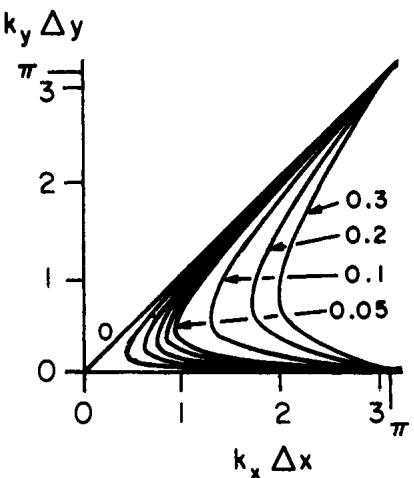  
Figure 14-9a Direction error $\pmb { A } _ { 2 }$ for two-point gradient difference,with contours of $A _ { 2 } = 0$ ， 0.01,0.02,0.03,0.04,0.05,0.1,0.2,0.3. The contours reflect about the $4 5 ^ { \circ }$ line $( A _ { 2 } = 0 )$ ，

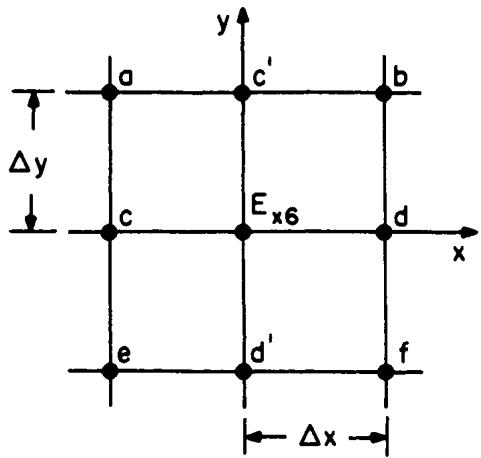  
Figure 14-9b Grid used for six-point difference scheme in 2d. $E _ { x }$ is obtained from the 6 points $a - f$ $E _ { y }$ requires using points $a , e , c ^ { \prime } , d ^ { \prime } , b , f$ . Hence 8 points are used in ${ \bf E } = - \nabla \phi$

defined by

$$
e _ { x } ^ { \alpha } \ \phi _ { j , k , l } \equiv \phi _ { j + \alpha , k , l }
$$

in 2d, produces

$$
E _ { x 6 } = - \frac { 1 } { 3 } \frac { e _ { x } ^ { 1 } - e _ { x } ^ { - 1 } } { 2 \Delta x } \left( \frac { e _ { y } ^ { 1 } } { 2 } + 2 + \frac { e _ { y } ^ { - 1 } } { 2 } \right) \phi _ { j , k }
$$

with Fourier representation

$$
\kappa _ { x 6 } = k _ { x } \mathrm { d i f } \theta _ { x } \left( \frac { 2 + \cos \theta _ { y } } { 3 } \right)
$$

For small $\theta _ { x }$ and $\theta _ { y }$ ,this is

$$
\kappa _ { 6 } \approx { \bf k } \left( 1 - \frac { \theta _ { x } ^ { 2 } + \theta _ { y } ^ { 2 } } { 6 } \right) + O \left( k ^ { 5 } \right)
$$

showing no anisotropy up to order $k ^ { 5 }$ ，which is very good. The direction error is

$$
A _ { 6 } = \frac { \theta _ { x } \theta _ { y } \left| \mathsf { d i f } \theta _ { y } \left( \frac { 2 + \cos \theta _ { x } } { 3 } \right) - \mathsf { d i f } \theta _ { x } \left( \frac { 2 + \cos \theta _ { y } } { 3 } \right) \right| } { ( \theta _ { x } ^ { 2 } + \theta _ { y } ^ { 2 } ) ^ { | \mathcal { H } } \left[ \theta _ { x } ^ { 2 } \mathsf { d i f } ^ { 2 } \theta _ { x } \left( \frac { 2 + \cos \theta _ { y } } { 3 } \right) ^ { 2 } + \theta _ { y } ^ { 2 } \mathsf { d i f } ^ { 2 } \theta _ { y } \left( \frac { 2 + \cos \theta _ { x } } { 3 } \right) ^ { 2 } \right] ^ { | \mathcal { H } | } }
$$

which is plotted in Figure $1 4 - 9 0$ at $\theta _ { x } \approx 2 , \theta _ { y } \approx 1$ ， ${ A _ { 6 } } \approx 0 . 0 5$ . For small $\theta _ { x }$ and $\theta _ { y }$ ，

$$
A _ { 6 } \approx \frac { 1 } { 1 8 0 } \frac { \theta _ { x } \theta _ { y } } { \theta _ { x } ^ { 2 } + \theta _ { y } ^ { 2 } } \mid \theta _ { y } ^ { 4 } - \theta _ { x } ^ { 4 } \mid
$$

This is a large reduction from the two-point and four-point error. The largest error in the region $\operatorname* { m a x } ( \theta _ { x } , \theta _ { y } ) \leqslant \pi / 3$ ，with $\Delta x = \Delta y$ , is now only about 0.002 radians,about factor of 25 smaller than $\pmb { A } _ { 2 }$ .The improvement is much greater at larger wavelengths because of the $\big | \theta _ { y } ^ { \overline { { 4 } } } - \theta _ { x } ^ { 4 } \big |$ dependence.

The six point formula could, of course, be used with any Poisson solver; the direction error would still be decreased. Thus,using the five point

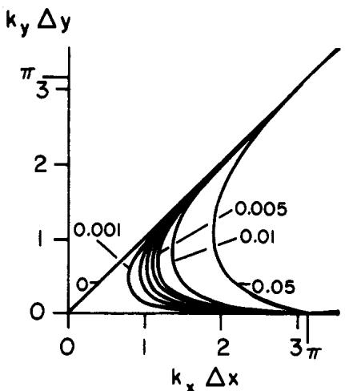  
Figure 14-9c Direction error $\pmb { A } _ { 6 }$ contours for six point difference in 2d.

Poisson-solving algorithm with the six point difference formula for the acceleration would be equivalent, through quadratic order in $\theta _ { x }$ and $\theta _ { y }$ ，to solving a problem with a modified charge profile to about the same relative accuracy as one would obtain using the original charge profile and the FFT method of Poisson solving.

Keep in mind that there is no reason to seek even more accuracy in this step of the force calculation unless it is shown possible to reduce the comparable errors which arise elsewhere.

In 3d, there are 10 points,with the additional 4 located in the $x z$ plane. The $x$ component is

$$
\begin{array} { c } { \displaystyle { E _ { x 1 0 } = - \frac { 1 } { 3 } \left( \frac { 1 } { 2 } \frac { \phi _ { b } - \phi _ { a } } { 2 \Delta x } + \frac { \phi _ { b } - \phi _ { a } } { 2 \Delta x } + \frac { 1 } { 2 } \frac { \phi _ { f } - \phi _ { e } } { 2 \Delta x } \right. } } \\ { \displaystyle { \left. + \frac { \phi _ { d } - \phi _ { c } } { 2 \Delta x } + \frac { 1 } { 2 } \frac { \phi _ { h } - \phi _ { g } } { 2 \Delta x } + \frac { 1 } { 2 } \frac { \phi _ { j } - \phi _ { i } } { 2 \Delta x } \right) } } \end{array}
$$

This has a Fourier representation

$$
\kappa _ { x 1 0 } = k _ { x } \mathrm { d i f } \theta _ { x } \left\lfloor \frac { 1 + \cos \theta _ { y } + \cos \theta _ { z } } { 3 } \right\rfloor
$$

The maximum direction error in the cubic lattice $\boldsymbol { A } _ { 1 0 }$ with $\theta _ { x } , \theta _ { y } , \theta _ { z }$ all smaller than $\pi / 3$ is 0.0075 radians.

# PROBLEM

14-9a Using higher-order difference operators requiring more than three points along an axis may also reduce errors. For example,let the gradient be obtained from four points along $x$ ，

$$
- \left[ \frac { \alpha ( \phi _ { j + 1 } - \phi _ { j - 1 } ) } { 2 \Delta x } + \frac { ( 1 - \alpha ) ( \phi _ { j + 2 } - \phi _ { j - 2 } ) } { 4 \Delta x } \right]
$$

Show that the Fourier representation is

$$
i k _ { x } [ \alpha \mathrm { d i f } k _ { x } \Delta x + ( 1 - \alpha ) \mathrm { d i f } 2 k _ { x } \Delta x ]
$$

which,for $\alpha = 4 / 3$ and small $k _ { x } \Delta x$ ,is

$$
i k _ { x } \left[ 1 - \frac { 1 } { 3 0 } ( k _ { x } \Delta x ) ^ { 4 } + \cdot \cdot \cdot \right]
$$

Show that the angle error in 2d for this eight point scheme,for small $k \Delta x$ ,is $6 A _ { 6 }$ ，but smaller than $\pmb { A } _ { 2 }$ and $\pmb { A _ { 4 } }$

# 14-10 POISSON'S EQUATION FINITE-DIFFERENCED IN CYLINDRICAL COORDINATES r, r-z, r-0

Use of cylindrical coordinates is often desired. This section presents a method of obtaining finite difference equations for fields and potentials in $\left( r \right) , \left( r , z \right)$ ,and $( r , \theta )$ relating $\mathbf { E } , \phi$ ,and $\pmb { \rho }$ which has been found powerful in many applications involving partial differential equations with conservation properties (here, conservation of charge and flux). Difficulties with weighting or divergence as $r \to 0$ are avoided.

This method permits unequal spacing of grid points in $r$ ,may be extended to unequal spacing in $\pmb \theta$ or $z$ , leads to symmetric matrices in $\phi$ ，has no divergence at $\boldsymbol r = 0$ ，and preserves the flux integral exactly. The same method may be applied to spherical coordinates.

Weightings for particles and fields are given in the next section.

# (a)ronly

In 1d,radius only (no $\theta , z$ variations), let the grid quantities be spaced and indexed (using index $j$ ）as shown in Figure 14-10a. The particles are cylindrical shells uniform along z. Let the charges of the particles be assigned to the grid points $j$ using a weighting which guarantees charge conservation exactly,

$$
\sum _ { i = 0 } ^ { N } q _ { i } = q _ { \mathrm { t o t a l } } = \sum _ { j = 0 } ^ { N _ { r } - 1 } \mathrm { Q } _ { j }
$$

Using Gauss' law guarantees flux conservation. Applied at the cylindrical surface $j = \%$ ， Gauss’ law produces (in rationalized cgs units,or mks with $\epsilon = 1 \mathrm { \check { \Omega } }$ ） the radial electric field from the charges,as

$$
\ Q _ { 0 } = 2 \pi r _ { \% } E _ { \% }
$$

where $r _ { j + \ast }$ is some radius in the interval, such as $^ { 1 / 2 } ( r _ { j + 1 } + r _ { j } )$ , and between the $j = 1 / 2 , 3 / 2$ surfaces,

$$
\mathrm { Q } _ { 1 } = 2 \pi r _ { 3 / 2 } E _ { 3 / 2 } - 2 \pi r _ { 1 / 2 } E _ { 1 / 2 }
$$

and so on. In order to obtain an equation in $\phi$ , use single cell differencing

$$
E _ { j + \imath _ { i } } = - \frac { \phi _ { j + 1 } - \phi _ { j } } { \Delta r _ { j + \imath _ { j } } }
$$

where $\Delta r _ { j + 1 / _ { 2 } } \equiv r _ { j + 1 } - r _ { j }$ ，so that Gauss’ law reads

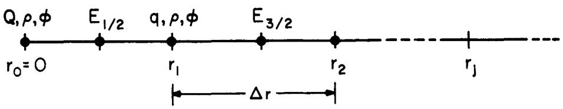  
Figure 14-10a Location of grid quantities in a ld radial grid,index $j = 0 , 1 , 2 , \dots$ Theradial spacing need not be uniform.

$$
\mathbb { Q } _ { j } = - 2 \pi r _ { j + 1 / _ { 2 } } \frac { \phi _ { j + 1 } - \phi _ { j } } { \Delta r _ { j + 1 / _ { 2 } } } + 2 \pi r _ { j - 1 / _ { 2 } } \frac { \phi _ { j } - \phi _ { j - 1 } } { \Delta r _ { j - 1 / _ { 2 } } }
$$

The charge density is obtained from $\rho _ { j } = 0 _ { j } / V _ { j }$ . The volumes are $\textstyle V _ { j } \equiv$ $\pi \left( \Delta r ^ { 2 } \right) _ { j }$ ,where

$$
\begin{array} { l } { { ( \Delta r ^ { 2 } ) _ { j } = r _ { j + 1 / _ { j } } ^ { 2 } - r _ { j - 1 / _ { z } } ^ { 2 } } } \\ { { ( \Delta r ^ { 2 } ) _ { 0 } = r _ { 1 / _ { z } } ^ { 2 } } } \end{array}
$$

Equation (5） leads to a three-point finite difference form of Poisson's equation, as

$$
\begin{array} { l l } { \rho _ { j } = - \displaystyle \frac { 2 r _ { j + \backslash j _ { j } } } { ( \Delta r ^ { 2 } ) _ { j } } \displaystyle \frac { \phi _ { j + 1 } - \phi _ { j } } { \Delta r _ { j + \backslash j _ { j } } } + \frac { 2 r _ { j - \backslash j _ { j } } } { ( \Delta r ^ { 2 } ) _ { j } } \displaystyle \frac { \phi _ { j } - \phi _ { j - 1 } } { \Delta r _ { j - \backslash j _ { j } } } \qquad j > 0 } \\ { \rho _ { 0 } = - \displaystyle \frac { 2 r _ { \backslash j _ { } } } { ( \Delta r ^ { 2 } ) _ { 0 } } \displaystyle \frac { \phi _ { 1 } - \phi _ { 0 } } { \Delta r _ { \backslash j _ { } } } } \end{array}
$$

See Problem 14-9a for the result for uniform $\Delta r$ ．As in all purely radial models, $E _ { r } ( a )$ depends only on the net charge enclosed within $r \leqslant a$ and is unaffected by the charges at $r > a$ . In the absence of a line charge at the origin, $E _ { 0 } = 0$

#

In $2 0 ~ r { \cdot } z$ coordinates (no $\pmb \theta$ variations),let the cells appear as in Figure 14-10b,with grid quantities located as shown,with indices $j , k$ . Let $\Delta z$ be uniform. The particles are rings. For the volume shown by the dashed lines

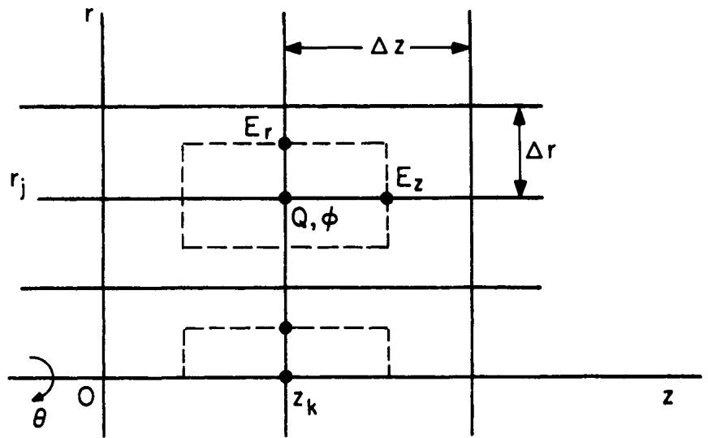  
Figure 14-1ob Location of grid quantities and Gauss' law volumes in a $^ { 2 0 } r { \cdot } z$ grid,with indices $j , k$

centered on $( r _ { j } , z _ { k } )$ ,Gauss’ law is

$$
\begin{array} { r l } & { \mathrm { Q } _ { j , k } = 2 \pi r _ { j + \backslash j } \Delta z E _ { r , j + \backslash j _ { 2 } , k } - 2 \pi r _ { j - \backslash j _ { 2 } } \Delta z E _ { r , j - \backslash j _ { 2 } , k } } \\ & { \mathrm { ~ \ ~ \ } + \pi ( r _ { j + \backslash j _ { 2 } } ^ { 2 } - r _ { j - \backslash j _ { 2 } } ^ { 2 } ) ( E _ { z , j , k + \backslash j _ { 2 } } - E _ { z , j , k - \backslash j _ { 2 } } ) } \end{array}
$$

At the origin $( j = 0 )$ ，

$$
\mathsf Q _ { 0 , k } = 2 \pi r _ { 1 / _ { 2 } } \Delta z E _ { r , 1 / _ { 2 } , k } + \pi r _ { 1 / _ { 2 } } ^ { 2 } ( E _ { z , 0 , k + 1 / _ { 2 } } - E _ { z , 0 , k - 1 / _ { 2 } } )
$$

The charge density is obtained from $\rho _ { j , k } = \mathrm { Q } _ { j , k } / V _ { j , k }$ ， where

$$
V _ { j , k } \equiv \pi \left( \Delta r ^ { 2 } \right) _ { j } \Delta z
$$

so that $\rho _ { j , k } =$

$$
\frac { 2 . } { \left( \Delta r ^ { 2 } \right) _ { j } } \left( r _ { j + \ast _ { j } } E _ { r , j + \ast _ { 2 } , k } - r _ { j - \ast _ { 2 } } E _ { r , j - \ast _ { 2 } , k } \right) + \frac { E _ { z , j , k + \ast _ { 2 } } - E _ { z , j , k - \ast _ { 2 } } } { \Delta z }
$$

Then, using $E _ { r }$ from (4) and $E _ { z }$ as

$$
E _ { z , j , k + 1 / _ { 2 } } = - \frac { \phi _ { j , k + 1 } - \phi _ { j , k } } { \Delta z }
$$

we obtain a five-point finite-difference form of Poisson's equation in $\phi _ { j , k }$ ,as

$$
\begin{array} { l } { \displaystyle { \boldsymbol { \cdot } \rho _ { j , k } = \frac { 2 r _ { j + 1 j } } { ( \Delta r ^ { 2 } ) _ { j } \Delta r _ { j + 1 j _ { \perp } } } \left( \phi _ { j + 1 , k } - \phi _ { j , k } \right) - \frac { 2 r _ { j - 1 j } } { ( \Delta r ^ { 2 } ) _ { j } \Delta r _ { j - 1 j _ { \perp } } } \left( \phi _ { j , k } - \phi _ { j - 1 , k } \right) } } \\ { \displaystyle { + \frac { 1 } { \Delta z ^ { 2 } } \left( \phi _ { j , k + 1 } - 2 \phi _ { j , k } + \phi _ { j , k - 1 } \right) } \qquad j > 0 \qquad ( } \end{array}
$$

$\rho _ { 0 , k }$ is obtained from $Q _ { 0 , k } / V _ { 0 , k }$ ， which produces

$$
- \rho _ { 0 , k } = \frac { 2 r _ { \gamma _ { j } } } { \left( \Delta r ^ { 2 } \right) _ { 0 } } \frac { \phi _ { 1 , k } - \phi _ { 0 , k } } { \Delta r _ { 1 _ { j } } } + \frac { \phi _ { 0 , k + 1 } - 2 \phi _ { 0 , k } + \phi _ { 0 , k - 1 } } { \Delta z ^ { 2 } }
$$

Again, in the absence of a line charge at $r = 0$ ， $E _ { r , 0 , k } = 0$

# (c)r-0

In 2d $r { \mathord { \cdot } } { \pmb { \theta } }$ coordinates (no z variation） let the cels and grid quantities appear as in Figure 14-1Oc. The particles are rods. Let $\Delta \pmb \theta$ be uniform. For the volume shown by the dashed lines centered on $( r _ { j } , \phi _ { k } )$ ,Gauss' law is

$$
\mathrm { Q } _ { j , k } = \Delta \theta \left( r _ { j + 1 ; j } E _ { r , j + 1 ; j , k } - r _ { j - 1 ; j } E _ { r , j - 1 ; j , k } \right) + \Delta r _ { j } \left( E _ { \theta , j , k + 1 ; j } - E _ { \theta , j , k - 1 ; j } \right)
$$

where $\Delta r _ { j } \equiv r _ { j + 1 / _ { 2 } } - r _ { j - 1 / _ { 2 } }$ Charge density is obtained from $\rho _ { j , k } = \mathsf { Q } _ { j , k } / V _ { j , k }$

where

$$
V _ { j , k } = \frac { \Delta \theta } { 2 } \left( \Delta r ^ { 2 } \right) _ { j }
$$

so that $- \rho _ { j , k } \left( \Delta r ^ { 2 } \right) _ { j }$

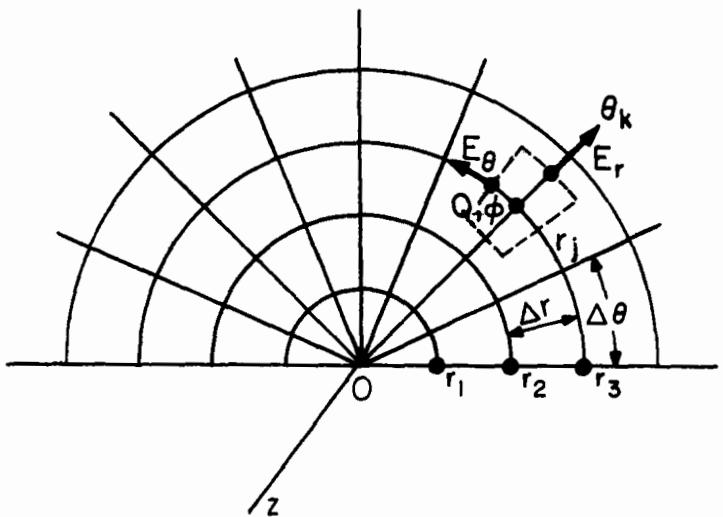  
Figure 14-10c Location of grid quantities and Gauss’ law volumes in a 2d $r { \cdot } \pmb { \theta }$ grid, with indices $^ { j , k }$

$$
= 2 \ : ( { r _ { j + \nu _ { j } } } { E _ { r , j + \nu _ { i } , k } } - { r _ { j - \nu _ { i } } } { E _ { r , j - \nu _ { i } , k } } ) + \frac { 2 \Delta { r _ { j } } } { \Delta \theta } \ : ( { E _ { \theta , j , k + \nu _ { i } - k } } { E _ { \theta , j , k - \nu _ { i } } } )
$$

Using $E _ { r }$ from (4) and $\scriptstyle { E _ { \theta } }$ as

$$
E _ { \theta , j , k + 1 / _ { 2 } } = - \frac { \phi _ { j , k + 1 } - \phi _ { j , k } } { r _ { j } \Delta \theta }
$$

we obtain a five-point finite-difference form of Poisson's equation in $\phi _ { j , k }$ ,as

$$
\begin{array} { r l r } {  { - \rho _ { j , k } \ ( \Delta r ^ { 2 } ) _ { j } = \frac { 2 r _ { j + \parallel j _ { j } } } { \Delta r _ { j + \parallel j _ { j } } } \ ( \phi _ { j + 1 , k } - \phi _ { j , k } ) - \frac { 2 r _ { j - \parallel j _ { j } } } { \Delta r _ { j - \parallel j _ { j } } } \ ( \phi _ { j , k } - \phi _ { j - 1 , k } ) } } & { ( 2 } \\ & { } & { + \ \frac { 2 \Delta r _ { j } } { ( \Delta \theta ) ^ { 2 } r _ { j } } \ ( \phi _ { j , k + 1 } - 2 \phi _ { j , k } + \phi _ { j , k - 1 } ) \ j > 0 } \end{array}
$$

Near the origin, application of Gauss' law is not so obvious. Consider the $r { - } \pmb { \theta }$ grid to be a rectangular $j \cdot k$ grid extending to the origin $\scriptstyle ( r = 0 = j )$ with charges weighted by some algorithm to produce $\pmb { \rho } _ { 0 , k }$ for each $( 0 , k )$ point. In this view, for the surface at $r _ { \ast h }$ Gauss' law relates the total charge at the origin,

$$
\mathsf Q _ { 0 } \equiv \sum _ { k } \mathsf Q _ { 0 , k } = \sum _ { k } \rho _ { 0 , k } \ V _ { 0 , k }
$$

to the field near the origin

$$
\mathsf Q _ { 0 } = \sum _ { k } E _ { r , \mathscr k , k } r _ { \mathscr k } \Delta \theta
$$

The Poisson equation at the origin is given from (22) as

$$
\mathsf Q _ { 0 } = - \sum _ { k } \frac { \phi _ { 1 , k } - \phi _ { 0 } } { \Delta r _ { 1 / 2 } } r _ { 1 / 2 } \Delta \theta
$$

Thus the full Poisson equation set is (20) plus (23)． The $E _ { r , \psi , k }$ are obtained from the $\phi _ { 1 , k } , \phi _ { 0 }$ as in (23), and the $\pmb { { \cal E } } _ { \pmb { \theta } , 1 , \pmb { \ k } + 1 / 2 }$ are obtained from the $\phi _ { 1 , k }$ ， and $\phi _ { 1 , k + 1 }$ as in (19).

Because it is difficult to handle the origin well, $x { - } y$ coordinates are often preferred over $r { \cdot } \theta$ coordinates.

# PROBLEMS

14-10a It is asserted that the particle and grid charges have units of:

$r$ only charge/length, along z $r { \cdot } z$ charge $r { \cdot } \theta$ charge/length,along z

Check these assertions.

14-10b Show that (7) for constant $\Delta \boldsymbol { r }$ ,reduces to

$$
- \rho _ { j } = \ \frac { \phi _ { j + 1 } - 2 \phi _ { j } + \phi _ { j - 1 } } { ( \Delta r ) ^ { 2 } } + \frac { \phi _ { j + 1 } - \phi _ { j - 1 } } { 2 r _ { j } \Delta r }
$$

with readily recognized relation to the usual finite-difference Laplacian in $\boldsymbol { r }$ ,as found,for example,in Skollermo and Skollermo (1978),and Skollermo (1982),and to the partial differential Laplacian

$$
\frac { \partial ^ { 2 } \phi } { \partial r ^ { 2 } } + \frac { 1 } { r } \frac { \partial \phi } { \partial r } = \frac { 1 } { r } \frac { \partial } { \partial r } \left( r \frac { \partial \phi } { \partial r } \right)
$$

14-10c In differencing $E _ { \theta }$ in the last term of (18),something like $\partial E _ { \theta } / r \partial \theta \approx \Delta E _ { \theta } / r \Delta \theta$ ，the arc $r _ { j } \Delta \theta$ might be replaced by the chord $2 r _ { j } \sin ^ { \mathrm { 1 } } / 2 \Delta \theta$ In differencing $\phi$ in (19),the arc $r _ { j } \Delta \theta$ might be replaced similarly.Using both replacements changes $( \Delta \theta ) ^ { 2 }$ in (20） to $( 2 \sin ^ { 1 } / _ { 2 } \Delta \bar { \theta } ) ^ { 2 }$ Show that thesereplacements handlea uniform feldcorrectly，with potentiallike $\phi _ { j , k } =$ $- E _ { 0 } r _ { j } \cos \theta _ { k }$ for $\rho = 0$

# 14-11 WEIGHTING IN CYLINDRICAL COORDINATESFOR PARTICLES AND FIELDS

We now propose methods for weighting in cylindrical coordinates $r { \cdot } \pmb { \theta }$ ， with methods for $r$ and $r \mathord { \cdot } z$ left to .the reader. One method for particle weighting is to weight the charge $\pmb { q } _ { i }$ bilinearly in $\left( r - \theta \right)$ to the nearest four grid points, similar to that done in rectangular coordinates 14-2(1). Another method is bilinear in $( r ^ { 2 } , \theta )$ ，or area weighting,as shown in Figure 14-11a (the $r \cdot \theta$ version of 14-2(b)). Let the particle be located at $( r _ { i } , \pmb \theta _ { i } )$ .The fraction of the charge $\pmb { q } _ { i }$ assigned to point $\pmb { A } \left( \pmb { r } _ { j } , \pmb { \theta } _ { k } \right)$ is (area a)/(areas a $+ \ b$ $+ \textsf { c } + \mathsf { d } ) = f _ { j , k }$ , leading to

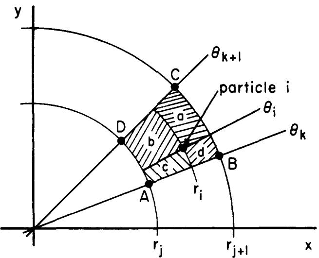  
Figure 14-1la Particle weighting to $r { \cdot } \theta$ grid points,using area ratio ${ \mathfrak { a } } / ( { \mathfrak { a } } { \ } + { \mathfrak { b } } { \ } + { \mathfrak { c } } { \ } + { \mathfrak { d } } )$ for assignment to $\pmb { A }$ ,etc.,interpreted as area or $" r ^ { 2 } "$ weighting.

$$
\mathsf Q _ { \boldsymbol A } = \mathsf Q _ { j , \boldsymbol k } = q _ { i } \frac { ( r _ { j + 1 } ^ { 2 } - r _ { i } ^ { 2 } ) ( \theta _ { \boldsymbol k + 1 } - \theta _ { i } ) } { ( r _ { j + 1 } ^ { 2 } - r _ { j } ^ { 2 } ) ( \theta _ { \boldsymbol k + 1 } - \theta _ { \boldsymbol k } ) } = q _ { i } f _ { j , \boldsymbol k }
$$

and the rest follow. Note that these weightings are valid for $r _ { i } < r _ { 1 }$ ，where grid points A and $\mathbf { D }$ are at the origin. Using the view given at the end of the last section, $\mathtt { Q } _ { 0 , k }$ and $\mathsf Q _ { 0 , k + 1 }$ are obtained in the same way and hence, $\mathsf Q _ { 0 }$ ,as needed in 14-10(23).

The weighting of the $E _ { r }$ and $E _ { \theta }$ fields to the particles is done in the same manner. However, the fields we have obtained are not at the grid points, but roughly halfway between. One suggestion is that $E _ { r }$ and $E _ { \theta }$ be formed at the grid points by an unweighted average; i.e.,

$$
E _ { r , j , k } \equiv \frac { E _ { r , j - 1 / j , k } + E _ { r , j + 1 / 2 , k } } { 2 }
$$

Then the bilinear or area weights as above are used to weight these $E _ { r }$ and $E _ { \theta }$ to the particle. That is, using Figure 14-1la and (1） we find at particle $i$ ，

$$
E _ { r } = E _ { r } ( A ) f _ { j , k } + E _ { r } ( B ) f _ { j + 1 , k } + E _ { r } ( C ) f _ { j + 1 , k + 1 } + E _ { r } ( D ) f _ { j , k + 1 }
$$

A second suggestion is to use a flux weighted average,

$$
r _ { j } E _ { r , j , k } \equiv \frac { r _ { j + 1 j _ { 2 } } E _ { r , j + 1 / _ { 2 } , k } + r _ { j - 1 / _ { 2 } } E _ { r , j - 1 / _ { 2 } , k } } { 2 }
$$

At the origin $\scriptstyle r = 0 = j$ ，we need $E _ { r }$ and $E _ { \theta }$ for weighting $\mathbf { E }$ to those particles having $\boldsymbol { r } _ { i } \leqslant \boldsymbol { r } _ { 1 }$ . One suggestion is to use

$$
E _ { r , 0 , k } = E _ { r , 1 / 2 , k } \qquad \mathrm { a n d } \qquad E _ { \theta , 0 , k + 1 / _ { 2 } } = E _ { \theta , 1 , k + 1 / _ { 2 } }
$$

This choice works, for example,for a uniform vacuum field,as discussed in Problem 14-10c.

Note that (4) produces

$$
r _ { j + 1 } E _ { r , j + 1 , k } - r _ { j } E _ { r , j , k } = \frac { \mathbf { Q } _ { j + 1 , k } + \mathbf { Q } _ { j , k } } { 4 \pi }
$$

which is a form of $\nabla \cdot \mathbf { E } = \rho$ . Equation (6) may be integrated to obtain $E _ { r }$ in a cylindrically symmetric system much as using the trapezoidal rule in a linear system. Indeed, the spherically symmetric version of (6） was used (Langdon,1979,unpublished） to obtain $E _ { r }$ in a spherically symmetric sys-tem,which replaced FIELDS in ES1.

# PROBLEMS

14-11a Check that the weights in (1） sum to unity: ${ \sf Q } _ { A } + { \sf Q } _ { B } + { \sf Q } _ { C } + { \sf Q } _ { D } = q _ { i }$ Repeat for bilinear weighting.

14-11b Obtain (6) from (4).

14-11c Using the $" r ^ { 2 } "$ weights in (1),plot the fraction assgned to $r _ { j }$ as the particle position $r _ { j }$ varies from $r _ { j - 1 }$ to $r _ { j + 1 }$ .What is the implied shape factor $S \left( r \right)$ ？What is the shape factor $S \left( \theta \right) ?$ Repeat for bilinear weighting.

# 14-12 POSITION ADVANCE FOR CYLINDRICAL COORDINATES

The velocity advance in vector form given in Chapter 4 is usable in rectangular and other coordinate systems. However, the position advance in cylindrical coordinates poses problems as the particle passes close to the origin. For example,with a circular orbit,using $\Delta \theta = ( \nu _ { \theta } \Delta t ) / r$ produces very large $\Delta \pmb \theta$ as $r \to 0$ .One solution,following Boris (1970b),is to use $\nu _ { r }$ and $\nu _ { \pmb { \theta } }$ to make the particle advance in $( x , y )$ ，and then calculate the new $r$ and $\pmb \theta$ The advance in $z$ is the same as for rectangular coordinates. The particle at $( r _ { 1 } , \pmb { \theta } _ { 1 } )$ is to be moved with $v _ { r }$ and $\nu _ { \theta }$ known at $( t _ { 1 } + \Delta t / 2 )$ as shown in Figure 14-12a, using the $x '$ axis along $r _ { 1 }$ (and $\pmb { \nu } _ { r _ { 1 } } .$ ）

$$
\begin{array} { l l } { { x _ { 2 } ^ { \prime } = r _ { 1 } + { \nu _ { r } } _ { 1 } \Delta t } } & { { y _ { 2 } ^ { \prime } = { \nu _ { \theta } } _ { 1 } \Delta t } } \\ { { \ } } & { { } } \\ { { r _ { 2 } = \sqrt { { x ^ { \prime } } _ { 2 } { } ^ { 2 } + { y ^ { \prime } } _ { 2 } { } ^ { 2 } } \geqslant 0 } } & { { \theta _ { 2 } = \theta _ { 1 } + \alpha } } \end{array}
$$

producing

Next, it is necessary to refer $\mathbf { v } _ { 2 }$ to the new angle $\pmb { \theta } _ { 2 }$ from the coordinate rotation $\mathbf { \Delta } _ { \mathbf { y } }$ preserved) prime to double prime, still at time $\left( t + \Delta t / 2 \right)$

$$
{ \left[ \begin{array} { l } { \nu _ { r } } \\ { \nu _ { \theta } } \end{array} \right] } _ { 2 } = { \left[ \begin{array} { l l } { \cos \alpha } & { \sin \alpha } \\ { - \sin \alpha } & { \cos \alpha } \end{array} \right] } { \left[ \begin{array} { l } { \nu _ { r } } \\ { \nu _ { \theta } } \end{array} \right] } _ { 1 }
$$

where sin $\alpha = { y _ { 2 } } ^ { \prime } / r _ { 2 }$ ，cos $\alpha = x _ { 2 } { ' } / r _ { 2 }$ . If a particle stops at the axis $r _ { 2 } = 0$ ， then set cos $\alpha = 1$ ，sin $\alpha = 0$ ， making all momentum radial, as it must be for a particle to stop at the axis. This method provides full second-order accuracy due to the time centering (leap-frog) and reversibility. The cost of avoiding the errors near $\boldsymbol r = 0$ is the square root and the coordinate rotation.

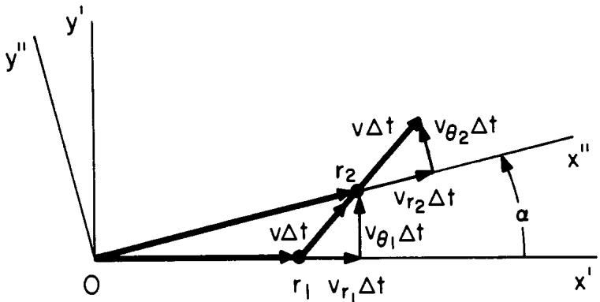  
Figure 14-12a Coordinates for position advance in cylindrical coordinates.

# PROBLEM

14-12a Show that the cylindrical integrator is time reversible. Hint: Change sign ofv and rotate v cleverly.

# 14-13 IMPLICIT METHOD FOR LARGE TIME STEPS

Characteristic time scales for collective phenomena in plasmas encom-pass many orders of magnitude. Where kinetic effects are crucial, particle simulation methods have been applied very successfully to studies of the nonlinear evolution of plasma phenomena on the faster time scales. However,for both applications and basic studies, there is increasing interest in extending simulation techniques to kinetic phenomena on slower time scales. One approach to modelling long time-scale behavior in such systems is to alter the governing equations in order to eliminate uninteresting high frequency modes. Examples include the electrostatic and Darwin field approximations in particle simulation. Other approaches are subcycling, orbit-averaging and implicit time integration, as already mentioned in Section 9-7.

The highest frequencies in plasmas are the Langmuir frequency $\omega _ { p }$ and the electron cyclotron frequency $\omega _ { c e }$ . The shortest times are the transit time for electrons or light to cross a characteristic distance. In contrast, long time scales can be set by ion inertia, electromagnetic effects,and large spatial scale lengths. The ratios of electron to ion plasma and cyclotron frequencies,and of hydromagnetic to electron transit times,are determined by the small number $Z m _ { e } / m _ { i }$ ,where $z$ is the ionic charge state. Where the dominant forces are from magnetic fields due to currents in the plasma itself, the frequencies are reduced relative to $\omega _ { p }$ by at least the ratio $c / \nu _ { e }$ ，where $\pmb { c }$ and $v _ { e }$ are light and electron speeds.

This section describes a method for implementing implicit time differencing in particle plasma codes, in which the equations for the time-advanced quan-tities are constructed directly from the particle equations of motion by lineari-zation,rather than by introducing fluid (velocity moment） equations. This section is based on the review chapter by Langdon and Barnes (1985).

# (a) Implicit Time Differencing of the Particle Equations of Motion

The first major issue is the choice of finite-differenced equations of motion for the particles which have the necessary stability at large time-step and are accurate for the low frequency phenomena to be simulated. We choose not to consider backward-biased schemes with relative errors of order $\Delta t$ . It is not expensive to achieve relative error of order $\Delta t ^ { 2 }$ ,with error $\Delta t ^ { 3 }$ in $\operatorname { I m } \omega$ , the growth/decay rate.

Several suitable schemes for time-differencing the the particles have been analyzed and applied (Cohen, Langdon, and Friedman,_1982). Here, we discuss only the $D _ { 1 }$ algorithm (Section 9-8),also called the $\overline { { 1 } }$ scheme (Barnes et al.,1983),which can be written

$$
\begin{array} { l } { \displaystyle \frac { \mathbf { x } _ { n + 1 } - \mathbf { x } _ { n } } { \Delta t } = \mathbf { v } _ { n + 1 ; } \displaystyle \frac { \mathbf { v } _ { n + 1 / _ { 2 } } - \mathbf { v } _ { n - 1 / _ { 2 } } } { \Delta t } = \overline { { \mathbf { a } } } _ { n } + \frac { \mathbf { v } _ { n + 1 / _ { 2 } } + \mathbf { v } _ { n - 1 / _ { 2 } } } { 2 } \times \displaystyle \frac { q \mathbf { B } _ { n } } { m c } } \\ { \displaystyle \circ } \end{array}
$$

wher

To check the accuracy of this scheme, we can derive and solve a dispersion relation for harmonic oscillations,analogous to Section 9-8,

$$
( \omega _ { 0 } \Delta t ) ^ { 2 } + \left. \frac { 2 } { z } - \frac { 1 } { z ^ { 2 } } \right. \frac { ( z - 1 ) ^ { 2 } } { z } = 0
$$

For $\omega _ { 0 } \Delta t \lesssim 1$ ,we find (Cohen, Langdon,and Friedman, 1982)

$$
\pm \mathrm { R e } \frac { \omega } { \omega _ { 0 } } = 1 - \frac { 1 1 } { 2 4 } ( \omega _ { 0 } \Delta { t } ) ^ { 2 } + \mathrm { ~ \cdot ~ } \cdot \cdot \mathrm { I m } \frac { \omega } { \omega _ { 0 } } = - \frac { 1 } { 2 } ( \omega _ { 0 } \Delta { t } ) ^ { 3 } + \cdot \cdot \cdot
$$

and an extraneous damped mode with $| z | \xrightarrow { } 1 / 2$ For $\omega _ { 0 } \Delta t > > 1$ ， the modes are heavily damped,|z|-(ωo△t)-2/3

Equation (1) can be solved exactly for ${ \pmb { \gamma } } _ { \pmb { \mu } + { \mu } }$ by adding ${ \sqrt [ { 1 } ] { 2 \widetilde { \mathbf { a } } _ { n } } } \Delta t$ t0 ${ \pmb { \gamma } } _ { \pmb { \eta } - { \ d / 2 } }$ ， doing a rotation, and again adding $1 / 2 \overline { { \pmb { a } } } _ { n } \Delta t$ . The result is

$$
{ \bf v } _ { n + 1 / _ { 2 } } = \frac { 1 } { 2 } \equiv _ { n } \Delta t + { \bf R } \cdot \left( { \bf v } _ { n - 1 / _ { 2 } } + \frac { 1 } { 2 } \equiv _ { n } \Delta t \right)
$$

where the operator $\pmb { \mathrm { R } }$ effects a rotation through angle $- 2 \tan ^ { - 1 } ( \Omega \Delta t / 2 )$ where $( \pmb { \Omega } \equiv q \ \pmb { \mathrm { B } } _ { n } / m c )$ ，and can be written

$$
\left( 1 + \theta ^ { 2 } \right) \mathbf { R } = \left( 1 - \theta ^ { 2 } \right) \mathbf { I } + 2 \theta \theta - 2 \theta \times \mathbf { I }
$$

where $\pmb { \theta } \equiv \pmb { \Omega } \Delta t / 2$ and I is the unit tensor. For small $\pmb { \Omega } \Delta t$ ，

$$
{ \bf R } \approx { \bf \nabla I } - \Omega \Delta t \times { \bf I }
$$

For large Ω△t,

$$
\mathbf { R } \approx - \mathbf { I } + \frac { 2 \Omega \Omega } { 2 \Omega } - \frac { 4 \Omega \times \mathbf { I } } { \Omega ^ { 2 } \Delta t }
$$

# (b) Direct Method with Electrostatic Fields; Solution of the Implicit Equations

The second major issue in implicit codes is the more complicated timecycle splitting. With explicit differencing，the time-cycle is split between advancing particles and fields; these calculations alternate and proceed independently. However,an implicit code must solve the coupled set of equations 8-5(1,2） and 14-2(3,5) with (1,2) or (3,4)． In all implicit schemes the future positions $\pmb { \mathrm { x } } _ { n + 1 }$ depend on the accelerations ${ \pmb a } _ { n + 1 }$ due to the electric feld ${ \bf E } _ { n + 1 }$ . But this field is not yet known,as it depends on the density $\rho _ { n + 1 }$ of particle positions $\{ \mathbf { x } _ { n + 1 } \}$ . The solution of this large system of nonlinear, coupled particle and field equations is our task here.

Historically, in the method implemented first for this solution,the fields at the new time level are predicted by solving coupled field and fluid equa-tions, in which the kinetic stress tensor is evaluated approximately from particle velocities known at the earlier time. After the fields are known, the particles are advanced to the new time level, and, if desired,an improved stress tensor is calculated and the process iterated. This moment approach has been described in detail by Denavit (1981) and Mason (1981).

The next implementation,as done here, is to predict the future electric field ${ \bf E } _ { n + 1 }$ directly by means of a linearization of the particle-feld equations. One form of this method, its implementation, and some examples verifying its performance, have been outlined by Friedman, Langdon, and Cohen (1981)． Another form is described by Barnes et al. (i983). Langdon, Cohen, and Friedman (1983) obfuscate the algorithm with great generality,and con-sider many important details,such as spatial differencing and filtering,and iterative solution of the implicit equations.

The essence of the direct method is that we work directly with the particle equations of motion and the particle/field coupling equations. These are linearized about an estimate (extrapolation） for their values at the new time level $n { + 1 }$ . The future values of $\{ \mathbf { x } , \mathbf { v } \}$ are divided into two parts:

(i） increments $\left\{ \delta \mathbf { x } , \delta \mathbf { v } \right\}$ which depend on the (unknown） fields at the future time level $n { + 1 }$ ,and

(ii) extrapolations $\bigl \{ \mathbf { x } _ { n + 1 } ^ { ( 0 ) } , \mathbf { v } _ { n + 1 / 2 } ^ { ( 0 ) } \bigr \}$ which incorporate allother considerations to the equation of motion.

The charge density $\pmb { \rho } _ { n + 1 } ^ { ( 0 ) }$ corresponding to positions $\bigl \{ \mathbf { x } _ { n + 1 } ^ { ( 0 ) } \bigr \}$ is collected as are theco $\bar { \delta } \rho ( \{ \delta \mathbf { E } \} ) = \rho _ { n + 1 } - \rho _ { n + 1 } ^ { ( 0 ) }$ betweenthedensities obtainedafterintegration with $\mathbf { E } _ { n + 1 } ^ { ( 0 ) }$ and with the corrected field $\mathbf { E } _ { n + 1 } = \delta \mathbf { E } + \mathbf { E } _ { n + 1 } ^ { ( 0 ) }$ .These comprise the source term in Gauss' law

$$
\nabla \cdot { \bf E } _ { n + 1 } = \delta \rho ( \{ \delta { \bf E } \} ) + \rho _ { n + 1 } ^ { ( 0 ) }
$$

This_ becomes a linear eliptic equation,for $\delta \phi$ or $\phi _ { n + 1 }$ ， with non-constant coefficients.

The care with which we express the increment $\left\{ \delta \rho \right\}$ is a compromise between complexity and strong convergence (Langdon, Cohen, and Friedman, 1983; Barnes et al.， 1983). If necessary, $\delta \rho$ may be evaluated rigorously as derivatives of 8-5(1), ["strict differencing" (Langdon, Cohen,and Friedman, 1983,sec. 4)],or as simplified difference representations of 8-5(1） [as in Langdon, Cohen, and Friedman, 1983,sec. 3.4; Barnes et al.，1983] for each species.

# (c) A One-Dimensional Realization

The direct implicit method is ilustrated in the following one-dimensional unmagnetized electrostatic example. The position $x _ { n + 1 }$ of a particle at time level $t _ { n + 1 }$ , as given by an implicit time integration scheme,can be written as

$$
x _ { n + 1 } = \beta \Delta t ^ { 2 } a _ { n + 1 } + { \tilde { x } } _ { n + 1 }
$$

where $\beta > 0$ is a parameter controlling implicitness and is $1 / 2$ for the $D _ { 1 }$ algorithm; $\tilde { x } _ { n + 1 }$ ， the position obtained from the equation of motion with the acceleration $a _ { n + 1 }$ omitted, is known in terms of positions，velocities and accelerations at time $t _ { n }$ and earlier. Eliminating $\nu _ { n + 1 / 2 }$ between (1）and (2) we find

$$
\tilde { x } _ { n + 1 } = x _ { n } + \nu _ { n - 1 / 2 } \Delta t + \frac { 1 } { 2 } \bar { a } _ { n - 1 } \Delta t ^ { 2 }
$$

In its most obvious form, which we adopt for this example, the direct implicit algorithm is_derived by linearization of the particle positions relative to $\tilde { x } _ { n + 1 }$ ,that is, $E _ { n + 1 } ^ { ( 0 ) } = 0$ and therefore $x _ { n + 1 } ^ { ( 0 ) } = \tilde { x } _ { n + 1 }$ P

At the grid point located at $X _ { j } \equiv j \Delta x$ ， the charge density $\tilde { \rho } _ { j , n + 1 }$ is formed as in 8-5(1） by adding the contribution of the simulation particle at positions $\{ \tilde { x } _ { i , n + 1 } \}$

$$
\begin{array} { r } { \tilde { \rho } _ { j , n + 1 } = \sum q _ { i } S ( X _ { j } - \tilde { x } _ { i , n + 1 } ) } \end{array}
$$

If we expand $s$ in 8-5(1） with respect to position, then

$$
\delta \rho _ { n + 1 } = - \sum _ { i } q _ { i } \delta x _ { i } S ^ { \prime } ( X _ { j } - \tilde { x } _ { i , n + 1 } )
$$

with $\delta x _ { i } = x _ { i , n + 1 } - \tilde { x } _ { i , n + 1 }$ and $S ^ { \prime } ( X ) \equiv d S / d X$ . In terms of $E _ { n + 1 }$ , the particle accelerationis obtained from 8-5(2)evaluated at $\tilde { x } _ { n + 1 }$ ，

$$
m _ { i } a _ { i , n + 1 } = q _ { i } \Delta x \sum _ { i } E _ { j , n + 1 } S \left( X _ { j } - \tilde { x } _ { i , n + 1 } \right)
$$

Writing (13） as

$$
\begin{array} { r } { \delta \rho = - \left[ \nabla \cdot \sum q \delta \mathbf { x } S \left( \mathbf { x } - \tilde { \mathbf { x } } _ { n + 1 } \right) \right] _ { \mathbf { x } = \mathbf { X } _ { j } } } \end{array}
$$

we see that (13） is a finite-difference representation of

$$
\delta \rho = - \nabla \cdot ( \tilde { \rho } \ \delta \mathbf { x } )
$$

Hence,we have the elliptic partial differential equation

$$
- \tilde { \rho } \ = \nabla \cdot \left\{ \left[ 1 + \chi ( \mathbf { x } ) \right] \nabla \phi \right\}
$$

where $\chi ( \mathbf { x } ) = \beta \widetilde { \rho } \mathbf { \Gamma } ( \mathbf { x } ) \left( q / m \right) \Delta t ^ { 2 }$ summed over species, i.e., $\chi = \beta ( \omega _ { p } \Delta t ) ^ { 2 }$ Because of the similarity of (17） to the field equation in dielectric media,we call $\boldsymbol { \chi }$ the implicit susceptibility. Where $\omega _ { p } \Delta t$ is large,the regime we wish to access, note that $\chi > > 1$ is dominant in the right-hand-side of (17).

With the extrapolated charge density $\tilde { \rho } _ { j , n + 1 }$ and a reasonable finitedifferencerepresentationofthelinearizedimplicitcontribution $\delta \rho = - \partial ( \chi E ) / \partial x$ , the field equation in one dimension is

$$
\tilde { \rho } _ { j , n + 1 } = \frac { ( 1 + \chi _ { j + 1 / 2 } ) E _ { j + 1 / 2 , n + 1 } - ( 1 + \chi _ { j - 1 / 2 } ) E _ { j - 1 / 2 , n + 1 } } { \Delta x }
$$

Two representations of $\chi _ { j + / k }$ used here are

or

$$
\begin{array} { c } { { \chi _ { j + 1 / _ { 2 } } = \displaystyle \frac { \chi _ { j } + \chi _ { j + 1 } } { 2 } } } \\ { { \displaystyle \chi _ { j + 1 / _ { 2 } } = \operatorname* { m a x } \left( \chi _ { j } , \chi _ { j + 1 } \right) } } \\ { { \displaystyle \chi _ { j } = \Delta t ^ { 2 } \sum _ { s } \left( \beta \widetilde { \rho } _ { j , n + 1 } \frac { q } { m } \right) _ { s } } } \end{array}
$$

where

is a sum over all species index s [Langdon, Cohen, and Friedman, 1983,eqs.   
(28a,b)].In both (18) and (20), $\tilde { \rho } _ { j , n + 1 }$ is given by (12).

From $E$ at half-integer positions, form

$$
E _ { j , n + 1 } = \frac { E _ { j - \backslash j , n + 1 } + E _ { j + \backslash j , n + 1 } } { 2 }
$$

In terms of $E _ { j , n + 1 }$ ， the particle acceleration is evaluated at $\tilde { x } _ { n + 1 }$ using (14). This algorithm is the shortest implicit scheme we have seen,and is robust in the test problem reported by Langdon and Barnes (1985).

# (d) General Electrostatic Case

We return to the multidimensional case, possibly including a magnetic field imposed by external currents,showing the calculational steps to be performed starting with (1） and (2). We begin by restating the method in a more general form. The extrapolated charge density ${ \pmb \rho } _ { n + 1 } ^ { ( 0 ) }$ is evaluated as in 8-5(1),but from positions $\bigl \{ \mathbf { x } _ { n + 1 } ^ { ( 0 ) } \bigr \}$ obtained from the equation of motion with ${ \pmb a } _ { n + 1 }$ given by $\mathbf { E } _ { n + 1 } ^ { ( 0 ) }$ ,which is a guess for ${ \bf E } _ { n + 1 }$ This charge density does not correcilycorrespond totheeld $\mathbf { E } _ { n + 1 } ^ { ( 0 ) }$ ；that is $\nabla \cdot \mathbf { E } _ { n + 1 } ^ { ( 0 ) } \neq \rho _ { n + 1 } ^ { ( 0 ) }$ We wish to calculate an improved field ${ \bf E } _ { n + 1 }$ with which the particles are re-integrated to positions $\left\{ { \bf x } _ { n + 1 } \right\}$ ，whose charge density $\rho _ { n + 1 }$ does satisfy

$$
\nabla \cdot \mathbf { E } _ { n + 1 } = \rho _ { n + 1 }
$$

To this end we rewrite (22) as

$$
\begin{array} { r } { \nabla ^ { \cdot } \delta \mathbf { E } _ { n + 1 } - \delta \rho _ { n + 1 } = \nabla ^ { \cdot } \mathbf { E } _ { n + 1 } ^ { ( 0 ) } - \rho _ { n + 1 } ^ { ( 0 ) } } \end{array}
$$

where $\mathbf { E } _ { n + 1 } = \mathbf { E } _ { n + 1 } ^ { ( 0 ) } + \delta \mathbf { E } _ { n + 1 }$ , and similarly for $\rho _ { n + 1 } ; \delta \rho _ { n + 1 }$ is due to the increments $\left\{ \mathfrak { d } \mathbf { x } \right\}$ in the particle positions, which in turn are due to the difference between ${ \bf E } _ { n + 1 }$ and $\bar { \bf E } _ { n + 1 } ^ { ( 0 ) }$

Using (17） and the equation of motion, we express $\delta \rho _ { n + 1 }$ as a linear functional of $\delta \mathbf { E } _ { n + 1 }$ .In the general case， the increments $\big \{ \mathfrak { d } \mathbf { x } , \mathfrak { d } \mathbf { v } \big \}$ are evaluated by linearization of each equation of motion (Langdon, Cohen, and Friedman,1983；Barnesetal.983)aboutposition ${ \bf x } _ { n + 1 } ^ { ( 0 ) }$ ; here, we have

and

$$
\begin{array} { r l } & { \delta \mathbf { x } _ { n + 1 } = \delta \mathbf { v } _ { n + 1 / 2 } \Delta t } \\ & { \delta \mathbf { v } _ { n + 1 / _ { 2 } } = \frac { q \Delta t } { 2 m } \ \delta \mathbf { E } _ { n + 1 } \left( \mathbf { x } _ { n + 1 } ^ { ( 0 ) } \right) } \\ & { \delta \mathbf { v } _ { n + 1 / _ { 2 } } = \mathbf { T } \cdot \frac { q \Delta t } { 2 m } \ \delta \mathbf { E } _ { n + 1 } \left( \mathbf { x } _ { n + 1 } ^ { ( 0 ) } \right) } \end{array}
$$

or

where $\mathbf { T } \equiv [ \mathbf { I } + \mathbf { R } _ { n } ( \mathbf { x } _ { n + 1 } ^ { ( 0 ) } ) ] / 2$ which follows from (5).

With (26),the implicit term $\delta \rho = - \ > \mathbf { \nabla } \cdot ( \rho \delta \mathbf { x } _ { n + 1 } ^ { ( 0 ) } )$ in (23） is seen to be

$$
\begin{array} { l } { \hat { \delta } \rho = - \nabla \cdot \left( \rho _ { n + 1 } ^ { \left( 0 \right) } \hat { \delta } \mathbf { x } \right) = - \nabla \cdot \left[ \left( \sum _ { s } \frac { \rho _ { n + 1 , s } ^ { \left( 0 \right) } q _ { s } \Delta t ^ { 2 } } { 2 m _ { s } } \mathbf { T } _ { s } \right) \cdot \delta \mathbf { E } \right] } \\ { = - \nabla \cdot \left( \boldsymbol { \chi } \cdot \delta \mathbf { E } \right) } \end{array}
$$

The summation is over species s， not each particle. If only the electrons are implicit, only they appear in (27). In this case,the terms in the summation require only a knowledge of the electron $\pmb { \rho }$ lin addition to the net $\pmb { \rho }$ used on theright side of (23)].In general,it is suficient to accumulate pn+1,s separately from the species with differing $q / m$ . This requires more storage, but no more computation than for an explicit code.

The implicit susceptibility

$$
\chi = \underset { s } { \sum } \frac { \rho _ { n + 1 , s } ^ { ( 0 ) } q _ { s } \Delta t ^ { 2 } } { 2 m _ { s } } \textbf { T } _ { s }
$$

is a tensor due to the rotation $\mathbf { R }$ induced by $\mathbf { B }$

We now have everything needed to write an equation for ${ \bf E } = - \nabla \delta \phi$ On substituting our expressions for $\pmb { \rho } _ { n + 1 } ^ { ( 0 ) }$ and $\delta \rho$ into the field equation (23) we have our electrostatic implicit field equation

$$
\begin{array} { r } { \pmb { \nabla } \pmb { \cdot } [ ( 1 + \pmb { \chi } ) \cdot \pmb { \nabla } \delta \phi _ { n + 1 } ] = \pmb { \nabla } \pmb { \cdot } \pmb { \mathrm { E } } _ { n + 1 } ^ { ( 0 ) } - \pmb { \rho } _ { n + 1 } ^ { ( 0 ) } } \end{array}
$$

This is an elliptic field equation whose coeffcients depend directly on particle data accumulated on the spatial grid in the form of an effective linear suscep-tibility. The rank of the matrix equation is determined by the number of field quantities defined on the zones; it is independent of the number of par-ticles and normally is much smaller.

This formalism guides successful implementation of spatial smoothing (Langdon, Cohen， and Friedman, 1983; Barnes et al.， 1983). If spatial smoothing, denoted by the operator $\hat { s }$ is to be applied to $\pmb { \rho }$ and $\phi$ on the grid, then $\hat { s }$ must be included in $\chi$ if the field solution is to take this into account. In some applications, this has been essential. Inconsistent smoothing has consequences important to linear stability.

The field ${ \bf E } _ { n + 1 }$ is evaluated at positions $\bigl \{ \mathbf { x } _ { n + 1 } ^ { ( 0 ) } \bigr \}$ in 8-5(2) in integrating the particles to their final positions $\{ \mathbf { x } _ { n + 1 } \}$ . The error resulting from this approximation, and from the linearization of $\delta \rho$ , introduces a possible limitation on $\Delta t$ that depends on field and density gradients; see Langdon and Barnes (1985) and Section 9-7(b). Nonetheless,useful results have been made with $\omega _ { p e } \Delta t$ up to $1 0 ^ { 3 }$

After advancing each particle to position ${ \bf x } _ { n + 1 }$ , one can immediately calculate its $\tilde { \mathbf { x } } _ { n + 2 }$ and its contribution to $\tilde { \rho } _ { n + 2 }$ In this way,only one pass through the particle list is required per time step,an advantage when the particles are stored on a slower memory device such as rotating magnetic disk.

Particle boundary conditions in implicit codes can be complex. Particle deletion or emission at a surface depends on ${ \bf E } _ { n + 1 }$ ； therefore the particle boundary conditions enter into the implicit field equations. For electromagnetic fields it appears that methods used in explicit codes can be adapted; for example, the outgoing wave boundary conditions of Lindman (1975） have been implemented by using implicit differencing of his boundary wave equa-tions by J.C. Adam and A. Gourdin (private communication).

The reader may consult Langdon and Barnes (1985） and references therein for many more details.

# 14-14 DIAGNOSTICS

During the computer runs in 1d,we make snapshots of the gridded quantities $( \rho , \phi , E _ { x } )$ versus coordinate $\pmb { x }$ ， plots of distribution functions $f ( \nu _ { x } )$ versus $\nu _ { x }$ and the phase-space plots of particle $\nu _ { x }$ versus $x , \nu _ { y }$ versus $x$ ,and $\nu _ { x }$ versus $\nu _ { y }$ . From time to time and at the end of a run we make history plots of various quantities versus time $t$ ，such as potential, kinetic, thermal, drift energies, or gridded quantities at some value of $x$ . The objects are to observe the physics,checking against linear and non-linear theories, and to apply numerical checks,such as conservation of energy or of some component of momentum,or some other particle or field quantity which is expected to remain invariant.

For 2d and 3d runs, we do much the same but with graphics having $x { \cdot } y$ or $x - y - z$ or $\pmb { r } \cdot \pmb { \theta } \cdot \pmb { z }$ spatial coordinates,requiring more complicated plotting routines. $\phi ( x )$ versus $\nu _ { x }$ in 1d may become $\phi ( x , y )$ versus $x , y$ ，either as a three-dimensional plot (using say $\phi$ versus $x$ for many separate values of $y$ ， a perspective plot） or as a two-dimensional plot (coordinates $x , y )$ with equi-potential contours. Also, for a 2d system periodic in $y$ ， we may want to look at $\phi ( x )$ for a particular wavenumber $k _ { y }$ as a function of $x$ or $t$ . For phase space plots of, say, particle velocities $\pmb { \nu } _ { \bot }$ and $\nu _ { \parallel }$ ， we may convert particle loca-tions into contours of constant phase-space densities, $f ( \nu _ { \perp } , \nu _ { \parallel } )$ （using，for example,a linear weighting with some smoothing)； these may originate inside a magnetic loss-cone and then flow (drift, diffuse) across the loss-cone boundary as the run progresses due to scattering and/or instability. Another variation,using high resolution printers (say, $1 0 0 0 \times 1 0 0 0$ lines), is to print density of dots to reflect density of particles, making half-tone plots; e.g., in a $3 \times 3$ dot region giving 10 levels from white to black.

Where we seek evidence of particles being trapped in a wave, we need to relate the particle $( \mathbf { x } , \mathbf { v } )$ to some phase of the wave. In 1d with wave propagation only along $x$ ，plots of particle $\nu _ { x }$ versus $x$ for cold beams (or for marker particles initially in beams), trapping of particles in a wave (formation of phase-space vortices) is very clear,as seen in Chapter 5 projects. In 2d,for example,with a single (or dominant） wave propagating in $( x , y )$ at some $k _ { \perp }$ （ $\mathbf { B }$ is $\hat { \pmb { \imath } } \pmb { { B } } _ { 0 } )$ ，Cohen et al. (1983) use single-particle plots of $\pmb { \nu } _ { \bot }$ versus relative gyrophase $\psi$ over some interval in time $( \psi$ is defined by $\theta - \int \omega _ { c i } d t ^ { \prime }$ where tan $\theta = - \nu _ { y } / \nu _ { x } )$ . They note that the "orbit of an ion gyrating and bouncing in the magnetic field in the absence of fluctuating electric fields would trace out an ellipse in the $( x , \nu _ { x } )$ plane, a circle in the $( \nu _ { x } , \nu _ { y } )$ plane, and a point in the $( \psi , \nu _ { \perp } )$ plane .... An ion interacting adiabatically with a wave has a regular, small-amplitude excursion superposed on its orbit. An ion interacting strongly with the wave fields has a large and possible stochas-tic excursion;" their Figure 8 shows wave trapping and stochasticity, over an interval of about 8 gyroperiods. N. Otani (1983,private communication） has made similar snapshot plots but of many particles where $\psi$ is phase relative to the local transverse wave phase arccos $( \mathbf { v } _ { \perp } \cdot \mathbf { B } _ { \perp } / \nu _ { \perp } \pmb { B } _ { \perp } )$ ，where ${ \bf \delta B } _ { \perp }$ is that of the wavel and found evidence of particle trapping.

A ld technique for following, say， potential $\phi$ in $x$ and $t$ is successive offset overlays of $\phi ( x )$ at times $t _ { 1 } < t _ { 2 } < t _ { 3 }$ ，etc.. In 2d,following $\phi$ in $x , y$ ,and $t$ by offset overlays is confusing,unless done by making movies,in this case with, say，contours of $\phi$ in $( x , y )$ at successive times. The eye readily picks up wave motion in $( x , y )$ ，much as watching waves break on a beach. Indeed, such movies are a great aid in sorting out, for example, some rapidly moving but small amplitude waves along one direction from longer term evolution along another direction of larger, more nearly stationary potentials (or fields)． Putting，say, $\phi ( x , y )$ plots on the same movie frame with ion and electron position $( x , y )$ and velocity $( \nu _ { x } , \nu _ { y } )$ plots can provide very convincing evidence of the dominant or essential physics, while the eye filters out the lesser effects (see Hockney， 1966 and Hockney and Eastwood, 1981, Figure 9-12 for such a frame). On occasion,the eye picks up effects from movies that are barely perceptible (or easily missed） from viewing separate plots. Lastly, movies made in several colors can be extraordinarily dramatic in presenting very complex behavior.

The use of a smal number of test particles placed judiciously at $t = 0$ and followed in time in $( { \bf x } , { \bf v } )$ can be very educational. In an early movie of the diocotron instability of a magnetized ring of electrons (Birdsall and Fuss, 1967,unpublished),one particle was also followed separately. The movie showed formation of vortices in $( x , y )$ ，giving the impressions that most electrons may become trapped in such; however, while the single particle was observed to fall into vortex motion, it then moved on, fell again,moved on, and so on， all the while drifting toward the axis. Indeed， the vortices coalesced finally into one large vortex centered on the axis. The movie taken by itself could have been misleading.

Energy, power,and rate of work are quadratic quantities of use in under-standing the physics being done,and may also be useful in numerical checks; hence,diagnostics may include such,with some care,as will now be shown. Let us calculate the rate of change of kinetic energy (KE） due to the work done by $\mathbf { E }$ on $\mathbf { J }$ over a volume $V$ ， first using electrostatic energy density as $Y _ { \mathrm { 2 } } E ^ { 2 }$ and then as $\sqrt [ 1 ] { 2 \rho \phi }$ in order to see whether there are differences. The rate of change is

$$
- { \frac { d \left( \mathbf { K E } \right) } { d t } } = - { \int _ { \mathbf { \Omega } _ { V } } \mathbf { E } \cdot \mathbf { J } \ \mathrm { d } \mathbf { x } }
$$

then put in $\nabla \phi$ as

$$
- \frac { d ( \mathbf { K } \mathbf { E } ) } { d t } = \int _ { V } \nabla \phi \cdot \mathbf { J } ~ \mathrm { d } \mathbf { x } ~ = \int _ { V } \left( \nabla \cdot \phi \mathbf { J } - \phi \nabla \cdot \mathbf { J } \right) ~ \mathrm { d } \mathbf { x }
$$

then use the equation of continuity，Poisson's equation and Gauss' law to obtain

$$
- { \frac { d \left( \mathbf { K } \mathbf { E } \right) } { d t } } = \int _ { S } \phi \mathbf { J } \cdot \mathbf { d S } - \int _ { V } \phi { \frac { \partial } { \partial t } } { \bigl ( } \nabla ^ { 2 } \phi { \bigr ) } \ \mathrm { d } \mathbf { x }
$$

which then becomes

$$
- { \frac { d ( \mathbf { K } \mathbf { E } ) } { d t } } = \int _ { S } \phi \left( \mathbf { J } - \nabla { \frac { \partial \phi } { \partial t } } \right) \cdot \mathbf { d S } + { \frac { d } { d t } } \int _ { V } { \frac { 1 } { 2 } } \left( \nabla \phi \right) ^ { 2 } \mathbf { d x }
$$

For the $\scriptstyle 1 / _ { 2 } \rho \phi$ density,we use similar steps,but keep $\pmb { \rho }$ (use continuity, but not Poisson's equation） to obtain

$$
- { \frac { d \left( \mathbf { K } \mathbf { E } \right) } { d t } } = - \int _ { S } \phi \mathbf { J } \cdot \mathbf { d S } + { \frac { d } { d t } } { \int _ { V } { \frac { 1 } { 2 } } \rho \phi \ \mathrm { d } \mathbf { x } }
$$

In (4) and (5),remember that $V$ is defined in (1） as the volume enclosing the particles of interest. The difference between the results (4) and (5） may be understood as follows. The integral of $\mathcal { I } _ { 2 \rho \phi }$ in (5） need be only over the volume where $\pmb { \rho }$ exists,yet includes the change of $1 / 2 E ^ { 2 }$ energy outside of $V$ The integral over $\pmb { \ s }$ in (4） of $- \phi \nabla ( \partial \phi / \partial t )$ (a power term） represents the rate of flow of $1 / 2 { { E } ^ { 2 } }$ energy across S. Or,in (4),with $1 / 2 E ^ { 2 }$ density, the surface integral is power density $\phi \mathbf { J _ { \mathrm { { t o t a l } } } }$ (including the displacement current density in $\mathbf { J _ { \mathrm { { t o t a l } } } } )$ ，where in (5) with $^ { 1 / 2 \rho \phi }$ density,it is $\phi \mathbf { J }$ (only the particle current density). For simulation,a diminution of particle KE (which is $- d ( \mathbf { K E } ) / d t )$ is expected to be balanced by an increase in field energy,allow-ing for a numerical check on energy balance. For systems that are periodic or grounded $( \phi$ on S is zero),the surface (power) integrals vanish so that Only the energy densities of $^ { 1 / 2 \rho \phi }$ or $1 / 2 { \cal E } ^ { 2 }$ need to be computed. For more general systems, the choice of energy density as $\scriptstyle 1 / _ { 2 } \rho \phi$ or $1 / 2 E ^ { 2 }$ then governs the choice of surface integrands using power densities as $\phi \mathbf { J _ { p a r t i c l e } }$ or $\phi \mathbf { J _ { \mathrm { { t o t a l } } } }$ ， one of which must be computed. For theorems on momentum conservation, see the work of Decyk (1982). Equation (5) was derived using (6) which does not always hold. The potential due to external charge must be handled separately; see Section 10-4 and Decyk (1982).

# PROBLEM

14-14a Fill in all of the steps needed to obtain (4) and (S).For the latter,provide a proof that

$$
\int _ { V } \left( \phi { \frac { \partial \rho } { \partial t } } - \rho { \frac { \partial \phi } { \partial t } } \right) \mathrm { d } \mathbf { x } = 0
$$

as also used in Section 10-4,below 10-4(4).

# 14-15 REPRESENTATIVE APPLICATIONS

Plasma journals and books regularly include articles and chapters on plasma behavior using particle simulation. We call attention to a representative few, in 2d and 3d, electrostatic.

# (a) Diffusion Across B

Diffusion of plasma across a magnetic field is well studied in electrostatic particle simulations in 2d and 3d. Taylor and McNamara (1971) find agreement between theory and simulation for 2d guiding center diffusion; in the high magnetic field limit $( r _ { \mathrm { L a r m o r } } < \lambda _ { D }$ ， $\omega _ { p } < \omega _ { c }$ ）they find the diffusion coefficient has the Bohm $( 1 / B )$ variation, much larger than the usual $( 1 / B ^ { 2 } )$ ， with weak dependence on system size; Christiansen and Taylor (1973） add further corroboration. The subject is carried further by Joyce and Montgomery (1973) on the nature of a 2d guiding center plasma, finding formation of quasi-stable spatially inhomogeneous states. Hsu, Joyce,and Montgomery (1974） followed the thermal relaxation of an initially spatially uniform 2d plasma in a strong uniform $\pmb { B }$ field,without the guiding center approximation， finding， for $( \omega _ { c e } / \omega _ { p } ) > 4$ ，that Trelaxation is proportional to $( n _ { 0 } \lambda _ { D } ^ { 2 } ) ^ { \dag _ { 2 } }$ and $\omega _ { c e } / \omega _ { p }$ .Okuda and Dawson (1973) and Dawson, Okuda, and Rosen (1976) find three distinct regions of particle guiding center diffusion across $B$ . For small values of $\pmb { B }$ (large $\omega _ { p } / \omega _ { c e } )$ ，the diffusion coefficient $D _ { \perp }$ is found to be proportional to $1 / B ^ { 2 }$ as expected from binary collision theory. For intermediate values, $D _ { \perp }$ is nearly constant. For large $B ~ ( \omega _ { p } / \omega _ { c e } \leqslant 1 / _ { 2 } )$ ， $D _ { \perp } \propto 1 / B$ is found,as is expected for the Bohm diffusion. They go on to compare transport in 3d for closed and nonclosed magnetic field lines； the results for the former are similar to that in 2d; the results for the latter follow $D _ { \perp } \propto 1 / B ^ { 2 }$ to much smaller $\omega _ { p } / \omega _ { c e }$ ，with interesting increases for what amount to rational rotational transforms, of interest in tokamaks and stellarators. Kamimura and Dawson (1976) extended the above work to including magnetic mirrors, finding significant enhancement of convective transport. Tsang,Matsuda,and Okuda (1975) observed cross-field diffusion in a model toroidal B field in 3d, finding enhancement of electron diffusion due to the toroidal field. The role of electrostatic Bernstein modes in transport (and other effects) is studied by Kamimura，Wagner, and Dawson (1978). The crossed field heat transport,which may differ from particle transport, is studied by Naitou, Kamimura,and Dawson (1979),and Naitou (1980). Dawson (1983） summarizes the work of the UCLA group and their collaborators.

# (b) Instabilities

Growth of instabilities, from the linear stage through to nonlinear saturation or stabilization, is very well studied using particle simulations. As there are large numbers of plasma instabilities, there are many articles. The usual presentation includes linear theory, the simulations to check such, followed by observations to determine the mechanism of saturation (e.g.， particle trapping, quasilinear diffusion，modification of the zero-order distributions, etc.),and other large amplitude effects (such as particle and heat transport). Representative of such studies is the work on the lower-hybrid drift instability,first in 1d (Chen and Birdsall, 1983) where it was found that stabilization came by ion trapping for fixed drifts,or by current relaxation for non-fixed drifts. This was followed by simulation in 2d (Chen, Nevins,and Birdsall, 1983） which showed that nonlocal effects become important after early growth (when the 1d local theory holds),with a coherent mode structure; stabilization is found to be by local current relaxation due to both ion quasilinear diffusion and electron $\mathbf { \delta E } \times \mathbf { \delta B }$ trapping. In a different limit, $\omega _ { c e } < < \omega _ { p }$ ， Biskamp and Chodura (1973） examine the importance of a weak magnetic field on the nonlinear behavior and turbulence of the current-driven ion sound instability, showing the difference between 1d and 2d turbulent spectra. In additional work on this instability，Dum, Chodura, and Biskamp (1974） in 2d find that the dominant saturation mechanism is quasilinear rather than nonlinear.

# (c) Heating

It is desirable,if possible, to take advantage of instabilities, to achieve, say，heating. One example of this is the detailed understanding of the modified two-stream instability (or lower-hybrid two-stream instability) provided by McBride et al. (1972) in 1d and 2d theory and simulations; they show that this instability can be a very important turbulent heating mechan-ism,starting from a small electron-ion relative drift velocity. It is also possible to drive this instability in a thermal plasma, for example,by applying an oscillating ${ \bf { E } } _ { 0 }$ applied normal to a steady ${ \bf \delta B } _ { 0 }$ and achieve strong ion heating as shown by Chen and Birdsall (1973). Such particle simulations provide insight into the heating process unavailable by other means.

# ELECTROMAGNETIC PROGRAMS IN TWO AND THREE DIMENSIONS

# 15-1 INTRODUCTION

In this chapter we introduce the use of the complete electromagnetic fields, following our earlier work using only the static fields. Now we have two (and sometimes three） components of E,B,and $\mathbf { J }$ , as well as the scalar $\pmb { \rho }$ ； we might also use the vector and scalar potentials A, $\phi$ along with $\mathbf { E }$ and B. There is much greater variety of collective interaction,both physical and, occasionally， nonphysical. Electromagnetic programs are more complicated than electrostatic programs, and generally tougher to use and more expensive.

Major motivations for EM programs have been simulation of interaction of intense laser light with hot plasmas,instabilities,shocks,etc. in magnet-ized plasmas,and for intense electron-beam-plasma studies. The algorithms chosen for discussion here were developed for such applications. The primary reference used in the early part of this chapter is Langdon and Lasinski (1976) on the ZOHAR code. Additions include more on alternative approaches such as Darwin (nonradiative） codes,and extensions such as hybrid particle-fluid codes.

# 15-2 TIME INTEGRATION OF THE FIELDSAND LOCATION OF THE SPATIAL GRIDS

The fields are integrated forward using their time derivatives as given by Faraday's law and the Ampere-Maxwell law:

$$
\begin{array} { l } { \displaystyle \frac { \partial \mathbf { B } } { \partial t } = - c \nabla \times \mathbf { E } } \\ { \displaystyle \frac { \partial \mathbf { E } } { \partial t } = c \nabla \times \mathbf { B } ~ - ~ \mathbf { J } } \end{array}
$$

As done in earlier chapters, these equations are written in rationalized c.g.s. (or Heaviside-Lorentz) form which eliminates almost all occurrences of factors of $4 \pi$ during problem design and physical interpretation of the results.

Putting the time derivatives of B(E） on the left-hand-side,with the E(B) field occurring on the right-hand side, suggests use of a leap-frog scheme for the time integration,as sketched in Figure 15-2a. The figure also indicates the time stepping of the current density $\mathbf { J }$ particle position $\mathbf { x }$ and velocity $\pmb { \nu }$ as well as correction potential ${ \mathfrak { s } } \phi$ ； the potentials A, $\phi$ (as alterna-tives to E,B) are also shown. Such centered time differencing is accurate to second order.

With_two space dimensions, the felds may be divided into transverse electric TE and transverse magnetic TM sets. All spatial variation,and therefore $\mathbf { k }$ ,is in the $x , y$ plane.The TM fields,with $\mathbf { k } \cdot \mathbf { B } = 0$ have components $E _ { x } , E _ { y } , B _ { z }$ The TE felds, ${ \bf { k } } \cdot { \bf { E } } = 0$ ，have components $E _ { z } , B _ { x } , B _ { y }$ These sets are uncoupled, as seen by writing out the components of their Maxwell equations. The relative spatial locations of components may be chosen so as to provide centered spatial differencing; these locations are given in Figure 15-2b,for the TM fields (sufficient for 2d) and TE fields (needed for 2'd, 3d). A complete field grid is shown in Figure 15-2c, with the TM and TE fields aligned so as to make the code indexing and boundary conditions analogous. In some applications the TE fields remain zero (Problem 15-6c),and so need not be computed or stored.

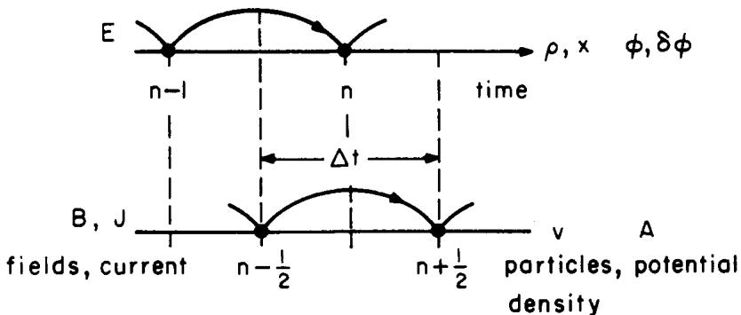  
Figure 15-2a Temporal layout of field and particle quantities used in the leapfrog integration of Maxwel's equations.E is advanced,then $\mathbf { B }$ is advanced in time. New values overwrite old values; none are retained more than one time.

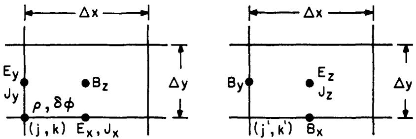  
Figure 15-2b Locations of the TM and TE field components on an $x , y$ spatial grid,chosen to allow centered spatial differencing of (1)-(2)． As the TM and TE sets are uncoupled,the relative location of $( j , k )$ and $( j ^ { \prime } , k ^ { \prime } )$ is not fixed.

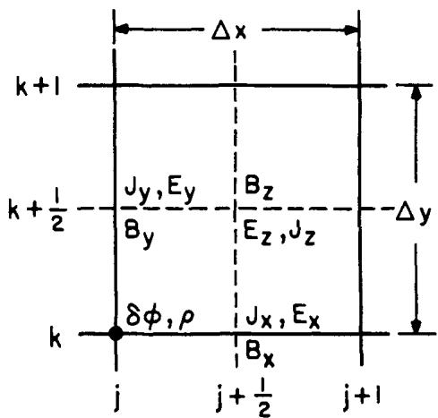  
Figure 15-2c Spatial layout on the field grid of the 2d TM fields $( E _ { x } , E _ { y } , B _ { z } )$ and their source terms $( \rho , J _ { x } , J _ { y } , \delta \phi )$ asthey appear during their integration forward in time via the differenced Maxwell equations. The particle grid is the same as for the charge density. In the $2 \div 2 =$ case, the TE fields are added; $B _ { x }$ and $B _ { y }$ are collocated with $E _ { x }$ and $E _ { y }$ ，while $E _ { z }$ and $J _ { z }$ are collocated with $B _ { z }$ .(FromLangdon and Lasinski, 1976.)

We are now ready to difference Maxwel's equations explicitly in a very simple way whose accuracy is second order in space and time,much like Buneman (1968),Boris (1970b),and Morse and Nielson (1971). Specifically the time derivative becomes

$$
( \partial _ { t } E _ { x } ) _ { j + 1 / 2 , k } ^ { n + 1 / 2 } \equiv \frac { E _ { x , j + 1 / 2 , k } ^ { n + 1 } - E _ { x , j + 1 / 2 , k } ^ { n } } { \Delta t }
$$

where $E _ { x , j + 1 / 2 , k } ^ { n } \equiv E _ { x } ( [ j + 1 / _ { 2 } ] \Delta x , k \Delta y , n \Delta t )$ etc.Let_thespatial differences $\partial _ { x }$ and $\partial _ { y }$ be defined analogously. The gradient $\triangledown$ becomes $\partial _ { \mathbf { x } }$ What makes this notation helpful later is that these operators,applied to

fields defined on our space-time grid,commute. Therefore the difference equations can be manipulated in the same ways as the similar-appearing differential equations.

The differenced Maxwell equations, (1)-(2） are，for the TM components,

$$
\begin{array} { r l } { ( \partial _ { t } B _ { z } ) _ { j + 1 / _ { 2 } , k + 1 / _ { 2 } } ^ { n } } & { = - c ( \partial _ { x } E _ { y } - \partial _ { y } E _ { x } ) _ { j + 1 / _ { 2 } , k + 1 / _ { 2 } } ^ { n } } \\ { \quad } & { \quad ( \partial _ { t } E _ { x } ) _ { j + 1 / _ { 2 } , k } ^ { n + 1 / _ { 2 } } = ( c \partial _ { y } B _ { z } - J _ { x } ) _ { j + 1 / _ { 2 } , k } ^ { n + 1 / _ { 2 } } } \\ { \quad } & { \quad ( \partial _ { t } E _ { y } ) _ { j , k + 1 / _ { 2 } } ^ { n + 1 / _ { 2 } } = ( - c \partial _ { x } B _ { z } - J _ { y } ) _ { j , k + 1 / _ { 2 } } ^ { n + 1 / _ { 2 } } } \end{array}
$$

When $B _ { z } ^ { n - 1 }$ and $E ^ { n }$ are known, (4） determines $B _ { z } ^ { n + 1 }$ . The electric field is then advanced similarly. For example,(5） expands to

$$
\frac { E _ { x , j + \mid j _ { 2 } , k } ^ { n + 1 } - E _ { x , j + \mid j _ { 2 } , k } ^ { n } } { \Delta t } = c \frac { B _ { z , j + \mid j _ { 2 } , k + \mid j _ { 2 } } ^ { n + \mid j _ { 2 } } - B _ { z , j + 1 / 2 , k - 1 / 2 } ^ { n + \mid j _ { 2 } } } { \Delta y } - J _ { x , j + \mid j _ { 2 } , k } ^ { n + \mid j _ { 2 } }
$$

The code alternates, first advancing $E$ ，then $B$ ,as was shown in Figure 15-2a. At each step the new values for a field overwrite the old values in memory. It is not necessary to retain values for any field at more than one time.

# PROBLEM

15-2a Obtain the references of this section and the next and sketch the locations of the variables given therein. Compare with those in Figure l5-2c. Explain the differences.

# 15-3 ACCURACY AND STABILITY OF THE TIME INTEGRATION

One can learn much about the accuracy and stability properties of the scheme in Section 15-2 by seeing how it reproduced plane electromagnetic waves in vacuum. Assuming that the fields are of the form $( \mathbf { E } , \mathbf { B } ) =$ $( \mathbf { E } _ { 0 } , \mathbf { B } _ { 0 } )$ exp $\left( i \mathbf { k } \cdot \mathbf { x } - i \omega t \right)$ and substituting into the difference equations, we find

$$
\begin{array} { l } { \Omega \mathbf { B } = c \pmb { \kappa } \times \mathbf { E } } \\ { \Omega \mathbf { E } = - c \pmb { \kappa } \times \mathbf { B } } \end{array}
$$

where $\Omega \equiv \omega$ dif $\left( \omega \Delta t / 2 \right)$ ， $\kappa _ { x } \equiv k _ { x }$ dif $( k _ { x } \Delta x / 2 )$ . In the continuum limit, $\Omega$ and $\pmb { \kappa }$ reduce to $\pmb { \omega }$ and $\mathbf { k }$ .Eliminating $\mathbf { E }$ and $\mathbf { B }$ yields

$$
\Omega ^ { 2 } = c ^ { 2 } \kappa ^ { 2 }
$$

which,expanded,is

$$
\left( \frac { \sin \frac { \omega \Delta t } { 2 } } { c \Delta t } \right) ^ { 2 } = \left( \frac { \sin \frac { k _ { x } \Delta x } { 2 } } { \Delta x } \right) ^ { 2 } + \left( \frac { \sin \frac { k _ { y } \Delta y } { 2 } } { \Delta y } \right) ^ { 2 }
$$

Obviously $\pmb { \omega }$ is real (no damping or growth） if

$$
1 > ( c \Delta t ) ^ { 2 } \left( \frac { 1 } { \Delta x ^ { 2 } } + \frac { 1 } { \Delta y ^ { 2 } } \right)
$$

or $c \Delta t < \Delta x / \sqrt { 2 }$ for $\Delta x = \Delta y$ ，a Courant condition. When this condition is violated, $\sin ^ { 2 } ( \omega \Delta t / 2 )$ exceeds unity for $k _ { x } \Delta x , k _ { y } \Delta y$ near $\pmb { \pi }$ ； the $\pmb { \omega }$ roots are now complex, with one root giving nonphysical growth which can be very rapid. When condition (5) is satisfied,there are no phase or magnitude errors between $\mathbf { E }$ and $\mathbf { B }$ . The errors in the magnitude of $\pmb { \omega }$ , in the relative directions of the fields,and in $\mathbf { k }$ are second order in $\Delta x , \ \Delta y$ and $\Delta t$ All these properties are a direct result of the centered differencing in space and time.

A plot of $\pmb { \omega }$ versus $k$ is given in Figure 15-3a showing $\omega \leqslant k c$ for $c \Delta t \leqslant \Delta x$ . Note that at the edge of the fundamental zone, $k _ { x } \Delta x =$ $\pi = k _ { y } \Delta y$ ， $\nu _ { p h a s e }$ drops as low as $2 c / \pi = 0 . 6 3 7 c$ . Hence,relativistic particles may have $\nu > \nu _ { \mathsf { p h a s e } }$ at short wavelengths, producing unwanted particle-wave growths,or Cerenkov emission. Boris and Lee (1973） and Haber et al. (1973） mention noise produced by Cerenkov emission from particles whose velocities exceed the minimum phase velocity. Godfrey (1974,1975) and

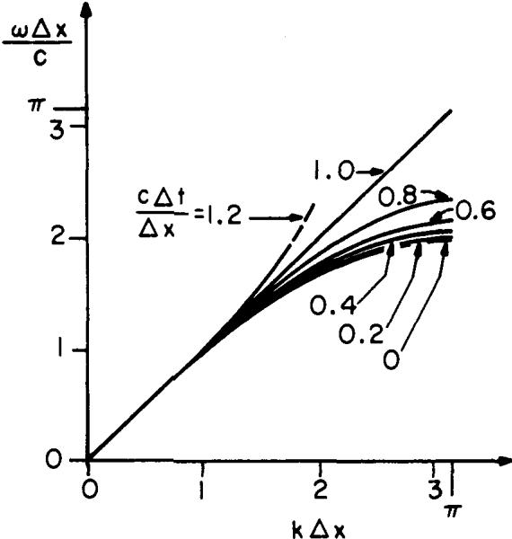  
Figure 15-3a Vacuum dispersion solution of Maxwell's equations for finite $\Delta x , \ \Delta t$ ,from (4). In one dimension,no dispersion error occurs for $c \Delta t / \Delta x = 1 . 0$ ,which is marginally stable.

Godfrey and Langdon (1976) examine collective instabilities involving interaction between relativistic electron beams and these slow light waves; this is discussed in Section 15-5. This defect creates interest in algorithms which propagate vacuum light waves at the correct velocity and have other features which also improve stability; (Chapter 6 and Section 15-9b).

# PROBLEMS

15-3a Verify the statement in the text following (5) relative to phase and magnitude errors between $\mathbf { E }$ and $\mathbf { B }$ and relative directions of $\mathbf { k }$ and $\pmb { \kappa }$

15-3b From (4),plot contours of $\nu _ { \mathrm { p h a s e } } / c = 0 . 9 , 0 . 8 , 0 . 7$ on $k _ { x } \Delta x$ versus $k _ { y } \Delta y$ ,using $\Delta x = \Delta y$ and $c \Delta t / \Delta x = 0 . 5$ .Comment on whether the contours are circles (phase velocity independent of direction of $k$ ）and,if not,where the largest errors are.

15-3c Derive (1), (2).

# 15-4 TIME INTEGRATION OF THE PARTICLE EQUATIONS

Assume that $\mathbf { E }$ and $\mathbf { B }$ are interpolated as in Chapter 14 from the grid fields to the particles at time $t ^ { n } = n \Delta t$ . We generalize the particle integrator of Section 4-3 to include relativistic effects and varying magnetic field (Boris, 1970). For the relativistic generalization of 4-3(3),we use $\mathbf { u } \equiv \gamma \mathbf { v }$ rather than $\pmb { \gamma }$

$$
\frac { \mathbf { u } ^ { n + 1 / _ { 2 } } - \mathbf { u } ^ { n - 1 / _ { 2 } } } { \Delta t } = \frac { q } { m } \left( \mathbf { E } ^ { n } + \frac { 1 } { c } \frac { \mathbf { u } ^ { n + 1 / _ { 2 } } + \mathbf { u } ^ { n - 1 / _ { 2 } } } { 2 \gamma ^ { n } } \times \mathbf { B } ^ { n } \right)
$$

where $m$ is the rest mass and $\gamma ^ { 2 } = 1 + u ^ { 2 } / c ^ { 2 }$ In the magnetic field force, centering by time averaging of $\mathbf { u }$ , as shown, and of $\mathbf { B }$ (next Section),leaves only $\gamma ^ { \eta }$ to be specified. Centering of $\gamma ^ { \eta }$ is easier in the method of Boris (1970b).The addition of electric impulses,equations 4-3(7) and 4-3(8),carry over with no formal change,

$$
\begin{array} { l } { { \displaystyle { \bf u } ^ { n - 1 / 2 } = { \bf u } ^ { - } - \frac { q { \bf E } ^ { n } \Delta t } { 2 m } } } \\ { { \displaystyle { \bf u } ^ { n + 1 / 2 } = { \bf u } ^ { + } + \frac { q { \bf E } ^ { n } \Delta t } { 2 m } } } \end{array}
$$

We substitute these into (1） to obtain

$$
\frac {  { \mathbf { u } } ^ { + } -  { \mathbf { u } } ^ { - } } { \Delta t } = \frac { q } { 2 \gamma ^ { n } m c } \left(  { \mathbf { u } } ^ { + } +  { \mathbf { u } } ^ { - } \right) \times  { \mathbf { B } } ^ { n }
$$

In Section 4-3 we found that (4) results in a rotation of $\mathbf { u }$ about an axis parallel to $\mathbf { B }$ through an angle $\theta = - 2$ arctan $( q B \Delta t / 2 \gamma m c )$ . The angle is reduced by a factor $\approx \gamma$ .Therefore 4-4(11) becomes $\mathbf { t } = q \mathbf { B } \Delta t / 2 \gamma ^ { n } m c$ ， with $( \gamma ^ { n } ) ^ { \dot { 2 } } = 1 + ( u ^ { - } / c ) ^ { \dot { 2 } }$ .Since $( \gamma ^ { n } ) ^ { 2 } = 1 + ( u ^ { + } / c ) ^ { 2 }$ also,this scheme is time reversible and the overall momentum integration is second-order accurate. This $\gamma ^ { n }$ may be used to calculate a time-centered kinetic energy. On short word-length computersit isbest touse theidentity $( \gamma - 1 ) m c ^ { 2 } = m \bar { u } ^ { 2 } ( \gamma + 1 ) ^ { - 1 }$ ； the second form of the kinetic energy is far less susceptible than the first to roundoff error.

There is a large class of physical problems in which $\nu _ { z } , E _ { z } , B _ { x }$ ，and $B _ { y }$ are unimportant. If these quantities are zero initially, then the equations of motion show they remain zero (Problem 15-6c). The plane rotation represented by (4) is done very concisely by Buneman's algorithm (Section 4-4)，

$$
\begin{array} { r } { { u _ { x } } ^ { \prime } = { u _ { x } } ^ { - } + { u _ { y } } ^ { - } t } \\ { { u _ { y } } ^ { + } = { u _ { y } } ^ { - } - { u _ { x } } ^ { \prime } s } \\ { { u _ { x } ^ { + } } = { u _ { x } } ^ { \prime } + { u _ { y } } ^ { + } t } \end{array}
$$

where $t = - \tan \theta / 2 = q B _ { z } \Delta t / 2 \gamma ^ { n } m c$ ， $s = - \sin \theta = 2 t / ( 1 + t ^ { 2 } )$

In the more general $\pmb { 2 } \varkappa _ { \mathbf { d } }$ case in which E,B, and $\mathbf { u }$ all can have three nonzero components, we use Boris’ rotation， generalizing 4-6(1O) to 4- 6(13),

$$
\begin{array} { r } { \mathbf { u } ^ { \prime } = \mathbf { u } ^ { - } + \mathbf { u } ^ { - } \times \mathbf { \epsilon } _ { \mathbf { t } } } \\ { \mathbf { u } _ { + } = \mathbf { u } ^ { - } + \mathbf { u } ^ { \prime } \times \mathbf { \epsilon } _ { \mathbf { s } } } \end{array}
$$

with $\mathbf { t } = q \mathbf { B } \Delta t / 2 \gamma ^ { n } m c$ ， $\mathsf { s } = 2 \mathsf { t } / ( 1 + t ^ { 2 } )$ . The error in the angle between ${ \mathfrak { u } } ^ { - }$ and ${ \mathfrak { u } } ^ { + }$ is ${ \approx } t ^ { 3 } / 3 = ( { \omega } _ { c } \Delta t ) ^ { 3 } / 2 4$ and does not seem worth correcting in our applications.

In all cases the position is advanced according to

$$
\mathbf { x } ^ { n + 1 } = \mathbf { x } ^ { n } + \mathbf { v } ^ { n + 1 / 2 } \Delta t = \cdot \mathbf { x } ^ { n } + \frac { \mathbf { u } ^ { n + 1 / 2 } \Delta t } { \gamma ^ { n + 1 / 2 } }
$$

with $( \gamma ^ { n + 1 / 2 } ) ^ { 2 } = 1 + ( u ^ { n + 1 / 2 } / c ) ^ { 2 }$ This step also is reversible and produces a second-order error in the particle orbit.

In many applications,the magnetic field does not significantly affect the ion motion and the ion transverse current is negligible. In such cases some time may be saved by using a mover for the ions in which only the electric field accelerates the ions,relativity is ignored,and only the ion charge den-sity，not the current, is collected. The manner in which the longitudinal current is taken into account is discussed in Section 15-6.

# PROBLEM

15-4a Show that $( \gamma - 1 ) m c ^ { 2 }$ and $m u ^ { 2 } ( \gamma + 1 ) ^ { - 1 }$ are both equal to the particle kinetic energy. Consider the susceptibility to roundoff error of the two forms when $u ^ { 2 } < < c ^ { 2 }$

# 15-5 COUPLING OF PARTICLE AND FIELD INTEGRATIONS

In coupling the particle and field integrations, we have to relate particle and field quantities, which are provided at different locations and times.

The simplest case is the magnetic feld, B,given at half-integer times (i.e., $n \pm \ : 1 / 2 )$ in the field equations,which is needed at integer times $( n )$ for integration of the particle velocity. Since Faraday's law can be used to advance $\mathbf { B }$ to a time ahead of E, one may simply time average B, as

$$
\mathbf { B } ^ { n } = \frac { \mathbf { B } ^ { n - 1 / 2 } + \mathbf { B } ^ { n + 1 / 2 } } { 2 }
$$

This may be used in the particle mover,15-4(1） and also in certain diagnostics. In practice,the average does not appear explicitly. To avoid using additional computer storage,the $\mathbf { B }$ integration may be split into two steps (Boris, 1970,p. 12)． As the last step of the field integration,we advance $\mathbf { B }$ only half way, obtaining

$$
\mathbf { B } ^ { n } = \mathbf { B } ^ { n - 1 / 2 } - \frac { c \Delta t } { 2 } \partial _ { \mathbf { x } } \times \mathbf { E } ^ { n }
$$

which replaces $\mathbf { B } ^ { n - 1 }$ in memory. The particles are then integrated, using this $\mathbf { B } ^ { n }$ in 15-4(1)，As the first step in the following field integration, $\mathbf { B } ^ { n }$ is advanced in the same way to $\mathbf { B } ^ { n + 1 }$

Specifying the current density, $\mathbf { J } ^ { n \pm 1 / 2 }$ ，from the particle velocities (v known at $n \pm \ : ! / 2$ times）and positions（ $\mathbf { \widetilde { x } }$ known at $n$ ）poses a similar problem in assignment. One method (Boris,1970,p.33) is to use $\mathbf { v } ^ { n + 1 h }$ times the average of the weights $s$ for the two positions $x ^ { n }$ and $x ^ { n + 1 }$ producing a time centered $\mathbf { J } ^ { n + 1 h }$ Explicitly， this is

$$
\mathbf { J } _ { \mathbf { j } } ^ { n + 1 / 2 } = \sum _ { i } \mathbf { v } _ { i } ^ { n + 1 / 2 } \frac { S \left( \mathbf { X _ { j } } - \mathbf { x } _ { i } ^ { n } \right) + S \left( \mathbf { X _ { j } } - \mathbf { x } _ { i } ^ { n + 1 } \right) } { 2 }
$$

We see that a particle contributes to the current density at its four nearest grid points, just as it does to charge density. (When a particle crosses the cell boundary during advancement of $\mathbf { x } _ { i } ^ { n }$ t0 $\mathbf { x } _ { i } ^ { n + 1 }$ ，more grid points are affected.)

Another way to obtain $\mathbf { J } ^ { n + 1 / 2 }$ is to use weights for the mid-positions, ${ \bf x } ^ { n + 1 / 2 } = ( { \bf x } ^ { n } + { \bf x } ^ { n + 1 } ) / 2 = { \bf x } _ { n } + { \bf v } ^ { n + 1 / 2 } \Delta t / 2$ (Morse and Nielson,1971,p.839). The two methods are similar in computational expense. In ZOHAR，the former was chosen in the hope that it would have better noise properties. However, Godfrey and Langdon (1976) show that the use of the average of the weights (3） may be less susceptible to numerical instabilities.

Special consideration must be given to conservation of charge; this is done in the next section. Also,the noise properties of various alternative $\pmb { \rho }$ and J weighting schemes need separate consideration; this is done in the Section 15-8.

The electric and magnetic fields at the particle positions are obtained by interpolation from the field grid (weighting). In ZOHAR, linear weighting is used. The most obvious thing to do is to interpolate separately from each of the three sets of grid locations shown in Figure 15-2c (Boris, 1970; Morse and Nielson, 1971; Palevsky，1980)． However, this is time consuming for the particle mover. Because the mover accounts for the majority of the com-puter time, ZOHAR and other codes redefine the fields beforehand to a sin-gle set of grid locations. This may be done simply by a spatial average to the $\pmb { \rho }$ grid positions. There are other advantages: The longitudinal part of E now is the same as for the momentum-conserving electrostatic codes and the additional smoothing decreases short wavelength noise. Diagnostics are also simplified. The same benefits are realized in an A, $\phi$ code by changing the differencing used to derive $\mathbf { E }$ and $\mathbf { B }$ from A and $\phi$ (Nielson and Lindman, 1973a, b).

After the particle integration, the averaged fields might be restored to the original field grids by a further spatial averaging. However,this produces severe damping of electromagnetic waves that is unacceptably rapid. Boris observed that the original $E _ { x }$ ，for example,can be easily reconstructed from the averaged $E _ { x }$ if the values of $E _ { x }$ at one side are saved before averaging. For $B _ { z }$ ， the simplest procedure is to unaverage in $x$ first,along with $E _ { x }$ ,then in $y$ along with $E _ { y }$ . In this way we can redefine the fields to a common grid and restore them without adding appreciably to computer storage requirements.

As with the redefinition of field grids, it is advantageous to collect $\mathbf { J }$ by area-weighting to a single set of grid points,as in (3),collocated with $\pmb { \rho }$ in ZOHAR,and then spatial average to obtain the currents at the locations shown in Figure 15-2c, where they are needed for the field equations. The $y$ component of current (needed at $j , k + / 2 )$ is then

$$
J _ { y j , k + / 2 } ^ { n + 1 / 2 } = \frac { J _ { y j , k } ^ { n + 1 / 2 } + J _ { y j , k + 1 } ^ { n + 1 / 2 } } { 2 }
$$

the $x$ component, needed at $j + 1 / 2 , k$ is obtained similarly. No restoration of the unaveraged $\mathbf { J }$ is needed, of course.

# 15-6 THE $\nabla \cdot \mathbf { B }$ AND V·E EQUATIONS; ENSURING CONSERVATION OF CHARGE

There are two other Maxwell equations. We now show that the difference equations have the property,as do the continuum equations, that if the divergences of $\mathbf { E }$ and $\mathbf { B }$ are correct initially,they remain correct. That is,

$$
\partial _ { t } \left( \partial _ { \bf x } \cdot \mathrm { \bf ~ B } \right) = \partial _ { \bf x } \cdot \left( \partial _ { t } \mathrm { \bf ~ B } \right) = - c \partial _ { \bf x } \cdot \partial _ { \bf x } \times \mathrm { \bf ~ E } \equiv 0
$$

Similarly,

$$
\partial _ { t } \left( \partial _ { \mathbf { x } } \cdot { \textbf { E } } - \rho \right) = \partial _ { \mathbf { x } } { \cdot } { \textbf { J } } - \partial _ { t } \rho
$$

Therefore, if $\mathbf { J }$ and $\pmb { \rho }$ satisfy the continuity equation,Gauss' law remains satisfied if it holds initially.

Neither of the current densities given in the previous section satisfy the continuity equation with $\pmb { \rho }$ calculated by any method which depends only on the present particle locations. This may be seen even in the $\Delta t \to 0$ limit $( \mathbf { P r o b } 1 5 . 6 \mathbf { a } )$

Methods for calculating a charge conserving J have been developed corresponding to $\pmb { \rho }$ as obtained by zero-order weighting (NGP) (Buneman, 1968)and to $\pmb { \rho }$ obtained by first-order weighting (Morse and Nielson, 1971, "Method A"). The latter authors found that the noise level in the electromagnetic fields rose in time at an inconveniently rapid rate. The same has ben experienced by others. Causes are discussed in Section 15-8. This approach is advisable (if ever) only with complicated curvilinear coordinates for which it is inconvenient to perform the Poisson solution (6) or 15-7(5). Here and in the next Section we show how to use a nonconservative J.

We advance $\mathbf { E }$ using $\mathbf { J }$ from 15-5(3) in Ampere's law, then adjust the longitudinal part of $\mathbf { E }$ in order to correct $\mathbf { \nabla } \mathbf { \nabla } \mathbf { \nabla } \mathbf { \nabla } \mathbf { \nabla } \mathbf { \nabla } \mathbf { \nabla } \mathbf { \nabla } \mathbf { \nabla } \mathbf { \nabla } \mathbf { \nabla } \mathbf { \nabla } \mathbf { \nabla } \mathbf { \nabla } \mathbf { \nabla } \mathbf { \nabla } \mathbf { \nabla } \mathbf { \nabla } \mathbf { \nabla } \mathbf { \nabla } \mathbf { \nabla } \mathbf { \nabla } \mathbf { \nabla } \mathbf { \nabla } \mathbf { \nabla } \mathbf { \nabla } \mathbf { \nabla } \mathbf { \nabla } \mathbf { \nabla } \mathbf { \nabla } \mathbf { \nabla } \mathbf { \nabla } \mathbf { \nabla } \mathbf { \nabla } \mathbf { \nabla } \mathbf { \nabla }$ :Using the uncorrected $\mathbf { J }$ produces an $\mathbf { E }$ which does not, in general, satisfy Gauss law, $\nabla \cdot \mathbf { E } = \rho$ ， because of microscopic inconsistencies between $\mathbf { J }$ and $\pmb { \rho }$ due to use of the mesh and weights. Hence,we invent a correction of the form

$$
\mathbf { E } ^ { \prime } = \mathbf { E } - \nabla \delta \phi
$$

such that

$$
\nabla \cdot \mathbf { E } ^ { \prime } = \rho
$$

which means that

$$
\nabla \cdot \left( \mathbf { E } - \nabla \delta \phi \right) = \rho
$$

thus requiring a Poisson solution for $\delta \phi$ ：

$$
\nabla ^ { 2 } \delta \phi = \nabla \cdot \mathbf { E } - \rho
$$

This correction, due to Boris (1970), is computationally convenient and is widely used. The difference form for the Laplacian in (6),consistent with the gradient and divergence operators already used, is the simple five-point operator, $\partial _ { \mathbf { x } } ^ { 2 }$ . Although this correction is applied after the fields are advanced in time, the overall procedure is time-centered and reversible (Problem 15- 6b).

It may be worthwhile to filter $\rho$ spatially before use in (6),in order to boost the medium wavelengths (for better dispersion) and perhaps suppress noise at short wavelengths.

One might fear that the use of solutions of Poisson's equation may per-mit the propagation at speeds greater than light of information about the par-ticle motion. However,with linear weighting,the contribution of each particle to the source term in (6) is a quadrupole. Therefore the contribution from each particle to the correction fields, $- \nabla \xi$ and $- \nabla \delta \phi$ ，drop off in a short distance so the correction is very local.

# PROBLEMS

15-6a Verify explicitly the lack of continuity mentioned in the second paragraph. One way is to consider a particle which moves in a small circle inside a quarter-cell. After one turn, $\mathbf { v } \cdot \mathbf { J }$ has a nonzero average,yet $\pmb { \rho }$ is the same as at the start.

15-6b Show that the asymmetric looking procedure,(3) and (6),produces exactly the same final fields as does 15-7(4) and 15-7(5),which is more obviously a time-centered algorithm.

15-6c Show that if $E _ { z } , B _ { x } , B _ { y }$ ,and $\nu _ { z }$ are all zero at $t = 0$ ,then they remain zero,and therefore need not be included in the computation.

# 15-7 A- $\mathbf { \nabla } \cdot \mathbf { \phi }$ FORMULATION

Morse and Nielson's (1971） response to EM noise problems in their (E,B) code was to develop a Coulomb gauge (A, $\phi$ ）model, their method B. The equations integrated are

$$
\nabla ^ { 2 } \mathbf { A } - { \frac { 1 } { c ^ { 2 } } } { \frac { \partial \mathbf { A } } { \partial t } } = - { \frac { 1 } { c } } \mathbf { J } _ { T } \qquad \mathbf { J } _ { T } = \mathbf { J } - \nabla \eta
$$

where $\eta$ , given by

$$
\nabla ^ { 2 } \eta = \nabla \cdot \mathbf { J }
$$

preserves the gauge $\nabla \cdot \mathbf { A } = 0$ . Then

$$
\mathbf { E } = - \nabla \phi - { \frac { 1 } { c } } { \frac { \partial \mathbf { A } } { \partial t } } \qquad \mathbf { B } = \nabla \times \mathbf { A }
$$

are used to integrate the particles. The longitudinal $\mathbf { E }$ field is determined from $\pmb { \rho }$ by a Poisson solution; a second Poisson solution is also needed (for the transverse current ${ \bf J } _ { T }$ ） each time step.

These fields are in fact the same as obtained directly from Maxwell's equations previously in this Chapter. This may be seen by deriving the equations satisfied by the fields (3). Faraday's law 15-2(1） is trivially satisfied,as are $\nabla \cdot \mathbf { B } = 0$ and $\nabla \cdot \mathbf { E } = \rho$ . The remaining equation is (Problem 15-7a)

$$
c \nabla \times \mathbf { B } - { \frac { \partial \mathbf { E } } { \partial t } } = \mathbf { J } ^ { \prime } \equiv \mathbf { J } - \nabla \xi
$$

where $\xi = \eta - \partial \phi / \partial t$ satisfies

$$
\nabla ^ { 2 } \xi = \nabla \cdot \mathbf { J } + { \frac { \partial \rho } { \partial t } }
$$

The term $- \nabla \xi$ is simply a correction to $\mathbf { J }$ to force the current $\mathbf { J } ^ { \prime }$ to satisfy the continuity equation $\nabla \cdot \mathbf { J } ^ { \prime } + \partial \rho / \partial t = 0$ ，thereby ensuring that Gauss' law, $\nabla \cdot \mathbf { E } = \rho$ ，remains satisfied. With $\mathbf { J ^ { \prime } }$ as the source, the Maxwell equations produce the same fields as the $\mathbf { A } { \cdot } { \phi }$ equations. With the fields finitedifferenced as in Section 15-2， this statement is identically true for the computer implementation. Further,as the longitudinal correction can as well be applied to $\mathbf { E }$ after,as to J before, integration of (4),the E and B fields here are the same as obtained in the preceeding Section (Problem 15-6b). As well as providing an alternative algorithm, these results show that the noise properties observed by Morse and Nielson (1971） were related to the methods of forming J, not to the use of potentials.

# PROBLEM

$1 5 . 7 8$ Derive (4). Hint: Into the left side of (4),substitute (3),then use the gauge condition and (1).

# 15-8 NOISE PROPERTIES OFVARIOUS CURRENT-WEIGHTING METHODS

Two numerical methods were used by Morse and Nielson (1971) to simulate the Weibel instability. Method A uses the Maxwell equations for $\mathbf { E }$ and B,with a current density constructed so as to satisfy the differenced continuity equation. Method B uses the potentials A and $\phi$ in the Coulomb gauge with an area weighted current density similar to 15-5(3). Method B was found to suffer much less from buildup of noise in the radiation fields. It was found later that the superiority of method B was not due to the use of potentials but due only to the smoother variation of the grid current density as the particles moved through the grid (Langdon, 1972). An earlier method due to Buneman (1968),motivated similarly to method A,was simpler, but reason was given to expect it to be noisier. This simplified algorithm was almost equivalent to that of Boris (1970), therefore, his code was expected to share the good noise properties of Morse and Nielson's method B.

In Section 15-7, we showed that the same fields as in method B may be obtained from the field equations of method A by replacing its current den-sity by the area-weighted, divergence-corrected current $\mathbf { J ^ { \prime } }$ ，15-7(4).(This correction is not necessary in method A because $\mathbf { J }$ is calculated in a chargeconserving manner.） Alternatively,we could generate the fields of method A from the field equations of method B by using the current density of method A for which the divergence correction vanishes. The only differences between the fields in methods A and B,and also Buneman's (1968) method, are due to the differences in the calculation of the current from the particle coordinates; this is where we must look to understand the differences in noise properties.

Noise in the transverse radiation fields in EM codes differs from longitudinal field noise which is troublesome in electrostatic simulation and which also exists in electromagnetic codes. Electrostatic fluctuations at any time are due only to density fluctuations at that time. The transverse field modes act like harmonic oscillators which are undamped in the absence of lossy media or boundaries and are driven by current fluctuations. Therefore,the radiation field noise energy depends on all past fluctuations; this noise grows in time when the energy is started out at much less than the thermal equilibrium level,as observed by Morse and Nielson (1971). When studying collective effects one wishes to postpone the thermalization of the radiation fields. Where the problem simulated permits,one may decrease the mode noise level by including radiation field damping.

Incidentally,the blackbody radiation, although classical, suffers from no ultraviolet catastrophe because the fields have no more degrees of freedom than there are field grid points.

To see differences in $\mathbf { J }$ between the several methods,consider a single particle moving with constant velocity $\nu \ < < \ c$ parallel to the $x$ axis and passing through the grid points at which $J _ { x }$ is defined,as in Figure 15-2c.

In Buneman's (1968) method, ${ \bf J } = 0$ except for once in about $\Delta x / ( \nu \Delta t )$ time steps,when the particle crosses a cell boundary producing an impulse of current density of magnitude $J _ { x } = q / ( \Delta y \Delta t )$ corresponding to all of the par-ticle charge moving a distance $\Delta x$ in that one time step,as sketched in Figure $1 5 . 8 a ( a )$ . The corresponding fields are pulses of radiation. Their spectrum includes large $\pmb { \omega }$ and $k$ because the temporal spectrum of $\mathbf { J }$ includes all frequencies $\lvert \omega \rvert < \pi / \Delta t$ equally (no falling off).

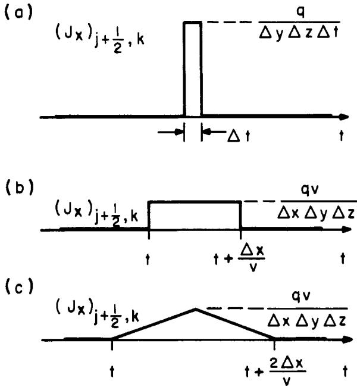  
Figure 15-8a (a） Current impuise due to zero-order particle weighting;(b） discontinuous current of method A; (c) continuous current of method B. The noise frequency spectra associated with these fall of as $\omega ^ { 0 } , \omega ^ { - 1 } , \omega ^ { - 2 }$ respectively.

In method A, ${ \bf J } = 0$ in this example except at the $J _ { x }$ grid point nearest the particle,where $J _ { x } = q \nu / ( \Delta x \Delta y )$ . As the particle moves from cell to cell, $\mathbf { J }$ varies in a discontinuous piecewise-constant fashion,as sketched in Figure $1 5 . 8 a ( b )$ . Its transform is therefore peaked at low frequencies $- v / \Delta x$ ，and falls off slowly as $\omega ^ { - 1 }$

In method B,or using 15-5(3),the current density $q v / ( \Delta x \Delta y )$ is shared by two grid points, with linear weighting according to particle position $x$ As the particle moves, $J$ varies in a continuous piecewise-linear manner，as sketched in Figure $1 5 . 8 \mathsf { a } ( \mathsf { c } )$ .Its transform is, therefore， peaked more strongly at low frequency and falls off more rapidly,as $\omega ^ { - 2 }$ .These smooth-ness characteristics remain true for more general particle motions.

# 15-9 SCHEMES FOR $\Delta t _ { \mathrm { p a r t i c l e s } } > \Delta t _ { \mathrm { f i e l d s } }$

If we consider a reasonable set of parameters,e.g., $c \Delta t \approx \Delta x / 2$ Debye length $\lambda _ { D } = \Delta x / 2$ ，and thermal velocity $v _ { t } = c / 2 0$ ，then we find that $\omega _ { p } \Delta t = 0 . 0 5$ For many applications,this time step is much smaller than is needed for accuracy in moving the particles. In order to relax the time step imposed by the fields,we can take several steps for the fields between particle steps,or employ the known vacuum propagation of the Fourier modes. Another approach is to use an algorithm for the fields which is not subject to the Courant condition; see Section 15-16 and Nielson and Lindman (1973a, b).

# (a) Subcycling of the Maxwell Equations

Since the particle integration is expensive, it is helpful to advance the particles less often than the fields. In order to illustrate this extension and to summarize a complete time cycle,we outline the operations taken in one particle time step for the case where the fields are integrated twice as often. Superscript $n$ represents the particle step number. Care must be exercised about centering and averaging.

Start with ${ \bf E } ^ { n } , \ { \bf B } ^ { n } , \ { \bf x } ^ { n }$ ，and $\mathbf { u } ^ { n - 1 / 2 }$ ; proceed as in Figure 15-9a, described by

(0） Average fields $\mathbf { E } ^ { n }$ and $\mathbf { B } ^ { n }$ to the particle grid.   
(1) Advance $\mathbf { u } ^ { n - 1 }$ t0 $\mathbf { u } ^ { n + 1 / 2 }$ ， $\mathbf { x } ^ { n }$ t $\mathbf { x } ^ { n + 1 }$ ; form $\mathbf { J } ^ { n + 1 }$ and $\pmb { \rho } ^ { n + 1 }$ (2) Average $\mathbf { J }$ to the field grid. Reform $\mathbf { E }$ and $\mathbf { B }$ on the field grid. (3) Advance $\mathbf { B } ^ { n }$ t0 $\mathbf { B } ^ { n + 1 / 4 }$ using $\mathbf { E } ^ { n }$ ：   
(4) Advance $\mathbf { E } ^ { n }$ to ${ { \bf { E } } ^ { n + 1 } } { \bf { \mathit { 1 } } }$ using $\mathbf { J } ^ { n + 1 / \hat { z } }$ and Bn+1/4.   
(5) Advance $\mathbb { B } ^ { n + 1 / 4 }$ to $\mathbb { B } ^ { n + 3 / 4 }$ using $\mathbf { E } ^ { n + 1 / 2 }$   
(6) Advance ${ { \bf { E } } ^ { n + 1 } } { \bf { \mathit { h } } }$ to $\mathbf { E } ^ { n + 1 }$ ,using $\mathbf { \bar { J } } ^ { n + 1 h }$ and $\mathbb { B } ^ { n + 3 / 4 }$   
(7) Advance $\mathbb { B } ^ { n + 3 / 4 }$ to $\mathbf { B } ^ { n + 1 }$ using En+1.   
（8） Correct $\nabla \cdot \mathbf { E } ^ { n + 1 }$ using $\pmb { \rho } ^ { n + 1 }$

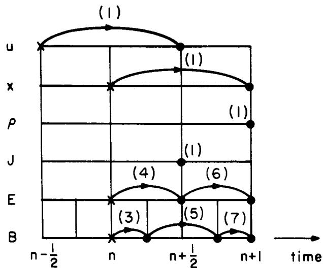  
Figure 15-9a Time-stepping for fields advanced twice as often as the particles.

Checking for time centering,we note that steps (3) and (7),and steps (4) and (6) are symmetric. The longitudinal part of ${ \bf E } ^ { n + 1 }$ is affected only by $\mathbf { J } ^ { n + 1 h }$ and is the same no mater how many time steps are used for the fields in reaching time $n { + 1 }$ . Therefore the argument used earlier still holds,that the divergence correction does not affect the time centering.

This splittng of the time step can lead to numerical instability. In many applications, the instability reaches very large amplitude over a few thousand time steps. It is possible to restrain this effect by clever averaging from time to time， not a satisfactory solution. Theoretical analysis of subcycling describes this instability accurately,but the underlying cause is seen more simply in problem 15-9a.

# (b) Fourier-Transform Field Integration

In order to achieve dispersionless vacuum wave propagation as in Chapter 6,but without the restrictions to one dimension and $\Delta x = c \Delta t$ ,in some codes the fields are Fourier transformed in space and advanced in time with the correct phase change for each mode (Haber et al., 1973; Lin et al., 1974;Buneman et al., 1980). This can be done by replacing 6-3(4) and 6- 3(8）by

$$
{ \bf \tau } ^ { \pm } { \bf F } = \frac { { \bf E } \mp \hat { { \bf k } } \times { \bf B } } { 2 } { \hat { { \bf k } } } \equiv { \bf k } / k
$$

$$
^ { \pm } \mathbf { F } ^ { n + 1 } = e ^ { \mp i c k \Delta t } \Bigg [ { ^ \pm \mathbf { F } ^ { n } } - \frac { 1 } { 4 } \mathbf { J } ^ { n + 1 / 4 } \Delta t \Bigg ] - \frac { 1 } { 4 } \mathbf { J } ^ { n + 3 / 4 } \Delta t
$$

Expressing (1b) in terms of $\mathbf { \delta E }$ and $\mathbf { B }$ gives

$$
\mathbf { E } ^ { n + 1 } = \mathbf { E } ^ { n } \cos c k \Delta t + i \hat { \mathbf { k } } \times \mathbf { B } ^ { n } \sin c k \Delta t - \Delta t \frac { \mathbf { J } ^ { n + 1 / 4 } \cos c k \Delta t + \mathbf { J } ^ { n + 3 / 4 } } { 2 }
$$

$$
{ \bf B } ^ { n + 1 } = { \bf B } ^ { n } \cos c k \Delta t - i \hat { \bf k } \times { \bf E } ^ { n } \sin c k \Delta t + \frac { i } { 2 } \Delta t \hat { \bf k } \times { \bf J } ^ { n + 1 / 4 } \sin c k \Delta t
$$

It seems simplest to correct $\nabla \cdot \mathbf { E } ^ { n + 1 }$ so that $\mathbf { E } ^ { n }$ ， $\mathbf { J } ^ { n + 1 / 4 }$ ， and ${ \bf J } ^ { n + 3 / 4 }$ can include both transverse and longitudinal contributions.

In two dimensions it may be troublesome to collect two current densities.The current density 15-5(3), $\mathbf { J } ^ { n + 1 / 2 } = { \mathfrak { I } } _ { 2 } ( \mathbf { J } ^ { n + 1 / 4 } + \mathbf { J } ^ { n + 3 / 4 } )$ ，could be added halfway through the rotation of $\pm _ { \mathbf { F } }$ ：

$$
^ \pm { \bf F } ^ { n + 1 } = e ^ { \mp i c k \Delta t / 2 } \left( ^ \pm { \bf F } ^ { n } e ^ { \mp i c k \Delta t / 2 } - { \bf J } ^ { n + 1 / 2 } \frac { \Delta t } { 2 } \right)
$$

which changes the current contributions in (2a) and (2b） to

$$
\begin{array} { l } { { { \bf { E } } ^ { n + 1 } = { \bf { E } } ^ { n } \cos c k \Delta t + i \hat { { \bf { k } } } \times { \bf { B } } ^ { n } \sin c k \Delta t - { \bf { J } } ^ { n + 1 / 2 } \alpha \Delta t \cos \frac { c k \Delta t } { 2 } } } \\ { { { \bf { B } } ^ { n + 1 } = { \bf { B } } ^ { n } \cos c k \Delta t - i \hat { { \bf { k } } } \times { \bf { E } } ^ { n } \sin c k \Delta t + i \hat { { \bf { k } } } \times { \bf { J } } ^ { n + 1 / 2 } \alpha \Delta t \sin \frac { c k \Delta t } { 2 } } } \end{array}
$$

with $\alpha = 1$ Or, $\mathbf { J } ^ { n + 1 / 2 }$ could be substituted for $\mathbf { J } ^ { n + 1 / 4 }$ and ${ \bf J } ^ { n + 3 / 4 }$ in (2a) and (2b),yielding(3a) and(3b）with $\alpha = \cos { 1 } / _ { 2 } c k \Delta t$ . The schemes of Haber et al. (i973) and Buneman et al. (1980),which are exact when $\mathbf { J }$ is constant in time，correspond to $\alpha = ( \sin { 1 / _ { 2 } c k } \Delta t ) / ( 1 / _ { 2 } c k \Delta t )$ Spatial filtering of $\mathbf { J }$ adds a factor to $\alpha ( k )$ . These choices agree to order $\Delta t ^ { 2 }$ but differ in stability pro-perties for $c k \Delta t \gtrsim \pi / 2$

Although these methods are stable for any △t in vacuum, with plasma present they exhibit instability unless ${ \pmb { \alpha } } ( { \bf k } )$ is sufficiently small for ck△t near multiples of $\pi$ (Problem 15-9a).

# PROBLEM

$1 5 . 9 8$ With $\mathbf { J }$ given by the cold plasma response $( { \bf { J } } ^ { n + 1 / 2 } - { \bf { J } } ^ { n - 1 / 2 } = \omega _ { p } ^ { 2 } \Delta t { \bf { E } } )$ ， show that the dispersion relation corresponding to the Fourier integration (3ab）is

$$
z - 2 \cos \ c k \Delta t + z ^ { - 1 } = - \ ( \omega _ { p } \Delta t ) ^ { 2 } \alpha \cos \frac { c k \Delta t } { 2 }
$$

Show that this can indicate instability in a narrow band of wavenumbers such that the vacuum wave frequency $c k$ is just below $\pi / \Delta t$ .Assuming $\omega _ { p } \Delta t \lesssim 1$ ，the maximum growth rates are $\operatorname { I m } \left( \omega \right) = \omega _ { p } ^ { 2 } \Delta t / 4$ with $\alpha = 1$ ，and $\mathrm { I m } \left( \omega \right) = \omega _ { p } ^ { 2 } \Delta t / 2 \dot { \pi }$ with $\alpha = ( \sin { 1 / _ { 2 } } c k \Delta t ) / ( 1 / _ { 2 } c k \Delta t )$ ，while ${ \pmb { \alpha } } = { \pmb { \ c 0 } } { \pmb { \ s } }$ /2ck△t provides stability (unless $\omega _ { p } \Delta t > 2$ ）.

For $c k \Delta t = 2 \pi$ and $\alpha = 1$ ， $\operatorname { I m } \left( \omega \right) \simeq \dot { \omega _ { p } }$ ，while the other two choices for $\pmb { \alpha }$ are stable.

# 15-10 PERIODIC BOUNDARY CONDITIONS

As with electrostatic codes,much interesting work can be done simulat-ing a system which is periodic in $x$ and $y$ . In this case,boundary conditions offer no conceptual problems,with one possible exception: As formulated so far, the ${ \bf k } = 0$ component of the electric field is obtained from

$$
0 = \mathbf { J } _ { \mathrm { { t o t a l } } } = \left\{ \mathbf { J } + { \frac { \partial \mathbf { E } } { \partial t } } \right\} _ { \mathbf { k } = 0 }
$$

and is not zero, in general [case (a)]. Contrast this to the usual electrostatic code in which $\mathbf { E } ( \mathbf { k } = 0 )$ is zero or a specified function of time (usually meaning driven by an external field),as usually coded [case (b)l. ZOHAR has a switch to select between these options.

One difference is that (a） provides the restoring force for ${ \bf k } = 0$ plasma oscillations. This means there is no hole in the $\mathbf { k }$ -spectrum of modes available for nonlinear processes such as parametric instabilities. Plugging this hole makes a drastic difference in a study of self-trapping of light near the critical density (Langdon and Lasinski, 1983).

Although this choice arises in electrostatic codes as well, note that elec-trostatic and electromagnetic codes arrive naturally at different choices.

# PROBLEM

15-10a Show that the right-hand side of (1） is $( \rho _ { 0 } - m \omega ^ { 2 } / q ) \mathbf { v }$ ,in a uniform plasma,requiring $\omega = \pm \omega _ { p }$ if $\pmb { \nu }$ or $\mathbf { E }$ are to be nonzero for ${ \bf k } = 0$

# 15-11 OPEN-SIDED BOUNDARY CONDITIONS

The work-horse particle codes in laser-plasma interaction studies are periodic in $y$ and open-sided,in some sense,on the left and right, as shown in Figure 15-1la. One wants to illuminate the plasma from one side and allow scattered light emerging from the plasma to leave the system. We discuss ways to match the fields to vacuum on the outside of the system and some procedures for dealing with particles which reach a boundary.

# (a) The Longitudinal Field

For both $\phi$ and the correction $\delta \phi$ we wish to obtain a potential solution in the system that is the same as if the grid had been extended to infinity on the left and right, with no charge outside the simulated portion space. This is given in Section 14-8 as worked out by Buneman (1973).

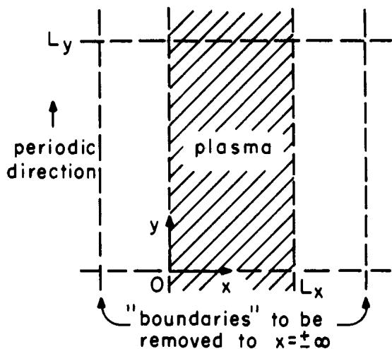  
Figure 15-1la Unbounded in $x$ ， periodic in $y$ model,with Poisson's equation holding in the plasma,Laplace's elsewhere.

# (b) Absorbing Outgoing Electromagnetic Waves in a Dissipative Region

A common way to prevent light leaving the plasma from being reflected at the sides and re-entering the plasma is to place a dissipative region at the sides. The most obvious way to implement this is to introduce a resistive current into the Maxwell-Ampere law. A disadvantage of this approach is that the resistive region must be quite thick in order to avoid both penetration by and reflection of the longest wavelength light.

Some improvement may be obtained by also introducing a magnetic current into the Faraday law,which becomes

$$
- c \nabla \times \mathbf { E } = { \frac { \partial \mathbf { B } } { \partial t } } + \mathbf { J } _ { m }
$$

with ${ \bf J } _ { m } = \sigma _ { m } ( { \bf x } ) { \bf B }$ . This corresponds to a flux of magnetic monopoles. A method equivalent to this is to multiply $\mathbf { B }$ by a factor somewhat less than unity after advancing it in time (Boris, 1972). With $\sigma _ { m }$ equal to the electric conductivity,one finds that a normally incident wave" $( k _ { y } = 0 )$ is not reflected even if $\pmb { \sigma }$ becomes large in a short distance. However, this is not true for oblique incidence,and we see below that normal incidence is trivial to handle by other means.

J. P.Boris (private communication,1972） has an interesting method for making the electric resistivity purely transverse. That is, the current does not respond to the longitudinal part of the field,and the current does not itself produce any charge separation. The intent is that electrostatic activity in the plasma not be damped due to resistive currents driven by its fringe fields. The method appears to be equivalent to adding a loop current around each cell proportional to $\nabla \times \mathbf { E }$ in the cell. This is like a magnetization current, and is equivalent to adding a current

$$
{ \bf J } = c \nabla \times { \bf M } = - \nabla \times [ \alpha ( { \bf x } ) \nabla \times { \bf E } ]
$$

which has zero divergence and to which $- \nabla \phi$ does not contribute.

The_trouble with a dissipative region is that it occupies a lot of memory space. To give good absorption, rather than reflection, for a range of frequencies and angles of incidence, the region must be about a wavelength thick,through which all fields must be defined. Tajima and Lee (1981) attempt to optimize their use of such a region. This method is readily adapted to irregularly-shaped boundaries.

# (c) A Simple Closure of the Maxwell Equations at the Open Boundaries

A simple boundary condition which solves the problem of closing the differenced Maxwell equations is an option in ZOHAR and other codes. It works well in some applications and illustrates several points applicable to more complicated boundary conditions to be discussed later.

By closure we mean the following: Consider the left side,and assume $E _ { x } , E _ { y }$ ，and $B _ { z }$ for $x \geqslant 0$ are to be advanced using the Maxwell equations. When we come to advance $E _ { y , 0 , k + \% }$ we need $B _ { z , - ^ { \mathrm { i } } / 2 , k + / 2 }$ , which must be given by some additional condition in order to make the set of equations selfcontained.

For a plane wave incident in the $- x$ direction we have $\begin{array} { r } { { \cal E } _ { y } = - B _ { z } } \end{array}$ A time average of $E _ { y }$ and a spatial average of $B _ { z }$ provides the needed extra condition:

$$
B _ { z , - \not | \zeta _ { 2 } , k + 1 / _ { 2 } } ^ { n + 1 / _ { 2 } } + B _ { z , \mathscr { N } _ { 2 } , k + 1 / _ { 2 } } ^ { n + 1 / _ { 2 } } + E _ { y , 0 , k + 1 / _ { 2 } } ^ { n } + E _ { y , 0 , k + 1 / _ { 2 } } ^ { n + 1 } = 0
$$

This is solved for $B _ { z , - } ^ { n + 1 / 2 } , k + 1 / 2$ simultaneously with

$$
( \partial _ { t } E _ { y } + c \partial _ { x } B _ { z } ) _ { 0 , k + 1 / 2 } ^ { n + 1 / 2 } = 0
$$

which involves the same quantities. The value of $B _ { z }$ thus obtained is stored in the appropriate column of the $B _ { z }$ array.The interior $( x \geqslant \Delta x / 2 )$ values of $B _ { z }$ are advanced to time $t ^ { n + 1 / 2 }$ with Faraday's law. Then $E _ { x }$ and $E _ { y }$ for $x \geqslant - \Delta x / 2$ are advanced using the Ampere-Maxwell law. This algorithm, due to K.H. Sinz (private communication, 1973),is all that is needed for a one-dimensional code and is used in this form in the OREMP code (K.G. Estabrook, private communication).

At the end of the field integration we use the same idea, but without the time average, to obtain

$$
B _ { z , - 1 / 2 , k + 1 / 2 } ^ { n + 1 } + B _ { z , 1 / 2 , k + 1 / 2 } ^ { n + 1 } + 2 E _ { y , 0 , k + 1 / 2 } ^ { n + 1 } = 0
$$

The field averaging then gives all fields for $x \geqslant 0$

In order to examine errors caused by nonnormal incidence and by the averaging,we consider the reflection of a plane wave incident on the boundary.Take

$$
B _ { z } \left( x , y , t \right) = B _ { i } \ e ^ { i \left( - k _ { x } x + k _ { y } y - \omega t \right) } + B _ { r } \ e ^ { i \left( k _ { x } x + k _ { y } y - \omega t \right) }
$$

for $x \geqslant \Delta x / 2$ and eliminate $B _ { z , - ^ { 1 } / z , k + 1 / z }$ using (3), then express $E _ { x }$ and $E _ { y }$ in terms of $B _ { z }$ and solve for the ratio

$$
\frac { B _ { r } } { B _ { i } } = \frac { c \kappa _ { x } \cos \frac { \omega \Delta t } { 2 } - \Omega \cos \frac { k _ { x } \Delta x } { 2 } } { c \kappa _ { x } \cos \frac { \omega \Delta t } { 2 } + \Omega \cos \frac { k _ { x } \Delta x } { 2 } }
$$

At small angles $c \kappa _ { x }  \Omega$ and the averages are the largest sources of error,

$$
\frac { B _ { r } } { B _ { i } } \ = \ \frac { \cos \frac { \omega \Delta t } { 2 } - \cos \frac { k _ { x } \Delta x } { 2 } } { \cos \frac { \omega \Delta t } { 2 } + \cos \frac { k _ { x } \Delta x } { 2 } } \ \approx \frac { ( k _ { x } \Delta x ) ^ { 2 } - ( \omega \Delta t ) ^ { 2 } } { 1 6 }
$$

In practice this ranges up to about $0 . 5 \%$

When the angle of incidence $\pmb \theta$ is not so small the largest error comes from assuming $\phantom { } E _ { y } = - B _ { z }$ ：

$$
{ \frac { B _ { r } } { B _ { i } } } \approx { \frac { c k _ { x } - \omega } { c k _ { x } + \omega } } = - \tan ^ { 2 } { \frac { \theta } { 2 } }
$$

At $4 5 ^ { \circ }$ the reflection is $1 7 \%$ ，or $3 \%$ in terms of energy. For many applications this is good enough. If only one angle of incidence is of interest,(3) to (5) can be modified to correspond to that angle.

There is a flaw in all this so far: We have assumed that $E$ is purely transverse. Suppose a point charge is held fixed near the boundary. The steady-state fields are $B _ { z } = 0$ everywhere and $E _ { y } = 0$ on the boundary,which is the same as the electrostatic field of the charge with a conducting boundary. The point charge is therefore attracted toward the boundary,which can be very troublesome in some cases. The correction to $\mathbf { \nabla } \textbf { \nabla } \cdot \mathbf { E }$ has no effect on this. The cure is to subtract $- \partial \phi / \partial y$ from $E _ { y }$ in (3） to (5). Then the steady state fields equal the electrostatic field as obtained by the Poisson solver with open-sided boundary conditions,and there is no force on the charge.

Incidentally, these boundary conditions are nearly equivalent to those used in an early version of the Los Alamos code WAVE (Nielson and Lindman,1973)． A difference is that the boundary conditions in the Poisson solver in WAVE are either $\phi = 0$ or $\partial \phi / \partial y = 0$ at the boundary. Thus a charge is attracted to,or repelled by,respectively, image charges outside the system.

In laser plasma interaction studies, one wants a wave such as $B _ { z 0 }$ cos $( k _ { 0 } x - \omega _ { 0 } t )$ to propagate in from the left side (say). The simplest way to do this is to add $4 B _ { z 0 } { \cos } \omega _ { 0 } t$ ，evaluated at the appropriate times, to the right hand sides of (3） and (5). The felds of the incoming wave clearly satisfy the modified equations, as do outgoing waves. This procedure generalizes to more complicated input waveforms much more easily than does the common current sheet antenna method.

The boundary conditions on the fields $B _ { x } , B _ { y }$ ,and $E _ { z }$ are directly analogous,thanks to their similar spatial locations.

Lastly，we point out that these boundary conditions do not cause $\mathbf { v } \cdot \mathbf { E }$ or $\mathbf { v } \cdot \mathbf { B }$ to be altered at the sides. To see this,consider that the boundary conditions are used to determine only $B _ { z }$ and $E _ { z }$ at the sides. The fields $E _ { x }$ ， $E _ { y } , B _ { x }$ ，and $B _ { y }$ are then advanced everywhere by the differenced Maxwell equations,and our remarks in Section 15-6 regarding the preservation of $\mathbf { v } \cdot \mathbf { E }$ and $\mathbf { v } \cdot \mathbf { B }$ , continue to apply.

# (d) Boundary Conditions for Waves Incident at (almost) Any Angle

In many problems light is scattered from the plasma in more than one direction or the incoming light is not a simple plane wave. In such cases the simple boundary condition of the last section is not adequate. Here we describe the boundary conditions normally used in ZOHAR to meet these requirements.

Lindman (1975) decomposes a complex wave propagating out of the system into a superposition of plane waves. For each plane wave a relation

$$
c { \frac { \partial A } { \partial x } } = C \left( { \frac { c k _ { y } } { \omega } } \right) { \frac { \partial A } { \partial t } }
$$

holds,where $\pmb { A }$ is the $y$ 0r $z$ component of the vector potential in the WAVE code,and $C \approx \cos \theta = ( 1 - c ^ { 2 } k _ { y } ^ { 2 } / \omega ^ { 2 } ) ^ { 1 / 2 }$ . The Coulomb gauge condition $\nabla \cdot { \mathbf { A } } = 0$ is used to determine $\partial A _ { x } / \partial x$ . Lindman then regards $C$ as a linear operator involving $\partial / \partial y$ and $\partial / \partial t$ ， which can be evaluated at the boundary without extrapolation. The form he found to be both stable and accurate was a partial fraction expansion. This concept was adapted to apply directly to the fields by E. Valeo (private communication,1973)，and our further discussion mainly concerns this form as incorporated in ZOHAR. After including incoming light, we use at the left side

$$
B _ { z } \left( 0 , y , t \right) + C ^ { - 1 } \left( - c \frac { \hat { \partial } _ { y } } { \hat { \partial } _ { t } } \right) E _ { y } \left( 0 , y , t \right) = 2 B _ { z 0 } \big ( y , t \big )
$$

where $B _ { z 0 }$ is the desired incoming wave at $x = 0$ ，and

$$
C ^ { - 1 } \approx \left( 1 - c ^ { 2 } \frac { \hat { \mathfrak { g } } _ { y } ^ { 2 } } { \hat { \mathfrak { d } } _ { t } ^ { 2 } } \right) ^ { - 1 / 2 }
$$

$$
= 1 + \sum _ { n } { \frac { \alpha _ { n } } { \partial _ { t } ^ { 2 } / c ^ { 2 } \partial _ { y } ^ { 2 } - \beta _ { n } } }
$$

In terms of the computer code this means that

$$
- B _ { z } + 2 B _ { z 0 } = C ^ { - 1 } E _ { y } = E _ { y } + \sum _ { n } E _ { n }
$$

where $E _ { n }$ is the solution of

$$
\left( \frac { \partial _ { t } ^ { 2 } } { c ^ { 2 } } - \beta _ { n } \partial _ { y } ^ { 2 } \right) E _ { n } = \alpha _ { n } \partial _ { y } ^ { 2 } E _ { y }
$$

As in the preceding section, $- \partial _ { y } \phi$ must be subtracted from $E _ { y }$ in these relations,and we must do time and space averages in order to make (14) second order accurate. The only difference between (14） and (3） is the $E _ { n }$ terms; these are known at the same times and positions as $E _ { y }$ , and therefore are time-averaged in the boundary condition.

Considering once again the reflection of a plane wave incident on the boundary,we find

$$
\frac { B _ { r } } { B _ { i } } = \frac { c \kappa _ { x } \cos \frac { \omega \Delta t } { 2 } - \Omega C \cos \frac { k _ { x } \Delta x } { 2 } } { c \kappa _ { x } \cos \frac { \omega \Delta t } { 2 } + \Omega C \cos \frac { k _ { x } \Delta x } { 2 } }
$$

Neglecting finite difference errors,this becomes

$$
{ \frac { B _ { r } } { B _ { i } } } = { \frac { \cos \theta - C } { \cos \theta + C } }
$$

This shows that the reflection in steady state is half the relative error in the expansion $C \left( c k _ { y } / \omega \right)$ . This is to be kept in mind when choosing the $\pmb { \alpha }$ and $\beta$ coefficients.

Usefuldiagnostic information maybeobtainedfrom $B _ { z } - B _ { z 0 } \approx ( B _ { z } - C ^ { - 1 } E _ { y } ) / 2$ , which is the field of the outgoing waves only.

Lindman's coefficients for a three-term expansion are $\alpha = \ ( 0 . 3 2 6 4$ ， 0.1272, 0.0309), $\beta = ( 0 . 7 3 7 5 , 0 . 9 8 3 8 4 , 0 . 9 9 9 6 4 7 2 )$ . With so few terms,the amount of computer memory and computation required is much less than with a dissipative region. Because the $\beta ^ { \prime } { \pmb s }$ are less than unity, (15) does not require for stability any reduction in time step below what is required by Maxwell's equations.

Lindman also discusses a difficulty with the transient response of the boundary conditions. If the prescribed incoming wave is turned on too suddenly, the fields take a long time to settle into a steady state. If the angle of entry $\pmb \theta$ is close to $9 0 ^ { \circ }$ ， then "too suddenly" may be a very inconveniently long time. He describes a more complicated expansion which improves the transient response. Experiments in ZOHAR with boundary conditions which are other linear combinations of $E _ { x } , ~ E _ { y }$ ，and $B _ { z }$ different than (11)，also showed poor transient response,to varying degrees. (11） is very satisfactory in this regard. The reasons for the differences in transient response are not fully understood. As Lindman (1975） points out, the transient behavior is due in large part to the fact that a general disturbance contains Fourier com-ponents with $\omega < c k _ { y }$ . These do not propagate away from the boundary and the expansion, (12)， cannot approximate the analytic continuation of $( 1 - c ^ { 2 } k y ^ { 2 } / \omega ^ { 2 } ) ^ { - 1 / 2 }$ for $\mathcal { R } \in \omega \ : < \ : c k _ { y }$ and $\operatorname { I m } \omega > 0$ Lindman's newer expan-sion differs in that it does approximate the analytic continuation.

We have observed another problem also caused by behavior of the expansion for $\omega < c k _ { y }$ .An instability in the fields $E _ { x } , ~ E _ { y }$ ，and $B _ { z }$ occurs when there is a density jump parallel to and near the boundary. The jump supports a surface wave with $\omega < c k$ . For some frequency intervals in that range,the expansion $c$ is negative. Thus, the direction of the Poynting flux is reversed, and energy flows into the system to drive up the surface wave. We have had no difficulty except when the distance from the density jump to the boundary is less than about $\pmb { 4 c } / \omega _ { p }$ . Perhaps Lindman's newer expansion would cure the problem. However, all that is necessary to suppress the instability is to have an expansion which remains positive.

# (e) Particle Boundary Conditions

Similar in most respects, particle boundary conditions in electrostatic and electromagnetic simulations are discussed in Chapter 16.

# 15-12 CONDUCTING-WALL BOUNDARY CONDITIONS

In this discussion we have perfectly-conducting walls at $x = 0$ and $L _ { x }$ ， and periodicity in $y$ . More general boundary shapes,such as those found in magnetrons,are implemented by Palevsky (1980).

# (a) Closure of Maxwell's Equations at the Walls

For the time integration of Maxwel's equations we need only the boundary conditions on the tangential components of $\mathbf { E }$

$$
\begin{array} { r l } { E _ { y } = 0 \quad \longrightarrow \quad E _ { y , 0 , k + | _ { 2 } } = 0 } \\ { E _ { z } = 0 \quad \longrightarrow \quad \frac { E _ { z , - | \mathit { h } , k + | _ { 2 } } + E _ { z , | \mathit { h } , k + | _ { 2 } } } { 2 } = 0 } \end{array}
$$

at $x = 0 ( j = 0 )$ ，and similarly at $x = L _ { x }$ $( j = N _ { x } )$ ，where $j$ and $k$ are the $x$ and $y$ grid indices. Shown in Figure 15-12a are the spatial locations where the fields are defined. By averaging $E _ { z }$ we have its boundary condition centered and second order accurate. These conditions are sufficient to obtain closure of the differenced Maxwell equations.

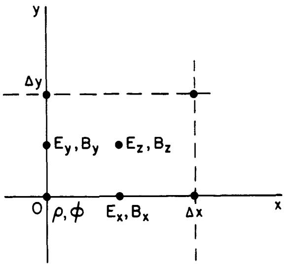  
Figure 15-12a The two-dimensional grid at a conducting wall, $x = 0$

With the Maxwell equations differenced in the interior as described in Section 15-2, the fluxes of tangential components of $\mathbf { B }$ are conserved exactly:

$$
\begin{array} { r l r } {  { \frac { d } { d t } \int _ { 0 } ^ { L _ { y } } d y \int _ { 0 } ^ { L _ { x } } d x B _ { y } } } \\ & { } & { \longrightarrow \frac { d } { d t } \Delta y \sum _ { k = 0 } ^ { N _ { y } - 1 } \Delta x \{ \frac { 1 } { 2 } B _ { y , 0 , k + 1 / _ { 2 } } + \sum _ { j = 1 } ^ { N _ { x } - 1 } B _ { y , j , k + 1 / _ { 2 } } + \frac { 1 } { 2 } B _ { y , N _ { x } , k + 1 / _ { 2 } } \} = 0 } \end{array}
$$

$$
\frac { d } { d t } \int _ { 0 } ^ { L _ { y } } \mathop { d y } \int _ { 0 } ^ { L _ { x } } d x B _ { z } \quad \longrightarrow \quad \frac { d } { d t } \Delta y \sum _ { k = 0 } ^ { N _ { y } - 1 } \Delta x \sum _ { j = 0 } ^ { N _ { x } - 1 } B _ { z , j + 1 / _ { 2 } , k + 1 / _ { 2 } } = 0
$$

In addition,the magnetic flux through any surface $( x = \mathsf { c o n s t } )$ is constant:

$$
\frac { d } { d t } \int _ { 0 } ^ { L _ { y } } d y B _ { x } \quad \longrightarrow \quad \frac { d } { d t } \Delta y \sum _ { k = 0 } ^ { N _ { y } - 1 } B _ { x , j + 1 / _ { 2 } , k } = 0
$$

From the time varying part of $\nabla \cdot { \mathbf { B } } = 0$ comes an additional boundary condition, $B _ { x } \left( x = 0 , y , t \right) = 0$ (or perhaps $= B _ { x 0 } ( y )$ ，a function of $y$ but not $t$ ， corresponding to a $B$ field established previously by external currents on a longer time scale). This becomes

$$
B _ { x } \quad \to \quad { \frac { B _ { x , - 1 / 2 , k } + B _ { x , 1 / 2 , k } } { 2 } } = B _ { x 0 } ( y )
$$

This boundary condition is not required in order to close the system of equations.

The total electric field energy is

$$
W _ { E } \ = \ \frac { \Delta x \Delta y } { 2 } \ \sum _ { k = 0 } ^ { N _ { y } - 1 } \ \left( \sum _ { j = 0 } ^ { N _ { x } - 1 } E _ { x , j + 1 / _ { 2 } , k } ^ { 2 } + \sum _ { j = 1 } ^ { N _ { x } - 1 } E _ { y , j , k + 1 / _ { 2 } } ^ { 2 } \right)
$$

The transverse electric field energy

$$
W _ { \mathrm { t r a n s } } = W _ { E } - W _ { e s }
$$

can be shown to be non-negative as calculated using (7) and (15),below.

# (b) Electrostatic Solutions in 2d

For diagnostic purposes we solve $- \nabla ^ { 2 } \phi = \rho$ for the electrostatic potential using the standard 5-point differencing as in Section 14-2. Fourier transforming $\pmb { \rho }$ and $\phi$ in $y$ produces $\rho _ { j , m } \equiv \rho _ { m } \left( X _ { j } \right)$ and $\phi _ { j , m }$ where $m$ is the harmonic number in $y$ ,including $m = 0$ . Poisson's equation is then a finite difference equation in $x$ ，as in Section 14-6. The boundary conditions at the perfectly conducting walls are $E _ { y } \left( 0 , y \right) = 0 = E _ { y } \left( L _ { x } , y \right)$ . That is, the $x = 0 = L _ { x }$ walls are equipotentials, $\phi _ { 0 , m } = 0 = \phi _ { N _ { x } , m }$ for all $m \neq 0$ For $m = 0$ we have

$$
\begin{array} { c } { { \phi _ { 0 , 0 } - \phi _ { 1 , 0 } = + \left( \rho _ { 0 , 0 } \Delta x + \left. \sigma _ { 0 } \right. \right) \Delta x } } \\ { { { } } } \\ { { \phi _ { N _ { x } - 1 , 0 } - \phi _ { N _ { x } , 0 } = - \left( \rho _ { N _ { x } , 0 } \Delta x + \left. \sigma _ { L } \right. \right) \Delta x } } \end{array}
$$

where the surface charges on the walls $q _ { 0 } \equiv L _ { y } \langle \pmb { \sigma } _ { 0 } \rangle$ and $q _ { L }$ are added to the active particle charge densities,weighted to the walls. The surface charge density at the boundary planes varies with $y ; ~ \sigma ( 0 , y ) = \sigma _ { 0 } ( y )$ and $\sigma ( L _ { x } , y ) = \sigma _ { L } ( y )$ ; the surface charges in a period in $y$ are, at the left,

$$
q _ { 0 } = \Delta y \sum \sigma _ { 0 } ( y ) \equiv L _ { y } \big \langle \pmb { \sigma } _ { 0 } \big \rangle
$$

and similarly for $q _ { L }$ at the right.

The electrostatic fields $E _ { x } , E _ { y }$ are now obtained at the cell centers, using single-cell differencing of $\phi _ { j , k }$ ，the better_to handle charge conservation (Gaussian box centered in point $( j , k )$ with $E _ { x }$ at $j \pm { ^ { 1 / 2 } } , k , E _ { y }$ at $j , k \pm / { 2 } )$

Active particles contribute all their charge to $\{ \rho _ { j , k } \}$ ， including that part collected at $j = 0$ and $N _ { x }$ . The total charge in the system $0 \leqslant x \leqslant L _ { x }$ in a period $L _ { y }$ is

$$
\mathrm { Q } _ { \mathrm { t o t a l } } = q _ { 0 } + q _ { L } + \Delta x \Delta y \sum _ { j = 0 } ^ { N _ { x } } \sum _ { k = 0 } ^ { N _ { y } - 1 } \rho _ { j , k } = 0
$$

$\scriptstyle \mathbf { Q } _ { \mathrm { t o t a l } }$ is zero because the electric field is zero inside the conducting walls,and therefore the electric flux through a surface enclosing $\mathsf Q$ is zero. External circuit currents transfer charge between $\pmb q _ { 0 }$ and $q _ { L }$ ，which are updated as active particles are created and deleted (Chapter 16). Total charge therefore remains constant (zero)，which makes (8) and (9) redundant so that we need another condition in order to determine $\phi$ uniquely.

The remaining condition needed is a convention for the additive constant in $\phi$ . We regard the left wall as grounded:

$$
\phi _ { 0 , k } \equiv \phi _ { 0 } = 0 , \qquad \phi _ { N _ { x } , k } = \phi _ { L }
$$

Solution of 14-6(2) with (8) or (9) determines $\phi$ everywhere, including $\phi _ { L }$ ： This solution can be done by introducing the $\mathbf { \nabla } _ { m } = 0$ Fourier component of the） field

$$
E _ { x , j + ^ { 1 / 2 } , 0 } = \frac { \phi _ { j , 0 } - \phi _ { j + 1 , 0 } } { \Delta x }
$$

with which

$$
\begin{array} { r l } { E _ { x , j + 1 / \boldsymbol { a } , 0 } - E _ { x , j - 1 / \boldsymbol { a } , 0 } = \rho _ { j , 0 } \Delta x } & { \quad \mathrm { f o r } \quad j = 1 , \ldots , N _ { x } - 1 } \\ { E _ { x , 1 / \boldsymbol { a } , 0 } = \rho _ { 0 , 0 } \Delta x + \left. \sigma _ { 0 } \right. } \end{array}
$$

This $E _ { x }$ is found in a sweep from left to right using (14a,b)； then $\phi _ { j , 0 }$ is found in a second sweep using (13).

The electrostatic field energy is

$$
\boldsymbol { W _ { e s } } = \frac { 1 } { 2 } \ : q _ { 0 } \boldsymbol { \phi _ { 0 } } + \frac { 1 } { 2 } \ : q _ { L } \ \boldsymbol { \phi _ { L } } + \Delta x \ : \Delta y \ : \sum _ { j = 0 } ^ { N _ { x } } \sum _ { k = 0 } ^ { N _ { y } - 1 } \frac { 1 } { 2 } \ : \rho _ { j , k } \ : \boldsymbol { \phi _ { j , k } }
$$

Because of (11), $W _ { e s }$ is independent of the arbitrary choice (12).

# (c) Combined Particle and Field Calculation

For the correction of the longitudinal part of $E$ (Section 15-6) we solve in the same way for the correction potential $\delta \phi$ ，where the source term in 15-6(12) is the same except that at the walls $\mathbf { \nabla } \mathbf { \nabla } \mathbf { \nabla } \mathbf { \nabla } \mathbf { \nabla } \mathbf { \nabla } \mathbf { \nabla } \mathbf { \nabla } \mathbf { \nabla } \mathbf { \nabla } \mathbf { \nabla } \mathbf { \nabla } \mathbf { \nabla } \mathbf { \nabla } \mathbf { \nabla } \mathbf { \nabla } \mathbf { \nabla } \mathbf { \nabla } \mathbf { \nabla } \mathbf { \nabla } \mathbf { \nabla } \mathbf { \nabla } \mathbf { \nabla } \mathbf { \nabla } \mathbf { \nabla } \mathbf { \nabla } \mathbf { \nabla } \mathbf { \nabla } \mathbf { \nabla } \mathbf { \nabla } \mathbf { \nabla } \mathbf { \nabla } \mathbf { \nabla } \mathbf { \nabla } \mathbf { \nabla } \mathbf { \nabla } \mathbf { \nabla } \mathbf { \nabla } \mathbf { \nabla } \mathbf { \nabla } \mathbf { \nabla } \mathbf { \nabla }$ is calculated as if $E _ { x , - \% , k } = E _ { x , N _ { x } + ! k , k } = 0$ A simple check on this procedure is to apply it twice; the second $\delta \phi$ should be zero (i.e.,no further correction).

We can determine the distribution in $y$ of the surface charges $\pmb q _ { 0 }$ and $q _ { L }$ ； these may be used,for example，to control field emission of particles (Chapter 16). At the left wall, Gauss’ law over any cell gives

$$
\sigma _ { 0 , k } = E _ { x , \psi , k } ~ - ~ \rho _ { 0 , k } \Delta x
$$

Gauss’ law over a period in $y$ is satisfied at the surface $x _ { 1 / _ { 2 } } = 1 / _ { 2 } \Delta x$ , as we see from

$$
\begin{array} { l } { { \displaystyle \sum _ { k = 0 } ^ { N _ { y } - 1 } E _ { x , \parallel _ { \ L } , k } ~ \Delta y = \sum _ { k = 0 } ^ { N _ { y } - 1 } \left( \rho _ { 0 , k } ~ \Delta x + \sigma _ { 0 , k } \right) \Delta y } } \\ { { \displaystyle = q _ { 0 } + \Delta x ~ \Delta y ~ \sum _ { k = 0 } ^ { N _ { y } - 1 } \rho _ { 0 , k } } } \end{array}
$$

where we have used (10).

As in Section 15-5, for the convenience of the particle integrator and field diagnostics,the fields are averaged in space as in Section 15-5 to obtain fields at the same points as $\pmb { \rho }$ . Before the next integration of Poisson's equation, the original unaveraged fields are restored.

From (1)，(2),and (6) we know $E _ { y }$ ， $E _ { z }$ ,and $B _ { x } = B _ { x 0 } ( y )$ at the walls. To form $E _ { x , 0 , k }$ we could average $E _ { x , + 1 / 2 , k }$ and $E _ { x , - 1 / 2 , k }$ but, if the latter is zero as when calculating $\mathbf { \nabla } \mathbf { \nabla } \mathbf { \nabla } \mathbf { \nabla } \mathbf { \nabla } \mathbf { \nabla } \mathbf { \nabla } \mathbf { \nabla } \mathbf { \nabla } \mathbf { \nabla } \mathbf { \nabla } \mathbf { \nabla } \mathbf { \nabla } \mathbf { \nabla } \mathbf { \nabla } \mathbf { \nabla } \mathbf { \nabla } \mathbf { \nabla } \mathbf { \nabla } \mathbf { \nabla } \mathbf { \nabla } \mathbf { \nabla } \mathbf { \nabla } \mathbf { \nabla } \mathbf { \nabla } \mathbf { \nabla } \mathbf { \nabla } \mathbf { \nabla } \mathbf { \nabla } \mathbf { \nabla } \mathbf { \nabla } \mathbf { \nabla } \mathbf { \nabla } \mathbf { \nabla } \mathbf { \nabla } \mathbf { \nabla } \mathbf { \nabla } \mathbf { \nabla } \mathbf { \nabla } \mathbf { \nabla } \mathbf { \nabla } \mathbf { \nabla }$ for the divergence correction， then we cannot represent even the simple case of a charged capacitor with no free charge,in which $E _ { x }$ is uniform. Instead, we use $E _ { x , 0 , k } = E _ { x , \mathscr { h } , k }$ We treat $B _ { z }$ similarly. When there is free charge or current in the boundary cels $( \rho _ { 0 , k }$ or $J _ { y , 0 , k }$ nonzero),a number of choices can be made which depend on whether we think we must resolve collective behavior in these cells and how well that can be done. Options for $E _ { x }$ include

$$
\begin{array} { r l } & { E _ { x , 0 , k } = E _ { x , 1 / 2 , k } } \\ & { E _ { x , 0 , k } = \sigma _ { 0 , k } + \mathfrak { M } _ { 2 \rho _ { 0 , k } } \Delta x = E _ { x , \ast / _ { 2 } , k } - \mathfrak { M } _ { 2 } \rho _ { 0 , k } \Delta x } \\ & { E _ { x , 0 , k } = \sigma _ { 0 , k } = E _ { x , 1 / _ { 2 } , k } - \rho _ { 0 , k } \Delta x } \end{array}
$$

All these reduce to the vacuum case mentioned above when $\rho _ { 0 , k } = 0$ Option (a) changes smoothly as particles are "born" near the wall and move in,while (b） and (c） produce discontinuous change in wall density upon emission of a particle. In a flow which is uniform in $y$ ,option (b) results in the correct attraction to the emitting wall for particles in the cells adjacent to the wall, while option (a) produces too little attraction and (c) too much.

# 15-13 INTEGRATING MAXWELL'S EQUATIONS IN CYLINDRICAL COORDINATES

Boris (1970) describes spatial differencing of Maxwell's equations in $r \mathord { \mathrm { - } } z$ coordinates. Palevsky (1980) considers both $r \cdot z$ and $r { \cdot } \theta$ coordinates. B. B. Godfrey (private communication） has implemented more general curvilinear coordinates. Here we outline the extension of the electrostatic calculation, Sections 14-10 through 14-12, to an electromagnetic code in $r \cdot z$ coordinates.

First, we introduce a compact notation, useful for the more complicated electromagnetic case,by rewriting the equations of Section 14-10(b). From 14-10(9),the divergence is given by

$$
\frac { 1 } { 2 } \Delta z \left( \Delta r ^ { 2 } \right) _ { j } \left( \nabla \cdot \mathbf { E } \right) _ { j , k } = \Delta z \left( \Delta _ { r } \ r E _ { r } \right) _ { j , k } + \frac { 1 } { 2 } \left( \Delta r ^ { 2 } \right) _ { j } \left( \Delta _ { z } E _ { z } \right) _ { j , k }
$$

where $( j , k )$ are subscripts for $( r , z )$ and the centered $\Delta ,$ and $\Delta _ { z }$ operators are illustrated by

$$
\begin{array} { r l } & { ( \Delta _ { r } \ : r \ : E _ { r } ) _ { j , k } \equiv r _ { j + 1 / _ { 2 } } E _ { r , j + 1 / _ { 2 } , k } - r _ { j - 1 / _ { 2 } } E _ { r , j - 1 / _ { 2 } , k } } \\ & { \quad ( \Delta _ { z } \ : E _ { z } ) _ { j , k } \equiv E _ { z , j , k + 1 / _ { 2 } } - E _ { z , j , k - 1 / _ { 2 } } } \end{array}
$$

Similarly,

$$
\Delta r _ { j + 1 / _ { 2 } } \left( \frac { \partial \phi } { \partial r } \right) _ { j + 1 / _ { 2 } , k } = \phi _ { j + 1 , k } - \phi _ { j , k }
$$

Just as the divergence expressions are obtained by application of Gauss' integral theorem to certain volumes, the curl expressions are obtained by application of Stokes’ theorem to appropriate line integrals. The line integral of $\mathbf { E }$ around a rectangle in the $r \cdot z$ plane (Figure 14-10b） gives

$$
\Delta r _ { j + \backslash j _ { 2 } } \Delta z \left( \nabla \times \mathbf { E } \right) _ { \theta , j + \backslash j _ { 2 } , k + \backslash j _ { 2 } } = - \Delta z \left( \Delta _ { r } E _ { z } \right) _ { j + \backslash j _ { 2 } , k + \backslash j _ { 2 } } + \Delta r _ { j + \backslash j _ { 2 } } \left( \Delta _ { z } E _ { r } \right) _ { j + \backslash j _ { 2 } , k + \backslash j _ { 2 } }
$$

These difference expressions satisfy $\left( \nabla \times \nabla \phi \right) _ { \theta } \equiv 0$ identically (Problem 15-13a).

The $r$ and $z$ components of $\nabla \times \mathbf { E }$ are (Problem 15-13b)

$$
\begin{array} { r } { \Delta \boldsymbol { z } \left( \nabla \times \mathbf { E } \right) _ { r , j + 1 / _ { 2 } , k } = - \left( \Delta _ { z } E _ { \theta } \right) _ { j + 1 / _ { 2 } , k } } \\ { \frac { \left( \Delta r ^ { 2 } \right) _ { j + 1 / _ { 2 } } } { 2 } \left( \nabla \times \mathbf { E } \right) _ { z , j + 1 / _ { 2 } , k } = \left( \Delta _ { r } r E _ { \theta } \right) _ { j + 1 / _ { 2 } , k } } \end{array}
$$

These difference expressions satisfy $( \nabla \cdot \nabla \times \mathbf { E } )$ identically (Problem 15- 13c).

Finally， we often need difference expressions for $\nabla \times ( \nabla \times \mathbf { E } ) =$ $- \left( \nabla ^ { 2 } \mathbf { E } \right) + \nabla \nabla \cdot \mathbf { E }$ Because $\nabla ^ { 2 }$ operates on the unit vectors $\hat { \pmb { \ r } }$ and $\hat { \pmb \theta }$ ， $( \nabla ^ { 2 } \mathbf { E } )$ is not simply $\nabla ^ { 2 } E _ { r }$ .However, $( \nabla ^ { 2 } \mathbf { E } )$ ， does involve only $E _ { r }$ ，so we display this feature in writing the difference equations

$$
\left[ \nabla \times \left( \nabla \times \mathbf { E } \right) \right] _ { r } = \frac { 1 } { \Delta z } \Delta _ { z } \left[ \frac { \Delta _ { z } E _ { r } } { \Delta z } \right] - \frac { 1 } { \Delta r } \Delta _ { r } \left[ \frac { \Delta _ { r } r E _ { r } } { \Delta r ^ { 2 } / 2 } \right] + \frac { 1 } { \Delta r } \Delta _ { r } \left( \nabla \cdot \mathbf { E } \right)
$$

at position $( j + 1 / 2 , k )$ ，where the first two terms represent $- \left( \nabla ^ { 2 } \mathbf { E } \right) _ { r }$ .The $\pmb \theta$ and $\pmb { z }$ components are similar.

In the particle mover， we collect currents $I _ { r } , \ I _ { \theta }$ and $I _ { z }$ ， and charges Q, rather than densities $\mathbf { J }$ and $\pmb { \rho }$ . As in Section 14-10, this makes it possible to enforce conservation laws. An important subtlety remains: In Section 14-12 we discussed a rotation, applied after advancing the position $\mathbf { x }$ ，which brings the position back into the $r , z$ plane. To avoid an error in the direction of $\mathbf { J }$ ， resulting from the corresponding rotation of $\pmb { \gamma }$ ， we might use $\pmb { \gamma }$ before (after) the rotation in the first (second) part of 15-5(3)． In Darwin codes,the collection of $\mathbf { J } _ { n + 1 }$ from an improperly rotated $\ " { \pmb { v } } _ { n + 1 }$ can lead to macroscopic accumulation of spurious angular momentum (D. W. Hewett, private communication, 1983).

# PROBLEMS

15-13a Show that $( \nabla \times \nabla \phi ) _ { \theta } \equiv 0$ by using the commutation property $\Delta _ { r } \left( \Delta _ { z } \phi \right) \equiv \Delta _ { z } \left( \Delta _ { r } \phi \right)$ ， which holds on the mesh in Figure 14-10b.

15-13b Derive (6ab).Hints: (6a) is from an integral over a segment of a cylinder,divided by $2 \pi r$ ； (6b) is from the difference between the line integral on the outer and inner edges of a disk annulus,divided by $2 \pi$

15-13c Show that $\left( \nabla \cdot \nabla \times \mathbf { E } \right) _ { \pmb { \theta } } \equiv 0$ by using the commutation property $\Delta _ { r } r ( \Delta _ { z } E _ { \theta } ) \equiv$ $\Delta _ { z } \left( \Delta _ { r } \right. { \left. r E _ { \theta } \right) }$

# 15-14 DARWIN, OR MAGNETOINDUCTIVE,APPROXIMATION

In some applications it is possible to avoid the time-step limitation associated with explicit differencing of Maxwell's equations by altering the field equations so that they do not support wave propagation. A proven approach here is the Darwin,or magnetoinductive,model.

Darwin codes eliminate the Courant restriction $\Delta t \leqslant \lambda / c$ by dropping Maxwel's transverse displacement current term. These "pre-Maxwell equa-tions" eliminate electromagnetic wave propagation while retaining electro-static, magnetostatic and inductive electric fields. The equivalence of this nonradiative approximation to the Darwin Lagrangian,which retains as much of the electromagnetic interaction as possible without including retardation, is shown by Kaufman and Rostler (1971). Nielson and Lewis (1976),whose implementation is described here,provide many references for the historical development of these codes.

The field equations in the Darwin approximation are

$$
\begin{array} { l } { c \boldsymbol { \nabla } \times \mathbf { B } = \mathbf { J } _ { T } = \mathbf { J } + { \frac { \partial \mathbf { E } _ { L } } { \partial t } } } \\ { c \boldsymbol { \nabla } \times \mathbf { E } = - { \frac { \partial \mathbf { B } } { \partial t } } } \end{array}
$$

Given $\mathbf { E } _ { n } , \mathbf { B } _ { n }$ ， the particles are integrated by explicit diferencing to ${ \pmb { \nu } } _ { n + 1 / 2 }$ and $\mathbf { x } _ { n + 1 }$ Extrapolation of $\mathbf { v } _ { n + 1 / 2 }$ to $\boldsymbol { \mathsf { v } } _ { n + 1 }$ permits collection of $\mathbf { J } _ { n + 1 }$ ，from which ${ \bf B } _ { n + 1 }$ is obtained, e.g., by solution of $c \nabla ^ { 2 } { \mathbf B } = - \nabla \times { \mathbf J }$ Unlike usual electromagnetic codes, the Ampere equation (1） cannot be used to advance $\mathbf { E } _ { T }$ in time. Instead

$$
c ^ { 2 } \nabla ^ { 2 } \mathbf { E } _ { T } = { \frac { \partial \mathbf { J } _ { T } } { \partial t } }
$$

is used at time level $n { + 1 }$ . This creates a time-centering problem. To preserve second-order accuracy in time,(3） needs a time-advanced expression for $\partial \mathbf { J } _ { T } / \partial t$ . To ensure stability, $\partial \mathbf { J } / \partial t$ is expressed in terms of the advanced $\mathbf { E }$ ， using moments accumulated from the particles:

$$
{ \frac { \partial \mathbf { J } } { \partial t } } = - \nabla \cdot \rho \left. \mathbf { v } \mathbf { v } \right. + { \frac { q \rho } { m } } \mathbf { E } + { \frac { q \rho \left. \mathbf { v } \right. } { m c } } \times \mathbf { B }
$$

summed over species. This leads to an elliptic equation for the advanced felds of form

$$
{ } ^ { 2 } \nabla ^ { 2 } \mathbf { E } _ { T } - \omega _ { p } ^ { 2 } ( \mathbf { x } ) \mathbf { E } _ { T } = - \sum \nabla \cdot \boldsymbol { \rho } \left. \mathbf { v } \mathbf { v } \right. + \left[ \sum \frac { q \boldsymbol { \rho } \left. \mathbf { v } \right. } { m c } \right] \times \mathbf { B } + \omega _ { p } ^ { 2 } \mathbf { E } _ { L } - \nabla \mathbf { \Xi }
$$

at time level $n { + 1 }$ . The divergence of this equation, together with $\nabla \cdot \mathbf { E } _ { T } = 0$ determines E. This elliptic equation provides instantaneous propagation of B and $\mathbf { E } _ { T }$ ，as is necessary for stability. Iterative methods are usually required to solve (5).

Busnardo-Neto et al. (1977) and Aizawa et al. (1980) describe variants of this algorithm.

# 15-15 HYBRID PARTICLE/FLUID CODES

For applications not requiring a kinetic description of the electrons, codes using a hybrid of particle ions and fluid electrons are indicated. With Darwin and quasistatic approximations,long time scales are accessible as in a full implicit code but with less noise. Sometimes an energetic minority of electrons is modeled with particles, while the cold ion and electron backround is a fluid. Early models of this type (Dickman et al., 1969; Byers et al., 1974) include the transverse particle current component that is out of the plane of simulation,but treat the remaining particle current and the fluid current very approximately; often the fluid simply neutralizes the particle charge density.

Byers et al. (1978) give a more complete treatment of the fluid and particle currents,in the limit of negligible electron mass. A similar algorithm has been implemented in two dimensions $( r { \cdot } z )$ by Mankofsky et al.(1981） and $( x { \cdot } y )$ by Harned (1982a). From an explicit integration of the fluid electron momentum equation,Hewett and Nielson (1978) obtain the transverse fluid current. The longitudinal fluid current is calculated so that the longitudinal particle ion current is cancelled, eliminating Langmuir oscillations. Some plasma phenomena depending on electron inertial efects are retained, e.g., lower hybrid and electron cyclotron waves.

Because of the use of explicit time integration, these codes are unstable at low densities where the Alfvén wave frequency becomes large. In order to treat problems which feature vacuum or low density regions, ad hoc interfacing or other stabilization artifices become necessary. Hewett (1980) removes this limitation by solving the coupled electron and field equations simultaneously by a noniterated alternating-direction-implicit method.

Applications of hybrid codes are included in Section 15-18.

# 15-16 IMPLICIT ELECTROMAGNETIC CODES

Implicit fields reproduce electromagnetic wave propagation at long wavelengths $( \lambda > > c \Delta t )$ . At short wavelengths,the electrostatic, magnetostatic,and inductive electric fields are retained, as in a Darwin code. Implicit fiel&s can be used with explicit particles.

With implicit particles, Langmuir waves are stabilized at all wavelengths, as in an implicit electrostatic code. The electrostatic fields are accurate for wavelengths longer than the electron transit distance $( \nu _ { t e } \Delta t )$ . These proper-ties make an implicit electromagnetic code attractive e.g.，to modeling of intense electron flow which is subject to pinching,Weibel instability (Brackbill and Forslund, 1982),and other processes generating magnetic fields which alter the electron flow (Forslund and Brackbill, 1982).

Implicit electromagnetic simulation is discussed in detail by Brackbill and Forslund (1985),and Langdon and Barnes (1985).

# 15-17 DIAGNOSTICS

We describe a minimal set of diagnostics for understanding the results of laser-plasma interaction simulations. Many are obvious; the need for others is appreciated after experience both with and without them on specific problems. It is these parts of the code which are most frequently changed and should be kept flexible.

# (a) Particles

The most familiar particle diagnostic is the phase space scatter plot. Dots are plotted at positions given by two of the particle coordinates,e.g. ${ \pmb u } _ { x }$ and $u _ { y }$ . Often these plots make direct connection to theoretical descriptions; particle trapping in waves is a well-known example.

While conceptually simple, implementation is complicated by not having all the particles in memory at once. If a phase space plot is to be made on the next time step, then ZOHAR scans the particles for minima and maxima, to see if plot limits must be expanded. The other problem concerns making more than one frame or running several plot channels; we specify an offset as well as a plotting interval. Thus,one plot is made at steps O,100, 200,... ; another may be made at steps 49,99,...，etc. Usually the slight difference in time of plotting does not hinder comparisons.

An elaboration is to plot one linear combination of particle coordinates versus another, skipping particles not satisfying two linear constraints. For example, plotting $u _ { x } - u _ { y }$ versus $x - y$ for particles with $a < x < b$ displays trapping in waves propagating at 45° in a slice of the system. Morse and Niel-son (1971） uncover trapping in simulations of Weibel instability by plotting $\nu _ { y }$ versus $y$ for each of three groups of particles which are sorted according to their canonical momenta $\nu _ { x } + q A _ { x } / m c$ ,a constant in their one-dimensional $( \nu )$ simulation.

Also handled by the same subroutine are plots of $f \left( q \right)$ and contours of $f \left( q _ { 1 } , q _ { 2 } \right)$ ,where $q , q _ { 1 }$ ,and $\pmb { q } _ { 2 }$ are any particle phase space coordinates and $q$ may be $u ^ { 2 }$ (these are projections over the other coordinates). This includes, for example $f \left( u _ { x } \right)$ ， $f ( u ^ { 2 } )$ ,and $\rho ( x , y )$ . In the open-sided version，the transform $\rho ( x , k _ { y } )$ is often used, and we also plot statistics on particles leaving the system.

# (b) Fields

Obvious diagnostics are contour plots for $B _ { z } , E _ { z }$ ，and $\phi$ . We also have plots of $( E _ { x } , E _ { y } )$ ， $( B _ { x } , B _ { y } )$ ，and $- \nabla \phi$ consisting of an array of little arrows whose directions and lengths indicate the vector value at that point in space.

Fourier mode energies for $B _ { z } , ~ E _ { z }$ ，and $\phi$ are indicated by an array of vertical lines whose lengths are proportional to the logarithm of the mode energies,over a range of $1 0 ^ { 4 }$ .“This points out modes which should be watched more closely by other means.

In the open-sided version, plots of $B _ { z } \left( x , k _ { y } \right)$ ,etc.， for specified y modes aid both in interpretation of results and separating a signal from other effects or from noise.

# (c) Histories

Many quantities are saved each time step to provide history plots. Most of these are energies and momenta for fields and particle species. Also saved are specified field probes,mode energies,and mode amplitudes,e.g.，for $E _ { z } \left( x , k _ { y } \right)$ .The latter include $E _ { z }$ and $B _ { z }$ at $x = 0$ for the outgoing waves only,computed as per Sec. 15-i1d. From time to time during a run，the code plots the saved quantities,and others derivable from them. For more careful study,an interactive postprocessor ZED reads the history file,per-forms operations such as calculating frequency spectra, and makes plots.

# (d) Remarks

Usually it is not possible to foresee exactly which plots will be decisive in a computer run. Compared to an electrostatic code, there are many times more quantities to monitor. In order to get what is needed the first time, much thought is given to a judicious choice of diagnostics, but we prefer to err on the side of inclusion rather than omission. The result is a little like a telephone directory: a lot of data, much of which will not be useful, but you want to have it all because you do not know in advance what you will need.

For such reasons,we believe this type of computing cannot be seriously pursued without access to a high resolution and high volume graphical output device,such as a cathode-ray tube and camera. Mechanical plotters are too slow，especially for contours and phase space plots. Impact "printer plots” are too coarse， too often hiding or distorting valuable detail. Microfiche is the most compact and easily handled format.

Sometimes one must resort to numerical printouts. Again the telephone directory analogy holds,and microfiche is the best available format.

# 15-18 REPRESENTATIVE APPLICATIONS

This section is a partial survey of applications of electromagnetic simulation codes. It is not a complete bibliography，but it does indicate some of the diversity of physical problems and computer models. Many additional papers are references in papers cited here,others are cited in Chapters 6 and 7.Some important application areas, such as ionospheric, interplanetary and astrophysical plasmas, free-electron lasers,and collective accelerators,are neglected. We first mention a few papers in various subjects, then discuss some topics in more detail.

Weibel instability and related filamentation of electron flow.an early application of electromagnetic codes (Morse and Nielson， 1971; Davidson et al.，1972;Lee and Lampe，1973),is now well handled by implicit codes (Brackbill and Forslund, 1982).

Dissipation phenomena in_collisionless shocks are discussed by e.g Biskamp and Welter (1972) and Forslund et al. (1972).

Instabilities in whistlers and ion cyclotron waves are discussed by Hasegawa and Birdsall (1964) and Ossakow et al. (1972a, b).

"Plugging" of end-losses and r.f. heating by means of low frequency radio waves are clarified by Ohsawa et al. (1979).

Electron flow in microwave devices is a non-neutral plasma. Electromagnetic codes model magnetrons (Palevsky， 1980） and other devices (Kwan, 1984).

Collisionless tearing instability,and associated heat transport, are treated by Katanuma (1981) and Katanuma and Kamimura (1980).

# (a) Interaction of Intense Laser Light with Plasmas

This topic has been primarily driven by the intent to ignite significant thermonuclear burn using the very high energy fluxes available from large lasers. Usually,the plasma is also produced by the laser,and therefore the spatial dependence of the plasma density and temperature are related to the intensity and wavelength of the laser light. We simulate a section of the plasma corona encompassing critical density (i.e.，where the electron plasma frequency $\omega _ { p e }$ equals the laser frequency $\omega _ { 0 } .$ ,down to a few percent of critical density.

First a digression on units: For laser-plasma interaction problems in ZOHAR we set $c$ ，the laser frequency $\omega _ { 0 }$ ，and $- q _ { e } / m _ { e }$ to unity in the code.

This prescribes a set of units in which numbers in the code are easily related to ratios of physical interest. Since now $\omega _ { p e } ^ { 2 } = - \rho _ { e }$ in rationalized cgs units, density is measured in units of the critical density. For the potential, $\phi = 1$ means $- q _ { e } \phi = m _ { e } c ^ { 2 }$ ，i.e.， $5 1 1 \mathbf { k } \mathbf { e } \mathbf { V }$ .The cyclotron frequency， $\omega _ { c e } =$ $| q _ { e } | B _ { z } / ( m _ { e } c ) = B _ { z }$ ，so that unit $B _ { z }$ means $\omega _ { c e } = \omega _ { 0 }$ which occurs near 100 megagauss for laser wavelength $1 . 0 6 \mu \mathrm { m }$ .The species charge is chosen to give the correct total charge,and the mass is obtained from $q / m$ .We divide system energies,etc.,by $L _ { y }$ before plotting,so that with our other normalizations the diagnostics do not vary with changes in $N _ { y } , L _ { y }$ $N _ { e }$ ，etc., unless the physics has changed. Other groups achieve similar convenience e.g. by normalizing the cgs electric field to $( 4 \pi n m _ { e } c ^ { 2 } ) ^ { ! / 2 }$

Collisionless absorption near the critical density is due largely to "resonance" absorption, in which part of the light energy tunnels past the classical turning point to excite a plasma wave at critical density. This wave accelerates electrons to high energies. The plasma wave pressure can drastically alter plasma flow through the critical density point,leading to density profile steepening which, in turn,affects the amount of absorption and the temperature of the heated electrons. This nonlinear interplay was demonstrated in simulations by Forslund et al. (1975),and Estabrook et al. (1975). Magnetic field generation accompanying resonance absorption, with and without collisional effects,are discussed by Adam et al. (1982a) and references therein. Magnetic field generation and resulting lateral transport of heat are modeled in an implicit code by Forslund and Brackbill (1982).

Two high-frequency instabilities are possible in the underdense plasma region: (a) $2 \omega _ { p }$ decay of the incident wave into two electron plasma waves near the quarter-critical density region; (b） Raman scattering, the decay into an electron plasma wave and an electromagnetic wave,at or below quartercritical density. Stimulated Thomson (or Compton) scattering is a variant of Raman，occurring at high temperatures or low densities,in which the longitudinal perturbation is not a plasma wave (because of Landau damping) but is coherent scattering on the electrons. In addition， stimulated Brillouin scattering, the decay into a sound wave and an electromagnetic wave, is possible throughout the underdense region. Other processes, such as filamentation,are not discussed here. These processes are named for analogous processes occurring in liquids and gasses.

Early simulations in one dimension of Raman and Brillouin scatter are reported by Forslund et al. (1973) and Kruer et al. (1973). Raman and Brillouin sidescatter，in which the decay wave propagates obliquely to the line of the incident light, is modeled in $2 \% 1$ simulations by Klein et al. (1973), Ott et al. (1974),Biskamp and Welter (1975),and Langdon and Lasinski (1976, 1983).

ZOHAR simulations of the $2 \omega _ { p }$ instability (two-plasmon decay） showed nonlinear saturation of this instability by its generation of short-wavelength ion fluctuations and local density profile steepening (Langdon and Lasinski, 1976; Langdon et al.， 1979). Both features were later observed

experimentally by Thomson scattering diagnostics (Ebrahim et al.，1979;   
Baldis and Walsh,1983).

Aizawa et al. (1980) simulated expansion of laser produced plasma into an externally-generated magnetic field.

# (b) Reversed-Field Configurations; Pinches

Hybrid codes have been used to model field-reversed configurations generated by injection of electrons (Byers et al.，1974),ions (Mankofsky et al., 1981;Harned, 1982b),and neutral beams (Byers et al.， 1978). Buneman et al. (i980) simulated a helical instability in a Z-pinch,accessible only to their three-dimensional code. An unexpected self-generated toroidal magnetic field was found in simulations by Hewett (1984) of theta pinches,and was later observed in experiment.

# 15-19 REMARKS ON LARGE-SCALE PLASMA SIMULATION

We conclude by discussing matters strongly affecting the practicality of two-dimensional, electromagnetic simulation.

It has often been stated that to obtain "collisionless" behavior, the colli-sion times must be longer than the length of the run. Fortunately this is overly pessimistic. What appears to be closer to the truth is that collision times should exceed， e.g.， instability exponentiation times and trapping times. Particularly with the open-sided code,where wave energy and ther-mal particles are replenished, the whole run can usually be much longer than the latter times.

One might expect to need enough particles to give a good representation of the velocity distribution in each Debye square. With three velocity components $( 2 \% { \sf d } )$ ， the total number of particles required would then be completely out of reach. However, for our applications,details of the distribution in $\nu _ { z }$ are not of concern; only enough particles to represent.the first few $\nu _ { z }$ moments were needed. Usually no more particles were needed than for a problem with two velocity components (2d). Similarly, for a longitudinal plane wave propagating in the $x$ direction, details of the $\nu _ { y }$ distribution are not required; one needs enough particles in an area of the order of a square wavelength to represent the $\nu _ { x }$ distribution well. Since the same tends to be true for each of several superimposed waves traveling in various directions, the particle density required is much lower than one might infer from experience in one dimension. Another way to say this is that one needs good statistics in projections of the distribution,and not necessarily in the full phase space. (Of course, for some phenomena in magnetic fusion, such as cyclotron harmonic waves, the dimensionality of the relevant projection is not as low as in the example here, and many times more particles may be needed for such problems.） This economy is a main reason that particle codes can compete successfully with Vlasov codes in multidimensions.

Caution is required, but one can be paralyzed by a conservative attitude into missing profitable applications.

Finally, some remarks on costs and code efficiency: Due to extensive use on expensive computer systems, it is often true that the cost of the applications of an electromagnetic code exceeds the cost of employing several peo-ple. It is then economically advisable to tune the code to the machine,e.g. by careful rewriting of sections of the code into the machine's native language using an assembler. In ZOHAR for example, the particle mover (advancing $\mathbf { x } , \mathbf { y }$ and collecting $\rho , { \bf J } )$ was converted to machine language very early in the code's development,and again when the code moved to a newer computer. The resulting cost savings to the applications of the code repaid this effort in a few months. On the other hand,the particle boundary condi-tions are changed frequently and are written in FORTRAN,as are almost all the rest of the physics aspects of ZOHAR.

# PARTICLE LOADING, INJECTION; BOUNDARY CONDITIONS AND EXTERNAL CIRCUIT

# 16-1 INTRODUCTION

Placing particles in $\mathbf { x } , \mathbf { v }$ at $t = 0$ and creating or removing particles during a run are the main subjects of this Chapter. The placement involves starting with prescribed densities in space ${ \pmb n } _ { 0 } ( { \pmb x } )$ and in velocity $f _ { 0 } ( \mathbf { v } )$ and generating particle positions and velocities $( \mathbf { x } , \mathbf { v } ) _ { i }$ . The formal process for this is called inversion of the cumulative density.

Another subject is the handling of bounded systems having wall charges, net current, and external circuit elements. The latter requires simultaneous solution of Kirchhoff's circuit equations.

In studying plasmas which have very large spatial extent, we usually model only a portion of the plasma, up to some length $L$ (i.e., $L _ { x }$ by $L _ { y }$ by $L _ { z }$ )；we usually invoke periodicity along one or more coordinates, where applicable，and make the particles re-entrant or reflected at the periodic boundaries, running with a constant number of particles. In such models the initial conditions on the particle distribution function $f \left( \mathbf { x } , \mathbf { v } , t = 0 \right)$ are very important in determining the later behavior of the system. Hence,it is desirable to load the particles carefully at $\pmb { t = } 0$ . Some steps in wide use for inverting given densities $n _ { 0 } ( { \bf x } )$ and $f _ { 0 } ( \mathbf { v } )$ into particle positions and velocities $( \mathbf { x } , \pmb { v } ) _ { i }$ are given in this Chapter.

In studying bounded plasma systems,where particles may be created or removed at boundaries during the run,the boundary conditions on particles, such as particle flux, $\Gamma = \nu _ { \mathrm { n o r m a l } } f _ { 0 } ( x _ { \mathrm { w a l l } } , \mathbf { v } , t )$ ，are very important in determining the continuing behavior of the system. For some studies,starting with the system empty or full of particles may lead to the same result after some time. For other studies,establishing an equilibrium $f _ { 0 } ( \mathbf { x } , \mathbf { v } )$ at $t = 0$ ， even approximately,may be very important, for example,in studying the stability of this $f _ { 0 }$ ； starting with an empty system and then injecting particles may never produce an $f \left( { \bf x } , { \bf v } \right)$ near the desired $f _ { 0 }$ . Some methods that are in use for creating fluxes at walls are presented in this Chapter.

# 16-2 LOADING NONUNIFORM DISTRIBUTIONS $f _ { 0 } ( \mathbf { v } )$ ， ${ \pmb n } _ { 0 } ( { \bf x } )$ ； INVERSION OF CUMULATIVE DISTRIBUTION FUNCTIONS

The physical problem initial conditions usually specify densities $f _ { 0 } ( \mathbf { v } )$ and $n _ { 0 } ( \mathbf { x } )$ in simple forms, like exp $( - \nu ^ { 2 } / 2 \nu _ { t } ^ { 2 } )$ or $( 1 + \psi \sin k x )$ .These forms must be inverted in order to obtain $\left( \mathbf { x } , \mathbf { v } \right) _ { i }$ of the particles. In this sec-tion, we look at some general ideas about placing particles in phase space.

Suppose that we wish to place particles so as to form a distribution function (or,density) $d ( x )$ ，from $x = a$ to $x = b$ Let $d ( x )$ be given $a \leqslant$ $x \leqslant b$ ，either analytically or numerically. Form the cumulative distribution function,

$$
D \left( x \right) \equiv \frac { \displaystyle \int _ { a } ^ { x } d \left( x ^ { \prime } \right) d x ^ { \prime } } { \displaystyle \int _ { a } ^ { b } d \left( x ^ { \prime } \right) d x ^ { \prime } }
$$

where

$$
D \left( a \right) = 0 \qquad D \left( b \right) = 1
$$

and

$$
{ \frac { d D \left( x \right) } { d x } } = { \frac { d \left( x \right) } { \int _ { a } ^ { b } d \left( x ^ { \prime } \right) d x ^ { \prime } } }
$$

We see that equating $D \left( x _ { s } \right)$ to a uniform distribution of numbers $R _ { s }$ ， $0 < R _ { s } < 1$ will produce the $x _ { s }$ corresponding to the distribution $d \left( x _ { s } \right)$ (The reader may verify this by sketching $D \left( x \right)$ and $D ^ { \prime } ( x )$ .） For example, let

$$
d ( x ) = d _ { 0 } ( 1 + \epsilon x )
$$

so that

$$
D \left( x \right) = \frac { \left( x - a \right) + \frac { \epsilon } { 2 } \left( x ^ { 2 } - a ^ { 2 } \right) } { \left( b - a \right) + \frac { \epsilon } { 2 } \left( b ^ { 2 } - a ^ { 2 } \right) }
$$

Let $R _ { s }$ be ten numbers 0 to1 $\mathit { s } = 0$ to 9),like 0.05,0.15,...，0.95 (or,a random set); this places the first particle at $x _ { 1 }$ ， which is obtained by solving $\pmb { D } ( \pmb { x } _ { 1 } ) = 0 . 0 5$ ， the second at $x _ { 2 }$ ，obtained by solving $D \left( { x _ { 2 } } \right) = 0 . 1 5$ ,and so on. The simulator may choose to solve these quadratic equations (Problem 16-2a),or may integrate (1） numerically in fine steps (until O.05 is reached, then O.15,etc.） which must be done in examples where $d ( x )$ is not integrable explicitly. A fast approximation to the integration method is used in ES1 subroutine INIT to create a quiet start velocity distribution， for_any one-dimensional distribution; see Section 3-7. See also Hockney and Eastwood (1981, secs.10-3-2 and 10-4-1).

# PROBLEM

16-2a Suggest means for identifying and discarding the spurious root in (5)， that is, $D ( x _ { s } ) = R _ { s }$ . Show that solving this equation for $1 / x _ { s }$ leads to

$$
x _ { s } = a + \frac { R _ { s } L \left( 2 + \epsilon L \right) } { 1 + \sqrt { 1 + 2 \epsilon L \left( 2 + \epsilon L \right) } }
$$

where $L = b - a$ ．This form avoids dividing by zero for $\epsilon = 0$ and is more accurate

# 16-3 LOADING A COLD PLASMA OR COLD BEAM

Cold systems are simple; however,there are some pitfalls,so we start our design examples here. Use of linear weighting is assumed.

A cold uniform plasma may be put together in several ways. The obvious and easy way is to put the electrons in as particles,uniformly spaced, several to a cell,and the ions as a stationary uniform background. [See Section 5-4 for discussion of producing unwanted spikes in density,the Kaiser Wilhelm effect.] With linear or higher-order weighting,any small excitations in displacement (or velocity） excite plasma oscillations; with zero-order weighting,NGP,no field develops unless the excitation is large enough to drive an electron across a cell (or mid-cell) boundary,producing a field. A next step is to treat the ions as particles,which requires that $q _ { i } / m _ { i }$ be given.

A cold beam, with all particles given the same drift speed $\nu _ { 0 }$ (and most probably with an immobile neutralizing background),is numerically unstable in a periodic model. That is,as shown in Part Two, Section 8-12, the cold beam is heated non-physically due to aliasing until $\lambda _ { D } / \Delta x$ reaches about 0.05 (for $\lambda _ { B } / \Delta x \geqslant 0 . 3 )$ and then the system becomes stable,although noisy. Hence，one may choose to let the instability grow and eventually quench itself,or one may start off with a mild amount of velocity spread $( \nu _ { t } ~ < < ~ \nu _ { 0 }$ but with $\lambda _ { D } / \Delta x \geqslant 0 . 0 5 )$ and far less noise than if the growth had been allowed.

Maxwellian or Gaussian distributions in v are considered,of form exp $( - \nu ^ { 2 } / 2 \nu _ { t } ^ { 2 } )$ . Such distributions occur in many parts of physics,usually as equilibrium distributions. Hence，we need methods for inverting Gaussians to positions or velocities. A useful general reference is Chapter 3 in Hammersley and Handscomb (1964).

A normalized thermal distribution is shown in Figure 16-4a. Most of the particles are in the region out to $\nu = 3 \nu _ { t }$ (99 percent, in fact, in $_ { 2 \nu }$ ） so that seldom do we need to place particles beyond 3 or ${ 4 \nu _ { t } }$

Let us find the $( \mathbf { x } , \mathbf { v } ) _ { i }$ to use with a spatially uniform plasma with isotropic Gaussian $f _ { 0 } ( \mathbf { v } )$ . The cumulative distribution function for the speed $\bar { \boldsymbol { \nu } } = | \mathbf { v } |$

$$
R _ { s } \left( 0 \to 1 \right) = F \left( \mathbf { v } \right) = \frac { \displaystyle \int _ { 0 } ^ { \mathbf { \check { e } } } \exp \left( - \frac { \nu ^ { 2 } } { 2 \nu _ { t } ^ { 2 } } \right) d \mathbf { v } } { \displaystyle \int _ { 0 } ^ { \infty } \exp \left( - \frac { \nu ^ { 2 } } { 2 \nu _ { t } ^ { 2 } } \right) d \mathbf { v } }
$$

is set equal to a set of uniformly distributed numbers $R _ { s }$ ， varying from O tc 1, in order to obtain the $\nu ^ { \prime } { \pmb s }$

For a one-dimensional thermal distribution,the integral over $f \left( \nu \right)$ can-not be done explicitly, but is done numerically,as in INIT in ES1, to produce a "quiet Maxwellian," with thermal velocity $\nu _ { t 2 }$ ; see Section 3-6.

For a two-dimensional isotropic_thermal distribution (which is 2v, involving $\nu _ { x } , \nu _ { y }$ ，or speed $\nu = ( \nu _ { x } ^ { 2 } + \nu _ { y } ^ { 2 } ) ^ { 1 / 2 }$ and angle $\pmb \theta =$ arctan $\nu _ { y } / \nu _ { x } \mathrm { . }$ ；dvis

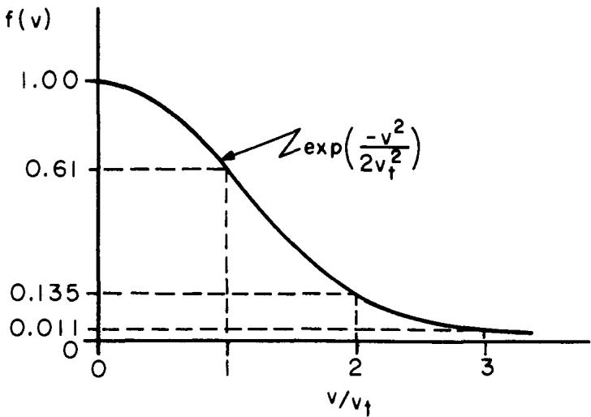  
Figure 16-4a Normalized thermal velocity distribution.

$2 \pi \nu d \nu$ so that these integrals can be done explicitly. The inversion for speeds $\nu$ obtained in terms of $R _ { s }$ gives (new $R _ { s } = 1 - \mathrm { o l d } R _ { s } .$ ）

$$
\nu _ { s } = \nu _ { t } \sqrt { - 2 \ln { R _ { s } } }
$$

Another set of uniform numbers $R _ { \theta }$ is chosen for the ${ \pmb \theta } ^ { \prime } { \pmb s }$ ，over the range 0 to $2 \pi$ ， $\theta _ { \theta } = 2 \pi R _ { \theta }$ . An alternative is to use the method of Box and Muller (Hammersley and Handscomb, 1964,p.39),multiplying $\sqrt { - 2 \ln { R _ { s } } }$ by cosine and sine of argument $( 2 \pi R _ { \theta } )$ to produce normal deviates in independent pairs,that is （for our purposes) Gaussians in $\nu _ { x }$ and $\nu _ { y }$ .The cosine and sine lookups may be replaced by the technique of von Neumann (see Hammersley and Handscomb, 1964, p.37),using uniform number sets $R _ { 1 } , R _ { 2 }$

$$
\cos \theta = \frac { R _ { 1 } ^ { 2 } - R _ { 2 } ^ { 2 } } { R _ { 1 } ^ { 2 } + R _ { 2 } ^ { 2 } } \qquad \sin \theta = \pm \frac { 2 R _ { 1 } R _ { 2 } } { R _ { 1 } ^ { 2 } + R _ { 2 } ^ { 2 } }
$$

to，generate these for uniformly distributed angles $\pmb \theta$ ；pairs with $R _ { 1 } ^ { 2 } \dot { + } R _ { 2 } ^ { 2 } > 1$ are rejected; the sign of sin $\pmb \theta$ is chosen at random,or use $R _ { 1 }$ in the interval $( - 1 , 1 )$

One sample is

$$
\nu _ { s , \theta } = \nu _ { t } \sqrt { - 2 \ln R _ { s } } \cos 2 \pi R _ { \theta }
$$

and a second is,with the same $R _ { s , } R _ { \theta }$

$$
\nu _ { s , \theta } = \nu _ { t } \sqrt { - 2 \ln R _ { s } } \sin 2 \pi R _ { \theta }
$$

Another solution is to work directly with a uniform set of random numbers, $R _ { 1 } , R _ { 2 } , \ldots , R _ { M }$ ,between O and 1,generating a random normal (Maxwellian,Gaussian） distribution in

$$
\nu _ { M } = \nu _ { t } \left( \sum _ { i = 1 } ^ { M } R _ { i } - \frac { M } { 2 } \right) \left( \frac { M } { 1 2 } \right) ^ { - / { 2 } }
$$

as found in Abramowitz and Stegun (1964, pp. 952-953) or Hammersley and Handscomb, (1964,p. 39). This method is also used in INIT in ES1, to produce a random Maxwellian, with $M = 1 2 ~ ( \nu < \nu _ { \mathrm { m a x } } = \nu _ { t } \sqrt { 3 M } = 6 \nu _ { t } )$ ，with thermal velocity $\nu _ { t 1 }$ A check was made on this method by Neil Maron, （LLNL,unpublished） obtaining $N$ velocities with $N$ equal to 200,400,.. 102400 as shown in Figure 16-4b; note that the simple check on $\langle \nu \rangle$ （which should be zero,but is more like $3 0 / N )$ ,is not outstanding; in the same check $\langle \nu ^ { 2 } \rangle$ and $\langle ( \nu - \langle \nu \rangle ) ^ { 2 } \rangle = \langle \nu ^ { 2 } \rangle - \langle \nu \rangle ^ { 2 }$ varied a few percent from unity for all $N$ The calculated $\nu _ { \mathrm { m a x } } = \nu _ { t } \sqrt { 3 M } ~ ( = 4 . 2 4 \nu _ { t }$ for $M = 6 ,$ isquite improbable and the $\nu _ { \mathsf { m a x } }$ observed was substantially smaller. Note that $f \left( \nu \right)$ will decay faster than a Gaussian at large $\nu / \nu _ { t }$ ， decreed by having $\nu _ { \operatorname* { m a x } } / \nu _ { t } \lesssim 3$ or 4.

Let the particle positions which go with the velocities as found above, be chosen to produce a plasma which is uniform in $\mathbf { x }$ space. If the $\mathbf { v } _ { i }$ chosen are in any sense ordered,then their corresponding $\pmb { \chi } _ { j }$ are to be scrambled. One solution is to choose the positions in 1d, $0 < x _ { i } < L$ ,that go with the lv