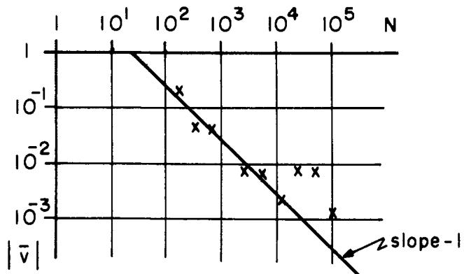  
Figure 16-4b The average velocity $\langle \nu \rangle$ obtained using the random number routine of (5） for $M = 6$ ,done $N$ times (i.e., for $N$ particles). The desired value is zero.

speeds in (4) or (5), be $L R _ { x }$ where $R _ { x }$ is a random set; alternatively, the $R _ { x }$ may be a bit-reversed set as described in the next section on quiet starts.

Obviously,it is desirable that $R _ { s } , R _ { \theta }$ ，and $R _ { x }$ be uncorrelated. Using random number generators for the $R ^ { \prime } { \bf s }$ tends to produce unwanted bunching (i.e.,correlations） in $x$ ${ \mathfrak { x } } , \ { \nu } _ { x } , \ { \nu } _ { y }$ space.

The methods described above are rather crude and may be modified in use. Our methods do not arrange particles in $\mathbf { x }$ and $\pmb { \gamma }$ so as to produce Debye shielding,which means that the program will run a while in order to produce the shielding，(about $\tau _ { p } / 4$ to $\tau _ { p } / 2 )$ . One fine tuning to be used after employing random $R$ 's is to correct the lower order moments of the distribution. Morse and Nielson (1971） take the particles in each cell and give them an increment to bring their total momentum to what is desired, which for a Maxwellian is zero. Gitomer (1971） goes one step further,making sure that the second moment is also correct, using averages over a few cells. Even when these and other modifications have been put in, the simu-lation will have a fluctuation level $\langle E ^ { 2 } \rangle / n m { \nu _ { t } } ^ { 2 } \propto ( N _ { C } + N _ { D } ) ^ { - \mathrm { \bar { 1 } } }$ which will generally be much larger than that in a laboratory plasma because $( N _ { C } + N _ { D } ) _ { \mathrm { s i m u l a t i o n } } < < N _ { D }$ laboratory $( N _ { C }$ is number of particles per cell). When weak effects are to be observed, including the low-level linear beginnings of instabilities,other solutions must be used. One such solution is the quiet start, as described in the next section.

# PROBLEMS

16-4a Show that,if the integral in the numerator of (1） is from $\nu$ t0 $\infty$ ,that (2） changes but the distribution of velocities is the same.

16-4b Show in detail how to apply (1） in order to obtain $\nu _ { x } , ~ \nu _ { y }$ ，and $\nu _ { z }$ values which are uncorrelated. There are three integrals and (perhaps) three sets of $R$ 's.

# 16-5 QUIET STARTS: SMOOTH LOADING IN x-v SPACE: USE OF MIXED-RADIX DIGIT-REVERSED NUMBER SETS

As noted in the previous section， using the usual uniform random number sets to place $\left( \mathbf { x } , \mathbf { v } \right) _ { i }$ tends to produce computer plasmas with fully developed fluctuation levels,which are larger than laboratory levels; this level of noise may be acceptable for some modeling，but may prevent observing low level physics，which may be desired. In addition，while the desired density variations may be reproduced on a gross scale, the moments of the densities may be poor on a fine scale. For example,over system length $L$ ，a Gaussian $f _ { 0 } ( \nu )$ may be well given, but down to any $L / 2 0$ ,even the first several moments of $f _ { 0 } ( \nu )$ may vary considerably from the prescribed values,when using uniform random sets. Hence,it is desirable to improve on the use of uniform random sets,which is done in several ways. The key is loading $\mathbf { x } , \mathbf { y }$ phase space as smoothly as possible. The method is called quiet starts and is attributed to J.A. Byers (Byers and Grewal, 1970) whose method used multiple beams,discussed in the next section.

A 1d1v "quiet Maxwellian" is mentioned in the previous section and in Section 3-6 as used in subroutine INIT in ES1. Let us consider the detailed steps. The distribution is integrated numerically in small steps to produce $F _ { 0 } ( \nu )$ which is set equal to $( i + \% ) / N$ ， $i = 0$ ,1，..., $N - 1$ to produce the desired function $f _ { 0 } ( \nu )$ . This process is setting $R _ { s } = ( i + ^ { 1 } / _ { 2 } ) / N$ in 16-4(1） and inverted to produce the desired $\nu _ { j }$ . This inversion produces an ordered sequence of $\nu _ { i } ^ { \cdot } \mathbf { s }$ If the $x _ { i } { ' } \pmb { \mathscr { s } }$ are chosen similarly, $x _ { i } = [ ( i + 1 / _ { 2 } ) / N ] L$ ，then the full Gaussian extends over $L$ ，but is not Gaussian locally. Hence,the $x _ { j }$ 's need to be scrambled in order to produce nearly the Gaussian down to, say, $L / 2 0$ . That is,we seek a scrambling set,more uniform than the usual random numbers,especially one that works well for small to moderate $N$ To date,we have had good success with bit-reversed numbers (see Hammersley and Handscomb,1964,p.33),which is now described.

Let there be $N$ particles to be distributed, numbered $j = 0$ to $N { - } 1$ ，with a 2v isotropic Maxwellian in $\nu _ { r } \equiv \left| \nu \right|$ ，and uniform in $x$ .The $\nu _ { r }$ are obtained from 16-4(1)，with $R _ { j }$ set equal to $[ 1 - ( i + 1 / _ { 2 } ) / N ]$ ，producing 16-4(2) as

$$
\nu _ { r i } = \nu _ { t } \left( - 2 \ln \frac { i + 1 / 2 } { N } \right) ^ { 1 / 2 }
$$

The $x _ { i }$ and $\theta _ { j }$ are obtained from

$$
\begin{array} { l l } { x _ { i } = L _ { x } R _ { x , i } } & { \qquad 0 \leqslant R _ { x , i } < 1 } \\ { \theta _ { i } = 2 \pi R _ { \theta , i } } & { \qquad 0 \leqslant R _ { \theta , i } < 1 } \end{array}
$$

where the $R$ 's mix the particles in $x$ and $\pmb \theta$ Following Hammersley and Handscomb (1964),we let $R _ { x , i }$ be the result of radix-two digit reversal bit reversing, plus zero; the base-two fraction is obtained by mirroring the basetwo index and making it a fraction,as in Table l6-5a. The velocity angles are mixed using radix-three digit reversal, i.e.， trinary reversing,as in Table 16-5b．The choice of $N$ is open,with $N = 2 ^ { a } 3 ^ { b }$ suggested,meaning that one or the other last subsequence is incomplete,with,we think, little harm.

Table 16-5a Base two bit-reversed fractions   

<table><tr><td colspan="2"></td><td colspan="2">Rx</td></tr><tr><td>decimal</td><td>base-2</td><td>base-2 fraction</td><td>decimal</td></tr><tr><td>0</td><td>0</td><td>0.0</td><td>0</td></tr><tr><td>1</td><td>1</td><td>0.1</td><td>1/2 = 0.5</td></tr><tr><td>2</td><td>10</td><td>0.01</td><td>1/4 = 0.25</td></tr><tr><td>3</td><td>11</td><td>0.11</td><td>3/4 = 0.75</td></tr><tr><td>4</td><td>100</td><td>0.001</td><td>1/8 = 0.125</td></tr><tr><td>5</td><td>101</td><td>0.101</td><td>5/8= 0.625</td></tr></table>

Table 16-5b Base three bit-reversed fractions   

<table><tr><td colspan="2"></td><td colspan="2">R、</td></tr><tr><td>decimal</td><td>base-3</td><td>base-3 fraction</td><td>decimal</td></tr><tr><td>0</td><td>0</td><td>0.0</td><td>0</td></tr><tr><td>1</td><td>1</td><td>0.1</td><td>1/3 = 0.3333</td></tr><tr><td>2</td><td>2</td><td>0.2</td><td>2/3 = 0.6666</td></tr><tr><td>3</td><td>10</td><td>0.01</td><td>1/9 = 0.1111</td></tr><tr><td>4</td><td>11</td><td>0.11</td><td>4/9 = 0.4444</td></tr><tr><td>5</td><td>12</td><td>0.21</td><td>7/9 = 0.7777</td></tr></table>

Tests of random,bit-reversed,and Fibonacci numbers for uniformity of scrambling were done by H. S. Au-Yeung，Y.-J. Chen,and C. K. Birdsall (private communications,1980,1981)． The inability to fill $x , y$ space uniformly with $N$ points with $x _ { j }$ chosen uniformly and $y _ { i }$ chosen by scrambling, was measured by a method suggested by J. Wick (private communication, 1979)；random scrambling gave a measure $\propto 1 / \sqrt { N }$ ; the other two gave a far better measure, $3 / N$ .They also tested for the ability to produce the first three moments of a Gaussian $f \left( \nu \right)$ down to small regions in $x$ ,again finding that bit-reversed and Fibonacci numbers were much better than random. Denavit and Walsh (1981） compare these three analytically,with graphs,and in simulations; they also provide additional references.

# 16-6 QUIET START: MULTIPLE-BEAM AND RING INSTABILITIES AND SATURATION; RECURRENCES

An example is to set up a 1d1v Maxwellian distribution using $M$ beams each with $N$ particles $( M , N > > 1 )$ uniformly spaced $\mathfrak { \delta \nu }$ apart $( \nu = 0$ ， $\pm \delta \nu , \pm 2 \delta \nu .$ .， $- 3 \nu _ { t }$ ）with both charge $q$ and mass $m$ diminishing as

$$
q \left( \nu \right) = q \left( n \right) = q \left( 0 \right) \exp \left( - \frac { \nu ^ { 2 } } { 2 { \nu _ { t } } ^ { 2 } } \right) = q \left( 0 \right) \exp \left( - \alpha n ^ { 2 } \right)
$$

$q / m$ is kept the same for all particles. For a uniform spatial distribution, the phase space appears as shown in Figure 16-6a. This system is ordered, with no fluctuations (at least none at low frequencies and long wavelengths). Hence,one may excite waves well below what would have been the fluctua-tion level had a random loading been used. For example, one may observe Landau damping decay over many decades (see Byers, i97o, fig.1),which is almost impossible to do using random loading without use of an immense number of particles.

Although attractive,there are several problems that may restrict the use of this kind of loading. Suppose that a particular wavelength $\lambda$ is purposely excited at $t = 0$ to some small amplitude. There is a recurrence time $\tau _ { r } = \lambda / \delta \nu$ when the $( n + 1 ) ^ { t h }$ beam will have slipped past the $n ^ { t h }$ beam by $\lambda = 2 \pi / k$ so that the initial system will have been reconstituted. At $\tau _ { r }$ a jump in $E ^ { 2 }$ to a level larger than $E ^ { 2 }$ at $t = 0$ was observed by Byers (1970, mentioned on p. 5Oo) followed by further decay and jumps. The jumps are shown in Figure l6-6b, from Denavit (1980)． The growth observed after $\tau _ { r }$ is exponential, toward the thermal fluctuation level which would have occurred with a fully random start, saturating near the thermal level when the beam velocity widths reach $\mathfrak { \delta \nu }$ ． This growth is physical，due to the many-beam instability (discussed below） growing at many harmonics of the initial $k$ (if restricted to the initial $k$ , the bounce peaks grow at the calculated rate; private communication from Denavit, 1980). The recurrence time $\tau _ { r }$ may be made large by making $\lambda$ large and $\mathfrak { \delta \nu }$ small. Suppose that we wish to view 10 cycles of oscillation $\left( \omega _ { \mathrm { r e a l } } \approx \omega _ { p } \right)$ ）and the accompanying decay $( \omega _ { \mathrm { i m a g } } = \gamma _ { \mathrm { L a n d a u } } )$ out to $t = t _ { 1 }$ ; let there be $N = 6 0$ beams between $\pm 3 \nu _ { t }$ (so that $\dot { \nu } _ { t } / \delta \nu = 1 0 )$ ； this requires that $\lambda > 2 \pi \lambda _ { D }$ 0r $k \lambda _ { D } < 1$ ，which is the

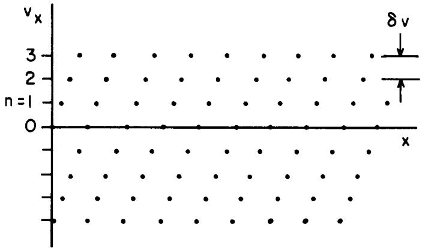  
Figure 16-6a Ordered phase space,the trade-mark of the quiet start. For a Gaussian velocity distribution, $q$ and $m$ fall off as exp $( - \nu ^ { 2 } / 2 \nu _ { t } ^ { 2 } )$ ，with $q / m$ the same for all particles.

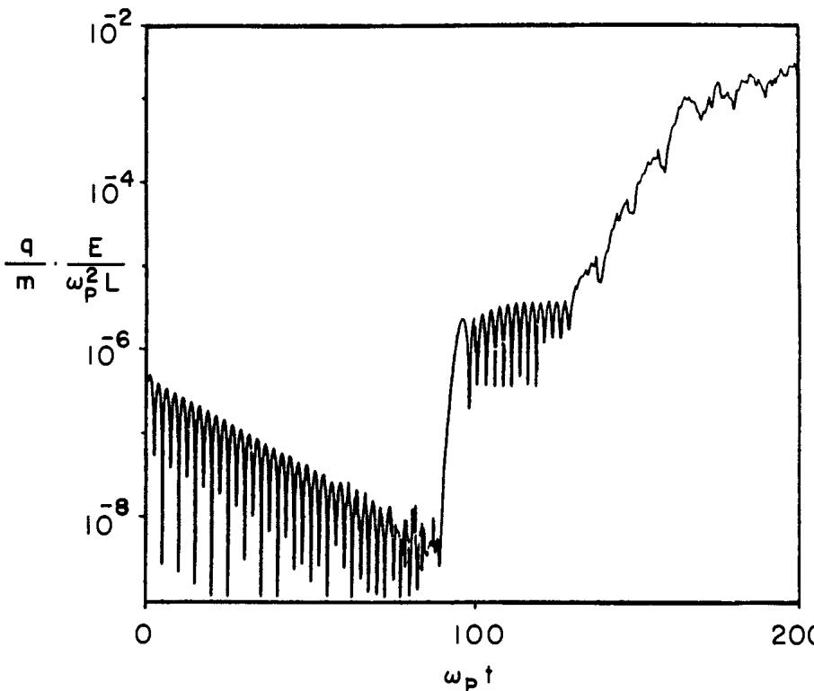  
Figure 16-6b Evolution of the electric field for Landau damped electron oscillations with discrete beams having initial uniform velocity intervals, $\delta \ v { } \nu = \ v { } \nu _ { t } / 6$ ．The oscillation is initially excited at $k \lambda _ { D } = 0 . 3 7 7$ .The estimated recurrence time is $\tau _ { r } = 2 \pi / k \delta \nu = 1 0 0 / \omega _ { p }$ ,very close to that observed. $L$ is the system length.） (From Denavit,1980.)

range of interest.

A second problem is that almost any system of beams is physically unstable due to the interactions among the beams. We already are well acquainted with a two-stream instability; the same kind of mechanism works for many streams,so that starting from round-off excitation, the whole system will go unstable. This result is predicted by Dawson (1960) and observed and identified by many; see Denavit (1972 and 1974).

Applications of the quiet start to Maxwellian distributions (always considered stable!） are especially neatly shown in 1d1v simulations by Gitomer and Adam (1976). For equally spaced beams the largest activity occurs among the beams near $\nu = 0$ (these beams have the most charge) as shown in Figure 16-6c. The field energy grows exponentially as shown in Figure 16-6d, with a low growth rate, $\gamma \approx 0 . 0 5 \omega _ { p }$ The growth saturates at a level of $\epsilon _ { 0 } \langle E ^ { 2 } \rangle / n m \nu _ { t } ^ { 2 } ) \approx 0 . 0 0 0 5$ ，which is below the level of 0.003 obtained with a fully random Maxwellian velocity initialization,corresponding to the theoretical thermal fluctuation level $\propto 1 / N _ { D }$ ．The start is indeed quiet,roughly 20 orders of magnitude below thermal, ${ 2 0 0 } \mathrm { d B }$ down. Thus,much as with the nonphysical instability met earlier in the cold beam model, or the thermal model with $\lambda _ { D } / \Delta x$ too small, the physical instability grows and then stabilizes near some form of thermal equilibrium but possibly with larger or smaller than thermal fluctuations.

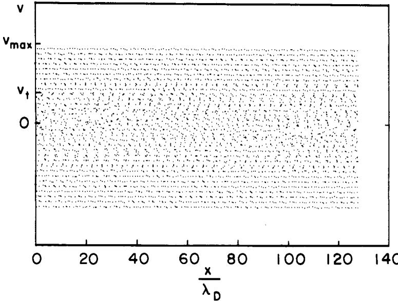  
Figure 16-6c Phase-space plot after growth to saturation $t = 7 4 \tau _ { e }$ for 128 beams equally spaced in velocity at $\iota = 0$ with $q$ and $m$ of each beam weighted to produce a Maxwellian envelope. 16,384 total particles，with every fourth particle plotted.Time step $\omega _ { p } \Delta t = 0 . 2 5$ cell size $\Delta x = \lambda _ { D }$ ；plasma length $L = 1 2 8 \lambda _ { D }$ ; periodic system. Beam spacing $\dot { 8 \nu } = 0 . 0 4 1 9 \nu _ { t }$ ， $\nu _ { \mathfrak { m a x } } =$ $\pm 2 . 6 6 \nu _ { t }$ 、Initial spacing in $x$ was uniform.(From Gitomer and Adam,1976.)

A second modeling is to use many equally weighted beams unevenly spaced in $\nu$ so as to produce a Gaussian distribution. The $q$ and $m$ are the same for all particles. The beam spacings are to be obtained from inverting the cumulative distribution function with the smallest spacing at $\nu = 0$ and largest spacing at the last $\nu$ (say， $3 \nu _ { t } .$ ). The jumps seen earlier are not expected here because the beam velocity spacing is uneven. However, the many-stream physical instability still occurs. This also is simulated by Gitomer and Adam (1976). Here the major interaction is among those beams with the largest velocity separation,on the tail of distribution,as shown in Figure 16-6e. There is exponential growth in field energy at small growth rate and saturation level of 0.002,slightly below the thermal level of 0.003 noted earlier,as shown in Figure 16-6f.

In application, one may choose either many-beam model. If interactions on the tail are of interest with $\nu _ { \mathrm { p h a s e } } > > \nu _ { t }$ , then the first model with uniform ${ \mathfrak { s } } \nu$ is recommended. If interactions having $\nu _ { \mathtt { p h a s e } } < < \nu _ { t }$ are of interest, then the unevenly spaced model is recommended. Such simulations usually are successful if they have instabilities which have growth rates $\gamma > \gamma$ many beams and also have Re $\pmb { \omega }$ substantially different from that of the many-beam instabilities; the latter quality allows separation of effects using Fourier analysis in time. If there is concern over unequal $\pmb q ^ { * } { \pmb s }$ and m's as used in the uniform beam model, then the uniform $q$ ， $m$ model is recommended.

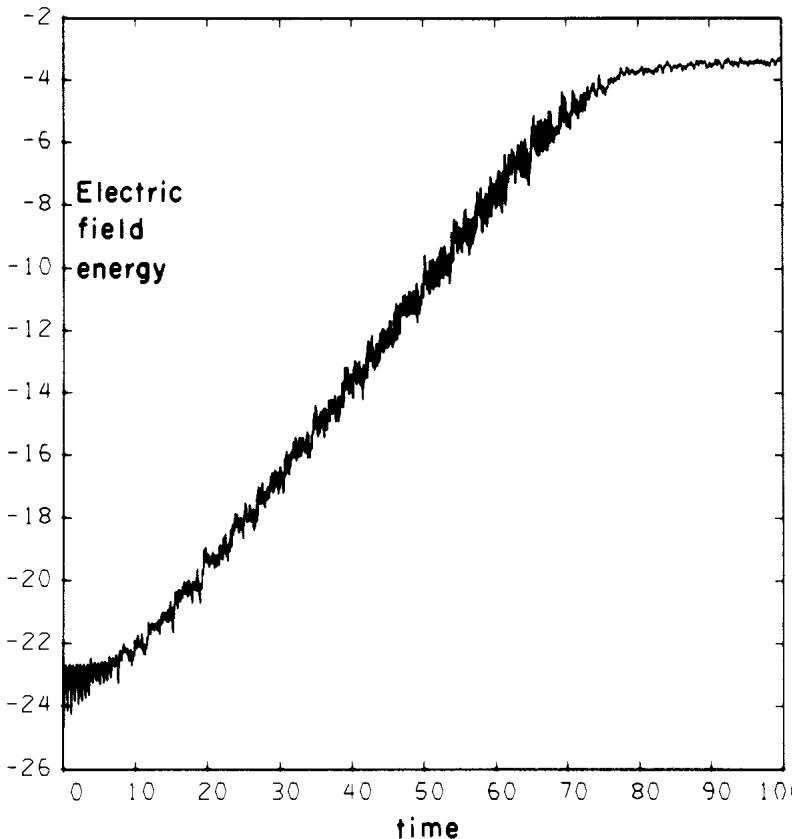  
Figure 16-6d Logarithm of electric field energy (normalized by the initial total energy）versus time for equally spaced beams at $t = 0$ ,as in Figure 16-6c. (From Gitomer and Adam，1976.)

The many-beam growth may be viewed as growth between pairs of streams; the largest growth rate occurs between the pair near $\nu = 0$ for equal spacing (see Figure 16-6c),and between the fastest pair for equal weighting (see Figure 16-6f). Hence,one might choose to add a thermal spread to either of these pairs (or even to all pairs) in order to prevent their growth. Denavit and Kruer (1971,1980) using 100 equally weighted beams to simulate a warm two-stream instability found that,by staggering in velocity the fastest two beams, the unwanted spurious many-beam oscillations occurred later in time (than with no staggering) when presumably the next pair,with smaller $\mathfrak { \delta \nu }$ spacing and smaller growth rate,caused the spurious oscillations. Using 160o beams with no staggering for the same model, they found no spurious oscillations during their runs. Y. J. Chen (private communication, 1980) repeated this for equally weighted beams,Maxwellian distribution and found that warming the last stream merely started the field energy off at a slightly higher level (than in Figure 16-6e） and that saturation simply occurred a little earlier in time,with similar results for adding a $\nu _ { t } \approx \ 8 \nu$ to all beams. She also found growth of the fastest pair occurred even with only one particle per beam in a periodic model; however,with 16,384 particles, her growth rate was $( 1 2 8 / 1 6 , 3 8 4 ) ^ { \dag / 2 } \approx 1 / 1 0$ that of Gitomer and Adam, Figure 16-6e. When she added excitation at finite amplitude, she also observed Landau damping followed by jumps, but smaller jumps than in Figure 16-6b.

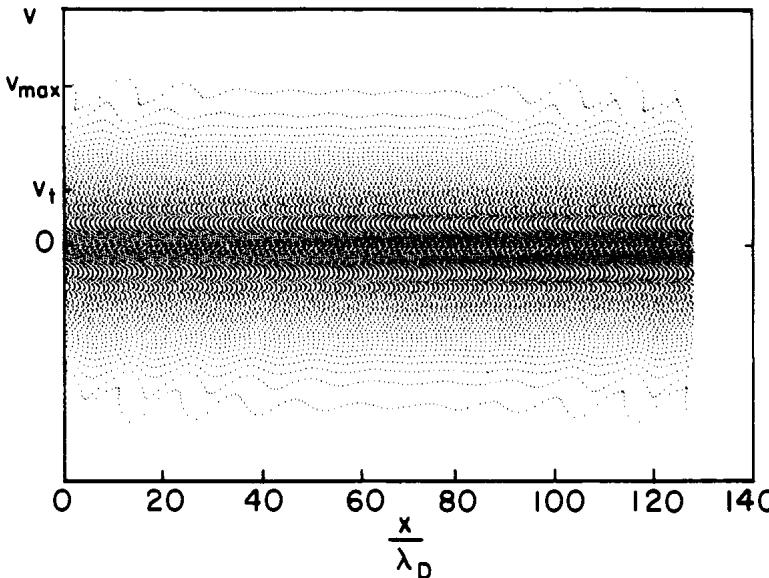  
Figure 16-6e Phase-space plot after growth to saturation, $t = 5 2 \tau _ { e }$ for 128 equally weighted beams,unequally spaced in $\nu$ at $t = 0$ to produce a Maxwellian envelope.Other parameters same as in Figure 16-6c. (From Gitomer and Adam, 1976).

Denavit (1972） presented an approach combining particle and distribution function methods,with reconstruction or smoothing every $N _ { s }$ time steps. Matsuda and Crawford (1975) showed that this method prevented the manybeam instability (with equally spaced beams) for smoothing with $N _ { s } \leqslant 1 6$ steps (see their fig. 2),with excellent energy spectra and Landau damping up to $k \lambda _ { D } \approx 0 . 5$ ； they commented that this smoothing alone does not prevent the jump recurrence (Figure 16-6b),but that such did not pose problems for their small or large amplitude simulations.

The quiet start idea may be applied to other distributions. In simulating the Dory-Guest-Harris instability in 2d2v, C.K. Birdsall and D.Fuss (private communication, 1969) set up a distribution of magnetized ions in a cold ring in velocity space using velocities chosen from random numbers; they observed growths $\sim t ^ { 1 / 2 }$ ，which implies growth due to stochastic processes.

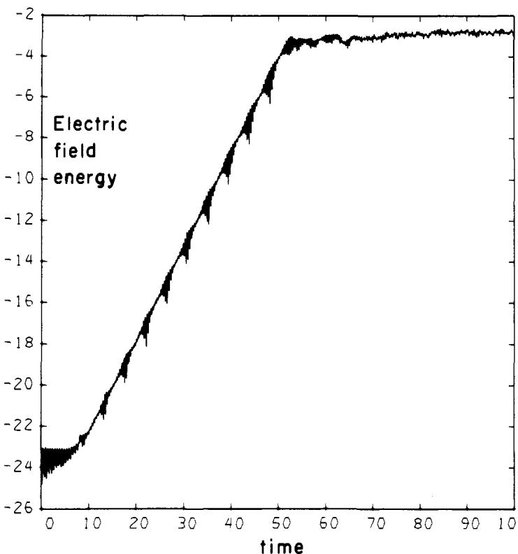  
Figure 16-6f Field-energy growth for Maxwelian with equally weighted beams,as in Figure 16-6c. (From Gitomer and Adam, 1976).

They then copied the quiet start using wholly ordered ring distributions used in ld2v by Byers and Grewal (1970), with 64 equally-spaced spokes to a ring in each λ. Their simulation succeeded immediately, being able to produce the expected exponential wave growths of many modes over a tremendous range in potential energy $( 1 0 ^ { 2 4 } , \ 2 4 0 { \mathrm { d B } } )$ ， allowing measurement of complex $\pmb { \omega }$ to within 1 percent or better of theory (smaller growth rates were observed when noisy） and to observing larger saturation values $( E ^ { 2 } ) _ { \mathsf { m a x } }$ than with random and noisy starts.

Let us consider again loading a Gaussian velocity distribution in two velocity coordinates, $\nu _ { x }$ and $\nu _ { y }$ ，which is isotropic，independent of $\theta \equiv$ arctan $( \nu _ { y } / \nu _ { x } )$ .Our choice here is to load uniformly in angle $\pmb \theta$ on evenly spaced spokes and on rings in $\nu _ { x } , \nu _ { y }$ space as shown in Figure 16-6g. The radii of the rings are obtained from a set or uniform numbers $R _ { s }$ using the cumulative distribution function 16-4(1) or 16-5(1) and the spoke angles are chosen uniformly over $2 \pi$ . The many-ring and spoke loading of a magnetized Maxwellian plasma in 2v has been analyzed for stability by J.-S. Kim， N. Otani,and B. I. Cohen (private communication, 1980). They derived and solved the dispersion relation for electrostatic flute modes $( { \bf k } \cdot { \bf B } = 0 )$ fora

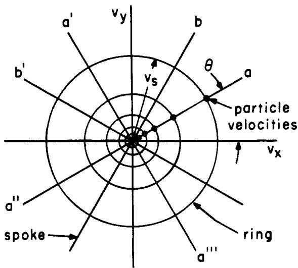  
Figure 16-6g Gaussian spaced rings and uniformly spaced spokes for forming a two-dimensional (in $_ { 2 \nu }$ ）Maxwellian velocity distribution．Particles placed on $a$ may also be placed on $\acute { a }$ to ensure zero net velocity,or on $\alpha , \alpha ^ { \prime } , a ^ { \prime \prime }$ ，and ${ \boldsymbol { a } } ^ { \prime \prime \prime }$

Maxwellian velocity distribution made from $N _ { \nu \perp }$ rings and $N _ { \nu \theta }$ spokes (equally spaced gyrophase angles, $\theta =$ arctan $\nu _ { y } / \nu _ { x } )$ ,that is, $N = N _ { \nu \perp } N _ { \nu \theta }$ particles. In contrast to the multibeam unmagnetized Maxwellian model (which is always unstable)， the multi-ring-spoke magnetized Maxwellian can be made stable by using a large number of rings and spokes. They found that the effect of the spokes becomes negligible in the dispersion relation for

$$
N _ { \nu _ { \theta } } > 2 \left( \frac { k \nu _ { \perp } } { \omega _ { c } } \right) _ { \mathrm { m a x } } \approx 6 \left( \frac { k _ { \mathrm { m a x } } \nu _ { t } } { \omega _ { c } } \right)
$$

where $\nu _ { \perp \mathsf { m a x } }$ is taken to be $3 \nu _ { t }$ and $k _ { \mathrm { m a x } }$ is the last $k _ { \perp }$ kept.With (2) satisfied, the velocity distribution may be treated as $f ( \nu _ { \perp } )$ ，rings only，for which Kim and Otani determined the stability boundary,which is roughly

$$
N _ { \nu _ { \perp } } > \frac { 1 } { 3 } \left( \frac { \omega _ { p } } { \omega _ { c } } \right) ^ { 2 }
$$

Their parameters at instability threshold are roughly

$$
\frac { \omega } { k _ { \perp } \nu _ { t } } \approx \frac { 1 } { 3 } \nu _ { \mathrm { p h a s e } } \approx \frac { \nu _ { t } } { 3 } \frac { k _ { \perp } \nu _ { \perp } } { \omega _ { c } } \approx \frac { 2 } { 3 } \Bigg ( \frac { \omega _ { p } } { \omega _ { c } } \Bigg ) ^ { 2 } \frac { \omega } { \omega _ { c } } \approx \frac { 2 } { 9 } \Bigg ( \frac { \omega _ { c } } { \omega _ { p } } \Bigg ) ^ { 2 }
$$

In applying the above to two species,when studying electron Bernstein normal modes with particle electrons, use $( \omega _ { p } / \omega _ { c } ) ^ { 2 }$ as that of the electrons; when studying _the ion Bernstein modes, take $( \omega _ { p } / \omega _ { c } ) ^ { 2 }$ to be $( \omega _ { p i } / \omega _ { c i } ) ^ { 2 }$ $/ [ 1 + ( \omega _ { p e } / \omega _ { c e } ) ^ { 2 } ]$ .Cohen found,by meeting the stability conditions with sufficient numbers of spokes and rings $[ N > 3 ( k _ { \mathrm { m a x } } \nu _ { t } / \omega _ { c } )$ $( \omega _ { p } / \omega _ { c } ) ^ { 2 } ]$ ，and with either spatial replication or scrambling，that a stable quiet start was achieved; this is very desirable for studying the drift cyclotron instability. Note that $N _ { \mathfrak { m i n } }$ is not at all small for typical magnetic fusion problems $[ k _ { \mathrm { m a x } } v _ { t } / \omega _ { c } \approx 3 0$ ， $( \omega _ { p } / \omega _ { c } ) ^ { 2 } \approx 1 0 0 0 ]$

The bottom line， however, is that the mixed-radix digit-reversed approach of the previous section,with one particle per beam or per ring,and one spoke per ring,works very well.

# 16-7 LOADING A MAGNETIZED PLASMA WITH A GIVEN GUIDING CENTER SPATIAL DISTRIBUTION $n _ { 0 } ( \mathbf { x _ { g c } } )$

This section is another example of how one may proceed to load a nonuniform plasma, and is primarily a set of reminders.

Suppose that we wish to load a guiding center distribution $n _ { \mathfrak { g c } } ( x _ { \mathfrak { g c } } )$ as shown in Figure $1 6 . 7 a ( a )$ Let the plasma be uniform in $y$ , allowing loading (of gc's) in rows,as shown in Figure $1 6 . 7 a ( b )$ . Then, at each guiding center (or over some group of gc's),we need to put in the desired velocity distribution．That is,for ions,with $f ( \mathbf { v } _ { \perp } ) = f ( v _ { \perp } , \theta )$ ， the particle $\mathbf { x }$ and $\pmb { \gamma }$ are given by

$$
\begin{array} { r } { x = x _ { \mathrm { g c } } - a _ { i } \sin \theta } \\ { y = y _ { \mathrm { g c } } + a _ { i } \cos \theta } \end{array}
$$

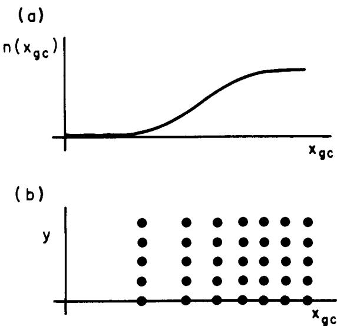  
Figure 16-7a (a) Guiding center density desired. (b)Location of guiding centers to produce (a) with uniformity in $y$

$$
\begin{array} { r } { \nu _ { x } = \nu _ { \perp } \cos \theta } \\ { \nu _ { y } = \nu _ { \perp } \sin \theta } \end{array}
$$

as shown in Figure 16-7b. $a _ { j }$ is the ion gyroradius $\left. \nu _ { \perp } / \omega _ { c i } \right\}$ where $\omega _ { c i } = \left( q / m \right) _ { i } B _ { 0 z }$ For electrons, replace ${ \pmb a } _ { j }$ with $- \pmb { a } _ { e }$

As $n _ { \mathrm { p a r t i c l e } } ( \mathbf { x } ) \not = n _ { \mathrm { g c } } ( \mathbf { x } _ { \mathrm { g c } } )$ ， we need the relation between these two densities,as theory may provide particle $n$ and we wish to load $n _ { \mathfrak { g c } }$ . Let the ions have a Maxwellian velocity distribution,with an ion guiding center density as follows:

$$
\begin{array} { r l } { n _ { \mathrm { g c } } ( x _ { \mathrm { g c } } ) = 1 + \Delta _ { \mathrm { { \it ~ + ~ } } } \cos k _ { 0 } x _ { \mathrm { g c } } \qquad } & { { } \mathrm { ( } \Delta _ { \mathrm { , ~ } } \mathrm { ~ i s ~ a ~ } c h o s e n \mathrm { ~ f a c t o r ) } } \\ { x _ { \mathrm { { g c } } } = x + \frac { \nu _ { y } } { \omega _ { c i } } } \end{array}
$$

where

Then, ignoring the $\nu _ { z }$ dependence,the ion particle density is

$$
\begin{array} { r } { n _ { i } \left( x \right) = \int f \left( x , \mathbf { v } \right) d \mathbf { v } = \int F ( \mathbf { v } ) n _ { \mathrm { g c } } ( x _ { \mathrm { g c } } ) d \mathbf { v } } \\ { = \int F _ { \perp } ( \nu _ { \perp } ) n _ { \mathrm { g c } } \left( x + \frac { \nu _ { y } } { \omega _ { c i } } \right) d \nu _ { x } d \nu _ { y } } \end{array}
$$

Electrons are taken to be cold and,requiring charge neutrality,we set their particle density equal to that of the ions

$$
n _ { i } \left( x \right) = n _ { e } \left( x \right) = 1 + \Delta _ { e } \cos k _ { 0 } x
$$

and find that this requires

$$
\Delta _ { e } = \Delta _ { i } \exp \left( - \frac { k _ { 0 } ^ { 2 } \nu _ { t i } ^ { 2 } } { 2 \omega _ { c i } ^ { 2 } } \right)
$$

The instructions are to load the ion guiding centers using (5) and the electrons according to (8),with $\Delta _ { e }$ obtained from $\Delta _ { i }$ using (9). For $\Delta _ { i } = - 1$ ， $n _ { \mathfrak { g c } }$ and $\pmb { n }$ are as shown in in Figure 16-7c.

X (x,y）e

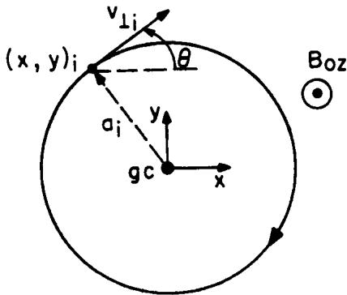  
Figure 16-7b Ion and electron particle $( x , y )$ and guiding center (gc） locations.

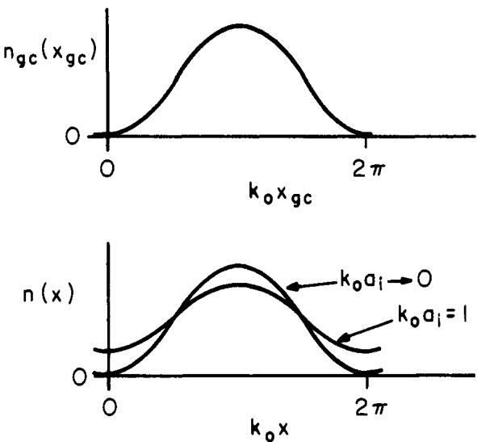  
Figure 16-7c Guiding center density variation, $\Delta _ { j } = - 1$ ，and particle density,for Maxwellian ions.

Next, let the ion velocities be distributed in a cold ring,i.e., use

$$
F _ { \perp } ( \nu _ { \perp } ) \ 2 \pi \nu _ { \perp } d \nu _ { \perp } = { \frac { 1 } { 2 \pi \nu _ { \perp 0 } } } \ \hat { \delta } ( \nu _ { \perp } - \nu _ { \perp 0 } ) \ 2 \pi \nu _ { \perp } d \nu _ { \perp }
$$

Then we can write that

$$
n _ { i } = \int f \left( \mathbf { v } \right) d \mathbf { v } = \int F _ { z } \left( \nu _ { z } \right) { \frac { 1 } { 2 \pi \nu _ { \bot 0 } } } \ \delta ( \nu _ { \bot } - \nu _ { \bot 0 } ) \ 2 \pi \nu _ { \bot } d \nu _ { \bot } d \nu _ { z }
$$

which (invoking charge neutrality and using cold electrons) leads to

$$
\Delta _ { e } = \Delta _ { i } \int _ { - \nu _ { 0 } } ^ { \nu _ { 0 } } d \nu _ { y } \frac { \exp { ( i k _ { 0 } \nu _ { y } / \omega _ { c i } ) } } { \pi ( \nu _ { \perp 0 } ^ { 2 } - \nu _ { y } ^ { 2 } ) ^ { 1 / 2 } } = \Delta _ { i } J _ { 0 } \Bigg ( \frac { k _ { 0 } \nu _ { \perp 0 } } { \omega _ { c i } } \Bigg )
$$

Again let $\Delta _ { j } = - 1$ ； the spatial distributions are shown in Figure 16-7d. Here,as $k _ { 0 } { \boldsymbol { a } } _ { i }$ increases past 2.405 (the first zero of $J _ { 0 } ^ { \mathrm { ~ ~ } }$ ，the particle density becomes flat and then reverses slope.

Naitou et al. (1980） present similar results,allowing both density and temperature gradients,taking these in Fourier transform,which is like using a set of $k _ { 0 }$ 'shere. Their loading instructions (which they called "modified guiding center loading," MGCL） are the same as are given here. Their results show no unwanted potential due to charge separation.

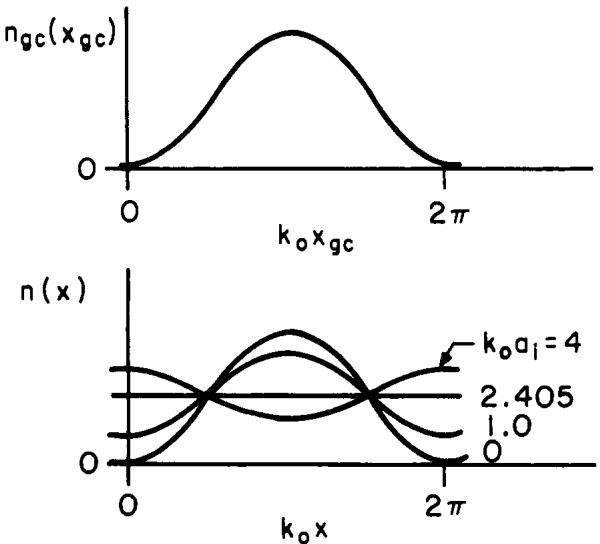  
Figure 16-7d Same as Figure $1 6 . 7 c$ ,except that ions are distributed on a cold ring in velocity space. This allows $n \left( x \right)$ to reverse from $n _ { \mathfrak { g c } } ( x _ { \mathfrak { g c } } )$ for $k _ { 0 } a _ { i } > 2 . 4 0 5$

# 16-8 PARTICLE INJECTION AND ABSORPTION AT BOUNDARIES:FIELD EMISSION, IONIZATION, AND CHARGE EXCHANGE

It is often desirable to mimic a plasma device which has end walls that continually emit or absorb electrons or ions or neutrals. Or, it may be desirable to study a relatively small but active part of a larger but quiescent plasma,say, by matching the two parts at a common plane; let the quiet part emit a half-Maxwellian $f \left( \nu \right)$ there and allow some kind of return particle reflection also. Let us call these models axially bounded plasmas. Phase space for a 1d model is shown in Figure 16-8a.

The device might be a small thermionic converter with one hot wall emitting electrons and one cooler absorbing wall, or a $Q$ -machine with one or two bounding hot plates emitting electrons and ions,with the plasma guided (transversely contained) by a strong axial magnetic field. The active/quiet matching might be used to study a part of a large magnetic fusion device,such as the end cell of a mirror device, matched to a center cell. Other examples include those from astrophysics (space-charge limited emission from neutron stars) and ionosphere physics (formation of double layers).

Particle injection may be done by several methods,usually similar to the techniques for initial particle loading. For example,at a wall we may be given the desired injection velocity distribution $f ( \nu _ { x } ) d \nu _ { x }$ or the flux distribution $\nu _ { x } f ( \nu _ { x } ) d \nu _ { x } = \Gamma _ { x } ( \nu _ { x } )$ particles in the element $d \nu _ { x }$ per unit time,where $x$ is the direction normal to the wall. We then calculate the cumulative flux distribution function $F ( \nu _ { x } )$ by integrating $\nu _ { x } f ( \nu _ { x } ) d \nu _ { x }$ over $\nu _ { x }$ ， set this equal to a uniform set of numbers (random, bit-reversed, other),and solve for the $\nu _ { x } \mathbf { \ ' } _ { \mathbf { s } }$ (uncorrelated with their order, indices)． The process is followed in Figure l6-8b. These velocities might be generated as needed or stored in an array (say,1O24 at a time） and used up as the particles are injected. The usual physical or laboratory parameters are flux or current densities (particles or Coulombs per second per unit area) which are translated into a computer parameter of the number of particles injected per time step. These particles are placed in the active simulation region at positions $x = R \ \nu _ { x } \Delta t$ ，where $0 < R < 1$ is a new random number for each particle, tending to fill in the fan between $x = 0$ and $x = \nu _ { x } \Delta t$ . It should be clear that any method used to set up initial $x \cdot \nu _ { x }$ loading of $f ( \nu _ { x } ) d \nu _ { x }$ can be adapted for particle injection, loading $\nu _ { x } f ( \nu _ { x } ) d \nu _ { x }$ .With injection,creation，and absorption,the program must have some particle index housekeeping，as the number of particles active in the system is not constant.

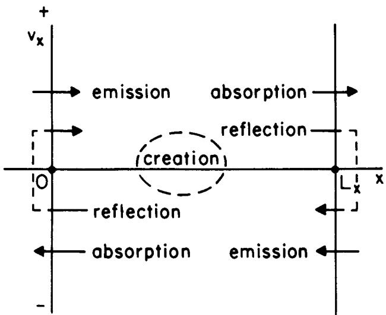  
Figure 16-8a Phase-space for a ld axially bounded plasma,showing some possible particle boundary conditions.

Particle absorption at the end walls may mean connection to external circuit elements, that is,conversion from plasma current to external circuit current. For example,as a plasma electron or ion passes into the end wall, it may be accumulated as part of the wall charge and be deleted from the list of active particles. The total wall charge also includes that due to the external circuit,as is discussed in the next section.

Numerous other options for particle handling at left and right plasma boundaries are in use. For example,in ZOHAR,incoming particles are controlled by option

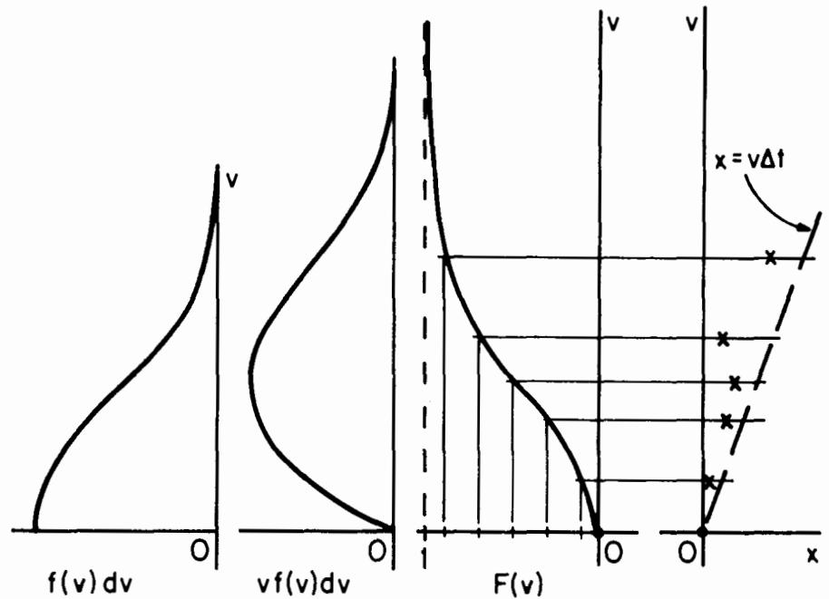  
Figure 16-8b Loading particle and flux distribution functions at an emitting wall, $x = 0$

$I = 0$ do not emit;   
$I = 1$ emit;   
$I = 2$ emit, if this reduces $\smash { | \langle \sigma _ { 0 } | \rangle , | \langle \sigma _ { L } \rangle | }$

Injection is with thermal and drift velocities,as described earlier. Exiting particles are controlled by option

$E = 0$ delete;   
$E = 1$ conditionally delete or reflect specularly;   
$E = 2$ conditionally delete or return with a new thermal velocity.

Conditional control is

$F = ~ 0$ return particle if this will reduce $| \langle \sigma _ { 0 } \rangle | , | \langle \sigma _ { L } \rangle |$ ；   
$F > 0$ return a fraction $F$ , chosen randomly.

For example,to send all particles back in with new thermal velocities,use $E = 2$ ， $F = 1$ ; this is used, e.g.，for electrons with fixed ions. Or,at a boundary with plasma leaving at greater than ion thermal velocity, use $E = 0$ for ions, $E = 1$ or 2 for electrons ( $\scriptstyle { E = 0 }$ for electrons draws plasma out quicker because because the boundary goes negative). Or, at a boundary with incoming plasma, use $I = 1$ ， $E = 0$ for ions; for electrons use $I = 2$ ， $E = 0$ to obtain only incoming thermal particles. In each case we keep a tally of particle energies and any other property of interest.

Ideally, field emission of particles with charge $q$ occurs at a wall (say, $x = 0$ ）when $q E _ { x }$ at the surface is "sufficiently" positive. For space-charge limited flow,the normal electric feld $E _ { x }$ is to be zero. However, $E _ { x }$ cannot be controlled in the field solve as can $E _ { y }$ etc.； rather, $E _ { x }$ is controlled indirectly,through the emission algorithm. In the simplest case,we model field emission of one species by emitting a particle of charge $q$ at location $y$ on the wall if $\scriptstyle q \sigma ( x = 0 , y )$ where $\sigma$ is the surface charge density, is positive and still will be positive after emission. We may give the particle a small inward velocity $\nu _ { x }$ ; in order to generate a smooth charge distribution we then set $x = R \ \nu _ { x } \Delta t$ ，where the $R$ 's are random numbers distributed on the interval (0,1)."In one dimension，this condition is sufficient to specify the number of particles to be emitted for the current time step. Problems can arise when both electrons and ions are to be field emitted. For example, imagine there is a high-frequency component to $E _ { x }$ at the wall, due perhaps to an electromagnetic wave in the device. On alternate half-cycles, ions are emitted. If they are not pushed back into the wall during the other halfcycles, then ions will accumulate near the wall, along with net electron emis-sion to neutralize them. As a result of this build-up of plasma density,eventually $\omega _ { p e } \Delta t$ may become large enough to induce instability.

Ionization within the active simulation region may be done. The probability of an energetic electron creating an electron-ion pair is needed,along with the resulting electron-ion pair energy and energy loss of the original electron. There is no net change in charge. Charge exchange in the volume may be done,with a fast ion striking a neutral atom, leaving a fast neutral atom and a slow ion. The electrical process simply means a drop in ion velocity. The coding needs a probability. There is no change in charge. This process is important in neutral beam plasma studies. Photo excitation and ion-ization and other processes may be included,up to the ingenuity of the simulator.

# 16-9 PARTICLE AND FIELD BOUNDARY CONDITIONS FOR AXIALLY BOUNDED SYSTEMS; PLASMA DEVICES

In this section we treat in detail models with plane conducting boundaries at $x \Leftarrow 0$ ， $L _ { x }$ .The charge and field boundary conditions are first worked out electrostatically in 1d. The extension to 2d with periodicity in $y$ is done in Section 15-12(b). The bounding planes may emit and absorb electrons and ions. The planes may be connected to external circuit elements,so it is shown how to solve the circuit equations along with those used for particle moving.

The model is shown in Figure $1 6 { \cdot } 9 \mathsf { a }$ with principal axis along $x$ ，with grid index $j$ ; the normal coordinate is $y$ ,with grid index $k$ ·

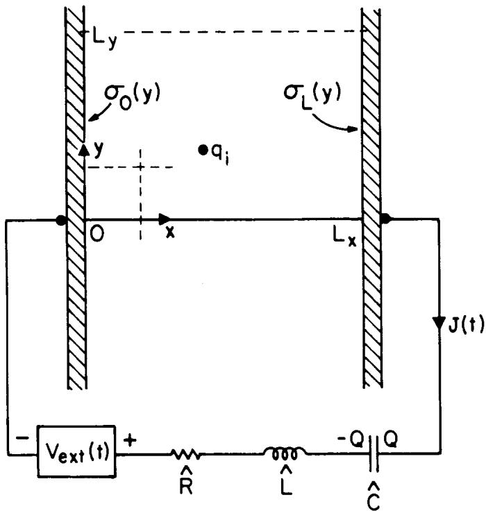  
Figure $1 6 . 9 8$ Axially bounded plasma model,with external circuit. The charges in the system are the plasma particles $q _ { i }$ ，the left and right plane surface charges $\sigma _ { 0 }$ ， $\sigma _ { L }$ ，and the external capacitor charge Q.

# (a) Charge and Field Boundary Conditions in 1d

The new physics here is associated with the surface charge densities at the bounding planes. These are related to the boundary fields as

$$
\sigma ( 0 ) = \sigma _ { 0 } = E _ { 0 }
$$

$$
\sigma ( L _ { x } ) = \sigma _ { L } = - E _ { N _ { g } }
$$

An algorithm for linear weighting for a particle in the last cell is indicated by the sketch in Figure 16-9b,showing the division between $\rho ( L _ { x } )$ and $\rho ( L _ { x } - \Delta x )$ . Those charges which are moved past the boundary in a time step, $x _ { i } > L _ { x }$ ，are depositied into $\sigma ( L _ { x } )$ (which has units of $\rho \Delta x )$ and are deleted from the active charge list. (Other first-cell, last-cell algorithms are possible.） The active charges weighted to the wall are used, for example,in obtaining $E$ a half cell in from the wall, as

$$
E _ { ! / _ { 2 } } = \sigma _ { 0 } + \rho _ { 0 } \Delta x = - \frac { \phi _ { \mathrm { l } } - \phi _ { 0 } } { \Delta x }
$$

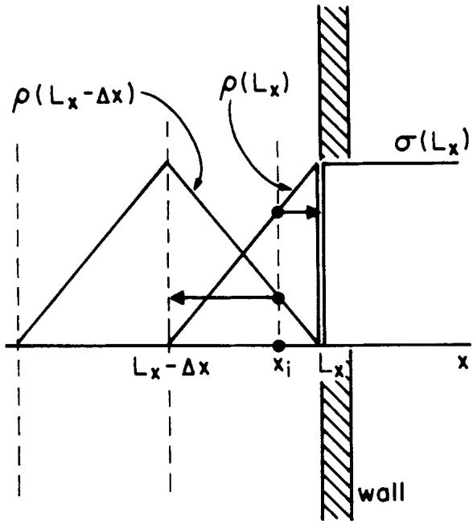  
Figure 16-9b A particle at $x _ { j }$ is linearly weighted to neighboring grid planes as indicated by arrows; if the particle is moved past $L _ { x }$ ${ \bf \chi } _ { x } , x _ { i } > L _ { x }$ ,then the charge is assigned to $\sigma ( L _ { x } )$ ,the surface charge.

$$
- E _ { N _ { g } - / _ { 2 } } = \sigma _ { L } + \rho _ { L _ { x } } \Delta x = \frac { \phi _ { N _ { g } } - \phi _ { N _ { g } - 1 } } { \Delta x }
$$

To check these results, let $x = 0$ to $x$ be filled uniformly with $\pmb { \rho } _ { \mathsf { u n i f f o r m } }$ ,making $\rho _ { 0 } = \rho _ { \mathrm { u n i f o r m } } / 2$ ，as $\pmb { \rho } _ { 0 }$ (and $\rho _ { L x }$ ） collects essentially half the charge in the first (last） cell. Then,analytically

$$
E ( x ) = E _ { 0 } + \rho _ { \mathrm { u n i f o r m } } x
$$

so that numerically,

$$
E _ { \nu _ { 2 } } = \sigma _ { 0 } + \rho _ { \mathrm { u n i f o r m } } { \frac { \Delta x } { 2 } }
$$

which is ${ \pmb { \sigma } } _ { 0 } + \rho _ { 0 } { \pmb { \Delta x } }$ ,as in (2a)． To be sure, $\pmb { \rho } _ { 0 }$ could be ${ \sqrt [ [object Object] ] { \rho } } ( 0 )$ , accounting for the half-cell collecting,and can be so used in coding $( \rho _ { 0 }$ is a designated computer variable, not to be confused with $\rho ( 0 )$ which is physical）.

Conservation of charge is guaranteed at the bounding plane by applying the integral form of Gauss' law over the pillbox shown in Figure 16-9c,as

$$
J _ { p } - J = { \frac { \partial \sigma _ { L } } { \partial t } }
$$

where $J _ { p }$ and $J$ are plasma (or particle) and circuit conduction current densities，respectively. $( J _ { p } - \partial \pmb { \sigma } _ { L } / \partial t = J _ { p } + \partial E _ { N g } / \partial t$ is the total device current, equal exactly to $J$ , the circuit current.） Charge deposited at $x = 0$ and $x = L$ by active charges lost from the plasma and by charge flow from the external circuit make up $\sigma$ ，which is needed to obtain the device potentials and fields.

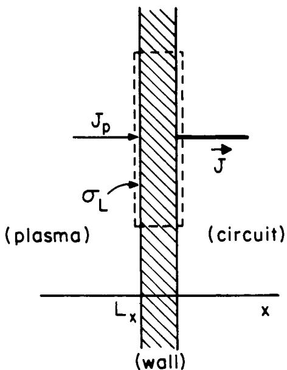  
Figure ${ \bf 1 6 . 9 6 }$ The plasma charge current density $J _ { p }$ and external circuit current (density) $J$ differ by $\partial \sigma / \partial t$ at the conducting wall boundary.

The field equations for $\rho , \phi , E$ may be written in finite-difference forms, to be solved by common methods.

Similar considerations for 2d charge and field boundary conditions are given in Section 15-12(b).

Instabilities due to boundary conditions as reported by Swift and Ambrosiano (1981） do not appear in reasonable applications; their instability developed only when particles crossing a boundary were reintroduced at another boundary at which $q \phi$ is larger (for example, periodic particle boundary conditions with an aperiodic potential!). This is not a procedure one would arrive at from physical considerations, except when there is an external circuit which can add energy to the plasma region.

# (b) Solutions with an External Circuit

The behavior of the active charges between the metal bounding wals is readily handled as with earlier models. Deposition of charge on the walls due to the external current is handled by Kirchhoff's circuit equations.

The art of modeling electron devices in one dimension may be found, for example in Birdsall and Bridges (1966)， summarizing the techniques developed and applied successfully from the 1930's on. Implicit in such

work are the assumptions:

(a） wholly electrostatic for 1d,with $E _ { x }$ only;   
(b） motion only along $x$ which is non-relativistic;   
(c） large device (diameter/length） ratio with negligible field variations in $y$ and $z$ ；   
(d) negligible effects from fringe fields at the edges of real devices of finite diameter;   
(e) currents $J _ { x }$ and $\partial { E _ { x } } / \partial t$ exist,but the magnetic field generated by these currents does not affect the motion (negligible pinch effect, dc or ac);   
(f) small enough device diameter so that wave propagation transverse to $x$ is essentially instantaneous;   
(g) the walls are equipotentials,with ignorable effects due to wall surface currents.

These assumptions are not all independent; they allow many interesting effects but also rule out much of current interest. Our electrostatic $1 d$ plasma device model here uses the same assumptions as in the electron device model above.

However,a 2d plasma device model (with metal plates at $x = 0$ ， $L _ { x }$ and periodic in $y$ with period $L _ { y }$ ，no variations in $\pmb { z }$ ）has fewer assumptions (really,restrictions),especially in an electromagnetic version. With a better accounting of currents and magnetic fields,more interesting effects may occur (e.g.，propagation in $y$ )． A periodic model,wholly specified over $0 \leqslant x \leqslant L _ { x }$ ， $0 \leqslant y \leqslant L _ { y }$ ，need have no outside connection; the external (or return） current may flow across the device,uniformly in $y$ ，producing changes in the charges on the walls as if due to an $E _ { x } ( t )$ uniform in $y$ but with no charge separation or magnetic field in the device. This choice is the same as adding (superposing,due to the linearity of Maxwell's equations) the effects of an external circuit which only imposes charge at the walls (in addition to those produced by the active charges). The total current density averaged over $y$ is

$$
\hat { J } _ { x } \left( x , t \right) \equiv \frac { 1 } { L _ { y } } \int _ { 0 } ^ { L _ { y } } d y \left[ J _ { x } \left( x , y , t \right) + \frac { \partial E _ { x } \left( x , y , t \right) } { \partial t } \right] - J _ { \mathrm { e x t e r n a l } }
$$

where the sign of $J _ { \tt e x t e r n a l }$ is chosen for convenience. This density also is

$$
\hat { J } _ { x } \left( x , t \right) = \frac { 1 } { L _ { y } } \int _ { 0 } ^ { L _ { y } } d y \left( \nabla \times \mathbf { H } \right) _ { x } = \frac { 1 } { L _ { y } } \int _ { 0 } ^ { L _ { y } } d y \ \frac { \partial H _ { z } } { \partial y }
$$

As $H _ { z }$ is periodic in $y$ , the integral is zero and $\hat { J } _ { x } \left( x , t \right) = 0$ . Then integrating the $\hat { J } _ { x } \mathbf { \widetilde { ( } } x , t )$ equation across the device in $x$ produces

$$
J _ { \mathrm { { e x t e r n a l } } } = J _ { \mathrm { { i n d u c e d } } } - { \frac { 1 } { L _ { y } } } { \frac { d V } { d t } }
$$

where

$$
J _ { \mathrm { i n d u c e d } } ( t ) \equiv \frac { 1 } { L _ { x } L _ { y } } \int _ { 0 } ^ { L _ { x } } \int _ { 0 } ^ { L _ { y } } d x d y J _ { x } ( x , y , t )
$$

a concept used in electron devices (p.10 in Birdsalland Bridges, 1966). The device potential $V ( t )$ in (6)is the line integral of $E _ { x }$ straight across the device and averaged over $y$ ，

$$
V ( t ) = \frac { 1 } { L _ { y } } \int _ { 0 } ^ { L _ { y } } d y \left[ - \int _ { 0 } ^ { L _ { x } } d x E _ { x } \left( x , y , t \right) \right]
$$

taken as $V ( t ) = \phi ( L _ { x } , t ) - \phi ( 0 , t )$ .Note that the second term in (6) is $- \hat { C } _ { \nu } d V / d t$ ， $\hat { C } _ { \nu } \equiv 1 / L _ { x }$ (where the carat means capacitance per unit area).

This 2d electromagnetic modeling may be used to make clearer the ori-gin of the assumptions in the 1d model where $J _ { \tt e x t e r n a l }$ flows outside the device as in Figure l6-9a. Inside the device there is an $H _ { z }$ , but the radial extent （in $y$ ）of the 1d device is taken to be small,as implied in assumptions (a, c, d,e,f) so that the integral in (5) also vanishes and (6), (7),and (8) hold. $0 \mathfrak { r }$ ， $( \nabla \times \mathbf { H } ) \cdot d \mathbf { S }$ may be substituted as $( J _ { x } + \partial E _ { x } / \partial t )$ dy $d z$ across the device (surface $S _ { 1 }$ plus $( - J _ { \mathrm { e x t e r n a l } } )$ dy $d z$ across the external circuit (surface $S _ { 2 }$ ； taking surfaces $S _ { 1 } + S _ { 2 }$ as covering a volume, the total integral across $S _ { 1 } + S _ { 2 }$ vanishes (as the integral of $\pmb { \nabla } \cdot \mathbf { J _ { \mathrm { t o t a l } } }$ vanishes),which is equivalent to setting $\hat { J } _ { x } = 0$ Hence,(6) holds,and (7)and (8) do not need theaveraging in $y$

We are now ready to integrate the system forward in time. First, let us treat a simple external circuit, with a resistor, capacitor and voltage source (as in Figure 16-9a) with no inductor, $\hat { L } = \overset { \cdot } { 0 }$ .The sequence followed is shown in Figure 16-9d. At time $t _ { n } , \ \sigma _ { 0 }$ and $\sigma _ { L }$ are the cumulative result of all charge transfers up to $t _ { n }$ ，both of particles to and from the walls and of external currents. As the particles are moved to their new positions at time level $n + 1$ ， particles that leave or enter advance the wall charges to provisional values ${ \pmb \sigma } _ { 0 } ^ { \prime } , \ { \pmb \sigma } _ { L } ^ { \prime }$ ； that is,at the end of the particle move and weighting, $\rho , \sigma _ { 0 } ^ { \prime } , \sigma _ { L } ^ { \prime }$ include all particle contributions up to time $t _ { n + 1 }$ but do not include the wall charge increments and fields due to external circuit current. The field solve at this time produces provisional potentials $\phi _ { j } ^ { \prime }$ and total device voltage $V _ { n + 1 } ^ { \prime }$ . The lumped circuit Kirchhoff voltage equation is first order in capacitor charge Q

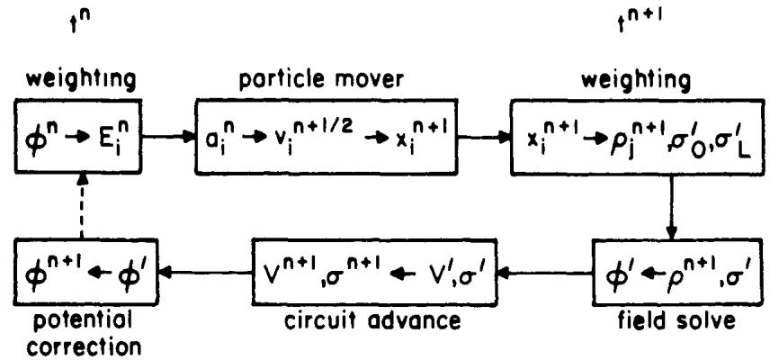  
Figure 16-9d Flow diagram for $R C$ external circuit. Primes indicate time intermediate to $t _ { n }$ and $t _ { n + 1 }$

$$
V = V _ { \mathrm { e x t } } + \hat { R } \ : \frac { d \mathrm { Q } } { d t } + \frac { \mathrm { Q } } { \hat { C } }
$$

where $J _ { \tt e x t } = d \ Q / d t$ has been used (both are densities). We use the linearity of the field equations in the device to allow superposition of the voltage $V _ { n + 1 } ^ { \prime }$ (due to particles),and external charge flow in the interval $t _ { n }$ to $t _ { n + 1 }$ as

$$
V _ { n + 1 } = V _ { n + 1 } ^ { \prime } - \frac { \mathrm { \large ~ Q } _ { n + 1 } - \mathrm { \large ~ Q } _ { n } } { \hat { C } _ { \nu } }
$$

Equations (9) and (10) are used to advance $\mathbf { Q } _ { n }$ t0 $\mathbf { Q } _ { \eta + 1 }$ and to obtain $V _ { n + 1 }$ The second term is like $\Delta Q = J _ { \mathrm { e x t } , n + 1 / 2 } \Delta t$ (10) is nottime centered;and this both provides stability for all values of $\hat { R C }$ decay times, and ensures that $V _ { n + 1 } = V _ { \mathrm { e x t } , n + 1 }$ for $\tilde { R } ^ { ^ { \mathrm { v } } } \to 0 , \ \hat { C } \to \infty$ Hence，the circuit equation is written as

$$
V _ { n + 1 } = V _ { n + 1 } ^ { \prime } - \frac { \mathrm { \bf ~ Q } _ { n + 1 } - \mathrm { \bf ~ Q } _ { n } } { \dot { C } _ { \nu } } = V _ { \mathrm { e x t } , n + 1 } + \hat { R } \frac { \mathrm { \bf ~ Q } _ { n + 1 } - \mathrm { \bf ~ Q } _ { n } } { \Delta t } + \frac { \mathrm { \bf ~ Q } _ { n + 1 } } { \hat { C } }
$$

(with $d \mathbf { Q } / $ dt taken at time $n + \%$ for stability）to be solved for $\mathbf { Q } _ { n + 1 }$ or $\Delta { } Q$

$$
\Delta \mathsf { Q } = \left( V _ { n + 1 } ^ { \prime } - V _ { \mathsf { e x t } , n + 1 } - \frac { \mathsf { Q } _ { n } } { \hat { C } } \right) \left[ \frac { \hat { R } } { \Delta t } + \frac { 1 } { \hat { C _ { \nu } } } + \frac { 1 } { \hat { C } } \right] ^ { - 1 }
$$

Note that shorting out $\hat { C }$ (meaning $\hat { C } \longrightarrow \infty )$ is no problem. This equation produces △Q and hence $V _ { n + 1 }$ ，the correct device voltage. $\Delta \mathsf { Q }$ is added to $\pmb { \sigma } _ { 0 } ^ { \prime }$ and subtracted from $\pmb { \sigma } _ { L } ^ { \prime }$ which now correspond to time $t _ { n + 1 }$ .The internal potentials are now updated to $t _ { n + 1 }$ by adding the uniform field produced by $\Delta \mathsfit { Q }$ ， $\Delta E _ { x } = - \Delta  Q$

$$
\small \phi _ { j } = \phi _ { j } ^ { \prime } + \Delta 0 X _ { j }
$$

The fields for the mover are obtained as usual by spatial differencing.

If the longitudinal part of $E$ needs correction (in the EM model) then obtain the correction potential $\delta \phi$ as in Chapter 15. This step and the adjustment (13） can be combined.

Adding in an external inductance $\hat { L }$ requires changes in the sequence used,to that shown in Figure 16-9e. The circuit equations are now second order in Q

$$
V _ { n } = V _ { \mathrm { e x t } , n } + \hat { R } J _ { n } + \hat { L } \left( \frac { d J } { d t } \right) _ { n } + \frac { \mathbf { Q } _ { n } } { \hat { C } }
$$

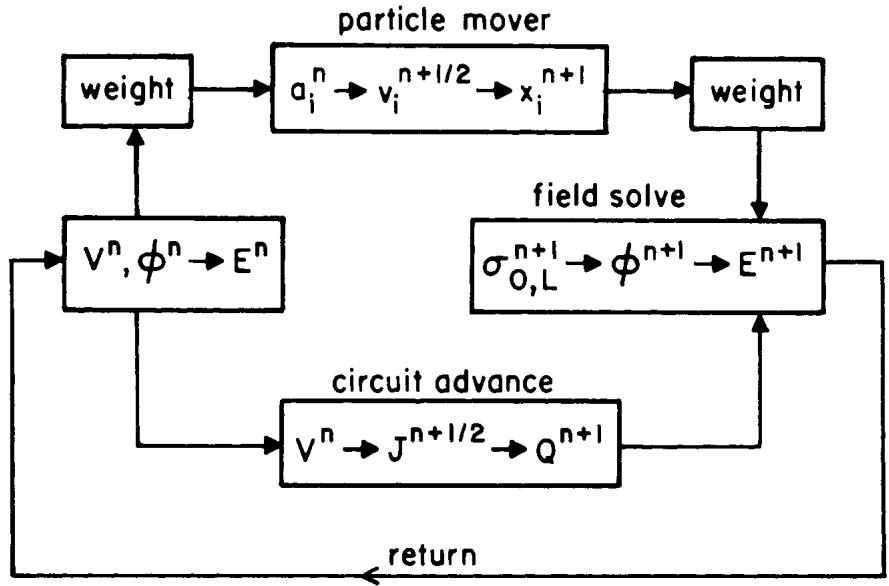  
Figure $1 6 . 9 6$ Flow diagram for RLC external circuit.

$$
\left. \frac { d \mathrm { Q } } { d t } \right. _ { n + 1 / _ { 2 } } = J _ { n + 1 / _ { 2 } }
$$

This set is used to solve for $J _ { n + 1 / 2 }$ and, hence $\mathbf { Q } _ { n + 1 }$ ． As a first approach, construct

and

$$
\begin{array} { r } { J _ { n } = \frac { J _ { n + 1 / _ { 2 } } + J _ { n - 1 / _ { 2 } } } { 2 } } \\ { \left[ \frac { d J } { d t } \right] _ { n } = \frac { J _ { n + 1 / _ { 2 } } - J _ { n - 1 / _ { 2 } } } { \Delta t } } \end{array}
$$

which is recognized as a leap-frog method,time-centered and second-order accurate. Then we obtain the updated current,

$$
J _ { n + 1 / _ { 2 } } = \left[ V _ { n } - V _ { \mathrm { e x t } , n } - \frac { \mathsf { Q } _ { n } } { \hat { C } } + J _ { n - 1 / _ { 2 } } \left\{ - \hat { R } + \frac { \hat { L } } { \Delta t } \right\} \right] \left[ \frac { \hat { R } } { 2 } + \frac { \hat { L } } { \Delta t } \right] ^ { - 1 }
$$

and the new capacitor charge,

$$
{ \sf Q } _ { n + 1 } = { \sf Q } _ { n } + J _ { n + 1 / 2 } \Delta t
$$

Next, $\Delta \mathsf { Q }$ is added to ${ \pmb \sigma } _ { 0 } ^ { \prime }$ and subtracted from $\pmb { \sigma } _ { L } ^ { \prime }$ ，the provisional charges on the walls due to the active charges. Lastly,the field solve is done,with the $( \pmb { \rho } , \pmb { \sigma } _ { 0 } , \pmb { \sigma } _ { L } )$ at time $\ell _ { n + 1 }$ .As done in a problem, this approach is stable for $\Delta t < < \hat { L } / \hat { R }$ and $\hat { R C }$ and $( \hat { L } \hat { C } ) ^ { \sharp }$ , hence unusable for $\hat { R } ^ { { \bf \Phi } , \hat { L } }$ ，or $\hat { C } \longrightarrow 0$ or for $\hat { R } \to \infty$ (open circuit). Hence,we seek another method.

As a second approach,write the circuit equation (14） at time $n { \mathrel { + { 1 } } }$ (changing Figure 16-9e appropriately) and use the superposition (10). Next, construct the second-order-accurate representations

$$
J _ { n + 1 } = { \frac { 3 J _ { n + 1 / 2 } - J _ { n - 1 / 2 } } { 2 } }
$$

and

$$
\Bigg | \frac { d J } { d t } \Bigg | _ { n + 1 } = \ \frac { 2 \left( J _ { n + 1 / _ { 2 } } - J _ { n - 1 / _ { 2 } } \right) } { \Delta t } \ - \ \frac { J _ { n - 1 / _ { 2 } } - J _ { n - 3 / _ { 2 } } } { \Delta t }
$$

Then we obtain

$$
J _ { n + 1 / _ { 2 } } = \left[ V _ { n + 1 } ^ { \prime } - V _ { \mathrm { e x t } , n + 1 } - \frac { \mathrm { Q } _ { n } } { \hat { C } } + \frac { \hat { L } } { \Delta t } \left( 3 J _ { n - 1 / _ { 2 } } - J _ { n - 3 / 2 } \right) + \frac { \hat { R } } { 2 } J _ { n - 1 / _ { 2 } } \right]
$$

which is then used to update $\mathsf Q _ { n }$ t0 $\mathsf Q _ { \eta + 1 }$ ,followed by the field solve. This method is_stable in several limits and hence,is expected to stable for all values of $\hat { R } , \hat { L } , \hat { C }$ ,and $\Delta t$ (Problem 16-9a).

# PROBLEMS

$1 6 . 9 8$ Study the stability of (14) and (15),using (20),(21),and (22)．For example,in (22), using Q as the unknown and writing $\mathsf Q _ { \eta } = \mathsf Q \boldsymbol z ^ { n }$ ， $\mathsf Q _ { n + 1 } = \mathsf Q z ^ { n + 1 }$ ，show that stability is determined by the zeros of

$$
= \{ \frac { 1 } { \hat { C } _ { v } } + \frac { 1 } { \hat { C } } \} z + \frac { \hat { R } } { \Delta t } [ \frac { 3 } { 2 } ( z - 1 ) - \frac { 1 } { 2 } ( 1 - \frac { 1 } { z } ) ] +  \frac { \hat { L } } { \Delta t ^ { 2 } } | 2 ( z - 2 - \frac { 1 } { z } ) - ( 1 - \frac { 2 } { z } - \frac { 1 } { z ^ { 2 } } ) ]
$$

being inside the unit circle $| z | = 1$ .This polynomial is cubic [not quadratic as expected from (14) and (15),which are second order in $\boldsymbol { \mathbf { Q } } \boldsymbol { \mathbf { l } }$ ， producing an extraneous root when $\hat { L } \neq 0$ which is strongly damped.

16-9b Following Problem $1 6 { \cdot } 9 \mathsf { a }$ ,examine the stability of (14) and (15） using (16),(17),and (18).

APPENDICES

Part Four consists of Appendices which complement the main text: the complex fast Fourier transform, compensating and attenuating, digital filtering,direct solution of Poisson's equation, and a discussion on differencing operators.

# FAST FOURIER TRANSFORM SUBROUTINES

# (a) Complex Periodic Discrete Fourier Transform

Our object is to compute the discrete Fourier transform (DFT)

$$
\hat { x } \left( \hat { t } \right) = \sum _ { t = 0 } ^ { N - 1 } x \left( t \right) e \left( \frac { t \hat { t } } { N } \right) \qquad \mathrm { f o r } \hat { t } = 0 , 1 , . . . , N - 1
$$

where $e \left( x \right) \equiv { \tt e x p } \left( 2 \pi i x \right)$ .Sequences $_ x$ and $\hat { x }$ are complex-valued. Evaluating （1） straightforwardly requires $N$ complex multiplies (6 arithmetic operations） and $N - 1$ complex additions (2 arithmetic operations) for each $\hat { t }$ , if we assume that the complex exponentials are already computed. Thus the complete sequence $\hat { x }$ requires $8 N ^ { 2 } + O \left( N \right)$ operations,when done in this straightforward fashion. Obvious improvements can be made by exploit-ing special values, symmetries,and periodicity of the exponential. With industry and wit you may be able to evaluate (1） as quickly as a good FFT program,but history says this is unlikely. And if you do,chances are you have reinvented part or all of the FFT algorithm.

We discuss the Sande-Tukey form of the FFT,rather than the Cooley-Tukey form, and follow the notation of Gentleman and Sande (1966). Also we restrict ourselves first to the simple and common case in which $N$ isa power of 2.

We evaluate (1） differently for odd and even $\hat { \pmb { t } }$ For even $\hat { t } = 2 \hat { b }$

$$
\begin{array} { l } { { \hat { x } \left( 2 \hat { b } \right) = \displaystyle \sum _ { t = 0 } ^ { N - 1 } x \left( t \right) e \left( \frac { t \hat { b } } { N / 2 } \right) \qquad b = 0 , 1 , \dots , \frac { N } { 2 } - 1 } } \\ { { = \displaystyle \sum _ { t = 0 } ^ { N / 2 - 1 } \left[ x \left( t \right) + x \left( t + N / 2 \right) \right] e \left( \frac { t \hat { b } } { N / 2 } \right) } } \end{array}
$$

For odd $\hat { t } = 2 \hat { b } + 1$

$$
\begin{array} { l } { { \hat { x } \left( 2 \hat { b } + 1 \right) = \displaystyle \sum _ { t = 0 } ^ { N - 1 } x \left( t \right) e \left( \frac { 2 t } { N } \right) e \left( \frac { t } { N / 2 } \right) } } \\ { { = \displaystyle \sum _ { t = 0 } ^ { N / 2 - 1 } e \left( \frac { 2 t } { N } \right) \left[ x \left( t \right) - x \left( t + N / 2 \right) \right] e \left( \frac { t \hat { b } } { N / 2 } \right) } } \end{array}
$$

Note that (2） and (3） are each $N / 2$ length DFT's. Because the work to evaluate a length $N$ DFT is proportional to $N ^ { 2 }$ ，we have made a gain of about a factor of 2 (for large $N$ ）by exchanging $8 N ^ { 2 } + O \left( N \right)$ operations for:

(1）Formation of the two sequences in square brackets in (2) and (3),taking $O \left( N \right)$ operations, plus   
(2) Two DFT's of length $N / 2$ ， taking $2 { \times } 8 ( N / 2 ) ^ { 2 } + O \left( N \right)$ operations, or a total of $4 N ^ { 2 } + O \left( N \right)$ operations.

The group properties of the exponential which made this reduction possible are:

$$
\begin{array} { l } { { e \left( x + y \right) = e \left( x \right) e \left( y \right) } } \\ { { { e \left( x + 1 \right) } = e \left( x \right) } } \end{array} \qquad 
$$

Properties such as these are so rare that there are only a few transforms for which highly efficient algorithms are known.

The next key point is that we can gain another factor of two (nearly） by using the same trick on the two length $N / 2$ DFT's in (2） and (3),which leaves four length $N / 4$ transforms to be done. This reduction may be repeated $\mathsf { l o g } _ { 2 } N$ times in all,which ends with $N / 2$ transforms of length 2 to be done. This is the principle of the fast Fourier transform algorithm. A more careful count shows that the number of operations is proportional to $N \log _ { 2 } N$ . Also， the roundoff error is smaller than for the straightforward summations in (1). This description of evaluating a DFT in terms of shorter DFT's is an example of a recursive definition of an algorithm.

There are still some problems to be resolved before one can write a good FFT computer program. One is the generation of the complex exponentials in the square bracket in (3). A fast and easy way is to store a large table of sines and/or cosines. This ties up a lot of computer memory and is not necessary. Because of the simple order in which the exponentials' arguments arise during a Sande-type FFT,efficient and very compact methods are possible,although few authors have used them. Singleton (1967,1969) generates them all by a multiple-angle recursion method which is designed to avoid roundoff buildup and which requires a short table of $\mathsf { l o g } _ { 2 } N _ { \mathsf { m a x } }$ sines,where $N _ { \mathrm { m a x } }$ is the greatest length DFT the program is asked to do.

Another problem is to minimize the amount of computer memory used during the calculation. Some programs use $2 N$ memory celis,in addition to the storage needed for $x$ and $\hat { x }$ ，and any sine-cosine tables. It is usually most convenient to have the results of each of the $\mathsf { l o g } _ { 2 } N$ stages stored in the same places as was $x$ . We now show how this logistics problem is solved.

Table Aa shows the steps in a FFT of length 8,and shows what is in memory at any time. $\beta _ { 0 }$ and $\beta _ { 4 }$ are calculated from $x _ { 0 }$ and $x _ { 4 }$ and are stored back in the same locations; the others are similar. According to (2） and (3), we must next do length 4 DFT's on the sequences $( \beta _ { 0 } , \beta _ { 1 } , \beta _ { 2 } , \beta _ { 3 } )$ and $( \beta _ { 4 } , \ldots , \beta _ { 7 } )$ . These are normally done in parallel,and also are done by splitting each into shorter DFT's of the 4 sequences $( \gamma _ { 0 } , \gamma _ { 1 } )$ ， $( \gamma _ { 2 } , \gamma _ { 3 } )$ ，etc. which are stored where the $\beta$ s were. The DFT's of these sequences are $( \mathfrak { d } _ { 0 } , \mathfrak { d } _ { 1 } )$ ，etc. The δ's are the elements of $\hat { x }$ but not in order. To put them in order, pairs of δ's must be exchanged; again no extra arrays are needed.

# (b) Transform of Real-Valued Sequences, Two at a Time

In simulation, we usually transform real data,or inverse transform back to real data. If the sequence $x$ is real-valued and is transformed using the complex FFT subroutine CPFT, then the array $i$ is first filled with zeros. Similarly, there is redundance in the transformed $r$ and $j$ arrays due to the Hermitian symmetry

$$
[ \hat { x } ( \hat { t } ) ] ^ { * } = \hat { x } ( - \hat { t } ) = \hat { x } ( N - \hat { t } )
$$

which follows from (1). It is possible to FFT a real sequence using roughly half the storage and computation required by this straightforward application

Table Aa Sande-Tukey organization of the FFT.   

<table><tr><td>start</td><td>1st level</td><td>2nd level</td><td>3rd level</td><td>sort</td></tr><tr><td>x0</td><td>β0=xo+X4</td><td>Y0=β+β</td><td>80=Y0+Y1</td><td>x0=80</td></tr><tr><td>x1</td><td>β=x1+xs</td><td>Y1=β+β</td><td>81=γ0-Y1</td><td>x=84</td></tr><tr><td>x2</td><td>β=x+X6</td><td>Y2=β-β</td><td>82=γ2+Y3</td><td>x=82</td></tr><tr><td>X3</td><td>β=x+x7</td><td>Y3=i(β-β)</td><td>8=γ2-Y3</td><td>x=86</td></tr><tr><td>X4</td><td>β4=x0-X4</td><td>γ4=β4+β6</td><td>δ4=γ4+Y5</td><td>x4=81</td></tr><tr><td>X5</td><td>β5=e(1/8)(x-x5）</td><td>γ5=βs+β7</td><td>δ5=γ4-Y5</td><td>x5=85</td></tr><tr><td>X6</td><td>β6=e(2/8)(x-x6)</td><td>Y6=β4-β6</td><td>86=Y6+Y7</td><td>x6=8</td></tr><tr><td>x7</td><td>β=e(3/8）(x-x)</td><td>Y=i(βs-β</td><td>87=Y6-Y7</td><td>x=87</td></tr></table>

$$
\beta ( a + 2 b + 4 \hat { c } ) = e \left( \frac { \hat { c } ( a + 2 b ) } { 8 } \right) \sum _ { c = 0 } ^ { 1 } e \left[ \frac { c \hat { c } } { 2 } \right] x ( a + 2 b + 4 c )
$$

$$
\gamma ( a + 2 \hat { b } + 4 \hat { c } ) = e \left( \frac { a \hat { b } } { 4 } \right) \sum _ { b = 0 } ^ { 1 } e \left( \frac { b \hat { b } } { 2 } \right) \beta ( a + 2 b + 4 \hat { c } )
$$

$$
\delta ( { \hat { a } } + 2 { \hat { b } } + 4 { \hat { c } } ) = \sum _ { a = 0 } ^ { 1 } e \left( \frac { a { \hat { a } } } { 2 } \right) \gamma ( a + 2 { \hat { b } } + 4 { \hat { c } } )
$$

$$
\hat { x } \left( \hat { t } \right) = \hat { x } \left( \hat { c } + 2 \hat { b } + 4 \hat { a } \right) = \hat { \delta } \left( \hat { a } + 2 \hat { b } + 4 \hat { c } \right)
$$

$$
\hat { a } , \hat { b } , \hat { c } = 0 \mathrm { o r } 1 .
$$

of CPFT (Cooley,Lewis,and Welch,197O) but the algorithm is much more complicated than the alternative in subroutine RPFT2 below. When transform time becomes significant, there are often many transforms to do, such as the columns or rows of a two-dimensional array,that can be done in pairs.

Let $\boldsymbol { z } \left( t \right) = \boldsymbol { a } \left( t \right) + i \boldsymbol { b } \left( t \right)$ ，where $\pmb { a }$ and $^ { b }$ are real valued. Then the transforms $\hat { a }$ and $\hat { b }$ can be extracted from $\hat { z }$ using the relations

$$
\hat { z } \hat { ( t ) } = \hat { a } \hat { ( t ) } + i \hat { b } \hat { ( t ) }
$$

$$
\hat { z } \left( N - \hat { t } \right) = [ \hat { a } \left( \hat { t } \right) ] ^ { * } + i [ \hat { b } \left( \hat { t } \right) ] ^ { * }
$$

which follows from (6). This is implemented by RPFT2,which stores Re á $\left( \operatorname { I m } \hat { a } \right)$ in the lower (upper） part of the array used for $\pmb { a }$ (Problem Ac). Subroutine RPFTI2 with CPFT implements the inverse.

# (c) Sine Transform of Real-Valued Sequences, Two at a Time

The sine transform is

$$
\hat { a } \left( \hat { t } \right) = \sum _ { t = 1 } ^ { N - 1 } a \left( t \right) \sin \frac { \pi } { N } t \hat { t } \qquad \hat { t } = 0 , 1 , \dotsc , N
$$

where $a \left( 0 \right) = a \left( N \right) = 0$ ，This can be performed by extending the definition of $a \left( t \right)$ to length $2 N$ , using sine symmetry

$$
a \left( 2 N - t \right) = a \left( - t \right) = - a \left( t \right)
$$

and doing a periodic transform of length $2 N$ . Instead, we adapt an algorithm of Cooley, Lewis,and Welch (197O) to sine transform a pair of sequences $\pmb { a }$ and $^ { b }$ ， using only one complex periodic transform of length $N$

First,we rewrite (9) using (10) as

$$
\begin{array} { l } { { \displaystyle \hat { a } \left( \hat { t } \right) = \frac 1 2 \sum _ { t = 0 } ^ { 2 N - 1 } a \left( t \right) \sin \frac \pi N t \hat { t } } } \\ { { \displaystyle ~ = \frac 1 2 \sum _ { t = 0 } ^ { N - 1 } a \left( 2 t \right) \sin \frac { 2 \pi } N t \hat { t } } } \\ { { \displaystyle ~ + \left( 4 \sin \frac \pi N \hat { t } \right) ^ { - 1 } \sum _ { t = 0 } ^ { N - 1 } \left[ a \left( 2 t + 1 \right) - a \left( 2 t - 1 \right) \right] \cos \frac { 2 \pi } N t \hat { t } } } \end{array}
$$

(Problem Ad),which are periodic transforms. This result motivates defining the complex periodic sequence

$$
\begin{array} { r } { z \left( { t } \right) = \left[ a \left( { 2 t + 1 } \right) - a \left( { 2 t - 1 } \right) - i a \left( { 2 t } \right) \right] } \\ { + i \left[ b \left( { 2 t + 1 } \right) - b \left( { 2 t - 1 } \right) - i b \left( { 2 t } \right) \right] } \end{array}
$$

for $t = 0 , 1 , . . . , N { - } 1$ ，which is_transformed using CPFT. The sine transform $\hat { a }$ is extracted from Re $\hat { z } ~ ( \hat { t } )$ ,e.g.,

$$
\begin{array} { r } { 4 \hat { a } \left( \hat { t } \right) = \mathrm { R e } \hat { z } \left( \hat { t } \right) - \mathrm { R e } \hat { z } \left( N - \hat { t } \right) + \frac { \mathrm { R e } \hat { z } \left( \hat { t } \right) + \mathrm { R e } \hat { z } \left( N - \hat { t } \right) } { 2 \sin \frac { \pi } { N } \hat { t } } } \end{array}
$$

Similarly, $\hat { b }$ is extracted from $\operatorname { I m } \hat { z } ( \hat { t } )$

This algorithm has been used to implement a two dimensional transform of data periodic in $y$ with sine symmetry in $x$ for use on potentials between two plane conducting surfaces.

# PROBLEMS

Aa Suppose $N$ is a multiple of 3. Show that the DFT can be evaluated by three DFT's of length $N / 3$ ,by steps similar to those leading to (2) and (3).

Ab It is often said that the 8's are the x's in "bit-reversed" order.To understand this term, rewrite the last column of Table Aa,with the subscripts writen in the binary number system, e.g., $\hat { x } _ { 0 0 1 } = \delta _ { 1 0 0 }$ ,three digits each.

Ac Show that subroutines RPFT2 and RPFTI2 do what their commentary says they do.

Ad Derive (12).  Hints: Write (11) as separate sums,over even and odd values of $t$ . Show that the odd sum,and the second part of (12),are both equal to

$$
\sum _ { t = 0 } ^ { N - 1 } a \left( 2 t + 1 \right) \frac { \cos \frac { 2 \pi } { N } t \hat { t } - \cos \frac { 2 \pi } { N } \left( t + 1 \right) \hat { t } } { 4 \sin \frac { \pi } { N } \hat { t } }
$$

# (d) Listings for CPFT, RPFT2, and RPFTI2

subroutine cpft(r，i.n，incp，signp)   
C fortran transliteration of singleton's 66oo assembiy-coded fft.   
C intended to be of assistance in understanding his code, and in future writing of an fft for another machine. it should be translated into machine code rather than used for production as is because: it is versatile and efficient enough to see lots of use, it benefits greatly from careful hand coding, and is short and simple enough to do quickiy. a.bruce langdon，m division，i.i.I.，1971. comments below are mostly from 6600-7600 version. real part of data vector. imag part of dota vector. n number of elements (=1,2.4.8...32768). inc spacing in memory of data (usuaily 1. but see below). sign its sign wiil be sign of argument in transform exponential. on entry arrays r and i contain the sequence to be transformed. on exit they contain the transform. input and output sequences are both in natural order (i.e. not bit-reversed scrambled). a call to cpft with si $\sin = + 1$ ，followed by another call with the first:4 parameters the same and sign=-1, will/teave r gnd i with their original contents times n. the same is true if first sign=-1. and next sig $n = + 1$ the usefulness of parameter inc may be illustrated by 2 examples: suppose the complex sequence is stored as a fortran compiex array z. i.e. real and imaginary parts in glternate memory cells. the separation between consecutive real (or imaginary) elements is 2 words,so inc $\tt { \tt { = } \tt { 2 } }$ .the call might be call cpft(reai(z)，aimag(z)，n，2,sign) for many compiiers one would instead have to do something like call cpft(ri，ri(2)，n.2，sign) where ri is a real array equivalenced to z. suppose one had an orray.c with dimensions n1, n2. one wants r to be row i1 and i to be row i2. the separation of consecutive eiements is n1 and starting gddresses gre c(ii.1) and c(i2.1). so use call cpft(c(i1,1). c(i2.1): n2, n1. sign) timing, assuming minimal memory bank conflicts: 6400timefor $n = 1 0 2 4$ is 220, $0 0 0 = 2 1$ .5\*n\*log2n microseconds. 6600time for $n = 1 0 2 4$ is44; ${ \mathfrak { s o o } } = 4$ .35\*n\*log2n microseconds. 7600 time for n=1024 is B.300=0.81\*n\*log2n microseconds. o radix 2 fft provokes_memory bank conflicts at best, but timing is noticeably worsened when Iike elements of r and i are in the same bank_ond/or inc is a multiple of a power of 2. ina worst case on the 760o the speed was decreased by a factor of 3. thus in the exampte above, if n1=multiple of 32 one might decide to waste a iittie memory by increasing n1 to 33. thus decreasing conflicts for transforms over rows or over columns. written by r: c. singleton, stanford research institute, nov. 1968. commentary.iriIinkage and other minor changes by_a. bruce tangdon lawrence radiation laboratory，livermore，aprii 1971. references: (1) r. c. singleton. ‘on computing the fast fourier trgnsform'.   
C comm．assoc．comp．mach．vol.1O，pp．647-654（1967）.   
C (2)r. c. singleton.algorithm 345 ‘an algol convolution procedure   
c based_on the fast fourier transform'.comm. ocm vol. 12,   
C PP.179-184（1969). (3) w. m. gentieman and g. sande, 'fost fourier transforms - for fun and profit'. Proc. afips 1966 fail ioint computer conf..   
C vol．29，Pp．563-578.   
C real r(1)，i(1) integer signp,span, rc realsines(15)，i0,i1   
C   
C tabie of sines.   
C these shouid be good to the very last bit. they Qre given in octal   
C to prevent an assembler from converting them poorly. they may be   
C obtained by evaiuating the indicated sines in double precision and   
C punching them out in octal format (a single precision sine routine   
C is not accurate enough). use the most significant word. rounded   
C according to the least significant word.   
C ia this version i do it alazy way on the first call. data sines(1)/0./ if( sines(i).eq.1. )go to1 sines(1)=i. t=atan(i.) do 2 is=2.15 sines(is)=sin(t) 2 =+/2. 1 continue if( n.eq.1 )return set up various indices.   
C inc=incp sgn=signp ninc=n\*inc span=ninc i1=n/2 do 3 is=1.15 if（ it.eq.i ）go t0 12 3i+=it/2   
C there are 2 inner loops which run over the n/(2\*span) replications   
C of transforms of length( $z ^ { \bullet }$ span). _these loops fit into the instruction stack of the 660o or 76o0. one Ioop is for arbitrary   
C rotation factor angle. the other takes care of the special case in   
C which the angle is zero so that no complex multiplication is needed.   
C this is more efficient than testing and branching inside the inner   
C loop.as is often done. the other special case in which no complex multiply is needed is angle=pi (i.e. factor=i); this is not handled specially. these measures are most helpful for small n.   
C the organization of the recursion is that of sande (ref. (3). pp. 566-568). that is. the data is in normal order to start and scrambied afterward. and the exponential rotation (‘twiddle') factor   
c angles are used in ascending order during each recursion level. all the sines and cosines needed are generated from a short table using_g stable multiple-anglerecursion(ref.(1): p65i and ref.(2). pp. i79-18o). this method is economical in storage and time. and   
C yields accuracy_comparabte to good Iibrary sin-cos routines. angles between O and pi are needed. the recursion is used for angles up to pi/2: iarger angl   
C imaginary axis (angle:=pi-angl   
C one right after the other. for simplicity.commentary t   
C if truncated rather than rounc   
C magnitude correction should be   
C   
10 $\begin{array} { l } { { \sf t = s + ( \sf s 0 ^ { \circ } c - c 0 ^ { \circ } s \geq \sf ) } } \\ { { \sf c = c - ( \sf c 0 ^ { \circ } c + s 0 ^ { \circ } s \geq \sf ) } } \\ { { \sf s = \sf t } } \end{array}$   
C replicgtion loop.   
11 k1=k0+span r0=r(k0+1） ri=r(k1+1） 10=i（k0+1） i1=i（k1+1） r(k0+1)=r0+r1 i（k0+1)=i0+i1 r0=r0-r1 i0=i0-i1 r(k1+1)=c\*r0-s\*i0 i(k1+1)=s\*r0+c\*i0 k0=k1+span if( ko.it.ninc ） go to 11 k1=k0-ninc c=-c k0=span-k1 if(ki:1t.k0）go to 11 k0=k0+inc if( k0.1t.k1 ） go to 10   
C recursion' to next Tevel.   
12 cantinue span=spon/2 k0=0   
c angle=0 loop.   
13 k1=k0+span $\begin{array} { r l } & { \mathrm { ~ \gamma ~ } \ r = \mathrm { { r } \ } \left( { \bf { k } } \widetilde { \bf { O } } + \widetilde { \bf { 1 } } \right) } \\ & { \mathrm { ~ \gamma ~ } \ r = \mathrm { { r } \ } \left( { \bf { k } } \widetilde { \bf { O } } + \widetilde { \bf { 1 } } \right) } \\ & { \mathrm { ~ \gamma ~ } \ } \\ & { \mathrm { ~ \gamma ~ } \mathrm { { 0 } } = \mathrm { { i } } \left( { \bf { k } } \widetilde { \bf { O } } + \widetilde { \bf { 1 } } \right) } \\ & { \mathrm { ~ \gamma ~ } \mathrm { { 1 } } \ { \mathrm { { u } } } \mathrm { { 1 } } + \mathrm { { i } } \ \mathrm { { \Gamma } } \left( { \bf { k } } \mathrm { { 1 } } + 1 \right) } \\ & { \mathrm { ~ \gamma ~ } \left( { \bf { k } } \mathrm { { 0 } } + 1 \right) = \mathrm { { r } } \ 0 + \mathrm { { r } } \ \mathrm { { 1 } } } \\ & { \mathrm { ~ \gamma ~ } \left( { \bf { k } } \mathrm { { 0 } } + 1 \right) = \mathrm { { i } } \ \mathrm { { 0 } } + \mathrm { { i } } \ \mathrm { { \Gamma } } \ } \\ & { \mathrm { ~ \gamma ~ } \left( { \bf { k } } \mathrm { { 1 } } + 1 \right) = \mathrm { { r } } \ 0 - \mathrm { { r } } \ \mathrm { { 1 } } } \\ & { \mathrm { ~ \gamma ~ } \left( { \bf { k } } \mathrm { { 1 } } + 1 \right) = \mathrm { { i } } \ \mathrm { { 0 } } - \mathrm { { i } } \ \mathrm { { 1 } } } \\ & { \mathrm { ~ \gamma ~ } \mathrm { { 0 } } = \mathrm { { u } } \mathrm { { z } } \ \mathrm { { 1 } } + \mathrm { { s } } \ \mathrm { { o } } \mathrm { { o } } \mathrm { { - } } } \end{array}$ if( ko.it.ninc )go t0 13   
C are we finished... if( span.eq.inc ） go to 20   
C no. prepare non-zero angles. c0=2.\*sines(is)\*\*2 is=is-1 s=sign( sines(is).sgn ) s0=s c=1.-c0 k0=inc go to 11   
C   
C arrays r and i now contain t   
C binary'order. the re-orderi   
C reference for sorting princi

once again. commentary applies to inc=1 case. indices are: C ii:=0.1.2...n/2-1 ( a simple counter). C ji:=reversal of ii: C rc:=reversal of O,2,4...n/2(incremented n/4 times). C rc is incremented thusly: starting with the next-to-leftmost bit, change each bit up to and including first O. (the actual coding is C done so as to work for any inc>o with equal efficiency.) C for all exchanges ii fits one of these cases: C (1) ist and last bits gre O (ii.ii even and $\yen 12$ ）and $i \ \mathrm { i } < \equiv \mathrm { j } \ \mathrm { i }$ · C (2) one's complement of case (1) (both odd and >n/2). C (3)ist bit O, last bit 1 (ii odd and $c n / 2 . i ( i > n / 2 )$ C the code from label even down to odd is entered with ii even and C <=ii. first time thru the complements gre done -case (2). second C time thru gets case (1). thus a pair of elements both in the first C half of the sequence. and another pair in the 2nd half . are C exchanged. the condition ii<ii prevents α pair from being exchanged C twice. C the code from label odd down to increv does case (3).

20 n1=ninc-inc n2=ninc/2 rc=0 ii=0 ii=0 if( n2.eq.inc )return go to 22

even. 21 ii=n1-ii j1=n1-i1 t=r（ii+1） r(1i+1)=r（ii+1） r(ii+1)=t 1=i（ii+1） (（01+1)=1(11+1) i（i1+1)=t it( ii.gt.n2 )go to 21

C odd.

22 i=ii+inc i： = i i+n2 t=r(ii+1) (ii+i)=r（ii+1） r(ii+1)=t 1=i(ii+1） 1（01+1)=1（11+1） i(ii+i)=t it=n2

3 incre=it2reversed counter. rc=rc-it if( rc.ge.0 ）go to 23 rc=rc+2\*it ii=rc ij=ij+inc g0 to 21 iCIiih2 go to 22

return end

subroutine rpft2(a.b.n,incp) real a(1)，b(1)   
real data. periodic， fourier transform, two at a time.   
interface to compiex periodic fourier transform. to do pairs of   
transforms of real sequences.   
the two sequences are eiements O.inc,2\*inc...(n-1)\*inc of arrays a.b.   
after α complex periodic fourier transform. with a and b as the   
real and imaginary parts, rpft2 separates the transforms of a and b   
and packs them， times 2， back into arrays a and b.   
thus. the contents of a and b are replaced by twice their transforms   
bythe calls: cpft_(a, b. n. inc，sign) rptt2(a: b: n: inc)   
twice the real parts of the first half of the complex fourier.   
coefficients of a (cosine coef.) gre ina(o),a(1)..a(n/2).if   
inc=1.itwice the imggingry parts(sine coef.) are storedin)   
reverse order. in a(n-1). a(n-2)...a(n/2+1). likewise for b.   
no parameter 'sign'.is provided for_the_ purpose of changing the sign   
ofthe sine coefficients.this may be done with parametersignof   
the fourier transform. cpft.   
time required is less than 1/10 of that for cpft.   
should be re-coded in assembly language.   
written by a. bruce iangdon. Irl livermor.. may 1971. real ip.im inc=incp nine=nginc (1)=0(1)+0(1） B(is=b(i)+b(is ip=inc Im=ninc-Ip if(ip.go.im ） go to 2 rp=a(ip+1） rm=a(im+i） ip=b(ip+1） im=b(im+1) g(ip+1)=rm+rp bsim+1)=rm-rp bip+1{=ip+im a(im+iS=ip-im Ip=Ip+inc Im=ninc-ip it（ip.1t.im）go.to1 if(ip:gtinine Sreturn a(ip+1)=a（ip+1)+a(ip+1) b(ip+i）=b(ip+1)+b(ip+i） r.turn .nd subroutine rpfti2(a.b.n.incp) reai a(1)，b(1)   
C real data. periodic, fourier transform inverse. two at a time.   
C   
C interface to_complex periodic fourier transform. to do pairs of   
C transforms of real sequences.   
C   
C unpacks the cosine and sine coefficients of a and b and combines   
C them so that a $^ { + }$ i b is the complex periodic fourier transform of   
C the original sequences. rpfti2 reverses the effect of rpft2, except   
C that a and b are doubied.   
C the calls   
C rpfti2(a.b.n,inc)   
C cpft (a. b. n. inc,-sign)   
C invert the transform done earlier, except that the arrays have been   
C multiplied by $z ^ { \bullet } \mathsf { n }$ should be re-coded in assembly language. written by α.bruce langdon，Irl Iivermore，may 1971. inc=incp ninc=n\*inc Ip=inc Im=ninc-lp if( Ip.ge.im )return ca=a(ip+1) sb=b（1m+1 cb=b(-p+1 sa=a(Im+1) a(|p+1)=ca-sb a(1m+1)=ca+sb b(ip+1)=cb+sc b(im+1)=cb-sa Ip=ip+inc 1m=ninc-lp if（ ip.it.im ）go to 3 return end

# COMPENSATING AND ATTENUATING FUNCTIONS USED IN ES1

The smoothing function $\mathsf { \pmb { S } } \mathbf { M } ( \pmb { k } )$ in the subroutine FIELDS uses two adjustable parameters ${ \pmb a } _ { 1 }$ and ${ \pmb a } _ { 2 }$ given by

$$
\mathbf { S M } ( k ) \equiv \exp \left[ a _ { 1 } \sin ^ { 2 } \frac { k \Delta x } { 2 } - a _ { 2 } \tan ^ { 4 } \frac { k \Delta x } { 2 } \right]
$$

This is used in the product $\rho ( k ) \mathsf { S M } ^ { 2 } ( k )$ $a _ { 1 } > 0$ is used to cancel for $k \Delta x \lesssim 1$ the $O ( k ^ { 2 } )$ error in the dispersion relation due to $S \left( k \right)$ ， $\pmb { \kappa }$ and $\mathbf { K } ^ { 2 }$ in the normal algorithms; this is called compensating or boosting. $a _ { 2 } > 0$ attenuates $\rho ( k )$ at short wavelengths，generally called smoothing. Using $a _ { 1 } = 0 = a _ { 2 }$ makes $\mathbf { S } \mathbf { M } ( k ) = 1$ . This Appendix suggests some values to use for $a _ { 1 }$ and ${ \pmb a } _ { 2 }$

Let the boost given by $\pmb { a } _ { 1 }$ at $k \Delta x \lesssim 1$ be used to compensate for the error in the cold plasma dispersion. If the dispersion is given by the averaged-force result 8-13(3b),

$$
{ \omega } ^ { 2 } \approx { \omega } _ { p } ^ { 2 } \Bigg [ \frac { k \kappa ( k ) S ^ { 2 } ( k ) } { K ^ { 2 } ( k ) } \Bigg ] S { \bf M } ^ { 2 } ( k )
$$

and use the usual formulae,

$$
\kappa ( k ) = k \frac { \sin \left( k \Delta x \right) } { k \Delta x }
$$

$$
\begin{array} { l } { \displaystyle { S ^ { 2 } ( k ) = \left( \frac { \sin \frac { k \Delta x } { 2 } } { \frac { k \Delta x } { 2 } } \right) ^ { 4 } } } \\ { \displaystyle { K ^ { 2 } ( k ) = k ^ { 2 } \left| \frac { \sin \frac { k \Delta x } { 2 } } { \frac { k \Delta x } { 2 } } \right| ^ { 2 } } } \end{array}
$$

then,using dif $\theta \equiv \sin \theta / \theta$ ，

$$
{ \omega } ^ { 2 } \approx { \omega } _ { p } ^ { 2 } \ \mathrm { d i f } \left( k \Delta x \right) \mathrm { d i f } ^ { 2 } \frac { k \Delta x } { 2 } \ \mathrm { e x p } \left( 2 a _ { 1 } \mathrm { s i n } ^ { 2 } \frac { k \Delta x } { 2 } - 2 a _ { 2 } \mathrm { t a n } ^ { 4 } \frac { k \Delta x } { 2 } \right)
$$

To order $( k \Delta x ) ^ { 2 }$ ，with $k \Delta x \equiv \theta < < 1$ ，

$$
\begin{array} { c } { { \omega ^ { 2 } \approx \omega _ { p } ^ { 2 } \Bigg ( 1 - \frac { \theta ^ { 2 } } { 6 } + \cdot \cdot \cdot \Bigg ) \Bigg ( 1 - \frac { \theta ^ { 2 } } { 1 2 } \Bigg ) \Bigg ( 1 + a _ { 1 } \frac { \theta ^ { 2 } } { 2 } \Bigg ) } } \\ { { \approx \omega _ { p } ^ { 2 } \Bigg [ 1 + \theta ^ { 2 } \Bigg [ - \frac { 1 } { 4 } + \frac { a _ { 1 } } { 2 } \Bigg ] \Bigg ] } } \end{array}
$$

Hence, setting $a _ { 1 } = 0 . 5$ makes $\mathbf { \boldsymbol { \omega } } _ { } = \mathbf { \boldsymbol { \omega } } _ { p }$ to order $( k \Delta x ) ^ { 4 }$ . [Note that choosing a value for $a _ { 2 }$ also is unnecessary as tan $^ 4 ( \theta / 2 )$ is used, not tan $^ 2 ( \theta / 2 ) ]$ . If we include all spatial harmonics (all aliases),then the cold plasma dispersion with $a _ { 1 } = 0$ is given exactly by

$$
{ \boldsymbol \omega } ^ { 2 } = { \omega } _ { p } ^ { 2 } \cos ^ { 2 } \frac { k \Delta x } { 2 } \ { \mathsf { S M } } ^ { 2 } ( k )
$$

from 8-11(14)． For small $k \Delta x$ （7）is

$$
{ \omega } ^ { 2 } = { \omega } _ { p } ^ { 2 } \Bigg ( 1 - \frac { \theta ^ { 2 } } { 4 } + { \bf \Omega } \cdot { \bf \Omega } \cdot { \bf \Omega } \Bigg ) { \bf S } { \bf M } ^ { 2 } ( k ) 
$$

and,hence, is also corrected to order $( k \Delta x ) ^ { 4 }$ by $a _ { 1 } = 0 . 5$ Plots of

$$
\begin{array} { r } { \frac { \omega } { \omega _ { p } } \equiv W ( \theta ) \equiv \cos \frac { \theta } { 2 } \ : \mathbf { S } \mathbf { M } ( \theta ) } \end{array}
$$

are given in Figure Ba for $a _ { 1 } = 0 . 5$ and various values of ${ \pmb a } _ { 2 }$

Plots of the smoothing applied to the source $\rho ( k )$ ，namely, $\mathsf { S M } ^ { 2 } ( \pmb { \theta } )$ ，are given in Figure Bb for $a _ { 1 } = 0$ ， that is,using just the attenuating factor. The user could choose the smallest wavelength he wishes to include (meaning a value of $k _ { \mathrm { m a x } } \Delta x )$ ，locate this on the plot and pick off a value of $a _ { 2 }$ that makes $\mathsf { S M } ^ { 2 } ( k _ { \mathsf { m a x } } \Delta x )$ equal,say,O.01； the user then ignores all output for $k > k _ { \mathrm { m a x } }$ , as the source is effectively turned off at larger $k$

Sometimes spatial grid effects interfere with the physics. In onedimension,as in ES1,we can afford to use a very large number of cells (so that $\Delta x < < \lambda$ ，a wavelength characteristic of the physics) and then choose ${ \pmb a } _ { 2 }$ so that $\mathbb { S } \mathbf { M } ( 2 \pi / \lambda ) \sim 0 . 5$ Thus longer wavelengths are weakly attenuated, while wavelengths $\sim \Delta x$ are strongly suppressed. This usually removes spatial grid effects.

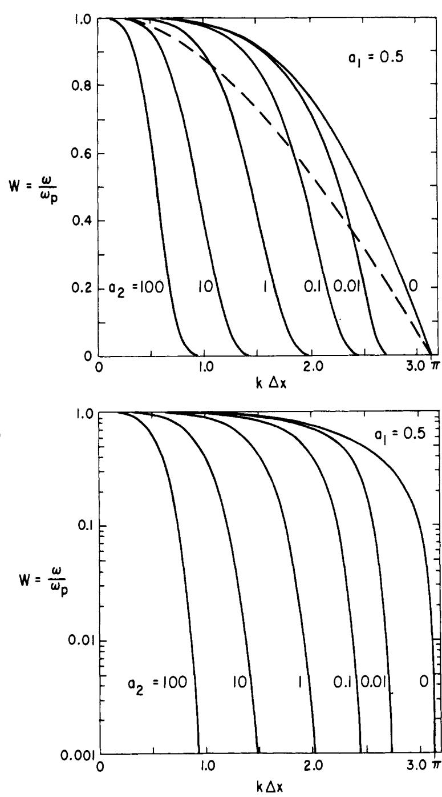  
Figure Ba (a） Cold plasma dispersion curves, $\omega ( k ) / \omega _ { p } \equiv W$ versus $k \Delta x \equiv \theta$ showing compensation and smoothing. The dashed line is $W = \cos { ! } / 2 k \Delta x$ ,the cold plasma dispersion for no compensation and no attenuation $( { \pmb a } _ { 1 } = 0 = { \pmb a } _ { 2 } )$ ．The solid lines are for $a _ { 1 } = 0 . 5$ [which makes $W = 1 + O \left( k ^ { 4 } \right)$ ，maximally flat for $k  0 ]$ and for various values of ${ \boldsymbol { a } } _ { 2 }$ (attenuations). (b) The same,on a log plot.

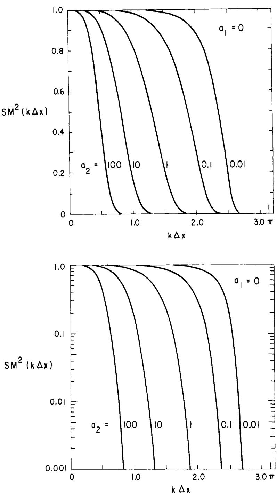  
Figure Bb (a） Attenuation of Fourier components of $\rho ( k )$ produced by smoothing factor $\mathsf { \pmb { S } } \mathbf { M } ^ { 2 }$ versus $k \Delta x \equiv \theta$ ,for no compensation $( a _ { 1 } = 0 )$ ,for various values of ${ a } _ { 2 }$ .(b）Same,log scale.

Another simple attenuating factor (not in ES1) which might be used, is

$$
{ \bf S M } _ { N } ( \alpha ) \equiv \exp \left( - \alpha ^ { N } \right)
$$

where $\alpha \equiv k / k _ { \mathrm { m a x } }$ , which is plotted in Figure Bc. Note that:

$$
\begin{array} { l } { { \displaystyle \mathsf { S } \mathsf { M } _ { N } ( 0 ) = 1 } } \\ { { \displaystyle \mathsf { S } \mathsf { M } _ { N } ( 1 ) = \frac { 1 } { e } = 0 . 3 6 8 } } \\ { { \displaystyle \mathsf { S } \mathsf { M } _ { 0 } ( \alpha ) = \frac { 1 } { e } = 0 . 3 6 8 } } \\ { { \displaystyle \mathsf { S } \mathsf { M } _ { N \mathrm { - } \infty } ( \alpha ) = \left\{ \begin{array} { l l } { 1 , \mathrm { ~ } \alpha < 1 } \\ { 0 , \mathrm { ~ } \alpha > 1 } \end{array} \right. } } \end{array}
$$

$$
\mathbf { S M } _ { N } ( \alpha \to 0 ) = 1 - O ( \alpha ^ { N } )
$$

Typically,a user would apply $\mathbf { S } \mathbf { M } _ { N }$ to $\rho ( k )$ ，and then insert his value for $k _ { \mathrm { m a x } }$ and use, say, $N = 8$

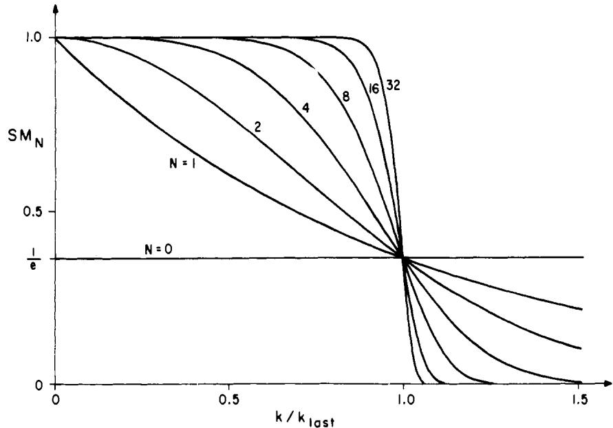  
Figure Bc Attenuation factor ${ \sf S M } _ { N } ( \alpha ) \equiv \exp { ( - \alpha ^ { N } ) }$ for various values of $N$

Other smoothing factors are readily constructed. The user is reminded that the sharper he makes the cutoff in $k$ -space (e.g.,use of larger values of $N$ in the second attenuator), the more his low-pass filter will emphasize the last harmonic kept. For example,a spatial square wave in $\rho ( x )$ ，passed through a sharp cutoff filter, is returned with a ripple in $\rho ( x )$ or $\phi ( x )$ at $k = k _ { \mathrm { m a x } }$ ，which is the Gibbs $( \sim 9 \% )$ overshoot,and a rise length of about $\lambda _ { \operatorname* { m i n } } / 2 = \pi / k _ { \operatorname* { m a x } }$ in place of the jump. If the sharp cutoff at $k = k _ { \mathrm { m a x } }$ is used and attenuation is applied by the Lanczos sigma factor (e.g. Hamming, 1977,Chapter 6, 7),

$$
\mathsf { S M } _ { L } \left( \frac { k } { k _ { \operatorname* { m a x } } } \right) \equiv \frac { \sin { ( \pi k / k _ { \operatorname* { m a x } } ) } } { \pi k / k _ { \operatorname* { m a x } } } \qquad k < k _ { \operatorname* { m a x } }
$$

then the over and undershoot are largely eliminated, but at the expense of resolution, as the rise length doubles to about $\lambda _ { \mathfrak { m i n } }$ It appears that the second attenuator, $\mathsf { S } \mathbf { M } _ { N }$ of (10),with a moderate value of $N$ (say, $N = 8 ,$ ， while producing some overshoot and ripple, keeps the long wavelength behavior and a short rise length, near $\lambda _ { \mathrm { m i n } } / 2$ hence, $\mathbb { S } \mathbf { M } _ { N }$ is preferable to $\mathbb { S } \mathbf { M } _ { L }$

# DIGITAL FILTERING IN ONE AND TWO DIMENSIONS

Filtering of grid quantities is generally used in simulation in order to (i) improve agreement with theory [e.g.， dispersion $\omega ( k ) ]$ at long wavelengths $k \Delta x \longrightarrow 0 \ ( k \Delta x \ll \pi )$ ； this is called compensating or boosting;

(ii) improve overall accuracy and reduce noise by ignoring source terms at short wavelengths, $k \Delta x \xrightarrow { } \pi$ ， where finite difference algorithms for $\triangledown$ ， $\nabla ^ { 2 }$ ， etc.,become most inaccurate and alias coupling is severe; this is called attenuating or smoothing.

In codes using Fourier transforms of spatial grid quantities, the filtering is done directly in $\pmb { k }$ space. Where Fourier transforms of spatial grid quantities are not available, the filtering must be done in $x$ space,and is called digital filtering; see Hamming (1977) on recursive digital filters and Collatz (1966,p. 424). This Appendix is an introduction to digital filtering applied to scalar grid quantities in one and two dimensions. Fourier representations are obtained for the filters proposed, assuming periodic systems, in order to make clear the effect of the filtering.

Let the quantity to be filtered be $\pmb { \phi } ( X _ { j } ) \equiv \pmb { \phi } _ { j }$ ，which is known at the grid points, $X _ { j } \equiv j \Delta x$ ,and is periodic. A simple filtering is done by replacing

$$
\phi _ { j } \mathrm { w i t h } \frac { W \phi _ { j - 1 } + \phi _ { j } + W \phi _ { j + 1 } } { 1 + 2 W }
$$

(Caution: the points on the right are always the original values.） Symmetry is required to retain momentum conservation.

The Fourier representation of the filter may be obtained by assuming that we can obtain

$$
\phi _ { \mathrm { o r i g i n a l } } ( k ) \mathrm { f r o m } \sum _ { j = 1 } ^ { N } \phi ( X _ { j } ) e ^ { i k X _ { j } }
$$

Hence, inserting the filtered $\phi$ of (1) for $\phi ( { \cal X } _ { j } )$ here,as

$$
\phi _ { \mathtt { f l l t e r e d } } ( k ) = \sum _ { j = 1 } ^ { N } \frac { W \phi _ { j - 1 } + \phi _ { j } + W \phi _ { j + 1 } } { 1 + 2 W } e ^ { i k X _ { j } }
$$

we obtain (letting $p = j - 1$ ， $q = j + 1 ,$

$$
\phi _ { f } ( k ) = \frac { { \cal W } \displaystyle \sum _ { p = 0 } ^ { N - 1 } \phi ( X _ { p } ) e ^ { i k X _ { p + 1 } } + \displaystyle \sum _ { j = 1 } ^ { N } \phi ( X _ { j } ) e ^ { i k X _ { j } } + { \cal W } \displaystyle \sum _ { q = 2 } ^ { N + 1 } \phi ( X _ { q } ) e ^ { i k X _ { q - 1 } } } { 1 + 2 W }
$$

Recognizing that the assumption of periodicity allows the numbering of grid points to start anywhere,we find the desired result

$$
\phi _ { f } ( k ) = \frac { 1 + 2 W \cos k \Delta x } { 1 + 2 W } \phi _ { 0 } ( k ) = \mathrm { S } \mathbf { M } _ { W } ( \theta ) \phi _ { 0 } ( k ) , \theta \equiv k \Delta x
$$

The smoothing function $\mathbb { S } \mathbb { M } _ { W } ( \pmb { \theta } )$ is shown in Figure $\mathtt { C a }$ Let us consider various values of $W$ $W > 0 . 5$ causes $\mathbb { S } \mathbb { M } _ { W } ( \pmb { \theta } )$ to reverse sign in the first zone, $0 < k \Delta x < \pi$ ，which is undesirable; hence， filters such as the equally-weighted two and three point averages ( $W > > 1$ and $W = 1 ,$ ）are not recommended. With $W = 0 . 5$ ， $\mathbb { S } \mathbb { M } _ { W } ( \pmb { \theta } )$ is always positive and goes to zero quadratically as $\theta \to \pi$ Application $N$ times leads to $\cos ^ { 2 N } \left( \theta / 2 \right)$ filtering,as would be obtained from single-pass filters with binomial coefficients:

$$
\begin{array} { r l r } & { \mathrm { h r e e ~ p o i n t : } ~ \displaystyle \frac { 1 } { 4 } \left( 1 , 2 , 1 \right) } & { \to \cos ^ { 2 } \frac { \theta } { 2 } } \\ & { \mathrm { f i v e ~ p o i n t : } ~ \displaystyle \frac { 1 } { 1 6 } \left( 1 , 4 , 6 , 4 , 1 \right) } & { \to \cos ^ { 4 } \frac { \theta } { 2 } } \\ & { \mathrm { e v e n ~ p o i n t : } ~ \displaystyle \frac { 1 } { 6 4 } \left( 1 , 6 , 1 5 , 2 0 , 1 5 , 6 , 1 \right) } & { \to \cos ^ { 6 } \frac { \theta } { 2 } } \end{array}
$$

Hence, the fiter with $W = 0 . 5$ is called a binomial filter. Note that binomial smoothing approaches Gaussian smoothing as $N  \infty$ . The choice $W < 0$ produces $\mathbb { S } \mathbb { M } _ { W } ( \pmb { \theta } ) > 1$ , useful as a compensation filter. $W = - 1 / 6$ produces compensation that just cancels the attenuation $O \left( \theta ^ { 2 } \right)$ of $W = 0 . 5$ ；that is,

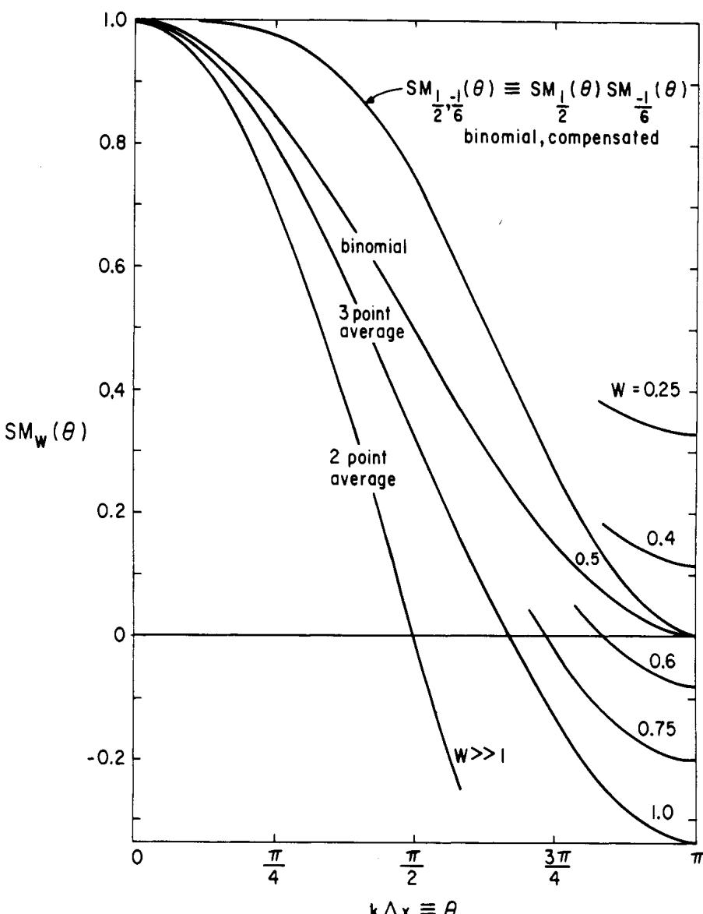  
Figure Ca Smoothing function $\mathsf { S M } _ { W } ( \pmb { \theta } )$ of (5） for various $\pmb { W }$ The two and three point averages (as well as any $W > 0 . 5 )$ produce $\mathbb { S } \mathbb { M } _ { \mathcal { W } } ( \pmb { \theta } ) < \mathbb { 0 }$ which alters the physics undesirably. Using first $W = 0 . 5$ ,then $\pmb { W } = - 1 / 6$ produces the compensated curve shown.

applicationof $W = 0 . 5$ followed by $W = - 1 / 6$ produces $\mathbf { S } \mathbf { M } _ { W } ( \pmb { \theta } ) =$ $1 + O \left( \theta ^ { 4 } \right)$ for small $\pmb \theta$ This two step filter is equivalent to a five point single filter,with weights $( 1 / 1 6 ) \ : ( - 1 , 4 , 1 0 , 4 , - 1 )$

Using (1） requires keeping a few of the unfiltered values of $\phi$ ，which is not a memory problem in 1d. However，in 2d and 3d, there could be problems with keeping old values of $\phi _ { j }$ ，as the smoothing matrix expands from 3 points in 1d to 9 in 2d and 27 in 3d. Also,it may be simpler to code the smoothing by making more than one pass along each grid row. Hence,it is desirable to see if an algorithm can be found which can be factored. First, sweep forward, replacing all $\phi _ { j }$ with $\phi _ { j } + U \phi _ { j + 1 }$ and then sweep backward, replacing all $\phi _ { j }$ with $\phi _ { j } + U \phi _ { j - 1 }$ . This requires no scratch memory. The Fourier representation of this convolution process is

$$
\mathsf { S M } _ { U } ( \theta ) = \frac { U e ^ { i \theta } + 1 } { U + 1 } \frac { 1 + U e ^ { - i \theta } } { 1 + U } = \frac { 1 + U ^ { 2 } + 2 U \cos \theta } { ( 1 + U ) ^ { 2 } }
$$

This is the same as the one-pass $\mathbb { S } \mathbb { M } _ { W } \left( \pmb { \theta } \right)$ for

$$
W = \frac { U } { 1 + U ^ { 2 } } U = \frac { 1 } { 2 W } \pm \left( \frac { 1 } { ( 2 W ) ^ { 2 } } - 1 \right) ^ { 1 / 2 }
$$

For $U$ to be real requires that $- 1 / 2 \leqslant W \leqslant 1 / 2$ ; see Figure $\mathtt { C b }$ That is, $W$ is restricted to $| W | \leqslant 1 / 2$ in order to produce a factorable form. The binomial form of the smoother, (1, 2, 1)/4 with $W = \%$ ， corresponds to $U = 1$ ，with a forward pass of $( 0 , 1 , 1 ) / 2$ and a return pass with $( 1 , 1 , 0 ) / 2$ .The corresponding compensator $W = - 1 / 6$ has $U = - 3 + 8 ^ { 1 / 2 } = - 0 . 1 7 1 5 7 3$ ，to be applied after the smoother.

Digital filtering in 2d proceeds much as is done in ld but demands added care in order to make the filtering isotropic and to make the operation efficient in speed and memory. We limit the filter to operation on the gridpoint $( j , k )$ and the eight nearest grid points.

The filter consists of replacing ${ \phi } ( X _ { j } , Y _ { k } ) \equiv { \phi } _ { j , k } , X _ { j } \equiv j \Delta x , Y _ { k } \equiv k \Delta y$ with weighted values of neighboring points, as

$$
\phi _ { j , k } \gets \frac { M \phi _ { j , k } + S \left( \mathrm { s i d e ~ t e r m s } \right) + K \left( \mathrm { c o r n e r ~ t e r m s } \right) } { M + 4 \left( S + K \right) }
$$

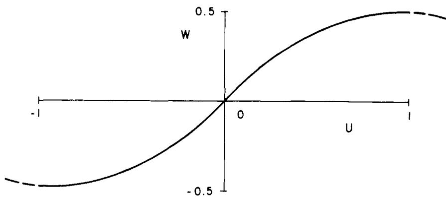  
Figure Cb Relation between $W$ and $U$ for one and two-pass digital smoothing filters.

$$
\mathrm { \ t e r m s } = \phi _ { j - 1 , k - 1 } + \phi _ { j - 1 , k + 1 } + \phi _ { j + 1 , k + 1 } + \phi _ { j + 1 , k - 1 }
$$

and $M \equiv$ middle, $s \equiv$ side,and $K \equiv$ corner weights,as illustrated by the spatial stencil

$$
\left[ \begin{array} { l l l } { K } & { S } & { K } \\ { S } & { M } & { S } \\ { K } & { S } & { K } \end{array} \right]
$$

The Fourier representation of the filter is

$$
\begin{array} { l } { \phi _ { \mathrm { f i t e r e d } } ( \theta _ { x } , \theta _ { y } ) } \\ { = \left[ \frac { M + 2 S ( \cos \theta _ { x } + \cos \theta _ { y } ) + 4 K ( \cos \theta _ { x } \cos \theta _ { y } ) } { M + 4 ( S + K ) } \right] \phi _ { \mathrm { o r i g i n a l } } ( k _ { x } , k _ { y } ) } \end{array}
$$

where $\theta _ { x } \equiv k _ { x } \Delta x$ ， $\theta _ { y } \equiv k _ { y } \Delta y$ . The smoothing function $\bar { \mathbf { S } } \mathbf { M } _ { M , S , K } \left( \theta _ { x } , \theta _ { y } \right)$ is the bracketed term.

We designate the filters by the values $( M , S , K )$ . The hollow 8-point (0,1,1） filter (Hockney，1971; Hockney and Eastwood, 1981,p. 376) might appear to be a reasonable spatial averaging method; however,its Fourier representation becomes negative over roughly half of the first zone $( 0 < \theta _ { x }$ ， $\theta _ { y } \ < \ \pi )$ . This can lead to nonphysical results, including severe instability (Problem 4-6a,and Langdon and Birdsall, 1970).

Application of first the $x$ binomial and then the $y$ binomial spatial stencils

$$
\left[ \begin{array} { l l l } { 0 } & { 0 } & { 0 } \\ { 1 } & { 2 } & { 1 } \\ { 0 } & { 0 } & { 0 } \end{array} \right] \left[ \begin{array} { l l l } { 0 } & { 1 } & { 0 } \\ { 0 } & { 2 } & { 0 } \\ { 0 } & { 1 } & { 0 } \end{array} \right]
$$

produces a binomial 9-point filter (4,2,1)，whose Fourier representation shows excellent attenuation which is nearly isotropic. The stencil is

$$
{ \left[ \begin{array} { l l l } { 1 } & { 2 } & { 1 } \\ { 2 } & { 4 } & { 2 } \\ { 1 } & { 2 } & { 1 } \end{array} \right] }
$$

Each step is a convolution, hence, the Fourier representation is the product of the $\theta _ { x }$ and $\theta _ { y }$ representations, i.e., $( \cos \theta _ { x } / 2 ) ^ { 2 } \dot { ( } \cos \theta _ { y } / 2 ) ^ { 2 }$ . In ZOHAR this filter is done in four passes,

$$
{ \left[ \begin{array} { l l l } { 0 } & { 0 } & { 0 } \\ { 0 } & { 1 } & { 1 } \\ { 0 } & { 0 } & { 0 } \end{array} \right] } \ { \left[ \begin{array} { l l l } { 0 } & { 0 } & { 0 } \\ { 1 } & { 1 } & { 0 } \\ { 0 } & { 0 } & { 0 } \end{array} \right] } \ { \left[ \begin{array} { l l l } { 0 } & { 1 } & { 0 } \\ { 0 } & { 1 } & { 0 } \\ { 0 } & { 0 } & { 0 } \end{array} \right] } \ { \left[ \begin{array} { l l l } { 0 } & { 0 } & { 0 } \\ { 0 } & { 1 } & { 0 } \\ { 0 } & { 1 } & { 0 } \end{array} \right] }
$$

forward， backward，up,and down，respectively，which produces the same result without using additional storage. A reasonable compensator is $( 2 0 , - 1 , - 1 )$ ; another is (36,-6,1).

# DIRECT FINITE-DIFFERENCE EQUATION SOLUTIONS

In this Appendix we obtain the solutions to the 1d finite-differenceequation representations of $\nabla ^ { 2 } \phi = - \rho$ and $\nabla \cdot \mathbf { E } = \rho$ begun in the first part of Section 2-5,and the 2d bounded system begun in Section 14-5.

Let Poisson's equation be written as

where

$$
\begin{array} { c } { { \phi _ { j - 1 } - 2 \phi _ { j } + \phi _ { j + 1 } = p _ { j } } } \\ { { p _ { j } \equiv - ( \Delta x ) ^ { 2 } \rho _ { j } } } \end{array}
$$

The problem is to obtain the $\phi _ { j }$ from the $p _ { j }$ and the boundary and/or auxiliary ( e.g., charge neutrality, $\dot { \Sigma ^ { p _ { j } } } = 0 )$ conditions. Let the system length be $L$ (from $x = 0$ to $x = L$ ), divided into $N$ cells,as shown in Figure Da. Write the finite-difference-equations once for each $j$ ； the 1, $^ { - 2 , 1 }$ coefficients form the square matrix A; the unknowns $\phi$ form the column matrix $\phi$ ；the known $p _ { j }$ form the column matrix $\pmb { \mathrm { p } }$ Hence $\mathbf { A } \phi = \mathbf { p }$ is to be solved for $\phi$

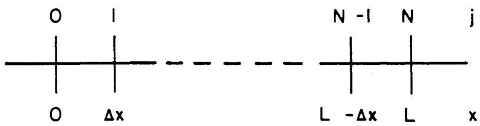  
Figure Da Grid space numbering for $N$ cells.

In the bounded by electrodes model, $\phi _ { 0 } = V _ { 0 }$ and $\phi _ { N } = V _ { L }$ are given. The interior need not be charge neutral. The $p _ { j }$ with $j = 1$ ,2,...， $N - 1$ are to be used to obtain the $\phi _ { j }$ for the same values of $j$ . The matrix equation $\mathbf { A } \phi = \mathbf { p }$ reads

$$
\left[ { \begin{array} { c c c c c c } { - 2 } & { 1 } & & & & \\ { 1 } & { - 2 } & { 1 } & & & \\ & { 1 } & { - 2 } & { 1 } & { . } & \\ & & { . } & { . } & { . } & { . } & \\ { . } & { . } & { . } & { . } & { . } & { . } \end{array} } \right] \left[ { \begin{array} { c } { \phi _ { 1 } } \\ { \phi _ { 2 } } \\ { \phi _ { 3 } } \\ { \phi _ { 4 } } \\ { \phi _ { - 2 } } \\ { \phi _ { N - 1 } } \end{array} } \right] = \left[ { \begin{array} { c } { p _ { 1 } - V _ { 0 } } \\ { p _ { 2 } } \\ { p _ { 3 } } \\ { p _ { N - 1 } - V _ { L } } \end{array} } \right]
$$

This set has $N - 1$ unknown $\phi _ { j }$ 's and $N - 1$ equations which are independent. Hence, any method of solution may be used (e.g.， Potter， 1973, eq. 4.9,for solution by Gaussian elimination specialized to tridiagonal matrices). See Problem Da for a simple solution.

In a periodic model, $E$ and $\pmb { \rho }$ repeat every $L$ ; therefore, the system has no net charge, $\langle \pmb { \rho } \rangle = 0$ , as noted in Section 4-11,

$$
N \langle \rho \rangle = \sum _ { j = 0 } ^ { N - 1 } \rho _ { j } = \sum _ { j = 1 } ^ { N } \rho _ { j } = 0
$$

The matrix equation in $\pmb { \rho _ { 0 } }$ through $\pmb { \rho } _ { N - 1 }$ ，using periodicity $\left( \phi _ { 0 } = \phi _ { N } \right.$ ， $\phi _ { - 1 } = \phi _ { N - 1 }$ ，etc.)，now has one unneeded equation; summing as in (4) makes the left-hand side summed also zero which demonstrates that the $N$ equations are not independent. Hence, drop one of the set, the $\rho _ { 0 }$ or ${ \pmb p } _ { 0 }$ equation. This leaves the set

$$
\left[ \begin{array} { c c c c c c } { 1 } & { - 2 } & { 1 } & & & & \\ & { 1 } & { - 2 } & { 1 } & { . } & & \\ & & { 1 } & { - 2 } & { . } & & \\ & & & & { . } & { . } & { . } & \\ { . } & { . } & { . } & { . } & { . } & { . } & \\ { 1 } & & & & & { . } & { 1 } & { - 2 } \end{array} \right] \left[ \begin{array} { c } { \phi _ { 0 } } \\ { \phi _ { 1 } } \\ { \phi _ { 2 } } \\ { \phi _ { 3 } } \\ { . } \\ { \phi _ { N - 1 } } \\ { \phi _ { N - 1 } } \end{array} \right] = \left[ \begin{array} { c } { p _ { 1 } } \\ { p _ { 2 } } \\ { p _ { 3 } } \\ { p _ { N - 1 } } \end{array} \right]
$$

which is the same form as (3),except in the left column. For such sets, see Temperton (1975). However,we do not know the value of $\phi _ { 0 }$ nor do we need to know it, because only $\nabla \phi$ is needed to move the particles. Hence, $\phi _ { 0 }$ can be assigned a value (call this the bias)， the equations solved for $\phi _ { 1 }$ ， $\phi _ { 2 } , ~ \ldots , ~ \phi _ { N - 1 }$ ，and the necessary $\nabla \phi$ 's obtained; the easy bias is $\phi _ { 0 } = 0$ ， which zeros the left column of A, making (5) like (3） with $V _ { 0 } = 0 = V _ { L }$ Another choice of bias, $\langle \phi \rangle = 0$ ，corresponds to the ES1 field solution in which $\phi ( k = 0 ) = 0$ The'electrostatic energy (periodic model, no wall charges),

$$
W _ { E } \equiv \frac { \Delta x } { 2 } \sum _ { j = 0 } ^ { N - 1 } \rho _ { j } \phi _ { j }
$$

is unaffected by the choice of bias; in (6),if the $\phi _ { j } { ' } { \bf s }$ from (5） are used, which are $\phi _ { j } = \phi _ { j } \left( \mathrm { t r u e } \right) + ( \phi _ { 0 } +$ constant), then

$$
\begin{array} { l } { { \displaystyle { \cal W } _ { E } = \frac { \Delta x } { 2 } \sum \rho _ { j } \phi _ { j } \left( \mathrm { t r u e } \right) + \frac { \Delta x } { 2 } \left( \phi _ { 0 } + \mathrm { c o n s t a n t } \right) \sum \rho _ { j } } } \\ { { \displaystyle ~ = \frac { \Delta x } { 2 } \sum \rho _ { j } \phi _ { j } \left( \mathrm { t r u e } \right) } } \end{array}
$$

because $\langle \rho \rangle = 0$ .To these potentials,obtained from charges inside a period, solutions"of the homogeneous equation $\nabla ^ { 2 } \phi = 0$ may be added. These potentials may be thought of as due to equal and opposite charges at $x = \pm \infty$ (or as due to double layers of charges at $x = 0 , L , 2 L$ ，etc.).

Alternatively we might choose to obtain $E$ directly by integrating 2-: from one grid point to the next (the same as using Gauss' law),as

$$
\int _ { x _ { j } } ^ { x _ { j + 1 } } { \frac { \partial E } { \partial x } } d x = \int _ { x _ { j } } ^ { x _ { j + 1 } } \rho d x
$$

This is,using the trapezoidal rule for the right-hand side,

$$
E _ { j + 1 } - E _ { j } = \frac { \rho _ { j + 1 } + \rho _ { j } } { 2 } \Delta x
$$

Note that $E$ and $\pmb { \rho }$ are given at the same grid points; i.e., the $E$ and $\pmb { \rho }$ grids are not staggered or interlaced. We need one boundary or other condition on $E$ [as 2-5(2) is a first-order differential equationl for completeness. For example, with a space-charge-limited emitter at $x = 0$ ，we would choose $E _ { 0 } = 0$ .For a periodic model, we must have ${ \cal { E } } _ { 0 } = { \cal { E } } _ { N }$ ； summing (10） for $j = 0$ to $N - 1$ we find (4） again. We can solve for $E$ by assuming,for the moment, $E _ { 0 } = 0$ and applying (1O). The resulting average field,

$$
\langle E \rangle = \frac { 1 } { N } \sum _ { j = 0 } ^ { N - 1 } E _ { j } = \frac { 1 } { N } \sum _ { j = 1 } ^ { N } E _ { j }
$$

will not be zero. If we wish $\langle E \rangle$ to be zero,we simply subtract the value given by （11） from each $E _ { j }$ . Now the field satisfies (1O),and (11） will give $\smash { \left. E \right. } = 0$ if evaluated again. A solver similar to this is used by Denavit and Kruer (1980),who first solve for $E _ { 0 }$ ，as

$$
E _ { 0 } = - \frac { \Delta x } { 2 N } \sum _ { s = 0 } ^ { N - 1 } \sum _ { j = 0 } ^ { s } ( \rho _ { j } + \rho _ { j + 1 } )
$$

and then, assured that $\langle E \rangle = 0$ ，march across the system.

In two dimensional problems,we can set up the finite-difference equations in much the same way. If the configuration permits use of the fast Fourier transform along one direction, the system of transformed equations is tridiagonal and may be solved by Gaussian elimination or other methods.

The Poisson equation from Section 14-5 is

$$
\phi _ { j + 1 } - 2 d \phi _ { j } + \phi _ { j - 1 } = p _ { j }
$$

For a model bounded by electrodes at fixed potentials $\phi _ { 0 } = V _ { 0 }$ and $\phi _ { N } = V _ { L }$ ， then Gaussian elimination is done as follows (from Forsythe and Wasow, 1960,p.104). Let the (known) source terms be given by

$$
s _ { 1 } = p _ { 1 } - V _ { 0 } , . . . , s _ { n } = p _ { n } , . . . , s _ { N - 1 } = p _ { N - 1 } - V _ { L }
$$

Forward elimination:

$$
\begin{array} { c } { { w _ { 1 } = ( - 2 d ) ^ { - 1 } ; w _ { n + 1 } = ( - 2 d - w _ { n } ) ^ { - 1 } , n = 1 , 2 , 3 , . . . , N - 2 } } \\ { { g _ { 1 } = s _ { 1 } w _ { 1 } ; g _ { n + 1 } = ( s _ { n + 1 } - g _ { n } ) ( w _ { n + 1 } ) , n = 1 , 2 , 3 , . . . , N - 2 } } \end{array}
$$

Back substitution:

$$
\phi _ { N - 1 } = g _ { N - 1 } ; \quad \phi _ { n } = g _ { n } - w _ { n } \phi _ { n + 1 } , \quad n = N - 2 , N - 3 , \ldots , 1
$$

This procedure works, of course, for $d = 1$ , the Poissn equation for ld, as solved another way in Problem Da .

# PROBLEMS

Da In order to solve (3),multiply the last equation by 1,the next to last by 2,etc.,and then add all equations to show that

$$
\phi _ { 1 } = \frac { V _ { 0 } \left( N - 1 \right) + V _ { L } } { N } - \frac { 1 } { N } \sum _ { n = 1 } ^ { N - 1 } n p _ { N - n }
$$

Hence, $\phi _ { 2 }$ may be obtained from the first equation, $\phi _ { 3 }$ from the second, etc. Rewriting the sum as

$$
\sum _ { m = 1 } ^ { N - 1 } p _ { m } \left( N - m \right)
$$

Show that the result for the zero bias periodic model ( $\mathrm { \Delta } V _ { 0 } = V _ { L } = 0 \mathrm { \Delta }$ is

$$
\phi _ { 1 } = \frac { 1 } { N } \sum _ { m = 1 } ^ { N } m p _ { m }
$$

which agrees with Hockney and Eastwood (1981,p.35).

Db Derive (12).

Dc Show that (10) is equivalent to (1）for $\pmb { \cal E }$ obtained from $\phi$ differenced over $\pmb { 2 \Delta x }$

# DIFFERENCING OPERATORS;LOCAL AND NONLOCAL $\boldsymbol { \nabla }  \ i \boldsymbol { k }$ ， $\nabla ^ { 2 }  - k ^ { 2 } )$

W. M. Nevins

In solving plasma physics problems on a computer one often converts a differential equation into a finite-difference equation on a spatial (or tem-poral） grid. In making this conversion， one must choose appropriate differencing operators and be aware of the iocal and nonlocal effects implied. For example,the first derivative of a function $f$ at the $j ^ { t h }$ grid point might be defined as

$$
( \hat { D } _ { L } F ) _ { j } = \frac { f _ { j + 1 } - f _ { j - 1 } } { 2 \Delta x }
$$

where the caret means operator and $L$ is used to denote local.

Differencing operators are linear operators. Hence, they may be written in the form

$$
( \hat { K } f ) _ { { \scriptscriptstyle i } } = \sum _ { j = 1 } ^ { N } K ( { \scriptscriptstyle i } - j ) f _ { j }
$$

where the $\pmb { K } ( j )$ are fixed coefficients and the grid points are numbered 1 to $N$ in a system of length $L$ .This set of coefficients $\{ K ( j ) \}$ is the configuration space representation of the operator $\hat { K }$

Going back to our example (1） we see that the first-derivative operator $\hat { D } _ { L }$ has the configuration space representation

$$
D _ { L } \left( j \right) = \left\{ \begin{array} { r l } { \displaystyle { \frac { 1 } { 2 \Delta x } } \quad } & { { } \quad j = + 1 } \\ { \displaystyle { \frac { - 1 } { 2 \Delta x } } \quad } & { { } \quad j = - 1 } \\ { 0 \quad } & { { } \quad \mathrm { o t h e r w i } } \end{array} \right.
$$

This first-derivative operator $\hat { D } _ { L }$ is an example of a local operator; i.e.,the derivative of a function at the $i ^ { t h }$ grid point involves only the values of the function at nearby grid points.

There are two important reasons for expressing derivatives as local operators when working in configuration space. In a continuous space，the derivative of a function is defined locally. Hence,when modeling a continuous system with a discrete system, it is desirable to retain the local character of the derivative. This can be especially true near boundaries or marked internal inhomogeneities. In addition,it is often easier to solve systems of finite-difference equations that contain only local differencing operators.

The Fourier transform is a powerful method for solving linear finitedifference equations.When finite-difference equationsare Fourier transformed, the Fourier convolution theorem may be used to show that linear operators like $\hat { K }$ of (3),transform to

$$
\left( { \hat { K } } f \right) _ { k } = K \left( k \right) f _ { k }
$$

where $f _ { k }$ is the complex Fourier amplitude,and $\ b { K } ( \ b { k } )$ is the $k$ -space representation of the operator $\hat { K }$ $K ( k )$ is related to the configuration-space representation of the same operator by

$$
K \left( k \right) = \sum _ { j = 1 } ^ { N } K \left( j \right) \exp \left( - i k \frac { 2 \pi } { N } j \right)
$$

We take $k$ to be an integer; the corresponding wave number is $k \left( 2 \pi / L \right)$ It follows from (5） that the $k$ -space representation of any linear operator $\hat { K }$ is a periodic function of $k$ with period $N$ ·

Equation (5） may be used to obtain the $k$ -space representation of the first-derivative operator $\hat { D } _ { L }$ defined in (1). One obtains

$$
D _ { L } \left( k \right) = i k { \frac { { 2 \pi } } { L } } \mathrm { d i f } { \frac { { 2 \pi k } } { N } }
$$

where the diffraction function dif is defined as

$$
\operatorname { d i f } \left( x \right) \equiv { \frac { \sin x } { x } }
$$

Once the decision has been made to solve a system of finite-difference equations in $k$ -space， local operators no longer have any computational advantage over nonlocal operators.

It is often suggested that the "exact" expression,

$$
D _ { E } ( k ) \equiv i k \frac { 2 \pi } { L }
$$

be employed as $k$ -space representation of the first derivative. Similarly the "exact" second derivative would be represented by

$$
D _ { E } ^ { 2 } ( k ) = - k ^ { 2 } \left( \frac { 2 \pi } { L } \right) ^ { 2 }
$$

Strictly speaking it is not possible to choose these representations for the first and second derivative operators since they are not periodic functions of $k$ This problem is avoided by requiring that the $k$ -space representations of first and second derivatives be given by (8） and (9） in the first Brillouin zone (i.e., for $- N / 2 < k \leqslant N / 2 )$ The $k$ -space representation of these operators is then determined at all other values of $k$ by periodicity.

These representations of the first and second derivatives are widely used [see Matsuda and Okuda (1975); Buneman (1976)l. It is often stated that no error is introduced into the computation when these "exact" operators are employed,while local operators like (1） do introduce an error. This incorrect conclusion follows from an over-simplified treatment of the error analysis. A correct analysis of the accuracy of differencing operators in a particle simulation is greatly complicated by the fact that the charge density and/or the current density is defined between grid points (through the particle phase variables). This leads to aliasing,treated in Chapter 8. In any case,it is clear that a great deal of information is lost when we choose to represent a continuous function (e.g.， the charge density or electrostatic potential) by its values on a discrete mesh. When the "exact" differencing operators are employed, this loss of information leads to a very non-local representation of the first and second derivative operators.

Although there is no computational advantage to local operators when working in $k$ -space， the physics that the finite-difference equations are modeling often involves local phenomena. Hence,it is desirable to know the configuration-space representation of the differencing operators. It follows from (5） and the orthogonality relation of discrete Fourier transformations, that the configuration space representation of a linear operator is related to its $k$ -space representation by

$$
K \left( j \right) = \frac { 1 } { N } \sum _ { j = - N / 2 + 1 } ^ { N / 2 } K \left( k \right) \exp \left\{ i k \frac { 2 \pi } { N } j \right\}
$$

Hence, the configuration-space representations of the so-called "exact" derivative operators are given by

$$
\begin{array} { l l } { { D _ { E } \left( j \right) = \left\{ \begin{array} { l l } { { \displaystyle ( - 1 ) ^ { j } \frac { j \pi / N } { j \Delta x } \qquad } } & { { j \ne 0 } } \\ { { \displaystyle 0 } } & { { j = 0 } } \end{array} \right. } } \\ { { D _ { E } ^ { 2 } \left( j \right) = \left\{ \begin{array} { l l } { { \displaystyle ( - 1 ) ^ { j } \frac { - 2 } { ( j \Delta x ) ^ { 2 } } \qquad } } & { { j \ne 0 } } \\ { { \displaystyle - \frac { \pi ^ { 2 } } { 3 } \frac { 1 } { \Delta x ^ { 2 } } \left( 1 + \frac { 2 } { N ^ { 2 } } \right) \qquad } } & { { j = 0 } } \end{array} \right. } } \end{array}
$$

It is important to realize that these "exact" derivatives are very nonlocal opera-tors. We see from (11） and (12) that the derivative of a function at the $j ^ { t h }$ grid point involves the values of the function at every other grid point in the system!

It is instructive to write the "exact" derivative in the configuration space. After regrouping the terms we find

$$
( \hat { D } _ { E } f ) _ { _ i } = \sum _ { j = 1 } ^ { N / 2 } \frac { f _ { i + j } - f _ { i - j } } { 2 j \Delta x } W _ { 1 } ( j )
$$

where the weighting function $W _ { 1 } ( j )$ is given by

$$
W _ { 1 } ( j ) = 2 ( - 1 ) ^ { j } \frac { j \pi / N } { \tan \left( j \pi / N \right) }
$$

Equation (13） tells us that we may interpret the "exact" derivative as a weighted average of all possible centered differences. The weighting func-tion used in performing this average falls off very slowly with the increase in the interval over which these differences are taken. Hence, the centered difference over half of the system length is very nearly as important in determining the value of the "exact" derivative as is the local centered difference of (1).

Similar considerations show that the "exact" second derivative may be written in configuration space as

$$
( D _ { E } ^ { 2 } f ) _ { { \it i } } = \sum _ { j = 1 } ^ { N / 2 } \frac { f _ { i + j } - 2 f _ { i } + f _ { i - j } } { ( j \Delta x ) ^ { 2 } } W _ { 2 } ( j )
$$

where the weighting function $W _ { 2 } ( j )$ is given by

$$
W _ { 2 } ( j ) = 2 ( - 1 ) ^ { j } \mathrm { d i f } ^ { - 2 } \frac { j \pi } { N }
$$

The weighting functions $W _ { 1 } ( j )$ and $W _ { 2 } ( j )$ are shown in Figure Ea

In ES1, $\phi ( k )$ is obtained from $\rho ( k )$ by

$$
\phi ( k ) = \frac { \rho ( k ) } { K ^ { 2 } ( k ) }
$$

where $K ^ { 2 } ( k )$ may be chosen freely in the first Brillouin zone (to produce the

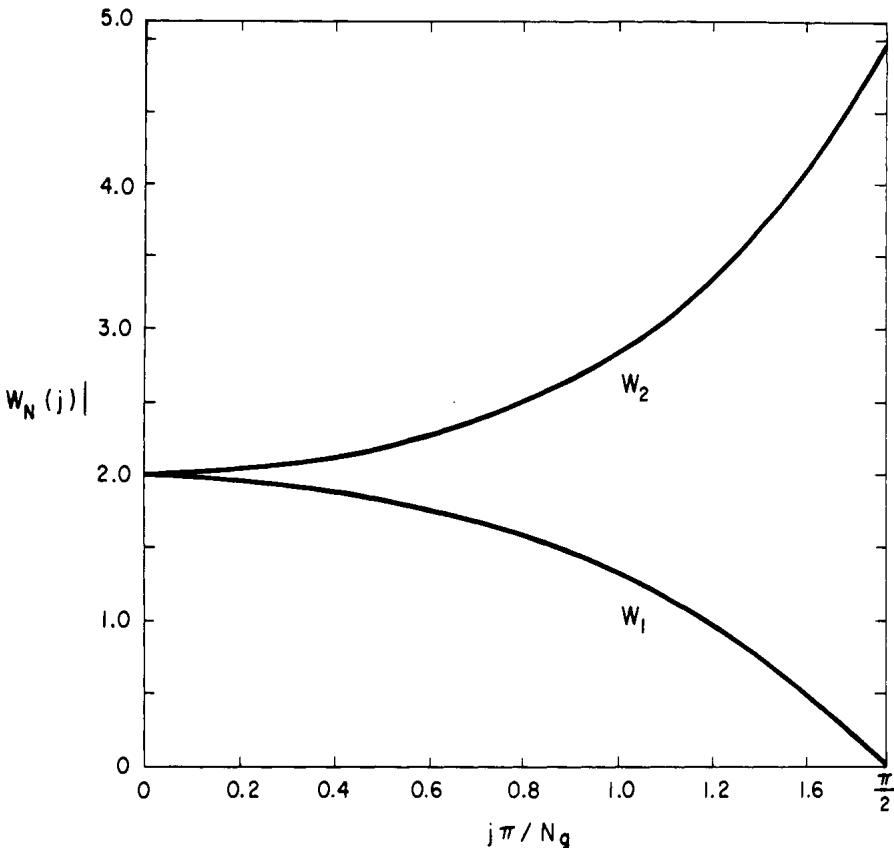  
Figure Ea These curves show the absolute value of the weighting functions used in (14） and (16). $\vert W _ { 1 } \vert$ falls off slowly as the differencing interval is increased,while $\vert W _ { 2 } \vert$ actually increases with increasing differencing interval, underscoring the nonlocal nature of the "exact” differencing operators.

desired physics)； however, $K ^ { 2 }$ is actually programmed to be the Fourier representation of the three-point finite-differencing of $\nabla ^ { 2 }$ ,that is,

$$
\frac { \phi _ { j - 1 } - 2 \phi _ { j } + \phi _ { j + 1 } } { ( \Delta x ) ^ { 2 } } \mathrm { \quad  p r o d u c e s \ : ~ } K ^ { 2 } ( k ) = k ^ { 2 } \mathrm { d i f } ^ { 2 } \frac { k \Delta x } { 2 }
$$

When this value of $K ^ { 2 } ( k )$ is inverted by (10),it, of course,reverts to _the left-hand-side of (17),the local second derivative with relative error $O ( k ^ { 2 } )$

The lesson here is that there is no perfect choice of a finite-differencing operator. One always has to accept a compromise and choose a differencing operator that is appropriate to the problem being studied. In a nearly uniform system, the nonlocal character of the "exact" derivative is probably less of a handicap,and these expressions for the derivative are a suitable choice. If the system being studied is non-uniform, then it would seem likely that it is important to preserve the local character of the derivatives. Hence， in nonuniform systems a local differencing operator like $\hat { D } _ { L }$ would be a better

choice.

This discussion is not meant to emphasize particular choices of either algorithms for $\triangledown$ or $\nabla ^ { 2 }$ or particle weightings by themselves; the true tests lie in reproduction of good physics,as in obtaining the correct force or the desired dispersion,which are due to combinations of all choices. Even at best, finite-size-particle methods can produce the correct force only at long range and oscillations and waves at long wavelengths. The chore of the code designer is to produce these effects at least cost in computer time and memory. It appears to us,among the choices

(a) subtracted dipole codes which use heavy smoothing beyond $k \Delta x \approx \pi / 2$ ；   
(b） Fourier codes $( \nabla  i k$ ， $\nabla ^ { 2 } \longrightarrow - \boldsymbol { k } ^ { 2 }$ with nonlocal derivatives） which use higher-order particle weighting (such as quadratic splines);   
(c) linear-weight codes (CIC,PIC） with either local derivatives or their Fourier representations,with smoothing only at large $k \Delta x$ ；

that choice (c） is generally preferable in terms of good accuracy,high speed and maximum use of available grid points.

# REFERENCES

Abe,H., J. Miyamoto,and R. Itatani, Grid effects on_the plasma simulation by the finite-sized particle,J. Comput. Phys.19,134-149,October 1975.   
Abramovitz,M.and I.Stegun,Handbook of Mathematical Functions,Nat'l Bureau of Standards, Appl. Math. Series 55,U. S. Government Printing Offce,Wash.,D.C.,1964.   
Adam,J. C.,A. Gourdin Serveniere,P. Mora and R. Pellat,Effect of colisions on dc magnetic field generation in a plasma by resonance absorption of light, Phys. Fluids 25,812-814, May 1982a.   
Adam,J. C.,A. Gourdin Serveniere,and A. B. Langdon, Electron sub-cycling in particle simulation of plasmas,J. Comput. Phys.47,229-244,August 1982b.   
Aizawa,M., Y. Ohsawa, K. Sato, T. Kamimura,and T. Sekiguchi, Particle simulation studies on behavior or rapidly-expanding high-beta plasma column in a uniform magnetic field, Japanese Jour. of App.Phys.19,2211-2227,November 1980.   
Albriton, J. R.， and A. B. Langdon, Profile modification and hot electron temperature from resonant absorption,Phys.Rev. Lett.45,1794-1797,December 1980.   
Alder，B.，S. Fernbach，and M. Rotenberg，eds.，Meth. Comput. Phys. 9，Plasma Physics, Academic, New York,1970.   
Auer,P. L., H. Hurwitz,and R. W. Kilb,Low Mach number magnetic compresson waves in a collision-free plasma,Phys.Fluids 4,1105-1121,September 1961.   
Auer,P. L., H. Hurwitz,and R. W. Kilb, Large-amplitude magnetic compresson of a collisionfree plasma.II. Development of a thermalized plasma,Phys.Fluids 5,298-316,March 1962.   
Baldis，H. A.,and C. J.Walsh， Growth and saturation of the two-plasmon decay instability, Phys.Fluids 26,1364-1375,May 1983.   
Balescu,R.,Irreversible processes in ionized gasses,Phys. Fluids 3,52-63,February 1960.   
Barnes,D. C., T. Kamimura,J.-N.Le Boeuf, and T. Tajima, Implicit particle simulation of magnetized plasmas,J.Comput.Phys.52,480-502,December 1983.   
Berman,R. H.,D. J. Tetreault, T. H._Dupree,and T. Boutros-Ghali, Computer simulation of nonlinear ion-electron instability,Phys.Rev. Lett.48,1249-1252,May 1982.   
Bernstein,I. B.,Waves in a plasma in a magnetic field,Phys.Rev.109,10-21, January 1958.   
Bers,A．Linear Waves and Instabilities,Plasma Physics, Les Houches,1972，section xxii, Gordon and Breach,New York,1975.   
Birdsall, C. K., Interaction Between Two Electron Streams for Microwave Amplification,Ph. D. Dissertation，Stanford University，Stanford Electronic Research Laboratory Report 36, June 1951.   
Birdsall,C. K., Sheath formation and fluctuations with dynamic electrons and ions, International Conference on Plasma Physics, Goteborg,Sweden, June 1982.   
Birdsall, C.K.,and W.B.Bridges,Electron Dynamics of Diode Regions,Academic,New York 1966.   
Birdsall,C. K.,and D. Fuss, Cloud-in-cellcomputer experiments in two and three dimensions, Proc.Second Conf. Num. Sim. Plasmas,Los Alamos Sci. Labs.LA-3990,18-20 September 1968.   
Birdsall, C. K., A. B. Langdon,C.F. McKee, H. Okuda,and D. Wong,Theory and experiments for a plasma consisting of clouds interacting with clouds (CIC) with and without a spatial grid,Proc.Second Conf. Num. Sim.Plasmas,Los Alamos Sci. Labs.LA-3990,18-20 September 1968.   
Birdsall,C.K.,and D.Fuss,Clouds-in-clouds,clouds-in cels physics for many-body simulation, J. Comput. Phys.3,494-511,April 1969.   
Birdsall, C. K.,N. Maron,and G. Smith, Cold beam nonphysical instabilities and cures， Proc. Seventh Conf. Num. Sim.Plasmas, New York Univ.,NY,2-4 June 1975.   
Birdsall,C. K. and N. Maron,Plasma self-heating and saturation due to numerical instabilities, J.Comput.Phys.36,1-19,June 1980.   
Biskamp,D. and H. Welter， Ion heating in high-mach-number，oblique,colisionless shock waves,Phys. Rev. Lett.28, 410-413,February 1972.   
Biskamp,D.and R. Chodura,Collisionless dissipation of a cross-field electric current,Phys. Fluids 16,893-901,June 1973.   
Biskamp,D.,and H. Welter,Stimulated Raman scattering from plasmas irradiated by normally and obliquely incident laser light,Phys.Rev.Lett.34,312-316,February 1975.   
Blackman,R.and J.W. Tukey,The Measurement of Power Spectra,Dover,New York,1958.   
Boris，J.P.,The acceleration_calculation froma scalar potential,Plasma Physics Laboratory, Princeton University MATT-152,March 1970a.   
Boris，J.P.,Relativistic_plasma simulation-optimization of a hybrid code，Proc. Fourth Conf. Num. Sim. Plasmas,Naval Res.Lab.,Wash.,D. C.,3-67,2-3 November 1970b.   
Boris,J.P.,and K.V.Roberts,Optimization of particle calculations in 2 and 3 dimensions,J. Comput.Phys. 4,552-571,December 1969.   
Boris,J.P.，and R.Lee,Nonphysical self forces in_some electromagnetic plasma-simulation algorithms,J.Comput.Phys.12,131-136,May 1973.   
Boyd,G.,L.M.Field,and R.Gould，Excitationof plasma oscilations and growingplasma waves,Phys.Rev.109,1393-1394,February 1958.   
Brackbill, J. U.,and D. W. Forslund, An implicit method for electromagnetic plasma simulation in two dimensions,J.Comput.Phys.46,271-307,May 1982.   
Brackbill,J. U.,and D.W.Forslund,Simulation of lowfrequency electromagnetic phenomena in plasmas,in the volume Multiple Time Scales，in the series Computational Techniques, Academic, New York,1985.   
Brand,L., Vector Analysis,Wiley,New York,1957.   
Briggs，R. J.， Two-stream instabilities，Advances in Plasma Physics 4， A. Simon and W.B. Thompson,eds., J. Wiley and Sons, Inc., p. 43-78,1971.   
Brillouin.L.Wave Pronagation in Periodic Structures.Dover. New York.1953   
Brown,D. I., S.J. Gitomer,and H. R.Lewis,The two-stream instability studied with four onedimensional plasma simulation models, J. Comput. Phys.14,193-199,February 1974.   
Buneman, O., Dissipation of currents in ionized media,Phys.Rev.115,503-517,August 1959.   
Buneman,O., Instability of electrons drifting through ionsacross a magnetic field,J.Nucl. Energy,Part $c$ (Plasma Physics) 4,111-117,1962.   
Buneman,O., Time reversible difference procedures, J. Comput. Phys.1, 517-535, June 1967.   
Buneman, O.， Fast numerical procedures for computer experiments on relativistic plasmas, Relativistic Plasmas (The Coral Gables Conference, University of Miami), O.Buneman and W. Pardo,eds., Benjamin, New York,205-219,1968.   
Buneman,O.，Subgrid Resolution of Flow and Force Fields,J.Comput.Phys.11,250-268 February 1973a.   
Buneman,O., Inversion of the Helmholtz (or Laplace-Poison) operator for slab geometry, J Comput.Phys.12,124-130,May 1973b.   
Buneman, O., The advance from 2d electrostatic to 3d electromagnetic particle simulation, Computer Phys. Comm. 12,21-31,1976.   
Buneman,O.,and D. Dunn,Computer experiments in plasma physics,Science Journal 2,34-43, July 1966.   
Buneman, O., C.W. Barnes,J. C.Green,D.E. Nielson,Principles and capabilities of 3d,E-M particle simulations, J. Comput. Phys.38,1-44,November 1980.   
Burger,P.,D. A. Dunn,and A. S. Halsted,Computer experiments on the randomization of electrons in a collisionless plasma,Phys.Fluids 8,2263-2272,December 1965.   
Busnardo-Neto, J.,P.L. Pritchett, A. T. Lin,and J. M. Dawson, A self-consistent magnetostatic particle code for numerical simulation of plasmas, J. Comput.Phys.23,300-312,March 1977.   
Byers，J.A.， Noise suppression techniques in macroparticle models of collsionless plasmas, Proc. Fourth Conf. Num. Sim. Plasmas，Naval Res.Lab.，Wash.，D. C.，496-510,2-3 November 1970.   
Byers,J. A.,and M. Grewal, Perpendicularly propagating plasma cyclotron instabilities simulated with a one-dimensional computer model, Phys.Fluids 13,1819-1830,July 1970.   
Byers,J. A., J. P. Holdren,J. Killeen,A. B. Langdon,A. A. Mirin,M. E. Rensink,and C.G. Tull, Computer simulation of pulse trapping and pulse stacking of relativistic electron layers in astron,Phys.Fluids 17,2061-2080,November 1974.   
Byers,J. A.,B. I. Cohen,W. C. Condit,and J. D. Hanson,Hybrid simulations of quasineutral phenomena in magnetized plasma, J. Comput. Phys.27,363-396, June 1978.   
Chen,Liu, and C. K. Birdsall， Heating of magnetized plasmas by a large-amplitude lowfrequency electric field,Phys.Fluids 16,2229-2240,December 1973.   
Chen,Liu,A. B. Langdon,and C._K. Birdsall,Reduction of grid efects in simulation plasmas, J.Comput. Phys.14,200-222,February 1974.   
Chen,Liu, and Hideo Okuda,Theory of plasma simulation using multipole expansion scheme, J.Comput.Phys.19,339-352,December 1975.   
Chen,Y.-J.and C.K.Birdsall,Lower-hybriddrift_instability saturation mechanisms in onedimensional simuiations,Phys.Fluids 26,180-189,January 1983.   
Chen,Y.-J.,W.M. Nevins,and C.K. Birdsall, Stabilization of the lower-hybrid drift instability by resonant electrons,Phys.Fluids 26,2501-2508,September 1983.   
Chodorow，M.,and C. Susskind，Fundamentals of Microwave Electronics， McGraw-Hill,New York,1964.   
Christiansen,J.P. and J. B. Taylor， Numerical simulation of guiding center plasma,Plasma Phys.15,585-597,1973.   
Cohen,B. I.， Theoretical studies of some nonlinear laser-plasma interactions,Ph. D. thesis, University of California, Berkeley,CA,August 1975.   
Cohen, B. I., M. A. Mostrom, D.R. Nicholson, A. N. Kaufman, C. E. Max,and A. B. Langdon,Simulation of laser beat heating of a plasma,Phys. Fluids 18,470-474,April 1975.   
Cohen,B.I.and N.Maron,Simulation of drift-cone modes,Phys.Fluids 23,974-980,May 1980.   
Cohen, B.I., T.A. Brengle, D.B. Conley,R. P. Freis, An orbit-averaged particle code, J. Comput. Phys.38,45-63,November 1980.   
Cohen， B. I.，R. P. Freis, and V. Thomas,Orbit-averaged implicit particle codes, J. Comput. Phys.45,345-366,March 1982a.   
Cohen,B. I.,and R. P. Freis,Stability and application of an orbit-averaged magneto-inductive particle code,J.Comput.Phys.45,367-373,March 1982.   
Cohen, B. I.,A. B.Langdon, and A.Friedman, Implicit time integration for plasma simulation, J.Comput.Phys.46,15-38,April 1982b.   
Cohen, B.I., G. R. Smith, N. Maron,and W. M. Nevins,Particle simulations of ion-cyclotron turbulence in a mirror_plasma,Phys. Fluids 26,1851-1865,July 1983.   
Collatz,L.The NumericalTreatmentofDiferential Equations,pringer-Verlag,New York,966.   
Cooley,J. W., P. A. W. Lewis,and P. D. Welch, The fast Fourier transform algorithm: Programming considerations in the calculation of sine, cosine and Laplace transforms, J. Sound Vib.12,315-337,1970.   
Crawford, F. W.,and J. A. Tataronis,Absolute instabilities of perpendicularly propagating cyclotron harmonic plasma waves,J. Appl. Phys. 36,2930-2934,September 1965.   
Crume,E. C., H. K. Meier,and O. Eldridge,Nonlinear stabilization of single,resonant, losscone flute instabilities,Phys.Fluids 15,1811-1821, October 1972.   
Davidson, R. C., D. A. Hammer, I. Haber,and C. E. Wagner, Nonlinear development of electromagnetic instabilities in anisotropic plasmas,Phys. Fluids 15,317-333,February 1972.   
Dawson,J.M,Plasma oscilations of a large numberof electron beams,Phys.Rev.118,381- 389,April 1960.   
Dawson,J. M.,One-dimensional plasma model, Phys.Fluids 5,445-459,April 1962.   
Dawson, J.M.，Thermal relaxationina one-species,one-dimensional plasma,Phys.Fluids 7, 419-425,March 1964.   
Dawson, J. M., The electrostatic sheet model for plasma and its modification to finite-size particles，Meth. Comput. Phys. 9， 1-28, B. Alder， S. Fernbach，and M. Rotenberg， eds., Academic,New York,1970.   
Dawson,J.M.,Particle simulations of plasmas，Rev.Mod.Phys.55,403-447,April 1983.   
Dawson,J. M.,and T. Nakayama,Kinetic structure of a plasma,Phys.Fluids 9, 252-264, February 1966.   
Dawson,J.M.,H.Okuda,and B. Rosen,Collective transport in plasmas,Meth. Comput. Phys. 16,281-325, B.Alder,S. Fernbach,M. Rotenberg,and J. Killeen,eds.，Academic,New York,1976.   
Decyk，V.K.,Energy conservation theorem for electrostatic systems,Phys.Fluids 25,1205- 1206,July 1982.   
Denavit, J.,Numerical simulation of plasmas with periodic smoothing in phase space, J. Comput. Phys.9,75-98,February 1972.   
Denavit,J.,Discrete particle effects in whistler simulation,J. Comput. Phys.15,449-475,August 1974.   
Denavit, J., Collisionless plasma expansion into a vacuum，Phys. Fluids 22，1384-1392, July 1979.   
Denavit,J.,Pitfals in Particle Simulations and in Numerical Solutions of the Vlasov Equation, in Methoden und Verhafen de Mathematischen Physik 20,247-269,Peter Lang,1980.   
Denavit, J.，Time filtering particle simulations with $\omega _ { p e } \Delta t > > 1$ J.Comput.Phys.42,337-366, August 1981.   
Denavit,J.,and W.L. Kruer, Comparison of numerical solutions of the Vlasov equation with particle simulation of collisionless plasmas,Phys.Fluids 14,1782-1791, August 1971.   
Denavit, J.,and W.L. Kruer,How to get started in particle simulation, Comments Plasma Phys. Control.Fusion 6,35-44,April 1980.   
Denavit, J.and J. M.Walsh,Nonrandom initializations of particle codes,Comments Plasma Phys. Control. Fusion 6,209-223,September 1981.   
Dickman, D. O., R.L. Morse,and C.W. Nielson, Numerical simulation of axisymmetric, collisionless, finite $\mathbf { \nabla } \cdot \beta$ plasma,Phys.Fluids 12,1708-1716,August 1969.   
Dory,R. A., G.E. Guest,and E. G. Harris, Unstable electrostatic plasma waves propagating perpendicular to a magnetic field,Phys.Rev.Lett.14,131-133,February 1965.   
Drummond,W.E., J.H. Malmberg,T.M.ONeiland J.R.Thompson,Nonlineardevelopment of the beam-plasma instability,Phys. Fluids 13,2422-2425,September 1970.   
Dum,C. T.,R. Chodura,and D. Biskamp,Turbulent heating and quenching of the ion-sound instability,Phys.Rev. Lett. 32,1231-1234,3 June 1974.   
Dunn,D. A.,and 1. T. Ho, Computer experiments on ion-beam neutralization with initially coid electrons,Stanford Electronics Research Laboratory SEL-73-046,Stanford,CA,April 1963.   
Dupree，T. H.,Growth of phase-space density holes，Phys. Fluids 26,2460-2481, September 1983.   
Eastwood, J.W.,and R. W. Hockney，Shaping the force law in two-dimensional particle-mesh models, J. Comput. Phys.16,342-359,December 1974.   
Ebrahim,N.A.,H. Baldis,C.Joshi,and R.Benesch,Phys.Rev. Lett 45,1179,1979.   
Eldridge,O.C.,and M.Feix,One-dimensional plasma model at thermodynamic equilibrium, Phys.Fluids 5,1076-1080,September 1962a.   
Eldridge,O. C.,and M.Feix,Fokker-Planck coeficients for a one-dimensional plasma， Phys. Fluids 5,1307-1308,October 1962b.   
Eldridge,O. C.,and M.Feix,Numerical experiments with a plasma model, Phys. Fluids 6,398- 406,March 1963.   
Emmert，G. A.，R. M. Wieland,A. T. Morse,and J. N. Davidson，Electric sheath and presheath in acolisionless,finite ion temperature plasma,Phys. Fluids 23,803-812，April 1980.   
Estabrook,K. G.， E. J. Valeo,and W.L. Kruer, Two-dimensional relativistic simulations of resonance absorption, Phys.Fluids 18,1151-1159, September 1975.   
Estabrook,K.,and J. Tull,An 880 ns ld electrostatic particle mover for the CDC 7600，Proc. Ninth Conf. Num. Sim.Plasmas,Northwestern Univ., Evanston,IL,30 June-2 July 1980.   
Feix，M.R.，Mathematical models of a plasma,in Nonlinear Effects in Plasmas，Gordon and Breach,New York,1969.   
Forslund,D.，R. Morse, C. Nielson,and J.Fu,Electron cyclotron drift instability and turbulance,Phys.Fluids15,1303-1318,July 1972a.   
Forslund, D. W., J. M. Kindel, and E. L. Lindman, Parametric excitation of electromagnetic waves,Phys.Rev.Lett.29,249-252,July 1972b.   
Forslund,D.W., J. M. Kindel,and E.L.Lindman,Nonlinear behavior of stimulated Brillouin and Raman scattering in laser-irradiated plasmas,Phys.Rev.Lett 30,739-743,April 1973.   
Forslund,D.W., J. M. Kindel, E. L. Lindman,and R. L. Morse,Theory and simulation of resonance absorption in a hot plasma, Phys. Rev. A11, 679-683,February 1975a.   
Forslund,D.W.andBrackbrillJU.Magneticfeldinducedsurface transport onlaserirradi ated foils,Phys. Rev. Lett 48,1614-1617,June 1982.   
Forsythe,G.E.，and W.R.Wasow,Finite-Diference Methods for Partial Diferential Equations, Wiley,New York,1960.   
Fried,B. D.,and S.D.Conte,Plasma Dispersion Function, Academic, New York,1961.   
Friedberg，J., and T. Armstrong,Nonlinear development of the two-stream instability，Phys. Fluids 11,2669-2679,December 1968.   
Friedman，A.，A. B. Langdon and B. I. Cohen,A direct method for implicit particle-in-cell simulation,Comments Plasma Phys.Control. Fusion 6,225-236,September 1981.   
Gentle, K. W.,and J. Lohr,Phase-space evolution of a trapped electron beam, Phys. Rev. Lett. 75-77 Ian1arv 1073a dimensional beam-plasma system,Phys. Fluids 16,1464-1471, September 1973b.   
Gentleman,W. M.,and G.Sande,Fast fourier transforms-for fun and profit,Proc. AFIPS,Fall Joint Computer Conf. 29,563-578,1966.   
Gitomer, S. J., Comments onnumerical simulation of the Weibel instability in one and two dimensions,Phys.Fluids 14,1591-1592,July 1971.   
Gitomer,S.J.，and J. C.Adam,Multibeam instability in a Maxwellan simulation plasma,Phys. Fluids 19,719-722,May 1976.   
Godfrey,B.B.,Numerical Cherenkov instabilities inelectromagnetic particlecodes,J.Comput. Phys.15,504-521,August 1974.   
Godfrey，B.B,Canonical momenta and numerical instabilities in particle codes,J.Comput. Phys.19,58-76,September 1975.   
Godfrey,B. B.,and A.B.Langdon,Stability of the Langdon-Dawson advective algorithm,J. Comput. Phys.20,251-255,February 1976.   
Goldstein,H.,Classical Mechanics，Addison-Wesley,Cambridge,MA,1950.   
Guernsey,R.L., Kinetic equation for a completely ionized gas,Phys. Fluids 5,322-328,March 1962.   
Haber,I., R. Lee, H. H. Klein,and J. P. Boris,Advances in electromagnetic plasma simulation techniques,Proc. Sixth Conf. Num. Sim. Plasmas, Lawrence Livermore Lab., Lawrence Berkeley Lab.,Berkeley,CA,46-48,16-18 July 1973.   
Haeff,A. V., The electron-wave tube-a novel method of generation and amplification of microwave energy，Proceedings ofI.R.E.37, 4-10,January 1949.   
Hammersley,J.,and D.C.Handscomb，MonteCarlo Methods,ethuen,London1964.   
Hamming,R.W.,Numerical MethodsforScientistsand Engineers,McGraw-Hill,New York,1962.   
Hamming,R.W.,Digital Filters,Prentice Hall,Englewood Cliffs,NJ,1977.   
Harlow,F.H.,Theparticle-in-cellcomputing method forfuid dynamics,Meth.Comput.Phys3, 319-343,B.Alder,S.Fernbach,and M.Rotenberg,eds.,Academic,New York，1964.   
Harned,D.S.，Quasineutral hybrid simulation of macroscopic plasma phenomena, J. Comput. Phys. 47,452-462,September 1982a.   
Harned,D.S.,Kink instabilities in long ion layers,Phys.Fluids 25,1915-1921,October 1982b.   
Haris,E.G,UnstableplasmaosilonsinmagneticfeldysRevLett246Jaary 1959.   
Hasegawa，APasm IstablisdNlinearfectsSringVrgerlinHeideber New York,1975.   
Hasegawa, A.,and C. K. Birdsall, Sheet-current plasma model for ion cyclotron waves，Phys. Fluids 7,1590-1600,October 1964.   
Hewett， D. W.，A global method of solving the electron-field equations in a zero-inertiaelectron-hybrid plasma simulation code,J. Comput. Phys.38,378,December 1980.   
Hewett,D.W.,Spontaneous development of toroidal magnetic field during formationof the field reversed theta pinch,Nucl. Fusion 24,349-357,March 1984.   
Hewett,D.W.and C.W.Nielson,A multidimensional quasineutral plasma simulationmodel, J.Comput.Phys.29,219-236,1978.   
Hockney，R. W.,A fast direct solution of Poissn's equationusing Fourier analysis, J. Assoc. Comput. Mach.12, 95-113, January 1965.   
Hockney， R. W., Computer simulation of anomalous plasma difusion and numerical solution of Poisson'sequation,Phys.Fluids9,826-1835,eptemer1966.   
Hockney，R.WCharacteristicsof noiseinatwodimensioalcomputerplasma,Phys.Fuds11 1381-1383, June 1968.   
Hockney,R. W., The potential calculation and some applications, Meth. Comput.Phys.9,135- 211,B.Alder,S.Fernbach,and M.Rotenberg, eds.,Academic, New York 1970.   
Hockney,R.W.，Measurements of collsion and heating times in a two-dimensional thermal computer plasma, J. Comput. Phys. 8,19-44,August 1971.   
Hockney,R. W., S.P. Goel, and J. W. Eastwood, Quiet high-resolution computer models of a plasma,J.Comput.Phys.14,148-158,February 1974.   
Hockney，R.W.,and J.W.Eastwood,Computer Simulation Using Partiles,McGraw-Hill，New York,1981.   
Hsu, J.Y., G. Joyce,and D. Montgomery,Thermal relaxation of a two-dimensional plasma in a d.c.magnetic field Part 2, Numerical simulation, J. Plasma Phys.12, 27-31,1974.   
Hubbard,J,The friction and diffusioncoeficientsof the Fokker-Planck equation inaplasma, Proc. R. Soc. London Ser. A260,114-126,February 1961.   
Hudson,M.K.,and D.W. Poter, Electrostatic shocks in the auroral magnetosphere,Physics of Auroral Arc Formation, S.-I. Akasofu_and J.R. Kan,eds.，Geophysical Monograph 25, American Geophysical Union, Wash. D. C.,1981.   
Ishihara,O.,A. Hirose,and A.B.Langdon,Nonlinear saturation of the Buneman instability, Phys.Rev.Lett.44,1404-1407,May1980.   
Ishihara,O.,A.Hirose,and A.B.Langdon, Nonlinear evolution of Buneman instability，Phys. Fluids 24,452-463,March 1981.   
Ishihara,O.,A. Hirose,and A. B.Langdon,Nonlinear evolution of Buneman instability.II. Ion Dynamics,Phys.Fluids 25,610-616,April 1982.   
Jackson,J.D.,Longitudinal plasma oscillations,J.Nucl. Energy，Part $c$ (Plasma Physics) 1,171- 189, 1960.   
Jackson,J.D.,Classical Electrodynamics,Wiley,New York,2d.ed.,1975.   
Jones,M. E. and J. Fukai, Evolution of the explosive instability in a simulated beam plasma, Phys.Fluids 22,132-138,January 1979.   
Joyce,G.and D. Montgomery, Negative temperature states for the two-dimensional guiding center plasma,J.Plasma Phys.10,107-121,1973..   
Jury,E.I.,Theory and Applications of thez-Transform Method,Wiley,New York,1964.   
Kainer, S., J. M. Dawson,and R. Shanny, Interaction of a highly energetic electron beam with a dense plasma,Phys.Fluids 15,493-501,March 1972.   
Kamimura, T.,and J.M. Dawson, Effect of mirroring on convective transport in plasmas, Phys. Rev.Lett. 36,313,9 February 1976.   
Kamimura,T.,T.Wagner,and J. M. Dawson,Simulation study of Bernstein modes,Phys. Fluids 21,1151-1167,July 1978.   
Katanuma,I.，Heat transport due to collisionless tearing instabilities, Jour. of the Phys. Soc.of Japan 50,1689-1697,May 1981.   
Katanuma,I. and T. Kamimura，Simulation studies of colisionless tearing instabilities,Phys. Fluids 23,2500-2511,October 1980.   
Kaufman,A. N.，and P. S. Rostler,The_Darwin model as a tool for electromagnetic plasma simulation,Phys.Fluids 14,446-448,February 1971.   
Klein,H. H.,W. M. Manheimer,and E. Ott, Effect of side-scattering instabilities_on the propagation of an intense laser beam in an inhomogenous plasma, Phys. Rev. Lett. 31,1187- 1190, November 1973.   
Klimontovich,Y.L.，The Statistical Theory of Non-Equilibrium Processes ina Plasma,MIT Press, Cambridge,MA,1967.   
Krall,N. A., and P. C. Liewer,Low-frequency instabilities in magnetic pulses, Phys. Rev. 4, 2094-2103,November 1971.   
Krall,N. A.and P. C. Liewer， Turbulent heating and resistivity in cool-electron $\pmb \theta$ pinches, Phys.Fluids 15,1166-1168,June 1972.   
Krall,N.A.,and A.W.Trivelpiece,Principles of Plasma Physics,McGraw-Hill,New York,1973.   
Kruer，W. L.and J.M. Dawson, Sideband instability, Phys.Fluids 13,2747-2751,November 1970.   
Kruer,W.L.and J. M. Dawson,Anomalous high-frequency resistivity of a plasma,Phys. Fluids 15,446-453,March 1972.   
Kruer，W. L., J. M. Dawson, and B. Rosen, The dipole expansion method for plasma simulation,J. Comput. Phys.13,114-129,September 1973a.   
Kruer，W.L.,K.Estabrook,andK.H. Sinz, Instability-generated laser reflection in plasmas, Nucl. Fusion 13,952-955,November 1973b.   
Kwan,T. J. T. High-power coherent microwave generation from oscilating virtual cathodes, Phys.Fluids 27,228-232,January 1984.   
Lamb,S.H.,Hydrodynamics, Dover, New York,1945.   
Langdon, A. B.,Investigations of a sheet model for a bounded plasma with magnetic field and radiation,Ph.D.thesis,Princeton University,Electronics Research Laboratory 41-M257, Univ. Calif., Berkeley,January 1969.   
Langdon,A. B.,Effects of the spatial grid in simulation plasmas,J. Comput. Phys.6,247-267, October 1970a.   
Langdon, A. B., Nonphysical modifications to oscilltions,fluctuations,andcollisions due to space-timedifferencingProc.FourthConf.Num.Sim.PlasmasNaval Res.Lab.,Wash.,D. C.,467-495,2-3 November 1970b.   
Langdon,A.B., Some electromagnetic_plasma simulation models and their noise properties, Phys.Fluids 15,1149-1151, June 1972.   
Langdon,A.B.,Energyconserving plasma simulation algorithms,J. Comput.Phys.12,247-268, June 1973.   
Langdon,A.B.,Kinetictheoryoffluctuations and noisein computer simulationof plasma, Phys. Fluids 22,163-171, January 1979a.   
Langdon,A.B.，Analysis of the time integration in plasma simulation, J. Comput.Phys.30, 202-221,February 1979b.   
Langdon, A.B. and J. M. Dawson, Investigations of a sheet model for a bounded plasma field andradiation,Proc.First Conf.Num.Sim.Plasmas,College of Wilim and Mary，Williamsburg,VA,39-40,19-21 April 1967.   
Langdon,A.Band C.K. irdsallTheoryof plasma simulation usingfinite-sizeparticles,Phys. Fluids 13,2115-2122,August 1970.   
Langdon, A. B.,and B.F. Lasinski, Electromagnetic and relativistic plasma simulation models, Meth.Comput.Phys.16,327-366,B. Alder,S.Fernbach，M. Rotenberg,and J.Kileen, eds.Academic,New York,1976.   
Langdon, A. B., B.F. Lasinski, and W.L. Kruer，Nonlinear saturation and recurence of the two-plasmon decay instability，Phys.Rev. Lett.43,133-136, July 1979.   
Langdon,A.B.,and B.F.Lasinski,Frequency shift of self-trapped light,Phys.Fluids 26,582- 587, February 1983.   
Langdon,A: B., B. I. Cohen,and A. Friedman,Direct implicit large time-step particle simulation of plasmas,J.Comput.Phys.51,107-138,July 1983.   
Langdon, A.B.,and D.C. Barnes, Direct implicit plasma simulation, in the volume Multiple TimeScalesintheseriesComputationalTechniques，J.U.rackbillandB.I.Coeds. Academic Press,New York,1985.   
Lee,J.K.dCKdsalleloitysaceingpasistabiltymagneted,Part:ory Phys.Fluids 22,1306-1314,July 1979a.   
Lee,J.K.ndC.Kirdsall,elocityspacering-plasma instability,magnetized,PartI:imla tion,Phys.Fluids 22,1315-1322,July 1979b.   
Lee,R.,and M. Lampe, Electromagnetic instabilities,filamentation, and focusing of relativistic electron beams,Phys.Rev. Lett.31,1390-1343,December 1973.   
Lee. W. W. and H. Okuda,A simulation model for studying low-frequency microinstabilities,J. Comput.Phys.26,139,March 1978.   
Lenard,A., On Bogoliubov's kinetic equation for a spatially homogeneous plasma,Ann. Phys. 10,390-400,July 1960.   
Lewis,H.R.,Energy-conserving numerical approximations for Vlasov plasmas,J. Comput. Phys. 6,136-141,August 1970a.   
Lewis,M. K.， Applicauons OoI Hamiton's Principle to tne numerical anaiysis oI Viasov piasmas, Meth. Comput. Phys.9,307-339,B. Alder,S.Fernbach,and M.Rotenberg,eds.，Academic, New York 1970b.   
Lewis,H. R., Variational algorithms for numerical simulation of colisionless plasma with point particles including electromagnetic interactions,J. Comput. Phys.10,400-419,December 1972.   
Lewis,H. R.,A. Sykes,and J. A. Wesson, A comparison of some particle-in-cellplasma simulation methods,J. Comput. Phys.10,85-106,August 1972.   
Lewis,H. R.,and C. W. Nielson, A comparison of three two-dimensional electrostatic plasma simulation models,J. Comput.Phys.17,1-9,January 1975.   
Lighthill,M.H.，Fourier Analysisand Generalized Functions，Cambridge University，London 1962.   
Lin,A. T., J. M. Dawson, and H. Okuda, Application of electromagnetic particle simulation to the generation of electromagnetic radiation,Phys. Fluids 17,1995-2001, November 1974.   
Lin,A. T. and N.L. Tsintsadze, Electrostatic parametric instabilities arising from relativistic electron mass oscillations,Phys.Fluids 19,708-710,May 1976.   
Lindgren, N. E.， A. B. Langdon, and C. K. Birdsall Electrostatic waves in an inhomogeneous collisionless plasma,Phys.Fluids 19,1026-1034,July 1976.   
Lindman,E.L.,Dispersion relation for computer-simulated plasmas,J. Comput. Phys.5,13-22, February 1970.   
Lindman,E. L., Free-space boundary conditions for the time dependent wave equation,J. Comput.Phys.18,66-78,May 1975.   
Mankofsky，A.,A.Friedman,and R.N. Sudan,Numerical simulation of injection and resistive trapping of ion rings,Plasma Phys.23,521-537,1981.   
Mason，R.J.、Implicit moment particle simulation of plasmas,J. Comput. Phys.41，233-244, June 1981.   
Matsuda,Y.,and H. Okuda, Collisions in multi-dimensional plasma simulations,Phys. Fluids 18, 1740-1747,December 1975.   
McBride,J.B., E. Ott, J.P. Boris,and J. H. Orens, Theory and simulation of turbulent heating by the modified two-stream instability, Phys.Fluids 15,2367-2383,December 1972.   
Montgomery,D.,and C. W. Nielson, Thermal relaxation in one- and two-dimensional plasma models,Phys.Fluids13,1405-1407,May1970.   
Montgomery， D.，and G. Joyce，Statistical mechanics of‘negative temperature’ states, Phys. Fluids 17,1139-1145,June 1974.   
Morales,G. J.，Y. C. Lee，and R. B. White,Nonlinear Schrodinger equation model of oscillating-two-stream instability,Phys.Rev. Lett. 32,457-460,4 March 1974.   
Morse，R. L.,and C. W. Nielson， Numerical simulation of a warm two-beam plasma，Proc. Second Conf. Num. Sim.Plasmas, Los Alamos Sci.Labs.LA-3990,18-20 September 1968.   
Morse,R. L.,and C. W. Nielson, Numerical simulation of warm two-beam plasma, Phys. Fluids 12,2418-2425,November 1969.   
Morse,R. L.,and C. W. Nielson, Numerical simulation of the Weibel instability in one and two dimensions,Phys.Fluids 14,830-840,April 1971.   
Mynick,H.E.,M. J. Gerver,and C.K.Birdsall, Stability regions and growth rates for two-ion component plasma,unmagnetized,Phys.Fluids 20,606-612,April 1977.   
Naitou,H.， Cross-field electron heat transport due to high frequency electrostatic waves，J. Phys.Soc.Japan,48,608,February 1980.   
Naitou,H.,T. Kamimura,and J. M. Dawson,Kinetic effects on the convective plasma diffusion and the heat transport, J.Phys. Soc.Japan 46,258,January 1979a.   
Naitou,H., S. Tokuda,and T. Kamimura,On boundary conditions for a simulation plasma in a magnetic field,J. Comput. Phys.33,86-101,October 1979b.   
Naitou,H., S. Tokuda,and T. Kamimura,Initial particle loadings for nonuniform simulation plasma in a magnetic field,J. Comput.Phys.38,265-274,December 1980.   
Nevins,W., Harte, J.,and Y. Gell Pseudo classical transport in a sheared magnetic field: theory and simulation,Phys.Fluids 22,2108-2121,November 1979.   
Nevins,W., J. Matsuda, and M. Gerver, Plasma simulations using inversion symmetry as a boundary condition,J. Comput. Phys.39,226-232, January 1981.   
Nielson,C.W,and E.L.LindmanAnimplicit,twodimensional electromagnetic plasma simu lation code，Proc. Sixth Conf.Num. Sim. Plasmas， Lawrence Livermore Lab.,Lawrence Berkeley Lab.,Berkeley,CA,148-151,16-18 July 1973.   
Nielson,C.W,and H.R.Lewis,Particle-code models inthe nonradiative limitMeth.Comput. Phys.16,367-388,B. Alder,S.Fernbach,M.Rotenberg，and J.Killeen,eds.，Academic, New York,1976.   
Ohsawa, Y., M. Inutake, T. Tajima,T. Hatori, and T. Kamimura， Plasma paramagnetism in radio-frequency fields,Phys.Rev.Lett. 43,1246-1249,22 October 1979.   
Okuda,H.，Nonphysical instabilities in plasma simulation due to small $\lambda _ { D } / \Delta x$ ，Proc. Fourth Conf. Num. Sim. Plasmas, Naval Res. Lab.,Wash., D.C.,511-525,2-3 November 1970.   
Okuda,H.,Verification of theory for plasma of finite-size particles,Phys.Fluids 15,1268-1274, July 1972a.   
Okuda,H., Nonphysical noises and instabilities in plasma simulation due to a spatial grid,J. Comput.Phys.10,475-486,December 1972b.   
Okuda,H., Effectsof spatial grid in plasma simulations using higher order multipole expansions, Princeton Plasma Physics Laboratory report PPPL-1355, July 1977.   
Okuda,H.and C.K.Birdsall，Colisionsinaplasma offinite-sizeparticles，Phys.Fluids13, 2123-2134,August 1970.   
Okuda,H., and J. M. Dawson,Theory and numerical simulation of plasma diffusion across a magnetic field,Phys.Fluids16,408-426,March 1973.   
Okuda,H.,and C. Z. Cheng, Higher order multipoles and splines in plasma simulation, Computer Phys.Comm. 14,169-176,1978.   
O'Neil，T. M.，and J. H. Malmberg, Transition of the dispersion roots from beam-type to Landau-type solutions,Phys. Fluids 11,1754-1760,August 1968.   
O'Neil,T.M., J. H. Winfrey,and J. H.Malmberg,Nonlinear interaction of a smallcold beam and a plasma,I,Phys. Fluids 14,1204-1212, June 1971.   
Osakow，S.L.,I. Haber,andE.Ott,Simulation of whistler instabilities in anisotropic plasmas, Phys.Fluids 15,1538-1540,August 1972a.   
Ossakow，S.L.,E.Ott,and I. Haber,Nonlinear evolution of whistler instabilities,Phys.Fuids 15,2314-2326,December 1972b.   
Ott E.，W. M. Manheimer,and H. H. Klein, Stimulated Compton scatering and self-focusing intheouterregionsofalaser-produced plasma，Phys.Fluids17,1757-1761,September 1974.   
Palevsky， A.， Generation of intense microwave radiation by the relativistic e-beam magnetron (experiment and numerical simulation),Ph.D. thesis,Mass.Inst. of Tech., June 1980.   
Panofsky，W.K.H,andM.Philips,Classcal Electricityand Magnetism,Addison-WesleyRead ing,MA,1962.   
Peiravi,A.，and C.K. Birdsal, Self-heating of 1dthermal plasma;comparison of weightings; Optimal parameter choices.Proc.Eighth Conf.Num.Sim.Plasmas,ontereyCalif9, 28-30 June 1978.   
Pierce,J R.,Possible fluctuations in electron streams due to ions,J. Appl. Phys.19,231-236, March 1948.   
Portis，A.M.,ElectromagneticFields:Sources and Media,Wiley,New York,1978.   
Potter,D.,Computational Physics,.Wiley,London,1973.   
Ramo,S.,J.R.Whinnery，and T.VanDuzer,Fields and Waves in Communications Electronics, Wiley,New York,1965.   
Rayleigh,B.,The Theory of Sound, Dover,New York,1945.   
Reitz,J.R.andF.J.MifordFoundationsofelectromagnetictheorydison-Wesleyeading MA,1960.   
Rostoker,N.Fluctuations of a plasma (I),Nucl. Fusion 1,101-120,March 1961.   
Rostoker,N.,and M.N. Rosenbluth,Test particles in a completely ionized plasma, Phys.Fluids 3,1-14, January 1960.   
Schmidt, G.,Physics of High Temperature Plasmas, Academic,New York,1966.   
Singleton,R. C.,On computing the fast Fourier transform, Commun. Assoc. Comput. Mach.10, 647-654, 1967.   
Singleton,R. C.， Algorithm 345,an algol convolution procedure based on the fast Fourier transform,Commun. Assoc. Comput. Mach.12,179-184,1969.   
Skollermo,A., A Better Difference Scheme for the Laplace Equation in Cylindrical Coordinates, J.Comput. Phys.47,160-163,1982.   
Skollermo,A.， and G. Skollermo，A Fourier Analysis of Some Difference Schemes for the Laplace Equation in a System of Rotation Symmetry, J. Comput. Phys.-o, 103-114,1978.   
Sommerfeld,A.,Optics,Academic,New York,1954.   
Stringer, T. E., Electrostatic instabilities in current-carrying and counterstreaming plasmas,J. Nucl.Energy,Part C (Plasma Physics) C6,267-279,May 1964.   
Swift,D. W.,and J. J. Ambrosiano, Boundary conditions which lead to excitation of instabilities in plasma simulations,J. Comput. Phys.44,302-317,1981.   
Tajima,T. and Y. C. Lee, Absorbing boundary condition and Budden turning point technique for electromagnetic plasma simulations,J. Comput. Phys. 42,406-412,August 1981.   
Tataronis, J. A.,and F. W. Crawford, Cyclotron harmonic wave propagation and instabilities,I, perpendicular propagation,J.Plasma Phys.4,231-248,May 1970.   
Taylor,J. B.,and B. McNamara，Plasma diffusion in two dimensions,Phys. Fluids 14,1492- 1499, July 1971.   
Temperton,C. Algorithms for the solution of cyclic tridiagonal systems, J. Comput. Phys.19, 317-323,1975.   
Thomas,V.,and C.K. Birdsall,Plasma hybrid oscillations as affected by aliasing,Proc. Ninth Corf. Num. Sim.Plasmas,Northwestern Univ.,Evanston, IL,PB6,30 June-2 July 1980.   
Tsang,K. T.,Y. Matsuda,and H. Okuda, Numerical simulation of neoclassical diffusion,Phys. Fluids 18,1282-1286,October 1975.   
Valeo,E.J., and W.L. Kruer, Solitons and resonance absorption,Phys. Rev. Lett 33,750-753, 23 September 1974.   
Vlasov,A.A.,Many Particle Theory and Its Application to Plasma,Russan original 1950,translation to English,Gordon and Breach,New York,1961.   
Walsh,J.E.，and S. S. Hagelin,Van der Pol's equation and nonlinear oscilations in a beam plasma system,Phys.Fluids 19,339-340,February 1976.   
Yu,S. P.,G. P. Kooyers,and O. Buneman,A time dependent computer analysis of electronwave interaction in crossed-fields,J. Appl. Phys.36,2550-2559,August 1965.