# Particle In Cell (PIC) simulation

by Youjun Hu

Email: yjhu@ipp.cas.cn Institute of Plasma Physics, Chinese Academy of Sciences

# Abstract

This note reviews the basic theory of Particle-In-Cell (PIC) simulation of plasmas.

# 1 Particle methods

There are a class of numerical methods that make use of the characteristic lines of hyperbolic Partial Differential Equations (PDEs). These methods reduce a hyperbolic PDE to a family of ordinary dierential equations that can be integrated from initial values to get the the solution of the original partial dierential equation. By using the integration along the characteristic lines, all partial derivatives of the unknown distribution function with respect to phase-space coordinates are avoided, and thus this method does not need a regular phase-space mesh to construct numerical approximation to the phase-space partial dierential operators. Therefore, this method can be considered as a kind of mesh-free method. This enables us to adopt random sampling of the phase-space, which has the advantage of reducing the error in evaluating high-dimensional phase-space integration. Since the characteristic lines are usually identical to the orbits of particles/elements in the phase-space, these methods can be generally called particle methods. Lie in the core of particle methods, are the method of characteristics and Monte-Carlo sampling and integration.

The computational nodes (often called markers/particles/super-particles) in particle methods follow the particle orbits and thus their positions in phase-space evolve with time, which is one of the dierences between the particle methods and the usual Euler-grid-based methods that usually uses xed grid-points. The evolving computational nodes in particle method are often called Lagrangian markers while the xed grids are often called Euler grid-points. Therefore, particle method is a kind of mesh-free Lagrangian method.

The so-called Particle-In-Cell (PIC) method, however, is a kind of incomplete particle method, in which both evolving nodes (mesh-free) and xed grid-points (mesh) are used. Specicly, the kinetic equation for the particle distribution function in the phase space is solved by using mesh-free particle methods, whereas Maxwell's eqaution for the electromagnetic eld are solved by using spatial mesh. To obtain the source terms in Maxwell's equation at grids, we need to calculate moments of the distribution function represented by the mesh-free computational nodes. In PIC simulations, the values of a moment at a spatial grid is approximated by the averaged value of the moment in the corresponding spatial cell. This averaging procedure, along with the use of nite spatial shape function of markers (discussed later), has the eect of reducing (ideally removing) collisions between particles. Collisions, if to be modeled, should be modeled by other means.

For instance, in solving the Vlasov-Poisson equations by the PIC method, the Vlasov equation for the phase-space distribution function is solved by using the evolving nodes while the Poisson equation for the spatial electric potential is solved by using the xed grid-points. The special nomenclature particle-incell refers to the particular way of inferring the value of charge density at the xed spatial grid-points from the evolving coordinates of computational markers. Therefore the PIC method is a kind of hybrid particle-mesh methods.

This note discusses the basic theory of the Particle-In-Cell (PIC) simulation, along with practical implementation in curvilinear coordinate system. In the process of learning the PIC simulation method, I have developed several toy Fortran codes to test what I have learned. The numerical results given in these notes are obtained by using these codes. A copy of these codes can be found at http://theory.ipp.ac.cn/\~yj/codes/pic_1D_src.tar

# 1.1 Brief history of particle-mesh methods

Particle-mesh (PM) method was invented in the 1950's at LANL for simulation of compressible uid ows. The rst wide-spread application was for collisionless plasma simulation, for which particle-mesh method was reinvented in the 1960's and called particle in cell methods. These methods later also obtained popularity in cosmology simulations.

# 2 Phase-space sampling and markers' weight

Particle simulations in space plasma physics community usually use the Cartesian coordinate system, which is suitable for the simple conguration considered there. In tokamak physics community, curvlinear coordinates are usually used because of the toroidal conguration. (Another dierence is that the kinetic equation solved is usually the gyrokinetic one rather than the primitive Vlasov equation.) Since my research interests are in tokamak plasma, I will primarily use general curvilinear coordinate system in presenting the PIC method. Specicly, the Jacobian of the coordinate system will be explicitly shown in the formulas.

# 2.1 Phase-space sampling and Phase space volume sampled by a marker

Suppose the phase space $\mathbf { Z } = \left( \mathbf { r } , \mathbf { v } \right)$ is described by general curvlinear coordinates $( \alpha , \beta , \gamma , v _ { \alpha } , v _ { \beta } , v _ { \gamma } )$ . Given a probability density function $P = P ( \alpha , \beta , \gamma , v _ { \alpha } , v _ { \beta } , v _ { \gamma } )$ that satises the following normalization condition

$$
\int _ { \Omega } P d V = 1 ,
$$

where $\Omega$ is the phase space region of interest, $d V$ is the phase-space volume element. In terms of the $( \alpha ,$ $\beta , \gamma , v _ { \alpha } , v _ { \beta } , v _ { \gamma } )$ coordinates, $d V$ is given by $d V = | \mathcal { I } _ { r } \mathcal { J } _ { v } | d \alpha d \beta d \gamma d v _ { \alpha } d v _ { \beta } d v _ { \gamma }$ , where $\mathcal { I } _ { r }$ is the Jacobian of transformation from Cartesian space coordinates $( x , y , z )$ to curvlinear coordinates $( \alpha , \beta , \gamma )$ , and $\mathcal { I } _ { v }$ is the Jacobian of transformation from Cartesian velocity coordinates $( v _ { x } , v _ { y } , v _ { z } )$ to curvlinear coordinates $( v _ { \alpha } , v _ { \beta } , v _ { \gamma } )$ . Using this, the normalization condition (1) is written as

$$
\int _ { \Omega } P \left| \mathcal { I } _ { r } \mathcal { T } _ { v } \right| d \alpha d \beta d \gamma d v _ { \alpha } d v _ { \beta } d v _ { \gamma } = 1 .
$$

Use this probability density function to sample the phase space region $\Omega$ with $N$ markers, then the marker distribution function $g$ is given by

$$
g = N \times P .
$$

The denition of $g$ implies that the number of markers within a small volume of phase-space $d V$ is given by

$$
d N = g d V = g | \mathcal { I } _ { r } \mathcal { I } _ { v } | d \alpha d \beta d \gamma d v _ { \alpha } d v _ { \beta } d v _ { \gamma } .
$$

Therefore the average phase space volume occupied (or sampled) by a marker, $V _ { p }$ , is written as

$$
V _ { p } \equiv { \frac { d V } { d N } } = { \frac { 1 } { g } } .
$$

In practical numerical implementation in a curvlinear coordinate system, I prefer to dene $P ^ { \prime }$ and $g ^ { \prime }$ by

$$
P ^ { \prime } = P | \mathcal { I } _ { r } \mathcal { I } _ { v } | ,
$$

and

$$
\begin{array} { r } { g ^ { \prime } = g | \mathcal { I } _ { r } \mathcal { I } _ { v } | , } \end{array}
$$

where I explicitly include the coordinates transform Jacobian in the denition of $P ^ { \prime }$ and $g ^ { \prime }$ . Then equation (1) is written as

$$
\int _ { \Omega } P ^ { \prime } d \alpha d \beta d \gamma d v _ { \alpha } d v _ { \beta } d v _ { \gamma } = 1 ,
$$

equation (3) is written as

$$
g ^ { \prime } { = } N \times P ^ { \prime } ,
$$

and the number of particle within the phase-space element $d \alpha d \beta d \gamma d v _ { \alpha } d v _ { \beta } d v _ { \gamma }$ is given by

$$
d N = g ^ { \prime } d \alpha d \beta d \gamma d v _ { \alpha } d v _ { \beta } d v _ { \gamma }
$$

i.e., $P ^ { \prime }$ and $g ^ { \prime }$ act respectively like a probability density function and distribution function in curvlinear coordinates $( \alpha , \beta , \gamma , v _ { \alpha } , v _ { \beta } , v _ { \gamma } )$ with the Jacobian equal to unity (i.e., $\alpha$ ; $\beta$ ; $\beta$ ; $v _ { \alpha }$ ; $v _ { \beta }$ ; $v _ { \gamma }$ act as Cartesian coordinates). The reason I do this is as follows. In many simulations, markers are required to be loaded directly in $( \alpha , \beta , \gamma , v _ { \alpha } , v _ { \beta } , v _ { \gamma } )$ coordinates, i.e., these coordinates are directly sampled. Then working in terms of $P ^ { \prime }$ and $g ^ { \prime }$ is more intuitive to me. In terms of $g ^ { \prime }$ , the average phase space volume occupied by a marker is now written as

$$
V _ { p } = \frac { | \mathcal { J } _ { r } \mathcal { J } _ { v } | } { g ^ { \prime } } .
$$

The methods of generating random numbers satisfying a given probability density function are discussed in Sec. 7.

# 2.1.1 Time evolution of phase-space volume occupied by a marker

Evaluate $V _ { p }$ at the initial location of each marker and then assign this value, $V _ { p j 0 }$ , to the corresponding marker, i.e.,

$$
V _ { p j 0 } = \frac { 1 } { g ( \mathbf { r } _ { j 0 } , \mathbf { v } _ { j 0 } ) } = \frac { | \mathcal { I } _ { r } ( \mathbf { r } _ { j 0 } ) \mathcal { I } _ { v } ( \mathbf { r } _ { j 0 } , \mathbf { v } _ { j 0 } ) | } { g ^ { \prime } ( \mathbf { r } _ { j 0 } , \mathbf { v } _ { j 0 } ) } ,
$$

where $\mathbf { r } _ { j 0 }$ and $\mathbf { v } _ { j 0 }$ are the initial coordinates of the $j$ th markers.

Further note that any particle distribution function $g$ in any non-relativistic continuous electromagnetic eld evolves as $d g / d t = 0$ , where $d / d t$ is the convective derivative in the phase space, i.e., the distribution function is constant along a characteristic line. Since $V _ { p } = 1 / g$ , it follows that,

$$
\frac { d } { d t } ( V _ { p j } ) = 0 ,
$$

Therefore, $V _ { p j }$ associated with a marker at later time is always equal to the volume initially assigned to it, i.e., $V _ { p j } = V _ { p j 0 }$ . This is assumed in most collisionless PIC simulation codes and related to the issue of discrete particle noise. In practical simulation, we use nite number rather than innite number of markers to represent the marker distribution function $g$ . Due to this reason (the so-called discrete particle eect), $d g _ { \mathrm { n u m e r i c a l } } / d t$ is never exactly zero. We can examine how accurate $d g _ { \mathrm { n u m e r i c a l } } / d t \approx 0$ is by numerically count the number of markers $\Delta N$ in a small phase volume $\Delta V$ around a marker and examining the evolution of $\Delta N / \Delta V$ . Some choices of the initial state $g ( \mathbf { x } , \mathbf { v } , t = 0 )$ can make $d ( \Delta N / \Delta V ) / d t$ smaller and thus reduce the noise introduced by the discrete particle eect.

# 2.2 Weights of markers

Denote the physical particle distribution function in question by $f$ ( $f$ can be the full-f or $\delta f$ , depending on the context). The weight of a marker in this note is dened as the number of physical particles carried by $f$ in the corresponding phase-space volume sampled by the marker, i.e.,

$$
w _ { j } = f ( \mathbf { Z } _ { j } ) d V _ { p j } ,
$$

which, by using Eq. (5), is further written as

$$
w _ { j } = \frac { f ( \mathbf { Z } _ { j } ) } { g ( \mathbf { Z } _ { j } ) }
$$

or, by using Eq. (11), is written as

$$
w _ { j } = \frac { f ( \mathbf { Z } _ { j } ) } { g ^ { \prime } ( \mathbf { Z } _ { j } ) } | \mathcal { I } _ { r } ( \mathbf { Z } _ { j } ) \mathcal { I } _ { v } ( \mathbf { Z } _ { j } ) | .
$$

# 2.2.1 Some discussions

In most PIC codes I wrote, I implement several kinds of marker distribution functions, which can be chosen via an option. In practice, I primarily use the marker distribution $g$ that is uniform in real space and Maxwellian in velocity space with a constant temperature (the other forms of marker distributions are used occasionally for benchmarking purpose), i.e., $g$ is given by

$$
g = \frac { N _ { p } } { V } \biggl ( \frac { m } { 2 \pi T _ { g } } \biggr ) ^ { 3 / 2 } \exp \biggl ( - \frac { m v ^ { 2 } } { 2 T _ { g } } \biggr ) ,
$$

where $T _ { g }$ is a constant temperature, $N _ { p }$ is the number of markers, and $V$ is the spatial volume of the computational box. This marker distribution satises the normalization $\begin{array} { r } { \int g d \mathbf { v } d \mathbf { r } = N _ { p } } \end{array}$ .

[In the literature on $\delta f$ PIC simulations, the weight dened by dierent authors may dier by a factor and this factor is taken into account when calculating velocity moments using the weight. For example, in Ben's thesis[?], the weight is dened as $w _ { j \star } = \delta f / f _ { 0 }$ , where $f _ { 0 }$ is the equilibrium physical distribution function. Assume that $f _ { 0 }$ is an Maxwellian distribution with constant temperature $T _ { g }$ , then the marker distribution given in Eq. (17) can be written in terms of $f _ { 0 }$ as $g = N _ { p } f _ { 0 } / \left( n _ { 0 } V \right)$ , where $n _ { 0 }$ is the equilibrium number density. Then $w _ { j \star }$ and the weight $w _ { j }$ dened above is related by

$$
w _ { j } = \frac { \delta f } { g } { = } \frac { \delta f } { f _ { 0 } N _ { p } } n _ { 0 } V = w _ { j \star } \frac { V } { N _ { p } } n _ { 0 } .
$$

As another example, in the GEM code, the particle weight is dened by $w _ { \star } = \delta f / \left( n _ { u } g _ { \star } \right)$ , where $n _ { u }$ is an number density unit, and the marker distribution $g _ { \star }$ is chosen as

$$
g _ { \star } { = } \biggl ( \frac { m } { { 2 \pi } T _ { g } } \biggr ) ^ { 3 / 2 } { \exp } \biggl ( - \frac { m v ^ { 2 } } { 2 T _ { g } } \biggr ) ,
$$

which is related to $g$ dened in Eq. (17) by $g = g _ { \star } N _ { p } / V$ . Here $g _ { \star }$ satises the normalization $\int g _ { \star } d { \bf v } d { \bf r } =$ $V$ . Then the relation of $w _ { { \star } j }$ in GEM and $w _ { j }$ in this note is given by

$$
w _ { j } = \frac { \delta f } { g } = \frac { \delta f } { g _ { \star } N _ { p } / V } = w _ { j \star } \frac { n _ { u } V } { N _ { p } } ,
$$

i.e.,

$$
w _ { j \star } = w _ { j } \frac { N _ { p } } { ( n _ { u } x _ { u } ^ { 3 } ) \bar { V } } ,
$$

where $\bar { V } = V / x _ { u } ^ { 3 }$ and $x _ { u }$ is the length unit used in GEM.]

# 2.3 Special case: Cartesian coordinates

If we use Cartesian coordinates $( x , y , z , v _ { x } , v _ { y } , v _ { z } )$ to describe the phase space, then it is obvious that $\mathcal { I } _ { r } = 1$ and $\mathcal { I } _ { v } = 1$ .

# 3 Spatial shape of markers

A marker (super-particle) in PIC simulations represents a group of physical particles, which has their own distribution function given by

$$
f _ { p } ( \mathbf { v } , \mathbf { r } ) = w _ { p } \frac { 1 } { \mathcal { T } _ { v } } \delta ( \mathbf { v } - \mathbf { v } _ { p } ) S ( \mathbf { r } - \mathbf { r } _ { p } ) ,
$$

where the subscript $p$ denotes quantities on a marker, $w _ { p }$ is the weight of the marker dened above, $\delta$ is the Dirac delta function, $S$ is the spatial shape function. [The Dirac delta function $\delta ( \mathbf { v } - \mathbf { v } _ { p } )$ has a physical dimension of $1 / | \mathbf { v } |$ . Similarly the spatial shape function $S ( \mathbf { r } - \mathbf { r } _ { p } )$ is of physical dimension of $1 / \vert \mathbf { r } \vert$ . Therefore the physical dimension of $f _ { p }$ given in expression (22) is $1 / \left( | \mathbf { v } | | \mathbf { r } | \right)$ , consistent with the physical dimension of a distribution function.]

In standard PIC simulation, the shape of markers in velocity space is always a Dirac delta function, i.e., all the physical particles represnted by a marker have the same veloicty $\mathbf { v } _ { p }$ . However, nite-size shape in spatial space is usually needed, i.e., the physical particles represented by a marker have dierent spatial locations. This has the eect of making the resulting self-consistent eld more smooth, reducing (ideally completely removing) the articial collision eects (the interaction among close particles) associated with using very few markers to approximate a plasma that has many physical particles in a Debye sphere[7].

A 3D shape function can be constructed by combining three 1D shape functions and the Jacobian of the coordinate system. For example, in $( \alpha , \beta , \gamma )$ coordinate system, a 3D shape function is written as

$$
S ( \mathbf { r } - \mathbf { r } _ { p } ) = \frac { 1 } { \mathcal { T } _ { r } } \bigg [ \frac { 1 } { \Delta \alpha _ { p } } S _ { 1 D } \bigg ( \frac { \alpha - \alpha _ { p } } { \Delta \alpha _ { p } } \bigg ) \bigg ] \bigg [ \frac { 1 } { \Delta \beta _ { p } } S _ { 1 D } \bigg ( \frac { \beta - \beta _ { p } } { \Delta \beta _ { p } } \bigg ) \bigg ] \bigg [ \frac { 1 } { \Delta \gamma _ { p } } S _ { 1 D } \bigg ( \frac { \gamma - \gamma _ { p } } { \Delta \gamma _ { p } } \bigg ) \bigg ] ,
$$

where $\mathcal { I } _ { r } = \mathcal { I } _ { r } ( \alpha , \beta , \gamma )$ is the Jacobian of $( \alpha , \beta , \gamma )$ coordinate system, $\Delta \alpha _ { p }$ , $\Delta \beta _ { p }$ , and $\Delta \gamma _ { p }$ are the scalelengths of the support of the 1D shape function $S _ { 1 D }$ along $\alpha$ , $\beta$ , and $\gamma$ directions, respectively. The 1D shape function $S _ { 1 D }$ should satisfy the following normalization:

$$
\int _ { - \infty } ^ { \infty } S _ { 1 D } ( \xi - \xi _ { p } ) d \xi = 1 ,
$$

where $\xi$ is one of the spatial coordinates. The reason to include the Jacobian in the denition of the 3D shape function is that this makes $f _ { p }$ be consistent with the denition of a distribution function, i.e., satisfy the following normalization:

$$
\int f _ { p } d \mathbf { v } d \mathbf { r } = w _ { p } ,
$$

i.e.,

$$
\int _ { - \infty } ^ { \infty } \int _ { - \infty } ^ { \infty } \int _ { - \infty } ^ { \infty } \biggl ( \int _ { - \infty } ^ { + \infty } f _ { p } d { \bf v } \biggr ) \mathcal { I } d \alpha d \beta d \gamma = w _ { p } .
$$

While not strictly necessary, symmetric shapes are usually chosen, i.e. $S _ { 1 D }$ has the property: $S _ { 1 D } ( \xi ~ -$ $\xi _ { p } ) = S _ { 1 D } ( \xi _ { p } - \xi )$ . The support of $S _ { 1 D }$ should be compact (i.e. it is zero outside a small region) so that physical particles represnted by the marker are localized to a small portion of the space. Compact support of $S _ { 1 D }$ can make the deposition and gathering operations (defined later) computationally efficient. Modern PIC codes usually use the so-called b-splines as the spatial shape functions. The b-spline functions are a series of consecutively higher order functions obtained from each other by integration:

$$
b _ { l } ( \xi ) = \int _ { - \infty } ^ { \infty } b _ { l - 1 } ( \xi ^ { \prime } ) b _ { 0 } ( \xi - \xi ^ { \prime } ) d \xi ^ { \prime }
$$

with the 0th b-spline being the at-top function dened as

$$
b _ { 0 } ( \xi ) = \left\{ \begin{array} { l l } { { 1 } } & { { \mathrm { f o r } | \xi | < 1 / 2 } } \\ { { 0 } } & { { \mathrm { o t h e r } } } \end{array} . \right.
$$

Then, by using Eqs. (27) and (28), it is ready to derive the expression of $b _ { 1 } ( \xi )$ , which is given by

$$
b _ { 1 } ( \xi ) = { \left\{ \begin{array} { l l } { 1 - | \xi | } & { { \mathrm { f o r } } | \xi | < 1 } \\ { 0 } & { { \mathrm { o t h e r } } } \end{array} \right. } .
$$

The graphics of the rst two b-splines, $b _ { 0 } ( \xi )$ and $b _ { 1 } ( \xi )$ , are shown in Fig. 1.

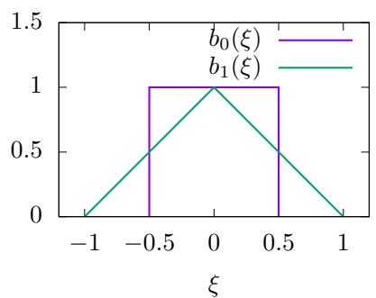  
Figure 1. Graphics of the rst two b-splines, $b _ { 0 } ( \xi )$ and $b _ { 1 } ( \xi )$ .

The 1D shape function based on the b-spline function is then given by

$$
S _ { 1 D } ( \boldsymbol { \xi } ) = b _ { l } ( \boldsymbol { \xi } ) ,
$$

Most PIC codes use $b _ { 0 }$ , i.e, the at-top function, as the shape function and choose the support of the shape function $\Delta _ { p }$ equal to the grid spacing. (k-spectra of particle shape functions, to be continued)

The shape functions are essentially identical to the basis functions used in nite element methods.

The spatial shape of markers determines how physical particles represented by a marker are distributed to spatial cells (called deposition) and also how the force on a marker is related to the nearby electromagnetic eld. Let us consider these in turn.

# 3.1 Integration in velocity space

The physical particle distribution is the sum of all the particle elements given in expression (22), i.e.,

$$
f = \sum _ { p } \ f _ { p } = \sum _ { p } \ w _ { p } { \frac { 1 } { \mathcal { T } _ { v } } } \delta ( \mathbf { v } - \mathbf { v } _ { p } ) S ( \mathbf { r } - \mathbf { r } _ { p } ) .
$$

Consider a general velocity moment of the distribution function:

$$
I ( \mathbf { r } ) = \int _ { - \infty } ^ { \infty } A ( \mathbf { v } ) f ( \mathbf { r } , \mathbf { v } ) d \mathbf { v } ,
$$

where $A ( \mathbf { v } )$ is a known function. Using expression (31), the above moment is written as

$$
I ( \mathbf { r } ) = \sum _ { p } S ( \mathbf { r } - \mathbf { r } _ { p } ) w _ { p } \int _ { - \infty } ^ { \infty } A ( \mathbf { v } ) \frac { 1 } { \mathcal { T } _ { v } } \delta ( \mathbf { v } - \mathbf { v } _ { p } ) d \mathbf { v } .
$$

By using the property of the Dirac delta function, the above equation is written as

$$
I ( { \bf r } ) { = } \sum _ { p } w _ { p } A ( { \bf v } _ { p } ) S ( { \bf r } - { \bf r } _ { p } ) .
$$

# 3.2 Cell-averaged velocity moment

One of the most important methods of reducing collisions between markers when using very few markers to approximate a system with much more physical particles is to solve Maxwell's equation on discrete grids and use the cell-averaged moments obtained from markers as the source term in the eld equation.

To be clear, grid points and the corresponding cells are dened as illustrated in Fig. 2 for the 1D case.

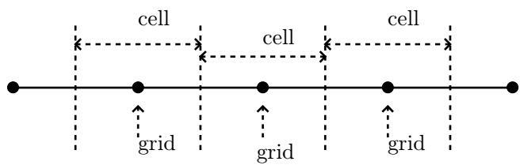  
Figure 2. Denition of spatial grid points and cells in PIC simulations. A grid point is the center of the corresponding cell.

Field solvers in PIC code usually need the values of $I$ at the grid-points. This value at the grid point is dened as the average of $I$ over the corresponding cells (similar to that in the nite element method), i.e.,

$$
I _ { i , j , k } \equiv I ( \alpha _ { i } , \beta _ { j } , \gamma _ { k } ) \equiv \frac { 1 } { \Delta V } { \int } _ { \alpha _ { i - 1 / 2 } } ^ { \alpha _ { i + 1 / 2 } } { \int } _ { \beta _ { j - 1 / 2 } } ^ { \beta _ { j + 1 / 2 } } { \int } _ { \gamma _ { k - 1 / 2 } } ^ { \gamma _ { k + 1 / 2 } } I ( \alpha , \beta , \gamma ) \mathcal { I } d \alpha d \beta d \gamma ,
$$

where $\begin{array} { r } { \Delta V = \int _ { \alpha _ { i - 1 / 2 } } ^ { \alpha _ { i + 1 / 2 } } \int _ { \beta _ { j - 1 / 2 } } ^ { \beta _ { j + 1 / 2 } } \int _ { \gamma _ { k - 1 / 2 } } ^ { \gamma _ { k + 1 / 2 } } \mathcal { I } d \alpha d \beta d \gamma } \end{array}$ is the cell volume, which can be approximated as $\Delta V \approx$ $\mathcal { I } \Delta \alpha \Delta \beta \Delta \gamma$ . Using Eqs. (34), the above expression is written as

$$
I _ { i , j , k } = \frac { 1 } { \Delta V } { \int _ { \alpha _ { i - 1 / 2 } } ^ { \alpha _ { i + 1 / 2 } } \int _ { \beta _ { j - 1 / 2 } } ^ { \beta _ { j + 1 / 2 } } \int _ { \gamma _ { j - 1 / 2 } } ^ { \gamma _ { j + 1 / 2 } } \sum _ { p } w _ { p } A ( \mathbf { v } _ { p } ) S ( \mathbf { r } - \mathbf { r } _ { p } ) \mathcal { I } d \alpha d \beta d \gamma } .
$$

Using the shape function given in expression (23), the above expression is written as

=

$$
\frac { I _ { i , j , k } } { \Delta V } \sum _ { p } w _ { p } A ( \mathbf { v } _ { p } ) \int _ { \alpha _ { i - 1 / 2 } } ^ { \alpha _ { i + 1 / 2 } } \int _ { \beta _ { j - 1 / 2 } } ^ { \beta _ { j + 1 / 2 } } \int _ { \gamma _ { j - 1 / 2 } } ^ { \gamma _ { j + 1 / 2 } } \biggl [ \frac { 1 } { \Delta \alpha _ { p } } S _ { 1 D } \biggl ( \frac { \alpha - \alpha _ { p } } { \Delta \alpha _ { p } } \biggr ) \biggr ] \biggl [ \frac { 1 } { \Delta \beta _ { p } } S _ { 1 D } \biggl ( \frac { \beta - \beta _ { p } } { \Delta \beta _ { p } } \biggr ) \biggr ] \biggl [ \frac { 1 } { \Delta \gamma _ { p } } S _ { 1 D } \biggl ( \frac { \gamma - \gamma _ { p } } { \Delta \gamma _ { p } } \biggr ) \biggr ] d \mathbf { v } .
$$

where the Jacobian is cancelled out. The 3D integration in expression (37) consists of three identical 1D integrations. Consider one of them:

$$
W = \frac { 1 } { \Delta \alpha _ { p } } \int _ { \alpha _ { i - 1 / 2 } } ^ { \alpha _ { i + 1 / 2 } } { S _ { 1 D } \bigg ( \frac { \alpha - \alpha _ { p } } { \Delta \alpha _ { p } } \bigg ) } d \alpha ,
$$

Consider the case $\Delta \alpha _ { p } = \Delta \alpha$ , and choose $S _ { 1 D }$ to be the $l \operatorname { t h }$ order b-spline function, $b _ { l }$ , then the above expression is written as

$$
\begin{array} { l } { { W = \displaystyle \frac { 1 } { \Delta \alpha } { \int _ { \alpha _ { i - 1 / 2 } } ^ { \alpha _ { i + 1 / 2 } } } { b _ { l } \Big ( \frac { \alpha - \alpha _ { p } } { \Delta \alpha } \Big ) } d \alpha } } \\ { { = b _ { l + 1 } \Big ( \frac { \alpha _ { i } - \alpha _ { p } } { \Delta \alpha } \Big ) , } } \end{array}
$$

where $b _ { l + 1 }$ is the $( l + 1 ) \mathrm { t h }$ order b-spline function. [Proof of Eq. (40): Using the property of the zeroth order b-spline function $b _ { 0 }$ (a at top function), the integration (39) can be written as

$$
W ~ = ~ { \frac { 1 } { \Delta \alpha } } { \int _ { - \infty } ^ { \infty } } b _ { l } \Bigl ( { \frac { \alpha - \alpha _ { p } } { \Delta \alpha } } \Bigr ) b _ { 0 } \Bigl ( { \frac { \alpha - \alpha _ { i } } { \Delta \alpha } } \Bigr ) d \alpha
$$

By using the denition of the b-splines, we nd the above expression is a b-spline function that is one order higher than the corresponding b-spline shape function, i.e.,

$$
W = b _ { l + 1 } \Big ( \frac { \alpha _ { i } - \alpha _ { p } } { \Delta \alpha } \Big ) .
$$

] Therefore expression (37) is written as

$$
I _ { i , j , k } = \frac { 1 } { \Delta V } { \sum _ { p } } w _ { p } A ( { \bf v } _ { p } ) b _ { l + 1 } \bigg ( \frac { \alpha _ { i } - \alpha _ { p } } { \Delta \alpha } \bigg ) b _ { l + 1 } \bigg ( \frac { \beta _ { j } - \beta _ { p } } { \Delta \beta } \bigg ) b _ { l + 1 } \bigg ( \frac { \gamma _ { k } - \gamma _ { p } } { \Delta \gamma } \bigg ) .
$$

In terms of the b-spline functions, the local value $I ( \alpha , \beta , \gamma )$ given by expression (34) is written as

$$
I ( \alpha , \beta , \gamma ) = \frac { 1 } { \Delta V } \sum _ { p } w _ { p } A ( \mathbf { v } _ { p } ) b _ { l } \Big ( \frac { \alpha - \alpha _ { p } } { \Delta \alpha } \Big ) b _ { l } \Big ( \frac { \beta - \beta _ { p } } { \Delta \beta } \Big ) b _ { l } \Big ( \frac { \gamma - \gamma _ { p } } { \Delta \gamma } \Big ) .
$$

It is instructive to compare expression (41) with (42), which indicates that they are similar except that the b-spline functions involved in the cell-averaged expression (41) is one order higher than that involved in the local expression (42).

# 3.3 Eective eld on a marker

The eective eld on a marker is dened as the averaged eld on the group of particles represented by the marker. To get the averaged eld, we need to reconstruct a continuum electric eld. The continuum electric eld is usually reconstructed using the assumption that the eld is constant in each cell, i.e., piecewise constant function, i.e.,

$$
E ( \alpha , \beta , \gamma ) = \sum _ { i , j , k } E _ { i , j , k } b _ { 0 } \bigg ( \frac { \alpha - \alpha _ { i } } { \Delta \alpha } \bigg ) b _ { 0 } \bigg ( \frac { \beta - \beta _ { i } } { \Delta \beta } \bigg ) b _ { 0 } \bigg ( \frac { \gamma - \gamma _ { i } } { \Delta \gamma } \bigg ) ,
$$

where $E _ { i , j , k }$ is the eld value at grid-points (centers of cells) obtained by solving the eld equation. The electric eld on a computational marker is the average of the electric eld over all the physical particles contained in the marker, i.e.,

$$
E _ { p } = \frac { 1 } { w _ { p } } \int _ { - \infty } ^ { + \infty } \int _ { - \infty } ^ { + \infty } \int _ { - \infty } ^ { + \infty } E ( \alpha , \beta , \gamma ) \bigg ( \int f _ { p } d \mathbf { v } \bigg ) \mathcal { I } _ { r } d \alpha d \beta d \gamma
$$

Using $f _ { p }$ given in Eq. (22) in the above equation, we obtain

$$
E _ { p } = \int _ { - \infty } ^ { + \infty } \int _ { - \infty } ^ { + \infty } \int _ { - \infty } ^ { + \infty } E ( \alpha , \beta , \gamma ) \bigg [ \frac { 1 } { \Delta \alpha _ { p } } S _ { 1 D } \bigg ( \frac { \alpha - \alpha _ { p } } { \Delta \alpha _ { p } } \bigg ) \bigg ] \bigg [ \frac { 1 } { \Delta \beta _ { p } } S _ { 1 D } \bigg ( \frac { \beta - \beta _ { p } } { \Delta \beta _ { p } } \bigg ) \bigg ] \bigg [ \frac { 1 } { \Delta \gamma _ { p } } S _ { 1 D } \bigg ( \frac { \gamma - \gamma _ { p } } { \Delta \gamma _ { p } } \bigg ) \bigg ] d \alpha d \beta d \gamma .
$$

where the Jacobian and $w _ { p }$ disappear. Use the reconstructed electric eld [Eq. (43)] in the above equation, giving

$$
\sum _ { i , j , k } ^ { E _ { p } } E _ { i , j , k } \int _ { - \infty } ^ { + \infty } \int _ { - \infty } ^ { + \infty } \int _ { - \infty } ^ { + \infty } b _ { 0 } \Big ( \frac { \alpha - \alpha _ { i } } { \Delta \alpha } \Big ) b _ { 0 } \bigg ( \frac { \beta - \beta _ { i } } { \Delta \beta } \bigg ) b _ { 0 } \bigg ( \frac { \gamma - \gamma _ { i } } { \Delta \gamma } \bigg ) \frac { 1 } { \Delta \alpha _ { p } } S _ { 1 D } \bigg ( \frac { \alpha - \alpha _ { p } } { \Delta \alpha _ { p } } \bigg ) \frac { 1 } { \Delta \beta _ { p } } S _ { 1 D } \bigg ( \frac { \beta - \beta _ { p } } { \Delta \beta _ { p } } \bigg ) \frac { 1 } { \Delta \gamma _ { p } } S _ { 1 D } ^ { E } ( \frac { \gamma - \gamma _ { p } } { \Delta \alpha _ { p } } )
$$

If we choose the shape function $S _ { 1 D }$ as the b-spline function $b _ { l }$ with $\Delta \alpha _ { p } = \Delta \alpha$ , $\Delta \beta _ { p } = \Delta \beta$ , and $\Delta \gamma _ { p } =$ $\Delta \gamma$ , then the above equation is written as

$$
E _ { p } = \sum _ { i , j , k } E _ { i , j , k } b _ { l + 1 } \bigg ( \frac { \alpha _ { i } - \alpha _ { p } } { \Delta \alpha } \bigg ) b _ { l + 1 } \bigg ( \frac { \beta _ { j } - \beta _ { p } } { \Delta \beta } \bigg ) b _ { l + 1 } \bigg ( \frac { \gamma _ { k } - \gamma _ { p } } { \Delta \gamma } \bigg ) ,
$$

which species how the eective eld on a marker is related to the nearby eld on the grid-points.

# 3.4 Numerical implementation in codes

Most PIC codes use the ${ \mathit { l } } = 0$ b-spline function (i.e., $b _ { 0 }$ , the at-top function) as the shape function of markers. This model is often called Could in Cell (CIC) since a particle looks like a nite-sized cloud rather than a point. In this case, the cell average of $I$ given in Eq. (41) is written as

$$
I _ { i , j , k } = \frac { 1 } { \Delta V } \sum _ { p } w _ { p } A ( \mathbf { v } _ { p } ) b _ { 1 } \bigg ( \frac { \alpha _ { i } - \alpha _ { p } } { \Delta \alpha } \bigg ) b _ { 1 } \bigg ( \frac { \beta _ { j } - \beta _ { p } } { \Delta \beta } \bigg ) b _ { 1 } \bigg ( \frac { \gamma _ { k } - \gamma _ { p } } { \Delta \gamma } \bigg )
$$

and the electric eld on the marker given in Eq. (47) is written as

$$
E _ { p } = \sum _ { i , j , k } E _ { i , j , k } b _ { 1 } \bigg ( \frac { \alpha _ { i } - \alpha _ { p } } { \Delta \alpha } \bigg ) b _ { 1 } \bigg ( \frac { \beta _ { j } - \beta _ { p } } { \Delta \beta } \bigg ) b _ { 1 } \bigg ( \frac { \gamma _ { k } - \gamma _ { p } } { \Delta \gamma } \bigg ) ,
$$

Because the function $b _ { 1 }$ has a narrow support, as shown in Fig. 1, in practice of calculating $I _ { i , j , k }$ in expression (48), we loop over each particle for only once and assign the contribution of each one to their neighbouring cells (rather than looping over all particle for each cell as the straightforward reading of expression (48) would suggest). The operation of the latter would be $O ( N \times N _ { p } )$ , where $N$ is number of grids and $N _ { p }$ is the number of markers, while the former is only $O ( n N _ { p } )$ , where $n$ is the number of operation involved in assigning each particle to its neighbouring cells, which is usually much smaller than the grid number $N$ .

Similarly, in calculating the force on a marker, the summation over all the grids (as the straightforward reading of expression (49) would suggest) is not needed. We only need to nd which cell a marker is in and then sum the contribution from the nearby grids (rather than all the grids).

# 3.5 Eective force on a marker

The total charge of a group of particles represented by a maker, $Q$ , is given by $\begin{array} { r } { Q = \int q f _ { p } d ^ { 6 } v } \end{array}$ , wher e $q$ is the charge of a single particle. Then the eective force on a marker is then $F _ { p } = Q E _ { p }$ with $E _ { p }$ given by Eq. (46). The total mass of a group of particles represented by a marker, $M$ , is given by $\begin{array} { r } { M = \int m f _ { p } d ^ { 6 } v } \end{array}$ , where $m$ is the mass of a single particle. Then the ratio between $Q$ and $M$ is written as

$$
\frac { Q } { M } { = } \frac { \int q f _ { p } d ^ { 6 } v } { \int m f _ { p } d ^ { 6 } v } { = } \frac { q } { m } ,
$$

which is identical to the single particle charge mass ratio. Note that the motion equation of a particle in an electromagnetic eld is distinguished only by this ratio. Therefore motion of a marker in the phase space is identical with the motion of a real particle with the eective eld given by Eq. (46).

# 3.6 Monte-Carlo integration in phase-space

Consider a general moment of the distribution function $f$ in the phase-space

$$
I \equiv \int _ { \Omega ^ { \prime } } A ( \mathbf { Z } ) f ( \mathbf { Z } ) d V ,
$$

where $\Omega ^ { \prime }$ is a sub-region of the phase space $\Omega$ , $A ( \mathbf { Z } )$ is a general function of the phase-space coordinates $\mathbf { Z }$ , $d V$ is the phase space volume element. As is discussed above, in particle methods, $f ( \mathbf { Z } )$ is approximated by

$$
f ( \mathbf { Z } ) \approx \sum _ { j = 1 } ^ { N } w _ { j } S _ { \mathrm { p s } } ( \mathbf { Z } - \mathbf { Z } _ { j } ) ,
$$

where $S _ { \mathrm { p s } } ( \mathbf { Z } - \mathbf { Z } _ { j } )$ is the phase space shape function of markers, $N$ is the total number of marker loaded in the phase space $\Omega$ . Using this, expression (51) is written as

$$
I = \sum _ { j = 1 } ^ { N } \int _ { \Omega ^ { \prime } } A ( \mathbf { Z } ) w _ { j } S _ { \mathrm { p s } } ( \mathbf { Z } - \mathbf { Z } _ { j } ) d V ,
$$

If the shape function $S _ { \mathrm { p s } }$ is chosen to be the Dirac delta function, then the above equation is written as

$$
I = \sum _ { j = 1 } ^ { N ^ { \prime } } A ( \mathbf { Z } _ { j } ) w _ { j } ,
$$

where $N ^ { \prime }$ is the number of markers that are within the sub-region $\Omega ^ { \prime }$ . Equation (54) is the Monte-Carlo approximation to the integration in Eq. (51)[4, 2].

In PIC simulations, we are usually interested in the velocity moments of $f$ , i.e., $\mathbf { A }$ in Eq. (53) is only a function of only $\mathbf { v }$ and the velocity integration is over the whole velocity space, whereas the spatial integration in over a small spatial cell. Furthermore, in PIC simulations, the markers are assumed to have a nite shape in real space (the shape in velocity space is still the Dirac delta function). In this case, Eq. (53) is written as

$$
\begin{array} { l } { I = \displaystyle \sum _ { j = 1 } ^ { N } \int _ { \mathbf { v } } A ( \mathbf { v } ) w _ { j } \delta ( \mathbf { v } - \mathbf { v } _ { j } ) \bigg ( \int _ { \Delta V _ { r } } S _ { r } ( \mathbf { r } - \mathbf { r } _ { j } ) d \mathbf { r } \bigg ) d \mathbf { v } , } \\ { = \displaystyle \sum _ { j = 1 } ^ { N } A ( \mathbf { v } _ { j } ) w _ { j } \bigg ( \int _ { \Delta V _ { r } } S _ { r } ( \mathbf { r } - \mathbf { r } _ { j } ) d \mathbf { r } \bigg ) , } \end{array}
$$

where $S _ { r }$ is the shape function. Then the cell-averaged value of $I$ is written as

$$
\frac { I } { \Delta V _ { r } } = \sum _ { j = 1 } ^ { N } A ( \mathbf { v } _ { j } ) w _ { j } \left( \frac { 1 } { \Delta V _ { r } } \int _ { \Delta V _ { r } } S _ { r } ( \mathbf { r } - \mathbf { r } _ { j } ) d \mathbf { r } \right) .
$$

Note that the phase-space volume occupied (or sampled) by a marker is dierent from the concept of the spatial-shape of a marker.

# 3.7 On accuracy and noise: particle methods vs. Euler-grid-based methods

The overall error of the Monte-Carlo approximation given in Eq. (54) always scales like $1 / \sqrt { N ^ { \prime } }$ , which is independent of the dimensionality of the phase-space. It is easy to demonstrate that the overall error of the usual regular-grids approximation to the integration scales like $1 / N ^ { \prime ^ { 1 / d } }$ , where $d$ is the dimension of the phase space[4]. This fact implies that Monte-Carlo approximation is more accurate than the regulargrids methods for high-dimension ( $d \geqslant 3$ ) integration. Due to this reason, particle methods can be considered more accurate than the Euler-grid-based methods for the same number of sampling points in a highdimensional ( $\geqslant i$ ) phase space.

On the other hand, PIC simulations obviously contain unphysical noise. The noise is due to the discrete marker eects, which can be further categorized into two types: sampling noise (uctuation of the sampling error) and remaining unwanted collisions in a collisionless simulation.

Due to the limited small number of markers used in PIC code, there are considerable time and spatial uctuation over the the number of markers in a spatial-cell. This uctuation in the number of sampling points (i.e., uctuation of the sampling error) gives rise to the sampling noise.

Inaccuracy in a PIC simulation is also related to the fact that the phase-space volume sampled by a marker is assumed to be constant in a PIC code but this assumption is not strictly satised in practice due to (1) the number of markers being not large enough and (2) the resulting self-consistent eld being not smooth enough, which introduce eective collisional eects, making the conservation of the phasespace volume less accurate. How well the phase-space volume is conserved depends on the smoothness of the eld: smooth eld means less collisions and thus phase-space volume are better conserved. PIC simulation codes seek to reduce the collision through using nite-size particles (discussed in Sec. 3) and averaging in a spatial cell in solving for the electromagnetic elds, which eectively smooth the elds. This kind of PIC simulations are thus designed for collisionless plasmas. And the remaining collisional eect should be small enough to not aect the process of interest. And this remaining collisional eects should be viewed as numerical artifacts rather than a modeling of any real collisional eect in plasmas. If we want to model the real collisional eect in PIC simulation, we need to use other techniques rather than relying on the remaining collisions mentioned above because the latter is not easy to control and ideally should be completely removed.

Various noise reduction techniques in PIC codes (e.g., nite-size particles, grids, and perturbative $\delta f$ method) can be used when the marker number is xed. When exhausting all these methods, the nal brute-force method of reducing noise (reducing collisions) is to increase the marker number. Therefore the noise issue is nally a convergence issue about the marker number.

From the view of particle simulations, the gyrokinetic model can also be considered as a noise reduction technique, where the gyro-averaging process makes the eld on a marker more smooth.

(Noise in PIC code is equivalent to the remaining articial collision eect? We can test this by doing a test particle simulation, in which we loaded a group of markers to sample a distribution function in the phase space and then compute the density evolution of the sampled distribution under a given smooth electromagnetic eld (i.e., eliminating the collisional eect). If there is still signicant noise in the time evolution, then this indicates there are factors other than collisions that contribute to the noise. I did this when I studied Landau damping, the results indicate there is still signicant noise in the solution, indicating the discrete phase space sampling is the root of the noise.)

One thing to note is that the noisy results obtained in particle method are not necessarily less accurate than the smooth results obtained in Euler-grid-based methods because bigger errors may be hidden in smooth results when one uses coarse grids.

Before the invention of gyrokinetic model, all plasma fully kinetic simulations in 3D space used the PIC method since the 6-dimensional phase space seems to be too high for Euler-gird-based methods to handle. With the gyrokinetic model, the dimenionality of the phase space is reduced by one, which makes it possible for Euler-grid-based method to handle.

Another reason why particle methods are/were more popular than the Eulerian-grid-based methods in plasma community is the algorithmic compactness and subsequent ease of coding in comparison with the Eulerian-grid-based methods (really? is this related to that PIC method seems more intuitive at first glance?). This is not about accuracy or even science. Historical or psychological reasons can partically account for the popularity of one particular method.

Parallization is easier in PIC codes? The answer may depend on one's experience.

For gyrokinetic simulation of tokamak plasmas, it is not easy to judge which method, particle-based method or grid-based mthod, is better than the other. When dealing with full Landau collision oprators, some PIC codes, e.g., XGC, uses grids in velocity space. This may indicate that velocity grids are generally needed, suggesting that grids-methods may have advantages. On the other hand, hybrid methods that use both velocity grids and markers may be a practical way since hybrid provides us freedoms to use whatever methods available that can get work done.

# 3.8 Modeling collisions in PIC simulations

(check $^ { * * }$ However, the grid-less approach in particle method makes it dicult to handle general Landau collision operators that involve the velocity gradients of the distribution function and evaluating these gradients usually needs velocity grids. For some simple collision operators, a corresponding Langevin equation can be constructed, which makes the collisional eect be able to be modeled by stochastic change in marker trajectories. However, this correspondence can not be found for all collisional operators.)

# 4 Evolution of distribution functions

The marker weight is composed of two factors, namely the physical distribution function $f$ and the marker distribution function $g$ . The time evolution of the weight $w$ is thus determined by the time evolution of $f$ and $g$ , which are discussed in Sec. 4.1 and 4.2, respectively.)

# 4.1 Time evolution of the physical distribution function

# 4.1.1 Full-f formula

The collisionless kinetic equation (Vlasov equation) is given by

$$
\frac { \partial f } { \partial t } + \mathbf { v } \cdot \frac { \partial f } { \partial \mathbf { x } } + \frac { q } { m } ( \mathbf { E } + \mathbf { v } \times \mathbf { B } ) \cdot \frac { \partial f } { \partial \mathbf { v } } = 0 ,
$$

It is ready to nd that the characteristic lines of the equation is given by

$$
\frac { d \mathbf { x } } { d t } = \mathbf { v } ,
$$

and

$$
\frac { d { \mathbf v } } { d t } = \frac { q } { m } ( { \bf E } + { \mathbf v } \times { \bf B } ) .
$$

Along a characteristic line, the kinetic equation is written

$$
\frac { d f } { d t } = 0 ,
$$

where $f$ is the total particle distribution function (full-f). Particles methods that use Monte-Carlo sampling to approximate the total $f$ are called total-f or full-f method.

# 4.1.2 Delta-f formula

Since the phenomena we consider in tokamak plasmas are usually developing from an equilibrium or nearequilibrium state, it is desirable to calculate the the evolution of the only the perturbation, instead of the total $f$ . Therefore, we write $f$ as the sum of a known time-independent distribution function $f _ { 0 } \ ( \partial f _ { 0 } /$ $\partial t { = } 0$ ) and a unknown time-dependent perturbation $\delta f$ $( \partial \delta f / \partial t \neq 0 )$ :

$$
f = f _ { 0 } + \delta f ,
$$

Then the kinetic equation (60) is written

$$
\frac { d \delta f } { d t } = - \frac { d f _ { 0 } } { d t } .
$$

Particle methods that use Monte-Carlo sampling to approximate the $\delta f$ are usually called $\delta f$ method. When the right-hand side of Eq. (62) is known, Eq. (62) can be integrated to obtain the time evolution of $\delta f$ . The time evolution of $\delta f$ can also be obtained by using

$$
\delta f ( t , \mathbf { Z } _ { j } ( t ) ) = f ( t = 0 , \mathbf { Z } _ { j } ( t = 0 ) ) - f _ { 0 } ( \mathbf { Z } _ { j } ( t ) ) .
$$

In this way, the time integration of $\delta f / d t$ is avoided, which may reduce the computational overhead and improve the accuracy of $\delta f$ . This seemingly trivial method was emphasized in a CPC paper[1], which introduces an adaptive $f _ { 0 }$ method based on this idea. I have tested this method in my toy code about the 1D Landau damping, which gave the same results as the usual method. However, Yang Chen pointed out that this method is never used in simulations of tokamak plasmas due to the following reasons. The chosen equilibrium distribution function $f _ { 0 }$ in tokamak plasmas simulation is usually not a solution the following time-independent Vlasov equation:

$$
{ \bf v } \cdot \frac { \partial f _ { 0 } } { \partial { \bf x } } + \frac { q } { m } ( { \bf E } _ { 0 } + { \bf v } \times { \bf B } _ { 0 } ) \cdot \frac { \partial f _ { 0 } } { \partial { \bf v } } = 0 ,
$$

Instead, the chosen $f _ { 0 }$ is a solution of the following equation

$$
{ \bf v } \cdot \frac { \partial f _ { 0 } } { \partial { \bf x } } + \frac { q } { m } ( { \bf E } _ { 0 } + { \bf v } \times { \bf B } _ { 0 } ) \cdot \frac { \partial f _ { 0 } } { \partial { \bf v } } = S ,
$$

where $S$ is a nonzero term. On the other hand, the perturbation part is governed by the following equation

$$
\frac { d \delta f } { d t } = - \frac { q } { m } ( \delta \mathbf { E } + \mathbf { v } \times \delta \mathbf { B } ) \cdot \frac { \partial f _ { 0 } } { \partial \mathbf { v } } .
$$

Then it is ready to prove that the actual kinetic equation for the full $f$ in the usual tokamak simulation is actually given by

$$
\frac { d f } { d t } = S ,
$$

which indicates that $f$ is not a constant along the characteristic curves and thus is not consistent with the algorithm given in Eq. (63). $^ { * * }$ may be wrong, check\*\*The case given in Eq. (67) is the more relevant case to tokamak experiments where a particular form of $f _ { 0 }$ is maintained by external sources and we are asked to calculate the perturbation evolution around $f _ { 0 }$ . $^ { * * }$ wrong!

# 4.2 Time evolution of marker distribution function

Any particle distribution function $g ( \mathbf { x } , \mathbf { v } , t )$ satises that $d g / d t = 0$ for Hamiltonian motion and non-diusive motion in general. In other words, the phase-space particle flow is volume preserving (this is Louisville's theorem), i.e.,

$$
\frac { d V _ { j } } { d t } { = } 0 .
$$

i.e, the phase-space volume sampled by a marker does not change along the characteristic curves. This is good news for PIC simulation because the marker distribution is known exactly along the characteristic line at every time-step and we do not need to numerically evaluate it (numerically evaluating the marker distribution by directly counting markers would be noisy due to the small number of markers loaded and should be avoided in practice whenever possible).

For diusive motion, the phase space particle ow is usually not volume preserving, i.e.,

$$
\frac { d g ( \mathbf { Z } _ { j } ) } { d t } \neq 0 .
$$

For this case, the values of $g$ at markers need to be evaluated numerically every time step, which is usually noisy and time-consuming in terms of CPU time. Therefore, this kind of evaluation should be avoided in practice whenever possible. The usual way of achieving this is by choosing a suitable initial distribution for the markers, so that $g$ remains approximately constant along the trajectory of markers[3].

The marker distribution chosen in practice is determined by the desired resolution of phase space of interest, not determined by the physical particle distribution, i.e., the initial marker distribution can be dierent from the physical particle distribution.

# 4.3 Time evolution of marker's weight

As mentioned in Sec. 2.2, marker's weight, $w = f / g$ , is composed of two factors, namely the physical distribution function $f$ and the markers' distribution function $g$ . The time evolution of the weight $w$ is thus determined by the time evolution of $f$ and $g$ .. In some cases, the formula for the time evolution of both $f$ and $g$ can be obtained analytically, as discussed in Sec. 4.1 and 4.2, respectively. [\*check\*\*In other cases, the formula for the time evolution of $f$ and/or $g$ can not be easily obtained but the formula for the time evolution of $w$ can still be obtained analytically. A typical example of this kind is the full-f simulation including the collision eects in the orbits. In this case, the phase-space ow is not volume-conserving, i.e., $d g / d t \ne 0$ , and it is dicult to nd an analytic formula for the time evolution of $g$ . However, the conservation of the particle number along the orbits in the phase space is still valid (check this!, wrong), i.e.,

$$
\frac { d w } { d t } { = } 0 .
$$

Does this algorithm correctly describe the collision? This algorithm (i.e., including the collision eects via randomly changing the orbit variables) is obviously correct when $w$ is 1, i.e., a marker only represents one physical particle. The correctness for $w _ { j } > 1$ case should be veried. $\ast \ast \ast$ check]. Collisions in both full-f and $\delta f$ methods seem to be implemented by including a source term in the evolution equation for the weight, rather than kicking the orbit (I will check the kicking orbit method later).

# 5 An example: One-dimensional electrostatic simulation

# 5.1 Vlasov equation

Consider the electrostatic case. The Vlasov equation (9) for electrons is written

$$
\frac { \partial f } { \partial t } + \mathbf { v } \cdot \nabla f + \frac { e } { m } \nabla \phi \cdot \nabla _ { v } f = 0 ,
$$

where $\phi$ is the electric potential. Consider the one-dimensional case where $f$ and $\phi$ are independent of $y$ and $z$ coordinates. In this case, the above equation is written

$$
\frac { \partial f } { \partial t } + v _ { x } \frac { \partial f } { \partial x } + \frac { e } { m } \frac { d \phi } { d x } \frac { \partial f } { \partial v _ { x } } = 0
$$

Integrating both sides of the above equation over $v _ { y }$ and $v _ { z }$ , we obtain

$$
\frac { \partial F } { \partial t } + v _ { x } \frac { \partial F } { \partial x } + \frac { e } { m } \frac { d \phi } { d x } \frac { \partial F } { \partial v _ { x } } = 0 ,
$$

where $\begin{array} { r } { F ( x , v _ { x } , t ) = \int _ { - \infty } ^ { \infty } \int _ { - \infty } ^ { \infty } f d v _ { y } d v _ { z } } \end{array}$ is the reduced distribution function. Dene characteristic lines by the following ordinary dierential equations:

$$
\frac { d \boldsymbol { x } } { d t } = \boldsymbol { v } _ { x } ,
$$

and

$$
\frac { d v _ { x } } { d t } { = } \frac { e } { m _ { e } } \frac { d \phi } { d x } .
$$

Then along a characteristic line, we obtain

$$
\frac { d F } { d t } = 0 ,
$$

which indicates that the distribution function $F$ remain unchanged along a characteristic line.

# 5.2 Poisson's equation

In terms of the reduced distribution function $F$ , Poisson's equation is written

$$
- \frac { d ^ { 2 } \phi } { d x ^ { 2 } } = \frac { e } { \varepsilon _ { 0 } } \bigg ( n _ { \mathrm { i o n } } - \int _ { - \infty } ^ { \infty } F d v _ { x } \bigg ) ,
$$

where $n _ { \mathrm { i o n } }$ is the number density of ions, which are assumed to be uniform in $x$ and not evolving with time.

# 5.3 Equilibrium state

Consider a spatially uniform distribution function given by

$$
F ( x , v _ { x } , t ) = F _ { 0 } ( v _ { x } ) ,
$$

where $F _ { 0 } ( v _ { x } )$ is a known velocity distribution function with number density being equal to those of ions, i.e., $\begin{array} { r } { \int _ { - \infty } ^ { + \infty } F _ { 0 } ( v _ { x } ) d v _ { x } = n _ { \mathrm { i o n } } } \end{array}$ . Consider a case with zero electric eld, i.e.,

$$
E ( x , t ) = 0 .
$$

Then it is ready to verify that expression specied by Eqs. (78) and (79) is a equilibrium solution to Vlasov-Poisson system (Eqs. (73) and (77)).

In this note, two kind of equilibrium distribution functions will be considered. The rst one is the Maxwellian distribution given by

$$
F _ { 0 } ( v _ { x } ) = \frac { n _ { e 0 } } { \sqrt { \pi } v _ { t } } \mathrm { e x p } \biggl ( - \frac { v ^ { 2 } } { v _ { t } ^ { 2 } } \biggr ) .
$$

In this system, small perturbation will be damped by a mechanism known as Landau damping. The second kind of distribution considered is the two-stream Maxwellian distribution given by

$$
F _ { 0 } ( v _ { x } ) = \frac { n _ { e 0 } } { \sqrt { \pi } v _ { t } } \frac { 1 } { 2 } \biggl [ \exp \biggl ( - \frac { ( v - v _ { b } ) ^ { 2 } } { v _ { t } ^ { 2 } } \biggr ) + \exp \biggl ( - \frac { ( v + v _ { b } ) ^ { 2 } } { v _ { t } ^ { 2 } } \biggr ) \biggr ] .
$$

In this system, small perturbation will give rise to an instability known as the two-stream instability.

# 5.4 $\delta f$ evolution

Write the distribution function $F$ as

$$
F = F _ { 0 } + \delta F ,
$$

where $F _ { 0 }$ is the equilibrium distribution function. Then Eq. (76) is written as

$$
\frac { d \delta F } { d t } { = } - \frac { d F _ { 0 } } { d t } .
$$

Use the denition of the orbit propagator,

$$
\frac { d } { d t } \equiv \frac { \partial } { \partial t } + v _ { x } \frac { \partial } { \partial x } + \frac { e } { m } \frac { d \phi } { d x } \frac { \partial } { \partial v _ { x } } ,
$$

to rewrite the right-hand side of Eq. (83), yielding

$$
\frac { d \delta F } { d t } = - \bigg ( \frac { e } { m } \frac { d \phi } { d x } \frac { \partial F _ { 0 } } { \partial v _ { x } } \bigg ) ,
$$

which can be integrated to obtain the time evolution of $\delta F$ .

The time evolution of $\delta F$ can also be obtained by using

$$
\delta F ( \mathbf { Z } _ { j } ( t ) ) = F ( \mathbf { Z } _ { j } ( t = 0 ) ) - F _ { 0 } ( \mathbf { Z } _ { j } ( t ) ) .
$$

In this way, the time integration of $\delta F / d t$ is avoided, which may reduce the computational work load and improve the accuracy of $\delta F$ . This seemingly trivial method was emphasized in a CPC paper[1], which introduces an adaptive $F _ { 0 }$ method based on this idea. I have compared the results of Landau damping obtained by the two methods (i.e., using Eq. (85) and Eq. (86), respectively), which shows they agree with each other very well.

# 5.5 Normalization

Choose a typical number density $n _ { 0 }$ and a typical velocity $v _ { 0 }$ , then dene the electron plasma frequency $\omega _ { p e }$ and the Debye length $\lambda _ { D }$ as

$$
\omega _ { p e } = \sqrt { \frac { n _ { 0 } e ^ { 2 } } { m _ { e } \varepsilon _ { 0 } } } ,
$$

and

$$
\lambda _ { D } = \frac { v _ { 0 } } { \omega _ { p e } } ,
$$

respectively. Using $\omega _ { p e }$ and $\lambda _ { D }$ , dene the following normalized quantities:

$$
\bar { t } = t \omega _ { p e } , \ \overline { { x } } = \frac { x } { \lambda _ { D } } , \ \overline { { \phi } } = \frac { e \phi } { m _ { e } v _ { 0 } ^ { 2 } } , \ \overline { { F } } = \frac { v _ { 0 } } { n _ { 0 } } F , \ \overline { { v } } _ { x } = \frac { v _ { x } } { v _ { 0 } } , \overline { { n } } _ { i } = \frac { n _ { i } } { n _ { 0 } }
$$

In terms of these normalized quantities, equation (76) is written

$$
\frac { d \overline { { F } } } { d \overline { { t } } } = 0 ,
$$

and the Poisson equation (77) is written

$$
\frac { d ^ { 2 } \overline { { \phi } } } { d \overline { { x } } ^ { 2 } } = - \overline { { \rho } } .
$$

where $\begin{array} { r } { \overline { { \rho } } = \overline { { n } } _ { \mathrm { i o n } } - \int _ { - \infty } ^ { \infty } \overline { { F } } d \overline { { v } } _ { x } } \end{array}$

The equations for the characteristic lines, Eq. (74) and (75), are written

$$
\begin{array} { c } { \displaystyle \frac { d \overline { { x } } } { d \overline { { t } } } = \bar { v } _ { x } , } \\ { \displaystyle \frac { d \bar { v } _ { x } } { d \overline { { t } } } = \frac { d \overline { { \phi } } } { d \overline { { x } } } . } \end{array}
$$

The electric eld is given by $E = - d \phi / d x$ , which, in terms of normalized quantities, is written

$$
\overline { { E } } = - \frac { d \overline { { \phi } } } { d \overline { { x } } } ,
$$

where $\overline { { E } } = E e \lambda _ { D } / ( m v _ { 0 } ^ { 2 } )$

In terms of the normalized quantities, the evolution equation (85) of $\delta F$ is written as

$$
\frac { d \delta \overline { { F } } } { d \bar { t } } { = } \overline { { E } } \frac { \partial \overline { { F _ { 0 } } } } { \partial \overline { { v } } _ { x } }
$$

In terms of $\delta \overline { { F } }$ , Poisson's equation is written as

$$
\frac { d \overline { { \phi } } } { d \overline { { x } } ^ { 2 } } = \int _ { - \infty } ^ { \infty } \delta \overline { { F } } d \ : \overline { { v } } _ { x } ,
$$

where $n _ { \mathrm { i o n } } = n _ { e 0 }$ has been assumed.

# 5.6 Boundary condition for eld

The periodic boundary condition is used for the electrical field $E$ , i.e., the electric field on the right boundary is set equal to that on the left boundary.

# 5.7 Boundary condition for particles

The periodic boundary condition is also used for markers, i.e., a marker that leaves from the right boundary will re-enter the computational region from the left boundary and vice versa.

# 5.8 Evaluation of particle number density

Set up uniform grid-points in $x$ -direction: $x _ { j } = j \Delta$ for $j = 0 , 1 , 2 , . . . , N$ , as is shown in Fig. 3. Use the rst b-spline (at-top function) with a support $\Delta _ { p } = \Delta$ as the shape function of markers. It is obvious that we can use the following procedures to obtain the number of physical particles in each cell. For a particle marker labeled by $k$ whose position is $x = r$ , we can nd which two grids the particle lies between. Suppose that $r$ is between $x _ { j }$ and $x _ { j + 1 }$ , then the particle number $n _ { j }$ and $n _ { j + 1 }$ is evaluated as follows

$$
n _ { j } \to n _ { j } + w _ { k } \cdot \frac { x _ { j + 1 } - r } { \Delta } , n _ { j + 1 } \to n _ { j + 1 } + w _ { k } \cdot \frac { r - x _ { j } } { \Delta } ,
$$

where $w _ { k }$ is the weight of the marker. Performing the same procedures for each marker in turn allows us to build up $n _ { j }$ at all the grid points (all $n _ { j }$ are set to zero before these procedures).

The particle number at the boundary grid-points $j = 0$ and $j = N$ needs special treatment. The above treatment do not include the contribution to $n _ { 0 }$ from the left cell of the $j = 0$ . Since we use periodic boundary condition, the contribution to $n _ { 0 }$ from the left cell of the $j = 0$ grid is identical to the contribution to $n N$ from the left cell of the $j = N$ grid. The latter has already been calculated in the above, which can be added to $n _ { 0 }$ obtained above to get the nal $n _ { 0 }$ . The same situation applies for $n _ { N }$ . After these treatment, we have $\pi _ { 0 } = \pi _ { N }$ .

Dividing the particle number $n _ { j }$ by the cell size $\Delta$ gives the number density.

# 5.9 FFT solver for Poisson equation

The normalized one-dimensional Poisson equation is given by Eq. (91). For notation simplicity, omit the over-bar on $\phi$ and $x$ , then Eq. (91) is written

$$
{ \frac { d ^ { 2 } \phi } { d x ^ { 2 } } } = - \rho .
$$

This is a two-points boundary value problem. Two boundary conditions are needed to determine the solution. Assume the periodic boundary condition $\phi ( 0 ) = \phi ( L )$ and note that $\phi$ can contain an arbitrary constant. Thus the periodic boundary condition alone is sufficient to specify the electrical field. We use Fourier transformation method to solve Eq. (98). The Fourier transformation of the left-hand side of the above equation is written

$$
\begin{array} { l } { { \displaystyle \int _ { - \infty } ^ { \infty } { \frac { d ^ { 2 } \phi } { d x ^ { 2 } } } e ^ { i k x } d x ~ = ~ - k ^ { 2 } \int _ { - \infty } ^ { \infty } \phi e ^ { i k x } d x } } \\ { { ~ = ~ - k ^ { 2 } \hat { \phi } ( k ) , } } \end{array}
$$

where $\hat { \phi }$ is the Fourier transformation of $\phi$ . Using this, the Fourier transformation of Eq. (98) is written

$$
\hat { \phi } ( k ) = \frac { \hat { \rho } ( k ) } { k ^ { 2 } } ,
$$

where

$$
{ \hat { \rho } } = \int _ { - \infty } ^ { \infty } \rho ( x ) e ^ { i k x } d x
$$

is the Fourier transformation of $\rho$ . After $\hat { \phi }$ is obtained, the electric potential $\phi$ is nally reconstructed via the inverse Fourier transformation

$$
\phi = \frac { 1 } { 2 \pi } \int _ { - \infty } ^ { \infty } \hat { \phi } ( k ) e ^ { - i k x } d k .
$$

In the numerical implementation, the Fourier transformation in Eq. (101) and the inverse transformation in Eq. (102) are discretized by the Discrete Fourier Transformation (DFT), which is further evaluated by using the FFT algorithm (I use the FFTW library). Set up uniform grid-points in $x$ -direction: $x _ { j } = j \Delta$ for $j = 0 , 1 , 2 , . . . , N$ , as is shown in Fig. (3).

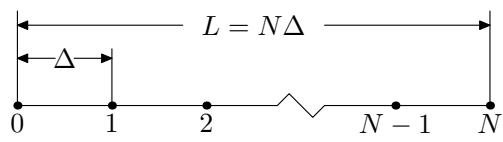  
Figure 3. One-dimensional spatial computational box and grids.

Let $\rho _ { j } = \rho ( x _ { j } )$ and $\phi _ { j } = \phi ( x _ { j } )$ . Let $\hat { \rho } _ { j }$ and $\hat { \phi } _ { j }$ denote the corresponding DFT. Using the sampled points $\rho _ { j }$ with $j = 0 , 1 , 2 , . . . , N - 1$ , we can obtain the DFT $\hat { \rho } _ { j }$ . Note that the corresponding wave-number $k$ of $\hat { \rho } _ { j }$ (also for $\hat { \phi } _ { j } )$ is given by $k = j 2 \pi / \left( N \Delta \right)$ for $j = 0 , 1 , . . . , N / 2$ and $k = ( j - N ) 2 \pi / ( N \Delta )$ for $j = N /$ $2 + 1 , . . . , N - 1$ (this corresponds to the negative wave-number part). Use Eq. (100) and the corresponding expression of the wave-number, the discrete form of Eq. (100) is written

$$
\hat { \phi } _ { j } = \frac { \hat { \rho } _ { j } } { [ j 2 \pi / \left( N \Delta \right) ] ^ { 2 } } .
$$

for $j = 1 , 2 , . . . , N / 2$ , and

$$
\hat { \phi } _ { j } = \frac { \hat { \rho } _ { j } } { [ ( j - N ) 2 \pi / ( N \Delta ) ] ^ { 2 } }
$$

for $j = N / 2 + 1 , N / 2 + 2 , . . . , N - 1$ . The $j = 0$ case is a special one because in this case $k = 0$ and $k$ appears in the denominator of (100). Since the overall charge neutrality $\textstyle \int _ { - \infty } ^ { \infty } \rho d x = 0$ implies $\hat { \rho } _ { 0 } = 0$ . we usually set $\hat { \phi } _ { 0 } = 0$ . After obtaining $\hat { \phi } _ { j }$ with $j = 0 , 1 , . . . , N - 1$ , we can obtain $\phi _ { j }$ through the inverse DFT.

Knowing the electron potential $\phi _ { j }$ , the electric eld is obtained through the following central dierence scheme

$$
E _ { j } = - \frac { d \phi } { d x } \bigg \vert _ { x = x _ { j } } = - \frac { \phi _ { j + 1 } - \phi _ { j - 1 } } { 2 \Delta } .
$$

The electric eld at the boundary points are obtained by using the periodic boundary conditions of $\phi$ .

In the above we use Fourier transformation method to get the electric potential and then use nite difference scheme to calculate the electric eld. This is a mixed way to calculate the electric eld. We can use only Fourier transformation method to solve for the electric eld. In terms of the electric eld, Poisson equation (91) is written

$$
\frac { d \overline { { E } } } { d \overline { { x } } } = \overline { { \rho } } .
$$

For notation simplicity, omit the over-bar on variables, the above equation is written

$$
{ \frac { d E } { d x } } = \rho .
$$

The Fourier transformation of the left-hand side of the above equation is written

$$
\begin{array} { l } { { \displaystyle \int _ { - \infty } ^ { \infty } \frac { d E } { d x } e ^ { i k x } d x ~ = ~ \int _ { - \infty } ^ { \infty } e ^ { i k x } d E } } \\ { { ~ = ~ E e ^ { i k x } | _ { - \infty } ^ { + \infty } - i k \int _ { - \infty } ^ { \infty } E e ^ { i k x } d x } } \\ { { ~ = ~ - i k \int _ { - \infty } ^ { \infty } E e ^ { i k x } d x } } \\ { { ~ = ~ - i k \hat { E } , } } \end{array}
$$

where $\hat { E }$ is the Fourier transformation of $E$ . Using this, the Fourier transformation of Eq. (107) is written

$$
\hat { E } = \frac { \hat { \rho } } { - i k } ,
$$

The discrete form of Eq. (109) is similar to the form given in Eqs. (103) and (104), i.e.,

$$
\hat { E } _ { j } = \frac { \hat { \rho } _ { j } } { - i [ j 2 \pi / \left( N \Delta \right) ] } .
$$

for $j = 1 , 2 , . . . , N / 2$ , and

$$
\hat { E } _ { j } = \frac { \hat { \rho } _ { j } } { - i [ ( j - N ) 2 \pi / \left( N \Delta ) \right] }
$$

for $j = N / 2 + 1 , N / 2 + 2 , . . . , N - 1$ .

# 5.10 Finite dierence solver for Poisson equation

Using the center dierence scheme for the second order derivative, the discrete form of Eq. (98) is written

$$
\phi _ { i - 1 } - 2 \phi _ { i } + \phi _ { i + 1 } = - \Delta ^ { 2 } \rho _ { i }
$$

Using the boundary condition $\phi _ { 0 } = \phi _ { N - 1 } = 0$ , equation (112) is written in the following tridiagonal matrix form:

$$
A \phi = b
$$

where

$$
\mathbf { A } = \left( \begin{array} { l l l l l } { - 2 } & { 1 } & { 0 } & { 0 } & { 0 } \\ { 1 } & { - 2 } & { 1 } & { 0 } & { 0 } \\ { \vdots } & { \vdots } & { \vdots } & { \vdots } & { \vdots } \\ { 0 } & { 0 } & { 1 } & { - 2 } & { 1 } \\ { 0 } & { 0 } & { 0 } & { 1 } & { - 2 } \end{array} \right) , b = - \Delta ^ { 2 } \left( \begin{array} { l } { \rho _ { 1 } } \\ { \rho _ { 2 } } \\ { \vdots } \\ { \rho _ { N - 3 } } \\ { \rho _ { N - 2 } } \end{array} \right)
$$

The results presented in this note are obtained by using the FFT solver, instead of the nite dierence solver.

# 5.11 Interpolate the eld to particle markers

As discussed in Sec. 3, for the spatial shape of markers given by the zero-order b-spline function $b _ { 0 }$ , the corresponding interpolate function is $b _ { 1 }$ , which corresponds to a simple linear interpolation. Suppose the location of a marker, $r _ { p }$ , is between $x _ { j }$ and $x _ { j + 1 }$ , then the electric eld on the marker is given by

$$
E _ { p } = E _ { j } \frac { x _ { j + 1 } - r _ { p } } { \Delta } + E _ { j + 1 } \frac { r _ { p } - x _ { j } } { \Delta } .
$$

# 5.12 Integration of orbit and weight of markers

The evolution equation of orbit and weight can be generally written as

$$
\begin{array} { l } { \displaystyle { \frac { d v } { d t } = H _ { 1 } ( r , v , E ) , } } \\ { \displaystyle { \frac { d w } { d t } = H _ { 2 } ( r , v , E ) , } } \end{array}
$$

where $H _ { 1 }$ and $H _ { 2 }$ are known function. Note that $E$ , as well as $r$ and $v$ , depends on time $t$ . However $E$ is not specied as an evolution equation. Instead, $E$ is determined by a eld equation, namely Poisson's equation.

The classical 4th Runge-Kutta time integrator requires four evaluations of the function appearing on the right-hand side of the equation of motion per time step. In PIC method, this corresponds to that the eld equation needs to be solved for four times. For large-scale simulation (e.g. spatial three-dimension simulation), solving the eld equation is usually time-consuming. Considering this, lower order Runge-Kutta (e.g. 2nd order), which requires fewer times of evaluation of functions (and thus fewer times of solving the eld equation) may be preferred in practice.

We use the 2nd Runge-Kutta method to integrate orbit and weight of markers. In this method, $r , \ v$ , and $w$ are rst integrated from $t _ { n }$ to the half time-step $t _ { n + 1 / 2 }$ using $( r _ { n } , v _ { n } , E _ { n } )$ to evaluate the right-hand side of Eqs. (116) and (117). Then we solve the Poisson's equation at $t _ { n + 1 / 2 }$ to obtain $E _ { n + 1 / 2 }$ using the already obtained values of $( r _ { n + 1 / 2 } , v _ { n + 1 / 2 } , w _ { n + 1 / 2 } )$ ). After $E _ { n + 1 / 2 }$ is obtained, $r$ , $v$ , and $w$ are integrated from $t _ { n }$ to $t _ { n + 1 }$ by using the values at the half time-step, namely $( r _ { n + 1 / 2 } , v _ { n + 1 / 2 } , w _ { n + 1 / 2 } , E _ { n + 1 / 2 } )$ . Forgetting to solve the eld equation at $t _ { n + 1 / 2 }$ to get $E _ { n + 1 / 2 }$ is one of the mistakes I made during writing the code. Forgetting to do this means that I am still using $E _ { n }$ , instead of $E _ { n + 1 / 2 }$ , in taking the full step from $t _ { n }$ to $t _ { n + 1 }$ , which amounts to the (inaccurate and thus may be unstable) Euler scheme.

[Besides, the leapfrog scheme (2nd order accuracy) is often adopted to integrate the equations of motion. This scheme is given by

$$
v ^ { ( i + 1 / 2 ) } = v ^ { ( i - 1 / 2 ) } + a ^ { ( i ) } d t ,
$$

$$
x ^ { ( i + 1 ) } = x ^ { ( i ) } + v ^ { ( i + 1 / 2 ) } d t
$$

where $a _ { i } = a _ { i } ( x _ { i } )$ is the acceleration of the particle at the time step $i$ . The leapfrog scheme given by Eqs. (119) and (118) can be equivalently written as[6]

$$
\begin{array} { c } { { { \displaystyle x ^ { ( i + 1 ) } = x ^ { ( i ) } + v ^ { ( i ) } d t + \frac { 1 } { 2 } a ^ { ( i ) } d t ^ { 2 } } } } \\ { { { \displaystyle v ^ { ( i + 1 ) } = v ^ { ( i ) } + \frac { 1 } { 2 } ( a ^ { ( i ) } + a ^ { ( i + 1 ) } ) d t , } } } \end{array}
$$

The leapfrog scheme given by Eqs. (120) and (121) was implemented in my code, but was not tested seriously (I usually used the 2n Runge-Kutta method discussed above). Note that, for electrostatic case, $a ^ { ( i + 1 ) }$ is independent of $\boldsymbol { v } ^ { ( i + 1 ) }$ and depends only on $x ^ { ( i + 1 ) }$ , which is already obtained by Eq. (120). Thus the scheme given by Eqs. (120) and (121) is still an explicit scheme.]

# 5.13 Initial perturbations

In the electrostatic particle simulation, the electric eld is determined by the particle distribution and thus no initial condition for the electric field is needed. The equilibrium distribution function can be chosen to various forms to investigate dierent physical problems. In this note, a Maxwellian distribution and a two-stream Maxwellian distribution will be chosen to demonstrate the Landau damping and the two-stream instability, respectively. In the total-f simulation, the noise associated with the initial sampling of the phase space can provide initial perturbations for some physical instabilities (e.g. two-stream instability) to develop from the equilibrium state. In this case, we do not need to impose perturbation manually. However, for other cases where instability is weak or the perturbations are damping (e.g. Landau damping), manual perturbation to the particle weight is needed. In the $\delta f$ simulation, we do need to manually impose perturbation on the equilibrium state. i.e. set $\delta f$ to nonzero value. Otherwise $\delta f$ will be always zero.

# 5.14 Verication of the code by using analytic results of Landau damping

One advantage of $\delta f$ simulation is that nonlinear eects can be readily turned o by setting the particle orbits to the unperturbed orbits (orbits in the equilibrium eld), so that the simulation results can be compared with analytic results obtained in the linear case. Choose Maxwellian distribution as the equilibrium velocity distribution function:

$$
F _ { 0 } ( x , v _ { x } ) = F _ { 0 } ( v _ { x } ) = \frac { n _ { e 0 } } { \sqrt { \pi } v _ { t } } \mathrm { e x p } \bigg ( - \frac { v _ { x } ^ { 2 } } { v _ { t } ^ { 2 } } \bigg ) .
$$

In order to impose a single-k (spatial wavenumber) density perturbation, we set the initial value of $\delta \overline { { F } }$ as

$$
\delta \overline { { F } } ( x , v _ { x } ) = 0 . 0 0 1 \mathrm { s i n } ( k x ) \frac { 1 } { \sqrt { \pi } } \mathrm { e x p } \bigg ( - \frac { v _ { x } ^ { 2 } } { v _ { t } ^ { 2 } } \bigg ) .
$$

This perturbation will excite an electrostatic wave and this wave will be damped by a collisionless damping mechanism called Landau damping. Fig. 4 compares the analytic results of Landau damping with those of the linear $\delta f$ simulation, which shows good agreement between each other in both the frequency and the damping rate.

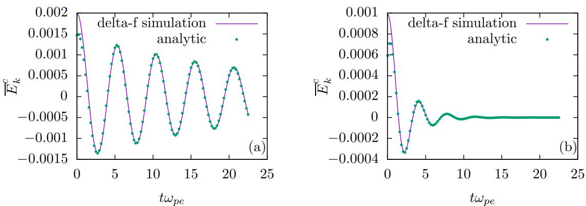  
Figure 4. Time evolution of the Fourier cosine component of the electrical eld $\overline { { E _ { k } ^ { ( c ) } } }$ for (a) $k = 8 \times 2 \pi / L$ and (b) $k = 1 6 \times 2 \pi / L$ . Initial value of the $\delta f$ is set as $\delta f = 0 . 0 0 1 \mathrm { s i n } ( k x ) \mathrm { e x p } ( - v ^ { 2 } / v _ { t } ^ { 2 } ) / \sqrt { \pi }$ . Parameters used in the $\delta f$ simulations are $d \bar { t } = 0 . 0 1 2 5$ , $L / \lambda _ { D } = 1 0 0$ , $d x / \lambda _ { D } = 0 . 2 5$ , and $N = 2 \times 1 0 ^ { 5 }$ . Uniform random sampling of the phase space is used. The difference between the linear and nonlinear $\delta f$ simulations is negligible and only linear $\delta f$ simulation results are plotted here. The analytic frequency and damping rate are obtained by numerically solving the electron ion relation, which is given by is the plasma dispersion functi $\begin{array} { r } { 1 + 2 \Big ( \frac { \omega _ { p } } { k v _ { t } } \Big ) ^ { 2 } [ 1 + \zeta Z ( \zeta ) ] = 0 } \end{array}$ ; where $\zeta = \omega / k v _ { t }$ , $v _ { t } = \sqrt { 2 T _ { e } / m _ { e } }$ , and Z() = 1 p RC e¡z ¡ d

The initial perturbation $\delta \bar { F }$ given by Eq. (123) are carried equally by the right-going and left-going particles. As a result of this, the electron plasma wave excited in the simulation is always a standing-wave (a standing wave is composed of two waves with the same frequency and wave-number but opposite propagation directions). Figure 5 plots the spatial structure of the electrical eld $\overline { { E } } _ { x }$ at four successive time, which clearly shows that the wave excited is a standing wave.

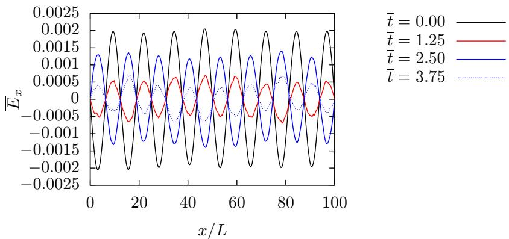  
Figure 5. Spatial structure of the electric eld at four successive time in the $\delta f$ simulation with the initial perturbation given by $\delta f = 0 . 0 0 1 \mathrm { c o s } ( k x ) \mathrm { e x p } ( - v ^ { 2 } / v _ { t } ^ { 2 } ) / \sqrt { \pi }$ with $k = 8 \times 2 \pi / L$ . Other parameters are $d \bar { t } = 0 . 0 1 2 5$ , $L / \lambda _ { D } = 1 0 0$ , and $d x / \lambda _ { D } = 0 . 2 5$ ; $N = 2 \times 1 0 ^ { 5 }$ markers with Maxwellian distribution in velocity and uniform distribution in space are loaded.

To excite a right-going wave, instead of a standing-wave, we can set the initial value of $\delta \overline { { F } }$ as

$$
\delta \overline { { F } } = \left\{ \begin{array} { l l l } { \hfill 2 \times \hfill 0 . 0 0 1 \sin ( k x ) \frac { 1 } { \sqrt { \pi } } \mathrm { e x p } \bigg ( - \frac { v _ { x } ^ { 2 } } { v _ { t } ^ { 2 } } \bigg ) , } & { \mathrm { f o r } } & { v _ { x } > 0 } \\ { \hfill 0 , } & { \hfill \mathrm { f o r } } & { v _ { x } < 0 } \end{array} . \right.
$$

This initial perturbation is not symmetric about $v _ { x }$ and thus will carry electric current. Unless otherwise specied, the remainder of this note will consider only the symmetrical perturbation of the form (123).

# 5.15 Methods of identifying resonant particles

Analytically, resonant particles are dened as those particles whose velocity is close to the phase-velocity of the wave. These particles are expected to exchange more energy with the waves compared with the non-resonant particles. Next, we examine the phase-space structure of $\delta F$ in order to nd a general way of identifying the resonant region in the phase-space. The initial phase-space structure of $\delta \overline { { F } }$ is plotted in Fig. 6a, which shows the uctuation in $x$ direction and Maxwellian distribution in $v _ { x }$ direction. Figure 6b plots the phase-space structure of $\delta \overline { { F } }$ at $t = 2 0 / \omega _ { p e }$ . It is not obvious what kind of useful information can be obtained from the figure. Note that lower velocity particles carry more perturbation than higher velocity particles because of the $\exp ( - v ^ { 2 } / v _ { t } ^ { 2 } )$ dependence in $\delta F$ . The dominant structure of $\delta F$ in the lower velocity region may blur the change of $\delta F$ in the higher velocity region. To make the change of $\delta F$ obvious, dene a new function $S ( v , x ) \equiv \delta \overline { { F } } / \left[ \exp ( - v ^ { 2 } / v _ { t } ^ { 2 } ) / \sqrt { \pi } \right]$ , which eliminate the initial variation of $\delta \overline { { F } }$ in $v _ { x }$ direction. Figure 7 plots the contour of $S ( v , x )$ in phase space $( x , v )$ at $t = 0$ and $t = 2 0 / \omega _ { p e }$ , which shows that there are peaks developing near $v \approx \pm 2 . 4 4$ at $t = 2 0 / \omega _ { p e }$ . The location of the peaks of $S$ in the phase-space, $v \approx \pm 2 . 4 4$ , is very near the phase-velocity of the wave excited in the simulation $( v _ { p } /$ $v _ { t } = \omega / k v _ { t } = \pm 2 . 4 4 )$ . Therefore, the peaks of $S$ prove to be a good indication of the resonant region.

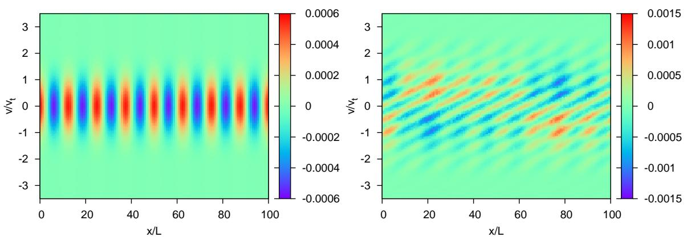  
Figure 6. Contour of $\delta \overline { { F } }$ in phase-space $( x , v )$ at $t = 0$ (left gure) and $t = 2 0 / \omega _ { p e }$ (right gure) in the $\delta f$ simulation with uniform sampling of phase-space.. Initial value of $\delta \overline { { F } }$ is set as $\delta \overline { { F } } = 0 . 0 0 1 \mathrm { c o s } ( k x ) \mathrm { e x p } ( - v ^ { 2 } / v _ { t } ^ { 2 } ) / \sqrt { \pi }$ with $k = 8 \times$ $2 \pi / L$ .

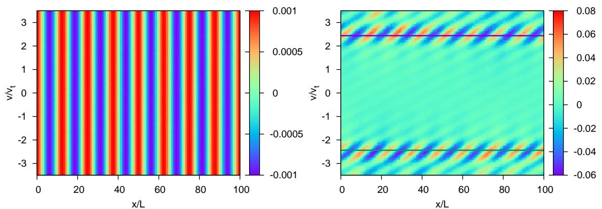  
Figure 7. Contour of $S ( x , v _ { x } ) \equiv \delta \overline { { F } } / \left[ \exp ( - v ^ { 2 } / v _ { t } ^ { 2 } ) / \sqrt { \pi } \right]$ at $t = 0$ (left gure) and $t = 2 0 / \omega _ { p e }$ (right gure) in the $\delta f$ simulation with uniform sampling of phase-space. Initial value of $\delta \bar { F }$ is set as $\delta \overline { { F } } = 0 . 0 0 1 \mathrm { c o s } ( k x ) \mathrm { e x p } ( - v ^ { 2 } / v _ { t } ^ { 2 } ) / \sqrt { \pi }$ with $k = 8 \times 2 \pi / L$ . The solid lines on the gure indicate the phase-velocity of the wave excited in the simulation $( v _ { p } / v _ { t } = \omega / k v _ { t } = \pm 2 . 4 4 )$ . Other parameters used in the simulation are $d \bar { t } = 0 . 0 1 2 5$ , $L / \lambda _ { D } = 1 0 0$ , $d x / \lambda _ { D } = 0 . 2 5$ , $N =$ $2 \times 1 0 ^ { 5 }$ , and $\left[ v _ { \operatorname* { m i n } } / v _ { t } , v _ { \operatorname* { m a x } } / v _ { t } \right] = [ - 3 . 5 , + 3 . 5 ]$ .

We select the top 500 markers that have large variation in $\delta f / \left[ \exp ( - v ^ { 2 } / v _ { t } ^ { 2 } ) / \sqrt { \pi } \right]$ and then compare their velocity with the phase-velocity of the wave. The results are plotted in Fig. 8, which conrms that these velocities are close to the phase-velocity of the wave. Note that, since the wave excited in the simulation is a standing-wave, which has two opposite phase-velocities, the corresponding resonant velocity also have two opposite values.

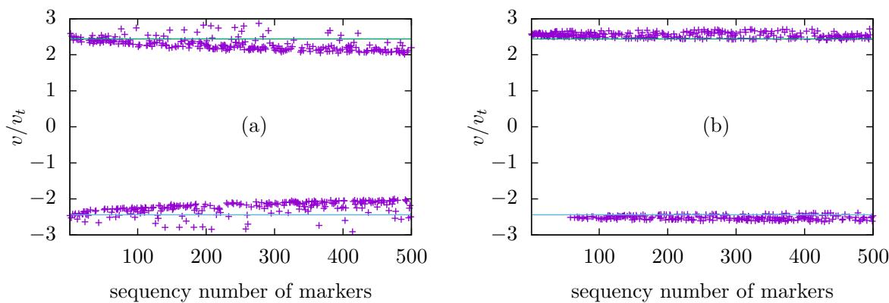  
Figure 8. Velocity of the top 500 particles that have large variation in $\delta f / [ \exp ( - { v ^ { 2 } } / { v _ { t } ^ { 2 } } ) / { \sqrt { \pi } } ]$ between $t = 0$ and $t =$ $2 0 / \omega _ { p e }$ in the $\delta f$ simulation with Maxwellian velocity sampling (a) and uniform velocity sampling (b). Initial value of the $\delta f$ is set as $\delta f = 0 . 0 0 1 \mathrm { c o s } ( k x ) \mathrm { e x p } ( - v ^ { 2 } / v _ { t } ^ { 2 } ) / \sqrt { \pi }$ with $k = 8 \times 2 \pi / L$ . The markers are ordered according to their magnitude of the variation in $\delta f / \left[ \exp \left( - v ^ { 2 } / v _ { t } ^ { 2 } \right) / \sqrt { \pi } \right]$ . The rst marker has the largest variation. The solid lines on the gure indicate the phase-velocity of the wave excited in the simulation $\left( v _ { p } / v _ { t } = \omega / k v _ { t } = \pm 2 . 4 4 \right)$ . Other parameters used in the simulation are $d t = 0 . 0 1 2 5$ , $L / \lambda _ { D } = 1 0 0$ , $d x / \lambda _ { D } = 0 . 2 5$ , $N = 2 \times 1 0 ^ { 5 }$ , and $\left[ v _ { \operatorname* { m i n } } / v _ { t } , v _ { \operatorname* { m a x } } / v _ { t } \right] = [ - 3 . 5 , +$ 3.5]; spatial sampling is uniform.

There is difference between Fig. 8a and Fig. 8b, which arises from the different sampling of the velocity space. In Fig. 8b, we note that the top 50 resonant particles all have positive velocity, which is nonphysical because there is no preferred direction in the system with a standing wave and symmetric velocity distribution.

# 5.16 Energy conservation (check!)

Next we check how well the total energy of the system is conserved in a total-f simulation. The total physical particles in the system is given by

$$
N _ { s } { = } \sum _ { j { = 0 } } ^ { N _ { p } } w _ { j } ,
$$

The spatial volume occupied by these physical particles is given by $V = N _ { s } / n _ { 0 }$ , where $n _ { 0 }$ is the equilibrium electron number density. Since the length along the $x$ direction of the system is $L$ , the cross section $S _ { y z }$ of volume occupied by these physical particles is given by

$$
S _ { y z } = \frac { V } { L } = \frac { \sum _ { j = 0 } ^ { N _ { p } } w _ { j } } { L n _ { 0 } } .
$$

Then the total electrical energy in the volume is given by

$$
W _ { E } = S _ { y z } \int _ { 0 } ^ { L _ { x } } \frac { 1 } { 2 } \varepsilon _ { 0 } E ^ { 2 } d x \approx S _ { y z } \sum _ { i = 1 } ^ { n } \frac { 1 } { 2 } \varepsilon _ { 0 } E ^ { 2 } ( x _ { i } ) \Delta
$$

Dene $W _ { 0 } = ( m v _ { 0 } ^ { 2 } / 2 ) \Sigma w _ { j }$ , and the normalized electric energy $\overline { { W } } _ { E } = W _ { E } / W _ { 0 }$ , which can be further written as

$$
\overline { { W _ { E } } } = \frac { \sum _ { j = 0 } ^ { N } w _ { j } } { n _ { e 0 } L } \frac { \sum _ { i = 1 } ^ { n } \frac { 1 } { 2 } \varepsilon _ { 0 } E ^ { 2 } ( x _ { i } ) \Delta } { \left( m v _ { 0 } ^ { 2 } / 2 \right) \sum w _ { j } } = \frac { \sum _ { i = 1 } ^ { n } \frac { 1 } { 2 } \varepsilon _ { 0 } E ^ { 2 } ( x _ { i } ) d x } { n _ { e 0 } L ( m v _ { 0 } ^ { 2 } / 2 ) } = \frac { \sum _ { i = 1 } ^ { n } \frac { 1 } { 2 } \varepsilon _ { 0 } \overline { { E _ { i } ^ { 2 } } } d x } { n _ { e 0 } L ( m v _ { 0 } ^ { 2 } / 2 ) } \bigg ( \frac { m v _ { 0 } ^ { 2 } } { e \lambda _ { D } } \bigg ) ^ { 2 } = \frac { \sum _ { i = 1 } ^ { n } \overline { { E _ { i } ^ { 2 } } } d \overline { { x } } } { L } .
$$

The total particle kinetic energy in the system is given by

$$
W _ { k } = \sum _ { j = 0 } ^ { N _ { p } } w _ { j } \frac { 1 } { 2 } m v _ { j } ^ { 2 } .
$$

Dene the normalized kinetic energy $\overline { { W } } _ { k } = W _ { k } / W _ { 0 }$ , which can be further written as

$$
\overline { { W } } _ { k } = \frac { \sum _ { j = 0 } ^ { N } w _ { j } \frac { 1 } { 2 } m v _ { j } ^ { 2 } } { ( m v _ { 0 } ^ { 2 } / 2 ) \sum w _ { j } } { = } \frac { \sum _ { j = 0 } ^ { N } w _ { j } \overline { { v } } _ { j } ^ { 2 } } { \sum w _ { j } } .
$$

Figure 9 plots the time evolution of $\bar { W } _ { E }$ , $\overline { { W } } _ { k } - \overline { { W } } _ { k } ( t = 0 )$ , and $\overline { { W _ { k } } } + \overline { { W _ { E } } } - \overline { { W _ { k } } } ( t = 0 )$ , which indicates the total energy is approximately conserved.

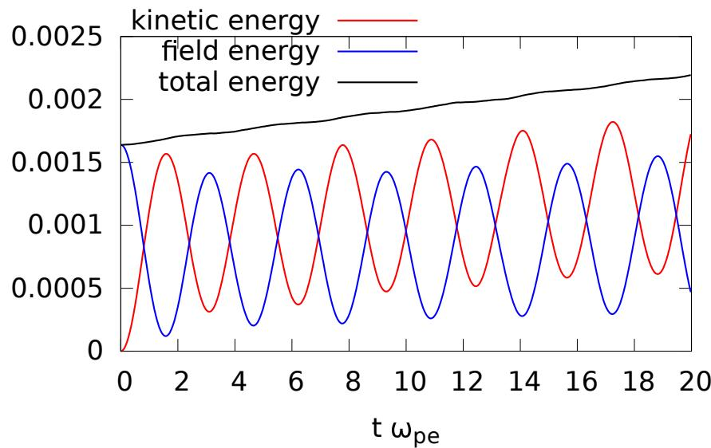  
Figure 9. Time evolution of the electric energy $\bar { W } _ { E }$ , kinetic energy $\overline { { W _ { k } } }$ , and total energy $\overline { { W } } _ { k } + \overline { { W } } _ { E } - \overline { { W } } _ { k } ( t = 0 )$ . $\overline { { W } } _ { k } ( t = 0 ) = 0 . 9 9 9 1$ . Full-f simulation without imposing external perturbation.

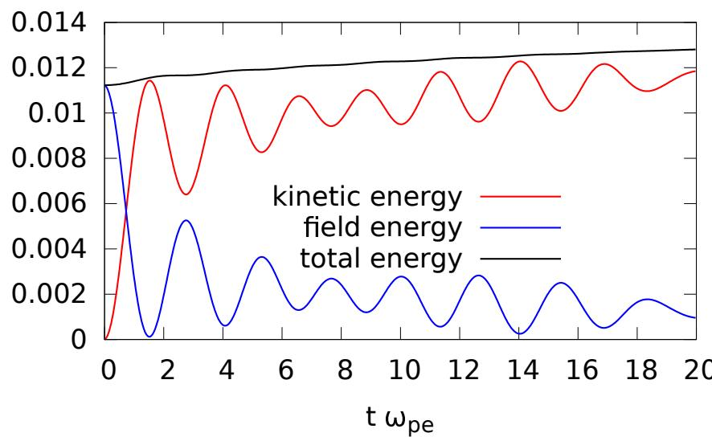  
Figure 10. Time evolution of the electric energy $\bar { W } _ { E }$ , kinetic energy $\textstyle \overline { { W _ { k } } }$ , and total energy $\overline { { W } } _ { k } + \overline { { W } } _ { E } - \overline { { W } } _ { k } ( t = 0 )$ . Full-f simulation with perturbation $w _ { j } \longrightarrow w _ { j } + 0 . 0 5 w _ { j } \mathrm { s i n } ( k r _ { j } )$

# 5.17 Numerical results for two-stream instability

Choose an equilibrium distribution function $F _ { 0 } ( x , v _ { x } )$ of the following form:

$$
F _ { 0 } ( x , v _ { x } ) = F _ { 0 } ( v _ { x } ) = \frac { n _ { e 0 } } { 2 } \Bigg \{ \frac { 1 } { \sqrt { 2 \pi } v _ { t } } \exp \Bigg ( - \frac { ( v - v _ { b } ) ^ { 2 } } { 2 v _ { t } ^ { 2 } } \Bigg ) + \frac { 1 } { \sqrt { 2 \pi } v _ { t } } \exp \Bigg ( - \frac { ( v + v _ { b } ) ^ { 2 } } { 2 v _ { t } ^ { 2 } } \Bigg ) \Bigg \} ,
$$

where $n _ { e 0 }$ is a constant which is chosen so that $n _ { e 0 } = n _ { \mathrm { i o n } }$ . It is obvious that this initial condition corresponds to an equilibrium state. It is well-known that when $v _ { b } > v _ { t }$ , this equilibrium is unstable to an instability called the two-stream instability, which destroys the equilibrium state. In practice, the numerical noise associated with the PIC method is usually large enough to provide the initial perturbation to make this instability grow up. Thus, to see the instability, we usually do not need to manually impose any perturbation to the equilibrium. Figure 11 plots the distribution of the electron makers in the phase space $( x , v )$ at $t = 0$ and $\bar { t } = 1 7 . 5$ in a full-f simulation. Every particle marker appears as a black dot on Figure 11. Note that, since this is a full- $f$ simulation and the markers are loaded according to the initial distribution function, statistical weights of all the marker are equal to each other and remain constant during the time evolution. Therefore more markers means more real particles. And since every particle marker appears as a black dot on Figure 11, region with denser markers appears blacker. Thus the graphics in Figure 11 can be considered as contour plots of the distribution function with the brightness indicating the value (blacker meaning higher value).

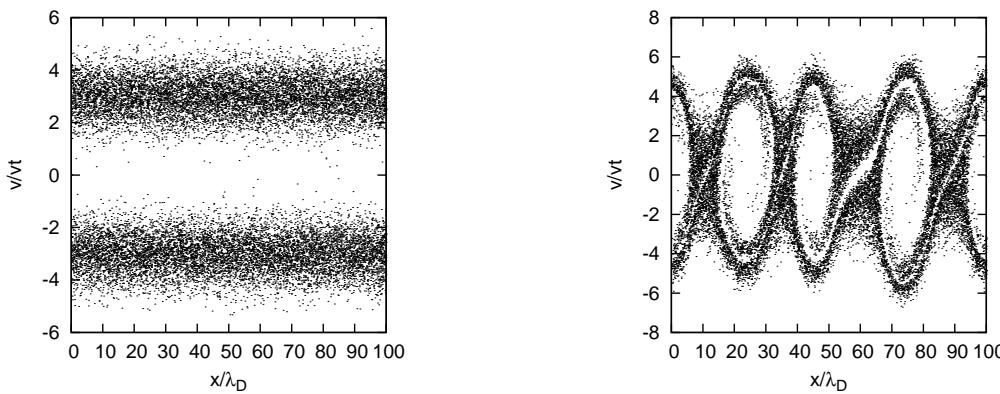  
Figure 11. Electron distribution function in the phase-space evaluated at $t = 0$ and $\bar { t } = 1 7 . 5$ for a one-dimensional electrostatic simulation of the two-stream instability performed with $N _ { \mathrm { l o a d e d } } = 2 \times 1 0 ^ { 4 }$ , $N = 1 0 2 4$ , $L / \lambda _ { D } = 1 0 0$ , $v _ { b } /$ $v _ { t } = 3$ , and $\delta t \omega _ { p } = 0 . 1$ .

to be continued.

My Fortran code solving the two-stream instability problem is in the directory /home/yj/project_new/pic_full-f/ of my computer.

# 6 Summary

In summary, PIC = random sample of phase space (Monte-Carlo integration) $^ +$ particle spatial shape + eld solver $^ +$ characteristics (particle orbits) and/or marker's weight integrator.

# 7 Random number

# 7.1 Uniformly distributed random number

Generating random numbers that are uniform distributed in the range [0; 1] is the basis for generating non-uniform distribution. Because the same program with the same input always produces the same output, it is not possible to write a program that produces truly random numbers. However, for most purposes, a pseudo-random number sequence will work almost as well. By pseudo-random number, we mean a repeatable sequence of numbers that has statistical properties similar to a random sequence. The most well-known algorithm for generating pseudo-random sequences of integers is the linear congruental method[4], in which the $n$ th and $( n + 1 ) \mathrm { t h }$ integers in the sequence is related by

$$
I _ { n + 1 } { = } \mathrm { M o d } ( A I _ { n } + C , M ) ,
$$

where Mod is the remainder function, $A , C$ , and $M$ are positive integer constants. The rst number in the sequence, which is called the seed value, is selected by users. Equation (132) can generate pseudo-random number that is uniform distributed in the range $[ 0 , M - 1 ]$ . The obtained sequence can be scaled by a factor of $M - 1$ to lie in the range [0; 1]. Figure 12 plots the possibility density of $1 0 ^ { 6 }$ values returned by Eq. (132) with parameters $A = 1 6 8 0 7 , C = 0$ , $M = 2 1 4 7 4 8 3 6 4 7$ (this choice is called the Park and Miller method). In practice we need to use Schrange's algorithm to avoid integer overow[4].

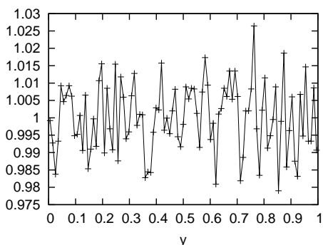  
Figure 12. The distribution of the $1 0 ^ { 6 }$ values returned by the the random number generator Eq. (132). The possibility density (value of the distribution function) is obtained by the following steps: (1) divide the range [0; 1] into 100 sub-regions; (2) then counts respectively the number of the returned value whose values are in the sub-regions; (3) the numbers of value in each sub-region obtained this way is further divided by the total number of values (106) to give the relativistic possibilities; (4) scale the relativistic possibilities by 100 times, which gives the exact possibility density (this scaling is needed because the sub-region is of length $1 / 1 0 0$ , instead of unit length). Note that the value of the possibility density can be larger than one.

Another way to visualize whether the values generated by the random generator are random distributed in the region $[ 0 , 1 ]$ is to view how the points $( x _ { j } , x _ { j + 1 } )$ are distributed in the two-dimension plane, as is plotted in Fig. 13.

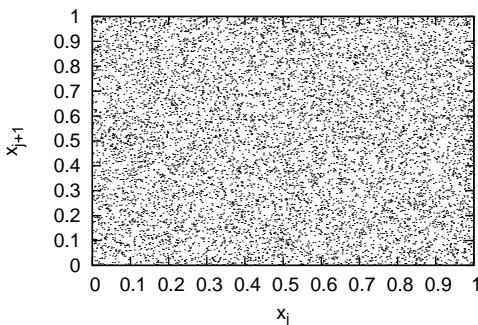  
Figure 13. Plot of $x _ { j }$ verse $x _ { j + 1 }$ for $j = 1 , 2 , . . . , 1 0 ^ { 4 }$ . Here $x _ { j }$ are random numbers generated by the random number generator.

# 7.2 Non-uniformly distributed random number

Consider the problem of generating random numbers that are distributed according to some kind of nonuniform distribution function. There are two methods of generating non-uniformly distributed random numbers satisfying a given distribution function, namely, the transformation method and the rejection method[4]. Let us examine these two methods in turn.

# 7.2.1 Transformation method

Suppose there are two random variables $y$ and $x$ that are related to each other by $y = f ( x )$ . If the probability density of $x$ , $P _ { x } ( x )$ , is known, how do we calculate the probability of the random variable $y$ ? Using the probability conservation, i.e,

$$
\begin{array} { r } { P _ { y } ( y ) | d y | = P _ { x } ( x ) | d x | , } \end{array}
$$

we obtain

$$
P _ { y } ( y ) = { \frac { P _ { x } ( x ) } { | f ^ { \prime } ( x ) | } } ,
$$

which gives the relation between $P _ { y } ( y )$ and $P ( x )$ . Next, consider the inverse problem of the above, i.e., if we want to generate non-uniform distribute random numbers $y$ with probability density being $P _ { y } ( y )$ from a uniformly distributed random variables $x$ , how do we choose the function $f ( x )$ ? In this case, $P ( x ) = 1$ and Eq. (134) is written

$$
P _ { y } ( f ( x ) ) = { \frac { 1 } { | f ^ { \prime } ( x ) | } } ,
$$

which can be solved to give $f ( x )$ . For a general function $P _ { y } ( y )$ , Eq. (135) can not be solved analytically. For the special case $P _ { y } ( y ) = e ^ { - y }$ (Poisson distribution), we nd that $f ( x ) = - \ln x$ solves Eq. (135). Therefore, we can generate Poisson distribution by the following Fortran codes:

call random_number(x) !generate uniformly distributed random numbers in [0:1] $\scriptstyle \mathbf { y } = - \mathbf { 1 } \circ \mathbf { g } \left( \mathbf { x } \right)$

The transformation method requires dierential function $f ( x )$ be known, which is not always practical for a general probability density $P _ { y } ( y )$ . In such cases, we can use the rejection method discussed next.

# 7.2.2 Rejection method

Suppose that we want to generate non-uniformly distributed random numbers between $x _ { \mathrm { m i n } }$ and $x _ { \mathrm { m a x } }$ that satisfy a given probability density $P ( x )$ . To achieve this, we rst generate a uniform random number $x t$ between $x _ { \mathrm { m i n } }$ and $x _ { \mathrm { m a x } }$ . Then we generate another uniform random number $y$ between 0 and $P _ { \mathrm { m a x } }$ , where $P _ { \mathrm { m a x } }$ are the maximal values of $P ( x )$ for $x \in [ x _ { \mathrm { m i n } } , x _ { \mathrm { m a x } } ]$ . If $P ( x _ { t } ) > y$ then, $x _ { t }$ is kept as a desired random number, otherwise $x t$ is discarded. Repeat this process, then all the random numbers kept will satisfy the probability density $P ( x )$ (need thinking why, to be proved). This method is called the rejection method. It is obvious how the rejection method generalizes to multiple-dimensional cases.

# 7.2.3 Numerical examples

The one-dimensional Gaussian distribution is given by

$$
P ( y ) = \frac { 1 } { \sqrt { 2 \pi } \sigma } \mathrm { e x p } \biggl ( - \frac { ( y - \bar { y } ) ^ { 2 } } { 2 \sigma ^ { 2 } } \biggr ) .
$$

Figure 14 compares the possibility density of the $1 0 ^ { 6 }$ numbers generated by the numerical code with that of the analytic form in Eq. (136), which indicates that the numerical result agrees well with the analytic one.

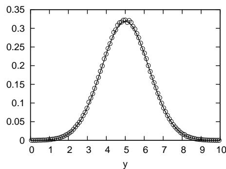  
Figure 14. The distribution of the $1 0 ^ { 6 }$ values returned by the the Gaussian distribution generator (using the rejection method) with the parameters $\overline { { y } } = 5 . 0$ and $\sigma = 1 . 2 5$ . The possibility density (value of the distribution function) is obtained as follows: (1) divide the range [0; 10] into 100 sub-regions (2) then counts respectively the number of the returned value whose values are in the sub-regions (3) the numbers of value in each sub-region obtained this way is further divided by the total number of values $( 1 0 ^ { 6 } )$ to give the relativistic possibilities. (4) scale the relativistic possibilities by 10 times, which gives the exact possibility density (this scaling is needed because the sub-region is of length $1 / 1 0$ , instead of unit length). The solid line in the gure is the value obtained by evaluating Eq. (136). The results indicates that the distribution returned by the Gaussian generator agrees well with the desired theoretic one.

Figure 15 is a plot of $x _ { j }$ verse $x _ { j + 1 }$ for $j = 1 , 2 , . . . , 1 0 ^ { 4 }$ , which shows how the points $( x _ { j } , x _ { j + 1 } )$ are distributed in the two-dimension plane.

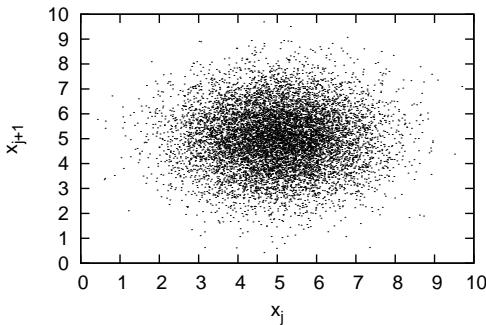  
Figure 15. Plot of $x _ { j }$ verse $x _ { j + 1 }$ for $j = 1 , 2 , . . . , 1 0 ^ { 4 }$ . Here $x _ { j }$ are random numbers generated by the Gaussian distribution generator.

# 8 On the noise of PIC simulation

My comments on the accuracy of the PIC method: The PIC method is more accurate than the semi-Lagrangian continuous method because the PIC method uses the Monte-Carlo method to evaluate the high-dimension phase-space integral, which is more accurate than the corresponding methods used in the semi-Lagrangian algorithm, which uses traditional regular-grids based methods to evaluate the phase space integral.

$^ { * * }$ wrong or unclear $\ast \ast$ Because of the discrete representation of continuous media (a marker representing many physical particles), the PIC method usually gives rise to considerable uctuations in the solution $^ { * * }$ . At present, I do not fully understand why PIC approach gives rise to numerical noise while the continuum approach does not seem to have this problem. $= = >$ Update: I think now I understand the reason: The uctuation in the number of sampling points per spatial cell gives rise to the noise in the results. However, this noisy result is not necessarily less accurate than a smooth result (a bigger error may be hidden in a smooth result).

# 8.1 Choices of sampling probability function

The probability density function used in making the phase-space sampling can be any reasonable function, which can be chosen to obtain desired resolution of the phase-space. The most intuitive way of sampling the phase-space is to sample it using the uniform probability density function, i.e., $p ( \mathbf { Z } ) = 1 / V$ , where $V$ is the total volume of the phase space. Another frequently used sampling scheme is to load particle markers according to the initial total distribution function of the physical particles. In this case $P ( \mathbf { Z } ) =$ $f _ { \mathrm { t o t } } ( { \mathbf Z } ) / N _ { s }$ , where $N _ { s }$ is the total number of physical particles, i.e., $\begin{array} { r } { \int _ { V } f _ { \mathrm { t o t } } ( \mathbf { Z } ) d \Gamma = N _ { s } } \end{array}$ . (The method of generating random markers that satises a given probability density function is discussed in Sec. 7.)

# 9 Finite element theory of particle-in-cell method

Because of the use of nite-size shape, PIC method can also be considered as a kind of nite element method[7].

# 9.1 Finite element expansion of distribution function

$$
f = \sum _ { p } f _ { p } ( x , v , t )
$$

$$
f _ { p } ( x , v , t ) = N _ { p } S _ { x } ( x - x _ { p } ) S _ { v } ( v - v _ { p } )
$$

where $N _ { p }$ , $x _ { p }$ , and $v _ { p }$ are functions of only time $t$ and are independent of $x$ and $v$ .

# 9.2 Basis functions: particle shape

# 9.3 Moment equations

$$
\begin{array} { c c } { { } } & { { \displaystyle \frac { \partial f } { \partial t } + v \frac { \partial f } { \partial x } + \frac { q _ { s } } { m _ { s } } E \frac { \partial f } { \partial v } = 0 , } } & { { ( 1 3 ) } } \\ { { } } & { { } } \\ { { \displaystyle \sum _ { p } \left( \frac { \partial N _ { p } S _ { x } ( x - x _ { p } ) S _ { v } ( v - v _ { p } ) } { \partial t } + v \frac { \partial N _ { p } S _ { x } ( x - x _ { p } ) S _ { v } ( v - v _ { p } ) } { \partial x } + \frac { q _ { s } } { m _ { s } } E \frac { \partial N _ { p } S _ { x } ( x - x _ { p } ) S _ { v } ( v - v _ { p } ) } { \partial v } \right) = 0 , } } & { { ( 1 3 ) \equiv P ( \mathrm { k g } , S _ { p } ) . } } \end{array}
$$

$$
\begin{array} { r l } & { f = f _ { 0 } + \delta f } \\ & { \frac { d \delta f } { d t } - \frac { d f _ { 0 } } { d t } } \\ & { \frac { d \delta f / f } { d t } - \frac { 1 } { f } \frac { d f _ { 0 } } { d t } } \\ & { \frac { d \delta f / f } { d t } - \frac { f _ { 0 } } { f } \frac { 1 } { f _ { 0 } } \frac { d f _ { 0 } } { d t } } \\ & { \frac { d w } { d t } = - \frac { f - \delta f } { f } \frac { 1 } { f _ { 0 } } \frac { d f _ { 0 } } { d t } } \\ & { \frac { d w } { d t } - ( 1 - w ) \frac { 1 } { f _ { 0 } } \frac { d f _ { 0 } } { d t } } \end{array}
$$

to be deleted

# Appendix A From discrete microscopic distribution function to statistic (continuum) distribution function

A plasma can be considered to be composed of a set of classical point particles, with motion subject to Newton's equations and with the Lorentz forces and electromagnetic eld derived from Maxwell's equations. Because of the huge number of particles in a plasma, the above microscopic representation is intractable, and simplications must be sought[8].

A usual procedure is to approximate the set of particles by a continuum distribution function. This step involves some kind of averaging procedure to remove certain spatial and temporal frequencies that are associated with the graininess of the particle description (particle corelations, i.e., collisions). It is important to note that approximation is introduced in passing from the microscopic particle representation to the continuum distribution function.

The averaging procedure involves a small parameter, the so-called plasma parameter, which is the inverse of the number of particles contained in a Debye sphere. The collisionless Boltzmann equation, also known as the Vlasov equation, emerges from the averaging procedure as the approximation at zero order in the plasma parameter. What is discarded in the the zeroth order approximation is the so-called collisional eects. In the rst order approximation, there appear additional terms, which is a representation of the Coulomb collision eects.

The discrete microscopic distribution function (Klimontovich-Dupree distribution function) (Chapter 3 in Nicholson (1983)) is written as

$$
F _ { \alpha } ^ { M } ( \mathbf { x } , \mathbf { v } , t ) = \sum _ { p _ { \alpha } = 1 } ^ { N _ { \alpha } } \delta _ { x } ^ { 3 } ( \mathbf { x } - \mathbf { x } _ { p _ { a } } ) \delta _ { v } ^ { 3 } ( \mathbf { v } - \mathbf { v } _ { p _ { \alpha } } ) .
$$

Then the partial time derivative of $F _ { \alpha } ^ { M }$ is written as

$$
\begin{array} { r l r } { \displaystyle \frac { \partial F _ { \alpha } ^ { M } ( { \bf x } , { \bf v } , t ) } { \partial t } } & { = } & { \displaystyle \sum _ { p _ { \alpha } = 1 } ^ { N _ { \alpha } } \delta _ { v } ^ { 3 } ( { \bf v } - { \bf v } _ { p \alpha } ) \frac { \partial } { \partial t } \delta _ { x } ^ { 3 } ( { \bf x } - { \bf x } _ { p \alpha } ) + \displaystyle \sum _ { p _ { \alpha } = 1 } ^ { N _ { \alpha } } \delta _ { x } ^ { 3 } ( { \bf x } - { \bf x } _ { p \alpha } ) \frac { \partial } { \partial t } \delta _ { v } ^ { 3 } ( { \bf v } - { \bf v } _ { p \alpha } ) } \\ & { = } & { - \displaystyle \sum _ { p _ { \alpha } = 1 } ^ { N _ { \alpha } } \delta _ { v } ^ { 3 } ( { \bf v } - { \bf v } _ { p \alpha } ) \frac { \partial { \bf x } _ { p _ { \alpha } } } { \partial t } . \nabla _ { \bf x } [ \delta _ { x } ^ { 3 } ( { \bf x } - { \bf x } _ { p \alpha } ) ] - \displaystyle \sum _ { p _ { \alpha } = 1 } ^ { N _ { \alpha } } \delta _ { x } ^ { 3 } ( { \bf x } - { \bf x } _ { p \alpha } ) \frac { \partial { \bf y } _ { p \alpha } } { \partial t } . \nabla _ { \bf v } \delta _ { v } ^ { 3 } ( { \bf v } - { \bf v } _ { p \alpha } ) } \\ & { = } &  - \displaystyle \sum _ { p _ { \alpha } = 1 } ^ { N _ { \alpha } } \delta _ { v } ^ { 3 } ( { \bf v } - { \bf v } _ { p \alpha } ) { \bf v } _ { p \alpha } \cdot \nabla _ { \bf x } [ \delta _ { x } ^ { 3 } ( { \bf x } - { \bf x } _ { p \alpha } ) ] - \displaystyle \sum _ { p _ { \alpha } = 1 } ^ { N _ { \alpha } } \delta _ { x } ^ { 3 } ( { \bf x } - { \bf x } _ { p \alpha } ) \frac { \partial } { \partial t } [ { \bf E } ^ \end{array}
$$

Using the property of the Dirac delta function:

$$
a \delta ( a - b ) = b \delta ( a - b )
$$

expression (149) is written as

$$
\begin{array} { r l r } { \frac { \mathsf { \partial } \mathsf { U } ( \mathbf { x } , \mathbf { v } , t ) } { \partial t } } & { = } & { - \displaystyle \sum _ { p _ { \alpha } = 1 } ^ { N _ { \alpha } } \delta _ { v } ^ { 3 } ( \mathbf { v } - \mathbf { v } _ { p _ { \alpha } } ) \mathbf { v } \cdot \nabla _ { \mathbf { x } } [ \delta _ { x } ^ { 3 } ( \mathbf { x } - \mathbf { x } _ { p _ { \alpha } } ) ] - \displaystyle \sum _ { p _ { \alpha } = 1 } ^ { N _ { \alpha } } \delta _ { x } ^ { 3 } ( \mathbf { x } - \mathbf { x } _ { p _ { \alpha } } ) \frac { q _ { \alpha } } { m _ { \alpha } } [ \mathbf { E } ^ { M } ( \mathbf { x } ) + \mathbf { v } \times \mathbf { B } ^ { M } ( \mathbf { x } ) ] \ . } \\ & { } & { \nabla _ { v } \delta _ { v } ^ { 3 } ( \mathbf { v } - \mathbf { v } _ { p _ { \alpha } } ) } \\ & { = } & { - \mathbf { v } \cdot \nabla _ { \mathbf { x } } \displaystyle \sum _ { p _ { \alpha } = 1 } ^ { N _ { \alpha } } \delta _ { v } ^ { 3 } ( \mathbf { v } - \mathbf { v } _ { p _ { \alpha } } ) [ \delta _ { x } ^ { 3 } ( \mathbf { x } - \mathbf { x } _ { p _ { \alpha } } ) ] - \displaystyle \frac { q _ { \alpha } } { m _ { \alpha } } [ \mathbf { E } ^ { M } ( \mathbf { x } ) + \mathbf { v } \times \mathbf { B } ^ { M } ( \mathbf { x } ) ] \cdot \nabla _ { \mathbf { v } } \displaystyle \sum _ { p _ { \alpha } = 1 } ^ { N _ { \alpha } } \delta _ { x } ^ { 3 } ( \mathbf { x } - \mathbf { v } _ { p _ { \alpha } } ) } \\ & { } & { \mathbf { x } _ { p _ { \alpha } } ) \delta _ { v } ^ { 3 } ( \mathbf { v } - \mathbf { v } _ { p _ { \alpha } } ) } \\ & { } & { = } &  - \mathbf { v } \cdot F _ { \alpha } ^ { M } - \displaystyle \frac  q _  \end{array}
$$

i.e.,

$$
\frac { \partial F _ { \alpha } ^ { M } ( \mathbf x , \mathbf v , t ) } { \partial t } + \mathbf v \cdot F _ { \alpha } ^ { M } + \frac { q _ { \alpha } } { m _ { \alpha } } [ \mathbf E ^ { M } ( \mathbf x ) + \mathbf v \times \mathbf B ^ { M } ( \mathbf x ) ] \cdot \nabla _ { \mathbf v } F _ { \alpha } ^ { M } = 0
$$

This is the Klimontovich equation of the microscopic distribution function.

Note that Boltzmann equation provide a mesoscopic rather than a microscopic description because of the spatio-temporal averaging involved in deriving the Boltzmann equation

The particle-in-cell (PIC) method has obvious structural similarities to a direct simulation of the microscopic model of the plasma outlined above, but this is essentially misleading: Particle-in-cell simulation should be understood to be a Monte Carlo solution of the Boltzmann equation (or the Vlasov equation), i.e., the PIC method is solving a continuum mesoscopic kinetic equation rather than the primitive microscopic model of a plasma.

two things that reduce collision: (1) nite-size particle used in doing the deposition and force iterpolation and (2) nite grid size used in solving the eld equation.

The nearest grid point deposition and force interpolation correspond zero sized particle, i.e., delta function

$$
S ( x ) = \frac { 1 } { \Delta x } \delta \Bigl ( \frac { x } { \Delta x } \Bigr ) .
$$

# Bibliography

[1] S.J. Allfrey and R. Hatzky. A revised delta-f algorithm for nonlinear pic simulation. Computer Physics Communications, 154(2):98  104, 2003.   
[2] A. Y. Aydemir. A unied monte carlo interpretation of particle simulations and applications to non-neutral plasmas. Physics of Plasmas, 1(4):822831, 1994.   
[3] Yang Chen and Roscoe B. White. Collisional delta-f method. Physics of Plasmas, 4(10):35913598, 1997.   
[4] Richard Fitzpatrick. Computational Physics:An introductory course. Richard Fitzpatrick, 2004.   
[5] D. A. Gurnett and A. Bhattacharjee. Introduction to plasma physics : with space and laboratory applications. Cambridge University Press, Cambridge, UK, 2004.   
[6] Piet Hut and Jun Makino. http://www.artcompsci.org/vol1/v1web/node34.html. Online, 2012.   
[7] Giovanni Lapenta. Particle In Cell Methods With Application to Simulations in Space Weather . Online, 2012.   
[8] M. M. Turner. Kinetic properties of particle-in-cell simulations compromised by monte carlo collisions. Physics of Plasmas, 13(3):033506, 2006.