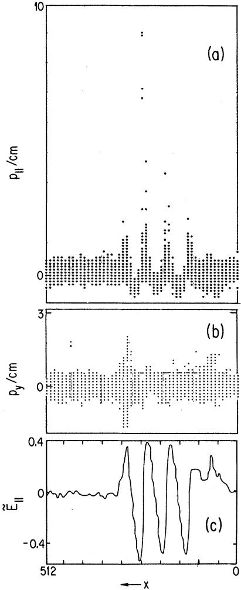
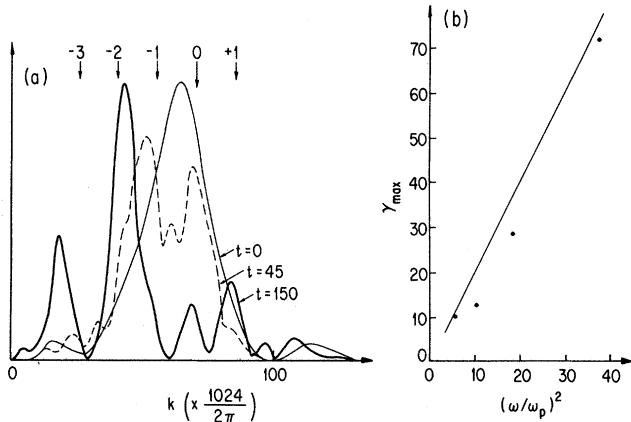

# Laser Electron Accelerator

T.Tajima and J.M.Dawson Department of Physics， University of California， Los Angeles， California 90024 (Received 9 March 1979)

An intense electromagnetic pulse can create a weak of plasma oscillations through the action of the nonlinear ponderomotive force. Electrons trapped in the wake can be accelerated to high energy. Existing glass lasers of power density $\mathbf { 1 0 ^ { i 8 } W / c m ^ { 2 } }$ shone on plas-mas of densities $1 0 ^ { 1 8 } \mathrm { c m } ^ { - 3 }$ can yield gigaelectronvolts of electron energy per centimeter of acceleration distance. This acceleration mechanism is demonstrated through computer simulation. Applications to accelerators and pulsers are examined.

Collective plasma accelerators have recently received considerable theoretical and experimental investigation。Earlier Fermi' and McMil-$\bf { l a n } ^ { 2 }$ considered cosmic-ray particle acceleration by moving magnetic fields1 or electromagnetic waves.² In terms of the realizable laboratory technology for collective accelerators, present-day electron beams? yield electric fields of $\bf { \sim } 1 0 ^ { 7 } ~ V / c m$ and power densities of $\mathbf { 1 0 ^ { 1 3 } \ W / c m ^ { 2 } }$ On the other hand,the glass laser technology is capable of delivering a power density of $1 0 ^ { 1 8 } \mathrm { W / }$ $\mathrm { c m } ^ { 2 }$ ，and,as we shall see,an electric field of $1 0 ^ { 9 } \mathrm { V / c m }$ . We propose a mechanism for utilizing this high-power electromagnetic radiation from lasers to accelerate electrons to high energies in a short distance. The details of this mechanism are examined through the use of computer simulation。 Meanwhile,there have been a few works for particle acceleration using lasers. Chan4 considered electron acceleration of the order of 40 MeV with comoving relativistic electron beam and laser light.Palmer discussec an electron accelerator with lasers going through a helical magnetic field. Willis proposed a positive-ion accelerator with a relativistic electron beam modulated by laser light.

A wave packet of electromagnetic radiation (photons) injected in an underdense plasma excites an electrostatic wake behind the photons. The traveling electromagnetic wave packet in a plasma has a group velocity of $v _ { g } ^ { \mathsf { E M } } = c ( 1 - { \omega _ { p } } ^ { 2 } /$ $\omega ^ { 2 } ) ^ { 1 / 2 } < c$ ，where $\omega _ { p }$ is the plasma frequency and $\omega$ the photon frequency。 The wake plasma wave (plasmon) is excited by the ponderomotive force created by the photons with the phase velocity of

$$
v _ { p } = \omega _ { p } / k _ { p } = v _ { g } ^ { \mathrm { \tiny ~ E M } } = c ( 1 - { \omega _ { p } } ^ { 2 } / \omega ^ { 2 } ) ^ { 1 / 2 } ,
$$

where $k _ { \phi }$ is the wave number of the plasma wave.7 Such a wake is most effectively generated if the length of the electromagnetic wave packet is half

the wavelength of the plasma waves in the wake:

$$
L _ { t } = \lambda _ { w } / 2 = \pi c / \omega _ { \phi } .
$$

An alternative way of exciting the plasmon is to inject two laser beams with slightly different frequencies (with frequency difference $\Delta \omega \sim \omega _ { p } )$ so that the beat distance of the packet becomes $\geq \pi c / \omega _ { p }$ . The mechanism for generating the wakes can be simply seen by the following approximate treatment. Consider the light wave propagating in the $_ x$ direction with the electric field in the $y$ direction。 The light wave sets the electrons into transverse oscillations.If the intensity is not so large that the transverse motion does not become relativistic,then the mean oscillatory energy is $\langle \Delta W _ { T } \rangle \cong m \langle { v _ { y } } ^ { 2 } \rangle / 2 = e ^ { 2 } \langle E _ { y } { } ^ { 2 } \rangle / 2 m \omega ^ { 2 }$ where the angular brackets denote the time average. In picking up the transverse energy from the light wave,the electrons must also pick up the light wave's momentum $\langle \Delta \phi _ { x } \rangle = \langle \Delta W _ { T } \rangle / c$ . During the time the light pulse passes an electron, it is displaced in $x$ a distance $\Delta x = \left. \Delta v _ { _ x } \tau \right.$ ，where $\tau$ is the length of the light pulse.Once the light pulse has passed, the space charge produced by this displacement pulls the electron back and a plasma oscillation is set up. The wake plasmon,which propagates with phase velocity close to $^ { c }$ [Eq. (1)],can trap electrons. The trapped electrons which execute trapping oscillations can gain a large amount of energy when they accelerate forward, since they largely gain in mass and only get out of phase with this wave after a long time.

Let us consider the electron energy gain through this mechanism. We go to the rest frame of the photon-induced plasmon. Since the plasma wave has the phase velocity $\upsilon _ { p }$ [Eq. (1)],we have $\beta$ $= v _ { \ p } / c$ and $\gamma = \omega / \omega _ { p }$ . Note that this frame is also the rest frame for the photons in the plasma; in this frame the photons have no momentum. The Lorentz transformations of the momentum four-vectors for the photons and the plasmons

$$
\left( { \begin{array} { c c } { \gamma } & { i \beta \gamma } \\ { - i \beta \gamma } & { \gamma } \end{array} } \right) \left( { \begin{array} { c c } { k _ { X } } \\ { i \omega / c } \end{array} } \right) = \left( { \begin{array} { c c } { 0 } \\ { i \omega _ { \hat { p } } / c } \end{array} } \right) ,
$$

$$
\left( { \begin{array} { c c } { \gamma } & { i \beta \gamma } \\ { - i \beta \gamma } & { \gamma } \end{array} } \right) \left( { \begin{array} { c } { k _ { \phi } } \\ { i \omega _ { p } / c } \end{array} } \right) = \left( { \begin{array} { c } { k _ { \phi } / \gamma } \\ { 0 } \end{array} } \right) ,
$$

where the right-hand side refers to the wave frame quantities $( k _ { \phi } ^ { \mathrm { \scriptsize ~ w a v e } } = k _ { \phi } / \gamma )$ ， $k _ { x }$ is the photon wave number in the laboratory frame and use was made of the well-known dispersion relation for the photon in a plasma $\omega = ( \bar { \omega _ { p } } ^ { 2 } + k _ { x } ^ { ~ 2 } c ^ { 2 } ) ^ { 1 / 2 }$ 。 Equation (3) is reminiscent of the relation between the meson and the massless (vacuum) photon:Eq。(3) indicates that the photon in the plasma (dressed photon) has the rest mass $\omega _ { \phi } / c$ ，because the electromagnetic interaction shielded by the plasma can reach only the collisionless skin depth $c / \omega _ { p }$ just as the nuclear force reaches the inverse of the meson rest mass. At the same time，the Lorentz transformation gives the longitudinal electric field associated with the plasmon as invariant $( E _ { \tt L } ^ { \mathrm { w a v e } } = E _ { \tt L } )$ .

The critical amplitude of the plasmon is determined by the wave-breaking limit. The oscillation length by the plasmon in one plasma period should not exceed the wavelength: $k _ { \phi } x _ { \pmb { L } } \simeq 1$ ， where $\pmb { x } _ { \pmb { L } } { \simeq } e E _ { \pmb { L } } / m \omega _ { \pmb { \phi } } ^ { \ 2 }$ .7 From Gauss's law the critical longitudinal field attainable is

$$
e E _ { L }  \} ^ { \cong } { \it m } c \omega _ { \phi } .
$$

If follows from the $E _ { \tt L }$ invariance and $\mathtt { E q }$ .(4) that the wave potential in the wave frame becomes

$$
e \varphi ^ { \mathrm { w a v e } } = \gamma e \varphi \approx \gamma m c ^ { 2 } .
$$

An electron achieves maximum energy when it reverses its acceleration in the wave frame. Transforming the energy [Eq. (6)] and velocity in the wave frame to the laboratory frame,we obtain the maximum electron energy $W ^ { \mathrm { m a x } }$ through this process as

$$
\left( { \begin{array} { c c } { \gamma } & { - i \beta \gamma } \\ { i \beta \gamma } & { \gamma } \end{array} } \right) \left( { \begin{array} { c } { \gamma \beta m c } \\ { i \gamma m c } \end{array} } \right) = \left( { \begin{array} { c } { 2 \gamma ^ { 2 } \beta m c } \\ { i m c \gamma ^ { 2 } ( 1 + \beta ^ { 2 } ) } \end{array} } \right) ,
$$

of $W ^ { \mathrm { m } a x } \equiv \gamma ^ { \mathrm { m } a x } m c ^ { 2 } \simeq 2 \gamma ^ { 2 } m c ^ { 2 }$ ， Therefore，we have

$$
\gamma ^ { \mathrm { { m a x } } } = 2 \omega ^ { 2 } / { \omega _ { p } } ^ { 2 } .
$$

The time $t _ { a }$ and length $l _ { a }$ for electrons to reach energies of $\mathtt { E q } .$ 。(8) may be given by the relation $t _ { a } \cong W ^ { \mathrm { m a x } } / c e E _ { L } ^ { \mathrm { ~ \tiny ~ c r } }$ and $\boldsymbol { l } _ { a } \cong c \boldsymbol { t } _ { a }$ or

$$
l _ { a } { \cong } 2 \omega ^ { 2 } c / { \omega _ { p } } ^ { 3 } .
$$

For the glass laser of $\scriptstyle 1 - \mu \ m$ wavelength shone on a plasma of density $1 0 ^ { 1 8 } \ : ( 1 0 ^ { 1 7 } ) \ : \mathrm { c m } ^ { - 3 }$ ，it would require under the present mechanism a power of $1 0 ^ { 1 8 } ( 1 0 ^ { 1 8 } ) \mathrm { W / c m ^ { 2 } }$ to accelerate electrons to energies $W ^ { \mathrm { m a x } }$ of $1 0 ^ { 9 } \ ( 1 0 ^ { 1 0 } )$ eV over the distance of 1 (30) cm with the longitudinal electric field $E _ { L } ^ { \mathrm { ~ \mathsf { c r } ~ } }$ $\mathrm { ~ \bf ~ \mathfrak ~ { ~ M ~ } ~ } 1 0 ^ { 9 } ~ ( 3 \times 1 0 ^ { 8 } ) ~ \mathrm { ~ V / c m } .$

To demonstrate the present mechanism for electron acceleration，we have performed computer simulations employing the $\pmb { 1 } \frac { 2 } { 2 } \mathbf { - D }$ (one spatial and three velocity and field dimensions) relativistic electromagnetic code.A finite-length train of electromagnetic radiation with wave number $k _ { x }$ is imposed on an initially uniform thermal electron plasma。 The direction of the photon propagation,as well as of the allowed spatial variation,is taken as the $x$ direction. The system has typically the length $L _ { x } = 5 1 2 \Delta$ ，the speed of light $\pmb { c } = 5 \pmb { v } _ { e }$ ，the photon wave number $k _ { x } = 2 \pi /$ 15△，the number of electrons 5120,and the particle size 1△ with a Gaussian shape,and the ions are fixed and uniform,where $\pmb { \triangle }$ and $v _ { e }$ are the unit spatial grid distance and the electron thermal speed，respectively.In order to effectively change the ratio $\omega / \omega _ { \phi }$ ，we have changed $^ c$ ，keeping the following relations fixed: $e E _ { \mathrm { o } } / m \omega = e B _ { \mathrm { o } } /$ $m \omega = c$ ， $\scriptstyle L _ { t } = \pi c / \omega _ { \phi }$ [Eq.(2)], $\scriptstyle { \boldsymbol { p } } _ { 0 } = e { \boldsymbol { E } } _ { 0 } / \omega$ ，and $\omega = ( { \omega _ { p } } ^ { 2 } + { k _ { x } } ^ { 2 } c ^ { 2 } ) ^ { 1 / 2 }$ ， where $\scriptstyle { E _ { 0 } }$ and $B _ { 0 }$ are the pumpwave electric and magnetic field amplitudes and $\scriptstyle { \pmb { \phi } } _ { 0 }$ is the corresponding amplitude for the momentum modulation. We have run cases with $c = ( 5 , 7 . 2 5 , $ 10,and $\mathbf { 1 4 . 7 } ) \omega _ { \phi } \Delta$ .The initial pump wave has the form of $E _ { y } = E _ { 0 } \sin k _ { x } ( x - x _ { 0 } ) , B _ { z }$ ${ \mathbf { \sigma } } = B _ { 0 } \sin k _ { x } ( x - x _ { 0 } )$ ,and $\begin{array} { r } { { \hat { p } } _ { y } { = } { \hat { p } } ^ { \mathrm { r a n d o m } } { + } { \hat { p } } _ { 0 } { \cos } k _ { x } ( x - x _ { 0 } ) } \end{array}$ for the interval of $\boldsymbol { x } = \left[ 5 0 \Delta , 8 1 . 4 \Delta \right]$ with $\boldsymbol { x } _ { 0 } = 5 0 \Delta$ With this assignment, the wave packet has a spectrum in $\pmb { k }$ with a peak around $\pmb { k } = \pmb { k } _ { x }$ and $\omega$ $= \overline { { ( \omega _ { p } { } ^ { 2 } + k _ { x } { } ^ { 2 } c ^ { 2 } ) ^ { 1 / 2 } } }$ , and propagates in the forward $x$ direction approximately retaining the original polarization. In this series of simulations，a run with larger $c$ means larger $\omega$ ，longer photon train $\scriptstyle { L _ { t } }$ ，and stronger $E _ { 0 }$ ， since $\omega _ { p }$ is taken to be constant.

Figure 1 shows an early stage of the system development. The phase-space plot $\left[ \phi _ { \mathbf { y } } \right.$ vs $\pmb { x }$ in Fig.1(b)] indicates a strong modulation in the $\phi _ { \mathbf { y } }$ distribution within the photon wave-packet location.A kink structure extends behind the packet ending at the packet starting point $( x \sim 5 0 \Delta )$ with a net motion of the particles in the positive $\pmb { \mathscr { P } } _ { \mathbf { y } }$ direction.Figure 1(a) shows $\phi _ { x } \mathrm { \ } \mathtt { v s } \mathtt { s }$ ； this should be compared to Fig.1(b). The intense longitudinal momentum oscillations are clearly shown, beginning at the photon wave packet and extending back to its initial position。 This is the wake plasma wave excited by the photons.Note that

  
FIG.1.Wake-plasmon excitation and trapping of electrons.The head of the photon packet has proceeded forward to ${ \pmb x } = { \pmb 3 } { \pmb 1 } 0$ at $t = 2 4 \omega _ { \phi } { ^ { - 1 } }$ $\omega / \omega _ { \pmb { \phi } } = 4 . 3$ (a)The longitudinal momentum $( \pmb { \phi _ { x } } \pmb { = } \pmb { p _ { \parallel } } )$ vs position $\phi _ { x } - x$ phase space) of electrons.(b) $\pmb { \mathscr { P } _ { y } } \pmb { - x }$ phase space.(c) The longitudinal field $\pmb { { \cal E } } _ { \pmb { \cal L } } = \pmb { { \cal E } } _ { \parallel }$ vs position.

  
FIG.2.(a) Spectral intensity of electromagnetic waves in wave number $\pmb { k }$ .The arrow with O indicates the rough position of the original peak; $\pmb { n }$ indicates $\pmb { \mathcal { k } ^ { \prime } }$ $\mathbf { \beta } = \mathbf { k } \pm \mathbf { n } \mathbf { k } _ { \pmb { \beta } }$ with $k _ { \phi } = \omega _ { \phi } / c$ . (b) Maximum electron energy vs $( \omega / \omega _ { p } ) ^ { \bar { 2 } }$ . The dots are from simulation results and the solid line from Eq.(8).

already a set of electrons is accelerated to large positive $\pmb { \hat { p } _ { x } }$ momenta by the wake plasmon， exemplified by the long stretching armlike phasespace pattern [Fig.1(a)]. These arms keep stretching to large momenta.

The wake plasmon structure is also apparent in the plot of the longitudinal electric fields [Fig. 1(c)]．The longitudinal field strength reaches values around $E _ { L } \sim 0 . 6 m c \omega _ { p } / e$ [cf.Eq.(5)]or 0.6 of the theoretical maximum value for a cold plasma.As time progresses, the photons continue to emit the plasmon wake leaving a longer and longer plasma wave train. Figure 2(a) shows the wave-number spectrum of the electromagnetic pulse at successive times. The original smoothshaped spectrum evolves into a multipeak structure with a roughly equal, but slightly increasing, separation in wave number as $\pmb { k }$ approaches $k _ { \phi }$ This indicates that the photons with peak wave number $\pmb { k } _ { x }$ decay into the photons with ${ \pmb k } ^ { \prime } \cong { \pmb k } _ { \pmb x }$ $\mathbf { \nabla } - n k _ { \phi }$ and $\omega ^ { \prime } = \omega - n \omega _ { p }$ $\pmb { n }$ an integer) through successive or multiple forward Raman scattering instabilities。As $\omega ^ { \prime }$ decreases， the photon group velocity decreases. This process is simply the photon deceleration caused by the emission and drag of the wake plasmons. The possibility of multiple forward Raman scattering may relax the condition in Eq.(2),since the forward Raman instability itself creates wake plasmons. Also, this possibility of acceleration by the forward Raman scatteringl° may raise a serious problem of high-energy electrons in the laser fusion experiment. An arm of accelerated particles stretches from each plasma wavelength and constitutes approximately $1 \%$ of the total electron population in this simulation. The longitudinal electron momenta and the total longitudinal electric field energy typically increase linearly in time until saturation.

For various photon frequencies $( \omega / \omega _ { p } )$ ，we measure the maximum electron energy achieved. The simulation results are given by the dots in Fig.2(b). These points should be compared with the theoretical prediction,Eq. (8) (solid line). We find that the $( \omega / \omega _ { p } )$ ）characteristics of the attainable electron energy by simulations,indeed, follow very closely Eq. (8). Because of the finite system size and the periodic boundary conditions, the interference of the wake fields becomes significant beyond $( \omega / \omega _ { p } ) ^ { 2 } \sim 4 0$ . To extend the simulations to really high energy，one needs much longer system size for the simulation; however, since the scaling agrees with Eq. (8) we can use it with some confidence there.

The present mechanism of electron acceleration seems feasible within present-day technology. Although the pulse lengths of $( { \bf 2 } n + { \bf 1 } ) \pi c / \omega _ { \phi }$ are: also allowed, techniques of making short pulses have to be perfected (e.g.，pulse chopping by backscattering).Having two laser beams with $\Delta \omega = \omega _ { p }$ as mentioned above is an alternative.

We may speculate that the present acceleration process may play a role in such an environment as a pulsar atmosphere,where the dipole radiation fields can be so large that $e E / m \omega \gg c$ In the early life of a pulsar when the blowoff plasma, still not far from the pulsar,faces these intense fields，the pulsar plasma can be a strong cosmicray source through this mechanism。

We thank D.Vitkoff,J.N. Leboeuf，M.Ashour-Abdalla,and C.F.Kennel for discussions. This work was supported by the U。S. National Science Foundation Grant No. PHY 79-01319.

1E.Fermi,Phys.Rev.75,1169 (1949). 2E.M.McMillan，Phys.Rev.79,498 (1950). ${ \mathfrak { s } } _ { \mathbf { B } }$ .Bernstein and I. Smith, IEEE Trans.Nucl. Science3，294 (1973). $^ 4 \mathrm { Y }$ .W. Chan, Phys. Lett. A35,305 (1971). $^ 5 { \mathrm { R } }$ .B.Palmer,J.Appl.Phys.43,3014 (1972). $^ 6 \mathrm { W }$ 、J.Willis,CERN Report No.75-9,1975 (unpublished).

7Conditions $e E / m \omega = c$ for electromagnetic and $e E _ { L } /$ ${ \pmb { m } } \omega _ { \pmb { p } } { \cong } c$ for electrostatic waves change the plasma frequencies only slightly,because particles acquire relativistic momenta only at the peak of the oscillations, except for the trapped electrons for longitudinal oscillations whose population is a fraction of the total. Highly relativistic cases $( e E / m \omega > c )$ have magnetic acceleration as well.

$^ { 8 } \mathrm { H }$ 。Yukawa，Proc.Phys。Math.Soc.Jpn.17,48 (1935). $^ { 9 } \mathrm { A }$ .T. Lin, J. M. Dawson, and H. Okuda， Phys. Fluids 17,1995 (1974). $\mathbf { ^ { 1 0 } \bar { B } }$ .1. Cohen, A. N. Kaufman, and K. M. Watson, Phys.Rev.Lett.29，581 (1972).

# Neutral-Beam -Heating Results from the Princeton Large Torus

H.Eubank，R.Goldston,V.Arunasalam，M.Bitter，K.Bol,D.Boyda）NBretz,J.-Busc(b)   
S.Cohen，P.Colestock，S. Davis,D. Dimock,H. Dylla,P.Efthimion,L. Grisham，R. Hawryluk, K.Hill，E.Hinnov, J. Hosea,H. Hsuan, D.Johnson, G. Martin,S.Medley，E. Meservey N.Sauthoff,G. Schilling,J.Schivell,G.Schmidt,F. Stauffer,a L. Stewart,c W.Stodiek,R. Stooksberry,d J. Strachan, S. Suckewer, H. Takahashi, G. Tait,a M. Ulrickson, S. von Goeler, and M. Yamada Plasma Physics Laboratory， Princeton University， Princeton， New Jersey 08544

and

.Tsai,W.Stirling,W.Dagenhart，W.Gardner,M. Menon,and H. Haseltor Oak Ridge National Laboratory，Oak Ridge，Tennessee 37830 (Received 1 March 1979)

Experimental results from high-power neutral-beam-injection experiments on the Princeton Large Torus tokamak are reported.At the highest beam powers (2.4 MW) and lowest plasma densities $[ n _ { e } ( 0 ) = 5 \times 1 0 ^ { 1 3 } ~ \mathrm { { c m } ^ { - 3 } ] }$ ，ion temperatures of $6 . 5 \mathrm { \ k e V }$ are achieved. The ion collisionality $\nu _ { i } { ^ { * } }$ drops below 0.1 over much of the radial profile.Electron heating of $\Delta T _ { e } / T _ { e } \approx 5 0 \%$ has also been observed, consistent with the gross energy-confinement time of the Ohmically heated plasma, but indicative of enhanced electron-energy confinement in the core of the plasma.

The purpose of the Princeton Large Torus (PLT) tokamak neutral-beam-injection experiments is to produce collisionless high-temperature tokamak plasmas in which to study ion and electron thermal transport. In this paper we present data from recent neutral-beam-heating experiments on the PLT tokamak，extending the results of previous injection-heating experiments, $_ { 1 } - { } _ { 6 }$ to the better confinement conditions associated with large tokamaks,and also extending our pre-