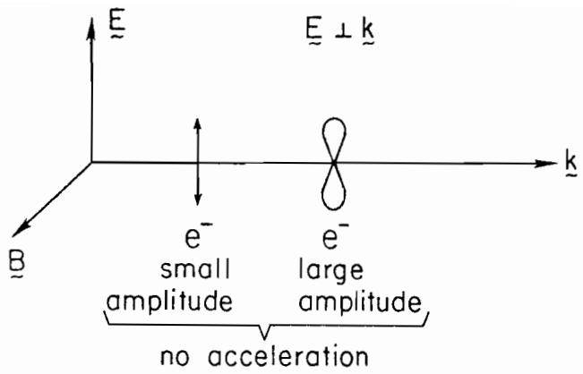
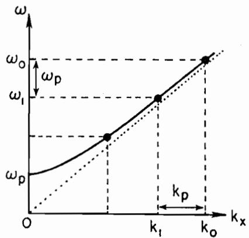
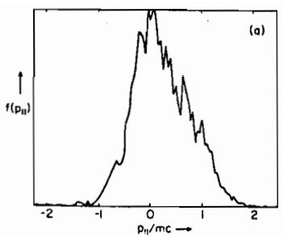
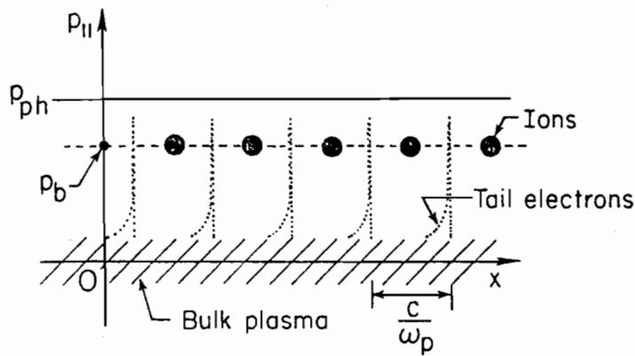

# Tajima 1982 相关会议稿中文讲解

> 证据边界：本文讲解的是 T. Tajima 的单作者 FNAL 1982 会议稿 *Laser accelerator by plasma waves for ultra-high energies*。它与项目中单独追踪的 Tajima--Dawson 1982 AIP 论文属于相关但不同的书目记录，不能互相替代。本文使用本地 PDF 和 MinerU 转换稿；公式中的 OCR 异常以 PDF 为准。

## 摘要：把激光拍频变成等离子体波

文章提出用两束强激光照射欠密等离子体。两束光的频率差接近电子等离子体频率时，拍频产生的有质动力驱动 Langmuir 波，并通过前向 Raman 散射把电磁波能量耦合到等离子体波。核心共振条件可概括为

$$
\omega_0-\omega_1\simeq\omega_p,\qquad \mathbf{k}_0-\mathbf{k}_1=\mathbf{k}_p.
$$

当 `omega_p / omega_0` 很小时，等离子体波的相速度接近光速，电子被波俘获后可以在较长时间内保持相位同步。文章还讨论了高场下的自陷、退相位、丝化和相对论前向 Brillouin 散射。

上图对应原文 Fig. 1：单一传播平面波主要造成振荡运动，不能直接提供持续的纵向净加速。这是后文转向等离子体集体波的出发点。

## I. 引言：为什么需要等离子体加速结构

作者先从传统慢波结构和材料击穿问题出发。金属结构可以产生纵向场，但高场会受到表面击穿和热负荷限制；而欠密等离子体没有固体表面，可以承载很高的纵向电场。等离子体中的电磁波本身相速度大于 `c`，因此仍不能直接让电子持续冲浪，必须通过非线性耦合激发 Langmuir 波。

原文将方案分为短脉冲 wake 与两束光拍频两条线，并把两束光方案作为重点。图 2 展示了波导、周期结构和等离子体色散关系之间的类比；这能帮助读者理解“相速度匹配”而不是把激光本身误认为加速波。

## II. Beat-wave accelerator：共振、相速度与俘获

两束欠密等离子体中的行波满足拍频共振后，拍频有质动力驱动 `k_p = k_0 - k_1` 的等离子体波。其相速度为

$$
v_p=\frac{\omega_p}{k_p}
 =\frac{\omega_0-\omega_1}{k_0-k_1}.
$$

在 `omega_p / omega_0 << 1` 的极限下，`v_p` 接近电磁波群速度，也接近 `c`。这解释了两件事：第一，电子只有在等离子体波振幅达到相对论量级后才会明显俘获；第二，被俘获电子的退相位时间较长，因而有较大的能量增益。

原文 Fig. 4 把两束激光和等离子体波放在同一张色散图中。对 PIC 读者而言，它对应的是“驱动波、响应波和粒子相速度”三者同时满足的设置条件，而不是单独调高激光强度就能得到的结果。

## III. 前向 Raman 散射、实验和模拟

文章随后讨论单束激光从噪声中长出散射波的情形，并比较实验和计算得到的电子分布与静电波谱。文中强调，前向散射对应的小波数等离子体模可以主导加热；后向散射模可能先增长，但会受到 Landau 阻尼和电子俘获影响。这个判断与书中“先区分模态、再讨论能量沉积”的分析习惯一致。

原文给出的实验和模拟数值属于该会议稿的具体设置，不能直接当作现代 WarpX 默认参数或可重复的基准答案。它们更适合用来说明：电子分布的高能尾、静电波谱中前向模的出现，以及实验与模拟之间的比较逻辑。

## IV. 超相对论波：有质动力“清空”低密度区

当激光归一化振幅超过相对论量级且脉冲局域时，有质动力会把等离子体推开，形成真空或低密度区。作者把激光脉冲比作活塞，用电磁压力与被推开电子的动量交换估算粒子能量。原文的标度关系可读作

$$
\gamma_{\max}\sim
\left(\frac{c}{v_g}\right)
\left(\frac{\omega_0}{\omega_p}\right)^2
\left(\frac{eE_0}{m\omega_0 c}\right)^2,
$$

但 MinerU 转换中的若干字体和上下标存在损坏，精确系数与符号应回看 PDF。图 12 的主要信息是最大电子能量随归一化激光场强平方增长，这是一条标度关系，不是脱离归一化、密度和脉冲长度后的通用预测。

## V. 高能加速器设计与限制

最后一节把方案推向高能粒子加速器，集中讨论两类限制：纵向退相位和横向光束退焦。粒子速度逐渐超过等离子体波相速度后，会在约四分之一波长尺度上离开加速相位；增加横向有效质量、分段重定相或改用离子频率尺度的前向 Brillouin 散射，都是作者提出的缓解思路。

文章还讨论自聚焦和丝化的竞争：自聚焦可以延长有效传播距离，丝化却会使横截面不均匀并破坏规则加速场。对今天的 PIC 工作流，这个部分最适合作为“物理机制到数值诊断”的桥梁：不仅要看纵向能量，还要检查光束包络、横向结构、模式竞争和相位保持。

## 对本书的使用边界

这份会议稿可以支撑早期 beat-wave / plasma-wave accelerator 的概念史和机制说明，也可以补充退相位、俘获、自聚焦、丝化与前向 Brillouin 散射的历史语境。它不能替代 Tajima--Dawson 1982 AIP 正式论文，也不能替代 WarpX 源码、官方文档或现代可复现实验来证明当前版本的数值行为。
