# LASER ACCELERATOR BY PLASMA WAVES FOR ULTRA-HIGH ENERGIES

T. Tajima Department of Physics and Institute for Fusion Studies University of Texas, Austin, Texas 78712

## ABSTRACT

Parallel intense laser beams ${ \omega } _ { 0 } , { \bf k } _ { 0 }$ and $\omega _ { 1 } , \mathbf { k } _ { 1 }$ shone on a plasma with frequency separation equal to the plasma frequency $\omega _ { \mathbf { p } }$ is capable of creating a coherent large electrostatic field and accelerating particles to high energies in large flux. The photon beat excites through the forward Raman scattering large amplitude plasmons whose phase velocity is equal to $( \omega _ { 0 } - \omega _ { 1 } ) / ( \nu _ { 0 } - \omega _ { 1 } )$ , close to c in an under dense plasma. The plasmon traps electrons with electrostatic field $\mathtt { E } _ { \mathrm { L } } \ = \ \mathtt { \gamma } \mathtt { j } / 2$ mCI.J.I/e, of the order of a few GeV/cm for plasma density $1 0 ^ { 1 8 } \mathsf { c m } ^ { - 3 }$ Because of the phase velocity of the field close to c this field carries trapped electrons to high energies: $\mathsf { W } \simeq 2 \mathrm { m c } ^ { 2 } ( \omega _ { 0 } / \omega _ { \mathsf { p } } ) ^ { 2 } ,$ The (multiple) forward Raman instability saturates only when a sizable electron population is trapped and most of the electromagnetic energy is cascaded down to the frequency close to the cut-off $( u _ { p } )$ Preaccelerated particles coherent with the plasmon fields can also be accelerated. In order to accelerate particles to ultra-high energies, a series of focused laser light beams are phase-matched with accelerating particles. There seems a favorable regime satisfying both conditions for the self-trapping instability and for avoiding the filamentation instability. The former instability confines the light beam from otherwise spreading over Rayleigh's length, and the latter instability would make the beam cross-section nonuniform. Because of the ultra-high energy of particles, the longitudinal defocussing between the plasma wave and particles happens. To overcome this difficulty, the relativistic forward Brillouin scattering process is proposed and discussed.

## I. INTRODUCTION

It is becoming clearer that extrapolation of the present high energy accelerator is not enough to meet today's challenge1 of ultra-high energies. While a possibility exists that until the particle energy reaches the grand unified mass of $1 0 ^ { 1 3 } \mathsf { G e V }$ there is a vast desert domain of no new physics $( 1 0 ^ { 2 } \mathrm { ~ - ~ } 1 0 ^ { 1 4 } \mathrm { ~ G e V } )$ , there exists a possibility of having a jungle of various particles (such as Higgs particles) and new physics in the much lower energy range. Supposing that we try to achieve energies of 100-1000TeV within a reasonable physical size (i.e. for example, within a state), we realize that the necessary electric field to accelerate particles is so large that under the present technology no metallic surface would withstand such a huge electric field. For example, an electric field of O.lGeV/cm (rf or dc) corresponds to $\tt { 1 e V } / \tt { \AA }$ and thus severely modifies the electron wavefunction within the atom, leading to sparking, breakdown etc. Besides this difficulty, the surface heating contributes to another cause for breakdown with high field. Another point immediately becomes evident. Since the particles accelerated are in such a high energy that they travel with a velocity very close to the speed of light c, the phase velocity of the accelerating wave (or structure) must be again very close to the speed of light c.

Besides these fundamental physics questions, we have to consider available technologies to achieve high energies. When we look over various electromagnetic power generation techniques, the most intense fields are delivered by the laser technology at the present time, although this does not preclude other technologies in the future. For example, millimeter wave lengths may be provided by the free electron laser or gyrotron-type laser. The tendency toward a much shorter wavelength of accelerating structure than the present microwave technology is not only due to the available high field values in the shorter electromagnetic wave generation techniques, but also due to the consideration of luminosity of the particle beams. From Heisenberg's uncertain principle, $\Delta \mathbb { E } \Delta \ t \ \lesssim \ \tilde { \mathfrak { n } } ,$ the cross-section 0 of particle reaction at 6E + CD is proportional to $\mathtt { E } _ { \mathtt { c m } } ^ { - 2 }$ where $\mathtt { E } _ { \mathtt { C } \mathtt { m } }$ is the energy in the center-of-the-mass. Because of this, the cross-section becomes smaller and smaller in the higher energy. This means that the luminosity has to increase as $\mathtt { E } _ { \mathtt { c m } } ^ { 2 }$ in order to keep the number of events in unit time to be constant. 2 This puts a very stringent condition to the accelerator concept in high energies. As we discuss in more detail later, the luminosity is inversely proportional to the length of the beam bunch. Therefore, in order to relax the severe condition on the luminosity, it is advisable to go for a short beam bunch, presumably obtainable again by a short wavelength wave. This again points toward the laser technology. In the following we review the particle acceleration in the electromagnetic waves.

A particle in an electromagnetic field of small amplitude is accelerated perpendicular to the direction of this electromagneti£ wave k and executes oscillations along the electric field direction $\hat { \mathbf { E } } .$ . No net acceleration, therefore, is achieved. This holds true even If the electromagnetic field amplitude is large and there is the magnetic acceleration (see Fig. 1). The magnetic acceleration with the electric acceleration makes the particle execute an Figure 8 orbit with no net acceleration. A spatially or temporally localized packet of electromagnetic waves cannot cancel all the oscillatory motion and thus leaves a net acceleration. The amount of acceleration, however, remains small.

  
Fig. 1: Particle motion in a propagating plane electromagnetic wave. The wavenumber $\underset { ^ { \sim } } { \texttt { k } }$ is perpendicular to electric field $\underline { { \mathtt { E } } }$ and magnetic field B. No net acceleration along the \~-direction is achieved.

In order to gain net acceleration by electromagnetic waves, there have been many attempts, which may be categorized into two: the virtual photon approach and the real photon approach. Most of the conventional accelerators including (proposed) collective accelerators are in the first category. Consider Fig. 2(a). In order to obtain an electric field component parallel to the wave propagation $\mathbf { k } _ { \parallel }$ , some (metal) reflector is placed. The wave has $\mathtt { E _ { \parallel } }$ component, but unfortunately the phase velocity of the wave is larger than the speed of light $\omega / \ k _ { \parallel } \ > \ \omega / \ k \ = \ \textrm { c }$ . Thus no coupling. One may confine the electromagnetic field by two conductors in a wave-guide [Fig. 2(b)] instead of a semi-infinite case in Fig. 2(a). The characteristics of wave phase velocity of a wave-guide is well-known $[ { \tt S e e } \tt { F i g . } \ 2 ( c ) ]$ The phase velocity is always larger than c: $v _ { \mathrm { p h } } ~ = ~ \mathsf { c } / ~ V ^ { \prime } \imath { - } ( \omega _ { \mathrm { c } } / \omega ) ^ { 2 }$ where $\omega _ { \mathsf { c } }$ is the cut-off frequency for the wave-guige. An accelerator such as ${ \tt S L A C ^ { \prime } }$ 's alleviates this problem by implementing a periodic structure in the wave-guide (irises). A periodically rippled wave-gUide introduces the so-called Brillouin effect into the phase velocity characteristics. The Brillouin diagram for the frequency vs. wavenumber in the ripple wave-guide is depicted in Fig. 2(d). Here sections of phase velocity less than c are realized. There are other ways to make phase velocity less than $\pmb { \mathrm { c } } _ { \pmb { \mathrm { \nu } } }$ such as the dielectric coating. All these techniques may be collectively called a technique for slow-wave structure. Particles can now surf on such field crests and obtain net acceleration. The intensity of the fields is limited by materials considerations such as electric breakdowns. Almost invariably, the localized high electric field results at and near the slow-wave structure, making the breakdown easier there. It may be possible to create a slow wave structure in the form of a plasma wave guide (or plasma "optical $\pmb { \mathrm { f } } \mathbf { i } \mathbf { b } \pmb { \mathrm { r } } ^ { \prime \prime } )$ A narrow wave guide with rippled surface accentuated either by a plasma or by plasma and magnetic fields (see Fig. 3).

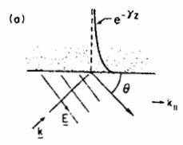

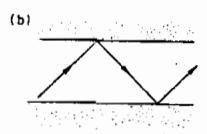

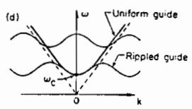

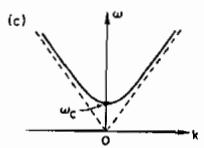

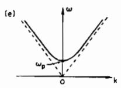  
Fig. 2: Virtual photons and photons in a plasma. (a) A plane electromagnetic wave reflects on the metallic surface. There is a field component parallel to $\mathbf { k } _ { \parallel } , \mathbf { E }$ sin0. In the metal the EM field exponentially decays. (b) If we put two metallic plates together, we get a waveguide. Again a field component parallel to $\boldsymbol { \mathbf { k } } _ { \parallel }$ exists. (c) The dispersion relation of the EM wave in the waveguide. k is the parallel wavenumber. (d) The dispersion relation of the EM waves in the uniform and ripple waveguides. (e) The dispersion relation of the EM wave in a plasma.

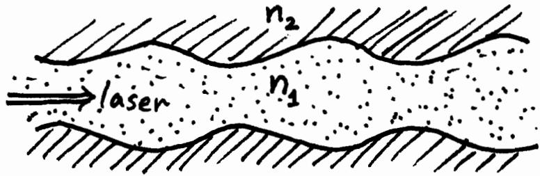  
Fig. 3. The surrounding plasma wave-guide structure (plasma fiber optics) plays a role of a slow-wave structure. If one matches ${ \tt v _ { p h } } \sim { \tt c } _ { \mathrm { { \tt { i } } } }$ the wave field component parallel to the laser propagation may be employed to accelerate particles.

When we utilize the real photon in a plasma, there is no physical limitation due to the materials considerations. The characteristics of the phase velocity of the real photon in a plasma is similar to the one in a wave-guide. See Fig. 2(e). The phase velocity of the electromagnetic wave in a plasma is $v _ { \mathrm { p h } } ~ = ~ { \sf c } / ~ \sqrt { 1 - ( \omega _ { \mathrm { p } } / \omega ) ^ { 2 } }$ , always larger than c in an underdense plasma, indicating again the difficulty to directly couple the wave to accelerate electrons. Here wp is the plasma frequency. It is possible, however, to nonlinearly couple to the plasma if the amplitude of the electromagnetic waves are sufficiently large. In Refs. 3-5 we discussed a laser electron accelerator scheme by exciting a large amplitude Langmuir wave created either by a strong photon wavepacket with a very short spatial pulse length as a photon wake or by two beating photons. In Ref. 5 we concluded that using two photon beams is much more effective in acceleration than using a very short photon pulse. We primarily focus on the two beam case although the physics involved in the case of short wavepacket is quite common with the present case.

The basic mechanism of particle acceleration is as follows. The two injected laser beam induce plasmons (or a Langmuir wave) through the forward Raman scattering process. This may be regarded as optical mixing. The resultant large amplitude plasma wave with phase velocity very close to the speed of light grows and is sustained by the laser lights. It grows until the amplitude becomes relativistic, i.e. the quivering velocity of the electrostatic field becomes c, so that the wave begins trapping electrons in the tail of distribution and accelerating them. The trapped electrons can be accelerated to high energies since the electrostatic wave is propagating with a phase velocity very close to c. The trapped electrons form a bunch in density. Since the energy dependence of the accelerated electron velocity is nonlinear, the detrapping time of electrons is very long. This is a very significant advantage of the linear acceleration of this type in comparison with a circular machine. In a circular machine such as a buncher the energy dependence of the electron angular velocity is approximately linear,6 thus the detrapping time is much shorter.

In terms of the available technology, the pulsed intense electron or ion beam technol $\boldsymbol { \cdot } \boldsymbol { \circ } \boldsymbol { \mathbf { g } } \boldsymbol { \mathbf { y } } ^ { 7 }$ delivers an electric field of $\sim 1 0 ^ { 7 }$ V/cm and a power density of $1 0 ^ { 1 3 } ~ \mathrm { \breve { W } / c m } ^ { 2 }$ On the other hand, the laser technology is capable of delivering a power density of $1 0 ^ { 1 8 } \mathrm { ~ } ^ { \prime } \mathsf { w } / \mathsf { c m } ^ { 2 }$ for a glass laser and $1 0 ^ { 1 6 } \quad \mathtt { W } / \mathtt { c m } ^ { 2 }$ for a C02 laser. As we shall see later, the electrostatic field can reach 109 V/cm for the glass laser case and a similar but somewhat smaller value for the C02 laser case.

In the present paper, we present a possible scheme to accelerate ions (as well as electrons) to high energies, exploiting the extremely high value of the longitudinal electric field associated with the beat plasmon. Although it is perhaps inevitable to have multi-stage accelerating modules to reach a very high energy, it is crucial that the laser light is focused along the propagation direction as long as possible. It is also important that the laser light does not break up in pieces in the radial direction, that may lead to incoherent accelerating and side scattering.

In Sec. II we present the basic concept of the laser beat accelerator. In Sec. III we examine the role of forward Raman scattering and discuss simulation and experimental results. Sec. IV discusses the ultra-relativistic waves. The ion acceleration scheme is presented and self-focusing and fi1amentation instabilities are discussed in order to determine a possible operation regime for ion acceleration in Sec. V.

Also, in the following two papers Dr. C. Joshi and Dr. D. Sullivan discuss this problem through experiments and simulation, respectively.

## II. BEAT WAVE ACCELERATOR

Two large amplitude travelling electromagnetic waves, $( \mathfrak { w } _ { 0 } , \mathtt { k } _ { 0 } )$ and $( \omega _ { 1 } , \kappa _ { 1 } )$ , injected in an underdense plasma induce a plasma wave $( \omega _ { \mathsf { p } } , \mathsf { k } _ { 0 } { - } \mathsf { k } _ { 1 } )$ through the beating of two electromagnetic waves if the frequency separation of two electromagnetic waves is equal to the plasma frequency:

$$
\mathfrak { w } _ { 0 } - \mathfrak { w } _ { 1 } = \mathfrak { w } _ { \mathfrak { p } } \qquad ,\tag{1}
$$

$$
\mathbf { k } _ { 0 } \ ^ { - } \ \mathbf { k } _ { 1 } \ ^ { = } \ \mathbf { k } _ { \mathbf { p } } \qquad ,\tag{2}
$$

where $\mathbf { k _ { p } }$ is the wavenumber of the plasma wave. The beat of two electromagnetic waves gives rise to a nonlinear ponderomotive force oscillations.which sets off the plasma $\cdot ^ { 3 , 4 }$ This process may also be regarded as a nonlinear optical mixing6 as well as a forward Raman scattering. 4,9,lO It may be possible to achieve the objective through the forward Raman instability, 9 i.e. the second electromagnetic wave $( \mathfrak { w } _ { 1 } , \mathbf { k } _ { 1 } )$ grows from a thermal noise. Rosenbluth et ale have discussed plasma heating through beat of electromagnetic wave. Il ,l2 It is important that the plasma is sufficiently underdense so that wo is much larger than $\omega _ { \mathsf { p } }$ (see Fig. 4). This will ensure that the phase velocity of the plasma wave $\mathtt { v _ { p } }$ is very close to the speed of light:

  
Fig. 4: Dispersion relation for the EM waves. Two laser beams beat.

$$
\mathbf { v } _ { \mathtt { p } } = { \frac { \mathbf { \omega } _ { \mathtt { p } } } { \mathbf { k } _ { \mathtt { p } } } } = { \frac { { \mathfrak { w } } _ { 0 } - { \mathfrak { w } } _ { 1 } } { \mathbf { k } _ { 0 } - \mathbf { k } _ { 1 } } } \quad .\tag{3}
$$

In the limit of oop/ooo « 1, Eq. (3) yields

$$
\begin{array} { r l r l r l r l } { \mathbf { v } _ { \mathrm { p } } } & { = } & { \displaystyle \frac { { \boldsymbol { \omega } } _ { \mathrm { p } } } { { \bf k } _ { \mathrm { p } } } } & { = } & { \displaystyle \operatorname* { l i m } _ { { \mathrm { \bf p } } / { \boldsymbol { \omega } } _ { 0 } \to 0 } } & { \displaystyle \frac { { \boldsymbol { \omega } } _ { 0 } - { \boldsymbol { \omega } } _ { 1 } } { { \bf k } _ { 0 } - { \bf k } _ { 1 } } } & { = } & { \displaystyle \mathbf { v } _ { \bf g } ^ { \mathrm { E M } } } & { = } & { \displaystyle \mathrm { c } \big ( 1 - \frac { \omega _ { \mathrm { p } } ^ { 2 } } { \omega _ { 0 } ^ { 2 } } \big ) ^ { 1 / 2 } } \end{array}\tag{4}
$$

the relation we used in Refs. 3 and 4.

Suppose that $\omega _ { 0 }$ is not very much larger than ${ \mathfrak { w } } _ { \mathfrak { p } } ,$ then the phase velocity of the plasma is much less than The resultant plasmawave c. wave can quickly trap electrons and saturates. In the course of interaction the nonlinear effects may change the phase velocity of the plasma wave. In the case of $\omega _ { \sf p } / \omega _ { \sf 0 }$ not small, the interaction of light waves and plasma is strong and the light waves suffer strong feed-back from the plasma. (The light waves may be called $" \mathtt { p } 1 \mathtt { a s t i c } "$ or $" \mathsf { s o f } \mathsf { t } ^ { \prime \prime }$ in this case.) In our case of $\mathfrak { o } _ { \mathfrak { p } } / \mathfrak { w } _ { 0 } \ll 1$ , the interaction of light waves and plasma is less intense and the characteristics of light waves are largely preserved. As we shall see later, the ratio of the energy density of the electrostatic plasma wave to the electromagnetic wave is $( \omega _ { \mathsf { p } } / \omega _ { 0 } ) ^ { 2 }$ , Le. the light wave dominated. Therefore, the plasma wave remains reinforced or "regulated" by the beating two laser beams

$$
w _ { 0 } = \mathrm { \bf ~ k } _ { 0 } \mathrm { c } / \sqrt { 1 - w _ { \mathrm { p } } ^ { 2 } / \omega _ { 0 } ^ { 2 } \sim } \mathrm { \bf ~ k } _ { 0 } \mathrm { c }
$$

$$
\omega _ { \mathrm { \bf ~ 1 } } = \mathrm { \bf ~ k } _ { 1 } \mathrm { c } / \sqrt { 1 { - } \omega _ { \mathrm { p } } ^ { 2 } / \omega _ { \mathrm { \bf ~ 1 } } ^ { 2 } } \sim \mathrm { \bf ~ k } _ { 1 } \mathrm { c } \quad .
$$

(The light waves may be called $\ " \mathrm { h a r d } "$ in our case.) Since the phase velocity ${ \tt v } _ { \tt p }$ is very close to c for $\omega _ { \mathsf { p } } / \omega _ { 0 } < < \mathrm { ~ 1 ~ }$ , the electron trapping and, therefore, saturation, occur only when the electrostatic wave grows up to an amplitude so large that it becomes relativistic. The other important consequence of $\omega _ { \mathsf { p } } / \omega _ { 0 } < < 1$ is that particles will be in phase wi th the plasma wave for a long time and achieve a large amount of acceleration, because, again, the phase velocity $\tt { v _ { p } } \sim { \tt { c } }$ and the particles would not exceed ${ \tt v } _ { \tt D }$ easily.

Let us consider the energy gain of an electron trapped in the electrostatic wave with phase velocity ${ \bf v _ { \ p } } = \mathfrak { w } _ { \ p } / { \bf k } _ { \ p } ,$ We go to the rest frame of the photon-induced longitudinal wave (plasma wave). Since the wave has the approximate phase velocity Eq. (4), $\beta ~ = ~ { \bf { v } } _ { \tt { p } } / { \tt c }$ and $\Upsilon \ = \ \omega _ { 0 } / \omega _ { \mathsf { p } } .$ Note that this frame is also the rest frame for tlie photons in the plasma: in this frame the photons have no momentum and the photon wavenumber is zero. The Lorentz transformations of the momentum four-vectors for the photons and the plasmons (the plasma wave) are

$$
\begin{array} { r l r l r l r } { \left( \stackrel { \gamma } { \mathrm {  ~ \sigma ~ } } _ { - \bf 1 } \beta \gamma \right) } & { { } } & { \left( \stackrel { \bf k _ { 0 } } { \mathrm {  ~ \sigma ~ } } _ { 0 } / \mathrm {  ~ \sigma ~ } \right) } & { { } } & { = } & { { } } & { \left( \stackrel { 0 } { \mathrm {  ~ \sigma ~ } } _ { \mathrm { \tiny { i } } \omega _ { \mathrm { p } } / \mathrm { c } } \right) } & { { } , } \end{array}\tag{5}
$$

$$
\begin{array} { r l r l r } { \left( \stackrel { \gamma } { \mathrm {  ~ \sigma ~ } } _ { - \bf i \thinspace \beta \gamma } \mathrm {  ~ \psi ~ } _ { \gamma } ^ { \mathrm {  ~ \psi ~ } } \right) } & { { } } & { \left( \stackrel { \bf k _ { p } } { \mathrm {  ~ \psi ~ } } _ { \gamma } / \mathrm {  ~ \sigma ~ } \right) } & { { } } & { = } & { \left( \stackrel { \bf k _ { p } } { \mathrm {  ~ \psi ~ } } ^ { \prime } \right) \quad , } \end{array}\tag{6}
$$

where the right-hand side	 refers to the rest frame quantities with respect to the plasma wave $( \bf k _ { \mathrm { D } } ^ { \mathrm { W a v e } } \ = \ k _ { \mathrm { D } } / \gamma )$ , kO is the photon wavenumber in the laboratory frame and the well-kqown dispersion relation for the photon in a plasma $w _ { 0 } = ( \omega _ { \mathsf { p } } ^ { 2 } + \mathtt { k } \mathtt { \beta } _ { 0 } ^ { 2 } ) ^ { 1 / 2 }$ was used. Equation (5) is reminiscent 13 of the relation between meson and the massless (vacuum) photon: Eq. (5) indicates that the photon in the plasma (dressed photon) has the rest mass o $\mathtt { p } ^ { / \mathtt { c } }$ , because the electromagnetic interaction shielded by plasma electrons can reach only the collisionless skin depth $\mathsf { c } / \mathsf { w } _ { \mathsf { p } }$ in the plasma. This is just as the nuclear force reaches the inverse of the meson mass and Yukawa predicted the meson energy as $\omega = \sqrt { c ^ { 2 } / a ^ { 2 } + k ^ { 2 } c ^ { 2 } }$ ,where a is the nuclear radius. 13 Compare:

Meson

Vacuum Photon

(interaction length a)

(interaction length \~)

$$
w = \frac { c ^ { 2 } } { a ^ { 2 } } + k ^ { 2 } c ^ { 2 }
$$

$$
w ~ = ~ \mathbf { k } \mathbf { c }
$$

Photon in Plasmas ++

Vacuum Photon

(interaction length c/oo p)

$$
u = \omega _ { \mathrm { p } } ^ { 2 } + \mathtt { k } ^ { 2 } \mathtt { c } ^ { 2 }\tag{∞}
$$

$$
\omega = \pmb { \mathrm { k } } \mathbf { c } \quad \cdot
$$

At the same time, the Lorentz transformation gives the longitudinal electric field associated with the plasmon as invariant $( \mathtt { E } _ { \mathrm { L } } ^ { \mathtt { w a v e } } = \mathtt { E } _ { \mathrm { L } } )$

The electrostatic wave amplitude can be evaluated by a few different (independent) ways yielding the same result. An argument resorting to the wave breaking limit was employed in Ref. 4. Here let us discuss in terms of the available electron density. When mos t of electrons are bunched as a result of the beat electromagnetic waves, we may estimate the electrostatic field by assuming most of the electrons give rise to this field:

$$
\nabla \mathrm { ~ \bf ~ \bullet ~ \cal ~ E ~ } = - 4 \pi \mathrm { e n ~ \ o ~ { o r ~ } ~ { k _ { \mathrm { p } } \cal E _ { \mathrm { L } } ~ } = ~ - 4 \pi \mathrm { e n ~ \ o ~ { ~ \bf ~ \pi ~ } ~ , } }\tag{7}
$$

where n is the electron density. The maximum electrostatic field is, therefore,

$$
\begin{array} { r } { \mathbf { E } _ { \mathbf { L } } = \mathbf { \Psi } \displaystyle \mathfrak { m } _ { \mathfrak { p } } \mathbf { c } / \mathbf { e } \qquad . } \end{array}\tag{8}
$$

We may derive the maximum electrostatic field Eq. (8) by another method.

As we shall discuss in Sec. III, the electrostatic wave saturates only wnen the trapping width of the wave becomes wide enough to begin trapping,the tail of electrons. This condition may be written as

$$
\mathbf { v _ { p } } - \mathbf { v _ { e } } \leq \mathbf { v _ { t r } } = \Big ( \frac { \mathbf { e E _ { L } } } { \mathbf { m _ { p } } } \mathbf { v _ { p } } \Big ) ^ { 1 / 2 } \quad ,\tag{9}
$$

where $\mathtt { v _ { e } }$ is the electron thermal velocity. If we neglect $\mathbf { v _ { e } }$ in comparison with ${ \tt v } _ { \tt p }$ and approximate ${ \bf v _ { p } } \ b { \bf y } \ c , \ \mathtt { E q } . ( 9 )$ now yields Eq. (8).

The condition (8) is valid even if the trapped electrons are highly accelerated as long as the bulk of electrons remain nonrelativistic. However, when the bulk of electrons obtain kinetic energy, say the perpendicular energy, then the formula needs corrections. 14 According to Ref. 14, the obtainable electrostatic field increased to a value $\tt E f ^ { e 1 } \simeq \sum _ { \gamma _ { p } ^ { 1 } } ^ { \gamma _ { 1 } / 2 } \ m c \omega _ { p } / e$ , where ${ \textsf { Y } } _ { \mathfrak { p } }$ is the effective relativistic factor. When strong heating of electrons occurs, mismatching of conditions (1) and (2) arises and we need more detailed study on the attainable electric field in this case.

The electric potential due to the plasma wave evaluated in the laboratory frame is

$$
\begin{array} { r } { \mathsf { e } \phi \ = \ \mathsf { e } \int _ { 0 } ^ { \lambda } \mathsf { E } _ { \mathrm { L } } \mathrm { d } \mathbf { x } \ = \ \textrm { e } \frac { \mathrm { m } \mathsf { \Pi } _ { \mathrm { p } } \mathrm { c } } { \mathrm { e } } \ \big ( \frac { \mathbf { c } } { \mathsf { \Pi } _ { \mathsf { D } } } \big ) \ = \ \mathrm { m c } ^ { 2 } \qquad . } \end{array}\tag{10}
$$

Going to the wave frame, we obtain the potential in the wave frame

$$
\begin{array} { r } { \mathsf { e } \phi ^ { \mathsf { w a v e } } \ = \ \gamma \mathsf { e } \phi \ = \ \gamma \mathsf { m c } ^ { 2 } \qquad . } \end{array}\tag{11}
$$

This energy in the wave frame corresponds to the laboratory energy by the Lorentz transformation

$$
\begin{array} { r l r } { \left( \begin{array} { l l l } { \Upsilon } & { } & { - { \bf i } \beta \Upsilon } \\ { { \bf i } \beta \Upsilon } & { } & { \Upsilon } \end{array} \right) } & { \qquad \left( \begin{array} { l } { \Upsilon \ B \equiv \Upsilon } \\ { { \bf i } \gamma \mathtt { m c } ^ { 2 } } \end{array} \right) } & { { } = } & { \left( \begin{array} { l } { 2 \Upsilon \ ^ { 2 } \ S \mathtt { m c } } \\ { { \bf i } \mathtt { m c } \Upsilon ^ { 2 } ( 1 + \beta ^ { 2 } ) } \end{array} \right) \ , } \end{array}\tag{12}
$$

where the right-hand side refers to the laboratory frame quantities. Thus we obtain the maximum energy electrons can achieve by the plasma wave trapping as

$$
\psi ^ { \sf m a x } = \gamma ^ { \sf m a x } _ { \sf m c } ^ { 2 } = 2 \gamma ^ { 2 } \pi \mathrm { c } ^ { 2 } = 2 \bigl ( \frac { \omega _ { 0 } } { \omega _ { \sf p } } \bigr ) ^ { 2 } \pi \mathrm { c } ^ { 2 } \qquad .\tag{13}
$$

The time to reach energies of Eq. (13) may be given by

$$
t _ { a } ~ \simeq ~ W ^ { \tt m a x } / \mathrm { c e E _ { L } } ~ = ~ 2 \big ( \frac { \omega _ { 0 } } { \omega _ { \mathrm { p } } } \big ) ^ { 2 } / \omega _ { \mathrm { p } } ~\tag{14}
$$

and the length of acceleration to reach the $\mathtt { E q }$ . (13) energy as

$$
\ell _ { \mathrm { ~ a ~ } } \simeq \ 2 \omega _ { 0 } ^ { 2 } \ \mathsf { c } / \omega _ { \tt p } ^ { 3 } \qquad .\tag{15}
$$

For the \~lass laser of 1\~ wavelength shone on a plasma of density $1 0 ^ { 1 8 } ( 1 0 ^ { 1 9 } ) \mathrm { c m } ^ { - 3 } ,$ » it would require under the present mechanism a power of $1 0 ^ { 1 8 } ( 1 0 ^ { 1 8 } ) ~ \mathsf { W } / \mathsf { c m } ^ { 2 }$ to accelerate electrons to energies wmax of $1 0 ^ { 9 } ( 1 0 ^ { 8 } )$ eV over the distance of 1(0.03)cm with the longitudinal field $\mathtt { E _ { L } }$ of $1 0 ^ { 9 } ( 3 \times 1 0 ^ { 9 } ) \mathrm { { v / c m } }$ For the $\mathtt { c o } _ { 2 }$ laser of $1 0 \mu$ wavelength» these numbers scale accordingly.

To demonstrate the present mechanism for ele\~tron acceleration» we have carried out computer simulations employing $1 \frac { \angle } { \tt \tt { \tt { 1 } } } - { \tt { \tt { D } } }$ (one spatial and three velocity and field dimensions) fully self-c6nsistent relativistic electromagnetic code. 15 Two parallel electromagnetic waves $( \mathfrak { w } _ { 0 } , \mathtt { k } _ { 0 } )$ and $( \omega _ { 1 } , \pmb { \mathrm { \mathbf { k } } } _ { 1 } )$ are imposed on an initially uniform thermal electron plasma. The direction of the photon propagation as well as the allowed spatial variation is taken as the x-direction. The system length is $\mathbf { L } _ { \mathbf { x } } ~ = ~ 1 0 2 4 \Delta$ the speed of light $\mathsf { \textsf { c } } = 1 0 \mathsf { \omega } _ { \mathsf { p } } \mathsf { A }$ the photon wavenumber $\mathbf { k } _ { 0 } ~ = ~ 2 \pi ~ \times ~ 6 8 / 1 0 2 4 \Delta$ a the number of electrons 10240» and the particle size 16 with a Gaussian shape» and the ions are fixed and uniform» where 6 is the grid spacing. The thermal velocity ${ \tt v _ { e } } = 1 \omega _ { \tt p } \Delta .$ The photon frequencies are taken as $\omega _ { 0 } \ = \ \ 4 . 2 9 \omega _ { \mathsf { p } }$ and $\mathsf { \Delta } { \mathfrak { w } } _ { 1 } = ~ 3 . 2 9 \mathsf { w } _ { \mathtt { p } }$ while the amplitudes are $\mathbf { v _ { i } ^ { - } } \ \equiv \ \mathbf { e E _ { i } } / \mathbf { m } ^ { s } \mathbf { _ { i } } \ = \ \mathrm { c } \left( \bf { i } \ = \ 0 \ o r 1 \right)$

Figure 5 shows the phase space of electrons accelerated by the beat plasma wave ${ \bf k _ {  } } \simeq ~ { \mathfrak { w } } _ { \mathfrak { p } } / { \mathsf { c } } . \quad { \mathtt { H i g h } }$ energy electrons are seen in every ridge of each length of the resonantly excited electron plasma wave. The horizontally stretched arms in Fig. 5(a) are separated by length $\lambda = 2 \pi / \mathsf { k } _ { \mathsf { p } }$ The maximum electron energy was ${ 8 5 } \mathrm { m c } ^ { 2 }$ in this case» higher than the value given by Eq. (13). One reason for this discrepancy may be that we now have two intense electromagnetic waves so that magnetic acceleration associated with $\mathbf { v } _ { 0 } \times \mathbf { \nabla } \mathbf { B } _ { 1 }$ » and $\mathbf { v } _ { 1 } \times \mathbf { \delta B } _ { 0 }$ also begins to playa role. The distribution function $\mathbf { f } ( \mathfrak { p } _ { \parallel } )$ or $\pmb { \mathrm { f } } ( \gamma _ { \parallel } )$ is shown in Fig. 5(b)>> exhibiting strong main body heating as well as a high energy tail.

Figure 5 shows the electrostatic field profile in space at t = 30 $\mathfrak { w } _ { \mathfrak { d } } ^ { - 1 } \mathrm { ~ \quad ~ } ( \mathbf { \bar { a } n } \mathrm { ~ \quad ~ } \mathbf { e a r 1 y \quad } \mathbf { t i m e } )$ The field amplitude already reached $\begin{array} { r } { \begin{array} { c c l } { \displaystyle \mathtt { E } _ { \mathbf { X } } ^ { \star } \ \simeq } & { \displaystyle \mathtt { E } _ { \mathbf { L } } \ = \ \Psi \Psi ^ { \mathbf { C } } \big / \mathbf { e } . } \end{array} } \end{array}$ One can also see its coherent field pattern. The observed wavelength is 2w $/ \kappa _ { \mathrm { p } } ~ = ~ 2 \pi / ( \ k _ { 0 } - \kappa _ { 1 } )$

The second case is that of injection of a wavepacket of a single photon $( \omega _ { 0 } , \mathbf { k } _ { 0 } )$ > whose packet length $\mathrm { L } _ { \mathsf { t } } = \lambda / 2 = \pi \mathsf { c } / \mathsf { w } _ { \mathsf { D } } ,$ as discussed in Refs. 3 and 4. Using the same code with parameters $\mathrm { \hat { L } _ { x } } ~ = ~ 5 1 2 \Delta , ~ \mathrm { \textmu ~ = ~ 5 \mathrm { v } _ { e } } ,$ the photon wavenumber $\mathbf { k } _ { 0 } ~ = ~ 2 \pi / 1 5 \Delta$ , the number of electrons 5120» $\mathrm { e E } _ { 0 } / \mathrm { m } \omega _ { 0 } = \mathrm { e B } _ { 0 } / \mathrm { m } \omega _ { 0 } = \mathrm { c } , \mathrm { L } _ { \mathrm { t } } = \pi \mathrm { c } / \omega _ { 0 } , \mathrm { p } _ { 0 } = \mathrm { e E } _ { 0 } / \omega _ { 0 }$ and $w _ { 0 } = ( \omega _ { \sf D } ^ { 2 } + \mathtt { k } \beta \mathtt { c } ^ { 2 } ) ^ { 1 / 2 }$ we start the system with electromagnetic pulse in the plasma with initial conditions

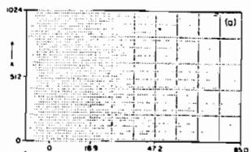

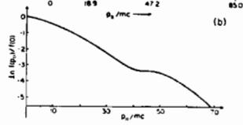

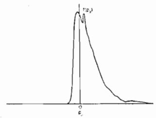  
Fig. 5: Photon beat acceleration by two laser beams $( \mathfrak { w } _ { 0 } , \mathfrak { k } _ { 0 } )$ and $( \omega _ { 1 } , \pmb { \mathrm { k } } _ { 1 } )$ (a) The electron phase space $( \mathbf { x } , \mathbf { p _ { \mathsf { s } } } )$ at $t ~ = ~ 2 4 0 \omega _ { \mathfrak { p } } ^ { - 1 } .$ The maximum Yn $\gamma _ { \parallel }$ for electrons is 85 in this case. (b) The logarithm of the electron distribution function at $t = 1 3 5 w _ { \tt p } ^ { - 1 }$ (c) The electron distribution function at $t = 1 3 5 w _ { \mathfrak { p } } ^ { - 1 } \cdot$

$$
\mathtt { E _ { y } } = \mathtt { E _ { 0 } } \mathtt { s i n } \ \mathtt { k } _ { 0 } ( \mathtt { x } \mathbf { - x } _ { 0 } )
$$

$$
\mathtt { B _ { z } } ~ = ~ \mathtt { B _ { 0 } } ~ \mathtt { s i n } ~ \mathtt { k _ { 0 } ( x - x _ { 0 } ) }
$$

$$
\mathsf { p } _ { \mathbf { y } } ~ = ~ \mathsf { p } _ { \mathbf { t h e r m a l } } + \mathsf { p } _ { 0 } ~ \cos \mathsf { k } _ { 0 } ( \mathbf { x } - \mathbf { x } _ { 0 } )
$$

for the period of $\textbf { x } = \ [ 5 0 \Delta , \ 8 1 . 4 \Delta ]$ and $\mathbf { x } _ { 0 } ~ = ~ 5 0 \Delta$ . With the assignment, the 1ffs a spectrum in k with a peak around $\textbf { k } = \textbf { k } _ { 0 }$ and $w = ( \omega _ { \mathrm { p } } ^ { 2 } + \mathbb { k } \beta \mathrm { c } ^ { 2 } ) ^ { 1 / 2 } ,$ and propagates in the forward x-direction approximately retaining the original polarization.

Figure 7 shows an early stage of the system development. The phase-space plot $\left[ \mathfrak { p } _ { \mathbf { y } } \ \textbf { v s . x } \ \mathrm { i n } \ \ \textbf { F i g . } 7 ( \mathbf { b } ) \right]$ indicates a strong modulation in the $\mathfrak { p } _ { \mathtt { y } }$ distribution within the photon packet location. The kink structure extends beyond the packet ending. Figure $\daleth ( \mathfrak { a } )$ shows $\mathfrak { p } _ { \mathbf { x } }$ vs. x. The intense longitudinal momentum oscillations are clearly appearing, beginning at the photon packet and extending to its initial starting point. This is the wake plasma wave set off by the photon packet seen in Fig. 7(b). As in $\mathtt { F i g } \cdot \textbf { 6 }$ , the long stretching arm-like phase-space pattern $\left[ \mathbf { F i g } \mathbf { . } \ \mathbf { 7 } ( \mathbf { a } ) \right]$ appears with its momentum keeping increasing. The wake plasmon structure is also apparent in the longitudinal fields $[ \mathbb { F } \mathbf { i } _ { \mathbf { g } } , ] ( \mathbf { c } ) ]$ In this case the electrostatic field reaches values around $\mathrm { { E } } _ { \mathrm { { L } } } \sim ~ 0 . 6$ mo $\mathsf { \Omega } _ { \mathsf { p } } / \mathsf { e }$ . In Fig. 8 we plot the maximum electron energy observed in our simulations as a function of $\mathrm { ( } \mathfrak { w } _ { 0 } / \mathfrak { w } _ { \mathfrak { p } } ) ^ { 2 }$ The prediction Eq. (13) is written in a solid line to compare with the simulation values. Agreements are reasonable.

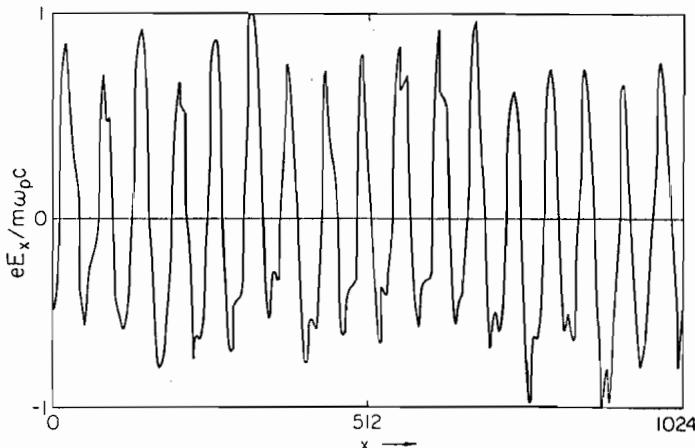  
Fig. 6: The electrostatic field $\mathtt { E _ { x } }$ vs. x at $\tt { t } = 3 0 0 0 _ { p } ^ { - 1 }$ The amplitude of the field $\mathtt { E _ { L } }$ already reached $\mathtt { E _ { L } }$ - ID $\tt { p } ^ { c / e }$

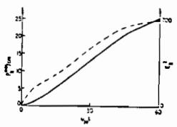

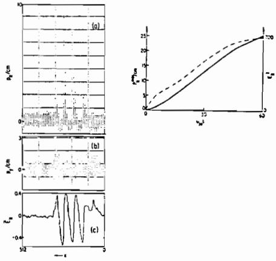  
Fig. 7: Wake-plasmon excitation by a short laser wavepacket and trapping of electrons. The head of the photon packet has proceeded forward to $\textbf { x } = \ 3 1 0$ at $t = 2 4 \omega _ { \mathsf { p } } ^ { - 1 }$ o $\rho / \omega _ { \ p } \ = \ 4 . 3$ (a) The longitudinal momentum $\mathbf { j } ( \mathsf { p } _ { \mathbf { x } } \ = \ \mathsf { p } _ { \parallel } \ )$ vs. position of electrons. (b) $\mathbb { P } _ { \mathbb { Y } } ~ - ~ \mathbb { x }$ phase space. (c) The longitudinal field $\mathtt { E } _ { \mathrm { L } } \ = \ \mathtt { E } _ { \mathtt { N } }$ vs. position. $( \mathsf { d } )$ Particle acceleration in time (solid line) and electric field intensity in time (dashed line).

## III. FORWARD RAMAN INSTABILITY AND EXPERIMENTS

We study the spectral distribution of photons in time. From the simulation run with two photons $( \omega _ { 0 } , \ k _ { 0 } )$ and $( \omega _ { 1 } , \pmb { \mathrm { k } } _ { 1 } )$ we observe in $\mathtt { F i g } , \mathtt { 9 }$ a clear cut energy cascade via multiple Raman forward scattering. The original waves with equal amplitude $\tt { E } _ { i } \ =$ mc 00 i l e ${ \bf \Xi } ( \textbf { i } = { \bf \Lambda } _ { 0 }$ or 1) cascade toward smaller k as seen in Fig. ${ \mathfrak { g } } ( { \mathfrak { a } } )$ and $9 ( b )$ A small amount of energy is up-converted. The spectrum is sharply peaked at a particular discrete wavenumber ${ \bf k } _ { \mathrm { n } } = { \bf k } _ { 0 } - { \bf n } { \bf k } _ { \mathrm { p } }$ where n is an integer. The spectral intensity $\mathbf { s } ( \mathbf { k } , \omega )$ for the electrostatic component shows overwhelming peak at $\textbf { k } = \textbf { k } _ { \ p }$ and no significant energy in any frequency at the backscatter wavenumbers. This strongly suggests that all possible backscattering processes are suppressed or saturated at a very low level in our present problem. The electrostatic spectral density $\mathsf { s } ( \mathsf { k } _ { \bullet } \omega )$ shows peaks at $k = k _ { p }$ as well as ${ \bf k } = { \bf n k } _ { \mathrm { p } }$ All these observations confirm that the downward photon cascade is due to the multiple forward Raman scattering.

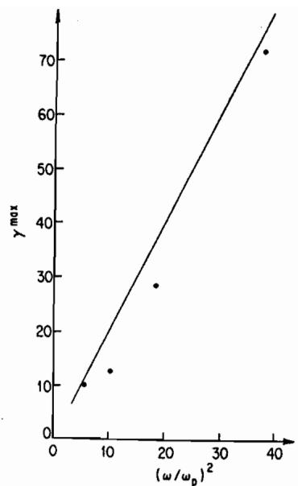  
Fig. 8: Maximum electron energy vs. $( \omega _ { 0 } / \omega _ { \mathsf { p } } ) ^ { 2 }$ in the short wavepacket case. The dots are from simulations and the solid line is from Eq. (13).

A similar downward photon cascade is observed in the case with a photon packet of one plasma wave $( \omega _ { 0 } , \lambda _ { 0 } )$ Figure 10 shows the wavenumber spectrum of the electromagnetic pulse at successive times. The original smooth-shaped spectrum evolves into a multipeak structure with a roughly equal, but slightly increasing, separation in wavenumber as k approaches $k _ { p }$ ' This again indicates that the photon $( \omega _ { 0 } , k _ { 0 } )$ decays into $( \mathfrak { w } _ { 1 } , \mathbf { k } _ { 1 } ) , \quad ( \mathfrak { w } _ { 2 } , \mathbf { k } _ { 2 } ) \dots$ by successive or multiple forward Raman instability.

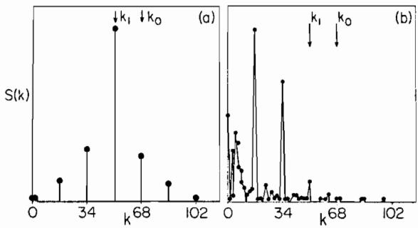  
Fig. 9: The electromagnetic energy distribution (spectrum) as a function of mode numbers. Two laser beam pumps $\mathbf { k } _ { 0 }$ and $\mathbf { k } _ { 1 }$ are indic\~ted by arrows. (a) $t ~ = ~ 1 4 2 . 5 w _ { \mathfrak { p } } ^ { - 1 } ,$ (b) $t = 2 4 0 \omega _ { \sf p } ^ { - 1 } .$

The reason why the backscattering is suppressed but the forward scattering is very prominent is the following: When the backscattering plasma wave is excited, enhanced Landau damping or electron trapping by this plasma wave saturates it at a low level, thus limiting the backscattering to a small value. The wavenumber $\models _ { \ b { \mathrm { b } } }$ of the plasma wave produced by the backscattering process in the case of $\omega _ { \mathsf { p } } / \omega _ { \mathsf { o } } < < 1$ is $k _ { \mathrm { b } } ~ = ~ 2 k _ { \mathrm { o } }$ • The phase velocity of the backscattering plasma wave is

$$
{ \bf v } _ { \ p } \ = \ \frac { \omega _ { \ p } } { 2 \mathrm { k } _ { \ o } } = \ \frac { \mathrm { c } } { 2 } \ \frac { \omega _ { \ p } } { \omega _ { \ o } } \quad .\tag{16}
$$

Trapping of electrons by this wave begins happening when the trapping width $\tt v _ { t r }$ becomes wide enough to reach the tail of the thermal electron distribution. An approximate trapping width may be written as

$$
\bf { v _ { t r } = \bf \left( \frac { \ e \phi } { \ m } \right) ^ { \mathrm { b } } \mathrm { \Sigma } } ^ { 1 / 2 } = \bf { \left( \frac { \ e E _ { L } ^ { \mathrm { b } } } { \ m \omega _ { p } } \ v _ { p } \right) ^ { \mathrm { 1 / 2 } } } \quad ,\tag{17}
$$

where the superscripts b refer to the backscattering electrostatic $\mathtt { w a v e } ^ { 1 6 }$ The formula is nonrelativistic, but is sufficient for the present purpose. Also recall the discussion given after $\theta _ { 9 } . ( 9 )$ The condition that a large number of electrons are trapped is given17 by

$$
\begin{array} { r } { \mathsf { v } _ { \mathsf { p } } - \mathsf { v } _ { \mathsf { t r } } \leqslant 2 \mathsf { v } _ { \mathsf { e } } = 2 ( \mathbb { T } _ { \mathsf { e } } / \mathsf { m } ) ^ { 1 / 2 } \quad . } \end{array}\tag{18}
$$

The maximum electrostatic wave amplitude is obtained for a cold plasma by setting ${ \tt v } _ { \tt e } = { \tt o } \colon$

$$
\frac { e E _ { \mathrm { L } } ^ { \tt b } } { \tt m _ { p } } = \frac { \tt c } { \tt 4 } \frac { \omega _ { p } } { \omega _ { o } } .\tag{19}
$$

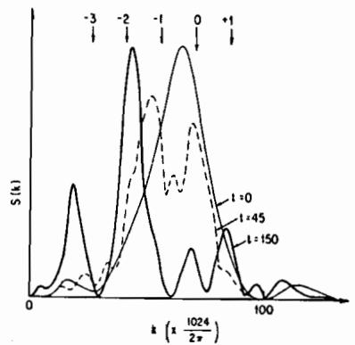  
$\mathtt { F i g }$ . 10: Electromagnetic spectral intensity in wavenumber. The arrow with 0 indicates the rough position of the original laser beam wavenumber peak; n indicates $\bf k ^ { \prime } = \bf k _ { \Sigma } \pm \ n k _ { p ^ { \prime } }$

In both cases of Fig. 9 and Fig. 10 we did not detect a large peak of electrostatic spectrum $\mathsf { \pmb { S } } ( \mathsf { k } _ { \bullet } \mathsf { \pmb { \omega } } )$ at $\textbf { k } = \ 2 \mathbf { k } _ { \circ }$ Thus the forward Raman instability or process appears to be the last parametric process to saturate in a hot underdense plasma. In fact it can be argued that it will saturate only when the original electromagnetic wave has completely cascaded by multiple forward Raman process to waves near ${ \mathfrak { w } } \sim { \mathfrak { w } } _ { { \mathfrak { p } } } \cdot$ In this case most of the electromagnetic energy may be extracted from the laser lights to electrostatic wave energy and eventually to kinetic energy. The idealized efficiency, therefore, may be given by $\eta ~ = ~ \hat { 1 } ~ - ~ ( \omega _ { \mathsf { D } } / \omega _ { 0 } ) ^ { 2 }$

An experimental observation of the forward Raman instability and associated electron acceleration and heating has recently been done9 in conjunction with the present concept and physical discussion. A $\mathtt { c o } _ { 2 }$ laser is shone on an underdense plasma producing electrons of energy up to 1.4 MeV. The laser power density is such that $\mathbf { e } \mathbf { E } _ { 0 } / \mathbf { m } \mathbf { \omega } _ { 0 } \mathbf { c } \sim \ 0 . 3$ and the frequencies are $\omega _ { \mathsf { p } } / \omega _ { 0 } \sim \ 0 . 4 6$ The plasma was created by the laser light shone on 130\~ thick carbon foil producing the initial plasma temperature of \~20keV. In the experiment the laser emits only one beam so that the beat has to grow from the noise. It is, therefore, in general, possible to have other competing processes such as side scatter, backscatter, two plasmon decay simultaneously taking place. In spite of these competing processes, lower quivering velocity of the laser, and lower $\omega _ { 0 } / \omega _ { \mathfrak { p } } ,$ the experiment shows 9 high energy electrons in the forward direction.

Simulations are carried out in order to see the wave spectrum and to compare the distribution function of electrons with the experiment. Using a similar set-up as before, we set the plasma parameters same as the experiment: 9 $\tt T _ { e } \sim$ 20keV, and uniform plasma, $\omega _ { \mathsf { p } } / \omega _ { 0 } \sim \ 0 . 4 6$ the propagating electromagnetic wave has ${ \bf e } \mathbb { E } _ { 0 } / \mathfrak { m } { \bf u } _ { 0 } { \bf c } \sim \ 0 . 3 \mathrm { : }$ The electron parallel distribution function $\pmb { \mathfrak { f } } ( \mathfrak { p } _ { \| } )$ along with the electrostatic wave spectra are displayed in Fig. 11. The temperature and the maximum electron energy observed in the simulation distributions are similar to the experimentally measured values. For example, simulations show the forward electron maximum energy of 1.3MeV and temperature of 100keV in comparison with the experimental values of 1.4MeV and 90 100keV, respectively. In the backward direction, simulations show the electron maximum energy of 0.9MeV and temperature of 60keV compared to the experimental values of 0.8MeV and 40 50keV. The electrostatic wave spectrum, Fig. II(b), shows that the backscattering mode $\mathbf { k _ { \mathrm { \Delta b } } }$ (which grows initially) is swamped by other modes with a smaller wavenumber, the most intense of which is the plasma wave associated with forward scattering $\mathsf { k } _ { \mathsf { p } } .$ In addition, there are some wavenumbers which are less than $\mathbf { k } _ { \mathfrak { p } } .$ Thus the heated electron distributions obtained by the experiment 9 and the simulations agree well with most of the electron heating due to the forward Raman instability, but is not so much due to the backward process. In the present case the phase velocity of the backscattering plasma wave w $\mathsf { \Omega } _ { \mathsf { p } } / \mathsf { k } _ { \mathsf { b } } \sim \mathrm { ~ 1 ~ } . 6 \mathsf { v } _ { \mathsf { e } }$ • Thus this wave is heavily Landau damped to begin with anI as it grows in amplitude, more and more electrons will be trapped by it and and the damping will grow. In view of Eq. (18), therefore, the experimental as well as simulation results are reasonably well understood.

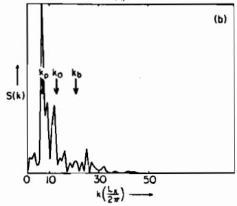  
Fig. 11: Simulation with a single laser beam with $s _ { \mathrm { p } } / \omega _ { 0 } = \ 0 . 4 6$ (a) Electron momentum distribution function at $t = 2 5 6 \omega _ { p } ^ { - 1 } \cdot ( { \mathfrak { b } } )$ The electrostatic mode spectrum at $\tt { t } = 1 0 0 \omega _ { \tt p } ^ { - 1 }$

## IV. ULTRARELATIVISTIC WAVES

As the laser beam becomes more intense, the accelerated electrons become more numerous and they are more energetic. When the laser beam is ultrarelativistic $( \mathbf { e } \mathbf { E } _ { 0 } / \mathbf { m } \mathbf { \omega } _ { 0 } \mathbf { c } \mathrm { ~ > ~ } 1 )$ and the laser wave packet is localized, such a wavepacket exerts a large ponderomotive force on the plasma and can create a local vacuum. 18 The intense electromagnetic wave pulse pushes the plasma forward and expands the region of plasma-plowed area (vacuum or very low density plasma). Since the expanding electromagnetic pulse acts like a piston which reflects incoming particles, we can evaluate how much momentum transfer takes place during the process. Equating the electromagnetic pressure (piston pressure) to the momentum exchange by electrons which are pushed by the piston, we obtain

$$
\mathrm { ~  ~ { ~ \cal ~ P ~ } ~ } = \frac { \mathrm {  ~ { ~ \cal ~ E } ~ } _ { 0 } ^ { 2 } } { 8 \pi } = \mathrm {  ~ \ n v ~ } _ { \bf g } \mathrm {  ~ { \mit \ P } ~ } \simeq \mathrm {  ~ \ n v ~ } _ { \bf g } \Upsilon \mathrm { m c } \qquad ,\tag{20}
$$

where v is the velocity of the electromagnetic wave front. From $\ E q \cdot \ ( 2 0 ) ^ { 5 } ,$ the particle energy $\gamma ^ { \mathrm { m a x } }$ is calculated as

$$
\Upsilon ^ { \mathrm { m a x } } \ \simeq \ \big ( \frac { \mathrm { c } } { \mathrm { v } _ { \mathrm { g } } } \big ) \big ( \frac { \omega _ { 0 } } { \omega _ { \mathrm { p } } } \big ) ^ { 2 } \big ( \frac { \mathrm { e E } _ { 0 } } { \mathfrak { m } \omega _ { 0 } \mathrm { c } } \big ) ^ { 2 } \qquad ,\tag{21}
$$

which resembles Eq. (13) except for a factor of $1 \sim 2$ when $\mathbf { e } \mathbf { z } _ { 0 } / \mathbf { m } \mathbf { \omega } _ { 0 } \mathbf { c } \ = \ \mathbf { 1 }$ [which was the case for Eq. (13)].

Simulations have been performed to study this parametric dependence. 18 Again the same type of set-ups and code as in the short wavepacket case is used. Parameters we use are $\mathrm { L } _ { \mathbf { X } } ~ = ~ 1 0 2 4 \Delta , ~ \mathrm { v } _ { \mathrm { e } } ~ = ~ 1 ~ \omega _ { \mathrm { p e } } \Delta$ the initial photon wavenumber ${ \bf k } _ { 0 } ~ = ~ 2 \pi / 1 0 \Delta , ~ { \mathrm {  ~ c ~ } } = \dot { 5 } { \mathrm {  ~ \omega ~ } } _ { \sf D e } \Delta ,$ 1024\~ electrons and ions each, and $\mathtt { e E } _ { 0 } / \mathtt { m } \omega _ { 0 } \mathtt { c }$ is varied from 1 to 20. The packet length is chosen to be $L _ { \mathsf { t } } \simeq \mathsf { \pi c } / \mathsf { \omega _ { p } } .$ The obtained energy scaling is displayed in Fig. 12, showing $\gamma ^ { \mathrm { m a x } } \propto ^ { \mathbf { r } } \nu ^ { 2 } = ( \mathbf { e } \mathbf { E } _ { 0 } / \mathbf { m } \omega _ { 0 } \mathbf { c } ) ^ { 2 }$ The coefficient of the proportionality is also reasonably fit with Eq. (21). More details are shown in Refs. 18 and 19. In a similar study Sullivan and Godfrey also investigated14 the accelerated electron energy dependence on the laser field strength.

## V. HIGH ENERGY PARTICLE ACCELERATOR

We have introduced the concept of laser accelerator using two parallel intense laser beams and a resultant beat plasma wave. We discussed various characteristics of this scheme and demonstrated it via computer simulations and to a certain degree via experiments. Although these investigations are preliminary, they are certainly encouraging. In the present paper we propose and demonstrate the way to accelerate particles to high energies without losing regular structure of the field. This is important since in a very high energy accelerator it is likely that any material cannot withstand the very strong accelerating field, the system has to regulate itself; in the present case the plasma and the laser beams have to regulate themselves. The regularity of the accelerating fields is kept by the reinforcing two intense laser beams. Since the plasma is underdense, the laser beams are able to impress their periodic structure on the plasma and the pla\~ma oscillation. Their freql1eDSie\~ and wavenumbers are $w _ { 0 } = \mathrm { ~ \bf ~ k ~ } _ { 0 } \mathrm { c } / \sqrt { 1 - w _ { \mathrm { p } } ^ { 2 } / \omega _ { \mathrm { ~ \bf ~ \alpha ~ } } ^ { 2 } } \sim \mathrm { ~ \bf ~ k ~ } _ { 0 } \mathrm { c }$ and $\begin{array} { r l } { \mathfrak { w } _ { 1 } = \textbf { k } _ { 1 } \mathfrak { c } / \sqrt { 1 - \mathfrak { w } _ { \mathrm { p } } ^ { 2 } / \mathfrak { w } _ { 1 } ^ { 2 } } } & { { } \sim \textbf { k } _ { 1 } \mathfrak { c } } \end{array}$ and $\mathbf { k } _ { 0 } , \mathbf { k } _ { 1 }$ reinforcing the plasma frequency and wavenumber. The plasma particle-wave interaction cannot destroy the structure easily either until the forward Raman instability saturates, which does not happen at a low level. This is because the excited plasma wave has a phase velocity very close to c. Once the particle is accelerated and becomes relativistic, it will stay with the accelerating field for a long time in a coherent fashion. Since the density of electrons is high, the created field can be quite respectable of the order of $1 0 9 \forall / \mathsf { c m } .$ This scheme may be useful not only for accelerating electrons to high energies in large flux, but also for bunching electrons with a regular structure.

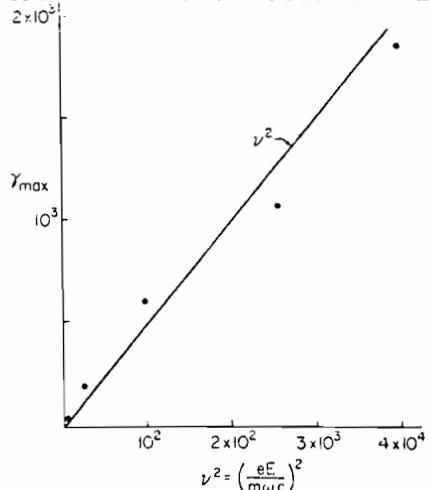  
Fig. 12: The maximum electron energy vs. laser electric field intensity $( \mathbf { e } \mathbf { \bar { E } } _ { 0 } / \mathbf { m } \mathbf { \omega } _ { 0 } \mathbf { c } ) ^ { 2 }$ in the case of ultrarelativistic laser beam. The straight line is $\gamma ^ { \mathrm { \ m a x } } \ = \ \frac { 1 } { 2 } \big ( \frac { \mathrm { \Lambda } \mathrm { c } } { \mathrm { v } _ { \mathrm { g } } } \big ) \ \big ( \frac { \mathfrak { w } _ { 0 } } { \mathfrak { w } _ { \mathrm { p } } } \big ) ^ { 2 } \ \mathrm { v } ^ { 2 }$

A large regular electric field of $1 0 ^ { 9 } \mathtt { V } / \mathtt { c m }$ range propagating with phase velocity very close to c is certainly attractive for accelerating ions, as well. One possible way to do this is to preaccelerate ions to a moderately to highly relativistic energies and then to inject onto this field. A schematic diagram is depicted in Fig. 13. In order to accelerate to multi-TeV energies it is likely to need many modulars of such an accelerator, since the laser focus and other problems may arise. In this case it may be a technical challenge to make ion clumps in phase with the positive electric field in all those modulars. Even if we assume that we can accelerate ions almost all the time, with the field of $1 0 ^ { 9 } \mathtt { V } / \mathtt { c m }$ , it would take $1 0 ^ { 5 } \mathsf { c m }$ to reach an energy of lOOTeV.

We address here a couple of crucial questions associated with acceleration of particles to high energies with the present concept. The first problem is the longitudinal deterioration of acceleration: the dephasing between the accelerating electrostatic plasma wave and the particles being accelerated. The second is the transverse deterioration: the defocusing of the laser light due to the laser optics as well as due to the plasma nonlinear effects on the laser light.

  
Fig. 13: Schematic phase space diagram with bulk electrons, accelerated tail electrons, and injected preaccelerated ions at the right phase. $\tt p _ { p h }$ is the phase momentum of the plasma wave excited by the beating two laser beams. $\mathfrak { p } _ { \mathfrak { b } }$ is the injected ion beam momentum. The ion clump separation is $\mathsf { c } / \mathsf { \omega _ { p } }$

After ions reach or exceed the phase velocity of the plasma wave, they overtake the phase of the wave and thus get out of phase. When ions are in very high energies, they are quickly overtaking the wave. The ion velocity relative to the phase velocity of the wave is

$$
\Delta { \mathbf v } \cong { \mathbf c } - { \mathbf v } _ { \mathrm { p h } } \cong \frac { 1 } { 2 } ( \frac { \omega _ { \mathbf p } } { \omega _ { 0 } } ) ^ { 2 } { \mathbf c } .\tag{22}
$$

The dephasing can take place over a quarter wavelength. Therefore, the dephasing time is obtained as

$$
\tau _ { \dot { { \bf d } } } { } ~ \simeq ~ \frac { \lambda / 4 } { \Delta \bf v } ~ = ~ \pi \big ( \frac { \omega _ { 0 } } { \omega _ { \bf p } } \big ) ^ { 2 } ~ \frac { 1 } { \omega _ { \bf p } } ~ ,\tag{23}
$$

where is the wavelength of this plasma wave. This time (23) is very much similar to Eq. (14). On the other hand, time for ions to accelerate by energy $\mathtt { M c } ^ { 2 } \Delta \mathfrak { r }$ is given as

$$
\tau _ { \mathbf { a } } ~ \simeq ~ \frac { \Delta \curlyvee \mathbf { M } \mathbf { c } ^ { 2 } } { \mathbf { e } \cdot \mathbf { E } _ { \mathrm { L } } \mathbf { c } } ~ \tilde { \mathbf { z } } ~ \frac { \Delta \curlyvee \mathbf { M } \mathbf { c } ^ { 2 } } { \gamma _ { \perp } ^ { 1 / 2 } \mathbf { m } { \omega _ { \mathbf { p } } \mathbf { c } } ^ { 2 } } = \frac { \Delta \pmb { \gamma } } { \gamma _ { \perp } ^ { 1 / 2 } } ~ ( \frac { \mathsf { M } } { \mathsf { m } } ) ~ \frac { 1 } { \omega _ { \mathbf { p } } } ~ ,\tag{24}
$$

where M is the ion mass. Since the electron perpendicular temperature cannot be extremely hi $s \mathbf { h } , \ \mathsf { v } \mathbf { j } / 2$ is of order unity (perhaps $\bigwedge \ 2 \ \sim \ 3 )$ . The energy gain within the dephasing time, therefore, is

$$
\Delta \Upsilon \ \stackrel { < } { _ \sim } \ \pi \ \stackrel { { \mathrm { \scriptsize ~ ( m } } } { \underset { \overline { { \mathbb { M } } } } { \mathrm { \scriptsize ~ / ~ } } } \ \stackrel { \langle \stackrel { \omega _ { 0 } } { \sim } \rangle } { \underset { \mathbb { P } } { \mathrm { \scriptsize ~ ( \frac ~ ) ~ } } } ^ { 2 } \curlyeq g _ { \perp } ^ { 1 / 2 } \ .\tag{25}
$$

If the ions are protons and $( \omega _ { 0 } / \omega _ { \mathfrak { p } } ) ^ { 2 } \sim 1 0 ^ { 3 } , \Delta \mathfrak { r }$ is of the order of unity. This indicates that if one wants to accelerate up to 100TeV, one would need $1 0 ^ { 5 }$ times of re-phasing operations between ions and the wave. If one wants to accelerate electrons beyond the energy (13), one also needs re-phasing. Again, if one wants to accelerate electrons up to 100TeV, one would need $\sim 1 0 ^ { 5 }$ times of re-phasing.

One way to avoid these many rephasing processes is to increase the electron mass from m to $\Upsilon _ { \perp \mathbf { n } }$ by increasing the perpendicular electron temperature or adding a helical perturbation. In this case the frequency separation should be reduced by a factor $1 / \gamma _ { \parallel } ^ { 1 / 2 }$ from $\omega _ { \pmb { \ p } }$ to $\omega _ { \mathsf { p } } / \bar { \gamma } _ { \parallel } ^ { 1 / 2 }$ The possible electrostatic field achieved by t-be plasma wave is now

$$
\mathtt { E } _ { \mathtt { L } } \sim \mathtt { v } _ { \mathtt { 1 } } ^ { 1 / 2 } \mathtt { m } \mathtt { \omega } _ { \mathtt { p } } \mathtt { c } / \mathtt { e }\tag{26}
$$

and the laboratory potential drop is

$$
{ \tt e d } \sim \gamma _ { \perp } \mathrm { m c } ^ { 2 }\tag{27}
$$

Consequently, the maximum energy corresponding to Eq. (13) is

$$
{ \bf w } ^ { \mathrm { m a x } } \sim 2 \gamma _ { \perp } ^ { 2 } \ : \ : \big ( \frac { \omega _ { 0 } } { \omega _ { \mathrm { p } } } \big ) ^ { 2 } \ : \ : \mathrm { m c } ^ { 2 } \ : \ : .\tag{28}
$$

Extending this idea further we arrive at the concept of the relativistic forward Brillouin scattering process instead of the forward Raman process. In this we propose to use two laser lights with $( \mathfrak { w } _ { 0 } , \mathtt { k } _ { 0 } )$ and $( \mathfrak { w } _ { 1 } , \mathtt { k } _ { 1 } )$ obeying $\begin{array} { r } { \begin{array} { c } { \omega _ { 0 } \ - \ \omega _ { 1 } \ = \ \omega _ { \mathrm { p i } } \ \mathrm { ~ a n d ~ } \ \mathbf { k } \mathrm { ~ \boldsymbol { \wp } ~ - ~ \mathbf { k } _ 1 ~ = ~ \omega _ { \mathrm { p i } } / c ~ } , } \\ { : \ \omega _ { \mathbf { p i } } \ = \ ( 4 \pi \mathrm { n e } ^ { 2 } / \mathrm { M } ) ^ { 1 / 2 } . \quad \mathrm { T h e ~ \mathbf { i } n t e n s } } \end{array} } \end{array}$ where $\mathbf { \omega } _ { \mathbf { \omega } } \mathbf { \circ } \mathbf { i }$ is the ion plasma frequency e two laser beams will create electrostatic oscillations at the ion plasma frequencYt which is forced oscillations (quasi-mode) in the limit of the sound velocity put to be c with the wavelength $\mathsf { c } / \omega _ { \mathsf { p } \mathbf { i } }$ . The most significant advantage of this scheme is that the frequency separation of two lasers and the resonant ion plasma frequency are so much smaller than the laser frequency that the phase velocity is much closer to c. This can be done by the plasmon resonance (Raman) process by reducing ${ \mathfrak { u } } _ { \mathfrak { p } } / { \mathfrak { o } } _ { 0 } .$ t but this only leads to reduced accelerating field strength $\mathbb { E } { \mathfrak { q } } . \ { } ^ { \Gamma } ( 1 8 )$ From a similar argument above [Eq. (26)] t it might be that $\mathtt { E } _ { \mathrm { L } } \sim \mathtt { M } \ \omega _ { \mathtt { p } \pm } \ \mathtt { c } / \mathtt { e } .$ However t this turns out not to be the case from our simulation study. We find that

$$
\mathtt { E _ { L } } \sim \mathtt { m } \omega _ { \mathtt { p } } { \mathtt { c } } / { \mathtt { e } }\tag{29}
$$

and

$$
{ \tt e } _ { \tt f } \sim ( { \tt M m } ) ^ { 1 / 2 } { \tt c } ^ { 2 } \ .\tag{30}
$$

The amplification of energy by the Lorentz transformation $\gamma ^ { \bullet 2 }$ is now given by $\gamma ^ { \prime } = \left. \omega _ { 0 } \right/ \omega _ { \mathbf { p } \mathbf { i } }$ t thus yielding

$$
\mathsf { w } ^ { \mathsf { m a x } } \leq 2 \big ( \frac { \omega _ { 0 } } { \omega _ { \mathsf { p } \bf 1 } } \big ) ^ { 2 } \big ( \frac { \mathsf { M } } { \mathsf { m } } \big ) ^ { 1 / 2 } \mathtt { m c } ^ { 2 } \ .\tag{31}
$$

In practice the energy of Eq. (31) is hard to obtain. There are several complications: modes different from $\mathbf { k } _ { 0 } \texttt { - } \mathbf { k } _ { 1 }$ are excited and the electrostatic field profile is not as coherent as in the Raman process. In addition, since the frequency difference and wavenumber difference are much smaller t the previously unimportant backscattering process now comes into play after some initial times when the desired forward Brillouin scattering takes place. Some of our preliminary studies by computer simulation are shown in Fig. 14. Parameters are now: $\mathbf { v _ { e } } ~ = ~ 1 \omega _ { \mathsf { p } } \boldsymbol { \Lambda } , \qquad \mathbf { k } _ { \Omega } ~ = ~ 2 \pi ~ \times ~ 7 7 / 1 0 2 4 \boldsymbol { \Delta }$ a ${ \bf k } _ { 1 } ~ = ~ 2 \pi ~ \times ~ 7 3 / 1 0 2 4 \Delta , ~ \mathrm { M / m ~ = ~ 2 5 }$ $\begin{array} { r } { \begin{array} { l } { \mathrm { ~ v _ { \mathrm { ~ \bf ~ j ~ } } ~ } = ~ \mathrm { e } \mathrm { E } _ { \mathrm { \bf ~ j } } ^ { \mathrm { ~ r ~ } } / \mathrm { m } \omega _ { \mathrm { \bf ~ j ~ } } = ~ \sqrt { 5 } ~ \mathrm { ~ c ~ } ~ \mathrm { ~ f ~ o ~ r ~ } ~ \mathrm { ~ \bf ~ j ~ } = ~ 0 } \end{array} } \end{array}$ and It $\mathrm { ~ c ~ } = \mathrm { ~ 9 ~ } \mathrm { ~ } \omega _ { \mathsf { D } } \mathbb { \Lambda } , \mathrm { ~ L _ { X } ~ } = \mathrm { ~ 1 0 2 4 \Delta ~ }$ t and numbers of electrons and ions are 10240 each, and $\dot { \omega } _ { 0 } \mathrm { ~ - ~ } \omega _ { 1 }$ is kept to be $\omega _ { \mathsf { p } \mathbf { i } }$ Certainly much higher energies are achieved. Clearly much research has to be done here in the future.

The second problem of defocusing comes in because we $\mathtt { n e e d } ^ { 3 - 5 , 1 4 }$ a very high laser field E such that eE/mwoc "" 1. Since the presently available laser cannot deliver such a high intensity of light without focusing it by optics. the laser light has a focal length associated with it, the Rayleigh length. This length $z _ { \mathrm { R } } \equiv \mathfrak { m } _ { 0 } / { \lambda } _ { \ell }$ with $\lambda _ { \ell }$ and wo the laser wavelength and the waist would have to be of the laser acceleration length:

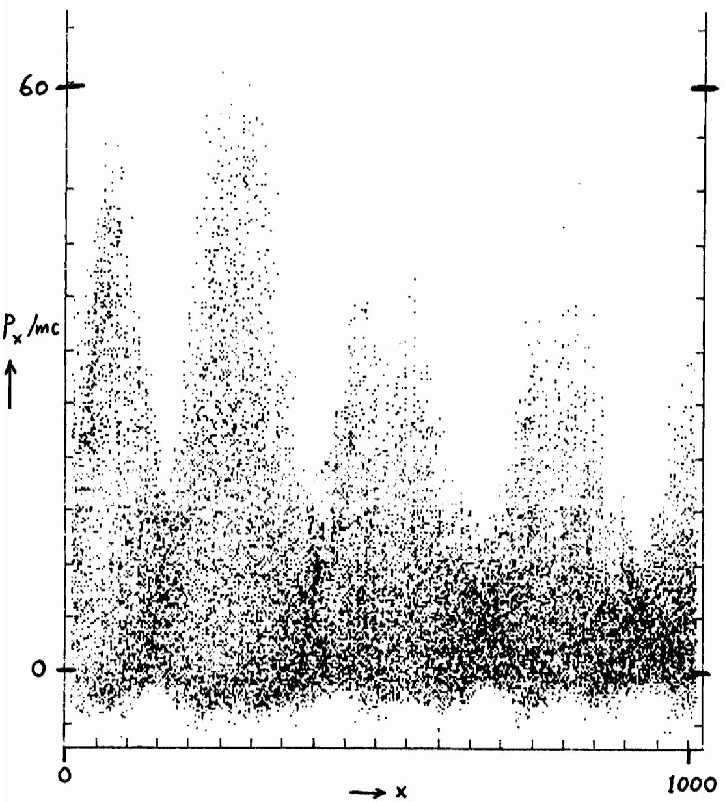  
Fig. 14: Relativistic Brillouin backscattering process. Electron $\mathtt { p _ { x } } - \mathtt { x }$ phase space is shown. Two beating lasers ${ \mathfrak { u } } _ { 0 } , { \mathfrak { u } } _ { 1 }$ with $\mathfrak { w } _ { 0 } \mathfrak { - } \mathfrak { w } _ { 1 } = \mathfrak { w } _ { \mathfrak { v } \mathfrak { i } }$ are injected into a plasma from left. Extremely higli energy elecfron\~ are seen in four bunches whose separation is $\mathsf { c } / \mathsf { \omega } _ { \mathsf { p } \mathsf { i } }$ much wider than th Raman bunch $\mathsf { c } / \omega _ { \mathsf { p } }$

$$
^ { \vartheta } _ { \mathsf { a } } \lesssim ^ { 2 z _ { \tt R } \mathrm { ~ \cdot ~ } }\tag{26}
$$

Outside of this regime, the laser power would be too low •. Fortunately, the self-trapping of the light beam can take place beyond a certain threshold laser power20 ; when the laser power is at the threshold, the beam propagates without defocusing, overcoming the natural tendency of spreading over the Rayleigh length. When the laser power exceeds, the laser beam propagates with its envelope resembling a sausage, still satisfactory to our purpose. Felber20 gives the self-trapping condition as

$$
\frac { { \bf e } \mathrm { E } _ { 0 } } { \mathrm { m c } ^ { 2 } { \bf k } _ { 0 } } > \frac { 4 \mathrm { m c } ^ { 2 } } { \mathrm { m c } ^ { 2 } + 2 \mathrm { T } } \left( \frac { \lambda _ { \mathrm { D } } } { a } \right) ^ { 2 } \sim 4 { \left( \frac { \lambda _ { \mathrm { D } } } { a } \right) } ^ { 2 } ,\tag{32}
$$

where $\lambda _ { \mathrm { D } }$ is the Debye length, T is the electron temperature, and a is the light beam cross-section radius. The condition (32) is not terribly difficult to fulfill. The filamentation instability is another instability that develops perpendicular to the beam propagation direction. This instability makes the orginally uniform beam profile into spiky nonuniform one, leading to possible difficulty to accelerate uniformly. The mechanism and condition to avoid this instability was studied. 21 We may be able to have the above mentioned self-trapping and to avoid the filamentation instability if we choose a certain domain in the lower frame of Fig. 7 of Ref. 21, Le. the right upper portion of the graph above the broken line but below the hatched area. This corresponds to the regime with enough beam intensity and enough beam radius.

The issue of luminosity becomes unavoidable as the energy goes up. As the uncertain principle dictates, the interaction time f:..t reduces f:..t \~\~ /\~E. The cross-section at asymptotic energy is

$$
C ( E + \infty ) \sim ( \Delta \ell ) ^ { 2 }
$$

$$
\sim \frac { \hbar ^ { 2 } \mathrm { c } ^ { 2 } } { \mathrm { E } _ { \mathrm { c m } } ^ { 2 } } \ ,\tag{33}
$$

where $\Delta \mathbb { E } \sim \mathbb { E } _ { \mathtt { C } \mathtt { m } } ,$ the center-of-mass energy. Because the number of events' is nco times luminosity, the luminosity L has to be given as

$$
\texttt { L } \propto \mathtt { E } _ { \mathtt { c m } } ^ { 2 } \ \cdot\tag{34}
$$

On the other hand, since the luminosity is inversely proportional to the beam bunch length, the short wavelength may be favorable on this issue.

There are other two or three dimensional phenomena we have not addressed. Among these, the self-magnetic field effects generated by the accelerated electrons and their currents, need to be investigated. The side-scattering Raman instability tends to increase emittance of the electron beam. The emittance may also be determined by the plasma electron temperature, density, laser power, etc. These questions as well as some unencountered problems have to be tackled and answered. Some of the problems will be addressed by the following speakers, Drs. C. Joshi and D. Sullivan.

## ACKNOWLEDGMENTS

The author would like to thank Drs. J. M. Dawson, C. Joshi, D. Sullivan, A. Sessler, W. Willis, F. Felber, R. O. Hunter, M. N. Rosenbluth, A. Salam, and N. Bloembergen for stimulating discussions, encouragements and interes ts. The work was supported by the U. S. Department of Energy, Contract No. DE-FGOS-80-ETS3088 and National Science Foundation Grants ATM81-10S39. Much of this work was carried out in collaboration with Dr. J. M. Dawson. Dr. F. Felber pointed out the possibility of self-trapping of laser beams.

## REFERENCES

1.	 A. Salam, in this Conference.

2.	 W. Willis, in this Conference.

3.	 T. Tajima and J. M. Dawson, IEEE Trans. Nucl. Science NS-26, 4188(1979).

4.	 T. Tajima and J. M. Dawson, Phys. Rev. Lett. 43, 267(1979).

5.	 T. Tajima and J. M. Dawson, IEEE Trans. Nucl. Science NS-28, 3416(1981).

6.	 T. Tajima, J. Vomvoridis, F. Felber, B. Spivey, R. O. Hunter, to be published.

7.	 B. Bernstein and I. Smith, IEEE Trans. Nucl. Science 1, 294(1973).

8.	 N. Kroll, A. Ron, and N. Rostoker, Phys. Rev. Lett. 11, 83(1964).

9.	 C. Joshi, T. Tajima, J. M. Dawson, H. A. Baldis, and N. A. Ebrahim, Phys. Rev. Lett. 47, 1285(1981).

10.	 Y. R. Shen and N. Bloemberge\~ Phys. Rev. 137, A1787(1965).

11.	 M. N. Rosenbluth and C. S. Liu, Phys. Rev. Lett. \~, 701(1972).

12.	 B. I. Cohen, A. N. Kaufman, and K. M. Watson, Phys. Rev. Lett. 29, 581(1972).

13.	 H. Yukawa, Proc. Phys. Math. Soc. Jpn. 17, 48(1935).

14.	 D. J. Sullivan and B. B. Godfrey, IEEE Trans-.- Nucl. Science NS-28, (1981).

15.	 A. T. Lin, J. M. Dawson, and H. Okuda, Phys. Fluids!l, 1995(1974).

16.	 Sometimes $\boldsymbol { \mathsf { v } } _ { \mathtt { t r } }$ is defined as $\sqrt { 2 }$ times the value of Eq. (17).

17.	 J. M. Dawson and R. Shanny, Phys. Fluids 11, 1506(1968).

18.	 M. Ashour-Abdalla, J. N. Leboeuf, T. Tajim\~ J. M. Dawson, and C. F. Kennel, Phys. Rev. A23, 1906(1981).

19.	 J. N. Leboeuf, M. Ashour-Abdalla, T. Tajima, C. F. Kennel, F. V. Coroniti, and J. M. Dawson, Phys. Rev. A25, 1023(1982).

20.	 F. S. Felber, Phys. Fluids 23, 1410(1980).

21.	 F. S. Felber and D. P. Chernin, J. Appl. Phys. \~, 7052(1981).

## DISCUSSION

Winterberg. I should like to mention.another related idea, which is a logical extension and perhaps not so crazy as it seems. This is to use solid densities, where wavelengths are much shorter, and an X-ray laser. Such a laser has been established with the help of a fission bomb; if we can someday make micro-explosions leading to high densities there is little doubt that we can again make a soft X-ray lasers. This will allow higher density of operations and even higher electric fields.

Nation. Can you comment on the initial trapping. Do you need high density high energy electron beams to start with?

Tajima. For the particles to be trapped in the electrostatic wave they must have relativistic energies.

Nation. How many particles can be trapped and accelerated?

Tajima. In my simulation 1% of the particles are accelerated. This would be about 1016 per cm3•

Participant. Have you considered side scatter?

Tajima. We have thought about it, but cannot do conclusive calculations with our 2D code. My hunch is that it is not terribly important.

Bingham. You will get longitudinal detuning of the wave from the trapped particles.

Tajima. It does not happen as strongly as you might think. The reason is that all the trapped particles are propagating at the speed of light, and only 1% of the particles are trapped.

Reiser. What about gas scattering?

Tajima. This might be important at densities of order 1021 cm-3•