# Particle simulation of plasmas

John M. Dawson

Department of Physics,UniversityofCalifornia,Los Angeles,California 90024

For plasma with a large number of degrees of freedom,particle simulation using high-speed computers can offer insights and information that supplement those gained by traditional experimental and theoretical approaches.The technique follows themotion of alarge assembly of charged particles in their self-consistent electric and magnetic fields.With proper diagnostics,these numerical experiments reveal such details as distribution functions,linear and nonlinear behavior,stochastic and transport phenomena,and approach to steady state.Such information can both guideand verify theoretical modeling of thephysical processes underlying complex phenomena.It can also be used in the interpretation of experiments.

# CONTENTS

I． Introduction

[I.Particle Models for a Plasma 404

A．Electrostatic particle models 1．Collisions 2.Finite-size particles 3．Estimate of collisional effects 4．Advancing the particles   
B. Electromagnetic particle models and fractional dimensional models 1．General description 2．Advancing the particles a.Nonrelativistic case b.Relativistic case   
C. Magnetostatic (Darwin) models   
D．Modeling bounded plasmas   
E.Numerical stability

III. Diagnostics

A.Measurements related to particle motion 1．Distribution function 2.Drag on a particle 3．Diffusion in velocity 4.Diffusion across a magnetic field   
B.Measurements related to waves 1．Field fluctuations a．Point particles b.Finite-size particles 2．Time correlations 3．Normal modes of a nonuniform plasma

IV. Quiet Starts

A．Aside generation of a set of random numbers with an arbitrary distribution function   
B. Electrons of many sizes,charges,and masses   
C.Instabilities in quiet starts

V．Some Examples of Plasma Simulation

Tests of the statistical theory of plasmas   
1. Kinetics of a one-dimensional plasma   
2. Dragona fast particle   
3. Dragona slow sheet   
4. Diffusion in velocity space   
5. Thermalizationof test particles   
6. Thermalization of a one-dimensional plasma to a Maxwellian   
7.Longitudinal bremsstrahlung in a one-dimensional plasma   
8. Diffusion of a two-dimensional plasma across a magnetic field a．Theory of diffusion in two dimensions b. The simulation of plasma diffusion across a magnetic field (two dimensional) c. Dependence of diffusion rate on particles'energy

B.Waves and instabilities in a magnetic plasma 437   
1．Bernstein modes 437   
2.Instabilities of ring distribution in velocity space   
(Ashour-Abdalla et al.,1980; Dawson,1981) 438   
3.The saturation and heating mechanism 440   
C. The free-electron laser 442   
1．The physics of the free-electron laser 443   
2.Results of the simulation 443   
VI. My View of the Future of Particle Simulation 445   
Acknowledgments 445   
References 445

# I. INTRODUCTION

Traditionally the investigation of the behavior of complex physical systems has been carried out through the application of two well-tested techniques,namely, the experimental techniques in which one disturbs the system in some controlled manner and observes its behavior,and the theoretical approach in which one uses analytical mathematical techniques to determine the behavior consistent with well-established physical laws.In the case of large-scale physical phenomena,one must often substitute observations of naturally occurring behavior for wellcontrolled experiments. The great advances in physics have come through the combined application of.these two approaches. One asks questions of nature through experiments whose results test and extend our theoretical knowledge. Notwithstanding the great power and successes of this approach,there are a large number of physical problems for which experiments are difficult or impossible,and the simultaneous interaction of a large number of degrees of freedom makes analytic theoretical treatments impractical. Often，however，we believe we understand what the fundamental laws that govern the system are,but we are simply unable to work out their consequences. Most of the rich variety of natural phenomena that occur all around us are of this type. At the other extreme, we may not be sure of the physical laws. However, we may have proposed ones which we are unable to test because of the complexity of the theory (detailed evolution of .cosmology, for example). Recently,a powerful new method for both types of investigation has become possible through the advent of modern high-speed computers. This is the method of computer simulation or computer modeling.

For computer simulation one constructs a numerical model of the system or theory which one wishes to investigate. One then carries out a numerical experiment on a high-speed computer,allowing the system to evolve from some initial situation of interest in accordance with the laws used. The computer can give one as much information about the details of the evolution as one desires.One can compare the results of each simulation with theoretical predictions based on simplified analytic models,with experimental observations or with observation of natural phenomena，or one can use the results to predict the behavior of unperformed (and often unperformable) experiments.

Most computer simulations are performed to obtain results of immediate practical interest, the performance of a fusion device, the performance of an accelerator, the performance of an electronic device for generating radiation, prediction of the performance of a ship,prediction of the weather,prediction of the impact of various human activities on world climates,or prediction of the details of chemical reactions,to name just a few. However,such studies also can be used to gain insight and understanding of a fundamental nature,as well. Collective mechanisms of energy and plasma transport across a magnetic field, collective mechanisms of transport in a fluid,the nature of hydrodynamic turbulence, the interaction of the solar wind with planetary magnetospheres,the generation of radiation by energetic plasma, the collapse of a gas cloud to form a star, the evolution of a galaxy,and the steps by which a complex chemical reaction takes place are just a few examples.

Obviously no article can address itself to such a wide range of subjects nor do I have the knowledge to attempt to do so. This article will confine itself to computer simulation of plasmas. However, the philosophy, the approach,and many of the techniques are applicable to oth-er areas of science and indeed many examples of such application now exist.

This article will be divided into a number of sections: Sec.I will discuss a number of particle models useful for plasma simulation, Sec.III will discuss some methods for diagnosing the results of such computations and extracting useful information from them,Sec.IV will discuss methods of noise suppression,Sec. V will give a few examples of problems which have been investigated,and, finally,Sec. VI will give a brief discussion of the future of particle simulations of plasmas as I see it.

Even though the subject of computer simulations of plasmas is only a little more than twenty years old, it has become a very large and extensive subject,employing a wide range of techniques and attacking a vast array of physical problems.As is the case with any new field, there are varying opinions about the usefulness and value of various techniques and what they have revealed in terms of new physics (it is getting at the physics of plasmas which this article deals with)． I,of course, have my own opinions,some of which are justified,and some of which would be found wanting under a critical examination. Rather than to try to give a comprehensive coverage of all the work that has been done which is virtually impossible and would involve confusing and fruitless discussions of the merits and shortcomings of numerous numerical methods (there are no God-given correct methods of simulation, there are only approximations with varying advantages and disadvantages) I shall largely deal with the work of the Princeton and UCLA groups with which I am most familiar. The emphasis will be on applying the techniques to obtain new physical insights. Similar and parallel developments have taken place at many universities and laboratories throughout the world; the interested reader will find good discussions of much of this work in Methods in Computational Physics,Vols.9 and 16 (1976), Hockney and Eastwood (1981),Potter (1973),and Birdsall and Langdon (in press).

# II. PARTICLE MODELS FOR A PLASMA

Among the most successful models for computer simulation of plasmas are particle models. In these models one emulates nature by following the motion of a large number of charged particles in their self-consistent electric and magnetic fields. Although this method sounds simple and straightforward,practical computational limitations require the use of sophisticated techniques. This need primarily arises from the limited number of particles whose motion can be followed. Even the most advanced computers cannot follow the motion of more than a few million particles for any appreciable length of time.This can be compared to the huge number of particles encountered in laboratory and natural plasmas (typically $1 0 ^ { 1 2 }$ $\mathrm { c m } ^ { - 3 }$ for laboratory plasmas and $1 0 ^ { 1 8 } ~ \mathrm { k m } ^ { - 3 }$ for space plasmas; the range of densities can vary from $1 0 ^ { 2 7 } ~ \mathrm { c m } ^ { - 3 }$ for laser pellet fusion plasmas to $1 ~ \mathrm { c m } ^ { - 3 }$ for interstellar plasmas). For this reason one may view each particle in a simulation as representing many particles of a real plasma (a superparticle). Alternatively,one may view the simulation as modeling a very small but typical region of a plasma.

Particle models for plasmas come in a large number of varieties. There are one-，two-，and three-dimensional models; there are electrostatic,magnetostatic,and electromagnetic models. We shall start by considering electrostatic models (Dawson, 1962a, 1964; Buneman 1959; Hockney，1966，1969；Birdsall and Fuss，1969；Kruer et al.1973；Morse 1970; Morse and Nielson，1969a, 1969b)．These illustrate many of the problems and the techniques used in these models. We shall then look at other types of models (Langdon,1969;Auer et al.,1961, 1962；Morse and Nielson，1971； Busnardo-Neto et al., 1977;Nielson and Lindman,1973; Lin et al.,1974; Lindman,1975; Buneman, 1976; Kwan et al.,1977).

# A．Electrostatic particle models

We shall begin by considering electrostatic particli models in one,two,and three dimensions. For a poin particle at position $r _ { j }$ we obtain the potential, $\phi$ ,and elec tric, $\pmb { { \cal E } }$ ,fields from Poisson's equation

$$
\begin{array} { l } { { \nabla ^ { 2 } \phi = - 4 \pi q \delta ( \mu - \mu _ { j } ) \ , } } \\ { { { \bf E } = - \nabla \phi \ . } } \end{array}
$$

Here $\pmb { \triangledown }$ and $\nabla ^ { 2 }$ are given by

$$
\begin{array} { l } { { \displaystyle \nabla = \sum _ { \sigma = 1 } ^ { n } \mathbf { e } _ { \sigma } \frac { \partial } { \partial x _ { \sigma } } \ , } } \\ { { \displaystyle \nabla ^ { 2 } = \sum _ { \sigma = 1 } ^ { n } \frac { \partial } { \partial x _ { \sigma } ^ { 2 } } \ , } } \end{array}
$$

where $\pmb { n }$ is the number of dimensions and $\bullet _ { \sigma }$ and $\pmb { x } _ { \pmb { \sigma } }$ are unit vectors in the $\pmb { \sigma }$ direction and the $\pmb { \sigma }$ coordinate. The electric fields found from (1) are given by

$$
\begin{array} { l } { \displaystyle { { \bf E } ( x ) = \frac { 2 \pi q ( x - x _ { j } ) } { \vert x - x _ { j } \vert } \ , } } \\ { \displaystyle { { \bf E } ( \kappa ) = \frac { 2 q ( \kappa - \kappa _ { j } ) } { \vert \kappa - \kappa _ { j } \vert ^ { 2 } } \ , } } \\ { \displaystyle { { \bf E } ( \kappa ) = \frac { q ( \kappa - \kappa _ { j } ) } { \vert \kappa - \kappa _ { j } \vert ^ { 3 } } \ , } } \end{array}
$$

for one, two, and three dimensions,respectively.

The force on a particle $i$ due to all other particles is given by

$$
\mathbf { F } _ { i } { = } q _ { i } \sum _ { \underset { i \neq j } { j } } \mathbf { E } _ { i j } \ ,
$$

and its equation of motion [using Eqs. $( 3 \mathbf { a } ) - ( 3 \mathbf { c } ) ]$ is

$$
\ddot { \pmb { \mathscr { r } } } _ { i } = \frac { q _ { i } } { M _ { i } } \sum _ { j \neq i } \mathbf { E } _ { i j } \propto \frac { q _ { i } } { M _ { i } } \sum _ { j } \frac { q _ { j } ( \pmb { \mathscr { r } } _ { i } - \pmb { \mathscr { r } } _ { j } ) } { \mid \pmb { \mathscr { r } } _ { i } - \pmb { \mathscr { r } } _ { j } \mid ^ { n } } ~ ,
$$

where $\pmb { n }$ is the number of dimensions. The proportional sign is used in Eq.(5) because there is a numerical coefficient which depends on the number of dimensions. We have not included magnetic forces here. It is straightforward to include a fixed magnetic field by simply adding the term $q _ { 1 } \dot { \pmb { \mathscr { r } } } _ { i } \pmb { x } \mathbf { B } / M _ { i } c$ in the equation of motion. We shall look at this in detail later. For the present discussion of the basic model we restrict ourselves to Eq. (5).

If one attempts to proceed in a straightforward manner to solve Eq. (5) for a large number of particles by directly computing the force on every particle, he soon realizes the total impracticality of such an approach.

The following elementary estimate shows the magnitude of the problem． First, it would be required that we evaluate the sum on the right-hand side of Eq. (5） for each particle or $\pmb { N }$ times for $\pmb { N }$ particles.The sum itself contains $N$ terms; each term requires a number of arithmetic operations-for the sake of estimating,let us say, ten (it is eight for two dimensions). The total number of arithmetic operations required to evaluate the force will be of the order of

For a calculation involving $3 \times 1 0 ^ { 4 }$ particles (a typical number used in present calculations) the total number of operations would be about $1 0 ^ { 1 0 }$ Even assuming that we can do an operation in, $1 0 ^ { - 7 }$ sec, simply evaluating the forces would require $1 0 ^ { 3 }$ sec or about $1 5 \ \mathrm { m i n }$ A typical calculation requires several thousand time steps so that 500-100o h would be required. Calculations of this magnitude are totally impractical for using such models to explore the physics of plasma. For many problems we are interested in systems containing more than $3 \times 1 0 ^ { 4 }$ particles; systems involving many millions of particles would be valuable for many purposes. With an ${ \bf { \dot { N } } } ^ { 2 }$ scaling for the run time, runs would be hopeless. Even great improvements in the speeds of computers-by,say,1000— would only make such calculations marginal. We must use a better way. One will be presented shortly, following a look at collisional effects in such models,which determine how many particles we must use.

# 1. Collisions

A second important consideration for particle models is that of particle collisions (Okuda and Birdsall,1970; Langdon and Birdsall,197O). Just as in real plasmas, there are encounters between particles,and these give rise to collisional effects which influence the physics of the model. Many of the phenomena we wish to model occur in high-temperature plasmas where collisional effects are very weak; these are the so-called collisionless plasmas. Since our computer models are limited to between a few thousand and a few million particles,whereas a typical laboratory plasma has $1 0 ^ { 1 2 }$ particles/ $\mathbf { \omega } _ { \mathbf { c m } } \mathbf { \lambda } ^ { 3 }$ ,each particle in the model can be thought of as representing many plasma electrons or ions. Thus the forces between model particles are much larger than in a real plasma and the associated collsional effects are much greater. We must reduce these effects; to some extent we are aided both by the fact that the model represents only a small portion of a real plasma and by the fact that we can work in a reduced number of dimensions (one or two)． The critical factor is the rate of collisions compared with such natural frequencies as the plasma frequency $( \omega _ { p e } ^ { 2 } = 4 \pi n e ^ { 2 } / m )$ ; in typical laboratory plasmas $\omega _ { p e } / \nu$ $( \nu$ is the electron collision frequency） varies from $1 0 ^ { 2 } - 1 0 ^ { 6 }$ Fortunately there is a method which both speeds up the force calculation and at the same time allows us substantially to reduce the collision rate; this is the so-called finite-size particle (FSP) method.

# 2. Finite-size particles

The force between two point particles has the shapes shown in Fig.1 for two and three dimensions.The force is large when two particles are close to each other. Two particles passing close to each other will feel large and rapidly varying forces as they go by one another. It is the impulses associated with such encounters which give rise to collisional effects. On the other hand, the slow falloff of the force with distance means that many particles can interact simultaneously. This part of the force then gives rise to the collective behavior of a plasma which we wish to simulate. If we could replace the Coulombic force between particles by one which is Coulombic at large distances but which goes to zero for short distances,then we would retain the collective behavior while reducing the collision rate. We should thus like to replace the forces shown in Fig. 1by one similar to that shown in Fig. 2.

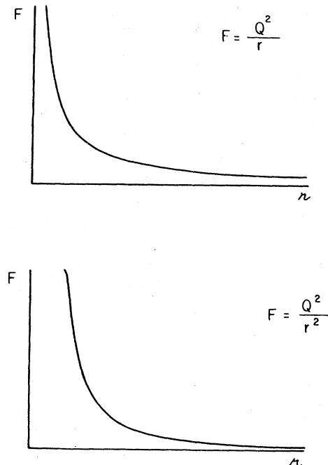  
FIG.1.Coulomb force law between particles in two and three dimensions.

This is just the type of force which will exist between two circular (spherical) charge clouds which are free to pass through each other. Such charge clouds are shown in the upper right portion of Fig..2. When the charges are far apart, the force is just Coulombic; but when they start to overlap,it starts to drop off-and it will go to zero when they lie exactly on top of each other.

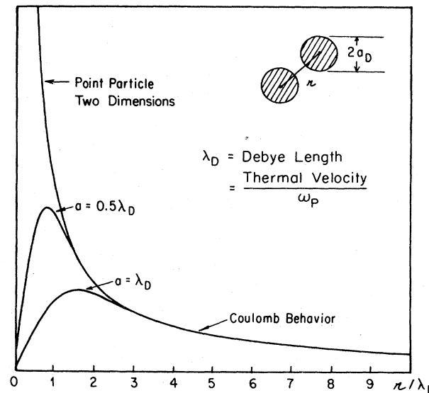  
FIG.2.Force law between finite-size particles in two dimensions for various sized particles. A Gaussian-shaped chargedensity profile was used.

With the use of finite-sized particles the large, rapidly .varying force associated with close encounters, i.e.,collisions,is greatly reduced (Okuda and Birdsall,1970; Langdon and Birdsall,197O; Dawson et al.,1969). However,the long-range Coulombic force which gives rise to collective motions is retained, and so these effects are accurately modeled.

Now if the particles are of finite size,their charge is smeared out over a finite region of space,and density variations over regions smaller than the size of a particle cannot be resolved. This implies that in making calculations we may divide the space into cells which are about the size of a particle. We do this by means of a grid which has a grid spacing about equal to the size of the particle-see Fig. 3. (Of course we are free to adjust the relative size of the particle and the grid spacing but we generally choose them to be close to the same.） We do this for computational convenience in calculating the forces on the particles.Rather than computing the force directly using Eq. (4),we can calculate it in terms of the electric field. For a point particle we would have

$$
\mathbf { F } _ { i } { = } q _ { i } \mathbf { E } ( { \pmb { \mu } } _ { i } ) ~ ,
$$

where the electric field is obtained from the potential

$$
{ \bf E } ( \varkappa ) = - \nabla \phi ( \varkappa ) \ ,
$$

and the potential $\phi$ is obtained from Poisson's equation

$$
\nabla ^ { 2 } \phi \left( \varkappa \right) = - 4 \pi \rho ( \varkappa ) ,
$$

where $\rho ( \pmb { \mathscr { s } } )$ is the charge density.

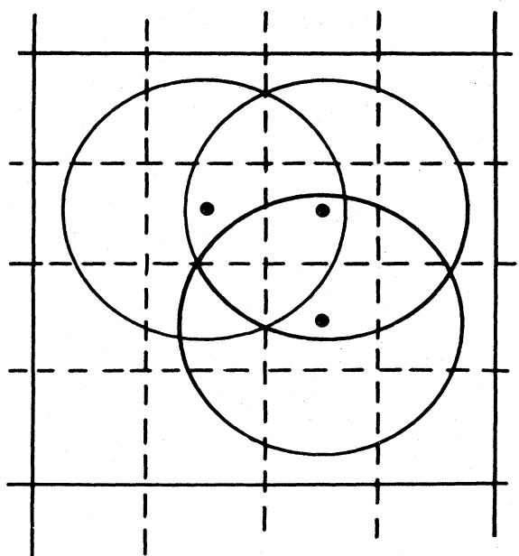  
FIG.3.Finite-sized particles and discrete grid used for calculating the force.

For finite-size particles Eq. (7) for the force must be modified; we must add up the forces on all charge elements which make up a particle. Thus Eq.(7) becomes

$$
\begin{array} { r } { { \bf F } _ { i } = q _ { i } \int S ( \pmb { \mu } - \pmb { \mu } _ { i } ) { \bf E } ( \pmb { \mu } _ { * } ) d ^ { n } \pmb { \mu } _ { * } \ , } \end{array}
$$

where $\pmb { q } _ { i }$ is the total charge, $\pmb { S } ( \pmb { \mathscr { n } } )$ is a shape factor giving the way a particle charge is distributed about its center, and $\pmb { n }$ is the number of dimensions. We normalize $\pmb { S } ( \pmb { \mu } )$ so that

$$
\begin{array} { r } { \int S ( \pmb { \mathscr { s } } ) d ^ { n } \pmb { \mathscr { s } } = 1 \ . } \end{array}
$$

We are free to choose whatever charge density or shape factor we desire. Some commonly chosen ones are shown in Fig. 4.

The charge density $\rho ( \pmb { \mathscr { r } } )$ is given by

$$
\rho ( \pmb { \mathscr { r } } ) = \sum _ { j } q _ { j } S ( \pmb { \mathscr { r } } - \pmb { \mathscr { r } } _ { j } ) \ .
$$

Now to solve Poisson's equation we do not use the exact charge density, but we instead employ an approximate one obtained by a multipole expansion of the charge densities about the grid points (Kruer et al.,1973). For finite-sized particles such an expansion converges quite rapidly (Chen and Okuda,1975),and it is rarely necessary to carry it beyond the dipole order-in practice,in fact, this is almost never done.

Having charges distributed on a regular grid allows rapid numerical solutions of Poisson's equation by means of rapid Poisson solvers (Buneman,1969; Hockney,1970) or by means of fast Fourier transforms (Cooley and Tukey, 1965). Here we will use the fast Fourier transform method.

In order to make the multipole expansion about the grid points we write the charge density as follows:

$$
\begin{array} { l } { \rho ( \pmb { \mathscr { s } } ) = \displaystyle \sum _ { j } q _ { j } [ S ( \pmb { \mathscr { s } } - \pmb { \mathscr { s } } _ { j } ) ] } \\ { = \left[ \displaystyle \sum _ { j } q _ { j } S ( \pmb { \mathscr { s } } - \pmb { \mathscr { s } } _ { g , j } ) + \Delta \pmb { \mathscr { s } } _ { j } \cdot \nabla _ { g } S ( \pmb { \mathscr { s } } - \pmb { \mathscr { s } } _ { g , j } ) + \cdots ~ \right] . } \end{array}
$$

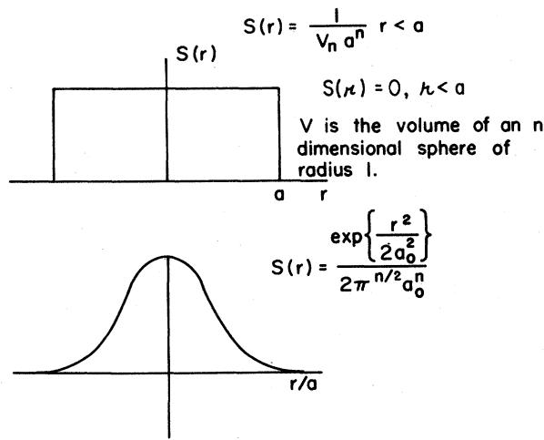  
FIG.4. Square and Gaussian charge shapes-two shapes often used for finite-sized particles.

Here $\scriptstyle { \hat { \mathbf { \mu } } } _ { g , j }$ is the grid point nearest to particle $j ,$ and this is simply a Taylor expansion,or multipole expansion of a particle's charge about its nearest grid point. If only the first term or monopole term is kept,this is called the nearest grid point approximation，while keeping first derivative terms gives a dipole expansion approximation. One can keep higher-order multipole terms if desired. This is rarely done because of the added computation time required,although some forms of charge sharing give some quadrupole correcting at little extra cost; a modified finite difference approximation to the multipole expansion called SUDS (subtracted dipole scheme) (Kruer et al.,1973) can relatively easily be extended to higher order,especially in one dimension,and this had been used to advantage (Decyk, 1980).

Once the particles have been replaced by a set of finitesize charges and dipoles on the grid points,we can replace the sum over particles by a sum over grid points:

$$
\rho ( \pmb { \mathscr { r } } ) { \simeq } \sum _ { g } \mathbb { I } Q ( \pmb { \mathscr { r } } _ { g } ) S ( \pmb { \mathscr { r } } - \pmb { \mathscr { r } } _ { g } ) { \div } \mathbb { D } ( \pmb { \mathscr { r } } _ { g } ) { \cdot } \nabla _ { g } S ( \pmb { \mathscr { r } } - \pmb { \mathscr { r } } _ { g } ) ] ,
$$

where

$$
Q ( \mathscr { r } _ { g } ) = \sum _ { j \in g } q _ { j } \ ,
$$

and

$$
\mathbf { D } ( \pmb { r } _ { g } ) = \sum _ { j \in g } q _ { j } \Delta \pmb { r } _ { j } \ .
$$

$Q ( \pmb { \mathscr { x } } _ { g } )$ is the sum of the charges of those particles whose nearest grid point is $\blacktriangle _ { g }$ ,and $\mathbf { D } ( \tilde { \mathbf { \sigma } } _ { \pmb { z } } )$ is the total dipole moment of these particles with respect to $\tilde { { \mathbf \Xi } } _ { g }$ . By using this approximation we obtain a charge density and dipole density distributed on a uniformly spaced grid. We may use Fourier analysis to solve for the potential $\phi$ .Because of the uniform spacing of the grid points we may use the powerful numerical method of fast Fourier transforms (FFT) to obtain this (Cooley and Tukey，1965).Such a transform assumes the system is periodic (doubly periodic in two dimensions,triply periodic in three dimensions), and there are an equal number of Fourier modes to grid points.In Fourier space Poisson's equation becomes

$$
\begin{array} { r l r l } & { k ^ { 2 } \phi ( { \bf k } ) = 4 \pi \rho ( { \bf k } ) \ , } & & { } \\ & { \phi ( { \bf k } ) = 4 \pi \rho ( { \bf k } ) / k ^ { 2 } \ , \quad \quad \quad \quad } & { ( } \\ & { { \bf E } ( { \bf k } ) = \frac { - 4 \pi i { \bf k } } { k ^ { 2 } } \rho ( { \bf k } ) \ , \quad \quad \quad \quad } & { ( } \\ & { \rho ( { \bf k } ) = S ( { \bf k } ) \sum _ { \substack { g } } [ Q ( \mathscr { n } _ { g } ) - i { \bf k } \cdot \mathbf { D } ( \mathscr { n } _ { g } ) ] e ^ { - i { \bf k } \cdot \mathscr { n } _ { g } } \ , \quad \quad \quad \quad } & { ( } \\ & { \rho ( { \bf k } ) = S ( { \bf k } ) \ \big | \ [ \mathrm { F F T } \{ Q ( \mathscr { n } _ { g } ) \} - i { \bf k } \cdot \mathrm { F F T } \{ \mathbf { D } ( \mathscr { n } _ { g } ) \} \big ] \ . \quad \quad \quad } & { ( } \end{array}
$$

The FFT's give fields for point particles,and the finitesize effect is taken into account through the transform of the form factor.

Including the dipole term in Eqs.(19) and (2O) substantially increases the computation time for the FFT (by a factor of 2 in one dimension,by a factor of 3 in two dimensions,and by a factor of 4 in three dimensions).This time can be reduced by replacing the dipole approximation with a charge sharing approximation. In this procedure rather than approximate a charge by a charge and a dipole at the nearest grid point,a weighted charge distribution at the four nearest grid points (for the twodimensional case) is used,the weighting being such that the total charge and dipole moment with respect to the center of the cell are the same.

One method for assigning charges for the twodimensional case is the area-weighting scheme (Morse, 1970;Morse and Nielson,1969a,1969b) illustrated in Fig. 5.

The heavy lines in Fig. 5 show the main computational grid, grid spacing $\pmb { d }$ ；the dashed lines show a grid whose grid points lie at the centers of the squares of the main grid.Consider a particle whose center is at point C. Take this to be the center point of a square with size $\pmb { d }$ ,i.e., equal to the grid spacing. The intersection of this square with the dashed grid divides this square into four areas, $A _ { 1 } , A _ { 2 } , A _ { 3 }$ ，and $\pmb { A _ { 4 } }$ ，as shown in the figure. Assign to grid point 1 (see figure) a charge $q A _ { 1 } / d ^ { 2 }$ and to grid points 2,3,and 4,charges $q A _ { 2 } / \dot { d } ^ { 2 }$ ， $q A _ { 3 } / d ^ { 2 }$ ,and $q A _ { 4 } / d ^ { 2 }$ ， respectively. One can readily verify that this distribution of charge has the same dipole moment with respect to the nearest dashed grid point $\pmb { g }$ as the original particle has. This simple interpolation scheme can readily be extended to three dimensions.

Sometimes the charge distribution of a particle (Hockney,1966,1969) is considered to be uniform on a square and the above interpolation scheme is simply a method of distributing its charge on the grid. This is one way to view the model. We, however,shall view it simply as an interpolation method and consider our particles to be of finite size with the size and shape being arbitrary and left as parameters to be chosen by the practitioner.

One obtains the electric field at the grid points of the mesh by performing an inverse FFT of Eq. (18). Using either the nearest grid point approximation or the charge-sharing approach,one has

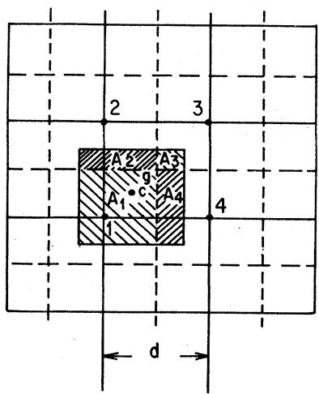  
FIG.5. Area-weighting method for charge sharing.

$$
\mathbf { E } ( \kappa _ { g } ) { = } \mathrm { F F T } ^ { - 1 } \left[ S ( \mathbf { k } ) \mathrm { F F T } \left[ { - } \frac { 4 \pi i \mathbf { k } } { k ^ { 2 } } Q ( \kappa _ { g } ) \right] \right] \mathrm { ~ . ~ }
$$

Two factors must be taken into account in obtaining the force on a particle from this $E$ field. First,we must take account of the fact that the particle is not located at a grid point. We do this by an appropriate interpolation. For example, if we used the area-weighting method shown in Fig.5 to distribute the charge,then we can use the equivalent interpolation method to find the force. We would take the force to be

$$
{ \bf F } { = } ( { \bf E } _ { 1 } A _ { 1 } { + } { \bf E } _ { 2 } A _ { 2 } { + } { \bf E } _ { 3 } A _ { 3 } { + } { \bf E } _ { 4 } A _ { 4 } ) \frac { q } { d ^ { 2 } } .
$$

The second factor we must include is the finite size of the particle. The force on a finite particle $j$ is the weighted average electric field,

$$
\begin{array} { r } { \mathbf { F } _ { j } ( { \pmb { \mathscr { r } } } _ { j } ) { = } \int \mathbf { E } ( { \pmb { \mathscr { n } } } ) S ( { \pmb { \mathscr { n } } } - { \pmb { \mathscr { r } } } _ { j } ) d ^ { n } { \pmb { \mathscr { n } } } . } \end{array}
$$

One can Fourier analyze $\mathbf { F } ( \alpha _ { j } )$

$$
\begin{array} { l } { { \displaystyle { \bf F } _ { j } ( { \bf k } ) = \frac { 1 } { ( 2 \pi ) ^ { n / 2 } } \int { \bf F } _ { j } ( { \bf \Omega } _ { \kappa _ { j } } ) e ^ { i { \bf k } \cdot { \bf { \sigma } } _ { j } } d ^ { n } \kappa _ { j } ~ } } \\ { { \displaystyle { \bf F } ( { \bf k } ) = S ( - { \bf k } ) { \bf E } ( { \bf k } ) ~ . } } \end{array}
$$

Now $\mathbf { E }$ is the field of a group of finite-sized particles. Its Fourier transform can be written in terms of the field produced by a set of point particles and $S ( \mathbf { k } )$ ; the result is

$$
\mathbf { E } ( \mathbf { k } ) { = } S ( \mathbf { k } ) \mathbf { E } _ { \mathrm { p o i n t } } ( \mathbf { k } )
$$

and

$$
\mathbf { F } ( \mathbf { k } ) = \mid S ( \mathbf { k } ) \mid ^ { 2 } \mathbf { E } _ { \mathrm { p o i n t } } ( \mathbf { k } ) \ .
$$

Rather than work with $\mathbf { E }$ in the computation we use $\mathbf { F }$ and compute it on the grid points; we find the force on the particles using the interpolation scheme described above.

One can derive a Vlasov equation for the finite-sized particles. This Vlasov equation is given by

$$
\frac { \partial f } { \partial t } + \mathbf { v \cdot } \frac { \partial f } { \partial \kappa } + \frac { \mathbf { F } } { m } \cdot \frac { \partial f } { \partial \mathbf { v } } = 0 \ ,
$$

where $f ( { \boldsymbol { \mu } } , \mathbf { v } )$ is the distribution of particle centers and their velocities in $\mathbf { r } , \mathbf { v }$ space and $\mathbf { F }$ is the force on a particle and is given by

$$
\begin{array} { r } { { \bf F } ( { \pmb \kappa } _ { j } ) = q \int S ( { \pmb \kappa } - { \pmb \kappa } _ { j } ) { \bf E } ( { \pmb \kappa } ) d ^ { n } e . } \end{array}
$$

The electric field is given by

$$
\begin{array} { r l } & { \nabla \cdot { \bf E } = 4 \pi q \int f ( { \bf x } ^ { \prime } , { \bf v } ^ { \prime } ) s ( { \bf x } - { \bf x } ^ { \prime } ) d ^ { n } \kappa ^ { \prime } d ^ { n } v ^ { \prime } , } \\ & { } \\ & { \nabla \times { \bf E } = 0 . } \end{array}
$$

Fourier analyzing and carrying out a standard Landau type analysis gives the following dielectric associated with the FSP:

$$
\varepsilon ( \mathbf { k } , \omega ) = 1 + \frac { \omega _ { p } ^ { 2 } \left| S ( \mathbf { k } ) \right| ^ { 2 } } { k ^ { 2 } } \int _ { - \infty } ^ { \infty } \frac { \mathbf { k } { \cdot } \partial f _ { 0 } / \partial v } { ( \omega - \mathbf { k } { \cdot } \mathbf { v } + i \nu ) } d ^ { n } v .
$$

Here iv is a small damping term added to make the velocity integral well defined,and expression (32) should be considered in the limit as $i \nu \to 0$

The dispersion relation is obtained by setting $\scriptstyle \varepsilon ( \mathbf { k } , \omega )$ equal to zero. It is identical to that obtained from point particles except that ${ \omega } _ { p } ^ { 2 }$ is replaced by $| S ( { \bf k } ) | ^ { 2 } \omega _ { p } ^ { 2 }$ Thus we can obtain the dispersion relation for FSP from that for point particles simply by replacing ${ \omega } _ { p } ^ { 2 }$ by $| S ( { \bf k } ) | ^ { 2 } \omega _ { p } ^ { 2 }$ ：

For Gaussian-shaped particles $| S ( { \bf k } ) \big | ^ { 2 }$ is given by

$$
\vert S ( { \bf k } ) \vert ^ { 2 } = \frac { e ^ { - k ^ { 2 } a ^ { 2 } } } { \left( 2 \pi \right) ^ { n _ { a } n } } \ ,
$$

where $^ { a }$ is the scale length of the Gaussian charge density.1

We can see directly from this how the finite-sized particles reduce collision； the $| S ( { \bf k } ) | ^ { 2 }$ factor in Eq.(32) (equivalently in the force equation) cuts off the contributions from large $k ^ { \circ } \mathbf { s }$ The large- $\mathbf { \nabla } \cdot \mathbf { k }$ terms represent the contributions of short wavelengths and these go with close encounters and produce scattering.

# 3.Estimate of collisional effects

We can estimate the magnitude of collisional effects and the improvement accompanying the use of finitesized particles by the following crude calculation which however,gives the essential factors.The calculation is illustrated in Fig. 6.

Let points 1 and 2 represent the centers of a test particle(1)and a fixed scattering center.Let us assume that to sufficient accuracy the force on 1 can be calculated from a straight undeflected orbit. Let $\rho$ be the impact parameter. We assume that we can compute the change in momentum of 1 from the force at the instant of closest approach times the time it takes the particle to go $_ { 2 \rho }$ ,or

$$
\Delta P { = } F ( \rho ) \frac { 2 \rho } { v } ~ .
$$

The means square change in momentum is

$$
\Delta P ^ { 2 } { = } F ^ { 2 } ( \rho ) \frac { 4 \rho ^ { 2 } } { v ^ { 2 } } ~ .
$$

lFor finite periodic system where Fourier series are used rather than Fourier integrals $\vert S ( k ) \vert ^ { 2 }$ is replaced by its Fourier integral value divided by $L ^ { n }$ ，where $\pmb { L }$ is the periodicity length, and we assume $\pmb { L } > > \pmb { a }$ ．Equation (32) applies to systems which are continuous in space and time.The use of discrete grids and time steps introduces a phenomenon known as aliasing.This effect is discussed briefly in Sec.II.E.An extensive discussion of it and the modifications that are introduced into Eq.(32) can be found in Birdsall and Langdon (in press).

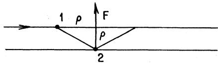  
FIG.6.Approximate method for coupling momentum transfer for encounters between two particles in two and three dimensions.

For two dimensions (2D) the mean-square momentum imparted to 1 per unit distance, $s ,$ ,of travel in the plasma is

$$
\frac { \left. \Delta P ^ { 2 } \right. _ { \mathrm { 2 D } } } { \Delta S } { = } 2 \int _ { \rho _ { \mathrm { m i n } } } ^ { \rho _ { \mathrm { m a x } } } { \frac { F ^ { 2 } ( \rho ) 4 \rho ^ { 2 } n \ d \rho } { v ^ { 2 } } } \ ,
$$

where $\pmb { n }$ is the density of scattering centers. For three dimensions (3D) the corresponding expression is

$$
\frac { \langle \Delta P ^ { 2 } \rangle _ { \mathrm { 3 D } } } { \Delta S } { = } \int _ { \rho _ { \mathrm { m i n } } } ^ { \rho _ { \mathrm { m a x } } } \frac { F ^ { 2 } ( \rho ) 4 \rho ^ { 2 } } { v ^ { 2 } } n 2 \pi \rho d \rho .
$$

If one uses the force law for point particles, then we have for the two-dimensional case

$$
\begin{array} { l } { { \displaystyle F = \frac { 2 q ^ { 2 } } { \rho } \ , } } \\ { { \displaystyle \frac { \langle \Delta P ^ { 2 } \rangle _ { \mathrm { 2 D } } } { \Delta S } = \frac { 3 2 q ^ { 4 } n } { v ^ { 2 } } ( \rho _ { \mathrm { m a x } } - \rho _ { \mathrm { m i n } } ) \ , } } \end{array}
$$

and for the three-dimensional one,

$$
\begin{array} { r l } & { F = \frac { q ^ { 2 } } { \rho ^ { 2 } } \ , } \\ & { \frac { \left. \Delta P ^ { 2 } \right. _ { \mathrm { 3 D } } } { \Delta S } { = } \frac { 8 \pi q ^ { 4 } n } { v ^ { 2 } } \mathrm { l n } \frac { \rho _ { \mathrm { m a x } } } { \rho _ { \mathrm { m i n } } } \ . } \end{array}
$$

If in place of point particles we use finite-size particles and assume that for distances of closest approach is less than $_ { 2 a }$ ，the force is linear in $\rho$ ，while for distances of closest approach greater than $_ { 2 a }$ it is the same as for point particles; the expressons corresponding to (38） and (39)are

$$
\frac { \langle \Delta P ^ { 2 } \rangle _ { 2 \mathrm { D } } } { \Delta S } = \frac { 8 q ^ { 4 } n } { 3 v ^ { 2 } } \frac { \rho _ { \mathrm { m a x } } ^ { 3 } } { a ^ { 2 } }
$$

if $\rho _ { \mathrm { m a x } } < 2 a$ ,and

$$
\frac { \left. \Delta P ^ { 2 } \right. _ { \mathrm { 2 D } } } { \Delta S } = \frac { 3 2 g n ^ { 2 } } { v ^ { 2 } } ( \rho _ { \mathrm { m a x } } - \frac { 4 } { 3 } a )
$$

if $\rho _ { \mathrm { m a x } } > 2 a ; \rho _ { \mathrm { m i n } }$ is taken to be equal to 0.

For the three-dimensional case

$$
\frac { \langle \Delta P ^ { 2 } \rangle _ { \mathrm { 3 D } } } { \Delta S } = \frac { \pi } { 8 } \frac { q ^ { 4 } n } { v ^ { 2 } } \frac { \rho _ { \mathrm { m a x } } ^ { 4 } } { a ^ { 4 } }
$$

if $\rho _ { \mathrm { m a x } } < 2 a$ ,and

$$
\frac { \left. \Delta P ^ { 2 } \right. _ { \mathrm { 3 D } } } { \Delta S } = \frac { 8 \pi q ^ { 4 } n } { v ^ { 2 } } \left[ \ln \frac { \rho _ { \mathrm { m a x } } } { 2 a } + \frac { 1 } { 4 } \right]
$$

if $\rho _ { \mathrm { m a x } } > 2 a$ ；here also $\rho _ { \mathrm { m i n } }$ is taken to be equal to zero.

We see that for $a = \rho _ { \mathrm { m a x } } ~ ( \rho _ { \mathrm { m a x } } = \lambda _ { D } = \mathrm { D e t }$ ye length), there isa reduction in the collision rates by roughly an order of magnitude for the two-dimensional case and by more than an order of magnitude in the three-dimensional case (depending on $\rho _ { \mathrm { m a x } } / \rho _ { \mathrm { m i n } } )$ ·

A number of studies of collision rates for finite-sized particle systems have been carried out. Figure 7 shows plots of the ratio of collision rates to those for point particles given by Okuda and Birdsall (197O). For a twodimensional plasma of FSP the collision rate is reduced by about an order of magnitude for particles which are one Debye length in radius; it is independent of the number of particles in a Debye square. For three-dimensional models the magnitude of the reduction in collision rate depends on how many particles are in a Debye sphere but is generally larger than in the two-dimensional case.

Examples of collision rates:

(a) two dimensions;

System $1 0 0 \lambda _ { D } \times 1 0 0 \lambda _ { D }$ ，$N = 3 \times 1 0 ^ { 5 }$ particles,$n \lambda _ { D } ^ { 2 } { = } N _ { D } { = } 3 0$ ，particle radius $a = \lambda _ { D }$ ，$\stackrel { \cdot } { \nu } = \frac { R \omega _ { p e } } { 1 6 N _ { D } } \approx 2 \times 1 0 ^ { - 4 } \omega _ { p } ,$

where $\pmb R$ is a reduction factor due to the finite particle size.

(b) three dimensions;

System $5 0 \lambda _ { D } \times 5 0 \lambda _ { D } \times 5 0 \lambda _ { D }$ ，  
$N = 1 0 ^ { 6 }$ particles,  
$n \lambda _ { D } ^ { 3 } = 1 0$ ，  
$\nu { \simeq } 1 0 ^ { - 3 } \omega _ { p e }$

# 4.Advancing the particles

The equations of motion for particle $^ j$ are

$$
\begin{array} { l } { \displaystyle \frac { d { \mathbf v } _ { j } } { d t } = \frac { { \mathbf F } ( { \boldsymbol \kappa } _ { j } , t ) } { m _ { j } } + \frac { q _ { j } } { m _ { j } c } ( { \mathbf v } _ { j } \times { \mathbf B } _ { 0 } ) ~ , } \\ { \displaystyle \frac { d { \boldsymbol \kappa } _ { j } } { d t } = { \mathbf v } _ { j } ( t ) ~ , } \end{array}
$$

where $\mathbf { F } ( \tilde { \bf \Phi } _ { j } , t )$ is the average force on particle $j$ as given by Eq. (29),and we have included the possibility of a uniform external magnetic field $\mathbf { B } _ { 0 }$ We advance $\mathbf { v } _ { j }$ and $\blacktriangle _ { j }$ using the standard leapfrog method (Buneman, 1959); to this end we approximate Eqs. (44) and (45) by the following time-centered difference equations:

$$
\frac { \mathbf { v } _ { j } ^ { n + 1 } - \mathbf { v } _ { j } ^ { n } } { \Delta t } = \frac { \mathbf { F } _ { j } ^ { n + 1 / 2 } } { m _ { j } } + \frac { \mathbf { v } _ { j } ^ { n + 1 } + \mathbf { v } _ { j } ^ { n } } { 2 } \times \boldsymbol { \omega } _ { c j } \ , \boldsymbol { \omega } _ { c j } = \frac { q _ { j } \mathbf { B } _ { 0 } } { m _ { j } c } \ ,
$$

$$
\frac { { \pmb { \mathscr { n } } } _ { j } ^ { n + 1 / 2 } - { \pmb { \mathscr { n } } } _ { j } ^ { n - 1 / 2 } } { \Delta t } { = } { \bf v } _ { j } ^ { n } .
$$

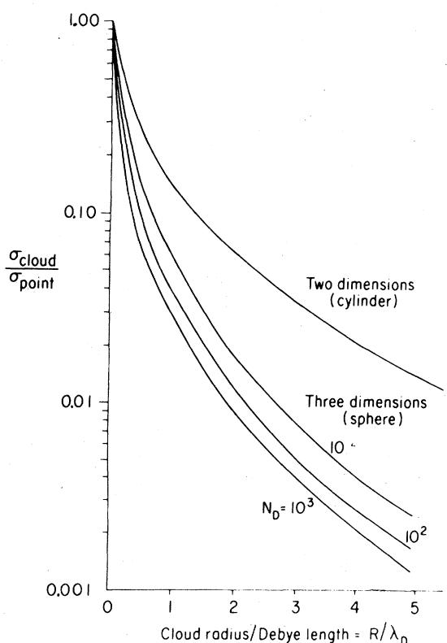  
FIG.7. The ratio of the cross sections for scattering of finitesized particles to that for point particles in two and three dimensions (taken from Okuda and Birdsall, 1970).

Here $\pmb { n }$ refers to the time step; the velocities are given at integer time steps and the positions at half-integer time steps. Since $\mathbf { F }$ is derived from the electric field which depends only on the positions of the particles,it is also known at the half-integer time steps. To compute the magnetic force we use the average value of the velocity $( \mathbf { v } _ { j } ^ { n + 1 } + \mathbf { v } _ { j } ^ { n } ) / 2$ during the time step. Equation (46) is a linear equation for $\mathbf { v } _ { j }$ at the new time $( n + 1 )$ in terms of its known value at the old time $( n )$ and the known forces $\mathbf { F } _ { j } ^ { n + 1 / 2 }$ We may rearrange Eq.(46)and write it as

$$
\mathbf { v } _ { j } ^ { n + 1 } - \mathbf { v } _ { j } ^ { n + 1 } \times \frac { \boldsymbol { \omega } _ { c j } \Delta t } { 2 } = v _ { j } ^ { n } + \frac { \mathbf { v } _ { j } ^ { n } \times \boldsymbol { \omega } _ { c j } \Delta t } { 2 } + \frac { \mathbf { F } _ { j } ^ { n + 1 / 2 } } { m _ { j } } \Delta t
$$

$$
{ \bf v } _ { j } ^ { n + 1 } { \boldsymbol { \cdot } } { \mathcal { R } } - \theta _ { c j } ( \Delta t / 2 ) = { \bf v } _ { j } ^ { n } { \boldsymbol { \cdot } } { \mathcal { R } } \theta _ { c j } ( \Delta t / 2 ) + { \frac { { \bf F } _ { j } ^ { n + 1 / 2 } \Delta t } { m _ { j } } } \ ,
$$

where $\mathcal { R } [ \theta _ { c j } ( \Delta t / 2 ) ]$ is the rotation matrix for an angle $\cdot \theta _ { c j } ( \Delta t / 2 )$ about the magnetic field; if $\mathbf { B }$ is taken in the $z$ direction $\mathcal { R }$ is given by

$$
\begin{array}{c} \begin{array} { r l } { \left[ \cos \left[ \theta _ { c j } \left[ \frac { \Delta T } { 2 } \right] \right] \right]} & { - \sin \left[ \theta _ { c j } \left[ \frac { \Delta t } { 2 } \right] \right] } \\ { \sin \left[ \theta _ { c j } \left[ \frac { \Delta t } { 2 } \right] \right] } & { \cos \left[ \theta _ { c j } \left[ \frac { \Delta t } { 2 } \right] \right] } \\ { 0 } & { 0 } \end{array} 0   \end{array}
$$

with tan $\theta _ { c j } ( \Delta t / 2 ) = \omega _ { c j } \Delta t / 2$ Solving for $\mathbf { v } _ { j } ^ { n + 1 }$ gives

$$
\mathbf { v } _ { j } ^ { n + 1 } = \mathbf { v } _ { j } ^ { n } \cdot \mathcal { R } [ \theta _ { c j } ( \Delta t ) ] + \frac { \mathbf { F } _ { j } ^ { n + 1 / 2 } } { m _ { j } } \Delta t \cdot \mathcal { R } [ \theta _ { c j } ( \Delta t / 2 ) ] \mathrm { ~ . ~ }
$$

This says that the new velocity is obtained from the old by rotating it through an angle $\theta _ { c j } ( \Delta t )$ about the magnetic field and adding to it the change in velocity due to the electric field rotated through an angle $\theta _ { c j } ( \Delta t / 2 )$ (the average rotation of the velocity change).

Equation (47） is readily solved for $\scriptscriptstyle \uparrow$ at the new halfinteger time step $( n + \frac { 1 } { 2 } )$ in terms of its known value at $n - \frac { 1 } { 2 }$ and the known value of $\mathbf { v } _ { j ; \ l } ^ { n }$ ,that is,

$$
\boldsymbol { \kappa } _ { j } ^ { n + 1 / 2 } = \boldsymbol { \kappa } _ { j } ^ { n - 1 / 2 } + \mathbf { v } _ { j } ^ { n } \Delta t \mathrm { ~ . ~ }
$$

Graphically the procedure is shown in Fig.8. Initially the velocities are known at $( n - 1 ) \Delta t$ ，and the positions and forces are known at $( n - \frac { 1 } { 2 } ) \Delta t$ 、This information is enough to jump the v's forward to $n \Delta t$ From this we have the information required to jump the positions and the associated forces forward to time $( \hat { n } + \frac { 1 } { 2 } ) \Delta t$ We then repeat the procedure.

# B.Electromagnetic particle models and fractional dimensional models

# 1. General description

Up until now we have confined ourselves to electrostatic particle models.However,many problems in plasma physics involve self-consistent magnetic fields and/or electromagnetic radiation. To handle such problems we need a more complete model. The most fundamental model uses the full set of Maxwell equations for E and $\mathbf { B }$ ，

$$
\pmb { \nabla } \times \mathbf { E } = - \frac { 1 } { c } \frac { \partial \mathbf { B } } { \partial t } \ ,
$$

$$
\begin{array} { l } { { \displaystyle \nabla \times { \bf B } = \frac { 1 } { c } \frac { \partial { \bf E } } { \partial t } + \frac { 4 \pi { \bf j } ( { \bf \Omega } \ne { \bf \Omega } , t ) } { c } ~ } , } \\ { ~ } \\ { { \displaystyle \nabla \cdot { \bf E } = 4 \pi \rho ( { \bf \Omega } \ne { \bf \Omega } , t ) ~ } , } \\ { { \displaystyle \nabla \cdot { \bf B } = 0 ~ } . } \end{array}
$$

Here $\mathbf { j }$ and $\pmb { \rho }$ are the currents and charges associated with the particles

$$
{ \bf j } ( \pmb { \mathscr { r } } , t ) = \sum _ { i } q _ { i } { \dot { \pmb { \mathscr { r } } } } _ { i } S ( \pmb { \mathscr { r } } - \pmb { \mathscr { r } } _ { i } ) \ ,
$$

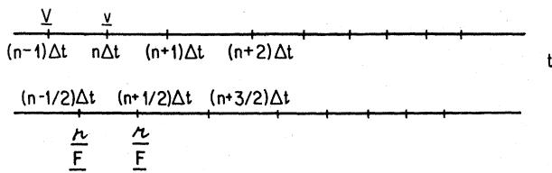  
FIG.8. Leapfrog scheme for advancing $\mathbf { v } , \bar { \mathbf { \mu } }$ and $\mathbf { F }$ in time.

$$
\rho ( \pmb { \mathscr { r } } , t ) = \sum _ { i } q _ { i } S ( \pmb { \mathscr { r } } - \pmb { \mathscr { r } } _ { i } ) \ .
$$

As in the case of electrostatic models it is convenient to solve Eqs. (52)-(55) in Fourier space,again making use of fast Fourier transforms.To facilitate this we split $\mathbf { E }$ and $\mathbf { j }$ into transverse and longitudinal components; of course B has only transverse components. At this point it is convenient to introduce the concepts of one-and-one-half-, one-and-two-halves-,and two-and-one-half-dimensional models. The transverse components of $\mathbf { j } , \mathbf { E }$ or $\mathbf { B }$ is perpendicular to the wave number $k$ .Thus if we wish to model electromagneticwavespropagatinginone dimension—say，the $_ x$ direction-we must allow for currents and components of $\pmb { { \cal E } }$ and $\pmb { B }$ in the $y$ and $z$ directions even though there is no spatial variation in these directions. A one-dimensional model which allows the charge slabs to have a $_ y$ velocity is called a one-and-onehalf-dimensional model; the particle motions are specified by giving $_ { x }$ ， $v _ { x }$ ，and $v _ { y }$ .Here $_ { x }$ is considered a full dimension and $y$ a one-half dimension. Similarly,a onedimensional model which allows $v _ { y }$ and $v _ { z }$ requires that we give $x , v _ { x } , v _ { y } , v _ { z }$ to specify the motion of a particle and would be called a one-and-two-halves-model. A similar extension to two dimensions gives a two-and-onehalf-dimensional model; such a model would require $x , v _ { x } , y , v _ { y } , v _ { z }$ to specify the motion of a particle. With such models fully electromagnetic models in reduced numbers of dimensions can be handled.

The longitudinal and transverse components of $\mathbf { E }$ and j are defined by

$$
\begin{array} { r l } & { \mathbf { k } \cdot \mathbf { E } _ { T } ( \mathbf { k } , t ) = 0 \ , \mathbf { k } \times \mathbf { E } _ { L } ( \mathbf { k } , t ) = 0 \ , } \\ & { \mathbf { k } \cdot \mathbf { j } _ { T } ( k , t ) = 0 \ , k \times \mathbf { j } _ { L } ( \mathbf { k } , t ) = 0 \ , } \\ & { \mathbf { j } _ { L } ( \mathbf { k } , t ) = \frac { \mathbf { k } \cdot \mathbf { k } \cdot \mathbf { j } ( \mathbf { k } , t ) } { k ^ { 2 } } \ , } \\ & { \mathbf { j } _ { T } ( k , t ) = \mathbf { j } ( \mathbf { k } , t ) - \mathbf { j } _ { L } ( \mathbf { k } , t ) \ , } \end{array}
$$

where the subscripts $_ { T }$ and $\pmb { L }$ refer to the transverse and longitudinal components,respectively. The longitudinal component of $\mathbf { E }$ is obtained as before from Poisson's equation, Eq. (54). The same procedure as was employed for electrostatic models can be used to find it.

The transverse $\mathbf { E }$ and $\mathbf { B }$ fields are obtained by solving the equation

$$
i \mathbf { k } \times \mathbf { E } _ { T } ( \mathbf { k } , t ) = \frac { - 1 } { c } \frac { \partial \mathbf { B } _ { T } } { \partial t } ( \mathbf { k } , t ) \ ,
$$

$$
i \mathbf { k } \times \mathbf { B } _ { T } ( \mathbf { k } , t ) = \frac { 1 } { c } \frac { \partial \mathbf { E } _ { T } } { \partial t } ( \mathbf { k } , t ) + \frac { 4 \pi \mathbf { j } _ { T } ( \mathbf { k } , t ) } { c } \ .
$$

Here again we convert these to a finite difference equation in time and employ a leapfrog scheme to solve for $\scriptstyle \mathbf { B } _ { T }$ and $\mathbf { E } _ { T }$ ．The scheme is illustrated in Fig.9. It is instructive to find the solution given by this method when there is no plasma present, i.e.,when ${ \bf j } _ { T }$ is zero.We compare these with known vacuum solutions. Equations (61） and (62) for $\mathbf { E } _ { T }$ and $\mathbf { B } _ { T }$ become

$$
\begin{array} { r } { i \mathbf { k } \times \mathbf { B } _ { T } ( \mathbf { k } , n \Delta t ) = \displaystyle \frac { 1 } { c \Delta t } \left\{ \mathbf { E } _ { T } [ \mathbf { k } , ( n + \frac { 1 } { 2 } ) \Delta t ] \right. } \\ { \left. - \mathbf { E } _ { T } [ k , ( n - \frac { 1 } { 2 } ) \Delta t ] \right\} \left. \right. } \end{array}
$$

Following the standard procedure we look for solutions of the form

spurious Cherenkov radiations (Lin et al., 1974; Godfrey and Langdon,1976). Such radiation can easily swamp the phenomenon we are interested in.

$$
\begin{array} { r l } & { \mathbf { E } ( \mathbf { k } , t ) = \mathbf { E } _ { 0 } ( \mathbf { k } ) e ^ { i \omega ( n + 1 / 2 ) \Delta t } \ , } \\ & { \mathbf { B } ( \mathbf { k } , t ) = \mathbf { B } _ { 0 } ( \mathbf { k } ) e ^ { i \omega n \Delta t } \ . } \end{array}
$$

Substitution of (65) and (66) into (63) and (64) leads to the following dispersion relation:

$$
k ^ { 2 } c ^ { 2 } { = } \frac { 4 } { { \Delta t } ^ { 2 } } { \sin } ^ { 2 } \frac { \omega \Delta t } { 2 } \ .
$$

From this equation we see that for

$$
\frac { k ^ { 2 } c ^ { 2 } \Delta t ^ { 2 } } { 4 } < 1
$$

we get solutions for $\omega ^ { \mathrm { ~ ~ } }$ and that the frequency error, $\omega ^ { 2 } - \bar { k } ^ { 2 } c ^ { 2 }$ ,is always positive. If $k ^ { 2 } c ^ { 2 } \Delta t ^ { 2 } / 4 > 1$ ，there are only complex roots for $\omega$ and the algorithm is unstable. From this we see that the size of the time step is dictated by the largest $k$ mode or highest-frequency electromagnetic mode that enters into the problem. This is the Courant-Friedrichs condition (Courant et al.,1928).

We are also interested in the magnitude of the frequency error. For small $k c \Delta t , \ \omega$ is approximately given by

$$
\omega = \pm k c \left[ 1 + \frac { k ^ { 2 } c ^ { 2 } \Delta t ^ { 2 } } { 2 4 } + \cdot \cdot \cdot \right] .
$$

A value of kc△t equal to $_ { 0 . 2 }$ gives a value of $( \mid \omega \mid - \mid k c \mid ) / \mid k c \mid$ equal to $1 . 7 \times \bar { 1 0 } ^ { - 3 }$ which is generally an acceptable error.

The fact that the phase velocity is greater than $^ { c }$ for all $k \ ( \mid \omega / k \mid = v _ { p } > c )$ is also an important attribute of this algorithm. If one is simulating a relativistic plasma and this is not the case,relativistic particles can exceed the phase velocity of light waves.As a consequence they emit

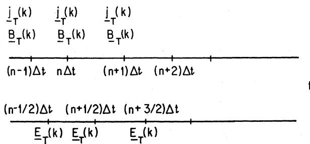  
FIG.9. Leapfrog scheme for advancing the transverse components of the electromagnetic field.

Here as in the case of electrostatic models we are mainly interested in collective phenomena which have a scale length larger than our grid spacing. Furthermore, highfrequency short-wavelength waves generally interact only weakly with the plasma,and sQ it is safe to exclude them. To this end we truncate the number of $k$ modes we keep when computing the electromagnetic field and consequently we are able to take longer time steps.

The above method is time centered as far as $\pmb { \cal E }$ and $\pmb { B }$ are concerned． However,Eq.(62） involves $\mathbf { j } ,$ which depends on both the particle positions and velocities.The leapfrog scheme requires $\mathbf { j }$ at integer time steps. If we have velocities at integer time steps and positions at halfinteger time steps,then we must find approximate positions at the integer time steps. For most applications these can be obtained to sufficient accuracy simply by using the velocity at the latest integer time step,to advance approximately the particle from time $( n - \frac { 1 } { 2 } ) \Delta t$ to $\pmb { n } \Delta t$ .This is so because (1) the velocity is far more important to the current than the position,and (2） the electromagnetic waves generally have velocities large compared to the particles and certainly compared to the change in velocity during one time step so that the phase error in computing $j$ from this approximate is slight.

In the above we have emphasized the Fourier method for solving Maxwel's equations. However， there are many different schemes in use and the interested reader is referred to Hockney and Eastwood (1981),Birdsall and Langdon (in press),and Godfrey and Langdon (1976).

# 2. Advancing the particles

# a.Nonrelativistic case

If we adopt a nonrelativistic model for the particles and use the leapfrog scheme described earlier, then we need to know the average value of $\mathbf { v } \times \mathbf { B } / c$ during the time step-that is,we need to know its value at the half-integer time steps. We will use the approximation

$$
\begin{array} { r } { \left[ \frac { { \bf v } \times { \bf B } } { c } \right] _ { n + 1 / 2 } = \frac { 1 } { c } \left[ \frac { { \bf v } ( n ) + { \bf v } ( n + 1 ) } { 2 } \right] \mathrm { ~ . ~ } } \\ { \times \left[ \frac { { \bf B } ( n ) + B ( n + 1 ) } { 2 } \right] . } \end{array}
$$

In solving for $\mathbf { v } ( n + 1 )$ we use the implicit scheme given by Eqs. (48)-(50).To find $\mathbf { B } ( n + 1 )$ we use Eqs. (51), (61),and (63) and the value of $\mathbf { \nabla } \mathbf { \times } \mathbf { E }$ at $n + \frac { 1 } { 2 }$

# b. Relativistic case

In treating a plasma using the full electromagnetic equations we should use the relativistic equations of motion for the particles-that is,we should replace Eqs.

(44) and (45) by

$$
\begin{array} { r l } & { \frac { d \mathbf { P } _ { j } } { d t } { = } q _ { j } \left[ \mathbf { E } + \frac { \mathbf { v } _ { j } \times \mathbf { B } } { c } \right] , } \\ & { \mathbf { P } _ { j } { = } \gamma m _ { j } \mathbf { v } _ { j } , \gamma = ( 1 { - } v _ { j } ^ { 2 } / c ^ { 2 } ) ^ { - 1 / 2 } , } \\ & { \mathbf { v } _ { j } { = } \frac { \mathbf { P } _ { j } } { m _ { j } ( 1 + P _ { j } ^ { 2 } / m ^ { 2 } c ^ { 2 } ) ^ { 1 / 2 } } , \gamma = \left[ 1 + \frac { P ^ { 2 } } { m ^ { 2 } c ^ { 2 } } \right] ^ { 1 / 2 } , } \end{array}
$$

$$
\frac { d \mathscr { \pmb { r } } _ { j } } { d t } { = } \pmb { v } _ { j } \ ,
$$

where $m _ { j }$ is the rest mass of particle $j$

One now uses $\mathbf { P }$ and $\hat { \mathcal { ~ \textbf ~ { ~ ~ } ~ } }$ rather than $\mathbf { v }$ and $\bumpeq$ However, in advancing $\mathbf { P }$ we need to know the average value of $\mathbf { v }$ (and hence $\pmb { P }$ and $\gamma )$ during a time step. One quick method of estimating the average value of $\gamma$ during a time step is to use the equation for conservation of energy

$$
\begin{array} { l }  { \displaystyle { W _ { j } = \gamma _ { j } m _ { j } c ^ { 2 } \mathrm { ~ , ~ } \frac { d W _ { j } } { d t } = \frac { d \gamma _ { j } } { d t } m _ { j } c ^ { 2 } = q _ { j } { \bf E } _ { j } \cdot { \bf v } _ { j } \mathrm { ~ , ~ } } } \\ { { \displaystyle \Delta \gamma _ { j } = \frac { q _ { j } { \bf E } _ { j } \cdot { \bf v } _ { j } \frac { \Delta t } { 2 } } { m _ { j } c ^ { 2 } } \mathrm { ~ . ~ } } } \end{array}
$$

A second and more accurate method is to assume that the change in $\mathbf { P }$ during a time step is small and to linearize Eq. (71) about its value at the start of a time step. If we write

$$
\mathbf { P } ( n + 1 ) = \mathbf { P } ( n ) + \Delta \mathbf { P } \ ,
$$

the finite difference form of (71) becomes

$$
\begin{array} { r l r } & { } & { \frac { \Delta \mathbf { P } } { \Delta t } { = } q _ { j } \mathbf { E } { + } \frac { q _ { j } } { m _ { j } c } \left[ \frac { \mathbf { P } ( n ) \times \overline { { \mathbf { B } } } } { \left[ 1 + \frac { P ( n ) ^ { 2 } } { m _ { j } ^ { 2 } c ^ { 2 } } \right] ^ { 1 / 2 } } + \frac { \Delta \mathbf { P } \times \mathbf { B } } { 2 \left[ 1 + \frac { P ( n ) ^ { 2 } } { m _ { j } ^ { 2 } c ^ { 2 } } \right] ^ { 1 / 2 } } \right. } \\ & { } & { \left. - \frac { \mathbf { P } \mathbf { P } ( n ) } { 2 m _ { j } ^ { 2 } c ^ { 2 } } \frac { \mathbf { P } ( n ) \times \mathbf { B } } { \left[ 1 + \frac { P ( n ) ^ { 2 } } { m _ { j } ^ { 2 } c } \right] ^ { 3 / 2 } } \right] , \quad ( 7 7 ) } \end{array}
$$

where $\bar { \bf B }$ is the average value of $\pmb { B }$ during the time step. Equation (77) is a linear equation in $\pmb { \Delta } \pmb { \mathrm { P } }$ and can be solved by standard methods However, this will be time consuming and much too slow unless $\omega _ { c } \Delta t \ll 1$ ,in which case sufficiently accurate approximations can be obtained by treating terms in $\pmb { \Delta } P \pmb { \Delta } t$ as small. The computation of $\gamma$ or $( 1 + { p ^ { 2 } } / { m ^ { 2 } c ^ { 2 } } ) ^ { 1 / 2 }$ for every particle will also be quite time consuming if done every time step; however,again if the particle energy does not change too drastically over a time step (which it must not for accuracy in any case), then these quantities need not be updated every time step or $\gamma$ can be roughly updated from conservation of energy $\left( \mathbf { E } { \cdot } \Delta { \star } \right)$ ； this approach amounts to the use of the longitudinal (parallel to $v ^ { \cdot }$ ）and transverse (perpendicular to v) inertia for the particle.

In principle,one can find $\gamma$ by integrating $\mathbf { \delta E } { \cdot } d l _ { \mathrm { i } } ^ { \mathrm { . } }$ however,numerical errors will accumulate if this is done so that $\gamma$ can drift away from its value as given by $\pmb { P }$ in Eq. (73), and the equation of motion then becomes inconsistent,

The forces on the particles in Eq.(71) should be modified to include the finite-size particle effects just as was done in Eq.(1O) for the electrostatic case. This can be carried through in terms of $\mathbf { E ( k ) } , \ \mathbf { B ( k ) }$ ,and the form factor $\pmb { S } ( \pmb { k } )$ in the same manner as was done in Eqs. (23)-(25).

To be truly relativistic the finite-size particles should undergo Lorentz contraction. This would make the form factor a function of velocity. This complicates the calculations but can be done if the particles are not strongly relativistic. If they are strongly relativistic,the Lorentz contraction can become so large that the particle size in the direction of motion becomes much smaller than the grid spacing. However,the charge sharing scheme automatically expands the particle to a grid size,so true contraction beyond this is not possible. To my knowledge, such corrections have never been included in any calculations;however,even for strongly relativistic situations the codes appear to give reasonably accurate results agreeing with theory where checks can be made.

One of the features of relativity is that space and time are treated on the same footing. However,all existing codes treat space and time quite differently. The fields and particle positions are given on a fixed space grid and advanced in time by a finite difference scheme. Filtering of short-wavelength modes can be effected through finite-size particles and the use of Fourier analysis. Equivalent techniques do not exist for the time dimension.These are fundamental problems of modeling which need considerably more attention.

It should, perhaps,be commented here that there have recently arisen a number of schemes for eliminating high-frequency motions so that the codes can use longer time steps. These amount to a rough kind of time filtering. However, space and time are still treated quite differently; one would have to treat the time dependence in $\omega$ space to achieve something equivalent to $k$ filtering in $\nsim$ space and at present no method exists for this. However, these time-averaging codes are very interesting and promise to allow treatments of long time scale phenomena. This is an area of active research,and the interested reader is referred to Brackbill and Forslund (198O), for example.

# C. Magnetostatic (Darwin) models

When we use the full electromagnetic equations we are forced to advance the system with a time step set by the highest-frequency electromagnetic mode kept in the model. This is generally many times the plasma frequency (typically the time light takes to cross a grid spacing). However，there are many plasma problems involving low-frequency self-consistent magnetic fields (Alfvén waves,pinches,ion cyclotron waves）for which we would prefer not to be constrained to such short time steps.For such problems a Darwin model in which the displacement current is dropped from Maxwell's equations is appropriate (Hockney,and Eastwood, 1981; Busnardo-Neto et al., 1977;Nielson and Lindman,1973)． Maxwell's equations in Fourier space become

$$
\begin{array} { l } { { i { \bf k } \cdot { \bf E } _ { L } ( { \bf k } ) = 4 \pi \rho ( { \bf k } ) ~ , } } \\ { { \displaystyle i { \bf k } \times { \bf E } _ { T } ( { \bf k } ) = - \frac { 1 } { c } \frac { \partial { \bf B } _ { T } ( { \bf k } ) } { \partial t } ~ , } } \\ { { \displaystyle - i { \bf k } \times { \bf B } _ { T } ( { \bf k } ) = \frac { 4 \pi { \bf j } _ { T } ( { \bf k } ) } { c } ~ , } } \end{array}
$$

where $\pmb { L }$ and ${ \pmb T }$ refer to the longitudinal and transverse components. The charge and current densities are those given by Eqs.(56) and (57). If one is interested in problems where the electrostatic field is unimportant,then Eq. (78) can be dropped; keeping this term gives rise to plasma oscillations and forces one to compute on a plasma frequency time scale; dropping it allows much longer time steps to be used.

Equations (78)-(8O) do not have a dynamic equation for $\scriptstyle \mathbf { E } _ { T }$ (no $\scriptstyle \partial \mathbf { E } _ { T } / \partial t$ term). Thus the leapfrog scheme used for the full electromagnetic case fails. If one attempts to proceed in a straightforward manner by using a finite difference equation for Eq.(79),one finds the system numerically unstable. The instability is due to mutual inductance between currents in different parts of the system; changing currents in one part of the system produces $\mathbf { \delta E }$ fields which cause currents in other regions of the plasma; these in turn generate $\mathbf { E }$ fields which modify the original currents. This effect is readily analyzed by supplementing Eqs.(79) and (8O) with a fluid equation for the current,

$$
\frac { \partial { \bf j } _ { I } } { \partial t } = + \frac { \omega _ { p e } ^ { 2 } { \bf E } _ { T } } { 4 \pi } ,
$$

and dropping the electrostatic fields，Eq. (78). The demonstration is left as an exercise for the reader.

One way around this difficulty is to eliminate $\mathbf { B }$ from Eq.(80) using Eq. (79) and obtain the equation for $E _ { T }$ ：

$$
- \mathbf { k } ^ { 2 } \mathbf { E } _ { T } ( \mathbf { k } ) = \frac { 4 \pi } { c ^ { 2 } } \frac { \partial \mathbf { j } _ { T } } { \partial t } \ .
$$

We then write for $\partial \mathbf { j } _ { T } / \partial t$

$$
\frac { \partial { \mathbf j } _ { T } ( { \mathbf k } ) } { \partial t } = \frac { e ^ { 2 } \bar { n } { \mathbf E } _ { T } } { m } + \frac { \partial { \mathbf j } _ { T c } } { \partial t }
$$

(where $\scriptstyle { T _ { c } }$ are corrective terms). Here $\bar { n }$ is the average electron density,and the correction terms $\partial \mathbf { j } _ { T c } / \partial t$ are obtained from the time derivative of Eq. (56) minus $e ^ { 2 } \pi \mathbf { E } _ { T } / m$ . Equation (83) without the correction terms,

$$
\frac { \partial { \bf j } _ { T } ( { \bf k } ) } { \partial t } = \frac { e ^ { 2 } \overline { { n } } } { m } { \bf E } _ { T } ( { \bf k } ) \ ,
$$

contains the major effects of the mutual induction fields; this term alone gives current shielding-i.e.,if a current is generated in the plasma a return current forms around it shielding out the $\mathbf { B }$ field and associated transverse $\pmb { \cal E }$ field beyond $c / \omega _ { p e }$ .Substituting Eq. (83) into Eq.(82),we obtain the following equation for the transverse electric field:

$$
- \left[ k ^ { 2 } + { \frac { \overline { { \omega } } _ { p e } ^ { 2 } } { c ^ { 2 } } } \right] \mathbf { E } _ { T } ( k ) = { \frac { 4 \pi } { c ^ { 2 } } } { \frac { \partial { \mathbf { j } } _ { T c } } { \partial t } } \ ,
$$

where ${ \overline { { \omega } } _ { p e } ^ { 2 } }$ is the average plasma frequency, $4 \pi n e ^ { 2 } / m$ Equation (85) is similar to the equation for electrostatic shielding

$$
- ( k ^ { 2 } + \omega _ { p e } ^ { 2 } / v _ { T e } ^ { 2 } ) \phi ( k ) = 4 \pi \rho _ { s } \ .
$$

In (85) $\partial \mathbf { j } _ { T c } / \partial t$ plays the role of the source charge's $\rho _ { s }$ ,in Eq. (86); the Debye length $v _ { T e } / \omega _ { p e }$ in (86) is replaced by $c / \omega _ { p e }$ in Eq.(85). Thus Eq. (85) will give shielding of the transverse electric fields produced by $\partial \mathbf { j } _ { T c } / \partial t$

The term $\partial \mathbf { j } _ { T c } / \partial t$ in Eq. (85) is complicated; it involves among other terms

$$
\left[ \frac { e ^ { 2 } } { m } [ n \left( \varkappa \right) - \bar { n } ] \mathbf { E } _ { T } ( \varkappa ) \right] _ { k } .
$$

To solve (85） an iteration procedure is used in which a value of $\mathbf { E } _ { T }$ is assumed (it can be the last value of $\mathbf { E } _ { T } )$ and used to evaluate expression (87) (actually all terms in $\partial { j _ { T c } } / \partial t )$ . This is substituted into Eq.(85) and a new value of $\mathbf { E } _ { T }$ is found. This new value is again used in (87) and the whole calculation repeated. This process is continued until the new value of $E _ { T }$ differs from the previous one by less than some acceptable error. In practice it has been found that the procedure converges very rapidly,requiring only two or three iterations except in the case of extremely nonuniform electron density with $\pmb { n }$ going above $4 \pi$ at some point. If $\pmb { n }$ goes above $4 \pi ,$ ,the procedure is unstable but can be made to work by using in place of $\pi$ a value which is greater than the maximum $_ n$ divided by 4. Even under these conditions,the method converges rapidly．More details of this code can be found in Busnardo-Neto et al. (1977)． An alternative method for solving a system using the Darwin model has been given by Nielson and Lewis and can be found in Hockney and Eastwood (1981).

# D. Modeling bounded plasmas

Up to this point we have discussed modeling of periodic systems in one dimension,doubly periodic systems in two dimensions,and triply periodic systems in three dimensions.Basically,our fast Fourier transform method expands the fields within the system in a Fourier series which implies these periodic properties. However,all laboratory and natural plasmas are bounded with some appropriate boundary conditions (vacuum outside the plasma,constant potential boundaries,etc.). To model such situations we need a rapid way to find the fields given whatever boundary conditions apply.Hockney (1966) has modeled bounded system using his fast Poisson field solver. Here a method of adapting the FFT method to these situations will be described (Decyk and Dawson, 1979).I shall restrict the discussion to two-dimensional models although its extension to three-dimensional ones is straightforward.

To begin with,we consider a two-dimensional bounded slab like that shown in Fig.1O(a).We consider the plasma to be periodic in the $_ x$ direction and bounded in the $y$ direction. As a first case, let us assume there is a vacuum outside the plasma slab.

We wish to solve Poisson's equation for this system

$$
\begin{array} { l } { { \nabla ^ { 2 } \Phi = - 4 \pi \rho , \mathrm { i n s i d e t h e s l a b } } } \\ { { \nabla ^ { 2 } \Phi = 0 , \mathrm { o u t s i d e t h e s l a b } . } } \end{array}
$$

We may do this by breaking $\Phi$ into two parts,

$$
\Phi = \phi _ { \mathrm { F F T } } + \widetilde { \phi } \ ,
$$

where $\phi _ { \mathbf { F F T } }$ is the potential which would be obtained by fast Fourier transforming the charge density within the slab and $\widetilde { \phi }$ is a correction due to the presence of the boundaries. Now

$$
\nabla ^ { 2 } \Phi = - 4 \pi \rho
$$

inside the plasma slab. However,

$$
\nabla ^ { 2 } \phi _ { \mathrm { F F T } } = - 4 \pi \rho
$$

inside the plasma slab. Therefore,

$$
\nabla ^ { 2 } \widetilde { \phi } = 0 \qquad \cdot
$$

inside the plasma slab.Outside the plasma slab

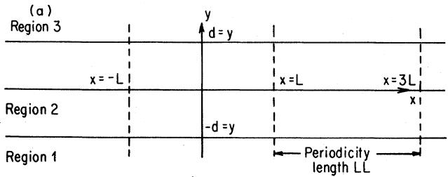

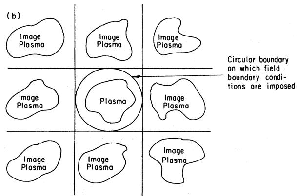  
FIG.10. (a) Model for two-dimensional bounded slab model. (b)Method for treating a bounded two-dimensional system.

$$
\nabla ^ { 2 } \Phi = 0 \ ,
$$

so that $\widetilde { \phi } , \Phi$ (region 1),and $\Phi$ (region 3) are vacuum solutions to Poisson's equation,and these three functions are chosen so as to match the boundary conditions ( $\Phi$ continuous and $\partial \Phi / \partial y$ continuous) at the surface of the slab. Vacuum solutions of Poisson's equations are of the form

$$
\Phi = \sum _ { k _ { x } } [ \phi _ { + } ( k _ { x } ) e ^ { k _ { x } y } + \phi _ { - } ( k _ { x } ) e ^ { - k _ { x } y } ] e ^ { i k _ { x } x } .
$$

For the three regions 1,2,and 3,with the boundary conditions that $\phi$ vanishes at $y = \pm \infty$ ,we have

$$
\Phi _ { 1 } = \sum _ { k _ { x } } \phi _ { 1 + } ( k _ { x } ) e ^ { + k _ { x } y + i k _ { x } x } ,
$$

$$
\widetilde { \phi } _ { 2 } = \sum _ { k _ { x } } [ \widetilde { \phi } _ { 2 + } ( k _ { x } ) e ^ { k _ { x } y } + \widetilde { \phi } _ { 2 - } ( k _ { x } ) e ^ { - k _ { x } y } ] e ^ { i k _ { x } x } ,
$$

and

$$
\Phi _ { 3 } = \sum _ { k _ { x } } \phi _ { 3 - } ( k _ { x } ) e ^ { - k _ { x } y + i k _ { x } x } .
$$

At the slab boundaries $y = \pm d , \Phi$ and $\partial \Phi / \partial y$ must be continuous; the latter condition comes about because these models must have a finite charge everywhere. Thus at $y = d$ the following two equations must be satisfied:

$$
\begin{array} { r l r } {  { \sum _ { k _ { x } } \phi _ { 3 - } ( k _ { x } ) e ^ { - k _ { x } d + i k _ { x } x } = \sum _ { k _ { x } , k _ { y } } \phi _ { \mathrm { F F T } } ( k _ { x } , k _ { y } ) e ^ { i k _ { y } d + i k _ { x } x } } } \\ & { } & { + \sum _ { k _ { x } } [ \widetilde { \phi } _ { 2 + } ( k _ { x } ) e ^ { k _ { x } d } } \\ & { } & { + \widetilde { \phi } _ { 2 - } ( k _ { x } ) e ^ { - k _ { x } d } ] e ^ { i k _ { x } x } , } \end{array}
$$

$$
\begin{array} { l } { \displaystyle \sum _ { k _ { x } } - k _ { x } \phi _ { 3 - } ( k _ { x } ) e ^ { - k _ { x } d + i k _ { x } x } } \\ { = \displaystyle \sum _ { k _ { x } , k _ { y } } i k _ { y } \phi _ { \mathrm { F F T } } ( k _ { x } , k _ { y } ) e ^ { i k _ { y } d + i k _ { x } x } } \\ { + \displaystyle \sum _ { k _ { x } } k _ { x } [ \widetilde \phi _ { 2 + } ( k _ { x } ) e ^ { k _ { x } d } - \widetilde \phi _ { 2 } ( k _ { x } ) e ^ { - k _ { x } d } ] e ^ { i k _ { x } x } . } \end{array}
$$

Now since these equations must be satisfied for every $_ x$ we can equate the coefficients for each value of $k _ { x }$ separately. These equations thus become

$$
\begin{array} { l } { { \phi _ { 3 - } ( k _ { x } ) e ^ { - { k _ { x } d } } = \displaystyle \sum _ { k _ { y } } \phi _ { \mathrm { F F T } } ( k _ { x } , k _ { y } ) e ^ { i k _ { y } d } + \widetilde { \phi } _ { 2 + } ( k _ { x } ) e ^ { k _ { x } d } } } \\ { { { } } } \\ { { + \widetilde { \phi } _ { 2 - } ( k _ { x } ) e ^ { - k _ { x } d } ~ , } } \end{array}
$$

$$
\begin{array} { r l r } {  { - k _ { x } \phi _ { 3 - } ( k _ { x } ) e ^ { - k _ { x } d } = \sum _ { k _ { y } } i k _ { y } \phi _ { \mathrm { F F T } } ( k _ { x } , k _ { y } ) e ^ { i k _ { y } d } } } \\ & { } & \\ & { } & { + k _ { x } [ \widetilde { \phi } _ { 2 + } ( k _ { x } ) e ^ { k _ { x } d } } \\ & { } & \\ & { } & { - \widetilde { \phi } _ { 2 - } ( k _ { x } ) e ^ { - k _ { x } d } ] ~ . } \end{array}
$$

Likewise, the boundary conditions at $y = - d$ give

$$
\begin{array} { l } { { \displaystyle \phi _ { 1 + } ( k _ { x } ) e ^ { - k _ { x } d } = \sum _ { k _ { y } } \phi _ { \mathrm { F F T } } ( k _ { x } , k _ { y } ) e ^ { - i k _ { y } d } } } \\ { { \displaystyle \qquad \quad } } \\   \displaystyle \qquad + \widetilde { \phi } _ { 2 + } ( k _ { x } ) e ^ { - k _ { x } d } + \widetilde { \phi } _ { 2 - } ( k _ { x } ) e ^ { k _ { x } d } \ : , \quad \mathrm { ~ } \mathrm { ~ } \mathrm { ~ } \mathrm { ~ } \mathrm { ~ } \mathrm { ~ } \mathrm { ~ } \mathrm { ~ } \mathrm { ~ } \mathrm { ~ } \mathrm { ~ } \mathrm { ~ } \mathrm { ~ } \mathrm { ~ } \mathrm { ~ } \mathrm { ~ } \mathrm { ~ } \mathrm { ~ } \mathrm { ~ } \mathrm { ~ } \mathrm { ~ } \mathrm { ~ } \mathrm { ~ } \mathrm { ~ } \mathrm { ~ } \mathrm { ~ } \mathrm { ~ } \mathrm { ~ } \mathrm { ~ } \mathrm { ~ } \mathrm { ~ } \mathrm { ~ } \mathrm { ~ } \mathrm { ~ } \mathrm { ~ } \mathrm { ~ } \mathrm { ~ } \mathrm { ~ } \mathrm { ~ } \mathrm { ~ } \mathrm { ~ } \mathrm { ~ } \mathrm { ~ } \mathrm { ~ } \mathrm { ~ } \mathrm { ~ } \mathrm { ~ } \mathrm { ~ } \mathrm { ~ } \mathrm { ~ } \mathrm { ~ } \mathrm { ~ } \mathrm { ~ } \mathrm { ~ } \mathrm { ~ } \mathrm { ~ } \mathrm { ~ } \mathrm { ~ } \mathrm { ~ } \mathrm { ~ } \mathrm { ~ } \mathrm { ~ } \mathrm { ~ } \mathrm { ~ } \mathrm { ~ } \mathrm { ~ } \mathrm { ~ } \mathrm { ~ } \mathrm { ~ } \mathrm { ~ } \mathrm { ~ } \mathrm { ~ } \mathrm { ~ } \mathrm { ~ } \mathrm { ~ } \mathrm { ~ } \mathrm { ~ } \mathrm { ~ } \mathrm { ~ } \mathrm { ~ } \mathrm { ~ } \mathrm { ~ } \mathrm { ~ } \mathrm { ~ } \mathrm { ~ } \mathrm { ~ } \mathrm { ~ } \mathrm { ~ } \mathrm { ~ } \mathrm { ~ } \mathrm { ~ } \mathrm { ~ } \mathrm { ~ } \mathrm { ~ } \mathrm { ~ } \mathrm { ~ } \mathrm { ~ } \mathrm { ~ } \mathrm { ~ } \mathrm { ~ } \mathrm { ~ } \mathrm { ~ } \mathrm { ~ } \mathrm { ~ } \mathrm { ~ } \mathrm { ~ } \mathrm { ~ } \mathrm { ~ } \mathrm { ~ } \mathrm { ~ } \mathrm { ~ } \mathrm { ~ } \mathrm { ~ } \mathrm { ~ } \mathrm { ~ } \mathrm { ~ } \mathrm { ~ } \mathrm  ~  \end{array}
$$

We may note that we can replace the quantities

$$
\sum _ { k _ { y } } \phi _ { \mathrm { F F T } } ( k , k _ { y } ) e ^ { i k _ { y } d }
$$

and

$$
\sum _ { k _ { y } } \phi _ { \mathrm { F F T } } ( k _ { x } , k _ { y } ) e ^ { - i k _ { y } d }
$$

by $\phi _ { \mathrm { F F T } } ( y = d , k _ { x } )$ and $\phi _ { \mathrm { F F T } } = ( y = - d , k _ { x } )$ -that is,the Fourier transforms of $\phi _ { \mathrm { F F T } }$ on the boundaries $y = \pm d$ Likewise,the quantities

$$
\sum _ { k _ { y } } i k _ { y } \phi _ { \mathrm { F F T } } ( k _ { x } , k _ { y } ) e ^ { i k _ { y } d }
$$

and

$$
\sum _ { k _ { y } . } i k _ { y } \phi _ { \mathrm { F F T } } ( k _ { x } , k _ { y } ) e ^ { - i k _ { y } d }
$$

can be replaced by

$$
- E _ { y _ { \mathrm { F F T } } } ( y = d , k _ { x } )
$$

and

$$
- E _ { y _ { \mathrm { F F T } } } ( y = - d , k ) ,
$$

respectively. These four functions of $k$ are known from the FFT of $\rho$ .We thus see that equations (101), (102), (103),and (io4） constitute four linear equations in the four unknowns $\phi _ { 1 + } ( k _ { x } ) , \widetilde { \phi } _ { 2 + } ( k _ { x } ) , \widetilde { \phi } _ { 2 - } ( k _ { x } )$ ,and $\phi _ { 3 - } ( k _ { x } ) _ { ; }$ ， respectively，and can be solved by standard techniques; the solutions are

$$
\begin{array} { r l } & { \phi _ { 1 + } ( k _ { x } ) = \frac { 1 } { 2 } \left[ \phi _ { \mathrm { F F T } } ( - d , k _ { x } ) e ^ { k _ { x } d } - \phi _ { \mathrm { F F T } } ( d , k _ { x } ) e ^ { - k _ { x } d } \right. } \\ & { \qquad \left. + \frac { E _ { y _ { \mathrm { F F T } } } ( d , k _ { x } ) e ^ { - k _ { x } d } } { k _ { x } } - \frac { E _ { y _ { \mathrm { F F T } } } ( - d , k _ { x } ) } { k _ { x } } e ^ { k _ { x } d } \right] , } \end{array}
$$

$$
\widetilde { \phi } _ { 2 + } ( k _ { x } ) = { \scriptstyle { \frac { 1 } { 2 } } } e ^ { - k _ { x } d } \left[ - \phi _ { \mathrm { F F T } } ( d , k _ { x } ) + \frac { 1 } { k _ { x } } E _ { y _ { \mathrm { F F T } } } ( d , k _ { x } ) \right] ,
$$

$$
\begin{array} { l } { \displaystyle \widetilde { \phi } _ { 2 - } ( k _ { x } ) = \frac { 1 } { 2 } e ^ { - k _ { x } d } \left[ - \phi _ { \mathrm { F F T } } ( - d , k _ { x } ) \right. } \\ { \displaystyle \left. - \frac { 1 } { k _ { x } } E _ { y _ { \mathrm { F F T } } } ( - d , k _ { x } ) \right] , } \end{array}
$$

and

$$
\begin{array} { r l } { \phi _ { 3 - } ( k _ { x } ) = \frac { 1 } { 2 } \left[ \phi _ { \mathrm { F F T } } ( d , k _ { x } ) e ^ { k _ { x } d } - \phi _ { \mathrm { F F T } } ( - d , k _ { x } ) e ^ { - k _ { x } d } \right. } & { { } } \\ { \left. + \frac { E _ { y _ { \mathrm { F F T } } } ( d , k _ { x } ) e ^ { k _ { x } d } } { k _ { x } } \right. } & { { } } \end{array}
$$

$$
- E _ { y _ { \mathrm { F F T } } } ( - d , k _ { x } ) \frac { e ^ { - k _ { x } d } } { k _ { x } } \Bigg | \ .
$$

If instead of having vacuum boundary conditions on the boundary of the plasma we specified the plasma potentials along $y = \pm d$ ， then we would have two unknown functions to find $\widetilde { \phi } _ { 2 + } ( k _ { x } )$ and $\widetilde { \phi } _ { 2 - } ( k _ { x } )$ ，and these would be obtained by requiring the potential to be matched along the boundaries $y = \pm d$ .In this case we should obtain

$$
\begin{array} { r } { \begin{array} { c } { \phi ( y = d , k _ { x } ) = \phi _ { \mathrm { F F T } } ( y = d , k _ { x } ) + \widetilde { \phi } _ { 2 + } ( k _ { x } ) e ^ { k _ { x } d } } \\ { + \widetilde { \phi } _ { 2 - } ( { k _ { x } } ) e ^ { { - k _ { x } d } } , } \end{array} } \\ { \phi ( y = - d , k _ { x } ) = \phi _ { \mathrm { F F T } } ( y = - d , k _ { x } ) + \widetilde { \phi } _ { 2 + } ( k _ { x } ) ^ { - k _ { x } d } } \\ { + \widetilde { \phi } _ { 2 - } ( k _ { x } ) e ^ { k _ { x } d } . \qquad ( \widetilde { \textbf { \textup { I } } } } \end{array}
$$

Solving for $\widetilde { \phi } _ { 2 + } ( k _ { x } )$ and $\widetilde { \phi } _ { 2 - } ( k _ { x } )$ gives

$$
\begin{array} { r l r } {  { \widetilde { \phi } _ { 2 + } ( k _ { x } ) = \{ [ \phi ( y = d , k _ { x } ) - \phi _ { \mathrm { F F T } } ( y = d , k _ { x } ) ] e ^ { k _ { x } d } } } \\ & { } & { ~ - [ \phi ( y = - d , k _ { x } ) - \phi _ { \mathrm { F F T } } ( y = - d , k _ { x } ) ] e ^ { - k _ { x } d } \} } \\ & { } & { ~ \times ( e ^ { 2 k _ { x } d } - e ^ { - 2 k _ { x } d } ) ^ { - 1 } , ~ ( 1 1 \Omega ) } \end{array}
$$

$$
\begin{array} { r l r } {  { \widetilde { \phi } _ { 2 - } ( k _ { x } ) = \{ [ \phi ( y = d , k _ { x } ) - \phi _ { \mathrm { F F T } } ( y = d , k _ { x } ) ] e ^ { - k _ { x } d }  } } \\ & { } & {  - [ \phi ( y = - d , k _ { x } ) - \phi _ { \mathrm { F F T } } ( y = - d , k _ { x } ) ] e ^ { - k _ { x } d } \} } \\ & { } & { \times ( e ^ { - 2 k _ { x } d } - e ^ { 2 k _ { x } d } ) ^ { - 1 } . } \end{array}
$$

The case of specifying charges on the boundary (Neuman boundary conditions) can be handled similarly;details can be found in Decyk's paper (Decyk and Dawson, 1979).It is also possible to treat mixed boundary conditions.Both potentials and charges on the boundary can be specified as functions of time. It is thus possible to treat problems in which the plasma is driven by external antennae (Decyk and Dawson,1979;Decyk et al., 1979).

Our above discussion has been restricted to a bounded slab model. For a two-dimensional model it would obviously be desirable to treat a system bounded in all directions. It is possible to do this using the fast Poisson field solver of Hockney (1966) or by a FFT method similar to the one used for a slab. The technique is illustrated in Fig. 10(b). One considers a bounded plasma of arbitrary shape contained within one period of our grid. If one uses FFT's to solve for the fields,then one also obtains the fields due to an infinite set of plasma images. The potential solution we want is again the sum of the FFT solutions plus a vacuum solution to Poisson's equation. We can obtain the latter by fitting boundary conditions on the arch shown. We know that the vacuum solutions are given in terms of Bessel functions,and we can determine the coefficients of these Bessel functions just as we did the sinh and cosh functions for the slab by matching the total solution to the given values on the boundaries. The detailed algebra for this will not be given,but we simply comment that such a technique has been used to model a bounded non-neutral plasma (Decyk,1980).

# E. Numerical stability

Up until now,we have considered some methods fol numerically solving a number of simulation models; we have considered the numerical stability of the methods only for the cases of light waves in electromagnetic models and for the method of solving for the transverse electric field for Darwin-type models. In general, numerical models are subject both to physical instabilities due tc the dynamics of the system under study (effects we are generally interested in studying) and numerical instabilities due to the computational methods employed (effects which must be eliminated if the results are to be meaningful). Particle simulations of the type we have been dis-cussing are subject to two types of numerical instabilities, those due to the use of a discrete spatial grid and those due to finite-size time steps. Both have their origin in a kind of stroboscopic effect. For the case of a discrete spatial grid, the values of the charge and the fields on the grid points are exactly given by a finite Fourier series (field series). Howεver, since the particle positions are given exactly, or at least up to the round-off accuracy of the machine which is $_ { 4 - 8 }$ orders of magnitude finer than the spatial grid,their density contains Fourier modes of wavelengths much shorter than those used to compute the fields.For those density wavelengths which differ from one of a field Fourier mode by $\Delta / 2 \pi n$ ，where $_ n$ is an in-teger and $\pmb { \Delta }$ is the grid spacing,the density waves will al-ways come back into phase with the $\pmb { { \cal E } }$ field mode at the grid values,and the computation will treat the density waves as if they had the same wavelength as the $\pmb { { \cal E } }$ field. This phenomena is called aliasing. In general, particles (density variations） interact with electric fields which have their same phase velocities and these can either feed energy into the field (instability) or remove energy from it (damping). The aliasing phenomena can cause shortwavelength slow-density disturbances to resonate with longer-wavelength higher phase velocity $E$ field waves. The density waves are carried by the thermal motions of the particles and have characteristic frequencies $\omega { \sim } k V _ { T }$ (where $k$ is the wave number of the density variation and $V _ { T }$ is the thermal velocity of the particles; of course, there is a continuum of $\omega \mathbf { s } .$ ，since there is a continuous spread of $v ' \mathbf { s } )$ .The aliasing phenomenon effectively reduces the $k$ of the density fluctuations by $2 \pi n / \Delta$ ， and the phase velocity increases correspondingly. If an n exists such that near-resonance occurs with one of the natural modes of the plasma, a strong interaction occurs and the system can become numerically unstable (even a thermal Maxwelliandistributioncanbeunstable).This phenomenon has been studied extensively by Langdon (Birdsall and Langdon, in press). One method of avoiding these instabilities is through the use of finite-size particles. Such particles greatly suppress the short-wavelength density variations,as is shown by Eq. (33),and thus,in effect,eliminate the aliasing phenomenon. It has been found that the use of a particle size of O.7 grid spacings effectively eliminates numerical instabilities of this type. The readers who wish to dig deeper are referred to Birdsall and Langdon (in press).

The use of a finite-size time step can also lead to a stroboscopic effect through time aliasing which can convert high-frequency high phase velocity waves into lowfrequency low phase velocity waves by sampling the system at times which differ only slightly from the period of Oscillation. The way out of this problem is to choose time steps which are short compared to the minimum period of oscillation supported by the system.Again, the interested reader is referred to Birdsall and Langdon (in press) for a more complete discussion of this problem.

Here I have given only a brief physical description of numerical instabilities and how to avoid them. The important thing is to realize their existence and understand in general what steps will overcome them; these physical arguments generally suffice.

# II.  DIAGNOSTICS

The computer models that we have been discussing can give us a great deal of information about the behavior of plasmas.In principle,we can obtain as much detail about the dynamics of the model as we desire. We can follow the motion of any given collection of particles in as much detail as we desire; we can record the time behavior of the various spatial Fourier modes; we can look at spatial and time correlations and many other quantities. The problem is not that of calculating such quantities but rather one of deciding what calculations will extract meaningful information from the vast amount of available data. A vast mass of computer output is generally useless unless we can condense the results by some meaningful simplified theory or physical picture. The problem is one that is at the heart of statistical mechanics. Examples of diagnostics can be found in all papers dealing with plasma simulation;Dawson (1962a)，Naitou et al. (1979),and Dawson et al. (1969) might be found particularly useful. The ideas associated with noise and stochastic processes are also particularly useful here (Wax,1954).

In many cases,measurements similar to those which are used to diagnose laboratory experiments are found to be useful in diagnosing computer simulations. However, for computer simulations we have the advantage that we can make measurements with essentially perfect accuracy. Also,the act of measurement does not disturb the system. Furthermore,one is not bothered by side effects which are often difficult to eliminate or control in laboratory experiments;examples are the presence of impurities,eddy currents in the walls,poorly understood boundary conditions. The computer simulator also has the advantage that we can turn on and off various aspects of the physical model and in this way,determine their importance to the physical processes being observed. Examples here are the turning on or off of the longitudinal or the transverse components of the electromagnetic field,and the reduction in the number of dimensions under consideration. If one suspects that certain regions of the wave spectrum are responsible for a phenomenon of interest,one can check this by simply omitting the fields of these waves when making the force calculation. Alternatively, one can keep only the fields of the waves which are thought to be important and see if the phenomenon persists.Finally,computer simulations often allow us to measure quantities which enter directly into the theory of plasmas,something which is not always possible with laboratory experiments.

Simulations,of course,have their limitations. We can handle only a limited number of particles. The systems we can handle are limited in size. We can follow the motion for only a limited length of time. In general,we must treat simplified physical systems (one- and twodimensional systems,for example).

Since there are an unlimited variety of measurements one can make,we can only touch on some of the more important ones here.

# A.Measurements related to particle motion

# 1.Distribution function

For the particles,the basic data are those of their positions and velocities at a series of times, $\mathbf { \tilde { \mu } } _ { \mathbf { \tilde { \mu } } } ( t ) , \mathbf { v } ( t )$ .The first thing which we are interested in is the velocity distribution function. For a one-dimensional system,we divide the velocity axis between the extreme values of interest into uniform-sized cells as illustrated in Fig. 11.

We simply count the number of particles which have their velocity in each of the cells at any particular time. This can also be done at various spatial positions in the plasma,giving a combined spatial velocity distribution function (for this we must, of course,divide the $_ x$ space into sampling cells which are generally much larger than the grid cells). This latter diagnostic device shows us phase space for a one-dimensional system. Such a phase space grid is shown in Fig.12(a). The extreme of such a phase-space plot is to plot the position and velocity of a set of test particles (or even every particle). An example of such a plot is shown in Fig. $\bf { 1 2 ( b ) }$ . This figure shows phase-space plots from a one-dimensional model for a two-stream instability of two equal density but oppositely directed electron streams; each point represents the position and velocity of a particle. The plot shows the situation in the system at early time $( \omega _ { p e } t = 5 )$ and at later time $( \omega _ { p e } t = 3 1 )$ after the instability has gone nonlinear and has become rather turbulent,as is indicated by the phase-space eddies. At time $\omega _ { p e } t = 3 1$ ,the motion of all the particles was reversed $( v \longrightarrow - v , x \longrightarrow x )$ to see if the system would return to its initial state as a check on the reversibility of the system.As can be seen, the system does disentangle itself from its turbulent motion and returns to the initial two-stream situation; the only difference is that the two streams have been interchanged due to the interchange of velocities, as can be detected by closely examining the details of the positions of the points in the two streams.

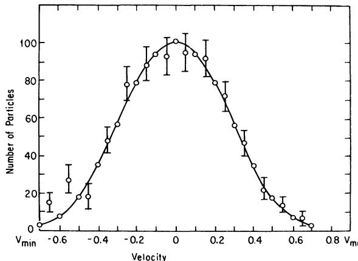  
FIG.11. Uniformly spaced velocity intervals and the number of particles found lying in each velocity interval (taken from Dawson, 1962a).

We cannot, of course, make plots of two- or thredimensional models'phase spaces,which are four and six dimensional. For such systems we must content ourselves with plotting different slices through phase space. For example, ${ \boldsymbol { x } } , { \boldsymbol { v } } _ { \boldsymbol { x } }$ plots, $\mathbf { \Delta x } , v _ { y }$ plots, $x , y$ plots, $y , v _ { y }$ plots. For one and two-halves dimensions the phase space is three dimensional,and projections and models of it can be made.

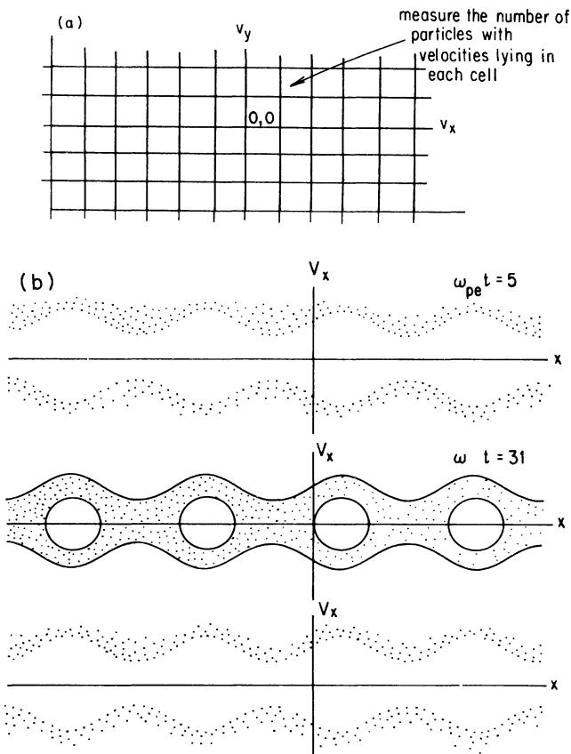  
FIG.12. (a) Discrete grid division of phase space for a onedimensional plasma.(b) Phase-space diagrams for two-stream instability showing reversibility.

The accuracy with which distribution functions can be determined is in general determined by statistics.The error in $n \left( v \right)$ is essentially the square root of the number of particles found in that cell. For example, for a onedimensional simulation employing $1 0 ^ { 4 }$ particles in which the velocity region between $- v _ { \mathrm { m a x } }$ and $v _ { \mathbf { m a x } }$ is divided into 20 cells,the typical error in determining $n \left( v \right)$ would be $3 - 5 \%$ ; the percentage error will be larger in those regions of velocity where there are fewer particles and smaller where there are more (Dawson,1962a,1964)．If we had also divided the position space into 2O cells, then typically the error in $n \left( v , x \right)$ would be $10 - 1 2 \%$ . These statistical errors can generally be reduced by taking short time averages. The greater the time over which one averages，the smaller one can make the statistical errors. However, since there generally will be a time evolution to the system,averaging over too long a time will introduce errors due this variation. Statistical errors can be reduced by using more particles or by taking ensemble averages, i.e.,by repetitions of the numerical experiment with different microscopic initial conditions but with the same macroscopic conditions.

The reduction of the percentage of error is by $N _ { s } ^ { - 1 / 2 }$ ， where $N _ { s }$ is the number of independent samples included in the average. Two measurements made too close in time will not be statistically independent． The decorrelation time $\tau _ { c }$ (time required for two measurements to be considered independent） depends on the nature of the measurement and of the physical processes destroying correlations. This time can often be estimated on the basis of physical knowledge; on the other hand,measurements of these correlations can give us physical information about the behavior of the system.

Often one is not interested in the full distribution function, but rather in grosser macroscopic properties,such as total electric field energy, temperature,and flow velocity. Such averages can be determined to greater accuracy than the full distribution function.

# 2. Drag on a particle

The drag experienced by a particle traveling through a plasma is often of considerable practical and theoretical importance (Dawson 1962a, 1964). To find this quantity we take a set of particles with velocities lying in a small velocity interval about the velocity of interest at some time $t = t _ { 0 }$ . We follow this group of particles in time and compute the average value of their velocity (averaged over the group) at subsequent times, $\left. v ( t _ { 0 } + \tau ) \right.$ . For such calculations we obtain plots like those shown in Fig. 13.

From the rate of decay of the velocity we can determine the average drag experienced by particles with different velocities,a quantity which is of considerable interest in the kinetic theory of plasma. For a thermal plasma or a plasma in a steady state,it does not matter when we choose our set of particles. Thus for such cases we can improve our statistics by choosing different sets of particles at different initial times $t _ { 0 }$ [but with all $v ( t _ { 0 } )$ lying in the desired velocity interval]. Here we would measure the velocity decay as a function of ${ \pmb t } - { \pmb t } _ { 0 }$

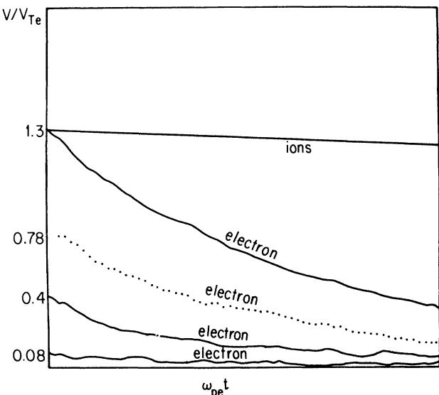  
FIG.13．Autocorrelation function for a number of electron velocity groups and one ion group. The data are from a onedimensional model,and the velocity decay illustrates the drag on a particle.

# 3. Diffusion in velocity

In addition to the drag on a particle we are interested in how particles diffuse in velocity (Dawson,1962a,1964). Such velocity diffusion can be caused either by collisions between particles or by plasma turbulence.For a thermal plasma the drag and velocity diffusion coefficents are related by the Einstein relation. Velocity diffusion produced by turbulence tells us something about the turbulence process.

To compute velocity diffusion we compute the meansquare spread in the velocity as a function of time of a group of test particles which started out with their velocities lying in a small region of velocity space—that is,we compute

$$
\begin{array} { r } { \big \langle \Delta v ^ { 2 } \big \rangle = \big \langle ( \mathbf { v } ( t _ { 0 } + \tau ) - \big \langle \mathbf { v } ( t _ { 0 } + \tau ) \big \rangle ) ^ { 2 } \big \rangle \ , } \end{array}
$$

where the angular brackets denote averages over the set of test particles. The set of test particles can be chosen in any manner desired—for example,they could be chosen to lie within a small region surrounding some initial value $v _ { 0 }$ In general $\langle \Delta v ^ { 2 } \rangle$ has a time dependence like that shown in Fig.14. In general, $\langle \Delta v ^ { 2 } \rangle$ increases as $\tau ^ { 2 }$ for small values of $\tau$ ，This behavior is well known from the theory of irreversible statistical mechanics (Wax,1954). The early dependence comes from the fact that initially the particles are accelerated by whatever force they feel, velocity increasing along with t. Different members of the group feel different forces.However,after a certain length of time-known as the decorrelation time-the force each particle feels has changed to ones uncorrelated with the initial force and from then on the mean-square velocity increases linearly with time as it would if the particle received a series of independent random impulses. Of course any systematic force on the particles such as produced by a magnetic field can introduce oscillations into $\langle \Delta v \rangle$ and also $\langle \Delta v ^ { 2 } \rangle$ .

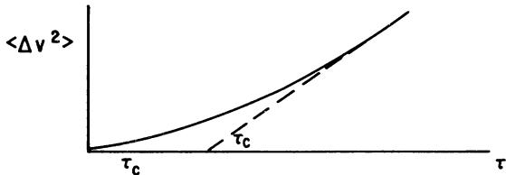  
FIG.14. The time development of the mean-square spread in velocity of a group of particles.

# 4.Diffusion across a magnetic field

One of the important and fundamental problems of plasma physics is the determination of the rate of plasma diffusion across a magnetic field. Such diffusion can be measured for a set of test particles using the following procedure. The position of the guiding center of a charged particle in a magnetic field is given by

$$
\boldsymbol { \mathscr { r } } _ { \mathrm { g c } } = \boldsymbol { \mathscr { r } } - \frac { \boldsymbol { \omega } _ { c } \times \dot { \boldsymbol { \mathscr { r } } } } { \boldsymbol { \omega } _ { c } ^ { 2 } } \mathrm { ~ , ~ }
$$

where

$$
\pmb { \omega } _ { c } \mathrm { = } \frac { q \mathbf { B } } { m c } \mathrm { ~ . ~ }
$$

The guiding centers of the particles do not show the rapid oscillatory motion that the particle positions exhibit. They are therefore suitable for computation of diffusion across the magnetic field. To compute the difusion rate we compute the mean-square displacement of the guiding centers of a set of test particles-that is,we compute

$$
\begin{array} { r } { \langle \Delta \rho _ { \mathrm { g c } } ^ { 2 } \rangle = \langle [ \pmb { r } _ { \mathrm { g c } } ( t ) - \pmb { r } _ { \mathrm { g c } } ( 0 ) ] ^ { 2 } \rangle \ , } \end{array}
$$

This quantity has the general time dependence shown in Fig. 15.

# B. Measurements related to waves

Plasmas can support a wide variety of waves. Much of plasma behavior is associated with such wave motion. Associated with the waves are electric and magnetic fields. To begin with we can measure these fields at various spatial points and at various times,i.e., $\mathbf { E } ( \tilde { \mathbf { \Gamma } } _ { \mathbf { \Gamma } } , t )$ and $\mathbf { B } ( \ r _ { \star } , t )$

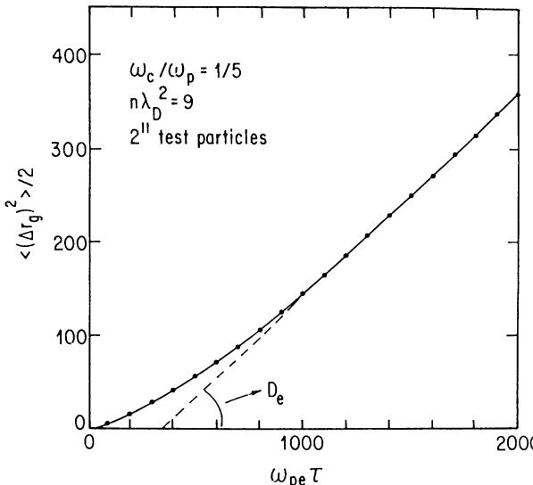  
FIG.15. The mean-squared spread in the displacements of the guiding centers of a group of particles.

# 1．Field fluctuations

If the plasma is spatially uniform,the waves are sinusoidal and we Fourier analyze the electric and magnetic fields into their various $k$ components. We would thuscomputesuchthingsas $\mathbf { E } ( \mathbf { k } , t )$ 、 $\mathbf { B } ( \mathbf { k } , t ) ,$ $\mathbf { E } ^ { 2 } ( \mathbf { k } , t ) , \mathbf { B } ^ { 2 } ( \hat { \mathbf { k } } , t ) ,   \mathbf { E } ( \mathbf { k } )  _ { \mathrm { t a } } ,   \mathbf { B } ( \hat { \mathbf { k } } )  _ { \mathrm { t a } } ,   \mathbf { E } ^ { 2 } ( \mathbf { k } )  _ { \mathrm { t a } } ,   \mathbf { B } ^ { 2 } ( \mathbf { k } )  _ { \mathrm { t a } } $

First, if we consider a thermal plasma, then $\langle { \bf E } ^ { 2 } ( { \bf k } ) \rangle _ { \mathrm { t a } }$ and $\langle B ^ { 2 } ( k ) \rangle _ { \mathrm { t a } }$ (ta implies time average) are predicted from equilibrium statistical mechanics:For electrostatic and magnetostatic models they take on the values given below.

# a. Point particles

$$
\begin{array} { r l } & { \left. \frac { { \bf E } _ { L } ^ { 2 } ( { \bf k } ) } { 8 \pi } \right. _ { \mathrm { t a } } = \frac { K T } { 2 L ^ { n } ( 1 + k ^ { 2 } \lambda _ { D } ^ { 2 } ) } , } \\ & { \left. \frac { { \bf B } _ { T } ^ { 2 } ( { \bf k } ) } { 8 \pi } \right. _ { \mathrm { t a } } = \frac { K T } { 2 L ^ { n } ( 1 + k ^ { 2 } \lambda _ { \mathrm { E M } } ^ { 2 } ) } , ~ \lambda _ { \mathrm { E M } } = c / \omega _ { p e } . } \end{array}
$$

The average for $\mathbf { B } _ { T } ^ { 2 }$ is per allowed transverse polarization (typically two transverse polarizations are allowed,but on occasion the model might be restricted to only one).

In the above $_ n$ is the number of dimensions,and we have assumed that the plasma is confined to a cube of dimensions $\pmb { L }$ on a side. For long wavelengths these formulas predict that the average field energy in a $k$ mode is one-half $K T$ ：

$$
\frac { \left. { \bf E } _ { L } ^ { 2 } ( { \bf k } ) \right. _ { \mathrm { t a } } L ^ { n } } { 8 \pi } { = } \frac { { \cal K } T } { 2 } , k \lambda _ { D } \ll 1 ,
$$

$$
\big < { \bf B } _ { T } ^ { 2 } ( k ) \big > _ { \mathrm { t a } } L ^ { n } / 8 \pi = \frac { K T } { 2 } \quad k \lambda _ { \mathrm { E M } } < < 1 \ .
$$

# b. Finite-size particles

For plasma composed of finite-sized particles of Gaussian shape with

$$
\rho ( \varkappa - \varkappa _ { i } ) = \frac { q \exp \left[ - \frac { ( \varkappa - \varkappa _ { i } ) ^ { 2 } } { 2 a ^ { 2 } } \right] } { ( 2 \pi ) ^ { n / 2 } a ^ { n } } ,
$$

expressions (118) and (119) are modified and take the forms

$$
\begin{array} { r } { \left. { \frac { { \bf E } _ { L } ^ { 2 } ( { \bf k } ) } { 8 \pi } } \right. _ { \mathrm { t a } } = \frac { k T } { 2 L ^ { n _ { ( 1 + k ^ { 2 } \lambda _ { D } ^ { 2 } e ^ { k ^ { 2 } a ^ { 2 } } ) } } } ~ , } \\ { \left. { \frac { { \bf B } _ { T } ^ { 2 } ( { \bf k } ) } { 8 \pi } } \right. _ { \mathrm { t a } } = \frac { k T } { 2 L ^ { n _ { ( 1 + k ^ { 2 } \lambda _ { \mathrm { E M } } ^ { 2 } e ^ { k ^ { 2 } a ^ { 2 } } ) } } } ~ . } \end{array}
$$

The above are time-average energy densities for the fields for a particular $\pmb { k }$ . As a consequence they say nothing about the time dependence of the fields or how this energy is distributed over frequencies. The time dependence and frequency dependence of the fields give a large amcunt of information about the dynamics of the plasma. Therefore,it is of interest to compute the time Fourier transforms of the fields. As an example we might compute the power spectrum in the longitudinal electric field,

$$
\frac { \left. \mathbf { E } _ { L } ^ { 2 } ( \mathbf { k } , \omega ) \right. } { 8 \pi } = G _ { L } ( \mathbf { k } , \omega ) \ .
$$

For a thermal plasma with no imposed $\pmb { B }$ field this has the form (Rosotoker，1961；Thompson and Hubbard, 1960) shown in Fig.16.

Here $\langle ~ \rangle$ indicates an average taken either over a large number of repetitions of the simulation (usually not done) or over a small band of ω's. If such averages are not taken,one obtains very irregular spiky power spectra with the spikes separated by $\Delta \omega { \simeq } 1 / T$ where ${ \pmb T }$ is the length of the run; to be meaningful $T ^ { - 1 }$ should be smaller than any of the spectral features of interest and thus the irregular spikes will be sharper than the meaningful spectral features.

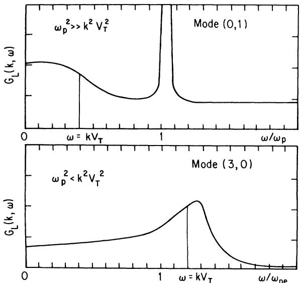  
FIG.16. Spectra of electric field fluctuations taken from a two-dimensional plasma simu!ation.

For the case $\omega _ { p } \gg k V _ { T }$ there are two features, one a continuous spectrum centered at zero frequency and the other a sharp spectral line at roughly the plasma frequency. The sharp spectral line is associated with plasma oscillations; the low-frequency continuum arises from the random motions of particles and their accompanying Debye clouds. As $\omega _ { p }$ becomes larger relative to $k V _ { T }$ ，the size of the low-frequency continuum becomes smaller and the plasma spike becomes higher and narrower; on the other hand,as $k V _ { T }$ becomes larger relative to $\omega _ { p }$ ，the plasma spike decreases in amplitude and increases in width and is absorbed into the continuum (Rosotoker, 1961; Thompson and Hubbard,196O; Bekefi,1966).

If the plasma contains a uniform imposed magnetic field the spectra for the longitudinal field have the form shown (Kamimura et al.,1978) in Fig.17.

The spectrum has a large number of peaks spaced at roughly the electron cyclotron frequency (Bernstein, 1958).There is a large peak at the upper hybrid frequency. Figure 17 is a plot for a system with mobile electrons and fixed ions; if the ions are allowed to move, there are additional peaks associated with the ion cyclotron motion and with lower hybrid oscillations. The cyclotron harmonic or Bernstein peaks have relatively small amplitudes after one passes the upper hybrid frequency. In addition to the Bernstein peaks there is a peak at zero frequency; this peak is associated with convective cells (Dawson et al.,1971; Okuda and Dawson,1973a) or eddies associated with charged flux tubes. If one integrates $\langle E ^ { 2 } ( k , \omega ) \rangle$ over all $\omega$ ，one obtains the results given for the time-averaged $\pmb { { \cal E } }$ fields.

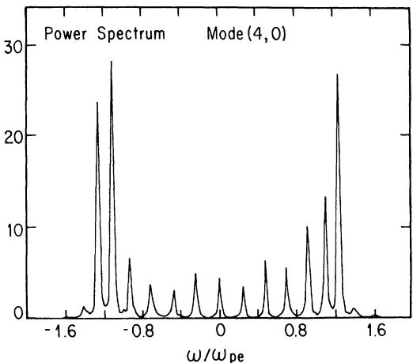  
FIG.17. Spectra of electric field fluctuations for a magnetized plasma.

# 2. Time correlations

Closely related to the spectral density of the electric field is its correlation function:

$$
C ( k , \tau ) = \operatorname* { l i m } _ { T  \infty } \frac { 1 } { T } \int _ { 0 } ^ { T } [ E ( k , t ) E ( k , t + \tau ) ] d t \ .
$$

Of course for computer simulations this integral must be replaced by a sum over sampling times and the infinite upper limit must be replaced by the maximum allowed by the data. ${ \cal C } ( { \bf k } , \tau )$ and $G ( \mathbf { k } , \omega )$ are related by the Wiener-Khintchine relation (Kittel, 1958)

$$
\begin{array} { r } { G ( { \bf k } , \omega ) { = } 4 \int ^ { \infty } { C ( { \bf k } , \tau ) } \mathrm { c o s } \omega \tau d \tau \ . } \end{array}
$$

A typical form for $\scriptstyle { C ( k , \omega ) }$ is shown in Fig.18.

# 3. Normal modes of a nonuniform plasma

For nonuniform plasmas the normal modes are not sine waves but have more complex wave forms. One of the important problems in plasma physics is to determine the normal modes of such plasmas. Even though one can write down linear equations for the modes,it is often difficult or impossible to solve these equations for situations encountered in experiments. The equations are integral differential equations involving the plasma nonuniformities and the complex unperturbed particle orbits if a full kinetic description of the plasma is used. In general these equations can be solved only approximately analytically, and one is often not quite sure if the approximations and assumptions which go into such analysis are valid. On the other hand,it is often not possible to experimentally measure what is going on in the plasma. Computer simu-

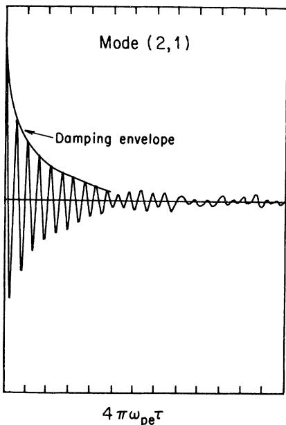  
FIG.18.Correlation function for the electric field in a fieldfree plasma,taken from a two-dimensional plasma simulation.

lation can aid us here.

In order to find the normal modes we measure one or more quantities associated with the wave at a set of positions throughout the plasma (we are assuming we have a thermal plasma with thermally excited waves). For example,we might measure

$$
\begin{array} { r } { \phi ( { \pmb \mathscr { r } } , t ) , { \bf E } ( { \pmb \mathscr { r } } , t ) , { \bf B } ( { \pmb \mathscr { r } } , t ) } \end{array} .
$$

If the plasma is uniform in the $_ x$ direction and nonuniform in the $y$ direction,as in the case of our slab model, we Fourier analyze in the $_ x$ direction and record such things as $\phi ( k _ { x } , y , t )$ . We then spectral analyze this quantity $\phi ( k _ { x } , y , \omega )$ ．Figure 19 shows a typical plot obtained from such analysis (Decyk,1980)．Typically there will be regions of a continuous spectrum as well as discrete spectral lines.Let us first consider the discrete lines.These correspond to normal modes of the plasma. We wish to find the shape of the wave function associated with these. To do this for, say, the peak at $\omega _ { 1 }$ ,we write

$$
\begin{array} { r l r } {  { \phi ( \pmb { \rho } , t ) = \phi _ { 1 } ( \pmb { \rho } , \pmb { \rho } ) \mathrm { s i n } \big [ \omega _ { 1 } t + \theta _ { 1 } ( \pmb { \rho } , t ) \big ] + \widetilde { \phi } ( \pmb { \rho } , t ) } } \\ & { } & { = \phi _ { 1 } ( \pmb { \rho } , ) \big [ \mathrm { s i n } \omega _ { 1 } t \mathrm { c o s } \theta _ { 1 } ( \pmb { \rho } , t ) } \\ & { } & { + \mathrm { c o s } \omega _ { 1 } t \mathrm { s i n } \theta _ { 1 } ( \pmb { \rho } , t ) \big ] + \widetilde { \phi } ( \pmb { \rho } , t ) , } \end{array}
$$

where $\widetilde { \phi } ( \pmb { \mathscr { r } } , t )$ is that part of $\phi$ which does not have frequency $\omega _ { 1 }$ .We now correlate $\phi ( \pmb { \mathscr { r } } , t )$ with $\sin \omega _ { 1 } t$ and $\cos \omega _ { 1 } t$ to pick out the $\omega _ { 1 }$ oscillations; that is, we compute

$$
\begin{array} { r } { \frac { 1 } { T } \int _ { 0 } ^ { T } \phi ( \nsim , t ) \mathrm { s i n } \omega _ { 1 } t d t = \frac { 1 } { 2 } \phi _ { 1 } (  ) \mathrm { c o s } \theta _ { 1 } ( \nsim ) = C _ { 1 } ( \mathscr { r } ) } \end{array}
$$

and

$$
\frac { 1 } { T } \int _ { 0 } ^ { T } \phi ( \ r , t ) \mathrm { c o s } \omega _ { 1 } t d t = \textstyle { \frac { 1 } { 2 } } \phi _ { 1 } ( \ r ) \mathrm { s i n } \phi _ { 1 } ( \ r ) = C _ { 2 } ( \ r ) \ .
$$

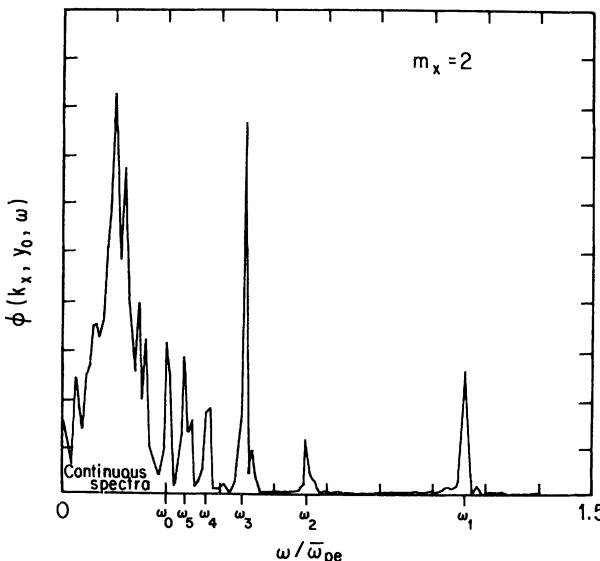  
FIG. 19. Electric field spectrum for a bounded plasma showing discrete and continuous spectra.

From these relations we find

$$
\phi _ { 1 } ^ { 2 } ( \pmb { \mathscr { r } } ) { = } 4 [ C _ { 1 } ^ { 2 } ( \pmb { \mathscr { r } } ) { + } C _ { 2 } ^ { 2 } ( \pmb { \mathscr { r } } ) ]
$$

and

$$
{ \bf t a n } \theta _ { 1 } ( \pmb { \mathscr { r } } ) = \frac { C _ { 2 } ( \pmb { \mathscr { r } } ) } { C _ { 1 } ( \pmb { \mathscr { r } } ) } , \theta _ { 1 } ( \pmb { \mathscr { r } } ) = { \bf t a n } ^ { - 1 } \frac { C _ { 2 } ( \pmb { \mathscr { r } } ) } { C _ { 1 } ( \pmb { \mathscr { r } } ) } \ .
$$

We thus obtain the desired wave runction

$$
\phi _ { 1 } ( \pmb { \mathscr { s } } ) \mathbf { s i n } \theta _ { 1 } ( \pmb { \mathscr { s } } )
$$

for the normal mode with frequency $\omega _ { 1 }$

When we compute the integrals in Eqs.(13O) and (131) the time span $_ { T }$ should be less than the damping time of the normal mode or else the initial oscillations will die out during the integration time and oscillations at some random phase will be excited by the random motions of this system; these will give different values of $\theta _ { 1 } ( \pmb { \mathscr { n } } )$ ,and different time regions of the integral will interfere with each other. Long runs can be used to get better statistics by making a series of such measurements,each less than a damping time,and then properly averaging them.

For the region of the continuous spectrum we can proceed in a similar manner,choosing $\pmb { \omega }$ to lie in one of these regions. In this case we generally find that the wave function $\phi _ { 1 } ( \mu )$ is peaked in some small region of the plasma (Decyk,1980)． Thus these modes correspond to oscillations which are localized to that region of the plasma. They might, for example, correspond to local plasma oscillations in a plasma of nonuniform density and hence plasma frequency. It is,of course,possible for the continuum to be associated with the random motions of the particles, just as was the case in the spectrum of a uniform plasma. In such a case we would need to calculate, say, $\delta v ( { \bf v } , \varkappa , \omega )$ ，where ${ \pmb \delta } { \pmb v }$ represents a perturbation in velocity of a particle whose undisturbed velocity is $\blacktriangledown$ and the mode has structure in $\curvearrowright$ space.

this is not sufficient to reduce the noise to an acceptable level.This is particularly true if one is looking for a weak subtle effect. It would be advantageous if there were some better ways to initialize the simulation so as to reduce the noise. Fortunately,this is the case through the use of so-called quiet starts (Denavit, 1972;Denavit and Walsh,1981).Before going into this,let us look at what limits random starts put on a number of measurements.

Let us first look at an unstable situation. Let us restrict ourselves to a one-dimensional model containing a total of $N$ particles. The situation might be that of a two-stream instability,for example (Dawson,1962b)． In general, the percentage density fluctuations associated with any given $k$ mode are of the order of $1 / N ^ { 1 / 2 }$ . These fluctuations can be distributed among the various frequency modes allowed for that $k$ (as previously discussed). However,generally there are only a few of these,and so we will take $\delta n \left( k \right) / n \approx N ^ { - 1 / 2 }$ Now the unstable mode can generally grow until $[ \delta n ^ { 2 } ( k ) / n ^ { 2 } ] ^ { 1 / 2 } { = } \varepsilon$ becomes a few percent. The exact value depends on how strongly unstable the situation is. For a strong two-stream instability with equal density beams $[ \delta n ^ { 2 } ( \bar { k } ) / n ^ { 2 } ] ^ { 1 / 2 }$ might become as large as $25 \%$ ,while for a weak beam with a thousandth the density of the plasma it might be a fraction of a percent. Since the unstable mode grows exponentially as $e ^ { \gamma t }$ ,we have the maximum total growth, $e ^ { \gamma t }$ ,given by

$$
\begin{array} { r } { \gamma t = \frac { 1 } { 2 } \mathsf { I n s } N \mathrm { ~ . ~ } } \end{array}
$$

Even for $N = 1 0 ^ { 5 }$ and $\varepsilon = 1 0 ^ { - 1 }$ this limits $\gamma t$ to 5. Thus we could not determine the growth rate $\gamma$ to better than about $20 \%$ .In many other cases,where $N$ and ε are smaller, the accuracy of determining $\gamma$ is worse; and for weak instabilities it may be impossible to pull the unstable growth out of the natural noise,as illustrated in Fig.20.

A perhaps more serious problem arises from the fact that distributing the particles in space by means of a ran-

# IV. QUIET STARTS

For many applications regular initial arrangements of the particles (quiet starts) are advantageous. Our discussion up to now has been directed to what might be termed thermal or noisy starts,where one starts a simulation by choosing the particle velocities from a random number generator which gives the desired initial velocity distribution function; a similar procedure can be used for the spatial distribution,although ignoring the strong tendency for charge neutrality in a plasma can lead to trouble if ions and electrons are spatially loaded from independent random numbers. In general, such a method of initializing the system produces a large amount of noise. The percentage fluctuation in the number of particles found in a small region of phase space being in general proportional to $\overline { { N } } ^ { - 1 7 2 }$ where $\overline { { N } }$ is the average number of particles found in that region of phase space. One can always decrease the degree of fluctuations by increasing the number of particles used in the model. However,there is a practical limit to how many particles can be used,and often dom number generator (particularly ions and electrons independently） can lead to strong overexcitation of longwavelength modes and to a large amount of noise associated with them. This is simply seen for the case of a uniform spatial electron distribution. We imagine that the ions constitute a fixed uniform neutralizing background. In this case the electron density is given by

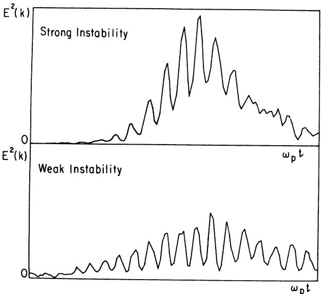  
FIG.20. Time development of a strongly unstable mode and a weakly unstable one.

$$
n ( \pmb { \mathscr { r } } ) = \sum _ { i } \delta ( \pmb { \mathscr { r } } - \pmb { \mathscr { r } } _ { i } ) \ .
$$

Fourier analyzing gives

$$
n \left( \mathbf { k } \right) = \frac { 1 } { L ^ { 3 } } \sum _ { i } e ^ { - i \mathbf { k } \cdot \pmb { r } _ { i } } ,
$$

where $\pmb { L }$ is the size of the cube in which the plasma is contained. From this we compute

$$
\begin{array} { l } { { \displaystyle \mid n \left( k \right) \mid ^ { 2 } = \frac { 1 } { L ^ { 6 } } \sum _ { i , i ^ { \prime } } e ^ { i { \bf k } \cdot ( { \bf \sigma } \cdot { \bf \sigma } _ { i } - { \bf \sigma } _ { i ^ { \prime } } ) } \ , } } \\ { { \displaystyle \langle \mid n ( { \bf k } ) ^ { 2 } \mid \rangle = \frac { N } { L ^ { 6 } } = \frac { n } { L ^ { 3 } } \ . } } \end{array}
$$

Now the longitudinal electric field is given by

$$
\begin{array} { l } { { \nabla \cdot { \bf E } _ { L } = - 4 \pi e ( n - n _ { 0 } ) \ , } } \\ { { \displaystyle _ { i { \bf k } \cdot { \bf E } _ { L } } = - 4 \pi e n \left( { \bf k } \right) \ , } } \\ { { \displaystyle \mid E _ { L } \mid = \frac { 4 \pi i e n \left( k \right) } { \mid k \mid } \ , } } \\ { { \displaystyle { \bf E } _ { L } = \frac { 4 \pi i e n \left( { \bf k } \right) { \bf k } } { k ^ { 2 } } \ , } } \end{array}
$$

or

$$
\frac { \langle \mid E _ { L } ( k ) \mid ^ { 2 } \rangle } { 8 \pi } = \frac { \omega _ { p e } ^ { 2 } m } { 2 k ^ { 2 } L ^ { 3 } } ~ .
$$

But from equilibrium statistical mechanics we know

$$
\frac { \langle \mid E _ { L } ( k ) \mid ^ { 2 } \rangle L ^ { 3 } } { 8 \pi } = \frac { k T } { 2 ( 1 + k ^ { 2 } \lambda _ { D } ^ { 2 } ) } = \frac { m V _ { T } ^ { 2 } } { \left[ 1 + \frac { k ^ { 2 } V _ { T } ^ { 2 } } { \omega _ { p e } ^ { 2 } } \right] } \ .
$$

We see from this that the two expressions agree for large $k$ ,but the purely random placing of the electrons strongly overexcites the long-wavelength or small- $k$ modes．The random placing of the electrons would give modes with $k \lambda _ { D } = 0 . 1$ 100 times their average thermal energy. This comes about because the random placing of the electrons does not take into account the Debye shielding of an electron by the rest or the tendency of the plasma to stay charge neutral. For a real plasma if there are an excess of electrons in a given region the tendency of an additional electron to enter this region is greatly reduced.

In this case the effect is easily overcome by simply dividing the box into cells of about a Debye length in size and putting into each cell the proper number of electrons to give charge neutrality. If one chooses the particle velocities from random numbers with a Maxwellian velocity distribution,then one finds the kinetic energy associated with the small $k$ modes to be $K T / 2$ .If the particles have been placed so as to give charge neutrality in each cell, then there is initially no electric field energy in these modes. They thus end up with a total energy of $K T / 2$ whereas since these modes behave like harmonic oscillators they should have an energy of $K T _ { ; }$ theyare thus excited to half their thermal level． This generally does not cause any serious problem.

For the general case we can use a similar procedure to suppress noise. We are not limited to distributing the particles throughout phase space in a random manner. We can divide the phase space into cells and place precisely the number of particles we want in each cell. In this way the fluctuations can be almost totally suppressed. Thus we could divide the plasma into a number of cells and into each cell we would put $_ n$ particles with velocity $v _ { 1 }$ $\pmb { n } _ { 2 }$ particles with velocity $v _ { 2 }$ ,etc.,where the numbers and velocities are chosen so as to approximate the desired distribution function.

As an example let us suppose that we wanted to place $N$ particles in each cell so as to approximate a Maxwellian distribution. Figure 21 is a plot of a Maxwellian distribution divided into a number of equal areas. We would normalize $P ( v )$ so that

$$
\int P ( v ) d v = N
$$

$N$ is the number of particles per cell). We then compute

$$
\int _ { 0 } ^ { 2 v _ { 1 } } P ( v ) d v = 1
$$

and insert one particle in the cell at velocity $v _ { 1 }$ .We would then compute

$$
\int _ { 2 v _ { \parallel } } ^ { 2 ( v _ { 2 } - v _ { 1 } ) } P ( v ) d v = 1
$$

and insert one particle in the cell at velocity $v _ { 2 }$ .We would continue in this way until we had covered the whole distribution function (for both positive and negative velocities） and had thus placed the proper number of particles in the cell. The procedure must be altered somewhat for the highest velocity particle, since we cannot integrate to infinite velocity. This can be avoided by simply deciding on a maximum allowed velocity.

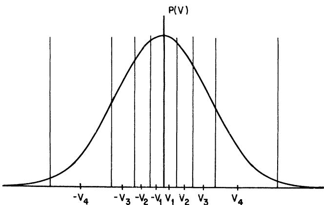  
FIG.21． Division of a Maxwellian into a number of equal areas.

# A．Aside generation of a set of random numbers with an arbitrary distribution function

Suppose we want to choose a set of random numbers which have some given distribution function.Let $P ( v )$ be the desired distribution. Let us assume that we have a random number generator which gives random numbers uniformly distributed between O and 1. Let $_ { y }$ be a random number between O and 1 and $P ( y ) = 1$ . Choose $v$ to be a function of $y$ ，

$$
v = v \left( y \right) ,
$$

such that when $v$ is computed from this relation from a random set of y's the u's will be distributed according to the desired distribution function.We have

$$
\begin{array} { l } { { P ( v ) d v = P ( y ) d y ~ , } } \\ { { { } } } \\ { { P \left[ v ( y ) \right] \displaystyle \frac { d v } { d y } d y = P ( y ) d y = d y ~ , } } \\ { { \displaystyle \frac { d y } { d v } = P ( v ) ~ , } } \\ { { { } } } \\ { { { } y ( v ) = \displaystyle \int _ { - \infty } ^ { v } P ( v ) d v ~ , } } \\ { { { } v = y ^ { - 1 } ( v ) ~ . } } \end{array}
$$

Geometrically the situation is shown in Fig.22. One computes a random number $y$ and from this graph (or by interpolation from a table in the computer） computes the corresponding $v$ .The v's have the desired distribution function.

# B. Electrons of many sizes,charges,and masses

Our above method of generating a quiet start obviously cannot give a representation of those regions of phase space where there are few particles. For example, it cannot represent what is happening in the tail of a Maxwellian distribution.More importantly,there may be regions of phase space where the density of particles is very low but which play a critical role in the phenomenon going on-as,for example,an instability caused by a lowdensity highly energetic beam passing through a plasma. Properly to model such situations,whether by using a random start or a quiet start,we need another method. One method is to use electrons of different charges and masses but with all particles having the same charge to mass ratio (Denavit，1972；Denavit and Kruer，1971; Kainer et al., 1972). That is,we choose groups of particles with charges

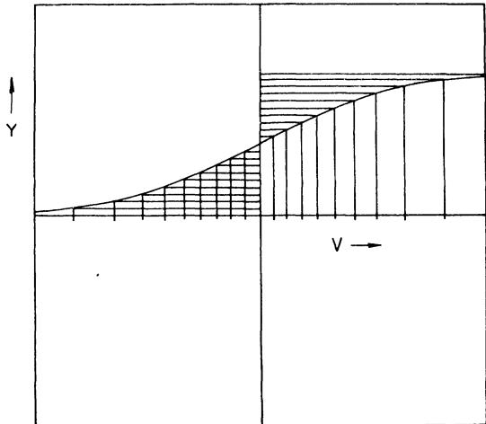  
FIG.22.Method for generating a set of random numbers with a given probability from a set of random numbers uniformly distributed between O and 1.

$$
q _ { i } = - \alpha _ { i } e
$$

and masses

$$
m _ { i } = \alpha _ { i } m
$$

but with

$$
\frac { q _ { i } } { m _ { 1 } } = - \frac { e } { m } ~ .
$$

For a plasma made of such groups of particles we have a Vlasov equation for each group,

$$
\begin{array} { r l } & { \displaystyle \frac { \partial f _ { i } } { \partial t } + \mathbf { v } \cdot \frac { \partial f _ { i } } { \partial \boldsymbol { r } } - \frac { e } { m } \mathbf { E } \cdot \frac { \partial f _ { i } } { \partial \mathbf { v } } = 0 \ , } \\ & { \displaystyle \nabla \cdot \mathbf { E } = - 4 \pi e \left[ \sum _ { i } \alpha _ { i } \int f _ { i } d ^ { 3 } v - n _ { 0 } \right] , } \end{array}
$$

where $n _ { 0 }$ is the neutralizing background ion density.Let us now define a composite distribution function $F _ { ; }$

$$
F ( { \boldsymbol \mathscr { r } } , { \bf v } ) { = } \sum _ { i } \alpha _ { i } f _ { i } ( { \boldsymbol \mathscr { r } } , { \bf v } ) ~ .
$$

Multiplying Eq.(54) by $\alpha _ { i }$ and summing over $i$ give

$$
\begin{array} { l } { \displaystyle \sum _ { i } \alpha _ { i } \left\lfloor \frac { \partial f } { \partial t } + { \bf v } \cdot \frac { \partial f _ { i } } { \partial \boldsymbol { \kappa } } - \frac { e } { m } { \bf E } \cdot \frac { \partial f _ { i } } { \partial { \bf v } } \right\rfloor } \\ { \displaystyle \qquad = \frac { \partial F } { \partial t } + { \bf v } \cdot \frac { \partial F } { \partial \boldsymbol { \kappa } } - \frac { e } { m } { \bf E } \cdot \frac { \partial F } { \partial { \bf v } } = 0 \mathrm { , } } \\ { \displaystyle \nabla \cdot { \bf E } = - 4 \pi e \left[ \int F ( \boldsymbol { \kappa } , { \bf v } ) d ^ { 3 } v - n _ { 0 } \right] . } \end{array}
$$

We thus see that $\pmb { F }$ satisifes the usual Vlasov equation.

It is thus possible to put a large number of particles with small charge and mass (small $\alpha _ { \iota } ^ { \prime }$ ）in the regions of phase space where we want a large amount of detail and to use a small number of particles with large charge and mass (large $\pmb { \alpha }$ ）in those regions of phase space where high resolution is not required. This can be done whether we use a random start or a quiet start.

One problem does arise from the use of particles of different α's. Collisions between particles tend to transfer energy from the heavy particles to the light particles. Statistical mechanics tells us that for thermal equilibrium all particles have the same thermal energy so that the lighter particles will end up with much higher velocities than the heavy particles and so the energy per unit mass will increase for the light particles.Of course collisional effects are not included in the Vlasov equation,and so this is a higher-order effect. Not only is there energy transfer due to encounters between light and heavy particles,but the light particles are also scattered by the heavy ones,and this is the more critical process. The scattering cross section for light particles by heavy particles depends essentially on the charge of the heavy particle and the velocity of the light particles relative to the heavy particles (Spitzer, 1956); the ratio of the charge to mass for the light particles also enters. Using analysis similar to that described earlier,we find the scattering time for a twodimensional model to be given by

$$
\frac { \nu } { \omega _ { p } } \approx \frac { 1 } { 1 6 n \lambda _ { D } ^ { 2 } R } \left[ \frac { v _ { T } } { v } \right] ^ { 3 } ,
$$

where $\pmb { n }$ is the particle density that goes with the dominant species (that containing the major part of the mass and charge), $\lambda _ { D }$ is the Debye length which goes with the dominant species, $v _ { T }$ is the thermal velocity of the dominant species, $v$ is the velocity that is characteristic of the lighter species (species of interest which is assumed to have the higher velocity),and $\pmb R$ is the collisional reduction factor due to the finite size of the particles.

# C. Instabilities in quiet starts

Whenever we start the system out with a quiet start we are imposing on it an order (greatly reduced entropy). All physical systems left to themselves come to thermal equilibrium given sufficient length of time. Thus if the system starts with a quiet start，this property will deteriorate with time and the system will become noisy. This property is in fact manifest through instabilities of the initial well-ordered (quiet start) system. This property is illustrated by a simple model (Dawson, 196O):a onedimensional model of a plasma made up of a large number of discrete electron beams propagating through a fixed uniform neutralizing ion background. Here we shall want to investigate the small-amplitude longitudinal oscillations of this system. We assume the beams are infinite in extent and have well-defined velocities (no thermal motion within an individual beam). We take the streams to propagate in the $_ x$ direction and the waves also to propagate in this direction. The linearized equations of motion for this system are

$$
\begin{array} { r l } & { \displaystyle \frac { \partial v _ { \sigma } } { \partial t } + V _ { \sigma } \frac { \partial v _ { \sigma } } { \partial x } = - \frac { e E } { m } \ , } \\ & { \displaystyle \frac { \partial n _ { \sigma } } { \partial t } + N _ { \sigma } \frac { \partial v _ { \sigma } } { \partial x } + V _ { \sigma } \frac { \partial n _ { \sigma } } { \partial x } = 0 \ , } \end{array}
$$

and

$$
\frac { \partial E } { \partial x } = - 4 \pi e \sum _ { \sigma } n _ { \sigma } ~ .
$$

Here $n _ { \sigma }$ and $v _ { \sigma }$ are the perturbations in the number density and velocity of the $\pmb { \sigma }$ th beam,while $N _ { \pmb { \sigma } }$ and $\nu _ { \sigma }$ are the corresponding unperturbed quantities. We look for solutions of the form

$$
\scriptstyle A ( x , t ) = A e ^ { i ( \omega t - k x ) } \ ,
$$

where $\pmb { A }$ is any one of the quantities $n _ { \sigma } , v _ { \sigma }$ ,or $\pmb { { \cal E } }$ Substituting this form into the equations of motion gives

$$
\begin{array} { l } { { i ( \omega - k V _ { \sigma } ) v _ { \sigma } = - \displaystyle \frac { e E } { m } ~ , } } \\ { { ( \omega - k V _ { \sigma } ) n _ { \sigma } - k N _ { \sigma } v _ { \sigma } = 0 ~ , } } \end{array}
$$

and

$$
i k E = 4 \pi e \sum _ { \sigma } n _ { \sigma } \ .
$$

Eliminating $\pmb { \cal E }$ and $\nu _ { \sigma }$ yields

$$
( \omega - k V _ { \sigma } ) ^ { 2 } n _ { \sigma } = \frac { 4 \pi e ^ { 2 } N _ { \sigma } } { m } \sum _ { \mu } n _ { \mu } ~ .
$$

Since the amplitude of the wave is arbitrary, the $n _ { \sigma }$ may be normalized, so that

$$
\sum _ { \sigma } n _ { \sigma } = 1
$$

[this quantity cannot be zero for that would imply $\pmb { { \cal E } } ( k ) = 0 ]$ .With this normalization we find for $n _ { \sigma } , v _ { \sigma } ,$ and $\boldsymbol { \kappa }$

$$
\begin{array} { l } { { \displaystyle v _ { \sigma } = \frac { 4 \pi e ^ { 2 } } { k m } \frac { 1 } { ( \omega - k V _ { \sigma } ) } ~ , } } \\ { { \displaystyle n _ { \sigma } = \frac { 4 \pi e ^ { 2 } } { m } \frac { N _ { \sigma } } { ( \omega - k V _ { \sigma } ) ^ { 2 } } ~ , } } \end{array}
$$

and

$$
E = - \frac { 4 \pi e i } { k } ~ .
$$

Substituting $n _ { \sigma }$ into the normalization conditions gives the dispersion relation

$$
\frac { 4 \pi e ^ { 2 } } { m } \sum _ { \sigma } \frac { N _ { \sigma } } { ( \omega - k V _ { \sigma } ) ^ { 2 } } = 1 \ .
$$

If the left- and right-hand sides of this equation are plotted as functions of $\omega$ for fixed $k$ we get a diagram like that shown in Fig. 23. The sum becomes infinite every time one of the denominators goes to zero. Each of the points where the sum equals 1 is a root. These are all real roots of the dispersion relation． There are in general also complex roots of the dispersion relation.There are in fact twice as many roots as there are beams,as can be quickly seen by writing the dispersion relation as a polynomial of order $^ { 2 M }$ ，where $M$ is the number of beams.Each root gives a normal mode of the systems. There are twice as many modes as beams.This is just the number of modes required if the motion is to be expanded in terms of them, because it gives us $^ { 2 M }$ independent amplitudes to specify, and there are $^ { 2 M }$ independent constants, ${ \pmb n } _ { \pmb \sigma } ( k )$ and $v _ { \sigma } ( k )$ · There are $M$ degrees of freedom for each $k$ ,and two constants are required per degree of freedom to specify the state of the system; the $^ { 2 M }$ amplitudes supply just this number. There is an orthogonality relation which can be used to find the amplitudes of the modes in terms of the $n _ { \sigma }$ and $v _ { \sigma }$ ; this can be found in Dawson (1960).

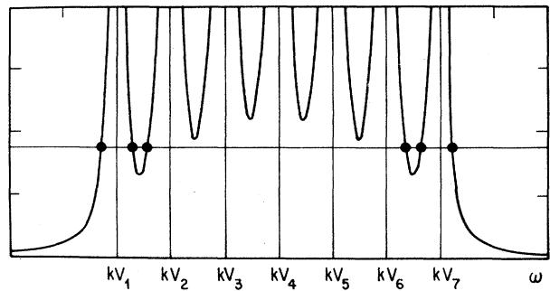  
FIG.23．Dispersion relation for a set of discrete beams.

If we use a large number of beams to approximate a continuous distribution function, then,in general, the vast majority of the modes are unstable. This can be seen by dividing the distribution into a large number of beams of uniform spacing $\boldsymbol { \delta v }$ In this case $N _ { \sigma }$ is given by

$$
N _ { \sigma } = f ( \sigma \delta v ) \delta v \ ,
$$

and the dispersion relation becomes

$$
1 = \frac { 4 \pi e ^ { 2 } } { m } \sum _ { \sigma = - \infty } ^ { \sigma = \infty } \frac { f ( \sigma \delta v ) \delta v } { ( \omega - k \sigma \delta v ) ^ { 2 } } .
$$

For a root between real $\omega = k \sigma \delta v$ and $k ( \sigma + 1 ) \delta v$ there is one term in the sum that is at least as large as

$$
\frac { f ( \omega / k ) \delta v } { k ^ { 2 } \delta v ^ { 2 } } = \frac { f ( \omega / k ) } { k ^ { 2 } \delta v } \ .
$$

This term becomes large as ${ \boldsymbol { \delta v } }$ becomes small,and so the contribution of this term itself makes the sum greater than 1,and thus the roots in the vicinity of this $\omega$ must be complex. It can in fact be shown (Dawson, 196O) that the imaginary part of $\omega$ is given by

$$
\omega _ { i } = \frac { k \delta v } { 2 \pi } \left| \mathrm { l n } \frac { k ^ { 2 } \delta v m } { 4 \pi e ^ { 2 } f ( \omega / k ) } \right| .
$$

Thus as ${ \boldsymbol \delta \boldsymbol v }$ goes to zero, the growth rate also goes to zero but slower than ${ \pmb \delta } { \pmb v }$

The above instability implies that small perturbations of the well-ordered beam system will grow and ultimately destory the order. At most,the quiet situation can be maintained for 5-10 growth times or for times

$$
\tau \approx ( 5 - 1 0 ) \times \frac { 2 \pi } { k \delta v } \frac { 1 } { \left| \mathrm { l n } \frac { k ^ { 2 } V _ { T } \delta v } { \omega _ { p } ^ { 2 } } \right| } \ .
$$

For wavelengths $k \lambda _ { D } { \simeq } 1$ and $\delta v = v _ { T } / M$ we get

$$
\tau { \approx } ( 5 { - } 1 0 ) { \times } \frac { 2 \pi } { { \omega } _ { p } } M \frac { 1 } { \ln { M } } ~ .
$$

For $M \gtrsim 1 0$ ,T's of several hundred $\omega _ { p } ^ { - 1 }$ are possible. This is sufficient for many practical problems.

The well-ordered beams show recursion phenomena (Denavit and Kruer，1980;Canoso et al.，1972) (recurrence of the initial state).This can largely be avoided by destroying the perfectly regular velocity spacing (Denavit and Kruer, 1971)-i.e., by using nonuniformly velocity spaced beams. This also reduces the growth rate of the instabilities,and even more can be accomplished by using different velocity points in different spatial cellsbut ultimately the tendency of the system to thermalize takes over.However, there are cases where we would like to follow the evolution for longer times or to use quiet starts for two-dimensional problems,in which case the situation can be worse. Denavit (1972) has developed a method of periodically damping the fine-scale beam instabilities while retaining any large-scale instabilities the system shows.

The quiet start technique appears to be a powerful method for application to spatially uniform systems. However,it is much more difficult to apply to nonuniform systems,and no general prescription exists for its application here. There are some general methods which greatly reduce noise,such as requiring that there is no net current in regions of a certain size.However,it is clear that this is an area of model development which deserves a great deal more attention.

# V.SOMEEXAMPLES OF PLASMA SIMULATION

We will now look at a number of examples of plasma simulations. They represent only a minute sample of what can be found in the literature. However, I hope they will be representative of the sorts of things that can be done with computer simulation.I should perhaps make the point that both computers and the models used to simulate plasmas are continually increasing in power,and so more complex problems are continually becoming possible.

# A. Tests of the statistical theory of plasmas

Owing to the long-range nature of the electrical forces between charged particles,the statistical mechanics of plasmas is a subtle physical theory，particularly when its nonequilibrium aspects are considered. Experimentally, many of the aspects of the theory are difficult or impossible to test. Computer simulation provides an ideal means for testing many of the details of this theory.A number of the calculations that will be reported in this section were carried out on the sheet model of a plasma (Dawson, 1962a,1964).For one-dimensional electrostatic models it is possible to solve numerically for the motion of point particles without the use of a grid because of the simplicity of the force law between particles;it is independent of the distance of separation and simply jumps by $\pm 4 \pi \sigma _ { 1 } \sigma _ { 2 }$ as the sheets cross each other,as Eq.(3a) says.Because of this,the exact dynamics of such systems can be followed to within machine accuracy.One such code,written by C. Smith and J.Dawson (197O), conserved energy to one part in $1 0 ^ { 1 2 }$ over long periods of time. Because of computational speed such models are not in much use at the present time,but they do provide a benchmark,of the most accurate particle models which exist,against which other codes can be tested.Details about such models can be found in Dawson (1962a,1964),and many of the diagnostic techniques are standard.

# 1. Kinetics of a one-dimensional plasma

As we have discussed earlier,collisional phenomena play an important role in computer models. Detailed studies have been made of collisional phenomena for one-, two-，and three-dimensional models. (Dawson，1962a, 1964;Okuda and Birdsall,197O； Langdon and Birdsall, 1970)．Here we will examine collisional phenomenon in a one-species one-dimensional plasma.Such a plasma consists of charge sheets (say，with negative charge) moving through a fixed neutralizing background. The charged sheets are constrained to be perpendicular to,say,the $\pmb { x }$ axis and allowed to pass freely through each other.

# 2. Drag on a fast particle

A fast particle (sheet) moving through the plasma with, say, $v > v _ { T }$ $( v _ { T }$ is the thermal velocity) excites a plasma oscillation (Cherenkov emission ofplasma oscillations, $k V = \omega _ { p } )$ ）and,by this process,is slowed down．It is also accelerated by the random electric fields produced by all the other particles. By averaging over a large number of fast particles the random accelerations average to zero, but the systematic effects due to the excitation of the wave remain and can be measured. The experimental points are obtained as follows.Particles are selected with velocities lying close to the desired velocity. Their velocities are then recorded at a series of later times $( \tau , 2 \tau , 3 \tau , \dots )$ later, and the average velocity for the group is found.

Let us consider the drag on a very fast supersonic sheet in more detail; for the sake of argument we shall take the velocity of the sheet to be positive. The plasma ahead of the sheet can have no knowledge of its approach; thus there can be no disturbance and hence no electric field ahead of the sheet. However,in going from the negative to the positive side of the sheet the electric field must fall by $ 4 \pi \sigma \ ( - \sigma$ is the charge per unit area) by Gauss's law, as is shown in Fig. 24.

The average electric field $\pmb { { \cal E } }$ felt by the sheet is $\overrightarrow { E } = + 2 \pi \sigma$ ,and its deceleration is given by

$$
\frac { d v } { d t } = - \frac { \sigma \overline { { E } } } { m } = - \frac { \omega _ { p } ^ { 2 } } { 2 n } \ ,
$$

where $\pmb { n }$ is the density of charge sheets. The drag is thus independent of the velocity and is due to the excitation of the plasma oscillation by the sheet.

Figure 25(a) shows a plot of the average absolute velocity as a function of time for two groups of fast particles for a thermal plasma. The average initial velocities of the two groups were $2 . 3 5 v _ { T }$ (circles) and $- 2 . 3 5 v _ { T }$ (triangles). The groups were chosen so that their members had initial velocities within a small velocity intervals about $\pm 2 . 3 5 v _ { T }$ These particles were then followed in time,and the average velocities of the two groups (as functions of time) were found. The results are for a 10oO-sheet system with 10 sheets per Debye length. The straight line is the curve predicted by Eq.(179).

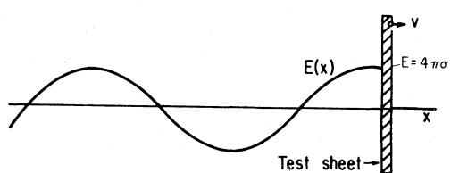  
FIG.24. Wake of plasma oscillations following a fast sheet.

If the system (and hence the code) is time reversible, the drag in the negative time direction should be the same as in the forwardtime direction， i.e.， fortimes $- \tau , - 2 \tau , - 3 \tau , . . .$ ，the average velocities should be the same as for times $\tau , 2 \tau , 3 \tau , \dots$ This was found to be the case and is illustrated in Fig.25(b).

This figure is a similar plot to that of Fig. 25(a) except that in this figure a group of particles with average velocities of $4 v _ { T }$ were traced both forward and backward in time.Similar averages to those computed for Fig. 25(a) were computed here. The data are from a 200-sheet system with 4.5 sheets per Debye length. The straight line is the theoretical prediction from Eq. (179).

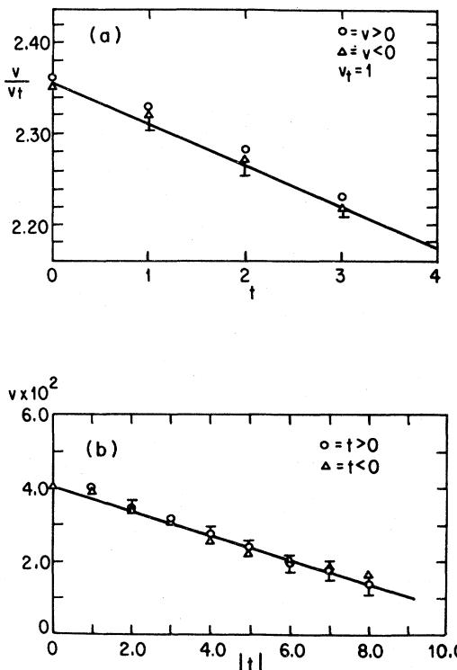  
FIG.25 (a) The slowing down of fast particles in a one. dimensional plasma. (b) The slowing down of particles both forward and backwards in time for a thermal plasma.

# 3.Drag on a slow sheet

Fora slow sheet, the drag is not due to the excitation of a wave,but is due to the reflection of particles of nearly the same velocity by the repulsive electric field surrounding the test particle. If the particle is moving through the plasma, it overtakes more particles than overtake it, and, as a result,it is slowed down. It is also randomly accelerated by the random fields associated with the other particles. These random effects again are removed by averaging over many particles,and the drag can be measured just as was done with a fast particle.

For low velocities the drag on a sheet should be proportional to its velocity. The kinetic theory of plasmas (which will not be presented here) predicts that the average slowing down of a slow test particle is given by (Feix and Eldridge,1962)

$$
\frac { d v } { d t } = - \frac { \sqrt { \pi } } { 6 \sqrt { 2 } } \frac { \omega _ { p } v } { n \lambda _ { D } } .
$$

Figure 26 shows a comparison of theory and simulations; a group of test particles with velocities initially centered about $0 . 5 6 v _ { T }$ were followed in time in the same manner as was done for the fast particles. The system was a thermal one containing 100o sheets with 10 particles per Debye length． The straight line is the theoretical prediction given by Eq.(18O)．By comparing expressions (179） and (180)we see that they would give the same acceleration for a particle at $2 . 4 v _ { T }$ or just about where we expect a particle to be supersonic.

# 4. Diffusion in velocity space

A quantity which is closely related to the drag on a sheet is its diffusion in velocity space. For plasmas where

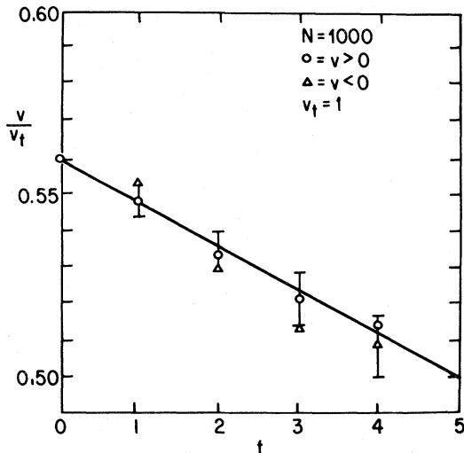  
FIG. 26. Average slowing down of a group of slow sheets.

collisions are weak the drag and velocity diffusion together determine how the velocity distribution function evolves through the Fokker-Planck equation,

$$
\frac { \partial f } { \partial t } + \frac \partial { \partial v } \left[ A ( v ) f ( v ) - \frac 1 2 \frac \partial { \partial v } B ( v ) f ( v ) \right] = 0 .
$$

Here $\pmb { A } ( v )$ and $\pmb { { \cal B } } ( v )$ are the rate of slowing down and the rate of spreading in velocity space for particles with velocity $v$ .They are given by

$$
\begin{array} { l } { { \displaystyle { \cal A } ( v ) = \operatorname * { l i m } _ { \Delta t  0 } \frac { 1 } { \Delta t } \int d v ^ { 1 } ( v ^ { 1 } - v ) { \cal P } ( v \mid v ^ { 1 } , \Delta t ) \ : , } } \\ { { \displaystyle { \cal B } ( v ) = \operatorname * { l i m } _ { \Delta t  0 } \frac { 1 } { \Delta t } \int d v ^ { 1 } ( v ^ { 1 } - v ) ^ { 2 } { \cal P } ( v \mid v ^ { 1 } , \Delta t ) \ : , } } \end{array}
$$

where $P ( v \mid v ^ { 1 } , \Delta t )$ is the probability that a particle which has velocity $v$ at $\pmb { t = 0 }$ will have velocity $v ^ { 1 }$ at ${ \pmb t = } \Delta { t } .$ For a thermal plasma $\partial f / \partial t$ must be zero, and $\pmb { A } \left( v \right)$ and $\pmb { B } ( v )$ are related through the Einstein relation

$$
A ( v ) - \frac { 1 } { 2 } \frac { \partial B ( v ) } { \partial v } + \frac { v } { 2 v _ { T } ^ { 2 } } B ( v ) = 0 \ ,
$$

which for $\pmb { B }$ independent of $v$ (low velocities） reduces to $B ( v ) = ( 2 v _ { T } ^ { 2 } / v ) A ( v )$ For the case shown in Fig. 26, $- v B / A$ for small velocities was found to have the value $( 2 . 2 \pm 0 . 2 ) v _ { T } ^ { 2 }$

# 5． Thermalization of test particles

The results we have just obtained give the behavior of test particles in a one-dimensional plasma. From these results we can find a characteristic time for their thermalization with a background thermal plasma. We see from the drag on a slow sheet that its mean velocity decays exponentially with a time constant $\tau$ ：

$$
\omega _ { p } \tau = 6 ( 2 / \pi ) ^ { 1 / 2 } n \lambda _ { D } = 4 . 8 n \lambda _ { D } \ .
$$

This is also the time required for the particles to spread in velocity by the thermal velocity due to velocity diffusion so we can consider this to be a thermalization. Of course, fast particles require a time

$$
\omega _ { p } \tau = 2 n \lambda _ { D } \frac { v } { v _ { T } }
$$

to be stopped. This is reminiscent of but less extreme than the stopping time of fast electrons in laboratory plasmas (proportional to $v ^ { 3 } ,$ .According to Eq.(185) the thermalization time or collision time is proportional to the number of particles in a Debye cloud; this is as we found to be the case in our earlier estimate of collision frequencies in two- and three-dimensional plasmas.

# 6.Thermalization of a one-dimensional plasma toaMaxwellian

We have just seen how a test particle (or group of test particles） behave in a one-dimensional plasma. One may ask whether test particles mirror the behavior of the whole plasma. It turns out that they do not, due to a subtle cancellation. The observation of this behavior is a sensitive test of the model as well as the kinetic theory of plasmas.

One may apply the kinetic theory of plasmas to these one-dimensional models (Feix and Eldridge,1963).The theory,an expansion in $( n \lambda _ { D } ) ^ { - 1 }$ ，to first order predicts that for all stable plasmas,the diffusion in velocities exactly balances the drag,and so the Fokker-Planck equation for a one-dimensional plasma predicts that all stable distributions are static and there is no evolution towards a Maxwellian [for a Maxwellian this cancellation always exists and is the basis for the Einstein relation,Eq.(184)]. One may give a simple physical argument why this should be so． Two particles colliding in one dimension will have velocities $v _ { 1 }$ and $v _ { 2 }$ before the encounter and $\widetilde { v } _ { 1 }$ and $\widetilde { v } _ { 2 }$ after the encounter. Two quantities are conserved for an isolated encounter, the energy $[ ( m / 2 ) ( v _ { 1 } ^ { 2 } + v _ { 2 } ^ { 2 } ) ]$ and the momentum $[ m ( v _ { 1 } + v _ { 2 } ) ]$ .This leaves only two choices for $\widetilde { v } _ { 1 }$ and $\widetilde { v } _ { 2 }$ ,either $\widetilde { v } _ { 1 } = v _ { 1 }$ and $\widetilde { v } _ { 2 } = v _ { 2 }$ or $\widetilde { v } _ { 1 } = v _ { 2 }$ and $\widetilde { v } _ { 2 } = v _ { 1 }$ . In either case, the number of particles with a given velocity is not changed. One might expect that in a plasma this simple two-isolated-particle-collision argument might not apply,since many particles are interacting with each other all at the same time due to the long range of the forces. The explanation is that the theory assumes that all interactions are weak,which means that even though there are many simultaneous collisions, they do not interfere with each other so that their effects are simply additive; thus the theory predicts no change in the distribution function. Another aspect of the theory is that it includes the emission and absorption of waves which can take place at quite different locations.Here the cancellation comes about because the wave simply acts as an intermediary for the exchange of energy and momentum between two particles; one emits the wave, while the other absorbs it.

At this point we might make a slight degression. If we had been considering one-and-one-half- or one-and-twohalves-dimensional models (motion parallel to the sheets as well as perpendicular),then through encounters particles can exchange the normal components of their velocities，while the components parallel to the sheets are left intact. If now some mechanism exists for exchange of energy between perpendicular and parallel motions (such as gyration about a magnetic field parallel to the sheets), then mixing of these motions occurs and real thermalization takes place on roughly the time scale estimated by Eq. (185).

We might comment that the conventional kinetic theory of collisional relaxation involves only two particle encounters.However,in the computer simulation three, four,and more particles are simultaneously interacting and the interactions do in fact interfere with each other. Such interactions will enter kinetic calculationsas higher-order terms in $( n \lambda _ { D } ) ^ { - 1 }$ .Because such encounters require many more than two parameters to specify the state of motion of the particles involved, conservation of energy and momentum do not require that they produce no change in the distribution function,and in general they will result in a change. We shall see shortly that the relaxation rate of a one-dimensional plasma is proportional to $( n \lambda _ { D } ) ^ { - 2 }$ ，i.e.,due to three particle encounters. The change has been checked on the sheet model and the actual rate of relaxation to a Maxwellian has been determined (Dawson 1964)． The problem that was investigated was that of the time development of a velocity distribution which initially had a square profile as shown in Fig.27.

Systems containing 1OoO sheets were used; a range of values of $v _ { 0 }$ were used so as to determine the dependence of the time evolution on the number of particles per Debye length $( \lambda _ { 0 } = \langle v ^ { 2 } \rangle ^ { 1 / 2 } / \omega _ { p }$ ， $\langle v ^ { 2 } \rangle = v _ { 0 } ^ { 2 } / 3 )$ .During the first plasma period，Debye-shielding clouds develop around each of the particles; the formulation of these clouds requires some energy and as a result there is a short time (of the order of $\omega _ { p } ^ { - 1 } )$ of rapid adjustment which rounds off the corners of the distribution.The magnitude of this adjustment is proportional to $( n \lambda _ { D } ) ^ { - 1 }$ after this initial adjustment $f ( v )$ evolves very slowly.

The distribution function is obtained as a function of time by the method described earlier; short time averages of the distribution can be compared. Figure 28 shows $f ( v )$ for $n \lambda _ { D } = 2 . 5$ ,5,10,and 20 at times $\omega _ { p } t = 6$ ,21,41, and 81,respectively,after the initiation of the experiments.Except for the first of these,the times correspond roughly to the time required for a group of test particles in a thermal plasma to relax to a Maxwellian as computed in the preceding section. As can be seen, $f ( v )$ tends to retain its initial shape as ${ \pmb n } \lambda _ { D }$ increases,even with the sampling times chosen proportional to $n \lambda _ { D }$ . Hence the relaxation to a Maxwellian is slower than $( n \lambda _ { D } ) ^ { - 1 }$ ；in fact, most of the changes shown in these figures occurred in the initial transient.

By following the evolution of the system for much larger times one can observe the actual relaxation to a Maxwellian,as shown in Fig.29.

The rate of relaxation was obtained by computing $f ( 0 )$ and plotting it as a function of time; it gradually drifts up to its Maxwellian value. Figure 30 shows a plot of $f ( 0 )$ versus time for $n \lambda _ { D } = 7 . 5$ (each point being a short time average).The straight line through the points is obtained from a least-squares fit of the data. The time at which $\scriptstyle f ( 0 , t )$ intersects $f ( 0 )$ for its ultimate Maxwellian is taken to be the relaxation time.A plot of such relaxation time is shown in Fig. 31.

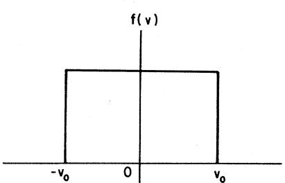  
FIG.27.Initial velocity distribution used to check thermalization in one dimension.

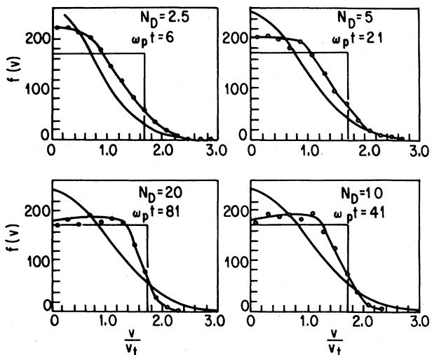  
FIG.28．Distribution functions found for various numbers of particles per Debye length after initial transients have died out.

The relaxation time as determined from Fig. 31 fits nicely to

$$
\tau = 1 0 ( n \lambda _ { D } ) ^ { 2 } .
$$

This indicates that the simultaneous interaction of three particles gives rise to the relaxation, since that due to two particle interactions would be proportional to $n \lambda _ { D }$ ·

One interesting point which was found was that the distribution function undergoes rapid random fluctuations about the mean distribution which gradually drift towards a Maxwellian.The fluctuations in the number of particles in a small velocity interval had a Gaussian probability profile with magnitude $\sqrt { f ( v ) \Delta v }$ . The rapid fluctuations result from the constant exchange of energy between the electric field and the particle kinetic energy. Although this exchange is constantly going on,it is such that it produces very little systematic change. It shows that the virtual cancellation of collisional effect results from a very subtle balance,and thus the calculation provides an important test of the kinetic theory of plasmas.

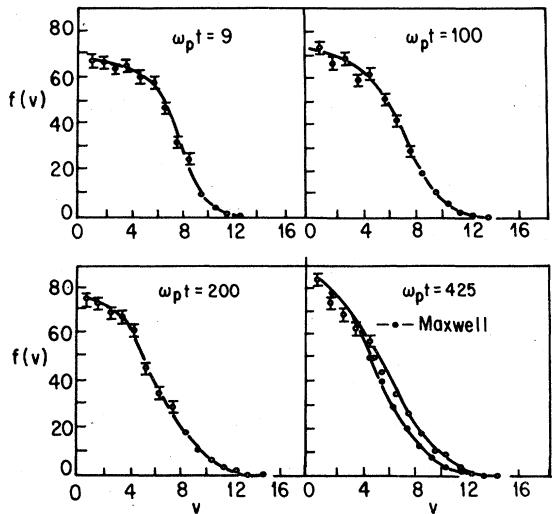  
FIG.29. Drift of $f ( v )$ towards its equilibrium value.

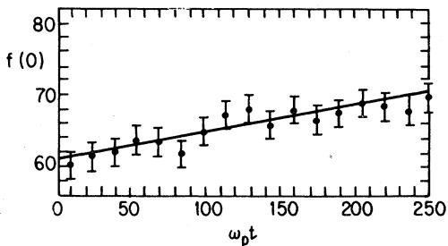  
FIG. 30. Drift of $f ( 0 )$ towards its equilibrium value.

# 7.Longitudinal bremsstrahlung in a one-dimensional plasma

When an electron encounters an ion, it is accelerated and the accelerated electron emits electromagnetic radiation. When an electron encounters another electron, the two electrons suffer equal and opposite acceleration and the radiation fields approximately cancel each other. However, the cancellation is not complete but is simply reduced by the factor $v ^ { 2 } / c ^ { 2 }$ (the electrons emit quadruple radiation.)

When two particles encounter each other in a plasma, they can emit not only electromagnetic waves,but also longitudinal plasma waves. Only the longitudinal wave emission is already contained in electrostatic particle models; it can in fact be seen in the one-dimensional sheet model we have been explaining,and it provides one of the mechanisms for relaxation to a Maxwellian there (two particles and a wave being involved means.that the outcome of the interaction is not frozen by conservation of energy and momentum).A theory for the emission has been developed (Birmingham et al.,1966), the theory has been applied to the sheet model,and the results were checked by numerical simulation (Dawson et al., 1969). Figure 32.shows a plot of the emission versus wave number. The curve is that predicted by theory. The points were obtained from a numerical experiment on a 1000- particle one-species sheet system with $n \lambda _ { D } = 7 . 5$ The emission is obtained from the spreading of the amplitude and phase of the waves for a large number of trials (similar to velocity diffusion for a particle). The agreement is quite good, the emission varying over 4 orders of magnitude.

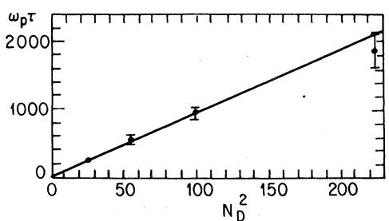  
FIG.31. Thermal relaxation times for a one-dimensional plasma vs $( n \lambda _ { D } ) ^ { 2 }$

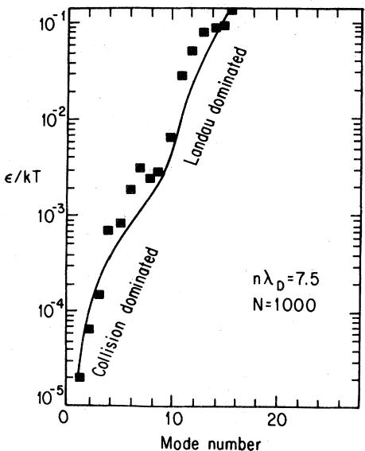  
FIG.32. Emission vs wave number for a one-dimensional plasma.

Closely related to the emission of waves due to particle encounters is the absorption of waves by such encounters; they are in fact related by the Einstein relation. Figure 33 shows a plot of the damping time for waves versus wave number (number of waves which fit in the system).The system was the same as that used for the emission studies, and the damping time was determined by computing time correlation functions for the waves. The solid curve is the theoretical one and is the sum of the two dashed curves marking collisional damping and Landau damping. The collisional damping curve is obtained from collisional theory (Dawson et al.,1969); the curve labeled “Landau damping”has its origin in the absorption of energy by particles moving at the phase velocity of the wave rather than in collision.

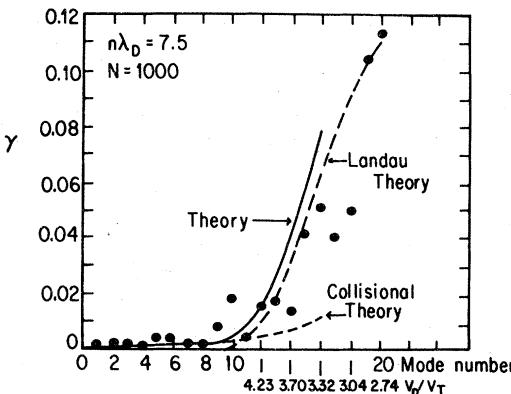  
FIG.33.Damping rate vs wave number for a one-dimensional plasma.

# 8.Diffusion of a two-dimensional plasma across amagnetic field

One of the fundamental problems of plasma physics is that of the diffusion of a plasma across a magnetic field. Experimentally one rarely finds diffusion in accordance with that predicted by the theory of binary encounters between charged particles,although on occasion the theory does predict the correct result. In general,there is no satisfactory theory which can be applied to general experiments; this appears to be a consequence of transport associated with collective motions in the plasma. As such collective motions can be associated with turbulence generated by instabilities or the means of plasma production; it is not surprising that plasma transport across the magnetic fields has proved such a difficult and elusive topic for both experimental and theoretical plasma physics.It turns out that collective motions can dominate plasma transport for even thermal plasmas,and this phenomenon can be studied by computer simulation.The phenomenon responsible is convective or vortex diffusion. The phenomenon shows up. particularly clearlyon twodimensional models (Okuda and Dawson，1972;Okuda et al.,1972).  I shall confine my remarks here to these results,although extensive discussion of three-dimensional results can be found in the literature. There is also convective transport of electrons caused by low-frequency ionic motion such as lower hybrid waves.Some of this work can be found in Okuda and Dawson (1972,1973b, 1973(c), Okuda et al. (1974),Chu et al.，(1975)，and Kamimura and Dawson (1976)；Dawson et al. (1976) summarized a considerable fraction of this work． The results of these simulations can be understood in terms of a relatively simple approximate theory which I shall present first.

# a. Theory of diffusion in two dimensions

We consider a two-dimensional plasma of charged rods parallel to $\pmb { B }$ ，which we take to be the $z$ direction;and we allow the rods to move only in the $x , y$ direction (2D models). The more general form of the model (two and one-half dimensional),where $\pmb { B }$ need not be aligned with the $z$ axis (although the rods are) and a velocity in the $\pmb { z }$ direction is allowed is shown in Fig. 34(a).We include only electrostatic forces between the charged rods，we consider the plasma to be doubly periodic of size $L ^ { 2 }$ ,and the plasma is assumed to be a thermal one-i.e., there are only thermal fluctuations in it. As we shall see, the collective transport is due to convective motion illustrated in Fig. 34(b).

We can Fourier analyze this motion and write

$$
{ \bf v } ( \pmb { \mathscr { x } } ) { = } \sum _ { k } { \bf v } _ { T } ( { \bf k } ) e ^ { i { \bf k } \cdot \pmb { \mathscr { x } } } \mathrm { ~ , ~ }
$$

$$
\mathbf { v } _ { T } ( k ) { = } \frac { 1 } { L ^ { 2 } } \int \frac { \mathbf { k } { \times } [ \mathbf { k } { \times } ( \mathbf { v } ) ( \mathcal { \alpha } { \sim } ) ] e ^ { - i \mathbf { k } { \cdot } \boldsymbol { \ r } } } { k ^ { 2 } } d ^ { 2 } \mathcal { r } \ .
$$

Associated with this flow is an electric field (due to space charge)

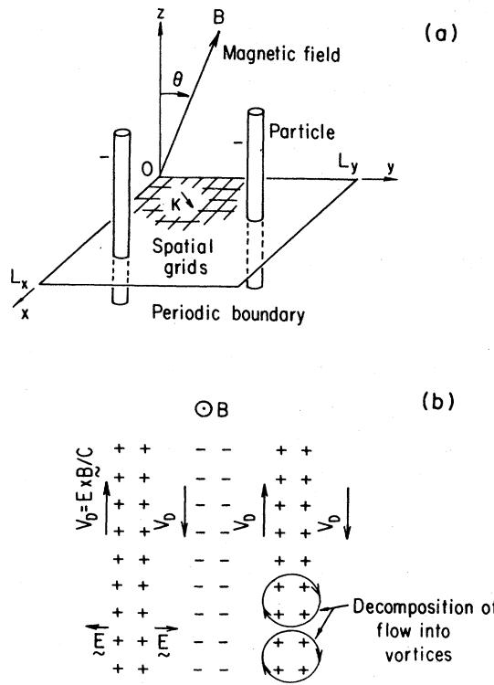  
FIG.34. (a) Two-and-one-half-dimensional plasma model.(b) Shear flow in a plasma and its decomposition into vortices.

$$
[ \mathbf { E } ( \mathbf { k } ) \times \mathbf { B } ] c / B ^ { 2 } { = } { \mathbf { v } } _ { T } ( \mathbf { k } ) ~ .
$$

There is an energy associated with the flow given by

$$
\begin{array} { l } { { \displaystyle W _ { k } ( { \bf k } ) = \frac { 1 } { 2 } \rho \big \langle { \bf v } _ { T } ^ { 2 } ( { \bf k } ) \big \rangle L ^ { 2 } } , } \\ { { \displaystyle \rho { = } \sum _ { i } n _ { i } m _ { i } ~ , } } \end{array}
$$

where $\pmb { \rho }$ is the total density of all species of particles. There is also an energy stored in the electric field

$$
{ \cal W } _ { E } ( k ) = \langle E ^ { 2 } ( k ) \rangle L ^ { 2 } / 8 \pi \ .
$$

Here $\langle ~ \rangle$ implies an ensemble average; adding these two contributions,we get for the total energy of the disturbance

$$
\begin{array} { r l } & { W { = } [ \rho \langle \mathbf { v } _ { T } ^ { 2 } ( \mathbf { k } ) \rangle / 2 + \langle \mathbf { E } ^ { 2 } ( \mathbf { k } ) \rangle / 8 \pi ] L ^ { 2 } } \\ & { \quad = [ \langle \mathbf { E } ^ { 2 } ( \mathbf { k } ) \rangle / 8 \pi ] ( 1 + 4 \pi \rho c ^ { 2 } / B ^ { 2 } ) L ^ { 2 } . } \end{array}
$$

Now according to equilibrium statistical mechanics,each Fourier mode should have energy $_ { T / 2 }$ $_ { T }$ is the temperature measured in energy units). Then we have

$$
\begin{array} { c } { { [ \left. { { \bf { E } } ^ { 2 } ( { \bf { k } } ) } \right. / 8 \pi ] [ 1 + ( 4 \pi \rho c ^ { 2 } / B ^ { 2 } ) ] L ^ { 2 } = T / 2 } } \\ { { \mathrm { o r } ^ { 2 } } } \end{array}
$$

$$
\left. \mathbf { E } ^ { 2 } ( \mathbf { k } ) \right. / 8 \pi = T / 2 L ^ { 2 } [ 1 + ( 4 \pi \rho c ^ { 2 } / B ^ { 2 } ) ] \ .
$$

The mean-square velocity is thus

$$
\left. v _ { T } ^ { 2 } ( \mathbf { k } ) \right. { = } 4 \pi T c ^ { 2 } / L ^ { 2 } B ^ { 2 } [ 1 { + } ( 4 \pi \rho c ^ { 2 } / B ^ { 2 } ) ] \ .
$$

We now estimate the diffusion caused by this flow as follows. The flow causes the particles to execute a random walk in space. As time progresses, the flow will change in a random manner as the eddies grow and decay by thermal fluctuations and viscous damping. There will be some correlation time or coherence time for each $\mathbf { k }$ call this time r(k). During a coherence time the particle is displaced a distance Vr(k)r(k),and its mean-square displacement is $\langle \mathbf { v } _ { T } ^ { 2 } ( \mathbf { k } ) \tau ^ { \bar { 2 } } ( \mathbf { k } ) \rangle _ { \simeq } \langle \mathbf { v } _ { T } ^ { 2 } ( \mathbf { k } ) \rangle \tau ^ { 2 } ( \mathbf { k } )$ The coherence time used here of course should be that seen by the particle.

During a time T the particle will make t/r(k) such random steps, and thus its mean-square displacement will be

$$
\big \langle \Delta \varkappa ^ { 2 } ( \mathbf { k } ) \big \rangle \cong \big \langle \mathbf { v } _ { T } ^ { 2 } ( \mathbf { k } ) \big \rangle \tau ( \mathbf { k } ) t \ .
$$

Summing over all modes gives the mean-square displacement as

$$
\big \langle \Delta \varkappa ^ { 2 } \big \rangle = \sum _ { \mathbf { k } } \big \langle \mathbf { v } _ { T } ^ { 2 } ( \mathbf { k } ) \big \rangle \tau ( \mathbf { k } ) t \ .
$$

Substituting in $\langle \mathbf { v } _ { T } ^ { 2 } ( \mathbf { k } ) \rangle$ from Eq. (196) gives

$$
\langle \Delta \rho ^ { 2 } \rangle = \frac { 4 \pi T c ^ { 2 } t } { L ^ { 2 } B ^ { 2 } [ 1 + ( 4 \pi \rho c ^ { 2 } / B ^ { 2 } ) ] } \underset { \bf k } { \sum } \tau ( k ) ~ .
$$

Converting from a sum to an integral and using the fact that the density of modes is $L ^ { 2 } k d k / 2 \pi$ give

$$
\left. \Delta \rho ^ { 2 } \right. \left[ \frac { T } { 2 \pi \rho ( B ^ { 2 } / 4 \pi \rho c ^ { 2 } + 1 ) } \right] t \int _ { k _ { \mathrm { m i n } } } ^ { k _ { \mathrm { m a x } } } \tau ( k ) k d k { = } D t { } ~ ,
$$

where $k _ { \mathrm { m i n } }$ is the minimum value of $k$ for which we can apply the theory-i.e., $k _ { \operatorname* { m i n } } { = } 2 \pi / L$ and $k _ { \mathrm { m a x } }$ is the maximum value of $k$ $k \ ( k _ { \mathrm { m a x } } \approx \mathrm { m i n } \{ \lambda _ { D } ^ { - 1 } , \rho _ { c } ^ { - 1 } \} )$ ,where $\lambda _ { D }$ is the Debye length and $\rho _ { c }$ is the ion cyclotron radius.

To complete the treatment we need a method of finding $\tau ( k )$ . Now the convection motion which causes the diffusion is also destroying the existing convective flow; the shearing motion in one mode is tearing up that due to another mode. This is the classical picture of turbulence in which eddies destroy one another. We therefore try the assumption that the lifetime is determined by the diffusion, or

$$
\tau ( k ) { = } ( k ^ { 2 } D ) ^ { - 1 } .
$$

Making this substitution gives

$$
D ^ { 2 } = \{ T / 2 \pi \rho [ 1 + ( B ^ { 2 } / 4 \pi \rho c ^ { 2 } ) ] \} \ln ( k _ { \mathrm { m a x } } / k _ { \mathrm { m i n } } ) ~ .
$$

$^ 2 \mathbf { A }$ more rigorous treatment predicts

$$
\left. E ^ { 2 } ( k ) \right. / 8 \pi = \frac { T } { 2 L ^ { 2 } } \frac { 1 } { 1 + ( 4 \pi \rho c ^ { 2 } / B ^ { 2 } ) } \frac { 1 } { 1 + k ^ { 2 } \lambda _ { D } } \ ,
$$

which makes important corrections for $k ^ { 2 } \lambda _ { D } ^ { 2 } > 1$ .

A more complete treatment can be found in Okuda et al.   
(1972) and Dawson et al. (1976).

While the above theory applies only to two-dimensional plasma models,similar effects can take place in the three-dimensional plasmas.Indeed, simulations of threedimensional plasmas have shown similar effects although the results there depend on the magnetic field line topology (whether the field lines are closed or open)．A discussion of this can be found in Dawson et al. (1976). A number of experiments have found evidence of convective diffusion (Drake et al.，1977；Navratil and Post, 1977; Tamano et al.,1974)．Here it is not my purpose to discuss this fascinating problem but rather to give some examples of what can be learned from computer simulation;I shall therefore restrict myself to the twodimensional case and refer the interested reader to the references given.

While the discussion here is applied to plasmas,it is clear that similar convective transport in neutral fluids should also take place; indeed for liquids estimates indicate that eddy transport is comparable to molecular transport.

# b.The simulation of plasma diffusion across a magnetic field (two dimensional)

We consider the case of a two-dimensional electrostatic plasma model with a fixed $B$ field parallel to the charge rods;the model has been described earlier. The plasma is taken to be thermal and doubly periodic. We investigate diffusion of the guiding centers (centers of gyrations） for a set of test particles (roughly $10 \%$ of the particles)．By plotting the mean-square displacement versus $t$ and taking the slope at large times,we obtain the diffusion coefficient, $D = \operatorname* { l i m } _ { t \to \infty } \left. \Delta \pmb { \mathscr { \kappa } } ^ { 2 } \right. / t .$ 、An example of such a measurement is shown in Fig.35. Some results from the simulations are shown in Figs. 36 and 37. These results are for ion-to-electron mass ratios of 1.25 and 4. In simulations,small ion-to-electron mass ratios are often used, so that the computer does not spend a lot of time moving electrons,while the ions essentially do not move. In general,the physics of plasmas with reduced mass ratios is similar to that of real laboratory plasmas,and if one understands the physics of the processes,one can extend the results with confidence to plasmas with more realistic mass ratios. The philosophy is quite similar to extending the results of small-scale laboratory experiments to much larger systems.

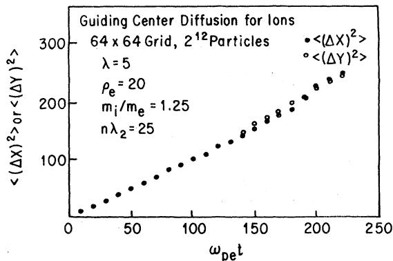  
FIG.35.Mean-square displacement for the guiding centers of a group of fast particles vs time.

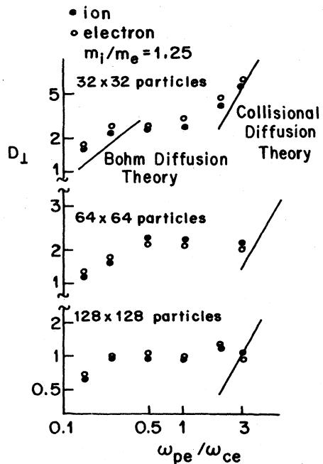  
FIG. 36. Diffusion rate vs $\omega _ { c e } ^ { - 1 }$ for three different plasma conditions.

Figures 36 and 37 show plots of the diffusion coefficient versus $\omega _ { c } ^ { - 1 }$ for two different size systems, for different numbers of particles per Debye square,and for two ion-to-electron mass ratios. From these figures it is clear that there are three regions of diffusion.At low values of the magnetic field, the diffusion follows the classical diffusions predicted from binary collision theory;it is proportional to $B ^ { - 2 }$ ． As the field is increased, the diffusion rate deviates from that predicted by this theory and becomes almost independent of $\mathbf { B }$ At still higher magnetic fields the diffusion rate appears to be proportional to $B ^ { - 1 }$ .

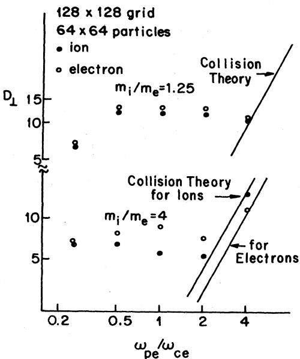  
FIG.37． Diffusion rates vs $\omega _ { c e } ^ { - 1 }$ for two-ion-to-electron-mass ratios.

Since it is the electric field fluctuations which cause the diffusion,a quantity of considerable theoretical interest is the correlation time for the electric field given by

$$
C ( \tau ) = \operatorname* { l i m } _ { T  \infty } \frac { 1 } { T } \int _ { 0 } ^ { T } \mathbf { E } ( \mathbf { k } , t + \tau ) \mathbf { E } ( \mathbf { k } , t ) d t \ .
$$

Of course for the simulations the integral must be replaced by a summation and the upper limit, $\infty$ ，must be replaced by the maximum allowed by the calculation.

Of particular interest is the correlation time $\tau _ { c }$ ，or characteristic damping time for C(r). A plot of T vs k is shown in Fig.38.As can be seen, the correlation time fits very well with the law Tα k-2. In Fig. 38 there is also a plot of T=(k²D)-1 (the solid curves): This is the value of $\tau$ which would be predicted by the simple theory presented.As can be seen,this time is shorter than that actually found for the case $n \lambda _ { D } ^ { 2 } = 1 6$ .Since in the theory we assumed that the correlation time was $( k ^ { 2 } D ) ^ { - 1 }$ ，one may ask how it is possible for the theory to explain the diffusion and not predict the proper lifetimes for the fluid fluctuations. The answer is that the quantity which enters the theory is the correlation time as seen by the diffusing particles,and not the intrinsic correlation time for the mode. We see that the correlation time as seen by the particles, $( k ^ { 2 } D ) ^ { - 1 }$ ，can be much shorter than this intrinsic time. This means that for this case the electric field fluctuations exist for a long time,while the particles diffuse through them.An analogous effect occurs in the case of collisional diffusion damping of the field fluctuations.Here collisional viscosity damps the shear flow associated with the motions.Particle collisions give rise to a diffusion of momentum with a characteristic flow damping time of $\tau ^ { - 1 } { = } k ^ { 2 } \rho _ { l } ^ { 2 } \nu$ ，where $\rho _ { l }$ is the ion Larmor radius and $_ { \nu }$ is the ion collision frequency.Now particle collisions dissipate only the momentum stored in the particles，but there is also momentum stored in the electromagnetic field, $( \mathbf { E } { \times } \mathbf { B } ) 4 \pi c$ ，which is not directly dissipated; the field momentum is transfered to the particles and helps sustain the motion. Collisional theory (Okuda and Dawson，1972） predicts a damping or correlation time of

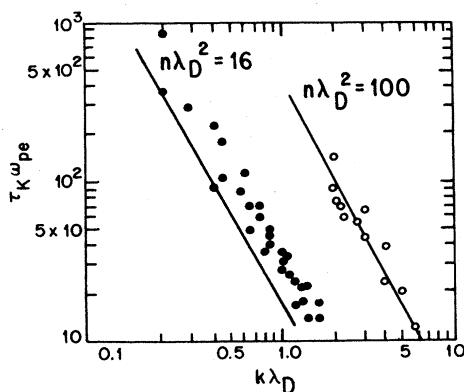  
FIG.38.Plots of $\tau _ { c } ( k )$ vs $k \lambda _ { D }$ for two different plasma conditions.

$$
\tau ^ { - 1 } = k ^ { 2 } \rho _ { l } ^ { 2 } \nu / ( 1 + B ^ { 2 } / 4 \pi \rho c ^ { 2 } ) \ .
$$

Here also the flow can be maintained for long times compared to the time required for the particles (particle momentum） to diffuse through the eddies.If we assume that the predicted correlation time $[ \tau = ( k ^ { 2 } D ) ^ { - 1 } ]$ should be corrected by the factor $( 1 + B ^ { 2 } / 4 \pi \rho c ^ { 2 } )$ ，then the observed correlation time and diffusion rates are consistent with those shown in Fig.38.

# c. Dependence of difusion rate on particles' energy

From our above picture of test particle diffusion in a two-dimensional plasma model it is clear that there should bea dependence of diffusion rate on particle energy.This is because the diffusion is associated with $\mathbf { E } { \times } \mathbf { B }$ velocities associated with random $\pmb { { \cal E } }$ field fluctuations; energetic particles have large orbits and hence in the course of their motion average the electric fields over regions of the size of their orbits,while low-energy particles more or less feel the local electric fields.This averaging effect is illustrated in Fig.39.Simulations have been carried out which demonstrate this effect,and a rough theory has been developed which explains the observations (Naitou et al.,1979).

Some results of energy-dependent test particle diffusion from simulations on a two-dimensional electrostatic particle model will be presented here. The system was doubly periodic, $L _ { x } \times L _ { y } = 6 4 \times 6 4$ ；the number of electrons was

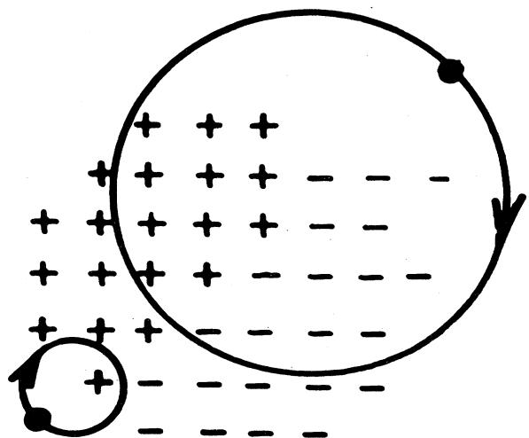  
FIG.39.Illustration of how the different size particle orbits affect the average electric field seen bya particle.

65, 536, $\lambda _ { D } = 2$ ; particle size ${ \pmb a = 1 }$ ， $\begin{array} { r } { \omega _ { c } / \omega _ { p } = 1 , \frac { 1 } { 2 } , \frac { 1 } { 3 } , \frac { 1 } { 5 } . } \end{array}$

Figure 40 shows the mean-square displacement of the test particle guiding centers versus time for a number of different velocities. Clearly the diffusion rate decrease rapidly with increasing velocity. Figure 41 shows a series of plots of observed test particle diffusion rates versus velocity for a number of different magnetic field strengths.In Fig.41 the circles show the initial velocities for the test particles,and the point of the arrow shows the change in their mean velocity during the measurements.The squares show diffusion rates when $\pmb { B }$ is tilted with respect to $z$ ，so that there is a component of $k$ parallel to $\pmb { B }$ and hence shorting of the electrostatic fields associated with the convective motions; the square points agree quite well with binary collisional theory. The curves are those predicted by the theory given in Naitou et al. (1979). The strong dependence on velocity is clearly shown; the agreement with theory is good at low magnetic fields and becomes worse for high ones.

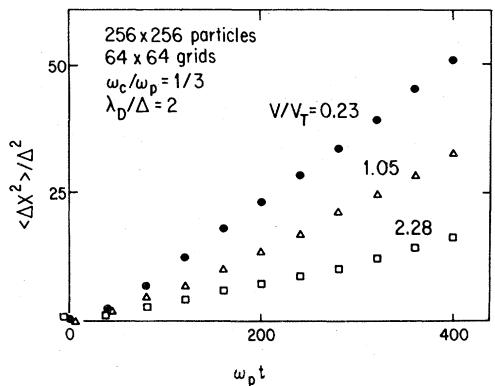  
FIG.40. The mean-square displacement of guiding centers for three groups of particles with different velocities.

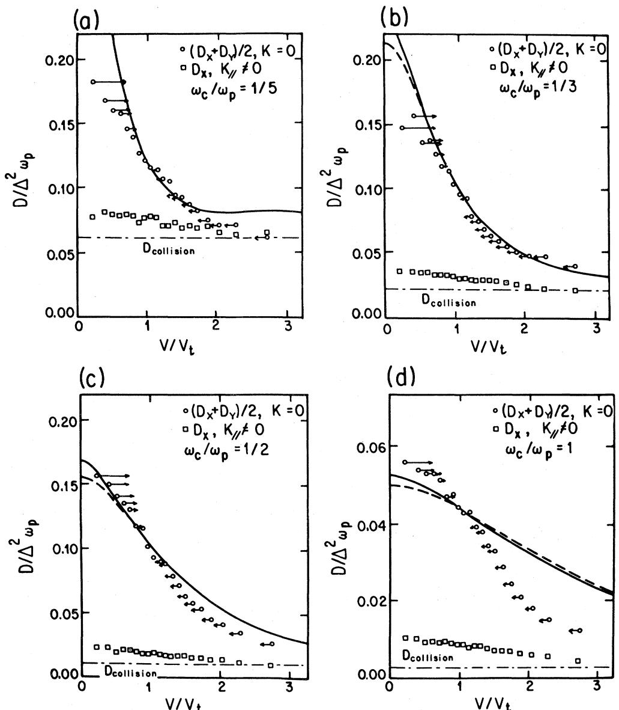  
FIG.41. Diffusion rate vs velocity for various magnetic fields.

This tendency of energetic particles to average out turbulent fluctuating fields and hence be better confined has been observed in many experiments; in such experiments the turbulence is of course not thermal, but the averaging effect is almost certainly similar.

The above calculation raises the intriguing possiblity of plasma diffusion's exceeding heat diffusion (hot particles left behind)； such a situation is of course very advantageous for controlled fusion,where energy confinement is more important than plasma confinement.

# B. Waves and instabilities in a magnetic plasma

Waves and instabilities in magnetized plasmas play a central role in much of plasma physics and are particularly important to studies of fusion and space plasmas. We will present here two examples of simulations done using a two-and-one-half-dimensional electrostatic particle model with fixed magnetic field. The model is doubly periodic and is the model described earlier. The two problems we shall discuss are the simulations of Bernstein modes and the simulation of instabilities in a plasma consisting of a cold component plus an energetic componet; the energetic component has a velocity distribution which is isotropic about $\pmb { B }$ ，with a mean velocity perpendicular to $\pmb { B }$ and a thermal spread about this mean which is the same parallel and perpendicular to $\pmb { B }$ (it is a ring in velocity space).

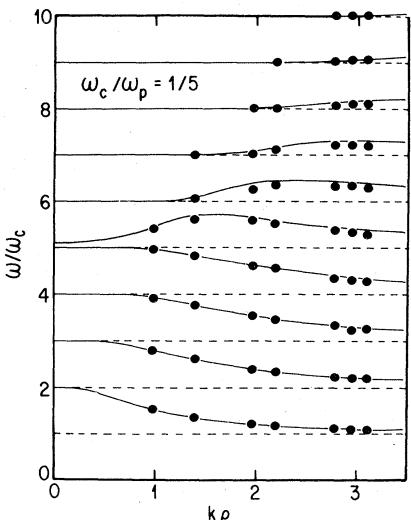  
FIG.42.Comparison of observed frequencies for Bernstein mode with theoretical predictions (curves).

A comparison between the theoretically predicted frequencies of Bernstein modes and those obtained from two-dimensional simulations is shown in Fig. 42. The case shown has the ratio of the plasma frequency to the cyclotron frequency equal to five; $\rho _ { l }$ is the electron cyclotron radius; the solid curves are the predictions from theory，and the discrete points are frequencies obtained from time spectral analysis of $\mathbf { E } ( \mathbf { k } , t )$

# 1． Bernstein modes

The structure of plasma waves in a magnetic field exhibits a large amount of detail; in particular,it contains modes at roughly multiples of the electron cyclotron frequency (the Bernstein modes-Bernstein，1958). These modes are associated with the electrons being bunched in phase angle about the magnetic field; $^ { m }$ bunches gives the mth cyclotron harmonic. Because of the space-charge electric field associated with these bunches,their frequency is slightly modified from the exact cyclotron harmonics. We will not give the detailed theory here; it can be found in Bernstein (1958). One particular aspect of the theory should be mentioned. Consider a disturbance which initially has the form $E = E _ { 0 } \sin \mathbf { k } \cdot \boldsymbol { \mu }$ ，where $\mathbf { k }$ is perpendicular to B. Initially this disturbance dies away due to the phase mixing of the different frequency Bernstein modes of which it is composed.However, because the particles all gyrate at the cyclotron frequency, they return to their initial positions after one cyclotron period, and the initial disturbance is essentially recreated. This also follows from the fact that the Bernstein modes are at nearly multiples of the cyclotron frequency. The recurrence is not exact,because space charge alters the frequencies slightly，but detailed calculations indicate it should be good. Individual Bernstein modes with ${ \bf k } \cdot { \bf B } = 0$ are predicted to show no damping.

Figures 43(a) and 43(b) show the autocorrelation function and the power spectrum for a mode for which $\omega _ { p } / \omega _ { c } = 5$ and $k \rho _ { l } = 3 . 1$ . The system used for this simulation contained $1 9 2 \times 1 9 2$ particles on a $6 4 \times 6 4$ grid with the Debye length equal to one grid spacing. The autocorrelation function clearly shows the predicted recurrencesatmultiplesofthe cyclotron period $( \omega _ { p e } t = 3 1 . 4 , 6 2 . 8 , . . . )$ . However, the amplitude of the recurrences shows a strong damping not predicted by theory; the calculations indicate this is due to convective cell damping,as will be noted in the next paragraph. The power spectrum shows a rich set of peaks at the Bernstein mode frequencies. There is also a peak at zero frequency; this is the convective cell mode discussed in the preceding section which caused plasma diffusion across a magnetic field.This power spectrum also shows splitting of many of the lines and subpeaks at $\omega \simeq ( n + \frac { 1 } { 2 } ) \dot { \omega } _ { c }$ . None of this is predicted by theory nor is it understood. There is clearly room for an improved theory here.

The initial rapid decay of the autocorrelation function followed by the recurrences is predicted by theory. If the magnetic field is very weak,this decay should agree with that predicted by Landau damping (Baldwin and Rowlands,1966;Landau,1946; Dawson,1961) of waves in an unmagnetized plasma. A comparison between the observed damping and Landau damping is shown in Fig. 44. The circles in Fig.44 show the initial damping rate of the autocorrelation functions; the triangles show the damping rates of the recurrence peaks. The bars are estimated

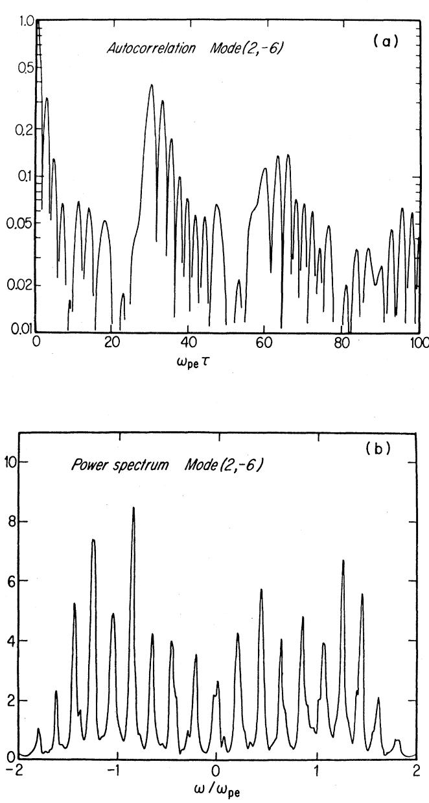  
FIG.43．Autocorrelation function and power spectrum for $k \rho _ { e } = 3 . 1$ and $\omega _ { p } / \omega _ { c } = 5$

measurement uncertainties.

For large $k ,$ ，short wavelength,the agreement is quite good;at longer wavelength the damping is stronger than predicted for the unmagnetized case. Also shown in this figure is the damping rate of the amplitude of the recurrence peaks as a function of $k$ ，This damping parallels a damping rate predicted from the diffusion theory $( \nu = k ^ { 2 } \bar { D } )$ and is about half this value,the difference between the straight line and the triangles. The convective motion destroys the coherence of different regions of the wave. The factor of one-half can again be explained because the diffusion dissipates the particle momentum but not the $\mathbf { E } \times \mathbf { B }$ momentum, just as was observed in the case of convective cell damping.

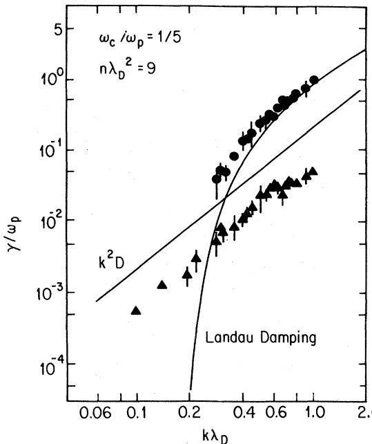  
FIG. 44. Early rapid decay rate and long-term decay rate vs $\pmb { k }$

# 2. Instabilities of ring distribution in velocity space (Ashour-Abdalla et al., 1980; Dawson, 1981)

Instabilities of nonthermal magnetized plasmas occur under many circumstances,as,for example,instabilities due to “loss cone”velocity distributions in mirror fusion devices and in the magnetosphere. Simulations of instabilities due to an ion ring in velocity space and with $k$ perpendicular to $\pmb { B }$ were carried out some time ago (Lee and Birdsall, 1979); these are the so-called Dory-Guest-Harris instabilities (Dory et al.，1965). Here we will look at some investigations of instabilities associated with an energetic electron ring in velocity space embedded in a uniform cold thermal plasma with the possibility of the waves propagating at an oblique angle to the magnetic field.Some critical questions which arise for any instability are what limits the amplitude,what the fate of the unstable wave is after saturation,and what the instability does to the plasma. All these questions involve nonlinear behavior and cannot be answered by linear.stability theory. Often there are nonlinear theoretical treatments, but these generally involve assumptions and approximations which it is difficult to prove or disprove. However, such problems are readily attacked by means of numerical simulation,and the assumptions and approximations can be tested. It often turns out that existing theories are found to fail,but with the insight gained from the simulation we can construct a theory which properly describes the plasma behavior.It is when used in this manner that simulation is most powerful. As an example of this,I summarize briefly some studies of an instability produced by an electron velocity distribution consisting of a cold component and an energetic velocity ring,as illustrated in

Fig.45． The ring contains $2 5 \%$ of the electrons and is $1 0 ^ { \hat { 2 } }$ times hotter than the cold electrons; its mean velocity was varied between three and five times its thermal velocity. This situation roughly corresponds to what is believed to be the situation in the magnetosphere during periods of the diffuse Aurora. Satellite observations of electric field fluctuations in the magnetosphere show intense oscillations at frequencies of $\begin{array} { r } { \cdot \frac { 3 } { 2 } w _ { k } , \frac { 5 } { 2 } \omega _ { c } } \end{array}$ ，etc.at the time of the diffuse aurora (Gurnett et al.,1978).

The model used to simulate this situation was a twoand-one-half-dimensional electrostatic model with a fixed magnetic field in the $_ { x }$ direction-see Fig.34(a). The system was doubly periodic,the system size was $6 4 \times 6 4$ Debye lengths,the number of particles varied from $3 \times 1 0 ^ { 4 }$ to $5 \times 1 0 ^ { 5 }$ ，and the cyclotron frequency was 0.3 of the plasma frequency.

The time development of the total electrostatic field energy and the kinetic energy of the energetic electrons and the cold electrons are shown in Fig. 46 for the case in which the initial ring velocity is five times its thermal velocity. Figure 47 shows the electrostatic energy versus time for two modes,one with one wavelength in the $_ x$ direction (parallel to $\pmb { B } )$ and two in the $y$ direction (perpendicular to $B )$ ,the other with one wavelength in the $_ { x }$ direction and three in the $_ y$ direction. These were the two dominant modes for this case. Figure 48 shows the frequency spectrum for these two modes.

The asymmetry is due to small fluctuations associated with the initial distribution; waves propagating in one direction were initially stronger than those propagating in the other. There are clear peaks at frequencies $\omega = \pm 0 . 4 5 \omega _ { p e } = \pm \frac { 3 } { 2 } \omega _ { c }$ $\displaystyle { ( \omega _ { c } = 0 . 3 \omega _ { p e } ) }$ ．For other choices of the ratio of plasma frequency to cyclotron frequency, we have also seen $\scriptstyle { \frac { 5 } { 2 } } \omega _ { c }$ and $\frac { 7 } { 2 } \omega _ { c }$

In Fig. 46 we see that the electrostatic field energy ceases to grow at about $\omega _ { p e } t = 5 0$ If one looks at the velocity distribution function at that time,one finds that linear theory predicts that the system should be unstable. One also sees from this figure that the cold electrons are being rapidly heated at this time. The electrons in the energetic velocity ring are losing energy at this time,as the system conserves energy.

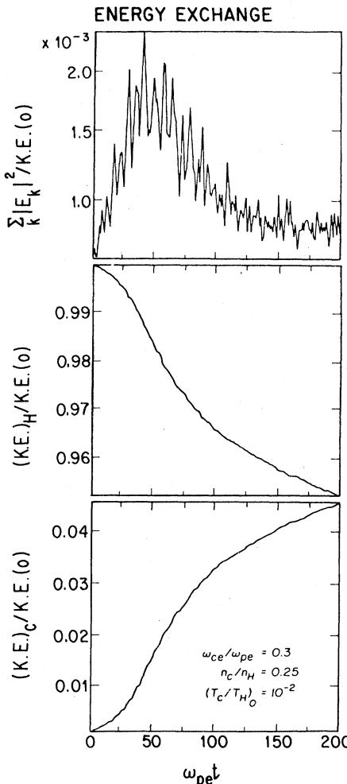  
FIG.46. Time development of the total electrostatic field energy and the kinetic energy of the energetic electrons and the cold electrons.

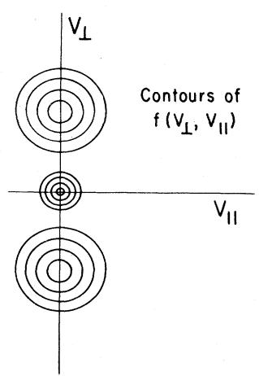  
FIG.45. Contours of $f ( v _ { \perp } , v _ { | | } )$ for a ring distribution.

There are two important questions which we should like answers to: (1） What is the saturation mechanism? and (2) By what mechanism are the cold electrons heated? A number of saturation mechanisms have been previously proposed,but none of them fits the facts observed in the simulations. Among the mechanisms proposed have been the following: (1) collisional damping of the waves is large enough to stabilize the wave when the growth rate becomes small enough,(2) electrostatic trapping of electrons upsets the driving mechanism,(3）quasilinear diffusion stabilizes the distribution,(4） convective cells or vortex motion scrambles the phases of the particle motions,destroying the coherent wave motion and giving rise to an effective damping rate equal to the linear growth rate, and (5） mode coupling scatters energy out of the unstable modes into stable or damped modes, producing a damping equal to the linear growth rate. As far as these mechanisms go,we can list the following objections. For mechanism (1） the collision rate for the case shown in Figs. 46-48 was $\omega _ { p e } \tau _ { \mathrm { c o l l } } > 1 5 0 0$ , as compared to a saturation time of $\omega _ { p e } t = 5 0$ .We have even run situations where $\omega _ { p e } \tau _ { \mathrm { c o l l } }$ was as large as 20o0o with no observed change in behavior. As far as the electrostatic trapping of particles in the waves is concerned, the phase velocity of the waves along the field is 4.5 times the thermal velocity of the hot particles,and no particles are observed at this high velocity. With regard to mechanism (3） quasilinear theory would still predict growth of the waves as linear theory does; a small amount of spreading of the ring in velocity space at the time of saturation is observed but not enough to give stability.For mechanism (4） to be effective,convective motion must exist and it must be such as to scramble the coherent wave motion. Convective cells have zero frequency. From Fig. 48 for the spectrum we see no strong zero-frequency component for these two wave numbers. This is true for other wave numbers as well.There is another point to be made here. The convective motion is associated with the $\mathbf { E } { \times } \mathbf { B }$ drifts. $\pmb { B }$ is in the $_ x$ direction and $\boldsymbol { \varepsilon }$ has only $_ x$ and $y$ components; $\mathbf { E } { \times } \mathbf { B }$ is in the $z$ direction or the ignorable direction.Such motion does not destroy coherence in the $x { - } y$ plane. We shall see shortly that the instability does give rise to enhanced diffusion (displacement of a point on the rods) in the $z$ direction due to another interesting mechanism, but this diffusion does not produce any damping. This is an example of how an effect can be turned off in the model so that its effect on the process can be evaluated. It is possible to modify the model so that this mechanism does play a role; this is done simply by tilting the magnetic field in the $_ { x - z }$ direction,so that the $\mathbf { E } { \times } \mathbf { B }$ drift has $_ x$ and $y$ components. Simulations with such a tilt indicate that enhanced $x { - } y$ diffusion may play some role,although results to date do not indicate that it has a major influence.With regard to mechanism (5） the scattered waves should have frequencies $\omega = \omega _ { 1 } \pm \omega _ { 2 }$ ，that is,frequencies of zero of $3 \omega _ { c }$ ,and wave numbers with $\mathbf { k } = \mathbf { k } _ { 1 } ~ \mathbf { k } _ { 2 }$ ,where1 and 2 refer to two of the strong waves observed. We have not observed any effects which can be identified as mode coupling; for example,if scatttering to undamped waves were involved,the electric field energy should have continued to increase linearly with time. If the coupling involves two heavily damped modes,it might not be observed or it might be possible to detect it only with sophisticated correlation measurements which have not been carried out. If this were the case, however,it would have primarily to dump energy in the cold electrons rather than diffuse the hot electrons in velocity,as is the observed behavior.

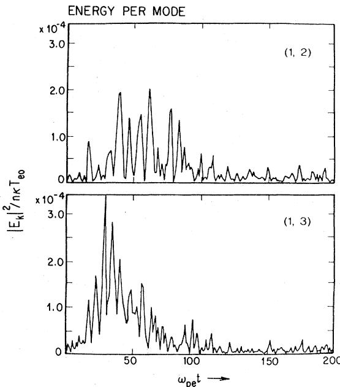  
FIG.47. The electrostatic energy vs time for two unstable modes.

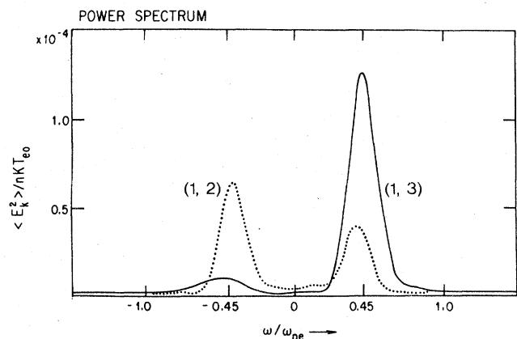  
FIG.48. The frequency spectrum for the modes shown in Fig. 47.

# 3. The saturation and heating mechanism

The simulations give clear evidence that a type of nonlinear cyclotron resonance process for the cold particles is responsible for the saturation observed in these calculations.It is also responsible for the cold electron heating and it is observed that at saturation the rate of heating of the cold electrons essentially balances the rate at which energy is fed into unstable waves.

The mechanism is illustrated in Fig.49.In this example, the unstable waves propagate at shallow angles to the magnetic field,between $1 6 ^ { \circ }$ and $3 0 ^ { \circ }$ We make a transformation to a frame of reference moving with the phase velocity of one of the waves along the magnetic field as shown in Fig.49.In this frame the wave is static,or more precisely it is growing but at a relatively slow rate, and it has no real frequency. The cold particles,are streaming over this wave and see a frequency of $\scriptstyle { \frac { 3 } { 2 } } \omega _ { c }$ The wave sets the electrons to oscillating the $y$ direction and imparts a $y$ velocity to them which is roughly

$$
\delta v _ { y } \approx \frac { - e E _ { y } k _ { x } v _ { x } ^ { \prime } } { m ( k _ { x } ^ { 2 } { v _ { x } ^ { \prime } } ^ { 2 } - \omega _ { c } ^ { 2 } ) } \ ,
$$

where $\ v _ { x } ^ { \prime }$ is the velocity in the wave frame. Now energy must be conserved in this frame of reference,since $\omega$ is zero and so the $_ { y }$ motion can be produced only through a

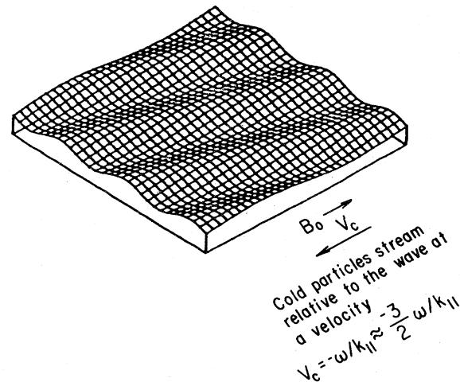  
FIG.49.Potential wave form and the flow of particles in the wave frame.

reduction in the $_ { x }$ velocity relative to the wave. Conservation of energy in the wave frame requires that for small changes in $\boldsymbol { v _ { x } ^ { \prime } }$ ， $\delta v _ { x }$ be given by

$$
\delta v _ { x } = \frac { \delta v _ { y } ^ { 2 } } { 2 \omega / k _ { x } } \ .
$$

Here we have assumed that the velocity of the cold electrons in the wave frame is $- \omega / k _ { x }$ ．As the electrons slow down in the wave frame, the Doppler-shifted frequency moves closer to cyclotron resonance. When the wave amplitude becomes large enough,the cold electrons can be slowed to such an extent that they are brought into resonance with the wave,at which point they are strongly accelerated and damp the wave. Their $_ { x }$ velocity also changes strongly at this time. To become resonant with the wave requires that $\omega = \omega _ { c } + k _ { x } v _ { x }$ ,which means that in the laboratory frame of reference the electrons must be accelerated to $1 . 5 v _ { \mathrm { t h } }$ $( v _ { \mathrm { t h } }$ is the thermal velocity of the hot electrons).To test this mechanism,the number of cold electrons with $_ { x }$ velocities equal to or greater than $1 . 5 v _ { \mathrm { t h } }$ were counted. The temperature of the cold component of this sample was also measured; a small region was sampled to avoid the appearance of random motion due to the averaging over different parts of the wave which have different phases.The results of this measurement are shown in Fig. 50.

Figure 51 shows the mean velocity of the cold electrons parallel to $\mathbf { B }$ at the top and the electric field energy at the bottom; both are plotted versus $\omega _ { p e } t$ 、This simulation used $5 \times 1 0 ^ { 5 }$ particles but otherwise was the same as that shown in the earlier figures. We see that $v _ { | | }$ rises rapidly at the time the waves are strong and then levels out after the waves die out. If one plots the mean velocity of the hot ring electrons,it is the negative of that for the cold electrons as is required by conservation of momentum. The explanation of this effect is as follows. We see from the spectrum shown in Fig.46 that positive and negative frequencies are not equally excited.This is a statistical effect resulting from the choice of initial conditions; one wave is initially more strongly excited.Opposite frequency waves propagate in opposite directions. Now the waves carry momentum as well as energy. When the waves are excited, they absorb energy and momentum from the hot particles. When the waves are absorbed, their energy and momentum are taken up by the absorbing particles,in this case the initially cold electrons.

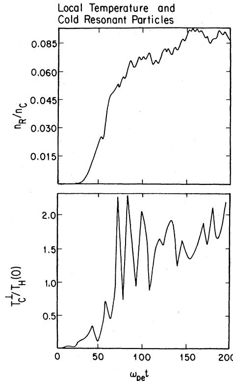  
FIG.50. Number of resonant electrons and the perpendicular temperature for the cold electrons plotted vs time.

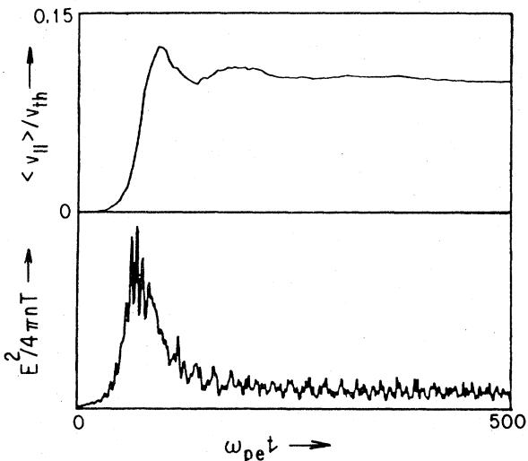  
FIG. 51. Mean parallel velocity and total electric field energy vs time.

The results indicate the potential for instabilities to generate currents. Here,of course, no current is generated, because the hot and cold electrons have equal and opposite drifts. However, the hot electrons would tend to be expelled from an unstable region in one direction and the cold electrons in the other direction. Also,if we were dealing with an instability involving ions,then such an effect would produce a current directly.

Figure 52 shows plots of the temperature of the cold electrons perpendicular and parallel to the magnetic field at the top,and a plot of the electric field energy at the bottom.We see that both the perpendicular and parallel temperatures rise rapidly at the time of major wave activity and then rise much more slowly after the waves die down.The ratios $T _ { | | }$ to $T _ { \perp }$ can be predicted from Eqs. (205） and (2o6),and these results are in good agreement with those predictions.

Another interesting effect observed is enhanced diffusion of guiding centers in the $_ z$ direction．While none of the quantities $E , J , n$ ，etc.,depends on $z$ and while the particles are rods parallel to $_ z$ ，we can keep track of the $_ z$ displacement of a point on a rod by integrating $v _ { z }$ with respect to time:

$$
\begin{array} { r } { \Delta z = \int _ { 0 } ^ { t } v _ { z } ( t ^ { \prime } ) d t ^ { \prime } \ . } \end{array}
$$

This would correspond to the actual displacement of a particle perpendicular to the plane of $\mathbf { B }$ and $\mathbf { k }$ .Figure 53 shows a plot of the mean square $\Delta \boldsymbol { z }$ for a set of test particles. There are two curves,one for the hot energetic ring and the other for the cold background electrons. We see that rapid diffusion sets in when the instability gets going. It can be shown that the guiding center diffusion is produced by $\langle E _ { \mathrm { s b p } } ^ { 2 } ( \omega = 0 ) \rangle$ ，where sbp stands for “seen by the particles"-i.e., the zero-frequency componet of the $\pmb { \cal E }$ field which the particle sees gives the diffusion through an $\mathbf { E } { \times } \mathbf { B }$ drift.However,examination of frequency spectra like that shown in Fig.48 shows that there is virtually no noise at $\omega { = } 0$ ，The particles,however,can see a zerofrequency component due to a combination of Doppler shift and finite orbit effects $( k _ { \perp } \rho _ { l } \approx 1 )$ ；the particle sees a frequency component with frequency $\omega - k _ { | | } v _ { | | } \pm n \omega _ { c }$ (in this case $n = 1$ ).It is interesting to note fromFig.53 that the energetic particles initially have the larger diffusion but end up with less diffusion than the cold particles.

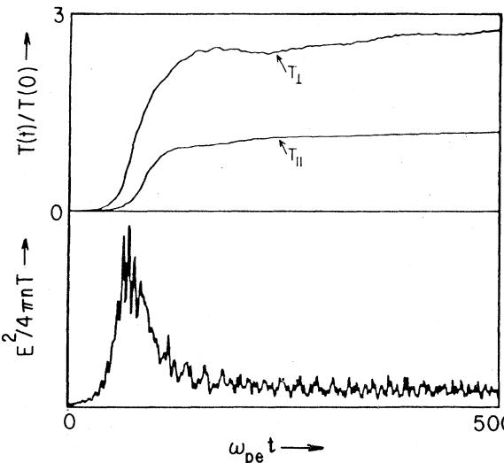  
FIG.52.Perpendicular and parallel temperatures of the cold electrons and the total electric field energy vs time.

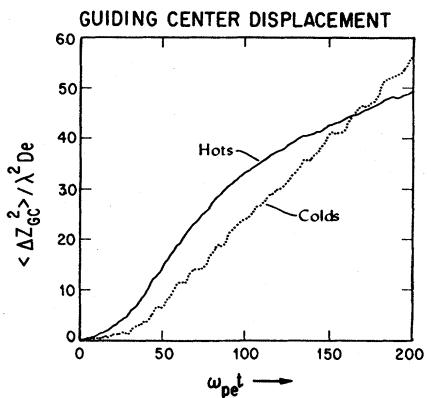  
FIG. 53. Mean-square guiding center displacement vs time.

The cold particles initially both have small Larmor radii and $k _ { | | } v _ { | | }$ and cannot beat with the wave to produce a zero-frequency component; however, the particles in the hot ring can. Once the cold particles are brought into resonance by the saturation mechanism,they can and do diffuse rapidly. At late times the cold particles diffuse more rapidly than the hot particles,because for them $k _ { \perp } \rho _ { l } \approx 1$ while for the hot particles $k _ { \perp } \rho _ { l } > 1$ ；the large orbits of the hot particles result in their averaging out the turbulent fields to a certain extent,and thus they are not as effectively diffused by them as we have seen earlier.

This type of diffusion could play a role in the plasmas heated by electron cyclotron waves as well as in such cyclotron instabilities; similar processes might be important for ion cyclotron heated plasmas.

# C. The free-electron laser

In all the previous examples the codes used were for electrostatic models,sometimes with a fixed magnetic field.Here we have an example, simulation of the freeelectron laser,which employs a relativistic electromagnetic model. Many other examples exist in the literature,a few of which can be found in Lin and Dawson (1977), Tajima and Dawson (1979),Estabrook and Kruer (1978),Estabrook et al. (1974,1975,1980),Biskamp and Welter (1975)，Langdon and Lasinski (1975)，Langdon et al. (1979),Nelson et al. (1979),and Kwan (1978, 1980). As the purpose of this paper is to describe computer simulations and how important results can be obtained from them and not to give the detailed theory or experimental results pertaining to them,I shall give only a simple physical description of the phenomenon under consideration and shall refer the reader to the above references for more details on these aspects.

# 1． The physics of the free-electron laser

In the free-electron laser a relativistic electron beam is passed through a static helical magnetic field,and electromagnetic radiation is generated. The static field can be produced either by permanent magnets or by helical current windings. The physical situation is shown schematically in Fig.54,where $\lambda _ { 0 }$ is the wavelength of the helical magnetic field.

Consider a single electron． As it passes over the ripples in the magnetic field, it is accelerated and radiates.For every wavelength of the ripple it passes over there will be one wavelength in the emitted wave (strictly speaking, harmonic wavelengths can also be emitted, but these are higher order in the ratio of the electron excursions to the wavelength). The radiation in the forward direction slightly outruns the electron; when the electron has traversed a distance $\pmb { L }$ through the ripple field the first light emitted will have traversed a distance $\pmb { L c } / v$ The radiation field will be compressed into the region between the electron and the front of the light pulse,i.e.,in a length $L \left( c / v - 1 \right)$ . The wavelength of the emitted radiation is likewise compressed, the wavelength of the ripple, $\lambda _ { 0 } ,$ times $( c / v - 1 )$ or

$$
\begin{array} { r c l } { { } } & { { } } & { { \lambda { = } \lambda _ { 0 } ( c / v - 1 ) { \simeq } \lambda _ { 0 } / 2 \gamma ^ { 2 } , } } \\ { { } } & { { } } & { { \gamma { = } ( 1 { - } v ^ { 2 } / c ^ { 2 } ) ^ { - 1 / 2 } . } } \end{array}
$$

Now if an electromagnetic wave of this frequency propagates through the device along with the electron, it can stimulate the electron to emit radiation.If the density of the electron beam is high enough,the system is superradiant and with proper feedback can exhibit laser action (light amplification by stimulated emission of radiation).

One can view the operation of a free-electron laser as a parametric instability.If one rides on the electron beam, the rippled magnetic field looks like an intense electromagnetic wave. The wave can undergo stimulated Raman scattering (parametric decay of the pump wave into a plasma wave and a backscattered electromagnetic wave). Such parametric decay must satisfy frequency and wavelength matching,i.e.,

$$
\begin{array} { r } { k _ { \mathtt { p u m p } } = k _ { \mathtt { E M } } + k _ { p } \ , \ } \\ { \omega _ { \mathtt { p u m p } } = \omega _ { \mathtt { E M } } + \omega _ { p } ( k _ { p } ) \ , \ } \end{array}
$$

where EM refers to the electromagnetic wave and $\pmb { p }$ to the plasma wave on the beam. These relations must hold in all frames of reference and therefore in the lab frame also. Inthe labframe $\omega _ { \mathrm { p u m p } } { = } 0 , \quad k _ { \mathrm { p u m p } } { = } k _ { 0 } , \quad \omega _ { p } ( k _ { p } )$ $= k _ { p } V _ { b } \pm \omega _ { p o } / \gamma ^ { 3 / 2 }$ ，where $\omega _ { p o }$ is the plasma frequency of the beam using the rest mass, $V _ { b }$ is its velocity,and $\gamma$ is the associated relativistic $\gamma .$ The growing wave occurs for the $- \omega _ { p o } / \gamma ^ { 3 / 2 }$ branch (negative energy beam wave), from which we find

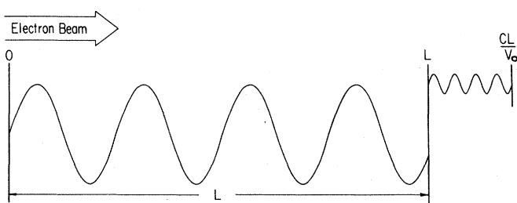  
FIG.54. Kinematics of the free-electron laser.

$$
\begin{array} { r l } & { k _ { \mathrm { E M } } = \frac { - k _ { 0 } V _ { b } + \omega _ { p o } / \gamma ^ { 3 / 2 } } { c - V _ { b } } ~ , } \\ & { \omega _ { \mathrm { E M } } = \frac { - k _ { 0 } V _ { b } + \omega _ { p o } / \gamma ^ { 3 / 2 } } { 1 - V _ { b } / c } ~ , } \\ & { k _ { p } = k _ { 0 } - k _ { \mathrm { E M } } ~ . } \end{array}
$$

For vanishing $\omega _ { p o }$ ,i.e.,low density beams, $k _ { \mathrm { E M } }$ reduces to the previously obtained values of ${ \sim } 2 \gamma ^ { 2 } k _ { 0 }$ . The simulation of this process is aimed at the verification of the linear theory of the device and the determination of the physical processes which determine the nonlinear saturation and efficiency of the device.

# 2.Results of the simulation

Simulations of the operation of the free-electron laser havebeencarriedoutonaone-and-twohalves-dimensional fully relativistic electromagnetic particle code (Kwan,1978). Some of the results of these simulations are shown in Figs.55 and 56.

All these figures apply to a system with a beam $\gamma$ of two, the magnitude of the ripple $\pmb { B }$ field is given by $e B / m _ { 0 } c = 0 . 7 \omega _ { p }$ ,and the system contains 256 grid spacings and 2560 electrons. Figure 55 shows the corresponding electromagnetic (transverse fields） and electrostatic $k$ (mode number) spectra at $\omega _ { p e } t = 4$ ，By this time the instability has already started, and the unstable spectrum has grown to considerable amplitude. The wave number matching condition $k _ { \mathtt { p u m p } } = k _ { \mathtt { E M } } + k _ { p }$ ,is clearly satisfied between the unstable electromagnetic and electrostatic modes. The time evolution of the electromagnetic and electrostatic energy，as well as.the longitudinal current, are plotted in Fig.56. At the time of saturation,the current had decreased by $36 \%$ ,while roughly $30 \%$ of the beam energy had been converted into radiation.

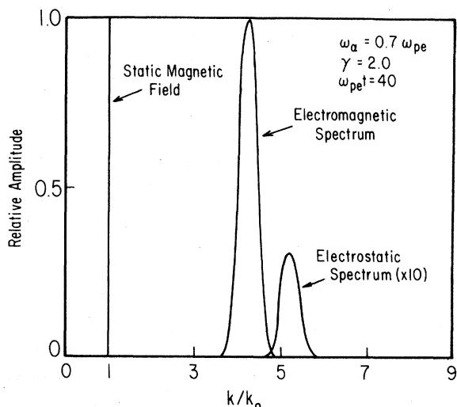  
FIG.55. Power spectrum for the electromagnetic and electrostatic fields in a free-electron laser.

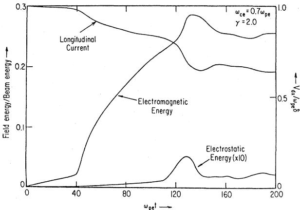  
FIG.56. The time development of the field energies and the decline in the beam energy for a free-electron laser.

In the computer experiment,we find that as the initial unstable spectrum grows to high amplitude, longer wavelength modes become unstable. These modes correspond to electromagnetic waves that would be emitted in the backward direction rather than in the forward direction in Fig. 54. They have a wavelength approximately equal to $2 \lambda _ { 0 }$ and are dangerous to the operation of a free-electron laser,because they can be absolutely unstable (Kwan and Cary,1981); there is an automatic feedback loop with the EM waves carrying the disturbance backwards on the beam; the EM wave couples to the beam through the ripple field,and the beam carries the disturbance forward, where it again generates the backward EM wave. If the device is long enough or if efforts are not made to suppress this mode,it can destroy the beam quality and the generation of the desired short-wavelength mode. (Kwan and Cary,1981; Liewer et al.,1981).

Phase space diagrams for the particles clearly show the slowing of the beam,the branching associated with the plasma wave of the mode number 5; at late time trapping of particles in this wave (curling around of the orbits into vortexes in phase space) takes place.

Linear theory predicts the growth rates of the unstable modes;a comparison of theory and observed maximum growth rates versus beam $\gamma$ is in good agreement with theory.

Of considerable importance is the saturation level, since this determines the potential efficiency of radiation production. The simulations indicate that saturation is due to electron trapping in the electrostatic wave generated.

The instability arises from the coupling between the electromagnetic and electrostatic plasma wave through the rippled magnetic field. The electrostatic wave involved in the instability satisfies the dispersion relation

$$
[ \omega - ( k + k _ { 0 } ) V _ { b } ] ^ { 2 } { = } \gamma _ { 0 } ^ { - 3 } \omega _ { p o } ^ { 2 } [ 1 + 3 \lambda _ { D } ^ { 2 } ( k + k _ { 0 } ) ^ { 2 } ] \ .
$$

The unstable spectrum is quite localized in Fourier space. Furthermore,all these modes have roughly the same velocity, $V _ { b }$ ；therefore they maintain a coherent waveform on the beam. Thus we can approximate the spectrum as a single wave. As the wave grows and the beam loses energy during the instability，the wave will eventually reach such an amplitude that it can trap a large fraction of the beam electrons. After the trapping process sets in, the instability saturates due to the breakup of the coherent motion of the electrons. Upon being trapped, the beam on the average slows down to the phase velocity of the plasma wave. The average change in energy of beam electrons is given by

$$
\Delta W { = } m _ { 0 } c ^ { 2 } ( \gamma _ { 0 } { - } \gamma _ { \mathrm { p h } } ) \ ,
$$

where $\gamma _ { 0 }$ applies to the initial beam velocity, while $\gamma _ { \mathsf { p h } }$ is the $\gamma$ corresponding to the phase velocity of the wave. If we assume all the energy loss from the beam is converted into electromagnetic radiation, the efficiency, $\pmb { \eta }$ ,is then

$$
\eta = \vert \Delta W \vert / ( \gamma _ { 0 } - 1 ) m _ { 0 } c ^ { 2 } { = } ( \gamma _ { 0 } { - } \gamma _ { \mathrm { p h } } ) / ( \gamma _ { 0 } { - } 1 ) .
$$

For large $\gamma$ ,this predicts $\eta$ goes like

$$
\eta { \simeq } { \omega } _ { p o } ( 2 k _ { 0 } c \gamma ^ { 3 / 2 } ) ^ { - 1 } ~ .
$$

Figure 57 gives a comparison of the predictions of this simple theory with simulation results. The agreement is quite reasonable considering the rough nature of the theory.

Most experimental devices require more sophisticated treatment including trapping in the ponderomotive potential [potential well produced by $( j _ { \mathtt { E M } } \times B _ { R } + j _ { r } \times B _ { \mathtt { E M } } ) ]$ and multidimensional effects. A large literature on this has developed on the free-electron laser; the interested reader is referred to Kwan (198O),Cary and Kwan (1981), Kwan and Cary (1981),Liewer et al. (1981),Motz (1960), Deacon et al. (1977)，McDermott et al. (1978)，Elias (1979),Lin and Dawson (1979),Colson (1976), Sprangle et al.(1979),and Kroll et al. (1980).

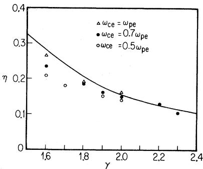  
FIG.57.The efficiency $\pmb { \eta }$ vs $\gamma .$

# VI. MY VIEW OF THE FUTURE OF PARTICLE SIMULATION

In this article I have attempted to give the reader a brief summary of some techniques used in particle simulation of plasma (largely confined to topics on which I have worked) and examples of how these techniques can be used to gain understanding of the physical behavior of plasmas and to discover new physical effects. The power of this approach to understanding plasmas is bound to increase in coming years with the increase in the power of computers.This increase has been dramatic over the last twenty years,and limits to improvements are not yet in sight.Furthermore, the cost of computers had dropped dramatically,so that today many individuals own computers much more powerful than those which were available at the largest laboratory twenty years ago. There are still many aspects of plasmas which can be investigated on these modest computers.In addition to increases in machine power,the techniques of solving problems on them are continually evolving and increasing in power, so that more complex problems can be attacked. As an example of this, present efforts to suppress high-frequency phenomena,so that large time steps can be handled, can have a major impact on the capabilities of simulation.A similar effort must be made on eliminating shortwavelength phenomena, so that large-scale phenomena can be handled. These problems are difficult and highly challenging. Often the microscopic behavior affects the macroscopic properties of the plasma (resistivity,thermal conductivity,viscosity,etc.). Proper treatment of systems where both the microscopic and macroscopic behavior are important will undoubtedly challenge simulation physicists for many years to come.

Present particle simulations of plasma have revealed a rich variety of phenomena associated with the collective and kinetic behavior of plasmas. Many of these phenomena are difficult or impossible to treat either analytically or experimentally. Simulation thus provides us with a powerful new tool to probe the fascinating and complex physics of plasmas. As the machines and models improve such simulation has the potential to approach the richness of the phenomena that exist in nature. Here the models help the physicist develop his intuition of plasma behavior. With the development of intuition, the physicist is free to let his imagination guide him in discovering new phenomena and new laws (of a macroscopic or statistical type).His insight can be quickly tested on model calculations and either confirmed or discarded if found wanting. Here,however,the physicist must be careful that he does not build into his model the result he is looking for; the model should include many more effects than those he is looking for. This is a particular danger when one is developing large time step or large space scale models where the physicist must decide ahead of time that some physical effects are unimportant and can be approximated away. Tests should always be made between such models and ones at a more fundamental level.

With increases in power of simulations, the computer will provide the physicists with larger and larger amounts of data. To make sense of these data, he must reduce them to meaningful results which can be understood fairly simply. To extract meaningful results from two- and three-dimensional models requires improved diagnostics. The development of diagnostics and rapid methods for displaying different types of information, so that those as-pects which provide insight can be quickly found,may present an even greater challenge than the constructing of models. The goal of simulation is the essence of the physics and not the detail.

Computer modeling does not eliminate thinking about the problems under consideration. On the contrary, it requires the physicist to think more deeply and fundamentally about the problems at hand. To simulate the problem in the first place requires that he understand the situation sufficiently to construct a well-defined computational model (often a very enlightening experience). When the results come out of the computer, they often do not conform to what was expected,and the physicist must alter his concepts to meet the hard reality of the computation just as in the case of explaining experimental results. This process,when pursued with an open mind, and continuous testing of one's concepts often lead to insight into the important physical processes from which a physical picture or theory of the plasma behavior can be achieved. In my view, this process liberates the physicist's imagination and allows him quickly to develop an insight into plasma behavior while showing him those paths which are dead ends or which lead to misleading and erroneous concepts. One often hears discussion of the expense of computer simulation,but what is the value of a correct answer or the cost of a misleading idea?

The wealth and complexity of plasma phenomena are so large and the limitations of our present tools so great that I believe that this field will continue to develop vigorously for the foreseeable future. I believe that the same statement can be made for many other branches of physics which involve many degrees of freedom.

# ACKNOWLEDGMENTS

The work in this manuscript has largely been supported by the Department of Energy and the National Science Foundation. The author would like to acknowledge the aid of Y. Ohsawa and Viktor Decyk in reviewing much of the manuscript. He is indebted to Christina Morgan, Maria Friel,Mary Ellen Barba,and Jackie Payne for their able assistance in the preparation of this manuscript.

# REFERENCES

Adler,B.,S.Fernback,and M.Rotenburg,Eds.,1970,Methods in Computational Physics (Academic,New York), Vol.9. Adler,B.,S.Fernback,and M.Rotenburg,Eds.,1976,Methods in Computational Physics (Academic, New York),Vol.16. Ashour-Abdalla, M., J. N. Leboeuf, J. M. Dawson, and C. Kennel,1980,Geophys.Res.Lett.7,889. Auer,P., H. Hurwitz, Jr.,and R. Kilb,1961,Phys. Fluids 4,

1105. Auer,P., H. Hurwitz,Jr.,and R. Kilb,1962, Phys. Fluids 5, 298. Baldwin,D.,and G.Rowlands,1966,Phys.Fluids 9,2444. Bekefi, G.,1966,Radiation Processes in Plasma (Wiley,New York). Bernstein,I. B., 1958,Phys.Rev.109,10. Birdsall, C. K.,and D. Fuss, 1969, J. Comput. Phys. 3, 494. Birdsall, C. K., and A. B.Langdon, in press,Plasma Physics via Computer Simulation (McGraw-Hill, New York). Birmingham,T. J.,J.M. Dawson, and R. M. Kulsrud,1966, Phys.Fluids 9,2014. Biskamp,D.,and H. Welter,1975. Phys.Rev. Lett 34,312. Brackbill, J. U.,and D. W.Forslund,1980, Bull. Am. Phys. Soc. 25,973. Buneman,O.,1959,Phys. Rev.115, 503. Buneman,O.,1969,in SUIPR Report No. 294 (Institute for Plasma Research,Stanford University,Stanford,California) (unpublished). Buneman, O., 1976,“The advance from 2D electrostatic to 3D electromagnetic particle simulation,”in Computing in Plamsa Physics and Astrophysics， edited by D. Biskamp,Comput. Phys. Commun. 12, 21. Busnardo-Neto, J.,P.Pritchett, A. T. Lin,and J. Dawson, 1977, J. Comput. Phys. 23,300. Canoso,J.,JenoGadog,J. E.Fromm,andB.H. Artrog, 1972,Phys.Fluids 15,2299. Cary,J.R.,and T.J.T.Kwan,1981,Phys.Fluids 24,729. Chen,L.,and H. Okuda, 1975,J. Comput.Phys.19,339. Chu,C., J. M. Dawson,and H. Okuda,1975,Phys. Fluids 18, 1762. Colson,W. B., 1976,Phys.Lett. A 59,187. Cooley,J.W.,and J.W. Tukey,1965,Math. Comput. 19, 297. Courant, R.,K. O. Fredricks,and H. Lewy,1928,Math.Ann. 100, 32. Dawson, J. M., 1960,Phys.Rev.Lett. 118,391. Dawson,J. M., 1961, Phys. Fluids 4, 869. Dawson,J. M., 1962a,Phys.Fluids 5,445. Dawson, J.M.,1962b,Nucl. Fusion 3,1033. Dawson, J. M., 1964,Phys. Fluids 7,419. Dawson,J.M., 1970,“The electrostatic sheet model for a plasma and its modification to finite-size particles,’in Methods in Computational Physics, edited by B. Alder et al. (Academic, New York), Vol. 9, p. 1. Dawson, J. M.,1981, in “Auroral Arc Formation,” Proceedings of the Chapman Conference, edited by S.-I. Akasofu and J.R.Kan (Geophysical Monograph 25). Dawson, J. M., C. G. Hsi, and R. Shanny 1969,“Some investigations of non-linear plasma behavior on one-dimensional plasma models,” Third Conference on Plasma Physics and Controlled Nuclear Fusion Research,Novosibirsk,August 1968 (International Atomic Energy Agency,Vienna), Vol.1,735. Dawson, J. M.,H. Okuda,and R. N. Carlile,1971, Phys. Rev. Lett. 27, 491. Dawson,J. M.，H. Okuda,and B. Rosen，1976,“Collective Transport in Plasmas,”in Methods in Computational Physics (Academic,New York), Vol 16,p.281. Dawson,J..,R.hanny,and T.J.irmingham,1969,hys. Fluids 12, 687. Deacon, D. A. G., L. R. Elias, J. M. J. Madey, G. J. Ramain, H. A. Schwetman, and T. I. Smith, 1977, Phys.Rev. Lett. 38, 892. Decyk, V. K.,1980, private communication. Decyk,V.K.,and J.M.Dawson,1979,J. Comput.Phys.30, 407.

Decyk,v.K., J.M. Dawson, and G. J. Morales, l97y,Phys. Fluids 22, 507.   
Denavit, J., 1972,J. Comput. Phys.9,75.   
Denavit, J.,and W.Kruer,1971,Phys.Fluids 14,1782.   
Denavit, J. and W. L. Kruer,198o, Comments Plasma Phys. 6, 35.   
Denavit, J., and J. M. Walsh, 1981, Comments Plasma Phys. Controlled Fusion 6,209.   
Dory,R. A., G. E. Guest,and E. G. Harris,1965,Phys. Rev. Lett. 14, 131.   
Drake, J. R., J. R. Greenwood, G. A. Navratel, and R. S. Post, 1977,Phys. Fluids 20,148.   
Elias,L. R.,1979, Phys. Rev. Let 42, 977.   
Estabrook, K. G., and W. L. Kruer,1978, Phys. Rev. Lett. 40, 42.   
Estabrook, K. G.,and W. L. Kruer, and B.F. Lasinski, 1980, Phys. Rev.Lett.45,1399.   
Estabrook, K. G., E. J. Valeo,and W. L. Kruer,1974, Phys. Lett. A 49,109.   
Estabrook, K. G., E. J. Valeo, and W. L. Kruer,1975, Phys. Fluids 18,1151.   
Feix,M.,and O. Eldridge,1962,private communication.   
Godfrey, B. B.,and A. B. Langdon,1976, J. Comput. Phys. 20, 251.   
Gurnet P.A.,F.L. Scarf, R. W. Fredericks, and E.J. Smith   
1978, Geosci. Electron. 16, 255.   
Hockney,R.W.,1966,Phys.Fluids9,1826.   
Hockney，R.W.,1969,in Particle Modelsin Plasma Physics, Proceedings of a Conference on Computational Physics, Culham (Institute of Physics and The Physical Society, Bristol, CLM-CP), Vol. I, paper IIC.   
Hockney, R. W., 197o,“The potential calculation and some ap-  
plications,in Methods in Computational Physicsedited by B. Alder et al. (Academic, New York), p. 135.   
Hockney， R. W.and James W.Eastwood,1981Computer Simulation Using Particles (McGraw-Hill,New York).   
Kainer，S.,J.M. Dawson, R. Shanny, and T. Coffey，1972, Phys.Fluids 15,493.   
Kamimura, T., and J. M. Dawson, 1976, Phys. Rev. Lett. 36,   
313.   
Kamimura, T., T. Wagner, and J. M. Dawson, 197, Phys. Fluids 21, 1151.   
Kittel, C., 1958， Elementary Statistical Physics (Wiley，New York)   
Kroll,N.,P. Morton,and M. Rosenbluth,1980, JASON Tech  
nical Report No. JSR-79-01 (unpublished).   
Kruer,W.L., J.M. Dawson,and B.Rosen,1973, J.Comput.   
Phys. 13,114.   
Kwan,T.J..978,PhD.dissrtation, Universityof Califor   
nia,Los Angeles (unpublished).   
Kwan,T.J.T.,198o,Phys.Fluids 23,17.   
Kwan,T.J. T.,and J. R. Cary,1981,Phys.Fluids 24,899.   
Kwan, T.J. T., J. M. Dawson, and A. T. Lin,1977, Phys. Fluids 20, 581．   
Landau,L., 1946, J. Phys. (Moscow) 10, 25.   
Langdon,A..969,issation,ceton Ui   
Princeton, New Jersey (unpublished).   
Langdon,A.B., and C. K. Birdsall,1970,Phys.Fluids 13,   
2115.   
Langdon, A. B., and B.F. Lasinski, 1975, Phys. Rev. Lett. 34,   
934.   
Langdon, A. B.； and B. F. Lasinski, and W. L. Kruer, 1979,   
Phys. Rev.Lett. 43,133.   
Lee, J. K.,and C. K. Birdsall,1979,Phys. Fluids 22,1315.   
Liewer,P.C.,A.T. Lin,and J. M. Dawson,1981,Phys.Rev.A 23,1251.   
Lin,A.T.,and J.M.Dawson,1975a,Phys.Fluids 18,201. Lin,A.T.,and J.M.Dawson,1975b,Phys.Fluids 18,1542. Lin,A.T.,and J.M.Dawson,1977,Phys.Fluids 20,538.   
Lin,A.T.,and J.M.Dawson,1979,Phys.Rev.Lett.42,1670. Lin,A.T.,and J.M.Dawson,and H. Okuda,1974,Phys. Fluids 17,1995.   
Lindman,E.L., 1975,J. Comput.Phys.18,66.   
McDermott,D.B.,T.C. Marshall, S.P. Schlesinger,R.K. Parker,and V.L.Granatstein,1978,Phys.Rev Lett.41,1368. Morse,R.L.,1970,in Methods of Computational Physics, edited by B.Alder,S.Fernbach,and M.Rotenburg (Academic,New York),Vol.9,p. 213.   
Morse,R.L. and C. W. Nielson, 1969a,Phys.Rev. Lett. 23, 1087.   
Morse,R.L.,and C.W.Nielson,1969b,Phys.Fluids 12,2418. Morse,R.L.,and C.W.Nielson,1971,Phys.Fluids 14,830. Motz,H.,1960,in Proceedings of the Symposium on Millimeter Waves,Microwaves Research Institute Symposia Series,edited by J.Fox (Interscience,New York),Vol.9,p.155.   
Naitou,H.,T.Kamimura,and J.M.Dawson,1979,J.Phys. Soc. Jpn. 46,258.   
Navratil,G.,A.,and R.S.Post,1977,Phys.Fluids 20,1205. Nelson, D., J. Green, and O. Buneman, 1979,Phys. Rev. Lett. 42,1272.   
Nielson,C.W.,and E.L.Lindman,1973,in Proceedings of the Sixth Conference on Numerical Simulation of Plasmas (Lawrence Livermore Laboratory,Livermore),p.148.   
Okuda,H.,and C.K.Birdsall,1970,Phys.Fluids 13,2123. Okuda,H.,C.Chu,and J. M. Dawson,1974,Phys.Fluids 18, 243.   
Okuda,H.,and J.M.Dawson,1972,Phys.Rev. Lett.28,1625. Okuda,H.,and J.M.Dawson,1973a,Phys.Fluids 16,408. Okuda,H.,and J.M.Dawson,1973b,Phys.Fluids 16,1456. Okuda,H.,and J.M.Dawson,1973c,Phys.Fluids 16,2336. Okuda,H.,J. M. Dawson,and W.M. Hooke,1972,Phys. Rev. Lett. 29, 1658.   
Potter,D.,1973,Computational Physics (Wiley,New York). Rosotoker,N., 1961,Nucl. Fusion 1,101.   
Spitzer,L., 1956,Physics of Fully Ionized Gases (Interscience, New York).   
Sprangle,P.，Cha-Mai Tang，and W. M. Manheimer，1979, Phys.Rev.Lett.43,1932.   
Tajima,T.,and J. M.Dawson,1979,Phys.Rev.Lett.43,267. Tamano, T., J. Hanada,C. Moller, T. Ohkawa and R. Parater, 1974,in Proceedings of the IAEA Fifth Conference on Plasma Physics and Controlld Nuclear Fusion,Tokyo (International Atomic Energy Agency,Vienna),Vol.11,p.97.   
Thompson,W.B.,and J. Hubbard,1960,Rev. Mod. Phys.32, 714.   
Wax,N.,1954,Selected Papers on Noise and Stochastic Processes (Dover,New York).