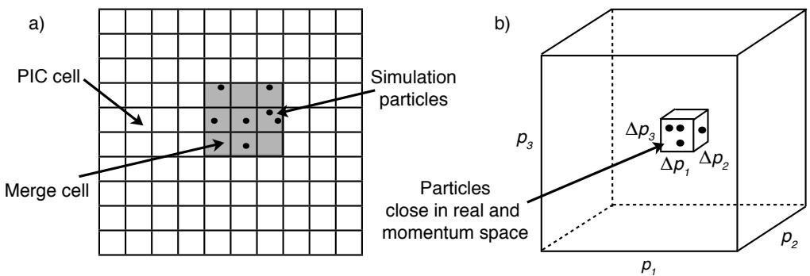
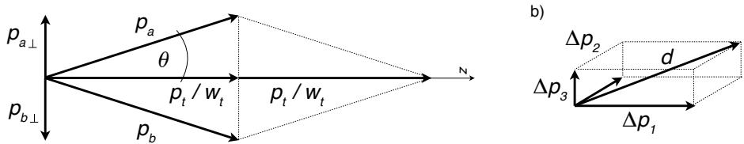
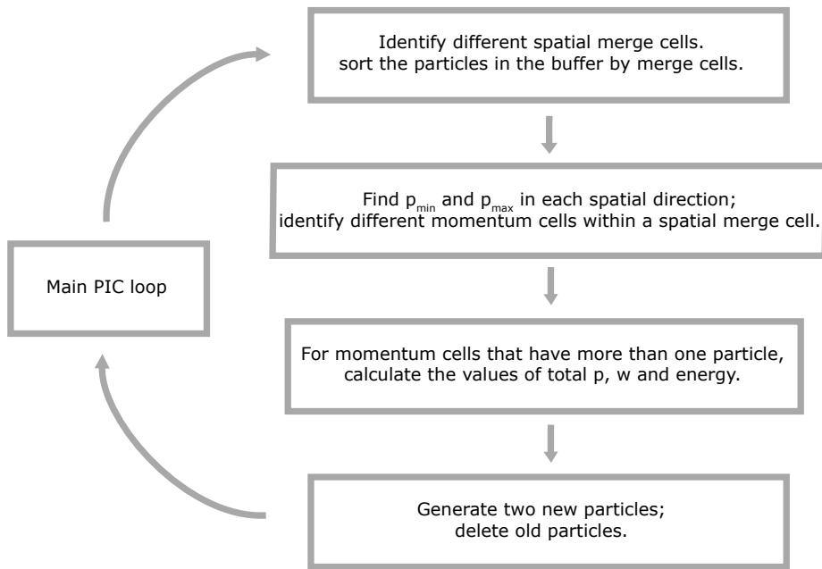
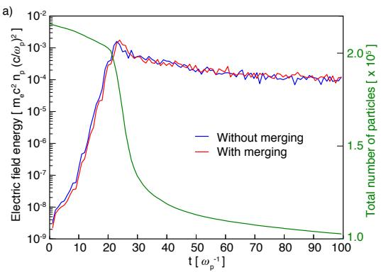
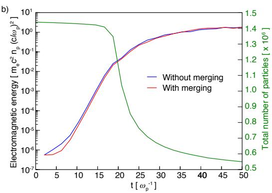
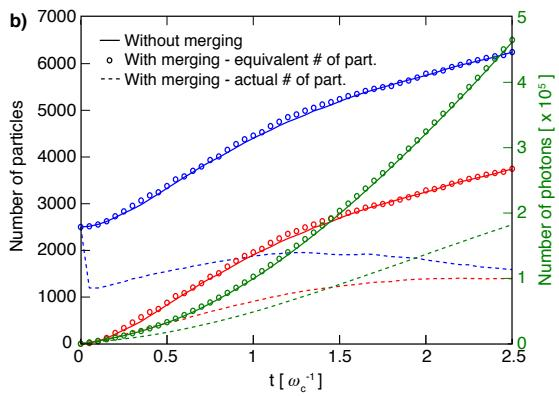
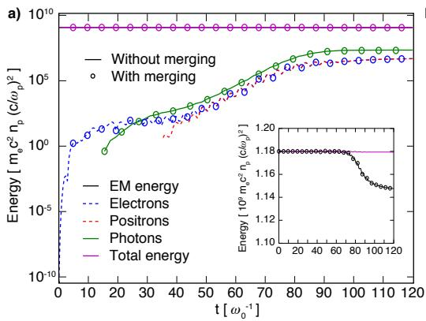
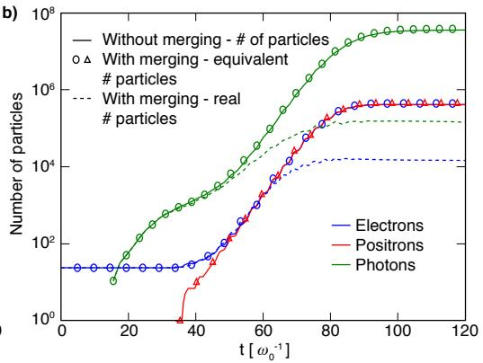

# Vranic 2015《Particle merging algorithm for PIC codes》中文精读

## 0. 论文信息与证据边界

本文讨论 PIC 中的动态粒子合并。目标不是单纯减少粒子数，而是在六维位置--动量相空间中只合并相近的粒子，并尽可能局部保持统计权重、电荷、动量和能量。论文的数值案例包括 two-stream、current-filamentation、magnetic shower 和 QED cascade。

本笔记使用本目录中的 24 页 PDF 和 MinerU Markdown，按论文顺序整理。论文实验属于作者的 PIC/QED 实现，不能直接当作 WarpX runtime 结果；WarpX 对应入口是 `VelocityCoincidenceThinning`，第 4 章另行记录实现差异和当前 checksum 边界。

## 1. 摘要与引言

论文首先指出宏粒子是带统计权重的 phase-space samples。QED cascade、pair creation 或局部粒子聚集会让宏粒子数指数增长，造成内存和负载问题。简单删除粒子并把权重平均分配出去只能保持总电荷，通常破坏局部动量、能量和分布函数。

作者提出的约束是：先在一个空间 merge cell 中划分动量 cell，只处理同一六维小块中的粒子；然后把一个 cluster 合并为两个新宏粒子，使局部守恒关系可同时满足。该设计还故意保留低采样尾部，优先压缩高密度 bulk。

## 2. Algorithm：六维相空间分箱

### 2.1 空间 cell、动量 cell 与图 1

空间 merge cell 可以包含多个 PIC cell；每个 merge cell 内再按三个动量方向分箱。论文图 1 展示了二维空间 merge cell 以及其中的动量子立方体。只有同时落在同一空间 cell 和同一动量 cell 的粒子才成为候选 cluster。

这里的关键不是“越大范围合并越省粒子”，而是 merge cell 必须小于问题中最短的相关物理尺度；动量分箱也必须足够细，不能把不同物理群体混到同一 cluster。

### 2.2 单粒子候选为什么不总能成立

设 cluster 内有 (N) 个粒子，统计权重、动量和能量分别为 (w_i)、π_i 和 ε_i。论文先定义总量：

$$
w_t = \sum_{i=1}^{N} w_i, \qquad
\boldsymbol{p}_t = \sum_{i=1}^{N} w_i\boldsymbol{p}_i, \qquad
\epsilon_t = \sum_{i=1}^{N} w_i\epsilon_i.
$$

若只生成一个新粒子，则它必须取

$$
w_n=w_t, \qquad
\boldsymbol{p}_n=\frac{\boldsymbol{p}_t}{w_t}, \qquad
\epsilon_n=\frac{\epsilon_t}{w_t}.
$$

但新粒子还必须满足质量壳关系。对电子是

$$
\epsilon_n^2 = |\boldsymbol{p}_n|^2+1,
$$

对光子是

$$
\epsilon_n=|\boldsymbol{p}_n|.
$$

两个反向运动、等权重的粒子就是反例：总动量为零，但总能量仍大于静止能量或零光子动量对应的能量。因此一个粒子不足以同时保留这些量。

### 2.3 两粒子构造与图 2

论文改为生成粒子 (a,b)，要求

$$
w_t=w_a+w_b,
$$

$$
\boldsymbol{p}_t=w_a\boldsymbol{p}_a+w_b\boldsymbol{p}_b,
$$

$$
\epsilon_t=w_a\epsilon_a+w_b\epsilon_b.
$$

再加上两个新粒子各自的光子或电子能量--动量关系。为简化求解，作者取 (w_a=w_b=w_t/2)，并令两者能量相等。于是

$$
\boldsymbol{p}_a+\boldsymbol{p}_b=\frac{2\boldsymbol{p}_t}{w_t}.
$$

令每个新粒子的动量模为 (p_a)，并让两个动量关于总动量方向对称，则夹角满足

$$
\cos\theta=\frac{p_t}{w_t p_a}.
$$

图 2 用几何方式说明：平行分量负责回代总动量，大小相等、方向相反的垂直分量负责恢复能量而不改变总动量。

方位角不是任意噪声。论文用动量 cell 的对角线选取合适的平面，使新粒子不要凭空在原来没有动量展宽的方向产生展宽。图 3 给出了从分箱、cluster 识别、守恒量累计到新粒子落点的循环概要。

位置也不能总取 cluster 质心，否则多个动量 cell 的新粒子可能堆在 merge cell 中心制造密度尖峰。作者从原 cluster 中随机选两个已有位置，使位置分布不被人为集中。

## 3. (p_a\ge p_t/w_t) 的证明

为了让 θ 存在，必须有 (p_a\ge p_t/w_t)。

对光子，ε_i=p_i，因此三角不等式给出

$$
\sum_i w_i p_i
\ge
\left|\sum_i w_i\boldsymbol{p}_i\right|.
$$

左边就是总能量，右边不超过总动量模，所以条件成立。

对电子，使用 ε_i²=p_i²+1，并先用上面的三角不等式把矢量和换成标量和。剩余只需证明任意两粒子满足

$$
\sqrt{p_i^2+1}\sqrt{p_j^2+1}\ge p_i p_j+1.
$$

两边为正，可以平方并整理为

$$
(p_i-p_j)^2\ge 0.
$$

因此电子和光子都存在可行的两粒子构造。这个证明是算法几何可行性的核心，不是某个具体 PIC code 的实现证明。

## 4. Merging rate：从 occupancy 到 Poisson 近似

若第 (i) 个空间 merge cell 的第 (j) 个动量 cell 中有 (k) 个粒子，合并后减少 (k-2) 个粒子。用 (P_{ij}(k)) 表示 occupancy 概率，则一个 merge interval 内的期望减少量为

$$
\Delta N_T =
\sum_{i=1}^{N_c}\sum_{j=1}^{N_m}\sum_{k=3}^{N_{p,i}}
P_{ij}(k;N_{p,i},N_m)(k-2).
$$

对均匀密度、waterbag 动量分布，平均 occupancy 为

$$
\lambda=\frac{N_p}{N_m},
$$

可以用 Poisson 概率近似。论文得到

$$
\frac{dN_T}{dt}
=-\omega_m N_cN_m
\sum_{k=3}^{N_p}P(k;N_p/N_m)(k-2).
$$

当 λ 很小时，(k=3) 项主导，得到

$$
\frac{dN_T}{dt}
\simeq-\omega_m\frac{N_cN_p^3}{6N_m^2}.
$$

这个结果说明低 occupancy 极限下粒子数近似线性下降；λ 接近或大于 1 时必须数值计算完整 Poisson 和。Maxwellian 与 waterbag 的动量覆盖不同，不能把这个公式无条件外推到所有分布。

图 4 比较 slow/fast merging 两组热等离子体，论文报告模拟曲线与式 (17)/(18) 一致。

## 5. Numerical simulations

### 5.1 参数选择

作者建议 merge cell 小于最短相关物理尺度，动量每个有展宽的方向至少使用约 8 个 bins；merge frequency 不能每一步都执行，否则会洗掉微观动力学，经验上应满足 (1/\omega_m>5\Delta t)。这些是论文场景的经验建议，不是 WarpX 的默认参数合同。

### 5.2 Two-stream 与 current-filamentation

图 5 比较无 merge 和 merge 的电磁能量、粒子数。线性阶段的弱扰动对应低 λ，粒子数近似线性减少；不稳定性饱和阶段形成密度/动量 bunching，λ 增大，merge 加速；非线性后期又回到较慢的合并。论文报告约 50% 粒子被合并，场能演化保持相近。

### 5.3 Magnetic shower

强磁场中电子发射高能光子，光子经 Breit--Wheeler 产生电子-正电子对，随后继续辐射。论文用总能量和 equivalent particle number 比较 merge/no-merge；合并粒子的权重折算后能复现非合并结果，报告 speed-up 约 2.5。

### 5.4 QED cascade

双向激光脉冲中的种子电子被加速，反复经历发射与 pair creation，粒子数近似指数增长。论文报告 merge 后的粒子数可以比 no-merge 低约三个数量级，同时能量、动量分布保持相近，特定案例 speed-up 约 22。

图 7 对比能量和粒子数，图 8 对比纵向/横向动量、能量和宏粒子权重分布。尾部仍保留较小的原始采样，bulk 则承担主要压缩收益。

## 6. 与 WarpX 的映射与限制

WarpX 当前 `VelocityCoincidenceThinning` 也在 cell 内按速度空间分 bin，并把 cluster 压成两个粒子；第 4 章已核对其 `resampling_algorithm_target_weight` 会乘 2，且剩余粒子统一标记 invalid 后再删除。这个结构与本文“两粒子、局部动量/能量守恒”的算法思想相近。

但当前项目的 WarpX evidence 仍是 resampling regression 的 checksum/粒子数层检查，不是本文 2-stream、magnetic shower 或 QED cascade 的逐案例复现。本文的 speed-up、Poisson merging rate 和 QED distribution 结论不能自动转写成 WarpX 的 runtime PASS。

## 7. 结论与开放问题

论文结论是：局部六维分箱加两粒子构造可以在显著减少宏粒子数的同时保持局部电荷、动量和能量；它尤其适合 QED cascade 等粒子数急剧增长的场景。

对本书而言，最重要的工程结论有三条：merge cell 必须服从物理尺度，merge frequency 必须服从最短动力学时间，验证必须同时看守恒量、分布函数和 equivalent weighted particle number。仍需补足的不是论文算法说明，而是当前 WarpX 实现与论文算法的逐行等价边界，以及 dedicated resampling physics consumer。

## 8. 复习用速记

“在六维 phase space 中找相近粒子；用两个新粒子而非一个新粒子同时恢复权重、动量和能量；优先压缩 bulk，保留低采样尾部；把论文结果与 WarpX 的 resampling checksum 分开。”
