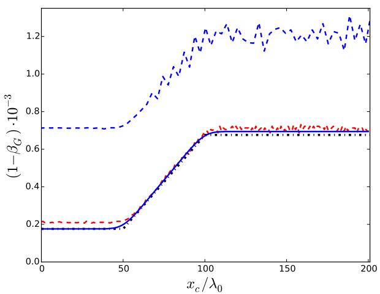
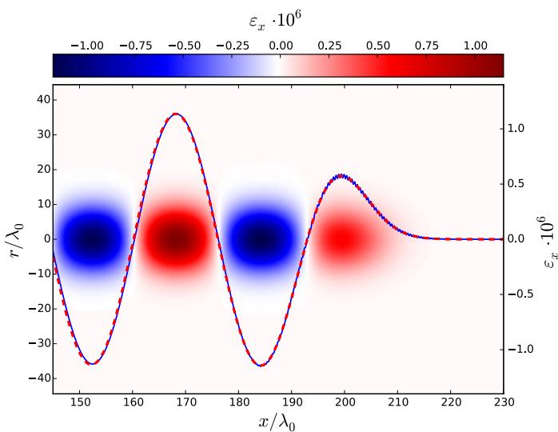
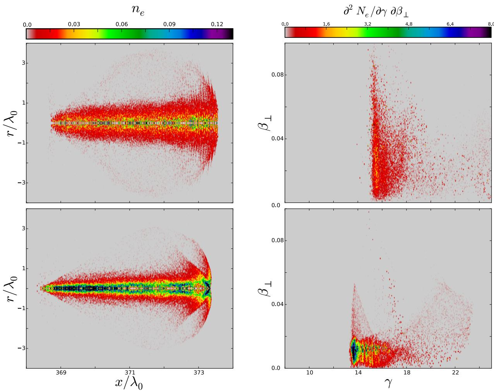
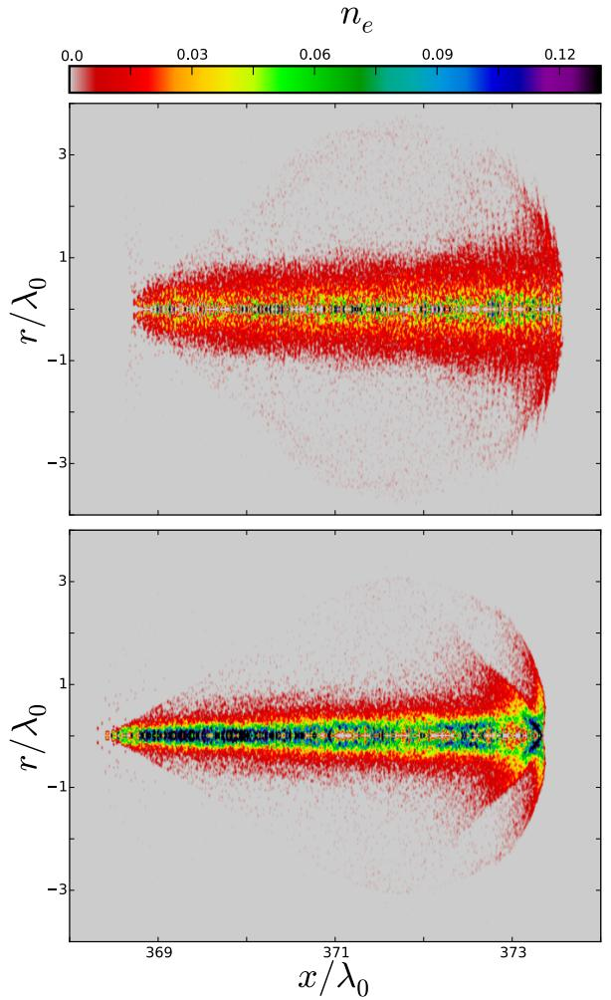
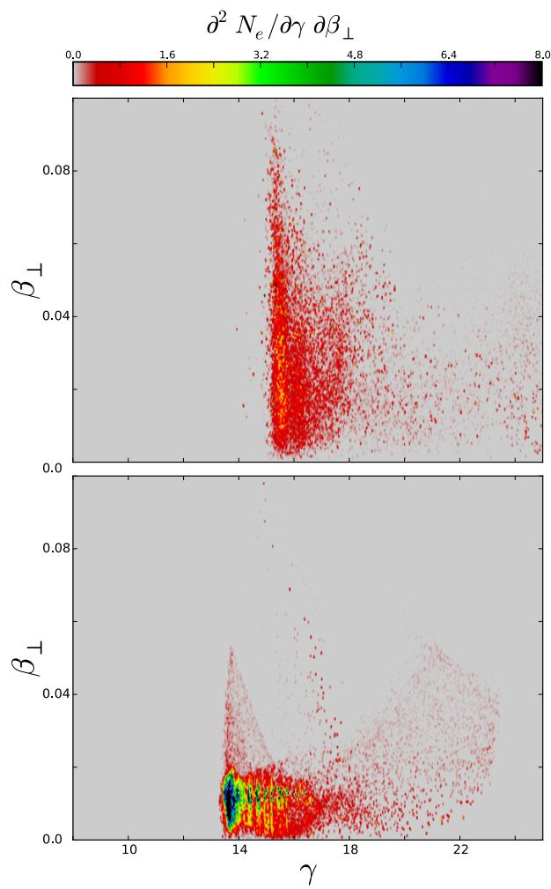

# Fourier-Bessel 粒子模拟方法：Andriyash、Lehe、Lifschitz 论文精读

## 0. 论文信息与证据边界

- **题名**：Laser-plasma interactions with a Fourier-Bessel Particle-in-Cell method
- **作者**：Igor A. Andriyash、Remi Lehe、Agustin Lifschitz
- **正式发表信息**：*Physics of Plasmas* 23(3), DOI `10.1063/1.4943281`。
- **本地全文资产**：本目录中的 9 页 PDF、MinerU Markdown 和 `images/` 图像资源。
- **代码对象**：论文介绍的是 PLARES-PIC，并与准柱坐标 FDTD PIC 代码 CALDER-CIRC 对照；它不是 WarpX 的实现论文。
- **本笔记用途**：为第 7 章的 RZ/准柱坐标与谱 Maxwell 路线提供公式级来源；不把 PLARES-PIC 的 benchmark 自动写成 WarpX runtime 结果。

本文的核心主张是：在具有柱对称结构的激光-等离子体问题中，把角向 Fourier 展开与径向 Bessel/Hankel 变换结合起来，构造 quasi-cylindrical PSATD PIC。Maxwell 方程在谱空间中解析推进，空间导数由谱算子高精度计算；相对于 FDTD，它避免了电磁场的网格色散和 E/B 空间交错。论文随后用线性激光传播和密度跃迁注入电子的 wakefield acceleration 两组例子，与 CALDER-CIRC 对照。

**读取修正。** 本地 MinerU 文本在定义辅助场 `g` 的位置出现 OCR 错误，将旋度符号识别成了速度符号；论文原文和 arXiv HTML 的公式是

$$
\mathbf{g}=\nabla\times\mathbf{b}.
$$

以下笔记按这个公式解释。该修正只针对 OCR 文字，不改变 PDF 资产。

## 1. 摘要：为什么采用 Fourier-Bessel PSATD

摘要提出一个新的 spectral PIC：用 Fourier-Bessel transform 把 Maxwell 方程转到 quasi-cylindrical spectral domain，在该空间中解析推进时间，并以高精度近似空间导数。论文强调三点：

1. FDTD 的数值色散会改变传播波的速度；当光与相对论粒子共传播时，数值色散会制造非物理的波-粒子相互作用。
2. FDTD 中 E、B 常在空间和时间上交错，粒子看到的 Lorentz force 还会受到场投影误差影响。
3. Fourier-Bessel PSATD 不产生由时空网格分辨率引起的电磁场数值色散，也不需要 E/B 网格交错，因此适合 wakefield acceleration。

论文的验证对象仍是 PLARES-PIC 与 CALDER-CIRC 的对比。能安全写入本书的句子是“该论文给出一种准柱坐标 PSATD PIC 的数学和 benchmark 证据”；不能写成“WarpX 已实现本文全部算法”或“论文 benchmark 已验证 WarpX”。

## 2. Introduction：从 FDTD 的问题到准柱坐标谱方法

### 2.1 FDTD 色散、场交错与相对论共传播

PIC 用宏粒子表示等离子体，并在网格上存储和推进电磁场。FDTD 以有限差分近似 Maxwell 方程，稳定性和精度由 `Δt`、`Δr` 等分辨率控制。传播波的数值相速度依赖于空间和时间分辨率，这就是 numerical dispersion。

对相对论粒子，电场力和磁场力可能近似抵消，剩下的有效力可缩小到

$$
\mathbf{F}_p\sim\frac{e\mathbf{E}_p}{\gamma_p^2},
\qquad
\gamma_p=(1-\beta_p^2)^{-1/2}.
$$

推导直觉是：当粒子速度接近光速时，`β × B` 项会抵消 E 项的大部分；任何场投影误差相对于剩余小力都可能被放大。因此，wakefield acceleration 既受到 FDTD 数值色散影响，也受到 E/B 交错后 Lorentz force 投影的影响。

### 2.2 PSTD、PSATD 与 quasi-cylindrical geometry

PSTD 把空间导数转换为谱空间中的线性系数；PSATD 进一步在时间上解析积分，因此场动力学精度不直接依赖时间步长。论文选择柱坐标

$$
\mathbf{r}=(x,r,\theta),
$$

但把矢量分量保留为 Cartesian 分量

$$
\mathbf{A}=(A_x,A_y,A_z).
$$

这样在轴 `r=0` 附近避免了柱坐标矢量分量的奇异表达。角向依赖用 Fourier mode `m` 展开，径向依赖用 Bessel/Hankel transform 处理；只保留少数角向 mode 时，三维问题可以获得接近二维的计算负担，但仍保留准柱坐标的三维物理结构。

## 3. Physical and mathematical models

### 3.1 归一化与变量

论文用无量纲变量表示场、粒子和时间。例如电场归一化为

$$
\boldsymbol{\varepsilon}=\frac{e\mathbf{E}}{m_ec^2k_0},
\qquad
k_0=\frac{2\pi}{\lambda_0},
\qquad
\omega_0=k_0c.
$$

粒子质量、荷、速度、坐标分别以 `m_e`、`e`、`c`、`k_0^{-1}` 归一化，时间以 `ω_0^{-1}` 归一化，密度以临界密度

$$
n_c=\frac{m_e\omega_0^2}{4\pi e^2}
$$

归一化。读者应注意：这些是论文推导中的单位，不是 WarpX 输入文件中的通用默认单位。

### 3.2 从 Maxwell 方程到辅助场 `g`

论文先写归一化 Maxwell 方程

$$
\partial_t\boldsymbol{\varepsilon}=\nabla\times\mathbf{b}-\mathbf{j},
\qquad
\partial_t\mathbf{b}=-\nabla\times\boldsymbol{\varepsilon},
$$

$$
\nabla\cdot\boldsymbol{\varepsilon}=n,
\qquad
\nabla\cdot\mathbf{b}=0.
\tag{1}
$$

定义

$$
\mathbf{g}=\nabla\times\mathbf{b}.
$$

对 Faraday 方程取旋度，并结合 Poisson 方程，得到

$$
\partial_t\boldsymbol{\varepsilon}=\mathbf{g}-\mathbf{j},
\qquad
\nabla^2\boldsymbol{\varepsilon}=\partial_t\mathbf{g}+\nabla n,
\tag{2a}
$$

以及

$$
\nabla^2\mathbf{b}=-\nabla\times\mathbf{g}.
\tag{2b}
$$

**推导逻辑：** `g` 把磁场方程中难以直接在 Fourier-Bessel 空间处理的一阶旋度，转移到每步重新计算的通信/投影项中；真正随时间推进的量是 `ε` 和 `g`，而一阶导数不再作为时间积分算子的一部分。

### 3.3 Fourier-Bessel 空间中的振子系统

柱谐函数是 Laplace 算子的本征函数，因此

$$
\widehat{\nabla^2 f}=-\omega^2\widehat{f},
\qquad
\omega=\sqrt{k_x^2+k_r^2}.
$$

对式 (2a) 做 Fourier-Bessel transform 后得到

$$
\partial_t\widehat{\boldsymbol{\varepsilon}}-\widehat{\mathbf{g}}
=-\widehat{\mathbf{j}},
$$

$$
\partial_t\widehat{\mathbf{g}}+\omega^2\widehat{\boldsymbol{\varepsilon}}
=-\widehat{\nabla n}.
\tag{3a}
$$

磁场由静态关系恢复：

$$
\widehat{\mathbf{b}}
=\omega^{-2}\widehat{\nabla\times\mathbf{g}}.
\tag{3b}
$$

这组方程的结构类似受迫谐振子。`ω` 负责谱空间中的本征频率，`j` 和 `∇n` 是粒子投影后每步更新的驱动项。式 (3a) 说明 PSATD 的“解析推进”并不意味着粒子源无需近似；源项的时间插值和 charge continuity 仍然是精度核心。

## 4. Integration cycle：一次 PIC 时间步

论文把一个时间步拆为六个动作：

1. 用半时间层速度 `β_{1/2}` 将粒子位置从 `r_0` 推到 `r_1`；
2. 将 `n_1` 和 `j_{1/2}` 按 angular mode 沉积到空间网格；
3. 计算 `j_{1/2}` 和 `∇n_1` 的谱投影；
4. 用式 (3a) 更新 `ε_1`、`g_1`，再由式 (3b) 得到 `b_1`；
5. 把 `b_1`、`ε_1` 投影回空间网格；
6. 在粒子位置计算 Lorentz force，并把速度推进到 `β_{3/2}`。

这条链很适合与现代 PIC 代码的 consumer 顺序比较，但不能直接当作 WarpX 函数名映射。特别要分开三类操作：粒子推进/沉积是 PIC 共性；谱-实空间变换是该方法的专有层；式 (3a) 的 Maxwell solver 才是 PSATD 特有层。

### 4.1 常源假设与解析时间积分

在一个时间步内，论文假设 `j_{1/2}` 为常量，密度从 `n_0` 线性演化到 `n_1`。于是

$$
\partial_t\widehat{\boldsymbol{\varepsilon}}
=\widehat{\mathbf{g}}-\widehat{\mathbf{j}}_{1/2},
$$

$$
\partial_t\widehat{\mathbf{g}}
=-\omega^2\widehat{\boldsymbol{\varepsilon}}
+\frac{t-\Delta t-t_0}{\Delta t}\widehat{\nabla n}_0
-\frac{t-t_0}{\Delta t}\widehat{\nabla n}_1.
\tag{4}
$$

将这组受迫振子方程在时间上精确积分，得到

$$
\widehat{\boldsymbol{\varepsilon}}_1=\mathbf{C}_{\varepsilon}\cdot\mathbf{S},
\qquad
\widehat{\mathbf{g}}_1=\mathbf{C}_{g}\cdot\mathbf{S},
\tag{5}
$$

其中

$$
\mathbf{S}=\left(
\widehat{\boldsymbol{\varepsilon}}_0,
\widehat{\mathbf{g}}_0,
\widehat{\mathbf{j}}_{1/2},
\widehat{\nabla n}_0,
\widehat{\nabla n}_1
\right).
$$

`C_ε` 和 `C_g` 是由 `sin(ωΔt)`、`cos(ωΔt)` 及 `ω` 的幂构成的系数向量。它们来自齐次振子解和线性源项卷积；因此论文所说的“时间精度独立于 `Δt`”必须理解为在源项假设成立时，时间积分误差被解析积分消除，实际误差仍来自初始/边界条件、粒子投影、有限谱截断和源项近似。

### 4.2 Charge continuity 与 current correction

粒子投影可能破坏连续性方程

$$
\partial_t n+\nabla\cdot\mathbf{j}=0.
\tag{6}
$$

一旦式 (6) 被破坏，`∇·E=n` 和 `∇·B=0` 的误差会积累。论文给出 current correction：先设

$$
\mathbf{j}'=\mathbf{j}-\nabla\Gamma,
\qquad
\nabla^2\Gamma=\partial_t n+\nabla\cdot\mathbf{j},
$$

再在谱空间写成

$$
\widehat{\mathbf{j}}_{1/2}'
=\widehat{\mathbf{j}}_{1/2}
+\frac{1}{\omega^2}
\left(
\frac{\widehat{\nabla n}_1-\widehat{\nabla n}_0}{\Delta t}
+\widehat{\nabla\nabla\cdot\mathbf{j}}_{1/2}
\right).
\tag{7}
$$

推导的关键是把 continuity residual 作为 Poisson 方程的源，求出一个梯度型修正，使修正后的电流消除散度误差。由于 Fourier-Bessel 的横向一阶导数会耦合 `m±1`，式 (7) 不是普通 Fourier 空间中完全逐模的标量乘法，而要使用矩阵形式的 differential operators。论文把 correction 放在粒子投影之后、Maxwell 时间积分之前。

### 4.3 边界与移动窗口

Fourier 变换使纵向 `x` 边界天然周期；Bessel 基底在 `r=R` 取零点，形成反射型径向边界。若物理区域足够远离边界，可以用大盒子近似无界介质；若不能，则可以对场乘以衰减 envelope。对随激光/粒子束移动的窗口，下游边界的场必须被抑制，否则窗口平移会把边界残余重新带入上游。

论文测试了两种 envelope：一种用于更强地抑制 `ε`，另一种对 `g` 更温和。作者明确指出该吸收层在移动窗口中仍会影响物理性质，其更严格的设计留作后续工作。因此这里不能把它等同于现代 PML 的严格匹配边界。

## 5. Simulations：论文 benchmark 的顺序与结论

### 5.1 PLARES-PIC 实现层

PLARES-PIC 用线性插值进行粒子-网格投影，粒子在 `(r,p)` 空间用标准 Boris pusher 推进；Python 管理运行与可视化，计算密集部分用 Fortran 90，经 F2PY 接口调用，FFT 使用 FFTW3，并通过 MPI4Py 并行。径向分解把网格和粒子按径向切片分配。

这些信息可以支持“论文算法包含 Maxwell solver、particle pusher、projection、FFT/Hankel 和并行实现层”，但不支持把其 Fortran/Python runtime 结构映射成 WarpX C++/AMReX kernel。

### 5.2 线性激光-等离子体传播

第一组测试检验真空和欠密等离子体中的 laser group velocity。理论色散关系为

$$
\omega^2=k^2c^2+\omega_{pe}^2,
\qquad
\beta_G=\frac{\partial\omega}{\partial(kc)}
\simeq 1-\frac{\omega_{pe}^2}{2k^2c^2}.
$$

结合等离子体色散和有限束腰衍射，论文使用

$$
1-\beta_G=\frac{n_e}{2n_c}
+\left(\frac{\lambda_0}{2\pi w_0}\right)^2.
\tag{8}
$$

第一项是欠密等离子体造成的群速度降低，第二项是有限束腰造成的衍射降低。测试使用 `a_0=10^{-2}`、`w_0=l_x=12λ_0`，PSATD 网格为 `Δx=0.048λ_0`、`Δr=0.32λ_0`；FDTD 需要更细的 sibling 网格才能接近相同传播速度。

**图 1 解读：** 蓝色实线是 PSATD，蓝色虚线是同分辨率 FDTD，红色虚线是更细 FDTD，黑色点划线是式 (8)。图的证据层是论文 benchmark 曲线，不是 WarpX 当前二进制的回归结果。它支持的核心结论是：在相同较粗网格上，FDTD 数值色散明显拖慢真空激光；PSATD 更接近理论群速度。

线性 wakefield 的纵向电场理论为

$$
\varepsilon_x=
\left(\frac{\omega_{pe}}{2\omega_0}\right)^2
\int_x^\infty \widetilde{\varepsilon}_L^2
\cos\left[k_{pe}(x-x')\right],dx',
\qquad
k_{pe}=\frac{\omega_{pe}}{c}.
\tag{9}
$$

**图 2 解读：** 颜色图显示 `ε_x` 的空间分布，轴上曲线与式 (9) 的理论曲线比较。这里的关键不是某个数值阈值，而是 spectral solver 能在粗于 FDTD 的空间分辨率下保留传播和 wakefield 的主要结构。

### 5.3 密度跃迁注入的电子加速

第二组测试使用几 mJ、few-cycle 的紧聚焦激光，在等离子体密度 shock 附近注入电子。密度先在 `300λ_0` 内升到 `n_max=0.005n_c`，随后在 `15λ_0` 内降到 `0.5n_max`；激光参数为 `a_0=3`、`w_0=4λ_0`、`l_x=5λ_0`。

PSATD 使用 `Δx=0.025λ_0`、`Δr=0.25λ_0`，而 FDTD 使用更细的 `Δx=0.016λ_0`、`Δr=0.16λ_0`。两者 wake 结构接近，但加速电子束不同。论文选择 `γ_p>8` 的电子，比较 `(x,r)` 密度和 `(γ,β_⊥)` 谱：PSATD 电子束保留清晰注入结构，FDTD 出现前沿小尺度调制和 transverse velocity 扰动。

**图 3 解读：** 图中上排是 FDTD，下排是 PSATD；差别主要集中在注入电子束的细结构和横向速度。论文把差异归因于 FDTD 的数值色散、数值 Cherenkov 效应以及 Lorentz force 投影误差。FDTD 与 PSATD 的加速电荷分别约为 `33 pC` 和 `28 pC`（`λ_0=0.8 μm`），这也说明快速 shock injection 对激光群速度很敏感。

## 6. Conclusions：论文真正证明了什么

论文证明的是一个具体的 quasi-cylindrical Fourier-Bessel PSATD PIC 方法在 PLARES-PIC 中可运行，并在两组激光-等离子体 benchmark 中，以较低空间/时间分辨率获得接近理论和 CALDER-CIRC 的结果。它没有证明所有准柱坐标谱算法都无条件稳定，也没有证明 FDTD 在所有问题上都不适用。

更准确地说，方法的优势来自三条共同作用：

1. Laplace 算子在 Fourier-Bessel 基底下对角化，空间导数精度高；
2. Maxwell 时间方程在常 `j`、线性 `n` 假设下解析积分；
3. E/B 不做 Yee 式空间交错，降低相对论粒子的 Lorentz force 投影误差。

代价是变换矩阵和 mode coupling 更复杂，边界由谱基底决定，current correction 和 absorbing layer 仍需谨慎处理。

## 7. Appendix A：Fourier-Bessel transform

柱谐函数为

$$
\mathcal{H}(\mathbf{k},\mathbf{r})
=e^{ik_xx+im\theta}J_m(k_rr),
\qquad
\mathbf{k}=(k_x,k_r,m).
$$

函数展开为

$$
f(\mathbf{r})
=\sum_{\mathbf{k}\in\mathcal{K}}
\mathcal{H}(\mathbf{k},\mathbf{r})\widehat{f}_{\mathbf{k}}.
\tag{A1}
$$

这等价于角向 Fourier、纵向 `x` Fourier 和径向 Hankel 三个变换。角向 mode 在粒子位置上通过相位 `e^{-imθ_p}` 参与沉积，回投影时通过 `e^{imθ_p}` 重建总场。纵向 FFT 给出周期边界；径向 DHT 使用 Bessel 零点

$$
k_r^{(m)}=\frac{u_j^{(m)}}{R},
$$

使 `f(R)=0`，因此径向外边界是反射/Dirichlet 型。`r=0` 被排除以避免 `m>0` 的矩阵退化，这是论文数值构造上的重要细节。

## 8. Appendix B：一阶导数与 `m±1` mode coupling

柱坐标到 Cartesian 导数的关系为

$$
\partial_y=\cos\theta\,\partial_r-\frac{\sin\theta}{r}\partial_\theta,
\qquad
\partial_z=\sin\theta\,\partial_r+\frac{\cos\theta}{r}\partial_\theta.
$$

`∂_x` 在谱空间只是乘以 `ik_x`；横向导数则把 mode `m` 与 `m+1`、`m-1` 混合。论文的核心结构可以写成

$$
\partial_x f^{(m)}
=\mathrm{IDFT}_x\,\mathrm{IDHT}^{(m)}_r
\left(ik_x\widehat{f}^{(m)}\right),
$$

$$
\partial_y f^{(m)}
\sim
\mathrm{IDFT}_x\left[
\partial_\perp\mathrm{IDHT}^{(m+1)}_r\widehat{f}^{(m+1)}
-
\partial_\perp\mathrm{IDHT}^{(m-1)}_r\widehat{f}^{(m-1)}
\right],
$$

$$
\partial_z f^{(m)}
\sim
\mathrm{IDFT}_x\left[
i\partial_\perp\mathrm{IDHT}^{(m+1)}_r\widehat{f}^{(m+1)}
+
i\partial_\perp\mathrm{IDHT}^{(m-1)}_r\widehat{f}^{(m-1)}
\right].
\tag{B1}
$$

横向变换矩阵由 Bessel 函数构造。其物理/算法意义是：Laplace 算子可逐模对角化，但一阶 gradient、divergence、curl 不是逐模独立的；所有横向通信都要显式处理邻近角向 mode。这正是准柱坐标 spectral solver 的主要数学复杂度，也是不能把它简单描述成“对 RZ 网格做一次普通 FFT”的原因。

## 9. 与本书 WarpX 路线的有界映射

### 9.1 可以直接借鉴的概念

- Fourier-Bessel 基底说明准柱坐标谱方法为什么能把径向问题转成 mode-dependent Bessel operator。
- 式 (3a)、(5) 展示 PSATD 的“谱空间受迫振子 + 解析时间推进”结构。
- 式 (6)、(7) 说明 charge continuity 是独立于 Maxwell 时间积分的 source contract。
- Appendix B 明确了横向导数的 `m±1` coupling，可作为 RZ solver 中 mode coupling 的读者入口。

### 9.2 不能直接等同的部分

本文的代码是 PLARES-PIC；论文中的径向 DHT、radial decomposition、Python/Fortran/MPI4Py runtime 和 CALDER-CIRC 对照，不等同于 WarpX 的 `RZSpectralFieldSolver`、AMReX data layout、PML、moving window 或 current deposition 实现。论文 benchmark 也没有提供 WarpX 的 plotfile、openPMD 或官方 regression gate。

因此第 7 章应写成“该论文为准柱坐标谱 Maxwell 的数学背景和历史 benchmark 来源”，并分别用 WarpX 当前源码与 case-local contract 支撑现代实现结论。

## 10. 开放问题与复习速记

### 10.1 理论端

1. 式 (5) 的解析积分依赖常 `j`、线性 `n`；更复杂粒子源时间行为会把误差重新放回 source interpolation。
2. Fourier-Bessel 径向边界天然受谱基底约束；如何同时获得开放边界、移动窗口和严格 mode coupling，需要额外设计。
3. current correction 在 Fourier-Bessel 空间涉及矩阵导数，不应简化成普通 Fourier 空间的逐波数标量除法。

### 10.2 数值端

1. 本文比较的是 PLARES-PIC 和 CALDER-CIRC，不是 WarpX 对照；需要独立的 WarpX RZ/PSATD runtime evidence 才能建立现代代码结论。
2. 论文给出的粗网格优势依赖具体激光、等离子体、mode truncation、边界和注入设置，不能直接外推为所有问题的统一 speedup 或 accuracy theorem。
3. PDF 与 MinerU 文本中的个别符号存在 OCR 风险；涉及 `g` 定义、Bessel 导数和 mode coupling 时应回看 PDF/HTML 原式。

### 10.3 速记

这篇论文的主线可以压缩为：**准柱坐标 Fourier-Bessel 展开把 Laplace 算子对角化，PSATD 在谱空间解析推进 `ε/g`，横向一阶导数通过 `m±1` mode coupling 回到粒子通信；论文用 PLARES-PIC 的激光传播和 shock injection benchmark 说明这种结构能降低 FDTD 色散影响，但它不是 WarpX 实现或 WarpX regression 证明。**
