# Muraviev 等 2021《Strategies for particle resampling in PIC simulations》中文精读

## 0. 论文信息

本文讨论 PIC 中因电离、QED 光子衰变和电子-正电子对产生而导致的宏粒子数量爆炸。作者比较 thinning、merging 和 complete resampling，并特别研究在不知道未知物理最小尺度时，如何降低粒子数而不系统性抹掉分布结构。

论文的运行实验主要使用 PICADOR 及其 hi-chi 框架；因此本文对本书的价值首先是算法原理、误差机制和实验设计，而不是 WarpX 的直接回归证据。

## 1. 摘要与引言

摘要指出，重采样的目标不是简单删除粒子，而是用更少、权重更高的宏粒子继续表示原分布。作者将方法分为三类：把邻近粒子合并为一个或两个粒子的 merging；删除粒子并把权重转给其他粒子的 thinning；以及重新生成一组新粒子的 complete resampling。

引言先说明粒子数增长的来源，然后强调重采样可能改变总质量/电荷、能量、动量以及网格上的电荷和电流，从而引入噪声、加热、冷却或非物理场。已有工作分别从电荷守恒、能量和动量守恒、Voronoi/k-means 聚类、网格量保持和矩保持等角度处理这些问题。

QED cascade 带来一个特殊困难：坐标有网格尺度，但动量没有天然的 PIC 分辨率上限。若 merge cell 选得太大，可能抹去未知的新尺度；若选得太小，又可能没有足够多的粒子形成可合并 cluster。作者因此把“不依赖预先知道最小尺度”的 agnostic thinning 作为本文主线。

## 2. agnostic down-sampling 原理

### 2.1 为什么简单 merge 可能有害

作者用图 1 说明：四个宏粒子若采样的是平滑峰，合并到平均位置似乎无害；但若同样的四个点位于窄峰、间隙或多峰结构上，平均位置会填入原来不存在的相空间区域，或抹掉真实的局部结构。因此只缩小 merge cell 不能保证未知分布安全。

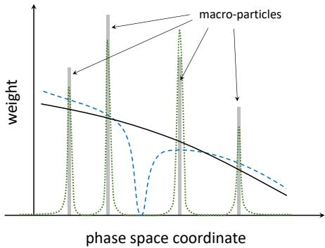

图 1 的物理含义是：如果不增加新的宏粒子，只在已有粒子上随机改变权重，至少不会把粒子放入原本没有采样点的位置。代价是单次 realization 的统计噪声会增加，但平均分布可以保持。

### 2.2 期望权重条件

初始有 $n$ 个宏粒子，第 $i$ 个权重为 $w_i$。重采样有若干 outcome，第 $k$ 个 outcome 的概率为 $p_k$，该 outcome 给第 $i$ 个粒子的权重为 $w_i^k$。agnostic 条件是

$$
\langle \hat w_i \rangle = \sum_k w_i^k p_k = w_i, \qquad i=1,\ldots,n.
$$

这条关系的推导很直接：把每个 outcome 下的权重乘以 outcome 概率并求和，要求结果回到旧权重。另一个必要条件是至少一个权重变成零，这样才能真正删除宏粒子。

作者随后定义任意分布 $G=\partial N/\partial g$。把 $g(\mathbf{x}_i,\mathbf{p}_i,\sigma_i)$ 落入区间 $d_j$ 的粒子权重相加，可得

$$
G_j(\mathcal A)=\frac{1}{V(d_j)}\sum_{g(\mathbf{x}_i,\mathbf{p}_i,\sigma_i)\in d_j}w_i.
$$

由于 agnostic 重采样不改变粒子的坐标、动量和其他内部状态，也不引入新粒子，重采样后分布的期望为

$$
\left\langle G_j(R(\mathcal A))\right\rangle_R
=\frac{1}{V(d_j)}\sum_{g(\mathbf{x}_i,\mathbf{p}_i,\sigma_i)\in d_j}
\langle \hat w_i\rangle_R
=G_j(\mathcal A).
$$

因此它不是“单次结果严格不变”，而是“对随机 realization 取平均后，任意由 $g$ 定义的分布保持”。这一区分是后文评估噪声和局部非线性的关键。

## 3. down-sampling 策略

论文用 $k$ 表示重采样前后宏粒子数的目标比值。

### 3.1 simple thinning

每个粒子以 $1-k^{-1}$ 的概率删除，以 $k^{-1}$ 的概率保留并把权重乘以 $k$。期望权重为

$$
0\cdot(1-k^{-1})+kw_i\cdot k^{-1}=w_i.
$$

它最容易实现，也能作用在很小的相空间子集上，但不严格守恒总权重、能量或动量。独立随机决定会产生很宽的权重尾部，后文证明这可能激发局部 PIC 数值不稳定。

### 3.2 leveling 与 globalLev

leveling 先在 cell 内计算平均权重 $\bar w$。对于 $w_i<k\bar w$ 的粒子，以 $w_i/(k\bar w)$ 的概率把它提升到 $k\bar w$，否则删除。于是期望仍为 $w_i$，同时主动去掉低权重粒子，改善计算资源分布。globalLev 把平均权重的统计区域从 cell 扩展到整个 computational domain；论文的并行实验按 domain 独立处理，避免额外网络传输。

### 3.3 number-conservative thinning

令 $W=\sum_iw_i$，每次按 $w_i/W$ 选择粒子，重复 $m$ 次，记第 $i$ 个粒子被选中的次数为 $c_i$。$c_i=0$ 的粒子删除，其余粒子赋予

$$
\hat w_i=\frac{c_iW}{m}.
$$

因为 $\langle c_i\rangle=mw_i/W$，所以它满足 agnostic 条件；同时

$$
\hat W=\sum_i\frac{c_iW}{m}=W
$$

在每个 cell 内严格保持总权重。剩余粒子数的期望是

$$
\hat n=\sum_{i=1}^{n}\left[1-\left(1-\frac{w_i}{W}\right)^m\right].
$$

若粒子权重近似相同且 $n$ 很大，可用

$$
m\approx-n\ln(1-k^{-1})
$$

选择抽样次数，使平均剩余粒子数约为 $n/k$。这个方法优先删除低权重粒子，并严格保存 cell 总粒子数/电荷。

### 3.4 energyT 与 conserv

energyT 仍抽样 $m$ 次，但按单粒子能量贡献 $e_iw_i/E$ 选择，$E=\sum_i e_iw_i$。被选粒子的权重设为 $c_iE/(e_im)$，从而严格保持 cell 总能量，但不严格保持总权重。

conserv 把要保持的物理量写成线性不变量

$$
A=\sum_i a_iw_i.
$$

多个不变量构成线性方程组。当粒子数多于不变量数量时，可以找到至少一个权重为零且其余权重为正的解，再用概率选择两个解，使每个粒子的期望权重不变。论文的 `conserv` 版本同时保持总能量、三分量动量、总电荷/权重和三个坐标的一阶中心矩，共 8 个不变量；`conserv2` 再加入三个空间二阶中心矩，共 11 个。

中心矩越多，空间均匀性通常越好，但需要更大的粒子集合才能求解；中心矩越少，算法能作用于更小、更局部的 cluster。这是“守恒量数量”和“局部适用性”的结构性权衡。

### 3.5 mergeAv 与 merge

mergeAv 在每个 cell 内按动量空间 k-means 找 cluster，把 cluster 替换为位于平均坐标、平均动量且权重为总权重的单个宏粒子。k-means 的成本可能很高，而且平均位置会把粒子系统性推向分布峰值。

merge 方法把 cluster 的总权重放到 cluster 中随机抽取的原粒子位置，减轻坐标收缩；但它仍可能压窄动量分布。论文由此区分了两个问题：如何选择待合并 cluster，以及对一个已选 cluster 使用什么守恒/重采样算法。

## 4. 两个基础测试

### 4.1 稳态均匀等离子体

作者在周期边界的 $32^3$ cell 均匀电子-正电子等离子体中，在一次振荡周期后重采样，十个振荡周期后测温度。初始温度为 $T_0=0.001mc^2$，比较每 cell 100 和 1000 个宏粒子及多种 $k$。

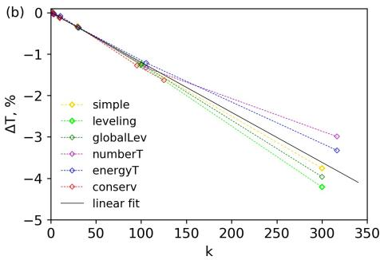

agnostic 方法虽然平均保持粒子分布，但改变权重会让电荷与背景的局部平衡瞬间改变，从而在电场中留下能量。论文得到近似关系

$$
\Delta T\approx-\frac{0.12}{\mathrm{ppc}_f}T_0,
$$

其中 $\mathrm{ppc}_f$ 是重采样后的每 cell 宏粒子数。也就是说温度下降主要由最终采样密度决定，而不独立取决于初始 ppc 和 $k$。图 3 显示 merge 方法的温度偏差通常比 agnostic thinning 大约一个数量级以上，原因是把热的各向同性动量直接压到均值会损失动能。

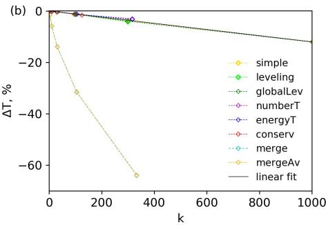

### 4.2 Weibel 不稳定性与密度方差

第二个测试是两个反向高速电子流中的 Weibel 不稳定性。作者在横向密度加入周期种子，在增长初期只执行一次重采样，并测量各网格 cell 的物理粒子密度方差。

对 simple thinning，一个权重为 $w$ 的宏粒子以 $1/k$ 概率变成 $kw$，否则变为零。因此单粒子物理粒子数的方差为

$$
D[N_{\mathrm{phys}}]=(k-1)w^2.
$$

若 cell 内有 $N$ 个等权粒子、cell 体积为 $\Delta V$，密度 $n=Nw/\Delta V$，独立方差相加后得到论文公式 (6)：

$$
D[n]=\frac{N(k-1)w^2}{(\Delta V)^2}
=\frac{n(k-1)w}{\Delta V}
=\frac{n^2(k-1)}{N}.
$$

它预测 simple/leveling/globalLev 的方差增量随 $k-1$ 近似线性。numberT/energyT 的方差较低且伴随小幅振荡；merge、conserv、conserv2 的方差显著更低，但 merge 的优势依赖对坐标和动量尺度的先验认识。

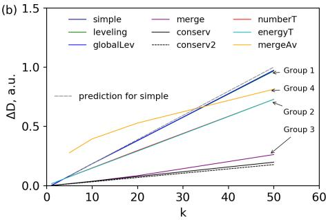

论文的重要解释是：conserv 即使不需要预先知道物理尺度，也能通过保持一阶空间中心矩维持空间均匀性；conserv2 加入二阶中心矩后还有小幅改善，但需要更大的 cluster。

## 5. QED cascade 场景

QED cascade 中，线性阶段的粒子密度还不足以显著反作用于场，重采样主要影响粒子分布和局部 cascade rate；非线性阶段的高密度粒子会改变场结构，重采样误差会反过来改变 plasma-field dynamics。因此“有无 resampling 的差异”必须按阶段解释。

### 5.1 线性驻波 cascade

作者用 $E_0=1000m\omega_0c/e$ 的线偏振驻波，初始电子和正电子均匀填充 $\lambda_0\times\lambda_0\times\lambda_0$ 盒子，每两步在粒子数超过阈值时按 $k=2$ 重采样。以无重采样运行作为 benchmark，并定义增长率

$$
\Gamma=\frac{\ln N_e(7T)-\ln N_e(3T)}{4T}.
$$

论文还用相对均方偏差

$$
\eta=\sqrt{\frac{1}{7T}\int_0^{7T}
\frac{(N_{e,\mathrm{res}}-N_{e,\mathrm{w/o}})^2}
{N_{e,\mathrm{w/o}}^2}\,dt}.
$$

图 5 显示 leveling 最接近无重采样，$\eta=0.006$；globalLev、conserv、energyT 约为 $0.018$；merge、mergeAv 和 numberT 约为 $0.08$--$0.1$；simple 达到约 $0.5$，增长率误差约 72%。thinning 方法运行约千秒，较无重采样约 22000 秒快约 20 倍；k-means merge 约万秒，只约快 2 倍。

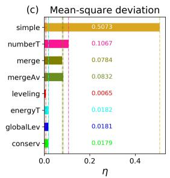

### 5.2 非线性驻波 cascade

在 $a_0=3500$、$800$ nm 线偏振驻波中，论文比较不同 resampling 的总场能量。agnostic 方法除 simple 外给出相互接近、约 5% 内的结果；simple 多次随机种子尝试都在早期产生非物理场能量暴涨并终止。原因不是平均密度错误，而是某些 cell 中单个宏粒子权重偶然放大到 $k$ 倍，局部等离子体频率超过时间步能够解析的范围，随后产生数值不稳定。

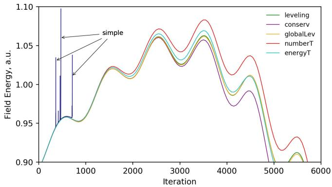

该结果给出一个工程规则：平均守恒不足以保证 PIC 稳定；还要限制局部权重尾部、局部密度和由此产生的时间尺度。

### 5.3 27 PW 偶极波中的电子-正电子 plasma pinching

第三个场景在 PICADOR 中模拟 27 PW 偶极波、$512^3$ 网格和 $0.015$ fs 时间步，比较线性 cascade 到非线性 pinch 的全过程，$k=2$。图 7 给出最大电子-正电子密度和圆柱内总粒子数；图 8 比较线性阶段空间密度图，图 9 比较光子和电子能谱。

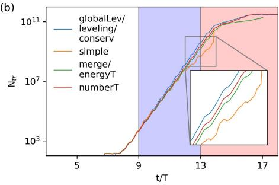

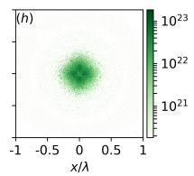

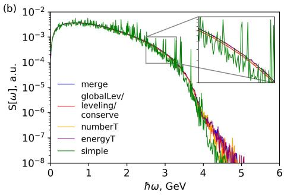

benchmark 组为 globalLev、leveling 和 conserv，三者增长率差约 $10^{-3}$；numberT 偏差约 3%，merge/energyT 约 5%，simple 约 10%。图 10 显示 simple 产生最宽的权重分布，最大权重可达到临界危险量的数十倍；globalLev 的最大权重低一到两个数量级，表示更平滑的统计采样。

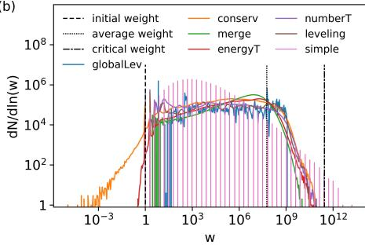

进入非线性阶段后，图 11 的空间密度与图 12 的能谱显示，globalLev、leveling、conserv、numberT 互相接近，merge 和 energyT 形成不同程度的偏差。这里没有无重采样 benchmark，论文因此采用多个相互独立的方法交叉确认，而不是把其中任一方法当作绝对真值。

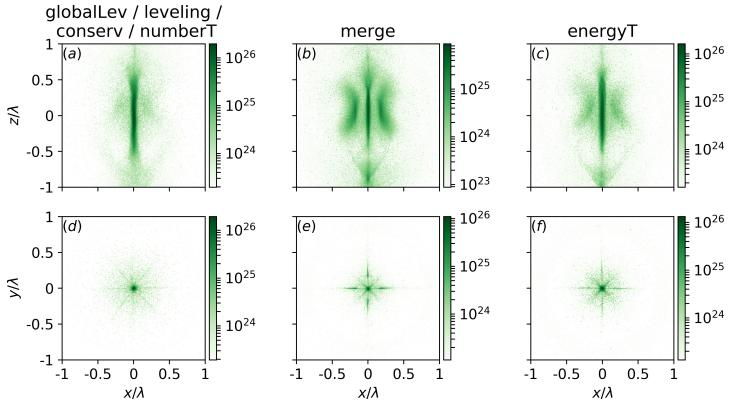

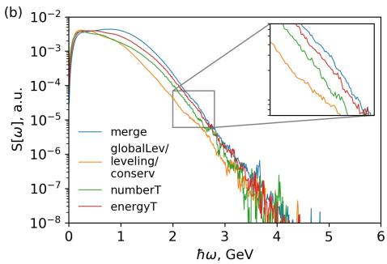

## 6. 结论

论文结论不是“某一种方法普遍最好”，而是把目标拆成三类：是否需要严格保持总权重/电荷、是否需要保持能量或多个矩、以及是否必须避免局部权重尾部和未知尺度损失。simple 最便宜但可能产生非物理局部密度；merge 能在已知尺度下维持分布均匀性但 k-means 成本高且需要 cluster 先验；agnostic conservative 方法在未知尺度场景下更稳健，但保持更多不变量会提高最小可操作 cluster 大小。

## 7. 与 WarpX 的边界

当前 WarpX 第 4 章已记录 `Resampling`、`LevelingThinning` 和 `VelocityCoincidenceThinning` 的源码入口与 regression consumer。Muraviev 论文提供的是方法分类、agnostic 期望守恒、权重噪声机制和 QED cascade 评估框架；它不能证明 WarpX 的实现采用同样的随机过程，也不能把 PICADOR 的 growth rate、运行时间或图 5--12 数值直接复制为 WarpX 结果。

本书当前最准确的分类是：`FULLTEXT_PAPER_BACKED_RESAMPLING_METHODS_WARPX_MAPPING_RUNTIME_SEPARATE`。下一步若要闭合论文到 WarpX 的更强证据，需要专门的 WarpX resampling physics consumer，至少同时读取粒子权重分布、cell 内总权重/能量/动量以及重采样前后局部 density noise；现有 checksum-only regression 不足以完成这一点。

## 8. 开放问题与复习速记

### 8.1 理论问题

- agnostic 只保证 ensemble average，不保证单次 realization 的局部守恒。
- 保持更多中心矩会提高空间均匀性，但会抬高可重采样 cluster 的最小粒子数。
- merge 的优点依赖已知坐标/动量尺度，不能自动适用于未知 QED 新尺度。

### 8.2 验证问题

- 应区分总权重守恒、能量守恒、动量守恒、density variance 和 weight-tail ceiling。
- 指数增长过程中直接对粒子数取算术平均会产生 log bias；增长率估计需要注意 geometric-mean 结构。
- PICADOR 论文案例和 WarpX 当前 regression 必须分开记录 producer、consumer 和证据等级。

一句话速记：**agnostic 重采样用期望权重不变换取对未知分布的稳健性，但单次运行仍会增加噪声；实际选择必须同时看守恒量、局部权重尾、物理时间尺度和计算成本。**
