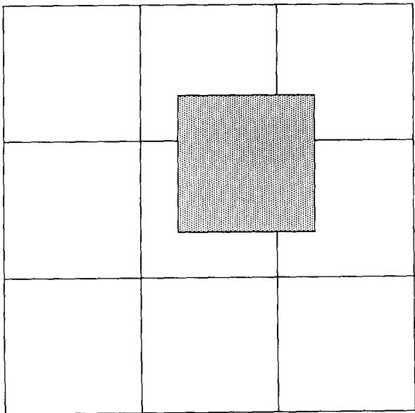
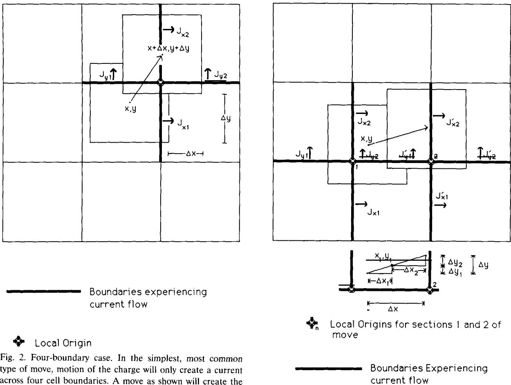
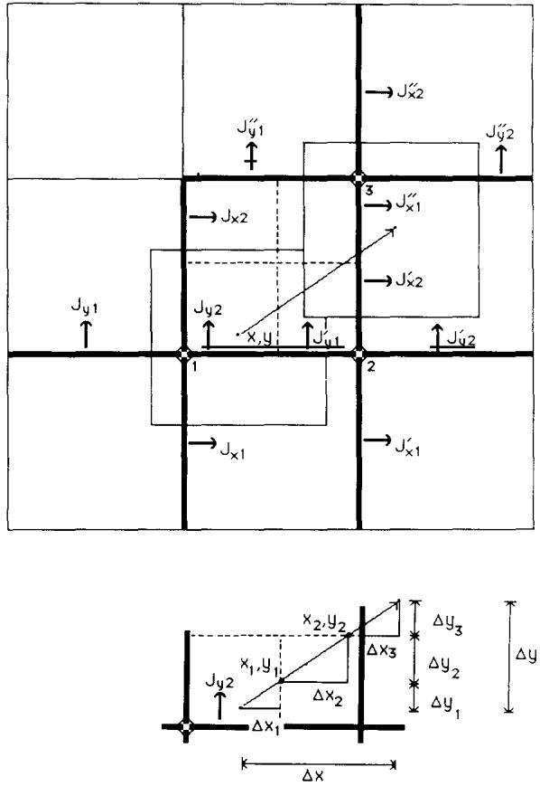
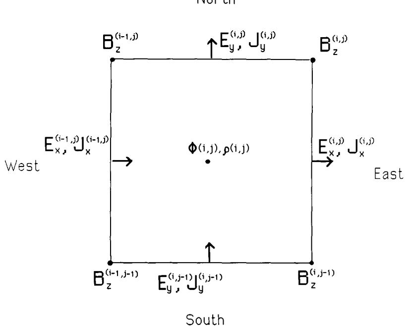
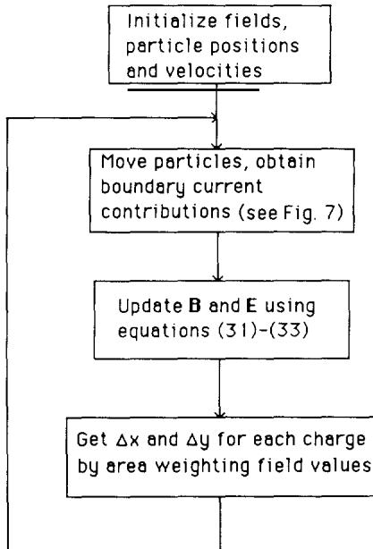
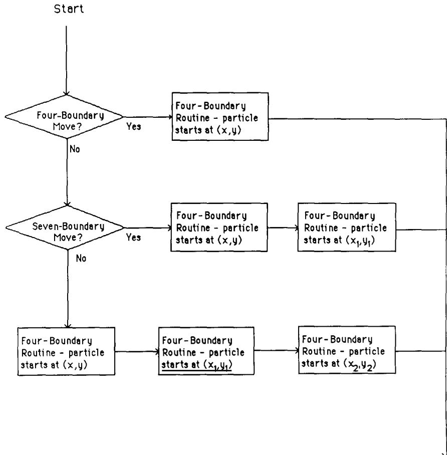
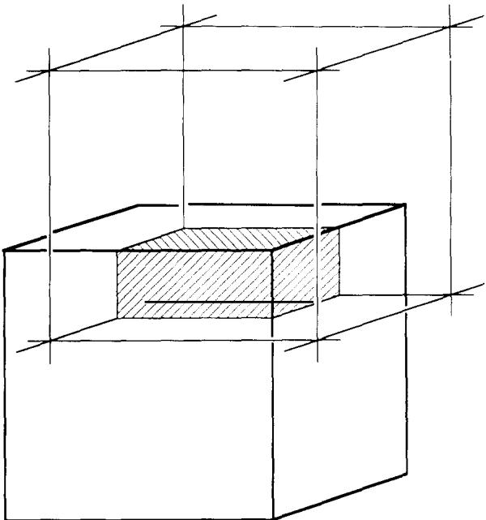
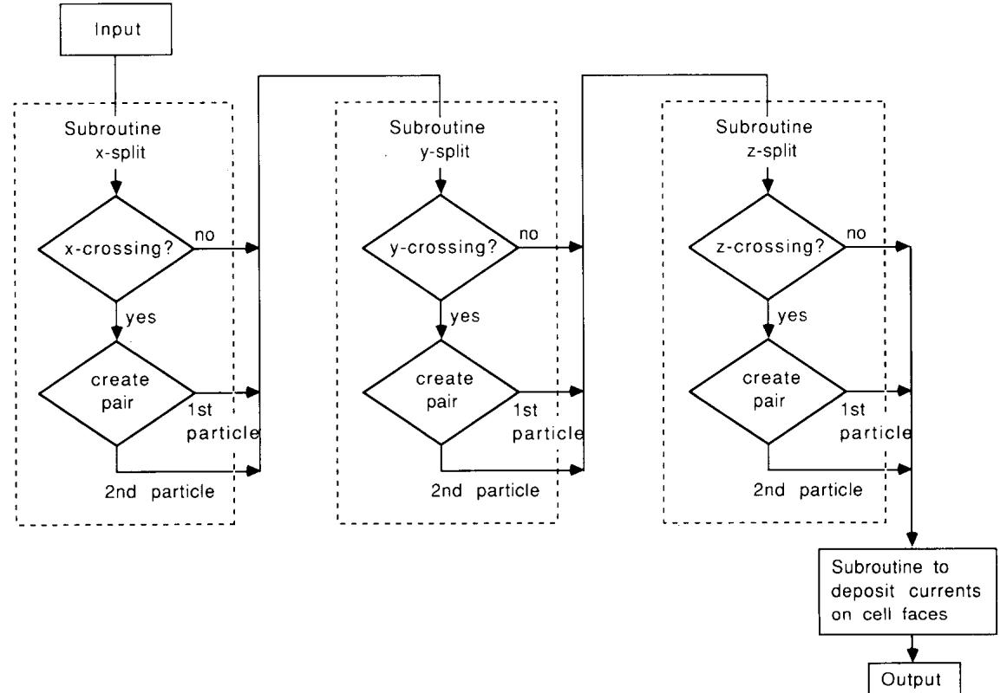

# Rigorous charge conservation for local electromagnetic field solvers

John Villasenor Jet Propulsion Laboratory,480o Oak Grore Dr., Pusadena,CA 91109.USA

and

Oscar Buneman Department of Electrical Engineering,Stanford Unirersity.Stanford,CA 94305-4055.USA

Received 23 January 1991: in final form 12 June 1991

Inthis paper we present a rigorous method for finding the electric field in two-and-one-half and three dimensional electromagneticplasma simulations without resorting tocomputationallexpensive transforms.Afinitegrid interpretation of the divergence equation $\Gamma \cdot J = - \mathrm { i } \rho / \mathrm { \partial } t$ is offered which allows the current density and thus new local electric and magnetic field strengths to be determined directly from knowledge of charge motion.

# 1. Introduction

Field equations are most commonly solved by transform methods in simulations. The ready availability of efficient transform codes cncourages one to use such “spectral methods. So does our custom to describe, interpret,and understand field phenomena in terms of waves.

However, transform methods are “global": all of the field information,near and far, contributes to each single field harmonic. Computers of the immediate future demand minimization of data paths and therefore call for local methods. Even with hypercube topology，ideally suited to FFT implementation,the physical length of single data links will ultimitely become the bottleneck.Methods which allow one to update fields purely from local data should therefore receive renewed attention and it is gratifying to note that two of Maxwell's equations,when cast into finite difference form,already cxpress such local updating explicitely, namely:

$$
\begin{array} { l } { \displaystyle \frac { \partial \pmb { { \cal B } } } { \partial t } = - \pmb { { \cal V } } \times \pmb { { \cal E } } , } \\ { \displaystyle \frac { \partial \pmb { { \cal E } } } { \partial t } = \pmb { { \cal V } } \times \pmb { { \cal B } } - \pmb { { \cal J } } , } \end{array}
$$

(using units such that $\epsilon = 1$ 、 $\mu = 1$ and $c = 1 .$ .By staggering $\pmb { B }$ componcnt and $E$ component data suitably in both space and time ("leapfrogging), these equations provide new data from old, using present values only immediately to the east,west, north,and south (see fig.5),and above and below in three dimensions [1,7].

By contrast, the two divergence cquations,

$$
\begin{array} { l } { \boldsymbol { \nabla \cdot E } = \rho , } \\ { \qquad } \\ { \boldsymbol { \nabla \cdot B } = 0 , } \end{array}
$$

require distant information (spatial boundary conditions） for their solution,particularly in the case of static conditions.Coupled with $\nabla \times E = \mathbf { 0 }$ and $\nabla \times \pmb { B } = \pmb { J } ,$ ,they then lead to elliptic equations for the components (or for the associated potentials).Transform methods,or other global, direct non-iterative poisson solvers would therefore seem inevitable.

Fortunately, the dynamic problem of field evolution can be solved by means of the evolutionary,local equations(1) and (2) alone,after imposing the divergence equations(3) and (4) only as initial conditions.One readily checks that $\nabla \cdot \pmb { B }$ remains zero if it was so initially and that this is rigorously true also for the simple space-andtime-centered finite difference versions of $\partial / \partial t$ ， curl and div that go with the data arrangement shown in fig.5.One also checks that $\nabla \cdot \boldsymbol { E }$ remains $\rho$ by virtue of the conservation condition

$$
{ \frac { \partial \rho } { \partial t } } = - \nabla \cdot \boldsymbol { J }
$$

on the charge density.

What we shall be concerned with in this paper is to make sure that the finite-difference implementation of the charge conservation law (5） is also consistent with the finite difference version of $\partial / \partial t$ , div and curl as applied to $\pmb { { \cal E } }$ and $\pmb { B }$ In other words,if we generate $\pmb { { \cal E } }$ time step after time step from the finite-difference versions of (1) and (2) and calculate $\nabla \cdot \boldsymbol { E }$ ， the resulting $\rho$ should satisfy (5） exactly in this finite-difference version.

Enforcing the initial conditions on the divergences of $\pmb { \cal E }$ and $\pmb { B }$ at time $t = 0$ now remains as a once-only task. Given the initial $\pmb { \rho }$ (and some boundary conditions), one can either use a transform or other non-local method for this first step, or one can let $\pmb { \rho }$ evolve from zero to its initial state transiently in a certain number of preliminary steps,starting with source-free $\pmb { { \cal E } }$ and $\pmb { B }$ that satisfy the boundary conditions.Such $E$ and $\pmb { B }$ are in many cases known analytically.

Experiments performed on a personal computer by one of us have shown that the static field is approached satisfactorily in transience provided (1) that the charge distribution $\rho$ is switched on gently and (2) that enough steps are taken to let the initial radiation escape across the computational boundary. (Non-reflecting boundary conditions,such as Lindman's [5] become important here.)

In a two-dimensional $N \times N$ grid this number of steps is of the order $N$ with a computational effort of order $N ^ { 2 }$ per step. The transform effort is of the order $N ^ { 2 } \ \log _ { 2 } \ N$ 、However,since the local Maxwell algorithm is so much simpler than even the most elegant transform algorithm, the transient,local method wins over the global transform method even on present-day computers on which the length of data paths is not yet an issue.

In the first proposal for solving the field problem locally (Buneman [1]) strict charge conservation was to be achieved with a technique called “zero-order current weighting".In this method, a charge crossing a cell boundary furnishes an impulse of current proportional to the value of the charge. While charge is conserved, the current discontinuities introduced generate large amounts of noise. The nature of this noise is discussed in Birdsall and Langdon [2]. Morse and Nielson [3] discuss first-order current weighting,where the charge is taken to be evenly distributed across a square of unit size and the particle mover calculates currents by breaking a general translation into two orthogonal moves of magnitude $\Delta x$ and $\Delta y$ .Most recently, Marder [4] described a simulation method which allows eq. (5) to be approximately satisfied,and the error,or“pseudo-current’ is kept small. Both our particle mover and those discussed by Morse and Nielson are able to rigorously satsify eq. (5); the crucial difference is that we do not break up the charge motion into orthogonal moves.

# 2.Calculating the fluxes and currents

Instead of updating the “longitudinal” and “transverse” parts of the $\pmb { { \cal E } }$ -field separately,as is often done in field solvers which employ spatial Fourier transforms,we update $\pmb { { \cal E } }$ entirely from Maxwell's ${ \partial { E } } / { \partial t } = \nabla \times { B } - J .$ 、In the process the curl $\pmb { B }$ term will, of course,only cause changes in the transverse part of $E$ .However,when $J$ has a longitudinal part - which by virtue of $\nabla \cdot \boldsymbol { J } =$ $- \partial \rho / \partial t$ means when the charge density changes - we get changes in the longitudinal part of $E$ i.e.its flux,by just the change in $\rho$ ，as it should be.In other words,there is no need to calculate the longitudinal part of $E$ separately except at the very beginning (at time $t = 0$ .This supposes that the finite-difference form of current deposition is consistent with the continuity equation,i.e. that the flux of $J$ represents the change in the charge distribution $\rho$ rigorously.

The transverse part of $\pmb { { \cal E } }$ is affected also by the magnetic field $\pmb { B }$ .The record of $\pmb { B }$ has to be updated at every step by the transverse part of $\pmb { { \cal E } }$ ， in accordance with Maxwell's $\partial \pmb { B } / \partial t = - \pmb { \nabla } \times \pmb { E }$ In doing this,one accounts fully for both TE modes as well as TM modes which are excited by the motion of the charges.

We start the simulation by adopting the particle-in-cell method - creating a grid consisting of squares of unit size,and placing on it unit square charges. The charges may be located at arbitrary places,and can be assigned either positive or negative values. The total amount of charge is assumed to be uniformly distributed over its surface，and as fig.1 shows,each charge will in general contribute to the charge density in four cells. The fractions contributed to each of the four cells are proportional to the rectangular areas of the charge square intercepted by the cells.This is “area weighting" (see ref.[2]).

With each step of the simulation,each charge is instructed to move a certain distance in a certain direction.Since current density is in the discrete case represented by motion of charge into or out of a cell,it can be seen by the divergence equation （5） that each boundary will be swept over by an area of the square charge that exactly corresponds to the current in a given direction into or out of that cell. Although most moves will affect the current on only four boundaries,motion of a single charge can in general cause currents across four,seven,or ten boundaries and it is thus necessary to account for all of these possibilities in the particle mover. In the following figures showing how these cases are treated,we have exagerrated the magnitude of the moves for purposes of illustration; in thc actual simulation the time step must satisfy the Courant condition, $\Delta t < \Delta x { \dot { / } } { \sqrt { 2 } }$ for a square mesh in two dimensions. This limits the charge displacements to less than $\Delta x / \sqrt { 2 }$ per step.

  
Fig.1.Particle-in-cell.A charge with square cross-section moves in a simulation space divided into cells also having square cross-section.

The simplest and most common type of charge motion involves four boundaries.The action of the charge sweeping across the cell boundaries gives rise to currents $J _ { { _ { x 1 } } } , J _ { { _ { x 2 } } } , J _ { { _ { y 1 } } } , J _ { { _ { y 2 } } }$ ，asindicated in fig. 2.

Defining the“local origin”for any charge to be the intersection of cell boundaries nearest to the charge center at the start of its motion and the coordinates $x$ and $y$ to be the location of the cell center relative to this origin,we can then write the currents (assuming unit charge) as:

$$
\begin{array} { r } { J _ { x 1 } = \Delta x \Big ( \frac { 1 } { 2 } - y - \frac { 1 } { 2 } \Delta y \Big ) , } \\ { J _ { x 2 } = \Delta x \Big ( \frac { 1 } { 2 } + y + \frac { 1 } { 2 } \Delta y \Big ) , } \\ { J _ { y 1 } = \Delta y \Big ( \frac { 1 } { 2 } - x - \frac { 1 } { 2 } \Delta x \Big ) , } \\ { J _ { y 2 } = \Delta y \Big ( \frac { 1 } { 2 } + x + \frac { 1 } { 2 } \Delta x \Big ) . } \end{array}
$$

These equations give the amount of charge crossing a cell boundary. For instance,for the $J _ { { _ \nu } ! }$ equation, the depth of charge moved is $\Delta y$ .the width is ${ \frac { 1 } { 2 } } - x$ at the start of the move and decreases linearly to $\begin{array} { r } { \frac { 1 } { 2 } - x - \Delta x } \end{array}$ at the end; the average width,which is relevant for linear motion, is $\begin{array} { r } { \frac { 1 } { 2 } - x - \frac { 1 } { 2 } \Delta x } \end{array}$ . Note that the main computational effort is four multiplications,no more than in the area weighting procedure which is necessary when the longitudinal electric field is calculated from charge densities.For the fourboundary case (but not for the seven- and tenboundary cases discussed below） our currents, given in eqs. (6)-(9),are the same as those calculated by Morse and Nielson. In general charges may move in a way that they will affect the current on more than four boundaries.A more complex case is the seven-boundary move, shown below in fig. 3.

  
four fluxes $J _ { x 1 }$ $, J _ { x 2 } , J _ { y 1 }$ and $J _ { y 2 }$ as given in eqs.(6)-(9). The coordinates $( x , y )$ describing the location of the charge center at the start of the move are measured relative to the“local origin.”   
Fig.3.Seven-boundary case.A charge can also move in a way which affects the flux across seven boundaries.The total move of △x,△y can be treated as a four-boundary move of △x, △y， followed by another four-boundary move of △x2,△y2. See eqs.(10)-(15)in text.

The seven boundary case can be treated as two four-boundary moves - the first with the charge center starting at $x , \ y$ and moving a distance $\Delta x _ { 1 } , \Delta y _ { 1 }$ and the second with the charge moving from $x _ { 1 } , \ y _ { 1 }$ a distance $\Delta x _ { 2 } , \ \Delta y _ { 2 }$ There are actually four “cases” of seven boundary moves, depending on the direction of charge motion. Equations for the case where the right edge of the charge comes to rest with x >1 are given below:

$$
\Delta x _ { 1 } = 0 . 5 - x ,
$$

$$
\begin{array} { r l } & { \Delta y _ { 1 } = \left( \Delta y / \Delta x \right) \Delta x _ { 1 } , } \\ & { } \\ & { x _ { 1 } = - 0 . 5 , } \\ & { } \\ & { y _ { 1 } = y + \Delta y _ { 1 } , } \\ & { \Delta x _ { 2 } = \Delta x - \Delta x _ { 1 } , } \\ & { } \\ & { \Delta y _ { 2 } = \Delta y - \Delta y _ { 1 } . } \end{array}
$$

The currents contributed by the first part of the move, from $x , y$ to $x _ { 1 } , \ y _ { 1 }$ are indicated in fig.3 by $J _ { x 1 } , J _ { x 2 } , J _ { y 1 }$ and $J _ { { _ { y 2 } } }$ . The second portion of the move starts at $x _ { 1 } , \ y _ { 1 }$ and contributes the currents $J _ { x 1 } ^ { \prime } , J _ { x 2 } ^ { \prime } , J _ { y 1 } ^ { \prime }$ and $J _ { y 2 } ^ { \prime }$ . Note that the boundary connecting the local origins referenced in the first and second portions of the move, respectively,receives two current contributions.

In unusual cases,a charge can influence the current on ten boundaries. Just as a seven boundary move could be analyzed in terms of two four-boundary moves,a ten-boundary move can be decomposed into three distinct four-boundary moves.There are eight possible cases of a tenboundary move， depending as in the seven boundary case on the exact path which the charge follows. For a charge moving as shown in fig. 4, we have the following moves:

<table><tr><td>Move</td><td>Starting position</td><td>△x.△y</td></tr><tr><td>1</td><td>x.y</td><td>△x,△y</td></tr><tr><td>2</td><td>x，y</td><td>△x,△y2</td></tr><tr><td>3</td><td>x，y2</td><td>△x,△y3</td></tr></table>

where

  
Fig.4.Ten-boundary case.The most complex move will affect current across ten boundaries. This move is treated as three successive four-boundary moves.as described by eqs.(18)- (27).

move denoted by $J ^ { \prime }$ and the contributions from the third move by $J ^ { \prime \prime }$

$$
\begin{array} { r l } & { \Delta x _ { 1 } = 0 . 5 - x , } \\ & { \Delta y _ { 1 } = \left( \Delta y \middle / \Delta x \right) \Delta x _ { 1 } , } \\ & { x _ { 1 } = - 0 . 5 , } \\ & { y _ { 1 } = y + \Delta y _ { 1 } , } \\ & { \Delta y _ { 1 } = 0 . 5 - \mathrm { - } \Delta y _ { 1 } , } \\ & { \Delta x _ { 2 } = \left( \Delta x \middle / \Delta y \right) \Delta y _ { 2 } , } \\ & { x _ { 2 } = \Delta x _ { 2 } = 0 . 5 , } \\ & { y _ { 2 } = 0 . 5 , } \\ & { \Delta x _ { 3 } = \Delta x - \Delta x _ { 1 } - \Delta x _ { 2 } } \\ & { \Delta y _ { 3 } = \Delta y - \Delta y _ { 1 } - \Delta y _ { 2 } } \end{array}
$$

# 3. Field updating

In a two-and-one-half dimensional simulation (one in which currents and fields in the $z$ direction are calculated but variations $\partial / \partial z$ arc assumed to be zero) the curl equations(1) and (2), can be expressed as:

$$
\frac { \partial B _ { z } } { \partial t } = \frac { \partial E _ { x } } { \partial y } - \frac { \partial E _ { y } } { \partial x } ,
$$

Again, the currents $J _ { x 1 } , J _ { x 2 } , J _ { y 1 }$ and $J _ { { } _ { y } 2 }$ are shown，with the contributions from the second

$$
\frac { \partial E _ { x } } { \partial t } = \frac { \partial B _ { z } } { \partial y } - J _ { x } ,
$$

$$
\frac { \partial E _ { y } } { \partial t } = - \frac { \partial B _ { z } } { \partial x } - J _ { y } .
$$

Using the staggered grid and compass directions as given in fig.5 and refs.[2,7] the above equations are implemented in the following finite-difference form,where the ratio $\delta t / \delta x$ relates the grid size and time scale,and must be chosen to satisfy the Courant condition:

$$
\begin{array} { r l } & { \boldsymbol { B } _ { z } ^ { \mathrm { n e w } } - \boldsymbol { B } _ { z } ^ { \mathrm { o l d } } } \\ & { \quad = \cfrac { { \hat { \boldsymbol { \delta } } } t } { \hat { \boldsymbol { \delta } } x } \left( \left( \boldsymbol { E } _ { x } ^ { \mathrm { n o r t h } } - \boldsymbol { E } _ { x } ^ { \mathrm { s o u t h } } \right) - \left( \boldsymbol { E } _ { y } ^ { \mathrm { e a s t } } - \boldsymbol { E } _ { y } ^ { \mathrm { w e s t } } \right) \right) , } \end{array}
$$

$$
\begin{array} { r l r } & { \displaystyle E _ { x } ^ { \mathrm { n e w } } - E _ { x } ^ { \mathrm { o l d } } = \frac { \hat { 8 } t } { 8 x } \big ( B ^ { \mathrm { n o r t h } } - B ^ { \mathrm { s o u t h } } \big ) - \hat { 8 } t J _ { x } , } & \\ & { } & \\ & { \displaystyle E _ { y } ^ { \mathrm { n e w } } - E _ { y } ^ { \mathrm { o l d } } = - \frac { \hat { 8 } t } { 8 x } \big ( B ^ { \mathrm { e a s t } } - B ^ { \mathrm { w e s t } } \big ) - \hat { 8 } t J _ { y } , } & \end{array}
$$

These finite-difference equations can also be interpreted as statements of the integral form of Maxwell's equations. For instance,eq. (32) states that the change of $E$ -flux out of the east face of a cube erected over the square in fig.5 equals the circulation of $\pmb { B }$ around the face,minus the current through the face.Once the updated $\pmb { { \cal E } }$ and $\pmb { B }$ fields have been calculated, the locations of the particles must be incremented. The choice of method for determining the force due to fields located on cell boundaries on particles which are at arbitrary locations is extremely important. If the“self-force” (the electric force a particle exerts on itself) is not zero, the grid will contain a potential well at each cell center. Several methods of interpolating field values to charge locations have been tried, including twisted plane and linear interpolations as well as area weighting. It was found that area weighting (just like that used to determine charge density in fig.1) sucessfully

North

  
Fig.5. Standard cell at location $( i , j )$ showing field locations and indexing conventions.Currents $\pmb { J }$ and electric fields $\pmb { \mathcal { E } }$ lie in the plane of the paperandarecalculatedatcelledges with positive direction indicated bythearrows;the magnetic field $\pmb { B }$ is perpendicular to the plane of the paper and is given at cell corners. Charge density $\pmb { \rho }$ and electric potential $\phi$ are associated with the cell center.

eliminates self-force [2]. The weights must be applied to field components which have been averaged to the field centers.

# 4.Implementation

A simulation program implementing this rigorous charge conservation was written for a grid size of $1 2 8 \times 1 2 8$ . An equal number of positive and negative charge are placed at random locations throughout the grid,and the initial potential is calculated using two-dimensional Hartley transforms [6] to solve Poisson's equation. When moving each particle,the program first uses its initial and final positions to determine if the move will effect only four boundaries.If,as is usually the case it is a four-boundary move,eqs.(6)-(9) are applied and the program proceeds to the next charge.If the move is more complicated,a second routine checks for a seven-boundary case.If necessary,a ten-boundary routine is called.Although the number of operations involved in advancing a particle increases with the complexity of the move,it should be noted that the majority of moves will call the simple four-boundary case, requiring only two shifts, four multiplies,and six additions. The relative frequency of occurrence of four-,seven-,and ten-boundary cases obviously depends on the velocity distribution of the simulation,but even in a system where many particles approach the velocity of light ten-boundary moves will remain unusual.

After all the particles have been moved and their contributions to current density calculated, the program updates the fields with finite-difference equations (31)-(33) and then finds the force on each particle through the area-weighting technique described earlier. It should be emphasized that the $E$ field generated at each stage of the simulation using this technique is identical to that produced by area weighting;no sacrifice in accuracy is made. Figure 6 shows the simulation flow chart,and the actual particle mover is presented in fig. 7.

In our testing,the initial $\pmb { { \cal E } }$ -field was created from a charge distribution and the initial $\pmb { B }$ -field was zero,and as expected, $\pmb { B }$ remained zero after one step because of the initial curl-free $E$ After eqs.(32) and(33) had been used to advance the electric field to its new state, the divergence of the new $E$ -field was then calculated as $( E _ { x } ^ { \mathrm { e a s t } } -$ $E _ { x } ^ { \mathrm { w e s t } } + E _ { y } ^ { \mathrm { n o r t h } } - E _ { y } ^ { \mathrm { s o u t h } } ) / 8 x$ and compared with the $\rho$ deduced using the actual new positions of the particles. It was found that the two methods agreed to within roundoff, confirming that local field updating can be accomplished at great time savings and without any loss of accuracy.

  
Fig.6.Simulation flow chart.General flow of a simulation program showing initialization，following by repeated passes through particle mover and field updating.

# 5.Extension to three dimensions

In three dimensions,“area weighting” becomes “volumc weighting". This can be interpreted as making each particle into a uniformily charged cube of the same size as a cell, with the center at the nominal particle position. In general,the particle cube will occupy parts of eight neighboring cells. The cell mesh will cut the cube up into eight rectangular blocks. Figure 8 shows a particle cube penetrating into the cell nearest the viewer.

The cells are indexed by the integral position coordinates $x = i , \ y = j , \ z = k$ of their centers. Given a particle (i.e. the center of the particle cube）at location $x = i + \xi$ ， $y = j + \eta$ ， $z = k + z$ where $\xi , \eta , \zeta$ lie between O and 1,table 1 shows what fractions of the particle lie in each of the eight cells.

These are the eight weights which must be applied to data recorded at the cell centers (such as charge density or electric potential) when depositing quantities into the arrays or when interpolating from array data. Volume weighting in this manner amounts to trilinear interpolation: linear in $x$ times linear in $y$ times linear in $z$

Each particle cube straddles twelve cell faces, four for each of the three orientations: $x$ -facing, $y$ -facing and $z$ -facing.The areas covered by the particle on the four $x$ -facing boundaries are $( 1 -$ $\eta ) ( 1 - \zeta ) , ( 1 - \eta ) \zeta , \eta ( 1 - \zeta ) , \eta \zeta$ ,and similarly for the $y$ -facing and $z$ -facing boundaries.

Table 1 Fraction of the particle in each of the eight cells   

<table><tr><td>Weighting fraction</td><td>Cell</td></tr><tr><td>(1-$)(1-n)(1-δ)</td><td>i,j,k</td></tr><tr><td>(1-n)(1-5)</td><td>i+1,j,k</td></tr><tr><td>(1-$)n(1-5)</td><td>i,j+1,k</td></tr><tr><td>(1-$)(1-n)5</td><td>i,j,k+1</td></tr><tr><td>(1-）n5</td><td>i,j+1,k+1</td></tr><tr><td>(1-n)5</td><td>i+1,j,k+1</td></tr><tr><td>n(1-5）</td><td>i+1,j+1,k</td></tr><tr><td>ns</td><td>i+1,j+1,k+1</td></tr></table>

Consider a particle which moves straight from $( i + \xi _ { 1 } , j + \eta _ { 1 } , k + \zeta _ { 1 } )$ to $( i + \xi _ { 2 } , j + \eta _ { 2 } , k + \zeta _ { 2 } )$

  
Fig.7.Particlemover.Flowgraphof particlemoverinvolvingeitherone，two,orthreecalls tothe four-boundaryroutine depending on the complexity of the move.

linearly with time,covering a displacement $\Delta x =$ $\xi _ { 2 } - \xi _ { 1 } , ~ \Delta y = \eta _ { 2 } - \eta _ { 1 } , ~ \Delta z = \zeta _ { 2 } - \zeta _ { 1 }$ in the time between $\begin{array} { r } { t = - \ \frac { 1 } { 2 } } \end{array}$ and $\begin{array} { r } { t = + \frac { 1 } { 2 } } \end{array}$ . Its midway position, reached at $t = 0$ ,is given by

$$
\begin{array} { l l } { \bar { \xi } = ( \xi _ { 2 } + \xi _ { 1 } ) / 2 , } & { \overline { { \eta } } = ( \eta _ { 2 } + \eta _ { 1 } ) / 2 , } \\ { \bar { \zeta } = ( \zeta _ { 2 } + \zeta _ { 1 } ) / 2 . } \end{array}
$$

The total flux transported into the cell indexed $i + 1 , ~ j + 1 , ~ k + 1$ across its $x$ -facing boundary shared with the cell indexed $i , ~ j + 1 , ~ k + 1$ is

$$
\begin{array} { r l } & { \int _ { \xi _ { 1 } } ^ { \xi _ { 2 } } \eta ( t ) \zeta ( t ) \mathrm { d } \xi } \\ & { \quad = \int _ { - 1 / 2 } ^ { 1 / 2 } ( \overline { { \eta } } + t \Delta y ) \big ( \widetilde { \zeta } + t \Delta z \big ) \Delta x \mathrm { d } t } \\ & { \quad = \Delta x \overline { { \eta } } \overline { { \zeta } } + \Delta x \Delta y \Delta z / 1 2 . } \end{array}
$$

This is the contribution to $J _ { x }$ at location $i + \frac { 1 } { 2 }$ $j + 1 , k + 1$ .The other three contributions are:

$$
\begin{array} { r l } & { \Delta x ( 1 - \overline { { \eta } } ) \bar { \zeta } - \Delta x \ \Delta y \ \Delta z / 1 2 } \\ & { \quad \mathrm { ~ a t ~ } \ i + \frac { 1 } { 2 } , \ j , k + 1 , } \\ & { \Delta x \ \overline { { \eta } } ( 1 - \bar { \zeta } ) - \Delta x \ \Delta y \ \Delta z / 1 2 } \\ & { \quad \mathrm { ~ a t ~ } \ i + \frac { 1 } { 2 } , \ j + 1 , \ k , } \\ & { \Delta x ( 1 - \overline { { \eta } } ) \big ( 1 - \bar { \zeta } \big ) + \Delta x \ \Delta y \ \Delta z / 1 2 } \\ & { \quad \mathrm { ~ a t ~ } \ i + \frac { 1 } { 2 } , \ j , k . } \end{array}
$$

The four contributions to $J _ { _ { y } }$ and $J _ { z }$ are obtained from eq.(36) by the cyclic rotation

$$
i , \Delta x , \bar { \xi } \Rightarrow j , \Delta y , \overline { { \eta } } \Rightarrow k , \Delta z , \tilde { \zeta } \Rightarrow i , \Delta x , \bar { \xi } .
$$

While the first term in each contribution is a plausible generalisation to three dimensions from what was obtained in eqs.(6)-(9) for two dimensions the $\Delta x \ \Delta y \ \Delta z / 1 2$ terms are new.

Addition of the three fluxes into the cell indexed $i + 1 , j + 1 , k + 1$ yields

$$
\begin{array} { r l } & { \Delta x \overline { { \eta } } \bar { \zeta } + \Delta y \bar { \zeta } \bar { \xi } + \Delta z \bar { \xi } \overline { { \eta } } + \Delta x \Delta y \Delta z / 4 } \\ & { \quad = \big ( \bar { \xi } + \frac { 1 } { 2 } \Delta x \big ) \big ( \overline { { \eta } } + \frac { 1 } { 2 } \Delta y \big ) \big ( \bar { \zeta } + \frac { 1 } { 2 } \Delta z \big ) } \\ & { \quad \quad \quad - \big ( \bar { \xi } - \frac { 1 } { 2 } \Delta x \big ) \big ( \overline { { \eta } } - \frac { 1 } { 2 } \Delta y \big ) \big ( \bar { \zeta } - \frac { 1 } { 2 } \Delta z \big ) , } \end{array}
$$

  
Fig.8.Three-dimensional version of the“particle-in-cell"

i.c.the difference between the particle fractions protruding into the cell before and after the move.This,then,confirms rigorous charge conservation.

In 3D field solvers the data on $E _ { x } , E _ { y } , E _ { z } , B _ { x }$ ： $B _ { { \scriptscriptstyle  { y } } } , \ B _ { z }$ are staggered both in space and in time [1]. $E _ { x }$ is on record midway between cell centers in the $x$ -direction (as it would be if it werc obtained by simple differencing of potentials recorded at thecellcenters),i..at ocations $i + \frac { 1 } { 2 }$ $j , k$ This $E _ { \mathrm { { s } } }$ is (but for the constant $\epsilon _ { \{ \} } ^ { \phantom { } }$ ）also the electric flux through the face centered at that location.(See fig.5 for the 2D version of this method.） Here we make the approximation that variations within a cell dimension can be treated as linear,so that central values are avarages.This flux,according to Maxwell,is incremented in a unit time step by the circulation of $B / \mu _ { \scriptscriptstyle ( ) }$ around the cell face and decremented by the current through the cell face,exactly the current which we have calculated.

The circulation of $\pmb { B }$ is obtained from $B _ { \nu }$ and $B _ { z }$ values recorded in the middles of the edges of the face. $\pmb { B }$ data are kept on the complementary mesh to that for $\pmb { { \cal E } }$ data,the mesh obtained by interchanging the roles of centers and corners of our original mesh. The face centers of the complementary mesh are the edge centers of the original mesh and vice versa. Thus the data for the circulation of $E$ ,required to update $\pmb { B }$ fluxes, are also just available where needed.

One important advantage of our method of field solving is that no separate arrays are required for recording charge densities or current densities. The currents created by the particles can be added directly to the $\pmb { { \cal E } }$ field values in the $\pmb { { \cal E } }$ update step. If, at certain stages of a run,a charge density record is desired for diagnostic purposes,it can be obtained by a single sweep over the $\pmb { { \cal E } }$ data,adding the fluxes which enter each cell through its six faces.The scheme was tested in three dimensions in just this manner, checking that the change in charge density due to the movement of some particles was as it should be.Agreement was exact to round-off.

The complementary mesh has another significance: In order to determine which eight cells are occupied by any particle one needs to know in which cell of the complementary mesh the particle (i.e. the center of the particle cube) is located. The displacements $\xi$ $\eta , \zeta$ are measured from a corner of the complementary mesh which is a center of the original mesh. If, during a move,a particle remains in the same complementary cell, its $\xi , \eta$ ，and $\zeta$ will remain between O and 1,and the same eight cells of the original mesh will be occupied by the particle. Currents will flow only through the twelve faces that separate those eight cells.

If,however,a particle leaves its complementary cell during its move,new cells of the original mesh will be affected and currents will flow through more than 12 faces.In two dimensions we identified the corresponding situation as “seven-boundary”and “ten-boundary”cases.In three dimensions we have found it expedient not to calculate exactly how many more cell faces will receive currents.Instead, we have automated the particle splitting procedure illustrated in the flow chart of fig.7 by passing each particle through four nested subroutines,as shown in fig. 9.

  
Fig.9.Flowchart showing how crossngs of the complementary mesh boundaries are handled.

The creation of pairs is done in each case by the procedure shown in eqs. (10)-(15),with a third co-ordinate to be included.

aries,and the majority of them will be simple four-boundary cases.Local current densities due to each move can be determined by application of eqs.(6)-(9) and the electric field then can be found by direct application of Maxwell's equations instead of through the Poisson solutions used hitherto.

# 6. Conclusions

# Acknowledgements

This work was supported in part by NASA under contract number NAS8-35350 and by a National Science Foundation Fellowship.

Using the techniques outlined in this paper, it is possible to run an entire simulation without resorting to Poisson's equation while still rigorously satisfying the divergence equation. Initialization can be accomplished either by letting the potential“evolve” using the method described in the introduction or by using transforms,and all steps thereafter rely on current information calculated directly from charge motion. This rigorous use of local-only information greatly simplifies updating of fields and is ideally suited to parallel processors. As a consequence of the Courant condition,it will always be possible to describe the motion of an arbitrary number of particles over any amount of time as the superposition of the appropriate number of moves. In a non-relativistic setting in two dimensions,only a small percentage of moves will affect ten bound

# References

[1] O.Buneman and W.B. Pardo，Relativistic Plasmas（Benjamin,New York,1968)p.205.   
[2] C.K. Birdsall and A.B. Landon,Plasma Physics via Computer Simulation (Mc-Graw-Hill,New York,1985),p.362.   
[3] R.L. Morse and C.W.Nielson,Phys.Fluids I4(1971) 830.   
[4] B.Marder,J. Comput.Phys.68（1987) 48.   
[5] E.Lindman,J. Comput. Phys.18(1975) 66.   
[6] R.N. Bracewell， The Hartley Transform (Oxford Univ. Press,New York,1986).   
[7] O.Buneman.Numerical simulation of Fields,in: Wave Phenomena、L.Lam and H.C.Morris、eds.(Springer, Berlin,1988),fig.10b.