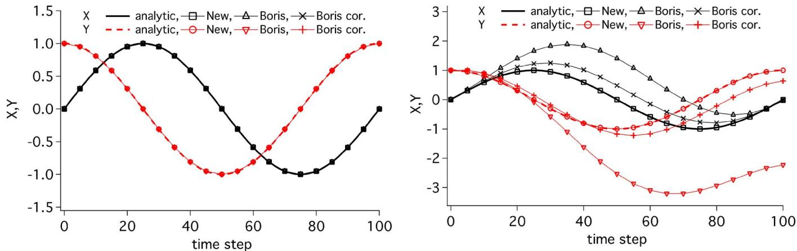
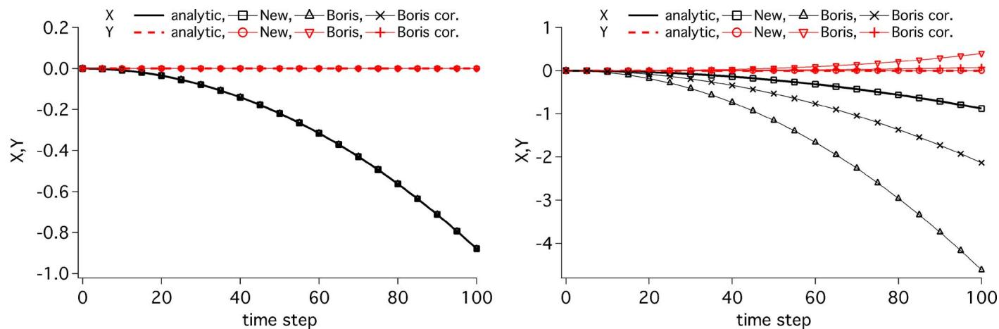
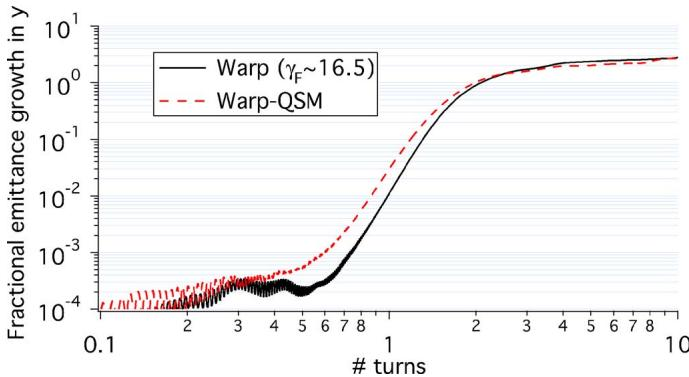

# Vay 2008 Simulation of beams or plasmas crossing at relativistic velocity 笔记

## 0. 论文信息

- 标题：Simulation of beams or plasmas crossing at relativistic velocity
- 作者：J.-L. Vay
- 期刊：Physics of Plasmas
- 卷页：15, 056701
- 年份：2008
- DOI：10.1063/1.2837054

## 1. 当前状态

- 已将原 PDF materialize 到当前论文专属目录。
- 已复用现成本机 MinerU Markdown。
- 已复制 `images/` 到当前目录。
- 下一步：
  - 按论文顺序开始第一轮中文精读。
  - 优先压实：
    - Boris pusher 在 relativistic crossing 场景下的问题
    - Vay pusher 的新离散结构
    - 文中提出的 field solver 边界

## 2. 摘要与引言

### 2.1 这篇文章的真正问题不是“发明另一个 relativistic mover”，而是 Lorentz 变换下一致性的数值失真

摘要和引言把问题说得很硬：

- 对接近光速传播的束流或等离子体，
- 选参考系会极大改变空间和时间尺度跨度；
- 因此 PIC 在合适 boosted frame 下理论上可节省几个数量级的计算量。

但作者随即指出：

- 连续方程满足相对论协变性，
- 离散后的 particle pusher 却未必保住最关键的 cancellation property。

这里说的 cancellation property 不是抽象对称性，而是：

- 在某些参考系里，electric field 经过 Lorentz 变换会部分变成 magnetic field；
- 两者在 Lorentz force 里应彼此精确抵消；
- 如果离散 mover 不能近似保持这点，
- boosted-frame 计算就可能出现不可接受的大误差。

### 2.2 这篇文章对 Boris 的批评有明确边界

作者并没有否定 Boris 的普适价值，而是把批评限定在：

- relativistic species
- electric / magnetic force cancellation 必须极准
- crossing at relativistic velocity

这些场景。

因此这篇文献在本项目里的角色不该被写成：

- “Boris 错了，Vay 对了”

而应写成：

- 在高相对论 crossing / boosted-frame 问题上，
- Boris 的一个特定离散边界会暴露出来，
- Vay pusher 正是针对这条边界提出的修正。

## 3. II.A Cancellation of electric and magnetic fields contributions

### 3.1 文中的第一性诊断量是 `E + v x B = 0` 下应无净力

作者选的试金石非常直接：

- 若粒子处在常量 `E`、`B` 场中，
- 且满足

$$
\mathbf E + \mathbf v \times \mathbf B = 0,
$$

那么真实连续动力学里就不该有净力，
粒子速度应保持不变。

这条条件之所以重要，是因为它正好抓住了 boosted-frame relativistic modeling 最脆弱的地方：

- electric / magnetic contributions 在某个参考系里必须几乎完全抵消。

### 3.2 文中对 Boris 的指控是“在这个试金石上不严格保持抵消”

文中把 centered discretization 写成：

$$
\frac{\mathbf x^{i+1/2}-\mathbf x^{i-1/2}}{\Delta t}=\mathbf v^i,
$$

$$
\frac{\gamma^{i+1}\mathbf v^{i+1}-\gamma^{i}\mathbf v^{i}}{\Delta t}
=
\frac{q}{m}
\left(
\mathbf E^{i+1/2}
\overline{\mathbf v}^{i+1/2}\times \mathbf B^{i+1/2}
\right).
$$

然后指出：

- Boris 采用的速度平均

$$
\overline{\mathbf v}^{i+1/2}
=
\frac{\gamma^i\mathbf v^i+\gamma^{i+1}\mathbf v^{i+1}}
{2\overline{\gamma}^{i+1/2}}
$$

在 `E + v x B = 0` 的试金石下，
并不能在一般非零 `E`、`B` 情况中保持“无净力”。

所以这篇文章的逻辑起点不是经验 benchmark，而是：

- 先抓到一条必须满足的相对论一致性条件，
- 再说明 Boris 在这条条件上会出现 spurious force。

## 4. II.B A new leapfrog pusher

### 4.1 Vay 的关键替换是把速度平均改成了直接平均 `v^i` 和 `v^{i+1}`

作者提出的新平均是

$$
\overline{\mathbf v}^{i+1/2}
=
\frac{\mathbf v^i+\mathbf v^{i+1}}{2}.
$$

在这一定义下，
如果同时满足

$$
\mathbf E^{i+1/2}+\mathbf v^i\times \mathbf B^{i+1/2}=0,
$$

以及

$$
\mathbf E^{i+1/2}+\mathbf v^{i+1}\times \mathbf B^{i+1/2}=0,
$$

就不会再强迫 `E`、`B` 取零值，
因此能避免前面的 spurious-force 诊断失败。

### 4.2 这篇文章在项目里的最关键落点是：WarpX 的 `UpdateMomentumVay.H` 正是在实现这条历史论证链

当前本项目已有源码笔记和第 4 章解释：

- `notes/code-reading/particles/03-vay-higuera-cary-pushers.md`
- `manuscript/chapters/04-particle-pushers.md`

这轮文献精读把它们背后的历史逻辑补齐了：

1. 先提出 boosted-frame / relativistic crossing 场景的 cancellation requirement  
2. 再说明 Boris 在这个 requirement 下会出现 spurious force  
3. 最后才给出新的 leapfrog average 和显式求解结构

因此 WarpX 里的 Vay pusher 不该被写成：

- “只是另一种 relativistic mover 实现”

而应写成：

- 为了保住 relativistic frame-change consistency 而引入的专门修正。

## 5. II.C Single particle tests

### 5.1 这篇文章真正拿来判 mover 的证据，不是一般轨道图，而是“同一物理系统换参考系后还能不能算对”

`II.C` 的两个单粒子测试都不是随便挑的：

- 第一个是常量磁场回旋；
- 第二个是常量电场加速。

它们共同服务于同一条更硬的验证合同：

- 在 laboratory frame 能算对还不够；
- 还必须在 moving frame 里保持和解析解一致；
- 否则就说明 Lorentz-frame consistency 在离散层被破坏了。

### 图 1：常量磁场中的回旋测试

**图像描述：**

- 左图是在实验室系中，
- 右图是在沿 `\hat y` 方向以 `\gamma_f = 2` 运动的参考系中，
- 比较新 pusher、Boris、以及带 `\tan(\omega_c\Delta t)/(\omega_c\Delta t)` 修正的 Boris 轨道。

**测试设置：**

- 初始速度：`v_x = 10^{-2} c`
- 背景场：常量 `B_z`
- 时间步长：

$$
\Delta t = 10^{-2}\times \frac{2\pi}{\omega_c}.
$$

**关键解读：**

- 新 pusher 在 laboratory frame 和 moving frame 都紧跟解析解；
- Boris 在 laboratory frame 看起来没问题；
- 但一旦切到 moving frame，就开始明显偏离；
- 这种偏离在 `\gamma_f = 3` 时已经很严重，并会随 `\gamma_f` 迅速放大；
- 新 pusher 的上限反而主要来自 machine precision，双精度下直到 `\gamma_f \sim 10^5` 才开始看到 roundoff 影响。

**与论文主线的关联：**

这张图真正证明的不是“Vay 轨道更好看”，而是：

- Boris 的问题首先暴露在 frame change 之后；
- 新 pusher 的价值是把这种 moving-frame inconsistency 压下去。

### 5.2 纯电场测试把边界再压实了一层：实验室系里三种 mover 都行，但 moving frame 里只有新 pusher 还对

第二个测试设定为：

- 电子在实验室系中初始静止；
- 常量电场 `E_x = 1 kV/m`；
- `\Delta t = 1 ns`；
- 推进 `100` 步；
- 再切到沿 `\hat y` 方向以 `\gamma_f = 100` 运动的参考系。

### 图 2：常量电场中的加速测试

**图像描述：**

- 左图对比实验室系中的轨道；
- 右图对比 moving frame 中的轨道；
- 三种 mover 都与解析解进行直接比较。

**关键解读：**

- 在 laboratory frame，三种 mover 都能跟住解析解；
- 一旦切到 moving frame，只有新 pusher 仍然准确；
- 所以作者不是在说 Boris 普遍失效，
- 而是在说：
  - 相对论 frame transformation 把 electric / magnetic cancellation 问题放大以后，
  - Boris 的误差会从“可忽略”变成“主导”。

## 6. III. Solving for the fields

### 6.1 文中的 field solver 不是通用 Maxwell solver，而是一条很有边界的 Darwin-lite 路线

这一节容易被误写成：

- “Vay 2008 还顺带提出了一个 field solver”。

更准确的说法是：

- 作者只考虑 `waves` 和 `retardation` 可忽略的情形；
- 在这个前提下，不走 full Maxwell；
- 也不直接走昂贵的 implicit Darwin solve；
- 而是再加一层近似，构造一条 fully explicit、比 Darwin 更简单的近似路径。

### 6.2 这条近似的核心前提是 comoving frame 中的强定向流动

作者的额外假设是：

- 对每个 species，
- 在与其共动的参考系中，

$$
v_z \gg v_x, v_y,
$$

并且

$$
\frac{\partial}{\partial t}\approx v_z \frac{\partial}{\partial z}.
$$

于是 scalar potential 满足的主方程被压成

$$
- \frac{\partial ^ { 2 } \phi } { \partial x ^ { 2 } }
- \frac{\partial ^ { 2 } \phi } { \partial y ^ { 2 } }
- \frac { \partial ^ { 2 } \phi } { \partial ( \gamma z ) ^ { 2 } }
= \frac { \rho } { \epsilon _ { 0 } } .
$$

它在形式上还是 Poisson solve，
但 `z` 方向被 `\gamma` 拉伸了。

### 6.3 这条 solver 保留的不是全部电磁效应，而是有选择地保留 electrostatic、magnetostatic 和沿主流向的 inductive effect

原文给出的近似场表达是

$$
\mathbf { E } \approx \left\{ -\frac { \partial \phi } { \partial x } , -\frac { \partial \phi } { \partial y } , -( 1 + \beta ^ { 2 } ) \frac { \partial \phi } { \partial z } \right\},
$$

$$
\mathbf { B } \approx \left\{ \frac { v _ { z } \partial \phi } { c ^ { 2 } \partial y } , - \frac { v _ { z } \partial \phi } { c ^ { 2 } \partial x } , 0 \right\}.
$$

这里最该记住的不是符号细节，而是边界：

- 它保留了 electrostatic effect；
- 保留了 magnetostatic effect；
- 还保留了与 mean flow direction 相关的 inductive effect；
- 但它不是 full-wave solver；
- 因此不能被直接类比成今天 WarpX 的一般 Maxwell/PSATD/FDTD runtime matrix。

### 6.4 对 `N` 个 species，代价被压成 `N` 次带 `\gamma z` 拉伸的 Poisson solve

作者明确写道：

- 对 `N` 个 species，
- field calculation 被降成 `N` 次求解上面的 Poisson 型方程；
- 典型应用里 `N = 1` 或 `2`；
- 因而比 full Darwin 便宜得多。

因此这篇 paper 的 field side 角色不该写成：

- “提出了一个普适的替代场求解器”；

而应写成：

- 为 relativistic crossing / beam-cloud 这类受限问题，
- 提供了一条 bounded Darwin-lite explicit field approximation。

## 7. IV. Application to the modeling of an ultrarelativistic beam interacting with a background of electrons

### 7.1 这不是随便挑的工程例子，而是专门挑了 electric / magnetic self-cancellation 最强的束流场景

应用对象是：

- near-`c` 的高能束流；
- 实验室系里几乎静止的 electron cloud。

在 moving frame 下，

- 束流自己的 self-magnetic field 和 self-electric field 几乎互相抵消；
- 电子云自己的 self-magnetic field 和 self-electric field 也几乎互相抵消。

所以这正是最容易放大 pusher cancellation error 的应用面。

### 图 3：LHC-like beam-electron-cloud 模型中的垂直发射度增长

**图像描述：**

- 给出了 `500 GeV` proton beam 与 `10^{14}\,\mathrm{m}^{-3}` 电子背景相互作用时，
- 垂直方向 fractional emittance growth 的时间历程。

**物理含义：**

- 图中真正比较的不是“有没有相互作用”，
- 而是：
  - moving-frame PIC with new pusher
  - 与 lab-frame quasistatic calculation
  是否回到同一 growth-rate / saturation-level 预测。

### 7.2 这条应用的硬结论不是“新 pusher 更稳定”，而是 Boris 在这里会直接把物理毁掉

文中设定：

- 用 WARP 做 first-principles PIC；
- 计算放在 `\gamma \approx 16.5` 的 moving frame；
- 几何和束流参数参考 LHC 注入后工况；
- 电子云密度、束团粒子数、网格大小、切片数等见文中 Table I/II。

最关键的对比结论是：

- 用 Boris，
- 无论是否加 `\tan(\omega_c\Delta t)/(\omega_c\Delta t)` 修正，
- beam 和 electron 宏粒子都会以非物理地过快速度丢失；
- 换成新 pusher，
- 才出现物理上预期的 hose-like instability。

### 7.3 这条应用真正交付的是“moving-frame first-principles PIC 与 lab-frame quasistatic calculation 的一致性证据”

作者把新方法的结果和实验室系里的 quasistatic WARP calculation 对照后发现：

- vertical emittance growth 的增长率一致；
- 饱和值也一致。

因此这条应用线最准确的定位是：

- 不是一般 accelerator benchmark；
- 而是 relativistic beam / electron-cloud crossing 场景下，
- `new pusher + bounded field solver` 的 first-principles consistency demonstration。

## 8. V. Conclusion 与本项目里的真实定位

### 8.1 这篇文章的三条最硬交付

通篇收束后，真正站得住的贡献有三条：

1. 指出 relativistic modeling 里 electric / magnetic cancellation 的离散一致性问题；
2. 给出新 leapfrog pusher，并用单粒子 moving-frame tests 验证它；
3. 给出一条 bounded Darwin-lite field solve，并在 ultrarelativistic beam-electron-cloud 问题上做 first-principles demonstration。

### 8.2 它在 PIC-tutor 里的正确角色

对本项目来说，`Vay 2008` 现在已经可以被压成：

- `boosted-frame / relativistic-crossing mover paper`
- `frame-change consistency benchmark`

而不是：

- 通用 relativistic particle pusher 总论；
- 现代 WarpX 全电磁 field solver 文献来源；
- 或者 today’s boosted-frame workflow 的完整 runtime contract。

更具体地说：

- 它最直接支撑第 4 章里 `UpdateMomentumVay.H` 的历史论证链；
- 对第 6 章只有一条有限边界：
  - 文中 field solver 是 bounded, problem-specific approximation，
  - 不能与 WarpX 当前通用 EM solvers 等量齐观。
