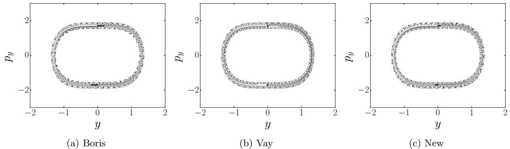
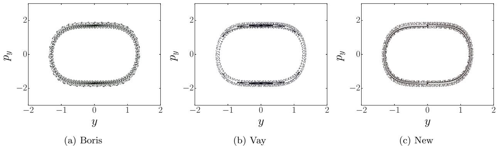

# Structure-preserving second-order integration of relativistic charged particle trajectories in electromagnetic fields

A.V. Higuera∗ and J.R. Cary† University of Colorado at Boulder and Tech-X Corporation

Time-centered, hence second-order, methods for integrating the relativistic momentum of charged particles in an electromagnetic field are derived. A new method is found by averaging the momentum before use in the magnetic rotation term, and an implementation is presented that differs from the relativistic Boris Push [1] only in the method for calculating the Lorentz factor. This is shown to have the same second-order accuracy in time as that (Boris Push) [1] found by splitting the electric acceleration and magnetic rotation and that [2] found by averaging the velocity in the magnetic rotation term. All three methods are shown to conserve energy when there is no electric field. The Boris method and the current method are shown to be volume-preserving, while the method of [2] and the current method preserve the $\vec { E } \times \vec { B }$ velocity. Thus, of these second-order relativistic momentum integrations, only the integrator introduced here both preserves volume and gives the correct $\vec { E } \times \vec { B }$ velocity. While all methods have error that is second-order in time, they deviate from each other by terms that increase as the motion becomes relativistic. Numerical results show that [2] develops energy errors near resonant orbits of a test problem that neither volume-preserving integrator does.

# I. Introduction

Computing trajectories of classical charged particles in an electromagnetic field is critical to many areas of physics. In beam physics (cf [3] and references therein) particle tracking through accelerator lattices is needed to determine whether particle will remain in, e.g., storage rings for times long enough for significant reactions to occur. In selfconsistent plasma physics computations, the computation of particle trajectories is one part of kinetic modeling of plasmas using the Particle-In-Cell (PIC) method [4–6]. Particle tracking is also important for understanding the limits of precision in spectrometers.

The underlying system is Hamiltonian, and so has a complete set of Poincar´e geometric invariants [7]. Symplectic integrators are those that also preserve the Poincar´e invariants. Symplectic integrators allow one to invoke the KAM theorem, so that the integrated motion shadows the real motion (except for the very slow Arnold diffusion in systems with 2.5 or more degrees of freedom). Explicit symplectic integrators [8–12] relevant to particle tracking are now in common use, and there are also explicit symplectic integrators [13] for certain plasma systems. Unfortunately, there is at present no known explicit symplectic integrator for charged particle motion in arbitrary electromagnetic fields.

A less restrictive condition is that the integrator be volume-preserving, i.e., that it preserve the last Poincar´e invariant. This prevents attractors and repellers in the integrated system, important as they do not exist in the underlying system. The relativistic Boris integrator [1] (also known as the Boris push) is volume-preserving (more detailed discussion in light of [14, 15] below) and is found to have good properties when used to compute trajectories. In particular, the spatial Boris push [16] has been found excellent for tracking studies in accelerators, as it eliminates numerical cooling or heating, which can mask physical effects due to small dissipative terms.

On the other hand, the relativistic Boris push does not correctly compute the $\vec { E } \times \vec { B }$ drift velocity, and this was found [2] to lead to problems in some special cases. Vay proposed using a different integrator that does preserve the $\vec { E } \times \vec { B }$ drift velocity at the cost of a slightly more complicated computation of the new relativistic factor. Unfortunately, Vay’s integrator is not volume-preserving, as we show here, and so it lacks an important feature of the Boris integrator. The lack of volume-preservation is shown to lead to unphysical behavior in the computed trajectories.

Here we construct an integrator that preserves both the $\vec { E } \times \vec { B }$ drift velocity and phase-space volume. Like both the Boris and Vay integrators, it also conserves energy in the absence of an electric field. This new integrator has computational cost comparable to that of the Vay integrator.

The organization of this paper is as follows. In the following section we introduce the leap-frog separation of the spatial and momentum integrations that reduce this to second-order integration of the momentum change equation. In the same section we discuss also the various centerings that can be used obtain a second-order-accurate momentum integration, deriving a new integrator and showing that the previous Boris and Vay integrators follow from this principle and have the same order of accuracy. Section III discusses implementation. In Sec. IV we show that all three integrators conserve energy when there is no electric field, but that only the current integrator and the integrator of [2] properly capture the $\vec { E } \times \vec { B }$ drift. In Sec. V we show that only the current and Boris integrators are volume-preserving. In Sec. VI we show that the new and Boris integrators eliminate un-physical behavior displayed by the integrator of [2] in a test problem. Finally, in Sec. VII we summarize our results and conclude.

# II. Second-order charged particle integrators

Charged particles in the electromagnetic field follow the dynamics of relativistic translation,

$$
\frac { d \vec { x } } { d t } = \vec { v } ( \vec { u } ) = \vec { u } / \gamma ,
$$

where $\gamma = \sqrt { 1 + | \vec { u } / c | ^ { 2 } }$ , and the Lorentz force,

$$
\frac { d \vec { u } } { d t } = ( q / m ) ( \vec { E } + \vec { v } ( \vec { u } ) \times \vec { B } ) .
$$

The first step to an efficient, second-order integration of these equations is use of the Leap-Frog method, in which the finite-time-step relativistic translation becomes

$$
\begin{array} { r l } & { \vec { x } _ { f } = \vec { x } _ { i } + \Delta \vec { x } \mathrm { ~ w i t h } } \\ & { \Delta \vec { x } = \vec { v } \Delta t , } \end{array}
$$

and then one is left with solving the Lorentz force equation Eq. (2) to second order for a time step, $\Delta t$ , with the assumption of constant electric and magnetic fields.

Ideally one would like to solve this equation in a way that preserves as many properties of the underlying differential equations as possible. In this paper we consider the following properties: (1) Energy should be conserved in the absence of an electric field. (2) The static solution for crossed electric and magnetic fields, with $| \vec { E } | < c | \vec { B } |$ , should be constant velocity in the third direction of magnitude $| \vec { E } | / | \vec { B } |$ . (3) The differential volume, which is preserved by any solution of the differential equation, should be preserved by the finite-time-step solution.

The standard way to obtain a second-order solution is by time centering. That is, one uses the solution,

$$
\begin{array} { l } { { \vec { u } _ { f } = \vec { u } _ { i } + \Delta \vec { u } \mathrm { ~ w i t h ~ } } } \\ { { \Delta \vec { u } = ( q / m ) ( \vec { E } + \bar { v } \times \vec { B } ) \Delta t , } } \end{array}
$$

where $v$ is an average of the initial and final values of $\vec { v }$ . There are multiple choices for how to do the average. Here we introduce a new choice,

$$
\bar { v } _ { n e w } \equiv \vec { v } \left( \frac { \vec { u } _ { i } + \vec { u } _ { f } } { 2 } \right) .
$$

while [2] made the choice,

$$
\bar { v } _ { v } \equiv \frac { \vec { v } ( \vec { u } _ { i } ) + \vec { v } ( \vec { u } _ { f } ) } { 2 }
$$

and the Boris choice is,

$$
\bar { v } _ { b } \equiv \frac { \vec { v } \left( u _ { i } + \vec { \epsilon } \right) + \vec { v } \left( u _ { f } - \vec { \epsilon } \right) } { 2 } .
$$

where

$$
\vec { \epsilon } \equiv \frac { q \vec { E } } { 2 m } \Delta t .
$$

The Boris push is not usually written in this way, but one can see that Eq. (9) is equivalent to a magnetic rotation by the velocity found after an initial half electric acceleration (the first term in the numerator) and before a final half acceleration (the second term in the numerator).

All of these integrators have second-order error in the time step, as one can see from Taylor expansion. E.g.,

$$
\bar { v } _ { v } = \frac { \vec { v } ( \bar { u } _ { v } + \Delta \vec { u } / 2 ) } { 2 } + \frac { \vec { v } ( \bar { u } _ { v } - \Delta \vec { u } / 2 ) } { 2 } = \vec { v } ( \bar { u } _ { v } ) + O ( \Delta t ^ { 2 } ) ,
$$

is equivalent to Eq. (7) to second order. That the Boris push has the same order of error follows from a similar calculation.

# III. Explicit evaluation

The new integrator (5-7) looks implicit, as the final momentum on the left side of (5) is involved in its definition through (7). However, it can be explicitly computed by methods similar to that of [2]. We first write the new integrator as the composition of two integrators.

$$
\begin{array} { r l r } & { } & { \vec { u } _ { f } = \bar { u } _ { n e w } + \Delta \vec { u } _ { n e w } / 2 \mathrm { ~ a n d } } \\ & { } & { \vec { u } _ { n e w } = \bar { u } _ { i } + \Delta \vec { u } _ { n e w } / 2 \mathrm { ~ o r ~ } \quad } \\ & { } & { \vec { u } _ { i } = \bar { u } _ { n e w } - \Delta \vec { u } _ { n e w } / 2 , \quad \quad } \end{array}
$$

where

$$
\Delta \vec { u } _ { n e w } = 2 \vec { \epsilon } + \frac { \bar { u } _ { n e w } } { \gamma _ { n e w } } \times 2 \vec { \beta } ,
$$

with

$$
\vec { \beta } \equiv \frac { q \vec { B } } { 2 m } \Delta t ,
$$

and $\gamma _ { n e w } \equiv \gamma ( \vec { u } _ { n e w } )$ . The first equation (12) corresponding to the last half update is explicit. So we need only solve Eqs. (14-16) to obtain an explicit solution.

In a process similar to that of [2], the explicit solution comes from taking the dot and cross products of Eq. (14) and clearing terms to obtain

$$
\bar { u } _ { n e w } \left( 1 + \frac { \beta ^ { 2 } } { \gamma _ { n e w } ^ { 2 } } \right) = \vec { u } _ { - } - \frac { \vec { \beta } \times \vec { u } _ { - } } { \gamma _ { n e w } } + \frac { \vec { \beta } \vec { \beta } \cdot \vec { u } _ { - } } { \gamma _ { n e w } ^ { 2 } } ,
$$

in which

$$
{ \vec { u } } _ { - } \equiv { \vec { u } } _ { i } + { \vec { \epsilon } } .
$$

Eq. (17) gives $u _ { n e w }$ explicitly provided $\gamma _ { n e w }$ can be computed. Squaring Eq. (17) gives the biquadratic polynomial,

$$
( \gamma _ { n e w } ^ { 2 } - 1 ) \left( \gamma _ { n e w } ^ { 2 } + \beta ^ { 2 } \right) = \gamma _ { n e w } ^ { 2 } | \vec { u } _ { - } | ^ { 2 } + | \vec { \beta } \cdot \vec { u } _ { - } | ^ { 2 }
$$

which can be solved to obtain

$$
\gamma _ { n e w } ^ { 2 } = \frac { 1 } { 2 } \left( \gamma _ { - } ^ { 2 } - \beta ^ { 2 } + \sqrt { ( \gamma _ { - } ^ { 2 } - \beta ^ { 2 } ) ^ { 2 } + 4 ( \beta ^ { 2 } + | \vec { \beta } \cdot \vec { u } _ { - } ^ { 2 } | ) } \right) ,
$$

where

$$
\gamma _ { - } \equiv \gamma ( \vec { u } _ { - } ) .
$$

Equation (17) is needed to derive Eq. (20) for $\gamma _ { n e w }$ , but, once $\gamma _ { n e w }$ is known, $u _ { n e w }$ is not necessary to obtain $\vec { u } _ { f }$ . Using the definition of $\Delta \vec { u } _ { n e w }$ and Eqs. (12-14)

$$
\begin{array} { r l r } & { } & { \vec { u } _ { i } + \vec { \epsilon } = \vec { u } _ { n e w } - \vec { u } _ { n e w } \times \frac { \vec { \beta } } { \gamma _ { n e w } } } \\ & { } & { \vec { u } _ { f } - \vec { \epsilon } = \vec { u } _ { n e w } + \vec { u } _ { n e w } \times \frac { \vec { \beta } } { \gamma _ { n e w } } . } \end{array}
$$

Defining then and $\vec { u } _ { + } = \vec { u } _ { f } - \bar { \epsilon }$ , using Eq. (18), and subtracting Eq. (22) from Eq. (23) yields the familiar Boris rotation equation:

$$
\vec { u } _ { + } - \vec { u } _ { - } = ( \vec { u } _ { + } + \vec { u } _ { - } ) \times \frac { \vec { \beta } } { \gamma _ { n e w } }
$$

The new integrator’s implementation differs from the Boris integrator’s in the use of Eq. (20) instead of Eq. (21) to calculate $\gamma$ for the magnetic rotation. The two prescriptions differ by terms second-order in $\Omega _ { c } \Delta t$ . One can furthermore show that the relativistic factor used by the Boris integrator always exceeds or equals that of the present integrator.

$$
\gamma _ { - } \geq \gamma _ { n e w }
$$

# IV. Preservation of limiting solutions

Here we analyze the above integration methods with regard to whether they preserve properties of limiting solutions, (1) no electric field and (2) correct value of perpendicular velocity in crossed electric and magnetic fields. In the first case, the differential equations have no change of energy. This is well-known to be true for the Boris push. It follows that it is true for the other integrators, as, without an electric field, the relativistic factor is preserved even for the finite difference solution, and so both the new integrator (7) and the Vay integrator (8) preserve energy when there is no electric field.

When there is no electric field and the magnetic field is static and uniform, the Boris integrator rotates the particle’s momentum through an angle

$$
\theta = \Omega _ { c } \gamma ^ { - 1 } \Delta t \left( 1 - \frac { ( \Omega _ { c } \gamma ^ { - 1 } \Delta t ) ^ { 2 } } { 1 2 } + \mathcal { O } ( ( \Omega _ { c } \gamma ^ { - 1 } \Delta t ) ^ { 4 } ) \right)
$$

It can be shown that, for the same problem, the new integrator rotates the particle’s momentum through an angle

$$
\theta = \Omega _ { c } \gamma ^ { - 1 } \Delta t \left( 1 + \left[ \frac { 1 } { 8 } \left( 1 - \frac { 1 } { \gamma ^ { 2 } } \right) - \frac { 1 } { 1 2 } \right] ( \Omega _ { c } \gamma ^ { - 1 } \Delta t ) ^ { 2 } + \mathcal { O } ( ( \Omega _ { c } \gamma ^ { - 1 } \Delta t ) ^ { 4 } ) \right) .
$$

In the non-relativistic case, Eq. (27) reduces to Eq. (26), with the coefficient of the third-order error term increasing monotonically to a limit of $+ 1 / 2 4$ in the ultra-relativistic case (vanishing at $\gamma = \sqrt { 3 }$ ). The new integrator’s third-order error term is therefore always smaller than the Boris integrator’s for electron gyro-motion with $\Omega _ { c } \Delta t \ll 1$ .

For perpendicular electric and magnetic fields, a stationary solution, $\Delta \vec { v } = 0$ , must have, from Eq. (6),

$$
\bar { v } = \vec { E } \times \vec { B } / | \vec { B } | ^ { 2 } .
$$

Stationarity also implies $\vec { u } _ { f } = \vec { u } _ { i }$ , which used in either of Eqs. (7,8) implies that

$$
\bar { v } _ { f } = \bar { v } _ { i } = \vec { E } \times \vec { B } / | \vec { B } | ^ { 2 } .
$$

Hence for either the new integrator or the Vay integrator, the electric drift velocity has the same value as for the differential equations. For the Boris integrator, as noted in [2], this is not the case. Inequality 25 explains why: the Boris integrator always rotates the momentum less than the new integrator, which is shown here to rotate $\vec { u } _ { - }$ exactly enough that the second half-acceleration exactly cancels the first.

# V. Volume-preservation

It has been surmised [14] that the excellent conservation properties of the nonrelativistic Boris push, as, e.g., observed in [16], are due to the fact that it preserves phase space volume, like the underlying differential equations. This follows straightforwardly from the observation that the nonrelativistic Boris push is a sequence of sheared (spatial change) translations, unsheared (electric acceleration) translations, and rotations (magnetic acceleration). An additional observation, that the relativistic Boris push simply changes the rotation to being sheared (due to the dependence of the rotation on the relativistic factor, $\gamma$ , which is constant for that part of the transformation) shows that the relativistic Boris push is also volume-preserving. (The reference [15] shows that an integrator that is not actually the Boris integrator does not preserve volume but then ultimately gives a more detailed proof of volume preservation by what is in fact the Boris integrator.)

While the two transformations (12,13) are not inverses of each other (otherwise the integrator would be the identity), we will show that their two Jacobian determinants are reciprocals of one another and so the transformation for the new integrator is volume-preserving.

Differentiating (12) gives the Jacobi matrix,

$$
\frac { \partial ( \vec { u } _ { f } ) } { \partial ( \bar { u } _ { n e w } ) } = I - \Omega + \frac { \vec { \beta } _ { n e w } \times \bar { u } _ { n e w } \otimes \bar { u } _ { n e w } } { \gamma _ { n e w } ^ { 3 } } ,
$$

where $\Omega$ is the matrix defined by

$$
\Omega \cdot \vec { V } \equiv \vec { \beta } \times \vec { V } / \gamma _ { n e w } .
$$

By the determinant lemma, this matrix has determinant,

$$
J _ { f , n e w } \equiv \operatorname * { d e t } \left( \frac { \partial ( \vec { u } _ { f } ) } { \partial ( \bar { u } _ { n e w } ) } \right) = \operatorname * { d e t } ( I - \Omega ) \operatorname * { d e t } \left( 1 + \frac { \bar { u } _ { n e w } \cdot ( I - \Omega ) ^ { - 1 } \cdot ( \vec { \beta } \times \bar { u } _ { n e w } ) } { \gamma _ { n e w } ^ { 3 } } \right) .
$$

Explicit computation gives

$$
\operatorname* { d e t } ( I - \Omega ) = 1 + \beta ^ { 2 } / \gamma _ { n e w } ^ { 2 } .
$$

Explicit computation can also be used to find

$$
\bar { u } _ { n e w } \cdot ( \pmb { I } - \Omega ) ^ { - 1 } \cdot ( \vec { \beta } \times \bar { u } _ { n e w } ) = ( ( \pmb { I } + \Omega ) ^ { - 1 } \cdot \bar { u } _ { n e w } ) \cdot ( \vec { \beta } \times \bar { u } _ { n e w } ) .
$$

by noting that

$$
\begin{array} { r } { \vec { Y } = ( I + \Omega ) ^ { - 1 } \cdot \bar { u } _ { n e w } \ \mathrm { o r } } \\ { \bar { u } _ { n e w } = \vec { Y } + \vec { \beta } \times \vec { Y } / \gamma _ { n e w } } \end{array}
$$

can be solved to give

$$
\vec { Y } = \frac { \vec { u } _ { n e w } - \vec { \beta } \times \vec { u } _ { n e w } / \gamma _ { n e w } + \vec { \beta } \vec { \beta } \cdot \vec { u } _ { n e w } / \gamma _ { n e w } ^ { 2 } } { 1 + \beta ^ { 2 } / \gamma _ { n e w } ^ { 2 } } ,
$$

which can be used in Eq. (34) and ultimately with Eqs. (32 and 33) to obtain

$$
J _ { f , n e w } = 1 + \frac { \beta ^ { 2 } + ( \vec { \beta } \cdot \bar { u } _ { n e w } ) ^ { 2 } } { \gamma _ { n e w } ^ { 4 } } .
$$

By an identical process, one can show that

$$
J _ { i , n e w } = 1 + \frac { \beta ^ { 2 } + ( \vec { \beta } \cdot \bar { u } _ { n e w } ) ^ { 2 } } { \gamma _ { n e w } ^ { 4 } } .
$$

Thus, the Jacobian of the first half step equals the inverse of the Jacobian for the second half step, and so their product is unity, and the new integrator is volume-preserving, just like the Boris integrator.

The Vay integrator can be analyzed in this same way. It can likewise be composed into two half steps, but with the first being an explicit step using $u _ { i } / \gamma _ { i }$ followed by an implicit step using $u _ { f } / \gamma _ { f }$ . As a result the full Jacobian for the Vay integrator is

$$
J _ { v } = \frac { J ( x _ { i } , u _ { i } ) } { J ( x _ { i } , u _ { f } ) } ,
$$

where

$$
J ( x , u ) = 1 + \frac { \beta ^ { 2 } + ( \vec { \beta } \cdot \vec { u } ) ^ { 2 } } { \gamma ^ { 4 } } . .
$$

Consequently, after N steps, the differential volume element in the Vay integrator is

$$
J _ { v , B } = \frac { J ( x _ { 0 } , u _ { 0 } ) } { J ( x _ { 0 } , u _ { 1 } ) } \frac { J ( x _ { 1 } , u _ { 1 } ) } { J ( x _ { 1 } , u _ { 2 } ) } . . . \frac { J ( x _ { N - 1 } , u _ { N - 1 } ) } { J ( x _ { N - 1 } , u _ { N } ) } ,
$$

Because the two Jacobians in any of the fractions of Eq. (42) depend on different variables (the initial and final momenta) while having the same functional form, the Vay integrator is not generally volume-preserving. At subsequent steps, the differential volume grows or shrinks by a similar factor, but now evaluated at the new position. The function, $J ( x , u )$ varies over space but is bounded for bounded regions. Hence, generally the factors in Eq. (42) are variously greater and less than unity. While one could imagine a trajectory that conspires to have all factors either greater or less than unity, we have not so far been able to construct such a case. In the case where the magnetic field is constant in space and time, the series telescopes and then the boundedness of $J ( x , u )$ prevents the existence of attractors or repellers.

# VI. Numerical results

We choose a test problem of the form,

$$
\begin{array} { l } { { \vec { E } = E _ { x } ( x ) \hat { x } } } \\ { { \vec { B } = B _ { x } ( y ) \hat { x } , } } \end{array}
$$

for which

$$
\vec { A } = A _ { z } ( y ) \hat { z } .
$$

The Hamiltonian for this system is

$$
H = \sqrt { 1 + p _ { x } ^ { 2 } + p _ { y } ^ { 2 } + ( p _ { z } - A _ { z } ( y ) ) ^ { 2 } } + \phi ( x )
$$

in units of $q = m = c = 1$ This Hamiltonian is independent of $z$ , so $p _ { z }$ is an invariant of the motion. It is also time independent, so $H$ is an invariant. Further,

$$
I _ { y } \equiv p _ { y } ^ { 2 } + ( p _ { z } - A _ { z } ( y ) ) ^ { 2 }
$$

is an invariant of the motion and in involution with the other invariants. Hence, this system of three degrees of freedom has three invariants in involution and so is integrable.

To determine the degree to which the various integrators preserve these invariants, we use the Poincar´e surface of section technique. We follow the trajectories for initial conditions of the same energy and same $p _ { z }$ and plot the points $( y , p _ { y } )$ in the plane $x = 0$ when that plane is crossed with positive $p _ { x }$ . (This does require interpolation to that plane, when that plane is crossed in some time step.) We can then check how well the invariant (47) is preserved by the integration.

For numerical integration, we have to be more specific. We choose $p _ { z } = 0$ without loss of generality, as a different value of $p _ { z }$ is equivalent to choosing a different function $A _ { z } ( y )$ . We then choose the particular fields,

$$
\begin{array} { l } { { \vec { E } = - a x \hat { x } } } \\ { { \vec { B } = b y \hat { x } , } } \end{array}
$$

which corresponds to a sheared magnetic field with the reversal at $y = 0$ . For this system,

$$
\begin{array} { c c c } { { A _ { z } ( y ) = \displaystyle \frac { 1 } { 2 } b y ^ { 2 } } } \\ { { \phi ( x ) = \displaystyle \frac { 1 } { 2 } a x ^ { 2 } . } } \end{array}
$$

We choose the energy $H = 4$ . to be moderately relativistic to expose the effects of the varying volume element (40), and we choose $a = 1$ and $b = 2$ , i.e., of order unity.

We first use all integrators with a very small time step, $\Delta t = 1 / 4 0$ , which corresponds to $8 0 \pi \approx 2 5 0$ time steps per period of the oscillation in $x$ for the given potential. The results are shown in Fig. 1. At this temporal resolution, all ntegrators are seen to give nested surfaces in this plane, in essence showing that they are all preserving the invariants of the problem.

  
FIG. 1: Poincar´e surfaces of section for the system (48), integrated with $\Delta t = 1 / 4 0$ using the Boris (1a), Vay (1b), and new (1c) integrators.

Next we use a time step, $\Delta t = 1 / 1 0$ that is more typically used in simulations. This corresponds to $2 0 \pi \approx 6 0$ time steps per period of the oscillation in $x$ for the given potential. The results are shown in Fig. 2. At this temporal resolution, the Boris and new integrators continue to show nested surfaces in this plane, showing that they are accurately representing the topology of the trajectories. However, for the Vay integrator with the initial condition $p _ { y } \approx 1 . 7$ a resonance island is seen. (This is a two-fold degenerate resonance; trajectories started in the top island do not visit the bottom island.) Thus, a finite volume of trajectories is trapped in this resonance. Moreover, the sections for different trajectories are seen to cross each other. This is an indication that the other invariants (either energy or $p _ { z }$ ) are less well-preserved, as crossing can occur only if the trajectories are for different values of the other invariants. Thus, in this example, with a reasonable choice for the time step, use of the Vay integration leads to unphysical consequences.

  
FIG. 2: Poincar´e surfaces of section for system (48), integrated with $\Delta t = 1 / 1 0$ using the Boris (2a), Vay (2b), and new (2c) integrators.

# VII. Summary and future directions

We have derived a new integrator for charged particle motion in arbitrary electromagnetic fields that is both volumepreserving (like the Boris push) and also correctly computes the $\vec { E } \times \vec { B }$ drift velocity (like the Vay push). This new integrator has been tested numerically and compared with the other integrators. It is found not to introduce sizable resonances at reasonable values for the time step in contrast with the integrator of [2].

A number of new directions deserve attention in this area. What are the consequences of composing integrators for which the volume alternately grows and shrinks, as it does for the Vay integrator? Can one have attractors and repellers in this case? How does one extend these methods to higher order, as was done for symplectic integrators by, e.g., [12] and others. More importantly, what is gained? For beam tracking, one needs a spatial version of the current integrator. Combining higher-order with spatial integration could be very powerful for beam tracking. Finally, the extension of these concepts to self-consistent simulations, with higher-order integrators, could be explored.

# Acknowledgements

This work is supported by DOE/NSF Grant No. de-sc0012584.

# References

[1] J. Boris, Relativistic plasma simulation-optimization of a hybrid code, in: Proc. Fourth Conf. Num. Sim. Plasmas, Naval Res. Lab, Wash. DC, 1970, pp. 3–67.   
[2] J.-L. Vay, Simulation of beams or plasmas crossing at relativistic velocity, Physics of Plasmas (1994-present) 15 (5) (2008) 056701.   
[3] J. R. Cary, D. T. Abell, G. I. Bell, B. M. Cowan, J. R. King, D. Meiser, I. V. Pogorelov, G. R. Werner, Select advances in computational accelerator physics, IEEE Transactions on Nuclear Science 63 (2) (2016) 823–841.   
[4] C. K. Birdsall, A. B. Langdon, Plasma physics via computer simulation, CRC Press, 2004.   
[5] R. W. Hockney, J. W. Eastwood, Computer simulation using particles, CRC Press, 1988.   
[6] C. Nieter, J. R. Cary, Vorpal: a versatile plasma simulation code, Journal of Computational Physics 196 (2) (2004) 448–473.   
[7] H. Goldstein, C. P. Poole, J. L. Safko, Classical Mechanics: Pearson New International Edition, Pearson Higher Ed, 2014.   
[8] R. D. Ruth, et al., A canonical integration technique, IEEE Trans. Nucl. Sci 30 (4) (1983) 2669–2671.   
[9] K. Feng, Difference schemes for hamiltonian formalism and symplectic geometry, Journal of Computational Mathematics 4 (3) (1986) 279–289.   
[10] E. Forest, R. D. Ruth, Fourth-order symplectic integration, Physica D: Nonlinear Phenomena 43 (1) (1990) 105–117.   
[11] J. Candy, W. Rozmus, A symplectic integration algorithm for separable hamiltonian functions, Journal of Computational Physics 92 (1) (1991) 230–256.   
[12] H. Yoshida, Construction of higher order symplectic integrators, Physics Letters A 150 (5) (1990) 262–268.   
[13] J. Cary, I. Doxas, An explicit symplectic integration scheme for plasma simulations, Journal of Computational Physics 107 (1) (1993) 98–104.   
[14] H. Qin, S. Zhang, J. Xiao, J. Liu, Y. Sun, W. M. Tang, Why is boris algorithm so good?, Physics of Plasmas (1994-present) 20 (8) (2013) 084503.   
[15] R. Zhang, J. Liu, H. Qin, Y. Wang, Y. He, Y. Sun, Volume-preserving algorithm for secular relativistic dynamics of charged particles, Physics of Plasmas (1994-present) 22 (4) (2015) 044501.   
[16] P. Stoltz, J. Cary, G. Penn, J. Wurtele, Efficiency of a boris-like integration scheme with spatial stepping, Physical Review Special Topics-Accelerators and Beams 5 (9) (2002) 094001.