# Numerical stability analysis of the Pseudo-Spectral Analytical Time-Domain PIC algorithm

Brendan B. Godfrey

University of Maryland, College Park, Maryland 20742, USA

Jean-Luc Vay

Lawrence Berkeley National Laboratory, Berkeley, California 94720, USA

Irving Haber

University of Maryland, College Park, Maryland 20742, USA

## Abstract

The pseudo-spectral analytical time-domain (PSATD) particle-in-cell (PIC) algorithm solves the vacuum Maxwell’s equations exactly, has no Courant timestep limit (as conventionally defined), and ofers substantial flexibility in plasma and particle beam simulations. It is, however, not free of the usual numerical instabilities, including the numerical Cherenkov instability, when applied to relativistic beam simulations. This paper derives and solves the numerical dispersion relation for the PSATD algorithm and compares the results with corresponding behavior of the more conventional pseudo-spectral time-domain (PSTD) and finite diference time-domain (FDTD) algorithms. In general, PSATD ofers superior stability properties over a reasonable range of time steps. More importantly, one version of the PSATD algorithm, when combined with digital filtering, is almost completely free of the numerical Cherenkov instability for time steps (scaled to the speed of light) comparable to or smaller than the axial cell size.

Keywords: Particle-in-cell, Pseudo-spectral, Relativistic beam, Numerical stability.

## 1. Introduction

Particle in Cell (PIC) plasma simulation codes typically employ a Finite Diference Time Domain (FDTD) algorithm with staggered spatial mesh [1] for advancing Maxwell’s equations. The FDTD algorithm is straightforward, second-order accurate, and parallelizes well for eficient computation on modern computers. A very flexible and at least equally accurate approach for solving Maxwell’s equations numerically is the pseudo-spectral method, in which

Maxwell’s equations are Fourier-decomposed in space, and the resulting equations advanced in time to second-order or better accuracy [2]. Pseudo-spectral PIC algorithms require Fourier-transforming the currents and fields at every time-step, because particles are advanced in real rather than Fourier space. Because Fourier transforms generally do not parallelize well, pseudo-spectral methods are used less commonly than FDTD methods in PIC codes.

Nonetheless, the advantages of pseudo-spectral methods should not be ignored. Haber’s Pseudo-Spectral Analytical Time Domain (PSATD) algorithm [3], in particular, is exact for plasma currents constant in time and, consequently, is free of electromagnetic wave numerical dispersion for wave numbers satisfying $k \leq \pi / \Delta t$ and has no Courant limit in the usual sense. It also ofers highly accurate balancing of the Lorentz force, $\mathbf { E } + \mathbf { v } \times \mathbf { B }$ [4], which is especially desirable in simulations of relativistic beams or of Laser-Plasma Acceleration (LPA) in frames co-moving with the interaction region [5, 6]. PSATD also has superior numerical stability properties [7]. The more commonly used Pseudo-Spectral Time Domain (PSTD) algorithm [2, 8] enjoys some of these same advantages but has a restrictive Courant limit.

Importantly, a domain decomposition method recently has been developed that allows eficient parallelization of Fourier transforms [7] in PIC codes. It takes advantage of the linearity and finite propagation velocity of light in Maxwell’s equations to limit communication of data between neighboring computational domains. The small approximation required appears to be insignificant for a range of problems of interest.

Despite the advantages of pseudo-spectral methods, they are known not to be free of the numerical Cherenkov instability [9], which results from coupling of electromagnetic waves with numerically spurious beam mode aliases in cold beam simulations. In this paper, the numerical dispersion relation is derived for the PSATD algorithm with either a version of the Esirkepov algorithm [10] or conventional current interpolation. Although the PSATD algorithm does not exhibit special time-steps at which numerical instability growth rates are very small [8, 11, 12], a slight generalization of the PSATD-Esirkepov combination is shown to have extraordinarily good stability properties when cubic interpolation and appropriate digital filtering are employed, certainly substantially better than that of FDTD algorithms previously analyzed [12]. The PSTD-Esirkepov algorithm also has good stability properties over its range of allowed time-steps, although not quite as good as that of the PSATD-Esirkepov algorithm. These analyses have been confirmed using the multidimensional WARP [13] PIC code for two-dimensional simulations of plasma wake formation in a LPA stage. The parameters used for the WARP simulations were similar to those used in [12]. However, the length of the plasma was increased thirty-fold, due to the extremely small growth rates that were observed when using the PSATD solver.

The remainder of this paper is organized as follows. The PSATD algorithm coupled with either the Esirkepov or the conventional current deposition algorithm is presented in Sec. 2. Derivations of the corresponding numerical instability dispersion relations for multidimensional PSATD PIC codes are outlined briefly in Sec. 3. The dispersion relations are specialized in Sec. 4 to a cold, relativistic beam in two dimensions for comparison with WARP simulations. Sec. 5 provides a reasonably accurate approximation for maximum numerical instability growth rates for the PSATD-Esirkepov algorithm with digital filtering, showing the desirable numerical stability properties just mentioned. Then, the dispersion relations are solved numerically for a range of options and parameters and compared with WARP results in Sec. 6. (These analytical and numerical dispersion relation calculations were performed using Mathematica [14].) As a comparison, stability results for the more commonly used PSTD algorithm are derived and discussed in Sec. 6. Sec. 7 presents WARP simulations, demonstrating the near absence of numerical instabilities in actual LPA simulations for appropriately chosen options and time-steps. The concluding section summarizes the findings in the paper and compares them with corresponding FDTD results.

## 2. PSATD algorithm

The PSATD algorithm is derived in some detail in Appendix A of [7] and presented in Eqs. (13) and (14) of that article. It also can be obtained directly by integrating analytically the spatially Fourier-transformed Maxwell’s equations, Eqs. (1) and $( 2 )$ of $[ 7 ] ,$ for one time-step under the assumption that currents are constant over the time-step. In either case, the algorithm is

$$
\begin{array} { r } { \mathbf { E } ^ { n + 1 } = C \mathbf { E } ^ { n } - i S \mathbf { k } \times \mathbf { B } ^ { n } / k - S \mathbf { J } ^ { n + 1 / 2 } / k + \left( 1 - C \right) \mathbf { k } \mathbf { k } \cdot \mathbf { E } ^ { n } / k ^ { 2 } \eqno ( 1 7 ) } \\ { + \left( S / k - \triangle { t } \right) \mathbf { k } \mathbf { k } \cdot \mathbf { J } ^ { n + 1 / 2 } / k ^ { 2 } , \phantom { x x x x x x x x x x x x x x } } \end{array}\tag{1}
$$

$$
\mathbf { B } ^ { n + 1 } = C \mathbf { B } ^ { n } + i S \mathbf { k } \times \mathbf { E } ^ { n } / k - i \left( 1 - C \right) \mathbf { k } \times \mathbf { J } ^ { n + 1 / 2 } / k ^ { 2 } ,\tag{2}
$$

with k the wave-number, k its magnitude, $C = \cos \left( k \triangle t \right)$ , and $S = \sin \left( k \triangle t \right)$ The speed of light is normalized to unity. Note that the sign of k is reversed relative to [7] for consistency with earlier analyses of the numerical Cherenkov instability, e.g., [12, 15].

Eqs. (1) and (2) define both ${ \bf E } ^ { n }$ and $\mathbf { B } ^ { n }$ at integer time-steps. For deriving the PSATD numerical dispersion relation, and perhaps also for implementing the PSATD algorithm in some PIC simulation codes, a leap-frog arrangement in which B is defined at half-integer time-steps is more convenient. To do so, we simply define $\mathbf { B } ^ { n + 1 / 2 }$ at half-integer time-steps as

$$
\mathbf { B } ^ { n } = \frac { 1 } { 2 C _ { h } } \left( \mathbf { B } ^ { n + 1 / 2 } + \mathbf { B } ^ { n - 1 / 2 } \right) .\tag{3}
$$

Using this equation, we can eliminate $\mathbf { B } ^ { n }$ at integer time-steps from Eqs. (1) and (2) to obtain

$$
\mathbf { E } ^ { n + 1 } = \mathbf { E } ^ { n } - 2 i S _ { h } \mathbf { k } \times \mathbf { B } ^ { n + 1 / 2 } / k - S \mathbf { J } ^ { n + 1 / 2 } / k + \left( S / k - \Delta t \right) \mathbf { k } \mathbf { k } \cdot \mathbf { J } ^ { n + 1 / 2 } / k ^ { 2 } ,\tag{4}
$$

$$
\mathbf { B } ^ { n + 3 / 2 } = \mathbf { B } ^ { n + 1 / 2 } + 2 i S _ { h } \mathbf { k } \times \mathbf { E } ^ { n + 1 } / k ,\tag{5}
$$

after a modest amount of algebra. Here, $C _ { h } = \cos { ( k \triangle t / 2 ) }$ , and $S _ { h } = \sin \left( k \triangle t / 2 \right)$ (Note that Eqs. (4) and (5) difer from Eqs. (15) and (16) of [7], which are based on a diferent definition of $\mathbf { B } ^ { n + 1 / 2 } . )$

The divergence of Eq. (4) yields k · $\mathbf { E } ^ { n + 1 } = \mathbf { k } \cdot \mathbf { E } ^ { n } - \mathbf { k } \cdot \mathbf { J } ^ { n + 1 / 2 } \triangle t$ , which assures that $\bar { { \mathbf { k } } } \cdot { \mathbf { E } } ^ { n + 1 } = i \bar { \rho } ^ { n + 1 }$ , provided that charge is conserved,

$$
\mathbf { k } \cdot \mathbf { J } ^ { n + 1 / 2 } = - i \left( \rho ^ { n + 1 } - \rho ^ { n } \right) / \triangle t\tag{6}
$$

(and also provided that k · ${ \bf E } ^ { 0 } = i \rho ^ { 0 }$ at initialization). The Buneman current deposition algorithm [16] and its generalization, the Esirkepov algorithm [10], satisfy the discretized continuity equation in real space. The adaptation of the Esikepov algorithm for k-space in $\operatorname { E q . }$ (20) of [7] automatically satisfies Eq. (6). (This modification of the Esirekpov algorithm for PSATD will be referred to as the Esirkepovk algorithm in the remainder of the paper.) Otherwise, (4) must be rewritten as

$$
\begin{array} { r l } & { \mathbf { E } ^ { n + 1 } = \mathbf { E } ^ { n } - 2 i S _ { h } \mathbf { k } \times \mathbf { B } ^ { n + 1 / 2 } / k - S \mathbf { J } ^ { n + 1 / 2 } / k } \\ & { \qquad + S \mathbf { k } \mathbf { k } \cdot \mathbf { J } ^ { n + 1 / 2 } / k ^ { 3 } + i \mathbf { k } \left( \rho ^ { n + 1 } - \rho ^ { n } \right) / k ^ { 2 } , } \end{array}\tag{7}
$$

which has as its divergence, $\mathbf { k } \cdot \mathbf { E } ^ { n + 1 } = \mathbf { k } \cdot \mathbf { E } ^ { n } + i \left( \rho ^ { n + 1 } - \rho ^ { n } \right)$ , as desired. In subsequent sections both charge-conserving and non-charge-conserving PSATD variants will be analyzed, and Eq. (7) will be used instead of Eq. (4) in the latter instances.

As we shall see in Sec. 6, scaling the Esirkepovk currents by k-dependent factors ζ can be beneficial for numerical stability; i.e., $\mathbf { J } = \boldsymbol { \zeta } : \mathbf { J } _ { e } ,$ , with $\zeta = \mathrm { d i a g } ( \zeta _ { z } , \zeta _ { x } , \zeta _ { y } )$ and ${ \bf J } _ { e }$ the current computed by the Esirkepovk algorithm. Doing so, of course, requires the use of Eq. 7, because introducing the factors $\zeta$ typically does not preserve charge conservation. However, because the Esirkepovk current satisfies Eq. 6 identically, Eq. 7 can be rewritten in this case as

$$
\begin{array} { r l } & { \mathbf { E } ^ { n + 1 } = \mathbf { E } ^ { n } - 2 i S _ { h } \mathbf { k } \times \mathbf { B } ^ { n + 1 / 2 } / k - S \zeta : \mathbf { J } _ { e } ^ { n + 1 / 2 } / k } \\ & { \qquad + S \mathbf { k } \mathbf { k } \cdot \zeta : \mathbf { J } _ { e } ^ { n + 1 / 2 } / k ^ { 3 } - \mathbf { k } \mathbf { k } \cdot \mathbf { J } _ { e } ^ { n + 1 / 2 } { \triangle } t / k ^ { 2 } , } \end{array}\tag{8}
$$

which can be viewed as a generalization of Eq. 4.

The divergence of (5) yields k $\mathbf { B } ^ { n + 3 / 2 } = \mathbf { k } \cdot \mathbf { B } ^ { n + 1 / 2 }$ , assuring that k $\mathbf { B } ^ { n + 3 / 2 } =$ 0, if it is so at initialization.

## 3. Numerical instability dispersion relation

The derivation of the numerical instability dispersion relation for the PSATD and Esirkepovk combined algorithm follows closely the corresponding derivation for the FDTD and Esirkepov combined algorithm in [12]. To begin, the temporal Fourier transforms of Eqs. (8) and (5) are

$$
[ \omega ] \mathbf { E } = - 2 S _ { h } \mathbf { k } \times \mathbf { B } / k + i S \zeta : \mathbf { J } _ { e } / k - i S \mathbf { k } \mathbf { k } \cdot \boldsymbol { \zeta } : \mathbf { J } _ { e } / k ^ { 3 } + i \mathbf { k } \mathbf { k } \cdot \mathbf { J } _ { e } \Delta t / k ^ { 2 } ,\tag{9}
$$

$$
[ \omega ] { \mathbf B } = 2 S _ { h } { \mathbf k } \times { \mathbf E } / k .\tag{10}
$$

Brackets around the frequency, $\omega ,$ designate its finite diference (leapfrog) representation,

$$
\left[ \omega \right] = \sin \left( \omega \frac { \Delta t } { 2 } \right) / \left( \frac { \Delta t } { 2 } \right) .\tag{11}
$$

The Esirkepov algorithm, either in real or k-space, determines not the current itself but its first derivative [10]. In the PSATD algorithm, that derivative is given by k, not [k]. Consequently, Eq. (5) of [12] becomes

$$
\left\{ \begin{array} { c } { W _ { x } } \\ { W _ { y } } \\ { W _ { z } } \end{array} \right\} = - i \Delta t \left\{ \begin{array} { c } { k _ { x } \mathcal { I } _ { x } } \\ { k _ { y } \mathcal { I } _ { y } } \\ { k _ { z } \mathcal { I } _ { z } } \end{array} \right\} ,\tag{12}
$$

and the current contribution from an individual particle, Eq. (7) of [12], becomes

$$
\left\{ \begin{array} { l } { \mathcal { T } _ { x } } \\ { \mathcal { T } _ { y } } \\ { \mathcal { T } _ { z } } \end{array} \right\} = S ^ { J } \frac { 2 } { \Delta t } \left\{ \begin{array} { l l } { \sin \left( k _ { x } ^ { \prime } v _ { x } \frac { \Delta t } { 2 } \right) \left[ \cos \left( k _ { y } ^ { \prime } v _ { y } \frac { \Delta t } { 2 } \right) \cos \left( k _ { z } ^ { \prime } v _ { z } \frac { \Delta t } { 2 } \right) - \frac { 1 } { 3 } \sin \left( k _ { y } ^ { \prime } v _ { y } \frac { \Delta t } { 2 } \right) \sin \left( k _ { z } ^ { \prime } v _ { z } \frac { \Delta t } { 2 } \right) \right] / k _ { x } } \\ { \sin \left( k _ { y } ^ { \prime } v _ { y } \frac { \Delta t } { 2 } \right) \left[ \cos \left( k _ { z } ^ { \prime } v _ { z } \frac { \Delta t } { 2 } \right) \cos \left( k _ { x } ^ { \prime } v _ { x } \frac { \Delta t } { 2 } \right) - \frac { 1 } { 3 } \sin \left( k _ { z } ^ { \prime } v _ { z } \frac { \Delta t } { 2 } \right) \sin \left( k _ { x } ^ { \prime } v _ { x } \frac { \Delta t } { 2 } \right) \right] / k _ { y } } \\ { \sin \left( k _ { z } ^ { \prime } v _ { z } \frac { \Delta t } { 2 } \right) \left[ \cos \left( k _ { x } ^ { \prime } x _ { y } \frac { \Delta t } { 2 } \right) \cos \left( k _ { y } ^ { \prime } v _ { y } \frac { \Delta t } { 2 } \right) - \frac { 1 } { 3 } \sin \left( k _ { x } ^ { \prime } v _ { x } \frac { \Delta t } { 2 } \right) \sin \left( k _ { y } ^ { \prime } v _ { y } \frac { \Delta t } { 2 } \right) \right] / k _ { z } } \end{array} \right\} ,\tag{13}
$$

with $S ^ { J }$ the current interpolation function. Finally, the total current is given by Eq. (10) of [12],

$$
{ \bf J } = \sum _ { m } \int { \bf F } \cdot \frac { \partial } { \partial { \bf p } } { \cal J } \csc \left[ \left( \omega - { \bf k } ^ { \prime } \cdot { \bf v } \right) \frac { \Delta t } { 2 } \right] \frac { \Delta t } { 2 } f \mathrm { d } ^ { 3 } { \bf v } ,\tag{14}
$$

summed over spatial aliases. The determinant of the 6x6 matrix comprised of Eqs. (9), (10), and (14) is the desired PSATD-Esirkepovk dispersion relation.

Alternatively, the current can be accumulated at nodal points by conventional interpolation, in which case charge is not conserved automatically, and Eq. 7 should be used. Its temporal Fourier transform is

$$
\begin{array} { r } { [ \omega ] { \bf E } = - 2 S _ { h } { \bf k } \times { \bf B } / k + i S { \bf J } / k - i S { \bf k } { \bf k } \cdot { \bf J } / k ^ { 3 } + i \left[ \omega \right] { \bf k } \rho / k ^ { 2 } . } \end{array}\tag{15}
$$

Currents are interpolated directly to nodes on the grid, so Eq. (14) becomes

$$
{ \bf J } = \sum _ { m } S ^ { J } \int { \bf F } \cdot \frac { \partial } { \partial { \bf p } } { \bf v } \csc \left[ \left( \omega - { \bf k } ^ { \prime } \cdot { \bf v } \right) \frac { \Delta t } { 2 } \right] \frac { \Delta t } { 2 } f \mathrm { d } ^ { 3 } { \bf v } .\tag{16}
$$

Similarly, the charge density is given by [15]

$$
\rho = \sum _ { m } S ^ { J } \int \mathbf { F } \cdot { \frac { \partial } { \partial \mathbf { p } } } \cot \left[ \left( \omega - \mathbf { k } ^ { \prime } \cdot \mathbf { v } \right) { \frac { \Delta t } { 2 } } \right] { \frac { \Delta t } { 2 } } f \mathrm { d } ^ { 3 } \mathbf { v } .\tag{17}
$$

(The charge and current interpolation functions are assumed to be the same.) The dispersion relation in this case is the determinant of the 6x6 matrix comprised of Eqs. (15), (10), (16), and (17).

## 4. WARP-PSATD 2-d dispersion relation

For comparison with WARP-PSATD-Esirkepovk two-dimensional, cold beam simulation results, we reduce Eqs. (9) and (10) to a 3x3 system in $\{ E _ { z } , E _ { x } , B _ { y } \}$ and perform the integral in Eq. (14) for a cold beam propagating at velocity v in the z -direction. The resulting matrix equation is

$$
\left( \begin{array} { c c c } { \xi _ { z , z } + [ \omega ] } & { \xi _ { z , x } } & { \xi _ { z , y } + [ k _ { x } ] } \\ { \xi _ { x , z } } & { \xi _ { x , x } + [ \omega ] } & { \xi _ { x , y } - [ k _ { z } ] } \\ { [ k _ { x } ] } & { - [ k _ { z } ] } & { [ \omega ] } \end{array} \right) \left( \begin{array} { c } { E _ { z } } \\ { E _ { x } } \\ { B _ { y } } \end{array} \right) = 0 .\tag{18}
$$

Its determinant set equal to zero,

$$
\begin{array} { r l } & { [ \omega ] \left( [ \omega ] ^ { 2 } - [ k _ { z } ] ^ { 2 } - [ k _ { x } ] ^ { 2 } \right) + \left( [ \omega ] ^ { 2 } - [ k _ { z } ] ^ { 2 } \right) \xi _ { z , z } - [ k _ { z } ] [ k _ { x } ] \xi _ { x , z } } \\ & { \qquad - [ k _ { z } ] [ k _ { x } ] \xi _ { z , x } - [ \omega ] [ k _ { x } ] \xi _ { z , y } + \left( [ \omega ] ^ { 2 } - [ k _ { x } ] ^ { 2 } \right) \xi _ { x , x } + [ \omega ] [ k _ { z } ] \xi _ { x , y } } \\ & { \qquad + \xi _ { z , z } \left( [ \omega ] \xi _ { x , x } + [ k _ { x } ] \xi _ { x , y } \right) - \xi _ { x , z } \left( [ \omega ] \xi _ { z , x } + [ k _ { z } ] \xi _ { z , y } \right) } \\ & { \qquad + [ k _ { x } ] \left( \xi _ { z , x } \xi _ { x , y } - \xi _ { z , y } \xi _ { x , x } \right) = 0 , } \end{array}\tag{19}
$$

is the dispersion relation. The quantities [k] and $\xi$ are introduced purely for notational simplicity.

$$
[ k _ { z } ] = k _ { z } \sin \left( k \frac { \Delta t } { 2 } \right) / \left( k \frac { \Delta t } { 2 } \right) ,\tag{20}
$$

$$
\left[ k _ { x } \right] = k _ { x } \sin \left( k \frac { \Delta t } { 2 } \right) / \left( k \frac { \Delta t } { 2 } \right) .\tag{21}
$$

$$
\xi _ { z , z } = - n \gamma ^ { - 2 } \sum _ { m } S ^ { J } S ^ { E _ { z } } \csc ^ { 2 } \left[ \left( \omega - k _ { z } ^ { \prime } v \right) \frac { \Delta t } { 2 } \right]
$$

$$
\left( k k _ { z } ^ { 2 } \Delta t + \zeta _ { z } k _ { x } ^ { 2 } \sin \left( k \Delta t \right) \right) \Delta t \left[ \omega \right] k _ { z } ^ { \prime } / 4 k ^ { 3 } k _ { z } ,\tag{22}
$$

$$
\xi _ { z , x } = - n \sum _ { m } S ^ { J } S ^ { E _ { x } } \csc \left[ ( \omega - k _ { z } ^ { \prime } v ) \frac { \Delta t } { 2 } \right] \eta _ { z } k _ { x } ^ { \prime } / 2 k ^ { 3 } k _ { z } ,\tag{23}
$$

$$
\xi _ { z , y } = n v \sum _ { m } S ^ { J } S ^ { B _ { y } } \csc \left[ \left( \omega - k _ { z } ^ { \prime } v \right) \frac { \Delta t } { 2 } \right] \eta _ { z } k _ { x } ^ { \prime } / 2 k ^ { 3 } k _ { z } ,\tag{24}
$$

$$
\xi _ { x , z } = - n \gamma ^ { - 2 } \sum _ { m } S ^ { J } S ^ { E _ { z } } \csc ^ { 2 } \left[ \left( \omega - k _ { z } ^ { \prime } v \right) \frac { \Delta t } { 2 } \right]
$$

$$
\left( k \Delta t - \zeta _ { z } \sin \left( k \Delta t \right) \right) \Delta t \left[ \omega \right] k _ { x } k _ { z } ^ { \prime } / 4 k ^ { 3 } ,\tag{25}
$$

$$
\xi _ { x , x } = - n \sum _ { m } S ^ { J } S ^ { E _ { x } } \csc \left[ ( \omega - k _ { z } ^ { \prime } v ) \frac { \Delta t } { 2 } \right] \eta _ { x } k _ { x } ^ { \prime } / 2 k ^ { 3 } k _ { x } ,\tag{26}
$$

$$
\xi _ { x , y } = n v \sum _ { m } S ^ { J } S ^ { B _ { y } } \csc \left[ \left( \omega - k _ { z } ^ { \prime } v \right) \frac { \Delta t } { 2 } \right] \eta _ { x } k _ { x } ^ { \prime } / 2 k ^ { 3 } k _ { x } ,\tag{27}
$$

with

$$
\begin{array} { c } { \displaystyle { \eta _ { z } = \cot \left[ \left( \omega - k _ { z } ^ { \prime } v \right) \frac { \Delta t } { 2 } \right] \left( k k _ { z } ^ { 2 } \Delta t + \zeta _ { z } k _ { x } ^ { 2 } \sin \left( k \Delta t \right) \right) \sin \left( k _ { z } ^ { \prime } v \frac { \Delta t } { 2 } \right) } } \\ { \displaystyle { + \left( k \Delta t - \zeta _ { x } \sin \left( k \Delta t \right) \right) k _ { z } ^ { 2 } \cos \left( k _ { z } ^ { \prime } v \frac { \Delta t } { 2 } \right) , } } \end{array}\tag{28}
$$

$$
\begin{array} { c } { \eta _ { x } = \cot \left[ \left( \omega - k _ { z } ^ { \prime } v \right) \frac { \Delta t } { 2 } \right] \left( k \Delta t - \zeta _ { z } \sin \left( k \Delta t \right) \right) k _ { x } ^ { 2 } \sin \left( k _ { z } ^ { \prime } v \displaystyle \frac { \Delta t } { 2 } \right) } \\ { + \left( k k _ { x } ^ { 2 } \Delta t + \zeta _ { x } k _ { z } ^ { 2 } \sin \left( k \Delta t \right) \right) \cos \left( k _ { z } ^ { \prime } v \displaystyle \frac { \Delta t } { 2 } \right) . } \end{array}\tag{29}
$$

Sums are over spatial aliases, $k _ { z } ^ { \prime } = k _ { z } + m _ { z } 2 \pi / \Delta z$ and $k _ { x } ^ { \prime } = k _ { x } + m _ { x } 2 \pi / \Delta x .$ with $m _ { z }$ and $m _ { x }$ integers. n is the beam charge density divided by $\gamma ,$ which can be normalized to unity. However, explicitly retaining it in the dispersion relation sometimes is informative. Eqs. (22) - (29) are substantially more complicated than their counterparts in [12], the additional terms arising from the final expression in Eq. (1).

Like most other PIC codes, WARP employs splines for current and field interpolation. The Fourier transform of the current interpolation function is

$$
S ^ { J } = \left[ \sin \left( k _ { z } ^ { \prime } \frac { \Delta z } { 2 } \right) / \left( k _ { z } ^ { \prime } \frac { \Delta z } { 2 } \right) \right] ^ { \ell _ { z } + 1 } \left[ \sin \left( k _ { x } ^ { \prime } \frac { \Delta x } { 2 } \right) / \left( k _ { x } ^ { \prime } \frac { \Delta x } { 2 } \right) \right] ^ { \ell _ { x } + 1 } ;\tag{30}
$$

$\ell _ { z }$ and $\ell _ { x }$ are the orders of the current interpolation splines in the $\mathrm { Z } \mathrm { - }$ and $\mathrm { x - }$ directions. Fields typically are interpolated with splines of the same centering and order in PSATD implementations, so $S ^ { E _ { z } } \stackrel { \cdot } { = } \stackrel { \cdot } { S ^ { E _ { x } } } = S ^ { J }$ . The magnetic field interpolation function also includes the conversion factor from B at halfinteger time-steps, as given in Eq. (5), to B at integer time-steps, as used to push the particles. Hence, from the temporal Fourier transform of $\operatorname { E q }$ . (3), $\bar { S } ^ { B _ { y } } = S ^ { J }$ cos $\left( \omega \Delta t / 2 \right) /$ cos $( k \Delta t / 2 )$ . With $S ^ { E _ { x } }$ and $S ^ { B _ { y } }$ as just define,

$$
\xi _ { z , y } / \xi _ { z , x } = \xi _ { x , y } / \xi _ { x , x } = - v \cos \left( \omega \Delta t / 2 \right) / \cos \left( k \Delta t / 2 \right)\tag{31}
$$

Note, however, that field interpolation from a staggered mesh could be employed instead, as it is in the FDTD version of WARP and most other PIC codes. In that case the field interpolation functions would be as described in Eqs. (21) - (23) of [12] and the associated text. Eq. (31) is only approximately satisfied for staggered mesh interpolation.

Next, we present the dispersion matrix for WARP-PSATD with conventional

current (and charge) deposition, as described in the final paragraph of Sec. 3.

$$
\begin{array} { l } { \displaystyle \xi _ { z , z } = - n \gamma ^ { - 2 } \sum _ { m } { S ^ { J } S ^ { E _ { z } } \csc ^ { 2 } \left[ \left( \omega - k _ { z } ^ { \prime } v \right) \frac { \Delta t } { 2 } \right] \Delta t } } \\ { \displaystyle \left. \left( \sin \left[ \left( \omega - k _ { z } ^ { \prime } v \right) \frac { \Delta t } { 2 } \right] k _ { z } ^ { \prime } v + \frac { 2 } { \Delta t } \right) k _ { x } ^ { 2 } \sin \left( k _ { z } \Delta t \right) + k k _ { z } k _ { z } ^ { \prime } \left[ \omega \right] \Delta t \right. / 4 k ^ { 3 } , } \end{array}\tag{32}
$$

$$
\begin{array} { l } { \displaystyle \xi _ { z , x } = - n \sum _ { m } { S ^ { J } S ^ { E _ { x } } \cos ^ { 2 } \left[ ( \omega - k _ { z } ^ { \prime } v ) \frac { \Delta t } { 2 } \right] \Delta t } } \\ { \displaystyle \left\{ \left( \sin \left[ ( \omega - k _ { z } ^ { \prime } v ) \frac { \Delta t } { 2 } \right] k _ { x } k _ { x } ^ { \prime } v - \frac { 2 } { \Delta t } k _ { z } \right) k _ { x } \sin \left( k _ { z } \Delta t \right) + k k _ { z } k _ { x } ^ { \prime } \left[ \omega \right] \Delta t \right\} / 4 k ^ { 3 } } ,  \end{array}\tag{33}
$$

$$
\begin{array} { l } { \displaystyle \xi _ { z , y } = { n v } \sum _ { m } { S ^ { J } S ^ { B _ { y } } \csc ^ { 2 } \left[ ( \omega - k _ { z } ^ { \prime } v ) \frac { \Delta t } { 2 } \right] \Delta t } } \\ { \displaystyle \left\{ \left( \sin \left[ ( \omega - k _ { z } ^ { \prime } v ) \frac { \Delta t } { 2 } \right] k _ { x } k _ { x } ^ { \prime } v - \frac { 2 } { \Delta t } k _ { z } \right) k _ { x } \sin \left( k _ { z } \Delta t \right) + k k _ { z } k _ { x } ^ { \prime } \left[ \omega \right] \Delta t \right\} / 4 k ^ { 3 } } ,  \end{array}\tag{34}
$$

$$
\begin{array} { l } { \displaystyle \xi _ { x , z } = - { n \gamma ^ { - 2 } } \sum _ { m } { S ^ { J } S ^ { E _ { z } } \csc ^ { 2 } \left[ \left( \omega - k _ { z } ^ { \prime } v \right) \frac { \Delta t } { 2 } \right] \Delta t } } \\ { \displaystyle \left. \left( \sin \left[ \left( \omega - k _ { z } ^ { \prime } v \right) \frac { \Delta t } { 2 } \right] k _ { z } ^ { \prime } v + \frac { 2 } { \Delta t } \right) k _ { z } \sin \left( k _ { z } \Delta t \right) + k k _ { z } ^ { \prime } \left[ \omega \right] \Delta t \right. k _ { x } \big / 4 k ^ { 3 } } ,  \end{array}\tag{35}
$$

$$
\begin{array} { l } { \displaystyle \xi _ { x , x } = n \sum _ { m } { S ^ { J } S ^ { E _ { x } } \csc \left[ \left( \omega - k _ { z } ^ { \prime } v \right) \frac { \Delta t } { 2 } \right] \Delta t } } \\ { \displaystyle \left\{ \left( \sin \left[ \left( \omega - k _ { z } ^ { \prime } v \right) \frac { \Delta t } { 2 } \right] k _ { x } k _ { x } ^ { \prime } v - \frac { 2 } { \Delta t } k _ { z } \right) k _ { z } \sin \left( k _ { z } \Delta t \right) - k k _ { x } k _ { x } ^ { \prime } \left[ \omega \right] \Delta t \right\} / 4 k ^ { 3 } } ,  \end{array}\tag{36}
$$

$$
\begin{array} { l } { \displaystyle \xi _ { x , y } = - { n v } \sum _ { m } { S ^ { J } S ^ { B _ { y } } \csc \left[ \left( \omega - k _ { z } ^ { \prime } v \right) \frac { \Delta t } { 2 } \right] \Delta t } } \\ { \displaystyle \left\{ \left( \sin \left[ \left( \omega - k _ { z } ^ { \prime } v \right) \frac { \Delta t } { 2 } \right] k _ { x } k _ { x } ^ { \prime } v - \frac { 2 } { \Delta t } k _ { z } \right) k _ { z } \sin \left( k _ { z } \Delta t \right) - k k _ { x } k _ { x } ^ { \prime } \left[ \omega \right] \Delta t \right\} / 4 k ^ { 3 } . } \end{array}\tag{37}
$$

Here too, Eq. (31) is satisfied, provided that currents and fields all are interpolated to and from the same mesh nodes.

As pointed out in [12], $m _ { x }$ alias terms in the dispersion relations can be summed explicitly by means of Eqs. (1.421.3) and (1.422.3) of [17] or derivatives thereof.

## 5. Approximate growth rates

Useful results can be obtained from the dispersion relation without solving it in its entirety.

When Eq, (31) is satisfied (and approximately otherwise),

$$
\xi _ { z , x } \xi _ { x , y } - \xi _ { z , y } \xi _ { z , y } = 0 ,\tag{38}
$$

and the dispersion relation, Eq. 19, reduces to

$$
\begin{array} { c } { { \displaystyle C _ { 0 } + n \sum _ { m _ { z } } C _ { 1 } \csc \bigg [ ( \omega - k _ { z } ^ { \prime } v ) \frac { \Delta t } { 2 } \bigg ] + n \sum _ { m _ { z } } \left( C _ { 2 x } + \gamma ^ { - 2 } C _ { 2 z } \right) \csc ^ { 2 } \bigg [ ( \omega - k _ { z } ^ { \prime } v ) \frac { \Delta t } { 2 } \bigg ] } } \\ { { + \gamma ^ { - 2 } n ^ { 2 } \left( \sum _ { m _ { z } } C _ { 3 z } \csc ^ { 2 } \bigg [ ( \omega - k _ { z } ^ { \prime } v ) \frac { \Delta t } { 2 } \bigg ] \right) \left( \sum _ { m _ { z } } C _ { 3 x } \csc \bigg [ ( \omega - k _ { z } ^ { \prime } v ) \frac { \Delta t } { 2 } \bigg ] \right) = 0 , } } \end{array}\tag{39}
$$

with $C _ { 0 }$ the vacuum dispersion function,

$$
C _ { 0 } = \left[ \omega \right] ^ { 2 } - \left[ k _ { x } \right] ^ { 2 } - \left[ k _ { z } \right] ^ { 2 } ,\tag{40}
$$

and, for the PSATD-Esirkepovk algorithm,

$$
\begin{array} { l } { { \displaystyle { C _ { 1 } = - \sum _ { m _ { x } } k _ { x } ^ { \prime } \left( S ^ { J } \right) ^ { 2 } \cos \left( k _ { z } ^ { \prime } v \frac { \Delta t } { 2 } \right) } } \ ~ } \\ { { \displaystyle \left\{ \xi _ { x } k _ { z } \sin \left( k \Delta t \right) \left( k _ { z } \sin \left( \omega \frac { \Delta t } { 2 } \right) - k v \tan \left( k \frac { \Delta t } { 2 } \right) \cos \left( \omega \frac { \Delta t } { 2 } \right) \right) + k k _ { x } ^ { 2 } \Delta t C _ { 0 } / \sin \left( \omega \frac { \Delta t } { 2 } \right) \right\} / k ^ { 3 } k _ { x } \Delta t } , } \end{array}\tag{41}
$$

$$
\begin{array} { r l r } {  { C _ { 2 x } = k _ { x } \sum _ { m _ { x } } k _ { x } ^ { \prime } ( S ^ { J } ) ^ { 2 } \cos [ ( \omega - k _ { z } ^ { \prime } v ) \frac { \Delta t } { 2 } ] \sin ( k _ { z } ^ { \prime } v \frac { \Delta t } { 2 } ) } } \\ & { } & { \{ \zeta _ { z } \sin ( k \Delta t ) ( k _ { z } \sin ( \omega \frac { \Delta t } { 2 } ) - k v \tan ( k \frac { \Delta t } { 2 } ) \cos ( \omega \frac { \Delta t } { 2 } ) ) - k k _ { z } \Delta t C _ { 0 } / \sin ( \omega \frac { \Delta t } { 2 } ) \} / k ^ { 3 } k _ { z } \Delta t , } \end{array}\tag{42}
$$

$$
\begin{array} { c } { \displaystyle C _ { 3 x } = \sum _ { m _ { x } } k _ { x } ^ { \prime } \left( S ^ { J } \right) ^ { 2 } \sin \left( k \Delta t \right) \cos \left( k _ { z } ^ { \prime } v \frac { \Delta t } { 2 } \right) } \\ { \displaystyle \left( k \sin \left( \omega \frac { \Delta t } { 2 } \right) - k _ { z } v \tan \left( k \frac { \Delta t } { 2 } \right) \cos \left( \omega \frac { \Delta t } { 2 } \right) \right) / k ^ { 2 } k _ { x } \Delta t , } \end{array}\tag{43}
$$

$$
\begin{array} { c } { \displaystyle C _ { 2 z } = - k _ { z } ^ { \prime } \sum _ { m _ { x } } { \left( S ^ { J } \right) ^ { 2 } } } \\ { \displaystyle \left( \zeta _ { z } \sin { \left( k \Delta t \right) k _ { x } ^ { 2 } } \sin { \left( \omega \frac { \Delta t } { 2 } \right) } - k k _ { z } ^ { 2 } \Delta t C _ { 0 } \right) / k ^ { 3 } k _ { z } \Delta t , } \end{array}\tag{44}
$$

$$
C _ { 3 z } = k _ { z } ^ { \prime } \Delta t ^ { 2 } \sum _ { m _ { x } } \left( S ^ { J } \right) ^ { 2 } \left( \zeta _ { z } k _ { x } ^ { 2 } + \zeta _ { x } k _ { z } ^ { 2 } \right) / 4 k ^ { 2 } k _ { z } .\tag{45}
$$

For $\gamma ^ { 2 }$ large but not infinite, which is the focus of this paper, the approximate solutions of Eq. 39 are the solutions of

$$
C _ { 0 } + n \sum _ { m _ { z } } C _ { 1 } \csc \left[ \left( \omega - k _ { z } ^ { \prime } v \right) \frac { \Delta t } { 2 } \right] + n \sum _ { m _ { z } } C _ { 2 x } \csc ^ { 2 } \left[ \left( \omega - k _ { z } ^ { \prime } v \right) \frac { \Delta t } { 2 } \right] = 0 ,\tag{46}
$$

plus an additional, stable mode,

$$
\omega = k _ { z } ^ { \prime } v - \left. \frac { 2 } { \Delta t } \gamma ^ { - 2 } n C _ { 3 z } C _ { 3 x } / C _ { 2 x } \right| _ { \omega = k _ { z } ^ { \prime } v } ,\tag{47}
$$

provided that $C _ { 2 x }$ does not vanish there. If it does, the extra mode may be unstable, with growth rate scaling as $\gamma ^ { - 1 }$ . As already noted, sums over $m _ { x }$ can be performed explicitly,

$$
\begin{array} { r l r } {  { \sum _ { m _ { x } } ( S ^ { J } ) ^ { 2 } = - [ \sin ( k _ { z } ^ { \prime } \frac { \Delta z } { 2 } ) / ( k _ { z } ^ { \prime } \frac { \Delta z } { 2 } ) ] ^ { 2 \ell _ { z } + 2 } } } \\ & { } & { \frac { 1 } { ( 2 \ell _ { x } + 1 ) ! } [ \sin ( k _ { x } \frac { \Delta x } { 2 } ) ] ^ { 2 \ell _ { x } + 2 } \frac { d ^ { 2 \ell _ { x } + 1 } \cot ( \kappa ) } { d \kappa ^ { 2 \ell _ { x } + 1 } } \bigg \rvert _ { \kappa = k _ { x } \frac { \Delta x } { 2 } } , } \end{array}\tag{48}
$$

$$
\begin{array} { r l } & { \displaystyle \sum _ { m _ { x } } k _ { x } ^ { \prime } \left( S ^ { J } \right) ^ { 2 } = \left[ \sin \left( k _ { z } ^ { \prime } \frac { \Delta z } { 2 } \right) / \left( k _ { z } ^ { \prime } \frac { \Delta z } { 2 } \right) \right] ^ { 2 \ell _ { z } + 2 } } \\ & { \quad \quad \quad \quad \quad \frac { 1 } { \left( 2 \ell _ { x } \right) ! } \left[ \sin \left( k _ { x } \frac { \Delta x } { 2 } \right) \right] ^ { 2 \ell _ { x } + 2 } \left. \frac { d ^ { 2 \ell _ { x } } \cot \left( \kappa \right) } { d \kappa ^ { 2 \ell _ { x } } } \right. _ { \kappa = k _ { x } \frac { \Delta x } { 2 } } . } \end{array}\tag{49}
$$

Analogous expressions for the $C \mathrm { { ^ { \circ } s } }$ also can be obtained for the PSATD-conventional algorithm.

Vacuum electromagnetic modes are described by $C _ { 0 } = 0$

$$
\sin ^ { 2 } \left( \omega \frac { \Delta t } { 2 } \right) = \sin ^ { 2 } \left( k \frac { \Delta t } { 2 } \right) ,\tag{50}
$$

which yields real $\omega$ for all values of $k \Delta t .$ The PSATD algorithm thus has no Courant limit on $\Delta t$ . However, |ω| begins decreasing with increasing $k \Delta t$ when $k \Delta t$ first exceeds 2π. This threshold is expressed in terms of the grid cell size as $\Delta t > \Delta t _ { c } = \left( \Delta z ^ { - 2 } + \Delta x ^ { - 2 } \right) ^ { - 1 / 2 }$ , which is recognizable as the usual Courant condition in FDTD algorithms. Digitally filtering wave-numbers for which $k > 2 \pi / \Delta t _ { c }$ often is prudent.

All beam modes in Eq.(39) are numerical artifacts, even the $m _ { z } = 0$ mode, and their interaction with the electromagnetic modes gives rise to the numerical Cherenkov instability [9, 18]. Fig. 1 is a typical normal mode diagram, showing the two electromagnetic modes and beam aliases $m _ { z } = [ - 1 , + 1 ]$ for $v \Delta t / \Delta z =$ 1.2 and $k _ { x } = { 1 } / { 2 \pi } / { \triangle x } .$ . (Unless otherwise noted, other parameters for these and other figures are $n = 1$ and $\Delta x = \Delta z = 0 . 3 8 6 8 . )$ Not surprisingly, most rapid growth occurs at resonances, where normal modes intersect. Fig. 2 depicts the locations in k -space of normal mode intersections, such as those in Fig. 1, as $k _ { x }$ is varied.1 Because the electromagnetic modes are dispersionless for $\Delta t < \Delta t _ { c } ,$ the otherwise often dominant $m _ { z } = 0$ numerical Cherenkov instability cannot occur unless $\Delta t$ somewhat exceeds $\Delta t _ { c }$ . To be precise, the resonant $m _ { z } = 0$ instability occurs only for $\Delta t \big / \Delta x > 2 \left( \Delta x \big / \Delta t _ { c } - \Delta z \big / \Delta x \right)$ , or $\Delta t / \Delta z > 2 \left( \sqrt { 2 } - 1 \right)$ for $\Delta x = \Delta z$ (accurate to order $\gamma ^ { - 2 } )$ . The $m _ { z } = - 1$ instability dominates at smaller time-steps.

More generally, instability resonances occur at

$$
k _ { x } ^ { r } = \left( \left( \left( k _ { z } + m _ { z } \frac { 2 \pi } { \triangle z } \right) v - p \frac { 2 \pi } { \triangle t } \right) ^ { 2 } - k _ { z } ^ { 2 } \right) ^ { 1 / 2 } ,\tag{51}
$$

where $p$ is any integer within the domain,

$$
\left[ m _ { z } v \frac { \Delta t } { \Delta z } - \frac { \Delta t } { 2 \triangle x } , \left( m _ { z } + \frac { 1 } { 2 } \right) v \frac { \Delta t } { \triangle z } + \left( \triangle z ^ { - 2 } + \triangle x ^ { - 2 } \right) ^ { 1 / 2 } \frac { \triangle t } { 2 } \right] ,\tag{52}
$$

except $p = 0$ for $m _ { z } = 0$ . In efect, $p$ is the temporal alias number.

Ref. [12] described in detail how to estimate numerical Cherenkov instability peak growth rates as a function of $\Delta t .$ based on an approximate evaluation of Eq. 39. This approach was used to good efect to explain the existence and value of time-steps for which instability growth rates in WARP-FDTD [11, 20] and other PIC codes $( e . g . , [ 8 , 2 1 ] )$ were greatly reduced. Here, the approximate resonant growth rate is

$$
I m \left( \omega \right) \simeq \left| n C _ { 2 } \Delta t / 4 k _ { z } \right| ^ { 1 / 3 } / \Delta t ,\tag{53}
$$

with $C _ { 2 }$ evaluated at $\omega = k _ { z } v$ and $k _ { x }$ chosen to satisfy the resonance condition. In this paper we focus instead on finding parameters for which non-resonant growth at small k naturally is minimized, while relying on digital filtering to suppress the otherwise faster growing resonant instabilities at large k. Nonresonant instability occurs when $C _ { 0 } C _ { 2 } > n C _ { 1 } ^ { 2 } / 4$ , evaluated at $\omega \simeq k _ { z } ^ { \prime }$ and arbitrary $k _ { x }$ . The resulting growth rate is

$$
I m \left( \omega \right) \simeq \frac { \sqrt { 4 n C _ { 0 } C _ { 2 } - n ^ { 2 } C _ { 1 } ^ { 2 } } } { C _ { 0 } \Delta t } .\tag{54}
$$

By numerical experimentation we have found that $C _ { 0 } C _ { 2 } > 0$ is bounded away from $k _ { z } = 0$ for $m _ { z } = 0$ and any $\zeta _ { z } < 1$ , and that for some choices of $\zeta _ { z }$ this region free of non-resonant instability can be fairly large. Fig. 3 depicts maximum approximate growth rates as a function of $v \Delta t / \Delta z$ according to Eq. 54 for the PSATD-Esirkepov algorithm with (a) $\zeta _ { z } = ( k _ { z } \triangle z / 2 )$ cot $\left( k _ { z } \triangle z / 2 \right) , \zeta _ { x } =$ $( k _ { x } \triangle x / 2 )$ cot $( k _ { x } \triangle x / 2 )$ or (b) $\zeta _ { z } = \zeta _ { x } = 1$ , cubic interpolation, and smoothing as in Eq. (37) of [12]. Option (a) exhibits essentially no instability for $v \Delta t / \Delta z < 1 . 2$ , while option (b) does exhibit instability there. This useful finding is substantiated in Sec. 6. Incidentally, both numerical and analytical solutions of Eq. (39) indicate significant numerical instability even at small $k _ { z }$ when $\zeta _ { x } > 1$

Of course, other fruitful choices for $\zeta _ { z }$ may exist. One promising possibility is $\zeta _ { z }$ chosen such that $C _ { 2 }$ vanishes for $\omega = k _ { z } v$ , in order to suppress non-resonant $m _ { z } = 0$ growth in accordance with Eq. (54),

$$
\begin{array} { r } { \zeta _ { z } = k k _ { z } \Delta t \left( \sin ^ { 2 } \left( k _ { z } \frac { \Delta t } { 2 } \right) - \sin ^ { 2 } \left( k \frac { \Delta t } { 2 } \right) \right) \csc \left( k _ { z } \frac { \Delta t } { 2 } \right) \csc \left( k \frac { \Delta t } { 2 } \right) / } \\ { 2 \left( k _ { z } \sin \left( k _ { z } \frac { \Delta t } { 2 } \right) \cos \left( k \frac { \Delta t } { 2 } \right) - k \cos \left( k _ { z } \frac { \Delta t } { 2 } \right) \sin \left( k \frac { \Delta t } { 2 } \right) \right) } \end{array}\tag{55}
$$

Equivalently, Eq. (55) is obtained by setting to zero the first term in the Laurent expansion of Eq. (46) about $\omega = k _ { z } v$ . Note that $v _ { z }$ has been set equal to unity in this expression to assure that $\zeta _ { z }  1$ as $k  0$ . Moreover, it is necessary to impose $0 \leq \zeta _ { z } \leq 1$ We do this by setting $\zeta _ { z } ~ = ~ 0$ everywhere that the constraint just given is not satisfied, which is almost everywhere outside the curve, $\begin{array} { r } { k _ { z } = \frac { \pi } { \Delta t } - k _ { x } ^ { 2 } \frac { \Delta t } { 4 \pi } } \end{array}$ . Not coincidentally, this is the curve at which the first $m _ { z } = 0$ instability resonance occurs. Seemingly, the corresponding $\zeta _ { x }$ should be obtained by setting to zero the second term in the Laurent expansion,

$$
\begin{array} { r l } & { \zeta _ { x } = k k _ { x } ^ { 2 } \triangle t \left( k \sin \left( k _ { z } \frac { \Delta t } { 2 } \right) \sin \left( k \frac { \Delta t } { 2 } \right) \left( \cos ^ { 2 } \left( k _ { z } \frac { \Delta t } { 2 } \right) + \cos ^ { 2 } \left( k \frac { \Delta t } { 2 } \right) \right) \right. } \\ & { \left. - \left. k _ { z } \cos \left( k _ { z } \frac { \Delta t } { 2 } \right) \cos \left( k \frac { \Delta t } { 2 } \right) \left( \sin ^ { 2 } \left( k _ { z } \frac { \Delta t } { 2 } \right) + \sin ^ { 2 } \left( k \frac { \Delta t } { 2 } \right) \right) \right) \csc \left( k \frac { \Delta t } { 2 } \right) / 2 \right. } \\ & { 2 k _ { z } \cos \left( k _ { z } \frac { \Delta t } { 2 } \right) \left( k _ { z } \sin \left( k _ { z } \frac { \Delta t } { 2 } \right) \cos \left( k \frac { \Delta t } { 2 } \right) - k \cos \left( k _ { z } \frac { \Delta t } { 2 } \right) \sin \left( k \frac { \Delta t } { 2 } \right) \right) ^ { 2 } . } \end{array}\tag{56}
$$

However, it satisfies the constraint, $0 \leq \zeta _ { x } \leq 1$ , over too small a region in k-space. Credible alternatives are $\zeta _ { x } = 1 , \ : \zeta _ { x } = ( k _ { x } \triangle x / 2 )$ cot $( k _ { x } \triangle x / 2 )$ , and $\zeta _ { x } = \zeta _ { z }$ . Each produces roughly the same growth rates when paired with Eq. (55), at least when digital filtering is employed as well. The choice, $\zeta _ { x } = \zeta _ { z }$ , is designated PSATD option (c) and used in representative numerical calculations in Sec. 6. Although this approach may seem rather arbitrary, it does give good results.

Axial group velocities of unstable modes, $v _ { g } = \partial \omega / \partial k _ { z }$ , are of interest when dealing with short beam pulses, because numerical instability energy propagates backward relative to the beam pulse, limiting total growth, when the instability group velocity is somewhat less than the beam velocity. Low instability group velocities can be expected for beam aliases interacting resonantly with backward propagating electromagnetic waves. Indeed, numerical solutions to the dispersion relation predict group velocities between 0.3 and 0.5 the beam velocity in this case. On the other hand, numerical instabilities associated with beam aliases interacting with forward propagating electromagnetic waves can be expected to have group velocities about equal to the beam velocity. The same is true of non-resonant instabilities, and numerical solutions of the dispersion relation corroborate these expectations.

The PSATD-Esirkepovk one-dimensional dispersion relation is obtained simply by setting $k _ { x }$ to zero in Eqs. (40) - (42), yielding

$$
C _ { 0 } = \left[ \omega \right] ^ { 2 } - \left[ k _ { z } \right] ^ { 2 } ,\tag{57}
$$

$$
\begin{array} { c } { \displaystyle { C _ { 1 } = - \zeta _ { x } \left( S ^ { J } \right) ^ { 2 } \cos \left( k _ { z } ^ { \prime } v \frac { \Delta t } { 2 } \right) \sin \left( k _ { z } \Delta t \right) } } \\ { \displaystyle { \left( \sin \left( \omega \frac { \Delta t } { 2 } \right) - v \tan \left( k _ { z } \frac { \Delta t } { 2 } \right) \cos \left( \omega \frac { \Delta t } { 2 } \right) \right) / k _ { z } \Delta t } , } \end{array}\tag{58}
$$

and $C _ { 2 } = 0$ . Resonant instability occurs when $- n C _ { 1 } / \sin \left( \omega \Delta t \right) \cos \left[ \left( \omega - k _ { z } ^ { \prime } v \right) \frac { \Delta t } { 2 } \right] >$ 0, evaluated at the resonance frequency, in which case the growth rate is the square root of that quantity. Interestingly, for $m _ { z } = 0$ in the limit $v  1$ , the Cherenkov resonance drops out, and the dispersion relation simplifies further to

$$
\sin ^ { 2 } \left( \omega \frac { \Delta t } { 2 } \right) - \sin ^ { 2 } \left( k _ { z } \frac { \Delta t } { 2 } \right) - n \zeta _ { x } \Delta t \left( { S ^ { J } } \right) ^ { 2 } \sin \left( k _ { z } \Delta t \right) / 4 k _ { z } = 0 .\tag{59}
$$

Nonetheless, an instability still occurs approximately where the resonance would have been, namely $k _ { z }$ just less than an integer multiple of $\pi / \Delta t$ . The numerical solution of Eq. (59) for $v \Delta t / \Delta z = 3$ is provided in Fig. 4. Peak growth for $k _ { x } = 0$ in this case is only about one-third the peak growth at finite $k _ { x }$

## 6. Numerical solutions

Numerical solutions to the complete linear dispersion relations, presented in Sec. 4, and instability growth rates measurements from corresponding WARP simulations were performed as described in Sec. 5 of [12]. A typical dispersion relation growth spectrum, in this case corresponding to the parameters of ${ \mathrm { F i g . } }$ 2 with option (a), $\zeta _ { z } = ( k _ { z } \triangle t / 2 )$ cot $( k _ { z } \triangle t / 2 )$ and $\zeta _ { x } = \left( k _ { x } \triangle t / 2 \right) \cot \left( k _ { x } \triangle t / 2 \right)$ is depicted in Fig. 5. Growth is dominated by the $m _ { z } = 0$ numerical instability. Note that non-resonant growth associated with the $m _ { z } = 0$ mode is bounded well away from small $k _ { z } ,$ , as predicted in the previous Section. The instability group velocity is about 0.5 on resonance and 1.0 well of resonance.

Fig. 6 plots maximum growth rates versus v $\Delta t / \Delta z$ for options (a), (b), and (c), as well as for option (d), which is PSATD with conventional current interpolation. Recall that the option (d) dispersion relation is given by Eqs.

Table 1: Algorithm options used in Fig. 6, 8, 9, and elsewhere.
<table><tr><td rowspan=1 colspan=1>Option</td><td rowspan=1 colspan=1>Current Factors or Equations</td><td rowspan=1 colspan=1>Comments</td></tr><tr><td rowspan=1 colspan=1>(a)</td><td rowspan=1 colspan=1> $\zeta _ { x } = \left( k _ { x } \triangle x / 2 \right) \cot \left( k _ { x } \triangle x / 2 \right)$  $\zeta _ { z } = ( k _ { z } \triangle z / 2 ) \cot { ( k _ { z } \triangle z / 2 ) }$ </td><td rowspan=1 colspan=1>Equivalent to Esirkepov in real space</td></tr><tr><td rowspan=1 colspan=1>(b)</td><td rowspan=1 colspan=1> $\zeta _ { z } = \zeta _ { x } = 1$ </td><td rowspan=1 colspan=1>Esirkepov in k-space (base case)</td></tr><tr><td rowspan=1 colspan=1>(c)</td><td rowspan=1 colspan=1> $\zeta _ { x } = \zeta _ { z } ,$ as defined in Eq. (55)</td><td rowspan=1 colspan=1>Reduces order of nonphysical resonances</td></tr><tr><td rowspan=1 colspan=1>(d)</td><td rowspan=1 colspan=1>Eqs. (18), (32) - (37)</td><td rowspan=1 colspan=1>Conventional current deposition at nodes</td></tr></table>

(18) and (32) - (37). (A summary of the options is given in Table 1.) Growth rates for option (a) are noticeably smaller than those for options (b) and (d) with $v \Delta t / \Delta z$ less than about 1.5, in part because $\zeta _ { z }$ introduces smoothing at large $k ,$ which is where the dominant resonances occur in this range of timesteps. On the other hand, the curves for options (a) and (b) converge for large v $\Delta t / \Delta z$ , because $\zeta _ { z }$ for both options (and indeed for all valid choices of $\zeta _ { z } )$ approaches unity at small $k ,$ which is where the dominant resonances occur at large time-steps. An inflection occurs in curves (a), (b), and (d) near $v \Delta t / \Delta z \approx 0 . 9$ , where the $m _ { z } = 0$ resonant instability begins to dominate the $m _ { z } = - 1$ and other resonances. PSATD option (c), designed to suppress the the $m _ { z } = 0$ instability, both resonant and non-resonant, is seen to do so quite efectively. Growth plummets to near zero at v $\Delta t / \Delta z = 1$ and is modestly larger at larger values of $\ r _ { 1 } \Delta t / \Delta z$ due only to residual $m _ { z } = \pm 1$ resonant instabilities. Agreement between theory and simulation growth rates is very good in all cases. The simulation growth rate measurements themselves appear to be accurate to better than 2%, except perhaps for very small growth rates.

As explained in the previous Section, PSATD combined with digital filtering can be very efective at suppressing the numerical Cherenkov instability. Since filtering can be applied directly in k-space, any suitable filtering profile can be employed in a straightforward manner. (Digital filtering of the numerical Cherenkov instabiity in FDTD algorithms is described in [12, 22].) To facilitate comparison with earlier analysis for WARP-FDTD [12], we use the same tenpass (including two compensation passes) bilinear filter used there. The $k _ { z } -$ and $k _ { x } .$ -dependent factors of the filter function are displayed in Fig. 7. (Also shown are $\zeta _ { z }$ and $\zeta _ { x }$ for options (a) and (c). Remember, however, that these current multipliers are not equivalent to digital filters, although they can introduce a degree of smoothing.) Applying this filter with parameters otherwise identical to those in Fig. 6 reduces growth rates by a factor of five or so over the range of $v \Delta t / \Delta z$ shown in Fig. 8 (or for v $\Delta t / \Delta z { < } 1$ in the case of option (c), which has small growth for larger time-steps even without filtering). At larger time-steps growth rates increase toward their unfiltered values, as the dominant resonant modes move to progressively smaller $k _ { z } .$ . (For instance, the option (a) filtered maximum growth rate increases to 74% of its unfiltered value by $v \Delta t / \Delta z =$ 3.) Maximum growth rates oscillate irregularly for options (a) and (c) when $v \Delta t / \Delta z$ is less than about 1.3, and for option (b) when it is less than about 1.0, as higher order resonances move through the weakly filtered region at small k. Digital filtering seems less efective for option (d), probably because its $m _ { z } = 0$ non-resonant growth at small k is larger than in the other options.

The weak instability growth for options (a) and (c) can be further reduced by higher order interpolation. As illustrated in Fig. 9 and, with slightly less accuracy, in Fig. 3, cubic interpolation almost completely eliminates numerical Cherenkov instability growth in option (a) for $v \Delta t / \Delta z < 1 . 3$ Option (c) performs almost as well in that same time-step range and much better outside it. Quadratic interpolation performs almost as well as cubic in this regard. Incidentally, the residual instability for option (c) is a finite $\gamma$ efect, dropping to zero for infinite $\gamma$

One might reasonably ask whether the superior stability properties of option (c) at larger time steps are due only to the digital filtering of the transverse currents that it entails. $\mathrm { N o } ,$ is the answer, as can be demonstrated from numerical solution of the option (b) dispersion relation with the right side of $\operatorname { E q . }$ (55) used as a digital filter applied to n throughout. Doing so efectively suppresses the $m _ { z } = 0$ resonant instability but not its non-resonant counterpart, with maximum growth rates at larger time steps of order one-third those of option (b) without digital filtering, Fig. 6. And, when digital filtering equal to the right side of Eq. (55) is combined with the digital filtering already employed in Fig. 8 or 9, the results are practically indistinguishable from those of option (b).

The PSATD algorithm also accommodates field interpolation using the Galerkin and Uniform schemes discussed in [12]. (Fields are computed at mesh points as described in Sec. 2 and then averaged to the staggered Yee mesh[1].) Results for these two schemes with linear interpolation and no digital filtering are provided in Fig. 11. Both exhibit non-resonant instability growth rates at small k. Consequently, there appears to be no advantage in using these more complicated field interpolation approaches with PSATD.

Although Figs. 6, 8, and 9 demonstrate clearly the validity of the numerical dispersion relation in the large $\gamma$ limit, they indicate little about its validity more generally. We have, therefore, run comparisons between the dispersion relation and WARP-PSATD option (b) simulations for $\gamma = 3 . 0 $ , 1.4, 1.1 with linear interpolation and no digital filtering. Once again, agreement is excellent; see Fig. (10). Maximum growth rates for $\gamma$ as low as 3 are essentially the same as those for $\gamma = 1 3 0$ . However, the k-space spectrum at $\gamma = 3 . 0$ also shows signs of the well known $m _ { z } = - 1$ quasi-one-dimensional, electrostatic numerical instability [23, 24]. For smaller γ yet, the numerical Cherenkov instability growth rate decreases modestly, while the electrostatic numerical instability growth rate increases as $1 / \gamma$ for fixed $n .$ (Recall that n is defined in this paper as the density divided by $\gamma . )$ The two become comparable at $\gamma \approx 1 . 4$ , and the electrostatic instability dominates strongly at $\gamma = 1 . 1$ . The electrostatic numerical instability can be suppressed by using any field interpolation algorithm that ofsets $E _ { z }$ by $\triangle z / 2$ relative to $\varrho$ (or W in the Esirkepov current algorithm) and interpolates it with a spline one order lower in z relative to $\varrho$ or to W [25, 26], such as the Galerkin “energy-conserving” algorithm. Even the Uniform algorithm ameliorates the electrostatic instability to a degree, stabilizing the strong $m _ { z } = - 1$ mode but destabilizing the slower $m _ { z } = + 1$ mode. Of course, digital filtering plus cubic interpolation also works well.

## 7. PSTD stability results

The numerical stability properties of the related PSTD algorithm [2] recently were addressed in [8]. Here, we focus on comparison of PSATD and PSTD growth rates. The PSTD dispersion relation can be derived following the procedures used to analyze the PSATD algorithm. Under the assumptions leading to Eqs. (8), (5), and (3), the corresponding PSTD equations are

$$
\mathbf { E } ^ { n + 1 } = \mathbf { E } ^ { n } - i \mathbf { k } \times \mathbf { B } ^ { n + 1 / 2 } \triangle t - \zeta : \mathbf { J } _ { e } ^ { n + 1 / 2 } \triangle t
$$

$$
+ \mathbf { k } \mathbf { k } \cdot \boldsymbol { \zeta } : \mathbf { J } _ { e } ^ { n + 1 / 2 } \triangle t / k ^ { 2 } - \mathbf { k } \mathbf { k } \cdot \mathbf { J } _ { e } ^ { n + 1 / 2 } \triangle t / k ^ { 2 } ,\tag{60}
$$

$$
{ \bf B } ^ { n + 3 / 2 } = { \bf B } ^ { n + 1 / 2 } + i { \bf k } \times { \bf E } ^ { n + 1 } \triangle t ,\tag{61}
$$

$$
\mathbf { B } ^ { n } = \left( \mathbf { B } ^ { n + 1 / 2 } + \mathbf { B } ^ { n - 1 / 2 } \right) / 2 .\tag{62}
$$

As noted in [7], these equations also can be obtained by expanding their PSATD counterparts to first order in k.

The dispersion relation again takes the form of (18), but with $[ \mathbf { k } ] = \mathbf { k }$

$$
\xi _ { z , z } = - n \gamma ^ { - 2 } \sum _ { m } S ^ { J } S ^ { E _ { z } } \csc ^ { 2 } \left[ ( \omega - k _ { z } ^ { \prime } v ) \frac { \Delta t } { 2 } \right] \left( k _ { z } ^ { 2 } + \zeta _ { z } k _ { x } ^ { 2 } \right) \Delta t ^ { 2 } \left[ \omega \right] k _ { z } ^ { \prime } / 4 k ^ { 2 } k _ { z } ,\tag{63}
$$

$$
\xi _ { z , x } = - n \sum _ { m } S ^ { J } S ^ { E _ { x } } \csc \left[ \left( \omega - k _ { z } ^ { \prime } v \right) \frac { \Delta t } { 2 } \right] \eta _ { z } \Delta t k _ { x } ^ { \prime } / 2 k ^ { 2 } k _ { z } ,\tag{64}
$$

$$
\xi _ { z , y } = n v \sum _ { m } S ^ { J } S ^ { B _ { y } } \csc \left[ \left( \omega - k _ { z } ^ { \prime } v \right) \frac { \Delta t } { 2 } \right] \eta _ { z } \Delta t k _ { x } ^ { \prime } / 2 k ^ { 2 } k _ { z } ,\tag{65}
$$

$$
\xi _ { x , z } = - n \gamma ^ { - 2 } \sum _ { m } S ^ { J } S ^ { E _ { z } } \csc ^ { 2 } \left[ \left( \omega - k _ { z } ^ { \prime } v \right) \frac { \Delta t } { 2 } \right] \left( 1 - \zeta _ { z } \right) \Delta t ^ { 2 } \left[ \omega \right] k _ { x } k _ { z } ^ { \prime } / 4 k ^ { 2 } ,\tag{66}
$$

$$
\xi _ { x , x } = - n \sum _ { m } S ^ { J } S ^ { E _ { x } } \csc \left[ \left( \omega - k _ { z } ^ { \prime } v \right) \frac { \Delta t } { 2 } \right] \eta _ { x } \Delta t k _ { x } ^ { \prime } / 2 k ^ { 2 } k _ { x } ,\tag{67}
$$

$$
\xi _ { x , y } = n v \sum _ { m } S ^ { J } S ^ { B _ { y } } \csc \left[ \left( \omega - k _ { z } ^ { \prime } v \right) \frac { \Delta t } { 2 } \right] \eta _ { x } \Delta t k _ { x } ^ { \prime } / 2 k ^ { 2 } k _ { x } ,\tag{68}
$$

and

$$
\eta _ { z } = \cot \left[ \left( \omega - k _ { z } ^ { \prime } v \right) \frac { \Delta t } { 2 } \right] \left( k _ { z } ^ { 2 } + \zeta _ { z } k _ { x } ^ { 2 } \right) \sin \left( k _ { z } ^ { \prime } v \frac { \Delta t } { 2 } \right) + \left( 1 - \zeta _ { x } \right) k _ { z } ^ { 2 } \cos \left( k _ { z } ^ { \prime } v \frac { \Delta t } { 2 } \right) ,\tag{69}
$$

$$
\eta _ { x } = \cot \left[ \left( \omega - k _ { z } ^ { \prime } v \right) \frac { \Delta t } { 2 } \right] \left( 1 - \zeta _ { z } \right) k _ { x } ^ { 2 } \sin \left( k _ { z } ^ { \prime } v \frac { \Delta t } { 2 } \right) + \left( k _ { x } ^ { 2 } + \zeta _ { x } k _ { z } ^ { 2 } \right) \cos \left( k _ { z } ^ { \prime } v \frac { \Delta t } { 2 } \right) .\tag{70}
$$

Provided that currents and fields are interpolated to or from the same mesh points, the high-γ dispersion relation again takes the form in Eq. 39 with $C _ { 0 }$ as before and

$$
\begin{array} { l } { { \displaystyle C _ { 1 } = - \sum _ { m _ { x } } k _ { x } ^ { \prime } \left( S ^ { J } \right) ^ { 2 } \cos \left( k _ { z } ^ { \prime } v \frac { \Delta t } { 2 } \right) } } \\ { { \displaystyle \left\{ 2 \zeta _ { x } k _ { z } \left( 2 k _ { z } \sin \left( \omega \frac { \Delta t } { 2 } \right) - k ^ { 2 } v \Delta t \cos \left( \omega \frac { \Delta t } { 2 } \right) \right) + k _ { x } ^ { 2 } \Delta t ^ { 2 } C _ { 0 } / \sin \left( \omega \frac { \Delta t } { 2 } \right) \right\} / 4 k ^ { 2 } k _ { x } } , }  \end{array}\tag{71}
$$

$$
\begin{array} { l } { { \displaystyle C _ { 2 } = k _ { x } \sum _ { m _ { x } } k _ { x } ^ { \prime } \left( S ^ { J } \right) ^ { 2 } \cos \left[ \left( \omega - k _ { z } ^ { \prime } v \right) \frac { \Delta t } { 2 } \right] \sin \left( k _ { z } ^ { \prime } v \frac { \Delta t } { 2 } \right) } \ ~ } \\ { { \displaystyle \left\{ 2 \zeta _ { z } k _ { x } \left( 2 k _ { z } \sin \left( \omega \frac { \Delta t } { 2 } \right) - k ^ { 2 } v \Delta t \cos \left( \omega \frac { \Delta t } { 2 } \right) \right) - k _ { z } k _ { x } \Delta t ^ { 2 } C _ { 0 } / \sin \left( \omega \frac { \Delta t } { 2 } \right) \right\} / 4 k ^ { 2 } k _ { z } } . } \end{array}\tag{72}
$$

Vacuum electromagnetic modes are described by $C _ { 0 } = 0$

$$
\sin ^ { 2 } \left( \omega \frac { \Delta t } { 2 } \right) = \left( k \frac { \Delta t } { 2 } \right) ^ { 2 } ,\tag{73}
$$

which has as a Courant limit, $\Delta t _ { c } = ( 2 / \pi ) \left( \Delta z ^ { - 2 } + \Delta x ^ { - 2 } \right) ^ { - 1 / 2 }$ , smaller by a factor of $2 / \pi$ than the usual FDTD Courant limit.

PSTD maximum growth rates verses $v \Delta t / \Delta z$ are presented for options (a) and (b) with linear interpolation and no digital filtering in Fig. 12. Not surprisingly, these featureless curves are of the same magnitude as the corresponding PSATD curves in Fig. 6 over the same time-step range. In contrast, maximum growth rates for options (a) and (b) with cubic interpolation and the digital filtering employed for PSATD, shown in Fig. 13, are an order of magnitude larger than the corresponding PSATD values at v $\Delta t / \Delta z \approx 0 . 4$ , although still very small. This diference results from a narrow region (about 8 of 4225 k-space modes) at small $k _ { x }$ of $m _ { z } = 0$ non-resonant instability that does not occur for PSATD. PSTD maximum growth rates for the same digital filtering and linear interpolation difer only moderately from the cubic interpolation results.

## 8. Simulation results

Series of two-dimensional simulations of a 100-MeV-class LPA stage were performed, focusing on plasma wake formation (similar to those presented in [12]), using the parameters given in Table 2. With the parameters chosen, dephasing of the accelerated electron beam and the wake, as well as depletion of the laser, occur in about 1 mm. However this distance was found to be too short for any numerical instability to develop with the pseudo-spectral solvers, and a much longer plasma of 3 cm was used for the sake of stability analysis. The velocity of the wake in the plasma corresponds to $\gamma \simeq 1 3 . 2$ , and the simulations were performed in a boosted frame of $\gamma _ { f } = 1 3$

Reference simulations were run in two dimensions for conditions where no instability developed, and the final total field energy $W _ { f 0 }$ was recorded as a reference value in each case. Runs then were conducted for the PSATD and PSTD solvers, using the Esirkepovk current deposition options (a) and (c) for PSATD, as well as option (a) for PSTD. The final energy $W _ { f }$ was recorded and divided by the reference energy $W _ { f 0 }$ . The ratio $W _ { f } / W _ { f 0 }$ is plotted versus timestep in Fig. 14 from simulations using the PSATD solver with linear current deposition and 4 passes of bilinear smoothing plus compensation of both current and interpolated fields. (This is equivalent in the linear regime to the filtering described in previous Sections.) Following theoretical predictions, option (a) exhibits no instability for $v \triangle t / \triangle z \lesssim 0 . 3 , v \triangle t / \triangle z \approx 0 . 5$ and $v \triangle t / \triangle z = 1$ , and option (c) exhibits an additional null at $v \triangle t / \triangle z = 2$ . Fig. 15 shows results using cubic current deposition, where the PSATD and PSTD instabilities are contrasted to those of the FDTD Cole-Karkkainnen (CK) solver with Galerkin or uniform field interpolation. Still in agreement with theoretical predictions, the PSATD solver is shown to be stable over a wide range of time-steps for $v \triangle t / \triangle z \lesssim 1 . 2$ with option (a) and even as wide as $v \triangle t / \triangle z \lesssim 2 . 1$ with option (c). The PSTD solver also exhibits good stability but only on the more restricted $v \triangle t / \triangle z \lesssim 0 . 4 5$ , owing to its constraining Courant limit.

Note that conducting the time-step sweeps described in this section would have been prohibitively expensive for the $\gamma = 1 3 0$ employed elsewhere in this article. The smaller $\gamma = 1 3$ used here increases the option (c) growth rates at larger time-steps, as well as the Uniform-CK growth rates in the vicinity of $v \triangle t / \triangle z = 0 . 5$

<table><tr><td>Table 2: List of parameters for simulations of wake propagation in a LPA stage. plasma density on axis plasma longitudinal profile plasma length</td><td> $n _ { e }$   $\overline { { 1 0 ^ { 1 9 } \mathrm { ~ c m } ^ { - 3 } } }$  flat  $L _ { p }$  3 cm</td></tr><tr><td>plasma entrance ramp profile plasma entrance ramp length</td></tr><tr><td>half sine 20 µm</td></tr><tr><td>laser profile  $a _ { 0 } \exp \left( - r ^ { 2 } / 2 \sigma ^ { 2 } \right) \sin \left( \pi z / 3 L \right)$  normalized vector potential</td></tr><tr><td>a0 1</td></tr><tr><td>λ 0.8 µm σ 8.91 µm</td></tr><tr><td>3.36 µm</td></tr><tr><td>laser length (HWHM) L normalized laser spot size</td></tr><tr><td> $k _ { p } \sigma$  5.3</td></tr><tr><td>normalized laser length  $k _ { p } L$  2 cell size in x</td></tr><tr><td> $\Delta x$   $\overline { { \lambda / 2 0 } }$ </td></tr><tr><td>cell size in z  $\Delta z$   $\lambda / 2 0$  # of plasma macro-particles/cell 4 electrons + 4 protons</td></tr></table>

## 9. Conclusions

The numerical stability properties of multidimensional PIC codes employing the PSATD electromagnetic field algorithm, combined with either the Esirkepovk or the conventional current deposition algorithm, have been derived. Overall, the numerical Cherenkov instability growth rates for the various versions of the PSATD algorithm are comparable with those of FDTD algorithms. However, when cubic interpolation and short wavelength digital filtering also are employed, at least two versions of the PSATD algorithm exhibits excellent stability over a wide range of time-steps. For comparison purposes, stability properties of the more commonly used PSTD electromagnetic field algorithm also were determined. Fig. 16 compares growth rates for the most stable versions of these two algorithms (options (a) and (c) for PSATD and option (a) for PSTD, as defined in Sec. 4 and again in Table (1).) with the growth rates of the Galerkin and Uniform versions of the Cole-Karkkainnen [27, 28, 29] FDTD algorithms (coupled with the Esirkepov algorithm), studied in [12]. The PSATD options (a) and (c) exhibit clearly superior stability behavior, with (a) modestly better at smaller time-steps and (c) substantially better at larger time-steps. Although the PSTD algorithm also exhibits small growth rates, its range of time-steps is limited by its relatively small Courant condition. The two FDTD algorithms have small instability growth rates only over narrow time-step bands. These findings are corroborated by WARP simulation results in Fig. 15.

## 10. Acknowledgment

We thank David Grote for support with the code WARP. This work was supported in part by the Director, Ofice of Science, Ofice of High Energy Physics, U.S. Dept. of Energy under Contract No. DE-AC02-05CH11231 and the US-DOE SciDAC ComPASS collaboration, and used resources of the National Energy Research Scientific Computing Center.

## References

## References

[1] K. Yee, Numerical solution of initial boundary value problems involving maxwell’s equations in isotropic media, IEEE Transactions on Antennas and Propagation AP14 (3) (1966) 302–307.

[2] Q. Liu, The pstd algorithm: A time-domain method requiring only two cells per wavelength, Microwave and Optical Technology Letters 15 (3) (1997) 158–165.

[3] I. Haber, R. Lee, H. Klein, J. Boris, Advances in electromagnetic simulation techniques, in: Proc. Sixth Conf. Num. Sim. Plasmas, Berkeley, CA, 1973, pp. 46–48.

[4] J. L. Vay, Simulation of beams or plasmas crossing at relativistic velocity, Physics of Plasmas 15 (5). doi:10.1063/1.2837054.

[5] J.-L. Vay, Noninvariance of space- and time-scale ranges under a lorentz transformation and the implications for the study of relativistic interactions, Physical Review Letters 98 (13) (2007) 130405/1–4.

[6] J. L. Vay, C. G. R. Geddes, E. Esarey, C. B. Schroeder, W. P. Leemans, E. Cormier-Michel, D. P. Grote, Modeling of 10 gev-1 tev laser-plasma accelerators using lorentz boosted simulations, Physics of Plasmas 18 (12). doi:10.1063/1.3663841.

[7] J.-L. Vay, I. Haber, B. Godfrey, A domain decomposition method for pseudo-spectral electromagnetic simulations of plasmas, Journal of Computational Physics 243 (2013) 260–268. doi:10.1016/j.jcp.2013.03.010.

[8] X. Xu, P. Yu, S. F. Martins, F. Tsung, V. K. Decyk, R. A. Fonseca, W. Lu, L. O. Silva, W. B. Mori, Numerical instability due to relativistic plasma drift in em-pic simulations, arXiv:1211.0953 [Plasma Physics] (2012). URL http://arxiv.org/abs/1211.0953

[9] B. Godfrey, Numerical cherenkov instabilities in electromagnetic particle codes, Journal of Computational Physics 15 (4) (1974) 504–521.

[10] T. Esirkepov, Exact charge conservation scheme for particle-in-cell simulation with an arbitrary form-factor, Computer Physics Communications 135 (2) (2001) 144–153.

[11] J. L. Vay, C. G. R. Geddes, E. Cormier-Michel, D. P. Grote, Numerical methods for instability mitigation in the modeling of laser wakefield accelerators in a lorentz-boosted frame, Journal of Computational Physics 230 (15) (2011) 5908–5929. doi:10.1016/j.jcp.2011.04.003.

[12] B. Godfrey, J.-L. Vay, Numerical stability of relativistic beam multidimensional pic simulations employing the esirkepov algorithm, Journal of Computational Physics 248 (2013) 33–46. doi:10.1016/j.jcp.2013.04.006.

[13] D. Grote, A. Friedman, J.-L. Vay, I. Haber, The warp code: modeling high intensity ion beams, in: AIP Conference Proceedings, no. 749, 2005, pp. 55–58.

[14] Mathematica, version nine (2012). URL http://www.wolfram.com/mathematica/

[15] B. Godfrey, Canonical momenta and numerical instabilities in particle codes, Journal of Computational Physics 19 (1) (1975) 58–76.

[16] J. Villasenor, O. Buneman, Rigorous charge conservation for local electromagnetic-field solvers, Computer Physics Communications 69 (2-3) (1992) 306–316.

[17] I. Gradshteyn, I. Ryzhik, Table of Integrals, Series, and Products, Academic Press, Inc., 1965.

[18] B. Godfrey, Electromagnetic, strictly two-dimensional numerical instability in particle codes, Conference on Particle and Hybrid Codes in Fusion, Napa, California.

[19] Computable document format (cdf) (2012). URL http://www.wolfram.com/cdf/

[20] J.-L. Vay, C. Benedetti, D. Bruhwiler, E. Cormier-Michel, B. Cowan, R. Fonseca, D. Gordon, A. Lifshitz, W. Mori, Eficient Particle-In-Cell algorithms for the modeling of advanced accelerators, American Institute of Physics, 2012.

[21] P. Yu, X. Xu, F. Tsung, W. Lu, V. K. Decyk, W. B. Mori, J. Vieira, R. A. Fonseca, L. O. Silva, Numerical instability due to relativistic plasma drift in EM-PIC code, American Institute of Physics, 2012.

[22] A. Greenwood, K. Cartwright, J. Luginsland, E. Baca, On the elimination of numerical cerenkov radiation in pic simulations, JOURNAL OF COM-PUTATIONAL PHYSICS 201 (2) (2004) 665–684. doi:10.1016/j.jcp. 2004.06.021.

[23] A. B. Langdon, Nonphysical modifications to oscillation, fluctuations, and collisions due to space-time diferencing, in: Proceedings of the fourth conference on numerical simulation of plasmas, 1970, pp. 467–495.

[24] H. Okuda, Nonphysical instabilities in plasma simulation due to small debye length, in: Proceedings of the fourth conference on numerical simulation of plasmas, 1970, pp. 511–525.

[25] H. Lewis, Variational algorithms for numerical simulation of collisionless plasma with point particles including electromagnetic interactions, Journal of Computational Physics 10 (3) (1972) 400–419.

[26] A. Langdon, Energy-conserving plasma simulation algorithms, Journal of Computational Physics 12 (2) (1973) 247–268.

[27] J. Cole, A high-accuracy realization of the yee algorithm using nonstandard finite diferences, IEEE Transactions on Microwave Theory and Techniques 45 (6) (1997) 991–996.

[28] J. Cole, High-accuracy yee algorithm based on nonstandard finite diferences: New developments and verifications, IEEE Transactions on Antennas and Propagation 50 (9) (2002) 1185–1191. doi:10.1109/TAP.2002. 801268.

[29] M. Karkkainen, E. Gjonaj, T. Lau, T. Weiland, Low-dispersion wake field calculation tools, in: Proc. International Computational Accelerator Physics Conference, Chamonix, France, 2006, pp. 35–40.

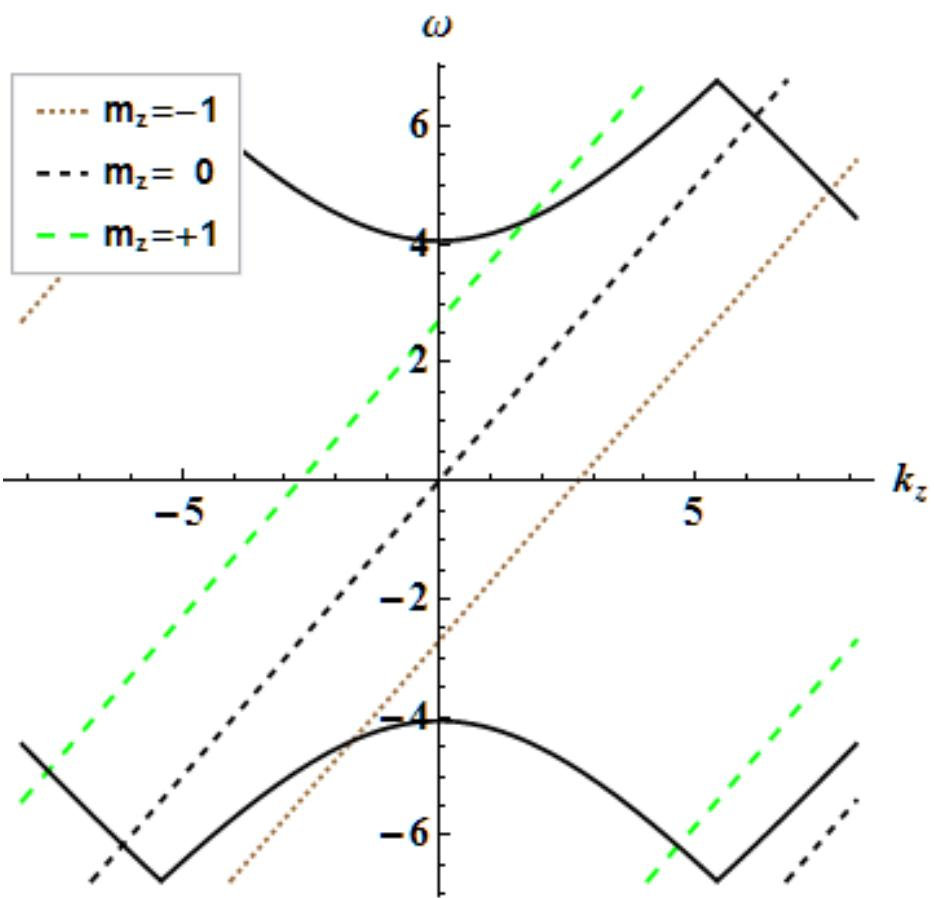  
Figure 1: PSATD normal mode diagram for $v \triangle t / \triangle z = 1 . 2$ and $k _ { x } ~ = ~ \pi / 2 { \triangle x } .$ , showing electromagnetic modes (numerically distorted for $k > \pi / \triangle t )$ and spurious beam modes, $m _ { z } = [ - 1 , 1 ]$ . Numerical Cherenkov instabilities are strongest near mode intersections.

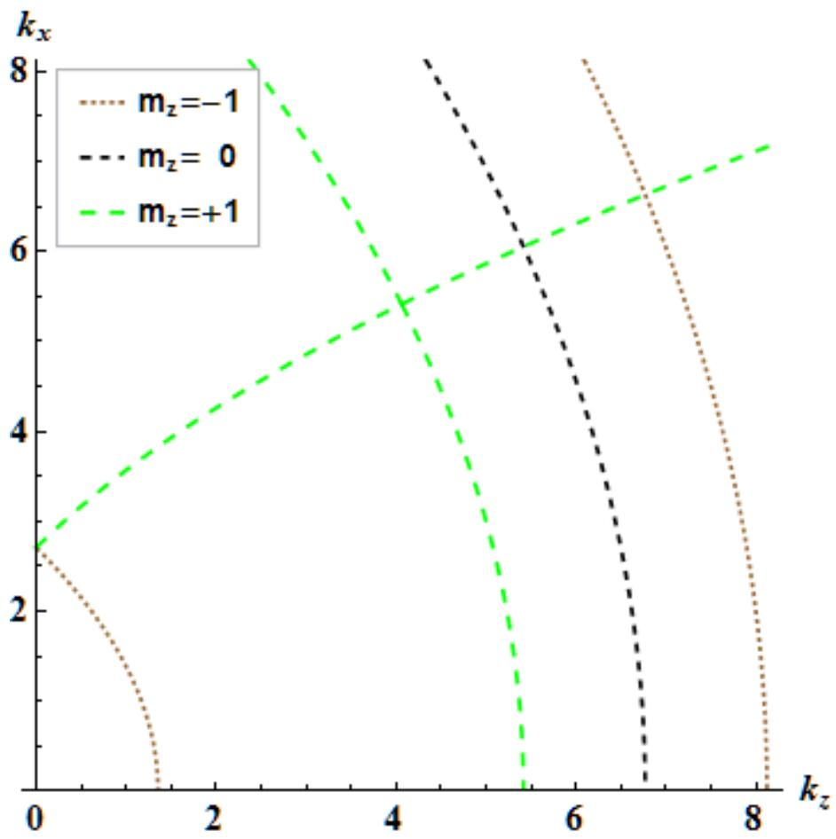  
Figure 2: Locations in k-space of PSATD resonances between electromagnetic modes and spurious beam modes, $m _ { z } ~ = ~ [ - 1 , + 1 ]$ , for $v \triangle t / \triangle z = 1 . 2$ . Intersecting resonance curves occur at diferent frequencies and, therefore, do not interact.

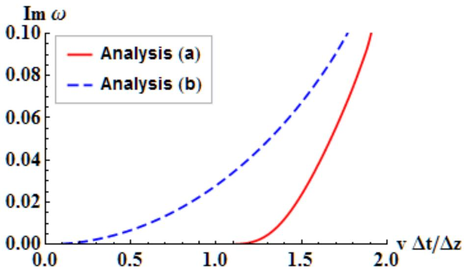  
Figure 3: Approximate maximum growth rates for PSATD options (a) and (b) with cubic interpolation and digital filtering. Option (c) exhibits zero growth in this approximation.

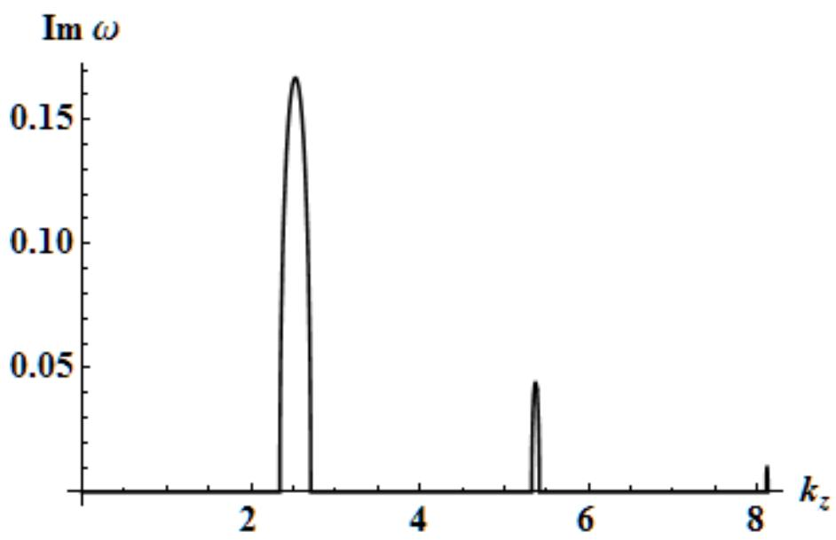  
Figure 4: PSATD one-dimensional growth rate for $m _ { z } = 0$ and $v \bigtriangleup t / \bigtriangleup z = 3$

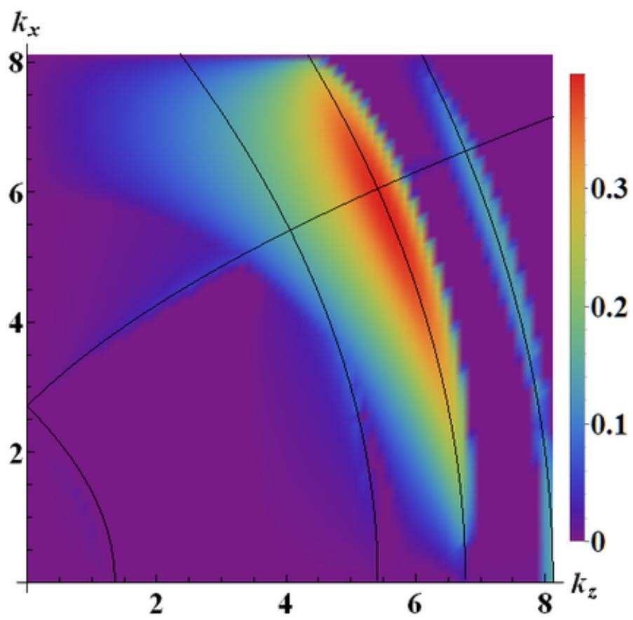  
Figure 5: Growth rates from PSATD dispersion relation for option (a), $m _ { z } = [ - 1 , + 1 ] ,$ and $v \triangle t / \triangle z = 1 . 2 .$ . Superimposed are the resonance curves from Fig. 2

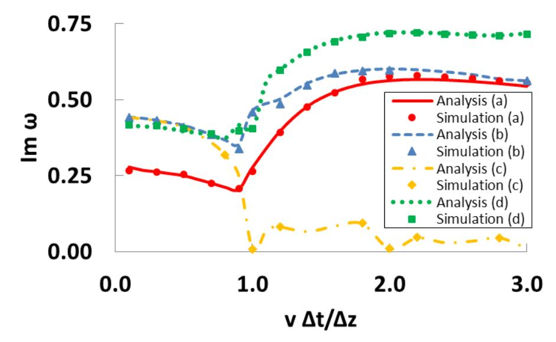  
Figure 6: Maximum growth rates for PSATD options (a), (b), (c), and (d) with linear interpolation and no digital filtering. Markers represent corresponding simulation results.

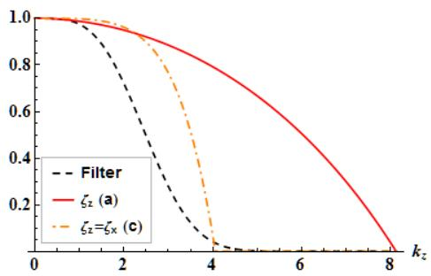

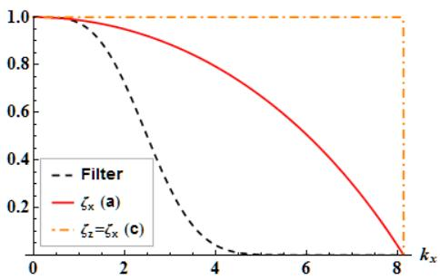  
Figure 7: Left: kz-dependent factor of ten-pass bilinear filter, $\zeta _ { z }$ for option $\mathrm { ( a ) }$ (which depends only on $k _ { z } )$ , and $\zeta _ { z } = \zeta _ { x }$ for option (c) evaluated at $k _ { x } = 0$ and $\triangle t / \triangle z = 2$ . Right: $k _ { x ^ { - } }$ dependent factor of ten-pass bilinear filter, $\zeta _ { x }$ for option (a) (which depends only on $k _ { x } )$ , and $\zeta _ { z } = \zeta _ { x }$ for option (c) evaluated at $k _ { z } = 0$ and $\triangle t / \triangle z = 2 .$

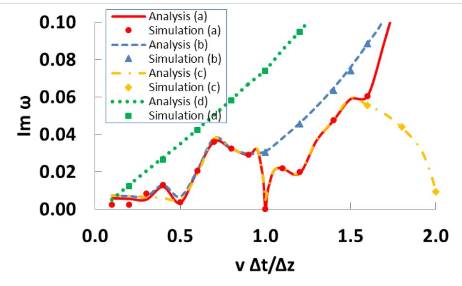  
Figure 8: Maximum growth rates for PSATD options (a), (b), (c), and (d) with linear interpolation and digital filtering. Markers represent corresponding simulation results.

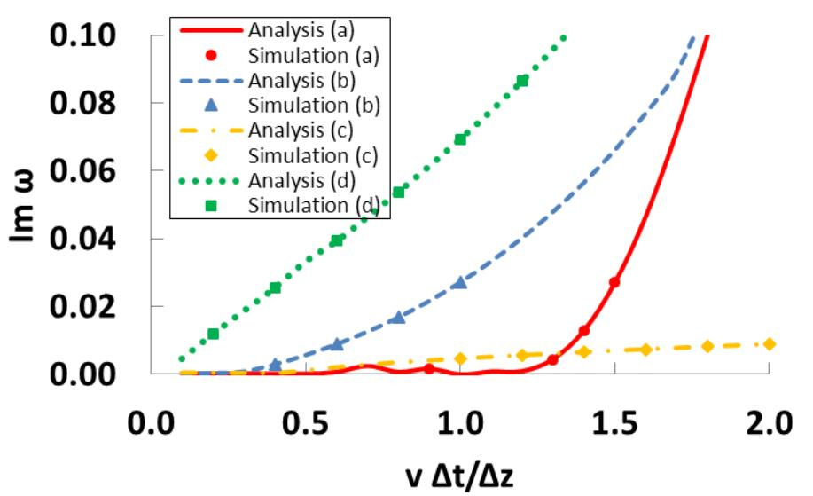  
Figure 9: Maximum growth rates for PSATD options (a), (b), (c), and (d) with cubic interpolation and digital filtering. Markers represent corresponding simulation results.

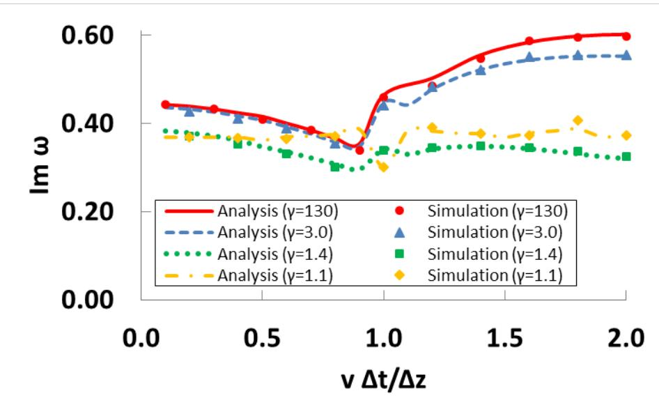  
Figure 10: Maximum growth rates for PSATD option (b) with $\gamma = 1 3 0 , 3 . 0 , 1 . 4 , 1 . 1$ , linear interpolation, and no filtering. Markers represent corresponding simulation results.

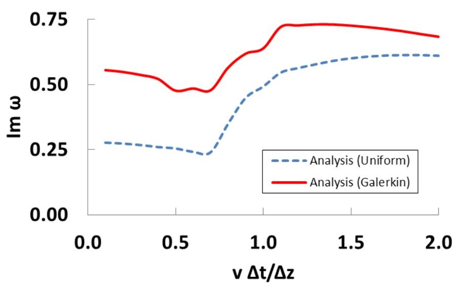  
Figure 11: Maximum growth rates for PSATD Uniform and Galerkin linear interpolation schemes and no digital filtering.

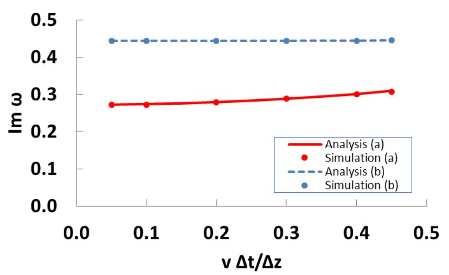  
Figure 12: Maximum growth rates for PSTD options (a) and (b) with linear interpolation and no digital filtering.

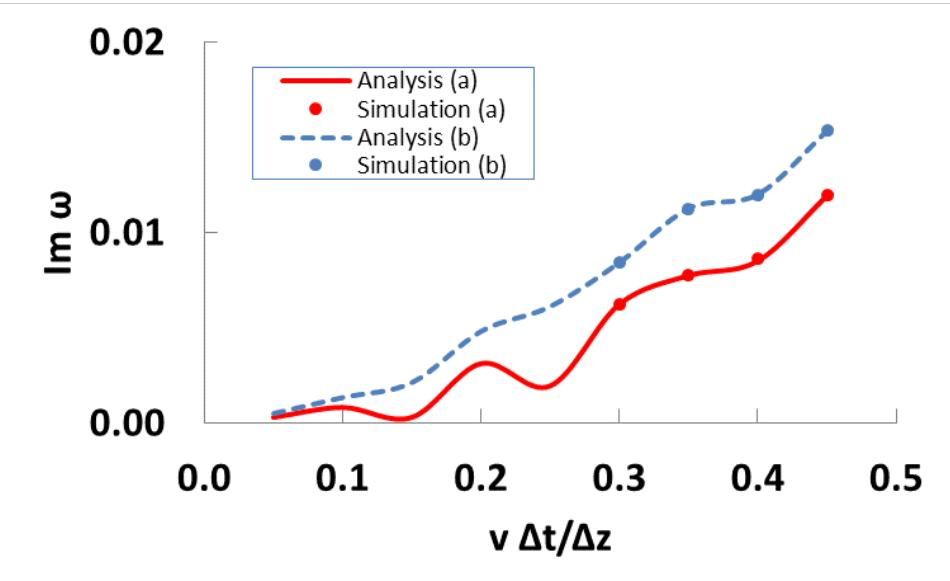  
Figure 13: Maximum growth rates for PSTD options (a) and (b) with cubic interpolation and digital filtering.

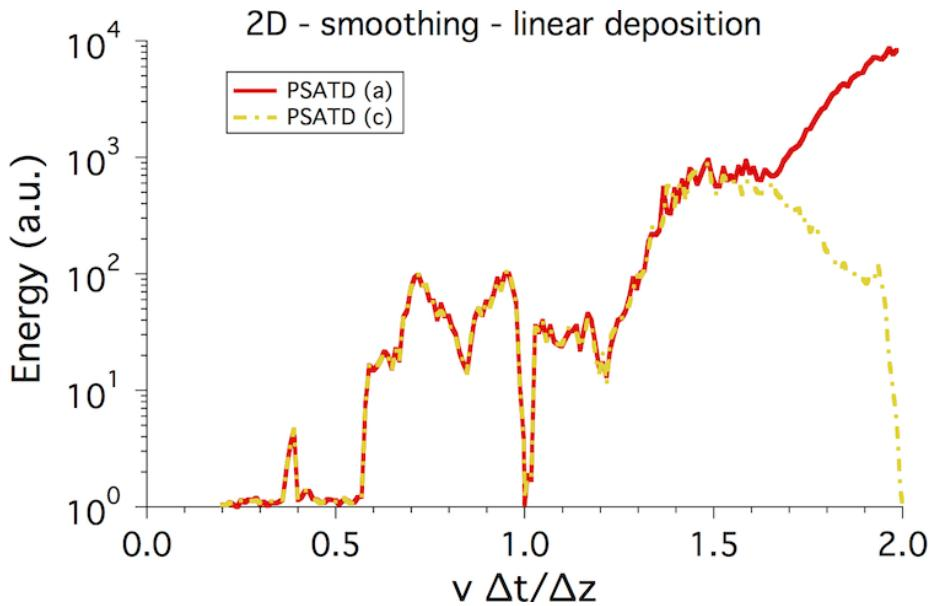  
Figure 14: Field energy relative to stable reference level vs $v \Delta t / \Delta z$ from two-dimensional $\mathrm { W A R P L P A }$ simulations at $\gamma = 1 3 ,$ , using the PSATD solver with Esirkepovk current deposition options (a) and (c), four passes of bilinear plus one compensation step filtering on both current and gathered fields, and linear interpolation.

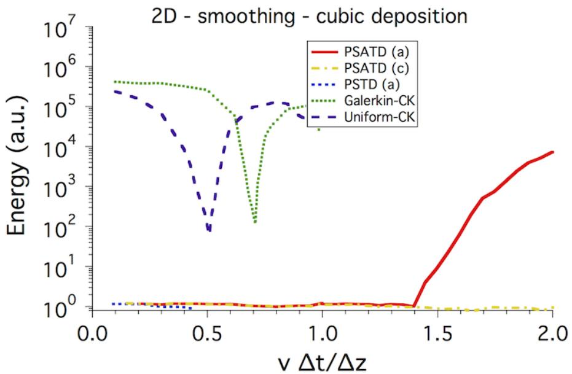  
Figure 15: Field energy relative to stable reference level vs $v \Delta t / \Delta z$ from two-dimensional WARP LPA simulations at $\gamma = 1 3 ,$ , using the PSATD or PSTD solvers with Esirkepovk current deposition options (a) and (c), four passes of bilinear plus one compensation step filtering on both current and gathered fields, and cubic interpolation. Results are contrasted to simulations using the CK solver with Galerking or Uniform field gather, same filtering and cubic interpolation.

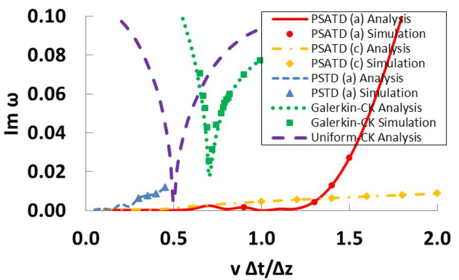  
Figure 16: Maximum growth rates for PSATD (a), PSATD (c), PSTD (a), Galerkin-CK, and Uniform-CK with cubic interpolation and digital filtering.

This document was prepared as an account of work sponsored in part by the United States Government. While this document is believed to contain correct information, neither the United States Government nor any agency thereof, nor The Regents of the University of California, nor any of their employees, nor the authors makes any warranty, express or implied, or assumes any legal responsibility for the accuracy, completeness, or usefulness of any information, apparatus, product, or process disclosed, or represents that its use would not infringe privately owned rights. Reference herein to any specific commercial product, process, or service by its trade name, trademark, manufacturer, or otherwise, does not necessarily constitute or imply its endorsement, recommendation, or favoring by the United States Government or any agency thereof, or The Regents of the University of California. The views and opinions of authors expressed herein do not necessarily state or reflect those of the United States Government or any agency thereof or The Regents of the University of California.