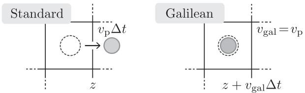
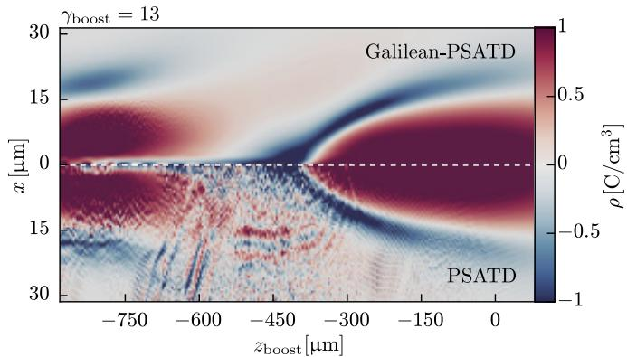
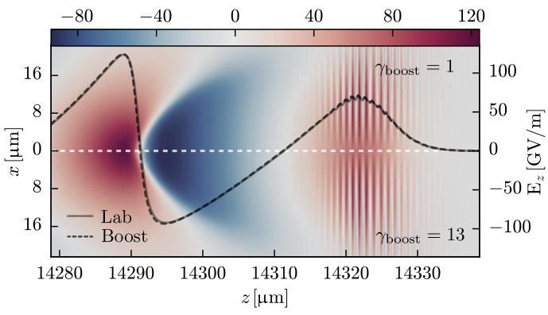
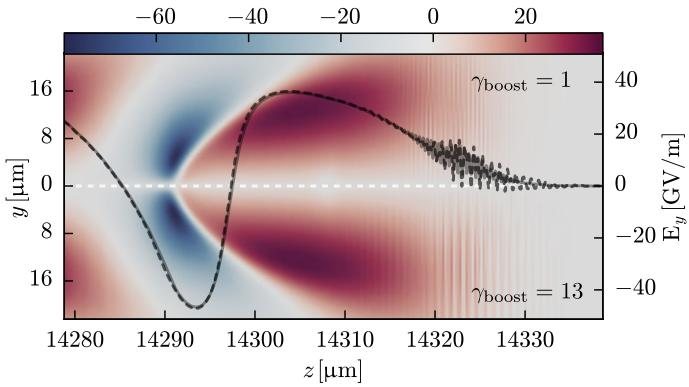
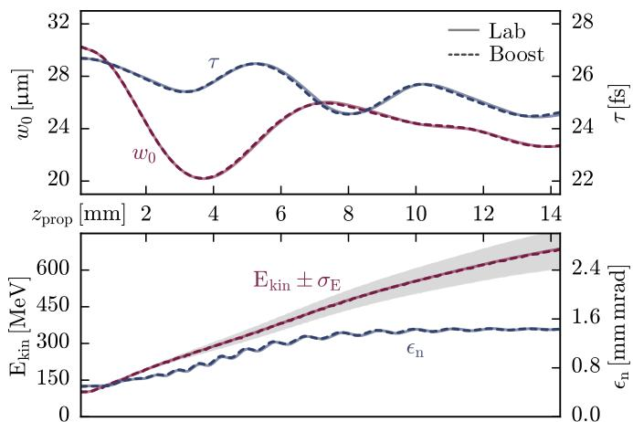

# Kirchen et al. 2016 相对论漂移等离子体稳定离散表示 笔记

## 0. 论文信息

- 原题：Stable discrete representation of relativistically drifting plasmas
- 作者：M. Kirchen, R. Lehe, B. B. Godfrey, I. Dornmair, S. Jalas, K. Peters, J.-L. Vay, A. R. Maier
- 期刊：Physics of Plasmas 23, 100704, 2016
- DOI：10.1063/1.4964770
- 本地文件：
  - PDF：`2016_KirchenPOP2016_Stable_discrete_representation_of_relativistically_drifting_plasmas.pdf`
  - MinerU Markdown：`2016_KirchenPOP2016_Stable_discrete_representation_of_relativistically_drifting_plasmas.md`
  - 图片目录：`images/`

这篇论文和 v0.17 的 Lehe et al. 2016 是一组互补文献。Lehe 论文更偏 Galilean PSATD 的推导和稳定性分析；Kirchen 论文更偏 boosted-frame 激光等离子体加速应用，说明为什么在 Lorentz boosted frame 中应取

$$
\mathbf{v}_{gal}=-\beta c\,\mathbf{e}_z
$$

使背景等离子体在 Galilean 网格上静止。对 PIC-tutor 第 6 章，它补的是“理论公式如何落到 boosted-frame workflow”的证据链。

## 1. 摘要

论文摘要给出核心结论：在离散、共传播的 Galilean 坐标中表示相对论漂移粒子群，可以得到一种对均匀流动等离子体内禀无 Numerical Cherenkov Instability 的 PIC 算法。作者进一步把该方法用于 Lorentz 变换后的最优参考系中的等离子体加速模拟。

这里“内禀无 NCI”的边界要读准确：论文讨论的是均匀速度漂移的背景等离子体，以及由 Galilean PSATD 表示消除粒子相对固定网格高速穿越这一病根；它不是说任何多流、多束、多边界、多 AMR 场景都自动无条件稳定。

## 2. 引言：NCI 是 boosted-frame PIC 的硬限制

论文先说明 PIC 的基本结构：粒子在连续空间中按 Newton-Lorentz 方程运动，电磁场在离散网格上解 Maxwell 方程。这个 Lagrangian 粒子视角和 Eulerian 网格视角的混合，是 PIC 的能力来源，也是 NCI 的根源之一。

对激光等离子体加速和天体等离子体这类问题，模拟中常出现相对论速度漂移的等离子体。特别是 Lorentz boosted frame 中，实验室系静止的背景等离子体会以接近光速的速度反向流过计算网格。传统电磁 PIC 算法在这里会受到 NCI 限制；不稳定要么污染结果，要么直接以非物理波的强增长破坏计算。

论文把 NCI 的来源拆成两类耦合：

- 电磁模式被离散场求解器扭曲；
- 粒子模式因为连续粒子量被采样到离散网格而产生空间/时间 alias。

一阶图像是 Numerical Cherenkov Radiation：如果数值电磁波的相速度被离散误差压到

$$
v_\Phi < v_p < c,
$$

高速粒子就能和本不该相互作用的数值电磁波共振，产生类似 Cherenkov 辐射的非物理能量转移。即便 PSATD 能避免最简单的真空色散错误，高阶 NCI 仍会限制相对论漂移等离子体模拟。

作者回顾了已有 NCI 抑制策略：current/field smoothing、damping、修改粒子看到的 `E/B` 比、对沉积电流乘以波数依赖因子，或人为调节电磁色散关系。这些方法可以降低增长率，但都属于针对 NCI 的数值修正，可能改变所求物理。

本文的目标不同：不是“把 NCI 压低”，而是把流动等离子体写到与它共动的离散坐标中，从源头移除粒子高速穿过固定网格带来的相对运动。

## 3. Galilean 坐标与 Galilean PSATD 方程

论文首先引入 Galilean 坐标变换：

$$
\mathbf{x}'=\mathbf{x}-\mathbf{v}_{gal}t .
$$

**变量说明：**

- $\mathbf{x}$：原参考系中的位置。
- $\mathbf{x}'$：Galilean 移动坐标中的位置。
- $\mathbf{v}_{gal}$：移动网格速度。

**推导过程：**

1. 对任意场 $f(\mathbf{x},t)=f'(\mathbf{x}',t)$，有 $\mathbf{x}'=\mathbf{x}-\mathbf{v}_{gal}t$。
2. 固定 $\mathbf{x}'$ 求导时，实验室坐标点随时间以 $\mathbf{v}_{gal}$ 移动。
3. 因此时间导数会带上 convective derivative：

$$
\partial_t \rightarrow \partial_t-\mathbf{v}_{gal}\cdot\nabla'.
$$

在 Galilean 坐标中，粒子和 Maxwell 方程变为：

$$
\frac{d\mathbf{x}'}{dt}=\frac{\mathbf{p}}{\gamma m}-\mathbf{v}_{gal},
$$

$$
\frac{d\mathbf{p}}{dt}=q\left(\mathbf{E}+\frac{\mathbf{p}}{\gamma m}\times\mathbf{B}\right),
$$

$$
\left(\frac{\partial}{\partial t}-\mathbf{v}_{gal}\cdot\nabla'\right)\mathbf{B}
=-\nabla'\times\mathbf{E},
$$

$$
\frac{1}{c^2}\left(\frac{\partial}{\partial t}-\mathbf{v}_{gal}\cdot\nabla'\right)\mathbf{E}
=\nabla'\times\mathbf{B}-\mu_0\mathbf{j}.
$$

连续性方程也相应变成：

$$
\left(\partial_t-\mathbf{v}_{gal}\cdot\nabla'\right)\rho+\nabla'\cdot\mathbf{j}=0.
$$

这组式子解释了 WarpX `PsatdAlgorithmGalilean.cpp` 中为什么会出现 `k_dot_vg`、`theta`、`T2` 这类相位量。它们不是数值调参，而是 Galilean convective derivative 在 Fourier 空间中的必然结果。

论文随后用 PSATD 框架解析积分 Maxwell 方程。标准 PSATD 常假设一个时间步内电流在原坐标 $\mathbf{x}$ 上常量；Galilean PSATD 的关键假设是电流在移动坐标 $\mathbf{x}'$ 上常量。对应的谱场推进可概括为：

$$
\tilde{\mathbf{B}}^{n+1}
=\theta^2 C\tilde{\mathbf{B}}^n
-\frac{\theta^2 S}{ck}i\mathbf{k}\times\tilde{\mathbf{E}}^n
+\frac{\theta\chi_1}{\epsilon_0c^2k^2}i\mathbf{k}\times\tilde{\mathbf{J}}^{n+1/2},
$$

$$
\tilde{\mathbf{E}}^{n+1}
=\theta^2 C\tilde{\mathbf{E}}^n
+\frac{\theta^2 S}{k}ci\mathbf{k}\times\tilde{\mathbf{B}}^n
+\frac{i\nu\theta\chi_1-\theta^2S}{\epsilon_0ck}\tilde{\mathbf{J}}^{n+1/2}
-\frac{\chi_2\hat\rho^{n+1}-\theta^2\chi_3\hat\rho^n}{\epsilon_0k^2}i\mathbf{k}.
$$

系数定义为：

$$
C=\cos(ck\Delta t),\qquad S=\sin(ck\Delta t),
$$

$$
\nu=\frac{\mathbf{k}\cdot\mathbf{v}_{gal}}{ck},
\qquad
\theta=\exp(i\mathbf{k}\cdot\mathbf{v}_{gal}\Delta t/2).
$$

当 $\mathbf{v}_{gal}=0$ 时，$\nu=0$、$\theta=1$，这套式子退回标准 PSATD。反过来，当 $\mathbf{v}_{gal}$ 取背景等离子体漂移速度时，背景粒子在移动网格中近似静止，电流“在移动网格中常量”的假设与物理运动相容。

### 图 1：Galilean 坐标的单粒子/单网格直观图

图 1 是全文最重要的直观图。标准离散中，速度为 $v_p$ 的等离子体粒子在一个时间步内相对固定网格移动 $v_p\Delta t$；Galilean 坐标中如果取

$$
\mathbf{v}_{gal}=\mathbf{v}_p,
$$

则粒子相对网格静止。NCI 的核心病根是相对论漂移粒子和固定离散网格之间的 mismatch；这张图说明 Galilean 表示是直接消除 mismatch，而不是事后滤波。

## 4. Lorentz boosted-frame 等离子体加速示例

作者接着把算法用于 Lorentz boosted-frame 激光等离子体加速模拟。实验室系中，激光或粒子束沿一个方向高速穿过静止等离子体；做 Lorentz 变换后，激光波长等共传播尺度被拉长，原本静止的等离子体被压缩并以速度

$$
v_{plasma}=-\beta c
$$

反向穿过计算域。理想加速比近似随

$$
\gamma_{boost}^2
$$

增长，上限通常与 wake 相速度有关。

因此 boosted-frame 中 Galilean 速度的自然选择是

$$
\mathbf{v}_{gal}=-\beta c\,\mathbf{e}_z.
$$

这个式子正是 PIC-tutor 需要强调给读者的点：`psatd.use_default_v_galilean` 不是随意给一个稳定化速度，而是把 Galilean 网格速度绑定到 Lorentz boosted frame 中背景等离子体的漂移速度。

论文示例参数包括：$\lambda=800\,\mathrm{nm}$ 的激光、$a_0=1.5$、$c\tau=8\,\mu\mathrm{m}$、$w_0=30\,\mu\mathrm{m}$、轴上电子密度 $n_e=10^{18}\,\mathrm{cm}^{-3}$，电子束从 $100\,\mathrm{MeV}$ 加速到 $687\,\mathrm{MeV}$，传播距离约 $14.3\,\mathrm{mm}$。

### 图 2：标准 PSATD 和 Galilean PSATD 的 boosted-frame 电荷密度对比

图 2 上半部分是 Galilean PSATD，取 $v_{gal}=-\beta c$；下半部分是相同参数下的标准 PSATD。标准 PSATD 出现快速增长的 NCI，而 Galilean PSATD 没有出现不稳定。这里所有数值参数相同，唯一差别是 Galilean 速度是否为背景等离子体漂移速度，因此图 2 是 boosted-frame 应用层的关键证据。

作者还指出：电子束虽然和网格反向运动，却没有在束附近触发明显 NCI，原因是束密度远低于背景等离子体，且在 boosted frame 中被拉长；这提醒读者 NCI 风险的主导对象通常是高密度背景流，而不是所有相对论粒子都同等危险。

## 5. 与实验室系参考解比较

为了验证 Galilean boosted-frame 模拟没有改变物理，作者把结果 back-transform 回实验室系，并与实验室系直接模拟对比。

### 图 3：加速场和聚焦场对比

图 3 比较了纵向加速场 $E_z$ 和横向聚焦场 $E_y$。实线是实验室系直接模拟，虚线是 $\gamma_{boost}=13$ 的 boosted-frame 模拟 back-transform 后结果。两者基本重合，说明 Galilean PSATD 不只是让模拟稳定，也能保留 wakefield 的关键物理结构。

论文特别强调，boosted-frame 模拟只需几千步，而实验室系模拟需要超过五十万步；在 FBPIC 中得到约 $287$ 倍加速，接近理论最优加速比的 $92\%$。

### 图 4：激光和电子束演化对比

图 4 比较了激光腰斑 $w_0$、脉冲长度 $\tau$、电子束动能 $E_{kin}$、能散 $\sigma_E$ 和归一化发射度 $\epsilon_n$。Galilean boosted-frame 和实验室系结果在传播末端的差异处于亚百分比量级。这个图把“数值稳定”推进到“物理量保真”：NCI 被消除后，仍需要证明加速器关键观测量没有偏离。

## 6. 结论和对 PIC-tutor 的用法

论文结论可以压缩成三句话：

1. Galilean PSATD 是一种在移动坐标中离散 Maxwell-Lorentz 系统的方法，不是普通 moving window。
2. 对均匀相对论漂移等离子体，取 $\mathbf{v}_{gal}=\mathbf{v}_{plasma}$ 可内禀消除 NCI。
3. 在 Lorentz boosted-frame 激光等离子体加速中，取 $\mathbf{v}_{gal}=-\beta c$ 能同时获得稳定性、物理保真和接近最优的计算加速比。

对 WarpX/PIC-tutor，本文应连接到以下入口：

- `../warpx/Docs/source/theory/boosted_frame.rst`：官方文档同时引用 `bf-KirchenPOP2016` 和 `bf-LehePRE2016`，用本文支撑 boosted-frame 应用实例。
- `../warpx/Source/FieldSolver/SpectralSolver/SpectralSolver.cpp`：按 `v_comoving`、`v_galilean` 等条件选择谱算法。
- `../warpx/Source/FieldSolver/SpectralSolver/PsatdAlgorithmGalilean.cpp`：实现 $\theta$、$C$、$S$、$\chi_i$ 或等价系数。
- `../warpx/Examples/Tests/nci_psatd_stability/`：把稳定性判断落到电场能量比和 Gauss law regression gate。

## 7. 开放问题与接续工作

- 本文给出的是短篇应用展示，完整色散推导仍要回到 Lehe et al. 2016。
- 第 6 章后续应继续把 `psatd.use_default_v_galilean`、`warpx.gamma_boost` 和 WarpX 默认速度设置的源码路径逐项对表。
- 还需补 Godfrey 系列 PSATD/NCI 论文，解释为什么滤波、`E/B` 修正、current scaling 和 Galilean 表示是不同层级的 NCI 策略。

## 8. 复习速记

在 boosted-frame PIC 中，背景等离子体以 $-\beta c$ 流过网格；Galilean PSATD 的要点是让网格也以 $-\beta c$ 共动，使背景等离子体相对网格静止，从而从离散表示层消除主要 NCI 病根。
