# Lehe et al. 2016 Galilean PSATD 消除 NCI 中文讲解

## 0. 论文信息与本项目用途

- 原题：Elimination of Numerical Cherenkov Instability in flowing-plasma Particle-In-Cell simulations by using Galilean coordinates
- 作者：R. Lehe, M. Kirchen, B. B. Godfrey, A. R. Maier, J.-L. Vay
- 版本：Phys. Rev. E 94, 053305, 2016；本地 PDF 来自 arXiv:1608.00227
- 本地文件：
  - PDF：`2016_LehePRE2016_Elimination_of_NCI_by_Galilean_coordinates.pdf`
  - MinerU Markdown：`2016_LehePRE2016_Elimination_of_NCI_by_Galilean_coordinates.md`
  - 图片目录：`images/`

这篇论文是第 6 章 PSATD/Galilean/NCI 论证链的核心入口。它解释了为什么在流动等离子体，尤其是 boosted-frame PIC 中，标准 PSATD 仍可能出现数值 Cherenkov 不稳定性；也解释了 WarpX 中 `psatd.v_galilean`、`psatd.use_default_v_galilean`、`psatd.current_correction`、`psatd.do_time_averaging` 与 `warpx.gamma_boost` 之间的物理关系。读这篇论文时要把它和 WarpX 官方文档 `../warpx/Docs/source/theory/boosted_frame.rst`、源码 `../warpx/Source/FieldSolver/SpectralSolver/PsatdAlgorithmGalilean.cpp` 以及回归测试 `../warpx/Examples/Tests/nci_psatd_stability/` 放在一起看。

## 1. 摘要

论文的目标很直接：对一个相对论流动等离子体，如果仍在固定实验室网格上做 PIC，离散网格会和流动粒子产生 alias resonance，进而触发数值 Cherenkov 不稳定性。作者提出在 Galilean 坐标中写 PSATD，也就是让数值网格以速度 `v_gal` 随等离子体一起移动。关键结论是：当 `v_gal` 取等离子体漂移速度 `v0` 时，标准 PSATD 中的 NCI 共振可以在均匀流动等离子体问题中被消除。

这个结论不是简单的“换一个移动窗口”。移动窗口只改变计算盒子覆盖的空间区域；Galilean PSATD 改的是场方程和电流近似的离散合同。

## 2. Introduction：问题来自流动等离子体和网格 alias

引言先回到 boosted-frame simulation 的动机。激光等离子体加速等问题在实验室系中空间、时间尺度差异很大；用 Lorentz boosted frame 后，物理长度和时间可以显著压缩。但代价是背景等离子体在计算系中高速流动。高速粒子束、离散网格和有限时间步会形成数值 Cherenkov 不稳定性。

对普通 FDTD，NCI 可以通过滤波、特殊 stencil 或 timestep 调整缓解。PSATD 在真空色散上更好，但在流动等离子体里仍会因为粒子-网格 alias 出现不稳定。本文的切入点是：如果网格在数值上和等离子体共动，等离子体的 alias resonance 结构会改变，最危险的 NCI 分支可以消失。

## 3. Section I：Galilean scheme 的直观图像

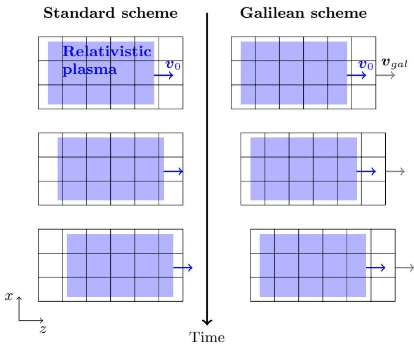

论文先定义 Galilean 坐标：

$$
\mathbf{x}'=\mathbf{x}-\mathbf{v}_{gal}t .
$$

如果一个标量场写成 `f(x,t)=f'(x',t)`，在固定 `x'` 上求时间导数时，链式法则给出

$$
\left.\frac{\partial f'}{\partial t}\right|_{\mathbf{x}'}
=
\left.\frac{\partial f}{\partial t}\right|_{\mathbf{x}}
 \mathbf{v}_{gal}\cdot\nabla f .
$$

反过来，在 Galilean 坐标中写实验室系的时间演化，常出现

$$
\left(\partial_t-\mathbf{v}_{gal}\cdot\nabla'\right).
$$

这就是本文后面 Maxwell 方程里的 convective derivative。它的物理含义是：网格点不是固定在实验室坐标，而是在 `v_gal` 速度下穿过实验室空间。

这一步和 moving window 不同。moving window 通常仍在窗口内部使用实验室固定网格，只是让计算域边界随时间移动；Galilean scheme 是把方程本身写在移动坐标上，电流在一个时间步内“常量”的假设也从固定 `x` 改成固定 `x'`。

## 4. Section II.A：Cartesian Galilean PSATD 的场方程

标准 PIC 方程在实验室坐标中可写成

$$
\frac{d\mathbf{x}}{dt}=\frac{\mathbf{p}}{\gamma m},
\qquad
\frac{d\mathbf{p}}{dt}=q\left(\mathbf{E}+\frac{\mathbf{p}}{\gamma m}\times\mathbf{B}\right),
$$

$$
\partial_t\mathbf{B}=-\nabla\times\mathbf{E},
\qquad
c^{-2}\partial_t\mathbf{E}=\nabla\times\mathbf{B}-\mu_0\mathbf{J}.
$$

切到 Galilean 坐标后，粒子位置相对移动网格的速度变为

$$
\frac{d\mathbf{x}'}{dt}=\frac{\mathbf{p}}{\gamma m}-\mathbf{v}_{gal},
$$

Maxwell 方程变成

$$
\left(\partial_t-\mathbf{v}_{gal}\cdot\nabla'\right)\mathbf{B}
=-\nabla'\times\mathbf{E},
$$

$$
c^{-2}\left(\partial_t-\mathbf{v}_{gal}\cdot\nabla'\right)\mathbf{E}
=\nabla'\times\mathbf{B}-\mu_0\mathbf{J}.
$$

在 Fourier 空间中，`∇'` 变成 `i k`，convective derivative 带来相位因子。标准 PSATD 的核心近似是：在一个时间步内，电流在固定实验室网格点上保持常量。论文写成：

$$
\mathbf{J}(\mathbf{x},t)=\mathbf{J}^{n+1/2}(\mathbf{x}).
$$

Galilean PSATD 则把这个假设换成：

$$
\mathbf{J}(\mathbf{x}',t)=\mathbf{J}^{n+1/2}(\mathbf{x}').
$$

这两个式子看起来只差一个撇号，但数值含义完全不同。前者说“电流图样固定在实验室网格上”，后者说“电流图样固定在随 `v_gal` 移动的网格上”。对均匀高速漂移等离子体，后者才和粒子运动更相容。

电荷守恒也要同步改写。Galilean 离散连续性方程的核心形式是

$$
-i\frac{\widehat{\rho}^{n+1}-\theta^2\widehat{\rho}^{n}}{\Delta t}
+i\mathbf{k}\cdot\widehat{\mathbf{J}}^{n+1/2}=0,
$$

其中

$$
\theta=\exp\left(i\mathbf{k}\cdot\mathbf{v}_{gal}\Delta t/2\right).
$$

这个式子是 WarpX Galilean current correction 的源头。标准 current correction 用的是 `rho_new-rho_old`；Galilean 分支必须把旧电荷密度乘上 Galilean 相位 `theta^2` 后再做投影。

论文给出的场更新公式较长，实际实现中对应 `PsatdAlgorithmGalilean.cpp` 的 `C`、`S_ck`、`T2`、`X1-X4` 等系数。读源码时可以把它概括为：

$$
\widehat{\mathbf{E}}^{n+1}
=C\widehat{\mathbf{E}}^n
+ic^2S\,\mathbf{k}\times\widehat{\mathbf{B}}^n
+\mathcal{S}_E(\widehat{\mathbf{J}},\widehat{\rho}^n,\widehat{\rho}^{n+1},\mathbf{v}_{gal}),
$$

$$
\widehat{\mathbf{B}}^{n+1}
=C\widehat{\mathbf{B}}^n
-iS\,\mathbf{k}\times\widehat{\mathbf{E}}^n
+\mathcal{S}_B(\widehat{\mathbf{J}},\widehat{\rho}^n,\widehat{\rho}^{n+1},\mathbf{v}_{gal}),
$$

其中 `C=cos(ckΔt)`、`S=sin(ckΔt)/(ck)`，源项 `S_E/S_B` 被 Galilean 相位和 `X` 系数修正。完整表达式以 MinerU Markdown 中的论文公式和 WarpX 源码为准。

## 5. Section II.B：PIC cycle 和 current correction

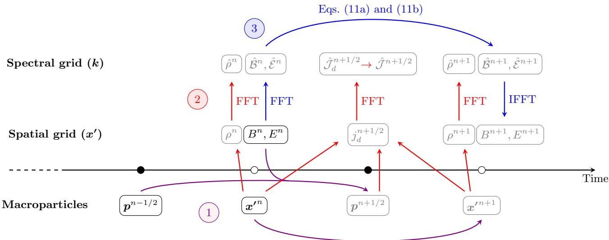

论文把 Galilean PSATD 的 PIC cycle 写成三块：粒子推进、电流/电荷沉积、Maxwell solver。粒子位置在移动坐标中推进：

$$
\mathbf{x}'^{\,n+1}
=\mathbf{x}'^{\,n}
+\Delta t\left(\frac{\mathbf{p}^{n+1/2}}{\gamma^{n+1/2}m}-\mathbf{v}_{gal}\right).
$$

这说明 `v_gal=v0` 时，背景等离子体粒子在移动网格中几乎静止，电流在一个时间步内近似固定在 `x'` 上就更合理。

current correction 的目的不是降噪，而是把沉积出来的 `J` 投影到满足离散连续性方程的子空间。标准 PSATD 的修正形式可以写成

$$
\widehat{\mathbf{J}}_{corr}
=\widehat{\mathbf{J}}
-\left(\mathbf{k}\cdot\widehat{\mathbf{J}}
-i\frac{\widehat{\rho}^{n+1}-\widehat{\rho}^{n}}{\Delta t}\right)
\frac{\mathbf{k}}{k^2}.
$$

Galilean 版本把括号里的电荷差替换为带相位的版本：

$$
\mathbf{k}\cdot\widehat{\mathbf{J}}_{corr}
=\frac{\mathbf{k}\cdot\mathbf{v}_{gal}
\left(\widehat{\rho}^{n+1}-\theta^2\widehat{\rho}^{n}\right)}
{1-\theta^2},
$$

然后沿 `k` 方向修正 `J` 的纵向分量。WarpX 源码里的 `rho_old_mod = rho_old * exp(i*k_dot_vg*dt)` 和 `den = 1 - exp(i*k_dot_vg*dt)` 正是这件事。

## 6. Section II.C：均匀相对论流动等离子体的稳定性

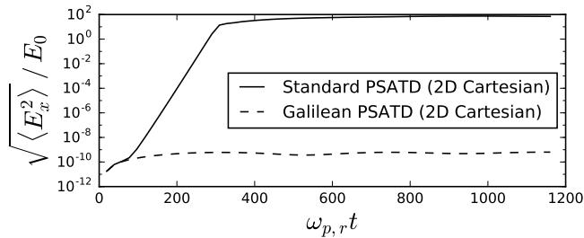

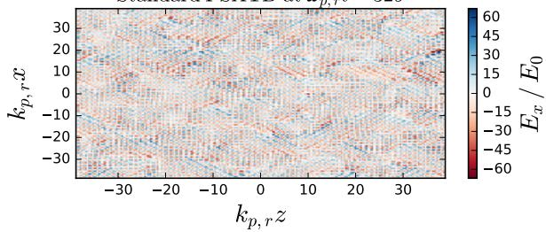

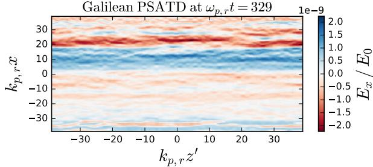

这一节用均匀相对论等离子体测试 Galilean PSATD。图 3 的对比很关键：标准 PSATD 中 RMS 电场随时间增长，场图中出现明显数值噪声；Galilean PSATD 中噪声维持在低水平。

这不是因为 Galilean PSATD 对所有问题都无条件稳定，而是因为测试场景里的等离子体漂移速度和 `v_gal` 对齐后，最危险的数值共振被移走了。对读者来说，这一节应该和 WarpX 的 `Examples/Tests/nci_psatd_stability/analysis_galilean.py` 对读：回归测试也是用电场能量比来判断 Galilean PSATD 是否压住 NCI，并在 current correction 分支额外检查 Gauss law。

## 7. Section III：二维稳定性分析和 NCI 共振条件

论文第三节推导 2D Cartesian 几何中的数值色散关系。完整色散式很长，可以理解为把线性化 Vlasov 响应、PSATD 场推进、粒子沉积和 grid alias 合到一个 determinant 条件：

$$
\det \mathcal{D}(\omega,\mathbf{k},\Delta t,\Delta x,\mathbf{v}_0,\mathbf{v}_{gal})=0.
$$

当 `Im(ω)>0` 时，对应模式会指数增长。标准 NCI 的危险点来自空间和时间 alias：

$$
\omega'=\omega+\frac{2\pi\mu}{\Delta t},
\qquad
k'_z=k_z+\frac{2\pi m_z}{\Delta z}.
$$

漂移等离子体的 beam resonance 近似满足

$$
\omega+\frac{2\pi\mu}{\Delta t}
=
v_0\left(k_z+\frac{2\pi m_z}{\Delta z}\right).
$$

Galilean 坐标会把电流源项和场推进中的相位整体改写。论文的关键结论是：当

$$
\mathbf{v}_{gal}=\mathbf{v}_0,
$$

时，主要 alias 分支的增长率在均匀流动等离子体中消失或被显著压低。直观上，背景等离子体在移动网格中不再快速穿过网格，电流源项不再以错误的“固定实验室网格常量”方式被近似。

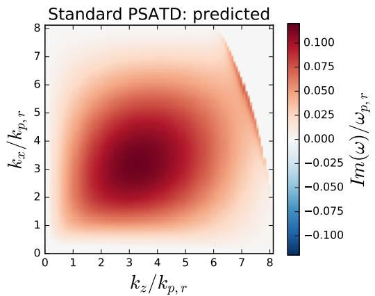

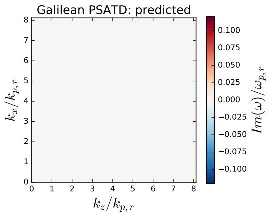

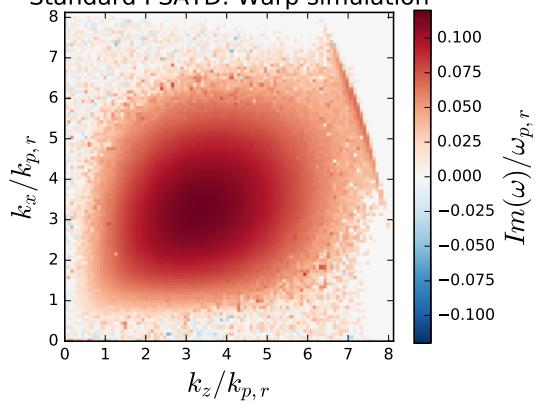

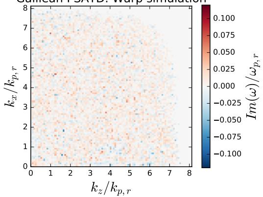

图 4 把色散关系预测的增长率和 Warp 模拟测量做对比。左侧标准 PSATD 出现 NCI 增长区，右侧取 `v_gal=v0` 后这些增长区消失。这是本文最重要的证据闭环：公式推导、数值色散求根和 PIC simulation 三者一致。

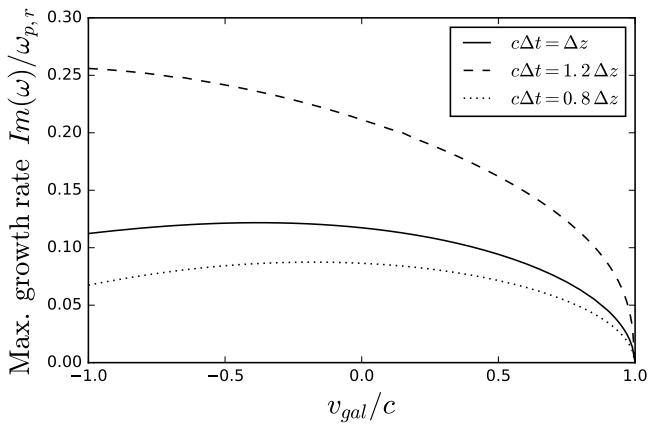

图 5 进一步扫描 `v_gal`。最大增长率只在 `v_gal≈v0≈c` 附近降到零；取相反方向的 `v_gal=-c` 并不能抑制这组 NCI。这一点对 WarpX 输入很重要：Galilean 速度应当跟随 boosted-frame 中背景等离子体的漂移速度，而不是随意取一个光速方向。

## 8. Section IV：准柱坐标几何

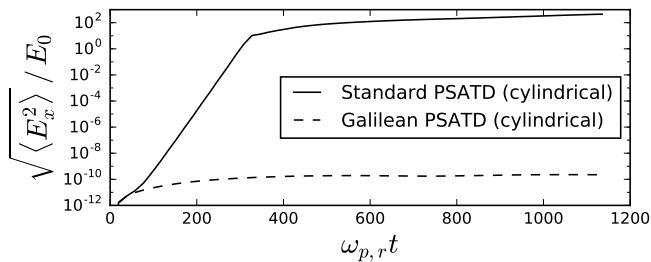

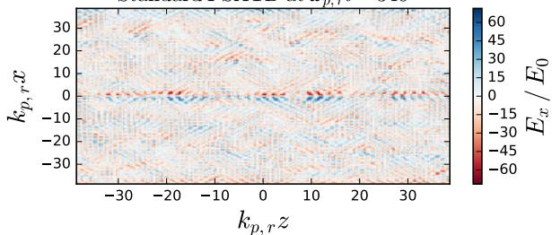

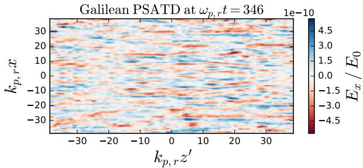

第四节把 Galilean PSATD 推广到 quasi-cylindrical 几何。这里不再使用 Cartesian Fourier basis，而是使用 Fourier-Bessel 或 azimuthal mode decomposition。对 WarpX 读者来说，这对应 RZ PSATD 的实现边界：不能把 `kx,ky,kz` 的 Cartesian 公式机械删掉一个方向，而要重新处理 radial derivative、azimuthal mode 和 `Ep/Em/Ez` 变量。

图 6 表明，在准柱坐标代码中，标准 PSATD 也会出现流动等离子体 NCI；Galilean 版本同样能压制该不稳定性。这和 WarpX 当前 `nci_psatd_stability` 中的 `rz_galilean_psatd` regression 形成对应。

## 9. Conclusion：本文给第 6 章带来的判断

本文给第 6 章提供三条可以直接写入正文的判断：

1. Galilean PSATD 的本质是把 field update 和 current approximation 都写在移动坐标中；它不是 moving window 的同义词。
2. 对 boosted-frame 中的均匀流动等离子体，`v_gal` 应该取接近背景漂移速度 `v0`，这样才能消除主要 NCI 增长分支。
3. current correction 必须跟 Galilean 连续性方程一致；否则即使场推进公式正确，`J`、`rho^n`、`rho^{n+1}` 的离散合同也会断开。

## 10. 与 WarpX 和本书章节的连接

第 6 章正文应把这篇论文连接到以下入口：

- 官方文档：`../warpx/Docs/source/theory/boosted_frame.rst`
- Cartesian 源码：`../warpx/Source/FieldSolver/SpectralSolver/PsatdAlgorithmGalilean.cpp`
- 谱求解器分派：`../warpx/Source/FieldSolver/SpectralSolver/SpectralSolver.cpp`
- PSATD 主流程：`../warpx/Source/FieldSolver/WarpXPushFieldsEM.cpp`
- 回归测试：`../warpx/Examples/Tests/nci_psatd_stability/`
- PML 组合测试：`../warpx/Examples/Tests/pml/inputs_test_2d_pml_x_galilean`

最适合读者记住的一组输入参数是：

```text
algo.maxwell_solver = psatd
psatd.v_galilean = ...
psatd.use_default_v_galilean = 1
psatd.current_correction = 1
psatd.do_time_averaging = 1
warpx.gamma_boost = ...
```

其中 `use_default_v_galilean` 的意义不是“自动调参”，而是在 boosted-frame 语境下把 Galilean 速度绑定到理论上应该共动的背景漂移速度。

## 11. 后续需要继续核实的点

- 把论文附录中的完整系数和 WarpX `X1-X4`、`T2`、`Theta` 变量逐项对照。
- 对照 `analysis_galilean.py` 中的 reference energy，说明每条 regression 的“不稳定参考值”来自哪个关闭项。
- 继续补 `Kirchen et al. POP 2016` 或 Godfrey 系列 PSATD/NCI 论文，形成 boosted-frame、Galilean、filter/time-averaging 三条线的完整文献闭环。
