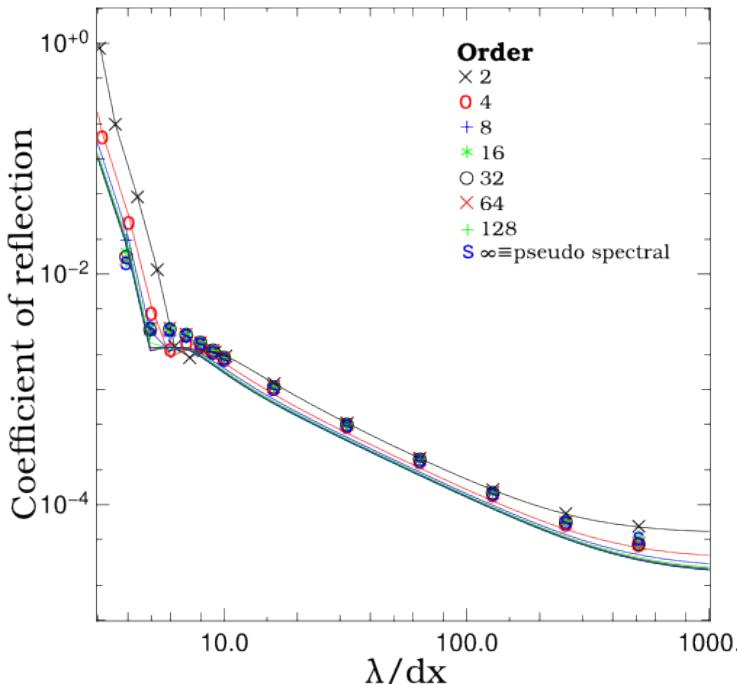
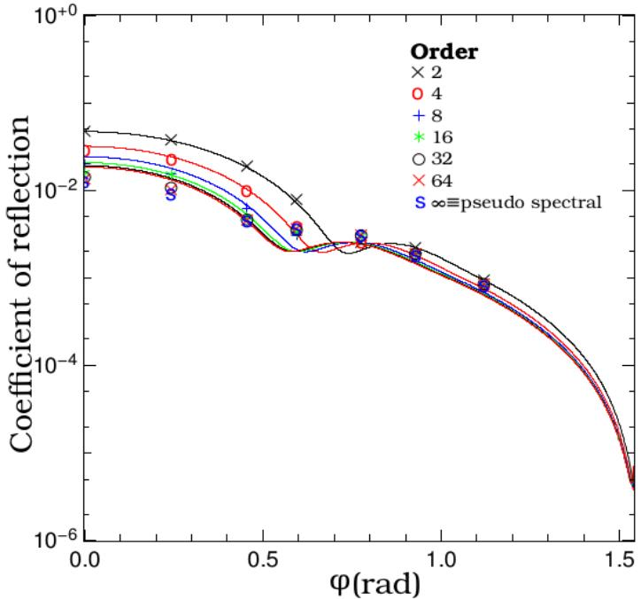

# Lee & Vay 2015 PML / pseudo-spectral Maxwell solvers 中文讲解

## 0. 论文信息与证据边界

- 题目：*Efficiency of the Perfectly Matched Layer with High-Order Finite Difference and Pseudo-Spectral Maxwell Solvers*
- 作者：P. Lee，J.-L. Vay
- 发表信息：*Computer Physics Communications* 194 (2015), 1-9
- DOI：`10.1016/j.cpc.2015.04.004`
- 本地全文来源：UC eScholarship `49m2k3vj` 的公开 accepted/submitted manuscript
- 本地资产：同目录 PDF、MinerU Markdown、`images/` 和本中文讲解

本地 PDF 是机构仓储中的作者/机构版本，不应误称为 Elsevier publisher-formatted version。它足以支持公式和算法结构的第一轮讲解；如果后续取得正式发表版，仍应核对版式、公式编号和最终措辞差异。

## 1. 摘要与引言

论文关注高阶 FDTD 和 pseudo-spectral Maxwell solver 中的 PML 效率。作者把 pseudo-spectral method 视为有限差分阶数趋于无穷时的极限，因此把“高阶 FDTD 的反射率分析”自然延伸到 PSTD 极限。论文的核心问题不是重新提出 PML，而是回答：当空间离散阶数提高、甚至进入 pseudo-spectral limit 时，PML 的吸收效率和离散反射是否保持可接受。

论文还把这一问题放回 PIC 场景：PSATD/PSTD 具有低数值色散、较好的长距离传播性质和更宽松的时间步限制，但 open boundary 仍然需要吸收层。PML 的连续介质匹配性质不等于离散系统零反射，因此必须把波长、入射角、PML 厚度和 stencil 阶数一起纳入分析。

## 2. PML medium：split-field 方程

论文以二维 TE 模式为代表，非零场为 (E_x,E_y,B_z)，并将磁场拆成

$$
B_z=B_{zx}+B_{zy}.
$$

对应的连续方程可写成

$$
\frac{\partial E_x}{\partial t}+\sigma_x E_x
=c^2\frac{\partial B_z}{\partial y},
$$

$$
\frac{\partial E_y}{\partial t}+\sigma_y E_y
=-c^2\frac{\partial B_z}{\partial x},
$$

$$
\frac{\partial B_{zx}}{\partial t}+\sigma_x^* B_{zx}
=-\frac{\partial E_y}{\partial x},
\qquad
\frac{\partial B_{zy}}{\partial t}+\sigma_y^* B_{zy}
=\frac{\partial E_x}{\partial y}.
$$

这里 (sigma_x,sigma_y) 是电导率，(sigma_x^*,sigma_y^*) 是磁导率对应的阻尼参数。连续层保持真空阻抗匹配需要满足

$$
\frac{\sigma_x}{\epsilon_0}=\frac{\sigma_x^*}{\mu_0},
\qquad
\frac{\sigma_y}{\epsilon_0}=\frac{\sigma_y^*}{\mu_0}.
$$

物理含义是：PML 不是在主域边界上硬截断波，而是把主域外延成一个阻抗匹配的吸收介质。离散化之后仍会有反射，反射率取决于离散 stencil、波长和入射角。

## 3. 二阶 FDTD 离散

论文随后给出 staggered-grid 二阶离散。以 (E_x) 为例，更新系数具有

$$
a_x=\frac{2-\sigma_x\Delta t}{2+\sigma_x\Delta t},
\qquad
b_x=\frac{2c^2\Delta t}{2+\sigma_x\Delta t}.
$$

于是电场更新由“上一时刻自身衰减项 + 横向磁场差分”组成；磁场 split component 则有同样的阻尼分式和电场差分。这个结构直接对应 WarpX `PML.cpp`/`Evolve*PML.cpp` 中的阻尼 profile 与 split-field 更新，但不能直接等同于 WarpX `PsatdAlgorithmPml.cpp` 的 `C1-C25`，后者属于谱空间 PML propagator。

## 4. PSTD 与 staggered-grid Fourier shift

在 PSTD 中，空间导数由 Fourier 空间的 (ik_x,ik_y) 代替，时间推进仍使用 leapfrog。论文中的关键结构是

$$
\mathcal F^{-1}\left[ik_y\exp\left(-ik_y\frac{\Delta y}{2}\right)\mathcal F(B_z)\right]
$$

以及对应的 (x) 方向表达式。指数因子不是额外物理阻尼，而是用来把 Fourier 变换后的场分量平移回 staggered-grid 位置。

这为阅读 WarpX `PML::PushPSATD()` 提供了一个重要入口：PML 内部仍然是 split-field Maxwell update，只是导数和耦合投影在谱空间完成。WarpX 当前的 `C1-C9` longitudinal/transverse 投影、`C10-C22` no-cleaning 交叉耦合和 `C23-C25` cleaning 分支，应作为实现侧的更完整扩展逐项核对，而不能在没有 publisher 版逐式比较时声称“论文直接给出了这些同名系数”。

## 5. 反射系数的递推

论文把一维入射波与 PML 层的多次透射/反射类比为 Fabry-Pérot 结构。单个网格切片的反射和透射系数记为 (r_j,t_j)，从后向前递推整个 PML 的反射系数：

$$
R_j
=r_j-
\frac{t_j R_{j+1/2}t_j\exp(-ik\Delta x)}
{1+r_jR_{j+1/2}\exp(-ik\Delta x)}.
$$

从 PML 外侧逐层迭代到主域接口，就得到整层 PML 的 (R)。这条递推是论文最值得接回 WarpX regression 的理论桥：它解释了为什么 PML 的低反射率应作为整体 layer property 检查，而不是把某一个 split component 的衰减系数单独当成“反射率正确”。

首次出现论文的几何示意如下：

图 1 表示波在相邻网格切片之间多次反射和透射，最终需要把这些贡献递推合成为整层反射系数。

## 6. 数值结果

作者选取 PML 厚度 (\delta=5\Delta x)、最大电导率 (\sigma_{max}=4/\Delta x) 和二次 profile (n=2)，比较二阶到高阶 FDTD 以及 PSTD 的反射系数。

图 2 的要点是：解析积分曲线和数值点吻合；提高有限差分阶数通常不会破坏 PML 效率，并且在短波长处改善吸收；PSTD 结果接近高阶 FDTD 的极限。

图 3 转向入射角依赖。对于给定归一化波长，解析与数值结果仍保持一致；高阶和较大入射角下反射系数总体下降。对 PIC-tutor 而言，这说明 PML regression 至少应区分法向/斜入射、波长和 solver order，而不能只跑单一短程 smoke。

## 7. 与 WarpX 的源码映射

| 论文层 | WarpX 当前对应 | 证据边界 |
|---|---|---|
| split-field PML medium | `Source/BoundaryConditions/PML.cpp`、`EvolveBPML.cpp`、`EvolveEPML.cpp` | 可解释实空间阻尼和 split-field 更新 |
| staggered-grid PSTD derivative | `PML::PushPSATD()`、`PsatdAlgorithmPml.cpp` | 可解释谱空间导数、staggering shift 和 split-field propagator |
| 反射系数递推 | `Examples/Tests/pml/analysis_pml_psatd.py` 的能量/反射率消费 | regression 验证组合结果，不等于逐项证明 `C1-C25` |
| RZ 专用扩展 | `PsatdAlgorithmPmlRZ.cpp`、`analysis_pml_psatd_rz.py` | 论文二维 Cartesian TE 分析不能直接覆盖 RZ `Er/Et` 路径 |
| Galilean / cleaning 扩展 | `T2`、`C23-C25`、`F/G` 分支 | 若论文未覆盖，应标为 WarpX 实现侧扩展 |

## 8. 开放问题与复习用速记

### 8.1 当前可确认的结论

1. 连续 PML 的阻抗匹配条件通过电/磁 conductivity 比例实现；
2. 离散 PML 的反射率依赖波长、入射角、stencil 阶数和 PML 厚度；
3. PSTD 可以视为高阶有限差分的无限阶极限，论文结果支持高阶下 PML 效率保持；
4. WarpX `C1-C25` 是实现侧谱 propagator 系数，当前可以用论文的 split-field/PSTD 结构解释，但仍需保留论文版本差异边界。

### 8.2 后续核对

- 对照 accepted manuscript 与 CPC publisher version 的公式编号、图注和参考文献差异；
- 将论文中的 reflection coefficient 参数扫描与 WarpX `analysis_pml_psatd.py` 的 energy/reflection gate 做一张窄对照表；
- 继续确认 Galilean `T2`、PML divergence cleaning `C23-C25/F/G` 和 RZ PML 哪些属于 WarpX 后续实现，而不是 LeeCPC2015 原始覆盖范围。
