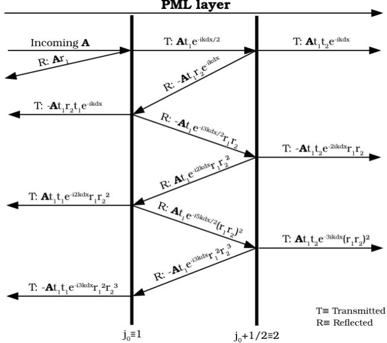

## Lawrence Berkeley National Laboratory LBL Publications

## Title

Efficiency of the Perfectly Matched Layer with High-OrderFinite Difference and Pseudo-Spectral Maxwell Solvers

## Permalink

https://escholarship.org/uc/item/49m2k3vj

## Authors

Lee, P.

Vay, J.-L.

## Publication Date

2015-01-31

# Efficiency of the Perfectly Matched Layer with High-Order Finite Difference and Pseudo-Spectral Maxwell Solvers

P. Lee1, a) and J.-L. Vay1

1BELLA/LOASIS Program, Lawrence Berkeley National Laboratory, Berkeley, CA, 94720, USA a)Corresponding author: pmlee@lbl.gov

Abstract. Open boundaries are essential in the modeling of many applications including laser plasma acceleration in a boosted frame, for which it has been shown that pseudo-spectral solvers (which can also be viewed as the limit of higher order FDTD methods when the order goes to infinity) bring higher stability and accuracy . When modeling the absorption of outgoing waves in simulations with open boundaries condition, Perfectly Matched Layers (PML) [1] are the state of the art and can be applied to the pseudo-spectral solvers. This paper will present results from the application of the PML to the absorption of waves with high order FDTD and pseudo-spectral solvers in 1D and 2D.

## INTRODUCTION

Particle-in-cell (PIC) has been the method of choice for the last fifty years for modeling plasmas that include kinetic effects. The most popular electromagnetic formulation uses finite difference discretization of Maxwell's equations in both space and time (FDTD) which produces fast solvers that scale well in parallel, but suffers from various anomalous numerical effects resulting from discretization, field staggering and numerical dispersion. The pseudo-spectral methods consist of one of the solutions to tackle these disadvantages. Besides, it is noted that the pseudo-spectral method can be viewed as the limit of finite-difference approximations when the order of accuracy tends to infinity [2], implying that the pseudo-spectral solvers improves the accuracy.

In 1973, Haber et al. presented a pseudo-spectral solver that integrates analytically the solution over a finite time step, under the assumption that the source is constant over that time step, however the difficulty for efficient parallelization owing to global communications associated with global FFTs on the entire computational domains has rendered it rarely used. Recently, Vay et al. proposed a method for the parallelization of electromagnetic pseudo-code solvers, enabling solvers combining the favorable parallel scaling of standard FDTD with the accuracy of pseudo-spectral methods [3] .

Haber's pseudo-spectral analytical time-domain (PSATD) particle in cell (PIC) algorithm has various advantages over the FDTD as it solves the vacuum Maxwell's equations exactly, has no Courant time-step limit, and offers substantial flexibility in plasma and particle beam simulations [4]. The more commonly used pseudo-spectral time-domain (PSTD) algorithm enjoys some of these same advantages but has a restrictive Courant limit.

When simulating wave-structure interactions, an open boundary condition is often required to close the system, in other words, to absorb the outgoing waves. In this case, various techniques have been used such as the one way approximation of the wave equation (initially exhibited for acoustic waves) by Engquist and Majda [5], or Berenger's more efficient Perfectly Matched Layer technique which consists in surrounding the computational domain with an absorbing medium whose impedance matches that of free-space. None of the free-space simulation techniques is exact, meaning that a wave can be absorbed without reflection in particular cases only for specific angles and wavelengths, usually for infinite wavelength with perpendicular incidence to the boundary.

The main focus of this article is the theoretical and numerical analysis of the PML in pseudo-spectral solvers. An implementation of the PML in a PSTD solver was given by Ohmura et al. [6], but the estimates of the coefficients of reflection with respect to wavelength and angle were not given. As noted above, the pseudo-spectral method can be viewed as the limit of finite-difference approximations when the order of accuracy tends to infinity [2]. Hence, our study extends the analysis from second order FDTD [7] to higher order, obtaining the results of the PSTD solver as the limit of the FDTD result when the order tends to infinity.

## PERFECTLY MATCHED LAYER (PML)

## Definition of the PML Medium

We consider the two-dimensional TE (transverse electric) mode in Cartesian coordinates for which the non-zero field components are $E _ { x } , E _ { y }$ and $B _ { z }$ . In a PML medium, the Maxwell's equations write

$$
\frac { \partial E _ { x } } { \partial t } + \sigma _ { x } E _ { x } = c ^ { 2 } \frac { \partial B _ { z } } { \partial y } ,
$$

$$
\frac { \partial E _ { y } } { \partial t } + \sigma _ { y } E _ { y }  &  = - c ^ { 2 } \frac { \partial B _ { z } } { \partial x } ,
$$

$$
\frac { \partial B _ { z x } } { \partial t } + \mathbf { \sigma } _ { x } ^ { * } B _ { z x }  &  = - \frac { \partial E _ { y } } { \partial x } ,\tag{1}
$$

$$
\frac { \partial B _ { z y } } { \partial t } + \mathrm { { \sigma } } _ { y } ^ { * } B _ { z y } = \frac { \partial E _ { x } } { \partial y } ,
$$

with $c$ the speed of light, ∂/ ∂ t the partial derivative in time, $\partial / \partial x$ and $\partial / \partial y$ the partial derivative in x- and y-directions respectively, $\left( \mathbf { \sigma } _ { \mathbf { \sigma } _ { x } , \mathbf { \sigma } _ { y } } \right)$ electric conductivities, $\left( \mathbf { { \sigma } } _ { \mathbf { { \sigma } } _ { x } } ^ { * } , \mathbf { { \sigma } } _ { \mathbf { { \sigma } } _ { y } } ^ { * } \right)$ magnetic conductivities and $B _ { z } = B _ { z x } + B _ { z y }$ This set of equation describes a medium that absorbs electromagnetic waves for finite values of the conductivities, but still has the impedance of vacuum, providing that the relations $\sigma _ { x } / \epsilon _ { 0 } = \sigma _ { x } ^ { * } / \mu _ { 0 }$ and $\mathbf { \sigma } _ { \mathbf { y } } / \epsilon _ { 0 } { = } \mathbf { \sigma } \mathbf { \sigma } _ { y } ^ { * } / \mu _ { 0 }$ hold.

Under these conditions, the PML absorbs perfectly the wave of any frequency coming at any angle at the infinitesimal limit. However, this property does not strictly holds for the discretized system which exhibits some reflection that depends on the wavelength and angle of incidence of the waves [7].

## Discretization of the PML

At second order, the wave equation in the PML medium (shown as in the set of equations 1) can be written in an explicit linear form [7] as follows

$$
\begin{array} { r c l } { E x _ { i + 1 / 2 , j } ^ { n + 1 } } & { = } & { \displaystyle \frac { 2 - \sigma _ { x } \Delta t } { 2 + \sigma _ { x } \Delta t } E x _ { i + 1 / 2 , j } ^ { n } + \frac { 2 \mathrm { c } ^ { 2 } } { 2 + \sigma _ { x } \Delta t } \frac { \Delta t } { \Delta y } \big ( B z _ { i + 1 / 2 , j + 1 / 2 } ^ { n + 1 / 2 } - B z _ { i + 1 / 2 , j - 1 / 2 } ^ { n + 1 / 2 } \big ) , } \end{array}
$$

$$
\begin{array} { r c l } { E y _ { i , j + 1 / 2 } ^ { n + 1 } } & { = } & { \frac { 2 - \sigma _ { y } \Delta t } { 2 + \sigma _ { y } \Delta t } E y _ { i , j + 1 / 2 } ^ { n } - \frac { 2 \mathrm { c } ^ { 2 } } { 2 + \sigma _ { y } \Delta t } \frac { \Delta t } { \Delta x } \big ( B z _ { i + 1 / 2 , j + 1 / 2 } ^ { n + 1 / 2 } - B z _ { i - 1 / 2 , j + 1 / 2 } ^ { n + 1 / 2 } \big ) , } \end{array}
$$

$$
B z x _ { i + 1 / 2 , j + 1 / 2 } ^ { n + 1 / 2 } = \frac { 2 - \mathrm { o } _ { x } ^ { * } \Delta t } { 2 + \mathrm { o } _ { x } ^ { * } \Delta t } B z x _ { i + 1 / 2 , j + 1 / 2 } ^ { n - 1 / 2 } - \frac { 2 } { 2 + \mathrm { o } _ { x } ^ { * } \Delta t } \frac { \Delta t } { \Delta x } \big ( E y _ { i + 1 , j + 1 / 2 } ^ { n } - E y _ { i , j + 1 / 2 } ^ { n } \big ) ,\tag{2}
$$

$$
\begin{array} { r l r } { B z y _ { i + 1 / 2 , j + 1 / 2 } ^ { n + 1 / 2 } } & { = } & { \frac { 2 - \sigma _ { y } ^ { * } \Delta t } { 2 + \sigma _ { y } ^ { * } \Delta t } B z y _ { i + 1 / 2 , j + 1 / 2 } ^ { n - 1 / 2 } + \frac { 2 } { 2 + \sigma _ { y } ^ { * } \Delta t } \frac { \Delta t } { \Delta y } \big ( E x _ { i + 1 / 2 , j + 1 } ^ { n } - E x _ { i + 1 / 2 , j } ^ { n } \big ) . } \end{array}
$$

Extension of these equations to higher order is straightforward [8].

## Application to Staggered-Grid Pseudo-Spectral Time-Domain (PSTD) Solvers

In the PSTD solvers, the Fourier transformation is used for the calculation of the spatial differentiations in k-space, while the Leapfrog time step is retained for the temporal differentiation. Following the notations given in [6], we have

$$
\begin{array} { r c l } { E x _ { i + 1 / 2 , j } ^ { n + 1 } } & { = } & { \displaystyle \frac { 2 - \sigma _ { x } \Delta t } { 2 + \sigma _ { x } \Delta t } E x _ { i + 1 / 2 , j } ^ { n } + \frac { 2 c ^ { 2 } } { 2 + \sigma _ { x } \Delta t } \frac { \Delta t } { \Delta y } [ F ^ { - 1 } i k _ { y } \exp ( - i k _ { y } \Delta y / 2 ) \big ( F B _ { z } \big ) ] _ { i + 1 / 2 , j } ^ { n + 1 / 2 } \mathrm { , } } \\ { E y _ { i , j + 1 / 2 } ^ { n + 1 } } & { = } & { \displaystyle \frac { 2 - \sigma _ { y } \Delta t } { 2 + \sigma _ { y } \Delta t } E y _ { i , j + 1 / 2 } ^ { n } - \frac { 2 c ^ { 2 } } { 2 + \sigma _ { y } \Delta t } \frac { \Delta t } { \Delta x } [ F ^ { - 1 } i k _ { x } \exp ( - i k _ { x } \Delta x / 2 ) \big ( F B _ { z } \big ) ] _ { i , j + 1 / 2 } ^ { n + 1 / 2 } \mathrm { , } } \\ { B z x _ { i + 1 / 2 , j + 1 / 2 } ^ { n + 1 / 2 } } & { = } & { \displaystyle \frac { 2 - \sigma _ { x } ^ { * } \Delta t } { 2 + \sigma _ { x } ^ { * } \Delta t } B z x _ { i + 1 / 2 , j + 1 / 2 } ^ { n - 1 / 2 } - \frac { 2 } { 2 + \sigma _ { x } ^ { * } \Delta t } \frac { \Delta t } { \Delta x } [ F ^ { - 1 } i k _ { x } \exp ( i k _ { x } \Delta x / 2 ) \big ( F E _ { y } \big ) ] _ { i + 1 / 2 , j + 1 / 2 } ^ { n } \mathrm { , } } \\ { B z y _ { i + 1 / 2 , j + 1 / 2 } ^ { n + 1 / 2 } } & { = } &  \displaystyle \frac { 2 - \sigma _ { y } ^ { * } \Delta t } { 2 + \sigma _ { y } ^ { * } \Delta t } B z y _ { i + 1 / 2 , j + 1 / 2 } ^ { n - 1 / 2 } + \displaystyle \frac { 2 }  2 + \sigma _  \end{array}\tag{3}
$$

where F and $F ^ { - 1 }$ are respectively the forward and inverse Fast Fourier transformations, $k _ { x }$ and $k _ { y }$ are the wavenumber in x- and y-directions. The terms $\exp \left( - i k _ { x } \Delta x / 2 \right)$ and $\exp \left( { - i k _ { y } \Delta y / 2 } \right)$ represent the shifts in x- and y-directions on the staggered grid.

## REFLECTION OF A PLANE WAVE STRIKING A PML

For clarity, the derivation of the coefficients of reflection is presented in one dimension only. The same method applies to the derivation of the coefficients of reflection at higher dimension. Following [7], the coefficient of reflection of a 1D plane wave propagating in the x-direction perpendicularly to the interface of the PML can be computed with some analogy to the interferometer of Fabry-Perot, by integrating over the multiple transmission t and reflection r of rays between two rows of the grid (two plates in the interferometer).

The coefficient of reflection for the entire layer is computed by summation of the coefficients of reflection of the successive layer slices (locations i , i+1 /2 , i +1, i+3 / 2 ... ).

## Coefficient of Reflection of the Entire PML Layer

Following the procedure given in [7] , we consider a PML layer from $j _ { 0 }$ to $j _ { 0 } + N _ { L }$ , where $N _ { L }$ is the depth of the PML layer in number of nodes. The knowledge of the coefficients of reflection and transmission of two consecutive slices (details of the derivation of the analytical calculation with extension to any order FDTD scheme are given in [8]), say slices at $j _ { 0 } { + } N _ { L } { - } 1 / 2$ and $j _ { 0 } + N _ { L }$ allows us to calculate the coefficient of reflection $R _ { j _ { 0 } + N _ { L } - 1 / 2 }$ of the two consecutive slices taken together. Fig. 1 illustrates that multiple reflections and transmissions of the wave need to be taken into account between the two slices. Their integration results in the following formula (valid at any order and dimension)

$$
R _ { j } { = } r _ { j } { - } \frac { t _ { j } R _ { j + 1 / 2 } t _ { j } { \exp ( - i k \Delta x ) } } { 1 { + } r _ { j } R _ { j + 1 / 2 } { \exp ( - i k \Delta x ) } } ,\tag{4}
$$

that is iterated recursively from $j = j _ { 0 } + N _ { L }$ to $j = j _ { 0 }$ to get the coefficient of the entire layer.

PML layer  
  
FIGURE 1: Successive reflections and transmissions of a plane wave between two consecutive row of grid slices.

## RESULTS

In this section, we compare the coefficient of reflection from a PML for the FDTD solver at orders 2 to 128 and the PSTD solver, as a function of wavelength and angle. Following [1], we define, for a grid cell of width $\Delta x$ $\sigma _ { i } { = } \sigma _ { m a x } ( i \Delta x / \delta ) ^ { n }$ , with $i \in [ 1 , N _ { L } ]$ where $N _ { L }$ is the depth of the PML layer (in number of nodes), $\sigma _ { m a x } = 4 / \Delta x$ $\delta = 5 \Delta x$ and $n = 2$

  
FIGURE 2: Coefficient of reflection with respect to the normalized wavelengths of a plane wave striking a PML at normal incidence (lines: analytical integration; markers: numerical simulations).

Fig. 2 presents the coefficient of reflection of a plane wave that is striking a PML layer at normal incidence, as a function of wavelengths. We observe a good agreement between the analytical calculation (represented by solid lines) and the numerical results (represented by markers). The extension to higher order conserves the efficiency of the PML layer and improves it at short wavelengths. As expected the coefficients of reflection obtained with the PSTD solvers are very close to the ones of the FDTD solver at very high order.

  
FIGURE 3: Coefficient of reflection of a plane wave with respect to its angle of incidence with the PML layer, for a normalized wavelength (lines: analytical integration; markers: numerical simulations).

Fig. 3 shows the coefficient of reflection of a plane wave with respect to the angle of incidence ϕ for a given wavelength, exhibiting a good agreement between the analytical calculation (solid lines) and the numerical results (markers). The coefficient of reflection decreases at higher order and higher angle of incidence. Tests on other wavelengths show the same tendency [8].

## CONCLUSION

Analysis of the coefficient of reflection of a PML layer has been extended to any order for the FDTD formulation of Maxwell's equations, and to its limit at infinite order, hence giving the coefficient for a PML layer applied with a PSTD solver. Results from the analysis, confirmed from numerical simulations, show that the efficiency of absorption of the layer is improved at higher order (including at the PSTD infinite order limit) at most wavelengths and angles .

## ACKNOWLEDGMENTS

We sincerely thank David Grote's support with the code Warp, as well as Irv Haber, Brendan Godfrey, Eric Esarey and Wim Leemans for insightful discussions. This work is supported by US-DOE Contracts DE-AC02-05CH11231.

## REFERENCES

[1] Berenger, J.-P. (1994). A perfectly matched layer for the absorption of electromagnetic waves , Journal of Computational Physics 114 : 185 - 200.

[2] Fornberg, B. (1987). The pseudospectral method; comparisons with finite differences for the elastic wave equation, Geophysics 52 : 483-501.

[3] Vay, J.-L.; Haber, I. and Godfrey, B. B. (2013). A domain decomposition method for pseudo-spectral electromagnetic simulations of plasmas , Journal of Computational Physics 243 : 260 - 268.

[4] Godfrey, B. B.; Vay, J.-L. and Haber, I. (2014). Numerical stability analysis of the pseudo-spectral analytical time-domain PIC algorithm , Journal of Computational Physics 258 : 689 - 704.

[5] Engquist, B. and Majda, A. (1977). Absorbing Boundary Conditions for the Numerical Simulation of Waves, Mathematics of Computation 31 : pp. 629-651.

[6] Ohmura, Y. and Okamura, Y. (2010). Staggered Grid Pseudo-spectral Time-domain Method for Light Scattering Analysis, PIERS Online 6 : 632-635.

[7] Vay, J.-L. (2002). Asymmetric Perfectly Matched Layer for the Absorption of Waves , Journal of Computational Physics 183 : 367 - 399.

[8] Lee, P. and Vay, J.-L. (2014). Efficiency of the Perfectly Matched Layer with High-Order Finite Difference and Pseudo-Spectral Maxwell Solvers (in preparation).

This document was prepared as an account of work sponsored by the United States Government. While this document is believed to contain correct information, neither the United States Government nor any agency thereof, nor The Regents of the University of California, nor any of their employees, makes any warranty, express or implied, or assumes any legal responsibility for the accuracy, completeness, or usefulness of any information, apparatus, product, or process disclosed, or represents that its use would not infringe privately owned rights. Reference herein to any specific commercial product, process, or service by its trade name, trademark, manufacturer, or otherwise, does not necessarily constitute or imply its endorsement, recommendation, or favoring by the United States Government or any agency thereof, or The Regents of the University of California. The views and opinions of authors expressed herein do not necessarily state or reflect those of the United States Government or any agency thereof or The Regents of the University of California.